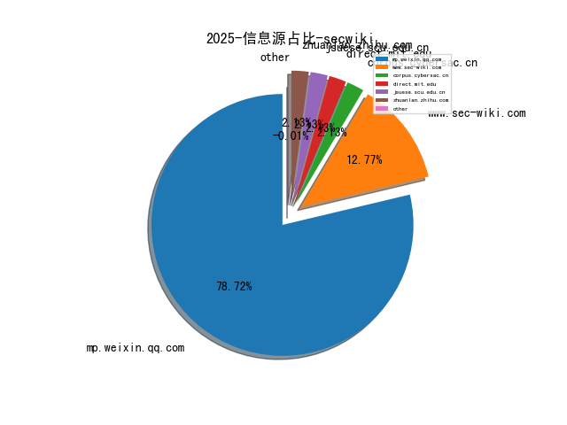
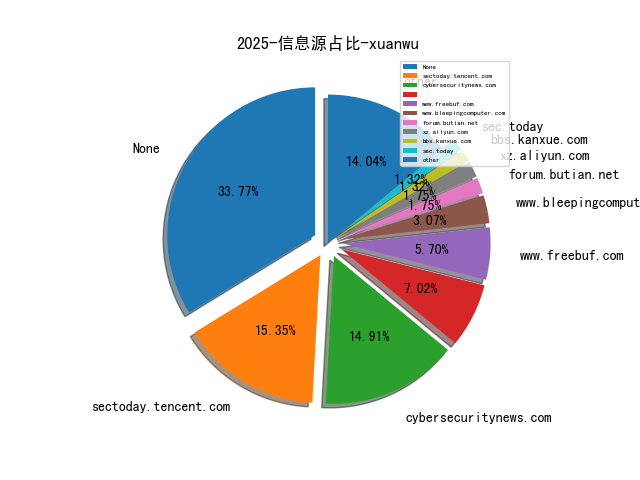
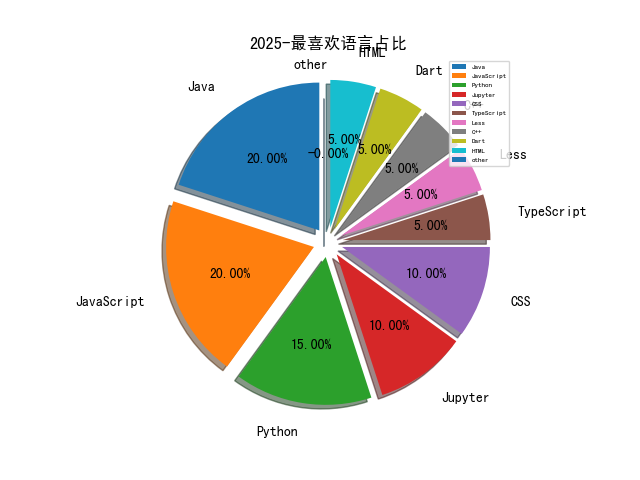

# [数据--所有](README_20.md)
# [数据--年度](README_2025.md)
# 2025 信息源与信息类型占比

# 政策 推荐
| title | url| 
| --- | ---| 
| 国家信息化发展报告（2024年） | https://www.cac.gov.cn/cms/pub/interact/downloadfile.jsp?filepath=ZBWvETi1XzcBKtOIkqelkNXiKOSmKHImQfc7M%7E8F409/qlbOINLFyRqyDFVcZ8nc4vIrD1u%7EKK%7EM7PQy8LU8QTEjTcORl73kmCTdYOvdSjs=&fText=%E5%9B%BD%E5%AE%B6%E4%BF%A1%E6%81%AF%E5%8C%96%E5%8F%91%E5%B1%95| 
| 国家自然科学基金委员会2024年度报告 | https://www.nsfc.gov.cn/publish/portal0/ndbg/2024ndbg/qy/| 
| 网信部门行政处罚裁量权基准适用规定（征求意见稿） | https://www.cac.gov.cn/2025-05/30/c_1750315544142395.htm| 
| 中国人民银行业务领域数据安全管理办法 | http://www.pbc.gov.cn/tiaofasi/144941/144957/5702602/index.html| 

# 网络安全书籍 推荐
| date_added | language | title | author | link | size| 
| --- | --- | --- | --- | --- | ---| 
| 2025-08-16 19:40:09 | English | Reverse Engineering Armv8-A Systems | unknown | https://www.wowebook.org/reverse-engineering-armv8-a-systems/ | unknown| 
| 2025-08-16 19:09:18 | English | Ultimate Penetration Testing with Nmap | unknown | https://www.wowebook.org/ultimate-penetration-testing-with-nmap/ | unknown| 
| 2025-08-14 18:49:33 | English | Mastering Large Language Models with Python | unknown | https://www.wowebook.org/mastering-large-language-models-with-python/ | unknown| 
| 2025-08-14 18:11:08 | English | Ultimate ChatGPT Handbook for Enterprises | unknown | https://www.wowebook.org/ultimate-chatgpt-handbook-for-enterprises/ | unknown| 
| 2025-08-12 10:33:35 | English | Generative AI for Agile & Scrum Teams (Video Course) | unknown | https://www.wowebook.org/generative-ai-for-agile-scrum-teams-video-course/ | unknown| 
| 2025-08-12 09:51:02 | English | Refactoring to Rust, Video Edition | unknown | https://www.wowebook.org/refactoring-to-rust-video-edition/ | unknown| 
| 2025-08-10 15:09:28 | English | Ultimate Neural Network Programming with Python | unknown | https://www.wowebook.org/ultimate-neural-network-programming-with-python/ | unknown| 
| 2025-08-10 13:47:42 | English | Ultimate Python Libraries for Data Analysis and Visualization | unknown | https://www.wowebook.org/ultimate-python-libraries-for-data-analysis-and-visualization/ | unknown| 
| 2025-08-10 09:44:15 | English | Modern App Deployment with Azure Kubernetes | unknown | https://www.wowebook.org/modern-app-deployment-with-azure-kubernetes/ | unknown| 
| 2025-08-08 04:59:02 | English | Practical Java Programming with ChatGPT | unknown | https://www.wowebook.org/practical-java-programming-with-chatgpt/ | unknown| 
| 2025-08-05 20:50:42 | English | Data Engineering for Cybersecurity | unknown | https://www.wowebook.org/data-engineering-for-cybersecurity/ | unknown| 
| 2025-08-04 09:01:56 | English | Microsoft 365 Excel All-in-One For Dummies | unknown | https://www.wowebook.org/microsoft-365-excel-all-in-one-for-dummies/ | unknown| 
| 2025-08-01 10:04:14 | English | Microsoft Fabric Analytics Engineer Associate Certification Companion | unknown | https://www.wowebook.org/microsoft-fabric-analytics-engineer-associate-certification-companion/ | unknown| 
| 2025-08-01 10:30:09 | English | Python Bootcamp | unknown | https://www.wowebook.org/python-bootcamp/ | unknown| 
| 2025-07-30 10:12:05 | English | CompTIA SecurityX CAS-005 Certification Guide, 2nd Edition | unknown | https://www.wowebook.org/comptia-securityx-cas-005-certification-guide-2nd-edition/ | unknown| 
| 2025-07-29 11:36:09 | English | How Large Language Models Work, Video Edition | unknown | https://www.wowebook.org/how-large-language-models-work-video-edition/ | unknown| 
| 2025-07-28 17:10:56 | English | Master and Build Large Language Models | unknown | https://www.wowebook.org/master-and-build-large-language-models/ | unknown| 
| 2025-07-26 15:26:08 | English | Building Business-Ready Generative AI Systems | unknown | https://www.wowebook.org/building-business-ready-generative-ai-systems/ | unknown| 
| 2025-07-26 14:56:16 | English | Microsoft Security Copilot | unknown | https://www.wowebook.org/microsoft-security-copilot/ | unknown| 
| 2025-07-26 16:30:31 | English | Data-Driven Cybersecurity | unknown | https://www.wowebook.org/data-driven-cybersecurity/ | unknown| 
| 2025-07-25 19:05:54 | English | Mastering Time Series Analysis and Forecasting with Python | unknown | https://www.wowebook.org/mastering-time-series-analysis-and-forecasting-with-python/ | unknown| 
| 2025-07-22 10:37:33 | English | Gamestorming 2.0: An Updated Playbook for Innovators, Rule Breakers, and Changemakers | unknown | https://www.wowebook.org/gamestorming-2-0-an-updated-playbook-for-innovators-rule-breakers-and-changemakers/ | unknown| 
| 2025-07-22 09:40:25 | English | Certified Kubernetes Administrator Study Companion | unknown | https://www.wowebook.org/certified-kubernetes-administrator-study-companion/ | unknown| 
| 2025-07-22 19:11:38 | English | LangChain for Life Sciences and Healthcare | unknown | https://www.wowebook.org/langchain-for-life-sciences-and-healthcare/ | unknown| 
| 2025-07-19 19:51:39 | English | Generative AI for Software Development | unknown | https://www.wowebook.org/generative-ai-for-software-development/ | unknown| 
| 2025-07-17 09:18:15 | English | Privileged Access Management | unknown | https://www.wowebook.org/privileged-access-management/ | unknown| 
| 2025-07-16 20:51:40 | English | Building AI Agents with LLMs, RAG, and Knowledge Graphs | unknown | https://www.wowebook.org/building-ai-agents-with-llms-rag-and-knowledge-graphs/ | unknown| 
| 2025-07-15 08:50:38 | English | A Practical Guide to Generative AI Using Amazon Bedrock | unknown | https://www.wowebook.org/a-practical-guide-to-generative-ai-using-amazon-bedrock/ | unknown| 
| 2025-07-15 11:07:47 | English | LLMOps: Managing Large Language Models in Production | unknown | https://www.wowebook.org/llmops-managing-large-language-models-in-production/ | unknown| 
| 2025-07-15 11:37:02 | English | Learning GitHub Copilot | unknown | https://www.wowebook.org/learning-github-copilot/ | unknown| 
| 2025-07-12 13:12:49 | English | Certified Ethical Hacker (CEH) Study Guide | unknown | https://www.wowebook.org/certified-ethical-hacker-ceh-study-guide/ | unknown| 
| 2025-07-12 09:31:42 | English | Elliptic Curve Cryptography for Developers, Video Edition | unknown | https://www.wowebook.org/elliptic-curve-cryptography-for-developers-video-edition/ | unknown| 
| 2025-07-09 20:22:12 | English | Building Quantum Software with Python, Video Edition | unknown | https://www.wowebook.org/building-quantum-software-with-python-video-edition/ | unknown| 
| 2025-07-07 19:07:16 | English | Observability Engineering with Cilium | unknown | https://www.wowebook.org/observability-engineering-with-cilium/ | unknown| 
| 2025-07-07 18:46:01 | English | Microsoft Project Essentials | unknown | https://www.wowebook.org/microsoft-project-essentials/ | unknown| 
| 2025-07-07 18:23:17 | English | Hacking Cryptography, Video Edition | unknown | https://www.wowebook.org/hacking-cryptography-video-edition/ | unknown| 
| 2025-07-04 15:11:45 | English | Mastering Microsoft 365 Security Technologies | unknown | https://www.wowebook.org/mastering-microsoft-365-security-technologies/ | unknown| 
| 2025-07-04 13:53:56 | English | CompTIA Cloud+ Certification Guide (Exam CV0-003) | unknown | https://www.wowebook.org/comptia-cloud-certification-guide-exam-cv0-003/ | unknown| 
| 2025-07-04 13:46:09 | English | CompTIA Server+ Certification | unknown | https://www.wowebook.org/comptia-server-certification/ | unknown| 
| 2025-07-04 13:32:12 | English | CompTIA CASP+ (CAS-005) Certification Guide, 2nd Edition | unknown | https://www.wowebook.org/comptia-casp-cas-005-certification-guide-2nd-edition/ | unknown| 
| 2025-07-04 17:39:17 | English | Microsoft 365 Security and Compliance for Administrators | unknown | https://www.wowebook.org/microsoft-365-security-and-compliance-for-administrators/ | unknown| 
| 2025-07-04 17:23:04 | English | Mastering CyberSecurity Defense | unknown | https://www.wowebook.org/mastering-cybersecurity-defense/ | unknown| 
| 2025-07-02 17:33:52 | English | Intermediate Python and Large Language Models | unknown | https://www.wowebook.org/intermediate-python-and-large-language-models/ | unknown| 
| 2025-07-02 17:16:04 | English | NoOps: How AI Agents Are Reinventing DevOps and Software | unknown | https://www.wowebook.org/noops-how-ai-agents-are-reinventing-devops-and-software/ | unknown| 
| 2025-07-02 16:13:07 | English | Refactoring to Rust | unknown | https://www.wowebook.org/refactoring-to-rust/ | unknown| 
| 2025-07-01 20:26:01 | English | Learning Kubernetes Security, 2nd Edition | unknown | https://www.wowebook.org/learning-kubernetes-security-2nd-edition/ | unknown| 
| 2025-07-01 18:19:25 | English | Generative AI with LangChain | unknown | https://www.wowebook.org/generative-ai-with-langchain-bpb/ | unknown| 
| 2025-06-30 13:34:24 | English | Microsoft Defender for Endpoint | unknown | https://www.wowebook.org/microsoft-defender-for-endpoint/ | unknown| 
| 2025-06-30 16:46:23 | English | Python Simplified with Generative AI | unknown | https://www.wowebook.org/python-simplified-with-generative-ai/ | unknown| 
| 2025-06-28 11:02:06 | English | Generative AI for Healthcare | unknown | https://www.wowebook.org/generative-ai-for-healthcare/ | unknown| 
| 2025-06-28 16:12:17 | English | Getting Started with Google Kubernetes Engine | unknown | https://www.wowebook.org/getting-started-with-google-kubernetes-engine/ | unknown| 
| 2025-06-23 10:59:33 | English | Rust Programming: A Practical Guide to Fast, Efficient, and Safe Code with Ownership, Concurrency, and Web Programming | unknown | https://www.wowebook.org/rust-programming-a-practical-guide-to-fast-efficient-and-safe-code-with-ownership-concurrency-and-web-programming/ | unknown| 
| 2025-06-23 10:47:52 | English | Generative AI with Python | unknown | https://www.wowebook.org/generative-ai-with-python/ | unknown| 
| 2025-06-23 10:26:04 | English | Programming Neural Networks with Python | unknown | https://www.wowebook.org/programming-neural-networks-with-python/ | unknown| 
| 2025-06-22 14:35:13 | English | The Quick Python Book, Fourth Edition, Video Edition | unknown | https://www.wowebook.org/the-quick-python-book-fourth-edition-video-edition/ | unknown| 
| 2025-06-20 19:02:00 | English | How Large Language Models Work | unknown | https://www.wowebook.org/how-large-language-models-work/ | unknown| 
| 2025-06-18 09:01:40 | English | Building Generative AI Applications with Open-source Libraries | unknown | https://www.wowebook.org/building-generative-ai-applications-with-open-source-libraries/ | unknown| 
| 2025-06-18 08:21:14 | English | Social Engineering Cookbook | unknown | https://www.wowebook.org/social-engineering-cookbook/ | unknown| 
| 2025-06-17 08:57:02 | English | Using Microsoft 365 Copilot AI | unknown | https://www.wowebook.org/using-microsoft-365-copilot-ai/ | unknown| 
| 2025-06-17 08:30:37 | English | Mastering Advanced Excel – With ChatGPT Integration | unknown | https://www.wowebook.org/mastering-advanced-excel-with-chatgpt-integration/ | unknown| 
| 2025-06-17 16:06:06 | English | Python for DevOps | unknown | https://www.wowebook.org/python-for-devops/ | unknown| 
| 2025-06-12 07:46:29 | English | Cyber Security Kill Chain – Tactics and Strategies | unknown | https://www.wowebook.org/cyber-security-kill-chain-tactics-and-strategies/ | unknown| 
| 2025-06-12 06:34:10 | English | Kubernetes for Generative AI Solutions | unknown | https://www.wowebook.org/kubernetes-for-generative-ai-solutions/ | unknown| 
| 2025-06-11 10:58:37 | English | Red Hat Certified Engineer (RHCE) Ansible Automation Study Guide | unknown | https://www.wowebook.org/red-hat-certified-engineer-rhce-ansible-automation-study-guide/ | unknown| 
| 2025-06-11 08:51:49 | English | Microsoft Power Automate Cookbook | unknown | https://www.wowebook.org/microsoft-power-automate-cookbook/ | unknown| 
| 2025-06-04 08:21:23 | English | Unlocking Python: A Comprehensive Guide for Beginners | unknown | https://www.wowebook.org/unlocking-python-a-comprehensive-guide-for-beginners/ | unknown| 
| 2025-06-03 12:44:26 | English | Mastering Palo Alto Networks, 3rd Edition | unknown | https://www.wowebook.org/mastering-palo-alto-networks-3rd-edition/ | unknown| 
| 2025-06-01 07:17:49 | English | Generative AI for Cloud Solutions | unknown | https://www.wowebook.org/generative-ai-for-cloud-solutions/ | unknown| 
| 2025-06-01 19:06:41 | English | Python GPT Cookbook | unknown | https://www.wowebook.org/python-gpt-cookbook/ | unknown| 
| 2025-06-01 07:40:56 | English | DevOps for Java Developers | unknown | https://www.wowebook.org/devops-for-java-developers/ | unknown| 
| 2025-05-26 17:23:00 | English | Generative AI with LangChain, 2nd Edition | unknown | https://www.wowebook.org/generative-ai-with-langchain-2nd-edition/ | unknown| 
| 2025-05-26 11:33:11 | English | Building Generative AI Agents | unknown | https://www.wowebook.org/building-generative-ai-agents/ | unknown| 
| 2025-05-23 16:35:59 | English | Ultimate Splunk for Cybersecurity | unknown | https://www.wowebook.org/ultimate-splunk-for-cybersecurity/ | unknown| 
| 2025-05-23 19:31:56 | English | Ultimate Rust for Systems Programming | unknown | https://www.wowebook.org/ultimate-rust-for-systems-programming/ | unknown| 
| 2025-05-22 06:18:50 | English | Scaling Enterprise Solutions with Large Language Models | unknown | https://www.wowebook.org/scaling-enterprise-solutions-with-large-language-models/ | unknown| 
| 2025-05-22 08:27:59 | English | Fundamentals of DevOps and Software Delivery | unknown | https://www.wowebook.org/fundamentals-of-devops-and-software-delivery/ | unknown| 
| 2025-05-21 08:54:50 | English | Attack Surface Management | unknown | https://www.wowebook.org/attack-surface-management/ | unknown| 
| 2025-05-20 08:18:15 | English | Ultimate Django for Web App Development Using Python | unknown | https://www.wowebook.org/ultimate-django-for-web-app-development-using-python/ | unknown| 
| 2025-05-20 07:16:55 | English | Ultimate Python for Fintech Solutions | unknown | https://www.wowebook.org/ultimate-python-for-fintech-solutions/ | unknown| 
| 2025-05-20 07:05:32 | English | Ultimate Enterprise Data Analysis and Forecasting using Python | unknown | https://www.wowebook.org/ultimate-enterprise-data-analysis-and-forecasting-using-python/ | unknown| 
| 2025-05-20 06:54:45 | English | Graph Data Science with Python and Neo4j | unknown | https://www.wowebook.org/graph-data-science-with-python-and-neo4j/ | unknown| 
| 2025-05-20 06:38:43 | English | Infrastructure Attack Strategies for Ethical Hacking | unknown | https://www.wowebook.org/infrastructure-attack-strategies-for-ethical-hacking/ | unknown| 
| 2025-05-19 08:37:10 | English | Introduction to Large Language Models (LLMs) and Prompt Engineering (Video Course), 2nd Edition | unknown | https://www.wowebook.org/introduction-to-large-language-models-llms-and-prompt-engineering-video-course-2nd-edition/ | unknown| 
| 2025-05-19 07:22:50 | English | CompTIA A+ Core 1 (220-1201) (Video Course) | unknown | https://www.wowebook.org/comptia-a-core-1-220-1201-video-course/ | unknown| 
| 2025-05-16 08:37:12 | English | Interpretability and Explainability in AI Using Python | unknown | https://www.wowebook.org/interpretability-and-explainability-in-ai-using-python/ | unknown| 
| 2025-05-13 11:25:44 | English | Ansible: From Basics to Guru, 2nd Edition (Video Course) | unknown | https://www.wowebook.org/ansible-from-basics-to-guru-2nd-edition-video-course/ | unknown| 
| 2025-05-11 22:33:34 | English | Java for Programmers: with Generative AI, 5th Edition | unknown | https://www.wowebook.org/java-for-programmers-with-generative-ai-5th-edition/ | unknown| 
| 2025-05-11 21:30:28 | English | DevSecOps in Oracle Cloud: Securing and Automating Oracle Cloud Infrastructure | unknown | https://www.wowebook.org/devsecops-in-oracle-cloud-securing-and-automating-oracle-cloud-infrastructure/ | unknown| 
| 2025-05-07 08:21:54 | English | Generative AI with Kubernetes | unknown | https://www.wowebook.org/generative-ai-with-kubernetes/ | unknown| 
| 2025-05-07 08:04:50 | English | Mastering DevOps in Kubernetes | unknown | https://www.wowebook.org/mastering-devops-in-kubernetes/ | unknown| 
| 2025-05-07 21:16:02 | English | Hacking Cryptography | unknown | https://www.wowebook.org/hacking-cryptography/ | unknown| 
| 2025-05-07 06:35:44 | English | Hacking Cryptography: Write, break, and fix real-world implementations | Kamran Khan and Bill Cox | http://libgen.is/book/index.php?md5=451D7FBC6E2399DE00CF759A39ABC464 | 16 MB [EPUB]| 
| 2025-05-06 17:36:54 | English | High Performance Python, 3rd Edition | unknown | https://www.wowebook.org/high-performance-python-3rd-edition/ | unknown| 
| 2025-05-06 16:11:48 | English | CompTIA CySA+ (CS0-003) Certification Guide | unknown | https://www.wowebook.org/comptia-cysa-cs0-003-certification-guide/ | unknown| 
| 2025-05-06 08:51:21 | English | Cloud Security Handbook, 2nd Edition | unknown | https://www.wowebook.org/cloud-security-handbook-2nd-edition/ | unknown| 
| 2025-05-05 03:02:33 | English | Sex Is a Spectrum: The Biological Limits of the Binary | Agustín Fuentes | http://libgen.is/book/index.php?md5=B5BE65F25BC6F7EAA0198CE2CE65AB00 | 1 MB [PDF]| 
| 2025-05-04 21:44:28 | English | Creating ChatGPT Apps with JavaScript: A Hands-on Guide for AI Applications with OpenAI APIs | Bruce Hopkins Jr. | http://libgen.is/book/index.php?md5=9274EF5426AAD4863E8072BA8D689E57 | 5 MB [PDF]| 
| 2025-05-04 21:40:18 | English | Mastering DevOps in Kubernetes | Soumiyajit Das Chowdhury | http://libgen.is/book/index.php?md5=2F99826C2E550B5F64D0AC9C63CDCBB5 | 72 MB [PDF]| 
| 2025-05-04 21:39:16 | English | Creating ChatGPT Apps with JavaScript : A Hands-on Guide for AI Applications with OpenAI APIs | Bruce Hopkins Jr.; Bruce Hopkins Sr. | http://libgen.is/book/index.php?md5=7EB9C5BFD0219906E5AA12637ED9CA4E | 3 MB [EPUB]| 
| 2025-05-04 21:38:10 | English | The Professional : A Playbook to Unleash Your Potential and Futureproof Your Success | Tony Frost | http://libgen.is/book/index.php?md5=E107EADC43D1C3F3B41520EDBEFE9330 | 653 kB [EPUB]| 
| 2025-05-03 21:14:45 | English | Linux Basics for Hackers, 2nd Edition | unknown | https://www.wowebook.org/linux-basics-for-hackers-2nd-edition/ | unknown| 
| 2025-04-30 19:11:06 | English | Architecting Power BI Solutions in Microsoft Fabric | unknown | https://www.wowebook.org/architecting-power-bi-solutions-in-microsoft-fabric/ | unknown| 
| 2025-04-29 14:58:36 | English | Implementing DevOps with Ansible 2 | Jonathan McAllister | http://libgen.is/book/index.php?md5=3E3FCDD9295D19C8B1BF640C5BE15DDA | 16 MB [MOBI]| 
| 2025-04-28 12:05:19 | English | AI-Assisted Coding: A Practical Guide to Boosting Software Development with ChatGPT, GitHub Copilot, Ollama, Aider, and Beyond | unknown | https://www.wowebook.org/ai-assisted-coding-a-practical-guide-to-boosting-software-development-with-chatgpt-github-copilot-ollama-aider-and-beyond/ | unknown| 
| 2025-04-26 08:42:17 | English | The Kubernetes Book, 2025 Edition | unknown | https://www.wowebook.org/the-kubernetes-book-2025-edition/ | unknown| 
| 2025-04-26 07:44:38 | English | Quick Start Kubernetes, 2025 Edition | unknown | https://www.wowebook.org/quick-start-kubernetes-2025-edition/ | unknown| 
| 2025-04-26 11:54:34 | English | Circular Supply Chain Management: A Sustainability Approach | Jayakrishna Kandasamy , Vimal Kek , Manavalan Ethirajan , Nishal Murali | http://libgen.is/book/index.php?md5=CEEA8CD83BEBDF50F99E688E0859E493 | 9 MB [PDF]| 
| 2025-04-26 11:34:41 | English | The impact of supply chain digitalization on supply chain performance: a moderated mediation model | Shaobo Wei, Hua Liu, Wanying Xu, Xiayu Chen | http://libgen.is/book/index.php?md5=F4EE47A19FDF3F1A9521C462C9FE5406 | 779 kB [PDF]| 
| 2025-04-26 10:41:12 | English | Microsoft Identity and Access Administrator SC-300 Exam Guide, 2nd Edition | unknown | https://www.wowebook.org/microsoft-identity-and-access-administrator-sc-300-exam-guide-2nd-edition/ | unknown| 
| 2025-04-25 14:30:09 | English | Windows 10: 2020 Complete Beginners Guide to Learn Microsoft Windows 10 . Take Control of Your PC | Daane, Ben | http://libgen.is/book/index.php?md5=60C4235C8DBA9E6FB200DAF6C4D1DCEA | 6 MB [EPUB]| 
| 2025-04-25 14:19:57 | English | Attack on Orleans | Jake Klim | http://libgen.is/book/index.php?md5=4A195F206B57932FE7A04D4647B9BCC3 | 4 MB [EPUB]| 
| 2025-04-25 20:32:53 | English | Practical Generative AI with ChatGPT, 2nd Edition | unknown | https://www.wowebook.org/practical-generative-ai-with-chatgpt-2nd-edition/ | unknown| 
| 2025-04-24 12:47:40 | English | Machine Learning With Python: Hands on Machine Learning with Python Tools, Concept And Techniques | ANSARI, HASANRAZA | http://libgen.is/book/index.php?md5=97DBD8F7390A00E4C25CC6A1F4182C92 | 801 kB [AZW]| 
| 2025-04-24 12:46:37 | English | Python My Bestie: an easy and efficient way to learn python (kmranrg) | Anurag, Er. Kumar | http://libgen.is/book/index.php?md5=5CCDAEC60B990C16B93769AB95088E9B | 1001 kB [AZW]| 
| 2025-04-24 12:42:23 | English | Python All-in-One For Dummies | John C. Shovic; Alan Simpson | http://libgen.is/book/index.php?md5=D1343CEC6878E4B1C6140B3100239306 | 15 MB [AZW]| 
| 2025-04-23 12:15:42 | English | WINDOWS 10 FOR SENIORS 2020/2021: The Complete Microsoft Windows 10 Guide for Senior Technophobe with Latest Shortcuts, Tips & Tricks | Jordan, James | http://libgen.is/book/index.php?md5=C063DEAACC8B4B75D1EACB2DCFDEA617 | 2 MB [AZW]| 
| 2025-04-23 12:08:01 | English | Learning in Python: Study Data Science and Machine Learning including Modern Neural Networks produced in Python, Theano, and TensorFlow | K, K.M. | http://libgen.is/book/index.php?md5=925B26EB6DC0F201A4E9BB7E59EFBD10 | 483 kB [AZW]| 
| 2025-04-23 20:19:10 | English | The Comprehensive Guide to Cybersecurity Careers | Jason Edwards | http://libgen.is/book/index.php?md5=9BFEB9EEC5402CA0E7CDF9E6E1CD71C4 | 3 MB [EPUB]| 
| 2025-04-23 20:18:15 | English | Guide to Distributed Algorithms: Design, Analysis and Implementation Using Python | K. Erciyes | http://libgen.is/book/index.php?md5=E2D5403FF807A674086A6C8584BD6EBF | 53 MB [EPUB]| 
| 2025-04-22 12:09:54 | English | Command-Line Rust: A Project-Based Primer for Writing Rust CLIs | Ken Youens-Clark | http://libgen.is/book/index.php?md5=187FD2C3D6D726B8AB8ED59A969559EA | 2 MB [AZW]| 
| 2025-04-22 12:07:37 | English | WINDOWS 10 MADE SIMPLE: A Beginner To Expert Guide On Microsoft Windows 10 With Step-By-Step Visual Illustrations | Mince, Andy | http://libgen.is/book/index.php?md5=13EAAAECA832FB4D4368BA91BE18B124 | 7 MB [AZW]| 
| 2025-04-21 11:43:12 | English | Chaos Engineering with Python : Python-powered techniques for building resilent systems through chaos engineering | Mandeep Ubhi, | http://libgen.is/book/index.php?md5=7873778CD94E90CA836BC5A22210D455 | 7 MB [EPUB]| 
| 2025-04-21 11:30:24 | English | (EXPERT INSIGHTS) Building Agentic AI Systems: Create Intelligent, Autonomous AI Agents That Can Reason, Plan, and Adapt | Anjanava Biswas, Wrick Talukdar | http://libgen.is/book/index.php?md5=11345CBB546526214F62B4FA441DB11E | 8 MB [EPUB]| 
| 2025-04-21 09:54:15 | English | (Law, Society, Policy) Vulnerability Theory and the Trinity Lectures: Institutionalizing the Individual | Martha Albertson Fineman | http://libgen.is/book/index.php?md5=AB7C68EA7385BE13D66F0D417A7C9AF3 | 6 MB [PDF]| 
| 2025-04-21 20:56:00 | English | Emerging Trends in Information System Security Using AI & Data Science for Next-Generation Cyber Analytics | Faisal Rehman; Inam Ullah Khan; Oroos Arshi; Shashi Kant Gupta | http://libgen.is/book/index.php?md5=F8C47B27F38485A692FACDC9B707B81E | 23 MB [EPUB]| 
| 2025-04-21 20:45:28 | English | Efficient Analog Integrated Circuit Sizing with GenAI : Exploring Generative Diffusion Models | Pedro H. M. Eid; Filipe P. Azevedo; Nuno C. C. Lourenço; Ricardo M. F. Martins | http://libgen.is/book/index.php?md5=E1B46634B4743C5DB2980E9365F80790 | 13 MB [EPUB]| 
| 2025-04-21 18:34:15 | English | Kubernetes and Cloud Native Associate (KCNA) Exam Guide: KCNA concepts featuring orchestration, architecture, observability | Sangram v | http://libgen.is/book/index.php?md5=CE02C81F91C0EA4FEB09A539041EF754 | 9 MB [EPUB]| 
| 2025-04-21 18:05:16 | English | ETHICAL HACKING FOR BEGGINERS: A Comprehensive Beginners Guide to Learn About the Effective And Concept Strategies of Ethical Hacking | Smith, Peter | http://libgen.is/book/index.php?md5=E58E44590F1B3768D1E8219818E321B7 | 250 kB [AZW]| 
| 2025-04-21 18:04:30 | English | Windows 10 2021: A Complete Guide to Microsoft Windows 10 with the Latest Tips and Updates | Hill, Carson; Hill, Carson | http://libgen.is/book/index.php?md5=5E2CA2202E0C5941850514ED4AC2E1FA | 3 MB [AZW]| 
| 2025-04-21 18:00:18 | English | Privacy, Regulations, and Cybersecurity | Chris Moschovitis | http://libgen.is/book/index.php?md5=D0E666363D0115E75239B587C65BA828 | 3 MB [AZW]| 
| 2025-04-20 15:38:41 | English | NFT Beginners Handbook: Create, Buy and Sell Non-Fungible Tokens with Ease ; Guide for Investing in Crypto Art, Blockchains, and Metaverse | COLON, SHAWN | http://libgen.is/book/index.php?md5=03E63BB93D690052B14AE5F05AA267B2 | 307 kB [AZW]| 
| 2025-04-20 15:37:58 | English | Electrical Integrated Circuit Approach : Car Parking Sensor,Battery Monitor, Arduino Based FM Radio and Walkie Talkie, MP3 Player Circuit,White Noise Generator | K, Anbazhagan | http://libgen.is/book/index.php?md5=2BE3103BC100F8DE29E1A315E00FFEED | 6 MB [AZW]| 
| 2025-04-20 15:35:32 | English | Data Analysis and Machine Learning with Python for Absolute Beginners: Learn Data Analysis and build models with help of Excel and Python tools along with ... 4 in 1 Bookset (Data Analysis Demystified) | Truck, Stanley | http://libgen.is/book/index.php?md5=6EDE6102B3AF8B72A17392C199FB0399 | 3 MB [AZW]| 
| 2025-04-19 20:57:33 | English | Microsoft Copilot Made Easy: Harnessing AI for Advanced Productivity (Windows Made Easy Book 11) | Bernstein, James | http://libgen.is/book/index.php?md5=7563C3CB44164538BB1040BB82A65E66 | 27 MB [EPUB]| 
| 2025-04-19 21:00:57 | English | The Awesome Boss Playbook | Marako Marcus | http://libgen.is/book/index.php?md5=CC6EA64C1C1BC0232931754F433688A3 | 134 kB [EPUB]| 
| 2025-04-19 19:16:50 | English | Ultimate Penetration Testing with Nmap: Master Cybersecurity Assessments for Network Security, Monitoring, and Scanning Using Nmap | Travis DeForge | http://libgen.is/book/index.php?md5=F000C6772C70086B3063AB72A1CD8BDA | 4 MB [EPUB]| 
| 2025-04-17 08:08:10 | English | Building Generative AI Services with FastAPI | unknown | https://www.wowebook.org/building-generative-ai-services-with-fastapi/ | unknown| 
| 2025-04-17 11:21:49 | English | Build Financial Software with Generative AI (From Scratch) | unknown | https://www.wowebook.org/build-financial-software-with-generative-ai-from-scratch/ | unknown| 
| 2025-04-15 09:14:08 | English | Securing the AWS Cloud: A Guide for Learning to Secure AWS Infrastructure | unknown | https://www.wowebook.org/securing-the-aws-cloud-a-guide-for-learning-to-secure-aws-infrastructure/ | unknown| 
| 2025-04-15 07:31:12 | English | Machine Learning and AI in Cybersecurity (Video Course) | unknown | https://www.wowebook.org/machine-learning-and-ai-in-cybersecurity-video-course/ | unknown| 
| 2025-04-15 10:44:11 | English | The Rise of AI Agents: Integrating AI, Blockchain Technologies, and Quantum Computing | unknown | https://www.wowebook.org/the-rise-of-ai-agents-integrating-ai-blockchain-technologies-and-quantum-computing/ | unknown| 
| 2025-04-15 11:04:45 | English | Redefining Hacking: A Comprehensive Guide to Red Teaming and Bug Bounty Hunting in an AI-driven World | unknown | https://www.wowebook.org/redefining-hacking-a-comprehensive-guide-to-red-teaming-and-bug-bounty-hunting-in-an-ai-driven-world/ | unknown| 
| 2025-04-15 10:54:23 | English | Engineering AI Systems: Architecture and DevOps Essentials | unknown | https://www.wowebook.org/engineering-ai-systems-architecture-and-devops-essentials/ | unknown| 
| 2025-04-13 11:45:00 | English | Kubernetes Microservices Security Essentials (Video Course) | unknown | https://www.wowebook.org/kubernetes-microservices-security-essentials-video-course/ | unknown| 
| 2025-04-13 11:24:00 | English | Kubernetes Security Basics (Video Course) | unknown | https://www.wowebook.org/kubernetes-security-basics-video-course/ | unknown| 
| 2025-04-13 10:29:35 | English | Kubernetes Threat and Attack Detection (Video Course) | unknown | https://www.wowebook.org/kubernetes-threat-and-attack-detection-video-course/ | unknown| 
| 2025-04-13 09:02:16 | English | Kubernetes Network and Cluster Hardening (Video Course) | unknown | https://www.wowebook.org/kubernetes-network-and-cluster-hardening-video-course/ | unknown| 
| 2025-04-13 12:58:27 | English | Computer Programming: Python - 3 Books in 1: A Crash Course to Go Deep into Artificial Intelligence. Tools, Tips and Tricks to Implement Your Neural Networks with Machine Learning and Data Science | Russo, Russel R. | http://libgen.is/book/index.php?md5=540D83F4AEAD6D1C2E7FBA5DC9272D67 | 7 MB [AZW3]| 
| 2025-04-13 12:30:43 | English | Python Data Analysis: Comprehensive Guide to Data Science, Analytics and Metrics with Python | Campbell, Alex | http://libgen.is/book/index.php?md5=BAA1FEC050373B3822DD419D19FD22C6 | 2 MB [AZW3]| 
| 2025-04-12 07:14:59 | English | (Community experience distilled) Mastering Python for data science : explore the world of data science through Python and learn how to make sense of data | Samir Madhavan | http://libgen.is/book/index.php?md5=55A2E3DA94DEE481C8369C48A0AB544F | 8 MB [PDF]| 
| 2025-04-12 23:43:11 | English | Letting Go of the Status Quo: A Playbook for Transforming State Government | William D. Eggers, Robert N. Campbell III, Tiffany Dovey Fishman, Tom Ridge, Tom Carper | http://libgen.is/book/index.php?md5=21AF157EED83F0F2B2ACA1D9B5FEEF43 | 13 MB [PDF]| 
| 2025-04-12 20:47:31 | English | CompTIA PenTest+ Study Guide : Exam PT0-003 | Chapple, Mike;Shimonski, Robert;Seidl, David;; Robert Shimonski; David Seidl | http://libgen.is/book/index.php?md5=9BCBF498BB5A9653A60E91D937C25FBD | 38 MB [EPUB]| 
| 2025-04-12 20:43:25 | English | CCST Cisco Certified Support Technician Study Guide : Cybersecurity Exam | Lammle, Todd;Buhagiar, Jon;Robb, Donald;Montgomery, Todd;; Jon Buhagiar; Donald Robb; Todd Montgomery | http://libgen.is/book/index.php?md5=84A68F3E3F186CC2E64D06BCA47817BA | 20 MB [EPUB]| 
| 2025-04-11 03:07:21 | English | What about Evil?: A Defense of Gods Sovereign Glory | Scott Christensen | http://libgen.is/book/index.php?md5=C755A81BD9C959B5B7A2FB6A12A84522 | 3 MB [EPUB]| 
| 2025-04-11 14:30:10 | English | Personality Hacker | Joel Mark Witt | http://libgen.is/book/index.php?md5=5F254A39CB85B60AA1DBFBDCFFAD7F0F | 19 MB [AZW3]| 
| 2025-04-11 14:21:33 | English | The Programmers Guide to Quality Assurance | Pallmann, David | http://libgen.is/book/index.php?md5=BCEC8EEE239E4298484D85E1CF080B11 | 6 MB [AZW3]| 
| 2025-04-11 20:20:37 | English | 3D Data Science with Python | unknown | https://www.wowebook.org/3d-data-science-with-python/ | unknown| 
| 2025-04-11 21:52:47 | English | Automate the Boring Stuff with Python, 3rd Edition | unknown | https://www.wowebook.org/automate-the-boring-stuff-with-python-3rd-edition/ | unknown| 
| 2025-04-11 21:12:55 | English | Building Quantum Software with Python | unknown | https://www.wowebook.org/building-quantum-software-with-python/ | unknown| 
| 2025-04-09 12:11:31 | English | Routledge Handbook of Climate Law and Governance; Courage, Contributions and Compliance | Marie-Claire Cordonier Segger; Christina Voigt | http://libgen.is/book/index.php?md5=5CE2305AC98A61A3B9BCEB6C9BCFCEF0 | 1 MB [EPUB]| 
| 2025-04-08 17:30:54 | English | Generative AI with Python and PyTorch, 2nd Edition | unknown | https://www.wowebook.org/generative-ai-with-python-and-pytorch-2nd-edition/ | unknown| 
| 2025-04-08 16:12:45 | English | Software Testing with Generative AI, Video Edition | unknown | https://www.wowebook.org/software-testing-with-generative-ai-video-edition/ | unknown| 
| 2025-04-07 07:39:37 | English | Microsoft Excel 365 Bible, 2nd Edition | unknown | https://www.wowebook.org/microsoft-excel-365-bible-2nd-edition/ | unknown| 
| 2025-04-07 06:44:54 | English | The Power Platform Playbook for Digital Transformation | unknown | https://www.wowebook.org/the-power-platform-playbook-for-digital-transformation/ | unknown| 
| 2025-04-07 11:40:41 | English | Python Data Visualization (Video Course) | unknown | https://www.wowebook.org/python-data-visualization-video-course/ | unknown| 
| 2025-04-07 08:10:38 | English | The Art of Mac Malware, Volume 2 | unknown | https://www.wowebook.org/the-art-of-mac-malware-volume-2/ | unknown| 
| 2025-04-06 20:34:52 | English | Microsoft Excel 365 Bible | Michael Alexander; Dick Kusleika | http://libgen.is/book/index.php?md5=7402AD1EE02F92557FC0C83C0BAAB33B | 81 MB [EPUB]| 
| 2025-04-06 20:33:35 | English | Taming the Hacking Storm : A Framework for Defeating Hackers and Malware | Roger A. Grimes | http://libgen.is/book/index.php?md5=3158FB2BCC018FC9B5C6521D8C329666 | 4 MB [EPUB]| 
| 2025-04-05 13:13:24 | English | Some Examples Related to Ethical Computer Networking Hacking | Hedaya Mahmood Alasooly | http://libgen.is/book/index.php?md5=5D64281B522D0E5487FC10962976F78A | 7 MB [EPUB]| 
| 2025-04-05 13:05:44 | English | Active Operations Management: The Playbook for Service Operations in the Agile Age | Neil Bentley; Richard Jeffery | http://libgen.is/book/index.php?md5=7D8AC920D72655F13D142AE645DE3047 | 8 MB [EPUB]| 
| 2025-04-05 12:40:49 | English | Your Face Belongs to Us: The Secretive Startup Dismantling Your Privacy | Kashmir Hill | http://libgen.is/book/index.php?md5=94CD0092EFE81A50BCF1866B842BA995 | 2 MB [EPUB]| 
| 2025-04-03 22:50:54 | English | AI Value Creators: Beyond the Generative AI User Mindset | Rob Thomas | http://libgen.is/book/index.php?md5=5C11FF3087C3FD7350FADC3226286A55 | 11 MB [EPUB]| 
| 2025-04-03 19:57:11 | English | Mastering Secure Coding Writing Software That Stands Up to Attacks | Larry Jones | http://libgen.is/book/index.php?md5=1CF1A5EBC01D4E8F3E65AD7B8EAADC50 | 8 MB [EPUB]| 
| 2025-04-02 15:45:36 | English | AI Agents in Action | Micheal Lanham | http://libgen.is/book/index.php?md5=8320C7E5BEA8A28844C7463CD0B82E99 | 30 MB [PDF]| 
| 2025-04-02 07:41:11 | English | GenAI on AWS: A Practical Approach to Building Generative AI Applications on AWS | unknown | https://www.wowebook.org/genai-on-aws-a-practical-approach-to-building-generative-ai-applications-on-aws/ | unknown| 
| 2025-04-02 07:22:19 | English | Kubernetes Recipes: A Practical Guide for Container Orchestration and Deployment | unknown | https://www.wowebook.org/kubernetes-recipes-a-practical-guide-for-container-orchestration-and-deployment/ | unknown| 
| 2025-04-02 09:15:28 | English | AI Value Creators: Beyond the Generative AI User Mindset | unknown | https://www.wowebook.org/ai-value-creators-beyond-the-generative-ai-user-mindset/ | unknown| 
| 2025-04-02 08:43:56 | English | Time Series Analysis with Spark | unknown | https://www.wowebook.org/time-series-analysis-with-spark/ | unknown| 
| 2025-04-01 05:06:07 | English | Object-Oriented Python | Irv Kalb | http://libgen.is/book/index.php?md5=DE083B00BA7EFCC46D8C2C6FF122B88F | 4 MB [EPUB]| 
| 2025-03-28 09:32:09 | English | Zero Trust in Resilient Cloud and Network Architectures | Dhrumil Prajapati; Vinay Saini; Josh Halley; Ariel Leza | http://libgen.is/book/index.php?md5=618D24D92038C3299032DF58C6535053 | 44 MB [EPUB]| 
| 2025-03-28 09:28:47 | English | Creating ChatGPT Apps with JavaScript: A Hands-On Guide for AI Applications with OpenAI APIs | Bruce Hopkins | http://libgen.is/book/index.php?md5=404D38747DE506F71F294E4A90133E3C | 5 MB [PDF]| 
| 2025-03-28 17:49:26 | English | Time Series Forecasting Using Generative AI | unknown | https://www.wowebook.org/time-series-forecasting-using-generative-ai/ | unknown| 
| 2025-03-28 14:58:23 | English | Creating ChatGPT Apps with JavaScript | unknown | https://www.wowebook.org/creating-chatgpt-apps-with-javascript/ | unknown| 
| 2025-03-28 08:52:11 | English | Python Adventures for Young Coders | unknown | https://www.wowebook.org/python-adventures-for-young-coders/ | unknown| 
| 2025-03-24 14:32:11 | English | Spring Security 6 Recipes | unknown | https://www.wowebook.org/spring-security-6-recipes/ | unknown| 
| 2025-03-24 14:14:22 | English | Microsoft Unified XDR and SIEM Solution Handbook | unknown | https://www.wowebook.org/microsoft-unified-xdr-and-siem-solution-handbook/ | unknown| 
| 2025-03-23 08:57:08 | English | Ultimate Cilium and eBPF for Cloud Native Development | unknown | https://www.wowebook.org/ultimate-cilium-and-ebpf-for-cloud-native-development/ | unknown| 
| 2025-03-20 08:20:45 | English | Securing Microsoft Azure OpenAI | unknown | https://www.wowebook.org/securing-microsoft-azure-openai/ | unknown| 
| 2025-03-20 07:57:52 | English | Outlier Detection in Python, Video Edition | unknown | https://www.wowebook.org/outlier-detection-in-python-video-edition/ | unknown| 
| 2025-03-17 02:49:47 | English | Advanced Malware Analysis and Intelligence | unknown | https://www.wowebook.org/advanced-malware-analysis-and-intelligence/ | unknown| 
| 2025-03-16 13:26:21 | English | Generative AI Essentials | unknown | https://www.wowebook.org/generative-ai-essentials/ | unknown| 
| 2025-03-16 14:09:07 | English | Argo CD and Argo Workflows on Kubernetes | unknown | https://www.wowebook.org/argo-cd-and-argo-workflows-on-kubernetes/ | unknown| 
| 2025-03-16 13:49:51 | English | Penetration Testing with Java | unknown | https://www.wowebook.org/penetration-testing-with-java/ | unknown| 
| 2025-03-14 04:57:21 | English | Starting Data Analytics with Generative AI and Python, Video Edition | unknown | https://www.wowebook.org/starting-data-analytics-with-generative-ai-and-python-video-edition/ | unknown| 
| 2025-03-14 02:17:07 | English | Elliptic Curve Cryptography for Developers | unknown | https://www.wowebook.org/elliptic-curve-cryptography-for-developers/ | unknown| 
| 2025-03-13 03:20:00 | English | Practical Cybersecurity Fundamentals (Video Course) | unknown | https://www.wowebook.org/practical-cybersecurity-fundamentals-video-course/ | unknown| 
| 2025-03-13 02:27:15 | English | ChatGPT For Dummies, 2nd Edition | unknown | https://www.wowebook.org/chatgpt-for-dummies-2nd-edition/ | unknown| 
| 2025-03-12 05:42:36 | English | Introducing Microsoft Purview | unknown | https://www.wowebook.org/introducing-microsoft-purview/ | unknown| 
| 2025-03-10 05:17:02 | English | Designing Large Language Model Applications | unknown | https://www.wowebook.org/designing-large-language-model-applications/ | unknown| 
| 2025-03-10 05:00:04 | English | Cloud Native Data Security with OAuth | unknown | https://www.wowebook.org/cloud-native-data-security-with-oauth/ | unknown| 
| 2025-03-10 04:47:18 | English | Microsoft 365 Office All-in-One For Dummies, 3rd Edition | unknown | https://www.wowebook.org/microsoft-365-office-all-in-one-for-dummies-3rd-edition/ | unknown| 
| 2025-03-10 04:03:05 | English | Cyber Threat Hunting, Video Edition | unknown | https://www.wowebook.org/cyber-threat-hunting-video-edition/ | unknown| 
| 2025-03-10 03:23:23 | English | AI Agents in Action, Video Edition | unknown | https://www.wowebook.org/ai-agents-in-action-video-edition/ | unknown| 
| 2025-03-10 02:44:34 | English | Certified Kubernetes Security Specialist (CKS) (Video Course) | unknown | https://www.wowebook.org/certified-kubernetes-security-specialist-cks-video-course/ | unknown| 
| 2025-03-09 03:49:23 | English | Evaluating Large Language Models (LLMs) (Video Course) | unknown | https://www.wowebook.org/evaluating-large-language-models-llms-video-course/ | unknown| 
| 2025-03-09 03:19:55 | English | Certified Kubernetes Administrator (CKA), 4th Edition (Video Course) | unknown | https://www.wowebook.org/certified-kubernetes-administrator-cka-4th-edition-video-course/ | unknown| 
| 2025-03-09 02:40:30 | English | Cybersecurity Closer Look Labs (Video Course) | unknown | https://www.wowebook.org/cybersecurity-closer-look-labs-video-course/ | unknown| 
| 2025-03-05 22:03:45 | English | Azure OpenAI Essentials | unknown | https://www.wowebook.org/azure-openai-essentials/ | unknown| 
| 2025-03-05 21:01:06 | English | Implementing Analytics Solutions Using Microsoft Fabric DP-600 Exam Study Guide | unknown | https://www.wowebook.org/implementing-analytics-solutions-using-microsoft-fabric-dp-600-exam-study-guide/ | unknown| 
| 2025-03-03 13:01:33 | English | Cyber Resilience Index: Mastering Threat-Informed Defense | unknown | https://www.wowebook.org/cyber-resilience-index-mastering-threat-informed-defense/ | unknown| 
| 2025-03-02 21:48:51 | English | Lean DevOps: A Practical Guide to On Demand Service Delivery | unknown | https://www.wowebook.org/lean-devops-a-practical-guide-to-on-demand-service-delivery/ | unknown| 
| 2025-02-28 15:55:59 | English | Learn Quantum Computing with Python and IBM Quantum, 2nd Edition | unknown | https://www.wowebook.org/learn-quantum-computing-with-python-and-ibm-quantum-2nd-edition/ | unknown| 
| 2025-02-17 07:51:21 | English | Alice and Bob Learn Secure Coding | unknown | https://www.wowebook.org/alice-and-bob-learn-secure-coding/ | unknown| 
| 2025-02-17 07:16:24 | English | Learning LangChain | unknown | https://www.wowebook.org/learning-langchain/ | unknown| 
| 2025-02-14 08:04:43 | English | AI Agents in Action | unknown | https://www.wowebook.org/ai-agents-in-action/ | unknown| 
| 2025-02-13 07:36:03 | English | Integrating Rust | unknown | https://www.wowebook.org/integrating-rust/ | unknown| 
| 2025-02-13 12:41:43 | English | Python for Bioinformatics | unknown | https://www.wowebook.org/python-for-bioinformatics/ | unknown| 
| 2025-02-13 11:52:55 | English | Generative AI for Financial Services | unknown | https://www.wowebook.org/generative-ai-for-financial-services/ | unknown| 
| 2025-02-12 16:32:17 | English | Deep Learning Using Python | Dr. S Lovelyn Rose, Dr. L Ashok Kumar, Dr. D Karthika Renuka | http://libgen.is/book/index.php?md5=F7CC6CF22FCEB8AA42F873AC29B1B160 | 12 MB [PDF]| 
| 2025-02-12 16:08:13 | English | DevOps Tools from Practitioners Viewpoint | Deepak Gaikwad, Viral Thakkar | http://libgen.is/book/index.php?md5=DBB9E0390D8A74D3C857C8A497B3C56E | 8 MB [PDF]| 
| 2025-02-11 07:39:14 | English | Ultimate Robotics Programming with ROS 2 and Python | unknown | https://www.wowebook.org/ultimate-robotics-programming-with-ros-2-and-python/ | unknown| 
| 2025-02-10 13:52:41 | English | Weapons in Space: Technology, Politics, and the Rise and Fall of the Strategic Defense Initiative | Aaron Bateman | http://libgen.is/book/index.php?md5=871BBDF59E5CB8BC670D94F99D813AC7 | 3 MB [PDF]| 
| 2025-02-09 08:20:09 | English | The Hacker Mindset: How thinking like a hacker can improve your code, your coffee, and your life | Francesco Carlucci | http://libgen.is/book/index.php?md5=93B273CF8CC2A6F62C41AF65F0B55E8F | 1 MB [PDF]| 
| 2025-02-08 10:16:23 | English | Security Automation with Python | unknown | https://www.wowebook.org/security-automation-with-python/ | unknown| 
| 2025-02-08 09:17:01 | English | Learn Generative AI with PyTorch, Video Edition | unknown | https://www.wowebook.org/learn-generative-ai-with-pytorch-video-edition/ | unknown| 
| 2025-02-08 07:28:18 | English | Write Powerful Rust Macros, Video Edition | unknown | https://www.wowebook.org/write-powerful-rust-macros-video-edition/ | unknown| 
| 2025-02-07 11:09:43 | English | Security Automation with Python: Practical Python solutions for automating and scaling security operations | Corey Charles Sr. | http://libgen.is/book/index.php?md5=2FE0B5190BB7ECE1D28FCA99FB236DC9 | 6 MB [EPUB]| 
| 2025-02-07 09:52:25 | English | Groundwater Monitoring and Management Through Hydrogeochemical Modeling Approach | S.Chidambaram, K.Srinivasamoorthy, AL.Ramanathan, P.Anandhan, R.Manivannan, M.Bala Krishna Prasad, M | http://libgen.is/book/index.php?md5=15429CC4F9ABBE032B4018AE0D5A4FC3 | 19 MB [PDF]| 
| 2025-02-07 09:25:57 | English | Generative AI for Financial Services: Challenges, anti-patterns, and best practices (English Edition) | Vikesh Pandey, Arnav Khare | http://libgen.is/book/index.php?md5=8A3457DD43932B090CE76C2702E40F1A | 7 MB [EPUB]| 
| 2025-02-07 09:31:50 | English | Python for Bioinformatics : Using machine learning for drug discovery, cluster analysis, and phylogenetics | Verma, Parul;Fatima, Shahnaz;; Dr. Shahnaz Fatima | http://libgen.is/book/index.php?md5=1A7508BA06BF4501733B0962CB1A37BD | 9 MB [EPUB]| 
| 2025-02-07 06:02:59 | English | Super Privacy: The Complete Guide to Personal Privacy and Financial Freedom in Tomorrows Cashless Society | Bob Hammond | http://libgen.is/book/index.php?md5=78409D77ECBEA6F323616B8044B4CD71 | 12 MB [PDF]| 
| 2025-02-06 12:21:10 | English | Generative AI for Web Developers (Video Course) | unknown | https://www.wowebook.org/generative-ai-for-web-developers-video-course/ | unknown| 
| 2025-02-06 11:49:54 | English | Generative AI for Python Developers (Video Course) | unknown | https://www.wowebook.org/generative-ai-for-python-developers-video-course/ | unknown| 
| 2025-02-06 11:28:07 | English | Securing Generative AI (Video Course) | unknown | https://www.wowebook.org/securing-generative-ai-video-course/ | unknown| 
| 2025-02-06 07:55:19 | English | Programming Generative AI (Video Course) | unknown | https://www.wowebook.org/programming-generative-ai-video-course/ | unknown| 
| 2025-02-06 06:35:48 | English | Ansible Core Concepts and Advanced Features (Video Course) | unknown | https://www.wowebook.org/ansible-core-concepts-and-advanced-features-video-course/ | unknown| 
| 2025-02-06 06:09:53 | English | Certified Kubernetes Application Developer (CKAD), 4th Edition (Video Course) | unknown | https://www.wowebook.org/certified-kubernetes-application-developer-ckad-4th-edition-video-course/ | unknown| 
| 2025-02-04 08:13:48 | English | Designing Data intensive application in Python | Aarav Joshi | http://libgen.is/book/index.php?md5=8F5DAAF46BD97D6DED865619221C7E03 | 33 MB [PDF]| 
| 2025-02-04 08:12:51 | English | Doctored : Fraud, Arrogance, and Tragedy in the Quest to Cure Alzheimers | Charles Piller | http://libgen.is/book/index.php?md5=E0D1124BB0E1F8A6E4B6ED796923BF41 | 4 MB [EPUB]| 
| 2025-02-04 08:10:07 | English | Linear Algebra with Python | Hyun-Seok Sun | http://libgen.is/book/index.php?md5=26C31AD2761829DC2CD2B516704C36D2 | 21 MB [PDF]| 
| 2025-02-04 08:09:04 | English | Calculus with Python | Hyun-Seok Sun | http://libgen.is/book/index.php?md5=DC1A7739AA1CFE747F8376F833869676 | 29 MB [PDF]| 
| 2025-02-04 08:05:58 | English | Deep Learning via Rust | RantAI Academy | http://libgen.is/book/index.php?md5=CFBED536E8F97E5AC5B5F848545E0D6B | 2 MB [PDF]| 
| 2025-02-03 09:41:36 | English | Create Game with Projects in Python: Create a Game, Programming in Python, and Working with Popular Apps Using PyGame. | SCHMITT, STEPHEN G | http://libgen.is/book/index.php?md5=BE2FAE58D5B0F6A3E0D544432F3046EC | 2 MB [EPUB]| 
| 2025-02-03 08:37:15 | English | Full Stack Python Security, Video Edition | unknown | https://www.wowebook.org/full-stack-python-security-video-edition/ | unknown| 
| 2025-02-03 06:26:46 | English | Learn AI-Assisted Python Programming, Second Edition, Video Edition | unknown | https://www.wowebook.org/learn-ai-assisted-python-programming-second-edition-video-edition/ | unknown| 
| 2025-02-03 03:45:09 | English | Generative AI in Action, Video Edition | unknown | https://www.wowebook.org/generative-ai-in-action-video-edition/ | unknown| 
| 2025-02-02 00:21:02 | English | (River Publishers Series In Communications) Aspects Of Personal Privacy In Communications - Problems, Technology And Solutions | Geir M. Koien, Vladimir a. Oleshchuk | http://libgen.is/book/index.php?md5=EBBEFA459EE81F069A5D2D62394B2DC2 | 3 MB [PDF]| 
| 2025-02-02 11:41:21 | English | Essential Python Programming For GUI Development | Andrade , Wendell | http://libgen.is/book/index.php?md5=73DD15B99408F6E5F1B0416F59C10519 | 861 kB [EPUB]| 
| 2025-02-02 06:23:21 | English | MACHINE LEARNING WITH PYTHON: A Comprehensive Guide To Algorithms, Deep Learning Techniques, And Practical Applications | Planet, Code | http://libgen.is/book/index.php?md5=98381F929D701C0D9E54F98577E6EA1B | 16 MB [EPUB]| 
| 2025-02-02 06:22:03 | English | GENERATIVE AI WITH PYTHON: Harnessing The Power Of Machine Learning And Deep Learning To Build Creative And Intelligent Systems | Planet, Code | http://libgen.is/book/index.php?md5=F4BFE5E46EF502E04311242943C76F62 | 14 MB [EPUB]| 
| 2025-02-02 08:45:29 | English | Generative AI Toolbox (Video Course) | unknown | https://www.wowebook.org/generative-ai-toolbox-video-course/ | unknown| 
| 2025-02-02 19:50:05 | English | Pipeline for Automated Code Generation from Backlog Items (PACGBI) : Analysis of Potentials and Limitations of Generative AI for Web Development | Mahja Sarschar | http://libgen.is/book/index.php?md5=C22F6263079544E4A39FA01A8194F1A5 | 13 MB [EPUB]| 
| 2025-02-02 19:49:09 | English | Microsoft Excel Made Easy: A Beginner-to-Expert Guide to Mastering Spreadsheets: Learn Formulas, Functions, Data Analysis, Automation, and Advanced Excel Techniques for Work and Business | Twain, David | http://libgen.is/book/index.php?md5=796C49DD1C9C5FA9B9102EE140B19F53 | 4 MB [EPUB]| 
| 2025-02-01 13:28:55 | English | (Studies in Feminist Philosophy) Global Sweatshops: A Feminist Theory of Exploitation and Resistance (Studies in Feminist Philosophy) | Mirjam Müller | http://libgen.is/book/index.php?md5=BE8BD4B86BBA1BD51DAA9C6477D533CB | 5 MB [PDF]| 
| 2025-01-29 09:13:56 | English | Microsoft Dynamics 365 AI for Business Insights | unknown | https://www.wowebook.org/microsoft-dynamics-365-ai-for-business-insights/ | unknown| 
| 2025-01-29 07:24:20 | English | Microsoft Certified Azure Data Fundamentals (DP-900) Exam Guide | unknown | https://www.wowebook.org/microsoft-certified-azure-data-fundamentals-dp-900-exam-guide/ | unknown| 
| 2025-01-28 15:07:13 | English | XGBoost for Regression Predictive Modeling and Time Series Analysis | unknown | https://www.wowebook.org/xgboost-for-regression-predictive-modeling-and-time-series-analysis/ | unknown| 
| 2025-01-23 20:32:50 | English | (MLI Generative AI Series) Beginning Python 3 with Grok 2 | Oswald Campesato | http://libgen.is/book/index.php?md5=E32D98CD7226E1B660952080AA3BC6C4 | 1 MB [EPUB]| 
| 2025-01-23 19:35:29 | English | Data Analysis for Business Decisions: Case Studies in Excel, R, and ChatGPT: Third Edition | Andres Fortino | http://libgen.is/book/index.php?md5=BCC26CA2508C0B54FED332E7B73A244F | 83 MB [EPUB]| 
| 2025-01-23 19:35:26 | English | Data Analysis for Business Decisions: Case Studies in Excel, R, and ChatGPT: Third Edition | Andres Fortino | http://libgen.is/book/index.php?md5=B85B87857011FDD0A298A0969DDF4DEF | 100 MB [PDF]| 
| 2025-01-22 07:12:44 | English | Generative Artificial Intelligence for Biomedical and Smart Health Informatics | Aditya Khamparia | http://libgen.is/book/index.php?md5=68789C699745A9C57833B50F56299D47 | 20 MB [PDF]| 
| 2025-01-20 06:05:14 | English | Basics of Python Programming: A Quick Guide for Beginners | unknown | https://www.wowebook.org/basics-of-python-programming-a-quick-guide-for-beginners/ | unknown| 
| 2025-01-18 08:27:50 | English | Build a Robo-Advisor with Python (From Scratch) | unknown | https://www.wowebook.org/build-a-robo-advisor-with-python-from-scratch/ | unknown| 
| 2025-01-18 14:19:46 | English | Starting Out with Python, 6th Edition | unknown | https://www.wowebook.org/starting-out-with-python-6th-edition/ | unknown| 
| 2025-01-17 07:31:05 | English | Cybersecurity Leadership for Healthcare Organizations and Institutions of Higher Education | Bradley Fowler, | http://libgen.is/book/index.php?md5=5ED8C105A5E27C9243FF72F9DBBCDE04 | 11 MB [PDF]| 
| 2025-01-17 07:15:40 | English | Reconfigurable Obfuscation Techniques for the IC Supply Chain : Using FPGA-Like Schemes for Protection of Intellectual Property | Zain Ul Abideen; Samuel Pagliarini | http://libgen.is/book/index.php?md5=CCD068408820D44FFF18BE8165372C73 | 45 MB [EPUB]| 
| 2025-01-17 05:02:01 | English | Building Generative AI Services with FastAPI (for True Epub) | Ali Parandeh | http://libgen.is/book/index.php?md5=5D2A5F90A3FE09BE0252ED51A6DB61D1 | 23 MB [EPUB]| 
| 2025-01-16 08:16:07 | English | Microsoft 365 For Dummies | unknown | https://www.wowebook.org/microsoft-365-for-dummies/ | unknown| 
| 2025-01-16 10:37:47 | English | Hemodynamic Monitoring | Mary E. Lough | http://libgen.is/book/index.php?md5=0A95FF295984F9B8EAA23346534DFE65 | 38 MB [PDF]| 
| 2025-01-16 10:35:07 | English | Hemodynamic Monitoring | Mary E. Lough | http://libgen.is/book/index.php?md5=C43219F28B473D3576D829974A1ABEFC | 34 MB [EPUB]| 
| 2025-01-16 10:27:46 | English | Basics of Python Programming A Quick Guide for Beginners | Krishna Kumar Mohbey | http://libgen.is/book/index.php?md5=A3DD2FBDD34F88AFFBF364777F25C839 | 56 MB [PDF]| 
| 2025-01-16 17:26:24 | English | Python Essentials For Dummies | unknown | https://www.wowebook.org/python-essentials-for-dummies/ | unknown| 
| 2025-01-15 11:36:58 | English | Microsoft Teams For Dummies, 3rd Edition | unknown | https://www.wowebook.org/microsoft-teams-for-dummies-3rd-edition/ | unknown| 
| 2025-01-15 06:37:49 | English | Microsoft Teams For Dummies, 2nd Edition | unknown | https://www.wowebook.org/microsoft-teams-for-dummies-2nd-edition/ | unknown| 
| 2025-01-15 05:58:21 | English | Microsoft 365 PowerPoint For Dummies, 2nd Edition | unknown | https://www.wowebook.org/microsoft-365-powerpoint-for-dummies-2nd-edition/ | unknown| 
| 2025-01-15 12:00:10 | English | Microsoft Power BI For Dummies | unknown | https://www.wowebook.org/microsoft-power-bi-for-dummies/ | unknown| 
| 2025-01-15 11:47:51 | English | Microsoft Power Platform For Dummies | unknown | https://www.wowebook.org/microsoft-power-platform-for-dummies/ | unknown| 
| 2025-01-15 11:52:46 | English | Glycemic Monitoring - ECAB | R V Jayakumar | http://libgen.is/book/index.php?md5=40A7BC7D8BDF65836C95B6A03443C88E | 1 MB [PDF]| 
| 2025-01-15 11:52:33 | English | Glycemic Monitoring - ECAB | R V Jayakumar | http://libgen.is/book/index.php?md5=36AFA5B8BAF8838E0D4C4F68B909CAC5 | 3 MB [EPUB]| 
| 2025-01-11 16:47:52 | English | A Beginner’s Guide To Web Application Penetration Testing | unknown | https://www.wowebook.org/a-beginners-guide-to-web-application-penetration-testing/ | unknown| 
| 2025-01-10 06:20:20 | English | Microsoft 365 Copilot At Work: Using AI to Get the Most from Your Business Data and Favorite Apps | unknown | https://www.wowebook.org/microsoft-365-copilot-at-work-using-ai-to-get-the-most-from-your-business-data-and-favorite-apps/ | unknown| 
| 2025-01-08 06:17:50 | English | Generative AI on Google Cloud with LangChain | unknown | https://www.wowebook.org/generative-ai-on-google-cloud-with-langchain/ | unknown| 
| 2025-01-07 11:15:25 | English | Learn Generative AI with PyTorch By Mark Liu (Final Release) | Mark Liu | http://libgen.is/book/index.php?md5=EA442D0490AAD3D193551EC97EAF414E | 19 MB [EPUB]| 
| 2025-01-07 09:19:04 | English | A Defense Manual of Commando Jiu-Jitsu | Irvin Cahn | http://libgen.is/book/index.php?md5=B55819CE207CCB59130E7E494840B73D | 17 MB [PDF]| 
| 2025-01-07 08:58:08 | English | The Hunter and Trapper | Halsey Thrasher | http://libgen.is/book/index.php?md5=F2D8C7058F994CF774B9B21884C534D6 | 6 MB [PDF]| 
| 2025-01-06 07:47:24 | English | Mastering VMware Cloud Disaster Recovery and Ransomware Resilience | unknown | https://www.wowebook.org/mastering-vmware-cloud-disaster-recovery-and-ransomware-resilience/ | unknown| 
| 2025-01-06 08:15:38 | English | Securing an Enterprise: Maximizing Digital Experiences through Enhanced Security Measures | unknown | https://www.wowebook.org/securing-an-enterprise-maximizing-digital-experiences-through-enhanced-security-measures/ | unknown| 
| 2025-01-05 12:39:04 | English | Getting Started with Azure OpenAI | unknown | https://www.wowebook.org/getting-started-with-azure-openai/ | unknown| 
| 2025-01-05 10:02:31 | English | Stochastic Finance with Python | unknown | https://www.wowebook.org/stochastic-finance-with-python/ | unknown| 
| 2025-01-05 09:41:52 | English | Regenerating Learning: Transforming How You Learn with Generative AI | unknown | https://www.wowebook.org/regenerating-learning-transforming-how-you-learn-with-generative-ai/ | unknown| 
| 2025-01-05 12:36:03 | English | (Drugs and the Pharmaceutical Sciences) An Introduction to Generative Drug Discovery | Ekins S. (ed.) | http://libgen.is/book/index.php?md5=A067E7425DEFCD9CD2DBE27331C5B3C0 | 18 MB [PDF]| 
| 2025-01-05 12:31:04 | English | (Hart Studies In Security And Justice) Surveillance, Privacy And Trans-Atlantic Relations | David D Cole, Federico Fabbrini, Stephen Schulhofer | http://libgen.is/book/index.php?md5=C7E684DAA5DB463BD3A76B9739A9AE90 | 2 MB [PDF]| 
| 2025-01-05 11:45:17 | English | (DESIGN THINKING SERIES) Regenerating Learning: Transforming How You Learn with Generative AI | Patrick Parra Pennefather | http://libgen.is/book/index.php?md5=CB4273D1E2D46C1BABB635D9517EAC08 | 28 MB [MOBI]| 
| 2025-01-05 09:46:17 | English | Clinical Risk Management | Tom Flewett | http://libgen.is/book/index.php?md5=6F2F17A69AD73C83AF899458FE376320 | 1 MB [PDF]| 
| 2025-01-05 07:47:43 | English | Data Visualization in R and Python | Marco Cremonini | http://libgen.is/book/index.php?md5=F55A40B4F225930378277F4325652A27 | 25 MB [PDF]| 
| 2025-01-04 23:35:14 | English | In defense of judicial elections | Chris W. Bonneau, Melinda Gann Hall | http://libgen.is/book/index.php?md5=DFF945E046EBD7290A8FF8723D1DAE41 | 2 MB [PDF]| 
| 2025-01-03 07:36:03 | English | The Digital Marketer’s Playbook | unknown | https://www.wowebook.org/the-digital-marketers-playbook/ | unknown| 
| 2025-01-03 08:11:03 | English | Generative AI For Executives | unknown | https://www.wowebook.org/generative-ai-for-executives/ | unknown| 
| 2025-01-02 19:41:57 | English | Cybersecurity Today: Cyber attacks, network security, and threat prevention | Debrupa Palit | http://libgen.is/book/index.php?md5=A59BBC88443D9E049F1B60522CF4ACBD | 8 MB [EPUB]| 
| 2025-01-01 06:29:16 | English | Neural Networks with TensorFlow and Keras: Training, Generative Models, and Reinforcement Learning | Philip Hua | http://libgen.is/book/index.php?md5=021B6DF458FA887786DA61470B09A2CE | 6 MB [PDF]| 
| 2025-01-01 01:18:12 | English | Active Machine Learning with Python: Refine and elevate data quality over quantity with active learning | Margaux Masson-Forsythe | http://libgen.is/book/index.php?md5=1553E38A64124079E8A909A95CF50004 | 16 MB [PDF]| 
| 2025-01-01 01:14:18 | English | (Chapman & Hall/CRC The Python Series) Data Mining with Python: Theory, Application, and Case Studies | Di Wu | http://libgen.is/book/index.php?md5=4D37B5C21C970DD4991778C0E8C91BA0 | 13 MB [PDF]| 
| 2025-01-01 23:19:03 | English | Regenerating Learning: Transforming How You Learn with Generative AI | Patrick Parra Pennefather | http://libgen.is/book/index.php?md5=E452D075608F9CA3ACC86D7E280BB502 | 29 MB [PDF]| 

# 学习视频 推荐
| title | url| 
| --- | ---| 
| 浙江大学DeepSeek系列专题公开课 | https://space.bilibili.com/3546784374720910/lists?sid=4822862&spm_id_from=333.788.0.0| 

# 微信公众号 推荐
| nickname_english | weixin_no | title | url| 
| --- | --- | --- | ---| 
| AI与安全 | None | GPT5越狱，使用的回音室攻击（Echo Chamber Attack） | https://mp.weixin.qq.com/s?__biz=Mzg5NTMxMjQ4OA==&mid=2247486265&idx=1&sn=cad9c019c3a9dee1bc0c8ef418213fa6 | 27| 
| AI赋能汽车 | None | 2025汽车安全芯片应用领域白皮书 | https://mp.weixin.qq.com/s?__biz=MzkyOTMwMDQ5MQ==&mid=2247520375&idx=1&sn=b6373192796ce22970f76859fd73210e | 28| 
| BurpSuite实战教程 | None | AI与网络安全日报0817 | https://mp.weixin.qq.com/s?__biz=MzU5NzQ3NzIwMA==&mid=2247486925&idx=1&sn=628673a169eb465daf0580072a5e2514 | 38| 
| Bypass | None | 《云原生安全攻防》-- Docker容器安全事件响应 | https://mp.weixin.qq.com/s?__biz=MzA3NzE2MjgwMg==&mid=2448909729&idx=1&sn=934f7e94f9a5c5d95330a8084719c926 | 6| 
| C4安全 | None | 抓住半价折扣，SRC案例与代码审计教程-锁定永久知识库 | https://mp.weixin.qq.com/s?__biz=MzkzMzE5OTQzMA==&mid=2247488441&idx=1&sn=1da205a8ae94735a2b5482c6939e4218 | 15| 
| EDUSRC | None | 中国人民大学信息技术中心现面向社会公开招聘非事业编制工作人员1名（网络工程岗或系统运维岗 ） | https://mp.weixin.qq.com/s?__biz=Mzg3MzE4ODU4Nw==&mid=2247483874&idx=1&sn=c3c998ac7fd84639012e7f1886b08baa | 4| 
| Echo Reply | None | Wireshark TCP Window Update 的疑惑 | https://mp.weixin.qq.com/s?__biz=MzA5NTUxODA0OA==&mid=2247493515&idx=1&sn=40442725ff9423c190238030a084ac41 | 17| 
| Esn技术社区 | None | FiTeerthac-用户组 - 8月福利 | https://mp.weixin.qq.com/s?__biz=MzU5Njg5NzUzMw==&mid=2247491840&idx=1&sn=38e2390a917276463b9375d9c6a96576 | 79| 
| GoUpSec | None | 以色列网络安全头号人物，“网络铁穹”设计师在美国被捕 | https://mp.weixin.qq.com/s?__biz=MzkxNTI2MTI1NA==&mid=2247503904&idx=1&sn=60a19f880890c1a751e22faf57da5efe | 37| 
| IoVSecurity | None | 自动驾驶环境下的网络安全预警系统设计 | https://mp.weixin.qq.com/s?__biz=MzU2MDk1Nzg2MQ==&mid=2247626718&idx=3&sn=04bf505c4cb4aea9a0538058fabb4a91 | 293| 
| OA大助手 | None | 大神帮忙看看，如何彻底关闭泛微ECOLOGY的多语言功能呀？ | https://mp.weixin.qq.com/s?__biz=MzkyMzY0MTk2OA==&mid=2247486490&idx=1&sn=b695404f0797db45cca3599d826c2125 | 15| 
| Purpleroc的札记 | None | 适配了Streamable&amp;分享一些文章 | https://mp.weixin.qq.com/s?__biz=MjM5ODY2MDAzMQ==&mid=2247484811&idx=1&sn=28758d2957e272968620469719341a8b | 6| 
| W不懂安全 | None | 探秘“暗网”：隐秘角落里的机遇与风险 | https://mp.weixin.qq.com/s?__biz=MzkyNzYzNTQ2Nw==&mid=2247484973&idx=1&sn=179410f15174d7100441c61ea6d6504b | 29| 
| dotNet安全矩阵 | None | .NET 文件监控，实时记录捕获上传的 WebShell | https://mp.weixin.qq.com/s?__biz=MzUyOTc3NTQ5MA==&mid=2247500314&idx=3&sn=c023ecc808eb93f17c79fff140d3fbe9 | 161| 
| securitainment | None | Burp AI 内部工作揭秘 | https://mp.weixin.qq.com/s?__biz=MzAxODM5ODQzNQ==&mid=2247490015&idx=1&sn=a120ea565e3c60e572d3532a651cd1ca | 89| 
| 云技术 | None | “用友BIP 5”重磅发布，让AI在企业应用落地 | https://mp.weixin.qq.com/s?__biz=MzU0NDEyODkzMQ==&mid=2247557951&idx=1&sn=f9ec45e1587237498a1305c9415dba54 | 1| 
| 全栈网络空间安全 | None | 网络安全与业务安全双轮驱动：现代企业安全体系构建指南 | https://mp.weixin.qq.com/s?__biz=Mzg3NTUzOTg3NA==&mid=2247516157&idx=1&sn=003bd53e2ba0541755701174af084781 | 71| 
| 兰花豆说网络安全 | None | 安全产品不安全？某安全厂商SIEM存在超危漏洞 | https://mp.weixin.qq.com/s?__biz=MzI3NzM5NDA0NA==&mid=2247491871&idx=1&sn=bfbf1d20ba3e4b9cf7a88a7b00f425fe | 75| 
| 内生安全联盟 | None | 发布！人形机器人十大潜力应用场景 | https://mp.weixin.qq.com/s?__biz=Mzg4MDU0NTQ4Mw==&mid=2247532973&idx=2&sn=a5955c0f9514b39479bfbcd781a4fe52 | 199| 
| 君说安全 | None | 网络安全行业，为什么网络安全运维工作越来越碎片化了 | https://mp.weixin.qq.com/s?__biz=MzUzNjkxODE5MA==&mid=2247493004&idx=1&sn=f25ec1283cf2f536d8bc1360ab3c12db | 209| 
| 听涛客 | None | 2025浙江省信息通信协会数据安全大赛决赛WriteUp | https://mp.weixin.qq.com/s?__biz=Mzg3OTU1MzMxOA==&mid=2247485350&idx=1&sn=5a2c8fb1286b028c6b8d0d8dc77e5bb4 | 2| 
| 周小粥讲安全 | None | 白帽子做渗透测试的全流程详细讲解 | https://mp.weixin.qq.com/s?__biz=MzkzODU5MTkyNQ==&mid=2247485731&idx=1&sn=05df7e60c1de7711d5a97f10837d515d | 10| 
| 墨雪飘影 | None | 解ob混淆js?一行代码搞定! | https://mp.weixin.qq.com/s?__biz=MzI3NzI4OTkyNw==&mid=2247489838&idx=1&sn=d251c2439d59d1025f2c18bacb8c7ee6 | 4| 
| 大学生信息安全竞赛 | None | 第十八届全国大学生信息安全竞赛—作品赛决赛结果通知 | https://mp.weixin.qq.com/s?__biz=MzAxNTc1ODU5OA==&mid=2665516454&idx=1&sn=fae6c809c57149a722438a624a73c603 | 7| 
| 奇安信集团 | None | 齐向东参加“新时代民营企业家培养计划”培训班并做主题发言 | https://mp.weixin.qq.com/s?__biz=MzU0NDk0NTAwMw==&mid=2247628645&idx=1&sn=89181a73fda9d45f77262e790427d5cf | 264| 
| 好靶场 | None | 【靶场34+】“好靶场” 稀有编号徽章上新 | https://mp.weixin.qq.com/s?__biz=Mzg4MDg5NzAxMQ==&mid=2247485938&idx=2&sn=98193000a5725bdb91e3dae18e94d15e | 8| 
| 安全圈 | None | 【安全圈】披露两次大规模数据泄露后，美电信巨头赔1.77亿美元和解 | https://mp.weixin.qq.com/s?__biz=MzIzMzE4NDU1OQ==&mid=2652071217&idx=2&sn=bfe35b7a53d00c3fcff96d4b32bce02b | 498| 
| 安全天书 | None | 【工具推荐】多态 shellcode 工具 | https://mp.weixin.qq.com/s?__biz=Mzk0MDczMzYxNw==&mid=2247484425&idx=1&sn=b5a3a4f65ae9146063ede1020c9ce76d | 31| 
| 安全牛课堂 | None | 9月6日开班倒计时 , 从 OSDA 到OSCP / OSWE / OSED 攻防实战全链路硬核集训 | https://mp.weixin.qq.com/s?__biz=MzIxNTM4NDY2MQ==&mid=2247518285&idx=1&sn=e5e8418a3747b7f344c0341862afd8e0 | 42| 
| 安天集团 | None | “游蛇（银狐）”黑产最新变种攻击活动 | https://mp.weixin.qq.com/s?__biz=MjM5MTA3Nzk4MQ==&mid=2650211771&idx=1&sn=728c9c39340336f3111f974a11b3566a | 71| 
| 实战安全研究 | None | RCE漏洞（二） | https://mp.weixin.qq.com/s?__biz=MzU0MTc2NTExNg==&mid=2247492802&idx=1&sn=b6caca432f0622d73695a349ef5c5173 | 47| 
| 情报分析站 | None | 俄罗斯无人机发射场内部 | https://mp.weixin.qq.com/s?__biz=MzkxMDIwMTMxMw==&mid=2247494800&idx=1&sn=bab97727b5c8ba228963a24261466cc7 | 17| 
| 技术修道场 | None | 所有安卓用户：立即检查更新！你的手机芯片曝出“在逃”0day漏洞，黑客或已在利用！ | https://mp.weixin.qq.com/s?__biz=MzA4NTY4MjAyMQ==&mid=2447901121&idx=1&sn=2283d6582e6560b8ed8ccb1b787de04f | 68| 
| 无影安全实验室 | None | GUI 安服/渗透测试报告自动生成工具，安服渗透仔摸鱼划水必备 | https://mp.weixin.qq.com/s?__biz=Mzg5NzUyNTI1Nw==&mid=2247497557&idx=1&sn=d174f834b1af999aa0c036663426973c | 33| 
| 暴暴的皮卡丘 | None | 一种进化算法重塑Web安全爬虫的技术突破与实战案例 | https://mp.weixin.qq.com/s?__biz=MzU0NDI5NTY4OQ==&mid=2247486446&idx=1&sn=f2ba2bb2429ea68495d84caf5c99f3b0 | 9| 
| 朽木的安全杂谈 | None | 从0到1 自学路线（ciso） | https://mp.weixin.qq.com/s?__biz=Mzg5OTkwMjEwMg==&mid=2247483980&idx=1&sn=00b1cf598f12cd188945e32d3d2eb2ec | 12| 
| 比伯信安 | None | 好工具推荐：一款Linux权限维持+后渗透的工具 CACM | https://mp.weixin.qq.com/s?__biz=MzkzNDcyNjM4MA==&mid=2247484027&idx=1&sn=ac8c7a2b2f5402783f05d7c94b766d85 | 2| 
| 河南等级保护测评 | None | 人工智能是威胁还是成为网络安全的伙伴 | https://mp.weixin.qq.com/s?__biz=Mzg2NjY2MTI3Mg==&mid=2247501286&idx=2&sn=4800869dd1a3fd144f99f72758b6d637 | 197| 
| 泛安全 | None | 【原创】实网攻防演习常态化，会带来什么变化01 | https://mp.weixin.qq.com/s?__biz=MzU3NjQ5NTIxNg==&mid=2247486040&idx=5&sn=fb6afabdecccb4bcf097c3774cb8ef82 | 327| 
| 洞源实验室 | None | MySQL JDBC反序列化漏洞（CVE-2017-3523）分析报告 | https://mp.weixin.qq.com/s?__biz=Mzg4Nzk3MTg3MA==&mid=2247488568&idx=1&sn=ce076db5d5640a2859d89a7425c39e3d | 25| 
| 洞见网安 | None | 网安原创文章推荐【2025/8/16】 | https://mp.weixin.qq.com/s?__biz=MzAxNzg3NzMyNQ==&mid=2247490291&idx=1&sn=fac123ba4cdcd1d1aa8335208ee2eda2 | 50| 
| 漏洞集萃 | None | 【0-Click！一键接管任意 Facebook 账户】 | https://mp.weixin.qq.com/s?__biz=MzkxNjc0ODA3NQ==&mid=2247484261&idx=1&sn=6855015dc5eaefe0d1c71630997862af | 16| 
| 犀牛安全 | None | 法国军舰建造商海军集团调查 1TB 数据泄露事件 | https://mp.weixin.qq.com/s?__biz=Mzg3ODY0NTczMA==&mid=2247493317&idx=1&sn=55fefe8d6b4be1c6b87b5203009f718c | 80| 
| 独眼情报 | None | 黑客表示入侵 AI 太容易了 | https://mp.weixin.qq.com/s?__biz=MzkzNDIzNDUxOQ==&mid=2247501768&idx=3&sn=c7fc52ba5d2c45fc35bbfc917382a219 | 269| 
| 猎洞时刻 | None | 记一次企业SRC之MSSQL报错注入漏洞 | https://mp.weixin.qq.com/s?__biz=MzkyNTUyNTE5OA==&mid=2247488144&idx=2&sn=bfea9570c614c1b8f2e23b7a65db72e7 | 39| 
| 玄道夜谈 | None | 分享图片 | https://mp.weixin.qq.com/s?__biz=MzI3Njc1MjcxMg==&mid=2247496124&idx=1&sn=8f97a3997041dd99203cc5f3db604a1a | 85| 
| 由由学习吧 | None | hacker-toolsV4进度 | https://mp.weixin.qq.com/s?__biz=MzI1NzUxOTUzMA==&mid=2247486276&idx=1&sn=838b694ec9d89afb75d2e3ca48e329fe | 16| 
| 电子取证wiki | None | MineCraftCTF、Solar应急响应月赛 内存取证题目 | https://mp.weixin.qq.com/s?__biz=MzkzNTQzNTQzMQ==&mid=2247485719&idx=1&sn=823e099ad7880498e0e2dba42316ccb0 | 15| 
| 白帽子左一 | None | 钓鱼群发 Efimer 木马邮件窃取加密货币 | https://mp.weixin.qq.com/s?__biz=MzI4NTcxMjQ1MA==&mid=2247616891&idx=1&sn=baae862ba8e3308d680d86c8770ee47f | 38| 
| 白帽学子 | None | 懂法 | https://mp.weixin.qq.com/s?__biz=MzkyNzIxMjM3Mg==&mid=2247491148&idx=1&sn=b597809c92d36a231f548e90d562f735 | 115| 
| 祺印说信安 | None | 数据安全评估资质最新一览表 | https://mp.weixin.qq.com/s?__biz=MzA5MzU5MzQzMA==&mid=2652117607&idx=2&sn=3a4131001d18e821d4b2ff8b59b728bb | 290| 
| 秦安战略 | None | 秦安：都在说恒大退市的受害者，搞清谁是受益者也很重要！ | https://mp.weixin.qq.com/s?__biz=MzA5MDg1MDUyMA==&mid=2650481093&idx=2&sn=ae6a663990e5a78f780b5494f5b9f21d | 210| 
| 紫队安全研究 | None | 中东告急！新型Charon勒索软件来了：APT级手法偷家，航空业和政府成目标 | https://mp.weixin.qq.com/s?__biz=Mzg3OTYxODQxNg==&mid=2247486576&idx=1&sn=c8101e47669c0a1092ad3a2619f51ce8 | 61| 
| 网络侦查研究院 | None | 揭秘电信网络诈骗：谁是最易上钩的“猎物”？ | https://mp.weixin.qq.com/s?__biz=MzIxOTM2MDYwNg==&mid=2247517445&idx=1&sn=11e60f721f8297c547cae9505dc6674b | 125| 
| 网络技术干货圈 | None | 一个光猫最多能带多少个路由器？ | https://mp.weixin.qq.com/s?__biz=MzUyNTExOTY1Nw==&mid=2247531497&idx=1&sn=13a3c909bc4195b09b17be15b7aaa3c3 | 94| 
| 船山信安 | None | 这辈子看的最精彩的烟花！ | https://mp.weixin.qq.com/s?__biz=MzU2NDY2OTU4Nw==&mid=2247522992&idx=1&sn=838cd992895a54b35b41c12deabc692a | 110| 
| 苏说安全 | None | 一图读懂《数据安全技术 数据安全风险评估方法》附下载 | https://mp.weixin.qq.com/s?__biz=Mzg5OTg5OTI1NQ==&mid=2247491590&idx=1&sn=aeba56d5f167e35b499d7be4de5b1aaa | 68| 
| 表哥带我 | None | ND-CTF2025 WP & Rankings | https://mp.weixin.qq.com/s?__biz=Mzg4NDg2NTM3NQ==&mid=2247485298&idx=1&sn=9d602bf123e8d76f0f4a8bace093ccf2 | 28| 
| 谷安培训 | None | 速览 , 看一看2025年硬核热门网络安全认证你有几个 | https://mp.weixin.qq.com/s?__biz=MzU4MjUxNjQ1Ng==&mid=2247524602&idx=1&sn=959735fb8d47a3e1d8e7626395272165 | 150| 
| 赛博堡垒 | None | 内存安全之CHERI介绍 | https://mp.weixin.qq.com/s?__biz=MzkxMTI4MDI3NQ==&mid=2247484425&idx=1&sn=a30b1963d3fe07ac926d8d2a17dad00c | 5| 
| 车小胖谈网络 | None | 服务器端口和IP有什么区别和联系？ | https://mp.weixin.qq.com/s?__biz=MzIxNTM3NDE2Nw==&mid=2247490720&idx=1&sn=d3c23acefee6b3df804c109627851fe9 | 39| 
| 进击的HACK | None | Fscan源码详细分析 | https://mp.weixin.qq.com/s?__biz=MzkxNjMwNDUxNg==&mid=2247488621&idx=1&sn=2ff4526b9f4da50f93c45609c0d126c1 | 87| 
| 逍遥安全实验室 | None | 【重磅预告】免费开放一个月！我的红蓝对抗/渗透测试技术库即将公开 | https://mp.weixin.qq.com/s?__biz=Mzk0NTc2MTMxNQ==&mid=2247484084&idx=1&sn=5ebfb4cd15970cfe026c0165ee8532fc | 7| 
| 高级红队专家 | None | OSEP , 教材笔记汇总 | https://mp.weixin.qq.com/s?__biz=MzIzODMyMzQxNQ==&mid=2247484925&idx=1&sn=e2eb00cfdd205c6860662006d4215a46 | 33| 
| 黄豆安全实验室 | None | NetDreamCTF2025 WP & Rankings | https://mp.weixin.qq.com/s?__biz=MzkzNjczNzEyMw==&mid=2247484657&idx=1&sn=89740a3e598cb15af537a98c693ba8c0 | 15| 
| 黑白之道 | None | Rshell - 跨平台多协议C2框架 | https://mp.weixin.qq.com/s?__biz=MzAxMjE3ODU3MQ==&mid=2650611889&idx=4&sn=a5a830f3c1f798bd18bc7c8273b4aef4 | 189| 
| 0xh4ck3r | None | 某手大瓜！速吃 | https://mp.weixin.qq.com/s?__biz=Mzg4NDg3NjE5MQ==&mid=2247486512&idx=1&sn=42dcc1a91986aa12ebb2529b7165481a | 31| 
| Feng随心而安 | None | (3) 电子取证学习-服务器入门（续） | https://mp.weixin.qq.com/s?__biz=MzkzMjIwNzM1Ng==&mid=2247485290&idx=1&sn=1f9df24a1806cfef03d2490aebf60a6a | 5| 
| FreeBuf | None | 新型NFC驱动PhantomCard安卓恶意软件瞄准银行用户 | https://mp.weixin.qq.com/s?__biz=MjM5NjA0NjgyMA==&mid=2651326317&idx=3&sn=bd6589093df5e0897d157a7c6ad64e67 | 503| 
| Heihu Share | None | JavaCompiler 学习 (JSR 199 & JSR 269) | https://mp.weixin.qq.com/s?__biz=MzkwMzQyMTg5OA==&mid=2247488354&idx=1&sn=ffbb593c5a33935a9ab18e37a7b1306d | 17| 
| IoT物联网技术 | None | 物联网人必备！功能丰富且开源 IoT 设备通讯联调小工具，支持Modbus、MQTT、TCP 调试 | https://mp.weixin.qq.com/s?__biz=MjM5OTA4MzA0MA==&mid=2454939427&idx=1&sn=823a5ccd7f45962cf74b40005dc00ddc | 49| 
| Khan安全团队 | None | 天才少年 | https://mp.weixin.qq.com/s?__biz=MzAwMjQ2NTQ4Mg==&mid=2247500078&idx=1&sn=0f4feb40d6c38379004ec7af9414ea57 | 169| 
| Kone安全 | None | 7天掌握Claude 3.7账号高阶使用技巧（附带一键解锁方法）。 | https://mp.weixin.qq.com/s?__biz=MzU4MzM4MzQ1MQ==&mid=2247510717&idx=2&sn=5b11cb8ea75c3f5be896c4307f878e74 | 477| 
| OnionSec | None | 手工解决银狐类木马的反沙箱对抗 | https://mp.weixin.qq.com/s?__biz=MzUyMTUwMzI3Ng==&mid=2247485648&idx=1&sn=81e1c404da8b383ed7f59a318eef8e62 | 6| 
| Ots安全 | None | CVE-2025-49113——Roundcube 远程代码执行 | https://mp.weixin.qq.com/s?__biz=MzAxMjYyMzkwOA==&mid=2247532288&idx=2&sn=26c7d7d34622319e10482fe0ed54cf29 | 253| 
| Sky的安全观 | None | ISO/IEC 42001是一群“文盲”编制的错误百出逻辑错乱的一个标准 | https://mp.weixin.qq.com/s?__biz=MzA5OTEyNzc1Nw==&mid=2247486623&idx=1&sn=42c08d3f637215a38f4b1a4a2085beb5 | 44| 
| Sword软件驿站 | None | 企业级标签设计和打印管理软件！BarTender Enterprise 2022安装激活保姆级安装教程！ | https://mp.weixin.qq.com/s?__biz=Mzk0MzI2NzQ5MA==&mid=2247488135&idx=1&sn=5c196267b4258dfc8b7fb0bb54fd8fc2 | 31| 
| TtTeam | None | ChromeAlone – 一个基于浏览器的 C2 工具，将 Chrome 变成黑客的游乐场 | https://mp.weixin.qq.com/s?__biz=Mzg2NTk4MTE1MQ==&mid=2247487741&idx=1&sn=adda4029508d2ce5e0521316b6c316f1 | 70| 
| Underatted安全 | None | NextCyber学习记录-Mysql 身份认证绕过漏洞（CVE-2012-2122） | https://mp.weixin.qq.com/s?__biz=MzkzMDg1MzIwNA==&mid=2247487819&idx=1&sn=7c6f51ca8377945bf9e067080a0c214e | 4| 
| Z2O安全攻防 | None | 一名合格红队的成长之路 | https://mp.weixin.qq.com/s?__biz=Mzg2ODYxMzY3OQ==&mid=2247519663&idx=2&sn=993e6b08c9a2a9145936b7bb2ebd8518 | 114| 
| 一个努力的学渣 | None | XSS绕过整理 | https://mp.weixin.qq.com/s?__biz=Mzg5NjUxOTM3Mg==&mid=2247490207&idx=1&sn=161b9c9d70512a94fd6303ef26abf113 | 13| 
| 丁爸 情报分析师的工具箱 | None | 【通知】第三届全国大学生开源情报数据采集与分析大赛开始报名啦！提供免费培训 | https://mp.weixin.qq.com/s?__biz=MzI2MTE0NTE3Mw==&mid=2651151580&idx=2&sn=656fa229b2f3500268a75b3a42363e0f | 139| 
| 中国软件评测中心 | None | 2025世界人形机器人运动会激情开赛！数百台机器人“冰丝带”上演巅峰对决 | https://mp.weixin.qq.com/s?__biz=MjM5NzYwNDU0Mg==&mid=2649253919&idx=1&sn=e0e43383d2127ff46babba618231984a | 194| 
| 全球技术地图 | None | 人工智能会失控吗？我们该如何应对？ | https://mp.weixin.qq.com/s?__biz=MzI1OTExNDY1NQ==&mid=2651621621&idx=1&sn=e83e6901f605201d577dbc559a45750e | 214| 
| 凌日网络与信息安全团队 | None | 团队会议 , 凌日网络与信息安全团队年中会议 | https://mp.weixin.qq.com/s?__biz=MzkxNjcyMTc0NQ==&mid=2247484538&idx=1&sn=bb5b0b010a727671ae4a91444d3efb2d | 14| 
| 夏小芸 sec | None | 代理(ATT&CK篇) | https://mp.weixin.qq.com/s?__biz=Mzg4NDkwMDAyMQ==&mid=2247487730&idx=1&sn=9db3639beccc28f21e38cbcfe0133034 | 2| 
| 安全帮 | None | 安服仔别再手敲命令写日报了，这款轻量工具帮你全搞定！ | https://mp.weixin.qq.com/s?__biz=MzkzNjQwOTc4MQ==&mid=2247490643&idx=1&sn=6f596106939e98f4373adbb7ea4950c4 | 12| 
| 安全狗的自我修养 | None | page275.基于rust + Tauri + axum + vue实现web端与桌面端开发 | https://mp.weixin.qq.com/s?__biz=MzkwOTE5MDY5NA==&mid=2247507329&idx=2&sn=b3ce6f322ba2d876d4e52e3f53b7f828 | 81| 
| 安全研究GoSSIP | None | 暑期学校热力来袭，《天体闪耀时》好礼相送 | https://mp.weixin.qq.com/s?__biz=Mzg5ODUxMzg0Ng==&mid=2247500570&idx=1&sn=ed226d431a19c9ee4e6edf134ab38727 | 61| 
| 安在 | None | 在看 , 厂商：本周热门网络安全产业动态 | https://mp.weixin.qq.com/s?__biz=MzU5ODgzNTExOQ==&mid=2247642712&idx=2&sn=38143c01dc083b8876ce57789bd7a151 | 330| 
| 平凡安全 | None | 【攻防实战】红队攻防之Goby反杀 | https://mp.weixin.qq.com/s?__biz=Mzg5NTU2NjA1Mw==&mid=2247503474&idx=1&sn=acd06fb1731c6855548ef56b9cd6cd64 | 9| 
| 数世咨询 | None | 行业动态 , 第三届“陇剑杯”网络安全大赛重磅揭幕 | https://mp.weixin.qq.com/s?__biz=MzkxNzA3MTgyNg==&mid=2247539920&idx=2&sn=795dd68f887a4f6ac065f0d9c452e62a | 133| 
| 星络安全实验室 | None | 【0day】某能源系统存在RCE漏洞 | https://mp.weixin.qq.com/s?__biz=Mzk5MDYxODcwMA==&mid=2247484117&idx=1&sn=cd70d24212640d11a116b42d65d9156d | 10| 
| 智探AI应用 | None | 申银万国期货火山引擎HiAgent智能体平台，易诚互动84.6万中标 | https://mp.weixin.qq.com/s?__biz=MzIxMDIwODM2MA==&mid=2653932566&idx=2&sn=e59f613e560c635700429200dbb838da | 254| 
| 泽鹿安全 | None | 群星闪耀，众测车安,首届CCF智能汽车大赛“汽车安全攻防赛”完美收官 | https://mp.weixin.qq.com/s?__biz=Mzg5MjE1NzgzMw==&mid=2247490250&idx=1&sn=808e49de81edd8eceb19812ba827f103 | 13| 
| 渗透云记 | None | 【工具分享】skyshadow白加黑挖掘小工具 | https://mp.weixin.qq.com/s?__biz=MzkxNDYxMTc0Mg==&mid=2247484501&idx=1&sn=51b8bc284ce10730b09bd3f10b1f0b2e | 12| 
| 火绒安全 | None | 诚邀渠道合作伙伴共启新征程 | https://mp.weixin.qq.com/s?__biz=MzI3NjYzMDM1Mg==&mid=2247526282&idx=2&sn=6b8946556c59e8979f9ad1bd25917230 | 91| 
| 生财轻创 | None | 赚钱的底层逻辑 | https://mp.weixin.qq.com/s?__biz=MzkzMzEwNzIzNQ==&mid=2247506792&idx=1&sn=5d38e4b26e6770def26695f707ed44e0 | 1| 
| 白小客 | None | 我把WAF给绕了你不炸了 | https://mp.weixin.qq.com/s?__biz=MzkwMTcwNzEwOA==&mid=2247483787&idx=1&sn=954ab653e1a0dc6ac97ea6832405d337 | 1| 
| 看雪学苑 | None | 实现简易ARK工具：遍历进程和内核模块 | https://mp.weixin.qq.com/s?__biz=MjM5NTc2MDYxMw==&mid=2458598589&idx=2&sn=5d654ede79b8d94926690c5fd4ae8d71 | 385| 
| 神农Sec | None | 红队评估｜分享某管理系统代码审计 | https://mp.weixin.qq.com/s?__biz=Mzk0Mzc1MTI2Nw==&mid=2247495016&idx=1&sn=57269697a744ad14aefe709465fa1932 | 87| 
| 网络与信息法学会 | None | 【资讯】天津市政府办公厅印发《天津市推动数字贸易创新发展实施方案》 | https://mp.weixin.qq.com/s?__biz=MzU1NDY3NDgwMQ==&mid=2247554972&idx=3&sn=55d16356af4d65dcb5ca3ac465668bc1 | 165| 
| 网络安全与人工智能研究中心 | None | 关于对《数据安全国家标准体系（2025版）》《个人信息保护国家标准体系（2025版）》征求意见稿公开征求意见的通知 | https://mp.weixin.qq.com/s?__biz=MzkwMTQyODI4Ng==&mid=2247497350&idx=2&sn=e1462fabec081da9b6f65ab96f47ebef | 99| 
| 网络安全和信息化 | None | 2025世界人形机器人运动会激情开赛！数百台机器人“冰丝带”上演巅峰对决 | https://mp.weixin.qq.com/s?__biz=MjM5MzMwMDU5NQ==&mid=2649174190&idx=2&sn=b85b6b3fb7a4e9be377d67c6023f0f81 | 315| 
| 网络安全威胁和漏洞信息共享平台 | None | 关于防范NordDragonScan恶意软件的风险提示 | https://mp.weixin.qq.com/s?__biz=MzA5Nzc4Njg1NA==&mid=2247489280&idx=1&sn=429274b891148da018f03e52ab03afab | 9| 
| 网络技术联盟站 | None | 网工、运维零基础学 Python：38-GitHub Flow | https://mp.weixin.qq.com/s?__biz=MzIyMzIwNzAxMQ==&mid=2649470018&idx=1&sn=511f7bd6bf77030692fbf74dba828edc | 144| 
| 网络靖安司CSIZ | None | 热点关注丨WAIC发布《中国人工智能安全承诺框架》 | https://mp.weixin.qq.com/s?__biz=Mzg2MTU5ODQ2Mg==&mid=2247507455&idx=1&sn=3c7fffa2b9c74519484458961919cc4f | 17| 
| 老烦的草根安全观 | None | 专业网络安全讲师培训第二次作业讲评 | https://mp.weixin.qq.com/s?__biz=MzA5MTYyMDQ0OQ==&mid=2247494054&idx=1&sn=e806ac0d1f5865c5e89c905d09bfaa70 | 25| 
| 苏州信息安全法学所 | None | 寰球密码简报（第200期）丨美国安全政策：密码学的两用监管及其对监控的影响 | https://mp.weixin.qq.com/s?__biz=Mzg5NTA5NTMzMQ==&mid=2247501757&idx=1&sn=f33250aa3eaf7001bb4ea7ed493ce432 | 5| 
| 虎符智库 | 弗朗西斯·奥杜姆 | 深度：2025 年智能安全运营（ AI SOC） 市场格局 | https://mp.weixin.qq.com/s/dzxc957iRoO0fCEskK9lgw | 19| 
| 计算机与网络安全 | None | 自助下载 , 区块链、智能制造、智慧城市、低空经济、车联网、医疗、公共安全 相关主题资料已同步到最新 | https://mp.weixin.qq.com/s?__biz=MjM5OTk4MDE2MA==&mid=2655289358&idx=2&sn=5b67f5b9e5d3f1d33ee22708f82afd9b | 417| 
| 谈思实验室 | None | 揭秘汽车电子信息安全：如何有效保护硬件Debug口？ | https://mp.weixin.qq.com/s?__biz=MzIzOTc2OTAxMg==&mid=2247558415&idx=2&sn=b709ab4431559b19e93412cc0613a2c8 | 367| 
| 迪哥讲事 | None | 200小时狂赚$20,300：漏洞赏金黑客挑战实录 | https://mp.weixin.qq.com/s?__biz=MzIzMTIzNTM0MA==&mid=2247498049&idx=1&sn=aab638b3a285214481b6c01ccc98e1ea | 115| 
| 长弓三皮 | None | 2025 第五届极客少年挑战赛 初赛 小学组 第一场Cryptoxa0writeup | https://mp.weixin.qq.com/s?__biz=MzU2NzIzNzU4Mg==&mid=2247490913&idx=1&sn=26935afa8737756c5c94b4c5a0efb0d2 | 92| 
| 青衣十三楼飞花堂 | None | 《椿园载记》 | https://mp.weixin.qq.com/s?__biz=MzUzMjQyMDE3Ng==&mid=2247488517&idx=1&sn=23e3b5cc23193ca61f41d007e9b09357 | 49| 
| 马哥网络安全 | None | 收藏~应急响应实战笔记 | https://mp.weixin.qq.com/s?__biz=MzkxMzMyNzMyMA==&mid=2247574529&idx=2&sn=55924a9fc74f64dcba330c9eca16d6f6 | 218| 
| 0xSec笔记本 | None | 如何快速识别与取证常见在线客服系统（仅作技术分享） | https://mp.weixin.qq.com/s?__biz=Mzk4ODk4NDEyOA==&mid=2247483952&idx=1&sn=26af2621c6dec1a16519da6ad35ff596 | 2| 
| 360数字安全 | None | 推动构建智慧反诈体系，ISC.AI 2025“新型涉网犯罪打击与治理”论坛圆满举办 | https://mp.weixin.qq.com/s?__biz=MzA4MTg0MDQ4Nw==&mid=2247581604&idx=2&sn=ee505182997d95a59b7a8e28bb3c6e90 | 113| 
| AI与代码安全 | None | 国产信创智能软件逆向分析平台 | https://mp.weixin.qq.com/s?__biz=Mzk0MzY1NDc2MA==&mid=2247484436&idx=1&sn=b106981bb253af8170220e6f80de7b23 | 7| 
| EBCloud | None | 国产操作系统简析 | https://mp.weixin.qq.com/s?__biz=Mzg4MTA2MTc4MA==&mid=2247494270&idx=1&sn=853beb1c59edda1a4be0700b47c9e271 | 17| 
| Eonian Sharp | None | 铭记历史，吾辈当自强 | https://mp.weixin.qq.com/s?__biz=Mzg3NzUyMTM0NA==&mid=2247488150&idx=1&sn=cf2ec2f69251df27ee3b65cfcd09d27c | 7| 
| Hacking Group 010A | None | “不射之射”理念在网络安全防御体系建设中的深度应用研究-修正版 | https://mp.weixin.qq.com/s?__biz=MzUzNzAzNzUzMA==&mid=2247484209&idx=1&sn=6ea940f78d3547fc6690abb57324fdd3 | 1| 
| ISC2网络安全 | None | 安心保障官方护航，您的CISSP/CCSP备考有保障 | https://mp.weixin.qq.com/s?__biz=MzUzNTg4NDAyMg==&mid=2247493042&idx=1&sn=0c99e428be7969fc169163ef452bc3df | 95| 
| ISC平台 | None | 聚势共商，智御新威胁！ISC.AI 2025 “智能化时代下的勒索挑战与应对”论坛在京召开 | https://mp.weixin.qq.com/s?__biz=MjM5ODI2MTg3Mw==&mid=2649820568&idx=4&sn=8417449b4daf490d598d86ad553a8ef3 | 63| 
| Nday Poc | None | 月子会所ERP管理云平台 BindRoomListData.ashx SQL注入漏洞 | https://mp.weixin.qq.com/s?__biz=MzkzMTcwMTg1Mg==&mid=2247492433&idx=1&sn=41cb8c410d092138d62b27b8e21f41ba | 79| 
| OSINT研习社 | None | 企查查和天眼查的新对手，免费查 | https://mp.weixin.qq.com/s?__biz=Mzg4MzA4NTM0OA==&mid=2247493941&idx=1&sn=9579e9afe264a9a91a4b06b21aa3e8ce | 13| 
| SecLink安全空间 | None | RiskMeter - 一款免费的风险评估自测工具 | https://mp.weixin.qq.com/s?__biz=Mzk0NDcyMjU2OQ==&mid=2247484842&idx=1&sn=0c13c9c1a5a22b2bbe09b955340cf26e | 11| 
| SeeUSec | None | CPPU-ISA纳新啦！！！ | https://mp.weixin.qq.com/s?__biz=MzkzMjE4NzU5MA==&mid=2247491867&idx=1&sn=e9f9554a652503c704e0fda103776130 | 2| 
| T00ls安全 | None | T00ls生日月之际，十七周年征文与人物专访正式启动 | https://mp.weixin.qq.com/s?__biz=Mzg3NzYzODU5NQ==&mid=2247485364&idx=1&sn=c71d6d9129d27b301d494faed9e4ddc7 | 3| 
| XCTF联赛 | None | SekaiCTF 2025｜倒计时3天！ | https://mp.weixin.qq.com/s?__biz=MjM5NDU3MjExNw==&mid=2247515722&idx=1&sn=92398ccccf4684a867492d9102c0ec4e | 11| 
| XCon | None | XCon2025议题,,在幻觉与超能中前行——大模型参与安全运营的应用探索 | https://mp.weixin.qq.com/s?__biz=MzU4ODUzMTU4Mg==&mid=2247486920&idx=1&sn=855fffc125b28ef6ec8646b8d296299c | 4| 
| YY的黑板报 | None | MAC 下的 AI 工具推荐 | https://mp.weixin.qq.com/s?__biz=Mzg5NzY5NjM5Mg==&mid=2247485222&idx=1&sn=bbc4fef04de010695ad396ef16de10db | 10| 
| k哥网络安全 | None | 揭秘黑客到底有多赚钱？零基础入门到精通，收藏这篇就够了 | https://mp.weixin.qq.com/s?__biz=Mzk1NzMwNTM5NQ==&mid=2247487113&idx=1&sn=80f234a34c4ac633c522f1de4183528f | 39| 
| mailabc | None | 2025年Q2企业邮箱安全报告 | https://mp.weixin.qq.com/s?__biz=MzkxMjY3MTI4Mg==&mid=2247485185&idx=1&sn=1ef07aa7955fb827666980e3cf215e34 | 30| 
| solar应急响应团队 | None | 【工具分享】Phobos勒索病毒恢复工具上线｜支持多变种免费解密 | https://mp.weixin.qq.com/s?__biz=MzkyOTQ0MjE1NQ==&mid=2247502921&idx=1&sn=feb658c2ee5c6e7cae585cdb134b0a3d | 56| 
| 一己之见安全团队 | None | “为了有钱吃饭，暂且当牛做马。”一个安全工程师的一天 | https://mp.weixin.qq.com/s?__biz=MzkzNzY3ODk4MQ==&mid=2247484276&idx=1&sn=8ebac52babd812ed7ae55191e6cf840e | 4| 
| 一起聊安全 | None | 11款Agent工具测评看这里！ | https://mp.weixin.qq.com/s?__biz=MzI3NjUzOTQ0NQ==&mid=2247521256&idx=1&sn=82ba25589639560159c02d4cf425d77d | 40| 
| 中国信息安全 | None | 评论 , 坚决防止未成年人沦为电诈“工具人” | https://mp.weixin.qq.com/s?__biz=MzA5MzE5MDAzOA==&mid=2664247450&idx=4&sn=442f67d33264c95fd2d9dd79116952df | 567| 
| 云起无垠 | None | 人工智能场景下的安全风险与应对, 免费线下实战营开放报名 | https://mp.weixin.qq.com/s?__biz=Mzg3Mjg4NTcyNg==&mid=2247490501&idx=1&sn=e9c07fad369404e52858b9bb01af26f1 | 19| 
| 亚信安全 | None | 跟着世运看网安 , 亚信安全的打CALL团队竟如此强大 | https://mp.weixin.qq.com/s?__biz=MjM5NjY2MTIzMw==&mid=2650624567&idx=1&sn=22cb1423708297b2d5b922ee2fbb523c | 127| 
| 交大捷普 | None | 精品产品 , 捷普蜜罐系统 | https://mp.weixin.qq.com/s?__biz=MzI2MzU0NTk3OA==&mid=2247506838&idx=2&sn=fc28c03c7007e2aa42df02fd4d2b6c9c | 75| 
| 代码卫士 | None | 经销商网站存在严重漏洞，可导致黑客远程解锁汽车 | https://mp.weixin.qq.com/s?__biz=MzI2NTg4OTc5Nw==&mid=2247523797&idx=1&sn=e423419f8c63314f31423493071d25b4 | 162| 
| 信安世纪 | None | 攻克跨部门签章互验难关！信安世纪赋能某省政法业务协同跑出“加速度” | https://mp.weixin.qq.com/s?__biz=MjM5NzgzMjMwNw==&mid=2650665223&idx=1&sn=84c97e012a22e29496249ea4c82f1e98 | 46| 
| 信息安全D1net | None | CISO必须了解暗网的九大关键威胁 | https://mp.weixin.qq.com/s?__biz=MzA3NTIyNzgwNA==&mid=2650260438&idx=1&sn=9a77155944625a7c482916e4e214500c | 64| 
| 信息安全与通信保密杂志社 | None | 我国构建国际最大规模原子量子计算系统 | https://mp.weixin.qq.com/s?__biz=MzkwMTMyMDQ3Mw==&mid=2247600951&idx=4&sn=af9965f572c26a4496c1dcf45d02b544 | 294| 
| 信息安全研究 | None | 群贤毕至 , 北京工商大学招收2025年博士后 | https://mp.weixin.qq.com/s?__biz=MzA3NzgzNDM0OQ==&mid=2664995939&idx=3&sn=d5222193d3893619145f700295cd9572 | 244| 
| 先进攻防 | None | Palantir系统核心基座深度分析揭秘 | https://mp.weixin.qq.com/s?__biz=MzI1MDA1MjcxMw==&mid=2649908700&idx=1&sn=d749f5a1863ab0cf5d7feb961af340d3 | 30| 
| 内存泄漏 | None | 345 亿美元！Perplexity 正式提出收购 Google Chrome | https://mp.weixin.qq.com/s?__biz=MzU2MjU2MzI3MA==&mid=2247484782&idx=1&sn=21958c257747f378ffee85873858d9e6 | 46| 
| 前沿信安资讯阵地 | None | 星球3000天，The Next Seeyou! | https://mp.weixin.qq.com/s?__biz=MzA3MTM0NTQzNA==&mid=2455780491&idx=1&sn=eab46f43b5abb833d06a8a7c68966c37 | 20| 
| 北信源 | None | 泄密零容忍：信源密信护航工作秘密“安全之旅” | https://mp.weixin.qq.com/s?__biz=MzA5MTM1MjMzNA==&mid=2653426660&idx=1&sn=8cc1e68702da96e0e497675b62c7f507 | 21| 
| 取证与溯源 | None | 第128篇：Struts2全版本漏洞检测工具19.68版本更新 | https://mp.weixin.qq.com/s?__biz=MzUyOTcyNDg1OA==&mid=2247484543&idx=1&sn=ede434a27a423b6e8b2ccb9ebfed8019 | 15| 
| 启明星辰集团 | None | 聚力赋能，以联邦靶场生态锻造实战型网安人才 | https://mp.weixin.qq.com/s?__biz=MzA3NDQ0MzkzMA==&mid=2651734026&idx=1&sn=03702a5bec07eb0057defdb5f112f249 | 68| 
| 哆啦安全 | None | so文件压缩框架Nano的原理和使用方法 | https://mp.weixin.qq.com/s?__biz=Mzg2NzUzNzk1Mw==&mid=2247498374&idx=1&sn=b3c1040e3bd06d8bca00b0d745d83989 | 56| 
| 喵星安全研究所 | None | 男女对立搞流量，还相信情感博主吗？ | https://mp.weixin.qq.com/s?__biz=Mzg2MTg4NTMzNw==&mid=2247484626&idx=1&sn=3e03fcf3b9c7673f52e79a9ebd9a1c94 | 17| 
| 嘶吼专业版 | None | XCon2025议题,,在幻觉与超能中前行——大模型参与安全运营的应用探索 | https://mp.weixin.qq.com/s?__biz=MzI0MDY1MDU4MQ==&mid=2247584242&idx=2&sn=49020af79a4c706ddbb5c8996f1f10f2 | 104| 
| 国家互联网应急中心CNCERT | None | 网络安全信息与动态周报2025年第32期（8月4日-8月10日） | https://mp.weixin.qq.com/s?__biz=MzIwNDk0MDgxMw==&mid=2247500265&idx=1&sn=b0c9dabdbce0b7b3f8c5dbc2b8b6f2a4 | 26| 
| 塞讯安全验证 | None | 为什么99%的安全告警都无法阻止真正的攻击？ | https://mp.weixin.qq.com/s?__biz=Mzk0MTMzMDUyOA==&mid=2247506604&idx=1&sn=a54c3b13fe403462bd0d1b7e1c13ba99 | 13| 
| 天唯信息安全 | None | 银狐病毒最新防范攻略 | https://mp.weixin.qq.com/s?__biz=MzkzMjE5MTY5NQ==&mid=2247504614&idx=1&sn=523700931978d1f3da0bde2269f2849d | 24| 
| 天威诚信 | None | 供应链 , 电子认证一体化信任解决方案 | https://mp.weixin.qq.com/s?__biz=MzU4MzY5MzQ4MQ==&mid=2247542708&idx=1&sn=22a4f84b65adc6f5127d5bb7273a4eec | 27| 
| 娜璋AI安全之家 | None | DeepSeek新书上市，干货满满！《DeepSeek赋能职场办公与科学研究开发实践》力荐 | https://mp.weixin.qq.com/s?__biz=Mzg5MTM5ODU2Mg==&mid=2247501963&idx=1&sn=cf6e08fda2dca4696b2dfc82f607ed93 | 9| 
| 字节跳动技术团队 | None | PartCrafter：首个结构化3D多部件生成模型 | https://mp.weixin.qq.com/s?__biz=MzI1MzYzMjE0MQ==&mid=2247516306&idx=1&sn=f6990f2fbc2a30f7c87ab72b6465f9d0 | 55| 
| 宇宙最强黑客八嘎酱 | None | 做、ai教程、姿势、codex 篇 | https://mp.weixin.qq.com/s?__biz=Mzk0NDQwMDY1Nw==&mid=2247486088&idx=1&sn=f3e3ec8134bb2276afd8d36d2b9fafd0 | 3| 
| 安世加 | None | 旧手机置换处理不当可能泄密，黑客可远程操控手机曾绑定的家中智能设备窃听窃视 | https://mp.weixin.qq.com/s?__biz=MzU2MTQwMzMxNA==&mid=2247542849&idx=1&sn=88c602d0fd65ff48d6e2869065eeb8b8 | 117| 
| 安全419 | None | 安全419《甲方安全建设精品采购指南》案例入围厂商名单公布 | https://mp.weixin.qq.com/s?__biz=MzUyMDQ4OTkyMg==&mid=2247549760&idx=1&sn=1078a4cd9f9543749e66bd1494a164a5 | 86| 
| 安全内参 | None | 美国智库借以伊网络对抗评析战时网络行动的作用 | https://mp.weixin.qq.com/s?__biz=MzI4NDY2MDMwMw==&mid=2247514833&idx=2&sn=345fa3ef487da2847cb90849e4519baf | 207| 
| 安全学术圈 | 牟浩天 | 电子科技大学 , 针对自定义LLM的指令后门攻击 | https://mp.weixin.qq.com/s/3NDo18i2zeh5x1KacIAjag?scene=1 | 84| 
| 安全客 | None | GitHub突发宕机，数据库变更致全球数百万开发者停摆 | https://mp.weixin.qq.com/s?__biz=MzA5ODA0NDE2MA==&mid=2649788922&idx=1&sn=7a05c0e6a781d55933f20fd17acbb7b4 | 40| 
| 安全极客 | None | 人工智能场景下的安全风险与应对, 免费线下实战营开放报名 | https://mp.weixin.qq.com/s?__biz=MzkzNDUxOTk2Mw==&mid=2247496912&idx=1&sn=a812383ece97c17d390288ced2b7dfe5 | 65| 
| 安全牛 | None | 中国联通突发大面积网络访问故障，疑似DNS被污染；Apache bRPC项目存在严重漏洞，可导致拒绝服务攻击 , 牛览 | https://mp.weixin.qq.com/s?__biz=MjM5Njc3NjM4MA==&mid=2651138294&idx=2&sn=99fce7aae5b536e68afbc68b5699adef | 177| 
| 安全视安 | None | Perplexity出价345亿美元收购Chrome：一场AI新秀的“碰瓷式”豪赌？ | https://mp.weixin.qq.com/s?__biz=Mzg4NzgzMjUzOA==&mid=2247485993&idx=1&sn=7f29988557f132b56a3148dacdb22a4a | 30| 
| 安全邦官方订阅号 | None | 网络安全漏洞：这些潜在风险要留意 | https://mp.weixin.qq.com/s?__biz=MzU0NDkyNTQ2OA==&mid=2247486130&idx=1&sn=2181648a591f377ee96e5c6369129c9f | 5| 
| 安博通 | None | 安博通SOAR：用AI打造企业安全运营的「自动化中心」 | https://mp.weixin.qq.com/s?__biz=MzIyNTA5Mzc2OA==&mid=2651138137&idx=1&sn=b0ea24b2758e4c5b374036e707909b28 | 23| 
| 安恒信息CERT | None | 网络安全信息与动态周报2025年第32期（8月4日-8月10日） | https://mp.weixin.qq.com/s?__biz=MzUzOTE2OTM5Mg==&mid=2247490522&idx=3&sn=dff5d4c636bcc3e8b7fd1a3314742846 | 49| 
| 寻云安全团队 | None | 《互联网轻创业指导手册》一个“老韭菜”的血泪觉悟与撑伞宣言 | https://mp.weixin.qq.com/s?__biz=MzkzMzEwNzIzNQ==&mid=2247506782&idx=1&sn=402c7efbcb15a7bc2990792332467360 | 3| 
| 小红书技术REDtech | None | 小红书自研keyless支持HTTPs卸载 | https://mp.weixin.qq.com/s?__biz=Mzg4OTc2MzczNg==&mid=2247493459&idx=1&sn=078655c3ac736ac1000e12b17603f8c5 | 17| 
| 山石网科新视界 | None | 当大模型说“错话”：山石网科MAF如何为AI装上“内容安全脑”？ | https://mp.weixin.qq.com/s?__biz=MzAxMDE4MTAzMQ==&mid=2661302229&idx=2&sn=df6f8728be0cc83ca6685d1c9172860d | 106| 
| 工业信息安全创新中心 | None | 工信安创成功入选工业信息安全测试评估机构 | https://mp.weixin.qq.com/s?__biz=MzAwNTc0ODM3Nw==&mid=2247489803&idx=1&sn=794454a21696aba80df8ff064b7a04c7 | 22| 
| 工业安全产业联盟平台 | None | 荐读丨美国白宫发布AI行动计划 | https://mp.weixin.qq.com/s?__biz=MzI2MDk2NDA0OA==&mid=2247534456&idx=2&sn=82ee92b1aa6723540c768938501f96ce | 107| 
| 弥天安全实验室 | None | 网安人务必立即拿下软考证（政策风口） | https://mp.weixin.qq.com/s?__biz=MzU2NDgzOTQzNw==&mid=2247503559&idx=1&sn=6de12143043a6048b6820c55ecb0ba7c | 27| 
| 当年浪安全 | None | 被要求撸公司内外网？RCE在向我招手！ | https://mp.weixin.qq.com/s?__biz=Mzk0NDY0MDkwNw==&mid=2247484665&idx=1&sn=d0899e0fbb6bd696c5707bf61452a858 | 1| 
| 掌控安全EDU | None | 第九届封神台CTF-WP | https://mp.weixin.qq.com/s?__biz=MzUyODkwNDIyMg==&mid=2247551338&idx=2&sn=b3558f40fb735b43d52fbf15cc34cf4a | 79| 
| 易云安全应急响应中心 | None | 未授权访问漏洞检测神器！集成 40 + 常见漏洞，批量检测一步到位 | https://mp.weixin.qq.com/s?__biz=MzkyNDcwMTAwNw==&mid=2247535997&idx=4&sn=09eb04cb820e9b418f97d20d3436e916 | 75| 
| 晨星安全团队 | None | 重生之我在VPS上搭建NPS后学会代理转发从此走上人生巅峰 | https://mp.weixin.qq.com/s?__biz=Mzk2NDI0MjUyNQ==&mid=2247485340&idx=1&sn=fa4679981e17e31c1f1a3732ae363ad8 | 5| 
| 朴过安全的水 | None | JiXFeng 渗透视角下的常见协议弱口令检测工具 - v0.0.1_20250810公测版 | https://mp.weixin.qq.com/s?__biz=MzkwNjY0MzIyNw==&mid=2247483774&idx=1&sn=fe4e3e30d0b133ae075645a2b37c84c2 | 4| 
| 李白你好 | None | 信呼OA分析+0day挖掘思路与实操 | https://mp.weixin.qq.com/s?__biz=MzkwMzMwODg2Mw==&mid=2247513428&idx=1&sn=2f80d3eb57dc90032e1088d516a4e94a | 28| 
| 梆梆安全 | None | 企业合规迫在眉睫！国家计算机病毒应急处理中心通报70款移动应用存在违法违规收集使用个人信息情况 | https://mp.weixin.qq.com/s?__biz=MjM5NzE0NTIxMg==&mid=2651136093&idx=1&sn=38a0830e0d5b555527c464472097b3e2 | 66| 
| 沧海讲安全 | None | 黑客挖漏洞超详细攻略！一口气给你讲清楚挖漏洞要学什么？怎么练？去哪挖？ | https://mp.weixin.qq.com/s?__biz=MzkzMzkyNTQ0Ng==&mid=2247484541&idx=1&sn=ec356668f2f4ac02174057bff8582ee6 | 8| 
| 河北镌远网络科技有限公司 | None | 河北镌远网络科技有限公司调研交流活动 | https://mp.weixin.qq.com/s?__biz=MzU3MzU4NjI4OQ==&mid=2247517415&idx=1&sn=07b93d36f3abc01746b7f3bc38fb2a21 | 41| 
| 海云安 | None | 海云安荣获“2025年网络安全优秀创新成果大赛”创新产品优胜奖！ | https://mp.weixin.qq.com/s?__biz=MzI2MjY2NTM0MA==&mid=2247492712&idx=1&sn=9835d95b05619dfccb247a85d200aa83 | 25| 
| 海哥网络安全 | None | 5大黑客必备工具！来看看你掌握了几个？ | https://mp.weixin.qq.com/s?__biz=Mzk0MzcyNjMyNg==&mid=2247484757&idx=1&sn=5ecbb740be2cc6cb174cc70ea6a1ad43 | 12| 
| 深圳市网络与信息安全行业协会 | None | 12项依据《网数条例》、10项依据《数安法》 | https://mp.weixin.qq.com/s?__biz=MzU0Mzk0NDQyOA==&mid=2247522432&idx=1&sn=6373b489ed64a2d82d1a8aad1d342112 | 64| 
| 渊亭防务 | None | 俄陆军战术：防御作战 | https://mp.weixin.qq.com/s?__biz=Mzg2NTYyODgyNg==&mid=2247507509&idx=1&sn=9a62b28e3fa8fc11d7fd57dc778b31df | 73| 
| 湘安无事 | None | 无影激活码抽奖 | https://mp.weixin.qq.com/s?__biz=MzU3Mjk2NDU2Nw==&mid=2247494121&idx=1&sn=83bff38f1d8f3b2e7a3e45f37ed1157d | 33| 
| 潇湘信安 | None | 网安人务必立即拿下软考证（政策风口） | https://mp.weixin.qq.com/s?__biz=Mzg4NTUwMzM1Ng==&mid=2247513815&idx=1&sn=f6ab269de040468b8fff5a9793a237b7 | 12| 
| 火线安全平台 | None | Keep SRC双倍赏金它又来了！！ | https://mp.weixin.qq.com/s?__biz=MzU4MjEwNzMzMg==&mid=2247494760&idx=1&sn=1f8da045d705f151baf0caf5f9276e54 | 6| 
| 犀利猪安全 | None | 莓果黑客 , 我趣，还有糕手，莓果的黑客 or 风少传奇永不败？大哥带带我吧 | https://mp.weixin.qq.com/s?__biz=Mzk0NzQxNzY2OQ==&mid=2247489793&idx=1&sn=38edc34b2ab3d501e82e308577194487 | 25| 
| 白帽子社区团队 | None | 无问AI模型 - 一个专业的网络安全大模型 | https://mp.weixin.qq.com/s?__biz=MzkzNDQ0MDcxMw==&mid=2247488161&idx=1&sn=3ebf7467ddda38b6ce46ec13b977cd49 | 28| 
| 知树安全团队 | None | 那一夜。。。户子思索良久 | https://mp.weixin.qq.com/s?__biz=Mzk1NzIyODg2OQ==&mid=2247485008&idx=1&sn=6cdc1b612c6db98279d95e9428ebb343 | 55| 
| 绿盟科技 | None | 乙方重生之——我在甲方干安全！ | https://mp.weixin.qq.com/s?__biz=MjM5ODYyMTM4MA==&mid=2650470739&idx=1&sn=e1b4e10e599f95513c668e2a99cb3dcc | 118| 
| 编程技术栈 | None | 2025年运维转行建议，低端运维的出路在哪里？ | https://mp.weixin.qq.com/s?__biz=MzkxNDU0MTUyNw==&mid=2247493475&idx=1&sn=042fec9c023b01dd1e0b968da66a3e9e | 15| 
| 网安百色 | None | Apache bRPC 存在允许攻击者通过网络远程崩溃服务漏洞 | https://mp.weixin.qq.com/s?__biz=MzI0NzE4ODk1Mw==&mid=2652096455&idx=2&sn=4c911e620aa415a4b1b8ff7540c49ba1 | 88| 
| 网空闲话plus | None | 远程耳机窃听新方法：基于人工智能与毫米波雷达的间谍技术分析 | https://mp.weixin.qq.com/s?__biz=MzkyMjQ5ODk5OA==&mid=2247513101&idx=2&sn=e5f12900506d973665fc1acde0df124d | 254| 
| 菜根网络安全杂谈 | None | 信安工程师学习笔记（7）：认证技术原理 | https://mp.weixin.qq.com/s?__biz=MzI5MTIwOTQ5MA==&mid=2247488198&idx=1&sn=4486676fa2898c67d00ac637d4a69f21 | 23| 
| 蚁景网安 | None | cisco设备信息泄漏漏洞案例 | https://mp.weixin.qq.com/s?__biz=MzkyNTY3Nzc3Mg==&mid=2247490298&idx=1&sn=6fcb6ace909bf34109b3d8bda6441784 | 89| 
| 蚁景网络安全 | None | 【免费领】大佬划重点：二进制安全最全知识点学习笔记 | https://mp.weixin.qq.com/s?__biz=MzkxNTIwNTkyNg==&mid=2247555873&idx=2&sn=1e18bf4f240e3a49482a44d3eaea3a44 | 185| 
| 蚂蚁安全响应中心 | None | 「智能体守护计划」神秘任务来袭 | https://mp.weixin.qq.com/s?__biz=MzI3NDEzNzIxMg==&mid=2650493048&idx=1&sn=0ca72e0d6fb32111531303231c2bd935 | 10| 
| 观安信息 | None | 专家解读｜人工智能给数据安全带来哪些新挑战？应如何治理？ | https://mp.weixin.qq.com/s?__biz=MzIxNDIzNTcxMg==&mid=2247508900&idx=1&sn=81400cfa596f658bd822578ec64bcd86 | 99| 
| 货拉拉技术 | eureka.liu | SAST结合大模型的逻辑漏洞识别探索 | https://mp.weixin.qq.com/s/pFrGBYpve4ejtjgjrAly_A | 1| 
| 赛查查 | None | 2025年福建省第六届网络安全职业技能竞赛初赛倒计时1天！ | https://mp.weixin.qq.com/s?__biz=Mzk0NTU0ODc0Nw==&mid=2247493105&idx=2&sn=117d05e06eeb9b159085cd19c0fd0342 | 133| 
| 金盾信安 | None | 全国数标委就《数据基础设施 区域/行业功能节点技术要求》等6项技术文件征求意见 | https://mp.weixin.qq.com/s?__biz=MjM5NjA2NzY3NA==&mid=2448689836&idx=2&sn=5d07d218a901718f709930df2de26463 | 172| 
| 银河实验室 | None | 美国发布6.9万亿国防预算报告 聚焦重建威慑、遏制中国 | https://mp.weixin.qq.com/s?__biz=Mzg3MDczNjcyNA==&mid=2247489665&idx=1&sn=1863603d87bb511f0d344a6c5426e33b | 40| 
| 银遁安全团队 | None | 【Tools】CACM-Linux权限维持+后渗透的工具 | https://mp.weixin.qq.com/s?__biz=MzU3MjU4MjM3MQ==&mid=2247490251&idx=1&sn=117b8a24b6e9d6162fe6d95f4fa3a534 | 28| 
| 长亭安全观察 | None | 关注｜7项网络安全国家标准获批发布 | https://mp.weixin.qq.com/s?__biz=MzkyNDUyNzU1MQ==&mid=2247488202&idx=1&sn=9be378b3b55d8a9601a9de4ef22da73f | 98| 
| 风铃Sec | None | reconFTW【集成了30个工具的信息收集利器】 | https://mp.weixin.qq.com/s?__biz=Mzk0MjY1ODE5Mg==&mid=2247486770&idx=1&sn=0e07fc242d5c6a451d653b3c5e7bd8b8 | 37| 
| 骨哥说事 | None | 群晖 DiskStation 空字节写入漏洞 | https://mp.weixin.qq.com/s?__biz=MjM5Mzc4MzUzMQ==&mid=2650261549&idx=1&sn=4af9facf60a9cb9c8011b02ffa056931 | 46| 
| AI技术笔记 | None | 看不懂 Excel 公式，Copilot 一键帮你翻译 | https://mp.weixin.qq.com/s?__biz=MzkxNzY0Mzg2OQ==&mid=2247487258&idx=1&sn=3347d37db46e80f5fcc11a8284c1cddb | 57| 
| CNNVD安全动态 | None | 信息安全漏洞周报（2025年第32期） | https://mp.weixin.qq.com/s?__biz=MzAxODY1OTM5OQ==&mid=2651463351&idx=1&sn=6d732543296a5304f9ca7f92b0a3de5a | 33| 
| Delta Insights | None | 网络安全动态 - 2025.08.12 | https://mp.weixin.qq.com/s?__biz=MzU1MzEzMzAxMA==&mid=2247500151&idx=1&sn=af143f9b9aee820333322d45fbce3f61 | 78| 
| EuSRC安全实验室 | None | MOVE CTF 2025 Writer Up | https://mp.weixin.qq.com/s?__biz=MzkxNDUzMjE4Nw==&mid=2247490538&idx=1&sn=1807e258776d890d1a615ecf754e9322 | 15| 
| Ms08067安全实验室 | None | 开课啦 , WEB渗透0基础班的老学员，快来免费重读4期的课程 | https://mp.weixin.qq.com/s?__biz=MzU1NjgzOTAyMg==&mid=2247524581&idx=2&sn=260f643d9236dc17cb5e7d8ea43f967a | 39| 
| Nepnep | None | 撒花！NepCTF 2025 圆满收官！ | https://mp.weixin.qq.com/s?__biz=Mzk0MjU4OTUxMw==&mid=2247488731&idx=1&sn=f8b46cc738be83f1b7bd52d54e8c4749 | 2| 
| PTEHub | None | 所谓上上签，其实是“上班上到老”！ | https://mp.weixin.qq.com/s?__biz=Mzg4NzY5NjgyNw==&mid=2247485878&idx=1&sn=5651d8512ddf8b314b6a71e9c6ba347a | 22| 
| SecLab安全实验室 | None | 5 个你可能从未听过的 Linux 网络命令，强烈建议收藏！ | https://mp.weixin.qq.com/s?__biz=MzI5MjY4MTMyMQ==&mid=2247492297&idx=1&sn=6b1154015f37298153c3b46524808031 | 14| 
| Sec探索者 | None | 国内环境专用免杀 Loader，稳定跑起你的 Shellcode | https://mp.weixin.qq.com/s?__biz=MzkyNDYwNTcyNA==&mid=2247488245&idx=1&sn=2c2e0ecf781ec799b08bb8ad99740dfe | 12| 
| XSec Space | None | Xtools｜终端命令调用配置 | https://mp.weixin.qq.com/s?__biz=Mzk3NTc2NDk2MQ==&mid=2247483886&idx=1&sn=ca1d96f8957329dbea6715d205959be1 | 5| 
| Z计划支持大模型创业 | None | 8.31 投资人报名｜Z DemoDay（2025·Summer）Z 计划企业融资路演日 | https://mp.weixin.qq.com/s?__biz=MzkyMDU5NzQ2Mg==&mid=2247488825&idx=1&sn=22e1690a3abcdfd72832528b355920d4 | 12| 
| huasec | None | 浅谈大模型在威胁分析的落地上篇 | https://mp.weixin.qq.com/s?__biz=MzIyOTY1NDE5Mg==&mid=2247485230&idx=1&sn=652eabea2d81cfe8ee50b09b3379e962 | 2| 
| 中新赛克 | None | AI赋能安全新纪元！中新赛克重磅亮相2025安徽国际安博会 | https://mp.weixin.qq.com/s?__biz=Mzk0ODUwNTg0Ng==&mid=2247490252&idx=1&sn=aad4bfd499679043918a1bf6e57340ef | 15| 
| 中机博也汽车技术 | None | 为群众办实事,送啥不如“送健康”，中机博也赶在秋天前送出第一波健康套餐 | https://mp.weixin.qq.com/s?__biz=Mzg3OTU3Mjg0Nw==&mid=2247485585&idx=1&sn=0fc019a6a781806b3f81c30f87bcebfe | 2| 
| 乌雲安全 | None | 一个功能强大的BurpSuite文件上传漏洞自动化fuzz测试插件 | https://mp.weixin.qq.com/s?__biz=MzAwMjA5OTY5Ng==&mid=2247526985&idx=1&sn=7e9b341dfd8562f71f3749d5205a4b19 | 46| 
| 信息安全大事件 | None | 如果你被勒索病毒勒索了怎么办？老板必看防护指南 | https://mp.weixin.qq.com/s?__biz=MzkzNjIzMjM5Ng==&mid=2247492959&idx=1&sn=de56bfdb9f7abbd6a166b5e4aeeb9a0e | 95| 
| 利刃信安 | None | 【资源汇总】常用网络安全、渗透测试、等保密评资源汇总 | https://mp.weixin.qq.com/s?__biz=MzU1Mjk3MDY1OA==&mid=2247521068&idx=1&sn=282a361da6e0986d6ee1b1375e9bf282 | 30| 
| 北邮 GAMMA Lab | None | 图生成的核心挑战与前沿方向 | https://mp.weixin.qq.com/s?__biz=Mzg4MzE1MTQzNw==&mid=2247492886&idx=1&sn=0c683deabdce7cbefcdc7149275ba2d8 | 15| 
| 启明星辰安全简讯 | None | 安全简讯（2025.08.12） | https://mp.weixin.qq.com/s?__biz=MzkzNzY5OTg2Ng==&mid=2247501432&idx=1&sn=ffdbd927b154abcbe0694d8fd653158b | 130| 
| 哈拉少安全小队 | None | 攻防演练 , 2025年某市攻防演练小记 | https://mp.weixin.qq.com/s?__biz=MzAxNzkyOTgxMw==&mid=2247494463&idx=1&sn=09b7d54144d165a18f6908acb4c35704 | 24| 
| 哔哩哔哩技术 | None | How does bilibili achieve AI Dubbing? | https://mp.weixin.qq.com/s?__biz=Mzg3Njc0NTgwMg==&mid=2247503364&idx=2&sn=fe40c6727832c8b6f0c7acce0d6c242f | 12| 
| 土拨鼠的安全屋 | None | OSCP备考命令清单以及参考指南 | https://mp.weixin.qq.com/s?__biz=Mzk0ODY1NzEwMA==&mid=2247492643&idx=1&sn=835d3997e0db8273eb20ce21d6b61c7d | 48| 
| 天极智库 | None | 【国际视野】欧盟发布《网络安全威胁态势评估方法论》 | https://mp.weixin.qq.com/s?__biz=MzIyMjQwMTQ3Ng==&mid=2247491658&idx=1&sn=148211e494390e0f1c5c6855420c422f | 27| 
| 天翁安全 | None | 未授权查看任何人的Grok对话 | https://mp.weixin.qq.com/s?__biz=MzkwMzUyMjk2MQ==&mid=2247484591&idx=1&sn=849ad11d657f54bb92e971761eae3529 | 15| 
| 奇安信 CERT | None | 【已复现】Cherry Studio 命令注入漏洞(CVE-2025-54074)安全风险通告 | https://mp.weixin.qq.com/s?__biz=MzU5NDgxODU1MQ==&mid=2247503782&idx=1&sn=a842b14f1d1a18728ed670429238f871 | 50| 
| 安全info | None | Threat Intel Hub（安全甲方的救命工具） 更新公告 - 2025年8月12日 | https://mp.weixin.qq.com/s?__biz=Mzg2MTc0NTYyNg==&mid=2247487451&idx=1&sn=492cbd4c73d3a22037eed7568a77b3c5 | 9| 
| 安全万事屋 | None | 一次真实的诈骗事件全过程 | https://mp.weixin.qq.com/s?__biz=MzkzNjQ3MTk1OA==&mid=2247484031&idx=1&sn=a66ebb590c4107597733a9183e9ba300 | 1| 
| 安全分析与研究 | None | 台湾地区某恶意样本分析和威胁情报 | https://mp.weixin.qq.com/s?__biz=MzA4ODEyODA3MQ==&mid=2247493178&idx=1&sn=c5ef0efcc581c5f745e982e9dc20816d | 59| 
| 山石网科安全技术研究院 | None | 山石网科勇夺香港网络攻防大赛三项殊荣-以攻防实战赋能香港数字未来 | https://mp.weixin.qq.com/s?__biz=MzUzMDUxNTE1Mw==&mid=2247512627&idx=1&sn=5db8d7f3c2170ec28520b4c21a4e26aa | 38| 
| 工业信息安全产业发展联盟 | None | 关于拟确认申报工业信息安全测试评估机构通过评审的公示 | https://mp.weixin.qq.com/s?__biz=MzUyMzA1MTM2NA==&mid=2247499382&idx=1&sn=78f94c6924694af4f7fc2afcc4978b3d | 17| 
| 影域实验室 | None | Claude Code通过 DNS 进行数据泄露 | https://mp.weixin.qq.com/s?__biz=MzkzODU3MzA5OQ==&mid=2247484983&idx=1&sn=0c709b8ae25a40f22e48a2038c6f22f1 | 5| 
| 情报分析师 | None | 【独家解析】印度战略力量司令部（SFC）发展与核威慑能力分析 | https://mp.weixin.qq.com/s?__biz=MzA3Mjc1MTkwOA==&mid=2650561929&idx=2&sn=311adb663bbed55701798ecbd9ce19ef | 121| 
| 慧安天下 | None | 7项网络安全国家标准获批发布 | https://mp.weixin.qq.com/s?__biz=MzkxNDY4MTQwOQ==&mid=2247485029&idx=1&sn=88e6d7818910f89b15646ec12a689e3c | 11| 
| 星河安全 | None | 小赛安全智脑落地高校！助力南京财经大学红山学院构建智能化安全防护体系 | https://mp.weixin.qq.com/s?__biz=Mzk0MTYyNTg3Mg==&mid=2247493076&idx=1&sn=97428602eca20b9e32a5179339453572 | 29| 
| 江南信安 | None | 【转载】商密前沿-后量子密码最新进展（2025年7月） | https://mp.weixin.qq.com/s?__biz=MzA4MTE0MTEwNQ==&mid=2668670589&idx=1&sn=dc8118def7b8b53136fe84ec86a30ee3 | 39| 
| 爱喝酒烫头的曹操 | None | SRC挖掘之“捡”洞系列 | https://mp.weixin.qq.com/s?__biz=MzkwOTIzODg0MA==&mid=2247491585&idx=1&sn=ee4909daa2fad484e462d4e3a4befb76 | 3| 
| 白昼信安 | None | 没证书=没机会？盘点网安圈常见热门证书 | https://mp.weixin.qq.com/s?__biz=MzU1NzgyMzA0OA==&mid=2247490502&idx=1&sn=2f79e82b303d0ab9a172966d621026f7 | 5| 
| 盛邦安全WebRAY | None | HTTP/1.1终将落幕，20年“幽灵漏洞”浮出水面，全球网站拉响警报！ | https://mp.weixin.qq.com/s?__biz=MzAwNTAxMjUwNw==&mid=2650278802&idx=1&sn=8a333148d6699915959a4d5018a1cba1 | 56| 
| 瞌睡虫小K | None | 【Dozer夏令营·2025网络安全启蒙计划】 | https://mp.weixin.qq.com/s?__biz=MzI4MTIxMzkxMg==&mid=2247485630&idx=1&sn=475c53fffcd41ee10a3b696bd9d059dd | 8| 
| 神州希望网络安全 | None | 做好攻防演练，从攻击面管理开始 | https://mp.weixin.qq.com/s?__biz=MzA4Mzg1ODMwMg==&mid=2650725844&idx=1&sn=2f18a940c697c7ed5549509634633c65 | 21| 
| 红山瑞达 | None | 筑牢“银发”反诈防线 ——红安全志愿者服务队进社区开展网络安全科普 | https://mp.weixin.qq.com/s?__biz=MzI0NTkwMDY1MA==&mid=2247484786&idx=1&sn=3dc5d6c28728e9f54023769fbea7b245 | 5| 
| 网安守护 | None | 戴尔公司即将退出中国市场 | https://mp.weixin.qq.com/s?__biz=MzU4NDY3MTk2NQ==&mid=2247491834&idx=1&sn=e306e0326252494eb581cf7bd2d738ec | 64| 
| 网易易盾 | None | 直播预告｜破解、侵权、盗用，游戏私服安全三重奏 | https://mp.weixin.qq.com/s?__biz=MzAwNTg2NjYxOA==&mid=2650743906&idx=1&sn=1caf9e975770f15fedd4e73b65f4a170 | 34| 
| 网络小斐 | None | 存储监控：存储故障引发蝴蝶效应，研发停摆 8 小时的惨痛代价 | https://mp.weixin.qq.com/s?__biz=MzIzNjU5NDE2MA==&mid=2247490960&idx=1&sn=bf1e9fd61b659627d59631d6fd713c70 | 14| 
| 美亚柏科 | None | 8月14日火热开讲！虚拟货币犯罪全链条打击与治理系列讲座第二期等你来参与！ | https://mp.weixin.qq.com/s?__biz=MjM5NTU4NjgzMg==&mid=2651445299&idx=2&sn=98ab2ddce100dc3e7fea30e615d99525 | 109| 
| 聚铭网络 | None | 微软Recall功能被骂停？企业日志管理的“红线”与“最优解” | https://mp.weixin.qq.com/s?__biz=MzIzMDQwMjg5NA==&mid=2247507803&idx=1&sn=3bd04b386d1333056c2b3809d655ece0 | 58| 
| 补天漏洞响应平台 | None | 2025补天白帽黑客城市沙龙杭州站圆满结束 , 技术干货与实战交流燃爆全场！ | https://mp.weixin.qq.com/s?__biz=MzU4MzgwODc3Ng==&mid=2247499280&idx=1&sn=7a1f2f7236ee1102effd9f399f4c8bab | 12| 
| 货拉拉安全应急响应中心 | None | SAST结合大模型的逻辑漏洞识别探索 | https://mp.weixin.qq.com/s?__biz=Mzg2MDU5NjI0Mw==&mid=2247490885&idx=1&sn=3eb7cc1316ad49574e83651e71a4a7f8 | 13| 
| 赛博研究院 | None | 美国雄心：数字金融技术霸权的战略路线图——《加强美国在数字金融技术领域的领导地位》深度解读 | https://mp.weixin.qq.com/s?__biz=MzUzODYyMDIzNw==&mid=2247519548&idx=1&sn=46d6ee1ad6e2b2c9098576b478dde49a | 152| 
| 车联网攻防日记 | None | 【IoT安全】洋垃圾路由器渗透到RCE | https://mp.weixin.qq.com/s?__biz=Mzg5MjY0MzU0Nw==&mid=2247484935&idx=1&sn=237e2a1490244bf2ef26897d26bb9b73 | 2| 
| 软件安全与逆向分析 | None | 一张图看懂kernelSU整个安全生态，安卓开发与逆向第一阶段更新过大半了！ | https://mp.weixin.qq.com/s?__biz=MzU3MTY5MzQxMA==&mid=2247484869&idx=1&sn=0506537dfc3725fa764dfa4fc5077640 | 6| 
| 长亭安全应急响应中心 | None | 【已复现】Cherry Studio 命令注入漏洞安全通告（CVE-2025-54074） | https://mp.weixin.qq.com/s?__biz=MzIwMDk1MjMyMg==&mid=2247492912&idx=1&sn=ddc14a0f8fed2d144b2a7e1de430da9b | 14| 
| 闪石星曜CyberSecurity | None | 《Java代码审计高阶实战班》第二期开课，在第一期百余节基础上，新增更多代码审计实战，探索代审宇宙！ | https://mp.weixin.qq.com/s?__biz=Mzg3MDU1MjgwNA==&mid=2247487496&idx=1&sn=225a8b611a3d7e88cec40b805fe769fe | 18| 
| 飓风网络安全 | None | 【AI高危漏洞预警】Cherry Studio命令注入漏洞CVE-2025-54074 | https://mp.weixin.qq.com/s?__biz=MzI3NzMzNzE5Ng==&mid=2247490588&idx=1&sn=b453c208e623f4828d0f019f41efac5c | 106| 
| 飞天诚信 | None | 百年企业一夕崩塌！中小企业网络安全防护，飞天诚信能帮到啥？ | https://mp.weixin.qq.com/s?__biz=MjM5NDE1MjU2Mg==&mid=2649877334&idx=1&sn=e456d96f590c17ffe5ebaf96a924236a | 55| 
| 鱼影安全 | None | 解锁《生成式AI安全》：智能时代的安全新密码（文末抽书） | https://mp.weixin.qq.com/s?__biz=MzkyOTI4NTY4MQ==&mid=2247491398&idx=1&sn=484555aeff5fe9a48a3a8524003b58ff | 4| 
| 龙哥网络安全 | None | 揭秘黑客入侵手机的四种方法！ | https://mp.weixin.qq.com/s?__biz=MzU3MjczNzA1Ng==&mid=2247498361&idx=1&sn=73037bc7309c48f1a66f55f480bf5894 | 110| 
| 360漏洞研究院 | None | 【已复现】用友 NC importCombo XML外部实体注入漏洞 | https://mp.weixin.qq.com/s?__biz=Mzk0ODM3NTU5MA==&mid=2247494520&idx=2&sn=2bc7eadf48518eb58a935659aee3de58 | 25| 
| CAICT可信安全 | None | 双轮驱动 引领网络安全保险高质量发展 | https://mp.weixin.qq.com/s?__biz=Mzk0MjM1MDg2Mg==&mid=2247507117&idx=1&sn=71ca0a51ad233d8cb00a1b4960cae94c | 36| 
| CNVD漏洞平台 | None | 上周关注度较高的产品安全漏洞(20250804-20250810) | https://mp.weixin.qq.com/s?__biz=MzU3ODM2NTg2Mg==&mid=2247496213&idx=2&sn=51a77ac2248dc327d0b5184f5b7b1442 | 40| 
| MicroPest | None | 我的WireShark分析实战手册（二） | https://mp.weixin.qq.com/s?__biz=MjM5NDcxMDQzNA==&mid=2247489888&idx=1&sn=1c8138a65bf7402594bd41913f96749b | 21| 
| NOVASEC | None | 【工具】DeepSeek太牛了！一天挣了598，普通人挣钱最简单的方法 | https://mp.weixin.qq.com/s?__biz=MzUzODU3ODA0MA==&mid=2247490752&idx=1&sn=adb8cc683cf0421a3ab3c8f83dd49375 | 9| 
| Nu1L Team | None | 第四！刷新最好成绩 | https://mp.weixin.qq.com/s?__biz=MzU4MTg1NzAzMA==&mid=2247490692&idx=1&sn=c15e9a9ed1e93915dc66d6240107fd3a | 3| 
| SwimSec | 划水摸鱼 | 智能防御体系：WAF自动化运营流程与自适应防护实践 | https://mp.weixin.qq.com/s/ftzhoewLkw9MMZ95AI-NFw | 5| 
| The One安全 | None | 【1Day分析】天锐绿盾审批系统uploadWxFile任意文件上传代码分析复现 | https://mp.weixin.qq.com/s?__biz=Mzk3NTIxNzEzNA==&mid=2247492895&idx=1&sn=8c2b6f1bb126f5a7afbcc70ccde715bf | 11| 
| 中国电信安全 | None | 国内首个开源大模型安全护栏来啦！DeepSeek服务器“裸奔”，主流模型安全堪忧 | https://mp.weixin.qq.com/s?__biz=MzkxNDY0MjMxNQ==&mid=2247537367&idx=1&sn=2c1204c1a60b09b5ee8098e09d807cc8 | 74| 
| 亚洲诚信TrustAsia | None | 亚数参与编制的3项网络安全国家标准正式发布 | https://mp.weixin.qq.com/s?__biz=MjM5MTUzNzU2NA==&mid=2653706651&idx=3&sn=cce69b15f05dd3eb7287657edf630b13 | 26| 
| 信安保密 | None | 关于开展“信息系统、信息设备管理解读（二）”培训的通知 | https://mp.weixin.qq.com/s?__biz=MjM5MzUyMzM2NA==&mid=2652914951&idx=1&sn=eb45627c914cf33493cfc6aa22ad8161 | 46| 
| 信安客 | None | CISP补贴：这里的人才考取CISP证书可获奖励1万元 | https://mp.weixin.qq.com/s?__biz=MzU2NzMwNTgxNQ==&mid=2247491916&idx=1&sn=e865d473525d5b14a126111aee4f78b4 | 11| 
| 信安西部 | None | BypassUAC提权漏洞分析 | https://mp.weixin.qq.com/s?__biz=MzI3NjM2ODA2Mg==&mid=2247485983&idx=1&sn=63acfb00a98f2ec5956b89e6571970b4 | 2| 
| 华克斯 | None | LoadRunner多协议支持突破混合架构瓶颈,自动化生成浏览器行为脚本 | https://mp.weixin.qq.com/s?__biz=MzI3NzUyNjU5Mg==&mid=2247486083&idx=2&sn=d96d94a8dacbe1c8340f4a33fee4f873 | 10| 
| 华顺信安 | None | 数据对接混乱，CAASM注定走向“灭亡” | https://mp.weixin.qq.com/s?__biz=MzUzNjg1OTY3Mg==&mid=2247492208&idx=1&sn=23820e0651a4de3ff95846ce3f8624da | 5| 
| 听风安全 | None | 利用解析差异复活某凌OA前台RCE | https://mp.weixin.qq.com/s?__biz=Mzg3NzIxMDYxMw==&mid=2247504793&idx=1&sn=4f5b6715aa610240632cfb96e2b92fc2 | 19| 
| 四叶草安全 | None | 正式授牌！国家网络安全技术应用典型案例 | https://mp.weixin.qq.com/s?__biz=MjM5MTI2NDQzNg==&mid=2654552940&idx=1&sn=d373333cd9ef2f6f83870c4045fe34c5 | 15| 
| 夜组OSINT | None | 印度Zeelab药房涉嫌数据泄露 | https://mp.weixin.qq.com/s?__biz=MzU5MjgwMDg1Mg==&mid=2247486270&idx=1&sn=c35718aafb9ea7eddbaccf971b769620 | 33| 
| 奇安网情局 | None | 美国防部称AIxCC标志着网络防御的关键转折点 | https://mp.weixin.qq.com/s?__biz=MzI4ODQzMzk3MA==&mid=2247490564&idx=1&sn=ee93c1f5af56a657953bf07935988772 | 39| 
| 威胁棱镜 | Avenger | 网络侧典型指纹识别算法 | https://mp.weixin.qq.com/s/QB8ysTV3XNbqg4YjJopOOg | 4| 
| 安全无界 | None | hackerone之简单的账号接管 | https://mp.weixin.qq.com/s?__biz=Mzg2MjU2MjY4Mw==&mid=2247485140&idx=1&sn=77ac7638a6c261d3178d8aea030fb227 | 10| 
| 安小圈 | None | 突发！上海全市医保系统瘫痪 | https://mp.weixin.qq.com/s?__biz=Mzg2MDg0ODg1NQ==&mid=2247547822&idx=1&sn=0497e906acc55ffbaca305df8857ec6f | 39| 
| 安帝Andisec | None | 巴基斯坦国有石油有限公司遭勒索软件攻击：运营受阻、数据外泄 | https://mp.weixin.qq.com/s?__biz=MzU3ODQ4NjA3Mg==&mid=2247567568&idx=1&sn=099b09b37100b40ad9af56ad59764716 | 32| 
| 安恒信息 | None | “一周懿语”丨第三十三期 | https://mp.weixin.qq.com/s?__biz=MjM5NTE0MjQyMg==&mid=2650631776&idx=1&sn=d62677f44f7125e2ced607978bba6c2f | 47| 
| 富贵安全 | None | 拖欠，砍一半：网安中介避雷榜单--博彦科技 | https://mp.weixin.qq.com/s?__biz=MzkxNzY5MTg1Ng==&mid=2247490475&idx=3&sn=75c010672cbfefa6112c2394ce28ad7a | 223| 
| 小东安全日记 | None | 银狐近期捕获IOC清单（2025年6、7月） | https://mp.weixin.qq.com/s?__biz=MzIwNDI2NjAxOQ==&mid=2247483766&idx=1&sn=da1ead3fdccae7ce21502f571c5d7656 | 1| 
| 工业互联网标识智库 | None | 物联网端侧智能系列研究（2）端侧小模型 | https://mp.weixin.qq.com/s?__biz=MzU1OTUxNTI1NA==&mid=2247593765&idx=2&sn=5bb1b9c903b9f4b9efb0b4d8bb6504e8 | 67| 
| 帅仔回忆录 | None | 开源一款基于ICMP协议的远控工具 | https://mp.weixin.qq.com/s?__biz=Mzg2NTczNDg1MQ==&mid=2247485763&idx=1&sn=308f21f5f120e5195ba2d615f53ba133 | 1| 
| 恒星EDU | None | 安恒信息协办 , 2025年教育系统网络安全保障专业人员（ECSP）培训在抚远市开班 | https://mp.weixin.qq.com/s?__biz=MzU1MzE3Njg2Mw==&mid=2247511143&idx=2&sn=0f18a5c493df586f1dd00e818bc93e4b | 11| 
| 情报分析师Pro | None | 美印“塑料友情”破裂！56亿服装订单+仿制药霸权遭25%关税腰斩，谁将接盘？ | https://mp.weixin.qq.com/s?__biz=MzkwNzM0NzA5MA==&mid=2247510690&idx=1&sn=908fca87e929b17f0720c0ca52340506 | 78| 
| 持安科技 | None | 加速信创落地，持安零信任与OceanBase完成兼容性认证 | https://mp.weixin.qq.com/s?__biz=Mzg2NTYxNjMzMg==&mid=2247495801&idx=1&sn=30eb83f0d982ce08539f8505624f091b | 4| 
| 数默科技 | None | 洞·见 , 20250811 | https://mp.weixin.qq.com/s?__biz=Mzk0MDQ5MTQ4NA==&mid=2247488008&idx=1&sn=581883b6e340dc70ff5a4e967a95496e | 34| 
| 斗象科技 | None | 斗象参编《云上人工智能安全发展研究报告（2025）》， 助力云上大模型安全行业标准建设 | https://mp.weixin.qq.com/s?__biz=MzU0MDI1MjUxMg==&mid=2247534172&idx=3&sn=aaf91d4448c18d0caae7cf4a1c704257 | 14| 
| 春秋伽玛 | None | 决赛通知 , 2025年第一届全国大学生人工智能安全竞赛 | https://mp.weixin.qq.com/s?__biz=MzkyNDA5NjgyMg==&mid=2247502084&idx=1&sn=d8fdf2360340fbb90249f0516e0368ed | 7| 
| 深信服科技 | None | 直面制造业用云困境，托管云有妙解！8月13日见 | https://mp.weixin.qq.com/s?__biz=MjM5MTAzNjYyMA==&mid=2650601611&idx=1&sn=5399b7b41bc536b6fb6ce845cd764fca | 35| 
| 深圳网安培训学院 | None | 2025年9月关于使用职业技能等级认定考试监管系统报名码的温馨提醒 | https://mp.weixin.qq.com/s?__biz=Mzg3MDYzMjAyNA==&mid=2247486566&idx=1&sn=f5658e819a55ebb010c4132ce6ffec68 | 17| 
| 漫漫安全路 | None | 转化思路：如何巧妙绕过 DataEase 所有 jdbc 检测 | https://mp.weixin.qq.com/s?__biz=Mzk0NTQyMjk4Ng==&mid=2247484266&idx=1&sn=d94ccc61e5c22abc48a20fa38454e0f8 | 1| 
| 珞安科技 | None | 蝉联三载 ,珞安科技荣获“2025年网络安全优秀创新成果大赛”优胜奖 | https://mp.weixin.qq.com/s?__biz=MzU2NjI5NzY1OA==&mid=2247513513&idx=1&sn=997fe6a57cbcc24c6dd3e3784bb050e7 | 46| 
| 盛邦安全应急响应中心 | None | 网络安全信息与动态周报2025年第31期（7月28日-8月3日） | https://mp.weixin.qq.com/s?__biz=Mzk0NjMxNTgyOQ==&mid=2247484712&idx=2&sn=a9cab5d63b70dd1d347abe0c9ccaee0e | 36| 
| 红蓝公鸡队 | None | ATT&CK实战框架-Lab12重磅发布！挑战深度仿真内网，玩转NTLM、信息收集、横向移动与域渗透全链条！ | https://mp.weixin.qq.com/s?__biz=Mzg5MDc1MjY5Ng==&mid=2247493036&idx=1&sn=af89a919dcd7ff671d8513fd1d061db4 | 8| 
| 红队蓝军 | None | ATT&CK实战框架-Lab12重磅发布！挑战深度仿真内网，玩转NTLM、信息收集、横向移动与域渗透全链条！ | https://mp.weixin.qq.com/s?__biz=Mzg2NDY2MTQ1OQ==&mid=2247523739&idx=1&sn=105a9d27a62be82788efacf5ba6569f7 | 15| 
| 网络安全罗盘 | None | 【国外网安政策简评】美国发布《美国人工智能行动计划》，三大支柱映射政策悖论 | https://mp.weixin.qq.com/s?__biz=Mzg3OTg0OTAyOQ==&mid=2247486515&idx=1&sn=812fc241c1d31b91b09b274456164472 | 14| 
| 网络安全透视镜 | None | 知名歌手伍佰官网被攻击 | https://mp.weixin.qq.com/s?__biz=MzIxMTg1ODAwNw==&mid=2247501136&idx=2&sn=7e02f83dc5fedc332c1c2116aa5407ef | 24| 
| 老鑫安全 | None | 为什么你的EXE老是被报毒？ | https://mp.weixin.qq.com/s?__biz=MzU0NDc0NTY3OQ==&mid=2247488607&idx=1&sn=b28bc4d2a281b67c71b907f0cc8726c5 | 11| 
| 腾讯技术工程 | None | 与Cursor结对编程的四个月，我大彻大悟了！ | https://mp.weixin.qq.com/s?__biz=MjM5ODYwMjI2MA==&mid=2649795087&idx=1&sn=2b36718af933bbf34abd8640c0662f23 | 67| 
| 追风之自由 | None | 户外人秋天的仪式感——秋天的第一座山 | https://mp.weixin.qq.com/s?__biz=MzkzMjIxNjExNg==&mid=2247486559&idx=1&sn=f92247a99395d4837118f8c924b35ad1 | 5| 
| 阿里云安全 | None | 阿里云安全Black Hat技术开源大揭秘，AI安全检测的工程化实践 | https://mp.weixin.qq.com/s?__biz=MzA4MTQ2MjI5OA==&mid=2664092861&idx=1&sn=853d4d7159db4fa6ef93395e88e6f92f | 13| 
| 阿里安全响应中心 | None | 再获国际认可！阿里云发现深度学习框架PyTorch高危漏洞，入选全球顶会Black Hat | https://mp.weixin.qq.com/s?__biz=MzIxMjEwNTc4NA==&mid=2652997962&idx=1&sn=a0e6bf54e770f206afc4ac49fb4aa2d5 | 15| 
| 靖安科技 | None | 靖安科技合伙人张震坤入选「浙江省模范退役军人」 | https://mp.weixin.qq.com/s?__biz=Mzk0NjIzOTgzNw==&mid=2247500248&idx=1&sn=ea500628778ace2feb54386004f317fb | 10| 
| 饿猫的小黑屋 | None | 自动化 XSS 漏洞挖掘的艺术实践（一）：高效优雅的爬虫实现 | https://mp.weixin.qq.com/s?__biz=Mzg4NDU4OTQ1NA==&mid=2247484757&idx=1&sn=cae3b6657e56863bd9acc35e04cee112 | 3| 
| 0x727开源安全团队 | None | 韧性数字安全体系研究与建设 | https://mp.weixin.qq.com/s?__biz=MzkwNTI3MjIyOQ==&mid=2247484195&idx=1&sn=216ace40ae83fbddbb1803c642dea228 | 7| 
| AnWangsec | None | 抽象行业之 <网络安全> | https://mp.weixin.qq.com/s?__biz=Mzk1NzkyNjc2Nw==&mid=2247483840&idx=1&sn=c0e64368cea04900463ab24787ddf116 | 6| 
| KK安全说 | None | 暗网里的加密货币洗钱 | https://mp.weixin.qq.com/s?__biz=Mzg4NzgyODEzNQ==&mid=2247489582&idx=1&sn=c85bf02c3abd32f54a5e1916a4aafa11 | 45| 
| SecNL安全团队 | None | 悟空代码安全团队——悟空代码安全介绍 | https://mp.weixin.qq.com/s?__biz=MzU2MDE2MjU1Mw==&mid=2247486647&idx=1&sn=9b7dc1f7fa1c8781210582b58430a8d7 | 9| 
| Spade sec | None | 荣耀SRC , 邀请你，挖秋天的第一个漏洞！ | https://mp.weixin.qq.com/s?__biz=MzkzNTcwOTgxMQ==&mid=2247486139&idx=1&sn=54eb63ae860d0ce30d4f5ad152e756f6 | 16| 
| Web安全工具库 | None | 常见软件端口扫描暴力破解工具 -- go-port-scan（8月7日更新） | https://mp.weixin.qq.com/s?__biz=MzI4MDQ5MjY1Mg==&mid=2247517111&idx=1&sn=7829b2b65f752c9f52e01f1ac09e15fb | 59| 
| flower安全 | None | 基于人工智能技术的智能化输入生成 | https://mp.weixin.qq.com/s?__biz=MzkxNjQyODY5MA==&mid=2247487277&idx=1&sn=bd0d7817dff2b9960ccfe00ab2d0ec75 | 10| 
| fullbug | None | Loki+Alloy+Grafana构建轻量级的日志分析系统 | https://mp.weixin.qq.com/s?__biz=MjM5NDMwMjEwMg==&mid=2451852182&idx=1&sn=a6a96b41080cd41e5b6086c11bf13a12 | 4| 
| kali笔记 | None | 红队高度可控可拓展的自动化引擎gogo | https://mp.weixin.qq.com/s?__biz=MzkxMzIwNTY1OA==&mid=2247513165&idx=1&sn=c9baa344611cbff94c7d2f71ff558b77 | 22| 
| 信安灯塔 | None | GPT5 可能被忽略的部分之“自定义工具” | https://mp.weixin.qq.com/s?__biz=MzIwNzQzNjg0Mg==&mid=2247485152&idx=1&sn=529ec86cbe1db1e8a362a09bfaf594c3 | 2| 
| 奇安信威胁情报中心 | None | 独家观察：美国如何给芯片安“后门” | https://mp.weixin.qq.com/s?__biz=MzI2MDc2MDA4OA==&mid=2247515563&idx=1&sn=18f7b85025523606726c4c9087595489 | 10| 
| 安全红蓝紫 | None | 川普AI新政背后的网络安全野心 | https://mp.weixin.qq.com/s?__biz=MzI1NjQxMzIzMw==&mid=2247497945&idx=1&sn=e1009abff7a31e6da8df643865dcc64d | 21| 
| 星悦安全 | None | 吃瓜《正版安装SQLMAP》 | https://mp.weixin.qq.com/s?__biz=Mzg4MTkwMTI5Mw==&mid=2247490289&idx=1&sn=83dcd87074f22ecbd3c03e34942aba43 | 51| 
| 梦幻的彼岸 | None | “钥匙”被盗：2025年凭据泄露的激增与防御之道 | https://mp.weixin.qq.com/s?__biz=MzkzMzMyOTc5OQ==&mid=2247484151&idx=1&sn=891ae3c4e0eb55492e4fbe3006cc3cf3 | 3| 
| 棉花糖fans | None | 《您是正版安装》 | https://mp.weixin.qq.com/s?__biz=MzkyOTQzNjIwNw==&mid=2247492678&idx=1&sn=856ae7351b1e3babe9705595e5d1762e | 53| 
| 泷羽Sec-临观 | None | 打靶日记 HTB Chatterbox | https://mp.weixin.qq.com/s?__biz=Mzk1Nzc0MzY3NA==&mid=2247487725&idx=1&sn=f4d96543a49da125c1059e0238be0f75 | 28| 
| 泷羽Sec-小篮子 | None | 三步搞定ProxyChains配置：隐藏IP的实战指南 | https://mp.weixin.qq.com/s?__biz=MzkzMzg3MzMyOA==&mid=2247486879&idx=1&sn=389789af50d5434b64dda06970d8ca09 | 7| 
| 玄月调查小组 | None | 2025年AI安全运营中心（AI SOC）市场格局 | https://mp.weixin.qq.com/s?__biz=MzkzMTY0MDgzNg==&mid=2247484768&idx=1&sn=a0ac77c0a9ada8ca086914e380f53eac | 27| 
| 玄武盾网络技术实验室 | None | Gophish-钓鱼使用指南 | https://mp.weixin.qq.com/s?__biz=MzI4MjkxNzY1NQ==&mid=2247486884&idx=1&sn=0fd657bb5be0654609bf2a3a8de6cd29 | 28| 
| 红蓝对抗技战术 | None | 攻防技战术动态一周更新 - 20250804 | https://mp.weixin.qq.com/s?__biz=MzkzODc4NjE1OQ==&mid=2247484045&idx=1&sn=5940162fea197366be3759c63917ace5 | 12| 
| 网络与数据法律实务 | None | 《工业和信息化部行政执法事项清单（2025年版）》归纳梳理（下）——电信业务相关执法项目 | https://mp.weixin.qq.com/s?__biz=MzAxOTk5NDY1MQ==&mid=2247487279&idx=1&sn=78b8bf2598b75f3f37ef139e15353e65 | 15| 
| 网络安全工作室 | None | 常见的网络安全篡改风险类型及对应防范措施 | https://mp.weixin.qq.com/s?__biz=MzUzMDgwMjY1Mg==&mid=2247485771&idx=1&sn=7c0500d3d7d7a892939d3d061c063731 | 24| 
| 道玄网安驿站 | None | EPM投毒+域权限提升：新型攻击链威胁企业安全 | https://mp.weixin.qq.com/s?__biz=Mzg4NTg5MDQ0OA==&mid=2247488456&idx=1&sn=087b7343d78a55f8e20fa96a071edee8 | 87| 
| 5号黯区 | None | 【高薪诚聘短期安全项目 , GOGO】 | https://mp.weixin.qq.com/s?__biz=Mzg2NzIwMTM3NQ==&mid=2247484610&idx=1&sn=deedfbf851fc892e952858485607dff5 | 1| 
| BlueIris | None | 2025年浙江省信息通信业职业技能竞赛-数据安全管理员竞赛-初赛WriteUp | https://mp.weixin.qq.com/s?__biz=Mzg3NTg4NTkyMQ==&mid=2247485779&idx=1&sn=f49da460054de2a6f28502381231aadd | 13| 
| CISP | None | 中心牵头的两项国家标准正式发布 | https://mp.weixin.qq.com/s?__biz=MzI1NzQ0NTMxMQ==&mid=2247490714&idx=1&sn=e030b771fdd1f17433dce1cbcca4ac88 | 28| 
| CISSP | None | 10个安全领域小白的“瑞士军刀” | https://mp.weixin.qq.com/s?__biz=Mzg4MTg0MjQ5OA==&mid=2247488907&idx=1&sn=4f723c2cee4d4d9792a9651a41282b52 | 19| 
| EnhancerSec | None | SRC漏洞挖掘培训第四期来袭—小白也能学！ | https://mp.weixin.qq.com/s?__biz=MzI0NjE1NDYyOA==&mid=2247485826&idx=1&sn=8aa6f84ced1ad531b409df4b19f55816 | 16| 
| Hunter取证 | None | 现金型受贿案件，受贿人“翻供”后的证据审查方法丨威科先行 | https://mp.weixin.qq.com/s?__biz=MzI1NDMxOTkyNw==&mid=2247486074&idx=1&sn=2d15c969a879fe06782920ff4257871f | 24| 
| Ice ThirdSpace | None | 三步定位APIKey泄露：gitleaks + trufflehog + ggshield 实战指南 | https://mp.weixin.qq.com/s?__biz=MzkwMTc2MDE3OA==&mid=2247487065&idx=1&sn=7f5b07ef67341a9563b392436bd439b8 | 8| 
| RedTeaming | None | 自动化资产测绘时代：这款工具的指纹识别到底强在哪？ | https://mp.weixin.qq.com/s?__biz=MzUyMDgzMDMyMg==&mid=2247484592&idx=1&sn=838b38f63482b42c358a67360f30db88 | 3| 
| 商密君 | None | Flipper Zero暗网固件可破解主流汽车品牌滚动码安全系统 | https://mp.weixin.qq.com/s?__biz=MzI5NTM4OTQ5Mg==&mid=2247636900&idx=4&sn=9112458c0f9fdb483a6fc31395c760bf | 220| 
| 国家信息安全服务资质 | None | 中心牵头的两项国家标准正式发布 | https://mp.weixin.qq.com/s?__biz=MzI0NDg4MTIyNQ==&mid=2247486187&idx=1&sn=fa5a11b18f20c247cae0a935662ed02e | 6| 
| 复旦白泽战队 | None | 研究分享 , ReasoningGuard守护推理链安全：免训练 + 多模通用！ | https://mp.weixin.qq.com/s?__biz=MzU4NzUxOTI0OQ==&mid=2247495792&idx=1&sn=7044b26811306e8262661cf4b95a1d5b | 14| 
| 天融信 | None | 智御未来·安全共生 , 天融信承办的人工智能+安全分论坛成功举办 | https://mp.weixin.qq.com/s?__biz=MzA3OTMxNTcxNA==&mid=2650972767&idx=1&sn=9bd63a9f92062acb2b24fff869c7c424 | 77| 
| 天黑说嘿话 | None | JavaSecLab 综合Java漏洞平台搭建 | https://mp.weixin.qq.com/s?__biz=MzI5NTQ5MTAzMA==&mid=2247484556&idx=1&sn=6a5389ac78e85496238da08e1409ed8a | 8| 
| 威努特安全网络 | None | 法航荷航遭袭泄露客户资料，谷歌成为网络攻击受害者,一周特辑 | https://mp.weixin.qq.com/s?__biz=MzAwNTgyODU3NQ==&mid=2651134675&idx=1&sn=6e8c2534b627b99ccc46d81604eac3ed | 43| 
| 安全喵喵站 | None | Gartner 股价下跌超 50%，是 AI 引起的吗？ | https://mp.weixin.qq.com/s?__biz=MzkzNjE5NjQ4Mw==&mid=2247544949&idx=1&sn=418f351ca17f6405502cb3e6e00f8758 | 34| 
| 安全学习那些事儿 | None | 酒泉农商银行因“未健全数据安全管理制度 确定网络安全负责人”等被罚23.95万 | https://mp.weixin.qq.com/s?__biz=MzkxNTI2NTQxOA==&mid=2247498448&idx=1&sn=f65755b0989dcc1f1d5f0b7f26424044 | 179| 
| 安全研究站 | None | 矛与盾：永恒的网络攻防博弈系列第一篇---什么是安全设备对抗 | https://mp.weixin.qq.com/s?__biz=Mzk0NDI2MTQzMw==&mid=2247484709&idx=1&sn=10c4d8a5ca9ef94e44315a5fb08ac6c9 | 2| 
| 安全逐梦人 | None | NET语言代码审计获取CNVD | https://mp.weixin.qq.com/s?__biz=MzkxNzUxMjU5OQ==&mid=2247485464&idx=1&sn=06b190194c6142b604333fb2a4211091 | 4| 
| 小话安全 | None | 它们的破坏力，远超我们的洲际导弹！ | https://mp.weixin.qq.com/s?__biz=Mzg2MjgwMzIxMA==&mid=2247485221&idx=1&sn=44b161f3770804fea33c7ff6586118b1 | 19| 
| 开心网安 | None | 从API文档泄露在到未授权用户越权访问 | https://mp.weixin.qq.com/s?__biz=Mzg4ODg4NDA2Mw==&mid=2247483905&idx=1&sn=66891f3afb9008bb39b376fb072cf44e | 5| 
| 星夜AI安全 | None | 这下连保安都没得做了 | https://mp.weixin.qq.com/s?__biz=MzkzNTgzOTg4Mg==&mid=2247485966&idx=1&sn=38fc7cd39fa5007b2151675e259d94ae | 16| 
| 星禾团队 | None | ISC.AI 2025 ·xa0ALL IN AGENT主题大会总结 | https://mp.weixin.qq.com/s?__biz=MzkyNzY1NzEwMQ==&mid=2247484952&idx=1&sn=fa6d01e53b0433081adcd31f15518b7b | 6| 
| 月落安全 | None | 拖欠，砍一半：网安中介避雷榜单--博彦科技 | https://mp.weixin.qq.com/s?__biz=Mzg4NDk4MTk5OA==&mid=2247485649&idx=1&sn=24065b2fc5ea83d353c9f06ed8143d6d | 7| 
| 极客杯 | None | 记一次对某小黄站实战渗透 | https://mp.weixin.qq.com/s?__biz=MzkwNDY4MDEyMA==&mid=2247484513&idx=1&sn=ed633553d150c10410d9374ff7e4da55 | 1| 
| 浅安安全 | None | 工具 , TomcatMemshellScanner | https://mp.weixin.qq.com/s?__biz=MzkwMTQ0NDA1NQ==&mid=2247494014&idx=4&sn=fbd99574930cc5b39a6dd6de5fb5288f | 143| 
| 深夜笔记本 | None | 免费真香！腾讯 CodeBuddy IDE 这次你可别再错过了！ | https://mp.weixin.qq.com/s?__biz=MjM5Nzk3MjMzMA==&mid=2650570281&idx=1&sn=b1ff7789ee0e4022069405af305bf1b4 | 4| 
| 渗透安全HackTwo | None | 红队必备！TscanPlus 正版Key免费送激活码，2300+POC全解锁！ | https://mp.weixin.qq.com/s?__biz=Mzg3ODE2MjkxMQ==&mid=2247493684&idx=1&sn=cfb0e1ee45715b84e11ab2be5255725f | 60| 
| 湖南省网络空间安全协会 | None | 关于开展媒体数据安全主题分享活动的通知 | https://mp.weixin.qq.com/s?__biz=MzAwMTg3MDQzOA==&mid=2247512087&idx=1&sn=5156039225a79f27c5b6cf63127fdd2c | 5| 
| 生有可恋 | None | 手把手教学：本地部署企业镜像仓库 Harbor | https://mp.weixin.qq.com/s?__biz=Mzk0MTI4NTIzNQ==&mid=2247494514&idx=1&sn=2582d3a8c935d58af840df64c1d87f0e | 73| 
| 秋风的安全之路 | None | 暂时不需要，谢谢 | https://mp.weixin.qq.com/s?__biz=MzkzMzczODA0OQ==&mid=2247484224&idx=1&sn=2c2c39ccb4f72927bc07747427059c6a | 6| 
| 网络安全与取证研究 | None | Python识别图片验证码 | https://mp.weixin.qq.com/s?__biz=Mzg3NTU3NTY0Nw==&mid=2247490034&idx=1&sn=e3ee84ecdead31e94b0a5bed6dc9d586 | 61| 
| 网络安全实验室 | None | 各大厂商网络安全面试题下载 | https://mp.weixin.qq.com/s?__biz=MzU4OTg4Nzc4MQ==&mid=2247506465&idx=1&sn=727d4c95b2f2b96cbe6659ffed8344e3 | 48| 
| 蓝云Sec | None | 一次实战中命令执行回显绕过 | https://mp.weixin.qq.com/s?__biz=MzkwODc1NTgyMg==&mid=2247487607&idx=1&sn=13f4fae09cb2790931fc318a912a322c | 62| 
| 蓝军开源情报 | None | 基于俄乌战争经验教训的俄罗斯未来战争概念 | https://mp.weixin.qq.com/s?__biz=MzkyMjY1MTg1MQ==&mid=2247495280&idx=1&sn=8c8ecbf4dd5cacb571f83270cae51761 | 148| 
| 铁军哥 | None | 网络之路第五章：基础网络实验 | https://mp.weixin.qq.com/s?__biz=MzI4NjAzMTk3MA==&mid=2458861020&idx=1&sn=2a3d210c1b45dbc97f638ea5994fc9df | 36| 
| 黑客技术与网络安全 | None | 158年公司“一夜毁灭”！只因一员工弱密码被黑客“猜中”：数据全锁、被勒索近5000万，700+人瞬间失业 | https://mp.weixin.qq.com/s?__biz=MzIyMDEzMTA2MQ==&mid=2651168725&idx=1&sn=81177940e6b5464ae285f5885092099c | 16| 
| 黑帽渗透技术 | None | SQLiScannerPro2.0 Ai驱动自动化注入引擎 发布 | https://mp.weixin.qq.com/s?__biz=MzAxNTQwMjAzOA==&mid=2452514925&idx=1&sn=7771f512657ba2d1682ee532cd33231e | 13| 
| 0x6270安全团队 | None | 知识星球持续更新 | https://mp.weixin.qq.com/s?__biz=Mzg4Njc1MTIzMw==&mid=2247485889&idx=2&sn=4f51b5e8d50a98cad66f0daddc12e784 | 14| 
| 360威胁情报中心 | None | APT-C-09（摩诃草）组织基于Mythic C2框架的新型攻击样本分析 | https://mp.weixin.qq.com/s?__biz=MzUyMjk4NzExMA==&mid=2247507204&idx=1&sn=deced36b2ca34b948f5f05f7000ab30c | 13| 
| AI安全手记 | None | Obsidian本地图片管理插件 | https://mp.weixin.qq.com/s?__biz=MzI5MjM2NTc0MQ==&mid=2247484439&idx=1&sn=ba8cfe24fe48dbd944df5714e5db3175 | 4| 
| BlockSec | None | 香港 OTC 监管三次进化：从“币店江湖”到全面纳管 | https://mp.weixin.qq.com/s?__biz=MzkyMzI2NzIyMw==&mid=2247489542&idx=1&sn=bd347f61fca5846dc849c193a58b4133 | 33| 
| FreeBuf知识大陆APP | None | EN 18031强制认证催生百万人才缺口，白帽子优先入场！ | https://mp.weixin.qq.com/s?__biz=Mzk0OTY1NTI5Mw==&mid=2247493983&idx=1&sn=5321c9a0bff61dbcd93102feb4351e3e | 31| 
| M01N Team | None | 每周蓝军技术推送（2025.8.2-8.8） | https://mp.weixin.qq.com/s?__biz=MzkyMTI0NjA3OA==&mid=2247494300&idx=1&sn=09b7e6aa803a98d62c15dc3b02a6bac1 | 25| 
| OpenWrt | None | OpenWrt小程序为什么不能跨网段管理？ | https://mp.weixin.qq.com/s?__biz=MzU4MTgxNDc2MQ==&mid=2247486340&idx=1&sn=7ec3752482ecb54d9779dc42e7d90014 | 14| 
| TIPFactory情报工厂 | None | 剖析 Cmimai Stealer 的 VBS 有效负载 | https://mp.weixin.qq.com/s?__biz=MzkyMjM0ODAwNg==&mid=2247488622&idx=1&sn=15344fdbbe4fc675bcd73b9b5e19225b | 10| 
| 吐槽网安的熊猫 | None | 网安牛马的一生...... | https://mp.weixin.qq.com/s?__biz=MzkwOTczNzIxNQ==&mid=2247486750&idx=1&sn=b44dc9262f4d3a5f1ae9c087031ca799 | 9| 
| 嗨嗨安全 | None | 联动TscanPlus-50个激活码，等你来抽！ | https://mp.weixin.qq.com/s?__biz=MzIzMjg0MjM5OQ==&mid=2247488136&idx=1&sn=50e832ccbedc62170c5dbb3e3e2c36c5 | 11| 
| 国源天顺 | None | 什么是红蓝双方模拟对抗，他们能起到什么作用 | https://mp.weixin.qq.com/s?__biz=Mzg3MTU1MTIzMQ==&mid=2247497618&idx=2&sn=9e7038b07f14da390096649098c83227 | 35| 
| 天空卫士SkyGuard | None | 从合规到智防：客运票务系统数据安全进化全攻略 | https://mp.weixin.qq.com/s?__biz=MzA5MjQyODY1Mw==&mid=2648520192&idx=1&sn=1bafe13b01a2687017c67752c6164259 | 18| 
| 开源安全研究院 | None | 听懂乙方这些黑话，甲方再也不会“被画饼”（系统集成行业版本） | https://mp.weixin.qq.com/s?__biz=Mzg3NjU2NDEyMA==&mid=2247486126&idx=1&sn=07023091dbe2fd4b9d04a6761ff42015 | 1| 
| 微步在线研究响应中心 | None | 漏洞通告 , Jenkins Git Parameter插件远程代码执行漏洞 | https://mp.weixin.qq.com/s?__biz=Mzg5MTc3ODY4Mw==&mid=2247507871&idx=1&sn=b1408af7193dcdb312f0ddcac08e87de | 10| 
| 悬镜安全 | None | 权威认可︱悬镜再次入选工信部“2024年信息技术应用创新典型解决方案” | https://mp.weixin.qq.com/s?__biz=MzA3NzE2ODk1Mg==&mid=2647796843&idx=1&sn=1d9a51ae409378bacd0ede2a7a1a98c2 | 14| 
| 攻防SRC | None | proxy_hxorz：为开发环境提速的终端神器 | https://mp.weixin.qq.com/s?__biz=MzIyNDg2MDQ4Ng==&mid=2247487497&idx=1&sn=d0904852a5db6aadae014f10d0a14791 | 32| 
| 汉华信安 | None | 汉华信安 , 斩获“智能值守机器人”软件著作权，赋能数据安全新未来 | https://mp.weixin.qq.com/s?__biz=Mzg5ODYyMTI2NA==&mid=2247484685&idx=1&sn=e95d1308ae5018336c359ec258493cfd | 8| 
| 渊亭科技 | None | 渊亭社招 , 秋天的第一份offer来了！速戳投简历→ | https://mp.weixin.qq.com/s?__biz=MzIzNjE1ODE2OA==&mid=2660192135&idx=1&sn=f0a590a48f583bbb71c92fe24c0858d6 | 32| 
| 炼石网络CipherGateway | None | 速下载！工信部2025年网络与数据安全“执法事项清单”来了 | https://mp.weixin.qq.com/s?__biz=MzkyNzE5MDUzMw==&mid=2247578365&idx=1&sn=0fa34562a4a5d1cc68108d9274d3e7e0 | 41| 
| 狼蛛安全实验室 | None | 我给 netcat 装上了 P2P“引擎”！希望它可以成为内网穿透神器 | https://mp.weixin.qq.com/s?__biz=Mzg4MDYwNDc5Nw==&mid=2247486670&idx=1&sn=d9c12b8b4a23e2579a73cb681071937a | 8| 
| 百度安全应急响应中心 | None | 度安讲｜2025百度安全月「学在百度 专家讲堂」技术沙龙系列课程开放报名 | https://mp.weixin.qq.com/s?__biz=MzA4ODc0MTIwMw==&mid=2652542953&idx=1&sn=ddf17134b12d0f101c7db55d3847aec8 | 13| 
| 百灵猫开源情报分析师 | None | 小心！你与大模型的对话内容可能正在被泄露！ | https://mp.weixin.qq.com/s?__biz=MzkxMTA3MDk3NA==&mid=2247487917&idx=1&sn=5824193575ebc2fa6cf8986bc5b04db3 | 51| 
| 矢安科技 | None | AI赋能BAS-钓鱼邮件攻击的动态路径编排技术解析 | https://mp.weixin.qq.com/s?__biz=Mzg2Mjc3NTMxOA==&mid=2247517391&idx=1&sn=16fbe3cb3a3a2c92efb2665707121a0c | 13| 
| 知其安科技 | None | 四载同行，向新跨越｜知其安四岁啦！ | https://mp.weixin.qq.com/s?__biz=MzkzNTI5NTgyMw==&mid=2247511556&idx=1&sn=89534a7b430cd60c1d0e7be3ec55e400 | 10| 
| 神舟网安 | None | 关于举办2025年江西省“天工杯”数据安全管理职业技能竞赛暨第二届全国职工数字化应用技术技能大赛江西赛区选拔赛通知 | https://mp.weixin.qq.com/s?__biz=MzUzNTk2NTIyNw==&mid=2247490982&idx=1&sn=52eb5bae06f15f1c6942a75e53f74c34 | 6| 
| 第59号 | None | CNVD漏洞周报2025年第29期 | https://mp.weixin.qq.com/s?__biz=MzI0NDgxMzgxNA==&mid=2247497003&idx=2&sn=936a9d8dbd5fcee9e5302581e8507d5d | 16| 
| 网络与安全实验室 | None | 团队科研成果分享-51 | https://mp.weixin.qq.com/s?__biz=MzI1MTQwMjYwNA==&mid=2247502166&idx=1&sn=cb4cc31681f7d685d42643ce7d1877de | 19| 
| 网络空间信息安全学习 | None | 上新日 , 诺顿安全软件 Norton Antivirus 和 Norton 360 for Gamers 上架！ | https://mp.weixin.qq.com/s?__biz=MzI2MjcwMTgwOQ==&mid=2247492546&idx=1&sn=65541e6dc23483b88064fd106e6ff71f | 49| 
| 老付话安全 | None | PHP、Java、JavaScrip、python反序列化漏洞大盘点--python漏洞分析 | https://mp.weixin.qq.com/s?__biz=MzI0MzM3NTQ5MA==&mid=2247484688&idx=1&sn=ce3e0a7d3a9cc8643f541a20609846f1 | 31| 
| 联想全球安全实验室 | None | 别让权限配置成“后门”：Windows访问控制机制深度解析与安全设计策略 | https://mp.weixin.qq.com/s?__biz=MzU1ODk1MzI1NQ==&mid=2247492580&idx=1&sn=1c676d51128fd0a70c143f4c5eb6abdc | 12| 
| 能信安资讯 | None | 能信安 ：病毒和恶意代码通告 | https://mp.weixin.qq.com/s?__biz=MzI1MTYzMjY1OQ==&mid=2247491214&idx=1&sn=5abb0a85d8f7376518b360e08c4af413 | 22| 
| 腾讯安全 | None | 2025腾讯全球数字生态大会，定档9月16日！ | https://mp.weixin.qq.com/s?__biz=Mzg5OTE4NTczMQ==&mid=2247527768&idx=1&sn=6d3a4315e06fbab8dae984bb91be8cdf | 45| 
| 观安无相实验室 | None | 安全威胁情报周报（2025/08/02-2025/08/08） | https://mp.weixin.qq.com/s?__biz=Mzg4NjYyMzUyNg==&mid=2247492465&idx=1&sn=685ef615fe02c91ffcd698dd10acdcd2 | 19| 
| 赛宁网安 | None | 攻坚大模型智能检测｜赛宁亮相ISC.AI 2025互联网安全大会 | https://mp.weixin.qq.com/s?__biz=MzA4Mjk5NjU3MA==&mid=2455489767&idx=1&sn=bff2ac72e8d1b794e63875fc660c06a0 | 16| 
| 跟着斯叔唠安全 | None | 学员亲测！物超所值！实战不慌！ | https://mp.weixin.qq.com/s?__biz=MzkzNDI5NjEzMQ==&mid=2247485228&idx=1&sn=3c8432c84199a141e1f1af24ce57d84f | 25| 
| 逆向学习之旅 | None | reese84验证 | https://mp.weixin.qq.com/s?__biz=MzkwMjM0NDYwNg==&mid=2247484035&idx=1&sn=429fa259f97e0f00b028b4ed292bc739 | 1| 
| 银天信息 | None | 信息安全漏洞周报【第034期】 | https://mp.weixin.qq.com/s?__biz=MzA4MDk4NTIwMg==&mid=2454064320&idx=1&sn=807e83494293a2e5ecb22fe7037abb44 | 27| 
| 阿乐你好 | None | 真的假的 | https://mp.weixin.qq.com/s?__biz=MzIxNTIzNTExMQ==&mid=2247492064&idx=1&sn=fab94d5aadc4d930d0c804470bf7d6a5 | 51| 
| ADLab | None | 从AI诱饵到自动化攻击组织的一次深度分析与溯源 | https://mp.weixin.qq.com/s?__biz=Mzk1NzE0ODUyOA==&mid=2247492344&idx=1&sn=4d65cd053ffa9c90622a588e6c4be840 | 9| 
| Apache Flink | 王峰@阿里云 | Apache Flink：从实时数据分析到实时AI | https://mp.weixin.qq.com/s/iLZMxDKknUVD4G0oDRM6mA | 1| 
| CIO之家 | None | 你的公司是在真正创新还是混和稀泥？ | https://mp.weixin.qq.com/s?__biz=MjM5NTk5Mjc4Mg==&mid=2655229326&idx=1&sn=4b84ca6fe96e091504267de6b394b1f6 | 43| 
| CKCsec安全研究院 | None | 2025年IT人必看的安全应急响应指南！ | https://mp.weixin.qq.com/s?__biz=MzkxMTIyMjg0NQ==&mid=2247495782&idx=1&sn=b7df102f3f5f4d32f645f50dad0c23f5 | 3| 
| CertiK | None | 财新周刊引用CertiK Skynet报告数据，稳定币安全问题引发主流关注 | https://mp.weixin.qq.com/s?__biz=MzU5OTg4MTIxMw==&mid=2247504485&idx=1&sn=ba8f9b309733cdcb14fe226cf435c501 | 40| 
| Hacking黑白红 | None | 强烈建议立即拿下软考证！（重大利好） | https://mp.weixin.qq.com/s?__biz=Mzg2NDYwMDA1NA==&mid=2247545446&idx=1&sn=e2cb9b1fea6a8f1ecafd6072278a59fa | 57| 
| ISEC安全e站 | None | 当攻击发生时，企业还在“盲人摸象”“手足无措”？ | https://mp.weixin.qq.com/s?__biz=MzIxNzU5NzYzNQ==&mid=2247489533&idx=1&sn=82c7b0ff1c2a358b34d5d7d9fe7a849e | 8| 
| SecWiki | None | SecWiki周刊（第596期） | https://mp.weixin.qq.com/s?__biz=MjM5NDM1OTM0Mg==&mid=2651053541&idx=1&sn=5620d6802abeea6f097df1ca287ad139 | 17| 
| Sec朝阳 | None | Web开发-JS应用&NodeJS&原型链污染&文件系统&Express模块&数据库通讯&审计 | https://mp.weixin.qq.com/s?__biz=Mzk3NTIyOTA0OQ==&mid=2247485531&idx=1&sn=59a030dc22c94637c4c6f73ec65052dc | 5| 
| TahirSec | None | Go , geacon样本调试分析技巧 | https://mp.weixin.qq.com/s?__biz=MzkzNjIwMzM5Nw==&mid=2247489956&idx=1&sn=4f944001f858889da22864f17a5b8459 | 3| 
| Van1sh | None | 2025 第三届熵密杯 | https://mp.weixin.qq.com/s?__biz=Mzg5OTkxMzM3NA==&mid=2247485946&idx=1&sn=6e9318cbb17e32688f0ab7afd04f60eb | 3| 
| Yak Project | None | 0 基础也能挖出高危漏洞！IRify 代码审计全过程 | https://mp.weixin.qq.com/s?__biz=Mzk0MTM4NzIxMQ==&mid=2247528501&idx=1&sn=8dac080ef1c527ffe1ac8d661d9083ef | 22| 
| 云下信安 | None | HFish蜜罐搭建与攻击模拟 | https://mp.weixin.qq.com/s?__biz=MzU2MzY1NjU3Ng==&mid=2247485953&idx=1&sn=3f3de3b17f3933de955195c78865fc17 | 4| 
| 云淡纤尘 | None | 【工具】IBM i2：让复杂数据“开口说话” | https://mp.weixin.qq.com/s?__biz=MzkyOTQ4NTc3Nw==&mid=2247485623&idx=1&sn=9565a1d1d17346f5626465309e26ff24 | 19| 
| 云鼎实验室 | 云鼎实验室 | 登顶Blackhat-云鼎实验室AI代码安全前沿技术分享 | https://mp.weixin.qq.com/s/hRnM1SLmNU-qoLymi5kguQ | 9| 
| 亿人安全 | None | SRC挖掘之“捡”洞系列 | https://mp.weixin.qq.com/s?__biz=Mzk0MTIzNTgzMQ==&mid=2247522721&idx=1&sn=d493d29a47ffa42e0cbddcc17fde92b4 | 33| 
| 任子行 | None | 立秋 , 迎立秋之序，行网安之责 | https://mp.weixin.qq.com/s?__biz=MzI0NjAyMjU4MA==&mid=2649596915&idx=2&sn=1dbf62c243fdc219d67de64778a0d81f | 38| 
| 信安一把索 | None | 流量分析 - test(解) | https://mp.weixin.qq.com/s?__biz=Mzk0NTg3ODYxNg==&mid=2247485886&idx=1&sn=6187b0e56818e5ebb4356c30bbe90d42 | 30| 
| 创信华通 | None | 守护不止今夜！创信华通以专业服务筑牢成都世运会“网安底座” | https://mp.weixin.qq.com/s?__biz=MzUxNTQxMzUxMw==&mid=2247526133&idx=1&sn=e64844f5ae37a126f9c5411757fea804 | 21| 
| 吾爱破解论坛 | None | 获取windbgx离线安装包 | https://mp.weixin.qq.com/s?__biz=MjM5Mjc3MDM2Mw==&mid=2651142827&idx=1&sn=61830a85df580e402789b957f0f04e4a | 28| 
| 大兵说安全 | None | 如果你被勒索病毒勒索了…… | https://mp.weixin.qq.com/s?__biz=MzI2MzM0NjcxNw==&mid=2247485604&idx=1&sn=08fc8f81794852dcf94e56b43b6cf132 | 9| 
| 天御攻防实验室 | None | APT研究顶级会议 | https://mp.weixin.qq.com/s?__biz=MzU0MzgyMzM2Nw==&mid=2247486477&idx=1&sn=4606b8430499a6e11ad9930aad758b1c | 20| 
| 奇安信安全应急响应中心 | None | 【议程公布】2025补天白帽黑客城市沙龙杭州站，8月9日等你！【转载】 | https://mp.weixin.qq.com/s?__biz=Mzg5OTYwMTY5MA==&mid=2247522603&idx=4&sn=527fd1cb69327580f181ed19eb92539b | 12| 
| 字节跳动安全中心 | None | 明天见！ | https://mp.weixin.qq.com/s?__biz=MzUzMzcyMDYzMw==&mid=2247495296&idx=1&sn=5cd1a0223bec38db125c5e15b4bb8d59 | 20| 
| 安全女王 | None | AI安全｜每天5分钟，从外行到入门 | https://mp.weixin.qq.com/s?__biz=MzA3NDM4NTk4NA==&mid=2452946847&idx=1&sn=0dc228b17c46f3eed19de55fd9b83780 | 12| 
| 安全白白 | None | RemoteWebScreen红队实战屏幕监控利器 | https://mp.weixin.qq.com/s?__biz=MzkyMzI3MTI5Mg==&mid=2247485483&idx=1&sn=21be5f2e3bef3e1199713b24b3fcf492 | 3| 
| 安全脉脉 | None | 从汽车以太网摄像头的入侵看当前汽车电子电气架构 | https://mp.weixin.qq.com/s?__biz=Mzk0MzQzNzMxOA==&mid=2247488076&idx=1&sn=a432b05bbcd63659d973caf014361186 | 23| 
| 小毅安全阵地 | None | 共享充电宝正在偷你的隐私？国安部发出重要提醒！ | https://mp.weixin.qq.com/s?__biz=Mzg4MDE0MzQzMw==&mid=2247488319&idx=1&sn=0d8be10ba2e489b24d17bd5a899b97ca | 12| 
| 小谢取证 | None | 服务器镜像处理方法（比武简易新手版） | https://mp.weixin.qq.com/s?__biz=Mzg4MTcyMTc5Nw==&mid=2247488569&idx=1&sn=afd69d051c6aac9c1090b605f3e1d14f | 6| 
| 小趴菜网安学习路 | None | Vulnhub-Pinkys-Palace-v1 | https://mp.weixin.qq.com/s?__biz=Mzg5MDk4MzkyMA==&mid=2247484795&idx=1&sn=55192c5e53d3a9b286d1eb488a4ec894 | 3| 
| 快手技术 | None | KDD 2025 , 安全&有效！快手搜索提出个性化生成式SUG | https://mp.weixin.qq.com/s?__biz=Mzg2NzU4MDM0MQ==&mid=2247497067&idx=1&sn=1df727d5bab8ed1359dc2839241091fc | 26| 
| 朱厌安全 | None | 【云原生安全】容器环境DIND场景下的漏洞发现与利用 | https://mp.weixin.qq.com/s?__biz=Mzg4Njg3MDk5Ng==&mid=2247487058&idx=1&sn=12c6fd28b07bd69c6de86d1f54e5735a | 5| 
| 李姐姐的扫描器 | None | 基于LLM的AISecOps实践案例2 | https://mp.weixin.qq.com/s?__biz=MzkyNjM0MjQ2Mw==&mid=2247483801&idx=1&sn=159af78d1ae1abea829c3454aa8585fb | 5| 
| 棉花糖网络安全 | None | 靶场大建设！会员站部分服务维护说明 | https://mp.weixin.qq.com/s?__biz=MzkzMTY0OTM5Mw==&mid=2247487051&idx=1&sn=8ce1aecf270491ec1881f730dd4e73ff | 1| 
| 滑板人之家 | None | 某统一身份认证系统（检测） | https://mp.weixin.qq.com/s?__biz=MzIyMDkxMTk4MQ==&mid=2247484104&idx=1&sn=b2866c6253ec4692b104b623264bad7c | 3| 
| 滴滴技术 | None | 滴滴云原生可观测 HUATUO 开源项目正式入驻 CCF | https://mp.weixin.qq.com/s?__biz=MzU1ODEzNjI2NA==&mid=2247574499&idx=1&sn=623e9d08e98c1bb5447bdf00d184df97 | 15| 
| 电子取证及可信应用协创中心 | None | 深入探究PDF篡改 | https://mp.weixin.qq.com/s?__biz=MzAxODA3NDc3NA==&mid=2247485626&idx=1&sn=62844f4c379d383d3f8ec4042aa6b1b8 | 1| 
| 知道创宇 | None | 世运启幕安全先行 ，ScanA为内容安全护航 | https://mp.weixin.qq.com/s?__biz=MjM5NzA3Nzg2MA==&mid=2649872214&idx=1&sn=12bf18d7e639b71148cb85d39440aa1e | 46| 
| 硅基攻防 |  | EdgeSpy: 基于终端算力的边缘设备间谍木马 | https://mp.weixin.qq.com/s/DhGlTMzeBHyam1FIBQ8NtQ | 1| 
| 网安观察室XQ | None | 国内外网络安全热点情报（2025年第30期） | https://mp.weixin.qq.com/s?__biz=MzkzNjM4ODc3OQ==&mid=2247485978&idx=2&sn=e83b370df12fc4ff374c42bd2cc4c66d | 27| 
| 网络与信息安全学报 | None | 第三届“数据要素流通与安全”学术会议将于2025年8月30日-9月1日在上海举办 | https://mp.weixin.qq.com/s?__biz=MzI1MjAyMTg1Ng==&mid=2650471647&idx=1&sn=bd10929dd8264c188ec01b17030a26b7 | 9| 
| 网络安全与等保测评 | None | 关于《四川省商用密码管理行政处罚裁量权基准表》公开征求意见的公告，附原文 | https://mp.weixin.qq.com/s?__biz=MzIwNDYzNTYxNQ==&mid=2247503803&idx=1&sn=7e117946717b41c7c56dd6c28d9ebae0 | 48| 
| 美团技术团队 | None | 美团闪购技术部 , 火热招聘，「职」等你来 | https://mp.weixin.qq.com/s?__biz=MjM5NjQ5MTI5OA==&mid=2651781259&idx=2&sn=27e94307832c8f620ecb70152417639d | 33| 
| 起凡安全 | None | 真的建议所有网安马上搞个软考证书！（红利期） | https://mp.weixin.qq.com/s?__biz=MzkzODUzMjA1MQ==&mid=2247485394&idx=1&sn=c715ceeb06929f3a315b12b64e85b682 | 12| 
| 软件开发安全生命周期 | None | SDL序列课程-第50篇-安全需求-内部信任免登需求-免登token需要有时效性限制,并不能被伪造,失效时间<=30分钟 | https://mp.weixin.qq.com/s?__biz=Mzk0NzE5NjI0Mg==&mid=2247484770&idx=1&sn=3de19e11c89ce7cb8c609760012b24a2 | 11| 
| 零羊Web | None | 解密！起底非驱动类FPS游戏外挂的前世今生与原理和应对措施！ | https://mp.weixin.qq.com/s?__biz=MzkyMTQzNTM3Ng==&mid=2247484126&idx=1&sn=83fc49a8fbefa9a800e34e60ce8a1a5c | 12| 
| 风物长宜 AI | None | 大模型系列：LLaMA-Factory大模型微调 | https://mp.weixin.qq.com/s?__biz=MzU5MjI1NTY1Mg==&mid=2247485427&idx=1&sn=14be9c486338e739b7f9b325b3d3f144 | 24| 
| 360安全应急响应中心 | None | 360招聘｜ 诚邀网络安全悍将加入，守护亿级业务安全 | https://mp.weixin.qq.com/s?__biz=MzkzOTIyMzYyMg==&mid=2247495331&idx=1&sn=67bb111d07995c1766e9bc5d5433ef29 | 11| 
| Timeline Sec | None | 应急响应 , 一次银狐病毒的排查思路总结记录 | https://mp.weixin.qq.com/s?__biz=MzA4NzUwMzc3NQ==&mid=2247497669&idx=1&sn=db6d5959a2600dcd1ad07ffd6f0a5179 | 18| 
| 中学生CTF | None | 青少年CTF邀您共赴ISC.AI+安全大会！探索未来无限可能 | https://mp.weixin.qq.com/s?__biz=MzU3MzEwMTQ3NQ==&mid=2247508034&idx=1&sn=aae7eeacbb8aa653619d02c1dca8577a | 12| 
| 亿赛通 | None | 咖啡时间专访｜AI 热潮下企业如何防止敏感信息泄露 | https://mp.weixin.qq.com/s?__biz=MzA5MjE0OTQzMw==&mid=2666307283&idx=1&sn=33a181db90437d0ffdc0b170207ae9a9 | 16| 
| 华为安全 | None | SASE十八掌第5招 , 华为星河AI融合SASE黑科技：勒索攻击不用怕，勒索回滚技术给文件再“保险” | https://mp.weixin.qq.com/s?__biz=MzAwODU5NzYxOA==&mid=2247506391&idx=1&sn=533047521ca2218ab911dd9abfba3621 | 21| 
| 吉祥快学网络安全吧 | None | 字节跳动，安全岗日常实习生多多，转正机会来了！ | https://mp.weixin.qq.com/s?__biz=MzkzMzcxNTQyNw==&mid=2247488187&idx=1&sn=5714bb0e659b032fa75df0366b7bb4be | 77| 
| 吉祥讲安全 | None | 奇安信、深信服、锐捷、大华四家offer怎么选 | https://mp.weixin.qq.com/s?__biz=MzkwNjY1Mzc0Nw==&mid=2247489443&idx=1&sn=cdc2f8fd7fbdae4495dd28df602a2d0b | 86| 
| 夜组安全 | None | 适用于在linux环境下快速调用hashcat对WPA握手包进行常用的暴力破解测试 | https://mp.weixin.qq.com/s?__biz=Mzk0ODM0NDIxNQ==&mid=2247494918&idx=1&sn=589ed7d81b2bc6fa0785f41d547b1cf2 | 48| 
| 安全君呀 | None | 整理出超全网安面试题（附带流程） | https://mp.weixin.qq.com/s?__biz=MzkyOTUxMzk2NQ==&mid=2247486127&idx=1&sn=b8563eccbf1d86f69beaa5388f6a6d59 | 4| 
| 山石网科 | None | 山石网科蒋东毅登榜「2025 ISC.AI · 胡润中国数智化先锋人物」 | https://mp.weixin.qq.com/s?__biz=MjM5MTk4MjA2MA==&mid=2650108152&idx=2&sn=6d70a4338b285a31eed425da4ef8335e | 10| 
| 慢雾科技 | None | 慢雾招募令 , 安全审计实习生 | https://mp.weixin.qq.com/s?__biz=MzU4ODQ3NTM2OA==&mid=2247502806&idx=1&sn=f5c8d717a8985587a550d0f9e67dd420 | 52| 
| 摸鱼划水 | None | 哈哈，额好久没更新了，更新一下。 | https://mp.weixin.qq.com/s?__biz=Mzk1Nzg3ODkyNg==&mid=2247484135&idx=1&sn=3773924e89959851a5119d93a312d04b | 4| 
| 方桥安全漏洞防治中心 | None | 关于开展「安全漏洞防治SOP征集活动」通知 | https://mp.weixin.qq.com/s?__biz=Mzk0OTQzMDI4Mg==&mid=2247485044&idx=1&sn=e889d619154026352b1eeba779061c60 | 52| 
| 泷羽Sec-土狗 | None | 重学网络之深入解析路由器工作原理 | https://mp.weixin.qq.com/s?__biz=Mzk2NDAzNzI5NQ==&mid=2247484106&idx=1&sn=0ba088b668c5271c49f3062280e04be2 | 2| 
| 火炬木攻防实验室 | None | Torchwood火炬木攻防小组招新啦!!! | https://mp.weixin.qq.com/s?__biz=Mzg4NzcxOTI0OQ==&mid=2247486772&idx=1&sn=4c394bcc780bdc7668e445b348722ef6 | 1| 
| 無相安全团队 | None | GDPR后续 | https://mp.weixin.qq.com/s?__biz=MzI2NjcxNTg0Nw==&mid=2247483799&idx=1&sn=0d635815e8b65b82885c2041743aab59 | 3| 
| 电信云堤 | None | 威胁监测 , 重保期间，警惕银狐组织浑水摸鱼 | https://mp.weixin.qq.com/s?__biz=Mzk2NDIzNTYwOA==&mid=2247490245&idx=7&sn=773ba958a19390d913b10fde559e8595 | 11| 
| 皓月当空w | None | 【免费啦】网络安全“好靶场”平台上新 | https://mp.weixin.qq.com/s?__biz=Mzg4MDg5NzAxMQ==&mid=2247485811&idx=1&sn=76e863ba1bb7a2f768e015fe2a338a32 | 5| 
| 紫金山实验室 | None | 肩负网络强国使命 勇攀世界科技高峰——紫金山实验室党委组织开展第二期“强国有我·院士讲”活动 | https://mp.weixin.qq.com/s?__biz=MzU4NDc2MzcwNw==&mid=2247499409&idx=1&sn=9b38ff294af05929e33e52ae3488fded | 8| 
| 网安培训 | None | 基于事态和基于资产的风险场景构建方法 | https://mp.weixin.qq.com/s?__biz=MzIzNTEzNzIyMA==&mid=2247486981&idx=1&sn=5db1c55b26e041f128ad4f9400a27831 | 10| 
| 网御星云 | None | 钢铁企业数字化转型，网御星云构筑网络安全防护屏障 | https://mp.weixin.qq.com/s?__biz=MzA3NDUzMjc5Ng==&mid=2650203790&idx=1&sn=57985cfa7e405041352f2b425642889b | 26| 
| 蓝桥云课精选 | None | 【备赛蓝桥杯】历年真题及题解 - 神奇闹钟 | https://mp.weixin.qq.com/s?__biz=MzkwODM4NDM5OA==&mid=2247520044&idx=2&sn=fdbc2334ea445b32ae9355adf55bd85f | 8| 
| 边界骇客 | None | 问界安全招聘 | https://mp.weixin.qq.com/s?__biz=MzU1NTkzMTYxOQ==&mid=2247485784&idx=1&sn=91cae62b3bf43b2dd9f627ab63ea61fc | 2| 
| 透明魔方 | None | 读懂金融标准,金融数据安全分级指南 | https://mp.weixin.qq.com/s?__biz=MzI4NzA1Nzg5OA==&mid=2247486054&idx=1&sn=d88f21f3fcd5ceacaa372620b3117aa7 | 25| 
| 锦行科技 | None | 实战淬炼硬功 使命薪火相传 , 第二届青马红客“精英训练营”圆满举办！ | https://mp.weixin.qq.com/s?__biz=MzIxNTQxMjQyNg==&mid=2247494281&idx=1&sn=ee4faa9c8044afdc2ddfcac0fcec0c7b | 22| 
| 0x33 SEC | None | Katana升级思路：实现Web指纹识别功能 | https://mp.weixin.qq.com/s?__biz=Mzk0MzUwNDEzNg==&mid=2247484424&idx=1&sn=a6d1feedbfa201643450fc93c95cf96e | 4| 
| DFIR蘇小沐 | None | 【取证QQ群】蘇小沐电子取证QQ群 | https://mp.weixin.qq.com/s?__biz=MzI2MTUwNjI4Mw==&mid=2247489762&idx=1&sn=39d1e06b782b0acd212678d22d3229bf | 10| 
| Day1安全团队 | None | 实战教学局｜字节、百度、蚂蚁安全专家云端开讲LLM安全漏洞攻防全攻略 | https://mp.weixin.qq.com/s?__biz=Mzk3NTk1NjM1MQ==&mid=2247487956&idx=1&sn=f3484d44c850294fda38c48a378d78bb | 9| 
| SecHub网络安全社区 | None | 漏洞预警,新型 Linux 后门程序“瘟疫”无声窃取凭证 | https://mp.weixin.qq.com/s?__biz=MzI5NTUzNzY3Ng==&mid=2247489189&idx=1&sn=df8b245ab3b99dc058cc9384d0cc13c7 | 12| 
| XDsecurity | None | 抽奖活动,TscanPlus激活码 | https://mp.weixin.qq.com/s?__biz=Mzg2NTcyNjU4Nw==&mid=2247486036&idx=1&sn=5f45c4ae31798f16fb354b2657e4d025 | 12| 
| Z1sec | None | 30W+使用量！！雷池WAF国产的良心，帮你挡住99％的网络攻击 | https://mp.weixin.qq.com/s?__biz=Mzg3NzU1NzIyMg==&mid=2247485157&idx=1&sn=46fd150b33aae166d025501a89f68a2a | 22| 
| e安在线 | None | Python隐藏漏洞通过超14.5万个软件包传播 ,  安全工具内斗：攻击者如何利用EDR测试版绕过终端防护 | https://mp.weixin.qq.com/s?__biz=MzI1OTA1MzQzNA==&mid=2651248301&idx=1&sn=4341e82628b8405f4ee3f13286495442 | 23| 
| 不是黑客 | None | OWASP Top 10 for LLM - 2025 (I) | https://mp.weixin.qq.com/s?__biz=Mzg4MTUzNTI0Nw==&mid=2247484014&idx=1&sn=33727e76359721a2534648f3c095b5be | 3| 
| 中龙技术 | None | 【议程公布】2025补天白帽黑客城市沙龙杭州站，8月9日等你！ | https://mp.weixin.qq.com/s?__biz=Mzg3Mzg1OTYyMQ==&mid=2247487959&idx=1&sn=eeb026a2963fa6d699ef97c92790a9a3 | 2| 
| 二进制空间安全 | None | 使用多项免杀技术!定向针对中国移动内部员工的APT木马 | https://mp.weixin.qq.com/s?__biz=MzkxOTUyOTc0NQ==&mid=2247493629&idx=1&sn=0177ea7bb77a80e1699604f140212c88 | 16| 
| 京数安 | None | 北京市“民生消费领域数据安全与个人信息保护”公益培训通知--深度解读北京市专项整治政策，助力企业自查落地 | https://mp.weixin.qq.com/s?__biz=Mzg4OTY4MDA2MA==&mid=2247491689&idx=2&sn=12276317a0d5e437acd56985535eab0e | 3| 
| 信息安全国家工程研究中心 | None | 工程中心参编的多项网络安全国家标准获批发布 | https://mp.weixin.qq.com/s?__biz=MzU5OTQ0NzY3Ng==&mid=2247500534&idx=1&sn=7ca024084280e8d3b9a18d56188521f6 | 51| 
| 全频带阻塞干扰 | None | 美国 VS 俄国 , 如果可以为对方建一座使馆，你会怎么做？ | https://mp.weixin.qq.com/s?__biz=MzIzMzE2OTQyNA==&mid=2648958724&idx=1&sn=19fcaf3e08e16e3b1e598f05019f40eb | 4| 
| 卡卡罗特取西经 | None | DOS下16位汇编学习 | https://mp.weixin.qq.com/s?__biz=MzkyODUzMjEzOA==&mid=2247483928&idx=1&sn=773dae2c4a3c0a0529122ad02689d9a1 | 2| 
| 句芒安全实验室 | None | gitlab+jenkins+sonarqube（社区版自动化扫描） | https://mp.weixin.qq.com/s?__biz=MzI5ODQyMTM2Ng==&mid=2247484756&idx=1&sn=e16e901dde55b39c6592114fb6f675e0 | 1| 
| 君哥的体历 | None | 平安健康医疗科技有限公司诚招安全人才｜总第60期 | https://mp.weixin.qq.com/s?__biz=MzI2MjQ1NTA4MA==&mid=2247492171&idx=1&sn=14bf08fb7b472e5e50ed45ce1605518e | 16| 
| 夜幕讲安全 | None | Linux常用命令，建议收藏! | https://mp.weixin.qq.com/s?__biz=MzkyODk0MDY5OA==&mid=2247485533&idx=1&sn=e1847564621f2340dcc1cfffdfdd75ec | 4| 
| 安全小子大杂烩 | None | 攻防实战从代码审计到rce之另类绕过waf创宇d(内含抽奖) | https://mp.weixin.qq.com/s?__biz=MzkzMjQzNjg1Nw==&mid=2247484837&idx=1&sn=dc33ab29dfd4060480fc026093af17b9 | 1| 
| 安全牛科技 | None | 数据安全新动态（2025年7月） | https://mp.weixin.qq.com/s?__biz=Mzk0MTQ5NjI2Ng==&mid=2247486802&idx=1&sn=249011c5582415353cf508006d8cf334 | 8| 
| 微博安全应急响应中心 | None | WSRC诚邀各位大神前来为AI产品提洞，各显神通！ | https://mp.weixin.qq.com/s?__biz=MzI3MzQ0OTQ2MQ==&mid=2247485973&idx=1&sn=212225ab534bf7ac89ad354266bd101b | 1| 
| 我不懂安全 | None | 断点调试 , 打碎双层加密，进入后台直接拿下多个漏洞，发现竟是通用系统 | https://mp.weixin.qq.com/s?__biz=Mzg2NDcwNjkzNw==&mid=2247487705&idx=1&sn=dfffb8fe36768a26ba5bb4afc776d565 | 11| 
| 新浪安全中心 | None | SSRC诚邀各位大神前来为AI产品提洞，各显神通！ | https://mp.weixin.qq.com/s?__biz=MzIyNTg0MDAzOA==&mid=2247484559&idx=1&sn=955548727030ee1343c46e98b17580aa | 1| 
| 智佳网络安全 | None | win11安装Docker踩坑记录 | https://mp.weixin.qq.com/s?__biz=Mzk0NDYwOTcxNg==&mid=2247486176&idx=1&sn=00c446e1a49937cddd3f9d6542d6a97f | 13| 
| 暗影安全 | None | 隐匿通信<复用微信>做通道 | https://mp.weixin.qq.com/s?__biz=MzI2MzA3OTgxOA==&mid=2657165669&idx=1&sn=50b7d3fae4ef8e2420798263c0307cd9 | 1| 
| 极梦C | None | 攻防实战：靶标？一把嗦就完事了！ | https://mp.weixin.qq.com/s?__biz=MzU2NjgzMDM3Mg==&mid=2247494356&idx=1&sn=39e9fd79795699916df5d45aa18c7eb7 | 4| 
| 毅心安全 | None | 记一次linux宝塔面板-PbootCMS应急溯源 | https://mp.weixin.qq.com/s?__biz=MzkzMTYyMDk1Nw==&mid=2247483885&idx=1&sn=b133d0f9d063ffe973a0f36baab90925 | 10| 
| 毛酷红队 | None | 权限维持“天花板”思路，让蓝队彻底抓狂 | https://mp.weixin.qq.com/s?__biz=MzkzODY2NzI5NA==&mid=2247483784&idx=1&sn=b19f2a2d8eec4701f64ecdd1022088f8 | 1| 
| 深信服千里目安全技术中心 | None | 网络安全信息与动态周报2025年第30期（7月21日-7月27日） | https://mp.weixin.qq.com/s?__biz=Mzg2NjgzNjA5NQ==&mid=2247524477&idx=4&sn=75835f88516721d215554caebd2a67ce | 38| 
| 爱加密 | None | 工信部通报23款APP及SDK侵权！速看举报攻略&防护六招 | https://mp.weixin.qq.com/s?__biz=MjM5NzU4NjkyMw==&mid=2650748734&idx=1&sn=70e1d2f0841d97b844dfcb371a2c58dd | 11| 
| 白泽安全实验室 | None | 疑似诺基亚内部网络遭黑客入侵 | https://mp.weixin.qq.com/s?__biz=MzI0MTE4ODY3Nw==&mid=2247492714&idx=1&sn=63b727b63aa422a629df6ab8c5352aa5 | 13| 
| 网络安全备忘录 | None | 《金融基础设施监督管理办法》（自2025年10月1日起施行） | https://mp.weixin.qq.com/s?__biz=MzA3NDMyNDM0NQ==&mid=2247485142&idx=1&sn=f7e51905350234da919708db6c56ad02 | 20| 
| 菜狗安全 | None | 【PHP代审】信呼OA分析+0day挖掘思路与实操 | https://mp.weixin.qq.com/s?__biz=Mzg4MzkwNzI1OQ==&mid=2247486846&idx=1&sn=ca5f43d81a15416e1264b52c1c9bd32d | 19| 
| 超安全 | None | 企业文化基因下的网络安全防线 | https://mp.weixin.qq.com/s?__biz=MzU0MDc5ODM0Mg==&mid=2247485174&idx=1&sn=77bd04e4fa5f9bff85784dda749f5eea | 21| 
| 雷神众测 | None | 雷神众测漏洞周报2025.7.28-2025.8.3 | https://mp.weixin.qq.com/s?__biz=MzI0NzEwOTM0MA==&mid=2652503488&idx=1&sn=cff7a369cad521795d820fe2c43a4cba | 14| 
| 青藤云安全 | None | 卫生健康行业新防线：青藤专家分享防勒索和漏洞防护实战攻略 | https://mp.weixin.qq.com/s?__biz=MzAwNDE4Mzc1NA==&mid=2650850660&idx=1&sn=5962f26097ab8f2c5e84132b3463749d | 16| 
| 顺丰安全应急响应中心 | None | SFSRC , 2025.6月英雄榜单公布 | https://mp.weixin.qq.com/s?__biz=MzU3OTAyODk4MQ==&mid=2247491362&idx=1&sn=1e4a5857e9d92712a1ed9cc5f48e282d | 11| 
| 魔都安全札记 | None | 快自查，涉及捷豹路虎、玛莎拉蒂！上海通管局通报145款APP侵害用户权益行为应用 | https://mp.weixin.qq.com/s?__biz=Mzg4NzQ4MzA4Ng==&mid=2247485991&idx=1&sn=f08b2a2685af5da27aca79a80976e99a | 56| 
| 黑旗geek | None | 一个弱密码，摧毁158年企业！700人瞬间失业的警示 | https://mp.weixin.qq.com/s?__biz=MzkxNjMyMDc0Nw==&mid=2247484047&idx=1&sn=b27bc28af0d7ce2cdd767bc64205efa8 | 1| 
| Gh0xE9 | None | 【代码审计实战】一款内容管理系统 | https://mp.weixin.qq.com/s?__biz=MzAwNTc5MTMyNg==&mid=2247500458&idx=1&sn=219ba68d8a05c8c89918294c5c7b1cf6 | 10| 
| HACK学习呀 | None | 对话交易员，从5万到上亿资产，带你了解交易员\"予与\" | https://mp.weixin.qq.com/s?__biz=MzI5MDU1NDk2MA==&mid=2247513152&idx=1&sn=baf10416479aa4861f25277892b0e20c | 2| 
| leison安全 | None | 湖州师范学院更名已正式进入公示期更名为湖州师范大学！ | https://mp.weixin.qq.com/s?__biz=Mzg4Mjg5MjMxOA==&mid=2247484010&idx=1&sn=748ecc2f068ae55ebc712b0b249621f0 | 3| 
| 信安在线资讯 | None | 国家互联网应急中心披露：美情报机构滥用微软漏洞持续攻击中国军工网络 | https://mp.weixin.qq.com/s?__biz=MzIzNDIxODkyMg==&mid=2650086737&idx=1&sn=8dcf14e3fe7fa6c8196ab283be4b7dd0 | 15| 
| 国际云安全联盟CSA | None | CSA Tea Time·技术聚能，安全同行 | https://mp.weixin.qq.com/s?__biz=MzkwMTM5MDUxMA==&mid=2247507069&idx=1&sn=c36d16690fa7aac96199ac38468ad062 | 35| 
| 天际友盟 | None | [0804] 一周重点情报汇总｜天际友盟情报站 | https://mp.weixin.qq.com/s?__biz=MzIwNjQ4OTU3NA==&mid=2247510455&idx=1&sn=443e12bef0b3e957aab0630b18b84c0e | 21| 
| 安服驻场记 | None | 经历篇:关于一次钓鱼攻击告警的排查 | https://mp.weixin.qq.com/s?__biz=MzkyOTg4NTMyNA==&mid=2247484609&idx=1&sn=2bcafabf4b204e44d68c08afaa94d83d | 18| 
| 平安集团安全应急响应中心 | Loki | 大模型漏洞分析准确度提升的实践分享 | https://mp.weixin.qq.com/s/rsiZUrqlYuXADmxkl_7tmw?scene=1 | 3| 
| 微步在线 | None | 实战指“北” , 2025 CSOP北京站议程揭晓 | https://mp.weixin.qq.com/s?__biz=MzI5NjA0NjI5MQ==&mid=2650184392&idx=1&sn=48a335e755ebdfee99474d439131f044 | 15| 
| 微言晓意 | None | 网络安全法律法规与监管要求合规汇编 | https://mp.weixin.qq.com/s?__biz=MzI5MTEyMDUzMw==&mid=2650046750&idx=1&sn=16edd0a706256d1ca8742cb35392836e | 2| 
| 樱花庄的本间白猫 | None | 【代发】SRC实战：如何入侵牢美国防部军方卫星运营商 | https://mp.weixin.qq.com/s?__biz=Mzk0NDU1NTA5MA==&mid=2247484687&idx=1&sn=bf1a95218b16b94155c11229e30263d8 | 10| 
| 泷羽Sec-静安 | None | OSCP官方靶场-GlasgowSmile WP | https://mp.weixin.qq.com/s?__biz=MzA3NDE0NTY0OQ==&mid=2247488074&idx=1&sn=23a0761e5eef4907c56d44bc389bf6e7 | 25| 
| 漏洞盒子 | None | 蛙池AI新功能探秘 , 这次又整了个什么好活？ | https://mp.weixin.qq.com/s?__biz=MzA5NzQ0Mjc5NA==&mid=2649769365&idx=1&sn=499f2c692dc472155a8c2477f4b0423a | 9| 
| 知攻善防实验室 | None | 大洞，速修，1Panel 面板 RCE 任意命令执行 | https://mp.weixin.qq.com/s?__biz=MzkxMTUwOTY1MA==&mid=2247491230&idx=1&sn=7deb5f1c86f0c69e2a4df7550c2a7aaf | 27| 
| 网安国际 | None | 【重要通知】AI安全前沿技术专题交流会8月6日-7日在西电召开，欢迎参会交流！ | https://mp.weixin.qq.com/s?__biz=MzA4ODYzMjU0NQ==&mid=2652317873&idx=1&sn=27c782da8301140d6abbb937e8922256 | 9| 
| 网安探索员 | None | Webshell免杀技术强特征+加密 | https://mp.weixin.qq.com/s?__biz=MzkzNTYwMTk4Mw==&mid=2247489689&idx=1&sn=8ee235e7f833d2fc520095ce89b89e23 | 27| 
| 网络安全者 | None | 某友NC漏洞批量检测工具 -- YonYouNCPocTool | https://mp.weixin.qq.com/s?__biz=MzU3NzY3MzYzMw==&mid=2247500170&idx=1&sn=ac264e69793e96e5904c07f8844ad591 | 39| 
| 腾讯安全应急响应中心 | None | 悟空AI Agent再进化：连斩魔搭社区SWIFT框架RCE 0day漏洞 | https://mp.weixin.qq.com/s?__biz=MjM5NzE1NjA0MQ==&mid=2651207332&idx=1&sn=a07696b69167b990c15901ec87fd310f | 12| 
| 补天平台 | None | 翻倍奖励来啦！信也SRC全新资产上线，更有限时奖金翻倍！ | https://mp.weixin.qq.com/s?__biz=MzI2NzY5MDI3NQ==&mid=2247508880&idx=1&sn=c768ad91a303176101e00d5a23d34752 | 17| 
| 陌陌安全 | None | 浅谈威胁情报技术 | https://mp.weixin.qq.com/s?__biz=MzI2OTYzOTQzNw==&mid=2247488849&idx=1&sn=244b31ed3e540e6adfd90cb19574dc25 | 4| 
| 鼎信安全 | None | 鼎信安全 , 网络安全一周资讯 | https://mp.weixin.qq.com/s?__biz=MzIwOTc4MTE4Nw==&mid=2247502615&idx=1&sn=bfce91b450648c5616445200527ea185 | 20| 
| Qunar技术沙龙 | 王松 | 去哪儿网白盒漏洞 AI 运营实践 | https://mp.weixin.qq.com/s/7mUwMAcrGWiBXeJPgmQHBA?scene=1 | 1| 
| 京东安全应急响应中心 | 京东安全 | 白盒+LLM：京东操作类越权自动化检测实践 | https://mp.weixin.qq.com/s/UyKXiR6WRSgwxeRR_uLIZg?scene=1 | 21| 
| Beacon Tower Lab | None | 【0730】重保演习每日情报汇总 | https://mp.weixin.qq.com/s?__biz=MzkyNzcxNTczNA==&mid=2247487697&idx=1&sn=99e8e625ecbb4480cfdbf693de6b50d5 | 18| 
| Cloud Security lab | None | 《起因是一个基础的常识问题》 | https://mp.weixin.qq.com/s?__biz=Mzg3Mzg5MTc1OA==&mid=2247484763&idx=1&sn=8eb4577bb91b4fe90500218ac5469017 | 3| 
| Joker One Security | None | 爬虫--xpath的基础使用 | https://mp.weixin.qq.com/s?__biz=MzkyNDU2MDk4NQ==&mid=2247484121&idx=1&sn=9eece2afbca9258dabf6b16b6da7b04f | 6| 
| PokerSec | None | 【必备技能】加解密autoDecoder 插件和jsrpc学习使用 | https://mp.weixin.qq.com/s?__biz=MzkyNTYxNDAwNQ==&mid=2247485006&idx=1&sn=7554194f79170fe0054d5e265f521fbf | 10| 
| R10Lab | None | Acunetix-v25.5.250613157-Windows | https://mp.weixin.qq.com/s?__biz=MzkxMzQzMDY3MQ==&mid=2247484075&idx=1&sn=9c800db21e004913da64d0482b3021f9 | 2| 
| Rot5pider安全团队 | None | 【优秀技战法】0Day漏洞的逆向利用与主动诱捕 | https://mp.weixin.qq.com/s?__biz=Mzg5OTYxMjk0Mw==&mid=2247490925&idx=1&sn=7a03a5aa2d361fd605955e00bd3769de | 11| 
| 中国网络安全产业公共服务平台 | None | 亮点抢先看 , 2024年网络安全技术应用典型案例发布 | https://mp.weixin.qq.com/s?__biz=Mzg5MzQ5NjQyNw==&mid=2247486305&idx=2&sn=a652628fb2c251d4f43d07bd9199b136 | 11| 
| 中国网络空间安全协会 | None | “涉企网络侵权”主题宣讲公益活动在北京举办 | https://mp.weixin.qq.com/s?__biz=MzA3ODE0NDA4MA==&mid=2649402540&idx=1&sn=a03ac7ae4bc7771a79de8ccbe734a64e | 68| 
| 中孚信息 | None | 聚焦央视曝光电磁风险：中孚信息电磁空间安全监测预警解决方案破解 “万能遥控” 难题 | https://mp.weixin.qq.com/s?__biz=MzAxMjE1MDY0NA==&mid=2247511325&idx=1&sn=ebc32458c6583f08dd400c2d1c8853dc | 31| 
| 云梦安全 | None | Unauthorized_Vul 未授权访问漏洞扫描工具 | https://mp.weixin.qq.com/s?__biz=MzU1NzczNTM1MQ==&mid=2247485451&idx=2&sn=4bc0cd3a9a8be3c7780e674d19cb3fbd | 12| 
| 信息安全笔记 | None | CCSP学习笔记(云架构概念) | https://mp.weixin.qq.com/s?__biz=MjM5MzI3NzE4NA==&mid=2257484444&idx=1&sn=3151498bb7fd79940db87a433e972691 | 7| 
| 像梦又似花 | None | 好用的免费https证书 | https://mp.weixin.qq.com/s?__biz=MzkwMjQyNjAxMA==&mid=2247485441&idx=1&sn=326d43232771fd396eb5bbb27bc70840 | 14| 
| 军哥网络安全读报 | None | CISA 警告，PaperCut 中一个存在两年的漏洞被广泛利用 | https://mp.weixin.qq.com/s?__biz=MzI2NzAwOTg4NQ==&mid=2649795862&idx=3&sn=0b6a275b4566466ff21adb1ef774d8bd | 64| 
| 天创培训 | None | 喜报 , 天创培训2025年5月CISP考试通过名单 | https://mp.weixin.qq.com/s?__biz=MzA3OTM4Mzc5OQ==&mid=2650105383&idx=1&sn=5763192b916076cdb72aa17e33e8cfa6 | 7| 
| 奇安信天工实验室 | None | 腾讯云RASP挑战赛绕过思路挖掘 | https://mp.weixin.qq.com/s?__biz=Mzk0OTU2ODQ4Mw==&mid=2247487523&idx=1&sn=97a5e73e91f765fbd695092880edb15a | 7| 
| 奇安信技术研究院 | None | ReCopilot 重磅更新：SimAI 二进制代码同源检索引擎正式集成！ | https://mp.weixin.qq.com/s?__biz=Mzg4OTU4MjQ4Mg==&mid=2247488778&idx=1&sn=b746aedb396234553751c7a015ae6fb6 | 17| 
| 工联安全众测 | None | 科普话强国丨工联百业 | https://mp.weixin.qq.com/s?__biz=MzkyMDMwNTkwNg==&mid=2247487765&idx=1&sn=066ecab682a7bdbe78ced7368d2b2977 | 20| 
| 我吃你家米了 | None | exchange EWS管理工具，支持 NTLM认证 | https://mp.weixin.qq.com/s?__biz=MzkzNTA0NzgyMA==&mid=2247484280&idx=1&sn=5033f46da2432a4c84fa0145b3c12331 | 6| 
| 柯基的安全笔记 | None | IT服务台失守酿巨灾：Clorox 因3.8亿美元损失起诉 Cognizant | https://mp.weixin.qq.com/s?__biz=Mzk0NzY3OTA3OA==&mid=2247484320&idx=1&sn=183cd133e511d32ab55bf54199c64bef | 10| 
| 汇能云安全 | None | 工业和信息化领域人工智能安全治理标准体系发布 | https://mp.weixin.qq.com/s?__biz=MzIwNzAwOTQxMg==&mid=2652252300&idx=1&sn=37a29208012ae847188f2e082c4e6834 | 10| 
| 泷羽Sec-Norsea | None | 重大更新！FeatherScan v4.5 内网 linux 信息收集，提权一键梭哈神器 | https://mp.weixin.qq.com/s?__biz=MzU2MTc4NTEyNw==&mid=2247487078&idx=1&sn=1b37366c2fd2027841fc8a89260fba87 | 12| 
| 猪猪谈安全 | None | 网安人务必立即拿下软考证（政策红利） | https://mp.weixin.qq.com/s?__biz=MzIyMDAwMjkzNg==&mid=2247513629&idx=1&sn=9c78b32f13c8fb4d5da57031378aa288 | 3| 
| 猫鼠信安 | None | Telegram 钓鱼事件分析：鱼叉式攻击链路解析 | https://mp.weixin.qq.com/s?__biz=Mzg2NjUzNzg4Ng==&mid=2247484708&idx=1&sn=ed7633108280e12a08006d9a30e90525 | 4| 
| 知微守望 | None | 推荐一款免费代理池:fir-proxy | https://mp.weixin.qq.com/s?__biz=MzU2MjY1ODEwMA==&mid=2247492793&idx=1&sn=274181be0d3e1c8f57d5accc922cb58b | 9| 
| 红细胞安全实验室 | None | 大华智能物联管理平台1day分析 | https://mp.weixin.qq.com/s?__biz=MzkxMjY1NDMxMg==&mid=2247485922&idx=1&sn=2c0950b3cd66302d643d698d9cfa9bd4 | 5| 
| 网安寻路人 | None | 《个人信息安全规范》修订思考之四：从认证效用与审核实践看 | https://mp.weixin.qq.com/s?__biz=MzIxODM0NDU4MQ==&mid=2247507407&idx=1&sn=87952fcf95025fb35a6ba01d83f58246 | 14| 
| 网络个人修炼 | None | 服务器扩容指南：如何选择合适的硬盘？SAS、转速、容量及RAID详解 | https://mp.weixin.qq.com/s?__biz=MzkzMDQ0NzQwNA==&mid=2247487040&idx=1&sn=eba5027013d7136e57c2a2085923f065 | 15| 
| 网络安全卓越验证示范中心 | None | 亮点抢先看 , 2024年网络安全技术应用典型案例发布 | https://mp.weixin.qq.com/s?__biz=MzkxNzE4NDk3OA==&mid=2247487401&idx=2&sn=32e6171065ac9c72edb019394bda7d35 | 11| 
| 赛博新经济 | None | PacketScope：端侧协议栈防御的“智能铠甲” | https://mp.weixin.qq.com/s?__biz=MzA3MTAwODc0NQ==&mid=2649891394&idx=1&sn=ee3f7dbf01cd349c0b64077647aa089a | 6| 
| 赛欧思安全研究实验室 | None | 法国最大的电信供应商Orange报告重大网络攻击，警告服务中断 | https://mp.weixin.qq.com/s?__biz=MzU0MjE2Mjk3Ng==&mid=2247489748&idx=1&sn=25df2d96a18449962a3eaedf433ff0a8 | 36| 
| 进击安全 | None | 大华智能物联管理平台1day分析 | https://mp.weixin.qq.com/s?__biz=MzkyMjM5NDM3NQ==&mid=2247486634&idx=1&sn=5bd9761a21c992a1b6f1df976904ff07 | 13| 
| 逆向有你 | None | 安卓逆向 -- 某绘笔记破解教程 | https://mp.weixin.qq.com/s?__biz=MzA4MzgzNTU5MA==&mid=2652039708&idx=1&sn=9285413e171bad6b4ae8b69fb5783497 | 34| 
| 黎多鱼 | None | 我认识一名年轻黑客，他年入100万，非自学 | https://mp.weixin.qq.com/s?__biz=MzIwMzU0ODczOA==&mid=2247487419&idx=2&sn=15d8176f0a710705a7f45ba52d8712b5 | 14| 
| 黑猫安全 | None | 亲乌克兰的黑客活动组织宣称对俄罗斯航空公司（Aeroflot）发动网络攻击，导致该公司逾百架次航班被迫取消 | https://mp.weixin.qq.com/s?__biz=Mzg3OTc0NDcyNQ==&mid=2247494394&idx=2&sn=ba82f838b63b810ab999c6f0f4ded2a1 | 27| 
| V安全资讯 | None | 关于开展“清朗·整治‘自媒体’发布不实信息”专项行动的通知 | https://mp.weixin.qq.com/s?__biz=MzI4MDQ1MzQ0NA==&mid=2247494266&idx=2&sn=b590d6a03ab51da1a2d98c934d216042 | 6| 
| i春秋 | None | 【重金悬赏】全网白帽集结！金融众测开启，漏洞猎手速来挑战！ | https://mp.weixin.qq.com/s?__biz=MzUzNTkyODI0OA==&mid=2247529233&idx=1&sn=a625bac5d8c4e9e534e0b00d6c48bdf6 | 9| 
| vivo千镜 | None | vivo首席安全官鲁京辉出席WAIC，打造“可信、可控、可审计”的AI终端安全体系 | https://mp.weixin.qq.com/s?__biz=MzI0Njg4NzE3MQ==&mid=2247492150&idx=1&sn=ea127db57bb9ffde99a50dd63d09a36f | 3| 
| 丈八网安 | None | 丈八网安携“网络兵棋推演系统”亮相第七届“纵横”论坛 技术实力获认可 | https://mp.weixin.qq.com/s?__biz=MzkwNzI1NDk0MQ==&mid=2247492916&idx=1&sn=59e71da6b7b71d37d3d81cb036d98e37 | 7| 
| 云天网络空间安全 | None | 云天 · 安全通告（2025年7月29日） | https://mp.weixin.qq.com/s?__biz=MzI2NDYzNjY0Mg==&mid=2247502210&idx=1&sn=c9987a780ed75babd13ed22acefcc849 | 18| 
| 企业安全实践 | None | 【漏洞预警】用友U8cloud 任意文件上传漏洞风险通告 | https://mp.weixin.qq.com/s?__biz=Mzg3NjU0OTQyMg==&mid=2247484448&idx=1&sn=e8e60d36b5a35639405ad5120a4be7b7 | 10| 
| 卫界安全-阿呆攻防 | None | 北京某国企招聘（非外包） | https://mp.weixin.qq.com/s?__biz=MzIzNDU5Mzk2OQ==&mid=2247486791&idx=1&sn=9f49bee3e4be04d1ab65f7fd3e2d52b9 | 12| 
| 喵苗安全 | None | 【腾讯云开发者先锋（文字版直播回放）】从 CVE-2025-32463 谈及 chroot 的容器隔离安全性 | https://mp.weixin.qq.com/s?__biz=Mzg5MjkwODc4MA==&mid=2247487099&idx=1&sn=1b7e1f97fb09b724347f29cbf7230e36 | 13| 
| 天融信教育 | None | 网安砺剑 报国功成丨太原理工大学软件学院2022级实习实训开班！ | https://mp.weixin.qq.com/s?__biz=MzU0MjEwNTM5Ng==&mid=2247520804&idx=1&sn=0c898f2a1148b20d6d61b64eda5b10b1 | 23| 
| 安信天行 | None | 安信天行2025年社会招聘 | https://mp.weixin.qq.com/s?__biz=MzA5MzMxMTMyMA==&mid=2648571087&idx=1&sn=902211c498fde005aa201a8e65ca99b2 | 4| 
| 安芯网盾 | None | 安芯网盾受邀出席2025北非华为云峰会 | https://mp.weixin.qq.com/s?__biz=MzU1Njk1NTYzOA==&mid=2247491695&idx=1&sn=7912edab87093e489a77ed7af88db4e4 | 8| 
| 攻城狮成长日记 | None | 终极防护：让你的Linux系统对\"rm -rf /*\"免疫！ | https://mp.weixin.qq.com/s?__biz=MjM5OTc5MjM4Nw==&mid=2457389312&idx=1&sn=4cb0ebf5560c1150a95846f4ffe7cece | 50| 
| 攻防之道 | None | 明明提前发布了泄洪通知，为啥还有这么多人被洪水困住？ | https://mp.weixin.qq.com/s?__biz=MzIyNDcwODgwMA==&mid=2247485328&idx=1&sn=8375135d1d911eb331b020d7edca8bdc | 1| 
| 智安网络 | None | 关于账号进行迁移的说明 | https://mp.weixin.qq.com/s?__biz=MzU2NTY0ODM1NQ==&mid=2247487949&idx=1&sn=8f746db6c5176ec0e89009184594a62c | 3| 
| 有限的思考 | None | 【AI第十课】阿里云百炼开通的AI如何快速部署上线 | https://mp.weixin.qq.com/s?__biz=MzU0MjExNDkyMQ==&mid=2247486230&idx=1&sn=02899c6f604012b256c0eaf3c1c9ae10 | 6| 
| 永信至诚 | None | 永信至诚热招进行中！加入我们，一起带给世界安全感 | https://mp.weixin.qq.com/s?__biz=MzAwNDUyMjk4MQ==&mid=2454831393&idx=1&sn=0c389cb97a1b98f04c132dd1b41e626f | 6| 
| 深安安全 | None | 常见的网络钓鱼手法与防范措施 | https://mp.weixin.qq.com/s?__biz=MzkyNzc0MzcwMA==&mid=2247484173&idx=1&sn=f88a400a2330d124fe615de8a206d385 | 6| 
| 网安小趴菜 | None | 分享分享真实的工作日常，经典插件 tampermonkey，还是那么实用 | https://mp.weixin.qq.com/s?__biz=Mzg3ODk1MjI5NQ==&mid=2247484814&idx=1&sn=a7a8eafe08125114262a5315f2c58477 | 6| 
| 邑安全 | None | 热门JavaScript库\"is\"等软件包遭npm供应链攻击植入后门 | https://mp.weixin.qq.com/s?__biz=MzUyMzczNzUyNQ==&mid=2247524927&idx=4&sn=f4b55dc897518660be9df69b9a002b15 | 116| 
| 陈冠男的游戏人生 | None | 「 OSR故障注入实战训练营 」第三期 开始报名啦！ | https://mp.weixin.qq.com/s?__biz=MzU5OTU3NDEzOQ==&mid=2247493019&idx=1&sn=8caee4eb44b7349596c97ab03a6041ce | 3| 
| 零时科技 | None | 零时科技 ,, RareStaking 攻击事件分析 | https://mp.weixin.qq.com/s?__biz=MzU1OTc2MzE2Mg==&mid=2247489796&idx=1&sn=a3660b9f5ab47ba622d3e79b1dcd77fb | 9| 
| HACK之道 | None | 记一次攻防演练从未授权访问到getshell过程 | https://mp.weixin.qq.com/s?__biz=MzIwMzIyMjYzNA==&mid=2247519325&idx=1&sn=238b574d1242c432b2a26de958fa1570 | 52| 
| 信息安全动态 | None | 为什么90%的企业在信息安全上烧钱无数，却依然被一个实习生搞垮？ | https://mp.weixin.qq.com/s?__biz=Mzg4NDc0Njk1MQ==&mid=2247487457&idx=1&sn=c9a78bc3aaa913086e11b9435fcbe690 | 20| 
| 兜哥带你学安全 | None | 【招聘】蚂蚁集团-基础安全算法-杭州 | https://mp.weixin.qq.com/s?__biz=MzIwOTc0MDU3NA==&mid=2247485205&idx=1&sn=b9e7fa933def01437c4693acb4cba70a | 1| 
| 全栈安全 | None | 如何查看电脑后门IP和流量？ | https://mp.weixin.qq.com/s?__biz=MzkyMTYyOTQ5NA==&mid=2247487373&idx=1&sn=62ea806aea984f677d13db718f164ad2 | 27| 
| 关键信息基础设施安全保护联盟 | None | 构建DeepSeek本地化部署的三层安全防线 | https://mp.weixin.qq.com/s?__biz=MzkxNjU2NjY5MQ==&mid=2247515784&idx=1&sn=a88dad5bad1cdefb4f5af54d8b7b3c34 | 25| 
| 华云安 | None | 华云安六周年, “陆” 续向前, 每程皆新 | https://mp.weixin.qq.com/s?__biz=MzI1Njc5NTY1MQ==&mid=2247501274&idx=1&sn=2d89cbd6a9abcad6e106080e4a4ad002 | 12| 
| 合合信息 | None | 识假脸辨名画，合合信息2025WAIC推出AI鉴伪“照妖镜” | https://mp.weixin.qq.com/s?__biz=MzAxMzg0NjY2NA==&mid=2247493460&idx=2&sn=a4c664c488fdc147bd233fd99a93c440 | 23| 
| 夺旗赛小萌新 | None | 有趣的手游渗透 | https://mp.weixin.qq.com/s?__biz=MzkxOTI5NzY4MA==&mid=2247486142&idx=1&sn=86dbed93cff1c868281eac207d7a34d3 | 2| 
| 数缘信安社区 | None | 一种最小且高效的芯片级侧信道传感器 | https://mp.weixin.qq.com/s?__biz=MzI2NTUyODMwNA==&mid=2247494780&idx=1&sn=ba8c4b3aa788cd364bb7af1611d10123 | 37| 
| 明不可欺 | None | 把日常需求变成带界面的工具（一）excel表中提取域名 | https://mp.weixin.qq.com/s?__biz=MzI1NTI4OTE5OA==&mid=2247487560&idx=1&sn=8eb28d90b9279b51dcc100b6b7a9c564 | 2| 
| 极客安全 | None | 每周网络安全简讯 ( 2025年 第29周 ) | https://mp.weixin.qq.com/s?__biz=MzU2MjcwOTY1Mg==&mid=2247521489&idx=3&sn=7d2cab7691734c50318fa0583c1f94f4 | 36| 
| 汽车电子嵌入式 | None | 实现TC3xx芯片FlashDriver的关键内容 | https://mp.weixin.qq.com/s?__biz=Mzg2NTYxOTcxMw==&mid=2247494328&idx=3&sn=01ebf99c34c35dd7a395827fc4840942 | 17| 
| 泷羽Sec | None | AD域内网渗透学习——ACL攻击链 | https://mp.weixin.qq.com/s?__biz=Mzg2Nzk0NjA4Mg==&mid=2247504658&idx=1&sn=1d54d5b2a5782b800d255e2499cc1c53 | 33| 
| 深潜sec安全团队 | None | 如何写一个不错的反云沙箱代码-从获取云沙箱信息开始 | https://mp.weixin.qq.com/s?__biz=Mzg3NDc3NDQ3NA==&mid=2247485311&idx=1&sn=c3d3e59d949f9b189bbbd86ae43db6bc | 10| 
| 渗透测试知识学习 | None | WIFI密码破解技术细节 | https://mp.weixin.qq.com/s?__biz=MzI1MzQwNjEzNA==&mid=2247484169&idx=1&sn=55bd34b526d87ff507a760762daa0271 | 2| 
| 漏洞推送 | None | 招聘-安全服务工程师（郑州） | https://mp.weixin.qq.com/s?__biz=MzU5MTExMjYwMA==&mid=2247485722&idx=2&sn=0172efd16cda28f974bb7a289b284358 | 3| 
| 爱折腾的三斤 | None | 论拦截盾是如何抄袭的，什么？倒反天罡，原来我才是抄袭的？ | https://mp.weixin.qq.com/s?__biz=MzkwODU2ODA3Mg==&mid=2247484280&idx=1&sn=86221f348974339336e2e26b707bae80 | 2| 
| 网络空间安全科学学报 | None | 整刊速览 , 第2期 “数据安全与区块链” 专刊目录+全文 | https://mp.weixin.qq.com/s?__biz=MzI0NjU2NDMwNQ==&mid=2247505785&idx=1&sn=5641414018a366c12067c6fedf73a0c2 | 24| 
| 腾讯安全威胁情报中心 | None | 【重保情报资讯】2025-07-26 | https://mp.weixin.qq.com/s?__biz=MzI5ODk3OTM1Ng==&mid=2247510664&idx=1&sn=d43b4af309603b486d4dee4622bbd62b | 18| 
| 陌刀逆向工程 | None | so文件修复zygiskSoFix模块 | https://mp.weixin.qq.com/s?__biz=MzkwOTU4NzE1Mw==&mid=2247483756&idx=1&sn=1d1d6804a8a3b7791460df6dbb9b4bfb | 2| 
| 雪莲安全 | None | MAC渗透测试工具推荐，从零开始武装你的MAC | https://mp.weixin.qq.com/s?__biz=MzkyNTQ0OTYxOQ==&mid=2247484125&idx=1&sn=cf1a8dbf52baed87f4cefc0dda647ed8 | 10| 
| CyberOk | None | Starlink卫星互联网遭遇全球中断，竟是内部软件服务故障？ | https://mp.weixin.qq.com/s?__biz=MzU3MDM2NzkwNg==&mid=2247486557&idx=1&sn=0ec1b31b3c7e5ccad4ea5c5b3e2b1fe6 | 11| 
| OSINT情报分析师 | None | 矛与盾？ | https://mp.weixin.qq.com/s?__biz=MzkxNzU5MjE0OA==&mid=2247486680&idx=1&sn=f990f320daa0faa52b59dd981864c3a1 | 7| 
| ccwork安全团队 | None | 招聘—贵阳安服偏渗透（8-13k） | https://mp.weixin.qq.com/s?__biz=Mzg4Njk2NTEyMg==&mid=2247483873&idx=1&sn=f5ce202396fd8b11cece1b15e8bf086c | 1| 
| only security | None | 实战案例三则分享 | https://mp.weixin.qq.com/s?__biz=MzkzNzE4MTk4Nw==&mid=2247486417&idx=1&sn=447439aeef3752552dfa41216267cfbf | 1| 
| 中尔安全实验室 | None | CTF实战技巧 , RSA典型利用 | https://mp.weixin.qq.com/s?__biz=Mzg2NDYzNDM2NQ==&mid=2247485195&idx=1&sn=673ba4f24f3842df05c9641cdef60040 | 2| 
| 南风漏洞复现文库 | None | 东胜物流软件GetDataList接口存在SQL注入漏洞 附POC | https://mp.weixin.qq.com/s?__biz=MzIxMjEzMDkyMA==&mid=2247488729&idx=1&sn=076815b5fb8ddf81010ab0266848b8a2 | 26| 
| 奇安信天眼小助手 | None | 2025攻防演练-天眼API安全狙击越权零封数据泄露 | https://mp.weixin.qq.com/s?__biz=MzkwODE5NTkyNQ==&mid=2247484257&idx=1&sn=fd6ad6ee33304fec0626bd98489a8abd | 2| 
| 小黑子安全 | None | WAF绕过-工具特征-菜刀+冰蝎+哥斯拉 | https://mp.weixin.qq.com/s?__biz=Mzg5NDg4MzYzNQ==&mid=2247486601&idx=1&sn=5e3ba2b3b93d46e2d6d3b132227d84a6 | 7| 
| 电子物证 | None | 【刑事虚拟财产的价值认定路径】 | https://mp.weixin.qq.com/s?__biz=MzAwNDcwMDgzMA==&mid=2651048545&idx=2&sn=b09e8588872d29a8bf03d41f2cc9b624 | 8| 
| 网络安全101 | None | 网络安全行业主流证书xa0,xa0国内无广版 | https://mp.weixin.qq.com/s?__biz=Mzg2MDA5Mzg1Nw==&mid=2247487215&idx=1&sn=2a4c5f4516923f04ebb3b939bf134275 | 2| 
| 隐雾安全 | None | 周总结 | https://mp.weixin.qq.com/s?__biz=MzkyNzM2MjM0OQ==&mid=2247498093&idx=1&sn=71480bfeaea66507f9d44de2d9e477b5 | 14| 
| 雾帜智能 | None | AI：咚咚咚！您好，请查收这份《主机安全体检报告》 | https://mp.weixin.qq.com/s?__biz=Mzg4MjI0MDAyMg==&mid=2247488762&idx=1&sn=0af7fee3a529a065b3f8014c66b771d7 | 7| 
| BeFun安全实验室 | None | CVE-2025-29824 clfs.sys的UAF漏洞分析 | https://mp.weixin.qq.com/s?__biz=MzI3NDEzMDgzNw==&mid=2247485186&idx=1&sn=0b9b4923dfcdad4ba212d3014d0f7bef | 3| 
| Desync InfoSec | None | Windows 强制认证攻击全面解析（2025 年最新） | https://mp.weixin.qq.com/s?__biz=MzkzMDE3ODc1Mw==&mid=2247489462&idx=1&sn=a85aa2bf7e0e3f53c2e6fc8816059c1f | 4| 
| EDI安全 | None | 玄机靶场上线2025 CISCN 国赛真题，邀您挑战！ | https://mp.weixin.qq.com/s?__biz=MzIzMTQ4NzE2Ng==&mid=2247495336&idx=1&sn=ec8fc17e2f27e3edc740933a990af8dc | 2| 
| HackingGroup | None | 「黑客马拉松预热实录」安全与创新的交响曲 | https://mp.weixin.qq.com/s?__biz=MzIxNjk0MzQ4NQ==&mid=2247491221&idx=1&sn=a7238aea3d7aabe6b71b59d315c79879 | 4| 
| Hor1zon | None | 第十八届全国大学生信息安全竞赛总决赛车联网安全 | https://mp.weixin.qq.com/s?__biz=Mzk0MzQyMTg4Ng==&mid=2247486594&idx=1&sn=ceb5af102051c3df484f67b13c2e5ef7 | 2| 
| WK安全 | None | FOFA搜索 , AI级目标企业资产梳理(好酷)！ | https://mp.weixin.qq.com/s?__biz=Mzg2ODg3NzExNw==&mid=2247489249&idx=1&sn=0c9940f3f4182aba502cdb2dbfba1814 | 23| 
| 仇辉攻防 | None | 【云安全】云服务器ECS攻防剖析：从元数据滥用到横向渗透 | https://mp.weixin.qq.com/s?__biz=MzUyNTUyNTA5OQ==&mid=2247485851&idx=1&sn=06a5be28f86d5039279e4395db1c21d5 | 27| 
| 代码审计Study | None | fastjson新反序列化链遇到问题 | https://mp.weixin.qq.com/s?__biz=Mzg5ODgxMTIzMg==&mid=2247483915&idx=1&sn=821d92bf3b00a9daaec1165f2db5977e | 2| 
| 信安路漫漫 | None | 内网渗透：NTML认证与PTH攻击 | https://mp.weixin.qq.com/s?__biz=Mzg2MzkwNDU1Mw==&mid=2247485869&idx=1&sn=68590bd2e111976fda43a867e7a56acd | 15| 
| 信息新安全 | None | SM2密码算法被用于NailaoLocker勒索软件 | https://mp.weixin.qq.com/s?__biz=MjM5NDA3ODY4Ng==&mid=2247488963&idx=1&sn=7bf233c3214e1fc2d2e09f3984764495 | 7| 
| 半只红队 | None | 从Syscall到线程调用栈 | https://mp.weixin.qq.com/s?__biz=Mzk1NzM5MTI2Mg==&mid=2247484961&idx=1&sn=7b5bfad998e24dea74d6dc6eeba4dfa9 | 8| 
| 南风网络安全 | None | Nacos系统存在默认口令nacos:nacos 附POC | https://mp.weixin.qq.com/s?__biz=MzkxMzYzMTE5OA==&mid=2247484362&idx=1&sn=e89bc8bfade78737523f513468f313ce | 1| 
| 国舜股份 | None | 植入AI基因，国舜引领开发安全迈入大模型时代 | https://mp.weixin.qq.com/s?__biz=MzA3NjU5MTIxMg==&mid=2650575705&idx=1&sn=e529dcc06fcf3b5466944967150499ed | 10| 
| 安全洞察知识图谱 | None | 国内首本 .NET 攻防实战力作丨《.NET安全攻防指南》新书上线，xa0.NET技术宝典！ | https://mp.weixin.qq.com/s?__biz=MzkyMDM4NDM5Ng==&mid=2247493420&idx=2&sn=01ff97e9729f9fe2804c9082cfa4b272 | 39| 
| 星落安全团队 | None | 干货 , Go 1.21+版本Win7 完美运行解决方案 | https://mp.weixin.qq.com/s?__biz=MzkwNjczOTQwOA==&mid=2247495431&idx=1&sn=41ebc6f9bc9ca0bf818cd1303f3dd15f | 45| 
| 洁说安全 | None | 密评中的“三步一评估”具体指的是什么？ | https://mp.weixin.qq.com/s?__biz=MzkxMjczNzAzMA==&mid=2247486212&idx=1&sn=ca49dd68c800491466aa5a9a0d80d7bd | 3| 
| 空天感知 | None | 无人机多光谱与三维建模融合的智能生态参数反演 | https://mp.weixin.qq.com/s?__biz=MzI2MDIyOTMyOA==&mid=2247488097&idx=1&sn=fe6c656786d825a957214b738b458920 | 9| 
| 等级保护那些事 | None | 个人信息认定标准“可识别性”的适用 | https://mp.weixin.qq.com/s?__biz=Mzg2OTA0NjIwNw==&mid=2247484082&idx=1&sn=f313b3ffb10fa9138998dfe685a3df84 | 10| 
| 航行资本 | None | 全球首发！联汇科技发布万物具身智能体平台OmAgent，让AI智能体走进“物理世界”丨航行伙伴 | https://mp.weixin.qq.com/s?__biz=MzA5OTg4MzIyNQ==&mid=2247504096&idx=2&sn=0ef8d54b545b96e5d4b9dd9e0358587f | 6| 
| 菜鸟学信安 | None | 高效资产收集工具，漏洞挖掘更轻松 | https://mp.weixin.qq.com/s?__biz=MzU2NzY5MzI5Ng==&mid=2247506877&idx=1&sn=ebbfad01eb66611732c13c286491d0f7 | 22| 
| 风铃情报站 | None | Java代码审计-工具安装与环境配置-2 | https://mp.weixin.qq.com/s?__biz=Mzk3NTI3MzgxOA==&mid=2247484186&idx=1&sn=be4bae76025a2778c74bbd22d9d5203a | 11| 
| RedTeam | None | Being in the details | https://mp.weixin.qq.com/s?__biz=Mzg5NjAxNjc5OQ==&mid=2247484493&idx=1&sn=bdc968398c52ede42fd792d961fcae6c | 18| 
| 渗透测试 | None | 有人想用500块买我的公众号 | https://mp.weixin.qq.com/s?__biz=Mzg2ODY3NDYxNA==&mid=2247486341&idx=1&sn=f214def34e8f608afe12385cb7a45e22 | 10| 
| 白帽少年 | None | 上线一个服务扫描就没停过😂 | https://mp.weixin.qq.com/s?__biz=MzU2MjY2NTg3Mg==&mid=2247486094&idx=1&sn=cebe034359c6c41e71cb7e15f746abf6 | 10| 
| 红蓝攻防研究实验室 | None | MAC恶意软件的艺术【Chapter3】 恶意软件功能 | https://mp.weixin.qq.com/s?__biz=Mzg4NzkwMDA5NQ==&mid=2247484968&idx=1&sn=e1ba31e4a0727d47ebf2e3b89867dd56 | 8| 
| H4nk技师日志 | None | 碰瓷皮尔森系数 | https://mp.weixin.qq.com/s?__biz=Mzg5MDcwOTM4OQ==&mid=2247486143&idx=1&sn=332c56f8559896ac43ec821b6adb0caa | 9| 
| OPPO安全中心 | None | 【活动倒计时10天】遇『7』则翻！还有机会获得7周年2倍翻倍卡！ | https://mp.weixin.qq.com/s?__biz=MzUyNzc4Mzk3MQ==&mid=2247494360&idx=1&sn=fd3a10b004270aa2975b666f1a4c1135 | 15| 
| T0daySeeker | None | Merlin Agent木马破绽：内存密钥暴露与加密流量破解全解 | https://mp.weixin.qq.com/s?__biz=MzAwNDUzNDExMQ==&mid=2247485726&idx=1&sn=82d5abf33d7efd19c883406084f8ac1d | 4| 
| W啥都学 | None | TrafficEye 0.0.8.9 发布：自定义威胁规则匹配，精准狙击恶意流量！ | https://mp.weixin.qq.com/s?__biz=Mzg4NTgxNTc5Mg==&mid=2247487541&idx=1&sn=92a67ef794d8e5d7060e9d534d5baba4 | 3| 
| web安全小白 | None | Web LLM 攻击 | https://mp.weixin.qq.com/s?__biz=Mzg4MTgxNjQwOQ==&mid=2247484899&idx=1&sn=7049693a77017a9a00c2c9f21a70b2d7 | 4| 
| 互一信息 WhoisXML API | None | 2025年第二季度产品功能升级，助力网络安全防御再进阶！ | https://mp.weixin.qq.com/s?__biz=MzkxNjM4ODI0OA==&mid=2247490328&idx=1&sn=923ba6ab22c1ebe289f2edbd8c5ba299 | 5| 
| 众智维安 | None | RedOps获公安部网络安全产品认证，众智维科技领跑认证体系改革浪潮！ | https://mp.weixin.qq.com/s?__biz=MzU5Mjg0NzA5Mw==&mid=2247494421&idx=1&sn=24818413bbfffa4c9511681cdec7392c | 15| 
| 信息安全小助手 | None | 信息安全小提示（2025年第7期） | https://mp.weixin.qq.com/s?__biz=MzkyMjEwNjY5NQ==&mid=2247485040&idx=1&sn=084158f4d7908d4e9cb19310220dff02 | 1| 
| 信科共创检测认证 | None | 【网安近闻】西方国家正把海底变成“网络新战场” | https://mp.weixin.qq.com/s?__biz=MzIyNTIyMTU1Nw==&mid=2247485832&idx=5&sn=71f8380387b9cc8563c50f570b2a9329 | 37| 
| 北京观成科技 | None | 【涨知识】基于深度学习技术的webshell文件检测方案 | https://mp.weixin.qq.com/s?__biz=MzU2Mjg1NjY4Nw==&mid=2247490728&idx=1&sn=6ce97ec1deb5e32963abf15e3209712f | 7| 
| 北京路劲科技有限公司 | None | UOS系统打印机问题解决方案 | https://mp.weixin.qq.com/s?__biz=MzUyMjAyODU1NA==&mid=2247492480&idx=1&sn=a0f37a7373e4dd59b79ac100f96c38d8 | 13| 
| 威胁猎捕分析 | binc | 【网空测绘】AsyncRAT分析与网空测绘 | https://mp.weixin.qq.com/s/mixmfrOTV57UDf9guqjdRQ | 1| 
| 安全光圈 | 抽象 | 最终幻想ai长篇(爽文版) | https://mp.weixin.qq.com/s?__biz=Mzk0MDY2NTY5Mw==&mid=2247485807&idx=2&sn=c86a73ea909e54f6956dd6f9c07bd6e3 | 8| 
| 安全村SecUN | None | 一项重点工作的里程碑总结 | https://mp.weixin.qq.com/s?__biz=MzkyODM5NzQwNQ==&mid=2247496863&idx=1&sn=bb5590ccb1c864ac7420d71fa238ada2 | 6| 
| 安势信息 | None | 清源SCA社区每日漏洞提早感知情报、新增CVE及投毒情报推送-2025年07月21日 | https://mp.weixin.qq.com/s?__biz=Mzg3MDgyMzkwOA==&mid=2247491779&idx=1&sn=12ff9751f119959893e7de188ad67dcd | 11| 
| 希潭实验室 | abc123info | 第131篇：黑客猎杀黑客•意大利黑客军火商HackingTeam被攻陷全纪录 | https://mp.weixin.qq.com/s/C362lwqbWXXH_3gK-ki3bA | 14| 
| 搜狐安全 | None | 常见恶意软件简介 | https://mp.weixin.qq.com/s?__biz=Mzg3Njg1NTk5MQ==&mid=2247502599&idx=1&sn=e23d5c546a25cd091d5152a6c9138b8f | 4| 
| 新潮信息安全 | None | 大暑｜网络防线固当下，安全守护永在线 | https://mp.weixin.qq.com/s?__biz=MzkwNDcyODgwOQ==&mid=2247487489&idx=1&sn=a75faa11024ebde16bc7ab8964b1fc9d | 15| 
| 明易灯 | None | 从国学角度看易经、周易、六爻的智慧 | https://mp.weixin.qq.com/s?__biz=Mzg5OTg3MDI0Ng==&mid=2247489779&idx=1&sn=4b43f1d5d35ed0ed223d818efdbfee33 | 1| 
| 格格巫和蓝精灵 | None | 契约锁pdfverifier RCE攻防绕过史 | https://mp.weixin.qq.com/s?__biz=MzI5NDg0ODkwMQ==&mid=2247486523&idx=2&sn=82688b0a491a403cc8e82061b12df048 | 23| 
| 烽侦网络安全研究院 | 烽侦网络研究院 | 2025网民网络安全感满意度调查活动今日正式上线（答题有奖！） | https://mp.weixin.qq.com/s?__biz=MzU3NzAzMzc3MA==&mid=2247484318&idx=1&sn=b7f4435693055e52bd7012773b385169 | 1| 
| 爬虫逆向小林哥 | None | 【网页逆向】chan妈妈滑块ast反混淆 | https://mp.weixin.qq.com/s?__biz=MzU4MDY4ODU2MA==&mid=2247486643&idx=1&sn=d77f7313e6d0828dcd6495fa26b1c82d | 3| 
| 网络安全007 | None | 【漏洞速报】联想管家RCE？速速关机下班 | https://mp.weixin.qq.com/s?__biz=MzI1NTE2NzQ3NQ==&mid=2247487287&idx=1&sn=342b33e6f39c88a34c3500ee4986c9c9 | 11| 
| 网络空间安全研究院UESTC | None | 我院学子在第十八届全国大学生信息安全竞赛（创新实践能力赛）中获佳绩 | https://mp.weixin.qq.com/s?__biz=Mzk0MDMwNjU3Ng==&mid=2247484833&idx=1&sn=bb71be7a4172e83bcb16fcc68c16349f | 4| 
| 网际思安 | None | 【钓鱼专题】HW工作纪实与总结！ | https://mp.weixin.qq.com/s?__biz=MzA5NjMyMDEwNg==&mid=2649286706&idx=1&sn=6b09a4d84f3ddb1bff84f45f25c9d21b | 6| 
| 良月安全 | None | [技术分享]jsrpc实现解密验签 | https://mp.weixin.qq.com/s?__biz=MzkzMDcxNzg4MA==&mid=2247484640&idx=1&sn=a339307278d3b1d4f38c2d0f961b583b | 1| 
| 藏剑安全 | None | 安服下岗三件套：滴滴、外卖和快递 | https://mp.weixin.qq.com/s?__biz=Mzg5MDA5NzUzNA==&mid=2247489451&idx=1&sn=805857a1329209f9accc4e0bd4bf1d59 | 12| 
| 迪普科技 | None | 迪普科技算力交换机：破局算网困境，助力自主可控 | https://mp.weixin.qq.com/s?__biz=MzA4NzE5MzkzNA==&mid=2650378962&idx=1&sn=63d9fe9842c81d31f2fecccd9fcd84cb | 16| 
| 道一安全 | None | 【应急响应送书】2025年IT人必看的安全应急响应指南！ | https://mp.weixin.qq.com/s?__biz=MzU5OTMxNjkxMA==&mid=2247489129&idx=1&sn=4c41a00d48fce6874a5a4e7cbc53c025 | 15| 
| 郑州市网络安全协会 | None | 2025网民网络安全感满意度调查启动，新增“智能社会发展与治理挑战”专题 | https://mp.weixin.qq.com/s?__biz=MzUyNzk1NjExMw==&mid=2247487187&idx=1&sn=a00b9f539548ff1ee778706335f33301 | 1| 
| 金盾检测股份 | None | 大暑｜蝉鸣于树，草木葳蕤 | https://mp.weixin.qq.com/s?__biz=MzI5NjA4NjA3OA==&mid=2652102827&idx=1&sn=5fc97125ded2eb3457f5c0afeb4bff13 | 14| 
| 雀安攻防笔记 | None | 【域信息收集】-BofHound | https://mp.weixin.qq.com/s?__biz=Mzg2OTk3ODYzOA==&mid=2247485716&idx=1&sn=778c3207daaaab77574ea604fefbba97 | 1| 
| 雾鸣安全 | None | 某供应商系统存在越权漏洞 | https://mp.weixin.qq.com/s?__biz=MzkxNzUxNTMzNw==&mid=2247484165&idx=1&sn=195f7dd15984936b3199ae0ff078c5b2 | 8| 
| 韭要学JAVA安全 | None | 单兵渗透测试利器 - DudeSuite Web Security Tools | https://mp.weixin.qq.com/s?__biz=Mzg2NTgzMDg1NA==&mid=2247484208&idx=1&sn=399b9fd90b9daf1432afa6d6ea0fe2b1 | 5| 
| 骏安检测 | None | 大暑｜暑气至浓 万物盛景 | https://mp.weixin.qq.com/s?__biz=MzkxODczNjA4NQ==&mid=2247494330&idx=1&sn=b654797008871dd125d1b59338147790 | 9| 
| 黄师傅的赛博dojo | None | 代理智能时代的安全：人工智能对网络安全变革性影响的行业分析 | https://mp.weixin.qq.com/s?__biz=MzkxMzU4ODU2MQ==&mid=2247484303&idx=1&sn=45ea1b657c4d614d7779846c083f0b24 | 31| 
| AI安全运营 | None | 小明的人生感悟（一） | https://mp.weixin.qq.com/s?__biz=MjM5NjEzNzU5OQ==&mid=2247485532&idx=1&sn=bb3a81e42624b289535d1d3909b81587 | 3| 
| 万径安全 | None | 中国联通集团与万径安全共同发布 UniYAK，突破基础软件安全“卡脖子”难题 | https://mp.weixin.qq.com/s?__biz=MzIwMzI1MDg2Mg==&mid=2649945629&idx=1&sn=0bab7c1e231a7349a15634e93e03a031 | 12| 
| 三未信安 | None | 三未信安支持第三届“熵密杯”密码安全挑战赛，为助推商用密码高质量发展提供人才智力支撑 | https://mp.weixin.qq.com/s?__biz=MzA5ODk0ODM5Nw==&mid=2650331745&idx=1&sn=c1f9443a6e25e96bf64841c71cbf95a1 | 21| 
| 世纪网安 | None | 喜报 , 海南百安 “BA战队” 勇夺第三届\"熵密杯\"密码安全挑战赛优胜奖 | https://mp.weixin.qq.com/s?__biz=MzkzMDE4NTE5OA==&mid=2247488966&idx=1&sn=74daa5d15fe0855e82b373d42c63774a | 4| 
| 初始安全 | None | 信息安全专属知识库 | https://mp.weixin.qq.com/s?__biz=MzkyNDMyNDI0NQ==&mid=2247485060&idx=1&sn=76eeb85dc06700cccb4bfe4e12f333c5 | 2| 
| 天禧信安 | None | 2025年IT人必看的安全应急响应指南！ | https://mp.weixin.qq.com/s?__biz=MzUyMTE0MDQ0OA==&mid=2247494188&idx=1&sn=54bc1d62f2b7c678dd7b4aa1fec05c83 | 8| 
| 守护安全团队 | None | 零基础就业班第4期 | https://mp.weixin.qq.com/s?__biz=MzIxMzE2NzI1MA==&mid=2648549636&idx=1&sn=71da774a30648842fac99e12a45cc4d5 | 2| 
| 安全威胁纵横 | None | 首个 AI 驱动恶意软件现身，俄罗斯 APT28 操控阿里大模型窃密 | https://mp.weixin.qq.com/s?__biz=Mzk0MDYwMjE3OQ==&mid=2247486999&idx=1&sn=fbdc445daac2baccc94e94075ecb9672 | 74| 
| 安全狗 | None | 新版上线，云磐焕新升级 | https://mp.weixin.qq.com/s?__biz=MjM5NTc2NDM4MQ==&mid=2650842859&idx=1&sn=c5d96c4eebc6d26c6db6dddd8c78738c | 6| 
| 安全研究员 | None | 【JAVA安全笔记】ClassPathXmlApplicationContext利用链 有参构造对象RCE打法 | https://mp.weixin.qq.com/s?__biz=Mzk3NTE3MjU4Mg==&mid=2247484302&idx=1&sn=42e0113f5e72ddc92f84826671500353 | 1| 
| 安协小天使 | None | Vidar-Team 信息安全实验室招新啦！ | https://mp.weixin.qq.com/s?__biz=MzIxNDU2ODg3Mw==&mid=2247486247&idx=1&sn=7b33be77cf516488121b8897bcf6b751 | 1| 
| 悬镜安全说 | Xmirror | 活动预告︱悬镜安全受邀参加2025开放原子开源生态大会 | https://mp.weixin.qq.com/s?__biz=MzAwODc2NjgwMg==&mid=2649112736&idx=1&sn=39a039fe42a5c07afb59f142e454771d | 3| 
| 柠檬赏金猎人 | None | Evilginx3钓鱼攻击框架 | https://mp.weixin.qq.com/s?__biz=Mzg2Mzg2NDM0NA==&mid=2247485442&idx=1&sn=a28ff5aedad8ea5f2e04c8756155d25e | 12| 
| 泷羽Sec-王也安全 | None | OSCP打靶视频系列之DC-3 | https://mp.weixin.qq.com/s?__biz=MzkyNDg3MDEzOQ==&mid=2247486758&idx=1&sn=9488bb55c4fabe21df9e8c08d6579998 | 1| 
| 深信达 | None | 【权威认可】苏州深信达斩获\"国家级\"三项安全认证，登顶数据安全领域最高标准 | https://mp.weixin.qq.com/s?__biz=MzI2ODQ5NTI5OA==&mid=2247485921&idx=1&sn=d01447bc2fcf5d762abdbdf387d3298a | 6| 
| 灵创科技安全服务 | None | 灵创科技亮相2025 CHITEC：以“网络空间资产安全治理”筑基医疗安全运营新范式 | https://mp.weixin.qq.com/s?__biz=Mzg4MzEzOTEwMw==&mid=2247492072&idx=1&sn=427bb6123b4babb9c0ef869d6e512143 | 3| 
| 玲珑安全 | None | 挖掘特斯拉Model 3上价值1w美元的漏洞 | https://mp.weixin.qq.com/s?__biz=Mzg4NjY3OTQ3NA==&mid=2247487079&idx=1&sn=0984778c1477c705ac5a212a760fff88 | 15| 
| 白帽子 | None | 原创 Paper , CitrixBleed 2 (CVE-2025-5777) 成因分析 | https://mp.weixin.qq.com/s?__biz=MzAwMDQwNTE5MA==&mid=2650247783&idx=1&sn=60aa38bca36fb49150e537c868698a54 | 13| 
| 百度安全 | None | 【官宣】百度技术中台群组(TPG)2026校招提前批火热招募，速速上车！ | https://mp.weixin.qq.com/s?__biz=MjM5MTAwNzUzNQ==&mid=2650511428&idx=1&sn=d68363434ee6d4bac22f9b4c5014e1d0 | 11| 
| 知道创宇404实验室 | None | 原创 Paper , CitrixBleed 2 (CVE-2025-5777) 成因分析 | https://mp.weixin.qq.com/s?__biz=MzAxNDY2MTQ2OQ==&mid=2650990970&idx=1&sn=70703fd989d5db86ff515653bf9aaf50 | 15| 
| 秦国商鞅 | None | 原创-技术工人是狗🐶? | https://mp.weixin.qq.com/s?__biz=Mzg4NzAwNzA4NA==&mid=2247485258&idx=1&sn=63846d3578476eac3ff8bffd94a61920 | 25| 
| 艾克sec | None | 从一次waf绕过来学习.Net JavaScriptDeserialize反序列化漏洞 | https://mp.weixin.qq.com/s?__biz=MzkxNTUwNjgxOQ==&mid=2247484400&idx=1&sn=e831c59dacc0e92729b437568f87437c | 2| 
| 草帽一只尔 | None | 美计划在菲巴拉望岛西海岸建造两处船只维修设施 | https://mp.weixin.qq.com/s?__biz=Mzg2MTg3NzQ5OQ==&mid=2247485718&idx=1&sn=b3ff920ad09cd24f8a3e0d98632eb0d2 | 8| 
| 银基科技INGEEK | None | 银基科技携星闪数字车钥匙创新成果亮相ICV 2025 | https://mp.weixin.qq.com/s?__biz=MzIxMjU2NTU4NQ==&mid=2247489622&idx=1&sn=63d5ec36568e51a0e8a31f6af93a962d | 7| 
| 鹰眼威胁情报中心 | None | \"银狐\"新进展：多Rootkit配合，内核InfinityHook+穿透读写 | https://mp.weixin.qq.com/s?__biz=MzU2OTcxNjE4Mw==&mid=2247486072&idx=1&sn=ce36707ae3974cc872b4432a8edf2dee | 2| 
| jacky安全 | n | SQL注入(0day),,\"延时\"bypass | https://mp.weixin.qq.com/s?__biz=MzkzMjQ0MTk1OQ==&mid=2247484131&idx=1&sn=0606b9a86fd8c899d2034812d3b44c1b | 1| 
| 不止Security | None | 深度解析一键加解密插件autoDecoder，让你像测试明文一样简单 | https://mp.weixin.qq.com/s?__biz=MzU3OTYxNDY1NA==&mid=2247485587&idx=1&sn=1c117d5bbc8c0986d9399bf473535906 | 22| 
| 安全的矛与盾 | None | 降维打击！我用大模型成功破解BRC4 | https://mp.weixin.qq.com/s?__biz=Mzg5MDc4OTUyNg==&mid=2247484550&idx=1&sn=55b043b7b7bb464a26704729af5c741d | 2| 
| 暗魂攻防实验室 | None | UDSCTF：UDS 协议安全挑战 | https://mp.weixin.qq.com/s?__biz=MzkyMjE1NzQ2MA==&mid=2247490710&idx=1&sn=a9ca4a44693e1c288916338f9a537b72 | 16| 
| Hx0战队 | None | 【AI+智能体应用篇】网络安全法规标准知识库搭建！ | https://mp.weixin.qq.com/s?__biz=MzI3NzA3NDEwOQ==&mid=2247484197&idx=1&sn=b37dd3b4923c2ec7b26479d950732bb1 | 5| 
| SecurityBug | None | 手把手教你学会代码审计之命令注入漏洞 | https://mp.weixin.qq.com/s?__biz=Mzg3MzUxNDQwNg==&mid=2247483998&idx=1&sn=1fc9a29ab6682685a8fa8f63c3c5fe97 | 5| 
| 不秃头的安全 | None | 不秃头的安全/一半安全 商务合作 | https://mp.weixin.qq.com/s?__biz=Mzg3NzkwMTYyOQ==&mid=2247489688&idx=1&sn=c4647a5f776255dfb3c7767a0cce01d8 | 33| 
| 信安百科 | alicy | CVE-2025-30762｜Oracle WebLogic Server存在未授权访问漏洞 | https://mp.weixin.qq.com/s?__biz=Mzg2ODcxMjYzMA==&mid=2247486091&idx=2&sn=18fd68348f0aa5ac8cf42fe1d25cfe00 | 27| 
| 技可达工作室 |  | 静界PUBG  ESP工具使用教程 | https://mp.weixin.qq.com/s?__biz=MzU3NDY1NTYyOQ==&mid=2247486090&idx=1&sn=8e9829d29209f4f447cf933265709797 | 5| 
| 无糖反网络犯罪研究中心 | None | 无糖信息八周年 , 八载同心，一路同行 | https://mp.weixin.qq.com/s?__biz=MzAxMzkzNDA1Mg==&mid=2247514271&idx=1&sn=7b4621943107350cbbecb8907a7f8ae0 | 4| 
| 白安全组 | None | 新手练习向——基于文件上传漏洞获得网站shell权限 | https://mp.weixin.qq.com/s?__biz=MzU4MjYxNTYwNA==&mid=2247487834&idx=1&sn=ab354dd326ae72b7c8f31e4dc3c183e7 | 13| 
| 美创资讯 | None | 中国灾备日｜“新”国标为纲 灾备有方 | https://mp.weixin.qq.com/s?__biz=MzA3NDE0NDUyNA==&mid=2650816449&idx=1&sn=74a38f861731529a04b91a9b26b7ac32 | 27| 
| 老李安全 | None | 先更为敬 | https://mp.weixin.qq.com/s?__biz=MzU4NDU3NTYyMQ==&mid=2247486654&idx=1&sn=ad83206306e7202117d78489cad8b001 | 2| 
| 锐安全 | None | 那个一头扎进餐饮江湖的安全总裁，80天倒在了“返贫”预言下 | https://mp.weixin.qq.com/s?__biz=MzAxOTk3NTg5OQ==&mid=2247493170&idx=1&sn=6ca6f5adb46521c77f27ced516cf1e41 | 19| 
| H4ll0 H4ck3r | FreeBuf知识大陆 | DXScanGo正式上线：为“实战挖洞”打造的自动化扫描工具 | https://mp.weixin.qq.com/s?__biz=MzkwNzcyNTUwNQ==&mid=2247483978&idx=1&sn=4d347980ffd3f74036af724a7bdfda56 | 1| 
| Tide安全团队 | Komorebi | 编写爬取某框架面板管理后台代理池的脚本 | https://mp.weixin.qq.com/s?__biz=Mzg2NTA4OTI5NA==&mid=2247521573&idx=1&sn=b6ecc2a624134cb1d3acb7e263be0bb2 | 11| 
| WIN哥学安全 | None | 强烈推荐！硬件安全“超能秘籍”，带你一路“破局”。 | https://mp.weixin.qq.com/s?__biz=MzkwODM3NjIxOQ==&mid=2247502414&idx=1&sn=adf77493489686118ec9180be67318c3 | 11| 
| 个人信息违法违规处理投诉举报 | None | 国家互联网信息办公室开展2025年个人信息保护网络问卷调查 | https://mp.weixin.qq.com/s?__biz=Mzg3OTU5NDQ3Ng==&mid=2247491993&idx=2&sn=6cde00c90d49f511f8a1edd1f5b3b4fa | 2| 
| 励行安全 | None | WB社区重新上线了 | https://mp.weixin.qq.com/s?__biz=MzkxNTY4NTQwMg==&mid=2247484549&idx=1&sn=5cbceeb49f2e509686a23402a4203552 | 20| 
| 北京磐石安科技有限公司 | None | 免费内推--某央企直聘（非外包）三个岗位 | https://mp.weixin.qq.com/s?__biz=MzkwNDI0MjkzOA==&mid=2247486175&idx=1&sn=a04e5bb6887bfe82a7e9c467d8e17c15 | 19| 
| 只因安全 | None | 微信 3.9 版本RCE漏洞预警 | https://mp.weixin.qq.com/s?__biz=MzkzNTUyMzUwOQ==&mid=2247483842&idx=1&sn=69c0b569ec4687a0bf953ab0268817eb | 4| 
| 同程旅行安全应急响应中心 | None | 【LYSRC漏洞挖掘大赛】夏日攻坚行动，双倍积分+现金奖励等你拿！ | https://mp.weixin.qq.com/s?__biz=MzI4MzI4MDg1NA==&mid=2247485300&idx=1&sn=12af35651ea2aa886ca0cb33d243f0b1 | 2| 
| 奇安信安全服务 | None | 攻防领域开班计划（2025年8月） | https://mp.weixin.qq.com/s?__biz=MzI4MzA0ODUwNw==&mid=2247487214&idx=1&sn=db6e0c08680df7fdc33216afeb12ec25 | 8| 
| 张无瑕思密达 | None | 热搜背后的文化共同体，键盘侠是互联网催化剂 | https://mp.weixin.qq.com/s?__biz=MzkwMzI1ODUwNA==&mid=2247488075&idx=1&sn=fd61fe5ea03966823cedebf669517edf | 21| 
| 成都链安 | None | 助力科技兴警,成都链安受邀为多地公安开展涉虚拟货币案件侦查培训与交流 | https://mp.weixin.qq.com/s?__biz=MzU2NzUxMTM0Nw==&mid=2247513867&idx=1&sn=141ff7686ccf9b850bea5a5fd09be10a | 4| 
| 星盟安全 | None | L3HCTF Writeup | https://mp.weixin.qq.com/s?__biz=MzU3ODc2NTg1OA==&mid=2247493335&idx=1&sn=355179bf988fe18b527528002e294762 | 8| 
| 核点点 | 满戈 | 通过国家信息安全测评或信息技术产品安全测评的产品清单 | https://mp.weixin.qq.com/s?__biz=MzU3MDEwMjk2MQ==&mid=2247485201&idx=1&sn=ede40481baf6d57fedb613f32574c816 | 9| 
| 漏洞404 | None | 攻击溯源分析 | https://mp.weixin.qq.com/s?__biz=Mzg5NTcxODQ4OA==&mid=2247486304&idx=1&sn=4df0383a5d4054a5ae636cce53f25419 | 3| 
| 知秋安全 | None | Swagger扫描工具——Swagger-Hunter | https://mp.weixin.qq.com/s?__biz=MzkzMzUzNjY5NA==&mid=2247483690&idx=1&sn=6c815f0f5b165acc198a1bdd0275a023 | 1| 
| 石头的安全料理屋 | None | CVE-2025-23267挖掘报告: GPU容器逃逸再现 | https://mp.weixin.qq.com/s?__biz=MzA4NTAxMjA5Mg==&mid=2247484495&idx=1&sn=4f565a89e230b4cfbbfb7df78fa9706a | 1| 
| 警戒线安全 | None | 使用n8n构建自动化哈希解密机器人 | https://mp.weixin.qq.com/s?__biz=MzU3Mzg4NTI3MA==&mid=2247484767&idx=1&sn=c7aa7a7c080cb35cc9809db2764fd3ea | 2| 
| 长亭科技 | None | 【售后专栏】更新！长亭400热线热搜答疑-产品能量胶-6月篇 | https://mp.weixin.qq.com/s?__biz=MzIwNDA2NDk5OQ==&mid=2651389472&idx=2&sn=eb42c45ebe3e00278619cb498f6913b8 | 24| 
| 黑伞安全 | None | 使用n8n构建自动化哈希解密机器人 | https://mp.weixin.qq.com/s?__biz=MzU0MzkzOTYzOQ==&mid=2247489862&idx=1&sn=4ef4af9c5845b95cb72da961eb0edfa7 | 18| 
| Hacker安全 | None | 网络安全联创中心：关于Gafgyt新型变种Dayzddos僵尸网络的风险提示 | https://mp.weixin.qq.com/s?__biz=MzU0Mzk0ODk2Ng==&mid=2247485114&idx=1&sn=255e9294d9385c0160a9d358c8d1608d | 1| 
| LK安全 | None | SRC实战系列2-挖掘edu没帐号？看我社工+爆破大法(学员投稿) | https://mp.weixin.qq.com/s?__biz=MzkxMzQyMzUwMg==&mid=2247486751&idx=1&sn=e53b4f31b6db69208c912de8233c3c26 | 11| 
| night安全 | None | 【2025你懂得】情报2025-07-15 | https://mp.weixin.qq.com/s?__biz=MzU5MTc1NTE0Ng==&mid=2247486084&idx=1&sn=c605caec5f9fc4792b97f931d0be9d7b | 1| 
| 天億网络安全 | None | 水滴工具箱 V9！ 集成了抓包、扫描器、漏扫工具、OA利用、框架利用、各类组件、jndi注入、内存马、内网渗透等 | https://mp.weixin.qq.com/s?__biz=MzU4ODU1MzAyNg==&mid=2247513743&idx=1&sn=6d8e260cf2523f380e7f2fb7a15b2257 | 11| 
| 天融信安全漏洞响应中心 | None | TOPSRC 2025年第二季度奖励公告 | https://mp.weixin.qq.com/s?__biz=Mzk0MTM1MTg3Nw==&mid=2247483930&idx=1&sn=e2bdcc06b4dbd0fdda636b1411d576f5 | 4| 
| 小艾搞安全 | None | 代码审计工具codeSecurity发布 | https://mp.weixin.qq.com/s?__biz=Mzg3MTY3NzUwMQ==&mid=2247490652&idx=1&sn=7ccd921bc0516f535944bceb601ae0f8 | 13| 
| 弱口令安全实验室 | None | 个人向国际网络安全证书深度推荐 | https://mp.weixin.qq.com/s?__biz=MzkyNzMyNjcwNQ==&mid=2247488485&idx=1&sn=1094affd5d674c0a438c4c569655cc6c | 4| 
| 恒脑与AI | AI前沿 | AI网安攻防成国防第一战线！美国防部8亿天价AI合同落定硅谷四巨头！ | https://mp.weixin.qq.com/s?__biz=MzI1MDU5NjYwNg==&mid=2247497193&idx=1&sn=e257547e92a2b5fea5e3054e4785ffc7 | 9| 
| 极盾科技 | None | 数安头条（附下载）｜国密局19项密码标准全文公开；四份数据流通交易合同示范文本正式发布；《可信数据空间xa0能力要求》 | https://mp.weixin.qq.com/s?__biz=MzkwMDE4NTAxMw==&mid=2247495716&idx=1&sn=d04936eecce63ee8e31360374644b5b3 | 16| 
| 楚风安全 | None | 楚风安全第二季度总结 | https://mp.weixin.qq.com/s?__biz=Mzg2NDg2MDIxNQ==&mid=2247486241&idx=1&sn=9b011c8b2ca49cb08a4bbad4193d9681 | 14| 
| 红日安全 | None | 2025-07-15 HW情报分享（五） | https://mp.weixin.qq.com/s?__biz=MzI4NjEyMDk0MA==&mid=2649851863&idx=1&sn=830fc7d98bb3ebb6ffcea9556bd7133b | 5| 
| 绿盟科技威胁情报 | None | 网络安全联创中心：关于Gafgyt新型变种Dayzddos僵尸网络的风险提示 | https://mp.weixin.qq.com/s?__biz=Mzg2Nzg0NDkwMw==&mid=2247493337&idx=1&sn=ca95bd9751da31ee317e616da9c32561 | 6| 
| 绿盟科技研究通讯 | None | 全球云上数据泄露风险分析简报（第六期） | https://mp.weixin.qq.com/s?__biz=MzIyODYzNTU2OA==&mid=2247498941&idx=1&sn=f11e5174e9ff862777448b26a416d139 | 12| 
| 菜鸟小新 | None | 《马里奥 多拉A梦 宝可梦 小黄人 可爱泳池 壁纸画》 | https://mp.weixin.qq.com/s?__biz=Mzg4OTI0MDk5MQ==&mid=2247493953&idx=1&sn=f21a1a988059ad1563d1f101b79bc60a | 52| 
| 银联安全应急响应中心 | None | USRC夏日赏金季｜冰力全开，启动你的挖洞引擎！ | https://mp.weixin.qq.com/s?__biz=MzI4Njc3NjczNg==&mid=2247486020&idx=1&sn=6fda09318870d4e09c858871cc3ca325 | 3| 
| 黑客联盟l | None | 马斯克的 Grok 4 重磅推出，但关于纳粹的争议尚未消散。 | https://mp.weixin.qq.com/s?__biz=MzA5NzQxMTczNA==&mid=2649167196&idx=3&sn=058b3336b3f24afc6e28a60c9d94bb0c | 35| 
| 信息网络安全杂志 | 信息网络安全杂志 | 网安科研陷困局？顶会论文难突破？浙江大学、南开大学、北京交通大学、西安邮电大学四校学者揭秘热门创新赛道与突围路径 | https://mp.weixin.qq.com/s/K15jbWlMF3Mcl9Cf356XFA?scene=1 | 1| 
| Enginge | None | WX好玩的XSS | https://mp.weixin.qq.com/s?__biz=MzU1NTQ5MDEwNw==&mid=2247485161&idx=1&sn=193cee1aa2c34615804099528836e799 | 5| 
| JJ1ng | JJ1ng | CSRF | https://mp.weixin.qq.com/s?__biz=MzkyMjUzNTM1Mw==&mid=2247487426&idx=1&sn=a26973c8d3e12795e395f85c7994f12c | 6| 
| XK Team | None | 记一次对某涩涩APP的逆向过程 | https://mp.weixin.qq.com/s?__biz=Mzk0ODMwNjQzMA==&mid=2247485885&idx=1&sn=f6ba23e61995a99afaf418efb37b33de | 4| 
| 一个不正经的黑客 | None | AI一对一教学: Xbow 带你 SQL 注入 Z-Push | https://mp.weixin.qq.com/s?__biz=MzkwODI1ODgzOA==&mid=2247507185&idx=1&sn=e6ecbaf28027cefa944391486187a940 | 19| 
| 不止Sec | None | 好玩，爱玩 | https://mp.weixin.qq.com/s?__biz=Mzk0MTY5NDg3Mw==&mid=2247484290&idx=1&sn=1687030717f9341182940bca3a313970 | 2| 
| 事件响应回忆录 | None | go数据分析--gota | https://mp.weixin.qq.com/s?__biz=MzU4NTg4MzIzNA==&mid=2247484838&idx=1&sn=e33b2792840998a1ac6531e8314c5838 | 7| 
| 无界信安 | None | 告别昂贵订阅！三分钟教你低成本爽用谷歌顶级模型 | https://mp.weixin.qq.com/s?__biz=Mzk0MzI3OTAwMg==&mid=2247485818&idx=1&sn=2ebdf0115f9c2ea049ee9e54f5c09668 | 1| 
| 漏洞战争 | 漏洞战争 | Trae Agent 是如何理解仓库级代码，如何解决复杂问题？ | https://mp.weixin.qq.com/s/Lsj-KWI-doVJAGBlFV8_zw | 13| 
| 红云谈安全 | None | 使用 Burp Collaborator 通过带外交互进行盲 XXE 攻击 | https://mp.weixin.qq.com/s?__biz=MzI0MTUwMjQ5Nw==&mid=2247489270&idx=1&sn=17ee7feabc52319b060db0f49d554bae | 29| 
| 自在安全 | None | 手把手教你如何挖洞：CVE-2025-25257 Fortinet FortiWeb 匿名 SQL 注入漏洞动态调试实战 | https://mp.weixin.qq.com/s?__biz=Mzk0NTU5Mjg0Ng==&mid=2247492236&idx=1&sn=8d8564b4b92621d0ce1783198a801077 | 7| 
| 锐鉴安全 | None | Ckeditor漏洞挖掘实战 | https://mp.weixin.qq.com/s?__biz=MzkxMjg3NzU0Mg==&mid=2247485901&idx=1&sn=98f01fe47e2f506d7a05144b399eecd3 | 34| 
| 隼目安全 | None | 微信惊现疑似xss | https://mp.weixin.qq.com/s?__biz=Mzk0OTUwNTU5Nw==&mid=2247489616&idx=1&sn=98371fe538e72d3c06a768dbc374a8f0 | 16| 
| 零漏安全 | None | 微信也有xss了吗？ | https://mp.weixin.qq.com/s?__biz=MzkyMDUzMzY1MA==&mid=2247500131&idx=1&sn=f1e9778b2f244ff660cb9f1384059a92 | 9| 
| 骇极安全 | None | 从HW真实案例，看企业安全的致命盲区与破局之道 | https://mp.weixin.qq.com/s?__biz=MzIwNTU1NjYwNA==&mid=2247488108&idx=1&sn=789b41c7f718c6e9a899353c9cb0bea5 | 3| 
| APT250 | None | app测试学习log-数据包加解密 | https://mp.weixin.qq.com/s?__biz=MzkwODY2MzMyMA==&mid=2247484603&idx=1&sn=dafd73fb25885a1f3384bc5cad0aa2f4 | 4| 
| Definite R3dBlue | None | Binary Heaven | https://mp.weixin.qq.com/s?__biz=Mzg4NzU4MDE5NQ==&mid=2247484447&idx=1&sn=32426d6ed9ec408c0ef8bba0d53a93e2 | 7| 
| Resetlab | None | FortiGate 飞塔固件加解密分析 | https://mp.weixin.qq.com/s?__biz=Mzg4ODg2MjQ5Mg==&mid=2247484138&idx=1&sn=047a2304c98176afde953eab34752ea8 | 1| 
| shadowsec | ss | 从某音泄露到全站信息获取 | https://mp.weixin.qq.com/s?__biz=MzkwOTQ4MzQ4Ng==&mid=2247484199&idx=1&sn=5e4fc7096f8ee9607e526185a47c7225 | 6| 
| 小米安全中心 | None | 持续强化全员安全隐私能力 小米第六届安全与隐私宣传月圆满落幕 | https://mp.weixin.qq.com/s?__biz=MzI2NzI2OTExNA==&mid=2247518202&idx=1&sn=2c0373f051555ed9ccaf38b2aadbe44c | 3| 
| 爱唠叨的Nil | None | “保命”之freeotp换机数据迁移 | https://mp.weixin.qq.com/s?__biz=MzkyMDY4MTc2Ng==&mid=2247484329&idx=1&sn=cb41fd686de54f832ba19848dacd5cfc | 24| 
| 芸云虾扯蛋 | None | 入典*2 | https://mp.weixin.qq.com/s?__biz=MzkwMzI4NDU0MA==&mid=2247484593&idx=1&sn=089e76b08989ee1551dcf80bbbcd702b | 3| 
| 赛博安全狗 | None | 【Fuzz学习】AFL源码阅读：前言 | https://mp.weixin.qq.com/s?__biz=MzkyNjU3NDQ1MA==&mid=2247488452&idx=1&sn=5a3ebf6330f388db0ace168ec8f20ee2 | 2| 
| CatalyzeSec | CatalyzeSec | 新型变种木马正在伪装成Termius入侵系统 | https://mp.weixin.qq.com/s?__biz=MzkxNjY1MjY3OQ==&mid=2247488581&idx=1&sn=4b7c8f544c0bdff17406669eb2dd5f01 | 22| 
| FuzzWiki | FuzzWiki | ECFuzz：面向大规模系统配置项设置的高效模糊测试 | https://mp.weixin.qq.com/s/tPV1kZo7dZcZjv2q7WG86g?clicktime=1752200952&enterid=1752200952&scene=90&subscene=236&xtrack=1 | 9| 
| OSINT情报世界 | None | 超详尽的OSINT调查Facebook指南 | https://mp.weixin.qq.com/s?__biz=Mzg3MjcxODk1OQ==&mid=2247484321&idx=1&sn=ee91a1cff83d5664d0babbf62172232f | 4| 
| Rsec | None | 0046.从图片上传到账户接管——真实渗透测试中上传、存储和 CORS 漏洞的串联 | https://mp.weixin.qq.com/s?__biz=MzA4NDQ5NTU0MA==&mid=2647690866&idx=1&sn=4a721e43a083294d91530414cbf72330 | 11| 
| VEDA卫达信息 | None | AI赋能动态防御 , 卫达信息入选2025中国网络安全「交通行业」优秀解决方案 | https://mp.weixin.qq.com/s?__biz=Mzg5NDY0NTM2Nw==&mid=2247492809&idx=1&sn=a43a19dc83c484da56e643ae5b28e027 | 17| 
| 从放弃到入门 | None | 甲方攻防大戏：功劳归我，活？归供应商，钱？还想续约不？ | https://mp.weixin.qq.com/s?__biz=MzIzNDE0Mzk0NA==&mid=2649595620&idx=1&sn=d7e6884cd40cef80e39c20933020c525 | 6| 
| 共时读书会 | 社会网络安全 | 社会网络安全全景：攻击检测技术、领域挑战与未来展望 | https://mp.weixin.qq.com/s/J-Ac9oM51mtpexx02SL6PA?scene=1 | 1| 
| 嘉诚安全 | None | 典型案例 , 嘉诚安全入选《嘶吼2025网络安全重点行业优秀解决方案》 | https://mp.weixin.qq.com/s?__biz=MzU4NjY4MDAyNQ==&mid=2247497609&idx=2&sn=c4936e46f588e9a51d4e391d762f1c8a | 26| 
| 墨云安全 | None | 墨云VackBAS入选安全牛《入侵与攻击模拟BAS应用指南（2025版）》报告 | https://mp.weixin.qq.com/s?__biz=MzU5ODE2NDA3NA==&mid=2247497006&idx=1&sn=550e0a69e6a68298edd84f0bcc906f88 | 10| 
| 安全小白团 | None | 每周安全资讯（2025.7.5-7.11） | https://mp.weixin.qq.com/s?__biz=MzU2NzY5MjAwNQ==&mid=2247487015&idx=1&sn=30c1557bc0f12ea4ecd77364beef26c1 | 4| 
| 小草培养创研中心 | None | 六月末至七月初，多所高校师生走进四叶草安全，开启了一场场干货满满的学习实践之旅。 | https://mp.weixin.qq.com/s?__biz=MzIxMDAwNzM3MQ==&mid=2247521206&idx=1&sn=221921f9646d0cef7ac027694a7e1d2a | 4| 
| 教育网络信息安全 | None | 招贤纳士 | https://mp.weixin.qq.com/s?__biz=MzI0ODI4Njk0Ng==&mid=2247492572&idx=8&sn=68382be45a57968d4ba00ded78f4d0c6 | 22| 
| 穿过丛林 | 叶君尧、李珍 | FSE25：增强源代码模型鲁棒性的因果学习框架 | https://mp.weixin.qq.com/s/xuBvTgFQgJL_QXRYIQpsBw?scene=1 | 1| 
| 红客讲安全 | None | 123456当密码？！麦当劳AI招聘工具McHire漏洞导致6400万求职者数据泄露 | https://mp.weixin.qq.com/s?__biz=MzkwMTU2NzMwOQ==&mid=2247485271&idx=1&sn=9bd6f0e52177bd802a736f7c9ed39a53 | 1| 
| 红队安全圈 | None | HTB 第八赛季Voleur靶机：SMB泄漏/WSL备份/直捣域控 | https://mp.weixin.qq.com/s?__biz=MzkwMzYyNzQ1NA==&mid=2247485754&idx=1&sn=62576740b3e02f2d5c133024b5133a35 | 18| 
| 经纬信安 | None | 实力认可！经纬信安入选中国信通院 “磐安” 优秀案例 | https://mp.weixin.qq.com/s?__biz=MzIwNzE2MDc5Mg==&mid=2649267549&idx=1&sn=9b596181179a00e36303fce7158691c1 | 9| 
| 网空安全手札 | None | 服务器端原型污染：安全的黑盒检测 | https://mp.weixin.qq.com/s?__biz=Mzk2NDg3Mzk2OQ==&mid=2247483992&idx=1&sn=cbe726eeb0a99e1ccf93acbd787a8f12 | 11| 
| 虎符网络 | None | 新时代新安全——构建一体化可信数据空间 | https://mp.weixin.qq.com/s?__biz=MzUxODY3MDExMA==&mid=2247490366&idx=1&sn=297221b16617c1c02815ef589064c342 | 10| 
| 谷安天下 | None | 提前布局！国家网络安全宣传周倒计时：您的内部安全周招采迫在眉睫！ | https://mp.weixin.qq.com/s?__biz=MzU4NDExNDQwNA==&mid=2247490348&idx=1&sn=66902118116734bd5c5a3601ce082ccb | 12| 
| APTHunter | None | 一张图搞懂企业 AD Tier 分层模型 | https://mp.weixin.qq.com/s?__biz=Mzg3MjgyMjg0Nw==&mid=2247483923&idx=1&sn=c9b6cc0153022a24b71e50e68f9cb4a4 | 1| 
| GSDK安全团队 | None | 网络扫描工具集合 - ss0t-Scan | https://mp.weixin.qq.com/s?__biz=MzIzNTE0Mzc0OA==&mid=2247486435&idx=1&sn=29506baf10c9e7ea51bf33b62196adf0 | 49| 
| StaticCodeAnalysis | None | AI 和安全代码生成 | https://mp.weixin.qq.com/s?__biz=Mzk0MzY1NDc2MA==&mid=2247484376&idx=1&sn=bfb60e0cb5b73b7b69568f03a7b792e8 | 9| 
| 创宇安全智脑 | None | 创宇安全智脑通用安全能力升级通告（20250710） | https://mp.weixin.qq.com/s?__biz=MzIwNjU0NjAyNg==&mid=2247491673&idx=1&sn=f72b035fb33486ae841cea0cc311659b | 18| 
| 天驿安全 | None | 【已复现】泛微e-cology 前台SQL注入漏洞 | https://mp.weixin.qq.com/s?__biz=MzkxNjIxNDQyMQ==&mid=2247498199&idx=1&sn=f4175317ea154b19d2967a61ba9f6778 | 4| 
| 平航科技 | None | Telegram云取新突破，多路并行+边取边看 | https://mp.weixin.qq.com/s?__biz=MzI0OTEyMTk5OQ==&mid=2247494772&idx=1&sn=6c4a400592b797aad3b264d86387d7bb | 16| 
| 我爱林 | None | 漏洞复现 ,, 某网盘路径遍历漏洞 | https://mp.weixin.qq.com/s?__biz=MzI2Mzc3OTg1Ng==&mid=2247492671&idx=1&sn=773e5c9ac0aaea7dd110c56f53435d6e | 5| 
| 携程技术 | None | 干货 , 破局传统埋点四大痛点！携程机票前端可视化埋点实践 | https://mp.weixin.qq.com/s?__biz=MjM5MDI3MjA5MQ==&mid=2697276731&idx=1&sn=db963abe0db92e4e59f4d05e91f3741d | 5| 
| 明暗安全 | None | 【0day挖掘】怎么用“Rotor Goddess”轻松爆出过万资产的漏洞，以及其他小洞的出货方式与流程 | https://mp.weixin.qq.com/s?__biz=MzkxMjYxODcyNA==&mid=2247486256&idx=1&sn=e695f0ac5253981b19b466c133364824 | 5| 
| 爱奇艺技术产品团队 | 系统网络团队 | 爱奇艺奇境-基于零信任的泛测试环境 | https://mp.weixin.qq.com/s/WRWAVHMyuBUOVvFIR1Qr_w | 2| 
| 破晓信安 | None | BurpSuit Mac | https://mp.weixin.qq.com/s?__biz=MzU0NDk4MTM0OA==&mid=2247488388&idx=1&sn=3fd97b8ac618fb2178b0dbbb4626b520 | 4| 
| crossoverJie | None | 如何面试 k8s 运维开发相关岗位 | https://mp.weixin.qq.com/s?__biz=MzIyMzgyODkxMQ==&mid=2247488416&idx=1&sn=5d6bf7c8c7fae50274505e222e28f5ad | 6| 
| 东方隐侠安全团队 | None | QaFuzz：关于测试域名的漏洞挖掘工具 | https://mp.weixin.qq.com/s?__biz=Mzg2NTkwODU3Ng==&mid=2247515396&idx=1&sn=cd3c577b9492d4197fee6394c426a21a | 9| 
| 剁椒Muyou鱼头 | None | 【技术分享】DDDD工具新增指纹5期(41-50) | https://mp.weixin.qq.com/s?__biz=MzkxMTY1MTIzOA==&mid=2247484740&idx=1&sn=cd165c5125f29e68f5e6052144a4c277 | 11| 
| 渗透安全团队 | None | HW攻防 , 记一次从小程序到内网vcenter接管全过程 | https://mp.weixin.qq.com/s?__biz=MzkxNDAyNTY2NA==&mid=2247519641&idx=2&sn=8510368cd30e6d362c3f0e85461e8755 | 11| 
| HW专项行动小组 | None | 供应链攻击某src某游戏控制台 | https://mp.weixin.qq.com/s?__biz=MzkzNTUwNTg2Ng==&mid=2247485570&idx=1&sn=2664f1ddd617def13780979a5a30fdf3 | 4| 
| NOP Team | None | NOPTrace-Configs Linux版 发布！ | https://mp.weixin.qq.com/s?__biz=MzU1NDkwMzAyMg==&mid=2247502889&idx=1&sn=c4a7e09b6b4123c47812e7666abefc77 | 7| 
| hacker30 | None | 平平无奇的越权漏洞 | https://mp.weixin.qq.com/s?__biz=MzkxNzY2MjU2Mg==&mid=2247483857&idx=1&sn=93db8bf128d335497ee7d8c989f635a3 | 2| 
| s7ck Team | None | Md5.so  高效MD5解密利器 | https://mp.weixin.qq.com/s?__biz=MzI1MDIzMDAwMA==&mid=2247485549&idx=1&sn=aaf2a5a81ce13d099e46612329a63407 | 2| 
| 云安全联盟CSA | None | 本周四！CAIDCP系列对话-AI驱动安全人才转型篇 | https://mp.weixin.qq.com/s?__biz=MzA3NzM2MTQ3OA==&mid=2649818830&idx=1&sn=4cc34bc99eb7ac9e9de3e0134784dfcc | 4| 
| 云梦sec. | None | 我要坐主桌 | https://mp.weixin.qq.com/s?__biz=MzkxODc5OTg5MQ==&mid=2247484632&idx=1&sn=2c4a37ca19009b57673960c800936019 | 4| 
| 什么安全 | None | 【漏洞复现】锐捷 RG-EW120路由器存在密码重置漏洞 | https://mp.weixin.qq.com/s?__biz=Mzk0MjU5NTY2MQ==&mid=2247484416&idx=1&sn=d4ca2b0c863b7ac03f1c479a4455648d | 8| 
| 信息安全最新论文技术交流 | None | “基于密码学视角的人工智能安全新理论和防护体系”入选科协2025重大科学问题 | https://mp.weixin.qq.com/s?__biz=MzI2NDg5NjY0OA==&mid=2247491479&idx=2&sn=9ae22883050b1ddf3e743128b3a596cc | 7| 
| 南街老友 | None | 某堡垒机 set_port 远程命令执行漏洞 | https://mp.weixin.qq.com/s?__biz=MzA5OTA0MTU4Mg==&mid=2247486239&idx=1&sn=8e885ab19cba7e27c6d24a33dcb6de17 | 5| 
| 威零安全团队 | None | 独家BOF插件 , 无文件落地+内存执行一键关闭Defender | https://mp.weixin.qq.com/s?__biz=Mzg4Mzg4OTIyMA==&mid=2247485898&idx=2&sn=06c140a7f7a748ed3de167a10cf16e98 | 4| 
| 安全后厨 | 安全后厨 | （CCS 2025）移动应用中的指纹识别行为——新研究揭示的挑战与解决方案 | https://mp.weixin.qq.com/s?__biz=MzI3MDQ1NDE2OA==&mid=2247491421&idx=1&sn=ccf97bad7b6805213052467128d99fd7 | 2| 
| 小兵搞安全 | None | Redis hyperloglog 远程代码执行漏洞(CVE-2025-32023)复现研究 | https://mp.weixin.qq.com/s?__biz=MzA3NTc0MTA1Mg==&mid=2664712402&idx=1&sn=c474ae778a24fb49e2dfe5be1573a1ac | 11| 
| 小黑说安全 | None | 第129篇：国hu攻防比赛蓝队防守经验总结（下篇） | https://mp.weixin.qq.com/s?__biz=MzkxNjQyMjcwMw==&mid=2247487124&idx=2&sn=dccc16e2d31994c6ba217dc7885be6c1 | 6| 
| 早川Sec | None | 我有一个红队梦这块/. | https://mp.weixin.qq.com/s?__biz=Mzk1NzY1NzMwOA==&mid=2247483949&idx=1&sn=9a67c9fc6ee05d4484bdcd7430814601 | 4| 
| 梅苑安全 | None | 供应链攻击某src某游戏控制台 | https://mp.weixin.qq.com/s?__biz=MzkwMTU2NzMwOQ==&mid=2247485262&idx=1&sn=4b8fdb61038c559fa29081f6d69e4c1c | 37| 
| 渗透Xiao白帽 | None | 漏洞速递｜Redis CVE-2025-32023 RCE漏洞 | https://mp.weixin.qq.com/s?__biz=MzI1NTM4ODIxMw==&mid=2247501391&idx=1&sn=d7d59fa8789b9b499680ba16642dbbb0 | 6| 
| 白帽黑客训练营 | None | 新手如何入门黑客技术，黑客技术入门该学什么？ | https://mp.weixin.qq.com/s?__biz=MzIzNjIwNTQ5MQ==&mid=2247485090&idx=1&sn=d4c4de765a56df16fdc707a433518b52 | 3| 
| 舒克的freestyle | None | Code-Xplus功能添加 | https://mp.weixin.qq.com/s?__biz=Mzg2MDYxOTQ1Mw==&mid=2247483999&idx=1&sn=bb5f9f451bb59dbaa791281433cb7e15 | 1| 
| 金瀚信安 | None | 《关键信息基础设施商用密码使用管理规定》正式公布 | https://mp.weixin.qq.com/s?__biz=MzIxNjI2NjUzNw==&mid=2247493296&idx=1&sn=7ab409c2e661dea431fa9e1186891952 | 25| 
| Coder小Q | Litt1eQ | 【密码学】Falcon算法解读 | https://mp.weixin.qq.com/s?__biz=MzUwOTc3MTQyNg==&mid=2247491867&idx=1&sn=6aba3d684a515d61b965b936ff4d9d23 | 3| 
| 二进制磨剑 | 二进制磨剑 | IDA 逆向分析不再重复劳动：MCP × LLM 的自动化实践 | https://mp.weixin.qq.com/s/5J4B7KrfxcjuRBrg9pnDjA | 19| 
| 释然IT杂谈 | None | 我整理的Wireshark实战技巧，网络问题秒解决！ | https://mp.weixin.qq.com/s?__biz=MzIxMTEyOTM2Ng==&mid=2247505249&idx=1&sn=c435e1cbd60523a6a01dba0ae85ecc7e | 7| 
| 元为安全 | None | 2025HW吃瓜（2） | https://mp.weixin.qq.com/s?__biz=Mzk0MzQ4OTg0NQ==&mid=2247484170&idx=1&sn=43774821f2804b8219b8d89f1ee8fd01 | 2| 
| 冲鸭安全 | None | 冲鸭一周年:聊一下企业办公网终端的EDR安全运营 | https://mp.weixin.qq.com/s?__biz=MzkyOTc0NDY2Nw==&mid=2247485266&idx=1&sn=fa7586fab518f5e8a727016fd4e4c41d | 14| 
| 安全帮Live | None | 傻瓜版SOL交易系统 | https://mp.weixin.qq.com/s?__biz=MzI3NTcwNTQ2Mg==&mid=2247487858&idx=1&sn=12b7ff402a77110f2151a9b5cb76a7d9 | 9| 
| 教父爱分享 | None | 聊聊“网络安全”这个行业 | https://mp.weixin.qq.com/s?__biz=MzI1Mjc3NTUwMQ==&mid=2247539547&idx=1&sn=5463a68f46a2d1f6ad11ca5c23133a15 | 31| 
| 红紫蓝攻防实验室 | None | 2024年全球DDoS攻击态势分析 | https://mp.weixin.qq.com/s?__biz=MzkyNjQ0NTQ2NA==&mid=2247494500&idx=1&sn=721977aafb6a858c5b0b2ffa54069b7b | 1| 
| 隅见录 | None | 断卦不求人，AI全自动断卦【静卦篇】 | https://mp.weixin.qq.com/s?__biz=MzkyNzUzMjM1NQ==&mid=2247484875&idx=1&sn=e9047fa96887dc38ecb763b47d216f75 | 6| 
| 零日安全实验室 | None | 工具篇 , 终于找到满血版Cursor的正确打开方式！Claude-4-sonnet MAX直接拉满 | https://mp.weixin.qq.com/s?__biz=Mzk3NTQwMDY1NA==&mid=2247485465&idx=1&sn=f0b7e820f68af082632a67fb2235a4ca | 23| 
| 黑灰产对抗研究 | None | 如何组建一支红队 | https://mp.weixin.qq.com/s?__biz=MzIzMDAxMTAxOQ==&mid=2454421752&idx=1&sn=bb9c3d8f54e6d5170323f5cd1a3509d7 | 5| 
| 法度 |  | 《治安管理处罚法》（ 2012版 VS 2025版）新旧对照表 | https://mp.weixin.qq.com/s/vmdPWvc_uYRrjdWmbtuafA | 1| 
| C4安全团队 | None | 护网时期来临，红队外网打点实战案例分享 | https://mp.weixin.qq.com/s?__biz=MzkzMzE5OTQzMA==&mid=2247487509&idx=1&sn=3e4eb22fc51f19707f5e5f1956c5f7bc | 22| 
| T9Sec | None | 【辟谣声明】T9Sec不存在此人，请勿信谣传谣 | https://mp.weixin.qq.com/s?__biz=MzU4OTExNTk0OA==&mid=2247485057&idx=1&sn=e29b22321f84007284d7b1919cb228ee | 2| 
| i信安教育 |  | 郑州经贸学院——杨校长一行莅临河南信安世纪科技有限公司校外实习基地考察交流座谈 | https://mp.weixin.qq.com/s?__biz=MzIwNTk2MDAwNA==&mid=2247488875&idx=1&sn=091f8816d649fffe7b75b89bdb50e2b9 | 3| 
| r3kapig | None | 倒计时：✌2 !! | https://mp.weixin.qq.com/s?__biz=MzI2MDE4MzkzMQ==&mid=2247484734&idx=1&sn=300af89c56c3b7044c4ef3f18696987b | 3| 
| 中科天齐软件安全中心 | None | 中科天齐研究团队荣获 Internetware 2025 ACM SIGSOFT 杰出论文奖 | https://mp.weixin.qq.com/s?__biz=MzU5Njc4NjM3NA==&mid=2247496741&idx=1&sn=7c89ab4b3fb11e53cc33b6e08d5d3429 | 14| 
| 伍六七安全 | None | 汇编语言Day07 | https://mp.weixin.qq.com/s?__biz=MzkxMjg3MjkyOA==&mid=2247484806&idx=1&sn=0ca5aafb4ff8b2d04dec03764f6d277c | 3| 
| 信息网络安全公安部重点实验室 | None | 陆臻总工程师出席首届“能源行业软件供应链安全管理技术研讨会” | https://mp.weixin.qq.com/s?__biz=MzI0NjM3MTY1MA==&mid=2247484519&idx=1&sn=5adfef03002db723c1ef2a809e7cff24 | 2| 
| 启明星辰网络空间安全教育 |  | 启明星辰与北京联合大学深度共建“网络空间安全现代产业学院” 赋能产教融合新生态 | https://mp.weixin.qq.com/s?__biz=MzUzNDg0NTc1NA==&mid=2247510983&idx=1&sn=debeb719aaff1da4b4671f8657800449 | 6| 
| 天虞实验室 | None | 敏感行业下的Fastjson打点实战：攻破加固N次的“古董级”系统 | https://mp.weixin.qq.com/s?__biz=MzkwNzMzMjIyNg==&mid=2247487995&idx=1&sn=b87a6071988802a6cee9dfeb7ce80cb5 | 1| 
| 奇富科技安全应急响应中心 | None | 夏日狂欢 , 限时漏洞翻倍悬赏活动 | https://mp.weixin.qq.com/s?__biz=Mzk0NTY4OTM3Nw==&mid=2247484003&idx=1&sn=6ca85c68883c94d0e914bf8d9fd9fe5f | 3| 
| 威胁猎人Threat Hunter | None | 跨境货盘非法交易风险：供应链及欺诈手法分析 | https://mp.weixin.qq.com/s?__biz=MzI3NDY3NDUxNg==&mid=2247499705&idx=1&sn=c7c41c8288bf4c039d355f414aee6af4 | 6| 
| 攻防安全组 | None | 安全组发起群聊邀请 | https://mp.weixin.qq.com/s?__biz=MzU2MDYxNDQ4Ng==&mid=2247484509&idx=1&sn=109d419e37d82f5ceed6b1ad1c4ba4ef | 9| 
| 穿云箭安全实验室 | None | 离职被监控三年：你是否听过强迫去上班？ | https://mp.weixin.qq.com/s?__biz=MzA3MDY2NjMxMA==&mid=2247485019&idx=1&sn=7afa84e3ad2ec1b116a2ab3d84503798 | 1| 
| 赤弋安全团队 | None | 一文学会内网横向 | https://mp.weixin.qq.com/s?__biz=MzkzNzQyMDkxMQ==&mid=2247488245&idx=1&sn=9870902df836c374181d4f7e57312cac | 10| 
| APP个人信息保护治理 | None | APP个人信息保护技术研讨会顺利召开 | https://mp.weixin.qq.com/s?__biz=MzU3NzYzOTIwNg==&mid=2247486397&idx=1&sn=3195c765575a6417904db07ab4a51c4a | 3| 
| CodeA聊安全 | None | 某资金盘的艰难取证 | https://mp.weixin.qq.com/s?__biz=Mzg3MzYwNDYzNA==&mid=2247484491&idx=1&sn=9cfc95e054a03b321088b4a2bd1a038c | 2| 
| LHACK安全 | None | 泛微OA前台登录绕过+后台RCE【0day】 | https://mp.weixin.qq.com/s?__biz=MzkyMjU2Nzc1Mg==&mid=2247484640&idx=1&sn=c857908da5054d90101ba39b5081669d | 3| 
| Zer0 sec | None | 重生之hw 0day出自我的cnvd | https://mp.weixin.qq.com/s?__biz=MzkyNzg4NTU0NQ==&mid=2247485804&idx=1&sn=aac724da59eb2431e4883e1384ba7310 | 4| 
| 七芒星实验室 | None | JavaScript Web服务器ReDoS漏洞分析 | https://mp.weixin.qq.com/s?__biz=Mzg4MTU4NTc2Nw==&mid=2247497768&idx=1&sn=e6f334fb01b193eb918f67dc041f8393 | 36| 
| 二进制科学 | None | frida如何对函数进行hook | https://mp.weixin.qq.com/s?__biz=MjM5NDMzMzAwNQ==&mid=2247486014&idx=1&sn=e58c2996a609e61a964c21de7a00ee48 | 2| 
| 佰倬信息科技有限责任公司 | None | 佰倬数安身份认证系统获证：轻松破解身份鉴别核心难题 | https://mp.weixin.qq.com/s?__biz=Mzg2ODAyMjQxMg==&mid=2247486326&idx=1&sn=41f7a10382dbd95e0cf673b41de2f7aa | 1| 
| 夜风Sec | None | HTB - Artificial | https://mp.weixin.qq.com/s?__biz=Mzk1Nzk3MjA5Ng==&mid=2247486268&idx=1&sn=017c418f31da298d7745a473b19857be | 33| 
| 大崔说网安 | None | 关于银狐木马程序的通告 | https://mp.weixin.qq.com/s?__biz=MzU0OTg0NTU3NQ==&mid=2247483910&idx=1&sn=c5c5c190406fdd1b604e59e50fdac59f | 1| 
| 小翠网络安全实验室 | None | 【吃瓜】2025护网惊现\"保密哥\"打攻防 | https://mp.weixin.qq.com/s?__biz=MzU3NDY3MzA2Ng==&mid=2247484184&idx=1&sn=6883cbe0ff4c541e6d2240c30857be43 | 2| 
| 我的安全视界观 | None | SDL 79/100问：如何塑造开发安全文化？ | https://mp.weixin.qq.com/s?__biz=MzI3Njk2OTIzOQ==&mid=2247486953&idx=1&sn=5b2407d348f139e106bec1dddbf81c24 | 12| 
| 每天一个入狱小技巧 |  | 金将军黑客攻击手法，直击每一个程序员的软肋！ | https://mp.weixin.qq.com/s?__biz=Mzg2MzYzNjEyMg==&mid=2247487283&idx=1&sn=88b2f4f161de054451d3cb9aa8fd8bff | 1| 
| 泷羽Sec-sky | None | 红队精英速成计划：2025最强免杀技术 + OSCP认证 = 年薪60万安全专家！ | https://mp.weixin.qq.com/s?__biz=MzkzNzg3NzQxMQ==&mid=2247485811&idx=1&sn=46f42f3380fa76eb1c96435271ad5da8 | 6| 
| 渗透笔记 | None | DC-1靶场实战 | https://mp.weixin.qq.com/s?__biz=MzkyNTI0NTY1OQ==&mid=2247484372&idx=1&sn=9abfd8d7a6511ed538a07573ceef5978 | 3| 
| 网络安全和等保测评 | None | 服务器安全防护详细介绍 | https://mp.weixin.qq.com/s?__biz=MzkxMjczNzAzMA==&mid=2247486163&idx=1&sn=c350f38d80f33abd440c4366b1e5b214 | 27| 
| 重生之成为赛博女保安 | None | 吃瓜日报 , 苕皮哥极速版.apk | https://mp.weixin.qq.com/s?__biz=MzIxOTQ1OTY4OQ==&mid=2247486767&idx=1&sn=29dc222eb9554b8b7096757809a8444f | 8| 
| 360漏洞云漏洞众包响应平台 | None | 平台升级公告 | https://mp.weixin.qq.com/s?__biz=MzkzNjIyNjM1OA==&mid=2247485118&idx=1&sn=9eb76ad6bc262711d5c641248af642d2 | 1| 
| AegisGuard | None | 实操文档分享--续《内网攻防：2025攻防开始前夕，学会如何突破Jumpserver堡垒机》 | https://mp.weixin.qq.com/s?__biz=Mzk0MzYyMjEzMQ==&mid=2247489827&idx=1&sn=264424757492ed5ebf08dc614338f473 | 13| 
| ChaMd5安全团队 | None | NFC银行卡信息窃取样本分析 | https://mp.weixin.qq.com/s?__biz=MzIzMTc1MjExOQ==&mid=2247513091&idx=1&sn=8cd603c99d25a0259e06e1b1a6b14281 | 7| 
| F0ne | None | OSCP系列-Mailing-091 | https://mp.weixin.qq.com/s?__biz=MzkwMjY4NzMzMQ==&mid=2247493418&idx=1&sn=52f720749c6e544a829cf51616e66578 | 1| 
| RapidDNS | None | RapidDNS 自研数据更新系统上线！限时免费测试通道即将开启！u200b | https://mp.weixin.qq.com/s?__biz=Mzg4NDU0ODMxOQ==&mid=2247485790&idx=1&sn=8064a7cd0101289a355bd10a5350dd5f | 1| 
| 从黑客到保安 | 牧之 | Android NDK ollvm环境搭建与使用 | https://mp.weixin.qq.com/s?__biz=Mzg4MzYwMTU0Mw==&mid=2247484973&idx=1&sn=f8326d73e4b447d312148005fcefd9de | 2| 
| 初號機的駕駛員 | None | 云安全 - 入门 | https://mp.weixin.qq.com/s?__biz=MzkwODYzODc5OA==&mid=2247486049&idx=1&sn=77de3d2cad7bfe5796da5110fee4dafb | 2| 
| 安全有术 | 刘顺 | 安全新规 , GB/T45654-2025《网络安全技术 生成式人工智能服务安全基本要求》 | https://mp.weixin.qq.com/s?__biz=MzkzMDY2MDA2Ng==&mid=2247486073&idx=1&sn=f52b153df35b580fbb2136932b7c1010 | 6| 
| 安全狐 | None | 【必查漏洞】Sudo chroot 权限提升漏洞(CVE-2025-32463)检测手册 | https://mp.weixin.qq.com/s?__biz=MzIwNDYwMDcyNQ==&mid=2247489022&idx=2&sn=53623527ace09a34e233e4c555c6c6f8 | 9| 
| 数观天下 | None | 嘉宾报名 , 截止7月17日，2025密码安全论坛暨第三届“熵密杯”密码安全挑战赛颁奖仪式 | https://mp.weixin.qq.com/s?__biz=MzkxMTYzMjIwNQ==&mid=2247497810&idx=1&sn=17eb52fa745e1a3037cdaf3e1dc49e41 | 6| 
| 竞远网络安全 | None | 分享图片 | https://mp.weixin.qq.com/s?__biz=MzAwMTU3NTcwMg==&mid=2650274930&idx=1&sn=b32f25601fab84a6a4bfdd7510e1b688 | 7| 
| 红队工坊 | None | 在线命令行混淆免杀 | https://mp.weixin.qq.com/s?__biz=Mzk2NDg3NTc1Mg==&mid=2247483927&idx=1&sn=58adeef5f0012bc4e639b7da1d4488ab | 5| 
| 编码安全 | None | 对APP中DFA、AES、olvm 混淆分析 | https://mp.weixin.qq.com/s?__biz=Mzk0MjIxNzgwNg==&mid=2247488014&idx=1&sn=79168634b4bb8836f714fa172b2da3f7 | 1| 
| 网易安全中心 | None | “网易UU远程”专项活动，获取额外奖励！ | https://mp.weixin.qq.com/s?__biz=MzIxNDI0MDAxNg==&mid=2247486480&idx=1&sn=056daa7313ef38e56e25c9aa69ab49f0 | 1| 
| 网络安全技术点滴分享 | None | PayloadsAllTheThings - 全面的网络安全负载库 | https://mp.weixin.qq.com/s?__biz=MzA5NDI0NzY3Mg==&mid=2247484932&idx=1&sn=ac80bb187817b7b9f4bdba2d25053048 | 11| 
| FreeBuf播客电台 | None | FreeBuf热门电台精选集第十期 | https://mp.weixin.qq.com/s?__biz=Mzg2MTAwNzg1Ng==&mid=2247496863&idx=1&sn=bcfaeadf91f4ae63df5490a1115782db | 12| 
| Secu的矛与盾 | None | hvv—蓝队生存指南 | https://mp.weixin.qq.com/s?__biz=Mzk0MzY3MDE5Mg==&mid=2247484248&idx=1&sn=ae0651c8c225fd14aabf00c67bd635b0 | 9| 
| Z0安全 | Z0安全 | HW明日开启 没进群的抓紧啦~ | https://mp.weixin.qq.com/s?__biz=Mzk0OTY2ODE1NA==&mid=2247485531&idx=1&sn=ea7313785968bd4c0c545a324ddaada4 | 12| 
| 云弈安全 | None | 喜报！云弈科技入选CCIA首批网安新产品名单，以创新产品筑牢数字安全屏障 | https://mp.weixin.qq.com/s?__biz=MzU2ODY0ODk2Nw==&mid=2247492089&idx=1&sn=e4702c409e44596614dbddeab52eeebb | 9| 
| 思想花火 | None | Garak-大语言模型脆弱性扫描器 | https://mp.weixin.qq.com/s?__biz=MjM5Mjc0MDU1MQ==&mid=2452314038&idx=1&sn=7e1abbb07e76b5277b66851dc6518eba | 3| 
| 百度安全实验室 | None | 文心大模型及百度大模型内容安全平台齐获信通院大模型安全认证 | https://mp.weixin.qq.com/s?__biz=MzA3NTQ3ODI0NA==&mid=2247487801&idx=1&sn=f09b4f5ffffd01de186bba3c16793207 | 9| 
| 粵港澳大灣區網絡安全協會 | None | 分享PPT及视频回放｜隐语Meetup大湾区站x数据安全沙龙：数据要素安全流通技术剖析与场景案例 | https://mp.weixin.qq.com/s?__biz=MzkwOTUyODE5Mg==&mid=2247486153&idx=1&sn=701dfd491955299b1fd0f0808d3c33b1 | 2| 
| 闲聊趣说 | None | web3安全 | https://mp.weixin.qq.com/s?__biz=MzIwODc2NjgxNA==&mid=2247485079&idx=1&sn=20aaf9e884f147f64d131883da9ca4a0 | 4| 
| N0wayBack | None | 全网首发！「行动代号-电鳗」 WP by Chu0 | https://mp.weixin.qq.com/s?__biz=Mzg4MTg1MDY4MQ==&mid=2247487884&idx=1&sn=252f55f51b593d89ed69923d6461b277 | 4| 
| 吾入安全圈的二手程序猿 | None | 记一次某开源组件反序列化漏洞原理分析，注入内存马getshell | https://mp.weixin.qq.com/s?__biz=MzI3NDI0NjMxMQ==&mid=2247483874&idx=1&sn=8d3f7ea725620fc6df9225b77fcb9d28 | 3| 
| 安全边角料 | None | 金融业app抓包“强制国密tls”基础概念 | https://mp.weixin.qq.com/s?__biz=MzIzMDM2MjY5NA==&mid=2247484354&idx=1&sn=7a4ab992e1e29587a8f529c293cb6f3b | 8| 
| 鹏组安全 | exp3n5ive | 一款专为渗透测试人员设计的浏览器插件，用于一键记录当前浏览器中打开的URL，帮助你在测试过程中快速保存目标站点，提升工作效率。 | https://mp.weixin.qq.com/s?__biz=Mzg5NDU3NDA3OQ==&mid=2247491354&idx=1&sn=ae4a6d399cb9342ba7fdc6818589c26c | 10| 
| 信息安全等级保护测评中心 | None | 【漏洞通告】Apache Tomcat安全约束绕过漏洞 (CVE-2025-49125) | https://mp.weixin.qq.com/s?__biz=MzIxODQ0NDEyNg==&mid=2247483975&idx=1&sn=d8c9debe6b2aa8ce6465872cba70a70e | 3| 
| 嘉韦思 |  | 全国总工会第二届职工数字化应用技术技能大赛--数据安全管理员上海选拔赛暨第三届浦东新区数智未来守护者大赛正式启动 | https://mp.weixin.qq.com/s?__biz=MzIxNTA4OTI5Mg==&mid=2647713071&idx=1&sn=3b470ab6b3502f7f7a8d37e106aa2781 | 5| 
| 安全聚 | None | 【漏洞预警】IBM WebSphere Application Server 远程代码执行漏洞(CVE-2025-36038) | https://mp.weixin.qq.com/s?__biz=MzkyNzQzNDI5OQ==&mid=2247486706&idx=1&sn=d9e5d1e4447758f5410a1fed8c43be42 | 18| 
| 安全鸭 | None | 亲测AIFuzzing与XiaYue逻辑漏洞检测插件的区别：AI赋能的安全检测工具优势解析 | https://mp.weixin.qq.com/s?__biz=MjM5NDUxMTI2NA==&mid=2247485168&idx=1&sn=ccdbf7b18e4e2300a6fa0d4f9aafd306 | 2| 
| 安圈评 | None | 高薪招聘-渗透测试工程师 | https://mp.weixin.qq.com/s?__biz=MzkwNTI4MTA1MQ==&mid=2247501268&idx=1&sn=c7da5d0543c15e38320f167deb0b5481 | 3| 
| 小白技术社 | None | Zygisk注入器 - 动动手指轻松注入并隐藏你的SO文件 | https://mp.weixin.qq.com/s?__biz=MzI4NTE1NDMwMA==&mid=2247485310&idx=1&sn=b2e49093e10f9525c8c43159b076c49e | 5| 
| 托尼交易笔记 | None | 交易系统六要素：入场、仓控、止盈、止损、依据、迭代 | https://mp.weixin.qq.com/s?__biz=MzIzNzMxMDkxNw==&mid=2247493608&idx=1&sn=7cd109c99650ef8b4fb4a734a7aecba3 | 5| 
| 独立观察员博客 | None | DotTrace系列：5. 诊断程序的 慢File 和 慢SQL | https://mp.weixin.qq.com/s?__biz=MzA3NDE0NTA0MA==&mid=2649212303&idx=5&sn=fe3870d46c6905438a7995968083007c | 6| 
| 羽泪云小栈 | None | Se8_Artificial | https://mp.weixin.qq.com/s?__biz=MzkxMjYyMjA3Mg==&mid=2247485493&idx=1&sn=738a48be4ff8ec341ad69cdf2ef119ea | 14| 
| 菜鸟学渗透 | None | 与朝鲜相关的供应链攻击利用 35 个恶意 npm 软件包瞄准开发者 | https://mp.weixin.qq.com/s?__biz=Mzg2NzkxOTQ0OA==&mid=2247484590&idx=1&sn=4aeaaa7a2b6f2d777bb426e35ccba790 | 6| 
| 迷人安全 | None | 网络安全工具-转子女神&渗透测试信息收集杀器&EDU实战测试分析 | https://mp.weixin.qq.com/s?__biz=MzkwOTUwMTc1OA==&mid=2247483927&idx=1&sn=579fd78f5b78dc7bf69da69997741078 | 1| 
| 重生者安全 | None | 国家级机构竟被冒充！\"银狐\"双料攻击：钓鱼网站暗藏间谍木马+隐形Rootkit | https://mp.weixin.qq.com/s?__biz=Mzg4NTczMTMyMQ==&mid=2247486231&idx=1&sn=c9e8d25147e87de24f802f34cc2c5377 | 4| 
| 黑哥虾撩 | None | 从 Vibe Coding 到 Vibe Working | https://mp.weixin.qq.com/s?__biz=Mzg5OTU1NTEwMg==&mid=2247484413&idx=1&sn=583de95c7b2f0cb6daff2c4dbf08b674 | 5| 
| HackSee黑望 | None | Kali Linux 2025.1c修复了关键问题，增加了新的工具和接口 | https://mp.weixin.qq.com/s?__biz=MzI5NTA0MTY2Mw==&mid=2247485978&idx=1&sn=852e6e8516336ee9e4dc2544c1ef6072 | 8| 
| KeepHack1ng | Emilia | AWS容器权限过高导致敏感凭证泄露 | https://mp.weixin.qq.com/s?__biz=MzkzOTQ5MzY3OQ==&mid=2247484292&idx=1&sn=01be94635db3578e214bbce69e0d57f4 | 6| 
| SAINTSEC | NEURON | Android系统内核漏洞利用技术入门 | https://mp.weixin.qq.com/s?__biz=MjM5MjEyMTcyMQ==&mid=2651037762&idx=1&sn=e180a260fc140e02cebd898bf1b1fead | 42| 
| 今木安全 | 今木安全 | Java代码审计第七章-任意文件上传漏洞（上） | https://mp.weixin.qq.com/s?__biz=Mzg4Njk1NDg5NQ==&mid=2247483910&idx=1&sn=213863db5a9b86c813db99bade0660e1 | 2| 
| 奇安盘古 | None | 新盘古新征程 , 奇安盘古及盘石司鉴乔迁新址，欢迎各界伙伴莅临交流！ | https://mp.weixin.qq.com/s?__biz=MzI2MDA0MTYyMQ==&mid=2654404403&idx=1&sn=68d9b311968c5cd8ed00d94fa57644d4 | 5| 
| 安全江湖 | None | 红客联盟上海总部 首场网络安全创新生态沙龙圆满举办! | https://mp.weixin.qq.com/s?__biz=Mzg2MjMyMDE0MQ==&mid=2247484751&idx=1&sn=875a1861440c42ed9106c7efe2e2266c | 1| 
| 寻梦安全 | 寻梦安全 | CRMEB-CVE-2024-52726-任意文件下载漏洞分析 | https://mp.weixin.qq.com/s?__biz=MzkxNTY0NzgwNA==&mid=2247483980&idx=1&sn=4263cd05489194ff5d3e53a235bf3016 | 3| 
| 小惜渗透 | None | 关于对我被溯源这事情~ | https://mp.weixin.qq.com/s?__biz=Mzg3OTcxMjE2NQ==&mid=2247487815&idx=1&sn=7846c66b6a7fb165c43c212fbe846272 | 4| 
| 淮橘安全 | 淮橘安全 | 【淮橘AI代码审计工具v2.0】规则+AI双引擎，让漏洞无处遁形 | https://mp.weixin.qq.com/s?__biz=MzkxOTUyNTg2MA==&mid=2247483982&idx=1&sn=a506515361c892f7d439c4fe16467aa6 | 1| 
| 源影安全团队 |  | 从Paragon恶意软件分析测绘平台证书搜索能力 | https://mp.weixin.qq.com/s/4H1UbgGOWWAXvYaspcLDhw | 6| 
| 珂技知识分享 | 珂字辈 | web选手入门pwn(27)——worker_note1(最简单的off by null) | https://mp.weixin.qq.com/s?__biz=MzUzNDMyNjI3Mg==&mid=2247487559&idx=1&sn=a5b5eab88a63b85294945c9699b1bd3e | 9| 
| 知机安全 | Zeorymer | 赋能AI应用：五大多模态网络爬虫工具深度解析 | https://mp.weixin.qq.com/s?__biz=MzIzNDU5NTI4OQ==&mid=2247489415&idx=1&sn=e398ee3cdfed5ba98239a1b6130201a7 | 45| 
| 篝火信安 | tarihub | 工具分享 , 一款JumpServer堡垒机未授权综合漏洞利用脚本（近期更新） | https://mp.weixin.qq.com/s?__biz=MzIyNzc3OTMzNw==&mid=2247485939&idx=1&sn=03c3ffef5a2ae3b4cd0db6c79534f4a3 | 7| 
| 统信软件 | None | 智周灵犀＆统信UOS联合解决方案发布，让AI提效每一处业务 | https://mp.weixin.qq.com/s?__biz=MzIzNjQ5Mzg1Mg==&mid=2247572013&idx=1&sn=51e3a519b9d46a07eaf012cb9ba4d4b4 | 1| 
| 360Quake空间测绘 | 360Quake空间测绘 | 从网络空间看伊朗断网事件 | https://mp.weixin.qq.com/s?__biz=Mzk0NzE4MDE2NA==&mid=2247487937&idx=1&sn=a5e2bab3a5012f89a1334545f2d5d577 | 1| 
| SecIN技术平台 | None | 论韧性数字安全体系（第十三章） | https://mp.weixin.qq.com/s?__biz=MzI4Mzc0MTI0Mw==&mid=2247499230&idx=1&sn=1a4faf0ceb73ad2bb46a02c670fca8b5 | 1| 
| YuanQiu安全 |  | 工具 , 泛微E-cology9 SQL 注入漏洞批量检测工具 | https://mp.weixin.qq.com/s?__biz=MzkyNzQxMjQ4Ng==&mid=2247484252&idx=1&sn=5e962271608318dff0b47a2909cca7ea | 3| 
| 中泊研安全应急响应中心 | None | 警惕「银狐」木马：企事业单位信息安全的隐秘威胁（查杀工具总汇） | https://mp.weixin.qq.com/s?__biz=Mzg2NDc0MjUxMw==&mid=2247486377&idx=1&sn=9189678e37f9e83f145bd10e7c819902 | 6| 
| 云科安信Antira |  | 实战能力再获认可！云科安信全域风险验证-实战安全服务上线”安全荟“产业链安全云市场 | https://mp.weixin.qq.com/s?__biz=Mzg2NTk3NjczNQ==&mid=2247485958&idx=1&sn=73f6f12dad1c7a2d929c4545b9d2deaf | 22| 
| 华为安全应急响应中心 | None | 华为终端安全奖励计划高倍奖金运营活动即日开启，诚邀您踏上研究征程！ | https://mp.weixin.qq.com/s?__biz=MzI0MTY5NDQyMw==&mid=2247526190&idx=1&sn=57e45b24efed3b0a3dd9d4815b63b60e | 5| 
| 国家网络安全通报中心 |  | 公安部计算机信息系统安全产品质量监督检验中心检测发现45款违法违规收集使用个人信息的移动应用 | https://mp.weixin.qq.com/s?__biz=MzU1MTE1MjU5Nw==&mid=2247485648&idx=1&sn=2a373f8ff5a0eda7a7001f30ff5957c4 | 13| 
| 增益安全 | None | n8n安全：从漏洞利用到防御 | https://mp.weixin.qq.com/s?__biz=MzI3ODk3ODE2OA==&mid=2247484447&idx=1&sn=bc4dfbb6ff0e2b7d8cfb9f60918bf17a | 1| 
| 墨菲安全 | None | 论韧性数字安全体系（第十三章） | https://mp.weixin.qq.com/s?__biz=MzkwOTM0MjI5NQ==&mid=2247488139&idx=1&sn=8fa47b96b38930130238400ecb80adb1 | 9| 
| 安天移动安全 | 安天移动安全 | 安天移动安全获评2024年华为终端安全“杰出生态伙伴” | https://mp.weixin.qq.com/s?__biz=MjM5NTY4NzcyNg==&mid=2650250388&idx=1&sn=856832a362d313ccb84c6749ecd71bc1 | 16| 
| 安恒信息服务平台 |  | 安恒信息作为主要起草单位，国标《网络安全技术 网络安全产品互联互通 第 4 部分：威胁信息格式》征求意见稿发布 | https://mp.weixin.qq.com/s?__biz=MzkwODE2OTU0NA==&mid=2247493373&idx=1&sn=2db04e64ac0f9baf8393a46282865ff9 | 6| 
| 州弟学安全 | 爱州 | 开源万岁,我妈说我奶想学习了，让我给搭建一个知识库学学IT | https://mp.weixin.qq.com/s?__biz=MzkzMDE5OTQyNQ==&mid=2247489057&idx=1&sn=1346c8c7e633a4a26ceed0a238eac278 | 3| 
| 思维世纪 | None | 卓越领航！思维世纪荣膺第五届数字安全大会“数据安全有效性验证赛道领航者” | https://mp.weixin.qq.com/s?__biz=MjM5ODE4OTYzNw==&mid=2649564391&idx=1&sn=365202e4f4c25177c0222741eb94dc8c | 9| 
| 挖个洞先 | None | 【银行逆向百例】10小程序逆向之Yakit 魔术方法beforeRequest实时修改签名 | https://mp.weixin.qq.com/s?__biz=MzkyNjY3OTI4Ng==&mid=2247485104&idx=1&sn=ff8c07337a76238168f7e64167745523 | 13| 
| 横戈安全团队 | None | 论韧性数字安全体系（第十三章） | https://mp.weixin.qq.com/s?__biz=Mzk0NDIwMTgzMQ==&mid=2247484945&idx=1&sn=4f59af992fabade31e5f71a1e6246ab7 | 1| 
| 灵泽安全团队 | 灵泽 | 警惕「银狐」木马：企事业单位信息安全的隐秘威胁（查杀工具总汇） | https://mp.weixin.qq.com/s?__biz=Mzg3MDkxMjEyNw==&mid=2247484073&idx=1&sn=96e9006a483270fb1ca806818275b661 | 4| 
| 腾讯玄武实验室 | admin | 每日安全动态推送(25/6/24) | https://mp.weixin.qq.com/s?__biz=MzA5NDYyNDI0MA==&mid=2651960130&idx=1&sn=5434970ddb8cb813427728c208a283ec | 27| 
| 鬼麦子 | 鬼麦子 | Metasploit 简单木马免杀 | https://mp.weixin.qq.com/s?__biz=Mzg4MzY3MTgyMw==&mid=2247484082&idx=1&sn=dd9d97ad8f3ed4bdd4d1d1f84f19359f | 6| 
| 默安科技 | None | 【落地有声】专栏第五期：商业银行新一代核心业务系统上线前的安全攻略 | https://mp.weixin.qq.com/s?__biz=MzIzODQxMjM2NQ==&mid=2247501132&idx=1&sn=39bb0185355ae3ee83663f982144d246 | 14| 
| OneTS安全团队 | None | SRC实战篇-webpack+弱口令库库出高危 | https://mp.weixin.qq.com/s?__biz=MzkxMDY3MzQyNQ==&mid=2247484962&idx=1&sn=28dd1e741720ee5eac7a5fe978b1c1e4 | 4| 
| TEST安全 | None | CVE-2020-9484 Tomcat Session 反序列化复现 | https://mp.weixin.qq.com/s?__biz=MzkyMTQyMzkyMg==&mid=2247484088&idx=1&sn=f13ac7cd62bbe9b5e73a0f561c8dd6f3 | 1| 
| momo安全 | 夜雨潇潇 | 【实战攻防】攻防项目中的代码审计 | https://mp.weixin.qq.com/s?__biz=MzIzNTUwMjUwNQ==&mid=2247485777&idx=1&sn=d60eb6039a3f7de759af6d9aec9451ff | 1| 
| 取证者联盟 | 取证者联盟 | 培训资讯 , 电子数据取证分析师考试来袭！ | https://mp.weixin.qq.com/s?__biz=Mzg4MzEwMDAyNw==&mid=2247485292&idx=1&sn=7e63fae2da8ec5484ff984d7859fa59e | 4| 
| 小白安全 | None | 一次.Net渗透测试 | https://mp.weixin.qq.com/s?__biz=Mzg3MjU5MDc5MA==&mid=2247483831&idx=1&sn=0aae99cbf6b6197641de9e462f2de890 | 2| 
| 开源网安 | 小安君 | CodeSec：为农商银行筑牢源代码安全防线 | https://mp.weixin.qq.com/s?__biz=MzI0NzY1MDgyMw==&mid=2247514203&idx=1&sn=1f4d67baf2c15790a9e74c34466230af | 10| 
| 快手安全应急响应中心 | None | 安全一夏｜6月联合活动来袭 | https://mp.weixin.qq.com/s?__biz=MzU5MDg0MDc2MQ==&mid=2247496722&idx=1&sn=91ee388fd4cb003e5dcb4faf31865fbb | 6| 
| 慧盾安全SmartSecuri | None | DeepSeek@慧盾：开启视频智能新安全 | https://mp.weixin.qq.com/s?__biz=MzI2NDcwOTgzOA==&mid=2247493570&idx=1&sn=4d90f82d3fe388cd52df764c94e2e2ed | 2| 
| 星羽安全 | None | DudeSuite 请求爆破：WEB登录密码爆破 | https://mp.weixin.qq.com/s?__biz=MzA3ODUzNzMzOQ==&mid=2648562799&idx=1&sn=38eb67ff4b76efeb523e14f1c53855dc | 3| 
| 泷羽Sec-Ceo | None | 2025最新渗透测试靶场推荐 | https://mp.weixin.qq.com/s?__biz=Mzk0Mjg4MTQxMw==&mid=2247486719&idx=1&sn=2e4bc4ac454c994d0ce50e0aa1dfe93b | 11| 
| 湖南金盾评估中心 | None | 湖南金盾连续开展五届中南大学实习实训 | https://mp.weixin.qq.com/s?__biz=MzIyNTI0ODcwMw==&mid=2662129498&idx=1&sn=59860cb1c446a77a5b7cf3e8c4b9d95f | 10| 
| 网安加社区 | None | 活动亮点 , 智护软件 质领未来线下活动即将举办 | https://mp.weixin.qq.com/s?__biz=Mzg4MjQ4MjM4OA==&mid=2247524380&idx=1&sn=c891a4d01dd68d7c4584dfa248188790 | 30| 
| 运维帮 | None | ManageEngine卓豪广州深圳研讨会现已开启！ | https://mp.weixin.qq.com/s?__biz=MzA3MzYwNjQ3NA==&mid=2651301349&idx=1&sn=da6c8f4efc588a0d2db1fe09d2564777 | 1| 
| 黑晶 | 黑晶 | Hijack Windows MareBackup 计划任务实现本地提权分析 | https://mp.weixin.qq.com/s?__biz=MzkzMDgyMTM1Ng==&mid=2247485035&idx=1&sn=c3d26d5bc6809faad040e283101a8f74 | 10| 
| Cauchy网安 | None | 搭建属于自己的CTF比赛 | https://mp.weixin.qq.com/s?__biz=Mzk3NTEyMzQzOA==&mid=2247486385&idx=1&sn=11939951fe0e74f5d4406f3797241a1b | 8| 
| SecOps急行军 | None | 两小时给公司开发个新官网，来自 MiniMax 的震撼 | https://mp.weixin.qq.com/s?__biz=MjM5Mjc5MDQ3NA==&mid=2652056375&idx=1&sn=fba2e3a305fcb2d4f6dae1c93911f47b | 1| 
| 信安404 | None | 【工具更新】AWVS 最新版Crack（附下载） | https://mp.weixin.qq.com/s?__biz=Mzk0NjQ5MTM1MA==&mid=2247492944&idx=1&sn=3a4c411d025c1425c73ded6242ba834f | 5| 
| 高等精灵实验室 | None | Alist“卖身”风波后，Openlist迅速C位出道完美平替！ | https://mp.weixin.qq.com/s?__biz=MzA4MjkzMTcxMg==&mid=2449047582&idx=1&sn=3ebf441f8321b40f9c4b2c426500ebf1 | 18| 
| 黑客之道HackerWay | None | Laoyue-自动化监控SRC赏金项目，提供多种工具集成和自动化功能，加快漏洞发现和报告流程 | https://mp.weixin.qq.com/s?__biz=MzkzODQzNDU5NQ==&mid=2247486381&idx=1&sn=027accf79c46ae004c1443ec79150b2d | 7| 
| SSP安全研究 | sspsec | Spear X 安全工具箱更新~ | https://mp.weixin.qq.com/s?__biz=Mzg5MzMzNTUzMA==&mid=2247486138&idx=1&sn=00db794d4ef45b76aebf22b4d82960ba | 4| 
| 农夫安全开源计划 | None | 当街溜子的那些年 | https://mp.weixin.qq.com/s?__biz=MzkxOTMzNDkwOA==&mid=2247484303&idx=1&sn=e76b74e2285d469e1ad09a83df3d1691 | 3| 
| 十九线菜鸟学安全 | None | 官媒发声，要开始了 | https://mp.weixin.qq.com/s?__biz=MzI1OTUyMTI2MQ==&mid=2247484885&idx=1&sn=27cb82682901e343898184403a07c3b4 | 9| 
| 天懋信息 | None | 夏至初临，安全常在 | https://mp.weixin.qq.com/s?__biz=MzU3MDA0MTE2Mg==&mid=2247492958&idx=1&sn=cc6189e936051e22ab4d8ee19583e29d | 13| 
| 安全之道 | L0ne1y | Ecology9 SQLi | https://mp.weixin.qq.com/s?__biz=Mzg5MzE4MjAxMw==&mid=2247484467&idx=1&sn=bb55052487d77ebd3e217c5a0f4f5802 | 4| 
| 红客攻防实验室 | None | 中国红客攻防实验室 | https://mp.weixin.qq.com/s?__biz=MzkxMDc0NjM0Mg==&mid=2247484114&idx=1&sn=c1e787da405bb27124be93222956ee78 | 2| 
| 轩公子谈技术 | None | 某攻防演练 , Log4j2 高版本JDK绕过实战 | https://mp.weixin.qq.com/s?__biz=MzU3MDg2NDI4OA==&mid=2247491253&idx=1&sn=cabede7af0f24062f3a631424a940210 | 14| 
| MSEC运营号 | None | M-SEC社区——生态建设和运营 | https://mp.weixin.qq.com/s?__biz=Mzk0MzUxOTc2MQ==&mid=2247485108&idx=1&sn=72b346370cfc9bf86f7b5df8a2c3f5e2 | 4| 
| Web安全 | cor0ps | 网络安全等级保护制度的发展演进（一） | https://mp.weixin.qq.com/s?__biz=MzAwMjE5MzI0OA==&mid=2247485585&idx=1&sn=7f91337b9868a5e96eae78f0f6f91d8d | 1| 
| YaYaLiou网安 | None | 远控工具Sliver教程(1)：基本使用-单人 | https://mp.weixin.qq.com/s?__biz=MzkwOTUzMDk4OA==&mid=2247483804&idx=1&sn=c7446fda63a6ca3ca39951044745b68a | 1| 
| 天防安全 | 天防安全 | 安全资讯,每周安全事件概览 | https://mp.weixin.qq.com/s?__biz=MzU1Mzk0MjU1OQ==&mid=2247494511&idx=1&sn=e519d037cca1c7f255f29c313e7ffee7 | 5| 
| 安全驾驶舱 | None | 【内网安全】NTLM反射提权攻击 | https://mp.weixin.qq.com/s?__biz=MzkzMzYzNzIzNQ==&mid=2247485768&idx=1&sn=32b3f9aa0b7a38b4abcc1c3956a069f0 | 6| 
| 小白爱学习Sec | 小白爱学习Sec | 用友nc saveProDefServlet SQL注入漏洞 | https://mp.weixin.qq.com/s?__biz=MzkxOTIzNDgwMQ==&mid=2247484679&idx=1&sn=ccaffdcd00b07f198b98052823993e9f | 4| 
| 河南信安世纪 | None | 河南首批丨河南信安世纪成功入选河南省第一批数据企业 | https://mp.weixin.qq.com/s?__biz=MzIzMzA4OTE3NQ==&mid=2652259887&idx=1&sn=355ab53c2a379e7cb7d2bf0b0e611452 | 4| 
| 浩凯信安 | None | 建议人手一个的「AI驱动的 Wiki 知识库」 | https://mp.weixin.qq.com/s?__biz=Mzk0MjY3MTM4Nw==&mid=2247484166&idx=1&sn=77cc79c9ece916421ef1bc4301c6f664 | 3| 
| 睿伟网络科技 | None | Radware 2025威胁报告信息图表 | https://mp.weixin.qq.com/s?__biz=MjM5ODE0Njk2Nw==&mid=2653021508&idx=1&sn=9dea3c2475a18f0aa58c3d0e68fe4560 | 2| 
| 蜚语科技 | None | 【专属报名通道】2025第三届中国SRE大会即将启幕，快来扫码报名→ | https://mp.weixin.qq.com/s?__biz=MzI5NzI5NzY1MA==&mid=2247491781&idx=2&sn=04efdef40e8197b37541b6c31178b6a4 | 7| 
| 螣龙Vision | Wynter | 测测你有多“色”！99%的人都不行…… | https://mp.weixin.qq.com/s?__biz=MzkyMDIyNTAzMA==&mid=2247488522&idx=1&sn=75490a26734955d32908aaa782fd60df | 5| 
| 贝雷帽SEC | None | 【蓝队】一款用于 Windows 事件日志的威胁搜索工具 | https://mp.weixin.qq.com/s?__biz=Mzk0MDQzNzY5NQ==&mid=2247493781&idx=1&sn=bd742beb3a1afcf8cf6a8b798d69ac65 | 17| 
| HK安全小屋 | None | CVE-2025-48957 AstrBot get_file接口存在任意文件读取漏洞 | https://mp.weixin.qq.com/s?__biz=MzkzNzMxODkzMw==&mid=2247485953&idx=1&sn=8c198027b4a8441d92fc0ca20bdcc39d | 23| 
| Theloner安全团队 | None | 【三喜临门】蚂蚁SRC2024年度榜单出炉！Theloner斩获多项殊荣！ | https://mp.weixin.qq.com/s?__biz=MzI2Mzc4ODc1NQ==&mid=2247489875&idx=1&sn=d01900c86a88eceed5a8de06fd931c3d | 8| 
| backdoor | None | 聊天吹水群人数满200了，需要进群的加我好友备注一下 | https://mp.weixin.qq.com/s?__biz=MzI5MzkwMzU1Nw==&mid=2247485249&idx=1&sn=bc072965dbaa3055120fe7279dc405a2 | 4| 
| 只愿壹生爱壹人 | None | AI自动化分析二进制文件 [Kunlun] | https://mp.weixin.qq.com/s?__biz=MzAxNzY0ODI5MQ==&mid=2247492422&idx=1&sn=b8b18560b960f8ab5d32c31e472bdc2b | 2| 
| 网络安全创新服务基地 | None | 中网信安走进四川信息职业技术学院开展网络安全专班实训宣讲 | https://mp.weixin.qq.com/s?__biz=MzA3Nzk3NTA4Nw==&mid=2247517472&idx=1&sn=e5563df256025481fd231058fc4e5a7c | 8| 
| 赛博攻防悟道 | None | Chrome N-Day漏洞利用工程指南 | https://mp.weixin.qq.com/s?__biz=MzI1MDA1MjcxMw==&mid=2649908313&idx=1&sn=87a20fea7a0c6a7945693d4bea825696 | 9| 
| EventSec | None | 蓝队值守利器-IP白名单过滤与溯源工具2.0GUI版本发布 | https://mp.weixin.qq.com/s?__biz=Mzk1NzIxMDY5NA==&mid=2247483752&idx=1&sn=c31752c42b5346ad53d6e0a93513eb09 | 1| 
| 三叶草小组Syclover | None | 百万年包｜BitsLab 启动「Web3 安全天才招聘计划」 | https://mp.weixin.qq.com/s?__biz=MzIzOTg0NjYzNg==&mid=2247491160&idx=1&sn=ec4b5b60da52eef49ad7a7afecadf291 | 2| 
| 不懂安全的校董 | None | 新一代社会工程学｜人脸识别绕过攻击 | https://mp.weixin.qq.com/s?__biz=MzkyMzI3OTY4Mg==&mid=2247486915&idx=1&sn=bf17cef60ca3e493fe4d3e32f82e8537 | 4| 
| 安服仔的救赎 | None | 蓝队值守利器-IP白名单过滤与溯源工具2.0GUI版本发布 | https://mp.weixin.qq.com/s?__biz=MjM5ODkxMTEzOA==&mid=2247484516&idx=1&sn=e7dff59483e951b1f026715adcdedcb9 | 2| 
| 小迪安全 | None | 618,已开的V24-26年小迪安全培训 | https://mp.weixin.qq.com/s?__biz=MzA5MzQ3MDE1NQ==&mid=2653940644&idx=1&sn=83ba3a3ce60abd902d9e8ab5d38d36e1 | 1| 
| 异空间安全 | None | 放假在家学生就报名暑期就业班，费用9080，红队攻防培训,Src培训,内网渗透培训,Web安全全栈培训 | https://mp.weixin.qq.com/s?__biz=MzIzOTUwMjI5MA==&mid=2247485637&idx=1&sn=e283b19a19afd1cfd7fdac04e8ffc04e | 7| 
| 浙大网安 | None | 学术报告,Crypto for Crypto | https://mp.weixin.qq.com/s?__biz=Mzg5NDczNDc4NA==&mid=2247495609&idx=1&sn=dfef85a6a45f6dd21a42dbfd65426d74 | 8| 
| 网络安全知识 | None | 车联网安全进阶之GB/T 45496漏洞风险等级计算器发布 | https://mp.weixin.qq.com/s?__biz=Mzk0NzI3ODU0Mg==&mid=2247483899&idx=1&sn=bfa971e99ccf2de2cca3003ba7451dbc | 2| 
| 行长叠报 | None | 威胁情报专项推荐 !谋乐科技入围《嘶吼2025网络安全产业图谱》七大细分领域 | https://mp.weixin.qq.com/s?__biz=MzAxODg1MDMwOQ==&mid=2247508142&idx=1&sn=bd47c232eddabbd8a60b87f0416db8c4 | 12| 
| 零组攻防实验室 | None | 安全界「奥斯卡」！零组入选Black Hat USA 2025议题 | https://mp.weixin.qq.com/s?__biz=MzU5OTAzNTgzNQ==&mid=2247485366&idx=1&sn=d75bc246e3541023db881f6a0c4cea12 | 1| 
| 飞羽技术工坊 | None | 聊聊小红书APP能直接进入开发者模式这个P0事故（蹭） | https://mp.weixin.qq.com/s?__biz=MzkwODQyMjgwNg==&mid=2247485647&idx=1&sn=9e0dc32dd72c8286419705057d46f9e1 | 10| 
| Flanker论安全 | None | 纵使曾经的灯塔在寒流中一一熄灭，总有人依然会在深夜举起火炬，摩西分红海 | https://mp.weixin.qq.com/s?__biz=MzI3ODI4NDM2MA==&mid=2247483987&idx=1&sn=90c514d418faa91bc75dd191ad86d3ce | 1| 
| ISC2北京分会 | 秘书长 | 网络黑灰产研讨和企业合规建设 | https://mp.weixin.qq.com/s?__biz=MzAxMzEyMjQ4Mg==&mid=2688531282&idx=1&sn=48ccf4b6c0bc0a69856e3745077a4ce2 | 3| 
| WgpSec狼组安全团队 | None | 域内大杀器 CVE-2025-33073 漏洞分析 | https://mp.weixin.qq.com/s?__biz=MzIyMjkzMzY4Ng==&mid=2247510724&idx=1&sn=204a1e34d1a77f2c86c9ff3879627d96 | 6| 
| 喜马拉雅安全响应平台 | XMSRC | XMSRC 2025年中致谢公告 | https://mp.weixin.qq.com/s?__biz=MzI3Mzk4MDQ5NQ==&mid=2247484499&idx=1&sn=1f589f10a523e26854c36e2b698d21ea | 1| 
| 极验 | Niko Xu 极验 | 纯血鸿蒙时代，极验如何用设备指纹筑牢业务安全防线？ | https://mp.weixin.qq.com/s?__biz=MzI2MDE5MTQxNg==&mid=2649723601&idx=1&sn=473f9df30f31698f8c6b8612698a5ca8 | 6| 
| 海底天上月 | 海底天上月 | 一款渗透场景下的内网漏洞自动化扫描工具 | https://mp.weixin.qq.com/s?__biz=MzkyOTQyOTk3Mg==&mid=2247485324&idx=1&sn=9459be4ffec2530bb9f7315d72100e03 | 5| 
| 银行攻防说 |  | AI，大模型，大语言模型 | https://mp.weixin.qq.com/s?__biz=MzI5NTQ5MTAzMA==&mid=2247484453&idx=1&sn=d77c4dca3287d799e8f75a11db8cad35 | 3| 
| RongRui安全团队 | BeoutSea | 红蓝对抗-攻防演练平台(升级) | https://mp.weixin.qq.com/s?__biz=MzkwMzcwMDU5OA==&mid=2247484117&idx=1&sn=50fb612a9d0aedcf3d8c9efdb1b1f76c | 1| 
| SDL安全 | 听风 | Trivy多语言依赖扫描技术原理解析 | https://mp.weixin.qq.com/s?__biz=Mzg5NTEwNTE1Mw==&mid=2247485289&idx=1&sn=1dc1fed6d1288e89daa3d9db3c07eff7 | 2| 
| T3Ysec | T3Ysec | syswhispers3学习 | https://mp.weixin.qq.com/s?__biz=MzkyNjcyODI1OA==&mid=2247484828&idx=1&sn=c0953cf9684e4d4135cb16e2e7bfad47 | 7| 
| wavecn | SenderSu | AI辅助渗透测试之如何对甲方说明API安全问题（利用HAR记录文件） | https://mp.weixin.qq.com/s?__biz=Mzg4Njc0Mjc3NQ==&mid=2247486695&idx=1&sn=48e845db0cc7fcf58ed229f2af17ee96 | 5| 
| 北银京卫军 | Douuyu | 若依4.8.0RCE分析 | https://mp.weixin.qq.com/s?__biz=MzkxNDQ5MTQ2Mg==&mid=2247484008&idx=1&sn=2ace6d9b83200f6f09158527c68469e0 | 1| 
| 卡巴斯基威胁情报 | None | CVE-2025-33053：立即更新Windows的充分理由 | https://mp.weixin.qq.com/s?__biz=MzAxNjg3MjczOA==&mid=2247486834&idx=1&sn=fb68fb05e911038caec9275525364076 | 15| 
| 太乙Sec实验室 | 大荒Sec | 记一次（咸鱼、转转、交易猫）“假客服” 系统的代码审计 | https://mp.weixin.qq.com/s?__biz=Mzk0Mzc2MDQyMg==&mid=2247486576&idx=1&sn=e92748d62344f0237d18435ee6ad6ada | 7| 
| 数据机器人 | None | 行业预警,以色列能源巨头遭遇重大网络攻击，加油站网络安全警钟再次敲响 | https://mp.weixin.qq.com/s?__biz=MzI4MDE2MzA4Mw==&mid=2667651186&idx=1&sn=c2ffad4f9e4cc0dc516e54e500b2469c | 8| 
| 数说安全 | None | 斯元丨中国网络安全年鉴2025·调研及案例征集·启动 | https://mp.weixin.qq.com/s?__biz=MzkzMDE5MDI5Mg==&mid=2247509291&idx=2&sn=be63cc23a01ccb9adf6b4a55d190c544 | 23| 
| 红蓝攻防实验室 | RJ45实验室 | 网络安全驻场招聘 | https://mp.weixin.qq.com/s?__biz=MzU2OTkwNzIxOA==&mid=2247484493&idx=1&sn=40be1459d842430cda3328f286014a3d | 1| 
| RJ45实验室 |  | 网络安全驻场招聘 | https://mp.weixin.qq.com/s?__biz=Mzg4MDc2MDcyOQ==&mid=2247483936&idx=1&sn=6e32cfa44128937648d65baa9ddcc3c9 | 1| 
| SQ安全渗透 | None | 从性能测试比较简单的角度入手ai全自动化 | https://mp.weixin.qq.com/s?__biz=Mzg3OTE2MzM3OA==&mid=2247486629&idx=1&sn=a0418e4484b842bc903fb7140f20c761 | 4| 
| 九河下稍的安全笔记 | None | Github项目针对某类特殊人群投毒又开始了 | https://mp.weixin.qq.com/s?__biz=MzU5NjQ1NzUxOQ==&mid=2247484962&idx=1&sn=adc9bcb7f554fe2a664c8e1d1cbee7c6 | 3| 
| 安领可信 | None | 父爱无疆 | https://mp.weixin.qq.com/s?__biz=MzUxNjUwNDU4OQ==&mid=2247484001&idx=1&sn=bc5b8a5ec185ea89d498c0e6fc7ea61b | 4| 
| 想要暴富的安服仔 | 想要暴富的友人A | 域大杀器 CVE-2025-33073 NTLM反射 | https://mp.weixin.qq.com/s?__biz=Mzk3NTU0OTAwOQ==&mid=2247483847&idx=1&sn=091150b687d6366c68918915aac717c8 | 3| 
| 沈阳市网络安全协会 | None | 总有爱意如山  坚守岁月长河 | https://mp.weixin.qq.com/s?__biz=MzUyMjI2MzkzMQ==&mid=2247487971&idx=1&sn=a5afd332ddf809d7e3b1a1118612dd84 | 5| 
| 泷羽Sec-朝阳 | 泷羽Sec-朝阳 | vulnerable_docker_containement（hard难度）MSF内网穿透、docker逃逸、wpscan爆破。 | https://mp.weixin.qq.com/s?__biz=Mzk3NTIyOTA0OQ==&mid=2247485103&idx=1&sn=39fb88b11cae5d38e87df61718887117 | 19| 
| 混子Hacker | None | 【内网渗透基础】四、内网横向-NTLM中继攻击 | https://mp.weixin.qq.com/s?__biz=MzUxMTk4OTA1NQ==&mid=2247485702&idx=1&sn=1f4dd354863e6204f109e0a90ab57055 | 10| 
| 渝融云安全 | 渝融云安全 | 原来，我们一直都很“父”有/祝福天下父亲--节日快乐！ | https://mp.weixin.qq.com/s?__biz=Mzk0MjMxMzg5MQ==&mid=2247491923&idx=1&sn=6eff9a46d6b14347c9315536ae3d30c6 | 7| 
| 网络铅笔头 | 香农Shannon | [工具分享] 告别C盘爆红！用傲梅分区助手精准清理50GB垃圾 | https://mp.weixin.qq.com/s?__biz=MzA3MzgwMzYyMA==&mid=2452890450&idx=1&sn=de97a823a49a563bc1c92cfc20b2a694 | 7| 
| 锦鲤安全 | 四五qq | 【CobaltStrike】OneCS 4.9 最终版（20250528） | https://mp.weixin.qq.com/s?__biz=Mzg5MDg0NzUzMw==&mid=2247484444&idx=1&sn=2aafdb151816d89c2d725841feffae1f | 3| 
| 魔方安全 | None | 父亲节快乐 | https://mp.weixin.qq.com/s?__biz=MzI3NzA5NDc0MA==&mid=2649292355&idx=1&sn=3002b1c102a9cb20d963e65c665f8cc5 | 6| 
| 01安全屋 | None | MySQL UDF提权 | https://mp.weixin.qq.com/s?__biz=MzkwNDM3NzA4MQ==&mid=2247483840&idx=1&sn=5464543a535235cc78d7116521ffc832 | 2| 
| 河北网络安全高校联盟 | None | 环海锦润科技有限公司招聘 | https://mp.weixin.qq.com/s?__biz=Mzg4ODUyMjYyNg==&mid=2247488784&idx=1&sn=5878d5e7e677aab0c0dc17b955b026cf | 1| 
| 泰晓科技 | None | OSDT Weekly 2025-06-11 第310期 | https://mp.weixin.qq.com/s?__biz=MzA5NDQzODQ3MQ==&mid=2648194653&idx=2&sn=10ba2264b3836fb3872918111c0d5f06 | 22| 
| 泷羽Sec-track | None | 【cyberstrikelab】PRIV-7靶机渗透 | https://mp.weixin.qq.com/s?__biz=MzkzNzg4MTI0NQ==&mid=2247488234&idx=1&sn=13bc8c59a9f5922c64b351f918173ee9 | 26| 
| 网络安全回收站 | None | 安卓智能体：MobileAgent分析及体验 | https://mp.weixin.qq.com/s?__biz=Mzg2MTc1NDAxMA==&mid=2247484431&idx=1&sn=56d4b591b26d969137d94585cb998ea0 | 3| 
| 网络尖刀 | None | 网络尖刀获蚂蚁SRC 2024年度Top1团队，成员kuzai2xa0获个人Top2 | https://mp.weixin.qq.com/s?__biz=MjM5MDA3MzI0MA==&mid=2650091585&idx=1&sn=c755a1a819ba31709b528c0c0182bdd9 | 7| 
| 渗透云笔记 | None | 资源分享 -- 5g 信息安全方面书籍分享 | https://mp.weixin.qq.com/s?__biz=MzU2NzkxMDUyNg==&mid=2247492154&idx=1&sn=76ee39f7a56ed02b139df88253408152 | 3| 
| 白帽子章华鹏 | boooooom | 直播预告：安全技术专家转型管理者 | https://mp.weixin.qq.com/s?__biz=MzIyOTAxOTYwMw==&mid=2650237221&idx=1&sn=55a5d8a133c5e3ffed5139ac6bb2b81f | 10| 
| Sec盾 |  | 当数据防线被一行代码击穿：Java代码审计能力已成刚需 | https://mp.weixin.qq.com/s?__biz=MzI2NzE4MTI0MQ==&mid=2247487593&idx=1&sn=e0c15586891ee6783a711aa8129b0880 | 2| 
| moonsec | moonsec | 代码审计某资金盘理财系统 | https://mp.weixin.qq.com/s?__biz=MzAwMjc0NTEzMw==&mid=2653589040&idx=1&sn=673fcd2de09de0df0ae5738d75446096 | 8| 
| 公安部网络安全等级保护中心 |  | INSPC认证课程正式来袭 | https://mp.weixin.qq.com/s?__biz=MzU3NTQwNDYyNA==&mid=2247488713&idx=1&sn=1a85655d29ad680db2b192b612359f02 | 6| 
| 绿盟科技CERT | None | 【漏洞通告】Apache Kafka任意文件读取与SSRF漏洞（CVE-2025-27817） | https://mp.weixin.qq.com/s?__biz=Mzk0MjE3ODkxNg==&mid=2247489303&idx=1&sn=8578d9e5018f2ca8164a6590e29414d1 | 26| 
| 赛博昆仑CERT |  | 【复现】Kafka Connect任意文件读取漏洞（CVE-2025-27817）风险通告 | https://mp.weixin.qq.com/s?__biz=MzkxMDQyMTIzMA==&mid=2247484871&idx=1&sn=93c960e76cecd00e2ac4a5d93e4e12b9 | 3| 
| 黑曜网安实验室 | JACK | 2025年全球最流行的十大黑客工具 | https://mp.weixin.qq.com/s?__biz=MzIyNTIxNDA1Ng==&mid=2659211943&idx=1&sn=898933142ec41098c38ab0cbcf744852 | 15| 
| PolarCTF | PolarCTF | PolarCTF 网络安全2025夏季个人挑战赛赛后讲解视频已上传B站！ | https://mp.weixin.qq.com/s?__biz=MzU5NzY2OTQ0Mg==&mid=2247484624&idx=1&sn=8e7c1a8151274af64236433c49b8947d | 5| 
| Viola后花园 | None | 拍鸟记 | https://mp.weixin.qq.com/s?__biz=MzI2Njg1OTA3OA==&mid=2247484299&idx=1&sn=77d039abdf85ca0b05e3b2fb28281e5d | 2| 
| 季升安全 | 火力猫 | Android 渗透测试小白教程：APK 安全分析从入门到实战！ | https://mp.weixin.qq.com/s?__biz=MzkxNjY5MDc4Ng==&mid=2247485183&idx=1&sn=fe0085b3b0dcffbab2a74b34233402a7 | 25| 
| 硅基前沿社 | None | AI视频又革命？Gemini veo3重磅来袭 | https://mp.weixin.qq.com/s?__biz=Mzg3MDYzOTM0MA==&mid=2247483947&idx=1&sn=36941516e31c481c0377704aeb66d43d | 3| 
| XiAnG学安全 |  | 电子取证所有赛事检材 | https://mp.weixin.qq.com/s?__biz=Mzk0MTQzNjIyNg==&mid=2247493795&idx=1&sn=c7b040e8ffcc2f6938b4fe131731a622 | 2| 
| 吉吉说安全 | MentalityXt | 免杀shellcode加载器：免杀:火绒\\360\\卡巴\\wd【文末附下载地址】 | https://mp.weixin.qq.com/s?__biz=MzkwNjY1NjI2Mg==&mid=2247487398&idx=1&sn=630f79ade96c90d05c247731c0b9c5fb | 2| 
| 安全探索者 | 安全探索者 | 【已复现】Dataease JWT 认证绕过漏洞/远程代码执行（CVE-2025-49001/CVE-2025-49002） | https://mp.weixin.qq.com/s?__biz=MzkwMDc1MTM5Ng==&mid=2247484110&idx=1&sn=e7c3b3595ccf8ca433e1a2e4c2b81c46 | 18| 
| 嵩艺 | 嵩艺 | 子域名扫描工具开发 | https://mp.weixin.qq.com/s?__biz=Mzk1NzcxMTMyOQ==&mid=2247484320&idx=1&sn=e3c2e538991c7bc908487f3b1cadf463 | 5| 
| 数字人才创研院 | None | 高考加油！ | https://mp.weixin.qq.com/s?__biz=MzkwODMzOTA2NA==&mid=2247494383&idx=1&sn=fe6428ace3195e8a930dfcf316db114e | 2| 
| 数据安全合规交流部落 |  | 有史以来最大的中国数据泄露：逾40亿条支付宝微信数据 | https://mp.weixin.qq.com/s?__biz=MzU2MDQ0NzkyMw==&mid=2247484896&idx=1&sn=5fbbb08659a106b2ab9dcfcfc3de1be6 | 3| 
| 极与黑 |  | 团队内部--文本暗水印工具 | https://mp.weixin.qq.com/s?__biz=MzA3MzQzODg2Nw==&mid=2247487202&idx=1&sn=99e5ecbb9740c7899a3e016ef600f2f5 | 5| 
| 金星路406取证人 | 406取证人团队 | 更进一步 | https://mp.weixin.qq.com/s?__biz=MzkwNTM1MTQ5OQ==&mid=2247486108&idx=1&sn=6651df712868d63ec3e71a2b50c7bc77 | 4| 
| 鹏鹏安全 | None | 从总监降为普通员工，新公司开出年薪850000，结果签合同时才发现猫腻，HR说85万中有部分股权激励！要2年后兑现。。 | https://mp.weixin.qq.com/s?__biz=Mzg4Nzg4NDQwNA==&mid=2247484392&idx=1&sn=08efd6755438d72bc146123d0cf4716b | 3| 
| 黑熊安全 |  | 仅限股x交流 | https://mp.weixin.qq.com/s?__biz=Mzg2MTg2NzI5OA==&mid=2247484969&idx=1&sn=7b7cf1b37c302fbb11bd0a50cdf77717 | 9| 
| FOFA | 白冷 | IP也有“身份”：揭秘IP背后隐藏的组织真相 | https://mp.weixin.qq.com/s/Y3tK1g2j-nlHaCT6s9YHzA | 6| 
| 奇安信病毒响应中心 | QAX病毒响应中心 | 每周勒索威胁摘要 | https://mp.weixin.qq.com/s?__biz=MzI5Mzg5MDM3NQ==&mid=2247498489&idx=1&sn=c99c19821d849aa3a43f010d858e12aa | 10| 
| 开放知识图谱 | 刘治强 | 论文浅尝 , 基于判别指令微调生成式大语言模型的知识图谱补全方法（ISWC2024） | https://mp.weixin.qq.com/s/84VfsUJRiQPHachdLgwWKw | 1| 
| 泷羽Sec-陌離 |  | 这款软件请勿用于非法用途，手机双镜头同步录制！ | https://mp.weixin.qq.com/s?__biz=Mzk1NzI5MTc0Nw==&mid=2247485400&idx=1&sn=9aec37d6f021c304bfde36ced8f59f3a | 7| 
| 盘古石取证 |  | BCS2025│第三届“盘古石杯”国际电子数据取证大赛圆满落幕 | https://mp.weixin.qq.com/s?__biz=Mzg3MjE1NjQ0NA==&mid=2247514578&idx=2&sn=f73239d2314ca7fe5679d59187c7f0a9 | 14| 
| 台下言书 |  | CVE-2025-49113 Roundcube Webmail反序列化漏洞分析 | https://mp.weixin.qq.com/s?__biz=MzIyNDkwNjQ5Ng==&mid=2247486115&idx=1&sn=b606ab44ebe50c4968bb70b369ba0f04 | 1| 
| 奉天安全团队 |  | 自研C2【XC2】内测版本发布！ | https://mp.weixin.qq.com/s?__biz=Mzk0NjQ2NzQ0Ng==&mid=2247485128&idx=1&sn=ddc706321a6b6764fab955072292558e | 10| 
| 安全攻防团队 | None | u200b云安全风险态势（2025.5.1-5.31） | https://mp.weixin.qq.com/s?__biz=MzkzNTI4NjU1Mw==&mid=2247485077&idx=1&sn=f9c7f228ecb28ff67d64d0356f75f130 | 4| 
| 安全社 | 0xShe | Chrome-X 后渗透持久化与凭据监听 | https://mp.weixin.qq.com/s?__biz=MzkwMzUyNDIwMA==&mid=2247484106&idx=1&sn=cda9ebbf256ecfe0ab279413c3600edd | 2| 
| 技术分享交流 | None | Centos本地安装ollama | https://mp.weixin.qq.com/s?__biz=MzAxMDIwNjg2MA==&mid=2247486369&idx=1&sn=2452ac05af4b03fe379ea6084fee0bf1 | 6| 
| 无限手套Infinity Gauntlet | 深海捕鱼 | 要搞攻防演练了，如何让DeepPhish发挥价值？ | https://mp.weixin.qq.com/s?__biz=MzkzNTQzNTI4Ng==&mid=2247484195&idx=1&sn=b3fe77ef28b155fb164377b3bf9a442a | 9| 
| 杭师大网安 | None | 第六届网络与信息安全竞赛知识赛通知 | https://mp.weixin.qq.com/s?__biz=Mzg5MzA1MDIzMg==&mid=2247497957&idx=1&sn=470aa7b15522aee89c5e8fadaf8ff14f | 5| 
| 海狼风暴团队 |  | CVE-2024-4956 Nexus Repository 3 路径遍历漏洞 | https://mp.weixin.qq.com/s?__biz=MzU0NTU5NTA4NQ==&mid=2247491757&idx=1&sn=e18c6ced25ae41c182a5c263e6293df1 | 3| 
| 狗头网络安全 | 狗头安全 | 不会谈甜甜的恋爱，但能弹危险的shell | https://mp.weixin.qq.com/s?__biz=Mzk0ODU4MjIyNQ==&mid=2247484142&idx=1&sn=29a423af1a7761107f1c9db26c12d720 | 6| 
| 网络安全 |  | 安全公司披露黑客新型钓鱼攻击手法，利用虚假弹窗登录页 | https://mp.weixin.qq.com/s?__biz=MzA4OTM1MzkwNg==&mid=2652895545&idx=1&sn=c7bee8a35e20e44768b41430f55c5a8e | 2| 
| 锦岳智慧 | None | 今日芒种 , 麦浪翻金野，煮酒祝丰华 | https://mp.weixin.qq.com/s?__biz=MzkxMzQwNDcxNg==&mid=2247487218&idx=1&sn=c77d57255727016492774aab75820a48 | 16| 
| 鸿鹄实验室 | None | 高考加油！ | https://mp.weixin.qq.com/s?__biz=MzU0MjUxNjgyOQ==&mid=2247492231&idx=1&sn=92c6ea7228b1237f1e5d19cb7e159461 | 2| 
| week网安热爱者 | 网安热爱者week | windows域渗透：提权篇 | https://mp.weixin.qq.com/s?__biz=Mzk2NDQ2ODU4NQ==&mid=2247483836&idx=1&sn=d955d1d8d9ab8c79ab524a82477c5a38 | 9| 
| 倍果科技 | 倍果科技 | 【实战】SQL盲注效率低？Burp+SQLMap+DNS外带完美解决！ | https://mp.weixin.qq.com/s?__biz=Mzk0NDc0NjkzMQ==&mid=2247484189&idx=1&sn=d51997d0b884cea18c032b738204485a | 2| 
| 波段机器人 | None | 不盯盘不追高，收益跑赢90%散户！3个反直觉操作让我告别韭菜命 | https://mp.weixin.qq.com/s?__biz=MzU3MDE2NTU2Mw==&mid=2247484558&idx=1&sn=7a2ff525b5d49c925f2ee97839ae22ac | 2| 
| 瓜神网络安全&分享 | None | ctf练习刷题记录_极客大挑战2023-web-easy_php | https://mp.weixin.qq.com/s?__biz=MzkwODE4ODUzMg==&mid=2247486944&idx=1&sn=c71533950aa0f9d9fe11e5a7c14acb56 | 2| 
| 贝壳安全应急响应中心 | None | 活动｜BKSRC数据保护专项活动来啦～～～ | https://mp.weixin.qq.com/s?__biz=MzA5MjA0OTAwOQ==&mid=2247485513&idx=1&sn=f6a73a0022d7d8048ee38b4d91df4ba9 | 2| 
| Eureka安全 | None | 国外Matrix CTF「Oh, Bugger」思路解析：Frida hook 轻松拿Flag | https://mp.weixin.qq.com/s?__biz=MzkzNzU5MDMxOA==&mid=2247484399&idx=1&sn=bde8c4ba34e76a9c8b3ae10c50a37473 | 7| 
| 乾冠安全 | 乾冠安全 | 再次入选 , 乾冠安全实力入选《嘶吼2025网络安全产业图谱》六大类、26项细分领域 | https://mp.weixin.qq.com/s?__biz=MjM5NjU0NDQ1Ng==&mid=2671019693&idx=1&sn=958b9b01bfb3c0f34cb2565e2c2605a4 | 4| 
| 安全架构 | 安全架构 | 网络安全等级保护测评高风险判定实施指引 | https://mp.weixin.qq.com/s?__biz=Mzg5MjgxNTQ1MA==&mid=2247488322&idx=1&sn=35966822abbaf617e567fb7337fc7f06 | 2| 
| 有恒安全 | 有恒 | java审计之下载漏洞获取到的代码如何断点调试 | https://mp.weixin.qq.com/s?__biz=Mzk0NDU5NTc4OA==&mid=2247484586&idx=1&sn=61cc63ef6e7072a562ffca32d9e0498a | 4| 
| 米好信安 | dongsiao | 2025 年“筑网计划”第十期 , AIGC 赋能教学实践暨教师数字化教学能力提升 | https://mp.weixin.qq.com/s?__biz=MzU1NTYxMjA5MA==&mid=2247505872&idx=3&sn=b23f0593d0ed2b59ea8d7fd74d07d101 | 15| 
| 豆豆咨询 | None | 题库下载 | https://mp.weixin.qq.com/s?__biz=MzU3MzAzMzk3OA==&mid=2247485142&idx=1&sn=37f688ebde3ce28ebfad63dbb0751955 | 3| 
| 阿肯的不惑之年 | Ethan | 零信任在企业攻防实践中的作用 | https://mp.weixin.qq.com/s?__biz=MzIyMjUzNzYyNA==&mid=2247484671&idx=1&sn=7f6800e864b56111f0937161157e4ab8 | 1| 
| InXSec | K1T0 | AI 安全 近日大模型推理引擎 vLLM 暴出CVSS 9.8高危rce | https://mp.weixin.qq.com/s?__biz=MzkwMzY2MTcwMw==&mid=2247484883&idx=1&sn=5f24f041519c073a4a195cb4e17604d0 | 2| 
| 一路狂飚的蜗牛 | 黄鹂儿 | 【读书感悟】《蛤蟆先生去看心理医生》与自己的情绪和解 | https://mp.weixin.qq.com/s?__biz=Mzg2MDc0NDI0NA==&mid=2247483853&idx=1&sn=40202b7ba1a898efcfb22d8458fce2ea | 1| 
| 映雪安全 | YingxueSec | JackProxy全新2.0版本上线！稳定快速灵活 | https://mp.weixin.qq.com/s?__biz=MzI0MTE0NzY5Nw==&mid=2247483799&idx=1&sn=0ac12bee3d5422c4928b2e6ea4fa9169 | 3| 
| 花火安全 | None | 免杀分析 , dump lssas进程 | https://mp.weixin.qq.com/s?__biz=Mzk1NzM3NTMyOA==&mid=2247483979&idx=1&sn=31741bb91ca1e3df657313fb4ed1bbe1 | 1| 
| 赛博之眼CyberEye | SecPlus | 【每天一个面试题】安全开发篇（1）-XSS防护措施 | https://mp.weixin.qq.com/s?__biz=MzUxNzcxMzczMg==&mid=2247483978&idx=1&sn=5f57cb7077492122fecb3ccc54a6747b | 1| 
| 道格安全 | D0g3.23.高人于斯 | 反序列化挖掘与分析 , 51期 | https://mp.weixin.qq.com/s?__biz=MzU2NzQyMTY1NQ==&mid=2247490506&idx=1&sn=0d0d364022bdc73422f45be474579c81 | 5| 
| 风炫安全 | None | AI文件整理归档工具 FileNeatAI 3.0版本发布 | https://mp.weixin.qq.com/s?__biz=MzI4MTQxMjExMw==&mid=2247485607&idx=1&sn=27b25f4a0fa102ec6b33b855d0b5e203 | 1| 
| WH0secLab | None | Kubernetes 权限提升技术 - 1 | https://mp.weixin.qq.com/s?__biz=MzkyNzQzNzc3OQ==&mid=2247484526&idx=1&sn=feb64690b2b855b78c96a29b6bc16de2 | 4| 
| 儒道易行 | 儒道易行 | 【攻防实战】ActiveMQ漏洞集锦 | https://mp.weixin.qq.com/s?__biz=Mzg5NTU2NjA1Mw==&mid=2247502774&idx=1&sn=f7262ac03c15933af92a0d4a7ac437fd | 57| 
| 山海之关 | CTF组 | D^3CTF 2025 writeup by Arr3stY0u | https://mp.weixin.qq.com/s?__biz=Mzg4MjcxMTAwMQ==&mid=2247488731&idx=1&sn=be6a01363c51337d83880bb7d15b8d5e | 2| 
| 红岸基地网络安全 | 赵小龙 | 微信，你下一步是不是要拿我的号去贷款电信诈骗了？！真吐了！ | https://mp.weixin.qq.com/s?__biz=MzkxMDc0MTc5Mw==&mid=2247483850&idx=1&sn=a11c38399638d3cd729cf2335ea3f8d5 | 5| 
| 专注安管平台 | Benny Ye | 从RSAC2025看安全运营技术发展趋势 | https://mp.weixin.qq.com/s/1UEak21vMWWvRkDNoqsefg | 3| 
| xsser的博客 | xsser | 人工智能替代工作岗位引发的思考 | https://mp.weixin.qq.com/s?__biz=MzA4NzA5OTYzNw==&mid=2247484637&idx=1&sn=284673f7df1ef1ff312f399acead5717 | 7| 
| 小白嘿课 | RCS-TEAM安全团队 | 年薪百万入场券曝光！不考这些AI证书，2025年你铁定被同事淘汰！（速存） | https://mp.weixin.qq.com/s?__biz=Mzg2OTU3MzI1OQ==&mid=2247486199&idx=1&sn=3716a2b18d6736a331085ee3a30499e5 | 7| 
| 独角鲸网络安全实验室 | sanlihesec | 从零搭建企业安全自动化：Coze工作流实战手册 | https://mp.weixin.qq.com/s?__biz=MzA4MzMzOTQ4Mw==&mid=2453672692&idx=1&sn=5310f40478d5ff6d128220e9daedb6ab | 5| 
| 360漏洞云 |  | “粽”享礼金，挖洞必“粽”，端午0DAY竞渡挑战赛开启！ | https://mp.weixin.qq.com/s?__biz=Mzg5MTc5Mzk2OA==&mid=2247503765&idx=1&sn=c91971d705c969009f7e9fd460725ad0 | 8| 
| EversecTechInc |  | 反诈专题 ,2025年4月恒安嘉新互联网诈骗态势专题报告 | https://mp.weixin.qq.com/s?__biz=MzIwMTUzNDY0NA==&mid=2649119535&idx=4&sn=be167462ff29edaceb01719edd1a9ea2 | 15| 
| LA安全实验室 |  | 周四002【荷乙】特尔斯达 vs 威廉二世，5月状态及佳，准确率99%！ 2000倍比分已经准备好了 赶紧上车了！ | https://mp.weixin.qq.com/s?__biz=MzkxODQzOTYxMQ==&mid=2247484248&idx=1&sn=b19df718b06396869deb83d31bf3e5e4 | 33| 
| 久安世纪 |  | 久安世纪连续多年入选嘶吼网络安全产业图谱——堡垒机、零信任、信创堡垒机三大品类齐获权威认可 | https://mp.weixin.qq.com/s?__biz=MzAwMTQ5NTU3NQ==&mid=2654318915&idx=1&sn=caa196173537e71e781f741f3a1e2458 | 2| 
| 彩虹七号实验室 | 彩虹七号 | 第五届全国电子取证大赛 FIC决赛 | https://mp.weixin.qq.com/s?__biz=MzU2NTY2MDAyMw==&mid=2247485391&idx=1&sn=352af07323d0db90a3c3be329186e9ef | 1| 
| 摘星怪sec | Pstarsec | 【端午放“粽”】｜网络安全热门证书+限时特惠来袭+转发免费抽书！ | https://mp.weixin.qq.com/s?__biz=MzkyNTQzNzA3Nw==&mid=2247487088&idx=1&sn=c893b207a54818ee52f3a2e5098a08b9 | 2| 
| 是小芸吖 | None | 很想睡你，更想爱你。 | https://mp.weixin.qq.com/s?__biz=Mzg4NDkwMDAyMQ==&mid=2247487704&idx=1&sn=7f0453e163b2779d3ec9014e9af9ff9f | 1| 
| 泷羽Sec-Yonc |  | 通杀国内所有杀软的方法！ | https://mp.weixin.qq.com/s?__biz=MzkyMzg4MTY4Ng==&mid=2247484671&idx=1&sn=ee7fd4de9b6e77cb39fa45eb4741b198 | 5| 
| 等级保护测评 |  | 网络安全等级保护测评高风险判定实施指引(试行)发布 | https://mp.weixin.qq.com/s?__biz=MzU1ODM1Njc1Ng==&mid=2247498368&idx=1&sn=2214798ef567e2b4de5c0cd84ad6919a | 7| 
| Kei sec | k | 已暂停，等第二批（2天后删除，该文章） | https://mp.weixin.qq.com/s?__biz=Mzg5MzkwMzg4Mg==&mid=2247485156&idx=1&sn=cdec6517e054a8d79f641e926a20054a | 1| 
| T先生 Mr.Think | T先生 MrT | 什么才是安全的未来？安全与业务的三次进化，决定了企业能走多远 | https://mp.weixin.qq.com/s?__biz=MjM5MDk4OTk0NA==&mid=2650126546&idx=1&sn=96906bdb5c6a6557ad700ffa98af9c05 | 1| 
| Undefin3d安全团队 | Undefin3d团队 | 赣州市虔诚杯初赛----WriteUp | https://mp.weixin.qq.com/s?__biz=MzkxNTc1MzQyNw==&mid=2247489182&idx=1&sn=4704a7c43761fb9e44a185cdf1b2f064 | 2| 
| 常行科技 | None | 常行科技2025端午节放假通知 | https://mp.weixin.qq.com/s?__biz=MzA4NjMwMzI3Mg==&mid=2247503474&idx=2&sn=e3f298f6dd0a0914925795c7427a7555 | 10| 
| 灵悉实验室 | None | AI 安全｜DIFY 大模型平台漏洞预警（已复现） | https://mp.weixin.qq.com/s?__biz=MzkxMDcxODg2OQ==&mid=2247483849&idx=1&sn=f364a8c62bb78c55eb2a58bdcbcea380 | 1| 
| 白日梦安全 | eAwake | 王研究员的一天 | https://mp.weixin.qq.com/s?__biz=MzkwOTg3NDM2NA==&mid=2247484295&idx=1&sn=2bdce636ccf715553d2622028bc1d6c7 | 1| 
| sec0nd安全 | None | 警察是如何通过一个IP地址找到你家门口的？看完一身冷汗！ | https://mp.weixin.qq.com/s?__biz=Mzg3OTUxNTU2NQ==&mid=2247491206&idx=5&sn=281ca5f2342863bc7b417f83e55f61ec | 162| 
| simple学安全 | None | 啊？不是哥们 | https://mp.weixin.qq.com/s?__biz=Mzk0NTY5Nzc1OA==&mid=2247484285&idx=1&sn=2dc2e2454d55f86a7b3c2b2868cd0e1f | 1| 
| 网络安全运维技术 | 网络安全运维技术 | ITIL的一点知识 | https://mp.weixin.qq.com/s?__biz=MzAwOTk0ODQzMQ==&mid=2247484857&idx=1&sn=e100d50395ce7142e7abc5dc4ef4db00 | 1| 
| 山警网络空间安全实验室 | SDPCSEC | 第三届黄河流域公安院校网络空间安全技能挑战赛官方Writeup | https://mp.weixin.qq.com/s?__biz=MjM5Njc1OTYyNA==&mid=2450788234&idx=1&sn=a914d787fb829f5ffd2f714ecb83787c | 2| 
| 深玄安全 | Smi1e | 第三届黄河流域公安院校网络安全技能挑战赛 | https://mp.weixin.qq.com/s?__biz=Mzk1NzUwNjAwOQ==&mid=2247485291&idx=1&sn=870a1e17cd7015decfb0d2bc6167b3d3 | 5| 
| 网安鲲为帝 | xiaocaiji | 【免杀】简简单单获取windows密码为什么还需要免杀 | https://mp.weixin.qq.com/s?__biz=Mzk0OTY3OTc5Mw==&mid=2247485093&idx=1&sn=fb66617d4979e98c4ec689c2753db426 | 10| 
| Crush Sec | Ry4n | Chisel解密：基于Zeek的检测规则开发与调试踩坑实录 | https://mp.weixin.qq.com/s?__biz=MzkxMjMwNTEwMg==&mid=2247486464&idx=1&sn=368a1c6929987582d61649b6b90b338a | 3| 
| 四季信安 | None | 【漏洞亮点分析】SQL注入亮点解读分享1 | https://mp.weixin.qq.com/s?__biz=MzkxNTIxNzAwNg==&mid=2247484221&idx=1&sn=03504f986bdb7ede658cef148d9103c3 | 1| 
| 搞安全的面具侠 | None | 《全国安全生产月》之职业病防治篇-“印”出健康，“刷”新精彩 | https://mp.weixin.qq.com/s?__biz=MzkzMDY3ODg5MQ==&mid=2247484232&idx=1&sn=2fd00da289a39fee0bd94fd03d4f0823 | 7| 
| 星航安全实验室 |  | 安服-地图key工具 | https://mp.weixin.qq.com/s?__biz=Mzg4Nzg2MDA0MA==&mid=2247484719&idx=1&sn=993e4193509ef13c918c4e1770f5dae8 | 6| 
| 漏洞谷 | 漏洞谷 | JSRadar-3（添加新规则） | https://mp.weixin.qq.com/s?__biz=Mzk0NTI2ODE1Nw==&mid=2247486751&idx=1&sn=e4c38f94a13da4712b3fd2da7b9c23c6 | 3| 
| 生态遥感监测笔记 | LSC6 | 2025年全国干旱半干旱区域生态与气候变化研讨会 | https://mp.weixin.qq.com/s?__biz=Mzg4MzgyMjM0NQ==&mid=2247484572&idx=1&sn=ad8c8a5bb9ebd74c288cf6e7a15987b6 | 1| 
| 秃头的逆向痴想 | 菜鸡葫芦娃 | DWARF 栈回溯 & xCrash 调包侠 | https://mp.weixin.qq.com/s?__biz=MzIzNDE3NjI0MQ==&mid=2247484093&idx=1&sn=3a39c4456db6f7efaa1cfc75e395360b | 1| 
| 零度安全攻防实验室 | 零度安全 | 2025年HVV-大型行动-招聘来啦！快投！！！！ | https://mp.weixin.qq.com/s?__biz=MzI3MzUwMTQwNg==&mid=2247485887&idx=1&sn=b89785ba7615b78456c45183bd7c1174 | 3| 
| K8实验室 | None | Kali AI Pentest | https://mp.weixin.qq.com/s?__biz=Mzg3MTY4NjUyOQ==&mid=2247485636&idx=1&sn=b521de7298d6ce85e937586bff9a69d1 | 1| 
| 三沐数安 | None | 结合近期网络安全事件的攻击溯源典型案例及技术分析 | https://mp.weixin.qq.com/s?__biz=MzU1NjczNjA0Nw==&mid=2247486787&idx=1&sn=b16471cf448a9af27a318448d2252398 | 14| 
| 全闲话 | None | 看到的一个地推诈骗的视频，有点意思 | https://mp.weixin.qq.com/s?__biz=MzUzMTkxMjMwNg==&mid=2247484091&idx=1&sn=57ee42ba9bd102386504d6a7d52ec82e | 1| 
| 医械网络安全圈 | None | IEC 81001-5-1:2021标准解读 | https://mp.weixin.qq.com/s?__biz=MzkxNDQxNDM0MQ==&mid=2247483862&idx=2&sn=a65e5eb1a3c23460be6a4e651160ffff | 2| 
| 华青融天 | 数字全观测专家 | 华青融天业务北极星观测平台即将发布，以业务视角助力1分钟问题发现，指引故障处置决策 | https://mp.weixin.qq.com/s?__biz=MzA4Mzg1ODIzMw==&mid=2653546608&idx=1&sn=3472e266e9e38e6bcff6d43be4d60a97 | 7| 
| 夏小芸sec | 夏小芸社恐 | 25岁以后的恋爱应该有的样子： | https://mp.weixin.qq.com/s?__biz=Mzg4NDkwMDAyMQ==&mid=2247487650&idx=1&sn=e204bcfed3523719060e38c18592d824 | 5| 
| 安全的黑魔法 | Hee | Clash Verge 客户端 1-Click RCE 漏洞与蜜罐利用分析 | https://mp.weixin.qq.com/s?__biz=MzU4Mzc4MDQyOQ==&mid=2247484786&idx=1&sn=4e9778c996104c01de488b160caa5358 | 8| 
| 移动安全星球 | None | Cursor首席设计师Ryo Lu的12条高效使用法 | https://mp.weixin.qq.com/s?__biz=MzI3Mzk2OTkxNg==&mid=2247486419&idx=1&sn=72c550774f86b8eef80534bd4adc9650 | 4| 
| 网络空间安全军民融合创新中心 | None | 美国学者拆解俄罗斯复杂网络行为体生态系统“套娃” | https://mp.weixin.qq.com/s?__biz=MzU0ODg5Mjc2NA==&mid=2247490467&idx=1&sn=55a87451ab2be78b12e7ac855301c3e0 | 4| 
| RedCode Team | None | 好一个华山论剑 | https://mp.weixin.qq.com/s?__biz=Mzg5MjY3MTk2Mw==&mid=2247485483&idx=1&sn=2434cdbc84c5adf7b6900172f87c880d | 1| 
| TJ网络安全与电子数据取证实验室 | None | 第二届“Parloo”CTF应急响应挑战赛-学生组 | https://mp.weixin.qq.com/s?__biz=MzU2NTY2MDAyMw==&mid=2247485170&idx=1&sn=2bb230588a08f5c33259776b14f609ac | 1| 
| vExpert | None | 病急乱投医-VMware的软件下载 | https://mp.weixin.qq.com/s?__biz=MzUyOTkzMjk1Ng==&mid=2247486343&idx=1&sn=83e0a67fd24296d30455304ee242d309 | 4| 
| 信安之路 | None | SqlMap 的高级用法！ | https://mp.weixin.qq.com/s?__biz=MzI5MDQ2NjExOQ==&mid=2247499912&idx=1&sn=ce2c037c80ed23160d5a568436a0eb13 | 6| 
| 信安吗喽 | None | 轩辕杯-web WriteUp | https://mp.weixin.qq.com/s?__biz=Mzk2NDE5MDgxOQ==&mid=2247484911&idx=1&sn=326f4d1781f83412ef378773a176d7d1 | 1| 
| 宁盾科技 | None | 甲方眼中的宁盾：百强榜前50，4A平台、多因素认证前10！ | https://mp.weixin.qq.com/s?__biz=Mzk0MjI4MzA5MQ==&mid=2247485221&idx=2&sn=99e4c81321ed5a221bd54fa3fc6390a0 | 5| 
| 安全随笔 | None | 一篇文章搞懂docker加速和自研靶场部署 | https://mp.weixin.qq.com/s?__biz=MzU1MTA4ODM4MQ==&mid=2247485859&idx=1&sn=501d25efd7ccc9700eea49f8b7aec36c | 1| 
| 滴滴安全应急响应中心 | None | DSRC端午礼盒领取通知 | https://mp.weixin.qq.com/s?__biz=MzA3Mzk1MDk1NA==&mid=2651908811&idx=1&sn=a63bfe44362c6e3b7f8532b4fce25012 | 6| 
| AI简化安全 | None | 红杉资本2025 AI 峰会之Cybersecurity | https://mp.weixin.qq.com/s?__biz=MzI5NTQ3NzIxMw==&mid=2247485548&idx=1&sn=0e9afb5444691152072262d4d4e55e59 | 3| 
| GobySec | None | 【漏洞预警】全球数万设备受影响！Clash用户小心：暴露Web控制端口=门户大开！ | https://mp.weixin.qq.com/s?__biz=MzI4MzcwNTAzOQ==&mid=2247545758&idx=1&sn=bb67c0afeb1a3252328109616e458ff4 | 4| 
| HackSee | None | 据报道，由于网络攻击，俄罗斯主要国家服务中断 | https://mp.weixin.qq.com/s?__biz=MzI5NTA0MTY2Mw==&mid=2247485889&idx=1&sn=b47710b39c05dedc38620710e67c35ff | 12| 
| 亚信安全服务 | None | 向信而行，聚力共赢——C3合作伙伴大会·2025智启新程 | https://mp.weixin.qq.com/s?__biz=MzU1ODUwODg5Ng==&mid=2247485942&idx=4&sn=66e425fc38b2c932cf75ece6006369e7 | 4| 
| 御盾安全 | None | 网络安全新利器：外部攻击面检测服务，让隐患无所遁形 | https://mp.weixin.qq.com/s?__biz=MzU4ODgxMjE0Mw==&mid=2247486512&idx=1&sn=82fa7f135959eb62f0416a601217ab1b | 4| 
| 漏洞盒子VulBox | None | USRC端午挑战赛｜端午安全“粽”动员，“62”挖洞夺金榜 | https://mp.weixin.qq.com/s?__biz=MzIxODIzNzgwMw==&mid=2654072874&idx=1&sn=89dbd1046aa4594e77cd431c93e691a1 | 7| 
| 网安日记本 | None | 漏洞挖掘—利用查询功能获取敏感信息（2） | https://mp.weixin.qq.com/s?__biz=MzkyNjczNzgzMA==&mid=2247484547&idx=1&sn=6e16e54e1a96a10f763626e990d0c081 | 4| 
| 网星安全 | None | 身份安全新纪元：ITDR如何突破IAM/PAM的防御边界 | https://mp.weixin.qq.com/s?__biz=MzkxNTEzMTA0Mw==&mid=2247496691&idx=1&sn=f3d6ba9b6be2f32043d520a41321e3cd | 3| 
| 虹猫少侠 | None | 春秋云镜-MagicRelay | https://mp.weixin.qq.com/s?__biz=MzA3NDYxNzA4NQ==&mid=2247484978&idx=1&sn=ea9a7d7df44c097d99df653eff89a9b9 | 1| 
| HW安全之路 | None | 超越dd：Linux中被低估的文件空间管理神器fallocate详解 | https://mp.weixin.qq.com/s?__biz=MzI5MjY4MTMyMQ==&mid=2247491720&idx=1&sn=e8f1db174a14b69fe14cb8c5dc7d7a35 | 56| 
| Jiyou too beautiful | None | HTB-puppy | https://mp.weixin.qq.com/s?__biz=Mzk0MTQxOTA3Ng==&mid=2247489562&idx=1&sn=51f0df81b6254cf5f13ad80c811dca1c | 3| 
| 上汽集团网络安全应急响应中心 | None | Nodejs Node.Js 异常处理不当漏洞 | https://mp.weixin.qq.com/s?__biz=MzA5NzQzNTc0Ng==&mid=2247502414&idx=8&sn=5608f451446d34b3c8f6f699ea83c692 | 28| 
| 东方财富安全应急响应中心 | None | 金币兑礼 , “粽”情四海 端午安康 | https://mp.weixin.qq.com/s?__biz=MzUzNDAxMjAyOQ==&mid=2247484472&idx=1&sn=2bd53e3565e48553bc2ce898ad83f121 | 2| 
| 如棠安全 | None | 背调公司：免费会员随意查询企业风险诉讼档案平台 | https://mp.weixin.qq.com/s?__biz=MzIxOTk0ODY0NQ==&mid=2247485475&idx=1&sn=14a1b11134871e21405faffbc5fba249 | 5| 
| 效率源 | None | 缘起“520” , 寻找最“AI”的你 | https://mp.weixin.qq.com/s?__biz=MjM5ODQ3NjAwNQ==&mid=2650553770&idx=2&sn=4d37fc40c6c4770b7889682b4d330348 | 14| 
| 斗象智能安全 | None | 2025攻防演练必修高危漏洞集合（1.0版） | https://mp.weixin.qq.com/s?__biz=MzIwMjcyNzA5Mw==&mid=2247495058&idx=1&sn=9ba60513d1aedc46385f088671127de5 | 2| 
| 狐狸说安全 | None | 记某次通过API接口进行的渗透测试 | https://mp.weixin.qq.com/s?__biz=MzUzMDQ1MTY0MQ==&mid=2247506942&idx=1&sn=7ca3dbca3ba8536e56baad38ac2b76ec | 7| 
| 葡萄不只会安全 | None | 北京，小程序渗透，三年经验，18k，朝九晚五 | https://mp.weixin.qq.com/s?__biz=Mzg5OTg1MDk0Mw==&mid=2247485569&idx=1&sn=b35fa6bf2486f3ca2630cefc01e13c52 | 7| 
| CE安全圈 | None | 近期网络安全热点事件1.0 | https://mp.weixin.qq.com/s?__biz=MzI5ODA0NDUxNA==&mid=2247486716&idx=1&sn=b06fdd184a6cd9cbdb465e702a96b06c | 2| 
| DX安全实验室 | None | 2025HVV蓝队中高级精英招聘 | https://mp.weixin.qq.com/s?__biz=Mzg3MDY2NDE0MQ==&mid=2247491649&idx=1&sn=6db58a438a77adcd3db0cea22f4200c2 | 2| 
| Zacarx随笔 | None | 当漏洞成为“数字战争”的弹药，谁能改写攻防规则? | https://mp.weixin.qq.com/s?__biz=MzkxMDU5MzY0NQ==&mid=2247484646&idx=1&sn=beff017a744912f0d5e8202ca0494fa8 | 11| 
| hutututu | None | 不寻常的vulnhub靶机-DeathStar | https://mp.weixin.qq.com/s?__biz=MzkxMzY5NDUyMQ==&mid=2247485356&idx=1&sn=f4ee5991c65051432ed57d50822a1e16 | 4| 
| 和光同尘hugh | None | 还行😐 | https://mp.weixin.qq.com/s?__biz=MzkzNjM4OTM1Ng==&mid=2247484136&idx=1&sn=5273573b96da70784b08f80ad7d2ed78 | 2| 
| 爱奇艺安全应急响应中心 | None | 爱奇艺SRC暂停漏洞测试活动公告 | https://mp.weixin.qq.com/s?__biz=MzI0OTIwMjE2NA==&mid=2247485943&idx=1&sn=dbecf68b3773ff21ac6c9ab455ef6eb4 | 3| 
| 赛搏思安全实验室 | None | 招新 , SAS网络攻防俱乐部招新 | https://mp.weixin.qq.com/s?__biz=MzkzODM0OTkwMA==&mid=2247487295&idx=1&sn=ee33ef302d42755dff7841f203760f74 | 2| 
| Hiroki Sawada | None | 赏金靶场-01-Encryption And IDORs | https://mp.weixin.qq.com/s?__biz=Mzg4MTgyOTY5MQ==&mid=2247484470&idx=1&sn=7c1013a240bec5b1c7ebc7ead176e4a5 | 3| 
| ON1安全 | None | \"军火\"库 , 网络安全武器库！ | https://mp.weixin.qq.com/s?__biz=MzkxODY1NTkzOA==&mid=2247484603&idx=1&sn=213309baa53adeb9ce0c35c0e9538379 | 3| 
| 季东ooo | None | 某音APP七shen参数分析之x-g篇 | https://mp.weixin.qq.com/s?__biz=MzkxNjczODUwMw==&mid=2247484852&idx=1&sn=9542c8056fa17656d1f76878b5b006bf | 1| 
| 棉花糖网安情报站 | None | 疑似启明星辰文档数据泄露至暗网论坛 darkforums | https://mp.weixin.qq.com/s?__biz=Mzk0Mjc2MzQ0Ng==&mid=2247484561&idx=1&sn=bea3525a6933074f4c5bbe153d51eaca | 3| 
| 赵武的自留地 | None | 爱德华兹：森林狼新狼王的逆袭喜剧 | https://mp.weixin.qq.com/s?__biz=MjM5NDQ5NjM5NQ==&mid=2651626421&idx=1&sn=8b64bab704eb954d447e0a0b5e0076cf | 2| 
| OneMoreThink | None | 漏洞研究(8)：XXL-JOB调度中心后台日志查看SSRF漏洞 CVE-2022-43183 | https://mp.weixin.qq.com/s?__biz=MzI0NjA3Mzk2NQ==&mid=2247496246&idx=1&sn=13504d1d456d9883672e9ac62eef522c | 10| 
| 剑客古月的安全屋 | None | ai攻防基础篇-图神经网络GNN从入门到实战 | https://mp.weixin.qq.com/s?__biz=MzkxNDY0NjY3MQ==&mid=2247485580&idx=1&sn=10d5b568bf938b2e581ba98801207a4f | 14| 
| 安全孺子牛 | None | Centos添加漏洞扫描 | https://mp.weixin.qq.com/s?__biz=MzI2MDI0NTM2Nw==&mid=2247490619&idx=1&sn=a2db644808c77a0b45b82c37d60e7632 | 14| 
| 网络安全学习爱好者 | None | 某狗开源版，MoeKoeMusic某狗第三方，自动领会员 | https://mp.weixin.qq.com/s?__biz=Mzk0MzI2NzQ5MA==&mid=2247486900&idx=1&sn=94f4fb23d2fc365ad7dd24411917b7fa | 7| 
| XHZ战队 | None | 《大模型安全新范式：量子化对抗免疫系统与全生命周期可信验证体系》——XHZ战队 | https://mp.weixin.qq.com/s?__biz=Mzk2NDM2MzEwNA==&mid=2247484699&idx=1&sn=e1278d240220588c2ef60638c905f514 | 1| 
| 地图大师的漏洞追踪指南 | None | 900人选择的SRC漏洞挖掘课程，带你踏上漏洞挖掘之路，共同成长 | https://mp.weixin.qq.com/s?__biz=MzI5MDcyODIzNg==&mid=2247485064&idx=1&sn=d85845f1286127f8a6f52957bef948be | 14| 
| 渗透测试研究中心 | None | JS逆向,前端加密暴力破解(小白无痛学习) | https://mp.weixin.qq.com/s?__biz=MzU5ODMzMzc5MQ==&mid=2247486625&idx=1&sn=16b3fd8fe60867432707255353119c46 | 6| 
| 草蛇灰线马迹蛛丝 | None | 一起LIVE勒索事件的溯源 | https://mp.weixin.qq.com/s?__biz=Mzk0NzQzNTI2Mg==&mid=2247484108&idx=1&sn=34eae4241f6524075fcce951de68a819 | 2| 
| 谛听ditecting | None | 谛听 , “谛听”团队参加国家电网有限公司总部科技项目“智能网联场景高等级威胁协同分析与灵活处置响应技术研究”项目自验收会 | https://mp.weixin.qq.com/s?__biz=MzU3MzQyOTU0Nw==&mid=2247495233&idx=1&sn=5fd241af9f131b1534afe98f6dff639f | 2| 
| AI安全工坊 | None | 安卓AI进化：AgentCPM-GUI，解锁手机智能助手新体验 | https://mp.weixin.qq.com/s?__biz=Mzg5MDQyMzg3NQ==&mid=2247484852&idx=1&sn=4b511d564afa7b0272f18639e0186184 | 15| 
| KubeSec | None | DrawDB数据库实体关系 (DBER) 编辑器 | https://mp.weixin.qq.com/s?__biz=Mzg4NTk4MDk2OQ==&mid=2247484698&idx=1&sn=1aae0fb0bcac47575f97a86ed0c94a3b | 2| 
| 一位不愿透露姓名的热心网友 | None | Burp AI 赛博郎中初体验 | https://mp.weixin.qq.com/s?__biz=MzkzODEzNjA3MQ==&mid=2247488552&idx=1&sn=0ea3999e2f76b6e7dc90b92b47f58290 | 2| 
| 华清信安 | None | 行业认可丨华清信安上榜《2025 安在新榜 · 网络安全产品“大众点评”百强榜》 | https://mp.weixin.qq.com/s?__biz=MzIxMDEwMDc1Nw==&mid=2651055422&idx=1&sn=a0db69ba610c95bed107c921d8de29a8 | 1| 
| 安全防护 | None | 上网冲浪的“隐身术”！一文搞懂防火墙NAT策略 | https://mp.weixin.qq.com/s?__biz=MzAxNDM5NDEyMw==&mid=2247484117&idx=1&sn=32f3c5c1a78461d7ec3d22a4a5c19f46 | 2| 
| 梦之光芒的电子梦 | Monyer 梦之光芒 | 近年蓝军实战攻防战术演变 | https://mp.weixin.qq.com/s/eEo_mEbnrApQZRnEwqCT3Q | 2| 
| 泾弦安全 | None | 免杀对抗从0开始（十） | https://mp.weixin.qq.com/s?__biz=Mzk0MzU5NTg1Ng==&mid=2247484942&idx=1&sn=85c78f349e82c00d940d196a566ce33e | 3| 
| 源鲁安全实验室 | None | 数据安全警钟长鸣——迪奥信息泄露事件带来的思考 | https://mp.weixin.qq.com/s?__biz=Mzg5MDk3MTgxOQ==&mid=2247499892&idx=1&sn=317196a992d325976f9dd60429740657 | 3| 
| 鼎新安全 | None | Xtream反序列化 | https://mp.weixin.qq.com/s?__biz=MzkyNTYwOTMyNA==&mid=2247485285&idx=1&sn=943f52279ff57802b58d0930ecfe8041 | 7| 
| BugKu | None | BugKu一站式网络安全赛事支撑，让比赛稳如磐石 | https://mp.weixin.qq.com/s?__biz=MzU3ODQ2MDMxMg==&mid=2247486802&idx=1&sn=20930e04d268e4529fab994ca5b3782d | 1| 
| SecurePulse | None | C2隐匿：反代+前置 | https://mp.weixin.qq.com/s?__biz=Mzk0MzYyMjEzMQ==&mid=2247487600&idx=1&sn=3d1803345cb2670927143b0f3817d8cf | 12| 
| Ting的安全笔记 | None | 一次简单的C2木马分析 | https://mp.weixin.qq.com/s?__biz=MzkyODY3NjkyNQ==&mid=2247485115&idx=2&sn=5cb5ac3faa1cc0cd1c53e480d4545a65 | 5| 
| WeeklyFeed | None | 网络冲浪中的隐私保护 | https://mp.weixin.qq.com/s?__biz=Mzk0NTMxMzExMA==&mid=2247483881&idx=1&sn=27a2f0f84b57148bad426dc0616c319e | 2| 
| 反入侵实验室 | None | 牧色星帷：数字资产终端的“零信任守护者”，为什么选择我们？ | https://mp.weixin.qq.com/s?__biz=MzIxODg1OTkzMg==&mid=2247487318&idx=1&sn=f76eec200276a60eb4204487a390bb8f | 1| 
| 安全实战派 | None | 闲扯安全在大模型领域的“误区” | https://mp.weixin.qq.com/s?__biz=MzI2MDA3MTczOA==&mid=2483476101&idx=1&sn=5a7a3afd0823134d02a10ddd22927543 | 1| 
| 安小记 | None | 以自动化优先和实战化为设计理念的新一代安全运营平台 | https://mp.weixin.qq.com/s?__biz=MzA4OTI2MTM2OQ==&mid=2247483952&idx=1&sn=303042afe61da2686fbc5ecd06ce0409 | 1| 
| 榫卯江湖 | None | AgentCPM-GUI：MobileUse智能体基于图像推理，操控手机 | https://mp.weixin.qq.com/s?__biz=MzUyMDM0OTY5NA==&mid=2247485149&idx=1&sn=884eb7939ac5160cb24732f45106b3ce | 4| 
| 法克安全 | None | 【水文】聚合漏洞情报平台（新增推送服务） | https://mp.weixin.qq.com/s?__biz=MzkwMjIzNTU2Mg==&mid=2247484298&idx=1&sn=7b44b97a32416ee337fcdc8d180dee74 | 4| 
| 爱坤sec | None | 自研的c2 | https://mp.weixin.qq.com/s?__biz=MzkyMzcyMjgwNA==&mid=2247483994&idx=1&sn=bd1ac74e565753a1258b2fdf7e1fb46c | 9| 
| 霓虹预警 | None | Cobalt Strike特征消除第三篇:通过URDL学习RDI | https://mp.weixin.qq.com/s?__biz=MzkwMzM5MjQ5Nw==&mid=2247484657&idx=1&sn=59e28276ce3d7058e12b77c3c7e8c089 | 1| 
| 360众测 | None | 天津市互联网金融协会联合360举办主题交流活动，共探金融数智安全新路径 | https://mp.weixin.qq.com/s?__biz=MzkwODM0MTgyNQ==&mid=2247489581&idx=1&sn=70d2a6d54b01a9bba8777322dee92930 | 3| 
| Gaobai文库 | None | 沈阳深蓝25HW二轮招录启动！ | https://mp.weixin.qq.com/s?__biz=MzkxNzIzNDExMA==&mid=2247486771&idx=1&sn=ea1c7b069f7931fb50056287afa8c80a | 6| 
| pentest | None | 手机搭建ipv6代理服务器实现远程访问家庭设备 | https://mp.weixin.qq.com/s?__biz=Mzg3NDk1MDczOQ==&mid=2247485094&idx=1&sn=f8a94ef3442a366690b5cf903554d774 | 3| 
| 中通安全应急响应中心 | None | 【中通SRC助力】免费使用｜最新企业级VPN组网，私有部署的Tailscale平替，真香！ | https://mp.weixin.qq.com/s?__biz=MzUyMTcwNTY3Mg==&mid=2247486327&idx=1&sn=c4537b72c98764c14414125351b93627 | 1| 
| 天津恒御科技有限公司 | None | 遏制“AI造谣”乱象要形成法治合力 | https://mp.weixin.qq.com/s?__biz=MzU4NjY3OTAzMg==&mid=2247515680&idx=2&sn=b92f1b15415e0e5ed675310ce7c91209 | 10| 
| 小羊安全屋 | None | 《大白哥红队攻防课4期》-代发 | https://mp.weixin.qq.com/s?__biz=MzkyMTY1NDc2OA==&mid=2247487271&idx=1&sn=e7c3d2351ad6609723fe467715388b0c | 3| 
| 护卫神说安全 | None | ECShop存在逻辑缺陷漏洞（CNVD-2025-08499） | https://mp.weixin.qq.com/s?__biz=MzkxMTMyOTg4NQ==&mid=2247484549&idx=1&sn=07bd4bd7dc024f64a4458af15c61ed8e | 8| 
| 星尘安全 | None | 法国知名奢侈品巨头“迪奥”，20w中国用户信息泄漏 | https://mp.weixin.qq.com/s?__biz=Mzg3NTY0MjIwNg==&mid=2247486025&idx=1&sn=847b6abac6783d0534076aecc74fcb08 | 13| 
| 泷羽SEC-ohh | None | MSF（3）免杀混淆 | https://mp.weixin.qq.com/s?__biz=Mzk1NzI5NzA3NQ==&mid=2247486788&idx=1&sn=0f619596a2e6f4197bee7ca066657459 | 10| 
| 混入安全圈的程序猿艾恩 | None | 你永远也猜不到别人会把什么东西暴露在互联网上 | https://mp.weixin.qq.com/s?__biz=MzU3ODI3NDc4NA==&mid=2247484657&idx=1&sn=a29f662ce4b93a36fde2448cff14ed62 | 1| 
| 网络安全等保与关保 | None | 今日分享,GB/T 45389-2025 数据安全技术 数据安全评估机构能力要求 | https://mp.weixin.qq.com/s?__biz=MzUyNjk2MDU4MQ==&mid=2247487032&idx=1&sn=dbac79b1fe9d3bd2e2681c468aba112e | 17| 
| 融云攻防实验室 | None | 漏洞预警 上海上X信息技术股份有限公司 堡垒机 RepeatSend 命令执行漏洞 | https://mp.weixin.qq.com/s?__biz=MzkyMTMwNjU1Mg==&mid=2247492263&idx=1&sn=2f28244d0617723b417f5e4557450c01 | 4| 
| 谢公子学安全 | None | 委派攻击 | https://mp.weixin.qq.com/s?__biz=MzI2NDQyNzg1OA==&mid=2247494050&idx=1&sn=fc80282d9e7719b8829f334c1981a908 | 2| 
| 赛博回忆录 | None | 杜绝焦虑，技术人该如何看待AI | https://mp.weixin.qq.com/s?__biz=MzIxNDAyNjQwNg==&mid=2456099397&idx=1&sn=b412e581ace56b2b79c018c7ab845cde | 1| 
| 随心记事 | None | 分享 JEB 5.29 学习版本 | https://mp.weixin.qq.com/s?__biz=Mzk0NTMyNzI4MQ==&mid=2247484860&idx=1&sn=61442ba816250d57e7ad3a111db6a6c8 | 1| 
| 黑客街安全团队 | None | 伪装韩国国家安全战略智库的APT37攻击案例分析（Operation.ToyBox Story） | https://mp.weixin.qq.com/s?__biz=Mzg5OTQzNTI4Nw==&mid=2247488974&idx=1&sn=8844143b5fff1daa30c9744c69d91289 | 3| 
| Clock安全 | None | 小皮面板从未授权到RCE | https://mp.weixin.qq.com/s?__biz=Mzk0Mzg3NTcxNg==&mid=2247484959&idx=1&sn=393434f787d1c695cf4d073bf971946f | 1| 
| xiaoliangliu | None | 分享一下我的漏洞挖掘经验 | https://mp.weixin.qq.com/s?__biz=Mzg3Mzk2MzA3Nw==&mid=2247483873&idx=1&sn=01fb3cb887b2977a4e591ce31def958a | 1| 
| 安迈信科应急响应中心 | None | 【漏洞通告】D-Link DIR-605L 无线路由器缓冲器溢出(CVE-2025-4441) | https://mp.weixin.qq.com/s?__biz=Mzg2NjczMzc1NA==&mid=2247486722&idx=2&sn=1bf1055c7e8f552d6cebc52ac371f067 | 16| 
| 闻道安全攻防实验室 | None | HVV初中高级招聘！！！！ | https://mp.weixin.qq.com/s?__biz=Mzg3MTUyNjkwNA==&mid=2247484340&idx=1&sn=692356878493e67b280f8f689d371eb3 | 4| 
| 众亦信安 | None | 【急！hw招聘人员需求50人】 | https://mp.weixin.qq.com/s?__biz=Mzg5NTkxNzg4MA==&mid=2247490176&idx=1&sn=78579cfffe106370ec7bdbb497a348d6 | 7| 
| 大土豆的菜栏 | None | 继续讲我在德国当保安的日常 | https://mp.weixin.qq.com/s?__biz=MzU4NTgzMzQ4NQ==&mid=2247485231&idx=1&sn=99e21a228bdd6cf398f8dfe6539dae3b | 2| 
| 采链纵横 | None | 从“天价相机”到“高价路由器”：企业采购乱象如何破局？ | https://mp.weixin.qq.com/s?__biz=MzkxMzMyMDE4OA==&mid=2247484112&idx=1&sn=e710b8c2c8c134e2a9dcf647e588a7bc | 7| 
| 青木生长 | None | 密码学浅入浅出ECIES之椭圆曲线加密算法 | https://mp.weixin.qq.com/s?__biz=Mzg3OTMyODMwMw==&mid=2247484483&idx=1&sn=86ddafcf9122c2fbcf6094a5fe5e0a7a | 1| 
| Admin博客 | None | APP渗透测试小白必看：记一次简单纯捡漏实战技巧，让你轻松上手不再是梦 | https://mp.weixin.qq.com/s?__biz=Mzk0MDQwMTA2Ng==&mid=2247483736&idx=1&sn=c29643b8d69ee615378f35112eaf6859 | 1| 
| Linux运维实践派 | None | 极速-简单-超好用的远程访问软件-节点小宝 | https://mp.weixin.qq.com/s?__biz=MzU2MjU1OTE0MA==&mid=2247499878&idx=1&sn=9401904c83f2887caaad97a5cc326d76 | 2| 
| 令则的代码笔记 | None | IRify开发日志 #2 | https://mp.weixin.qq.com/s?__biz=Mzk0NTI5MjUwOQ==&mid=2247483802&idx=1&sn=b82895b45b3b64150b12facc144b7e72 | 2| 
| 小白学安全 | None | 2025年 SRC培训怎么选 | https://mp.weixin.qq.com/s?__biz=Mzg2MDA5Mzg1Nw==&mid=2247487103&idx=1&sn=a979dd5a555d45c72e3d1e910a16fd60 | 5| 
| 小红书安全响应中心 | None | 关于小红书SRC暂停漏洞测试活动的公告 | https://mp.weixin.qq.com/s?__biz=MzkwNDUwNDU0OA==&mid=2247483765&idx=1&sn=43c35400f383276717ac879629f7db49 | 1| 
| 携程安全应急响应中心 | None | 粽情出击：端午双倍赏金大作战！ | https://mp.weixin.qq.com/s?__biz=MzAwOTczODMxMw==&mid=2651017563&idx=1&sn=9b409ace67302df1953d664daccd6ec5 | 2| 
| 极思 | None | 关于账号进行迁移的说明 | https://mp.weixin.qq.com/s?__biz=MzI2NTMwNjYyMA==&mid=2247485051&idx=1&sn=68041bb20b6c8ff22edecddcddbfe078 | 4| 
| 渗透测试安全攻防 | None | Electron客户端安全入门【上】 | https://mp.weixin.qq.com/s?__biz=MzkyNTUyNDMyOA==&mid=2247487769&idx=1&sn=69bb5b9d6ef74ddd0b779376167a8410 | 4| 
| DARKNAVY | None | HarmonyOS NEXT鸿蒙应用反编译器 .abcD 发布试用 | https://mp.weixin.qq.com/s?__biz=MzkyMjM5MTk3NQ==&mid=2247488520&idx=1&sn=932b759f6f2e125fbbac5f303a8df2be | 7| 
| Panda安全 | None | 招聘｜京东｜安全研发工程师 | https://mp.weixin.qq.com/s?__biz=MzkzMDQ5MzM1NA==&mid=2247484032&idx=1&sn=492ba1117af55b1d5ee9ad00f710adc2 | 1| 
| 安易科技AneSec | None | 安易科技成功晋级2025第十届安全创客汇40强 | https://mp.weixin.qq.com/s?__biz=MzkwMTI3ODUxOQ==&mid=2247485267&idx=1&sn=fb389febf24fdb321df1d5f62ea843c0 | 3| 
| 扫地僧的茶饭日常 | None | Android9安装burp证书解决浏览器报错：该网站的安全证书有问题 | https://mp.weixin.qq.com/s?__biz=Mzg5NTUyNTI5OA==&mid=2247486440&idx=1&sn=d9539535b48783e6923b28a9ef4cb11b | 7| 
| 江苏国保信息系统测评中心 | None | 温馨母亲节 , 江苏国保致敬每一位伟大的母亲 | https://mp.weixin.qq.com/s?__biz=MzU5MTQ4NTI0OA==&mid=2247487678&idx=1&sn=7cc94b56705ade1cc78344af1d46726a | 4| 
| 灾难控制 局 | None | Linux EDR 工程师招聘 | https://mp.weixin.qq.com/s?__biz=MzI1NTc1NTcwNg==&mid=2247484392&idx=1&sn=044b1e8ad3f03981ad99a12973529cc0 | 1| 
| 汽车信息安全 | None | 行业盛会 l SAE 2025 国际汽车安全大会 | https://mp.weixin.qq.com/s?__biz=Mzg3MTI0NDQwNg==&mid=2247488492&idx=1&sn=59f192bd65c60b68ee30ca3a77d84ed6 | 1| 
| 7维空间 | None | CVE-2025-24071：通过 RAR/ZIP 提取和 .library-ms 文件泄露 NTLM 哈希值 | https://mp.weixin.qq.com/s?__biz=Mzg3MDcxNTkyMA==&mid=2247484572&idx=2&sn=1fce16454055968fb3e2f4aceba81a32 | 3| 
| IMPERVA | None | 泰雷兹在KuppingerCole的领导力指南数据安全平台类别中被评为全面领先者 | https://mp.weixin.qq.com/s?__biz=MzI1OTYyOTUyOA==&mid=2247487702&idx=1&sn=df4c46c5e39cfcd6f3b576a61474bcb1 | 2| 
| 与智慧做朋友 | None | 软件系统：效率体系->知识能力体系，价值更大 | https://mp.weixin.qq.com/s?__biz=MzA3OTg3Mjg3NA==&mid=2456976779&idx=1&sn=429bec6dd9783031c276b7f1191e2bab | 12| 
| 合合安全应急响应中心 | None | \"初夏伊始\"，ISRC众测活动，来喽~~~ | https://mp.weixin.qq.com/s?__biz=MzUyOTI4MDQzMQ==&mid=2247488550&idx=1&sn=896844bbe97553897ea54a08966c3383 | 2| 
| 封古安全 | None | 分享图片 | https://mp.weixin.qq.com/s?__biz=MzkyMzUwNjYyNg==&mid=2247483752&idx=1&sn=72f0661e02d54b688dff646b9246d87d | 1| 
| 小白安全工具 | None | 小程序抓包难？试试 Reqable | https://mp.weixin.qq.com/s?__biz=MzkyMTQwNjA4NA==&mid=2247485199&idx=1&sn=918416420f2cdca3b597a38c91d65484 | 4| 
| 沃克学安全 | None | 向山脊｜穿越大相岭-泥巴山垭口 | https://mp.weixin.qq.com/s?__biz=MzkzMjIxNjExNg==&mid=2247486390&idx=1&sn=8a5a4fb5e11c4c9d7dad978678be3ae0 | 3| 
| 芳华绝代安全团队 | None | ISRC众测活动 | https://mp.weixin.qq.com/s?__biz=MzI4NTYwMzc5OQ==&mid=2247500797&idx=1&sn=e7729fe51e0ae18030ab68694475b8f3 | 7| 
| 鸿鹄空间安全实验室 | None | 2025 HW 启动，薪酬迎来调整！ | https://mp.weixin.qq.com/s?__biz=Mzg4MzU2Mzc1Mw==&mid=2247485582&idx=1&sn=98b96fd544eb39c01f0b04fc743cc31d | 2| 
| DataCon大数据安全分析竞赛 | None | 活动预告,“AI+Security”系列第5期之AI赋能安全的技术验证与场景化落地 | https://mp.weixin.qq.com/s?__biz=MzU5Njg1NzMyNw==&mid=2247489324&idx=1&sn=f03d28975def22cacd1538dd09c9e30f | 6| 
| 东南网络安全 | None | 网络安全就业指南：从入门到精通的职业路径与能力认证 | https://mp.weixin.qq.com/s?__biz=MzkyNDYyOTI1NQ==&mid=2247486816&idx=1&sn=df8250ac95404fe21dcf8a90b760f2e2 | 2| 
| 小贝说安全 | None | 谭晓生：RSAC 2025见闻与思考 | https://mp.weixin.qq.com/s?__biz=MzkwMDE0MzAyOQ==&mid=2247487076&idx=1&sn=8ca98ac37a5c6ead5866734c7e0371ea | 3| 
| 小鹏汽车信息安全应急响应中心 | None | 【SRC福利升级】月度打卡+季度赢大奖！ | https://mp.weixin.qq.com/s?__biz=MzkzNTY5MTQ1NA==&mid=2247484165&idx=1&sn=c601c8cbacf52854b76dda539564ee16 | 5| 
| 有度安全 | None | 全民防诈：真实案例拆解与实用预防策略 | https://mp.weixin.qq.com/s?__biz=Mzg3NTEyMzU4OA==&mid=2247513593&idx=1&sn=e541f953ec458866b97cce010b7100fe | 7| 
| 浙商大信息安全小分队 | None | 2025“绿盟杯”校赛来袭！CTF高手集结，等你来战！ | https://mp.weixin.qq.com/s?__biz=MzI5NTM0MjA5OA==&mid=2247484388&idx=1&sn=0981ef3f4ab6e0b4c4cc52417a15f81d | 1| 
| 琴音安全 | None | Mac用户必备！QSpace——比原生访达更高效的文件管理神器——文末抽专业完整版会员 | https://mp.weixin.qq.com/s?__biz=Mzg3NTk4MzY0MA==&mid=2247488074&idx=1&sn=c94b4fc2d81e0afb384ddab214d189ef | 4| 
| 网络安全直通车 | None | 最佳渗透测试工具Top 30 | https://mp.weixin.qq.com/s?__biz=MzkzMjcxOTk4Mg==&mid=2247485471&idx=1&sn=e7f59f02b0acac471950aa09f5dbc265 | 5| 
| 钟毓安全 | None | 第121篇：蓝队分析取证工具箱2.16版+流量分析+大幅度更新 | https://mp.weixin.qq.com/s?__biz=MzkzNjM5NDU0OA==&mid=2247486330&idx=1&sn=cc07a2e1e8174e7201fdc79f984894b4 | 7| 
| UKFC安全 | None | 7天如何从捡破烂到成功挖出一堆0day | https://mp.weixin.qq.com/s?__biz=MzkyNTU4OTc3MA==&mid=2247485436&idx=1&sn=28a3a050921bca199f7b8d1e0f90a17d | 3| 
| 零攻防 | None | 【Web攻防】安服存活指南-记某次攻防演练文件上传绕过到内网遨游 | https://mp.weixin.qq.com/s?__biz=MzkyNDUzNjk4MQ==&mid=2247484973&idx=1&sn=ed3c925b35acebfb33dd9b8971d89fa4 | 8| 
| 黑客技术家园 | None | 分享给大家七个合法学习黑客技术的网站值得大家推荐收藏 | https://mp.weixin.qq.com/s?__biz=MzI2OTk4MTA3Ng==&mid=2247497215&idx=1&sn=6b300653063a09a1f9ea2901004c8355 | 6| 
| 黑极客hijackY | None | 从deepseek成功后到AI下半场的一些推演和随想 | https://mp.weixin.qq.com/s?__biz=Mzg5NzA5MzIxMA==&mid=2247484692&idx=1&sn=7839e6533fa07a18e0b730d3ef8f8a18 | 1| 
| 离别钩PartingHook | None | [靶场复现]CyberStrikeLab-Gear | https://mp.weixin.qq.com/s?__biz=Mzg3MzkwNTE3MQ==&mid=2247484160&idx=1&sn=a1ff618973c79f180e7821d5de0f274f | 1| 
| App个人信息举报 | None | 个人信息保护合规审计：数字经济时代企业发展的战略基座 | https://mp.weixin.qq.com/s?__biz=Mzg3OTU5NDQ3Ng==&mid=2247491968&idx=4&sn=6180acccee0f8b4bbac7ea95badde3fc | 4| 
| craxpro安全实验室 | None | 技术交流群 | https://mp.weixin.qq.com/s?__biz=MzkyMDY1MDI3OA==&mid=2247483978&idx=1&sn=3821abee18ed0f38e31aa1f8a67613a4 | 14| 
| 信安社群 | None | 拆解《大学》三句话里的生存智慧 | https://mp.weixin.qq.com/s?__biz=MzIwMTQ3ODQzNg==&mid=2247489852&idx=1&sn=92f7152c4b13a21a3100787d7140e600 | 1| 
| SeeyoutomorrowDemons | None | 羡慕财阀每一天 | https://mp.weixin.qq.com/s?__biz=Mzg5NDE2MDQ3Mg==&mid=2247484800&idx=1&sn=2d79d1c0ec00e9730d74ab19b8602228 | 11| 
| Tsia安全团队 | None | 记一次越权漏洞 | https://mp.weixin.qq.com/s?__biz=Mzg4MDcyMDkxNQ==&mid=2247483740&idx=1&sn=e7646f3df1ee36c13029c3e71f1104e1 | 4| 
| BlazeSec | None | 2025年HVV招募（两个项目） | https://mp.weixin.qq.com/s?__biz=Mzk0MTg1Njc2NQ==&mid=2247483843&idx=1&sn=57588d87d7dbb422f3bfd5fc4df6d1c8 | 1| 
| 丁永博的成长日记 | None | 手把手教你用Reqable+BurpSuite抓取微信小程序数据包 | https://mp.weixin.qq.com/s?__biz=MzkyOTMxNDM3Ng==&mid=2247488883&idx=1&sn=69be44716529723306219fdbbed09dac | 2| 
| 国信安全 | None | 2025年数字中国创新大赛低空经济赛道颁奖礼在庆阳举行 | https://mp.weixin.qq.com/s?__biz=MzU5MzYzMzU5NA==&mid=2247489377&idx=1&sn=3a367315e161620d6d6b7e8d37a25213 | 4| 
| 密雾九尾 | None | 关于相亲被骗到拿下某校水平越权这件事 | https://mp.weixin.qq.com/s?__biz=Mzk0OTQ0MTI2MQ==&mid=2247484884&idx=1&sn=6e5be1b35097881f48072353a7a5445f | 2| 
| 边界安全 | None | 记一次境外wordpress的实战渗透测试 | https://mp.weixin.qq.com/s?__biz=MzI0MzQyNzI2OA==&mid=2247484618&idx=1&sn=e1183c28576a915f0cb0e9692d30f72e | 1| 
| 德斯克安全小课堂 | None | 以人为本的数据安全运营方法 | https://mp.weixin.qq.com/s?__biz=MzA3MTUxNzQxMQ==&mid=2453885912&idx=1&sn=ec941b098a281cc34d16ee1f94e79ba2 | 3| 
| 游戏安全实验室 | None | 【重磅来袭】2025游戏安全行业峰会报名开启，共探AI时代下的安全新生态 | https://mp.weixin.qq.com/s?__biz=MzIyMzc0NDU0Ng==&mid=2247485904&idx=1&sn=94b13dfde8d4326e76af0cba135b7d28 | 1| 
| 蓝极战队 | None | 【※】超快速精准的批量子域名探测工具 | https://mp.weixin.qq.com/s?__biz=MzkwMDMyOTA1OA==&mid=2247484464&idx=1&sn=cff3c1ed11a16b4b3ed80b3af8a2c0f0 | 2| 
| ElmWhite安全小记 | None | NIDS入侵检测系统-Snort3与Suricata | https://mp.weixin.qq.com/s?__biz=MzkxODg3MTU4NA==&mid=2247484112&idx=1&sn=74f3282c7cf444f72c3ea517bc5ef972 | 6| 
| KSA库 | None | 本地zshrc配置 | https://mp.weixin.qq.com/s?__biz=MzkxODM5NDA3Nw==&mid=2247484540&idx=1&sn=76adfff4de192ca3615db289ebcf777c | 3| 
| Kali渗透测试教程 | None | 【通俗易懂说AI】Function Call vs MCP:从点外卖到指挥厨师 | https://mp.weixin.qq.com/s?__biz=MzI3NDYwMzI4Mg==&mid=2247486815&idx=1&sn=4676f8644800db5cfc0a47db1f1207c0 | 7| 
| Tab Sec | None | 油猴,用JS HOOK来绕过前后端分离的前端鉴权场景(含代码) | https://mp.weixin.qq.com/s?__biz=Mzk0ODc1MjYyNA==&mid=2247483884&idx=1&sn=92816c0d7664b44ad321f4dbb6c0a092 | 3| 
| 众安天下Allsec | None | 守正出奇九周年，砥砺前行谱新篇 | https://mp.weixin.qq.com/s?__biz=MzIyOTUzODY5Ng==&mid=2247504425&idx=1&sn=1184a4f1e37c2aa2189ae8e2a88c6954 | 3| 
| 自主创新如是说 | None | 【419看点】田霞主编解读《2024网信自主创新调研报告》 | https://mp.weixin.qq.com/s?__biz=MzkxMzI3MzMwMQ==&mid=2247531233&idx=1&sn=bfffc39d96a62288f04e6c34e0a75442 | 8| 
| GG安全 | None | 二维码功能点SRC漏洞挖掘 | https://mp.weixin.qq.com/s?__biz=MzIwMjE2NTM5Mg==&mid=2247485561&idx=1&sn=01a2762c91f33dedccdbcfff2d38ee16 | 4| 
| LuckyFuture | None | JS黑科技：利用eval打造\"万变不离其宗\"的动态执行方案 | https://mp.weixin.qq.com/s?__biz=MzkxNDE3NjY0OA==&mid=2247484339&idx=1&sn=c09642669f81ff4df40edc2cdbd5ceb8 | 2| 
| 国瑞电磁空间安全实验室 | None | 【措施】反窃密技术检测实施计划与措施 | https://mp.weixin.qq.com/s?__biz=MzU5MTM4MTIxMA==&mid=2247485555&idx=1&sn=c75c4821c8910ced605453fe623a4523 | 5| 
| 悟盾 | None | 你为什么能把NtContinue和无限调用栈欺骗弄在一起 | https://mp.weixin.qq.com/s?__biz=Mzk0NTUwNzAyOA==&mid=2247484399&idx=1&sn=9eccee45569ec7a990d629ed07542e65 | 1| 
| 我有故事那你有酒吗 | None | 关于做好《商用密码检测机构管理办法》和《商用密码应用安全性评估管理办法》实施工作的公告 | https://mp.weixin.qq.com/s?__biz=MzU1Mjk3MDY1OA==&mid=2247520677&idx=1&sn=0e843daa65574f2b40599dfaf82a79e9 | 7| 
| 辰光信息 | None | 全网独家发布《中国台湾省网络空间资产分析报告》 | https://mp.weixin.qq.com/s?__biz=MzU1MDcwNjAxMQ==&mid=2247484121&idx=1&sn=04aa2ce83fbd7239422976d4b1ef8b7e | 3| 
| 青萍安全 | None | 攻防第一天，内网又穿了？ | https://mp.weixin.qq.com/s?__biz=MzkxMzY0MzAxMw==&mid=2247487535&idx=1&sn=bcc87a30baafe884e3c3db60d06bd0bd | 7| 
| Hacking Group 0971 | None | 圆满收官 , AI 与网络安全技术讲座 | https://mp.weixin.qq.com/s?__biz=Mzg5NzczODE5Ng==&mid=2247483803&idx=1&sn=1d12cd5baf6f7bbc0a21d183c0919192 | 2| 
| 小黑的安全笔记 | None | 红队：Ai君，我报告呢？？？ | https://mp.weixin.qq.com/s?__biz=MzI4Njk5NjY4OQ==&mid=2247486273&idx=1&sn=4234cc50e0d6d0783552bf7be3998085 | 1| 
| 焦点安全应急响应中心 | None | FSRC探索季——安全副本挑战赛 | https://mp.weixin.qq.com/s?__biz=MzI2ODY3MzcyMA==&mid=2247505984&idx=1&sn=8c1aba2bea0a6bdf92185cddc2d9dca7 | 2| 
| 瓜神网络安全&家庭主夫 | None | 【代码审计】Emlog存在SQL注入+XSS漏洞 | https://mp.weixin.qq.com/s?__biz=MzkwODE4ODUzMg==&mid=2247486758&idx=1&sn=e5640c78786589edb76374c1e8b2336c | 1| 
| 讯飞安全 | None | 讯飞SRC助力,活动预告：平安SRC线上沙龙·第八期等你来参与！ | https://mp.weixin.qq.com/s?__biz=MzIwMDE5NDg1MA==&mid=2247494349&idx=1&sn=d7b0514afc63667a99083c724786b823 | 3| 
| 非尝咸鱼贩 | None | 欧洲小偷传奇，总算轮到我了 | https://mp.weixin.qq.com/s?__biz=Mzk0NDE3MTkzNQ==&mid=2247485544&idx=1&sn=392800b282e6b3c6830e8db8c75c15b3 | 1| 
| 天幕安全团队 | None | 威胁分析平台共享 | https://mp.weixin.qq.com/s?__biz=Mzk0NDI2MTQzMw==&mid=2247484654&idx=1&sn=477a1e67befd1a6e24052be694a4b743 | 1| 
| 王之暴龙战神 | None | FirstBlood_1 | https://mp.weixin.qq.com/s?__biz=Mzk1NzY0NzMyMw==&mid=2247487746&idx=1&sn=d88da6625eaa45dc34f452d911cb05eb | 17| 
| 信息安全运营 | None | 管理实践.原创 , 以领导可接受的方式进行服务器带外管理建设实践 | https://mp.weixin.qq.com/s?__biz=MzU2ODk1MTM5NA==&mid=2247485127&idx=1&sn=92380a7fe9ed63e9b10628fac24bc066 | 1| 
| 凹陷外壳 | None | 静态程序分析入门之Go实践笔记 | https://mp.weixin.qq.com/s?__biz=Mzg5NzkwNDAxMA==&mid=2247483916&idx=1&sn=1f952605ee1884032c6bd5c20f612db5 | 2| 
| 网络空间安全科学与技术 | None | 喜讯：《Cybersecurity》入选中国计算机学会（CCF）计算领域高质量科技期刊分级目录T1类 | https://mp.weixin.qq.com/s?__biz=MzI5ODA1NjE5NQ==&mid=2652014689&idx=1&sn=2bcb3689e4a975a9869e90fbb3cc678c | 2| 
| CH1N安全 | None | Webshell木马免杀工具 | https://mp.weixin.qq.com/s?__biz=MzkyMjY1NjI2MQ==&mid=2247484001&idx=1&sn=b0f1609938ca1be2aa5f437b30ff1bae | 4| 
| M78安全团队 | None | 小红书 应用安全&反入侵 实习生内推 | https://mp.weixin.qq.com/s?__biz=Mzk0NDE4MzE5MA==&mid=2247487193&idx=1&sn=d58908c5319cb27df10d7ad77052bba9 | 1| 
| POH Team | None | 小红书 应用安全&反入侵 实习生内推 | https://mp.weixin.qq.com/s?__biz=Mzk0NzI5MjkyNg==&mid=2247484004&idx=1&sn=496ec579bd355f5ae63893512a084fba | 1| 
| 信睿网络 | None | 【2025届校招】物物联网安全精英特训营（苏州线下） | https://mp.weixin.qq.com/s?__biz=Mzg4MDA2NjExMA==&mid=2247490146&idx=1&sn=23a7e70ad58a38f33aa59be71181d165 | 1| 
| 珠天PearlSky | None | 比赛通知 , 首届校园网络安全大赛暨“御网杯”校内选拔赛开启啦！ | https://mp.weixin.qq.com/s?__biz=MzkyODMyODMyOA==&mid=2247487663&idx=1&sn=a2c7aa87c27a4ea93c5b70a7071d8409 | 1| 
| 网络研究观 | None | 迈向美国4.0 | https://mp.weixin.qq.com/s?__biz=MzkxNDM4OTM3OQ==&mid=2247505967&idx=5&sn=c330545c262b9eea52ef03b73d6fbd67 | 30| 
| 骇客安全 | None | 三星路由器WLAN-AP-WEA453e-未授权RCE等多个漏洞 | https://mp.weixin.qq.com/s?__biz=MzkyOTg3ODc5OA==&mid=2247484902&idx=2&sn=86d9a7f8175196b65bf773a6ab16a9f7 | 47| 
| Cyb3rES3c | None | 记一次XSS Bypass经历（2） | https://mp.weixin.qq.com/s?__biz=Mzg2MTc1MjY5OQ==&mid=2247486324&idx=1&sn=36a820f722b46117461d3cc3f6f9280a | 5| 
| 军机故阁 | None | breachforums复活 | https://mp.weixin.qq.com/s?__biz=MzU5Mjk3MDA5Ng==&mid=2247486523&idx=1&sn=16befbf8406001f1be1a8472e667690d | 2| 
| 无限学习安全团队 | None | 后渗透工具e0e1-config 1.30版本发布新增ie浏览器、回退go版本 | https://mp.weixin.qq.com/s?__biz=MzkyNTYzMTg3OQ==&mid=2247485772&idx=1&sn=826a930054234bbdf3f07275a8c8e6d6 | 1| 
| 枯藤闲画云 | None | 无源码远程调试WAR包(以S2-001为例)—反编译源码 | https://mp.weixin.qq.com/s?__biz=MzAxODg2MDU0MA==&mid=2247483858&idx=1&sn=ccfe71723996decafe10f85789812dca | 2| 
| Riley的杰作 | None | 超硬核软件镜像下载站，煮包亲自开发，全站无广 | https://mp.weixin.qq.com/s?__biz=Mzk0NzY0NDY5NQ==&mid=2247483821&idx=1&sn=a4108a09f45b3e5e6ef4f80842e906dc | 2| 
| XRSec | None | 瞎编乱造，不喜轻喷 | https://mp.weixin.qq.com/s?__biz=MzUyMzE1MzI3NA==&mid=2247486578&idx=1&sn=2c480e902e5b11f3701feba76558a100 | 2| 
| 偏远酒馆 | None | NAS[linux虚拟机磁盘GVFS挂载转CIFS挂载] | https://mp.weixin.qq.com/s?__biz=MzkwMDMwNDgwNQ==&mid=2247485806&idx=1&sn=1a1fc06901ff2d2a067a2dc6e20c1ac1 | 3| 
| 奇安信高校合作中心 | None | 湖北幼儿师范高等专科学校党委书记一行到访奇安信开展校企合作交流 | https://mp.weixin.qq.com/s?__biz=MzkwMTM1MTA4MQ==&mid=2247487116&idx=1&sn=3ccdd44afe35d06708284dd4010ec166 | 3| 
| 泷羽sec-何生安全 | None | vulnhub靶场之【hacker-kid靶机】 | https://mp.weixin.qq.com/s?__biz=MzAxNTg1MDYxNA==&mid=2247491370&idx=1&sn=a6a64cf6056e6be9e57ac5a581be7f54 | 8| 
| 皮相 | None | 1996年《财富》杂志封面到底是怎么说格林斯潘的 | https://mp.weixin.qq.com/s?__biz=MzI0NDA5MDYyNA==&mid=2648257295&idx=1&sn=c06c2b1f4362d11aab0f08a3117bd503 | 2| 
| 遮天实验室 | None | 反制 , 让你再扫我？看我无感反制漏扫VPS | https://mp.weixin.qq.com/s?__biz=MzIxMDkzMzc5MA==&mid=2247487708&idx=1&sn=8bbd6544f560806d7682fffa4d663e69 | 2| 
| F1A4安全团队 | None | 春风计划网络安全公益课堂正式开课 | https://mp.weixin.qq.com/s?__biz=MzA5MDE2ODI0NQ==&mid=2247487410&idx=1&sn=271f1310340d8fa1cf7928909b741944 | 2| 
| Hack分享吧 | None | 若依Vue漏洞检测工具v4更新 | https://mp.weixin.qq.com/s?__biz=MzA4NzU1Mjk4Mw==&mid=2247492582&idx=1&sn=33a3919850b5cbbd1f435f23a4cf2f89 | 6| 
| Zner sec | None | yakit-规则共享 | https://mp.weixin.qq.com/s?__biz=MzkyNTQyMzk0MA==&mid=2247484950&idx=1&sn=40831120abfb9f57c3592b49f0b47b1d | 1| 
| 苍夜安全 | None | 原创：一个用于heapdump的GUI提取工具 | https://mp.weixin.qq.com/s?__biz=MzkxODc0Mzk4OQ==&mid=2247484702&idx=1&sn=40ec85b2b14df1510f9ab82760901c7f | 2| 
| Hacking Group 0434 | None | 提前声明 | https://mp.weixin.qq.com/s?__biz=MzkxNzY0MzE2NQ==&mid=2247483999&idx=1&sn=7acd8744a6f6c3314f90bf0d79ff0fbc | 2| 
| 大象只为你 | None | Kafka-搭建监控平台&一些生产调优建议 | https://mp.weixin.qq.com/s?__biz=MzI5NzUyNzMzMQ==&mid=2247485619&idx=1&sn=55d8705c57adca40ca236712b699e835 | 4| 
| 攻有道 | None | MCP带来的新型安全威胁 | https://mp.weixin.qq.com/s?__biz=Mzg5ODYwODY3OA==&mid=2247484625&idx=1&sn=fc6a0b7b559df7ce03fecffdca9518ca | 3| 
| 泷羽Sec-风宵 | None | 【vulhub】 GoldenEye | https://mp.weixin.qq.com/s?__biz=MzkxNjgzNDkwMg==&mid=2247484493&idx=1&sn=600232d4baba243f5705f4c576fb8d4f | 1| 
| 炽影安全 | None | 不忘初心 继续同行 , @所有人 我们的微信公众号更名啦！ | https://mp.weixin.qq.com/s?__biz=Mzk0NDc0NjkzMQ==&mid=2247484131&idx=1&sn=6247c842c217a7c093b17d3f62d4d53c | 2| 
| E条咸鱼 | None | Webshell免杀思路-PHP篇-1：经典混淆的艺术 | https://mp.weixin.qq.com/s?__biz=MzU1Mjk3MDE2Mg==&mid=2247485515&idx=1&sn=9b55abc06c5038707bbdcaaa8789df53 | 1| 
| 泷羽Sec-尘宇安全 | None | Windows远控工具：Quasar使用 | https://mp.weixin.qq.com/s?__biz=Mzk1NzE0ODk3Nw==&mid=2247492117&idx=1&sn=ed489cae37930a9ef24280b595391c33 | 7| 
| IRTeam工业安全 | None | 针对全球制药和医疗机构的新Resolver RAT 恶意软件 | https://mp.weixin.qq.com/s?__biz=MzAwNDI0MDYwMw==&mid=2247485845&idx=1&sn=782b90972de0b7b754869e61b907f987 | 1| 
| 懒人在思考 | None | 慢雾：AI 安全之 MCP 安全检查清单 | https://mp.weixin.qq.com/s?__biz=MzA3NTEzMTUwNA==&mid=2651081677&idx=1&sn=c6f99c8bfcf23f30bf476d28578e072c | 1| 
| 白帽子安全笔记 | None | 有些媒体，不要被安全厂商牵着走！ | https://mp.weixin.qq.com/s?__biz=Mzg2ODE5OTM5Nw==&mid=2247486910&idx=1&sn=9fda108c0209ed7254241632e00622fb | 10| 
| BOSS直聘安全应急响应中心 | None | BSSRC四周年活动联合礼包结果公示 | https://mp.weixin.qq.com/s?__biz=MzkyODIwNDI3NA==&mid=2247486213&idx=1&sn=c5a611cf1e8efde9cbd820d4274efefd | 3| 
| ZeroPointZero安全团队 | None | 容器漏洞101 | https://mp.weixin.qq.com/s?__biz=MzkyMDY5OTg5OA==&mid=2247494915&idx=1&sn=49f99424f090ec06972e9e6cd5627cae | 9| 
| 傻白甜安全 | None | 千万不要跟情侣合租！ | https://mp.weixin.qq.com/s?__biz=MzkxMzczNTA4MQ==&mid=2247484238&idx=1&sn=d9db38cc457a8327f7407d5d1820b583 | 8| 
| 字节脉搏实验室 | None | 了解一下走过路过，千万不要错过 | https://mp.weixin.qq.com/s?__biz=MzI2ODU2MjM0OA==&mid=2247492347&idx=1&sn=9032b0c4515b75ce246006a69a391cf5 | 1| 
| 宸极实验室 | None | 『代码审计』JEEWMS代码审计 | https://mp.weixin.qq.com/s?__biz=Mzg4NTA0MzgxNQ==&mid=2247490106&idx=1&sn=1e051c85f15284930ff070739bcd868d | 10| 
| 泷羽Sec-pp502的安全笔记 | None | Election靶机详解 | https://mp.weixin.qq.com/s?__biz=MzkzNjg3NzIwOQ==&mid=2247486614&idx=1&sn=1f763f57c56bf534c921e021591c40aa | 14| 
| 深信服安全应急响应中心 SSRC | None | 【奖励公告】3月众测圆满收官 , 致谢每一位安全守护者！ | https://mp.weixin.qq.com/s?__biz=MzkxNDY5MDAwOQ==&mid=2247485487&idx=1&sn=368e762df8dea3a98224e0417ea8ebde | 2| 
| 老五说网络 | None | 如何将NQA网络质量分析与浮动路由联动配置实现路由切换 | https://mp.weixin.qq.com/s?__biz=MzUxNzg5MzM2Mg==&mid=2247487159&idx=1&sn=2dd61dbbca61481fc080006041a054a3 | 1| 
| NGC660安全实验室 | None | 甲级战犯，复印哥重出江湖！看主播如何制裁！ | https://mp.weixin.qq.com/s?__biz=MzkyODMxODUwNQ==&mid=2247494591&idx=1&sn=76a0fb61f77552be33a45d2d3d0a39b5 | 5| 
| 网安杂谈 | None | 大模型入门优质课程推荐：书生大模型实战营第五期 | https://mp.weixin.qq.com/s?__biz=MzAwMTMzMDUwNg==&mid=2650889566&idx=1&sn=69146faec6a38e3c4832c979ee424eb0 | 2| 
| 角宿安全 | None | 17天深度体验雷池WAF | https://mp.weixin.qq.com/s?__biz=MzkwOTM1MDg3NQ==&mid=2247484006&idx=1&sn=a71740749dbce8b68c49d90aed27da1e | 1| 
| 走在网安路上的哥布林 | None | Win32 API · 注册表操作（修改键值） | https://mp.weixin.qq.com/s?__biz=MzU5NjYwNDIyOQ==&mid=2247485380&idx=1&sn=f690f8daf2ce2bb69b7d8edac82e0b96 | 3| 
| 雾都的猫 | None | 小白黑客成长日记：CTF战场与社死代码 | https://mp.weixin.qq.com/s?__biz=Mzk0OTQ0MTI2MQ==&mid=2247484833&idx=2&sn=48e0ce781309453f28c2fcf12f3e0bf9 | 19| 
| Hacking就是好玩 | None | 免费开源！ksubdomain v2.1发布 | https://mp.weixin.qq.com/s?__biz=MzU2NzcwNTY3Mg==&mid=2247485400&idx=1&sn=660223ab253aabaa0ae12457937a7ffa | 3| 
| 花果山讲安全 | None | 私有资产测绘&安全流水线Shovel(Preview)发布 | https://mp.weixin.qq.com/s?__biz=MzkyMjYxMDM4MA==&mid=2247484093&idx=1&sn=383780b26814d39a9e7f6cbdda254670 | 3| 
| 逆向成长日记 | None | 菜鸡生存记—大厂祛魅篇 | https://mp.weixin.qq.com/s?__biz=Mzg4NTg0MjMzNQ==&mid=2247484275&idx=1&sn=98d9730bebad16508afc63f98426c3e7 | 5| 
| F12sec | None | 多引擎+AI一键研判可疑文件，HW快人一步！ | https://mp.weixin.qq.com/s?__biz=Mzg5NjU3NzE3OQ==&mid=2247490249&idx=1&sn=5a8b32ed91a9b9509199418f38d6a2fc | 1| 
| YNsec安全实验室 | None | HackingGroup青海民族大学沙龙欢迎师傅们 | https://mp.weixin.qq.com/s?__biz=Mzg4MzgxMDc5MA==&mid=2247486873&idx=1&sn=18c6e6e8ef10c69a3797feea8ba9f46e | 1| 
| 安全攻防实验室 | None | 逻辑漏洞 | https://mp.weixin.qq.com/s?__biz=MzkwMjU5MzgzMQ==&mid=2247485362&idx=1&sn=b3e9b39e80db5f4a7ca1c13b7d71427e | 3| 
| 安全新说 | None | 2025十大信创服务器操作系统 | https://mp.weixin.qq.com/s?__biz=MzA3NDIwNTY5Mw==&mid=2247507808&idx=2&sn=7ced6ebeb1cd723f0572d4648c48f815 | 9| 
| Ghost Wolf Lab | None | HIPAA渗透—智能医疗收集 | https://mp.weixin.qq.com/s?__biz=MzI3OTM3OTAyNw==&mid=2247486055&idx=1&sn=a02972ffb5a8764b7a63e55790cfbf9b | 8| 
| 不忘初心px1624 | None | ATT&CK战术分析以及应对措施 | https://mp.weixin.qq.com/s?__biz=Mzg2OTU0NDExMA==&mid=2247483887&idx=1&sn=2325d2fbfa5d74cc036a7a6c41110aba | 1| 
| 不懂知识的小白 | None | 华磊科技物流系统modifyInsurance存在sql注入漏洞 | https://mp.weixin.qq.com/s?__biz=MzkxMjczMDQ2NA==&mid=2247483934&idx=1&sn=175c369d056f081c7ee649b7a8b9a40e | 8| 
| 国家工业信息安全发展研究中心 | None | 通知 , 关于开展数据安全人才培训讲师遴选工作暨组建数据安全讲师库的通知 | https://mp.weixin.qq.com/s?__biz=MzU0MDc2MzQ2Ng==&mid=2247534194&idx=1&sn=cfd4733a661916ac8947bda27eca401e | 1| 
| Hack All Sec | None | 2025年网络安全行业变局已至，CISSP为何成为职业跃迁的“黄金船票”？ | https://mp.weixin.qq.com/s?__biz=MzkwMjQyMDA5Nw==&mid=2247485904&idx=1&sn=45697ecfb45e728768b9b516ff77cb2b | 1| 
| Sec Online | None | 等级保护 , 2025新版报告重大风险清单 | https://mp.weixin.qq.com/s?__biz=MzIyMjU3MDg3Mw==&mid=2247489058&idx=1&sn=82d5ec999c80c10bb6872b16647ed7b8 | 1| 
| 华住安全响应中心 | None | 【HSRC奖励公告】2025年HSRC第一季度奖励公告 | https://mp.weixin.qq.com/s?__biz=MzAwNTcyMTc4OQ==&mid=2247484517&idx=1&sn=5d6ead98c5fcc31b4083734c0779654c | 1| 
| 黑战士 | None | 专家利用ChatGPT-4o在5分钟内伪造护照 成功绕过KYC验证 | https://mp.weixin.qq.com/s?__biz=MzUxMzQ2NTM2Nw==&mid=2247493675&idx=1&sn=fa6938010afee4d1130f8a972a1a6bf6 | 2| 
| 默安逐日实验室 | None | ingress-nginx 准入控制器风险 | https://mp.weixin.qq.com/s?__biz=MzkxMjI3MDgwOA==&mid=2247484822&idx=1&sn=942f4dda06ecad8bd08d68017dae6ea4 | 1| 
| T0security | None | 安卓调试桥未授权访问 | https://mp.weixin.qq.com/s?__biz=Mzk0MDQwMTA2Ng==&mid=2247483734&idx=1&sn=284611a244a611308fcc15a903f97be3 | 2| 
| Drt安全战队 | None | 600+历年攻防演练漏洞汇编！千起实战案例还原漏洞攻击链 | https://mp.weixin.qq.com/s?__biz=MzkxNTM0OTQyMA==&mid=2247492128&idx=1&sn=09f9cfbceceb8ab2d8b4c7680f8a151b | 1| 
| 放之 | None | 一文了解清算网络：业务、技术及安全 | https://mp.weixin.qq.com/s?__biz=Mzg3ODAzNjg5OA==&mid=2247485360&idx=1&sn=32a185cd1a0cfca233822857d6c898c6 | 1| 
| 泷羽Sec-林 | None | 网络安全之前端学习（css终章） | https://mp.weixin.qq.com/s?__biz=Mzk1NzIzMjI3OQ==&mid=2247483936&idx=1&sn=64399b31f64df41388dcb9217b41a0ef | 3| 
| 大山子雪人 | None | 用大模型探寻补丁代码的秘密 - 从漏洞挖掘到POC构建之旅 | https://mp.weixin.qq.com/s?__biz=Mzg2MDc0NTIxOQ==&mid=2247484725&idx=1&sn=743dcff5d5db215c7484ca210b88caa7 | 3| 
| 文峰SEC | None | 【漏洞复现】用友 GRP-U8-obr_zdybxd_check等四个SQL注入漏洞 | https://mp.weixin.qq.com/s?__biz=MzkwNDgwMzA2Mw==&mid=2247483916&idx=1&sn=321b7646c67224e2fe07bd1bd4cd08ee | 1| 
| AI安全攻防 | None | 代码审计之CSRF | https://mp.weixin.qq.com/s?__biz=MzkyNzU5ODA1NA==&mid=2247486826&idx=1&sn=731b69b678d371f2363db54b1c496f2e | 1| 
| Daylight庆尘 | None | 你以为的未授权漏洞VS我挖的未授权漏洞 , 一场与开发博弈的头脑风暴 | https://mp.weixin.qq.com/s?__biz=Mzg3Mzg3OTU4OQ==&mid=2247493148&idx=1&sn=a0c9b24413bec09b5757dd7b1a63a421 | 1| 
| JDArmy | None | 警惕！MCP的安全风险 | https://mp.weixin.qq.com/s?__biz=Mzk0ODI2NjUzMQ==&mid=2247484264&idx=1&sn=0bc76f7359540da45427cb226b27f30a | 1| 
| 泷羽Sec-Blanks | None | 守护网络安全的另一种战场：为什么我们选择「笨方法」 | https://mp.weixin.qq.com/s?__biz=MzkxNjg3NTQ4NA==&mid=2247486115&idx=1&sn=d110b98a4e5e6646efb633fb051f1147 | 3| 
| 泷羽Sec-Z1eaf | None | 守护网络安全的另一种战场：为什么我们选择「笨方法」 | https://mp.weixin.qq.com/s?__biz=Mzk1NzQwNjQ4Ng==&mid=2247485614&idx=1&sn=2d0004b04be67851221c43908fb9c3ce | 10| 
| 泷羽Sec-tyg | None | 守护网络安全的另一种战场：为什么我们选择「笨方法」 | https://mp.weixin.qq.com/s?__biz=Mzk1NzE2Mjc5Mg==&mid=2247484270&idx=1&sn=a9c6d6aca3c0d0b4a288b59adfce158a | 2| 
| 泷羽sec-云和 | None | 守护网络安全的另一种战场：为什么我们选择「笨方法」 | https://mp.weixin.qq.com/s?__biz=MzkzMjg3OTgzMA==&mid=2247483892&idx=1&sn=321bc7eb066da8d231a1e7437811fe48 | 1| 
| 渊龙Sec安全团队 | None | 从CVE-2025-30208看任意文件读取利用 | https://mp.weixin.qq.com/s?__biz=Mzg4NTY0MDg1Mg==&mid=2247485667&idx=1&sn=d395cb01aed4ebde31e39e2563eb0423 | 1| 
| Fighter 安全 | None | 600+历年攻防演练漏洞汇编！千起实战案例还原漏洞攻击链 | https://mp.weixin.qq.com/s?__biz=Mzg3NzU0NjU5OQ==&mid=2247485560&idx=1&sn=c2fe101841dda4cac7b2907f0eb0afac | 1| 
| thelostworld | None | 600+历年攻防演练漏洞汇编！千起实战案例还原漏洞攻击链 | https://mp.weixin.qq.com/s?__biz=MzIyNjk0ODYxMA==&mid=2247487556&idx=1&sn=0df69c0a3c310ed593170163e28f0741 | 1| 
| 不懂安全 | None | 受限容器到控制集群：#BrokenSesame分析 | https://mp.weixin.qq.com/s?__biz=Mzg3NzE4NzgzMA==&mid=2247485013&idx=1&sn=6abc46f52126a0af5bd7d10a32bfd226 | 1| 
| 天命团队 | None | 2025西湖论剑决赛misc全解 | https://mp.weixin.qq.com/s?__biz=Mzk0NzI0NTI2OA==&mid=2247486220&idx=1&sn=672edaae74741b26204df4f50097bb67 | 1| 
| 网络安全等级保护小学堂 | None | 今日网络安全资讯推送【2025-04-02】--苹果被罚1.5亿欧元 | https://mp.weixin.qq.com/s?__biz=MzU1ODgwNDYwNg==&mid=2247484628&idx=1&sn=ce4218e9ffbc8cb0a90a8b9c30452130 | 7| 
| SaaS 102 | None | 普通的 SaaS 想方设法找客户，顶尖的 SaaS 让客户来找你 | https://mp.weixin.qq.com/s?__biz=Mzg3ODMwNzAyMA==&mid=2247484754&idx=2&sn=a5a3d3c879d2ed15e8245cf950b211e6 | 2| 
| 天地和兴 | None | 持续领航｜天地和兴荣登“中国网安方案实力50强” | https://mp.weixin.qq.com/s?__biz=MjM5Mzk0MDE2Ng==&mid=2649609035&idx=1&sn=a4c6da9a34131a731ec934459fa144af | 3| 
| web安全笔记 | None | 渗透测试之色播---快3游戏/S情主播拿法 | https://mp.weixin.qq.com/s?__biz=MzkzMzQwNDkzMQ==&mid=2247484326&idx=1&sn=7cdb83a56be4b4f4467ab1cd1ed532ba | 2| 
| 北风安全团队 | None | 【奇闻趣事】关于投递简历偶遇招聘诈骗反薅数百元 | https://mp.weixin.qq.com/s?__biz=MzkwNDY4MDEyMA==&mid=2247484063&idx=1&sn=6d3162d45c08602cf221160c3e0c3212 | 1| 
| 夜组科技圈 | None | 中国联通偷跑iPhone 添加eSIM页面 | https://mp.weixin.qq.com/s?__biz=MzU5MjgwMDg1Mg==&mid=2247485042&idx=1&sn=b7c311604b62b116db1b332f7424acf0 | 6| 
| 宁云志科技 | None | 支付逻辑漏洞挖掘 | https://mp.weixin.qq.com/s?__biz=Mzg5MjgzOTM2Ng==&mid=2247484130&idx=1&sn=4683a84bcb7dbfeb5a2fd4bb57b95229 | 1| 
| 昱安安全 | None | 【网络安全大舞台，有梦你就来——广州昱安网络安全技术有限公司2025年度招聘启航】 | https://mp.weixin.qq.com/s?__biz=MzkxMTYyMzY1NQ==&mid=2247484076&idx=1&sn=adca6fde569eca8660725901b9fdef76 | 4| 
| 泷羽sec-玄色 | None | Cheat Engine魔改版 | https://mp.weixin.qq.com/s?__biz=Mzk1NzIzMTgyNA==&mid=2247483738&idx=1&sn=067ae4fa0a48ecad5e7db279cfa30f05 | 1| 
| 竹等寒 | None | 🌟周热点汇总🌟 | https://mp.weixin.qq.com/s?__biz=MzkxODcyNjk4NQ==&mid=2247488203&idx=2&sn=9354c07db1ea3ba2f00b9df47ad38f19 | 8| 
| 默安玄甲实验室 | None | 【大模型与安全】第二弹：大模型AI Agent的工作原理与安全挑战 | https://mp.weixin.qq.com/s?__biz=MzkzNjI2MzgzOA==&mid=2247485188&idx=1&sn=db5343612029604fb58eb6bcc871b1c2 | 1| 
| GEEKCON | None | 攻防速写｜假如捡到 Web3 硬件钱包的人是黑客 | https://mp.weixin.qq.com/s?__biz=Mzk0NzQ5MDYyNw==&mid=2247487739&idx=2&sn=70ac4637f1e45edee6409bc77c23d8e9 | 3| 
| 0x00实验室 | None | 北京红队 线下10天 2k/日 | https://mp.weixin.qq.com/s?__biz=Mzg5MDY2MTUyMA==&mid=2247491892&idx=1&sn=1712f0c122090b5a85a625a92fbf51e9 | 1| 
| Cauchy安全 | None | VulnHub靶场之DC-3超详细Joomla漏洞命令提权和系统内核漏洞提权 | https://mp.weixin.qq.com/s?__biz=Mzk3NTEyMzQzOA==&mid=2247484810&idx=1&sn=a40974123602bdf89cc6c169259d7251 | 2| 
| SKSEC | None | 【表哥有话说 第115期】Bottle框架的模板引擎安全问题分析 | https://mp.weixin.qq.com/s?__biz=MzU1MjI5MDY3Nw==&mid=2247486861&idx=1&sn=3c2a1c35ee99a02b2bcbba3934136481 | 2| 
| 乌鸦安全 | None | Telegram 钓鱼事件分析：鱼叉式攻击链路解析 | https://mp.weixin.qq.com/s?__biz=MzI3NjA4MjMyMw==&mid=2647789917&idx=1&sn=1622cbfd1a70b3475eb251547559bf10 | 1| 
| 小陈的Life | None | WebAssembly 的安全应用落地实践 | https://mp.weixin.qq.com/s?__biz=MzAxNDk0MDU2MA==&mid=2247484716&idx=1&sn=b0e88ebe776433970505c4452f865aa3 | 1| 
| 泷羽sec-siznwaa | None | Flight（超多知识点，超难） | https://mp.weixin.qq.com/s?__biz=Mzk2NDE3NTc0Ng==&mid=2247483825&idx=1&sn=6cabd093b0a33f4b60d2f1171f1de80f | 2| 
| 魔影安全实验室 | None | 红队基础设施建设与改造（三）——武装你的Burpsuite（下） | https://mp.weixin.qq.com/s?__biz=MzkwOTE3MzAxOA==&mid=2247485668&idx=4&sn=3f8dc49017ba8dceb7a1fd6c4c737231 | 5| 
| 炽汐安全屋 | None | 护网行动倒计时：企业必须落实的七项战前准备（万字实操指南） | https://mp.weixin.qq.com/s?__biz=Mzg5MDU4NjYwOQ==&mid=2247484249&idx=1&sn=dd33237d7a65b54e4625f6a71289a1ba | 10| 
| 齐鲁师院网络安全社团 | None | 24级网络安全第二次校赛WP | https://mp.weixin.qq.com/s?__biz=MzU3MDU5NTA1MQ==&mid=2247499883&idx=1&sn=31b8065ee95ae1e12299bc102e3d7a91 | 2| 
| 不吃猹的瓜 | None | 当我们在谈论大模型辅助编程时，我们在谈论什么（二）之MCP | https://mp.weixin.qq.com/s?__biz=MzkxNzQ5OTQ0Mw==&mid=2247483708&idx=1&sn=d16afa0920cd307ff9d61abce26b4b70 | 1| 
| 度小满安全应急响应中心 | None | DXMSRC助力｜「奇御」AI.安全技术沙龙 · 3月29日北京开启！ | https://mp.weixin.qq.com/s?__biz=Mzg2MjIzODI3Mw==&mid=2247493039&idx=2&sn=8cc93933f99bcffed91685e81a66ae44 | 4| 
| 泷羽sec-心安 | None | CTF赛必备：CTF整合工具箱资源汇总 | https://mp.weixin.qq.com/s?__biz=Mzk2NDAzMDM2OQ==&mid=2247483971&idx=1&sn=2d968e642a6637ad042d0fa26750e728 | 10| 
| 长风实验室 | None | 你的办公网络真的安全吗？这5个隐患可能正在威胁公司数据 | https://mp.weixin.qq.com/s?__biz=Mzg4MDY1MzUzNw==&mid=2247498077&idx=1&sn=c400927bef5e5358615f3c4e050d0891 | 2| 
| 370Sec | None | 【HW人员招募】2025hvv招募令！免费培训！ | https://mp.weixin.qq.com/s?__biz=Mzg5NDk3NzI5MQ==&mid=2247484078&idx=1&sn=5e93b1f1e68b0fb3182df618d1313ac9 | 1| 
| GG学安全 | None | 【紧急救助】急急急！我母亲杨合芝身患心脏瓣膜病！急需要三十万治疗费！盼救助！ | https://mp.weixin.qq.com/s?__biz=MzkzMTY0OTcyMA==&mid=2247484344&idx=1&sn=2560bc543b5624b94cd708c9a97dd009 | 3| 
| SCERT科技服务平台 | None | 主要业务简介（2025） | https://mp.weixin.qq.com/s?__biz=MzAwMzg5MjAwOQ==&mid=2247485793&idx=1&sn=1d7ba986c125467c1840204b7cbfe608 | 1| 
| 关注安全技术 | None | ArgFuscator命令行混淆绕过EDR/AV | https://mp.weixin.qq.com/s?__biz=MzA4MDMwMjQ3Mg==&mid=2651868743&idx=1&sn=9ce04b1d2c2928353ad2db4e89543498 | 1| 
| 安信安全 | None | 谷歌320亿豪赌云安全热门赛道：AI+CNAPP | https://mp.weixin.qq.com/s?__biz=MzAxNTYwOTU1Mw==&mid=2650093039&idx=1&sn=529e8fc7b3f77757424e906962eaedc4 | 15| 
| SecSentry | None | 红队靶场笔记 04-Active | https://mp.weixin.qq.com/s?__biz=MzkwMDY5OTA3OA==&mid=2247483780&idx=1&sn=27035dea0ea03d7d5f7f728d84ea6337 | 3| 
| 剑外思归客 | None | 【零日防线】PHP，JAVA代码审计社区试运行 | https://mp.weixin.qq.com/s?__biz=Mzg3MDY0NjA5MQ==&mid=2247484621&idx=1&sn=f15d26b9f9a17c2251d5349b9fdab8f8 | 1| 
| 悟安 | None | 网络安全等级测评报告模版（2025版）重大变更 | https://mp.weixin.qq.com/s?__biz=MzU5MTIxNzg0Ng==&mid=2247488216&idx=1&sn=e09d42a5665fbbeb4c6a95708a3e05b8 | 8| 
| 黑客驰 | None | 李嘉诚全球港口一览 | https://mp.weixin.qq.com/s?__biz=Mzg4MzgwMDE2Mw==&mid=2247488313&idx=1&sn=3adc80ac2c7095b4d321775542a03504 | 4| 
| 信安王子 | None | 如何使用deepseek生成小说、视频、知识库、PPT…… | https://mp.weixin.qq.com/s?__biz=Mzg4MjY5MDE4NA==&mid=2247486295&idx=1&sn=5249ef50334dadb586713f7926925ab2 | 1| 
| 天启者安全 | None | 25年HW专项启动！经验不足？免费特训+面试辅导助你通关！ | https://mp.weixin.qq.com/s?__biz=MzkxNjY2MjY3NQ==&mid=2247484054&idx=1&sn=e2847acf5535effabcac2978e35ce7c3 | 2| 
| 青澜安全团队 | None | 交个朋友！项目多！资源多！ | https://mp.weixin.qq.com/s?__biz=MzI1MDk3NDc5Mg==&mid=2247485306&idx=1&sn=4c7bc2673cbc1518cb3d5d49a8570c83 | 1| 
| CAPPVD漏洞库 | None | 技术沙龙,第六期移动互联网APP产品安全漏洞技术沙龙在海口成功举办 | https://mp.weixin.qq.com/s?__biz=MzkyMjM4MzY5Ng==&mid=2247486202&idx=1&sn=803516986d80a6f251cb486c46f21927 | 1| 
| UF安全团队 | None | 别到处乱加人 乱咬人 | https://mp.weixin.qq.com/s?__biz=MzkzNTQwNjQ4OA==&mid=2247484110&idx=1&sn=d71ab06762019efe7dcb9f1beb73618b | 2| 
| 中国网安 | None | 西南通信研究所（中国电科30所）2025年硕士研究生招生复试录取细则及调剂公告 | https://mp.weixin.qq.com/s?__biz=MzAxMjYxNDkwNA==&mid=2656193001&idx=1&sn=ed2fa25d4781c325400a479e6dc27856 | 1| 
| 智检安全 | None | JMX Console未授权访问 | https://mp.weixin.qq.com/s?__biz=MzkyNTUyOTk0NA==&mid=2247488658&idx=1&sn=ec98a1cea8a259f7162dc90c8f0f3a58 | 4| 
| 森柒柒 | None | 《没有实力切勿评价》的SRC事件:向来如此，便对么？ | https://mp.weixin.qq.com/s?__biz=MzU2MDkzMTk3Mg==&mid=2247485408&idx=1&sn=d515c8cbde30ac7253fe0cd8913f5d17 | 2| 
| 网络攻防创新实验室 | None | 新学期社团持续开展学习交流活动 | https://mp.weixin.qq.com/s?__biz=MzIzNDcyMDM1MQ==&mid=2247484264&idx=1&sn=d0c328123656172e14eb671066bbfb82 | 1| 
| 360漏洞众包响应平台 | None | 360漏洞云助力「奇御」AI.安全技术沙龙 · 3月29日北京开启！ | https://mp.weixin.qq.com/s?__biz=MzkzNjIyNjM1OA==&mid=2247485087&idx=1&sn=b3605843aee680f284e350406460dfeb | 2| 
| hack boy | None | OneBlog <=v2.3.6 存在模板注入漏洞CVE原创(CVE-2024-54954	) | https://mp.weixin.qq.com/s?__biz=MzkzNjEwNzU2OA==&mid=2247483789&idx=1&sn=5859a64579307321cb5793ab98183f46 | 1| 
| 安全泡泡鱼 | None | java-模块一 | https://mp.weixin.qq.com/s?__biz=Mzk1NzI0MjgzMQ==&mid=2247484723&idx=1&sn=b69976ba9e1b6fb7873c092fb17f93a3 | 2| 
| 密盾测评局 | None | 网络安全等级测评报告25版重大更新解读 | https://mp.weixin.qq.com/s?__biz=MzI4MjExMzAwNA==&mid=2247487699&idx=1&sn=a4c7fb82edc231b0ff69c19db42940d9 | 2| 
| 泷羽Sec-后半生 | None | AppInfoScanner你了解吗？ | https://mp.weixin.qq.com/s?__biz=Mzk1NzIzOTc5MQ==&mid=2247484738&idx=1&sn=8b5db2d262282ecbf3df8478edeee694 | 7| 
| 表图 | None | Google Cloud能通过差异化的安全能力追上Azure 吗？对Alphabet收购 Wiz 的分析 | https://mp.weixin.qq.com/s?__biz=MzUzOTI4NDQ3NA==&mid=2247484762&idx=1&sn=5192978c76578c7c10b6062d46883a25 | 3| 
| 逆向OneByOne | None | 基于Golang所开发的大模型API高性能调度平台 | https://mp.weixin.qq.com/s?__biz=MzU5NTcyMDc1Ng==&mid=2247494004&idx=1&sn=aaf8bec7146527cc7e327e6e12b743b6 | 2| 
| 青藤智库 | None | 应用数据安全：数字化时代的重要“战场” | https://mp.weixin.qq.com/s?__biz=MzUyOTkwNTQ5Mg==&mid=2247489457&idx=1&sn=5e3460871008fb7038944e38ec29c716 | 5| 
| BugFor安全团队 | None | 助力打击网络犯罪，获得公安致谢 | https://mp.weixin.qq.com/s?__biz=MjM5MDU0NDU5NA==&mid=2247485244&idx=1&sn=f6d3248d40f4da8807606af9b70de86e | 2| 
| 泷羽Sec-云梦安全 | None | 建议收藏！三万字HW蓝队面经，干货满满！ | https://mp.weixin.qq.com/s?__biz=MzkxODc5OTg5MQ==&mid=2247484413&idx=1&sn=63490148522830a8231d220a4c36b6af | 6| 
| 泷羽Sec-白戈 | None | 必看！2025 HVV 蓝队面试全攻略，从新手到高手的通关指南 | https://mp.weixin.qq.com/s?__biz=Mzk1Nzc2MTM5OA==&mid=2247483929&idx=1&sn=b7e9a8785857d4b17081604461fe1d60 | 1| 
| 辰星安全 | None | Java审计 jadx-gui 二开ai赋能代码审计工具 | https://mp.weixin.qq.com/s?__biz=Mzg3MTA1NDMxMw==&mid=2247484572&idx=1&sn=e720da6dd5b21b635043f558c53fbae7 | 1| 
| 安全产品人的赛博空间 | None | 【突发】Wiz确认卖了！ | https://mp.weixin.qq.com/s?__biz=Mzg5NTUzODkxMw==&mid=2247484311&idx=1&sn=c6c2d8380b8657d7b2bcc69b8f0df028 | 1| 
| Urkc安全 | None | 想做安防没项目经验怎么破？这两本书助你秒变老手 | https://mp.weixin.qq.com/s?__biz=MzkxNTU5NTI1Ng==&mid=2247487770&idx=1&sn=e8313dafaacc5909182581bc3ee68326 | 13| 
| 广东省网络安全应急响应中心 | None | 【网安前线】全球关键基础设施遭信息窃取与暗网交易双重冲击，多国VPN权限遭批量兜售 | https://mp.weixin.qq.com/s?__biz=MzUzNTI2MzU0OQ==&mid=2247497626&idx=5&sn=f251d37cd517a816abe582e617ab8153 | 5| 
| 腾讯安全战略研究 | None | 公众号关闭及功能迁移公告 | https://mp.weixin.qq.com/s?__biz=MjM5MTA0NjU3Ng==&mid=2652720057&idx=1&sn=033d57cac57850788c465d07a5d2b0bf | 1| 
| JC的安全之路 | None | 浅谈AI在攻防渗透和红队测试中的应用 | https://mp.weixin.qq.com/s?__biz=Mzg3NDk3NzMwNw==&mid=2247484767&idx=1&sn=80d3a64d39cc8fefc919a2d995851078 | 1| 
| nday POC | None | 深科特LEAN MES系统SMTLoadingMaterial SQL注入漏洞 | https://mp.weixin.qq.com/s?__biz=MzkzMTcwMTg1Mg==&mid=2247490771&idx=1&sn=3ea948dc94da7cd2c0665bf5db8aa2ac | 17| 
| 悟空安全 | None | 一个苕皮哥倒下了，千万个苕皮哥又出来了 | https://mp.weixin.qq.com/s?__biz=Mzg4Nzg4NDQwNA==&mid=2247484323&idx=1&sn=2acadbee4480ed5bd7735a6266764a31 | 1| 
| 泷羽Sec-明阳 | None | 还在SQL注入里当脚本小子？破解特斯拉的男人配叫黑客！ | https://mp.weixin.qq.com/s?__biz=MzkwNDg4MTg5MQ==&mid=2247483856&idx=1&sn=32df8e2a87f49dee4a74b49b402dea60 | 1| 
| Relay学安全 | None | 【2025HW招聘】- 河南宁云志 | https://mp.weixin.qq.com/s?__biz=Mzg5MDg3OTc0OA==&mid=2247489474&idx=1&sn=b948a75568b18fe87cd936b005b4939e | 5| 
| SafeTime | None | 校招安全攻防岗位，坐标上海 | https://mp.weixin.qq.com/s?__biz=Mzk0NTQxODg3NA==&mid=2247487310&idx=1&sn=4a430f82c1c6d8e1fcfb70abd4c21b59 | 1| 
| 哪都通安全 | None | 【2025HW招聘】- 河南宁云志 | https://mp.weixin.qq.com/s?__biz=Mzg4MjgxNjk2NQ==&mid=2247486124&idx=1&sn=0656daf873f797c1b8476a65c7db0a17 | 1| 
| 安知讯 | None | 阿里云中标中国建设银行智能编码项目 | https://mp.weixin.qq.com/s?__biz=MzIxMDIwODM2MA==&mid=2653931718&idx=2&sn=eb81827ebc2e5ff359a1304b39b5c309 | 63| 
| 泷羽Sec-边酱 | None | 还在SQL注入里当脚本小子？破解特斯拉的男人配叫黑客！ | https://mp.weixin.qq.com/s?__biz=Mzk2NDE3NDUwNg==&mid=2247484102&idx=1&sn=a5d0aa593b6401af930c13c2ae022863 | 3| 
| 泷羽Sec-醉陌离 | None | 《20K→百万年薪！网络安全人杀入嵌入式蓝海：双500强技术总监10周带你“硬”核突围》 | https://mp.weixin.qq.com/s?__biz=Mzk1NzI5MTc0Nw==&mid=2247485123&idx=1&sn=907375b7d801850f71a04e2b0befb876 | 8| 
| 金色钱江 | None | 信号单策略量化套利 | https://mp.weixin.qq.com/s?__biz=Mzg5NTY3NTMxMQ==&mid=2247484561&idx=1&sn=86b6c33c627f743692274eedd4640701 | 1| 
| 黑白天实验室 | None | “春晓”活动来袭 | https://mp.weixin.qq.com/s?__biz=MzU4NTY4MDEzMw==&mid=2247494055&idx=1&sn=fddf3f5270519c81edd8bb7b6cbf4470 | 1| 
| BH安全 | None | 某APP加密解密 | https://mp.weixin.qq.com/s?__biz=Mzg4MDg5ODIzNQ==&mid=2247483983&idx=1&sn=0b7abeb10a0c2b6fe158bf6a985fd3bb | 3| 
| Piusec | None | ollama+Deepseek+cherry studio构建本地知识库 | https://mp.weixin.qq.com/s?__biz=Mzg3Nzk1OTA1OQ==&mid=2247484748&idx=1&sn=4f55e28c0900682c6715fb3eaf441875 | 1| 
| Secquan圈子社区 | None | 最新专刊 , 《奇安信攻防社区·2024年度专刊》赠书福利 | https://mp.weixin.qq.com/s?__biz=Mzg5MTA3NTg2MA==&mid=2247487187&idx=1&sn=78820b3e5ef94a4b937367f574520273 | 1| 
| 安全技术达人 | None | Apache Tomcat远程代码执行漏洞(CVE-2025-24813) | https://mp.weixin.qq.com/s?__biz=Mzk0OTcyODM3NA==&mid=2247484043&idx=1&sn=10941231c7611c9a29d3c1da54ef8398 | 1| 
| JOY的安全屋 | None | 第2集:天才少年深陷爱情圈套，半年转账40w，惨遭分手 | https://mp.weixin.qq.com/s?__biz=Mzg2ODkyNjU4NQ==&mid=2247483997&idx=1&sn=ea3b9143110f53a0f52e7872eca1b941 | 1| 
| 剁椒鱼头没剁椒 | None | 棉花糖会员站介绍(24年10月4日版本) | https://mp.weixin.qq.com/s?__biz=Mzg3MDk0OTc1Nw==&mid=2247488363&idx=2&sn=8c2723cd4a4db6f2a41074d27c42742b | 3| 
| 扶楹安全 | None | 【AI安全】探索Prompt在突破模型安全边界中的应用 | https://mp.weixin.qq.com/s?__biz=MzkyNzQzODA3Ng==&mid=2247484835&idx=1&sn=a68a58bcf48b97d6156ed7597bbb42ce | 3| 
| 泷羽Sec-sea | None | ctf入门 | https://mp.weixin.qq.com/s?__biz=Mzk1NzEzMDc5Mw==&mid=2247483847&idx=1&sn=40a3cdc85a300afeca87bef41c4eff73 | 4| 
| 诸葛安全 | None | 【AI安全】探索Prompt在突破模型安全边界中的应用 | https://mp.weixin.qq.com/s?__biz=MzkxODczMzQ1MA==&mid=2247484702&idx=1&sn=ee39411c1688a96efcc6a8d5bc221cc9 | 1| 
| 赛哈文 | None | 【AI技术重大突破】OpenAI三大超能工具震撼发布！兼容国内API让AI应用开发效率暴增！文末附国内API Demo | https://mp.weixin.qq.com/s?__biz=Mzg3ODkzNjU4NA==&mid=2247485800&idx=1&sn=5887d7f0b9dc2aa9d5107bb2789819a7 | 5| 
| 酒仙桥六号部队 | None | 利用微软工具击败windows自带的防御系统 | https://mp.weixin.qq.com/s?__biz=MzAwMzYxNzc1OA==&mid=2247502047&idx=1&sn=c1a04bfdf83d879003fd53f059ee2690 | 1| 
| 首席安全官 | None | 罚！河南两企业违反《网安法》遭处罚 | https://mp.weixin.qq.com/s?__biz=MzA4NDA3ODc3OQ==&mid=3045898236&idx=2&sn=0939fb162aba1bb64189a15f78c9da8d | 4| 
| Jie安全 | None | SRC寻找开源代码捡钱 | https://mp.weixin.qq.com/s?__biz=Mzg2NDg2MDIxNQ==&mid=2247485761&idx=1&sn=562b0b7fbcc5bbbcddee2f94c8a93599 | 9| 
| 天融信阿尔法实验室 | None | 【风险提示】天融信关于Apache Tomcat 远程代码执行漏洞(CVE-2025-24813)的风险提示 | https://mp.weixin.qq.com/s?__biz=Mzg3MDAzMDQxNw==&mid=2247496672&idx=1&sn=61480ecdb85f33408d2809e9d5d45378 | 1| 
| 安全引擎 | None | Chrome 淘汰 Manifest V2 扩展之后... | https://mp.weixin.qq.com/s?__biz=MzAxNTg0ODU4OQ==&mid=2650358620&idx=1&sn=872b4f38fffe60983c39d371ecca8f4b | 1| 
| 巢安实验室 | None | 2025HVV巢安招聘！ | https://mp.weixin.qq.com/s?__biz=MzU2MjY1ODEwMA==&mid=2247492119&idx=1&sn=904c274dd9fd33ef3a781c5c06953ef2 | 3| 
| 8ypass | None | 记一次红队打点mt_rand突破 | https://mp.weixin.qq.com/s?__biz=MzI0NDM5OTYxNg==&mid=2247484580&idx=1&sn=09b8d278f0fd51b457b4f7ea6fb1728c | 2| 
| PwnPigPig | None | 攻防演练实战小记 | https://mp.weixin.qq.com/s?__biz=MzkyNDI2NjQzNg==&mid=2247493227&idx=1&sn=a62f2b3e5642e7519dd8a935670ad6db | 1| 
| 安全小白 | None | 你的代码没我的优雅 | https://mp.weixin.qq.com/s?__biz=MzI1NDU2MzAzNQ==&mid=2247487777&idx=1&sn=d99cc43544478da10359ac46e812486e | 2| 
| 米斯特安全团队 | None | AI研究 , Manus分析解读 | https://mp.weixin.qq.com/s?__biz=MzU2NDc2NDYwMA==&mid=2247486021&idx=1&sn=5789a40dfca63f2198f59d9f1517bcac | 2| 
| AlertSec | None | 越权访问 | https://mp.weixin.qq.com/s?__biz=MzkwMjU5MzgzMQ==&mid=2247485294&idx=1&sn=ee11d4f7d3c8b96da3e9fca25b769303 | 4| 
| HackingClub | None | 她的力量——致敬网络安全领域的女性破局者 | https://mp.weixin.qq.com/s?__biz=MzkxMzE4MTc5Ng==&mid=2247499576&idx=1&sn=61d9acb11ae7c1b63b9319b0c467d32a | 2| 
| Licharsec | None | 模拟内网arp欺骗攻击报告 | https://mp.weixin.qq.com/s?__biz=MzkxOTU3MDY4MQ==&mid=2247484914&idx=1&sn=5628849c05c2b849ffcbd00ce21641d4 | 2| 
| ListSec | None | ctfd - java靶场搭建 | https://mp.weixin.qq.com/s?__biz=MzIwMjUyNDM0OA==&mid=2247485785&idx=1&sn=1ce27611149be50f184a16ba2b5df08a | 1| 
| 行云管家 | None | 行云管家祝您三八节快乐！ | https://mp.weixin.qq.com/s?__biz=MzIzMzg3NDMyNg==&mid=2247488422&idx=1&sn=054f8144a5c69d34b9253f5375eeca61 | 2| 
| 众安安全应急响应中心 | None | 【2025漏洞挑战专项第一期】白帽子集结令！火力全开 | https://mp.weixin.qq.com/s?__biz=MzI5NTQwMjYxNg==&mid=2247483820&idx=1&sn=07b5fe3cfe82159677399af8922f088c | 2| 
| 杰哥就是逊 | None | 没有脱裤都是低危，脱裤就报警 | https://mp.weixin.qq.com/s?__biz=MzkxNTczMjA1Ng==&mid=2247484049&idx=1&sn=d03cec2e6f04b99766fc9c6d328a02cd | 6| 
| 网安志异 | None | Mudge小传和Phrack Prophile | https://mp.weixin.qq.com/s?__biz=MzAxNzYyNzMyNg==&mid=2664232624&idx=4&sn=e80d4893f5435d75c50d843f4513e1fc | 8| 
| 蛇矛实验室 | None | 蛇矛实验室【网境试验场】首测！ | https://mp.weixin.qq.com/s?__biz=MzkwMjI1NzY4Ng==&mid=2247525223&idx=1&sn=acab2f3bb064ea39b2c5650c9248d0ef | 1| 
| 必火安全 | None | 本以为是邮件钓鱼，没想到她真的发错了 | https://mp.weixin.qq.com/s?__biz=Mzk2NDIwNzE5Ng==&mid=2247487467&idx=1&sn=5ce8943a3c07d62c09da914edfb2c4eb | 1| 
| 洪椒攻防实验室 | None | AI应用狂欢背后：你的Deepseek模型真的安全吗？ | https://mp.weixin.qq.com/s?__biz=Mzg5ODkwMzA0MA==&mid=2247486311&idx=1&sn=114d6928cfc3c4b084443e9d92158e2a | 2| 
| 猫蛋儿安全 | None | 【2025】火狐云-诚招国HVV蓝队 | https://mp.weixin.qq.com/s?__biz=MzkxMTUyMjUxMw==&mid=2247523390&idx=2&sn=b992b738bf7af030fa68f212785fb1bd | 4| 
| 闲聊知识铺 | None | 安全工程师末世解密 | https://mp.weixin.qq.com/s?__biz=MzkwMzE0NDMwMg==&mid=2247486708&idx=1&sn=e9aeec77d89d31478428c59b6bf75ab8 | 1| 
| Yu9Sec | None | \"足够热爱才不会累\" | https://mp.weixin.qq.com/s?__biz=Mzg4Mzg2MjgxNg==&mid=2247485709&idx=1&sn=3489f38aaf4050a832cf8ec62460930c | 2| 
| 小杨时光智汇 | None | 基于ChatGPT实现C语言代码审计 | https://mp.weixin.qq.com/s?__biz=MzkzMDMyNzk5NQ==&mid=2247484878&idx=1&sn=93ed38ace23a12e08311485d995e5248 | 1| 
| 小菊花实验室 | None | 指导deepseek写系统信息工具的体验 | https://mp.weixin.qq.com/s?__biz=MzI3MTcwMjQzMQ==&mid=2247484267&idx=1&sn=3ddf6be2f4e3dc67124ed6992ec9034f | 1| 
| 网络安全等保测评 | None | 公共数据资源授权运营实施规范（试行） | https://mp.weixin.qq.com/s?__biz=MzI3MDY0Nzg1Nw==&mid=2247489571&idx=2&sn=c16c4c424783453a39c2949e3888c8fb | 7| 
| 谁不想当剑仙 | None | 从 WorstFit 到 RCE | https://mp.weixin.qq.com/s?__biz=MzkzODIwMTIwNg==&mid=2247485121&idx=1&sn=43b8d15bebe1b90f2f719a012d399087 | 1| 
| 软件评测中心 | None | 什么是互联网暴露面？什么是攻击面？暴露面与攻击面有什么区别？ | https://mp.weixin.qq.com/s?__biz=Mzg2MDY0MjQwMw==&mid=2247494346&idx=1&sn=b6d175d5c060cd38c12007e07fcf7461 | 4| 
| 风眼实验室 | None | 基于Ollama私有化部署DeepSeek等大模型趋势及安全风险提示 | https://mp.weixin.qq.com/s?__biz=MzkzMzM0ODg2NA==&mid=2247489896&idx=1&sn=d51f836366c973b3acae1bf9c2a88488 | 1| 
| 企业网络信息安全 | None | 安装系统：第二步使用U盘安装系统 | https://mp.weixin.qq.com/s?__biz=MzU0MDkxNjEwNg==&mid=2247494300&idx=3&sn=129609deac0e1609d55a865f46886802 | 3| 
| 安赛AISEC | None | 中标,安赛科技中标某省农信社网络威胁检测及阻断系统采购项目 | https://mp.weixin.qq.com/s?__biz=MzI3MzA2MTk3Mw==&mid=2657788246&idx=1&sn=f1d39b2857d4173cbb850c1e68770ba3 | 1| 
| 小哆啦安全 | None | 当代年轻人职场现状：上班累瘫，想拿满勤 | https://mp.weixin.qq.com/s?__biz=MzkzMDY1Nzc5MQ==&mid=2247483824&idx=1&sn=1c9452c573b39800a9d61b351e9f9bf8 | 1| 
| 泷羽Sec-山然 | None | Fristileaks 靶机，文件上传之getshell,sudo提权 | https://mp.weixin.qq.com/s?__biz=Mzk1NzIzMzQ3OA==&mid=2247484399&idx=1&sn=85dcc2f4dac4ef9857b5e02b6dbdc61f | 2| 
| 黑糖安全 | None | 2025鱼影安全SRC精品课程第一期重磅来袭！《0基础到高级SRC漏洞赏金猎人！》 | https://mp.weixin.qq.com/s?__biz=Mzg3ODU2NjI1OA==&mid=2247486437&idx=1&sn=f1f3dc5dbb0edcab459a8469750458a8 | 1| 
| 4SecNet | None | 【红队利器】老\"鱼\"新\"吃\"-回归免杀本质 | https://mp.weixin.qq.com/s?__biz=Mzk0MTY0NDIzMQ==&mid=2247483843&idx=1&sn=73ce1acf3bf7d3a81f22dc25db3261d3 | 1| 
| LemonSec | None | EatPoc - 简单的POC捕获工具 | https://mp.weixin.qq.com/s?__biz=MzUyMTA0MjQ4NA==&mid=2247551280&idx=1&sn=50dfe883e981b6808f8b0d0f54e51ed0 | 1| 
| 信息时代的犯罪侦查 | None | 揭秘“SQL注入”攻击原理 黑客工具示范演练攻防 | https://mp.weixin.qq.com/s?__biz=MzAxNTA4NDAwOQ==&mid=2650737041&idx=1&sn=60cf4f785c858b0f77069114f47b4b03 | 1| 
| 橘猫学安全 | None | EatPoc - 简单的POC捕获工具 | https://mp.weixin.qq.com/s?__biz=Mzg5OTY2NjUxMw==&mid=2247513056&idx=1&sn=89c0d614ab23f79cddf414ebf0178e58 | 1| 
| 系统安全运维 | None | EatPoc - 简单的POC捕获工具 | https://mp.weixin.qq.com/s?__biz=Mzk0NjE0NDc5OQ==&mid=2247524924&idx=1&sn=b6493f2c3004123f94eba1e8e5e2e797 | 1| 
| Evilc0de 安全团队 | None | AI驱动的安全创新：MCP技术的应用实践 | https://mp.weixin.qq.com/s?__biz=MzkzMTM3OTA0NQ==&mid=2247484808&idx=1&sn=fba4b330875250356f5e23203af26c4c | 1| 
| WH0sec | None | 域渗透系列 - 通过 SMB 进行Kerberos Relay | https://mp.weixin.qq.com/s?__biz=MzkyNzQzNzc3OQ==&mid=2247484373&idx=1&sn=f96a68416fdf98feb258b7fa5f341e88 | 2| 
| Web安全与前端 | None | 去哪儿网安全招聘：反入侵运营专家 | https://mp.weixin.qq.com/s?__biz=MzIxMDA4NzAyMQ==&mid=2247483949&idx=1&sn=007998a58ae379c0ee5aaa3f4734b35c | 1| 
| 一个拖延症 | None | 面向新手的Git教程：打不开GitHub（二）？ | https://mp.weixin.qq.com/s?__biz=MzA4OTE5OTI5Mg==&mid=2649034043&idx=1&sn=c765992605f076a3ae47fc08ddcc8a37 | 1| 
| 小C学安全 | None | 【渗透工具】国密(SM)系列加解密工具2.0SM_Decrypt | https://mp.weixin.qq.com/s?__biz=MzU5NTEwMTMxMw==&mid=2247485670&idx=1&sn=2e3b61095611cdef5d5cd9dadd854fd9 | 1| 
| 杂七杂八聊安全 | None | 漏洞分析 , Apache SkyWalking从SQL注入到RCE | https://mp.weixin.qq.com/s?__biz=Mzg5Njg5ODM0OQ==&mid=2247485997&idx=1&sn=55f4733683a9a17eeefdcc98d83f961d | 1| 
| 林言的安全圈 | None | 攻防教程4==》社会工程学(下) | https://mp.weixin.qq.com/s?__biz=MzkwMTY3MjkwNQ==&mid=2247483710&idx=1&sn=850f6e891a53fceecf5858df551ef9a2 | 1| 
| 等保测评咨询服务 | None | 上海企业福利来袭：免费漏洞检测，守护您的数据安全！ | https://mp.weixin.qq.com/s?__biz=MzkyNTY5NTc2NQ==&mid=2247484149&idx=1&sn=5d4bbf203965b23c9cc8c9d32115c702 | 1| 
| 蓝胖子之家 | None | 最快的满血deepseek r1免费用 | https://mp.weixin.qq.com/s?__biz=MzU1NDg4MjY1Mg==&mid=2247488677&idx=1&sn=e5fe58e3ea712a3d3aaa2266951b6be5 | 1| 
| 贫僧法号云空 | None | 锐明技术Crocus系统 RepairRecord.do SQL注入漏洞 | https://mp.weixin.qq.com/s?__biz=Mzg4OTkwMDc1Mg==&mid=2247484821&idx=1&sn=a5ce5d492958d3926abe275e3169f620 | 1| 
| 农夫安全团队 | None | 奋斗者协议 | https://mp.weixin.qq.com/s?__biz=MzI0MzQ4NTI1OA==&mid=2247484870&idx=1&sn=4a26e67d170b30b7c3b3d295ff2654cf | 1| 
| 安全笔记 | None | 漏洞预警 , 安美数字酒店宽带运营系统SQL注入漏洞 | https://mp.weixin.qq.com/s?__biz=Mzg3NDc3NDQ3NA==&mid=2247484643&idx=1&sn=f5f0bc71c2820d1abfb99295fb71fd6d | 1| 
| 安全管理杂谈 | None | 聊聊关于汽车的安全方面 | https://mp.weixin.qq.com/s?__biz=MzI5MjEyOTE4MA==&mid=2648520077&idx=1&sn=1ec5eb4bf35ea0e15f301c8081357c43 | 3| 
| 鹰图平台 | None | 2025首波福利，大牛们速度码住！ | https://mp.weixin.qq.com/s?__biz=MzkzMDUxNzU3MQ==&mid=2247483990&idx=1&sn=3e92098c973be99444cbd11877511c9b | 1| 
| 306Safe | None | DeepSeek-R1本地部署操作指南：Windows部署实践 | https://mp.weixin.qq.com/s?__biz=MzkwMzI5MzMxNA==&mid=2247484333&idx=2&sn=991c081eb89de75d97a00f75733769df | 3| 
| 暗影网安实验室 | None | Goby工具分享——2250个POC等你来拿！ | https://mp.weixin.qq.com/s?__biz=MzIyNTIxNDA1Ng==&mid=2659211348&idx=1&sn=a1bbb57d4065a6539e329c6d33c2704d | 3| 
| 极核安全 | None | 网络安全在线工具上线啦！ | https://mp.weixin.qq.com/s?__biz=MzkyNjYwMjIxNA==&mid=2247483904&idx=1&sn=f20fa26ed67418436d46fa06572aaee2 | 1| 
| 漕河泾小黑屋 | None | JA4 TLS 客户端指纹在基础安全的思考应用 | https://mp.weixin.qq.com/s?__biz=MzA4NzQwNzY3OQ==&mid=2247483983&idx=1&sn=1cac3d24cfc5545f1dff4cf3c28a4092 | 2| 
| 赛可达实验室 | None | 网络安全产品奥斯卡 ：技术创新闪耀SKD AWARDS 2024 彰显安全能力中国力量 | https://mp.weixin.qq.com/s?__biz=MzA4MjU1OTExNw==&mid=2649573291&idx=1&sn=b4794bef220a9ba52209cc3e2219cb46 | 1| 
| 硅步security | None | Deepseek搭建教程【含知识库搭建、联网教程】 | https://mp.weixin.qq.com/s?__biz=MzkwMjI2OTc3MQ==&mid=2247488126&idx=1&sn=8d56f2a9a9ec01b971132943a677f206 | 1| 
| 说安全 如何安全 | None | 工控安全：守护工业心脏的坚固防线（附下载） | https://mp.weixin.qq.com/s?__biz=MzkyODY5ODAyOA==&mid=2247489769&idx=1&sn=e1a3facba65faae5d4f04a8ac041372c | 10| 
| YaYaLiou | None | [网络安全]HVV面试面经 | https://mp.weixin.qq.com/s?__biz=MzkwOTUzMDk4OA==&mid=2247483793&idx=1&sn=c4d35af48992977eb8b7db6febf5181a | 1| 
| null安全团队 | None | [文末抽奖]顺丰SRC第三届白帽技术沙龙预约开启！ | https://mp.weixin.qq.com/s?__biz=MzIxOTk2Mjg1NA==&mid=2247487079&idx=1&sn=9d55f997a36d7985ff0ef16eda32ab28 | 1| 
| 中国白客联盟 | None | 获取JA3指纹 | https://mp.weixin.qq.com/s?__biz=MzA4NjQxMDcxNA==&mid=2709355324&idx=1&sn=e5a03aadddae69088e13b89a35140a48 | 1| 
| 埋藏酱油瓶 | None | 【开源工具】-Gosearch高效可靠的 OSINT 工具 | https://mp.weixin.qq.com/s?__biz=MzA5OTI3MTE5MQ==&mid=2247485490&idx=1&sn=73a806b4470596ea96dbd6f70662919f | 1| 
| 泷羽Sec-shinyer安全 | None | 继上次ollama自由后，又一次自由…… | https://mp.weixin.qq.com/s?__biz=MzAxMDQxODk4NQ==&mid=2247484364&idx=1&sn=6e261738ce559083feb198bd1fcef489 | 2| 
| CISSP Learning | None | 人工智能体（AI Agent） | https://mp.weixin.qq.com/s?__biz=MzIyMjYzNDgzMg==&mid=2247487634&idx=1&sn=ec911f60ccc6ca7ed23882195e123cfd | 4| 
| 石头安全 | None | qcow2 文件如何在 vmware虚拟机中打开 | https://mp.weixin.qq.com/s?__biz=MzkxNTIxOTkzMQ==&mid=2247484630&idx=1&sn=7077169d69e04715704b02ef398343c7 | 1| 
| hijackY | None | 清华大学神作DeepSeek教程第二期来了!人家看来是真想把你教会 | https://mp.weixin.qq.com/s?__biz=Mzg5NzA5MzIxMA==&mid=2247484625&idx=1&sn=6f594a9a2c0b11196880fa6bad63d082 | 2| 
| 墨菲安全实验室 | None | NPM仓库出现针对多个加密货币交易平台的投毒攻击 | https://mp.weixin.qq.com/s?__biz=MzkxMDMxMjgxMg==&mid=2247485073&idx=1&sn=570b50958fe74706ffcbafbf5c32b59c | 1| 
| 墨客sec | None | 【独家揭秘】小程序源码裸奔？你的代码可能正被“扒光”围观！ | https://mp.weixin.qq.com/s?__biz=Mzk0MzQxODc3NA==&mid=2247484339&idx=1&sn=ce3dfaee9a7cdcd1b8b8566cb997cc69 | 2| 
| 智能汽车开发者平台 | None | NXP S32K3在域控制器应用介绍 | https://mp.weixin.qq.com/s?__biz=MzkyOTMwMDQ5MQ==&mid=2247519964&idx=1&sn=43f9207b0768dbc2a736e0074a1e257b | 1| 
| 代码小铺 | None | 华为昇腾：国产AI算力基座的硬核突围 | https://mp.weixin.qq.com/s?__biz=Mzg4NDY4Mzk3Mw==&mid=2247485514&idx=1&sn=c9e10689dfcca549eadd99dea982831d | 3| 
| 泷羽Sec-underatted安全 | None | 【burpsuite靶场-服务端】XXE注入漏洞 | https://mp.weixin.qq.com/s?__biz=MzkzMDg1MzIwNA==&mid=2247487404&idx=1&sn=98afb1b34a5b3d5d74ec5eb6a8bf3cd4 | 3| 
| Longwaer安全百晓堂 | None | 2025《L师傅SRC业务逻辑漏洞课程》全线升级！！！ | https://mp.weixin.qq.com/s?__biz=MzkxODY0NjE5MA==&mid=2247485013&idx=1&sn=284df912da27de8052737eb12ebf3199 | 1| 
| ccwork | None | 最新代码审计利器Fortify_SCA_v24.2.0/Windows/安装 | https://mp.weixin.qq.com/s?__biz=Mzg4Njk2NTEyMg==&mid=2247483867&idx=1&sn=136d19af12e42f0fca2845ce28d4194b | 1| 
| 大伯为安全 | None | 外网渗透最后一步，内网渗透第一步——反弹Shell大全 | https://mp.weixin.qq.com/s?__biz=MzkwOTU5Mjk5MA==&mid=2247486568&idx=1&sn=9873cfcc82b54fd3aac3607229ec08d0 | 3| 
| 我吃饼干 | None | 【资源分享】最新BurpSuite2025.1专业中英文开箱即用版下载 | https://mp.weixin.qq.com/s?__biz=MzkzODY2ODA0OA==&mid=2247485968&idx=1&sn=ba642e2a644385ad67d94f4edec9b646 | 1| 
| rainy的安全小屋 | None | 最强AI? DeepSeek从入门到精通 | https://mp.weixin.qq.com/s?__biz=MzkxMzczNTA4MQ==&mid=2247484025&idx=1&sn=32ea96a61463c727ee0af4a38e87b4ed | 1| 
| 东方蜜糖 | None | 火爆整个春节的deepseek，对网络安全行业有哪些影响？ | https://mp.weixin.qq.com/s?__biz=Mzg4Njk4MDQ4MQ==&mid=2247483860&idx=1&sn=f94538e01547c6b5a31df397df70bbe0 | 1| 
| 大头SEC | None | [随手分享]Web-Chains在Java赛题中的利用 | https://mp.weixin.qq.com/s?__biz=MzkxOTYwMDI2OA==&mid=2247484365&idx=1&sn=bd389742d0058e6d868964312ee9897f | 2| 
| 安全卫士小帮手 | None | 【安全预警】NUUO网络视频录像机upload.php 任意文件上传漏洞 | https://mp.weixin.qq.com/s?__biz=Mzk0ODYwNjI1NA==&mid=2247484104&idx=1&sn=6bf9964b84f0c6ce4adc38891b81233f | 2| 
| OWASP | None | 蛇年首秀, OWASP Top 10 基础设施安全风险2024 | https://mp.weixin.qq.com/s?__biz=MjM5OTk5NDMyMw==&mid=2652099030&idx=1&sn=5d32a2ced696ba7ad90559bb5657d79c | 1| 
| 数据安全与取证 | None | 电子数据取证分析师培训通知 | https://mp.weixin.qq.com/s?__biz=MzIyNzU0NjIyMg==&mid=2247488382&idx=1&sn=247a0576c6dc418b584316047afbead3 | 1| 
| 浙江极安信息科技有限公司 | None | 极安科技 全面开工 | https://mp.weixin.qq.com/s?__biz=MzkyODY5ODE4MA==&mid=2247483703&idx=1&sn=b992a901c5911e1ddc3194dcc6cf6bd8 | 2| 
| 白帽黑客k哥 | None | 2025年网络安全十大关键趋势 | https://mp.weixin.qq.com/s?__biz=Mzk1NzMwNTM5NQ==&mid=2247483911&idx=1&sn=88dcbed84ff2d040562453a86905077d | 10| 
| 3072 | None | 24H2 新的稳定的绕过ASLR的技术是什么？ | https://mp.weixin.qq.com/s?__biz=MzU4OTk0NDMzOA==&mid=2247490058&idx=1&sn=37b966891237588d072307fc6742c256 | 1| 
| TimeAxis Sec | None | “红客”or“哄客”——圈内专业技术人士锐评网红真相 | https://mp.weixin.qq.com/s?__biz=MzIxNzY1MTc1OA==&mid=2247484466&idx=1&sn=d8a1fc338d1967c25390cc79ea56e1d9 | 1| 
| 南有禾木 | None | DIDCTF-内存取证与2024帕鲁杯 | https://mp.weixin.qq.com/s?__biz=MzkxMTcyMDczOQ==&mid=2247490016&idx=1&sn=c9ffa20a0fdbea53c5eec9722468d0a9 | 3| 
| 安全初心 | None | 密评密改技术交流社区 | https://mp.weixin.qq.com/s?__biz=MzU4NzU4MDg0Mw==&mid=2247489524&idx=1&sn=ab701e1646b3210d3db69b2ec83d29e1 | 2| 
| 网络安全自学 | None | 天线的性能参数之相位中心(一) | https://mp.weixin.qq.com/s?__biz=MzI3NzQ3NzY4OA==&mid=2247484089&idx=1&sn=b3643b7cc01c397bba3be4ee3e4daabe | 1| 
| Docker中文社区 | None | 全网最全、最详细的 Linux 进程间通信方式讲解来了，你不容错过！ | https://mp.weixin.qq.com/s?__biz=MzI1NzI5NDM4Mw==&mid=2247498590&idx=1&sn=3ee93d415c16a3700b965bd1c5ddbfe1 | 1| 
| 在下小白 | None | 想用 DeepSeek？这里能用，扫码还送 14 元体验金 | https://mp.weixin.qq.com/s?__biz=MzkyNzUzMjM1NQ==&mid=2247484777&idx=1&sn=0acdb741af24de7e3f86557afa0a53be | 1| 
| 安全方案与实践 | None | 实施数据加密策略：保护云中敏感数据的关键要素（一） | https://mp.weixin.qq.com/s?__biz=MzkyMzU2NjQyNA==&mid=2247483943&idx=1&sn=30651b48ba2470ae7cf394536e6f42db | 1| 
| 泷羽Sec-羽琳安全 | None | 靶场系列之Kioptix Level 4 | https://mp.weixin.qq.com/s?__biz=Mzk1NzIzNjM0OQ==&mid=2247484082&idx=1&sn=8ae9a5e59b4672dd6ca406e270e8bd72 | 2| 
| 灰帽安全 | None | openEuler 24.03 操作系统上部署 DeepSeek-R1:671B 大模型训练使用GPU显卡NVIDIA A100 | https://mp.weixin.qq.com/s?__biz=Mzg2MjYxODQ4Mw==&mid=2247485001&idx=1&sn=7cafb2cadfaa1242093af5dd79f1f9b4 | 1| 
| 认知独省 | None | 武侠一哥郭靖个人成长史（侠之大者） | https://mp.weixin.qq.com/s?__biz=MzU0NTI4MDQwMQ==&mid=2247484208&idx=1&sn=e10570e192ad1dd52f19aa6fbc2c1505 | 1| 
| MBHC | None | DeepSeek(R1) vs Gpt-o3-mini(-high) | https://mp.weixin.qq.com/s?__biz=MzU5Mzk3NTE0Mw==&mid=2247483715&idx=1&sn=8f936ef2f0c039f3e1d7bbf3d7bf66df | 1| 
| Tenable安全 | None | Tenable收购Vulcan Cyber，继续加速巩固暴露风险管理市场的领导地位 | https://mp.weixin.qq.com/s?__biz=MzIyMTg0MTE3MA==&mid=2247487464&idx=1&sn=b2896c8828c9fe6b47d1296c0436f95f | 1| 
| 泷羽Sec-风 | None | pikachu - Cross-Site Scripting（XSS） | https://mp.weixin.qq.com/s?__biz=Mzk1NzI2NDQyMw==&mid=2247484517&idx=1&sn=240276352d671fc67e03d7ccdecf2862 | 4| 
| 边界无限 | None | 边界无限春节护航，安全不打烊~ | https://mp.weixin.qq.com/s?__biz=MzAwNzk0NTkxNw==&mid=2247487095&idx=1&sn=472bbc069d672b5973d5ea86c3073a43 | 2| 
| Code4th安全团队 | None | 某信云防火墙绕过简析 | https://mp.weixin.qq.com/s?__biz=MzkzMzE5OTQzMA==&mid=2247485754&idx=1&sn=e274c767e08de7a6230dd54d76deeded | 3| 
| BigYoung安全 | None | 快到假期了，建立了一个Burp使用交流群 | https://mp.weixin.qq.com/s?__biz=MzI1NDYyNjUyMw==&mid=2247485761&idx=1&sn=6659032b41c48c720cf4362edfc40ef6 | 1| 
| 也许是一只羊 | None | 通知 | https://mp.weixin.qq.com/s?__biz=MzkyMTQzNTM3Ng==&mid=2247483893&idx=1&sn=e8e32633696b12d5060a78e87954fbe2 | 2| 
| 再说安全 | None | 20个渗透/CTF练习平台资源（2025） | https://mp.weixin.qq.com/s?__biz=MzkyODYwODkyMA==&mid=2247484995&idx=1&sn=72f9fdd943c38f38946e79aff5d32199 | 7| 
| 天启互联网实验室 | None | Java快速入门之类、对象、方法 | https://mp.weixin.qq.com/s?__biz=MzkzODQzNTU2NA==&mid=2247486339&idx=1&sn=4ab9185d99620b3d403d1ba5e945ef57 | 5| 
| 泷羽Sec-信安吗喽 | None | Kioptix Level 1~5靶场详解，附重新使用vm克隆的下载地址 | https://mp.weixin.qq.com/s?__biz=Mzk2NDE5MDgxOQ==&mid=2247484769&idx=1&sn=443df193fdfe0796548b91290cdad0d0 | 1| 
| aFa攻防实验室 | None | 微信红包封面来了 | https://mp.weixin.qq.com/s?__biz=MzAxMjcxMjkyOA==&mid=2247486179&idx=1&sn=cbcbf90d1cf2479fa8dc76e2da0f00ca | 1| 
| 信安网络技术 | None | 今日，大寒 | https://mp.weixin.qq.com/s?__biz=MzkyNDUxNTQ2Mw==&mid=2247485807&idx=1&sn=2d4bce77bf8811f164481db28aa722cd | 1| 
| 冷眼安全观 | None | 由国家医保局集采出现的低价低质药品问题想到网络安全产品采购 | https://mp.weixin.qq.com/s?__biz=Mzk0MDI5MTQzMg==&mid=2247483930&idx=1&sn=228a4301c1f6b71dd85754c22ba6beed | 1| 
| 君立渗透测试研究中心 | None | Chrome浏览器的Google账户接管研究 | https://mp.weixin.qq.com/s?__biz=Mzg5OTEzMjc4OA==&mid=2247489027&idx=1&sn=60e2dc88ec5d060e0324c3d237433b41 | 1| 
| 有赞安全应急响应中心 | None | 好巳发生～新年活动排行榜公布 | https://mp.weixin.qq.com/s?__biz=MjM5MzM2NzYzMw==&mid=2247484521&idx=1&sn=78105bebda9ac4426a143915684d972f | 1| 
| 青春计协 | None | CVE-2023-33440源码分析 | https://mp.weixin.qq.com/s?__biz=Mzg4MzU3MTcwNg==&mid=2247486183&idx=1&sn=476ee9505122d0e825cd0976774e74f6 | 1| 
| Syst1m Sec | None | 内部edusrc活动（一期）复盘视频！！！快来快来！！！ | https://mp.weixin.qq.com/s?__biz=MzkyNzg4NTU0NQ==&mid=2247484755&idx=1&sn=fa90fcf71077251acf04edade4ce531e | 2| 
| flowers-boy | None | ThermalPower | https://mp.weixin.qq.com/s?__biz=MzkxMzY5NDUyMQ==&mid=2247485186&idx=1&sn=f4fe1fbdd90b3828c7ea2d996b32c61d | 1| 
| 也总想挖RCE | None | 银狐叒进化？清理不掉！一线应急响应工程师教你如何手工处理 | https://mp.weixin.qq.com/s?__biz=MzU4NTg4MzIzNA==&mid=2247484308&idx=1&sn=317866f5804db85ce8bea45bc78a6eb6 | 1| 
| 呼啦啦安全 | None | 过掉XXAPP frida检测 | https://mp.weixin.qq.com/s?__biz=Mzg5OTg5NzkwNw==&mid=2247485591&idx=1&sn=72688d4a107a0271b564730a7927cd92 | 1| 
| 海底生残月 | None | 小米NAS产品或将引爆家用存储市场，开启全新存储新时代？ | https://mp.weixin.qq.com/s?__biz=MzkyOTQyOTk3Mg==&mid=2247485034&idx=1&sn=21a76ed5ae366e77ba5a94938daea86c | 1| 
| 美团安全应急响应中心 | None | 美团SRC邀您领取新年礼盒啦！ | https://mp.weixin.qq.com/s?__biz=MzI5MDc4MTM3Mg==&mid=2247493717&idx=2&sn=f317d3190e4e199c933d1b29fa2f2d94 | 2| 
| 航行笔记 | None | 直播倒计时4天：聊聊从“打黑工”到大厂安全负责人的那些事儿 | https://mp.weixin.qq.com/s?__biz=MzIyOTAxOTYwMw==&mid=2650236926&idx=1&sn=10e5c74e3948da4902a987d2fa187163 | 1| 
| 西湖论剑网络安全技能大赛 | None | 报名揭秘，迎战初赛 , 第八届西湖论剑大赛网络攻防实战赛初赛明日开战 | https://mp.weixin.qq.com/s?__biz=MzU0MjcwNzI2NQ==&mid=2247484667&idx=1&sn=0a4b9387b1321558a361b071025a115e | 2| 
| 赛博乞丐聊安全 | None | [工具分享]Invicti-Professional-v25.1 | https://mp.weixin.qq.com/s?__biz=MzkyNzU5OTc1NA==&mid=2247483970&idx=1&sn=8e3ebfe96b638bcf69f5e1eec20cce2b | 1| 
| 锋刃科技 | None | SIP 绕过漏洞允许攻击者在 macOS 上安装 Rootkit（CVE-2024-44243） | https://mp.weixin.qq.com/s?__biz=MzUxMjc0MTE3Mw==&mid=2247494902&idx=1&sn=e942a959eb4ef9c69caf9dedbf984b16 | 1| 
| HackTips | None | CSDN NB！！！ | https://mp.weixin.qq.com/s?__biz=Mzg3MTE0NTg4OQ==&mid=2247484145&idx=1&sn=9707b33311207262bedee6cdedd1f4a3 | 5| 
| Ningsec | None | 软考信安（五） | https://mp.weixin.qq.com/s?__biz=MzkzMjYzOTc5NQ==&mid=2247484672&idx=1&sn=f4ab8d1a56765d02166ddf40dc3c453b | 1| 
| 长风安全 | None | 2025年，我们尝试为实战能力赋能做点推动 | https://mp.weixin.qq.com/s?__biz=Mzg4MDkyMTE4OQ==&mid=2247488992&idx=1&sn=c3472a8dcec51704e7257f1d55ac0bf2 | 1| 
| FTC安全 | None | 闲扯 | https://mp.weixin.qq.com/s?__biz=MzkzODM0OTE4OA==&mid=2247484431&idx=2&sn=b16fc5538795c1e1131dc3411583e557 | 2| 
| Khan安全攻防实验室 | None | 【吃瓜】今天的吃瓜管饱 | https://mp.weixin.qq.com/s?__biz=MzAwMjQ2NTQ4Mg==&mid=2247496619&idx=1&sn=391d42bb62ea4bffeaec4a733bf061eb | 9| 
| SecretTeam安全团队 | None | 配置ARL资产侦察+Nginx双向证书认证 | https://mp.weixin.qq.com/s?__biz=MzkzMDQ5MDM3NA==&mid=2247488288&idx=1&sn=9093eb377f6ced3ab1f9d0d7aa98b216 | 2| 
| 奇安信XLab | None | 僵尸永远不死：大型僵尸网络AIRASHI近况分析 | https://mp.weixin.qq.com/s?__biz=MzkxMDYzODQxNA==&mid=2247483943&idx=1&sn=c50a21fcc741855a44572a7cd3a7d45f | 1| 
| 网新安服 | None | Microsoft 1 月 CVE 漏洞预警 | https://mp.weixin.qq.com/s?__biz=MzA5OTk2OTY5MA==&mid=2247485644&idx=1&sn=88b3cd3828c67e43ba86c0cf353e4c8a | 1| 
| 黑白防线 | None | 免杀+伪造+钓鱼必备 | https://mp.weixin.qq.com/s?__biz=MzkxNDY5NzMxNw==&mid=2247484051&idx=1&sn=33a3821fade1e46441e5030d9c99b825 | 1| 
| WalkingCloud | None | 阿里云WAF日志接入到线下GrayLog日志系统并实现一键联动CFW封锁攻击IP | https://mp.weixin.qq.com/s?__biz=MzU2MjU1OTE0MA==&mid=2247499573&idx=1&sn=8741fa4bb7cd732d193174aaa6906d4c | 2| 
| 中国安防协会 | None | 中安协数字安全专业委员会第一届第二次会议在京举行 | https://mp.weixin.qq.com/s?__biz=MjM5NTY4NTM1OQ==&mid=2650683479&idx=1&sn=9f35a5a195aa37a6f05fc85b20315c6d | 1| 
| 冷漠安全 | None | 「漏洞复现」瑞友天翼应用虚拟化系统 GetPwdPolicy SQL注入漏洞 | https://mp.weixin.qq.com/s?__biz=MzkyNDY3MTY3MA==&mid=2247486728&idx=1&sn=a2987c4ca400a3a3686e1c8ebff60b66 | 3| 
| 开源情报技术研究院 | None | 网络安全资讯周报 | https://mp.weixin.qq.com/s?__biz=MzkwNjQxOTk1Mg==&mid=2247486048&idx=1&sn=4b9c18e6c9bcd1ed7b24cb583ee574af | 2| 
| 泷羽sec-明阳 | None | 哥斯拉Godzilla | https://mp.weixin.qq.com/s?__biz=MzkwNDg4MTg5MQ==&mid=2247483814&idx=1&sn=2e64891b89d7016a24ed852389c96dcc | 1| 
| 猫御安全 | None | [论文翻译]多步骤越狱隐私攻击对ChatGPT的影响 | https://mp.weixin.qq.com/s?__biz=Mzg4NDMyOTE3MQ==&mid=2247483707&idx=1&sn=a33f0657bbd604fcbcef3831065f344e | 1| 
| 阿呆攻防 | None | 开发Tips,用JS判断并采集webpack路由 | https://mp.weixin.qq.com/s?__biz=MzIzNDU5Mzk2OQ==&mid=2247486354&idx=1&sn=8977447058f845375a7ecf6bd858e8f2 | 2| 
| 涂鸦安全应急响应中心 | None | 2024年度涂鸦SRC年终致谢&年终奖公告 | https://mp.weixin.qq.com/s?__biz=MzkyNjMyODMxNA==&mid=2247484946&idx=1&sn=c9a2faf17127ce6b8732f5c38733b890 | 1| 
| 融安网络 | None | 《工业互联网赋能的企业数字化转型》连载及解读之四十三：工业互联网安全技术体系 | https://mp.weixin.qq.com/s?__biz=Mzg2ODUxODk3OA==&mid=2247499779&idx=1&sn=42d42838b8d321bb9ae3db7c423fde7f | 1| 
| 黑客白帽子 | None | 【艺术鉴赏】抖音直播更新，睡眠更新左颜玉很下饭8个视频 | https://mp.weixin.qq.com/s?__biz=MzA5MzYzMzkzNg==&mid=2650962339&idx=4&sn=48ad9b276b80077931b9c155810e2ccf | 4| 
| ChainReactor | None | IoM v0.0.4 自举-Bootstrapping | https://mp.weixin.qq.com/s?__biz=Mzg4MzgyNTA3NA==&mid=2247483819&idx=1&sn=2612328e90362d12fe24ea1829b03f55 | 1| 
| SCA御盾 | None | 【漏洞复现】某平台-LicManage-sql注入漏洞 | https://mp.weixin.qq.com/s?__biz=MzkzNjYwODg3Ng==&mid=2247485850&idx=1&sn=6bb2f5fca96567a9626e11f65c2e4bd5 | 1| 
| b1gpig信息安全 | None | 价值1w元的威胁情报源分享！ | https://mp.weixin.qq.com/s?__biz=Mzg3NzcwODQ0Ng==&mid=2247484086&idx=1&sn=b730decb9487a0a8b70fe7b6a5c7cc16 | 1| 
| 云计算和网络安全技术实践 | None | vulnhub之unknowndevice2的实践 | https://mp.weixin.qq.com/s?__biz=MzA3MjM5MDc2Nw==&mid=2650748903&idx=1&sn=f3265733267791c930270b071e833d0e | 1| 
| 卡巴斯基网络安全大百科 | None | 2025 年暗网威胁和暗市预测 | https://mp.weixin.qq.com/s?__biz=MzAxNjg3MjczOA==&mid=2247486403&idx=1&sn=3e326b8843d485b9fcfd5cc4a518ea7e | 1| 
| 安安是个小妹妹 | None | 优秀爸爸的10条标准，努力做到6点以上 | https://mp.weixin.qq.com/s?__biz=Mzg3Mjc0MDQ2Nw==&mid=2247494512&idx=1&sn=aae48f65f351348b2f273d81a3e01629 | 2| 
| 漏洞文库 | None | 【漏洞复现】DataEase数据可视化分析平台JWT硬编码身份认证绕过漏洞 | https://mp.weixin.qq.com/s?__biz=MzkwNTE4Mzc2Mg==&mid=2247486471&idx=2&sn=31aa24c1406c4a36c74845528852505e | 3| 
| 黑客仓库 | None | 今晚9点30 , misc —是crush的微信还是诈骗的二维码 | https://mp.weixin.qq.com/s?__biz=MzU0MDUxMDEzNQ==&mid=2247489814&idx=1&sn=d04eb2bb5a628838642d24ddc51d1c04 | 1| 
| Gcow安全团队 | None | Burpy插件实战-某微信小程序加密算法破解 | https://mp.weixin.qq.com/s?__biz=MzUyNzk2NDcwMw==&mid=2247488623&idx=1&sn=e60884d30b8a6b936989ebb177e935b5 | 1| 
| sixone安全团队 | None | 记一个线下活动的反序列化 | https://mp.weixin.qq.com/s?__biz=MzI5OTQwNjAxNQ==&mid=2247485588&idx=1&sn=b181973220441712cdabd2ce44bd7bad | 1| 
| 乐枕迭代日志 | None | 2024-2025快照 | https://mp.weixin.qq.com/s?__biz=MzA3NTMyNDg3OQ==&mid=2652519703&idx=1&sn=928f57ae05b12aecd1bdd3fafb7f827a | 1| 
| 跃迁安全 | None | CyberEdge 新型的互联网资产测绘工具 | https://mp.weixin.qq.com/s?__biz=MzkzMDY1Nzc5MQ==&mid=2247483803&idx=1&sn=6db3bc38522da04878a27799c7e07352 | 1| 
| Medi0cr1ty | None | 元旦快乐｜SinkFinder更新2.0版本 | https://mp.weixin.qq.com/s?__biz=Mzg5ODE3NTU1OQ==&mid=2247484465&idx=1&sn=d5b29efa6fb201129fb6d380427bce67 | 1| 
| goddemon的小屋 | None | 24年的碎碎念 | https://mp.weixin.qq.com/s?__biz=MzI2NTc1ODY0Mw==&mid=2247486174&idx=1&sn=ae41dee6673f3841a9943cebffbf469c | 1| 
| 云众可信 | None | 元旦 , 新年安好 | https://mp.weixin.qq.com/s?__biz=Mzg2NDU3Mzc5OA==&mid=2247489731&idx=1&sn=230a32ab50a9a671f242386391ab7fa0 | 1| 
| 兰云科技 | None | 新岁启封，同赴新程——2025，满愿前行 | https://mp.weixin.qq.com/s?__biz=MzIwOTQ3OTIxMw==&mid=2247490144&idx=1&sn=83c9e973403bc1dd56fe90b6bb24d4c9 | 1| 
| 初学安全回忆录 | None | SuperGUI管理工具-附带源码开发思路 | https://mp.weixin.qq.com/s?__biz=Mzk0NzY0NzUwNA==&mid=2247483869&idx=1&sn=830abad39c1b99d532577f58e977512f | 1| 
| 天权信安 | None | 元旦喜迎2025——迎新岁，启新程！ | https://mp.weixin.qq.com/s?__biz=MzkwMDc5NDQ4OA==&mid=2247494646&idx=2&sn=6dced7204d63c7e618f5537dde2e314d | 2| 
| 威零安全实验室 | None | 威零安全祝大家，新年快乐🎆🎉 | https://mp.weixin.qq.com/s?__biz=Mzg4Mzg4OTIyMA==&mid=2247485871&idx=1&sn=54e9f8eafa22bb7bb310747e155b0735 | 1| 
| 安全随心录 | None | 第二十课-系统学习代码审计：Java反序列化基础-fastjson反序列化漏洞原理分析fastjson利用条件分析 | https://mp.weixin.qq.com/s?__biz=MzkxNjY0NDM3OA==&mid=2247484167&idx=1&sn=b3d525b35dd2e4849cdb43db78477e55 | 1| 
| 泰阿安全实验室 | None | 还在手撸 POC？这个 AI 脚本让你直接起飞！ | https://mp.weixin.qq.com/s?__biz=Mzg5MDQyMzg3NQ==&mid=2247484020&idx=1&sn=f6e84e9f2be4cd908bfa4574c0ac5ea6 | 1| 
| 粤西网络空间安全实验室 | None | 每月网络安全动向（102） | https://mp.weixin.qq.com/s?__biz=MzkyODMxNzQ2NQ==&mid=2247488021&idx=1&sn=46d656636721f4851cb135017b4a821c | 1| 
| 网络安全杂记 | None | 【夜听】《元旦风俗饮食》 | https://mp.weixin.qq.com/s?__biz=MzU2MDU5MDE2MA==&mid=2247484163&idx=1&sn=741b498701bf89d9f45eae31148bfe25 | 1| 
| 钱塘门外的互联网散修 | None | 向2024年说再见 | https://mp.weixin.qq.com/s?__biz=MzUxMjkxMzY2OA==&mid=2247483797&idx=1&sn=3f9b139e3c972d3c3b4595394cd1926b | 3| 

# 私人github账号 推荐
| github_id | title | url | p_url | p_profile | p_loc | p_company | p_repositories | p_projects | p_stars | p_followers | p_following | repo_lang | repo_star | repo_forks | 
| --- | --- | --- | --- | --- | --- | --- | --- | --- | --- | --- | --- | --- | --- | ---| 
| 0xMarcio | 本文详细介绍了多个 CVE 漏洞的 PoC（概念验证）和利用脚本，涵盖了从本地权限提升到远程代码执行等多种攻击方式。这些内容对于安全研究人员和从业人员来说极具价值，有助于他们更好地理解和防御这些安全威胁。 | https://github.com/0xMarcio/cve | https://github.com/0xMarcio?tab=followers |  | AWS Billing Panic Shelter | Merck KGaA | 27 | 0 | 29 | 0 | 0 | Python | 0 | 0 | 1| 
| 123f321 | datacon 2024年漏洞分析赛道冠军战解题框架 | https://github.com/123f321/datacon24_vuln_wp | https://github.com/123f321?tab=followers |  | None | None | 16 | 0 | 19 | 0 | 0 | Python,C | 0 | 0 | 1| 
| Acmesec | 本文深入探讨了大型语言模型的安全性和应用场景，涵盖了从理论到实战的各种维度，包括但不限于模型越狱、提示注入、对抗性攻击以及相应的防御策略。文章不仅提供了丰富的参考资料和技术细节，还讨论了相关的法规政策，是当前领域内全面且前沿的研究成果。 | https://github.com/Acmesec/theAIMythbook | None | None | None | None | 0 | 0 | 0 | 0 | 0 | Java,CSS | 0 | 0 | 1| 
| Ar3h | 本文详细介绍了一个名为web-chains的强大工具，它能够生成多种类型的恶意负载，包括针对Java反序列化的payload，并提供了丰富的混淆选项。此外，该工具还具备字节码生成能力以及定制化特性，使其在渗透测试和漏洞研究中具有极高的实用价值。 | https://github.com/Ar3h/web-chains | https://github.com/Ar3h?tab=followers | 未知攻，焉知防 | 杭州 | 数字马力 SDL | 9 | 0 | 231 | 0 | 0 | Java | 0 | 0 | 1| 
| CosmosShadow | gptpdf: Using GPT to parse PDF | https://github.com/CosmosShadow/gptpdf/tree/main | https://github.com/CosmosShadow?tab=followers |  | Chengdu China | None | 37 | 0 | 347 | 0 | 0 | Python | 0 | 0 | 1| 
| GH05TCREW | ghostcrew: offensive security toolbox with AI agent and MC... | https://github.com/GH05TCREW/ghostcrew | https://github.com/GH05TCREW?tab=followers |  | None | None | 5 | 0 | 8 | 0 | 0 | Python | 0 | 0 | 1| 
| SEC-CAFE | sec.cafe: 漏洞情报的监测与订阅功能 | https://github.com/SEC-CAFE/sec.cafe | None | None | None | None | 0 | 0 | 0 | 0 | 0 | Python,JavaScript,CSS | 0 | 0 | 1| 
| Tencent | AI-Infra-Guard: AI基础设施安全评估系统 | https://github.com/Tencent/AI-Infra-Guard/tree/main | None | None | None | None | 0 | 0 | 0 | 0 | 0 | TypeScript,Java,Less,Python,JavaScript,C++,Dart,HTML | 0 | 0 | 1| 
| allenymt | PrivacySentry: Android隐私合规整改检测工具 | https://github.com/allenymt/PrivacySentry | https://github.com/allenymt?tab=followers | 搬砖 | hanghzou | None | 157 | 0 | 349 | 0 | 0 | Kotlin,Dart | 0 | 0 | 1| 
| flagify-com | deepsoc: 通过多智能体打造的革命性的安全运营解决方案 | https://github.com/flagify-com/deepsoc | None | None | None | None | 0 | 0 | 0 | 0 | 0 | Python,Shell | 0 | 0 | 1| 
| fosrl | pangolin: Tunneled Reverse Proxy Server with Identity and ... | https://github.com/fosrl/pangolin | None | None | None | None | 0 | 0 | 0 | 0 | 0 | Go,Shell,MDX,TypeScript | 0 | 0 | 1| 
| hadriansecurity | subwiz: A lightweight GPT model, trained to discover subdo... | https://github.com/hadriansecurity/subwiz | None | None | None | None | 0 | 0 | 0 | 0 | 0 | Python,Go,C++,C# | 0 | 0 | 1| 
| indutny | 本文揭示了在使用ECDSA签名算法时，若输入数据格式不规范（如字符串或数字），可能导致私钥泄露的重大安全漏洞。攻击者仅需一个恶意消息的签名即可完全提取出私钥，这一发现对网络安全领域具有重要影响。 | https://github.com/indutny/elliptic/security/advisories/GHSA-vjh7-7g9h-fjfh | https://github.com/indutny?tab=followers | While being kept on ice in a Cryostasis Chamber, Fedor Indutny was held in the HYDRA Siberian Facility alongside other Winter Soldiers... | USA | @signalapp | 393 | 0 | 79 | 0 | 0 | TypeScript,JavaScript,C++ | 0 | 0 | 1| 
| m-sec-org | ez-ai-agent: Automated Penetration Testing with EZ and Age... | https://github.com/m-sec-org/ez-ai-agent | None | None | None | None | 0 | 0 | 0 | 0 | 0 | Go,YARA,JavaScript | 0 | 0 | 1| 
| nexvault | 加密货币交易所安全风险 | https://github.com/nexvault/CEX-Security/blob/main/NexVault-CEX-SEC-ESSENTIAL-V1.0.pdf | None | None | None | None | 0 | 0 | 0 | 0 | 0 | TypeScript | 0 | 0 | 1| 
| onhexgroup | BlackHat USA 2025 Slides | https://github.com/onhexgroup/Conferences/tree/main/BlackHat_USA_2025_Slides | https://github.com/onhexgroup?tab=followers | Cyber Security Researcher | None | None | 8 | 0 | 20 | 0 | 0 | YARA,SWIG | 0 | 0 | 1| 
| q5438722 | VulLibMiner:基于漏洞/库文本描述的第三方Java库漏洞识别 | https://github.com/q5438722/VulLibMiner | https://github.com/q5438722?tab=followers |  | None | None | 19 | 0 | 2 | 0 | 0 | Java,JavaScript,Jupyter | 0 | 0 | 1| 
| rizinorg | cutter: 开源工具让二进制逆向分析 | https://github.com/rizinorg/cutter | None | None | None | None | 0 | 0 | 0 | 0 | 0 | SCSS,C,LLVM,Python,JavaScript,C++,Shell,HTML,Go,CSS | 0 | 0 | 1| 
| vercel | 本文揭示了Next.js中间件中的授权绕过漏洞，这一问题可能使攻击者绕过授权检查，严重影响应用安全。文章详细列出了受影响和已修复的版本，为开发者提供了宝贵的参考和解决方案。 | https://github.com/vercel/next.js/security/advisories/GHSA-f82v-jwr5-mffw | None | None | None | None | 0 | 0 | 0 | 0 | 0 | TypeScript,JavaScript,Lua,Shell,Go,Svelte,Rust | 0 | 0 | 1| 
| wangtz19 | Awesome-NTA: awesome papers, datasets and tools about netw... | https://github.com/wangtz19/Awesome-NTA | https://github.com/wangtz19?tab=followers | A masters student at the Institute for Network Sciences and Cyberspace, Tsinghua University | Beijing, China | Tsinghua University | 16 | 0 | 307 | 0 | 0 | Python,Jupyter,C++ | 0 | 0 | 1| 
| xingjunm | 大模型安全技术综述 | https://github.com/xingjunm/Awesome-Large-Model-Safety | https://github.com/xingjunm?tab=followers | Professor@Fudan University, Machine Learning, Trustworthy AI | Shanghai | Fudan University | 8 | 0 | 195 | 0 | 0 | Python,JavaScript,Jupyter | 0 | 0 | 1| 

# 知乎 推荐
| title | url| 
| --- | ---| 
| 「太阿」修升传——记一个科研型软件系统的成长之路 | https://zhuanlan.zhihu.com/p/1927846360478089645| 
| 顶会rebuttal技术浅谈 | https://zhuanlan.zhihu.com/p/602024489| 

# 论坛 推荐
| title | url| 
| --- | ---| 
| 本文深入探讨了针对图形验证码的安全性测试方法，特别是聚焦于验证码重复利用这一潜在风险，提供了实际案例分析和技术细节，对于提升网络安全防护具有重要参考价值。 | https://xz.aliyun.com/t/16421| 
| 本文深入探讨了不同场景下的外部实体注入(XXE)攻击技术，并提供了详细的Payload实例。尤其值得关注的是对复杂文件类型如DOCX、EXCEL和PDF中隐藏XXE漏洞的方法，以及如何通过特定技巧触发这些漏洞以实现信息泄露或远程控制。 | https://xz.aliyun.com/t/17026?time__1311=mqGxnD9DcD2DRQDlr%2BQ0%3DGOiYDteUP5K7pD| 
| 本文揭示了一个广泛使用的CMS系统中的SQL注入漏洞，并详细展示了如何通过恶意输入来触发这一安全缺陷。文章还提到了未被先前研究者注意到的新零日（0-day）漏洞，强调了持续性代码审查的重要性。 | https://xz.aliyun.com/t/16979| 
| 本文深入探讨了一种利用Frida框架对Android应用中VIP状态进行动态修改的技术方法。作者巧妙地将原本用于表示会员资格和有效期的时间戳字符串转换为永久有效的状态，展示了高级逆向工程技巧。 | https://xz.aliyun.com/t/17006?time__1311=mqGxnD97Dt0%3Di%3DD%2FYriQ%3D0QAK8jQaNKKF4D| 

# 论坛 推荐
| title | url| 
| --- | ---| 
| 面向安全产品测试的静态混淆型 Shellcode Loader 设计与对抗分... | https://xz.aliyun.com/news/18381| 
| 阿里云jtools详解及codeql分析调用链 | https://xz.aliyun.com/news/18350| 
| 伏魔挑战赛PHP WebShell记录 | https://xz.aliyun.com/news/17631| 

# 日更新程序
`python update_daily.py`