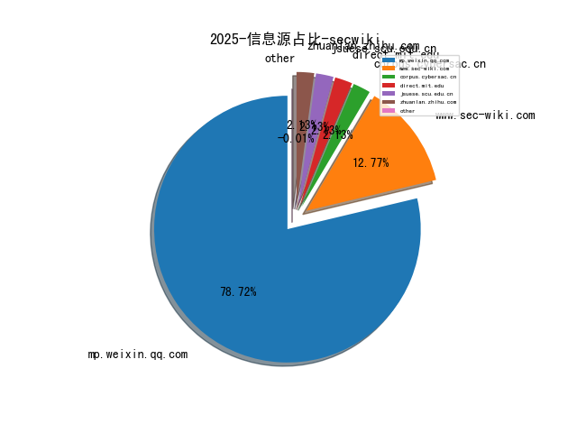
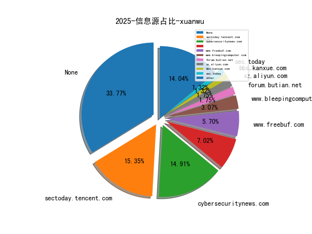
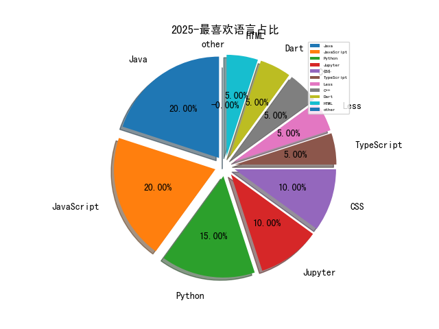

# [数据--所有](README_20.md)
# [数据--年度](README_2025.md)
# 2025 信息源与信息类型占比

# 网络安全书籍 推荐
| date_added | language | title | author | link | size| 
| --- | --- | --- | --- | --- | ---| 
| 2025-01-16 08:16:07 | English | Microsoft 365 For Dummies | unknown | https://www.wowebook.org/microsoft-365-for-dummies/ | unknown| 
| 2025-01-16 17:26:24 | English | Python Essentials For Dummies | unknown | https://www.wowebook.org/python-essentials-for-dummies/ | unknown| 
| 2025-01-16 10:37:47 | English | Hemodynamic Monitoring | Mary E. Lough | http://libgen.is/book/index.php?md5=0A95FF295984F9B8EAA23346534DFE65 | 38 MB [PDF]| 
| 2025-01-16 10:35:07 | English | Hemodynamic Monitoring | Mary E. Lough | http://libgen.is/book/index.php?md5=C43219F28B473D3576D829974A1ABEFC | 34 MB [EPUB]| 
| 2025-01-16 10:27:46 | English | Basics of Python Programming A Quick Guide for Beginners | Krishna Kumar Mohbey | http://libgen.is/book/index.php?md5=A3DD2FBDD34F88AFFBF364777F25C839 | 56 MB [PDF]| 
| 2025-01-15 11:36:58 | English | Microsoft Teams For Dummies, 3rd Edition | unknown | https://www.wowebook.org/microsoft-teams-for-dummies-3rd-edition/ | unknown| 
| 2025-01-15 06:37:49 | English | Microsoft Teams For Dummies, 2nd Edition | unknown | https://www.wowebook.org/microsoft-teams-for-dummies-2nd-edition/ | unknown| 
| 2025-01-15 05:58:21 | English | Microsoft 365 PowerPoint For Dummies, 2nd Edition | unknown | https://www.wowebook.org/microsoft-365-powerpoint-for-dummies-2nd-edition/ | unknown| 
| 2025-01-15 12:00:10 | English | Microsoft Power BI For Dummies | unknown | https://www.wowebook.org/microsoft-power-bi-for-dummies/ | unknown| 
| 2025-01-15 11:47:51 | English | Microsoft Power Platform For Dummies | unknown | https://www.wowebook.org/microsoft-power-platform-for-dummies/ | unknown| 
| 2025-01-15 11:52:46 | English | Glycemic Monitoring - ECAB | R V Jayakumar | http://libgen.is/book/index.php?md5=40A7BC7D8BDF65836C95B6A03443C88E | 1 MB [PDF]| 
| 2025-01-15 11:52:33 | English | Glycemic Monitoring - ECAB | R V Jayakumar | http://libgen.is/book/index.php?md5=36AFA5B8BAF8838E0D4C4F68B909CAC5 | 3 MB [EPUB]| 
| 2025-01-11 16:47:52 | English | A Beginner’s Guide To Web Application Penetration Testing | unknown | https://www.wowebook.org/a-beginners-guide-to-web-application-penetration-testing/ | unknown| 
| 2025-01-10 06:20:20 | English | Microsoft 365 Copilot At Work: Using AI to Get the Most from Your Business Data and Favorite Apps | unknown | https://www.wowebook.org/microsoft-365-copilot-at-work-using-ai-to-get-the-most-from-your-business-data-and-favorite-apps/ | unknown| 
| 2025-01-08 06:17:50 | English | Generative AI on Google Cloud with LangChain | unknown | https://www.wowebook.org/generative-ai-on-google-cloud-with-langchain/ | unknown| 
| 2025-01-07 11:15:25 | English | Learn Generative AI with PyTorch By Mark Liu (Final Release) | Mark Liu | http://libgen.is/book/index.php?md5=EA442D0490AAD3D193551EC97EAF414E | 19 MB [EPUB]| 
| 2025-01-07 09:19:04 | English | A Defense Manual of Commando Jiu-Jitsu | Irvin Cahn | http://libgen.is/book/index.php?md5=B55819CE207CCB59130E7E494840B73D | 17 MB [PDF]| 
| 2025-01-07 08:58:08 | English | The Hunter and Trapper | Halsey Thrasher | http://libgen.is/book/index.php?md5=F2D8C7058F994CF774B9B21884C534D6 | 6 MB [PDF]| 
| 2025-01-06 07:47:24 | English | Mastering VMware Cloud Disaster Recovery and Ransomware Resilience | unknown | https://www.wowebook.org/mastering-vmware-cloud-disaster-recovery-and-ransomware-resilience/ | unknown| 
| 2025-01-06 08:15:38 | English | Securing an Enterprise: Maximizing Digital Experiences through Enhanced Security Measures | unknown | https://www.wowebook.org/securing-an-enterprise-maximizing-digital-experiences-through-enhanced-security-measures/ | unknown| 
| 2025-01-05 12:39:04 | English | Getting Started with Azure OpenAI | unknown | https://www.wowebook.org/getting-started-with-azure-openai/ | unknown| 
| 2025-01-05 10:02:31 | English | Stochastic Finance with Python | unknown | https://www.wowebook.org/stochastic-finance-with-python/ | unknown| 
| 2025-01-05 09:41:52 | English | Regenerating Learning: Transforming How You Learn with Generative AI | unknown | https://www.wowebook.org/regenerating-learning-transforming-how-you-learn-with-generative-ai/ | unknown| 
| 2025-01-05 12:36:03 | English | (Drugs and the Pharmaceutical Sciences) An Introduction to Generative Drug Discovery | Ekins S. (ed.) | http://libgen.is/book/index.php?md5=A067E7425DEFCD9CD2DBE27331C5B3C0 | 18 MB [PDF]| 
| 2025-01-05 12:31:04 | English | (Hart Studies In Security And Justice) Surveillance, Privacy And Trans-Atlantic Relations | David D Cole, Federico Fabbrini, Stephen Schulhofer | http://libgen.is/book/index.php?md5=C7E684DAA5DB463BD3A76B9739A9AE90 | 2 MB [PDF]| 
| 2025-01-05 11:45:17 | English | (DESIGN THINKING SERIES) Regenerating Learning: Transforming How You Learn with Generative AI | Patrick Parra Pennefather | http://libgen.is/book/index.php?md5=CB4273D1E2D46C1BABB635D9517EAC08 | 28 MB [MOBI]| 
| 2025-01-05 09:46:17 | English | Clinical Risk Management | Tom Flewett | http://libgen.is/book/index.php?md5=6F2F17A69AD73C83AF899458FE376320 | 1 MB [PDF]| 
| 2025-01-05 07:47:43 | English | Data Visualization in R and Python | Marco Cremonini | http://libgen.is/book/index.php?md5=F55A40B4F225930378277F4325652A27 | 25 MB [PDF]| 
| 2025-01-04 23:35:14 | English | In defense of judicial elections | Chris W. Bonneau, Melinda Gann Hall | http://libgen.is/book/index.php?md5=DFF945E046EBD7290A8FF8723D1DAE41 | 2 MB [PDF]| 
| 2025-01-03 07:36:03 | English | The Digital Marketer’s Playbook | unknown | https://www.wowebook.org/the-digital-marketers-playbook/ | unknown| 
| 2025-01-03 08:11:03 | English | Generative AI For Executives | unknown | https://www.wowebook.org/generative-ai-for-executives/ | unknown| 
| 2025-01-02 19:41:57 | English | Cybersecurity Today: Cyber attacks, network security, and threat prevention | Debrupa Palit | http://libgen.is/book/index.php?md5=A59BBC88443D9E049F1B60522CF4ACBD | 8 MB [EPUB]| 
| 2025-01-01 06:29:16 | English | Neural Networks with TensorFlow and Keras: Training, Generative Models, and Reinforcement Learning | Philip Hua | http://libgen.is/book/index.php?md5=021B6DF458FA887786DA61470B09A2CE | 6 MB [PDF]| 
| 2025-01-01 01:18:12 | English | Active Machine Learning with Python: Refine and elevate data quality over quantity with active learning | Margaux Masson-Forsythe | http://libgen.is/book/index.php?md5=1553E38A64124079E8A909A95CF50004 | 16 MB [PDF]| 
| 2025-01-01 01:14:18 | English | (Chapman & Hall/CRC The Python Series) Data Mining with Python: Theory, Application, and Case Studies | Di Wu | http://libgen.is/book/index.php?md5=4D37B5C21C970DD4991778C0E8C91BA0 | 13 MB [PDF]| 
| 2025-01-01 23:19:03 | English | Regenerating Learning: Transforming How You Learn with Generative AI | Patrick Parra Pennefather | http://libgen.is/book/index.php?md5=E452D075608F9CA3ACC86D7E280BB502 | 29 MB [PDF]| 

# 微信公众号 推荐
| nickname_english | weixin_no | title | url| 
| --- | --- | --- | ---| 
| Code4th安全团队 | None | 限量领取！「C4安全团队」蛇年定制红包封面派发中！ | https://mp.weixin.qq.com/s?__biz=MzkzMzE5OTQzMA==&mid=2247485734&idx=1&sn=f794623e91f2c82c7c6080c8e17a1aa7 | 2| 
| GoUpSec | None | 立级修补！UEFI安全启动曝出绕过漏洞 | https://mp.weixin.qq.com/s?__biz=MzkxNTI2MTI1NA==&mid=2247502142&idx=2&sn=71658a53c477aae39be23a40f0baa4b7 | 4| 
| HACK之道 | None | 谈一谈红队中的社工钓鱼姿势(上) | https://mp.weixin.qq.com/s?__biz=MzIwMzIyMjYzNA==&mid=2247517915&idx=1&sn=4a264bc6284c6213f0e789363a91f586 | 6| 
| HK安全小屋 | None | Hack The Box -Appointment | https://mp.weixin.qq.com/s?__biz=MzkzNzMxODkzMw==&mid=2247485714&idx=1&sn=999f69aa43c95856665577121b830fe9 | 1| 
| HackSee | None | 空气污染会增加心脏代谢疾病患者患痴呆症的风险——健康的生活习惯可以起到帮助作用 | https://mp.weixin.qq.com/s?__biz=MzI5NTA0MTY2Mw==&mid=2247485767&idx=1&sn=3e2ec79383c600a3bfdb4a28e916e7fc | 3| 
| Heihu Share | None | 红包封面 , 本公众号超酷的代码红包封面领取！ | https://mp.weixin.qq.com/s?__biz=MzkwMzQyMTg5OA==&mid=2247486660&idx=1&sn=74d2480b8fec7bb3022d00a3a36f8b1b | 3| 
| Khan安全团队 | None | 年底了该骂了一下了 | https://mp.weixin.qq.com/s?__biz=MzAwMjQ2NTQ4Mg==&mid=2247496657&idx=1&sn=903668a70f33b5b1178d7a56295b8f31 | 1| 
| OSINT研习社 | None | 老王如何“远洋捕捞”美国靓仔 | https://mp.weixin.qq.com/s?__biz=Mzg4MzA4NTM0OA==&mid=2247493555&idx=1&sn=5e5923318a8e703bc6221f588dc596ba | 1| 
| OneMoreThink | None | 攻防靶场(42)：导数据和写日志的webshell权限竟不一样  Election1 | https://mp.weixin.qq.com/s?__biz=MzI0NjA3Mzk2NQ==&mid=2247495777&idx=1&sn=e74ce3608dc6b341bada2e522addbac1 | 4| 
| Sky的安全观 | None | ISO 14001: 2015 标准详解与实施（12）6.2 环境目标及其实现的策划 | https://mp.weixin.qq.com/s?__biz=MzA5OTEyNzc1Nw==&mid=2247485945&idx=1&sn=f988165c4a872fe73172c08338c581fe | 3| 
| Syst1m Sec | None | 内部edusrc活动（一期）复盘视频！！！快来快来！！！ | https://mp.weixin.qq.com/s?__biz=MzkyNzg4NTU0NQ==&mid=2247484755&idx=1&sn=fa90fcf71077251acf04edade4ce531e | 2| 
| Tide安全团队 | None | 记一次APP加密数据包的解密过程与思路 | https://mp.weixin.qq.com/s?__biz=Mzg2NTA4OTI5NA==&mid=2247519610&idx=1&sn=2ce94e202fa49e255e26c87e270f65c9 | 1| 
| Web安全工具库 | None | CTF赛前指导 -- 密码学 | https://mp.weixin.qq.com/s?__biz=MzI4MDQ5MjY1Mg==&mid=2247515627&idx=2&sn=77c4217be81cb9a69b09b59e9614bda9 | 6| 
| XDsecurity | None | 开源情报,国际动态,美国《1260H条款》分析 | https://mp.weixin.qq.com/s?__biz=Mzg2NTcyNjU4Nw==&mid=2247485858&idx=1&sn=e171e041a640779f71139bb0f1b0e77e | 1| 
| flowers-boy | None | ThermalPower | https://mp.weixin.qq.com/s?__biz=MzkxMzY5NDUyMQ==&mid=2247485186&idx=1&sn=f4fe1fbdd90b3828c7ea2d996b32c61d | 1| 
| solar应急响应团队 | None | 【病毒分析】R3强杀360：深度揭秘银狐远控病毒的技术演进 | https://mp.weixin.qq.com/s?__biz=MzkyOTQ0MjE1NQ==&mid=2247496383&idx=1&sn=c9cc10b6dd580db6cfbe39b0ba5eacd5 | 4| 
| 丁爸 情报分析师的工具箱 | None | 【转载】泰缅边境有组织犯罪研究报告 | https://mp.weixin.qq.com/s?__biz=MzI2MTE0NTE3Mw==&mid=2651148591&idx=1&sn=57d95a4adf1dd59f366bd39935678b50 | 10| 
| 七芒星实验室 | None | 【神兵利器】内网渗透之SPP隧道构建 | https://mp.weixin.qq.com/s?__biz=Mzg4MTU4NTc2Nw==&mid=2247495098&idx=1&sn=c31def88aa456525e982b665805d7eb6 | 9| 
| 中国网络空间安全协会 | None | 网络安全态势研判分析报告 （2024年12月） | https://mp.weixin.qq.com/s?__biz=MzA3ODE0NDA4MA==&mid=2649401245&idx=1&sn=6bcee1b0368b0a9cb01d5ea091d32b38 | 6| 
| 乌雲安全 | None | 实战利器！65条高效应急响应命令汇总！ | https://mp.weixin.qq.com/s?__biz=MzAwMjA5OTY5Ng==&mid=2247525614&idx=1&sn=cba69aaa3a1860b731b8b0b32b5d54bf | 7| 
| 也总想挖RCE | None | 银狐叒进化？清理不掉！一线应急响应工程师教你如何手工处理 | https://mp.weixin.qq.com/s?__biz=MzU4NTg4MzIzNA==&mid=2247484308&idx=1&sn=317866f5804db85ce8bea45bc78a6eb6 | 1| 
| 二进制磨剑 | None | IDA技巧（102）反编译重置反编译器信息 | https://mp.weixin.qq.com/s?__biz=MzI1Mjk2MTM1OQ==&mid=2247485287&idx=1&sn=ce0fa04c58b3a9e3d855f57f03671ae8 | 4| 
| 众智维安 | None | 喜讯 , 众智维科技蝉联中国网络安全产业联盟CCIA2024年度先进会员单位 | https://mp.weixin.qq.com/s?__biz=MzU5Mjg0NzA5Mw==&mid=2247493901&idx=1&sn=78a7bceaaf098d6fc362282b91649a91 | 1| 
| 信息安全D1net | None | CISO如何在董事会讨论中提升网络安全意识 | https://mp.weixin.qq.com/s?__biz=MzA3NTIyNzgwNA==&mid=2650259826&idx=1&sn=665d96f1127f58785786e1d3db5aebdb | 2| 
| 信息安全与通信保密杂志社 | None | 最新发布｜拜登政府《关于加强和促进国家网络安全创新的行政命令》剑指中国和俄罗斯（全文翻译） | https://mp.weixin.qq.com/s?__biz=MzkwMTMyMDQ3Mw==&mid=2247597499&idx=1&sn=dfb6928440a61f5cfaccb4b65469f121 | 8| 
| 信息安全动态 | None | AI在身份验证中的应用：防范账户接管攻击 | https://mp.weixin.qq.com/s?__biz=Mzg4NDc0Njk1MQ==&mid=2247487170&idx=2&sn=bc9f862f40363747073df9d2c6a2f9a1 | 5| 
| 信息安全研究 | None | 【合作单位动态】人大代表李雪莹：强化安全体系，助力北京全球数字经济标杆城市建设 | https://mp.weixin.qq.com/s?__biz=MzA3NzgzNDM0OQ==&mid=2664992839&idx=3&sn=33b37671302616eacca8c62e50df5882 | 14| 
| 全栈网络空间安全 | None | 命名空间（Namespace）和虚拟私有云（VPC）之间的区别 | https://mp.weixin.qq.com/s?__biz=Mzg3NTUzOTg3NA==&mid=2247515033&idx=1&sn=df3af50bb6b4de905af1c395e5cea88e | 6| 
| 全球技术地图 | None | 美国国防部发布《2025财年投资战略》 重点关注15个关键领域 | https://mp.weixin.qq.com/s?__biz=MzI1OTExNDY1NQ==&mid=2651618668&idx=1&sn=b5fea9d1eb1d1625dfbc144c7a59491b | 8| 
| 关键信息基础设施安全保护联盟 | None | 掌数信息招聘,职等你来 | https://mp.weixin.qq.com/s?__biz=MzkxNjU2NjY5MQ==&mid=2247509825&idx=2&sn=97834cdc06b1d61a13cf077cc5a3d45c | 3| 
| 内存泄漏 | None | 渗透测试中如何反编译JAR | https://mp.weixin.qq.com/s?__biz=MzU2MjU2MzI3MA==&mid=2247484519&idx=3&sn=aa3300f1b2dc9e8f4f4f59e4bb8db9df | 2| 
| 内生安全联盟 | None | 美国正式发布“中国智能网联汽车最终禁令”！即使汽车在美国制造 | https://mp.weixin.qq.com/s?__biz=Mzg4MDU0NTQ4Mw==&mid=2247528708&idx=1&sn=553406581b3f8d0b166886306f3e90c7 | 8| 
| 军哥网络安全读报 | None | 新的 UEFI 安全启动漏洞可能允许攻击者加载恶意 Bootkit | https://mp.weixin.qq.com/s?__biz=MzI2NzAwOTg4NQ==&mid=2649793889&idx=2&sn=b498ab3fe02cf49771f55c3772496fac | 14| 
| 初號機的駕駛員 | None | JavaScript入门学习 | https://mp.weixin.qq.com/s?__biz=MzkwODYzODc5OA==&mid=2247485734&idx=1&sn=11e65a403ccef897ddf1b7dba088caf1 | 1| 
| 励行安全 | None | 吃瓜 , 错过了一个亿…… | https://mp.weixin.qq.com/s?__biz=MzkxNTY4NTQwMg==&mid=2247484261&idx=1&sn=ef965e23fd085afe95ccf1e6ec830c75 | 2| 
| 君说安全 | None | 大气，支付宝深夜承诺：不追回！ | https://mp.weixin.qq.com/s?__biz=MzUzNjkxODE5MA==&mid=2247488085&idx=1&sn=9e6e743d2832aea2300f0c98bf0254e1 | 7| 
| 听风安全 | None | 网络安全技能大清洗时代已经到来，CAISP让你变成职场抢手人才 | https://mp.weixin.qq.com/s?__biz=Mzg3NzIxMDYxMw==&mid=2247504339&idx=2&sn=68497cdfbf69bcd64fd069dcd5a9b19a | 3| 
| 启明星辰安全简讯 | None | 安全简讯（2025.01.17） | https://mp.weixin.qq.com/s?__biz=MzkzNzY5OTg2Ng==&mid=2247500632&idx=1&sn=af0b16c84330ad4aa92282fbfd4ebb1a | 6| 
| 呼啦啦安全 | None | 过掉XXAPP frida检测 | https://mp.weixin.qq.com/s?__biz=Mzg5OTg5NzkwNw==&mid=2247485591&idx=1&sn=72688d4a107a0271b564730a7927cd92 | 1| 
| 喵苗安全 | None | 【招聘】字节跳动招人啦～ | https://mp.weixin.qq.com/s?__biz=Mzg5MjkwODc4MA==&mid=2247485889&idx=2&sn=2b30fb7a16a98f7a793ae24110ff3b2f | 2| 
| 嘉韦思 | None | 一站式网络安全保险：嘉韦思如何简化风险管理 | https://mp.weixin.qq.com/s?__biz=MzIxNTA4OTI5Mg==&mid=2647712653&idx=1&sn=4f50aa627ada51e26b2765a4efd87177 | 2| 
| 嘶吼专业版 | None | 黑客利用加州野火事件发起网络钓鱼攻击 | https://mp.weixin.qq.com/s?__biz=MzI0MDY1MDU4MQ==&mid=2247580846&idx=2&sn=47b47774e959b61e1284a2ebfa11d436 | 7| 
| 国家互联网应急中心CNCERT | None | 美网络攻击我国某先进材料设计研究院事件调查报告 | https://mp.weixin.qq.com/s?__biz=MzIwNDk0MDgxMw==&mid=2247499614&idx=1&sn=9e23d74ec6d8e67a4eef27affe664dc6 | 3| 
| 塞讯安全验证 | None | 【喜讯】塞讯科技喜获 CNNVD 技术支撑单位认证，彰显安全研究实力！ | https://mp.weixin.qq.com/s?__biz=Mzk0MTMzMDUyOA==&mid=2247504039&idx=1&sn=c8e5125535a559e62121aa12a69b372b | 1| 
| 墨菲安全 | None | 直播倒计时4天：聊聊从“打黑工”到大厂安全负责人的那些事儿 | https://mp.weixin.qq.com/s?__biz=MzkwOTM0MjI5NQ==&mid=2247488026&idx=1&sn=2cae55ebb219f53bd01c5a9fc5416cd8 | 1| 
| 夜组安全 | None | SimpleIAST- 基于污点追踪的灰盒漏洞扫描工具。 | https://mp.weixin.qq.com/s?__biz=Mzk0ODM0NDIxNQ==&mid=2247493301&idx=1&sn=14d3843029a33e9ea975e81ed20fab0d | 5| 
| 大伯为安全 | None | 免费高速 , 无固定公网地址还想远程访问家中电脑？这款工具，延迟仅18毫秒！Natter一条命令满足你的需求！ | https://mp.weixin.qq.com/s?__biz=MzkwOTU5Mjk5MA==&mid=2247486242&idx=1&sn=5be1532a4988e28da5aac7e44ee96cfe | 1| 
| 天唯信息安全 | None | 估值3.81亿元，天唯科技助力无界方舟突破数据估值再创新高 | https://mp.weixin.qq.com/s?__biz=MzkzMjE5MTY5NQ==&mid=2247503334&idx=1&sn=e1cf3ec54d5ff5d2754c2ac5b57d18d1 | 1| 
| 天懋信息 | None | 天懋信息获评中国网络安全产业联盟（CCIA）2024年度优秀会员单位 | https://mp.weixin.qq.com/s?__biz=MzU3MDA0MTE2Mg==&mid=2247492480&idx=1&sn=d5463b6549a63be22fba9eec6656f8bc | 4| 
| 天空卫士SkyGuard | None | 岁序更新：香港峰会 - 以中国创新元素 引领AI数据安全新时代！ | https://mp.weixin.qq.com/s?__biz=MzA5MjQyODY1Mw==&mid=2648516547&idx=1&sn=d55a85bc6932ed5ad2fb13321b06cb42 | 2| 
| 天融信 | None | 两会之声 , 人大代表李雪莹：建议在“两新”“两重”实施中加强网络安全建设 | https://mp.weixin.qq.com/s?__biz=MzA3OTMxNTcxNA==&mid=2650960742&idx=1&sn=a70c51fd13b245dcac98b1977493946d | 7| 
| 天际友盟 | None | [0117] 一周重点威胁情报｜天际友盟情报站 | https://mp.weixin.qq.com/s?__biz=MzIwNjQ4OTU3NA==&mid=2247510008&idx=1&sn=1535f642b86cb75c16e0573a35b08240 | 3| 
| 奇安信威胁情报中心 | None | 每周高级威胁情报解读(2025.01.10~01.16) | https://mp.weixin.qq.com/s?__biz=MzI2MDc2MDA4OA==&mid=2247513778&idx=1&sn=bdea4d68a4b7197a92e7fc7863e52ff8 | 1| 
| 奇安信病毒响应中心 | None | 每周勒索威胁摘要 | https://mp.weixin.qq.com/s?__biz=MzI5Mzg5MDM3NQ==&mid=2247498239&idx=1&sn=b6b26741d33e7a0bf9e5bc6202153a0e | 2| 
| 威努特安全网络 | None | 威努特获国家工信安全中心感谢信！ | https://mp.weixin.qq.com/s?__biz=MzAwNTgyODU3NQ==&mid=2651130444&idx=1&sn=205307299df5edbca7c670e809c3883c | 4| 
| 安全分析与研究 | None | 企业中的勒索病毒该怎么办? | https://mp.weixin.qq.com/s?__biz=MzA4ODEyODA3MQ==&mid=2247490023&idx=1&sn=43eb55752c830648ab7684043e9f6bb5 | 12| 
| 安全喵喵站 | None | 联想收购企业存储厂商 Infinidat，以色列首次 | https://mp.weixin.qq.com/s?__biz=MzkzNjE5NjQ4Mw==&mid=2247543301&idx=1&sn=248c0c5a411f3d7179677a6883343de4 | 13| 
| 安全学习那些事儿 | None | 各国政府在联合国安理会会议上呼吁制定管控间谍软件法规 | https://mp.weixin.qq.com/s?__biz=MzkxNTI2NTQxOA==&mid=2247496003&idx=2&sn=2c46b802ac861db03264458de804dcad | 11| 
| 安全客 | None | FTC对通用汽车公司实施五年禁令，禁止将敏感驾驶信息出售给数据经纪商 | https://mp.weixin.qq.com/s?__biz=MzA5ODA0NDE2MA==&mid=2649787746&idx=1&sn=143ca123d2b01683ce5f3cfa5eb2505b | 2| 
| 安全小白 | None | 《扣除年终》 | https://mp.weixin.qq.com/s?__biz=MzI1NDU2MzAzNQ==&mid=2247487762&idx=1&sn=5a39a6d8ac41c6cc18afbe6eb38d01bd | 1| 
| 安全洞察知识图谱 | None | 一款图形化的代码审计工具 | https://mp.weixin.qq.com/s?__biz=MzkyMDM4NDM5Ng==&mid=2247490300&idx=1&sn=f58ec2c6b92ef574b21d193c4ea0dbc2 | 5| 
| 安全牛 | None | 2025年值得关注的十大漏洞管理工具 | https://mp.weixin.qq.com/s?__biz=MjM5Njc3NjM4MA==&mid=2651134752&idx=2&sn=a71898ac89bc6a622d04a05f120c6232 | 11| 
| 安全狗的自我修养 | None | 掌握现代红队基础设施 — 第 2 部分：使用 Sliver 和 Re-director 构建隐蔽的 C2 基础设施 | https://mp.weixin.qq.com/s?__biz=MzkwOTE5MDY5NA==&mid=2247504687&idx=1&sn=3787820eaea9d9daf6cf66e0cd331a79 | 12| 
| 安小圈 | None | 网络安全应急响应预案内容与类型 | https://mp.weixin.qq.com/s?__biz=Mzg2MDg0ODg1NQ==&mid=2247539708&idx=3&sn=a6c13a03912495abeb70ef2a24b99e35 | 9| 
| 安恒信息 | None | 是时候告别VPN时代了吗？超10万人的国企告诉你答案 | https://mp.weixin.qq.com/s?__biz=MjM5NTE0MjQyMg==&mid=2650623992&idx=1&sn=73934af96c597875cb1e30e945dc5ef6 | 6| 
| 富贵安全 | None | Spring Boot项目中禁用Swagger：安全加固与实践指南 | https://mp.weixin.qq.com/s?__biz=MzkxNzY5MTg1Ng==&mid=2247485506&idx=1&sn=29b451c20a3d58d96bb24c2ff739d999 | 4| 
| 寻梦安全 | None | 支付宝出现P0 bug | https://mp.weixin.qq.com/s?__biz=MzkxNTY0NzgwNA==&mid=2247483888&idx=1&sn=cbd08e99876e9270c1a93b045a90d81a | 1| 
| 山石网科新视界 | None | 年终盘点之九｜2024山石网科人才培养，笃信前行! | https://mp.weixin.qq.com/s?__biz=MzAxMDE4MTAzMQ==&mid=2661298049&idx=2&sn=46988ee6902eeb167a5b5c67e5e8f20b | 7| 
| 工业互联网标识智库 | None | 星火年鉴·顶级篇 , 国家顶级节点（南京灾备节点）助力江苏“智改数转网联”建设，打造全国数字经济创新发展新高地 | https://mp.weixin.qq.com/s?__biz=MzU1OTUxNTI1NA==&mid=2247592128&idx=1&sn=82131fa323c31d38f4ad7237612d0ae4 | 6| 
| 快手技术 | None | 快手7篇论文入选人工智能领域顶会AAAI 2025 | https://mp.weixin.qq.com/s?__biz=Mzg2NzU4MDM0MQ==&mid=2247495653&idx=1&sn=b993cb0bbbcd76d1c022a6d0250dde96 | 2| 
| 悬镜安全 | None | 供应链风险情报预警 , 恶意NPM包（fix-this）开展反向shell远控投毒 | https://mp.weixin.qq.com/s?__biz=MzA3NzE2ODk1Mg==&mid=2647795500&idx=1&sn=e6e5192fdb5c78c9cf37812a319c9f88 | 2| 
| 情报分析师Pro | None | 韩国核电站泄漏29吨核废液对我的影响分析 | https://mp.weixin.qq.com/s?__biz=MzkwNzM0NzA5MA==&mid=2247504258&idx=2&sn=28e2f8077f2cbe19fbe8a9436fe591e9 | 13| 
| 慢雾科技 | None | MistTrack：区块链安全与合规利器，守护全球用户 | https://mp.weixin.qq.com/s?__biz=MzU4ODQ3NTM2OA==&mid=2247500938&idx=1&sn=f3fbf87c17d8588e73bcd53e3607447e | 4| 
| 我不懂安全 | None | 泼天的富贵？ | https://mp.weixin.qq.com/s?__biz=Mzg2NDcwNjkzNw==&mid=2247487177&idx=1&sn=bac51426ad0ec03b92351c59b8086891 | 2| 
| 搜狐安全 | None | 警惕银狐木马的传播 | https://mp.weixin.qq.com/s?__biz=Mzg3Njg1NTk5MQ==&mid=2247502466&idx=1&sn=42967e1ec6f9c1539b500a265a0fa79b | 1| 
| 数世咨询 | None | 银狐叒进化，溯源不了，清理不掉！ | https://mp.weixin.qq.com/s?__biz=MzkxNzA3MTgyNg==&mid=2247534414&idx=2&sn=73bf0833c3bb12ee08861ceb729eee8f | 7| 
| 斗象智能安全 | None | 安全NTA+网络NPM，斗象“双项全能”流量产品受众多高校青睐 | https://mp.weixin.qq.com/s?__biz=MzIwMjcyNzA5Mw==&mid=2247495035&idx=1&sn=eea7b1cb443234a408fb5297fea0d180 | 1| 
| 星落安全团队 | None | 工具推荐 , 更优雅的nignx内存马后门 | https://mp.weixin.qq.com/s?__biz=MzkwNjczOTQwOA==&mid=2247493929&idx=1&sn=95d2ca4eec1c9f4e4ce1198e027ffa1b | 5| 
| 昱安安全 | None | 2024年网络安全管理攻略：8个要点建议全掌握 | https://mp.weixin.qq.com/s?__biz=MzkxMTYyMzY1NQ==&mid=2247484041&idx=3&sn=772006c3da88d16c8dec8453e6094970 | 3| 
| 极客安全 | None | 安全动态丨网络空间安全动态第242期 | https://mp.weixin.qq.com/s?__biz=MzU2MjcwOTY1Mg==&mid=2247521174&idx=3&sn=b0b56a5ee79a8b62bbc967d3171fd472 | 5| 
| 极验 | None | 14:40到14:45，支付宝20%优惠“Bug”究竟发生了什么？ | https://mp.weixin.qq.com/s?__biz=MzI2MDE5MTQxNg==&mid=2649723157&idx=1&sn=aba786ea27b176262df51aaf93816f1b | 2| 
| 梅苑安全 | None | 27.悬于开发者和安全研究人员头顶的剑 , 一类漏洞让Visual Studio项目变得不再可信 | https://mp.weixin.qq.com/s?__biz=MzkwMTU2NzMwOQ==&mid=2247484514&idx=1&sn=34349f1717c6e792960e75913935ee1d | 2| 
| 棉花糖fans | None | 最后一天！总计价值5000元！错过等明年！ | https://mp.weixin.qq.com/s?__biz=MzkyOTQzNjIwNw==&mid=2247491425&idx=1&sn=4605aeaf779173081c59d2dfa7192702 | 6| 
| 河南等级保护测评 | None | 为什么软件供应商能够如此深入地访问客户系统？ | https://mp.weixin.qq.com/s?__biz=Mzg2NjY2MTI3Mg==&mid=2247498226&idx=2&sn=78e9cb6f41c2e49fcdea506bce43e046 | 12| 
| 泷羽SEC-ohh | None | pikachu靶机-CSRF | https://mp.weixin.qq.com/s?__biz=Mzk1NzI5NzA3NQ==&mid=2247486238&idx=1&sn=b294754f3a020d09e8733a48b8b127f4 | 2| 
| 泷羽Sec | None | fofa资产测绘API提供，随意使用 | https://mp.weixin.qq.com/s?__biz=Mzg2Nzk0NjA4Mg==&mid=2247497979&idx=1&sn=591ba3a2a34e031bc1a5e524ff83935b | 6| 
| 泷羽Sec-Ceo | None | Vcenter：综合的渗透工具包 | https://mp.weixin.qq.com/s?__biz=Mzk0Mjg4MTQxMw==&mid=2247485681&idx=1&sn=36f475ff280e682e453f89784758fd78 | 4| 
| 泷羽Sec-Yonc | None | 无数美国黑客最想要的证书OSCP，到底有多难考？！ | https://mp.weixin.qq.com/s?__biz=MzkyMzg4MTY4Ng==&mid=2247484592&idx=1&sn=bbc9f57ba9344af194bf1e0b4fdccb86 | 2| 
| 泷羽Sec-sky | None | 揭开社交工程“黑魔法”：SEToolkit 实操大揭秘 | https://mp.weixin.qq.com/s?__biz=MzkzNzg3NzQxMQ==&mid=2247485684&idx=1&sn=32aa106605cd1d843eecb0ce5b0fa955 | 1| 
| 泷羽Sec-尘宇安全 | None | Xray图形化工具 , Super Xray介绍+使用 | https://mp.weixin.qq.com/s?__biz=Mzk1NzE0ODk3Nw==&mid=2247490294&idx=1&sn=c2ec362b19b36d662cc90f5b164179c0 | 3| 
| 浅安安全 | None | 工具 , MemShellParty | https://mp.weixin.qq.com/s?__biz=MzkwMTQ0NDA1NQ==&mid=2247492081&idx=4&sn=fab9d56389ea0b3c6d826b4d8e1121f8 | 25| 
| 浙大网安 | None | 灵蛇献瑞迎春来 筑梦网安谱新篇——浙大网安新春游园活动举办 | https://mp.weixin.qq.com/s?__biz=Mzg5NDczNDc4NA==&mid=2247495461&idx=1&sn=037494403cd2f710cf0da6591de916f8 | 1| 
| 海底生残月 | None | 小米NAS产品或将引爆家用存储市场，开启全新存储新时代？ | https://mp.weixin.qq.com/s?__biz=MzkyOTQyOTk3Mg==&mid=2247485034&idx=1&sn=21a76ed5ae366e77ba5a94938daea86c | 1| 
| 深信服科技 | None | 全年闭环153万个安全事件后，深信服安全运营中心有了新发现…… | https://mp.weixin.qq.com/s?__biz=MjM5MTAzNjYyMA==&mid=2650596820&idx=1&sn=6a9bb0895582fb421f9aac08bdbde2e4 | 2| 
| 渊亭防务 | None | 美菲同盟强化：军事合作、区域安全与战略转型 | https://mp.weixin.qq.com/s?__biz=Mzg2NTYyODgyNg==&mid=2247504455&idx=1&sn=af376d4f17b7f92975998605bb11074a | 3| 
| 渗透安全HackTwo | None | 2025最新Invicti-Professional-V25.1 WEB漏洞扫描器更新,近期漏洞合集更新 | https://mp.weixin.qq.com/s?__biz=Mzg3ODE2MjkxMQ==&mid=2247489929&idx=1&sn=5a5cb71d997259c5fd89a14ae79f829f | 6| 
| 火绒安全 | None | 诚邀渠道合作伙伴共启新征程 | https://mp.weixin.qq.com/s?__biz=MzI3NjYzMDM1Mg==&mid=2247521673&idx=2&sn=799321f74b013ea921c618c111dfcf7f | 6| 
| 犀牛安全 | None | 黑客利用恶意 npm、PyPI 和 Ruby 软件包来做渗透测试工具 | https://mp.weixin.qq.com/s?__biz=Mzg3ODY0NTczMA==&mid=2247491969&idx=1&sn=f25fd592e0efa0cdad8cfcd5ade8008b | 7| 
| 独眼情报 | None | 马斯克的星辰大海 | https://mp.weixin.qq.com/s?__biz=MzkzNDIzNDUxOQ==&mid=2247494328&idx=3&sn=4a4e9485857baad34759000435dcccb7 | 17| 
| 玄道夜谈 | None | 分享图片 | https://mp.weixin.qq.com/s?__biz=MzI3Njc1MjcxMg==&mid=2247494256&idx=1&sn=9bea64ad35f0745580658a8a5775098c | 8| 
| 白帽黑客k哥 | None | 日薪5000+？？！现在护网这么离谱了吗？我当年可没这待遇！ | https://mp.weixin.qq.com/s?__biz=Mzk1NzMwNTM5NQ==&mid=2247483830&idx=1&sn=bcc15adbdfc33a9d0ed94b8627e300fc | 2| 
| 白泽安全实验室 | None | APT组织UAC-0063(APT28)针对中亚外交关系发起网络攻击——每周威胁情报动态第209期  （01.10-01.16） | https://mp.weixin.qq.com/s?__biz=MzI0MTE4ODY3Nw==&mid=2247492521&idx=1&sn=677b342493cb49a4cb95dc3d27f211d9 | 1| 
| 矢安科技 | None | 【年终表彰】矢安科技荣获CCIA中国网络安全产业联盟“2024年度优秀会员单位” | https://mp.weixin.qq.com/s?__biz=Mzg2Mjc3NTMxOA==&mid=2247516815&idx=1&sn=a76c191da1d282c3886bccae4d617b5c | 3| 
| 知机安全 | None | 【2025-01-17】每日安全资讯 | https://mp.weixin.qq.com/s?__biz=MzIzNDU5NTI4OQ==&mid=2247488311&idx=1&sn=2bb46c603a55641d96c9cd25550e401a | 6| 
| 神农Sec | None | 某小说vip破解代码分析 | https://mp.weixin.qq.com/s?__biz=Mzk0Mzc1MTI2Nw==&mid=2247487114&idx=1&sn=115e5afefe5e9306bda97c094ba1e09d | 6| 
| 祺印说信安 | None | 回顾《网络安全法》第一行政处罚案例看等级保护 | https://mp.weixin.qq.com/s?__biz=MzA5MzU5MzQzMA==&mid=2652114021&idx=2&sn=b076c38dbb0501683fac2c673ec97621 | 30| 
| 移动安全星球 | None | 蛇年红包封面免费领取 | https://mp.weixin.qq.com/s?__biz=MzI3Mzk2OTkxNg==&mid=2247486350&idx=1&sn=4e908473fdf0c39287b302ecf3c2c8fa | 1| 
| 篝火信安 | None | 【工具分享】一个综合性比较强的java漏洞集合工具（集成多种实用小工具） | https://mp.weixin.qq.com/s?__biz=MzIyNzc3OTMzNw==&mid=2247485740&idx=1&sn=7322bc46dcb2087c3e62a2e5bac53951 | 4| 
| 米好信安 | None | 米好信安成功助力2024年“中银杯”安徽省职业院校技能大赛(高职组)司法技术赛项 | https://mp.weixin.qq.com/s?__biz=MzU1NTYxMjA5MA==&mid=2247505200&idx=1&sn=3daef458109413d1c2cc2795ebff186d | 1| 
| 绿盟科技 | None | 天津出入境边防检查总站攻防战队一行来访绿盟科技开展座谈交流 | https://mp.weixin.qq.com/s?__biz=MjM5ODYyMTM4MA==&mid=2650464325&idx=1&sn=d53df4f4e81b1e5037eec9716470a69d | 4| 
| 网安守护 | None | 在京有房，外地买房无法提取公积金？那说好的鼓励买房政策是相悖而论？？ | https://mp.weixin.qq.com/s?__biz=MzU4NDY3MTk2NQ==&mid=2247491023&idx=1&sn=579e4119647e36be6a766024b4364869 | 1| 
| 网易易盾 | None | 数说《2024年度游戏安全报告》，洞察游戏安全新态势 | https://mp.weixin.qq.com/s?__biz=MzAwNTg2NjYxOA==&mid=2650742931&idx=1&sn=5a0f90a7deafe6ba281bc86b540c24f4 | 5| 
| 网空闲话plus | None | 5th域安全微讯早报【20250117】015期 | https://mp.weixin.qq.com/s?__biz=MzkyMjQ5ODk5OA==&mid=2247506848&idx=3&sn=8d86b849564c6cd511e9b7e062b6d6ec | 20| 
| 网络安全与人工智能研究中心 | None | 脑洞大开！黑客投放谷歌广告窃取广告账户 | https://mp.weixin.qq.com/s?__biz=MzkwMTQyODI4Ng==&mid=2247495599&idx=3&sn=6c60bdd6fd980526ba366d3b0c0cc655 | 5| 
| 网络安全和信息化 | None | 一图读懂 , 关于完善数据流通安全治理 更好促进数据要素市场化价值化的实施方案 | https://mp.weixin.qq.com/s?__biz=MjM5MzMwMDU5NQ==&mid=2649170280&idx=2&sn=6bf3b0f8fb54eecbddc5db64a296cd0a | 15| 
| 网络安全实验室 | None | 中信集团招聘网络安全信息化岗 | https://mp.weixin.qq.com/s?__biz=MzU4OTg4Nzc4MQ==&mid=2247505535&idx=3&sn=c0e45c17d0684b19d05c30141240eaa7 | 10| 
| 网络安全者 | None | CTF赛前指导 -- 杂项 | https://mp.weixin.qq.com/s?__biz=MzU3NzY3MzYzMw==&mid=2247499181&idx=2&sn=bd281f88716d6bd7d1969da56ec9293d | 9| 
| 网络安全透视镜 | None | 支付宝出现重大支付bug | https://mp.weixin.qq.com/s?__biz=MzIxMTg1ODAwNw==&mid=2247500435&idx=1&sn=b4ac15fefb1223e20510b006c9187199 | 2| 
| 网络技术联盟站 | None | 网线大科普来咯！一文带你了解Cat5、Cat5e、Cat6、Cat7、Cat8 | https://mp.weixin.qq.com/s?__biz=MzIyMzIwNzAxMQ==&mid=2649464532&idx=1&sn=8cbf93ad7eb2425694c1a48e9c7d68d0 | 7| 
| 能信安资讯 | None | 能信安：漏洞通告 | https://mp.weixin.qq.com/s?__biz=MzI1MTYzMjY1OQ==&mid=2247490765&idx=1&sn=409b2bcbd5111df2487a2c68cedced21 | 3| 
| 腾讯玄武实验室 | None | 每日安全动态推送(25/1/17) | https://mp.weixin.qq.com/s?__biz=MzA5NDYyNDI0MA==&mid=2651959993&idx=1&sn=a002409e2cb3c98c59d647fbe81fd3f7 | 2| 
| 航行笔记 | None | 直播倒计时4天：聊聊从“打黑工”到大厂安全负责人的那些事儿 | https://mp.weixin.qq.com/s?__biz=MzIyOTAxOTYwMw==&mid=2650236926&idx=1&sn=10e5c74e3948da4902a987d2fa187163 | 1| 
| 船山信安 | None | 【补招】深信服25届攻防研究岗，最后机会，速速网申！ | https://mp.weixin.qq.com/s?__biz=MzU2NDY2OTU4Nw==&mid=2247518321&idx=1&sn=cc2dcfa01d2d1933dec0045f24a282a5 | 7| 
| 菜根网络安全杂谈 | None | 聊一聊网络安全证书的那些事（下） | https://mp.weixin.qq.com/s?__biz=MzI5MTIwOTQ5MA==&mid=2247487615&idx=1&sn=e07e43bdce4b52a1661e8fd4f50307ea | 2| 
| 虎符智库 | None | 拜登第二个网安行政令：美国下一届政府的政策蓝图？ | https://mp.weixin.qq.com/s?__biz=MzIwNjYwMTMyNQ==&mid=2247492912&idx=1&sn=5f1fae9b65b8a46732e1aa5fac97dd4d | 2| 
| 蚁景网安 | None | 揭秘黑客入侵企业OA系统 | https://mp.weixin.qq.com/s?__biz=MzkyNTY3Nzc3Mg==&mid=2247489117&idx=1&sn=66b45acc88e1b855d240a10d8c4ca0a2 | 1| 
| 西湖论剑网络安全技能大赛 | None | 报名揭秘，迎战初赛 , 第八届西湖论剑大赛网络攻防实战赛初赛明日开战 | https://mp.weixin.qq.com/s?__biz=MzU0MjcwNzI2NQ==&mid=2247484667&idx=1&sn=0a4b9387b1321558a361b071025a115e | 2| 
| 观安信息 | None | 2025年网络安全十大关键趋势 | https://mp.weixin.qq.com/s?__biz=MzIxNDIzNTcxMg==&mid=2247506517&idx=1&sn=9519662c373ed5af7b5322b2be42f6c6 | 5| 
| 计算机与网络安全 | None | 资料列表：https://docs.qq.com/doc/DTGJUTmNva1Roc0xQ | https://mp.weixin.qq.com/s?__biz=MjM5OTk4MDE2MA==&mid=2655264080&idx=3&sn=fa5057f87e1c70f083931eb5bbff6075 | 26| 
| 谷安培训 | None | 不是...打靶竟如此上头？！ | https://mp.weixin.qq.com/s?__biz=MzU4MjUxNjQ1Ng==&mid=2247521201&idx=1&sn=3cac937fbbd776062602921f6ba7d83f | 9| 
| 赛博乞丐聊安全 | None | [工具分享]Invicti-Professional-v25.1 | https://mp.weixin.qq.com/s?__biz=MzkyNzU5OTc1NA==&mid=2247483970&idx=1&sn=8e3ebfe96b638bcf69f5e1eec20cce2b | 1| 
| 赛博研究院 | None | 上海市印发《上海市推动数字贸易和服务贸易高质量发展的实施方案》 | https://mp.weixin.qq.com/s?__biz=MzUzODYyMDIzNw==&mid=2247516760&idx=2&sn=2d7143cb39c6426aad11615be7e94a54 | 4| 
| 重生之成为赛博女保安 | None | 『公司经营状况不佳，责任主要在基层员工身上』 | https://mp.weixin.qq.com/s?__biz=MzIxOTQ1OTY4OQ==&mid=2247486301&idx=1&sn=313049c1fdb2e56e2fd255a44e019f72 | 1| 
| 长亭安全应急响应中心 | None | 【风险提示】Rsync 缓冲区溢出与信息泄露漏洞（CVE-2024-12084 / CVE-2024-12085） | https://mp.weixin.qq.com/s?__biz=MzIwMDk1MjMyMg==&mid=2247492706&idx=1&sn=764017be0e60cd7249e822c5c3170995 | 3| 
| 阿乐你好 | None | 网传英伟达工资收入 | https://mp.weixin.qq.com/s?__biz=MzIxNTIzNTExMQ==&mid=2247490728&idx=1&sn=f5e04ef3c4ec08117694a57b20f6736f | 6| 
| 隼目安全 | None | 【相关分享】记一次SQL注入漏洞 | https://mp.weixin.qq.com/s?__biz=Mzk0OTUwNTU5Nw==&mid=2247488538&idx=1&sn=a97ec9a3e0b0d1426f592ca73c8a0826 | 3| 
| 马哥网络安全 | None | 漏洞扫描工具 -- SBScan | https://mp.weixin.qq.com/s?__biz=MzkxMzMyNzMyMA==&mid=2247569798&idx=2&sn=b3d932e186079d318198ca4e3fb47d39 | 11| 
| 高级红队专家 | None | 分享图片 | https://mp.weixin.qq.com/s?__biz=MzIzODMyMzQxNQ==&mid=2247484468&idx=1&sn=f85b60eb19f9e6ecde90a8f15d423799 | 6| 
| 鹏组安全 | None | 我是脚本小子之Goby分布式扫描及其与xray的结合 | https://mp.weixin.qq.com/s?__biz=Mzg5NDU3NDA3OQ==&mid=2247490937&idx=1&sn=e52a7c677b016dc97202e881c548ebea | 1| 
| 黑客技术与网络安全 | None | 网传江西教育厅高考查分网站删库跑路 | https://mp.weixin.qq.com/s?__biz=MzIyMDEzMTA2MQ==&mid=2651168315&idx=1&sn=04954353b5742111ad92ff7330609ec6 | 2| 
| 黑白之道 | None | Java反序列化绕WAF tricks及一个GUI工具 | https://mp.weixin.qq.com/s?__biz=MzAxMjE3ODU3MQ==&mid=2650606777&idx=4&sn=73ad1a8a13b85957163693a2524ff86f | 15| 
| 鼎信安全 | None | 【喜迎新春，荣耀加冕】鼎信安全斩获三项殊荣，共筑梦想新高度！ | https://mp.weixin.qq.com/s?__biz=MzIwOTc4MTE4Nw==&mid=2247500987&idx=1&sn=30da4dd9a235dd6f24ca0ece5d65fe74 | 1| 
| 龙哥网络安全 | None | 为什么说普通人千万不要学黑客？ | https://mp.weixin.qq.com/s?__biz=MzU3MjczNzA1Ng==&mid=2247495499&idx=1&sn=70d3f55d6acd8167d1c262126cbe9383 | 8| 
| HW安全之路 | None | Python黑客工具库详解：10个让黑客效率提升10倍的神级库 | https://mp.weixin.qq.com/s?__biz=MzI5MjY4MTMyMQ==&mid=2247489710&idx=1&sn=af7b0f143c0bfcef45855c3cafb9109a | 10| 
| HackTips | None | CSDN NB！！！ | https://mp.weixin.qq.com/s?__biz=Mzg3MTE0NTg4OQ==&mid=2247484145&idx=1&sn=9707b33311207262bedee6cdedd1f4a3 | 5| 
| Ms08067安全实验室 | None | 美国会很快封杀小红书吗？ | https://mp.weixin.qq.com/s?__biz=MzU1NjgzOTAyMg==&mid=2247522933&idx=3&sn=98036ed8b9e52304f3ac6cda4eae78fb | 3| 
| NOP Team | None | 2024年值得赞赏的开源安全项目收集 | https://mp.weixin.qq.com/s?__biz=MzU1NDkwMzAyMg==&mid=2247502661&idx=1&sn=008900b107c89bec896eef97714da8e8 | 3| 
| Ningsec | None | 软考信安（五） | https://mp.weixin.qq.com/s?__biz=MzkzMjYzOTc5NQ==&mid=2247484672&idx=1&sn=f4ab8d1a56765d02166ddf40dc3c453b | 1| 
| StaticCodeAnalysis | None | 黑客在Windows系统下提权的20种主要姿势！ | https://mp.weixin.qq.com/s?__biz=Mzk0MzY1NDc2MA==&mid=2247484250&idx=1&sn=adcc04e14f1f9e181205110f8bf6c0ef | 1| 
| flower安全 | None | 无问社区,春节大放送 | https://mp.weixin.qq.com/s?__biz=MzkxNjQyODY5MA==&mid=2247486971&idx=1&sn=624b1d81c297cd2579d60bc1959721f2 | 1| 
| sec0nd安全 | None | 垂直越权，你只会替换 COOKIE ？啊、这、 | https://mp.weixin.qq.com/s?__biz=Mzg3OTUxNTU2NQ==&mid=2247489991&idx=1&sn=4ee0dce8f2e3b4664001b5826924a483 | 6| 
| 三沐数安 | None | 公众号2024年度回顾 | https://mp.weixin.qq.com/s?__biz=MzU1NjczNjA0Nw==&mid=2247486233&idx=1&sn=292dce339e7afa224eb541aca3f2e23d | 3| 
| 夜组科技圈 | None | 哔哩哔哩网页端疑似曝出存储型XSS漏洞 | https://mp.weixin.qq.com/s?__biz=MzU5MjgwMDg1Mg==&mid=2247484697&idx=1&sn=41f33dac5bec6ee1a38fe28b75e95977 | 1| 
| 大山子雪人 | None | 年度管理随笔 | https://mp.weixin.qq.com/s?__biz=Mzg2MDc0NTIxOQ==&mid=2247484717&idx=1&sn=5f92532a5420c592a133bc8364b5cc17 | 2| 
| 天津恒御科技有限公司 | None | 如何保护企业员工免受基于身份的攻击 | https://mp.weixin.qq.com/s?__biz=MzU4NjY3OTAzMg==&mid=2247514778&idx=2&sn=be9f4625665303015ba2732ca3c0c688 | 4| 
| 字节跳动安全中心 | None | 业务上新｜BytePlus开放测试 | https://mp.weixin.qq.com/s?__biz=MzUzMzcyMDYzMw==&mid=2247494456&idx=1&sn=08dd5c76c4e63b643bf83e6e67376f72 | 1| 
| 小艾搞安全 | None | 简单操作几下就可以实现在微信群聊点歌 | https://mp.weixin.qq.com/s?__biz=Mzg3MTY3NzUwMQ==&mid=2247490254&idx=1&sn=4387d226daf848daa9c396c791db156b | 1| 
| 张无瑕思密达 | None | 中国APP攻陷美国 | https://mp.weixin.qq.com/s?__biz=MzkwMzI1ODUwNA==&mid=2247487822&idx=1&sn=08ec2dec88cfefd75d64bb05d64681f4 | 4| 
| 泷羽Sec-Norsea | None | SharpScan: 内网资产扫描工具 | https://mp.weixin.qq.com/s?__biz=MzU2MTc4NTEyNw==&mid=2247486296&idx=1&sn=806c15e88353abd397dccabb76927b77 | 1| 
| 泷羽Sec-风 | None | 排版神器之Markdown Nice | https://mp.weixin.qq.com/s?__biz=Mzk1NzI2NDQyMw==&mid=2247484215&idx=1&sn=3646a1d963934f45a7c284e0a946a436 | 1| 
| 炼石网络CipherGateway | None | 喜报！炼石入选北京市知识产权试点单位 | https://mp.weixin.qq.com/s?__biz=MzkyNzE5MDUzMw==&mid=2247568533&idx=1&sn=c78448a9651bb3f8b2c0f5cac1208d7f | 3| 
| 网安观察室XQ | None | 国内外网络安全热点情报（2025年第2期） | https://mp.weixin.qq.com/s?__biz=MzkzNjM4ODc3OQ==&mid=2247485644&idx=1&sn=2678bf67645c7d5967844182840b4b34 | 2| 
| 网络安全等保测评 | None | TikTok禁令倒计时 | https://mp.weixin.qq.com/s?__biz=MzI3MDY0Nzg1Nw==&mid=2247489463&idx=1&sn=0ddd529420f80f2d51d777860f143685 | 1| 
| 网络技术干货圈 | None | 光网络时代的两大核心技术：EPON 与 GPON | https://mp.weixin.qq.com/s?__biz=MzUyNTExOTY1Nw==&mid=2247527885&idx=1&sn=f3acf7878a0bae0b3cf7b7ab894461e3 | 6| 
| 美创资讯 | None | 2025，从读一本优秀的图书开始 | https://mp.weixin.qq.com/s?__biz=MzA3NDE0NDUyNA==&mid=2650804752&idx=1&sn=aad52aa81ac9ee5fee0c724cf80b1d6b | 3| 
| 谷安天下 | None | 网安认证指南：穿越认证丛林，开启职业坦途 | https://mp.weixin.qq.com/s?__biz=MzU4NDExNDQwNA==&mid=2247489889&idx=1&sn=03b458260a1a89a7973c8ea2a099d8f0 | 2| 
| 锐安全 | None | 我认为最好的威胁和风险关系模型，蚂蚁集团韦韬为什么不这么看？ | https://mp.weixin.qq.com/s?__biz=MzAxOTk3NTg5OQ==&mid=2247492175&idx=1&sn=5ca001d900c874319dc7c70c87a53d32 | 3| 
| 长风安全 | None | 2025年，我们尝试为实战能力赋能做点推动 | https://mp.weixin.qq.com/s?__biz=Mzg4MDkyMTE4OQ==&mid=2247488992&idx=1&sn=c3472a8dcec51704e7257f1d55ac0bf2 | 1| 
| 雪莲安全 | None | 无问社区,春节大放送 | https://mp.weixin.qq.com/s?__biz=MzkyNTQ0OTYxOQ==&mid=2247483984&idx=1&sn=b45adce4509402eb90f0ff6e371c1c7e | 2| 
| 0x6270安全团队 | None | 删库跑路！ | https://mp.weixin.qq.com/s?__biz=Mzg4Njc1MTIzMw==&mid=2247485764&idx=1&sn=7749cbfb9dd124a2583ac7d055226287 | 1| 
| CIO之家 | None | 基于BI搭建焊接工业互联网平台 | https://mp.weixin.qq.com/s?__biz=MjM5NTk5Mjc4Mg==&mid=2655222405&idx=1&sn=4aa56768f2b38dbbcec4db5b225c9d51 | 1| 
| CISSP | None | 国家信息安全水平考试（NISP）认证培训 | https://mp.weixin.qq.com/s?__biz=Mzg4MTg0MjQ5OA==&mid=2247487820&idx=1&sn=2b056f1d501915eaa175ca9ed09c646a | 1| 
| CKCsec安全研究院 | None | 备考宝典来啦！华为ICT大赛实践赛真题解析丛书出版! | https://mp.weixin.qq.com/s?__biz=MzkxMTIyMjg0NQ==&mid=2247495702&idx=1&sn=69db50d765faadc46b8464aa8c0dbf71 | 1| 
| Delta Insights | None | 网络安全动态 - 2025.01.15 | https://mp.weixin.qq.com/s?__biz=MzU1MzEzMzAxMA==&mid=2247499885&idx=1&sn=0fea1d0bf6f4bd81133f8858b273915a | 4| 
| EBCloud | None | 浅谈垂类大模型的发展 | https://mp.weixin.qq.com/s?__biz=Mzg4MTA2MTc4MA==&mid=2247493633&idx=1&sn=8ab3f1368f9c331c27f9fd2e42838033 | 1| 
| FTC安全 | None | 闲扯 | https://mp.weixin.qq.com/s?__biz=MzkzODM0OTE4OA==&mid=2247484431&idx=2&sn=b16fc5538795c1e1131dc3411583e557 | 2| 
| FreeBuf | None | APKLeaks：一款针对APK文件的数据收集与分析工具 | https://mp.weixin.qq.com/s?__biz=MjM5NjA0NjgyMA==&mid=2651312048&idx=4&sn=dbdfd6d383797c8863572d02b778b0ba | 24| 
| GSDK安全团队 | None | 一款java漏洞集合工具 - Hyacinth | https://mp.weixin.qq.com/s?__biz=MzIzNTE0Mzc0OA==&mid=2247486028&idx=1&sn=63cc8acc3287aeb74b0cce36bc0a9450 | 3| 
| HackingGroup | None | HG掼蛋初赛火热进行ing～ | https://mp.weixin.qq.com/s?__biz=MzIxNjk0MzQ4NQ==&mid=2247490647&idx=1&sn=37fa705b34604cbedb9c3b0c633e6073 | 1| 
| Hacking黑白红 | None | 一文读懂，TikTok会在1月19日关闭美国应用吗？ | https://mp.weixin.qq.com/s?__biz=Mzg2NDYwMDA1NA==&mid=2247543524&idx=1&sn=f59b1e5cd31d3ffadc8ca226b96663ae | 7| 
| ISC2网络安全 | None | 【2CPE】2024年11-12月CPE测验现已上线 | https://mp.weixin.qq.com/s?__biz=MzUzNTg4NDAyMg==&mid=2247492293&idx=1&sn=a37a7fe2abe34b2b1e1440c66abc55e4 | 5| 
| ISC平台 | None | 创新引领·智启安全+AI新纪元，《ISC.AI 2024数字安全创新性案例报告》发布 | https://mp.weixin.qq.com/s?__biz=MjM5ODI2MTg3Mw==&mid=2649818781&idx=1&sn=5c5c04ee6f57c3ec2bbe5abbfd1a4d05 | 1| 
| IoVSecurity | None | 2024全球网络安全前瞻调研报告第4版 | https://mp.weixin.qq.com/s?__biz=MzU2MDk1Nzg2MQ==&mid=2247619598&idx=3&sn=6a5d2e68b77db48eef970fc3e5b62725 | 22| 
| KK安全说 | None | 2024KKSECURITY的年终总结 | https://mp.weixin.qq.com/s?__biz=Mzg4NzgyODEzNQ==&mid=2247488606&idx=1&sn=c0f8ecfecb08bc6e675f811476803963 | 4| 
| Khan安全攻防实验室 | None | 【吃瓜】今天的吃瓜管饱 | https://mp.weixin.qq.com/s?__biz=MzAwMjQ2NTQ4Mg==&mid=2247496619&idx=1&sn=391d42bb62ea4bffeaec4a733bf061eb | 9| 
| MSEC运营号 | None | M-SEC社区2024年度积分兑换通知 | https://mp.weixin.qq.com/s?__biz=Mzk0MzUxOTc2MQ==&mid=2247484801&idx=1&sn=1484aca11cbd1aa5662e4158d38bad1b | 1| 
| MicroPest | None | 日本书《图解密码技术》中的“数字签名” | https://mp.weixin.qq.com/s?__biz=MjM5NDcxMDQzNA==&mid=2247489362&idx=1&sn=ad7eb18027b053d311931793566f09a5 | 2| 
| SAINTSEC | None | 由SUCTF一血题SU_Harmony初探鸿蒙应用安全分析 | https://mp.weixin.qq.com/s?__biz=MjM5MjEyMTcyMQ==&mid=2651037410&idx=1&sn=2076f911cf94db4629f368449efb5572 | 2| 
| SecretTeam安全团队 | None | 配置ARL资产侦察+Nginx双向证书认证 | https://mp.weixin.qq.com/s?__biz=MzkzMDQ5MDM3NA==&mid=2247488288&idx=1&sn=9093eb377f6ced3ab1f9d0d7aa98b216 | 2| 
| Secu的矛与盾 | None | 速看，疑似大瓜！！！是谁的不眠之夜？ | https://mp.weixin.qq.com/s?__biz=Mzk0MzY3MDE5Mg==&mid=2247483919&idx=1&sn=087034fd66bdc7a27b658e130d653dac | 1| 
| Sec探索者 | None | 【Java安全】浅谈内存马 | https://mp.weixin.qq.com/s?__biz=MzkyNDYwNTcyNA==&mid=2247487382&idx=1&sn=8c9e33994180fffb0c2f27b74350a508 | 1| 
| Tab Sec | None | 看完这章你也会黑盒edu通杀 | https://mp.weixin.qq.com/s?__biz=Mzk0ODc1MjYyNA==&mid=2247483853&idx=1&sn=fa11b76f4f6bada357396523c0a5e86e | 1| 
| Timeline Sec | None | 内推 , 上海奇安信渗透测试岗火热招聘中 | https://mp.weixin.qq.com/s?__biz=MzA4NzUwMzc3NQ==&mid=2247497068&idx=1&sn=49fbe931deff728264c4219f91c14f28 | 2| 
| W不懂安全 | None | 跨境运营交流群4 | https://mp.weixin.qq.com/s?__biz=MzkyNzYzNTQ2Nw==&mid=2247484028&idx=1&sn=13a15a549836d88849fdc644aa506740 | 3| 
| Z2O安全攻防 | None | SRC专项知识库 | https://mp.weixin.qq.com/s?__biz=Mzg2ODYxMzY3OQ==&mid=2247518224&idx=2&sn=d2be24a5aeddef382fe3b878ad4e0523 | 10| 
| craxpro安全实验室 | None | 记录渗透她心的一次记录 | https://mp.weixin.qq.com/s?__biz=MzkyMDY1MDI3OA==&mid=2247483765&idx=1&sn=e0bbaa90ad6be1c7d912b7d2842a3923 | 3| 
| mailabc | None | macOS Sequoia 自带邮件应用配置邮箱账号（IMAP协议） | https://mp.weixin.qq.com/s?__biz=MzkxMjY3MTI4Mg==&mid=2247484593&idx=1&sn=cf72feae0cde8b3a3cb020acb5c1731f | 1| 
| nday POC | None | [周报]2025/01/09-2025/01/15 POC更新进度 | https://mp.weixin.qq.com/s?__biz=MzkzMTcwMTg1Mg==&mid=2247490199&idx=1&sn=d541a74363435da06b463d5130e0626c | 8| 
| securitainment | None | Python .pth 文件作为后门持久化机制的分析 | https://mp.weixin.qq.com/s?__biz=MzAxODM5ODQzNQ==&mid=2247486316&idx=1&sn=a083fde93c71e332abd8ee198547b1f8 | 5| 
| 一个不正经的黑客 | None | 【瓜来】你们这群*B为什么逼我赚钱！我好难受！来波大的！ | https://mp.weixin.qq.com/s?__biz=MzkwODI1ODgzOA==&mid=2247506536&idx=1&sn=6e745e8f646dd4b789a38321160bf669 | 4| 
| 一起聊安全 | None | 《国家数据基础设施建设指引》发布与解读 | https://mp.weixin.qq.com/s?__biz=MzI3NjUzOTQ0NQ==&mid=2247517054&idx=1&sn=65b948c64bfbfa7db15dc3ee5749a846 | 4| 
| 三叶草小组Syclover | None | SUCTF 2025,Syclover WP | https://mp.weixin.qq.com/s?__biz=MzIzOTg0NjYzNg==&mid=2247491155&idx=1&sn=103c02a0370ff7e0391d5a8329076beb | 1| 
| 中国信息安全 | None | 评论 , 重视防范AI造假风险 | https://mp.weixin.qq.com/s?__biz=MzA5MzE5MDAzOA==&mid=2664234688&idx=7&sn=c824d12cd3733caa47265557f30554f2 | 32| 
| 中国软件评测中心 | None | 赛迪研究院召开2024年度党组织书记抓党建工作述职评议考核暨第四季度政工例会 | https://mp.weixin.qq.com/s?__biz=MjM5NzYwNDU0Mg==&mid=2649249457&idx=2&sn=2f0397c37d4919dbe9af8570301f0507 | 5| 
| 中孚信息 | None | 中孚信息荣获工信部CAPPVD二星技术支撑单位 | https://mp.weixin.qq.com/s?__biz=MzAxMjE1MDY0NA==&mid=2247508703&idx=1&sn=0b29bf87a8c7f3b9e28192f35b77921f | 1| 
| 亚信安全 | None | 涉及161个漏洞！微软发布2025年1月补丁日安全通告 | https://mp.weixin.qq.com/s?__biz=MjM5NjY2MTIzMw==&mid=2650620729&idx=2&sn=9ae566c901d483735134cfae8ae373b3 | 5| 
| 亚洲诚信TrustAsia | None | 亚数倾情赞助，2025年第二届Matter应用开发比赛即将启航！ | https://mp.weixin.qq.com/s?__biz=MjM5MTUzNzU2NA==&mid=2653704683&idx=2&sn=56f68cda7ce1ef53b5776a28d65d8f87 | 2| 
| 代码卫士 | None | Fortinet：注意这个认证绕过0day漏洞可用于劫持防火墙 | https://mp.weixin.qq.com/s?__biz=MzI2NTg4OTc5Nw==&mid=2247522078&idx=2&sn=a6a418ea6abb9635205b06203e061801 | 4| 
| 代码小铺 | None | TikTok风波下，中美网友在小红薯的相遇 | https://mp.weixin.qq.com/s?__biz=Mzg4NDY4Mzk3Mw==&mid=2247485474&idx=1&sn=1b483a4b9c8bdbeff71fd9f418c9c5fe | 1| 
| 企业安全实践 | None | 【漏洞预警】用友nc 任意文件上传漏洞 | https://mp.weixin.qq.com/s?__biz=Mzg3NjU0OTQyMg==&mid=2247484318&idx=1&sn=a38565417660cc105376398c8dfcd649 | 1| 
| 众亦信安 | None | 记一次TW教育网站渗透测试 | https://mp.weixin.qq.com/s?__biz=Mzg5NTkxNzg4MA==&mid=2247489841&idx=1&sn=7df4c8c1137bfc658126407681562759 | 1| 
| 信息安全大事件 | None | 关键的 SimpleHelp 缺陷允许文件盗窃、权限提升和 RCE 攻击 | https://mp.weixin.qq.com/s?__biz=MzkzNjIzMjM5Ng==&mid=2247490202&idx=1&sn=916223edf6aa4d18850e2f6f51605d27 | 3| 
| 信息安全最新论文技术交流 | None | 2025年国家自然科学基金安全领域部分题目 | https://mp.weixin.qq.com/s?__biz=MzI2NDg5NjY0OA==&mid=2247491411&idx=1&sn=56b1abaffc94f3ebf50ee7a88957ce5d | 1| 
| 兰花豆说网络安全 | None | 哪家网络安全公司的劳动争议多？ | https://mp.weixin.qq.com/s?__biz=MzI3NzM5NDA0NA==&mid=2247490249&idx=1&sn=e0932c24b5b8f9a27fb9f18d4df67f19 | 6| 
| 再说安全 | None | 16个网络安全靶场平台全盘点 | https://mp.weixin.qq.com/s?__biz=MzkyODYwODkyMA==&mid=2247484955&idx=1&sn=82c31fdb92608a49f38a91628d69f8cf | 5| 
| 十九线菜鸟学安全 | None | 13【邮件安全】如何防护DDoS类型攻击 | https://mp.weixin.qq.com/s?__biz=MzI1OTUyMTI2MQ==&mid=2247484812&idx=1&sn=a87b222e13ca7a581988561c71128a0c | 1| 
| 华为安全 | None | 华为通过BSI全球首批漏洞管理体系认证 | https://mp.weixin.qq.com/s?__biz=MzAwODU5NzYxOA==&mid=2247505809&idx=1&sn=c07f5dca2e5dd2b96c314afab7cb5947 | 1| 
| 华云安 | None | 攻击面管理在资产安全管理中的应用实践 | https://mp.weixin.qq.com/s?__biz=MzI1Njc5NTY1MQ==&mid=2247500595&idx=1&sn=ab6e990d306582d8cd01f566de013beb | 4| 
| 启明星辰集团 | None | 科技护航 爱心接力 , 启明星辰助力2025「ACCA公益关爱日」活动 | https://mp.weixin.qq.com/s?__biz=MzA3NDQ0MzkzMA==&mid=2651730515&idx=1&sn=351ac4cfc8ad5f17f1305bee8d316582 | 3| 
| 哈拉少安全小队 | None | 【工具推荐】SerializeJava 图形化工具 | https://mp.weixin.qq.com/s?__biz=MzAxNzkyOTgxMw==&mid=2247493800&idx=1&sn=6a774d83f5af89c03776d42f18c133fc | 2| 
| 商密君 | None | 警惕！近期Fortinet防火墙频遭攻击，疑似零日漏洞被利用 | https://mp.weixin.qq.com/s?__biz=MzI5NTM4OTQ5Mg==&mid=2247633819&idx=4&sn=b42f35d0033d76515787da43b6980128 | 25| 
| 嘉诚安全 | None | 2025年1月微软补丁日多个高危漏洞安全风险通告 | https://mp.weixin.qq.com/s?__biz=MzU4NjY4MDAyNQ==&mid=2247496932&idx=1&sn=9181bae32d56d3f63bef793502f84541 | 4| 
| 土拨鼠的安全屋 | None | 教育SRC邀请码 | https://mp.weixin.qq.com/s?__biz=Mzk0ODY1NzEwMA==&mid=2247485780&idx=1&sn=fe6bca078339d21ec48c776cb91bf35c | 4| 
| 墨云安全 | None | 岁月留痕，未来可期,墨云科技2024年度回顾 | https://mp.weixin.qq.com/s?__biz=MzU5ODE2NDA3NA==&mid=2247496723&idx=1&sn=8fa29a929972303977449b758da9dad9 | 2| 
| 天极智库 | None | 【国际视野】美国网络安全和基础设施安全局发布《联合网络防御协作组织人工智能网络安全协作手册》 | https://mp.weixin.qq.com/s?__biz=MzIyMjQwMTQ3Ng==&mid=2247491049&idx=1&sn=ed1c6ea38ee776aaae24ab63e1ba5de3 | 2| 
| 奇安信 CERT | None | Ivanti Endpoint Manager 多个信息泄露漏洞安全风险通告 | https://mp.weixin.qq.com/s?__biz=MzU5NDgxODU1MQ==&mid=2247502786&idx=1&sn=9c3ec9f73e5c305b28c6848870adc528 | 2| 
| 奇安信XLab | None | 僵尸永远不死：大型僵尸网络AIRASHI近况分析 | https://mp.weixin.qq.com/s?__biz=MzkxMDYzODQxNA==&mid=2247483943&idx=1&sn=c50a21fcc741855a44572a7cd3a7d45f | 1| 
| 奇安信天工实验室 | None | Android保护机制及利用技巧总结 | https://mp.weixin.qq.com/s?__biz=Mzk0OTU2ODQ4Mw==&mid=2247486710&idx=1&sn=ef335a00fd83a44819ba43a815924726 | 1| 
| 奇安信集团 | None | 泄露近600万客户敏感数据，这家金融机构被罚超1.4亿元 | https://mp.weixin.qq.com/s?__biz=MzU0NDk0NTAwMw==&mid=2247624435&idx=2&sn=24dac186240b7317063fbf655e7dfae8 | 10| 
| 奇安网情局 | None | 美能源部“网络核心集成中心”专注于关键基础设施网络战场 | https://mp.weixin.qq.com/s?__biz=MzI4ODQzMzk3MA==&mid=2247489561&idx=1&sn=02966d926733c3830e5eed1233fb14b1 | 3| 
| 奉天安全团队 | None | 看完这章你也会黑盒edu通杀 | https://mp.weixin.qq.com/s?__biz=Mzk0NjQ2NzQ0Ng==&mid=2247484945&idx=1&sn=d693bdf3d4129f3d8b83eae66fcbcb4e | 1| 
| 安世加 | None | 海外版本三星 Galaxy S23/24 手机曝内存越界写入漏洞 | https://mp.weixin.qq.com/s?__biz=MzU2MTQwMzMxNA==&mid=2247541404&idx=1&sn=956038fbe9403f2278c40c6f6bf54e64 | 5| 
| 安全419 | None | 2024年医疗保健行业网络安全现状 | https://mp.weixin.qq.com/s?__biz=MzUyMDQ4OTkyMg==&mid=2247546702&idx=1&sn=3dc1f58aa9e462cd7b3ff139a2f3d8cf | 7| 
| 安全内参 | None | 工信部印发《关于加强互联网数据中心客户数据安全保护的通知》 | https://mp.weixin.qq.com/s?__biz=MzI4NDY2MDMwMw==&mid=2247513504&idx=2&sn=a08eb52be56de89f6b83ae9b1edd2f1a | 9| 
| 安全圈 | None | 【安全圈】黑客入侵西班牙电信网络，泄露 2.3 GB 在线数据 | https://mp.weixin.qq.com/s?__biz=MzIzMzE4NDU1OQ==&mid=2652067360&idx=4&sn=1beec055551ad6f850c1f81a13e47694 | 22| 
| 安全威胁纵横 | None | 朝鲜黑客狂卷6.59亿美元加密货币，美日韩联合紧急警告 | https://mp.weixin.qq.com/s?__biz=Mzk0MDYwMjE3OQ==&mid=2247486062&idx=1&sn=2c0827dd6c345849519f3b5f3227bb56 | 2| 
| 安全新说 | None | 这16款移动应用，隐私不合规！ | https://mp.weixin.qq.com/s?__biz=MzA3NDIwNTY5Mw==&mid=2247507459&idx=2&sn=d0ad64e9fedbe41218249b42e03e53c9 | 2| 
| 安全极客 | None | 【论文速读】, 评估并提高大语言模型生成的安全攻击探测器的鲁棒性 | https://mp.weixin.qq.com/s?__biz=MzkzNDUxOTk2Mw==&mid=2247495693&idx=1&sn=f49035f7bb4d63b4e4e2a9d42dcd40dd | 2| 
| 安全牛课堂 | None | 重要通知！CISP考试（北京）实行机考 | https://mp.weixin.qq.com/s?__biz=MzIxNTM4NDY2MQ==&mid=2247515742&idx=1&sn=1dd0234820e661dc5d87d12defe2f129 | 2| 
| 安全研究GoSSIP | None | G.O.S.S.I.P 阅读推荐 2025-01-15 世间安得两全法 | https://mp.weixin.qq.com/s?__biz=Mzg5ODUxMzg0Ng==&mid=2247499623&idx=1&sn=31cb60235bd580f39beb1ab42dacf288 | 5| 
| 安在 | None | 警惕或已过时的五大网络安全工具和实践 | https://mp.weixin.qq.com/s?__biz=MzU5ODgzNTExOQ==&mid=2247634616&idx=2&sn=f02b0a2e52b902503e45b8addafa8584 | 13| 
| 安天移动安全 | None | 安天移动安全收到国家计算机病毒应急处理中心感谢信 | https://mp.weixin.qq.com/s?__biz=MjM5NTY4NzcyNg==&mid=2650249793&idx=1&sn=1e20baf7b405ced42f89b3fe079d674b | 2| 
| 安恒信息CERT | None | 网络安全信息与动态周报2025年第2期（1月6日-1月12日） | https://mp.weixin.qq.com/s?__biz=MzUzOTE2OTM5Mg==&mid=2247490281&idx=4&sn=7a8125ad4592dea691ae758fdf1c90b7 | 4| 
| 安恒信息服务平台 | None | 2024年12月《安恒信息网络安全月报》出炉，文末扫码下载 | https://mp.weixin.qq.com/s?__biz=MzkwODE2OTU0NA==&mid=2247493150&idx=1&sn=25bbf8abd9a95e65e8bbeb34867ca3e1 | 1| 
| 安知讯 | None | 工信部：加强互联网数据中心客户数据安全保护 | https://mp.weixin.qq.com/s?__biz=MzIxMDIwODM2MA==&mid=2653931438&idx=2&sn=eb9e20a446b5d76cffc7924b3fc407ae | 15| 
| 宸极实验室 | None | 『代码审计』ThinkPHP8.1的反序列化分析 | https://mp.weixin.qq.com/s?__biz=Mzg4NTA0MzgxNQ==&mid=2247489826&idx=1&sn=f7a3a0f14d9deb5c154005d65dd3187a | 1| 
| 希潭实验室 | None | 第113篇：俄乌网络战之一，沙虫APT组织致乌克兰第1次大停电事件复盘 | https://mp.weixin.qq.com/s?__biz=MzkzMjI1NjI3Ng==&mid=2247487328&idx=1&sn=30025bdaa48f72813c8aa4eede465a9e | 1| 
| 平航科技 | None | 【司法鉴定】借贷纠纷中的“借条照片”真实性鉴定思路 | https://mp.weixin.qq.com/s?__biz=MzI0OTEyMTk5OQ==&mid=2247494070&idx=1&sn=b4bd8f1d45bf17b5f10fb0cad7d8fdd0 | 2| 
| 微步在线研究响应中心 | None | 微步情报局发现Apache Linkis漏洞，再获Apache官方致谢 | https://mp.weixin.qq.com/s?__biz=Mzg5MTc3ODY4Mw==&mid=2247507683&idx=1&sn=29566d48b96920586ff08527eba2517a | 2| 
| 悟安 | None | 密码应用安全性评估的价值体现 | https://mp.weixin.qq.com/s?__biz=MzU5MTIxNzg0Ng==&mid=2247488135&idx=1&sn=b19fdb04e70bcf600637fc770b54f143 | 3| 
| 情报分析师 | None | \"TikTok难民\"涌入小红书现象对我国安全风险的隐患研究 | https://mp.weixin.qq.com/s?__biz=MzA3Mjc1MTkwOA==&mid=2650558942&idx=2&sn=2f57da84a31a9a8f16800bce443a966f | 14| 
| 情报分析站 | None | 步态识别技术可以运用到那些领域？ | https://mp.weixin.qq.com/s?__biz=MzkxMDIwMTMxMw==&mid=2247494427&idx=1&sn=fb905a27b3b2874b9f8ca520a22b6bdf | 2| 
| 技术修道场 | None | Ivanti VPN 零日漏洞遭攻击，敏感信息面临风险！ | https://mp.weixin.qq.com/s?__biz=MzA4NTY4MjAyMQ==&mid=2447900030&idx=1&sn=17d56b9e55e22290f5e4b5db44ddb42c | 9| 
| 掌控安全EDU | None | 某公交管理系统简易逻辑漏洞+SQL注入挖掘 | https://mp.weixin.qq.com/s?__biz=MzUyODkwNDIyMg==&mid=2247546762&idx=1&sn=f6235edee8a9ec9a66cb08012d395141 | 8| 
| 攻城狮成长日记 | None | Ansible实战：如何正确选择 command 和shell模块？ | https://mp.weixin.qq.com/s?__biz=MjM5OTc5MjM4Nw==&mid=2457386057&idx=1&sn=7e26c0ef9d703971ff246b3fda087ae2 | 2| 
| 方桥安全漏洞防治中心 | None | 入选作品公布｜安钥®「漏洞处置标准作业程序（SOP）」征文第十八期 | https://mp.weixin.qq.com/s?__biz=Mzk0OTQzMDI4Mg==&mid=2247484413&idx=2&sn=44e275abbacd91b885c76cc35ffbbc80 | 2| 
| 明暗安全 | None | 公安机关依法打击「网络黑客犯罪」典型案例 | https://mp.weixin.qq.com/s?__biz=MzkxMjYxODcyNA==&mid=2247485471&idx=1&sn=52f75754fc3172352faf3d63520160d5 | 2| 
| 星悦安全 | None | 【纯骂】知名安全团队进行诈P活动良心何在？ | https://mp.weixin.qq.com/s?__biz=Mzg4MTkwMTI5Mw==&mid=2247488606&idx=1&sn=7b8fc93b84611b8c944b60a651f53351 | 2| 
| 星盟安全 | None | SUCTF 2025 Writeup | https://mp.weixin.qq.com/s?__biz=MzU3ODc2NTg1OA==&mid=2247491582&idx=1&sn=da440071560afbacdfac4af00dd5219e | 1| 
| 极盾科技 | None | 数安头条｜工信部《关于加强互联网数据中心客户数据安全保护的通知》；《数据安全治理实践指南4.0》发布 | https://mp.weixin.qq.com/s?__biz=MzkwMDE4NTAxMw==&mid=2247495289&idx=3&sn=acc3a574d68db24340142c5911311903 | 3| 
| 泛安全 | None | 【干货原创】K12教育，鲜为人知的模式秘密 | https://mp.weixin.qq.com/s?__biz=MzU3NjQ5NTIxNg==&mid=2247485421&idx=5&sn=35fea5bb25d43ad8fdde22c0ff2e52cd | 27| 
| 泷羽Sec-Z1eaf | None | 漏洞精讲之SQL注入 | https://mp.weixin.qq.com/s?__biz=Mzk1NzQwNjQ4Ng==&mid=2247484231&idx=1&sn=ea5d98ddd1243530833e65653ffbd993 | 2| 
| 泷羽Sec-track | None | 一款功能强大的红蓝对抗工具Potato Tool-具备免杀,提权,漏扫,内存马生成,ai分析,溯源等高效的网络安全综合工具 | https://mp.weixin.qq.com/s?__biz=MzkzNzg4MTI0NQ==&mid=2247485262&idx=1&sn=18ac6ffb1e0bd3a02f80116938ec03e4 | 1| 
| 泷羽Sec-后半生 | None | SweetBabyScan轻量级工具 | https://mp.weixin.qq.com/s?__biz=Mzk1NzIzOTc5MQ==&mid=2247484267&idx=1&sn=2403b9fae6963b7fac5edbf0dc505fbd | 3| 
| 泷羽sec-何生安全 | None | vulnhub靶场【Raven系列】之1，mysql udf提权 | https://mp.weixin.qq.com/s?__biz=MzAxNTg1MDYxNA==&mid=2247488612&idx=1&sn=d1c59bfa629b2a324ec1b7d95996c36a | 2| 
| 深信服千里目安全技术中心 | None | CNVD漏洞周报2025年第2期 | https://mp.weixin.qq.com/s?__biz=Mzg2NjgzNjA5NQ==&mid=2247523990&idx=3&sn=2fce995dcb779b108d4f3f7a3043c743 | 3| 
| 深圳市网络与信息安全行业协会 | None | 2月开课通知 , CCRC-PIPCA个人信息保护 | https://mp.weixin.qq.com/s?__biz=MzU0Mzk0NDQyOA==&mid=2247521261&idx=3&sn=dfa75a72bdc51b294aed21cfaeddaf23 | 4| 
| 珞安科技 | None | 连续入选 ,珞安科技实力入选2024第二期《数字安全护航技术能力全景图》 | https://mp.weixin.qq.com/s?__biz=MzU2NjI5NzY1OA==&mid=2247512141&idx=1&sn=c045afbc25dc6be8a59f34efedc59e47 | 4| 
| 电信云堤 | None | 关于公众号进行账号迁移的说明 | https://mp.weixin.qq.com/s?__biz=MzIwMzc3NTkxMA==&mid=2247491267&idx=1&sn=66ff40f9ac03468ea3e001697253e271 | 1| 
| 白帽子左一 | None | Electron 应用安全测试基础 , Electron 框架介绍 | https://mp.weixin.qq.com/s?__biz=MzI4NTcxMjQ1MA==&mid=2247615172&idx=2&sn=0c5adde65035af2222fc0050d4ceeba9 | 5| 
| 白帽子社区团队 | None | 无问社区,春节大放送 | https://mp.weixin.qq.com/s?__biz=MzkzNDQ0MDcxMw==&mid=2247487138&idx=1&sn=d62b380422e34dd0cbed62bc740bcdb9 | 1| 
| 百度安全应急响应中心 | None | 年底开播！三个白帽一起聊安全和AI | https://mp.weixin.qq.com/s?__biz=MzA4ODc0MTIwMw==&mid=2652542148&idx=1&sn=040d8688c83e71f1c68afd31c8d8a983 | 2| 
| 百灵猫开源情报分析师 | None | 【文件解密】\"赫尔辛基委员会\"高级顾问\"凯尔·帕克\"被调查细节 | https://mp.weixin.qq.com/s?__biz=MzkxMTA3MDk3NA==&mid=2247487068&idx=1&sn=718bf98302ae1ac9780511908e90bf50 | 4| 
| 盛邦安全WebRAY | None | 再添标杆丨赋能医疗数字化，盛邦安全助力上海市某医院搭建API安全防护体系 | https://mp.weixin.qq.com/s?__biz=MzAwNTAxMjUwNw==&mid=2650277524&idx=1&sn=4306904792480b8ee43d2033adc53e29 | 3| 
| 盛邦安全应急响应中心 | None | 网络安全信息与动态周报2025年第2期（1月6日-1月12日） | https://mp.weixin.qq.com/s?__biz=Mzk0NjMxNTgyOQ==&mid=2247484512&idx=1&sn=ac21598770440a9cfb1a14081ad9eb05 | 4| 
| 看雪学苑 | None | 更新4节！系统0day 安全-企业级网络设备固件漏洞挖掘（第7期） | https://mp.weixin.qq.com/s?__biz=MjM5NTc2MDYxMw==&mid=2458588686&idx=3&sn=ce937ad7e954fd8fd09c398e4390e7e5 | 19| 
| 知攻善防实验室 | None | [Hack][红蓝对抗] 红包封面！！！ | https://mp.weixin.qq.com/s?__biz=MzkxMTUwOTY1MA==&mid=2247489989&idx=1&sn=49d86558a7d9ebb6f167cd0cc1dd245c | 5| 
| 知道创宇 | None | 知道创宇与爱快网络联合推出 DNS 防御服务 | https://mp.weixin.qq.com/s?__biz=MjM5NzA3Nzg2MA==&mid=2649870772&idx=1&sn=399acb3bc4b9e06a799e4696aa72656c | 3| 
| 等级保护测评 | None | 《网络数据安全管理条例》解读三：核心规则设计的变化与延续（下） | https://mp.weixin.qq.com/s?__biz=MzU1ODM1Njc1Ng==&mid=2247498272&idx=1&sn=7cb1c385a3244fb253c8ccbf9395d601 | 2| 
| 绿盟科技CERT | None | 【安全更新】微软1月安全更新多个产品高危漏洞通告 | https://mp.weixin.qq.com/s?__biz=Mzk0MjE3ODkxNg==&mid=2247488851&idx=2&sn=72adc51b645adaa0690545cb0629a826 | 2| 
| 网安加社区 | None | 重磅 , 第25位！欢迎樊山老师入驻网安加社区特聘专家团！ | https://mp.weixin.qq.com/s?__biz=Mzg4MjQ4MjM4OA==&mid=2247523549&idx=1&sn=e1b3e8d11e171c00919310615cb27327 | 4| 
| 网安百色 | None | Chrome 132 发布，修复了 16 个漏洞，包括远程代码执行 | https://mp.weixin.qq.com/s?__biz=MzI0NzE4ODk1Mw==&mid=2652094588&idx=2&sn=d50bc460ab394f7613b6a4a752b5b07d | 6| 
| 网新安服 | None | Microsoft 1 月 CVE 漏洞预警 | https://mp.weixin.qq.com/s?__biz=MzA5OTk2OTY5MA==&mid=2247485644&idx=1&sn=88b3cd3828c67e43ba86c0cf353e4c8a | 1| 
| 网络与信息法学会 | None | 【资讯】公安部公布8起打击网络黑客犯罪典型案例 | https://mp.weixin.qq.com/s?__biz=MzU1NDY3NDgwMQ==&mid=2247549257&idx=3&sn=7d0f6a3236b316843d31fc4f20e9520e | 16| 
| 网络安全与等保测评 | None | 关于2025年CISP考试（北京）实行机考的通知 | https://mp.weixin.qq.com/s?__biz=MzIwNDYzNTYxNQ==&mid=2247502553&idx=1&sn=96fe96d4d26890ac3a3548c449936f17 | 5| 
| 网络安全直通车 | None | 项目开发流程 | https://mp.weixin.qq.com/s?__biz=MzkzMjcxOTk4Mg==&mid=2247485391&idx=1&sn=52b16f9a1d9bf18ec8c35a785c6e4fe9 | 1| 
| 网络安全等保与关保 | None | 盘点2024年信息系统安全故障事件 | https://mp.weixin.qq.com/s?__biz=MzUyNjk2MDU4MQ==&mid=2247486410&idx=1&sn=e00464f7046545b625e72145323104e1 | 2| 
| 补天平台 | None | 2024补天平台【公益SRC】年度榜单发布！ | https://mp.weixin.qq.com/s?__biz=MzI2NzY5MDI3NQ==&mid=2247507275&idx=1&sn=816f4351e4b3a6949ed62557e5bbe4c4 | 2| 
| 谈思实验室 | None | 软件架构的安全分析 | https://mp.weixin.qq.com/s?__biz=MzIzOTc2OTAxMg==&mid=2247548962&idx=3&sn=953f445925dc1b96797222e4bbd8e14a | 21| 
| 赛查查 | None | 【电子取证】2024数证杯决赛个人赛——服务器取证 | https://mp.weixin.qq.com/s?__biz=Mzk0NTU0ODc0Nw==&mid=2247491786&idx=4&sn=38558b75ce7676901388e115c10e943c | 4| 
| 赛欧思安全研究实验室 | None | 知名游戏《流亡黯道2》管理帐号被骇，玩家资产损失无法追回 | https://mp.weixin.qq.com/s?__biz=MzU0MjE2Mjk3Ng==&mid=2247488403&idx=1&sn=3413fce8256bd92627a11414c4cebbf4 | 6| 
| 轩公子谈技术 | None | 垂直越权，你只会替换 COOKIE ？啊、这、 | https://mp.weixin.qq.com/s?__biz=MzU3MDg2NDI4OA==&mid=2247490867&idx=1&sn=610cb3109a333c9b607ba9f145912f36 | 1| 
| 迪哥讲事 | None | $2000的帐户接管 | https://mp.weixin.qq.com/s?__biz=MzIzMTIzNTM0MA==&mid=2247496855&idx=1&sn=961813541651f17d34a1e0ac0e570882 | 8| 
| 逆向成长日记 | None | 魔改MD5分析学习 | https://mp.weixin.qq.com/s?__biz=Mzg4NTg0MjMzNQ==&mid=2247484176&idx=1&sn=0009e2520d1343bb5a1525bde49137f6 | 1| 
| 金盾信安 | None | 工信部发布《加强互联网数据中心客户数据安全保护》 | https://mp.weixin.qq.com/s?__biz=MjM5NjA2NzY3NA==&mid=2448682366&idx=2&sn=9f5920b1ce59064683a50c77b39adaf5 | 7| 
| 银遁安全团队 | None | 【吃瓜】今天的吃瓜管饱 | https://mp.weixin.qq.com/s?__biz=MzU3MjU4MjM3MQ==&mid=2247489640&idx=1&sn=9ca36ca4eb83ec458ec6ef3835309fd3 | 13| 
| 长亭安全观察 | None | 实力认证！长亭科技上榜《CCSIP 2024中国网络安全行业全景册（第七版）》35项领域 | https://mp.weixin.qq.com/s?__biz=MzkyNDUyNzU1MQ==&mid=2247486670&idx=1&sn=2f7abae02fff84180619e3c643e46a2f | 6| 
| 长弓三皮 | None | 带你解锁编码新世界！--随波逐流CTF编码工具使用教程35 --博多baudot密码 | https://mp.weixin.qq.com/s?__biz=MzU2NzIzNzU4Mg==&mid=2247489493&idx=1&sn=ce12ac0c24c57d08441f735932a3c718 | 7| 
| 阿里云安全 | None | @网安人，2024年度关键词已生成，你的专属关键词是什么？ | https://mp.weixin.qq.com/s?__biz=MzA4MTQ2MjI5OA==&mid=2664092111&idx=1&sn=abf00054872d8e2bb9b01c2a3b7235eb | 1| 
| 零时科技 | None | 零时科技 ,, SorraStaking 攻击事件分析 | https://mp.weixin.qq.com/s?__biz=MzU1OTc2MzE2Mg==&mid=2247489306&idx=1&sn=3727b35b3416a8d36750702a45ec48e3 | 2| 
| 风铃Sec | None | PE文件结构：导入表 | https://mp.weixin.qq.com/s?__biz=Mzk0MjY1ODE5Mg==&mid=2247485225&idx=1&sn=3a463cec4ce30cb5d25570b120fb698a | 3| 
| 飓风网络安全 | None | 再次感恩老粉丝陪伴飓风安全10年，以及新粉丝的关注 | https://mp.weixin.qq.com/s?__biz=MzI3NzMzNzE5Ng==&mid=2247489470&idx=2&sn=965150d57e2b1cded747b1377cd807db | 6| 
| 飞天诚信 | None | 飞天诚信闪耀纽约NRF 2025零售行业大展 | https://mp.weixin.qq.com/s?__biz=MjM5NDE1MjU2Mg==&mid=2649876683&idx=1&sn=bc20f19a24e830b26b84bd6369e436e4 | 1| 
| 魔都安全札记 | None | 2024年12月涉国内数据泄露事件汇总（暗网数据） | https://mp.weixin.qq.com/s?__biz=Mzg4NzQ4MzA4Ng==&mid=2247485148&idx=1&sn=a5ded43b6155180d070d4bd751aef35c | 3| 
| 黄师傅的赛博dojo | None | 每日情报速递 | https://mp.weixin.qq.com/s?__biz=MzkxMzU4ODU2MQ==&mid=2247483993&idx=1&sn=78f00e76d314a76fe8fd3b4746dd887c | 1| 
| 黑晶 | None | Web3智能合约：预言机（Oracle）使用入门 | https://mp.weixin.qq.com/s?__biz=MzkzMDgyMTM1Ng==&mid=2247484939&idx=1&sn=7d6194bbf89a5c47b625093bb608fbdc | 2| 
| 黑白防线 | None | 免杀+伪造+钓鱼必备 | https://mp.weixin.qq.com/s?__biz=MzkxNDY5NzMxNw==&mid=2247484051&idx=1&sn=33a3821fade1e46441e5030d9c99b825 | 1| 
| 默安科技 | None | 实战、实用、实效：默安科技安全能力一览（蛇年红包封面限量发放中） | https://mp.weixin.qq.com/s?__biz=MzIzODQxMjM2NQ==&mid=2247500135&idx=1&sn=5eda668be818e4e4efa3620042e68213 | 1| 
| 0x727开源安全团队 | None | 原始数据的防护之基：业务数据化阶段的数据安全建设（第九章） | https://mp.weixin.qq.com/s?__biz=MzkwNTI3MjIyOQ==&mid=2247484108&idx=1&sn=855d8b552ad49246be156a25554fc794 | 3| 
| EnhancerSec | None | 信息收集平台的使用方法 | https://mp.weixin.qq.com/s?__biz=MzI0NjE1NDYyOA==&mid=2247484781&idx=1&sn=45b2722155dfaf5f077435685336f3aa | 1| 
| FOFA | None | 锦鲤揭秘时刻！快来看看锦鲤礼包花落谁家吧~ | https://mp.weixin.qq.com/s?__biz=MzkyNzIwMzY4OQ==&mid=2247489533&idx=1&sn=f4c093ed6016e977e9eb01ba7d80d4a6 | 2| 
| GobySec | None | 锦鲤揭秘时刻！快来看看锦鲤礼包花落谁家吧~ | https://mp.weixin.qq.com/s?__biz=MzI4MzcwNTAzOQ==&mid=2247545717&idx=1&sn=309283dd2ed10d791e052cf798b5e174 | 1| 
| IoT物联网技术 | None | 接私活神器！ThingsKit 国产开源 IoT 物联网平台+边缘网关，轻松交付可视化大屏 | https://mp.weixin.qq.com/s?__biz=MjM5OTA4MzA0MA==&mid=2454936559&idx=1&sn=18c770486e56d8200c441ace43890bc8 | 5| 
| OnionSec | None | 短文：对现实里网络安全领域的新认识 | https://mp.weixin.qq.com/s?__biz=MzUyMTUwMzI3Ng==&mid=2247485562&idx=1&sn=8b6790ca85055bf567130a044261ebda | 1| 
| WalkingCloud | None | 阿里云WAF日志接入到线下GrayLog日志系统并实现一键联动CFW封锁攻击IP | https://mp.weixin.qq.com/s?__biz=MzU2MjU1OTE0MA==&mid=2247499573&idx=1&sn=8741fa4bb7cd732d193174aaa6906d4c | 2| 
| kali笔记 | None | 强烈建议尽快搞个软考证！（重大利好） | https://mp.weixin.qq.com/s?__biz=MzkxMzIwNTY1OA==&mid=2247510688&idx=1&sn=91e1b11170faaac8b622422bacbbee1d | 2| 
| 不懂安全的校董 | None | 新一代Github投毒｜针对网络安全人员钓鱼 | https://mp.weixin.qq.com/s?__biz=MzkyMzI3OTY4Mg==&mid=2247486844&idx=1&sn=184e1f0c5c593d95b0b5414c05c9e171 | 1| 
| 中国安防协会 | None | 中安协数字安全专业委员会第一届第二次会议在京举行 | https://mp.weixin.qq.com/s?__biz=MjM5NTY4NTM1OQ==&mid=2650683479&idx=1&sn=9f35a5a195aa37a6f05fc85b20315c6d | 1| 
| 儒道易行 | None | 【漏洞工具】某路由器任意文件读取漏洞Goby低级模式利用工具 | https://mp.weixin.qq.com/s?__biz=Mzg5NTU2NjA1Mw==&mid=2247495975&idx=1&sn=b05958a60bbf5bbaa0abccc2f249abb9 | 6| 
| 冷漠安全 | None | 「漏洞复现」瑞友天翼应用虚拟化系统 GetPwdPolicy SQL注入漏洞 | https://mp.weixin.qq.com/s?__biz=MzkyNDY3MTY3MA==&mid=2247486728&idx=1&sn=a2987c4ca400a3a3686e1c8ebff60b66 | 3| 
| 墨客sec | None | 小程序抓包教程（全网最简单教程） | https://mp.weixin.qq.com/s?__biz=Mzk0MzQxODc3NA==&mid=2247484313&idx=1&sn=5e4aa0124d1589ce722dda5c18861f9f | 1| 
| 宇宙最强黑客八嘎酱 | None | 妲己陪你玩，来和妲己玩耍吧！！！ | https://mp.weixin.qq.com/s?__biz=Mzk0NDQwMDY1Nw==&mid=2247485639&idx=1&sn=de89f7127fe3b8508d5d032492f2744a | 1| 
| 开源情报技术研究院 | None | 网络安全资讯周报 | https://mp.weixin.qq.com/s?__biz=MzkwNjQxOTk1Mg==&mid=2247486048&idx=1&sn=4b9c18e6c9bcd1ed7b24cb583ee574af | 2| 
| 教父爱分享 | None | 今日ootd | https://mp.weixin.qq.com/s?__biz=MzI1Mjc3NTUwMQ==&mid=2247538427&idx=1&sn=54f7435160b21f5bcb326d08a651ef51 | 4| 
| 数缘信安社区 | None | 侧信道分析测评套件更新-全面支持智能密码钥匙采波分析 | https://mp.weixin.qq.com/s?__biz=MzI2NTUyODMwNA==&mid=2247494096&idx=1&sn=80632feea28c999c821305a083fe4055 | 2| 
| 星禾团队 | None | 星禾团队 , 网络安全征程中的温暖与成长 | https://mp.weixin.qq.com/s?__biz=MzkyNzY1NzEwMQ==&mid=2247484514&idx=1&sn=04484173f93ff63f798fb1b2a3ed2317 | 1| 
| 暴暴的皮卡丘 | None | 基于大模型（LLM）的黑盒RCE漏洞挖掘 | https://mp.weixin.qq.com/s?__biz=MzU0NDI5NTY4OQ==&mid=2247486253&idx=1&sn=62124571618afa3afa400518ed8a9638 | 2| 
| 泷羽Sec-Blanks | None | FOFA搜索引擎语法---信息收集篇 | https://mp.weixin.qq.com/s?__biz=MzkxNjg3NTQ4NA==&mid=2247485322&idx=1&sn=30ebbff69ae793676247af3791e49cd9 | 1| 
| 泷羽Sec-underatted安全 | None | PotatoTool一款功能强大的网络安全综合工具支持免杀、自定义内存马、提权、扫描、一键解密、AI分析、溯源等等 | https://mp.weixin.qq.com/s?__biz=MzkzMDg1MzIwNA==&mid=2247486334&idx=1&sn=f538d24db455aad0f34937d750facd60 | 1| 
| 泷羽Sec-云梦安全 | None | 护网行动——筑牢网络防线的关键战役 | https://mp.weixin.qq.com/s?__biz=MzkxODc5OTg5MQ==&mid=2247484228&idx=1&sn=78f7850c6323e7fd2e092f810c2c5006 | 1| 
| 泷羽Sec-小篮子 | None | Dirsearch , 目录枚举神器 你真的会用吗？ | https://mp.weixin.qq.com/s?__biz=MzkzMzg3MzMyOA==&mid=2247485921&idx=1&sn=55199c6c42e12ae12c6933d3c57895bb | 2| 
| 泷羽Sec-醉陌离 | None | 度盘下载加速工具推荐：ODE多功能助手 | https://mp.weixin.qq.com/s?__biz=Mzk1NzI5MTc0Nw==&mid=2247484517&idx=1&sn=2bd3b00e674a0d1be43b66ac5724db1e | 1| 
| 泷羽sec-明阳 | None | 哥斯拉Godzilla | https://mp.weixin.qq.com/s?__biz=MzkwNDg4MTg5MQ==&mid=2247483814&idx=1&sn=2e64891b89d7016a24ed852389c96dcc | 1| 
| 猫御安全 | None | [论文翻译]多步骤越狱隐私攻击对ChatGPT的影响 | https://mp.weixin.qq.com/s?__biz=Mzg4NDMyOTE3MQ==&mid=2247483707&idx=1&sn=a33f0657bbd604fcbcef3831065f344e | 1| 
| 白帽学子 | None | 被释放前的幻想罢了 | https://mp.weixin.qq.com/s?__biz=MzkyNzIxMjM3Mg==&mid=2247488858&idx=2&sn=0446c2906e8992ebc7000672d885bf69 | 12| 
| 网安杂谈 | None | 专刊抽奖中奖名单 | https://mp.weixin.qq.com/s?__biz=MzAwMTMzMDUwNg==&mid=2650889518&idx=1&sn=ba617630ef1fac5cd159e0c01ae1fd53 | 1| 
| 网络与安全实验室 | None | 每周文章分享-194 | https://mp.weixin.qq.com/s?__biz=MzI1MTQwMjYwNA==&mid=2247501360&idx=1&sn=4ca6b7627bd52fea89a2d983b898d091 | 2| 
| 网络研究观 | None | Proton 称大规模停电是由基础设施超载造成的 | https://mp.weixin.qq.com/s?__biz=MzkxNDM4OTM3OQ==&mid=2247505688&idx=3&sn=6cc097c5896476f06ddf9fcaeaafcccb | 20| 
| 网络空间安全科学学报 | None | 学术前沿 , 鹏城实验室威胁情报团队：网络威胁情报共享与融合技术综述 | https://mp.weixin.qq.com/s?__biz=MzI0NjU2NDMwNQ==&mid=2247504587&idx=1&sn=4eaf1ab6a4b15883ae9a77be4357a271 | 2| 
| 老烦的草根安全观 | None | 机票诈骗路线分析简图 | https://mp.weixin.qq.com/s?__biz=MzA5MTYyMDQ0OQ==&mid=2247493494&idx=1&sn=befb46f4cf55c317d53c5c8bcfc9dcb6 | 3| 
| 苏说安全 | None | 寒假将至 , 网络安全温馨提醒 | https://mp.weixin.qq.com/s?__biz=Mzg5OTg5OTI1NQ==&mid=2247489677&idx=1&sn=9321eb9dd76ad1030c9edc27a3356a64 | 4| 
| 说安全 如何安全 | None | 揭秘威胁情报：企业安全防线的智能守护者！（附下载） | https://mp.weixin.qq.com/s?__biz=MzkyODY5ODAyOA==&mid=2247489198&idx=1&sn=6317dda5d9369d93f16a15df246337f4 | 6| 
| 逆向有你 | None | PC逆向 -- 异常简介 | https://mp.weixin.qq.com/s?__biz=MzA4MzgzNTU5MA==&mid=2652037513&idx=2&sn=6cf66c78ed6df9414d26315873a30df7 | 10| 
| 闲聊趣说 | None | 时代的痕迹 | https://mp.weixin.qq.com/s?__biz=MzIwODc2NjgxNA==&mid=2247484965&idx=1&sn=6e1b33697f9299571f6559d8a66d1606 | 1| 
| 阿呆攻防 | None | 开发Tips,用JS判断并采集webpack路由 | https://mp.weixin.qq.com/s?__biz=MzIzNDU5Mzk2OQ==&mid=2247486354&idx=1&sn=8977447058f845375a7ecf6bd858e8f2 | 2| 
| 青衣十三楼飞花堂 | None | aistudio有两把刷子 | https://mp.weixin.qq.com/s?__biz=MzUzMjQyMDE3Ng==&mid=2247487873&idx=1&sn=129a164676242eb9768fdbf20a4b4840 | 5| 
| 黑客技术家园 | None | Android手机微信怎么找回删除的好友？其实很简单只需要简单几步就可以搞定 | https://mp.weixin.qq.com/s?__biz=MzI2OTk4MTA3Ng==&mid=2247496703&idx=1&sn=79bf4b6fe407e5271f65f5f94917dd00 | 1| 
| BlockSec | None | BTC跨链监控&Chainlink PoR数据源｜打造BTCFi安全新标准 | https://mp.weixin.qq.com/s?__biz=MzkyMzI2NzIyMw==&mid=2247488553&idx=1&sn=a29ed9e4773fab41333e0f1f342441b4 | 2| 
| CNNVD安全动态 | None | 信息安全漏洞周报（2025年第1期 ） | https://mp.weixin.qq.com/s?__biz=MzAxODY1OTM5OQ==&mid=2651462550&idx=1&sn=14197e04f863684b1613f3c69429b623 | 1| 
| CatalyzeSec | None | 【插件推荐】Heimdallr-被动嗅探浏览器流量 | https://mp.weixin.qq.com/s?__biz=MzkxNjY1MjY3OQ==&mid=2247488163&idx=1&sn=51556518b5b93659b3f07fa1f165dd43 | 2| 
| ChaMd5安全团队 | None | 共赴商用密码盛事，开启创新发展新篇--2025第三届商用密码展将于6月11日-13日在上海举办！ | https://mp.weixin.qq.com/s?__biz=MzIzMTc1MjExOQ==&mid=2247511835&idx=1&sn=74578ef36cfe67c4677beb96c5d15795 | 2| 
| Day1安全团队 | None | Day1助力 , ISRC-2025新年活动来喽~~ | https://mp.weixin.qq.com/s?__biz=MzU1NDU1NTI5Nw==&mid=2247488259&idx=1&sn=153dc05203f7cd3f790de0e5e9b2a7c4 | 2| 
| Echo Reply | None | Wireshark & Packetdrill 系列合集目录 | https://mp.weixin.qq.com/s?__biz=MzA5NTUxODA0OA==&mid=2247493100&idx=1&sn=07fafa9153d19d807ba50395bf2a680b | 3| 
| FreeBuf播客电台 | None | CSDN挂马事件的安全警醒；平时如何应对钓鱼攻击, FB甲方群话题讨论 | https://mp.weixin.qq.com/s?__biz=Mzg2MTAwNzg1Ng==&mid=2247495438&idx=2&sn=9a03ea5cc87ec11de2f5a5418b852d13 | 2| 
| FuzzWiki | None | HirGen：针对深度学习编译器的模糊测试技术 | https://mp.weixin.qq.com/s?__biz=MzU1NTEzODc3MQ==&mid=2247486850&idx=1&sn=dced461f84a7bc0c0fce0bc7d690ea72 | 2| 
| NOVASEC | None | Hawkeye 一款Windows综合应急响应工具 | https://mp.weixin.qq.com/s?__biz=MzUzODU3ODA0MA==&mid=2247490417&idx=1&sn=fe9dad38c72edfe0050a8f09afa05153 | 1| 
| XCTF联赛 | None | SUCTF 2025｜倒计时1天！ | https://mp.weixin.qq.com/s?__biz=MjM5NDU3MjExNw==&mid=2247515473&idx=1&sn=6719fed82acc7d0877686b37ec2466a5 | 3| 
| XCon | None | 【急聘】京东集团信息安全部招人啦~~ | https://mp.weixin.qq.com/s?__biz=MzU4ODUzMTU4Mg==&mid=2247486659&idx=1&sn=64bfb54bfcc8b2685406aa46acae83b1 | 1| 
| 中尔安全实验室 | None | 手机上的后门｜防不胜防的RAT攻击 | https://mp.weixin.qq.com/s?__biz=Mzg2NDYzNDM2NQ==&mid=2247485162&idx=1&sn=134a10ad8e58a3e356511f857fa123a5 | 1| 
| 中新赛克 | None | 致敬人民警察：共执正义之炬，筑守家国安全！ | https://mp.weixin.qq.com/s?__biz=Mzk0ODUwNTg0Ng==&mid=2247489661&idx=1&sn=5f9e2b6158ead8ccd2ebe90f34bb6e30 | 1| 
| 云天网络空间安全 | None | 云天安全入选中国信通院《数字安全护航技术能力全景图》28项领域，持续引领数字安全创新 | https://mp.weixin.qq.com/s?__biz=MzI2NDYzNjY0Mg==&mid=2247501066&idx=1&sn=fe3fd86c1b199574b5893611ae04d58f | 2| 
| 亿人安全 | None | ISRC-2025新年活动来喽~~ | https://mp.weixin.qq.com/s?__biz=Mzk0MTIzNTgzMQ==&mid=2247519130&idx=1&sn=aca53c54ea315f0d25850cf6d6d616a9 | 1| 
| 仇辉攻防 | None | 【云安全】云服务-云服务器ECS-安全问题分析 | https://mp.weixin.qq.com/s?__biz=MzUyNTUyNTA5OQ==&mid=2247484084&idx=1&sn=56999ea9f438281ffad8f0d920528b0a | 1| 
| 信安在线资讯 | None | 重大事故！美国超千万中小学生个人数据疑似泄露 | https://mp.weixin.qq.com/s?__biz=MzIzNDIxODkyMg==&mid=2650085748&idx=1&sn=bb68d14fa6aa60fc66a0aaeeef9528d8 | 1| 
| 信息安全国家工程研究中心 | None | 人民警察，节日快乐！ | https://mp.weixin.qq.com/s?__biz=MzU5OTQ0NzY3Ng==&mid=2247498717&idx=1&sn=9a841ab270b3e6f950325770726410c3 | 1| 
| 利刃信安 | None | 【无损音乐】空痕音乐下载器 | https://mp.weixin.qq.com/s?__biz=MzU1Mjk3MDY1OA==&mid=2247519269&idx=1&sn=64024a29867238aa8b067f7d8a288e22 | 4| 
| 合合安全应急响应中心 | None | ISRC-2025新年活动来喽~~ | https://mp.weixin.qq.com/s?__biz=MzUyOTI4MDQzMQ==&mid=2247488522&idx=1&sn=590c8a814f0a80a19d4a8134a4c38da2 | 1| 
| 哔哩哔哩技术 | None | 新活动平台建设历程与架构演进 | https://mp.weixin.qq.com/s?__biz=Mzg3Njc0NTgwMg==&mid=2247502230&idx=1&sn=76feb6f4717cedf7c7fc1aaaf16d619d | 1| 
| 四叶草安全 | None | 《网络数据安全管理条例》施行数据安全要求再升级 | https://mp.weixin.qq.com/s?__biz=MjM5MTI2NDQzNg==&mid=2654552239&idx=1&sn=51440c7606c836fa1630fe46c5453bbb | 1| 
| 天御攻防实验室 | None | 特朗普上台，中美会发生网络战吗？ | https://mp.weixin.qq.com/s?__biz=MzU0MzgyMzM2Nw==&mid=2247486232&idx=1&sn=5527e80a86875c017071d27f5b315e3e | 2| 
| 天融信安全漏洞响应中心 | None | TOPSRC 2024年第四季度奖励公告 | https://mp.weixin.qq.com/s?__biz=Mzk0MTM1MTg3Nw==&mid=2247483903&idx=1&sn=a6b8b89ea06c0d846a8b9c2e3db8d5b5 | 1| 
| 太乙Sec实验室 | None | 技战法：剖析涉网站点后台加盐绕过技术 | https://mp.weixin.qq.com/s?__biz=Mzk0Mzc2MDQyMg==&mid=2247486418&idx=1&sn=822fe24dc33064052db10431aeaac661 | 1| 
| 威胁猎人Threat Hunter | None | 【黑产大数据】恶意贷款中介揭秘 | https://mp.weixin.qq.com/s?__biz=MzI3NDY3NDUxNg==&mid=2247498437&idx=1&sn=5c259f2e9ba6de730bc41e763ee2d2dd | 1| 
| 安全小白团 | None | 基于Tauri+Rust构建的新型免杀马生成器 | https://mp.weixin.qq.com/s?__biz=MzU2NzY5MjAwNQ==&mid=2247486726&idx=1&sn=a770a2c26a407edd6ce426c70235b35c | 1| 
| 安全村SecUN | None | 躬行,《电子数据取证与网络犯罪调查》专刊第七辑50份惊喜抽奖：）警察节快乐！ | https://mp.weixin.qq.com/s?__biz=MzkyODM5NzQwNQ==&mid=2247496405&idx=1&sn=17b40406394060c7c389957502b86cb2 | 1| 
| 安服仔的救赎 | None | Hawkeye 一款Windows综合应急响应工具 | https://mp.weixin.qq.com/s?__biz=MjM5ODkxMTEzOA==&mid=2247484468&idx=1&sn=16360bee367271fb25625bdae4a697ac | 1| 
| 工业信息安全产业发展联盟 | None | 学术前沿《工业信息安全》（第23期）主要内容速览 | https://mp.weixin.qq.com/s?__biz=MzUyMzA1MTM2NA==&mid=2247499039&idx=1&sn=77cb9434d2ba8c5fc83182ffc43400fd | 3| 
| 快手安全应急响应中心 | None | 《快手安全中心处理标准V3.0试行版》发布 | https://mp.weixin.qq.com/s?__biz=MzU5MDg0MDc2MQ==&mid=2247496481&idx=1&sn=b5f5b70d6d8baff6f3b2606be2d3e5f8 | 3| 
| 持安科技 | None | 国金证券与持安科技共研课题，荣获证券期货业网络安全创新实验室“优秀课题三等奖” | https://mp.weixin.qq.com/s?__biz=Mzg2NTYxNjMzMg==&mid=2247495747&idx=1&sn=f5822d19ef79d87997ef2c87b1df1c88 | 1| 
| 效率源 | None | 中奖名单｜快来围观！效率源警察节献礼活动获奖名单出炉啦！ | https://mp.weixin.qq.com/s?__biz=MjM5ODQ3NjAwNQ==&mid=2650551872&idx=2&sn=69d382ded2886b358c68a8ac387caf69 | 2| 
| 无糖反网络犯罪研究中心 | None | 中国人民警察节 , 致敬人民警察，守护网络安全！内含暖冬福利~ | https://mp.weixin.qq.com/s?__biz=MzAxMzkzNDA1Mg==&mid=2247513743&idx=1&sn=a303ee3ee4e73669fad5d88e5ce1a0f9 | 1| 
| 樱花庄的本间白猫 | None | 【项目更新与重要通知】ProxyCat-V1.9.3 更加强大的代理池 | https://mp.weixin.qq.com/s?__biz=Mzk0NDU1NTA5MA==&mid=2247484363&idx=1&sn=42ab87394d3dd5c535c4b7961600aca8 | 1| 
| 汇能云安全 | None | 因数据泄露事件导致7900万客户记录外泄，华盛顿州起诉T-Mobile | https://mp.weixin.qq.com/s?__biz=MzIwNzAwOTQxMg==&mid=2652251190&idx=1&sn=1ae99106ced0a5e8dd8536806a2e7e93 | 2| 
| 江南信安 | None | 安全资讯汇总：2025.1.6-2025.1.10 | https://mp.weixin.qq.com/s?__biz=MzA4MTE0MTEwNQ==&mid=2668669972&idx=1&sn=1909e2d8e657b12e3eff8fcae8a0b168 | 3| 
| 沃克学安全 | None | 从任意文件下载到getshell | https://mp.weixin.qq.com/s?__biz=MzkzMjIxNjExNg==&mid=2247486168&idx=1&sn=91eaac8e536f7aa3fae5d4ac01da95e9 | 1| 
| 涂鸦安全应急响应中心 | None | 2024年度涂鸦SRC年终致谢&年终奖公告 | https://mp.weixin.qq.com/s?__biz=MzkyNjMyODMxNA==&mid=2247484946&idx=1&sn=c9a2faf17127ce6b8732f5c38733b890 | 1| 
| 渗透安全团队 | None | 实战 , 攻防演练某x医院内网拿下集权 | https://mp.weixin.qq.com/s?__biz=MzkxNDAyNTY2NA==&mid=2247519413&idx=2&sn=2363399bbb13f91288886c2db1c060b9 | 2| 
| 狐狸说安全 | None | 年终福利抽奖活动已开始！ | https://mp.weixin.qq.com/s?__biz=MzUzMDQ1MTY0MQ==&mid=2247506535&idx=1&sn=bbf34c5dce8825f52556ff87ba0662af | 2| 
| 王之暴龙战神 | None | BoardLight | https://mp.weixin.qq.com/s?__biz=Mzk1NzY0NzMyMw==&mid=2247485204&idx=1&sn=8d8e4038082ae1cbd3fa5607cab82a83 | 1| 
| 生有可恋 | None | 黑吉蛇机械键盘驱动 | https://mp.weixin.qq.com/s?__biz=Mzk0MTI4NTIzNQ==&mid=2247492158&idx=1&sn=cd2af2f382815ebd64d1646b16fee7c9 | 2| 
| 知其安科技 | None | 感恩同行｜知其安获 OSRC 2024年度优秀合作伙伴 | https://mp.weixin.qq.com/s?__biz=MzkzNTI5NTgyMw==&mid=2247510626&idx=1&sn=5f86ee189ac6754c4a7418ea77b04529 | 1| 
| 紫队安全研究 | None | 亚太地区APT网络攻击趋势分析与解读 | https://mp.weixin.qq.com/s?__biz=Mzg3OTYxODQxNg==&mid=2247485594&idx=1&sn=e741dd51bb23c3d86fb494a60623a03e | 3| 
| 网络安全007 | None | 【工具推荐】Hawkeye 一款Windows综合应急响应工具 | https://mp.weixin.qq.com/s?__biz=MzI1NTE2NzQ3NQ==&mid=2247487241&idx=1&sn=839e749479e300a8d7b930a213a06216 | 7| 
| 腾讯安全 | None | 信创加速，腾讯安全湖现已完成全栈国产化适配，助力企业高效替换 | https://mp.weixin.qq.com/s?__biz=Mzg5OTE4NTczMQ==&mid=2247526338&idx=1&sn=d932d0ca3339bddabd79d6e04f350b57 | 2| 
| 腾讯技术工程 | None | 开放申请 , 2025腾讯犀牛鸟精英人才计划 | https://mp.weixin.qq.com/s?__biz=MjM5ODYwMjI2MA==&mid=2649789536&idx=2&sn=f280f844c57c71c77c1e662f9ebb8811 | 3| 
| 芳华绝代安全团队 | None | ISRC-2025新年活动来咯～～ | https://mp.weixin.qq.com/s?__biz=MzI4NTYwMzc5OQ==&mid=2247500722&idx=1&sn=6f3485b3faf3babb15fbaeb302371ad9 | 4| 
| 菜鸟学渗透 | None | Ignition工控系统反序列化漏洞(CVE-2020-10644) | https://mp.weixin.qq.com/s?__biz=Mzg2NzkxOTQ0OA==&mid=2247484500&idx=1&sn=bc5612c622b398355de7cfab77b9ff4e | 3| 
| 蚁景网络安全 | None | 【免费领】网安岗位必备：互联网企业安全建设最佳实践指南 | https://mp.weixin.qq.com/s?__biz=MzkxNTIwNTkyNg==&mid=2247553000&idx=2&sn=d488db920cfd91aac90202ba8bc8d7f2 | 5| 
| 融安网络 | None | 《工业互联网赋能的企业数字化转型》连载及解读之四十三：工业互联网安全技术体系 | https://mp.weixin.qq.com/s?__biz=Mzg2ODUxODk3OA==&mid=2247499779&idx=1&sn=42d42838b8d321bb9ae3db7c423fde7f | 1| 
| 观安无相实验室 | None | 安全威胁情报周报（2025/01/04-2025/01/10） | https://mp.weixin.qq.com/s?__biz=Mzg4NjYyMzUyNg==&mid=2247491122&idx=1&sn=898a05c3ec3c50263fa0eb51fd544bdd | 2| 
| 赛宁网安 | None | 独家资源！赛宁网安2025竞赛真题库全面更新升级 | https://mp.weixin.qq.com/s?__biz=MzA4Mjk5NjU3MA==&mid=2455488169&idx=1&sn=f2ca8130a62f3bab03e61e04159a7587 | 2| 
| 迪普科技 | None | 中国人民警察节——致敬守护者，携手共筑网络安全防线！ | https://mp.weixin.qq.com/s?__biz=MzA4NzE5MzkzNA==&mid=2650370031&idx=1&sn=e3d8038e3b1b4b008c0ef324f26bde51 | 1| 
| 锦岳智慧 | None | 中国人民警察节 , 致敬我们的安全守护者！ | https://mp.weixin.qq.com/s?__biz=MzkxMzQwNDcxNg==&mid=2247486835&idx=1&sn=bec31322bfb58a4913410c8d9ab33c2b | 2| 
| 锦行科技 | None | 为民立命 有你皆安 | https://mp.weixin.qq.com/s?__biz=MzIxNTQxMjQyNg==&mid=2247493604&idx=1&sn=f55d84097f6ddb9e0003210e450ddce3 | 2| 
| 闪石星曜CyberSecurity | None | 2025 年，炼石计划@赛博代审之旅又带来了什么好东西呢？ | https://mp.weixin.qq.com/s?__biz=Mzg3MDU1MjgwNA==&mid=2247487164&idx=1&sn=ee4ecadbaa3c2616b6e600c1711926e0 | 1| 
| 风物长宜 AI | None | 豆包好用的关键在于你得会用❗熬夜整理 | https://mp.weixin.qq.com/s?__biz=MzU5MjI1NTY1Mg==&mid=2247483976&idx=1&sn=ef740b84f599f005ce29d414f97b0ad7 | 3| 
| 黑客白帽子 | None | 【艺术鉴赏】抖音直播更新，睡眠更新左颜玉很下饭8个视频 | https://mp.weixin.qq.com/s?__biz=MzA5MzYzMzkzNg==&mid=2650962339&idx=4&sn=48ad9b276b80077931b9c155810e2ccf | 4| 
| Rsec | None | 0023. 账户接管漏洞的有趣故事【转载】 | https://mp.weixin.qq.com/s?__biz=MzA4NDQ5NTU0MA==&mid=2647690583&idx=1&sn=f195e275b6f21632c7ca1c97078d404e | 1| 
| SecurePulse | None | 面向0基础学习者的网络安全入门学习路径视频讲解 | https://mp.weixin.qq.com/s?__biz=Mzk0MzYyMjEzMQ==&mid=2247487339&idx=1&sn=229275ecc95fce3247d30dd3f0346ef1 | 1| 
| dotNet安全矩阵 | None | .NET 2024.12月度红队武器库和资源汇总 | https://mp.weixin.qq.com/s?__biz=MzUyOTc3NTQ5MA==&mid=2247498077&idx=3&sn=e6e3d1ec5a7329b4e899365f707564fb | 10| 
| 九河下稍的安全笔记 | None | 探秘 Prompt 世界：从基础构建到越狱实战 | https://mp.weixin.qq.com/s?__biz=MzU5NjQ1NzUxOQ==&mid=2247484946&idx=1&sn=2a302648196e8ead1c52d859749eff6a | 2| 
| 亿赛通 | None | 数据何以成为要素？ | https://mp.weixin.qq.com/s?__biz=MzA5MjE0OTQzMw==&mid=2666307076&idx=1&sn=bd6d98657f340f520a6d392ed71e3da6 | 2| 
| 像梦又似花 | None | 超想要，国际奢侈品大牌微信红包，教你领取蛇年红包封面 | https://mp.weixin.qq.com/s?__biz=MzkwMjQyNjAxMA==&mid=2247484784&idx=1&sn=6e91ecf86f1abbe085b22f3afe0f90e5 | 1| 
| 北邮 GAMMA Lab | None | AAAI25 , 从稀疏聚合的角度重新思考拜占庭鲁棒性在联邦推荐中的应用 | https://mp.weixin.qq.com/s?__biz=Mzg4MzE1MTQzNw==&mid=2247491704&idx=1&sn=1a98bda0451733c86db1fe5782da2aaf | 2| 
| 吉祥快学网络安全吧 | None | 两家头部安全公司，成功拿下中行大单！ | https://mp.weixin.qq.com/s?__biz=MzkzMzcxNTQyNw==&mid=2247485576&idx=1&sn=0b1d12ee5c67143d9a1747c8e9f11572 | 2| 
| 安全帮Live | None | 庄家如何利用合约收割散户 — 上 | https://mp.weixin.qq.com/s?__biz=MzI3NTcwNTQ2Mg==&mid=2247487584&idx=1&sn=9ca80f8db05161d9c63b7a936bb8897d | 1| 
| 实战安全研究 | None | 记两次内网入侵溯源 | https://mp.weixin.qq.com/s?__biz=MzU0MTc2NTExNg==&mid=2247491460&idx=1&sn=4d0b0ffc81300d623607e65537097da6 | 3| 
| 小毅安全阵地 | None | 2025年，网络安全行业的新征程与新挑战 | https://mp.weixin.qq.com/s?__biz=Mzg4MDE0MzQzMw==&mid=2247487974&idx=1&sn=822b140ce4e965a73fa38bfc55b23e65 | 2| 
| 小羊安全屋 | None | 【漏洞预警】蓝凌EIS智慧协同平台SQL注入 | https://mp.weixin.qq.com/s?__biz=MzkyMTY1NDc2OA==&mid=2247487262&idx=1&sn=e3208de78c52368f4ac8f297f85968d4 | 2| 
| 微步在线 | None | 持续领跑威胁检测与响应 微步再获“数字安全产业贡献奖” | https://mp.weixin.qq.com/s?__biz=MzI5NjA0NjI5MQ==&mid=2650182966&idx=2&sn=f617b0641f8bf0bc2e8a04b346e6a8e9 | 2| 
| 我的安全视界观 | None | SDL 51/100问：如何引导业务方进行自助式安全扫描？ | https://mp.weixin.qq.com/s?__biz=MzI3Njk2OTIzOQ==&mid=2247486565&idx=1&sn=72f33b177712e875966790f8bac1032f | 3| 
| 扫地僧的茶饭日常 | None | 记一次edu证书站挖掘 | https://mp.weixin.qq.com/s?__biz=Mzg5NTUyNTI5OA==&mid=2247486380&idx=1&sn=e88142e9e2d445f01b8b7c9cd189dab7 | 3| 
| 暗魂攻防实验室 | None | 【渗透测试】Earth靶场渗透测试 | https://mp.weixin.qq.com/s?__biz=MzkyMjE1NzQ2MA==&mid=2247489582&idx=1&sn=45d40f5c33a9a34b28eda61ef4b1b6eb | 4| 
| 棉花糖网安情报站 | None | 外网露出：新版 CobaltStrike 顶级免杀套件Arsenal kit | https://mp.weixin.qq.com/s?__biz=Mzk0Mjc2MzQ0Ng==&mid=2247484511&idx=1&sn=9f17ce402cd178335216998b2a486d22 | 1| 
| 汽车电子嵌入式 | None | AUTOSAR项目实战(1)-数据地址访问对齐问题分析 | https://mp.weixin.qq.com/s?__biz=Mzg2NTYxOTcxMw==&mid=2247493152&idx=2&sn=22476b9dedc1e076dab09b3cb1284475 | 2| 
| 爱加密 | None | 个人信息保护咨询服务——守护您的信息安全，构建信任未来 | https://mp.weixin.qq.com/s?__biz=MjM5NzU4NjkyMw==&mid=2650747615&idx=1&sn=eecb0744ceaefcf591267d8f9b8278ac | 1| 
| 狼蛛安全实验室 | None | 疑似朝鲜和伊朗等国APT组织利用勒索软件进行经济利益和网络间谍活动 | https://mp.weixin.qq.com/s?__biz=Mzg4MDYwNDc5Nw==&mid=2247486507&idx=1&sn=9288666f95c1d33888f3a21258ddac0e | 1| 
| 琴音安全 | None | App渗透逆向实战公开课来袭！ | https://mp.weixin.qq.com/s?__biz=Mzg3NTk4MzY0MA==&mid=2247487947&idx=1&sn=fab35267615a3c46ea4281225983069b | 1| 
| 编程技术栈 | None | 常见的网络安全技术有哪些？网络安全防范技术包括哪些？ | https://mp.weixin.qq.com/s?__biz=MzkxNDU0MTUyNw==&mid=2247491841&idx=1&sn=b3668aca00c2a4f6a1a6fc6205a36bc2 | 2| 
| 网安寻路人 | None | DPO社群成员观点：美司法部“防止受关注国家或涵盖人员访问美国敏感个人数据和政府相关数据的规定” | https://mp.weixin.qq.com/s?__biz=MzIxODM0NDU4MQ==&mid=2247505667&idx=1&sn=64707658098c5e946a96289503859d7c | 1| 
| 网安日记本 | None | 网络安全行业证书盘点 | https://mp.weixin.qq.com/s?__biz=MzkyNjczNzgzMA==&mid=2247484402&idx=1&sn=eb0d683149a85956df88595894f52893 | 1| 
| 聚铭网络 | None | 聚铭网络上榜《CCSIP 2024中国网络安全行业全景册（第七版）》，覆盖26个关键细分领域 | https://mp.weixin.qq.com/s?__biz=MzIzMDQwMjg5NA==&mid=2247506454&idx=1&sn=c9d3cfec4ca7c0a7083dbba49dc08a4b | 3| 
| 腾讯安全威胁情报中心 | None | 2025腾讯犀牛鸟精英人才计划启动｜科恩开放“二进制软件安全”、“网络威胁情报”研究课题 | https://mp.weixin.qq.com/s?__biz=MzI5ODk3OTM1Ng==&mid=2247509970&idx=1&sn=df57244756c37f36c80b37a61686b98e | 2| 
| 菜鸟小新 | None | iOS半越狱插件大全安装教程 | https://mp.weixin.qq.com/s?__biz=Mzg4OTI0MDk5MQ==&mid=2247493325&idx=1&sn=a94e55f9b32b5195045fd400d8367f55 | 1| 
| 藏剑安全 | None | 语义分析3.0 & 新版雷池重磅发布，开启“AI+数据驱动”WAF新纪元 | https://mp.weixin.qq.com/s?__biz=Mzg5MDA5NzUzNA==&mid=2247489241&idx=1&sn=c56cda75b58a51929f93d9b4873f29d1 | 2| 
| 黑熊安全 | None | 语义分析3.0 & 新版雷池重磅发布，开启“AI+数据驱动”WAF新纪元 | https://mp.weixin.qq.com/s?__biz=Mzg2MTg2NzI5OA==&mid=2247484885&idx=1&sn=f6aaf1c69e223677673b80fa0ffb036c | 2| 
| 360数字安全 | None | 安全行业唯一！360通过信通院安全大模型技术应用能力评估 | https://mp.weixin.qq.com/s?__biz=MzA4MTg0MDQ4Nw==&mid=2247577860&idx=1&sn=0442108517282acc78843b4670d55926 | 3| 
| BugFor安全团队 | None | 开源免费抓包工具，支持Windows、Mac、Android、IOS、Linux 全平台系统 | https://mp.weixin.qq.com/s?__biz=MjM5MDU0NDU5NA==&mid=2247485242&idx=1&sn=fc9c320dd78d6846e2cfcaa9e11237b1 | 1| 
| CertiK | None | 明暗交织：揭秘以太坊代币生态乱象 | https://mp.weixin.qq.com/s?__biz=MzU5OTg4MTIxMw==&mid=2247503872&idx=1&sn=e9a58949d826a053adca497adc08130a | 2| 
| Esn技术社区 | None | 2025线路图（软辅） | https://mp.weixin.qq.com/s?__biz=MzU5Njg5NzUzMw==&mid=2247490417&idx=1&sn=3aef6a494fbf658d75fcb7b308a7e9a9 | 1| 
| Ots安全 | None | 转储内存以绕过 Windows 11 上的 BitLocker | https://mp.weixin.qq.com/s?__biz=MzAxMjYyMzkwOA==&mid=2247526927&idx=3&sn=8d07085490474fd0440062588d1910e0 | 10| 
| Spade sec | None | JS Hook脚本开发公开课 | https://mp.weixin.qq.com/s?__biz=MzkzNTcwOTgxMQ==&mid=2247485242&idx=1&sn=9e646fc46efec698aeba6d264b6ea843 | 3| 
| TIPFactory情报工厂 | None | SwaetRAT python loader分析 | https://mp.weixin.qq.com/s?__biz=MzkyMjM0ODAwNg==&mid=2247488308&idx=1&sn=25f18d59fe5316264605ce836e16e285 | 1| 
| WIN哥学安全 | None | 语义分析3.0 & 新版雷池重磅发布，开启“AI+数据驱动”WAF新纪元 | https://mp.weixin.qq.com/s?__biz=MzkwODM3NjIxOQ==&mid=2247502225&idx=1&sn=8c8119bfea5959d47e417c580f502f4f | 2| 
| ZeroPointZero安全团队 | None | 第十八届全国高校大学生软件创新大赛--软件安全赛部分wp | https://mp.weixin.qq.com/s?__biz=MzkyMDY5OTg5OA==&mid=2247492721&idx=1&sn=f0b233c8bc0d2f2783019dacb9b9daa3 | 3| 
| 东方财富安全应急响应中心 | None | 灵蛇献瑞 速来领取新春佳礼 | https://mp.weixin.qq.com/s?__biz=MzUzNDAxMjAyOQ==&mid=2247484447&idx=1&sn=f20105a05f41c79d023fcc09c84d2d7e | 1| 
| 云起无垠 | None | 实力！云起无垠入选中国信通院《数字安全护航技术能力全景图》 | https://mp.weixin.qq.com/s?__biz=Mzg3Mjg4NTcyNg==&mid=2247490116&idx=1&sn=922cad352cae0be84b93e1ab1e243336 | 1| 
| 信安404 | None | 语义分析3.0 & 新版雷池重磅发布，开启“AI+数据驱动”WAF新纪元 | https://mp.weixin.qq.com/s?__biz=Mzk0NjQ5MTM1MA==&mid=2247492767&idx=1&sn=29649244365efd53161ec8c09ba46966 | 4| 
| 华克斯 | None | 基于Fortify SCA 的GB/T 3494X 源码审计规则研究与应用 | https://mp.weixin.qq.com/s?__biz=MzI3NzUyNjU5Mg==&mid=2247485891&idx=1&sn=f6f1f6b484c18e20061dff55c2524e8e | 1| 
| 奇安信技术研究院 | None | 天问 , PyPI模块替代攻击 | https://mp.weixin.qq.com/s?__biz=Mzg4OTU4MjQ4Mg==&mid=2247488297&idx=1&sn=8d55b734acaa25e467468558b80d578e | 2| 
| 开源网安 | None | 湖北某汽车专业高校携手开源网安，共建车联网安全育人与科研新高地 | https://mp.weixin.qq.com/s?__biz=MzI0NzY1MDgyMw==&mid=2247513923&idx=1&sn=a1dbe74248a933ab3d17bcc78ac38444 | 1| 
| 无影安全实验室 | None | Burp Suite插件 SQL Injection Scout，检测SQL注入漏洞而生 | https://mp.weixin.qq.com/s?__biz=Mzg5NzUyNTI1Nw==&mid=2247496300&idx=1&sn=6a4b98953e18f9b7389819dfae63d82c | 2| 
| 有度安全 | None | 欢喜迎腊八,寒冬逢佳节，粥暖年味浓 | https://mp.weixin.qq.com/s?__biz=Mzg3NTEyMzU4OA==&mid=2247513381&idx=1&sn=6286e7b766ddb8260344f947df8d757b | 2| 
| 梆梆安全 | None | 腊八节 , 熙暖如年 万事粥全 | https://mp.weixin.qq.com/s?__biz=MjM5NzE0NTIxMg==&mid=2651134964&idx=2&sn=0249668d6879e48b291838fb2232a3c3 | 3| 
| 河北镌远网络科技有限公司 | None | 网安工程师常用的八款软件 | https://mp.weixin.qq.com/s?__biz=MzU3MzU4NjI4OQ==&mid=2247515750&idx=1&sn=2e1fbf5d76612a7d77367d18793c1a5c | 2| 
| 洞源实验室 | None | Linux的常用持久化手段 | https://mp.weixin.qq.com/s?__biz=Mzg4Nzk3MTg3MA==&mid=2247487698&idx=1&sn=f277fd2202cdf84e622dca83d0aa70a7 | 1| 
| 混子Hacker | None | 【漏洞复现】CVE-2025-22214 | https://mp.weixin.qq.com/s?__biz=MzUxMTk4OTA1NQ==&mid=2247484885&idx=1&sn=76d3670fefa33234544d26edae8cb63b | 1| 
| 渊亭科技 | None | 三大板块实力入选！渊亭科技荣登信通院2024大模型全景洞察图谱 | https://mp.weixin.qq.com/s?__biz=MzIzNjE1ODE2OA==&mid=2660190187&idx=1&sn=3b8c633d3234d804b08bc58b41781ff8 | 2| 
| 百度安全实验室 | None | 双揽工信部典型案例，百度大模型安全技术实践备受认可 | https://mp.weixin.qq.com/s?__biz=MzA3NTQ3ODI0NA==&mid=2247487606&idx=1&sn=59fe41d97fbc1bca004b0cbb995a10c7 | 1| 
| 网络安全学习爱好者 | None | 玄机应急响应第一章 | https://mp.weixin.qq.com/s?__biz=Mzk0MzI2NzQ5MA==&mid=2247486731&idx=1&sn=e2875088c48879eecc0dd3b142bd0720 | 1| 
| 网际思安 | None | 腊韵传福，八宝呈祥 , 守护邮件安全防线 | https://mp.weixin.qq.com/s?__biz=MzA5NjMyMDEwNg==&mid=2649286232&idx=1&sn=b17a69df3456893a56a0a3964de937d6 | 2| 
| 美亚柏科 | None | 划重点！《国家数据基础设施建设指引》发布，国投智能多点发力 | https://mp.weixin.qq.com/s?__biz=MjM5NTU4NjgzMg==&mid=2651432134&idx=1&sn=4b880bb710cdd5022d57823b01d1fc02 | 2| 
| 菜鸟学信安 | None | 语义分析3.0 & 新版雷池重磅发布，开启“AI+数据驱动”WAF新纪元 | https://mp.weixin.qq.com/s?__biz=MzU2NzY5MzI5Ng==&mid=2247504754&idx=1&sn=63a399ef3ae69c5167272fc5c9b3858b | 4| 
| 表图 | None | 盘点有趣的安全类比、安全比喻有哪些？ | https://mp.weixin.qq.com/s?__biz=MzUzOTI4NDQ3NA==&mid=2247484706&idx=1&sn=ca0c6c6aee03c3f77d628a943ddd0d39 | 1| 
| 软件评测中心 | None | 人工智能监管的三重维度 | https://mp.weixin.qq.com/s?__biz=Mzg2MDY0MjQwMw==&mid=2247494273&idx=1&sn=31555620307ebcffbd70c544fc0a35e0 | 1| 
| 透明魔方 | None | 甲方运维商不整改导致等保周期失效，需要等保咨询方担责吗？ | https://mp.weixin.qq.com/s?__biz=MzI4NzA1Nzg5OA==&mid=2247485665&idx=1&sn=5b1c2c53cd3b98cde5300c81852d2236 | 2| 
| 长亭科技 | None | 语义分析3.0 & 新版雷池重磅发布，开启“AI+数据驱动”WAF新纪元 | https://mp.weixin.qq.com/s?__biz=MzIwNDA2NDk5OQ==&mid=2651388718&idx=1&sn=db91524b60126ed021efb81cedce28ef | 1| 
| 青藤智库 | None | 数据安全新报告，落实央行等七部门发布的新政策 | https://mp.weixin.qq.com/s?__biz=MzUyOTkwNTQ5Mg==&mid=2247489313&idx=1&sn=fce31255f722ff96c617f17136bbf730 | 1| 
| AI与安全 | None | PentestGPT，用大模型辅助渗透测试，已开源 | https://mp.weixin.qq.com/s?__biz=Mzg5NTMxMjQ4OA==&mid=2247485446&idx=1&sn=ec5382ca109ff1349ac9b3c2ebd60864 | 1| 
| CAICT可信安全 | None | 评估动态 , 360安全大模型平台通过中国信通院安全行业大模型技术应用能力评估 | https://mp.weixin.qq.com/s?__biz=Mzk0MjM1MDg2Mg==&mid=2247502550&idx=1&sn=35d33577cecebd58356bcf15b2401517 | 3| 
| CISSP Learning | None | CISSP管理者思路系列-5 | https://mp.weixin.qq.com/s?__biz=MzIyMjYzNDgzMg==&mid=2247487603&idx=1&sn=dcfde6f71bd2b4c2fa7c734ccb2dae50 | 1| 
| CNVD漏洞平台 | None | 上周关注度较高的产品安全漏洞(20241230-20250105) | https://mp.weixin.qq.com/s?__biz=MzU3ODM2NTg2Mg==&mid=2247495665&idx=2&sn=12f9e3cc2b5d3e22e02af2d000cf0588 | 1| 
| ChainReactor | None | IoM v0.0.4 自举-Bootstrapping | https://mp.weixin.qq.com/s?__biz=Mzg4MzgyNTA3NA==&mid=2247483819&idx=1&sn=2612328e90362d12fe24ea1829b03f55 | 1| 
| GG学安全 | None | 超级好用的命令管理工具(gm-note) | https://mp.weixin.qq.com/s?__biz=MzkzMTY0OTcyMA==&mid=2247484323&idx=1&sn=62ef892e57e805190c319590259b549c | 1| 
| LHACK安全 | None | 实战攻防中的信息收集 | https://mp.weixin.qq.com/s?__biz=MzkyMjU2Nzc1Mg==&mid=2247484483&idx=1&sn=8f7983ac3a289460203b71969a365dbe | 1| 
| SCA御盾 | None | 【漏洞复现】某平台-LicManage-sql注入漏洞 | https://mp.weixin.qq.com/s?__biz=MzkzNjYwODg3Ng==&mid=2247485850&idx=1&sn=6bb2f5fca96567a9626e11f65c2e4bd5 | 1| 
| SSP安全研究 | None | 即刻预约！长亭“WAF+AI”再度跃迁，1月7日语义3.0发布会邀您共启新篇 | https://mp.weixin.qq.com/s?__biz=Mzg5MzMzNTUzMA==&mid=2247486005&idx=1&sn=a45b9e37069bdabd74dde7f6d3844361 | 1| 
| SecHub网络安全社区 | None | Jeecg框架漏洞利用工具 | https://mp.weixin.qq.com/s?__biz=MzI5NTUzNzY3Ng==&mid=2247488964&idx=1&sn=bd0fe693fa0fadd466193ae87b6cfe97 | 1| 
| TtTeam | None | CVE-2024-50379,条件竞争Tomcat RCE POC（首发） | https://mp.weixin.qq.com/s?__biz=Mzg2NTk4MTE1MQ==&mid=2247486408&idx=1&sn=ac34350ed2c25084cb78cec5ff40275e | 3| 
| WK安全 | None | 即刻预约！长亭“WAF+AI”再度跃迁，1月7日语义3.0发布会邀您共启新篇 | https://mp.weixin.qq.com/s?__biz=Mzg2ODg3NzExNw==&mid=2247488404&idx=1&sn=8932c4a66b854c2e4a2a01817cd5be31 | 1| 
| W啥都学 | None | [溯源]HuntBack(反击狩猎)，用于攻防演练中，防守方对恶意ip进行web指纹扫描与识别 | https://mp.weixin.qq.com/s?__biz=Mzg4NTgxNTc5Mg==&mid=2247486805&idx=1&sn=53ec3f82f35a73b14adc666c9ed0ca22 | 1| 
| b1gpig信息安全 | None | 价值1w元的威胁情报源分享！ | https://mp.weixin.qq.com/s?__biz=Mzg3NzcwODQ0Ng==&mid=2247484086&idx=1&sn=b730decb9487a0a8b70fe7b6a5c7cc16 | 1| 
| e安在线 | None | 一图读懂｜《网络数据安全管理条例》自2025年1月1日起施行 | https://mp.weixin.qq.com/s?__biz=MzI1OTA1MzQzNA==&mid=2651247375&idx=1&sn=ee0b4effa7b929b7e15162645f5a568d | 2| 
| vExpert | None | HP Z840 TPM坑 | https://mp.weixin.qq.com/s?__biz=MzUyOTkzMjk1Ng==&mid=2247486175&idx=1&sn=9c229cc7ca24ace397458d55d0075375 | 1| 
| 云计算和网络安全技术实践 | None | vulnhub之unknowndevice2的实践 | https://mp.weixin.qq.com/s?__biz=MzA3MjM5MDc2Nw==&mid=2650748903&idx=1&sn=f3265733267791c930270b071e833d0e | 1| 
| 信安之路 | None | 针对 PostgreSQL 数据库的攻击研究 | https://mp.weixin.qq.com/s?__biz=MzI5MDQ2NjExOQ==&mid=2247499743&idx=1&sn=f6f99cdd5962403d8c00657ceaa708a5 | 1| 
| 信安保密 | None | 石梁：2024年，我们信安都做了什么？ | https://mp.weixin.qq.com/s?__biz=MjM5MzUyMzM2NA==&mid=2652914688&idx=4&sn=abe318eeca3b58061e04bfad2cf2e299 | 4| 
| 公安部网络安全等级保护中心 | None | 一文了解数据安全风险识别常见手段 | https://mp.weixin.qq.com/s?__biz=MzU3NTQwNDYyNA==&mid=2247488404&idx=1&sn=0e5d76b3cd26f93302ed4222e8c910c9 | 2| 
| 卡巴斯基网络安全大百科 | None | 2025 年暗网威胁和暗市预测 | https://mp.weixin.qq.com/s?__biz=MzAxNjg3MjczOA==&mid=2247486403&idx=1&sn=3e326b8843d485b9fcfd5cc4a518ea7e | 1| 
| 国家网络安全通报中心 | None | 重点防范境外恶意网址和恶意IP（续三） | https://mp.weixin.qq.com/s?__biz=MzU1MTE1MjU5Nw==&mid=2247485430&idx=1&sn=1b9d36f475c98660d7fe542458b247c4 | 2| 
| 天億网络安全 | None | 全光网系统组网方案，这些全光网案例必须清楚 | https://mp.weixin.qq.com/s?__biz=MzU4ODU1MzAyNg==&mid=2247513548&idx=1&sn=0720941b2b48c92252a70a418aea42ad | 3| 
| 如棠安全 | None | 【实用工具】Windows应急响应上机排查工具 | https://mp.weixin.qq.com/s?__biz=MzIxOTk0ODY0NQ==&mid=2247485387&idx=1&sn=59722752cf6054be5cf5ff0645012d04 | 1| 
| 守护安全团队 | None | CTF从零基础入门到进阶，1月18日开班~ | https://mp.weixin.qq.com/s?__biz=MzIxMzE2NzI1MA==&mid=2648549614&idx=1&sn=23a0969f238097b489591612acff110d | 1| 
| 安全学术圈 | None | 爱丁堡大学&剑桥大学,漏洞赏金生态系统中的团队与合作 | https://mp.weixin.qq.com/s?__biz=MzU5MTM5MTQ2MA==&mid=2247491534&idx=1&sn=6b91592832e349d474acaf9011cc85bf | 2| 
| 安安是个小妹妹 | None | 优秀爸爸的10条标准，努力做到6点以上 | https://mp.weixin.qq.com/s?__biz=Mzg3Mjc0MDQ2Nw==&mid=2247494512&idx=1&sn=aae48f65f351348b2f273d81a3e01629 | 2| 
| 弥天安全实验室 | None | 【成功复现】爱数AnyShare SMTP_GetConfig 信息泄露漏洞 | https://mp.weixin.qq.com/s?__biz=MzU2NDgzOTQzNw==&mid=2247502853&idx=1&sn=6116493ef276d07ee2f6c5105fb25d62 | 2| 
| 德斯克安全小课堂 | None | 除了RAID，云盒子还有哪几手数据安全措施？ | https://mp.weixin.qq.com/s?__biz=MzA3MTUxNzQxMQ==&mid=2453885693&idx=1&sn=d63deafeffa5fcb008b8fcd54c02b9b9 | 1| 
| 思维世纪 | None | 强势入选,思维世纪入选《CCSIP2024中国网络安全行业全景册（第七版）》多个细分领域！ | https://mp.weixin.qq.com/s?__biz=MjM5ODE4OTYzNw==&mid=2649563258&idx=1&sn=88e17f79b7a1b1699c4bab764ec74473 | 1| 
| 恒星EDU | None | 热血青春，仗剑天涯！第八届西湖论剑网络安全技能大赛报名火热进行中！ | https://mp.weixin.qq.com/s?__biz=MzU1MzE3Njg2Mw==&mid=2247510206&idx=1&sn=e3dcfcd6a569371c0de799a6bcdeee77 | 1| 
| 数说安全 | None | 盛邦安全战略投资星展测控，共拓低空经济与卫星互联网新蓝海 | https://mp.weixin.qq.com/s?__biz=MzkzMDE5MDI5Mg==&mid=2247508369&idx=1&sn=229e39fe189ec1d32609f6f987edf577 | 1| 
| 星尘安全 | None | 严重漏洞，数十万大众电动车主数据可能遭到泄漏 | https://mp.weixin.qq.com/s?__biz=Mzg3NTY0MjIwNg==&mid=2247485320&idx=1&sn=412bcd1b8866a2a56fdc4bcf28c57157 | 2| 
| 李白你好 | None | 记一次某道CMS审计过程 | https://mp.weixin.qq.com/s?__biz=MzkwMzMwODg2Mw==&mid=2247510233&idx=1&sn=0159324632f603442a3a7b5d5bec845c | 2| 
| 沈阳市网络安全协会 | None | 2024网络安全技术发展趋势 | https://mp.weixin.qq.com/s?__biz=MzUyMjI2MzkzMQ==&mid=2247487581&idx=1&sn=99699819bc49b02243db2852079e133e | 1| 
| 洞见网安 | None | 网安原创文章推荐【2025/1/5】 | https://mp.weixin.qq.com/s?__biz=MzAxNzg3NzMyNQ==&mid=2247489417&idx=1&sn=8526f12f2b919a53f2d6444e8dbbe031 | 4| 
| 海云安 | None | 15项细分领域！海云安实力入选CCSIP中国网络安全行业全景册（第七版） | https://mp.weixin.qq.com/s?__biz=MzI2MjY2NTM0MA==&mid=2247492239&idx=1&sn=722747799267d6072e60cea7972ec3e8 | 3| 
| 湘安无事 | None | 即刻预约！长亭“WAF+AI”再度跃迁，1月7日语义3.0发布会邀您共启新篇 | https://mp.weixin.qq.com/s?__biz=MzU3Mjk2NDU2Nw==&mid=2247492523&idx=1&sn=bd321edb893b455a44c353c16ac12291 | 1| 
| 漏洞文库 | None | 【漏洞复现】DataEase数据可视化分析平台JWT硬编码身份认证绕过漏洞 | https://mp.weixin.qq.com/s?__biz=MzkwNTE4Mzc2Mg==&mid=2247486471&idx=2&sn=31aa24c1406c4a36c74845528852505e | 3| 
| 潇湘信安 | None | 2020-2024潇湘信安原创文章合集 | https://mp.weixin.qq.com/s?__biz=Mzg4NTUwMzM1Ng==&mid=2247512962&idx=1&sn=8b767430f5dbc2072a9e46a9c8c7ea57 | 1| 
| 狗头网络安全 | None | 猎洞课程 | https://mp.weixin.qq.com/s?__biz=Mzk0ODU4MjIyNQ==&mid=2247484033&idx=1&sn=754421fe98ff9725058fc5a86d73c253 | 1| 
| 玄月调查小组 | None | 让我们坦诚地讨论网络安全现状 | https://mp.weixin.qq.com/s?__biz=MzkzMTY0MDgzNg==&mid=2247484046&idx=1&sn=2ccd8c19772a3ed74876a8016e4dc646 | 2| 
| 红山瑞达 | None | 首届CCSC网络安全意识认证培训圆满结束 | https://mp.weixin.qq.com/s?__biz=MzI0NTkwMDY1MA==&mid=2247484713&idx=1&sn=f519df44cda4266072534bdf9857fd83 | 1| 
| 网安培训 | None | 浅谈金融资产机构数据质量问题与应对策略 | https://mp.weixin.qq.com/s?__biz=MzIzNTEzNzIyMA==&mid=2247486668&idx=1&sn=9f45d439f3b14121bce50fce9d5f422a | 1| 
| 网安探索员 | None | 挖矿病毒的处置 | https://mp.weixin.qq.com/s?__biz=MzkzNTYwMTk4Mw==&mid=2247488185&idx=1&sn=a4547687f93e0bd63e6f96723be53e19 | 2| 
| 网安鲲为帝 | None | 【渗透利器】比proxifier更好用的代理神器，可轻松配置代理--sunnynet | https://mp.weixin.qq.com/s?__biz=Mzk0OTY3OTc5Mw==&mid=2247484914&idx=1&sn=ffcae701630227b7da949c2c63b66b04 | 1| 
| 网络个人修炼 | None | 安全基线精要：Windows和Linux系统加固之道 | https://mp.weixin.qq.com/s?__biz=MzkzMDQ0NzQwNA==&mid=2247485822&idx=1&sn=843f65b934434d1038459e32585702a3 | 2| 
| 网络安全与取证研究 | None | X-Ways Forensics 包含报告表/标签的使用 | https://mp.weixin.qq.com/s?__biz=Mzg3NTU3NTY0Nw==&mid=2247489479&idx=1&sn=a196e28523a7438789bb56901d775f8d | 5| 
| 自主创新如是说 | None | 【征集】2025网信自主创新“尖锋榜”推选活动启动了！ | https://mp.weixin.qq.com/s?__biz=MzkxMzI3MzMwMQ==&mid=2247530804&idx=1&sn=45c868ce92f163901662844804d7a7d7 | 2| 
| 草帽一只尔 | None | 技巧 , 开源情报调查之Telegram | https://mp.weixin.qq.com/s?__biz=Mzg2MTg3NzQ5OQ==&mid=2247485615&idx=1&sn=15df85e3e9f4f567b5609585207b70c9 | 1| 
| 谢公子学安全 | None | 内推 , 天某信红队攻防研究岗火热招聘中 | https://mp.weixin.qq.com/s?__biz=MzI2NDQyNzg1OA==&mid=2247493797&idx=1&sn=013b2ad3af76aee8f0d87d57a1a9fc78 | 1| 
| 进击安全 | None | 某华命令执行Rce原理分析 | https://mp.weixin.qq.com/s?__biz=MzkyMjM5NDM3NQ==&mid=2247486194&idx=1&sn=1edc0eb964a23d4ef1d95e0668354d48 | 1| 
| 释然IT杂谈 | None | 安全从业必看：选错就后悔！甲方乙方安全工作终极对比指南 | https://mp.weixin.qq.com/s?__biz=MzIxMTEyOTM2Ng==&mid=2247504425&idx=1&sn=7a34e19924b505bd0206b55133f6571d | 2| 
| 金瀚信安 | None | 工业以太网的过去、现在和未来 | https://mp.weixin.qq.com/s?__biz=MzIxNjI2NjUzNw==&mid=2247492843&idx=2&sn=839fdb78154f324dfed9202089851b1f | 2| 
| 零漏安全 | None | 《活菩萨mht》 | https://mp.weixin.qq.com/s?__biz=MzkyMDUzMzY1MA==&mid=2247499465&idx=1&sn=6e67004d61098388b410d300bed9adc9 | 1| 
| 骨哥说事 | None | 2024年十大数据泄露事件概览 | https://mp.weixin.qq.com/s?__biz=MjM5Mzc4MzUzMQ==&mid=2650260363&idx=1&sn=7dd2e11820c6211e61b4d1bc624f402a | 1| 
| 鬼麦子 | None | 自由职业2 | https://mp.weixin.qq.com/s?__biz=Mzg4MzY3MTgyMw==&mid=2247484007&idx=1&sn=adc98fe6ef10daf8b172f788b2a841ad | 1| 
| 黑哥虾撩 | None | [大模型时代的行为艺术] 从0基础到纯血鸿蒙APP开发实践 | https://mp.weixin.qq.com/s?__biz=Mzg5OTU1NTEwMg==&mid=2247484330&idx=1&sn=a17447ffd6c859e14d05adf61f76f1ea | 1| 
| Kone安全 | None | 全套揭秘：病理学论文文献搜集不踩雷，打造高分必备攻略。 | https://mp.weixin.qq.com/s?__biz=MzU4MzM4MzQ1MQ==&mid=2247485647&idx=5&sn=b2e38eab45802b2b4f81ab1cb1833b20 | 10| 
| 也许是一只羊 | None | 万字长文带你深入了解“游戏外挂”？ | https://mp.weixin.qq.com/s?__biz=MzkyMTQzNTM3Ng==&mid=2247483858&idx=1&sn=086c992b9e9cebb4133ca2aa7f6c922f | 1| 
| 全栈安全 | None | 基于ChatGPT解读OWASP 大语言模型（LLM）安全测评基准，来试下你用的大模型能否经受住此等考验！ | https://mp.weixin.qq.com/s?__biz=MzkyMTYyOTQ5NA==&mid=2247486146&idx=1&sn=ae75c769438f8a776215ca36a6e41938 | 2| 
| 安全初心 | None | 国密测评抓取APP的TCP握手报文 | https://mp.weixin.qq.com/s?__biz=MzU4NzU4MDg0Mw==&mid=2247489518&idx=1&sn=81e228fe4680b9ad6e061a9bb9396839 | 1| 
| 焦点安全应急响应中心 | None | YES，蛇！FSRC需要passion！ | https://mp.weixin.qq.com/s?__biz=MzI2ODY3MzcyMA==&mid=2247505978&idx=1&sn=c0631eb0f2e3b3b7f986bbe7920865a9 | 1| 
| 玲珑安全 | None | 通过模拟功能实现提权（Bugcrowd） | https://mp.weixin.qq.com/s?__biz=Mzg4NjY3OTQ3NA==&mid=2247486466&idx=1&sn=a30b93ae9f1bcb37ae3d5fbb97c3f608 | 2| 
| 秋风的安全之路 | None | 微软输入法自学习取证 | https://mp.weixin.qq.com/s?__biz=MzkzMzczODA0OQ==&mid=2247484039&idx=1&sn=a4f94c6f3f3cb4d5f1ab630537c28d9e | 1| 
| 车小胖谈网络 | None | 由 x²+x+1=0 得到 3=0 错在何处？ | https://mp.weixin.qq.com/s?__biz=MzIxNTM3NDE2Nw==&mid=2247490289&idx=1&sn=847813fbced76e163f686982354d7006 | 1| 
| APT250 | None | 【全球首发】【6w$赏金】微软身份漏洞-未授权强制解绑任意微软账户邮箱（全球微软账户邮箱或受影响) | https://mp.weixin.qq.com/s?__biz=MzkwODY2MzMyMA==&mid=2247484481&idx=1&sn=98e543ae16027d7d521fd5389f6dfce3 | 1| 
| Gh0xE9 | None | 一次webshell绕过记录 | https://mp.weixin.qq.com/s?__biz=MzAwNTc5MTMyNg==&mid=2247500092&idx=1&sn=85c1fbc4ac579256ce8cb53117a31f5a | 1| 
| Urkc安全 | None | 【全球首发】【6w$赏金】微软身份漏洞-未授权强制解绑任意微软账户邮箱（全球微软账户邮箱或受影响) | https://mp.weixin.qq.com/s?__biz=MzkxNTU5NTI1Ng==&mid=2247486538&idx=1&sn=77ec7c2278372d78a1d4ac16c97af6fc | 1| 
| 冲鸭安全 | None | Steam假入库深入解析 | https://mp.weixin.qq.com/s?__biz=MzkyOTc0NDY2Nw==&mid=2247484579&idx=1&sn=59e527ca060e26343855dce02d6e5eb5 | 1| 
| 北京磐石安科技有限公司 | None | 中国2025年网络安全发展趋势 | https://mp.weixin.qq.com/s?__biz=MzkwNDI0MjkzOA==&mid=2247485644&idx=1&sn=37423f2c41db1002d582951d06e1fcb7 | 1| 
| 安天集团 | None | 安天AVL SDK反病毒引擎升级通告（20250104） | https://mp.weixin.qq.com/s?__biz=MjM5MTA3Nzk4MQ==&mid=2650209515&idx=1&sn=ff6cdb0b2b709331fd1102fc43a60ec3 | 3| 
| 小白安全工具 | None | WeChatMsg：生成你的 2024 微信年报 | https://mp.weixin.qq.com/s?__biz=MzkyMTQwNjA4NA==&mid=2247485131&idx=1&sn=5b3ff5eae1d2bb87ab5c38034e1d2261 | 1| 
| 泰晓科技 | None | OSDT Weekly 2024-12-25 第286期 | https://mp.weixin.qq.com/s?__biz=MzA5NDQzODQ3MQ==&mid=2648194511&idx=2&sn=4b25e8d4397a63e234cb0dc859cdc8b0 | 3| 
| 瞌睡虫小K | None | 【社团活动】Dozer社团2024年度总结：回顾荣耀，展望未来 | https://mp.weixin.qq.com/s?__biz=MzI4MTIxMzkxMg==&mid=2247485561&idx=1&sn=64ce408b6d3f71f35fcde39d6933f022 | 1| 
| 秦国商鞅 | None | 原创—给唱吧音乐产品设计升级的建议 | https://mp.weixin.qq.com/s?__biz=Mzg4NzAwNzA4NA==&mid=2247485060&idx=1&sn=86087e235f6a0eccbdc8591ea73b922d | 3| 
| 黑客仓库 | None | 今晚9点30 , misc —是crush的微信还是诈骗的二维码 | https://mp.weixin.qq.com/s?__biz=MzU0MDUxMDEzNQ==&mid=2247489814&idx=1&sn=d04eb2bb5a628838642d24ddc51d1c04 | 1| 
| AlertSec | None | XXE注入 | https://mp.weixin.qq.com/s?__biz=MzkwMjU5MzgzMQ==&mid=2247485197&idx=1&sn=49e2d5bf917ae79c1b8c38d4f8a3817f | 1| 
| Gcow安全团队 | None | Burpy插件实战-某微信小程序加密算法破解 | https://mp.weixin.qq.com/s?__biz=MzUyNzk2NDcwMw==&mid=2247488623&idx=1&sn=e60884d30b8a6b936989ebb177e935b5 | 1| 
| M01N Team | None | 每周蓝军技术推送（2024.12.28-2025.1.3） | https://mp.weixin.qq.com/s?__biz=MzkyMTI0NjA3OA==&mid=2247493953&idx=1&sn=70161150d1b98a9e809dec67ee1aa6af | 1| 
| XiAnG学安全 | None | 【官方WP】第一届solar杯·应急响应挑战赛官方题解 | https://mp.weixin.qq.com/s?__biz=Mzk0MTQzNjIyNg==&mid=2247493276&idx=1&sn=8d7a9bfbd6528de468973584ce1a0ecd | 1| 
| sixone安全团队 | None | 记一个线下活动的反序列化 | https://mp.weixin.qq.com/s?__biz=MzI5OTQwNjAxNQ==&mid=2247485588&idx=1&sn=b181973220441712cdabd2ce44bd7bad | 1| 
| 丈八网安 | None | 丈八网安入选中国信通院2024年度首期 “磐安”优秀案例 | https://mp.weixin.qq.com/s?__biz=MzkwNzI1NDk0MQ==&mid=2247492364&idx=1&sn=dcac2a625ab2fd3c7ec0149a027490d7 | 2| 
| 乐枕迭代日志 | None | 2024-2025快照 | https://mp.weixin.qq.com/s?__biz=MzA3NTMyNDg3OQ==&mid=2652519703&idx=1&sn=928f57ae05b12aecd1bdd3fafb7f827a | 1| 
| 信安路漫漫 | None | 程序员必知的常见命名方法 | https://mp.weixin.qq.com/s?__biz=Mzg2MzkwNDU1Mw==&mid=2247485391&idx=1&sn=d791d6fed1dd347efa7e98fa02526d8f | 1| 
| 创信华通 | None | 创信生日会丨美好冬日，向暖而行 | https://mp.weixin.qq.com/s?__biz=MzUxNTQxMzUxMw==&mid=2247524767&idx=1&sn=9ef38575f8c31f29a6729308f97a73f4 | 1| 
| 华顺信安 | None | FreeBuf《CCSIP 2024中国网络安全行业全景图》发布，华顺信安入选多项领域 | https://mp.weixin.qq.com/s?__biz=MzUzNjg1OTY3Mg==&mid=2247491781&idx=1&sn=5043158dea35949a545fa31b9d640ecf | 2| 
| 天防安全 | None | 实力见证,天防安全入选《北京安防行业优秀技术、产品及解决方案集》 | https://mp.weixin.qq.com/s?__biz=MzU1Mzk0MjU1OQ==&mid=2247493419&idx=2&sn=ea3e8e4e69e9eddcc1d931d456daa3e7 | 2| 
| 小谢取证 | None | 2024美亚杯资格赛程序逆向详解 | https://mp.weixin.qq.com/s?__biz=Mzg4MTcyMTc5Nw==&mid=2247488396&idx=1&sn=a8b4da5b02677506d590675be32a816b | 1| 
| 工业安全产业联盟平台 | None | 荐读丨AI如何改变传统网络安全 | https://mp.weixin.qq.com/s?__biz=MzI2MDk2NDA0OA==&mid=2247530774&idx=2&sn=5e5ba7314d60f40e8b1bd83675856af0 | 3| 
| 常行科技 | None | 喜讯 , 常行科技入榜《2024 中国网络安全行业全景册（第七版）》 | https://mp.weixin.qq.com/s?__biz=MzA4NjMwMzI3Mg==&mid=2247501394&idx=1&sn=a876f1686fc88c0b5952136a40a6523f | 2| 
| 永信至诚 | None | 永信至诚获评“协同育人与创新杰出合作伙伴”，持续助力一流网络安全学院科研与人才建设 | https://mp.weixin.qq.com/s?__biz=MzAwNDUyMjk4MQ==&mid=2454829071&idx=1&sn=eb2a6c77511e51540b16a21f19ed8aa5 | 1| 
| 秦安战略 | None | 秦安：跨年度反间计，掩盖不了中国道路与反霸统一战线的强大决心 | https://mp.weixin.qq.com/s?__biz=MzA5MDg1MDUyMA==&mid=2650475944&idx=1&sn=7cf9a9718a65d19a7ec231aa376b41dc | 2| 
| 网络与数据法律实务 | None | 速读《个人信息出境个人信息保护认证办法（征求意见稿）》 | https://mp.weixin.qq.com/s?__biz=MzAxOTk5NDY1MQ==&mid=2247487007&idx=1&sn=8de1a45114717e5f3df623911709847b | 1| 
| 网络空间信息安全学习 | None | 上新日 , JAVA 性能分析工具 JProfiler 上架！支持性能瓶颈分析、内存泄露检测…… | https://mp.weixin.qq.com/s?__biz=MzI2MjcwMTgwOQ==&mid=2247492153&idx=1&sn=8bccf95d8fb96c875a3ad27e3717cafd | 1| 
| 网络空间安全科学与技术 | None | 期刊网站暂时运营维护通知 | https://mp.weixin.qq.com/s?__biz=MzI5ODA1NjE5NQ==&mid=2652014628&idx=1&sn=4ccd89604eb0994a85a6f8878f204fb9 | 1| 
| 跃迁安全 | None | CyberEdge 新型的互联网资产测绘工具 | https://mp.weixin.qq.com/s?__biz=MzkzMDY1Nzc5MQ==&mid=2247483803&idx=1&sn=6db3bc38522da04878a27799c7e07352 | 1| 
| 青藤云安全 | None | 青藤入选信通院“2024年云原生与应用现代化标杆案例” | https://mp.weixin.qq.com/s?__biz=MzAwNDE4Mzc1NA==&mid=2650849904&idx=1&sn=999b1a3e103a53f6a94431d6b2ecc7ef | 1| 
| 黑伞安全 | None | 挖洞都这么卷，吐槽一下 | https://mp.weixin.qq.com/s?__biz=MzU0MzkzOTYzOQ==&mid=2247489572&idx=1&sn=0433f21d2190f94c89b4e861445a896d | 2| 
| OpenWrt | None | 又一款支持刷机的WiFi6路由器，带USB | https://mp.weixin.qq.com/s?__biz=MzU4MTgxNDc2MQ==&mid=2247486036&idx=1&sn=bb1237c4f9aa2fe6edc33f02fdef48d0 | 1| 
| SDL安全 | None | 防范XXE漏洞：XXE攻击详解与应对策略 | https://mp.weixin.qq.com/s?__biz=Mzg5NTEwNTE1Mw==&mid=2247485171&idx=1&sn=0058b76345fc8ac04545cbf80cdc99e0 | 1| 
| VEDA卫达信息 | None | 卫达信息强劲上榜《CCSIP 2024中国网络安全行业全景册（第七版）》10大类19项细分领域 | https://mp.weixin.qq.com/s?__biz=Mzg5NDY0NTM2Nw==&mid=2247491965&idx=1&sn=9b55739564be99d98a4fcd180adb2cec | 1| 
| Yak Project | None | 使用规则管理新功能，进行新年的第一场代码审计！ | https://mp.weixin.qq.com/s?__biz=Mzk0MTM4NzIxMQ==&mid=2247527377&idx=1&sn=986b33d2912d6d5f6b9351fdac951c6d | 2| 
| backdoor | None | 2024 总结 | https://mp.weixin.qq.com/s?__biz=MzI5MzkwMzU1Nw==&mid=2247485197&idx=1&sn=d56ff57eb7b4d935a9b71e1e1beb19d6 | 1| 
| 中国电信安全 | None | 安全锦囊携手AI贺丰年 | https://mp.weixin.qq.com/s?__biz=MzkxNDY0MjMxNQ==&mid=2247532526&idx=1&sn=93688d45c077dd0cdd4a0088e82a3dc0 | 1| 
| 二进制空间安全 | None | 利用UEFI内存Dump绕过BitLocker加密,支持Windows11(24H2) | https://mp.weixin.qq.com/s?__biz=MzkxOTUyOTc0NQ==&mid=2247492812&idx=1&sn=a68182005a3969d84629af1888276b9f | 2| 
| 云弈安全 | None | 23项细分领域！云弈科技再上榜《CCSIP 2024中国网络安全行业全景册（第七版）》 | https://mp.weixin.qq.com/s?__biz=MzU2ODY0ODk2Nw==&mid=2247489957&idx=1&sn=e981560c1d2660a3928769a3c8af333b | 2| 
| 京东安全应急响应中心 | None | 【活动】你没看错，通用漏洞全年3倍奖励！ | https://mp.weixin.qq.com/s?__biz=MjM5OTk2MTMxOQ==&mid=2727843649&idx=1&sn=31bc387f68e47f9a8dd9561a46e7d95c | 1| 
| 创宇安全智脑 | None | 创宇安全智脑 , 灵当 CRM getMyAmbassador SQL注入等72个漏洞可检测 | https://mp.weixin.qq.com/s?__biz=MzIwNjU0NjAyNg==&mid=2247490165&idx=1&sn=9256f940e9aafb6f123a2482d73d397b | 1| 
| 剁椒Muyou鱼头 | None | 【技术分享】文件上传XSS漏洞的利用方式 | https://mp.weixin.qq.com/s?__biz=MzkxMTY1MTIzOA==&mid=2247484520&idx=1&sn=f5521e504c8b6e019aad5f78b8fdcf54 | 2| 
| 取证与溯源 | None | 数证杯决赛-个人赛（数据分析+流量分析+程序功能分析） | https://mp.weixin.qq.com/s?__biz=MzUyOTcyNDg1OA==&mid=2247484244&idx=1&sn=0126531e000aea283919d2b6fec25e87 | 1| 
| 合合信息 | None | 扫描全能王发布打工人年度报告：用户使用扫描功能超10亿次 | https://mp.weixin.qq.com/s?__biz=MzAxMzg0NjY2NA==&mid=2247493031&idx=2&sn=5de9b458ec9fa267f5f67a3aa7613864 | 3| 
| 天启互联网实验室 | None | 运算符和表达式 | https://mp.weixin.qq.com/s?__biz=MzkzODQzNTU2NA==&mid=2247486269&idx=1&sn=46219b3367af7ae1f4cf52413852f904 | 1| 
| 安全君呀 | None | 面试惊魂！四个小时网络安全面试，你能撑住吗？ | https://mp.weixin.qq.com/s?__biz=MzkyOTUxMzk2NQ==&mid=2247486046&idx=1&sn=a11d774b05ebb74b0017e1a8ae13e653 | 1| 
| 安全帮 | None | Nessus一键转表格 | https://mp.weixin.qq.com/s?__biz=MzkzNjQwOTc4MQ==&mid=2247490076&idx=1&sn=38b800cbb306d5a99f1d2903ba3240e7 | 1| 
| 安全架构 | None | 2025用这些网络安全技能武装自己 | https://mp.weixin.qq.com/s?__biz=Mzg5MjgxNTQ1MA==&mid=2247488160&idx=1&sn=9d4b57a9682db6a415966421511a4e77 | 1| 
| 安势信息 | None | 开放中的创新和安全：欧盟开源软件战略评介（含注释版） | https://mp.weixin.qq.com/s?__biz=Mzg3MDgyMzkwOA==&mid=2247491490&idx=1&sn=503af5f8f5aa690fa9fa9c877efa8d80 | 2| 
| 小红书技术REDtech | None | 从0到1构建RLHF系统——小红书大模型团队的探索与实践 | https://mp.weixin.qq.com/s?__biz=Mzg4OTc2MzczNg==&mid=2247491804&idx=1&sn=d1bf6f89b4c33dd89d2bf7db2e88ff2c | 1| 
| 微言晓意 | None | 27号令解读系列：电力监控系统安全防护规定变化-宏观部分 | https://mp.weixin.qq.com/s?__biz=MzI5MTEyMDUzMw==&mid=2650046738&idx=1&sn=74a4eb2821b87ddc9a09c987569ba333 | 1| 
| 智安网络 | None | 喜讯, 智安网络多领域入选《CCSIP 2024中国网络安全产业全景册（第七版）》 | https://mp.weixin.qq.com/s?__biz=MzU2NTY0ODM1NQ==&mid=2247487914&idx=1&sn=5b1eaa3e99cc5c273b4f598ff948615a | 1| 
| 经纬信安 | None | 经纬信安2025年招聘正式启动！ | https://mp.weixin.qq.com/s?__biz=MzIwNzE2MDc5Mg==&mid=2649267183&idx=2&sn=a0f39f4ceabf996ff4d0e55730cdddcd | 2| 
| 美团技术团队 | None | 美团机器人研究院学术年会，学者热议具身智能如何走进生活 | https://mp.weixin.qq.com/s?__biz=MjM5NjQ5MTI5OA==&mid=2651779697&idx=2&sn=1d9024f1ca261627a7e6e91b55661c1b | 2| 
| 高等精灵实验室 | None | Servas：告别书签迷宫，让你的收藏井井有条 | https://mp.weixin.qq.com/s?__biz=MzA4MjkzMTcxMg==&mid=2449046635&idx=1&sn=0f810f4f61c2a357ab928a77958f0785 | 1| 
| BurpSuite实战教程 | None | 告别2024，兼总结回顾 | https://mp.weixin.qq.com/s?__biz=MzU5NzQ3NzIwMA==&mid=2247486380&idx=1&sn=1af49141d712c3188c67f1b280ca38c0 | 1| 
| CISP | None | 2025，恭祝大家所愿皆所成！ | https://mp.weixin.qq.com/s?__biz=MzI1NzQ0NTMxMQ==&mid=2247490041&idx=1&sn=da5a713e32a6c2c696ea2b2466a94479 | 1| 
| CyberOk | None | 安全共筑，做好用户和安全企业的协同发展 | https://mp.weixin.qq.com/s?__biz=MzU3MDM2NzkwNg==&mid=2247486514&idx=1&sn=8ce5d5014397d11b3bf3318da82606df | 2| 
| DataCon大数据安全分析竞赛 | None | 新岁序开，同赴新程 | https://mp.weixin.qq.com/s?__biz=MzU5Njg1NzMyNw==&mid=2247488886&idx=1&sn=a9ae3bbaf7b364068b6b5173597936d5 | 1| 
| Definite R3dBlue | None | Persistent DLL Injection | https://mp.weixin.qq.com/s?__biz=Mzg4NzU4MDE5NQ==&mid=2247484139&idx=1&sn=a72391484f7662b99bf0ace0db9aa386 | 1| 
| IMPERVA | None | 泰雷兹旗下Imperva祝大家新年快乐！ | https://mp.weixin.qq.com/s?__biz=MzI1OTYyOTUyOA==&mid=2247487675&idx=1&sn=01f8c55a4e9078ff5a3681e047fe541d | 1| 
| InXSec | None | 安服现状 | https://mp.weixin.qq.com/s?__biz=MzkwMzY2MTcwMw==&mid=2247484849&idx=1&sn=839f66a2a6da9f5d2db57dc1820de52a | 1| 
| Medi0cr1ty | None | 元旦快乐｜SinkFinder更新2.0版本 | https://mp.weixin.qq.com/s?__biz=Mzg5ODE3NTU1OQ==&mid=2247484465&idx=1&sn=d5b29efa6fb201129fb6d380427bce67 | 1| 
| SecNL安全团队 | None | 元旦特别活动之夜 | https://mp.weixin.qq.com/s?__biz=MzU2MDE2MjU1Mw==&mid=2247486125&idx=1&sn=7ed09fdbc15572c7d423226f05a2c895 | 1| 
| T00ls安全 | None | 新年新工具！T00ls桌面客户端助力2025，元旦快乐！ | https://mp.weixin.qq.com/s?__biz=Mzg3NzYzODU5NQ==&mid=2247484901&idx=1&sn=e8806b321e8f964b10fd01202759d21b | 1| 
| WH0sec | None | 4个月通关CISSP，新鲜出炉的亲撰攻略 | https://mp.weixin.qq.com/s?__biz=MzkyNzQzNzc3OQ==&mid=2247484317&idx=1&sn=8318e9d453a5ee04ce70224c76ff17f5 | 1| 
| goddemon的小屋 | None | 24年的碎碎念 | https://mp.weixin.qq.com/s?__biz=MzI2NTc1ODY0Mw==&mid=2247486174&idx=1&sn=ae41dee6673f3841a9943cebffbf469c | 1| 
| leison安全 | None | leisons安全团队祝大家元旦快乐！ | https://mp.weixin.qq.com/s?__biz=Mzg4Mjg5MjMxOA==&mid=2247483906&idx=1&sn=d9c7ad24e3ca797d237b1c3ad37238ab | 1| 
| moonsec | None | 【元旦活动】新版渗透测试培训震撼来袭！ | https://mp.weixin.qq.com/s?__biz=MzAwMjc0NTEzMw==&mid=2653588523&idx=1&sn=131620b352f623703796a86195abcdd4 | 1| 
| 万径安全 | None | 迎新启航，安全同行 | https://mp.weixin.qq.com/s?__biz=MzIwMzI1MDg2Mg==&mid=2649945074&idx=1&sn=50cb1baccfaa98c421e46fe617a45c07 | 1| 
| 中学生CTF | None | 第一届“Solar杯”·应急响应挑战赛圆满落幕u200b！ | https://mp.weixin.qq.com/s?__biz=MzU3MzEwMTQ3NQ==&mid=2247507540&idx=1&sn=b6c722336de9c3dba86370091e077af0 | 1| 
| 乾冠安全 | None | 2025 元旦 , 新年伊始  万象更新 | https://mp.weixin.qq.com/s?__biz=MjM5NjU0NDQ1Ng==&mid=2671019592&idx=1&sn=1c40f200163c242d0d043a197c5dab93 | 1| 
| 云众可信 | None | 元旦 , 新年安好 | https://mp.weixin.qq.com/s?__biz=Mzg2NDU3Mzc5OA==&mid=2247489731&idx=1&sn=230a32ab50a9a671f242386391ab7fa0 | 1| 
| 交大捷普 | None | 捷普2025产品系列 | https://mp.weixin.qq.com/s?__biz=MzI2MzU0NTk3OA==&mid=2247505510&idx=1&sn=25442695aed6a837bac28e84022e19f5 | 3| 
| 众安天下Allsec | None | 众安天下祝您元旦快乐！ | https://mp.weixin.qq.com/s?__biz=MzIyOTUzODY5Ng==&mid=2247504275&idx=1&sn=1d32617a2f04ade533ded937232e9436 | 1| 
| 信安世纪 | None | 这个元旦，和您来一场量子纠缠 | https://mp.weixin.qq.com/s?__biz=MjM5NzgzMjMwNw==&mid=2650663078&idx=1&sn=389ec540f1439adaab1a95e1eceea654 | 1| 
| 信息新安全 | None | 信息新安全｜祝大家元旦快乐！ | https://mp.weixin.qq.com/s?__biz=MjM5NDA3ODY4Ng==&mid=2247488847&idx=1&sn=909affd42b8b2cf6171940e3fcd827e3 | 1| 
| 兰云科技 | None | 新岁启封，同赴新程——2025，满愿前行 | https://mp.weixin.qq.com/s?__biz=MzIwOTQ3OTIxMw==&mid=2247490144&idx=1&sn=83c9e973403bc1dd56fe90b6bb24d4c9 | 1| 
| 初学安全回忆录 | None | SuperGUI管理工具-附带源码开发思路 | https://mp.weixin.qq.com/s?__biz=Mzk0NzY0NzUwNA==&mid=2247483869&idx=1&sn=830abad39c1b99d532577f58e977512f | 1| 
| 北信源 | None | 庆新年丨北信源祝您元旦快乐 | https://mp.weixin.qq.com/s?__biz=MzA5MTM1MjMzNA==&mid=2653425772&idx=1&sn=259c2942051259d101119695ec3371e0 | 1| 
| 吾爱破解论坛 | None | （图作者 , @Aoemax） | https://mp.weixin.qq.com/s?__biz=MjM5Mjc3MDM2Mw==&mid=2651141546&idx=1&sn=d87a5e3ee516bb88d7dc33271bd12866 | 1| 
| 地图大师的漏洞追踪指南 | None | 2024荣耀回顾：地图大师挖洞课程助力学员闪耀各大 SRC 年榜 Top 20！ | https://mp.weixin.qq.com/s?__biz=MzI5MDcyODIzNg==&mid=2247484798&idx=1&sn=523d670852a6a543c4ae5f0ca107e3fb | 1| 
| 天地和兴 | None | 喜迎2025｜跨越新年 奔赴新愿 | https://mp.weixin.qq.com/s?__biz=MjM5Mzk0MDE2Ng==&mid=2649608702&idx=1&sn=431a85f4fd87bc865f7c0bd66fcd685f | 1| 
| 天权信安 | None | 元旦喜迎2025——迎新岁，启新程！ | https://mp.weixin.qq.com/s?__biz=MzkwMDc5NDQ4OA==&mid=2247494646&idx=2&sn=6dced7204d63c7e618f5537dde2e314d | 2| 
| 天融信教育 | None | 天融信教育T2025人才培养专列，启航网络安全新征程 | https://mp.weixin.qq.com/s?__biz=MzU0MjEwNTM5Ng==&mid=2247520339&idx=1&sn=5b9e6779eba917b3b77a0f477af480ec | 1| 
| 威零安全实验室 | None | 威零安全祝大家，新年快乐🎆🎉 | https://mp.weixin.qq.com/s?__biz=Mzg4Mzg4OTIyMA==&mid=2247485871&idx=1&sn=54e9f8eafa22bb7bb310747e155b0735 | 1| 
| 安全红蓝紫 | None | 蛇年行大运 | https://mp.weixin.qq.com/s?__biz=MzI1NjQxMzIzMw==&mid=2247497472&idx=1&sn=a6a326945b6aa277043609e5d63256af | 1| 
| 安全视安 | None | 【翻译】使用 LLM 编写隐秘的恶意 JavaScript，以逃避恶意软件检测，甚至欺骗 VirusTotal | https://mp.weixin.qq.com/s?__biz=Mzg4NzgzMjUzOA==&mid=2247485433&idx=1&sn=f5e5e19630e7b70daaaad4ff65f13a4d | 1| 
| 安全随心录 | None | 第二十课-系统学习代码审计：Java反序列化基础-fastjson反序列化漏洞原理分析fastjson利用条件分析 | https://mp.weixin.qq.com/s?__biz=MzkxNjY0NDM3OA==&mid=2247484167&idx=1&sn=b3d525b35dd2e4849cdb43db78477e55 | 1| 
| 安博通 | None | 安博通创始人、董事长钟竹2025新年致辞：乘风千里 踏浪前行 | https://mp.weixin.qq.com/s?__biz=MzIyNTA5Mzc2OA==&mid=2651137358&idx=1&sn=6a0f6d0c4b9e94d5b1cdeab9f293f25b | 1| 
| 安帝Andisec | None | 安帝速递｜【工业网络安全月报2024年-12月】 | https://mp.weixin.qq.com/s?__biz=MzU3ODQ4NjA3Mg==&mid=2247563546&idx=1&sn=cce75e444a045e5e182c86c102db2fa3 | 1| 
| 安易科技AneSec | None | 安易科技祝您元旦快乐！ | https://mp.weixin.qq.com/s?__biz=MzkwMTI3ODUxOQ==&mid=2247485202&idx=1&sn=db010c7edc289b27798d251f623cc1fc | 1| 
| 安领可信 | None | 心之所向皆“元”满 | https://mp.weixin.qq.com/s?__biz=MzUxNjUwNDU4OQ==&mid=2247483948&idx=1&sn=b5fed9416f42a1996cc36a0005c76d09 | 1| 
| 工业信息安全创新中心 | None | 元旦快乐 , 你好 2025！ | https://mp.weixin.qq.com/s?__biz=MzAwNTc0ODM3Nw==&mid=2247488572&idx=1&sn=58bba0feef6c6ebf08e665c56369f953 | 1| 
| 工联安全众测 | None | 工联众测平台祝大家元旦快乐！ | https://mp.weixin.qq.com/s?__biz=MzkyMDMwNTkwNg==&mid=2247487222&idx=2&sn=97e7c31180f047d280041b5e47ef2c9f | 2| 
| 悬镜安全说 | None | 元旦快乐，万事顺意！ | https://mp.weixin.qq.com/s?__biz=MzAwODc2NjgwMg==&mid=2649112621&idx=1&sn=324714dc23a8e8b0b19c052ff15c5129 | 1| 
| 成都链安 | None | 元旦快乐,新岁序开，同赴新程 | https://mp.weixin.qq.com/s?__biz=MzU2NzUxMTM0Nw==&mid=2247513369&idx=1&sn=44049f0823a9817868014d63c85c751c | 1| 
| 数据机器人 | None | 所愿皆所成，多喜乐，长安宁！新年快乐！ | https://mp.weixin.qq.com/s?__biz=MzI4MDE2MzA4Mw==&mid=2667651004&idx=1&sn=8d939c1e0fd6d1050a98f65a0252ed7d | 1| 
| 月落安全 | None | 祝大家新年快乐 | https://mp.weixin.qq.com/s?__biz=Mzg4NDk4MTk5OA==&mid=2247485504&idx=1&sn=88e68838a37dc59efef27f102369de53 | 1| 
| 河南信安世纪 | None | 新岁启元，信安世纪守信息净土佑安康。祝君元旦嘉祥，岁稔年丰！ | https://mp.weixin.qq.com/s?__biz=MzIzMzA4OTE3NQ==&mid=2652259757&idx=1&sn=a19777a570ce12630f9dc4a39eb1ffcc | 1| 
| 泰阿安全实验室 | None | 还在手撸 POC？这个 AI 脚本让你直接起飞！ | https://mp.weixin.qq.com/s?__biz=Mzg5MDQyMzg3NQ==&mid=2247484020&idx=1&sn=f6e84e9f2be4cd908bfa4574c0ac5ea6 | 1| 
| 泽鹿安全 | None | 元日春风送暖至，车联网安全伴君行 | https://mp.weixin.qq.com/s?__biz=Mzg5MjE1NzgzMw==&mid=2247489602&idx=1&sn=d18dd5b826c2d0703ecbf69e367d1094 | 1| 
| 浙江极安信息科技有限公司 | None | 分享图片 | https://mp.weixin.qq.com/s?__biz=MzkyODY5ODE4MA==&mid=2247483675&idx=1&sn=7169ab5fb74669141bcdf5a17b85c7e2 | 1| 
| 深圳网安培训学院 | None | 万物有光，如新而至。深圳市网安计算机网络安全培训中心祝大家岁岁欢愉，共赴新程。 | https://mp.weixin.qq.com/s?__biz=Mzg3MDYzMjAyNA==&mid=2247486081&idx=1&sn=c966dae5231a172b8748b694f96da0d6 | 1| 
| 湖南金盾评估中心 | None | 时光盛启 共赴未来 | https://mp.weixin.qq.com/s?__biz=MzIyNTI0ODcwMw==&mid=2662129223&idx=1&sn=e1810c4581dc3699cdc0884aac1217b9 | 1| 
| 独角鲸网络安全实验室 | None | 「紧急快报」伊朗和俄罗斯实体因使用人工智能和网络策略干预选举而受到制裁 | https://mp.weixin.qq.com/s?__biz=MzA4MzMzOTQ4Mw==&mid=2453672495&idx=1&sn=c41509f149f440a1c2e0fe54230700e3 | 2| 
| 白安全组 | None | 元旦特别活动 | https://mp.weixin.qq.com/s?__biz=MzU4MjYxNTYwNA==&mid=2247487573&idx=1&sn=c8122bc80e26274df4ce4b050c01129e | 1| 
| 睿伟网络科技 | None | 2025新岁序开，同赴新程 | https://mp.weixin.qq.com/s?__biz=MjM5ODE0Njk2Nw==&mid=2653021241&idx=1&sn=b49852fa3ebbb5449156479928022564 | 1| 
| 粤西网络空间安全实验室 | None | 每月网络安全动向（102） | https://mp.weixin.qq.com/s?__biz=MzkyODMxNzQ2NQ==&mid=2247488021&idx=1&sn=46d656636721f4851cb135017b4a821c | 1| 
| 紫金山实验室 | None | “欢乐满溢，共启新程”——紫金山实验室第二届家属开放日活动圆满结束 | https://mp.weixin.qq.com/s?__biz=MzU4NDc2MzcwNw==&mid=2247498461&idx=1&sn=eb0146877c510854364afab6b1779ada | 1| 
| 红细胞安全实验室 | None | 祝红细胞安全实验室的粉丝们新年快乐！ | https://mp.weixin.qq.com/s?__biz=MzkxMjY1NDMxMg==&mid=2247484994&idx=1&sn=bcbfc4d805335b6b516ebf23479378e2 | 2| 
| 网安国际 | None | InForSec恭祝网络安全华人学者新年快乐！ | https://mp.weixin.qq.com/s?__biz=MzA4ODYzMjU0NQ==&mid=2652317247&idx=1&sn=83381ba1f6550ba3728712538b3e683a | 1| 
| 网络安全杂记 | None | 【夜听】《元旦风俗饮食》 | https://mp.weixin.qq.com/s?__biz=MzU2MDU5MDE2MA==&mid=2247484163&idx=1&sn=741b498701bf89d9f45eae31148bfe25 | 1| 
| 网络安全罗盘 | None | 【国内网安政策简评】工信部成立部人工智能标准化技术委员会，加速健全行业标准化工作机制 | https://mp.weixin.qq.com/s?__biz=Mzg3OTg0OTAyOQ==&mid=2247486185&idx=1&sn=49ed7f674e6786f5ade0ec929c8c49ec | 1| 
| 联想全球安全实验室 | None | 联想全球安全实验室恭祝大家元旦快乐 | https://mp.weixin.qq.com/s?__biz=MzU1ODk1MzI1NQ==&mid=2247491390&idx=1&sn=e58c5ace31a8d1df256df8d25520cf0f | 1| 
| 行云管家 | None | 行云管家-与您共启2025璀璨新篇章 | https://mp.weixin.qq.com/s?__biz=MzIzMzg3NDMyNg==&mid=2247488390&idx=1&sn=975545cad2933dfd6a91ea89e6446307 | 1| 
| 行长叠报 | None | 新岁启封 安全常在｜BUGBANK与你共赴网安新征程 | https://mp.weixin.qq.com/s?__biz=MzAxODg1MDMwOQ==&mid=2247506887&idx=1&sn=296003e8d6de0b612f27078438e08385 | 1| 
| 表哥带我 | None | 元旦假日•奉上一首helen之歌 | https://mp.weixin.qq.com/s?__biz=Mzg4NDg2NTM3NQ==&mid=2247484688&idx=1&sn=e43a1f46bd31e49e5628af88d1ff12af | 1| 
| 道一安全 | None | 元旦活动｜现金抽奖送礼 | https://mp.weixin.qq.com/s?__biz=MzU5OTMxNjkxMA==&mid=2247488364&idx=1&sn=e37d69c1c8b39696617e9d35de604d76 | 1| 
| 钱塘门外的互联网散修 | None | 向2024年说再见 | https://mp.weixin.qq.com/s?__biz=MzUxMjkxMzY2OA==&mid=2247483797&idx=1&sn=3f9b139e3c972d3c3b4595394cd1926b | 3| 
| 银基科技INGEEK | None | 致敬拾级而上的2024，开启晖光日新的2025 | https://mp.weixin.qq.com/s?__biz=MzIxMjU2NTU4NQ==&mid=2247489463&idx=1&sn=f6aac9fab075b38698544a20153209cc | 1| 
| 骏安检测 | None | 元旦｜辞旧迎新 万事胜意 | https://mp.weixin.qq.com/s?__biz=MzkxODczNjA4NQ==&mid=2247493974&idx=1&sn=18bf6db21b6a06f7d7224020da64fdec | 1| 
| 魔方安全 | None | 新岁启封，魔方安全与您共赴新征程 | https://mp.weixin.qq.com/s?__biz=MzI3NzA5NDc0MA==&mid=2649292033&idx=1&sn=ae69da329d420315e34fecaff84006ba | 1| 
| 鸿鹄实验室 | None | 辞暮尔尔，烟火年年。祝大家2025得偿所愿，平安喜乐！ | https://mp.weixin.qq.com/s?__biz=MzU0MjUxNjgyOQ==&mid=2247492221&idx=1&sn=5aaa9fa3002932248db86ba121640d29 | 1| 

# 私人github账号 推荐
| github_id | title | url | p_url | p_profile | p_loc | p_company | p_repositories | p_projects | p_stars | p_followers | p_following | repo_lang | repo_star | repo_forks | 
| --- | --- | --- | --- | --- | --- | --- | --- | --- | --- | --- | --- | --- | --- | ---| 
| Ar3h | 本文详细介绍了一个名为web-chains的强大工具，它能够生成多种类型的恶意负载，包括针对Java反序列化的payload，并提供了丰富的混淆选项。此外，该工具还具备字节码生成能力以及定制化特性，使其在渗透测试和漏洞研究中具有极高的实用价值。 | https://github.com/Ar3h/web-chains | https://github.com/Ar3h?tab=followers | 未知攻，焉知防 | 杭州 | 数字马力 SDL | 9 | 0 | 231 | 0 | 0 | Java | 0 | 0 | 1| 

# 日更新程序
`python update_daily.py`