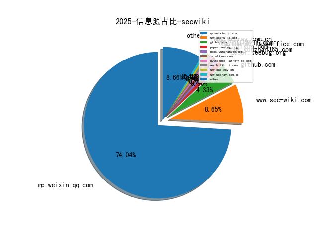

# [数据--所有](README_20.md)
# [数据--年度](README_2025.md)
# 2025 信息源与信息类型占比

# 政策 推荐
| title | url| 
| --- | ---| 
| 中国人民银行业务领域数据安全管理办法 | http://www.pbc.gov.cn/tiaofasi/144941/144957/5702602/index.html| 

# 网络安全书籍 推荐
| date_added | language | title | author | link | size| 
| --- | --- | --- | --- | --- | ---| 
| 2025-05-11 22:33:34 | English | Java for Programmers: with Generative AI, 5th Edition | unknown | https://www.wowebook.org/java-for-programmers-with-generative-ai-5th-edition/ | unknown| 
| 2025-05-11 21:30:28 | English | DevSecOps in Oracle Cloud: Securing and Automating Oracle Cloud Infrastructure | unknown | https://www.wowebook.org/devsecops-in-oracle-cloud-securing-and-automating-oracle-cloud-infrastructure/ | unknown| 
| 2025-05-07 08:21:54 | English | Generative AI with Kubernetes | unknown | https://www.wowebook.org/generative-ai-with-kubernetes/ | unknown| 
| 2025-05-07 08:04:50 | English | Mastering DevOps in Kubernetes | unknown | https://www.wowebook.org/mastering-devops-in-kubernetes/ | unknown| 
| 2025-05-07 21:16:02 | English | Hacking Cryptography | unknown | https://www.wowebook.org/hacking-cryptography/ | unknown| 
| 2025-05-07 06:35:44 | English | Hacking Cryptography: Write, break, and fix real-world implementations | Kamran Khan and Bill Cox | http://libgen.is/book/index.php?md5=451D7FBC6E2399DE00CF759A39ABC464 | 16 MB [EPUB]| 
| 2025-05-06 17:36:54 | English | High Performance Python, 3rd Edition | unknown | https://www.wowebook.org/high-performance-python-3rd-edition/ | unknown| 
| 2025-05-06 16:11:48 | English | CompTIA CySA+ (CS0-003) Certification Guide | unknown | https://www.wowebook.org/comptia-cysa-cs0-003-certification-guide/ | unknown| 
| 2025-05-06 08:51:21 | English | Cloud Security Handbook, 2nd Edition | unknown | https://www.wowebook.org/cloud-security-handbook-2nd-edition/ | unknown| 
| 2025-05-05 03:02:33 | English | Sex Is a Spectrum: The Biological Limits of the Binary | Agustín Fuentes | http://libgen.is/book/index.php?md5=B5BE65F25BC6F7EAA0198CE2CE65AB00 | 1 MB [PDF]| 
| 2025-05-04 21:44:28 | English | Creating ChatGPT Apps with JavaScript: A Hands-on Guide for AI Applications with OpenAI APIs | Bruce Hopkins Jr. | http://libgen.is/book/index.php?md5=9274EF5426AAD4863E8072BA8D689E57 | 5 MB [PDF]| 
| 2025-05-04 21:40:18 | English | Mastering DevOps in Kubernetes | Soumiyajit Das Chowdhury | http://libgen.is/book/index.php?md5=2F99826C2E550B5F64D0AC9C63CDCBB5 | 72 MB [PDF]| 
| 2025-05-04 21:39:16 | English | Creating ChatGPT Apps with JavaScript : A Hands-on Guide for AI Applications with OpenAI APIs | Bruce Hopkins Jr.; Bruce Hopkins Sr. | http://libgen.is/book/index.php?md5=7EB9C5BFD0219906E5AA12637ED9CA4E | 3 MB [EPUB]| 
| 2025-05-04 21:38:10 | English | The Professional : A Playbook to Unleash Your Potential and Futureproof Your Success | Tony Frost | http://libgen.is/book/index.php?md5=E107EADC43D1C3F3B41520EDBEFE9330 | 653 kB [EPUB]| 
| 2025-05-03 21:14:45 | English | Linux Basics for Hackers, 2nd Edition | unknown | https://www.wowebook.org/linux-basics-for-hackers-2nd-edition/ | unknown| 
| 2025-04-30 19:11:06 | English | Architecting Power BI Solutions in Microsoft Fabric | unknown | https://www.wowebook.org/architecting-power-bi-solutions-in-microsoft-fabric/ | unknown| 
| 2025-04-29 14:58:36 | English | Implementing DevOps with Ansible 2 | Jonathan McAllister | http://libgen.is/book/index.php?md5=3E3FCDD9295D19C8B1BF640C5BE15DDA | 16 MB [MOBI]| 
| 2025-04-28 12:05:19 | English | AI-Assisted Coding: A Practical Guide to Boosting Software Development with ChatGPT, GitHub Copilot, Ollama, Aider, and Beyond | unknown | https://www.wowebook.org/ai-assisted-coding-a-practical-guide-to-boosting-software-development-with-chatgpt-github-copilot-ollama-aider-and-beyond/ | unknown| 
| 2025-04-26 08:42:17 | English | The Kubernetes Book, 2025 Edition | unknown | https://www.wowebook.org/the-kubernetes-book-2025-edition/ | unknown| 
| 2025-04-26 07:44:38 | English | Quick Start Kubernetes, 2025 Edition | unknown | https://www.wowebook.org/quick-start-kubernetes-2025-edition/ | unknown| 
| 2025-04-26 11:54:34 | English | Circular Supply Chain Management: A Sustainability Approach | Jayakrishna Kandasamy , Vimal Kek , Manavalan Ethirajan , Nishal Murali | http://libgen.is/book/index.php?md5=CEEA8CD83BEBDF50F99E688E0859E493 | 9 MB [PDF]| 
| 2025-04-26 11:34:41 | English | The impact of supply chain digitalization on supply chain performance: a moderated mediation model | Shaobo Wei, Hua Liu, Wanying Xu, Xiayu Chen | http://libgen.is/book/index.php?md5=F4EE47A19FDF3F1A9521C462C9FE5406 | 779 kB [PDF]| 
| 2025-04-26 10:41:12 | English | Microsoft Identity and Access Administrator SC-300 Exam Guide, 2nd Edition | unknown | https://www.wowebook.org/microsoft-identity-and-access-administrator-sc-300-exam-guide-2nd-edition/ | unknown| 
| 2025-04-25 14:30:09 | English | Windows 10: 2020 Complete Beginners Guide to Learn Microsoft Windows 10 . Take Control of Your PC | Daane, Ben | http://libgen.is/book/index.php?md5=60C4235C8DBA9E6FB200DAF6C4D1DCEA | 6 MB [EPUB]| 
| 2025-04-25 14:19:57 | English | Attack on Orleans | Jake Klim | http://libgen.is/book/index.php?md5=4A195F206B57932FE7A04D4647B9BCC3 | 4 MB [EPUB]| 
| 2025-04-25 20:32:53 | English | Practical Generative AI with ChatGPT, 2nd Edition | unknown | https://www.wowebook.org/practical-generative-ai-with-chatgpt-2nd-edition/ | unknown| 
| 2025-04-24 12:47:40 | English | Machine Learning With Python: Hands on Machine Learning with Python Tools, Concept And Techniques | ANSARI, HASANRAZA | http://libgen.is/book/index.php?md5=97DBD8F7390A00E4C25CC6A1F4182C92 | 801 kB [AZW]| 
| 2025-04-24 12:46:37 | English | Python My Bestie: an easy and efficient way to learn python (kmranrg) | Anurag, Er. Kumar | http://libgen.is/book/index.php?md5=5CCDAEC60B990C16B93769AB95088E9B | 1001 kB [AZW]| 
| 2025-04-24 12:42:23 | English | Python All-in-One For Dummies | John C. Shovic; Alan Simpson | http://libgen.is/book/index.php?md5=D1343CEC6878E4B1C6140B3100239306 | 15 MB [AZW]| 
| 2025-04-23 12:15:42 | English | WINDOWS 10 FOR SENIORS 2020/2021: The Complete Microsoft Windows 10 Guide for Senior Technophobe with Latest Shortcuts, Tips & Tricks | Jordan, James | http://libgen.is/book/index.php?md5=C063DEAACC8B4B75D1EACB2DCFDEA617 | 2 MB [AZW]| 
| 2025-04-23 12:08:01 | English | Learning in Python: Study Data Science and Machine Learning including Modern Neural Networks produced in Python, Theano, and TensorFlow | K, K.M. | http://libgen.is/book/index.php?md5=925B26EB6DC0F201A4E9BB7E59EFBD10 | 483 kB [AZW]| 
| 2025-04-23 20:19:10 | English | The Comprehensive Guide to Cybersecurity Careers | Jason Edwards | http://libgen.is/book/index.php?md5=9BFEB9EEC5402CA0E7CDF9E6E1CD71C4 | 3 MB [EPUB]| 
| 2025-04-23 20:18:15 | English | Guide to Distributed Algorithms: Design, Analysis and Implementation Using Python | K. Erciyes | http://libgen.is/book/index.php?md5=E2D5403FF807A674086A6C8584BD6EBF | 53 MB [EPUB]| 
| 2025-04-22 12:09:54 | English | Command-Line Rust: A Project-Based Primer for Writing Rust CLIs | Ken Youens-Clark | http://libgen.is/book/index.php?md5=187FD2C3D6D726B8AB8ED59A969559EA | 2 MB [AZW]| 
| 2025-04-22 12:07:37 | English | WINDOWS 10 MADE SIMPLE: A Beginner To Expert Guide On Microsoft Windows 10 With Step-By-Step Visual Illustrations | Mince, Andy | http://libgen.is/book/index.php?md5=13EAAAECA832FB4D4368BA91BE18B124 | 7 MB [AZW]| 
| 2025-04-21 11:43:12 | English | Chaos Engineering with Python : Python-powered techniques for building resilent systems through chaos engineering | Mandeep Ubhi, | http://libgen.is/book/index.php?md5=7873778CD94E90CA836BC5A22210D455 | 7 MB [EPUB]| 
| 2025-04-21 11:30:24 | English | (EXPERT INSIGHTS) Building Agentic AI Systems: Create Intelligent, Autonomous AI Agents That Can Reason, Plan, and Adapt | Anjanava Biswas, Wrick Talukdar | http://libgen.is/book/index.php?md5=11345CBB546526214F62B4FA441DB11E | 8 MB [EPUB]| 
| 2025-04-21 09:54:15 | English | (Law, Society, Policy) Vulnerability Theory and the Trinity Lectures: Institutionalizing the Individual | Martha Albertson Fineman | http://libgen.is/book/index.php?md5=AB7C68EA7385BE13D66F0D417A7C9AF3 | 6 MB [PDF]| 
| 2025-04-21 20:56:00 | English | Emerging Trends in Information System Security Using AI & Data Science for Next-Generation Cyber Analytics | Faisal Rehman; Inam Ullah Khan; Oroos Arshi; Shashi Kant Gupta | http://libgen.is/book/index.php?md5=F8C47B27F38485A692FACDC9B707B81E | 23 MB [EPUB]| 
| 2025-04-21 20:45:28 | English | Efficient Analog Integrated Circuit Sizing with GenAI : Exploring Generative Diffusion Models | Pedro H. M. Eid; Filipe P. Azevedo; Nuno C. C. Lourenço; Ricardo M. F. Martins | http://libgen.is/book/index.php?md5=E1B46634B4743C5DB2980E9365F80790 | 13 MB [EPUB]| 
| 2025-04-21 18:34:15 | English | Kubernetes and Cloud Native Associate (KCNA) Exam Guide: KCNA concepts featuring orchestration, architecture, observability | Sangram v | http://libgen.is/book/index.php?md5=CE02C81F91C0EA4FEB09A539041EF754 | 9 MB [EPUB]| 
| 2025-04-21 18:05:16 | English | ETHICAL HACKING FOR BEGGINERS: A Comprehensive Beginners Guide to Learn About the Effective And Concept Strategies of Ethical Hacking | Smith, Peter | http://libgen.is/book/index.php?md5=E58E44590F1B3768D1E8219818E321B7 | 250 kB [AZW]| 
| 2025-04-21 18:04:30 | English | Windows 10 2021: A Complete Guide to Microsoft Windows 10 with the Latest Tips and Updates | Hill, Carson; Hill, Carson | http://libgen.is/book/index.php?md5=5E2CA2202E0C5941850514ED4AC2E1FA | 3 MB [AZW]| 
| 2025-04-21 18:00:18 | English | Privacy, Regulations, and Cybersecurity | Chris Moschovitis | http://libgen.is/book/index.php?md5=D0E666363D0115E75239B587C65BA828 | 3 MB [AZW]| 
| 2025-04-20 15:38:41 | English | NFT Beginners Handbook: Create, Buy and Sell Non-Fungible Tokens with Ease ; Guide for Investing in Crypto Art, Blockchains, and Metaverse | COLON, SHAWN | http://libgen.is/book/index.php?md5=03E63BB93D690052B14AE5F05AA267B2 | 307 kB [AZW]| 
| 2025-04-20 15:37:58 | English | Electrical Integrated Circuit Approach : Car Parking Sensor,Battery Monitor, Arduino Based FM Radio and Walkie Talkie, MP3 Player Circuit,White Noise Generator | K, Anbazhagan | http://libgen.is/book/index.php?md5=2BE3103BC100F8DE29E1A315E00FFEED | 6 MB [AZW]| 
| 2025-04-20 15:35:32 | English | Data Analysis and Machine Learning with Python for Absolute Beginners: Learn Data Analysis and build models with help of Excel and Python tools along with ... 4 in 1 Bookset (Data Analysis Demystified) | Truck, Stanley | http://libgen.is/book/index.php?md5=6EDE6102B3AF8B72A17392C199FB0399 | 3 MB [AZW]| 
| 2025-04-19 20:57:33 | English | Microsoft Copilot Made Easy: Harnessing AI for Advanced Productivity (Windows Made Easy Book 11) | Bernstein, James | http://libgen.is/book/index.php?md5=7563C3CB44164538BB1040BB82A65E66 | 27 MB [EPUB]| 
| 2025-04-19 21:00:57 | English | The Awesome Boss Playbook | Marako Marcus | http://libgen.is/book/index.php?md5=CC6EA64C1C1BC0232931754F433688A3 | 134 kB [EPUB]| 
| 2025-04-19 19:16:50 | English | Ultimate Penetration Testing with Nmap: Master Cybersecurity Assessments for Network Security, Monitoring, and Scanning Using Nmap | Travis DeForge | http://libgen.is/book/index.php?md5=F000C6772C70086B3063AB72A1CD8BDA | 4 MB [EPUB]| 
| 2025-04-17 08:08:10 | English | Building Generative AI Services with FastAPI | unknown | https://www.wowebook.org/building-generative-ai-services-with-fastapi/ | unknown| 
| 2025-04-17 11:21:49 | English | Build Financial Software with Generative AI (From Scratch) | unknown | https://www.wowebook.org/build-financial-software-with-generative-ai-from-scratch/ | unknown| 
| 2025-04-15 09:14:08 | English | Securing the AWS Cloud: A Guide for Learning to Secure AWS Infrastructure | unknown | https://www.wowebook.org/securing-the-aws-cloud-a-guide-for-learning-to-secure-aws-infrastructure/ | unknown| 
| 2025-04-15 07:31:12 | English | Machine Learning and AI in Cybersecurity (Video Course) | unknown | https://www.wowebook.org/machine-learning-and-ai-in-cybersecurity-video-course/ | unknown| 
| 2025-04-15 10:44:11 | English | The Rise of AI Agents: Integrating AI, Blockchain Technologies, and Quantum Computing | unknown | https://www.wowebook.org/the-rise-of-ai-agents-integrating-ai-blockchain-technologies-and-quantum-computing/ | unknown| 
| 2025-04-15 11:04:45 | English | Redefining Hacking: A Comprehensive Guide to Red Teaming and Bug Bounty Hunting in an AI-driven World | unknown | https://www.wowebook.org/redefining-hacking-a-comprehensive-guide-to-red-teaming-and-bug-bounty-hunting-in-an-ai-driven-world/ | unknown| 
| 2025-04-15 10:54:23 | English | Engineering AI Systems: Architecture and DevOps Essentials | unknown | https://www.wowebook.org/engineering-ai-systems-architecture-and-devops-essentials/ | unknown| 
| 2025-04-13 11:45:00 | English | Kubernetes Microservices Security Essentials (Video Course) | unknown | https://www.wowebook.org/kubernetes-microservices-security-essentials-video-course/ | unknown| 
| 2025-04-13 11:24:00 | English | Kubernetes Security Basics (Video Course) | unknown | https://www.wowebook.org/kubernetes-security-basics-video-course/ | unknown| 
| 2025-04-13 10:29:35 | English | Kubernetes Threat and Attack Detection (Video Course) | unknown | https://www.wowebook.org/kubernetes-threat-and-attack-detection-video-course/ | unknown| 
| 2025-04-13 09:02:16 | English | Kubernetes Network and Cluster Hardening (Video Course) | unknown | https://www.wowebook.org/kubernetes-network-and-cluster-hardening-video-course/ | unknown| 
| 2025-04-13 12:58:27 | English | Computer Programming: Python - 3 Books in 1: A Crash Course to Go Deep into Artificial Intelligence. Tools, Tips and Tricks to Implement Your Neural Networks with Machine Learning and Data Science | Russo, Russel R. | http://libgen.is/book/index.php?md5=540D83F4AEAD6D1C2E7FBA5DC9272D67 | 7 MB [AZW3]| 
| 2025-04-13 12:30:43 | English | Python Data Analysis: Comprehensive Guide to Data Science, Analytics and Metrics with Python | Campbell, Alex | http://libgen.is/book/index.php?md5=BAA1FEC050373B3822DD419D19FD22C6 | 2 MB [AZW3]| 
| 2025-04-12 07:14:59 | English | (Community experience distilled) Mastering Python for data science : explore the world of data science through Python and learn how to make sense of data | Samir Madhavan | http://libgen.is/book/index.php?md5=55A2E3DA94DEE481C8369C48A0AB544F | 8 MB [PDF]| 
| 2025-04-12 23:43:11 | English | Letting Go of the Status Quo: A Playbook for Transforming State Government | William D. Eggers, Robert N. Campbell III, Tiffany Dovey Fishman, Tom Ridge, Tom Carper | http://libgen.is/book/index.php?md5=21AF157EED83F0F2B2ACA1D9B5FEEF43 | 13 MB [PDF]| 
| 2025-04-12 20:47:31 | English | CompTIA PenTest+ Study Guide : Exam PT0-003 | Chapple, Mike;Shimonski, Robert;Seidl, David;; Robert Shimonski; David Seidl | http://libgen.is/book/index.php?md5=9BCBF498BB5A9653A60E91D937C25FBD | 38 MB [EPUB]| 
| 2025-04-12 20:43:25 | English | CCST Cisco Certified Support Technician Study Guide : Cybersecurity Exam | Lammle, Todd;Buhagiar, Jon;Robb, Donald;Montgomery, Todd;; Jon Buhagiar; Donald Robb; Todd Montgomery | http://libgen.is/book/index.php?md5=84A68F3E3F186CC2E64D06BCA47817BA | 20 MB [EPUB]| 
| 2025-04-11 03:07:21 | English | What about Evil?: A Defense of Gods Sovereign Glory | Scott Christensen | http://libgen.is/book/index.php?md5=C755A81BD9C959B5B7A2FB6A12A84522 | 3 MB [EPUB]| 
| 2025-04-11 14:30:10 | English | Personality Hacker | Joel Mark Witt | http://libgen.is/book/index.php?md5=5F254A39CB85B60AA1DBFBDCFFAD7F0F | 19 MB [AZW3]| 
| 2025-04-11 14:21:33 | English | The Programmers Guide to Quality Assurance | Pallmann, David | http://libgen.is/book/index.php?md5=BCEC8EEE239E4298484D85E1CF080B11 | 6 MB [AZW3]| 
| 2025-04-11 20:20:37 | English | 3D Data Science with Python | unknown | https://www.wowebook.org/3d-data-science-with-python/ | unknown| 
| 2025-04-11 21:52:47 | English | Automate the Boring Stuff with Python, 3rd Edition | unknown | https://www.wowebook.org/automate-the-boring-stuff-with-python-3rd-edition/ | unknown| 
| 2025-04-11 21:12:55 | English | Building Quantum Software with Python | unknown | https://www.wowebook.org/building-quantum-software-with-python/ | unknown| 
| 2025-04-09 12:11:31 | English | Routledge Handbook of Climate Law and Governance; Courage, Contributions and Compliance | Marie-Claire Cordonier Segger; Christina Voigt | http://libgen.is/book/index.php?md5=5CE2305AC98A61A3B9BCEB6C9BCFCEF0 | 1 MB [EPUB]| 
| 2025-04-08 17:30:54 | English | Generative AI with Python and PyTorch, 2nd Edition | unknown | https://www.wowebook.org/generative-ai-with-python-and-pytorch-2nd-edition/ | unknown| 
| 2025-04-08 16:12:45 | English | Software Testing with Generative AI, Video Edition | unknown | https://www.wowebook.org/software-testing-with-generative-ai-video-edition/ | unknown| 
| 2025-04-07 07:39:37 | English | Microsoft Excel 365 Bible, 2nd Edition | unknown | https://www.wowebook.org/microsoft-excel-365-bible-2nd-edition/ | unknown| 
| 2025-04-07 06:44:54 | English | The Power Platform Playbook for Digital Transformation | unknown | https://www.wowebook.org/the-power-platform-playbook-for-digital-transformation/ | unknown| 
| 2025-04-07 11:40:41 | English | Python Data Visualization (Video Course) | unknown | https://www.wowebook.org/python-data-visualization-video-course/ | unknown| 
| 2025-04-07 08:10:38 | English | The Art of Mac Malware, Volume 2 | unknown | https://www.wowebook.org/the-art-of-mac-malware-volume-2/ | unknown| 
| 2025-04-06 20:34:52 | English | Microsoft Excel 365 Bible | Michael Alexander; Dick Kusleika | http://libgen.is/book/index.php?md5=7402AD1EE02F92557FC0C83C0BAAB33B | 81 MB [EPUB]| 
| 2025-04-06 20:33:35 | English | Taming the Hacking Storm : A Framework for Defeating Hackers and Malware | Roger A. Grimes | http://libgen.is/book/index.php?md5=3158FB2BCC018FC9B5C6521D8C329666 | 4 MB [EPUB]| 
| 2025-04-05 13:13:24 | English | Some Examples Related to Ethical Computer Networking Hacking | Hedaya Mahmood Alasooly | http://libgen.is/book/index.php?md5=5D64281B522D0E5487FC10962976F78A | 7 MB [EPUB]| 
| 2025-04-05 13:05:44 | English | Active Operations Management: The Playbook for Service Operations in the Agile Age | Neil Bentley; Richard Jeffery | http://libgen.is/book/index.php?md5=7D8AC920D72655F13D142AE645DE3047 | 8 MB [EPUB]| 
| 2025-04-05 12:40:49 | English | Your Face Belongs to Us: The Secretive Startup Dismantling Your Privacy | Kashmir Hill | http://libgen.is/book/index.php?md5=94CD0092EFE81A50BCF1866B842BA995 | 2 MB [EPUB]| 
| 2025-04-03 22:50:54 | English | AI Value Creators: Beyond the Generative AI User Mindset | Rob Thomas | http://libgen.is/book/index.php?md5=5C11FF3087C3FD7350FADC3226286A55 | 11 MB [EPUB]| 
| 2025-04-03 19:57:11 | English | Mastering Secure Coding Writing Software That Stands Up to Attacks | Larry Jones | http://libgen.is/book/index.php?md5=1CF1A5EBC01D4E8F3E65AD7B8EAADC50 | 8 MB [EPUB]| 
| 2025-04-02 15:45:36 | English | AI Agents in Action | Micheal Lanham | http://libgen.is/book/index.php?md5=8320C7E5BEA8A28844C7463CD0B82E99 | 30 MB [PDF]| 
| 2025-04-02 07:41:11 | English | GenAI on AWS: A Practical Approach to Building Generative AI Applications on AWS | unknown | https://www.wowebook.org/genai-on-aws-a-practical-approach-to-building-generative-ai-applications-on-aws/ | unknown| 
| 2025-04-02 07:22:19 | English | Kubernetes Recipes: A Practical Guide for Container Orchestration and Deployment | unknown | https://www.wowebook.org/kubernetes-recipes-a-practical-guide-for-container-orchestration-and-deployment/ | unknown| 
| 2025-04-02 09:15:28 | English | AI Value Creators: Beyond the Generative AI User Mindset | unknown | https://www.wowebook.org/ai-value-creators-beyond-the-generative-ai-user-mindset/ | unknown| 
| 2025-04-02 08:43:56 | English | Time Series Analysis with Spark | unknown | https://www.wowebook.org/time-series-analysis-with-spark/ | unknown| 
| 2025-04-01 05:06:07 | English | Object-Oriented Python | Irv Kalb | http://libgen.is/book/index.php?md5=DE083B00BA7EFCC46D8C2C6FF122B88F | 4 MB [EPUB]| 
| 2025-03-28 09:32:09 | English | Zero Trust in Resilient Cloud and Network Architectures | Dhrumil Prajapati; Vinay Saini; Josh Halley; Ariel Leza | http://libgen.is/book/index.php?md5=618D24D92038C3299032DF58C6535053 | 44 MB [EPUB]| 
| 2025-03-28 09:28:47 | English | Creating ChatGPT Apps with JavaScript: A Hands-On Guide for AI Applications with OpenAI APIs | Bruce Hopkins | http://libgen.is/book/index.php?md5=404D38747DE506F71F294E4A90133E3C | 5 MB [PDF]| 
| 2025-03-28 17:49:26 | English | Time Series Forecasting Using Generative AI | unknown | https://www.wowebook.org/time-series-forecasting-using-generative-ai/ | unknown| 
| 2025-03-28 14:58:23 | English | Creating ChatGPT Apps with JavaScript | unknown | https://www.wowebook.org/creating-chatgpt-apps-with-javascript/ | unknown| 
| 2025-03-28 08:52:11 | English | Python Adventures for Young Coders | unknown | https://www.wowebook.org/python-adventures-for-young-coders/ | unknown| 
| 2025-03-24 14:32:11 | English | Spring Security 6 Recipes | unknown | https://www.wowebook.org/spring-security-6-recipes/ | unknown| 
| 2025-03-24 14:14:22 | English | Microsoft Unified XDR and SIEM Solution Handbook | unknown | https://www.wowebook.org/microsoft-unified-xdr-and-siem-solution-handbook/ | unknown| 
| 2025-03-23 08:57:08 | English | Ultimate Cilium and eBPF for Cloud Native Development | unknown | https://www.wowebook.org/ultimate-cilium-and-ebpf-for-cloud-native-development/ | unknown| 
| 2025-03-20 08:20:45 | English | Securing Microsoft Azure OpenAI | unknown | https://www.wowebook.org/securing-microsoft-azure-openai/ | unknown| 
| 2025-03-20 07:57:52 | English | Outlier Detection in Python, Video Edition | unknown | https://www.wowebook.org/outlier-detection-in-python-video-edition/ | unknown| 
| 2025-03-17 02:49:47 | English | Advanced Malware Analysis and Intelligence | unknown | https://www.wowebook.org/advanced-malware-analysis-and-intelligence/ | unknown| 
| 2025-03-16 13:26:21 | English | Generative AI Essentials | unknown | https://www.wowebook.org/generative-ai-essentials/ | unknown| 
| 2025-03-16 14:09:07 | English | Argo CD and Argo Workflows on Kubernetes | unknown | https://www.wowebook.org/argo-cd-and-argo-workflows-on-kubernetes/ | unknown| 
| 2025-03-16 13:49:51 | English | Penetration Testing with Java | unknown | https://www.wowebook.org/penetration-testing-with-java/ | unknown| 
| 2025-03-14 04:57:21 | English | Starting Data Analytics with Generative AI and Python, Video Edition | unknown | https://www.wowebook.org/starting-data-analytics-with-generative-ai-and-python-video-edition/ | unknown| 
| 2025-03-14 02:17:07 | English | Elliptic Curve Cryptography for Developers | unknown | https://www.wowebook.org/elliptic-curve-cryptography-for-developers/ | unknown| 
| 2025-03-13 03:20:00 | English | Practical Cybersecurity Fundamentals (Video Course) | unknown | https://www.wowebook.org/practical-cybersecurity-fundamentals-video-course/ | unknown| 
| 2025-03-13 02:27:15 | English | ChatGPT For Dummies, 2nd Edition | unknown | https://www.wowebook.org/chatgpt-for-dummies-2nd-edition/ | unknown| 
| 2025-03-12 05:42:36 | English | Introducing Microsoft Purview | unknown | https://www.wowebook.org/introducing-microsoft-purview/ | unknown| 
| 2025-03-10 05:17:02 | English | Designing Large Language Model Applications | unknown | https://www.wowebook.org/designing-large-language-model-applications/ | unknown| 
| 2025-03-10 05:00:04 | English | Cloud Native Data Security with OAuth | unknown | https://www.wowebook.org/cloud-native-data-security-with-oauth/ | unknown| 
| 2025-03-10 04:47:18 | English | Microsoft 365 Office All-in-One For Dummies, 3rd Edition | unknown | https://www.wowebook.org/microsoft-365-office-all-in-one-for-dummies-3rd-edition/ | unknown| 
| 2025-03-10 04:03:05 | English | Cyber Threat Hunting, Video Edition | unknown | https://www.wowebook.org/cyber-threat-hunting-video-edition/ | unknown| 
| 2025-03-10 03:23:23 | English | AI Agents in Action, Video Edition | unknown | https://www.wowebook.org/ai-agents-in-action-video-edition/ | unknown| 
| 2025-03-10 02:44:34 | English | Certified Kubernetes Security Specialist (CKS) (Video Course) | unknown | https://www.wowebook.org/certified-kubernetes-security-specialist-cks-video-course/ | unknown| 
| 2025-03-09 03:49:23 | English | Evaluating Large Language Models (LLMs) (Video Course) | unknown | https://www.wowebook.org/evaluating-large-language-models-llms-video-course/ | unknown| 
| 2025-03-09 03:19:55 | English | Certified Kubernetes Administrator (CKA), 4th Edition (Video Course) | unknown | https://www.wowebook.org/certified-kubernetes-administrator-cka-4th-edition-video-course/ | unknown| 
| 2025-03-09 02:40:30 | English | Cybersecurity Closer Look Labs (Video Course) | unknown | https://www.wowebook.org/cybersecurity-closer-look-labs-video-course/ | unknown| 
| 2025-03-05 22:03:45 | English | Azure OpenAI Essentials | unknown | https://www.wowebook.org/azure-openai-essentials/ | unknown| 
| 2025-03-05 21:01:06 | English | Implementing Analytics Solutions Using Microsoft Fabric DP-600 Exam Study Guide | unknown | https://www.wowebook.org/implementing-analytics-solutions-using-microsoft-fabric-dp-600-exam-study-guide/ | unknown| 
| 2025-03-03 13:01:33 | English | Cyber Resilience Index: Mastering Threat-Informed Defense | unknown | https://www.wowebook.org/cyber-resilience-index-mastering-threat-informed-defense/ | unknown| 
| 2025-03-02 21:48:51 | English | Lean DevOps: A Practical Guide to On Demand Service Delivery | unknown | https://www.wowebook.org/lean-devops-a-practical-guide-to-on-demand-service-delivery/ | unknown| 
| 2025-02-28 15:55:59 | English | Learn Quantum Computing with Python and IBM Quantum, 2nd Edition | unknown | https://www.wowebook.org/learn-quantum-computing-with-python-and-ibm-quantum-2nd-edition/ | unknown| 
| 2025-02-17 07:51:21 | English | Alice and Bob Learn Secure Coding | unknown | https://www.wowebook.org/alice-and-bob-learn-secure-coding/ | unknown| 
| 2025-02-17 07:16:24 | English | Learning LangChain | unknown | https://www.wowebook.org/learning-langchain/ | unknown| 
| 2025-02-14 08:04:43 | English | AI Agents in Action | unknown | https://www.wowebook.org/ai-agents-in-action/ | unknown| 
| 2025-02-13 07:36:03 | English | Integrating Rust | unknown | https://www.wowebook.org/integrating-rust/ | unknown| 
| 2025-02-13 12:41:43 | English | Python for Bioinformatics | unknown | https://www.wowebook.org/python-for-bioinformatics/ | unknown| 
| 2025-02-13 11:52:55 | English | Generative AI for Financial Services | unknown | https://www.wowebook.org/generative-ai-for-financial-services/ | unknown| 
| 2025-02-12 16:32:17 | English | Deep Learning Using Python | Dr. S Lovelyn Rose, Dr. L Ashok Kumar, Dr. D Karthika Renuka | http://libgen.is/book/index.php?md5=F7CC6CF22FCEB8AA42F873AC29B1B160 | 12 MB [PDF]| 
| 2025-02-12 16:08:13 | English | DevOps Tools from Practitioners Viewpoint | Deepak Gaikwad, Viral Thakkar | http://libgen.is/book/index.php?md5=DBB9E0390D8A74D3C857C8A497B3C56E | 8 MB [PDF]| 
| 2025-02-11 07:39:14 | English | Ultimate Robotics Programming with ROS 2 and Python | unknown | https://www.wowebook.org/ultimate-robotics-programming-with-ros-2-and-python/ | unknown| 
| 2025-02-10 13:52:41 | English | Weapons in Space: Technology, Politics, and the Rise and Fall of the Strategic Defense Initiative | Aaron Bateman | http://libgen.is/book/index.php?md5=871BBDF59E5CB8BC670D94F99D813AC7 | 3 MB [PDF]| 
| 2025-02-09 08:20:09 | English | The Hacker Mindset: How thinking like a hacker can improve your code, your coffee, and your life | Francesco Carlucci | http://libgen.is/book/index.php?md5=93B273CF8CC2A6F62C41AF65F0B55E8F | 1 MB [PDF]| 
| 2025-02-08 10:16:23 | English | Security Automation with Python | unknown | https://www.wowebook.org/security-automation-with-python/ | unknown| 
| 2025-02-08 09:17:01 | English | Learn Generative AI with PyTorch, Video Edition | unknown | https://www.wowebook.org/learn-generative-ai-with-pytorch-video-edition/ | unknown| 
| 2025-02-08 07:28:18 | English | Write Powerful Rust Macros, Video Edition | unknown | https://www.wowebook.org/write-powerful-rust-macros-video-edition/ | unknown| 
| 2025-02-07 11:09:43 | English | Security Automation with Python: Practical Python solutions for automating and scaling security operations | Corey Charles Sr. | http://libgen.is/book/index.php?md5=2FE0B5190BB7ECE1D28FCA99FB236DC9 | 6 MB [EPUB]| 
| 2025-02-07 09:52:25 | English | Groundwater Monitoring and Management Through Hydrogeochemical Modeling Approach | S.Chidambaram, K.Srinivasamoorthy, AL.Ramanathan, P.Anandhan, R.Manivannan, M.Bala Krishna Prasad, M | http://libgen.is/book/index.php?md5=15429CC4F9ABBE032B4018AE0D5A4FC3 | 19 MB [PDF]| 
| 2025-02-07 09:25:57 | English | Generative AI for Financial Services: Challenges, anti-patterns, and best practices (English Edition) | Vikesh Pandey, Arnav Khare | http://libgen.is/book/index.php?md5=8A3457DD43932B090CE76C2702E40F1A | 7 MB [EPUB]| 
| 2025-02-07 09:31:50 | English | Python for Bioinformatics : Using machine learning for drug discovery, cluster analysis, and phylogenetics | Verma, Parul;Fatima, Shahnaz;; Dr. Shahnaz Fatima | http://libgen.is/book/index.php?md5=1A7508BA06BF4501733B0962CB1A37BD | 9 MB [EPUB]| 
| 2025-02-07 06:02:59 | English | Super Privacy: The Complete Guide to Personal Privacy and Financial Freedom in Tomorrows Cashless Society | Bob Hammond | http://libgen.is/book/index.php?md5=78409D77ECBEA6F323616B8044B4CD71 | 12 MB [PDF]| 
| 2025-02-06 12:21:10 | English | Generative AI for Web Developers (Video Course) | unknown | https://www.wowebook.org/generative-ai-for-web-developers-video-course/ | unknown| 
| 2025-02-06 11:49:54 | English | Generative AI for Python Developers (Video Course) | unknown | https://www.wowebook.org/generative-ai-for-python-developers-video-course/ | unknown| 
| 2025-02-06 11:28:07 | English | Securing Generative AI (Video Course) | unknown | https://www.wowebook.org/securing-generative-ai-video-course/ | unknown| 
| 2025-02-06 07:55:19 | English | Programming Generative AI (Video Course) | unknown | https://www.wowebook.org/programming-generative-ai-video-course/ | unknown| 
| 2025-02-06 06:35:48 | English | Ansible Core Concepts and Advanced Features (Video Course) | unknown | https://www.wowebook.org/ansible-core-concepts-and-advanced-features-video-course/ | unknown| 
| 2025-02-06 06:09:53 | English | Certified Kubernetes Application Developer (CKAD), 4th Edition (Video Course) | unknown | https://www.wowebook.org/certified-kubernetes-application-developer-ckad-4th-edition-video-course/ | unknown| 
| 2025-02-04 08:13:48 | English | Designing Data intensive application in Python | Aarav Joshi | http://libgen.is/book/index.php?md5=8F5DAAF46BD97D6DED865619221C7E03 | 33 MB [PDF]| 
| 2025-02-04 08:12:51 | English | Doctored : Fraud, Arrogance, and Tragedy in the Quest to Cure Alzheimers | Charles Piller | http://libgen.is/book/index.php?md5=E0D1124BB0E1F8A6E4B6ED796923BF41 | 4 MB [EPUB]| 
| 2025-02-04 08:10:07 | English | Linear Algebra with Python | Hyun-Seok Sun | http://libgen.is/book/index.php?md5=26C31AD2761829DC2CD2B516704C36D2 | 21 MB [PDF]| 
| 2025-02-04 08:09:04 | English | Calculus with Python | Hyun-Seok Sun | http://libgen.is/book/index.php?md5=DC1A7739AA1CFE747F8376F833869676 | 29 MB [PDF]| 
| 2025-02-04 08:05:58 | English | Deep Learning via Rust | RantAI Academy | http://libgen.is/book/index.php?md5=CFBED536E8F97E5AC5B5F848545E0D6B | 2 MB [PDF]| 
| 2025-02-03 09:41:36 | English | Create Game with Projects in Python: Create a Game, Programming in Python, and Working with Popular Apps Using PyGame. | SCHMITT, STEPHEN G | http://libgen.is/book/index.php?md5=BE2FAE58D5B0F6A3E0D544432F3046EC | 2 MB [EPUB]| 
| 2025-02-03 08:37:15 | English | Full Stack Python Security, Video Edition | unknown | https://www.wowebook.org/full-stack-python-security-video-edition/ | unknown| 
| 2025-02-03 06:26:46 | English | Learn AI-Assisted Python Programming, Second Edition, Video Edition | unknown | https://www.wowebook.org/learn-ai-assisted-python-programming-second-edition-video-edition/ | unknown| 
| 2025-02-03 03:45:09 | English | Generative AI in Action, Video Edition | unknown | https://www.wowebook.org/generative-ai-in-action-video-edition/ | unknown| 
| 2025-02-02 00:21:02 | English | (River Publishers Series In Communications) Aspects Of Personal Privacy In Communications - Problems, Technology And Solutions | Geir M. Koien, Vladimir a. Oleshchuk | http://libgen.is/book/index.php?md5=EBBEFA459EE81F069A5D2D62394B2DC2 | 3 MB [PDF]| 
| 2025-02-02 11:41:21 | English | Essential Python Programming For GUI Development | Andrade , Wendell | http://libgen.is/book/index.php?md5=73DD15B99408F6E5F1B0416F59C10519 | 861 kB [EPUB]| 
| 2025-02-02 06:23:21 | English | MACHINE LEARNING WITH PYTHON: A Comprehensive Guide To Algorithms, Deep Learning Techniques, And Practical Applications | Planet, Code | http://libgen.is/book/index.php?md5=98381F929D701C0D9E54F98577E6EA1B | 16 MB [EPUB]| 
| 2025-02-02 06:22:03 | English | GENERATIVE AI WITH PYTHON: Harnessing The Power Of Machine Learning And Deep Learning To Build Creative And Intelligent Systems | Planet, Code | http://libgen.is/book/index.php?md5=F4BFE5E46EF502E04311242943C76F62 | 14 MB [EPUB]| 
| 2025-02-02 08:45:29 | English | Generative AI Toolbox (Video Course) | unknown | https://www.wowebook.org/generative-ai-toolbox-video-course/ | unknown| 
| 2025-02-02 19:50:05 | English | Pipeline for Automated Code Generation from Backlog Items (PACGBI) : Analysis of Potentials and Limitations of Generative AI for Web Development | Mahja Sarschar | http://libgen.is/book/index.php?md5=C22F6263079544E4A39FA01A8194F1A5 | 13 MB [EPUB]| 
| 2025-02-02 19:49:09 | English | Microsoft Excel Made Easy: A Beginner-to-Expert Guide to Mastering Spreadsheets: Learn Formulas, Functions, Data Analysis, Automation, and Advanced Excel Techniques for Work and Business | Twain, David | http://libgen.is/book/index.php?md5=796C49DD1C9C5FA9B9102EE140B19F53 | 4 MB [EPUB]| 
| 2025-02-01 13:28:55 | English | (Studies in Feminist Philosophy) Global Sweatshops: A Feminist Theory of Exploitation and Resistance (Studies in Feminist Philosophy) | Mirjam Müller | http://libgen.is/book/index.php?md5=BE8BD4B86BBA1BD51DAA9C6477D533CB | 5 MB [PDF]| 
| 2025-01-29 09:13:56 | English | Microsoft Dynamics 365 AI for Business Insights | unknown | https://www.wowebook.org/microsoft-dynamics-365-ai-for-business-insights/ | unknown| 
| 2025-01-29 07:24:20 | English | Microsoft Certified Azure Data Fundamentals (DP-900) Exam Guide | unknown | https://www.wowebook.org/microsoft-certified-azure-data-fundamentals-dp-900-exam-guide/ | unknown| 
| 2025-01-28 15:07:13 | English | XGBoost for Regression Predictive Modeling and Time Series Analysis | unknown | https://www.wowebook.org/xgboost-for-regression-predictive-modeling-and-time-series-analysis/ | unknown| 
| 2025-01-23 20:32:50 | English | (MLI Generative AI Series) Beginning Python 3 with Grok 2 | Oswald Campesato | http://libgen.is/book/index.php?md5=E32D98CD7226E1B660952080AA3BC6C4 | 1 MB [EPUB]| 
| 2025-01-23 19:35:29 | English | Data Analysis for Business Decisions: Case Studies in Excel, R, and ChatGPT: Third Edition | Andres Fortino | http://libgen.is/book/index.php?md5=BCC26CA2508C0B54FED332E7B73A244F | 83 MB [EPUB]| 
| 2025-01-23 19:35:26 | English | Data Analysis for Business Decisions: Case Studies in Excel, R, and ChatGPT: Third Edition | Andres Fortino | http://libgen.is/book/index.php?md5=B85B87857011FDD0A298A0969DDF4DEF | 100 MB [PDF]| 
| 2025-01-22 07:12:44 | English | Generative Artificial Intelligence for Biomedical and Smart Health Informatics | Aditya Khamparia | http://libgen.is/book/index.php?md5=68789C699745A9C57833B50F56299D47 | 20 MB [PDF]| 
| 2025-01-20 06:05:14 | English | Basics of Python Programming: A Quick Guide for Beginners | unknown | https://www.wowebook.org/basics-of-python-programming-a-quick-guide-for-beginners/ | unknown| 
| 2025-01-18 08:27:50 | English | Build a Robo-Advisor with Python (From Scratch) | unknown | https://www.wowebook.org/build-a-robo-advisor-with-python-from-scratch/ | unknown| 
| 2025-01-18 14:19:46 | English | Starting Out with Python, 6th Edition | unknown | https://www.wowebook.org/starting-out-with-python-6th-edition/ | unknown| 
| 2025-01-17 07:31:05 | English | Cybersecurity Leadership for Healthcare Organizations and Institutions of Higher Education | Bradley Fowler, | http://libgen.is/book/index.php?md5=5ED8C105A5E27C9243FF72F9DBBCDE04 | 11 MB [PDF]| 
| 2025-01-17 07:15:40 | English | Reconfigurable Obfuscation Techniques for the IC Supply Chain : Using FPGA-Like Schemes for Protection of Intellectual Property | Zain Ul Abideen; Samuel Pagliarini | http://libgen.is/book/index.php?md5=CCD068408820D44FFF18BE8165372C73 | 45 MB [EPUB]| 
| 2025-01-17 05:02:01 | English | Building Generative AI Services with FastAPI (for True Epub) | Ali Parandeh | http://libgen.is/book/index.php?md5=5D2A5F90A3FE09BE0252ED51A6DB61D1 | 23 MB [EPUB]| 
| 2025-01-16 08:16:07 | English | Microsoft 365 For Dummies | unknown | https://www.wowebook.org/microsoft-365-for-dummies/ | unknown| 
| 2025-01-16 10:37:47 | English | Hemodynamic Monitoring | Mary E. Lough | http://libgen.is/book/index.php?md5=0A95FF295984F9B8EAA23346534DFE65 | 38 MB [PDF]| 
| 2025-01-16 10:35:07 | English | Hemodynamic Monitoring | Mary E. Lough | http://libgen.is/book/index.php?md5=C43219F28B473D3576D829974A1ABEFC | 34 MB [EPUB]| 
| 2025-01-16 10:27:46 | English | Basics of Python Programming A Quick Guide for Beginners | Krishna Kumar Mohbey | http://libgen.is/book/index.php?md5=A3DD2FBDD34F88AFFBF364777F25C839 | 56 MB [PDF]| 
| 2025-01-16 17:26:24 | English | Python Essentials For Dummies | unknown | https://www.wowebook.org/python-essentials-for-dummies/ | unknown| 
| 2025-01-15 11:36:58 | English | Microsoft Teams For Dummies, 3rd Edition | unknown | https://www.wowebook.org/microsoft-teams-for-dummies-3rd-edition/ | unknown| 
| 2025-01-15 06:37:49 | English | Microsoft Teams For Dummies, 2nd Edition | unknown | https://www.wowebook.org/microsoft-teams-for-dummies-2nd-edition/ | unknown| 
| 2025-01-15 05:58:21 | English | Microsoft 365 PowerPoint For Dummies, 2nd Edition | unknown | https://www.wowebook.org/microsoft-365-powerpoint-for-dummies-2nd-edition/ | unknown| 
| 2025-01-15 12:00:10 | English | Microsoft Power BI For Dummies | unknown | https://www.wowebook.org/microsoft-power-bi-for-dummies/ | unknown| 
| 2025-01-15 11:47:51 | English | Microsoft Power Platform For Dummies | unknown | https://www.wowebook.org/microsoft-power-platform-for-dummies/ | unknown| 
| 2025-01-15 11:52:46 | English | Glycemic Monitoring - ECAB | R V Jayakumar | http://libgen.is/book/index.php?md5=40A7BC7D8BDF65836C95B6A03443C88E | 1 MB [PDF]| 
| 2025-01-15 11:52:33 | English | Glycemic Monitoring - ECAB | R V Jayakumar | http://libgen.is/book/index.php?md5=36AFA5B8BAF8838E0D4C4F68B909CAC5 | 3 MB [EPUB]| 
| 2025-01-11 16:47:52 | English | A Beginner’s Guide To Web Application Penetration Testing | unknown | https://www.wowebook.org/a-beginners-guide-to-web-application-penetration-testing/ | unknown| 
| 2025-01-10 06:20:20 | English | Microsoft 365 Copilot At Work: Using AI to Get the Most from Your Business Data and Favorite Apps | unknown | https://www.wowebook.org/microsoft-365-copilot-at-work-using-ai-to-get-the-most-from-your-business-data-and-favorite-apps/ | unknown| 
| 2025-01-08 06:17:50 | English | Generative AI on Google Cloud with LangChain | unknown | https://www.wowebook.org/generative-ai-on-google-cloud-with-langchain/ | unknown| 
| 2025-01-07 11:15:25 | English | Learn Generative AI with PyTorch By Mark Liu (Final Release) | Mark Liu | http://libgen.is/book/index.php?md5=EA442D0490AAD3D193551EC97EAF414E | 19 MB [EPUB]| 
| 2025-01-07 09:19:04 | English | A Defense Manual of Commando Jiu-Jitsu | Irvin Cahn | http://libgen.is/book/index.php?md5=B55819CE207CCB59130E7E494840B73D | 17 MB [PDF]| 
| 2025-01-07 08:58:08 | English | The Hunter and Trapper | Halsey Thrasher | http://libgen.is/book/index.php?md5=F2D8C7058F994CF774B9B21884C534D6 | 6 MB [PDF]| 
| 2025-01-06 07:47:24 | English | Mastering VMware Cloud Disaster Recovery and Ransomware Resilience | unknown | https://www.wowebook.org/mastering-vmware-cloud-disaster-recovery-and-ransomware-resilience/ | unknown| 
| 2025-01-06 08:15:38 | English | Securing an Enterprise: Maximizing Digital Experiences through Enhanced Security Measures | unknown | https://www.wowebook.org/securing-an-enterprise-maximizing-digital-experiences-through-enhanced-security-measures/ | unknown| 
| 2025-01-05 12:39:04 | English | Getting Started with Azure OpenAI | unknown | https://www.wowebook.org/getting-started-with-azure-openai/ | unknown| 
| 2025-01-05 10:02:31 | English | Stochastic Finance with Python | unknown | https://www.wowebook.org/stochastic-finance-with-python/ | unknown| 
| 2025-01-05 09:41:52 | English | Regenerating Learning: Transforming How You Learn with Generative AI | unknown | https://www.wowebook.org/regenerating-learning-transforming-how-you-learn-with-generative-ai/ | unknown| 
| 2025-01-05 12:36:03 | English | (Drugs and the Pharmaceutical Sciences) An Introduction to Generative Drug Discovery | Ekins S. (ed.) | http://libgen.is/book/index.php?md5=A067E7425DEFCD9CD2DBE27331C5B3C0 | 18 MB [PDF]| 
| 2025-01-05 12:31:04 | English | (Hart Studies In Security And Justice) Surveillance, Privacy And Trans-Atlantic Relations | David D Cole, Federico Fabbrini, Stephen Schulhofer | http://libgen.is/book/index.php?md5=C7E684DAA5DB463BD3A76B9739A9AE90 | 2 MB [PDF]| 
| 2025-01-05 11:45:17 | English | (DESIGN THINKING SERIES) Regenerating Learning: Transforming How You Learn with Generative AI | Patrick Parra Pennefather | http://libgen.is/book/index.php?md5=CB4273D1E2D46C1BABB635D9517EAC08 | 28 MB [MOBI]| 
| 2025-01-05 09:46:17 | English | Clinical Risk Management | Tom Flewett | http://libgen.is/book/index.php?md5=6F2F17A69AD73C83AF899458FE376320 | 1 MB [PDF]| 
| 2025-01-05 07:47:43 | English | Data Visualization in R and Python | Marco Cremonini | http://libgen.is/book/index.php?md5=F55A40B4F225930378277F4325652A27 | 25 MB [PDF]| 
| 2025-01-04 23:35:14 | English | In defense of judicial elections | Chris W. Bonneau, Melinda Gann Hall | http://libgen.is/book/index.php?md5=DFF945E046EBD7290A8FF8723D1DAE41 | 2 MB [PDF]| 
| 2025-01-03 07:36:03 | English | The Digital Marketer’s Playbook | unknown | https://www.wowebook.org/the-digital-marketers-playbook/ | unknown| 
| 2025-01-03 08:11:03 | English | Generative AI For Executives | unknown | https://www.wowebook.org/generative-ai-for-executives/ | unknown| 
| 2025-01-02 19:41:57 | English | Cybersecurity Today: Cyber attacks, network security, and threat prevention | Debrupa Palit | http://libgen.is/book/index.php?md5=A59BBC88443D9E049F1B60522CF4ACBD | 8 MB [EPUB]| 
| 2025-01-01 06:29:16 | English | Neural Networks with TensorFlow and Keras: Training, Generative Models, and Reinforcement Learning | Philip Hua | http://libgen.is/book/index.php?md5=021B6DF458FA887786DA61470B09A2CE | 6 MB [PDF]| 
| 2025-01-01 01:18:12 | English | Active Machine Learning with Python: Refine and elevate data quality over quantity with active learning | Margaux Masson-Forsythe | http://libgen.is/book/index.php?md5=1553E38A64124079E8A909A95CF50004 | 16 MB [PDF]| 
| 2025-01-01 01:14:18 | English | (Chapman & Hall/CRC The Python Series) Data Mining with Python: Theory, Application, and Case Studies | Di Wu | http://libgen.is/book/index.php?md5=4D37B5C21C970DD4991778C0E8C91BA0 | 13 MB [PDF]| 
| 2025-01-01 23:19:03 | English | Regenerating Learning: Transforming How You Learn with Generative AI | Patrick Parra Pennefather | http://libgen.is/book/index.php?md5=E452D075608F9CA3ACC86D7E280BB502 | 29 MB [PDF]| 

# 学习视频 推荐
| title | url| 
| --- | ---| 
| 浙江大学DeepSeek系列专题公开课 | https://space.bilibili.com/3546784374720910/lists?sid=4822862&spm_id_from=333.788.0.0| 

# 微信公众号 推荐
| nickname_english | weixin_no | title | url| 
| --- | --- | --- | ---| 
| AI与安全 | None | CAI+DeepSeek渗透测试情况及扩展分析 | https://mp.weixin.qq.com/s?__biz=Mzg5NTMxMjQ4OA==&mid=2247486015&idx=1&sn=74018f7297e3b6122ed309dcd835c493 | 17| 
| CAICT可信安全 | None | 中国信通院【首批】云安全运营能力成熟度评估报名正式开始！ | https://mp.weixin.qq.com/s?__biz=Mzk0MjM1MDg2Mg==&mid=2247504086&idx=1&sn=6e71c3ee408231db0c8af43f70389c06 | 16| 
| CIO之家 | None | 将战略落地 重新定义目标驱动与执行 | https://mp.weixin.qq.com/s?__biz=MjM5NTk5Mjc4Mg==&mid=2655225924&idx=1&sn=3f347e7d23327156bf8cce4ad99fc409 | 19| 
| EDI安全 | None | 【文末抽奖】Springscan+：Spring未授权访问漏洞检测Chrome插件 by Lumns | https://mp.weixin.qq.com/s?__biz=MzIzMTQ4NzE2Ng==&mid=2247495267&idx=1&sn=b3d1576e090815fc516ba4ae9ea6288f | 1| 
| HACK之道 | None | 强推一个永久的HW演练、渗透攻防知识库 | https://mp.weixin.qq.com/s?__biz=MzIwMzIyMjYzNA==&mid=2247518883&idx=1&sn=6f302d253ca98572db30ee37560376ea | 28| 
| HK安全小屋 | None | JS逆向基础-开发者工具的详解（2） | https://mp.weixin.qq.com/s?__biz=MzkzNzMxODkzMw==&mid=2247485828&idx=1&sn=ae6595b345f1a6383d0d32461e2d3c38 | 12| 
| Ice ThirdSpace | None | DeFiVulnLabs靶场全系列详解（四十）tx.GasPrice 操纵（gas价格操纵） | https://mp.weixin.qq.com/s?__biz=MzkwMTc2MDE3OA==&mid=2247486629&idx=1&sn=0268a8995ff79ef8f614c8533fdadaea | 5| 
| IoT物联网技术 | None | IoT开发者 , 成本直降30%、节能80%，涂鸦智慧商照AI免调试方案“离线”升维 | https://mp.weixin.qq.com/s?__biz=MjM5OTA4MzA0MA==&mid=2454938229&idx=1&sn=cad717727fe038335d7fce8c93a45d85 | 15| 
| IoVSecurity | None | 使用 HSM 平衡 SDV 网络安全和性能要求 | https://mp.weixin.qq.com/s?__biz=MzU2MDk1Nzg2MQ==&mid=2247624264&idx=3&sn=49614b678171ae53f8f23a8a05b1b8b8 | 193| 
| LA安全实验室 | None | 周二003英冠:桑德兰VS考文垂，近期状态稳定，势头正旺，高倍比分3-1串另场1-1千倍收割直接做胆！ | https://mp.weixin.qq.com/s?__biz=MzkxODQzOTYxMQ==&mid=2247483994&idx=3&sn=8f27b8ae6586ca04a44bc2eec1d5d63a | 15| 
| OneMoreThink | None | 漏洞研究(6)：XXL-JOB调度中心默认口令漏洞 | https://mp.weixin.qq.com/s?__biz=MzI0NjA3Mzk2NQ==&mid=2247496223&idx=1&sn=c333f310beb5f436d77f65e17750ebee | 8| 
| SecNL安全团队 | None | 完赛！AIGC 识别对抗挑战赛圆满落幕！ | https://mp.weixin.qq.com/s?__biz=MzU2MDE2MjU1Mw==&mid=2247486543&idx=1&sn=5464e4c815349e6b73f403c4a726b5c4 | 5| 
| Sec探索者 | None | 《大白哥红队攻防课4期》 | https://mp.weixin.qq.com/s?__biz=MzkyNDYwNTcyNA==&mid=2247487756&idx=1&sn=8b69ea11ceed7b1e74a13ab061418e86 | 9| 
| W不懂安全 | None | QQ交流群已建立，速度进 | https://mp.weixin.qq.com/s?__biz=MzkyNzYzNTQ2Nw==&mid=2247484625&idx=1&sn=c4e9a7b76bc7bda34fcaec3bad37e901 | 17| 
| dotNet安全矩阵 | None | 免杀 WebShell，通过 Sharp4AppdShell.aspx 绕过服务端 WAF 的监测和拦截 | https://mp.weixin.qq.com/s?__biz=MzUyOTc3NTQ5MA==&mid=2247499654&idx=3&sn=d6bfd26bbb6d124d442ead2996123429 | 99| 
| 云天网络空间安全 | None | 云天 · 安全通告（2025年5月13日） | https://mp.weixin.qq.com/s?__biz=MzI2NDYzNjY0Mg==&mid=2247501853&idx=1&sn=2bb967e376457dabb4fc21b37b670624 | 11| 
| 信安在线资讯 | None | Microsoft Teams 将禁止在会议期间截屏 | https://mp.weixin.qq.com/s?__biz=MzIzNDIxODkyMg==&mid=2650086322&idx=1&sn=ffe8d2884a3cd66e39d2fd54b0c05950 | 6| 
| 信息安全笔记 | None | 沈阳深蓝25HW二轮招录启动！ | https://mp.weixin.qq.com/s?__biz=MjM5MzI3NzE4NA==&mid=2257484377&idx=1&sn=9f44e4c6ebc797e73b75efef79955855 | 3| 
| 全栈网络空间安全 | None | 跨国企业的新创改造与业务上云如何开展 | https://mp.weixin.qq.com/s?__biz=Mzg3NTUzOTg3NA==&mid=2247515652&idx=1&sn=cb2536dd5eafee02a5c9defb7614f642 | 46| 
| 军哥网络安全读报 | None | 华硕预装软件DriverHub中存在漏洞，可被利用来执行远程代码 | https://mp.weixin.qq.com/s?__biz=MzI2NzAwOTg4NQ==&mid=2649795069&idx=3&sn=f635741f0a1de71baccd3ad9cc1a576c | 39| 
| 吉祥讲安全 | None | 王兴兴：宇树科技所有岗位都非常缺人，特别是网络安全岗 | https://mp.weixin.qq.com/s?__biz=MzkwNjY1Mzc0Nw==&mid=2247488712&idx=1&sn=3582ab78a04be7837fb08cf91f73b4c9 | 63| 
| 哆啦安全 | None | Web3安全研究：现状、挑战与防御策略 | https://mp.weixin.qq.com/s?__biz=Mzg2NzUzNzk1Mw==&mid=2247498074&idx=1&sn=5959ec0874cacf4983ddc72a9981c422 | 38| 
| 土拨鼠的安全屋 | None | 使用 AI 和 Cursor 的高效方法 | https://mp.weixin.qq.com/s?__biz=Mzk0ODY1NzEwMA==&mid=2247488714&idx=1&sn=d49e37e91a455f87b46621259b593ee1 | 28| 
| 夜组OSINT | None | 一文看懂开源情报中的地缘政治（Geopolitics） | https://mp.weixin.qq.com/s?__biz=MzU5MjgwMDg1Mg==&mid=2247485420&idx=1&sn=8cec19f2d82e41dccd3489df4e0f63fb | 11| 
| 夜组安全 | None | 年轻人的第一款应急响应工具 | https://mp.weixin.qq.com/s?__biz=Mzk0ODM0NDIxNQ==&mid=2247494276&idx=1&sn=ad0d2b0ea7b12d60ac7120b0d1b7163f | 25| 
| 大兵说安全 | None | 畅捷通T+客户注意：又一个客户被加密勒索 | https://mp.weixin.qq.com/s?__biz=MzI2MzM0NjcxNw==&mid=2247485541&idx=1&sn=2e7be15edb50ea30b93662213bd40f39 | 6| 
| 天億网络安全 | None | 2025 , 上海等保测评机构招聘 | https://mp.weixin.qq.com/s?__biz=MzU4ODU1MzAyNg==&mid=2247513583&idx=1&sn=200b37937fb8b4543899ca91dbbb995e | 7| 
| 天津恒御科技有限公司 | None | 遏制“AI造谣”乱象要形成法治合力 | https://mp.weixin.qq.com/s?__biz=MzU4NjY3OTAzMg==&mid=2247515680&idx=2&sn=b92f1b15415e0e5ed675310ce7c91209 | 10| 
| 威努特安全网络 | None | 赛迪顾问发布交换机研究报告，威努特获优质厂商推荐 | https://mp.weixin.qq.com/s?__biz=MzAwNTgyODU3NQ==&mid=2651132970&idx=1&sn=23d84eb98e480fa2a04ed53f757c8c6a | 21| 
| 宁盾科技 | None | 喜报 , 宁盾再度上榜安全牛第十二版全景图身份认证、网络准入赛道，持续深耕身份基础设施领域 | https://mp.weixin.qq.com/s?__biz=Mzk0MjI4MzA5MQ==&mid=2247485204&idx=1&sn=545f6faa98736543b3eef46b1decc4ff | 3| 
| 安全分析与研究 | None | 疑似银狐最新测试样本分析 | https://mp.weixin.qq.com/s?__biz=MzA4ODEyODA3MQ==&mid=2247491951&idx=1&sn=fb499075f2f73a3fec4fcf640377de54 | 45| 
| 安全学习那些事儿 | None | 因未经同意查询个人信贷信息 宝马汽车金融被罚90.1万元 | https://mp.weixin.qq.com/s?__biz=MzkxNTI2NTQxOA==&mid=2247497239&idx=3&sn=1b28ced558b8243f2a60ea7e45b2b230 | 85| 
| 安全村SecUN | None | 扬帆出海，安全护航——扬帆安全沙龙·2025·深圳站圆满落幕 | https://mp.weixin.qq.com/s?__biz=MzkyODM5NzQwNQ==&mid=2247496763&idx=2&sn=b689f04525e040d8a0051a54aaeeee36 | 3| 
| 安全洞察知识图谱 | None | .NET 安全攻防知识交流社区 | https://mp.weixin.qq.com/s?__biz=MzkyMDM4NDM5Ng==&mid=2247492279&idx=2&sn=199f564ca95a7aa565bfc94f835790f9 | 21| 
| 安全狗的自我修养 | None | 现代 Bootstrap 应用程序中隐藏 XSS 的 5 个位置（以及如何找到它们） | https://mp.weixin.qq.com/s?__biz=MzkwOTE5MDY5NA==&mid=2247506354&idx=1&sn=51bddb13818119aa8b98e4d221a197fc | 41| 
| 安小圈 | None | 【关基测评】与等保测评主要差异项对比 | https://mp.weixin.qq.com/s?__biz=Mzg2MDg0ODg1NQ==&mid=2247545727&idx=3&sn=55ac19fe8976d2af500734f3db4fffad | 19| 
| 安恒信息 | None | 西湖论剑丨AI智能体论剑：在创新发展与风险管控中实现动态平衡 | https://mp.weixin.qq.com/s?__biz=MjM5NTE0MjQyMg==&mid=2650628439&idx=2&sn=966dba59d97768e7b92dd6b88ed65116 | 23| 
| 富贵安全 | None | 通过细节挖掘漏洞的艺术 | https://mp.weixin.qq.com/s?__biz=MzkxNzY5MTg1Ng==&mid=2247487330&idx=3&sn=9dadbeba1bf88ec5ad8599ddd24cae70 | 71| 
| 山警网络空间安全实验室 | None | 【邀请函】 第三届黄河流域公安院校网络空间安全技能挑战赛 | https://mp.weixin.qq.com/s?__biz=MjM5Njc1OTYyNA==&mid=2450788208&idx=1&sn=5b13395435b8914f0880ecb49b1be9a2 | 1| 
| 微步在线 | None | 装了EDR，被领导质疑不会用… | https://mp.weixin.qq.com/s?__biz=MzI5NjA0NjI5MQ==&mid=2650183783&idx=1&sn=c607f705c1a9a4023483065d5a41c387 | 7| 
| 技术修道场 | None | 揭秘“魅影”TheMoon如何操控你家路由器，沦为APT攻击帮凶！ | https://mp.weixin.qq.com/s?__biz=MzA4NTY4MjAyMQ==&mid=2447900526&idx=1&sn=fe33c57c179c9379b8bdd3e6371ea87b | 20| 
| 搞安全的面具侠 | None | 作为安全佬的我收入90W+的构成 | https://mp.weixin.qq.com/s?__biz=MzkzMDY3ODg5MQ==&mid=2247484201&idx=1&sn=a8434c81be5e2bc349a302ad4d610b3f | 4| 
| 星落安全团队 | None | 沈阳深蓝25HW二轮招录启动！ | https://mp.weixin.qq.com/s?__biz=MzkwNjczOTQwOA==&mid=2247494584&idx=1&sn=ad07d2badfdaecd7d5bb2692d52e2365 | 22| 
| 李白你好 | None | 红队视角下的域森林突破：一场由Shiro反序列化引发的跨域控攻防对抗 | https://mp.weixin.qq.com/s?__biz=MzkwMzMwODg2Mw==&mid=2247512013&idx=1&sn=d4c8f8ef19dd76e79cada67b5fd8a5ec | 16| 
| 汇能云安全 | None | 中标价85万防火墙设备，网购仅300元？重庆三峡学院回应 | https://mp.weixin.qq.com/s?__biz=MzIwNzAwOTQxMg==&mid=2652251841&idx=1&sn=5c82a7fa63830dd9f4e0276e36966432 | 4| 
| 河南等级保护测评 | None | 2025年15款PostgreSQL监控工具 | https://mp.weixin.qq.com/s?__biz=Mzg2NjY2MTI3Mg==&mid=2247499883&idx=2&sn=0e6f05bf10866acbd88df4ca51460e00 | 99| 
| 洞见网安 | None | 网安原创文章推荐【2025/5/12】 | https://mp.weixin.qq.com/s?__biz=MzAxNzg3NzMyNQ==&mid=2247489972&idx=1&sn=a8a454c305ddc56b0d33dec9c5c1e83f | 33| 
| 浅安安全 | None | 工具 , Todesk-Password | https://mp.weixin.qq.com/s?__biz=MzkwMTQ0NDA1NQ==&mid=2247493104&idx=4&sn=558bf6c23ec87b56a2073ee60a07fbd6 | 91| 
| 混入安全圈的程序猿艾恩 | None | 你永远也猜不到别人会把什么东西暴露在互联网上 | https://mp.weixin.qq.com/s?__biz=MzU3ODI3NDc4NA==&mid=2247484657&idx=1&sn=a29f662ce4b93a36fde2448cff14ed62 | 1| 
| 渗透安全HackTwo | None | OpenArk 一款功能强大的 Windows 平台分析工具,助力ATT&CK攻击溯源 | https://mp.weixin.qq.com/s?__biz=Mzg3ODE2MjkxMQ==&mid=2247491375&idx=1&sn=95caeb2b6a80d9267039f801c9b4d70c | 29| 
| 渗透测试研究中心 | None | 那些不需要点击即可窃取NTLM HASH的钓鱼文件（附加视频） | https://mp.weixin.qq.com/s?__biz=MzU5ODMzMzc5MQ==&mid=2247486574&idx=1&sn=5243aa9de9d138e181c1fe6bd084d866 | 4| 
| 炼石网络CipherGateway | None | 炼石中标某股份制银行国密项目，免改造加密保护数据 | https://mp.weixin.qq.com/s?__biz=MzkyNzE5MDUzMw==&mid=2247573901&idx=1&sn=e22bfb32e24dc633a27f4508a15467da | 24| 
| 犀牛安全 | None | 美金融管理机构 Landmark Admin 数据泄露事件影响已达 160 万人 | https://mp.weixin.qq.com/s?__biz=Mzg3ODY0NTczMA==&mid=2247492776&idx=1&sn=132fbc22d21600627f303f2445d8e3a3 | 43| 
| 生有可恋 | None | ollama v0.6.7 开始支持 qwen3 | https://mp.weixin.qq.com/s?__biz=Mzk0MTI4NTIzNQ==&mid=2247493603&idx=1&sn=d094a484a90fabe0769ffb8dd01db77c | 42| 
| 白帽学子 | None | 6 | https://mp.weixin.qq.com/s?__biz=MzkyNzIxMjM3Mg==&mid=2247490313&idx=2&sn=986a79dd3d7bb038948492377ad19d48 | 68| 
| 知树安全团队 | None | 分享一些免杀课程（附链接） | https://mp.weixin.qq.com/s?__biz=Mzk1NzIyODg2OQ==&mid=2247484582&idx=1&sn=a3f722c907c86ab772eb6ccd5ca95077 | 27| 
| 神农Sec | None | 攻防演练行动｜蓝队：蓝队福音-静默之门 | https://mp.weixin.qq.com/s?__biz=Mzk0Mzc1MTI2Nw==&mid=2247490236&idx=1&sn=97b3d5f8604323ea5d9f283105e08d98 | 38| 
| 秦安战略 | None | 金思宇：国务院国资委确保人工智能技术符合国家安全要求的路径与案例分析 | https://mp.weixin.qq.com/s?__biz=MzA5MDg1MDUyMA==&mid=2650479394&idx=7&sn=d33609e8ebfc759dd611bbffb62e96bc | 124| 
| 网空闲话plus | None | 【暗网快讯】20250513期 | https://mp.weixin.qq.com/s?__biz=MzkyMjQ5ODk5OA==&mid=2247509863&idx=3&sn=fc24b638faec9e89cb91631653511159 | 132| 
| 网络侦查研究院 | None | “天体交易所”资金盘骗局火爆开局，迅速凉凉？ | https://mp.weixin.qq.com/s?__biz=MzIxOTM2MDYwNg==&mid=2247513766&idx=1&sn=4c338589638eff0d679f67dd38411c3a | 58| 
| 网络安全与人工智能研究中心 | None | 美网军扩编即将完成 12支新建网络任务部队分别编入陆海空三军 | https://mp.weixin.qq.com/s?__biz=MzkwMTQyODI4Ng==&mid=2247496722&idx=3&sn=14b6bba9ddda253d0897a27ceefd7055 | 65| 
| 网络安全与取证研究 | None | 【办公效率软件篇】PDF编辑器的神级操作 | https://mp.weixin.qq.com/s?__biz=Mzg3NTU3NTY0Nw==&mid=2247489849&idx=1&sn=2deac065db38c7fa5e13b78737b98dd2 | 38| 
| 网络安全和等保测评 | None | 《中国人民银行业务领域数据安全管理办法》发布 | https://mp.weixin.qq.com/s?__biz=MzkxMjczNzAzMA==&mid=2247485958&idx=1&sn=b1c78c94e2fd0cb0f77d44b2ef95fc15 | 15| 
| 网络安全备忘录 | None | 信息系统项目管理师（49个子过程极简版） | https://mp.weixin.qq.com/s?__biz=MzA3NDMyNDM0NQ==&mid=2247484886&idx=1&sn=ae16c7eb9a8c39bc39c3ddbb2ecd52ba | 12| 
| 网络安全学习爱好者 | None | 分享两款余额修改器，截图装B！ | https://mp.weixin.qq.com/s?__biz=Mzk0MzI2NzQ5MA==&mid=2247486829&idx=1&sn=4bdcd8d7e4b5cfaad0f22a30b38e9783 | 5| 
| 网络安全等保与关保 | None | 今日分享,GB/T 45389-2025 数据安全技术 数据安全评估机构能力要求 | https://mp.weixin.qq.com/s?__biz=MzUyNjk2MDU4MQ==&mid=2247487032&idx=1&sn=dbac79b1fe9d3bd2e2681c468aba112e | 17| 
| 网络技术干货圈 | None | 网络安全与黑客攻防常见设备：前置机、跳板机、堡垒机与肉鸡 | https://mp.weixin.qq.com/s?__biz=MzUyNTExOTY1Nw==&mid=2247530540&idx=1&sn=c0f5a1c83170816394c405e6a03cadb3 | 55| 
| 苏说安全 | None | 2025版网络安全等级保护定级报告&备案表&测评报告模板(附下载) | https://mp.weixin.qq.com/s?__biz=Mzg5OTg5OTI1NQ==&mid=2247490738&idx=1&sn=10e63d346ea55525055808b1cbbb52bb | 38| 
| 菜鸟小新 | None | P2P下载器 v1.3.1 强大的磁力种子下载神器 | https://mp.weixin.qq.com/s?__biz=Mzg4OTI0MDk5MQ==&mid=2247493799&idx=1&sn=896c29215fcfd39ad2e16a4c7cd6ab5d | 38| 
| 蓝云Sec | None | 一次EDU大学的rank上分记 | https://mp.weixin.qq.com/s?__biz=MzkwODc1NTgyMg==&mid=2247485017&idx=1&sn=86964a150a16f5e2060b9b94dd2edae3 | 28| 
| 谢公子学安全 | None | 委派攻击 | https://mp.weixin.qq.com/s?__biz=MzI2NDQyNzg1OA==&mid=2247494050&idx=1&sn=fc80282d9e7719b8829f334c1981a908 | 2| 
| 赛博回忆录 | None | 杜绝焦虑，技术人该如何看待AI | https://mp.weixin.qq.com/s?__biz=MzIxNDAyNjQwNg==&mid=2456099397&idx=1&sn=b412e581ace56b2b79c018c7ab845cde | 1| 
| 赛欧思安全研究实验室 | None | HSCC警告称，医疗保健提供商面临日益严重的网络安全威胁u200b | https://mp.weixin.qq.com/s?__biz=MzU0MjE2Mjk3Ng==&mid=2247489075&idx=1&sn=b7795121168c6f5abe8a976007413035 | 22| 
| 跟着斯叔唠安全 | None | 【1day】⼤华智慧园区综合管理平台⽂件上传(CNVD2024-35311) | https://mp.weixin.qq.com/s?__biz=MzkzNDI5NjEzMQ==&mid=2247484563&idx=1&sn=5f43362f5a4bda2e60b347f22c6f4d46 | 5| 
| 进击的HACK | None | 从失败的文件上传到反序列化getshell | https://mp.weixin.qq.com/s?__biz=MzkxNjMwNDUxNg==&mid=2247488092&idx=1&sn=30abd5ebd580565e11edb1a4203e1dc1 | 47| 
| 追风之自由 | None | “生活可能不像你想象的那么好，但是也不会像你想象的那么糟。人的脆弱和坚强都超乎了自己的想象” | https://mp.weixin.qq.com/s?__biz=MzkzMjIxNjExNg==&mid=2247486395&idx=1&sn=0d8da18f384300e9db88a58ab91e52ec | 1| 
| 道玄网安驿站 | None | 紧急！华硕DriverHub曝高危漏洞，请立即更新！—远程攻击者可通过HTTP请求劫持你的主板驱动管理 | https://mp.weixin.qq.com/s?__biz=Mzg4NTg5MDQ0OA==&mid=2247487893&idx=1&sn=3350628c95693f761c25068994b7e5a6 | 46| 
| 释然IT杂谈 | None | 如此简单，一键绕过主流杀软！MaLoader免杀神器实测详解 | https://mp.weixin.qq.com/s?__biz=MzIxMTEyOTM2Ng==&mid=2247505084&idx=1&sn=ee9b40be1b836fe4c42d35a5cabe8da7 | 5| 
| 铁军哥 | None | 1条命令搞定！Ubuntu搭建L2TP服务器全自动脚本，小白也能轻松上手 | https://mp.weixin.qq.com/s?__biz=MzI4NjAzMTk3MA==&mid=2458860388&idx=1&sn=ce69376231385a35495af4f7fbacbc4b | 8| 
| 锐鉴安全 | None | 内网横移渗透工具 | https://mp.weixin.qq.com/s?__biz=MzkxMjg3NzU0Mg==&mid=2247485612&idx=1&sn=6dad2a9551eafcce0eb9f62d2b8e9c7b | 24| 
| 长弓三皮 | None | 带你解锁编码新世界！--随波逐流CTF编码工具使用教程97 --emoji-encoder密码 | https://mp.weixin.qq.com/s?__biz=MzU2NzIzNzU4Mg==&mid=2247490113&idx=1&sn=0a819522a1ef92c8a5bd3d4444093750 | 55| 
| 阿乐你好 | None | 【0day】Turkey Global全开源9语言交易所审计 | https://mp.weixin.qq.com/s?__biz=MzIxNTIzNTExMQ==&mid=2247491691&idx=1&sn=b1e831380887d4f8d2a9c1ba7e052c76 | 29| 
| 随心记事 | None | 分享 JEB 5.29 学习版本 | https://mp.weixin.qq.com/s?__biz=Mzk0NTMyNzI4MQ==&mid=2247484860&idx=1&sn=61442ba816250d57e7ad3a111db6a6c8 | 1| 
| 隐雾安全 | None | 【SRC实战】我给女神送礼物，女神骂我是BT | https://mp.weixin.qq.com/s?__biz=MzkyNzM2MjM0OQ==&mid=2247496466&idx=1&sn=a58127cafac01ee86cad2ed82db1816b | 3| 
| 黑猫安全 | None | 谷歌将因其位置追踪行为向得克萨斯州支付14亿美元 | https://mp.weixin.qq.com/s?__biz=Mzg3OTc0NDcyNQ==&mid=2247493821&idx=3&sn=664ce34662b1ae0d4d2b1412da8e0ce4 | 9| 
| 360数字安全 | None | 印巴网络战演进：从混合战争到AI时代的攻防博弈 | https://mp.weixin.qq.com/s?__biz=MzA4MTg0MDQ4Nw==&mid=2247580491&idx=2&sn=36eaf93b0cb5a5174ed590bfe6cca180 | 62| 
| AI赋能汽车 | None | 汽车电动化前半程的顶级阳谋与后半程的巨大风险 | https://mp.weixin.qq.com/s?__biz=MzkyOTMwMDQ5MQ==&mid=2247520104&idx=1&sn=14dc3bc770efeff86bfa312baafcb0a4 | 10| 
| CISP | None | 关于第二届“长城杯”铁人三项赛（防护赛）决赛获奖队伍名单公示的通知 | https://mp.weixin.qq.com/s?__biz=MzI1NzQ0NTMxMQ==&mid=2247490552&idx=1&sn=52a22e67b136696c23535228a7769e30 | 17| 
| CNVD漏洞平台 | None | 上周关注度较高的产品安全漏洞(20250428-20250511) | https://mp.weixin.qq.com/s?__biz=MzU3ODM2NTg2Mg==&mid=2247495969&idx=2&sn=09773aee69062908205a5dc12cb4e5d8 | 23| 
| Clock安全 | None | 小皮面板从未授权到RCE | https://mp.weixin.qq.com/s?__biz=Mzk0Mzg3NTcxNg==&mid=2247484959&idx=1&sn=393434f787d1c695cf4d073bf971946f | 1| 
| Delta Insights | None | 网络安全动态 - 2025.05.12 | https://mp.weixin.qq.com/s?__biz=MzU1MzEzMzAxMA==&mid=2247500030&idx=1&sn=d77b299efbfe4d9663d7d1efea1b50b6 | 47| 
| Esn技术社区 | None | [ 高级黑客 ] 网络设备原理：交换机、路由器、网络 | https://mp.weixin.qq.com/s?__biz=MzU5Njg5NzUzMw==&mid=2247491085&idx=1&sn=70ed7a383e8787d0fa14f7b2da02c931 | 48| 
| FreeBuf | None | CVE-2024-26809利用nftables双重释放漏洞获取Root权限 | https://mp.weixin.qq.com/s?__biz=MjM5NjA0NjgyMA==&mid=2651320651&idx=4&sn=ca11388befebb3d9c7b26b8d6613320c | 304| 
| FreeBuf知识大陆APP | None | 包教包会包分配项目，单月斩获漏洞赏金2.7W！ | https://mp.weixin.qq.com/s?__biz=Mzk0OTY1NTI5Mw==&mid=2247492098&idx=1&sn=ac0d7ba1223718ba00b4b15d1855f56b | 16| 
| GSDK安全团队 | None | 轻松量化AI漏扫工具 - AI-Infra-Guard | https://mp.weixin.qq.com/s?__biz=MzIzNTE0Mzc0OA==&mid=2247486340&idx=1&sn=095a4ec52a6a32bdedcf1907de37e58e | 34| 
| GoUpSec | None | 周刊 I 网安大事回顾（2025.5.6—2025.5.11） | https://mp.weixin.qq.com/s?__biz=MzkxNTI2MTI1NA==&mid=2247503224&idx=2&sn=9fc972ed64aa83382d7b04b684cb10ea | 19| 
| H4nk技师日志 | None | 面包店中的质量五工具 | https://mp.weixin.qq.com/s?__biz=Mzg5MDcwOTM4OQ==&mid=2247486009&idx=1&sn=a617d5b8db246d90b3ba1420d5b0b387 | 2| 
| ISC2网络安全 | None | CC/CCSP考试形式变化：10月1日起改为CAT形式 | https://mp.weixin.qq.com/s?__biz=MzUzNTg4NDAyMg==&mid=2247492701&idx=1&sn=913d3f34fcd7eda77b73af293b86f7c3 | 53| 
| Nday Poc | None | 万户OA DocumentHistory.jsp sql注入漏洞 | https://mp.weixin.qq.com/s?__biz=MzkzMTcwMTg1Mg==&mid=2247491404&idx=1&sn=b231b39f572b21cdd7e46610b18945db | 38| 
| OpenWrt | None | 高校花75万元采购的路由器长啥样？ | https://mp.weixin.qq.com/s?__biz=MzU4MTgxNDc2MQ==&mid=2247486177&idx=1&sn=5afd3bd805b07c826e84b9fe39871837 | 9| 
| SAINTSEC | None | 隐写术之音频文件类的隐写解题技巧 | https://mp.weixin.qq.com/s?__biz=MjM5MjEyMTcyMQ==&mid=2651037695&idx=1&sn=59ef3d35a44dc09032e1a372182f9488 | 28| 
| The One安全 | None | SRC , 一次路径可控造成0click的账号接管 | https://mp.weixin.qq.com/s?__biz=Mzk3NTIxNzEzNA==&mid=2247491397&idx=1&sn=357ac3955b5320de7cd0a4b21ed9633c | 4| 
| VEDA卫达信息 | None | 全栈动态防御持续引领行业｜ 卫达信息上榜安全牛《中国网络安全行业全景图》8大类12项细分领域 | https://mp.weixin.qq.com/s?__biz=Mzg5NDY0NTM2Nw==&mid=2247492559&idx=1&sn=e894bbf9eb7d782c3af2f5a11504d7ce | 13| 
| Z0安全 | None | java代码审计之常见漏洞学习 | https://mp.weixin.qq.com/s?__biz=Mzk0OTY2ODE1NA==&mid=2247485370&idx=1&sn=58f7ffdd233dd85a234cc68e79031668 | 8| 
| shadowsec | None | 一次渗透从统一登录到全站用户接管 | https://mp.weixin.qq.com/s?__biz=MzkwOTQ4MzQ4Ng==&mid=2247484151&idx=1&sn=6d13ef311a147f1e7bfcfd99a6d5e149 | 4| 
| solar应急响应团队 | None | 【支付赎金无用】7000万人数据遭二次勒索，PowerSchool被黑教训：赎金换不来安全 | https://mp.weixin.qq.com/s?__biz=MzkyOTQ0MjE1NQ==&mid=2247499219&idx=1&sn=273130832e9eadc34eb5c88e2179367a | 27| 
| xiaoliangliu | None | 分享一下我的漏洞挖掘经验 | https://mp.weixin.qq.com/s?__biz=Mzg3Mzk2MzA3Nw==&mid=2247483873&idx=1&sn=01fb3cb887b2977a4e591ce31def958a | 1| 
| 丈八网安 | None | 强强联合：丈八网安与武智院达成战略合作，共筑AI+网络仿真新生态 | https://mp.weixin.qq.com/s?__biz=MzkwNzI1NDk0MQ==&mid=2247492827&idx=1&sn=58ebbbdfafc58fd70854f34b66725d93 | 5| 
| 三未信安 | None | 政策解读丨三未信安解析《中国人民银行业务领域数据安全管理办法》 | https://mp.weixin.qq.com/s?__biz=MzA5ODk0ODM5Nw==&mid=2650331444&idx=1&sn=ef1450325cf0de1fdb1d330f12b3230d | 12| 
| 中国信息安全 | None | 聚焦 , 2025年中国数谷·西湖论剑大会开幕 | https://mp.weixin.qq.com/s?__biz=MzA5MzE5MDAzOA==&mid=2664242293&idx=2&sn=885b7130ed466678aad53182eac58ed8 | 358| 
| 中国电信安全 | None | 【独家洞察】僵尸网络新威胁 , BibleBot攻击手法分析 | https://mp.weixin.qq.com/s?__biz=MzkxNDY0MjMxNQ==&mid=2247535469&idx=1&sn=6f18cb91253a0552c1c7291c27b5652e | 38| 
| 中国网络空间安全协会 | None | 人工智能生成合成内容标识政策法规宣讲会在上海举办 | https://mp.weixin.qq.com/s?__biz=MzA3ODE0NDA4MA==&mid=2649402144&idx=1&sn=a017b39f47bb00f89bb51d414aafa183 | 53| 
| 中国软件评测中心 | None | 【业务】DSMM认证：金融机构数据安全合规建设的核心引擎 | https://mp.weixin.qq.com/s?__biz=MjM5NzYwNDU0Mg==&mid=2649252094&idx=2&sn=55c08f0615b9ccdccd7f0079e86c422e | 97| 
| 亚信安全 | None | 向信而行，聚力共赢——C3合作伙伴大会·2025智启新程 | https://mp.weixin.qq.com/s?__biz=MjM5NjY2MTIzMw==&mid=2650622857&idx=1&sn=b4a5d6b2b025671132025c01c77d26d3 | 68| 
| 交大捷普 | None | 每周网安资讯 （5.7-5.12）,6项网络安全国家标准获批发布 | https://mp.weixin.qq.com/s?__biz=MzI2MzU0NTk3OA==&mid=2247506357&idx=2&sn=217073d475684230aed2a5e59a5dbcb2 | 35| 
| 亿人安全 | None | 攻防实战之若依(RuoYi)框架漏洞战争手册 | https://mp.weixin.qq.com/s?__biz=Mzk0MTIzNTgzMQ==&mid=2247520664&idx=1&sn=044f7d50080beb92c62e88acfc47a74b | 15| 
| 仇辉攻防 | None | 【免杀】C2免杀技术（一）VS设置 | https://mp.weixin.qq.com/s?__biz=MzUyNTUyNTA5OQ==&mid=2247485241&idx=1&sn=7fbba46bff57a9dd98422ccb92401fee | 10| 
| 代码卫士 | None | 奇安信安全研究员在 Off-by-One 2025大会发表研究成果 | https://mp.weixin.qq.com/s?__biz=MzI2NTg4OTc5Nw==&mid=2247522976&idx=1&sn=b8b10b126ec4eab42d8703f2e9850456 | 89| 
| 信安世纪 | None | 信安世纪入选中国网络安全行业全景图（第十二版）7大安全领域 | https://mp.weixin.qq.com/s?__biz=MjM5NzgzMjMwNw==&mid=2650664562&idx=1&sn=e8b436c5bfb7efb6641ae6abcd311a8d | 22| 
| 信安之路 | None | 绕 waf 这么简单吗？ | https://mp.weixin.qq.com/s?__biz=MzI5MDQ2NjExOQ==&mid=2247499905&idx=1&sn=2c7f82a06b36125a0cd534c8452ce12d | 5| 
| 信安保密 | None | 石梁：政治是为经济服务的，是为人民幸福服务的 | https://mp.weixin.qq.com/s?__biz=MjM5MzUyMzM2NA==&mid=2652914873&idx=4&sn=1e0f3b6fb0e24ac91563301dd638364c | 25| 
| 信息安全D1net | None | SAP NetWeaver漏洞利用进入第二波威胁活动 | https://mp.weixin.qq.com/s?__biz=MzA3NTIyNzgwNA==&mid=2650260150&idx=1&sn=cc1d04b8599cef6f24e96a146cf79b33 | 33| 
| 信息安全与通信保密杂志社 | None | 国家安全机关破获一起非法向境外传输涉密数据的案件 | https://mp.weixin.qq.com/s?__biz=MzkwMTMyMDQ3Mw==&mid=2247599840&idx=4&sn=95f629cdc32df77e7535800b319e04e6 | 154| 
| 信息安全国家工程研究中心 | None | 央行发布《中国人民银行业务领域数据安全管理办法》, 附全文 | https://mp.weixin.qq.com/s?__biz=MzU5OTQ0NzY3Ng==&mid=2247499562&idx=1&sn=b0e3eb7cded52e451c1a1fc2b8341082 | 29| 
| 信息安全大事件 | None | 恶意 PyPi 软件包暗藏 RAT 木马，长期针对 Discord 开发者 | https://mp.weixin.qq.com/s?__biz=MzkzNjIzMjM5Ng==&mid=2247492531&idx=1&sn=b7b43b668b75f12879f7050169865c63 | 51| 
| 信息安全研究 | None | 【业界动态】网安市场周度监测（2025-05-12） | https://mp.weixin.qq.com/s?__biz=MzA3NzgzNDM0OQ==&mid=2664994913&idx=3&sn=4e4bb7202cb1c27020ae5ca0af5be123 | 134| 
| 信息新安全 | None | 自然资源部：商用密码加密保护卫星导航定位基准站原始观测数据！ | https://mp.weixin.qq.com/s?__biz=MjM5NDA3ODY4Ng==&mid=2247488911&idx=2&sn=3c57bd97ee2bd31a97ae23f10e9ccca5 | 6| 
| 倍果科技 | None | 大模型安全攻防 | https://mp.weixin.qq.com/s?__biz=Mzk0NDc0NjkzMQ==&mid=2247484165&idx=1&sn=2d5f1299cd774725d18fc6dd555feae0 | 1| 
| 全球技术地图 | None | 美国总统特朗普计划撤销拜登关于人工智能芯片限制的规定 | https://mp.weixin.qq.com/s?__biz=MzI1OTExNDY1NQ==&mid=2651621105&idx=2&sn=3d5cce13a942174f5c8b96569ab911be | 112| 
| 兰花豆说网络安全 | None | 欲报从速 , 本期ISO 27001信息安全管理体系培训报名下周截止 | https://mp.weixin.qq.com/s?__biz=MzI3NzM5NDA0NA==&mid=2247491320&idx=2&sn=6305e072558523b52f58b7a10f1d77c3 | 42| 
| 内生安全联盟 | None | 我国民用无人机的11个管理部门 | https://mp.weixin.qq.com/s?__biz=Mzg4MDU0NTQ4Mw==&mid=2247531145&idx=2&sn=77287f72a15d81e4fe41eea24749fb41 | 91| 
| 创信华通 | None | 游园寻趣·厨艺争锋！解锁创信华通2025夏日团建 | https://mp.weixin.qq.com/s?__biz=MzUxNTQxMzUxMw==&mid=2247525627&idx=1&sn=df62dad2b1e64e42947c09f3504e7f43 | 12| 
| 北信源 | None | 北信源亮相第十届中国(北京)军事智能技术装备博览会 诚邀您观展！ | https://mp.weixin.qq.com/s?__biz=MzA5MTM1MjMzNA==&mid=2653426434&idx=1&sn=00a76faa4be1e381c27e8d842ff1fae8 | 14| 
| 华克斯 | None | SonarQube安装、扫描步骤 | https://mp.weixin.qq.com/s?__biz=MzI3NzUyNjU5Mg==&mid=2247485978&idx=1&sn=a409f03853087bbfa3c38d3c1713b876 | 3| 
| 合合信息 | None | 从水晶到穿戴甲：启信宝商业查询解析县域经济“百亿密码” | https://mp.weixin.qq.com/s?__biz=MzAxMzg0NjY2NA==&mid=2247493263&idx=2&sn=e24076aa771194e4042a35e72d90536d | 13| 
| 君说安全 | None | 网安一哥准备向特定对象发行股票了 | https://mp.weixin.qq.com/s?__biz=MzUzNjkxODE5MA==&mid=2247490738&idx=1&sn=1601f3a7a4c70e3de48b2ffe74e413b6 | 121| 
| 听风安全 | None | 震惊！这个功能可轻松避免你的站点遭受黑客攻击！ | https://mp.weixin.qq.com/s?__biz=Mzg3NzIxMDYxMw==&mid=2247504616&idx=1&sn=6fb75be6302a4c74d270fb5e0cd3f0a4 | 13| 
| 启明星辰安全简讯 | None | 安全简讯（2025.05.12） | https://mp.weixin.qq.com/s?__biz=MzkzNzY5OTg2Ng==&mid=2247501055&idx=1&sn=70fd30ea6ad5a047067ad33f3b60d0ed | 70| 
| 启明星辰集团 | None | 启明星辰、港亚科技与美高域达成战略合作 联合推进香港网络安全建设 | https://mp.weixin.qq.com/s?__biz=MzA3NDQ0MzkzMA==&mid=2651733072&idx=1&sn=e7b2926a8c608c039f970e23b824dcab | 39| 
| 嘶吼专业版 | None | 安全动态回顾,关于15款App和16款SDK个人信息收集使用问题的通报 CoGUI网络钓鱼平台发送5.8亿封电子邮件窃取凭证 | https://mp.weixin.qq.com/s?__biz=MzI0MDY1MDU4MQ==&mid=2247582297&idx=2&sn=8d4569e11b758e555b6a2940e619d0e2 | 50| 
| 四叶草安全 | None | 再获认可！科技创新合作最佳创新奖 | https://mp.weixin.qq.com/s?__biz=MjM5MTI2NDQzNg==&mid=2654552447&idx=1&sn=1eff197f8e97c984619404a040dc4be3 | 7| 
| 国舜股份 | None | 国舜CSO杨志泉在铁路通信网络安全培训班上进行攻防演练与应急响应体系建设培训 | https://mp.weixin.qq.com/s?__biz=MzA3NjU5MTIxMg==&mid=2650575463&idx=1&sn=df54bd4047713d49c6ae4ab0a5cf0eff | 7| 
| 国际云安全联盟CSA | None | 5月14日 , CSA研讨会-数据资产入表合规实务指南：AI技术赋能与法律边界 | https://mp.weixin.qq.com/s?__biz=MzkwMTM5MDUxMA==&mid=2247505827&idx=1&sn=76ce196844cacfd635e6da2d7a118baf | 23| 
| 墨云安全 | None | 墨云科技受邀参加 GISEC，开启海外市场新征程 | https://mp.weixin.qq.com/s?__biz=MzU5ODE2NDA3NA==&mid=2247496946&idx=1&sn=9e2508db85dff2db0e7ef45e0951bf74 | 8| 
| 天威诚信 | None | 再获认可！天威诚信入选安全牛《中国网络安全行业全景图（第十二版）》 | https://mp.weixin.qq.com/s?__biz=MzU4MzY5MzQ4MQ==&mid=2247542513&idx=1&sn=7f8593d956815da347ec3e5deefb846a | 12| 
| 天融信 | None | 网络攻击致印度约70%电网瘫痪？天融信：两方面入手，做好电力关基安全 | https://mp.weixin.qq.com/s?__biz=MzA3OTMxNTcxNA==&mid=2650968996&idx=1&sn=32edfe0b35c4e9683cfd10f9853c23d3 | 42| 
| 天融信教育 | None | 5月开课计划丨赋能网安人才，护航数字未来！ | https://mp.weixin.qq.com/s?__biz=MzU0MjEwNTM5Ng==&mid=2247520565&idx=3&sn=c7e3d0b657cf9dad5aa0a8bfd76b5cd6 | 13| 
| 天际友盟 | None | [0512] 一周重点情报汇总｜天际友盟情报站 | https://mp.weixin.qq.com/s?__biz=MzIwNjQ4OTU3NA==&mid=2247510376&idx=1&sn=1f398f6d3bc200db9038a7672c3c048a | 12| 
| 奇安信 CERT | None | 安全热点周报：谷歌修复了 Android 上被积极利用的 FreeType 漏洞 | https://mp.weixin.qq.com/s?__biz=MzU5NDgxODU1MQ==&mid=2247503364&idx=1&sn=968cb69c0ddb2c38d3e1d4010982f52d | 24| 
| 奇安信天工实验室 | None | 奇安信安全研究员在 Off-by-One 2025大会发表研究成果 | https://mp.weixin.qq.com/s?__biz=Mzk0OTU2ODQ4Mw==&mid=2247487183&idx=1&sn=dd04ee56731ea97a03d1daaa6dce06ca | 4| 
| 奇安信集团 | None | 奇安信受邀亮相CCIG2025，展示电子数据取证前沿技术 | https://mp.weixin.qq.com/s?__biz=MzU0NDk0NTAwMw==&mid=2247626790&idx=2&sn=2e5ca5c8d9b785c5798aec41f04fcb66 | 138| 
| 安世加 | None | 巴基斯坦对印度发起军事行动，网络攻击致印度70%电网瘫痪 | https://mp.weixin.qq.com/s?__biz=MzU2MTQwMzMxNA==&mid=2247542214&idx=1&sn=1a5bb26244a3d8495ec8df98110a384b | 66| 
| 安全419 | None | 谷歌发布《2024年零日漏洞利用分析》：安全产品风险激增 | https://mp.weixin.qq.com/s?__biz=MzUyMDQ4OTkyMg==&mid=2247547731&idx=1&sn=0a45937f4a2d32f62eb362020dcd4a15 | 31| 
| 安全内参 | None | 中标价85万防火墙，网购仅300元？重庆三峡学院回应 | https://mp.weixin.qq.com/s?__biz=MzI4NDY2MDMwMw==&mid=2247514333&idx=2&sn=e55293951baac231cec99d73a123a312 | 112| 
| 安全圈 | None | 【安全圈】面对DNS盗版屏蔽令 Google、Cloudflare 和 OpenDNS 的应对各有不同 | https://mp.weixin.qq.com/s?__biz=MzIzMzE4NDU1OQ==&mid=2652069594&idx=4&sn=82a563a61202ce51e029277d9c898488 | 280| 
| 安全威胁纵横 | None | 警惕虚假 AI 视频生成器！新型窃密木马借助 Facebook 广告传播 | https://mp.weixin.qq.com/s?__biz=Mzk0MDYwMjE3OQ==&mid=2247486580&idx=1&sn=ea6017dc1b328ea3843fdf9469858253 | 43| 
| 安全客 | None | 继Meta后，谷歌也低头：德州14亿美元隐私诉讼和解再创纪录 | https://mp.weixin.qq.com/s?__biz=MzA5ODA0NDE2MA==&mid=2649788555&idx=1&sn=85759a0ebd4a25a7607e07d309ef2450 | 22| 
| 安全无界 | None | hackerone之旅-水文之self xss危害提升 | https://mp.weixin.qq.com/s?__biz=Mzg2MjU2MjY4Mw==&mid=2247484984&idx=1&sn=dfb0bb2dc43e745b0b373ea1e0aed103 | 3| 
| 安全极客 | None | 第97期 , GPTSecurity周报 | https://mp.weixin.qq.com/s?__biz=MzkzNDUxOTk2Mw==&mid=2247496413&idx=1&sn=2b68930855a0035b15e369e54f3e76cd | 38| 
| 安全牛 | None | 中标价85万防火墙设备，网购仅300元？重庆三峡学院回应；PowerSchool支付赎金后黑客变本加厉，学校成为新目标 , 牛览 | https://mp.weixin.qq.com/s?__biz=MjM5Njc3NjM4MA==&mid=2651136795&idx=2&sn=6914de21403d0f4f40b140794b094c3b | 102| 
| 安在 | None | 偷拍女乘客，网约车司机已被行政拘留 | https://mp.weixin.qq.com/s?__biz=MzU5ODgzNTExOQ==&mid=2247639441&idx=2&sn=1df2b4d6254f150efd0b5989f8e55ea9 | 174| 
| 安帝Andisec | None | 工业互联网安全领域全覆盖 I 安帝科技实力入选《中国网络安全行业全景图》 | https://mp.weixin.qq.com/s?__biz=MzU3ODQ4NjA3Mg==&mid=2247567347&idx=1&sn=b91c85411e47849a2d3533b70669750d | 20| 
| 安迈信科应急响应中心 | None | 【漏洞通告】D-Link DIR-605L 无线路由器缓冲器溢出(CVE-2025-4441) | https://mp.weixin.qq.com/s?__biz=Mzg2NjczMzc1NA==&mid=2247486722&idx=2&sn=1bf1055c7e8f552d6cebc52ac371f067 | 16| 
| 小毅安全阵地 | None | 中国人民银行就《中国人民银行业务领域数据安全管理办法》答记者问 | https://mp.weixin.qq.com/s?__biz=Mzg4MDE0MzQzMw==&mid=2247488262&idx=1&sn=b79f5f3c7c8a1de64d92d03f3f6347f7 | 8| 
| 小白技术社 | None | 一文掌握 IDA Pro MCP 逆向分析利器 | https://mp.weixin.qq.com/s?__biz=MzI4NTE1NDMwMA==&mid=2247485306&idx=1&sn=379b0bd87b783cf6c6e4fe65f57d67dc | 4| 
| 小米安全中心 | None | MiSRC 端午漏洞活动开启，等你超凡出 “粽” | https://mp.weixin.qq.com/s?__biz=MzI2NzI2OTExNA==&mid=2247518059&idx=1&sn=3bdb3d148cd8ef8323951728d871fe0a | 1| 
| 小黑说安全 | None | 第122篇：国hu攻防比赛蓝队防守经验总结（中篇） | https://mp.weixin.qq.com/s?__biz=MzkxNjQyMjcwMw==&mid=2247487118&idx=2&sn=10fd758a699aa7be0bb6951a207f163b | 4| 
| 山石网科 | None | 山石网科亮相CHIMA 2025，以全栈安全赋能智慧医疗 | https://mp.weixin.qq.com/s?__biz=MjM5MTk4MjA2MA==&mid=2650108040&idx=1&sn=1edc885d661e41c36d138a0179b25127 | 6| 
| 州弟学安全 | None | 应急加固,超详细的某医院系统被脱库 从溯源到报告输出的项目式教学 | https://mp.weixin.qq.com/s?__biz=MzkzMDE5OTQyNQ==&mid=2247488683&idx=1&sn=4c55c9bce082c29971ef9bfa232ee7a9 | 2| 
| 工业信息安全产业发展联盟 | None | 关于提名2025年中国通信学会科技奖申报项目的通知 | https://mp.weixin.qq.com/s?__biz=MzUyMzA1MTM2NA==&mid=2247499350&idx=1&sn=6c57ec7a7d50c08d53b3330679c89346 | 15| 
| 工业安全产业联盟平台 | None | 趋势丨2025年数据安全十大趋势 | https://mp.weixin.qq.com/s?__biz=MzI2MDk2NDA0OA==&mid=2247533177&idx=2&sn=b16458063c0f170112522f930a7e9c38 | 60| 
| 工联安全众测 | None | 深入贯彻中央八项规定精神学习教育中央第四指导组指导督导工业和信息化部见面会召开 | https://mp.weixin.qq.com/s?__biz=MzkyMDMwNTkwNg==&mid=2247487555&idx=1&sn=5306071608998307a429ea68eacf7e8c | 14| 
| 慢雾科技 | None | 慢雾：《Solana 智能合约安全最佳实践》全面更新 | https://mp.weixin.qq.com/s?__biz=MzU4ODQ3NTM2OA==&mid=2247502158&idx=1&sn=6099a3fa412d8e738b1a13821c2739b0 | 33| 
| 攻城狮成长日记 | None | 集成 Docker 安装与换源：探秘 LinuxMirrors 全能一体化脚本 | https://mp.weixin.qq.com/s?__biz=MjM5OTc5MjM4Nw==&mid=2457388891&idx=1&sn=f7b027314f09505f4136b99fb41da65d | 34| 
| 攻防SRC | None | 攻防演练在即，研判分析除了微步在线还能用什么 | https://mp.weixin.qq.com/s?__biz=MzIyNDg2MDQ4Ng==&mid=2247487059&idx=1&sn=e819690b27c83fdc139c1b956cbfc2b8 | 11| 
| 数世咨询 | None | 业内招聘 , 这里有你无法拒绝的安全挑战与丰厚回报 | https://mp.weixin.qq.com/s?__biz=MzkxNzA3MTgyNg==&mid=2247538729&idx=2&sn=a6ab8a6195ed70393922e56600956714 | 71| 
| 数默科技 | None | 洞·见 , 20250512 | https://mp.weixin.qq.com/s?__biz=Mzk0MDQ5MTQ4NA==&mid=2247487762&idx=1&sn=a66e27185bd286f66bc3ed8cc2408c18 | 20| 
| 方桥安全漏洞防治中心 | None | 安全漏洞管理的4个常见误区 | https://mp.weixin.qq.com/s?__biz=Mzk0OTQzMDI4Mg==&mid=2247484833&idx=1&sn=d32d5cc98dc1fd66b148a04558efefb5 | 36| 
| 星悦安全 | None | 【0day】Turkey Global全开源9语言交易所审计 | https://mp.weixin.qq.com/s?__biz=Mzg4MTkwMTI5Mw==&mid=2247489747&idx=1&sn=c003b000cda6831904036b5f3de74805 | 38| 
| 智探AI应用 | None | AI快讯：美团投资自变量机器人，AI科技企业TOP 50发布，巴克莱银行接入蚂蚁国际自研模型 | https://mp.weixin.qq.com/s?__biz=MzIxMDIwODM2MA==&mid=2653932113&idx=2&sn=00ff131f71bc574e12d1e4604a9d2eb8 | 100| 
| 李姐姐的扫描器 | None | API接口深度发现的动态爬虫实现(4. 接口遗漏缺陷分析） | https://mp.weixin.qq.com/s?__biz=MzkyNjM0MjQ2Mw==&mid=2247483769&idx=1&sn=18b1cf676a3277411237ce3b11e544ad | 3| 
| 梆梆安全 | None | 【梆梆安全监测】安全隐私合规监管趋势报告（4月13日－4月30日） | https://mp.weixin.qq.com/s?__biz=MjM5NzE0NTIxMg==&mid=2651135676&idx=1&sn=2f3b4f143fd704ccb0c5ae7083212f42 | 38| 
| 榫卯江湖 | None | 互联网大厂招人：Java研发、逆向破解、图像识别 | https://mp.weixin.qq.com/s?__biz=MzUyMDM0OTY5NA==&mid=2247485134&idx=1&sn=66fc951d307375df94f521bcd767cdfc | 3| 
| 泛安全 | None | 原创文章目录 | https://mp.weixin.qq.com/s?__biz=MzU3NjQ5NTIxNg==&mid=2247485816&idx=5&sn=c57282cd4501902d3957aa30a14402db | 178| 
| 深圳市网络与信息安全行业协会 | None | 5月培训安排 , CISAW安全软件 | https://mp.weixin.qq.com/s?__biz=MzU0Mzk0NDQyOA==&mid=2247521844&idx=1&sn=29222fbe3441d3b8bd8c560c120d6847 | 29| 
| 深圳网安培训学院 | None | 【一图看懂】事关大规模职业技能培训，好消息速看！ | https://mp.weixin.qq.com/s?__biz=Mzg3MDYzMjAyNA==&mid=2247486346&idx=1&sn=fc2d0671263292578a77bac509cf6ae8 | 9| 
| 渊亭防务 | None | 条令解读丨空军条令出版物5-0：规划 | https://mp.weixin.qq.com/s?__biz=Mzg2NTYyODgyNg==&mid=2247506000&idx=1&sn=e521841cfd908537cfeeeff0acaff631 | 38| 
| 渗透测试 | None | 免杀-绕过杀软检测新姿势！ArgFuscator利用命令行混淆绕过EDR/AV检测 | https://mp.weixin.qq.com/s?__biz=Mzg2ODY3NDYxNA==&mid=2247486107&idx=1&sn=2d4e1dd2ff95a06d4f83a7106403cc3c | 5| 
| 渗透笔记 | None | 红日靶场1 | https://mp.weixin.qq.com/s?__biz=MzkyNTI0NTY1OQ==&mid=2247484327&idx=1&sn=24f2026ad9e3245afa62ad2ae1d8ae59 | 1| 
| 滴滴技术 | None | 开放申报 , 2025 CCF-滴滴盖亚学者科研基金 | https://mp.weixin.qq.com/s?__biz=MzU1ODEzNjI2NA==&mid=2247573855&idx=2&sn=dbe7ee539e0e96ae0903feadd05ab91c | 9| 
| 玄道夜谈 | None | 分享图片 | https://mp.weixin.qq.com/s?__biz=MzI3Njc1MjcxMg==&mid=2247495383&idx=1&sn=63c13341f5e4f289b6d527f403bde330 | 46| 
| 珞安科技 | None | 构筑电网安全防线，以实战化防御体系应对新型网络战威胁 | https://mp.weixin.qq.com/s?__biz=MzU2NjI5NzY1OA==&mid=2247512947&idx=1&sn=00de180bb4b52a39710e209df0dc2c55 | 24| 
| 白帽子左一 | None | 25年HW最后一批!初级、中级、高级大量招人 | https://mp.weixin.qq.com/s?__biz=MzI4NTcxMjQ1MA==&mid=2247616101&idx=2&sn=4fc31533af97a1ce6a4a6cd34f5bde83 | 20| 
| 百度安全应急响应中心 | None | 端午上分攻略｜全域众测&端午礼盒上线 手慢无！ | https://mp.weixin.qq.com/s?__biz=MzA4ODc0MTIwMw==&mid=2652542607&idx=1&sn=65a335401b45011b1f605ce6756219a5 | 8| 
| 看雪学苑 | None | 【免费试看】.NET程序的文件解析及保护技术 | https://mp.weixin.qq.com/s?__biz=MjM5NTc2MDYxMw==&mid=2458593693&idx=4&sn=e543602f787535e99212c04cdc39a46a | 222| 
| 知道创宇 | None | 知道创宇携云防御、AiPy等亮相科博会：以世界级平台能力护航海外业务安全 | https://mp.weixin.qq.com/s?__biz=MjM5NzA3Nzg2MA==&mid=2649871383&idx=1&sn=1a8e0b4b85d777e552d6a15177658f5f | 25| 
| 祺印说信安 | None | 因未经同意查询个人信贷信息，宝马旗下公司被罚90.1万元 | https://mp.weixin.qq.com/s?__biz=MzA5MzU5MzQzMA==&mid=2652115703&idx=1&sn=3b75ffe26d867fdbb1f99759506bbd64 | 154| 
| 红岸基地网络安全 | None | 高管失格，何以表率？——从奇瑞高管诋毁竞品看中国汽车行业的竞争底线 | https://mp.weixin.qq.com/s?__biz=MzkxMDc0MTc5Mw==&mid=2247483831&idx=1&sn=95237bdd0572407a12ad0a7b5c445792 | 3| 
| 绿盟科技 | None | 大模型时代下，Web指纹识别的现状与未来 | https://mp.weixin.qq.com/s?__biz=MjM5ODYyMTM4MA==&mid=2650468448&idx=1&sn=c085d0ac68fc2090d1a41eeadc25e806 | 68| 
| 绿盟科技威胁情报 | None | 印巴局势升级：军事行动与DDoS攻击双重“定点打击” | https://mp.weixin.qq.com/s?__biz=Mzg2Nzg0NDkwMw==&mid=2247493281&idx=1&sn=34d5d750fe3f9722779c29f8fb61065e | 5| 
| 网安探索员 | None | PHP 静态分析漏洞挖掘：挑战、对策与研究进展综述 | https://mp.weixin.qq.com/s?__biz=MzkzNTYwMTk4Mw==&mid=2247489143&idx=1&sn=a25daaef4ea1b09e23bb13790cd43410 | 19| 
| 网络与信息安全学报 | None | 【征文】“新型工业化网络安全”专题截稿延期通知 | https://mp.weixin.qq.com/s?__biz=MzI1MjAyMTg1Ng==&mid=2650471265&idx=1&sn=ee4da304570045d0ad32e1d16400297a | 2| 
| 网络与信息法学会 | None | 【资讯】无锡市政府办公室印发《无锡市促进数据产业高质量发展实施方案（2025—2027年）》的通知 | https://mp.weixin.qq.com/s?__biz=MzU1NDY3NDgwMQ==&mid=2247552468&idx=4&sn=0aad629c7f95659db2e967db68d52fda | 88| 
| 网络安全与等保测评 | None | 等保测评,,网络安全等级保护测评高风险判定指引（报批稿），附录下载地址 | https://mp.weixin.qq.com/s?__biz=MzIwNDYzNTYxNQ==&mid=2247503370&idx=1&sn=f24c9bb668b380c47e532d8194e4b16f | 28| 
| 网络安全和信息化 | None | 为发期刊，高校学者偷贩涉密敏感数据！国安部披露间谍案细节 | https://mp.weixin.qq.com/s?__biz=MjM5MzMwMDU5NQ==&mid=2649172857&idx=1&sn=95abe032f397bee0671275801930e3d9 | 178| 
| 网络安全罗盘 | None | 【国外网安政策简评】美国发布《推动政府高效采购人工智能》备忘录，督促人工智能政府采购制度更新 | https://mp.weixin.qq.com/s?__biz=Mzg3OTg0OTAyOQ==&mid=2247486363&idx=1&sn=20020ab24cd28234e96a60dbba2760d5 | 8| 
| 网络尖刀 | None | 网络尖刀推出自有SSL证书品牌iTrustSSL | https://mp.weixin.qq.com/s?__biz=MjM5MDA3MzI0MA==&mid=2650091564&idx=1&sn=2035da3bf40e1a60372b6a1a8be48c33 | 6| 
| 网络技术联盟站 | None | 网络分析工具Wireshark系列专栏：07-如何分割、合并pcap/pcapng文件？ | https://mp.weixin.qq.com/s?__biz=MzIyMzIwNzAxMQ==&mid=2649468078&idx=1&sn=b53006d3cb19ad83b2f3bdcad7f77ece | 83| 
| 美亚柏科 | None | 执法效能新引擎！警务大数据分析与建模中级线上培训报名开启 | https://mp.weixin.qq.com/s?__biz=MjM5NTU4NjgzMg==&mid=2651444652&idx=2&sn=5d442f189e7ff4963b735838a831cf77 | 66| 
| 腾讯技术工程 | None | LLM学习笔记：最好的学习方法是带着问题去寻找答案 | https://mp.weixin.qq.com/s?__biz=MjM5ODYwMjI2MA==&mid=2649793418&idx=1&sn=42bdb5161cea0cb2df6fb40872ec295e | 36| 
| 腾讯玄武实验室 | None | 每日安全动态推送(25/5/12) | https://mp.weixin.qq.com/s?__biz=MzA5NDYyNDI0MA==&mid=2651960096&idx=1&sn=86ba546227face3c30d4010927759dc7 | 19| 
| 菜根网络安全杂谈 | None | 【报告】2025 年网络威胁趋势预测报告(Fortinet) | https://mp.weixin.qq.com/s?__biz=MzI5MTIwOTQ5MA==&mid=2247487973&idx=1&sn=156d84866766176c164877599ac0527d | 14| 
| 蓝军开源情报 | None | 【星球更新】2025兰德报告《美国太空军作战测试与训练基础设施（OTTI）：关于组织角色、职责与职权的建议》 | https://mp.weixin.qq.com/s?__biz=MzkyMjY1MTg1MQ==&mid=2247493882&idx=4&sn=97a6ed6acc78cf51fde8702e9cc2ff47 | 102| 
| 蚁景网安 | None | 开启上帝视角！从零突破CTF | https://mp.weixin.qq.com/s?__biz=MzkyNTY3Nzc3Mg==&mid=2247489809&idx=1&sn=bf3a97ddf8f58bc12d11e0b0381aab72 | 45| 
| 蚁景网络安全 | None | 【免费领】近400页！SQL注入攻击与防御实战教程 | https://mp.weixin.qq.com/s?__biz=MzkxNTIwNTkyNg==&mid=2247554812&idx=2&sn=1063452ea67726449fd59d9390d10a67 | 102| 
| 补天漏洞响应平台 | None | 补天沙龙南京站报名启动，金陵古都技术盛宴等你赴约！ | https://mp.weixin.qq.com/s?__biz=MzU4MzgwODc3Ng==&mid=2247498485&idx=1&sn=80469e3b2bbea5a4ecaacb9cccb3cc77 | 5| 
| 表哥带我 | None | 【外包】大嘴巴子，一巴八千 | https://mp.weixin.qq.com/s?__biz=Mzg4NDg2NTM3NQ==&mid=2247484755&idx=1&sn=5ff4247d0a19a2d9ef01553911c3a790 | 6| 
| 观安信息 | None | 2025年网络安全等级保护工作相关问题解读 | https://mp.weixin.qq.com/s?__biz=MzIxNDIzNTcxMg==&mid=2247508031&idx=1&sn=afbce140a0641d5e38637ce898d24ee2 | 56| 
| 计算机与网络安全 | None | 北京大学300页PPT AI工具深度测评与选型指南 | https://mp.weixin.qq.com/s?__biz=MjM5OTk4MDE2MA==&mid=2655278413&idx=1&sn=eb875871c86f099f7a94475ca7d381a1 | 198| 
| 谈思实验室 | None | 比亚迪获全球首张汽车软件质量管理体系（ASQMS）证书 | https://mp.weixin.qq.com/s?__biz=MzIzOTc2OTAxMg==&mid=2247554723&idx=3&sn=0e26257db74526d5fbe81fb05a9d3bd9 | 206| 
| 谷安培训 | None | 正式上线！安全牛平台3.0震撼来临，赋能网络安全行业 | https://mp.weixin.qq.com/s?__biz=MzU4MjUxNjQ1Ng==&mid=2247523454&idx=3&sn=3c3e00a3300a9c70e0c37ce0a3db94cf | 79| 
| 谷安天下 | None | 赋能行业生态：安全牛官网3.0新平台重磅发布 | https://mp.weixin.qq.com/s?__biz=MzU4NDExNDQwNA==&mid=2247490271&idx=1&sn=a53174704e3f989c63cf8a5ebd95146f | 9| 
| 赛博研究院 | None | 低空经济遇上网络安全：机遇与危机并存 | https://mp.weixin.qq.com/s?__biz=MzUzODYyMDIzNw==&mid=2247518382&idx=1&sn=911210ab1920cd676a3a276d5a78c9d5 | 82| 
| 赛宁网安 | None | 再次护航！赛宁网安支撑2025全国卫生健康行业网络安全攻防大赛圆满落幕 | https://mp.weixin.qq.com/s?__biz=MzA4Mjk5NjU3MA==&mid=2455489014&idx=1&sn=45d1ffe610e115261b49d2dd7e1d7e10 | 10| 
| 赛查查 | None | 第三届盘古石杯晋级赛做题记录(exe部分) | https://mp.weixin.qq.com/s?__biz=Mzk0NTU0ODc0Nw==&mid=2247492394&idx=3&sn=61e62e715d01ca56d1a0eacfb474adae | 59| 
| 起凡安全 | None | 一次edu站点从前台sql注入到后台rce | https://mp.weixin.qq.com/s?__biz=MzkzODUzMjA1MQ==&mid=2247485083&idx=1&sn=cb851893d4ab208b12e467f1dfd3fd6c | 9| 
| 车小胖谈网络 | None | 视频直播为什么要用udp协议？ | https://mp.weixin.qq.com/s?__biz=MzIxNTM3NDE2Nw==&mid=2247490452&idx=1&sn=e4a618122094271e0e8f6f5fdbcbd982 | 17| 
| 迪哥讲事 | None | 【渗透实战】菠菜渗透小通杀案例 | https://mp.weixin.qq.com/s?__biz=MzIzMTIzNTM0MA==&mid=2247497584&idx=1&sn=edd19a619fbb73a40dae197325496876 | 64| 
| 邑安全 | None | 设计后门：恶意npm包劫持macOS版Cursor IDE开发环境 | https://mp.weixin.qq.com/s?__biz=MzUyMzczNzUyNQ==&mid=2247524522&idx=4&sn=668286869037ef3b337b87aa66642be8 | 63| 
| 金盾信安 | None | 金盾信安 , 网络和数据领域资讯第58期(2025.4.29-2025.5.12) | https://mp.weixin.qq.com/s?__biz=MjM5NjA2NzY3NA==&mid=2448688389&idx=1&sn=d158bb9880177b5748058395ce16e688 | 101| 
| 银天信息 | None | 保密，一秒都不能大意！ | https://mp.weixin.qq.com/s?__biz=MzA4MDk4NTIwMg==&mid=2454064149&idx=1&sn=771d96a3e190c40db78c014915145207 | 16| 
| 长亭安全观察 | None | 当你的机器狗不听指挥，脆弱的人工智能如何保证安全？ | https://mp.weixin.qq.com/s?__biz=MzkyNDUyNzU1MQ==&mid=2247487500&idx=1&sn=c324d83120479cfeca13d6777d3f3445 | 56| 
| 闻道安全攻防实验室 | None | HVV初中高级招聘！！！！ | https://mp.weixin.qq.com/s?__biz=Mzg3MTUyNjkwNA==&mid=2247484340&idx=1&sn=692356878493e67b280f8f689d371eb3 | 4| 
| 阿里云安全 | None | 亚太唯一｜阿里云实人认证获权威机构认可 | https://mp.weixin.qq.com/s?__biz=MzA4MTQ2MjI5OA==&mid=2664092329&idx=1&sn=a1e9eee2d04fbb8357388f4bb78c7414 | 6| 
| 雷神众测 | None | 雷神众测漏洞周报2025.5.6-2025.5.11 | https://mp.weixin.qq.com/s?__biz=MzI0NzEwOTM0MA==&mid=2652503405&idx=1&sn=754e4027a04e293d322951ef9459a759 | 8| 
| 顺丰安全应急响应中心 | None | 【粽情挖洞，安全有礼】端午漏洞征集限时活动 | https://mp.weixin.qq.com/s?__biz=MzU3OTAyODk4MQ==&mid=2247491295&idx=1&sn=2ce93316cb050e3d1f782d51d690f3c2 | 9| 
| 风物长宜 AI | None | 从0到1详解：初学者如何微调大模型？ | https://mp.weixin.qq.com/s?__biz=MzU5MjI1NTY1Mg==&mid=2247484746&idx=1&sn=450b7f1b510f7bbfbd9fef689425f59a | 13| 
| 风铃Sec | None | Dude Suite【单兵作战渗透测试工具】-5.10更新 | https://mp.weixin.qq.com/s?__biz=Mzk0MjY1ODE5Mg==&mid=2247486057&idx=1&sn=4440c60c5148196bbf9d964049621d46 | 17| 
| 飓风网络安全 | None | 【漏洞预警】Docker Desktop信息泄露漏洞(CVE-2025-1696) | https://mp.weixin.qq.com/s?__biz=MzI3NzMzNzE5Ng==&mid=2247490063&idx=1&sn=71ddc34040472ba7796d80bbb3c26ded | 52| 
| 马哥网络安全 | None | 网络安全和威胁情报类资料整理 | https://mp.weixin.qq.com/s?__biz=MzkxMzMyNzMyMA==&mid=2247572720&idx=2&sn=cbe8012aae555b16da0cb5c37f23397a | 117| 
| 骨哥说事 | None | 从 SOAP 到 SHELL | https://mp.weixin.qq.com/s?__biz=MjM5Mzc4MzUzMQ==&mid=2650261025&idx=1&sn=a867217d68676e3fc2f0ef00bff94283 | 27| 
| 魔都安全札记 | None | 国家公安部门再次通报65款移动应用涉及车机预装APP | https://mp.weixin.qq.com/s?__biz=Mzg4NzQ4MzA4Ng==&mid=2247485759&idx=1&sn=89da12985f570220d88c8a0d47013b8e | 42| 
| 鹏鹏安全 | None | 吃瓜合集 ,, 75万买路由器？这WiFi信号能覆盖全校师生的良心吗？ | https://mp.weixin.qq.com/s?__biz=Mzg4Nzg4NDQwNA==&mid=2247484351&idx=1&sn=f2ca964c05e5877d2a0d89e608a93f37 | 1| 
| 鼎信安全 | None | 鼎信安全 , 网络安全一周资讯 | https://mp.weixin.qq.com/s?__biz=MzIwOTc4MTE4Nw==&mid=2247502229&idx=1&sn=028e8feb11328f2bb8a9988b618a91a5 | 12| 
| 龙哥网络安全 | None | 2025勒索病毒：别再迷信6分钟自救！企业生死，看的是前5分钟的“钝感力”！ | https://mp.weixin.qq.com/s?__biz=MzU3MjczNzA1Ng==&mid=2247497329&idx=2&sn=361060176d6954f07ea790b2a6113802 | 59| 
| AI技术笔记 | None | Copilot for Microsoft 365 所有账号都可以使用 | https://mp.weixin.qq.com/s?__biz=MzkxNzY0Mzg2OQ==&mid=2247486673&idx=3&sn=5b337079363e6a3a7fdaea51e6673ff6 | 32| 
| Khan安全团队 | None | CVE-2025-24071：通过 RAR/ZIP 提取和 .library-ms 文件泄露 NTLM 哈希值 | https://mp.weixin.qq.com/s?__biz=MzAwMjQ2NTQ4Mg==&mid=2247499082&idx=1&sn=89c617281776f78ca93ac1853441b97c | 77| 
| Rsec | None | 0038.我如何在顶级漏洞赏金计划中找到我最喜欢的漏洞 | https://mp.weixin.qq.com/s?__biz=MzA4NDQ5NTU0MA==&mid=2647690710&idx=1&sn=fc4cae87be57161eff78f17fe0bfcd8b | 8| 
| Sky的安全观 | None | IATF 16949: 2016 标准详解与实施（30）7.1.5.2 测量溯源 | https://mp.weixin.qq.com/s?__biz=MzA5OTEyNzc1Nw==&mid=2247486415&idx=1&sn=607d79a47a4838daf0898e2d0080698f | 22| 
| TtTeam | None | 内网穿透,无需域名的十多款内网穿透方案选择 | https://mp.weixin.qq.com/s?__biz=Mzg2NTk4MTE1MQ==&mid=2247487430&idx=1&sn=84993b2ca0b98d046878e23a585ec8f2 | 35| 
| flower安全 | None | 第二届“Parloo杯”CTF 应急响应挑战赛正式启动啦！ | https://mp.weixin.qq.com/s?__biz=MzkxNjQyODY5MA==&mid=2247487236&idx=1&sn=e2281f4f64e77007440e6cb209a32a1c | 8| 
| 一个不正经的黑客 | None | 某防火墙价值75W采购违规终止，知名网安大V提前预判某群体疑似“蠢猪”？ | https://mp.weixin.qq.com/s?__biz=MzkwODI1ODgzOA==&mid=2247507023&idx=1&sn=e0f00c53ec58df48783a1d2272dfb153 | 12| 
| 乌雲安全 | None | 一张照片、一句简单提示词，就被ChatGPT人肉开盒，深度解析o3隐私漏洞 | https://mp.weixin.qq.com/s?__biz=MzAwMjA5OTY5Ng==&mid=2247526293&idx=1&sn=ef18b8e203a13372a4ae6e2e64021d6b | 25| 
| 众亦信安 | None | 【急！hw招聘人员需求50人】 | https://mp.weixin.qq.com/s?__biz=Mzg5NTkxNzg4MA==&mid=2247490176&idx=1&sn=78579cfffe106370ec7bdbb497a348d6 | 7| 
| 信息安全最新论文技术交流 | None | 《CCF推荐国际学术会议和期刊目录》将调整 | https://mp.weixin.qq.com/s?__biz=MzI2NDg5NjY0OA==&mid=2247491446&idx=1&sn=49cee42de30e8a47d3564d83bc09ebbe | 4| 
| 冲鸭安全 | None | 目前我见过的最强rootkit应急响应工具 | https://mp.weixin.qq.com/s?__biz=MzkyOTc0NDY2Nw==&mid=2247485034&idx=1&sn=b5009c8ffb3181d085b38471fc3f8122 | 9| 
| 卫界安全-阿呆攻防 | None | 内网穿透,无需域名的十多款内网穿透方案选择 | https://mp.weixin.qq.com/s?__biz=MzIzNDU5Mzk2OQ==&mid=2247486767&idx=1&sn=2297c542c20df8c7d588cdd2f7564aa6 | 11| 
| 大土豆的菜栏 | None | 继续讲我在德国当保安的日常 | https://mp.weixin.qq.com/s?__biz=MzU4NTgzMzQ4NQ==&mid=2247485231&idx=1&sn=99e21a228bdd6cf398f8dfe6539dae3b | 2| 
| 天懋信息 | None | 5·11 , 天懋信息祝所有母亲💕节日快乐！ | https://mp.weixin.qq.com/s?__biz=MzU3MDA0MTE2Mg==&mid=2247492811&idx=1&sn=a5f5a418f1c71956d998c6621cdc978c | 9| 
| 安全有术 | None | 从巴方网络攻击致印度70%电网瘫痪，看关键基础设施的网络安全 | https://mp.weixin.qq.com/s?__biz=MzkzMDY2MDA2Ng==&mid=2247486023&idx=1&sn=4cadfe84f595d2e1110fd46f53b79741 | 3| 
| 安全的黑魔法 | None | Clash verge 漏洞复现 | https://mp.weixin.qq.com/s?__biz=MzU4Mzc4MDQyOQ==&mid=2247484664&idx=1&sn=20614437f6665e2bcb3a7b89fa5a26e1 | 6| 
| 安领可信 | None | 所有伟大 皆源于你-母亲节快乐 | https://mp.weixin.qq.com/s?__biz=MzUxNjUwNDU4OQ==&mid=2247483989&idx=1&sn=b1ffb618a2701830133f92df48b9e07a | 3| 
| 山石网科新视界 | None | 以爱之名，致敬每一位母亲 | https://mp.weixin.qq.com/s?__biz=MzAxMDE4MTAzMQ==&mid=2661300556&idx=1&sn=68eb972389d4d5f7780769da74406cdc | 52| 
| 弥天安全实验室 | None | 【成功复现】DocsGPT远程代码执行漏洞 (CVE-2025-0868) | https://mp.weixin.qq.com/s?__biz=MzU2NDgzOTQzNw==&mid=2247503235&idx=1&sn=71f55f311c5c308014a3271e92332314 | 15| 
| 挖个洞先 | None | 【逆向百例】02小程序逆向之sign签名校验静态分析 | https://mp.weixin.qq.com/s?__biz=MzkyNjY3OTI4Ng==&mid=2247484800&idx=1&sn=c8d9c1fff050fb8afcfba3cbee35671a | 5| 
| 掌控安全EDU | None | 25年HW最后一批!初级、中级、高级大量招人 | https://mp.weixin.qq.com/s?__biz=MzUyODkwNDIyMg==&mid=2247549854&idx=2&sn=47be02bcc42f85768e0ddd5f110524ab | 40| 
| 数缘信安社区 | None | 新功能发布——针对密钥派生的侧信道分析 | https://mp.weixin.qq.com/s?__biz=MzI2NTUyODMwNA==&mid=2247494505&idx=1&sn=ee181d678d41da3e52029bebdfd22ef7 | 15| 
| 新潮信息安全 | None | 新潮信息祝天下母亲节日快乐 | https://mp.weixin.qq.com/s?__biz=MzkwNDcyODgwOQ==&mid=2247487157&idx=1&sn=158e99398d2898acacab1a16e1b664db | 8| 
| 棉花糖fans | None | 85w卖一台防火墙后续废标了？快来看棉花糖被打脸啦！ | https://mp.weixin.qq.com/s?__biz=MzkyOTQzNjIwNw==&mid=2247492279&idx=1&sn=db5741ea7ac321c6d66987f994cb9d7f | 32| 
| 沈阳市网络安全协会 | None | 以岁月温情    赠母爱深沉 | https://mp.weixin.qq.com/s?__biz=MzUyMjI2MzkzMQ==&mid=2247487902&idx=1&sn=c7d1ba3c5d9c2f9e0430220cde354c05 | 4| 
| 泽鹿安全 | None | 母亲节 ,  祝天下妈妈们节日快乐！ | https://mp.weixin.qq.com/s?__biz=Mzg5MjE1NzgzMw==&mid=2247489706&idx=1&sn=d20aef43119a4da67218b047ee6343ff | 7| 
| 海云安 | None | 海云安,愿您无惧岁月，依旧光芒万丈 | https://mp.weixin.qq.com/s?__biz=MzI2MjY2NTM0MA==&mid=2247492517&idx=1&sn=39bc29b6160a3f44d339e92d47cd810a | 15| 
| 独眼情报 | None | 臭名昭著的数据泄露论坛换新域名了，还不得马上监控起来？ | https://mp.weixin.qq.com/s?__biz=MzkzNDIzNDUxOQ==&mid=2247498793&idx=1&sn=6ae3969d5d2e0cfd0b727914e9137467 | 156| 
| 网安鲲为帝 | None | 【权限维持】随意指定任意目录实现自启动 | https://mp.weixin.qq.com/s?__biz=Mzk0OTY3OTc5Mw==&mid=2247485048&idx=1&sn=48d9534c8fb37d06daed49b61c9906d4 | 6| 
| 自在安全 | None | CVSS 10 满分漏洞：CVE-2025-32432 Craft CMS RCE 及未公开利用链深度解构 | https://mp.weixin.qq.com/s?__biz=Mzk0NTU5Mjg0Ng==&mid=2247492026&idx=1&sn=a45585cfb3c85bb1d0d2101a1ff10b41 | 4| 
| 船山信安 | None | 像妈妈保护你一样，守护她的“数字世界”！ | https://mp.weixin.qq.com/s?__biz=MzU2NDY2OTU4Nw==&mid=2247520417&idx=1&sn=4ae55edd59b7ae4f75d4245124002373 | 46| 
| 赤弋安全团队 | None | 微信小程序任意用户登录 | https://mp.weixin.qq.com/s?__biz=MzkzNzQyMDkxMQ==&mid=2247488063&idx=1&sn=75fbf74cf7c503648ea5d9915de28dbe | 7| 
| 采链纵横 | None | 从“天价相机”到“高价路由器”：企业采购乱象如何破局？ | https://mp.weixin.qq.com/s?__biz=MzkxMzMyMDE4OA==&mid=2247484112&idx=1&sn=e710b8c2c8c134e2a9dcf647e588a7bc | 7| 
| 金盾检测股份 | None | 母亲节 ,  感恩不止今天 | https://mp.weixin.qq.com/s?__biz=MzI5NjA4NjA3OA==&mid=2652102522&idx=1&sn=4081d8df1ebf30fd36b5238f0032751b | 8| 
| 锦岳智慧 | None | 致敬·母亲｜谁言寸草心，报得三春晖。 | https://mp.weixin.qq.com/s?__biz=MzkxMzQwNDcxNg==&mid=2247487176&idx=1&sn=3e891c88edc4c18e84e2896883249732 | 13| 
| 锦行科技 | None | 妈妈的守护从不掉线--用爱筑起的防火墙 | https://mp.weixin.qq.com/s?__biz=MzIxNTQxMjQyNg==&mid=2247494016&idx=1&sn=371ac2685fece5c78a11e33aaff2d5e7 | 10| 
| 青木生长 | None | 密码学浅入浅出ECIES之椭圆曲线加密算法 | https://mp.weixin.qq.com/s?__biz=Mzg3OTMyODMwMw==&mid=2247484483&idx=1&sn=86ddafcf9122c2fbcf6094a5fe5e0a7a | 1| 
| 青衣十三楼飞花堂 | None | 西城44中是所好学校 | https://mp.weixin.qq.com/s?__biz=MzUzMjQyMDE3Ng==&mid=2247488277&idx=1&sn=ecefe8f97d071a4d7fd026e43b841fe8 | 28| 
| 魔方安全 | None | 母亲节快乐 | https://mp.weixin.qq.com/s?__biz=MzI3NzA5NDc0MA==&mid=2649292288&idx=1&sn=c5969df4e6747cc973f8eb8424074ffe | 3| 
| 黑客联盟l | None | DOGE 软件工程师电脑“中毒”了！个人信息被扒光，政府机密可能不保？ | https://mp.weixin.qq.com/s?__biz=MzA5NzQxMTczNA==&mid=2649167125&idx=3&sn=11eb21f2088a82d7443b9d3d3965fe44 | 22| 
| 黑曜网安实验室 | None | 大学生网安防失业指南：如何从零经验菜鸟进化成人形防火墙？高薪offer在路上了！ | https://mp.weixin.qq.com/s?__biz=MzIyNTIxNDA1Ng==&mid=2659211468&idx=1&sn=87eb58a3e18d4b2b1f6f1469a7884870 | 7| 
| 01安全屋 | None | Docker逃逸——挂载逃逸 | https://mp.weixin.qq.com/s?__biz=MzkwNDM3NzA4MQ==&mid=2247483803&idx=1&sn=f4ee10e85a0164d11afe90374ac067da | 1| 
| AI安全工坊 | None | 探索 Moonshot：一站式大语言模型评测与红队测试利器 | https://mp.weixin.qq.com/s?__biz=Mzg5MDQyMzg3NQ==&mid=2247484840&idx=1&sn=a9a103f1c3525f256b7bfa34cc34c2d4 | 14| 
| Admin博客 | None | APP渗透测试小白必看：记一次简单纯捡漏实战技巧，让你轻松上手不再是梦 | https://mp.weixin.qq.com/s?__biz=Mzk0MDQwMTA2Ng==&mid=2247483736&idx=1&sn=c29643b8d69ee615378f35112eaf6859 | 1| 
| CyberOk | None | 巴基斯坦真的导致印度70%的电网瘫痪吗？巴印度冲突升级，你得有火眼金晴识别假新闻！ | https://mp.weixin.qq.com/s?__biz=MzU3MDM2NzkwNg==&mid=2247486541&idx=1&sn=f9087791f23b7a89ffb4a2d487b49ea0 | 7| 
| Hacking黑白红 | None | 阿里巴巴网络安全社招-需要哪些技能 | https://mp.weixin.qq.com/s?__biz=Mzg2NDYwMDA1NA==&mid=2247544865&idx=1&sn=4f16db2c74a75a8d15c1d98d62265067 | 38| 
| Kone安全 | None | Claude 3.7账号使用攻略：七步玩转AI旗舰（附隐藏功能解锁方法）。 | https://mp.weixin.qq.com/s?__biz=MzU4MzM4MzQ1MQ==&mid=2247502786&idx=7&sn=7b9eea5ffa3a4f2987a6d45fe8c2d81b | 198| 
| Linux运维实践派 | None | 极速-简单-超好用的远程访问软件-节点小宝 | https://mp.weixin.qq.com/s?__biz=MzU2MjU1OTE0MA==&mid=2247499878&idx=1&sn=9401904c83f2887caaad97a5cc326d76 | 2| 
| Ots安全 | None | Rust 语言的 DLL Hollowing：隐形注入 | https://mp.weixin.qq.com/s?__biz=MzAxMjYyMzkwOA==&mid=2247529679&idx=3&sn=44b9e7bf2133634e7b6a95aca18d87d4 | 132| 
| Spade sec | None | PHP_webshell免杀05-再谈eval过D盾通杀方案 | https://mp.weixin.qq.com/s?__biz=MzkzNTcwOTgxMQ==&mid=2247485992&idx=1&sn=b03adb62509d981f144ae29d7d248776 | 12| 
| WK安全 | None | 第二届“Parloo杯”CTF 应急响应挑战赛正式启动啦！ | https://mp.weixin.qq.com/s?__biz=Mzg2ODg3NzExNw==&mid=2247489181&idx=1&sn=db18a5e4c6f224c6d37a780e08d5dae3 | 21| 
| XDsecurity | None | 开源情报,国际动态,印巴网络战升级中的数字实力对抗分析和思考 | https://mp.weixin.qq.com/s?__biz=Mzg2NTcyNjU4Nw==&mid=2247485983&idx=1&sn=b59b0d5ccafa422770c936dfce591a3f | 8| 
| k哥网络安全 | None | 282G福利大放送！2025黑客、网络安全资料全网最全资料大合集（从0到挖漏洞、打CTF、护网、就业） | https://mp.weixin.qq.com/s?__biz=Mzk1NzMwNTM5NQ==&mid=2247485682&idx=1&sn=5907f8b6dea30490048f9168c84cc95c | 21| 
| securitainment | None | CVE-2025-29774/CVE-2025-29775: xml-crypto XML Signature Wrapping | https://mp.weixin.qq.com/s?__biz=MzAxODM5ODQzNQ==&mid=2247488287&idx=1&sn=464d2d0e5dc7738859fbed59509f0993 | 42| 
| web安全小白 | None | 好用的漏洞复现靶机推荐 | https://mp.weixin.qq.com/s?__biz=Mzg4MTgxNjQwOQ==&mid=2247484866&idx=1&sn=354d8638c29cecc786bb0cb463c2f741 | 2| 
| 丁爸 情报分析师的工具箱 | None | 【资料】美国情报界的钱都花在了哪里？未来趋势是什么？ | https://mp.weixin.qq.com/s?__biz=MzI2MTE0NTE3Mw==&mid=2651149934&idx=2&sn=1b95ac7f4c2445b6334325badbc9f2c0 | 66| 
| 云起无垠 | None | 倒计时1天！“AI+Security”系列第5期之AI赋能安全的技术验证与场景化落地 | https://mp.weixin.qq.com/s?__biz=Mzg3Mjg4NTcyNg==&mid=2247490367&idx=1&sn=b2c93037a468369a7b2a3d9e5d352246 | 11| 
| 令则的代码笔记 | None | IRify开发日志 #2 | https://mp.weixin.qq.com/s?__biz=Mzk0NTI5MjUwOQ==&mid=2247483802&idx=1&sn=b82895b45b3b64150b12facc144b7e72 | 2| 
| 信安一把索 | None | 取证+渗透综合系统 | https://mp.weixin.qq.com/s?__biz=Mzk0NTg3ODYxNg==&mid=2247485791&idx=1&sn=6e0aed8a9a7c45e80272a51c3b258fdf | 23| 
| 利刃信安 | None | 【等保测评】等保考试模拟01 | https://mp.weixin.qq.com/s?__biz=MzU1Mjk3MDY1OA==&mid=2247520763&idx=1&sn=0051f4d156ec94849a8bb15379e8af0c | 25| 
| 北邮 GAMMA Lab | None | ChatGPT+GitHub，Deep Research启动！ | https://mp.weixin.qq.com/s?__biz=Mzg4MzE1MTQzNw==&mid=2247492188&idx=1&sn=6b08975a941a289ecef62dd866395bbc | 8| 
| 半只红队 | None | 【SpoofCall】, 从栈回溯中聊聊堆栈欺骗 | https://mp.weixin.qq.com/s?__biz=Mzk1NzM5MTI2Mg==&mid=2247484833&idx=1&sn=9f266618eea9764fb773328367e30295 | 5| 
| 商密君 | None | 美国防部拟加强采购软件安全验证：提高供应链可见性 禁止过时软件 | https://mp.weixin.qq.com/s?__biz=MzI5NTM4OTQ5Mg==&mid=2247635772&idx=4&sn=ee0ec20b2dd450701741f9a093aaf02a | 133| 
| 国家网络安全通报中心 | None | 关键信息基础设施安全保护国家标准体系研讨会在京召开 | https://mp.weixin.qq.com/s?__biz=MzU1MTE1MjU5Nw==&mid=2247485576&idx=1&sn=0c55a03be91af2d57eff958381ac6a97 | 7| 
| 复旦白泽战队 | None | 白泽春游特辑｜春野拾趣，共赴好时光 | https://mp.weixin.qq.com/s?__biz=MzU4NzUxOTI0OQ==&mid=2247494630&idx=1&sn=692bfdbfee50a42f4a878522bf572352 | 7| 
| 夜风Sec | None | 事件 ID 才是真正的溯源神器，你还在看 IP？ | https://mp.weixin.qq.com/s?__biz=Mzk1Nzk3MjA5Ng==&mid=2247485495&idx=1&sn=7b86c169c5638c537ff53608718183e6 | 24| 
| 奇安网情局 | None | 印度与巴基斯坦冲突已蔓延至数字领域 | https://mp.weixin.qq.com/s?__biz=MzI4ODQzMzk3MA==&mid=2247489973&idx=1&sn=f7422cf2e85320eaa091179040fb5189 | 18| 
| 奉天安全团队 | None | 【护网行动技术人才招聘】高薪急聘！ | https://mp.weixin.qq.com/s?__biz=Mzk0NjQ2NzQ0Ng==&mid=2247485123&idx=1&sn=5ded715fa9ddfce198f73060e5a7b572 | 7| 
| 字节跳动技术团队 | None | 字节跳动开源了一款 Deep Research 项目 | https://mp.weixin.qq.com/s?__biz=MzI1MzYzMjE0MQ==&mid=2247514437&idx=1&sn=40e33cc3912eed14e0807d09689574d5 | 27| 
| 安全学术圈 | None | 香港大学 , 刘诗楠课题组招生 | https://mp.weixin.qq.com/s?__biz=MzU5MTM5MTQ2MA==&mid=2247492130&idx=1&sn=6dc75f97e9186ee1d3997e15fb65562e | 20| 
| 安天集团 | None | 安天AVL SDK反病毒引擎升级通告（20250510） | https://mp.weixin.qq.com/s?__biz=MjM5MTA3Nzk4MQ==&mid=2650211066&idx=1&sn=4dae87453f18fe7b75e09ee06428df69 | 39| 
| 小白学安全 | None | 2025年 SRC培训怎么选 | https://mp.weixin.qq.com/s?__biz=Mzg2MDA5Mzg1Nw==&mid=2247487103&idx=1&sn=a979dd5a555d45c72e3d1e910a16fd60 | 5| 
| 小红书安全响应中心 | None | 关于小红书SRC暂停漏洞测试活动的公告 | https://mp.weixin.qq.com/s?__biz=MzkwNDUwNDU0OA==&mid=2247483765&idx=1&sn=43c35400f383276717ac879629f7db49 | 1| 
| 情报分析师 | None | 缅甸若开军2025年局势全解析 | https://mp.weixin.qq.com/s?__biz=MzA3Mjc1MTkwOA==&mid=2650560920&idx=2&sn=e9cd8545687160c1b1063e5a1f10a239 | 72| 
| 情报分析师Pro | None | 美军在菲律宾建设最大战备仓库及全球战备预置体系分析 | https://mp.weixin.qq.com/s?__biz=MzkwNzM0NzA5MA==&mid=2247508437&idx=1&sn=5aef501e96aa214b35c45ae94c0549ff | 52| 
| 携程安全应急响应中心 | None | 粽情出击：端午双倍赏金大作战！ | https://mp.weixin.qq.com/s?__biz=MzAwOTczODMxMw==&mid=2651017563&idx=1&sn=9b409ace67302df1953d664daccd6ec5 | 2| 
| 智佳网络安全 | None | 【CTF】ISCC2025练武题PWN方向WP | https://mp.weixin.qq.com/s?__biz=Mzk0NDYwOTcxNg==&mid=2247485961&idx=1&sn=034540f1e82f899bd63cf26038bf655b | 10| 
| 极思 | None | 关于账号进行迁移的说明 | https://mp.weixin.qq.com/s?__biz=MzI2NTMwNjYyMA==&mid=2247485051&idx=1&sn=68041bb20b6c8ff22edecddcddbfe078 | 4| 
| 核点点 | None | 制作一个能查全世界ipv4地址的数据库 | https://mp.weixin.qq.com/s?__biz=MzU3MDEwMjk2MQ==&mid=2247485147&idx=1&sn=fdf691dfa4e7158c48a16b1b8d8f7e54 | 3| 
| 泰晓科技 | None | OSDT Weekly 2025-04-30 第304期 | https://mp.weixin.qq.com/s?__biz=MzA5NDQzODQ3MQ==&mid=2648194638&idx=2&sn=19b14c484f2fc2995d4b7085ff042485 | 18| 
| 泷羽Sec-临观 | None | 打靶日记 Wallaby Nightmare | https://mp.weixin.qq.com/s?__biz=Mzk1Nzc0MzY3NA==&mid=2247486696&idx=1&sn=8d0ede524f7b05dd5a6d72df52da3aa2 | 18| 
| 渗透云记 | None | 【免杀系列】使用donut配合EasyTools轻松实现Mimikatz等工具的免杀处理 | https://mp.weixin.qq.com/s?__biz=MzkxNDYxMTc0Mg==&mid=2247484349&idx=1&sn=4c23ec26789aab12c20949037f96e490 | 5| 
| 渗透测试安全攻防 | None | Electron客户端安全入门【上】 | https://mp.weixin.qq.com/s?__biz=MzkyNTUyNDMyOA==&mid=2247487769&idx=1&sn=69bb5b9d6ef74ddd0b779376167a8410 | 4| 
| 灵泽安全团队 | None | 最新BurpSuite2025.2.1专业版破解（新增AI模块） | https://mp.weixin.qq.com/s?__biz=Mzg3MDkxMjEyNw==&mid=2247484067&idx=1&sn=46f3a8cf9ca2e5fdbbd4da953d5fc69a | 3| 
| 玄月调查小组 | None | MCP安全最佳实践（官方草案） | https://mp.weixin.qq.com/s?__biz=MzkzMTY0MDgzNg==&mid=2247484454&idx=1&sn=7a503602ec29838fc8beb6b9f7e5d6e0 | 17| 
| 知其安科技 | None | 第五届企业安全实践群安全峰会（GCCP）成都站报名开启！ | https://mp.weixin.qq.com/s?__biz=MzkzNTI5NTgyMw==&mid=2247511123&idx=1&sn=d2a00452c8c5cb38ca1fa82345f0e8e3 | 5| 
| 知机安全 | None | 巴西网络安全警报：RMM软件钓鱼攻击升级，企业需警惕 | https://mp.weixin.qq.com/s?__biz=MzIzNDU5NTI4OQ==&mid=2247489217&idx=1&sn=7c35064efca188911536cc4905c6438a | 39| 
| 网安百色 | None | 黑客利用 Windows 远程管理来逃避 AD 网络中的检测 | https://mp.weixin.qq.com/s?__biz=MzI0NzE4ODk1Mw==&mid=2652096221&idx=2&sn=d4f03a355a923b812d74d09b9ec3e216 | 52| 
| 网络与安全实验室 | None | 每周文章分享-210 | https://mp.weixin.qq.com/s?__biz=MzI1MTQwMjYwNA==&mid=2247501835&idx=1&sn=2bdcbf2b7101d3c2c68fbe828281fc6f | 9| 
| 网络安全实验室 | None | 招聘网络安全专业实习生 | https://mp.weixin.qq.com/s?__biz=MzU4OTg4Nzc4MQ==&mid=2247506100&idx=1&sn=2d8cf54ccc1e43d1fce1cf93e048348e | 18| 
| 网络安全技术点滴分享 | None | 信息共享：黑客组织Hellcat入侵多个国外知名企业并泄露他们的公司数据 | https://mp.weixin.qq.com/s?__biz=MzA5NDI0NzY3Mg==&mid=2247484856&idx=1&sn=d707ce717d8d263da941db3df8858963 | 7| 
| 网络安全者 | None | 信息收集工具 -- 雪瞳 | https://mp.weixin.qq.com/s?__biz=MzU3NzY3MzYzMw==&mid=2247499852&idx=1&sn=aefca1aa7e941148c65556628d398276 | 30| 
| 网络空间信息安全学习 | None | 上新日 , 专业安全软件诺顿 360 上架！自媒体内容发布利器爱贝壳助手来啦！ | https://mp.weixin.qq.com/s?__biz=MzI2MjcwMTgwOQ==&mid=2247492361&idx=1&sn=07141afe088e913018bee90feac7c9f5 | 26| 
| 老付话安全 | None | 哥斯拉建立WebShell远程操作目标服务器 | https://mp.weixin.qq.com/s?__biz=MzI0MzM3NTQ5MA==&mid=2247484460&idx=1&sn=fb01c7a62fcb9d7e0a30b0a8143a1eba | 19| 
| 聚铭网络 | None | 【一周安全资讯0510】《数据安全技术 数据安全风险评估方法》等6项网络安全国家标准获批发布；马来西亚多家券商系统遭境外攻击 | https://mp.weixin.qq.com/s?__biz=MzIzMDQwMjg5NA==&mid=2247507083&idx=1&sn=947173c9c65493b20f70f5ffbaeabafb | 28| 
| 菜狗安全 | None | 【PHP代审】最新YGBOOK全自动采集小说源码 | https://mp.weixin.qq.com/s?__biz=Mzg4MzkwNzI1OQ==&mid=2247486534&idx=1&sn=e44707b9d572d850f35ce8f0be85bc8a | 14| 
| 逆向有你 | None | PC逆向 -- 某考吧题库软件破解分析 | https://mp.weixin.qq.com/s?__biz=MzA4MzgzNTU5MA==&mid=2652038790&idx=1&sn=34ded29e1441b7424a7eae3d8663b2c9 | 19| 
| 银河实验室 | None | 独家解析：从卫星视角看印巴冲突升级背后的地缘密码 | https://mp.weixin.qq.com/s?__biz=Mzg3MDczNjcyNA==&mid=2247489330&idx=1&sn=db13b195fb576554a198f1206b885e9d | 23| 
| 零日安全实验室 | None | 工具篇 , 必看！！！一招打开微信开发者调式窗口：小程序逆向必备 | https://mp.weixin.qq.com/s?__biz=Mzk3NTQwMDY1NA==&mid=2247485211&idx=1&sn=74a280ce28bbbbbd747475d7cab8722b | 15| 
| 黑白之道 | None | 基于C#.Net的开源应急响应工具 | https://mp.weixin.qq.com/s?__biz=MzAxMjE3ODU3MQ==&mid=2650610697&idx=4&sn=a650da7f7f3ed814309e8b8d9ffe5db9 | 107| 
| ADLab | None | 【原创漏洞】AOSP跨用户资源访问漏洞 | https://mp.weixin.qq.com/s?__biz=Mzk1NzE0ODUyOA==&mid=2247492196&idx=1&sn=fcfa14e51c4953a578125b94eecc539a | 4| 
| CertiK | None | 韩媒聚焦Lazarus攻击手段升级，CertiK联创顾荣辉详解应对之道 | https://mp.weixin.qq.com/s?__biz=MzU5OTg4MTIxMw==&mid=2247504163&idx=1&sn=44f53871d32a1e4565bb18dc5ae20ed7 | 18| 
| DARKNAVY | None | HarmonyOS NEXT鸿蒙应用反编译器 .abcD 发布试用 | https://mp.weixin.qq.com/s?__biz=MzkyMjM5MTk3NQ==&mid=2247488520&idx=1&sn=932b759f6f2e125fbbac5f303a8df2be | 7| 
| Day1安全团队 | None | 王老师SRC挖洞培训课介绍 | https://mp.weixin.qq.com/s?__biz=Mzk3NTk1NjM1MQ==&mid=2247487883&idx=1&sn=ade4e0578e7c585d287aa1e23d7bbbc4 | 7| 
| ISC平台 | None | ISC.AI 2025全球议题征集火热进行中！你的声音将定义AI与安全的未来 | https://mp.weixin.qq.com/s?__biz=MjM5ODI2MTg3Mw==&mid=2649818956&idx=1&sn=62535c1098be3ef69c9c6c31e2b805ee | 5| 
| KK安全说 | None | 总结分析Lockbit数据泄露的背后 | https://mp.weixin.qq.com/s?__biz=Mzg4NzgyODEzNQ==&mid=2247489254&idx=1&sn=b5bdd11ef5887b64599230399e8c2b85 | 24| 
| M01N Team | None | 每周蓝军技术推送（2025.4.26-5.9） | https://mp.weixin.qq.com/s?__biz=MzkyMTI0NjA3OA==&mid=2247494180&idx=1&sn=6fb30ca1ba3a3d62c5a76594deb79cc5 | 16| 
| Panda安全 | None | 招聘｜京东｜安全研发工程师 | https://mp.weixin.qq.com/s?__biz=MzkzMDQ5MzM1NA==&mid=2247484032&idx=1&sn=492ba1117af55b1d5ee9ad00f710adc2 | 1| 
| Tide安全团队 | None | AI在网络安全中的应用之钓鱼邮件检测 | https://mp.weixin.qq.com/s?__biz=Mzg2NTA4OTI5NA==&mid=2247521237&idx=1&sn=cd222509863427c5bf7735627aadba71 | 6| 
| Web安全工具库 | None | 蓝队IP封禁Tools工具 -- BT_SuperTools(5月7日更新) | https://mp.weixin.qq.com/s?__biz=MzI4MDQ5MjY1Mg==&mid=2247516597&idx=1&sn=b68b5a28a07d9f782bde3746c287b800 | 36| 
| Yak Project | None | SyntaxFlow 代码审计实战解析，拆解整个攻击链路！ | https://mp.weixin.qq.com/s?__biz=Mzk0MTM4NzIxMQ==&mid=2247528172&idx=1&sn=731c6834920e64a4ae1160309d87260f | 15| 
| mailabc | None | 2025Q1企业邮箱安全报告：三大威胁升级，揭秘应对之法 | https://mp.weixin.qq.com/s?__biz=MzkxMjY3MTI4Mg==&mid=2247484921&idx=1&sn=784434e6575ead5c4c1b8d9019794b43 | 16| 
| sec0nd安全 | None | 权威解答！密评中与【国密证书】相关的若干Q&A | https://mp.weixin.qq.com/s?__biz=Mzg3OTUxNTU2NQ==&mid=2247490943&idx=4&sn=1a77e74bb79e5dfc7ff4910efc8d2ef2 | 148| 
| 云弈安全 | None | 八大领域彰显技术硬实力！ 云弈科技实力入围安全牛《中国网络安全行业全景图（第十二版）》 | https://mp.weixin.qq.com/s?__biz=MzU2ODY0ODk2Nw==&mid=2247491653&idx=2&sn=1a6b47e689b2a0da8fb3d0d94ae2c638 | 8| 
| 云鼎实验室 | None | 零系统调用的暗度陈仓：深度解构io_uring新型Rootkit的攻击防护 | https://mp.weixin.qq.com/s?__biz=MzU3ODAyMjg4OQ==&mid=2247496377&idx=1&sn=27cbb8a50866b909bd9a1cb441df1a6f | 2| 
| 全栈安全 | None | 全流量解析：让安全防御从“被动挨打”升级为“主动狩猎” | https://mp.weixin.qq.com/s?__biz=MzkyMTYyOTQ5NA==&mid=2247487108&idx=1&sn=79854e4818cc46ba1424d7df71238455 | 17| 
| 北京磐石安科技有限公司 | None | 全职岗位汇总-长期不断更新 | https://mp.weixin.qq.com/s?__biz=MzkwNDI0MjkzOA==&mid=2247486054&idx=1&sn=5148b839003b7d6b9816b62019febcac | 12| 
| 北京路劲科技有限公司 | None | 路劲科技顺利完成CCRC信息安全服务资质现场监督复审工作 | https://mp.weixin.qq.com/s?__biz=MzUyMjAyODU1NA==&mid=2247492236&idx=1&sn=19d6f280ab565722b10f6795dc538b70 | 8| 
| 国源天顺 | None | 2025年网络安全等级保护工作相关问题解读 | https://mp.weixin.qq.com/s?__biz=Mzg3MTU1MTIzMQ==&mid=2247497133&idx=2&sn=0263e75916d402db674491d837700b70 | 20| 
| 天极智库 | None | 【国际视野】美国网络安全和基础设施安全局等多机构联合发布《减少OT网络威胁的措施》 | https://mp.weixin.qq.com/s?__biz=MzIyMjQwMTQ3Ng==&mid=2247491333&idx=1&sn=c0e5ba254cda5f0fd40726dca60bf8b1 | 16| 
| 天空卫士SkyGuard | None | 构筑芯片行业的“安全硅甲” | https://mp.weixin.qq.com/s?__biz=MzA5MjQyODY1Mw==&mid=2648519803&idx=1&sn=88fe6d0cc27a4d5ac253bd7c0b8be088 | 10| 
| 奇富科技安全应急响应中心 | None | 护网先锋·白帽守护行动 — QFSRC挑战赛 | https://mp.weixin.qq.com/s?__biz=Mzk0NTY4OTM3Nw==&mid=2247483982&idx=1&sn=09b74952d7eccf2ab8d7015caa925e7d | 2| 
| 安全牛课堂 | None | 合法 “入侵” 系统，CEH v13道德黑客，带你突破技术边界！ | https://mp.weixin.qq.com/s?__biz=MzIxNTM4NDY2MQ==&mid=2247517308&idx=1&sn=bc704c151ba67b71b9f0a6aa6f0d614f | 20| 
| 安天移动安全 | None | 移动应用程序中网络代理技术的应用及其安全隐患 | https://mp.weixin.qq.com/s?__biz=MjM5NTY4NzcyNg==&mid=2650250373&idx=1&sn=ead49326efb734607e03a8af63c479ad | 14| 
| 安易科技AneSec | None | 安易科技成功晋级2025第十届安全创客汇40强 | https://mp.weixin.qq.com/s?__biz=MzkwMTI3ODUxOQ==&mid=2247485267&idx=1&sn=fb389febf24fdb321df1d5f62ea843c0 | 3| 
| 开源网安 | None | 关于公司经营现状及应对措施的声明 | https://mp.weixin.qq.com/s?__biz=MzI0NzY1MDgyMw==&mid=2247514152&idx=1&sn=9677d6b37cbda30b73ebbf33a3a38536 | 7| 
| 快手技术 | None | 快手技术团队招聘，多岗位热招中！职等你来！ | https://mp.weixin.qq.com/s?__biz=Mzg2NzU4MDM0MQ==&mid=2247496239&idx=1&sn=a974636ac8641ead4cb99a268af5a49c | 10| 
| 扫地僧的茶饭日常 | None | Android9安装burp证书解决浏览器报错：该网站的安全证书有问题 | https://mp.weixin.qq.com/s?__biz=Mzg5NTUyNTI5OA==&mid=2247486440&idx=1&sn=d9539535b48783e6923b28a9ef4cb11b | 7| 
| 效率源 | None | 警博会参观预约仅剩3天！效率源将携重磅新品亮相，与您相约北京 | https://mp.weixin.qq.com/s?__biz=MjM5ODQ3NjAwNQ==&mid=2650553139&idx=1&sn=cb7192633b426fd0dace0a6bd04da9eb | 9| 
| 数据机器人 | None | 从“被动合规”转向“主动防御”——网络安全等级保护工作新要求 公安部发布[2025]1846号文 | https://mp.weixin.qq.com/s?__biz=MzI4MDE2MzA4Mw==&mid=2667651139&idx=1&sn=814d18ebdb2fef48ccd3ca27d21e35c3 | 4| 
| 数观天下 | None | 招标公告 , 密评&安全加固，预算170.375万 | https://mp.weixin.qq.com/s?__biz=MzkxMTYzMjIwNQ==&mid=2247497445&idx=3&sn=f8ff3dc7fda43d70933a3348d16db885 | 4| 
| 春秋伽玛 | None | 5月网络安全竞赛高能亮点速看 | https://mp.weixin.qq.com/s?__biz=MzkyNDA5NjgyMg==&mid=2247501575&idx=1&sn=facd65158d2973c10bde41cd1524b6e2 | 4| 
| 极客安全 | None | 安全动态丨网络空间安全动态第258期 | https://mp.weixin.qq.com/s?__biz=MzU2MjcwOTY1Mg==&mid=2247521393&idx=2&sn=72608b837d4cdc220df1739036231ea1 | 25| 
| 梅苑安全 | None | 亲爱的你不要点击，看来是被黑客攻击了 | https://mp.weixin.qq.com/s?__biz=MzkwMTU2NzMwOQ==&mid=2247485134&idx=1&sn=af9e9724176b9b1f53fff2f478e4fee8 | 27| 
| 江南信安 | None | 安全资讯汇总：2025.5.5-2025.5.9 | https://mp.weixin.qq.com/s?__biz=MzA4MTE0MTEwNQ==&mid=2668670263&idx=1&sn=dd19081833c5797124cfa563bf51c1b0 | 19| 
| 江苏国保信息系统测评中心 | None | 温馨母亲节 , 江苏国保致敬每一位伟大的母亲 | https://mp.weixin.qq.com/s?__biz=MzU5MTQ4NTI0OA==&mid=2247487678&idx=1&sn=7cc94b56705ade1cc78344af1d46726a | 4| 
| 汽车电子嵌入式 | None | 嵌入式开发绝招：状态机+事件驱动框架 | https://mp.weixin.qq.com/s?__biz=Mzg2NTYxOTcxMw==&mid=2247493678&idx=1&sn=005516d1f53928658d41a125388e54ab | 6| 
| 泷羽Sec-朝阳 | None | 思路清晰，我是菜B，8小时爆肝windows 32位syncbreeze缓冲区溢出漏洞复现 | https://mp.weixin.qq.com/s?__biz=Mzk3NTIyOTA0OQ==&mid=2247484976&idx=1&sn=6f68502e14ea7cd7b9cbb0cac874a1e7 | 16| 
| 深信服科技 | None | 5分钟内拦截未知威胁！黑客：我连招没搓完，水晶就炸了？ | https://mp.weixin.qq.com/s?__biz=MjM5MTAzNjYyMA==&mid=2650598908&idx=1&sn=cf51de3e5e52e4fb98d24f86dc2ee478 | 19| 
| 渗透云笔记 | None | 还是得做安全 | https://mp.weixin.qq.com/s?__biz=MzU2NzkxMDUyNg==&mid=2247492143&idx=1&sn=8fae9c1fc338d5ecb0cf07c046e64ca6 | 2| 
| 湘安无事 | None | 记一次小米-root+简易app抓包(新手) | https://mp.weixin.qq.com/s?__biz=MzU3Mjk2NDU2Nw==&mid=2247493374&idx=1&sn=7dea1086256be1d5a2b1a18fa4ab3be0 | 17| 
| 漏洞战争 | None | 网络安全顶会——SP 2025 论文清单与摘要 | https://mp.weixin.qq.com/s?__biz=MzU0MzgzNTU0Mw==&mid=2247485954&idx=1&sn=d361d90c096adcfc889b969fb4614c84 | 5| 
| 漏洞集萃 | None | 如何通过XSS接管 Microsoft 账户 | https://mp.weixin.qq.com/s?__biz=MzkxNjc0ODA3NQ==&mid=2247483935&idx=1&sn=0fbe8c7a7cbf9784bb9f3f8735c7d9b8 | 2| 
| 灾难控制 局 | None | Linux EDR 工程师招聘 | https://mp.weixin.qq.com/s?__biz=MzI1NTc1NTcwNg==&mid=2247484392&idx=1&sn=044b1e8ad3f03981ad99a12973529cc0 | 1| 
| 百度安全 | None | 网络安全创新论坛 , 百度大模型安全斩获“2024年十大优秀网络安全创新成果” | https://mp.weixin.qq.com/s?__biz=MjM5MTAwNzUzNQ==&mid=2650511331&idx=1&sn=ab1b3db874f3edfa56763e24c66c01cd | 7| 
| 百度安全实验室 | None | 网络安全创新论坛 , 百度大模型安全斩获“2024年十大优秀网络安全创新成果” | https://mp.weixin.qq.com/s?__biz=MzA3NTQ3ODI0NA==&mid=2247487771&idx=1&sn=756199516a763374e48c2950635f9bbd | 7| 
| 盛邦安全应急响应中心 | None | 网络安全信息与动态周报2025年第18期（4月28日-5月4日） | https://mp.weixin.qq.com/s?__biz=Mzk0NjMxNTgyOQ==&mid=2247484597&idx=2&sn=2250909cf98544c4e2d6b0265dfb3d97 | 22| 
| 知攻善防实验室 | None | 偷偷发个预告，第二届 “Parloo 杯”CTF 应急响应挑战赛 | https://mp.weixin.qq.com/s?__biz=MzkxMTUwOTY1MA==&mid=2247490941&idx=1&sn=9b7e0e4023b04a844514695d47238a24 | 21| 
| 等级保护那些事 | None | 既知矛也知盾：SSH安全加固的高级技巧 | https://mp.weixin.qq.com/s?__biz=Mzg2OTA0NjIwNw==&mid=2247484028&idx=1&sn=37f3bec7e0d80a06c39acd88007564e9 | 5| 
| 米好信安 | None | 重磅！米好信安上榜安全牛第十二版《中国网络安全行业全景图》 | https://mp.weixin.qq.com/s?__biz=MzU1NTYxMjA5MA==&mid=2247505736&idx=1&sn=73ef8a45710d9c675e1a0738b4fa3f3a | 11| 
| 紫金山实验室 | None | 紫金山实验室党委召开会议 推动科技创新加快转化为新质生产力 | https://mp.weixin.qq.com/s?__biz=MzU4NDc2MzcwNw==&mid=2247499103&idx=1&sn=56e09294c9a68f25ec3ba6cd01b0a2c5 | 6| 
| 经纬信安 | None | 赋能攻防演练，经纬信安闪耀《中国网络安全行业全景图》 | https://mp.weixin.qq.com/s?__biz=MzIwNzE2MDc5Mg==&mid=2649267359&idx=1&sn=33eced27cd1d49864a45aa7a428ddf39 | 6| 
| 网易易盾 | None | 直播预告｜网易易盾携手百融云创，聚焦金融大模型攻防对话 | https://mp.weixin.qq.com/s?__biz=MzAwNTg2NjYxOA==&mid=2650743471&idx=2&sn=1106d3952805d40cf13ab32cc6126872 | 14| 
| 蜚语科技 | None | 共筑新智安全价值 , 蜚语科技登榜《中国网络安全全景图（第十二版），持续领航静态安全测试领域 | https://mp.weixin.qq.com/s?__biz=MzI5NzI5NzY1MA==&mid=2247491662&idx=1&sn=cf795617112aa0e9e5151771a9de9849 | 5| 
| 观安无相实验室 | None | 安全威胁情报周报（2025/05/03-2025/05/09） | https://mp.weixin.qq.com/s?__biz=Mzg4NjYyMzUyNg==&mid=2247491835&idx=1&sn=0fb74ecc8ff2dc48c805b3bcb9b460b5 | 11| 
| 超安全 | None | Knowbe4《2025网络钓鱼威胁趋势报告》快速解读 | https://mp.weixin.qq.com/s?__biz=MzU0MDc5ODM0Mg==&mid=2247485115&idx=1&sn=38e1e0f6f4f19024449c42aa22e50dcd | 17| 
| 金瀚信安 | None | 关于防范恶意VS Code扩展程序的风险提示 | https://mp.weixin.qq.com/s?__biz=MzIxNjI2NjUzNw==&mid=2247493255&idx=2&sn=8f121983e7f6c9f69b5c3c010ab65f99 | 22| 
| 长亭科技 | None | 【江苏省质检院X长亭科技】 在共创「网络攻防实验室」可以做些什么？ | https://mp.weixin.qq.com/s?__biz=MzIwNDA2NDk5OQ==&mid=2651389146&idx=1&sn=017519ee432c577f858d1c0afd895b99 | 15| 
| 阿里安全响应中心 | None | 重磅活动｜618安全保卫战开启 | https://mp.weixin.qq.com/s?__biz=MzIxMjEwNTc4NA==&mid=2652997823&idx=1&sn=cc94d10a60c8766631286bb11a1c829c | 7| 
| 飞天诚信 | None | 权威解答！密评中与【国密证书】相关的若干Q&A | https://mp.weixin.qq.com/s?__biz=MjM5NDE1MjU2Mg==&mid=2649877062&idx=2&sn=006cec5c0a5a810ac38dec71a5c0458f | 30| 
| 黑客之道HackerWay | None | 2025HW项目招人帖 | https://mp.weixin.qq.com/s?__biz=MzkzODQzNDU5NQ==&mid=2247486300&idx=1&sn=8f82ec4fddc6d5ab484855cc3ff04662 | 4| 
| 360众测 | None | 【舟跃金喜回馈季】端午现金红包拿到手软！ | https://mp.weixin.qq.com/s?__biz=MzkwODM0MTgyNQ==&mid=2247489564&idx=1&sn=80716976a949b496ab70925a590e37bd | 2| 
| CNNVD安全动态 | None | 信息安全漏洞周报（2025年第18期） | https://mp.weixin.qq.com/s?__biz=MzAxODY1OTM5OQ==&mid=2651462844&idx=2&sn=e8c11038831948335aa6faced3c458a7 | 19| 
| EuSRC安全实验室 | None | Burpsuite安装指南 | https://mp.weixin.qq.com/s?__biz=MzkxNDUzMjE4Nw==&mid=2247490340&idx=1&sn=ba104c6352dfbcb14d61d7da516d97bc | 13| 
| Gh0xE9 | None | Java件组分析 - Fastjson1.2.(22-24)反序列化分析 | https://mp.weixin.qq.com/s?__biz=MzAwNTc5MTMyNg==&mid=2247500291&idx=1&sn=c3bb92b508d8544f30581890be4f5bef | 7| 
| HW安全之路 | None | 65535个门户：理解并掌握Linux网络端口的本质与应用 | https://mp.weixin.qq.com/s?__biz=MzI5MjY4MTMyMQ==&mid=2247491613&idx=1&sn=090c2dbe79a8083df9ee68f35cbcf12f | 51| 
| Ms08067安全实验室 | None | 【招生中】Web安全渗透0基础第3期班 | https://mp.weixin.qq.com/s?__biz=MzU1NjgzOTAyMg==&mid=2247523748&idx=2&sn=4b060cb02f7a84f5cc1788fe29f7f0be | 12| 
| SQ安全渗透 | None | XSS（跨站脚本攻击）的非常规高级利用技巧 | https://mp.weixin.qq.com/s?__biz=Mzg3OTE2MzM3OA==&mid=2247486559&idx=1&sn=2b3a98f79cb47796c63c66e296ac8f0a | 1| 
| WIN哥学安全 | None | 国hu攻防比赛蓝队防守经验总结（中篇） | https://mp.weixin.qq.com/s?__biz=MzkwODM3NjIxOQ==&mid=2247502372&idx=1&sn=3f2565a49b4269c9fcdfb0fb216a9a2c | 8| 
| Z2O安全攻防 | None | 一名合格红队的成长之路 | https://mp.weixin.qq.com/s?__biz=Mzg2ODYxMzY3OQ==&mid=2247519291&idx=2&sn=e7711708d9aeccbf4c3391db49bad600 | 66| 
| 中新赛克 | None | T-INNOWARE闪耀GISEC2025：AI Agents引领网络安全运维新纪元 | https://mp.weixin.qq.com/s?__biz=Mzk0ODUwNTg0Ng==&mid=2247490047&idx=1&sn=d493b5b4ff19c1a0992f41800440026f | 7| 
| 中科天齐软件安全中心 | None | 基于凭证的网络攻击发生后需采取的七个步骤 | https://mp.weixin.qq.com/s?__biz=MzU5Njc4NjM3NA==&mid=2247496539&idx=1&sn=cdd15875369845455abe00c5938086fd | 9| 
| 信安路漫漫 | None | OSS漏洞检测工具 | https://mp.weixin.qq.com/s?__biz=Mzg2MzkwNDU1Mw==&mid=2247485676&idx=1&sn=9f3355d8d47eb5ad5b9ef48c1e7d5659 | 9| 
| 儒道易行 | None | 【CTFer成长之路】举足轻重的信息搜集 | https://mp.weixin.qq.com/s?__biz=Mzg5NTU2NjA1Mw==&mid=2247501760&idx=1&sn=2a737ff3b9d24c3937438b0d7c37e250 | 51| 
| 关键信息基础设施安全保护联盟 | None | 职等你来 , 西安四叶草信息技术有限公司招聘 | https://mp.weixin.qq.com/s?__biz=MzkxNjU2NjY5MQ==&mid=2247512921&idx=3&sn=6c391a60fd0cf6d6137de616356f3f86 | 12| 
| 华为安全 | None | GISECxa02025｜华为联合IEEE面向中东地区发布星河AI融合SASE解决方案白皮书 | https://mp.weixin.qq.com/s?__biz=MzAwODU5NzYxOA==&mid=2247506072&idx=1&sn=ab2f762a2170362e4dc36256c158bcec | 10| 
| 君哥的体历 | None | 《跨机房漏洞扫描挑战、设备使用人管理优化及审计账号权限分配策略解析》｜总第288周 | https://mp.weixin.qq.com/s?__biz=MzI2MjQ1NTA4MA==&mid=2247492052&idx=1&sn=e219ac550df60a2a73d39aa6f6b987b5 | 11| 
| 安全研究GoSSIP | None | G.O.S.S.I.P 阅读推荐 2025-05-08 IPvSeeYou | https://mp.weixin.qq.com/s?__biz=Mzg5ODUxMzg0Ng==&mid=2247500113&idx=1&sn=766f1250a046f1e89ce70097ce653b9c | 36| 
| 安全逐梦人 | None | 记某微聊源码代码审计过程 | https://mp.weixin.qq.com/s?__biz=MzkxNzUxMjU5OQ==&mid=2247485410&idx=1&sn=f574ba5ba65799652861f6c212c4f874 | 2| 
| 安博通 | None | 安博通亮相北京科博会，专精特新“京品出海”，以AI赋能网络安全 | https://mp.weixin.qq.com/s?__biz=MzIyNTA5Mzc2OA==&mid=2651137813&idx=1&sn=c0e58bd86369437cffa6cec6a84ff37d | 10| 
| 小兵搞安全 | None | SQL注入、XSS、文件上传流量特征分析 | https://mp.weixin.qq.com/s?__biz=MzA3NTc0MTA1Mg==&mid=2664712235&idx=1&sn=d75c70f241e052c06de94c572c7ccbfa | 6| 
| 山石网科安全技术研究院 | None | 山石安服｜JDBC-MySQL驱动不出网攻击总结 | https://mp.weixin.qq.com/s?__biz=MzUzMDUxNTE1Mw==&mid=2247512182&idx=1&sn=51b05100767165f7de3bae4c7840dee1 | 20| 
| 希潭实验室 | None | 第122篇：国hu攻防比赛蓝队防守经验总结（中篇） | https://mp.weixin.qq.com/s?__biz=MzkzMjI1NjI3Ng==&mid=2247487503&idx=1&sn=7e5c18d40d15fd7e5f0ffc5d3111cc20 | 4| 
| 我不懂安全 | None | 某OA代码审计之挖掘0day，未公开poc | https://mp.weixin.qq.com/s?__biz=Mzg2NDcwNjkzNw==&mid=2247487497&idx=1&sn=9ba99fad3e77a68a6ae4c3c91348db3d | 6| 
| 我爱林 | None | 漏洞复现 ,, XWiki Platform系统远程代码执行 | https://mp.weixin.qq.com/s?__biz=MzI2Mzc3OTg1Ng==&mid=2247492658&idx=1&sn=442ddacdf8a9b8cfc22f3177cc5254ba | 3| 
| 汽车信息安全 | None | 行业盛会 l SAE 2025 国际汽车安全大会 | https://mp.weixin.qq.com/s?__biz=Mzg3MTI0NDQwNg==&mid=2247488492&idx=1&sn=59f192bd65c60b68ee30ca3a77d84ed6 | 1| 
| 泷羽Sec | None | Linux内网渗透（2w字超详细） | https://mp.weixin.qq.com/s?__biz=Mzg2Nzk0NjA4Mg==&mid=2247502052&idx=1&sn=a6741f6d10092d3c302a112cb71076b7 | 24| 
| 漏洞盒子 | None | 原力金智SRC上线漏洞盒子 , 「企业SRC」新住客 | https://mp.weixin.qq.com/s?__biz=MzA5NzQ0Mjc5NA==&mid=2649768949&idx=1&sn=1ecde373bf55882e9275155658f9e50d | 6| 
| 犀利猪安全 | None | 一个工具 , 电脑上面文档很多吧，种子很多吧，一不小心找不到了吧？我来帮帮你！ | https://mp.weixin.qq.com/s?__biz=Mzk0NzQxNzY2OQ==&mid=2247489428&idx=1&sn=abc7f31207398d7054fa9960e4a7759e | 14| 
| 由由学习吧 | None | ctftools-all-in-oneV7.9研发进度4 | https://mp.weixin.qq.com/s?__biz=MzI1NzUxOTUzMA==&mid=2247485981&idx=1&sn=af42bf09d0c67e2e927ed25a8ae22343 | 8| 
| 绿盟科技CERT | None | 【漏洞通告】Elastic Kibana原型污染致任意代码执行漏洞（CVE-2025-25014） | https://mp.weixin.qq.com/s?__biz=Mzk0MjE3ODkxNg==&mid=2247489277&idx=1&sn=6c55779812dc46ead6693965106dd9ed | 22| 
| 网安观察室XQ | None | 网络安全态势周报（4月28日-5月4日）2025年第17期 | https://mp.weixin.qq.com/s?__biz=MzkzNjM4ODc3OQ==&mid=2247485838&idx=1&sn=58d20bad1e7b9883209324aaf9b5fa32 | 14| 
| 网络安全威胁和漏洞信息共享平台 | None | 关于防范恶意VS Code扩展程序的风险提示 | https://mp.weixin.qq.com/s?__biz=MzA5Nzc4Njg1NA==&mid=2247489245&idx=1&sn=e2b472806f49e6d2dff3158a6d736e78 | 6| 
| 美团技术团队 | None | 招聘 , 美团 AI 搜索：致力用 AI 技术创造极致的搜索和交互体验 | https://mp.weixin.qq.com/s?__biz=MjM5NjQ5MTI5OA==&mid=2651780372&idx=3&sn=16b7e2a24efecd00df71b1ca42c63801 | 16| 
| 赵武的自留地 | None | 高质量的发展从追求季度利润开始 | https://mp.weixin.qq.com/s?__biz=MjM5NDQ5NjM5NQ==&mid=2651626416&idx=1&sn=77b29e95170da0b4f6295f74e506a172 | 1| 
| 轩公子谈技术 | None | 某OA代码审计之挖掘0day，未公开poc | https://mp.weixin.qq.com/s?__biz=MzU3MDg2NDI4OA==&mid=2247491095&idx=1&sn=8c0720271ea656fc753561a44d768125 | 10| 
| 飞羽技术工坊 | None | 【实战】手把手学习写一个MCP服务，获取热榜文章 | https://mp.weixin.qq.com/s?__biz=MzkwODQyMjgwNg==&mid=2247485609&idx=1&sn=74bac6af80d4c7f5f699434e1027ae7c | 8| 
| 黑帽渗透技术 | None | 【漏洞赏金计划】—— 提交漏洞，赢取高额奖金！ | https://mp.weixin.qq.com/s?__biz=MzAxNTQwMjAzOA==&mid=2452514890&idx=1&sn=7e4fb2a49c56b2c6fc17c84b05371b59 | 10| 
| 360威胁情报中心 | None | APT-C-51（APT35）组织最新攻击活动分析 | https://mp.weixin.qq.com/s?__biz=MzUyMjk4NzExMA==&mid=2247505927&idx=1&sn=d2298d5b26d0f1cfb53c4304a0c55c38 | 6| 
| 7维空间 | None | CVE-2025-24071：通过 RAR/ZIP 提取和 .library-ms 文件泄露 NTLM 哈希值 | https://mp.weixin.qq.com/s?__biz=Mzg3MDcxNTkyMA==&mid=2247484572&idx=2&sn=1fce16454055968fb3e2f4aceba81a32 | 3| 
| AI安全手记 | None | 兴河 AI 内测申请正式开启！ | https://mp.weixin.qq.com/s?__biz=MzI5MjM2NTc0MQ==&mid=2247484387&idx=1&sn=6c9e0b22d1f447b2dba1fe85c32c3e15 | 2| 
| EBCloud | None | RAG简介 | https://mp.weixin.qq.com/s?__biz=Mzg4MTA2MTc4MA==&mid=2247493927&idx=1&sn=fa05592d81653cca875b2af72a6a91f5 | 8| 
| FOFA | None | FOFA AI+ 站在“专家”的肩膀上搞定资产梳理 | https://mp.weixin.qq.com/s?__biz=MzkyNzIwMzY4OQ==&mid=2247489977&idx=1&sn=3b58ef02d5a821e02e01e27e5e1272af | 4| 
| IMPERVA | None | 泰雷兹在KuppingerCole的领导力指南数据安全平台类别中被评为全面领先者 | https://mp.weixin.qq.com/s?__biz=MzI1OTYyOTUyOA==&mid=2247487702&idx=1&sn=df4c46c5e39cfcd6f3b576a61474bcb1 | 2| 
| OSINT情报世界 | None | 元宇宙OSINT：调查个人元宇宙活动的综合指南 | https://mp.weixin.qq.com/s?__biz=Mzg3MjcxODk1OQ==&mid=2247484288&idx=1&sn=b047bb683799ad2f23e53b7a4ee0ed06 | 1| 
| OSINT情报分析师 | None | 传出泄密事件引发关注：印度帕哈勒甘袭击事件或涉内部策划？印已解除其高级军事间谍职务 | https://mp.weixin.qq.com/s?__biz=MzkxNzU5MjE0OA==&mid=2247486652&idx=1&sn=3cf55c2ec9d6af3c541c7b1caeeed80e | 5| 
| RedTeam | None | 超越漏洞修复的安全观 | https://mp.weixin.qq.com/s?__biz=Mzg5NjAxNjc5OQ==&mid=2247484444&idx=1&sn=85b9fad1ca755cc210ad963d5e54588f | 13| 
| SecWiki | None | SecWiki周刊（第583期） | https://mp.weixin.qq.com/s?__biz=MjM5NDM1OTM0Mg==&mid=2651053503&idx=1&sn=e82ffa500153e42c884e61d9e99c57fc | 12| 
| Timeline Sec | None | TimelineSec助力EISS-2025企业信息安全峰会之北京站（05.16/周五） | https://mp.weixin.qq.com/s?__biz=MzA4NzUwMzc3NQ==&mid=2247497427&idx=2&sn=25f44837d8b4e6793e44c08524deec61 | 13| 
| W啥都学 | None | 第二届“Parloo杯”CTF 应急响应挑战赛正式启动啦！ | https://mp.weixin.qq.com/s?__biz=Mzg4NTgxNTc5Mg==&mid=2247487341&idx=1&sn=e420c3222a62bc5cdfcacbff904461c2 | 2| 
| wavecn | None | WAVECN网站以太网MAC地址、注册厂商名称双向查询功能数据更新 | https://mp.weixin.qq.com/s?__biz=Mzg4Njc0Mjc3NQ==&mid=2247486688&idx=1&sn=47c856dae7cd21629203678e3aeceb9a | 4| 
| 一个努力的学渣 | None | SQL注入基础 | https://mp.weixin.qq.com/s?__biz=Mzg5NjUxOTM3Mg==&mid=2247488991&idx=1&sn=1d88fa86389324acf3dd0b3908e25625 | 1| 
| 与智慧做朋友 | None | 软件系统：效率体系->知识能力体系，价值更大 | https://mp.weixin.qq.com/s?__biz=MzA3OTg3Mjg3NA==&mid=2456976779&idx=1&sn=429bec6dd9783031c276b7f1191e2bab | 12| 
| 世纪网安 | None | 《关于对网络安全等级保护有关工作事项进一步说明的函》( 公网安[2025]1846号 ) 原文 | https://mp.weixin.qq.com/s?__biz=MzkzMDE4NTE5OA==&mid=2247488696&idx=1&sn=11e537d874b5b70005bb140c53be2ef1 | 1| 
| 中国网络安全产业公共服务平台 | None | 【证书和报告信息】北京神州绿盟科技有限公司-防火墙产品 | https://mp.weixin.qq.com/s?__biz=Mzg5MzQ5NjQyNw==&mid=2247486279&idx=2&sn=a0b37aeb2f2b6ad5f1a179911be3924a | 7| 
| 二进制空间安全 | None | 当心硬盘被彻底格式化,新型破坏性供应链攻击分析 | https://mp.weixin.qq.com/s?__biz=MzkxOTUyOTc0NQ==&mid=2247493416&idx=1&sn=b94865f75f0a6c8324cd438cedb19343 | 11| 
| 互一信息 WhoisXML API | None | 覆盖范围激增！子域名数据库扩展至96亿，23亿到96亿的飞跃！ | https://mp.weixin.qq.com/s?__biz=MzkxNjM4ODI0OA==&mid=2247490198&idx=1&sn=6ca9ed5e0f292dbc67603555f8536006 | 2| 
| 京东安全应急响应中心 | None | 锁定京麒研习社，蓝军攻防技术干货分享，另有多重福利相送！ | https://mp.weixin.qq.com/s?__biz=MjM5OTk2MTMxOQ==&mid=2727844789&idx=1&sn=4df92b3c4b2ce6cb5de7a3ac2e1cc8a4 | 9| 
| 十九线菜鸟学安全 | None | 【戏说我在甲方做安全】聊蜜罐合作，结果甲方被乙方骂了 | https://mp.weixin.qq.com/s?__biz=MzI1OTUyMTI2MQ==&mid=2247484860&idx=1&sn=d16d615c22719a9db2ba4055a30f6dc7 | 6| 
| 合合安全应急响应中心 | None | \"初夏伊始\"，ISRC众测活动，来喽~~~ | https://mp.weixin.qq.com/s?__biz=MzUyOTI4MDQzMQ==&mid=2247488550&idx=1&sn=896844bbe97553897ea54a08966c3383 | 2| 
| 国家互联网应急中心CNCERT | None | 网络安全信息与动态周报2025年第18期（4月28日-5月4日） | https://mp.weixin.qq.com/s?__biz=MzIwNDk0MDgxMw==&mid=2247499840&idx=1&sn=17151e3fe5faa5b1ab0c06cba585c5e6 | 10| 
| 奇安信技术研究院 | None | 星图实验室协助vLLM项目修复多个高危漏洞 | https://mp.weixin.qq.com/s?__biz=Mzg4OTU4MjQ4Mg==&mid=2247488527&idx=1&sn=17cc9468f596e8a762e8c5ba38f143d6 | 8| 
| 安全天书 | None | 【红队思路】MSI下钓鱼利用 | https://mp.weixin.qq.com/s?__biz=Mzk0MDczMzYxNw==&mid=2247484034&idx=1&sn=54d5eac6d67cb375197183728fc38304 | 11| 
| 安全探索者 | None | 【漏洞预警】Elastic Kibana 原型污染致任意代码执行漏洞(CVE-2025-25014) | https://mp.weixin.qq.com/s?__biz=MzkwMDc1MTM5Ng==&mid=2247484051&idx=1&sn=bd6349f85a85e09bf31c2c1ba728bee7 | 13| 
| 安全聚 | None | 【漏洞预警】Kibana 原型污染导致执行任意代码漏洞（CVE-2025-25014） | https://mp.weixin.qq.com/s?__biz=MzkyNzQzNDI5OQ==&mid=2247486684&idx=1&sn=c6d841b946758cf27ae33baff3e84c79 | 9| 
| 安全视安 | None | 【工具推荐】与 AI 融合的信息收集工具 | https://mp.weixin.qq.com/s?__biz=Mzg4NzgzMjUzOA==&mid=2247485777&idx=1&sn=ccd5b67d75b81915d46ecfbf3aed3926 | 17| 
| 安恒信息CERT | None | 网络安全信息与动态周报2025年第18期（4月28日-5月4日） | https://mp.weixin.qq.com/s?__biz=MzUzOTE2OTM5Mg==&mid=2247490387&idx=2&sn=3dc60b2e1983222901efd314cc8654c1 | 25| 
| 封古安全 | None | 分享图片 | https://mp.weixin.qq.com/s?__biz=MzkyMzUwNjYyNg==&mid=2247483752&idx=1&sn=72f0661e02d54b688dff646b9246d87d | 1| 
| 小白安全工具 | None | 小程序抓包难？试试 Reqable | https://mp.weixin.qq.com/s?__biz=MzkyMTQwNjA4NA==&mid=2247485199&idx=1&sn=918416420f2cdca3b597a38c91d65484 | 4| 
| 弱口令安全实验室 | None | 记一次开源项目投毒样本的分析 | https://mp.weixin.qq.com/s?__biz=MzkyNzMyNjcwNQ==&mid=2247488419&idx=1&sn=ab4ca283ba4441a279b2ce976495f18a | 2| 
| 御盾安全 | None | 公安部重磅发文！网络安全等级保护升级 | https://mp.weixin.qq.com/s?__biz=MzU4ODgxMjE0Mw==&mid=2247486507&idx=1&sn=57cf7e1fa9cd920179f289f7c873a312 | 3| 
| 恒脑与AI | None | 潜伏最深的AI，说服力max！AI伪装人类，“洗脑”超100人？ | https://mp.weixin.qq.com/s?__biz=MzI1MDU5NjYwNg==&mid=2247496833&idx=1&sn=3a2052355b04e29c843e103ce1fe344c | 6| 
| 摸鱼划水 | None | WordPress depicter插件SQL注入漏洞（CVE-2025-2011） | https://mp.weixin.qq.com/s?__biz=Mzk1Nzg3ODkyNg==&mid=2247484094&idx=1&sn=500d0790fdd6f1c97cae965d152f63c9 | 2| 
| 教父爱分享 | None | 我的家庭足够伟大 爬不起来是我没本事 | https://mp.weixin.qq.com/s?__biz=MzI1Mjc3NTUwMQ==&mid=2247539435&idx=1&sn=4cc11742d75009880e17fee5e9cb887a | 26| 
| 暗魂攻防实验室 | None | 【渗透测试】DarkHole: 2靶场渗透测试 | https://mp.weixin.qq.com/s?__biz=MzkyMjE1NzQ2MA==&mid=2247490537&idx=1&sn=c64e9f43a93b1ee58dc63fdfc9e134a0 | 14| 
| 柠檬赏金猎人 | None | CVE-2025-2905（CVSS 9.1）：WSO2 API 管理器中发现严重 XXE 漏洞 | https://mp.weixin.qq.com/s?__biz=Mzg2Mzg2NDM0NA==&mid=2247485311&idx=1&sn=6cf446fe3a9deb2ffcb471aaae73cecb | 8| 
| 沃克学安全 | None | 向山脊｜穿越大相岭-泥巴山垭口 | https://mp.weixin.qq.com/s?__biz=MzkzMjIxNjExNg==&mid=2247486390&idx=1&sn=8a5a4fb5e11c4c9d7dad978678be3ae0 | 3| 
| 河北镌远网络科技有限公司 | None | 一台新交换机能经历多少个配置？才能正式使用! | https://mp.weixin.qq.com/s?__biz=MzU3MzU4NjI4OQ==&mid=2247517089&idx=1&sn=0526444c5e44cc025e2de85d2c90a07c | 21| 
| 泷羽Sec-Ceo | None | 靶场奇妙记之Vulnhub sar 靶场练习 | https://mp.weixin.qq.com/s?__biz=Mzk0Mjg4MTQxMw==&mid=2247486702&idx=1&sn=73896711c00a8026aae8830bb1872404 | 9| 
| 泷羽Sec-静安 | None | Day10 DC-6、DC-9靶场WP | https://mp.weixin.qq.com/s?__biz=MzA3NDE0NTY0OQ==&mid=2247485546&idx=1&sn=29e33ee34d659428cce01e511106de45 | 15| 
| 深安安全 | None | 网络攻防演练防守攻略：从资源布局到实战破局 | https://mp.weixin.qq.com/s?__biz=MzkyNzc0MzcwMA==&mid=2247484105&idx=1&sn=0147ecedc976faca8394f33a077e8a0c | 3| 
| 火绒安全 | None | 诚邀渠道合作伙伴共启新征程 | https://mp.weixin.qq.com/s?__biz=MzI3NjYzMDM1Mg==&mid=2247525068&idx=2&sn=4d694a88c438601a479008d6c6781f1a | 56| 
| 白安全组 | None | Windows提权的基础学习 | https://mp.weixin.qq.com/s?__biz=MzU4MjYxNTYwNA==&mid=2247487681&idx=1&sn=e053d14077a9c4109ba98706929f4b6b | 8| 
| 红蓝攻防研究实验室 | None | ATT&CK框架中的Smuggling技术 | https://mp.weixin.qq.com/s?__biz=Mzg4NzkwMDA5NQ==&mid=2247484880&idx=1&sn=a65d564ef2cd9901ebf3729452e95a1c | 5| 
| 红队安全圈 | None | HTB Aero红队靶机：Windows 11主题也能被黑客利用控制电脑？ | https://mp.weixin.qq.com/s?__biz=MzkwMzYyNzQ1NA==&mid=2247485234&idx=1&sn=5bd7382ceba2b324d8b7308613b85156 | 10| 
| 网安培训 | None | HVV行动前夜：你的团队需要了解的网络安全“太极两仪” | https://mp.weixin.qq.com/s?__biz=MzIzNTEzNzIyMA==&mid=2247486778&idx=1&sn=4d3e72041ffa8fd834980aaf1f476e75 | 4| 
| 网御星云 | None | 案例精选 , 守护公积金综合业务安全，如何构筑“商用密码护城河”？ | https://mp.weixin.qq.com/s?__biz=MzA3NDUzMjc5Ng==&mid=2650203370&idx=1&sn=bc98e74b600ddd6dc81ed15125084c06 | 11| 
| 网络安全创新服务基地 | None | 网络安全“朱日和”校园行——成都工业学院 | https://mp.weixin.qq.com/s?__biz=MzA3Nzk3NTA4Nw==&mid=2247517032&idx=2&sn=e400d36f565e23fa0c83766ee89712b8 | 4| 
| 网络安全卓越验证示范中心 | None | 41家企业113款“AI+网络安全”产品接入“写境：AI+网络安全产品能力图谱” | https://mp.weixin.qq.com/s?__biz=MzkxNzE4NDk3OA==&mid=2247487307&idx=1&sn=8e9655cb563d9e514db345e5c405c055 | 8| 
| 网络空间安全科学学报 | None | 学术年会 , 2025年网络空间安全学术会议征文通知 | https://mp.weixin.qq.com/s?__biz=MzI0NjU2NDMwNQ==&mid=2247505648&idx=1&sn=94c92e4021b050db8ca57144313db36b | 19| 
| 芳华绝代安全团队 | None | ISRC众测活动 | https://mp.weixin.qq.com/s?__biz=MzI4NTYwMzc5OQ==&mid=2247500797&idx=1&sn=e7729fe51e0ae18030ab68694475b8f3 | 7| 
| 虎符智库 | None | RSAC 2025观察： AI变革与网安新方向 | https://mp.weixin.qq.com/s?__biz=MzIwNjYwMTMyNQ==&mid=2247493218&idx=1&sn=494e94b7d9f46f9f34ed584e1be7a4a0 | 13| 
| 赛博堡垒 | None | 不可避免的内存安全（Memory Safety）之路 | https://mp.weixin.qq.com/s?__biz=MzkxMTI4MDI3NQ==&mid=2247484404&idx=1&sn=9a9fa3cfcfc804e23093f58a90c4f175 | 3| 
| 软件开发安全生命周期 | None | SDL序列课程-第40篇-安全需求-登录注册需求-守护数字身份的第一道防线：HTTPS在登录过程中的关键作用与实践 | https://mp.weixin.qq.com/s?__biz=Mzk0NzE5NjI0Mg==&mid=2247484760&idx=1&sn=ec61349db71e1ac74bfd91821c094d91 | 5| 
| 进击安全 | None | 一次某info开源系统漏洞挖掘 | https://mp.weixin.qq.com/s?__biz=MzkyMjM5NDM3NQ==&mid=2247486422&idx=1&sn=3811dd4823e37100c77350dcd6521da5 | 6| 
| 透明魔方 | None | 等保2级的自建机房，你们一般怎么测 | https://mp.weixin.qq.com/s?__biz=MzI4NzA1Nzg5OA==&mid=2247485877&idx=1&sn=1629a86053a5fd823ec7511a3f04da0f | 11| 
| 韭要学JAVA安全 | None | Java代码审计鉴权绕过 | https://mp.weixin.qq.com/s?__biz=Mzg2NTgzMDg1NA==&mid=2247484154&idx=1&sn=ecb90d4d741b1026adaa0954f5deb0a8 | 3| 
| 高级红队专家 | None | OSEP , 教材笔记汇总 | https://mp.weixin.qq.com/s?__biz=MzIzODMyMzQxNQ==&mid=2247484562&idx=1&sn=539d2cef11ef382f885281192d85ca8e | 10| 
| 鸿鹄空间安全实验室 | None | 2025 HW 启动，薪酬迎来调整！ | https://mp.weixin.qq.com/s?__biz=Mzg4MzU2Mzc1Mw==&mid=2247485582&idx=1&sn=98b96fd544eb39c01f0b04fc743cc31d | 2| 
| 黑灰产对抗研究 | None | 财富自由密码 | https://mp.weixin.qq.com/s?__biz=MzIzMDAxMTAxOQ==&mid=2454421747&idx=1&sn=657ebbf10be5472f6c15c5aa00216a16 | 4| 
| 默安科技 | None | 默安科技入选工信部人工智能标准化技术委员会首批工作组成员单位 | https://mp.weixin.qq.com/s?__biz=MzIzODQxMjM2NQ==&mid=2247500986&idx=1&sn=10e9361a3ed2c9a5084daf9cd2b59682 | 8| 
| 0x6270安全团队 | None | 51后 正能量 | https://mp.weixin.qq.com/s?__biz=Mzg4Njc1MTIzMw==&mid=2247485846&idx=1&sn=f749e3283042fa85d6592e3a68165da2 | 9| 
| BlockSec | None | 5月8日！报名火热进行中！ | https://mp.weixin.qq.com/s?__biz=MzkyMzI2NzIyMw==&mid=2247488912&idx=1&sn=7834371e2a77c9236f740e6d604c16c5 | 14| 
| C4安全团队 | None | 某大学虚拟仿真实验平台渗透测试 | https://mp.weixin.qq.com/s?__biz=MzkzMzE5OTQzMA==&mid=2247486446&idx=1&sn=9dadf9d9e23af667bd03a9f5a1d3970d | 7| 
| DataCon大数据安全分析竞赛 | None | 活动预告,“AI+Security”系列第5期之AI赋能安全的技术验证与场景化落地 | https://mp.weixin.qq.com/s?__biz=MzU5Njg1NzMyNw==&mid=2247489324&idx=1&sn=f03d28975def22cacd1538dd09c9e30f | 6| 
| FreeBuf播客电台 | None | FVIP知识帮会重磅登场：「经验×情报×资料」独家放送→ | https://mp.weixin.qq.com/s?__biz=Mzg2MTAwNzg1Ng==&mid=2247496463&idx=1&sn=d76403910c8b6daa4842608252fcbcfb | 11| 
| HackingGroup | None | 深度好文：“不射之射”理念在网络安全防御体系建设中的深度应用研究 | https://mp.weixin.qq.com/s?__biz=MzIxNjk0MzQ4NQ==&mid=2247490709&idx=1&sn=7c9a99e9220b72691d7a9f1446d61196 | 3| 
| Hunter取证 | None | 25年第18周（取证圈情报）-美亚发布汽车取证大师新版本，下周警博会各类最新尖端科技即将来袭，本次警博会将是AI+警务产品元年 | https://mp.weixin.qq.com/s?__biz=MzI1NDMxOTkyNw==&mid=2247485927&idx=1&sn=bc1e834089c26e27a88fd9db4c106880 | 12| 
| Rot5pider安全团队 | None | 【代码审计】某JAVA酒店管理系统多个漏洞（附源码） | https://mp.weixin.qq.com/s?__biz=Mzg5OTYxMjk0Mw==&mid=2247490463&idx=1&sn=aa144f78fd856645a2643cfa6811abfb | 5| 
| SecHub网络安全社区 | None | 漏洞预警,畅捷CRM存在SQL注入漏洞 | https://mp.weixin.qq.com/s?__biz=MzI5NTUzNzY3Ng==&mid=2247489099&idx=1&sn=50e542e6718a6fdc52586b8328e81c94 | 7| 
| Ting的安全笔记 | None | 一次简单的C2木马分析 | https://mp.weixin.qq.com/s?__biz=MzkyODY3NjkyNQ==&mid=2247485062&idx=1&sn=5f7617b4e7c3d87efed0520c1484f816 | 3| 
| Z1sec | None | CVE-2025-21756：linux6.6.75内核自动提权 | https://mp.weixin.qq.com/s?__biz=Mzg3NzU1NzIyMg==&mid=2247484996&idx=3&sn=6054fbaa4233f094dc34c3aacda32db1 | 15| 
| e安在线 | None | 关于对网络安全等级保护有关工作事项进一步说明的函原文 , 2024年至少75个零日漏洞遭滥用，网络与安全产品占比近三成 | https://mp.weixin.qq.com/s?__biz=MzI1OTA1MzQzNA==&mid=2651247949&idx=1&sn=64818f92eb72135007f30fc07f1dd794 | 13| 
| hutututu | None | 安服面试笔记（上） | https://mp.weixin.qq.com/s?__biz=MzkxMzY5NDUyMQ==&mid=2247485249&idx=1&sn=becd5b1264c5b4d42ba2f732e9b22691 | 2| 
| 东南网络安全 | None | 网络安全就业指南：从入门到精通的职业路径与能力认证 | https://mp.weixin.qq.com/s?__biz=MzkyNDYyOTI1NQ==&mid=2247486816&idx=1&sn=df8250ac95404fe21dcf8a90b760f2e2 | 2| 
| 信科共创检测认证 | None | 【公示】安徽省第二批信息安全测试员（渗透测试员）职业技能等级认定成绩公示 | https://mp.weixin.qq.com/s?__biz=MzIyNTIyMTU1Nw==&mid=2247485557&idx=1&sn=eb4c08bab74b4eb081dfad0c52700ffe | 10| 
| 凌日网络与信息安全团队 | None | 青少年网络安全指南：守护虚拟世界中的你 | https://mp.weixin.qq.com/s?__biz=MzkxNjcyMTc0NQ==&mid=2247484201&idx=1&sn=6cf18b2d27e146789c7025e868436552 | 4| 
| 华云安 | None | 华云安携智能安全产品亮相第三届科交会 | https://mp.weixin.qq.com/s?__biz=MzI1Njc5NTY1MQ==&mid=2247500785&idx=1&sn=5b35067aef0e1e0e037e0b940437aa0b | 5| 
| 嘉诚安全 | None | 公网安[2025]1846号文关于对网络安全等级保护有关工作事项进一步说明的函原文 | https://mp.weixin.qq.com/s?__biz=MzU4NjY4MDAyNQ==&mid=2247497435&idx=1&sn=57e47e77a9c06b972ebc4bdfb006d839 | 18| 
| 地图大师的漏洞追踪指南 | None | 小众编程语言NIM实现免杀过火绒及360 | https://mp.weixin.qq.com/s?__biz=MzI5MDcyODIzNg==&mid=2247485040&idx=1&sn=62f2bb0332455d86062f9534b7a615ce | 12| 
| 奇安信安全服务 | None | 2025年3月考试成绩 | https://mp.weixin.qq.com/s?__biz=MzI4MzA0ODUwNw==&mid=2247487180&idx=1&sn=447a06b673e81c19af8be107c4be9836 | 5| 
| 小贝说安全 | None | 谭晓生：RSAC 2025见闻与思考 | https://mp.weixin.qq.com/s?__biz=MzkwMDE0MzAyOQ==&mid=2247487076&idx=1&sn=8ca98ac37a5c6ead5866734c7e0371ea | 3| 
| 小鹏汽车信息安全应急响应中心 | None | 【SRC福利升级】月度打卡+季度赢大奖！ | https://mp.weixin.qq.com/s?__biz=MzkzNTY5MTQ1NA==&mid=2247484165&idx=1&sn=c601c8cbacf52854b76dda539564ee16 | 5| 
| 我吃你家米了 | None | CVE-2017-9769 RZPNK.sys漏洞复现 | https://mp.weixin.qq.com/s?__biz=MzkzNTA0NzgyMA==&mid=2247484263&idx=1&sn=0a6168400765119305f334a310f02c78 | 3| 
| 无影安全实验室 | None | Yakit插件-用于转换BurpSuite上无敌的Hae信息收集插件的配置规则为yakit使用 | https://mp.weixin.qq.com/s?__biz=Mzg5NzUyNTI1Nw==&mid=2247497301&idx=1&sn=178854ee7795dc1f9cae304f18d5ff50 | 19| 
| 易云安全应急响应中心 | None | RAG 终极手册：从知识混乱到精准输出的技术跃迁 | https://mp.weixin.qq.com/s?__biz=MzkyNDcwMTAwNw==&mid=2247534942&idx=1&sn=c0e8735d65d31f9d16fbfad006c97880 | 14| 
| 有度安全 | None | 全民防诈：真实案例拆解与实用预防策略 | https://mp.weixin.qq.com/s?__biz=Mzg3NTEyMzU4OA==&mid=2247513593&idx=1&sn=e541f953ec458866b97cce010b7100fe | 7| 
| 极与黑 | None | 国内/国外如何使用tiktok，如何搭配esim | https://mp.weixin.qq.com/s?__biz=MzA3MzQzODg2Nw==&mid=2247487192&idx=1&sn=d1720c25b6c995891ecf6cd3a6676530 | 4| 
| 极盾科技 | None | 数安头条（附下载）｜全国数标委发布《可信数据空间 技术架构》技术文件；首份国家层面《高质量数据集 建设指南》征求意见 | https://mp.weixin.qq.com/s?__biz=MzkwMDE4NTAxMw==&mid=2247495588&idx=1&sn=c032aec6da78f8331473492f7a0566b0 | 9| 
| 泷羽Sec-小篮子 | None | 流量特征分析-蚁剑流量分析 | https://mp.weixin.qq.com/s?__biz=MzkzMzg3MzMyOA==&mid=2247486858&idx=1&sn=f44543463704bf22534b3a473a9a18e6 | 6| 
| 浙商大信息安全小分队 | None | 2025“绿盟杯”校赛来袭！CTF高手集结，等你来战！ | https://mp.weixin.qq.com/s?__biz=MzI5NTM0MjA5OA==&mid=2247484388&idx=1&sn=0981ef3f4ab6e0b4c4cc52417a15f81d | 1| 
| 爱唠叨的Nil | None | 静以修身 | https://mp.weixin.qq.com/s?__biz=MzkyMDY4MTc2Ng==&mid=2247484275&idx=1&sn=7280e39d25e6f4a669e3898df01edbab | 18| 
| 琴音安全 | None | Mac用户必备！QSpace——比原生访达更高效的文件管理神器——文末抽专业完整版会员 | https://mp.weixin.qq.com/s?__biz=Mzg3NTk4MzY0MA==&mid=2247488074&idx=1&sn=c94b4fc2d81e0afb384ddab214d189ef | 4| 
| 白帽黑客训练营 | None | 黑客技术零基础入门怎么学（黑客初级入门） | https://mp.weixin.qq.com/s?__biz=MzIzNjIwNTQ5MQ==&mid=2247485072&idx=1&sn=a11a288694f4712105685b907daace2b | 1| 
| 盘古石取证 | None | 【星源更新】攻克IPA采集难题！新增“分发链接采集”功能，强化iOS犯罪样本获取能力 | https://mp.weixin.qq.com/s?__biz=Mzg3MjE1NjQ0NA==&mid=2247514300&idx=1&sn=435c8c21c97442f2696fe5042bf7412d | 6| 
| 等级保护测评 | None | 公网安[2025]1846号文关于对网络安全等级保护有关工作事项进一步说明的函原文 | https://mp.weixin.qq.com/s?__biz=MzU1ODM1Njc1Ng==&mid=2247498306&idx=1&sn=c5a2c1e60aca87f3f21f0f1ae7b2bb5b | 6| 
| 网安国际 | None | 【活动预告】“AI+Security”系列第5期之AI赋能安全的技术验证与场景化落地 | https://mp.weixin.qq.com/s?__biz=MzA4ODYzMjU0NQ==&mid=2652317478&idx=1&sn=97e620109f1763fa1616de84df288ff6 | 4| 
| 网络与数据法律实务 | None | 汇业评论, 2025年网络安全等级保护3.0最新政策变化 | https://mp.weixin.qq.com/s?__biz=MzAxOTk5NDY1MQ==&mid=2247487140&idx=1&sn=a3bdc09472ad99028b4d44d732c50bbc | 10| 
| 网络安全直通车 | None | 最佳渗透测试工具Top 30 | https://mp.weixin.qq.com/s?__biz=MzkzMjcxOTk4Mg==&mid=2247485471&idx=1&sn=e7f59f02b0acac471950aa09f5dbc265 | 5| 
| 货拉拉安全应急响应中心 | None | 「粽」情挖洞！LLSRC端午活动不停歇~ | https://mp.weixin.qq.com/s?__biz=Mzg2MDU5NjI0Mw==&mid=2247490658&idx=1&sn=60028b629dcac1e7fdc4c4303d7d46ad | 7| 
| 软件安全与逆向分析 | None | 来了，feicong-env的开发板版本已发布 | https://mp.weixin.qq.com/s?__biz=MzU3MTY5MzQxMA==&mid=2247484807&idx=1&sn=1348ccfa6f36d0567f2f34aaa5585019 | 3| 
| 钟毓安全 | None | 第121篇：蓝队分析取证工具箱2.16版+流量分析+大幅度更新 | https://mp.weixin.qq.com/s?__biz=MzkzNjM5NDU0OA==&mid=2247486330&idx=1&sn=cc07a2e1e8174e7201fdc79f984894b4 | 7| 
| 闪石星曜CyberSecurity | None | 十万字的 JavaWeb 代码审计入门 Wiki 正在公开更新中...... | https://mp.weixin.qq.com/s?__biz=Mzg3MDU1MjgwNA==&mid=2247487365&idx=1&sn=6e5b7185ad91eebee7e3a5c66a21ca55 | 10| 
| Echo Reply | None | Wireshark & Packetdrill , TCP Dup ACK | https://mp.weixin.qq.com/s?__biz=MzA5NTUxODA0OA==&mid=2247493412&idx=1&sn=cbadaf9489c0b5aa677f39d2b977154d | 9| 
| Heihu Share | None | Java 安全 , Click1 链分析 | https://mp.weixin.qq.com/s?__biz=MzkwMzQyMTg5OA==&mid=2247487252&idx=1&sn=d2d1da55048edd9c02da926d34b2d234 | 7| 
| 情报分析站 | None | 【资料4篇】开源、国家安全情报相关 | https://mp.weixin.qq.com/s?__biz=MzkxMDIwMTMxMw==&mid=2247494716&idx=1&sn=2554cf239f0e8ee12a63a2e550349b9f | 13| 
| 数据安全合规交流部落 | None | 近期AI治理的13个重点方向（中央网信办，2025.4） | https://mp.weixin.qq.com/s?__biz=MzU2MDQ0NzkyMw==&mid=2247484894&idx=1&sn=8ce53bca3acbf4c28af5e4723b2823a2 | 2| 
| 秦国商鞅 | None | 原创———10大人生铁的定律 | https://mp.weixin.qq.com/s?__biz=Mzg4NzAwNzA4NA==&mid=2247485208&idx=1&sn=d649f9b20c009b7659aaafce7e87a6c3 | 19| 
| 航行资本 | None | 【20250505】网安市场周度监测Vol.255 | https://mp.weixin.qq.com/s?__biz=MzA5OTg4MzIyNQ==&mid=2247503959&idx=1&sn=78d225b58e0804875e3da7d35c9fa4a8 | 4| 
| 360漏洞云 | None | 数字青春，榜样力量！360漏洞云五四特别直播回顾！ | https://mp.weixin.qq.com/s?__biz=Mzg5MTc5Mzk2OA==&mid=2247503712&idx=1&sn=3aedd26d153b0fa835c0002d815b5a8e | 6| 
| BurpSuite实战教程 | None | 《信息安全毕业主推的6大岗位（2025真实版）》 | https://mp.weixin.qq.com/s?__biz=MzU5NzQ3NzIwMA==&mid=2247486582&idx=1&sn=c27ef884ff17a82f2fc6d646b62345b3 | 15| 
| UKFC安全 | None | 7天如何从捡破烂到成功挖出一堆0day | https://mp.weixin.qq.com/s?__biz=MzkyNTU4OTc3MA==&mid=2247485436&idx=1&sn=28a3a050921bca199f7b8d1e0f90a17d | 3| 
| 云淡纤尘 | None | 五四青年节快乐 | https://mp.weixin.qq.com/s?__biz=MzkyOTQ4NTc3Nw==&mid=2247485614&idx=1&sn=2e99527eabff0cf969f6b6501a2d95c6 | 17| 
| 信安百科 | None | CVE-2025-24893｜XWiki Platform远程代码执行漏洞（POC） | https://mp.weixin.qq.com/s?__biz=Mzg2ODcxMjYzMA==&mid=2247485957&idx=2&sn=3f11cfc79888e16fa78d309e708d0df0 | 15| 
| 季升安全 | None | FastJSON × JdbcRowSetImpl 利用链是否还有效？全面解析如何突破 JDK 安全限制 | https://mp.weixin.qq.com/s?__biz=MzkxNjY5MDc4Ng==&mid=2247484988&idx=1&sn=10f7b6d0f111bbddfd5f0b46f097cbc1 | 22| 
| 托尼交易笔记 | None | 交易中常见的止盈/止损策略有哪些？不同的策略有什么优势和弊端？ | https://mp.weixin.qq.com/s?__biz=MzIzNzMxMDkxNw==&mid=2247493603&idx=1&sn=55b2b2e33ab811de34c949b9cfdb1c90 | 4| 
| 比伯信安 | None | 【工具推荐】图形化的小程序自动反编译+敏感信息提取工具 | https://mp.weixin.qq.com/s?__biz=MzkzNDcyNjM4MA==&mid=2247484025&idx=1&sn=a5e4eff8a345ef6561c6bd78f3dc1389 | 1| 
| 电子取证wiki | None | 玄机-应急加固-医院脱库应急处理 | https://mp.weixin.qq.com/s?__biz=MzkzNTQzNTQzMQ==&mid=2247485679&idx=1&sn=a8e990e5dce7c89c989bf4c60b18d1b5 | 9| 
| 空天感知 | None | 亚马逊 Kuiper 发射首批“量产”卫星，太空互联网竞赛升温！ | https://mp.weixin.qq.com/s?__biz=MzI2MDIyOTMyOA==&mid=2247487773&idx=1&sn=97c83ec8f3505584cdc231c62f3ef162 | 2| 
| 紫队安全研究 | None | 重磅！法国直指俄罗斯APT28，12家本土机构惨遭网络攻击！ | https://mp.weixin.qq.com/s?__biz=Mzg3OTYxODQxNg==&mid=2247486117&idx=1&sn=91cf111afde70552091c3a37e90b8d0b | 33| 
| 道一安全 | None | 本公众号和雷池waf关系声明 | https://mp.weixin.qq.com/s?__biz=MzU5OTMxNjkxMA==&mid=2247489015&idx=1&sn=6ecff261da30335d63e6e3187dfafe37 | 9| 
| 锐安全 | None | 赛先生咖啡馆里的创业对谈：都知道会死一半，但到底是哪一半？ | https://mp.weixin.qq.com/s?__biz=MzAxOTk3NTg5OQ==&mid=2247492969&idx=1&sn=f02365473e8b2c05bd510948e771e1cd | 11| 
| 零攻防 | None | 【Web攻防】安服存活指南-记某次攻防演练文件上传绕过到内网遨游 | https://mp.weixin.qq.com/s?__biz=MzkyNDUzNjk4MQ==&mid=2247484973&idx=1&sn=ed3c925b35acebfb33dd9b8971d89fa4 | 8| 
| 黑客技术家园 | None | 分享给大家七个合法学习黑客技术的网站值得大家推荐收藏 | https://mp.weixin.qq.com/s?__biz=MzI2OTk4MTA3Ng==&mid=2247497215&idx=1&sn=6b300653063a09a1f9ea2901004c8355 | 6| 
| 黑极客hijackY | None | 从deepseek成功后到AI下半场的一些推演和随想 | https://mp.weixin.qq.com/s?__biz=Mzg5NzA5MzIxMA==&mid=2247484692&idx=1&sn=7839e6533fa07a18e0b730d3ef8f8a18 | 1| 
| AI简化安全 | None | 大模型提示词注入防护与安全评估（含代码） | https://mp.weixin.qq.com/s?__biz=MzI5NTQ3NzIxMw==&mid=2247485497&idx=1&sn=f477a1bb84a705bd7f05cb228eb2c9a7 | 1| 
| SecurityBug | None | 黑客学历大揭秘 | https://mp.weixin.qq.com/s?__biz=Mzg3MzUxNDQwNg==&mid=2247483921&idx=1&sn=6072105b4a119927c36ee075117f4a3a | 2| 
| T3Ysec | None | Tomcat中容器的pipeline机制 | https://mp.weixin.qq.com/s?__biz=MzkyNjcyODI1OA==&mid=2247484615&idx=1&sn=af2ad2dacccf27b353aec9df7e3f885c | 4| 
| WH0secLab | None | 【云安全】利用Lambda错误配置进行横向移动 | https://mp.weixin.qq.com/s?__biz=MzkyNzQzNzc3OQ==&mid=2247484423&idx=1&sn=5c29c74749c38d16bad1ddfd15d5aaf7 | 2| 
| 喵苗安全 | None | 【Pwned Labs】Hunt for Secrets in Git Repos：寻找 Git Repos 中的秘密 | https://mp.weixin.qq.com/s?__biz=Mzg5MjkwODc4MA==&mid=2247486334&idx=1&sn=3aa0da3dd301eff9587befd9a5e286a5 | 11| 
| 安全孺子牛 | None | Wazuh检测Shellshock攻击 | https://mp.weixin.qq.com/s?__biz=MzI2MDI0NTM2Nw==&mid=2247490602&idx=1&sn=0dcdb0d9a5757ad7f37f5c41aaef8ef5 | 13| 
| 实战安全研究 | None | 接口未授权访问到任意文件下载 | https://mp.weixin.qq.com/s?__biz=MzU0MTc2NTExNg==&mid=2247492104&idx=1&sn=3d9eae134a173eb4829209d6466346a4 | 25| 
| 杭师大网安 | None | 第九届御网杯网络安全大赛通知 | https://mp.weixin.qq.com/s?__biz=Mzg5MzA1MDIzMg==&mid=2247497854&idx=1&sn=b9b2597eafa9b44005047f1679607229 | 4| 
| 玲珑安全 | None | 手把手教你写好一份完整的漏洞报告 | https://mp.weixin.qq.com/s?__biz=Mzg4NjY3OTQ3NA==&mid=2247486938&idx=1&sn=788887fb79c89148224afcf4579e3496 | 9| 
| 白帽子章华鹏 | None | 聊聊对安全漏洞的一些关键认知 | https://mp.weixin.qq.com/s?__biz=MzIyOTAxOTYwMw==&mid=2650237152&idx=1&sn=b10e2842659aaa2534416d1b9464e8b8 | 6| 
| 离别钩PartingHook | None | [靶场复现]CyberStrikeLab-Gear | https://mp.weixin.qq.com/s?__biz=Mzg3MzkwNTE3MQ==&mid=2247484160&idx=1&sn=a1ff618973c79f180e7821d5de0f274f | 1| 
| 网安寻路人 | None | 爱尔兰DPC对TT的5.3亿罚单与NOYB投诉分析和应对建议 | https://mp.weixin.qq.com/s?__biz=MzIxODM0NDU4MQ==&mid=2247507180&idx=1&sn=bec85f70ad420c0412cb9665c224969c | 9| 
| 网安日记本 | None | 漏洞挖掘—隐藏资产挖掘SQL注入 | https://mp.weixin.qq.com/s?__biz=MzkyNjczNzgzMA==&mid=2247484512&idx=1&sn=23682b51104b29e8288ad6f5df352494 | 2| 
| App个人信息举报 | None | 个人信息保护合规审计：数字经济时代企业发展的战略基座 | https://mp.weixin.qq.com/s?__biz=Mzg3OTU5NDQ3Ng==&mid=2247491968&idx=4&sn=6180acccee0f8b4bbac7ea95badde3fc | 4| 
| Zer0 sec | None | 五一特别优惠！Zer0 Sec 网络安全课程超值优惠来袭 | https://mp.weixin.qq.com/s?__biz=MzkyNzg4NTU0NQ==&mid=2247485470&idx=1&sn=2b9af636d0779c0afa10e3e80f3ca9fb | 1| 
| craxpro安全实验室 | None | 技术交流群 | https://mp.weixin.qq.com/s?__biz=MzkyMDY1MDI3OA==&mid=2247483978&idx=1&sn=3821abee18ed0f38e31aa1f8a67613a4 | 14| 
| 二进制磨剑 | None | Frida Stalker 深入浅出 | https://mp.weixin.qq.com/s?__biz=MzI1Mjk2MTM1OQ==&mid=2247485556&idx=1&sn=e6601053e8854c91c0d14c32a4d1cfb5 | 14| 
| 信安社群 | None | 拆解《大学》三句话里的生存智慧 | https://mp.weixin.qq.com/s?__biz=MzIwMTQ3ODQzNg==&mid=2247489852&idx=1&sn=92f7152c4b13a21a3100787d7140e600 | 1| 
| 奇安信威胁情报中心 | None | 每周高级威胁情报解读(2025.04.25~05.01) | https://mp.weixin.qq.com/s?__biz=MzI2MDc2MDA4OA==&mid=2247514782&idx=1&sn=5d8d3170ac14cfde91cb9d0adbc7e70c | 5| 
| 小白嘿课 | None | 从代理到后门：Mihomo Party漏洞直通SYSTEM权限，你的设备已经在裸奔。 | https://mp.weixin.qq.com/s?__biz=Mzg2OTU3MzI1OQ==&mid=2247486037&idx=1&sn=09e23379ab2c33e3bdbcfb446add2b30 | 6| 
| 浙大网安 | None | 《可信数据空间 技术架构》技术文件发布，区块链与数据安全全重深度参与编制，推动数据要素安全高效流通 | https://mp.weixin.qq.com/s?__biz=Mzg5NDczNDc4NA==&mid=2247495575&idx=1&sn=813a55626e925eb109c2275b093c20f3 | 6| 
| 菜鸟学信安 | None | 若依Vue漏洞检测工具 | https://mp.weixin.qq.com/s?__biz=MzU2NzY5MzI5Ng==&mid=2247506192&idx=1&sn=4fdac5ff836a15b2cb3cdb9386d39196 | 12| 
| 贝雷帽SEC | None | 【红队】一款支持多协议的隧道代理池中间件服务 | https://mp.weixin.qq.com/s?__biz=Mzk0MDQzNzY5NQ==&mid=2247493665&idx=1&sn=3e3d04d320ff613a19518952e27d7cfe | 14| 
| 零羊Web | None | 计算机笑话-你能坚持到第几张 | https://mp.weixin.qq.com/s?__biz=MzkyMTQzNTM3Ng==&mid=2247483955&idx=1&sn=603480ae42585c318a4ade6ba517c343 | 3| 
| SeeyoutomorrowDemons | None | 羡慕财阀每一天 | https://mp.weixin.qq.com/s?__biz=Mzg5NDE2MDQ3Mg==&mid=2247484800&idx=1&sn=2d79d1c0ec00e9730d74ab19b8602228 | 11| 
| 安全红蓝紫 | None | 随笔 , 身份安全的下一个十年（2） | https://mp.weixin.qq.com/s?__biz=MzI1NjQxMzIzMw==&mid=2247497652&idx=1&sn=fec775fc13374ed937280ea6c01e58c5 | 9| 
| 猎洞时刻 | None | Edu证书站 , 某票据系统JS提取未授权通杀 | https://mp.weixin.qq.com/s?__biz=MzkyNTUyNTE5OA==&mid=2247486887&idx=1&sn=7df58bc88b76e12f2cffbe71b8e81bec | 15| 
| 神州希望网络安全 | None | 筑牢网络安全屏障——神州希望助力三亚市政协开展网络安全应急演练 | https://mp.weixin.qq.com/s?__biz=MzA4Mzg1ODMwMg==&mid=2650725431&idx=1&sn=63e15f4978d2c974b97003cfa9db15d2 | 11| 
| EversecTechInc | None | 安全报告 , 2025年3月恒安嘉新网络信息安全综合态势报告 | https://mp.weixin.qq.com/s?__biz=MzIwMTUzNDY0NA==&mid=2649119498&idx=3&sn=894587fb78ebbedab42796a698c37357 | 11| 
| OPPO安全中心 | None | 【五一放假通知】 | https://mp.weixin.qq.com/s?__biz=MzUyNzc4Mzk3MQ==&mid=2247494264&idx=2&sn=4ed5137aebc4b45c5d75a1883e4ab7aa | 7| 
| Tsia安全团队 | None | 记一次越权漏洞 | https://mp.weixin.qq.com/s?__biz=Mzg4MDcyMDkxNQ==&mid=2247483740&idx=1&sn=e7646f3df1ee36c13029c3e71f1104e1 | 4| 
| week网安热爱者 | None | linux 权限提升：进阶篇 | https://mp.weixin.qq.com/s?__biz=Mzk2NDQ2ODU4NQ==&mid=2247483782&idx=1&sn=48f49c712202f0cbcb9b9fc4948f93fe | 7| 
| 亚洲诚信TrustAsia | None | 实力上榜！亚数入选《2025数据安全市场研究报告》全景图 | https://mp.weixin.qq.com/s?__biz=MjM5MTUzNzU2NA==&mid=2653705385&idx=1&sn=984c65aba2aaa8351e76118c0a0b7c1f | 13| 
| 亿赛通 | None | 亿赛通CDG产品升级通知（20250430） | https://mp.weixin.qq.com/s?__biz=MzA5MjE0OTQzMw==&mid=2666307190&idx=2&sn=532695eb2d8f38090af120659637e33b | 10| 
| 任子行 | None | 实力加冕 , 任子行子公司亚鸿世纪成为中国互联网协会数据安全与治理工作委员会第二届成员单位之一 | https://mp.weixin.qq.com/s?__biz=MzI0NjAyMjU4MA==&mid=2649596338&idx=1&sn=d897fbc6f9dad6658627af48b09f8807 | 18| 
| 众智维安 | None | 安全值守通知 , 众智维科技五一不打烊 | https://mp.weixin.qq.com/s?__biz=MzU5Mjg0NzA5Mw==&mid=2247494178&idx=2&sn=9a94e31819d86d972ad5f67b75b6137e | 9| 
| 创宇安全智脑 | None | 创宇安全智脑 , 小皮面板 JWT 硬编码认证绕过等71个漏洞可检测 | https://mp.weixin.qq.com/s?__biz=MzIwNjU0NjAyNg==&mid=2247491032&idx=1&sn=5f52ed543c07f52a79d6e4ea1168e370 | 10| 
| 和光同尘hugh | None | 分享图片 | https://mp.weixin.qq.com/s?__biz=MzkzNjM4OTM1Ng==&mid=2247484125&idx=1&sn=5e2695c2c8ce1d999f9a21424abaa29d | 1| 
| 天创培训 | None | “五一”网络安全避坑指南 | https://mp.weixin.qq.com/s?__biz=MzA3OTM4Mzc5OQ==&mid=2650105334&idx=1&sn=09d30007dbc4641b5df25529d9ae58b2 | 5| 
| 安全帮Live | None | 搭建顺势回调交易系统一 | https://mp.weixin.qq.com/s?__biz=MzI3NTcwNTQ2Mg==&mid=2247487786&idx=1&sn=e3ff4f72adf59c7b6484190f35466ca4 | 6| 
| 安全牛科技 | None | 工业网络安全周报-2025年第18期 | https://mp.weixin.qq.com/s?__biz=Mzk0MTQ5NjI2Ng==&mid=2247486708&idx=1&sn=efbf1f2b019cfa520980823b8ddb0442 | 5| 
| 常行科技 | None | 常行科技2025五一劳动节放假通知 | https://mp.weixin.qq.com/s?__biz=MzA4NjMwMzI3Mg==&mid=2247503311&idx=1&sn=5b59f5ad5ce49685649ab0b4cea73843 | 8| 
| 星河安全 | None | 中新赛克五一假期应急保障通知 | https://mp.weixin.qq.com/s?__biz=Mzk0MTYyNTg3Mg==&mid=2247492812&idx=2&sn=93045f60a33e9e005ef8e912bd5253a9 | 14| 
| 月落安全 | None | 国h前一个月火速收人，面试答复快！！！ | https://mp.weixin.qq.com/s?__biz=Mzg4NDk4MTk5OA==&mid=2247485551&idx=1&sn=d3eb62e8373dc722e78cfacf35e342e9 | 4| 
| 毅心安全 | None | 【情报】SAP NetWeaver存在RCE漏洞 | https://mp.weixin.qq.com/s?__biz=MzkzMTYyMDk1Nw==&mid=2247483814&idx=1&sn=e807e75cb4abb8666341054a7f0af412 | 2| 
| 深信达 | None | 数据安全升级指南：SDC全盘加密方案 | https://mp.weixin.qq.com/s?__biz=MzI2ODQ5NTI5OA==&mid=2247485858&idx=1&sn=8dc72b4aade917e122bf014846557c1c | 5| 
| 湖南金盾评估中心 | None | 湖南金盾五一劳动节放假通知 | https://mp.weixin.qq.com/s?__biz=MzIyNTI0ODcwMw==&mid=2662129406&idx=1&sn=b577f3e9e46cccc52e2e49b744eeb916 | 9| 
| 漏洞盒子VulBox | None | 漏洞盒子助力 , GOGOGO！71SRC限时双倍金币活动开启！ | https://mp.weixin.qq.com/s?__biz=MzIxODIzNzgwMw==&mid=2654071699&idx=1&sn=b854fd8562f7c626cf98142281cbd2a4 | 5| 
| 火线安全平台 | None | 五一捞洞挑战，捞到即赚到！！ | https://mp.weixin.qq.com/s?__biz=MzU4MjEwNzMzMg==&mid=2247494737&idx=1&sn=104cd91336c30b08623b8950a313400a | 5| 
| 爱奇艺安全应急响应中心 | None | 爱奇艺SRC2025年第一季度奖励公告 | https://mp.weixin.qq.com/s?__biz=MzI0OTIwMjE2NA==&mid=2247485938&idx=2&sn=b15536b9411a894f849fa8c8f3db4174 | 2| 
| 盛邦安全WebRAY | None | 盛邦安全斩获2025数字中国创新大赛·低空经济赛道双项大奖，获技术与市场双重认可 | https://mp.weixin.qq.com/s?__biz=MzAwNTAxMjUwNw==&mid=2650278222&idx=1&sn=be8b66368a58efb3d1253d8729f2c97e | 28| 
| 神舟网安 | None | “五一”劳动节放假通知 | https://mp.weixin.qq.com/s?__biz=MzUzNTk2NTIyNw==&mid=2247490800&idx=1&sn=db31f1fa7c42235ddb4f3d9fd99560be | 3| 
| 竞远网络安全 | None | 2025年网络安全等级保护工作相关问题解读 | https://mp.weixin.qq.com/s?__biz=MzAwMTU3NTcwMg==&mid=2650274864&idx=1&sn=6854cbfab9fc7b2217593130ffe3068b | 5| 
| 第59号 | None | 每周安全速递³⁴⁰ , 黑客利用配置不当的K8s集群部署挖矿软件 | https://mp.weixin.qq.com/s?__biz=MzI0NDgxMzgxNA==&mid=2247496794&idx=1&sn=dcb80319bbf974a9b0bf4a89279d0f2b | 10| 
| 美创资讯 | None | 美创科技劳动节假期值班公告 | https://mp.weixin.qq.com/s?__biz=MzA3NDE0NDUyNA==&mid=2650814266&idx=2&sn=c589235565b585c881c9d2f006ae8a3d | 12| 
| 联想全球安全实验室 | None | 第二届网络安全创新论坛启幕，联想集团荣列2025网络安全大讲堂首批共建单位 | https://mp.weixin.qq.com/s?__biz=MzU1ODk1MzI1NQ==&mid=2247491987&idx=1&sn=f7c922db60ff4c47a733dfb63128d9e4 | 7| 
| 黄师傅的赛博dojo | None | 当猎手变成猎物：网络安全公司面临的顶级威胁 | https://mp.weixin.qq.com/s?__biz=MzkxMzU4ODU2MQ==&mid=2247484293&idx=1&sn=bc64305e9d9e6e24124fbd0ca3b6e1fc | 29| 
| BlazeSec | None | 2025年HVV招募（两个项目） | https://mp.weixin.qq.com/s?__biz=Mzk0MTg1Njc2NQ==&mid=2247483843&idx=1&sn=57588d87d7dbb422f3bfd5fc4df6d1c8 | 1| 
| pentest | None | Clash Verge 提取漏洞分析与复现 | https://mp.weixin.qq.com/s?__biz=Mzg3NDk1MDczOQ==&mid=2247485056&idx=1&sn=5813347be79276600151056ae69fbbbb | 2| 
| 丁永博的成长日记 | None | 手把手教你用Reqable+BurpSuite抓取微信小程序数据包 | https://mp.weixin.qq.com/s?__biz=MzkyOTMxNDM3Ng==&mid=2247488883&idx=1&sn=69be44716529723306219fdbbed09dac | 2| 
| 云科安信Antira | None | 漏洞预警,工信部发布关于防范WinRAR安全绕过漏洞的风险提示 | https://mp.weixin.qq.com/s?__biz=Mzg2NTk3NjczNQ==&mid=2247485934&idx=2&sn=b5313919518f3648a67191db69d0916f | 21| 
| 剑客古月的安全屋 | None | ai攻防应用-基于xgboost算法的waf异常行为识别 | https://mp.weixin.qq.com/s?__biz=MzkxNDY0NjY3MQ==&mid=2247485528&idx=1&sn=c4cc901de2dd3a12c1b38aead9684426 | 10| 
| 励行安全 | None | 新人必看 , 一个非常模拟实战的靶场 | https://mp.weixin.qq.com/s?__biz=MzkxNTY4NTQwMg==&mid=2247484475&idx=1&sn=5cc3199d3655bbabf54b24281a753a8b | 15| 
| 取证与溯源 | None | 第五届FIC-初赛WP | https://mp.weixin.qq.com/s?__biz=MzUyOTcyNDg1OA==&mid=2247484431&idx=1&sn=ad22316a8fc1f777837af433b9a7019a | 8| 
| 只因安全 | None | 网安吃瓜日记-图片溯源 | https://mp.weixin.qq.com/s?__biz=MzkzNTUyMzUwOQ==&mid=2247483772&idx=1&sn=057dd62824a06810ad92db9b69fd4500 | 1| 
| 启明星辰网络空间安全教育 | None | 数智赋能 , 重塑未来教育新范式 | https://mp.weixin.qq.com/s?__biz=MzUzNDg0NTc1NA==&mid=2247510691&idx=1&sn=9f1c8a6b8b127d9eb145358b582454e4 | 5| 
| 国信安全 | None | 2025年数字中国创新大赛低空经济赛道颁奖礼在庆阳举行 | https://mp.weixin.qq.com/s?__biz=MzU5MzYzMzU5NA==&mid=2247489377&idx=1&sn=3a367315e161620d6d6b7e8d37a25213 | 4| 
| 天翁安全 | None | Craft CMS命令执行漏洞POC（CVE-2025-32432） | https://mp.weixin.qq.com/s?__biz=MzkwMzUyMjk2MQ==&mid=2247484388&idx=1&sn=26ea776faff7a337ab0c8c94dd458623 | 12| 
| 天驿安全 | None | 推荐一个永久的HW演练、渗透攻防知识库 | https://mp.weixin.qq.com/s?__biz=MzkxNjIxNDQyMQ==&mid=2247498106&idx=1&sn=69213f4334c45c162d6d2c5a21a5e748 | 2| 
| 安全驾驶舱 | None | 【AI安全】从XSS文本检测到模型安全思考 | https://mp.weixin.qq.com/s?__biz=MzkzMzYzNzIzNQ==&mid=2247485677&idx=1&sn=1dd1192084379719d40c8c8a74ee6b8e | 3| 
| 安圈评 | None | HVV2025蓝队紧急高薪招聘！！！ | https://mp.weixin.qq.com/s?__biz=MzkwNTI4MTA1MQ==&mid=2247501262&idx=1&sn=ba4b862f2c330d12990c9405850db364 | 1| 
| 安服驻场记 | None | 五一假期来临，这份网络安全攻略让你安心享受假期！ | https://mp.weixin.qq.com/s?__biz=MzkyOTg4NTMyNA==&mid=2247484240&idx=1&sn=a5f06615d0cbf06c28a15491311954de | 8| 
| 密雾九尾 | None | 关于相亲被骗到拿下某校水平越权这件事 | https://mp.weixin.qq.com/s?__biz=Mzk0OTQ0MTI2MQ==&mid=2247484884&idx=1&sn=6e5be1b35097881f48072353a7a5445f | 2| 
| 工业互联网标识智库 | None | 中国信通院工业互联网与物联网研究所联合发布《 产品数字护照（DPP）技术发展报告（2025年）》 | https://mp.weixin.qq.com/s?__biz=MzU1OTUxNTI1NA==&mid=2247593313&idx=1&sn=751316d94d0892d053c8a0a2e895c86f | 43| 
| 思维世纪 | None | 创新！安全！,思维世纪与中国移动研究院联合发布数据全程确权溯源系统 | https://mp.weixin.qq.com/s?__biz=MjM5ODE4OTYzNw==&mid=2649564308&idx=1&sn=134b941dd3cfa1dc8c93a8df94c51b93 | 6| 
| 慧安天下 | None | 投放木马病毒窃取数据 如何防范“职业窃密人” ？ | https://mp.weixin.qq.com/s?__biz=MzkxNDY4MTQwOQ==&mid=2247484947&idx=1&sn=9a283bdbc0028dc6615f655c06882b23 | 6| 
| 斗象科技 | None | 以生态力量激发白帽价值 , 斗象受邀出席第二届武汉网络安全创新论坛 | https://mp.weixin.qq.com/s?__biz=MzU0MDI1MjUxMg==&mid=2247533490&idx=2&sn=571f919e82f544bca89ea9f70aab7196 | 6| 
| 星盟安全 | None | ACTF 2025 Writeup | https://mp.weixin.qq.com/s?__biz=MzU3ODc2NTg1OA==&mid=2247492475&idx=1&sn=46f74ee575415f28927d100077892134 | 7| 
| 白帽子社区团队 | None | 无问社区 - 网安模型 , 运维助理 , 技术文库助你顺利完成护网 | https://mp.weixin.qq.com/s?__biz=MzkzNDQ0MDcxMw==&mid=2247487741&idx=1&sn=8276e74a3f28e8c823137d2d45bae9da | 13| 
| 知道创宇404实验室 | None | 404星链计划 , AiPy、HaE、afrog等一大波项目版本更新 | https://mp.weixin.qq.com/s?__biz=MzAxNDY2MTQ2OQ==&mid=2650990901&idx=1&sn=0e1cad5cbf464c7b31c083ee58aa3809 | 11| 
| 网空安全手札 | None | 使用GhostTask生成计划任务 | https://mp.weixin.qq.com/s?__biz=Mzk2NDg3Mzk2OQ==&mid=2247483955&idx=1&sn=36948425a2b752e46e251701ae0c9d16 | 9| 
| 边界安全 | None | 记一次境外wordpress的实战渗透测试 | https://mp.weixin.qq.com/s?__biz=MzI0MzQyNzI2OA==&mid=2247484618&idx=1&sn=e1183c28576a915f0cb0e9692d30f72e | 1| 
| 银基科技INGEEK | None | 银基科技荣获上汽大众「生态合作伙伴」认证 | https://mp.weixin.qq.com/s?__biz=MzIxMjU2NTU4NQ==&mid=2247489526&idx=1&sn=d788c64b5a35fddc3f4a865cb23ff785 | 4| 
| 七芒星实验室 | None | 从JDBC MySQL不出网攻击到spring临时文件利用 | https://mp.weixin.qq.com/s?__biz=Mzg4MTU4NTc2Nw==&mid=2247497022&idx=1&sn=ec42888bc59cf78797664a2d587342ff | 30| 
| AnWangsec | None | 推荐几位师傅的网安公众号 | https://mp.weixin.qq.com/s?__biz=Mzk1NzkyNjc2Nw==&mid=2247483828&idx=1&sn=c6b793dcbffe970b736bc70ad7e072ca | 4| 
| Hiroki Sawada | None | 国外赏金交流群 (2) | https://mp.weixin.qq.com/s?__biz=Mzg4MTgyOTY5MQ==&mid=2247484459&idx=1&sn=3d0aa4f2f16612e9b7abfe8c269962c5 | 2| 
| MicroPest | None | 开发WireShark插件过程中的困惑 | https://mp.weixin.qq.com/s?__biz=MjM5NDcxMDQzNA==&mid=2247489590&idx=1&sn=8d07e6b88b70f3292f0ff9d167e012ed | 10| 
| Van1sh | None | 2025 能源 CTF | https://mp.weixin.qq.com/s?__biz=Mzg5OTkxMzM3NA==&mid=2247485905&idx=1&sn=97962f06a92cf04150fb8f8c2163cfbe | 2| 
| XCTF联赛 | None | ACTF 2025 落幕，N0wayBack战队夺冠！ | https://mp.weixin.qq.com/s?__biz=MjM5NDU3MjExNw==&mid=2247515564&idx=1&sn=93321dba2468857e1b14d7f57ae2226b | 7| 
| 从放弃到入门 | None | 今天省 1 千漏洞修复费，明天赔 10 万应急款：漏洞沉默成本到底如何算？ | https://mp.weixin.qq.com/s?__biz=MzIzNDE0Mzk0NA==&mid=2649595577&idx=1&sn=4be078f0d7364e26e7949c38af820abe | 4| 
| 信息安全等级保护测评中心 | None | 《网络安全等级测评报告模版(2025 版)》解读 | https://mp.weixin.qq.com/s?__biz=MzIxODQ0NDEyNg==&mid=2247483937&idx=1&sn=56acf1c267ac2406876b227f92b7c3d3 | 1| 
| 吉祥快学网络安全吧 | None | 东哥，邀请我们入职京东！快冲！ | https://mp.weixin.qq.com/s?__biz=MzkzMzcxNTQyNw==&mid=2247487557&idx=1&sn=e05efb350fe6f8c13ca8b6040d259871 | 51| 
| 安全狗 | None | 智链融合 智汇 AI——亚信安全亮相厦门人工智能产业项目对接会 | https://mp.weixin.qq.com/s?__biz=MjM5NTc2NDM4MQ==&mid=2650842800&idx=1&sn=6f1840138e9fd11f43d5bce29080a9ed | 4| 
| 异空间安全 | None | 红队攻防培训,Src培训,内网渗透培训,Web安全全栈培训 | https://mp.weixin.qq.com/s?__biz=MzIzOTUwMjI5MA==&mid=2247485627&idx=1&sn=be9d82f6105aa43a69f9c5c6c5f37947 | 5| 
| 德斯克安全小课堂 | None | 以人为本的数据安全运营方法 | https://mp.weixin.qq.com/s?__biz=MzA3MTUxNzQxMQ==&mid=2453885912&idx=1&sn=ec941b098a281cc34d16ee1f94e79ba2 | 3| 
| 数说安全 | None | 吉大正元：战略南移，渠道发力，现金流承压 | https://mp.weixin.qq.com/s?__biz=MzkzMDE5MDI5Mg==&mid=2247509070&idx=1&sn=dd48183a10bc17c0e99625f08c6d0e11 | 20| 
| 无限手套Infinity Gauntlet | None | 【钓鱼情报】借社保基数调整耍花样投递CS木马 | https://mp.weixin.qq.com/s?__biz=MzkzNTQzNTI4Ng==&mid=2247484175&idx=1&sn=3054a16aad54fdf1cb7996e45d5d4242 | 7| 
| 游戏安全实验室 | None | 【重磅来袭】2025游戏安全行业峰会报名开启，共探AI时代下的安全新生态 | https://mp.weixin.qq.com/s?__biz=MzIyMzc0NDU0Ng==&mid=2247485904&idx=1&sn=94b13dfde8d4326e76af0cba135b7d28 | 1| 
| 百灵猫开源情报分析师 | None | 俄罗斯无人机作战效能影响因素分析及对我启示 | https://mp.weixin.qq.com/s?__biz=MzkxMTA3MDk3NA==&mid=2247487597&idx=1&sn=75fa4177ee0628f3c70184bf0a5b419c | 34| 
| 腾讯安全 | None | 【重磅来袭】2025游戏安全行业峰会报名开启，共探AI时代下的安全新生态 | https://mp.weixin.qq.com/s?__biz=Mzg5OTE4NTczMQ==&mid=2247526755&idx=1&sn=f0712e6ee63a94147d2477dc50909ef5 | 12| 
| 蓝极战队 | None | 【※】超快速精准的批量子域名探测工具 | https://mp.weixin.qq.com/s?__biz=MzkwMDMyOTA1OA==&mid=2247484464&idx=1&sn=cff3c1ed11a16b4b3ed80b3af8a2c0f0 | 2| 
| 虎符网络 | None | 新边界·新生态,湖北安全生态共建沙龙成功召开 | https://mp.weixin.qq.com/s?__biz=MzUxODY3MDExMA==&mid=2247490231&idx=1&sn=bb3013a9ce8f92d3ae20f9affebebb78 | 7| 
| 鹏组安全 | None | 白嫖免费服务器，每月送5美刀是真TM香呐！ | https://mp.weixin.qq.com/s?__biz=Mzg5NDU3NDA3OQ==&mid=2247491166&idx=1&sn=a58dc870ab7e9c182df6fa0d54d10748 | 5| 
| Bypass | None | 《云原生安全攻防》-- K8s容器安全：基于Falco实现运行时入侵检测 | https://mp.weixin.qq.com/s?__biz=MzA3NzE2MjgwMg==&mid=2448909532&idx=1&sn=e5b7e4dbe5deeb7f3118d79b30f8555c | 4| 
| ElmWhite安全小记 | None | NIDS入侵检测系统-Snort3与Suricata | https://mp.weixin.qq.com/s?__biz=MzkxODg3MTU4NA==&mid=2247484112&idx=1&sn=74f3282c7cf444f72c3ea517bc5ef972 | 6| 
| EnhancerSec | None | 紧急预警！某高校EDU越权漏洞被盯上！我竟在后台改写了百万师生“生死簿”？！ | https://mp.weixin.qq.com/s?__biz=MzI0NjE1NDYyOA==&mid=2247485456&idx=1&sn=4e6e93e88b117526a6f87f5d3815d9e7 | 8| 
| KSA库 | None | 本地zshrc配置 | https://mp.weixin.qq.com/s?__biz=MzkxODM5NDA3Nw==&mid=2247484540&idx=1&sn=76adfff4de192ca3615db289ebcf777c | 3| 
| Kali渗透测试教程 | None | 【通俗易懂说AI】Function Call vs MCP:从点外卖到指挥厨师 | https://mp.weixin.qq.com/s?__biz=MzI3NDYwMzI4Mg==&mid=2247486815&idx=1&sn=4676f8644800db5cfc0a47db1f1207c0 | 7| 
| Tab Sec | None | 油猴,用JS HOOK来绕过前后端分离的前端鉴权场景(含代码) | https://mp.weixin.qq.com/s?__biz=Mzk0ODc1MjYyNA==&mid=2247483884&idx=1&sn=92816c0d7664b44ad321f4dbb6c0a092 | 3| 
| 不秃头的安全 | None | 【Web攻防】某次攻防演练官网首页Ueditor绕过到打穿内网出局 | https://mp.weixin.qq.com/s?__biz=Mzg3NzkwMTYyOQ==&mid=2247489082&idx=1&sn=0b5b30a99024b52a30461979b873980e | 20| 
| 众安天下Allsec | None | 守正出奇九周年，砥砺前行谱新篇 | https://mp.weixin.qq.com/s?__biz=MzIyOTUzODY5Ng==&mid=2247504425&idx=1&sn=1184a4f1e37c2aa2189ae8e2a88c6954 | 3| 
| 星尘安全 | None | “匿名者”发布 10TB 针对俄罗斯的泄露数据 | https://mp.weixin.qq.com/s?__biz=Mzg3NTY0MjIwNg==&mid=2247485995&idx=1&sn=c6ba5ca777702d9f4a389a0730b8afeb | 12| 
| 泷羽SEC-ohh | None | Vulnhub-zico2靶机教学 | https://mp.weixin.qq.com/s?__biz=Mzk1NzI5NzA3NQ==&mid=2247486748&idx=1&sn=b9dd831a8e2086662a6e5d98cc690ba3 | 9| 
| 深潜sec安全团队 | None | e0e1-wx 2.0版本更新以及关于POC项目和开源的一些想法 | https://mp.weixin.qq.com/s?__biz=Mzg3NDc3NDQ3NA==&mid=2247485089&idx=1&sn=44571c1bda12501c01348db5868565f3 | 6| 
| 红蓝对抗技战术 | None | 攻防技战术动态一周更新 - 20250421 | https://mp.weixin.qq.com/s?__biz=MzkzODc4NjE1OQ==&mid=2247484016&idx=1&sn=f2cbc4fc7c529aabbc1f89cc3c7b4794 | 7| 
| 网安守护 | None | 来科普一下OpenAI模型们的命名！ | https://mp.weixin.qq.com/s?__biz=MzU4NDY3MTk2NQ==&mid=2247491495&idx=1&sn=d14ae1ea6a7f7bd265b9f91d46291943 | 34| 
| 自主创新如是说 | None | 【419看点】田霞主编解读《2024网信自主创新调研报告》 | https://mp.weixin.qq.com/s?__biz=MzkxMzI3MzMwMQ==&mid=2247531233&idx=1&sn=bfffc39d96a62288f04e6c34e0a75442 | 8| 
| 隅见录 | None | MCP Gateway，轻松聚合AI工具，打造你的超级智能体！ | https://mp.weixin.qq.com/s?__biz=MzkyNzUzMjM1NQ==&mid=2247484856&idx=1&sn=034ef6094fa9c814faebfb658859192f | 5| 
| GG安全 | None | 二维码功能点SRC漏洞挖掘 | https://mp.weixin.qq.com/s?__biz=MzIwMjE2NTM5Mg==&mid=2247485561&idx=1&sn=01a2762c91f33dedccdbcfff2d38ee16 | 4| 
| LuckyFuture | None | JS黑科技：利用eval打造\"万变不离其宗\"的动态执行方案 | https://mp.weixin.qq.com/s?__biz=MzkxNDE3NjY0OA==&mid=2247484339&idx=1&sn=c09642669f81ff4df40edc2cdbd5ceb8 | 2| 
| 国家信息安全服务资质 | None | 测评公告（2025年第3号） | https://mp.weixin.qq.com/s?__biz=MzI0NDg4MTIyNQ==&mid=2247486063&idx=1&sn=4ffdf7d4ac1f8e36d3307d21ba442907 | 2| 
| 国瑞电磁空间安全实验室 | None | 【措施】反窃密技术检测实施计划与措施 | https://mp.weixin.qq.com/s?__biz=MzU5MTM4MTIxMA==&mid=2247485555&idx=1&sn=c75c4821c8910ced605453fe623a4523 | 5| 
| 太乙Sec实验室 | None | 【漏洞预警】泛微 E-cology 远程代码执行漏洞 | https://mp.weixin.qq.com/s?__biz=Mzk0Mzc2MDQyMg==&mid=2247486529&idx=1&sn=1267e92ffa94a2e0550b77a7354abc02 | 5| 
| 奇安信病毒响应中心 | None | 每周勒索威胁摘要 | https://mp.weixin.qq.com/s?__biz=MzI5Mzg5MDM3NQ==&mid=2247498410&idx=1&sn=c3de36b19ed106881daa3f7d031ddd4f | 6| 
| 安信天行 | None | 安信天行重磅亮相CCBN2025，畅谈密码赋能广电建设之道 | https://mp.weixin.qq.com/s?__biz=MzA5MzMxMTMyMA==&mid=2648571063&idx=1&sn=8fe2687cb9696598e79a98b52fc7e576 | 2| 
| 悟盾 | None | 你为什么能把NtContinue和无限调用栈欺骗弄在一起 | https://mp.weixin.qq.com/s?__biz=Mzk0NTUwNzAyOA==&mid=2247484399&idx=1&sn=9eccee45569ec7a990d629ed07542e65 | 1| 
| 我有故事那你有酒吗 | None | 关于做好《商用密码检测机构管理办法》和《商用密码应用安全性评估管理办法》实施工作的公告 | https://mp.weixin.qq.com/s?__biz=MzU1Mjk3MDY1OA==&mid=2247520677&idx=1&sn=0e843daa65574f2b40599dfaf82a79e9 | 7| 
| 我的安全视界观 | None | SDL 61/100问：如何在隔离环境中修复大量的Java漏洞？ | https://mp.weixin.qq.com/s?__biz=MzI3Njk2OTIzOQ==&mid=2247486673&idx=1&sn=51126e83fa7c31d8e9eeab962267416d | 6| 
| 朽木的安全杂谈 | None | 起手就是安全前辈过来人 | https://mp.weixin.qq.com/s?__biz=Mzg5OTkwMjEwMg==&mid=2247483960&idx=1&sn=150673109b4967e97f3ea52a126893b8 | 10| 
| 楚风安全 | None | 如果有头发，谁愿意做秃子 | https://mp.weixin.qq.com/s?__biz=Mzg2NDg2MDIxNQ==&mid=2247486218&idx=1&sn=b4b00b15222b3500d8093ca95f59479d | 13| 
| 浩凯信安 | None | 「Burp插件」AutoFuzz让挖洞变easy！！！ | https://mp.weixin.qq.com/s?__biz=Mzk0MjY3MTM4Nw==&mid=2247484144&idx=1&sn=8f39060970bf910eb1c8e9bb9324e5a7 | 2| 
| 深信服千里目安全技术中心 | None | 网络安全信息与动态周报2025年第16期（4月14日-4月20日） | https://mp.weixin.qq.com/s?__biz=Mzg2NjgzNjA5NQ==&mid=2247524300&idx=3&sn=b93aa42626741554a794b6783108f251 | 22| 
| 源鲁安全实验室 | None | OWASP LLM TOP10安全风险解析 | https://mp.weixin.qq.com/s?__biz=Mzg5MDk3MTgxOQ==&mid=2247499877&idx=1&sn=7c657114b52a95a4c4c02cafe57ab77e | 2| 
| 瓜神网络安全&分享 | None | 【五一歌单暴击】百万首离线车载MP3！xa0【文末粉丝福利抽奖】 | https://mp.weixin.qq.com/s?__biz=MzkwODE4ODUzMg==&mid=2247486764&idx=1&sn=5523a61e0bf82e62d9b23ed06e616d0e | 1| 
| 能信安资讯 | None | 恶意PyPI包窃取云令牌，移除前下载量超1.4万次 | https://mp.weixin.qq.com/s?__biz=MzI1MTYzMjY1OQ==&mid=2247491067&idx=1&sn=b737c0876b2b7a393ee42735e31915ba | 16| 
| 草蛇灰线马迹蛛丝 | None | 一起进程隐藏的SSH横向挖矿事件 | https://mp.weixin.qq.com/s?__biz=Mzk0NzQzNTI2Mg==&mid=2247484091&idx=1&sn=58992326daca50c79f662d7a53184eb3 | 1| 
| 螣龙Vision | None | 赛博机器人会梦到人类马拉松吗？ | https://mp.weixin.qq.com/s?__biz=MzkyMDIyNTAzMA==&mid=2247488215&idx=1&sn=1e4d743bed19bf41792bd3b947235ef3 | 2| 
| 辰光信息 | None | 全网独家发布《中国台湾省网络空间资产分析报告》 | https://mp.weixin.qq.com/s?__biz=MzU1MDcwNjAxMQ==&mid=2247484121&idx=1&sn=04aa2ce83fbd7239422976d4b1ef8b7e | 3| 
| 青萍安全 | None | 攻防第一天，内网又穿了？ | https://mp.weixin.qq.com/s?__biz=MzkxMzY0MzAxMw==&mid=2247487535&idx=1&sn=bcc87a30baafe884e3c3db60d06bd0bd | 7| 
| 靖安科技 | None | 荣耀时刻 , 靖安科技入选杭州 AI 卧龙图，CEO 获 2025 新锐创业之星 | https://mp.weixin.qq.com/s?__biz=Mzk0NjIzOTgzNw==&mid=2247500152&idx=1&sn=656e065a59bc5716f5b376707009643b | 3| 
| 黑晶 | None | 免杀：Win Defender特征定位辅助工具推荐 | https://mp.weixin.qq.com/s?__biz=MzkzMDgyMTM1Ng==&mid=2247485022&idx=1&sn=383a4e772602effb369e3db054a05f88 | 9| 
| Hacking Group 0971 | None | 圆满收官 , AI 与网络安全技术讲座 | https://mp.weixin.qq.com/s?__biz=Mzg5NzczODE5Ng==&mid=2247483803&idx=1&sn=1d12cd5baf6f7bbc0a21d183c0919192 | 2| 
| SSP安全研究 | None | 网安赛博电子人的macOS个人软件清单 | https://mp.weixin.qq.com/s?__biz=Mzg5MzMzNTUzMA==&mid=2247486110&idx=1&sn=a8285f9d6ff7efc0e41b5b1ff0121788 | 3| 
| SecurePulse | None | AI有点好玩-大姐姐给你讲PTH | https://mp.weixin.qq.com/s?__biz=Mzk0MzYyMjEzMQ==&mid=2247487559&idx=1&sn=67bb20902e8d5f6c9a46ecc8f21b0aad | 10| 
| TIPFactory情报工厂 | None | 利用 Windows 更新堆栈获取系统访问权限（CVE-2025-21204）附exploit | https://mp.weixin.qq.com/s?__biz=MzkyMjM0ODAwNg==&mid=2247488506&idx=1&sn=b48b84248cf27ef0eff54422a417e831 | 6| 
| 万径安全 | None | 重磅新闻 , AI+YAK 赋能国企数智化转型安全发展！ | https://mp.weixin.qq.com/s?__biz=MzIwMzI1MDg2Mg==&mid=2649945535&idx=1&sn=8fe4687a0ecb38a831d288eef1da687d | 10| 
| 北京观成科技 | None | 【涨知识】摩诃草组织Spyder下载器流量特征分析 | https://mp.weixin.qq.com/s?__biz=MzU2Mjg1NjY4Nw==&mid=2247490508&idx=1&sn=a6b01b4ac37de4acf0a913ccb674b413 | 3| 
| 南风漏洞复现文库 | None | EnGenius路由器usbinteract.cgi接口存在远程命令漏洞 附POC | https://mp.weixin.qq.com/s?__biz=MzIxMjEzMDkyMA==&mid=2247488398&idx=1&sn=7a2c57161e0d2eab963ddada274c4b85 | 12| 
| 天御攻防实验室 | None | Google《M-Trends 2025》报告解读 | https://mp.weixin.qq.com/s?__biz=MzU0MzgyMzM2Nw==&mid=2247486364&idx=1&sn=a0a14994406ccee812f360b008d6a05d | 11| 
| 安全喵喵站 | None | 都AI时代了，这个代码安全公司凭什么又融资近 7 亿？ | https://mp.weixin.qq.com/s?__biz=MzkzNjE5NjQ4Mw==&mid=2247544092&idx=1&sn=35d03b10967ba2dc57c4cea9ec8aed88 | 20| 
| 安全脉脉 | None | （更新）车企SRC汇总 | https://mp.weixin.qq.com/s?__biz=Mzk0MzQzNzMxOA==&mid=2247487928&idx=1&sn=57d4ca6f6ed0b57851555d3f4d2c0eb8 | 15| 
| 小黑的安全笔记 | None | 红队：Ai君，我报告呢？？？ | https://mp.weixin.qq.com/s?__biz=MzI4Njk5NjY4OQ==&mid=2247486273&idx=1&sn=4234cc50e0d6d0783552bf7be3998085 | 1| 
| 持安科技 | None | 持安科技五一劳动节放假期间值守通知！ | https://mp.weixin.qq.com/s?__biz=Mzg2NTYxNjMzMg==&mid=2247495795&idx=1&sn=69d472176368d6e2693c8a26e425b4e1 | 3| 
| 源影安全团队 | None | 从 CVE-2024-0012 到 CVE-2024-9474：Palo Alto 的分析与思考 | https://mp.weixin.qq.com/s?__biz=MzkwNjM5NTkwOA==&mid=2247483905&idx=1&sn=6d69f97abb24d53c884b8c673912c9fb | 3| 
| 焦点安全应急响应中心 | None | FSRC探索季——安全副本挑战赛 | https://mp.weixin.qq.com/s?__biz=MzI2ODY3MzcyMA==&mid=2247505984&idx=1&sn=8c1aba2bea0a6bdf92185cddc2d9dca7 | 2| 
| 瓜神网络安全&家庭主夫 | None | 【代码审计】Emlog存在SQL注入+XSS漏洞 | https://mp.weixin.qq.com/s?__biz=MzkwODE4ODUzMg==&mid=2247486758&idx=1&sn=e5640c78786589edb76374c1e8b2336c | 1| 
| 编程技术栈 | None | 【网络安全】零日攻击是什么？ | https://mp.weixin.qq.com/s?__biz=MzkxNDU0MTUyNw==&mid=2247493117&idx=1&sn=2dfdc2a109c397df24f82db8f88a99f0 | 11| 
| 网络小斐 | None | 主机监控：30分钟快速监控万台 Linux 主机 | https://mp.weixin.qq.com/s?__biz=MzIzNjU5NDE2MA==&mid=2247490579&idx=1&sn=1d1a27e57cd4b7c72c829e765008da33 | 9| 
| 网络靖安司CSIZ | None | 转发丨关于开展2025年中国通信学会科技奖提名工作的通知 | https://mp.weixin.qq.com/s?__biz=Mzg2MTU5ODQ2Mg==&mid=2247507242&idx=1&sn=25b73deeb851c02b254e7f878d69dc69 | 10| 
| 腾讯安全威胁情报中心 | None | 腾讯云安全威胁情报专项场景发布：钓鱼欺诈篇 | https://mp.weixin.qq.com/s?__biz=MzI5ODk3OTM1Ng==&mid=2247510280&idx=1&sn=db8e3a5a2ed4c392d65cdd1efcc5191a | 4| 
| 腾讯安全应急响应中心 | None | 国家新政鼓励游戏出海，全球化安全威胁如何解 | https://mp.weixin.qq.com/s?__biz=MjM5NzE1NjA0MQ==&mid=2651207057&idx=1&sn=2d7a38da321edf6a4780eb1581b6cdb7 | 7| 
| 融云攻防实验室 | None | 漏洞预警 Netxxxx 日志审计 hostdelay.php 命令注入漏洞 | https://mp.weixin.qq.com/s?__biz=MzkyMTMwNjU1Mg==&mid=2247492222&idx=1&sn=271d0575939c30715dc6a988a89f4f15 | 3| 
| 行长叠报 | None | BUGBANK倾情助力 , 平安SRC线上沙龙·第八期即将上线！4月25日共同开启新篇章 | https://mp.weixin.qq.com/s?__biz=MzAxODg1MDMwOQ==&mid=2247507892&idx=1&sn=0f7a898aa61d92b28827e4dfb10a5b6b | 8| 
| 讯飞安全 | None | 讯飞SRC助力,活动预告：平安SRC线上沙龙·第八期等你来参与！ | https://mp.weixin.qq.com/s?__biz=MzIwMDE5NDg1MA==&mid=2247494349&idx=1&sn=d7b0514afc63667a99083c724786b823 | 3| 
| 长亭安全应急响应中心 | None | 【原创0day】金蝶天燕应用服务器IIOP反序列化远程代码执行漏洞（NVDB-CITIVD-2025865374） | https://mp.weixin.qq.com/s?__biz=MzIwMDk1MjMyMg==&mid=2247492792&idx=1&sn=5cb94a67c2deab77d9fd1d0db1d0bfe3 | 10| 
| 非尝咸鱼贩 | None | 欧洲小偷传奇，总算轮到我了 | https://mp.weixin.qq.com/s?__biz=Mzk0NDE3MTkzNQ==&mid=2247485544&idx=1&sn=392800b282e6b3c6830e8db8c75c15b3 | 1| 
| 东方隐侠安全团队 | None | 网络安全场景中的 MCP 融合：技术架构与实施路线探讨 | https://mp.weixin.qq.com/s?__biz=Mzg2NTkwODU3Ng==&mid=2247515060&idx=1&sn=23dc4c0fe0f3596f79e2a8cce6ba59df | 5| 
| 内存泄漏 | None | NAS安全攻略：如何防范勒索病毒，保护数据安全 | https://mp.weixin.qq.com/s?__biz=MzU2MjU2MzI3MA==&mid=2247484623&idx=1&sn=53e8d8dca33c5f450f2467f97ce0e1ad | 10| 
| 天幕安全团队 | None | 威胁分析平台共享 | https://mp.weixin.qq.com/s?__biz=Mzk0NDI2MTQzMw==&mid=2247484654&idx=1&sn=477a1e67befd1a6e24052be694a4b743 | 1| 
| 王之暴龙战神 | None | FirstBlood_1 | https://mp.weixin.qq.com/s?__biz=Mzk1NzY0NzMyMw==&mid=2247487746&idx=1&sn=d88da6625eaa45dc34f452d911cb05eb | 17| 
| APP个人信息保护治理 | None | 标准筑基，智护未来——泰尔终端实验室成功承办TAF WG4 2025年第一次技术组会议 | https://mp.weixin.qq.com/s?__biz=MzU3NzYzOTIwNg==&mid=2247486306&idx=1&sn=37a727a90c166bbd0734c424cb4e56e8 | 1| 
| ChaMd5安全团队 | None | UCSC CTF 2025高校网络安全联合选拔赛 writeup | https://mp.weixin.qq.com/s?__biz=MzIzMTc1MjExOQ==&mid=2247512471&idx=1&sn=02f4c5aa2e2be1472433b41aaa389802 | 5| 
| Eureka安全 | None | 实战分享｜Autorize如何让我躺赚接口越权漏洞赏金 | https://mp.weixin.qq.com/s?__biz=MzkzNzU5MDMxOA==&mid=2247484383&idx=1&sn=5bd16bddd1b8f341448539552fbf9315 | 6| 
| OA大助手 | None | 致远OA门户自定义栏目开发最详细的指南来啦！ | https://mp.weixin.qq.com/s?__biz=MzkyMzY0MTk2OA==&mid=2247485847&idx=1&sn=c6a6a6294f6a9ffb52ed66126ee2c910 | 4| 
| kali笔记 | None | 刚来公司，大佬让我Git下 我该怎么办？ | https://mp.weixin.qq.com/s?__biz=MzkxMzIwNTY1OA==&mid=2247512013&idx=1&sn=a87733451e9909a7d935a0239128d292 | 11| 
| vivo千镜 | None | 喜讯｜vivo首席安全研究专家胡志远博士荣任ITU‑T SG17 WP4主席，主导2项AI安全国际标准成功立项 | https://mp.weixin.qq.com/s?__biz=MzI0Njg4NzE3MQ==&mid=2247492083&idx=1&sn=c21a8220a0e26a803bf4a910eed1af68 | 1| 
| 云下信安 | None | Jenkins CLI风险与利用姿势 | https://mp.weixin.qq.com/s?__biz=MzU2MzY1NjU3Ng==&mid=2247485924&idx=1&sn=6950e6d9d6a2586ef33f63af0a722c70 | 1| 
| 企业安全实践 | None | 车联网安全-UNR155法规-车辆威胁对应的缓解手段 | https://mp.weixin.qq.com/s?__biz=Mzg3NjU0OTQyMg==&mid=2247484412&idx=1&sn=2cae79b216e8cc8b6c45a20c6366e4e8 | 7| 
| 信息安全运营 | None | 管理实践.原创 , 以领导可接受的方式进行服务器带外管理建设实践 | https://mp.weixin.qq.com/s?__biz=MzU2ODk1MTM5NA==&mid=2247485127&idx=1&sn=92380a7fe9ed63e9b10628fac24bc066 | 1| 
| 凹陷外壳 | None | 静态程序分析入门之Go实践笔记 | https://mp.weixin.qq.com/s?__biz=Mzg5NzkwNDAxMA==&mid=2247483916&idx=1&sn=1f952605ee1884032c6bd5c20f612db5 | 2| 
| 卡巴斯基威胁情报 | None | GOFFEE 继续攻击俄罗斯的组织 | https://mp.weixin.qq.com/s?__biz=MzAxNjg3MjczOA==&mid=2247486687&idx=1&sn=035fcf5147fad0706deb11eb369529a4 | 13| 
| 吐槽网安的熊猫 | None | 网安牛马如何优雅开展企业安全培训？ | https://mp.weixin.qq.com/s?__biz=MzkwOTczNzIxNQ==&mid=2247486097&idx=1&sn=72da804b0dea168dcb768db193a1b939 | 3| 
| 夏小芸sec | None | 【限时抢购！29元=235G+100分钟！全国通用，无合约期！】 | https://mp.weixin.qq.com/s?__biz=Mzg4NDkwMDAyMQ==&mid=2247487616&idx=1&sn=249ac3dcb37439d63c3813fe61c2fe29 | 4| 
| 平航科技 | None | macOS全新取证方案重磅来袭！CS6100已全面支持！ | https://mp.weixin.qq.com/s?__biz=MzI0OTEyMTk5OQ==&mid=2247494382&idx=1&sn=ce5836a21664271188e1b29e6d8161af | 11| 
| 张无瑕思密达 | None | 清洗DEI，京东雇佣\"基层女性\" | https://mp.weixin.qq.com/s?__biz=MzkwMzI1ODUwNA==&mid=2247488031&idx=1&sn=6418195e263cc99384f74cd7a51ddbfe | 16| 
| 微步在线研究响应中心 | None | 漏洞通告 , 泛微E-cology前台远程代码执行漏洞（NVDB-CNVDB-2025530957） | https://mp.weixin.qq.com/s?__biz=Mzg5MTc3ODY4Mw==&mid=2247507749&idx=1&sn=359c5df2d9430f788eb658213afc05ff | 4| 
| 教育网络信息安全 | None | 招贤纳士 | https://mp.weixin.qq.com/s?__biz=MzI0ODI4Njk0Ng==&mid=2247492399&idx=3&sn=6dd03af8b7d1195c1ded989a1f7bfcff | 5| 
| 星航安全实验室 | None | 竟然溯源到朋友了,哈哈哈 | https://mp.weixin.qq.com/s?__biz=Mzg4Nzg2MDA0MA==&mid=2247484713&idx=1&sn=0e2fcaf54de2c600fd2915bef178cdb0 | 5| 
| 汉华信安 | None | 汉华信安 , 总经理彭根受聘CCIA数据安全委员会专家 | https://mp.weixin.qq.com/s?__biz=Mzg5ODYyMTI2NA==&mid=2247484661&idx=1&sn=9d75aed32c8e9fbaaafec292524ebce0 | 5| 
| 潇湘信安 | None | 2025年网络安全自学路线建议 | https://mp.weixin.qq.com/s?__biz=Mzg4NTUwMzM1Ng==&mid=2247513406&idx=1&sn=ff0c8ac0b86c605766de74b9ff86c1f2 | 7| 
| 爱加密 | None | 荣誉上榜丨爱加密入选《2025 数据安全市场研究报告》全景图 | https://mp.weixin.qq.com/s?__biz=MjM5NzU4NjkyMw==&mid=2650748319&idx=1&sn=9743e9ddc18d52383f6d9fc5da274c78 | 7| 
| 狗头网络安全 | None | 猎洞时刻漏洞挖掘SRC培训第三期塞满干货来袭！ | https://mp.weixin.qq.com/s?__biz=Mzk0ODU4MjIyNQ==&mid=2247484100&idx=1&sn=88d7e28b9f9f18bc90ee811dc3b25953 | 4| 
| 网络空间安全科学与技术 | None | 喜讯：《Cybersecurity》入选中国计算机学会（CCF）计算领域高质量科技期刊分级目录T1类 | https://mp.weixin.qq.com/s?__biz=MzI5ODA1NjE5NQ==&mid=2652014689&idx=1&sn=2bcb3689e4a975a9869e90fbb3cc678c | 2| 
| 银遁安全团队 | None | 请立即拿下软考证书（政策风口） | https://mp.weixin.qq.com/s?__biz=MzU3MjU4MjM3MQ==&mid=2247489950&idx=1&sn=cfc4a7b4848d05c40967e7ad598885b3 | 20| 
| 鼎新安全 | None | 协议无关组播（PIM） | https://mp.weixin.qq.com/s?__biz=MzkyNTYwOTMyNA==&mid=2247485256&idx=1&sn=d26e55d282c7653a068a9ebead059a74 | 6| 
| CH1N安全 | None | Webshell木马免杀工具 | https://mp.weixin.qq.com/s?__biz=MzkyMjY1NjI2MQ==&mid=2247484001&idx=1&sn=b0f1609938ca1be2aa5f437b30ff1bae | 4| 
| LK安全 | None | Web加解密攻防2-某游戏网站逆向实战(扣代码) | https://mp.weixin.qq.com/s?__biz=MzkxMzQyMzUwMg==&mid=2247486582&idx=1&sn=8f0e36890712d7c52c5990c06c04196d | 8| 
| M78安全团队 | None | 小红书 应用安全&反入侵 实习生内推 | https://mp.weixin.qq.com/s?__biz=Mzk0NDE4MzE5MA==&mid=2247487193&idx=1&sn=d58908c5319cb27df10d7ad77052bba9 | 1| 
| POH Team | None | 小红书 应用安全&反入侵 实习生内推 | https://mp.weixin.qq.com/s?__biz=Mzk0NzI5MjkyNg==&mid=2247484004&idx=1&sn=496ec579bd355f5ae63893512a084fba | 1| 
| YY的黑板报 | None | AI 加持下的Obsidian | https://mp.weixin.qq.com/s?__biz=Mzg5NzY5NjM5Mg==&mid=2247485122&idx=1&sn=b13a3cf33bd92693b000c9a3acf54f13 | 7| 
| 信睿网络 | None | 【2025届校招】物物联网安全精英特训营（苏州线下） | https://mp.weixin.qq.com/s?__biz=Mzg4MDA2NjExMA==&mid=2247490146&idx=1&sn=23a7e70ad58a38f33aa59be71181d165 | 1| 
| 字节跳动安全中心 | None | 豆包专测享3倍积分！高危奖金6万元起步！ | https://mp.weixin.qq.com/s?__biz=MzUzMzcyMDYzMw==&mid=2247494683&idx=1&sn=deefa36db6cf1ee39839792756c8e30b | 9| 
| 安全狐 | None | 【漏洞速递】PyTorch模型加载远程代码执行漏洞(CVE-2025-32434) | https://mp.weixin.qq.com/s?__biz=MzIwNDYwMDcyNQ==&mid=2247488979&idx=1&sn=7b9ef6708bf8304dbd64754ff01c14b1 | 7| 
| 有恒安全 | None | 渗透测试 , 某系统三连shell | https://mp.weixin.qq.com/s?__biz=Mzk0NDU5NTc4OA==&mid=2247484456&idx=1&sn=d86193fd769205ecddaaebb000a6eeee | 2| 
| 极验 | None | AI 生成虚假信息泛滥，企业如何用行为验证筑牢安全防线？ | https://mp.weixin.qq.com/s?__biz=MzI2MDE5MTQxNg==&mid=2649723485&idx=1&sn=edd8d9f9ed264e6e68269795a8f1e53f | 4| 
| 洞源实验室 | None | 《软件安全市场需求报告》（2025年） | https://mp.weixin.qq.com/s?__biz=Mzg4Nzk3MTg3MA==&mid=2247488210&idx=1&sn=2f2c74ea0f18cea8e563b24be7479a53 | 12| 
| 珠天PearlSky | None | 比赛通知 , 首届校园网络安全大赛暨“御网杯”校内选拔赛开启啦！ | https://mp.weixin.qq.com/s?__biz=MzkyODMyODMyOA==&mid=2247487663&idx=1&sn=a2c7aa87c27a4ea93c5b70a7071d8409 | 1| 
| 白帽少年 | None | 手搓chrome插件帮你实现url收集 | https://mp.weixin.qq.com/s?__biz=MzU2MjY2NTg3Mg==&mid=2247486000&idx=1&sn=31504e73aa11ae18c9b996117a69316e | 7| 
| 破晓信安 | None | 科拓全智能停车收费系统（漏洞复现） | https://mp.weixin.qq.com/s?__biz=MzU0NDk4MTM0OA==&mid=2247488260&idx=1&sn=9837db5bf2901bdf6ec0c86388b55525 | 3| 
| 绿盟科技研究通讯 | None | RSAC 2025创新沙盒 , EQTY Lab：构建可信AI生态的治理先锋与技术架构 | https://mp.weixin.qq.com/s?__biz=MzIyODYzNTU2OA==&mid=2247498707&idx=2&sn=2fa7511713b45773c48a2923fccdda64 | 10| 
| 网安加社区 | None | 获奖公布 , 全民国家安全教育日有奖竞答活动开奖啦！ | https://mp.weixin.qq.com/s?__biz=Mzg4MjQ4MjM4OA==&mid=2247524293&idx=1&sn=ef8bf40a1a0b5ad7364cf804f77d9e7f | 29| 
| 网络研究观 | None | 迈向美国4.0 | https://mp.weixin.qq.com/s?__biz=MzkxNDM4OTM3OQ==&mid=2247505967&idx=5&sn=c330545c262b9eea52ef03b73d6fbd67 | 30| 
| 道格安全 | None | ognl+cc 依赖绕过沙箱 , 47期 | https://mp.weixin.qq.com/s?__biz=MzU2NzQyMTY1NQ==&mid=2247490003&idx=1&sn=1e0aef10fb46967d760e605afa1c0731 | 2| 
| 零漏安全 | None | Bottle 框架漏洞攻防实录：从原型链污染到 Flag 获取的完整渗透路径 | https://mp.weixin.qq.com/s?__biz=MzkyMDUzMzY1MA==&mid=2247499733&idx=1&sn=2472721727e61daa33f0e6f8794a88c2 | 5| 
| 骇客安全 | None | 三星路由器WLAN-AP-WEA453e-未授权RCE等多个漏洞 | https://mp.weixin.qq.com/s?__biz=MzkyOTg3ODc5OA==&mid=2247484902&idx=2&sn=86d9a7f8175196b65bf773a6ab16a9f7 | 47| 
| 黄豆安全实验室 | None | 【CNVD漏洞挖掘实战训练营】从零到一，拿到属于自己的第一本证书！ | https://mp.weixin.qq.com/s?__biz=MzkzNjczNzEyMw==&mid=2247484447&idx=1&sn=a00607755678bcf14602f16e7a7abb2f | 7| 
| 黑伞安全 | None | 垫资 50% 的HW 招聘，填表上车！ | https://mp.weixin.qq.com/s?__biz=MzU0MzkzOTYzOQ==&mid=2247489781&idx=1&sn=62b540412a43627559d8ab0f6b5621a8 | 13| 
| CISSP | None | VIVO招聘安全专家 | https://mp.weixin.qq.com/s?__biz=Mzg4MTg0MjQ5OA==&mid=2247488288&idx=1&sn=38363e967a101ce7c57aae5529ff0948 | 7| 
| Cyb3rES3c | None | 记一次XSS Bypass经历（2） | https://mp.weixin.qq.com/s?__biz=Mzg2MTc1MjY5OQ==&mid=2247486324&idx=1&sn=36a820f722b46117461d3cc3f6f9280a | 5| 
| SecLink安全空间 | None | 从零开始的赏金猎人之旅1：AWS S3存储桶接管 | https://mp.weixin.qq.com/s?__biz=Mzk0NDcyMjU2OQ==&mid=2247484702&idx=1&sn=3994762524dd1893cd21e6d9849cf404 | 7| 
| YuanQiu安全 | None | #工具# 最新Invict-v25.4 | https://mp.weixin.qq.com/s?__biz=MzkyNzQxMjQ4Ng==&mid=2247484235&idx=1&sn=29016ce74d3acdefd9a15f8940e5235a | 2| 
| 军机故阁 | None | breachforums复活 | https://mp.weixin.qq.com/s?__biz=MzU5Mjk3MDA5Ng==&mid=2247486523&idx=1&sn=16befbf8406001f1be1a8472e667690d | 2| 
| 吾爱破解论坛 | None | 如何优雅的杀敌以做到英雄无敌?记一次血战上海滩修改器制作过程 | https://mp.weixin.qq.com/s?__biz=MjM5Mjc3MDM2Mw==&mid=2651142521&idx=1&sn=cf66e4ca95f972eab6032873d99339fc | 15| 
| 哈拉少安全小队 | None | 请立即拿下软考证书（政策风口） | https://mp.weixin.qq.com/s?__biz=MzAxNzkyOTgxMw==&mid=2247494208&idx=1&sn=0d0e8c798f30dca4ea20839ede2d2828 | 13| 
| 安全之道 | None | Jdbc Attack Case | https://mp.weixin.qq.com/s?__biz=Mzg5MzE4MjAxMw==&mid=2247484408&idx=1&sn=3eac960d4766f38409a21366777bbdcd | 3| 
| 安全社 | None | IP精准在线查询工具 | https://mp.weixin.qq.com/s?__biz=MzkwMzUyNDIwMA==&mid=2247484093&idx=1&sn=3c7cc2b89ae2c4808c06d5a259b3b9d7 | 1| 
| 安全边角料 | None | “脚本小子”-之恶意poc投毒事件 | https://mp.weixin.qq.com/s?__biz=MzIzMDM2MjY5NA==&mid=2247484204&idx=1&sn=f94ec89158fc0db2ba7ed483d2b98bf1 | 2| 
| 无限学习安全团队 | None | 后渗透工具e0e1-config 1.30版本发布新增ie浏览器、回退go版本 | https://mp.weixin.qq.com/s?__biz=MzkyNTYzMTg3OQ==&mid=2247485772&idx=1&sn=826a930054234bbdf3f07275a8c8e6d6 | 1| 
| 枯藤闲画云 | None | 无源码远程调试WAR包(以S2-001为例)—反编译源码 | https://mp.weixin.qq.com/s?__biz=MzAxODg2MDU0MA==&mid=2247483858&idx=1&sn=ccfe71723996decafe10f85789812dca | 2| 
| 格格巫和蓝精灵 | None | 系统和软件不同版本的含义 | https://mp.weixin.qq.com/s?__biz=MzI5NDg0ODkwMQ==&mid=2247486235&idx=1&sn=15cd07acfa35ff5afdf038fd0c4a81fc | 8| 
| 泷羽Sec-track | None | 【HTB】Sauna-WindowsAD域 | https://mp.weixin.qq.com/s?__biz=MzkzNzg4MTI0NQ==&mid=2247487937&idx=1&sn=379dc0e8b5316d647e8db5f37a7a9176 | 23| 
| 网络安全透视镜 | None | 强烈建议网安人尽快搞个软考证！（重大利好） | https://mp.weixin.qq.com/s?__biz=MzIxMTg1ODAwNw==&mid=2247500881&idx=1&sn=d0d5a71cedd26b93c0898592352bec11 | 9| 
| 老烦的草根安全观 | None | 对抗性机器学习-攻击和缓解的分类和术语（三） | https://mp.weixin.qq.com/s?__biz=MzA5MTYyMDQ0OQ==&mid=2247493866&idx=1&sn=ebb27716dbb99a45186f982831511725 | 16| 
| Riley的杰作 | None | 超硬核软件镜像下载站，煮包亲自开发，全站无广 | https://mp.weixin.qq.com/s?__biz=Mzk0NzY0NDY5NQ==&mid=2247483821&idx=1&sn=a4108a09f45b3e5e6ef4f80842e906dc | 2| 
| StaticCodeAnalysis | None | 浅谈军工软件工厂的历程 | https://mp.weixin.qq.com/s?__biz=Mzk0MzY1NDc2MA==&mid=2247484293&idx=1&sn=8ea07e530860d974c4e3fdd7bcac9c27 | 3| 
| XRSec | None | 瞎编乱造，不喜轻喷 | https://mp.weixin.qq.com/s?__biz=MzUyMzE1MzI3NA==&mid=2247486578&idx=1&sn=2c480e902e5b11f3701feba76558a100 | 2| 
| 偏远酒馆 | None | NAS[linux虚拟机磁盘GVFS挂载转CIFS挂载] | https://mp.weixin.qq.com/s?__biz=MzkwMDMwNDgwNQ==&mid=2247485806&idx=1&sn=1a1fc06901ff2d2a067a2dc6e20c1ac1 | 3| 
| 前沿信安资讯阵地 | None | 信息安全专员的软技能 | https://mp.weixin.qq.com/s?__biz=MzA3MTM0NTQzNA==&mid=2455780305&idx=1&sn=79f164c0dd71fa3126086fb63e576ab5 | 11| 
| 取证者联盟 | None | 金析为证 , 资金分析鉴定成为引领智能化鉴定工作的时代引擎 | https://mp.weixin.qq.com/s?__biz=Mzg4MzEwMDAyNw==&mid=2247485253&idx=1&sn=0dea450167e67a82e7aa37ed43bbfc76 | 1| 
| 奇安信高校合作中心 | None | 湖北幼儿师范高等专科学校党委书记一行到访奇安信开展校企合作交流 | https://mp.weixin.qq.com/s?__biz=MzkwMTM1MTA4MQ==&mid=2247487116&idx=1&sn=3ccdd44afe35d06708284dd4010ec166 | 3| 
| 暴暴的皮卡丘 | None | 安卓剪贴板风险技术分析与实战 | https://mp.weixin.qq.com/s?__biz=MzU0NDI5NTY4OQ==&mid=2247486344&idx=1&sn=14f28e0ed0ee25853f040c91f94c4c84 | 7| 
| 泷羽sec-何生安全 | None | vulnhub靶场之【hacker-kid靶机】 | https://mp.weixin.qq.com/s?__biz=MzAxNTg1MDYxNA==&mid=2247491370&idx=1&sn=a6a64cf6056e6be9e57ac5a581be7f54 | 8| 
| 深夜笔记本 | None | 我用 Node.js 搭建了一个完全免费的 AI 创作工具，无需注册即可使用 | https://mp.weixin.qq.com/s?__biz=MjM5Nzk3MjMzMA==&mid=2650570266&idx=1&sn=884ff2eb363d7175a734287fb62b546a | 3| 
| 皮相 | None | 1996年《财富》杂志封面到底是怎么说格林斯潘的 | https://mp.weixin.qq.com/s?__biz=MzI0NDA5MDYyNA==&mid=2648257295&idx=1&sn=c06c2b1f4362d11aab0f08a3117bd503 | 2| 
| 遮天实验室 | None | 反制 , 让你再扫我？看我无感反制漏扫VPS | https://mp.weixin.qq.com/s?__biz=MzIxMDkzMzc5MA==&mid=2247487708&idx=1&sn=8bbd6544f560806d7682fffa4d663e69 | 2| 
| 鬼麦子 | None | python扫描器基础理论加代码实践 | https://mp.weixin.qq.com/s?__biz=Mzg4MzY3MTgyMw==&mid=2247484065&idx=1&sn=d25483f6eaa7935c24f8f65af87d1aad | 4| 
| BeFun安全实验室 | None | 2025年能源网络安全大赛社会组部分wp | https://mp.weixin.qq.com/s?__biz=MzI3NDEzMDgzNw==&mid=2247485171&idx=1&sn=72de3ac8cc3bee2f528c0a5c1f62fbbf | 1| 
| F1A4安全团队 | None | 春风计划网络安全公益课堂正式开课 | https://mp.weixin.qq.com/s?__biz=MzA5MDE2ODI0NQ==&mid=2247487410&idx=1&sn=271f1310340d8fa1cf7928909b741944 | 2| 
| Hack分享吧 | None | 若依Vue漏洞检测工具v4更新 | https://mp.weixin.qq.com/s?__biz=MzA4NzU1Mjk4Mw==&mid=2247492582&idx=1&sn=33a3919850b5cbbd1f435f23a4cf2f89 | 6| 
| PTEHub | None | 网安从业人员的自我救赎 | https://mp.weixin.qq.com/s?__biz=Mzg4NzY5NjgyNw==&mid=2247484700&idx=1&sn=9bc32e02c1ae2f5713d284104c45fb00 | 1| 
| Zner sec | None | yakit-规则共享 | https://mp.weixin.qq.com/s?__biz=MzkyNTQyMzk0MA==&mid=2247484950&idx=1&sn=40831120abfb9f57c3592b49f0b47b1d | 1| 
| crossoverJie | None | 高并发时代，如何打造坚不可摧的系统？ | https://mp.weixin.qq.com/s?__biz=MzIyMzgyODkxMQ==&mid=2247488340&idx=1&sn=4a8eebeeb3001164c37cb63602212ded | 4| 
| xsser的博客 | None | 执行不是问题，想象力是一个人能力最大的边界，而预见不到危险是一件很可怕的事 | https://mp.weixin.qq.com/s?__biz=MzA4NzA5OTYzNw==&mid=2247484619&idx=1&sn=2831ab7f03162a724f543f00cb3f6298 | 6| 
| 护卫神说安全 | None | OneBlog最新模板注入漏洞（CNVD-2025-06047、CVE-2024-54954） | https://mp.weixin.qq.com/s?__biz=MzkxMTMyOTg4NQ==&mid=2247484456&idx=1&sn=151af37be75db9ecc780188294a1a831 | 7| 
| 攻防安全组 | None | 安全组私密群组-限时开放 | https://mp.weixin.qq.com/s?__biz=MzU2MDYxNDQ4Ng==&mid=2247484461&idx=1&sn=b19f550d9c78c755308e3fe08ab12fcc | 2| 
| 深玄安全 | None | 【WP】第四届SQCTF大赛Crypto方向题目全解 | https://mp.weixin.qq.com/s?__biz=Mzk1NzUwNjAwOQ==&mid=2247484658&idx=1&sn=3449b77c32343d359a9568db80c33ddd | 3| 
| 爱坤sec | None | Wordpress SureTriggers插件漏洞（CVE-2025-3102）创建未经身份验证的管理用户 | https://mp.weixin.qq.com/s?__biz=MzkyMzcyMjgwNA==&mid=2247483985&idx=1&sn=cfbade59a9a0c0c5625511c1b1198691 | 8| 
| 红云谈安全 | None | 安全圈月入过万的人很多，但是大家为什么都说自己没钱？ | https://mp.weixin.qq.com/s?__biz=MzI0MTUwMjQ5Nw==&mid=2247488269&idx=1&sn=62a816458b461acb9fc413468d604d4f | 2| 
| 网络空间安全军民融合创新中心 | None | 2024年全球国防网络空间情况综述（武器技术篇-下） | https://mp.weixin.qq.com/s?__biz=MzU0ODg5Mjc2NA==&mid=2247490434&idx=1&sn=da2bb840346e6c91c120dd2c0fcb5903 | 3| 
| 羽泪云小栈 | None | HTB_Nocturnal | https://mp.weixin.qq.com/s?__biz=MzkxMjYyMjA3Mg==&mid=2247485465&idx=1&sn=880b4a6d752319de5aa6959e59b7ddd7 | 10| 
| 苍夜安全 | None | 原创：一个用于heapdump的GUI提取工具 | https://mp.weixin.qq.com/s?__biz=MzkxODc0Mzk4OQ==&mid=2247484702&idx=1&sn=40ec85b2b14df1510f9ab82760901c7f | 2| 
| 高等精灵实验室 | None | LibreTV：告别会员，畅享免费在线视频的新选择 | https://mp.weixin.qq.com/s?__biz=MzA4MjkzMTcxMg==&mid=2449047484&idx=1&sn=94ed72cd9e57ddd0b39adb1bee4cfa5e | 16| 
| Hacking Group 0434 | None | 提前声明 | https://mp.weixin.qq.com/s?__biz=MzkxNzY0MzE2NQ==&mid=2247483999&idx=1&sn=7acd8744a6f6c3314f90bf0d79ff0fbc | 2| 
| 大象只为你 | None | Kafka-搭建监控平台&一些生产调优建议 | https://mp.weixin.qq.com/s?__biz=MzI5NzUyNzMzMQ==&mid=2247485619&idx=1&sn=55d8705c57adca40ca236712b699e835 | 4| 
| 天禧信安 | None | 【.NET安全】体系化学习.NET攻防框架与技巧 | https://mp.weixin.qq.com/s?__biz=MzUyMTE0MDQ0OA==&mid=2247494168&idx=1&sn=772642b7993fa2e1188ad1838950e382 | 5| 
| 攻有道 | None | MCP带来的新型安全威胁 | https://mp.weixin.qq.com/s?__biz=Mzg5ODYwODY3OA==&mid=2247484625&idx=1&sn=fc6a0b7b559df7ce03fecffdca9518ca | 3| 
| 映雪安全 | None | YingxueScan 极速端口扫描工具【高速端口扫描，支持文件导入资产， 支持批量并发！】 | https://mp.weixin.qq.com/s?__biz=MzI0MTE0NzY5Nw==&mid=2247483765&idx=1&sn=66fbe09b2f0a0d9b12a7fc9809e38807 | 2| 
| 泷羽Sec-风宵 | None | 【vulhub】 GoldenEye | https://mp.weixin.qq.com/s?__biz=MzkxNjgzNDkwMg==&mid=2247484493&idx=1&sn=600232d4baba243f5705f4c576fb8d4f | 1| 
| 渊亭科技 | None | 一睹为快！渊亭科技2025Q1亮点回顾 | https://mp.weixin.qq.com/s?__biz=MzIzNjE1ODE2OA==&mid=2660191222&idx=1&sn=e016f001904a329f6ec64262d285b797 | 15| 
| 炽影安全 | None | 不忘初心 继续同行 , @所有人 我们的微信公众号更名啦！ | https://mp.weixin.qq.com/s?__biz=Mzk0NDc0NjkzMQ==&mid=2247484131&idx=1&sn=6247c842c217a7c093b17d3f62d4d53c | 2| 
| 鱼影安全 | None | .NET 开发者的噩梦？《.NET安全攻防指南》教你如何防御！ | https://mp.weixin.qq.com/s?__biz=MzkyOTI4NTY4MQ==&mid=2247491294&idx=1&sn=c37cc542818d0a76d439672f8d3199f8 | 2| 
| E条咸鱼 | None | Webshell免杀思路-PHP篇-1：经典混淆的艺术 | https://mp.weixin.qq.com/s?__biz=MzU1Mjk3MDE2Mg==&mid=2247485515&idx=1&sn=9b55abc06c5038707bbdcaaa8789df53 | 1| 
| HW专项行动小组 | None | 平台激励计划 | https://mp.weixin.qq.com/s?__biz=MzkzNTUwNTg2Ng==&mid=2247485481&idx=1&sn=43bb93610883999ca91d390287b65df2 | 3| 
| Theloner安全团队 | None | 白帽赏金赛-线下赛 | https://mp.weixin.qq.com/s?__biz=MzI2Mzc4ODc1NQ==&mid=2247489790&idx=1&sn=02f85ce39cbcbbebe94e6d98ee54795e | 6| 
| 墨菲安全 | None | 理性看CVE项目是否会停摆，一起积极应对 | https://mp.weixin.qq.com/s?__biz=MzkwOTM0MjI5NQ==&mid=2247488111&idx=1&sn=81bc204714964f33852b30bac974fa92 | 7| 
| 墨雪飘影 | None | 平台激励计划 | https://mp.weixin.qq.com/s?__biz=MzI3NzI4OTkyNw==&mid=2247489723&idx=1&sn=4dade72364267455d09cf107c2df09cc | 3| 
| 安全攻防团队 | None | 腾讯云安全中心推出2025年3月必修安全漏洞清单 | https://mp.weixin.qq.com/s?__biz=MzkzNTI4NjU1Mw==&mid=2247485067&idx=1&sn=27a151be6342be4a06dbc12d64ca5bc9 | 3| 
| 安恒信息服务平台 | None | 2025年3月《安恒信息网络安全月报》出炉，文末扫码下载 | https://mp.weixin.qq.com/s?__biz=MzkwODE2OTU0NA==&mid=2247493268&idx=1&sn=ef376b73adbefdf04c31fbdcde4e3e49 | 4| 
| 安芯网盾 | None | 北京市大数据中心×安芯网盾共建方案入围工信部2024年信息技术应用创新解决方案 | https://mp.weixin.qq.com/s?__biz=MzU1Njk1NTYzOA==&mid=2247491573&idx=1&sn=86d42a640ada58ba82f348f4cbc684ae | 7| 
| 技术分享交流 | None | 利用n8n结合ollama-Deepseek大模型创建智能体 | https://mp.weixin.qq.com/s?__biz=MzAxMDIwNjg2MA==&mid=2247486325&idx=1&sn=435892dbc95c0850259185a540d62e91 | 5| 
| 泷羽Sec-尘宇安全 | None | Windows远控工具：Quasar使用 | https://mp.weixin.qq.com/s?__biz=Mzk1NzE0ODk3Nw==&mid=2247492117&idx=1&sn=ed489cae37930a9ef24280b595391c33 | 7| 
| 渝融云安全 | None | 共筑保密防线  公民人人有责 | https://mp.weixin.qq.com/s?__biz=Mzk0MjMxMzg5MQ==&mid=2247491673&idx=1&sn=94878770264c757ece84868a8513d1b0 | 2| 
| 网络个人修炼 | None | CVE 项目面临停摆：4月16日后不再更新！ | https://mp.weixin.qq.com/s?__biz=MzkzMDQ0NzQwNA==&mid=2247486476&idx=1&sn=0d29b6cf48d117c87a35f0ac2090dd13 | 9| 
| 锦鲤安全 | None | CS4.9 PWN3 破解版分析（补） | https://mp.weixin.qq.com/s?__biz=Mzg5MDg0NzUzMw==&mid=2247484425&idx=1&sn=cef20a959f4a0b52695260291eb7f000 | 2| 
| IRTeam工业安全 | None | 针对全球制药和医疗机构的新Resolver RAT 恶意软件 | https://mp.weixin.qq.com/s?__biz=MzAwNDI0MDYwMw==&mid=2247485845&idx=1&sn=782b90972de0b7b754869e61b907f987 | 1| 
| ISEC安全e站 | None | 网络安全法修正草案再次征求意见稿发布，强化法律责任，企业需紧跟步伐 | https://mp.weixin.qq.com/s?__biz=MzIxNzU5NzYzNQ==&mid=2247489504&idx=1&sn=e51283117c67d6870b8faa576f07d382 | 4| 
| 云梦sec. | None | 解决BurpSuie导入证书问题 | https://mp.weixin.qq.com/s?__biz=MzkxODc5OTg5MQ==&mid=2247484619&idx=1&sn=49614b072ad9997a20bd7b01686c230c | 3| 
| 公安部网络安全等级保护中心 | None | 等保中心受邀参加徐汇区总体国家安全观教育点揭牌仪式暨“人工智能安全与治理”主题论坛 | https://mp.weixin.qq.com/s?__biz=MzU3NTQwNDYyNA==&mid=2247488696&idx=1&sn=2f5f8dab0a1041a731ed9be91e71649a | 5| 
| 懒人在思考 | None | 慢雾：AI 安全之 MCP 安全检查清单 | https://mp.weixin.qq.com/s?__biz=MzA3NTEzMTUwNA==&mid=2651081677&idx=1&sn=c6f99c8bfcf23f30bf476d28578e072c | 1| 
| 白帽子安全笔记 | None | 有些媒体，不要被安全厂商牵着走！ | https://mp.weixin.qq.com/s?__biz=Mzg2ODE5OTM5Nw==&mid=2247486910&idx=1&sn=9fda108c0209ed7254241632e00622fb | 10| 
| 篝火信安 | None | 科普时间xa0,xa0常见的网络安全设备有哪些? | https://mp.weixin.qq.com/s?__biz=MzIyNzc3OTMzNw==&mid=2247485828&idx=1&sn=51a645b2a08dc6aac565ba5a30bfb568 | 5| 
| 红蓝公鸡队 | None | 【全网首发】企业级内网仿真「lab8」免费开战！ | https://mp.weixin.qq.com/s?__biz=Mzg5MDc1MjY5Ng==&mid=2247493022&idx=1&sn=b2d0124b3ad7fcd757cbe254577351e2 | 3| 
| 赛博新经济 | None | “不要停，继续说下去！”——针对大语言模型的推理成本攻击：Engorgio | https://mp.weixin.qq.com/s?__biz=MzA3MTAwODc0NQ==&mid=2649891321&idx=1&sn=1efceb9ba95e9e89e6d90c11bedc5dfd | 1| 
| 零时科技 | None | 零时科技 ,, 深入 Bybit 攻击事件 Part1 - 关于 Safe｛Wallet｝ | https://mp.weixin.qq.com/s?__biz=MzU1OTc2MzE2Mg==&mid=2247489579&idx=1&sn=741b43cd4510b218736d350caa9092df | 7| 
| BOSS直聘安全应急响应中心 | None | BSSRC四周年活动联合礼包结果公示 | https://mp.weixin.qq.com/s?__biz=MzkyODIwNDI3NA==&mid=2247486213&idx=1&sn=c5a611cf1e8efde9cbd820d4274efefd | 3| 
| T0daySeeker | None | 阿里云百炼+IDA，实现AI自动化逆向APT木马 | https://mp.weixin.qq.com/s?__biz=MzAwNDUzNDExMQ==&mid=2247485406&idx=1&sn=d79c9566db5b0052b7988fe87801cec2 | 3| 
| ZeroPointZero安全团队 | None | 容器漏洞101 | https://mp.weixin.qq.com/s?__biz=MzkyMDY5OTg5OA==&mid=2247494915&idx=1&sn=49f99424f090ec06972e9e6cd5627cae | 9| 
| moonsec | None | SpEL表达式漏洞注入内存马 | https://mp.weixin.qq.com/s?__biz=MzAwMjc0NTEzMw==&mid=2653589001&idx=1&sn=238b7d26b15726787b8b9b1e2bb614ba | 6| 
| 傻白甜安全 | None | 千万不要跟情侣合租！ | https://mp.weixin.qq.com/s?__biz=MzkxMzczNTA4MQ==&mid=2247484238&idx=1&sn=d9db38cc457a8327f7407d5d1820b583 | 8| 
| 奇安信安全应急响应中心 | None | 挖洞王者踏春而来，2025Q1 TOP3积分揭晓！ | https://mp.weixin.qq.com/s?__biz=Mzg5OTYwMTY5MA==&mid=2247522465&idx=1&sn=611afcbf207c93d85b30770cec5a2b00 | 2| 
| 字节脉搏实验室 | None | 了解一下走过路过，千万不要错过 | https://mp.weixin.qq.com/s?__biz=MzI2ODU2MjM0OA==&mid=2247492347&idx=1&sn=9032b0c4515b75ce246006a69a391cf5 | 1| 
| 安势信息 | None | 安势信息诚邀您参与4月25日「人工智能数据合规与大模型开源」讲堂 | https://mp.weixin.qq.com/s?__biz=Mzg3MDgyMzkwOA==&mid=2247491531&idx=1&sn=043f55eb2caf18d682a8cc5a0847dbf2 | 3| 
| 宸极实验室 | None | 『代码审计』JEEWMS代码审计 | https://mp.weixin.qq.com/s?__biz=Mzg4NTA0MzgxNQ==&mid=2247490106&idx=1&sn=1e051c85f15284930ff070739bcd868d | 10| 
| 恒星EDU | None | 欢迎申报！安恒信息开展教育部人工智能应用领域校企供需对接就业育人项目 | https://mp.weixin.qq.com/s?__biz=MzU1MzE3Njg2Mw==&mid=2247510536&idx=1&sn=9c91c4bf0529c072188888769bd3237c | 4| 
| 泷羽Sec-pp502的安全笔记 | None | Election靶机详解 | https://mp.weixin.qq.com/s?__biz=MzkzNjg3NzIwOQ==&mid=2247486614&idx=1&sn=1f763f57c56bf534c921e021591c40aa | 14| 
| 深信服安全应急响应中心 SSRC | None | 【奖励公告】3月众测圆满收官 , 致谢每一位安全守护者！ | https://mp.weixin.qq.com/s?__biz=MzkxNDY5MDAwOQ==&mid=2247485487&idx=1&sn=368e762df8dea3a98224e0417ea8ebde | 2| 
| 無相安全团队 | None | AI防御措施 | https://mp.weixin.qq.com/s?__biz=MzI2NjcxNTg0Nw==&mid=2247483779&idx=1&sn=59ff7869cd6ab3cacfbceb3cf0d1189a | 2| 
| 矢安科技 | None | 72小时全网清除！某金融机构网盘数据下架实战复盘 | https://mp.weixin.qq.com/s?__biz=Mzg2Mjc3NTMxOA==&mid=2247517106&idx=1&sn=57b59e45ea5cc39b7808cd6aaafc9cd7 | 7| 
| 老五说网络 | None | 如何将NQA网络质量分析与浮动路由联动配置实现路由切换 | https://mp.weixin.qq.com/s?__biz=MzUxNzg5MzM2Mg==&mid=2247487159&idx=1&sn=2dd61dbbca61481fc080006041a054a3 | 1| 
| Cauchy网安 | None | 【VulnHub靶场】超全详解DC-9提权渗透 | https://mp.weixin.qq.com/s?__biz=Mzk3NTEyMzQzOA==&mid=2247485349&idx=1&sn=95eb6f50aa4756b4ac154793a177e0b3 | 3| 
| NGC660安全实验室 | None | 甲级战犯，复印哥重出江湖！看主播如何制裁！ | https://mp.weixin.qq.com/s?__biz=MzkyODMxODUwNQ==&mid=2247494591&idx=1&sn=76a0fb61f77552be33a45d2d3d0a39b5 | 5| 
| 一起聊安全 | None | 《大模型2.0产业发展报告》发布 | https://mp.weixin.qq.com/s?__biz=MzI3NjUzOTQ0NQ==&mid=2247520066&idx=1&sn=36532cd3c1a175a62c222b2774f0f354 | 20| 
| 小艾搞安全 | None | 爱吃香菜，暗网买黄金 | https://mp.weixin.qq.com/s?__biz=Mzg3MTY3NzUwMQ==&mid=2247490511&idx=1&sn=6a906d19e7d064c1d4e3c5f76ee8492b | 6| 
| 网安杂谈 | None | 大模型入门优质课程推荐：书生大模型实战营第五期 | https://mp.weixin.qq.com/s?__biz=MzAwMTMzMDUwNg==&mid=2650889566&idx=1&sn=69146faec6a38e3c4832c979ee424eb0 | 2| 
| 角宿安全 | None | 17天深度体验雷池WAF | https://mp.weixin.qq.com/s?__biz=MzkwOTM1MDg3NQ==&mid=2247484006&idx=1&sn=a71740749dbce8b68c49d90aed27da1e | 1| 
| 走在网安路上的哥布林 | None | Win32 API · 注册表操作（修改键值） | https://mp.weixin.qq.com/s?__biz=MzU5NjYwNDIyOQ==&mid=2247485380&idx=1&sn=f690f8daf2ce2bb69b7d8edac82e0b96 | 3| 
| 雾都的猫 | None | 小白黑客成长日记：CTF战场与社死代码 | https://mp.weixin.qq.com/s?__biz=Mzk0OTQ0MTI2MQ==&mid=2247484833&idx=2&sn=48e0ce781309453f28c2fcf12f3e0bf9 | 19| 
| Hacking就是好玩 | None | 免费开源！ksubdomain v2.1发布 | https://mp.weixin.qq.com/s?__biz=MzU2NzcwNTY3Mg==&mid=2247485400&idx=1&sn=660223ab253aabaa0ae12457937a7ffa | 3| 
| vExpert | None | 半死的硬盘拖死机 | https://mp.weixin.qq.com/s?__biz=MzUyOTkzMjk1Ng==&mid=2247486284&idx=1&sn=de3c6669f0dab1e756469c2cf7001c5f | 3| 
| 中泊研安全应急响应中心 | None | 银狐变种突袭！2025年首波大规模黑产攻击深度解析 | https://mp.weixin.qq.com/s?__biz=Mzg2NDc0MjUxMw==&mid=2247486318&idx=1&sn=891c5b5f5cacd34b51af538e9a29bbb4 | 5| 
| 中龙技术 | None | 私有资产测绘&安全流水线Shovel(Preview)发布 | https://mp.weixin.qq.com/s?__biz=Mzg3Mzg1OTYyMQ==&mid=2247487763&idx=1&sn=f42f1e5eba58ba4c2f7c914c0f953cae | 1| 
| 安全的矛与盾 | None | 答应我，别在shellcode中通过遍历PEB获取模块基址了好么？ | https://mp.weixin.qq.com/s?__biz=Mzg5MDc4OTUyNg==&mid=2247484528&idx=1&sn=2bf070e13e241779e92ac65b1ddd2931 | 1| 
| 小白爱学习Sec | None | 一款轻量化集成化的Web渗透测试工具 | https://mp.weixin.qq.com/s?__biz=MzkxOTIzNDgwMQ==&mid=2247484608&idx=1&sn=bc32193ef7f125f476c6d55b974d8a83 | 3| 
| 快手安全应急响应中心 | None | XSS专项｜最高四倍奖励，赏金1K元起！ | https://mp.weixin.qq.com/s?__biz=MzU5MDg0MDc2MQ==&mid=2247496678&idx=1&sn=20461ab62a09516e88c3149037200784 | 4| 
| 早川Sec | None | 【代发&吃瓜&初恋&舔狗】Linux Kernel Module Rootkit研究 | https://mp.weixin.qq.com/s?__biz=Mzk1NzY1NzMwOA==&mid=2247483819&idx=1&sn=280c151261dfabfe980a68070999fd83 | 2| 
| 星禾团队 | None | 欢迎各位师傅4.23来青海民族大学参加我们举办的ai安全沙龙 | https://mp.weixin.qq.com/s?__biz=MzkyNzY1NzEwMQ==&mid=2247484655&idx=1&sn=70cf4ce7b4537a05dee06afb4262c1ff | 3| 
| 花果山讲安全 | None | 私有资产测绘&安全流水线Shovel(Preview)发布 | https://mp.weixin.qq.com/s?__biz=MzkyMjYxMDM4MA==&mid=2247484093&idx=1&sn=383780b26814d39a9e7f6cbdda254670 | 3| 
| 逆向成长日记 | None | 菜鸡生存记—大厂祛魅篇 | https://mp.weixin.qq.com/s?__biz=Mzg4NTg0MjMzNQ==&mid=2247484275&idx=1&sn=98d9730bebad16508afc63f98426c3e7 | 5| 
| 360安全应急响应中心 | None | 360SRC助力 , 先知安全沙龙 - 杭州站 4月19日开启！ | https://mp.weixin.qq.com/s?__biz=MzkzOTIyMzYyMg==&mid=2247495205&idx=1&sn=6b6b3aeca0822027ac274733e58f132e | 8| 
| F12sec | None | 多引擎+AI一键研判可疑文件，HW快人一步！ | https://mp.weixin.qq.com/s?__biz=Mzg5NjU3NzE3OQ==&mid=2247490249&idx=1&sn=5a8b32ed91a9b9509199418f38d6a2fc | 1| 
| ISC2北京分会 | None | 周日下午（4月13日）活动改期！ | https://mp.weixin.qq.com/s?__biz=MzAxMzEyMjQ4Mg==&mid=2688531272&idx=1&sn=34de0e68dbf92ef7bfc36ad972166fd9 | 2| 
| Viola后花园 | None | 回家偶书 | https://mp.weixin.qq.com/s?__biz=MzI2Njg1OTA3OA==&mid=2247484257&idx=1&sn=ff8370b21faa094f21969f921e669d28 | 1| 
| YNsec安全实验室 | None | HackingGroup青海民族大学沙龙欢迎师傅们 | https://mp.weixin.qq.com/s?__biz=Mzg4MzgxMDc5MA==&mid=2247486873&idx=1&sn=18c6e6e8ef10c69a3797feea8ba9f46e | 1| 
| 不懂安全的校董 | None | 回应｜年入百万赏金被质疑造假? | https://mp.weixin.qq.com/s?__biz=MzkyMzI3OTY4Mg==&mid=2247486897&idx=1&sn=74e4e78ea7e9410a976ab40ad3894212 | 3| 
| 不止Security | None | Vulhub项目的一些近期进展 | https://mp.weixin.qq.com/s?__biz=MzU3OTYxNDY1NA==&mid=2247485403&idx=1&sn=71221a17806e8521ebd77792fd0f6819 | 16| 
| 天融信安全漏洞响应中心 | None | TOPSRC 2025年第一季度奖励公告 | https://mp.weixin.qq.com/s?__biz=Mzk0MTM1MTg3Nw==&mid=2247483924&idx=1&sn=3268f540429ec64a388201d6b53ed11d | 3| 
| 宇宙最强黑客八嘎酱 | None | 【紧急招聘】国护项目 中级网络安全工程师 | https://mp.weixin.qq.com/s?__biz=Mzk0NDQwMDY1Nw==&mid=2247486045&idx=1&sn=1af8793250ad8ab739e4e21b967439dd | 2| 
| 安全info | None | SecProxy安全人的自动运营工具 | https://mp.weixin.qq.com/s?__biz=Mzg2MTc0NTYyNg==&mid=2247486997&idx=1&sn=7b436174e3f7df3f661b40db576e79e1 | 4| 
| 安全女王 | None | 图像生成的对抗之旅 , 打破偏见下的“她” | https://mp.weixin.qq.com/s?__biz=MzA3NDM4NTk4NA==&mid=2452946658&idx=1&sn=4543973c05baf3386966231b3fc42bfb | 3| 
| 安全攻防实验室 | None | 逻辑漏洞 | https://mp.weixin.qq.com/s?__biz=MzkwMjU5MzgzMQ==&mid=2247485362&idx=1&sn=b3e9b39e80db5f4a7ca1c13b7d71427e | 3| 
| 安全新说 | None | 2025十大信创服务器操作系统 | https://mp.weixin.qq.com/s?__biz=MzA3NDIwNTY5Mw==&mid=2247507808&idx=2&sn=7ced6ebeb1cd723f0572d4648c48f815 | 9| 
| 悬镜安全 | None | 最佳实践｜携手保险资管巨头，共筑保险行业软件供应链安全治理体系 | https://mp.weixin.qq.com/s?__biz=MzA3NzE2ODk1Mg==&mid=2647796199&idx=1&sn=f7f2d97d99f20523e562da7aa278a460 | 9| 
| 秋风的安全之路 | None | 联想永久白驱动kill杀软 | https://mp.weixin.qq.com/s?__biz=MzkzMzczODA0OQ==&mid=2247484180&idx=1&sn=4768203dab293bb0e6efd1f035407513 | 4| 
| 红细胞安全实验室 | None | 【漏洞复现】帆软报表 /view/ReportServer SQL注入漏洞 | https://mp.weixin.qq.com/s?__biz=MzkxMjY1NDMxMg==&mid=2247485843&idx=1&sn=84a90e809a31d051b590280548b7273e | 4| 
| 菜鸟学渗透 | None | 智能电表安全研究：原理分析与攻击测试 | https://mp.weixin.qq.com/s?__biz=Mzg2NzkxOTQ0OA==&mid=2247484547&idx=1&sn=8584d19b746a5bb4563fdf4185826732 | 4| 
| 葡萄不只会安全 | None | 短期驻场 中级 五月底开始 北京 一天800-1200 | https://mp.weixin.qq.com/s?__biz=Mzg5OTg1MDk0Mw==&mid=2247485553&idx=1&sn=1444e1bdd52b8244fd2df8b8e9363407 | 6| 
| 黑熊安全 | None | trustoken.ai渗透测试AI工具 | https://mp.weixin.qq.com/s?__biz=Mzg2MTg2NzI5OA==&mid=2247484938&idx=1&sn=1bfd7fd28e10af8a66ca1a67f31d2e7d | 7| 
| GobySec | None | AI大模型安全漏洞预警！Langflow高危远程代码执行漏洞（CVE-2025-3248） | https://mp.weixin.qq.com/s?__biz=MzI4MzcwNTAzOQ==&mid=2247545741&idx=1&sn=695994498ae1d291bfc9398a5d54ca94 | 3| 
| Z计划支持大模型创业 | None | 跳槽！17家AI企业，Z计划企业联合招聘行动·2025春 | https://mp.weixin.qq.com/s?__biz=MzkyMDU5NzQ2Mg==&mid=2247488291&idx=1&sn=d6da6ae481a73bb749563c0cdf3e4505 | 5| 
| i信安教育 | None | 网络安全运营微专业课程启动仪式圆满举行 | https://mp.weixin.qq.com/s?__biz=MzIwNTk2MDAwNA==&mid=2247488807&idx=1&sn=0f243d7a97e588987acc64ea387de28a | 1| 
| 像梦又似花 | None | 用苹果手机的家人们，一招教你去掉开屏广告 | https://mp.weixin.qq.com/s?__biz=MzkwMjQyNjAxMA==&mid=2247485076&idx=1&sn=14d64ec9d5fcb5595df6f618ec1b67b5 | 8| 
| 塞讯安全验证 | None | 验证的力量（一）：为何安全基线是安全验证的第一块基石？ | https://mp.weixin.qq.com/s?__biz=Mzk0MTMzMDUyOA==&mid=2247506206&idx=1&sn=3d51898dfa68ef82f1122742e9c1751b | 7| 
| 陌陌安全 | None | 天降惊喜，季度抽奖请查收！ | https://mp.weixin.qq.com/s?__biz=MzI2OTYzOTQzNw==&mid=2247488802&idx=1&sn=ff73a3678b26e65eb695eb0fef5898bc | 1| 
| 黑哥虾撩 | None | 【Agents/MCP可能不存在了】No Agents, Just Python-use！ | https://mp.weixin.qq.com/s?__biz=Mzg5OTU1NTEwMg==&mid=2247484350&idx=1&sn=597466021965564fe0b88789ec36e7f2 | 2| 
| Coder小Q | None | 【密码学】一文读懂视觉加密(Visual Cryptography) | https://mp.weixin.qq.com/s?__biz=MzUwOTc3MTQyNg==&mid=2247491515&idx=1&sn=1809d2d9b0e6a256ae86f78d6c4d4895 | 1| 
| Ghost Wolf Lab | None | HIPAA渗透—智能医疗收集 | https://mp.weixin.qq.com/s?__biz=MzI3OTM3OTAyNw==&mid=2247486055&idx=1&sn=a02972ffb5a8764b7a63e55790cfbf9b | 8| 
| Hor1zon | None | 2025数字中国创新大赛移动互联网安全积分争夺赛初赛 | https://mp.weixin.qq.com/s?__biz=Mzk0MzQyMTg4Ng==&mid=2247486558&idx=1&sn=2ca239cdb7191769d081fe0f4720592a | 1| 
| fullbug | None | 什么是RACI矩阵，都应用在什么场景？ | https://mp.weixin.qq.com/s?__biz=MjM5NDMwMjEwMg==&mid=2451851916&idx=1&sn=1c821bab8fd9791da198ad9f24e2b036 | 1| 
| 不忘初心px1624 | None | ATT&CK战术分析以及应对措施 | https://mp.weixin.qq.com/s?__biz=Mzg2OTU0NDExMA==&mid=2247483887&idx=1&sn=2325d2fbfa5d74cc036a7a6c41110aba | 1| 
| 不懂知识的小白 | None | 华磊科技物流系统modifyInsurance存在sql注入漏洞 | https://mp.weixin.qq.com/s?__biz=MzkxMjczMDQ2NA==&mid=2247483934&idx=1&sn=175c369d056f081c7ee649b7a8b9a40e | 8| 
| 嘉韦思 | None | 视频了解,嘉韦思Web应用安全产品 | https://mp.weixin.qq.com/s?__biz=MzIxNTA4OTI5Mg==&mid=2647712961&idx=1&sn=1171c995f2f1e6609adb6b4003f3f926 | 3| 
| 国家工业信息安全发展研究中心 | None | 通知 , 关于开展数据安全人才培训讲师遴选工作暨组建数据安全讲师库的通知 | https://mp.weixin.qq.com/s?__biz=MzU0MDc2MzQ2Ng==&mid=2247534194&idx=1&sn=cfd4733a661916ac8947bda27eca401e | 1| 
| 朴过安全的水 | None | P1finger v0.1.0 发布，代码正式开源维护！ | https://mp.weixin.qq.com/s?__biz=MzkwNjY0MzIyNw==&mid=2247483765&idx=1&sn=55c3fb68526c6b442cc746f0cc051300 | 3| 
| 闲聊趣说 | None | 失败的prompt注入 | https://mp.weixin.qq.com/s?__biz=MzIwODc2NjgxNA==&mid=2247485052&idx=1&sn=74d6b9daa338074ff8000d442b288683 | 3| 
| 雾鸣安全 | None | FogMing-Sec-v1.1.12版本增加Kimi助手 | https://mp.weixin.qq.com/s?__biz=MzkxNzUxNTMzNw==&mid=2247484132&idx=1&sn=6d08b4065dc57aa23980741546b89ffc | 5| 
| BlueIris | None | hackmyvm-baseme-wp | https://mp.weixin.qq.com/s?__biz=Mzg3NTg4NTkyMQ==&mid=2247485774&idx=2&sn=7faf657e198ccbd67eafde6df9374d71 | 12| 
| Hack All Sec | None | 2025年网络安全行业变局已至，CISSP为何成为职业跃迁的“黄金船票”？ | https://mp.weixin.qq.com/s?__biz=MzkwMjQyMDA5Nw==&mid=2247485904&idx=1&sn=45697ecfb45e728768b9b516ff77cb2b | 1| 
| Sec Online | None | 等级保护 , 2025新版报告重大风险清单 | https://mp.weixin.qq.com/s?__biz=MzIyMjU3MDg3Mw==&mid=2247489058&idx=1&sn=82d5ec999c80c10bb6872b16647ed7b8 | 1| 
| 中孚信息 | None | 科技赋能，中孚信息为测绘行业信息保密安全保驾护航 | https://mp.weixin.qq.com/s?__biz=MzAxMjE1MDY0NA==&mid=2247509138&idx=1&sn=f36259e8a4e12f4da94af8419e71f920 | 12| 
| 华住安全响应中心 | None | 【HSRC奖励公告】2025年HSRC第一季度奖励公告 | https://mp.weixin.qq.com/s?__biz=MzAwNTcyMTc4OQ==&mid=2247484517&idx=1&sn=5d6ead98c5fcc31b4083734c0779654c | 1| 
| 寻梦安全 | None | 幽狼(GhostWolf)：内存敏感信息提取工具 | https://mp.weixin.qq.com/s?__biz=MzkxNTY0NzgwNA==&mid=2247483918&idx=1&sn=f918c4d972ad3997aa47d551af096e7f | 2| 
| 想要暴富的安服仔 | None | WSUS补丁下发利用 | https://mp.weixin.qq.com/s?__biz=Mzk3NTU0OTAwOQ==&mid=2247483828&idx=1&sn=0efdc9caa6bd3771c3226f9b39c4a47c | 2| 
| 樱花庄的本间白猫 | None | 【Q&A】关于近期常见私聊疑问解答-上篇 | https://mp.weixin.qq.com/s?__biz=Mzk0NDU1NTA5MA==&mid=2247484547&idx=1&sn=b00692e55beb6b22338639258369bdb3 | 9| 
| 混子Hacker | None | 【内网渗透基础】三、Linux提权 | https://mp.weixin.qq.com/s?__biz=MzUxMTk4OTA1NQ==&mid=2247485198&idx=1&sn=c08519783e0d74c91f8512b5bccc1b10 | 6| 
| 蚂蚁安全响应中心 | None | 智能合约中的内存破坏:1inch攻击始末分析 | https://mp.weixin.qq.com/s?__biz=MzI3NDEzNzIxMg==&mid=2650492650&idx=1&sn=31d4873f0568797cd4e7d0d950f28457 | 3| 
| 贝壳安全应急响应中心 | None | BKSRC助力｜先知安全沙龙 - 杭州站 4月19日开启！ | https://mp.weixin.qq.com/s?__biz=MzA5MjA0OTAwOQ==&mid=2247485507&idx=1&sn=00da08869fc2dc8127e5c8348dc7243a | 1| 
| 迪普科技 | None | 丝路智慧枢纽新标杆丨迪普科技为中川机场T3航站楼安全运营体系构筑数字脊梁 | https://mp.weixin.qq.com/s?__biz=MzA4NzE5MzkzNA==&mid=2650373479&idx=1&sn=4ae9281b5356cba5cb7a2045a2e864ed | 10| 
| 黑战士 | None | 专家利用ChatGPT-4o在5分钟内伪造护照 成功绕过KYC验证 | https://mp.weixin.qq.com/s?__biz=MzUxMzQ2NTM2Nw==&mid=2247493675&idx=1&sn=fa6938010afee4d1130f8a972a1a6bf6 | 2| 
| 默安逐日实验室 | None | ingress-nginx 准入控制器风险 | https://mp.weixin.qq.com/s?__biz=MzkxMjI3MDgwOA==&mid=2247484822&idx=1&sn=942f4dda06ecad8bd08d68017dae6ea4 | 1| 
| T0security | None | 安卓调试桥未授权访问 | https://mp.weixin.qq.com/s?__biz=Mzk0MDQwMTA2Ng==&mid=2247483734&idx=1&sn=284611a244a611308fcc15a903f97be3 | 2| 
| 二进制科学 | None | llvm进阶（2）LowerSwitch（Switch 到 Branch 的奥秘） | https://mp.weixin.qq.com/s?__biz=MjM5NDMzMzAwNQ==&mid=2247485987&idx=1&sn=88f34a172caf574f7c0840277d69921d | 1| 
| 泷羽Sec-陌離 | None | 守护网络安全的另一种战场：为什么我们选择「笨方法」 | https://mp.weixin.qq.com/s?__biz=Mzk1NzI5MTc0Nw==&mid=2247485163&idx=1&sn=dd9109db48b17f6651e2382dfcc8c598 | 2| 
| Drt安全战队 | None | 600+历年攻防演练漏洞汇编！千起实战案例还原漏洞攻击链 | https://mp.weixin.qq.com/s?__biz=MzkxNTM0OTQyMA==&mid=2247492128&idx=1&sn=09f9cfbceceb8ab2d8b4c7680f8a151b | 1| 
| Jiyou too beautiful | None | HTB-Haze笔记 | https://mp.weixin.qq.com/s?__biz=Mzk0MTQxOTA3Ng==&mid=2247489507&idx=1&sn=001b3ecd3bddc0ff01ee6ed898d50b40 | 2| 
| PokerSec | None | 【漏洞复现】Vite 任意文件读取漏洞 | https://mp.weixin.qq.com/s?__biz=MzkyNTYxNDAwNQ==&mid=2247484681&idx=1&sn=dd3a010cb7a74de83fa8dc1cdf225d53 | 3| 
| 中学生CTF | None | 【CTF技战法】Misc中的拼图题目 | https://mp.weixin.qq.com/s?__biz=MzU3MzEwMTQ3NQ==&mid=2247507604&idx=1&sn=93e388789d26d562106c6223eae661bf | 3| 
| 放之 | None | 一文了解清算网络：业务、技术及安全 | https://mp.weixin.qq.com/s?__biz=Mzg3ODAzNjg5OA==&mid=2247485360&idx=1&sn=32a185cd1a0cfca233822857d6c898c6 | 1| 
| 泷羽Sec-林 | None | 网络安全之前端学习（css终章） | https://mp.weixin.qq.com/s?__biz=Mzk1NzIzMjI3OQ==&mid=2247483936&idx=1&sn=64399b31f64df41388dcb9217b41a0ef | 3| 
| 网络安全工作室 | None | 公共安全视频图像信息系统备案方法 | https://mp.weixin.qq.com/s?__biz=MzUzMDgwMjY1Mg==&mid=2247485493&idx=1&sn=50ac14e81bf4272f83189b5079930ef1 | 2| 
| 雪莲安全 | None | 怎么通过一个IOC端了APT组织的老巢，一个针对APT溯源的简单示例 | https://mp.weixin.qq.com/s?__biz=MzkyNTQ0OTYxOQ==&mid=2247484049&idx=1&sn=0c37615041176cb74e03a5039518ff21 | 4| 
| 0xh4ck3r | None | cyberstrikelab通关记录-CERT-1 | https://mp.weixin.qq.com/s?__biz=Mzg4NDg3NjE5MQ==&mid=2247486215&idx=1&sn=a63876b5d25506ace8b17491d6537133 | 26| 
| CatalyzeSec | None | Cobalt Strike环境配置需求 | https://mp.weixin.qq.com/s?__biz=MzkxNjY1MjY3OQ==&mid=2247488340&idx=1&sn=1983e5872319b6ce3105bd20866beaa5 | 9| 
| Definite R3dBlue | None | TShark: CLI Wireshark Features | https://mp.weixin.qq.com/s?__biz=Mzg4NzU4MDE5NQ==&mid=2247484400&idx=1&sn=46453bccd8d48cf6443528d4d89db6bb | 6| 
| Desync InfoSec | None | BlackSuit勒索活动伪造Zoom钓鱼 | https://mp.weixin.qq.com/s?__biz=MzkzMDE3ODc1Mw==&mid=2247489267&idx=1&sn=cea8bd5568f2c8bd97c6e9d63ae82adc | 3| 
| 大山子雪人 | None | 用大模型探寻补丁代码的秘密 - 从漏洞挖掘到POC构建之旅 | https://mp.weixin.qq.com/s?__biz=Mzg2MDc0NTIxOQ==&mid=2247484725&idx=1&sn=743dcff5d5db215c7484ca210b88caa7 | 3| 
| 工业信息安全创新中心 | None | 清明节 , 一朝春醒 万物清明 | https://mp.weixin.qq.com/s?__biz=MzAwNTc0ODM3Nw==&mid=2247489478&idx=1&sn=20bfa54ef05a4a977b05b87925f8d3cc | 3| 
| 悬镜安全说 | None | 清明至 , 人间四月春，风起正清明 | https://mp.weixin.qq.com/s?__biz=MzAwODc2NjgwMg==&mid=2649112709&idx=1&sn=332733983c0e4f4fe4f9c1793333fc92 | 2| 
| 成都链安 | None | 燕归柳荡，气清景明 | https://mp.weixin.qq.com/s?__biz=MzU2NzUxMTM0Nw==&mid=2247513609&idx=1&sn=c040ef36c99915c677d2ad20c5425aab | 2| 
| 文峰SEC | None | 【漏洞复现】用友 GRP-U8-obr_zdybxd_check等四个SQL注入漏洞 | https://mp.weixin.qq.com/s?__biz=MzkwNDgwMzA2Mw==&mid=2247483916&idx=1&sn=321b7646c67224e2fe07bd1bd4cd08ee | 1| 
| 无糖反网络犯罪研究中心 | None | 一朝春风寄思念，雨润万物沐清明 | https://mp.weixin.qq.com/s?__biz=MzAxMzkzNDA1Mg==&mid=2247514066&idx=1&sn=f68e9ea717f27ea55762eb56f89cccc5 | 2| 
| 柯基的安全笔记 | None | 哈尔滨亚冬会赛事信息系统遭超27万次境外网络攻击 | https://mp.weixin.qq.com/s?__biz=Mzk0NzY3OTA3OA==&mid=2247483998&idx=1&sn=c3f9e5782664d8422a14115aebe1393e | 5| 
| 白泽安全实验室 | None | Gamaredon组织利用LNK文件传播Remcos后门展开攻击——每周威胁情报动态第218期  （03.28-04.03） | https://mp.weixin.qq.com/s?__biz=MzI0MTE4ODY3Nw==&mid=2247492621&idx=1&sn=13f8b5287a73c50e23af389d86f9f7bc | 7| 
| 陈冠男的游戏人生 | None | 太空信息安全：利用 COSMOS 和 cFS 接口读取卫星内存【Hack A Sat】 | https://mp.weixin.qq.com/s?__biz=MzU5OTU3NDEzOQ==&mid=2247492830&idx=1&sn=f999cd4977db63a4ae887281247372fd | 1| 
| 骏安检测 | None | 清明｜清明思故，万物生长 | https://mp.weixin.qq.com/s?__biz=MzkxODczNjA4NQ==&mid=2247494104&idx=1&sn=925a1a237eec12e8e521175c9f94a8c9 | 3| 
| AI安全攻防 | None | 代码审计之CSRF | https://mp.weixin.qq.com/s?__biz=MzkyNzU5ODA1NA==&mid=2247486826&idx=1&sn=731b69b678d371f2363db54b1c496f2e | 1| 
| Daylight庆尘 | None | 你以为的未授权漏洞VS我挖的未授权漏洞 , 一场与开发博弈的头脑风暴 | https://mp.weixin.qq.com/s?__biz=Mzg3Mzg3OTU4OQ==&mid=2247493148&idx=1&sn=a0c9b24413bec09b5757dd7b1a63a421 | 1| 
| JDArmy | None | 警惕！MCP的安全风险 | https://mp.weixin.qq.com/s?__biz=Mzk0ODI2NjUzMQ==&mid=2247484264&idx=1&sn=0bc76f7359540da45427cb226b27f30a | 1| 
| 泷羽Sec-Blanks | None | 守护网络安全的另一种战场：为什么我们选择「笨方法」 | https://mp.weixin.qq.com/s?__biz=MzkxNjg3NTQ4NA==&mid=2247486115&idx=1&sn=d110b98a4e5e6646efb633fb051f1147 | 3| 
| 泷羽Sec-Z1eaf | None | 守护网络安全的另一种战场：为什么我们选择「笨方法」 | https://mp.weixin.qq.com/s?__biz=Mzk1NzQwNjQ4Ng==&mid=2247485614&idx=1&sn=2d0004b04be67851221c43908fb9c3ce | 10| 
| 泷羽Sec-tyg | None | 守护网络安全的另一种战场：为什么我们选择「笨方法」 | https://mp.weixin.qq.com/s?__biz=Mzk1NzE2Mjc5Mg==&mid=2247484270&idx=1&sn=a9c6d6aca3c0d0b4a288b59adfce158a | 2| 
| 泷羽sec-云和 | None | 守护网络安全的另一种战场：为什么我们选择「笨方法」 | https://mp.weixin.qq.com/s?__biz=MzkzMjg3OTgzMA==&mid=2247483892&idx=1&sn=321bc7eb066da8d231a1e7437811fe48 | 1| 
| 渊龙Sec安全团队 | None | 从CVE-2025-30208看任意文件读取利用 | https://mp.weixin.qq.com/s?__biz=Mzg4NTY0MDg1Mg==&mid=2247485667&idx=1&sn=d395cb01aed4ebde31e39e2563eb0423 | 1| 
| 珂技知识分享 | None | Mbean之jmx | https://mp.weixin.qq.com/s?__biz=MzUzNDMyNjI3Mg==&mid=2247487330&idx=1&sn=cb42d06fadb1524449e6f36a01954544 | 4| 
| Fighter 安全 | None | 600+历年攻防演练漏洞汇编！千起实战案例还原漏洞攻击链 | https://mp.weixin.qq.com/s?__biz=Mzg3NzU0NjU5OQ==&mid=2247485560&idx=1&sn=c2fe101841dda4cac7b2907f0eb0afac | 1| 
| XK Team | None | 600+历年攻防演练漏洞汇编！千起实战案例还原漏洞攻击链 | https://mp.weixin.qq.com/s?__biz=Mzk0ODMwNjQzMA==&mid=2247485869&idx=1&sn=7d106123cb5bffabd1f64e4cfc4cb721 | 1| 
| thelostworld | None | 600+历年攻防演练漏洞汇编！千起实战案例还原漏洞攻击链 | https://mp.weixin.qq.com/s?__biz=MzIyNjk0ODYxMA==&mid=2247487556&idx=1&sn=0df69c0a3c310ed593170163e28f0741 | 1| 
| 不懂安全 | None | 受限容器到控制集群：#BrokenSesame分析 | https://mp.weixin.qq.com/s?__biz=Mzg3NzE4NzgzMA==&mid=2247485013&idx=1&sn=6abc46f52126a0af5bd7d10a32bfd226 | 1| 
| 信安客 | None | 【开课通知】应急响应王炸认证CISP-IRE/IRS来了！附 2025 考证攻略 | https://mp.weixin.qq.com/s?__biz=MzU2NzMwNTgxNQ==&mid=2247491764&idx=1&sn=2d4f896b26f6b91994c94c9536e5c4a6 | 4| 
| 华青融天 | None | 华青融天实力入选中国信通院铸基计划产品及服务全景图 | https://mp.weixin.qq.com/s?__biz=MzA4Mzg1ODIzMw==&mid=2653546535&idx=1&sn=3de27d6a9504f3d727d3fddf8af7e6d6 | 6| 
| 天命团队 | None | 2025西湖论剑决赛misc全解 | https://mp.weixin.qq.com/s?__biz=Mzk0NzI0NTI2OA==&mid=2247486220&idx=1&sn=672edaae74741b26204df4f50097bb67 | 1| 
| 狐狸说安全 | None | 600+历年攻防演练漏洞汇编！千起实战案例还原漏洞攻击链 | https://mp.weixin.qq.com/s?__biz=MzUzMDQ1MTY0MQ==&mid=2247506812&idx=1&sn=12fb231f2c30df7d317a76d3e32ef7b2 | 6| 
| 红队工坊 | None | 基于AI辅助探索：生成用于识别沙箱环境的代码 | https://mp.weixin.qq.com/s?__biz=Mzk2NDg3NTc1Mg==&mid=2247483858&idx=1&sn=8bc57e64aa1683ca7429503b46b6e833 | 4| 
| 网络安全等级保护小学堂 | None | 今日网络安全资讯推送【2025-04-02】--苹果被罚1.5亿欧元 | https://mp.weixin.qq.com/s?__biz=MzU1ODgwNDYwNg==&mid=2247484628&idx=1&sn=ce4218e9ffbc8cb0a90a8b9c30452130 | 7| 
| 补天平台 | None | “AI”在西安，补天白帽黑客城市沙龙首站成功举办！ | https://mp.weixin.qq.com/s?__biz=MzI2NzY5MDI3NQ==&mid=2247508075&idx=1&sn=3ab39ffd2624031d9f0a29f9d1de4114 | 9| 
| 重生之成为赛博女保安 | None | 伸手像喝水一样简单。 | https://mp.weixin.qq.com/s?__biz=MzIxOTQ1OTY4OQ==&mid=2247486713&idx=1&sn=f2ac6e31ffa7b82e2dcbbcf347fa8439 | 7| 
| SaaS 102 | None | 普通的 SaaS 想方设法找客户，顶尖的 SaaS 让客户来找你 | https://mp.weixin.qq.com/s?__biz=Mzg3ODMwNzAyMA==&mid=2247484754&idx=2&sn=a5a3d3c879d2ed15e8245cf950b211e6 | 2| 
| 信息安全动态 | None | 内部文件水印追踪技术原理 | https://mp.weixin.qq.com/s?__biz=Mzg4NDc0Njk1MQ==&mid=2247487338&idx=1&sn=155fa36a76b13eb3bebfd2ac62730163 | 13| 
| 天地和兴 | None | 持续领航｜天地和兴荣登“中国网安方案实力50强” | https://mp.weixin.qq.com/s?__biz=MjM5Mzk0MDE2Ng==&mid=2649609035&idx=1&sn=a4c6da9a34131a731ec934459fa144af | 3| 
| 如棠安全 | None | 关于清明节假期值班期间双倍财政补助的通知 | https://mp.weixin.qq.com/s?__biz=MzIxOTk0ODY0NQ==&mid=2247485454&idx=1&sn=516fd32d58ac77b7801f0e014ad9f4ec | 4| 
| 车联网攻防日记 | None | 【车联网安全】雪佛兰重型皮卡ECU破解 | https://mp.weixin.qq.com/s?__biz=Mzg5MjY0MzU0Nw==&mid=2247484921&idx=1&sn=cffaa3fb6fb165110d08cd4c103d763a | 1| 
| WgpSec狼组安全团队 | None | TAMUCTF · 2025  WriteUp | https://mp.weixin.qq.com/s?__biz=MzIyMjkzMzY4Ng==&mid=2247510511&idx=1&sn=ec5488c8c17a4ef2913cebf47cd69d97 | 5| 
| web安全笔记 | None | 渗透测试之色播---快3游戏/S情主播拿法 | https://mp.weixin.qq.com/s?__biz=MzkzMzQwNDkzMQ==&mid=2247484326&idx=1&sn=7cdb83a56be4b4f4467ab1cd1ed532ba | 2| 
| 云安全联盟CSA | None | DeepSeek的全球影响与AI未来格局：技术突破、国际博弈与安全可信的挑战 | https://mp.weixin.qq.com/s?__biz=MzA3NzM2MTQ3OA==&mid=2649818806&idx=1&sn=985cb4acec543a055ffbb68e9c2deb95 | 1| 
| 北风安全团队 | None | 【奇闻趣事】关于投递简历偶遇招聘诈骗反薅数百元 | https://mp.weixin.qq.com/s?__biz=MzkwNDY4MDEyMA==&mid=2247484063&idx=1&sn=6d3162d45c08602cf221160c3e0c3212 | 1| 
| 只愿壹生爱壹人 | None | AI全自动渗透（玩具阶段）[开源] | https://mp.weixin.qq.com/s?__biz=MzAxNzY0ODI5MQ==&mid=2247492277&idx=1&sn=f13a7d9b1341a4293bd2d1782d337fde | 1| 
| 夜组科技圈 | None | 中国联通偷跑iPhone 添加eSIM页面 | https://mp.weixin.qq.com/s?__biz=MzU5MjgwMDg1Mg==&mid=2247485042&idx=1&sn=b7c311604b62b116db1b332f7424acf0 | 6| 
| 奇安盘古 | None | AI+安全赋能新质生产力 奇安信集团亮相2025中关村论坛年会 | https://mp.weixin.qq.com/s?__biz=MzI2MDA0MTYyMQ==&mid=2654404372&idx=1&sn=2f4f76642e7c95334eff4c3544cd52c1 | 3| 
| 宁云志科技 | None | 支付逻辑漏洞挖掘 | https://mp.weixin.qq.com/s?__biz=Mzg5MjgzOTM2Ng==&mid=2247484130&idx=1&sn=4683a84bcb7dbfeb5a2fd4bb57b95229 | 1| 
| 慧盾安全SmartSecuri | None | 新规落地！《公共安全视频图像信息系统管理条例》4 月 1 日正式施行，这些要点你必须知道 | https://mp.weixin.qq.com/s?__biz=MzI2NDcwOTgzOA==&mid=2247493473&idx=1&sn=24aabcf255cd0105ba7d737c5786da73 | 1| 
| 摘星怪sec | None | 抽象(付费HW)+爱国情怀(红客)=300万缺口+卖课？受众到地都是谁？ | https://mp.weixin.qq.com/s?__biz=MzkyNTQzNzA3Nw==&mid=2247487068&idx=1&sn=6d353b88cc4666d8fcd7d59c08bc1178 | 1| 
| 昱安安全 | None | 【网络安全大舞台，有梦你就来——广州昱安网络安全技术有限公司2025年度招聘启航】 | https://mp.weixin.qq.com/s?__biz=MzkxMTYyMzY1NQ==&mid=2247484076&idx=1&sn=adca6fde569eca8660725901b9fdef76 | 4| 
| 泷羽Sec-Norsea | None | 让我解释SQL注入？我把你的工牌号刻进区块链审判庭 | https://mp.weixin.qq.com/s?__biz=MzU2MTc4NTEyNw==&mid=2247486728&idx=1&sn=1f5e25b41f7d78751ab72c8964e12a84 | 11| 
| 泷羽sec-玄色 | None | Cheat Engine魔改版 | https://mp.weixin.qq.com/s?__biz=Mzk1NzIzMTgyNA==&mid=2247483738&idx=1&sn=067ae4fa0a48ecad5e7db279cfa30f05 | 1| 
| 泾弦安全 | None | 免杀对抗从0开始（九） | https://mp.weixin.qq.com/s?__biz=Mzk0MzU5NTg1Ng==&mid=2247484921&idx=1&sn=37de8bcf3b2c43d4ac00e3049c3b2e5c | 2| 
| 电信云堤 | None | 近九成部署的DeepSeek服务器竟在“裸奔”！？AI安全拉响红色警报！ | https://mp.weixin.qq.com/s?__biz=Mzk2NDIzNTYwOA==&mid=2247490203&idx=3&sn=bdd16aafdb57c8dfe2a0c4f50e303f00 | 4| 
| 白帽子 | None | TAMUCTF · 2025  WriteUp | https://mp.weixin.qq.com/s?__biz=MzAwMDQwNTE5MA==&mid=2650247755&idx=1&sn=e800d19733d5c7b59b91281f2d060728 | 8| 
| 竹等寒 | None | 🌟周热点汇总🌟 | https://mp.weixin.qq.com/s?__biz=MzkxODcyNjk4NQ==&mid=2247488203&idx=2&sn=9354c07db1ea3ba2f00b9df47ad38f19 | 8| 
| 金星路406取证人 | None | 浙江警察学院 第二届“平航杯”电子数据取证竞赛即将举办 | https://mp.weixin.qq.com/s?__biz=MzkwNTM1MTQ5OQ==&mid=2247486066&idx=1&sn=c2f9db6d371e36435f15a9885af735cc | 1| 
| 隼目安全 | None | 【奇闻趣事】关于投递简历偶遇招聘诈骗反薅数百元 | https://mp.weixin.qq.com/s?__biz=Mzk0OTUwNTU5Nw==&mid=2247489281&idx=1&sn=f428b2933658e7ed7b0422bd05ff5794 | 7| 
| 鹰眼威胁情报中心 | None | 新团伙“肥鼠”：瞄准加密货币和黑灰产人员 | https://mp.weixin.qq.com/s?__biz=MzU2OTcxNjE4Mw==&mid=2247486031&idx=1&sn=bb9dd8398a0c05e524c53fd4b1aefbd7 | 1| 
| 默安玄甲实验室 | None | 【大模型与安全】第二弹：大模型AI Agent的工作原理与安全挑战 | https://mp.weixin.qq.com/s?__biz=MzkzNjI2MzgzOA==&mid=2247485188&idx=1&sn=db5343612029604fb58eb6bcc871b1c2 | 1| 
| DFIR蘇小沐 | None | 【电子取证篇】蘇小沐电子取证资源库v202503 | https://mp.weixin.qq.com/s?__biz=MzI2MTUwNjI4Mw==&mid=2247489365&idx=1&sn=ee0ed23bb124cea3e2549c893f17bf53 | 5| 
| GEEKCON | None | 攻防速写｜假如捡到 Web3 硬件钱包的人是黑客 | https://mp.weixin.qq.com/s?__biz=Mzk0NzQ5MDYyNw==&mid=2247487739&idx=2&sn=70ac4637f1e45edee6409bc77c23d8e9 | 3| 
| 云梦安全 | None | PbootCMS SQL注入漏洞 | https://mp.weixin.qq.com/s?__biz=MzU1NzczNTM1MQ==&mid=2247485256&idx=2&sn=33434f679e6e36145ed8d3eaa844d3af | 4| 
| 重生者安全 | None | 紧急预警：谷歌Chrome高危零日漏洞CVE-2025-2783遭APT组织利用！速更新！ | https://mp.weixin.qq.com/s?__biz=Mzg4NTczMTMyMQ==&mid=2247486221&idx=1&sn=600dfa6a46da33546703c66264ea586b | 3| 
| 0x00实验室 | None | 北京红队 线下10天 2k/日 | https://mp.weixin.qq.com/s?__biz=Mzg5MDY2MTUyMA==&mid=2247491892&idx=1&sn=1712f0c122090b5a85a625a92fbf51e9 | 1| 
| Cauchy安全 | None | VulnHub靶场之DC-3超详细Joomla漏洞命令提权和系统内核漏洞提权 | https://mp.weixin.qq.com/s?__biz=Mzk3NTEyMzQzOA==&mid=2247484810&idx=1&sn=a40974123602bdf89cc6c169259d7251 | 2| 
| FuzzWiki | None | mGPTFuzz：大型语言模型辅助Matter物联网设备模糊测试 | https://mp.weixin.qq.com/s?__biz=MzU1NTEzODc3MQ==&mid=2247487094&idx=1&sn=8043fce594033c46aab557a313eee70c | 5| 
| SKSEC | None | 【表哥有话说 第115期】Bottle框架的模板引擎安全问题分析 | https://mp.weixin.qq.com/s?__biz=MzU1MjI5MDY3Nw==&mid=2247486861&idx=1&sn=3c2a1c35ee99a02b2bcbba3934136481 | 2| 
| 乌鸦安全 | None | Telegram 钓鱼事件分析：鱼叉式攻击链路解析 | https://mp.weixin.qq.com/s?__biz=MzI3NjA4MjMyMw==&mid=2647789917&idx=1&sn=1622cbfd1a70b3475eb251547559bf10 | 1| 
| 小陈的Life | None | WebAssembly 的安全应用落地实践 | https://mp.weixin.qq.com/s?__biz=MzAxNDk0MDU2MA==&mid=2247484716&idx=1&sn=b0e88ebe776433970505c4452f865aa3 | 1| 
| 泷羽sec-siznwaa | None | Flight（超多知识点，超难） | https://mp.weixin.qq.com/s?__biz=Mzk2NDE3NTc0Ng==&mid=2247483825&idx=1&sn=6cabd093b0a33f4b60d2f1171f1de80f | 2| 
| 滴滴安全应急响应中心 | None | 滴滴出行安全应急响应中心(DSRC) 奖励规范-V8.0 | https://mp.weixin.qq.com/s?__biz=MzA3Mzk1MDk1NA==&mid=2651908607&idx=2&sn=c399e06821bc7cd63679076d1358220b | 5| 
| 瞌睡虫小K | None | Dozer战队双创佳绩！斩获全国大学生软件创新大赛——软件系统安全赛华东区域现场赛一二等奖，入围全国总决赛！ | https://mp.weixin.qq.com/s?__biz=MzI4MTIxMzkxMg==&mid=2247485589&idx=1&sn=269fbd753de9c16262e8d7488595dce8 | 3| 
| 老鑫安全 | None | 红队技巧分享：看看二进制漏洞研究与免杀相结合 | https://mp.weixin.qq.com/s?__biz=MzU0NDc0NTY3OQ==&mid=2247488573&idx=1&sn=215619cd9851e79ec75408196ad92916 | 8| 
| 赛搏思安全实验室 | None | 学好代码审计，提高就业核心竞争力，这套课程值得推荐！ | https://mp.weixin.qq.com/s?__biz=MzkzODM0OTkwMA==&mid=2247487242&idx=1&sn=19d39f6a4c78c9b2dd6148b46f6b9f0f | 1| 
| 魔影安全实验室 | None | 红队基础设施建设与改造（三）——武装你的Burpsuite（下） | https://mp.weixin.qq.com/s?__biz=MzkwOTE3MzAxOA==&mid=2247485668&idx=4&sn=3f8dc49017ba8dceb7a1fd6c4c737231 | 5| 
| 上汽集团网络安全应急响应中心 | None | 搜狐安全｜浅谈软件供应链安全 | https://mp.weixin.qq.com/s?__biz=MzA5NzQzNTc0Ng==&mid=2247502184&idx=4&sn=6b683692ca4f13b020095cd36640f209 | 20| 
| 海底天上月 | None | 一个漏洞POC知识库 目前数量 1000+ | https://mp.weixin.qq.com/s?__biz=MzkyOTQyOTk3Mg==&mid=2247485217&idx=1&sn=d0f50245c5ce735ba8528ea86d1c097e | 3| 
| 网络安全回收站 | None | 大模型学习之MCP协议 | https://mp.weixin.qq.com/s?__biz=Mzg2MTc1NDAxMA==&mid=2247484386&idx=1&sn=97a96c8d1a36055f2e948cabbe4dd269 | 2| 
| Beacon Tower Lab | None | 漏洞预警 , Vite 存在任意文件读取漏洞（CVE-2025-30208） | https://mp.weixin.qq.com/s?__biz=MzkyNzcxNTczNA==&mid=2247487076&idx=1&sn=ca829b6f7c3b0c2f5b3e6132d81a40cb | 6| 
| OSINT研习社 | None | 可能取代密码的 7 种技术趋势，你懂了吗？【小白科普版】 | https://mp.weixin.qq.com/s?__biz=Mzg4MzA4NTM0OA==&mid=2247493715&idx=1&sn=b74f74182fad83949f8c1e63fe733972 | 4| 
| Undefin3d安全团队 | None | 校赛决赛----WriteUp | https://mp.weixin.qq.com/s?__biz=MzkxNTc1MzQyNw==&mid=2247489141&idx=1&sn=fecbb5b6e0537d61f82ad944401135b3 | 1| 
| 天唯信息安全 | None | 天唯科技闪耀香洲区数据要素协会周年庆：双料大奖、重磅发布、引领行业！ | https://mp.weixin.qq.com/s?__biz=MzkzMjE5MTY5NQ==&mid=2247503745&idx=1&sn=22c0bb196bb07c772c4fb18bb85f2352 | 8| 
| 娜璋AI安全之家 | None | [安全开源分享] DataCon24供应链安全赛道亚军源码分享：MalNPMDetector NPM恶意软件包检测（武大） | https://mp.weixin.qq.com/s?__biz=Mzg5MTM5ODU2Mg==&mid=2247501709&idx=1&sn=6d22b41f4f49064bc351e84038c4034a | 6| 
| 嵩艺 | None | 小迪安全笔记—最新B站视频笔记-Linux 提权-下 | https://mp.weixin.qq.com/s?__biz=Mzk1NzcxMTMyOQ==&mid=2247484232&idx=1&sn=cd7e4c46234fad36a385db7ac6a24cc6 | 3| 
| 滑板人之家 | None | 金蝶云星空-Unserialize-RCE(新接口 | https://mp.weixin.qq.com/s?__biz=MzIyMDkxMTk4MQ==&mid=2247484077&idx=1&sn=65309048a603737fcad19cd04405a409 | 1| 
| 炽汐安全屋 | None | 护网行动倒计时：企业必须落实的七项战前准备（万字实操指南） | https://mp.weixin.qq.com/s?__biz=Mzg5MDU4NjYwOQ==&mid=2247484249&idx=1&sn=dd33237d7a65b54e4625f6a71289a1ba | 10| 
| 玄武盾网络技术实验室 | None | 预警！预警！预警！Vite 开发服务器漏洞：潜在的系统数据泄露风险 | https://mp.weixin.qq.com/s?__biz=MzI4MjkxNzY1NQ==&mid=2247485792&idx=1&sn=656b5530b7681b5fac4bb62b5bfe5c6d | 2| 
| 赛博昆仑CERT | None | 【复现】Vite 任意文件读取漏洞(CVE-2025-30208)风险通告 | https://mp.weixin.qq.com/s?__biz=MzkxMDQyMTIzMA==&mid=2247484835&idx=2&sn=47a2dd52fde33769ad8ccb6ac984f44f | 2| 
| 齐鲁师院网络安全社团 | None | 24级网络安全第二次校赛WP | https://mp.weixin.qq.com/s?__biz=MzU3MDU5NTA1MQ==&mid=2247499883&idx=1&sn=31b8065ee95ae1e12299bc102e3d7a91 | 2| 
| Zacarx随笔 | None | CTF AWD/AWDP Web方向 Fix Patch 学习文档 | https://mp.weixin.qq.com/s?__biz=MzkxMDU5MzY0NQ==&mid=2247484637&idx=1&sn=27713a92634a0cbebf86333c867f03c0 | 10| 
| 不吃猹的瓜 | None | 当我们在谈论大模型辅助编程时，我们在谈论什么（二）之MCP | https://mp.weixin.qq.com/s?__biz=MzkxNzQ5OTQ0Mw==&mid=2247483708&idx=1&sn=d16afa0920cd307ff9d61abce26b4b70 | 1| 
| 度小满安全应急响应中心 | None | DXMSRC助力｜「奇御」AI.安全技术沙龙 · 3月29日北京开启！ | https://mp.weixin.qq.com/s?__biz=Mzg2MjIzODI3Mw==&mid=2247493039&idx=2&sn=8cc93933f99bcffed91685e81a66ae44 | 4| 
| 泷羽sec-心安 | None | CTF赛必备：CTF整合工具箱资源汇总 | https://mp.weixin.qq.com/s?__biz=Mzk2NDAzMDM2OQ==&mid=2247483971&idx=1&sn=2d968e642a6637ad042d0fa26750e728 | 10| 
| 湖南省网络空间安全协会 | None | SpyX 数据泄露，涉及近 200 万用户隐私 | https://mp.weixin.qq.com/s?__biz=MzAwMTg3MDQzOA==&mid=2247511766&idx=1&sn=16abdf870195eef97d458931d59d088b | 2| 
| 漏洞谷 | None | JSRadar (二开) | https://mp.weixin.qq.com/s?__biz=Mzk0NTI2ODE1Nw==&mid=2247486740&idx=1&sn=849168837ffa5e22331655ce5b528a18 | 2| 
| 边界骇客 | None | 赛力斯招聘（问界安全团队） | https://mp.weixin.qq.com/s?__biz=MzU1NTkzMTYxOQ==&mid=2247485761&idx=1&sn=744ceee054d0357750c30ed34470afe8 | 1| 
| 长风实验室 | None | 你的办公网络真的安全吗？这5个隐患可能正在威胁公司数据 | https://mp.weixin.qq.com/s?__biz=Mzg4MDY1MzUzNw==&mid=2247498077&idx=1&sn=c400927bef5e5358615f3c4e050d0891 | 2| 
| 370Sec | None | 【HW人员招募】2025hvv招募令！免费培训！ | https://mp.weixin.qq.com/s?__biz=Mzg5NDk3NzI5MQ==&mid=2247484078&idx=1&sn=5e93b1f1e68b0fb3182df618d1313ac9 | 1| 
| GG学安全 | None | 【紧急救助】急急急！我母亲杨合芝身患心脏瓣膜病！急需要三十万治疗费！盼救助！ | https://mp.weixin.qq.com/s?__biz=MzkzMTY0OTcyMA==&mid=2247484344&idx=1&sn=2560bc543b5624b94cd708c9a97dd009 | 3| 
| SCERT科技服务平台 | None | 主要业务简介（2025） | https://mp.weixin.qq.com/s?__biz=MzAwMzg5MjAwOQ==&mid=2247485793&idx=1&sn=1d7ba986c125467c1840204b7cbfe608 | 1| 
| T00ls安全 | None | 路由器漏洞挖掘 | https://mp.weixin.qq.com/s?__biz=Mzg3NzYzODU5NQ==&mid=2247484947&idx=1&sn=96c721c56d57b7a2d4b0414b24a199aa | 2| 
| 关注安全技术 | None | ArgFuscator命令行混淆绕过EDR/AV | https://mp.weixin.qq.com/s?__biz=MzA4MDMwMjQ3Mg==&mid=2651868743&idx=1&sn=9ce04b1d2c2928353ad2db4e89543498 | 1| 
| 南街老友 | None | PinkKey恶意软件逆向分析实战课程 | https://mp.weixin.qq.com/s?__biz=MzA5OTA0MTU4Mg==&mid=2247486193&idx=1&sn=656434b4486acdb5dda4385413aa5e5c | 2| 
| 哔哩哔哩技术 | None | 26届技术暑期实习Openday，报名啦！ | https://mp.weixin.qq.com/s?__biz=Mzg3Njc0NTgwMg==&mid=2247502684&idx=3&sn=fcb377b5ae10961bafbef5d814e7497d | 5| 
| 安信安全 | None | 谷歌320亿豪赌云安全热门赛道：AI+CNAPP | https://mp.weixin.qq.com/s?__biz=MzAxNTYwOTU1Mw==&mid=2650093039&idx=1&sn=529e8fc7b3f77757424e906962eaedc4 | 15| 
| 平安集团安全应急响应中心 | None | 火热进行中！多重奖励，奖金bonus+++！ | https://mp.weixin.qq.com/s?__biz=MzIzODAwMTYxNQ==&mid=2652145408&idx=1&sn=6137c0fd608c4c9e346e9c23f8681fcf | 2| 
| 技可达工作室 | None | 绕过玄武安全卫士检测 | https://mp.weixin.qq.com/s?__biz=MzU3NDY1NTYyOQ==&mid=2247486069&idx=1&sn=b2e341148d6f46b4c8e53be89c478e4d | 4| 
| 法克安全 | None | SqlMap-1.9最新汉化版 | https://mp.weixin.qq.com/s?__biz=MzkwMjIzNTU2Mg==&mid=2247484287&idx=1&sn=de1bdff5115f54333d7bd55816c9f47a | 3| 
| 粵港澳大灣區網絡安全協會 | None | 湾Job , 重庆某大型企业招安全攻防专家！ | https://mp.weixin.qq.com/s?__biz=MzkwOTUyODE5Mg==&mid=2247485914&idx=1&sn=7b2c836631544208e813e7eb2c18f849 | 1| 
| SecSentry | None | 红队靶场笔记 04-Active | https://mp.weixin.qq.com/s?__biz=MzkwMDY5OTA3OA==&mid=2247483780&idx=1&sn=27035dea0ea03d7d5f7f728d84ea6337 | 3| 
| 剑外思归客 | None | 【零日防线】PHP，JAVA代码审计社区试运行 | https://mp.weixin.qq.com/s?__biz=Mzg3MDY0NjA5MQ==&mid=2247484621&idx=1&sn=f15d26b9f9a17c2251d5349b9fdab8f8 | 1| 
| 悟安 | None | 网络安全等级测评报告模版（2025版）重大变更 | https://mp.weixin.qq.com/s?__biz=MzU5MTIxNzg0Ng==&mid=2247488216&idx=1&sn=e09d42a5665fbbeb4c6a95708a3e05b8 | 8| 
| 皓月当空w | None | 【高危漏洞】Tenda AC15命令注入漏洞 | https://mp.weixin.qq.com/s?__biz=Mzg4MDg5NzAxMQ==&mid=2247485781&idx=1&sn=a6202f04b9554277d414118b861adaed | 4| 
| 黑客驰 | None | 李嘉诚全球港口一览 | https://mp.weixin.qq.com/s?__biz=Mzg4MzgwMDE2Mw==&mid=2247488313&idx=1&sn=3adc80ac2c7095b4d321775542a03504 | 4| 
| Gaobai文库 | None | 【人员招募】25年HW！免费特训面试辅导通关！ | https://mp.weixin.qq.com/s?__biz=MzkxNzIzNDExMA==&mid=2247486732&idx=1&sn=85313755453ba9bb1c802b25457e22f6 | 5| 
| PolarCTF | None | PolarCTF 网络安全2025春季个人挑战赛赛后讲解视频已上传B站！ | https://mp.weixin.qq.com/s?__biz=MzU5NzY2OTQ0Mg==&mid=2247484456&idx=1&sn=c6be4c5b5892ae4317aef5d97f2a2712 | 2| 
| WeeklyFeed | None | PDF关键字命中测试脚本 | https://mp.weixin.qq.com/s?__biz=Mzk0NTMxMzExMA==&mid=2247483852&idx=1&sn=9102ee34e3e62365c36b6c1d92f57d6f | 1| 
| HackSee | None | WordPress安全插件WP Ghost有远程代码执行漏洞 | https://mp.weixin.qq.com/s?__biz=MzI5NTA0MTY2Mw==&mid=2247485872&idx=1&sn=e446122d80801f63da1adaa219dc9b71 | 10| 
| JJ1ng | None | 云安全(八)：容器逃逸—配置不当 | https://mp.weixin.qq.com/s?__biz=MzkyMjUzNTM1Mw==&mid=2247487211&idx=1&sn=fc36e352f57d3777650c7e93f48bbe2f | 3| 
| 信安王子 | None | 如何使用deepseek生成小说、视频、知识库、PPT…… | https://mp.weixin.qq.com/s?__biz=Mzg4MjY5MDE4NA==&mid=2247486295&idx=1&sn=5249ef50334dadb586713f7926925ab2 | 1| 
| 天启者安全 | None | 25年HW专项启动！经验不足？免费特训+面试辅导助你通关！ | https://mp.weixin.qq.com/s?__biz=MzkxNjY2MjY3NQ==&mid=2247484054&idx=1&sn=e2847acf5535effabcac2978e35ce7c3 | 2| 
| 朱厌安全 | None | 女大学生的JS逆向学习：手工调试 | https://mp.weixin.qq.com/s?__biz=Mzg4Njg3MDk5Ng==&mid=2247486922&idx=1&sn=0c83149a2191c1bddf177b46e9b504c4 | 3| 
| 猪猪谈安全 | None | Mybatis&Mybatis-Plus sql注入总结 | https://mp.weixin.qq.com/s?__biz=MzIyMDAwMjkzNg==&mid=2247513518&idx=1&sn=73d1347ea3f7b3104931877a0d9a2866 | 1| 
| 网络安全007 | None | 【2025HW招聘】- 河南宁云志 | https://mp.weixin.qq.com/s?__biz=MzI1NTE2NzQ3NQ==&mid=2247487265&idx=1&sn=75d99305905a57edb5a37e0083361fda | 8| 
| 零度安全攻防实验室 | None | Smartadmin 系统代码审计 | https://mp.weixin.qq.com/s?__biz=MzI3MzUwMTQwNg==&mid=2247485884&idx=1&sn=96df82dca6c3a731ba52cec2d0d791c8 | 2| 
| 青澜安全团队 | None | 交个朋友！项目多！资源多！ | https://mp.weixin.qq.com/s?__biz=MzI1MDk3NDc5Mg==&mid=2247485306&idx=1&sn=4c7bc2673cbc1518cb3d5d49a8570c83 | 1| 
| CAPPVD漏洞库 | None | 技术沙龙,第六期移动互联网APP产品安全漏洞技术沙龙在海口成功举办 | https://mp.weixin.qq.com/s?__biz=MzkyMjM4MzY5Ng==&mid=2247486202&idx=1&sn=803516986d80a6f251cb486c46f21927 | 1| 
| UF安全团队 | None | 别到处乱加人 乱咬人 | https://mp.weixin.qq.com/s?__biz=MzkzNTQwNjQ4OA==&mid=2247484110&idx=1&sn=d71ab06762019efe7dcb9f1beb73618b | 2| 
| 中国网安 | None | 西南通信研究所（中国电科30所）2025年硕士研究生招生复试录取细则及调剂公告 | https://mp.weixin.qq.com/s?__biz=MzAxMjYxNDkwNA==&mid=2656193001&idx=1&sn=ed2fa25d4781c325400a479e6dc27856 | 1| 
| 开心网安 | None | PHP webshell免杀 | https://mp.weixin.qq.com/s?__biz=Mzg4ODg4NDA2Mw==&mid=2247483790&idx=1&sn=4034e7a7a22a6d8d4fbb007898295113 | 2| 
| 智检安全 | None | JMX Console未授权访问 | https://mp.weixin.qq.com/s?__biz=MzkyNTUyOTk0NA==&mid=2247488658&idx=1&sn=ec98a1cea8a259f7162dc90c8f0f3a58 | 4| 
| 森柒柒 | None | 《没有实力切勿评价》的SRC事件:向来如此，便对么？ | https://mp.weixin.qq.com/s?__biz=MzU2MDkzMTk3Mg==&mid=2247485408&idx=1&sn=d515c8cbde30ac7253fe0cd8913f5d17 | 2| 
| 网络攻防创新实验室 | None | 新学期社团持续开展学习交流活动 | https://mp.weixin.qq.com/s?__biz=MzIzNDcyMDM1MQ==&mid=2247484264&idx=1&sn=d0c328123656172e14eb671066bbfb82 | 1| 
| 草帽一只尔 | None | osint工具,一款解锁Reddit用户行为奥秘的工具 | https://mp.weixin.qq.com/s?__biz=Mzg2MTg3NzQ5OQ==&mid=2247485628&idx=1&sn=482b56dd554df05ff007e1c4d470123f | 2| 
| 360漏洞众包响应平台 | None | 360漏洞云助力「奇御」AI.安全技术沙龙 · 3月29日北京开启！ | https://mp.weixin.qq.com/s?__biz=MzkzNjIyNjM1OA==&mid=2247485087&idx=1&sn=b3605843aee680f284e350406460dfeb | 2| 
| MSEC运营号 | None | EZ AI Agent Demo - 体验版上线 | https://mp.weixin.qq.com/s?__biz=Mzk0MzUxOTc2MQ==&mid=2247485067&idx=1&sn=28edb660c825bf48f0590107bda41a33 | 2| 
| hack boy | None | OneBlog <=v2.3.6 存在模板注入漏洞CVE原创(CVE-2024-54954	) | https://mp.weixin.qq.com/s?__biz=MzkzNjEwNzU2OA==&mid=2247483789&idx=1&sn=5859a64579307321cb5793ab98183f46 | 1| 
| 华为安全应急响应中心 | None | NVIDIA Container Toolkit CVE-2024-0132 GPU容器逃逸漏洞分析 | https://mp.weixin.qq.com/s?__biz=MzI0MTY5NDQyMw==&mid=2247525767&idx=1&sn=fc70bb9af93d18f74b62ff254a436498 | 4| 
| 安全泡泡鱼 | None | java-模块一 | https://mp.weixin.qq.com/s?__biz=Mzk1NzI0MjgzMQ==&mid=2247484723&idx=1&sn=b69976ba9e1b6fb7873c092fb17f93a3 | 2| 
| 密盾测评局 | None | 网络安全等级测评报告25版重大更新解读 | https://mp.weixin.qq.com/s?__biz=MzI4MjExMzAwNA==&mid=2247487699&idx=1&sn=a4c7fb82edc231b0ff69c19db42940d9 | 2| 
| 泷羽Sec-后半生 | None | AppInfoScanner你了解吗？ | https://mp.weixin.qq.com/s?__biz=Mzk1NzIzOTc5MQ==&mid=2247484738&idx=1&sn=8b5db2d262282ecbf3df8478edeee694 | 7| 
| 移动安全星球 | None | Obsidian·Copilot 插件配置（给自己的笔记加上AI） | https://mp.weixin.qq.com/s?__biz=MzI3Mzk2OTkxNg==&mid=2247486386&idx=1&sn=d6fc3d6ca66527f96cc52ee53fe64d53 | 3| 
| 蓝桥云课精选 | None | 【备赛16届蓝桥杯】历年真题及题解 - T字消除 | https://mp.weixin.qq.com/s?__biz=MzkwODM4NDM5OA==&mid=2247519802&idx=2&sn=471afa04846d4aeeaa4fd085ca9f886b | 6| 
| 表图 | None | Google Cloud能通过差异化的安全能力追上Azure 吗？对Alphabet收购 Wiz 的分析 | https://mp.weixin.qq.com/s?__biz=MzUzOTI4NDQ3NA==&mid=2247484762&idx=1&sn=5192978c76578c7c10b6062d46883a25 | 3| 
| 逆向OneByOne | None | 基于Golang所开发的大模型API高性能调度平台 | https://mp.weixin.qq.com/s?__biz=MzU5NTcyMDc1Ng==&mid=2247494004&idx=1&sn=aaf8bec7146527cc7e327e6e12b743b6 | 2| 
| 青藤智库 | None | 应用数据安全：数字化时代的重要“战场” | https://mp.weixin.qq.com/s?__biz=MzUyOTkwNTQ5Mg==&mid=2247489457&idx=1&sn=5e3460871008fb7038944e38ec29c716 | 5| 
| 骇极安全 | None | 物联网设备成黑客\"后门\"？你的智能家居正在被暗中操控！ | https://mp.weixin.qq.com/s?__biz=MzIwNTU1NjYwNA==&mid=2247488028&idx=1&sn=874fabee93648108fa7fc2a8d34e555c | 1| 
| BugFor安全团队 | None | 助力打击网络犯罪，获得公安致谢 | https://mp.weixin.qq.com/s?__biz=MjM5MDU0NDU5NA==&mid=2247485244&idx=1&sn=f6d3248d40f4da8807606af9b70de86e | 2| 
| 三沐数安 | None | 漏洞评估和渗透测试的局限性 | https://mp.weixin.qq.com/s?__biz=MzU1NjczNjA0Nw==&mid=2247486710&idx=1&sn=fbccad98236413155678f7492ad52b31 | 12| 
| 小话安全 | None | 国密SSL系统抓包及TLCP分析 | https://mp.weixin.qq.com/s?__biz=Mzg2MjgwMzIxMA==&mid=2247485116&idx=1&sn=bcce38d3a2087356f0cecf8325651ad7 | 9| 
| 泷羽Sec-云梦安全 | None | 建议收藏！三万字HW蓝队面经，干货满满！ | https://mp.weixin.qq.com/s?__biz=MzkxODc5OTg5MQ==&mid=2247484413&idx=1&sn=63490148522830a8231d220a4c36b6af | 6| 
| 泷羽Sec-白戈 | None | 必看！2025 HVV 蓝队面试全攻略，从新手到高手的通关指南 | https://mp.weixin.qq.com/s?__biz=Mzk1Nzc2MTM5OA==&mid=2247483929&idx=1&sn=b7e9a8785857d4b17081604461fe1d60 | 1| 
| 网络空间安全研究院UESTC | None | “图灵班”前沿技术大讲堂第十一讲开讲啦 | https://mp.weixin.qq.com/s?__biz=Mzk0MDMwNjU3Ng==&mid=2247484724&idx=1&sn=35e9463bc4d62a3e4d0fd31c8e8ed5cf | 2| 
| 网际思安 | None | 央企点赞 纸短情长 , 邮件安全项目实施交付满分答卷 | https://mp.weixin.qq.com/s?__biz=MzA5NjMyMDEwNg==&mid=2649286391&idx=1&sn=a3266ef2c2bc6aa5b39b47c4ac643e99 | 5| 
| 艾克sec | None | 杀软环境下的dumplsass工具-LuckyDump分享 | https://mp.weixin.qq.com/s?__biz=MzkxNTUwNjgxOQ==&mid=2247484368&idx=1&sn=2ebf702d7d16e8ecae3d1418a8b8e310 | 1| 
| 辰星安全 | None | Java审计 jadx-gui 二开ai赋能代码审计工具 | https://mp.weixin.qq.com/s?__biz=Mzg3MTA1NDMxMw==&mid=2247484572&idx=1&sn=e720da6dd5b21b635043f558c53fbae7 | 1| 
| N0wayBack | None | 2025 CISCN&CCB Half-Final WP | https://mp.weixin.qq.com/s?__biz=Mzg4MTg1MDY4MQ==&mid=2247487308&idx=1&sn=58ded47969223626e9937b5ccf93d3a8 | 1| 
| 安全产品人的赛博空间 | None | 【突发】Wiz确认卖了！ | https://mp.weixin.qq.com/s?__biz=Mzg5NTUzODkxMw==&mid=2247484311&idx=1&sn=c6c2d8380b8657d7b2bcc69b8f0df028 | 1| 
| 360漏洞研究院 | None | 360集团25届春季校招火热进行中！ | https://mp.weixin.qq.com/s?__biz=Mzk0ODM3NTU5MA==&mid=2247493964&idx=1&sn=3df2671a880a6208c47b878251141169 | 1| 
| Urkc安全 | None | 想做安防没项目经验怎么破？这两本书助你秒变老手 | https://mp.weixin.qq.com/s?__biz=MzkxNTU5NTI1Ng==&mid=2247487770&idx=1&sn=e8313dafaacc5909182581bc3ee68326 | 13| 
| 事件响应回忆录 | None | PikaY-一款开源的内存和文件威胁检索工具 | https://mp.weixin.qq.com/s?__biz=MzU4NTg4MzIzNA==&mid=2247484659&idx=1&sn=baeebf0cea0163592a3703c9ac4e1674 | 2| 
| 剁椒Muyou鱼头 | None | 【技术分享】SqlMap实战宝典：从入门到进阶的全方位指南 | https://mp.weixin.qq.com/s?__biz=MzkxMTY1MTIzOA==&mid=2247484630&idx=1&sn=cb366898df2835cf8f26b74732994744 | 4| 
| 小草培养创研中心 | None | 四叶草安全助力教育部“双千”计划 | https://mp.weixin.qq.com/s?__biz=MzIxMDAwNzM3MQ==&mid=2247521166&idx=1&sn=9d5dfbb0d6b50ad1d88f88ccf5efcb80 | 3| 
| 广东省网络安全应急响应中心 | None | 【网安前线】全球关键基础设施遭信息窃取与暗网交易双重冲击，多国VPN权限遭批量兜售 | https://mp.weixin.qq.com/s?__biz=MzUzNTI2MzU0OQ==&mid=2247497626&idx=5&sn=f251d37cd517a816abe582e617ab8153 | 5| 
| 红队蓝军 | None | 【Windmill 攻防靶场】全网首发！九大渗透核心技能，一次通关全掌握！ | https://mp.weixin.qq.com/s?__biz=Mzg2NDY2MTQ1OQ==&mid=2247523653&idx=1&sn=7119cea9afa31e3d39909eb08220f383 | 5| 
| 腾讯安全战略研究 | None | 公众号关闭及功能迁移公告 | https://mp.weixin.qq.com/s?__biz=MjM5MTA0NjU3Ng==&mid=2652720057&idx=1&sn=033d57cac57850788c465d07a5d2b0bf | 1| 
| JC的安全之路 | None | 浅谈AI在攻防渗透和红队测试中的应用 | https://mp.weixin.qq.com/s?__biz=Mzg3NDk3NzMwNw==&mid=2247484767&idx=1&sn=80d3a64d39cc8fefc919a2d995851078 | 1| 
| backdoor | None | 分享图片 | https://mp.weixin.qq.com/s?__biz=MzI5MzkwMzU1Nw==&mid=2247485236&idx=1&sn=ed78936f131a46ba2bd25ac6243a2102 | 2| 
| nday POC | None | 深科特LEAN MES系统SMTLoadingMaterial SQL注入漏洞 | https://mp.weixin.qq.com/s?__biz=MzkzMTcwMTg1Mg==&mid=2247490771&idx=1&sn=3ea948dc94da7cd2c0665bf5db8aa2ac | 17| 
| 小惜渗透 | None | 细细玩了下，还真能全自动利用 | https://mp.weixin.qq.com/s?__biz=Mzg3OTcxMjE2NQ==&mid=2247487240&idx=1&sn=3998ac91dd16243ed34333afb1a74129 | 3| 
| 悟空安全 | None | 一个苕皮哥倒下了，千万个苕皮哥又出来了 | https://mp.weixin.qq.com/s?__biz=Mzg4Nzg4NDQwNA==&mid=2247484323&idx=1&sn=2acadbee4480ed5bd7735a6266764a31 | 1| 
| 泷羽Sec-sky | None | 还在SQL注入里当脚本小子？破解特斯拉的男人配叫黑客！ | https://mp.weixin.qq.com/s?__biz=MzkzNzg3NzQxMQ==&mid=2247485759&idx=1&sn=2a16744f0617d7cb46c65d14e28bdff9 | 4| 
| 泷羽Sec-明阳 | None | 还在SQL注入里当脚本小子？破解特斯拉的男人配叫黑客！ | https://mp.weixin.qq.com/s?__biz=MzkwNDg4MTg5MQ==&mid=2247483856&idx=1&sn=32df8e2a87f49dee4a74b49b402dea60 | 1| 
| 爱折腾的三斤 | None | 315 晚会骚扰电话这段，各位看了吗？ | https://mp.weixin.qq.com/s?__biz=MzkwODU2ODA3Mg==&mid=2247484185&idx=1&sn=7bcafbb06877a48f71144489f9f9838e | 1| 
| 硅基前沿社 | None | 四大智能体工具 Dify、Coze、FastGPT、n8n，部署+使用，深度对比分析 | https://mp.weixin.qq.com/s?__biz=Mzg3MDYzOTM0MA==&mid=2247483915&idx=1&sn=b3be2e13346f4a212bdc100744c7f079 | 1| 
| Relay学安全 | None | 【2025HW招聘】- 河南宁云志 | https://mp.weixin.qq.com/s?__biz=Mzg5MDg3OTc0OA==&mid=2247489474&idx=1&sn=b948a75568b18fe87cd936b005b4939e | 5| 
| SafeTime | None | 校招安全攻防岗位，坐标上海 | https://mp.weixin.qq.com/s?__biz=Mzk0NTQxODg3NA==&mid=2247487310&idx=1&sn=4a430f82c1c6d8e1fcfb70abd4c21b59 | 1| 
| Secu的矛与盾 | None | 这就是安全圈？ | https://mp.weixin.qq.com/s?__biz=Mzk0MzY3MDE5Mg==&mid=2247484181&idx=1&sn=ac4c93dcac2f1a548ab509e8afa366b1 | 8| 
| 农夫安全开源计划 | None | 2025-1招⽣指南 | https://mp.weixin.qq.com/s?__biz=MzkxOTMzNDkwOA==&mid=2247484291&idx=1&sn=a43e3e9eabef8bd62365139bbd4e3982 | 2| 
| 哪都通安全 | None | 【2025HW招聘】- 河南宁云志 | https://mp.weixin.qq.com/s?__biz=Mzg4MjgxNjk2NQ==&mid=2247486124&idx=1&sn=0656daf873f797c1b8476a65c7db0a17 | 1| 
| 安知讯 | None | 阿里云中标中国建设银行智能编码项目 | https://mp.weixin.qq.com/s?__biz=MzIxMDIwODM2MA==&mid=2653931718&idx=2&sn=eb81827ebc2e5ff359a1304b39b5c309 | 63| 
| 极梦C | None | lnk快捷方式钓鱼样本分析 (APT-C-08 蔓灵花 ) | https://mp.weixin.qq.com/s?__biz=MzU2NjgzMDM3Mg==&mid=2247494226&idx=1&sn=8f92a3ff38e9db3b9472da5dd3ea5664 | 2| 
| 泷羽Sec-边酱 | None | 还在SQL注入里当脚本小子？破解特斯拉的男人配叫黑客！ | https://mp.weixin.qq.com/s?__biz=Mzk2NDE3NDUwNg==&mid=2247484102&idx=1&sn=a5d0aa593b6401af930c13c2ae022863 | 3| 
| 泷羽Sec-醉陌离 | None | 《20K→百万年薪！网络安全人杀入嵌入式蓝海：双500强技术总监10周带你“硬”核突围》 | https://mp.weixin.qq.com/s?__biz=Mzk1NzI5MTc0Nw==&mid=2247485123&idx=1&sn=907375b7d801850f71a04e2b0befb876 | 8| 
| 网星安全 | None | vCenter科普系列—部署灵活简化，架构管理强大 | https://mp.weixin.qq.com/s?__biz=MzkxNTEzMTA0Mw==&mid=2247496653&idx=1&sn=3220257f5eb49a8cfa95388482dbaf9e | 2| 
| 芸云虾扯蛋 | None | 震惊！网安有伪人！ | https://mp.weixin.qq.com/s?__biz=MzkwMzI4NDU0MA==&mid=2247484555&idx=1&sn=36570223fd7be6132336269d5527c767 | 1| 
| 金色钱江 | None | 信号单策略量化套利 | https://mp.weixin.qq.com/s?__biz=Mzg5NTY3NTMxMQ==&mid=2247484561&idx=1&sn=86b6c33c627f743692274eedd4640701 | 1| 
| 黑白天实验室 | None | “春晓”活动来袭 | https://mp.weixin.qq.com/s?__biz=MzU4NTY4MDEzMw==&mid=2247494055&idx=1&sn=fddf3f5270519c81edd8bb7b6cbf4470 | 1| 
| BH安全 | None | 某APP加密解密 | https://mp.weixin.qq.com/s?__biz=Mzg4MDg5ODIzNQ==&mid=2247483983&idx=1&sn=0b7abeb10a0c2b6fe158bf6a985fd3bb | 3| 
| Piusec | None | ollama+Deepseek+cherry studio构建本地知识库 | https://mp.weixin.qq.com/s?__biz=Mzg3Nzk1OTA1OQ==&mid=2247484748&idx=1&sn=4f55e28c0900682c6715fb3eaf441875 | 1| 
| Secquan圈子社区 | None | 最新专刊 , 《奇安信攻防社区·2024年度专刊》赠书福利 | https://mp.weixin.qq.com/s?__biz=Mzg5MTA3NTg2MA==&mid=2247487187&idx=1&sn=78820b3e5ef94a4b937367f574520273 | 1| 
| 威胁猎人Threat Hunter | None | 威胁猎人2025年2月安全情报和产品升级汇总 | https://mp.weixin.qq.com/s?__biz=MzI3NDY3NDUxNg==&mid=2247499107&idx=1&sn=df7f55710954cee9a33d89fde2ad172d | 4| 
| 安全技术达人 | None | Apache Tomcat远程代码执行漏洞(CVE-2025-24813) | https://mp.weixin.qq.com/s?__biz=Mzk0OTcyODM3NA==&mid=2247484043&idx=1&sn=10941231c7611c9a29d3c1da54ef8398 | 1| 
| 小红书技术REDtech | None | ICLR 2025 Spotlight｜小红书大模型评估新突破！UniCBE 最高节省 50% 标注成本 | https://mp.weixin.qq.com/s?__biz=Mzg4OTc2MzczNg==&mid=2247492375&idx=1&sn=66eda0ad7d9113067c490259770de7b7 | 5| 
| 思想花火 | None | 招聘｜小米招聘安全合规工程师 | https://mp.weixin.qq.com/s?__biz=MjM5Mjc0MDU1MQ==&mid=2452314013&idx=1&sn=35c28fa8cda208efb50a9a5ce749f163 | 2| 
| 青藤云安全 | None | 总说安全防御难搞？你连自家服务器数量都说不清！ | https://mp.weixin.qq.com/s?__biz=MzAwNDE4Mzc1NA==&mid=2650850040&idx=1&sn=46d6a0a1e45dcb828f6910386a535b28 | 5| 
| 黑客街安全团队 | None | 最新专刊 , 《奇安信攻防社区·2024年度专刊》赠书福利 | https://mp.weixin.qq.com/s?__biz=Mzg5OTQzNTI4Nw==&mid=2247488967&idx=1&sn=5eeac62c08fefc524434befab42190d2 | 2| 
| JOY的安全屋 | None | 第2集:天才少年深陷爱情圈套，半年转账40w，惨遭分手 | https://mp.weixin.qq.com/s?__biz=Mzg2ODkyNjU4NQ==&mid=2247483997&idx=1&sn=ea3b9143110f53a0f52e7872eca1b941 | 1| 
| i春秋 | None | 2024春秋杯冬季赛真题解析课程上线i春秋（转发享福利） | https://mp.weixin.qq.com/s?__biz=MzUzNTkyODI0OA==&mid=2247527764&idx=1&sn=ecfd865a2949b23d3f03fe727a2e0e0f | 3| 
| 元为安全 | None | 【大瓜】一年挖洞挣百万，发现自己才是高危漏洞！被捞女挖走几十万！ | https://mp.weixin.qq.com/s?__biz=Mzk0MzQ4OTg0NQ==&mid=2247484146&idx=1&sn=d41117598ed865970e5e7b87e46eea9f | 1| 
| 全频带阻塞干扰 | None | 2025纳新计划 , 上海 • RC2实习生招募 | https://mp.weixin.qq.com/s?__biz=MzIzMzE2OTQyNA==&mid=2648958553&idx=1&sn=3c57bd0632107ae4c5e8674a4aec63a6 | 2| 
| 剁椒鱼头没剁椒 | None | 棉花糖会员站介绍(24年10月4日版本) | https://mp.weixin.qq.com/s?__biz=Mzg3MDk0OTc1Nw==&mid=2247488363&idx=2&sn=8c2723cd4a4db6f2a41074d27c42742b | 3| 
| 小白安全 | None | 工具更新：Myosotis-免杀框架-1.1.0 | https://mp.weixin.qq.com/s?__biz=Mzg3MjU5MDc5MA==&mid=2247483778&idx=1&sn=0760dbde1f8ade9d914a675fb3ff4ae7 | 1| 
| 扶楹安全 | None | 【AI安全】探索Prompt在突破模型安全边界中的应用 | https://mp.weixin.qq.com/s?__biz=MzkyNzQzODA3Ng==&mid=2247484835&idx=1&sn=a68a58bcf48b97d6156ed7597bbb42ce | 3| 
| 泷羽Sec-Yonc | None | 2025网络安全就业白皮书：给入行新人的数字保卫战生存指南 | https://mp.weixin.qq.com/s?__biz=MzkyMzg4MTY4Ng==&mid=2247484618&idx=1&sn=6b5a053d39f0147e141667358be5cc6f | 4| 
| 泷羽Sec-sea | None | ctf入门 | https://mp.weixin.qq.com/s?__biz=Mzk1NzEzMDc5Mw==&mid=2247483847&idx=1&sn=40a3cdc85a300afeca87bef41c4eff73 | 4| 
| 白昼信安 | None | AI绕WAF - Chypass_pro2.0 | https://mp.weixin.qq.com/s?__biz=MzU1NzgyMzA0OA==&mid=2247490435&idx=1&sn=0918f677ef18f5d7c258b2908d4c4e59 | 3| 
| 诸葛安全 | None | 【AI安全】探索Prompt在突破模型安全边界中的应用 | https://mp.weixin.qq.com/s?__biz=MzkxODczMzQ1MA==&mid=2247484702&idx=1&sn=ee39411c1688a96efcc6a8d5bc221cc9 | 1| 
| 赛哈文 | None | 【AI技术重大突破】OpenAI三大超能工具震撼发布！兼容国内API让AI应用开发效率暴增！文末附国内API Demo | https://mp.weixin.qq.com/s?__biz=Mzg3ODkzNjU4NA==&mid=2247485800&idx=1&sn=5887d7f0b9dc2aa9d5107bb2789819a7 | 5| 
| 酒仙桥六号部队 | None | 利用微软工具击败windows自带的防御系统 | https://mp.weixin.qq.com/s?__biz=MzAwMzYxNzc1OA==&mid=2247502047&idx=1&sn=c1a04bfdf83d879003fd53f059ee2690 | 1| 
| 首席安全官 | None | 罚！河南两企业违反《网安法》遭处罚 | https://mp.weixin.qq.com/s?__biz=MzA4NDA3ODc3OQ==&mid=3045898236&idx=2&sn=0939fb162aba1bb64189a15f78c9da8d | 4| 
| Jie安全 | None | SRC寻找开源代码捡钱 | https://mp.weixin.qq.com/s?__biz=Mzg2NDg2MDIxNQ==&mid=2247485761&idx=1&sn=562b0b7fbcc5bbbcddee2f94c8a93599 | 9| 
| 天融信阿尔法实验室 | None | 【风险提示】天融信关于Apache Tomcat 远程代码执行漏洞(CVE-2025-24813)的风险提示 | https://mp.weixin.qq.com/s?__biz=Mzg3MDAzMDQxNw==&mid=2247496672&idx=1&sn=61480ecdb85f33408d2809e9d5d45378 | 1| 
| 安全君呀 | None | 免杀第一讲 | https://mp.weixin.qq.com/s?__biz=MzkyOTUxMzk2NQ==&mid=2247486114&idx=1&sn=75b9b40ad6f0ccb7361fd7806159ccca | 3| 
| 安全引擎 | None | Chrome 淘汰 Manifest V2 扩展之后... | https://mp.weixin.qq.com/s?__biz=MzAxNTg0ODU4OQ==&mid=2650358620&idx=1&sn=872b4f38fffe60983c39d371ecca8f4b | 1| 
| 小谢取证 | None | 浅析新型网络犯罪DeepSeek AI实战应用 | https://mp.weixin.qq.com/s?__biz=Mzg4MTcyMTc5Nw==&mid=2247488507&idx=1&sn=a3f0299475aab0ecf6b60b98230e2167 | 4| 
| 巢安实验室 | None | 2025HVV巢安招聘！ | https://mp.weixin.qq.com/s?__biz=MzU2MjY1ODEwMA==&mid=2247492119&idx=1&sn=904c274dd9fd33ef3a781c5c06953ef2 | 3| 
| 河南信安世纪 | None | 携手共进，智启未来,河南信安世纪科技有限公司引领AI+网络安全教育新征程 | https://mp.weixin.qq.com/s?__biz=MzIzMzA4OTE3NQ==&mid=2652259857&idx=1&sn=01eed88dda1bfc962a009e85a1205824 | 2| 
| 网络铅笔头 | None | 【工具分享】三分钟，教会你如何制作灵魂画师级别的画像、无需注册，免费使用 | https://mp.weixin.qq.com/s?__biz=MzA3MzgwMzYyMA==&mid=2452890417&idx=1&sn=1e3f06a8f4b20097d202cd8ecdd77bc8 | 6| 
| 8ypass | None | 记一次红队打点mt_rand突破 | https://mp.weixin.qq.com/s?__biz=MzI0NDM5OTYxNg==&mid=2247484580&idx=1&sn=09b8d278f0fd51b457b4f7ea6fb1728c | 2| 
| PwnPigPig | None | 攻防演练实战小记 | https://mp.weixin.qq.com/s?__biz=MzkyNDI2NjQzNg==&mid=2247493227&idx=1&sn=a62f2b3e5642e7519dd8a935670ad6db | 1| 
| 安全小白 | None | 你的代码没我的优雅 | https://mp.weixin.qq.com/s?__biz=MzI1NDU2MzAzNQ==&mid=2247487777&idx=1&sn=d99cc43544478da10359ac46e812486e | 2| 
| 米斯特安全团队 | None | AI研究 , Manus分析解读 | https://mp.weixin.qq.com/s?__biz=MzU2NDc2NDYwMA==&mid=2247486021&idx=1&sn=5789a40dfca63f2198f59d9f1517bcac | 2| 
| 豆豆咨询 | None | 反序列号漏洞解析及赛题分析 | https://mp.weixin.qq.com/s?__biz=MzU3MzAzMzk3OA==&mid=2247485090&idx=1&sn=d153e5c7df9e1fb5e60ae40aeaf1d518 | 1| 
| AlertSec | None | 越权访问 | https://mp.weixin.qq.com/s?__biz=MzkwMjU5MzgzMQ==&mid=2247485294&idx=1&sn=ee11d4f7d3c8b96da3e9fca25b769303 | 4| 
| HackingClub | None | 她的力量——致敬网络安全领域的女性破局者 | https://mp.weixin.qq.com/s?__biz=MzkxMzE4MTc5Ng==&mid=2247499576&idx=1&sn=61d9acb11ae7c1b63b9319b0c467d32a | 2| 
| Licharsec | None | 模拟内网arp欺骗攻击报告 | https://mp.weixin.qq.com/s?__biz=MzkxOTU3MDY4MQ==&mid=2247484914&idx=1&sn=5628849c05c2b849ffcbd00ce21641d4 | 2| 
| ListSec | None | ctfd - java靶场搭建 | https://mp.weixin.qq.com/s?__biz=MzIwMjUyNDM0OA==&mid=2247485785&idx=1&sn=1ce27611149be50f184a16ba2b5df08a | 1| 
| 行云管家 | None | 行云管家祝您三八节快乐！ | https://mp.weixin.qq.com/s?__biz=MzIzMzg3NDMyNg==&mid=2247488422&idx=1&sn=054f8144a5c69d34b9253f5375eeca61 | 2| 
| 众安安全应急响应中心 | None | 【2025漏洞挑战专项第一期】白帽子集结令！火力全开 | https://mp.weixin.qq.com/s?__biz=MzI5NTQwMjYxNg==&mid=2247483820&idx=1&sn=07b5fe3cfe82159677399af8922f088c | 2| 
| 杰哥就是逊 | None | 没有脱裤都是低危，脱裤就报警 | https://mp.weixin.qq.com/s?__biz=MzkxNTczMjA1Ng==&mid=2247484049&idx=1&sn=d03cec2e6f04b99766fc9c6d328a02cd | 6| 
| 网安志异 | None | Mudge小传和Phrack Prophile | https://mp.weixin.qq.com/s?__biz=MzAxNzYyNzMyNg==&mid=2664232624&idx=4&sn=e80d4893f5435d75c50d843f4513e1fc | 8| 
| 蛇矛实验室 | None | 蛇矛实验室【网境试验场】首测！ | https://mp.weixin.qq.com/s?__biz=MzkwMjI1NzY4Ng==&mid=2247525223&idx=1&sn=acab2f3bb064ea39b2c5650c9248d0ef | 1| 
| 必火安全 | None | 本以为是邮件钓鱼，没想到她真的发错了 | https://mp.weixin.qq.com/s?__biz=Mzk2NDIwNzE5Ng==&mid=2247487467&idx=1&sn=5ce8943a3c07d62c09da914edfb2c4eb | 1| 
| 携程技术 | None | 干货 , 携程定制化路由代理网关实现 | https://mp.weixin.qq.com/s?__biz=MjM5MDI3MjA5MQ==&mid=2697276608&idx=1&sn=2ee22b8f2da84a3a2c1b48127744bbc5 | 1| 
| 洪椒攻防实验室 | None | AI应用狂欢背后：你的Deepseek模型真的安全吗？ | https://mp.weixin.qq.com/s?__biz=Mzg5ODkwMzA0MA==&mid=2247486311&idx=1&sn=114d6928cfc3c4b084443e9d92158e2a | 2| 
| 爬虫逆向小林哥 | None | 【安卓逆向】通信分析之webview踩坑 | https://mp.weixin.qq.com/s?__biz=MzU4MDY4ODU2MA==&mid=2247486293&idx=1&sn=84f07b18827b4edce2b36a4a4b6c1a8a | 1| 
| 猫蛋儿安全 | None | 【2025】火狐云-诚招国HVV蓝队 | https://mp.weixin.qq.com/s?__biz=MzkxMTUyMjUxMw==&mid=2247523390&idx=2&sn=b992b738bf7af030fa68f212785fb1bd | 4| 
| 闲聊知识铺 | None | 安全工程师末世解密 | https://mp.weixin.qq.com/s?__biz=MzkwMzE0NDMwMg==&mid=2247486708&idx=1&sn=e9aeec77d89d31478428c59b6bf75ab8 | 1| 
| ON1安全 | None | \"足够热爱才不会累\" | https://mp.weixin.qq.com/s?__biz=MzkxODY1NTkzOA==&mid=2247484534&idx=1&sn=3af8591638ca8f4071ff84d945c9bdd5 | 2| 
| Yu9Sec | None | \"足够热爱才不会累\" | https://mp.weixin.qq.com/s?__biz=Mzg4Mzg2MjgxNg==&mid=2247485709&idx=1&sn=3489f38aaf4050a832cf8ec62460930c | 2| 
| 乾冠安全 | None | 助力全国两会 , 乾冠安全入选协会网络安全应急技术援助服务成员单位 | https://mp.weixin.qq.com/s?__biz=MjM5NjU0NDQ1Ng==&mid=2671019645&idx=1&sn=85cc3eec5fecf96aafd121319163381d | 3| 
| 安全帮 | None | 半年时间尝试百款AI工具总结14款神器，让你的效率起飞！ | https://mp.weixin.qq.com/s?__biz=MzkzNjQwOTc4MQ==&mid=2247490538&idx=1&sn=394ffd98bd11f1052f9bacafddd2b44f | 7| 
| 小杨时光智汇 | None | 基于ChatGPT实现C语言代码审计 | https://mp.weixin.qq.com/s?__biz=MzkzMDMyNzk5NQ==&mid=2247484878&idx=1&sn=93ed38ace23a12e08311485d995e5248 | 1| 
| 小菊花实验室 | None | 指导deepseek写系统信息工具的体验 | https://mp.weixin.qq.com/s?__biz=MzI3MTcwMjQzMQ==&mid=2247484267&idx=1&sn=3ddf6be2f4e3dc67124ed6992ec9034f | 1| 
| 渗透Xiao白帽 | None | 【漏洞速递】VMware ESXi新型漏洞CVE-2025-22224-22226利用链已出现在野利用 | https://mp.weixin.qq.com/s?__biz=MzI1NTM4ODIxMw==&mid=2247501289&idx=1&sn=cfb7cb8ac3d66175bf93201aebc1ac30 | 1| 
| 红日安全 | None | hvv时间已定，可以参加的小伙伴们抓紧时间填报信息了 | https://mp.weixin.qq.com/s?__biz=MzI4NjEyMDk0MA==&mid=2649851814&idx=1&sn=add5eaf6c4687f3fd9c5de8f4a9b2142 | 2| 
| 网络安全等保测评 | None | 公共数据资源授权运营实施规范（试行） | https://mp.weixin.qq.com/s?__biz=MzI3MDY0Nzg1Nw==&mid=2247489571&idx=2&sn=c16c4c424783453a39c2949e3888c8fb | 7| 
| 谁不想当剑仙 | None | 从 WorstFit 到 RCE | https://mp.weixin.qq.com/s?__biz=MzkzODIwMTIwNg==&mid=2247485121&idx=1&sn=43b8d15bebe1b90f2f719a012d399087 | 1| 
| 软件评测中心 | None | 什么是互联网暴露面？什么是攻击面？暴露面与攻击面有什么区别？ | https://mp.weixin.qq.com/s?__biz=Mzg2MDY0MjQwMw==&mid=2247494346&idx=1&sn=b6d175d5c060cd38c12007e07fcf7461 | 4| 
| 风眼实验室 | None | 基于Ollama私有化部署DeepSeek等大模型趋势及安全风险提示 | https://mp.weixin.qq.com/s?__biz=MzkzMzM0ODg2NA==&mid=2247489896&idx=1&sn=d51f836366c973b3acae1bf9c2a88488 | 1| 
| 一位不愿透露姓名的热心网友 | None | 【紧急扩散】SwitchyOmega被谷歌\"判死刑\"！这4款平替神器让你笑对封杀，最后一个香到流泪！ | https://mp.weixin.qq.com/s?__biz=MzkzODEzNjA3MQ==&mid=2247488525&idx=1&sn=d990d0df901b70360e6560d63c2113d1 | 1| 
| 一己之见安全团队 | None | 面试篇_爱吃微微前的安服岗 | https://mp.weixin.qq.com/s?__biz=MzkzNzY3ODk4MQ==&mid=2247484089&idx=1&sn=0e52edd31ed05e045e2bbe201594ca37 | 1| 
| 企业网络信息安全 | None | 安装系统：第二步使用U盘安装系统 | https://mp.weixin.qq.com/s?__biz=MzU0MDkxNjEwNg==&mid=2247494300&idx=3&sn=129609deac0e1609d55a865f46886802 | 3| 
| 大学生信息安全竞赛 | None | 第十八届全国大学生信息安全竞赛（创新实践能力赛）暨第二届“长城杯”铁人三项赛（防护赛）半决赛开赛通知 | https://mp.weixin.qq.com/s?__biz=MzAxNTc1ODU5OA==&mid=2665516326&idx=1&sn=b597e8ba1050f80f9feed51b81406951 | 2| 
| leison安全 | None | 震惊-腾讯src xss大哥开局就是100w | https://mp.weixin.qq.com/s?__biz=Mzg4Mjg5MjMxOA==&mid=2247483951&idx=1&sn=d010640fee67232fdc0d4de66b8f027e | 2| 
| 嗨嗨安全 | None | 北京“地脉”修行录!!!!!!!! | https://mp.weixin.qq.com/s?__biz=MzIzMjg0MjM5OQ==&mid=2247488007&idx=1&sn=d15fd855165211ded1005998cae5b345 | 3| 
| 安赛AISEC | None | 中标,安赛科技中标某省农信社网络威胁检测及阻断系统采购项目 | https://mp.weixin.qq.com/s?__biz=MzI3MzA2MTk3Mw==&mid=2657788246&idx=1&sn=f1d39b2857d4173cbb850c1e68770ba3 | 1| 
| 小哆啦安全 | None | 当代年轻人职场现状：上班累瘫，想拿满勤 | https://mp.weixin.qq.com/s?__biz=MzkzMDY1Nzc5MQ==&mid=2247483824&idx=1&sn=1c9452c573b39800a9d61b351e9f9bf8 | 1| 
| 泷羽Sec-山然 | None | Fristileaks 靶机，文件上传之getshell,sudo提权 | https://mp.weixin.qq.com/s?__biz=Mzk1NzIzMzQ3OA==&mid=2247484399&idx=1&sn=85dcc2f4dac4ef9857b5e02b6dbdc61f | 2| 
| 藏剑安全 | None | 今日吃瓜,某SRC之60万变2万 | https://mp.weixin.qq.com/s?__biz=Mzg5MDA5NzUzNA==&mid=2247489336&idx=1&sn=e480f0521df73359681c6738f41d85a9 | 5| 
| 黑糖安全 | None | 2025鱼影安全SRC精品课程第一期重磅来袭！《0基础到高级SRC漏洞赏金猎人！》 | https://mp.weixin.qq.com/s?__biz=Mzg3ODU2NjI1OA==&mid=2247486437&idx=1&sn=f1f3dc5dbb0edcab459a8469750458a8 | 1| 
| 4SecNet | None | 【红队利器】老\"鱼\"新\"吃\"-回归免杀本质 | https://mp.weixin.qq.com/s?__biz=Mzk0MTY0NDIzMQ==&mid=2247483843&idx=1&sn=73ce1acf3bf7d3a81f22dc25db3261d3 | 1| 
| LemonSec | None | EatPoc - 简单的POC捕获工具 | https://mp.weixin.qq.com/s?__biz=MzUyMTA0MjQ4NA==&mid=2247551280&idx=1&sn=50dfe883e981b6808f8b0d0f54e51ed0 | 1| 
| 信息时代的犯罪侦查 | None | 揭秘“SQL注入”攻击原理 黑客工具示范演练攻防 | https://mp.weixin.qq.com/s?__biz=MzAxNTA4NDAwOQ==&mid=2650737041&idx=1&sn=60cf4f785c858b0f77069114f47b4b03 | 1| 
| 橘猫学安全 | None | EatPoc - 简单的POC捕获工具 | https://mp.weixin.qq.com/s?__biz=Mzg5OTY2NjUxMw==&mid=2247513056&idx=1&sn=89c0d614ab23f79cddf414ebf0178e58 | 1| 
| 系统安全运维 | None | EatPoc - 简单的POC捕获工具 | https://mp.weixin.qq.com/s?__biz=Mzk0NjE0NDc5OQ==&mid=2247524924&idx=1&sn=b6493f2c3004123f94eba1e8e5e2e797 | 1| 
| Evilc0de 安全团队 | None | AI驱动的安全创新：MCP技术的应用实践 | https://mp.weixin.qq.com/s?__biz=MzkzMTM3OTA0NQ==&mid=2247484808&idx=1&sn=fba4b330875250356f5e23203af26c4c | 1| 
| NOP Team | None | 生态合作伙伴招募 | https://mp.weixin.qq.com/s?__biz=MzU1NDkwMzAyMg==&mid=2247502763&idx=2&sn=8ba837bca5ab91bd04b72d1860b23bbc | 5| 
| WH0sec | None | 域渗透系列 - 通过 SMB 进行Kerberos Relay | https://mp.weixin.qq.com/s?__biz=MzkyNzQzNzc3OQ==&mid=2247484373&idx=1&sn=f96a68416fdf98feb258b7fa5f341e88 | 2| 
| Web安全与前端 | None | 去哪儿网安全招聘：反入侵运营专家 | https://mp.weixin.qq.com/s?__biz=MzIxMDA4NzAyMQ==&mid=2247483949&idx=1&sn=007998a58ae379c0ee5aaa3f4734b35c | 1| 
| 一个拖延症 | None | 面向新手的Git教程：打不开GitHub（二）？ | https://mp.weixin.qq.com/s?__biz=MzA4OTE5OTI5Mg==&mid=2649034043&idx=1&sn=c765992605f076a3ae47fc08ddcc8a37 | 1| 
| 安全白白 | None | 某电子签章安全补丁绕过 | https://mp.weixin.qq.com/s?__biz=MzkyMzI3MTI5Mg==&mid=2247485388&idx=1&sn=c4747b65a03db334818fb9504870e129 | 1| 
| 小C学安全 | None | 【渗透工具】国密(SM)系列加解密工具2.0SM_Decrypt | https://mp.weixin.qq.com/s?__biz=MzU5NTEwMTMxMw==&mid=2247485670&idx=1&sn=2e3b61095611cdef5d5cd9dadd854fd9 | 1| 
| 明暗安全 | None | 从攻击者视角看动态密钥Key：如何绕过小程序的“铜墙铁壁”？ | https://mp.weixin.qq.com/s?__biz=MzkxMjYxODcyNA==&mid=2247485502&idx=1&sn=c41f38295564324abcdfd33e4365edc3 | 3| 
| 杂七杂八聊安全 | None | 漏洞分析 , Apache SkyWalking从SQL注入到RCE | https://mp.weixin.qq.com/s?__biz=Mzg5Njg5ODM0OQ==&mid=2247485997&idx=1&sn=55f4733683a9a17eeefdcc98d83f961d | 1| 
| 林言的安全圈 | None | 攻防教程4==》社会工程学(下) | https://mp.weixin.qq.com/s?__biz=MzkwMTY3MjkwNQ==&mid=2247483710&idx=1&sn=850f6e891a53fceecf5858df551ef9a2 | 1| 
| 等保测评咨询服务 | None | 上海企业福利来袭：免费漏洞检测，守护您的数据安全！ | https://mp.weixin.qq.com/s?__biz=MzkyNTY5NTc2NQ==&mid=2247484149&idx=1&sn=5d4bbf203965b23c9cc8c9d32115c702 | 1| 
| 网安小趴菜 | None | 一个 Web 靶场的纯思路文..... | https://mp.weixin.qq.com/s?__biz=Mzg3ODk1MjI5NQ==&mid=2247484652&idx=1&sn=6012088b5e3c0a4bc14db51e0ad765d2 | 2| 
| 网络安全 | None | 手机系统一直不更新可能被黑 | https://mp.weixin.qq.com/s?__biz=MzA4OTM1MzkwNg==&mid=2652895533&idx=1&sn=4d81702c4caffd87a99a2047c9fc619c | 1| 
| 蓝胖子之家 | None | 最快的满血deepseek r1免费用 | https://mp.weixin.qq.com/s?__biz=MzU1NDg4MjY1Mg==&mid=2247488677&idx=1&sn=e5fe58e3ea712a3d3aaa2266951b6be5 | 1| 
| 贫僧法号云空 | None | 锐明技术Crocus系统 RepairRecord.do SQL注入漏洞 | https://mp.weixin.qq.com/s?__biz=Mzg4OTkwMDc1Mg==&mid=2247484821&idx=1&sn=a5ce5d492958d3926abe275e3169f620 | 1| 
| OneTS安全团队 | None | 红队攻防实战篇-曲折的渗透记录（附内部工具） | https://mp.weixin.qq.com/s?__biz=MzkxMDY3MzQyNQ==&mid=2247484828&idx=1&sn=5f6f108ac0d73b36d84ac04858afc05c | 2| 
| RedTeaming | None | 浏览器指纹的恶意窃取与利用 | https://mp.weixin.qq.com/s?__biz=MzUyMDgzMDMyMg==&mid=2247484587&idx=1&sn=6d1d5282876dd30e9ae780af173f0a77 | 2| 
| 农夫安全团队 | None | 奋斗者协议 | https://mp.weixin.qq.com/s?__biz=MzI0MzQ4NTI1OA==&mid=2247484870&idx=1&sn=4a26e67d170b30b7c3b3d295ff2654cf | 1| 
| 安全笔记 | None | 漏洞预警 , 安美数字酒店宽带运营系统SQL注入漏洞 | https://mp.weixin.qq.com/s?__biz=Mzg3NDc3NDQ3NA==&mid=2247484643&idx=1&sn=f5f0bc71c2820d1abfb99295fb71fd6d | 1| 
| 安全管理杂谈 | None | 聊聊关于汽车的安全方面 | https://mp.weixin.qq.com/s?__biz=MzI5MjEyOTE4MA==&mid=2648520077&idx=1&sn=1ec5eb4bf35ea0e15f301c8081357c43 | 3| 
| 小翠网络安全实验室 | None | \"告别服务器繁忙\"---Deepseek平替攻略 | https://mp.weixin.qq.com/s?__biz=MzU3NDY3MzA2Ng==&mid=2247484130&idx=1&sn=753accb9a062fefd45eba220917e06a6 | 1| 
| 猫鼠信安 | None | Windows 程序隐藏启动黑窗口总结 | https://mp.weixin.qq.com/s?__biz=Mzg2NjUzNzg4Ng==&mid=2247484697&idx=1&sn=1d8f18bbd3291bda537024f8cbcfeec9 | 2| 
| 雾帜智能 | None | 雾帜智能：安全自动化管理平台再获权威认证！ | https://mp.weixin.qq.com/s?__biz=Mzg4MjI0MDAyMg==&mid=2247488542&idx=1&sn=c5ae8aec199880d84ee5fc6480b59ccf | 2| 
| 鹰图平台 | None | 2025首波福利，大牛们速度码住！ | https://mp.weixin.qq.com/s?__biz=MzkzMDUxNzU3MQ==&mid=2247483990&idx=1&sn=3e92098c973be99444cbd11877511c9b | 1| 
| 306Safe | None | DeepSeek-R1本地部署操作指南：Windows部署实践 | https://mp.weixin.qq.com/s?__biz=MzkwMzI5MzMxNA==&mid=2247484333&idx=2&sn=991c081eb89de75d97a00f75733769df | 3| 
| TahirSec | None | Windows , Lynx勒索软件加密算法分析 | https://mp.weixin.qq.com/s?__biz=MzkzNjIwMzM5Nw==&mid=2247489895&idx=1&sn=d95f00bd89623f71ce9183712668fbdf | 1| 
| 暗影网安实验室 | None | Goby工具分享——2250个POC等你来拿！ | https://mp.weixin.qq.com/s?__biz=MzIyNTIxNDA1Ng==&mid=2659211348&idx=1&sn=a1bbb57d4065a6539e329c6d33c2704d | 3| 
| 极核安全 | None | 网络安全在线工具上线啦！ | https://mp.weixin.qq.com/s?__biz=MzkyNjYwMjIxNA==&mid=2247483904&idx=1&sn=f20fa26ed67418436d46fa06572aaee2 | 1| 
| 漕河泾小黑屋 | None | JA4 TLS 客户端指纹在基础安全的思考应用 | https://mp.weixin.qq.com/s?__biz=MzA4NzQwNzY3OQ==&mid=2247483983&idx=1&sn=1cac3d24cfc5545f1dff4cf3c28a4092 | 2| 
| 赛可达实验室 | None | 网络安全产品奥斯卡 ：技术创新闪耀SKD AWARDS 2024 彰显安全能力中国力量 | https://mp.weixin.qq.com/s?__biz=MzA4MjU1OTExNw==&mid=2649573291&idx=1&sn=b4794bef220a9ba52209cc3e2219cb46 | 1| 
| 狼蛛安全实验室 | None | 疑似朝鲜Lazarus组织利用Marstech1攻击开发者 | https://mp.weixin.qq.com/s?__biz=Mzg4MDYwNDc5Nw==&mid=2247486639&idx=1&sn=f6cbd5f954ff7b3192086b56c9aaba7d | 7| 
| 硅步security | None | Deepseek搭建教程【含知识库搭建、联网教程】 | https://mp.weixin.qq.com/s?__biz=MzkwMjI2OTc3MQ==&mid=2247488126&idx=1&sn=8d56f2a9a9ec01b971132943a677f206 | 1| 
| 说安全 如何安全 | None | 工控安全：守护工业心脏的坚固防线（附下载） | https://mp.weixin.qq.com/s?__biz=MzkyODY5ODAyOA==&mid=2247489769&idx=1&sn=e1a3facba65faae5d4f04a8ac041372c | 10| 
| YaYaLiou | None | [网络安全]HVV面试面经 | https://mp.weixin.qq.com/s?__biz=MzkwOTUzMDk4OA==&mid=2247483793&idx=1&sn=c4d35af48992977eb8b7db6febf5181a | 1| 
| null安全团队 | None | [文末抽奖]顺丰SRC第三届白帽技术沙龙预约开启！ | https://mp.weixin.qq.com/s?__biz=MzIxOTk2Mjg1NA==&mid=2247487079&idx=1&sn=9d55f997a36d7985ff0ef16eda32ab28 | 1| 
| 中国白客联盟 | None | 获取JA3指纹 | https://mp.weixin.qq.com/s?__biz=MzA4NjQxMDcxNA==&mid=2709355324&idx=1&sn=e5a03aadddae69088e13b89a35140a48 | 1| 
| 埋藏酱油瓶 | None | 【开源工具】-Gosearch高效可靠的 OSINT 工具 | https://mp.weixin.qq.com/s?__biz=MzA5OTI3MTE5MQ==&mid=2247485490&idx=1&sn=73a806b4470596ea96dbd6f70662919f | 1| 
| 泷羽Sec-shinyer安全 | None | 继上次ollama自由后，又一次自由…… | https://mp.weixin.qq.com/s?__biz=MzAxMDQxODk4NQ==&mid=2247484364&idx=1&sn=6e261738ce559083feb198bd1fcef489 | 2| 
| CISSP Learning | None | 人工智能体（AI Agent） | https://mp.weixin.qq.com/s?__biz=MzIyMjYzNDgzMg==&mid=2247487634&idx=1&sn=ec911f60ccc6ca7ed23882195e123cfd | 4| 
| 石头安全 | None | qcow2 文件如何在 vmware虚拟机中打开 | https://mp.weixin.qq.com/s?__biz=MzkxNTIxOTkzMQ==&mid=2247484630&idx=1&sn=7077169d69e04715704b02ef398343c7 | 1| 
| Sec盾 | None | Ollama未授权引发大量70b AI可未授权使用 | https://mp.weixin.qq.com/s?__biz=MzI2NzE4MTI0MQ==&mid=2247487556&idx=1&sn=15998069246d0749045589467a34a3d1 | 1| 
| hijackY | None | 清华大学神作DeepSeek教程第二期来了!人家看来是真想把你教会 | https://mp.weixin.qq.com/s?__biz=Mzg5NzA5MzIxMA==&mid=2247484625&idx=1&sn=6f594a9a2c0b11196880fa6bad63d082 | 2| 
| 墨菲安全实验室 | None | NPM仓库出现针对多个加密货币交易平台的投毒攻击 | https://mp.weixin.qq.com/s?__biz=MzkxMDMxMjgxMg==&mid=2247485073&idx=1&sn=570b50958fe74706ffcbafbf5c32b59c | 1| 
| 黑客技术与网络安全 | None | mimikatz这个工具，用完后我就震惊了 | https://mp.weixin.qq.com/s?__biz=MzIyMDEzMTA2MQ==&mid=2651168342&idx=1&sn=0581243f0721b490718c48d06e5d8f3d | 4| 
| SeeUSec | None | 第二届“獬豸杯”全国电子数据取证竞赛：取证新程，邀您共赴！ | https://mp.weixin.qq.com/s?__biz=MzkzMjE4NzU5MA==&mid=2247491400&idx=1&sn=fc6863c9c3478f6865f2a24c965caee3 | 1| 
| 墨客sec | None | 【独家揭秘】小程序源码裸奔？你的代码可能正被“扒光”围观！ | https://mp.weixin.qq.com/s?__biz=Mzk0MzQxODc3NA==&mid=2247484339&idx=1&sn=ce3dfaee9a7cdcd1b8b8566cb997cc69 | 2| 
| 安全小白团 | None | 从路径遍历到RCE：解锁$40,000赏金的黑客进阶之路 | https://mp.weixin.qq.com/s?__biz=MzU2NzY5MjAwNQ==&mid=2247486782&idx=1&sn=c600479f6914a1a887f7c345c57c86fd | 2| 
| 智能汽车开发者平台 | None | NXP S32K3在域控制器应用介绍 | https://mp.weixin.qq.com/s?__biz=MzkyOTMwMDQ5MQ==&mid=2247519964&idx=1&sn=43f9207b0768dbc2a736e0074a1e257b | 1| 
| 代码小铺 | None | 华为昇腾：国产AI算力基座的硬核突围 | https://mp.weixin.qq.com/s?__biz=Mzg4NDY4Mzk3Mw==&mid=2247485514&idx=1&sn=c9e10689dfcca549eadd99dea982831d | 3| 
| 泷羽Sec-underatted安全 | None | 【burpsuite靶场-服务端】XXE注入漏洞 | https://mp.weixin.qq.com/s?__biz=MzkzMDg1MzIwNA==&mid=2247487404&idx=1&sn=98afb1b34a5b3d5d74ec5eb6a8bf3cd4 | 3| 
| DX安全实验室 | None | 2025 年 HVV 专项行动人才招募开始啦！ | https://mp.weixin.qq.com/s?__biz=Mzg3MDY2NDE0MQ==&mid=2247491504&idx=1&sn=a0b9b758a39e4d0fcaf8e3e25a5e5743 | 1| 
| Longwaer安全百晓堂 | None | 2025《L师傅SRC业务逻辑漏洞课程》全线升级！！！ | https://mp.weixin.qq.com/s?__biz=MzkxODY0NjE5MA==&mid=2247485013&idx=1&sn=284df912da27de8052737eb12ebf3199 | 1| 
| ccwork | None | 最新代码审计利器Fortify_SCA_v24.2.0/Windows/安装 | https://mp.weixin.qq.com/s?__biz=Mzg4Njk2NTEyMg==&mid=2247483867&idx=1&sn=136d19af12e42f0fca2845ce28d4194b | 1| 
| 大伯为安全 | None | 外网渗透最后一步，内网渗透第一步——反弹Shell大全 | https://mp.weixin.qq.com/s?__biz=MzkwOTU5Mjk5MA==&mid=2247486568&idx=1&sn=9873cfcc82b54fd3aac3607229ec08d0 | 3| 
| 山海之关 | None | 网络安全人速领！整理了八大方向AI提示词+思维导图 | https://mp.weixin.qq.com/s?__biz=Mzg4MjcxMTAwMQ==&mid=2247488676&idx=1&sn=94458e94fc2dceeea5eb0b33208af2bb | 1| 
| 我吃饼干 | None | 【资源分享】最新BurpSuite2025.1专业中英文开箱即用版下载 | https://mp.weixin.qq.com/s?__biz=MzkzODY2ODA0OA==&mid=2247485968&idx=1&sn=ba642e2a644385ad67d94f4edec9b646 | 1| 
| Cloud Security lab | None | 哥斯拉二开从0到1-6(jspx免杀) | https://mp.weixin.qq.com/s?__biz=Mzg3Mzg5MTc1OA==&mid=2247484525&idx=1&sn=4f0335e27bf75ea8c1649eaf8de8714d | 2| 
| Nu1L Team | None | 明日11点，第三届N1CTF Junior准时开赛！ | https://mp.weixin.qq.com/s?__biz=MzU4MTg1NzAzMA==&mid=2247490632&idx=2&sn=8f0aa24cec76141e23ab7110120eb960 | 2| 
| rainy的安全小屋 | None | 最强AI? DeepSeek从入门到精通 | https://mp.weixin.qq.com/s?__biz=MzkxMzczNTA4MQ==&mid=2247484025&idx=1&sn=32ea96a61463c727ee0af4a38e87b4ed | 1| 
| 东方蜜糖 | None | 火爆整个春节的deepseek，对网络安全行业有哪些影响？ | https://mp.weixin.qq.com/s?__biz=Mzg4Njk4MDQ4MQ==&mid=2247483860&idx=1&sn=f94538e01547c6b5a31df397df70bbe0 | 1| 
| 吉吉说安全 | None | 网安真好！只需3万9千八！一个高薪工作带回家！比缅北还更高薪噢 | https://mp.weixin.qq.com/s?__biz=MzkwNjY1NjI2Mg==&mid=2247487390&idx=1&sn=bedbeb87e8299c9baacb2ca7cbf44f86 | 1| 
| 喵星安全研究所 | None | 码农的钱你也敢吞? | https://mp.weixin.qq.com/s?__biz=Mzg2MTg4NTMzNw==&mid=2247484188&idx=1&sn=abc8300209b50a3cb77248e84d0c37c7 | 1| 
| 大头SEC | None | [随手分享]Web-Chains在Java赛题中的利用 | https://mp.weixin.qq.com/s?__biz=MzkxOTYwMDI2OA==&mid=2247484365&idx=1&sn=bd389742d0058e6d868964312ee9897f | 2| 
| 安全卫士小帮手 | None | 【安全预警】NUUO网络视频录像机upload.php 任意文件上传漏洞 | https://mp.weixin.qq.com/s?__biz=Mzk0ODYwNjI1NA==&mid=2247484104&idx=1&sn=6bf9964b84f0c6ce4adc38891b81233f | 2| 
| 漏洞推送 | None | jeecg boot queryFieldBySql RCE漏洞分析 | https://mp.weixin.qq.com/s?__biz=MzU5MTExMjYwMA==&mid=2247485714&idx=1&sn=d2721f2a3ceb2471b5a257e93513b64f | 1| 
| OWASP | None | 蛇年首秀, OWASP Top 10 基础设施安全风险2024 | https://mp.weixin.qq.com/s?__biz=MjM5OTk5NDMyMw==&mid=2652099030&idx=1&sn=5d32a2ced696ba7ad90559bb5657d79c | 1| 
| 什么安全 | None | 【漏洞预警】招标采购平台存在未授权访问 | https://mp.weixin.qq.com/s?__biz=Mzk0MjU5NTY2MQ==&mid=2247484342&idx=1&sn=8fe6f034b3a56ecadd6473c3b09f87dd | 2| 
| 小趴菜网安学习路 | None | 变量覆盖 | https://mp.weixin.qq.com/s?__biz=Mzg5MDk4MzkyMA==&mid=2247484454&idx=1&sn=0dede61b26a0bea9d942521c3168eb5f | 1| 
| 数据安全与取证 | None | 电子数据取证分析师培训通知 | https://mp.weixin.qq.com/s?__biz=MzIyNzU0NjIyMg==&mid=2247488382&idx=1&sn=247a0576c6dc418b584316047afbead3 | 1| 
| 浙江极安信息科技有限公司 | None | 极安科技 全面开工 | https://mp.weixin.qq.com/s?__biz=MzkyODY5ODE4MA==&mid=2247483703&idx=1&sn=b992a901c5911e1ddc3194dcc6cf6bd8 | 2| 
| 渗透安全团队 | None | HuntBack让黑客无处遁形 | https://mp.weixin.qq.com/s?__biz=MzkxNDAyNTY2NA==&mid=2247519424&idx=2&sn=5216a305c5f244f151725772e48683ac | 4| 
| 白帽黑客k哥 | None | 2025年网络安全十大关键趋势 | https://mp.weixin.qq.com/s?__biz=Mzk1NzMwNTM5NQ==&mid=2247483911&idx=1&sn=88dcbed84ff2d040562453a86905077d | 10| 
| 网络安全知识 | None | ollama+deepseek+AnythingLLM=本地知识库大模型 | https://mp.weixin.qq.com/s?__biz=Mzk0NzI3ODU0Mg==&mid=2247483895&idx=1&sn=55f512c70446eebc67596538cb616b96 | 1| 
| 赛博安全狗 | None | 【网络钓鱼技术】快捷方式钓鱼 | https://mp.weixin.qq.com/s?__biz=MzkyNjU3NDQ1MA==&mid=2247488446&idx=1&sn=c2573a4bb305414c79c8cbbb6579a8b7 | 1| 
| 3072 | None | 24H2 新的稳定的绕过ASLR的技术是什么？ | https://mp.weixin.qq.com/s?__biz=MzU4OTk0NDMzOA==&mid=2247490058&idx=1&sn=37b966891237588d072307fc6742c256 | 1| 
| TimeAxis Sec | None | “红客”or“哄客”——圈内专业技术人士锐评网红真相 | https://mp.weixin.qq.com/s?__biz=MzIxNzY1MTc1OA==&mid=2247484466&idx=1&sn=d8a1fc338d1967c25390cc79ea56e1d9 | 1| 
| 南有禾木 | None | DIDCTF-内存取证与2024帕鲁杯 | https://mp.weixin.qq.com/s?__biz=MzkxMTcyMDczOQ==&mid=2247490016&idx=1&sn=c9ffa20a0fdbea53c5eec9722468d0a9 | 3| 
| 安全初心 | None | 密评密改技术交流社区 | https://mp.weixin.qq.com/s?__biz=MzU4NzU4MDg0Mw==&mid=2247489524&idx=1&sn=ab701e1646b3210d3db69b2ec83d29e1 | 2| 
| 网络安全自学 | None | 天线的性能参数之相位中心(一) | https://mp.weixin.qq.com/s?__biz=MzI3NzQ3NzY4OA==&mid=2247484089&idx=1&sn=b3643b7cc01c397bba3be4ee3e4daabe | 1| 
| Docker中文社区 | None | 全网最全、最详细的 Linux 进程间通信方式讲解来了，你不容错过！ | https://mp.weixin.qq.com/s?__biz=MzI1NzI5NDM4Mw==&mid=2247498590&idx=1&sn=3ee93d415c16a3700b965bd1c5ddbfe1 | 1| 
| Joker One Security | None | 一次区块链的安全研究 | https://mp.weixin.qq.com/s?__biz=MzkyNDU2MDk4NQ==&mid=2247484034&idx=1&sn=ecdb621b08c7137bfb1cb1bd900cf5f9 | 1| 
| 在下小白 | None | 想用 DeepSeek？这里能用，扫码还送 14 元体验金 | https://mp.weixin.qq.com/s?__biz=MzkyNzUzMjM1NQ==&mid=2247484777&idx=1&sn=0acdb741af24de7e3f86557afa0a53be | 1| 
| 安全方案与实践 | None | 实施数据加密策略：保护云中敏感数据的关键要素（一） | https://mp.weixin.qq.com/s?__biz=MzkyMzU2NjQyNA==&mid=2247483943&idx=1&sn=30651b48ba2470ae7cf394536e6f42db | 1| 
| 泷羽Sec-羽琳安全 | None | 靶场系列之Kioptix Level 4 | https://mp.weixin.qq.com/s?__biz=Mzk1NzIzNjM0OQ==&mid=2247484082&idx=1&sn=8ae9a5e59b4672dd6ca406e270e8bd72 | 2| 
| 灰帽安全 | None | openEuler 24.03 操作系统上部署 DeepSeek-R1:671B 大模型训练使用GPU显卡NVIDIA A100 | https://mp.weixin.qq.com/s?__biz=Mzg2MjYxODQ4Mw==&mid=2247485001&idx=1&sn=7cafb2cadfaa1242093af5dd79f1f9b4 | 1| 
| 认知独省 | None | 武侠一哥郭靖个人成长史（侠之大者） | https://mp.weixin.qq.com/s?__biz=MzU0NTI4MDQwMQ==&mid=2247484208&idx=1&sn=e10570e192ad1dd52f19aa6fbc2c1505 | 1| 
| MBHC | None | DeepSeek(R1) vs Gpt-o3-mini(-high) | https://mp.weixin.qq.com/s?__biz=MzU5Mzk3NTE0Mw==&mid=2247483715&idx=1&sn=8f936ef2f0c039f3e1d7bbf3d7bf66df | 1| 
| Tenable安全 | None | Tenable收购Vulcan Cyber，继续加速巩固暴露风险管理市场的领导地位 | https://mp.weixin.qq.com/s?__biz=MzIyMTg0MTE3MA==&mid=2247487464&idx=1&sn=b2896c8828c9fe6b47d1296c0436f95f | 1| 
| hacker30 | None | FUZZ出来的一系列漏洞 | https://mp.weixin.qq.com/s?__biz=MzkxNzY2MjU2Mg==&mid=2247483819&idx=1&sn=f720e0623daf07c7838527d03dce27e1 | 1| 
| 独角鲸网络安全实验室 | None | 新年第一周，网络安全“重启”：关键防护措施与实战指南 | https://mp.weixin.qq.com/s?__biz=MzA4MzMzOTQ4Mw==&mid=2453672545&idx=1&sn=be79c51468776f970b7c557484e9c3d3 | 4| 
| huasec | None | 24年总结 | https://mp.weixin.qq.com/s?__biz=MzIyOTY1NDE5Mg==&mid=2247485100&idx=1&sn=0d1663a53843d7a2bd0c5504c41d1514 | 1| 
| 永信至诚 | None | 安全守护，时刻在线丨永信至诚春节放假通知 | https://mp.weixin.qq.com/s?__biz=MzAwNDUyMjk4MQ==&mid=2454829223&idx=1&sn=f73e544d3d20c83118c0a09feb410ac7 | 2| 
| 泷羽Sec-风 | None | pikachu - Cross-Site Scripting（XSS） | https://mp.weixin.qq.com/s?__biz=Mzk1NzI2NDQyMw==&mid=2247484517&idx=1&sn=240276352d671fc67e03d7ccdecf2862 | 4| 
| 边界无限 | None | 边界无限春节护航，安全不打烊~ | https://mp.weixin.qq.com/s?__biz=MzAwNzk0NTkxNw==&mid=2247487095&idx=1&sn=472bbc069d672b5973d5ea86c3073a43 | 2| 
| Code4th安全团队 | None | 某信云防火墙绕过简析 | https://mp.weixin.qq.com/s?__biz=MzkzMzE5OTQzMA==&mid=2247485754&idx=1&sn=e274c767e08de7a6230dd54d76deeded | 3| 
| BigYoung安全 | None | 快到假期了，建立了一个Burp使用交流群 | https://mp.weixin.qq.com/s?__biz=MzI1NDYyNjUyMw==&mid=2247485761&idx=1&sn=6659032b41c48c720cf4362edfc40ef6 | 1| 
| 也许是一只羊 | None | 通知 | https://mp.weixin.qq.com/s?__biz=MzkyMTQzNTM3Ng==&mid=2247483893&idx=1&sn=e8e32633696b12d5060a78e87954fbe2 | 2| 
| 再说安全 | None | 20个渗透/CTF练习平台资源（2025） | https://mp.weixin.qq.com/s?__biz=MzkyODYwODkyMA==&mid=2247484995&idx=1&sn=72f9fdd943c38f38946e79aff5d32199 | 7| 
| 天启互联网实验室 | None | Java快速入门之类、对象、方法 | https://mp.weixin.qq.com/s?__biz=MzkzODQzNTU2NA==&mid=2247486339&idx=1&sn=4ab9185d99620b3d403d1ba5e945ef57 | 5| 
| 泷羽Sec-信安吗喽 | None | Kioptix Level 1~5靶场详解，附重新使用vm克隆的下载地址 | https://mp.weixin.qq.com/s?__biz=Mzk2NDE5MDgxOQ==&mid=2247484769&idx=1&sn=443df193fdfe0796548b91290cdad0d0 | 1| 
| APT250 | None | TryHackMe - Mountaineer | https://mp.weixin.qq.com/s?__biz=MzkwODY2MzMyMA==&mid=2247484520&idx=1&sn=9115036b59b71dd9eacc10de5c492a32 | 2| 
| aFa攻防实验室 | None | 微信红包封面来了 | https://mp.weixin.qq.com/s?__biz=MzAxMjcxMjkyOA==&mid=2247486179&idx=1&sn=cbcbf90d1cf2479fa8dc76e2da0f00ca | 1| 
| 信安网络技术 | None | 今日，大寒 | https://mp.weixin.qq.com/s?__biz=MzkyNDUxNTQ2Mw==&mid=2247485807&idx=1&sn=2d4bce77bf8811f164481db28aa722cd | 1| 
| 冷眼安全观 | None | 由国家医保局集采出现的低价低质药品问题想到网络安全产品采购 | https://mp.weixin.qq.com/s?__biz=Mzk0MDI5MTQzMg==&mid=2247483930&idx=1&sn=228a4301c1f6b71dd85754c22ba6beed | 1| 
| 君立渗透测试研究中心 | None | Chrome浏览器的Google账户接管研究 | https://mp.weixin.qq.com/s?__biz=Mzg5OTEzMjc4OA==&mid=2247489027&idx=1&sn=60e2dc88ec5d060e0324c3d237433b41 | 1| 
| 智安网络 | None | 喜报,智安网络实力上榜云安全“十大优秀产品、十大优秀案例”榜单 | https://mp.weixin.qq.com/s?__biz=MzU2NTY0ODM1NQ==&mid=2247487940&idx=1&sn=6a253aff1185bdb082b7919913fd5a6b | 2| 
| 有赞安全应急响应中心 | None | 好巳发生～新年活动排行榜公布 | https://mp.weixin.qq.com/s?__biz=MjM5MzM2NzYzMw==&mid=2247484521&idx=1&sn=78105bebda9ac4426a143915684d972f | 1| 
| 灵创科技安全服务 | None | 喜讯,灵创科技荣获 “2024 年河南省工业信息安全产业发展联盟 - 优秀联盟成员单位” | https://mp.weixin.qq.com/s?__biz=Mzg4MzEzOTEwMw==&mid=2247492045&idx=1&sn=c2d55aad94b481b004d1b2a70fa5eca9 | 1| 
| 青春计协 | None | CVE-2023-33440源码分析 | https://mp.weixin.qq.com/s?__biz=Mzg4MzU3MTcwNg==&mid=2247486183&idx=1&sn=476ee9505122d0e825cd0976774e74f6 | 1| 
| Syst1m Sec | None | 内部edusrc活动（一期）复盘视频！！！快来快来！！！ | https://mp.weixin.qq.com/s?__biz=MzkyNzg4NTU0NQ==&mid=2247484755&idx=1&sn=fa90fcf71077251acf04edade4ce531e | 2| 
| flowers-boy | None | ThermalPower | https://mp.weixin.qq.com/s?__biz=MzkxMzY5NDUyMQ==&mid=2247485186&idx=1&sn=f4fe1fbdd90b3828c7ea2d996b32c61d | 1| 
| 也总想挖RCE | None | 银狐叒进化？清理不掉！一线应急响应工程师教你如何手工处理 | https://mp.weixin.qq.com/s?__biz=MzU4NTg4MzIzNA==&mid=2247484308&idx=1&sn=317866f5804db85ce8bea45bc78a6eb6 | 1| 
| 初號機的駕駛員 | None | JavaScript入门学习 | https://mp.weixin.qq.com/s?__biz=MzkwODYzODc5OA==&mid=2247485734&idx=1&sn=11e65a403ccef897ddf1b7dba088caf1 | 1| 
| 呼啦啦安全 | None | 过掉XXAPP frida检测 | https://mp.weixin.qq.com/s?__biz=Mzg5OTg5NzkwNw==&mid=2247485591&idx=1&sn=72688d4a107a0271b564730a7927cd92 | 1| 
| 搜狐安全 | None | 警惕银狐木马的传播 | https://mp.weixin.qq.com/s?__biz=Mzg3Njg1NTk5MQ==&mid=2247502466&idx=1&sn=42967e1ec6f9c1539b500a265a0fa79b | 1| 
| 斗象智能安全 | None | 安全NTA+网络NPM，斗象“双项全能”流量产品受众多高校青睐 | https://mp.weixin.qq.com/s?__biz=MzIwMjcyNzA5Mw==&mid=2247495035&idx=1&sn=eea7b1cb443234a408fb5297fea0d180 | 1| 
| 海底生残月 | None | 小米NAS产品或将引爆家用存储市场，开启全新存储新时代？ | https://mp.weixin.qq.com/s?__biz=MzkyOTQyOTk3Mg==&mid=2247485034&idx=1&sn=21a76ed5ae366e77ba5a94938daea86c | 1| 
| 美团安全应急响应中心 | None | 美团SRC邀您领取新年礼盒啦！ | https://mp.weixin.qq.com/s?__biz=MzI5MDc4MTM3Mg==&mid=2247493717&idx=2&sn=f317d3190e4e199c933d1b29fa2f2d94 | 2| 
| 航行笔记 | None | 直播倒计时4天：聊聊从“打黑工”到大厂安全负责人的那些事儿 | https://mp.weixin.qq.com/s?__biz=MzIyOTAxOTYwMw==&mid=2650236926&idx=1&sn=10e5c74e3948da4902a987d2fa187163 | 1| 
| 西湖论剑网络安全技能大赛 | None | 报名揭秘，迎战初赛 , 第八届西湖论剑大赛网络攻防实战赛初赛明日开战 | https://mp.weixin.qq.com/s?__biz=MzU0MjcwNzI2NQ==&mid=2247484667&idx=1&sn=0a4b9387b1321558a361b071025a115e | 2| 
| 赛博乞丐聊安全 | None | [工具分享]Invicti-Professional-v25.1 | https://mp.weixin.qq.com/s?__biz=MzkyNzU5OTc1NA==&mid=2247483970&idx=1&sn=8e3ebfe96b638bcf69f5e1eec20cce2b | 1| 
| 锋刃科技 | None | SIP 绕过漏洞允许攻击者在 macOS 上安装 Rootkit（CVE-2024-44243） | https://mp.weixin.qq.com/s?__biz=MzUxMjc0MTE3Mw==&mid=2247494902&idx=1&sn=e942a959eb4ef9c69caf9dedbf984b16 | 1| 
| HackTips | None | CSDN NB！！！ | https://mp.weixin.qq.com/s?__biz=Mzg3MTE0NTg4OQ==&mid=2247484145&idx=1&sn=9707b33311207262bedee6cdedd1f4a3 | 5| 
| Ningsec | None | 软考信安（五） | https://mp.weixin.qq.com/s?__biz=MzkzMjYzOTc5NQ==&mid=2247484672&idx=1&sn=f4ab8d1a56765d02166ddf40dc3c453b | 1| 
| 长风安全 | None | 2025年，我们尝试为实战能力赋能做点推动 | https://mp.weixin.qq.com/s?__biz=Mzg4MDkyMTE4OQ==&mid=2247488992&idx=1&sn=c3472a8dcec51704e7257f1d55ac0bf2 | 1| 
| CKCsec安全研究院 | None | 备考宝典来啦！华为ICT大赛实践赛真题解析丛书出版! | https://mp.weixin.qq.com/s?__biz=MzkxMTIyMjg0NQ==&mid=2247495702&idx=1&sn=69db50d765faadc46b8464aa8c0dbf71 | 1| 
| FTC安全 | None | 闲扯 | https://mp.weixin.qq.com/s?__biz=MzkzODM0OTE4OA==&mid=2247484431&idx=2&sn=b16fc5538795c1e1131dc3411583e557 | 2| 
| Khan安全攻防实验室 | None | 【吃瓜】今天的吃瓜管饱 | https://mp.weixin.qq.com/s?__biz=MzAwMjQ2NTQ4Mg==&mid=2247496619&idx=1&sn=391d42bb62ea4bffeaec4a733bf061eb | 9| 
| SecretTeam安全团队 | None | 配置ARL资产侦察+Nginx双向证书认证 | https://mp.weixin.qq.com/s?__biz=MzkzMDQ5MDM3NA==&mid=2247488288&idx=1&sn=9093eb377f6ced3ab1f9d0d7aa98b216 | 2| 
| 三叶草小组Syclover | None | SUCTF 2025,Syclover WP | https://mp.weixin.qq.com/s?__biz=MzIzOTg0NjYzNg==&mid=2247491155&idx=1&sn=103c02a0370ff7e0391d5a8329076beb | 1| 
| 奇安信XLab | None | 僵尸永远不死：大型僵尸网络AIRASHI近况分析 | https://mp.weixin.qq.com/s?__biz=MzkxMDYzODQxNA==&mid=2247483943&idx=1&sn=c50a21fcc741855a44572a7cd3a7d45f | 1| 
| 网新安服 | None | Microsoft 1 月 CVE 漏洞预警 | https://mp.weixin.qq.com/s?__biz=MzA5OTk2OTY5MA==&mid=2247485644&idx=1&sn=88b3cd3828c67e43ba86c0cf353e4c8a | 1| 
| 黑白防线 | None | 免杀+伪造+钓鱼必备 | https://mp.weixin.qq.com/s?__biz=MzkxNDY5NzMxNw==&mid=2247484051&idx=1&sn=33a3821fade1e46441e5030d9c99b825 | 1| 
| 0x727开源安全团队 | None | 原始数据的防护之基：业务数据化阶段的数据安全建设（第九章） | https://mp.weixin.qq.com/s?__biz=MzkwNTI3MjIyOQ==&mid=2247484108&idx=1&sn=855d8b552ad49246be156a25554fc794 | 3| 
| OnionSec | None | 短文：对现实里网络安全领域的新认识 | https://mp.weixin.qq.com/s?__biz=MzUyMTUwMzI3Ng==&mid=2247485562&idx=1&sn=8b6790ca85055bf567130a044261ebda | 1| 
| WalkingCloud | None | 阿里云WAF日志接入到线下GrayLog日志系统并实现一键联动CFW封锁攻击IP | https://mp.weixin.qq.com/s?__biz=MzU2MjU1OTE0MA==&mid=2247499573&idx=1&sn=8741fa4bb7cd732d193174aaa6906d4c | 2| 
| 中国安防协会 | None | 中安协数字安全专业委员会第一届第二次会议在京举行 | https://mp.weixin.qq.com/s?__biz=MjM5NTY4NTM1OQ==&mid=2650683479&idx=1&sn=9f35a5a195aa37a6f05fc85b20315c6d | 1| 
| 冷漠安全 | None | 「漏洞复现」瑞友天翼应用虚拟化系统 GetPwdPolicy SQL注入漏洞 | https://mp.weixin.qq.com/s?__biz=MzkyNDY3MTY3MA==&mid=2247486728&idx=1&sn=a2987c4ca400a3a3686e1c8ebff60b66 | 3| 
| 开源情报技术研究院 | None | 网络安全资讯周报 | https://mp.weixin.qq.com/s?__biz=MzkwNjQxOTk1Mg==&mid=2247486048&idx=1&sn=4b9c18e6c9bcd1ed7b24cb583ee574af | 2| 
| 泷羽sec-明阳 | None | 哥斯拉Godzilla | https://mp.weixin.qq.com/s?__biz=MzkwNDg4MTg5MQ==&mid=2247483814&idx=1&sn=2e64891b89d7016a24ed852389c96dcc | 1| 
| 猫御安全 | None | [论文翻译]多步骤越狱隐私攻击对ChatGPT的影响 | https://mp.weixin.qq.com/s?__biz=Mzg4NDMyOTE3MQ==&mid=2247483707&idx=1&sn=a33f0657bbd604fcbcef3831065f344e | 1| 
| 阿呆攻防 | None | 开发Tips,用JS判断并采集webpack路由 | https://mp.weixin.qq.com/s?__biz=MzIzNDU5Mzk2OQ==&mid=2247486354&idx=1&sn=8977447058f845375a7ecf6bd858e8f2 | 2| 
| NOVASEC | None | Hawkeye 一款Windows综合应急响应工具 | https://mp.weixin.qq.com/s?__biz=MzUzODU3ODA0MA==&mid=2247490417&idx=1&sn=fe9dad38c72edfe0050a8f09afa05153 | 1| 
| XCon | None | 【急聘】京东集团信息安全部招人啦~~ | https://mp.weixin.qq.com/s?__biz=MzU4ODUzMTU4Mg==&mid=2247486659&idx=1&sn=64bfb54bfcc8b2685406aa46acae83b1 | 1| 
| 中尔安全实验室 | None | 手机上的后门｜防不胜防的RAT攻击 | https://mp.weixin.qq.com/s?__biz=Mzg2NDYzNDM2NQ==&mid=2247485162&idx=1&sn=134a10ad8e58a3e356511f857fa123a5 | 1| 
| 安服仔的救赎 | None | Hawkeye 一款Windows综合应急响应工具 | https://mp.weixin.qq.com/s?__biz=MjM5ODkxMTEzOA==&mid=2247484468&idx=1&sn=16360bee367271fb25625bdae4a697ac | 1| 
| 涂鸦安全应急响应中心 | None | 2024年度涂鸦SRC年终致谢&年终奖公告 | https://mp.weixin.qq.com/s?__biz=MzkyNjMyODMxNA==&mid=2247484946&idx=1&sn=c9a2faf17127ce6b8732f5c38733b890 | 1| 
| 融安网络 | None | 《工业互联网赋能的企业数字化转型》连载及解读之四十三：工业互联网安全技术体系 | https://mp.weixin.qq.com/s?__biz=Mzg2ODUxODk3OA==&mid=2247499779&idx=1&sn=42d42838b8d321bb9ae3db7c423fde7f | 1| 
| 黑客白帽子 | None | 【艺术鉴赏】抖音直播更新，睡眠更新左颜玉很下饭8个视频 | https://mp.weixin.qq.com/s?__biz=MzA5MzYzMzkzNg==&mid=2650962339&idx=4&sn=48ad9b276b80077931b9c155810e2ccf | 4| 
| 九河下稍的安全笔记 | None | 探秘 Prompt 世界：从基础构建到越狱实战 | https://mp.weixin.qq.com/s?__biz=MzU5NjQ1NzUxOQ==&mid=2247484946&idx=1&sn=2a302648196e8ead1c52d859749eff6a | 2| 
| 小羊安全屋 | None | 【漏洞预警】蓝凌EIS智慧协同平台SQL注入 | https://mp.weixin.qq.com/s?__biz=MzkyMTY1NDc2OA==&mid=2247487262&idx=1&sn=e3208de78c52368f4ac8f297f85968d4 | 2| 
| 棉花糖网安情报站 | None | 外网露出：新版 CobaltStrike 顶级免杀套件Arsenal kit | https://mp.weixin.qq.com/s?__biz=Mzk0Mjc2MzQ0Ng==&mid=2247484511&idx=1&sn=9f17ce402cd178335216998b2a486d22 | 1| 
| 东方财富安全应急响应中心 | None | 灵蛇献瑞 速来领取新春佳礼 | https://mp.weixin.qq.com/s?__biz=MzUzNDAxMjAyOQ==&mid=2247484447&idx=1&sn=f20105a05f41c79d023fcc09c84d2d7e | 1| 
| 信安404 | None | 语义分析3.0 & 新版雷池重磅发布，开启“AI+数据驱动”WAF新纪元 | https://mp.weixin.qq.com/s?__biz=Mzk0NjQ5MTM1MA==&mid=2247492767&idx=1&sn=29649244365efd53161ec8c09ba46966 | 4| 
| ChainReactor | None | IoM v0.0.4 自举-Bootstrapping | https://mp.weixin.qq.com/s?__biz=Mzg4MzgyNTA3NA==&mid=2247483819&idx=1&sn=2612328e90362d12fe24ea1829b03f55 | 1| 
| LHACK安全 | None | 实战攻防中的信息收集 | https://mp.weixin.qq.com/s?__biz=MzkyMjU2Nzc1Mg==&mid=2247484483&idx=1&sn=8f7983ac3a289460203b71969a365dbe | 1| 
| SCA御盾 | None | 【漏洞复现】某平台-LicManage-sql注入漏洞 | https://mp.weixin.qq.com/s?__biz=MzkzNjYwODg3Ng==&mid=2247485850&idx=1&sn=6bb2f5fca96567a9626e11f65c2e4bd5 | 1| 
| b1gpig信息安全 | None | 价值1w元的威胁情报源分享！ | https://mp.weixin.qq.com/s?__biz=Mzg3NzcwODQ0Ng==&mid=2247484086&idx=1&sn=b730decb9487a0a8b70fe7b6a5c7cc16 | 1| 
| 云计算和网络安全技术实践 | None | vulnhub之unknowndevice2的实践 | https://mp.weixin.qq.com/s?__biz=MzA3MjM5MDc2Nw==&mid=2650748903&idx=1&sn=f3265733267791c930270b071e833d0e | 1| 
| 卡巴斯基网络安全大百科 | None | 2025 年暗网威胁和暗市预测 | https://mp.weixin.qq.com/s?__biz=MzAxNjg3MjczOA==&mid=2247486403&idx=1&sn=3e326b8843d485b9fcfd5cc4a518ea7e | 1| 
| 守护安全团队 | None | CTF从零基础入门到进阶，1月18日开班~ | https://mp.weixin.qq.com/s?__biz=MzIxMzE2NzI1MA==&mid=2648549614&idx=1&sn=23a0969f238097b489591612acff110d | 1| 
| 安安是个小妹妹 | None | 优秀爸爸的10条标准，努力做到6点以上 | https://mp.weixin.qq.com/s?__biz=Mzg3Mjc0MDQ2Nw==&mid=2247494512&idx=1&sn=aae48f65f351348b2f273d81a3e01629 | 2| 
| 漏洞文库 | None | 【漏洞复现】DataEase数据可视化分析平台JWT硬编码身份认证绕过漏洞 | https://mp.weixin.qq.com/s?__biz=MzkwNTE4Mzc2Mg==&mid=2247486471&idx=2&sn=31aa24c1406c4a36c74845528852505e | 3| 
| 红山瑞达 | None | 首届CCSC网络安全意识认证培训圆满结束 | https://mp.weixin.qq.com/s?__biz=MzI0NTkwMDY1MA==&mid=2247484713&idx=1&sn=f519df44cda4266072534bdf9857fd83 | 1| 
| 黑客仓库 | None | 今晚9点30 , misc —是crush的微信还是诈骗的二维码 | https://mp.weixin.qq.com/s?__biz=MzU0MDUxMDEzNQ==&mid=2247489814&idx=1&sn=d04eb2bb5a628838642d24ddc51d1c04 | 1| 
| Gcow安全团队 | None | Burpy插件实战-某微信小程序加密算法破解 | https://mp.weixin.qq.com/s?__biz=MzUyNzk2NDcwMw==&mid=2247488623&idx=1&sn=e60884d30b8a6b936989ebb177e935b5 | 1| 
| XiAnG学安全 | None | 【官方WP】第一届solar杯·应急响应挑战赛官方题解 | https://mp.weixin.qq.com/s?__biz=Mzk0MTQzNjIyNg==&mid=2247493276&idx=1&sn=8d7a9bfbd6528de468973584ce1a0ecd | 1| 
| sixone安全团队 | None | 记一个线下活动的反序列化 | https://mp.weixin.qq.com/s?__biz=MzI5OTQwNjAxNQ==&mid=2247485588&idx=1&sn=b181973220441712cdabd2ce44bd7bad | 1| 
| 乐枕迭代日志 | None | 2024-2025快照 | https://mp.weixin.qq.com/s?__biz=MzA3NTMyNDg3OQ==&mid=2652519703&idx=1&sn=928f57ae05b12aecd1bdd3fafb7f827a | 1| 
| 华顺信安 | None | FreeBuf《CCSIP 2024中国网络安全行业全景图》发布，华顺信安入选多项领域 | https://mp.weixin.qq.com/s?__biz=MzUzNjg1OTY3Mg==&mid=2247491781&idx=1&sn=5043158dea35949a545fa31b9d640ecf | 2| 
| 天防安全 | None | 实力见证,天防安全入选《北京安防行业优秀技术、产品及解决方案集》 | https://mp.weixin.qq.com/s?__biz=MzU1Mzk0MjU1OQ==&mid=2247493419&idx=2&sn=ea3e8e4e69e9eddcc1d931d456daa3e7 | 2| 
| 跃迁安全 | None | CyberEdge 新型的互联网资产测绘工具 | https://mp.weixin.qq.com/s?__biz=MzkzMDY1Nzc5MQ==&mid=2247483803&idx=1&sn=6db3bc38522da04878a27799c7e07352 | 1| 
| SDL安全 | None | 防范XXE漏洞：XXE攻击详解与应对策略 | https://mp.weixin.qq.com/s?__biz=Mzg5NTEwNTE1Mw==&mid=2247485171&idx=1&sn=0058b76345fc8ac04545cbf80cdc99e0 | 1| 
| 安全架构 | None | 2025用这些网络安全技能武装自己 | https://mp.weixin.qq.com/s?__biz=Mzg5MjgxNTQ1MA==&mid=2247488160&idx=1&sn=9d4b57a9682db6a415966421511a4e77 | 1| 
| 微言晓意 | None | 27号令解读系列：电力监控系统安全防护规定变化-宏观部分 | https://mp.weixin.qq.com/s?__biz=MzI5MTEyMDUzMw==&mid=2650046738&idx=1&sn=74a4eb2821b87ddc9a09c987569ba333 | 1| 
| InXSec | None | 安服现状 | https://mp.weixin.qq.com/s?__biz=MzkwMzY2MTcwMw==&mid=2247484849&idx=1&sn=839f66a2a6da9f5d2db57dc1820de52a | 1| 
| Medi0cr1ty | None | 元旦快乐｜SinkFinder更新2.0版本 | https://mp.weixin.qq.com/s?__biz=Mzg5ODE3NTU1OQ==&mid=2247484465&idx=1&sn=d5b29efa6fb201129fb6d380427bce67 | 1| 
| goddemon的小屋 | None | 24年的碎碎念 | https://mp.weixin.qq.com/s?__biz=MzI2NTc1ODY0Mw==&mid=2247486174&idx=1&sn=ae41dee6673f3841a9943cebffbf469c | 1| 
| 云众可信 | None | 元旦 , 新年安好 | https://mp.weixin.qq.com/s?__biz=Mzg2NDU3Mzc5OA==&mid=2247489731&idx=1&sn=230a32ab50a9a671f242386391ab7fa0 | 1| 
| 兰云科技 | None | 新岁启封，同赴新程——2025，满愿前行 | https://mp.weixin.qq.com/s?__biz=MzIwOTQ3OTIxMw==&mid=2247490144&idx=1&sn=83c9e973403bc1dd56fe90b6bb24d4c9 | 1| 
| 初学安全回忆录 | None | SuperGUI管理工具-附带源码开发思路 | https://mp.weixin.qq.com/s?__biz=Mzk0NzY0NzUwNA==&mid=2247483869&idx=1&sn=830abad39c1b99d532577f58e977512f | 1| 
| 天权信安 | None | 元旦喜迎2025——迎新岁，启新程！ | https://mp.weixin.qq.com/s?__biz=MzkwMDc5NDQ4OA==&mid=2247494646&idx=2&sn=6dced7204d63c7e618f5537dde2e314d | 2| 
| 威零安全实验室 | None | 威零安全祝大家，新年快乐🎆🎉 | https://mp.weixin.qq.com/s?__biz=Mzg4Mzg4OTIyMA==&mid=2247485871&idx=1&sn=54e9f8eafa22bb7bb310747e155b0735 | 1| 
| 安全随心录 | None | 第二十课-系统学习代码审计：Java反序列化基础-fastjson反序列化漏洞原理分析fastjson利用条件分析 | https://mp.weixin.qq.com/s?__biz=MzkxNjY0NDM3OA==&mid=2247484167&idx=1&sn=b3d525b35dd2e4849cdb43db78477e55 | 1| 
| 泰阿安全实验室 | None | 还在手撸 POC？这个 AI 脚本让你直接起飞！ | https://mp.weixin.qq.com/s?__biz=Mzg5MDQyMzg3NQ==&mid=2247484020&idx=1&sn=f6e84e9f2be4cd908bfa4574c0ac5ea6 | 1| 
| 睿伟网络科技 | None | 2025新岁序开，同赴新程 | https://mp.weixin.qq.com/s?__biz=MjM5ODE0Njk2Nw==&mid=2653021241&idx=1&sn=b49852fa3ebbb5449156479928022564 | 1| 
| 粤西网络空间安全实验室 | None | 每月网络安全动向（102） | https://mp.weixin.qq.com/s?__biz=MzkyODMxNzQ2NQ==&mid=2247488021&idx=1&sn=46d656636721f4851cb135017b4a821c | 1| 
| 网络安全杂记 | None | 【夜听】《元旦风俗饮食》 | https://mp.weixin.qq.com/s?__biz=MzU2MDU5MDE2MA==&mid=2247484163&idx=1&sn=741b498701bf89d9f45eae31148bfe25 | 1| 
| 钱塘门外的互联网散修 | None | 向2024年说再见 | https://mp.weixin.qq.com/s?__biz=MzUxMjkxMzY2OA==&mid=2247483797&idx=1&sn=3f9b139e3c972d3c3b4595394cd1926b | 3| 
| 鸿鹄实验室 | None | 辞暮尔尔，烟火年年。祝大家2025得偿所愿，平安喜乐！ | https://mp.weixin.qq.com/s?__biz=MzU0MjUxNjgyOQ==&mid=2247492221&idx=1&sn=5aaa9fa3002932248db86ba121640d29 | 1| 

# 私人github账号 推荐
| github_id | title | url | p_url | p_profile | p_loc | p_company | p_repositories | p_projects | p_stars | p_followers | p_following | repo_lang | repo_star | repo_forks | 
| --- | --- | --- | --- | --- | --- | --- | --- | --- | --- | --- | --- | --- | --- | ---| 
| 123f321 | datacon 2024年漏洞分析赛道冠军战解题框架 | https://github.com/123f321/datacon24_vuln_wp | https://github.com/123f321?tab=followers |  | None | None | 16 | 0 | 19 | 0 | 0 | Python,C | 0 | 0 | 1| 
| Acmesec | 本文深入探讨了大型语言模型的安全性和应用场景，涵盖了从理论到实战的各种维度，包括但不限于模型越狱、提示注入、对抗性攻击以及相应的防御策略。文章不仅提供了丰富的参考资料和技术细节，还讨论了相关的法规政策，是当前领域内全面且前沿的研究成果。 | https://github.com/Acmesec/theAIMythbook | None | None | None | None | 0 | 0 | 0 | 0 | 0 | Java,CSS | 0 | 0 | 1| 
| Ar3h | 本文详细介绍了一个名为web-chains的强大工具，它能够生成多种类型的恶意负载，包括针对Java反序列化的payload，并提供了丰富的混淆选项。此外，该工具还具备字节码生成能力以及定制化特性，使其在渗透测试和漏洞研究中具有极高的实用价值。 | https://github.com/Ar3h/web-chains | https://github.com/Ar3h?tab=followers | 未知攻，焉知防 | 杭州 | 数字马力 SDL | 9 | 0 | 231 | 0 | 0 | Java | 0 | 0 | 1| 
| SEC-CAFE | sec.cafe: 漏洞情报的监测与订阅功能 | https://github.com/SEC-CAFE/sec.cafe | None | None | None | None | 0 | 0 | 0 | 0 | 0 | Python,JavaScript,CSS | 0 | 0 | 1| 
| Tencent | AI-Infra-Guard: AI基础设施安全评估系统 | https://github.com/Tencent/AI-Infra-Guard/tree/main | None | None | None | None | 0 | 0 | 0 | 0 | 0 | TypeScript,Java,Less,Python,JavaScript,C++,Dart,HTML | 0 | 0 | 1| 
| allenymt | PrivacySentry: Android隐私合规整改检测工具 | https://github.com/allenymt/PrivacySentry | https://github.com/allenymt?tab=followers | 搬砖 | hanghzou | None | 157 | 0 | 349 | 0 | 0 | Kotlin,Dart | 0 | 0 | 1| 
| indutny | 本文揭示了在使用ECDSA签名算法时，若输入数据格式不规范（如字符串或数字），可能导致私钥泄露的重大安全漏洞。攻击者仅需一个恶意消息的签名即可完全提取出私钥，这一发现对网络安全领域具有重要影响。 | https://github.com/indutny/elliptic/security/advisories/GHSA-vjh7-7g9h-fjfh | https://github.com/indutny?tab=followers | While being kept on ice in a Cryostasis Chamber, Fedor Indutny was held in the HYDRA Siberian Facility alongside other Winter Soldiers... | USA | @signalapp | 393 | 0 | 79 | 0 | 0 | TypeScript,JavaScript,C++ | 0 | 0 | 1| 
| m-sec-org | ez-ai-agent: Automated Penetration Testing with EZ and Age... | https://github.com/m-sec-org/ez-ai-agent | None | None | None | None | 0 | 0 | 0 | 0 | 0 | Go,YARA,JavaScript | 0 | 0 | 1| 
| q5438722 | VulLibMiner:基于漏洞/库文本描述的第三方Java库漏洞识别 | https://github.com/q5438722/VulLibMiner | https://github.com/q5438722?tab=followers |  | None | None | 19 | 0 | 2 | 0 | 0 | Java,JavaScript,Jupyter | 0 | 0 | 1| 
| vercel | 本文揭示了Next.js中间件中的授权绕过漏洞，这一问题可能使攻击者绕过授权检查，严重影响应用安全。文章详细列出了受影响和已修复的版本，为开发者提供了宝贵的参考和解决方案。 | https://github.com/vercel/next.js/security/advisories/GHSA-f82v-jwr5-mffw | None | None | None | None | 0 | 0 | 0 | 0 | 0 | TypeScript,JavaScript,Lua,Shell,Go,Svelte,Rust | 0 | 0 | 1| 
| wangtz19 | Awesome-NTA: awesome papers, datasets and tools about netw... | https://github.com/wangtz19/Awesome-NTA | https://github.com/wangtz19?tab=followers | A masters student at the Institute for Network Sciences and Cyberspace, Tsinghua University | Beijing, China | Tsinghua University | 16 | 0 | 307 | 0 | 0 | Python,Jupyter,C++ | 0 | 0 | 1| 
| xingjunm | 大模型安全技术综述 | https://github.com/xingjunm/Awesome-Large-Model-Safety | https://github.com/xingjunm?tab=followers | Professor@Fudan University, Machine Learning, Trustworthy AI | Shanghai | Fudan University | 8 | 0 | 195 | 0 | 0 | Python,JavaScript,Jupyter | 0 | 0 | 1| 

# 知乎 推荐
| title | url| 
| --- | ---| 
| 顶会rebuttal技术浅谈 | https://zhuanlan.zhihu.com/p/602024489| 

# 论坛 推荐
| title | url| 
| --- | ---| 
| 本文深入探讨了针对图形验证码的安全性测试方法，特别是聚焦于验证码重复利用这一潜在风险，提供了实际案例分析和技术细节，对于提升网络安全防护具有重要参考价值。 | https://xz.aliyun.com/t/16421| 
| 本文深入探讨了不同场景下的外部实体注入(XXE)攻击技术，并提供了详细的Payload实例。尤其值得关注的是对复杂文件类型如DOCX、EXCEL和PDF中隐藏XXE漏洞的方法，以及如何通过特定技巧触发这些漏洞以实现信息泄露或远程控制。 | https://xz.aliyun.com/t/17026?time__1311=mqGxnD9DcD2DRQDlr%2BQ0%3DGOiYDteUP5K7pD| 
| 本文揭示了一个广泛使用的CMS系统中的SQL注入漏洞，并详细展示了如何通过恶意输入来触发这一安全缺陷。文章还提到了未被先前研究者注意到的新零日（0-day）漏洞，强调了持续性代码审查的重要性。 | https://xz.aliyun.com/t/16979| 
| 本文深入探讨了一种利用Frida框架对Android应用中VIP状态进行动态修改的技术方法。作者巧妙地将原本用于表示会员资格和有效期的时间戳字符串转换为永久有效的状态，展示了高级逆向工程技巧。 | https://xz.aliyun.com/t/17006?time__1311=mqGxnD97Dt0%3Di%3DD%2FYriQ%3D0QAK8jQaNKKF4D| 

# 论坛 推荐
| title | url| 
| --- | ---| 
| 伏魔挑战赛PHP WebShell记录 | https://xz.aliyun.com/news/17631| 

# 日更新程序
`python update_daily.py`