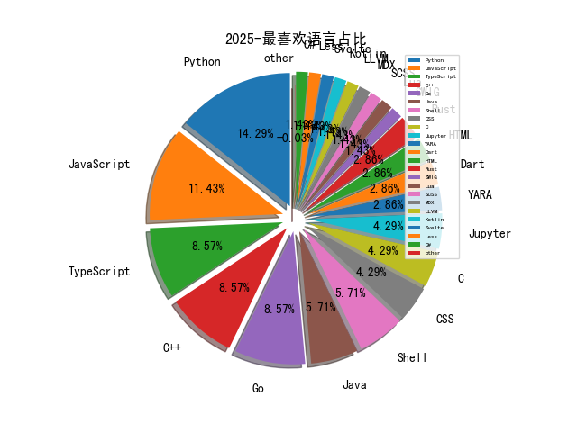

# [数据--所有](README_20.md)
# [数据--年度](README_2025.md)
# 2025 信息源与信息类型占比

# 网络安全书籍 推荐
| date_added | language | title | author | link | size| 
| --- | --- | --- | --- | --- | ---| 
| 2025-04-15 11:04:45 | English | Redefining Hacking: A Comprehensive Guide to Red Teaming and Bug Bounty Hunting in an AI-driven World | unknown | https://www.wowebook.org/redefining-hacking-a-comprehensive-guide-to-red-teaming-and-bug-bounty-hunting-in-an-ai-driven-world/ | unknown| 
| 2025-04-15 10:54:23 | English | Engineering AI Systems: Architecture and DevOps Essentials | unknown | https://www.wowebook.org/engineering-ai-systems-architecture-and-devops-essentials/ | unknown| 
| 2025-04-15 10:44:11 | English | The Rise of AI Agents: Integrating AI, Blockchain Technologies, and Quantum Computing | unknown | https://www.wowebook.org/the-rise-of-ai-agents-integrating-ai-blockchain-technologies-and-quantum-computing/ | unknown| 
| 2025-04-15 09:14:08 | English | Securing the AWS Cloud: A Guide for Learning to Secure AWS Infrastructure | unknown | https://www.wowebook.org/securing-the-aws-cloud-a-guide-for-learning-to-secure-aws-infrastructure/ | unknown| 
| 2025-04-15 07:31:12 | English | Machine Learning and AI in Cybersecurity (Video Course) | unknown | https://www.wowebook.org/machine-learning-and-ai-in-cybersecurity-video-course/ | unknown| 
| 2025-04-13 11:45:00 | English | Kubernetes Microservices Security Essentials (Video Course) | unknown | https://www.wowebook.org/kubernetes-microservices-security-essentials-video-course/ | unknown| 
| 2025-04-13 11:24:00 | English | Kubernetes Security Basics (Video Course) | unknown | https://www.wowebook.org/kubernetes-security-basics-video-course/ | unknown| 
| 2025-04-13 10:29:35 | English | Kubernetes Threat and Attack Detection (Video Course) | unknown | https://www.wowebook.org/kubernetes-threat-and-attack-detection-video-course/ | unknown| 
| 2025-04-13 09:02:16 | English | Kubernetes Network and Cluster Hardening (Video Course) | unknown | https://www.wowebook.org/kubernetes-network-and-cluster-hardening-video-course/ | unknown| 
| 2025-04-13 12:58:27 | English | Computer Programming: Python - 3 Books in 1: A Crash Course to Go Deep into Artificial Intelligence. Tools, Tips and Tricks to Implement Your Neural Networks with Machine Learning and Data Science | Russo, Russel R. | http://libgen.is/book/index.php?md5=540D83F4AEAD6D1C2E7FBA5DC9272D67 | 7 MB [AZW3]| 
| 2025-04-13 12:30:43 | English | Python Data Analysis: Comprehensive Guide to Data Science, Analytics and Metrics with Python | Campbell, Alex | http://libgen.is/book/index.php?md5=BAA1FEC050373B3822DD419D19FD22C6 | 2 MB [AZW3]| 
| 2025-04-12 07:14:59 | English | (Community experience distilled) Mastering Python for data science : explore the world of data science through Python and learn how to make sense of data | Samir Madhavan | http://libgen.is/book/index.php?md5=55A2E3DA94DEE481C8369C48A0AB544F | 8 MB [PDF]| 
| 2025-04-12 23:43:11 | English | Letting Go of the Status Quo: A Playbook for Transforming State Government | William D. Eggers, Robert N. Campbell III, Tiffany Dovey Fishman, Tom Ridge, Tom Carper | http://libgen.is/book/index.php?md5=21AF157EED83F0F2B2ACA1D9B5FEEF43 | 13 MB [PDF]| 
| 2025-04-12 20:47:31 | English | CompTIA PenTest+ Study Guide : Exam PT0-003 | Chapple, Mike;Shimonski, Robert;Seidl, David;; Robert Shimonski; David Seidl | http://libgen.is/book/index.php?md5=9BCBF498BB5A9653A60E91D937C25FBD | 38 MB [EPUB]| 
| 2025-04-12 20:43:25 | English | CCST Cisco Certified Support Technician Study Guide : Cybersecurity Exam | Lammle, Todd;Buhagiar, Jon;Robb, Donald;Montgomery, Todd;; Jon Buhagiar; Donald Robb; Todd Montgomery | http://libgen.is/book/index.php?md5=84A68F3E3F186CC2E64D06BCA47817BA | 20 MB [EPUB]| 
| 2025-04-11 03:07:21 | English | What about Evil?: A Defense of Gods Sovereign Glory | Scott Christensen | http://libgen.is/book/index.php?md5=C755A81BD9C959B5B7A2FB6A12A84522 | 3 MB [EPUB]| 
| 2025-04-11 14:30:10 | English | Personality Hacker | Joel Mark Witt | http://libgen.is/book/index.php?md5=5F254A39CB85B60AA1DBFBDCFFAD7F0F | 19 MB [AZW3]| 
| 2025-04-11 14:21:33 | English | The Programmers Guide to Quality Assurance | Pallmann, David | http://libgen.is/book/index.php?md5=BCEC8EEE239E4298484D85E1CF080B11 | 6 MB [AZW3]| 
| 2025-04-11 20:20:37 | English | 3D Data Science with Python | unknown | https://www.wowebook.org/3d-data-science-with-python/ | unknown| 
| 2025-04-11 21:52:47 | English | Automate the Boring Stuff with Python, 3rd Edition | unknown | https://www.wowebook.org/automate-the-boring-stuff-with-python-3rd-edition/ | unknown| 
| 2025-04-11 21:12:55 | English | Building Quantum Software with Python | unknown | https://www.wowebook.org/building-quantum-software-with-python/ | unknown| 
| 2025-04-09 12:11:31 | English | Routledge Handbook of Climate Law and Governance; Courage, Contributions and Compliance | Marie-Claire Cordonier Segger; Christina Voigt | http://libgen.is/book/index.php?md5=5CE2305AC98A61A3B9BCEB6C9BCFCEF0 | 1 MB [EPUB]| 
| 2025-04-08 17:30:54 | English | Generative AI with Python and PyTorch, 2nd Edition | unknown | https://www.wowebook.org/generative-ai-with-python-and-pytorch-2nd-edition/ | unknown| 
| 2025-04-08 16:12:45 | English | Software Testing with Generative AI, Video Edition | unknown | https://www.wowebook.org/software-testing-with-generative-ai-video-edition/ | unknown| 
| 2025-04-07 07:39:37 | English | Microsoft Excel 365 Bible, 2nd Edition | unknown | https://www.wowebook.org/microsoft-excel-365-bible-2nd-edition/ | unknown| 
| 2025-04-07 06:44:54 | English | The Power Platform Playbook for Digital Transformation | unknown | https://www.wowebook.org/the-power-platform-playbook-for-digital-transformation/ | unknown| 
| 2025-04-07 11:40:41 | English | Python Data Visualization (Video Course) | unknown | https://www.wowebook.org/python-data-visualization-video-course/ | unknown| 
| 2025-04-07 08:10:38 | English | The Art of Mac Malware, Volume 2 | unknown | https://www.wowebook.org/the-art-of-mac-malware-volume-2/ | unknown| 
| 2025-04-06 20:34:52 | English | Microsoft Excel 365 Bible | Michael Alexander; Dick Kusleika | http://libgen.is/book/index.php?md5=7402AD1EE02F92557FC0C83C0BAAB33B | 81 MB [EPUB]| 
| 2025-04-06 20:33:35 | English | Taming the Hacking Storm : A Framework for Defeating Hackers and Malware | Roger A. Grimes | http://libgen.is/book/index.php?md5=3158FB2BCC018FC9B5C6521D8C329666 | 4 MB [EPUB]| 
| 2025-04-05 13:13:24 | English | Some Examples Related to Ethical Computer Networking Hacking | Hedaya Mahmood Alasooly | http://libgen.is/book/index.php?md5=5D64281B522D0E5487FC10962976F78A | 7 MB [EPUB]| 
| 2025-04-05 13:05:44 | English | Active Operations Management: The Playbook for Service Operations in the Agile Age | Neil Bentley; Richard Jeffery | http://libgen.is/book/index.php?md5=7D8AC920D72655F13D142AE645DE3047 | 8 MB [EPUB]| 
| 2025-04-05 12:40:49 | English | Your Face Belongs to Us: The Secretive Startup Dismantling Your Privacy | Kashmir Hill | http://libgen.is/book/index.php?md5=94CD0092EFE81A50BCF1866B842BA995 | 2 MB [EPUB]| 
| 2025-04-03 22:50:54 | English | AI Value Creators: Beyond the Generative AI User Mindset | Rob Thomas | http://libgen.is/book/index.php?md5=5C11FF3087C3FD7350FADC3226286A55 | 11 MB [EPUB]| 
| 2025-04-03 19:57:11 | English | Mastering Secure Coding Writing Software That Stands Up to Attacks | Larry Jones | http://libgen.is/book/index.php?md5=1CF1A5EBC01D4E8F3E65AD7B8EAADC50 | 8 MB [EPUB]| 
| 2025-04-02 15:45:36 | English | AI Agents in Action | Micheal Lanham | http://libgen.is/book/index.php?md5=8320C7E5BEA8A28844C7463CD0B82E99 | 30 MB [PDF]| 
| 2025-04-02 07:41:11 | English | GenAI on AWS: A Practical Approach to Building Generative AI Applications on AWS | unknown | https://www.wowebook.org/genai-on-aws-a-practical-approach-to-building-generative-ai-applications-on-aws/ | unknown| 
| 2025-04-02 07:22:19 | English | Kubernetes Recipes: A Practical Guide for Container Orchestration and Deployment | unknown | https://www.wowebook.org/kubernetes-recipes-a-practical-guide-for-container-orchestration-and-deployment/ | unknown| 
| 2025-04-02 09:15:28 | English | AI Value Creators: Beyond the Generative AI User Mindset | unknown | https://www.wowebook.org/ai-value-creators-beyond-the-generative-ai-user-mindset/ | unknown| 
| 2025-04-02 08:43:56 | English | Time Series Analysis with Spark | unknown | https://www.wowebook.org/time-series-analysis-with-spark/ | unknown| 
| 2025-04-01 05:06:07 | English | Object-Oriented Python | Irv Kalb | http://libgen.is/book/index.php?md5=DE083B00BA7EFCC46D8C2C6FF122B88F | 4 MB [EPUB]| 
| 2025-03-28 09:32:09 | English | Zero Trust in Resilient Cloud and Network Architectures | Dhrumil Prajapati; Vinay Saini; Josh Halley; Ariel Leza | http://libgen.is/book/index.php?md5=618D24D92038C3299032DF58C6535053 | 44 MB [EPUB]| 
| 2025-03-28 09:28:47 | English | Creating ChatGPT Apps with JavaScript: A Hands-On Guide for AI Applications with OpenAI APIs | Bruce Hopkins | http://libgen.is/book/index.php?md5=404D38747DE506F71F294E4A90133E3C | 5 MB [PDF]| 
| 2025-03-28 17:49:26 | English | Time Series Forecasting Using Generative AI | unknown | https://www.wowebook.org/time-series-forecasting-using-generative-ai/ | unknown| 
| 2025-03-28 14:58:23 | English | Creating ChatGPT Apps with JavaScript | unknown | https://www.wowebook.org/creating-chatgpt-apps-with-javascript/ | unknown| 
| 2025-03-28 08:52:11 | English | Python Adventures for Young Coders | unknown | https://www.wowebook.org/python-adventures-for-young-coders/ | unknown| 
| 2025-03-24 14:32:11 | English | Spring Security 6 Recipes | unknown | https://www.wowebook.org/spring-security-6-recipes/ | unknown| 
| 2025-03-24 14:14:22 | English | Microsoft Unified XDR and SIEM Solution Handbook | unknown | https://www.wowebook.org/microsoft-unified-xdr-and-siem-solution-handbook/ | unknown| 
| 2025-03-23 08:57:08 | English | Ultimate Cilium and eBPF for Cloud Native Development | unknown | https://www.wowebook.org/ultimate-cilium-and-ebpf-for-cloud-native-development/ | unknown| 
| 2025-03-20 08:20:45 | English | Securing Microsoft Azure OpenAI | unknown | https://www.wowebook.org/securing-microsoft-azure-openai/ | unknown| 
| 2025-03-20 07:57:52 | English | Outlier Detection in Python, Video Edition | unknown | https://www.wowebook.org/outlier-detection-in-python-video-edition/ | unknown| 
| 2025-03-17 02:49:47 | English | Advanced Malware Analysis and Intelligence | unknown | https://www.wowebook.org/advanced-malware-analysis-and-intelligence/ | unknown| 
| 2025-03-16 13:26:21 | English | Generative AI Essentials | unknown | https://www.wowebook.org/generative-ai-essentials/ | unknown| 
| 2025-03-16 14:09:07 | English | Argo CD and Argo Workflows on Kubernetes | unknown | https://www.wowebook.org/argo-cd-and-argo-workflows-on-kubernetes/ | unknown| 
| 2025-03-16 13:49:51 | English | Penetration Testing with Java | unknown | https://www.wowebook.org/penetration-testing-with-java/ | unknown| 
| 2025-03-14 04:57:21 | English | Starting Data Analytics with Generative AI and Python, Video Edition | unknown | https://www.wowebook.org/starting-data-analytics-with-generative-ai-and-python-video-edition/ | unknown| 
| 2025-03-14 02:17:07 | English | Elliptic Curve Cryptography for Developers | unknown | https://www.wowebook.org/elliptic-curve-cryptography-for-developers/ | unknown| 
| 2025-03-13 03:20:00 | English | Practical Cybersecurity Fundamentals (Video Course) | unknown | https://www.wowebook.org/practical-cybersecurity-fundamentals-video-course/ | unknown| 
| 2025-03-13 02:27:15 | English | ChatGPT For Dummies, 2nd Edition | unknown | https://www.wowebook.org/chatgpt-for-dummies-2nd-edition/ | unknown| 
| 2025-03-12 05:42:36 | English | Introducing Microsoft Purview | unknown | https://www.wowebook.org/introducing-microsoft-purview/ | unknown| 
| 2025-03-10 05:17:02 | English | Designing Large Language Model Applications | unknown | https://www.wowebook.org/designing-large-language-model-applications/ | unknown| 
| 2025-03-10 05:00:04 | English | Cloud Native Data Security with OAuth | unknown | https://www.wowebook.org/cloud-native-data-security-with-oauth/ | unknown| 
| 2025-03-10 04:47:18 | English | Microsoft 365 Office All-in-One For Dummies, 3rd Edition | unknown | https://www.wowebook.org/microsoft-365-office-all-in-one-for-dummies-3rd-edition/ | unknown| 
| 2025-03-10 04:03:05 | English | Cyber Threat Hunting, Video Edition | unknown | https://www.wowebook.org/cyber-threat-hunting-video-edition/ | unknown| 
| 2025-03-10 03:23:23 | English | AI Agents in Action, Video Edition | unknown | https://www.wowebook.org/ai-agents-in-action-video-edition/ | unknown| 
| 2025-03-10 02:44:34 | English | Certified Kubernetes Security Specialist (CKS) (Video Course) | unknown | https://www.wowebook.org/certified-kubernetes-security-specialist-cks-video-course/ | unknown| 
| 2025-03-09 03:49:23 | English | Evaluating Large Language Models (LLMs) (Video Course) | unknown | https://www.wowebook.org/evaluating-large-language-models-llms-video-course/ | unknown| 
| 2025-03-09 03:19:55 | English | Certified Kubernetes Administrator (CKA), 4th Edition (Video Course) | unknown | https://www.wowebook.org/certified-kubernetes-administrator-cka-4th-edition-video-course/ | unknown| 
| 2025-03-09 02:40:30 | English | Cybersecurity Closer Look Labs (Video Course) | unknown | https://www.wowebook.org/cybersecurity-closer-look-labs-video-course/ | unknown| 
| 2025-03-05 22:03:45 | English | Azure OpenAI Essentials | unknown | https://www.wowebook.org/azure-openai-essentials/ | unknown| 
| 2025-03-05 21:01:06 | English | Implementing Analytics Solutions Using Microsoft Fabric DP-600 Exam Study Guide | unknown | https://www.wowebook.org/implementing-analytics-solutions-using-microsoft-fabric-dp-600-exam-study-guide/ | unknown| 
| 2025-03-03 13:01:33 | English | Cyber Resilience Index: Mastering Threat-Informed Defense | unknown | https://www.wowebook.org/cyber-resilience-index-mastering-threat-informed-defense/ | unknown| 
| 2025-03-02 21:48:51 | English | Lean DevOps: A Practical Guide to On Demand Service Delivery | unknown | https://www.wowebook.org/lean-devops-a-practical-guide-to-on-demand-service-delivery/ | unknown| 
| 2025-02-28 15:55:59 | English | Learn Quantum Computing with Python and IBM Quantum, 2nd Edition | unknown | https://www.wowebook.org/learn-quantum-computing-with-python-and-ibm-quantum-2nd-edition/ | unknown| 
| 2025-02-17 07:51:21 | English | Alice and Bob Learn Secure Coding | unknown | https://www.wowebook.org/alice-and-bob-learn-secure-coding/ | unknown| 
| 2025-02-17 07:16:24 | English | Learning LangChain | unknown | https://www.wowebook.org/learning-langchain/ | unknown| 
| 2025-02-14 08:04:43 | English | AI Agents in Action | unknown | https://www.wowebook.org/ai-agents-in-action/ | unknown| 
| 2025-02-13 07:36:03 | English | Integrating Rust | unknown | https://www.wowebook.org/integrating-rust/ | unknown| 
| 2025-02-13 12:41:43 | English | Python for Bioinformatics | unknown | https://www.wowebook.org/python-for-bioinformatics/ | unknown| 
| 2025-02-13 11:52:55 | English | Generative AI for Financial Services | unknown | https://www.wowebook.org/generative-ai-for-financial-services/ | unknown| 
| 2025-02-12 16:32:17 | English | Deep Learning Using Python | Dr. S Lovelyn Rose, Dr. L Ashok Kumar, Dr. D Karthika Renuka | http://libgen.is/book/index.php?md5=F7CC6CF22FCEB8AA42F873AC29B1B160 | 12 MB [PDF]| 
| 2025-02-12 16:08:13 | English | DevOps Tools from Practitioners Viewpoint | Deepak Gaikwad, Viral Thakkar | http://libgen.is/book/index.php?md5=DBB9E0390D8A74D3C857C8A497B3C56E | 8 MB [PDF]| 
| 2025-02-11 07:39:14 | English | Ultimate Robotics Programming with ROS 2 and Python | unknown | https://www.wowebook.org/ultimate-robotics-programming-with-ros-2-and-python/ | unknown| 
| 2025-02-10 13:52:41 | English | Weapons in Space: Technology, Politics, and the Rise and Fall of the Strategic Defense Initiative | Aaron Bateman | http://libgen.is/book/index.php?md5=871BBDF59E5CB8BC670D94F99D813AC7 | 3 MB [PDF]| 
| 2025-02-09 08:20:09 | English | The Hacker Mindset: How thinking like a hacker can improve your code, your coffee, and your life | Francesco Carlucci | http://libgen.is/book/index.php?md5=93B273CF8CC2A6F62C41AF65F0B55E8F | 1 MB [PDF]| 
| 2025-02-08 10:16:23 | English | Security Automation with Python | unknown | https://www.wowebook.org/security-automation-with-python/ | unknown| 
| 2025-02-08 09:17:01 | English | Learn Generative AI with PyTorch, Video Edition | unknown | https://www.wowebook.org/learn-generative-ai-with-pytorch-video-edition/ | unknown| 
| 2025-02-08 07:28:18 | English | Write Powerful Rust Macros, Video Edition | unknown | https://www.wowebook.org/write-powerful-rust-macros-video-edition/ | unknown| 
| 2025-02-07 11:09:43 | English | Security Automation with Python: Practical Python solutions for automating and scaling security operations | Corey Charles Sr. | http://libgen.is/book/index.php?md5=2FE0B5190BB7ECE1D28FCA99FB236DC9 | 6 MB [EPUB]| 
| 2025-02-07 09:52:25 | English | Groundwater Monitoring and Management Through Hydrogeochemical Modeling Approach | S.Chidambaram, K.Srinivasamoorthy, AL.Ramanathan, P.Anandhan, R.Manivannan, M.Bala Krishna Prasad, M | http://libgen.is/book/index.php?md5=15429CC4F9ABBE032B4018AE0D5A4FC3 | 19 MB [PDF]| 
| 2025-02-07 09:25:57 | English | Generative AI for Financial Services: Challenges, anti-patterns, and best practices (English Edition) | Vikesh Pandey, Arnav Khare | http://libgen.is/book/index.php?md5=8A3457DD43932B090CE76C2702E40F1A | 7 MB [EPUB]| 
| 2025-02-07 09:31:50 | English | Python for Bioinformatics : Using machine learning for drug discovery, cluster analysis, and phylogenetics | Verma, Parul;Fatima, Shahnaz;; Dr. Shahnaz Fatima | http://libgen.is/book/index.php?md5=1A7508BA06BF4501733B0962CB1A37BD | 9 MB [EPUB]| 
| 2025-02-07 06:02:59 | English | Super Privacy: The Complete Guide to Personal Privacy and Financial Freedom in Tomorrows Cashless Society | Bob Hammond | http://libgen.is/book/index.php?md5=78409D77ECBEA6F323616B8044B4CD71 | 12 MB [PDF]| 
| 2025-02-06 12:21:10 | English | Generative AI for Web Developers (Video Course) | unknown | https://www.wowebook.org/generative-ai-for-web-developers-video-course/ | unknown| 
| 2025-02-06 11:49:54 | English | Generative AI for Python Developers (Video Course) | unknown | https://www.wowebook.org/generative-ai-for-python-developers-video-course/ | unknown| 
| 2025-02-06 11:28:07 | English | Securing Generative AI (Video Course) | unknown | https://www.wowebook.org/securing-generative-ai-video-course/ | unknown| 
| 2025-02-06 07:55:19 | English | Programming Generative AI (Video Course) | unknown | https://www.wowebook.org/programming-generative-ai-video-course/ | unknown| 
| 2025-02-06 06:35:48 | English | Ansible Core Concepts and Advanced Features (Video Course) | unknown | https://www.wowebook.org/ansible-core-concepts-and-advanced-features-video-course/ | unknown| 
| 2025-02-06 06:09:53 | English | Certified Kubernetes Application Developer (CKAD), 4th Edition (Video Course) | unknown | https://www.wowebook.org/certified-kubernetes-application-developer-ckad-4th-edition-video-course/ | unknown| 
| 2025-02-04 08:13:48 | English | Designing Data intensive application in Python | Aarav Joshi | http://libgen.is/book/index.php?md5=8F5DAAF46BD97D6DED865619221C7E03 | 33 MB [PDF]| 
| 2025-02-04 08:12:51 | English | Doctored : Fraud, Arrogance, and Tragedy in the Quest to Cure Alzheimers | Charles Piller | http://libgen.is/book/index.php?md5=E0D1124BB0E1F8A6E4B6ED796923BF41 | 4 MB [EPUB]| 
| 2025-02-04 08:10:07 | English | Linear Algebra with Python | Hyun-Seok Sun | http://libgen.is/book/index.php?md5=26C31AD2761829DC2CD2B516704C36D2 | 21 MB [PDF]| 
| 2025-02-04 08:09:04 | English | Calculus with Python | Hyun-Seok Sun | http://libgen.is/book/index.php?md5=DC1A7739AA1CFE747F8376F833869676 | 29 MB [PDF]| 
| 2025-02-04 08:05:58 | English | Deep Learning via Rust | RantAI Academy | http://libgen.is/book/index.php?md5=CFBED536E8F97E5AC5B5F848545E0D6B | 2 MB [PDF]| 
| 2025-02-03 09:41:36 | English | Create Game with Projects in Python: Create a Game, Programming in Python, and Working with Popular Apps Using PyGame. | SCHMITT, STEPHEN G | http://libgen.is/book/index.php?md5=BE2FAE58D5B0F6A3E0D544432F3046EC | 2 MB [EPUB]| 
| 2025-02-03 08:37:15 | English | Full Stack Python Security, Video Edition | unknown | https://www.wowebook.org/full-stack-python-security-video-edition/ | unknown| 
| 2025-02-03 06:26:46 | English | Learn AI-Assisted Python Programming, Second Edition, Video Edition | unknown | https://www.wowebook.org/learn-ai-assisted-python-programming-second-edition-video-edition/ | unknown| 
| 2025-02-03 03:45:09 | English | Generative AI in Action, Video Edition | unknown | https://www.wowebook.org/generative-ai-in-action-video-edition/ | unknown| 
| 2025-02-02 00:21:02 | English | (River Publishers Series In Communications) Aspects Of Personal Privacy In Communications - Problems, Technology And Solutions | Geir M. Koien, Vladimir a. Oleshchuk | http://libgen.is/book/index.php?md5=EBBEFA459EE81F069A5D2D62394B2DC2 | 3 MB [PDF]| 
| 2025-02-02 11:41:21 | English | Essential Python Programming For GUI Development | Andrade , Wendell | http://libgen.is/book/index.php?md5=73DD15B99408F6E5F1B0416F59C10519 | 861 kB [EPUB]| 
| 2025-02-02 06:23:21 | English | MACHINE LEARNING WITH PYTHON: A Comprehensive Guide To Algorithms, Deep Learning Techniques, And Practical Applications | Planet, Code | http://libgen.is/book/index.php?md5=98381F929D701C0D9E54F98577E6EA1B | 16 MB [EPUB]| 
| 2025-02-02 06:22:03 | English | GENERATIVE AI WITH PYTHON: Harnessing The Power Of Machine Learning And Deep Learning To Build Creative And Intelligent Systems | Planet, Code | http://libgen.is/book/index.php?md5=F4BFE5E46EF502E04311242943C76F62 | 14 MB [EPUB]| 
| 2025-02-02 08:45:29 | English | Generative AI Toolbox (Video Course) | unknown | https://www.wowebook.org/generative-ai-toolbox-video-course/ | unknown| 
| 2025-02-02 19:50:05 | English | Pipeline for Automated Code Generation from Backlog Items (PACGBI) : Analysis of Potentials and Limitations of Generative AI for Web Development | Mahja Sarschar | http://libgen.is/book/index.php?md5=C22F6263079544E4A39FA01A8194F1A5 | 13 MB [EPUB]| 
| 2025-02-02 19:49:09 | English | Microsoft Excel Made Easy: A Beginner-to-Expert Guide to Mastering Spreadsheets: Learn Formulas, Functions, Data Analysis, Automation, and Advanced Excel Techniques for Work and Business | Twain, David | http://libgen.is/book/index.php?md5=796C49DD1C9C5FA9B9102EE140B19F53 | 4 MB [EPUB]| 
| 2025-02-01 13:28:55 | English | (Studies in Feminist Philosophy) Global Sweatshops: A Feminist Theory of Exploitation and Resistance (Studies in Feminist Philosophy) | Mirjam Müller | http://libgen.is/book/index.php?md5=BE8BD4B86BBA1BD51DAA9C6477D533CB | 5 MB [PDF]| 
| 2025-01-29 09:13:56 | English | Microsoft Dynamics 365 AI for Business Insights | unknown | https://www.wowebook.org/microsoft-dynamics-365-ai-for-business-insights/ | unknown| 
| 2025-01-29 07:24:20 | English | Microsoft Certified Azure Data Fundamentals (DP-900) Exam Guide | unknown | https://www.wowebook.org/microsoft-certified-azure-data-fundamentals-dp-900-exam-guide/ | unknown| 
| 2025-01-28 15:07:13 | English | XGBoost for Regression Predictive Modeling and Time Series Analysis | unknown | https://www.wowebook.org/xgboost-for-regression-predictive-modeling-and-time-series-analysis/ | unknown| 
| 2025-01-23 20:32:50 | English | (MLI Generative AI Series) Beginning Python 3 with Grok 2 | Oswald Campesato | http://libgen.is/book/index.php?md5=E32D98CD7226E1B660952080AA3BC6C4 | 1 MB [EPUB]| 
| 2025-01-23 19:35:29 | English | Data Analysis for Business Decisions: Case Studies in Excel, R, and ChatGPT: Third Edition | Andres Fortino | http://libgen.is/book/index.php?md5=BCC26CA2508C0B54FED332E7B73A244F | 83 MB [EPUB]| 
| 2025-01-23 19:35:26 | English | Data Analysis for Business Decisions: Case Studies in Excel, R, and ChatGPT: Third Edition | Andres Fortino | http://libgen.is/book/index.php?md5=B85B87857011FDD0A298A0969DDF4DEF | 100 MB [PDF]| 
| 2025-01-22 07:12:44 | English | Generative Artificial Intelligence for Biomedical and Smart Health Informatics | Aditya Khamparia | http://libgen.is/book/index.php?md5=68789C699745A9C57833B50F56299D47 | 20 MB [PDF]| 
| 2025-01-20 06:05:14 | English | Basics of Python Programming: A Quick Guide for Beginners | unknown | https://www.wowebook.org/basics-of-python-programming-a-quick-guide-for-beginners/ | unknown| 
| 2025-01-18 08:27:50 | English | Build a Robo-Advisor with Python (From Scratch) | unknown | https://www.wowebook.org/build-a-robo-advisor-with-python-from-scratch/ | unknown| 
| 2025-01-18 14:19:46 | English | Starting Out with Python, 6th Edition | unknown | https://www.wowebook.org/starting-out-with-python-6th-edition/ | unknown| 
| 2025-01-17 07:31:05 | English | Cybersecurity Leadership for Healthcare Organizations and Institutions of Higher Education | Bradley Fowler, | http://libgen.is/book/index.php?md5=5ED8C105A5E27C9243FF72F9DBBCDE04 | 11 MB [PDF]| 
| 2025-01-17 07:15:40 | English | Reconfigurable Obfuscation Techniques for the IC Supply Chain : Using FPGA-Like Schemes for Protection of Intellectual Property | Zain Ul Abideen; Samuel Pagliarini | http://libgen.is/book/index.php?md5=CCD068408820D44FFF18BE8165372C73 | 45 MB [EPUB]| 
| 2025-01-17 05:02:01 | English | Building Generative AI Services with FastAPI (for True Epub) | Ali Parandeh | http://libgen.is/book/index.php?md5=5D2A5F90A3FE09BE0252ED51A6DB61D1 | 23 MB [EPUB]| 
| 2025-01-16 08:16:07 | English | Microsoft 365 For Dummies | unknown | https://www.wowebook.org/microsoft-365-for-dummies/ | unknown| 
| 2025-01-16 10:37:47 | English | Hemodynamic Monitoring | Mary E. Lough | http://libgen.is/book/index.php?md5=0A95FF295984F9B8EAA23346534DFE65 | 38 MB [PDF]| 
| 2025-01-16 10:35:07 | English | Hemodynamic Monitoring | Mary E. Lough | http://libgen.is/book/index.php?md5=C43219F28B473D3576D829974A1ABEFC | 34 MB [EPUB]| 
| 2025-01-16 10:27:46 | English | Basics of Python Programming A Quick Guide for Beginners | Krishna Kumar Mohbey | http://libgen.is/book/index.php?md5=A3DD2FBDD34F88AFFBF364777F25C839 | 56 MB [PDF]| 
| 2025-01-16 17:26:24 | English | Python Essentials For Dummies | unknown | https://www.wowebook.org/python-essentials-for-dummies/ | unknown| 
| 2025-01-15 11:36:58 | English | Microsoft Teams For Dummies, 3rd Edition | unknown | https://www.wowebook.org/microsoft-teams-for-dummies-3rd-edition/ | unknown| 
| 2025-01-15 06:37:49 | English | Microsoft Teams For Dummies, 2nd Edition | unknown | https://www.wowebook.org/microsoft-teams-for-dummies-2nd-edition/ | unknown| 
| 2025-01-15 05:58:21 | English | Microsoft 365 PowerPoint For Dummies, 2nd Edition | unknown | https://www.wowebook.org/microsoft-365-powerpoint-for-dummies-2nd-edition/ | unknown| 
| 2025-01-15 12:00:10 | English | Microsoft Power BI For Dummies | unknown | https://www.wowebook.org/microsoft-power-bi-for-dummies/ | unknown| 
| 2025-01-15 11:47:51 | English | Microsoft Power Platform For Dummies | unknown | https://www.wowebook.org/microsoft-power-platform-for-dummies/ | unknown| 
| 2025-01-15 11:52:46 | English | Glycemic Monitoring - ECAB | R V Jayakumar | http://libgen.is/book/index.php?md5=40A7BC7D8BDF65836C95B6A03443C88E | 1 MB [PDF]| 
| 2025-01-15 11:52:33 | English | Glycemic Monitoring - ECAB | R V Jayakumar | http://libgen.is/book/index.php?md5=36AFA5B8BAF8838E0D4C4F68B909CAC5 | 3 MB [EPUB]| 
| 2025-01-11 16:47:52 | English | A Beginner’s Guide To Web Application Penetration Testing | unknown | https://www.wowebook.org/a-beginners-guide-to-web-application-penetration-testing/ | unknown| 
| 2025-01-10 06:20:20 | English | Microsoft 365 Copilot At Work: Using AI to Get the Most from Your Business Data and Favorite Apps | unknown | https://www.wowebook.org/microsoft-365-copilot-at-work-using-ai-to-get-the-most-from-your-business-data-and-favorite-apps/ | unknown| 
| 2025-01-08 06:17:50 | English | Generative AI on Google Cloud with LangChain | unknown | https://www.wowebook.org/generative-ai-on-google-cloud-with-langchain/ | unknown| 
| 2025-01-07 11:15:25 | English | Learn Generative AI with PyTorch By Mark Liu (Final Release) | Mark Liu | http://libgen.is/book/index.php?md5=EA442D0490AAD3D193551EC97EAF414E | 19 MB [EPUB]| 
| 2025-01-07 09:19:04 | English | A Defense Manual of Commando Jiu-Jitsu | Irvin Cahn | http://libgen.is/book/index.php?md5=B55819CE207CCB59130E7E494840B73D | 17 MB [PDF]| 
| 2025-01-07 08:58:08 | English | The Hunter and Trapper | Halsey Thrasher | http://libgen.is/book/index.php?md5=F2D8C7058F994CF774B9B21884C534D6 | 6 MB [PDF]| 
| 2025-01-06 07:47:24 | English | Mastering VMware Cloud Disaster Recovery and Ransomware Resilience | unknown | https://www.wowebook.org/mastering-vmware-cloud-disaster-recovery-and-ransomware-resilience/ | unknown| 
| 2025-01-06 08:15:38 | English | Securing an Enterprise: Maximizing Digital Experiences through Enhanced Security Measures | unknown | https://www.wowebook.org/securing-an-enterprise-maximizing-digital-experiences-through-enhanced-security-measures/ | unknown| 
| 2025-01-05 12:39:04 | English | Getting Started with Azure OpenAI | unknown | https://www.wowebook.org/getting-started-with-azure-openai/ | unknown| 
| 2025-01-05 10:02:31 | English | Stochastic Finance with Python | unknown | https://www.wowebook.org/stochastic-finance-with-python/ | unknown| 
| 2025-01-05 09:41:52 | English | Regenerating Learning: Transforming How You Learn with Generative AI | unknown | https://www.wowebook.org/regenerating-learning-transforming-how-you-learn-with-generative-ai/ | unknown| 
| 2025-01-05 12:36:03 | English | (Drugs and the Pharmaceutical Sciences) An Introduction to Generative Drug Discovery | Ekins S. (ed.) | http://libgen.is/book/index.php?md5=A067E7425DEFCD9CD2DBE27331C5B3C0 | 18 MB [PDF]| 
| 2025-01-05 12:31:04 | English | (Hart Studies In Security And Justice) Surveillance, Privacy And Trans-Atlantic Relations | David D Cole, Federico Fabbrini, Stephen Schulhofer | http://libgen.is/book/index.php?md5=C7E684DAA5DB463BD3A76B9739A9AE90 | 2 MB [PDF]| 
| 2025-01-05 11:45:17 | English | (DESIGN THINKING SERIES) Regenerating Learning: Transforming How You Learn with Generative AI | Patrick Parra Pennefather | http://libgen.is/book/index.php?md5=CB4273D1E2D46C1BABB635D9517EAC08 | 28 MB [MOBI]| 
| 2025-01-05 09:46:17 | English | Clinical Risk Management | Tom Flewett | http://libgen.is/book/index.php?md5=6F2F17A69AD73C83AF899458FE376320 | 1 MB [PDF]| 
| 2025-01-05 07:47:43 | English | Data Visualization in R and Python | Marco Cremonini | http://libgen.is/book/index.php?md5=F55A40B4F225930378277F4325652A27 | 25 MB [PDF]| 
| 2025-01-04 23:35:14 | English | In defense of judicial elections | Chris W. Bonneau, Melinda Gann Hall | http://libgen.is/book/index.php?md5=DFF945E046EBD7290A8FF8723D1DAE41 | 2 MB [PDF]| 
| 2025-01-03 07:36:03 | English | The Digital Marketer’s Playbook | unknown | https://www.wowebook.org/the-digital-marketers-playbook/ | unknown| 
| 2025-01-03 08:11:03 | English | Generative AI For Executives | unknown | https://www.wowebook.org/generative-ai-for-executives/ | unknown| 
| 2025-01-02 19:41:57 | English | Cybersecurity Today: Cyber attacks, network security, and threat prevention | Debrupa Palit | http://libgen.is/book/index.php?md5=A59BBC88443D9E049F1B60522CF4ACBD | 8 MB [EPUB]| 
| 2025-01-01 06:29:16 | English | Neural Networks with TensorFlow and Keras: Training, Generative Models, and Reinforcement Learning | Philip Hua | http://libgen.is/book/index.php?md5=021B6DF458FA887786DA61470B09A2CE | 6 MB [PDF]| 
| 2025-01-01 01:18:12 | English | Active Machine Learning with Python: Refine and elevate data quality over quantity with active learning | Margaux Masson-Forsythe | http://libgen.is/book/index.php?md5=1553E38A64124079E8A909A95CF50004 | 16 MB [PDF]| 
| 2025-01-01 01:14:18 | English | (Chapman & Hall/CRC The Python Series) Data Mining with Python: Theory, Application, and Case Studies | Di Wu | http://libgen.is/book/index.php?md5=4D37B5C21C970DD4991778C0E8C91BA0 | 13 MB [PDF]| 
| 2025-01-01 23:19:03 | English | Regenerating Learning: Transforming How You Learn with Generative AI | Patrick Parra Pennefather | http://libgen.is/book/index.php?md5=E452D075608F9CA3ACC86D7E280BB502 | 29 MB [PDF]| 

# 学习视频 推荐
| title | url| 
| --- | ---| 
| 浙江大学DeepSeek系列专题公开课 | https://space.bilibili.com/3546784374720910/lists?sid=4822862&spm_id_from=333.788.0.0| 

# 微信公众号 推荐
| nickname_english | weixin_no | title | url| 
| --- | --- | --- | ---| 
| 0x6270安全团队 | None | 知识星球持续更新 | https://mp.weixin.qq.com/s?__biz=Mzg4Njc1MTIzMw==&mid=2247485840&idx=2&sn=5a85b32d5d565b8b730ad85f03b12a8b | 8| 
| 360数字安全 | None | 周鸿祎对话央视新闻：360锁定三名美国特工网攻亚冬会 | https://mp.weixin.qq.com/s?__biz=MzA4MTg0MDQ4Nw==&mid=2247580341&idx=1&sn=684f63cc1e3ebe3c483bc1aefe2532de | 48| 
| BlockSec | None | 2026校招｜BEST计划等你加入 首站校园宣讲会报名倒计时！ | https://mp.weixin.qq.com/s?__biz=MzkyMzI2NzIyMw==&mid=2247488798&idx=1&sn=3ccf53ca3ff37adf16f50c6fae653073 | 11| 
| CISP | None | 第二届“长城杯”信息安全铁人三项赛决赛技术文件 | https://mp.weixin.qq.com/s?__biz=MzI1NzQ0NTMxMQ==&mid=2247490394&idx=1&sn=d2e3cee4ed424be516fce61efeb11c63 | 12| 
| CNNVD安全动态 | None | 信息安全漏洞周报（2025年第15期） | https://mp.weixin.qq.com/s?__biz=MzAxODY1OTM5OQ==&mid=2651462763&idx=1&sn=7592d085b14be3d4ae63304eec467c14 | 15| 
| Delta Insights | None | 网络安全动态 - 2025.04.16 | https://mp.weixin.qq.com/s?__biz=MzU1MzEzMzAxMA==&mid=2247500006&idx=1&sn=e9e8cd544671621e96e3e6c46aa338b7 | 37| 
| EBCloud | None | 同声传译案例分享 | https://mp.weixin.qq.com/s?__biz=Mzg4MTA2MTc4MA==&mid=2247493862&idx=1&sn=16350caea77c729edf2fe4570cf834a9 | 6| 
| E条咸鱼 | None | Webshell免杀思路-PHP篇-1：经典混淆的艺术 | https://mp.weixin.qq.com/s?__biz=MzU1Mjk3MDE2Mg==&mid=2247485515&idx=1&sn=9b55abc06c5038707bbdcaaa8789df53 | 1| 
| FreeBuf | None | 如何利用图像验证技术识别钓鱼攻击？ | https://mp.weixin.qq.com/s?__biz=MjM5NjA0NjgyMA==&mid=2651318673&idx=4&sn=404f3b8cf6240672c6efcf7de0f006af | 233| 
| GSDK安全团队 | None | 渗透测试C2 - XiebroC2 | https://mp.weixin.qq.com/s?__biz=MzIzNTE0Mzc0OA==&mid=2247486241&idx=1&sn=2d380dbf202463f81ca3933eba3e290e | 23| 
| HW专项行动小组 | None | 平台激励计划 | https://mp.weixin.qq.com/s?__biz=MzkzNTUwNTg2Ng==&mid=2247485481&idx=1&sn=43bb93610883999ca91d390287b65df2 | 3| 
| HW安全之路 | None | 网站安全\"扫描利器\"：掌握Gobuster，一键发现隐藏漏洞 | https://mp.weixin.qq.com/s?__biz=MzI5MjY4MTMyMQ==&mid=2247491200&idx=1&sn=69ead0eed0446e993d381d454a24a724 | 41| 
| Hiroki Sawada | None | 我2024年在国外赏金的挖洞经验分享 | https://mp.weixin.qq.com/s?__biz=Mzg4MTgyOTY5MQ==&mid=2247484454&idx=1&sn=ba7083d9f3a30ae21684e0f6fed1cf3f | 1| 
| ISC2网络安全 | None | ISC2会员推荐计划丨推荐朋友获得CISSP，双方可得50美元奖励 | https://mp.weixin.qq.com/s?__biz=MzUzNTg4NDAyMg==&mid=2247492617&idx=1&sn=f11094bb0661632bb99bb2cb32aa02a1 | 42| 
| Kali渗透测试教程 | None | 【通俗易懂说AI】MCP如何安装以及使用 | https://mp.weixin.qq.com/s?__biz=MzI3NDYwMzI4Mg==&mid=2247486749&idx=1&sn=2344b2e0018b25417de9e63972095f30 | 4| 
| Ots安全 | None | CimFS：内存崩溃，查找系统（内核版） | https://mp.weixin.qq.com/s?__biz=MzAxMjYyMzkwOA==&mid=2247529111&idx=2&sn=e172aec7d9c18687cc61bdbfc3e0852b | 81| 
| Theloner安全团队 | None | 白帽赏金赛-线下赛 | https://mp.weixin.qq.com/s?__biz=MzI2Mzc4ODc1NQ==&mid=2247489790&idx=1&sn=02f85ce39cbcbbebe94e6d98ee54795e | 6| 
| VEDA卫达信息 | None | 主动防御 , 筑牢关键信息基础设施安全堡垒 | https://mp.weixin.qq.com/s?__biz=Mzg5NDY0NTM2Nw==&mid=2247492511&idx=1&sn=50f96772f46441d9b2eb5e672b2ae452 | 10| 
| mailabc | None | T-6个月：Exchange Server 2016 和 Exchange Server 2019支持将终止 | https://mp.weixin.qq.com/s?__biz=MzkxMjY3MTI4Mg==&mid=2247484844&idx=1&sn=861e2a27fb6a8f6e08163db08722adc8 | 12| 
| pentest | None | JsRpc结合yakit热加载实现签名破解 | https://mp.weixin.qq.com/s?__biz=Mzg3NDk1MDczOQ==&mid=2247485016&idx=1&sn=2e0d4e7f5f1edf70d64ce65d01dc1128 | 1| 
| wavecn | None | MITRE 也被砍预算了，如果没了 CVE，只看 CNVD 是不足够的 | https://mp.weixin.qq.com/s?__biz=Mzg4Njc0Mjc3NQ==&mid=2247486677&idx=1&sn=89edb7b99c5efe6a38456f1d04070041 | 3| 
| 三未信安 | None | 三未信安在网安标委“标准周”商用密码标准与应用交流会分享大模型安全密码应用方案 | https://mp.weixin.qq.com/s?__biz=MzA5ODk0ODM5Nw==&mid=2650331384&idx=1&sn=b21d7b6b9c932d06c2235001bba5e93a | 8| 
| 不秃头的安全 | None | 记一次前端js加解密泄露引发的漏洞 | https://mp.weixin.qq.com/s?__biz=Mzg3NzkwMTYyOQ==&mid=2247488969&idx=1&sn=1c5e9f267446a1663b736442711902cc | 17| 
| 中国信息安全 | None | 评论 , 对“人肉开盒”说“不” | https://mp.weixin.qq.com/s?__biz=MzA5MzE5MDAzOA==&mid=2664240704&idx=6&sn=97bc99a18f3608442886b8525891cd9d | 278| 
| 中国网络安全产业公共服务平台 | None | 20家企业58款“AI+网络安全”产品接入“写境：AI+网络安全产品能力图谱” | https://mp.weixin.qq.com/s?__biz=Mzg5MzQ5NjQyNw==&mid=2247486259&idx=1&sn=bde76670389c7a38f9853c7395626b16 | 4| 
| 中国软件评测中心 | None | 【赛迪热点】“积极探索，赋能创新” 赛迪研究院AI应用兴趣小组系列活动精彩回顾 | https://mp.weixin.qq.com/s?__biz=MjM5NzYwNDU0Mg==&mid=2649251699&idx=2&sn=9bbfb4911d79b6556e789107b7226d3a | 76| 
| 亚信安全 | None | 亚信安全信桅高级威胁监测系统TDA全新版本正式发布 | https://mp.weixin.qq.com/s?__biz=MjM5NjY2MTIzMw==&mid=2650621934&idx=1&sn=fdcbf53755fdfea80d02e3227742271f | 47| 
| 代码卫士 | None | 美国政府突然断供  CVE和CWE等计划今日终止 | https://mp.weixin.qq.com/s?__biz=MzI2NTg4OTc5Nw==&mid=2247522748&idx=2&sn=de3b74db12a530df82a6eae1a35b282d | 68| 
| 信息安全D1net | None | 在各行业数据泄露如何吞没企业利润 | https://mp.weixin.qq.com/s?__biz=MzA3NTIyNzgwNA==&mid=2650260075&idx=1&sn=b2faf4458678f3fb2bc09a09f217417a | 22| 
| 信息安全与通信保密杂志社 | None | 官方披露：某国在我境内经营多年的间谍关系网络被挖出！ | https://mp.weixin.qq.com/s?__biz=MzkwMTMyMDQ3Mw==&mid=2247599114&idx=3&sn=fd7761b23851a47a4a8cc927d3a35c2e | 104| 
| 信息安全大事件 | None | 【业务介绍】勒索病毒专项防护工作业务 | https://mp.weixin.qq.com/s?__biz=MzkzNjIzMjM5Ng==&mid=2247490721&idx=4&sn=c64426bef9775eecf37bfc0f4cbb8a7c | 36| 
| 信息安全研究 | None | 【业界动态】工信部公开征求《民用无人驾驶航空器唯一产品识别码》强制性国家标准（征求意见稿）的意见 | https://mp.weixin.qq.com/s?__biz=MzA3NzgzNDM0OQ==&mid=2664994721&idx=3&sn=78d6f8f2db7419c67cdeb90525e4c820 | 104| 
| 偏远酒馆 | None | 开源自编程智能体框架AiPy---帮你思考，更能帮你干活 | https://mp.weixin.qq.com/s?__biz=MzkwMDMwNDgwNQ==&mid=2247485780&idx=1&sn=28be95ba23b7ee06564246ae9d43c7b1 | 2| 
| 儒道易行 | None | 【buuctf】[护网杯]easy_tornado | https://mp.weixin.qq.com/s?__biz=Mzg5NTU2NjA1Mw==&mid=2247501507&idx=1&sn=8588bad7cefb1849f622d0354eadb3fa | 44| 
| 全栈网络空间安全 | None | 企业如何选择适合自己的云服务类型 | https://mp.weixin.qq.com/s?__biz=Mzg3NTUzOTg3NA==&mid=2247515548&idx=1&sn=ed19e316021985a06b78c73347dd5b94 | 27| 
| 全球技术地图 | None | 美国政府无限期限制英伟达H20芯片对华出口 | https://mp.weixin.qq.com/s?__biz=MzI1OTExNDY1NQ==&mid=2651620561&idx=2&sn=9af8f38cb364d34e655e5fb04c50ef3e | 81| 
| 内生安全联盟 | None | 6项网络安全国家标准获批发布 | https://mp.weixin.qq.com/s?__biz=Mzg4MDU0NTQ4Mw==&mid=2247530547&idx=2&sn=923bcd1da59dee1ba8e16c19bf2134b2 | 65| 
| 励行安全 | None | 新闻 , 美国将停止资助 CVE，赶快去搞个编号 | https://mp.weixin.qq.com/s?__biz=MzkxNTY4NTQwMg==&mid=2247484460&idx=1&sn=dc3fb7f469e283b17a35f5389ea997ed | 12| 
| 十九线菜鸟学安全 | None | 《.NET安全攻防指南》上下册重磅来袭！ | https://mp.weixin.qq.com/s?__biz=MzI1OTUyMTI2MQ==&mid=2247484852&idx=1&sn=6d350f13ca217c0f9b4d7d353fd80a50 | 4| 
| 卡巴斯基威胁情报 | None | 攻击者正通过 sourceforge 平台传播一款挖矿程序和 ClipBanker 木马病毒 | https://mp.weixin.qq.com/s?__biz=MzAxNjg3MjczOA==&mid=2247486633&idx=1&sn=256dbdb580c954cfe2700e41a0642144 | 12| 
| 吉祥快学网络安全吧 | None | 针对网安一哥专门的钓鱼网站 | https://mp.weixin.qq.com/s?__biz=MzkzMzcxNTQyNw==&mid=2247487130&idx=1&sn=8598475dbfe7727cde51bc42c7bcd9c0 | 41| 
| 吉祥讲安全 | None | 16套安全意识ppt分享，响应国家安全法颁布10周年 | https://mp.weixin.qq.com/s?__biz=MzkwNjY1Mzc0Nw==&mid=2247488312&idx=1&sn=6c636dfac036367ea0b7d15b5456a319 | 44| 
| 君说安全 | None | 锐捷科技2024年报简讯，营业收入116.99亿，人均产出160万，其中安全产品收入4.52亿 | https://mp.weixin.qq.com/s?__biz=MzUzNjkxODE5MA==&mid=2247489710&idx=1&sn=5f28bda42b287a631d270541e2179dac | 71| 
| 启明星辰安全简讯 | None | 安全简讯（2025.04.16） | https://mp.weixin.qq.com/s?__biz=MzkzNzY5OTg2Ng==&mid=2247500980&idx=1&sn=75ad969cb641c4aa2298a7bffcbf2edf | 54| 
| 启明星辰集团 | None | 筑AI安全底座，拓湾区数智金融新局——启明星辰出席2025年AI助力湾区数智金融会议 | https://mp.weixin.qq.com/s?__biz=MzA3NDQ0MzkzMA==&mid=2651732779&idx=1&sn=3af9d136145c4f4d701ef50c8c703dc4 | 31| 
| 哆啦安全 | None | Unity il2cpp游戏逆向分析技巧 | https://mp.weixin.qq.com/s?__biz=Mzg2NzUzNzk1Mw==&mid=2247497933&idx=1&sn=fdae713f6e26a146ea84ae5ab2349b4f | 24| 
| 哈拉少安全小队 | None | Burp 劝退篇，Yakit 刚开始用的几个小技巧～ | https://mp.weixin.qq.com/s?__biz=MzAxNzkyOTgxMw==&mid=2247494193&idx=1&sn=c2d4be1d60a3143391ce4ab636be259a | 12| 
| 四叶草安全 | None | 四叶草安全入选军工行业网络安全企业库 | https://mp.weixin.qq.com/s?__biz=MjM5MTI2NDQzNg==&mid=2654552383&idx=1&sn=1e7d3f8ff29ac75c20bcc090bc20798d | 4| 
| 国际云安全联盟CSA | None | CSA会员事件 , 三未信安重磅发布“密码+AI大模型” | https://mp.weixin.qq.com/s?__biz=MzkwMTM5MDUxMA==&mid=2247505304&idx=2&sn=686354849ea3e3ea10dd4f856dbd10c3 | 14| 
| 墨雪飘影 | None | 平台激励计划 | https://mp.weixin.qq.com/s?__biz=MzI3NzI4OTkyNw==&mid=2247489723&idx=1&sn=4dade72364267455d09cf107c2df09cc | 3| 
| 夜组OSINT | None | 美国CVE漏洞数据库面临资金枯竭危机 | https://mp.weixin.qq.com/s?__biz=MzU5MjgwMDg1Mg==&mid=2247485200&idx=1&sn=3ad5a402ff7f574eb9f2acc698a60553 | 2| 
| 夜风Sec | None | Vulhub - Goldeneye 黄金眼！ | https://mp.weixin.qq.com/s?__biz=Mzk1Nzk3MjA5Ng==&mid=2247484862&idx=1&sn=8644a54dacf092f25c8e2cfaacfb7e2f | 12| 
| 天御攻防实验室 | None | 欧盟各成员国外交部长通过Signal进行交流 | https://mp.weixin.qq.com/s?__biz=MzU0MzgyMzM2Nw==&mid=2247486357&idx=1&sn=efbb43a7b26601b24db504b7edf5a8ed | 10| 
| 天翁安全 | None | WordPress前台管理员账户创建漏洞（CVE-2025-3102）POC及一键部署环境 | https://mp.weixin.qq.com/s?__biz=MzkwMzUyMjk2MQ==&mid=2247484318&idx=1&sn=bd193da8dc2151a13202265e75ad2641 | 8| 
| 天融信 | None | 全民国家安全教育走深走实十周年，天融信做国家安全的“守护者”“宣传者”和“践行者” | https://mp.weixin.qq.com/s?__biz=MzA3OTMxNTcxNA==&mid=2650968166&idx=2&sn=212fb3324e122d9371822363b3d7dd72 | 33| 
| 奇安信集团 | None | 2024年中国企业邮箱安全性研究报告：1074万个账号被盗 | https://mp.weixin.qq.com/s?__biz=MzU0NDk0NTAwMw==&mid=2247626284&idx=3&sn=c79b39cab6a93fc0daae0b76c63aaf63 | 100| 
| 季升安全 | None | 一次 OAuth 登录背后的隐患：被忽略的 URL 跳转漏洞 | https://mp.weixin.qq.com/s?__biz=MzkxNjY5MDc4Ng==&mid=2247484660&idx=1&sn=a1b3e936aca842abd6567cf38e04b6ff | 8| 
| 安世加 | None | 租车巨头Hertz称黑客窃取了其客户信用卡和驾照数据 | https://mp.weixin.qq.com/s?__biz=MzU2MTQwMzMxNA==&mid=2247541896&idx=1&sn=9a8229d8d33752978aa4ddd0d98a39c5 | 47| 
| 安全内参 | None | 特朗普关税对中美网络安全领域有哪些影响？ | https://mp.weixin.qq.com/s?__biz=MzI4NDY2MDMwMw==&mid=2247514189&idx=2&sn=89ca32643f53c19228b5fa880c6aa94b | 81| 
| 安全威胁纵横 | None | 美国资金“断供”？CVE 计划面临中断危机 | https://mp.weixin.qq.com/s?__biz=Mzk0MDYwMjE3OQ==&mid=2247486458&idx=1&sn=b507d49306eb7a83f16467cf91633356 | 32| 
| 安全攻防团队 | None | 腾讯云安全中心推出2025年3月必修安全漏洞清单 | https://mp.weixin.qq.com/s?__biz=MzkzNTI4NjU1Mw==&mid=2247485067&idx=1&sn=27a151be6342be4a06dbc12d64ca5bc9 | 3| 
| 安全极客 | None | 【论文速读】, PiCo：通过图像代码情境化对多模态大语言模型进行越狱攻击 | https://mp.weixin.qq.com/s?__biz=MzkzNDUxOTk2Mw==&mid=2247496317&idx=1&sn=9f7393e77149a05c44984aa0f514da2a | 30| 
| 安全牛 | None | 启明星辰发布2024年报，上市后首亏；被忽视的安全威胁：大多数浏览器扩展可访问企业敏感数据 , 牛览 | https://mp.weixin.qq.com/s?__biz=MjM5Njc3NjM4MA==&mid=2651136202&idx=2&sn=2f2f22fbe3734aadaefcca41937ad28e | 80| 
| 安全聚 | None | 【漏洞预警】Oracle E-Business Suite远程代码执行漏洞（CVE-2025-30727） | https://mp.weixin.qq.com/s?__biz=MzkyNzQzNDI5OQ==&mid=2247486682&idx=1&sn=787f6342e330f1a7f7603fb2719a7748 | 8| 
| 安全视安 | None | 【资源分享】windows提权免费课程 | https://mp.weixin.qq.com/s?__biz=Mzg4NzgzMjUzOA==&mid=2247485725&idx=1&sn=5d7d8357d8d47600293153204037b46b | 12| 
| 安在 | None | 聚焦AI安全，推探索计划，安在邀你上车同行 | https://mp.weixin.qq.com/s?__biz=MzU5ODgzNTExOQ==&mid=2247638748&idx=3&sn=d29796e7a999b4f9ce7d5eb5b8218c2d | 129| 
| 安恒信息服务平台 | None | 2025年3月《安恒信息网络安全月报》出炉，文末扫码下载 | https://mp.weixin.qq.com/s?__biz=MzkwODE2OTU0NA==&mid=2247493268&idx=1&sn=ef376b73adbefdf04c31fbdcde4e3e49 | 4| 
| 安芯网盾 | None | 北京市大数据中心×安芯网盾共建方案入围工信部2024年信息技术应用创新解决方案 | https://mp.weixin.qq.com/s?__biz=MzU1Njk1NTYzOA==&mid=2247491573&idx=1&sn=86d42a640ada58ba82f348f4cbc684ae | 7| 
| 工业安全产业联盟平台 | None | 通知丨国家数据局组织开展2025年可信数据空间创新发展试点工作 | https://mp.weixin.qq.com/s?__biz=MzI2MDk2NDA0OA==&mid=2247532828&idx=2&sn=88ea5bd85178e0340d49f301d92c0bb4 | 46| 
| 弥天安全实验室 | None | 【成功复现】Ingress NGINX Controller远程代码执行漏洞(CVE-2025-1974) | https://mp.weixin.qq.com/s?__biz=MzU2NDgzOTQzNw==&mid=2247503137&idx=1&sn=6d689f441d4a43584fdf2cc7f052c3fc | 7| 
| 微步在线 | None | 网安重磅：影响全球的CVE项目或将停摆 | https://mp.weixin.qq.com/s?__biz=MzI5NjA0NjI5MQ==&mid=2650183568&idx=1&sn=fc8c800b23439d6a58e24dbb81a1734c | 6| 
| 慢雾科技 | None | Web3 安全入门避坑指南｜剪贴板安全 | https://mp.weixin.qq.com/s?__biz=MzU4ODQ3NTM2OA==&mid=2247501842&idx=1&sn=20dd6f9a3ae364cbfb45f444af326a2d | 25| 
| 技术分享交流 | None | 利用n8n结合ollama-Deepseek大模型创建智能体 | https://mp.weixin.qq.com/s?__biz=MzAxMDIwNjg2MA==&mid=2247486325&idx=1&sn=435892dbc95c0850259185a540d62e91 | 5| 
| 攻城狮成长日记 | None | 桥接还是 NAT？KVM网络配置的最优解 | https://mp.weixin.qq.com/s?__biz=MjM5OTc5MjM4Nw==&mid=2457388462&idx=1&sn=8c94d5bdc0568198018efbfbfeaec4f8 | 21| 
| 攻防SRC | None | 咋办 | https://mp.weixin.qq.com/s?__biz=MzIyNDg2MDQ4Ng==&mid=2247486684&idx=1&sn=2d987deec0bc5c2138fd0129338526e7 | 1| 
| 数世咨询 | None | SaaS 安全要点：如何降低云应用程序的风险？ | https://mp.weixin.qq.com/s?__biz=MzkxNzA3MTgyNg==&mid=2247538498&idx=1&sn=18bb373ca9bf03a7d31969f926fad938 | 49| 
| 斗象科技 | None | 集结社区之力，助力客户应急不明1day漏洞的PoC验证 | https://mp.weixin.qq.com/s?__biz=MzU0MDI1MjUxMg==&mid=2247533359&idx=1&sn=22b5ced3e8df9f8552f02bc17ae314d7 | 4| 
| 新潮信息安全 | None | 新潮信息受邀出席济宁市商用密码政策宣贯会并发表主题演讲 | https://mp.weixin.qq.com/s?__biz=MzkwNDcyODgwOQ==&mid=2247487064&idx=1&sn=5834f253eb02f9f0be37c768ee6f5b7e | 3| 
| 方桥安全漏洞防治中心 | None | 入选作品公布｜安钥®「漏洞处置标准作业程序（SOP）」征文第三十一期 | https://mp.weixin.qq.com/s?__biz=Mzk0OTQzMDI4Mg==&mid=2247484779&idx=3&sn=310b7297e3017aa319a69b1e7545706d | 30| 
| 智佳网络安全 | None | 【WP】第四届SQCTF网络安全及信息对抗大赛Crypto方向题目全解 | https://mp.weixin.qq.com/s?__biz=Mzk0NDYwOTcxNg==&mid=2247485835&idx=1&sn=c9c6b88027482f5196ba603eb3df51f2 | 7| 
| 智探AI应用 | None | 广发证券2025年风险管理AI应用建设项目供应商征集 | https://mp.weixin.qq.com/s?__biz=MzIxMDIwODM2MA==&mid=2653931976&idx=3&sn=41829bb44584c34a6be74cfefd76546c | 55| 
| 柠檬赏金猎人 | None | Oracle E-Business Suite远程代码执行漏洞(CVE-2025-30727) | https://mp.weixin.qq.com/s?__biz=Mzg2Mzg2NDM0NA==&mid=2247485280&idx=1&sn=d318aa6058f5fea6d14fbf38f5d78bad | 7| 
| 格格巫和蓝精灵 | None | RSAC 2025 创新沙盒10强全面分析报告 | https://mp.weixin.qq.com/s?__biz=MzI5NDg0ODkwMQ==&mid=2247486226&idx=1&sn=237078bb3b637a76f4515e84af38dc78 | 6| 
| 梅苑安全 | None | 啥情况？！想让CVE董事会成员意识到一个重要的潜在问题？！震惊全球最大漏洞库出现危机？！ | https://mp.weixin.qq.com/s?__biz=MzkwMTU2NzMwOQ==&mid=2247485037&idx=1&sn=ba29027e943fadc9c1b1e07b8168d04b | 20| 
| 泷羽Sec-尘宇安全 | None | Windows远控工具：Quasar使用 | https://mp.weixin.qq.com/s?__biz=Mzk1NzE0ODk3Nw==&mid=2247492117&idx=1&sn=ed489cae37930a9ef24280b595391c33 | 7| 
| 深信服千里目安全技术中心 | None | 【漏洞通告】Oracle E-Business Suite远程代码执行漏洞(CVE-2025-30727) | https://mp.weixin.qq.com/s?__biz=Mzg2NjgzNjA5NQ==&mid=2247524287&idx=1&sn=484cbe1d38a7bf4fca44fa91b0807798 | 19| 
| 深圳市网络与信息安全行业协会 | None | CISAW , 2025年5-6月培训计划 | https://mp.weixin.qq.com/s?__biz=MzU0Mzk0NDQyOA==&mid=2247521793&idx=3&sn=21c0b5df360635d881273cfcbf571ec2 | 24| 
| 渊亭防务 | None | 俄罗斯军事压力下的欧洲北约弹药库能力与选择 | https://mp.weixin.qq.com/s?__biz=Mzg2NTYyODgyNg==&mid=2247505630&idx=1&sn=1ad88ddff7e56e37ecb4c387851ddeac | 26| 
| 渗透云记 | None | 咱更新啦~EasyTools渗透测试工具箱V1.5版本 | https://mp.weixin.qq.com/s?__biz=MzkxNDYxMTc0Mg==&mid=2247484275&idx=1&sn=5de04081d4118f95326af127994a032d | 3| 
| 渝融云安全 | None | 共筑保密防线  公民人人有责 | https://mp.weixin.qq.com/s?__biz=Mzk0MjMxMzg5MQ==&mid=2247491673&idx=1&sn=94878770264c757ece84868a8513d1b0 | 2| 
| 湖南金盾评估中心 | None | 共筑密码安全防线,湖南金盾助力湖南省“密码安全高校行”活动 | https://mp.weixin.qq.com/s?__biz=MzIyNTI0ODcwMw==&mid=2662129362&idx=1&sn=88034ebade545bea93469ac6d553f50d | 6| 
| 火绒安全 | None | 诚邀渠道合作伙伴共启新征程 | https://mp.weixin.qq.com/s?__biz=MzI3NjYzMDM1Mg==&mid=2247524902&idx=2&sn=285f27ec2f776492f8dbfff41ce12775 | 44| 
| 独眼情报 | None | MITRE 警告称，由于美国资金不确定性，CVE 项目面临中断 | https://mp.weixin.qq.com/s?__biz=MzkzNDIzNDUxOQ==&mid=2247497736&idx=2&sn=a769975c31bccf54c5b09ddc2b1ced9e | 114| 
| 生有可恋 | None | rsync daemon 模式 | https://mp.weixin.qq.com/s?__biz=Mzk0MTI4NTIzNQ==&mid=2247493359&idx=1&sn=510b69005d87f7377163483bb8ed16b1 | 32| 
| 白帽学子 | None | 基本废了 | https://mp.weixin.qq.com/s?__biz=MzkyNzIxMjM3Mg==&mid=2247490000&idx=2&sn=760b15f21b42d64a146aced796d2a02f | 48| 
| 白帽少年 | None | Webshell的检测 | https://mp.weixin.qq.com/s?__biz=MzU2MjY2NTg3Mg==&mid=2247485986&idx=1&sn=8df24a99f486e50a1b06c5575379dd8c | 6| 
| 百度安全 | None | 报告发布 , 2024年全球DDoS攻击态势分析 | https://mp.weixin.qq.com/s?__biz=MjM5MTAwNzUzNQ==&mid=2650511301&idx=1&sn=d821fa13bbf4f8699d1cd4e4d98f5033 | 5| 
| 百度安全实验室 | None | 报告发布 , 2024年全球DDoS攻击态势分析 | https://mp.weixin.qq.com/s?__biz=MzA3NTQ3ODI0NA==&mid=2247487757&idx=1&sn=b173cecf41969728616f1e27ca8c3d76 | 4| 
| 百度安全应急响应中心 | None | 八大年度奖项揭晓！2024 BSRC年度盛典沙龙圆满举办 | https://mp.weixin.qq.com/s?__biz=MzA4ODc0MTIwMw==&mid=2652542593&idx=1&sn=b3442064198e7298271964449691be62 | 7| 
| 百灵猫开源情报分析师 | None | 深海采矿新动作，外大陆架成重点！ | https://mp.weixin.qq.com/s?__biz=MzkxMTA3MDk3NA==&mid=2247487518&idx=1&sn=508fed0cae23b944ad74b843e4e519e7 | 30| 
| 盛邦安全WebRAY | None | 共筑高校AI教育安全防线，盛邦安全亮相CERNET大连地区中心2025年年会 | https://mp.weixin.qq.com/s?__biz=MzAwNTAxMjUwNw==&mid=2650278121&idx=1&sn=dcd3b6717ac946c2fa8b3ae3b3d3d3a1 | 22| 
| 看雪学苑 | None | 更新第四章：漏洞分析与利用 , 系统0day安全-IOT设备漏洞挖掘（第6期） | https://mp.weixin.qq.com/s?__biz=MjM5NTc2MDYxMw==&mid=2458592525&idx=3&sn=0bd3b97b684a64e90ef77a043f82e023 | 168| 
| 知攻善防实验室 | None | 国 HVV，明天下午四点提交最后一批 qax，后期简历推给其他厂商 | https://mp.weixin.qq.com/s?__biz=MzkxMTUwOTY1MA==&mid=2247490792&idx=1&sn=64eecacc1bd6688504ca87261548f9bb | 18| 
| 知机安全 | None | 朝鲜黑客利用代码挑战潜伏恶意软件 | https://mp.weixin.qq.com/s?__biz=MzIzNDU5NTI4OQ==&mid=2247489003&idx=1&sn=617ee18fce6c2cc7a70cc8daff70db32 | 32| 
| 神农Sec | None | AI挖洞 , 利用无问AI帮助甲方修复漏洞 | https://mp.weixin.qq.com/s?__biz=Mzk0Mzc1MTI2Nw==&mid=2247489138&idx=1&sn=58546270a15e70e35b0df53dd0523134 | 26| 
| 神舟网安 | None | 江西神舟信息安全评估中心受邀参加2025江西省商用密码安全宣贯活动 | https://mp.weixin.qq.com/s?__biz=MzUzNTk2NTIyNw==&mid=2247490760&idx=1&sn=3be30861e86c81378a1a9173b1bc0aaa | 2| 
| 祺印说信安 | None | 2025年十大最佳云安全公司 | https://mp.weixin.qq.com/s?__biz=MzA5MzU5MzQzMA==&mid=2652115238&idx=1&sn=800bca7cad025920cf05a478a317619d | 98| 
| 绿盟科技 | None | 稳居前列｜绿盟科技入选《2025年中国数据安全市场研究报告》 | https://mp.weixin.qq.com/s?__biz=MjM5ODYyMTM4MA==&mid=2650467292&idx=1&sn=d65c8b366242f3ef8f43ee104d1b912a | 46| 
| 绿盟科技CERT | None | 【安全更新】Oracle全系产品2025年4月关键补丁更新通告 | https://mp.weixin.qq.com/s?__biz=Mzk0MjE3ODkxNg==&mid=2247489266&idx=1&sn=2e537a99bb345b1829749c93ddcc97f9 | 20| 
| 网安百色 | None | Apache Roller 未经授权的访问漏洞 | https://mp.weixin.qq.com/s?__biz=MzI0NzE4ODk1Mw==&mid=2652096146&idx=2&sn=bf4cb1d0414ed84f43a8a35465bfb419 | 40| 
| 网安观察室XQ | None | 网络安全态势周报（4月7日-4月13日）2025年第14期 | https://mp.weixin.qq.com/s?__biz=MzkzNjM4ODc3OQ==&mid=2247485799&idx=1&sn=4acd5731fe79c56a79ce1bc8f3c01f5c | 12| 
| 网络与信息法学会 | None | 【资讯】天津市政府办公厅印发《关于支持科技型企业高质量发展若干政策措施》 | https://mp.weixin.qq.com/s?__biz=MzU1NDY3NDgwMQ==&mid=2247551546&idx=4&sn=49dda2a280d09e70dd4b8065f7dcd14c | 58| 
| 网络个人修炼 | None | CVE 项目面临停摆：4月16日后不再更新！ | https://mp.weixin.qq.com/s?__biz=MzkzMDQ0NzQwNA==&mid=2247486476&idx=1&sn=0d29b6cf48d117c87a35f0ac2090dd13 | 9| 
| 网络安全和信息化 | None | 赛迪研究院未来产业研究中心发布《智能体应用现状挑战及建议》（附成果PPT） | https://mp.weixin.qq.com/s?__biz=MjM5MzMwMDU5NQ==&mid=2649172552&idx=3&sn=c668505f2b78d8e4a21128e46f032205 | 125| 
| 网络安全备忘录 | None | 工信部印发《工业互联网安全分类分级管理办法》（自2025年3月20日施行） | https://mp.weixin.qq.com/s?__biz=MzA3NDMyNDM0NQ==&mid=2247484749&idx=1&sn=01c99dc94569026d2b0d21ec1f40b163 | 6| 
| 网络技术联盟站 | None | 网线长度超过100米后，为啥信号会衰减的那么厉害？ | https://mp.weixin.qq.com/s?__biz=MzIyMzIwNzAxMQ==&mid=2649467393&idx=1&sn=5b1a1a177cc41f5b3ebefb84f0dae27f | 68| 
| 腾讯技术工程 | None | 从模型原理到代码实践，深入浅出上手Transformer，叩开大模型世界的大门 | https://mp.weixin.qq.com/s?__biz=MjM5ODYwMjI2MA==&mid=2649792739&idx=1&sn=904a7ed121bc5241382030bada092ddf | 27| 
| 菜鸟小新 | None | AE模-50套板翻书翻页历史人物回顾宣传片必备 | https://mp.weixin.qq.com/s?__biz=Mzg4OTI0MDk5MQ==&mid=2247493651&idx=1&sn=c8ba0141742c3060758dad8c727b26fc | 25| 
| 蚁景网安 | None | 【免费下载】一批顶级内网渗透测试工具 | https://mp.weixin.qq.com/s?__biz=MzkyNTY3Nzc3Mg==&mid=2247489672&idx=1&sn=215291362adb7177a4302dad0ecca39f | 32| 
| 蚁景网络安全 | None | 【免费领】全网最贴近实战的Web安全开发测试指南 | https://mp.weixin.qq.com/s?__biz=MzkxNTIwNTkyNg==&mid=2247554502&idx=2&sn=bc3c3f72fd1c60e206566cc601498fd8 | 76| 
| 观安信息 | None | 北京市总工会4·15主题志愿活动暨京沪高铁维管公司“中铁电化讲堂”圆满举行 | https://mp.weixin.qq.com/s?__biz=MzIxNDIzNTcxMg==&mid=2247507682&idx=1&sn=6d0d343297245f72f2e6841d17540b16 | 40| 
| 计算机与网络安全 | None | DeepSeek赋能数据分析；香港生成式人工智能技术及应用指引；全球人工智能立法的主要模式、各国实践及发展趋势研究报告 | https://mp.weixin.qq.com/s?__biz=MjM5OTk4MDE2MA==&mid=2655275150&idx=1&sn=0c01444ca2e588129f4c4e43cb27a47f | 136| 
| 谈思实验室 | None | 极星与星纪魅族终止在华合作 | https://mp.weixin.qq.com/s?__biz=MzIzOTc2OTAxMg==&mid=2247553925&idx=3&sn=08e828bfabca9fdef58a49920aef5e6e | 158| 
| 谷安培训 | None | 从法务到数据合规：DPO证书助我开启职业新篇 | https://mp.weixin.qq.com/s?__biz=MzU4MjUxNjQ1Ng==&mid=2247523038&idx=3&sn=47b4808ec6b524aa27be06ca12cd0dd4 | 54| 
| 贝雷帽SEC | None | 密探 -- 渗透测试工具 v1.2.2 版 | https://mp.weixin.qq.com/s?__biz=Mzk0MDQzNzY5NQ==&mid=2247493569&idx=1&sn=a8b0a4395c9a24618731ee61a8748367 | 10| 
| 赛博研究院 | None | DeepSeek火爆背后：个人隐私“陷阱”与应对策略 | https://mp.weixin.qq.com/s?__biz=MzUzODYyMDIzNw==&mid=2247518102&idx=1&sn=af6360115538e454e4a6e868c4db1734 | 60| 
| 邑安全 | None | 恶意JScript加载器遭破解，揭示Xworm有效载荷执行流程 | https://mp.weixin.qq.com/s?__biz=MzUyMzczNzUyNQ==&mid=2247524374&idx=5&sn=713d920d1261de9cfe50da9659fc1f75 | 58| 
| 金盾信安 | None | 国家发展改革委、国家数据局印发《2025年数字经济工作要点》 | https://mp.weixin.qq.com/s?__biz=MjM5NjA2NzY3NA==&mid=2448687653&idx=1&sn=64355b2b8d5fe237d1df4dc19fef10b5 | 73| 
| 银河实验室 | None | 美国敏感数据禁流中国正式生效：背后逻辑与对华影响深度解析 | https://mp.weixin.qq.com/s?__biz=Mzg3MDczNjcyNA==&mid=2247489223&idx=1&sn=a39753cd4ce49dde898930c9e49e465d | 16| 
| 锦鲤安全 | None | CS4.9 PWN3 破解版分析（补） | https://mp.weixin.qq.com/s?__biz=Mzg5MDg0NzUzMw==&mid=2247484425&idx=1&sn=cef20a959f4a0b52695260291eb7f000 | 2| 
| 长亭安全观察 | None | 学习践行总体国家安全观，共建平安中国 | https://mp.weixin.qq.com/s?__biz=MzkyNDUyNzU1MQ==&mid=2247487264&idx=2&sn=e727d8f10163a6ae8d31a3b381dd8a13 | 41| 
| 飓风网络安全 | None | 【漏洞预警】Oracle 2025年4月补丁日多个安全漏洞 | https://mp.weixin.qq.com/s?__biz=MzI3NzMzNzE5Ng==&mid=2247489955&idx=2&sn=304ce7e7ee5e2f47d63bfe0744b35044 | 42| 
| 马哥网络安全 | None | 《网络安全等级保护测评报告模板（2025版）》.PDF | https://mp.weixin.qq.com/s?__biz=MzkxMzMyNzMyMA==&mid=2247572385&idx=2&sn=d146bfbd1ac71bb882363187a81d4afa | 84| 
| 黄师傅的赛博dojo | None | RSAC 2025 创新沙盒10强全面分析报告 | https://mp.weixin.qq.com/s?__biz=MzkxMzU4ODU2MQ==&mid=2247484278&idx=1&sn=d0b932f4a070d5207c553f8c9fc16fa3 | 26| 
| 默安科技 | None | 【落地有声】专栏第三期：开发安全建设融入业务场景的重难点解析与应对 | https://mp.weixin.qq.com/s?__biz=MzIzODQxMjM2NQ==&mid=2247500737&idx=1&sn=573d5237bfbceadaf32b34a96cbf692b | 6| 
| AI与安全 | None | MCP漏洞利用实例：窃取WhatsAPP历史消息 | https://mp.weixin.qq.com/s?__biz=Mzg5NTMxMjQ4OA==&mid=2247485842&idx=1&sn=d3627088320399b0f00a85064a261c9f | 13| 
| AI安全工坊 | None | 开源神器ShodanSentry：Shodan+NVD高效联动，AI驱动CVE精准分析目标资产 | https://mp.weixin.qq.com/s?__biz=Mzg5MDQyMzg3NQ==&mid=2247484794&idx=1&sn=8123ab6f6fe6e9d7f0bfab5b3ae40b6e | 12| 
| AnWangsec | None | X盟面试分享+遇到的一个面试骗局 | https://mp.weixin.qq.com/s?__biz=Mzk1NzkyNjc2Nw==&mid=2247483818&idx=1&sn=31d2b99db164ff210a22bfd835aa6a12 | 3| 
| BurpSuite实战教程 | None | 一些二线城市的安全招聘（吐槽来这里集合） | https://mp.weixin.qq.com/s?__biz=MzU5NzQ3NzIwMA==&mid=2247486527&idx=2&sn=0ae2fe02ca4e2960e8b9c83453d67544 | 9| 
| Cyb3rES3c | None | 通缉令,犯我中华者，虽远必诛！ | https://mp.weixin.qq.com/s?__biz=Mzg2MTc1MjY5OQ==&mid=2247486296&idx=1&sn=8c0ac706bffa6851733f0a0aac34f464 | 4| 
| FreeBuf知识大陆APP | None | 玲珑安全：把饭喂学员嘴里，学员3个月收入40万！ | https://mp.weixin.qq.com/s?__biz=Mzk0OTY1NTI5Mw==&mid=2247491851&idx=1&sn=543876b69725655d9040b907fb44e041 | 11| 
| Hacking Group 0434 | None | AI安全-提示词注入 | https://mp.weixin.qq.com/s?__biz=MzkxNzY0MzE2NQ==&mid=2247483982&idx=1&sn=4d321d2fa685cd8edc74293e1e1acc0b | 1| 
| Hacking黑白红 | None | 黑客赏金挖洞--“快手”网站XSS专项｜最高四倍奖励，赏金1K元起！ | https://mp.weixin.qq.com/s?__biz=Mzg2NDYwMDA1NA==&mid=2247544816&idx=2&sn=03507bf0d976399342e7b4d6b3998b59 | 36| 
| IRTeam工业安全 | None | 针对全球制药和医疗机构的新Resolver RAT 恶意软件 | https://mp.weixin.qq.com/s?__biz=MzAwNDI0MDYwMw==&mid=2247485845&idx=1&sn=782b90972de0b7b754869e61b907f987 | 1| 
| ISEC安全e站 | None | 网络安全法修正草案再次征求意见稿发布，强化法律责任，企业需紧跟步伐 | https://mp.weixin.qq.com/s?__biz=MzIxNzU5NzYzNQ==&mid=2247489504&idx=1&sn=e51283117c67d6870b8faa576f07d382 | 4| 
| IoVSecurity | None | 普华永道&奇瑞：2024奇瑞出海数据合规白皮书 | https://mp.weixin.qq.com/s?__biz=MzU2MDk1Nzg2MQ==&mid=2247623449&idx=3&sn=09a2e3af698a379d6f441310f3b02ffe | 136| 
| Khan安全团队 | None | 领导潜台词 | https://mp.weixin.qq.com/s?__biz=MzAwMjQ2NTQ4Mg==&mid=2247498656&idx=1&sn=c83d6b12aa3317646f294a71433d292e | 61| 
| LA安全实验室 | None | 分享短信轰炸漏洞小窍门 | https://mp.weixin.qq.com/s?__biz=MzkxODQzOTYxMQ==&mid=2247483813&idx=1&sn=d43028f69493f1cbd68581caa2ff527e | 2| 
| Nday Poc | None | JeeWMS iconController.do 任意文件上传漏洞 | https://mp.weixin.qq.com/s?__biz=MzkzMTcwMTg1Mg==&mid=2247491148&idx=1&sn=21fc36bcfa34d0005f48d615ecf3d0ea | 24| 
| OA大助手 | None | 原来致远OA的登录密码是这么玩的呀，快看看你能找到规律吗？ | https://mp.weixin.qq.com/s?__biz=MzkyMzY0MTk2OA==&mid=2247485758&idx=1&sn=cbe9d867a802624c6dbf72f9f8088979 | 2| 
| OPPO安全中心 | None | 【倒计时5天】固定奖励新升级，OSRC众测重磅回归！文末限量蛇欧相送！ | https://mp.weixin.qq.com/s?__biz=MzUyNzc4Mzk3MQ==&mid=2247494245&idx=2&sn=152d0f231212389efc136e7b5bdaba4f | 5| 
| RedTeam | None | 针对 Coinbase 的供应链攻击 | https://mp.weixin.qq.com/s?__biz=Mzg5NjAxNjc5OQ==&mid=2247484415&idx=1&sn=c3169a35afd1622b08989bf2eb073cf4 | 11| 
| WIN哥学安全 | None | 【2025HW】国HVV+短期项目蓝队中高级精英招聘 | https://mp.weixin.qq.com/s?__biz=MzkwODM3NjIxOQ==&mid=2247502351&idx=1&sn=65518fff547d519ae67ccf52c6762da7 | 5| 
| solar应急响应团队 | None | 【病毒分析】定向财务的钓鱼木马分析 | https://mp.weixin.qq.com/s?__biz=MzkyOTQ0MjE1NQ==&mid=2247498826&idx=1&sn=a4a5357b3df124f49330f34de8d592b6 | 20| 
| week网安热爱者 | None | 应急响应篇：windows | https://mp.weixin.qq.com/s?__biz=Mzk2NDQ2ODU4NQ==&mid=2247483767&idx=1&sn=560799f781e32fbbb63da99a5cb9741b | 4| 
| xsser的博客 | None | 随便聊聊AI发展趋势 | https://mp.weixin.qq.com/s?__biz=MzA4NzA5OTYzNw==&mid=2247484615&idx=1&sn=9ebc9f23405565ae93867fe1b6980a61 | 5| 
| 万径安全 | None | 4·15国家安全教育日，万径安全筑牢网络安全防线 | https://mp.weixin.qq.com/s?__biz=MzIwMzI1MDg2Mg==&mid=2649945520&idx=1&sn=5442387fb38b6d0620b24f7092d37dde | 9| 
| 中国网络空间安全协会 | None | 第二届武汉网络安全创新论坛！先睹为快→ | https://mp.weixin.qq.com/s?__biz=MzA3ODE0NDA4MA==&mid=2649401636&idx=1&sn=32b1e4a16122686be1e7fe0d3eca8a40 | 23| 
| 中新赛克 | None | 4.15全民国家安全教育日：中新赛克智守数字防线 捍卫国家安全 | https://mp.weixin.qq.com/s?__biz=Mzk0ODUwNTg0Ng==&mid=2247489856&idx=1&sn=802bf2ca14953b99f144d77f017493e2 | 3| 
| 乌雲安全 | None | 大模型应用工程师认证报考指南 | https://mp.weixin.qq.com/s?__biz=MzAwMjA5OTY5Ng==&mid=2247526065&idx=2&sn=268ab87ca392e4d10a3794d26980218a | 21| 
| 云梦sec. | None | 解决BurpSuie导入证书问题 | https://mp.weixin.qq.com/s?__biz=MzkxODc5OTg5MQ==&mid=2247484619&idx=1&sn=49614b072ad9997a20bd7b01686c230c | 3| 
| 亚洲诚信TrustAsia | None | 4·15全民国家安全教育日 , 你是不是网络安全小能手？来测一测！ | https://mp.weixin.qq.com/s?__biz=MjM5MTUzNzU2NA==&mid=2653705368&idx=2&sn=8def53656738433b86f9de963ec3f505 | 12| 
| 亿赛通 | None | 415全民国家安全教育日｜《告别信息“裸奔”》 | https://mp.weixin.qq.com/s?__biz=MzA5MjE0OTQzMw==&mid=2666307178&idx=1&sn=d61dfea65daec1e938d14d1cae6daad0 | 8| 
| 众智维安 | None | AI权威认可 , 众智维科技红鲸RedOps产品入选信通院AI图谱 | https://mp.weixin.qq.com/s?__biz=MzU5Mjg0NzA5Mw==&mid=2247494147&idx=1&sn=34de54f72d100092f726cf5641916e0e | 6| 
| 信安一把索 | None | 流量分析 - encode | https://mp.weixin.qq.com/s?__biz=Mzk0NTg3ODYxNg==&mid=2247485678&idx=1&sn=91f445ca30edfad76928ddc814d815fa | 15| 
| 信安世纪 | None | 4·15国家安全教育日 , 贯彻总体国家安全观  筑牢密码安全防线 | https://mp.weixin.qq.com/s?__biz=MjM5NzgzMjMwNw==&mid=2650664368&idx=1&sn=49c3df187da0d5b09306a95b46531732 | 16| 
| 信息安全最新论文技术交流 | None | 2025 CS Ranking排名出炉｜上交浙大超北大 | https://mp.weixin.qq.com/s?__biz=MzI2NDg5NjY0OA==&mid=2247491419&idx=1&sn=8a01e9737249b456a79391b392d27405 | 2| 
| 公安部网络安全等级保护中心 | None | 等保中心受邀参加徐汇区总体国家安全观教育点揭牌仪式暨“人工智能安全与治理”主题论坛 | https://mp.weixin.qq.com/s?__biz=MzU3NTQwNDYyNA==&mid=2247488696&idx=1&sn=2f5f8dab0a1041a731ed9be91e71649a | 5| 
| 卫界安全-阿呆攻防 | None | 支付漏洞,某交易所薅羊毛类支付漏洞 | https://mp.weixin.qq.com/s?__biz=MzIzNDU5Mzk2OQ==&mid=2247486654&idx=1&sn=3532184db086785c11853bc65d590469 | 8| 
| 嘶吼专业版 | None | 国家网络安全通报中心：重点防范境外恶意网址和恶意IP | https://mp.weixin.qq.com/s?__biz=MzI0MDY1MDU4MQ==&mid=2247581991&idx=2&sn=7fffca9773b738ccc77212ddd92fa925 | 41| 
| 国瑞电磁空间安全实验室 | None | 【交流】热烈庆祝【北京•环境安全检测技术&智能检测装备】联合发布会圆满结束！ | https://mp.weixin.qq.com/s?__biz=MzU5MTM4MTIxMA==&mid=2247485549&idx=1&sn=c6ccc688ef3675b4850fb7d605bd807d | 4| 
| 夏小芸sec | None | HW即将来临，读懂本文让你薪资double！ | https://mp.weixin.qq.com/s?__biz=Mzg4NDkwMDAyMQ==&mid=2247487609&idx=1&sn=d25f5ccff9a50ea41c252d68e4fc8072 | 3| 
| 夜组安全 | None | 我学会了渗透，但我渗不透她的心 | https://mp.weixin.qq.com/s?__biz=Mzk0ODM0NDIxNQ==&mid=2247494102&idx=1&sn=86906d6df233c3343014bb36f45d2628 | 18| 
| 天极智库 | None | 【国际视野】美国国家标准与技术研究院更新《网络安全风险管理事件响应建议指南》 | https://mp.weixin.qq.com/s?__biz=MzIyMjQwMTQ3Ng==&mid=2247491283&idx=1&sn=450defb81c8b5ec7048c72521dd5c216 | 13| 
| 奇安网情局 | None | 美国太空部队新条令强调通过网络空间行动确保太空优势 | https://mp.weixin.qq.com/s?__biz=MzI4ODQzMzk3MA==&mid=2247489912&idx=1&sn=fcf58c193bdf7b8cd264c9c33cc6fee9 | 16| 
| 字节跳动安全中心 | None | ByteSRC专测第30期 , 飞书、火山引擎专测享2.5倍积分+豪礼 | https://mp.weixin.qq.com/s?__biz=MzUzMzcyMDYzMw==&mid=2247494668&idx=1&sn=ba985f529af81f92eccde7d9a670db61 | 8| 
| 安全圈 | None | 【安全圈】Google Chrome 136 更新，修复 20 年前访问过的链接隐私漏洞 | https://mp.weixin.qq.com/s?__biz=MzIzMzE4NDU1OQ==&mid=2652069091&idx=4&sn=920ad5ef9331387d612bdb92d6b11baa | 200| 
| 安全天书 | None | 【免杀工具】Todesk密码提取免杀AV（最新版） | https://mp.weixin.qq.com/s?__biz=Mzk0MDczMzYxNw==&mid=2247483948&idx=1&sn=2eb87122cb022d3c2290c39047359003 | 7| 
| 安全学术圈 | None | 印度信息技术与管理学院  , Tor的Snowflake桥接流量分类分析 | https://mp.weixin.qq.com/s?__biz=MzU5MTM5MTQ2MA==&mid=2247491981&idx=1&sn=42c042ca576dfa09eb1a32df91a15122 | 15| 
| 安全孺子牛 | None | Wazuh检测系统漏洞 | https://mp.weixin.qq.com/s?__biz=MzI2MDI0NTM2Nw==&mid=2247490460&idx=1&sn=caf4c73ac210d9825175a1ab64dce9ec | 12| 
| 安全客 | None | 360集团2025春季校招安全专项开启，邀你一起极客飞扬 | https://mp.weixin.qq.com/s?__biz=MzA5ODA0NDE2MA==&mid=2649788460&idx=1&sn=3fb609b9bf38085265d43cb3a7e4f3d6 | 16| 
| 安全探索者 | None | 【已复现】Gladinet CentreStack & Triofox 远程RCE漏洞（CVE-2025-30406） | https://mp.weixin.qq.com/s?__biz=MzkwMDc1MTM5Ng==&mid=2247483996&idx=1&sn=d3aa49aeb082ea39972b447b23947aab | 7| 
| 安全研究GoSSIP | None | G.O.S.S.I.P 特别报道 AASF Open Letter for Prof. XiaoFeng Wang | https://mp.weixin.qq.com/s?__biz=Mzg5ODUxMzg0Ng==&mid=2247500052&idx=1&sn=14dc2f118c9f1b951e8849fb1d0038fe | 30| 
| 安服驻场记 | None | 美特工在中国被悬赏通缉，外交部回应 | https://mp.weixin.qq.com/s?__biz=MzkyOTg4NTMyNA==&mid=2247484192&idx=1&sn=3fe3135b9ae25de5841170fe9daee0f5 | 6| 
| 富贵安全 | None | 辟谣，这泥煤不是我！ | https://mp.weixin.qq.com/s?__biz=MzkxNzY5MTg1Ng==&mid=2247486533&idx=1&sn=550224a26f8e6e4157a59611e8e172c8 | 47| 
| 小白技术社 | None | 广东的vmp大致分析 | https://mp.weixin.qq.com/s?__biz=MzI4NTE1NDMwMA==&mid=2247485300&idx=1&sn=3427c90238ae91716c73d8450584391d | 3| 
| 山石网科新视界 | None | 山石网科iWAF：“慧眼”识危，告别“局部视野” | https://mp.weixin.qq.com/s?__biz=MzAxMDE4MTAzMQ==&mid=2661300192&idx=3&sn=dd6bded670aa670865c02ca9fcc916da | 40| 
| 工业互联网标识智库 | None | 关于召开产品数字护照（DPP）国际研讨会的通知 | https://mp.weixin.qq.com/s?__biz=MzU1OTUxNTI1NA==&mid=2247593211&idx=1&sn=7a97c35bfee723826182535549341024 | 37| 
| 情报分析师 | None | 石破茂访菲推GSOMIA：日本这招“情报围堵”，我该如何接招？ | https://mp.weixin.qq.com/s?__biz=MzA3Mjc1MTkwOA==&mid=2650560652&idx=2&sn=9dc096aebb5d7da0f086754d4f4332f7 | 66| 
| 懒人在思考 | None | 慢雾：AI 安全之 MCP 安全检查清单 | https://mp.weixin.qq.com/s?__biz=MzA3NTEzMTUwNA==&mid=2651081677&idx=1&sn=c6f99c8bfcf23f30bf476d28578e072c | 1| 
| 无限手套Infinity Gauntlet | None | 传统钓鱼演练的痛点分析 | https://mp.weixin.qq.com/s?__biz=MzkzNTQzNTI4Ng==&mid=2247484136&idx=1&sn=aa1947afe98686544d4494980e155b13 | 5| 
| 易云安全应急响应中心 | None | 【网络安全保卫战 】三名美国特工被我国警方悬赏通缉！ | https://mp.weixin.qq.com/s?__biz=MzkyNDcwMTAwNw==&mid=2247534855&idx=1&sn=69d0e58c0425e64d2a9a1a5696fe48e1 | 10| 
| 星悦安全 | None | 【代码审计】某项目从前台SQL注入到后台GETSHELL | https://mp.weixin.qq.com/s?__biz=Mzg4MTkwMTI5Mw==&mid=2247489496&idx=1&sn=903525065b546049613350193d60f7fa | 30| 
| 星河安全 | None | 智守数字防线，捍卫国家安全 | https://mp.weixin.qq.com/s?__biz=Mzk0MTYyNTg3Mg==&mid=2247492768&idx=1&sn=b7de095f761f55c6c85769c416321b8c | 9| 
| 极盾科技 | None | 数安头条（附下载）｜交通运输部4项网络与数据安全标准发布；《金融业智能数据脱敏技术研究报告》 | https://mp.weixin.qq.com/s?__biz=MzkwMDE4NTAxMw==&mid=2247495575&idx=1&sn=438752e9f8b48972f0946d4301babb38 | 7| 
| 梆梆安全 | None | 全民国家安全教育日 , 国家安全 人人有责 | https://mp.weixin.qq.com/s?__biz=MjM5NzE0NTIxMg==&mid=2651135549&idx=1&sn=612111918ba59218b11c71a785a94c6e | 24| 
| 河北镌远网络科技有限公司 | None | 【干货分享】50种网络故障及解决方法大集合！ | https://mp.weixin.qq.com/s?__biz=MzU3MzU4NjI4OQ==&mid=2247517005&idx=1&sn=4cd7cc0d6c3fffe1d32132e67e1a4a99 | 17| 
| 泷羽Sec-临观 | None | 打靶日记 pwnlab | https://mp.weixin.qq.com/s?__biz=Mzk1Nzc0MzY3NA==&mid=2247485707&idx=1&sn=24247bbd08a51d0bcc15b9bd6c573881 | 11| 
| 深圳网安培训学院 | None | 【转载】司法部、全国普法办部署开展2025年全民国家安全教育日普法宣传活动 | https://mp.weixin.qq.com/s?__biz=Mzg3MDYzMjAyNA==&mid=2247486280&idx=2&sn=7581237e703317394ebb9974ccd777ec | 6| 
| 深安安全 | None | eBPF在Linux网络流量监控与入侵检测中的应用 | https://mp.weixin.qq.com/s?__biz=MzkyNzc0MzcwMA==&mid=2247484085&idx=1&sn=480b0114f492f59c97b288f2bec7cc6c | 2| 
| 爱唠叨的Nil | None | 炸了！ 这个 MCP 大本营发布，1400+ 工具等你来接。 | https://mp.weixin.qq.com/s?__biz=MzkyMDY4MTc2Ng==&mid=2247484204&idx=1&sn=5f271f52f28938caa6691d035c316883 | 9| 
| 白帽子安全笔记 | None | 有些媒体，不要被安全厂商牵着走！ | https://mp.weixin.qq.com/s?__biz=Mzg2ODE5OTM5Nw==&mid=2247486910&idx=1&sn=9fda108c0209ed7254241632e00622fb | 10| 
| 知道创宇404实验室 | None | 404星链计划 , AiPy：给 AI 装上双手帮你干活 | https://mp.weixin.qq.com/s?__biz=MzAxNDY2MTQ2OQ==&mid=2650990874&idx=1&sn=580aa95b08b82e624c78e9f3b624cad7 | 9| 
| 篝火信安 | None | 科普时间xa0,xa0常见的网络安全设备有哪些? | https://mp.weixin.qq.com/s?__biz=MzIyNzc3OTMzNw==&mid=2247485828&idx=1&sn=51a645b2a08dc6aac565ba5a30bfb568 | 5| 
| 红蓝公鸡队 | None | 【全网首发】企业级内网仿真「lab8」免费开战！ | https://mp.weixin.qq.com/s?__biz=Mzg5MDc1MjY5Ng==&mid=2247493022&idx=1&sn=b2d0124b3ad7fcd757cbe254577351e2 | 3| 
| 红蓝攻防研究实验室 | None | LNK文件深度解析-钓鱼攻击利用姿势 | https://mp.weixin.qq.com/s?__biz=Mzg4NzkwMDA5NQ==&mid=2247484801&idx=1&sn=fd0f05bec8836b6f3caed749051d76d2 | 2| 
| 网安寻路人 | None | 《数据安全技术 网络数据爬取行为规范》国家标准立项汇报 | https://mp.weixin.qq.com/s?__biz=MzIxODM0NDU4MQ==&mid=2247507093&idx=1&sn=c59535397200c0787aec7fcf93d3a5cf | 6| 
| 网易易盾 | None | 移动应用安全“零”中断，应用加固60分钟无缝迁移 | https://mp.weixin.qq.com/s?__biz=MzAwNTg2NjYxOA==&mid=2650743356&idx=1&sn=55db132b5a2288533e691bf2ac509cc5 | 8| 
| 网络侦查研究院 | None | 实时监控加密货币现货市场的三角套利机会 | https://mp.weixin.qq.com/s?__biz=MzIxOTM2MDYwNg==&mid=2247513087&idx=1&sn=b6824d4943f0caee10be60a0dec0b89b | 28| 
| 网络安全卓越验证示范中心 | None | 20家企业58款“AI+网络安全”产品接入“写境：AI+网络安全产品能力图谱” | https://mp.weixin.qq.com/s?__biz=MzkxNzE4NDk3OA==&mid=2247487166&idx=1&sn=5380ff0cf4e8d5c73818d145f2b7f1e0 | 4| 
| 网络技术干货圈 | None | 网络安全领域的三剑客：前置机、跳板机、堡垒机 | https://mp.weixin.qq.com/s?__biz=MzUyNTExOTY1Nw==&mid=2247529648&idx=1&sn=d5b14dca32db1aeaaafad44683031d41 | 43| 
| 网络空间安全科学学报 | None | 第十个全民国家安全教育日海报来了，请查收！ | https://mp.weixin.qq.com/s?__biz=MzI0NjU2NDMwNQ==&mid=2247505481&idx=3&sn=7603555c3f0c2bb13b24e0d47dec3456 | 15| 
| 羽泪云小栈 | None | HTB_WhiteRabbit | https://mp.weixin.qq.com/s?__biz=MzkxMjYyMjA3Mg==&mid=2247485461&idx=1&sn=33b6d4c216ace2e23c5835538b146150 | 9| 
| 老付话安全 | None | 公安机关悬赏通缉3名美国特工 | https://mp.weixin.qq.com/s?__biz=MzI0MzM3NTQ5MA==&mid=2247484419&idx=1&sn=9294c2f09f05e8521d9c361a359202c3 | 16| 
| 腾讯安全应急响应中心 | None | 安全沙箱构筑智能体防护壁垒：解码OpenAI百万悬赏背后的安全困局 | https://mp.weixin.qq.com/s?__biz=MjM5NzE1NjA0MQ==&mid=2651207023&idx=1&sn=02b9a52916428d840e5da6186509fcf3 | 6| 
| 菜狗安全 | None | PHP代审之微信公众号小说系统 | https://mp.weixin.qq.com/s?__biz=Mzg4MzkwNzI1OQ==&mid=2247486143&idx=1&sn=10c0c6c3bdfa65dc7ec7b272c35e6748 | 8| 
| 虎符网络 | None | 决赛在即！虎符网络强势挺进2025数字中国创新大赛决赛圈 | https://mp.weixin.qq.com/s?__biz=MzUxODY3MDExMA==&mid=2247490175&idx=1&sn=b86d3785661c82a2200c3e1dbfb863a2 | 4| 
| 蜚语科技 | None | 邀请函 , 蜚语科技登榜36氪「2025 AI原生应用创新案例」，邀您共赴4月18日AI Partner产业盛会 | https://mp.weixin.qq.com/s?__biz=MzI5NzI5NzY1MA==&mid=2247491644&idx=1&sn=c8abb65a42c4a455b83efff86c4d1795 | 4| 
| 赛博新经济 | None | “不要停，继续说下去！”——针对大语言模型的推理成本攻击：Engorgio | https://mp.weixin.qq.com/s?__biz=MzA3MTAwODc0NQ==&mid=2649891321&idx=1&sn=1efceb9ba95e9e89e6d90c11bedc5dfd | 1| 
| 迪哥讲事 | None | 如何将高危提升为严重 | https://mp.weixin.qq.com/s?__biz=MzIzMTIzNTM0MA==&mid=2247497419&idx=1&sn=a28c9875633e5f104c0eb21733e6a007 | 45| 
| 采链纵横 | None | 【分享】供应商投标文件查重工具，免费无限制 | https://mp.weixin.qq.com/s?__biz=MzkxMzMyMDE4OA==&mid=2247484081&idx=1&sn=8238119d3bab8ab35097f0630396f719 | 4| 
| 金瀚信安 | None | 一图看懂国家安全领域全景 | https://mp.weixin.qq.com/s?__biz=MzIxNjI2NjUzNw==&mid=2247493145&idx=1&sn=d98a4771d848d7dfb75a7c7d347dfd20 | 13| 
| 锦岳智慧 | None | 4·15 , 筑牢网络安全屏障，守护数字中国新篇章 | https://mp.weixin.qq.com/s?__biz=MzkxMzQwNDcxNg==&mid=2247487122&idx=1&sn=7dcf896927279ada64895cbc5b48bc43 | 7| 
| 零时科技 | None | 零时科技 ,, 深入 Bybit 攻击事件 Part1 - 关于 Safe｛Wallet｝ | https://mp.weixin.qq.com/s?__biz=MzU1OTc2MzE2Mg==&mid=2247489579&idx=1&sn=741b43cd4510b218736d350caa9092df | 7| 
| 飞天诚信 | None | “4·15”全民国家安全教育日密码安全宣传挂图 来源：国家密码管理局 | https://mp.weixin.qq.com/s?__biz=MjM5NDE1MjU2Mg==&mid=2649876913&idx=2&sn=a520312ccd034fa13f97524cf955e1a0 | 18| 
| 骨哥说事 | None | 【CVE-2025-21298】严重级 0-Click 的漏洞成因与复现 | https://mp.weixin.qq.com/s?__biz=MjM5Mzc4MzUzMQ==&mid=2650260903&idx=1&sn=2eb6419c0c743ed6f38789aff4783471 | 21| 
| BOSS直聘安全应急响应中心 | None | BSSRC四周年活动联合礼包结果公示 | https://mp.weixin.qq.com/s?__biz=MzkyODIwNDI3NA==&mid=2247486213&idx=1&sn=c5a611cf1e8efde9cbd820d4274efefd | 3| 
| CNVD漏洞平台 | None | 上周关注度较高的产品安全漏洞(20250407-20250413) | https://mp.weixin.qq.com/s?__biz=MzU3ODM2NTg2Mg==&mid=2247495916&idx=2&sn=0a85f04f728e3f725c6f40109a6b4213 | 18| 
| Kone安全 | None | 七天搞定文献综述！Claude阅读论文写综述五步法详解（附高效提示词）。 | https://mp.weixin.qq.com/s?__biz=MzU4MzM4MzQ1MQ==&mid=2247496915&idx=4&sn=74c98d213abc0a894b348247adf4f421 | 119| 
| M01N Team | None | 撕开安全假象：一场无限逼近真实的勒索演练 | https://mp.weixin.qq.com/s?__biz=MzkyMTI0NjA3OA==&mid=2247494162&idx=1&sn=878ff1c15be60571d849247f1cf9bbaf | 12| 
| Ms08067安全实验室 | None | 系统0day安全-IOT设备漏洞挖掘 | https://mp.weixin.qq.com/s?__biz=MzU1NjgzOTAyMg==&mid=2247523649&idx=1&sn=28b85b4837a0fdaf3bce0280ad7b5cc1 | 9| 
| SecWiki | None | SecWiki周刊（第580期） | https://mp.weixin.qq.com/s?__biz=MjM5NDM1OTM0Mg==&mid=2651053491&idx=1&sn=818a129db05e34eecc7c541173ce9a03 | 10| 
| T0daySeeker | None | 阿里云百炼+IDA，实现AI自动化逆向APT木马 | https://mp.weixin.qq.com/s?__biz=MzAwNDUzNDExMQ==&mid=2247485406&idx=1&sn=d79c9566db5b0052b7988fe87801cec2 | 3| 
| WH0secLab | None | 记一次使用无问AI绕过WAF文件上传 | https://mp.weixin.qq.com/s?__biz=MzkyNzQzNzc3OQ==&mid=2247484410&idx=1&sn=47ef29ff8e555b8e3d1f1ec0c0dad2a1 | 1| 
| WK安全 | None | 挖洞小记 , 记一次拿下某\"软柿子证书站\"过程！ | https://mp.weixin.qq.com/s?__biz=Mzg2ODg3NzExNw==&mid=2247489061&idx=1&sn=f7ace8b883cf7175379641e4509c4df9 | 19| 
| Web安全工具库 | None | 全方位扫描工具 -- Milkyway（4月12日更新） | https://mp.weixin.qq.com/s?__biz=MzI4MDQ5MjY1Mg==&mid=2247516443&idx=1&sn=83841f0991a80a5eac0ad49c71cff9a9 | 25| 
| Z2O安全攻防 | None | HVV培训视频&最新2025国HVV精英招募 | https://mp.weixin.qq.com/s?__biz=Mzg2ODYxMzY3OQ==&mid=2247519035&idx=1&sn=e16e93ab91005c67b1dc5081db741291 | 41| 
| ZeroPointZero安全团队 | None | 容器漏洞101 | https://mp.weixin.qq.com/s?__biz=MzkyMDY5OTg5OA==&mid=2247494915&idx=1&sn=49f99424f090ec06972e9e6cd5627cae | 9| 
| moonsec | None | SpEL表达式漏洞注入内存马 | https://mp.weixin.qq.com/s?__biz=MzAwMjc0NTEzMw==&mid=2653589001&idx=1&sn=238b7d26b15726787b8b9b1e2bb614ba | 6| 
| securitainment | None | CVE-2021-31956 Windows 内核漏洞（NTFS 与 WNF）利用 —— 第二部分 | https://mp.weixin.qq.com/s?__biz=MzAxODM5ODQzNQ==&mid=2247488006&idx=1&sn=49502e27205bd6d65ab6405276597d91 | 32| 
| 二进制空间安全 | None | 新思路完成渗透,难以防御的内存分析 | https://mp.weixin.qq.com/s?__biz=MzkxOTUyOTc0NQ==&mid=2247493288&idx=1&sn=4fbc4e3b8783f219bdd61d026703183c | 9| 
| 云起无垠 | None | 重大升级 , SecGPT V2.0：打造真正“懂安全”的大模型 | https://mp.weixin.qq.com/s?__biz=Mzg3Mjg4NTcyNg==&mid=2247490315&idx=1&sn=031627ffaac5678c9794ce61396873ab | 6| 
| 交大捷普 | None | 每周网安资讯 （4.8-4.14）,微软补丁日通告：2025年4月版 | https://mp.weixin.qq.com/s?__biz=MzI2MzU0NTk3OA==&mid=2247506250&idx=1&sn=31a22240f35ad144d3d2c607ec2e2d47 | 24| 
| 亿人安全 | None | AI自动化代码审计RCE | https://mp.weixin.qq.com/s?__biz=Mzk0MTIzNTgzMQ==&mid=2247520116&idx=1&sn=b80365ea8e9d3bd51ec292f2ced0f350 | 8| 
| 傻白甜安全 | None | 千万不要跟情侣合租！ | https://mp.weixin.qq.com/s?__biz=MzkxMzczNTA4MQ==&mid=2247484238&idx=1&sn=d9db38cc457a8327f7407d5d1820b583 | 8| 
| 全栈安全 | None | 黑客如何用一张图片掏空你的服务器？揭秘SSRF漏洞的致命陷阱 | https://mp.weixin.qq.com/s?__biz=MzkyMTYyOTQ5NA==&mid=2247486788&idx=1&sn=913b6fb09deb3d46c4c786dfc645458d | 7| 
| 天億网络安全 | None | 能用到退休的600条 Linux 命令，可以解决日常99%的问题~ | https://mp.weixin.qq.com/s?__biz=MzU4ODU1MzAyNg==&mid=2247513578&idx=1&sn=ba8919c8befe0a14ab949a006e9e77a2 | 6| 
| 奇安信 CERT | None | 安全热点周报：PipeMagic 木马利用 Windows 零日漏洞部署勒索软件 | https://mp.weixin.qq.com/s?__biz=MzU5NDgxODU1MQ==&mid=2247503314&idx=1&sn=f30378a921d30010f931c4eb0741bce2 | 20| 
| 奇安信安全应急响应中心 | None | 挖洞王者踏春而来，2025Q1 TOP3积分揭晓！ | https://mp.weixin.qq.com/s?__biz=Mzg5OTYwMTY5MA==&mid=2247522465&idx=1&sn=611afcbf207c93d85b30770cec5a2b00 | 2| 
| 奉天安全团队 | None | 2025年国家护网行动来啦 , 网络安全卫士招募中 | https://mp.weixin.qq.com/s?__biz=Mzk0NjQ2NzQ0Ng==&mid=2247485088&idx=1&sn=7f0d67f4789810e028597d4a4a8a2467 | 6| 
| 字节脉搏实验室 | None | 了解一下走过路过，千万不要错过 | https://mp.weixin.qq.com/s?__biz=MzI2ODU2MjM0OA==&mid=2247492347&idx=1&sn=9032b0c4515b75ce246006a69a391cf5 | 1| 
| 字节跳动技术团队 | None | CloudWeGo 技术沙龙·深圳站回顾：云原生 × AI 时代的微服务架构与技术实践 | https://mp.weixin.qq.com/s?__biz=MzI1MzYzMjE0MQ==&mid=2247514096&idx=1&sn=865a9d35cd16e092bb241dc41a252c21 | 22| 
| 安全脉脉 | None | 通过MQTT中间人实现对*鹏的远程控制 | https://mp.weixin.qq.com/s?__biz=Mzk0MzQzNzMxOA==&mid=2247487923&idx=2&sn=b75acc0d751880871ed04288b1a5f01b | 14| 
| 安势信息 | None | 安势信息诚邀您参与4月25日「人工智能数据合规与大模型开源」讲堂 | https://mp.weixin.qq.com/s?__biz=Mzg3MDgyMzkwOA==&mid=2247491531&idx=1&sn=043f55eb2caf18d682a8cc5a0847dbf2 | 3| 
| 安博通 | None | 安博通受邀出席第二届“香港世界青年科学大会”并签署合作备忘录 | https://mp.weixin.qq.com/s?__biz=MzIyNTA5Mzc2OA==&mid=2651137717&idx=1&sn=85212638f45276d5d11408fff58693ef | 8| 
| 安恒信息 | None | “一周懿语”丨第一期 | https://mp.weixin.qq.com/s?__biz=MjM5NTE0MjQyMg==&mid=2650626922&idx=1&sn=9ee6600c5e857af2371e33ce662ff878 | 17| 
| 实战安全研究 | None | 若依在真实攻防下的总结 | https://mp.weixin.qq.com/s?__biz=MzU0MTc2NTExNg==&mid=2247491982&idx=1&sn=f5a58d5b65ac566b8f53c0b35f996ed0 | 19| 
| 宸极实验室 | None | 『代码审计』JEEWMS代码审计 | https://mp.weixin.qq.com/s?__biz=Mzg4NTA0MzgxNQ==&mid=2247490106&idx=1&sn=1e051c85f15284930ff070739bcd868d | 10| 
| 小鹏汽车信息安全应急响应中心 | None | 【小鹏汽车悬赏通告】专项挑战赛——WAF规则绕过 | https://mp.weixin.qq.com/s?__biz=MzkzNTY5MTQ1NA==&mid=2247484136&idx=1&sn=877aa962b5770803cb7603115cd7b620 | 4| 
| 工业信息安全产业发展联盟 | None | 415专栏, 警惕HDMI线泄露显示屏信息 | https://mp.weixin.qq.com/s?__biz=MzUyMzA1MTM2NA==&mid=2247499255&idx=4&sn=5daaea2cab5540758fe14fe677d19ee2 | 13| 
| 恒星EDU | None | 欢迎申报！安恒信息开展教育部人工智能应用领域校企供需对接就业育人项目 | https://mp.weixin.qq.com/s?__biz=MzU1MzE3Njg2Mw==&mid=2247510536&idx=1&sn=9c91c4bf0529c072188888769bd3237c | 4| 
| 慧安天下 | None | 一图读懂 , 《数据安全技术 机密计算通用框架》 | https://mp.weixin.qq.com/s?__biz=MzkxNDY4MTQwOQ==&mid=2247484939&idx=1&sn=24932a658cf857e4d311b4565d5739ae | 5| 
| 数默科技 | None | 洞·见 , 20250414 | https://mp.weixin.qq.com/s?__biz=Mzk0MDQ5MTQ4NA==&mid=2247487701&idx=1&sn=4d5d217fe07d415a218d4f21ae4121e6 | 13| 
| 星落安全团队 | None | 工具推荐 , OSS存储桶遍历漏洞自动化利用工具 | https://mp.weixin.qq.com/s?__biz=MzkwNjczOTQwOA==&mid=2247494408&idx=1&sn=eca1f790f3ef8cae120729ed27563c09 | 12| 
| 朽木的安全杂谈 | None | 一些私聊疑问解答 | https://mp.weixin.qq.com/s?__biz=Mzg5OTkwMjEwMg==&mid=2247483948&idx=1&sn=53eddce7689c8fe16081eeace9eeaabd | 8| 
| 楚风安全 | None | 成都某网络安全公司大裁员？ | https://mp.weixin.qq.com/s?__biz=Mzg2NDg2MDIxNQ==&mid=2247486143&idx=1&sn=1771b9c1ff70c0dfc3200b6fa76d9d24 | 11| 
| 汉华信安 | None | 汉华信安 , 参与制定个人信息自动化决策安全国标，引领行业合规 | https://mp.weixin.qq.com/s?__biz=Mzg5ODYyMTI2NA==&mid=2247484650&idx=1&sn=f08a0123e0f67c1eaa5ff4fa98eca884 | 4| 
| 河南等级保护测评 | None | 微软警告俄罗斯鱼叉式网络钓鱼攻击将针对超过100个组织 | https://mp.weixin.qq.com/s?__biz=Mzg2NjY2MTI3Mg==&mid=2247499118&idx=2&sn=cafc8af11d2a98a919c0fab1b6642486 | 53| 
| 泷羽Sec-pp502的安全笔记 | None | Election靶机详解 | https://mp.weixin.qq.com/s?__biz=MzkzNjg3NzIwOQ==&mid=2247486614&idx=1&sn=1f763f57c56bf534c921e021591c40aa | 14| 
| 洞源实验室 | None | 技术人员如何写出眼前一亮的文章 | https://mp.weixin.qq.com/s?__biz=Mzg4Nzk3MTg3MA==&mid=2247488120&idx=1&sn=3f56eacce5f73f96b244271463177faa | 10| 
| 深信服安全应急响应中心 SSRC | None | 【奖励公告】3月众测圆满收官 , 致谢每一位安全守护者！ | https://mp.weixin.qq.com/s?__biz=MzkxNDY5MDAwOQ==&mid=2247485487&idx=1&sn=368e762df8dea3a98224e0417ea8ebde | 2| 
| 深信达 | None | 可信数据空间风口已至，各大安全厂商如何抢占市场先机 | https://mp.weixin.qq.com/s?__biz=MzI2ODQ5NTI5OA==&mid=2247485843&idx=1&sn=e29b6feac68fdb8d36b148cfbbc0bf57 | 3| 
| 深潜sec安全团队 | None | e0e1-config后渗透工具1.20大更新，添加浏览器信息提取 | https://mp.weixin.qq.com/s?__biz=Mzg3NDc3NDQ3NA==&mid=2247485038&idx=1&sn=f3d069741b78eaa6833c7d5a58775a19 | 4| 
| 渗透安全HackTwo | None | 通过HOST碰撞发现更多资产和漏洞,挖洞技巧 | https://mp.weixin.qq.com/s?__biz=Mzg3ODE2MjkxMQ==&mid=2247490912&idx=1&sn=2c4cd750457017b6bf8776cae3c45bbe | 17| 
| 無相安全团队 | None | AI防御措施 | https://mp.weixin.qq.com/s?__biz=MzI2NjcxNTg0Nw==&mid=2247483779&idx=1&sn=59ff7869cd6ab3cacfbceb3cf0d1189a | 2| 
| 犀利猪安全 | None | 不行的哥，老实人，不想蹲号子的 | https://mp.weixin.qq.com/s?__biz=Mzk0NzQxNzY2OQ==&mid=2247489231&idx=1&sn=7c5ba66a7a4681035602abf38a60cc1e | 12| 
| 犀牛安全 | None | EncryptHub 与 Windows 系统上的 MMC 零日漏洞攻击有关 | https://mp.weixin.qq.com/s?__biz=Mzg3ODY0NTczMA==&mid=2247492583&idx=1&sn=8d29765a3bb3ec8506a8401886f45887 | 28| 
| 狗头网络安全 | None | 实战对某棋牌app渗透测试 | https://mp.weixin.qq.com/s?__biz=Mzk0ODU4MjIyNQ==&mid=2247484098&idx=1&sn=a1aff7d9ed3a32c96933c2fb6fd93109 | 3| 
| 玄道夜谈 | None | 分享图片 | https://mp.weixin.qq.com/s?__biz=MzI3Njc1MjcxMg==&mid=2247495160&idx=1&sn=c62740884b2e3058fc30a33ff160b9b1 | 29| 
| 珞安科技 | None | 典型案例 ,某管网企业网络安全加固项目 | https://mp.weixin.qq.com/s?__biz=MzU2NjI5NzY1OA==&mid=2247512831&idx=1&sn=eea90231c8b4016b38edb3bf83391dca | 18| 
| 白帽子左一 | None | 赏金故事 , 入侵 Google 自家的漏洞追踪系统，并拿下1.5w$ | https://mp.weixin.qq.com/s?__biz=MzI4NTcxMjQ1MA==&mid=2247615852&idx=1&sn=a626dd27fc9de09c765a8c0c6b20bc82 | 15| 
| 矢安科技 | None | 72小时全网清除！某金融机构网盘数据下架实战复盘 | https://mp.weixin.qq.com/s?__biz=Mzg2Mjc3NTMxOA==&mid=2247517106&idx=1&sn=57b59e45ea5cc39b7808cd6aaafc9cd7 | 7| 
| 知道创宇 | None | 邀请函 , \"AI+低空经济与数字化生态安全\"技术研讨会 | https://mp.weixin.qq.com/s?__biz=MjM5NzA3Nzg2MA==&mid=2649871255&idx=1&sn=3d17eaea3505ec55b3fe70510fb27b63 | 20| 
| 编程技术栈 | None | 盘点一下八大经典电脑病毒，看下有你认识的吗！ | https://mp.weixin.qq.com/s?__biz=MzkxNDU0MTUyNw==&mid=2247493059&idx=1&sn=1f7ac75c0343cf9cb85a0abce6ae7ec7 | 10| 
| 网安培训 | None | 信息安全保障人员认证（CISAW）2025年6月线上考试安排 | https://mp.weixin.qq.com/s?__biz=MzIzNTEzNzIyMA==&mid=2247486759&idx=1&sn=a8a724ced4af51ca56af1728b3f9df25 | 3| 
| 网络安全与等保测评 | None | 处罚案例 ‖ 因数据安全管控不足，国泰世华银行（中国）被罚30万元，安全组组长被警告 | https://mp.weixin.qq.com/s?__biz=MzIwNDYzNTYxNQ==&mid=2247502846&idx=1&sn=c33fde3e994ff00381f66745ddbb700c | 24| 
| 网络靖安司CSIZ | None | 原创丨 近期观察 全球网络安全动态 | https://mp.weixin.qq.com/s?__biz=Mzg2MTU5ODQ2Mg==&mid=2247507237&idx=3&sn=a3210dd727ac1c0c3e10c5464259fc5a | 9| 
| 美亚柏科 | None | 极速响应→福建美亚柏科司法鉴定中心全国范围鉴证闪送！ | https://mp.weixin.qq.com/s?__biz=MjM5NTU4NjgzMg==&mid=2651443925&idx=1&sn=5cd40ae3c1ef792341540d14536330dd | 51| 
| 老五说网络 | None | 如何将NQA网络质量分析与浮动路由联动配置实现路由切换 | https://mp.weixin.qq.com/s?__biz=MzUxNzg5MzM2Mg==&mid=2247487159&idx=1&sn=2dd61dbbca61481fc080006041a054a3 | 1| 
| 老烦的草根安全观 | None | 对抗性机器学习-攻击和缓解的分类和术语 | https://mp.weixin.qq.com/s?__biz=MzA5MTYyMDQ0OQ==&mid=2247493844&idx=1&sn=9ea1d60a047f7f540a33d0e597beff3c | 15| 
| 聚铭网络 | None | 聚铭网络亮相2025超云产品技术大会，联合发布“铭智安全运营大模型一体机及解决方案” | https://mp.weixin.qq.com/s?__biz=MzIzMDQwMjg5NA==&mid=2247506983&idx=1&sn=25aec77539c96843b636ab27d94d0229 | 18| 
| 腾讯安全 | None | 当漏洞攻击遇上腾讯混元超能力：EdgeOne 的 Web 安全赛博决斗 | https://mp.weixin.qq.com/s?__biz=Mzg5OTE4NTczMQ==&mid=2247526651&idx=1&sn=8cc74d081512721be906f6871e5b24b0 | 8| 
| 腾讯玄武实验室 | None | 每日安全动态推送(25/4/14) | https://mp.weixin.qq.com/s?__biz=MzA5NDYyNDI0MA==&mid=2651960069&idx=1&sn=6910cbfcc049b80a6145d587cff5b610 | 14| 
| 船山信安 | None | 从CVE-2025-30208到CVE-2025-31125再到CVE-2025-31486 | https://mp.weixin.qq.com/s?__biz=MzU2NDY2OTU4Nw==&mid=2247520068&idx=1&sn=e17599d10b5470a5e1aa10131271d8e7 | 30| 
| 蓝云Sec | None | 实测EDU证书站挖掘之路 | https://mp.weixin.qq.com/s?__biz=MzkwODc1NTgyMg==&mid=2247484290&idx=1&sn=d1706c2a3f3faa4715ce52d91c7329c5 | 4| 
| 虎符智库 | None | 深度解析：2024年美军网络安全九大前沿项目 | https://mp.weixin.qq.com/s?__biz=MzIwNjYwMTMyNQ==&mid=2247493107&idx=1&sn=0f60bbeebbde3412dd8b59791b8c3c34 | 10| 
| 谷安天下 | None | 集团各部门、各子公司全体员工：关于全面开展网络安全安全意识宣教活动的通知 | https://mp.weixin.qq.com/s?__biz=MzU4NDExNDQwNA==&mid=2247490240&idx=1&sn=cb63fd01840a2847305e901a2484bdc7 | 8| 
| 货拉拉安全应急响应中心 | None | 货拉拉第三方密钥管理实践 | https://mp.weixin.qq.com/s?__biz=Mzg2MDU5NjI0Mw==&mid=2247490647&idx=1&sn=a2ce54c6cdffafd740a105a128467091 | 6| 
| 逆向有你 | None | 安卓逆向2025 -- Frida学习之ollvm分析（二） | https://mp.weixin.qq.com/s?__biz=MzA4MzgzNTU5MA==&mid=2652038548&idx=1&sn=09eedcfb344f90dd4f484e7787676672 | 12| 
| 长亭安全应急响应中心 | None | 【已复现】泛微e-cology 前台SQL注入漏洞 | https://mp.weixin.qq.com/s?__biz=MzIwMDk1MjMyMg==&mid=2247492783&idx=1&sn=24722b7cf6403b97d3b9c5935eb86715 | 9| 
| 长弓三皮 | None | 带你解锁编码新世界！--随波逐流CTF编码工具使用教程83 --与佛论禅V2(佛又曰)密码 | https://mp.weixin.qq.com/s?__biz=MzU2NzIzNzU4Mg==&mid=2247489996&idx=1&sn=8de972820ceb6be88281cf6d80b2d187 | 42| 
| 雷神众测 | None | 雷神众测漏洞周报2025.4.7-2025.4.13 | https://mp.weixin.qq.com/s?__biz=MzI0NzEwOTM0MA==&mid=2652503369&idx=1&sn=67594945f0cabd22f1742778e4ad13a6 | 7| 
| 风物长宜 AI | None | TiSASRec：时间序列优化之时间间隔感知 | https://mp.weixin.qq.com/s?__biz=MzU5MjI1NTY1Mg==&mid=2247484589&idx=1&sn=b4f9810452a098aad14f5a5f7eefbefa | 9| 
| 鼎信安全 | None | 鼎信安全 , 网络安全一周资讯 | https://mp.weixin.qq.com/s?__biz=MzIwOTc4MTE4Nw==&mid=2247501878&idx=1&sn=9ebe8eeca34bb1ecc519d73c7907cba0 | 8| 
| Cauchy网安 | None | 【VulnHub靶场】超全详解DC-9提权渗透 | https://mp.weixin.qq.com/s?__biz=Mzk3NTEyMzQzOA==&mid=2247485349&idx=1&sn=95eb6f50aa4756b4ac154793a177e0b3 | 3| 
| Esn技术社区 | None | [ 2025 ]两大主流骗术的基本防御与对应方法 | https://mp.weixin.qq.com/s?__biz=MzU5Njg5NzUzMw==&mid=2247490899&idx=1&sn=560d6983bcd15e2fdb91e5e93120c7f6 | 33| 
| EuSRC安全实验室 | None | PG_SPX | https://mp.weixin.qq.com/s?__biz=MzkxNDUzMjE4Nw==&mid=2247490295&idx=1&sn=eaa8a05f1b8606ec62006a3bf5d70b03 | 12| 
| HACK之道 | None | 师傅们，这个新方向爆了！70k很稳 | https://mp.weixin.qq.com/s?__biz=MzIwMzIyMjYzNA==&mid=2247518582&idx=1&sn=9906fa80cb59c293b84aa83d3cfaa0af | 21| 
| Ice ThirdSpace | None | DeFiVulnLabs靶场全系列详解（二十七）转账收费代币不兼容——fee-on-transfer | https://mp.weixin.qq.com/s?__biz=MzkwMTc2MDE3OA==&mid=2247486545&idx=1&sn=7aa78e1c4c55f2d4eedc6ae681bad935 | 4| 
| IoT物联网技术 | None | 续航100天！乐鑫ESP32 户外智能手表，GPS北斗定位、温湿度计、气压计、时钟、磁力计和震动传感器 | https://mp.weixin.qq.com/s?__biz=MjM5OTA4MzA0MA==&mid=2454937899&idx=1&sn=3d9a531ac1a94e837b44a7aff87fb11d | 11| 
| KK安全说 | None | Kali & MITM | https://mp.weixin.qq.com/s?__biz=Mzg4NzgyODEzNQ==&mid=2247489086&idx=1&sn=0f37ed48b6f5ee24ec62ea6afd94bf77 | 19| 
| NGC660安全实验室 | None | 甲级战犯，复印哥重出江湖！看主播如何制裁！ | https://mp.weixin.qq.com/s?__biz=MzkyODMxODUwNQ==&mid=2247494591&idx=1&sn=76a0fb61f77552be33a45d2d3d0a39b5 | 5| 
| Rsec | None | 0034. 竞争条件——账户接管的速率限制 | https://mp.weixin.qq.com/s?__biz=MzA4NDQ5NTU0MA==&mid=2647690675&idx=1&sn=b444422f67ab9795d01cdf5df2d1a6d3 | 6| 
| SAINTSEC | None | 合约安全之Uniswap基础学习 | https://mp.weixin.qq.com/s?__biz=MjM5MjEyMTcyMQ==&mid=2651037613&idx=1&sn=c690f1a4159cd0043bfbfd28dc7961a7 | 22| 
| SecurePulse | None | 域渗透-PTH | https://mp.weixin.qq.com/s?__biz=Mzk0MzYyMjEzMQ==&mid=2247487487&idx=1&sn=13f134cdda086ac2a87c0472bc259638 | 6| 
| TtTeam | None | 免杀 - 哈夫曼算法 | https://mp.weixin.qq.com/s?__biz=Mzg2NTk4MTE1MQ==&mid=2247487086&idx=1&sn=11d83d015c9bb634d27c7ae9426799ea | 21| 
| W不懂安全 | None | 告别付费图床：基于GitHub与Cloudflare的图床搭建专属存储方案 | https://mp.weixin.qq.com/s?__biz=MzkyNzYzNTQ2Nw==&mid=2247484540&idx=1&sn=1ad9255ad3bf79988b66598225b7d614 | 12| 
| XDsecurity | None | 开源情报,国际动态,G7炮制“海上安全”假面：妄图围堵中国、搅动台海、扶植“台独”分裂势力 | https://mp.weixin.qq.com/s?__biz=Mzg2NTcyNjU4Nw==&mid=2247485965&idx=1&sn=e06b18edafca4306b96c969443a72f46 | 7| 
| Z1sec | None | Z1sec推出了最靠谱的网络安全1对1课程 | https://mp.weixin.qq.com/s?__biz=Mzg3NzU1NzIyMg==&mid=2247484915&idx=3&sn=bf8fc39ad6ee50af5b61016c913a486b | 6| 
| dotNet安全矩阵 | None | .NET 一站式上传 web.config， 绕过多重策略限制并注入哥斯拉 WebShell | https://mp.weixin.qq.com/s?__biz=MzUyOTc3NTQ5MA==&mid=2247499420&idx=3&sn=8b045ad13ad6bed0b7cb8c22d3c9d75b | 66| 
| 一个不正经的黑客 | None | GitHub 正式主动屏蔽中国 IP！“选边站”的开源精神？ | https://mp.weixin.qq.com/s?__biz=MzkwODI1ODgzOA==&mid=2247506845&idx=1&sn=50a8b68045ac0e6fb591933c5dfd3f4b | 8| 
| 一起聊安全 | None | 《大模型2.0产业发展报告》发布 | https://mp.weixin.qq.com/s?__biz=MzI3NjUzOTQ0NQ==&mid=2247520066&idx=1&sn=36532cd3c1a175a62c222b2774f0f354 | 20| 
| 七芒星实验室 | None | 泛微云桥20240725存在未授权文件上传fileUploadForCowork_fileUpload | https://mp.weixin.qq.com/s?__biz=Mzg4MTU4NTc2Nw==&mid=2247496776&idx=1&sn=36f5eb6354d62a58c48b09b4b25c134b | 24| 
| 东方隐侠安全团队 | None | 东方隐侠行韬堂诚聘高级红队精英：以技术为剑，守护数字疆界！ | https://mp.weixin.qq.com/s?__biz=Mzg2NTkwODU3Ng==&mid=2247515023&idx=1&sn=ba6a847155561bbe15f3f3ec65852db7 | 2| 
| 仇辉攻防 | None | 【漏洞复现】Vite 任意文件读取系列漏洞(附POC) | https://mp.weixin.qq.com/s?__biz=MzUyNTUyNTA5OQ==&mid=2247485186&idx=1&sn=d60c71d512d754e0c55d1747a7c9c042 | 8| 
| 信科共创检测认证 | None | 全民国家安全教育日 | https://mp.weixin.qq.com/s?__biz=MzIyNTIyMTU1Nw==&mid=2247485473&idx=1&sn=0b71b4abbdfba3c8aa16195917986919 | 8| 
| 兰花豆说网络安全 | None | AI智能体军事化 , AI Foundation 认证开班在即 | https://mp.weixin.qq.com/s?__biz=MzI3NzM5NDA0NA==&mid=2247491025&idx=2&sn=295af641992dcc24d08ccae13f447b06 | 30| 
| 前沿信安资讯阵地 | None | 每家企业都必须了解的新兴云攻击 | https://mp.weixin.qq.com/s?__biz=MzA3MTM0NTQzNA==&mid=2455780293&idx=1&sn=2afcca52362634fda2e0d85f940146f3 | 10| 
| 南风漏洞复现文库 | None | Vite import存在任意文件读取漏洞CVE-2025-31125 附POC | https://mp.weixin.qq.com/s?__biz=MzIxMjEzMDkyMA==&mid=2247488365&idx=1&sn=314c21aa414c89fadd60ee05820047c6 | 10| 
| 土拨鼠的安全屋 | None | AI agent实习生招聘 | https://mp.weixin.qq.com/s?__biz=Mzk0ODY1NzEwMA==&mid=2247488574&idx=1&sn=117f85bc9f11d7cea699c922ead1f09d | 22| 
| 地图大师的漏洞追踪指南 | None | 3月成绩出炉，这届白帽子太卷了！地图大师新手SRC漏洞课程3月学员成绩报喜！！ | https://mp.weixin.qq.com/s?__biz=MzI5MDcyODIzNg==&mid=2247484994&idx=1&sn=1cb5bfec74a800ad6e63d0ef4b4a99d6 | 9| 
| 安全分析与研究 | None | NetSupport RAT远控样本分析 | https://mp.weixin.qq.com/s?__biz=MzA4ODEyODA3MQ==&mid=2247491560&idx=1&sn=f8a595ba91dd5c0ded3f06576029d027 | 38| 
| 安全学习那些事儿 | None | 出卖国家秘密 海归博士被判无期徒刑！ | https://mp.weixin.qq.com/s?__biz=MzkxNTI2NTQxOA==&mid=2247496851&idx=1&sn=a0a217cdf886d80f4f173e3c47599c38 | 47| 
| 安全狗的自我修养 | None | 从侦察到利用EWS错误配置绕过OWA中的MFA实施 | https://mp.weixin.qq.com/s?__biz=MzkwOTE5MDY5NA==&mid=2247506085&idx=1&sn=9663c4f9a6c8d0e9cd3dd5e660f0b575 | 28| 
| 安全红蓝紫 | None | A2A 加速AI数字员工发展 | https://mp.weixin.qq.com/s?__biz=MzI1NjQxMzIzMw==&mid=2247497605&idx=1&sn=4196aaec4b4281e2a3a094afc194ed3b | 6| 
| 小兵搞安全 | None | heapdump未经授权漏洞利用 | https://mp.weixin.qq.com/s?__biz=MzA3NTc0MTA1Mg==&mid=2664712178&idx=1&sn=25e55840517fe21298f753ffaab47fc7 | 2| 
| 小艾搞安全 | None | 爱吃香菜，暗网买黄金 | https://mp.weixin.qq.com/s?__biz=Mzg3MTY3NzUwMQ==&mid=2247490511&idx=1&sn=6a906d19e7d064c1d4e3c5f76ee8492b | 6| 
| 山石网科安全技术研究院 | None | 警惕！NVIDIA Triton推理服务器整数溢出漏洞曝光：原理、复现与修复全解析 | https://mp.weixin.qq.com/s?__biz=MzUzMDUxNTE1Mw==&mid=2247511690&idx=1&sn=6d60fe31b68f04bb55ead2d1e4d7aa70 | 13| 
| 张无瑕思密达 | None | 西门子西班牙分公司CEO坠机身亡，基操不意外 | https://mp.weixin.qq.com/s?__biz=MzkwMzI1ODUwNA==&mid=2247488025&idx=1&sn=de8cf3d2a3483c76d8ba763bb2993c0f | 15| 
| 我有故事那你有酒吗 | None | 【九斤小米】再读《九斤小米》：好的爱情，终归是要等一等的 | https://mp.weixin.qq.com/s?__biz=MzU1Mjk3MDY1OA==&mid=2247520648&idx=4&sn=9e7b0c549365c21ea9c1ece16c101050 | 4| 
| 掌控安全EDU | None | JavaSec , c3p0反序列化分析 | https://mp.weixin.qq.com/s?__biz=MzUyODkwNDIyMg==&mid=2247549216&idx=1&sn=889b2c3a05e8435964d8fd1510fdf738 | 32| 
| 教父爱分享 | None | 国外红队钓鱼常用手法与技巧 | https://mp.weixin.qq.com/s?__biz=MzI1Mjc3NTUwMQ==&mid=2247539351&idx=1&sn=aac26d927060546eb8c6ef2f539d45c2 | 22| 
| 暗魂攻防实验室 | None | 【渗透测试】ICA: 1靶场渗透测试 | https://mp.weixin.qq.com/s?__biz=MzkyMjE1NzQ2MA==&mid=2247490116&idx=1&sn=94e7bc9d9ce0f2f08368f461d82dd71e | 9| 
| 棉花糖fans | None | 我们网安黑客真是太有实力辣 | https://mp.weixin.qq.com/s?__biz=MzkyOTQzNjIwNw==&mid=2247492185&idx=1&sn=b44ee4960a61369918b34ed48a633cdd | 27| 
| 泷羽Sec-track | None | 【弱口令爆破工具】week-passwd一款图形化弱口令检测工具 | https://mp.weixin.qq.com/s?__biz=MzkzNzg4MTI0NQ==&mid=2247487855&idx=1&sn=3d298c09bd17f04ebd63d87bd1be2b37 | 22| 
| 洞见网安 | None | 网安原创文章推荐【2025/4/12】 | https://mp.weixin.qq.com/s?__biz=MzAxNzg3NzMyNQ==&mid=2247489834&idx=1&sn=30427d960148805269251f2d4303ed60 | 24| 
| 浅安安全 | None | 求职 | https://mp.weixin.qq.com/s?__biz=MzkwMTQ0NDA1NQ==&mid=2247492853&idx=1&sn=79a897c848ea4f9e8ff4b3ea34fc610c | 60| 
| 湘安无事 | None | 复盘一次带学员edu攻防演练总结 | https://mp.weixin.qq.com/s?__biz=MzU3Mjk2NDU2Nw==&mid=2247493215&idx=1&sn=212bebe83146625c1ed5b647410c4e9a | 11| 
| 漏洞集萃 | None | 价值 $25,000 的hackerone 漏洞 | https://mp.weixin.qq.com/s?__biz=MzkxNjc0ODA3NQ==&mid=2247483889&idx=1&sn=8d4a9aa5fddab0aae717cdb3bb4727c6 | 1| 
| 潇湘信安 | None | 【代发&吃瓜&初恋&舔狗】Linux Kernel Module Rootkit研究 | https://mp.weixin.qq.com/s?__biz=Mzg4NTUwMzM1Ng==&mid=2247513345&idx=1&sn=e06acc127aab150fa591d4c0044270cd | 6| 
| 爱坤sec | None | nextjs中间件权限绕过漏洞（CVE-2025-29927） | https://mp.weixin.qq.com/s?__biz=MzkyMzcyMjgwNA==&mid=2247483941&idx=1&sn=800f2091e3d20945c642bb27c098819e | 6| 
| 秦安战略 | None | 牟林：这是全世界在跟美国政府打贸易战，正义必胜！ | https://mp.weixin.qq.com/s?__biz=MzA5MDg1MDUyMA==&mid=2650478246&idx=3&sn=790475aefcf7284a182d9c7b6910d9bc | 63| 
| 紫队安全研究 | None | “AI网络战警报：74%企业高管称‘国家级黑客’已掌握致命杀器” | https://mp.weixin.qq.com/s?__biz=Mzg3OTYxODQxNg==&mid=2247486029&idx=1&sn=2246c79bfe0fb11bed2225bd98b16d5e | 27| 
| 网安守护 | None | 马斯克估计很后悔助选特朗普那个疯子了。 | https://mp.weixin.qq.com/s?__biz=MzU4NDY3MTk2NQ==&mid=2247491450&idx=1&sn=28b0d9a214a2e830a4af7a5e3f480735 | 31| 
| 网安探索员 | None | Active Directory攻击杀伤链清单和工具列表- 2025 | https://mp.weixin.qq.com/s?__biz=MzkzNTYwMTk4Mw==&mid=2247488710&idx=1&sn=c81b2f82188490eac205ae93d0bc36d8 | 15| 
| 网安杂谈 | None | 大模型入门优质课程推荐：书生大模型实战营第五期 | https://mp.weixin.qq.com/s?__biz=MzAwMTMzMDUwNg==&mid=2650889566&idx=1&sn=69146faec6a38e3c4832c979ee424eb0 | 2| 
| 网空闲话plus | None | 每周网安态势概览【20250413】015期 | https://mp.weixin.qq.com/s?__biz=MzkyMjQ5ODk5OA==&mid=2247509041&idx=3&sn=24a1c5e28eef988e4d3f7d21861d7fe1 | 80| 
| 网络安全与取证研究 | None | 隐匿与追踪：网络代理技术黑灰产化的取证要点 | https://mp.weixin.qq.com/s?__biz=Mzg3NTU3NTY0Nw==&mid=2247489749&idx=1&sn=6f5deb50f62eda1dc979ca7ec70f6705 | 25| 
| 网络安全实验室 | None | 网络安全入门：从“一脸懵”到“玩得转”的终极指南 | https://mp.weixin.qq.com/s?__biz=MzU4OTg4Nzc4MQ==&mid=2247506019&idx=1&sn=53561dbd3e86ce063312d6f0be14db85 | 16| 
| 网络安全等保与关保 | None | 今日分享,GB/T 44271-2024 信息技术 云计算 边缘云通用技术要求 | https://mp.weixin.qq.com/s?__biz=MzUyNjk2MDU4MQ==&mid=2247486865&idx=1&sn=30c046d0df9245a4df188b5f69fe0c9c | 12| 
| 自在安全 | None | ClassPathXmlApplicationContext不出网利用学习 | https://mp.weixin.qq.com/s?__biz=Mzk0NTU5Mjg0Ng==&mid=2247491691&idx=1&sn=758f1fd9d10910523df81c37e3ea1809 | 2| 
| 苍夜安全 | None | 免杀-加载器入门 | https://mp.weixin.qq.com/s?__biz=MzkxODc0Mzk4OQ==&mid=2247484693&idx=1&sn=fddf26bccee4b13dad214eb844d0fae6 | 1| 
| 苏说安全 | None | “4·15”全民国家安全教育日密码安全宣传挂图 | https://mp.weixin.qq.com/s?__biz=Mzg5OTg5OTI1NQ==&mid=2247490491&idx=1&sn=9ebdd8adfd59aee3b7663c02a29407c1 | 23| 
| 蓝军开源情报 | None | 2025兰德报告《师旅中的小型无人驾驶飞机系统：要求和发现》 | https://mp.weixin.qq.com/s?__biz=MzkyMjY1MTg1MQ==&mid=2247493321&idx=6&sn=ca1e98f4cbe18cb30aac5b2cc7f48657 | 67| 
| 角宿安全 | None | 17天深度体验雷池WAF | https://mp.weixin.qq.com/s?__biz=MzkwOTM1MDg3NQ==&mid=2247484006&idx=1&sn=a71740749dbce8b68c49d90aed27da1e | 1| 
| 赛查查 | None | 一触即发 , 2025数字中国创新大赛数字安全赛道数据安全产业优秀案例评比赛决赛倒计时1天！ | https://mp.weixin.qq.com/s?__biz=Mzk0NTU0ODc0Nw==&mid=2247492188&idx=1&sn=ba91a38425406585ce4c32bb4cb736e8 | 44| 
| 走在网安路上的哥布林 | None | Win32 API · 注册表操作（修改键值） | https://mp.weixin.qq.com/s?__biz=MzU5NjYwNDIyOQ==&mid=2247485380&idx=1&sn=f690f8daf2ce2bb69b7d8edac82e0b96 | 3| 
| 进击的HACK | None | 1earn 内容丰富的安全知识库 | https://mp.weixin.qq.com/s?__biz=MzkxNjMwNDUxNg==&mid=2247487883&idx=2&sn=2d4cddba7239fbd1a9254dad6d857b60 | 30| 
| 道玄网安驿站 | None | 突发！GitHub全面屏蔽中国大陆IP访问，开发者何去何从？ | https://mp.weixin.qq.com/s?__biz=Mzg4NTg5MDQ0OA==&mid=2247487676&idx=1&sn=0e6bba9c471285331302a12a4d733708 | 22| 
| 锐鉴安全 | None | 【工具分享】解放双手的渗透工具 | https://mp.weixin.qq.com/s?__biz=MzkxMjg3NzU0Mg==&mid=2247485220&idx=1&sn=70cf2dcab66c4bd4401261dfab4a089d | 8| 
| 雾都的猫 | None | 小白黑客成长日记：CTF战场与社死代码 | https://mp.weixin.qq.com/s?__biz=Mzk0OTQ0MTI2MQ==&mid=2247484833&idx=2&sn=48e0ce781309453f28c2fcf12f3e0bf9 | 19| 
| 骇客安全 | None | Zyxel-NBG2105-身份验证绕过（CVE-2021-3297） | https://mp.weixin.qq.com/s?__biz=MzkyOTg3ODc5OA==&mid=2247484853&idx=2&sn=40e5e9afccda310296c445df31f9cff7 | 39| 
| 魔都安全札记 | None | 【活动预告】安世加沙龙第四十八期（04.25/周五/上海） | https://mp.weixin.qq.com/s?__biz=Mzg4NzQ4MzA4Ng==&mid=2247485569&idx=3&sn=a9c0bf39433a5c29509994ba711f4d32 | 36| 
| 黄豆安全实验室 | None | 【内网渗透】Viper-图形化红队工具 | https://mp.weixin.qq.com/s?__biz=MzkzNjczNzEyMw==&mid=2247484438&idx=1&sn=642a8d4c1fb7a4e69fcb95c8630d51c6 | 6| 
| 黑帽渗透技术 | None | 什么都不懂可以学习黑客技术吗？ | https://mp.weixin.qq.com/s?__biz=MzAxNTQwMjAzOA==&mid=2452514850&idx=1&sn=21079deb0de233b7506810ebc56575e0 | 7| 
| 黑白之道 | None | 针对Navicat的后渗透利用框架 | https://mp.weixin.qq.com/s?__biz=MzAxMjE3ODU3MQ==&mid=2650610203&idx=4&sn=d8801ba96d185b630ca289679a322269 | 79| 
| CIO之家 | None | 知识引擎和智能体助力大模型落地 | https://mp.weixin.qq.com/s?__biz=MjM5NTk5Mjc4Mg==&mid=2655224452&idx=1&sn=13ac6198dea6e147d1419f7e6313bf90 | 11| 
| GG安全 | None | XSS漏洞挖掘下 | https://mp.weixin.qq.com/s?__biz=MzIwMjE2NTM5Mg==&mid=2247485557&idx=1&sn=7d53e25aa71f65d1af21f8347a2c8d41 | 3| 
| Gh0xE9 | None | SSRF从外网到内网靶场演练 | https://mp.weixin.qq.com/s?__biz=MzAwNTc5MTMyNg==&mid=2247500238&idx=1&sn=18da00ed8079e3a06cb7a7793456f20f | 4| 
| Hacking就是好玩 | None | 免费开源！ksubdomain v2.1发布 | https://mp.weixin.qq.com/s?__biz=MzU2NzcwNTY3Mg==&mid=2247485400&idx=1&sn=660223ab253aabaa0ae12457937a7ffa | 3| 
| LuckyFuture | None | JavaScript动态混淆技术：让代码“千变万化”，逻辑却始终如一 | https://mp.weixin.qq.com/s?__biz=MzkxNDE3NjY0OA==&mid=2247484331&idx=1&sn=c1b84d59bbebf3b5f42896acf67d16b1 | 1| 
| OpenWrt | None | 支持刷机的路由器大全(2025Q1) | https://mp.weixin.qq.com/s?__biz=MzU4MTgxNDc2MQ==&mid=2247486134&idx=1&sn=7f8b85d8943bf5306bb57b1b9e24f6d6 | 6| 
| SeeyoutomorrowDemons | None | 套娃式中国汉字 | https://mp.weixin.qq.com/s?__biz=Mzg5NDE2MDQ3Mg==&mid=2247484724&idx=1&sn=5f07da5e1556e53add94574fdd8f95ac | 7| 
| UKFC安全 | None | UKY 2025XYCTF WP | https://mp.weixin.qq.com/s?__biz=MzkyNTU4OTc3MA==&mid=2247485387&idx=1&sn=4166ce38039bc58fed2efb9fa7896c83 | 1| 
| k哥网络安全 | None | 2025年最新kali Linux安装教程（超详细，图文并茂） | https://mp.weixin.qq.com/s?__biz=Mzk1NzMwNTM5NQ==&mid=2247484567&idx=1&sn=03f19a10b318358f881e5b4a6079f9c2 | 14| 
| vExpert | None | 半死的硬盘拖死机 | https://mp.weixin.qq.com/s?__biz=MzUyOTkzMjk1Ng==&mid=2247486284&idx=1&sn=de3c6669f0dab1e756469c2cf7001c5f | 3| 
| 丁爸 情报分析师的工具箱 | None | 【通知】打击防范电信网络诈骗犯罪培训班5月博鳌开训 | https://mp.weixin.qq.com/s?__biz=MzI2MTE0NTE3Mw==&mid=2651149642&idx=2&sn=db90806f8a17a175ca7f1dd5d114b382 | 43| 
| 中泊研安全应急响应中心 | None | 银狐变种突袭！2025年首波大规模黑产攻击深度解析 | https://mp.weixin.qq.com/s?__biz=Mzg2NDc0MjUxMw==&mid=2247486318&idx=1&sn=891c5b5f5cacd34b51af538e9a29bbb4 | 5| 
| 中龙技术 | None | 私有资产测绘&安全流水线Shovel(Preview)发布 | https://mp.weixin.qq.com/s?__biz=Mzg3Mzg1OTYyMQ==&mid=2247487763&idx=1&sn=f42f1e5eba58ba4c2f7c914c0f953cae | 1| 
| 令则的代码笔记 | None | IRify开发日志 #1 | https://mp.weixin.qq.com/s?__biz=Mzk0NTI5MjUwOQ==&mid=2247483793&idx=1&sn=739dfa24227608e428a88a32ad9e732f | 1| 
| 军哥网络安全读报 | None | Paper Werewolf 部署 PowerModul 植入程序，针对俄罗斯多个部门 | https://mp.weixin.qq.com/s?__biz=MzI2NzAwOTg4NQ==&mid=2649794813&idx=1&sn=1d29e06949f2af726137ac742440ddce | 34| 
| 听风安全 | None | src 挖掘, 奇怪的任意用户重置密码组合拳漏洞 | https://mp.weixin.qq.com/s?__biz=Mzg3NzIxMDYxMw==&mid=2247504525&idx=1&sn=4610ea3baed3a5f7e4e88c79c377c0f7 | 11| 
| 商密君 | None | AI驱动的垃圾邮件机器人绕过验证码攻击超8万家网站 | https://mp.weixin.qq.com/s?__biz=MzI5NTM4OTQ5Mg==&mid=2247635444&idx=4&sn=3f9d418b2c7a9016ec92cb629a470006 | 91| 
| 嘉诚安全 | None | 喜报｜第九届亚冬会执委会向我司致感谢信！ | https://mp.weixin.qq.com/s?__biz=MzU4NjY4MDAyNQ==&mid=2247497388&idx=1&sn=d597efa105ccb455601b0f67d3c83e08 | 14| 
| 天禧信安 | None | MCP Server 攻击面初探与思考 | https://mp.weixin.qq.com/s?__biz=MzUyMTE0MDQ0OA==&mid=2247494163&idx=1&sn=ebeeb4123522c89710c0df9be8527d72 | 4| 
| 威努特安全网络 | None | 美国西雅图港泄漏员工数据，澳大利亚基金会遭撞库攻击,一周特辑 | https://mp.weixin.qq.com/s?__biz=MzAwNTgyODU3NQ==&mid=2651132344&idx=1&sn=fe1a2ed5c54538b927f1698a8d15e7d8 | 13| 
| 安全的矛与盾 | None | 答应我，别在shellcode中通过遍历PEB获取模块基址了好么？ | https://mp.weixin.qq.com/s?__biz=Mzg5MDc4OTUyNg==&mid=2247484528&idx=1&sn=2bf070e13e241779e92ac65b1ddd2931 | 1| 
| 安全逐梦人 | None | 代码审计, 某u8 1day漏洞分析 | https://mp.weixin.qq.com/s?__biz=MzkxNzUxMjU5OQ==&mid=2247485396&idx=1&sn=acb6f51557e59bdf3a92601a2fc2497d | 1| 
| 安天集团 | None | 安天AVL SDK反病毒引擎升级通告（20250412） | https://mp.weixin.qq.com/s?__biz=MjM5MTA3Nzk4MQ==&mid=2650210768&idx=1&sn=3163c6803ed0ddedde7463a84f761fb9 | 29| 
| 安帝Andisec | None | 工业网络安全周报-2025年第14期 | https://mp.weixin.qq.com/s?__biz=MzU3ODQ4NjA3Mg==&mid=2247567238&idx=1&sn=03d165391b55eeece4098dd87aa58837 | 15| 
| 小白爱学习Sec | None | 一款轻量化集成化的Web渗透测试工具 | https://mp.weixin.qq.com/s?__biz=MzkxOTIzNDgwMQ==&mid=2247484608&idx=1&sn=bc32193ef7f125f476c6d55b974d8a83 | 3| 
| 快手安全应急响应中心 | None | XSS专项｜最高四倍奖励，赏金1K元起！ | https://mp.weixin.qq.com/s?__biz=MzU5MDg0MDc2MQ==&mid=2247496678&idx=1&sn=20461ab62a09516e88c3149037200784 | 4| 
| 情报分析师Pro | None | 特朗普的关税“魔术”：涉嫌操纵股市与内幕交易 | https://mp.weixin.qq.com/s?__biz=MzkwNzM0NzA5MA==&mid=2247507874&idx=1&sn=b2d39b3cdd5cd0d4cf56605536a7a95d | 47| 
| 早川Sec | None | 【代发&吃瓜&初恋&舔狗】Linux Kernel Module Rootkit研究 | https://mp.weixin.qq.com/s?__biz=Mzk1NzY1NzMwOA==&mid=2247483819&idx=1&sn=280c151261dfabfe980a68070999fd83 | 2| 
| 星禾团队 | None | 欢迎各位师傅4.23来青海民族大学参加我们举办的ai安全沙龙 | https://mp.weixin.qq.com/s?__biz=MzkyNzY1NzEwMQ==&mid=2247484655&idx=1&sn=70cf4ce7b4537a05dee06afb4262c1ff | 3| 
| 暴暴的皮卡丘 | None | MCP模型上下文协议安全风险 | https://mp.weixin.qq.com/s?__biz=MzU0NDI5NTY4OQ==&mid=2247486323&idx=1&sn=a24a084b5f6ef5fc85c2cef9ad9b5458 | 5| 
| 泰晓科技 | None | OSDT Weekly 2025-04-02 第300期 | https://mp.weixin.qq.com/s?__biz=MzA5NDQzODQ3MQ==&mid=2648194624&idx=2&sn=720cbe24913f11d62924c05085207f9a | 14| 
| 浙大网安 | None | 中国电子学会优博论坛(2025)专题论坛抢先看 | https://mp.weixin.qq.com/s?__biz=Mzg5NDczNDc4NA==&mid=2247495566&idx=1&sn=bc1f0cd84199a8602a047fae8d5327e3 | 5| 
| 玄月调查小组 | None | 云安全与安全运营的未来：分析 Palo Alto Networks 的 Cortex Cloud 战略 | https://mp.weixin.qq.com/s?__biz=MzkzMTY0MDgzNg==&mid=2247484327&idx=1&sn=b705be51e675f8c94475a200a78f5413 | 12| 
| 王之暴龙战神 | None | breakout | https://mp.weixin.qq.com/s?__biz=Mzk1NzY0NzMyMw==&mid=2247487739&idx=1&sn=8bcf692ebbc03062e774d6ec76ad555a | 12| 
| 白帽子社区团队 | None | 无问社区-冰儿主机运维助理开启内测 | https://mp.weixin.qq.com/s?__biz=MzkzNDQ0MDcxMw==&mid=2247487704&idx=1&sn=fd6c0d81cf5a629337c48aa9b8a686b5 | 11| 
| 知树安全团队 | None | 声明！ | https://mp.weixin.qq.com/s?__biz=Mzk1NzIyODg2OQ==&mid=2247484336&idx=1&sn=71177afb18153dc27715eec7bfe31284 | 14| 
| 红蓝对抗技战术 | None | 攻防技战术动态一周更新 - 20250407 | https://mp.weixin.qq.com/s?__biz=MzkzODc4NjE1OQ==&mid=2247484008&idx=1&sn=636b8f8926e44f3ce3fdd95902db6dcf | 5| 
| 网空安全手札 | None | WinPwn食用指南 | https://mp.weixin.qq.com/s?__biz=Mzk2NDg3Mzk2OQ==&mid=2247483898&idx=1&sn=fa41bd2703ecf8ea821c275104c9c501 | 5| 
| 网络安全与人工智能研究中心 | None | 专家评论 , 规范人工智能依法应用 服务发展新质生产力 | https://mp.weixin.qq.com/s?__biz=MzkwMTQyODI4Ng==&mid=2247496473&idx=3&sn=242fd142dcce7c2b230859b47f060109 | 44| 
| 花果山讲安全 | None | 私有资产测绘&安全流水线Shovel(Preview)发布 | https://mp.weixin.qq.com/s?__biz=MzkyMjYxMDM4MA==&mid=2247484093&idx=1&sn=383780b26814d39a9e7f6cbdda254670 | 3| 
| 赛欧思安全研究实验室 | None | 赛欧思一周资讯分类汇总(2025-04-07 ~ 2025-04-12) | https://mp.weixin.qq.com/s?__biz=MzU0MjE2Mjk3Ng==&mid=2247488921&idx=1&sn=07bf062bc7ebce38f813bd164a39a04b | 18| 
| 超安全 | None | 第十个全民国家安全教育日(含海报合集)，为何强调“走深走实”？ | https://mp.weixin.qq.com/s?__biz=MzU0MDc5ODM0Mg==&mid=2247484980&idx=1&sn=e9cb3b9fb6d9cc00b51c3db5372205ec | 11| 
| 进击安全 | None | 某次项目中的代码审计 | https://mp.weixin.qq.com/s?__biz=MzkyMjM5NDM3NQ==&mid=2247486353&idx=1&sn=7e1cdf9f90e15fcedd6c1e371b1f78dd | 4| 
| 逆向成长日记 | None | 菜鸡生存记—大厂祛魅篇 | https://mp.weixin.qq.com/s?__biz=Mzg4NTg0MjMzNQ==&mid=2247484275&idx=1&sn=98d9730bebad16508afc63f98426c3e7 | 5| 
| 钟毓安全 | None | 【代发&吃瓜&初恋&舔狗】Linux Kernel Module Rootkit研究 | https://mp.weixin.qq.com/s?__biz=MzkzNjM5NDU0OA==&mid=2247486326&idx=1&sn=58119d3860488134e4f0cfa48f1c9338 | 6| 
| 零日安全实验室 | None | 工具篇 , MuMu模拟器安装证书+burpsuite抓包，APP&小程序渗透必备！！！ | https://mp.weixin.qq.com/s?__biz=Mzk3NTQwMDY1NA==&mid=2247484601&idx=1&sn=93a52940fb9cda679eb4bf39e136d369 | 11| 
| 青衣十三楼飞花堂 | None | Angr符号执行练习Auto Rop Generation | https://mp.weixin.qq.com/s?__biz=MzUzMjQyMDE3Ng==&mid=2247488230&idx=1&sn=7127cad1afba2c9bfbf3892fe41ab017 | 22| 
| 风铃Sec | None | 工具集： DahuaExploitGUI【dahua综合漏洞利用工具】 | https://mp.weixin.qq.com/s?__biz=Mzk0MjY1ODE5Mg==&mid=2247485926&idx=1&sn=fe08698cf9b61f835438e4c487247a1b | 12| 
| 高等精灵实验室 | None | 回顾几款九十年代最佳被遗忘的 Mac 专属游戏 | https://mp.weixin.qq.com/s?__biz=MzA4MjkzMTcxMg==&mid=2449047441&idx=1&sn=d1adbb72e1729e92cdc47e687194e73a | 15| 
| 鹏组安全 | None | 如何在渗透测试中优雅的白嫖代理愉快的进行渗透 | https://mp.weixin.qq.com/s?__biz=Mzg5NDU3NDA3OQ==&mid=2247491123&idx=1&sn=5db0f08d0c469d1133ac71201466572b | 3| 
| 龙哥网络安全 | None | 别再盲目瞎学！这几个“网络安全新手村”，小心带你入坑！ | https://mp.weixin.qq.com/s?__biz=MzU3MjczNzA1Ng==&mid=2247497035&idx=2&sn=918b9e5f825d84fc81b43664ed6d9820 | 43| 
| 360安全应急响应中心 | None | 360SRC助力 , 先知安全沙龙 - 杭州站 4月19日开启！ | https://mp.weixin.qq.com/s?__biz=MzkzOTIyMzYyMg==&mid=2247495205&idx=1&sn=6b6b3aeca0822027ac274733e58f132e | 8| 
| AI安全手记 | None | AIpy 给你的AI装上手脚，实现自动化 | https://mp.weixin.qq.com/s?__biz=MzI5MjM2NTc0MQ==&mid=2247484373&idx=1&sn=435f66ccd7f2f35b5e72b3997bf4488f | 1| 
| CertiK | None | 回顾 , 2025香港Web3嘉年华：CertiK以创新技术定义安全未来 | https://mp.weixin.qq.com/s?__biz=MzU5OTg4MTIxMw==&mid=2247504106&idx=1&sn=b5c65ac97ae5321c0c1fd2a535f56bf2 | 12| 
| EnhancerSec | None | 午夜代码影：黑客捉奸背后的 Azure 漏洞暗战 | https://mp.weixin.qq.com/s?__biz=MzI0NjE1NDYyOA==&mid=2247485363&idx=1&sn=bcfa6206296abb06768c82b403f6db80 | 5| 
| F12sec | None | 多引擎+AI一键研判可疑文件，HW快人一步！ | https://mp.weixin.qq.com/s?__biz=Mzg5NjU3NzE3OQ==&mid=2247490249&idx=1&sn=5a8b32ed91a9b9509199418f38d6a2fc | 1| 
| Hacking Group 0971 | None | AI.安全技术沙龙~Hacking Group 0971 | https://mp.weixin.qq.com/s?__biz=Mzg5NzczODE5Ng==&mid=2247483789&idx=1&sn=b233f305a4a16afaae5b6c9b2d5e8c10 | 1| 
| ISC2北京分会 | None | 周日下午（4月13日）活动改期！ | https://mp.weixin.qq.com/s?__biz=MzAxMzEyMjQ4Mg==&mid=2688531272&idx=1&sn=34de0e68dbf92ef7bfc36ad972166fd9 | 2| 
| Linux运维实践派 | None | 利用Graylog接入F5的RequestLog请求日志并结合F5的iRules拦截攻击IP | https://mp.weixin.qq.com/s?__biz=MzU2MjU1OTE0MA==&mid=2247499844&idx=1&sn=797ca16835022ddc3f1723e28bdf0882 | 1| 
| Sec探索者 | None | 【免杀工具】fscan2.0.0(360&火绒免杀版本) | https://mp.weixin.qq.com/s?__biz=MzkyNDYwNTcyNA==&mid=2247487651&idx=1&sn=5cc30b096103f910d7501680c3a9a97b | 5| 
| Tide安全团队 | None | 从信息泄露到内网控制 | https://mp.weixin.qq.com/s?__biz=Mzg2NTA4OTI5NA==&mid=2247521050&idx=1&sn=a47cffdf6f8d01c31f8741320fe80476 | 4| 
| Tsia安全团队 | None | 记一次edu小程序挖掘 | https://mp.weixin.qq.com/s?__biz=Mzg4MDcyMDkxNQ==&mid=2247483707&idx=1&sn=90190457928ef986e7d3b577e68f1a09 | 1| 
| Viola后花园 | None | 回家偶书 | https://mp.weixin.qq.com/s?__biz=MzI2Njg1OTA3OA==&mid=2247484257&idx=1&sn=ff8370b21faa094f21969f921e669d28 | 1| 
| YNsec安全实验室 | None | HackingGroup青海民族大学沙龙欢迎师傅们 | https://mp.weixin.qq.com/s?__biz=Mzg4MzgxMDc5MA==&mid=2247486873&idx=1&sn=18c6e6e8ef10c69a3797feea8ba9f46e | 1| 
| 不懂安全的校董 | None | 回应｜年入百万赏金被质疑造假? | https://mp.weixin.qq.com/s?__biz=MzkyMzI3OTY4Mg==&mid=2247486897&idx=1&sn=74e4e78ea7e9410a976ab40ad3894212 | 3| 
| 不止Security | None | Vulhub项目的一些近期进展 | https://mp.weixin.qq.com/s?__biz=MzU3OTYxNDY1NA==&mid=2247485403&idx=1&sn=71221a17806e8521ebd77792fd0f6819 | 16| 
| 中国电信安全 | None | 别让网站裸奔！云堤·网站安全专家保镖天团来站岗 | https://mp.weixin.qq.com/s?__biz=MzkxNDY0MjMxNQ==&mid=2247534938&idx=1&sn=18567109b73f67ffbe26ef30e88c1981 | 26| 
| 云科安信Antira | None | ASM常态化，AI时代提高安全实战力的良方 | https://mp.weixin.qq.com/s?__biz=Mzg2NTk3NjczNQ==&mid=2247485876&idx=1&sn=12d64e6fe103459fd93cd9cecc328d1a | 17| 
| 任子行 | None | 美高官“邮箱泄密门”警示！“数安三剑客”严防敏感数据“越界” | https://mp.weixin.qq.com/s?__biz=MzI0NjAyMjU4MA==&mid=2649596189&idx=1&sn=b45295d602532249109d4a4d6c8bda62 | 14| 
| 企业安全实践 | None | 【漏洞预警】Foxmail远程代码执行漏洞风险通告 | https://mp.weixin.qq.com/s?__biz=Mzg3NjU0OTQyMg==&mid=2247484409&idx=1&sn=4985296f3ca2c4956a30d0468edaebbb | 6| 
| 信息安全国家工程研究中心 | None | 4·15全民国家安全教育日丨第十个全民国家安全教育日海报来了，请查收！ | https://mp.weixin.qq.com/s?__biz=MzU5OTQ0NzY3Ng==&mid=2247499306&idx=1&sn=a2f74a3fa46ef544aae2f5cf863a92df | 19| 
| 北信源 | None | 投资者走进北信源：高安全通信与信创布局引关注 | https://mp.weixin.qq.com/s?__biz=MzA5MTM1MjMzNA==&mid=2653426336&idx=1&sn=01883897be5b91f05ef78abeb36be8b5 | 7| 
| 国源天顺 | None | 各行业等保测评定级标准 | https://mp.weixin.qq.com/s?__biz=Mzg3MTU1MTIzMQ==&mid=2247496785&idx=2&sn=3542f89203770fe65d909cfe65d5724d | 14| 
| 天融信安全漏洞响应中心 | None | TOPSRC 2025年第一季度奖励公告 | https://mp.weixin.qq.com/s?__biz=Mzk0MTM1MTg3Nw==&mid=2247483924&idx=1&sn=3268f540429ec64a388201d6b53ed11d | 3| 
| 天际友盟 | None | [0411] 一周重点威胁情报｜天际友盟情报站 | https://mp.weixin.qq.com/s?__biz=MzIwNjQ4OTU3NA==&mid=2247510315&idx=1&sn=e436082393dcbb2944e29e0f6e0ed6c5 | 9| 
| 宇宙最强黑客八嘎酱 | None | 【紧急招聘】国护项目 中级网络安全工程师 | https://mp.weixin.qq.com/s?__biz=Mzk0NDQwMDY1Nw==&mid=2247486045&idx=1&sn=1af8793250ad8ab739e4e21b967439dd | 2| 
| 安全419 | None | 赛迪顾问与“安全419”达成合作 共启网络安全产业研究新篇章 | https://mp.weixin.qq.com/s?__biz=MzUyMDQ4OTkyMg==&mid=2247547513&idx=1&sn=904ba34bbfa418418e49a62aca90af0d | 25| 
| 安全info | None | SecProxy安全人的自动运营工具 | https://mp.weixin.qq.com/s?__biz=Mzg2MTc0NTYyNg==&mid=2247486997&idx=1&sn=7b436174e3f7df3f661b40db576e79e1 | 4| 
| 安全女王 | None | 图像生成的对抗之旅 , 打破偏见下的“她” | https://mp.weixin.qq.com/s?__biz=MzA3NDM4NTk4NA==&mid=2452946658&idx=1&sn=4543973c05baf3386966231b3fc42bfb | 3| 
| 安全攻防实验室 | None | 逻辑漏洞 | https://mp.weixin.qq.com/s?__biz=MzkwMjU5MzgzMQ==&mid=2247485362&idx=1&sn=b3e9b39e80db5f4a7ca1c13b7d71427e | 3| 
| 安全新说 | None | 2025十大信创服务器操作系统 | https://mp.weixin.qq.com/s?__biz=MzA3NDIwNTY5Mw==&mid=2247507808&idx=2&sn=7ced6ebeb1cd723f0572d4648c48f815 | 9| 
| 安全牛科技 | None | 工业网络安全周报-2025年第15期 | https://mp.weixin.qq.com/s?__biz=Mzk0MTQ5NjI2Ng==&mid=2247486682&idx=1&sn=e5513e740347151fe1cd393afd4cebf8 | 3| 
| 安恒信息CERT | None | 【已支持检测】Langflow存在远程代码执行漏洞（CVE-2025-3248） | https://mp.weixin.qq.com/s?__biz=MzUzOTE2OTM5Mg==&mid=2247490367&idx=1&sn=0b9a137ad0a91aedd26f7a5e9054583d | 17| 
| 悬镜安全 | None | 最佳实践｜携手保险资管巨头，共筑保险行业软件供应链安全治理体系 | https://mp.weixin.qq.com/s?__biz=MzA3NzE2ODk1Mg==&mid=2647796199&idx=1&sn=f7f2d97d99f20523e562da7aa278a460 | 9| 
| 护卫神说安全 | None | ZZCMS最新跨站脚本漏洞及解决办法（CNVD-2025-05384、CVE-2025-1949） | https://mp.weixin.qq.com/s?__biz=MzkxMTMyOTg4NQ==&mid=2247484401&idx=1&sn=d1b0954e68a03906f60a5055bd8331da | 6| 
| 极客安全 | None | 安全动态丨网络空间安全动态第253期 | https://mp.weixin.qq.com/s?__biz=MzU2MjcwOTY1Mg==&mid=2247521320&idx=2&sn=e5cc0f8fe122a11583396433ec99f830 | 19| 
| 江南信安 | None | 安全资讯汇总：2025.4.7-2025.4.11 | https://mp.weixin.qq.com/s?__biz=MzA4MTE0MTEwNQ==&mid=2668670217&idx=1&sn=19e8601bedf6153aa93860e722785c57 | 16| 
| 泷羽Sec-静安 | None | Day8 Kali黑客工具NetCat和Socat | https://mp.weixin.qq.com/s?__biz=MzA3NDE0NTY0OQ==&mid=2247485345&idx=1&sn=c3f1e9a489a3db448c4c468b0455b02a | 14| 
| 深信服科技 | None | 智能运维实战｜数据库卡慢处置的一次关键事件 | https://mp.weixin.qq.com/s?__biz=MjM5MTAzNjYyMA==&mid=2650598224&idx=1&sn=6870b3d6fa605191504ba63baf0a46e6 | 13| 
| 渊亭科技 | None | 创新加速度！渊亭科技在金融科技领域再添3项专利 | https://mp.weixin.qq.com/s?__biz=MzIzNjE1ODE2OA==&mid=2660191179&idx=1&sn=e0e84cc6bf208ec59e96c3542b54eb52 | 14| 
| 盛邦安全应急响应中心 | None | 网络安全信息与动态周报2025年第14期（3月31日-4月6日） | https://mp.weixin.qq.com/s?__biz=Mzk0NjMxNTgyOQ==&mid=2247484576&idx=2&sn=1b0730303e78f63c0d16234a56a523ab | 16| 
| 秋风的安全之路 | None | 联想永久白驱动kill杀软 | https://mp.weixin.qq.com/s?__biz=MzkzMzczODA0OQ==&mid=2247484180&idx=1&sn=4768203dab293bb0e6efd1f035407513 | 4| 
| 第59号 | None | 每周安全速递³³⁷ , HellCat勒索组织利用窃取的凭证攻击四国企业 | https://mp.weixin.qq.com/s?__biz=MzI0NDgxMzgxNA==&mid=2247496746&idx=1&sn=783987da678d87e0f32b38fc6e5b3e53 | 7| 
| 紫金山实验室 | None | 2025全球6G技术与产业生态大会在南京开幕 | https://mp.weixin.qq.com/s?__biz=MzU4NDc2MzcwNw==&mid=2247498900&idx=1&sn=f0f6ca66a798be974c49f2fdaa6d5722 | 4| 
| 红细胞安全实验室 | None | 【漏洞复现】帆软报表 /view/ReportServer SQL注入漏洞 | https://mp.weixin.qq.com/s?__biz=MzkxMjY1NDMxMg==&mid=2247485843&idx=1&sn=84a90e809a31d051b590280548b7273e | 4| 
| 经纬信安 | None | 别再被网络攻击 “拿捏”！经纬信安欺骗防御解决方案助你“逆天改命” | https://mp.weixin.qq.com/s?__biz=MzIwNzE2MDc5Mg==&mid=2649267342&idx=1&sn=e88bba8ff143da5a0cbf0e4e5d9a2a9e | 5| 
| 网安加社区 | None | 网安周讯 , 俄罗斯黑客攻击驻乌克兰西方军队（四月第2期） | https://mp.weixin.qq.com/s?__biz=Mzg4MjQ4MjM4OA==&mid=2247524240&idx=2&sn=3514d70e49d431a935c006f0aa8e311d | 27| 
| 网络安全创新服务基地 | None | 网络安全“朱日和”校园行——四川信息职业技术学院 | https://mp.weixin.qq.com/s?__biz=MzA3Nzk3NTA4Nw==&mid=2247516748&idx=1&sn=41b4cf7b8721351414f7ec76c00d8e63 | 2| 
| 网络空间信息安全学习 | None | 上新日 , 一键推送视频到电视，AirPlay 2 投屏播放器 Beamer 4 上架！ | https://mp.weixin.qq.com/s?__biz=MzI2MjcwMTgwOQ==&mid=2247492323&idx=1&sn=fb6d8c73415ef85af1fb5db199126051 | 18| 
| 能信安资讯 | None | 能信安：病毒和恶意代码通告 | https://mp.weixin.qq.com/s?__biz=MzI1MTYzMjY1OQ==&mid=2247491047&idx=1&sn=0104461126364ab95883dd2d8fd05fad | 14| 
| 菜鸟学渗透 | None | 智能电表安全研究：原理分析与攻击测试 | https://mp.weixin.qq.com/s?__biz=Mzg2NzkxOTQ0OA==&mid=2247484547&idx=1&sn=8584d19b746a5bb4563fdf4185826732 | 4| 
| 葡萄不只会安全 | None | 短期驻场 中级 五月底开始 北京 一天800-1200 | https://mp.weixin.qq.com/s?__biz=Mzg5OTg1MDk0Mw==&mid=2247485553&idx=1&sn=1444e1bdd52b8244fd2df8b8e9363407 | 6| 
| 螣龙Vision | None | 特朗普开始求中国打电话 | https://mp.weixin.qq.com/s?__biz=MzkyMDIyNTAzMA==&mid=2247488099&idx=1&sn=71bb6e0c8f21079aafdab9e3e0dbfa1b | 1| 
| 观安无相实验室 | None | 安全威胁情报周报（2025/04/05-2025/04/11） | https://mp.weixin.qq.com/s?__biz=Mzg4NjYyMzUyNg==&mid=2247491673&idx=1&sn=acb4d6ed548113a18913ac89297083ef | 7| 
| 车小胖谈网络 | None | 面试官：TCP真的可靠吗？ | https://mp.weixin.qq.com/s?__biz=MzIxNTM3NDE2Nw==&mid=2247490397&idx=1&sn=77ed0b65a514a1a6ce7aea4952e8671c | 10| 
| 金盾检测股份 | None | 金盾检测与东南大学共探密码技术，深化校企合作 | https://mp.weixin.qq.com/s?__biz=MzI5NjA4NjA3OA==&mid=2652102397&idx=1&sn=882424dcc2514496bf95f7bf05689833 | 5| 
| 长亭科技 | None | 首次\"AI+实网\"86h！166277攻击日志+ 85800997 tokens惊现长亭[矛与盾] | https://mp.weixin.qq.com/s?__biz=MzIwNDA2NDk5OQ==&mid=2651389071&idx=1&sn=8ad9a4edbb24ed2f52116785a12f66dd | 9| 
| 黑客联盟l | None | OpenAI技术遭滥用：垃圾信息狂轰8万个网站四个月未被察觉 | https://mp.weixin.qq.com/s?__biz=MzA5NzQxMTczNA==&mid=2649167089&idx=3&sn=98b86f8dd374c50bd385e473a0162800 | 16| 
| 黑熊安全 | None | trustoken.ai渗透测试AI工具 | https://mp.weixin.qq.com/s?__biz=Mzg2MTg2NzI5OA==&mid=2247484938&idx=1&sn=1bfd7fd28e10af8a66ca1a67f31d2e7d | 7| 
| AI技术笔记 | None | Copilot总结Word长文档功能更新升级 | https://mp.weixin.qq.com/s?__biz=MzkxNzY0Mzg2OQ==&mid=2247486508&idx=1&sn=881e2353e6d73e7bf20da0b63e27fae2 | 18| 
| GobySec | None | AI大模型安全漏洞预警！Langflow高危远程代码执行漏洞（CVE-2025-3248） | https://mp.weixin.qq.com/s?__biz=MzI4MzcwNTAzOQ==&mid=2247545741&idx=1&sn=695994498ae1d291bfc9398a5d54ca94 | 3| 
| Rot5pider安全团队 | None | 【代码审计】xxx任务系统后台任意文件上传 | https://mp.weixin.qq.com/s?__biz=Mzg5OTYxMjk0Mw==&mid=2247490042&idx=1&sn=fbbf1374b1479c40630f9ec748dea1fe | 1| 
| SecHub网络安全社区 | None | 漏洞预警 , 微软4月补丁日发布多个产品漏洞 | https://mp.weixin.qq.com/s?__biz=MzI5NTUzNzY3Ng==&mid=2247489065&idx=1&sn=65bf6e67919db733aaaebf06a525d6ad | 4| 
| XCTF联赛 | None | ACTF 2025 , 实战砺剑，破晓争锋！ | https://mp.weixin.qq.com/s?__biz=MjM5NDU3MjExNw==&mid=2247515541&idx=1&sn=73a5fe3728c6505c3f42f9a839179770 | 6| 
| Yak Project | None | IRify使用实战-SQL注入 | https://mp.weixin.qq.com/s?__biz=Mzk0MTM4NzIxMQ==&mid=2247528010&idx=1&sn=2381576c5aa002d65dff7c585b9801f9 | 10| 
| Z0安全 | None | 【漏洞预警】WinRAR存在CVE-2025-31334高危漏洞 | https://mp.weixin.qq.com/s?__biz=Mzk0OTY2ODE1NA==&mid=2247485347&idx=1&sn=8f57f10d35c072896e47ccddfea5d749 | 6| 
| Z计划支持大模型创业 | None | 跳槽！17家AI企业，Z计划企业联合招聘行动·2025春 | https://mp.weixin.qq.com/s?__biz=MzkyMDU5NzQ2Mg==&mid=2247488291&idx=1&sn=d6da6ae481a73bb749563c0cdf3e4505 | 5| 
| craxpro安全实验室 | None | 实战渗透某大型彩票赌博网站以及产业链分析 | https://mp.weixin.qq.com/s?__biz=MzkyMDY1MDI3OA==&mid=2247483948&idx=1&sn=cb7e95b47792445a2d8ee56273c14f7c | 10| 
| e安在线 | None | “AI屎山”成代码安全的最大威胁 | https://mp.weixin.qq.com/s?__biz=MzI1OTA1MzQzNA==&mid=2651247870&idx=1&sn=8753361666f4bb59bc9381b6d759aa90 | 10| 
| i信安教育 | None | 网络安全运营微专业课程启动仪式圆满举行 | https://mp.weixin.qq.com/s?__biz=MzIwNTk2MDAwNA==&mid=2247488807&idx=1&sn=0f243d7a97e588987acc64ea387de28a | 1| 
| 中科天齐软件安全中心 | None | 大语言模型权限泛滥：自主性失控带来的安全风险 | https://mp.weixin.qq.com/s?__biz=MzU5Njc4NjM3NA==&mid=2247496443&idx=1&sn=6495f96159957ab2fb1bef9e9f4918ba | 7| 
| 像梦又似花 | None | 用苹果手机的家人们，一招教你去掉开屏广告 | https://mp.weixin.qq.com/s?__biz=MzkwMjQyNjAxMA==&mid=2247485076&idx=1&sn=14d64ec9d5fcb5595df6f618ec1b67b5 | 8| 
| 凹陷外壳 | None | Go Embed Extractor | https://mp.weixin.qq.com/s?__biz=Mzg5NzkwNDAxMA==&mid=2247483892&idx=1&sn=306d97574490ff17352b5849f79a5e91 | 1| 
| 创宇安全智脑 | None | 创宇安全智脑 , 用友U8 Cloud pub.sql.query SQL注入等88个漏洞可检测 | https://mp.weixin.qq.com/s?__biz=MzIwNjU0NjAyNg==&mid=2247490921&idx=1&sn=645c68f532834e866fb7f9b7b590abc9 | 8| 
| 国舜股份 | None | 再获权威认可！国舜双平台上榜信通院AI+网安能力图谱 | https://mp.weixin.qq.com/s?__biz=MzA3NjU5MTIxMg==&mid=2650575405&idx=1&sn=7158affda37a84b643ccab310d693aca | 6| 
| 塞讯安全验证 | None | 验证的力量（一）：为何安全基线是安全验证的第一块基石？ | https://mp.weixin.qq.com/s?__biz=Mzk0MTMzMDUyOA==&mid=2247506206&idx=1&sn=3d51898dfa68ef82f1122742e9c1751b | 7| 
| 天威诚信 | None | 数字信任的基石：《电子签名法》20年与新质生产力时代的契约重构 | https://mp.weixin.qq.com/s?__biz=MzU4MzY5MzQ4MQ==&mid=2247542451&idx=1&sn=c03e391b16c6fac68e9c04a73c879589 | 10| 
| 平航科技 | None | 【现场直击】AI赋能电子数据取证与数字侦查实战应用 | https://mp.weixin.qq.com/s?__biz=MzI0OTEyMTk5OQ==&mid=2247494354&idx=1&sn=6980856b4123e9b51ee947a30a9cd58c | 10| 
| 摸鱼划水 | None | Langflow code 代码执行漏洞（CVE-2025-3248） | https://mp.weixin.qq.com/s?__biz=Mzk1Nzg3ODkyNg==&mid=2247484071&idx=1&sn=33d266cae5e08727fbbe2a2739e697f1 | 1| 
| 数说安全 | None | 数据安全哪家强？《2025数据安全市场研究报告》重磅发布 | https://mp.weixin.qq.com/s?__biz=MzkzMDE5MDI5Mg==&mid=2247508945&idx=1&sn=7ca12488e4aa8e68a9170ab38e5ccebc | 12| 
| 滴滴技术 | None | 随机实验AA问题的，破解之道 | https://mp.weixin.qq.com/s?__biz=MzU1ODEzNjI2NA==&mid=2247573723&idx=1&sn=132c0b7d4d71d47b22e7ad639e2d67b4 | 5| 
| 白安全组 | None | 今年护网准备做足了么？ | https://mp.weixin.qq.com/s?__biz=MzU4MjYxNTYwNA==&mid=2247487647&idx=1&sn=58b42ac0ea5d1fa96ae10f8500a8592a | 5| 
| 秦国商鞅 | None | 原创—人生处事经36计 | https://mp.weixin.qq.com/s?__biz=Mzg4NzAwNzA4NA==&mid=2247485166&idx=1&sn=4f5b0756af67b20ed40ab5cecbfcb97e | 16| 
| 绿盟科技研究通讯 | None | 可信数据空间（三）数据流通利用设施中的几条路线 | https://mp.weixin.qq.com/s?__biz=MzIyODYzNTU2OA==&mid=2247498632&idx=1&sn=b308857efe026de1b72086361cab7be7 | 6| 
| 网御星云 | None | 十三连冠！网御星云UTM以创新科技重塑边界安全新标杆 | https://mp.weixin.qq.com/s?__biz=MzA3NDUzMjc5Ng==&mid=2650203279&idx=1&sn=2cce417751f0b6b911b9ac70b975da6b | 7| 
| 网络小斐 | None | 网络监控：30 分钟内实现 10 台山石网科防火墙的监控告警 | https://mp.weixin.qq.com/s?__biz=MzIzNjU5NDE2MA==&mid=2247490512&idx=1&sn=c642c8a8108ebc3ee2c437f79a4787c8 | 8| 
| 美团技术团队 | None | 让每个人都能有一个专属的生活小秘书 , Native AI Agent 集结号 | https://mp.weixin.qq.com/s?__biz=MjM5NjQ5MTI5OA==&mid=2651780190&idx=2&sn=ff97558a427660463a2a2a3b0d8db6f5 | 10| 
| 阿乐你好 | None | ？？？ | https://mp.weixin.qq.com/s?__biz=MzIxNTIzNTExMQ==&mid=2247491627&idx=1&sn=9a1a63f1552e7d75c829bfcbda085ea9 | 27| 
| 阿里安全响应中心 | None | 先知安全沙龙 - 北京站 4月26日开启！ | https://mp.weixin.qq.com/s?__biz=MzIxMjEwNTc4NA==&mid=2652997728&idx=1&sn=126ada39ec143fac07a3557527fedeac | 5| 
| 陌陌安全 | None | 天降惊喜，季度抽奖请查收！ | https://mp.weixin.qq.com/s?__biz=MzI2OTYzOTQzNw==&mid=2247488802&idx=1&sn=ff73a3678b26e65eb695eb0fef5898bc | 1| 
| 黑哥虾撩 | None | 【Agents/MCP可能不存在了】No Agents, Just Python-use！ | https://mp.weixin.qq.com/s?__biz=Mzg5OTU1NTEwMg==&mid=2247484350&idx=1&sn=597466021965564fe0b88789ec36e7f2 | 2| 
| CAICT可信安全 | None | 中国信通院【中小企业上云安全意识调研】正式启动 | https://mp.weixin.qq.com/s?__biz=Mzk0MjM1MDg2Mg==&mid=2247503428&idx=1&sn=1871dcadec6da85526afe499ab48e897 | 8| 
| ChaMd5安全团队 | None | 2025XYCTF writeup by Mini-Venom | https://mp.weixin.qq.com/s?__biz=MzIzMTc1MjExOQ==&mid=2247512405&idx=1&sn=40d804833994aeee1db93bf9e23943f5 | 4| 
| Coder小Q | None | 【密码学】一文读懂视觉加密(Visual Cryptography) | https://mp.weixin.qq.com/s?__biz=MzUwOTc3MTQyNg==&mid=2247491515&idx=1&sn=1809d2d9b0e6a256ae86f78d6c4d4895 | 1| 
| Ghost Wolf Lab | None | HIPAA渗透—智能医疗收集 | https://mp.weixin.qq.com/s?__biz=MzI3OTM3OTAyNw==&mid=2247486055&idx=1&sn=a02972ffb5a8764b7a63e55790cfbf9b | 8| 
| Hack分享吧 | None | 针对Exchange后渗透利用工具集 | https://mp.weixin.qq.com/s?__biz=MzA4NzU1Mjk4Mw==&mid=2247492565&idx=1&sn=9477b52f8c5eb1bc56a922661f01c28e | 5| 
| Hor1zon | None | 2025数字中国创新大赛移动互联网安全积分争夺赛初赛 | https://mp.weixin.qq.com/s?__biz=Mzk0MzQyMTg4Ng==&mid=2247486558&idx=1&sn=2ca239cdb7191769d081fe0f4720592a | 1| 
| MicroPest | None | 利用Claude3.7逆向二进制程序 | https://mp.weixin.qq.com/s?__biz=MjM5NDcxMDQzNA==&mid=2247489563&idx=1&sn=98f6468e696f6b61c25ef254afabff0a | 7| 
| OSINT情报分析师 | None | 【涉我网空威胁预警】广州***源电子科技股份有限公司疑似被勒索 | https://mp.weixin.qq.com/s?__biz=MzkxNzU5MjE0OA==&mid=2247485780&idx=1&sn=37672cf6a1951d0c8076585ed6be5e6d | 4| 
| Sky的安全观 | None | 华为供应链供应商信息安全/网络安全审核应对（2）如何编写文件 | https://mp.weixin.qq.com/s?__biz=MzA5OTEyNzc1Nw==&mid=2247486282&idx=1&sn=6857e7f55800947ccb65a9566ec149b3 | 13| 
| Spade sec | None | xss-labs level1 - level10 | https://mp.weixin.qq.com/s?__biz=MzkzNTcwOTgxMQ==&mid=2247485699&idx=1&sn=a356ea9f9d625fc26dbfb011f1301a18 | 8| 
| T3Ysec | None | 进程命令行参数欺骗 | https://mp.weixin.qq.com/s?__biz=MzkyNjcyODI1OA==&mid=2247484467&idx=1&sn=724440ce1bb2864a4bb1daa3571eed6a | 1| 
| fullbug | None | 什么是RACI矩阵，都应用在什么场景？ | https://mp.weixin.qq.com/s?__biz=MjM5NDMwMjEwMg==&mid=2451851916&idx=1&sn=1c821bab8fd9791da198ad9f24e2b036 | 1| 
| kali笔记 | None | 务必立即拿下软考证（重大利好） | https://mp.weixin.qq.com/s?__biz=MzkxMzIwNTY1OA==&mid=2247511701&idx=1&sn=4646471f5a651bb16eb2669c50df5c00 | 10| 
| 不忘初心px1624 | None | ATT&CK战术分析以及应对措施 | https://mp.weixin.qq.com/s?__biz=Mzg2OTU0NDExMA==&mid=2247483887&idx=1&sn=2325d2fbfa5d74cc036a7a6c41110aba | 1| 
| 不懂知识的小白 | None | 华磊科技物流系统modifyInsurance存在sql注入漏洞 | https://mp.weixin.qq.com/s?__biz=MzkxMjczMDQ2NA==&mid=2247483934&idx=1&sn=175c369d056f081c7ee649b7a8b9a40e | 8| 
| 从放弃到入门 | None | 逐梦 OSCP+：一个练习时长3年的\"练习生\" | https://mp.weixin.qq.com/s?__biz=MzIzNDE0Mzk0NA==&mid=2649595556&idx=1&sn=5ddadd79cb5e23409fad76f35f1d86e5 | 2| 
| 军机故阁 | None | 蜜罐抓商业间谍 | https://mp.weixin.qq.com/s?__biz=MzU5Mjk3MDA5Ng==&mid=2247486512&idx=1&sn=51b6a9c48bf71e045442ff548ff8fe23 | 1| 
| 北京观成科技 | None | 【涨知识】利用DoH加密信道的C2流量分析 | https://mp.weixin.qq.com/s?__biz=MzU2Mjg1NjY4Nw==&mid=2247490418&idx=1&sn=808de588889fda5d09e31373ccbca23b | 2| 
| 华为安全 | None | 权威报告 , 2024年全球DDoS攻击态势分析 | https://mp.weixin.qq.com/s?__biz=MzAwODU5NzYxOA==&mid=2247506030&idx=1&sn=742cf9484b94e476f82975538ae6bd22 | 7| 
| 嘉韦思 | None | 视频了解,嘉韦思Web应用安全产品 | https://mp.weixin.qq.com/s?__biz=MzIxNTA4OTI5Mg==&mid=2647712961&idx=1&sn=1171c995f2f1e6609adb6b4003f3f926 | 3| 
| 国家互联网应急中心CNCERT | None | 网络安全信息与动态周报2025年第14期（3月31日-4月6日） | https://mp.weixin.qq.com/s?__biz=MzIwNDk0MDgxMw==&mid=2247499752&idx=1&sn=6bc09926ce9fd630db24656bd95b5770 | 8| 
| 国家工业信息安全发展研究中心 | None | 通知 , 关于开展数据安全人才培训讲师遴选工作暨组建数据安全讲师库的通知 | https://mp.weixin.qq.com/s?__biz=MzU0MDc2MzQ2Ng==&mid=2247534194&idx=1&sn=cfd4733a661916ac8947bda27eca401e | 1| 
| 天融信教育 | None | CISP 认证已成为考公考编网安岗位 “硬通货”，还不来考一个吗？ | https://mp.weixin.qq.com/s?__biz=MzU0MjEwNTM5Ng==&mid=2247520519&idx=1&sn=9a03582357bbfe3dde49f2d7bb772f9c | 5| 
| 安全狗 | None | 云启鹭岛 信耀未来 , 亚信安全福建区域渠道会议圆满落幕 | https://mp.weixin.qq.com/s?__biz=MjM5NTc2NDM4MQ==&mid=2650842781&idx=1&sn=20b71774947e24bc9706cb65a06f7090 | 3| 
| 安迈信科应急响应中心 | None | 【漏洞通告】Vite 任意文件读取漏洞(CVE-2025-31125) | https://mp.weixin.qq.com/s?__biz=Mzg2NjczMzc1NA==&mid=2247486707&idx=2&sn=0a21a6f9d4615b8d1b64a37dcf4779ea | 14| 
| 小毅安全阵地 | None | 网络安全基础：五类安全服务、八种安全机制与OSI七层模型的全面解析 | https://mp.weixin.qq.com/s?__biz=Mzg4MDE0MzQzMw==&mid=2247488234&idx=1&sn=11ee1347354b44e522fa53dbd8c2ea8a | 7| 
| 工联安全众测 | None | 人民日报任仲平文章：徙木立信焕发新活力 干净干事创造新伟业 | https://mp.weixin.qq.com/s?__biz=MzkyMDMwNTkwNg==&mid=2247487490&idx=1&sn=fbf0115800b2c412c575cf41f467b522 | 8| 
| 开源网安 | None | 开源网安参编的4项国家职业技能标准正式发布！ | https://mp.weixin.qq.com/s?__biz=MzI0NzY1MDgyMw==&mid=2247514133&idx=1&sn=9f0f46c2a409dd81a35ae0f61dcf6339 | 6| 
| 快手技术 | None | 与快手共探QCon北京站，AI 浪潮下的前沿洞察和硬核技术实践 | https://mp.weixin.qq.com/s?__biz=Mzg2NzU4MDM0MQ==&mid=2247496144&idx=1&sn=f756898725b518950ccb03feaeac96f1 | 8| 
| 思维世纪 | None | 思维“数鉴”平台助力运营商开展数据安全有效性验证 | https://mp.weixin.qq.com/s?__biz=MjM5ODE4OTYzNw==&mid=2649564280&idx=1&sn=f28bda402df2ebd685ae3d21b9a2c6b7 | 5| 
| 技术修道场 | None | 【前沿追踪】恶意软件加载器再进化：调用栈伪造、GitHub C2与.NET Reactor隐身术深度解析 | https://mp.weixin.qq.com/s?__biz=MzA4NTY4MjAyMQ==&mid=2447900384&idx=1&sn=ea6630f0a4bafe40886226f38366e917 | 13| 
| 朴过安全的水 | None | P1finger v0.1.0 发布，代码正式开源维护！ | https://mp.weixin.qq.com/s?__biz=MzkwNjY0MzIyNw==&mid=2247483765&idx=1&sn=55c3fb68526c6b442cc746f0cc051300 | 3| 
| 李白你好 | None | 大模型API共享平台&微信机器人 | https://mp.weixin.qq.com/s?__biz=MzkwMzMwODg2Mw==&mid=2247511455&idx=1&sn=7e993f8d553b4c51ec60dd3498e2bcbb | 11| 
| 海云安 | None | 从AI创新到行业落地：海云安高敏捷信创白盒技术解决方案获信通院权威收录 | https://mp.weixin.qq.com/s?__biz=MzI2MjY2NTM0MA==&mid=2247492457&idx=1&sn=f2acb14338686cb2536894622694f831 | 10| 
| 炼石网络CipherGateway | None | 炼石中标某省应急管理部门数据加密项目，免改造敏捷过密评 | https://mp.weixin.qq.com/s?__biz=MzkyNzE5MDUzMw==&mid=2247573084&idx=1&sn=1b1dc52c8c1da800d69900b1b2839f91 | 18| 
| 玲珑安全 | None | 黑进斯巴鲁——只需车牌号，10秒接管车辆 | https://mp.weixin.qq.com/s?__biz=Mzg4NjY3OTQ3NA==&mid=2247486860&idx=1&sn=468f0cbffdbbc77dba97f69d9d73dc04 | 5| 
| 米好信安 | None | 江苏省渗透测试高职教学课程标准建设指南研讨会在宁成功举办 | https://mp.weixin.qq.com/s?__biz=MzU1NTYxMjA5MA==&mid=2247505624&idx=2&sn=3df2f731d5c2ddce035dc04097b926b5 | 7| 
| 网络安全和等保测评 | None | CNAS和CNAS实验室的区别 | https://mp.weixin.qq.com/s?__biz=MzkxMjczNzAzMA==&mid=2247485766&idx=1&sn=cc63d45882c6696d21cc45225f13ca61 | 7| 
| 网络安全威胁和漏洞信息共享平台 | None | 关于防范Windows MMC安全功能绕过高危漏洞的风险提示 | https://mp.weixin.qq.com/s?__biz=MzA5Nzc4Njg1NA==&mid=2247489229&idx=1&sn=de290f88937e2beb44675fb43590c8cd | 4| 
| 美创资讯 | None | 20周年系列｜美创科技再度入围「年度高成长企业」系列榜单 | https://mp.weixin.qq.com/s?__biz=MzA3NDE0NDUyNA==&mid=2650806139&idx=1&sn=52ee644305e937858f33b3936a500b58 | 7| 
| 表哥带我 | None | 不是所有人都是唐处 | https://mp.weixin.qq.com/s?__biz=Mzg4NDg2NTM3NQ==&mid=2247484749&idx=1&sn=7117b07de9ada902787b28ed6abec3d1 | 5| 
| 道一安全 | None | 2025年网络安全领域十大编程语言 | https://mp.weixin.qq.com/s?__biz=MzU5OTMxNjkxMA==&mid=2247488949&idx=1&sn=fc61f9efd43c83edd41abeefa346832c | 7| 
| 闲聊趣说 | None | 失败的prompt注入 | https://mp.weixin.qq.com/s?__biz=MzIwODc2NjgxNA==&mid=2247485052&idx=1&sn=74d6b9daa338074ff8000d442b288683 | 3| 
| 雾鸣安全 | None | FogMing-Sec-v1.1.12版本增加Kimi助手 | https://mp.weixin.qq.com/s?__biz=MzkxNzUxNTMzNw==&mid=2247484132&idx=1&sn=6d08b4065dc57aa23980741546b89ffc | 5| 
| 鱼影安全 | None | 2025 数字中国创新大赛数字安全赛道数据安全产业积分争夺赛初赛-东区-WriteUp | https://mp.weixin.qq.com/s?__biz=MzkyOTI4NTY4MQ==&mid=2247491287&idx=1&sn=27487083bcb8b2b26ec7ed1ec4797f51 | 1| 
| 鸿鹄空间安全实验室 | None | 2025年hw招聘 | https://mp.weixin.qq.com/s?__biz=Mzg4MzU2Mzc1Mw==&mid=2247485575&idx=1&sn=3e8d6316051fe1d2cdca0b9f99a35d25 | 1| 
| BlueIris | None | hackmyvm-baseme-wp | https://mp.weixin.qq.com/s?__biz=Mzg3NTg4NTkyMQ==&mid=2247485774&idx=2&sn=7faf657e198ccbd67eafde6df9374d71 | 12| 
| Hack All Sec | None | 2025年网络安全行业变局已至，CISSP为何成为职业跃迁的“黄金船票”？ | https://mp.weixin.qq.com/s?__biz=MzkwMjQyMDA5Nw==&mid=2247485904&idx=1&sn=45697ecfb45e728768b9b516ff77cb2b | 1| 
| LK安全 | None | 不是韭菜课！代码审计课程第四期扬帆起航 | https://mp.weixin.qq.com/s?__biz=MzkxMzQyMzUwMg==&mid=2247486559&idx=1&sn=ec53dea9231b749da4e0eb4a04d61054 | 7| 
| Sec Online | None | 等级保护 , 2025新版报告重大风险清单 | https://mp.weixin.qq.com/s?__biz=MzIyMjU3MDg3Mw==&mid=2247489058&idx=1&sn=82d5ec999c80c10bb6872b16647ed7b8 | 1| 
| SecLink安全空间 | None | 不摸鱼！浅谈SOC运维中的关键指标 | https://mp.weixin.qq.com/s?__biz=Mzk0NDcyMjU2OQ==&mid=2247484669&idx=1&sn=5dec38a6807a4b59a883c58a8a4e7440 | 6| 
| Timeline Sec | None | Timeline Sec团队2025年招新结果公示 | https://mp.weixin.qq.com/s?__biz=MzA4NzUwMzc3NQ==&mid=2247497363&idx=2&sn=363032ec66d98024b9b148a036d847ae | 11| 
| YY的黑板报 | None | 分享图片 | https://mp.weixin.qq.com/s?__biz=Mzg5NzY5NjM5Mg==&mid=2247485093&idx=1&sn=08dcbe40985abff48b9e133d15d621ad | 5| 
| sec0nd安全 | None | HTTPS认证过程详解：从SSL/TLS到证书链验证 | https://mp.weixin.qq.com/s?__biz=Mzg3OTUxNTU2NQ==&mid=2247490089&idx=1&sn=9261c5a857397a5facf26cd9cfdf6647 | 41| 
| 中孚信息 | None | 科技赋能，中孚信息为测绘行业信息保密安全保驾护航 | https://mp.weixin.qq.com/s?__biz=MzAxMjE1MDY0NA==&mid=2247509138&idx=1&sn=f36259e8a4e12f4da94af8419e71f920 | 12| 
| 信安之路 | None | 炫技一时爽，事后火葬场，这不，一大学生成犯罪嫌疑人了！ | https://mp.weixin.qq.com/s?__biz=MzI5MDQ2NjExOQ==&mid=2247499844&idx=1&sn=92be7494842f32a57f9cb9773361ac96 | 3| 
| 信安保密 | None | 石梁：Ai评价让我落泪了！——我人生的真实写照：大漠追飞船，商海护国安 | https://mp.weixin.qq.com/s?__biz=MjM5MzUyMzM2NA==&mid=2652914835&idx=4&sn=582a8ceff91988379035818332fd3beb | 17| 
| 剑客古月的安全屋 | None | app内核攻防-eBPF入门 | https://mp.weixin.qq.com/s?__biz=MzkxNDY0NjY3MQ==&mid=2247485479&idx=1&sn=9de3bdf86e3139a79829780f8f648383 | 9| 
| 华住安全响应中心 | None | 【HSRC奖励公告】2025年HSRC第一季度奖励公告 | https://mp.weixin.qq.com/s?__biz=MzAwNTcyMTc4OQ==&mid=2247484517&idx=1&sn=5d6ead98c5fcc31b4083734c0779654c | 1| 
| 复旦白泽战队 | None | Debug 不如打球！secsys2025春季运动会回顾 | https://mp.weixin.qq.com/s?__biz=MzU4NzUxOTI0OQ==&mid=2247494149&idx=1&sn=1ae10024100424f02b713ed32a6cc9ba | 5| 
| 寻梦安全 | None | 幽狼(GhostWolf)：内存敏感信息提取工具 | https://mp.weixin.qq.com/s?__biz=MzkxNTY0NzgwNA==&mid=2247483918&idx=1&sn=f918c4d972ad3997aa47d551af096e7f | 2| 
| 小白嘿课 | None | 防火墙正在流血！AI-RAT用对抗学习撕裂所有EDR防线 | https://mp.weixin.qq.com/s?__biz=Mzg2OTU3MzI1OQ==&mid=2247485993&idx=1&sn=1f56da1d32bf884a7496c596d0ac5f79 | 5| 
| 想要暴富的安服仔 | None | WSUS补丁下发利用 | https://mp.weixin.qq.com/s?__biz=Mzk3NTU0OTAwOQ==&mid=2247483828&idx=1&sn=0efdc9caa6bd3771c3226f9b39c4a47c | 2| 
| 星盟安全 | None | 数字中国创新大赛-数字安全赛道 Writeup | https://mp.weixin.qq.com/s?__biz=MzU3ODc2NTg1OA==&mid=2247492220&idx=1&sn=d2e0acfafe0077329f142552bdd12b4e | 6| 
| 樱花庄的本间白猫 | None | 【Q&A】关于近期常见私聊疑问解答-上篇 | https://mp.weixin.qq.com/s?__biz=Mzk0NDU1NTA5MA==&mid=2247484547&idx=1&sn=b00692e55beb6b22338639258369bdb3 | 9| 
| 泛安全 | None | 原创文章目录 | https://mp.weixin.qq.com/s?__biz=MzU3NjQ5NTIxNg==&mid=2247485770&idx=5&sn=dbf1bde1632829896ebf3c90ad4e0dbe | 121| 
| 泷羽Sec-朝阳 | None | Metasploitable2-Linux。关于老师给了任务，一位彦祖返回家无私奉献，打穿靶场的故事。手搓+msf提权漏洞利用 | https://mp.weixin.qq.com/s?__biz=Mzk3NTIyOTA0OQ==&mid=2247484755&idx=1&sn=bcf3bc12db7657b17728d7d4aac6529a | 12| 
| 混子Hacker | None | 【内网渗透基础】三、Linux提权 | https://mp.weixin.qq.com/s?__biz=MzUxMTk4OTA1NQ==&mid=2247485198&idx=1&sn=c08519783e0d74c91f8512b5bccc1b10 | 6| 
| 破晓信安 | None | 金蝶云星空K3Cloud反序列化漏洞(老洞新遇) | https://mp.weixin.qq.com/s?__biz=MzU0NDk4MTM0OA==&mid=2247488251&idx=1&sn=a0ff69f59017991bb27131c5e19d9dac | 2| 
| 网络安全者 | None | 知名博主被黑客攻击 | https://mp.weixin.qq.com/s?__biz=MzU3NzY3MzYzMw==&mid=2247499718&idx=1&sn=e2de0dbc2c80a4d11a115693eff2a8b7 | 25| 
| 蚂蚁安全响应中心 | None | 智能合约中的内存破坏:1inch攻击始末分析 | https://mp.weixin.qq.com/s?__biz=MzI3NDEzNzIxMg==&mid=2650492650&idx=1&sn=31d4873f0568797cd4e7d0d950f28457 | 3| 
| 行长叠报 | None | BUGBANK助力先知安全沙龙 - 杭州站，4月19日见！ | https://mp.weixin.qq.com/s?__biz=MzAxODg1MDMwOQ==&mid=2247507827&idx=1&sn=a7ab94e1a1f6f6095a400dbb5269111a | 6| 
| 贝壳安全应急响应中心 | None | BKSRC助力｜先知安全沙龙 - 杭州站 4月19日开启！ | https://mp.weixin.qq.com/s?__biz=MzA5MjA0OTAwOQ==&mid=2247485507&idx=1&sn=00da08869fc2dc8127e5c8348dc7243a | 1| 
| 软件安全与逆向分析 | None | 来了，安卓软件开发与逆向分析 | https://mp.weixin.qq.com/s?__biz=MzU3MTY5MzQxMA==&mid=2247484795&idx=1&sn=cd1cc95ba3fafe955c6357995287ca13 | 2| 
| 迪普科技 | None | 丝路智慧枢纽新标杆丨迪普科技为中川机场T3航站楼安全运营体系构筑数字脊梁 | https://mp.weixin.qq.com/s?__biz=MzA4NzE5MzkzNA==&mid=2650373479&idx=1&sn=4ae9281b5356cba5cb7a2045a2e864ed | 10| 
| 透明魔方 | None | 等保过期了还能上线应用吗？ | https://mp.weixin.qq.com/s?__biz=MzI4NzA1Nzg5OA==&mid=2247485778&idx=1&sn=3d5b2fe799c2342d38924ef6ea9179a0 | 9| 
| 道格安全 | None | Windows协议之Kerberos , 46期 | https://mp.weixin.qq.com/s?__biz=MzU2NzQyMTY1NQ==&mid=2247489967&idx=1&sn=6ef33190d7fe268782cc04f17cf8ba81 | 1| 
| 黑客技术家园 | None | 手机里面的App隐私是否泄漏,利用抓包软件小黄鸟,既可以识别 | https://mp.weixin.qq.com/s?__biz=MzI2OTk4MTA3Ng==&mid=2247497107&idx=1&sn=c92613d8f8b31563bc16bbf27b06d637 | 3| 
| 黑战士 | None | 专家利用ChatGPT-4o在5分钟内伪造护照 成功绕过KYC验证 | https://mp.weixin.qq.com/s?__biz=MzUxMzQ2NTM2Nw==&mid=2247493675&idx=1&sn=fa6938010afee4d1130f8a972a1a6bf6 | 2| 
| 黑晶 | None | 用Avalonia UI构建远控界面 | https://mp.weixin.qq.com/s?__biz=MzkzMDgyMTM1Ng==&mid=2247485004&idx=1&sn=5884d409e8dee3d369e8cf12e6d25de6 | 7| 
| 默安逐日实验室 | None | ingress-nginx 准入控制器风险 | https://mp.weixin.qq.com/s?__biz=MzkxMjI3MDgwOA==&mid=2247484822&idx=1&sn=942f4dda06ecad8bd08d68017dae6ea4 | 1| 
| T0security | None | 安卓调试桥未授权访问 | https://mp.weixin.qq.com/s?__biz=Mzk0MDQwMTA2Ng==&mid=2247483734&idx=1&sn=284611a244a611308fcc15a903f97be3 | 2| 
| 二进制磨剑 | None | 【即将结束】七天 Frida 从小白到大师计划 , 赠送智能体开发 , 早鸟价限时开放 , 抽奖 , 第四期 | https://mp.weixin.qq.com/s?__biz=MzI1Mjk2MTM1OQ==&mid=2247485529&idx=1&sn=48651785669a71d91a300ae76488e93d | 10| 
| 二进制科学 | None | llvm进阶（2）LowerSwitch（Switch 到 Branch 的奥秘） | https://mp.weixin.qq.com/s?__biz=MjM5NDMzMzAwNQ==&mid=2247485987&idx=1&sn=88f34a172caf574f7c0840277d69921d | 1| 
| 信安百科 | None | CVE-2025-2825｜CrushFTP身份验证绕过漏洞（POC） | https://mp.weixin.qq.com/s?__biz=Mzg2ODcxMjYzMA==&mid=2247485925&idx=2&sn=d738862cbd185bbfc8008c484e935793 | 9| 
| 利刃信安 | None | 【南阳素素】再读《南阳素素》：门不当户不对的爱情，也许散了才是最好的结局 | https://mp.weixin.qq.com/s?__biz=MzU1Mjk3MDY1OA==&mid=2247520623&idx=1&sn=b0e798656c5d33670e89e3b17424ddd8 | 23| 
| 数缘信安社区 | None | 针对M&M防护的零值故障攻击 | https://mp.weixin.qq.com/s?__biz=MzI2NTUyODMwNA==&mid=2247494388&idx=1&sn=336200c4f592fec0bbafd770355d870b | 9| 
| 星尘安全 | None | PyPi 供应链攻击愈发猖獗，新型恶意包盗刷信用卡 | https://mp.weixin.qq.com/s?__biz=Mzg3NTY0MjIwNg==&mid=2247485932&idx=1&sn=870e5b9a437f5f35afdadb791deb40ff | 11| 
| 泷羽Sec-陌離 | None | 守护网络安全的另一种战场：为什么我们选择「笨方法」 | https://mp.weixin.qq.com/s?__biz=Mzk1NzI5MTc0Nw==&mid=2247485163&idx=1&sn=dd9109db48b17f6651e2382dfcc8c598 | 2| 
| 由由学习吧 | None | ctftools-all-in-oneV7.8研发进度4 | https://mp.weixin.qq.com/s?__biz=MzI1NzUxOTUzMA==&mid=2247485935&idx=1&sn=e1aba6ef124a3df92c835e9873af66d2 | 3| 
| 菜根网络安全杂谈 | None | 等保系列（三）：等保测评的那些事 | https://mp.weixin.qq.com/s?__biz=MzI5MTIwOTQ5MA==&mid=2247487880&idx=1&sn=c54e176f7c1e8f95e358e4a037ab7799 | 10| 
| 蓝极战队 | None | 免杀那点事之随手C写一个持久反弹shell(六) | https://mp.weixin.qq.com/s?__biz=MzkwMDMyOTA1OA==&mid=2247484459&idx=1&sn=a647dd68e3671534915a9d332b3b84ef | 1| 
| 隅见录 | None | Google Hacking 子域名\"自动\"化收集工具 | https://mp.weixin.qq.com/s?__biz=MzkyNzUzMjM1NQ==&mid=2247484805&idx=1&sn=f50ab31da362b83bb7efcf20edf1caf0 | 2| 
| C4安全团队 | None | Miaoo朋友圈程序存在前台SQL注入漏洞 | https://mp.weixin.qq.com/s?__biz=MzkzMzE5OTQzMA==&mid=2247486231&idx=1&sn=6686650016dce8bd074f902ac63f8b81 | 4| 
| Drt安全战队 | None | 600+历年攻防演练漏洞汇编！千起实战案例还原漏洞攻击链 | https://mp.weixin.qq.com/s?__biz=MzkxNTM0OTQyMA==&mid=2247492128&idx=1&sn=09f9cfbceceb8ab2d8b4c7680f8a151b | 1| 
| Jiyou too beautiful | None | HTB-Haze笔记 | https://mp.weixin.qq.com/s?__biz=Mzk0MTQxOTA3Ng==&mid=2247489507&idx=1&sn=001b3ecd3bddc0ff01ee6ed898d50b40 | 2| 
| PokerSec | None | 【漏洞复现】Vite 任意文件读取漏洞 | https://mp.weixin.qq.com/s?__biz=MzkyNTYxNDAwNQ==&mid=2247484681&idx=1&sn=dd3a010cb7a74de83fa8dc1cdf225d53 | 3| 
| flower安全 | None | 网络攻防之网络迷踪：图片溯源合集（一） | https://mp.weixin.qq.com/s?__biz=MzkxNjQyODY5MA==&mid=2247487232&idx=1&sn=7bafb3f7d48bee7bb27634019d27d766 | 7| 
| 中学生CTF | None | 【CTF技战法】Misc中的拼图题目 | https://mp.weixin.qq.com/s?__biz=MzU3MzEwMTQ3NQ==&mid=2247507604&idx=1&sn=93e388789d26d562106c6223eae661bf | 3| 
| 放之 | None | 一文了解清算网络：业务、技术及安全 | https://mp.weixin.qq.com/s?__biz=Mzg3ODAzNjg5OA==&mid=2247485360&idx=1&sn=32a185cd1a0cfca233822857d6c898c6 | 1| 
| 星航安全实验室 | None | Tscanplus+ProxyCat  绕过蓝队封ip和爬虫 | https://mp.weixin.qq.com/s?__biz=Mzg4Nzg2MDA0MA==&mid=2247484708&idx=1&sn=da5c9ea2edf949e96fa36251522d1aa6 | 4| 
| 泷羽Sec-Ceo | None | 红日靶场(一)：从外网到域控 | https://mp.weixin.qq.com/s?__biz=Mzk0Mjg4MTQxMw==&mid=2247486639&idx=1&sn=207e91374bc374c50a95b4abecdb47ec | 8| 
| 泷羽Sec-林 | None | 网络安全之前端学习（css终章） | https://mp.weixin.qq.com/s?__biz=Mzk1NzIzMjI3OQ==&mid=2247483936&idx=1&sn=64399b31f64df41388dcb9217b41a0ef | 3| 
| 网络与安全实验室 | None | 每周文章分享-205 | https://mp.weixin.qq.com/s?__biz=MzI1MTQwMjYwNA==&mid=2247501674&idx=1&sn=10d8593e1d8c47de86250e160e9a1fbf | 6| 
| 网络安全工作室 | None | 公共安全视频图像信息系统备案方法 | https://mp.weixin.qq.com/s?__biz=MzUzMDgwMjY1Mg==&mid=2247485493&idx=1&sn=50ac14e81bf4272f83189b5079930ef1 | 2| 
| 芳华绝代安全团队 | None | 玲珑安全第六期漏洞挖掘培训开启！福利多多，速来围观！ | https://mp.weixin.qq.com/s?__biz=MzI4NTYwMzc5OQ==&mid=2247500781&idx=1&sn=4c5df9ca2a5e0efde9eb509c50522921 | 6| 
| 雪莲安全 | None | 怎么通过一个IOC端了APT组织的老巢，一个针对APT溯源的简单示例 | https://mp.weixin.qq.com/s?__biz=MzkyNTQ0OTYxOQ==&mid=2247484049&idx=1&sn=0c37615041176cb74e03a5039518ff21 | 4| 
| 0xh4ck3r | None | cyberstrikelab通关记录-CERT-1 | https://mp.weixin.qq.com/s?__biz=Mzg4NDg3NjE5MQ==&mid=2247486215&idx=1&sn=a63876b5d25506ace8b17491d6537133 | 26| 
| CatalyzeSec | None | Cobalt Strike环境配置需求 | https://mp.weixin.qq.com/s?__biz=MzkxNjY1MjY3OQ==&mid=2247488340&idx=1&sn=1983e5872319b6ce3105bd20866beaa5 | 9| 
| Definite R3dBlue | None | TShark: CLI Wireshark Features | https://mp.weixin.qq.com/s?__biz=Mzg4NzU4MDE5NQ==&mid=2247484400&idx=1&sn=46453bccd8d48cf6443528d4d89db6bb | 6| 
| Desync InfoSec | None | BlackSuit勒索活动伪造Zoom钓鱼 | https://mp.weixin.qq.com/s?__biz=MzkzMDE3ODc1Mw==&mid=2247489267&idx=1&sn=cea8bd5568f2c8bd97c6e9d63ae82adc | 3| 
| HK安全小屋 | None | 致远AnalyticsCloud 分析云任意文件读取漏洞 | https://mp.weixin.qq.com/s?__biz=MzkzNzMxODkzMw==&mid=2247485750&idx=1&sn=74f395c1171e6c9c874d7dd8c51669ad | 6| 
| Heihu Share | None | 开发基础 , SpringCloud & SpringCloudAlibaba 基本使用总结 | https://mp.weixin.qq.com/s?__biz=MzkwMzQyMTg5OA==&mid=2247487142&idx=1&sn=918d536c5ef7ee674bc5b2d393b365cc | 4| 
| The One安全 | None | 【海外SRC实战】硬刚世界500强企业WAF，连斩两枚海外XSS | https://mp.weixin.qq.com/s?__biz=Mzk3NTIxNzEzNA==&mid=2247490023&idx=1&sn=ea6abb5cabab7cfe879972fa7d55ce73 | 2| 
| 云天网络空间安全 | None | 清明 | https://mp.weixin.qq.com/s?__biz=MzI2NDYzNjY0Mg==&mid=2247501622&idx=1&sn=92e80e4aa1fd694a074b1cf44b6739bb | 6| 
| 信安在线资讯 | None | 清明节,踏青思故 一览春光 | https://mp.weixin.qq.com/s?__biz=MzIzNDIxODkyMg==&mid=2650086185&idx=1&sn=c7e281593a5fe9216c67ced33bbb7e0a | 3| 
| 北京磐石安科技有限公司 | None | 北京磐石安和关保联盟成功举办首期“2025年网络攻防专项行动暨蓝队防守实战能力培训” | https://mp.weixin.qq.com/s?__biz=MzkwNDI0MjkzOA==&mid=2247485975&idx=1&sn=d50455f3a771d4ef27d3fca53709c5e5 | 8| 
| 大山子雪人 | None | 用大模型探寻补丁代码的秘密 - 从漏洞挖掘到POC构建之旅 | https://mp.weixin.qq.com/s?__biz=Mzg2MDc0NTIxOQ==&mid=2247484725&idx=1&sn=743dcff5d5db215c7484ca210b88caa7 | 3| 
| 奇安信威胁情报中心 | None | 每周高级威胁情报解读(2025.03.28~04.03) | https://mp.weixin.qq.com/s?__biz=MzI2MDc2MDA4OA==&mid=2247514594&idx=1&sn=8125edb0ab3e716b8599d813b347004b | 4| 
| 工业信息安全创新中心 | None | 清明节 , 一朝春醒 万物清明 | https://mp.weixin.qq.com/s?__biz=MzAwNTc0ODM3Nw==&mid=2247489478&idx=1&sn=20bfa54ef05a4a977b05b87925f8d3cc | 3| 
| 悬镜安全说 | None | 清明至 , 人间四月春，风起正清明 | https://mp.weixin.qq.com/s?__biz=MzAwODc2NjgwMg==&mid=2649112709&idx=1&sn=332733983c0e4f4fe4f9c1793333fc92 | 2| 
| 成都链安 | None | 燕归柳荡，气清景明 | https://mp.weixin.qq.com/s?__biz=MzU2NzUxMTM0Nw==&mid=2247513609&idx=1&sn=c040ef36c99915c677d2ad20c5425aab | 2| 
| 我吃你家米了 | None | windows kernel inline hook | https://mp.weixin.qq.com/s?__biz=MzkzNTA0NzgyMA==&mid=2247484251&idx=1&sn=52be3a87809e8a57d3b53c00b2046533 | 1| 
| 数据机器人 | None | 万物清明，不负好时光 | https://mp.weixin.qq.com/s?__biz=MzI4MDE2MzA4Mw==&mid=2667651116&idx=1&sn=bb6ec2d2d44702eb0a6732bf48bb66cc | 3| 
| 文峰SEC | None | 【漏洞复现】用友 GRP-U8-obr_zdybxd_check等四个SQL注入漏洞 | https://mp.weixin.qq.com/s?__biz=MzkwNDgwMzA2Mw==&mid=2247483916&idx=1&sn=321b7646c67224e2fe07bd1bd4cd08ee | 1| 
| 无糖反网络犯罪研究中心 | None | 一朝春风寄思念，雨润万物沐清明 | https://mp.weixin.qq.com/s?__biz=MzAxMzkzNDA1Mg==&mid=2247514066&idx=1&sn=f68e9ea717f27ea55762eb56f89cccc5 | 2| 
| 有度安全 | None | 况是清明好天气·不妨游行莫忘归 | https://mp.weixin.qq.com/s?__biz=Mzg3NTEyMzU4OA==&mid=2247513549&idx=1&sn=301b60ff5757e7544efbf5640b2ba8e9 | 6| 
| 极验 | None | 清明时节，踏青祭扫皆从容 。 | https://mp.weixin.qq.com/s?__biz=MzI2MDE5MTQxNg==&mid=2649723471&idx=1&sn=ae886b87aaba967e80d224b55a350ea4 | 3| 
| 柯基的安全笔记 | None | 哈尔滨亚冬会赛事信息系统遭超27万次境外网络攻击 | https://mp.weixin.qq.com/s?__biz=Mzk0NzY3OTA3OA==&mid=2247483998&idx=1&sn=c3f9e5782664d8422a14115aebe1393e | 5| 
| 泷羽Sec | None | 看清楚了，这是Kali 2025.1a！ | https://mp.weixin.qq.com/s?__biz=Mzg2Nzk0NjA4Mg==&mid=2247501121&idx=1&sn=02195a96a3cefb54a6942cdf886ee02b | 19| 
| 泽鹿安全 | None | 清明踏青寄思念，泽鹿护航守安全 | https://mp.weixin.qq.com/s?__biz=Mzg5MjE1NzgzMw==&mid=2247489681&idx=1&sn=b0f37dee0f64cb7cecdd6649190b7118 | 6| 
| 猎洞时刻 | None | Edu证书站嘎嘎乱杀 (三) 全校密码任意修改 | https://mp.weixin.qq.com/s?__biz=MzkyNTUyNTE5OA==&mid=2247486795&idx=2&sn=73d332609af4e43f4850785a9caca102 | 9| 
| 白泽安全实验室 | None | Gamaredon组织利用LNK文件传播Remcos后门展开攻击——每周威胁情报动态第218期  （03.28-04.03） | https://mp.weixin.qq.com/s?__biz=MzI0MTE4ODY3Nw==&mid=2247492621&idx=1&sn=13f8b5287a73c50e23af389d86f9f7bc | 7| 
| 红队安全圈 | None | 2025年了，还有人挂科在闲鱼找黑客改成绩？ | https://mp.weixin.qq.com/s?__biz=MzkwMzYyNzQ1NA==&mid=2247484756&idx=1&sn=4f63238b5111172194818cb00213f777 | 4| 
| 网络安全技术点滴分享 | None | httpx url存活检测实操 | https://mp.weixin.qq.com/s?__biz=MzA5NDI0NzY3Mg==&mid=2247484825&idx=3&sn=4c323337f3dcd14e36dd8d3cd2097243 | 6| 
| 菜鸟学信安 | None | FTP免杀绕过杀软及钓鱼绕过邮箱检测 | https://mp.weixin.qq.com/s?__biz=MzU2NzY5MzI5Ng==&mid=2247505734&idx=1&sn=15dcbb8da7b23c5b148c782a469ccc2f | 11| 
| 陈冠男的游戏人生 | None | 太空信息安全：利用 COSMOS 和 cFS 接口读取卫星内存【Hack A Sat】 | https://mp.weixin.qq.com/s?__biz=MzU5OTU3NDEzOQ==&mid=2247492830&idx=1&sn=f999cd4977db63a4ae887281247372fd | 1| 
| 骏安检测 | None | 清明｜清明思故，万物生长 | https://mp.weixin.qq.com/s?__biz=MzkxODczNjA4NQ==&mid=2247494104&idx=1&sn=925a1a237eec12e8e521175c9f94a8c9 | 3| 
| 魔方安全 | None | 细雨寄哀思，清风念故情 | https://mp.weixin.qq.com/s?__biz=MzI3NzA5NDc0MA==&mid=2649292241&idx=1&sn=8c9f8307ed88f245fcecdc9c0eadf14f | 2| 
| 鼎新安全 | None | Cobalt Strike BOF实现的原理 | https://mp.weixin.qq.com/s?__biz=MzkyNTYwOTMyNA==&mid=2247485219&idx=1&sn=1230e8af540b51e41454588712660f0e | 5| 
| AI安全攻防 | None | 代码审计之CSRF | https://mp.weixin.qq.com/s?__biz=MzkyNzU5ODA1NA==&mid=2247486826&idx=1&sn=731b69b678d371f2363db54b1c496f2e | 1| 
| Daylight庆尘 | None | 你以为的未授权漏洞VS我挖的未授权漏洞 , 一场与开发博弈的头脑风暴 | https://mp.weixin.qq.com/s?__biz=Mzg3Mzg3OTU4OQ==&mid=2247493148&idx=1&sn=a0c9b24413bec09b5757dd7b1a63a421 | 1| 
| JDArmy | None | 警惕！MCP的安全风险 | https://mp.weixin.qq.com/s?__biz=Mzk0ODI2NjUzMQ==&mid=2247484264&idx=1&sn=0bc76f7359540da45427cb226b27f30a | 1| 
| 东南网络安全 | None | 数据库类型以及判断方法（渗透测试篇） | https://mp.weixin.qq.com/s?__biz=MzkyNDYyOTI1NQ==&mid=2247486799&idx=1&sn=7158ceef3886aa41d5d50830cbd39d0b | 1| 
| 北京路劲科技有限公司 | None | 北京路劲科技有限公司清明节放假通知 | https://mp.weixin.qq.com/s?__biz=MzUyMjAyODU1NA==&mid=2247492141&idx=1&sn=45bc298ebaf84798bb2a23473cdb145c | 5| 
| 天懋信息 | None | 清明节 , 天懋信息将为您提供24小时专网安全保障！ | https://mp.weixin.qq.com/s?__biz=MzU3MDA0MTE2Mg==&mid=2247492683&idx=1&sn=38f50bee09c33452913360284cc90914 | 6| 
| 天津恒御科技有限公司 | None | 官方披露！哈尔滨亚冬会遭境外攻击27万次 | https://mp.weixin.qq.com/s?__biz=MzU4NjY3OTAzMg==&mid=2247515469&idx=1&sn=3c676ab5f88a07f73fc68a8b43dc38d5 | 8| 
| 天空卫士SkyGuard | None | 2025天空卫士首季全景纪要 | https://mp.weixin.qq.com/s?__biz=MzA5MjQyODY1Mw==&mid=2648519141&idx=1&sn=37fb933acdd66f0e628233decdaa5f9f | 7| 
| 奇安信天工实验室 | None | 天工实验室携重磅漏洞出席BlackHat ASIA 2025 | https://mp.weixin.qq.com/s?__biz=Mzk0OTU2ODQ4Mw==&mid=2247487078&idx=1&sn=9dbeb26515005d79b45e58b64d29834d | 3| 
| 奇安信技术研究院 | None | 天工实验室携重磅漏洞出席BlackHat ASIA 2025 | https://mp.weixin.qq.com/s?__biz=Mzg4OTU4MjQ4Mg==&mid=2247488434&idx=1&sn=2218ba1443215d9c6fea92e4228ef376 | 5| 
| 奇安信病毒响应中心 | None | 每周勒索威胁摘要 | https://mp.weixin.qq.com/s?__biz=MzI5Mzg5MDM3NQ==&mid=2247498393&idx=1&sn=d09415978324beacbb88f180be120246 | 5| 
| 常行科技 | None | 常行科技2025清明节放假通知 | https://mp.weixin.qq.com/s?__biz=MzA4NjMwMzI3Mg==&mid=2247503225&idx=2&sn=d0c238a7b7993176bbddd3abefa0555d | 7| 
| 杭师大网安 | None | 载誉归来 , 杭师大问鼎古剑山 | https://mp.weixin.qq.com/s?__biz=Mzg5MzA1MDIzMg==&mid=2247497593&idx=1&sn=e711a30b1902b7738317c914a5422b05 | 2| 
| 江苏国保信息系统测评中心 | None | 2025年清明节应急保障服务安排 | https://mp.weixin.qq.com/s?__biz=MzU5MTQ4NTI0OA==&mid=2247487658&idx=1&sn=6d4188b78dbaa6e5a7a864b1829c215b | 2| 
| 泷羽Sec-Blanks | None | 守护网络安全的另一种战场：为什么我们选择「笨方法」 | https://mp.weixin.qq.com/s?__biz=MzkxNjg3NTQ4NA==&mid=2247486115&idx=1&sn=d110b98a4e5e6646efb633fb051f1147 | 3| 
| 泷羽Sec-Z1eaf | None | 守护网络安全的另一种战场：为什么我们选择「笨方法」 | https://mp.weixin.qq.com/s?__biz=Mzk1NzQwNjQ4Ng==&mid=2247485614&idx=1&sn=2d0004b04be67851221c43908fb9c3ce | 10| 
| 泷羽Sec-tyg | None | 守护网络安全的另一种战场：为什么我们选择「笨方法」 | https://mp.weixin.qq.com/s?__biz=Mzk1NzE2Mjc5Mg==&mid=2247484270&idx=1&sn=a9c6d6aca3c0d0b4a288b59adfce158a | 2| 
| 泷羽sec-云和 | None | 守护网络安全的另一种战场：为什么我们选择「笨方法」 | https://mp.weixin.qq.com/s?__biz=MzkzMjg3OTgzMA==&mid=2247483892&idx=1&sn=321bc7eb066da8d231a1e7437811fe48 | 1| 
| 渊龙Sec安全团队 | None | 从CVE-2025-30208看任意文件读取利用 | https://mp.weixin.qq.com/s?__biz=Mzg4NTY0MDg1Mg==&mid=2247485667&idx=1&sn=d395cb01aed4ebde31e39e2563eb0423 | 1| 
| 源影安全团队 | None | MCP服务普及中的安全挑战 | https://mp.weixin.qq.com/s?__biz=MzkwNjM5NTkwOA==&mid=2247483818&idx=1&sn=6ff66ecd32b2c87c171c3329fd298d2e | 1| 
| 漏洞盒子 | None | 漏洞盒子白帽技术社群正式招新啦！ | https://mp.weixin.qq.com/s?__biz=MzA5NzQ0Mjc5NA==&mid=2649767603&idx=1&sn=49ee1360c761dea785c4ce3d638abcaa | 3| 
| 火线安全平台 | None | 火线安全清明放假通知 | https://mp.weixin.qq.com/s?__biz=MzU4MjEwNzMzMg==&mid=2247494723&idx=1&sn=b4b8416dfbf31c06d7cf91145444bcd7 | 4| 
| 爱加密 | None | 隐私保护升级：中央网信办等四部门启动2025年专项行动! | https://mp.weixin.qq.com/s?__biz=MjM5NzU4NjkyMw==&mid=2650748223&idx=1&sn=b580ee7780c8fdf2588c26efa82dff06 | 6| 
| 珂技知识分享 | None | Mbean之jmx | https://mp.weixin.qq.com/s?__biz=MzUzNDMyNjI3Mg==&mid=2247487330&idx=1&sn=cb42d06fadb1524449e6f36a01954544 | 4| 
| 盘古石取证 | None | 盘古事业部-2025清明假期值班安排 | https://mp.weixin.qq.com/s?__biz=Mzg3MjE1NjQ0NA==&mid=2247514260&idx=1&sn=80e6903b93d9e6fa325f658f817b6c7c | 3| 
| 绿盟科技威胁情报 | None | 《高级威胁研究报告（2025版）》发布 | https://mp.weixin.qq.com/s?__biz=Mzg2Nzg0NDkwMw==&mid=2247493217&idx=1&sn=584afe7bc20f1bd3aa9f161c32878805 | 2| 
| 联想全球安全实验室 | None | 首站补天白帽黑客城市沙龙圆满收官，全球安全实验室（中国）赋能AI安全新征程 | https://mp.weixin.qq.com/s?__biz=MzU1ODk1MzI1NQ==&mid=2247491876&idx=1&sn=83ff5a626826bf4ac28768ff9236fc1c | 5| 
| 韭要学JAVA安全 | None | 重生之我在异世界做代码审计(BC篇) | https://mp.weixin.qq.com/s?__biz=Mzg2NTgzMDg1NA==&mid=2247484107&idx=1&sn=7984ac3e01d5af08563e0df19ef1028f | 1| 
| 360威胁情报中心 | None | 揭秘APT-C-47（旺刺）组织利用ClickOnce技术部署的恶意组件 | https://mp.weixin.qq.com/s?__biz=MzUyMjk4NzExMA==&mid=2247505735&idx=1&sn=285084d37023c4346bc96357000e6d00 | 2| 
| Fighter 安全 | None | 600+历年攻防演练漏洞汇编！千起实战案例还原漏洞攻击链 | https://mp.weixin.qq.com/s?__biz=Mzg3NzU0NjU5OQ==&mid=2247485560&idx=1&sn=c2fe101841dda4cac7b2907f0eb0afac | 1| 
| XK Team | None | 600+历年攻防演练漏洞汇编！千起实战案例还原漏洞攻击链 | https://mp.weixin.qq.com/s?__biz=Mzk0ODMwNjQzMA==&mid=2247485869&idx=1&sn=7d106123cb5bffabd1f64e4cfc4cb721 | 1| 
| thelostworld | None | 600+历年攻防演练漏洞汇编！千起实战案例还原漏洞攻击链 | https://mp.weixin.qq.com/s?__biz=MzIyNjk0ODYxMA==&mid=2247487556&idx=1&sn=0df69c0a3c310ed593170163e28f0741 | 1| 
| 不懂安全 | None | 受限容器到控制集群：#BrokenSesame分析 | https://mp.weixin.qq.com/s?__biz=Mzg3NzE4NzgzMA==&mid=2247485013&idx=1&sn=6abc46f52126a0af5bd7d10a32bfd226 | 1| 
| 信安客 | None | 【开课通知】应急响应王炸认证CISP-IRE/IRS来了！附 2025 考证攻略 | https://mp.weixin.qq.com/s?__biz=MzU2NzMwNTgxNQ==&mid=2247491764&idx=1&sn=2d4f896b26f6b91994c94c9536e5c4a6 | 4| 
| 华青融天 | None | 华青融天实力入选中国信通院铸基计划产品及服务全景图 | https://mp.weixin.qq.com/s?__biz=MzA4Mzg1ODIzMw==&mid=2653546535&idx=1&sn=3de27d6a9504f3d727d3fddf8af7e6d6 | 6| 
| 启明星辰网络空间安全教育 | None | 中国移动政企事业部教育行业拓展部党支部与启明星辰集团党委第五支部联合开展清明祭英烈暨廉洁教育活动 | https://mp.weixin.qq.com/s?__biz=MzUzNDg0NTc1NA==&mid=2247510672&idx=1&sn=742f173eaefcdd6d90394cbaed39cc7e | 4| 
| 国家网络安全通报中心 | None | 国家网络与信息安全信息通报工作会议在京召开 | https://mp.weixin.qq.com/s?__biz=MzU1MTE1MjU5Nw==&mid=2247485538&idx=1&sn=76267f56e91e48ce78f315dd74a9dc55 | 4| 
| 天命团队 | None | 2025西湖论剑决赛misc全解 | https://mp.weixin.qq.com/s?__biz=Mzk0NzI0NTI2OA==&mid=2247486220&idx=1&sn=672edaae74741b26204df4f50097bb67 | 1| 
| 映雪安全 | None | Jackproxy-Pro交流群 | https://mp.weixin.qq.com/s?__biz=MzI0MTE0NzY5Nw==&mid=2247483743&idx=1&sn=1d88aff18bfef07db305324fc86c3ad9 | 1| 
| 浩凯信安 | None | 代码审计,SpringKill自研代审插件CodeAuditAssistant功能/免费授权/使用/对比/视频教程 | https://mp.weixin.qq.com/s?__biz=Mzk0MjY3MTM4Nw==&mid=2247484109&idx=1&sn=d200992734cab25b854383bcfb72c24b | 1| 
| 狐狸说安全 | None | 600+历年攻防演练漏洞汇编！千起实战案例还原漏洞攻击链 | https://mp.weixin.qq.com/s?__biz=MzUzMDQ1MTY0MQ==&mid=2247506812&idx=1&sn=12fb231f2c30df7d317a76d3e32ef7b2 | 6| 
| 神州希望网络安全 | None | 神州希望2025年清明假期值班安排 | https://mp.weixin.qq.com/s?__biz=MzA4Mzg1ODMwMg==&mid=2650725341&idx=1&sn=16a5c4dd2f02372badbcbc589f213fb8 | 6| 
| 红队工坊 | None | 基于AI辅助探索：生成用于识别沙箱环境的代码 | https://mp.weixin.qq.com/s?__biz=Mzk2NDg3NTc1Mg==&mid=2247483858&idx=1&sn=8bc57e64aa1683ca7429503b46b6e833 | 4| 
| 网络安全等级保护小学堂 | None | 今日网络安全资讯推送【2025-04-02】--苹果被罚1.5亿欧元 | https://mp.weixin.qq.com/s?__biz=MzU1ODgwNDYwNg==&mid=2247484628&idx=1&sn=ce4218e9ffbc8cb0a90a8b9c30452130 | 7| 
| 网络安全罗盘 | None | 【国内网安政策简评】u200b《人工智能生成合成内容标识管理办法》发布，AI作品加速进入“实名制”时代 | https://mp.weixin.qq.com/s?__biz=Mzg3OTg0OTAyOQ==&mid=2247486318&idx=1&sn=49215467420b1a648616cb6b4aee0011 | 4| 
| 补天平台 | None | “AI”在西安，补天白帽黑客城市沙龙首站成功举办！ | https://mp.weixin.qq.com/s?__biz=MzI2NzY5MDI3NQ==&mid=2247508075&idx=1&sn=3ab39ffd2624031d9f0a29f9d1de4114 | 9| 
| 轩公子谈技术 | None | 前端JS加密对抗由浅入深-2 | https://mp.weixin.qq.com/s?__biz=MzU3MDg2NDI4OA==&mid=2247491023&idx=3&sn=fce8d23444b1e3b62ad486c1a1447388 | 8| 
| 重生之成为赛博女保安 | None | 伸手像喝水一样简单。 | https://mp.weixin.qq.com/s?__biz=MzIxOTQ1OTY4OQ==&mid=2247486713&idx=1&sn=f2ac6e31ffa7b82e2dcbbcf347fa8439 | 7| 
| 阿里云安全 | None | 穿透技术域迷雾：如何用AI缝合安全裂痕？ | https://mp.weixin.qq.com/s?__biz=MzA4MTQ2MjI5OA==&mid=2664092295&idx=1&sn=97de5f5bab2faa51e9cb01d3e1123790 | 5| 
| GoUpSec | None | 开源社区快被⼤模型抓崩溃了 | https://mp.weixin.qq.com/s?__biz=MzkxNTI2MTI1NA==&mid=2247502766&idx=1&sn=069e84c102b012354444475cf35843a2 | 16| 
| SaaS 102 | None | 普通的 SaaS 想方设法找客户，顶尖的 SaaS 让客户来找你 | https://mp.weixin.qq.com/s?__biz=Mzg3ODMwNzAyMA==&mid=2247484754&idx=2&sn=a5a3d3c879d2ed15e8245cf950b211e6 | 2| 
| 云淡纤尘 | None | 关于2025年清明节假期延长至七天的通知 | https://mp.weixin.qq.com/s?__biz=MzkyOTQ4NTc3Nw==&mid=2247485608&idx=1&sn=9434ba726b2e11856a587fdf0f468fd2 | 16| 
| 信安路漫漫 | None | 浅谈SSO认证原理及常见安全问题 | https://mp.weixin.qq.com/s?__biz=Mzg2MzkwNDU1Mw==&mid=2247485617&idx=1&sn=f6c3aa338a9e618a0564770808ef7ba2 | 5| 
| 信息安全动态 | None | 内部文件水印追踪技术原理 | https://mp.weixin.qq.com/s?__biz=Mzg4NDc0Njk1MQ==&mid=2247487338&idx=1&sn=155fa36a76b13eb3bebfd2ac62730163 | 13| 
| 冲鸭安全 | None | 终端安全软件开发中关于性能方面的一个坑 | https://mp.weixin.qq.com/s?__biz=MzkyOTc0NDY2Nw==&mid=2247484715&idx=1&sn=98edbe2f02263ea52f9bd17f4e281c0b | 2| 
| 君哥的体历 | None | 团队如何在隐私泄露风波中优化安全投入，同时探讨基于算力的大模型在安全运营中的应用。｜总第283周 | https://mp.weixin.qq.com/s?__biz=MzI2MjQ1NTA4MA==&mid=2247492009&idx=1&sn=4581c9dbe0b6b03d9dc38e70a816f69a | 4| 
| 天地和兴 | None | 持续领航｜天地和兴荣登“中国网安方案实力50强” | https://mp.weixin.qq.com/s?__biz=MjM5Mzk0MDE2Ng==&mid=2649609035&idx=1&sn=a4c6da9a34131a731ec934459fa144af | 3| 
| 如棠安全 | None | 关于清明节假期值班期间双倍财政补助的通知 | https://mp.weixin.qq.com/s?__biz=MzIxOTk0ODY0NQ==&mid=2247485454&idx=1&sn=516fd32d58ac77b7801f0e014ad9f4ec | 4| 
| 数观天下 | None | 贯彻落实关基安全保护制度 《关键信息基础设施安全测评要求》标准发布 | https://mp.weixin.qq.com/s?__biz=MzkxMTYzMjIwNQ==&mid=2247497075&idx=1&sn=64ab5e4a7a8c5ecd4a79c0312aec096d | 1| 
| 车联网攻防日记 | None | 【车联网安全】雪佛兰重型皮卡ECU破解 | https://mp.weixin.qq.com/s?__biz=Mzg5MjY0MzU0Nw==&mid=2247484921&idx=1&sn=cffaa3fb6fb165110d08cd4c103d763a | 1| 
| Bypass | None | 基于Falco实现运行时入侵检测 | https://mp.weixin.qq.com/s?__biz=MzA3NzE2MjgwMg==&mid=2448909514&idx=1&sn=94e62b364f434817252fc1788278e4ef | 2| 
| Hunter取证 | None | 千问新模型QVQ-MAX已上新，跨模态线索挖掘更进一步了 | https://mp.weixin.qq.com/s?__biz=MzI1NDMxOTkyNw==&mid=2247485732&idx=1&sn=6377d68a8099c1a18a52b0effd2ff892 | 8| 
| WgpSec狼组安全团队 | None | TAMUCTF · 2025  WriteUp | https://mp.weixin.qq.com/s?__biz=MzIyMjkzMzY4Ng==&mid=2247510511&idx=1&sn=ec5488c8c17a4ef2913cebf47cd69d97 | 5| 
| web安全笔记 | None | 渗透测试之色播---快3游戏/S情主播拿法 | https://mp.weixin.qq.com/s?__biz=MzkzMzQwNDkzMQ==&mid=2247484326&idx=1&sn=7cdb83a56be4b4f4467ab1cd1ed532ba | 2| 
| 云安全联盟CSA | None | DeepSeek的全球影响与AI未来格局：技术突破、国际博弈与安全可信的挑战 | https://mp.weixin.qq.com/s?__biz=MzA3NzM2MTQ3OA==&mid=2649818806&idx=1&sn=985cb4acec543a055ffbb68e9c2deb95 | 1| 
| 凌日网络与信息安全团队 | None | 2025数字中国创新大赛-数字安全赛道部分WP（LRT） | https://mp.weixin.qq.com/s?__biz=MzkxNjcyMTc0NQ==&mid=2247484134&idx=1&sn=51c62ec6673e3efc91cf2fbb307e5503 | 2| 
| 北风安全团队 | None | 【奇闻趣事】关于投递简历偶遇招聘诈骗反薅数百元 | https://mp.weixin.qq.com/s?__biz=MzkwNDY4MDEyMA==&mid=2247484063&idx=1&sn=6d3162d45c08602cf221160c3e0c3212 | 1| 
| 只愿壹生爱壹人 | None | AI全自动渗透（玩具阶段）[开源] | https://mp.weixin.qq.com/s?__biz=MzAxNzY0ODI5MQ==&mid=2247492277&idx=1&sn=f13a7d9b1341a4293bd2d1782d337fde | 1| 
| 夜组科技圈 | None | 中国联通偷跑iPhone 添加eSIM页面 | https://mp.weixin.qq.com/s?__biz=MzU5MjgwMDg1Mg==&mid=2247485042&idx=1&sn=b7c311604b62b116db1b332f7424acf0 | 6| 
| 大兵说安全 | None | 世界备份日，今天你备份了吗？ | https://mp.weixin.qq.com/s?__biz=MzI2MzM0NjcxNw==&mid=2247485492&idx=1&sn=c6381e936653651cf534303e386f8c14 | 4| 
| 太乙Sec实验室 | None | 记一次在校园网中的Mysql趣味udf提权 | https://mp.weixin.qq.com/s?__biz=Mzk0Mzc2MDQyMg==&mid=2247486522&idx=1&sn=ad9190964e79bec4d7a944974d4b68f1 | 4| 
| 奇安信安全服务 | None | 攻防领域开班计划（2025年4月） | https://mp.weixin.qq.com/s?__biz=MzI4MzA0ODUwNw==&mid=2247487170&idx=1&sn=f38c9d11c99883e515649e382a7aa348 | 3| 
| 奇安信高校合作中心 | None | “古剑山”第二届全国大学生网络攻防大赛圆满落幕 | https://mp.weixin.qq.com/s?__biz=MzkwMTM1MTA4MQ==&mid=2247487099&idx=1&sn=0fee286ab12e2ca4cb580e44b3c536d7 | 2| 
| 奇安盘古 | None | AI+安全赋能新质生产力 奇安信集团亮相2025中关村论坛年会 | https://mp.weixin.qq.com/s?__biz=MzI2MDA0MTYyMQ==&mid=2654404372&idx=1&sn=2f4f76642e7c95334eff4c3544cd52c1 | 3| 
| 宁云志科技 | None | 支付逻辑漏洞挖掘 | https://mp.weixin.qq.com/s?__biz=Mzg5MjgzOTM2Ng==&mid=2247484130&idx=1&sn=4683a84bcb7dbfeb5a2fd4bb57b95229 | 1| 
| 安信天行 | None | 安信天行2025年销售代表岗位招聘 | https://mp.weixin.qq.com/s?__biz=MzA5MzMxMTMyMA==&mid=2648571038&idx=1&sn=9507c58345e4ada61e2eb7547e00424b | 1| 
| 德斯克安全小课堂 | None | 安全运营之浅谈SIEM的规则优化(一) | https://mp.weixin.qq.com/s?__biz=MzA3MTUxNzQxMQ==&mid=2453885813&idx=1&sn=925f3c4f53d61e2c391c6bbac727b758 | 2| 
| 慧盾安全SmartSecuri | None | 新规落地！《公共安全视频图像信息系统管理条例》4 月 1 日正式施行，这些要点你必须知道 | https://mp.weixin.qq.com/s?__biz=MzI2NDcwOTgzOA==&mid=2247493473&idx=1&sn=24aabcf255cd0105ba7d737c5786da73 | 1| 
| 摘星怪sec | None | 抽象(付费HW)+爱国情怀(红客)=300万缺口+卖课？受众到地都是谁？ | https://mp.weixin.qq.com/s?__biz=MzkyNTQzNzA3Nw==&mid=2247487068&idx=1&sn=6d353b88cc4666d8fcd7d59c08bc1178 | 1| 
| 效率源 | None | 服务再升级｜效率源科技广东、山东技术服务中心正式启用！ | https://mp.weixin.qq.com/s?__biz=MjM5ODQ3NjAwNQ==&mid=2650552458&idx=1&sn=0a5a19b1d19dac44af94774ffd8b28ed | 5| 
| 春秋伽玛 | None | 智汇未来，安全无界——XYCTF 2025 网络安全挑战赛正式启动！ | https://mp.weixin.qq.com/s?__biz=MzkyNDA5NjgyMg==&mid=2247501504&idx=1&sn=93a5e972ab19dce8012f4c5a3c606d9a | 3| 
| 昱安安全 | None | 【网络安全大舞台，有梦你就来——广州昱安网络安全技术有限公司2025年度招聘启航】 | https://mp.weixin.qq.com/s?__biz=MzkxMTYyMzY1NQ==&mid=2247484076&idx=1&sn=adca6fde569eca8660725901b9fdef76 | 4| 
| 泷羽SEC-ohh | None | 手工排查后门木马的常用姿势 | https://mp.weixin.qq.com/s?__biz=Mzk1NzI5NzA3NQ==&mid=2247486627&idx=1&sn=755e2dd71dec30b19a4d85a38a62b9ef | 6| 
| 泷羽Sec-Norsea | None | 让我解释SQL注入？我把你的工牌号刻进区块链审判庭 | https://mp.weixin.qq.com/s?__biz=MzU2MTc4NTEyNw==&mid=2247486728&idx=1&sn=1f5e25b41f7d78751ab72c8964e12a84 | 11| 
| 泷羽sec-玄色 | None | Cheat Engine魔改版 | https://mp.weixin.qq.com/s?__biz=Mzk1NzIzMTgyNA==&mid=2247483738&idx=1&sn=067ae4fa0a48ecad5e7db279cfa30f05 | 1| 
| 泾弦安全 | None | 免杀对抗从0开始（九） | https://mp.weixin.qq.com/s?__biz=Mzk0MzU5NTg1Ng==&mid=2247484921&idx=1&sn=37de8bcf3b2c43d4ac00e3049c3b2e5c | 2| 
| 电信云堤 | None | 近九成部署的DeepSeek服务器竟在“裸奔”！？AI安全拉响红色警报！ | https://mp.weixin.qq.com/s?__biz=Mzk2NDIzNTYwOA==&mid=2247490203&idx=3&sn=bdd16aafdb57c8dfe2a0c4f50e303f00 | 4| 
| 白帽子 | None | TAMUCTF · 2025  WriteUp | https://mp.weixin.qq.com/s?__biz=MzAwMDQwNTE5MA==&mid=2650247755&idx=1&sn=e800d19733d5c7b59b91281f2d060728 | 8| 
| 竹等寒 | None | 🌟周热点汇总🌟 | https://mp.weixin.qq.com/s?__biz=MzkxODcyNjk4NQ==&mid=2247488203&idx=2&sn=9354c07db1ea3ba2f00b9df47ad38f19 | 8| 
| 赛宁网安 | None | 赛宁网安护航2025数字中国创新大赛移动互联网安全积分争夺赛初赛圆满落幕 | https://mp.weixin.qq.com/s?__biz=MzA4Mjk5NjU3MA==&mid=2455488653&idx=1&sn=10f4642bef403e2410551313a045e4ef | 7| 
| 金星路406取证人 | None | 浙江警察学院 第二届“平航杯”电子数据取证竞赛即将举办 | https://mp.weixin.qq.com/s?__biz=MzkwNTM1MTQ5OQ==&mid=2247486066&idx=1&sn=c2f9db6d371e36435f15a9885af735cc | 1| 
| 隼目安全 | None | 【奇闻趣事】关于投递简历偶遇招聘诈骗反薅数百元 | https://mp.weixin.qq.com/s?__biz=Mzk0OTUwNTU5Nw==&mid=2247489281&idx=1&sn=f428b2933658e7ed7b0422bd05ff5794 | 7| 
| 鹰眼威胁情报中心 | None | 新团伙“肥鼠”：瞄准加密货币和黑灰产人员 | https://mp.weixin.qq.com/s?__biz=MzU2OTcxNjE4Mw==&mid=2247486031&idx=1&sn=bb9dd8398a0c05e524c53fd4b1aefbd7 | 1| 
| 默安玄甲实验室 | None | 【大模型与安全】第二弹：大模型AI Agent的工作原理与安全挑战 | https://mp.weixin.qq.com/s?__biz=MzkzNjI2MzgzOA==&mid=2247485188&idx=1&sn=db5343612029604fb58eb6bcc871b1c2 | 1| 
| DARKNAVY | None | 攻防速写｜假如捡到 Web3 硬件钱包的人是黑客 | https://mp.weixin.qq.com/s?__biz=MzkyMjM5MTk3NQ==&mid=2247488422&idx=1&sn=4532b40a18ddeaa8d27d6f99c7ff5201 | 6| 
| DFIR蘇小沐 | None | 【电子取证篇】蘇小沐电子取证资源库v202503 | https://mp.weixin.qq.com/s?__biz=MzI2MTUwNjI4Mw==&mid=2247489365&idx=1&sn=ee0ed23bb124cea3e2549c893f17bf53 | 5| 
| GEEKCON | None | 攻防速写｜假如捡到 Web3 硬件钱包的人是黑客 | https://mp.weixin.qq.com/s?__biz=Mzk0NzQ5MDYyNw==&mid=2247487739&idx=2&sn=70ac4637f1e45edee6409bc77c23d8e9 | 3| 
| 云梦安全 | None | PbootCMS SQL注入漏洞 | https://mp.weixin.qq.com/s?__biz=MzU1NzczNTM1MQ==&mid=2247485256&idx=2&sn=33434f679e6e36145ed8d3eaa844d3af | 4| 
| 众亦信安 | None | 长短期项目招聘 | https://mp.weixin.qq.com/s?__biz=Mzg5NTkxNzg4MA==&mid=2247490136&idx=1&sn=c9f774af1f4c622a320c01efa8827235 | 4| 
| 小贝说安全 | None | 你的加密货币U盾，黑客的盲盒开奖宝箱 | https://mp.weixin.qq.com/s?__biz=MzkwMDE0MzAyOQ==&mid=2247487059&idx=1&sn=875a324ce32ab4353332fcbdb81c4b5d | 2| 
| 情报分析站 | None | CIA如何用星巴克杯窃听？ | https://mp.weixin.qq.com/s?__biz=MzkxMDIwMTMxMw==&mid=2247494662&idx=1&sn=1abfb32d1e919a8272379ccac6127cde | 11| 
| 渗透测试安全攻防 | None | 从零开始自实现先锋马思路 | https://mp.weixin.qq.com/s?__biz=MzkyNTUyNDMyOA==&mid=2247487733&idx=1&sn=ed9f27df88310064db3c19c1b2df5943 | 3| 
| 重生者安全 | None | 紧急预警：谷歌Chrome高危零日漏洞CVE-2025-2783遭APT组织利用！速更新！ | https://mp.weixin.qq.com/s?__biz=Mzg4NTczMTMyMQ==&mid=2247486221&idx=1&sn=600dfa6a46da33546703c66264ea586b | 3| 
| 零漏安全 | None | 《大西洋》月刊总编辑杰弗里·戈德堡3月26日公布群聊中的军事打击计划。 | https://mp.weixin.qq.com/s?__biz=MzkyMDUzMzY1MA==&mid=2247499708&idx=1&sn=3559af1a2e7264213959c2cce11d9b32 | 4| 
| 0x00实验室 | None | 北京红队 线下10天 2k/日 | https://mp.weixin.qq.com/s?__biz=Mzg5MDY2MTUyMA==&mid=2247491892&idx=1&sn=1712f0c122090b5a85a625a92fbf51e9 | 1| 
| AI赋能汽车 | None | AI大模型在汽车行业中的应用与挑战 | https://mp.weixin.qq.com/s?__biz=MzkyOTMwMDQ5MQ==&mid=2247520023&idx=1&sn=761bc6eadf7f5eeb9be3a4a8694de23d | 4| 
| Cauchy安全 | None | VulnHub靶场之DC-3超详细Joomla漏洞命令提权和系统内核漏洞提权 | https://mp.weixin.qq.com/s?__biz=Mzk3NTEyMzQzOA==&mid=2247484810&idx=1&sn=a40974123602bdf89cc6c169259d7251 | 2| 
| FuzzWiki | None | mGPTFuzz：大型语言模型辅助Matter物联网设备模糊测试 | https://mp.weixin.qq.com/s?__biz=MzU1NTEzODc3MQ==&mid=2247487094&idx=1&sn=8043fce594033c46aab557a313eee70c | 5| 
| SKSEC | None | 【表哥有话说 第115期】Bottle框架的模板引擎安全问题分析 | https://mp.weixin.qq.com/s?__biz=MzU1MjI5MDY3Nw==&mid=2247486861&idx=1&sn=3c2a1c35ee99a02b2bcbba3934136481 | 2| 
| SSP安全研究 | None | 20多套企业级项目练手的代码审计课程，到底怎么样？ | https://mp.weixin.qq.com/s?__biz=Mzg5MzMzNTUzMA==&mid=2247486093&idx=1&sn=f74e1dcb132a825bdb60b613cf046fdc | 2| 
| YuanQiu安全 | None | Vite 任意文件读取 CVE-2025-30208 | https://mp.weixin.qq.com/s?__biz=MzkyNzQxMjQ4Ng==&mid=2247484230&idx=1&sn=a70c3aec36089a41b2117fe9b81065a3 | 1| 
| 乌鸦安全 | None | Telegram 钓鱼事件分析：鱼叉式攻击链路解析 | https://mp.weixin.qq.com/s?__biz=MzI3NjA4MjMyMw==&mid=2647789917&idx=1&sn=1622cbfd1a70b3475eb251547559bf10 | 1| 
| 关键信息基础设施安全保护联盟 | None | 攻防速写｜越狱的宇树机器狗 | https://mp.weixin.qq.com/s?__biz=MzkxNjU2NjY5MQ==&mid=2247511887&idx=1&sn=2c9d79a10ffcef9dee2061aabd6a44cf | 8| 
| 吐槽网安的熊猫 | None | 网安牛马初入甲方，领导让自由发挥该咋办？ | https://mp.weixin.qq.com/s?__biz=MzkwOTczNzIxNQ==&mid=2247485952&idx=1&sn=9cfb8e208573943a8f0e872fb64f1e5c | 2| 
| 小陈的Life | None | WebAssembly 的安全应用落地实践 | https://mp.weixin.qq.com/s?__biz=MzAxNDk0MDU2MA==&mid=2247484716&idx=1&sn=b0e88ebe776433970505c4452f865aa3 | 1| 
| 泷羽sec-siznwaa | None | Flight（超多知识点，超难） | https://mp.weixin.qq.com/s?__biz=Mzk2NDE3NTc0Ng==&mid=2247483825&idx=1&sn=6cabd093b0a33f4b60d2f1171f1de80f | 2| 
| 滴滴安全应急响应中心 | None | 滴滴出行安全应急响应中心(DSRC) 奖励规范-V8.0 | https://mp.weixin.qq.com/s?__biz=MzA3Mzk1MDk1NA==&mid=2651908607&idx=2&sn=c399e06821bc7cd63679076d1358220b | 5| 
| 瞌睡虫小K | None | Dozer战队双创佳绩！斩获全国大学生软件创新大赛——软件系统安全赛华东区域现场赛一二等奖，入围全国总决赛！ | https://mp.weixin.qq.com/s?__biz=MzI4MTIxMzkxMg==&mid=2247485589&idx=1&sn=269fbd753de9c16262e8d7488595dce8 | 3| 
| 等级保护测评 | None | 国有资本再注能！威努特获上城资本集团战略布局 | https://mp.weixin.qq.com/s?__biz=MzU1ODM1Njc1Ng==&mid=2247498285&idx=1&sn=500b1655bbf4ad73fea1c2b431017cc5 | 4| 
| 网络与数据法律实务 | None | 《网络安全法》2025年修正的20个冷知识 | https://mp.weixin.qq.com/s?__biz=MzAxOTk5NDY1MQ==&mid=2247487128&idx=1&sn=f5401f39d749444d494c6236546cb244 | 8| 
| 老鑫安全 | None | 红队技巧分享：看看二进制漏洞研究与免杀相结合 | https://mp.weixin.qq.com/s?__biz=MzU0NDc0NTY3OQ==&mid=2247488573&idx=1&sn=215619cd9851e79ec75408196ad92916 | 8| 
| 赛搏思安全实验室 | None | 学好代码审计，提高就业核心竞争力，这套课程值得推荐！ | https://mp.weixin.qq.com/s?__biz=MzkzODM0OTkwMA==&mid=2247487242&idx=1&sn=19d39f6a4c78c9b2dd6148b46f6b9f0f | 1| 
| 银天信息 | None | 中央网信办、工业和信息化部、公安部、市场监管总局关于开展2025年个人信息保护系列专项行动的公告 | https://mp.weixin.qq.com/s?__biz=MzA4MDk4NTIwMg==&mid=2454064064&idx=1&sn=def13dad2bbb187ddbca587a2b10a300 | 10| 
| 零羊Web | None | 游戏安全之不学数学你连外挂都写不明白-透视和外部绘制讲解 | https://mp.weixin.qq.com/s?__biz=MzkyMTQzNTM3Ng==&mid=2247483923&idx=1&sn=2a404d7fcbb036261da09ae5e88e9444 | 1| 
| 青萍安全 | None | 【万字详细】PHP与ThinkPHP框架代码审计综合技巧 | https://mp.weixin.qq.com/s?__biz=MzkxMzY0MzAxMw==&mid=2247487521&idx=1&sn=678386672af13d015d1f5b08529b8189 | 5| 
| 魔影安全实验室 | None | 红队基础设施建设与改造（三）——武装你的Burpsuite（下） | https://mp.weixin.qq.com/s?__biz=MzkwOTE3MzAxOA==&mid=2247485668&idx=4&sn=3f8dc49017ba8dceb7a1fd6c4c737231 | 5| 
| 上汽集团网络安全应急响应中心 | None | 搜狐安全｜浅谈软件供应链安全 | https://mp.weixin.qq.com/s?__biz=MzA5NzQzNTc0Ng==&mid=2247502184&idx=4&sn=6b683692ca4f13b020095cd36640f209 | 20| 
| 京东安全应急响应中心 | None | 无法摆脱的追踪：为什么你的Android手机永远认识你？ | https://mp.weixin.qq.com/s?__biz=MjM5OTk2MTMxOQ==&mid=2727844338&idx=1&sn=464d6a6ef6080bfa90f6f5a4ce21eaab | 7| 
| 安天移动安全 | None | 虚拟货币成诈骗、洗钱等金融黑灰产违法犯罪的重要工具 | https://mp.weixin.qq.com/s?__biz=MjM5NTY4NzcyNg==&mid=2650250070&idx=1&sn=aeaa3c3b7b120657e5100abaefcfaaf3 | 11| 
| 海底天上月 | None | 一个漏洞POC知识库 目前数量 1000+ | https://mp.weixin.qq.com/s?__biz=MzkyOTQyOTk3Mg==&mid=2247485217&idx=1&sn=d0f50245c5ce735ba8528ea86d1c097e | 3| 
| 等级保护那些事 | None | 《网络安全法》修正草案再次征求意见，罚款上限提升至千万！ | https://mp.weixin.qq.com/s?__biz=Mzg2OTA0NjIwNw==&mid=2247484001&idx=1&sn=7e852ec33e0ae15b7b36aad44fbe271b | 4| 
| 网络安全回收站 | None | 大模型学习之MCP协议 | https://mp.weixin.qq.com/s?__biz=Mzg2MTc1NDAxMA==&mid=2247484386&idx=1&sn=97a96c8d1a36055f2e948cabbe4dd269 | 2| 
| 自主创新如是说 | None | 中关村科学城软件和信息服务产业融合创新发展大会在京召开 | https://mp.weixin.qq.com/s?__biz=MzkxMzI3MzMwMQ==&mid=2247531016&idx=1&sn=9eb0a03ab1fdb6df00e7ae2676366e41 | 4| 
| Beacon Tower Lab | None | 漏洞预警 , Vite 存在任意文件读取漏洞（CVE-2025-30208） | https://mp.weixin.qq.com/s?__biz=MzkyNzcxNTczNA==&mid=2247487076&idx=1&sn=ca829b6f7c3b0c2f5b3e6132d81a40cb | 6| 
| OSINT研习社 | None | 可能取代密码的 7 种技术趋势，你懂了吗？【小白科普版】 | https://mp.weixin.qq.com/s?__biz=Mzg4MzA4NTM0OA==&mid=2247493715&idx=1&sn=b74f74182fad83949f8c1e63fe733972 | 4| 
| Undefin3d安全团队 | None | 校赛决赛----WriteUp | https://mp.weixin.qq.com/s?__biz=MzkxNTc1MzQyNw==&mid=2247489141&idx=1&sn=fecbb5b6e0537d61f82ad944401135b3 | 1| 
| 天唯信息安全 | None | 天唯科技闪耀香洲区数据要素协会周年庆：双料大奖、重磅发布、引领行业！ | https://mp.weixin.qq.com/s?__biz=MzkzMjE5MTY5NQ==&mid=2247503745&idx=1&sn=22c0bb196bb07c772c4fb18bb85f2352 | 8| 
| 娜璋AI安全之家 | None | [安全开源分享] DataCon24供应链安全赛道亚军源码分享：MalNPMDetector NPM恶意软件包检测（武大） | https://mp.weixin.qq.com/s?__biz=Mzg5MTM5ODU2Mg==&mid=2247501709&idx=1&sn=6d22b41f4f49064bc351e84038c4034a | 6| 
| 山石网科 | None | 科技+生态｜一图看懂山石网科2024年报 | https://mp.weixin.qq.com/s?__biz=MjM5MTk4MjA2MA==&mid=2650107808&idx=1&sn=7ad6f6f58c996d42b7e91f5763b96487 | 2| 
| 嵩艺 | None | 小迪安全笔记—最新B站视频笔记-Linux 提权-下 | https://mp.weixin.qq.com/s?__biz=Mzk1NzcxMTMyOQ==&mid=2247484232&idx=1&sn=cd7e4c46234fad36a385db7ac6a24cc6 | 3| 
| 我不懂安全 | None | 关于CVE-2025-30208/Vite 任意文件读取漏洞的漏洞预警 | https://mp.weixin.qq.com/s?__biz=Mzg2NDcwNjkzNw==&mid=2247487294&idx=1&sn=e617b3d33d0336e7d4b58412698757ae | 4| 
| 滑板人之家 | None | 金蝶云星空-Unserialize-RCE(新接口 | https://mp.weixin.qq.com/s?__biz=MzIyMDkxMTk4MQ==&mid=2247484077&idx=1&sn=65309048a603737fcad19cd04405a409 | 1| 
| 漏洞盒子VulBox | None | 漏洞盒子助力｜vivoSRC春季活动，单个漏洞积分最高可达3.2w | https://mp.weixin.qq.com/s?__biz=MzIxODIzNzgwMw==&mid=2654070970&idx=1&sn=f4b3e17c471b1df5980abb6e6cb37e27 | 3| 
| 炽汐安全屋 | None | 护网行动倒计时：企业必须落实的七项战前准备（万字实操指南） | https://mp.weixin.qq.com/s?__biz=Mzg5MDU4NjYwOQ==&mid=2247484249&idx=1&sn=dd33237d7a65b54e4625f6a71289a1ba | 10| 
| 玄武盾网络技术实验室 | None | 预警！预警！预警！Vite 开发服务器漏洞：潜在的系统数据泄露风险 | https://mp.weixin.qq.com/s?__biz=MzI4MjkxNzY1NQ==&mid=2247485792&idx=1&sn=656b5530b7681b5fac4bb62b5bfe5c6d | 2| 
| 航行资本 | None | 默安科技矩子AI驾驶舱重磅发布 开启AI原生安全运营新时代 , 航行伙伴 | https://mp.weixin.qq.com/s?__biz=MzA5OTg4MzIyNQ==&mid=2247503904&idx=1&sn=78cf85ca5a7469f134010c9d0ce721e7 | 3| 
| 赛博昆仑CERT | None | 【复现】Vite 任意文件读取漏洞(CVE-2025-30208)风险通告 | https://mp.weixin.qq.com/s?__biz=MzkxMDQyMTIzMA==&mid=2247484835&idx=2&sn=47a2dd52fde33769ad8ccb6ac984f44f | 2| 
| 黑伞安全 | None | 垫资 50% 的HW 招聘，填表上车！ | https://mp.weixin.qq.com/s?__biz=MzU0MzkzOTYzOQ==&mid=2247489777&idx=3&sn=959a65b4227d3cf7ee4b5be63f62c606 | 12| 
| 黑客之道HackerWay | None | 【工具分享】ExecutePeFromPngViaLNK-针对LNK文件的PE嵌入隐写工具 | https://mp.weixin.qq.com/s?__biz=MzkzODQzNDU5NQ==&mid=2247486193&idx=1&sn=74289970a982fb6e099f3b47996d798e | 1| 
| 齐鲁师院网络安全社团 | None | 24级网络安全第二次校赛WP | https://mp.weixin.qq.com/s?__biz=MzU3MDU5NTA1MQ==&mid=2247499883&idx=1&sn=31b8065ee95ae1e12299bc102e3d7a91 | 2| 
| DataCon大数据安全分析竞赛 | None | DataCon24漏洞赛道冠军分享：vuln_wp——大模型赋能的漏洞自动化分析全解析 | https://mp.weixin.qq.com/s?__biz=MzU5Njg1NzMyNw==&mid=2247489217&idx=1&sn=a32a6e0c14c025e0663591226b8b83f9 | 5| 
| Ting的安全笔记 | None | JsAttack 1.0 GUI版：基于Yaklang的一键网站信息收集工具 | https://mp.weixin.qq.com/s?__biz=MzkyODY3NjkyNQ==&mid=2247484946&idx=1&sn=594b60725031fb42ce3cb45594ba9c95 | 2| 
| Zacarx随笔 | None | CTF AWD/AWDP Web方向 Fix Patch 学习文档 | https://mp.weixin.qq.com/s?__biz=MzkxMDU5MzY0NQ==&mid=2247484637&idx=1&sn=27713a92634a0cbebf86333c867f03c0 | 10| 
| 不吃猹的瓜 | None | 当我们在谈论大模型辅助编程时，我们在谈论什么（二）之MCP | https://mp.weixin.qq.com/s?__biz=MzkxNzQ5OTQ0Mw==&mid=2247483708&idx=1&sn=d16afa0920cd307ff9d61abce26b4b70 | 1| 
| 创信华通 | None | 政策解读丨《人脸识别技术应用安全管理办法》 | https://mp.weixin.qq.com/s?__biz=MzUxNTQxMzUxMw==&mid=2247525355&idx=1&sn=1c891315334ad27e7b4ca0faf269bbc9 | 7| 
| 墨云安全 | None | OT安全挑战：从被动防御到主动防护 | https://mp.weixin.qq.com/s?__biz=MzU5ODE2NDA3NA==&mid=2247496871&idx=1&sn=b4858f8485318f0438c1719b8b466941 | 6| 
| 度小满安全应急响应中心 | None | DXMSRC助力｜「奇御」AI.安全技术沙龙 · 3月29日北京开启！ | https://mp.weixin.qq.com/s?__biz=Mzg2MjIzODI3Mw==&mid=2247493039&idx=2&sn=8cc93933f99bcffed91685e81a66ae44 | 4| 
| 月落安全 | None | 新一波众测来了！！赶在hw前赚点差旅费的速报名！！ | https://mp.weixin.qq.com/s?__biz=Mzg4NDk4MTk5OA==&mid=2247485536&idx=1&sn=f24f0603d56f08a94c2647a4d4c216ee | 2| 
| 泷羽sec-心安 | None | CTF赛必备：CTF整合工具箱资源汇总 | https://mp.weixin.qq.com/s?__biz=Mzk2NDAzMDM2OQ==&mid=2247483971&idx=1&sn=2d968e642a6637ad042d0fa26750e728 | 10| 
| 湖南省网络空间安全协会 | None | SpyX 数据泄露，涉及近 200 万用户隐私 | https://mp.weixin.qq.com/s?__biz=MzAwMTg3MDQzOA==&mid=2247511766&idx=1&sn=16abdf870195eef97d458931d59d088b | 2| 
| 漏洞谷 | None | JSRadar (二开) | https://mp.weixin.qq.com/s?__biz=Mzk0NTI2ODE1Nw==&mid=2247486740&idx=1&sn=849168837ffa5e22331655ce5b528a18 | 2| 
| 电子取证wiki | None | 要是真的刚认识就好了 | https://mp.weixin.qq.com/s?__biz=MzkzNTQzNTQzMQ==&mid=2247485644&idx=1&sn=e5e8c74e424e8e01cec28412dab14c88 | 8| 
| 软件开发安全生命周期 | None | SDL序列课程-第38篇-安全需求-登录注册需求-HTTPS安全通道在登录过程中的应用 | https://mp.weixin.qq.com/s?__biz=Mzk0NzE5NjI0Mg==&mid=2247484706&idx=1&sn=848f26862f54fd23835f64679bf83ec3 | 3| 
| 边界骇客 | None | 赛力斯招聘（问界安全团队） | https://mp.weixin.qq.com/s?__biz=MzU1NTkzMTYxOQ==&mid=2247485761&idx=1&sn=744ceee054d0357750c30ed34470afe8 | 1| 
| 长风实验室 | None | 你的办公网络真的安全吗？这5个隐患可能正在威胁公司数据 | https://mp.weixin.qq.com/s?__biz=Mzg4MDY1MzUzNw==&mid=2247498077&idx=1&sn=c400927bef5e5358615f3c4e050d0891 | 2| 
| 370Sec | None | 【HW人员招募】2025hvv招募令！免费培训！ | https://mp.weixin.qq.com/s?__biz=Mzg5NDk3NzI5MQ==&mid=2247484078&idx=1&sn=5e93b1f1e68b0fb3182df618d1313ac9 | 1| 
| Eureka安全 | None | 「1day」D-Link DIR 823G路由器存在未授权访问漏洞（CVE-2025-2360） | https://mp.weixin.qq.com/s?__biz=MzkzNzU5MDMxOA==&mid=2247484348&idx=1&sn=d438a7a76fc8c68be9a7a5135bac4493 | 4| 
| GG学安全 | None | 【紧急救助】急急急！我母亲杨合芝身患心脏瓣膜病！急需要三十万治疗费！盼救助！ | https://mp.weixin.qq.com/s?__biz=MzkzMTY0OTcyMA==&mid=2247484344&idx=1&sn=2560bc543b5624b94cd708c9a97dd009 | 3| 
| SCERT科技服务平台 | None | 主要业务简介（2025） | https://mp.weixin.qq.com/s?__biz=MzAwMzg5MjAwOQ==&mid=2247485793&idx=1&sn=1d7ba986c125467c1840204b7cbfe608 | 1| 
| T00ls安全 | None | 路由器漏洞挖掘 | https://mp.weixin.qq.com/s?__biz=Mzg3NzYzODU5NQ==&mid=2247484947&idx=1&sn=96c721c56d57b7a2d4b0414b24a199aa | 2| 
| 关注安全技术 | None | ArgFuscator命令行混淆绕过EDR/AV | https://mp.weixin.qq.com/s?__biz=MzA4MDMwMjQ3Mg==&mid=2651868743&idx=1&sn=9ce04b1d2c2928353ad2db4e89543498 | 1| 
| 北邮 GAMMA Lab | None | 专题解读｜检索增强辅助代码生成 | https://mp.weixin.qq.com/s?__biz=Mzg4MzE1MTQzNw==&mid=2247492002&idx=1&sn=8628bd21386812729d3427cb8dfcd9fb | 6| 
| 南街老友 | None | PinkKey恶意软件逆向分析实战课程 | https://mp.weixin.qq.com/s?__biz=MzA5OTA0MTU4Mg==&mid=2247486193&idx=1&sn=656434b4486acdb5dda4385413aa5e5c | 2| 
| 吾爱破解论坛 | None | 去除QQ聊天窗口的平滑滚动动画 | https://mp.weixin.qq.com/s?__biz=MjM5Mjc3MDM2Mw==&mid=2651142073&idx=1&sn=de8b782b4cbed3af3313fcc6a18ce317 | 13| 
| 哔哩哔哩技术 | None | 26届技术暑期实习Openday，报名啦！ | https://mp.weixin.qq.com/s?__biz=Mzg3Njc0NTgwMg==&mid=2247502684&idx=3&sn=fcb377b5ae10961bafbef5d814e7497d | 5| 
| 安信安全 | None | 谷歌320亿豪赌云安全热门赛道：AI+CNAPP | https://mp.weixin.qq.com/s?__biz=MzAxNTYwOTU1Mw==&mid=2650093039&idx=1&sn=529e8fc7b3f77757424e906962eaedc4 | 15| 
| 安全边角料 | None | 恭喜自己获得雷神众测\"年榜第一\" | https://mp.weixin.qq.com/s?__biz=MzIzMDM2MjY5NA==&mid=2247484151&idx=1&sn=e74902d79726382740b234fc062c799d | 1| 
| 平安集团安全应急响应中心 | None | 火热进行中！多重奖励，奖金bonus+++！ | https://mp.weixin.qq.com/s?__biz=MzIzODAwMTYxNQ==&mid=2652145408&idx=1&sn=6137c0fd608c4c9e346e9c23f8681fcf | 2| 
| 技可达工作室 | None | 绕过玄武安全卫士检测 | https://mp.weixin.qq.com/s?__biz=MzU3NDY1NTYyOQ==&mid=2247486069&idx=1&sn=b2e341148d6f46b4c8e53be89c478e4d | 4| 
| 榫卯江湖 | None | eCapture开源项目三周年，v1.0.0稳定版发布 | https://mp.weixin.qq.com/s?__biz=MzUyMDM0OTY5NA==&mid=2247485104&idx=1&sn=a973fbf2209e230aa4fa299ca9039a5c | 2| 
| 法克安全 | None | SqlMap-1.9最新汉化版 | https://mp.weixin.qq.com/s?__biz=MzkwMjIzNTU2Mg==&mid=2247484287&idx=1&sn=de1bdff5115f54333d7bd55816c9f47a | 3| 
| 泷羽Sec-小篮子 | None | Tr0ll One 综合靶机实战思路 | https://mp.weixin.qq.com/s?__biz=MzkzMzg3MzMyOA==&mid=2247486528&idx=1&sn=ebf20bfb5c7ca2bd158cfd8117e877fc | 4| 
| 皮相 | None | 所有的无用，都是有用的 | https://mp.weixin.qq.com/s?__biz=MzI0NDA5MDYyNA==&mid=2648257269&idx=1&sn=e0d43ff220c616ab1c5899bd06d97f59 | 1| 
| 竞远网络安全 | None | 2025年第一季度新员工培训圆满落幕，“AI+”战略启新篇 | https://mp.weixin.qq.com/s?__biz=MzAwMTU3NTcwMg==&mid=2650274807&idx=1&sn=88e8a9619cc7225b7083ca8390061ceb | 3| 
| 粵港澳大灣區網絡安全協會 | None | 湾Job , 重庆某大型企业招安全攻防专家！ | https://mp.weixin.qq.com/s?__biz=MzkwOTUyODE5Mg==&mid=2247485914&idx=1&sn=7b2c836631544208e813e7eb2c18f849 | 1| 
| EversecTechInc | None | 热点事件报告 , 从“3·15”晚会看技术视角下的金融安全与数字经济风险分析 | https://mp.weixin.qq.com/s?__biz=MzIwMTUzNDY0NA==&mid=2649119390&idx=2&sn=8dcf010da818de06639bcc7b2adde018 | 4| 
| SecSentry | None | 红队靶场笔记 04-Active | https://mp.weixin.qq.com/s?__biz=MzkwMDY5OTA3OA==&mid=2247483780&idx=1&sn=27035dea0ea03d7d5f7f728d84ea6337 | 3| 
| 剑外思归客 | None | 【零日防线】PHP，JAVA代码审计社区试运行 | https://mp.weixin.qq.com/s?__biz=Mzg3MDY0NjA5MQ==&mid=2247484621&idx=1&sn=f15d26b9f9a17c2251d5349b9fdab8f8 | 1| 
| 悟安 | None | 网络安全等级测评报告模版（2025版）重大变更 | https://mp.weixin.qq.com/s?__biz=MzU5MTIxNzg0Ng==&mid=2247488216&idx=1&sn=e09d42a5665fbbeb4c6a95708a3e05b8 | 8| 
| 皓月当空w | None | 【高危漏洞】Tenda AC15命令注入漏洞 | https://mp.weixin.qq.com/s?__biz=Mzg4MDg5NzAxMQ==&mid=2247485781&idx=1&sn=a6202f04b9554277d414118b861adaed | 4| 
| 锦行科技 | None | 党建引领促发展，校企合作谱新篇 —— 锦行科技与广东警官学院开展联合主题党日活动！ | https://mp.weixin.qq.com/s?__biz=MzIxNTQxMjQyNg==&mid=2247493970&idx=1&sn=3de0ff2406d2ac9e0d2c73f3fa94d98d | 8| 
| 黑客驰 | None | 李嘉诚全球港口一览 | https://mp.weixin.qq.com/s?__biz=Mzg4MzgwMDE2Mw==&mid=2247488313&idx=1&sn=3adc80ac2c7095b4d321775542a03504 | 4| 
| Echo Reply | None | PMTU 场景下的重传问题 | https://mp.weixin.qq.com/s?__biz=MzA5NTUxODA0OA==&mid=2247493354&idx=1&sn=1fd449284be48d8e3e1f4cd3673ff34c | 4| 
| Gaobai文库 | None | 【人员招募】25年HW！免费特训面试辅导通关！ | https://mp.weixin.qq.com/s?__biz=MzkxNzIzNDExMA==&mid=2247486732&idx=1&sn=85313755453ba9bb1c802b25457e22f6 | 5| 
| PolarCTF | None | PolarCTF 网络安全2025春季个人挑战赛赛后讲解视频已上传B站！ | https://mp.weixin.qq.com/s?__biz=MzU5NzY2OTQ0Mg==&mid=2247484456&idx=1&sn=c6be4c5b5892ae4317aef5d97f2a2712 | 2| 
| WeeklyFeed | None | PDF关键字命中测试脚本 | https://mp.weixin.qq.com/s?__biz=Mzk0NTMxMzExMA==&mid=2247483852&idx=1&sn=9102ee34e3e62365c36b6c1d92f57d6f | 1| 
| 内存泄漏 | None | 深度研究发现AI搜索错误率高达60%，且¼的人已抛弃传统搜索 | https://mp.weixin.qq.com/s?__biz=MzU2MjU2MzI3MA==&mid=2247484611&idx=2&sn=d953ba8e13de0a45c7ec191e757595f1 | 7| 
| 泷羽sec-何生安全 | None | vulhub靶场，基于docker的环境搭建 | https://mp.weixin.qq.com/s?__biz=MzAxNTg1MDYxNA==&mid=2247491262&idx=1&sn=a00e0d60d3ded7789a5d3b02beb3c86f | 7| 
| 赤弋安全团队 | None | 2025年HW人员招募-免费特训+面试辅导 | https://mp.weixin.qq.com/s?__biz=MzkzNzQyMDkxMQ==&mid=2247487919&idx=1&sn=e1cd9fe291aafafebfbc554b91735a37 | 4| 
| 起凡安全 | None | 2025年HW专项启动！免费培训-面试指导助你通关！ | https://mp.weixin.qq.com/s?__biz=MzkzODUzMjA1MQ==&mid=2247484929&idx=1&sn=f053027785b80455d01b9b6bbf2c8e95 | 4| 
| HackSee | None | WordPress安全插件WP Ghost有远程代码执行漏洞 | https://mp.weixin.qq.com/s?__biz=MzI5NTA0MTY2Mw==&mid=2247485872&idx=1&sn=e446122d80801f63da1adaa219dc9b71 | 10| 
| JJ1ng | None | 云安全(八)：容器逃逸—配置不当 | https://mp.weixin.qq.com/s?__biz=MzkyMjUzNTM1Mw==&mid=2247487211&idx=1&sn=fc36e352f57d3777650c7e93f48bbe2f | 3| 
| 信安王子 | None | 如何使用deepseek生成小说、视频、知识库、PPT…… | https://mp.weixin.qq.com/s?__biz=Mzg4MjY5MDE4NA==&mid=2247486295&idx=1&sn=5249ef50334dadb586713f7926925ab2 | 1| 
| 天启者安全 | None | 25年HW专项启动！经验不足？免费特训+面试辅导助你通关！ | https://mp.weixin.qq.com/s?__biz=MzkxNjY2MjY3NQ==&mid=2247484054&idx=1&sn=e2847acf5535effabcac2978e35ce7c3 | 2| 
| 无影安全实验室 | None | Nuclei图形化工具—nuclei-plus | https://mp.weixin.qq.com/s?__biz=Mzg5NzUyNTI1Nw==&mid=2247497145&idx=1&sn=556ceb0547d6e07d148af137853ef1fa | 11| 
| 朱厌安全 | None | 女大学生的JS逆向学习：手工调试 | https://mp.weixin.qq.com/s?__biz=Mzg4Njg3MDk5Ng==&mid=2247486922&idx=1&sn=0c83149a2191c1bddf177b46e9b504c4 | 3| 
| 汽车电子嵌入式 | None | 剖析一下ELF文件，动态加载与调试用得上 | https://mp.weixin.qq.com/s?__biz=Mzg2NTYxOTcxMw==&mid=2247493508&idx=1&sn=ff28e0640ec328f11315763e84607732 | 4| 
| 沈阳市网络安全协会 | None | 沈阳市网络安全协会参加沈阳市工商联2025年第一期“沈商大讲堂”专题辅导讲座 | https://mp.weixin.qq.com/s?__biz=MzUyMjI2MzkzMQ==&mid=2247487838&idx=1&sn=6e63a5e8e803263f31f4e56fa3c1cd73 | 3| 
| 猪猪谈安全 | None | Mybatis&Mybatis-Plus sql注入总结 | https://mp.weixin.qq.com/s?__biz=MzIyMDAwMjkzNg==&mid=2247513518&idx=1&sn=73d1347ea3f7b3104931877a0d9a2866 | 1| 
| 网安鲲为帝 | None | 有擅长360的么？奇安信也行 | https://mp.weixin.qq.com/s?__biz=Mzk0OTY3OTc5Mw==&mid=2247485010&idx=1&sn=8701c5ebbff4248fd78f08e7816d7e79 | 5| 
| 网络安全007 | None | 【2025HW招聘】- 河南宁云志 | https://mp.weixin.qq.com/s?__biz=MzI1NTE2NzQ3NQ==&mid=2247487265&idx=1&sn=75d99305905a57edb5a37e0083361fda | 8| 
| 零度安全攻防实验室 | None | Smartadmin 系统代码审计 | https://mp.weixin.qq.com/s?__biz=MzI3MzUwMTQwNg==&mid=2247485884&idx=1&sn=96df82dca6c3a731ba52cec2d0d791c8 | 2| 
| 青澜安全团队 | None | 交个朋友！项目多！资源多！ | https://mp.weixin.qq.com/s?__biz=MzI1MDk3NDc5Mg==&mid=2247485306&idx=1&sn=4c7bc2673cbc1518cb3d5d49a8570c83 | 1| 
| CAPPVD漏洞库 | None | 技术沙龙,第六期移动互联网APP产品安全漏洞技术沙龙在海口成功举办 | https://mp.weixin.qq.com/s?__biz=MzkyMjM4MzY5Ng==&mid=2247486202&idx=1&sn=803516986d80a6f251cb486c46f21927 | 1| 
| ISC平台 | None | 限时免费！360智榜样网络安全预科班，仅剩30席，带你弯道超车进网安圈！ | https://mp.weixin.qq.com/s?__biz=MjM5ODI2MTg3Mw==&mid=2649818880&idx=1&sn=f13a21ee251fa4045c3fe7a501d3d5d7 | 2| 
| UF安全团队 | None | 别到处乱加人 乱咬人 | https://mp.weixin.qq.com/s?__biz=MzkzNTQwNjQ4OA==&mid=2247484110&idx=1&sn=d71ab06762019efe7dcb9f1beb73618b | 2| 
| 中国网安 | None | 西南通信研究所（中国电科30所）2025年硕士研究生招生复试录取细则及调剂公告 | https://mp.weixin.qq.com/s?__biz=MzAxMjYxNDkwNA==&mid=2656193001&idx=1&sn=ed2fa25d4781c325400a479e6dc27856 | 1| 
| 合合信息 | None | 解析稳定率达99.99%！合合信息“大模型加速器2.0”助力AI打破“幻觉” | https://mp.weixin.qq.com/s?__biz=MzAxMzg0NjY2NA==&mid=2247493220&idx=1&sn=128f4967606d76b8a31f4156126c7c4c | 8| 
| 开心网安 | None | PHP webshell免杀 | https://mp.weixin.qq.com/s?__biz=Mzg4ODg4NDA2Mw==&mid=2247483790&idx=1&sn=4034e7a7a22a6d8d4fbb007898295113 | 2| 
| 智检安全 | None | JMX Console未授权访问 | https://mp.weixin.qq.com/s?__biz=MzkyNTUyOTk0NA==&mid=2247488658&idx=1&sn=ec98a1cea8a259f7162dc90c8f0f3a58 | 4| 
| 森柒柒 | None | 《没有实力切勿评价》的SRC事件:向来如此，便对么？ | https://mp.weixin.qq.com/s?__biz=MzU2MDkzMTk3Mg==&mid=2247485408&idx=1&sn=d515c8cbde30ac7253fe0cd8913f5d17 | 2| 
| 网络尖刀 | None | 开盒么？暴你户口本的那种！ | https://mp.weixin.qq.com/s?__biz=MjM5MDA3MzI0MA==&mid=2650091359&idx=1&sn=2cfa155febccd9b7ea1121561425acb6 | 3| 
| 网络攻防创新实验室 | None | 新学期社团持续开展学习交流活动 | https://mp.weixin.qq.com/s?__biz=MzIzNDcyMDM1MQ==&mid=2247484264&idx=1&sn=d0c328123656172e14eb671066bbfb82 | 1| 
| 网络空间安全军民融合创新中心 | None | 2024年全球国防网络空间情况综述（网络安防篇-上） | https://mp.weixin.qq.com/s?__biz=MzU0ODg5Mjc2NA==&mid=2247490344&idx=1&sn=087c02252e7dac55cfd4a32dd04c3067 | 2| 
| 草帽一只尔 | None | osint工具,一款解锁Reddit用户行为奥秘的工具 | https://mp.weixin.qq.com/s?__biz=Mzg2MTg3NzQ5OQ==&mid=2247485628&idx=1&sn=482b56dd554df05ff007e1c4d470123f | 2| 
| 补天漏洞响应平台 | None | 补天众测Q4榜单发布,黄金是最好的价值奖励！ | https://mp.weixin.qq.com/s?__biz=MzU4MzgwODc3Ng==&mid=2247498194&idx=3&sn=7cf3526f88715f5f4b5035ca77dc38d9 | 4| 
| 360漏洞众包响应平台 | None | 360漏洞云助力「奇御」AI.安全技术沙龙 · 3月29日北京开启！ | https://mp.weixin.qq.com/s?__biz=MzkzNjIyNjM1OA==&mid=2247485087&idx=1&sn=b3605843aee680f284e350406460dfeb | 2| 
| MSEC运营号 | None | EZ AI Agent Demo - 体验版上线 | https://mp.weixin.qq.com/s?__biz=Mzk0MzUxOTc2MQ==&mid=2247485067&idx=1&sn=28edb660c825bf48f0590107bda41a33 | 2| 
| hack boy | None | OneBlog <=v2.3.6 存在模板注入漏洞CVE原创(CVE-2024-54954	) | https://mp.weixin.qq.com/s?__biz=MzkzNjEwNzU2OA==&mid=2247483789&idx=1&sn=5859a64579307321cb5793ab98183f46 | 1| 
| 华为安全应急响应中心 | None | NVIDIA Container Toolkit CVE-2024-0132 GPU容器逃逸漏洞分析 | https://mp.weixin.qq.com/s?__biz=MzI0MTY5NDQyMw==&mid=2247525767&idx=1&sn=fc70bb9af93d18f74b62ff254a436498 | 4| 
| 安全泡泡鱼 | None | java-模块一 | https://mp.weixin.qq.com/s?__biz=Mzk1NzI0MjgzMQ==&mid=2247484723&idx=1&sn=b69976ba9e1b6fb7873c092fb17f93a3 | 2| 
| 密盾测评局 | None | 网络安全等级测评报告25版重大更新解读 | https://mp.weixin.qq.com/s?__biz=MzI4MjExMzAwNA==&mid=2247487699&idx=1&sn=a4c7fb82edc231b0ff69c19db42940d9 | 2| 
| 小白安全工具 | None | 记一次渗透测试的实操 | https://mp.weixin.qq.com/s?__biz=MzkyMTQwNjA4NA==&mid=2247485190&idx=1&sn=7210eaa7220fb34a8e1e67697d758bc3 | 3| 
| 攻有道 | None | 最新ai平台投毒姿势-🤖私有化ai平台api梦游 | https://mp.weixin.qq.com/s?__biz=Mzg5ODYwODY3OA==&mid=2247484623&idx=1&sn=4d41dc0498091360a3ba9c33159280aa | 2| 
| 泷羽Sec-后半生 | None | AppInfoScanner你了解吗？ | https://mp.weixin.qq.com/s?__biz=Mzk1NzIzOTc5MQ==&mid=2247484738&idx=1&sn=8b5db2d262282ecbf3df8478edeee694 | 7| 
| 移动安全星球 | None | Obsidian·Copilot 插件配置（给自己的笔记加上AI） | https://mp.weixin.qq.com/s?__biz=MzI3Mzk2OTkxNg==&mid=2247486386&idx=1&sn=d6fc3d6ca66527f96cc52ee53fe64d53 | 3| 
| 网安国际 | None | 寻找“AI天才少年” 快来报名“天枢杯”青少年人工智能安全创新大赛 | https://mp.weixin.qq.com/s?__biz=MzA4ODYzMjU0NQ==&mid=2652317474&idx=1&sn=504583f0d0ba2090c3584a670051cccd | 3| 
| 蓝桥云课精选 | None | 【备赛16届蓝桥杯】历年真题及题解 - T字消除 | https://mp.weixin.qq.com/s?__biz=MzkwODM4NDM5OA==&mid=2247519802&idx=2&sn=471afa04846d4aeeaa4fd085ca9f886b | 6| 
| 表图 | None | Google Cloud能通过差异化的安全能力追上Azure 吗？对Alphabet收购 Wiz 的分析 | https://mp.weixin.qq.com/s?__biz=MzUzOTI4NDQ3NA==&mid=2247484762&idx=1&sn=5192978c76578c7c10b6062d46883a25 | 3| 
| 逆向OneByOne | None | 基于Golang所开发的大模型API高性能调度平台 | https://mp.weixin.qq.com/s?__biz=MzU5NTcyMDc1Ng==&mid=2247494004&idx=1&sn=aaf8bec7146527cc7e327e6e12b743b6 | 2| 
| 银遁安全团队 | None | 【工具分享】最新免杀Fscan，过各大检测 | https://mp.weixin.qq.com/s?__biz=MzU3MjU4MjM3MQ==&mid=2247489931&idx=1&sn=1af1d6d0bb8ca7ca4f7748456a80e868 | 19| 
| 闪石星曜CyberSecurity | None | 《Java代码审计零基础入门到项目实战》2025年【第二期】招生现在开始！低至499，五十多节课，多重福利来袭！ | https://mp.weixin.qq.com/s?__biz=Mzg3MDU1MjgwNA==&mid=2247487262&idx=1&sn=cab4483c598658e6ecfba7d439b3a2f0 | 8| 
| 青藤智库 | None | 应用数据安全：数字化时代的重要“战场” | https://mp.weixin.qq.com/s?__biz=MzUyOTkwNTQ5Mg==&mid=2247489457&idx=1&sn=5e3460871008fb7038944e38ec29c716 | 5| 
| 骇极安全 | None | 物联网设备成黑客\"后门\"？你的智能家居正在被暗中操控！ | https://mp.weixin.qq.com/s?__biz=MzIwNTU1NjYwNA==&mid=2247488028&idx=1&sn=874fabee93648108fa7fc2a8d34e555c | 1| 
| BugFor安全团队 | None | 助力打击网络犯罪，获得公安致谢 | https://mp.weixin.qq.com/s?__biz=MjM5MDU0NDU5NA==&mid=2247485244&idx=1&sn=f6d3248d40f4da8807606af9b70de86e | 2| 
| HackingGroup | None | 「奇御」AI.安全技术沙龙 · 360SRC x Hacking Group联合沙龙3月29日北京开启！ | https://mp.weixin.qq.com/s?__biz=MzIxNjk0MzQ4NQ==&mid=2247490658&idx=1&sn=78a5ec3e672ea2e1461e970bd2d27562 | 2| 
| crossoverJie | None | 邀请函 , Pulsar Meetup 广州 2025 邀您报名！ | https://mp.weixin.qq.com/s?__biz=MzIyMzgyODkxMQ==&mid=2247488235&idx=1&sn=fc9221f24c832f7061b30983bc681a03 | 2| 
| 三沐数安 | None | 漏洞评估和渗透测试的局限性 | https://mp.weixin.qq.com/s?__biz=MzU1NjczNjA0Nw==&mid=2247486710&idx=1&sn=fbccad98236413155678f7492ad52b31 | 12| 
| 天驿安全 | None | Windows应急响应工具包 - EmergencyTookit | https://mp.weixin.qq.com/s?__biz=MzkxNjIxNDQyMQ==&mid=2247498034&idx=1&sn=ba45ba4388255ecb791475aef0d1b329 | 1| 
| 奇富科技安全应急响应中心 | None | QFSRC助力,「奇御」AI.安全技术沙龙 · 3月29日北京开启！ | https://mp.weixin.qq.com/s?__biz=Mzk0NTY4OTM3Nw==&mid=2247483960&idx=1&sn=63ac22f13625e1db1daabfd5e4a7e6f0 | 1| 
| 安全喵喵站 | None | 网络安全创业，创始团队，几个人最合适？ | https://mp.weixin.qq.com/s?__biz=MzkzNjE5NjQ4Mw==&mid=2247543817&idx=2&sn=3bd3d4ba08ca657e7994b664b13fded3 | 17| 
| 安全洞察知识图谱 | None | .NET 安全攻防知识交流社区 | https://mp.weixin.qq.com/s?__biz=MzkyMDM4NDM5Ng==&mid=2247491286&idx=2&sn=bb19a9fa16d09f49a53f8960d7826b22 | 13| 
| 安全狐 | None | 【漏洞速递】Windows文件资源管理器欺骗漏洞(CVE-2025-24071) | https://mp.weixin.qq.com/s?__biz=MzIwNDYwMDcyNQ==&mid=2247488935&idx=1&sn=fcea515aff48103de28bfd6c1dd6ab8b | 6| 
| 安全的黑魔法 | None | 记一次绕waf的过程（上） | https://mp.weixin.qq.com/s?__biz=MzU4Mzc4MDQyOQ==&mid=2247484523&idx=1&sn=db7ddfd4ecf2cccf7746f897b8f86f04 | 3| 
| 安小圈 | None | 低技术武器+持久战策略：台湾黑客组织18年来对大陆网络攻击实录 | https://mp.weixin.qq.com/s?__biz=Mzg2MDg0ODg1NQ==&mid=2247543440&idx=3&sn=71b0d1bdf67cf65d3f076acaef61c61f | 16| 
| 小话安全 | None | 国密SSL系统抓包及TLCP分析 | https://mp.weixin.qq.com/s?__biz=Mzg2MjgwMzIxMA==&mid=2247485116&idx=1&sn=bcce38d3a2087356f0cecf8325651ad7 | 9| 
| 恒脑与AI | None | 网络犯罪“智能”帮凶：新一代AI 黑客 \"全自动助手\" 已上线！ | https://mp.weixin.qq.com/s?__biz=MzI1MDU5NjYwNg==&mid=2247496753&idx=1&sn=ab9d66c4187c99b38daf9ae580e3d7d3 | 4| 
| 托尼交易笔记 | None | 做不好交易，也许是你没赚钱的命 | https://mp.weixin.qq.com/s?__biz=MzIzNzMxMDkxNw==&mid=2247493583&idx=1&sn=173f7421ff1a276897450fb0931e319b | 3| 
| 汇能云安全 | None | PyPI恶意包伪装成时间工具窃取云访问凭证，已被下载逾1.4万次 | https://mp.weixin.qq.com/s?__biz=MzIwNzAwOTQxMg==&mid=2652251560&idx=1&sn=bb015aacfe97f27486aee530d89740db | 3| 
| 泷羽Sec-云梦安全 | None | 建议收藏！三万字HW蓝队面经，干货满满！ | https://mp.weixin.qq.com/s?__biz=MzkxODc5OTg5MQ==&mid=2247484413&idx=1&sn=63490148522830a8231d220a4c36b6af | 6| 
| 泷羽Sec-白戈 | None | 必看！2025 HVV 蓝队面试全攻略，从新手到高手的通关指南 | https://mp.weixin.qq.com/s?__biz=Mzk1Nzc2MTM5OA==&mid=2247483929&idx=1&sn=b7e9a8785857d4b17081604461fe1d60 | 1| 
| 白帽子章华鹏 | None | 总结过去三年软件供应链安全一些非共识核心问题 | https://mp.weixin.qq.com/s?__biz=MzIyOTAxOTYwMw==&mid=2650237058&idx=1&sn=72ff9c3be588a0c0eb0fee44e8c70cc0 | 4| 
| 网络空间安全研究院UESTC | None | “图灵班”前沿技术大讲堂第十一讲开讲啦 | https://mp.weixin.qq.com/s?__biz=Mzk0MDMwNjU3Ng==&mid=2247484724&idx=1&sn=35e9463bc4d62a3e4d0fd31c8e8ed5cf | 2| 
| 网际思安 | None | 央企点赞 纸短情长 , 邮件安全项目实施交付满分答卷 | https://mp.weixin.qq.com/s?__biz=MzA5NjMyMDEwNg==&mid=2649286391&idx=1&sn=a3266ef2c2bc6aa5b39b47c4ac643e99 | 5| 
| 艾克sec | None | 杀软环境下的dumplsass工具-LuckyDump分享 | https://mp.weixin.qq.com/s?__biz=MzkxNTUwNjgxOQ==&mid=2247484368&idx=1&sn=2ebf702d7d16e8ecae3d1418a8b8e310 | 1| 
| 融云攻防实验室 | None | 漏洞预警 网X NS-ASG 应用安全网关 setxxxx.php命令执行漏洞 | https://mp.weixin.qq.com/s?__biz=MzkyMTMwNjU1Mg==&mid=2247492035&idx=1&sn=c1a491dd5d94648b829d4d7c1d20386c | 2| 
| 跟着斯叔唠安全 | None | 同样的网址，为什么别人都shell了，你却只能看到“Welcome to nginx”？教你看穿表象直达核心！ | https://mp.weixin.qq.com/s?__biz=MzkzNDI5NjEzMQ==&mid=2247484498&idx=1&sn=6496ec4317b04a77a259f324143545ed | 2| 
| 辰星安全 | None | Java审计 jadx-gui 二开ai赋能代码审计工具 | https://mp.weixin.qq.com/s?__biz=Mzg3MTA1NDMxMw==&mid=2247484572&idx=1&sn=e720da6dd5b21b635043f558c53fbae7 | 1| 
| 隐雾安全 | None | 漏洞挖掘的九种思维 | https://mp.weixin.qq.com/s?__biz=MzkyNzM2MjM0OQ==&mid=2247496033&idx=1&sn=764b8986c108942c207fa7812b21437c | 1| 
| 黑猫安全 | None | 攻击者利用CSS技术制作规避检测的钓鱼信息 | https://mp.weixin.qq.com/s?__biz=Mzg3OTc0NDcyNQ==&mid=2247493400&idx=4&sn=79f133be5959b101c1cfe6923c37ae46 | 6| 
| N0wayBack | None | 2025 CISCN&CCB Half-Final WP | https://mp.weixin.qq.com/s?__biz=Mzg4MTg1MDY4MQ==&mid=2247487308&idx=1&sn=58ded47969223626e9937b5ccf93d3a8 | 1| 
| 安全产品人的赛博空间 | None | 【突发】Wiz确认卖了！ | https://mp.weixin.qq.com/s?__biz=Mzg5NTUzODkxMw==&mid=2247484311&idx=1&sn=c6c2d8380b8657d7b2bcc69b8f0df028 | 1| 
| 360漏洞研究院 | None | 360集团25届春季校招火热进行中！ | https://mp.weixin.qq.com/s?__biz=Mzk0ODM3NTU5MA==&mid=2247493964&idx=1&sn=3df2671a880a6208c47b878251141169 | 1| 
| F1A4安全团队 | None | 网络安全专业毕业生被疯抢？这届年轻人正在抢占未来黄金赛道！ | https://mp.weixin.qq.com/s?__biz=MzA5MDE2ODI0NQ==&mid=2247487353&idx=1&sn=b7f807134800fb9fbd422b4b36b2663f | 1| 
| Urkc安全 | None | 想做安防没项目经验怎么破？这两本书助你秒变老手 | https://mp.weixin.qq.com/s?__biz=MzkxNTU5NTI1Ng==&mid=2247487770&idx=1&sn=e8313dafaacc5909182581bc3ee68326 | 13| 
| 事件响应回忆录 | None | PikaY-一款开源的内存和文件威胁检索工具 | https://mp.weixin.qq.com/s?__biz=MzU4NTg4MzIzNA==&mid=2247484659&idx=1&sn=baeebf0cea0163592a3703c9ac4e1674 | 2| 
| 剁椒Muyou鱼头 | None | 【技术分享】SqlMap实战宝典：从入门到进阶的全方位指南 | https://mp.weixin.qq.com/s?__biz=MzkxMTY1MTIzOA==&mid=2247484630&idx=1&sn=cb366898df2835cf8f26b74732994744 | 4| 
| 取证与溯源 | None | 从Android到HarmonyOS NEXT，技术变革对电子数据取证的影响 | https://mp.weixin.qq.com/s?__biz=MzUyOTcyNDg1OA==&mid=2247484347&idx=1&sn=925a2d9176f505dbc656d2f764e1a9b1 | 7| 
| 喵苗安全 | None | 【招聘】蚂蚁国际（base 深圳）招人啦～ | https://mp.weixin.qq.com/s?__biz=Mzg5MjkwODc4MA==&mid=2247486029&idx=1&sn=f2b6676ec593e1ea4aeabb126180efab | 5| 
| 天创培训 | None | 3·15晚会曝光：信息安全危机，你的隐私正在被窥探！ | https://mp.weixin.qq.com/s?__biz=MzA3OTM4Mzc5OQ==&mid=2650105257&idx=1&sn=5ec384df815595089ae081c8a7349b07 | 3| 
| 安全驾驶舱 | None | 云平台安全能力介绍 | https://mp.weixin.qq.com/s?__biz=MzkzMzYzNzIzNQ==&mid=2247485558&idx=1&sn=0a4a58f36b54522b6ad663f9c4f242eb | 2| 
| 小草培养创研中心 | None | 四叶草安全助力教育部“双千”计划 | https://mp.weixin.qq.com/s?__biz=MzIxMDAwNzM3MQ==&mid=2247521166&idx=1&sn=9d5dfbb0d6b50ad1d88f88ccf5efcb80 | 3| 
| 广东省网络安全应急响应中心 | None | 【网安前线】全球关键基础设施遭信息窃取与暗网交易双重冲击，多国VPN权限遭批量兜售 | https://mp.weixin.qq.com/s?__biz=MzUzNTI2MzU0OQ==&mid=2247497626&idx=5&sn=f251d37cd517a816abe582e617ab8153 | 5| 
| 红队蓝军 | None | 【Windmill 攻防靶场】全网首发！九大渗透核心技能，一次通关全掌握！ | https://mp.weixin.qq.com/s?__biz=Mzg2NDY2MTQ1OQ==&mid=2247523653&idx=1&sn=7119cea9afa31e3d39909eb08220f383 | 5| 
| 腾讯安全战略研究 | None | 公众号关闭及功能迁移公告 | https://mp.weixin.qq.com/s?__biz=MjM5MTA0NjU3Ng==&mid=2652720057&idx=1&sn=033d57cac57850788c465d07a5d2b0bf | 1| 
| JC的安全之路 | None | 浅谈AI在攻防渗透和红队测试中的应用 | https://mp.weixin.qq.com/s?__biz=Mzg3NDk3NzMwNw==&mid=2247484767&idx=1&sn=80d3a64d39cc8fefc919a2d995851078 | 1| 
| backdoor | None | 分享图片 | https://mp.weixin.qq.com/s?__biz=MzI5MzkwMzU1Nw==&mid=2247485236&idx=1&sn=ed78936f131a46ba2bd25ac6243a2102 | 2| 
| nday POC | None | 深科特LEAN MES系统SMTLoadingMaterial SQL注入漏洞 | https://mp.weixin.qq.com/s?__biz=MzkzMTcwMTg1Mg==&mid=2247490771&idx=1&sn=3ea948dc94da7cd2c0665bf5db8aa2ac | 17| 
| 大象只为你 | None | Kafka-生产者消息缓存机制和发送应答机制 | https://mp.weixin.qq.com/s?__biz=MzI5NzUyNzMzMQ==&mid=2247485583&idx=1&sn=e8aea3442ed7d24ef321469930062e84 | 3| 
| 安全帮Live | None | 三. 回调形态如何入场 | https://mp.weixin.qq.com/s?__biz=MzI3NTcwNTQ2Mg==&mid=2247487753&idx=1&sn=1b3a1a83095e1e4e2a2c98938130f345 | 4| 
| 小惜渗透 | None | 细细玩了下，还真能全自动利用 | https://mp.weixin.qq.com/s?__biz=Mzg3OTcxMjE2NQ==&mid=2247487240&idx=1&sn=3998ac91dd16243ed34333afb1a74129 | 3| 
| 悟空安全 | None | 一个苕皮哥倒下了，千万个苕皮哥又出来了 | https://mp.weixin.qq.com/s?__biz=Mzg4Nzg4NDQwNA==&mid=2247484323&idx=1&sn=2acadbee4480ed5bd7735a6266764a31 | 1| 
| 泷羽Sec-sky | None | 还在SQL注入里当脚本小子？破解特斯拉的男人配叫黑客！ | https://mp.weixin.qq.com/s?__biz=MzkzNzg3NzQxMQ==&mid=2247485759&idx=1&sn=2a16744f0617d7cb46c65d14e28bdff9 | 4| 
| 泷羽Sec-明阳 | None | 还在SQL注入里当脚本小子？破解特斯拉的男人配叫黑客！ | https://mp.weixin.qq.com/s?__biz=MzkwNDg4MTg5MQ==&mid=2247483856&idx=1&sn=32df8e2a87f49dee4a74b49b402dea60 | 1| 
| 爱折腾的三斤 | None | 315 晚会骚扰电话这段，各位看了吗？ | https://mp.weixin.qq.com/s?__biz=MzkwODU2ODA3Mg==&mid=2247484185&idx=1&sn=7bcafbb06877a48f71144489f9f9838e | 1| 
| 硅基前沿社 | None | 四大智能体工具 Dify、Coze、FastGPT、n8n，部署+使用，深度对比分析 | https://mp.weixin.qq.com/s?__biz=Mzg3MDYzOTM0MA==&mid=2247483915&idx=1&sn=b3be2e13346f4a212bdc100744c7f079 | 1| 
| ADLab | None | 大语言模型驱动的网络攻防新态势：基于DeepSeek的探索与实践 | https://mp.weixin.qq.com/s?__biz=Mzk1NzE0ODUyOA==&mid=2247492168&idx=1&sn=ddcfa881f66628fa9d46d8b7fa4a22e9 | 2| 
| Relay学安全 | None | 【2025HW招聘】- 河南宁云志 | https://mp.weixin.qq.com/s?__biz=Mzg5MDg3OTc0OA==&mid=2247489474&idx=1&sn=b948a75568b18fe87cd936b005b4939e | 5| 
| SafeTime | None | 校招安全攻防岗位，坐标上海 | https://mp.weixin.qq.com/s?__biz=Mzk0NTQxODg3NA==&mid=2247487310&idx=1&sn=4a430f82c1c6d8e1fcfb70abd4c21b59 | 1| 
| Secu的矛与盾 | None | 这就是安全圈？ | https://mp.weixin.qq.com/s?__biz=Mzk0MzY3MDE5Mg==&mid=2247484181&idx=1&sn=ac4c93dcac2f1a548ab509e8afa366b1 | 8| 
| TIPFactory情报工厂 | None | CDN资产检测技术(2025) | https://mp.weixin.qq.com/s?__biz=MzkyMjM0ODAwNg==&mid=2247488482&idx=1&sn=ebadf84a767dd8a817c5178140c85a96 | 5| 
| 农夫安全开源计划 | None | 2025-1招⽣指南 | https://mp.weixin.qq.com/s?__biz=MzkxOTMzNDkwOA==&mid=2247484291&idx=1&sn=a43e3e9eabef8bd62365139bbd4e3982 | 2| 
| 哪都通安全 | None | 【2025HW招聘】- 河南宁云志 | https://mp.weixin.qq.com/s?__biz=Mzg4MjgxNjk2NQ==&mid=2247486124&idx=1&sn=0656daf873f797c1b8476a65c7db0a17 | 1| 
| 国信安全 | None | 国家信息中心与北京市石景山区人民政府签署战略合作协议 | https://mp.weixin.qq.com/s?__biz=MzU5MzYzMzU5NA==&mid=2247489306&idx=1&sn=5d81efdfd85e968671c0986fb1401691 | 1| 
| 安全牛课堂 | None | 如何选择OffSec认证 | https://mp.weixin.qq.com/s?__biz=MzIxNTM4NDY2MQ==&mid=2247516492&idx=3&sn=45977a64b14bf9ff31c85d6a9b98d6ef | 14| 
| 安知讯 | None | 阿里云中标中国建设银行智能编码项目 | https://mp.weixin.qq.com/s?__biz=MzIxMDIwODM2MA==&mid=2653931718&idx=2&sn=eb81827ebc2e5ff359a1304b39b5c309 | 63| 
| 攻防安全组 | None | 如题 | https://mp.weixin.qq.com/s?__biz=MzU2MDYxNDQ4Ng==&mid=2247484450&idx=1&sn=60596088bdc464fc85a597ab751957e8 | 1| 
| 极梦C | None | lnk快捷方式钓鱼样本分析 (APT-C-08 蔓灵花 ) | https://mp.weixin.qq.com/s?__biz=MzU2NjgzMDM3Mg==&mid=2247494226&idx=1&sn=8f92a3ff38e9db3b9472da5dd3ea5664 | 2| 
| 泷羽Sec-边酱 | None | 还在SQL注入里当脚本小子？破解特斯拉的男人配叫黑客！ | https://mp.weixin.qq.com/s?__biz=Mzk2NDE3NDUwNg==&mid=2247484102&idx=1&sn=a5d0aa593b6401af930c13c2ae022863 | 3| 
| 泷羽Sec-醉陌离 | None | 《20K→百万年薪！网络安全人杀入嵌入式蓝海：双500强技术总监10周带你“硬”核突围》 | https://mp.weixin.qq.com/s?__biz=Mzk1NzI5MTc0Nw==&mid=2247485123&idx=1&sn=907375b7d801850f71a04e2b0befb876 | 8| 
| 网星安全 | None | vCenter科普系列—部署灵活简化，架构管理强大 | https://mp.weixin.qq.com/s?__biz=MzkxNTEzMTA0Mw==&mid=2247496653&idx=1&sn=3220257f5eb49a8cfa95388482dbaf9e | 2| 
| 芸云虾扯蛋 | None | 震惊！网安有伪人！ | https://mp.weixin.qq.com/s?__biz=MzkwMzI4NDU0MA==&mid=2247484555&idx=1&sn=36570223fd7be6132336269d5527c767 | 1| 
| 金色钱江 | None | 信号单策略量化套利 | https://mp.weixin.qq.com/s?__biz=Mzg5NTY3NTMxMQ==&mid=2247484561&idx=1&sn=86b6c33c627f743692274eedd4640701 | 1| 
| 黑白天实验室 | None | “春晓”活动来袭 | https://mp.weixin.qq.com/s?__biz=MzU4NTY4MDEzMw==&mid=2247494055&idx=1&sn=fddf3f5270519c81edd8bb7b6cbf4470 | 1| 
| BH安全 | None | 某APP加密解密 | https://mp.weixin.qq.com/s?__biz=Mzg4MDg5ODIzNQ==&mid=2247483983&idx=1&sn=0b7abeb10a0c2b6fe158bf6a985fd3bb | 3| 
| Piusec | None | ollama+Deepseek+cherry studio构建本地知识库 | https://mp.weixin.qq.com/s?__biz=Mzg3Nzk1OTA1OQ==&mid=2247484748&idx=1&sn=4f55e28c0900682c6715fb3eaf441875 | 1| 
| Secquan圈子社区 | None | 最新专刊 , 《奇安信攻防社区·2024年度专刊》赠书福利 | https://mp.weixin.qq.com/s?__biz=Mzg5MTA3NTg2MA==&mid=2247487187&idx=1&sn=78820b3e5ef94a4b937367f574520273 | 1| 
| 云弈安全 | None | 权威认可 , 云弈无相安全大模型通过国家网信办算法备案 | https://mp.weixin.qq.com/s?__biz=MzU2ODY0ODk2Nw==&mid=2247491438&idx=1&sn=912be16642a875c269daaf105a21e4d8 | 4| 
| 信息新安全 | None | 关于防范针对DeepSeek本地化部署实施网络攻击的风险提示 | https://mp.weixin.qq.com/s?__biz=MjM5NDA3ODY4Ng==&mid=2247488887&idx=2&sn=fcef25a6329622c6175ccee957bdfd0f | 4| 
| 威胁猎人Threat Hunter | None | 威胁猎人2025年2月安全情报和产品升级汇总 | https://mp.weixin.qq.com/s?__biz=MzI3NDY3NDUxNg==&mid=2247499107&idx=1&sn=df7f55710954cee9a33d89fde2ad172d | 4| 
| 安全技术达人 | None | Apache Tomcat远程代码执行漏洞(CVE-2025-24813) | https://mp.weixin.qq.com/s?__biz=Mzk0OTcyODM3NA==&mid=2247484043&idx=1&sn=10941231c7611c9a29d3c1da54ef8398 | 1| 
| 小红书技术REDtech | None | ICLR 2025 Spotlight｜小红书大模型评估新突破！UniCBE 最高节省 50% 标注成本 | https://mp.weixin.qq.com/s?__biz=Mzg4OTc2MzczNg==&mid=2247492375&idx=1&sn=66eda0ad7d9113067c490259770de7b7 | 5| 
| 思想花火 | None | 招聘｜小米招聘安全合规工程师 | https://mp.weixin.qq.com/s?__biz=MjM5Mjc0MDU1MQ==&mid=2452314013&idx=1&sn=35c28fa8cda208efb50a9a5ce749f163 | 2| 
| 红岸基地网络安全 | None | 免费带你挑战150天网络安全 | https://mp.weixin.qq.com/s?__biz=MzkxMDc0MTc5Mw==&mid=2247483796&idx=1&sn=bc360a745d457cb47d4c3b83277f58db | 1| 
| 锐安全 | None | 网安企业砍掉员工福利，一年竟省下2亿？除了成本战，我们还能做什么？ | https://mp.weixin.qq.com/s?__biz=MzAxOTk3NTg5OQ==&mid=2247492530&idx=1&sn=67e54ceefbbf7a3c697f9ee26bce4a6c | 6| 
| 青藤云安全 | None | 总说安全防御难搞？你连自家服务器数量都说不清！ | https://mp.weixin.qq.com/s?__biz=MzAwNDE4Mzc1NA==&mid=2650850040&idx=1&sn=46d6a0a1e45dcb828f6910386a535b28 | 5| 
| 黑客街安全团队 | None | 最新专刊 , 《奇安信攻防社区·2024年度专刊》赠书福利 | https://mp.weixin.qq.com/s?__biz=Mzg5OTQzNTI4Nw==&mid=2247488967&idx=1&sn=5eeac62c08fefc524434befab42190d2 | 2| 
| CISSP | None | 欲报从速 , 本期ISO 27001信息安全管理体系培训报名本周截止 | https://mp.weixin.qq.com/s?__biz=Mzg4MTg0MjQ5OA==&mid=2247488118&idx=1&sn=c784368b9bfe793fad74e4e8490a0748 | 6| 
| JOY的安全屋 | None | 第2集:天才少年深陷爱情圈套，半年转账40w，惨遭分手 | https://mp.weixin.qq.com/s?__biz=Mzg2ODkyNjU4NQ==&mid=2247483997&idx=1&sn=ea3b9143110f53a0f52e7872eca1b941 | 1| 
| i春秋 | None | 2024春秋杯冬季赛真题解析课程上线i春秋（转发享福利） | https://mp.weixin.qq.com/s?__biz=MzUzNTkyODI0OA==&mid=2247527764&idx=1&sn=ecfd865a2949b23d3f03fe727a2e0e0f | 3| 
| 众安天下Allsec | None | 众安天下圆满完成重大活动期间网络安全保障任务 | https://mp.weixin.qq.com/s?__biz=MzIyOTUzODY5Ng==&mid=2247504342&idx=1&sn=e3017b268bb76fa72bb03f63d62dcdee | 2| 
| 元为安全 | None | 【大瓜】一年挖洞挣百万，发现自己才是高危漏洞！被捞女挖走几十万！ | https://mp.weixin.qq.com/s?__biz=Mzk0MzQ4OTg0NQ==&mid=2247484146&idx=1&sn=d41117598ed865970e5e7b87e46eea9f | 1| 
| 全频带阻塞干扰 | None | 2025纳新计划 , 上海 • RC2实习生招募 | https://mp.weixin.qq.com/s?__biz=MzIzMzE2OTQyNA==&mid=2648958553&idx=1&sn=3c57bd0632107ae4c5e8674a4aec63a6 | 2| 
| 剁椒鱼头没剁椒 | None | 棉花糖会员站介绍(24年10月4日版本) | https://mp.weixin.qq.com/s?__biz=Mzg3MDk0OTc1Nw==&mid=2247488363&idx=2&sn=8c2723cd4a4db6f2a41074d27c42742b | 3| 
| 小白安全 | None | 工具更新：Myosotis-免杀框架-1.1.0 | https://mp.weixin.qq.com/s?__biz=Mzg3MjU5MDc5MA==&mid=2247483778&idx=1&sn=0760dbde1f8ade9d914a675fb3ff4ae7 | 1| 
| 扶楹安全 | None | 【AI安全】探索Prompt在突破模型安全边界中的应用 | https://mp.weixin.qq.com/s?__biz=MzkyNzQzODA3Ng==&mid=2247484835&idx=1&sn=a68a58bcf48b97d6156ed7597bbb42ce | 3| 
| 数据安全合规交流部落 | None | 联网/用电脑... OpenAI 新 Agent 套件全解析（另附：发布会没说的 30+ 要点） | https://mp.weixin.qq.com/s?__biz=MzU2MDQ0NzkyMw==&mid=2247484889&idx=1&sn=65af64bba250298766336c8df492d3f5 | 1| 
| 泷羽Sec-Yonc | None | 2025网络安全就业白皮书：给入行新人的数字保卫战生存指南 | https://mp.weixin.qq.com/s?__biz=MzkyMzg4MTY4Ng==&mid=2247484618&idx=1&sn=6b5a053d39f0147e141667358be5cc6f | 4| 
| 泷羽Sec-sea | None | ctf入门 | https://mp.weixin.qq.com/s?__biz=Mzk1NzEzMDc5Mw==&mid=2247483847&idx=1&sn=40a3cdc85a300afeca87bef41c4eff73 | 4| 
| 源鲁安全实验室 | None | 【已复现】Apache Tomcat远程代码执行漏洞(CVE-2025-24813) | https://mp.weixin.qq.com/s?__biz=Mzg5MDk3MTgxOQ==&mid=2247499862&idx=1&sn=9d6b6a2f171c66a30923e8716b374b56 | 1| 
| 白昼信安 | None | AI绕WAF - Chypass_pro2.0 | https://mp.weixin.qq.com/s?__biz=MzU1NzgyMzA0OA==&mid=2247490435&idx=1&sn=0918f677ef18f5d7c258b2908d4c4e59 | 3| 
| 诸葛安全 | None | 【AI安全】探索Prompt在突破模型安全边界中的应用 | https://mp.weixin.qq.com/s?__biz=MzkxODczMzQ1MA==&mid=2247484702&idx=1&sn=ee39411c1688a96efcc6a8d5bc221cc9 | 1| 
| 赛哈文 | None | 【AI技术重大突破】OpenAI三大超能工具震撼发布！兼容国内API让AI应用开发效率暴增！文末附国内API Demo | https://mp.weixin.qq.com/s?__biz=Mzg3ODkzNjU4NA==&mid=2247485800&idx=1&sn=5887d7f0b9dc2aa9d5107bb2789819a7 | 5| 
| 酒仙桥六号部队 | None | 利用微软工具击败windows自带的防御系统 | https://mp.weixin.qq.com/s?__biz=MzAwMzYxNzc1OA==&mid=2247502047&idx=1&sn=c1a04bfdf83d879003fd53f059ee2690 | 1| 
| 首席安全官 | None | 罚！河南两企业违反《网安法》遭处罚 | https://mp.weixin.qq.com/s?__biz=MzA4NDA3ODc3OQ==&mid=3045898236&idx=2&sn=0939fb162aba1bb64189a15f78c9da8d | 4| 
| Jie安全 | None | SRC寻找开源代码捡钱 | https://mp.weixin.qq.com/s?__biz=Mzg2NDg2MDIxNQ==&mid=2247485761&idx=1&sn=562b0b7fbcc5bbbcddee2f94c8a93599 | 9| 
| SecNL安全团队 | None | PolarCTF[RE][easy]全解(下) | https://mp.weixin.qq.com/s?__biz=MzU2MDE2MjU1Mw==&mid=2247486488&idx=1&sn=c09d4cebf9a3e54a926466e4e184b374 | 3| 
| 丈八网安 | None | 丈八网安获批入选教育部产学合作协同育人项目 诚邀高校申报 | https://mp.weixin.qq.com/s?__biz=MzkwNzI1NDk0MQ==&mid=2247492754&idx=1&sn=7925acdc017c4b72cda0f36f3dbd8466 | 4| 
| 天融信阿尔法实验室 | None | 【风险提示】天融信关于Apache Tomcat 远程代码执行漏洞(CVE-2025-24813)的风险提示 | https://mp.weixin.qq.com/s?__biz=Mzg3MDAzMDQxNw==&mid=2247496672&idx=1&sn=61480ecdb85f33408d2809e9d5d45378 | 1| 
| 安全之道 | None | Tomcat抽象之旅 | https://mp.weixin.qq.com/s?__biz=Mzg5MzE4MjAxMw==&mid=2247484395&idx=1&sn=815f2c32b246349d4ea13a027baa8725 | 2| 
| 安全君呀 | None | 免杀第一讲 | https://mp.weixin.qq.com/s?__biz=MzkyOTUxMzk2NQ==&mid=2247486114&idx=1&sn=75b9b40ad6f0ccb7361fd7806159ccca | 3| 
| 安全引擎 | None | Chrome 淘汰 Manifest V2 扩展之后... | https://mp.weixin.qq.com/s?__biz=MzAxNTg0ODU4OQ==&mid=2650358620&idx=1&sn=872b4f38fffe60983c39d371ecca8f4b | 1| 
| 小谢取证 | None | 浅析新型网络犯罪DeepSeek AI实战应用 | https://mp.weixin.qq.com/s?__biz=Mzg4MTcyMTc5Nw==&mid=2247488507&idx=1&sn=a3f0299475aab0ecf6b60b98230e2167 | 4| 
| 巢安实验室 | None | 2025HVV巢安招聘！ | https://mp.weixin.qq.com/s?__biz=MzU2MjY1ODEwMA==&mid=2247492119&idx=1&sn=904c274dd9fd33ef3a781c5c06953ef2 | 3| 
| 微步在线研究响应中心 | None | 漏洞通告 , Apache Tomcat 远程代码执行漏洞 | https://mp.weixin.qq.com/s?__biz=Mzg5MTc3ODY4Mw==&mid=2247507729&idx=1&sn=91c4104007c3995d939d644e4ff42c84 | 3| 
| 河南信安世纪 | None | 携手共进，智启未来,河南信安世纪科技有限公司引领AI+网络安全教育新征程 | https://mp.weixin.qq.com/s?__biz=MzIzMzA4OTE3NQ==&mid=2652259857&idx=1&sn=01eed88dda1bfc962a009e85a1205824 | 2| 
| 知其安科技 | None | 护航数字经济发展｜知其安助力贵阳银行提升安全运营能力 | https://mp.weixin.qq.com/s?__biz=MzkzNTI5NTgyMw==&mid=2247510855&idx=1&sn=2f9d25a204f60f3075dc80fa0d738fb8 | 2| 
| 网络铅笔头 | None | 【工具分享】三分钟，教会你如何制作灵魂画师级别的画像、无需注册，免费使用 | https://mp.weixin.qq.com/s?__biz=MzA3MzgwMzYyMA==&mid=2452890417&idx=1&sn=1e3f06a8f4b20097d202cd8ecdd77bc8 | 6| 
| 顺丰安全应急响应中心 | None | SFSRC助力 , 先知安全沙龙 - 深圳站 3月15日开启！ | https://mp.weixin.qq.com/s?__biz=MzU3OTAyODk4MQ==&mid=2247491240&idx=1&sn=165ee12855b09d779e8f31986d0ca3a6 | 6| 
| 8ypass | None | 记一次红队打点mt_rand突破 | https://mp.weixin.qq.com/s?__biz=MzI0NDM5OTYxNg==&mid=2247484580&idx=1&sn=09b8d278f0fd51b457b4f7ea6fb1728c | 2| 
| PwnPigPig | None | 攻防演练实战小记 | https://mp.weixin.qq.com/s?__biz=MzkyNDI2NjQzNg==&mid=2247493227&idx=1&sn=a62f2b3e5642e7519dd8a935670ad6db | 1| 
| 安全小白 | None | 你的代码没我的优雅 | https://mp.weixin.qq.com/s?__biz=MzI1NDU2MzAzNQ==&mid=2247487777&idx=1&sn=d99cc43544478da10359ac46e812486e | 2| 
| 米斯特安全团队 | None | AI研究 , Manus分析解读 | https://mp.weixin.qq.com/s?__biz=MzU2NDc2NDYwMA==&mid=2247486021&idx=1&sn=5789a40dfca63f2198f59d9f1517bcac | 2| 
| 豆豆咨询 | None | 反序列号漏洞解析及赛题分析 | https://mp.weixin.qq.com/s?__biz=MzU3MzAzMzk3OA==&mid=2247485090&idx=1&sn=d153e5c7df9e1fb5e60ae40aeaf1d518 | 1| 
| AlertSec | None | 越权访问 | https://mp.weixin.qq.com/s?__biz=MzkwMjU5MzgzMQ==&mid=2247485294&idx=1&sn=ee11d4f7d3c8b96da3e9fca25b769303 | 4| 
| HackingClub | None | 她的力量——致敬网络安全领域的女性破局者 | https://mp.weixin.qq.com/s?__biz=MzkxMzE4MTc5Ng==&mid=2247499576&idx=1&sn=61d9acb11ae7c1b63b9319b0c467d32a | 2| 
| Licharsec | None | 模拟内网arp欺骗攻击报告 | https://mp.weixin.qq.com/s?__biz=MzkxOTU3MDY4MQ==&mid=2247484914&idx=1&sn=5628849c05c2b849ffcbd00ce21641d4 | 2| 
| ListSec | None | ctfd - java靶场搭建 | https://mp.weixin.qq.com/s?__biz=MzIwMjUyNDM0OA==&mid=2247485785&idx=1&sn=1ce27611149be50f184a16ba2b5df08a | 1| 
| shadowsec | None | 一次性看个够，证书站锦集！ | https://mp.weixin.qq.com/s?__biz=MzkwOTQ4MzQ4Ng==&mid=2247484092&idx=1&sn=aa9990d5d7ef9821ec36ae0d6c34b4f7 | 2| 
| 小白学安全 | None | 编码系统 | https://mp.weixin.qq.com/s?__biz=Mzg2MDA5Mzg1Nw==&mid=2247487067&idx=1&sn=8a0109e32bf0438ebd782c618f381e02 | 3| 
| 网络安全透视镜 | None | 开局只有登录框，我该怎么渗透？ | https://mp.weixin.qq.com/s?__biz=MzIxMTg1ODAwNw==&mid=2247500826&idx=1&sn=fd7ab456f84ad8c3adb60a72dae54ed3 | 8| 
| 行云管家 | None | 行云管家祝您三八节快乐！ | https://mp.weixin.qq.com/s?__biz=MzIzMzg3NDMyNg==&mid=2247488422&idx=1&sn=054f8144a5c69d34b9253f5375eeca61 | 2| 
| 飞羽技术工坊 | None | 学习一下价值4.7w刀的提示词 | https://mp.weixin.qq.com/s?__biz=MzkwODQyMjgwNg==&mid=2247485570&idx=1&sn=7cd8b45f7505fbe67fd1b476b0a09e2a | 5| 
| 360漏洞云 | None | 实力认证！360入选国家工业信息安全漏洞库技术组成员单位 | https://mp.weixin.qq.com/s?__biz=Mzg5MTc5Mzk2OA==&mid=2247502970&idx=1&sn=d4279c37345e6a404336b2158cb1f969 | 4| 
| KSA库 | None | 修改Chrome的ExtensionManifestV2Availability值 | https://mp.weixin.qq.com/s?__biz=MzkxODM5NDA3Nw==&mid=2247484491&idx=1&sn=0ca4c17116b3f63a3331f4d89aa6b857 | 2| 
| 众安安全应急响应中心 | None | 【2025漏洞挑战专项第一期】白帽子集结令！火力全开 | https://mp.weixin.qq.com/s?__biz=MzI5NTQwMjYxNg==&mid=2247483820&idx=1&sn=07b5fe3cfe82159677399af8922f088c | 2| 
| 杰哥就是逊 | None | 没有脱裤都是低危，脱裤就报警 | https://mp.weixin.qq.com/s?__biz=MzkxNTczMjA1Ng==&mid=2247484049&idx=1&sn=d03cec2e6f04b99766fc9c6d328a02cd | 6| 
| 网安志异 | None | Mudge小传和Phrack Prophile | https://mp.weixin.qq.com/s?__biz=MzAxNzYyNzMyNg==&mid=2664232624&idx=4&sn=e80d4893f5435d75c50d843f4513e1fc | 8| 
| 蛇矛实验室 | None | 蛇矛实验室【网境试验场】首测！ | https://mp.weixin.qq.com/s?__biz=MzkwMjI1NzY4Ng==&mid=2247525223&idx=1&sn=acab2f3bb064ea39b2c5650c9248d0ef | 1| 
| 鬼麦子 | None | 两月赚百万的黑客和那些饭都要不到的黑客 | https://mp.weixin.qq.com/s?__biz=Mzg4MzY3MTgyMw==&mid=2247484027&idx=1&sn=2a611f4314f9a27edcb54809ebb7e315 | 3| 
| CH1N安全 | None | 若依（RuoYi）漏洞利用工具 | https://mp.weixin.qq.com/s?__biz=MzkyMjY1NjI2MQ==&mid=2247483988&idx=1&sn=cd3ab7f8d1fbde6901eb1e9a56a11464 | 3| 
| FreeBuf播客电台 | None | 再谈作业流程治理的难点与价值 | https://mp.weixin.qq.com/s?__biz=Mzg2MTAwNzg1Ng==&mid=2247495697&idx=3&sn=e4e21451b043d31c11c577ede934eba5 | 9| 
| 异空间安全 | None | 在探寻的路上，我们都是新人 | https://mp.weixin.qq.com/s?__biz=MzIzOTUwMjI5MA==&mid=2247485614&idx=1&sn=4d762fef9ee9bca6f38e1dafc1db0d9c | 4| 
| 必火安全 | None | 本以为是邮件钓鱼，没想到她真的发错了 | https://mp.weixin.qq.com/s?__biz=Mzk2NDIwNzE5Ng==&mid=2247487467&idx=1&sn=5ce8943a3c07d62c09da914edfb2c4eb | 1| 
| 携程技术 | None | 干货 , 携程定制化路由代理网关实现 | https://mp.weixin.qq.com/s?__biz=MjM5MDI3MjA5MQ==&mid=2697276608&idx=1&sn=2ee22b8f2da84a3a2c1b48127744bbc5 | 1| 
| 洪椒攻防实验室 | None | AI应用狂欢背后：你的Deepseek模型真的安全吗？ | https://mp.weixin.qq.com/s?__biz=Mzg5ODkwMzA0MA==&mid=2247486311&idx=1&sn=114d6928cfc3c4b084443e9d92158e2a | 2| 
| 爬虫逆向小林哥 | None | 【安卓逆向】通信分析之webview踩坑 | https://mp.weixin.qq.com/s?__biz=MzU4MDY4ODU2MA==&mid=2247486293&idx=1&sn=84f07b18827b4edce2b36a4a4b6c1a8a | 1| 
| 猫蛋儿安全 | None | 【2025】火狐云-诚招国HVV蓝队 | https://mp.weixin.qq.com/s?__biz=MzkxMTUyMjUxMw==&mid=2247523390&idx=2&sn=b992b738bf7af030fa68f212785fb1bd | 4| 
| 遮天实验室 | None | 安徽希客安全：网络安全服务的卓越之选 | https://mp.weixin.qq.com/s?__biz=MzIxMDkzMzc5MA==&mid=2247487665&idx=1&sn=d12a358f45ead2d51160253123046478 | 1| 
| 闲聊知识铺 | None | 安全工程师末世解密 | https://mp.weixin.qq.com/s?__biz=MzkwMzE0NDMwMg==&mid=2247486708&idx=1&sn=e9aeec77d89d31478428c59b6bf75ab8 | 1| 
| ON1安全 | None | \"足够热爱才不会累\" | https://mp.weixin.qq.com/s?__biz=MzkxODY1NTkzOA==&mid=2247484534&idx=1&sn=3af8591638ca8f4071ff84d945c9bdd5 | 2| 
| Yu9Sec | None | \"足够热爱才不会累\" | https://mp.weixin.qq.com/s?__biz=Mzg4Mzg2MjgxNg==&mid=2247485709&idx=1&sn=3489f38aaf4050a832cf8ec62460930c | 2| 
| 乾冠安全 | None | 助力全国两会 , 乾冠安全入选协会网络安全应急技术援助服务成员单位 | https://mp.weixin.qq.com/s?__biz=MjM5NjU0NDQ1Ng==&mid=2671019645&idx=1&sn=85cc3eec5fecf96aafd121319163381d | 3| 
| 墨菲安全 | None | 软件供应链安全行业大佬闭门交流会 | https://mp.weixin.qq.com/s?__biz=MzkwOTM0MjI5NQ==&mid=2247488096&idx=1&sn=edf79fed7f7ec855c8897bfb9dacf413 | 6| 
| 安全帮 | None | 半年时间尝试百款AI工具总结14款神器，让你的效率起飞！ | https://mp.weixin.qq.com/s?__biz=MzkzNjQwOTc4MQ==&mid=2247490538&idx=1&sn=394ffd98bd11f1052f9bacafddd2b44f | 7| 
| 小杨时光智汇 | None | 基于ChatGPT实现C语言代码审计 | https://mp.weixin.qq.com/s?__biz=MzkzMDMyNzk5NQ==&mid=2247484878&idx=1&sn=93ed38ace23a12e08311485d995e5248 | 1| 
| 小菊花实验室 | None | 指导deepseek写系统信息工具的体验 | https://mp.weixin.qq.com/s?__biz=MzI3MTcwMjQzMQ==&mid=2247484267&idx=1&sn=3ddf6be2f4e3dc67124ed6992ec9034f | 1| 
| 渗透Xiao白帽 | None | 【漏洞速递】VMware ESXi新型漏洞CVE-2025-22224-22226利用链已出现在野利用 | https://mp.weixin.qq.com/s?__biz=MzI1NTM4ODIxMw==&mid=2247501289&idx=1&sn=cfb7cb8ac3d66175bf93201aebc1ac30 | 1| 
| 红日安全 | None | hvv时间已定，可以参加的小伙伴们抓紧时间填报信息了 | https://mp.weixin.qq.com/s?__biz=MzI4NjEyMDk0MA==&mid=2649851814&idx=1&sn=add5eaf6c4687f3fd9c5de8f4a9b2142 | 2| 
| 网络安全等保测评 | None | 公共数据资源授权运营实施规范（试行） | https://mp.weixin.qq.com/s?__biz=MzI3MDY0Nzg1Nw==&mid=2247489571&idx=2&sn=c16c4c424783453a39c2949e3888c8fb | 7| 
| 谁不想当剑仙 | None | 从 WorstFit 到 RCE | https://mp.weixin.qq.com/s?__biz=MzkzODIwMTIwNg==&mid=2247485121&idx=1&sn=43b8d15bebe1b90f2f719a012d399087 | 1| 
| 软件评测中心 | None | 什么是互联网暴露面？什么是攻击面？暴露面与攻击面有什么区别？ | https://mp.weixin.qq.com/s?__biz=Mzg2MDY0MjQwMw==&mid=2247494346&idx=1&sn=b6d175d5c060cd38c12007e07fcf7461 | 4| 
| 风眼实验室 | None | 基于Ollama私有化部署DeepSeek等大模型趋势及安全风险提示 | https://mp.weixin.qq.com/s?__biz=MzkzMzM0ODg2NA==&mid=2247489896&idx=1&sn=d51f836366c973b3acae1bf9c2a88488 | 1| 
| Day1安全团队 | None | Day1安全团队荣获ASRC多项荣誉 | https://mp.weixin.qq.com/s?__biz=MzU1NDU1NTI5Nw==&mid=2247488298&idx=1&sn=f7e7b02d33a9b0dab01adb280774dcd1 | 5| 
| 一位不愿透露姓名的热心网友 | None | 【紧急扩散】SwitchyOmega被谷歌\"判死刑\"！这4款平替神器让你笑对封杀，最后一个香到流泪！ | https://mp.weixin.qq.com/s?__biz=MzkzODEzNjA3MQ==&mid=2247488525&idx=1&sn=d990d0df901b70360e6560d63c2113d1 | 1| 
| 一己之见安全团队 | None | 面试篇_爱吃微微前的安服岗 | https://mp.weixin.qq.com/s?__biz=MzkzNzY3ODk4MQ==&mid=2247484089&idx=1&sn=0e52edd31ed05e045e2bbe201594ca37 | 1| 
| 企业网络信息安全 | None | 安装系统：第二步使用U盘安装系统 | https://mp.weixin.qq.com/s?__biz=MzU0MDkxNjEwNg==&mid=2247494300&idx=3&sn=129609deac0e1609d55a865f46886802 | 3| 
| 半只红队 | None | 【360过父】, 360核晶断链绕过父进程 | https://mp.weixin.qq.com/s?__biz=Mzk1NzM5MTI2Mg==&mid=2247484581&idx=1&sn=840758396b6d5d6060218a1978ace5f3 | 3| 
| 大学生信息安全竞赛 | None | 第十八届全国大学生信息安全竞赛（创新实践能力赛）暨第二届“长城杯”铁人三项赛（防护赛）半决赛开赛通知 | https://mp.weixin.qq.com/s?__biz=MzAxNTc1ODU5OA==&mid=2665516326&idx=1&sn=b597e8ba1050f80f9feed51b81406951 | 2| 
| 御盾安全 | None | 御盾安全为上海三思网站安全监测，24小时守护LED科技巨头在线安全！ | https://mp.weixin.qq.com/s?__biz=MzU4ODgxMjE0Mw==&mid=2247486475&idx=1&sn=7fd121b8e764a334ea4b877b4a7fb006 | 1| 
| 闻道安全攻防实验室 | None | 《2025闻道安全HVV高薪招募！23、24年项目款已全结，速来！！！》 | https://mp.weixin.qq.com/s?__biz=Mzg3MTUyNjkwNA==&mid=2247484322&idx=1&sn=4a2e81f3aa8a053c8989267328f14e46 | 2| 
| 零攻防 | None | 2025HVV · 人才招募就差你 | https://mp.weixin.qq.com/s?__biz=MzkyNDUzNjk4MQ==&mid=2247484902&idx=1&sn=a4d6bee2f7a70be8b2362051abadc563 | 5| 
| leison安全 | None | 震惊-腾讯src xss大哥开局就是100w | https://mp.weixin.qq.com/s?__biz=Mzg4Mjg5MjMxOA==&mid=2247483951&idx=1&sn=d010640fee67232fdc0d4de66b8f027e | 2| 
| 嗨嗨安全 | None | 北京“地脉”修行录!!!!!!!! | https://mp.weixin.qq.com/s?__biz=MzIzMjg0MjM5OQ==&mid=2247488007&idx=1&sn=d15fd855165211ded1005998cae5b345 | 3| 
| 安赛AISEC | None | 中标,安赛科技中标某省农信社网络威胁检测及阻断系统采购项目 | https://mp.weixin.qq.com/s?__biz=MzI3MzA2MTk3Mw==&mid=2657788246&idx=1&sn=f1d39b2857d4173cbb850c1e68770ba3 | 1| 
| 小哆啦安全 | None | 当代年轻人职场现状：上班累瘫，想拿满勤 | https://mp.weixin.qq.com/s?__biz=MzkzMDY1Nzc5MQ==&mid=2247483824&idx=1&sn=1c9452c573b39800a9d61b351e9f9bf8 | 1| 
| 弱口令安全实验室 | None | Cobalt Strike Arsenal Kit介绍 | https://mp.weixin.qq.com/s?__biz=MzkyNzMyNjcwNQ==&mid=2247488381&idx=1&sn=bad458989f6fdba44cad0600b3968313 | 1| 
| 教育网络信息安全 | None | 招贤纳士 | https://mp.weixin.qq.com/s?__biz=MzI0ODI4Njk0Ng==&mid=2247492352&idx=2&sn=028c40a3b79abfb1bb0834333b7aa9cc | 2| 
| 泷羽Sec-山然 | None | Fristileaks 靶机，文件上传之getshell,sudo提权 | https://mp.weixin.qq.com/s?__biz=Mzk1NzIzMzQ3OA==&mid=2247484399&idx=1&sn=85dcc2f4dac4ef9857b5e02b6dbdc61f | 2| 
| 藏剑安全 | None | 今日吃瓜,某SRC之60万变2万 | https://mp.weixin.qq.com/s?__biz=Mzg5MDA5NzUzNA==&mid=2247489336&idx=1&sn=e480f0521df73359681c6738f41d85a9 | 5| 
| 黑糖安全 | None | 2025鱼影安全SRC精品课程第一期重磅来袭！《0基础到高级SRC漏洞赏金猎人！》 | https://mp.weixin.qq.com/s?__biz=Mzg3ODU2NjI1OA==&mid=2247486437&idx=1&sn=f1f3dc5dbb0edcab459a8469750458a8 | 1| 
| 4SecNet | None | 【红队利器】老\"鱼\"新\"吃\"-回归免杀本质 | https://mp.weixin.qq.com/s?__biz=Mzk0MTY0NDIzMQ==&mid=2247483843&idx=1&sn=73ce1acf3bf7d3a81f22dc25db3261d3 | 1| 
| LemonSec | None | EatPoc - 简单的POC捕获工具 | https://mp.weixin.qq.com/s?__biz=MzUyMTA0MjQ4NA==&mid=2247551280&idx=1&sn=50dfe883e981b6808f8b0d0f54e51ed0 | 1| 
| 信息时代的犯罪侦查 | None | 揭秘“SQL注入”攻击原理 黑客工具示范演练攻防 | https://mp.weixin.qq.com/s?__biz=MzAxNTA4NDAwOQ==&mid=2650737041&idx=1&sn=60cf4f785c858b0f77069114f47b4b03 | 1| 
| 搞安全的面具侠 | None | 预感安全有大事，提前放个图预测一下 | https://mp.weixin.qq.com/s?__biz=MzkzMDY3ODg5MQ==&mid=2247484137&idx=1&sn=2ec51a681b341cabeedb0b66a990dd84 | 3| 
| 橘猫学安全 | None | EatPoc - 简单的POC捕获工具 | https://mp.weixin.qq.com/s?__biz=Mzg5OTY2NjUxMw==&mid=2247513056&idx=1&sn=89c0d614ab23f79cddf414ebf0178e58 | 1| 
| 系统安全运维 | None | EatPoc - 简单的POC捕获工具 | https://mp.weixin.qq.com/s?__biz=Mzk0NjE0NDc5OQ==&mid=2247524924&idx=1&sn=b6493f2c3004123f94eba1e8e5e2e797 | 1| 
| 赛博堡垒 | None | tzram-audit: ARM TrustZone内存隔离审计 | https://mp.weixin.qq.com/s?__biz=MzkxMTI4MDI3NQ==&mid=2247484270&idx=1&sn=67b5f050104431e5e26f547e29bb4f18 | 1| 
| Evilc0de 安全团队 | None | AI驱动的安全创新：MCP技术的应用实践 | https://mp.weixin.qq.com/s?__biz=MzkzMTM3OTA0NQ==&mid=2247484808&idx=1&sn=fba4b330875250356f5e23203af26c4c | 1| 
| NOP Team | None | 生态合作伙伴招募 | https://mp.weixin.qq.com/s?__biz=MzU1NDkwMzAyMg==&mid=2247502763&idx=2&sn=8ba837bca5ab91bd04b72d1860b23bbc | 5| 
| WH0sec | None | 域渗透系列 - 通过 SMB 进行Kerberos Relay | https://mp.weixin.qq.com/s?__biz=MzkyNzQzNzc3OQ==&mid=2247484373&idx=1&sn=f96a68416fdf98feb258b7fa5f341e88 | 2| 
| Web安全与前端 | None | 去哪儿网安全招聘：反入侵运营专家 | https://mp.weixin.qq.com/s?__biz=MzIxMDA4NzAyMQ==&mid=2247483949&idx=1&sn=007998a58ae379c0ee5aaa3f4734b35c | 1| 
| 一个拖延症 | None | 面向新手的Git教程：打不开GitHub（二）？ | https://mp.weixin.qq.com/s?__biz=MzA4OTE5OTI5Mg==&mid=2649034043&idx=1&sn=c765992605f076a3ae47fc08ddcc8a37 | 1| 
| 安全白白 | None | 某电子签章安全补丁绕过 | https://mp.weixin.qq.com/s?__biz=MzkyMzI3MTI5Mg==&mid=2247485388&idx=1&sn=c4747b65a03db334818fb9504870e129 | 1| 
| 小C学安全 | None | 【渗透工具】国密(SM)系列加解密工具2.0SM_Decrypt | https://mp.weixin.qq.com/s?__biz=MzU5NTEwMTMxMw==&mid=2247485670&idx=1&sn=2e3b61095611cdef5d5cd9dadd854fd9 | 1| 
| 挖个洞先 | None | 【转载】XX多业务融合网关小小DAY II | https://mp.weixin.qq.com/s?__biz=MzkyNjY3OTI4Ng==&mid=2247484726&idx=1&sn=ebe3396d1420cc41010fa91c662dc8a6 | 3| 
| 明暗安全 | None | 从攻击者视角看动态密钥Key：如何绕过小程序的“铜墙铁壁”？ | https://mp.weixin.qq.com/s?__biz=MzkxMjYxODcyNA==&mid=2247485502&idx=1&sn=c41f38295564324abcdfd33e4365edc3 | 3| 
| 杂七杂八聊安全 | None | 漏洞分析 , Apache SkyWalking从SQL注入到RCE | https://mp.weixin.qq.com/s?__biz=Mzg5Njg5ODM0OQ==&mid=2247485997&idx=1&sn=55f4733683a9a17eeefdcc98d83f961d | 1| 
| 林言的安全圈 | None | 攻防教程4==》社会工程学(下) | https://mp.weixin.qq.com/s?__biz=MzkwMTY3MjkwNQ==&mid=2247483710&idx=1&sn=850f6e891a53fceecf5858df551ef9a2 | 1| 
| 渗透云笔记 | None | 通过DeepSeek和通义千问AI，实现越权漏洞检测 | https://mp.weixin.qq.com/s?__biz=MzU2NzkxMDUyNg==&mid=2247492129&idx=1&sn=483d21c406053478013a0aada7145b74 | 1| 
| 琴音安全 | None | 2025HVV招募人才招募令 | https://mp.weixin.qq.com/s?__biz=Mzg3NTk4MzY0MA==&mid=2247487988&idx=1&sn=ff480a311bcd73011ad3bb5bc2d4829f | 3| 
| 等保测评咨询服务 | None | 上海企业福利来袭：免费漏洞检测，守护您的数据安全！ | https://mp.weixin.qq.com/s?__biz=MzkyNTY5NTc2NQ==&mid=2247484149&idx=1&sn=5d4bbf203965b23c9cc8c9d32115c702 | 1| 
| 网安小趴菜 | None | 一个 Web 靶场的纯思路文..... | https://mp.weixin.qq.com/s?__biz=Mzg3ODk1MjI5NQ==&mid=2247484652&idx=1&sn=6012088b5e3c0a4bc14db51e0ad765d2 | 2| 
| 网络安全 | None | 手机系统一直不更新可能被黑 | https://mp.weixin.qq.com/s?__biz=MzA4OTM1MzkwNg==&mid=2652895533&idx=1&sn=4d81702c4caffd87a99a2047c9fc619c | 1| 
| 蓝胖子之家 | None | 最快的满血deepseek r1免费用 | https://mp.weixin.qq.com/s?__biz=MzU1NDg4MjY1Mg==&mid=2247488677&idx=1&sn=e5fe58e3ea712a3d3aaa2266951b6be5 | 1| 
| 贫僧法号云空 | None | 锐明技术Crocus系统 RepairRecord.do SQL注入漏洞 | https://mp.weixin.qq.com/s?__biz=Mzg4OTkwMDc1Mg==&mid=2247484821&idx=1&sn=a5ce5d492958d3926abe275e3169f620 | 1| 
| OneTS安全团队 | None | 红队攻防实战篇-曲折的渗透记录（附内部工具） | https://mp.weixin.qq.com/s?__biz=MzkxMDY3MzQyNQ==&mid=2247484828&idx=1&sn=5f6f108ac0d73b36d84ac04858afc05c | 2| 
| RedTeaming | None | 浏览器指纹的恶意窃取与利用 | https://mp.weixin.qq.com/s?__biz=MzUyMDgzMDMyMg==&mid=2247484587&idx=1&sn=6d1d5282876dd30e9ae780af173f0a77 | 2| 
| SecurityBug | None | 深入浅出反序列化漏洞 | https://mp.weixin.qq.com/s?__biz=Mzg3MzUxNDQwNg==&mid=2247483861&idx=1&sn=ca8fc5e2159d6341dff7ffbe48977ce6 | 1| 
| 农夫安全团队 | None | 奋斗者协议 | https://mp.weixin.qq.com/s?__biz=MzI0MzQ4NTI1OA==&mid=2247484870&idx=1&sn=4a26e67d170b30b7c3b3d295ff2654cf | 1| 
| 安全笔记 | None | 漏洞预警 , 安美数字酒店宽带运营系统SQL注入漏洞 | https://mp.weixin.qq.com/s?__biz=Mzg3NDc3NDQ3NA==&mid=2247484643&idx=1&sn=f5f0bc71c2820d1abfb99295fb71fd6d | 1| 
| 安全管理杂谈 | None | 聊聊关于汽车的安全方面 | https://mp.weixin.qq.com/s?__biz=MzI5MjEyOTE4MA==&mid=2648520077&idx=1&sn=1ec5eb4bf35ea0e15f301c8081357c43 | 3| 
| 小翠网络安全实验室 | None | \"告别服务器繁忙\"---Deepseek平替攻略 | https://mp.weixin.qq.com/s?__biz=MzU3NDY3MzA2Ng==&mid=2247484130&idx=1&sn=753accb9a062fefd45eba220917e06a6 | 1| 
| 炽影安全 | None | 基于Burp Suite的验证码场景下账户密码爆破实战指南 | https://mp.weixin.qq.com/s?__biz=Mzk0NDc0NjkzMQ==&mid=2247484066&idx=1&sn=c600c3c12b283f06143f9e9b93239fcc | 1| 
| 猫鼠信安 | None | Windows 程序隐藏启动黑窗口总结 | https://mp.weixin.qq.com/s?__biz=Mzg2NjUzNzg4Ng==&mid=2247484697&idx=1&sn=1d8f18bbd3291bda537024f8cbcfeec9 | 2| 
| 雾帜智能 | None | 雾帜智能：安全自动化管理平台再获权威认证！ | https://mp.weixin.qq.com/s?__biz=Mzg4MjI0MDAyMg==&mid=2247488542&idx=1&sn=c5ae8aec199880d84ee5fc6480b59ccf | 2| 
| 鹰图平台 | None | 2025首波福利，大牛们速度码住！ | https://mp.weixin.qq.com/s?__biz=MzkzMDUxNzU3MQ==&mid=2247483990&idx=1&sn=3e92098c973be99444cbd11877511c9b | 1| 
| 306Safe | None | DeepSeek-R1本地部署操作指南：Windows部署实践 | https://mp.weixin.qq.com/s?__biz=MzkwMzI5MzMxNA==&mid=2247484333&idx=2&sn=991c081eb89de75d97a00f75733769df | 3| 
| FOFA | None | 通过FOFA进行DeepSeek仿冒资产发现实战 | https://mp.weixin.qq.com/s?__biz=MzkyNzIwMzY4OQ==&mid=2247489851&idx=1&sn=7e2a841ee399a7eb85aa365e3a95fe6d | 3| 
| TahirSec | None | Windows , Lynx勒索软件加密算法分析 | https://mp.weixin.qq.com/s?__biz=MzkzNjIwMzM5Nw==&mid=2247489895&idx=1&sn=d95f00bd89623f71ce9183712668fbdf | 1| 
| 云鼎实验室 | None | 从人工困局到智能破局 - 大模型在代码安全审计的探索与实践 | https://mp.weixin.qq.com/s?__biz=MzU3ODAyMjg4OQ==&mid=2247496212&idx=1&sn=9679d44147c2e4425b464e215ec4f69d | 1| 
| 我爱林 | None | 漏洞复现 ,, Palo Alto Networks PAN-OS Management 管理端权限绕过 | https://mp.weixin.qq.com/s?__biz=MzI2Mzc3OTg1Ng==&mid=2247492639&idx=1&sn=c6b920e5f54817df1df5840de70ac89e | 1| 
| 暗影网安实验室 | None | Goby工具分享——2250个POC等你来拿！ | https://mp.weixin.qq.com/s?__biz=MzIyNTIxNDA1Ng==&mid=2659211348&idx=1&sn=a1bbb57d4065a6539e329c6d33c2704d | 3| 
| 极核安全 | None | 网络安全在线工具上线啦！ | https://mp.weixin.qq.com/s?__biz=MzkyNjYwMjIxNA==&mid=2247483904&idx=1&sn=f20fa26ed67418436d46fa06572aaee2 | 1| 
| 漕河泾小黑屋 | None | JA4 TLS 客户端指纹在基础安全的思考应用 | https://mp.weixin.qq.com/s?__biz=MzA4NzQwNzY3OQ==&mid=2247483983&idx=1&sn=1cac3d24cfc5545f1dff4cf3c28a4092 | 2| 
| 赛可达实验室 | None | 网络安全产品奥斯卡 ：技术创新闪耀SKD AWARDS 2024 彰显安全能力中国力量 | https://mp.weixin.qq.com/s?__biz=MzA4MjU1OTExNw==&mid=2649573291&idx=1&sn=b4794bef220a9ba52209cc3e2219cb46 | 1| 
| 大土豆的菜栏 | None | 寻求一些好的书 | https://mp.weixin.qq.com/s?__biz=MzU4NTgzMzQ4NQ==&mid=2247485208&idx=1&sn=31bea1d4d501bc34b034a5f1ff5936cd | 1| 
| 持安科技 | None | 零信任架构下的业务系统敏感数据保护实践 , 国金证券x持安科技优秀课题分享 | https://mp.weixin.qq.com/s?__biz=Mzg2NTYxNjMzMg==&mid=2247495777&idx=1&sn=aa21ae1d8b1389596f1bd345918e11cc | 2| 
| 狼蛛安全实验室 | None | 疑似朝鲜Lazarus组织利用Marstech1攻击开发者 | https://mp.weixin.qq.com/s?__biz=Mzg4MDYwNDc5Nw==&mid=2247486639&idx=1&sn=f6cbd5f954ff7b3192086b56c9aaba7d | 7| 
| 硅步security | None | Deepseek搭建教程【含知识库搭建、联网教程】 | https://mp.weixin.qq.com/s?__biz=MzkwMjI2OTc3MQ==&mid=2247488126&idx=1&sn=8d56f2a9a9ec01b971132943a677f206 | 1| 
| 说安全 如何安全 | None | 工控安全：守护工业心脏的坚固防线（附下载） | https://mp.weixin.qq.com/s?__biz=MzkyODY5ODAyOA==&mid=2247489769&idx=1&sn=e1a3facba65faae5d4f04a8ac041372c | 10| 
| YaYaLiou | None | [网络安全]HVV面试面经 | https://mp.weixin.qq.com/s?__biz=MzkwOTUzMDk4OA==&mid=2247483793&idx=1&sn=c4d35af48992977eb8b7db6febf5181a | 1| 
| null安全团队 | None | [文末抽奖]顺丰SRC第三届白帽技术沙龙预约开启！ | https://mp.weixin.qq.com/s?__biz=MzIxOTk2Mjg1NA==&mid=2247487079&idx=1&sn=9d55f997a36d7985ff0ef16eda32ab28 | 1| 
| 中国白客联盟 | None | 获取JA3指纹 | https://mp.weixin.qq.com/s?__biz=MzA4NjQxMDcxNA==&mid=2709355324&idx=1&sn=e5a03aadddae69088e13b89a35140a48 | 1| 
| 埋藏酱油瓶 | None | 【开源工具】-Gosearch高效可靠的 OSINT 工具 | https://mp.weixin.qq.com/s?__biz=MzA5OTI3MTE5MQ==&mid=2247485490&idx=1&sn=73a806b4470596ea96dbd6f70662919f | 1| 
| 泷羽Sec-shinyer安全 | None | 继上次ollama自由后，又一次自由…… | https://mp.weixin.qq.com/s?__biz=MzAxMDQxODk4NQ==&mid=2247484364&idx=1&sn=6e261738ce559083feb198bd1fcef489 | 2| 
| CISSP Learning | None | 人工智能体（AI Agent） | https://mp.weixin.qq.com/s?__biz=MzIyMjYzNDgzMg==&mid=2247487634&idx=1&sn=ec911f60ccc6ca7ed23882195e123cfd | 4| 
| 石头安全 | None | qcow2 文件如何在 vmware虚拟机中打开 | https://mp.weixin.qq.com/s?__biz=MzkxNTIxOTkzMQ==&mid=2247484630&idx=1&sn=7077169d69e04715704b02ef398343c7 | 1| 
| Sec盾 | None | Ollama未授权引发大量70b AI可未授权使用 | https://mp.weixin.qq.com/s?__biz=MzI2NzE4MTI0MQ==&mid=2247487556&idx=1&sn=15998069246d0749045589467a34a3d1 | 1| 
| hijackY | None | 清华大学神作DeepSeek教程第二期来了!人家看来是真想把你教会 | https://mp.weixin.qq.com/s?__biz=Mzg5NzA5MzIxMA==&mid=2247484625&idx=1&sn=6f594a9a2c0b11196880fa6bad63d082 | 2| 
| 墨菲安全实验室 | None | NPM仓库出现针对多个加密货币交易平台的投毒攻击 | https://mp.weixin.qq.com/s?__biz=MzkxMDMxMjgxMg==&mid=2247485073&idx=1&sn=570b50958fe74706ffcbafbf5c32b59c | 1| 
| 黑客技术与网络安全 | None | mimikatz这个工具，用完后我就震惊了 | https://mp.weixin.qq.com/s?__biz=MzIyMDEzMTA2MQ==&mid=2651168342&idx=1&sn=0581243f0721b490718c48d06e5d8f3d | 4| 
| SeeUSec | None | 第二届“獬豸杯”全国电子数据取证竞赛：取证新程，邀您共赴！ | https://mp.weixin.qq.com/s?__biz=MzkzMjE4NzU5MA==&mid=2247491400&idx=1&sn=fc6863c9c3478f6865f2a24c965caee3 | 1| 
| 墨客sec | None | 【独家揭秘】小程序源码裸奔？你的代码可能正被“扒光”围观！ | https://mp.weixin.qq.com/s?__biz=Mzk0MzQxODc3NA==&mid=2247484339&idx=1&sn=ce3dfaee9a7cdcd1b8b8566cb997cc69 | 2| 
| 安全小白团 | None | 从路径遍历到RCE：解锁$40,000赏金的黑客进阶之路 | https://mp.weixin.qq.com/s?__biz=MzU2NzY5MjAwNQ==&mid=2247486782&idx=1&sn=c600479f6914a1a887f7c345c57c86fd | 2| 
| 安全有术 | None | 安全新规 , 国家网信办《个人信息保护合规审计管理办法》解读 | https://mp.weixin.qq.com/s?__biz=MzkzMDY2MDA2Ng==&mid=2247485901&idx=1&sn=049704d556f553195dd0d95e039ce352 | 2| 
| 智能汽车开发者平台 | None | NXP S32K3在域控制器应用介绍 | https://mp.weixin.qq.com/s?__biz=MzkyOTMwMDQ5MQ==&mid=2247519964&idx=1&sn=43f9207b0768dbc2a736e0074a1e257b | 1| 
| 代码小铺 | None | 华为昇腾：国产AI算力基座的硬核突围 | https://mp.weixin.qq.com/s?__biz=Mzg4NDY4Mzk3Mw==&mid=2247485514&idx=1&sn=c9e10689dfcca549eadd99dea982831d | 3| 
| 泷羽Sec-underatted安全 | None | 【burpsuite靶场-服务端】XXE注入漏洞 | https://mp.weixin.qq.com/s?__biz=MzkzMDg1MzIwNA==&mid=2247487404&idx=1&sn=98afb1b34a5b3d5d74ec5eb6a8bf3cd4 | 3| 
| 高级红队专家 | None | OSCP集训-高效提升通过率 | https://mp.weixin.qq.com/s?__biz=MzIzODMyMzQxNQ==&mid=2247484503&idx=1&sn=e74e1c749ac637f2e338a70f83a9a064 | 8| 
| DX安全实验室 | None | 2025 年 HVV 专项行动人才招募开始啦！ | https://mp.weixin.qq.com/s?__biz=Mzg3MDY2NDE0MQ==&mid=2247491504&idx=1&sn=a0b9b758a39e4d0fcaf8e3e25a5e5743 | 1| 
| Longwaer安全百晓堂 | None | 2025《L师傅SRC业务逻辑漏洞课程》全线升级！！！ | https://mp.weixin.qq.com/s?__biz=MzkxODY0NjE5MA==&mid=2247485013&idx=1&sn=284df912da27de8052737eb12ebf3199 | 1| 
| ccwork | None | 最新代码审计利器Fortify_SCA_v24.2.0/Windows/安装 | https://mp.weixin.qq.com/s?__biz=Mzg4Njk2NTEyMg==&mid=2247483867&idx=1&sn=136d19af12e42f0fca2845ce28d4194b | 1| 
| 华克斯 | None | 固件安全测试入门学习手册 （新手必看） | https://mp.weixin.qq.com/s?__biz=MzI3NzUyNjU5Mg==&mid=2247485902&idx=1&sn=457322c2cce1ef450adf7c8dfe37adf4 | 2| 
| 大伯为安全 | None | 外网渗透最后一步，内网渗透第一步——反弹Shell大全 | https://mp.weixin.qq.com/s?__biz=MzkwOTU5Mjk5MA==&mid=2247486568&idx=1&sn=9873cfcc82b54fd3aac3607229ec08d0 | 3| 
| 山海之关 | None | 网络安全人速领！整理了八大方向AI提示词+思维导图 | https://mp.weixin.qq.com/s?__biz=Mzg4MjcxMTAwMQ==&mid=2247488676&idx=1&sn=94458e94fc2dceeea5eb0b33208af2bb | 1| 
| 我吃饼干 | None | 【资源分享】最新BurpSuite2025.1专业中英文开箱即用版下载 | https://mp.weixin.qq.com/s?__biz=MzkzODY2ODA0OA==&mid=2247485968&idx=1&sn=ba642e2a644385ad67d94f4edec9b646 | 1| 
| Cloud Security lab | None | 哥斯拉二开从0到1-6(jspx免杀) | https://mp.weixin.qq.com/s?__biz=Mzg3Mzg5MTc1OA==&mid=2247484525&idx=1&sn=4f0335e27bf75ea8c1649eaf8de8714d | 2| 
| Nu1L Team | None | 明日11点，第三届N1CTF Junior准时开赛！ | https://mp.weixin.qq.com/s?__biz=MzU4MTg1NzAzMA==&mid=2247490632&idx=2&sn=8f0aa24cec76141e23ab7110120eb960 | 2| 
| rainy的安全小屋 | None | 最强AI? DeepSeek从入门到精通 | https://mp.weixin.qq.com/s?__biz=MzkxMzczNTA4MQ==&mid=2247484025&idx=1&sn=32ea96a61463c727ee0af4a38e87b4ed | 1| 
| 东方蜜糖 | None | 火爆整个春节的deepseek，对网络安全行业有哪些影响？ | https://mp.weixin.qq.com/s?__biz=Mzg4Njk4MDQ4MQ==&mid=2247483860&idx=1&sn=f94538e01547c6b5a31df397df70bbe0 | 1| 
| 吉吉说安全 | None | 网安真好！只需3万9千八！一个高薪工作带回家！比缅北还更高薪噢 | https://mp.weixin.qq.com/s?__biz=MzkwNjY1NjI2Mg==&mid=2247487390&idx=1&sn=bedbeb87e8299c9baacb2ca7cbf44f86 | 1| 
| 喵星安全研究所 | None | 码农的钱你也敢吞? | https://mp.weixin.qq.com/s?__biz=Mzg2MTg4NTMzNw==&mid=2247484188&idx=1&sn=abc8300209b50a3cb77248e84d0c37c7 | 1| 
| 大头SEC | None | [随手分享]Web-Chains在Java赛题中的利用 | https://mp.weixin.qq.com/s?__biz=MzkxOTYwMDI2OA==&mid=2247484365&idx=1&sn=bd389742d0058e6d868964312ee9897f | 2| 
| 安全卫士小帮手 | None | 【安全预警】NUUO网络视频录像机upload.php 任意文件上传漏洞 | https://mp.weixin.qq.com/s?__biz=Mzk0ODYwNjI1NA==&mid=2247484104&idx=1&sn=6bf9964b84f0c6ce4adc38891b81233f | 2| 
| 扫地僧的茶饭日常 | None | DeepSeek实现自动化代码审计 | https://mp.weixin.qq.com/s?__biz=Mzg5NTUyNTI5OA==&mid=2247486420&idx=1&sn=9feff162d77c9a1c89b5c523a66d096a | 5| 
| 有恒安全 | None | 一次JDBC反序列化漏洞 | https://mp.weixin.qq.com/s?__biz=Mzk0NDU5NTc4OA==&mid=2247484349&idx=1&sn=93befd867b94a6c03f728c1126e52932 | 1| 
| 深夜笔记本 | None | 白嫖Deepseek R1 腾讯云部署相关问题解答 | https://mp.weixin.qq.com/s?__biz=MjM5Nzk3MjMzMA==&mid=2650570255&idx=1&sn=d8fef3c3c64fce8d77cb240940bd82f7 | 2| 
| 漏洞推送 | None | jeecg boot queryFieldBySql RCE漏洞分析 | https://mp.weixin.qq.com/s?__biz=MzU5MTExMjYwMA==&mid=2247485714&idx=1&sn=d2721f2a3ceb2471b5a257e93513b64f | 1| 
| 360众测 | None | 【开工大吉】金蛇纳福，财源滚滚u200c来 | https://mp.weixin.qq.com/s?__biz=MzkwODM0MTgyNQ==&mid=2247489507&idx=1&sn=f8e98d6749299b122045f9d3f372178b | 1| 
| OWASP | None | 蛇年首秀, OWASP Top 10 基础设施安全风险2024 | https://mp.weixin.qq.com/s?__biz=MjM5OTk5NDMyMw==&mid=2652099030&idx=1&sn=5d32a2ced696ba7ad90559bb5657d79c | 1| 
| 什么安全 | None | 【漏洞预警】招标采购平台存在未授权访问 | https://mp.weixin.qq.com/s?__biz=Mzk0MjU5NTY2MQ==&mid=2247484342&idx=1&sn=8fe6f034b3a56ecadd6473c3b09f87dd | 2| 
| 小趴菜网安学习路 | None | 变量覆盖 | https://mp.weixin.qq.com/s?__biz=Mzg5MDk4MzkyMA==&mid=2247484454&idx=1&sn=0dede61b26a0bea9d942521c3168eb5f | 1| 
| 数据安全与取证 | None | 电子数据取证分析师培训通知 | https://mp.weixin.qq.com/s?__biz=MzIyNzU0NjIyMg==&mid=2247488382&idx=1&sn=247a0576c6dc418b584316047afbead3 | 1| 
| 浙江极安信息科技有限公司 | None | 极安科技 全面开工 | https://mp.weixin.qq.com/s?__biz=MzkyODY5ODE4MA==&mid=2247483703&idx=1&sn=b992a901c5911e1ddc3194dcc6cf6bd8 | 2| 
| 渗透安全团队 | None | HuntBack让黑客无处遁形 | https://mp.weixin.qq.com/s?__biz=MzkxNDAyNTY2NA==&mid=2247519424&idx=2&sn=5216a305c5f244f151725772e48683ac | 4| 
| 白帽黑客k哥 | None | 2025年网络安全十大关键趋势 | https://mp.weixin.qq.com/s?__biz=Mzk1NzMwNTM5NQ==&mid=2247483911&idx=1&sn=88dcbed84ff2d040562453a86905077d | 10| 
| 网络安全知识 | None | ollama+deepseek+AnythingLLM=本地知识库大模型 | https://mp.weixin.qq.com/s?__biz=Mzk0NzI3ODU0Mg==&mid=2247483895&idx=1&sn=55f512c70446eebc67596538cb616b96 | 1| 
| 赛博安全狗 | None | 【网络钓鱼技术】快捷方式钓鱼 | https://mp.weixin.qq.com/s?__biz=MzkyNjU3NDQ1MA==&mid=2247488446&idx=1&sn=c2573a4bb305414c79c8cbbb6579a8b7 | 1| 
| 3072 | None | 24H2 新的稳定的绕过ASLR的技术是什么？ | https://mp.weixin.qq.com/s?__biz=MzU4OTk0NDMzOA==&mid=2247490058&idx=1&sn=37b966891237588d072307fc6742c256 | 1| 
| TimeAxis Sec | None | “红客”or“哄客”——圈内专业技术人士锐评网红真相 | https://mp.weixin.qq.com/s?__biz=MzIxNzY1MTc1OA==&mid=2247484466&idx=1&sn=d8a1fc338d1967c25390cc79ea56e1d9 | 1| 
| 南有禾木 | None | DIDCTF-内存取证与2024帕鲁杯 | https://mp.weixin.qq.com/s?__biz=MzkxMTcyMDczOQ==&mid=2247490016&idx=1&sn=c9ffa20a0fdbea53c5eec9722468d0a9 | 3| 
| 安全初心 | None | 密评密改技术交流社区 | https://mp.weixin.qq.com/s?__biz=MzU4NzU4MDg0Mw==&mid=2247489524&idx=1&sn=ab701e1646b3210d3db69b2ec83d29e1 | 2| 
| 网络安全自学 | None | 天线的性能参数之相位中心(一) | https://mp.weixin.qq.com/s?__biz=MzI3NzQ3NzY4OA==&mid=2247484089&idx=1&sn=b3643b7cc01c397bba3be4ee3e4daabe | 1| 
| 释然IT杂谈 | None | 【手慢无】DeepSeek崩疯了吧？速领2000万Token平替方案！华为云护航稳如狗 | https://mp.weixin.qq.com/s?__biz=MzIxMTEyOTM2Ng==&mid=2247504554&idx=1&sn=d1c0bedfb35d58181772200167e62945 | 3| 
| Docker中文社区 | None | 全网最全、最详细的 Linux 进程间通信方式讲解来了，你不容错过！ | https://mp.weixin.qq.com/s?__biz=MzI1NzI5NDM4Mw==&mid=2247498590&idx=1&sn=3ee93d415c16a3700b965bd1c5ddbfe1 | 1| 
| Joker One Security | None | 一次区块链的安全研究 | https://mp.weixin.qq.com/s?__biz=MzkyNDU2MDk4NQ==&mid=2247484034&idx=1&sn=ecdb621b08c7137bfb1cb1bd900cf5f9 | 1| 
| OneMoreThink | None | 攻防靶场(59)：哇好快 OnSystemShellDredd | https://mp.weixin.qq.com/s?__biz=MzI0NjA3Mzk2NQ==&mid=2247496208&idx=1&sn=e9847dd5692e702e048640be8f348361 | 7| 
| 在下小白 | None | 想用 DeepSeek？这里能用，扫码还送 14 元体验金 | https://mp.weixin.qq.com/s?__biz=MzkyNzUzMjM1NQ==&mid=2247484777&idx=1&sn=0acdb741af24de7e3f86557afa0a53be | 1| 
| 安全方案与实践 | None | 实施数据加密策略：保护云中敏感数据的关键要素（一） | https://mp.weixin.qq.com/s?__biz=MzkyMzU2NjQyNA==&mid=2247483943&idx=1&sn=30651b48ba2470ae7cf394536e6f42db | 1| 
| 泷羽Sec-羽琳安全 | None | 靶场系列之Kioptix Level 4 | https://mp.weixin.qq.com/s?__biz=Mzk1NzIzNjM0OQ==&mid=2247484082&idx=1&sn=8ae9a5e59b4672dd6ca406e270e8bd72 | 2| 
| 灰帽安全 | None | openEuler 24.03 操作系统上部署 DeepSeek-R1:671B 大模型训练使用GPU显卡NVIDIA A100 | https://mp.weixin.qq.com/s?__biz=Mzg2MjYxODQ4Mw==&mid=2247485001&idx=1&sn=7cafb2cadfaa1242093af5dd79f1f9b4 | 1| 
| 认知独省 | None | 武侠一哥郭靖个人成长史（侠之大者） | https://mp.weixin.qq.com/s?__biz=MzU0NTI4MDQwMQ==&mid=2247484208&idx=1&sn=e10570e192ad1dd52f19aa6fbc2c1505 | 1| 
| MBHC | None | DeepSeek(R1) vs Gpt-o3-mini(-high) | https://mp.weixin.qq.com/s?__biz=MzU5Mzk3NTE0Mw==&mid=2247483715&idx=1&sn=8f936ef2f0c039f3e1d7bbf3d7bf66df | 1| 
| Tenable安全 | None | Tenable收购Vulcan Cyber，继续加速巩固暴露风险管理市场的领导地位 | https://mp.weixin.qq.com/s?__biz=MzIyMTg0MTE3MA==&mid=2247487464&idx=1&sn=b2896c8828c9fe6b47d1296c0436f95f | 1| 
| hacker30 | None | FUZZ出来的一系列漏洞 | https://mp.weixin.qq.com/s?__biz=MzkxNzY2MjU2Mg==&mid=2247483819&idx=1&sn=f720e0623daf07c7838527d03dce27e1 | 1| 
| 与智慧做朋友 | None | 2025年，自己要做自己的灯塔！ | https://mp.weixin.qq.com/s?__biz=MzA3OTg3Mjg3NA==&mid=2456976653&idx=1&sn=66f686a7f02b5f57cbff18b32be74a3a | 1| 
| 沃克学安全 | None | 三步教你使用ollama+chatboxai本地部署DeepSeek-R1（含电脑配置参考） | https://mp.weixin.qq.com/s?__biz=MzkzMjIxNjExNg==&mid=2247486256&idx=1&sn=0e5e16559014d6990e2655f742bbf8c3 | 2| 
| 独角鲸网络安全实验室 | None | 新年第一周，网络安全“重启”：关键防护措施与实战指南 | https://mp.weixin.qq.com/s?__biz=MzA4MzMzOTQ4Mw==&mid=2453672545&idx=1&sn=be79c51468776f970b7c557484e9c3d3 | 4| 
| huasec | None | 24年总结 | https://mp.weixin.qq.com/s?__biz=MzIyOTY1NDE5Mg==&mid=2247485100&idx=1&sn=0d1663a53843d7a2bd0c5504c41d1514 | 1| 
| 永信至诚 | None | 安全守护，时刻在线丨永信至诚春节放假通知 | https://mp.weixin.qq.com/s?__biz=MzAwNDUyMjk4MQ==&mid=2454829223&idx=1&sn=f73e544d3d20c83118c0a09feb410ac7 | 2| 
| 泷羽Sec-风 | None | pikachu - Cross-Site Scripting（XSS） | https://mp.weixin.qq.com/s?__biz=Mzk1NzI2NDQyMw==&mid=2247484517&idx=1&sn=240276352d671fc67e03d7ccdecf2862 | 4| 
| 边界无限 | None | 边界无限春节护航，安全不打烊~ | https://mp.weixin.qq.com/s?__biz=MzAwNzk0NTkxNw==&mid=2247487095&idx=1&sn=472bbc069d672b5973d5ea86c3073a43 | 2| 
| Code4th安全团队 | None | 某信云防火墙绕过简析 | https://mp.weixin.qq.com/s?__biz=MzkzMzE5OTQzMA==&mid=2247485754&idx=1&sn=e274c767e08de7a6230dd54d76deeded | 3| 
| 腾讯安全威胁情报中心 | None | 屡受认可！腾讯云入选Forrester研报威胁情报代表供应商 | https://mp.weixin.qq.com/s?__biz=MzI5ODk3OTM1Ng==&mid=2247510029&idx=1&sn=be94da2bc92eaff882bd817337e90eb3 | 3| 
| 讯飞安全 | None | 讯飞SRC,2025年春节公告 | https://mp.weixin.qq.com/s?__biz=MzIwMDE5NDg1MA==&mid=2247494222&idx=2&sn=0bd3ca7cee4cae06e8ee840a01647776 | 2| 
| BigYoung安全 | None | 快到假期了，建立了一个Burp使用交流群 | https://mp.weixin.qq.com/s?__biz=MzI1NDYyNjUyMw==&mid=2247485761&idx=1&sn=6659032b41c48c720cf4362edfc40ef6 | 1| 
| 也许是一只羊 | None | 通知 | https://mp.weixin.qq.com/s?__biz=MzkyMTQzNTM3Ng==&mid=2247483893&idx=1&sn=e8e32633696b12d5060a78e87954fbe2 | 2| 
| 再说安全 | None | 20个渗透/CTF练习平台资源（2025） | https://mp.weixin.qq.com/s?__biz=MzkyODYwODkyMA==&mid=2247484995&idx=1&sn=72f9fdd943c38f38946e79aff5d32199 | 7| 
| 天启互联网实验室 | None | Java快速入门之类、对象、方法 | https://mp.weixin.qq.com/s?__biz=MzkzODQzNTU2NA==&mid=2247486339&idx=1&sn=4ab9185d99620b3d403d1ba5e945ef57 | 5| 
| 泷羽Sec-信安吗喽 | None | Kioptix Level 1~5靶场详解，附重新使用vm克隆的下载地址 | https://mp.weixin.qq.com/s?__biz=Mzk2NDE5MDgxOQ==&mid=2247484769&idx=1&sn=443df193fdfe0796548b91290cdad0d0 | 1| 
| APT250 | None | TryHackMe - Mountaineer | https://mp.weixin.qq.com/s?__biz=MzkwODY2MzMyMA==&mid=2247484520&idx=1&sn=9115036b59b71dd9eacc10de5c492a32 | 2| 
| StaticCodeAnalysis | None | 30个木马隐藏技巧与反制策略  不容错过！ | https://mp.weixin.qq.com/s?__biz=Mzk0MzY1NDc2MA==&mid=2247484252&idx=1&sn=1f1840133486c232c3eb72350ce09f9a | 2| 
| Van1sh | None | 工业信息安全技能大赛-复赛 | https://mp.weixin.qq.com/s?__biz=Mzg5OTkxMzM3NA==&mid=2247485888&idx=1&sn=2432d505ea0816132866b70d3acbad08 | 1| 
| aFa攻防实验室 | None | 微信红包封面来了 | https://mp.weixin.qq.com/s?__biz=MzAxMjcxMjkyOA==&mid=2247486179&idx=1&sn=cbcbf90d1cf2479fa8dc76e2da0f00ca | 1| 
| 信安网络技术 | None | 今日，大寒 | https://mp.weixin.qq.com/s?__biz=MzkyNDUxNTQ2Mw==&mid=2247485807&idx=1&sn=2d4bce77bf8811f164481db28aa722cd | 1| 
| 冷眼安全观 | None | 由国家医保局集采出现的低价低质药品问题想到网络安全产品采购 | https://mp.weixin.qq.com/s?__biz=Mzk0MDI5MTQzMg==&mid=2247483930&idx=1&sn=228a4301c1f6b71dd85754c22ba6beed | 1| 
| 君立渗透测试研究中心 | None | Chrome浏览器的Google账户接管研究 | https://mp.weixin.qq.com/s?__biz=Mzg5OTEzMjc4OA==&mid=2247489027&idx=1&sn=60e2dc88ec5d060e0324c3d237433b41 | 1| 
| 国家信息安全服务资质 | None | 测评公告（2025年第1号） | https://mp.weixin.qq.com/s?__biz=MzI0NDg4MTIyNQ==&mid=2247486012&idx=1&sn=3e2ba62d7a8f49614ac4ed43fe5d70c6 | 1| 
| 宁盾科技 | None | 宁盾上榜《CCSIP 2024中国网络安全行业全景册（第七版）》MFA、网络准入等6大细分领域 | https://mp.weixin.qq.com/s?__biz=Mzk0MjI4MzA5MQ==&mid=2247485142&idx=1&sn=864b6e3db29ab0b05f792d8f59e76d71 | 1| 
| 智安网络 | None | 喜报,智安网络实力上榜云安全“十大优秀产品、十大优秀案例”榜单 | https://mp.weixin.qq.com/s?__biz=MzU2NTY0ODM1NQ==&mid=2247487940&idx=1&sn=6a253aff1185bdb082b7919913fd5a6b | 2| 
| 有赞安全应急响应中心 | None | 好巳发生～新年活动排行榜公布 | https://mp.weixin.qq.com/s?__biz=MjM5MzM2NzYzMw==&mid=2247484521&idx=1&sn=78105bebda9ac4426a143915684d972f | 1| 
| 灵创科技安全服务 | None | 喜讯,灵创科技荣获 “2024 年河南省工业信息安全产业发展联盟 - 优秀联盟成员单位” | https://mp.weixin.qq.com/s?__biz=Mzg4MzEzOTEwMw==&mid=2247492045&idx=1&sn=c2d55aad94b481b004d1b2a70fa5eca9 | 1| 
| 青春计协 | None | CVE-2023-33440源码分析 | https://mp.weixin.qq.com/s?__biz=Mzg4MzU3MTcwNg==&mid=2247486183&idx=1&sn=476ee9505122d0e825cd0976774e74f6 | 1| 
| XRSec | None | 网络管理神器：清除“WLAN 2、WLAN 3”等冗余网卡 | https://mp.weixin.qq.com/s?__biz=MzUyMzE1MzI3NA==&mid=2247486520&idx=1&sn=9e26e90f249f07067a3d291a026c62cc | 1| 
| 核点点 | None | 基于mongodb构建本地ipv4数据库 | https://mp.weixin.qq.com/s?__biz=MzU3MDEwMjk2MQ==&mid=2247485118&idx=1&sn=53a40f1860d41a6e272aa4c01c5da1b1 | 1| 
| Syst1m Sec | None | 内部edusrc活动（一期）复盘视频！！！快来快来！！！ | https://mp.weixin.qq.com/s?__biz=MzkyNzg4NTU0NQ==&mid=2247484755&idx=1&sn=fa90fcf71077251acf04edade4ce531e | 2| 
| flowers-boy | None | ThermalPower | https://mp.weixin.qq.com/s?__biz=MzkxMzY5NDUyMQ==&mid=2247485186&idx=1&sn=f4fe1fbdd90b3828c7ea2d996b32c61d | 1| 
| 也总想挖RCE | None | 银狐叒进化？清理不掉！一线应急响应工程师教你如何手工处理 | https://mp.weixin.qq.com/s?__biz=MzU4NTg4MzIzNA==&mid=2247484308&idx=1&sn=317866f5804db85ce8bea45bc78a6eb6 | 1| 
| 初號機的駕駛員 | None | JavaScript入门学习 | https://mp.weixin.qq.com/s?__biz=MzkwODYzODc5OA==&mid=2247485734&idx=1&sn=11e65a403ccef897ddf1b7dba088caf1 | 1| 
| 呼啦啦安全 | None | 过掉XXAPP frida检测 | https://mp.weixin.qq.com/s?__biz=Mzg5OTg5NzkwNw==&mid=2247485591&idx=1&sn=72688d4a107a0271b564730a7927cd92 | 1| 
| 搜狐安全 | None | 警惕银狐木马的传播 | https://mp.weixin.qq.com/s?__biz=Mzg3Njg1NTk5MQ==&mid=2247502466&idx=1&sn=42967e1ec6f9c1539b500a265a0fa79b | 1| 
| 斗象智能安全 | None | 安全NTA+网络NPM，斗象“双项全能”流量产品受众多高校青睐 | https://mp.weixin.qq.com/s?__biz=MzIwMjcyNzA5Mw==&mid=2247495035&idx=1&sn=eea7b1cb443234a408fb5297fea0d180 | 1| 
| 海底生残月 | None | 小米NAS产品或将引爆家用存储市场，开启全新存储新时代？ | https://mp.weixin.qq.com/s?__biz=MzkyOTQyOTk3Mg==&mid=2247485034&idx=1&sn=21a76ed5ae366e77ba5a94938daea86c | 1| 
| 美团安全应急响应中心 | None | 美团SRC邀您领取新年礼盒啦！ | https://mp.weixin.qq.com/s?__biz=MzI5MDc4MTM3Mg==&mid=2247493717&idx=2&sn=f317d3190e4e199c933d1b29fa2f2d94 | 2| 
| 航行笔记 | None | 直播倒计时4天：聊聊从“打黑工”到大厂安全负责人的那些事儿 | https://mp.weixin.qq.com/s?__biz=MzIyOTAxOTYwMw==&mid=2650236926&idx=1&sn=10e5c74e3948da4902a987d2fa187163 | 1| 
| 西湖论剑网络安全技能大赛 | None | 报名揭秘，迎战初赛 , 第八届西湖论剑大赛网络攻防实战赛初赛明日开战 | https://mp.weixin.qq.com/s?__biz=MzU0MjcwNzI2NQ==&mid=2247484667&idx=1&sn=0a4b9387b1321558a361b071025a115e | 2| 
| 赛博乞丐聊安全 | None | [工具分享]Invicti-Professional-v25.1 | https://mp.weixin.qq.com/s?__biz=MzkyNzU5OTc1NA==&mid=2247483970&idx=1&sn=8e3ebfe96b638bcf69f5e1eec20cce2b | 1| 
| 锋刃科技 | None | SIP 绕过漏洞允许攻击者在 macOS 上安装 Rootkit（CVE-2024-44243） | https://mp.weixin.qq.com/s?__biz=MzUxMjc0MTE3Mw==&mid=2247494902&idx=1&sn=e942a959eb4ef9c69caf9dedbf984b16 | 1| 
| HackTips | None | CSDN NB！！！ | https://mp.weixin.qq.com/s?__biz=Mzg3MTE0NTg4OQ==&mid=2247484145&idx=1&sn=9707b33311207262bedee6cdedd1f4a3 | 5| 
| Ningsec | None | 软考信安（五） | https://mp.weixin.qq.com/s?__biz=MzkzMjYzOTc5NQ==&mid=2247484672&idx=1&sn=f4ab8d1a56765d02166ddf40dc3c453b | 1| 
| 长风安全 | None | 2025年，我们尝试为实战能力赋能做点推动 | https://mp.weixin.qq.com/s?__biz=Mzg4MDkyMTE4OQ==&mid=2247488992&idx=1&sn=c3472a8dcec51704e7257f1d55ac0bf2 | 1| 
| CKCsec安全研究院 | None | 备考宝典来啦！华为ICT大赛实践赛真题解析丛书出版! | https://mp.weixin.qq.com/s?__biz=MzkxMTIyMjg0NQ==&mid=2247495702&idx=1&sn=69db50d765faadc46b8464aa8c0dbf71 | 1| 
| FTC安全 | None | 闲扯 | https://mp.weixin.qq.com/s?__biz=MzkzODM0OTE4OA==&mid=2247484431&idx=2&sn=b16fc5538795c1e1131dc3411583e557 | 2| 
| Khan安全攻防实验室 | None | 【吃瓜】今天的吃瓜管饱 | https://mp.weixin.qq.com/s?__biz=MzAwMjQ2NTQ4Mg==&mid=2247496619&idx=1&sn=391d42bb62ea4bffeaec4a733bf061eb | 9| 
| SecretTeam安全团队 | None | 配置ARL资产侦察+Nginx双向证书认证 | https://mp.weixin.qq.com/s?__biz=MzkzMDQ5MDM3NA==&mid=2247488288&idx=1&sn=9093eb377f6ced3ab1f9d0d7aa98b216 | 2| 
| Tab Sec | None | 看完这章你也会黑盒edu通杀 | https://mp.weixin.qq.com/s?__biz=Mzk0ODc1MjYyNA==&mid=2247483853&idx=1&sn=fa11b76f4f6bada357396523c0a5e86e | 1| 
| 三叶草小组Syclover | None | SUCTF 2025,Syclover WP | https://mp.weixin.qq.com/s?__biz=MzIzOTg0NjYzNg==&mid=2247491155&idx=1&sn=103c02a0370ff7e0391d5a8329076beb | 1| 
| 华云安 | None | 攻击面管理在资产安全管理中的应用实践 | https://mp.weixin.qq.com/s?__biz=MzI1Njc5NTY1MQ==&mid=2247500595&idx=1&sn=ab6e990d306582d8cd01f566de013beb | 4| 
| 奇安信XLab | None | 僵尸永远不死：大型僵尸网络AIRASHI近况分析 | https://mp.weixin.qq.com/s?__biz=MzkxMDYzODQxNA==&mid=2247483943&idx=1&sn=c50a21fcc741855a44572a7cd3a7d45f | 1| 
| 希潭实验室 | None | 第113篇：俄乌网络战之一，沙虫APT组织致乌克兰第1次大停电事件复盘 | https://mp.weixin.qq.com/s?__biz=MzkzMjI1NjI3Ng==&mid=2247487328&idx=1&sn=30025bdaa48f72813c8aa4eede465a9e | 1| 
| 网新安服 | None | Microsoft 1 月 CVE 漏洞预警 | https://mp.weixin.qq.com/s?__biz=MzA5OTk2OTY5MA==&mid=2247485644&idx=1&sn=88b3cd3828c67e43ba86c0cf353e4c8a | 1| 
| 网络安全直通车 | None | 项目开发流程 | https://mp.weixin.qq.com/s?__biz=MzkzMjcxOTk4Mg==&mid=2247485391&idx=1&sn=52b16f9a1d9bf18ec8c35a785c6e4fe9 | 1| 
| 黑白防线 | None | 免杀+伪造+钓鱼必备 | https://mp.weixin.qq.com/s?__biz=MzkxNDY5NzMxNw==&mid=2247484051&idx=1&sn=33a3821fade1e46441e5030d9c99b825 | 1| 
| 0x727开源安全团队 | None | 原始数据的防护之基：业务数据化阶段的数据安全建设（第九章） | https://mp.weixin.qq.com/s?__biz=MzkwNTI3MjIyOQ==&mid=2247484108&idx=1&sn=855d8b552ad49246be156a25554fc794 | 3| 
| OnionSec | None | 短文：对现实里网络安全领域的新认识 | https://mp.weixin.qq.com/s?__biz=MzUyMTUwMzI3Ng==&mid=2247485562&idx=1&sn=8b6790ca85055bf567130a044261ebda | 1| 
| WalkingCloud | None | 阿里云WAF日志接入到线下GrayLog日志系统并实现一键联动CFW封锁攻击IP | https://mp.weixin.qq.com/s?__biz=MzU2MjU1OTE0MA==&mid=2247499573&idx=1&sn=8741fa4bb7cd732d193174aaa6906d4c | 2| 
| 中国安防协会 | None | 中安协数字安全专业委员会第一届第二次会议在京举行 | https://mp.weixin.qq.com/s?__biz=MjM5NTY4NTM1OQ==&mid=2650683479&idx=1&sn=9f35a5a195aa37a6f05fc85b20315c6d | 1| 
| 冷漠安全 | None | 「漏洞复现」瑞友天翼应用虚拟化系统 GetPwdPolicy SQL注入漏洞 | https://mp.weixin.qq.com/s?__biz=MzkyNDY3MTY3MA==&mid=2247486728&idx=1&sn=a2987c4ca400a3a3686e1c8ebff60b66 | 3| 
| 开源情报技术研究院 | None | 网络安全资讯周报 | https://mp.weixin.qq.com/s?__biz=MzkwNjQxOTk1Mg==&mid=2247486048&idx=1&sn=4b9c18e6c9bcd1ed7b24cb583ee574af | 2| 
| 泷羽sec-明阳 | None | 哥斯拉Godzilla | https://mp.weixin.qq.com/s?__biz=MzkwNDg4MTg5MQ==&mid=2247483814&idx=1&sn=2e64891b89d7016a24ed852389c96dcc | 1| 
| 猫御安全 | None | [论文翻译]多步骤越狱隐私攻击对ChatGPT的影响 | https://mp.weixin.qq.com/s?__biz=Mzg4NDMyOTE3MQ==&mid=2247483707&idx=1&sn=a33f0657bbd604fcbcef3831065f344e | 1| 
| 网络研究观 | None | Proton 称大规模停电是由基础设施超载造成的 | https://mp.weixin.qq.com/s?__biz=MzkxNDM4OTM3OQ==&mid=2247505688&idx=3&sn=6cc097c5896476f06ddf9fcaeaafcccb | 20| 
| 阿呆攻防 | None | 开发Tips,用JS判断并采集webpack路由 | https://mp.weixin.qq.com/s?__biz=MzIzNDU5Mzk2OQ==&mid=2247486354&idx=1&sn=8977447058f845375a7ecf6bd858e8f2 | 2| 
| NOVASEC | None | Hawkeye 一款Windows综合应急响应工具 | https://mp.weixin.qq.com/s?__biz=MzUzODU3ODA0MA==&mid=2247490417&idx=1&sn=fe9dad38c72edfe0050a8f09afa05153 | 1| 
| XCon | None | 【急聘】京东集团信息安全部招人啦~~ | https://mp.weixin.qq.com/s?__biz=MzU4ODUzMTU4Mg==&mid=2247486659&idx=1&sn=64bfb54bfcc8b2685406aa46acae83b1 | 1| 
| 中尔安全实验室 | None | 手机上的后门｜防不胜防的RAT攻击 | https://mp.weixin.qq.com/s?__biz=Mzg2NDYzNDM2NQ==&mid=2247485162&idx=1&sn=134a10ad8e58a3e356511f857fa123a5 | 1| 
| 合合安全应急响应中心 | None | ISRC-2025新年活动来喽~~ | https://mp.weixin.qq.com/s?__biz=MzUyOTI4MDQzMQ==&mid=2247488522&idx=1&sn=590c8a814f0a80a19d4a8134a4c38da2 | 1| 
| 安全村SecUN | None | 躬行,《电子数据取证与网络犯罪调查》专刊第七辑50份惊喜抽奖：）警察节快乐！ | https://mp.weixin.qq.com/s?__biz=MzkyODM5NzQwNQ==&mid=2247496405&idx=1&sn=17b40406394060c7c389957502b86cb2 | 1| 
| 安服仔的救赎 | None | Hawkeye 一款Windows综合应急响应工具 | https://mp.weixin.qq.com/s?__biz=MjM5ODkxMTEzOA==&mid=2247484468&idx=1&sn=16360bee367271fb25625bdae4a697ac | 1| 
| 涂鸦安全应急响应中心 | None | 2024年度涂鸦SRC年终致谢&年终奖公告 | https://mp.weixin.qq.com/s?__biz=MzkyNjMyODMxNA==&mid=2247484946&idx=1&sn=c9a2faf17127ce6b8732f5c38733b890 | 1| 
| 融安网络 | None | 《工业互联网赋能的企业数字化转型》连载及解读之四十三：工业互联网安全技术体系 | https://mp.weixin.qq.com/s?__biz=Mzg2ODUxODk3OA==&mid=2247499779&idx=1&sn=42d42838b8d321bb9ae3db7c423fde7f | 1| 
| 黑客白帽子 | None | 【艺术鉴赏】抖音直播更新，睡眠更新左颜玉很下饭8个视频 | https://mp.weixin.qq.com/s?__biz=MzA5MzYzMzkzNg==&mid=2650962339&idx=4&sn=48ad9b276b80077931b9c155810e2ccf | 4| 
| 九河下稍的安全笔记 | None | 探秘 Prompt 世界：从基础构建到越狱实战 | https://mp.weixin.qq.com/s?__biz=MzU5NjQ1NzUxOQ==&mid=2247484946&idx=1&sn=2a302648196e8ead1c52d859749eff6a | 2| 
| 小羊安全屋 | None | 【漏洞预警】蓝凌EIS智慧协同平台SQL注入 | https://mp.weixin.qq.com/s?__biz=MzkyMTY1NDc2OA==&mid=2247487262&idx=1&sn=e3208de78c52368f4ac8f297f85968d4 | 2| 
| 我的安全视界观 | None | SDL 51/100问：如何引导业务方进行自助式安全扫描？ | https://mp.weixin.qq.com/s?__biz=MzI3Njk2OTIzOQ==&mid=2247486565&idx=1&sn=72f33b177712e875966790f8bac1032f | 3| 
| 棉花糖网安情报站 | None | 外网露出：新版 CobaltStrike 顶级免杀套件Arsenal kit | https://mp.weixin.qq.com/s?__biz=Mzk0Mjc2MzQ0Ng==&mid=2247484511&idx=1&sn=9f17ce402cd178335216998b2a486d22 | 1| 
| 网安日记本 | None | 网络安全行业证书盘点 | https://mp.weixin.qq.com/s?__biz=MzkyNjczNzgzMA==&mid=2247484402&idx=1&sn=eb0d683149a85956df88595894f52893 | 1| 
| 东方财富安全应急响应中心 | None | 灵蛇献瑞 速来领取新春佳礼 | https://mp.weixin.qq.com/s?__biz=MzUzNDAxMjAyOQ==&mid=2247484447&idx=1&sn=f20105a05f41c79d023fcc09c84d2d7e | 1| 
| 信安404 | None | 语义分析3.0 & 新版雷池重磅发布，开启“AI+数据驱动”WAF新纪元 | https://mp.weixin.qq.com/s?__biz=Mzk0NjQ5MTM1MA==&mid=2247492767&idx=1&sn=29649244365efd53161ec8c09ba46966 | 4| 
| 网络安全学习爱好者 | None | 玄机应急响应第一章 | https://mp.weixin.qq.com/s?__biz=Mzk0MzI2NzQ5MA==&mid=2247486731&idx=1&sn=e2875088c48879eecc0dd3b142bd0720 | 1| 
| ChainReactor | None | IoM v0.0.4 自举-Bootstrapping | https://mp.weixin.qq.com/s?__biz=Mzg4MzgyNTA3NA==&mid=2247483819&idx=1&sn=2612328e90362d12fe24ea1829b03f55 | 1| 
| LHACK安全 | None | 实战攻防中的信息收集 | https://mp.weixin.qq.com/s?__biz=MzkyMjU2Nzc1Mg==&mid=2247484483&idx=1&sn=8f7983ac3a289460203b71969a365dbe | 1| 
| SCA御盾 | None | 【漏洞复现】某平台-LicManage-sql注入漏洞 | https://mp.weixin.qq.com/s?__biz=MzkzNjYwODg3Ng==&mid=2247485850&idx=1&sn=6bb2f5fca96567a9626e11f65c2e4bd5 | 1| 
| W啥都学 | None | [溯源]HuntBack(反击狩猎)，用于攻防演练中，防守方对恶意ip进行web指纹扫描与识别 | https://mp.weixin.qq.com/s?__biz=Mzg4NTgxNTc5Mg==&mid=2247486805&idx=1&sn=53ec3f82f35a73b14adc666c9ed0ca22 | 1| 
| b1gpig信息安全 | None | 价值1w元的威胁情报源分享！ | https://mp.weixin.qq.com/s?__biz=Mzg3NzcwODQ0Ng==&mid=2247484086&idx=1&sn=b730decb9487a0a8b70fe7b6a5c7cc16 | 1| 
| 云计算和网络安全技术实践 | None | vulnhub之unknowndevice2的实践 | https://mp.weixin.qq.com/s?__biz=MzA3MjM5MDc2Nw==&mid=2650748903&idx=1&sn=f3265733267791c930270b071e833d0e | 1| 
| 卡巴斯基网络安全大百科 | None | 2025 年暗网威胁和暗市预测 | https://mp.weixin.qq.com/s?__biz=MzAxNjg3MjczOA==&mid=2247486403&idx=1&sn=3e326b8843d485b9fcfd5cc4a518ea7e | 1| 
| 守护安全团队 | None | CTF从零基础入门到进阶，1月18日开班~ | https://mp.weixin.qq.com/s?__biz=MzIxMzE2NzI1MA==&mid=2648549614&idx=1&sn=23a0969f238097b489591612acff110d | 1| 
| 安安是个小妹妹 | None | 优秀爸爸的10条标准，努力做到6点以上 | https://mp.weixin.qq.com/s?__biz=Mzg3Mjc0MDQ2Nw==&mid=2247494512&idx=1&sn=aae48f65f351348b2f273d81a3e01629 | 2| 
| 漏洞文库 | None | 【漏洞复现】DataEase数据可视化分析平台JWT硬编码身份认证绕过漏洞 | https://mp.weixin.qq.com/s?__biz=MzkwNTE4Mzc2Mg==&mid=2247486471&idx=2&sn=31aa24c1406c4a36c74845528852505e | 3| 
| 红山瑞达 | None | 首届CCSC网络安全意识认证培训圆满结束 | https://mp.weixin.qq.com/s?__biz=MzI0NTkwMDY1MA==&mid=2247484713&idx=1&sn=f519df44cda4266072534bdf9857fd83 | 1| 
| 谢公子学安全 | None | 内推 , 天某信红队攻防研究岗火热招聘中 | https://mp.weixin.qq.com/s?__biz=MzI2NDQyNzg1OA==&mid=2247493797&idx=1&sn=013b2ad3af76aee8f0d87d57a1a9fc78 | 1| 
| 焦点安全应急响应中心 | None | YES，蛇！FSRC需要passion！ | https://mp.weixin.qq.com/s?__biz=MzI2ODY3MzcyMA==&mid=2247505978&idx=1&sn=c0631eb0f2e3b3b7f986bbe7920865a9 | 1| 
| 黑客仓库 | None | 今晚9点30 , misc —是crush的微信还是诈骗的二维码 | https://mp.weixin.qq.com/s?__biz=MzU0MDUxMDEzNQ==&mid=2247489814&idx=1&sn=d04eb2bb5a628838642d24ddc51d1c04 | 1| 
| Gcow安全团队 | None | Burpy插件实战-某微信小程序加密算法破解 | https://mp.weixin.qq.com/s?__biz=MzUyNzk2NDcwMw==&mid=2247488623&idx=1&sn=e60884d30b8a6b936989ebb177e935b5 | 1| 
| XiAnG学安全 | None | 【官方WP】第一届solar杯·应急响应挑战赛官方题解 | https://mp.weixin.qq.com/s?__biz=Mzk0MTQzNjIyNg==&mid=2247493276&idx=1&sn=8d7a9bfbd6528de468973584ce1a0ecd | 1| 
| sixone安全团队 | None | 记一个线下活动的反序列化 | https://mp.weixin.qq.com/s?__biz=MzI5OTQwNjAxNQ==&mid=2247485588&idx=1&sn=b181973220441712cdabd2ce44bd7bad | 1| 
| 乐枕迭代日志 | None | 2024-2025快照 | https://mp.weixin.qq.com/s?__biz=MzA3NTMyNDg3OQ==&mid=2652519703&idx=1&sn=928f57ae05b12aecd1bdd3fafb7f827a | 1| 
| 华顺信安 | None | FreeBuf《CCSIP 2024中国网络安全行业全景图》发布，华顺信安入选多项领域 | https://mp.weixin.qq.com/s?__biz=MzUzNjg1OTY3Mg==&mid=2247491781&idx=1&sn=5043158dea35949a545fa31b9d640ecf | 2| 
| 天防安全 | None | 实力见证,天防安全入选《北京安防行业优秀技术、产品及解决方案集》 | https://mp.weixin.qq.com/s?__biz=MzU1Mzk0MjU1OQ==&mid=2247493419&idx=2&sn=ea3e8e4e69e9eddcc1d931d456daa3e7 | 2| 
| 网络空间安全科学与技术 | None | 期刊网站暂时运营维护通知 | https://mp.weixin.qq.com/s?__biz=MzI5ODA1NjE5NQ==&mid=2652014628&idx=1&sn=4ccd89604eb0994a85a6f8878f204fb9 | 1| 
| 跃迁安全 | None | CyberEdge 新型的互联网资产测绘工具 | https://mp.weixin.qq.com/s?__biz=MzkzMDY1Nzc5MQ==&mid=2247483803&idx=1&sn=6db3bc38522da04878a27799c7e07352 | 1| 
| SDL安全 | None | 防范XXE漏洞：XXE攻击详解与应对策略 | https://mp.weixin.qq.com/s?__biz=Mzg5NTEwNTE1Mw==&mid=2247485171&idx=1&sn=0058b76345fc8ac04545cbf80cdc99e0 | 1| 
| 安全架构 | None | 2025用这些网络安全技能武装自己 | https://mp.weixin.qq.com/s?__biz=Mzg5MjgxNTQ1MA==&mid=2247488160&idx=1&sn=9d4b57a9682db6a415966421511a4e77 | 1| 
| 微言晓意 | None | 27号令解读系列：电力监控系统安全防护规定变化-宏观部分 | https://mp.weixin.qq.com/s?__biz=MzI5MTEyMDUzMw==&mid=2650046738&idx=1&sn=74a4eb2821b87ddc9a09c987569ba333 | 1| 
| CyberOk | None | 安全共筑，做好用户和安全企业的协同发展 | https://mp.weixin.qq.com/s?__biz=MzU3MDM2NzkwNg==&mid=2247486514&idx=1&sn=8ce5d5014397d11b3bf3318da82606df | 2| 
| IMPERVA | None | 泰雷兹旗下Imperva祝大家新年快乐！ | https://mp.weixin.qq.com/s?__biz=MzI1OTYyOTUyOA==&mid=2247487675&idx=1&sn=01f8c55a4e9078ff5a3681e047fe541d | 1| 
| InXSec | None | 安服现状 | https://mp.weixin.qq.com/s?__biz=MzkwMzY2MTcwMw==&mid=2247484849&idx=1&sn=839f66a2a6da9f5d2db57dc1820de52a | 1| 
| Medi0cr1ty | None | 元旦快乐｜SinkFinder更新2.0版本 | https://mp.weixin.qq.com/s?__biz=Mzg5ODE3NTU1OQ==&mid=2247484465&idx=1&sn=d5b29efa6fb201129fb6d380427bce67 | 1| 
| goddemon的小屋 | None | 24年的碎碎念 | https://mp.weixin.qq.com/s?__biz=MzI2NTc1ODY0Mw==&mid=2247486174&idx=1&sn=ae41dee6673f3841a9943cebffbf469c | 1| 
| 云众可信 | None | 元旦 , 新年安好 | https://mp.weixin.qq.com/s?__biz=Mzg2NDU3Mzc5OA==&mid=2247489731&idx=1&sn=230a32ab50a9a671f242386391ab7fa0 | 1| 
| 兰云科技 | None | 新岁启封，同赴新程——2025，满愿前行 | https://mp.weixin.qq.com/s?__biz=MzIwOTQ3OTIxMw==&mid=2247490144&idx=1&sn=83c9e973403bc1dd56fe90b6bb24d4c9 | 1| 
| 初学安全回忆录 | None | SuperGUI管理工具-附带源码开发思路 | https://mp.weixin.qq.com/s?__biz=Mzk0NzY0NzUwNA==&mid=2247483869&idx=1&sn=830abad39c1b99d532577f58e977512f | 1| 
| 天权信安 | None | 元旦喜迎2025——迎新岁，启新程！ | https://mp.weixin.qq.com/s?__biz=MzkwMDc5NDQ4OA==&mid=2247494646&idx=2&sn=6dced7204d63c7e618f5537dde2e314d | 2| 
| 威零安全实验室 | None | 威零安全祝大家，新年快乐🎆🎉 | https://mp.weixin.qq.com/s?__biz=Mzg4Mzg4OTIyMA==&mid=2247485871&idx=1&sn=54e9f8eafa22bb7bb310747e155b0735 | 1| 
| 安全随心录 | None | 第二十课-系统学习代码审计：Java反序列化基础-fastjson反序列化漏洞原理分析fastjson利用条件分析 | https://mp.weixin.qq.com/s?__biz=MzkxNjY0NDM3OA==&mid=2247484167&idx=1&sn=b3d525b35dd2e4849cdb43db78477e55 | 1| 
| 安易科技AneSec | None | 安易科技祝您元旦快乐！ | https://mp.weixin.qq.com/s?__biz=MzkwMTI3ODUxOQ==&mid=2247485202&idx=1&sn=db010c7edc289b27798d251f623cc1fc | 1| 
| 安领可信 | None | 心之所向皆“元”满 | https://mp.weixin.qq.com/s?__biz=MzUxNjUwNDU4OQ==&mid=2247483948&idx=1&sn=b5fed9416f42a1996cc36a0005c76d09 | 1| 
| 泰阿安全实验室 | None | 还在手撸 POC？这个 AI 脚本让你直接起飞！ | https://mp.weixin.qq.com/s?__biz=Mzg5MDQyMzg3NQ==&mid=2247484020&idx=1&sn=f6e84e9f2be4cd908bfa4574c0ac5ea6 | 1| 
| 睿伟网络科技 | None | 2025新岁序开，同赴新程 | https://mp.weixin.qq.com/s?__biz=MjM5ODE0Njk2Nw==&mid=2653021241&idx=1&sn=b49852fa3ebbb5449156479928022564 | 1| 
| 粤西网络空间安全实验室 | None | 每月网络安全动向（102） | https://mp.weixin.qq.com/s?__biz=MzkyODMxNzQ2NQ==&mid=2247488021&idx=1&sn=46d656636721f4851cb135017b4a821c | 1| 
| 网络安全杂记 | None | 【夜听】《元旦风俗饮食》 | https://mp.weixin.qq.com/s?__biz=MzU2MDU5MDE2MA==&mid=2247484163&idx=1&sn=741b498701bf89d9f45eae31148bfe25 | 1| 
| 钱塘门外的互联网散修 | None | 向2024年说再见 | https://mp.weixin.qq.com/s?__biz=MzUxMjkxMzY2OA==&mid=2247483797&idx=1&sn=3f9b139e3c972d3c3b4595394cd1926b | 3| 
| 银基科技INGEEK | None | 致敬拾级而上的2024，开启晖光日新的2025 | https://mp.weixin.qq.com/s?__biz=MzIxMjU2NTU4NQ==&mid=2247489463&idx=1&sn=f6aac9fab075b38698544a20153209cc | 1| 
| 鸿鹄实验室 | None | 辞暮尔尔，烟火年年。祝大家2025得偿所愿，平安喜乐！ | https://mp.weixin.qq.com/s?__biz=MzU0MjUxNjgyOQ==&mid=2247492221&idx=1&sn=5aaa9fa3002932248db86ba121640d29 | 1| 

# 私人github账号 推荐
| github_id | title | url | p_url | p_profile | p_loc | p_company | p_repositories | p_projects | p_stars | p_followers | p_following | repo_lang | repo_star | repo_forks | 
| --- | --- | --- | --- | --- | --- | --- | --- | --- | --- | --- | --- | --- | --- | ---| 
| 123f321 | datacon 2024年漏洞分析赛道冠军战解题框架 | https://github.com/123f321/datacon24_vuln_wp | https://github.com/123f321?tab=followers |  | None | None | 16 | 0 | 19 | 0 | 0 | Python,C | 0 | 0 | 1| 
| Acmesec | 本文深入探讨了大型语言模型的安全性和应用场景，涵盖了从理论到实战的各种维度，包括但不限于模型越狱、提示注入、对抗性攻击以及相应的防御策略。文章不仅提供了丰富的参考资料和技术细节，还讨论了相关的法规政策，是当前领域内全面且前沿的研究成果。 | https://github.com/Acmesec/theAIMythbook | None | None | None | None | 0 | 0 | 0 | 0 | 0 | Java,CSS | 0 | 0 | 1| 
| Ar3h | 本文详细介绍了一个名为web-chains的强大工具，它能够生成多种类型的恶意负载，包括针对Java反序列化的payload，并提供了丰富的混淆选项。此外，该工具还具备字节码生成能力以及定制化特性，使其在渗透测试和漏洞研究中具有极高的实用价值。 | https://github.com/Ar3h/web-chains | https://github.com/Ar3h?tab=followers | 未知攻，焉知防 | 杭州 | 数字马力 SDL | 9 | 0 | 231 | 0 | 0 | Java | 0 | 0 | 1| 
| SEC-CAFE | sec.cafe: 漏洞情报的监测与订阅功能 | https://github.com/SEC-CAFE/sec.cafe | None | None | None | None | 0 | 0 | 0 | 0 | 0 | Python,JavaScript,CSS | 0 | 0 | 1| 
| Tencent | AI-Infra-Guard: AI基础设施安全评估系统 | https://github.com/Tencent/AI-Infra-Guard/tree/main | None | None | None | None | 0 | 0 | 0 | 0 | 0 | TypeScript,Java,Less,Python,JavaScript,C++,Dart,HTML | 0 | 0 | 1| 
| allenymt | PrivacySentry: Android隐私合规整改检测工具 | https://github.com/allenymt/PrivacySentry | https://github.com/allenymt?tab=followers | 搬砖 | hanghzou | None | 157 | 0 | 349 | 0 | 0 | Kotlin,Dart | 0 | 0 | 1| 
| indutny | 本文揭示了在使用ECDSA签名算法时，若输入数据格式不规范（如字符串或数字），可能导致私钥泄露的重大安全漏洞。攻击者仅需一个恶意消息的签名即可完全提取出私钥，这一发现对网络安全领域具有重要影响。 | https://github.com/indutny/elliptic/security/advisories/GHSA-vjh7-7g9h-fjfh | https://github.com/indutny?tab=followers | While being kept on ice in a Cryostasis Chamber, Fedor Indutny was held in the HYDRA Siberian Facility alongside other Winter Soldiers... | USA | @signalapp | 393 | 0 | 79 | 0 | 0 | TypeScript,JavaScript,C++ | 0 | 0 | 1| 
| m-sec-org | ez-ai-agent: Automated Penetration Testing with EZ and Age... | https://github.com/m-sec-org/ez-ai-agent | None | None | None | None | 0 | 0 | 0 | 0 | 0 | Go,YARA,JavaScript | 0 | 0 | 1| 
| q5438722 | VulLibMiner:基于漏洞/库文本描述的第三方Java库漏洞识别 | https://github.com/q5438722/VulLibMiner | https://github.com/q5438722?tab=followers |  | None | None | 19 | 0 | 2 | 0 | 0 | Java,JavaScript,Jupyter | 0 | 0 | 1| 
| vercel | 本文揭示了Next.js中间件中的授权绕过漏洞，这一问题可能使攻击者绕过授权检查，严重影响应用安全。文章详细列出了受影响和已修复的版本，为开发者提供了宝贵的参考和解决方案。 | https://github.com/vercel/next.js/security/advisories/GHSA-f82v-jwr5-mffw | None | None | None | None | 0 | 0 | 0 | 0 | 0 | TypeScript,JavaScript,Lua,Shell,Go,Svelte,Rust | 0 | 0 | 1| 
| wangtz19 | Awesome-NTA: awesome papers, datasets and tools about netw... | https://github.com/wangtz19/Awesome-NTA | https://github.com/wangtz19?tab=followers | A masters student at the Institute for Network Sciences and Cyberspace, Tsinghua University | Beijing, China | Tsinghua University | 16 | 0 | 307 | 0 | 0 | Python,Jupyter,C++ | 0 | 0 | 1| 
| xingjunm | 大模型安全技术综述 | https://github.com/xingjunm/Awesome-Large-Model-Safety | https://github.com/xingjunm?tab=followers | Professor@Fudan University, Machine Learning, Trustworthy AI | Shanghai | Fudan University | 8 | 0 | 195 | 0 | 0 | Python,JavaScript,Jupyter | 0 | 0 | 1| 

# 知乎 推荐
| title | url| 
| --- | ---| 
| 顶会rebuttal技术浅谈 | https://zhuanlan.zhihu.com/p/602024489| 

# 论坛 推荐
| title | url| 
| --- | ---| 
| 本文深入探讨了针对图形验证码的安全性测试方法，特别是聚焦于验证码重复利用这一潜在风险，提供了实际案例分析和技术细节，对于提升网络安全防护具有重要参考价值。 | https://xz.aliyun.com/t/16421| 
| 本文深入探讨了不同场景下的外部实体注入(XXE)攻击技术，并提供了详细的Payload实例。尤其值得关注的是对复杂文件类型如DOCX、EXCEL和PDF中隐藏XXE漏洞的方法，以及如何通过特定技巧触发这些漏洞以实现信息泄露或远程控制。 | https://xz.aliyun.com/t/17026?time__1311=mqGxnD9DcD2DRQDlr%2BQ0%3DGOiYDteUP5K7pD| 
| 本文揭示了一个广泛使用的CMS系统中的SQL注入漏洞，并详细展示了如何通过恶意输入来触发这一安全缺陷。文章还提到了未被先前研究者注意到的新零日（0-day）漏洞，强调了持续性代码审查的重要性。 | https://xz.aliyun.com/t/16979| 
| 本文深入探讨了一种利用Frida框架对Android应用中VIP状态进行动态修改的技术方法。作者巧妙地将原本用于表示会员资格和有效期的时间戳字符串转换为永久有效的状态，展示了高级逆向工程技巧。 | https://xz.aliyun.com/t/17006?time__1311=mqGxnD97Dt0%3Di%3DD%2FYriQ%3D0QAK8jQaNKKF4D| 

# 日更新程序
`python update_daily.py`