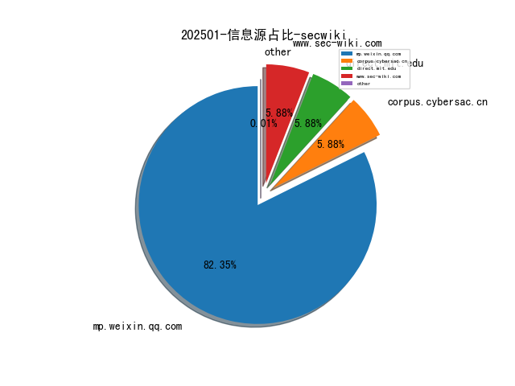
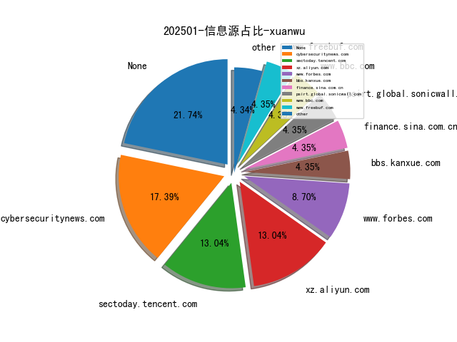
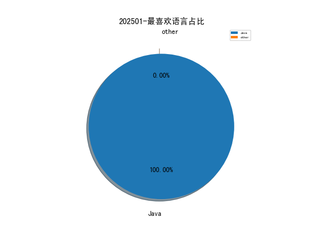

# [数据--所有](README_20.md)
# [数据--年度](README_2025.md)
# 202501 信息源与信息类型占比

# 网络安全书籍 推荐
| date_added | language | title | author | link | size| 
| --- | --- | --- | --- | --- | ---| 
| 2025-01-22 07:12:44 | English | Generative Artificial Intelligence for Biomedical and Smart Health Informatics | Aditya Khamparia | http://libgen.is/book/index.php?md5=68789C699745A9C57833B50F56299D47 | 20 MB [PDF]| 
| 2025-01-20 06:05:14 | English | Basics of Python Programming: A Quick Guide for Beginners | unknown | https://www.wowebook.org/basics-of-python-programming-a-quick-guide-for-beginners/ | unknown| 
| 2025-01-18 08:27:50 | English | Build a Robo-Advisor with Python (From Scratch) | unknown | https://www.wowebook.org/build-a-robo-advisor-with-python-from-scratch/ | unknown| 
| 2025-01-18 14:19:46 | English | Starting Out with Python, 6th Edition | unknown | https://www.wowebook.org/starting-out-with-python-6th-edition/ | unknown| 
| 2025-01-17 07:31:05 | English | Cybersecurity Leadership for Healthcare Organizations and Institutions of Higher Education | Bradley Fowler, | http://libgen.is/book/index.php?md5=5ED8C105A5E27C9243FF72F9DBBCDE04 | 11 MB [PDF]| 
| 2025-01-17 07:15:40 | English | Reconfigurable Obfuscation Techniques for the IC Supply Chain : Using FPGA-Like Schemes for Protection of Intellectual Property | Zain Ul Abideen; Samuel Pagliarini | http://libgen.is/book/index.php?md5=CCD068408820D44FFF18BE8165372C73 | 45 MB [EPUB]| 
| 2025-01-17 05:02:01 | English | Building Generative AI Services with FastAPI (for True Epub) | Ali Parandeh | http://libgen.is/book/index.php?md5=5D2A5F90A3FE09BE0252ED51A6DB61D1 | 23 MB [EPUB]| 
| 2025-01-16 08:16:07 | English | Microsoft 365 For Dummies | unknown | https://www.wowebook.org/microsoft-365-for-dummies/ | unknown| 
| 2025-01-16 10:37:47 | English | Hemodynamic Monitoring | Mary E. Lough | http://libgen.is/book/index.php?md5=0A95FF295984F9B8EAA23346534DFE65 | 38 MB [PDF]| 
| 2025-01-16 10:35:07 | English | Hemodynamic Monitoring | Mary E. Lough | http://libgen.is/book/index.php?md5=C43219F28B473D3576D829974A1ABEFC | 34 MB [EPUB]| 
| 2025-01-16 10:27:46 | English | Basics of Python Programming A Quick Guide for Beginners | Krishna Kumar Mohbey | http://libgen.is/book/index.php?md5=A3DD2FBDD34F88AFFBF364777F25C839 | 56 MB [PDF]| 
| 2025-01-16 17:26:24 | English | Python Essentials For Dummies | unknown | https://www.wowebook.org/python-essentials-for-dummies/ | unknown| 
| 2025-01-15 11:36:58 | English | Microsoft Teams For Dummies, 3rd Edition | unknown | https://www.wowebook.org/microsoft-teams-for-dummies-3rd-edition/ | unknown| 
| 2025-01-15 06:37:49 | English | Microsoft Teams For Dummies, 2nd Edition | unknown | https://www.wowebook.org/microsoft-teams-for-dummies-2nd-edition/ | unknown| 
| 2025-01-15 05:58:21 | English | Microsoft 365 PowerPoint For Dummies, 2nd Edition | unknown | https://www.wowebook.org/microsoft-365-powerpoint-for-dummies-2nd-edition/ | unknown| 
| 2025-01-15 12:00:10 | English | Microsoft Power BI For Dummies | unknown | https://www.wowebook.org/microsoft-power-bi-for-dummies/ | unknown| 
| 2025-01-15 11:47:51 | English | Microsoft Power Platform For Dummies | unknown | https://www.wowebook.org/microsoft-power-platform-for-dummies/ | unknown| 
| 2025-01-15 11:52:46 | English | Glycemic Monitoring - ECAB | R V Jayakumar | http://libgen.is/book/index.php?md5=40A7BC7D8BDF65836C95B6A03443C88E | 1 MB [PDF]| 
| 2025-01-15 11:52:33 | English | Glycemic Monitoring - ECAB | R V Jayakumar | http://libgen.is/book/index.php?md5=36AFA5B8BAF8838E0D4C4F68B909CAC5 | 3 MB [EPUB]| 
| 2025-01-11 16:47:52 | English | A Beginner’s Guide To Web Application Penetration Testing | unknown | https://www.wowebook.org/a-beginners-guide-to-web-application-penetration-testing/ | unknown| 
| 2025-01-10 06:20:20 | English | Microsoft 365 Copilot At Work: Using AI to Get the Most from Your Business Data and Favorite Apps | unknown | https://www.wowebook.org/microsoft-365-copilot-at-work-using-ai-to-get-the-most-from-your-business-data-and-favorite-apps/ | unknown| 
| 2025-01-08 06:17:50 | English | Generative AI on Google Cloud with LangChain | unknown | https://www.wowebook.org/generative-ai-on-google-cloud-with-langchain/ | unknown| 
| 2025-01-07 11:15:25 | English | Learn Generative AI with PyTorch By Mark Liu (Final Release) | Mark Liu | http://libgen.is/book/index.php?md5=EA442D0490AAD3D193551EC97EAF414E | 19 MB [EPUB]| 
| 2025-01-07 09:19:04 | English | A Defense Manual of Commando Jiu-Jitsu | Irvin Cahn | http://libgen.is/book/index.php?md5=B55819CE207CCB59130E7E494840B73D | 17 MB [PDF]| 
| 2025-01-07 08:58:08 | English | The Hunter and Trapper | Halsey Thrasher | http://libgen.is/book/index.php?md5=F2D8C7058F994CF774B9B21884C534D6 | 6 MB [PDF]| 
| 2025-01-06 07:47:24 | English | Mastering VMware Cloud Disaster Recovery and Ransomware Resilience | unknown | https://www.wowebook.org/mastering-vmware-cloud-disaster-recovery-and-ransomware-resilience/ | unknown| 
| 2025-01-06 08:15:38 | English | Securing an Enterprise: Maximizing Digital Experiences through Enhanced Security Measures | unknown | https://www.wowebook.org/securing-an-enterprise-maximizing-digital-experiences-through-enhanced-security-measures/ | unknown| 
| 2025-01-05 12:39:04 | English | Getting Started with Azure OpenAI | unknown | https://www.wowebook.org/getting-started-with-azure-openai/ | unknown| 
| 2025-01-05 10:02:31 | English | Stochastic Finance with Python | unknown | https://www.wowebook.org/stochastic-finance-with-python/ | unknown| 
| 2025-01-05 09:41:52 | English | Regenerating Learning: Transforming How You Learn with Generative AI | unknown | https://www.wowebook.org/regenerating-learning-transforming-how-you-learn-with-generative-ai/ | unknown| 
| 2025-01-05 12:36:03 | English | (Drugs and the Pharmaceutical Sciences) An Introduction to Generative Drug Discovery | Ekins S. (ed.) | http://libgen.is/book/index.php?md5=A067E7425DEFCD9CD2DBE27331C5B3C0 | 18 MB [PDF]| 
| 2025-01-05 12:31:04 | English | (Hart Studies In Security And Justice) Surveillance, Privacy And Trans-Atlantic Relations | David D Cole, Federico Fabbrini, Stephen Schulhofer | http://libgen.is/book/index.php?md5=C7E684DAA5DB463BD3A76B9739A9AE90 | 2 MB [PDF]| 
| 2025-01-05 11:45:17 | English | (DESIGN THINKING SERIES) Regenerating Learning: Transforming How You Learn with Generative AI | Patrick Parra Pennefather | http://libgen.is/book/index.php?md5=CB4273D1E2D46C1BABB635D9517EAC08 | 28 MB [MOBI]| 
| 2025-01-05 09:46:17 | English | Clinical Risk Management | Tom Flewett | http://libgen.is/book/index.php?md5=6F2F17A69AD73C83AF899458FE376320 | 1 MB [PDF]| 
| 2025-01-05 07:47:43 | English | Data Visualization in R and Python | Marco Cremonini | http://libgen.is/book/index.php?md5=F55A40B4F225930378277F4325652A27 | 25 MB [PDF]| 
| 2025-01-04 23:35:14 | English | In defense of judicial elections | Chris W. Bonneau, Melinda Gann Hall | http://libgen.is/book/index.php?md5=DFF945E046EBD7290A8FF8723D1DAE41 | 2 MB [PDF]| 
| 2025-01-03 07:36:03 | English | The Digital Marketer’s Playbook | unknown | https://www.wowebook.org/the-digital-marketers-playbook/ | unknown| 
| 2025-01-03 08:11:03 | English | Generative AI For Executives | unknown | https://www.wowebook.org/generative-ai-for-executives/ | unknown| 
| 2025-01-02 19:41:57 | English | Cybersecurity Today: Cyber attacks, network security, and threat prevention | Debrupa Palit | http://libgen.is/book/index.php?md5=A59BBC88443D9E049F1B60522CF4ACBD | 8 MB [EPUB]| 
| 2025-01-01 06:29:16 | English | Neural Networks with TensorFlow and Keras: Training, Generative Models, and Reinforcement Learning | Philip Hua | http://libgen.is/book/index.php?md5=021B6DF458FA887786DA61470B09A2CE | 6 MB [PDF]| 
| 2025-01-01 01:18:12 | English | Active Machine Learning with Python: Refine and elevate data quality over quantity with active learning | Margaux Masson-Forsythe | http://libgen.is/book/index.php?md5=1553E38A64124079E8A909A95CF50004 | 16 MB [PDF]| 
| 2025-01-01 01:14:18 | English | (Chapman & Hall/CRC The Python Series) Data Mining with Python: Theory, Application, and Case Studies | Di Wu | http://libgen.is/book/index.php?md5=4D37B5C21C970DD4991778C0E8C91BA0 | 13 MB [PDF]| 
| 2025-01-01 23:19:03 | English | Regenerating Learning: Transforming How You Learn with Generative AI | Patrick Parra Pennefather | http://libgen.is/book/index.php?md5=E452D075608F9CA3ACC86D7E280BB502 | 29 MB [PDF]| 

# 微信公众号 推荐
| nickname_english | weixin_no | title | url| 
| --- | --- | --- | ---| 
| 0xh4ck3r | None | Confluence OGNL注入漏洞复现(CVE-2022-26134) | https://mp.weixin.qq.com/s?__biz=Mzg4NDg3NjE5MQ==&mid=2247485343&idx=1&sn=ea5f519e9a3972aab9b055a494fc61f3 | 3| 
| 360数字安全 | None | 再拓联营联运教育伙伴！360携手智榜样发力新质人才培养 | https://mp.weixin.qq.com/s?__biz=MzA4MTg0MDQ4Nw==&mid=2247579203&idx=1&sn=dafb4eea051a1523d465ed4a3088f4f5 | 8| 
| CISP | None | 2024年12月攻防考试成绩 | https://mp.weixin.qq.com/s?__biz=MzI1NzQ0NTMxMQ==&mid=2247490078&idx=1&sn=c45abea300c106be545fb30446df113c | 2| 
| CNNVD安全动态 | None | CNNVD关于Oracle多个安全漏洞的通报 | https://mp.weixin.qq.com/s?__biz=MzAxODY1OTM5OQ==&mid=2651462583&idx=1&sn=f496cb38c7bbad55ba627bc0ca6daf7e | 2| 
| Cloud Security lab | None | 哥斯拉二开从0到1-4(流量优化) | https://mp.weixin.qq.com/s?__biz=Mzg3Mzg5MTc1OA==&mid=2247484470&idx=1&sn=ca266be247b177dc320e5f0862e45009 | 1| 
| Code4th安全团队 | None | 某信云防火墙绕过简析 | https://mp.weixin.qq.com/s?__biz=MzkzMzE5OTQzMA==&mid=2247485754&idx=1&sn=e274c767e08de7a6230dd54d76deeded | 3| 
| Delta Insights | None | 网络安全动态 - 2025.01.23 | https://mp.weixin.qq.com/s?__biz=MzU1MzEzMzAxMA==&mid=2247499897&idx=1&sn=659b87a4ffe0447cfb0d85f4c692339c | 6| 
| Esn技术社区 | None | （新春）限时【24】小时删档,论坛测试 | https://mp.weixin.qq.com/s?__biz=MzU5Njg5NzUzMw==&mid=2247490424&idx=1&sn=529a7645e04ed4125e8ada0bb012959d | 2| 
| FreeBuf | None | Pwn2Own 2025首日，16个零日漏洞和200万奖金 | https://mp.weixin.qq.com/s?__biz=MjM5NjA0NjgyMA==&mid=2651312640&idx=3&sn=9904195ae2cf70bd87a4d4dca9ffdcfe | 34| 
| GoUpSec | None | 正调查中国黑客的美国土安全部咨询委员会被特朗普解散 | https://mp.weixin.qq.com/s?__biz=MzkxNTI2MTI1NA==&mid=2247502191&idx=2&sn=7739f659d16fa7bac43e208b99c5a86c | 8| 
| HackSee | None | ChatGPT Crawler漏洞可以通过HTTP请求进行DDoS攻击 | https://mp.weixin.qq.com/s?__biz=MzI5NTA0MTY2Mw==&mid=2247485791&idx=1&sn=a856f6c4d684f19e115d59fc9035e3d0 | 4| 
| KK安全说 | None | CVE-2024-49113“LDAP 噩梦”：2025 年首个 PoC 漏洞针对关键 Windows 漏洞 | https://mp.weixin.qq.com/s?__biz=Mzg4NzgyODEzNQ==&mid=2247488629&idx=1&sn=0e40bfd703c383a6954c90bdb7c0325a | 5| 
| Khan安全团队 | None | 【工具推荐】URLFinder-x 信息收集工具 | https://mp.weixin.qq.com/s?__biz=MzAwMjQ2NTQ4Mg==&mid=2247496729&idx=2&sn=0dc81ac61d97e9a07ab854fcdd274c77 | 3| 
| Kone安全 | None | AI导师手把手：用ChatGPT确定哲学和文学论文选题的秘密攻略。 | https://mp.weixin.qq.com/s?__biz=MzU4MzM4MzQ1MQ==&mid=2247493248&idx=5&sn=2eeb71736fd83dc91af2925eb0e55cbe | 16| 
| Ots安全 | None | Windows BitLocker 漏洞暴露了 AES-XTS 加密 | https://mp.weixin.qq.com/s?__biz=MzAxMjYyMzkwOA==&mid=2247527057&idx=3&sn=634fffd60e2e7360134637a74720981b | 15| 
| TtTeam | None | CVE-2024-9593 WordPress 远程代码执行 | https://mp.weixin.qq.com/s?__biz=Mzg2NTk4MTE1MQ==&mid=2247486493&idx=1&sn=279f1220881fc761c7ad242bc83325f9 | 4| 
| XDsecurity | None | 招聘,亚信安全,多岗位,年薪高 | https://mp.weixin.qq.com/s?__biz=Mzg2NTcyNjU4Nw==&mid=2247485876&idx=1&sn=e690ab519a7b178e0f5ffe5887195ea1 | 2| 
| flower安全 | None | 网安，大数据，云计算找工作，找项目来这里看看 | https://mp.weixin.qq.com/s?__biz=MzkxNjQyODY5MA==&mid=2247486995&idx=1&sn=9891fec757a4a1bc34ec48173db36e51 | 2| 
| 一起聊安全 | None | 2024年度网络安全漏洞态势分析与研究报告 | https://mp.weixin.qq.com/s?__biz=MzI3NjUzOTQ0NQ==&mid=2247517210&idx=1&sn=8c132df913168e9d296ce0321f0904bc | 6| 
| 丁爸 情报分析师的工具箱 | None | 【资料】理解监控技术：间谍设备的起源与应用 | https://mp.weixin.qq.com/s?__biz=MzI2MTE0NTE3Mw==&mid=2651148667&idx=1&sn=d180e4864f7fc7caffe5c5bea0629de2 | 11| 
| 不止Security | None | App对抗系列—应用检测对抗 | https://mp.weixin.qq.com/s?__biz=MzU3OTYxNDY1NA==&mid=2247484919&idx=1&sn=00f2b86da6908c1c04fe883e0186bc13 | 2| 
| 中国信息安全 | None | 关注 , 公安部：依法严打网络违法犯罪 “净网2024”取得显著成效 | https://mp.weixin.qq.com/s?__biz=MzA5MzE5MDAzOA==&mid=2664235572&idx=6&sn=22f8203bf83062966f1022f6749a295c | 49| 
| 中国软件评测中心 | None | 国内首套《新型工业化丛书》正式发售！ | https://mp.weixin.qq.com/s?__biz=MjM5NzYwNDU0Mg==&mid=2649249601&idx=2&sn=af572d541c24536fb8f78acba90d78f1 | 8| 
| 中科天齐软件安全中心 | None | 7-Zip高危漏攻击者可绕过安全机制远程执行代码 | https://mp.weixin.qq.com/s?__biz=MzU5Njc4NjM3NA==&mid=2247496213&idx=1&sn=41ff4ec3981ca43faad6cd4583c6b88a | 1| 
| 乾冠安全 | None | 乾冠安全 , 春节假期放假值班安排 | https://mp.weixin.qq.com/s?__biz=MjM5NjU0NDQ1Ng==&mid=2671019604&idx=1&sn=c089f8353137dfae5491b6575063a7f5 | 2| 
| 云淡纤尘 | None | 【电子取证】2024数证杯决赛团队赛——计算+内存取证 | https://mp.weixin.qq.com/s?__biz=MzkyOTQ4NTc3Nw==&mid=2247485465&idx=1&sn=1b0dee50bdf86c0ef82b205b95e30948 | 1| 
| 亚信安全 | None | 警惕！Lua恶意软件正在借GitHub伪装，以安全之名行攻击之实 | https://mp.weixin.qq.com/s?__biz=MjM5NjY2MTIzMw==&mid=2650620955&idx=1&sn=15de34dd2afee6db11d80a6ccf2c5791 | 9| 
| 亿人安全 | None | 记一次绕过**云waf与某不知名waf的双waf上传getshell | https://mp.weixin.qq.com/s?__biz=Mzk0MTIzNTgzMQ==&mid=2247519246&idx=1&sn=738b21dc76523b79095505e2cab9b0eb | 2| 
| 仇辉攻防 | None | 【云安全】云原生-Docker（四）容器逃逸之危险挂载 | https://mp.weixin.qq.com/s?__biz=MzUyNTUyNTA5OQ==&mid=2247484598&idx=1&sn=1d92a77127ef91cb7bc335d442405fbd | 3| 
| 众亦信安 | None | impacket解读（二. getTGT、getST、getPac、GetUserSPNs、GetNPUsers） | https://mp.weixin.qq.com/s?__biz=Mzg5NTkxNzg4MA==&mid=2247489890&idx=1&sn=8d439aaec9f11b74d5755469563d8292 | 2| 
| 信息安全与通信保密杂志社 | None | 人工智能赋能网络空间作战 | https://mp.weixin.qq.com/s?__biz=MzkwMTMyMDQ3Mw==&mid=2247597580&idx=2&sn=a29bce81532c5dafacd6a4ac72be4457 | 10| 
| 信息安全研究 | None | 【合作单位动态】天融信再度列入Gartner®“中国数据安全平台领域”代表厂商 | https://mp.weixin.qq.com/s?__biz=MzA3NzgzNDM0OQ==&mid=2664992937&idx=3&sn=67623dcfffc80f9cf96a6dcfec933197 | 19| 
| 全栈网络空间安全 | None | 使用流量镜像对VPC流量进行安全审查 | https://mp.weixin.qq.com/s?__biz=Mzg3NTUzOTg3NA==&mid=2247515071&idx=1&sn=2066ff2b97dfa4e5dfb2e7cde0d44b42 | 8| 
| 全球技术地图 | None | 中国“人造太阳”实现亿度千秒高约束模等离子体运行 | https://mp.weixin.qq.com/s?__biz=MzI1OTExNDY1NQ==&mid=2651618796&idx=2&sn=40e223825a76e7c61e61abe3f1c68f42 | 10| 
| 内存泄漏 | None | 为什么一年两箱油的车上路总被人嫌弃？应该怎么做？ | https://mp.weixin.qq.com/s?__biz=MzU2MjU2MzI3MA==&mid=2247484521&idx=3&sn=6f3b464f7b8bbf11b0b11b12e1cd82e7 | 5| 
| 内生安全联盟 | None | 拜登再次发布网络安全行政令，全面加强美国国家网络防御创新 | https://mp.weixin.qq.com/s?__biz=Mzg4MDU0NTQ4Mw==&mid=2247528800&idx=2&sn=2efa3ee2f7f7a47a4bcd9c9ccf07a95e | 14| 
| 华青融天 | None | 盘点 , 华青融天的2024 | https://mp.weixin.qq.com/s?__biz=MzA4Mzg1ODIzMw==&mid=2653545489&idx=1&sn=4e277e8a58644945d8696bd49c3313a3 | 1| 
| 合合信息 | None | 上新！「合合信息」专属蛇年红包封面派送中 | https://mp.weixin.qq.com/s?__biz=MzAxMzg0NjY2NA==&mid=2247493117&idx=2&sn=072bcc8b67eeeea10631f7ea420ea9b1 | 4| 
| 启明星辰安全简讯 | None | 安全简讯（2025.01.23） | https://mp.weixin.qq.com/s?__biz=MzkzNzY5OTg2Ng==&mid=2247500657&idx=1&sn=5c3c5bdc487c01bf94c220b33860a5a7 | 9| 
| 吾爱破解论坛 | None | 吾爱破解论坛微信红包封面设计预览（终） | https://mp.weixin.qq.com/s?__biz=MjM5Mjc3MDM2Mw==&mid=2651141619&idx=1&sn=7fc11778af50ff2e8ab745875d46374e | 2| 
| 哈拉少安全小队 | None | 这个专注代码审计的内部圈子，2025年又带来了什么好东西呢？ | https://mp.weixin.qq.com/s?__biz=MzAxNzkyOTgxMw==&mid=2247493812&idx=1&sn=d70d6303efb2fecb8c715c45cfaa5fdb | 3| 
| 嘶吼专业版 | None | 新的 Cleo 零日 RCE 漏洞在数据盗窃攻击中被利用 | https://mp.weixin.qq.com/s?__biz=MzI0MDY1MDU4MQ==&mid=2247580942&idx=2&sn=c68b08970aacfb2f3445a422c4e35b40 | 11| 
| 国源天顺 | None | 国源天顺春节放假通知 | https://mp.weixin.qq.com/s?__biz=Mzg3MTU1MTIzMQ==&mid=2247495822&idx=3&sn=19aff767edb46f36e7df39ad47062420 | 1| 
| 国舜股份 | None | 喜报 , 国舜中标联通在线业务平台网络与信息安全服务项目 | https://mp.weixin.qq.com/s?__biz=MzA3NjU5MTIxMg==&mid=2650575242&idx=2&sn=db5ad163af6e61fadebd1cf05c1ba902 | 4| 
| 土拨鼠的安全屋 | None | 图形化-Windiows日志分析工具 | https://mp.weixin.qq.com/s?__biz=Mzk0ODY1NzEwMA==&mid=2247486049&idx=1&sn=38461bc0a5e3c2db5e1dc2b49df2c714 | 7| 
| 塞讯安全验证 | None | 2024年度攻击库更新统计 | https://mp.weixin.qq.com/s?__biz=Mzk0MTMzMDUyOA==&mid=2247504960&idx=2&sn=c9aeea7960f9dde904c765ee8e50a4a6 | 3| 
| 夜组安全 | None | 2024年AI安全五大热点回顾 , CAISP覆盖AI安全领域的一门认证 | https://mp.weixin.qq.com/s?__biz=Mzk0ODM0NDIxNQ==&mid=2247493375&idx=2&sn=b5c10a2843477ed86cb1fb374fe311cf | 8| 
| 夜组科技圈 | None | Tomcat 弱密码检测与漏洞利用工具 | https://mp.weixin.qq.com/s?__biz=MzU5MjgwMDg1Mg==&mid=2247484759&idx=1&sn=c4caa7986c85201bb1482edc2c398385 | 2| 
| 大伯为安全 | None | 隧道技术王炸组合 | https://mp.weixin.qq.com/s?__biz=MzkwOTU5Mjk5MA==&mid=2247486244&idx=2&sn=12ab65579687cd1bed9ea66329065e6c | 2| 
| 奇安信安全服务 | None | 2024年12月考试成绩 | https://mp.weixin.qq.com/s?__biz=MzI4MzA0ODUwNw==&mid=2247487148&idx=1&sn=9a576b6a8e40146970073e74a16cfa51 | 1| 
| 奇安信集团 | None | 奇安信入选Gartner®中国环境数据安全平台代表供应商 | https://mp.weixin.qq.com/s?__biz=MzU0NDk0NTAwMw==&mid=2247624613&idx=1&sn=09d69b93eadd8e5afb8453b192239b21 | 13| 
| 字节跳动技术团队 | None | 向AI未知之境出发，字节跳动启动 Seed Edge 研究计划！ | https://mp.weixin.qq.com/s?__biz=MzI1MzYzMjE0MQ==&mid=2247512925&idx=1&sn=b2ffcca4f0524c3de6ce65a8c7b03369 | 3| 
| 安全419 | None | 2024年度网络安全市场投融资一览 | https://mp.weixin.qq.com/s?__biz=MzUyMDQ4OTkyMg==&mid=2247546829&idx=1&sn=aa621dc99c11ffc64957c811b56069f3 | 9| 
| 安全内参 | None | 广州警方发布“净网2024”专项行动典型案例 | https://mp.weixin.qq.com/s?__biz=MzI4NDY2MDMwMw==&mid=2247513572&idx=2&sn=397d66f7bee4f39daaa6029e8bf02771 | 15| 
| 安全分析与研究 | None | Linux数字取证工具与常用命令汇总 | https://mp.weixin.qq.com/s?__biz=MzA4ODEyODA3MQ==&mid=2247490135&idx=1&sn=f03af96e5629aec61e50ba56fc831114 | 13| 
| 安全威胁纵横 | None | 5.6Tbps！史上最大DDoS攻击来袭，涉及超13000个物联网设备 | https://mp.weixin.qq.com/s?__biz=Mzk0MDYwMjE3OQ==&mid=2247486104&idx=1&sn=e2a2c03dec2a77e615714d615b632af9 | 3| 
| 安全新说 | None | 关于公布获得通信网络安全服务能力评定证书单位名单的通知 | https://mp.weixin.qq.com/s?__biz=MzA3NDIwNTY5Mw==&mid=2247507503&idx=1&sn=ad440f80f3860de05e8f5d9e1a7dbcb7 | 4| 
| 安全牛 | None | 多个网络安全巨头的账户凭证泄露，在暗网被售卖；工信部提醒：防范Androxgh0st僵尸网络风险 , 牛览 | https://mp.weixin.qq.com/s?__biz=MjM5Njc3NjM4MA==&mid=2651134834&idx=2&sn=fe473e2905bc3dcea74c07a1ed494c51 | 13| 
| 安全研究GoSSIP | None | G.O.S.S.I.P 阅读推荐 2025-01-23 自编译Chronium实现抗量子加密协议 | https://mp.weixin.qq.com/s?__biz=Mzg5ODUxMzg0Ng==&mid=2247499631&idx=1&sn=c910d274643c42f9a1ff07a72205a2b5 | 6| 
| 安在 | None | 健身 APP 成泄密 “暗箭”，法国核潜艇机密危在旦夕 | https://mp.weixin.qq.com/s?__biz=MzU5ODgzNTExOQ==&mid=2247635368&idx=2&sn=bbb4934c14383e0d2af5a95ddfe925d4 | 20| 
| 安知讯 | None | 农行被罚，因监管统计数据不真实等 | https://mp.weixin.qq.com/s?__biz=MzIxMDIwODM2MA==&mid=2653931471&idx=2&sn=7b4f81a445348fb59f22b189d8bdc436 | 21| 
| 宸极实验室 | None | 『漏洞复现』XXL-JOB 默认 accessToken 身份绕过 RCE 漏洞分析及复现 | https://mp.weixin.qq.com/s?__biz=Mzg4NTA0MzgxNQ==&mid=2247489862&idx=1&sn=4b83e533ed54cf2bdf044047eff9bdb9 | 2| 
| 小毅安全阵地 | None | 预计3月15日开班 , 奇安信认证工程师边界安全方向BS—防火墙 | https://mp.weixin.qq.com/s?__biz=Mzg4MDE0MzQzMw==&mid=2247488079&idx=1&sn=955f3160912c5cbf6f8661513612116b | 3| 
| 小艾搞安全 | None | 批量登录灯塔扫描的信息收集GUI工具-TDGO更新(v1.0.1)发布 | https://mp.weixin.qq.com/s?__biz=Mzg3MTY3NzUwMQ==&mid=2247490350&idx=1&sn=42201c3140c212e8631070210aa57e54 | 3| 
| 山石网科 | None | 山石网科入选Gartner®“中国数据安全平台领域”市场指南代表厂商 | https://mp.weixin.qq.com/s?__biz=MjM5MTk4MjA2MA==&mid=2650107460&idx=1&sn=d56fb1281ac0aa40606aa563766467de | 1| 
| 山石网科新视界 | None | 年终盘点之十二｜2024山石网科能源行业，乘势而上! | https://mp.weixin.qq.com/s?__biz=MzAxMDE4MTAzMQ==&mid=2661298183&idx=4&sn=d2d66d8809febfc82522e6c9bef68123 | 14| 
| 工业互联网标识智库 | None | 国新办举行“中国经济高质量发展成效”系列新闻发布会 介绍“大力推进新型工业化 推动经济高质量发展”情况 | https://mp.weixin.qq.com/s?__biz=MzU1OTUxNTI1NA==&mid=2247592205&idx=2&sn=6adc5c59a616a093c31347a3c20e7458 | 7| 
| 工业信息安全创新中心 | None | 原工信部科技司领导常利民莅临工信安创调研指导工作 | https://mp.weixin.qq.com/s?__biz=MzAwNTc0ODM3Nw==&mid=2247488583&idx=1&sn=7fc17cd7c85f9e2a1b845cea29caa16f | 2| 
| 快手技术 | None | 宠粉福利大放送！立即下载快手技术年货合集电子书，100份新年好礼等你拿！ | https://mp.weixin.qq.com/s?__biz=Mzg2NzU4MDM0MQ==&mid=2247495931&idx=1&sn=892f7c47d6d08154cbfdbb353a0e0227 | 3| 
| 恒星EDU | None | 第八届西湖论剑·中国杭州网络安全技能大赛初赛官方Write Up（上） | https://mp.weixin.qq.com/s?__biz=MzU1MzE3Njg2Mw==&mid=2247510304&idx=1&sn=f483e489569e5e273b772d5806122dc8 | 3| 
| 情报分析师 | None | “星际之门”：美国AI基础设施超级计划对我风险研判 | https://mp.weixin.qq.com/s?__biz=MzA3Mjc1MTkwOA==&mid=2650559174&idx=2&sn=60f82f9fdaf865f4631b09fad1016fd7 | 20| 
| 情报分析师Pro | None | 懂王上台后恐对蒙古国与美国商业合作做出重大调整？ | https://mp.weixin.qq.com/s?__biz=MzkwNzM0NzA5MA==&mid=2247504640&idx=2&sn=d7010e0e50cd1e62ab33b78563e969ec | 19| 
| 扫地僧的茶饭日常 | None | FOFA资产拓线实战系列：响尾蛇APT组织 | https://mp.weixin.qq.com/s?__biz=Mzg5NTUyNTI5OA==&mid=2247486397&idx=1&sn=8a9f4db51d174f0118fe05e952af3648 | 4| 
| 技术分享交流 | None | 专属红包封面，限时免费领取 | https://mp.weixin.qq.com/s?__biz=MzAxMDIwNjg2MA==&mid=2247486165&idx=1&sn=92ba2d7a8842b8b706cd78bc74fbaf98 | 2| 
| 掌控安全EDU | None | 掌控安全特邀嘉宾课 , 红队基础设施漫谈 | https://mp.weixin.qq.com/s?__biz=MzUyODkwNDIyMg==&mid=2247547500&idx=2&sn=22be308692c59e295c71da3c7d9443cb | 11| 
| 攻城狮成长日记 | None | 提升运维效率：Ansible systemd 模块操作技巧，让你告别繁琐命令行！ | https://mp.weixin.qq.com/s?__biz=MjM5OTc5MjM4Nw==&mid=2457386668&idx=1&sn=27e9152a05f2bebdc790cbad54190413 | 3| 
| 数世咨询 | None | 特朗普大动作！网络安全审查委员会全员下马！ | https://mp.weixin.qq.com/s?__biz=MzkxNzA3MTgyNg==&mid=2247534945&idx=1&sn=0971add77c0006c58423d02d66802b2f | 8| 
| 星悦安全 | None | 【星悦安全】代码审计知识要点+年末总结+星球抽奖 | https://mp.weixin.qq.com/s?__biz=Mzg4MTkwMTI5Mw==&mid=2247488706&idx=1&sn=d0a68eb623612d7a067240c6c7326043 | 3| 
| 李白你好 | None | 永久免费的渗透攻防武器库，你值得拥有！ | https://mp.weixin.qq.com/s?__biz=MzkwMzMwODg2Mw==&mid=2247510457&idx=1&sn=253e211d3ad35d9aca4e929f2da2ecc8 | 4| 
| 梆梆安全 | None | 梆梆安全荣获2024中国网络安全产业势能榜优能企业「互联网行业」典型案例 | https://mp.weixin.qq.com/s?__biz=MjM5NzE0NTIxMg==&mid=2651135209&idx=3&sn=fd4b4c3a429d10cfe996cc344e316bcf | 7| 
| 河北镌远网络科技有限公司 | None | 网安科普｜灵蛇扫秽网络净 瑞气盈门事业兴 | https://mp.weixin.qq.com/s?__biz=MzU3MzU4NjI4OQ==&mid=2247516060&idx=1&sn=49c57940b6db89d68d6518773139e95d | 3| 
| 河南等级保护测评 | None | 美国土安全部解散网络安全审查委员会 | https://mp.weixin.qq.com/s?__biz=Mzg2NjY2MTI3Mg==&mid=2247498312&idx=1&sn=c907e2338835dfd750ee9b169cecc413 | 17| 
| 泷羽Sec-醉陌离 | None | 你怎么可以这么快？Gopeed（全平台下载） | https://mp.weixin.qq.com/s?__biz=Mzk1NzI5MTc0Nw==&mid=2247484705&idx=1&sn=f91d6aeb1e5a4e9f8d9bf931e394f734 | 2| 
| 泽鹿安全 | None | 锐意进取，行稳致远 | https://mp.weixin.qq.com/s?__biz=Mzg5MjE1NzgzMw==&mid=2247489621&idx=1&sn=3ddad920258dbf1a5f61cebb3683dd6d | 2| 
| 洞见网安 | None | 网安原创文章推荐【2025/1/22】 | https://mp.weixin.qq.com/s?__biz=MzAxNzg3NzMyNQ==&mid=2247489485&idx=1&sn=c5ae2d56443625360c480c48d2bc0a46 | 6| 
| 洪椒攻防实验室 | None | 实战中的WebService利⽤⽅法 | https://mp.weixin.qq.com/s?__biz=Mzg5ODkwMzA0MA==&mid=2247486287&idx=1&sn=2d82c195ccb30c81863d98436c3a82c5 | 1| 
| 深圳网安培训学院 | None | 2025年1月20日职业技能等级认定评价结果公示 | https://mp.weixin.qq.com/s?__biz=Mzg3MDYzMjAyNA==&mid=2247486204&idx=1&sn=3013b5ad5a349325767c60618129ffad | 3| 
| 渊亭科技 | None | 「渊亭算法仓」入选信通院视联网「星耀」典型案例，实现算法全生命周期管理 | https://mp.weixin.qq.com/s?__biz=MzIzNjE1ODE2OA==&mid=2660190322&idx=1&sn=1e359f5dafc877bd7a862adb2d46ad79 | 3| 
| 湖南金盾评估中心 | None | 喜报频传！湖南金盾荣获2024年湖南省网络安全优秀技术支撑单位等多项荣誉 | https://mp.weixin.qq.com/s?__biz=MzIyNTI0ODcwMw==&mid=2662129261&idx=1&sn=76be960bbadf882551507f744fbf9c5a | 2| 
| 火线安全平台 | None | 火线安全春节假期安排 | https://mp.weixin.qq.com/s?__biz=MzU4MjEwNzMzMg==&mid=2247494658&idx=1&sn=8ad56c4e6fcaee8eb7353b3cb84e1ed8 | 1| 
| 火绒安全 | None | 诚邀渠道合作伙伴共启新征程 | https://mp.weixin.qq.com/s?__biz=MzI3NjYzMDM1Mg==&mid=2247521811&idx=2&sn=663fa73323d5d2a739ce60069948d9b7 | 8| 
| 独眼情报 | None | 0-Click 去匿名化攻击影响Signal 和 Discord | https://mp.weixin.qq.com/s?__biz=MzkzNDIzNDUxOQ==&mid=2247494462&idx=3&sn=f006c76053d788976ac79a6f1ecffaf7 | 24| 
| 白帽子左一 | None | 掌控安全特邀嘉宾课 , 红队基础设施漫谈 | https://mp.weixin.qq.com/s?__biz=MzI4NTcxMjQ1MA==&mid=2247615263&idx=2&sn=9266cdce281ad000fe7b0cc06d8077fa | 8| 
| 白帽黑客k哥 | None | 中国黑客为什么在国际大赛大幅退步？ | https://mp.weixin.qq.com/s?__biz=Mzk1NzMwNTM5NQ==&mid=2247483882&idx=1&sn=d2edc9beaa7b1cecf7934c9d476e0688 | 6| 
| 看雪学苑 | None | 5.6Tbps！东亚ISP遭史上最强攻击，Cloudflare成功缓解 | https://mp.weixin.qq.com/s?__biz=MjM5NTc2MDYxMw==&mid=2458589204&idx=3&sn=e42a40de9cf0cb19cad848cca84ea2dd | 25| 
| 知道创宇 | None | 优秀案例 , 制造业与能源领域显实力，知道创宇入选中国网络安全产业势能榜优能企业典型案例 | https://mp.weixin.qq.com/s?__biz=MjM5NzA3Nzg2MA==&mid=2649870813&idx=1&sn=af488259c8a7a3a9822a309becb8d7a4 | 4| 
| 知道创宇404实验室 | None | 威胁情报 , 战争下的相爱相杀，疑似GamaCopy组织利用军事诱饵对俄发起攻击 | https://mp.weixin.qq.com/s?__biz=MzAxNDY2MTQ2OQ==&mid=2650990418&idx=1&sn=405bbaf00d5b589ebc3756c200afd631 | 1| 
| 祺印说信安 | None | 依法严打网络违法犯罪 “净网2024”取得显著成效 | https://mp.weixin.qq.com/s?__biz=MzA5MzU5MzQzMA==&mid=2652114168&idx=1&sn=a0939b06d614a7ecc636271d8552883d | 36| 
| 秦国商鞅 | None | 原创—通过修马桶有感而发中国用人选拔机制 | https://mp.weixin.qq.com/s?__biz=Mzg4NzAwNzA4NA==&mid=2247485082&idx=1&sn=5a5160d9b6a5f0c7f271443458a6a492 | 5| 
| 紫队安全研究 | None | 朝鲜APT组织“拉撒路”背后的惊天骗局：WazirX 2.35 亿美元加密货币被盗案 | https://mp.weixin.qq.com/s?__biz=Mzg3OTYxODQxNg==&mid=2247485628&idx=1&sn=bc2b8bb81a3c2f8c91a1fa5a9bd31225 | 5| 
| 绿盟科技 | None | 绿盟科技2025年会圆满落幕：坚定信心，团结一致，一路向阳待花期 | https://mp.weixin.qq.com/s?__biz=MjM5ODYyMTM4MA==&mid=2650464629&idx=1&sn=3f1b1fa42c3504b0cd739f1dd1560d98 | 5| 
| 网安加社区 | None | 百家讲坛 , 樊山：数据安全之威胁建模 | https://mp.weixin.qq.com/s?__biz=Mzg4MjQ4MjM4OA==&mid=2247523739&idx=1&sn=4fba12b4a88e5e20bc831e8ccb37d436 | 6| 
| 网空闲话plus | None | 俄罗斯电信巨头Rostelecom数据泄露事件发酵中 | https://mp.weixin.qq.com/s?__biz=MzkyMjQ5ODk5OA==&mid=2247507048&idx=1&sn=103e1287102a0e2e063c31d49793bbb1 | 22| 
| 网络安全与人工智能研究中心 | None | 7-Zip高危漏洞，攻击者可绕过安全机制远程执行代码 | https://mp.weixin.qq.com/s?__biz=MzkwMTQyODI4Ng==&mid=2247495647&idx=3&sn=735cc5a7d53697ce267d9c016405b7df | 8| 
| 网络安全与取证研究 | None | 使用kali破解WIFI密码 | https://mp.weixin.qq.com/s?__biz=Mzg3NTU3NTY0Nw==&mid=2247489526&idx=1&sn=e68018c011dbe5b94732b8e95f29c80b | 7| 
| 网络安全和信息化 | None | 《网络安全标准实践指南——摇一摇广告个人权益规范指引（征求意见稿）》公开征求意见 | https://mp.weixin.qq.com/s?__biz=MjM5MzMwMDU5NQ==&mid=2649170464&idx=3&sn=c20b6c7b3fa2fc2bed86946610cb2209 | 19| 
| 网络安全威胁和漏洞信息共享平台 | None | 关于防范Androxgh0st僵尸网络的风险提示 | https://mp.weixin.qq.com/s?__biz=MzA5Nzc4Njg1NA==&mid=2247489185&idx=1&sn=7ab6cc1d80f3daca102bd6744347e782 | 2| 
| 网络小斐 | None | 网络监控：30分钟看运维网工如何靠网络监控说服老板升职加薪 | https://mp.weixin.qq.com/s?__biz=MzIzNjU5NDE2MA==&mid=2247490166&idx=1&sn=d7ca1440722ba5bdc3821186c14da027 | 1| 
| 网络技术干货圈 | None | 网络工程师必备：这8款高效神器助你玩转网络世界！ | https://mp.weixin.qq.com/s?__biz=MzUyNTExOTY1Nw==&mid=2247527971&idx=1&sn=7ff058a3160c9a5af70efca6f559b2f9 | 8| 
| 网络技术联盟站 | None | 如何写出一篇精彩的年终总结：网络工程师的全面指南 | https://mp.weixin.qq.com/s?__biz=MzIyMzIwNzAxMQ==&mid=2649464624&idx=1&sn=87e63e84d9dfeb52c6aebfe82a427167 | 9| 
| 网际思安 | None | MailSec Lab发布《2024年全球邮件威胁报告》 | https://mp.weixin.qq.com/s?__biz=MzA5NjMyMDEwNg==&mid=2649286348&idx=1&sn=1af48f5cdabe8908c76fb695e65ec327 | 3| 
| 老鑫安全 | None | 面向脚本小子的卡巴斯基免杀 | https://mp.weixin.qq.com/s?__biz=MzU0NDc0NTY3OQ==&mid=2247488416&idx=1&sn=4005453c8247f1dc1f52bcb1be6c084c | 1| 
| 能信安资讯 | None | 能信安：漏洞通告 | https://mp.weixin.qq.com/s?__biz=MzI1MTYzMjY1OQ==&mid=2247490773&idx=1&sn=91b80a02103936a79eb2b34f62cc1406 | 5| 
| 腾讯安全威胁情报中心 | None | 屡受认可！腾讯云入选Forrester研报威胁情报代表供应商 | https://mp.weixin.qq.com/s?__biz=MzI5ODk3OTM1Ng==&mid=2247510029&idx=1&sn=be94da2bc92eaff882bd817337e90eb3 | 3| 
| 菜根网络安全杂谈 | None | 你为什么学习网络安全 | https://mp.weixin.qq.com/s?__biz=MzI5MTIwOTQ5MA==&mid=2247487636&idx=1&sn=c25cf86b73e2fe196defa2040ebf7616 | 3| 
| 虎符智库 | None | 厚雪翻长坡，平淡不平凡：2024年网安产业发展态势剖析及2025年趋势展望 | https://mp.weixin.qq.com/s?__biz=MzIwNjYwMTMyNQ==&mid=2247492940&idx=1&sn=b85e119305435ce1b7c9f0ab66cbe141 | 3| 
| 蚁景网络安全 | None | 【免费领】最牛渗透测试工具Metasploit实操教程 | https://mp.weixin.qq.com/s?__biz=MzkxNTIwNTkyNg==&mid=2247553170&idx=2&sn=cd7285a5992ea5f7f21faee1166a3b67 | 8| 
| 补天平台 | None | 2024补天校园GROW计划年度盘点！ | https://mp.weixin.qq.com/s?__biz=MzI2NzY5MDI3NQ==&mid=2247507343&idx=1&sn=77aa1c71117bdef641080d04f756ca81 | 3| 
| 表哥带我 | None | 《回家》 - 文末附零食大礼包抽奖 | https://mp.weixin.qq.com/s?__biz=Mzg4NDg2NTM3NQ==&mid=2247484696&idx=1&sn=18be9570979625757323d8e59567f0bd | 2| 
| 观安信息 | None | 网安科普｜灵蛇扫秽网络净 瑞气盈门事业兴 | https://mp.weixin.qq.com/s?__biz=MzIxNDIzNTcxMg==&mid=2247506657&idx=1&sn=88b4ad3c7ab7fc29198d83f01af4b7a3 | 7| 
| 计算机与网络安全 | None | 扫码下载 , 国资委《企业绩效评价标准值（2024）》 | https://mp.weixin.qq.com/s?__biz=MjM5OTk4MDE2MA==&mid=2655264386&idx=1&sn=2959dff4aa10c11a47a0d2477cfc77b3 | 33| 
| 讯飞安全 | None | 讯飞SRC,2025年春节公告 | https://mp.weixin.qq.com/s?__biz=MzIwMDE5NDg1MA==&mid=2247494222&idx=2&sn=0bd3ca7cee4cae06e8ee840a01647776 | 2| 
| 赛博研究院 | None | 地方动态 , 江苏省数据条例 | https://mp.weixin.qq.com/s?__biz=MzUzODYyMDIzNw==&mid=2247516850&idx=2&sn=1d783efb60d3a6fb5c72518c6d077808 | 6| 
| 车小胖谈网络 | None | 为何宽带的上传和下载速度差异那么大？ | https://mp.weixin.qq.com/s?__biz=MzIxNTM3NDE2Nw==&mid=2247490308&idx=1&sn=5e86de5306afe679fb87cb017db0a3e4 | 2| 
| 进击安全 | None | 一次edusrc挖掘有关sql语句利用的分享 | https://mp.weixin.qq.com/s?__biz=MzkyMjM5NDM3NQ==&mid=2247486206&idx=1&sn=dbaff6c494792bd2bc6cc4442dae1c22 | 2| 
| 进击的HACK | None | u200b吾爱破解论坛精华集2024 | https://mp.weixin.qq.com/s?__biz=MzkxNjMwNDUxNg==&mid=2247487215&idx=1&sn=ae6473a21cde804f2fc7965d6629bf01 | 3| 
| 迪哥讲事 | None | 如何不使用Fuzz得到网站所有参数与接口？ | https://mp.weixin.qq.com/s?__biz=MzIzMTIzNTM0MA==&mid=2247496934&idx=1&sn=d2364b5b6f5facefcba63db6c71b2d6c | 11| 
| 邑安全 | None | 传统Office结构下的后门和利用手段解析 | https://mp.weixin.qq.com/s?__biz=MzUyMzczNzUyNQ==&mid=2247523137&idx=4&sn=2004a1c14542adee378605f6cf928585 | 4| 
| 银天信息 | None | 信息安全漏洞周报【第007期】 | https://mp.weixin.qq.com/s?__biz=MzA4MDk4NTIwMg==&mid=2454063847&idx=1&sn=4fe2c06629d11317089a12ef0f79552d | 2| 
| 长亭安全观察 | None | 新春集福，再添一个经典款！ | https://mp.weixin.qq.com/s?__biz=MzkyNDUyNzU1MQ==&mid=2247486710&idx=1&sn=572aab3a50cace8bdef45f25880b930d | 8| 
| 长亭科技 | None | 新春集福，再添一个经典款！ | https://mp.weixin.qq.com/s?__biz=MzIwNDA2NDk5OQ==&mid=2651388831&idx=1&sn=8b85a49a0d754c7b7184ed1f8d637913 | 3| 
| 闪石星曜CyberSecurity | None | 擦，这套 Java代码审计课程五十多节，才五百左右？到底值不值啊。 | https://mp.weixin.qq.com/s?__biz=Mzg3MDU1MjgwNA==&mid=2247487181&idx=1&sn=70698b79eae6782b00b022dc321cb92a | 2| 
| 阿乐你好 | None | 黑客V我50 | https://mp.weixin.qq.com/s?__biz=MzIxNTIzNTExMQ==&mid=2247490807&idx=1&sn=e489f20b0744a01c02a03b9cad80e238 | 12| 
| 阿里云安全 | None | 对话｜ESA如何助力企业高效安全开展在线业务？ | https://mp.weixin.qq.com/s?__biz=MzA4MTQ2MjI5OA==&mid=2664092137&idx=1&sn=869cda594894aa92fea80a52818911eb | 2| 
| 雾都的猫 | None | 7-Zip Web标记绕过漏洞[CVE-2025-0411]-POC | https://mp.weixin.qq.com/s?__biz=Mzk0OTQ0MTI2MQ==&mid=2247484612&idx=1&sn=9e9a99376f6065f0559ba1bb95a8fa6a | 2| 
| 飞天诚信 | None | “飞天诚信这一年”深度版：《沟通》第49期 | https://mp.weixin.qq.com/s?__biz=MjM5NDE1MjU2Mg==&mid=2649876710&idx=1&sn=15f5cb2b82ca12ed911ef44468246274 | 2| 
| 马哥网络安全 | None | kali Linux安全渗透教程 | https://mp.weixin.qq.com/s?__biz=MzkxMzMyNzMyMA==&mid=2247570671&idx=2&sn=6ddb62faea22be087dc031dca6b0b818 | 14| 
| 黄师傅的赛博dojo | None | 每日情报速递20250123 | https://mp.weixin.qq.com/s?__biz=MzkxMzU4ODU2MQ==&mid=2247484033&idx=1&sn=4978a735f4640a6bc244ea1a64a37a50 | 6| 
| 黑熊安全 | None | 公子，公主，彭于晏，吴彦祖请进群。 | https://mp.weixin.qq.com/s?__biz=Mzg2MTg2NzI5OA==&mid=2247484894&idx=1&sn=eb5ddf6014fd2624a322efac7fb479cc | 3| 
| 龙哥网络安全 | None | Linux命令手册：网络配置和管理大全，零基础入门到精通，收藏这篇就够了 | https://mp.weixin.qq.com/s?__biz=MzU3MjczNzA1Ng==&mid=2247495698&idx=2&sn=87c1a3d72773ae0c4ee9ff1ac6f438ad | 10| 
| BigYoung安全 | None | 快到假期了，建立了一个Burp使用交流群 | https://mp.weixin.qq.com/s?__biz=MzI1NDYyNjUyMw==&mid=2247485761&idx=1&sn=6659032b41c48c720cf4362edfc40ef6 | 1| 
| CertiK | None | 韩国Web3.0爆发在即？CertiK创始人顾荣辉解析全球监管与新趋势 | https://mp.weixin.qq.com/s?__biz=MzU5OTg4MTIxMw==&mid=2247503898&idx=1&sn=6e35e906c03356c693ad9fbaf45addd7 | 4| 
| HW安全之路 | None | 小心！当你在用公共WiFi时，黑客正在看你的手机屏幕 | https://mp.weixin.qq.com/s?__biz=MzI5MjY4MTMyMQ==&mid=2247489758&idx=2&sn=debeec7e5a8c589801e71ef5f96df202 | 12| 
| IoVSecurity | None | 2025年智能网联汽车数据分类分级白皮书 | https://mp.weixin.qq.com/s?__biz=MzU2MDk1Nzg2MQ==&mid=2247619883&idx=3&sn=edabe05cf42d88e5ee7ed99b009ad9d2 | 28| 
| Theloner安全团队 | None | 2025B站第一大瓜，录音独家曝光 | https://mp.weixin.qq.com/s?__biz=MzI2Mzc4ODc1NQ==&mid=2247489546&idx=1&sn=5ff1c3aa7dada1eb7dcb6fc684dbb5c9 | 1| 
| VEDA卫达信息 | None | 2024年网络安全政策法规盘点 | https://mp.weixin.qq.com/s?__biz=Mzg5NDY0NTM2Nw==&mid=2247492245&idx=2&sn=e481691304b55d13fee6370c7affa1cf | 3| 
| sec0nd安全 | None | 中间件安全,Tomcat漏洞汇总 | https://mp.weixin.qq.com/s?__biz=Mzg3OTUxNTU2NQ==&mid=2247490013&idx=3&sn=87f07e5635337b5920c4f83eaad5eb55 | 13| 
| 一个不正经的黑客 | None | 偷偷瞒着老婆买了$Trump,今天有异常被发现怎么办！ | https://mp.weixin.qq.com/s?__biz=MzkwODI1ODgzOA==&mid=2247506601&idx=1&sn=091994dc6177fed595cb8259c970ab57 | 5| 
| 也许是一只羊 | None | 通知 | https://mp.weixin.qq.com/s?__biz=MzkyMTQzNTM3Ng==&mid=2247483893&idx=1&sn=e8e32633696b12d5060a78e87954fbe2 | 2| 
| 代码卫士 | None | 持续领先！奇安信斩获5个CNNVD漏洞贡献奖 | https://mp.weixin.qq.com/s?__biz=MzI2NTg4OTc5Nw==&mid=2247522133&idx=1&sn=694ac221193eff02711b6e597610546d | 5| 
| 再说安全 | None | 20个渗透/CTF练习平台资源（2025） | https://mp.weixin.qq.com/s?__biz=MzkyODYwODkyMA==&mid=2247484995&idx=1&sn=72f9fdd943c38f38946e79aff5d32199 | 7| 
| 北京磐石安科技有限公司 | None | 干货·春节来临｜如何做好网络安全保障工作？ | https://mp.weixin.qq.com/s?__biz=MzkwNDI0MjkzOA==&mid=2247485820&idx=1&sn=6334de95260979ba00facc9890012c9f | 3| 
| 大学生信息安全竞赛 | None | 关于调整半决赛入围队伍名单公示 | https://mp.weixin.qq.com/s?__biz=MzAxNTc1ODU5OA==&mid=2665516315&idx=1&sn=89cdda692eb7e285e2530bf87ed6c108 | 1| 
| 天启互联网实验室 | None | Java快速入门之类、对象、方法 | https://mp.weixin.qq.com/s?__biz=MzkzODQzNTU2NA==&mid=2247486339&idx=1&sn=4ab9185d99620b3d403d1ba5e945ef57 | 5| 
| 安世加 | None | 古巴外交部X账号疑被黑客攻击，短暂推广代币后删除帖子 | https://mp.weixin.qq.com/s?__biz=MzU2MTQwMzMxNA==&mid=2247541425&idx=1&sn=4e2f09e29a9cb24ae279567b689e8603 | 7| 
| 安全圈 | None | 【安全圈】OWASP 2025 年十大漏洞 – 被利用/发现的最严重漏洞 | https://mp.weixin.qq.com/s?__biz=MzIzMzE4NDU1OQ==&mid=2652067526&idx=4&sn=b3d1ba063b429d95b1315af7a9713b77 | 30| 
| 安全极客 | None | 评测！Google Gemini AI 安全评估技术解析 | https://mp.weixin.qq.com/s?__biz=MzkzNDUxOTk2Mw==&mid=2247495755&idx=1&sn=1c93538b659aaa13acfbd29314dbe477 | 3| 
| 格格巫和蓝精灵 | None | 孩子是上天赐予我们最好的礼物，永远不要责备你的孩子 | https://mp.weixin.qq.com/s?__biz=MzI5NDg0ODkwMQ==&mid=2247486155&idx=1&sn=1d2f3391258435cc1031583d7bbc7201 | 2| 
| 泛安全 | None | 原创文章目录 | https://mp.weixin.qq.com/s?__biz=MzU3NjQ5NTIxNg==&mid=2247485450&idx=6&sn=63009359adf2c0231cbe0314c83001b6 | 40| 
| 泷羽Sec-Norsea | None | XSS高级用法，SEO优化，挂ma，MS14_064 | https://mp.weixin.qq.com/s?__biz=MzU2MTc4NTEyNw==&mid=2247486358&idx=1&sn=04e040f8479a8d211136d0cce6379a5d | 3| 
| 泷羽Sec-云梦安全 | None | HTTP 概述 | https://mp.weixin.qq.com/s?__biz=MzkxODc5OTg5MQ==&mid=2247484258&idx=1&sn=95c4bd1488962f8283262ec92b197ac9 | 2| 
| 泷羽Sec-信安吗喽 | None | Kioptix Level 1~5靶场详解，附重新使用vm克隆的下载地址 | https://mp.weixin.qq.com/s?__biz=Mzk2NDE5MDgxOQ==&mid=2247484769&idx=1&sn=443df193fdfe0796548b91290cdad0d0 | 1| 
| 泷羽Sec-边酱 | None | 探秘 BeEF - XSS：网络安全检测的有力工具 | https://mp.weixin.qq.com/s?__biz=Mzk2NDE3NDUwNg==&mid=2247483842&idx=1&sn=2841b8a11833ad9c889e83a793bf5f0a | 1| 
| 泷羽Sec-静安 | None | 04x程序流程结构 | https://mp.weixin.qq.com/s?__biz=MzA3NDE0NTY0OQ==&mid=2247484091&idx=1&sn=fd03c3d4bfd6a39cafe373cc8dac1bc3 | 5| 
| 泷羽Sec-风 | None | pikachu - Sql Inject(SQL注入) | https://mp.weixin.qq.com/s?__biz=Mzk1NzI2NDQyMw==&mid=2247484457&idx=1&sn=17d8821d1d5ef9421535eeb992d948c2 | 3| 
| 盛邦安全WebRAY | None | API治理方案护航某头部高校 | https://mp.weixin.qq.com/s?__biz=MzAwNTAxMjUwNw==&mid=2650277536&idx=1&sn=74d8203afe7469a9c3484e8fb2cd0f0a | 4| 
| 网安探索员 | None | Web安全初级入门基础 | https://mp.weixin.qq.com/s?__biz=MzkzNTYwMTk4Mw==&mid=2247488216&idx=1&sn=70d13855adc495afcbb6902ddc41928f | 3| 
| 网安百色 | None | 7-Zip 漏洞允许通过绕过网络标记执行任意代码 | https://mp.weixin.qq.com/s?__biz=MzI0NzE4ODk1Mw==&mid=2652094668&idx=2&sn=b4a3efa0f4f65c3bbcf7595b75c318bd | 10| 
| 羽泪云小栈 | None | WebSocket了解 | https://mp.weixin.qq.com/s?__biz=MzkxMjYyMjA3Mg==&mid=2247485387&idx=1&sn=cd63395d61608fa0e0fa3a453a6b9eb3 | 1| 
| 老烦的草根安全观 | None | 互联场所：网络安全原则 | https://mp.weixin.qq.com/s?__biz=MzA5MTYyMDQ0OQ==&mid=2247493533&idx=1&sn=9b6d762c513400cd4218dd2efeaf0e5e | 6| 
| 菜狗安全 | None | 公众号专属炫酷红包封面领取！！！ | https://mp.weixin.qq.com/s?__biz=Mzg4MzkwNzI1OQ==&mid=2247485709&idx=1&sn=4c992e7728f5823e847dfe0c617ce7de | 1| 
| 逆向成长日记 | None | 魔改MD5 后续分析 | https://mp.weixin.qq.com/s?__biz=Mzg4NTg0MjMzNQ==&mid=2247484191&idx=1&sn=7b5c362ad62a7ee899465d707ff4a199 | 2| 
| 长弓三皮 | None | 带你解锁编码新世界！--随波逐流CTF编码工具使用教程38 --Pizzini密码 | https://mp.weixin.qq.com/s?__biz=MzU2NzIzNzU4Mg==&mid=2247489517&idx=1&sn=6bcf87b5e3e6ceba574b43711ce2083e | 9| 
| 魔都安全札记 | None | 某互联网公司程序猿植入恶意代码报复用户，已被开除 | https://mp.weixin.qq.com/s?__biz=Mzg4NzQ4MzA4Ng==&mid=2247485178&idx=1&sn=a29469ee09a1602eb3deccde5f441422 | 5| 
| 黑晶 | None | 红队开发：让自己的Shellcode实现SMC | https://mp.weixin.qq.com/s?__biz=MzkzMDgyMTM1Ng==&mid=2247484959&idx=1&sn=80aa30e9e097b748ac86ff032e7de6ee | 3| 
| 360安全应急响应中心 | None | 2024年度360白帽盛典圆满落幕，一起点亮属于他们的高光时刻！ | https://mp.weixin.qq.com/s?__biz=MzkzOTIyMzYyMg==&mid=2247494827&idx=1&sn=e0604f5b84b32539ac256dddf77aef87 | 1| 
| AI与安全 | None | 英伟达的护栏技术NeMo Guardrails-开源 | https://mp.weixin.qq.com/s?__biz=Mzg5NTMxMjQ4OA==&mid=2247485579&idx=1&sn=4b88b9903ba72c64d18e9168660af876 | 3| 
| APT250 | None | TryHackMe - Mountaineer | https://mp.weixin.qq.com/s?__biz=MzkwODY2MzMyMA==&mid=2247484520&idx=1&sn=9115036b59b71dd9eacc10de5c492a32 | 2| 
| AlertSec | None | 微信红包封面 | https://mp.weixin.qq.com/s?__biz=MzkwMjU5MzgzMQ==&mid=2247485226&idx=1&sn=bfde96dff3b3a51d243fecc87ead261e | 2| 
| CAICT可信安全 | None | “云上大模型安全推进方阵”筹备启动，首批成员单位招募中！ | https://mp.weixin.qq.com/s?__biz=Mzk0MjM1MDg2Mg==&mid=2247502775&idx=1&sn=d26d533a33f6c03427265c1dc0bb39bf | 4| 
| Cyb3rES3c | None | 中间件安全,Tomcat漏洞汇总 | https://mp.weixin.qq.com/s?__biz=Mzg2MTc1MjY5OQ==&mid=2247486238&idx=1&sn=0d0e11190ce7cebaf3d1a0e829230713 | 1| 
| Definite R3dBlue | None | Intro-to-BlueTeam | https://mp.weixin.qq.com/s?__biz=Mzg4NzU4MDE5NQ==&mid=2247484234&idx=1&sn=6268d48ec05e31269a00f15969ef422d | 2| 
| FuzzWiki | None | DeepGo: 预测定向灰盒模糊测试 | https://mp.weixin.qq.com/s?__biz=MzU1NTEzODc3MQ==&mid=2247486916&idx=1&sn=6c5e8170932409049927f3b79468ae99 | 3| 
| HACK之道 | None | 节前最后一单私活，4w到手开心过年！ | https://mp.weixin.qq.com/s?__biz=MzIwMzIyMjYzNA==&mid=2247517929&idx=1&sn=f85ea4adf2ddb17cde8369598fa70b65 | 7| 
| HK安全小屋 | None | 【漏洞分享】万能门店小程序管理系统存在任意文件读取漏洞 | https://mp.weixin.qq.com/s?__biz=MzkzNzMxODkzMw==&mid=2247485719&idx=1&sn=594e1286af1bd496465685b0b9d35ff8 | 2| 
| ISC2网络安全 | None | 规划丨2025，对您的未来许下承诺 | https://mp.weixin.qq.com/s?__biz=MzUzNTg4NDAyMg==&mid=2247492307&idx=1&sn=3a6a128fe59dd9a6c20465afe53b24a5 | 6| 
| OneMoreThink | None | 攻防靶场(45)：环境可能有问题 Dawn | https://mp.weixin.qq.com/s?__biz=MzI0NjA3Mzk2NQ==&mid=2247495843&idx=1&sn=6529d4d954b4ac97cd898592463623f4 | 6| 
| OneTS安全团队 | None | Confluence认证后RCE（CVE-2024-21683） | https://mp.weixin.qq.com/s?__biz=MzkxMDY3MzQyNQ==&mid=2247484792&idx=1&sn=c4cc7279d562c9286b0ab2291a614eeb | 1| 
| StaticCodeAnalysis | None | 30个木马隐藏技巧与反制策略  不容错过！ | https://mp.weixin.qq.com/s?__biz=Mzk0MzY1NDc2MA==&mid=2247484252&idx=1&sn=1f1840133486c232c3eb72350ce09f9a | 2| 
| Van1sh | None | 工业信息安全技能大赛-复赛 | https://mp.weixin.qq.com/s?__biz=Mzg5OTkxMzM3NA==&mid=2247485888&idx=1&sn=2432d505ea0816132866b70d3acbad08 | 1| 
| WK安全 | None | 渗透实战,某若依框架的接口测试 | https://mp.weixin.qq.com/s?__biz=Mzg2ODg3NzExNw==&mid=2247488422&idx=1&sn=7579dc74e4a9024c4383a577fdfcf587 | 2| 
| Web安全工具库 | None | 一个师傅们接私活的绝佳渠道 | https://mp.weixin.qq.com/s?__biz=MzI4MDQ5MjY1Mg==&mid=2247515665&idx=1&sn=0234f7e6ae00572183450a4d0411cb15 | 9| 
| Zacarx随笔 | None | 从国赛到西湖论剑：fenjing进阶通杀jinjia2_SSTI | https://mp.weixin.qq.com/s?__biz=MzkxMDU5MzY0NQ==&mid=2247484461&idx=1&sn=b866a874c1d918dd649f80acfedc093f | 1| 
| aFa攻防实验室 | None | 微信红包封面来了 | https://mp.weixin.qq.com/s?__biz=MzAxMjcxMjkyOA==&mid=2247486179&idx=1&sn=cbcbf90d1cf2479fa8dc76e2da0f00ca | 1| 
| dotNet安全矩阵 | None | .NET 第 55 期红队武器库和资源汇总 | https://mp.weixin.qq.com/s?__biz=MzUyOTc3NTQ5MA==&mid=2247498340&idx=3&sn=7c60cbd1b12469d5e4f5c6db12ca1cb4 | 11| 
| 七芒星实验室 | None | JAVA安全之JMX攻防研究分析 | https://mp.weixin.qq.com/s?__biz=Mzg4MTU4NTc2Nw==&mid=2247495149&idx=2&sn=21b7718d4d488108521b4e830f7d9524 | 13| 
| 不秃头的安全 | None | 漏洞挖掘 , 开始既结束？快速挖洞 | https://mp.weixin.qq.com/s?__biz=Mzg3NzkwMTYyOQ==&mid=2247488326&idx=1&sn=64bed920635cd5aa06b69d18c24050be | 1| 
| 企业安全实践 | None | 【漏洞预警】Rsync缓冲区溢出漏洞风险通告 | https://mp.weixin.qq.com/s?__biz=Mzg3NjU0OTQyMg==&mid=2247484324&idx=1&sn=86bc6803db897c208c21fdbf04f469f5 | 2| 
| 信安保密 | None | 石梁：人生成功的“6+1”标准，你知道吗？ | https://mp.weixin.qq.com/s?__biz=MjM5MzUyMzM2NA==&mid=2652914716&idx=4&sn=31a2a52deed828732c628c847ab4feea | 5| 
| 信安网络技术 | None | 今日，大寒 | https://mp.weixin.qq.com/s?__biz=MzkyNDUxNTQ2Mw==&mid=2247485807&idx=1&sn=2d4bce77bf8811f164481db28aa722cd | 1| 
| 信息安全动态 | None | 企业如何防范云上的数据泄露风险？ | https://mp.weixin.qq.com/s?__biz=Mzg4NDc0Njk1MQ==&mid=2247487172&idx=2&sn=6c3a48d6b52de15c94763b51b0b63fc5 | 8| 
| 信息新安全 | None | 密评需要的设备是什么?机房密评要求是什么？ | https://mp.weixin.qq.com/s?__biz=MjM5NDA3ODY4Ng==&mid=2247488861&idx=2&sn=ee08aee33610c10101caecd83122d497 | 2| 
| 兰花豆说网络安全 | None | 商务合作 | https://mp.weixin.qq.com/s?__biz=MzI3NzM5NDA0NA==&mid=2247490298&idx=1&sn=29a1662bf8226520fd86fc0e9622b590 | 8| 
| 冷眼安全观 | None | 由国家医保局集采出现的低价低质药品问题想到网络安全产品采购 | https://mp.weixin.qq.com/s?__biz=Mzk0MDI5MTQzMg==&mid=2247483930&idx=1&sn=228a4301c1f6b71dd85754c22ba6beed | 1| 
| 北邮 GAMMA Lab | None | 专题解读 , 利用投机采样加速大模型推理 | https://mp.weixin.qq.com/s?__biz=Mzg4MzE1MTQzNw==&mid=2247491769&idx=1&sn=818d50263143a235f999ab37f3d31837 | 3| 
| 君哥的体历 | None | 构建数据安全纵深防御体系，多层边界守护数据流转｜总第276周 | https://mp.weixin.qq.com/s?__biz=MzI2MjQ1NTA4MA==&mid=2247491737&idx=1&sn=83ad9192a6badc48475191509e465427 | 1| 
| 君立渗透测试研究中心 | None | Chrome浏览器的Google账户接管研究 | https://mp.weixin.qq.com/s?__biz=Mzg5OTEzMjc4OA==&mid=2247489027&idx=1&sn=60e2dc88ec5d060e0324c3d237433b41 | 1| 
| 君说安全 | None | 当前，已有11家网安企业披露2024业绩预测 | https://mp.weixin.qq.com/s?__biz=MzUzNjkxODE5MA==&mid=2247488121&idx=1&sn=caea2c8cd6c567f6af4cee5e09a11376 | 8| 
| 启明星辰网络空间安全教育 | None | 校企共育 锻造双师 , 启明星辰知白学院网络安全方向“双师型”培训圆满结束 | https://mp.weixin.qq.com/s?__biz=MzUzNDg0NTc1NA==&mid=2247510554&idx=1&sn=90cf0b08a77a723fb4ccc149e5e8fe1d | 1| 
| 启明星辰集团 | None | 启明星辰集团驰援西藏救灾一线 | https://mp.weixin.qq.com/s?__biz=MzA3NDQ0MzkzMA==&mid=2651730591&idx=1&sn=2f6c8371b871d532f2508c49504cabff | 5| 
| 嗨嗨安全 | None | 红包封面速来，免费领取！ | https://mp.weixin.qq.com/s?__biz=MzIzMjg0MjM5OQ==&mid=2247487964&idx=1&sn=c48e215191b5d8f538c689f0e9afe221 | 1| 
| 嘉诚安全 | None | 【漏洞通告】Rsync多个漏洞安全风险通告 | https://mp.weixin.qq.com/s?__biz=MzU4NjY4MDAyNQ==&mid=2247497009&idx=1&sn=70c58fc6187adfcab699f9a29cd91695 | 5| 
| 国家信息安全服务资质 | None | 测评公告（2025年第1号） | https://mp.weixin.qq.com/s?__biz=MzI0NDg4MTIyNQ==&mid=2247486012&idx=1&sn=3e2ba62d7a8f49614ac4ed43fe5d70c6 | 1| 
| 墨菲安全 | None | 36氪广东首发 , 以供应链视角推动企业软件安全架构升级，「墨菲安全」获数千万pre-A轮融资 | https://mp.weixin.qq.com/s?__biz=MzkwOTM0MjI5NQ==&mid=2247488047&idx=1&sn=3176a6f993fd1c1d1fe0b03cbac70b6c | 2| 
| 天威诚信 | None | 创新引领未来 , 天威诚信密评密改方案荣登《ISC.AI 2024数字安全创新性案例报告》 | https://mp.weixin.qq.com/s?__biz=MzU4MzY5MzQ4MQ==&mid=2247542208&idx=1&sn=e5508c71a831c50fccaef00bd3c4a4a0 | 1| 
| 天翁安全 | None | 天翁安全 2025年新年粉丝专属红包来啦（第二弹）！ | https://mp.weixin.qq.com/s?__biz=MzkwMzUyMjk2MQ==&mid=2247484100&idx=1&sn=c306276e7193d6c54a955c0cc151bb98 | 1| 
| 天融信安全漏洞响应中心 | None | TOPSRC 2025年春节放假通知 | https://mp.weixin.qq.com/s?__biz=Mzk0MTM1MTg3Nw==&mid=2247483918&idx=1&sn=5f0cecbd9059c3943a564b13a75411e2 | 2| 
| 天际友盟 | None | [0120]一周重点暗网情报｜天际友盟情报站 | https://mp.weixin.qq.com/s?__biz=MzIwNjQ4OTU3NA==&mid=2247510010&idx=1&sn=f449cd3287db24ecb1f2293abd045025 | 4| 
| 奇安网情局 | None | 美国务院首次实施“网络安全运营需求外国援助计划” | https://mp.weixin.qq.com/s?__biz=MzI4ODQzMzk3MA==&mid=2247489585&idx=1&sn=541793043af95760992360c42afb7a6e | 4| 
| 娜璋AI安全之家 | None | [AI安全论文] (36)C&S22 MPSAutodetect：基于自编码器的恶意Powershell脚本检测模型 | https://mp.weixin.qq.com/s?__biz=Mzg5MTM5ODU2Mg==&mid=2247501253&idx=1&sn=7f467401adcf67cc67d7c2d3573e7c2e | 1| 
| 宁盾科技 | None | 宁盾上榜《CCSIP 2024中国网络安全行业全景册（第七版）》MFA、网络准入等6大细分领域 | https://mp.weixin.qq.com/s?__biz=Mzk0MjI4MzA5MQ==&mid=2247485142&idx=1&sn=864b6e3db29ab0b05f792d8f59e76d71 | 1| 
| 安全帮 | None | 2025年最新渗透测试虚拟机工具箱汇总 | https://mp.weixin.qq.com/s?__biz=MzkzNjQwOTc4MQ==&mid=2247490136&idx=1&sn=c27315b8afd05c67de10ab61e09fbd62 | 3| 
| 安全洞察知识图谱 | None | .NET 内网攻防实战电子报刊 | https://mp.weixin.qq.com/s?__biz=MzkyMDM4NDM5Ng==&mid=2247490306&idx=2&sn=12ad102e0e0e1509657a41280a9762e8 | 7| 
| 安恒信息 | None | 荣膺多项荣誉！安恒信息担任白云区信息化发展协会会长单位 | https://mp.weixin.qq.com/s?__biz=MjM5NTE0MjQyMg==&mid=2650624110&idx=2&sn=0ccb2bada5fd331a1af1739320762978 | 8| 
| 小话安全 | None | 2024年春秋杯网络安全联赛冬季赛部分writeup | https://mp.weixin.qq.com/s?__biz=Mzg2MjgwMzIxMA==&mid=2247484789&idx=1&sn=d46cbb3df3c227eeaff468a42a7659d6 | 1| 
| 巢安实验室 | None | Grafana任意文件读取 | https://mp.weixin.qq.com/s?__biz=MzU2MjY1ODEwMA==&mid=2247492059&idx=1&sn=141fedd148c3dfb4922c3e29f92dfebe | 1| 
| 工业信息安全产业发展联盟 | None | 重磅！中共中央、国务院印发《教育强国建设规划纲要（2024-2035年）》 | https://mp.weixin.qq.com/s?__biz=MzUyMzA1MTM2NA==&mid=2247499058&idx=1&sn=bb88b8e49b482515503e43edbdebdc17 | 4| 
| 慧安天下 | None | 国家发展改革委等四部门联合印发《关于促进数据标注产业高质量发展的实施意见》 | https://mp.weixin.qq.com/s?__biz=MzkxNDY4MTQwOQ==&mid=2247484856&idx=1&sn=d479777c8ef01327000c2a11ecabb033 | 1| 
| 数默科技 | None | 洞·见 , 20250120 | https://mp.weixin.qq.com/s?__biz=Mzk0MDQ5MTQ4NA==&mid=2247487372&idx=1&sn=d58852b8634f7ea308794b99f9de64f4 | 1| 
| 星尘安全 | None | 又又又出事，1.5万台Fortinet设备配置信息在暗网泄露 | https://mp.weixin.qq.com/s?__biz=Mzg3NTY0MjIwNg==&mid=2247485552&idx=1&sn=93f4823b7f161a8d5109f03d53d4776d | 3| 
| 星落安全团队 | None | 工具推荐 , 一款Java内存马生成测试工具 | https://mp.weixin.qq.com/s?__biz=MzkwNjczOTQwOA==&mid=2247493939&idx=1&sn=514469e0db5c0d7df4c318a69859d589 | 6| 
| 智安网络 | None | 喜报,智安网络实力上榜云安全“十大优秀产品、十大优秀案例”榜单 | https://mp.weixin.qq.com/s?__biz=MzU2NTY0ODM1NQ==&mid=2247487940&idx=1&sn=6a253aff1185bdb082b7919913fd5a6b | 2| 
| 有赞安全应急响应中心 | None | 好巳发生～新年活动排行榜公布 | https://mp.weixin.qq.com/s?__biz=MjM5MzM2NzYzMw==&mid=2247484521&idx=1&sn=78105bebda9ac4426a143915684d972f | 1| 
| 江南信安 | None | 二十四节气：今日大寒 | https://mp.weixin.qq.com/s?__biz=MzA4MTE0MTEwNQ==&mid=2668669982&idx=1&sn=89c4d832052b4208ba4fe389ee4949aa | 5| 
| 泷羽Sec-pp502的安全笔记 | None | Stapler靶机详细教学 | https://mp.weixin.qq.com/s?__biz=MzkzNjg3NzIwOQ==&mid=2247484725&idx=1&sn=2bfff9fcdd13286434eed433ea9640fc | 1| 
| 泷羽Sec-track | None | 2024春秋杯冬季赛部分wp | https://mp.weixin.qq.com/s?__biz=MzkzNzg4MTI0NQ==&mid=2247485407&idx=1&sn=1cf860634c2c903157b69595dfaf0367 | 3| 
| 浅安安全 | None | 漏洞预警 , 家装ERP管理系统SQL注入漏洞 | https://mp.weixin.qq.com/s?__biz=MzkwMTQ0NDA1NQ==&mid=2247492105&idx=2&sn=819ec9928f504767b95f35183bdd0a6a | 31| 
| 渊亭防务 | None | 解析土耳其空军TOLUN新型制导炸弹 | https://mp.weixin.qq.com/s?__biz=Mzg2NTYyODgyNg==&mid=2247504483&idx=1&sn=719230ff0fd91849a0e36aaa8bcb5460 | 4| 
| 渗透安全HackTwo | None | 记SRC中的http数据包加解密思路,挖洞技巧 | https://mp.weixin.qq.com/s?__biz=Mzg3ODE2MjkxMQ==&mid=2247489948&idx=1&sn=7d5dc2541c4af11187042b5a98ac13c7 | 7| 
| 灵创科技安全服务 | None | 喜讯,灵创科技荣获 “2024 年河南省工业信息安全产业发展联盟 - 优秀联盟成员单位” | https://mp.weixin.qq.com/s?__biz=Mzg4MzEzOTEwMw==&mid=2247492045&idx=1&sn=c2d55aad94b481b004d1b2a70fa5eca9 | 1| 
| 炼石网络CipherGateway | None | 中共中央国务院印发“教育强国建设规划纲要”，要求强化数据安全 | https://mp.weixin.qq.com/s?__biz=MzkyNzE5MDUzMw==&mid=2247568807&idx=1&sn=4caa872883efe9e8b4ccc166a4ae99ea | 4| 
| 犀牛安全 | None | 易受攻击的 Moxa 设备使工业网络面临攻击 | https://mp.weixin.qq.com/s?__biz=Mzg3ODY0NTczMA==&mid=2247491972&idx=1&sn=bfd5fb18fdc8cbb6d1b4b232bf172ad5 | 9| 
| 狐狸说安全 | None | 红包封面第一弹来啦！ | https://mp.weixin.qq.com/s?__biz=MzUzMDQ1MTY0MQ==&mid=2247506589&idx=1&sn=3331a1e4fa959e1603130e465c5fb573 | 3| 
| 独角鲸网络安全实验室 | None | 保护开源：软件供应链革命的教训 | https://mp.weixin.qq.com/s?__biz=MzA4MzMzOTQ4Mw==&mid=2453672504&idx=1&sn=babb0420709b2e937d08399d4d0253d8 | 3| 
| 玄道夜谈 | None | 分享图片 | https://mp.weixin.qq.com/s?__biz=MzI3Njc1MjcxMg==&mid=2247494288&idx=1&sn=c71436901ed3050965c9ea4335216e9e | 10| 
| 白泽安全实验室 | None | 因WordPress新漏洞，全球数百万网站面临被攻击风险 | https://mp.weixin.qq.com/s?__biz=MzI0MTE4ODY3Nw==&mid=2247492526&idx=1&sn=247ea35cbbd8abee04db13ecd2a84025 | 2| 
| 秦安战略 | None | 秦安：中美网民会师小红书，TikTok拟周日关停美业务，斗争才会赢 | https://mp.weixin.qq.com/s?__biz=MzA5MDg1MDUyMA==&mid=2650476241&idx=2&sn=f8aa1894f4822ff6449504c5568ac618 | 5| 
| 经纬信安 | None | 信创国产化 , 经纬信安拳头产品携手飞腾完成产品兼容性互认证 | https://mp.weixin.qq.com/s?__biz=MzIwNzE2MDc5Mg==&mid=2649267200&idx=2&sn=5f49b6a9067691146d9b46318eea1405 | 4| 
| 绿盟科技威胁情报 | None | 开源前哨 · 热点情报速览（2025.1.14-2025.1.20） | https://mp.weixin.qq.com/s?__biz=Mzg2Nzg0NDkwMw==&mid=2247493204&idx=1&sn=3c970abd0871869c3dee3b7721e01585 | 1| 
| 网安守护 | None | 国外马斯克开始翘尾巴了。企业家不要过多参入这些，好好管理你的企业就行了，其它不是你管的范围！ | https://mp.weixin.qq.com/s?__biz=MzU4NDY3MTk2NQ==&mid=2247491037&idx=1&sn=19c0d12a9594e616b188daba8fcdedaa | 2| 
| 网络安全与等保测评 | None | 国家互联网应急中心近日全流程曝光美国窃取中国研究院机密 | https://mp.weixin.qq.com/s?__biz=MzIwNDYzNTYxNQ==&mid=2247502572&idx=1&sn=43aa500023ea0849a86064e830ad79ed | 6| 
| 网络安全和等保测评 | None | 国密 · 解读 | https://mp.weixin.qq.com/s?__biz=MzkxMjczNzAzMA==&mid=2247485381&idx=1&sn=a7d7b7a67d77e525087cd93f9d81fbfc | 1| 
| 网络安全者 | None | 第5天：基础入门-反弹SHELL&不回显带外&正反向连接&防火墙出入站&文件下载 | https://mp.weixin.qq.com/s?__biz=MzU3NzY3MzYzMw==&mid=2247499215&idx=2&sn=71d89c0efdc0f976fc560ca8cc628269 | 13| 
| 美亚柏科 | None | 国投智能（美亚柏科）2025年首期师资培训班顺利结营 | https://mp.weixin.qq.com/s?__biz=MjM5NTU4NjgzMg==&mid=2651436426&idx=2&sn=a927c434d43af1cb6365563dda66f575 | 4| 
| 聚铭网络 | None | 安全服务不打烊 , 聚铭网络2025年春节放假通知 | https://mp.weixin.qq.com/s?__biz=MzIzMDQwMjg5NA==&mid=2247506558&idx=2&sn=56a659bd2da7af8f60c01461daab69a2 | 4| 
| 腾讯玄武实验室 | None | 每日安全动态推送(25/1/20) | https://mp.weixin.qq.com/s?__biz=MzA5NDYyNDI0MA==&mid=2651959996&idx=1&sn=39171e942cfb617360a556b8d9fa2dd3 | 3| 
| 船山信安 | None | CVE-2024-13025-Codezips 大学管理系统 faculty.php sql 注入分析及拓展 | https://mp.weixin.qq.com/s?__biz=MzU2NDY2OTU4Nw==&mid=2247518348&idx=1&sn=c0faf8a6a240edb462faa9205bd3a22a | 9| 
| 苏说安全 | None | 新版《检验检测机构资质认定评审准则》重点解读 | https://mp.weixin.qq.com/s?__biz=Mzg5OTg5OTI1NQ==&mid=2247489770&idx=1&sn=c2b63ab13d6ae9044357643af74e7f4a | 6| 
| 藏剑安全 | None | 内推,合肥急招驻场渗透测试工程师，要求年前交接，年后正式进场，速投！ | https://mp.weixin.qq.com/s?__biz=Mzg5MDA5NzUzNA==&mid=2247489287&idx=2&sn=0d764b6b2317ecf6b2f3ed30614475af | 4| 
| 蚁景网安 | None | PHP反序列化新手入门学习总结 | https://mp.weixin.qq.com/s?__biz=MzkyNTY3Nzc3Mg==&mid=2247489128&idx=1&sn=7c23d82479bf5d80e28b015657b7098d | 2| 
| 融云攻防实验室 | None | 漏洞预警 NetMizer 日志审计 axx.php sql注入漏洞 | https://mp.weixin.qq.com/s?__biz=MzkyMTMwNjU1Mg==&mid=2247491972&idx=1&sn=1ca23e5d04a0a77875e0689e1e8c2501 | 1| 
| 谈思实验室 | None | 智能汽车安全理念的融合发展趋势预测 | https://mp.weixin.qq.com/s?__biz=MzIzOTc2OTAxMg==&mid=2247549173&idx=3&sn=294f9fc1441e0a598b1e6efbf7597b66 | 27| 
| 谷安培训 | None | 学员分享 , CISP-PTE，开启网络安全新征程 | https://mp.weixin.qq.com/s?__biz=MzU4MjUxNjQ1Ng==&mid=2247521237&idx=2&sn=313006503a20ea4272f20fddea13f4d6 | 11| 
| 赛查查 | None | 2024年春秋杯网络安全联赛冬季赛-第三天wp | https://mp.weixin.qq.com/s?__biz=Mzk0NTU0ODc0Nw==&mid=2247491798&idx=4&sn=7e29a65869e612873a0218699ac55612 | 8| 
| 赛欧思安全研究实验室 | None | IntelBroker黑客声称惠普企业遭入侵，列出待售数据 | https://mp.weixin.qq.com/s?__biz=MzU0MjE2Mjk3Ng==&mid=2247488421&idx=1&sn=6523fff48356b8d12487629e7fb69a9c | 8| 
| 轩公子谈技术 | None | 粉丝抽奖-安徽太和特产羊肉板面料 | https://mp.weixin.qq.com/s?__biz=MzU3MDg2NDI4OA==&mid=2247490872&idx=1&sn=db2afa4ca7dd4660230ff8adfba4bc7f | 2| 
| 边界无限 | None | 最美瞬间 , 边界无限的数字化2024 | https://mp.weixin.qq.com/s?__biz=MzAwNzk0NTkxNw==&mid=2247487083&idx=1&sn=034bd7d4dddef4e961e4accf55cc9b9f | 1| 
| 采链纵横 | None | 国有企业非招标采购全流程解析 | https://mp.weixin.qq.com/s?__biz=MzkxMzMyMDE4OA==&mid=2247484031&idx=1&sn=41daf600681ffead30819d62c28a97a0 | 1| 
| 金瀚信安 | None | 上周关注度较高的产品安全漏洞(20241230-20250105) | https://mp.weixin.qq.com/s?__biz=MzIxNjI2NjUzNw==&mid=2247492856&idx=3&sn=11ddf73e872fe0de21d5222f9d314c79 | 4| 
| 隼目安全 | None | 【相关分享】2024春秋杯冬季赛三日Writeup汇总(部分) | https://mp.weixin.qq.com/s?__biz=Mzk0OTUwNTU5Nw==&mid=2247489021&idx=1&sn=53ddcfdc5b19ca45c40820f352a86f2a | 4| 
| 青春计协 | None | CVE-2023-33440源码分析 | https://mp.weixin.qq.com/s?__biz=Mzg4MzU3MTcwNg==&mid=2247486183&idx=1&sn=476ee9505122d0e825cd0976774e74f6 | 1| 
| 骇客安全 | None | 锐捷-SSL-VPN-越权访问漏洞 | https://mp.weixin.qq.com/s?__biz=MzkyOTg3ODc5OA==&mid=2247484268&idx=1&sn=9b38caee54f9f1217b1e27269fc22a09 | 3| 
| 高等精灵实验室 | None | cnNetTool：解决各种网站撞墙无法访问等问题 | https://mp.weixin.qq.com/s?__biz=MzA4MjkzMTcxMg==&mid=2449046719&idx=1&sn=16f7b4de0f7469b3e27ccb772a8ffdc1 | 3| 
| 黑白之道 | None | 专注于软件供应链安全，具备专业的软件成分分析（SCA）、漏洞检测、专业漏洞库。 | https://mp.weixin.qq.com/s?__biz=MzAxMjE3ODU3MQ==&mid=2650606873&idx=4&sn=73681423b45d2c3ba8f33e5d75587249 | 19| 
| DataCon大数据安全分析竞赛 | None | DataCon2024解题报告WriteUp—漏洞分析赛道 | https://mp.weixin.qq.com/s?__biz=MzU5Njg1NzMyNw==&mid=2247489123&idx=1&sn=228fa0630cebdc58c6b961b96752dc2f | 2| 
| Secu的矛与盾 | None | 吃瓜，某安一哥起诉某公众号索赔50W | https://mp.weixin.qq.com/s?__biz=Mzk0MzY3MDE5Mg==&mid=2247483932&idx=1&sn=d275d1d865bc82ea56279c6c9c584cd5 | 2| 
| XRSec | None | 网络管理神器：清除“WLAN 2、WLAN 3”等冗余网卡 | https://mp.weixin.qq.com/s?__biz=MzUyMzE1MzI3NA==&mid=2247486520&idx=1&sn=9e26e90f249f07067a3d291a026c62cc | 1| 
| 代码小铺 | None | 一文读懂 Spring 动态代理 | https://mp.weixin.qq.com/s?__biz=Mzg4NDY4Mzk3Mw==&mid=2247485498&idx=1&sn=fdb55a27c1ccc7ed9b0326e73e2a649c | 2| 
| 安全学习那些事儿 | None | 上海网信办召开个性化推荐算法分类指导会 | https://mp.weixin.qq.com/s?__biz=MzkxNTI2NTQxOA==&mid=2247496023&idx=6&sn=c9e6f9f7d3360cc838ca05479a33fd32 | 17| 
| 安全狗的自我修养 | None | 掌握现代红队基础设施第 3 部分 — 使用 DNS 记录和 OPSEC 绕过邮件安全网关保护邮件服务 | https://mp.weixin.qq.com/s?__biz=MzkwOTE5MDY5NA==&mid=2247504688&idx=1&sn=9e1211dcc443c27b4bfc26fc1fb7639c | 13| 
| 安天集团 | None | 安天AVL SDK反病毒引擎升级通告（20250118） | https://mp.weixin.qq.com/s?__biz=MjM5MTA3Nzk4MQ==&mid=2650209597&idx=1&sn=91ede5437c5fc60e6c3084c81753784d | 4| 
| 富贵安全 | None | 水水水水～～～～ | https://mp.weixin.qq.com/s?__biz=MzkxNzY5MTg1Ng==&mid=2247485516&idx=1&sn=a776993f5320c5be544d0f4d1162a06a | 5| 
| 张无瑕思密达 | None | 泰国不上路子，去马尔代夫看看 | https://mp.weixin.qq.com/s?__biz=MzkwMzI1ODUwNA==&mid=2247487833&idx=1&sn=acf41da22a48cacc1c028a3ce9acaa19 | 5| 
| 情报分析站 | None | 如何利用 OSINT 解决价值 1100 亿美元的商店盗窃问题 | https://mp.weixin.qq.com/s?__biz=MzkxMDIwMTMxMw==&mid=2247494428&idx=1&sn=6c841e5efe7e16262098d12e617933c3 | 3| 
| 慢雾科技 | None | 新型手法｜Telegram 假 Safeguard 骗局 | https://mp.weixin.qq.com/s?__biz=MzU4ODQ3NTM2OA==&mid=2247500978&idx=1&sn=8d502d81ee56971fac26b35e70b49081 | 5| 
| 核点点 | None | 基于mongodb构建本地ipv4数据库 | https://mp.weixin.qq.com/s?__biz=MzU3MDEwMjk2MQ==&mid=2247485118&idx=1&sn=53a40f1860d41a6e272aa4c01c5da1b1 | 1| 
| 樱花庄的本间白猫 | None | 【新开源项目】一次针对安全设备和蓝队的交流会 | https://mp.weixin.qq.com/s?__biz=Mzk0NDU1NTA5MA==&mid=2247484402&idx=1&sn=d50d4fc6f89801df00a5f2b52cc8ec7c | 2| 
| 泰晓科技 | None | OSDT Weekly 2025-01-15 第289期 | https://mp.weixin.qq.com/s?__biz=MzA5NDQzODQ3MQ==&mid=2648194552&idx=2&sn=601b0cc0dc7df856c714123d5adfc94f | 5| 
| 泷羽Sec-sky | None | 红队可视化工具：网络安全的“透视眼” | https://mp.weixin.qq.com/s?__biz=MzkzNzg3NzQxMQ==&mid=2247485685&idx=1&sn=eca6c1d8fc314378be2dd54511ec9a83 | 2| 
| 狼蛛安全实验室 | None | 影响多数UEFI系统的CVE-2024-7344漏洞可绕过安全启动 | https://mp.weixin.qq.com/s?__biz=Mzg4MDYwNDc5Nw==&mid=2247486547&idx=2&sn=a6ca41fa15cd7e03ba221df57d0eb859 | 2| 
| 琴音安全 | None | 今晚八点App渗透逆向公开课！ | https://mp.weixin.qq.com/s?__biz=Mzg3NTk4MzY0MA==&mid=2247487962&idx=1&sn=ebbeeaf7d4f783318725119d4ad97f31 | 2| 
| 白帽学子 | None | 杂鱼~ | https://mp.weixin.qq.com/s?__biz=MzkyNzIxMjM3Mg==&mid=2247488943&idx=2&sn=ae1141ea5f0e0a451daded01abdc39f9 | 13| 
| 知攻善防实验室 | None | 【公开课】晚八点App渗透逆向公开课！ | https://mp.weixin.qq.com/s?__biz=MzkxMTUwOTY1MA==&mid=2247490013&idx=1&sn=fda955efd9e128551daa7934f3c0be7b | 6| 
| 神农Sec | None | 渗透测试 , 某系统垂直越权漏洞的挖掘 | https://mp.weixin.qq.com/s?__biz=Mzk0Mzc1MTI2Nw==&mid=2247487115&idx=1&sn=338d1d8129bc7b7f75ae6ad22e4cef7e | 7| 
| 秋风的安全之路 | None | AI+代码审计？？代码审计新工具内测来了！ | https://mp.weixin.qq.com/s?__biz=MzkzMzczODA0OQ==&mid=2247484066&idx=1&sn=71685fde2af3a483cf290a5f14e1c140 | 2| 
| 网络与安全实验室 | None | 每周文章分享-195 | https://mp.weixin.qq.com/s?__biz=MzI1MTQwMjYwNA==&mid=2247501379&idx=1&sn=4dd7b07e608e2d4c0f70e2139533fe83 | 3| 
| 蓝军开源情报 | None | 2024兰德报告《将中美台海冲突控制在核门槛以下（第1卷）：美国常规联合远程打击升级管理理念概述》 | https://mp.weixin.qq.com/s?__biz=MzkyMjY1MTg1MQ==&mid=2247491542&idx=7&sn=de191e6550e6c769b0bec6abcabf84f4 | 2| 
| 骨哥说事 | None | $40,000！如何将路径遍历升级为RCE！ | https://mp.weixin.qq.com/s?__biz=MjM5Mzc4MzUzMQ==&mid=2650260432&idx=1&sn=de2fe213e681c1b069c8f9c8838963f9 | 2| 
| CIO之家 | None | DSTE战略管理流程框架 | https://mp.weixin.qq.com/s?__biz=MjM5NTk5Mjc4Mg==&mid=2655222567&idx=1&sn=ef65d34a80475e697ef7083c7a98b423 | 2| 
| CatalyzeSec | None | 一款容器镜像漏洞扫描器-Trivy | https://mp.weixin.qq.com/s?__biz=MzkxNjY1MjY3OQ==&mid=2247488192&idx=1&sn=5230537241103a68f2b04683e00e9429 | 3| 
| Heihu Share | None | 红包封面 , 本公众号超酷的代码红包封面领取！ | https://mp.weixin.qq.com/s?__biz=MzkwMzQyMTg5OA==&mid=2247486660&idx=1&sn=74d2480b8fec7bb3022d00a3a36f8b1b | 3| 
| M01N Team | None | 每周蓝军技术推送（2025.1.11-1.17） | https://mp.weixin.qq.com/s?__biz=MzkyMTI0NjA3OA==&mid=2247493963&idx=1&sn=c8380a9833c3e2ae04feeeaa20397610 | 2| 
| OSINT研习社 | None | 老王如何“远洋捕捞”美国靓仔 | https://mp.weixin.qq.com/s?__biz=Mzg4MzA4NTM0OA==&mid=2247493555&idx=1&sn=5e5923318a8e703bc6221f588dc596ba | 1| 
| Sky的安全观 | None | ISO 14001: 2015 标准详解与实施（12）6.2 环境目标及其实现的策划 | https://mp.weixin.qq.com/s?__biz=MzA5OTEyNzc1Nw==&mid=2247485945&idx=1&sn=f988165c4a872fe73172c08338c581fe | 3| 
| Syst1m Sec | None | 内部edusrc活动（一期）复盘视频！！！快来快来！！！ | https://mp.weixin.qq.com/s?__biz=MzkyNzg4NTU0NQ==&mid=2247484755&idx=1&sn=fa90fcf71077251acf04edade4ce531e | 2| 
| Tide安全团队 | None | 记一次APP加密数据包的解密过程与思路 | https://mp.weixin.qq.com/s?__biz=Mzg2NTA4OTI5NA==&mid=2247519610&idx=1&sn=2ce94e202fa49e255e26c87e270f65c9 | 1| 
| Urkc安全 | None | 一文解锁网络安全交流群，HW 课提能，漏洞库护航，SXF 内推进阶 | https://mp.weixin.qq.com/s?__biz=MzkxNTU5NTI1Ng==&mid=2247487185&idx=1&sn=139315f62af5162df6c20bf93a99917b | 2| 
| craxpro安全实验室 | None | 记录渗透一次博彩网站 | https://mp.weixin.qq.com/s?__biz=MzkyMDY1MDI3OA==&mid=2247483786&idx=1&sn=eb57f017bb19ef4a3c9896e61c07caf4 | 4| 
| flowers-boy | None | ThermalPower | https://mp.weixin.qq.com/s?__biz=MzkxMzY5NDUyMQ==&mid=2247485186&idx=1&sn=f4fe1fbdd90b3828c7ea2d996b32c61d | 1| 
| securitainment | None | 成为一个优秀的 CLR 宿主 - 现代化攻击性.NET 技术 | https://mp.weixin.qq.com/s?__biz=MzAxODM5ODQzNQ==&mid=2247486346&idx=1&sn=536d3201f19fc2090721ea1edde38d9b | 6| 
| solar应急响应团队 | None | 【病毒分析】R3强杀360：深度揭秘银狐远控病毒的技术演进 | https://mp.weixin.qq.com/s?__biz=MzkyOTQ0MjE1NQ==&mid=2247496383&idx=1&sn=c9cc10b6dd580db6cfbe39b0ba5eacd5 | 4| 
| wavecn | None | CVE-2024-3661，又可以考验发行版补丁及时性了 | https://mp.weixin.qq.com/s?__biz=Mzg4Njc0Mjc3NQ==&mid=2247486626&idx=1&sn=0b601e90fca3b769a570d7a5576f8cfb | 1| 
| 三沐数安 | None | 三沐数安红包封面，请您查收！ | https://mp.weixin.qq.com/s?__biz=MzU1NjczNjA0Nw==&mid=2247486240&idx=1&sn=6bfdbb7bad3696bead381e42d25177ec | 4| 
| 中国电信安全 | None | 聊热点｜四部门印发《关于促进数据标注产业高质量发展的实施意见》、重大事故！美国超千万中小学生个人数据疑似泄露…… | https://mp.weixin.qq.com/s?__biz=MzkxNDY0MjMxNQ==&mid=2247532806&idx=2&sn=c2e2080202500b7b597440bd3b4706f0 | 3| 
| 中国网络空间安全协会 | None | 网络安全态势研判分析报告 （2024年12月） | https://mp.weixin.qq.com/s?__biz=MzA3ODE0NDA4MA==&mid=2649401245&idx=1&sn=6bcee1b0368b0a9cb01d5ea091d32b38 | 6| 
| 乌雲安全 | None | 实战利器！65条高效应急响应命令汇总！ | https://mp.weixin.qq.com/s?__biz=MzAwMjA5OTY5Ng==&mid=2247525614&idx=1&sn=cba69aaa3a1860b731b8b0b32b5d54bf | 7| 
| 也总想挖RCE | None | 银狐叒进化？清理不掉！一线应急响应工程师教你如何手工处理 | https://mp.weixin.qq.com/s?__biz=MzU4NTg4MzIzNA==&mid=2247484308&idx=1&sn=317866f5804db85ce8bea45bc78a6eb6 | 1| 
| 二进制磨剑 | None | IDA技巧（102）反编译重置反编译器信息 | https://mp.weixin.qq.com/s?__biz=MzI1Mjk2MTM1OQ==&mid=2247485287&idx=1&sn=ce0fa04c58b3a9e3d855f57f03671ae8 | 4| 
| 众智维安 | None | 喜讯 , 众智维科技蝉联中国网络安全产业联盟CCIA2024年度先进会员单位 | https://mp.weixin.qq.com/s?__biz=MzU5Mjg0NzA5Mw==&mid=2247493901&idx=1&sn=78a7bceaaf098d6fc362282b91649a91 | 1| 
| 信安世纪 | None | 简讯丨共筑密码开源生态，信安世纪参编的《密码开源生态研究报告（2024年）》发布 | https://mp.weixin.qq.com/s?__biz=MjM5NzgzMjMwNw==&mid=2650663405&idx=1&sn=fa573d50804edbb1730e48beab756270 | 2| 
| 信息安全D1net | None | CISO如何在董事会讨论中提升网络安全意识 | https://mp.weixin.qq.com/s?__biz=MzA3NTIyNzgwNA==&mid=2650259826&idx=1&sn=665d96f1127f58785786e1d3db5aebdb | 2| 
| 关键信息基础设施安全保护联盟 | None | 掌数信息招聘,职等你来 | https://mp.weixin.qq.com/s?__biz=MzkxNjU2NjY5MQ==&mid=2247509825&idx=2&sn=97834cdc06b1d61a13cf077cc5a3d45c | 3| 
| 军哥网络安全读报 | None | 新的 UEFI 安全启动漏洞可能允许攻击者加载恶意 Bootkit | https://mp.weixin.qq.com/s?__biz=MzI2NzAwOTg4NQ==&mid=2649793889&idx=2&sn=b498ab3fe02cf49771f55c3772496fac | 14| 
| 初號機的駕駛員 | None | JavaScript入门学习 | https://mp.weixin.qq.com/s?__biz=MzkwODYzODc5OA==&mid=2247485734&idx=1&sn=11e65a403ccef897ddf1b7dba088caf1 | 1| 
| 励行安全 | None | 吃瓜 , 错过了一个亿…… | https://mp.weixin.qq.com/s?__biz=MzkxNTY4NTQwMg==&mid=2247484261&idx=1&sn=ef965e23fd085afe95ccf1e6ec830c75 | 2| 
| 华为安全应急响应中心 | None | Windwos CVE-2023-29360漏洞的研究与分析 | https://mp.weixin.qq.com/s?__biz=MzI0MTY5NDQyMw==&mid=2247525402&idx=1&sn=7868570982251b31fc9800aa6e26e17b | 1| 
| 南有禾木 | None | CTFshow电子取证-JiaJiaCP | https://mp.weixin.qq.com/s?__biz=MzkxMTcyMDczOQ==&mid=2247489578&idx=1&sn=f780f623ad5266dd39d58c3e10553d75 | 1| 
| 听风安全 | None | 网络安全技能大清洗时代已经到来，CAISP让你变成职场抢手人才 | https://mp.weixin.qq.com/s?__biz=Mzg3NzIxMDYxMw==&mid=2247504339&idx=2&sn=68497cdfbf69bcd64fd069dcd5a9b19a | 3| 
| 呼啦啦安全 | None | 过掉XXAPP frida检测 | https://mp.weixin.qq.com/s?__biz=Mzg5OTg5NzkwNw==&mid=2247485591&idx=1&sn=72688d4a107a0271b564730a7927cd92 | 1| 
| 商密君 | None | 拜登再次发布网络安全行政令，全面加强美国国家网络防御创新 | https://mp.weixin.qq.com/s?__biz=MzI5NTM4OTQ5Mg==&mid=2247633863&idx=3&sn=7ff691ca0c266811244b72e20ddbb375 | 27| 
| 喵苗安全 | None | 【招聘】字节跳动招人啦～ | https://mp.weixin.qq.com/s?__biz=Mzg5MjkwODc4MA==&mid=2247485889&idx=2&sn=2b30fb7a16a98f7a793ae24110ff3b2f | 2| 
| 嘉韦思 | None | 一站式网络安全保险：嘉韦思如何简化风险管理 | https://mp.weixin.qq.com/s?__biz=MzIxNTA4OTI5Mg==&mid=2647712653&idx=1&sn=4f50aa627ada51e26b2765a4efd87177 | 2| 
| 国家互联网应急中心CNCERT | None | 美网络攻击我国某先进材料设计研究院事件调查报告 | https://mp.weixin.qq.com/s?__biz=MzIwNDk0MDgxMw==&mid=2247499614&idx=1&sn=9e23d74ec6d8e67a4eef27affe664dc6 | 3| 
| 天唯信息安全 | None | 估值3.81亿元，天唯科技助力无界方舟突破数据估值再创新高 | https://mp.weixin.qq.com/s?__biz=MzkzMjE5MTY5NQ==&mid=2247503334&idx=1&sn=e1cf3ec54d5ff5d2754c2ac5b57d18d1 | 1| 
| 天懋信息 | None | 天懋信息获评中国网络安全产业联盟（CCIA）2024年度优秀会员单位 | https://mp.weixin.qq.com/s?__biz=MzU3MDA0MTE2Mg==&mid=2247492480&idx=1&sn=d5463b6549a63be22fba9eec6656f8bc | 4| 
| 天极智库 | None | 【国际视野】美国网络安全和基础设施安全局、美国国防部高级研究计划局等多机构联合发布《缩小软件理解能力差距》报告 | https://mp.weixin.qq.com/s?__biz=MzIyMjQwMTQ3Ng==&mid=2247491062&idx=1&sn=36bf52e82e43b34ca0f069a36c577723 | 3| 
| 天空卫士SkyGuard | None | 岁序更新：香港峰会 - 以中国创新元素 引领AI数据安全新时代！ | https://mp.weixin.qq.com/s?__biz=MzA5MjQyODY1Mw==&mid=2648516547&idx=1&sn=d55a85bc6932ed5ad2fb13321b06cb42 | 2| 
| 天融信 | None | 两会之声 , 人大代表李雪莹：建议在“两新”“两重”实施中加强网络安全建设 | https://mp.weixin.qq.com/s?__biz=MzA3OTMxNTcxNA==&mid=2650960742&idx=1&sn=a70c51fd13b245dcac98b1977493946d | 7| 
| 奇安信威胁情报中心 | None | 每周高级威胁情报解读(2025.01.10~01.16) | https://mp.weixin.qq.com/s?__biz=MzI2MDc2MDA4OA==&mid=2247513778&idx=1&sn=bdea4d68a4b7197a92e7fc7863e52ff8 | 1| 
| 奇安信病毒响应中心 | None | 每周勒索威胁摘要 | https://mp.weixin.qq.com/s?__biz=MzI5Mzg5MDM3NQ==&mid=2247498239&idx=1&sn=b6b26741d33e7a0bf9e5bc6202153a0e | 2| 
| 威努特安全网络 | None | 威努特获国家工信安全中心感谢信！ | https://mp.weixin.qq.com/s?__biz=MzAwNTgyODU3NQ==&mid=2651130444&idx=1&sn=205307299df5edbca7c670e809c3883c | 4| 
| 威胁猎人Threat Hunter | None | 从支付宝“打八折事故”看业务安全为什么难做 | https://mp.weixin.qq.com/s?__biz=MzI3NDY3NDUxNg==&mid=2247498904&idx=1&sn=9b66a54bb188470bf4b0ecfe046dc2a8 | 2| 
| 安全喵喵站 | None | 联想收购企业存储厂商 Infinidat，以色列首次 | https://mp.weixin.qq.com/s?__biz=MzkzNjE5NjQ4Mw==&mid=2247543301&idx=1&sn=248c0c5a411f3d7179677a6883343de4 | 13| 
| 安全客 | None | FTC对通用汽车公司实施五年禁令，禁止将敏感驾驶信息出售给数据经纪商 | https://mp.weixin.qq.com/s?__biz=MzA5ODA0NDE2MA==&mid=2649787746&idx=1&sn=143ca123d2b01683ce5f3cfa5eb2505b | 2| 
| 安全小白 | None | 《扣除年终》 | https://mp.weixin.qq.com/s?__biz=MzI1NDU2MzAzNQ==&mid=2247487762&idx=1&sn=5a39a6d8ac41c6cc18afbe6eb38d01bd | 1| 
| 安全脉脉 | None | 2021 Toyota RAV4 Prime SecOC 密钥提取 | https://mp.weixin.qq.com/s?__biz=Mzk0MzQzNzMxOA==&mid=2247487640&idx=1&sn=772612df498cf394e567603fb0107840 | 1| 
| 安小圈 | None | 网络安全应急响应预案内容与类型 | https://mp.weixin.qq.com/s?__biz=Mzg2MDg0ODg1NQ==&mid=2247539708&idx=3&sn=a6c13a03912495abeb70ef2a24b99e35 | 9| 
| 安芯网盾 | None | 安芯网盾近期再获行业多项认可 | https://mp.weixin.qq.com/s?__biz=MzU1Njk1NTYzOA==&mid=2247491487&idx=1&sn=357aef05585f160e5083b40a8d0a6703 | 1| 
| 实战安全研究 | None | 某航空jwt逆向流程分析 | https://mp.weixin.qq.com/s?__biz=MzU0MTc2NTExNg==&mid=2247491482&idx=1&sn=b352df4b4e99709d51e11cb5774bcef5 | 4| 
| 寻梦安全 | None | 支付宝出现P0 bug | https://mp.weixin.qq.com/s?__biz=MzkxNTY0NzgwNA==&mid=2247483888&idx=1&sn=cbd08e99876e9270c1a93b045a90d81a | 1| 
| 工业安全产业联盟平台 | None | 趋势丨2025年人工智能带来的五大网络安全趋势及其应对策略 | https://mp.weixin.qq.com/s?__biz=MzI2MDk2NDA0OA==&mid=2247531073&idx=2&sn=bb035d3bfaf61c5534918e967e275e44 | 5| 
| 悬镜安全 | None | 供应链风险情报预警 , 恶意NPM包（fix-this）开展反向shell远控投毒 | https://mp.weixin.qq.com/s?__biz=MzA3NzE2ODk1Mg==&mid=2647795500&idx=1&sn=e6e5192fdb5c78c9cf37812a319c9f88 | 2| 
| 我不懂安全 | None | 泼天的富贵？ | https://mp.weixin.qq.com/s?__biz=Mzg2NDcwNjkzNw==&mid=2247487177&idx=1&sn=bac51426ad0ec03b92351c59b8086891 | 2| 
| 搜狐安全 | None | 警惕银狐木马的传播 | https://mp.weixin.qq.com/s?__biz=Mzg3Njg1NTk5MQ==&mid=2247502466&idx=1&sn=42967e1ec6f9c1539b500a265a0fa79b | 1| 
| 教父爱分享 | None | 【思路详解】国外蓝队是如何进行应急响应分析的？ | https://mp.weixin.qq.com/s?__biz=MzI1Mjc3NTUwMQ==&mid=2247538465&idx=1&sn=be9d41d653f37167b7530f78a136de0b | 5| 
| 数说安全 | None | 安恒信息2024业绩预告：现金流转正，亏损减少。 | https://mp.weixin.qq.com/s?__biz=MzkzMDE5MDI5Mg==&mid=2247508403&idx=1&sn=e1d693085046ac53c8d927322e4cd795 | 2| 
| 斗象智能安全 | None | 安全NTA+网络NPM，斗象“双项全能”流量产品受众多高校青睐 | https://mp.weixin.qq.com/s?__biz=MzIwMjcyNzA5Mw==&mid=2247495035&idx=1&sn=eea7b1cb443234a408fb5297fea0d180 | 1| 
| 春秋伽玛 | None | 春秋杯WP , 2024春秋杯冬季赛第一天题目部分解析 | https://mp.weixin.qq.com/s?__biz=MzkyNDA5NjgyMg==&mid=2247501111&idx=1&sn=4a011a507eca4259d0a1847389cd3db2 | 1| 
| 昱安安全 | None | 2024年网络安全管理攻略：8个要点建议全掌握 | https://mp.weixin.qq.com/s?__biz=MzkxMTYyMzY1NQ==&mid=2247484041&idx=3&sn=772006c3da88d16c8dec8453e6094970 | 3| 
| 极客安全 | None | 安全动态丨网络空间安全动态第242期 | https://mp.weixin.qq.com/s?__biz=MzU2MjcwOTY1Mg==&mid=2247521174&idx=3&sn=b0b56a5ee79a8b62bbc967d3171fd472 | 5| 
| 极验 | None | 14:40到14:45，支付宝20%优惠“Bug”究竟发生了什么？ | https://mp.weixin.qq.com/s?__biz=MzI2MDE5MTQxNg==&mid=2649723157&idx=1&sn=aba786ea27b176262df51aaf93816f1b | 2| 
| 梅苑安全 | None | 27.悬于开发者和安全研究人员头顶的剑 , 一类漏洞让Visual Studio项目变得不再可信 | https://mp.weixin.qq.com/s?__biz=MzkwMTU2NzMwOQ==&mid=2247484514&idx=1&sn=34349f1717c6e792960e75913935ee1d | 2| 
| 棉花糖fans | None | 最后一天！总计价值5000元！错过等明年！ | https://mp.weixin.qq.com/s?__biz=MzkyOTQzNjIwNw==&mid=2247491425&idx=1&sn=4605aeaf779173081c59d2dfa7192702 | 6| 
| 泷羽SEC-ohh | None | pikachu靶机-CSRF | https://mp.weixin.qq.com/s?__biz=Mzk1NzI5NzA3NQ==&mid=2247486238&idx=1&sn=b294754f3a020d09e8733a48b8b127f4 | 2| 
| 泷羽Sec | None | fofa资产测绘API提供，随意使用 | https://mp.weixin.qq.com/s?__biz=Mzg2Nzk0NjA4Mg==&mid=2247497979&idx=1&sn=591ba3a2a34e031bc1a5e524ff83935b | 6| 
| 泷羽Sec-Blanks | None | pikachu漏洞靶场通关手册（万字图文解析） | https://mp.weixin.qq.com/s?__biz=MzkxNjg3NTQ4NA==&mid=2247485581&idx=1&sn=e6b9fcb1d7395d24b75c2788fe77c394 | 2| 
| 泷羽Sec-Ceo | None | Vcenter：综合的渗透工具包 | https://mp.weixin.qq.com/s?__biz=Mzk0Mjg4MTQxMw==&mid=2247485681&idx=1&sn=36f475ff280e682e453f89784758fd78 | 4| 
| 泷羽Sec-Yonc | None | 无数美国黑客最想要的证书OSCP，到底有多难考？！ | https://mp.weixin.qq.com/s?__biz=MzkyMzg4MTY4Ng==&mid=2247484592&idx=1&sn=bbc9f57ba9344af194bf1e0b4fdccb86 | 2| 
| 泷羽Sec-Z1eaf | None | 保姆级教学之sqli-labs（less23-38） | https://mp.weixin.qq.com/s?__biz=Mzk1NzQwNjQ4Ng==&mid=2247484424&idx=1&sn=3311e99c0446be4a543132fb918df7d9 | 3| 
| 泷羽Sec-后半生 | None | 一键解密，网络安全神器现已问世！ | https://mp.weixin.qq.com/s?__biz=Mzk1NzIzOTc5MQ==&mid=2247484500&idx=1&sn=a4648abf4981d24ad87d16aca967d2ad | 4| 
| 泷羽Sec-小篮子 | None | SQL注入测试步骤,注入类型 | https://mp.weixin.qq.com/s?__biz=MzkzMzg3MzMyOA==&mid=2247486329&idx=1&sn=168c7f2d95bf2e1d1bd9d6e6a88edbae | 3| 
| 泷羽Sec-尘宇安全 | None | Xray图形化工具 , Super Xray介绍+使用 | https://mp.weixin.qq.com/s?__biz=Mzk1NzE0ODk3Nw==&mid=2247490294&idx=1&sn=c2ec362b19b36d662cc90f5b164179c0 | 3| 
| 泷羽sec-何生安全 | None | vulnhub靶场【jangow靶机】，反弹shell的流量及端口选择 | https://mp.weixin.qq.com/s?__biz=MzAxNTg1MDYxNA==&mid=2247488782&idx=1&sn=d322ab2f3e453bef192895bfda96aa5c | 3| 
| 浙大网安 | None | 灵蛇献瑞迎春来 筑梦网安谱新篇——浙大网安新春游园活动举办 | https://mp.weixin.qq.com/s?__biz=Mzg5NDczNDc4NA==&mid=2247495461&idx=1&sn=037494403cd2f710cf0da6591de916f8 | 1| 
| 海底生残月 | None | 小米NAS产品或将引爆家用存储市场，开启全新存储新时代？ | https://mp.weixin.qq.com/s?__biz=MzkyOTQyOTk3Mg==&mid=2247485034&idx=1&sn=21a76ed5ae366e77ba5a94938daea86c | 1| 
| 深信服科技 | None | 全年闭环153万个安全事件后，深信服安全运营中心有了新发现…… | https://mp.weixin.qq.com/s?__biz=MjM5MTAzNjYyMA==&mid=2650596820&idx=1&sn=6a9bb0895582fb421f9aac08bdbde2e4 | 2| 
| 珞安科技 | None | 珞安科技实力入选《CCSIP 2024中国网络安全行业全景册（第七版）》多个细分领域 | https://mp.weixin.qq.com/s?__biz=MzU2NjI5NzY1OA==&mid=2247512159&idx=1&sn=5dbaf113579a14ce18eddf04a69d25fd | 5| 
| 盛邦安全应急响应中心 | None | 美网络攻击我国某智慧能源和数字信息大型高科技企业事件调查报告 | https://mp.weixin.qq.com/s?__biz=Mzk0NjMxNTgyOQ==&mid=2247484519&idx=2&sn=83a48912d2b4479fad9efb898443d12a | 6| 
| 矢安科技 | None | 【年终表彰】矢安科技荣获CCIA中国网络安全产业联盟“2024年度优秀会员单位” | https://mp.weixin.qq.com/s?__biz=Mzg2Mjc3NTMxOA==&mid=2247516815&idx=1&sn=a76c191da1d282c3886bccae4d617b5c | 3| 
| 知机安全 | None | 【2025-01-17】每日安全资讯 | https://mp.weixin.qq.com/s?__biz=MzIzNDU5NTI4OQ==&mid=2247488311&idx=1&sn=2bb46c603a55641d96c9cd25550e401a | 6| 
| 移动安全星球 | None | 蛇年红包封面免费领取 | https://mp.weixin.qq.com/s?__biz=MzI3Mzk2OTkxNg==&mid=2247486350&idx=1&sn=4e908473fdf0c39287b302ecf3c2c8fa | 1| 
| 篝火信安 | None | 【工具分享】一个综合性比较强的java漏洞集合工具（集成多种实用小工具） | https://mp.weixin.qq.com/s?__biz=MzIyNzc3OTMzNw==&mid=2247485740&idx=1&sn=7322bc46dcb2087c3e62a2e5bac53951 | 4| 
| 米好信安 | None | 米好信安成功助力2024年“中银杯”安徽省职业院校技能大赛(高职组)司法技术赛项 | https://mp.weixin.qq.com/s?__biz=MzU1NTYxMjA5MA==&mid=2247505200&idx=1&sn=3daef458109413d1c2cc2795ebff186d | 1| 
| 绿盟科技CERT | None | 【已支持暴露面风险排查】Rsync缓冲区溢出与信息泄露漏洞（CVE-2024-12084/CVE-2024-12085） | https://mp.weixin.qq.com/s?__biz=Mzk0MjE3ODkxNg==&mid=2247488909&idx=1&sn=e2a7822d04927ac12cdb72aaab9a3af2 | 3| 
| 网易易盾 | None | 数说《2024年度游戏安全报告》，洞察游戏安全新态势 | https://mp.weixin.qq.com/s?__biz=MzAwNTg2NjYxOA==&mid=2650742931&idx=1&sn=5a0f90a7deafe6ba281bc86b540c24f4 | 5| 
| 网络与信息法学会 | None | 【资讯】遂宁市政府办公室印发《遂宁市加快制造业智能化改造数字化转型行动计划》 | https://mp.weixin.qq.com/s?__biz=MzU1NDY3NDgwMQ==&mid=2247549283&idx=2&sn=b69d59b8c926f47833e7f2ecc153f4a5 | 18| 
| 网络安全实验室 | None | 中信集团招聘网络安全信息化岗 | https://mp.weixin.qq.com/s?__biz=MzU4OTg4Nzc4MQ==&mid=2247505535&idx=3&sn=c0e45c17d0684b19d05c30141240eaa7 | 10| 
| 网络安全透视镜 | None | 支付宝出现重大支付bug | https://mp.weixin.qq.com/s?__biz=MzIxMTg1ODAwNw==&mid=2247500435&idx=1&sn=b4ac15fefb1223e20510b006c9187199 | 2| 
| 网络尖刀 | None | 网络尖刀获美团SRC团队年度No.1，凡客测试获白帽No.1 | https://mp.weixin.qq.com/s?__biz=MjM5MDA3MzI0MA==&mid=2650091294&idx=1&sn=39ff418f494285663a3d41473bdd8d33 | 1| 
| 网络空间信息安全学习 | None | 上新日 , 屏幕文本识别提取工具 TextSniper 上架！支持多国语言、识别二维码…… | https://mp.weixin.qq.com/s?__biz=MzI2MjcwMTgwOQ==&mid=2247492169&idx=1&sn=68a45ba68e0040a01c80e17e3ba16d2f | 2| 
| 网络空间安全研究院UESTC | None | NSFC项目“Web3.0数字经济体系风险感知技术研究”2024年度总结研讨会在南京举行 | https://mp.weixin.qq.com/s?__biz=Mzk0MDMwNjU3Ng==&mid=2247484611&idx=1&sn=c2b2be43cf9fab126304954086aca03f | 1| 
| 美团安全应急响应中心 | None | 美团SRC邀您领取新年礼盒啦！ | https://mp.weixin.qq.com/s?__biz=MzI5MDc4MTM3Mg==&mid=2247493717&idx=2&sn=f317d3190e4e199c933d1b29fa2f2d94 | 2| 
| 老付话安全 | None | 数据库基础知识 | https://mp.weixin.qq.com/s?__biz=MzI0MzM3NTQ5MA==&mid=2247484265&idx=1&sn=8df224c594dbf6f6e9b7b97f86d07d0f | 1| 
| 航行笔记 | None | 直播倒计时4天：聊聊从“打黑工”到大厂安全负责人的那些事儿 | https://mp.weixin.qq.com/s?__biz=MzIyOTAxOTYwMw==&mid=2650236926&idx=1&sn=10e5c74e3948da4902a987d2fa187163 | 1| 
| 西湖论剑网络安全技能大赛 | None | 报名揭秘，迎战初赛 , 第八届西湖论剑大赛网络攻防实战赛初赛明日开战 | https://mp.weixin.qq.com/s?__biz=MzU0MjcwNzI2NQ==&mid=2247484667&idx=1&sn=0a4b9387b1321558a361b071025a115e | 2| 
| 赛博乞丐聊安全 | None | [工具分享]Invicti-Professional-v25.1 | https://mp.weixin.qq.com/s?__biz=MzkyNzU5OTc1NA==&mid=2247483970&idx=1&sn=8e3ebfe96b638bcf69f5e1eec20cce2b | 1| 
| 重生之成为赛博女保安 | None | 『公司经营状况不佳，责任主要在基层员工身上』 | https://mp.weixin.qq.com/s?__biz=MzIxOTQ1OTY4OQ==&mid=2247486301&idx=1&sn=313049c1fdb2e56e2fd255a44e019f72 | 1| 
| 锋刃科技 | None | SIP 绕过漏洞允许攻击者在 macOS 上安装 Rootkit（CVE-2024-44243） | https://mp.weixin.qq.com/s?__biz=MzUxMjc0MTE3Mw==&mid=2247494902&idx=1&sn=e942a959eb4ef9c69caf9dedbf984b16 | 1| 
| 长亭安全应急响应中心 | None | 【风险提示】Rsync 缓冲区溢出与信息泄露漏洞（CVE-2024-12084 / CVE-2024-12085） | https://mp.weixin.qq.com/s?__biz=MzIwMDk1MjMyMg==&mid=2247492706&idx=1&sn=764017be0e60cd7249e822c5c3170995 | 3| 
| 青衣十三楼飞花堂 | None | 李宗仁回忆录 | https://mp.weixin.qq.com/s?__biz=MzUzMjQyMDE3Ng==&mid=2247487893&idx=1&sn=875a31ceec28c50ea6132ca68b5f1d1e | 7| 
| 风铃Sec | None | PE文件结构：节表-手动添加节 | https://mp.weixin.qq.com/s?__biz=Mzk0MjY1ODE5Mg==&mid=2247485253&idx=1&sn=39dc9a0763069bbfcf38b060f94c41c7 | 4| 
| 飓风网络安全 | None | 【漏洞预警】NetVision airPASS信息泄露漏洞(CVE-2025-0455) | https://mp.weixin.qq.com/s?__biz=MzI3NzMzNzE5Ng==&mid=2247489480&idx=1&sn=94cd72de934fea315c3cda6436f85fd2 | 7| 
| 高级红队专家 | None | 分享图片 | https://mp.weixin.qq.com/s?__biz=MzIzODMyMzQxNQ==&mid=2247484468&idx=1&sn=f85b60eb19f9e6ecde90a8f15d423799 | 6| 
| 鹏组安全 | None | 我是脚本小子之Goby分布式扫描及其与xray的结合 | https://mp.weixin.qq.com/s?__biz=Mzg5NDU3NDA3OQ==&mid=2247490937&idx=1&sn=e52a7c677b016dc97202e881c548ebea | 1| 
| 黄豆安全实验室 | None | 2024春秋杯day1 WP | https://mp.weixin.qq.com/s?__biz=MzkzNjczNzEyMw==&mid=2247484106&idx=1&sn=a2ebb0c56fbac6a35c5ff711d04f9814 | 1| 
| 黑客技术与网络安全 | None | 网传江西教育厅高考查分网站删库跑路 | https://mp.weixin.qq.com/s?__biz=MzIyMDEzMTA2MQ==&mid=2651168315&idx=1&sn=04954353b5742111ad92ff7330609ec6 | 2| 
| 鼎信安全 | None | 【喜迎新春，荣耀加冕】鼎信安全斩获三项殊荣，共筑梦想新高度！ | https://mp.weixin.qq.com/s?__biz=MzIwOTc4MTE4Nw==&mid=2247500987&idx=1&sn=30da4dd9a235dd6f24ca0ece5d65fe74 | 1| 
| HackTips | None | CSDN NB！！！ | https://mp.weixin.qq.com/s?__biz=Mzg3MTE0NTg4OQ==&mid=2247484145&idx=1&sn=9707b33311207262bedee6cdedd1f4a3 | 5| 
| Ms08067安全实验室 | None | 美国会很快封杀小红书吗？ | https://mp.weixin.qq.com/s?__biz=MzU1NjgzOTAyMg==&mid=2247522933&idx=3&sn=98036ed8b9e52304f3ac6cda4eae78fb | 3| 
| NOP Team | None | 2024年值得赞赏的开源安全项目收集 | https://mp.weixin.qq.com/s?__biz=MzU1NDkwMzAyMg==&mid=2247502661&idx=1&sn=008900b107c89bec896eef97714da8e8 | 3| 
| Ningsec | None | 软考信安（五） | https://mp.weixin.qq.com/s?__biz=MzkzMjYzOTc5NQ==&mid=2247484672&idx=1&sn=f4ab8d1a56765d02166ddf40dc3c453b | 1| 
| 大山子雪人 | None | 年度管理随笔 | https://mp.weixin.qq.com/s?__biz=Mzg2MDc0NTIxOQ==&mid=2247484717&idx=1&sn=5f92532a5420c592a133bc8364b5cc17 | 2| 
| 天津恒御科技有限公司 | None | 如何保护企业员工免受基于身份的攻击 | https://mp.weixin.qq.com/s?__biz=MzU4NjY3OTAzMg==&mid=2247514778&idx=2&sn=be9f4625665303015ba2732ca3c0c688 | 4| 
| 字节跳动安全中心 | None | 业务上新｜BytePlus开放测试 | https://mp.weixin.qq.com/s?__biz=MzUzMzcyMDYzMw==&mid=2247494456&idx=1&sn=08dd5c76c4e63b643bf83e6e67376f72 | 1| 
| 网安观察室XQ | None | 国内外网络安全热点情报（2025年第2期） | https://mp.weixin.qq.com/s?__biz=MzkzNjM4ODc3OQ==&mid=2247485644&idx=1&sn=2678bf67645c7d5967844182840b4b34 | 2| 
| 网络安全等保测评 | None | TikTok禁令倒计时 | https://mp.weixin.qq.com/s?__biz=MzI3MDY0Nzg1Nw==&mid=2247489463&idx=1&sn=0ddd529420f80f2d51d777860f143685 | 1| 
| 美创资讯 | None | 2025，从读一本优秀的图书开始 | https://mp.weixin.qq.com/s?__biz=MzA3NDE0NDUyNA==&mid=2650804752&idx=1&sn=aad52aa81ac9ee5fee0c724cf80b1d6b | 3| 
| 谷安天下 | None | 网安认证指南：穿越认证丛林，开启职业坦途 | https://mp.weixin.qq.com/s?__biz=MzU4NDExNDQwNA==&mid=2247489889&idx=1&sn=03b458260a1a89a7973c8ea2a099d8f0 | 2| 
| 锐安全 | None | 我认为最好的威胁和风险关系模型，蚂蚁集团韦韬为什么不这么看？ | https://mp.weixin.qq.com/s?__biz=MzAxOTk3NTg5OQ==&mid=2247492175&idx=1&sn=5ca001d900c874319dc7c70c87a53d32 | 3| 
| 长风安全 | None | 2025年，我们尝试为实战能力赋能做点推动 | https://mp.weixin.qq.com/s?__biz=Mzg4MDkyMTE4OQ==&mid=2247488992&idx=1&sn=c3472a8dcec51704e7257f1d55ac0bf2 | 1| 
| 雪莲安全 | None | 无问社区,春节大放送 | https://mp.weixin.qq.com/s?__biz=MzkyNTQ0OTYxOQ==&mid=2247483984&idx=1&sn=b45adce4509402eb90f0ff6e371c1c7e | 2| 
| 0x6270安全团队 | None | 删库跑路！ | https://mp.weixin.qq.com/s?__biz=Mzg4Njc1MTIzMw==&mid=2247485764&idx=1&sn=7749cbfb9dd124a2583ac7d055226287 | 1| 
| CISSP | None | 国家信息安全水平考试（NISP）认证培训 | https://mp.weixin.qq.com/s?__biz=Mzg4MTg0MjQ5OA==&mid=2247487820&idx=1&sn=2b056f1d501915eaa175ca9ed09c646a | 1| 
| CKCsec安全研究院 | None | 备考宝典来啦！华为ICT大赛实践赛真题解析丛书出版! | https://mp.weixin.qq.com/s?__biz=MzkxMTIyMjg0NQ==&mid=2247495702&idx=1&sn=69db50d765faadc46b8464aa8c0dbf71 | 1| 
| EBCloud | None | 浅谈垂类大模型的发展 | https://mp.weixin.qq.com/s?__biz=Mzg4MTA2MTc4MA==&mid=2247493633&idx=1&sn=8ab3f1368f9c331c27f9fd2e42838033 | 1| 
| FTC安全 | None | 闲扯 | https://mp.weixin.qq.com/s?__biz=MzkzODM0OTE4OA==&mid=2247484431&idx=2&sn=b16fc5538795c1e1131dc3411583e557 | 2| 
| GSDK安全团队 | None | 一款java漏洞集合工具 - Hyacinth | https://mp.weixin.qq.com/s?__biz=MzIzNTE0Mzc0OA==&mid=2247486028&idx=1&sn=63cc8acc3287aeb74b0cce36bc0a9450 | 3| 
| HackingGroup | None | HG掼蛋初赛火热进行ing～ | https://mp.weixin.qq.com/s?__biz=MzIxNjk0MzQ4NQ==&mid=2247490647&idx=1&sn=37fa705b34604cbedb9c3b0c633e6073 | 1| 
| Hacking黑白红 | None | 一文读懂，TikTok会在1月19日关闭美国应用吗？ | https://mp.weixin.qq.com/s?__biz=Mzg2NDYwMDA1NA==&mid=2247543524&idx=1&sn=f59b1e5cd31d3ffadc8ca226b96663ae | 7| 
| ISC平台 | None | 创新引领·智启安全+AI新纪元，《ISC.AI 2024数字安全创新性案例报告》发布 | https://mp.weixin.qq.com/s?__biz=MjM5ODI2MTg3Mw==&mid=2649818781&idx=1&sn=5c5c04ee6f57c3ec2bbe5abbfd1a4d05 | 1| 
| Khan安全攻防实验室 | None | 【吃瓜】今天的吃瓜管饱 | https://mp.weixin.qq.com/s?__biz=MzAwMjQ2NTQ4Mg==&mid=2247496619&idx=1&sn=391d42bb62ea4bffeaec4a733bf061eb | 9| 
| MSEC运营号 | None | M-SEC社区2024年度积分兑换通知 | https://mp.weixin.qq.com/s?__biz=Mzk0MzUxOTc2MQ==&mid=2247484801&idx=1&sn=1484aca11cbd1aa5662e4158d38bad1b | 1| 
| MicroPest | None | 日本书《图解密码技术》中的“数字签名” | https://mp.weixin.qq.com/s?__biz=MjM5NDcxMDQzNA==&mid=2247489362&idx=1&sn=ad7eb18027b053d311931793566f09a5 | 2| 
| SAINTSEC | None | 由SUCTF一血题SU_Harmony初探鸿蒙应用安全分析 | https://mp.weixin.qq.com/s?__biz=MjM5MjEyMTcyMQ==&mid=2651037410&idx=1&sn=2076f911cf94db4629f368449efb5572 | 2| 
| SecretTeam安全团队 | None | 配置ARL资产侦察+Nginx双向证书认证 | https://mp.weixin.qq.com/s?__biz=MzkzMDQ5MDM3NA==&mid=2247488288&idx=1&sn=9093eb377f6ced3ab1f9d0d7aa98b216 | 2| 
| Sec探索者 | None | 【Java安全】浅谈内存马 | https://mp.weixin.qq.com/s?__biz=MzkyNDYwNTcyNA==&mid=2247487382&idx=1&sn=8c9e33994180fffb0c2f27b74350a508 | 1| 
| Tab Sec | None | 看完这章你也会黑盒edu通杀 | https://mp.weixin.qq.com/s?__biz=Mzk0ODc1MjYyNA==&mid=2247483853&idx=1&sn=fa11b76f4f6bada357396523c0a5e86e | 1| 
| Timeline Sec | None | 内推 , 上海奇安信渗透测试岗火热招聘中 | https://mp.weixin.qq.com/s?__biz=MzA4NzUwMzc3NQ==&mid=2247497068&idx=1&sn=49fbe931deff728264c4219f91c14f28 | 2| 
| W不懂安全 | None | 跨境运营交流群4 | https://mp.weixin.qq.com/s?__biz=MzkyNzYzNTQ2Nw==&mid=2247484028&idx=1&sn=13a15a549836d88849fdc644aa506740 | 3| 
| Z2O安全攻防 | None | SRC专项知识库 | https://mp.weixin.qq.com/s?__biz=Mzg2ODYxMzY3OQ==&mid=2247518224&idx=2&sn=d2be24a5aeddef382fe3b878ad4e0523 | 10| 
| mailabc | None | macOS Sequoia 自带邮件应用配置邮箱账号（IMAP协议） | https://mp.weixin.qq.com/s?__biz=MzkxMjY3MTI4Mg==&mid=2247484593&idx=1&sn=cf72feae0cde8b3a3cb020acb5c1731f | 1| 
| nday POC | None | [周报]2025/01/09-2025/01/15 POC更新进度 | https://mp.weixin.qq.com/s?__biz=MzkzMTcwMTg1Mg==&mid=2247490199&idx=1&sn=d541a74363435da06b463d5130e0626c | 8| 
| 三叶草小组Syclover | None | SUCTF 2025,Syclover WP | https://mp.weixin.qq.com/s?__biz=MzIzOTg0NjYzNg==&mid=2247491155&idx=1&sn=103c02a0370ff7e0391d5a8329076beb | 1| 
| 中孚信息 | None | 中孚信息荣获工信部CAPPVD二星技术支撑单位 | https://mp.weixin.qq.com/s?__biz=MzAxMjE1MDY0NA==&mid=2247508703&idx=1&sn=0b29bf87a8c7f3b9e28192f35b77921f | 1| 
| 亚洲诚信TrustAsia | None | 亚数倾情赞助，2025年第二届Matter应用开发比赛即将启航！ | https://mp.weixin.qq.com/s?__biz=MjM5MTUzNzU2NA==&mid=2653704683&idx=2&sn=56f68cda7ce1ef53b5776a28d65d8f87 | 2| 
| 信息安全大事件 | None | 关键的 SimpleHelp 缺陷允许文件盗窃、权限提升和 RCE 攻击 | https://mp.weixin.qq.com/s?__biz=MzkzNjIzMjM5Ng==&mid=2247490202&idx=1&sn=916223edf6aa4d18850e2f6f51605d27 | 3| 
| 信息安全最新论文技术交流 | None | 2025年国家自然科学基金安全领域部分题目 | https://mp.weixin.qq.com/s?__biz=MzI2NDg5NjY0OA==&mid=2247491411&idx=1&sn=56b1abaffc94f3ebf50ee7a88957ce5d | 1| 
| 十九线菜鸟学安全 | None | 13【邮件安全】如何防护DDoS类型攻击 | https://mp.weixin.qq.com/s?__biz=MzI1OTUyMTI2MQ==&mid=2247484812&idx=1&sn=a87b222e13ca7a581988561c71128a0c | 1| 
| 华为安全 | None | 华为通过BSI全球首批漏洞管理体系认证 | https://mp.weixin.qq.com/s?__biz=MzAwODU5NzYxOA==&mid=2247505809&idx=1&sn=c07f5dca2e5dd2b96c314afab7cb5947 | 1| 
| 华云安 | None | 攻击面管理在资产安全管理中的应用实践 | https://mp.weixin.qq.com/s?__biz=MzI1Njc5NTY1MQ==&mid=2247500595&idx=1&sn=ab6e990d306582d8cd01f566de013beb | 4| 
| 墨云安全 | None | 岁月留痕，未来可期,墨云科技2024年度回顾 | https://mp.weixin.qq.com/s?__biz=MzU5ODE2NDA3NA==&mid=2247496723&idx=1&sn=8fa29a929972303977449b758da9dad9 | 2| 
| 奇安信 CERT | None | Ivanti Endpoint Manager 多个信息泄露漏洞安全风险通告 | https://mp.weixin.qq.com/s?__biz=MzU5NDgxODU1MQ==&mid=2247502786&idx=1&sn=9c3ec9f73e5c305b28c6848870adc528 | 2| 
| 奇安信XLab | None | 僵尸永远不死：大型僵尸网络AIRASHI近况分析 | https://mp.weixin.qq.com/s?__biz=MzkxMDYzODQxNA==&mid=2247483943&idx=1&sn=c50a21fcc741855a44572a7cd3a7d45f | 1| 
| 奇安信天工实验室 | None | Android保护机制及利用技巧总结 | https://mp.weixin.qq.com/s?__biz=Mzk0OTU2ODQ4Mw==&mid=2247486710&idx=1&sn=ef335a00fd83a44819ba43a815924726 | 1| 
| 奉天安全团队 | None | 看完这章你也会黑盒edu通杀 | https://mp.weixin.qq.com/s?__biz=Mzk0NjQ2NzQ0Ng==&mid=2247484945&idx=1&sn=d693bdf3d4129f3d8b83eae66fcbcb4e | 1| 
| 安全牛课堂 | None | 重要通知！CISP考试（北京）实行机考 | https://mp.weixin.qq.com/s?__biz=MzIxNTM4NDY2MQ==&mid=2247515742&idx=1&sn=1dd0234820e661dc5d87d12defe2f129 | 2| 
| 安天移动安全 | None | 安天移动安全收到国家计算机病毒应急处理中心感谢信 | https://mp.weixin.qq.com/s?__biz=MjM5NTY4NzcyNg==&mid=2650249793&idx=1&sn=1e20baf7b405ced42f89b3fe079d674b | 2| 
| 安恒信息CERT | None | 网络安全信息与动态周报2025年第2期（1月6日-1月12日） | https://mp.weixin.qq.com/s?__biz=MzUzOTE2OTM5Mg==&mid=2247490281&idx=4&sn=7a8125ad4592dea691ae758fdf1c90b7 | 4| 
| 安恒信息服务平台 | None | 2024年12月《安恒信息网络安全月报》出炉，文末扫码下载 | https://mp.weixin.qq.com/s?__biz=MzkwODE2OTU0NA==&mid=2247493150&idx=1&sn=25bbf8abd9a95e65e8bbeb34867ca3e1 | 1| 
| 希潭实验室 | None | 第113篇：俄乌网络战之一，沙虫APT组织致乌克兰第1次大停电事件复盘 | https://mp.weixin.qq.com/s?__biz=MzkzMjI1NjI3Ng==&mid=2247487328&idx=1&sn=30025bdaa48f72813c8aa4eede465a9e | 1| 
| 平航科技 | None | 【司法鉴定】借贷纠纷中的“借条照片”真实性鉴定思路 | https://mp.weixin.qq.com/s?__biz=MzI0OTEyMTk5OQ==&mid=2247494070&idx=1&sn=b4bd8f1d45bf17b5f10fb0cad7d8fdd0 | 2| 
| 微步在线研究响应中心 | None | 微步情报局发现Apache Linkis漏洞，再获Apache官方致谢 | https://mp.weixin.qq.com/s?__biz=Mzg5MTc3ODY4Mw==&mid=2247507683&idx=1&sn=29566d48b96920586ff08527eba2517a | 2| 
| 悟安 | None | 密码应用安全性评估的价值体现 | https://mp.weixin.qq.com/s?__biz=MzU5MTIxNzg0Ng==&mid=2247488135&idx=1&sn=b19fdb04e70bcf600637fc770b54f143 | 3| 
| 技术修道场 | None | Ivanti VPN 零日漏洞遭攻击，敏感信息面临风险！ | https://mp.weixin.qq.com/s?__biz=MzA4NTY4MjAyMQ==&mid=2447900030&idx=1&sn=17d56b9e55e22290f5e4b5db44ddb42c | 9| 
| 方桥安全漏洞防治中心 | None | 入选作品公布｜安钥®「漏洞处置标准作业程序（SOP）」征文第十八期 | https://mp.weixin.qq.com/s?__biz=Mzk0OTQzMDI4Mg==&mid=2247484413&idx=2&sn=44e275abbacd91b885c76cc35ffbbc80 | 2| 
| 明暗安全 | None | 公安机关依法打击「网络黑客犯罪」典型案例 | https://mp.weixin.qq.com/s?__biz=MzkxMjYxODcyNA==&mid=2247485471&idx=1&sn=52f75754fc3172352faf3d63520160d5 | 2| 
| 星盟安全 | None | SUCTF 2025 Writeup | https://mp.weixin.qq.com/s?__biz=MzU3ODc2NTg1OA==&mid=2247491582&idx=1&sn=da440071560afbacdfac4af00dd5219e | 1| 
| 极盾科技 | None | 数安头条｜工信部《关于加强互联网数据中心客户数据安全保护的通知》；《数据安全治理实践指南4.0》发布 | https://mp.weixin.qq.com/s?__biz=MzkwMDE4NTAxMw==&mid=2247495289&idx=3&sn=acc3a574d68db24340142c5911311903 | 3| 
| 深信服千里目安全技术中心 | None | CNVD漏洞周报2025年第2期 | https://mp.weixin.qq.com/s?__biz=Mzg2NjgzNjA5NQ==&mid=2247523990&idx=3&sn=2fce995dcb779b108d4f3f7a3043c743 | 3| 
| 深圳市网络与信息安全行业协会 | None | 2月开课通知 , CCRC-PIPCA个人信息保护 | https://mp.weixin.qq.com/s?__biz=MzU0Mzk0NDQyOA==&mid=2247521261&idx=3&sn=dfa75a72bdc51b294aed21cfaeddaf23 | 4| 
| 电信云堤 | None | 关于公众号进行账号迁移的说明 | https://mp.weixin.qq.com/s?__biz=MzIwMzc3NTkxMA==&mid=2247491267&idx=1&sn=66ff40f9ac03468ea3e001697253e271 | 1| 
| 白帽子社区团队 | None | 无问社区,春节大放送 | https://mp.weixin.qq.com/s?__biz=MzkzNDQ0MDcxMw==&mid=2247487138&idx=1&sn=d62b380422e34dd0cbed62bc740bcdb9 | 1| 
| 百度安全应急响应中心 | None | 年底开播！三个白帽一起聊安全和AI | https://mp.weixin.qq.com/s?__biz=MzA4ODc0MTIwMw==&mid=2652542148&idx=1&sn=040d8688c83e71f1c68afd31c8d8a983 | 2| 
| 百灵猫开源情报分析师 | None | 【文件解密】\"赫尔辛基委员会\"高级顾问\"凯尔·帕克\"被调查细节 | https://mp.weixin.qq.com/s?__biz=MzkxMTA3MDk3NA==&mid=2247487068&idx=1&sn=718bf98302ae1ac9780511908e90bf50 | 4| 
| 等级保护测评 | None | 《网络数据安全管理条例》解读三：核心规则设计的变化与延续（下） | https://mp.weixin.qq.com/s?__biz=MzU1ODM1Njc1Ng==&mid=2247498272&idx=1&sn=7cb1c385a3244fb253c8ccbf9395d601 | 2| 
| 网新安服 | None | Microsoft 1 月 CVE 漏洞预警 | https://mp.weixin.qq.com/s?__biz=MzA5OTk2OTY5MA==&mid=2247485644&idx=1&sn=88b3cd3828c67e43ba86c0cf353e4c8a | 1| 
| 网络安全直通车 | None | 项目开发流程 | https://mp.weixin.qq.com/s?__biz=MzkzMjcxOTk4Mg==&mid=2247485391&idx=1&sn=52b16f9a1d9bf18ec8c35a785c6e4fe9 | 1| 
| 网络安全等保与关保 | None | 盘点2024年信息系统安全故障事件 | https://mp.weixin.qq.com/s?__biz=MzUyNjk2MDU4MQ==&mid=2247486410&idx=1&sn=e00464f7046545b625e72145323104e1 | 2| 
| 金盾信安 | None | 工信部发布《加强互联网数据中心客户数据安全保护》 | https://mp.weixin.qq.com/s?__biz=MjM5NjA2NzY3NA==&mid=2448682366&idx=2&sn=9f5920b1ce59064683a50c77b39adaf5 | 7| 
| 银遁安全团队 | None | 【吃瓜】今天的吃瓜管饱 | https://mp.weixin.qq.com/s?__biz=MzU3MjU4MjM3MQ==&mid=2247489640&idx=1&sn=9ca36ca4eb83ec458ec6ef3835309fd3 | 13| 
| 零时科技 | None | 零时科技 ,, SorraStaking 攻击事件分析 | https://mp.weixin.qq.com/s?__biz=MzU1OTc2MzE2Mg==&mid=2247489306&idx=1&sn=3727b35b3416a8d36750702a45ec48e3 | 2| 
| 黑白防线 | None | 免杀+伪造+钓鱼必备 | https://mp.weixin.qq.com/s?__biz=MzkxNDY5NzMxNw==&mid=2247484051&idx=1&sn=33a3821fade1e46441e5030d9c99b825 | 1| 
| 默安科技 | None | 实战、实用、实效：默安科技安全能力一览（蛇年红包封面限量发放中） | https://mp.weixin.qq.com/s?__biz=MzIzODQxMjM2NQ==&mid=2247500135&idx=1&sn=5eda668be818e4e4efa3620042e68213 | 1| 
| 0x727开源安全团队 | None | 原始数据的防护之基：业务数据化阶段的数据安全建设（第九章） | https://mp.weixin.qq.com/s?__biz=MzkwNTI3MjIyOQ==&mid=2247484108&idx=1&sn=855d8b552ad49246be156a25554fc794 | 3| 
| EnhancerSec | None | 信息收集平台的使用方法 | https://mp.weixin.qq.com/s?__biz=MzI0NjE1NDYyOA==&mid=2247484781&idx=1&sn=45b2722155dfaf5f077435685336f3aa | 1| 
| FOFA | None | 锦鲤揭秘时刻！快来看看锦鲤礼包花落谁家吧~ | https://mp.weixin.qq.com/s?__biz=MzkyNzIwMzY4OQ==&mid=2247489533&idx=1&sn=f4c093ed6016e977e9eb01ba7d80d4a6 | 2| 
| GobySec | None | 锦鲤揭秘时刻！快来看看锦鲤礼包花落谁家吧~ | https://mp.weixin.qq.com/s?__biz=MzI4MzcwNTAzOQ==&mid=2247545717&idx=1&sn=309283dd2ed10d791e052cf798b5e174 | 1| 
| IoT物联网技术 | None | 接私活神器！ThingsKit 国产开源 IoT 物联网平台+边缘网关，轻松交付可视化大屏 | https://mp.weixin.qq.com/s?__biz=MjM5OTA4MzA0MA==&mid=2454936559&idx=1&sn=18c770486e56d8200c441ace43890bc8 | 5| 
| OnionSec | None | 短文：对现实里网络安全领域的新认识 | https://mp.weixin.qq.com/s?__biz=MzUyMTUwMzI3Ng==&mid=2247485562&idx=1&sn=8b6790ca85055bf567130a044261ebda | 1| 
| WalkingCloud | None | 阿里云WAF日志接入到线下GrayLog日志系统并实现一键联动CFW封锁攻击IP | https://mp.weixin.qq.com/s?__biz=MzU2MjU1OTE0MA==&mid=2247499573&idx=1&sn=8741fa4bb7cd732d193174aaa6906d4c | 2| 
| kali笔记 | None | 强烈建议尽快搞个软考证！（重大利好） | https://mp.weixin.qq.com/s?__biz=MzkxMzIwNTY1OA==&mid=2247510688&idx=1&sn=91e1b11170faaac8b622422bacbbee1d | 2| 
| 不懂安全的校董 | None | 新一代Github投毒｜针对网络安全人员钓鱼 | https://mp.weixin.qq.com/s?__biz=MzkyMzI3OTY4Mg==&mid=2247486844&idx=1&sn=184e1f0c5c593d95b0b5414c05c9e171 | 1| 
| 中国安防协会 | None | 中安协数字安全专业委员会第一届第二次会议在京举行 | https://mp.weixin.qq.com/s?__biz=MjM5NTY4NTM1OQ==&mid=2650683479&idx=1&sn=9f35a5a195aa37a6f05fc85b20315c6d | 1| 
| 儒道易行 | None | 【漏洞工具】某路由器任意文件读取漏洞Goby低级模式利用工具 | https://mp.weixin.qq.com/s?__biz=Mzg5NTU2NjA1Mw==&mid=2247495975&idx=1&sn=b05958a60bbf5bbaa0abccc2f249abb9 | 6| 
| 冷漠安全 | None | 「漏洞复现」瑞友天翼应用虚拟化系统 GetPwdPolicy SQL注入漏洞 | https://mp.weixin.qq.com/s?__biz=MzkyNDY3MTY3MA==&mid=2247486728&idx=1&sn=a2987c4ca400a3a3686e1c8ebff60b66 | 3| 
| 墨客sec | None | 小程序抓包教程（全网最简单教程） | https://mp.weixin.qq.com/s?__biz=Mzk0MzQxODc3NA==&mid=2247484313&idx=1&sn=5e4aa0124d1589ce722dda5c18861f9f | 1| 
| 宇宙最强黑客八嘎酱 | None | 妲己陪你玩，来和妲己玩耍吧！！！ | https://mp.weixin.qq.com/s?__biz=Mzk0NDQwMDY1Nw==&mid=2247485639&idx=1&sn=de89f7127fe3b8508d5d032492f2744a | 1| 
| 开源情报技术研究院 | None | 网络安全资讯周报 | https://mp.weixin.qq.com/s?__biz=MzkwNjQxOTk1Mg==&mid=2247486048&idx=1&sn=4b9c18e6c9bcd1ed7b24cb583ee574af | 2| 
| 数缘信安社区 | None | 侧信道分析测评套件更新-全面支持智能密码钥匙采波分析 | https://mp.weixin.qq.com/s?__biz=MzI2NTUyODMwNA==&mid=2247494096&idx=1&sn=80632feea28c999c821305a083fe4055 | 2| 
| 星禾团队 | None | 星禾团队 , 网络安全征程中的温暖与成长 | https://mp.weixin.qq.com/s?__biz=MzkyNzY1NzEwMQ==&mid=2247484514&idx=1&sn=04484173f93ff63f798fb1b2a3ed2317 | 1| 
| 暴暴的皮卡丘 | None | 基于大模型（LLM）的黑盒RCE漏洞挖掘 | https://mp.weixin.qq.com/s?__biz=MzU0NDI5NTY4OQ==&mid=2247486253&idx=1&sn=62124571618afa3afa400518ed8a9638 | 2| 
| 泷羽Sec-underatted安全 | None | PotatoTool一款功能强大的网络安全综合工具支持免杀、自定义内存马、提权、扫描、一键解密、AI分析、溯源等等 | https://mp.weixin.qq.com/s?__biz=MzkzMDg1MzIwNA==&mid=2247486334&idx=1&sn=f538d24db455aad0f34937d750facd60 | 1| 
| 泷羽sec-明阳 | None | 哥斯拉Godzilla | https://mp.weixin.qq.com/s?__biz=MzkwNDg4MTg5MQ==&mid=2247483814&idx=1&sn=2e64891b89d7016a24ed852389c96dcc | 1| 
| 猫御安全 | None | [论文翻译]多步骤越狱隐私攻击对ChatGPT的影响 | https://mp.weixin.qq.com/s?__biz=Mzg4NDMyOTE3MQ==&mid=2247483707&idx=1&sn=a33f0657bbd604fcbcef3831065f344e | 1| 
| 网安杂谈 | None | 专刊抽奖中奖名单 | https://mp.weixin.qq.com/s?__biz=MzAwMTMzMDUwNg==&mid=2650889518&idx=1&sn=ba617630ef1fac5cd159e0c01ae1fd53 | 1| 
| 网络研究观 | None | Proton 称大规模停电是由基础设施超载造成的 | https://mp.weixin.qq.com/s?__biz=MzkxNDM4OTM3OQ==&mid=2247505688&idx=3&sn=6cc097c5896476f06ddf9fcaeaafcccb | 20| 
| 网络空间安全科学学报 | None | 学术前沿 , 鹏城实验室威胁情报团队：网络威胁情报共享与融合技术综述 | https://mp.weixin.qq.com/s?__biz=MzI0NjU2NDMwNQ==&mid=2247504587&idx=1&sn=4eaf1ab6a4b15883ae9a77be4357a271 | 2| 
| 说安全 如何安全 | None | 揭秘威胁情报：企业安全防线的智能守护者！（附下载） | https://mp.weixin.qq.com/s?__biz=MzkyODY5ODAyOA==&mid=2247489198&idx=1&sn=6317dda5d9369d93f16a15df246337f4 | 6| 
| 逆向有你 | None | PC逆向 -- 异常简介 | https://mp.weixin.qq.com/s?__biz=MzA4MzgzNTU5MA==&mid=2652037513&idx=2&sn=6cf66c78ed6df9414d26315873a30df7 | 10| 
| 闲聊趣说 | None | 时代的痕迹 | https://mp.weixin.qq.com/s?__biz=MzIwODc2NjgxNA==&mid=2247484965&idx=1&sn=6e1b33697f9299571f6559d8a66d1606 | 1| 
| 阿呆攻防 | None | 开发Tips,用JS判断并采集webpack路由 | https://mp.weixin.qq.com/s?__biz=MzIzNDU5Mzk2OQ==&mid=2247486354&idx=1&sn=8977447058f845375a7ecf6bd858e8f2 | 2| 
| 黑客技术家园 | None | Android手机微信怎么找回删除的好友？其实很简单只需要简单几步就可以搞定 | https://mp.weixin.qq.com/s?__biz=MzI2OTk4MTA3Ng==&mid=2247496703&idx=1&sn=79bf4b6fe407e5271f65f5f94917dd00 | 1| 
| BlockSec | None | BTC跨链监控&Chainlink PoR数据源｜打造BTCFi安全新标准 | https://mp.weixin.qq.com/s?__biz=MzkyMzI2NzIyMw==&mid=2247488553&idx=1&sn=a29ed9e4773fab41333e0f1f342441b4 | 2| 
| ChaMd5安全团队 | None | 共赴商用密码盛事，开启创新发展新篇--2025第三届商用密码展将于6月11日-13日在上海举办！ | https://mp.weixin.qq.com/s?__biz=MzIzMTc1MjExOQ==&mid=2247511835&idx=1&sn=74578ef36cfe67c4677beb96c5d15795 | 2| 
| Day1安全团队 | None | Day1助力 , ISRC-2025新年活动来喽~~ | https://mp.weixin.qq.com/s?__biz=MzU1NDU1NTI5Nw==&mid=2247488259&idx=1&sn=153dc05203f7cd3f790de0e5e9b2a7c4 | 2| 
| Echo Reply | None | Wireshark & Packetdrill 系列合集目录 | https://mp.weixin.qq.com/s?__biz=MzA5NTUxODA0OA==&mid=2247493100&idx=1&sn=07fafa9153d19d807ba50395bf2a680b | 3| 
| FreeBuf播客电台 | None | CSDN挂马事件的安全警醒；平时如何应对钓鱼攻击, FB甲方群话题讨论 | https://mp.weixin.qq.com/s?__biz=Mzg2MTAwNzg1Ng==&mid=2247495438&idx=2&sn=9a03ea5cc87ec11de2f5a5418b852d13 | 2| 
| NOVASEC | None | Hawkeye 一款Windows综合应急响应工具 | https://mp.weixin.qq.com/s?__biz=MzUzODU3ODA0MA==&mid=2247490417&idx=1&sn=fe9dad38c72edfe0050a8f09afa05153 | 1| 
| XCTF联赛 | None | SUCTF 2025｜倒计时1天！ | https://mp.weixin.qq.com/s?__biz=MjM5NDU3MjExNw==&mid=2247515473&idx=1&sn=6719fed82acc7d0877686b37ec2466a5 | 3| 
| XCon | None | 【急聘】京东集团信息安全部招人啦~~ | https://mp.weixin.qq.com/s?__biz=MzU4ODUzMTU4Mg==&mid=2247486659&idx=1&sn=64bfb54bfcc8b2685406aa46acae83b1 | 1| 
| 中尔安全实验室 | None | 手机上的后门｜防不胜防的RAT攻击 | https://mp.weixin.qq.com/s?__biz=Mzg2NDYzNDM2NQ==&mid=2247485162&idx=1&sn=134a10ad8e58a3e356511f857fa123a5 | 1| 
| 中新赛克 | None | 致敬人民警察：共执正义之炬，筑守家国安全！ | https://mp.weixin.qq.com/s?__biz=Mzk0ODUwNTg0Ng==&mid=2247489661&idx=1&sn=5f9e2b6158ead8ccd2ebe90f34bb6e30 | 1| 
| 云天网络空间安全 | None | 云天安全入选中国信通院《数字安全护航技术能力全景图》28项领域，持续引领数字安全创新 | https://mp.weixin.qq.com/s?__biz=MzI2NDYzNjY0Mg==&mid=2247501066&idx=1&sn=fe3fd86c1b199574b5893611ae04d58f | 2| 
| 信安在线资讯 | None | 重大事故！美国超千万中小学生个人数据疑似泄露 | https://mp.weixin.qq.com/s?__biz=MzIzNDIxODkyMg==&mid=2650085748&idx=1&sn=bb68d14fa6aa60fc66a0aaeeef9528d8 | 1| 
| 信息安全国家工程研究中心 | None | 人民警察，节日快乐！ | https://mp.weixin.qq.com/s?__biz=MzU5OTQ0NzY3Ng==&mid=2247498717&idx=1&sn=9a841ab270b3e6f950325770726410c3 | 1| 
| 利刃信安 | None | 【无损音乐】空痕音乐下载器 | https://mp.weixin.qq.com/s?__biz=MzU1Mjk3MDY1OA==&mid=2247519269&idx=1&sn=64024a29867238aa8b067f7d8a288e22 | 4| 
| 合合安全应急响应中心 | None | ISRC-2025新年活动来喽~~ | https://mp.weixin.qq.com/s?__biz=MzUyOTI4MDQzMQ==&mid=2247488522&idx=1&sn=590c8a814f0a80a19d4a8134a4c38da2 | 1| 
| 哔哩哔哩技术 | None | 新活动平台建设历程与架构演进 | https://mp.weixin.qq.com/s?__biz=Mzg3Njc0NTgwMg==&mid=2247502230&idx=1&sn=76feb6f4717cedf7c7fc1aaaf16d619d | 1| 
| 四叶草安全 | None | 《网络数据安全管理条例》施行数据安全要求再升级 | https://mp.weixin.qq.com/s?__biz=MjM5MTI2NDQzNg==&mid=2654552239&idx=1&sn=51440c7606c836fa1630fe46c5453bbb | 1| 
| 天御攻防实验室 | None | 特朗普上台，中美会发生网络战吗？ | https://mp.weixin.qq.com/s?__biz=MzU0MzgyMzM2Nw==&mid=2247486232&idx=1&sn=5527e80a86875c017071d27f5b315e3e | 2| 
| 太乙Sec实验室 | None | 技战法：剖析涉网站点后台加盐绕过技术 | https://mp.weixin.qq.com/s?__biz=Mzk0Mzc2MDQyMg==&mid=2247486418&idx=1&sn=822fe24dc33064052db10431aeaac661 | 1| 
| 安全小白团 | None | 基于Tauri+Rust构建的新型免杀马生成器 | https://mp.weixin.qq.com/s?__biz=MzU2NzY5MjAwNQ==&mid=2247486726&idx=1&sn=a770a2c26a407edd6ce426c70235b35c | 1| 
| 安全村SecUN | None | 躬行,《电子数据取证与网络犯罪调查》专刊第七辑50份惊喜抽奖：）警察节快乐！ | https://mp.weixin.qq.com/s?__biz=MzkyODM5NzQwNQ==&mid=2247496405&idx=1&sn=17b40406394060c7c389957502b86cb2 | 1| 
| 安服仔的救赎 | None | Hawkeye 一款Windows综合应急响应工具 | https://mp.weixin.qq.com/s?__biz=MjM5ODkxMTEzOA==&mid=2247484468&idx=1&sn=16360bee367271fb25625bdae4a697ac | 1| 
| 快手安全应急响应中心 | None | 《快手安全中心处理标准V3.0试行版》发布 | https://mp.weixin.qq.com/s?__biz=MzU5MDg0MDc2MQ==&mid=2247496481&idx=1&sn=b5f5b70d6d8baff6f3b2606be2d3e5f8 | 3| 
| 持安科技 | None | 国金证券与持安科技共研课题，荣获证券期货业网络安全创新实验室“优秀课题三等奖” | https://mp.weixin.qq.com/s?__biz=Mzg2NTYxNjMzMg==&mid=2247495747&idx=1&sn=f5822d19ef79d87997ef2c87b1df1c88 | 1| 
| 效率源 | None | 中奖名单｜快来围观！效率源警察节献礼活动获奖名单出炉啦！ | https://mp.weixin.qq.com/s?__biz=MjM5ODQ3NjAwNQ==&mid=2650551872&idx=2&sn=69d382ded2886b358c68a8ac387caf69 | 2| 
| 无糖反网络犯罪研究中心 | None | 中国人民警察节 , 致敬人民警察，守护网络安全！内含暖冬福利~ | https://mp.weixin.qq.com/s?__biz=MzAxMzkzNDA1Mg==&mid=2247513743&idx=1&sn=a303ee3ee4e73669fad5d88e5ce1a0f9 | 1| 
| 汇能云安全 | None | 因数据泄露事件导致7900万客户记录外泄，华盛顿州起诉T-Mobile | https://mp.weixin.qq.com/s?__biz=MzIwNzAwOTQxMg==&mid=2652251190&idx=1&sn=1ae99106ced0a5e8dd8536806a2e7e93 | 2| 
| 沃克学安全 | None | 从任意文件下载到getshell | https://mp.weixin.qq.com/s?__biz=MzkzMjIxNjExNg==&mid=2247486168&idx=1&sn=91eaac8e536f7aa3fae5d4ac01da95e9 | 1| 
| 涂鸦安全应急响应中心 | None | 2024年度涂鸦SRC年终致谢&年终奖公告 | https://mp.weixin.qq.com/s?__biz=MzkyNjMyODMxNA==&mid=2247484946&idx=1&sn=c9a2faf17127ce6b8732f5c38733b890 | 1| 
| 渗透安全团队 | None | 实战 , 攻防演练某x医院内网拿下集权 | https://mp.weixin.qq.com/s?__biz=MzkxNDAyNTY2NA==&mid=2247519413&idx=2&sn=2363399bbb13f91288886c2db1c060b9 | 2| 
| 王之暴龙战神 | None | BoardLight | https://mp.weixin.qq.com/s?__biz=Mzk1NzY0NzMyMw==&mid=2247485204&idx=1&sn=8d8e4038082ae1cbd3fa5607cab82a83 | 1| 
| 生有可恋 | None | 黑吉蛇机械键盘驱动 | https://mp.weixin.qq.com/s?__biz=Mzk0MTI4NTIzNQ==&mid=2247492158&idx=1&sn=cd2af2f382815ebd64d1646b16fee7c9 | 2| 
| 知其安科技 | None | 感恩同行｜知其安获 OSRC 2024年度优秀合作伙伴 | https://mp.weixin.qq.com/s?__biz=MzkzNTI5NTgyMw==&mid=2247510626&idx=1&sn=5f86ee189ac6754c4a7418ea77b04529 | 1| 
| 网络安全007 | None | 【工具推荐】Hawkeye 一款Windows综合应急响应工具 | https://mp.weixin.qq.com/s?__biz=MzI1NTE2NzQ3NQ==&mid=2247487241&idx=1&sn=839e749479e300a8d7b930a213a06216 | 7| 
| 腾讯安全 | None | 信创加速，腾讯安全湖现已完成全栈国产化适配，助力企业高效替换 | https://mp.weixin.qq.com/s?__biz=Mzg5OTE4NTczMQ==&mid=2247526338&idx=1&sn=d932d0ca3339bddabd79d6e04f350b57 | 2| 
| 腾讯技术工程 | None | 开放申请 , 2025腾讯犀牛鸟精英人才计划 | https://mp.weixin.qq.com/s?__biz=MjM5ODYwMjI2MA==&mid=2649789536&idx=2&sn=f280f844c57c71c77c1e662f9ebb8811 | 3| 
| 芳华绝代安全团队 | None | ISRC-2025新年活动来咯～～ | https://mp.weixin.qq.com/s?__biz=MzI4NTYwMzc5OQ==&mid=2247500722&idx=1&sn=6f3485b3faf3babb15fbaeb302371ad9 | 4| 
| 菜鸟学渗透 | None | Ignition工控系统反序列化漏洞(CVE-2020-10644) | https://mp.weixin.qq.com/s?__biz=Mzg2NzkxOTQ0OA==&mid=2247484500&idx=1&sn=bc5612c622b398355de7cfab77b9ff4e | 3| 
| 融安网络 | None | 《工业互联网赋能的企业数字化转型》连载及解读之四十三：工业互联网安全技术体系 | https://mp.weixin.qq.com/s?__biz=Mzg2ODUxODk3OA==&mid=2247499779&idx=1&sn=42d42838b8d321bb9ae3db7c423fde7f | 1| 
| 观安无相实验室 | None | 安全威胁情报周报（2025/01/04-2025/01/10） | https://mp.weixin.qq.com/s?__biz=Mzg4NjYyMzUyNg==&mid=2247491122&idx=1&sn=898a05c3ec3c50263fa0eb51fd544bdd | 2| 
| 赛宁网安 | None | 独家资源！赛宁网安2025竞赛真题库全面更新升级 | https://mp.weixin.qq.com/s?__biz=MzA4Mjk5NjU3MA==&mid=2455488169&idx=1&sn=f2ca8130a62f3bab03e61e04159a7587 | 2| 
| 迪普科技 | None | 中国人民警察节——致敬守护者，携手共筑网络安全防线！ | https://mp.weixin.qq.com/s?__biz=MzA4NzE5MzkzNA==&mid=2650370031&idx=1&sn=e3d8038e3b1b4b008c0ef324f26bde51 | 1| 
| 锦岳智慧 | None | 中国人民警察节 , 致敬我们的安全守护者！ | https://mp.weixin.qq.com/s?__biz=MzkxMzQwNDcxNg==&mid=2247486835&idx=1&sn=bec31322bfb58a4913410c8d9ab33c2b | 2| 
| 锦行科技 | None | 为民立命 有你皆安 | https://mp.weixin.qq.com/s?__biz=MzIxNTQxMjQyNg==&mid=2247493604&idx=1&sn=f55d84097f6ddb9e0003210e450ddce3 | 2| 
| 风物长宜 AI | None | 豆包好用的关键在于你得会用❗熬夜整理 | https://mp.weixin.qq.com/s?__biz=MzU5MjI1NTY1Mg==&mid=2247483976&idx=1&sn=ef740b84f599f005ce29d414f97b0ad7 | 3| 
| 黑客白帽子 | None | 【艺术鉴赏】抖音直播更新，睡眠更新左颜玉很下饭8个视频 | https://mp.weixin.qq.com/s?__biz=MzA5MzYzMzkzNg==&mid=2650962339&idx=4&sn=48ad9b276b80077931b9c155810e2ccf | 4| 
| Rsec | None | 0023. 账户接管漏洞的有趣故事【转载】 | https://mp.weixin.qq.com/s?__biz=MzA4NDQ5NTU0MA==&mid=2647690583&idx=1&sn=f195e275b6f21632c7ca1c97078d404e | 1| 
| SecurePulse | None | 面向0基础学习者的网络安全入门学习路径视频讲解 | https://mp.weixin.qq.com/s?__biz=Mzk0MzYyMjEzMQ==&mid=2247487339&idx=1&sn=229275ecc95fce3247d30dd3f0346ef1 | 1| 
| 九河下稍的安全笔记 | None | 探秘 Prompt 世界：从基础构建到越狱实战 | https://mp.weixin.qq.com/s?__biz=MzU5NjQ1NzUxOQ==&mid=2247484946&idx=1&sn=2a302648196e8ead1c52d859749eff6a | 2| 
| 亿赛通 | None | 数据何以成为要素？ | https://mp.weixin.qq.com/s?__biz=MzA5MjE0OTQzMw==&mid=2666307076&idx=1&sn=bd6d98657f340f520a6d392ed71e3da6 | 2| 
| 像梦又似花 | None | 超想要，国际奢侈品大牌微信红包，教你领取蛇年红包封面 | https://mp.weixin.qq.com/s?__biz=MzkwMjQyNjAxMA==&mid=2247484784&idx=1&sn=6e91ecf86f1abbe085b22f3afe0f90e5 | 1| 
| 吉祥快学网络安全吧 | None | 两家头部安全公司，成功拿下中行大单！ | https://mp.weixin.qq.com/s?__biz=MzkzMzcxNTQyNw==&mid=2247485576&idx=1&sn=0b1d12ee5c67143d9a1747c8e9f11572 | 2| 
| 安全帮Live | None | 庄家如何利用合约收割散户 — 上 | https://mp.weixin.qq.com/s?__biz=MzI3NTcwNTQ2Mg==&mid=2247487584&idx=1&sn=9ca80f8db05161d9c63b7a936bb8897d | 1| 
| 小羊安全屋 | None | 【漏洞预警】蓝凌EIS智慧协同平台SQL注入 | https://mp.weixin.qq.com/s?__biz=MzkyMTY1NDc2OA==&mid=2247487262&idx=1&sn=e3208de78c52368f4ac8f297f85968d4 | 2| 
| 微步在线 | None | 持续领跑威胁检测与响应 微步再获“数字安全产业贡献奖” | https://mp.weixin.qq.com/s?__biz=MzI5NjA0NjI5MQ==&mid=2650182966&idx=2&sn=f617b0641f8bf0bc2e8a04b346e6a8e9 | 2| 
| 我的安全视界观 | None | SDL 51/100问：如何引导业务方进行自助式安全扫描？ | https://mp.weixin.qq.com/s?__biz=MzI3Njk2OTIzOQ==&mid=2247486565&idx=1&sn=72f33b177712e875966790f8bac1032f | 3| 
| 暗魂攻防实验室 | None | 【渗透测试】Earth靶场渗透测试 | https://mp.weixin.qq.com/s?__biz=MzkyMjE1NzQ2MA==&mid=2247489582&idx=1&sn=45d40f5c33a9a34b28eda61ef4b1b6eb | 4| 
| 棉花糖网安情报站 | None | 外网露出：新版 CobaltStrike 顶级免杀套件Arsenal kit | https://mp.weixin.qq.com/s?__biz=Mzk0Mjc2MzQ0Ng==&mid=2247484511&idx=1&sn=9f17ce402cd178335216998b2a486d22 | 1| 
| 汽车电子嵌入式 | None | AUTOSAR项目实战(1)-数据地址访问对齐问题分析 | https://mp.weixin.qq.com/s?__biz=Mzg2NTYxOTcxMw==&mid=2247493152&idx=2&sn=22476b9dedc1e076dab09b3cb1284475 | 2| 
| 爱加密 | None | 个人信息保护咨询服务——守护您的信息安全，构建信任未来 | https://mp.weixin.qq.com/s?__biz=MjM5NzU4NjkyMw==&mid=2650747615&idx=1&sn=eecb0744ceaefcf591267d8f9b8278ac | 1| 
| 编程技术栈 | None | 常见的网络安全技术有哪些？网络安全防范技术包括哪些？ | https://mp.weixin.qq.com/s?__biz=MzkxNDU0MTUyNw==&mid=2247491841&idx=1&sn=b3668aca00c2a4f6a1a6fc6205a36bc2 | 2| 
| 网安寻路人 | None | DPO社群成员观点：美司法部“防止受关注国家或涵盖人员访问美国敏感个人数据和政府相关数据的规定” | https://mp.weixin.qq.com/s?__biz=MzIxODM0NDU4MQ==&mid=2247505667&idx=1&sn=64707658098c5e946a96289503859d7c | 1| 
| 网安日记本 | None | 网络安全行业证书盘点 | https://mp.weixin.qq.com/s?__biz=MzkyNjczNzgzMA==&mid=2247484402&idx=1&sn=eb0d683149a85956df88595894f52893 | 1| 
| 菜鸟小新 | None | iOS半越狱插件大全安装教程 | https://mp.weixin.qq.com/s?__biz=Mzg4OTI0MDk5MQ==&mid=2247493325&idx=1&sn=a94e55f9b32b5195045fd400d8367f55 | 1| 
| BugFor安全团队 | None | 开源免费抓包工具，支持Windows、Mac、Android、IOS、Linux 全平台系统 | https://mp.weixin.qq.com/s?__biz=MjM5MDU0NDU5NA==&mid=2247485242&idx=1&sn=fc9c320dd78d6846e2cfcaa9e11237b1 | 1| 
| Spade sec | None | JS Hook脚本开发公开课 | https://mp.weixin.qq.com/s?__biz=MzkzNTcwOTgxMQ==&mid=2247485242&idx=1&sn=9e646fc46efec698aeba6d264b6ea843 | 3| 
| TIPFactory情报工厂 | None | SwaetRAT python loader分析 | https://mp.weixin.qq.com/s?__biz=MzkyMjM0ODAwNg==&mid=2247488308&idx=1&sn=25f18d59fe5316264605ce836e16e285 | 1| 
| WIN哥学安全 | None | 语义分析3.0 & 新版雷池重磅发布，开启“AI+数据驱动”WAF新纪元 | https://mp.weixin.qq.com/s?__biz=MzkwODM3NjIxOQ==&mid=2247502225&idx=1&sn=8c8119bfea5959d47e417c580f502f4f | 2| 
| ZeroPointZero安全团队 | None | 第十八届全国高校大学生软件创新大赛--软件安全赛部分wp | https://mp.weixin.qq.com/s?__biz=MzkyMDY5OTg5OA==&mid=2247492721&idx=1&sn=f0b233c8bc0d2f2783019dacb9b9daa3 | 3| 
| 东方财富安全应急响应中心 | None | 灵蛇献瑞 速来领取新春佳礼 | https://mp.weixin.qq.com/s?__biz=MzUzNDAxMjAyOQ==&mid=2247484447&idx=1&sn=f20105a05f41c79d023fcc09c84d2d7e | 1| 
| 云起无垠 | None | 实力！云起无垠入选中国信通院《数字安全护航技术能力全景图》 | https://mp.weixin.qq.com/s?__biz=Mzg3Mjg4NTcyNg==&mid=2247490116&idx=1&sn=922cad352cae0be84b93e1ab1e243336 | 1| 
| 信安404 | None | 语义分析3.0 & 新版雷池重磅发布，开启“AI+数据驱动”WAF新纪元 | https://mp.weixin.qq.com/s?__biz=Mzk0NjQ5MTM1MA==&mid=2247492767&idx=1&sn=29649244365efd53161ec8c09ba46966 | 4| 
| 华克斯 | None | 基于Fortify SCA 的GB/T 3494X 源码审计规则研究与应用 | https://mp.weixin.qq.com/s?__biz=MzI3NzUyNjU5Mg==&mid=2247485891&idx=1&sn=f6f1f6b484c18e20061dff55c2524e8e | 1| 
| 奇安信技术研究院 | None | 天问 , PyPI模块替代攻击 | https://mp.weixin.qq.com/s?__biz=Mzg4OTU4MjQ4Mg==&mid=2247488297&idx=1&sn=8d55b734acaa25e467468558b80d578e | 2| 
| 开源网安 | None | 湖北某汽车专业高校携手开源网安，共建车联网安全育人与科研新高地 | https://mp.weixin.qq.com/s?__biz=MzI0NzY1MDgyMw==&mid=2247513923&idx=1&sn=a1dbe74248a933ab3d17bcc78ac38444 | 1| 
| 无影安全实验室 | None | Burp Suite插件 SQL Injection Scout，检测SQL注入漏洞而生 | https://mp.weixin.qq.com/s?__biz=Mzg5NzUyNTI1Nw==&mid=2247496300&idx=1&sn=6a4b98953e18f9b7389819dfae63d82c | 2| 
| 有度安全 | None | 欢喜迎腊八,寒冬逢佳节，粥暖年味浓 | https://mp.weixin.qq.com/s?__biz=Mzg3NTEyMzU4OA==&mid=2247513381&idx=1&sn=6286e7b766ddb8260344f947df8d757b | 2| 
| 洞源实验室 | None | Linux的常用持久化手段 | https://mp.weixin.qq.com/s?__biz=Mzg4Nzk3MTg3MA==&mid=2247487698&idx=1&sn=f277fd2202cdf84e622dca83d0aa70a7 | 1| 
| 混子Hacker | None | 【漏洞复现】CVE-2025-22214 | https://mp.weixin.qq.com/s?__biz=MzUxMTk4OTA1NQ==&mid=2247484885&idx=1&sn=76d3670fefa33234544d26edae8cb63b | 1| 
| 百度安全实验室 | None | 双揽工信部典型案例，百度大模型安全技术实践备受认可 | https://mp.weixin.qq.com/s?__biz=MzA3NTQ3ODI0NA==&mid=2247487606&idx=1&sn=59fe41d97fbc1bca004b0cbb995a10c7 | 1| 
| 网络安全学习爱好者 | None | 玄机应急响应第一章 | https://mp.weixin.qq.com/s?__biz=Mzk0MzI2NzQ5MA==&mid=2247486731&idx=1&sn=e2875088c48879eecc0dd3b142bd0720 | 1| 
| 菜鸟学信安 | None | 语义分析3.0 & 新版雷池重磅发布，开启“AI+数据驱动”WAF新纪元 | https://mp.weixin.qq.com/s?__biz=MzU2NzY5MzI5Ng==&mid=2247504754&idx=1&sn=63a399ef3ae69c5167272fc5c9b3858b | 4| 
| 表图 | None | 盘点有趣的安全类比、安全比喻有哪些？ | https://mp.weixin.qq.com/s?__biz=MzUzOTI4NDQ3NA==&mid=2247484706&idx=1&sn=ca0c6c6aee03c3f77d628a943ddd0d39 | 1| 
| 软件评测中心 | None | 人工智能监管的三重维度 | https://mp.weixin.qq.com/s?__biz=Mzg2MDY0MjQwMw==&mid=2247494273&idx=1&sn=31555620307ebcffbd70c544fc0a35e0 | 1| 
| 透明魔方 | None | 甲方运维商不整改导致等保周期失效，需要等保咨询方担责吗？ | https://mp.weixin.qq.com/s?__biz=MzI4NzA1Nzg5OA==&mid=2247485665&idx=1&sn=5b1c2c53cd3b98cde5300c81852d2236 | 2| 
| 青藤智库 | None | 数据安全新报告，落实央行等七部门发布的新政策 | https://mp.weixin.qq.com/s?__biz=MzUyOTkwNTQ5Mg==&mid=2247489313&idx=1&sn=fce31255f722ff96c617f17136bbf730 | 1| 
| CISSP Learning | None | CISSP管理者思路系列-5 | https://mp.weixin.qq.com/s?__biz=MzIyMjYzNDgzMg==&mid=2247487603&idx=1&sn=dcfde6f71bd2b4c2fa7c734ccb2dae50 | 1| 
| CNVD漏洞平台 | None | 上周关注度较高的产品安全漏洞(20241230-20250105) | https://mp.weixin.qq.com/s?__biz=MzU3ODM2NTg2Mg==&mid=2247495665&idx=2&sn=12f9e3cc2b5d3e22e02af2d000cf0588 | 1| 
| ChainReactor | None | IoM v0.0.4 自举-Bootstrapping | https://mp.weixin.qq.com/s?__biz=Mzg4MzgyNTA3NA==&mid=2247483819&idx=1&sn=2612328e90362d12fe24ea1829b03f55 | 1| 
| GG学安全 | None | 超级好用的命令管理工具(gm-note) | https://mp.weixin.qq.com/s?__biz=MzkzMTY0OTcyMA==&mid=2247484323&idx=1&sn=62ef892e57e805190c319590259b549c | 1| 
| LHACK安全 | None | 实战攻防中的信息收集 | https://mp.weixin.qq.com/s?__biz=MzkyMjU2Nzc1Mg==&mid=2247484483&idx=1&sn=8f7983ac3a289460203b71969a365dbe | 1| 
| SCA御盾 | None | 【漏洞复现】某平台-LicManage-sql注入漏洞 | https://mp.weixin.qq.com/s?__biz=MzkzNjYwODg3Ng==&mid=2247485850&idx=1&sn=6bb2f5fca96567a9626e11f65c2e4bd5 | 1| 
| SSP安全研究 | None | 即刻预约！长亭“WAF+AI”再度跃迁，1月7日语义3.0发布会邀您共启新篇 | https://mp.weixin.qq.com/s?__biz=Mzg5MzMzNTUzMA==&mid=2247486005&idx=1&sn=a45b9e37069bdabd74dde7f6d3844361 | 1| 
| SecHub网络安全社区 | None | Jeecg框架漏洞利用工具 | https://mp.weixin.qq.com/s?__biz=MzI5NTUzNzY3Ng==&mid=2247488964&idx=1&sn=bd0fe693fa0fadd466193ae87b6cfe97 | 1| 
| W啥都学 | None | [溯源]HuntBack(反击狩猎)，用于攻防演练中，防守方对恶意ip进行web指纹扫描与识别 | https://mp.weixin.qq.com/s?__biz=Mzg4NTgxNTc5Mg==&mid=2247486805&idx=1&sn=53ec3f82f35a73b14adc666c9ed0ca22 | 1| 
| b1gpig信息安全 | None | 价值1w元的威胁情报源分享！ | https://mp.weixin.qq.com/s?__biz=Mzg3NzcwODQ0Ng==&mid=2247484086&idx=1&sn=b730decb9487a0a8b70fe7b6a5c7cc16 | 1| 
| e安在线 | None | 一图读懂｜《网络数据安全管理条例》自2025年1月1日起施行 | https://mp.weixin.qq.com/s?__biz=MzI1OTA1MzQzNA==&mid=2651247375&idx=1&sn=ee0b4effa7b929b7e15162645f5a568d | 2| 
| vExpert | None | HP Z840 TPM坑 | https://mp.weixin.qq.com/s?__biz=MzUyOTkzMjk1Ng==&mid=2247486175&idx=1&sn=9c229cc7ca24ace397458d55d0075375 | 1| 
| 云计算和网络安全技术实践 | None | vulnhub之unknowndevice2的实践 | https://mp.weixin.qq.com/s?__biz=MzA3MjM5MDc2Nw==&mid=2650748903&idx=1&sn=f3265733267791c930270b071e833d0e | 1| 
| 信安之路 | None | 针对 PostgreSQL 数据库的攻击研究 | https://mp.weixin.qq.com/s?__biz=MzI5MDQ2NjExOQ==&mid=2247499743&idx=1&sn=f6f99cdd5962403d8c00657ceaa708a5 | 1| 
| 公安部网络安全等级保护中心 | None | 一文了解数据安全风险识别常见手段 | https://mp.weixin.qq.com/s?__biz=MzU3NTQwNDYyNA==&mid=2247488404&idx=1&sn=0e5d76b3cd26f93302ed4222e8c910c9 | 2| 
| 卡巴斯基网络安全大百科 | None | 2025 年暗网威胁和暗市预测 | https://mp.weixin.qq.com/s?__biz=MzAxNjg3MjczOA==&mid=2247486403&idx=1&sn=3e326b8843d485b9fcfd5cc4a518ea7e | 1| 
| 国家网络安全通报中心 | None | 重点防范境外恶意网址和恶意IP（续三） | https://mp.weixin.qq.com/s?__biz=MzU1MTE1MjU5Nw==&mid=2247485430&idx=1&sn=1b9d36f475c98660d7fe542458b247c4 | 2| 
| 天億网络安全 | None | 全光网系统组网方案，这些全光网案例必须清楚 | https://mp.weixin.qq.com/s?__biz=MzU4ODU1MzAyNg==&mid=2247513548&idx=1&sn=0720941b2b48c92252a70a418aea42ad | 3| 
| 如棠安全 | None | 【实用工具】Windows应急响应上机排查工具 | https://mp.weixin.qq.com/s?__biz=MzIxOTk0ODY0NQ==&mid=2247485387&idx=1&sn=59722752cf6054be5cf5ff0645012d04 | 1| 
| 守护安全团队 | None | CTF从零基础入门到进阶，1月18日开班~ | https://mp.weixin.qq.com/s?__biz=MzIxMzE2NzI1MA==&mid=2648549614&idx=1&sn=23a0969f238097b489591612acff110d | 1| 
| 安全学术圈 | None | 爱丁堡大学&剑桥大学,漏洞赏金生态系统中的团队与合作 | https://mp.weixin.qq.com/s?__biz=MzU5MTM5MTQ2MA==&mid=2247491534&idx=1&sn=6b91592832e349d474acaf9011cc85bf | 2| 
| 安安是个小妹妹 | None | 优秀爸爸的10条标准，努力做到6点以上 | https://mp.weixin.qq.com/s?__biz=Mzg3Mjc0MDQ2Nw==&mid=2247494512&idx=1&sn=aae48f65f351348b2f273d81a3e01629 | 2| 
| 弥天安全实验室 | None | 【成功复现】爱数AnyShare SMTP_GetConfig 信息泄露漏洞 | https://mp.weixin.qq.com/s?__biz=MzU2NDgzOTQzNw==&mid=2247502853&idx=1&sn=6116493ef276d07ee2f6c5105fb25d62 | 2| 
| 德斯克安全小课堂 | None | 除了RAID，云盒子还有哪几手数据安全措施？ | https://mp.weixin.qq.com/s?__biz=MzA3MTUxNzQxMQ==&mid=2453885693&idx=1&sn=d63deafeffa5fcb008b8fcd54c02b9b9 | 1| 
| 思维世纪 | None | 强势入选,思维世纪入选《CCSIP2024中国网络安全行业全景册（第七版）》多个细分领域！ | https://mp.weixin.qq.com/s?__biz=MjM5ODE4OTYzNw==&mid=2649563258&idx=1&sn=88e17f79b7a1b1699c4bab764ec74473 | 1| 
| 沈阳市网络安全协会 | None | 2024网络安全技术发展趋势 | https://mp.weixin.qq.com/s?__biz=MzUyMjI2MzkzMQ==&mid=2247487581&idx=1&sn=99699819bc49b02243db2852079e133e | 1| 
| 海云安 | None | 15项细分领域！海云安实力入选CCSIP中国网络安全行业全景册（第七版） | https://mp.weixin.qq.com/s?__biz=MzI2MjY2NTM0MA==&mid=2247492239&idx=1&sn=722747799267d6072e60cea7972ec3e8 | 3| 
| 湘安无事 | None | 即刻预约！长亭“WAF+AI”再度跃迁，1月7日语义3.0发布会邀您共启新篇 | https://mp.weixin.qq.com/s?__biz=MzU3Mjk2NDU2Nw==&mid=2247492523&idx=1&sn=bd321edb893b455a44c353c16ac12291 | 1| 
| 漏洞文库 | None | 【漏洞复现】DataEase数据可视化分析平台JWT硬编码身份认证绕过漏洞 | https://mp.weixin.qq.com/s?__biz=MzkwNTE4Mzc2Mg==&mid=2247486471&idx=2&sn=31aa24c1406c4a36c74845528852505e | 3| 
| 潇湘信安 | None | 2020-2024潇湘信安原创文章合集 | https://mp.weixin.qq.com/s?__biz=Mzg4NTUwMzM1Ng==&mid=2247512962&idx=1&sn=8b767430f5dbc2072a9e46a9c8c7ea57 | 1| 
| 狗头网络安全 | None | 猎洞课程 | https://mp.weixin.qq.com/s?__biz=Mzk0ODU4MjIyNQ==&mid=2247484033&idx=1&sn=754421fe98ff9725058fc5a86d73c253 | 1| 
| 玄月调查小组 | None | 让我们坦诚地讨论网络安全现状 | https://mp.weixin.qq.com/s?__biz=MzkzMTY0MDgzNg==&mid=2247484046&idx=1&sn=2ccd8c19772a3ed74876a8016e4dc646 | 2| 
| 红山瑞达 | None | 首届CCSC网络安全意识认证培训圆满结束 | https://mp.weixin.qq.com/s?__biz=MzI0NTkwMDY1MA==&mid=2247484713&idx=1&sn=f519df44cda4266072534bdf9857fd83 | 1| 
| 网安培训 | None | 浅谈金融资产机构数据质量问题与应对策略 | https://mp.weixin.qq.com/s?__biz=MzIzNTEzNzIyMA==&mid=2247486668&idx=1&sn=9f45d439f3b14121bce50fce9d5f422a | 1| 
| 网安鲲为帝 | None | 【渗透利器】比proxifier更好用的代理神器，可轻松配置代理--sunnynet | https://mp.weixin.qq.com/s?__biz=Mzk0OTY3OTc5Mw==&mid=2247484914&idx=1&sn=ffcae701630227b7da949c2c63b66b04 | 1| 
| 网络个人修炼 | None | 安全基线精要：Windows和Linux系统加固之道 | https://mp.weixin.qq.com/s?__biz=MzkzMDQ0NzQwNA==&mid=2247485822&idx=1&sn=843f65b934434d1038459e32585702a3 | 2| 
| 自主创新如是说 | None | 【征集】2025网信自主创新“尖锋榜”推选活动启动了！ | https://mp.weixin.qq.com/s?__biz=MzkxMzI3MzMwMQ==&mid=2247530804&idx=1&sn=45c868ce92f163901662844804d7a7d7 | 2| 
| 草帽一只尔 | None | 技巧 , 开源情报调查之Telegram | https://mp.weixin.qq.com/s?__biz=Mzg2MTg3NzQ5OQ==&mid=2247485615&idx=1&sn=15df85e3e9f4f567b5609585207b70c9 | 1| 
| 谢公子学安全 | None | 内推 , 天某信红队攻防研究岗火热招聘中 | https://mp.weixin.qq.com/s?__biz=MzI2NDQyNzg1OA==&mid=2247493797&idx=1&sn=013b2ad3af76aee8f0d87d57a1a9fc78 | 1| 
| 释然IT杂谈 | None | 安全从业必看：选错就后悔！甲方乙方安全工作终极对比指南 | https://mp.weixin.qq.com/s?__biz=MzIxMTEyOTM2Ng==&mid=2247504425&idx=1&sn=7a34e19924b505bd0206b55133f6571d | 2| 
| 零漏安全 | None | 《活菩萨mht》 | https://mp.weixin.qq.com/s?__biz=MzkyMDUzMzY1MA==&mid=2247499465&idx=1&sn=6e67004d61098388b410d300bed9adc9 | 1| 
| 鬼麦子 | None | 自由职业2 | https://mp.weixin.qq.com/s?__biz=Mzg4MzY3MTgyMw==&mid=2247484007&idx=1&sn=adc98fe6ef10daf8b172f788b2a841ad | 1| 
| 黑哥虾撩 | None | [大模型时代的行为艺术] 从0基础到纯血鸿蒙APP开发实践 | https://mp.weixin.qq.com/s?__biz=Mzg5OTU1NTEwMg==&mid=2247484330&idx=1&sn=a17447ffd6c859e14d05adf61f76f1ea | 1| 
| 全栈安全 | None | 基于ChatGPT解读OWASP 大语言模型（LLM）安全测评基准，来试下你用的大模型能否经受住此等考验！ | https://mp.weixin.qq.com/s?__biz=MzkyMTYyOTQ5NA==&mid=2247486146&idx=1&sn=ae75c769438f8a776215ca36a6e41938 | 2| 
| 安全初心 | None | 国密测评抓取APP的TCP握手报文 | https://mp.weixin.qq.com/s?__biz=MzU4NzU4MDg0Mw==&mid=2247489518&idx=1&sn=81e228fe4680b9ad6e061a9bb9396839 | 1| 
| 焦点安全应急响应中心 | None | YES，蛇！FSRC需要passion！ | https://mp.weixin.qq.com/s?__biz=MzI2ODY3MzcyMA==&mid=2247505978&idx=1&sn=c0631eb0f2e3b3b7f986bbe7920865a9 | 1| 
| 玲珑安全 | None | 通过模拟功能实现提权（Bugcrowd） | https://mp.weixin.qq.com/s?__biz=Mzg4NjY3OTQ3NA==&mid=2247486466&idx=1&sn=a30b93ae9f1bcb37ae3d5fbb97c3f608 | 2| 
| Gh0xE9 | None | 一次webshell绕过记录 | https://mp.weixin.qq.com/s?__biz=MzAwNTc5MTMyNg==&mid=2247500092&idx=1&sn=85c1fbc4ac579256ce8cb53117a31f5a | 1| 
| 冲鸭安全 | None | Steam假入库深入解析 | https://mp.weixin.qq.com/s?__biz=MzkyOTc0NDY2Nw==&mid=2247484579&idx=1&sn=59e527ca060e26343855dce02d6e5eb5 | 1| 
| 小白安全工具 | None | WeChatMsg：生成你的 2024 微信年报 | https://mp.weixin.qq.com/s?__biz=MzkyMTQwNjA4NA==&mid=2247485131&idx=1&sn=5b3ff5eae1d2bb87ab5c38034e1d2261 | 1| 
| 瞌睡虫小K | None | 【社团活动】Dozer社团2024年度总结：回顾荣耀，展望未来 | https://mp.weixin.qq.com/s?__biz=MzI4MTIxMzkxMg==&mid=2247485561&idx=1&sn=64ce408b6d3f71f35fcde39d6933f022 | 1| 
| 黑客仓库 | None | 今晚9点30 , misc —是crush的微信还是诈骗的二维码 | https://mp.weixin.qq.com/s?__biz=MzU0MDUxMDEzNQ==&mid=2247489814&idx=1&sn=d04eb2bb5a628838642d24ddc51d1c04 | 1| 
| Gcow安全团队 | None | Burpy插件实战-某微信小程序加密算法破解 | https://mp.weixin.qq.com/s?__biz=MzUyNzk2NDcwMw==&mid=2247488623&idx=1&sn=e60884d30b8a6b936989ebb177e935b5 | 1| 
| XiAnG学安全 | None | 【官方WP】第一届solar杯·应急响应挑战赛官方题解 | https://mp.weixin.qq.com/s?__biz=Mzk0MTQzNjIyNg==&mid=2247493276&idx=1&sn=8d7a9bfbd6528de468973584ce1a0ecd | 1| 
| sixone安全团队 | None | 记一个线下活动的反序列化 | https://mp.weixin.qq.com/s?__biz=MzI5OTQwNjAxNQ==&mid=2247485588&idx=1&sn=b181973220441712cdabd2ce44bd7bad | 1| 
| 丈八网安 | None | 丈八网安入选中国信通院2024年度首期 “磐安”优秀案例 | https://mp.weixin.qq.com/s?__biz=MzkwNzI1NDk0MQ==&mid=2247492364&idx=1&sn=dcac2a625ab2fd3c7ec0149a027490d7 | 2| 
| 乐枕迭代日志 | None | 2024-2025快照 | https://mp.weixin.qq.com/s?__biz=MzA3NTMyNDg3OQ==&mid=2652519703&idx=1&sn=928f57ae05b12aecd1bdd3fafb7f827a | 1| 
| 信安路漫漫 | None | 程序员必知的常见命名方法 | https://mp.weixin.qq.com/s?__biz=Mzg2MzkwNDU1Mw==&mid=2247485391&idx=1&sn=d791d6fed1dd347efa7e98fa02526d8f | 1| 
| 创信华通 | None | 创信生日会丨美好冬日，向暖而行 | https://mp.weixin.qq.com/s?__biz=MzUxNTQxMzUxMw==&mid=2247524767&idx=1&sn=9ef38575f8c31f29a6729308f97a73f4 | 1| 
| 华顺信安 | None | FreeBuf《CCSIP 2024中国网络安全行业全景图》发布，华顺信安入选多项领域 | https://mp.weixin.qq.com/s?__biz=MzUzNjg1OTY3Mg==&mid=2247491781&idx=1&sn=5043158dea35949a545fa31b9d640ecf | 2| 
| 天防安全 | None | 实力见证,天防安全入选《北京安防行业优秀技术、产品及解决方案集》 | https://mp.weixin.qq.com/s?__biz=MzU1Mzk0MjU1OQ==&mid=2247493419&idx=2&sn=ea3e8e4e69e9eddcc1d931d456daa3e7 | 2| 
| 小谢取证 | None | 2024美亚杯资格赛程序逆向详解 | https://mp.weixin.qq.com/s?__biz=Mzg4MTcyMTc5Nw==&mid=2247488396&idx=1&sn=a8b4da5b02677506d590675be32a816b | 1| 
| 常行科技 | None | 喜讯 , 常行科技入榜《2024 中国网络安全行业全景册（第七版）》 | https://mp.weixin.qq.com/s?__biz=MzA4NjMwMzI3Mg==&mid=2247501394&idx=1&sn=a876f1686fc88c0b5952136a40a6523f | 2| 
| 永信至诚 | None | 永信至诚获评“协同育人与创新杰出合作伙伴”，持续助力一流网络安全学院科研与人才建设 | https://mp.weixin.qq.com/s?__biz=MzAwNDUyMjk4MQ==&mid=2454829071&idx=1&sn=eb2a6c77511e51540b16a21f19ed8aa5 | 1| 
| 网络与数据法律实务 | None | 速读《个人信息出境个人信息保护认证办法（征求意见稿）》 | https://mp.weixin.qq.com/s?__biz=MzAxOTk5NDY1MQ==&mid=2247487007&idx=1&sn=8de1a45114717e5f3df623911709847b | 1| 
| 网络空间安全科学与技术 | None | 期刊网站暂时运营维护通知 | https://mp.weixin.qq.com/s?__biz=MzI5ODA1NjE5NQ==&mid=2652014628&idx=1&sn=4ccd89604eb0994a85a6f8878f204fb9 | 1| 
| 跃迁安全 | None | CyberEdge 新型的互联网资产测绘工具 | https://mp.weixin.qq.com/s?__biz=MzkzMDY1Nzc5MQ==&mid=2247483803&idx=1&sn=6db3bc38522da04878a27799c7e07352 | 1| 
| 青藤云安全 | None | 青藤入选信通院“2024年云原生与应用现代化标杆案例” | https://mp.weixin.qq.com/s?__biz=MzAwNDE4Mzc1NA==&mid=2650849904&idx=1&sn=999b1a3e103a53f6a94431d6b2ecc7ef | 1| 
| 黑伞安全 | None | 挖洞都这么卷，吐槽一下 | https://mp.weixin.qq.com/s?__biz=MzU0MzkzOTYzOQ==&mid=2247489572&idx=1&sn=0433f21d2190f94c89b4e861445a896d | 2| 
| OpenWrt | None | 又一款支持刷机的WiFi6路由器，带USB | https://mp.weixin.qq.com/s?__biz=MzU4MTgxNDc2MQ==&mid=2247486036&idx=1&sn=bb1237c4f9aa2fe6edc33f02fdef48d0 | 1| 
| SDL安全 | None | 防范XXE漏洞：XXE攻击详解与应对策略 | https://mp.weixin.qq.com/s?__biz=Mzg5NTEwNTE1Mw==&mid=2247485171&idx=1&sn=0058b76345fc8ac04545cbf80cdc99e0 | 1| 
| Yak Project | None | 使用规则管理新功能，进行新年的第一场代码审计！ | https://mp.weixin.qq.com/s?__biz=Mzk0MTM4NzIxMQ==&mid=2247527377&idx=1&sn=986b33d2912d6d5f6b9351fdac951c6d | 2| 
| backdoor | None | 2024 总结 | https://mp.weixin.qq.com/s?__biz=MzI5MzkwMzU1Nw==&mid=2247485197&idx=1&sn=d56ff57eb7b4d935a9b71e1e1beb19d6 | 1| 
| 二进制空间安全 | None | 利用UEFI内存Dump绕过BitLocker加密,支持Windows11(24H2) | https://mp.weixin.qq.com/s?__biz=MzkxOTUyOTc0NQ==&mid=2247492812&idx=1&sn=a68182005a3969d84629af1888276b9f | 2| 
| 云弈安全 | None | 23项细分领域！云弈科技再上榜《CCSIP 2024中国网络安全行业全景册（第七版）》 | https://mp.weixin.qq.com/s?__biz=MzU2ODY0ODk2Nw==&mid=2247489957&idx=1&sn=e981560c1d2660a3928769a3c8af333b | 2| 
| 京东安全应急响应中心 | None | 【活动】你没看错，通用漏洞全年3倍奖励！ | https://mp.weixin.qq.com/s?__biz=MjM5OTk2MTMxOQ==&mid=2727843649&idx=1&sn=31bc387f68e47f9a8dd9561a46e7d95c | 1| 
| 创宇安全智脑 | None | 创宇安全智脑 , 灵当 CRM getMyAmbassador SQL注入等72个漏洞可检测 | https://mp.weixin.qq.com/s?__biz=MzIwNjU0NjAyNg==&mid=2247490165&idx=1&sn=9256f940e9aafb6f123a2482d73d397b | 1| 
| 剁椒Muyou鱼头 | None | 【技术分享】文件上传XSS漏洞的利用方式 | https://mp.weixin.qq.com/s?__biz=MzkxMTY1MTIzOA==&mid=2247484520&idx=1&sn=f5521e504c8b6e019aad5f78b8fdcf54 | 2| 
| 取证与溯源 | None | 数证杯决赛-个人赛（数据分析+流量分析+程序功能分析） | https://mp.weixin.qq.com/s?__biz=MzUyOTcyNDg1OA==&mid=2247484244&idx=1&sn=0126531e000aea283919d2b6fec25e87 | 1| 
| 安全君呀 | None | 面试惊魂！四个小时网络安全面试，你能撑住吗？ | https://mp.weixin.qq.com/s?__biz=MzkyOTUxMzk2NQ==&mid=2247486046&idx=1&sn=a11d774b05ebb74b0017e1a8ae13e653 | 1| 
| 安全架构 | None | 2025用这些网络安全技能武装自己 | https://mp.weixin.qq.com/s?__biz=Mzg5MjgxNTQ1MA==&mid=2247488160&idx=1&sn=9d4b57a9682db6a415966421511a4e77 | 1| 
| 安势信息 | None | 开放中的创新和安全：欧盟开源软件战略评介（含注释版） | https://mp.weixin.qq.com/s?__biz=Mzg3MDgyMzkwOA==&mid=2247491490&idx=1&sn=503af5f8f5aa690fa9fa9c877efa8d80 | 2| 
| 小红书技术REDtech | None | 从0到1构建RLHF系统——小红书大模型团队的探索与实践 | https://mp.weixin.qq.com/s?__biz=Mzg4OTc2MzczNg==&mid=2247491804&idx=1&sn=d1bf6f89b4c33dd89d2bf7db2e88ff2c | 1| 
| 微言晓意 | None | 27号令解读系列：电力监控系统安全防护规定变化-宏观部分 | https://mp.weixin.qq.com/s?__biz=MzI5MTEyMDUzMw==&mid=2650046738&idx=1&sn=74a4eb2821b87ddc9a09c987569ba333 | 1| 
| 美团技术团队 | None | 美团机器人研究院学术年会，学者热议具身智能如何走进生活 | https://mp.weixin.qq.com/s?__biz=MjM5NjQ5MTI5OA==&mid=2651779697&idx=2&sn=1d9024f1ca261627a7e6e91b55661c1b | 2| 
| BurpSuite实战教程 | None | 告别2024，兼总结回顾 | https://mp.weixin.qq.com/s?__biz=MzU5NzQ3NzIwMA==&mid=2247486380&idx=1&sn=1af49141d712c3188c67f1b280ca38c0 | 1| 
| CyberOk | None | 安全共筑，做好用户和安全企业的协同发展 | https://mp.weixin.qq.com/s?__biz=MzU3MDM2NzkwNg==&mid=2247486514&idx=1&sn=8ce5d5014397d11b3bf3318da82606df | 2| 
| IMPERVA | None | 泰雷兹旗下Imperva祝大家新年快乐！ | https://mp.weixin.qq.com/s?__biz=MzI1OTYyOTUyOA==&mid=2247487675&idx=1&sn=01f8c55a4e9078ff5a3681e047fe541d | 1| 
| InXSec | None | 安服现状 | https://mp.weixin.qq.com/s?__biz=MzkwMzY2MTcwMw==&mid=2247484849&idx=1&sn=839f66a2a6da9f5d2db57dc1820de52a | 1| 
| Medi0cr1ty | None | 元旦快乐｜SinkFinder更新2.0版本 | https://mp.weixin.qq.com/s?__biz=Mzg5ODE3NTU1OQ==&mid=2247484465&idx=1&sn=d5b29efa6fb201129fb6d380427bce67 | 1| 
| SecNL安全团队 | None | 元旦特别活动之夜 | https://mp.weixin.qq.com/s?__biz=MzU2MDE2MjU1Mw==&mid=2247486125&idx=1&sn=7ed09fdbc15572c7d423226f05a2c895 | 1| 
| T00ls安全 | None | 新年新工具！T00ls桌面客户端助力2025，元旦快乐！ | https://mp.weixin.qq.com/s?__biz=Mzg3NzYzODU5NQ==&mid=2247484901&idx=1&sn=e8806b321e8f964b10fd01202759d21b | 1| 
| WH0sec | None | 4个月通关CISSP，新鲜出炉的亲撰攻略 | https://mp.weixin.qq.com/s?__biz=MzkyNzQzNzc3OQ==&mid=2247484317&idx=1&sn=8318e9d453a5ee04ce70224c76ff17f5 | 1| 
| goddemon的小屋 | None | 24年的碎碎念 | https://mp.weixin.qq.com/s?__biz=MzI2NTc1ODY0Mw==&mid=2247486174&idx=1&sn=ae41dee6673f3841a9943cebffbf469c | 1| 
| leison安全 | None | leisons安全团队祝大家元旦快乐！ | https://mp.weixin.qq.com/s?__biz=Mzg4Mjg5MjMxOA==&mid=2247483906&idx=1&sn=d9c7ad24e3ca797d237b1c3ad37238ab | 1| 
| moonsec | None | 【元旦活动】新版渗透测试培训震撼来袭！ | https://mp.weixin.qq.com/s?__biz=MzAwMjc0NTEzMw==&mid=2653588523&idx=1&sn=131620b352f623703796a86195abcdd4 | 1| 
| 万径安全 | None | 迎新启航，安全同行 | https://mp.weixin.qq.com/s?__biz=MzIwMzI1MDg2Mg==&mid=2649945074&idx=1&sn=50cb1baccfaa98c421e46fe617a45c07 | 1| 
| 中学生CTF | None | 第一届“Solar杯”·应急响应挑战赛圆满落幕u200b！ | https://mp.weixin.qq.com/s?__biz=MzU3MzEwMTQ3NQ==&mid=2247507540&idx=1&sn=b6c722336de9c3dba86370091e077af0 | 1| 
| 云众可信 | None | 元旦 , 新年安好 | https://mp.weixin.qq.com/s?__biz=Mzg2NDU3Mzc5OA==&mid=2247489731&idx=1&sn=230a32ab50a9a671f242386391ab7fa0 | 1| 
| 交大捷普 | None | 捷普2025产品系列 | https://mp.weixin.qq.com/s?__biz=MzI2MzU0NTk3OA==&mid=2247505510&idx=1&sn=25442695aed6a837bac28e84022e19f5 | 3| 
| 众安天下Allsec | None | 众安天下祝您元旦快乐！ | https://mp.weixin.qq.com/s?__biz=MzIyOTUzODY5Ng==&mid=2247504275&idx=1&sn=1d32617a2f04ade533ded937232e9436 | 1| 
| 兰云科技 | None | 新岁启封，同赴新程——2025，满愿前行 | https://mp.weixin.qq.com/s?__biz=MzIwOTQ3OTIxMw==&mid=2247490144&idx=1&sn=83c9e973403bc1dd56fe90b6bb24d4c9 | 1| 
| 初学安全回忆录 | None | SuperGUI管理工具-附带源码开发思路 | https://mp.weixin.qq.com/s?__biz=Mzk0NzY0NzUwNA==&mid=2247483869&idx=1&sn=830abad39c1b99d532577f58e977512f | 1| 
| 北信源 | None | 庆新年丨北信源祝您元旦快乐 | https://mp.weixin.qq.com/s?__biz=MzA5MTM1MjMzNA==&mid=2653425772&idx=1&sn=259c2942051259d101119695ec3371e0 | 1| 
| 地图大师的漏洞追踪指南 | None | 2024荣耀回顾：地图大师挖洞课程助力学员闪耀各大 SRC 年榜 Top 20！ | https://mp.weixin.qq.com/s?__biz=MzI5MDcyODIzNg==&mid=2247484798&idx=1&sn=523d670852a6a543c4ae5f0ca107e3fb | 1| 
| 天地和兴 | None | 喜迎2025｜跨越新年 奔赴新愿 | https://mp.weixin.qq.com/s?__biz=MjM5Mzk0MDE2Ng==&mid=2649608702&idx=1&sn=431a85f4fd87bc865f7c0bd66fcd685f | 1| 
| 天权信安 | None | 元旦喜迎2025——迎新岁，启新程！ | https://mp.weixin.qq.com/s?__biz=MzkwMDc5NDQ4OA==&mid=2247494646&idx=2&sn=6dced7204d63c7e618f5537dde2e314d | 2| 
| 天融信教育 | None | 天融信教育T2025人才培养专列，启航网络安全新征程 | https://mp.weixin.qq.com/s?__biz=MzU0MjEwNTM5Ng==&mid=2247520339&idx=1&sn=5b9e6779eba917b3b77a0f477af480ec | 1| 
| 威零安全实验室 | None | 威零安全祝大家，新年快乐🎆🎉 | https://mp.weixin.qq.com/s?__biz=Mzg4Mzg4OTIyMA==&mid=2247485871&idx=1&sn=54e9f8eafa22bb7bb310747e155b0735 | 1| 
| 安全红蓝紫 | None | 蛇年行大运 | https://mp.weixin.qq.com/s?__biz=MzI1NjQxMzIzMw==&mid=2247497472&idx=1&sn=a6a326945b6aa277043609e5d63256af | 1| 
| 安全视安 | None | 【翻译】使用 LLM 编写隐秘的恶意 JavaScript，以逃避恶意软件检测，甚至欺骗 VirusTotal | https://mp.weixin.qq.com/s?__biz=Mzg4NzgzMjUzOA==&mid=2247485433&idx=1&sn=f5e5e19630e7b70daaaad4ff65f13a4d | 1| 
| 安全随心录 | None | 第二十课-系统学习代码审计：Java反序列化基础-fastjson反序列化漏洞原理分析fastjson利用条件分析 | https://mp.weixin.qq.com/s?__biz=MzkxNjY0NDM3OA==&mid=2247484167&idx=1&sn=b3d525b35dd2e4849cdb43db78477e55 | 1| 
| 安博通 | None | 安博通创始人、董事长钟竹2025新年致辞：乘风千里 踏浪前行 | https://mp.weixin.qq.com/s?__biz=MzIyNTA5Mzc2OA==&mid=2651137358&idx=1&sn=6a0f6d0c4b9e94d5b1cdeab9f293f25b | 1| 
| 安帝Andisec | None | 安帝速递｜【工业网络安全月报2024年-12月】 | https://mp.weixin.qq.com/s?__biz=MzU3ODQ4NjA3Mg==&mid=2247563546&idx=1&sn=cce75e444a045e5e182c86c102db2fa3 | 1| 
| 安易科技AneSec | None | 安易科技祝您元旦快乐！ | https://mp.weixin.qq.com/s?__biz=MzkwMTI3ODUxOQ==&mid=2247485202&idx=1&sn=db010c7edc289b27798d251f623cc1fc | 1| 
| 安领可信 | None | 心之所向皆“元”满 | https://mp.weixin.qq.com/s?__biz=MzUxNjUwNDU4OQ==&mid=2247483948&idx=1&sn=b5fed9416f42a1996cc36a0005c76d09 | 1| 
| 工联安全众测 | None | 工联众测平台祝大家元旦快乐！ | https://mp.weixin.qq.com/s?__biz=MzkyMDMwNTkwNg==&mid=2247487222&idx=2&sn=97e7c31180f047d280041b5e47ef2c9f | 2| 
| 悬镜安全说 | None | 元旦快乐，万事顺意！ | https://mp.weixin.qq.com/s?__biz=MzAwODc2NjgwMg==&mid=2649112621&idx=1&sn=324714dc23a8e8b0b19c052ff15c5129 | 1| 
| 成都链安 | None | 元旦快乐,新岁序开，同赴新程 | https://mp.weixin.qq.com/s?__biz=MzU2NzUxMTM0Nw==&mid=2247513369&idx=1&sn=44049f0823a9817868014d63c85c751c | 1| 
| 数据机器人 | None | 所愿皆所成，多喜乐，长安宁！新年快乐！ | https://mp.weixin.qq.com/s?__biz=MzI4MDE2MzA4Mw==&mid=2667651004&idx=1&sn=8d939c1e0fd6d1050a98f65a0252ed7d | 1| 
| 月落安全 | None | 祝大家新年快乐 | https://mp.weixin.qq.com/s?__biz=Mzg4NDk4MTk5OA==&mid=2247485504&idx=1&sn=88e68838a37dc59efef27f102369de53 | 1| 
| 河南信安世纪 | None | 新岁启元，信安世纪守信息净土佑安康。祝君元旦嘉祥，岁稔年丰！ | https://mp.weixin.qq.com/s?__biz=MzIzMzA4OTE3NQ==&mid=2652259757&idx=1&sn=a19777a570ce12630f9dc4a39eb1ffcc | 1| 
| 泰阿安全实验室 | None | 还在手撸 POC？这个 AI 脚本让你直接起飞！ | https://mp.weixin.qq.com/s?__biz=Mzg5MDQyMzg3NQ==&mid=2247484020&idx=1&sn=f6e84e9f2be4cd908bfa4574c0ac5ea6 | 1| 
| 浙江极安信息科技有限公司 | None | 分享图片 | https://mp.weixin.qq.com/s?__biz=MzkyODY5ODE4MA==&mid=2247483675&idx=1&sn=7169ab5fb74669141bcdf5a17b85c7e2 | 1| 
| 白安全组 | None | 元旦特别活动 | https://mp.weixin.qq.com/s?__biz=MzU4MjYxNTYwNA==&mid=2247487573&idx=1&sn=c8122bc80e26274df4ce4b050c01129e | 1| 
| 睿伟网络科技 | None | 2025新岁序开，同赴新程 | https://mp.weixin.qq.com/s?__biz=MjM5ODE0Njk2Nw==&mid=2653021241&idx=1&sn=b49852fa3ebbb5449156479928022564 | 1| 
| 粤西网络空间安全实验室 | None | 每月网络安全动向（102） | https://mp.weixin.qq.com/s?__biz=MzkyODMxNzQ2NQ==&mid=2247488021&idx=1&sn=46d656636721f4851cb135017b4a821c | 1| 
| 紫金山实验室 | None | “欢乐满溢，共启新程”——紫金山实验室第二届家属开放日活动圆满结束 | https://mp.weixin.qq.com/s?__biz=MzU4NDc2MzcwNw==&mid=2247498461&idx=1&sn=eb0146877c510854364afab6b1779ada | 1| 
| 红细胞安全实验室 | None | 祝红细胞安全实验室的粉丝们新年快乐！ | https://mp.weixin.qq.com/s?__biz=MzkxMjY1NDMxMg==&mid=2247484994&idx=1&sn=bcbfc4d805335b6b516ebf23479378e2 | 2| 
| 网安国际 | None | InForSec恭祝网络安全华人学者新年快乐！ | https://mp.weixin.qq.com/s?__biz=MzA4ODYzMjU0NQ==&mid=2652317247&idx=1&sn=83381ba1f6550ba3728712538b3e683a | 1| 
| 网络安全杂记 | None | 【夜听】《元旦风俗饮食》 | https://mp.weixin.qq.com/s?__biz=MzU2MDU5MDE2MA==&mid=2247484163&idx=1&sn=741b498701bf89d9f45eae31148bfe25 | 1| 
| 网络安全罗盘 | None | 【国内网安政策简评】工信部成立部人工智能标准化技术委员会，加速健全行业标准化工作机制 | https://mp.weixin.qq.com/s?__biz=Mzg3OTg0OTAyOQ==&mid=2247486185&idx=1&sn=49ed7f674e6786f5ade0ec929c8c49ec | 1| 
| 联想全球安全实验室 | None | 联想全球安全实验室恭祝大家元旦快乐 | https://mp.weixin.qq.com/s?__biz=MzU1ODk1MzI1NQ==&mid=2247491390&idx=1&sn=e58c5ace31a8d1df256df8d25520cf0f | 1| 
| 行云管家 | None | 行云管家-与您共启2025璀璨新篇章 | https://mp.weixin.qq.com/s?__biz=MzIzMzg3NDMyNg==&mid=2247488390&idx=1&sn=975545cad2933dfd6a91ea89e6446307 | 1| 
| 行长叠报 | None | 新岁启封 安全常在｜BUGBANK与你共赴网安新征程 | https://mp.weixin.qq.com/s?__biz=MzAxODg1MDMwOQ==&mid=2247506887&idx=1&sn=296003e8d6de0b612f27078438e08385 | 1| 
| 道一安全 | None | 元旦活动｜现金抽奖送礼 | https://mp.weixin.qq.com/s?__biz=MzU5OTMxNjkxMA==&mid=2247488364&idx=1&sn=e37d69c1c8b39696617e9d35de604d76 | 1| 
| 钱塘门外的互联网散修 | None | 向2024年说再见 | https://mp.weixin.qq.com/s?__biz=MzUxMjkxMzY2OA==&mid=2247483797&idx=1&sn=3f9b139e3c972d3c3b4595394cd1926b | 3| 
| 银基科技INGEEK | None | 致敬拾级而上的2024，开启晖光日新的2025 | https://mp.weixin.qq.com/s?__biz=MzIxMjU2NTU4NQ==&mid=2247489463&idx=1&sn=f6aac9fab075b38698544a20153209cc | 1| 
| 骏安检测 | None | 元旦｜辞旧迎新 万事胜意 | https://mp.weixin.qq.com/s?__biz=MzkxODczNjA4NQ==&mid=2247493974&idx=1&sn=18bf6db21b6a06f7d7224020da64fdec | 1| 
| 魔方安全 | None | 新岁启封，魔方安全与您共赴新征程 | https://mp.weixin.qq.com/s?__biz=MzI3NzA5NDc0MA==&mid=2649292033&idx=1&sn=ae69da329d420315e34fecaff84006ba | 1| 
| 鸿鹄实验室 | None | 辞暮尔尔，烟火年年。祝大家2025得偿所愿，平安喜乐！ | https://mp.weixin.qq.com/s?__biz=MzU0MjUxNjgyOQ==&mid=2247492221&idx=1&sn=5aaa9fa3002932248db86ba121640d29 | 1| 

# 私人github账号 推荐
| github_id | title | url | p_url | p_profile | p_loc | p_company | p_repositories | p_projects | p_stars | p_followers | p_following | repo_lang | repo_star | repo_forks | 
| --- | --- | --- | --- | --- | --- | --- | --- | --- | --- | --- | --- | --- | --- | ---| 
| Ar3h | 本文详细介绍了一个名为web-chains的强大工具，它能够生成多种类型的恶意负载，包括针对Java反序列化的payload，并提供了丰富的混淆选项。此外，该工具还具备字节码生成能力以及定制化特性，使其在渗透测试和漏洞研究中具有极高的实用价值。 | https://github.com/Ar3h/web-chains | https://github.com/Ar3h?tab=followers | 未知攻，焉知防 | 杭州 | 数字马力 SDL | 9 | 0 | 231 | 0 | 0 | Java | 0 | 0 | 1| 

# 论坛 推荐
| title | url| 
| --- | ---| 
| 本文深入探讨了针对图形验证码的安全性测试方法，特别是聚焦于验证码重复利用这一潜在风险，提供了实际案例分析和技术细节，对于提升网络安全防护具有重要参考价值。 | https://xz.aliyun.com/t/16421| 
| 本文深入探讨了不同场景下的外部实体注入(XXE)攻击技术，并提供了详细的Payload实例。尤其值得关注的是对复杂文件类型如DOCX、EXCEL和PDF中隐藏XXE漏洞的方法，以及如何通过特定技巧触发这些漏洞以实现信息泄露或远程控制。 | https://xz.aliyun.com/t/17026?time__1311=mqGxnD9DcD2DRQDlr%2BQ0%3DGOiYDteUP5K7pD| 
| 本文揭示了一个广泛使用的CMS系统中的SQL注入漏洞，并详细展示了如何通过恶意输入来触发这一安全缺陷。文章还提到了未被先前研究者注意到的新零日（0-day）漏洞，强调了持续性代码审查的重要性。 | https://xz.aliyun.com/t/16979| 
| 本文深入探讨了一种利用Frida框架对Android应用中VIP状态进行动态修改的技术方法。作者巧妙地将原本用于表示会员资格和有效期的时间戳字符串转换为永久有效的状态，展示了高级逆向工程技巧。 | https://xz.aliyun.com/t/17006?time__1311=mqGxnD97Dt0%3Di%3DD%2FYriQ%3D0QAK8jQaNKKF4D| 

# 日更新程序
`python update_daily.py`