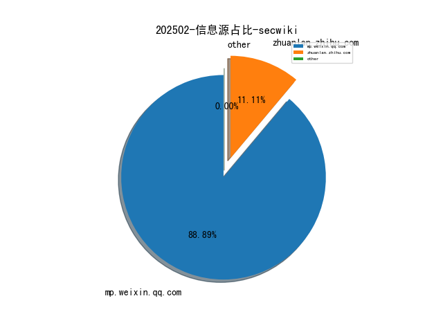
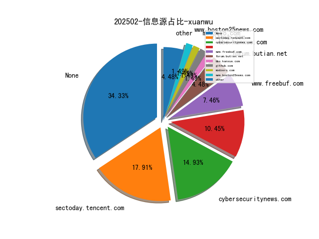
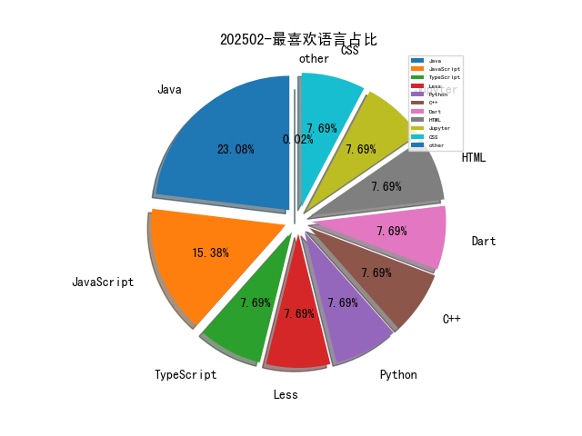

# [数据--所有](README_20.md)
# [数据--年度](README_2025.md)
# 202502 信息源与信息类型占比

# 网络安全书籍 推荐
| date_added | language | title | author | link | size| 
| --- | --- | --- | --- | --- | ---| 
| 2025-02-03 08:37:15 | English | Full Stack Python Security, Video Edition | unknown | https://www.wowebook.org/full-stack-python-security-video-edition/ | unknown| 
| 2025-02-03 06:26:46 | English | Learn AI-Assisted Python Programming, Second Edition, Video Edition | unknown | https://www.wowebook.org/learn-ai-assisted-python-programming-second-edition-video-edition/ | unknown| 
| 2025-02-03 03:45:09 | English | Generative AI in Action, Video Edition | unknown | https://www.wowebook.org/generative-ai-in-action-video-edition/ | unknown| 
| 2025-02-02 08:45:29 | English | Generative AI Toolbox (Video Course) | unknown | https://www.wowebook.org/generative-ai-toolbox-video-course/ | unknown| 
| 2025-02-02 06:23:21 | English | MACHINE LEARNING WITH PYTHON: A Comprehensive Guide To Algorithms, Deep Learning Techniques, And Practical Applications | Planet, Code | http://libgen.is/book/index.php?md5=98381F929D701C0D9E54F98577E6EA1B | 16 MB [EPUB]| 
| 2025-02-02 06:22:03 | English | GENERATIVE AI WITH PYTHON: Harnessing The Power Of Machine Learning And Deep Learning To Build Creative And Intelligent Systems | Planet, Code | http://libgen.is/book/index.php?md5=F4BFE5E46EF502E04311242943C76F62 | 14 MB [EPUB]| 
| 2025-02-02 00:21:02 | English | (River Publishers Series In Communications) Aspects Of Personal Privacy In Communications - Problems, Technology And Solutions | Geir M. Koien, Vladimir a. Oleshchuk | http://libgen.is/book/index.php?md5=EBBEFA459EE81F069A5D2D62394B2DC2 | 3 MB [PDF]| 
| 2025-02-01 13:28:55 | English | (Studies in Feminist Philosophy) Global Sweatshops: A Feminist Theory of Exploitation and Resistance (Studies in Feminist Philosophy) | Mirjam Müller | http://libgen.is/book/index.php?md5=BE8BD4B86BBA1BD51DAA9C6477D533CB | 5 MB [PDF]| 

# 微信公众号 推荐
| nickname_english | weixin_no | title | url| 
| --- | --- | --- | ---| 
| 0xh4ck3r | None | Docker 入门指南：10个核心命令助你快速上手容器化 | https://mp.weixin.qq.com/s?__biz=Mzg4NDg3NjE5MQ==&mid=2247485645&idx=1&sn=1bd9d8741680f01bc152d9608e3391fb | 1| 
| CISSP | None | 码住！一次把CISP认证说清楚 | https://mp.weixin.qq.com/s?__biz=Mzg4MTg0MjQ5OA==&mid=2247487899&idx=1&sn=f5087c557ca623669bc4a1ad49138032 | 1| 
| DFIR蘇小沐 | None | 【立春】四季之始	万物复苏 万事顺遂 | https://mp.weixin.qq.com/s?__biz=MzI2MTUwNjI4Mw==&mid=2247489126&idx=1&sn=3fcd3830a4cfcdf0d190ef19dbb0fe9c | 1| 
| Docker中文社区 | None | 全网最全、最详细的 Linux 进程间通信方式讲解来了，你不容错过！ | https://mp.weixin.qq.com/s?__biz=MzI1NzI5NDM4Mw==&mid=2247498590&idx=1&sn=3ee93d415c16a3700b965bd1c5ddbfe1 | 1| 
| Hacking黑白红 | None | “杉菜”再见，大S离世原因 | https://mp.weixin.qq.com/s?__biz=Mzg2NDYwMDA1NA==&mid=2247543667&idx=1&sn=ae1deeaf06d309925fe3bfbadf32878d | 1| 
| Joker One Security | None | 一次区块链的安全研究 | https://mp.weixin.qq.com/s?__biz=MzkyNDU2MDk4NQ==&mid=2247484034&idx=1&sn=ecdb621b08c7137bfb1cb1bd900cf5f9 | 1| 
| KK安全说 | None | 网络钓鱼工具资源库 | https://mp.weixin.qq.com/s?__biz=Mzg4NzgyODEzNQ==&mid=2247488641&idx=1&sn=ce3b46fb8a2c5727264f28a851167f8c | 1| 
| Khan安全团队 | None | 国自然中标真不难！十年评审专家1v1精修本子，中标率提升58% | https://mp.weixin.qq.com/s?__biz=MzAwMjQ2NTQ4Mg==&mid=2247496952&idx=2&sn=2a671563eac2595d32d898617786ea76 | 2| 
| Kone安全 | None | 掌握这份ChatGPT物理化学论文选题指南，让论文写作从此不愁！ | https://mp.weixin.qq.com/s?__biz=MzU4MzM4MzQ1MQ==&mid=2247493259&idx=8&sn=e677fc46b82e5dd576a4dd1503d89713 | 8| 
| OneMoreThink | None | 攻防靶场(59)：哇好快 OnSystemShellDredd | https://mp.weixin.qq.com/s?__biz=MzI0NjA3Mzk2NQ==&mid=2247496208&idx=1&sn=e9847dd5692e702e048640be8f348361 | 1| 
| SAINTSEC | None | 内网横向渗透之Windows连接技巧 | https://mp.weixin.qq.com/s?__biz=MjM5MjEyMTcyMQ==&mid=2651037466&idx=1&sn=fd456a13dbe3d7a82884d0b43cb51f82 | 1| 
| Web安全工具库 | None | APP渗透测试 -- 动态调试 | https://mp.weixin.qq.com/s?__biz=MzI4MDQ5MjY1Mg==&mid=2247515830&idx=2&sn=3973a5535916214e976a59e3378dd223 | 2| 
| kali笔记 | None | 不会写代码 用DeepSeek实现爬虫 | https://mp.weixin.qq.com/s?__biz=MzkxMzIwNTY1OA==&mid=2247510889&idx=1&sn=f7f269012f6530f7762f2e81e02c55d1 | 1| 
| 一个不正经的黑客 | None | [民族之悲哀] DeepSeek 正在成为行业败类、无知黑心者的炒作敛财“傀儡” | https://mp.weixin.qq.com/s?__biz=MzkwODI1ODgzOA==&mid=2247506662&idx=1&sn=85cd5ef3832b2cd3e8770a6265aa290c | 1| 
| 中国信息安全 | None | 评论 , 铲除“反防沉迷产业链”，撑起“数字晴空” | https://mp.weixin.qq.com/s?__biz=MzA5MzE5MDAzOA==&mid=2664235937&idx=5&sn=64e31032d2a327b33ad9368ee8790d3f | 5| 
| 中国电信安全 | None | 初六｜龙狮跃动闹新春 陌生软件哨兵审 | https://mp.weixin.qq.com/s?__biz=MzkxNDY0MjMxNQ==&mid=2247532975&idx=1&sn=262b97936bab69b90795ab12d3f26cce | 2| 
| 中孚信息 | None | 【贺蛇年】初六送穷 网安驱秽 | https://mp.weixin.qq.com/s?__biz=MzAxMjE1MDY0NA==&mid=2247508847&idx=1&sn=515840b47d604ec5c46dfe1c3c2a1def | 1| 
| 云天网络空间安全 | None | 立春 | https://mp.weixin.qq.com/s?__biz=MzI2NDYzNjY0Mg==&mid=2247501222&idx=1&sn=f5855490ffc04d28159e50894bd20fca | 1| 
| 交大捷普 | None | 【焕新领先】捷普数据库审计与风险控制系统 | https://mp.weixin.qq.com/s?__biz=MzI2MzU0NTk3OA==&mid=2247506085&idx=3&sn=36af8aec16d03522674a464f8e0bcb7d | 3| 
| 信息安全国家工程研究中心 | None | 【二十四节气】立春 , 冬去春来万物生 | https://mp.weixin.qq.com/s?__biz=MzU5OTQ0NzY3Ng==&mid=2247498793&idx=1&sn=441c9d8c6db5d81afa624f8430127389 | 1| 
| 军哥网络安全读报 | None | 新越狱攻击允许用户操纵 GitHub Copilot | https://mp.weixin.qq.com/s?__biz=MzI2NzAwOTg4NQ==&mid=2649794025&idx=3&sn=3c3b90e6e17f7840407f7f590c2faffb | 3| 
| 利刃信安 | None | 中国红客联盟：未收到任何来自 DeepSeek 求助请求，也从未与其有过任何形式合作或关联 | https://mp.weixin.qq.com/s?__biz=MzU1Mjk3MDY1OA==&mid=2247519294&idx=1&sn=aa187a4b271f02438eb3b64ce0acbd71 | 1| 
| 北京路劲科技有限公司 | None | 大年初六,送穷鬼 | https://mp.weixin.qq.com/s?__biz=MzUyMjAyODU1NA==&mid=2247491951&idx=1&sn=34c865520c7405d734683605ce983731 | 1| 
| 吾爱破解论坛 | None | 【2025春节】解题领红包活动排行榜（初六 2/3） | https://mp.weixin.qq.com/s?__biz=MjM5Mjc3MDM2Mw==&mid=2651141670&idx=1&sn=de73fb9cf91c717915c2bd5adcde0c09 | 1| 
| 嘉诚安全 | None | 初六 , 驱穷引富金蟒佑，财帛珠玑满行囊！ | https://mp.weixin.qq.com/s?__biz=MzU4NjY4MDAyNQ==&mid=2247497083&idx=1&sn=e04d6d6084fce6f7886a6681d1749049 | 1| 
| 土拨鼠的安全屋 | None | OSCP考试必备：最全实战命令手册 | https://mp.weixin.qq.com/s?__biz=Mzk0ODY1NzEwMA==&mid=2247486694&idx=1&sn=1cdf7df2384a0e643d3f364d5e3040f1 | 1| 
| 在下小白 | None | 想用 DeepSeek？这里能用，扫码还送 14 元体验金 | https://mp.weixin.qq.com/s?__biz=MzkyNzUzMjM1NQ==&mid=2247484777&idx=1&sn=0acdb741af24de7e3f86557afa0a53be | 1| 
| 天唯信息安全 | None | 大年初六 , 送穷神，穷恶扫尽 节节高升！ | https://mp.weixin.qq.com/s?__biz=MzkzMjE5MTY5NQ==&mid=2247503445&idx=1&sn=15fd9ae245aef8df2739fd7f200b268b | 1| 
| 天懋信息 | None | 立春 , 东风徐来，春满山河 | https://mp.weixin.qq.com/s?__biz=MzU3MDA0MTE2Mg==&mid=2247492565&idx=1&sn=341162b7730a7c9533da201e2a54e01d | 1| 
| 天融信 | None | 大年初六 , 灵蛇报春，万物复苏 | https://mp.weixin.qq.com/s?__biz=MzA3OTMxNTcxNA==&mid=2650963507&idx=1&sn=55b7095a68a8ae7ff03c7c23927ec65b | 1| 
| 天融信教育 | None | 金蛇纳福 万象纳新 | https://mp.weixin.qq.com/s?__biz=MzU0MjEwNTM5Ng==&mid=2247520426&idx=1&sn=494d5cf9f468116c11241a99440c809d | 1| 
| 奇安信集团 | None | 初六：春福满堂 | https://mp.weixin.qq.com/s?__biz=MzU0NDk0NTAwMw==&mid=2247624781&idx=1&sn=9ab18f495e27c757cb15c04bc2f507d6 | 1| 
| 安全狗的自我修养 | None | 500 美元的漏洞：Censys 搜索如何引导我获得快速漏洞赏金 | https://mp.weixin.qq.com/s?__biz=MzkwOTE5MDY5NA==&mid=2247504845&idx=1&sn=8c8fa9f474d370a021e30aa8209268ac | 1| 
| 安天集团 | None | 大年初六丨安天镇关给您拜年了 | https://mp.weixin.qq.com/s?__biz=MjM5MTA3Nzk4MQ==&mid=2650209932&idx=1&sn=ffcf5ae2b2a579a036936f3d466c4a18 | 1| 
| 安恒信息 | None | 【初六】开怀拥抱冰雪 共迎美好春天 | https://mp.weixin.qq.com/s?__biz=MjM5NTE0MjQyMg==&mid=2650624578&idx=1&sn=966f3a5cd21a736d07544c5da186278c | 1| 
| 山石网科新视界 | None | 山石网科·AI汇东方｜正月初六，送穷祈富 | https://mp.weixin.qq.com/s?__biz=MzAxMDE4MTAzMQ==&mid=2661298318&idx=1&sn=316db54926ff5a33d451500eda31f266 | 1| 
| 情报分析师Pro | None | 特朗普“重返中亚”：经济与能源的“双重奏” | https://mp.weixin.qq.com/s?__biz=MzkwNzM0NzA5MA==&mid=2247505221&idx=2&sn=a237923be240db67501e67e018240b6e | 2| 
| 技可达工作室 | None | 用DeepSeek学习区块链量化 | https://mp.weixin.qq.com/s?__biz=MzU3NDY1NTYyOQ==&mid=2247486034&idx=1&sn=c8655d5eb94f15ce10b24ee79ebb2821 | 1| 
| 数默科技 | None | 大年初六 , 一扫而尽旧年尘，新春报福事事顺 | https://mp.weixin.qq.com/s?__biz=Mzk0MDQ5MTQ4NA==&mid=2247487432&idx=1&sn=41e23fd81c86171bb4cb542b3995f376 | 1| 
| 梆梆安全 | None | 立春丨一年伊始 万物复苏 | https://mp.weixin.qq.com/s?__biz=MjM5NzE0NTIxMg==&mid=2651135293&idx=1&sn=bad6c5f7b654254241a99e132022ff7b | 1| 
| 江南信安 | None | 二十四节气：今日立春 | https://mp.weixin.qq.com/s?__biz=MzA4MTE0MTEwNQ==&mid=2668670058&idx=1&sn=09154677063ad441044f906494141904 | 1| 
| 河南等级保护测评 | None | 网络洞察2025：网络安全监管混乱 | https://mp.weixin.qq.com/s?__biz=Mzg2NjY2MTI3Mg==&mid=2247498396&idx=1&sn=9072f69e0959320288cc63fef160645d | 1| 
| 泰晓科技 | None | Stratovirt 的 RISC-V 虚拟化支持（五）：BootLoader 和设备树 | https://mp.weixin.qq.com/s?__biz=MzA5NDQzODQ3MQ==&mid=2648194570&idx=1&sn=c848bb41f340e4869973a3e8eb22c5e8 | 1| 
| 泷羽Sec-Yonc | None | DeepSeek接入个人知识库，一般电脑也能飞速跑，确实可以封神了！ | https://mp.weixin.qq.com/s?__biz=MzkyMzg4MTY4Ng==&mid=2247484596&idx=1&sn=5e1a1f6c02555974e75a31c95e629591 | 1| 
| 泷羽Sec-醉陌离 | None | 网络钓鱼与社交工程：如何保护自己免受心理攻击——从受害者画像到防御体系构建 | https://mp.weixin.qq.com/s?__biz=Mzk1NzI5MTc0Nw==&mid=2247484721&idx=1&sn=9b57ddd6ef8e9d09eb6c25c6bd0f2b22 | 1| 
| 海底天上月 | None | DeepSeek一键部署与DeepSeek免费14元额度羊毛福利 | https://mp.weixin.qq.com/s?__biz=MzkyOTQyOTk3Mg==&mid=2247485061&idx=1&sn=41e34f22538f3d7766dfffadea89f948 | 1| 
| 渗透测试安全攻防 | None | Flask代码审计从思路到实战 | https://mp.weixin.qq.com/s?__biz=MzkyNTUyNDMyOA==&mid=2247487699&idx=1&sn=34f12cfc82af827d58e8d758143316bf | 1| 
| 犀牛安全 | None | 标签巨头 Avery 称网站遭黑客攻击，信用卡信息被窃 | https://mp.weixin.qq.com/s?__biz=Mzg3ODY0NTczMA==&mid=2247492132&idx=1&sn=13d6fe7fec657cd4cb7b5191b4e4ef8a | 1| 
| 独眼情报 | None | 以色列间谍无需点击即可入侵 WhatsApp | https://mp.weixin.qq.com/s?__biz=MzkzNDIzNDUxOQ==&mid=2247494727&idx=1&sn=92a7f62638a9a6dc5e71a39655e2b9f1 | 2| 
| 玄月调查小组 | None | SANS出品 , 威胁情报速查手册 | https://mp.weixin.qq.com/s?__biz=MzkzMTY0MDgzNg==&mid=2247484076&idx=1&sn=6b5a1785ca1764ef4ca9639ef0f5288d | 1| 
| 玄道夜谈 | None | 分享图片 | https://mp.weixin.qq.com/s?__biz=MzI3Njc1MjcxMg==&mid=2247494451&idx=1&sn=951c2603bf39f7343659dfd67cb0d030 | 1| 
| 生有可恋 | None | 程序员注定被淘汰 | https://mp.weixin.qq.com/s?__biz=Mzk0MTI4NTIzNQ==&mid=2247492302&idx=2&sn=0144e48c3daefe11282c0145291f06d4 | 3| 
| 白帽子左一 | None | 通过计算机视觉帮助发现隐藏的漏洞 | https://mp.weixin.qq.com/s?__biz=MzI4NTcxMjQ1MA==&mid=2247615413&idx=1&sn=363d6567bfa41a8f33e272e1185da50a | 1| 
| 白帽学子 | None | 前途光明 | https://mp.weixin.qq.com/s?__biz=MzkyNzIxMjM3Mg==&mid=2247489197&idx=2&sn=ae88a87de118a9c320d0c5b5821c056e | 2| 
| 知道创宇 | None | 创宇猎风：猎风巧布迷阵，蜜罐智擒贼影 | https://mp.weixin.qq.com/s?__biz=MjM5NzA3Nzg2MA==&mid=2649870897&idx=1&sn=eec1e1619606f7844603d0108b7e4094 | 1| 
| 神农Sec | None | 记首次HW , 某地级市攻防演练红队渗透总结 | https://mp.weixin.qq.com/s?__biz=Mzk0Mzc1MTI2Nw==&mid=2247487518&idx=1&sn=6bfa2f27ce3517f2f5b4182380f27d43 | 1| 
| 祺印说信安 | None | 国外：一周网络安全态势回顾之第84期 | https://mp.weixin.qq.com/s?__biz=MzA5MzU5MzQzMA==&mid=2652114284&idx=2&sn=f24bbf726289699ff6a3f8dfc63e2a5d | 4| 
| 秦国商鞅 | None | 原创—微信小说《李局长升官记》作者:山西东郭先生 本小说纯属虚构，如有雷同，纯属巧合 | https://mp.weixin.qq.com/s?__biz=Mzg4NzAwNzA4NA==&mid=2247485094&idx=1&sn=80b1a7cb04bc7903dc1ba419d095859b | 1| 
| 紫队安全研究 | None | AI驱动API漏洞激增1205%，企业安全面临空前挑战！ | https://mp.weixin.qq.com/s?__biz=Mzg3OTYxODQxNg==&mid=2247485686&idx=1&sn=6ad3015e97dc52bd69dc9921b81a5f9c | 1| 
| 网安加社区 | None | 百家讲坛 , 刘志诚：以业务为中心的网络安全挑战与机遇 | https://mp.weixin.qq.com/s?__biz=Mzg4MjQ4MjM4OA==&mid=2247523804&idx=1&sn=a8d32f8863911d2259baf55af6923fb9 | 1| 
| 网安寻路人 | None | 2022-2024年间-美国对华芯片出口管制规则的梳理分析 | https://mp.weixin.qq.com/s?__biz=MzIxODM0NDU4MQ==&mid=2247506447&idx=1&sn=0a423985369639ab65ad56e3f60aef66 | 1| 
| 网空闲话plus | None | 5th域安全微讯早报【20250203】029期 | https://mp.weixin.qq.com/s?__biz=MzkyMjQ5ODk5OA==&mid=2247507207&idx=3&sn=dda1bf4ea0f4dea40979dcf8e5df9835 | 3| 
| 网络安全与取证研究 | None | 今日立春 | https://mp.weixin.qq.com/s?__biz=Mzg3NTU3NTY0Nw==&mid=2247489552&idx=1&sn=7bf9b6c74a63b3620493157b380a8849 | 1| 
| 网络安全者 | None | APP渗透测试 -- Burpsuite使用教程 | https://mp.weixin.qq.com/s?__biz=MzU3NzY3MzYzMw==&mid=2247499318&idx=2&sn=7e5b1e9732ce13c1c66f48a7f73f1d15 | 2| 
| 网络靖安司CSIZ | None | 大年初六  银蛇报春 | https://mp.weixin.qq.com/s?__biz=Mzg2MTU5ODQ2Mg==&mid=2247507178&idx=1&sn=d90f00dc663f73a9b5d1e9b926920bc3 | 1| 
| 老烦的草根安全观 | None | 医疗行业数据安全风险评估实践指南（四） | https://mp.weixin.qq.com/s?__biz=MzA5MTYyMDQ0OQ==&mid=2247493610&idx=1&sn=a3df9efbcf480beb1272ff633dfe3fe9 | 2| 
| 老鑫安全 | None | 微软惊现「零点击」核弹级漏洞！打开邮件就中招？ | https://mp.weixin.qq.com/s?__biz=MzU0NDc0NTY3OQ==&mid=2247488439&idx=1&sn=98793685608a483e27976abf658cb08f | 1| 
| 航行资本 | None | 【20250203】网安市场周度监测Vol.242 | https://mp.weixin.qq.com/s?__biz=MzA5OTg4MzIyNQ==&mid=2247503714&idx=1&sn=c3bbbcdb1bc2f23a76cdabfcb5cceadd | 1| 
| 苏说安全 | None | 在网络安全服务战场重构认知坐标 | https://mp.weixin.qq.com/s?__biz=Mzg5OTg5OTI1NQ==&mid=2247489884&idx=1&sn=9a045fdfc476a43d3d49593fd4f63b18 | 1| 
| 观安信息 | None | 立春｜春之启幕 万物生晖 | https://mp.weixin.qq.com/s?__biz=MzIxNDIzNTcxMg==&mid=2247506764&idx=1&sn=ce887174eaa79679513bf66138d1fe3b | 1| 
| 认知独省 | None | 武侠一哥郭靖个人成长史（侠之大者） | https://mp.weixin.qq.com/s?__biz=MzU0NTI4MDQwMQ==&mid=2247484208&idx=1&sn=e10570e192ad1dd52f19aa6fbc2c1505 | 1| 
| 赛博研究院 | None | 麻省理工科技评论：2025年AI五大趋势 | https://mp.weixin.qq.com/s?__biz=MzUzODYyMDIzNw==&mid=2247516971&idx=1&sn=65365df101260e7ccf5f42018c654110 | 1| 
| 锦行科技 | None | 初六 , 六六大顺 | https://mp.weixin.qq.com/s?__biz=MzIxNTQxMjQyNg==&mid=2247493743&idx=1&sn=9735ef44726404099d144253792e54d8 | 1| 
| 雪莲安全 | None | 网安工作者被骂罕见，红客才是行业主导！ | https://mp.weixin.qq.com/s?__biz=MzkyNTQ0OTYxOQ==&mid=2247484019&idx=1&sn=bcf60352216bd1de85eabb90f627c3d3 | 1| 
| 高等精灵实验室 | None | VutronMusic：又一款高颜值网易云播放器，功能与颜值并存 | https://mp.weixin.qq.com/s?__biz=MzA4MjkzMTcxMg==&mid=2449046811&idx=1&sn=df4a03f20f24008be35cb3c581a57282 | 1| 
| 360数字安全 | None | 大年初五 , 蛇报佳春，万“巳”大吉 | https://mp.weixin.qq.com/s?__biz=MzA4MTg0MDQ4Nw==&mid=2247579300&idx=2&sn=c06abb2df32188e9b4d4cda59aad3c1a | 3| 
| AI技术笔记 | None | perplexity支持DeepSeek R1和o3-mini模型 | https://mp.weixin.qq.com/s?__biz=MzkxNzY0Mzg2OQ==&mid=2247486282&idx=1&sn=c92a5e3be98e56ca2240a51d2c366462 | 1| 
| Cyb3rES3c | None | 渗透测试工程师常用的搜索引擎 | https://mp.weixin.qq.com/s?__biz=Mzg2MTc1MjY5OQ==&mid=2247486249&idx=1&sn=1e366c735cb526d8ed13cace6f26cc1e | 1| 
| Desync InfoSec | None | LockBit勒索软件案例(CS+Socks5) | https://mp.weixin.qq.com/s?__biz=MzkzMDE3ODc1Mw==&mid=2247489011&idx=1&sn=cdefefd425a7437c3ef0df558eb05375 | 1| 
| FreeBuf | None | 无需拆机！Windows 11 BitLocker加密文件被破解 | https://mp.weixin.qq.com/s?__biz=MjM5NjA0NjgyMA==&mid=2651313350&idx=3&sn=d66f493838161567f4aa1ccfefa9c7da | 7| 
| HW安全之路 | None | Hashcat vs John the Ripper：两大密码破解神器深度对比 | https://mp.weixin.qq.com/s?__biz=MzI5MjY4MTMyMQ==&mid=2247489899&idx=1&sn=52471d15e881d9f921886305d9ac0fdd | 2| 
| IoVSecurity | None | 全球数据隐私、数据安全与网络安全技术发展报告 | https://mp.weixin.qq.com/s?__biz=MzU2MDk1Nzg2MQ==&mid=2247620303&idx=3&sn=a94ce29de1c0b7625c8efc9602d3a095 | 3| 
| MBHC | None | DeepSeek(R1) vs Gpt-o3-mini(-high) | https://mp.weixin.qq.com/s?__biz=MzU5Mzk3NTE0Mw==&mid=2247483715&idx=1&sn=8f936ef2f0c039f3e1d7bbf3d7bf66df | 1| 
| Ots安全 | None | 通过 JSON 文件上传进行存储型 XSS | https://mp.weixin.qq.com/s?__biz=MzAxMjYyMzkwOA==&mid=2247527476&idx=2&sn=52e6aaaaa606bc10d5c53f2ab36dab9d | 5| 
| Tenable安全 | None | Tenable收购Vulcan Cyber，继续加速巩固暴露风险管理市场的领导地位 | https://mp.weixin.qq.com/s?__biz=MzIyMTg0MTE3MA==&mid=2247487464&idx=1&sn=b2896c8828c9fe6b47d1296c0436f95f | 1| 
| Zacarx随笔 | None | 网安人的Deepseek使用指南 | https://mp.weixin.qq.com/s?__biz=MzkxMDU5MzY0NQ==&mid=2247484471&idx=1&sn=19de64512beab336b1d931e46707a4f3 | 1| 
| dotNet安全矩阵 | None | 总结 , 2024 年度内网实战攻防电子报刊 34 篇文章内容汇总 | https://mp.weixin.qq.com/s?__biz=MzUyOTc3NTQ5MA==&mid=2247498654&idx=3&sn=5f3ba6adeafc3eeeb6bac4a8709281f6 | 6| 
| hacker30 | None | FUZZ出来的一系列漏洞 | https://mp.weixin.qq.com/s?__biz=MzkxNzY2MjU2Mg==&mid=2247483819&idx=1&sn=f720e0623daf07c7838527d03dce27e1 | 1| 
| securitainment | None | 使用 NTP 进行定向 Timeroasting 窃取用户哈希值 | https://mp.weixin.qq.com/s?__biz=MzAxODM5ODQzNQ==&mid=2247486924&idx=1&sn=bffa91f44bad8f39b89a25f21e0b1a59 | 2| 
| 与智慧做朋友 | None | 2025年，自己要做自己的灯塔！ | https://mp.weixin.qq.com/s?__biz=MzA3OTg3Mjg3NA==&mid=2456976653&idx=1&sn=66f686a7f02b5f57cbff18b32be74a3a | 1| 
| 云淡纤尘 | None | DeepSeek R1 模型本地部署教程 | https://mp.weixin.qq.com/s?__biz=MzkyOTQ4NTc3Nw==&mid=2247485501&idx=1&sn=d28152a69a687bbe9607eb0e813fd760 | 1| 
| 仇辉攻防 | None | 【AI】人工智能没那么神秘！ | https://mp.weixin.qq.com/s?__biz=MzUyNTUyNTA5OQ==&mid=2247484879&idx=1&sn=5ad4a8e0fe4d3be18ea0f01e2935473f | 2| 
| 墨菲安全 | None | 美国CISA报告称Contec病人监护仪存在后门 | https://mp.weixin.qq.com/s?__biz=MzkwOTM0MjI5NQ==&mid=2247488058&idx=1&sn=f2da86198b12bcad5bde72ea431dcdcc | 1| 
| 大头SEC | None | [靶场复现计划]CSLAB Thunder | https://mp.weixin.qq.com/s?__biz=MzkxOTYwMDI2OA==&mid=2247484342&idx=1&sn=fbf99114ba0a7734a34ca35d09047003 | 1| 
| 娜璋AI安全之家 | None | [系统安全] 六十二.恶意软件分析 (13)LLM赋能实现基于机器学习的恶意家族分类（初探） | https://mp.weixin.qq.com/s?__biz=Mzg5MTM5ODU2Mg==&mid=2247501299&idx=1&sn=c461a9440fcea0ecee2c1d78cdda5cdd | 1| 
| 安全分析与研究 | None | 一款使用Rust编写的PE加壳器 | https://mp.weixin.qq.com/s?__biz=MzA4ODEyODA3MQ==&mid=2247490280&idx=1&sn=27a8a52ec1103e01e0110d3cd8177b5d | 3| 
| 安全视安 | None | 教练，我想做红客 | https://mp.weixin.qq.com/s?__biz=Mzg4NzgzMjUzOA==&mid=2247485481&idx=1&sn=8bb195be87285a44b7949441eeb4d438 | 1| 
| 安知讯 | None | 奇瑞汽车申请信息安全传输专利，防止多种攻击手段 | https://mp.weixin.qq.com/s?__biz=MzIxMDIwODM2MA==&mid=2653931483&idx=2&sn=59bdf40380a2fc0d3df5b2d3a9d8b1e7 | 4| 
| 工业互联网标识智库 | None | 星火年鉴· 品牌生态篇 , 2024星火品牌与市场生态亮点回顾 | https://mp.weixin.qq.com/s?__biz=MzU1OTUxNTI1NA==&mid=2247592385&idx=1&sn=13ab2eff27d3b4532a504eb26a695327 | 1| 
| 情报分析师 | None | 泰国拟对妙瓦底地区断电 | https://mp.weixin.qq.com/s?__biz=MzA3Mjc1MTkwOA==&mid=2650559426&idx=1&sn=319562dc0c95468cf20353c016f72e52 | 3| 
| 情报分析站 | None | 如何通过情报分析一个人 | https://mp.weixin.qq.com/s?__biz=MzkxMDIwMTMxMw==&mid=2247494517&idx=1&sn=640bcd44db8abcf1392a66a843ac737f | 1| 
| 技术分享交流 | None | 设备管理系统开发：结合FastAPI+uvicorn技术（V2.3版本） | https://mp.weixin.qq.com/s?__biz=MzAxMDIwNjg2MA==&mid=2247486192&idx=1&sn=b7addf22dac6c645a9e16f0cd71da809 | 1| 
| 掌控安全EDU | None | 记一次框架利用接管学工系统 | https://mp.weixin.qq.com/s?__biz=MzUyODkwNDIyMg==&mid=2247547536&idx=1&sn=3c4f0b94df8e73bc5c8f02e75f6bf1f9 | 2| 
| 教父爱分享 | None | 聊聊国内的数据安全尺度问题 | https://mp.weixin.qq.com/s?__biz=MzI1Mjc3NTUwMQ==&mid=2247538549&idx=1&sn=521c18c3ae58546adae92616cb83808f | 1| 
| 星悦安全 | None | 【吃瓜】某官方媒体下场传播Deepseek谣言 | https://mp.weixin.qq.com/s?__biz=Mzg4MTkwMTI5Mw==&mid=2247488836&idx=1&sn=0b4b90b809d4d1d411d9d7cb07bb41dd | 3| 
| 智佳网络安全 | None | Fastjson1.2.24反序列化利用 | https://mp.weixin.qq.com/s?__biz=Mzk0NDYwOTcxNg==&mid=2247485410&idx=1&sn=1ec1af3a9daa8bede6b50c48d4c6ad22 | 1| 
| 棉花糖fans | None | 政府媒体下场！证明“宇宙镜像防御系统”“在黑客电脑放大悲咒”都是真的！ | https://mp.weixin.qq.com/s?__biz=MzkyOTQzNjIwNw==&mid=2247491692&idx=1&sn=b3bb6b0e8bc8cf46f507d2af76f7e46f | 1| 
| 沃克学安全 | None | 三步教你使用ollama+chatboxai本地部署DeepSeek-R1（含电脑配置参考） | https://mp.weixin.qq.com/s?__biz=MzkzMjIxNjExNg==&mid=2247486256&idx=1&sn=0e5e16559014d6990e2655f742bbf8c3 | 1| 
| 泛安全 | None | 【干货原创】实网攻防演习常态化，会带来什么变化01 | https://mp.weixin.qq.com/s?__biz=MzU3NjQ5NTIxNg==&mid=2247485509&idx=4&sn=57569d432f14f1f8ee639997920b435c | 4| 
| 泷羽Sec-Norsea | None | 【oscp】SickOS系列全教程 | https://mp.weixin.qq.com/s?__biz=MzU2MTc4NTEyNw==&mid=2247486459&idx=1&sn=bdb973718eb5b746ffb36010c1126ab7 | 1| 
| 泷羽Sec-临观 | None | 日志文件分析 | https://mp.weixin.qq.com/s?__biz=Mzk1Nzc0MzY3NA==&mid=2247483783&idx=1&sn=4793ee638a53387ff52638f428afaa4c | 1| 
| 泷羽Sec-山然 | None | Troll系列---Troll1靶场 | https://mp.weixin.qq.com/s?__biz=Mzk1NzIzMzQ3OA==&mid=2247484332&idx=1&sn=fba78491557f3cbc1ee34fbedc0cd8bd | 1| 
| 泷羽Sec-静安 | None | 网络安全新手必看：你的电脑够硬核吗？CTF 神器选购指南！ | https://mp.weixin.qq.com/s?__biz=MzA3NDE0NTY0OQ==&mid=2247484313&idx=2&sn=4562514cd4be9ea89f1ed48f7e33ddf2 | 2| 
| 洞见网安 | None | 安全圈瓜田理下集合【2025/2/2】 | https://mp.weixin.qq.com/s?__biz=MzAxNzg3NzMyNQ==&mid=2247489548&idx=1&sn=b9efc35c8d73c866d549db2234a7d17c | 2| 
| 独角鲸网络安全实验室 | None | 新年第一周，网络安全“重启”：关键防护措施与实战指南 | https://mp.weixin.qq.com/s?__biz=MzA4MzMzOTQ4Mw==&mid=2453672545&idx=1&sn=be79c51468776f970b7c557484e9c3d3 | 1| 
| 知机安全 | None | 【2025-02-02】黑客新闻摘要 | https://mp.weixin.qq.com/s?__biz=MzIzNDU5NTI4OQ==&mid=2247488410&idx=1&sn=d520eefe614e2ce5642067897cf29310 | 1| 
| 秦安战略 | None | 秦安：特朗普表态DeepSeek，新质生产力文化力国防力进入生死抉择 | https://mp.weixin.qq.com/s?__biz=MzA5MDg1MDUyMA==&mid=2650476446&idx=1&sn=667c5ecbfb13d7afed253e28d76959e5 | 1| 
| 网络技术干货圈 | None | 二层交换机和三层交换机到底有啥区别？2025年最新讲解！ | https://mp.weixin.qq.com/s?__biz=MzUyNTExOTY1Nw==&mid=2247528073&idx=1&sn=6301a2e8fc2761c557904a0f410d59e7 | 1| 
| 网络技术联盟站 | None | 不藏了！Wireshark 命令、捕获、过滤器大全分享给你 | https://mp.weixin.qq.com/s?__biz=MzIyMzIwNzAxMQ==&mid=2649464775&idx=1&sn=26133889c68b7a82c112264dd161d512 | 2| 
| 船山信安 | None | DeepSeek 容易受到各种越狱策略的攻击 | https://mp.weixin.qq.com/s?__biz=MzU2NDY2OTU4Nw==&mid=2247518533&idx=1&sn=b33cca1bd4585c8e72b323541ed3a3bd | 1| 
| 计算机与网络安全 | None | GenAI技术栈市场分析 | https://mp.weixin.qq.com/s?__biz=MjM5OTk4MDE2MA==&mid=2655264940&idx=1&sn=4e9a9d38cff3eda388d2841790e8eee6 | 2| 
| 谈思实验室 | None | 揭示AUTOSAR中隐藏的漏洞 | https://mp.weixin.qq.com/s?__biz=MzIzOTc2OTAxMg==&mid=2247549670&idx=2&sn=5f3fb6a0f0d849bdcf52c3b088620c0e | 2| 
| 进击的HACK | None | deepseek用不了解决方案 siliconflow | https://mp.weixin.qq.com/s?__biz=MzkxNjMwNDUxNg==&mid=2247487263&idx=1&sn=fa27a458767be5da87e8f0dd2959ac90 | 1| 
| 迪哥讲事 | None | 手把手教你如何本地化部署DeepSeek | https://mp.weixin.qq.com/s?__biz=MzIzMTIzNTM0MA==&mid=2247497017&idx=1&sn=c755513c5dbf6ec01ad0d40eba61ae44 | 1| 
| 银遁安全团队 | None | 【吃瓜】我家有女初长成！ | https://mp.weixin.qq.com/s?__biz=MzU3MjU4MjM3MQ==&mid=2247489723&idx=1&sn=93b809a5e3a62b231b628e053aa39e98 | 1| 
| 锐安全 | None | 世界需要一个能谋善断的AI（六）：关于DeepSeek出圈的思考 | https://mp.weixin.qq.com/s?__biz=MzAxOTk3NTg5OQ==&mid=2247492311&idx=1&sn=0d662ce191c8997b8885a692a22c2b92 | 1| 
| 飓风网络安全 | None | 大年初五迎财神,大吉大利,八方来财 | https://mp.weixin.qq.com/s?__biz=MzI3NzMzNzE5Ng==&mid=2247489523&idx=1&sn=8bb39b35916f60e2052342891502afc1 | 1| 
| 马哥网络安全 | None | 以小见大，彻底理解 cookie，session，token 之间的关系，通俗易懂 | https://mp.weixin.qq.com/s?__biz=MzkxMzMyNzMyMA==&mid=2247570694&idx=1&sn=29f7161a798e3c693f2e07545a8b52ff | 2| 
| 黑客驰 | None | 2025 Arch Linux 配置与常用操作指南 | https://mp.weixin.qq.com/s?__biz=Mzg4MzgwMDE2Mw==&mid=2247488266&idx=1&sn=231087764693c81ab974ce49aaa367fd | 1| 

# 知乎 推荐
| title | url| 
| --- | ---| 
| 顶会rebuttal技术浅谈 | https://zhuanlan.zhihu.com/p/602024489| 

# 日更新程序
`python update_daily.py`