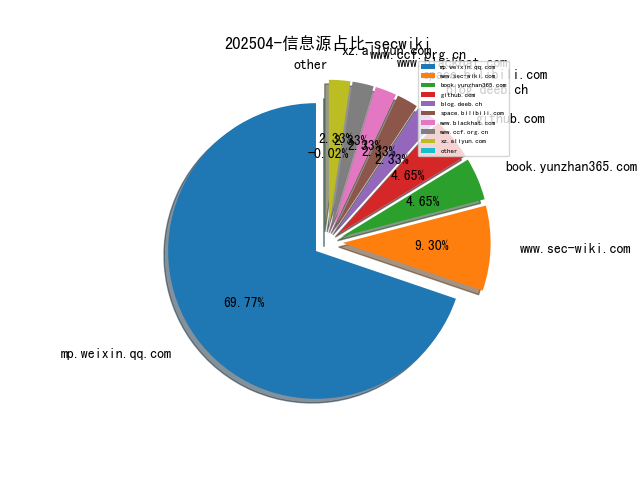
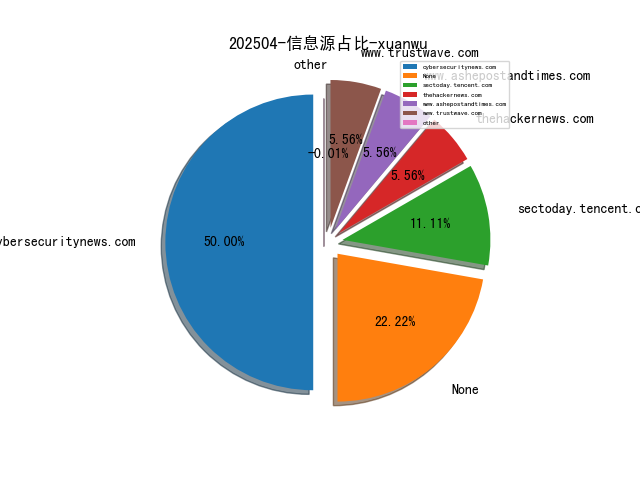
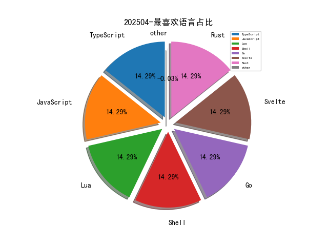

# [数据--所有](README_20.md)
# [数据--年度](README_2025.md)
# 202504 信息源与信息类型占比

# 网络安全书籍 推荐
| date_added | language | title | author | link | size| 
| --- | --- | --- | --- | --- | ---| 
| 2025-04-26 10:41:12 | English | Microsoft Identity and Access Administrator SC-300 Exam Guide, 2nd Edition | unknown | https://www.wowebook.org/microsoft-identity-and-access-administrator-sc-300-exam-guide-2nd-edition/ | unknown| 
| 2025-04-26 08:42:17 | English | The Kubernetes Book, 2025 Edition | unknown | https://www.wowebook.org/the-kubernetes-book-2025-edition/ | unknown| 
| 2025-04-26 07:44:38 | English | Quick Start Kubernetes, 2025 Edition | unknown | https://www.wowebook.org/quick-start-kubernetes-2025-edition/ | unknown| 
| 2025-04-26 11:54:34 | English | Circular Supply Chain Management: A Sustainability Approach | Jayakrishna Kandasamy , Vimal Kek , Manavalan Ethirajan , Nishal Murali | http://libgen.is/book/index.php?md5=CEEA8CD83BEBDF50F99E688E0859E493 | 9 MB [PDF]| 
| 2025-04-26 11:34:41 | English | The impact of supply chain digitalization on supply chain performance: a moderated mediation model | Shaobo Wei, Hua Liu, Wanying Xu, Xiayu Chen | http://libgen.is/book/index.php?md5=F4EE47A19FDF3F1A9521C462C9FE5406 | 779 kB [PDF]| 
| 2025-04-25 14:30:09 | English | Windows 10: 2020 Complete Beginners Guide to Learn Microsoft Windows 10 . Take Control of Your PC | Daane, Ben | http://libgen.is/book/index.php?md5=60C4235C8DBA9E6FB200DAF6C4D1DCEA | 6 MB [EPUB]| 
| 2025-04-25 14:19:57 | English | Attack on Orleans | Jake Klim | http://libgen.is/book/index.php?md5=4A195F206B57932FE7A04D4647B9BCC3 | 4 MB [EPUB]| 
| 2025-04-25 20:32:53 | English | Practical Generative AI with ChatGPT, 2nd Edition | unknown | https://www.wowebook.org/practical-generative-ai-with-chatgpt-2nd-edition/ | unknown| 
| 2025-04-24 12:47:40 | English | Machine Learning With Python: Hands on Machine Learning with Python Tools, Concept And Techniques | ANSARI, HASANRAZA | http://libgen.is/book/index.php?md5=97DBD8F7390A00E4C25CC6A1F4182C92 | 801 kB [AZW]| 
| 2025-04-24 12:46:37 | English | Python My Bestie: an easy and efficient way to learn python (kmranrg) | Anurag, Er. Kumar | http://libgen.is/book/index.php?md5=5CCDAEC60B990C16B93769AB95088E9B | 1001 kB [AZW]| 
| 2025-04-24 12:42:23 | English | Python All-in-One For Dummies | John C. Shovic; Alan Simpson | http://libgen.is/book/index.php?md5=D1343CEC6878E4B1C6140B3100239306 | 15 MB [AZW]| 
| 2025-04-23 12:15:42 | English | WINDOWS 10 FOR SENIORS 2020/2021: The Complete Microsoft Windows 10 Guide for Senior Technophobe with Latest Shortcuts, Tips & Tricks | Jordan, James | http://libgen.is/book/index.php?md5=C063DEAACC8B4B75D1EACB2DCFDEA617 | 2 MB [AZW]| 
| 2025-04-23 12:08:01 | English | Learning in Python: Study Data Science and Machine Learning including Modern Neural Networks produced in Python, Theano, and TensorFlow | K, K.M. | http://libgen.is/book/index.php?md5=925B26EB6DC0F201A4E9BB7E59EFBD10 | 483 kB [AZW]| 
| 2025-04-23 20:19:10 | English | The Comprehensive Guide to Cybersecurity Careers | Jason Edwards | http://libgen.is/book/index.php?md5=9BFEB9EEC5402CA0E7CDF9E6E1CD71C4 | 3 MB [EPUB]| 
| 2025-04-23 20:18:15 | English | Guide to Distributed Algorithms: Design, Analysis and Implementation Using Python | K. Erciyes | http://libgen.is/book/index.php?md5=E2D5403FF807A674086A6C8584BD6EBF | 53 MB [EPUB]| 
| 2025-04-22 12:09:54 | English | Command-Line Rust: A Project-Based Primer for Writing Rust CLIs | Ken Youens-Clark | http://libgen.is/book/index.php?md5=187FD2C3D6D726B8AB8ED59A969559EA | 2 MB [AZW]| 
| 2025-04-22 12:07:37 | English | WINDOWS 10 MADE SIMPLE: A Beginner To Expert Guide On Microsoft Windows 10 With Step-By-Step Visual Illustrations | Mince, Andy | http://libgen.is/book/index.php?md5=13EAAAECA832FB4D4368BA91BE18B124 | 7 MB [AZW]| 
| 2025-04-21 11:43:12 | English | Chaos Engineering with Python : Python-powered techniques for building resilent systems through chaos engineering | Mandeep Ubhi, | http://libgen.is/book/index.php?md5=7873778CD94E90CA836BC5A22210D455 | 7 MB [EPUB]| 
| 2025-04-21 11:30:24 | English | (EXPERT INSIGHTS) Building Agentic AI Systems: Create Intelligent, Autonomous AI Agents That Can Reason, Plan, and Adapt | Anjanava Biswas, Wrick Talukdar | http://libgen.is/book/index.php?md5=11345CBB546526214F62B4FA441DB11E | 8 MB [EPUB]| 
| 2025-04-21 09:54:15 | English | (Law, Society, Policy) Vulnerability Theory and the Trinity Lectures: Institutionalizing the Individual | Martha Albertson Fineman | http://libgen.is/book/index.php?md5=AB7C68EA7385BE13D66F0D417A7C9AF3 | 6 MB [PDF]| 
| 2025-04-21 20:56:00 | English | Emerging Trends in Information System Security Using AI & Data Science for Next-Generation Cyber Analytics | Faisal Rehman; Inam Ullah Khan; Oroos Arshi; Shashi Kant Gupta | http://libgen.is/book/index.php?md5=F8C47B27F38485A692FACDC9B707B81E | 23 MB [EPUB]| 
| 2025-04-21 20:45:28 | English | Efficient Analog Integrated Circuit Sizing with GenAI : Exploring Generative Diffusion Models | Pedro H. M. Eid; Filipe P. Azevedo; Nuno C. C. Lourenço; Ricardo M. F. Martins | http://libgen.is/book/index.php?md5=E1B46634B4743C5DB2980E9365F80790 | 13 MB [EPUB]| 
| 2025-04-21 18:34:15 | English | Kubernetes and Cloud Native Associate (KCNA) Exam Guide: KCNA concepts featuring orchestration, architecture, observability | Sangram v | http://libgen.is/book/index.php?md5=CE02C81F91C0EA4FEB09A539041EF754 | 9 MB [EPUB]| 
| 2025-04-21 18:05:16 | English | ETHICAL HACKING FOR BEGGINERS: A Comprehensive Beginners Guide to Learn About the Effective And Concept Strategies of Ethical Hacking | Smith, Peter | http://libgen.is/book/index.php?md5=E58E44590F1B3768D1E8219818E321B7 | 250 kB [AZW]| 
| 2025-04-21 18:04:30 | English | Windows 10 2021: A Complete Guide to Microsoft Windows 10 with the Latest Tips and Updates | Hill, Carson; Hill, Carson | http://libgen.is/book/index.php?md5=5E2CA2202E0C5941850514ED4AC2E1FA | 3 MB [AZW]| 
| 2025-04-21 18:00:18 | English | Privacy, Regulations, and Cybersecurity | Chris Moschovitis | http://libgen.is/book/index.php?md5=D0E666363D0115E75239B587C65BA828 | 3 MB [AZW]| 
| 2025-04-20 15:38:41 | English | NFT Beginners Handbook: Create, Buy and Sell Non-Fungible Tokens with Ease ; Guide for Investing in Crypto Art, Blockchains, and Metaverse | COLON, SHAWN | http://libgen.is/book/index.php?md5=03E63BB93D690052B14AE5F05AA267B2 | 307 kB [AZW]| 
| 2025-04-20 15:37:58 | English | Electrical Integrated Circuit Approach : Car Parking Sensor,Battery Monitor, Arduino Based FM Radio and Walkie Talkie, MP3 Player Circuit,White Noise Generator | K, Anbazhagan | http://libgen.is/book/index.php?md5=2BE3103BC100F8DE29E1A315E00FFEED | 6 MB [AZW]| 
| 2025-04-20 15:35:32 | English | Data Analysis and Machine Learning with Python for Absolute Beginners: Learn Data Analysis and build models with help of Excel and Python tools along with ... 4 in 1 Bookset (Data Analysis Demystified) | Truck, Stanley | http://libgen.is/book/index.php?md5=6EDE6102B3AF8B72A17392C199FB0399 | 3 MB [AZW]| 
| 2025-04-19 20:57:33 | English | Microsoft Copilot Made Easy: Harnessing AI for Advanced Productivity (Windows Made Easy Book 11) | Bernstein, James | http://libgen.is/book/index.php?md5=7563C3CB44164538BB1040BB82A65E66 | 27 MB [EPUB]| 
| 2025-04-19 21:00:57 | English | The Awesome Boss Playbook | Marako Marcus | http://libgen.is/book/index.php?md5=CC6EA64C1C1BC0232931754F433688A3 | 134 kB [EPUB]| 
| 2025-04-19 19:16:50 | English | Ultimate Penetration Testing with Nmap: Master Cybersecurity Assessments for Network Security, Monitoring, and Scanning Using Nmap | Travis DeForge | http://libgen.is/book/index.php?md5=F000C6772C70086B3063AB72A1CD8BDA | 4 MB [EPUB]| 
| 2025-04-17 08:08:10 | English | Building Generative AI Services with FastAPI | unknown | https://www.wowebook.org/building-generative-ai-services-with-fastapi/ | unknown| 
| 2025-04-17 11:21:49 | English | Build Financial Software with Generative AI (From Scratch) | unknown | https://www.wowebook.org/build-financial-software-with-generative-ai-from-scratch/ | unknown| 
| 2025-04-15 09:14:08 | English | Securing the AWS Cloud: A Guide for Learning to Secure AWS Infrastructure | unknown | https://www.wowebook.org/securing-the-aws-cloud-a-guide-for-learning-to-secure-aws-infrastructure/ | unknown| 
| 2025-04-15 07:31:12 | English | Machine Learning and AI in Cybersecurity (Video Course) | unknown | https://www.wowebook.org/machine-learning-and-ai-in-cybersecurity-video-course/ | unknown| 
| 2025-04-15 10:44:11 | English | The Rise of AI Agents: Integrating AI, Blockchain Technologies, and Quantum Computing | unknown | https://www.wowebook.org/the-rise-of-ai-agents-integrating-ai-blockchain-technologies-and-quantum-computing/ | unknown| 
| 2025-04-15 11:04:45 | English | Redefining Hacking: A Comprehensive Guide to Red Teaming and Bug Bounty Hunting in an AI-driven World | unknown | https://www.wowebook.org/redefining-hacking-a-comprehensive-guide-to-red-teaming-and-bug-bounty-hunting-in-an-ai-driven-world/ | unknown| 
| 2025-04-15 10:54:23 | English | Engineering AI Systems: Architecture and DevOps Essentials | unknown | https://www.wowebook.org/engineering-ai-systems-architecture-and-devops-essentials/ | unknown| 
| 2025-04-13 11:45:00 | English | Kubernetes Microservices Security Essentials (Video Course) | unknown | https://www.wowebook.org/kubernetes-microservices-security-essentials-video-course/ | unknown| 
| 2025-04-13 11:24:00 | English | Kubernetes Security Basics (Video Course) | unknown | https://www.wowebook.org/kubernetes-security-basics-video-course/ | unknown| 
| 2025-04-13 10:29:35 | English | Kubernetes Threat and Attack Detection (Video Course) | unknown | https://www.wowebook.org/kubernetes-threat-and-attack-detection-video-course/ | unknown| 
| 2025-04-13 09:02:16 | English | Kubernetes Network and Cluster Hardening (Video Course) | unknown | https://www.wowebook.org/kubernetes-network-and-cluster-hardening-video-course/ | unknown| 
| 2025-04-13 12:58:27 | English | Computer Programming: Python - 3 Books in 1: A Crash Course to Go Deep into Artificial Intelligence. Tools, Tips and Tricks to Implement Your Neural Networks with Machine Learning and Data Science | Russo, Russel R. | http://libgen.is/book/index.php?md5=540D83F4AEAD6D1C2E7FBA5DC9272D67 | 7 MB [AZW3]| 
| 2025-04-13 12:30:43 | English | Python Data Analysis: Comprehensive Guide to Data Science, Analytics and Metrics with Python | Campbell, Alex | http://libgen.is/book/index.php?md5=BAA1FEC050373B3822DD419D19FD22C6 | 2 MB [AZW3]| 
| 2025-04-12 07:14:59 | English | (Community experience distilled) Mastering Python for data science : explore the world of data science through Python and learn how to make sense of data | Samir Madhavan | http://libgen.is/book/index.php?md5=55A2E3DA94DEE481C8369C48A0AB544F | 8 MB [PDF]| 
| 2025-04-12 23:43:11 | English | Letting Go of the Status Quo: A Playbook for Transforming State Government | William D. Eggers, Robert N. Campbell III, Tiffany Dovey Fishman, Tom Ridge, Tom Carper | http://libgen.is/book/index.php?md5=21AF157EED83F0F2B2ACA1D9B5FEEF43 | 13 MB [PDF]| 
| 2025-04-12 20:47:31 | English | CompTIA PenTest+ Study Guide : Exam PT0-003 | Chapple, Mike;Shimonski, Robert;Seidl, David;; Robert Shimonski; David Seidl | http://libgen.is/book/index.php?md5=9BCBF498BB5A9653A60E91D937C25FBD | 38 MB [EPUB]| 
| 2025-04-12 20:43:25 | English | CCST Cisco Certified Support Technician Study Guide : Cybersecurity Exam | Lammle, Todd;Buhagiar, Jon;Robb, Donald;Montgomery, Todd;; Jon Buhagiar; Donald Robb; Todd Montgomery | http://libgen.is/book/index.php?md5=84A68F3E3F186CC2E64D06BCA47817BA | 20 MB [EPUB]| 
| 2025-04-11 03:07:21 | English | What about Evil?: A Defense of Gods Sovereign Glory | Scott Christensen | http://libgen.is/book/index.php?md5=C755A81BD9C959B5B7A2FB6A12A84522 | 3 MB [EPUB]| 
| 2025-04-11 14:30:10 | English | Personality Hacker | Joel Mark Witt | http://libgen.is/book/index.php?md5=5F254A39CB85B60AA1DBFBDCFFAD7F0F | 19 MB [AZW3]| 
| 2025-04-11 14:21:33 | English | The Programmers Guide to Quality Assurance | Pallmann, David | http://libgen.is/book/index.php?md5=BCEC8EEE239E4298484D85E1CF080B11 | 6 MB [AZW3]| 
| 2025-04-11 20:20:37 | English | 3D Data Science with Python | unknown | https://www.wowebook.org/3d-data-science-with-python/ | unknown| 
| 2025-04-11 21:52:47 | English | Automate the Boring Stuff with Python, 3rd Edition | unknown | https://www.wowebook.org/automate-the-boring-stuff-with-python-3rd-edition/ | unknown| 
| 2025-04-11 21:12:55 | English | Building Quantum Software with Python | unknown | https://www.wowebook.org/building-quantum-software-with-python/ | unknown| 
| 2025-04-09 12:11:31 | English | Routledge Handbook of Climate Law and Governance; Courage, Contributions and Compliance | Marie-Claire Cordonier Segger; Christina Voigt | http://libgen.is/book/index.php?md5=5CE2305AC98A61A3B9BCEB6C9BCFCEF0 | 1 MB [EPUB]| 
| 2025-04-08 17:30:54 | English | Generative AI with Python and PyTorch, 2nd Edition | unknown | https://www.wowebook.org/generative-ai-with-python-and-pytorch-2nd-edition/ | unknown| 
| 2025-04-08 16:12:45 | English | Software Testing with Generative AI, Video Edition | unknown | https://www.wowebook.org/software-testing-with-generative-ai-video-edition/ | unknown| 
| 2025-04-07 07:39:37 | English | Microsoft Excel 365 Bible, 2nd Edition | unknown | https://www.wowebook.org/microsoft-excel-365-bible-2nd-edition/ | unknown| 
| 2025-04-07 06:44:54 | English | The Power Platform Playbook for Digital Transformation | unknown | https://www.wowebook.org/the-power-platform-playbook-for-digital-transformation/ | unknown| 
| 2025-04-07 11:40:41 | English | Python Data Visualization (Video Course) | unknown | https://www.wowebook.org/python-data-visualization-video-course/ | unknown| 
| 2025-04-07 08:10:38 | English | The Art of Mac Malware, Volume 2 | unknown | https://www.wowebook.org/the-art-of-mac-malware-volume-2/ | unknown| 
| 2025-04-06 20:34:52 | English | Microsoft Excel 365 Bible | Michael Alexander; Dick Kusleika | http://libgen.is/book/index.php?md5=7402AD1EE02F92557FC0C83C0BAAB33B | 81 MB [EPUB]| 
| 2025-04-06 20:33:35 | English | Taming the Hacking Storm : A Framework for Defeating Hackers and Malware | Roger A. Grimes | http://libgen.is/book/index.php?md5=3158FB2BCC018FC9B5C6521D8C329666 | 4 MB [EPUB]| 
| 2025-04-05 13:13:24 | English | Some Examples Related to Ethical Computer Networking Hacking | Hedaya Mahmood Alasooly | http://libgen.is/book/index.php?md5=5D64281B522D0E5487FC10962976F78A | 7 MB [EPUB]| 
| 2025-04-05 13:05:44 | English | Active Operations Management: The Playbook for Service Operations in the Agile Age | Neil Bentley; Richard Jeffery | http://libgen.is/book/index.php?md5=7D8AC920D72655F13D142AE645DE3047 | 8 MB [EPUB]| 
| 2025-04-05 12:40:49 | English | Your Face Belongs to Us: The Secretive Startup Dismantling Your Privacy | Kashmir Hill | http://libgen.is/book/index.php?md5=94CD0092EFE81A50BCF1866B842BA995 | 2 MB [EPUB]| 
| 2025-04-03 22:50:54 | English | AI Value Creators: Beyond the Generative AI User Mindset | Rob Thomas | http://libgen.is/book/index.php?md5=5C11FF3087C3FD7350FADC3226286A55 | 11 MB [EPUB]| 
| 2025-04-03 19:57:11 | English | Mastering Secure Coding Writing Software That Stands Up to Attacks | Larry Jones | http://libgen.is/book/index.php?md5=1CF1A5EBC01D4E8F3E65AD7B8EAADC50 | 8 MB [EPUB]| 
| 2025-04-02 15:45:36 | English | AI Agents in Action | Micheal Lanham | http://libgen.is/book/index.php?md5=8320C7E5BEA8A28844C7463CD0B82E99 | 30 MB [PDF]| 
| 2025-04-02 07:41:11 | English | GenAI on AWS: A Practical Approach to Building Generative AI Applications on AWS | unknown | https://www.wowebook.org/genai-on-aws-a-practical-approach-to-building-generative-ai-applications-on-aws/ | unknown| 
| 2025-04-02 07:22:19 | English | Kubernetes Recipes: A Practical Guide for Container Orchestration and Deployment | unknown | https://www.wowebook.org/kubernetes-recipes-a-practical-guide-for-container-orchestration-and-deployment/ | unknown| 
| 2025-04-02 09:15:28 | English | AI Value Creators: Beyond the Generative AI User Mindset | unknown | https://www.wowebook.org/ai-value-creators-beyond-the-generative-ai-user-mindset/ | unknown| 
| 2025-04-02 08:43:56 | English | Time Series Analysis with Spark | unknown | https://www.wowebook.org/time-series-analysis-with-spark/ | unknown| 
| 2025-04-01 05:06:07 | English | Object-Oriented Python | Irv Kalb | http://libgen.is/book/index.php?md5=DE083B00BA7EFCC46D8C2C6FF122B88F | 4 MB [EPUB]| 

# 学习视频 推荐
| title | url| 
| --- | ---| 
| 浙江大学DeepSeek系列专题公开课 | https://space.bilibili.com/3546784374720910/lists?sid=4822862&spm_id_from=333.788.0.0| 

# 微信公众号 推荐
| nickname_english | weixin_no | title | url| 
| --- | --- | --- | ---| 
| 360威胁情报中心 | None | Ficora僵尸网络新变种分析 | https://mp.weixin.qq.com/s?__biz=MzUyMjk4NzExMA==&mid=2247505926&idx=2&sn=af8ce0e4401a4387500ef7608d347082 | 4| 
| 360数字安全 | None | 数十家合作伙伴获“联营联运”认证！360安全云生态再扩容 | https://mp.weixin.qq.com/s?__biz=MzA4MTg0MDQ4Nw==&mid=2247580407&idx=1&sn=bcac98a22cd1951fda544ddaeb65d431 | 15| 
| 360漏洞云 | None | 倒计时一天！《数字青春 榜样力量》五四青年节特别直播来啦！扫码预约 | https://mp.weixin.qq.com/s?__biz=Mzg5MTc5Mzk2OA==&mid=2247503091&idx=1&sn=8f937f2377dc2212dc41276c2f1ed0fd | 1| 
| 7维空间 | None | 将恶意代码注入 PDF 文件并创建 PDF Dropper | https://mp.weixin.qq.com/s?__biz=Mzg3MDcxNTkyMA==&mid=2247484554&idx=1&sn=de4e4a65cdf2fb38ef7b03777d758047 | 1| 
| AI安全工坊 | None | 告别大海捞针！你的专属 AI 安全武器库已上线：AISecKit 重磅发布！ | https://mp.weixin.qq.com/s?__biz=Mzg5MDQyMzg3NQ==&mid=2247484815&idx=1&sn=d8c101f42e30cfcfdce04dc39726b5e0 | 5| 
| AI技术笔记 | None | Copilot for Excel 一键词云分析与情绪分析 | https://mp.weixin.qq.com/s?__biz=MzkxNzY0Mzg2OQ==&mid=2247486569&idx=1&sn=c0758ccde4921e7807c17e083125df9e | 7| 
| AnWangsec | None | 推荐几位师傅的网安公众号 | https://mp.weixin.qq.com/s?__biz=Mzk1NzkyNjc2Nw==&mid=2247483828&idx=1&sn=c6b793dcbffe970b736bc70ad7e072ca | 2| 
| BlockSec | None | 2026校招｜从零到行业顶尖 BEST计划开启你的安全菁英之路 | https://mp.weixin.qq.com/s?__biz=MzkyMzI2NzIyMw==&mid=2247488890&idx=1&sn=bbb4ee46d9231dea2ac2732233657c6b | 6| 
| Day1安全团队 | None | 关于账号进行迁移的说明 | https://mp.weixin.qq.com/s?__biz=MzU1NDU1NTI5Nw==&mid=2247488304&idx=1&sn=fb51ea6b61eb4c3869e96b8b3f7704db | 1| 
| FreeBuf | None | 一周网安优质PDF资源推荐 , FreeBuf知识大陆 | https://mp.weixin.qq.com/s?__biz=MjM5NjA0NjgyMA==&mid=2651319591&idx=4&sn=e2871eefdb2a197215993ebd6841a4db | 85| 
| GoUpSec | None | 员工网络安全意识如何提升？安全宣贯不可少 | https://mp.weixin.qq.com/s?__biz=MzkxNTI2MTI1NA==&mid=2247503042&idx=1&sn=64fd6027b18da4e99fb4bdff194b2a4d | 2| 
| HW安全之路 | None | 失效域名的隐患：断链劫持如何让黑客轻松接管你的系统 | https://mp.weixin.qq.com/s?__biz=MzI5MjY4MTMyMQ==&mid=2247491395&idx=1&sn=ba3c22c6203a7ef8bc4e96593c904004 | 15| 
| Hiroki Sawada | None | 国外赏金交流群 (2) | https://mp.weixin.qq.com/s?__biz=Mzg4MTgyOTY5MQ==&mid=2247484459&idx=1&sn=3d0aa4f2f16612e9b7abfe8c269962c5 | 2| 
| ISC2网络安全 | None | ISC2候选人，让您获得网络安全最强开局 | https://mp.weixin.qq.com/s?__biz=MzUzNTg4NDAyMg==&mid=2247492658&idx=1&sn=a2918c88e0269e8eb1c782f99634dd48 | 14| 
| IoVSecurity | None | GB T XXXXX—XXXX基于远程升级技术的汽车产品召回实施要求 (征求意见稿） | https://mp.weixin.qq.com/s?__biz=MzU2MDk1Nzg2MQ==&mid=2247623914&idx=3&sn=996d6f3e044f2ddb7203af466ab72bd3 | 51| 
| Khan安全团队 | None | APT29 再次发起针对欧洲外交官的网络钓鱼攻击 | https://mp.weixin.qq.com/s?__biz=MzAwMjQ2NTQ4Mg==&mid=2247498914&idx=1&sn=6ae02c70726b336b4e1b2bd452fb7245 | 22| 
| Kone安全 | None | 小白怎样用Claude写论文？七天完成硕士论文的实战指南！（内含高效提示词模板）。 | https://mp.weixin.qq.com/s?__biz=MzU4MzM4MzQ1MQ==&mid=2247499212&idx=8&sn=bac5297a9a7babafd4ece3babde06d98 | 88| 
| MicroPest | None | 开发WireShark插件过程中的困惑 | https://mp.weixin.qq.com/s?__biz=MjM5NDcxMDQzNA==&mid=2247489590&idx=1&sn=8d07e6b88b70f3292f0ff9d167e012ed | 5| 
| Ots安全 | None | 网络安全公司首席执行官被指控在医院系统上安装恶意软件 | https://mp.weixin.qq.com/s?__biz=MzAxMjYyMzkwOA==&mid=2247529349&idx=4&sn=bea39d29794f18c068a42a34337ef167 | 51| 
| SecHub网络安全社区 | None | 微软宣布Windows地图应用将于2025年7月移除 | https://mp.weixin.qq.com/s?__biz=MzI5NTUzNzY3Ng==&mid=2247489094&idx=1&sn=d2d8483344ec9fcf1ae3e31bc582c552 | 4| 
| Van1sh | None | 2025 能源 CTF | https://mp.weixin.qq.com/s?__biz=Mzg5OTkxMzM3NA==&mid=2247485905&idx=1&sn=97962f06a92cf04150fb8f8c2163cfbe | 1| 
| Web安全工具库 | None | CTF自动化应急响应工具本地版 -- AutoIR_Local（4月26日更新） | https://mp.weixin.qq.com/s?__biz=MzI4MDQ5MjY1Mg==&mid=2247516526&idx=1&sn=95fa6c304161a3bf92143ac0c3278a5d | 11| 
| XCTF联赛 | None | ACTF 2025 落幕，N0wayBack战队夺冠！ | https://mp.weixin.qq.com/s?__biz=MjM5NDU3MjExNw==&mid=2247515564&idx=1&sn=93321dba2468857e1b14d7f57ae2226b | 2| 
| craxpro安全实验室 | None | 网络安全技术交流群 渗透赌博网站技术交流群 | https://mp.weixin.qq.com/s?__biz=MzkyMDY1MDI3OA==&mid=2247483966&idx=1&sn=f50b6b02f5f79ebc8e2c12d5fe69be64 | 5| 
| e安在线 | None | RSAC 2025前瞻：Agentic AI将成为行业新风向 , 网络安全强势回归？RSA 2025十大内行看点 | https://mp.weixin.qq.com/s?__biz=MzI1OTA1MzQzNA==&mid=2651247930&idx=1&sn=0f1624b241ccab0e743cb2a89481b5cf | 4| 
| sec0nd安全 | None | 塔吉克斯坦OSINT资源和工具集合 | https://mp.weixin.qq.com/s?__biz=Mzg3OTUxNTU2NQ==&mid=2247490511&idx=4&sn=203414cde4c6f3eb94d3f9c47526d355 | 68| 
| securitainment | None | Severance：这部热门剧集对网络安全和人为风险的启示 | https://mp.weixin.qq.com/s?__biz=MzAxODM5ODQzNQ==&mid=2247488242&idx=1&sn=44de6870d61ccb9ad1edfcc8fa9e3015 | 11| 
| shadowsec | None | 记一次简单的渗透测试 | https://mp.weixin.qq.com/s?__biz=MzkwOTQ4MzQ4Ng==&mid=2247484135&idx=1&sn=0e7662fef1310de918f5348695b46c87 | 1| 
| solar应急响应团队 | None | 【文章转载】DragonForce与Anubis再掀风暴：勒索软件“加盟制”全面升级，你的数据还安全吗？ | https://mp.weixin.qq.com/s?__biz=MzkyOTQ0MjE1NQ==&mid=2247498989&idx=1&sn=0ef9ce3aa929cc157dc2393e6f8b4dbb | 9| 
| 中国网络空间安全协会 | None | 网络产品安全能力提升计划获奖单位及个人名单发布 | https://mp.weixin.qq.com/s?__biz=MzA3ODE0NDA4MA==&mid=2649401935&idx=4&sn=d322f867e9d8bad827c7c7188f79414b | 18| 
| 中国软件评测中心 | None | 【工信动态】全国工业和信息化系统先进集体、劳动模范和先进工作者表彰大会在京召开 | https://mp.weixin.qq.com/s?__biz=MjM5NzYwNDU0Mg==&mid=2649251856&idx=2&sn=88e5bf5b7aebed3d3100fa6e3e9d9fb2 | 23| 
| 中新赛克 | None | AI+中新赛克＝？ | https://mp.weixin.qq.com/s?__biz=Mzk0ODUwNTg0Ng==&mid=2247489953&idx=1&sn=e71fb5757966f7a09c0fb15846bf843c | 3| 
| 云弈安全 | None | 信创生态携手共进 , 云弈科技加入麒麟软件安全生态联盟 | https://mp.weixin.qq.com/s?__biz=MzU2ODY0ODk2Nw==&mid=2247491563&idx=1&sn=d7e8ec2a0b8500e5055d4630dba2689f | 1| 
| 亚信安全 | None | CVSS10分！Erlang/OTP SSH远程代码执行漏洞安全风险通告 | https://mp.weixin.qq.com/s?__biz=MjM5NjY2MTIzMw==&mid=2650622118&idx=2&sn=378b487b61b6624a14b17a64b494189d | 22| 
| 交大捷普 | None | 每周网安资讯 （4.22-4.27）,Johnson Controls ICU漏洞预警 | https://mp.weixin.qq.com/s?__biz=MzI2MzU0NTk3OA==&mid=2247506286&idx=1&sn=70e7a1dd625b3fe2e74b6f59e582870b | 9| 
| 京东安全应急响应中心 | None | ⌈京麒沙龙第17期⌋ 蓝军攻防专场 | https://mp.weixin.qq.com/s?__biz=MjM5OTk2MTMxOQ==&mid=2727844691&idx=1&sn=0719515620937356bd7debdd75d821b0 | 1| 
| 亿人安全 | None | 记一次爱加密企业版脱壳与反调试绕过 | https://mp.weixin.qq.com/s?__biz=Mzk0MTIzNTgzMQ==&mid=2247520344&idx=1&sn=e2d0923db5a1787ade8ad45da6aa117a | 5| 
| 从放弃到入门 | None | 今天省 1 千漏洞修复费，明天赔 10 万应急款：漏洞沉默成本到底如何算？ | https://mp.weixin.qq.com/s?__biz=MzIzNDE0Mzk0NA==&mid=2649595577&idx=1&sn=4be078f0d7364e26e7949c38af820abe | 4| 
| 代码卫士 | None | SAP修复已遭利用的0day漏洞 | https://mp.weixin.qq.com/s?__biz=MzI2NTg4OTc5Nw==&mid=2247522866&idx=2&sn=5e8614c50bbde8621342a1caffc25b99 | 29| 
| 信安一把索 | None | 流量分析 - No11 | https://mp.weixin.qq.com/s?__biz=Mzk0NTg3ODYxNg==&mid=2247485734&idx=1&sn=1cc371cd8f7528567df4378949c25e9d | 10| 
| 信息安全D1net | None | SAP NetWeaver中存在严重漏洞，面临主动利用威胁 | https://mp.weixin.qq.com/s?__biz=MzA3NTIyNzgwNA==&mid=2650260114&idx=1&sn=f6ffb848bca1aeeaeef38f1444723053 | 15| 
| 信息安全与通信保密杂志社 | None | 邬江兴院士：内生安全和云化部署是6G网络发展的关键方向 | https://mp.weixin.qq.com/s?__biz=MzkwMTMyMDQ3Mw==&mid=2247599526&idx=4&sn=979a1447c68e07f1ca9ef6cdbc11db5c | 56| 
| 信息安全研究 | None | 【业界动态】国家数据发展研究院正式揭牌 | https://mp.weixin.qq.com/s?__biz=MzA3NzgzNDM0OQ==&mid=2664994820&idx=3&sn=9c18522fd28e136fb2831881d98ac6f9 | 46| 
| 全栈安全 | None | 一文揭秘会话固定攻击全流程，4 道防线锁死会话安全！ | https://mp.weixin.qq.com/s?__biz=MzkyMTYyOTQ5NA==&mid=2247486856&idx=1&sn=8cb22e21d026c2dfe3835b4121b133f5 | 7| 
| 全栈网络空间安全 | None | 元数据与数据标签对比分析 | https://mp.weixin.qq.com/s?__biz=Mzg3NTUzOTg3NA==&mid=2247515563&idx=1&sn=32fd6139658b610f3983645230ea4044 | 16| 
| 全球技术地图 | None | 美商务部工业与安全局将对进口中型和重型卡车及其零部件启动232调查 | https://mp.weixin.qq.com/s?__biz=MzI1OTExNDY1NQ==&mid=2651620798&idx=2&sn=551f9e6af17d1e9bc69c7fd92c1f89bc | 35| 
| 内生安全联盟 | None | 智能网联汽车国家/地方/行业相关标准总览(2024年度) | https://mp.weixin.qq.com/s?__biz=Mzg4MDU0NTQ4Mw==&mid=2247530760&idx=2&sn=db8e3adc4358afca732e908213e3054e | 28| 
| 凌日网络与信息安全团队 | None | 2025蓝桥杯WP（LRT） | https://mp.weixin.qq.com/s?__biz=MzkxNjcyMTc0NQ==&mid=2247484194&idx=1&sn=44e9b7996ac62f1c52c2270656cc0fe7 | 1| 
| 北信源 | None | 喜报 北信源获赛迪顾问\"2025新一代信息技术创新企业及创新产品\"奖 | https://mp.weixin.qq.com/s?__biz=MzA5MTM1MjMzNA==&mid=2653426400&idx=1&sn=8035918e461fb5297d7dfffc500b7433 | 7| 
| 吉祥快学网络安全吧 | None | 东哥，邀请我们入职京东！快冲！ | https://mp.weixin.qq.com/s?__biz=MzkzMzcxNTQyNw==&mid=2247487557&idx=1&sn=e05efb350fe6f8c13ca8b6040d259871 | 17| 
| 君哥的体历 | None | 创业真是最好的党建！两周年随笔 | https://mp.weixin.qq.com/s?__biz=MzI2MjQ1NTA4MA==&mid=2247492037&idx=1&sn=aa712be25ee295981b9cf4add13fec62 | 5| 
| 君说安全 | None | 启明星辰2025年第一季度报告，营收实现6.40亿元，同比减少30.54% | https://mp.weixin.qq.com/s?__biz=MzUzNjkxODE5MA==&mid=2247490090&idx=1&sn=94f6630ea109edb6929eea4efaefdae5 | 39| 
| 启明星辰安全简讯 | None | 安全简讯（2025.04.27） | https://mp.weixin.qq.com/s?__biz=MzkzNzY5OTg2Ng==&mid=2247501021&idx=1&sn=48f88f7164db43a74f6fd77f6a836f8a | 20| 
| 启明星辰集团 | None | 2025IT市场权威榜单发布 启明星辰荣获四大奖项 | https://mp.weixin.qq.com/s?__biz=MzA3NDQ0MzkzMA==&mid=2651732929&idx=1&sn=504d2c0dcbdd742d671246555275f14a | 12| 
| 嘶吼专业版 | None | XRP库xrpl.js遭黑客攻击 导致钱包被盗 | https://mp.weixin.qq.com/s?__biz=MzI0MDY1MDU4MQ==&mid=2247582151&idx=1&sn=7a4a066e703117cb6a07aef79b142422 | 14| 
| 四叶草安全 | None | 奔赴“春日限定”——永不止步 | https://mp.weixin.qq.com/s?__biz=MjM5MTI2NDQzNg==&mid=2654552399&idx=1&sn=efac74d7bb6a268e0532bd7960b1d644 | 3| 
| 国信安全 | None | 国家信息中心组织召开《医疗卫生信息技术应用创新与安全实践指南》编制研讨会 | https://mp.weixin.qq.com/s?__biz=MzU5MzYzMzU5NA==&mid=2247489355&idx=1&sn=c02e645685984e5658a3ddca0b096fa9 | 2| 
| 夜组OSINT | None | 可笑！美国联邦调查局FBI悬赏 1000 万美元，征集有关CN黑客信息？ | https://mp.weixin.qq.com/s?__biz=MzU5MjgwMDg1Mg==&mid=2247485269&idx=1&sn=49ffbf0626a310962c6cf66ec79362c7 | 7| 
| 天融信教育 | None | 校企联动 赋能实战丨天融信与河南财经政法大学共育网安精英 | https://mp.weixin.qq.com/s?__biz=MzU0MjEwNTM5Ng==&mid=2247520546&idx=2&sn=b219e4f0b735b2069d47b23abd8c2741 | 6| 
| 奇安信集团 | None | 马来西亚多家券商系统遭境外攻击，大量交易账户被操纵买卖股票 | https://mp.weixin.qq.com/s?__biz=MzU0NDk0NTAwMw==&mid=2247626439&idx=2&sn=b3b6e98eb71d5cb7f0d9663928838e71 | 36| 
| 安世加 | None | \"Scattered Spider\"黑客嫌疑人从西班牙引渡回美国 | https://mp.weixin.qq.com/s?__biz=MzU2MTQwMzMxNA==&mid=2247541982&idx=1&sn=6537d64ac169c775c62798bc7ba01131 | 22| 
| 安全内参 | None | 工信部：关于防范WinRAR安全绕过漏洞的风险提示 | https://mp.weixin.qq.com/s?__biz=MzI4NDY2MDMwMw==&mid=2247514261&idx=2&sn=f0875aa740f8b02e3cafb8f0d80e80d3 | 36| 
| 安全圈 | None | 【安全圈】CVE-2025-3248：Langflow 开源平台严重远程代码执行漏洞威胁 AI 工作流安全 | https://mp.weixin.qq.com/s?__biz=MzIzMzE4NDU1OQ==&mid=2652069303&idx=4&sn=2be93ee795a859778f6b32285101b8fc | 81| 
| 安全天书 | None | 【免杀工具】Supernova-真正的shellcode加密器和混淆工具 | https://mp.weixin.qq.com/s?__biz=Mzk0MDczMzYxNw==&mid=2247484011&idx=1&sn=bfca53632ecc837785830d5d67584819 | 5| 
| 安全威胁纵横 | None | 罗马教皇方济各逝世，网络犯罪分子借机加大钓鱼攻击 | https://mp.weixin.qq.com/s?__biz=Mzk0MDYwMjE3OQ==&mid=2247486520&idx=1&sn=b139d53d962703301ed212e914875e20 | 15| 
| 安全学术圈 | None | IEEE AloTSys 2025 CFP | https://mp.weixin.qq.com/s?__biz=MzU5MTM5MTQ2MA==&mid=2247492070&idx=1&sn=cbd5a03bbaa51586df564ca829cef6c7 | 6| 
| 安全帮Live | None | 安全行业的毒瘤征集，借钱不还，拖欠项目款 | https://mp.weixin.qq.com/s?__biz=MzI3NTcwNTQ2Mg==&mid=2247487768&idx=1&sn=5aa8cc42381d9b5c7838fe27657fc5fb | 1| 
| 安全探索者 | None | 【二次更新已复现】SAP NetWeaver MetadataUploader 文件上传漏洞（CVE-2025-31324） | https://mp.weixin.qq.com/s?__biz=MzkwMDc1MTM5Ng==&mid=2247484027&idx=1&sn=d90e95c4319a9fb9c58e06a19a2c8540 | 10| 
| 安全极客 | None | 活动预告,“AI+Security”系列第5期之AI赋能安全的技术验证与场景化落地 | https://mp.weixin.qq.com/s?__biz=MzkzNDUxOTk2Mw==&mid=2247496364&idx=1&sn=9e72b9398fe5f9c3ec1c537813bcdebf | 12| 
| 安全牛 | None | 网络安全领域的GPS？风险暴露评估平台EAP指南 | https://mp.weixin.qq.com/s?__biz=MjM5Njc3NjM4MA==&mid=2651136434&idx=2&sn=af14cc5e3f8f9e9c48a7af9baf5851df | 24| 
| 安全狗 | None | 智链融合 智汇 AI——亚信安全亮相厦门人工智能产业项目对接会 | https://mp.weixin.qq.com/s?__biz=MjM5NTc2NDM4MQ==&mid=2650842800&idx=1&sn=6f1840138e9fd11f43d5bce29080a9ed | 3| 
| 安在 | None | 在Z｜去哪儿高薪诚招数据安全工程师 | https://mp.weixin.qq.com/s?__biz=MzU5ODgzNTExOQ==&mid=2247639112&idx=3&sn=a3a078299e1c90f268743e4abc69bff9 | 53| 
| 安帝Andisec | None | 季军荣耀 实力绽放, 2025数字中国创新大赛·低空经济赛 | https://mp.weixin.qq.com/s?__biz=MzU3ODQ4NjA3Mg==&mid=2247567305&idx=1&sn=63270f055c2c450b21988ec76d8c87d4 | 6| 
| 富贵安全 | None | HW持续招人，不卡学生 | https://mp.weixin.qq.com/s?__biz=MzkxNzY5MTg1Ng==&mid=2247486775&idx=5&sn=e3a4d54245b57e8cb318740bcbe3b179 | 41| 
| 山石网科新视界 | None | 山石网科以南北向全面开放，促进Open XDR生态融合 | https://mp.weixin.qq.com/s?__biz=MzAxMDE4MTAzMQ==&mid=2661300367&idx=2&sn=7a66010152af963da2b8e74c2c60c231 | 15| 
| 工业信息安全产业发展联盟 | None | 网络安全产业现状及供给能力座谈会在京顺利召开 | https://mp.weixin.qq.com/s?__biz=MzUyMzA1MTM2NA==&mid=2247499346&idx=1&sn=1a9bd1910747327a05892385f312aa3a | 6| 
| 工联安全众测 | None | 中共中央政治局召开会议 分析研究当前经济形势和经济工作 习近平主持会议 | https://mp.weixin.qq.com/s?__biz=MzkyMDMwNTkwNg==&mid=2247487519&idx=1&sn=fe2828b1e608caf220eeec2d299d93b1 | 4| 
| 异空间安全 | None | 红队攻防培训,Src培训,内网渗透培训,Web安全全栈培训 | https://mp.weixin.qq.com/s?__biz=MzIzOTUwMjI5MA==&mid=2247485627&idx=1&sn=be9d82f6105aa43a69f9c5c6c5f37947 | 1| 
| 弥天安全实验室 | None | 【成功复现】CrushFTP身份认证绕过漏洞（CVE-2025-2825) | https://mp.weixin.qq.com/s?__biz=MzU2NDgzOTQzNw==&mid=2247503192&idx=1&sn=714ca6216b263e65726e7ccad9e77563 | 7| 
| 德斯克安全小课堂 | None | 以人为本的数据安全运营方法 | https://mp.weixin.qq.com/s?__biz=MzA3MTUxNzQxMQ==&mid=2453885912&idx=1&sn=ec941b098a281cc34d16ee1f94e79ba2 | 1| 
| 掌控安全EDU | None | 挖洞日记 , 某高校旁站到统一认证, 怒刷30+rank | https://mp.weixin.qq.com/s?__biz=MzUyODkwNDIyMg==&mid=2247549544&idx=1&sn=f570c495e98196fdb7e6110b40c7f837 | 8| 
| 攻防SRC | None | 学 术 蝗 虫 | https://mp.weixin.qq.com/s?__biz=MzIyNDg2MDQ4Ng==&mid=2247486795&idx=1&sn=1535100c7565c6d7a7d86e84c163ad77 | 5| 
| 数世咨询 | None | RSAC 2025创新沙盒 , CalypsoAI：锻造AI系统安全防护体系的实战路径与信任基石 | https://mp.weixin.qq.com/s?__biz=MzkxNzA3MTgyNg==&mid=2247538615&idx=2&sn=a8f37ffc664fbd4cc4a14327c114fa5b | 25| 
| 数说安全 | None | 吉大正元：战略南移，渠道发力，现金流承压 | https://mp.weixin.qq.com/s?__biz=MzkzMDE5MDI5Mg==&mid=2247509070&idx=1&sn=dd48183a10bc17c0e99625f08c6d0e11 | 9| 
| 数默科技 | None | 洞·见 , 20250428 | https://mp.weixin.qq.com/s?__biz=Mzk0MDQ5MTQ4NA==&mid=2247487732&idx=1&sn=1f64114a2db527ea1aed24622ff76ad2 | 6| 
| 无影安全实验室 | None | 最好用的下一代目录爆破工具 | https://mp.weixin.qq.com/s?__biz=Mzg5NzUyNTI1Nw==&mid=2247497208&idx=1&sn=3d98f53ef0231e7e9db03786846e129d | 5| 
| 无限手套Infinity Gauntlet | None | 【钓鱼情报】借社保基数调整耍花样投递CS木马 | https://mp.weixin.qq.com/s?__biz=MzkzNTQzNTI4Ng==&mid=2247484175&idx=1&sn=3054a16aad54fdf1cb7996e45d5d4242 | 5| 
| 星悦安全 | None | whisper多商户客服系统存在前台SQL注入漏洞 | https://mp.weixin.qq.com/s?__biz=Mzg4MTkwMTI5Mw==&mid=2247489658&idx=1&sn=93ac859afef58e956ec55b5a9e03e722 | 10| 
| 智探AI应用 | None | 中国重汽基于用户行为偏好的AI大数据模型研究项目 | https://mp.weixin.qq.com/s?__biz=MzIxMDIwODM2MA==&mid=2653932032&idx=3&sn=87013d3ff5e177ba990733eab20aef1b | 47| 
| 浅安安全 | None | 告读者书 | https://mp.weixin.qq.com/s?__biz=MzkwMTQ0NDA1NQ==&mid=2247493020&idx=1&sn=eb36fec4884853c12818a858e7a2bf90 | 28| 
| 海云安 | None | 这家深企充当“数字医生”，为网络安全“把脉开方”！ | https://mp.weixin.qq.com/s?__biz=MzI2MjY2NTM0MA==&mid=2247492496&idx=1&sn=10e7c83979b84b44e427466914ca1306 | 4| 
| 游戏安全实验室 | None | 【重磅来袭】2025游戏安全行业峰会报名开启，共探AI时代下的安全新生态 | https://mp.weixin.qq.com/s?__biz=MzIyMzc0NDU0Ng==&mid=2247485904&idx=1&sn=94b13dfde8d4326e76af0cba135b7d28 | 1| 
| 犀牛安全 | None | 东欧宜家运营商 Fourlis 公司遭勒索软件攻击导致损失 2300 万美元 | https://mp.weixin.qq.com/s?__biz=Mzg3ODY0NTczMA==&mid=2247492761&idx=1&sn=38aaf8df3238bf57abf3b598fb63a931 | 16| 
| 独眼情报 | None | DeepWiki : github 源码阅读工具 | https://mp.weixin.qq.com/s?__biz=MzkzNDIzNDUxOQ==&mid=2247498315&idx=1&sn=dd007c11d751ed7b00589796a5ba5fcb | 44| 
| 猎洞时刻 | None | 猎洞时刻漏洞挖掘SRC培训第三期塞满干货来袭！ | https://mp.weixin.qq.com/s?__biz=MzkyNTUyNTE5OA==&mid=2247486860&idx=2&sn=006ac94da842509758fcd16e3890de95 | 6| 
| 珞安科技 | None | 典型案例,某油库工控网络安全建设项目 | https://mp.weixin.qq.com/s?__biz=MzU2NjI5NzY1OA==&mid=2247512888&idx=1&sn=00656c82727a0330645e5c303c801b27 | 7| 
| 白帽子左一 | None | 授权码欺骗：俄罗斯黑客利用微软 OAuth 进行钓鱼 | https://mp.weixin.qq.com/s?__biz=MzI4NTcxMjQ1MA==&mid=2247615926&idx=1&sn=597149aaeea153fcd57b1599cfedd14a | 3| 
| 百灵猫开源情报分析师 | None | 俄罗斯无人机作战效能影响因素分析及对我启示 | https://mp.weixin.qq.com/s?__biz=MzkxMTA3MDk3NA==&mid=2247487597&idx=1&sn=75fa4177ee0628f3c70184bf0a5b419c | 9| 
| 盛邦安全WebRAY | None | 盛邦安全获评“国家信息安全漏洞库（CNNVD）一级技术支撑单位” | https://mp.weixin.qq.com/s?__biz=MzAwNTAxMjUwNw==&mid=2650278191&idx=2&sn=af54521d53c958ca738da98aa135275d | 12| 
| 看雪学苑 | None | 更新：Base64编码在安卓中的使用-【2025春季班】看雪安卓高级研修班（月薪一万计划） | https://mp.weixin.qq.com/s?__biz=MjM5NTc2MDYxMw==&mid=2458593109&idx=3&sn=7b1df0be840f4ca8da3220b77e7757f9 | 64| 
| 知其安科技 | None | 创业真是最好的党建！两周年随笔 | https://mp.weixin.qq.com/s?__biz=MzkzNTI5NTgyMw==&mid=2247511111&idx=1&sn=6cbd534839942a3997ffbd1048f1fda6 | 2| 
| 祺印说信安 | None | 国外：一周网络安全态势回顾之第96期 | https://mp.weixin.qq.com/s?__biz=MzA5MzU5MzQzMA==&mid=2652115418&idx=1&sn=43334368e16644d84b2b6abe838a6d40 | 54| 
| 紫队安全研究 | None | 注意！朝鲜Kimsuky组织利用BlueKeep漏洞，疯狂攻击日韩 | https://mp.weixin.qq.com/s?__biz=Mzg3OTYxODQxNg==&mid=2247486083&idx=1&sn=22fe8561c0b5a6e7c5de899debb5e8f1 | 9| 
| 绿盟科技 | None | RSAC 2025创新沙盒 , Aurascape：重构AI交互可视性与原生安全的智能防线 | https://mp.weixin.qq.com/s?__biz=MjM5ODYyMTM4MA==&mid=2650468108&idx=3&sn=e887ec97018a1e04cdcbf50f30559942 | 22| 
| 网安寻路人 | None | EDPB关于GDPR第48条的第02/2024号指南（全文翻译） | https://mp.weixin.qq.com/s?__biz=MzIxODM0NDU4MQ==&mid=2247507160&idx=1&sn=2a97059fd051861f0bd3e1fe65cf3267 | 3| 
| 网易易盾 | None | 直击直播行业六大痛点，网易易盾如何助力客户破局增长？ | https://mp.weixin.qq.com/s?__biz=MzAwNTg2NjYxOA==&mid=2650743441&idx=1&sn=7cd461ade3a44a6006894b591bf98363 | 5| 
| 网空闲话plus | None | 山姆大叔丢人啦！朝鲜黑客注册美国合法公司渗透全球加密货币开发者 | https://mp.weixin.qq.com/s?__biz=MzkyMjQ5ODk5OA==&mid=2247509428&idx=1&sn=5e850a506817f5c883d803d8e09ce820 | 43| 
| 网络侦查研究院 | None | 微信支付宝流水成 \"捉赖神器\"！那些让老赖无处遁形的实战技巧 | https://mp.weixin.qq.com/s?__biz=MzIxOTM2MDYwNg==&mid=2247513462&idx=1&sn=5eb7b298a22a63bc094496c8751e50c2 | 27| 
| 网络安全和信息化 | None | 东方通出席2025 IT市场年会 共探软件高质量发展新未来 | https://mp.weixin.qq.com/s?__biz=MjM5MzMwMDU5NQ==&mid=2649172696&idx=4&sn=ed5fdd38803166035bf8766498b2ca47 | 54| 
| 网络技术干货圈 | None | 网络工程师接下来的风口是什么？翻身的机会要及时抓住！ | https://mp.weixin.qq.com/s?__biz=MzUyNTExOTY1Nw==&mid=2247530056&idx=1&sn=82beb44acf3d3de4cf0a13d6d6bb8614 | 14| 
| 美亚柏科 | None | 邀请函：国投智能AI＋警务最新成果即将亮相5月警博会（内附观展注册邀请码） | https://mp.weixin.qq.com/s?__biz=MjM5NTU4NjgzMg==&mid=2651444362&idx=1&sn=04c82384920fcb5a91e3c5a8deba7a6a | 19| 
| 聚铭网络 | None | 安全不打烊！聚铭网络2025年五一劳动节放假通知 | https://mp.weixin.qq.com/s?__biz=MzIzMDQwMjg5NA==&mid=2247507045&idx=1&sn=50b3eff5e22d5f30e504e1ca7cb4ff98 | 9| 
| 腾讯安全 | None | 【重磅来袭】2025游戏安全行业峰会报名开启，共探AI时代下的安全新生态 | https://mp.weixin.qq.com/s?__biz=Mzg5OTE4NTczMQ==&mid=2247526755&idx=1&sn=f0712e6ee63a94147d2477dc50909ef5 | 7| 
| 腾讯技术工程 | None | 又一次被微信隐藏功能震撼到了... | https://mp.weixin.qq.com/s?__biz=MjM5ODYwMjI2MA==&mid=2649793017&idx=1&sn=60a692ba74d480a2470d89604d2dabe5 | 10| 
| 船山信安 | None | 我战斗过，我不在乎结局！ | https://mp.weixin.qq.com/s?__biz=MzU2NDY2OTU4Nw==&mid=2247520245&idx=1&sn=984558a0b2b972b6901082814c075673 | 14| 
| 蓝军开源情报 | None | 俄罗斯在乌克兰战场上的首次实战应用中，整合了2S7M\"马尔卡\"（Malka）这款威力最强大的203毫米榴弹炮与无人机系统 | https://mp.weixin.qq.com/s?__biz=MzkyMjY1MTg1MQ==&mid=2247493701&idx=5&sn=f69e1e14550b08790e4426fa96d5302c | 43| 
| 虎符网络 | None | 新边界·新生态,湖北安全生态共建沙龙成功召开 | https://mp.weixin.qq.com/s?__biz=MzUxODY3MDExMA==&mid=2247490231&idx=1&sn=bb3013a9ce8f92d3ae20f9affebebb78 | 6| 
| 蚁景网安 | None | 国外顶级IAM身份验证工具推荐（附下载） | https://mp.weixin.qq.com/s?__biz=MzkyNTY3Nzc3Mg==&mid=2247489739&idx=1&sn=fc7a49ef3d29330a11d2cacb0452fd05 | 15| 
| 蚁景网络安全 | None | 【免费领】超400页！Android系统漏洞实战权威指南 | https://mp.weixin.qq.com/s?__biz=MzkxNTIwNTkyNg==&mid=2247554620&idx=2&sn=48b116a5316e756bade77cd6318bffbd | 30| 
| 观安信息 | None | 专家观点｜总体国家安全观视角下的人工智能安全治理之道 | https://mp.weixin.qq.com/s?__biz=MzIxNDIzNTcxMg==&mid=2247507812&idx=1&sn=338faf19ba7cb4064ea49ede74dc6797 | 17| 
| 谈思实验室 | None | AUTOSAR 存储栈分析--MemIf\\Fee | https://mp.weixin.qq.com/s?__biz=MzIzOTc2OTAxMg==&mid=2247554268&idx=2&sn=c4c9001e6db560f9cd948023a0870b53 | 51| 
| 谷安培训 | None | 🔥政策严控倒计时！5月DSO数据安全官认证最后席位锁定中！🔥 | https://mp.weixin.qq.com/s?__biz=MzU4MjUxNjQ1Ng==&mid=2247523274&idx=2&sn=27567520c270dfcf45760591456b3c3b | 30| 
| 赛宁网安 | None | 开赛！第四届中国研究生网络安全创新大赛报名开启！ | https://mp.weixin.qq.com/s?__biz=MzA4Mjk5NjU3MA==&mid=2455488901&idx=1&sn=c68d87998a9fd9a1e2987d911bc448e3 | 1| 
| 车小胖谈网络 | None | 3个ar2220xa0路由表，AR1与AR2直连 ，AR2与AR3直连，AR1如何可以ping通AR3？ | https://mp.weixin.qq.com/s?__biz=MzIxNTM3NDE2Nw==&mid=2247490429&idx=1&sn=72a35c1472c315606a35ad9dcf84d24c | 5| 
| 迪哥讲事 | None | 【2025年HVV】HVV招聘-只要中级及以上 | https://mp.weixin.qq.com/s?__biz=MzIzMTIzNTM0MA==&mid=2247497507&idx=1&sn=a9874bdb9c516dc920f61145c4576d66 | 18| 
| 采链纵横 | None | 国企供应商联合惩戒机制探讨：从高风险供应商名单共享看全链条风险防控 | https://mp.weixin.qq.com/s?__biz=MzkxMzMyMDE4OA==&mid=2247484108&idx=1&sn=34aec0a1e2e0b0b69e2a18be4bc324e1 | 4| 
| 银基科技INGEEK | None | 2025小单哥带你看车展（上） | https://mp.weixin.qq.com/s?__biz=MzIxMjU2NTU4NQ==&mid=2247489514&idx=1&sn=f72c832b5fc0ccb439f1379b7b3d564e | 2| 
| 锐鉴安全 | None | 智能汽车漏洞挖掘案例分享 | https://mp.weixin.qq.com/s?__biz=MzkxMjg3NzU0Mg==&mid=2247485392&idx=1&sn=57ef28cc29e3c27486dddbf4b56b3426 | 13| 
| 长亭安全观察 | None | 习近平总书记对人工智能发展提出新要求，人工智能要安全、可靠、可控 | https://mp.weixin.qq.com/s?__biz=MzkyNDUyNzU1MQ==&mid=2247487384&idx=1&sn=879bc8703b1022aa2581021e20dc519c | 20| 
| 飓风网络安全 | None | 【漏洞预警】Grafana权限管理不当漏洞 | https://mp.weixin.qq.com/s?__biz=MzI3NzMzNzE5Ng==&mid=2247490024&idx=1&sn=59886c95df43ebe7b2c5e6d30022aaff | 16| 
| 马哥网络安全 | None | 容器镜像安全：安全漏洞扫描神器Trivy | https://mp.weixin.qq.com/s?__biz=MzkxMzMyNzMyMA==&mid=2247572516&idx=2&sn=2f22c93716171977e91e54a0780f0d38 | 32| 
| 鹏组安全 | None | 白嫖免费服务器，每月送5美刀是真TM香呐！ | https://mp.weixin.qq.com/s?__biz=Mzg5NDU3NDA3OQ==&mid=2247491166&idx=1&sn=a58dc870ab7e9c182df6fa0d54d10748 | 3| 
| 黑客之道HackerWay | None | 【工具分享】SMS_Bomb_Fuzzer漏洞挖掘之短信轰炸辅助绕过插件 | https://mp.weixin.qq.com/s?__biz=MzkzODQzNDU5NQ==&mid=2247486292&idx=1&sn=f953fc8eddfc54310b07d7203a934fef | 2| 
| 龙哥网络安全 | None | CC攻击：别再被“合法”流量骗了！ | https://mp.weixin.qq.com/s?__biz=MzU3MjczNzA1Ng==&mid=2247497191&idx=2&sn=ee1995568537504b5354acf0266bc07c | 17| 
| AI赋能汽车 | None | Momenta与特斯拉技术路线对比分析 | https://mp.weixin.qq.com/s?__biz=MzkyOTMwMDQ5MQ==&mid=2247520069&idx=1&sn=e1d283844a8b91e35130f32cc2983209 | 5| 
| BurpSuite实战教程 | None | 《如果大环境继续这样下去，安全市场的结局！》 | https://mp.weixin.qq.com/s?__biz=MzU5NzQ3NzIwMA==&mid=2247486570&idx=1&sn=88da7c2fef2aaa5acf646a54313f9175 | 10| 
| Bypass | None | 《云原生安全攻防》-- K8s容器安全：基于Falco实现运行时入侵检测 | https://mp.weixin.qq.com/s?__biz=MzA3NzE2MjgwMg==&mid=2448909532&idx=1&sn=e5b7e4dbe5deeb7f3118d79b30f8555c | 2| 
| CISP | None | 倒计时2天 , 第二届“长城杯”信息安全铁人三项赛（防护赛）决赛 | https://mp.weixin.qq.com/s?__biz=MzI1NzQ0NTMxMQ==&mid=2247490488&idx=1&sn=53e99853bd852f894b611a40699a4abb | 5| 
| CertiK | None | 聚焦SEC圆桌会议：媒体专访CertiK联创顾荣辉，托管安全亟需监管核心关注 | https://mp.weixin.qq.com/s?__biz=MzU5OTg4MTIxMw==&mid=2247504124&idx=1&sn=60db83451a6fc5deab6990e63eee4c6c | 6| 
| ElmWhite安全小记 | None | NIDS入侵检测系统-Snort3与Suricata | https://mp.weixin.qq.com/s?__biz=MzkxODg3MTU4NA==&mid=2247484112&idx=1&sn=74f3282c7cf444f72c3ea517bc5ef972 | 6| 
| EnhancerSec | None | 紧急预警！某高校EDU越权漏洞被盯上！我竟在后台改写了百万师生“生死簿”？！ | https://mp.weixin.qq.com/s?__biz=MzI0NjE1NDYyOA==&mid=2247485456&idx=1&sn=4e6e93e88b117526a6f87f5d3815d9e7 | 5| 
| Esn技术社区 | None | 所有社会发展的定律源于“合理化”！ | https://mp.weixin.qq.com/s?__biz=MzU5Njg5NzUzMw==&mid=2247490963&idx=1&sn=8d761f45b3848ab8a8adcd54f23a3773 | 15| 
| GSDK安全团队 | None | 轻量级的Active Directory枚举工具 - GhostAD | https://mp.weixin.qq.com/s?__biz=MzIzNTE0Mzc0OA==&mid=2247486293&idx=1&sn=beadd83e1cf8fe79fa343842b8672356 | 12| 
| HK安全小屋 | None | Mitel 企业协作平台 npm-pwg 任意文件读取漏洞 | https://mp.weixin.qq.com/s?__biz=MzkzNzMxODkzMw==&mid=2247485765&idx=1&sn=8214658c5313ed015df1891d38335243 | 4| 
| KK安全说 | None | STAR HEALTH --印度最大的数据交易 | https://mp.weixin.qq.com/s?__biz=Mzg4NzgyODEzNQ==&mid=2247489211&idx=1&sn=00acc4320d896c2803fe1e60b73b771a | 7| 
| KSA库 | None | 本地zshrc配置 | https://mp.weixin.qq.com/s?__biz=MzkxODM5NDA3Nw==&mid=2247484540&idx=1&sn=76adfff4de192ca3615db289ebcf777c | 1| 
| Kali渗透测试教程 | None | 【通俗易懂说AI】Function Call vs MCP:从点外卖到指挥厨师 | https://mp.weixin.qq.com/s?__biz=MzI3NDYwMzI4Mg==&mid=2247486815&idx=1&sn=4676f8644800db5cfc0a47db1f1207c0 | 6| 
| Nday Poc | None | mojoPortal 路径穿越漏洞 (CVE-2025-28367) | https://mp.weixin.qq.com/s?__biz=MzkzMTcwMTg1Mg==&mid=2247491250&idx=1&sn=1589cdf95c37135b68060eeea580a1ba | 18| 
| Rot5pider安全团队 | None | 公众号AI功能上线，安全问题秒变“有问必答 | https://mp.weixin.qq.com/s?__biz=Mzg5OTYxMjk0Mw==&mid=2247490356&idx=1&sn=e6d8ff012729f98b6d9eb0e551798c17 | 3| 
| T3Ysec | None | JAVA绕过RASP限制 | https://mp.weixin.qq.com/s?__biz=MzkyNjcyODI1OA==&mid=2247484593&idx=1&sn=b7cad0bf9fc2088959090615c8bf88b3 | 3| 
| Tab Sec | None | 油猴,用JS HOOK来绕过前后端分离的前端鉴权场景(含代码) | https://mp.weixin.qq.com/s?__biz=Mzk0ODc1MjYyNA==&mid=2247483884&idx=1&sn=92816c0d7664b44ad321f4dbb6c0a092 | 2| 
| TtTeam | None | Shellcode 加密器和混淆器工具 | https://mp.weixin.qq.com/s?__biz=Mzg2NTk4MTE1MQ==&mid=2247487363&idx=1&sn=61610db9ea17aa480d18cc7c7654b2a6 | 8| 
| Z2O安全攻防 | None | SRC专项知识库 | https://mp.weixin.qq.com/s?__biz=Mzg2ODYxMzY3OQ==&mid=2247519084&idx=2&sn=e379b26afc248481227ff04ef9dde567 | 23| 
| dotNet安全矩阵 | None | .NET 实战对抗，内网渗透中红队通过 FSharp 执行命令绕过安全防护 | https://mp.weixin.qq.com/s?__biz=MzUyOTc3NTQ5MA==&mid=2247499537&idx=3&sn=fd4093d006c46a786f45275fb972a7b9 | 32| 
| hutututu | None | 内存取证例题练习 | https://mp.weixin.qq.com/s?__biz=MzkxMzY5NDUyMQ==&mid=2247485242&idx=1&sn=b71fa152b0b1d352f1984c853cf19b52 | 1| 
| k哥网络安全 | None | 俄罗斯黑客开始攻击星链系统，俄罗斯的黑客技术有多牛？ | https://mp.weixin.qq.com/s?__biz=Mzk1NzMwNTM5NQ==&mid=2247485204&idx=1&sn=dd972dfb07987150123d0ee366411edd | 9| 
| 不秃头的安全 | None | 【Web攻防】某次攻防演练官网首页Ueditor绕过到打穿内网出局 | https://mp.weixin.qq.com/s?__biz=Mzg3NzkwMTYyOQ==&mid=2247489082&idx=1&sn=0b5b30a99024b52a30461979b873980e | 9| 
| 中国信息安全 | None | 倒计时2天！第二届“长城杯”信息安全铁人三项赛（防护赛）总决赛即将开赛 | https://mp.weixin.qq.com/s?__biz=MzA5MzE5MDAzOA==&mid=2664241387&idx=1&sn=b06556ab2680bf75e59054dc08ef8ceb | 95| 
| 二进制磨剑 | None | IDA 技巧（124）scripting-examples | https://mp.weixin.qq.com/s?__biz=MzI1Mjk2MTM1OQ==&mid=2247485539&idx=1&sn=043f6a36a7bbd00373968c8db3547bf1 | 4| 
| 互一信息 WhoisXML API | None | WhoisXML API @RSAC 2025 | https://mp.weixin.qq.com/s?__biz=MzkxNjM4ODI0OA==&mid=2247490193&idx=1&sn=304fe0ac2ecbb465b50df190f362a73a | 1| 
| 众安天下Allsec | None | 守正出奇九周年，砥砺前行谱新篇 | https://mp.weixin.qq.com/s?__biz=MzIyOTUzODY5Ng==&mid=2247504425&idx=1&sn=1184a4f1e37c2aa2189ae8e2a88c6954 | 1| 
| 信息安全大事件 | None | PoC攻击暴露Linux安全工具缺陷，以色列厂商称过度依赖eBPF埋隐患 | https://mp.weixin.qq.com/s?__biz=MzkzNjIzMjM5Ng==&mid=2247492324&idx=1&sn=494f00f92c293602a05ffbb5b0ae7d45 | 22| 
| 关键信息基础设施安全保护联盟 | None | 我国团体标准取代行业标准的战略布局与发展路径 | https://mp.weixin.qq.com/s?__biz=MzkxNjU2NjY5MQ==&mid=2247512493&idx=1&sn=1b8aed0e62ab8afc0bc9fa74e365cf7d | 1| 
| 卫界安全-阿呆攻防 | None | 油猴,用JS HOOK来绕过前后端分离的前端鉴权场景(含代码) | https://mp.weixin.qq.com/s?__biz=MzIzNDU5Mzk2OQ==&mid=2247486747&idx=1&sn=0c9e68cd65d86cf1718e93f696956207 | 7| 
| 吉祥讲安全 | None | 大专也可以冲腾讯了 | https://mp.weixin.qq.com/s?__biz=MzkwNjY1Mzc0Nw==&mid=2247488468&idx=1&sn=a7471e8c91c0cb7a2175dc78c871bc8a | 20| 
| 哆啦安全 | None | Android7至16系统ROM魔改和安全研究篇(建议收藏) | https://mp.weixin.qq.com/s?__biz=Mzg2NzUzNzk1Mw==&mid=2247498005&idx=1&sn=8ea731a8a62b3a7c378cf1066375f4e5 | 17| 
| 商密君 | None | 俄罗斯军队手机地图被植入间谍木马 | https://mp.weixin.qq.com/s?__biz=MzI5NTM4OTQ5Mg==&mid=2247635586&idx=4&sn=045b1ee14364fc88b3003a7e80a7c135 | 17| 
| 夜组安全 | None | 自动化漏扫工具、外网打点、内网扫描 更新V1.3.0 | https://mp.weixin.qq.com/s?__biz=Mzk0ODM0NDIxNQ==&mid=2247494187&idx=1&sn=d6ba1d8e9cf481795442b81c0c245069 | 9| 
| 夜风Sec | None | HackMyVM - chromee靶机 | https://mp.weixin.qq.com/s?__biz=Mzk1Nzk3MjA5Ng==&mid=2247485065&idx=1&sn=4c8d623af3231573b8fb6017accb115a | 12| 
| 安全分析与研究 | None | KdotStealer窃密木马样本分析 | https://mp.weixin.qq.com/s?__biz=MzA4ODEyODA3MQ==&mid=2247491713&idx=1&sn=09325b8b9ea002838369a42251708162 | 9| 
| 安天集团 | None | 安天AVL SDK反病毒引擎升级通告（20250426） | https://mp.weixin.qq.com/s?__biz=MjM5MTA3Nzk4MQ==&mid=2650210928&idx=1&sn=5b2cd20a379ad28ce6e9deeb7572bb5f | 8| 
| 实战安全研究 | None | 记一次某大学附属医院漏洞挖掘 | https://mp.weixin.qq.com/s?__biz=MzU0MTc2NTExNg==&mid=2247492057&idx=1&sn=90d778ada4d2af36ea7937a4d95fe312 | 8| 
| 山石网科安全技术研究院 | None | 山石蓝队｜勒索病毒防御及应急攻略 | https://mp.weixin.qq.com/s?__biz=MzUzMDUxNTE1Mw==&mid=2247511838&idx=1&sn=3b0c37788b65912aaa4824a4caf86833 | 7| 
| 希潭实验室 | None | 第120篇：蓝队溯源之蚁剑、sqlmap、Goby反制方法的复现与分析 | https://mp.weixin.qq.com/s?__biz=MzkzMjI1NjI3Ng==&mid=2247487464&idx=1&sn=e0b566b9dddca36bdf056ad6cd249264 | 2| 
| 情报分析师 | None | 【情报分析】印度威胁封锁河流，巴基斯坦面临水权危机走向预判 | https://mp.weixin.qq.com/s?__biz=MzA3Mjc1MTkwOA==&mid=2650560814&idx=1&sn=427579b5b92d2d2f885f29cc1cd8c91c | 16| 
| 情报分析师Pro | None | 无形之网：美国开源情报合作体系深度研究 | https://mp.weixin.qq.com/s?__biz=MzkwNzM0NzA5MA==&mid=2247508175&idx=1&sn=acd9a22bb3dcf0a36dda7b07f3e4cd38 | 6| 
| 攻城狮成长日记 | None | 想要每天定时发布公众号图文？方法在这 | https://mp.weixin.qq.com/s?__biz=MjM5OTc5MjM4Nw==&mid=2457388750&idx=1&sn=dc9dae699d5c631e86ddac8a667e2214 | 14| 
| 星尘安全 | None | “匿名者”发布 10TB 针对俄罗斯的泄露数据 | https://mp.weixin.qq.com/s?__biz=Mzg3NTY0MjIwNg==&mid=2247485995&idx=1&sn=c6ba5ca777702d9f4a389a0730b8afeb | 3| 
| 极与黑 | None | 开通免实名的海外手机卡，费用低至免费 | https://mp.weixin.qq.com/s?__biz=MzA3MzQzODg2Nw==&mid=2247487153&idx=1&sn=a62a5149fbd7d4b88b626c232ff7a16e | 2| 
| 极客安全 | None | 安全动态丨网络空间安全动态第256期 | https://mp.weixin.qq.com/s?__biz=MzU2MjcwOTY1Mg==&mid=2247521350&idx=2&sn=d6666e8960790a34bc4e16e177357103 | 7| 
| 梅苑安全 | None | 从京东外卖战士角度看待网络安全专业学习 | https://mp.weixin.qq.com/s?__biz=MzkwMTU2NzMwOQ==&mid=2247485050&idx=1&sn=084fe0bef10217d7de846ca7239ac892 | 7| 
| 棉花糖fans | None | 棉花糖的交流群 | https://mp.weixin.qq.com/s?__biz=MzkyOTQzNjIwNw==&mid=2247492214&idx=1&sn=4aa06ed8e52cdf48fd2748ffdbb79c19 | 6| 
| 毅心安全 | None | Clash Verge rev存在提权漏洞 | https://mp.weixin.qq.com/s?__biz=MzkzMTYyMDk1Nw==&mid=2247483807&idx=1&sn=afa867ab0098d7309f26e8a4e1b41d47 | 1| 
| 河南等级保护测评 | None | FBI《2024年互联网犯罪报告》显示，勒索软件威胁加剧，网络犯罪损失达166亿美元 | https://mp.weixin.qq.com/s?__biz=Mzg2NjY2MTI3Mg==&mid=2247499227&idx=2&sn=9c28a866871036bc1bad4beccf0a5f4b | 34| 
| 泛安全 | None | 原创文章目录 | https://mp.weixin.qq.com/s?__biz=MzU3NjQ5NTIxNg==&mid=2247485780&idx=5&sn=6378d6f4f404b6b2cae34d24e2084888 | 19| 
| 泰晓科技 | None | OSDT Weekly 2025-04-16 第302期 | https://mp.weixin.qq.com/s?__biz=MzA5NDQzODQ3MQ==&mid=2648194629&idx=2&sn=ae8349b98db9eb48df0c88957e3c748b | 4| 
| 泷羽SEC-ohh | None | Vulnhub-zico2靶机教学 | https://mp.weixin.qq.com/s?__biz=Mzk1NzI5NzA3NQ==&mid=2247486748&idx=1&sn=b9dd831a8e2086662a6e5d98cc690ba3 | 3| 
| 洞见网安 | None | 网安原创文章推荐【2025/4/25】 | https://mp.weixin.qq.com/s?__biz=MzAxNzg3NzMyNQ==&mid=2247489892&idx=1&sn=c82a3df37410ae0794d547913b7de5b1 | 8| 
| 深潜sec安全团队 | None | e0e1-wx 2.0版本更新以及关于POC项目和开源的一些想法 | https://mp.weixin.qq.com/s?__biz=Mzg3NDc3NDQ3NA==&mid=2247485089&idx=1&sn=44571c1bda12501c01348db5868565f3 | 4| 
| 渊亭防务 | None | 防务简报丨美国正在考虑向台湾海军提供侦察型无人机 | https://mp.weixin.qq.com/s?__biz=Mzg2NTYyODgyNg==&mid=2247505828&idx=1&sn=7d0d0fcb89ee9e3bb014abac347c30ae | 14| 
| 湖南金盾评估中心 | None | 湖南省密码协会正式成立，湖南金盾任协会副会长单位 | https://mp.weixin.qq.com/s?__biz=MzIyNTI0ODcwMw==&mid=2662129386&idx=1&sn=be7f96a007b4352960077970a5125dc1 | 5| 
| 漏洞战争 | None | 计算机系统顶会——ASPLOS 2025 网络安全议题清单与摘要 | https://mp.weixin.qq.com/s?__biz=MzU0MzgzNTU0Mw==&mid=2247485949&idx=1&sn=601e1989e7b21fe7e952de7b3088eedf | 4| 
| 生有可恋 | None | 种地天赋觉醒 | https://mp.weixin.qq.com/s?__biz=Mzk0MTI4NTIzNQ==&mid=2247493463&idx=1&sn=658aef3a31bc159584dffe8acb3b5a51 | 13| 
| 由由学习吧 | None | ctftools-all-in-oneV7.9研发进度3 | https://mp.weixin.qq.com/s?__biz=MzI1NzUxOTUzMA==&mid=2247485965&idx=1&sn=de59d2d1dd9b36a6c784464f1e2985d6 | 5| 
| 白帽学子 | None | 漏洞就得这么修 | https://mp.weixin.qq.com/s?__biz=MzkyNzIxMjM3Mg==&mid=2247490083&idx=2&sn=5ec072ea9bbd15953fe653623af15e52 | 22| 
| 神农Sec | None | 若依系统 , SQL注入漏洞+druid框架漏洞 | https://mp.weixin.qq.com/s?__biz=Mzk0Mzc1MTI2Nw==&mid=2247489476&idx=1&sn=f441418089f78116945e2b8916a6aa6f | 10| 
| 红蓝对抗技战术 | None | 攻防技战术动态一周更新 - 20250421 | https://mp.weixin.qq.com/s?__biz=MzkzODc4NjE1OQ==&mid=2247484016&idx=1&sn=f2cbc4fc7c529aabbc1f89cc3c7b4794 | 3| 
| 网安守护 | None | 来科普一下OpenAI模型们的命名！ | https://mp.weixin.qq.com/s?__biz=MzU4NDY3MTk2NQ==&mid=2247491495&idx=1&sn=d14ae1ea6a7f7bd265b9f91d46291943 | 14| 
| 网络安全与取证研究 | None | 2025年能源网络安全大赛-Writeup | https://mp.weixin.qq.com/s?__biz=Mzg3NTU3NTY0Nw==&mid=2247489789&idx=1&sn=bebcfc08245cfe94cae4707bfc8a360d | 10| 
| 网络安全卓越验证示范中心 | None | ITU-T SG17安全研究组加速构建AI安全标准体系 | https://mp.weixin.qq.com/s?__biz=MzkxNzE4NDk3OA==&mid=2247487226&idx=3&sn=ef4a0236f89f7ff32eab6a2526b87e90 | 5| 
| 网络技术联盟站 | None | 国内外公共DNS服务器地址大全，含IPv4和IPv6 | https://mp.weixin.qq.com/s?__biz=MzIyMzIwNzAxMQ==&mid=2649467647&idx=1&sn=2c3ddadc749537588faa13e18ebd8741 | 26| 
| 自主创新如是说 | None | 【419看点】田霞主编解读《2024网信自主创新调研报告》 | https://mp.weixin.qq.com/s?__biz=MzkxMzI3MzMwMQ==&mid=2247531233&idx=1&sn=bfffc39d96a62288f04e6c34e0a75442 | 4| 
| 菜鸟小新 | None | 2225份各种主题类型品牌营销策划方案 | https://mp.weixin.qq.com/s?__biz=Mzg4OTI0MDk5MQ==&mid=2247493683&idx=1&sn=33ea7ce6fc5cb91ea85fd9e40b80e48f | 13| 
| 计算机与网络安全 | None | 网络安全资料列表：https://docs.qq.com/doc/DTGJUTmNva1Roc0xQ | https://mp.weixin.qq.com/s?__biz=MjM5OTk4MDE2MA==&mid=2655276729&idx=2&sn=39c47b73195157e4a98458391cf89838 | 68| 
| 贝雷帽SEC | None | 【红队】一款全方位扫描工具，具备高效的机器探活，端口探活，协议识别，指纹识别，漏洞扫描等功能 | https://mp.weixin.qq.com/s?__biz=Mzk0MDQzNzY5NQ==&mid=2247493627&idx=1&sn=381529411d515cf131ccedcfaa7470a8 | 3| 
| 赛博研究院 | None | 美国升级人工智能芯片禁令，打压中国DeepSeek | https://mp.weixin.qq.com/s?__biz=MzUzODYyMDIzNw==&mid=2247518226&idx=1&sn=7e56378f083b8ac4d93516e9c1a1b3c7 | 26| 
| 赛查查 | None | 比赛经验分享 , 2025数字中国创新大赛数字安全赛道数据安全产业积分争夺赛金奖团队—铁鹰特战队 | https://mp.weixin.qq.com/s?__biz=Mzk0NTU0ODc0Nw==&mid=2247492313&idx=2&sn=0d449ef0cf2be0b31a34b332edb14cc2 | 7| 
| 赛欧思安全研究实验室 | None | 赛欧思一周资讯分类汇总(2025-04-21 ~ 2025-04-26) | https://mp.weixin.qq.com/s?__biz=MzU0MjE2Mjk3Ng==&mid=2247489009&idx=1&sn=a98ef20cfc824f282f26d67f7a50cc20 | 6| 
| 道玄网安驿站 | None | 惊险！女子手机失控遭远程操控，民警“砸手机”抢回21万！揭秘新型远控木马陷阱 | https://mp.weixin.qq.com/s?__biz=Mzg4NTg5MDQ0OA==&mid=2247487776&idx=1&sn=99d310edd41d0a36b90fc19c06aa2557 | 16| 
| 锐安全 | None | 在绿盟25周年庆里，安全G20 闭门会都悄悄聊了啥？ | https://mp.weixin.qq.com/s?__biz=MzAxOTk3NTg5OQ==&mid=2247492928&idx=1&sn=72af24f8cc2b214871d815ee14edcd1f | 4| 
| 长弓三皮 | None | 带你解锁编码新世界！--随波逐流CTF编码工具使用教程89 --火星文密码 | https://mp.weixin.qq.com/s?__biz=MzU2NzIzNzU4Mg==&mid=2247490051&idx=1&sn=c47d94e2c19d1b094995026fc163511d | 11| 
| 隅见录 | None | MCP Gateway，轻松聚合AI工具，打造你的超级智能体！ | https://mp.weixin.qq.com/s?__biz=MzkyNzUzMjM1NQ==&mid=2247484856&idx=1&sn=034ef6094fa9c814faebfb658859192f | 4| 
| 青衣十三楼飞花堂 | None | 百年潮2008年9期 | https://mp.weixin.qq.com/s?__biz=MzUzMjQyMDE3Ng==&mid=2247488257&idx=1&sn=7710b585d79752e8972185d452b76888 | 7| 
| 飞天诚信 | None | 知识产权与信息安全“组团出道”，飞天诚信这场活动寓教于乐 | https://mp.weixin.qq.com/s?__biz=MjM5NDE1MjU2Mg==&mid=2649877000&idx=1&sn=11a0eb3bc6e46f74eb282915bcd58bd5 | 13| 
| 飞羽技术工坊 | None | 最近都在传的大模型MCP到底是个啥 | https://mp.weixin.qq.com/s?__biz=MzkwODQyMjgwNg==&mid=2247485595&idx=1&sn=07aa1b00dfa2001843df20bf89157c05 | 2| 
| 黑客技术家园 | None | 抖音实名被封，如何解除可以通过以下几种方法搞定 | https://mp.weixin.qq.com/s?__biz=MzI2OTk4MTA3Ng==&mid=2247497164&idx=1&sn=ff648a14def3f4123a3c1f2b1fc6f212 | 3| 
| 黑白之道 | None | 若依Vue漏洞检测工具更新！V5 | https://mp.weixin.qq.com/s?__biz=MzAxMjE3ODU3MQ==&mid=2650610417&idx=4&sn=6972dd43d82d5f9c4167b7d74cb0b17d | 29| 
| C4安全团队 | None | 漏洞预警 , 金和OA文件任意文件上传漏洞 | https://mp.weixin.qq.com/s?__biz=MzkzMzE5OTQzMA==&mid=2247486363&idx=1&sn=2fba6ac5ecaf5f265ba1384fc09400a2 | 3| 
| CAICT可信安全 | None | 关于开展2025年【安全守卫者计划】网络安全典型案例征集工作的通知 | https://mp.weixin.qq.com/s?__biz=Mzk0MjM1MDg2Mg==&mid=2247503827&idx=1&sn=15e0365e2234b05814baa4e87db8faeb | 5| 
| CIO之家 | None | AI大模型如何破局传统医疗 | https://mp.weixin.qq.com/s?__biz=MjM5NTk5Mjc4Mg==&mid=2655225385&idx=1&sn=8691812a8c9d7c500caef4bd60ac372c | 8| 
| Delta Insights | None | 网络安全动态 - 2025.04.25 | https://mp.weixin.qq.com/s?__biz=MzU1MzEzMzAxMA==&mid=2247500020&idx=1&sn=92afb4c4ae02b705ae940bda5eefb21c | 14| 
| FreeBuf播客电台 | None | FreeBuf热门电台精选集第二期 | https://mp.weixin.qq.com/s?__biz=Mzg2MTAwNzg1Ng==&mid=2247496292&idx=1&sn=bb7f452cf1b98b1aacbd2a27fe9314ae | 1| 
| FreeBuf知识大陆APP | None | 他只做对了一件事，1个月实现挖洞效率3倍跃升！ | https://mp.weixin.qq.com/s?__biz=Mzk0OTY1NTI5Mw==&mid=2247492014&idx=1&sn=08c0c9d7975ffacf8bc1bb0c2dcbf817 | 5| 
| GG安全 | None | 二维码功能点SRC漏洞挖掘 | https://mp.weixin.qq.com/s?__biz=MzIwMjE2NTM5Mg==&mid=2247485561&idx=1&sn=01a2762c91f33dedccdbcfff2d38ee16 | 3| 
| Heihu Share | None | 最新版 ThinkPHP (8.1.2) 反序列化漏洞挖掘 | https://mp.weixin.qq.com/s?__biz=MzkwMzQyMTg5OA==&mid=2247487182&idx=1&sn=8c2b60b3566660b43f205a0b89726616 | 2| 
| LA安全实验室 | None | 分享常见的逻辑漏洞挖掘方法(第一部分) | https://mp.weixin.qq.com/s?__biz=MzkxODQzOTYxMQ==&mid=2247483853&idx=1&sn=1a087ace4e3172d75778afe88364aaf9 | 3| 
| LuckyFuture | None | JS黑科技：利用eval打造\"万变不离其宗\"的动态执行方案 | https://mp.weixin.qq.com/s?__biz=MzkxNDE3NjY0OA==&mid=2247484339&idx=1&sn=c09642669f81ff4df40edc2cdbd5ceb8 | 2| 
| M01N Team | None | 每周蓝军技术推送（2025.4.19-4.25） | https://mp.weixin.qq.com/s?__biz=MzkyMTI0NjA3OA==&mid=2247494172&idx=1&sn=39ecb2de518c36e4d3ba6135beadd7b6 | 4| 
| Sky的安全观 | None | 华为供应链供应商信息安全/网络安全审核应对（5）信息安全/网络安全关键岗位 | https://mp.weixin.qq.com/s?__biz=MzA5OTEyNzc1Nw==&mid=2247486337&idx=1&sn=bea88b960cde3e081f70507fe46cca52 | 6| 
| Tsia安全团队 | None | 记一次接口导致的漏洞 | https://mp.weixin.qq.com/s?__biz=Mzg4MDcyMDkxNQ==&mid=2247483733&idx=1&sn=c75fad5f7e73656b5342c2f3c63de6ef | 3| 
| Yak Project | None | SyntaxFlow：挖掘 CVE 漏洞必备神器！你还不赶紧了解？ | https://mp.weixin.qq.com/s?__biz=Mzk0MTM4NzIxMQ==&mid=2247528099&idx=1&sn=966bc9b67422d7cc64c8820ab10eb3fd | 5| 
| web安全小白 | None | 浅谈渗透测试学习个人感悟 | https://mp.weixin.qq.com/s?__biz=Mzg4MTgxNjQwOQ==&mid=2247484858&idx=1&sn=fe36bc6d71e26a6f78b35574b3d66e9b | 1| 
| 七芒星实验室 | None | 通过某云音乐实现白加黑上线 | https://mp.weixin.qq.com/s?__biz=Mzg4MTU4NTc2Nw==&mid=2247496987&idx=1&sn=2d4fa67a9106934f63da3a840d947169 | 9| 
| 中国电信安全 | None | 聊热点｜工信部、国家标准委联合印发《国家智能制造标准体系建设指南 (2024版)》、科技界的萨拉热窝事件？CVE面临全球分裂…… | https://mp.weixin.qq.com/s?__biz=MzkxNDY0MjMxNQ==&mid=2247535145&idx=2&sn=d6debef51876b8f9e2254636a8f297c3 | 5| 
| 中国网络安全产业公共服务平台 | None | 转发：关于开展2025年中国通信学会科技奖提名工作的通知 | https://mp.weixin.qq.com/s?__biz=Mzg5MzQ5NjQyNw==&mid=2247486271&idx=1&sn=3fda26513668caf146cd3e8858446f3c | 3| 
| 云科安信Antira | None | 2025护网季,小心API接口让你马失前蹄！ | https://mp.weixin.qq.com/s?__biz=Mzg2NTk3NjczNQ==&mid=2247485918&idx=1&sn=7c8ec26dcebf2a613c372ad1dfe2cc5c | 6| 
| 信息安全笔记 | None | 国家护网行动如何防止不被打穿？战前篇 | https://mp.weixin.qq.com/s?__biz=MjM5MzI3NzE4NA==&mid=2257484375&idx=1&sn=b9eb9f47c2c32c984926dc6ba47515bd | 2| 
| 创信华通 | None | 赋能卫健网络安全合规！创信华通亮相南充市卫健行业网络安全专题培训会 | https://mp.weixin.qq.com/s?__biz=MzUxNTQxMzUxMw==&mid=2247525492&idx=1&sn=66177eb295ff2947d337fd59950d62b4 | 3| 
| 励行安全 | None | 写代码怎么能不会用Git | https://mp.weixin.qq.com/s?__biz=MzkxNTY4NTQwMg==&mid=2247484470&idx=1&sn=60df4dd90630deadb234a5947c9de9ac | 5| 
| 华为安全 | None | 勒索软件反击战 , 第3期 数字迷雾中的锁链 | https://mp.weixin.qq.com/s?__biz=MzAwODU5NzYxOA==&mid=2247506039&idx=1&sn=6e8b0c6bc022dff389d3d98ed4fb1c33 | 2| 
| 嘉诚安全 | None | 【漏洞通告】PyTorch远程命令执行漏洞安全风险通告 | https://mp.weixin.qq.com/s?__biz=MzU4NjY4MDAyNQ==&mid=2247497422&idx=3&sn=7015535a8d450e361c17401b7e9af8c1 | 5| 
| 国家信息安全服务资质 | None | 测评公告（2025年第3号） | https://mp.weixin.qq.com/s?__biz=MzI0NDg4MTIyNQ==&mid=2247486063&idx=1&sn=4ffdf7d4ac1f8e36d3307d21ba442907 | 1| 
| 国瑞电磁空间安全实验室 | None | 【措施】反窃密技术检测实施计划与措施 | https://mp.weixin.qq.com/s?__biz=MzU5MTM4MTIxMA==&mid=2247485555&idx=1&sn=c75c4821c8910ced605453fe623a4523 | 2| 
| 国际云安全联盟CSA | None | CSA DAY 16周年 , 5月7日认证考试全线5折 | https://mp.weixin.qq.com/s?__biz=MzkwMTM5MDUxMA==&mid=2247505624&idx=1&sn=d30b54b417aaf822f8a2ca53b7eb95b9 | 9| 
| 天懋信息 | None | 天懋信息自主研发新产品荣膺赛迪IT市场年会“新一代信息技术创新产品奖”！ | https://mp.weixin.qq.com/s?__biz=MzU3MDA0MTE2Mg==&mid=2247492725&idx=1&sn=b10939102e4fa3b5aa0d006d8da5cf24 | 2| 
| 天空卫士SkyGuard | None | 当数据安全防线告急，DLP如何筑牢安全基石？ | https://mp.weixin.qq.com/s?__biz=MzA5MjQyODY1Mw==&mid=2648519780&idx=1&sn=1ff096ae0634f5e4ea0c490e3ed8e86d | 3| 
| 天翁安全 | None | 尽快更新Redis，最新漏洞可导致服务器遭受拒绝服务攻击（CVE-2025-21605） | https://mp.weixin.qq.com/s?__biz=MzkwMzUyMjk2MQ==&mid=2247484369&idx=1&sn=6264d0cf790e747b8e22bcede8991457 | 5| 
| 太乙Sec实验室 | None | 【漏洞预警】泛微 E-cology 远程代码执行漏洞 | https://mp.weixin.qq.com/s?__biz=Mzk0Mzc2MDQyMg==&mid=2247486529&idx=1&sn=1267e92ffa94a2e0550b77a7354abc02 | 1| 
| 奇安信病毒响应中心 | None | 每周勒索威胁摘要 | https://mp.weixin.qq.com/s?__biz=MzI5Mzg5MDM3NQ==&mid=2247498410&idx=1&sn=c3de36b19ed106881daa3f7d031ddd4f | 2| 
| 安信天行 | None | 安信天行重磅亮相CCBN2025，畅谈密码赋能广电建设之道 | https://mp.weixin.qq.com/s?__biz=MzA5MzMxMTMyMA==&mid=2648571063&idx=1&sn=8fe2687cb9696598e79a98b52fc7e576 | 1| 
| 安全学习那些事儿 | None | 韩国三大电信运营商之一SK Telecom 遭黑客攻击 用户信息泄露 | https://mp.weixin.qq.com/s?__biz=MzkxNTI2NTQxOA==&mid=2247497009&idx=6&sn=7309cc0ec60eddff23f72287d42d3012 | 30| 
| 安全客 | None | 高达30000美元！微软大幅提升AI漏洞奖金，强化企业级AI安全防线 | https://mp.weixin.qq.com/s?__biz=MzA5ODA0NDE2MA==&mid=2649788499&idx=1&sn=9a053702b5755c299da17056ceb7ee75 | 7| 
| 安全红蓝紫 | None | 白银赛道 , AI驱动的数据库可观察性 | https://mp.weixin.qq.com/s?__biz=MzI1NjQxMzIzMw==&mid=2247497624&idx=1&sn=9f6f9d8caa4da15f770cef062a457646 | 5| 
| 工业互联网标识智库 | None | 产品数字护照（DPP）国际研讨会成功举办 | https://mp.weixin.qq.com/s?__biz=MzU1OTUxNTI1NA==&mid=2247593298&idx=1&sn=f155d98d1bcbb9945855f2eadf5dff7e | 10| 
| 工业安全产业联盟平台 | None | 数据安全丨2025数据安全市场研究报告（附全文） | https://mp.weixin.qq.com/s?__biz=MzI2MDk2NDA0OA==&mid=2247532978&idx=2&sn=40875d838c741569c1c2b845c88bcb91 | 16| 
| 悟盾 | None | 你为什么能把NtContinue和无限调用栈欺骗弄在一起 | https://mp.weixin.qq.com/s?__biz=Mzk0NTUwNzAyOA==&mid=2247484399&idx=1&sn=9eccee45569ec7a990d629ed07542e65 | 1| 
| 我吃你家米了 | None | windows x86/x64 inline hook | https://mp.weixin.qq.com/s?__biz=MzkzNTA0NzgyMA==&mid=2247484255&idx=1&sn=b1592ba105a9fa2a471ebb14e146872f | 2| 
| 我有故事那你有酒吗 | None | 关于做好《商用密码检测机构管理办法》和《商用密码应用安全性评估管理办法》实施工作的公告 | https://mp.weixin.qq.com/s?__biz=MzU1Mjk3MDY1OA==&mid=2247520677&idx=1&sn=0e843daa65574f2b40599dfaf82a79e9 | 7| 
| 我的安全视界观 | None | SDL 61/100问：如何在隔离环境中修复大量的Java漏洞？ | https://mp.weixin.qq.com/s?__biz=MzI3Njk2OTIzOQ==&mid=2247486673&idx=1&sn=51126e83fa7c31d8e9eeab962267416d | 3| 
| 效率源 | None | 邀请函 , 5月14日-17日，效率源科技邀您共赴第12届警博会 | https://mp.weixin.qq.com/s?__biz=MjM5ODQ3NjAwNQ==&mid=2650552926&idx=1&sn=7160d834ba961df90cda255c535874b7 | 2| 
| 易云安全应急响应中心 | None | 【通知】2025年“五一”节放假及值班安排 | https://mp.weixin.qq.com/s?__biz=MzkyNDcwMTAwNw==&mid=2247534869&idx=1&sn=37eab3a32c99e14a212ebacc96cbb221 | 7| 
| 星落安全团队 | None | 免杀 , 原来SQL注入也可以绕过杀软执行shellcode上线CoblatStrike | https://mp.weixin.qq.com/s?__biz=MzkwNjczOTQwOA==&mid=2247494482&idx=1&sn=319cbcdbe3134a6a2181c4b3b8740dbb | 9| 
| 朽木的安全杂谈 | None | 起手就是安全前辈过来人 | https://mp.weixin.qq.com/s?__biz=Mzg5OTkwMjEwMg==&mid=2247483960&idx=1&sn=150673109b4967e97f3ea52a126893b8 | 5| 
| 梆梆安全 | None | 梆梆产品季 , 三大核心产品限时免费！让您的APP扛得住逆向破解与合规审查 | https://mp.weixin.qq.com/s?__biz=MjM5NzE0NTIxMg==&mid=2651135597&idx=2&sn=8464e21a2cd0b5212fa31acf1838c935 | 11| 
| 楚风安全 | None | 如果有头发，谁愿意做秃子 | https://mp.weixin.qq.com/s?__biz=Mzg2NDg2MDIxNQ==&mid=2247486218&idx=1&sn=b4b00b15222b3500d8093ca95f59479d | 10| 
| 江南信安 | None | 安全资讯汇总：2025.4.14-2025.4.25 | https://mp.weixin.qq.com/s?__biz=MzA4MTE0MTEwNQ==&mid=2668670221&idx=1&sn=6c743e048f3c893553ed20359175d287 | 3| 
| 汽车电子嵌入式 | None | CAN总线终端电阻为什么是120Ω？ | https://mp.weixin.qq.com/s?__biz=Mzg2NTYxOTcxMw==&mid=2247493656&idx=1&sn=9eab7ddc727c545bb93a49860e9b92c5 | 1| 
| 浩凯信安 | None | 「Burp插件」AutoFuzz让挖洞变easy！！！ | https://mp.weixin.qq.com/s?__biz=Mzk0MjY3MTM4Nw==&mid=2247484144&idx=1&sn=8f39060970bf910eb1c8e9bb9324e5a7 | 2| 
| 深信服千里目安全技术中心 | None | 网络安全信息与动态周报2025年第16期（4月14日-4月20日） | https://mp.weixin.qq.com/s?__biz=Mzg2NjgzNjA5NQ==&mid=2247524300&idx=3&sn=b93aa42626741554a794b6783108f251 | 7| 
| 深信服科技 | None | 深信服受邀出席第二届武汉网络安全论坛 | https://mp.weixin.qq.com/s?__biz=MjM5MTAzNjYyMA==&mid=2650598733&idx=1&sn=f665c3b43a9cc535c03efcd14a009cbd | 7| 
| 深信达 | None | 喜报：深信达携手成都某嗨了游戏公司研发筑起源代码数据\"防护墙\" | https://mp.weixin.qq.com/s?__biz=MzI2ODQ5NTI5OA==&mid=2247485852&idx=1&sn=3ae8beedb162c12cdf8201cfcb11b4da | 3| 
| 渗透安全HackTwo | None | AI基础设施安全评估系统,漏洞探测 | https://mp.weixin.qq.com/s?__biz=Mzg3ODE2MjkxMQ==&mid=2247491135&idx=1&sn=51bcc6a04528afc85db9bee9f064d61c | 10| 
| 渗透测试研究中心 | None | 2025能源网络安全大赛团体预赛社会组wp | https://mp.weixin.qq.com/s?__biz=MzU5ODMzMzc5MQ==&mid=2247486472&idx=1&sn=1b2e49d2ccf033cd92a355af27957cb1 | 1| 
| 源鲁安全实验室 | None | OWASP LLM TOP10安全风险解析 | https://mp.weixin.qq.com/s?__biz=Mzg5MDk3MTgxOQ==&mid=2247499877&idx=1&sn=7c657114b52a95a4c4c02cafe57ab77e | 1| 
| 火绒安全 | None | 诚邀渠道合作伙伴共启新征程 | https://mp.weixin.qq.com/s?__biz=MzI3NjYzMDM1Mg==&mid=2247524975&idx=2&sn=10349df3c6ce3f5299f9f7f37ad6a2e8 | 18| 
| 玄道夜谈 | None | 分享图片 | https://mp.weixin.qq.com/s?__biz=MzI3Njc1MjcxMg==&mid=2247495268&idx=1&sn=01a22bdec0901c316d564cb4173d10e8 | 14| 
| 瓜神网络安全&分享 | None | 【五一歌单暴击】百万首离线车载MP3！xa0【文末粉丝福利抽奖】 | https://mp.weixin.qq.com/s?__biz=MzkwODE4ODUzMg==&mid=2247486764&idx=1&sn=5523a61e0bf82e62d9b23ed06e616d0e | 1| 
| 白帽子社区团队 | None | 分享常见的逻辑漏洞挖掘方法(第一部分) | https://mp.weixin.qq.com/s?__biz=MzkzNDQ0MDcxMw==&mid=2247487722&idx=1&sn=90f89a1a6fbdb5fe671466a3c09d7d96 | 3| 
| 盛邦安全应急响应中心 | None | 网络安全信息与动态周报2025年第16期（4月14日-4月20日） | https://mp.weixin.qq.com/s?__biz=Mzk0NjMxNTgyOQ==&mid=2247484590&idx=2&sn=2d00b25267c52e1dc162349253b569ce | 8| 
| 知树安全团队 | None | 几乎每个人都渴望逆袭，如何逆袭？ | https://mp.weixin.qq.com/s?__biz=Mzk1NzIyODg2OQ==&mid=2247484438&idx=1&sn=45ab9e1c604c281df0e53279ca5e9895 | 11| 
| 知道创宇 | None | 知道创宇斩获赛迪双项大奖，AiPy卓越创新能力获认可！ | https://mp.weixin.qq.com/s?__biz=MjM5NzA3Nzg2MA==&mid=2649871306&idx=1&sn=ebf47d0e368fb4c36e24bc0b19e216ab | 6| 
| 神州希望网络安全 | None | 青春筑梦正当时丨加入神州希望，激发你的无限潜能！ | https://mp.weixin.qq.com/s?__biz=MzA4Mzg1ODMwMg==&mid=2650725401&idx=1&sn=198591e923566021aa70d4f9508af4a7 | 4| 
| 秦安战略 | None | 金思宇：用好“万能之土”及其分离技术，作为关税战争的重要砝码 | https://mp.weixin.qq.com/s?__biz=MzA5MDg1MDUyMA==&mid=2650478681&idx=3&sn=b7789d37e217893367898879719e42d7 | 49| 
| 第59号 | None | 每周安全速递³³⁹ , FOG 勒索软件伪装 DOGE 发起钓鱼攻击 | https://mp.weixin.qq.com/s?__biz=MzI0NDgxMzgxNA==&mid=2247496770&idx=1&sn=0cc8869a0736a72f253ffff26f9a82d1 | 4| 
| 红蓝攻防研究实验室 | None | SideCopy APT组织利用开源远控进行攻击-样本分析记录 | https://mp.weixin.qq.com/s?__biz=Mzg4NzkwMDA5NQ==&mid=2247484820&idx=1&sn=220caeff01ed4e0fc9c6a14b29cc3d33 | 2| 
| 网安百色 | None | 隐私被“上墙”，女子莫名遭网暴 网警揪出始作俑者 | https://mp.weixin.qq.com/s?__biz=MzI0NzE4ODk1Mw==&mid=2652096187&idx=2&sn=bca8f4e3d319c4521892b9dca73d3645 | 14| 
| 网络安全和等保测评 | None | 如何通过技术手段加强数据安全管控？ | https://mp.weixin.qq.com/s?__biz=MzkxMjczNzAzMA==&mid=2247485883&idx=1&sn=c2f01facbdccdf86b5df0e2706856778 | 6| 
| 网络安全威胁和漏洞信息共享平台 | None | 关于防范Google Chrome沙箱逃逸高危漏洞的风险提示 | https://mp.weixin.qq.com/s?__biz=MzA5Nzc4Njg1NA==&mid=2247489237&idx=1&sn=220aba54ff373c4fbcccf474a8eacac7 | 2| 
| 网络安全者 | None | Godzilla_collection（免杀）（4月24日更新） | https://mp.weixin.qq.com/s?__biz=MzU3NzY3MzYzMw==&mid=2247499762&idx=1&sn=2846483f07f6c7c5e3ef3ef0bd94519f | 4| 
| 网络空间信息安全学习 | None | 上新日 , 个人生产力系统xa0LifeOS 2 for Obsidian，多平台 SSH 工具xa0iShellPro 上架！ | https://mp.weixin.qq.com/s?__biz=MzI2MjcwMTgwOQ==&mid=2247492344&idx=1&sn=6d0f5c316b4ac4c3bddc8d2a78dabd3b | 8| 
| 能信安资讯 | None | 恶意PyPI包窃取云令牌，移除前下载量超1.4万次 | https://mp.weixin.qq.com/s?__biz=MzI1MTYzMjY1OQ==&mid=2247491067&idx=1&sn=b737c0876b2b7a393ee42735e31915ba | 3| 
| 苏说安全 | None | 国家网信办就数据出境安全管理相关问题进行答复 | https://mp.weixin.qq.com/s?__biz=Mzg5OTg5OTI1NQ==&mid=2247490587&idx=1&sn=b1564a44a525b041b10be73935b9a5d7 | 13| 
| 草蛇灰线马迹蛛丝 | None | 一起进程隐藏的SSH横向挖矿事件 | https://mp.weixin.qq.com/s?__biz=Mzk0NzQzNTI2Mg==&mid=2247484091&idx=1&sn=58992326daca50c79f662d7a53184eb3 | 1| 
| 蓝云Sec | None | 未授权服务加固与泛解析字符绕过 | https://mp.weixin.qq.com/s?__biz=MzkwODc1NTgyMg==&mid=2247484693&idx=1&sn=c8518a651182858c52a8779e522b79c1 | 16| 
| 螣龙Vision | None | 赛博机器人会梦到人类马拉松吗？ | https://mp.weixin.qq.com/s?__biz=MzkyMDIyNTAzMA==&mid=2247488215&idx=1&sn=1e4d743bed19bf41792bd3b947235ef3 | 2| 
| 观安无相实验室 | None | 安全威胁情报周报（2025/04/19-2025/04/25） | https://mp.weixin.qq.com/s?__biz=Mzg4NjYyMzUyNg==&mid=2247491758&idx=1&sn=fdf6b9690776bbb44059b3a1764cfb70 | 4| 
| 赤弋安全团队 | None | 独家揭秘：1000万漏洞赏金白帽，SRC漏洞挖掘通杀思路分享 | https://mp.weixin.qq.com/s?__biz=MzkzNzQyMDkxMQ==&mid=2247488035&idx=1&sn=274a2f64a5da0da9cbc0677e3f1b79fa | 1| 
| 软件开发安全生命周期 | None | SDL序列课程-第39篇-安全需求-登录注册需求-深入剖析：登录后的安全卫士——URL跳转白名单策略 | https://mp.weixin.qq.com/s?__biz=Mzk0NzE5NjI0Mg==&mid=2247484759&idx=1&sn=d73cf4c42a44da1c89f0e450524f575e | 1| 
| 辰光信息 | None | 全网独家发布《中国台湾省网络空间资产分析报告》 | https://mp.weixin.qq.com/s?__biz=MzU1MDcwNjAxMQ==&mid=2247484121&idx=1&sn=04aa2ce83fbd7239422976d4b1ef8b7e | 3| 
| 金瀚信安 | None | 上周关注度较高的产品安全漏洞(20250414-20250420) | https://mp.weixin.qq.com/s?__biz=MzIxNjI2NjUzNw==&mid=2247493177&idx=3&sn=83925203c8af0451f4866346d5e8bb6f | 6| 
| 金盾信安 | None | 国家数据局首个正局级事业单位国家数据发展研究院揭牌成立 | https://mp.weixin.qq.com/s?__biz=MjM5NjA2NzY3NA==&mid=2448687917&idx=3&sn=da2741d8883d51b123a3b62af207e334 | 24| 
| 银天信息 | None | 喜报!银信安获授常德市2025-2027年度网络安全技术支撑单位 | https://mp.weixin.qq.com/s?__biz=MzA4MDk4NTIwMg==&mid=2454064122&idx=1&sn=00251453cfbab962d50e45e90f193262 | 3| 
| 银河实验室 | None | 特朗普重启\"星球大战\"：马斯克联手硅谷巨头争夺千亿太空军火订单 | https://mp.weixin.qq.com/s?__biz=Mzg3MDczNjcyNA==&mid=2247489287&idx=1&sn=99255db993678ad5c025767b82a16ce6 | 7| 
| 长亭科技 | None | 【售后专栏】长亭400热线热搜答疑-产品能量胶-3月篇 | https://mp.weixin.qq.com/s?__biz=MzIwNDA2NDk5OQ==&mid=2651389133&idx=3&sn=30723130ec1144cbe591a7ee66944981 | 8| 
| 零攻防 | None | 【工具推荐】通过内存获取todesk密码与解除锁屏限制 | https://mp.weixin.qq.com/s?__biz=MzkyNDUzNjk4MQ==&mid=2247484970&idx=1&sn=b029547bef13b807832df4c29b766e5c | 2| 
| 青萍安全 | None | 攻防第一天，内网又穿了？ | https://mp.weixin.qq.com/s?__biz=MzkxMzY0MzAxMw==&mid=2247487535&idx=1&sn=bcc87a30baafe884e3c3db60d06bd0bd | 2| 
| 靖安科技 | None | 荣耀时刻 , 靖安科技入选杭州 AI 卧龙图，CEO 获 2025 新锐创业之星 | https://mp.weixin.qq.com/s?__biz=Mzk0NjIzOTgzNw==&mid=2247500152&idx=1&sn=656e065a59bc5716f5b376707009643b | 3| 
| 黄师傅的赛博dojo | None | MITRE ATT&CK 过去、现在和未来 (2020-2025) | https://mp.weixin.qq.com/s?__biz=MzkxMzU4ODU2MQ==&mid=2247484288&idx=1&sn=2fe02ee71a6cc5c98b274384a8b19f73 | 5| 
| 黑晶 | None | 免杀：Win Defender特征定位辅助工具推荐 | https://mp.weixin.qq.com/s?__biz=MzkzMDgyMTM1Ng==&mid=2247485022&idx=1&sn=383a4e772602effb369e3db054a05f88 | 3| 
| Hacking Group 0971 | None | 圆满收官 , AI 与网络安全技术讲座 | https://mp.weixin.qq.com/s?__biz=Mzg5NzczODE5Ng==&mid=2247483803&idx=1&sn=1d12cd5baf6f7bbc0a21d183c0919192 | 2| 
| IoT物联网技术 | None | AIoT 物联网 + 5G 技术搭建 100万台电梯智能化运维平台 | https://mp.weixin.qq.com/s?__biz=MjM5OTA4MzA0MA==&mid=2454938116&idx=1&sn=805f4155c38fd83b2fc82d24b0648dd4 | 4| 
| SSP安全研究 | None | 网安赛博电子人的macOS个人软件清单 | https://mp.weixin.qq.com/s?__biz=Mzg5MzMzNTUzMA==&mid=2247486110&idx=1&sn=a8285f9d6ff7efc0e41b5b1ff0121788 | 1| 
| SecurePulse | None | AI有点好玩-大姐姐给你讲PTH | https://mp.weixin.qq.com/s?__biz=Mzk0MzYyMjEzMQ==&mid=2247487559&idx=1&sn=67bb20902e8d5f6c9a46ecc8f21b0aad | 8| 
| TIPFactory情报工厂 | None | 利用 Windows 更新堆栈获取系统访问权限（CVE-2025-21204）附exploit | https://mp.weixin.qq.com/s?__biz=MzkyMjM0ODAwNg==&mid=2247488506&idx=1&sn=b48b84248cf27ef0eff54422a417e831 | 1| 
| 丁永博的成长日记 | None | 应急响应案例分析与经验分享 | https://mp.weixin.qq.com/s?__biz=MzkyOTMxNDM3Ng==&mid=2247488868&idx=1&sn=efe43ac592ddec9ba0a92bde16aaadd2 | 1| 
| 丁爸 情报分析师的工具箱 | None | 【反恐】2025年3月青年党在东非的活动 | https://mp.weixin.qq.com/s?__biz=MzI2MTE0NTE3Mw==&mid=2651149810&idx=2&sn=37103eabccd1eb2d169c606c7b2389d6 | 19| 
| 万径安全 | None | 重磅新闻 , AI+YAK 赋能国企数智化转型安全发展！ | https://mp.weixin.qq.com/s?__biz=MzIwMzI1MDg2Mg==&mid=2649945535&idx=1&sn=8fe4687a0ecb38a831d288eef1da687d | 3| 
| 中科天齐软件安全中心 | None | 如何真正实现测试左移 | https://mp.weixin.qq.com/s?__biz=MzU5Njc4NjM3NA==&mid=2247496524&idx=1&sn=b7bb90003f086a5154c3b0393df718bb | 3| 
| 众智维安 | None | 众智维科技亮相可信数据空间赋能发展大会，以AI技术赋能数据安全新实践 | https://mp.weixin.qq.com/s?__biz=MzU5Mjg0NzA5Mw==&mid=2247494161&idx=1&sn=b118a0340ba97782c53fb53d4bca279c | 3| 
| 儒道易行 | None | 【CTFer成长之路】Python中的安全问题 | https://mp.weixin.qq.com/s?__biz=Mzg5NTU2NjA1Mw==&mid=2247501568&idx=1&sn=decc9a02756538a8084eea19af79ccb3 | 9| 
| 创宇安全智脑 | None | 创宇安全智脑 , 时空智友企业流程化管控系统 indexService.notice SQL注入等88个漏洞可检测 | https://mp.weixin.qq.com/s?__biz=MzIwNjU0NjAyNg==&mid=2247491003&idx=1&sn=c20dd4edf49ed87a46722ce97bc3dec0 | 3| 
| 北京观成科技 | None | 【涨知识】摩诃草组织Spyder下载器流量特征分析 | https://mp.weixin.qq.com/s?__biz=MzU2Mjg1NjY4Nw==&mid=2247490508&idx=1&sn=a6b01b4ac37de4acf0a913ccb674b413 | 2| 
| 南风漏洞复现文库 | None | EnGenius路由器usbinteract.cgi接口存在远程命令漏洞 附POC | https://mp.weixin.qq.com/s?__biz=MzIxMjEzMDkyMA==&mid=2247488398&idx=1&sn=7a2c57161e0d2eab963ddada274c4b85 | 6| 
| 国源天顺 | None | 【高级研修班】关于举办CISAW应急服务认证讲座的通知 | https://mp.weixin.qq.com/s?__biz=Mzg3MTU1MTIzMQ==&mid=2247497007&idx=2&sn=3bdc099bac03262007265613bf7d4138 | 8| 
| 天创培训 | None | 五一不躺平！考证最高赢¥5000学习基金 | https://mp.weixin.qq.com/s?__biz=MzA3OTM4Mzc5OQ==&mid=2650105315&idx=1&sn=0eaa8d1268f9ae47ad948fbabe72cfd3 | 1| 
| 天御攻防实验室 | None | Google《M-Trends 2025》报告解读 | https://mp.weixin.qq.com/s?__biz=MzU0MzgyMzM2Nw==&mid=2247486364&idx=1&sn=a0a14994406ccee812f360b008d6a05d | 3| 
| 天极智库 | None | 【国际视野】美国信息技术产业委员会发布《量子技术政策指南》 | https://mp.weixin.qq.com/s?__biz=MzIyMjQwMTQ3Ng==&mid=2247491301&idx=1&sn=79289770bfd1c9a26dd786ab7ff9d72e | 3| 
| 季升安全 | None | Spring MVC + FastJSON：反序列化攻击是怎么一步步发生的？ | https://mp.weixin.qq.com/s?__biz=MzkxNjY5MDc4Ng==&mid=2247484907&idx=1&sn=99dbda25ccea325a98b767030d08ccf1 | 19| 
| 安全喵喵站 | None | 都AI时代了，这个代码安全公司凭什么又融资近 7 亿？ | https://mp.weixin.qq.com/s?__biz=MzkzNjE5NjQ4Mw==&mid=2247544092&idx=1&sn=35d03b10967ba2dc57c4cea9ec8aed88 | 3| 
| 安全牛课堂 | None | 6月OSCP 实战集训，手把手带你突破渗透测试核心技术 | https://mp.weixin.qq.com/s?__biz=MzIxNTM4NDY2MQ==&mid=2247517182&idx=1&sn=297dafc835b39c811f6cea614f9d492f | 2| 
| 安全研究GoSSIP | None | G.O.S.S.I.P 阅读推荐 2025-04-24 穿越时间迷雾 | https://mp.weixin.qq.com/s?__biz=Mzg5ODUxMzg0Ng==&mid=2247500076&idx=1&sn=05d4ab478ece9b89e42650f7a627a15e | 8| 
| 安全脉脉 | None | （更新）车企SRC汇总 | https://mp.weixin.qq.com/s?__biz=Mzk0MzQzNzMxOA==&mid=2247487928&idx=1&sn=57d4ca6f6ed0b57851555d3f4d2c0eb8 | 6| 
| 安全视安 | None | 【图一乐】狗都不学，学的就是网络安全(ps:我们都有美好的未来) | https://mp.weixin.qq.com/s?__biz=Mzg4NzgzMjUzOA==&mid=2247485747&idx=1&sn=3cffbb06ff72b11dcdd02fe795a4ba13 | 6| 
| 安恒信息CERT | None | 【AI风险通告】NVIDIA NeMo存在多个高危漏洞 | https://mp.weixin.qq.com/s?__biz=MzUzOTE2OTM5Mg==&mid=2247490377&idx=1&sn=766ad18b8cbcd36d7a499c41be61887a | 7| 
| 小黑的安全笔记 | None | 红队：Ai君，我报告呢？？？ | https://mp.weixin.qq.com/s?__biz=MzI4Njk5NjY4OQ==&mid=2247486273&idx=1&sn=4234cc50e0d6d0783552bf7be3998085 | 1| 
| 快手技术 | None | 训练步数爆砍90%！代码及数学表现全面超越DeepSeek R1-Zero，SRPO算法开源 | https://mp.weixin.qq.com/s?__biz=Mzg2NzU4MDM0MQ==&mid=2247496212&idx=1&sn=3b4d2b817f5cc0d5de34185250324b40 | 3| 
| 慢雾科技 | None | 共筑防线，守护生态｜慢雾(SlowMist) 受邀为香港警队开展安全培训 | https://mp.weixin.qq.com/s?__biz=MzU4ODQ3NTM2OA==&mid=2247501904&idx=1&sn=1fdb7d49ff1274f3e990196aaf536e88 | 7| 
| 扫地僧的茶饭日常 | None | git 存储库or文件检测工具-gitleaks | https://mp.weixin.qq.com/s?__biz=Mzg5NTUyNTI5OA==&mid=2247486429&idx=1&sn=5c44077481ed1d4fcc7ceffd1b5ce336 | 1| 
| 持安科技 | None | 持安科技五一劳动节放假期间值守通知！ | https://mp.weixin.qq.com/s?__biz=Mzg2NTYxNjMzMg==&mid=2247495795&idx=1&sn=69d472176368d6e2693c8a26e425b4e1 | 1| 
| 极盾科技 | None | 科学数据安全标准汇编（附下载） | https://mp.weixin.qq.com/s?__biz=MzkwMDE4NTAxMw==&mid=2247495576&idx=1&sn=626746d6afbc3167946485670526e922 | 2| 
| 渗透测试 | None | Ai网络安全智能助手-漏洞检索、攻防技巧、CVE知识库、代码审计、应急响应、聊天机器人 支持语音识别输出大模型 | https://mp.weixin.qq.com/s?__biz=Mzg2ODY3NDYxNA==&mid=2247486019&idx=1&sn=f9bb8e56465a8496f7886e0ea68744c7 | 1| 
| 源影安全团队 | None | 从 CVE-2024-0012 到 CVE-2024-9474：Palo Alto 的分析与思考 | https://mp.weixin.qq.com/s?__biz=MzkwNjM5NTkwOA==&mid=2247483905&idx=1&sn=6d69f97abb24d53c884b8c673912c9fb | 3| 
| 滴滴技术 | None | 浅聊一下，大模型的前世今生 , 工程研发的算法修养系列（一） | https://mp.weixin.qq.com/s?__biz=MzU1ODEzNjI2NA==&mid=2247573836&idx=1&sn=38bc65332e0908d9bbe9dd3f221bf8af | 3| 
| 漏洞盒子 | None | 白帽坐稳！2025中国超级跑车锦标赛门票（上海站）等你来抽！ | https://mp.weixin.qq.com/s?__biz=MzA5NzQ0Mjc5NA==&mid=2649768060&idx=1&sn=1012ab1b71dafc616e642c034ed8c405 | 3| 
| 焦点安全应急响应中心 | None | FSRC探索季——安全副本挑战赛 | https://mp.weixin.qq.com/s?__biz=MzI2ODY3MzcyMA==&mid=2247505984&idx=1&sn=8c1aba2bea0a6bdf92185cddc2d9dca7 | 1| 
| 犀利猪安全 | None | 有点阳痿 , 梭哈注入失败，关于那个不太OK的SQLMap | https://mp.weixin.qq.com/s?__biz=Mzk0NzQxNzY2OQ==&mid=2247489342&idx=1&sn=dcc916e4d2d2c16a6a0e11194ecef090 | 3| 
| 玲珑安全 | None | 入侵全球最大的航空公司和酒店奖励平台 | https://mp.weixin.qq.com/s?__biz=Mzg4NjY3OTQ3NA==&mid=2247486932&idx=1&sn=2637bc5362a6baebe08c97de465d8ab7 | 5| 
| 瓜神网络安全&家庭主夫 | None | 【代码审计】Emlog存在SQL注入+XSS漏洞 | https://mp.weixin.qq.com/s?__biz=MzkwODE4ODUzMg==&mid=2247486758&idx=1&sn=e5640c78786589edb76374c1e8b2336c | 1| 
| 白安全组 | None | 每日工具推荐：可视化爬虫工具（不再需要写繁杂的爬虫程序） | https://mp.weixin.qq.com/s?__biz=MzU4MjYxNTYwNA==&mid=2247487665&idx=1&sn=4da8e75733231ee76007c424e96aaa69 | 3| 
| 等级保护测评 | None | 假借入职投放木马病毒，团伙窃取50余家教培公司客户信息 | https://mp.weixin.qq.com/s?__biz=MzU1ODM1Njc1Ng==&mid=2247498301&idx=1&sn=5f885d7f707a5c67cfcf7b80a4eff2c2 | 1| 
| 紫金山实验室 | None | 紫金山实验室在车联网安全方向首个ITU-T标准正式立项 | https://mp.weixin.qq.com/s?__biz=MzU4NDc2MzcwNw==&mid=2247499014&idx=1&sn=9c082e997f5661bf28ee90e7259f5ce5 | 3| 
| 红队安全圈 | None | HTB-PC红队靶机，由sql注入引发的彻底沦陷 | https://mp.weixin.qq.com/s?__biz=MzkwMzYyNzQ1NA==&mid=2247484984&idx=1&sn=1751cb36353697d94fe61e756b8cdfac | 5| 
| 编程技术栈 | None | 【网络安全】零日攻击是什么？ | https://mp.weixin.qq.com/s?__biz=MzkxNDU0MTUyNw==&mid=2247493117&idx=1&sn=2dfdc2a109c397df24f82db8f88a99f0 | 5| 
| 网安观察室XQ | None | 国内外网络安全热点情报（2025年第15期） | https://mp.weixin.qq.com/s?__biz=MzkzNjM4ODc3OQ==&mid=2247485815&idx=1&sn=e8f1c48047e1120db3f3e710b38e47a2 | 4| 
| 网御星云 | None | 实战赋能 , 中国移动携手网御星云助力重庆高新区重点单位网络安全培训高质量落地 | https://mp.weixin.qq.com/s?__biz=MzA3NDUzMjc5Ng==&mid=2650203338&idx=1&sn=c5cfe43b645ae79988aabffaca8a6b8e | 3| 
| 网络安全与人工智能研究中心 | None | 乌克兰重构关基保护战略：放弃传统方法，转向风险管理 | https://mp.weixin.qq.com/s?__biz=MzkwMTQyODI4Ng==&mid=2247496565&idx=3&sn=5ff13a29c69941c1c23b55d224a9c28e | 18| 
| 网络小斐 | None | 主机监控：30分钟快速监控万台 Linux 主机 | https://mp.weixin.qq.com/s?__biz=MzIzNjU5NDE2MA==&mid=2247490579&idx=1&sn=1d1a27e57cd4b7c72c829e765008da33 | 2| 
| 网络靖安司CSIZ | None | 转发丨关于开展2025年中国通信学会科技奖提名工作的通知 | https://mp.weixin.qq.com/s?__biz=Mzg2MTU5ODQ2Mg==&mid=2247507242&idx=1&sn=25b73deeb851c02b254e7f878d69dc69 | 4| 
| 美团技术团队 | None | 美团AI招聘 , 开启AI Native Agent新纪元！ | https://mp.weixin.qq.com/s?__biz=MjM5NjQ5MTI5OA==&mid=2651780239&idx=1&sn=5107ee1339a84ded15a918b618eb53ba | 5| 
| 联想全球安全实验室 | None | Spring Actuator 暴露在攻防中的利用 | https://mp.weixin.qq.com/s?__biz=MzU1ODk1MzI1NQ==&mid=2247491942&idx=1&sn=32fefb02e8153d5c68731d0fd3590f21 | 2| 
| 腾讯安全威胁情报中心 | None | 腾讯云安全威胁情报专项场景发布：钓鱼欺诈篇 | https://mp.weixin.qq.com/s?__biz=MzI5ODk3OTM1Ng==&mid=2247510280&idx=1&sn=db8e3a5a2ed4c392d65cdd1efcc5191a | 1| 
| 腾讯安全应急响应中心 | None | 国家新政鼓励游戏出海，全球化安全威胁如何解 | https://mp.weixin.qq.com/s?__biz=MjM5NzE1NjA0MQ==&mid=2651207057&idx=1&sn=2d7a38da321edf6a4780eb1581b6cdb7 | 3| 
| 虎符智库 | None | 深度分析：2024年全球网络武器七大研发方向 | https://mp.weixin.qq.com/s?__biz=MzIwNjYwMTMyNQ==&mid=2247493205&idx=1&sn=8ba42e2e9eba119da04f9da68550e80c | 4| 
| 融云攻防实验室 | None | 漏洞预警 Netxxxx 日志审计 hostdelay.php 命令注入漏洞 | https://mp.weixin.qq.com/s?__biz=MzkyMTMwNjU1Mg==&mid=2247492222&idx=1&sn=271d0575939c30715dc6a988a89f4f15 | 1| 
| 行长叠报 | None | BUGBANK倾情助力 , 平安SRC线上沙龙·第八期即将上线！4月25日共同开启新篇章 | https://mp.weixin.qq.com/s?__biz=MzAxODg1MDMwOQ==&mid=2247507892&idx=1&sn=0f7a898aa61d92b28827e4dfb10a5b6b | 3| 
| 讯飞安全 | None | 讯飞SRC助力,活动预告：平安SRC线上沙龙·第八期等你来参与！ | https://mp.weixin.qq.com/s?__biz=MzIwMDE5NDg1MA==&mid=2247494349&idx=1&sn=d7b0514afc63667a99083c724786b823 | 1| 
| 长亭安全应急响应中心 | None | 【原创0day】金蝶天燕应用服务器IIOP反序列化远程代码执行漏洞（NVDB-CITIVD-2025865374） | https://mp.weixin.qq.com/s?__biz=MzIwMDk1MjMyMg==&mid=2247492792&idx=1&sn=5cb94a67c2deab77d9fd1d0db1d0bfe3 | 4| 
| 非尝咸鱼贩 | None | 欧洲小偷传奇，总算轮到我了 | https://mp.weixin.qq.com/s?__biz=Mzk0NDE3MTkzNQ==&mid=2247485544&idx=1&sn=392800b282e6b3c6830e8db8c75c15b3 | 1| 
| 风物长宜 AI | None | 小样本学习简介 | https://mp.weixin.qq.com/s?__biz=MzU5MjI1NTY1Mg==&mid=2247484685&idx=1&sn=5482e6cc478a1b7e46595f1dd9555cfd | 4| 
| 魔都安全札记 | None | 2025年个人信息保护系列专项行动迎来新进展 | https://mp.weixin.qq.com/s?__biz=Mzg4NzQ4MzA4Ng==&mid=2247485619&idx=1&sn=604d991ad5911d45f74cc4e03d68cd54 | 5| 
| SecNL安全团队 | None | AIGC 识别对抗挑战赛报名火热进行中！！ | https://mp.weixin.qq.com/s?__biz=MzU2MDE2MjU1Mw==&mid=2247486520&idx=1&sn=6dd1f47244f03ddbeabc9a523a802c22 | 1| 
| 东方隐侠安全团队 | None | 网络安全场景中的 MCP 融合：技术架构与实施路线探讨 | https://mp.weixin.qq.com/s?__biz=Mzg2NTkwODU3Ng==&mid=2247515060&idx=1&sn=23dc4c0fe0f3596f79e2a8cce6ba59df | 5| 
| 内存泄漏 | None | NAS安全攻略：如何防范勒索病毒，保护数据安全 | https://mp.weixin.qq.com/s?__biz=MzU2MjU2MzI3MA==&mid=2247484623&idx=1&sn=53e8d8dca33c5f450f2467f97ce0e1ad | 3| 
| 天幕安全团队 | None | 威胁分析平台共享 | https://mp.weixin.qq.com/s?__biz=Mzk0NDI2MTQzMw==&mid=2247484654&idx=1&sn=477a1e67befd1a6e24052be694a4b743 | 1| 
| 泷羽Sec-朝阳 | None | Vulnstack 红日安全内网靶场(一)外网打点，内网渗透、横向、提权，mimikatz、CS，一台非常不错的靶机 | https://mp.weixin.qq.com/s?__biz=Mzk3NTIyOTA0OQ==&mid=2247484853&idx=1&sn=2e6067e55d6392633afee07e53524327 | 4| 
| 王之暴龙战神 | None | FirstBlood_1 | https://mp.weixin.qq.com/s?__biz=Mzk1NzY0NzMyMw==&mid=2247487746&idx=1&sn=d88da6625eaa45dc34f452d911cb05eb | 11| 
| APP个人信息保护治理 | None | 标准筑基，智护未来——泰尔终端实验室成功承办TAF WG4 2025年第一次技术组会议 | https://mp.weixin.qq.com/s?__biz=MzU3NzYzOTIwNg==&mid=2247486306&idx=1&sn=37a727a90c166bbd0734c424cb4e56e8 | 1| 
| CNNVD安全动态 | None | 信息安全漏洞周报（2025年第16期） | https://mp.weixin.qq.com/s?__biz=MzAxODY1OTM5OQ==&mid=2651462772&idx=1&sn=51cae796b73765425a9c62cb8b32d2ea | 4| 
| ChaMd5安全团队 | None | UCSC CTF 2025高校网络安全联合选拔赛 writeup | https://mp.weixin.qq.com/s?__biz=MzIzMTc1MjExOQ==&mid=2247512471&idx=1&sn=02f4c5aa2e2be1472433b41aaa389802 | 2| 
| Eureka安全 | None | 实战分享｜Autorize如何让我躺赚接口越权漏洞赏金 | https://mp.weixin.qq.com/s?__biz=MzkzNzU5MDMxOA==&mid=2247484383&idx=1&sn=5bd16bddd1b8f341448539552fbf9315 | 2| 
| EversecTechInc | None | 企业动态 , 恒安嘉新亮相海淀区2025年“4·15”全民国家安全教育日主场活动 | https://mp.weixin.qq.com/s?__biz=MzIwMTUzNDY0NA==&mid=2649119427&idx=3&sn=9ea47f05f8a4abcebbcfbc66a502e2e2 | 3| 
| HACK之道 | None | 转行要趁早！网络安全行业人才缺口大，企业招聘需求正旺！ | https://mp.weixin.qq.com/s?__biz=MzIwMzIyMjYzNA==&mid=2247518685&idx=1&sn=ecb0171b0db0f4ddf6793186511369e2 | 8| 
| OA大助手 | None | 致远OA门户自定义栏目开发最详细的指南来啦！ | https://mp.weixin.qq.com/s?__biz=MzkyMzY0MTk2OA==&mid=2247485847&idx=1&sn=c6a6a6294f6a9ffb52ed66126ee2c910 | 3| 
| SeeyoutomorrowDemons | None | 人要学会藏锋 | https://mp.weixin.qq.com/s?__biz=Mzg5NDE2MDQ3Mg==&mid=2247484793&idx=1&sn=982ead0bf037da9a9011c388d372d022 | 7| 
| WK安全 | None | CNVD训练营开课啦！第一场就爆满，学员直呼\"太值了！\" | https://mp.weixin.qq.com/s?__biz=Mzg2ODg3NzExNw==&mid=2247489111&idx=1&sn=6563f97f721a5c400d1faaaee18f5fa8 | 8| 
| Z0安全 | None | Windows高危提权漏洞CVE-2025-21204曝光，千万用户需立即修复u200bu200b | https://mp.weixin.qq.com/s?__biz=Mzk0OTY2ODE1NA==&mid=2247485364&idx=1&sn=fdf5e76aff6bc14cd18391d503ac998e | 3| 
| Z1sec | None | Z1sec推出了最靠谱的网络安全1对1课程 | https://mp.weixin.qq.com/s?__biz=Mzg3NzU1NzIyMg==&mid=2247484941&idx=3&sn=ad1fda5f767fe4cad0e2fd92cd34a07b | 9| 
| kali笔记 | None | 刚来公司，大佬让我Git下 我该怎么办？ | https://mp.weixin.qq.com/s?__biz=MzkxMzIwNTY1OA==&mid=2247512013&idx=1&sn=a87733451e9909a7d935a0239128d292 | 2| 
| mailabc | None | 近期常见的钓鱼邮件（202504-2期） | https://mp.weixin.qq.com/s?__biz=MzkxMjY3MTI4Mg==&mid=2247484891&idx=1&sn=3d6d81f7e41791ad93c88d4fd1bda6b2 | 8| 
| vivo千镜 | None | 喜讯｜vivo首席安全研究专家胡志远博士荣任ITU‑T SG17 WP4主席，主导2项AI安全国际标准成功立项 | https://mp.weixin.qq.com/s?__biz=MzI0Njg4NzE3MQ==&mid=2247492083&idx=1&sn=c21a8220a0e26a803bf4a910eed1af68 | 1| 
| 三未信安 | None | 三未信安带你走近抗量子密码技术与应用 | https://mp.weixin.qq.com/s?__biz=MzA5ODk0ODM5Nw==&mid=2650331408&idx=1&sn=168dc77520ae4450c04abb83f776e626 | 10| 
| 云下信安 | None | Jenkins CLI风险与利用姿势 | https://mp.weixin.qq.com/s?__biz=MzU2MzY1NjU3Ng==&mid=2247485924&idx=1&sn=6950e6d9d6a2586ef33f63af0a722c70 | 1| 
| 云天网络空间安全 | None | 安全护航 数智赋能丨云天安全担任山东省大数据协会“网络与数据安全”专业委员会委员 | https://mp.weixin.qq.com/s?__biz=MzI2NDYzNjY0Mg==&mid=2247501713&idx=1&sn=e28974093d800811dc2e933aa0a582eb | 3| 
| 云起无垠 | None | 云起无垠“云起星”计划启航，构建人才成长新航道 | https://mp.weixin.qq.com/s?__biz=Mzg3Mjg4NTcyNg==&mid=2247490328&idx=1&sn=d61cc840f85ead2f32d430cddb970755 | 3| 
| 任子行 | None | AI赋能，让日志接入与分析更简单 | https://mp.weixin.qq.com/s?__biz=MzI0NjAyMjU4MA==&mid=2649596263&idx=1&sn=89d53d861f86f78225e9c5b386a5de79 | 6| 
| 企业安全实践 | None | 车联网安全-UNR155法规-车辆威胁对应的缓解手段 | https://mp.weixin.qq.com/s?__biz=Mzg3NjU0OTQyMg==&mid=2247484412&idx=1&sn=2cae79b216e8cc8b6c45a20c6366e4e8 | 2| 
| 信安之路 | None | 20 万 POC，直接拿来用，这不是测试，这是拒绝服务！！！ | https://mp.weixin.qq.com/s?__biz=MzI5MDQ2NjExOQ==&mid=2247499875&idx=1&sn=3ccc7eddec0e833a3d6c56c51e00f41a | 2| 
| 信安路漫漫 | None | 安卓7以上系统如何用burp抓包 | https://mp.weixin.qq.com/s?__biz=Mzg2MzkwNDU1Mw==&mid=2247485663&idx=1&sn=edc32356c2816194df46ff4bfd22e460 | 3| 
| 信息安全国家工程研究中心 | None | 大模型安全防护体系研究 | https://mp.weixin.qq.com/s?__biz=MzU5OTQ0NzY3Ng==&mid=2247499367&idx=2&sn=20383090b8bd76b1aad25d2dcb4a01ea | 9| 
| 信息安全最新论文技术交流 | None | USENIX Sec 2025：大模型越狱防御框架——JBShield | https://mp.weixin.qq.com/s?__biz=MzI2NDg5NjY0OA==&mid=2247491432&idx=1&sn=268c0cc1f7f3a59bd9d88c8a3ea53e7e | 2| 
| 信息安全运营 | None | 管理实践.原创 , 以领导可接受的方式进行服务器带外管理建设实践 | https://mp.weixin.qq.com/s?__biz=MzU2ODk1MTM5NA==&mid=2247485127&idx=1&sn=92380a7fe9ed63e9b10628fac24bc066 | 1| 
| 兰花豆说网络安全 | None | 重庆江北某公司因违反《网络安全法》被处罚 | https://mp.weixin.qq.com/s?__biz=MzI3NzM5NDA0NA==&mid=2247491118&idx=1&sn=4af1679707c88e8ae932c6a58c43c801 | 12| 
| 凹陷外壳 | None | 静态程序分析入门之Go实践笔记 | https://mp.weixin.qq.com/s?__biz=Mzg5NzkwNDAxMA==&mid=2247483916&idx=1&sn=1f952605ee1884032c6bd5c20f612db5 | 2| 
| 半只红队 | None | 【UDRLTrick】, CS Heap Encypt实现 | https://mp.weixin.qq.com/s?__biz=Mzk1NzM5MTI2Mg==&mid=2247484786&idx=1&sn=36f35d013c1880aca93afd3a61055f3d | 1| 
| 卡巴斯基威胁情报 | None | GOFFEE 继续攻击俄罗斯的组织 | https://mp.weixin.qq.com/s?__biz=MzAxNjg3MjczOA==&mid=2247486687&idx=1&sn=035fcf5147fad0706deb11eb369529a4 | 2| 
| 吐槽网安的熊猫 | None | 网安牛马如何优雅开展企业安全培训？ | https://mp.weixin.qq.com/s?__biz=MzkwOTczNzIxNQ==&mid=2247486097&idx=1&sn=72da804b0dea168dcb768db193a1b939 | 1| 
| 夏小芸sec | None | 【限时抢购！29元=235G+100分钟！全国通用，无合约期！】 | https://mp.weixin.qq.com/s?__biz=Mzg4NDkwMDAyMQ==&mid=2247487616&idx=1&sn=249ac3dcb37439d63c3813fe61c2fe29 | 2| 
| 天融信 | None | “4·19”讲话九周年 , 天融信荣获网信自主创新七项大奖并蝉联突出贡献单位 | https://mp.weixin.qq.com/s?__biz=MzA3OTMxNTcxNA==&mid=2650968448&idx=2&sn=12d1ccf34e891c316bd1fe37e2bad7a4 | 13| 
| 威努特安全网络 | None | Windows内存泄漏追踪战：一线工程师现网故障排查实录 | https://mp.weixin.qq.com/s?__biz=MzAwNTgyODU3NQ==&mid=2651132421&idx=1&sn=9611e2d6c9fdf60768ea683e868742dd | 7| 
| 安全无界 | None | 从接口管理到微信小程序接管 | https://mp.weixin.qq.com/s?__biz=Mzg2MjU2MjY4Mw==&mid=2247484955&idx=1&sn=0f7d835f992f23166552ec7ba312bf65 | 1| 
| 安全狗的自我修养 | None | 第 3 部分：2 — 基于 Electron 的应用程序安全测试基础知识 — 提取和分析 .asar 文件的案例研究 | https://mp.weixin.qq.com/s?__biz=MzkwOTE5MDY5NA==&mid=2247506201&idx=1&sn=025b3ae8b5b8364a348081700b6f9595 | 9| 
| 安博通 | None | 安博通下一代AI防火墙首期入选中国信通院“开源大模型+”软件创新应用典型案例 | https://mp.weixin.qq.com/s?__biz=MzIyNTA5Mzc2OA==&mid=2651137723&idx=1&sn=8fa45f4949bf68020b10c665931ac19b | 3| 
| 密雾九尾 | None | 小白黑客成长日记：漏洞批发商与罪证算法 | https://mp.weixin.qq.com/s?__biz=Mzk0OTQ0MTI2MQ==&mid=2247484846&idx=1&sn=04057d9546256867fbc826a2946cac3d | 1| 
| 山石网科 | None | 山石网科发布全新Open XDR解决方案：开启安全运营新范式 | https://mp.weixin.qq.com/s?__biz=MjM5MTk4MjA2MA==&mid=2650107904&idx=1&sn=8f5cd06756420ca014b8ecf452e9b489 | 2| 
| 平航科技 | None | macOS全新取证方案重磅来袭！CS6100已全面支持！ | https://mp.weixin.qq.com/s?__biz=MzI0OTEyMTk5OQ==&mid=2247494382&idx=1&sn=ce5836a21664271188e1b29e6d8161af | 4| 
| 张无瑕思密达 | None | 清洗DEI，京东雇佣\"基层女性\" | https://mp.weixin.qq.com/s?__biz=MzkwMzI1ODUwNA==&mid=2247488031&idx=1&sn=6418195e263cc99384f74cd7a51ddbfe | 9| 
| 微步在线研究响应中心 | None | 漏洞通告 , 泛微E-cology前台远程代码执行漏洞（NVDB-CNVDB-2025530957） | https://mp.weixin.qq.com/s?__biz=Mzg5MTc3ODY4Mw==&mid=2247507749&idx=1&sn=359c5df2d9430f788eb658213afc05ff | 1| 
| 技术修道场 | None | 【深度风险解析】600 万 Chrome 用户警惕！57 款扩展程序被曝含恶意后门，可窃 Cookie、远程执行代码 | https://mp.weixin.qq.com/s?__biz=MzA4NTY4MjAyMQ==&mid=2447900449&idx=1&sn=bc56cbc4a36474ea68b7a7151d9e8564 | 6| 
| 教育网络信息安全 | None | 招贤纳士 | https://mp.weixin.qq.com/s?__biz=MzI0ODI4Njk0Ng==&mid=2247492399&idx=3&sn=6dd03af8b7d1195c1ded989a1f7bfcff | 3| 
| 新潮信息安全 | None | 新潮信息党支部开展“追寻红色足迹 传承革命精神”主题党日活动 | https://mp.weixin.qq.com/s?__biz=MzkwNDcyODgwOQ==&mid=2247487105&idx=1&sn=268726aec25713042acd41c03b463860 | 3| 
| 星河安全 | None | 星荣誉丨中新赛克AI数据安全治理斩获国家级赛事银奖，打造金融数据安全新标杆！ | https://mp.weixin.qq.com/s?__biz=Mzk0MTYyNTg3Mg==&mid=2247492781&idx=1&sn=d63270a47cc02fe207242c811c555c60 | 4| 
| 星航安全实验室 | None | 竟然溯源到朋友了,哈哈哈 | https://mp.weixin.qq.com/s?__biz=Mzg4Nzg2MDA0MA==&mid=2247484713&idx=1&sn=0e2fcaf54de2c600fd2915bef178cdb0 | 2| 
| 李白你好 | None | 内推 , 漏洞挖掘工程师(iot 方向) | https://mp.weixin.qq.com/s?__biz=MzkwMzMwODg2Mw==&mid=2247511647&idx=1&sn=333f8a029ce85430ff253fdd247bc2f4 | 6| 
| 核点点 | None | IP精准查询其实是个伪命题 | https://mp.weixin.qq.com/s?__biz=MzU3MDEwMjk2MQ==&mid=2247485141&idx=1&sn=22accd7b6f4068328054ca5e06ada527 | 1| 
| 汉华信安 | None | 汉华信安 , 总经理彭根受聘CCIA数据安全委员会专家 | https://mp.weixin.qq.com/s?__biz=Mzg5ODYyMTI2NA==&mid=2247484661&idx=1&sn=9d75aed32c8e9fbaaafec292524ebce0 | 2| 
| 河北镌远网络科技有限公司 | None | 解决无线ap频繁断网，这个办法值得收藏！ | https://mp.weixin.qq.com/s?__biz=MzU3MzU4NjI4OQ==&mid=2247517013&idx=1&sn=3a84b4e23790f47c59f854a295aac798 | 4| 
| 潇湘信安 | None | 2025年网络安全自学路线建议 | https://mp.weixin.qq.com/s?__biz=Mzg4NTUwMzM1Ng==&mid=2247513406&idx=1&sn=ff0c8ac0b86c605766de74b9ff86c1f2 | 3| 
| 炼石网络CipherGateway | None | 炼石多领域入围《2025数据安全市场研究报告》全景图 | https://mp.weixin.qq.com/s?__biz=MzkyNzE5MDUzMw==&mid=2247573720&idx=1&sn=fc5fe1ea5142b30a7e4b14c4dd85da81 | 5| 
| 爱加密 | None | 荣誉上榜丨爱加密入选《2025 数据安全市场研究报告》全景图 | https://mp.weixin.qq.com/s?__biz=MjM5NzU4NjkyMw==&mid=2650748319&idx=1&sn=9743e9ddc18d52383f6d9fc5da274c78 | 2| 
| 狗头网络安全 | None | 猎洞时刻漏洞挖掘SRC培训第三期塞满干货来袭！ | https://mp.weixin.qq.com/s?__biz=Mzk0ODU4MjIyNQ==&mid=2247484100&idx=1&sn=88d7e28b9f9f18bc90ee811dc3b25953 | 2| 
| 盘古石取证 | None | 第三届盘古石杯国际电子数据取证大赛赛前技术交流会 | https://mp.weixin.qq.com/s?__biz=Mzg3MjE1NjQ0NA==&mid=2247514283&idx=1&sn=48dd9d47c052b824ba7496b74b59c2d1 | 2| 
| 知道创宇404实验室 | None | 原创 Paper , MCP 安全探讨系列（二）—— Cline 安全分析 | https://mp.weixin.qq.com/s?__biz=MzAxNDY2MTQ2OQ==&mid=2650990896&idx=1&sn=1071355115ff502f3968391dcd234fac | 3| 
| 米好信安 | None | 米好信安成功助力2025年江苏省职业院校技能大赛高职公安与司法赛道二 司法技术赛项 | https://mp.weixin.qq.com/s?__biz=MzU1NTYxMjA5MA==&mid=2247505675&idx=1&sn=38fd4ca2704bc88f4b116964f2f13af9 | 3| 
| 网络与数据法律实务 | None | 零售行业的隐秘角落：门店个人信息处理合规评估项目实践 | https://mp.weixin.qq.com/s?__biz=MzAxOTk5NDY1MQ==&mid=2247487132&idx=1&sn=6f3804d1459703960a9e78dcf7b783d2 | 1| 
| 网络安全直通车 | None | 网站安全攻防实战分析 | https://mp.weixin.qq.com/s?__biz=MzkzMjcxOTk4Mg==&mid=2247485448&idx=1&sn=1325a7098120726e26c15f3487cc52af | 3| 
| 网络安全罗盘 | None | 【国外网安政策简评】美国发布《网络安全风险管理中的事件响应建议和注意事项》，持续推进CSFxa02.0实施 | https://mp.weixin.qq.com/s?__biz=Mzg3OTg0OTAyOQ==&mid=2247486334&idx=1&sn=5603b4eb1b0bf4c3f5920909c48448ef | 2| 
| 网络空间安全科学与技术 | None | 喜讯：《Cybersecurity》入选中国计算机学会（CCF）计算领域高质量科技期刊分级目录T1类 | https://mp.weixin.qq.com/s?__biz=MzI5ODA1NjE5NQ==&mid=2652014689&idx=1&sn=2bcb3689e4a975a9869e90fbb3cc678c | 1| 
| 网络空间安全科学学报 | None | 学术前沿 , 复旦大学黄橙研究员团队：面向无人机目标检测的隐蔽后门攻击框架 | https://mp.weixin.qq.com/s?__biz=MzI0NjU2NDMwNQ==&mid=2247505504&idx=1&sn=ec41cf0853a08352e2b3d7b66cbe3165 | 6| 
| 美创资讯 | None | 美创市场竞争力突出！《2025中国数据安全市场研究报告》发布 | https://mp.weixin.qq.com/s?__biz=MzA3NDE0NDUyNA==&mid=2650813832&idx=1&sn=391e2b405fb70c5a4ac9009a75b01d11 | 5| 
| 菜狗安全 | None | 【JAVA代审】基于Spring boot的医药管理系统审计 | https://mp.weixin.qq.com/s?__biz=Mzg4MzkwNzI1OQ==&mid=2247486218&idx=1&sn=946a4a180da700a8875b3796fa9650c7 | 2| 
| 轩公子谈技术 | None | CVE-2017-3066 深入利用获取命令回显 | https://mp.weixin.qq.com/s?__biz=MzU3MDg2NDI4OA==&mid=2247491038&idx=1&sn=f58f0cbda56371ce83b6b010f29d5cc2 | 4| 
| 进击的HACK | None | Github中项目的公开漏洞合集 | https://mp.weixin.qq.com/s?__biz=MzkxNjMwNDUxNg==&mid=2247487950&idx=1&sn=44e2ed673b375dba4e66f99c40711125 | 17| 
| 逆向有你 | None | 安卓逆向 -- Android SO文件加载过程探究 | https://mp.weixin.qq.com/s?__biz=MzA4MzgzNTU5MA==&mid=2652038638&idx=1&sn=41a4e6249b5b135b90db1d8942189a3c | 3| 
| 银遁安全团队 | None | 请立即拿下软考证书（政策风口） | https://mp.weixin.qq.com/s?__biz=MzU3MjU4MjM3MQ==&mid=2247489950&idx=1&sn=cfc4a7b4848d05c40967e7ad598885b3 | 1| 
| 风铃Sec | None | 工具集：BE-BerylEnigma【集合一些常用的加密与编码功能的渗透测试工具包】 | https://mp.weixin.qq.com/s?__biz=Mzk0MjY1ODE5Mg==&mid=2247486009&idx=1&sn=17fcca0aae85aa72e56431c9bb724957 | 6| 
| 高级红队专家 | None | 免费分享,CRTP红队专业认证2025 | https://mp.weixin.qq.com/s?__biz=MzIzODMyMzQxNQ==&mid=2247484547&idx=1&sn=213f82b7f4611c98ef8b6eb88ffea72f | 1| 
| 黑灰产对抗研究 | None | 利用MCP对本地数据库进行资金分析 | https://mp.weixin.qq.com/s?__biz=MzIzMDAxMTAxOQ==&mid=2454421727&idx=1&sn=b480a4dcc4537eb21e8499ce5cabfdc4 | 3| 
| 默安科技 | None | 案例分享：护航新能源顶流 默安主动防御破解全球化进程中的网安难题 | https://mp.weixin.qq.com/s?__biz=MzIzODQxMjM2NQ==&mid=2247500775&idx=1&sn=61d1ebf3a2c21e83d833132595e1fc32 | 2| 
| 鼎新安全 | None | 协议无关组播（PIM） | https://mp.weixin.qq.com/s?__biz=MzkyNTYwOTMyNA==&mid=2247485256&idx=1&sn=d26e55d282c7653a068a9ebead059a74 | 2| 
| AI与安全 | None | 为Agent及MCP设计的安全网关，有开源 | https://mp.weixin.qq.com/s?__biz=Mzg5NTMxMjQ4OA==&mid=2247485906&idx=1&sn=28e56bd1cb06141e59ca51a7461ef311 | 6| 
| CH1N安全 | None | Webshell木马免杀工具 | https://mp.weixin.qq.com/s?__biz=MzkyMjY1NjI2MQ==&mid=2247484001&idx=1&sn=b0f1609938ca1be2aa5f437b30ff1bae | 1| 
| CNVD漏洞平台 | None | 上周关注度较高的产品安全漏洞(20250414-20250420) | https://mp.weixin.qq.com/s?__biz=MzU3ODM2NTg2Mg==&mid=2247495936&idx=2&sn=742898e5475cc58e1b6af719b0bb7fd5 | 8| 
| Gh0xE9 | None | Java反序列化安全 - CommonsCollections1-3分析 | https://mp.weixin.qq.com/s?__biz=MzAwNTc5MTMyNg==&mid=2247500270&idx=1&sn=2b250930561ed6c07ab08f54e21f1280 | 3| 
| LK安全 | None | Web加解密攻防2-某游戏网站逆向实战(扣代码) | https://mp.weixin.qq.com/s?__biz=MzkxMzQyMzUwMg==&mid=2247486582&idx=1&sn=8f0e36890712d7c52c5990c06c04196d | 3| 
| M78安全团队 | None | 小红书 应用安全&反入侵 实习生内推 | https://mp.weixin.qq.com/s?__biz=Mzk0NDE4MzE5MA==&mid=2247487193&idx=1&sn=d58908c5319cb27df10d7ad77052bba9 | 1| 
| POH Team | None | 小红书 应用安全&反入侵 实习生内推 | https://mp.weixin.qq.com/s?__biz=Mzk0NzI5MjkyNg==&mid=2247484004&idx=1&sn=496ec579bd355f5ae63893512a084fba | 1| 
| SecWiki | None | SecWiki周刊（第581期） | https://mp.weixin.qq.com/s?__biz=MjM5NDM1OTM0Mg==&mid=2651053497&idx=1&sn=6e3758179e33dfbf717cec9aa286e175 | 3| 
| YY的黑板报 | None | AI 加持下的Obsidian | https://mp.weixin.qq.com/s?__biz=Mzg5NzY5NjM5Mg==&mid=2247485122&idx=1&sn=b13a3cf33bd92693b000c9a3acf54f13 | 3| 
| 信安保密 | None | 石梁：什么才是“终极死亡”，如何做到“人生不死”？ | https://mp.weixin.qq.com/s?__biz=MjM5MzUyMzM2NA==&mid=2652914848&idx=4&sn=244ba2c772232e83794516e2542192d0 | 8| 
| 信睿网络 | None | 【2025届校招】物物联网安全精英特训营（苏州线下） | https://mp.weixin.qq.com/s?__biz=Mzg4MDA2NjExMA==&mid=2247490146&idx=1&sn=23a7e70ad58a38f33aa59be71181d165 | 1| 
| 北京磐石安科技有限公司 | None | 《新-->个保审计解读及高效应对方案》个保审计办法正式出台！ | https://mp.weixin.qq.com/s?__biz=MzkwNDI0MjkzOA==&mid=2247486018&idx=1&sn=518fad26dd7878f77c856a09f931a23b | 3| 
| 合合信息 | None | 央视财经报道引用启信宝商业查询数据，聚焦低空经济产业发展 | https://mp.weixin.qq.com/s?__biz=MzAxMzg0NjY2NA==&mid=2247493239&idx=3&sn=d00cea35edb826a0e18ce6055b11168e | 3| 
| 奇安信 CERT | None | 安全热点周报：零日漏洞瞄准 iPhone，苹果紧急发布安全补丁 | https://mp.weixin.qq.com/s?__biz=MzU5NDgxODU1MQ==&mid=2247503342&idx=1&sn=2e5b04fa739192fac3232716a4ffedda | 8| 
| 奇安信安全服务 | None | 攻防领域开班计划（2025年5月） | https://mp.weixin.qq.com/s?__biz=MzI4MzA0ODUwNw==&mid=2247487175&idx=1&sn=ba537ed0e7be82452887fac9f3ff662f | 1| 
| 字节跳动安全中心 | None | 豆包专测享3倍积分！高危奖金6万元起步！ | https://mp.weixin.qq.com/s?__biz=MzUzMzcyMDYzMw==&mid=2247494683&idx=1&sn=deefa36db6cf1ee39839792756c8e30b | 2| 
| 字节跳动技术团队 | None | 稀土掘金 x Trae 万「友」引力计划来袭：做任务 赢积分 兑好礼！ | https://mp.weixin.qq.com/s?__biz=MzI1MzYzMjE0MQ==&mid=2247514151&idx=1&sn=24106c3e6919797e4926a268a4eb0993 | 11| 
| 宁盾科技 | None | 宁盾荣获深信服“2024年度生态攻坚卓越伙伴奖”，携手推进云桌面+AD域信创 | https://mp.weixin.qq.com/s?__biz=Mzk0MjI4MzA5MQ==&mid=2247485184&idx=1&sn=67c88a07524aa12dc7a6eef8623fda96 | 1| 
| 安全牛科技 | None | 工业网络安全周报-2025年第16期 | https://mp.weixin.qq.com/s?__biz=Mzk0MTQ5NjI2Ng==&mid=2247486698&idx=1&sn=9cc966ed71075498bbf9a558cc35618c | 2| 
| 安全狐 | None | 【漏洞速递】PyTorch模型加载远程代码执行漏洞(CVE-2025-32434) | https://mp.weixin.qq.com/s?__biz=MzIwNDYwMDcyNQ==&mid=2247488979&idx=1&sn=7b9ef6708bf8304dbd64754ff01c14b1 | 1| 
| 安天移动安全 | None | 安天移动安全入选2025鄂湘豫中部三省百家品牌软件企业 | https://mp.weixin.qq.com/s?__biz=MjM5NTY4NzcyNg==&mid=2650250221&idx=1&sn=629412215711e0038c8838b1a6a28f46 | 1| 
| 小白学安全 | None | 2025年LLM应用十大安全风险！OWASP最新指南 | https://mp.weixin.qq.com/s?__biz=Mzg2MDA5Mzg1Nw==&mid=2247487081&idx=1&sn=465c27157602bd8e4a30c24e8b1a7ebd | 1| 
| 数缘信安社区 | None | 【ICICS 2025】May 22@Nanjing, China | https://mp.weixin.qq.com/s?__biz=MzI2NTUyODMwNA==&mid=2247494425&idx=5&sn=bc39df3a6bf73f931d52bc9d4b023be3 | 11| 
| 暗魂攻防实验室 | None | 【渗透测试】Corrosion: 2靶场渗透测试 | https://mp.weixin.qq.com/s?__biz=MzkyMjE1NzQ2MA==&mid=2247490279&idx=1&sn=cf407d8be8208b794dd22c098d60ff30 | 4| 
| 有恒安全 | None | 渗透测试 , 某系统三连shell | https://mp.weixin.qq.com/s?__biz=Mzk0NDU5NTc4OA==&mid=2247484456&idx=1&sn=d86193fd769205ecddaaebb000a6eeee | 1| 
| 杭师大网安 | None | 六届承办｜实验室助力第六届网络与信息安全竞赛实践赛圆满结束 | https://mp.weixin.qq.com/s?__biz=Mzg5MzA1MDIzMg==&mid=2247497802&idx=1&sn=2283c4bb130ed6fc4be60cee3d6f19a3 | 3| 
| 极验 | None | AI 生成虚假信息泛滥，企业如何用行为验证筑牢安全防线？ | https://mp.weixin.qq.com/s?__biz=MzI2MDE5MTQxNg==&mid=2649723485&idx=1&sn=edd8d9f9ed264e6e68269795a8f1e53f | 2| 
| 洞源实验室 | None | 《软件安全市场需求报告》（2025年） | https://mp.weixin.qq.com/s?__biz=Mzg4Nzk3MTg3MA==&mid=2247488210&idx=1&sn=2f2c74ea0f18cea8e563b24be7479a53 | 4| 
| 爱唠叨的Nil | None | coze空间邀请码分享 | https://mp.weixin.qq.com/s?__biz=MzkyMDY4MTc2Ng==&mid=2247484219&idx=1&sn=7ffeb6d7470e00274ba626b429de50b1 | 6| 
| 珠天PearlSky | None | 比赛通知 , 首届校园网络安全大赛暨“御网杯”校内选拔赛开启啦！ | https://mp.weixin.qq.com/s?__biz=MzkyODMyODMyOA==&mid=2247487663&idx=1&sn=a2c7aa87c27a4ea93c5b70a7071d8409 | 1| 
| 白帽少年 | None | 手搓chrome插件帮你实现url收集 | https://mp.weixin.qq.com/s?__biz=MzU2MjY2NTg3Mg==&mid=2247486000&idx=1&sn=31504e73aa11ae18c9b996117a69316e | 7| 
| 破晓信安 | None | 科拓全智能停车收费系统（漏洞复现） | https://mp.weixin.qq.com/s?__biz=MzU0NDk4MTM0OA==&mid=2247488260&idx=1&sn=9837db5bf2901bdf6ec0c86388b55525 | 2| 
| 绿盟科技研究通讯 | None | RSAC 2025创新沙盒 , EQTY Lab：构建可信AI生态的治理先锋与技术架构 | https://mp.weixin.qq.com/s?__biz=MzIyODYzNTU2OA==&mid=2247498707&idx=2&sn=2fa7511713b45773c48a2923fccdda64 | 6| 
| 网安加社区 | None | 获奖公布 , 全民国家安全教育日有奖竞答活动开奖啦！ | https://mp.weixin.qq.com/s?__biz=Mzg4MjQ4MjM4OA==&mid=2247524293&idx=1&sn=ef8bf40a1a0b5ad7364cf804f77d9e7f | 7| 
| 网安探索员 | None | 钓鱼网站与恶意链接检测指南 | https://mp.weixin.qq.com/s?__biz=MzkzNTYwMTk4Mw==&mid=2247488715&idx=1&sn=5639421b4d30d0708613c4ff31f0e941 | 3| 
| 网空安全手札 | None | RAG 受到攻击：LLM 漏洞如何影响真实系统 | https://mp.weixin.qq.com/s?__biz=Mzk2NDg3Mzk2OQ==&mid=2247483926&idx=1&sn=e08a8201fa29f7036f0c0217d786c06f | 6| 
| 网络与信息法学会 | None | 【资讯】浙江省网信办等三部门印发《中国（浙江）自由贸易试验区数据出境负面清单管理办法（试行）》 | https://mp.weixin.qq.com/s?__biz=MzU1NDY3NDgwMQ==&mid=2247551773&idx=5&sn=cae377e088baac60e1813257d9be2d93 | 16| 
| 网络研究观 | None | 迈向美国4.0 | https://mp.weixin.qq.com/s?__biz=MzkxNDM4OTM3OQ==&mid=2247505967&idx=5&sn=c330545c262b9eea52ef03b73d6fbd67 | 10| 
| 腾讯玄武实验室 | None | 每日安全动态推送(25/4/21) | https://mp.weixin.qq.com/s?__biz=MzA5NDYyNDI0MA==&mid=2651960075&idx=1&sn=5a49540dfd1f9ce271923916c8e9a1ae | 4| 
| 超安全 | None | 近期常见的钓鱼邮件（202504-1期） | https://mp.weixin.qq.com/s?__biz=MzU0MDc5ODM0Mg==&mid=2247485022&idx=1&sn=d6cd5c3bab28209a1a0366874d42b0a9 | 6| 
| 道格安全 | None | ognl+cc 依赖绕过沙箱 , 47期 | https://mp.weixin.qq.com/s?__biz=MzU2NzQyMTY1NQ==&mid=2247490003&idx=1&sn=1e0aef10fb46967d760e605afa1c0731 | 2| 
| 金盾检测股份 | None | 金盾检测荣获2025年数字中国创新大赛数据安全赛道银奖 | https://mp.weixin.qq.com/s?__biz=MzI5NjA4NjA3OA==&mid=2652102430&idx=1&sn=8121ee6f263735fc765e5019e3452923 | 5| 
| 零日安全实验室 | None | 面试篇 , 网安春招大厂面试题精选：看这一篇就够了，必看！！！（2） | https://mp.weixin.qq.com/s?__biz=Mzk3NTQwMDY1NA==&mid=2247485023&idx=1&sn=a608bd16bd38eef31e0aff94b1247a7c | 5| 
| 零漏安全 | None | Bottle 框架漏洞攻防实录：从原型链污染到 Flag 获取的完整渗透路径 | https://mp.weixin.qq.com/s?__biz=MzkyMDUzMzY1MA==&mid=2247499733&idx=1&sn=2472721727e61daa33f0e6f8794a88c2 | 1| 
| 骇客安全 | None | 三星路由器WLAN-AP-WEA453e-未授权RCE等多个漏洞 | https://mp.weixin.qq.com/s?__biz=MzkyOTg3ODc5OA==&mid=2247484902&idx=2&sn=86d9a7f8175196b65bf773a6ab16a9f7 | 16| 
| 黄豆安全实验室 | None | 【CNVD漏洞挖掘实战训练营】从零到一，拿到属于自己的第一本证书！ | https://mp.weixin.qq.com/s?__biz=MzkzNjczNzEyMw==&mid=2247484447&idx=1&sn=a00607755678bcf14602f16e7a7abb2f | 3| 
| 黑伞安全 | None | 垫资 50% 的HW 招聘，填表上车！ | https://mp.weixin.qq.com/s?__biz=MzU0MzkzOTYzOQ==&mid=2247489781&idx=1&sn=62b540412a43627559d8ab0f6b5621a8 | 1| 
| 黑帽渗透技术 | None | 【限时领取】Burp Suite Pro 2025.4专业最新破解版下载 | https://mp.weixin.qq.com/s?__biz=MzAxNTQwMjAzOA==&mid=2452514870&idx=1&sn=c4b8a6ec1462cd2fc6c439d8ccdeec02 | 8| 
| 鼎信安全 | None | 鼎信安全 , 网络安全一周资讯 | https://mp.weixin.qq.com/s?__biz=MzIwOTc4MTE4Nw==&mid=2247501922&idx=1&sn=77a1a5388289d43936de40ea1b57c1cf | 5| 
| CISSP | None | VIVO招聘安全专家 | https://mp.weixin.qq.com/s?__biz=Mzg4MTg0MjQ5OA==&mid=2247488288&idx=1&sn=38363e967a101ce7c57aae5529ff0948 | 1| 
| Cyb3rES3c | None | 记一次XSS Bypass经历（2） | https://mp.weixin.qq.com/s?__biz=Mzg2MTc1MjY5OQ==&mid=2247486324&idx=1&sn=36a820f722b46117461d3cc3f6f9280a | 2| 
| Hunter取证 | None | 【扣子空间】字节跳动第一个Agent （群内内测邀请码速领） | https://mp.weixin.qq.com/s?__biz=MzI1NDMxOTkyNw==&mid=2247485880&idx=1&sn=b65d4285bad40cc34f38dee09eff78cd | 4| 
| Rsec | None | 0035. 在单个程序中使用相同参数发现 7 个开放重定向绕过和 3 个 XSS 绕过 | https://mp.weixin.qq.com/s?__biz=MzA4NDQ5NTU0MA==&mid=2647690681&idx=1&sn=56f12df5033caa7e729c9e04b0f03e72 | 2| 
| SAINTSEC | None | 安全竞赛中的IoT类题目环境部署方法研究 | https://mp.weixin.qq.com/s?__biz=MjM5MjEyMTcyMQ==&mid=2651037627&idx=1&sn=500efea58dbafcbed92f756b06c9b29d | 6| 
| SecLink安全空间 | None | 从零开始的赏金猎人之旅1：AWS S3存储桶接管 | https://mp.weixin.qq.com/s?__biz=Mzk0NDcyMjU2OQ==&mid=2247484702&idx=1&sn=3994762524dd1893cd21e6d9849cf404 | 2| 
| YuanQiu安全 | None | #工具# 最新Invict-v25.4 | https://mp.weixin.qq.com/s?__biz=MzkyNzQxMjQ4Ng==&mid=2247484235&idx=1&sn=29016ce74d3acdefd9a15f8940e5235a | 1| 
| 乌雲安全 | None | 武装你的burpsuite | https://mp.weixin.qq.com/s?__biz=MzAwMjA5OTY5Ng==&mid=2247526081&idx=2&sn=6efe87ae90d229a9363ad29edfb4b536 | 8| 
| 众亦信安 | None | JMG修改适配自定义加密方式 | https://mp.weixin.qq.com/s?__biz=Mzg5NTkxNzg4MA==&mid=2247490167&idx=1&sn=32bce515297bb80f7c61ea987fb7f15b | 1| 
| 信安在线资讯 | None | 谷雨,谷雨春光晓，山川黛色青 | https://mp.weixin.qq.com/s?__biz=MzIzNDIxODkyMg==&mid=2650086239&idx=1&sn=5d65cfe18012cab39484916a78c2cf41 | 2| 
| 军机故阁 | None | breachforums复活 | https://mp.weixin.qq.com/s?__biz=MzU5Mjk3MDA5Ng==&mid=2247486523&idx=1&sn=16befbf8406001f1be1a8472e667690d | 2| 
| 冲鸭安全 | None | VMP3.x内部原理详解与还原思路 | https://mp.weixin.qq.com/s?__biz=MzkyOTc0NDY2Nw==&mid=2247484772&idx=1&sn=897dba15c0cbdda51f54dc06af305df8 | 2| 
| 吾爱破解论坛 | None | 如何优雅的杀敌以做到英雄无敌?记一次血战上海滩修改器制作过程 | https://mp.weixin.qq.com/s?__biz=MjM5Mjc3MDM2Mw==&mid=2651142521&idx=1&sn=cf66e4ca95f972eab6032873d99339fc | 2| 
| 哈拉少安全小队 | None | 请立即拿下软考证书（政策风口） | https://mp.weixin.qq.com/s?__biz=MzAxNzkyOTgxMw==&mid=2247494208&idx=1&sn=0d0e8c798f30dca4ea20839ede2d2828 | 2| 
| 安全之道 | None | Jdbc Attack Case | https://mp.weixin.qq.com/s?__biz=Mzg5MzE4MjAxMw==&mid=2247484408&idx=1&sn=3eac960d4766f38409a21366777bbdcd | 1| 
| 安全社 | None | IP精准在线查询工具 | https://mp.weixin.qq.com/s?__biz=MzkwMzUyNDIwMA==&mid=2247484093&idx=1&sn=3c7cc2b89ae2c4808c06d5a259b3b9d7 | 1| 
| 安全边角料 | None | “脚本小子”-之恶意poc投毒事件 | https://mp.weixin.qq.com/s?__biz=MzIzMDM2MjY5NA==&mid=2247484204&idx=1&sn=f94ec89158fc0db2ba7ed483d2b98bf1 | 1| 
| 教父爱分享 | None | 创业有风险，投资需谨慎 | https://mp.weixin.qq.com/s?__biz=MzI1Mjc3NTUwMQ==&mid=2247539379&idx=1&sn=0b19f76cb6b19a9d937d5ef030c2f01b | 6| 
| 无限学习安全团队 | None | 后渗透工具e0e1-config 1.30版本发布新增ie浏览器、回退go版本 | https://mp.weixin.qq.com/s?__biz=MzkyNTYzMTg3OQ==&mid=2247485772&idx=1&sn=826a930054234bbdf3f07275a8c8e6d6 | 1| 
| 枯藤闲画云 | None | 无源码远程调试WAR包(以S2-001为例)—反编译源码 | https://mp.weixin.qq.com/s?__biz=MzAxODg2MDU0MA==&mid=2247483858&idx=1&sn=ccfe71723996decafe10f85789812dca | 2| 
| 格格巫和蓝精灵 | None | 系统和软件不同版本的含义 | https://mp.weixin.qq.com/s?__biz=MzI5NDg0ODkwMQ==&mid=2247486235&idx=1&sn=15cd07acfa35ff5afdf038fd0c4a81fc | 4| 
| 泷羽Sec-track | None | 【HTB】Sauna-WindowsAD域 | https://mp.weixin.qq.com/s?__biz=MzkzNzg4MTI0NQ==&mid=2247487937&idx=1&sn=379dc0e8b5316d647e8db5f37a7a9176 | 9| 
| 泷羽Sec-临观 | None | 打靶日记  Pinkys Palace v2 | https://mp.weixin.qq.com/s?__biz=Mzk1Nzc0MzY3NA==&mid=2247486142&idx=1&sn=5d20e7a9b86fe8c09e7aef0525c66b6b | 10| 
| 湘安无事 | None | 手把手带学员拿下浙大edu证书 | https://mp.weixin.qq.com/s?__biz=MzU3Mjk2NDU2Nw==&mid=2247493292&idx=4&sn=cd157b6471a1ab1e63b8dbfe0f62b42e | 7| 
| 玄月调查小组 | None | MCP漏洞靶场：DVMCP | https://mp.weixin.qq.com/s?__biz=MzkzMTY0MDgzNg==&mid=2247484373&idx=1&sn=85275117f19ddcaaeba06cafafdb51df | 5| 
| 竞远网络安全 | None | 恬静午后，共赴美好 “食” 光——记竞远安全2025年第二、三期员工团建活动 | https://mp.weixin.qq.com/s?__biz=MzAwMTU3NTcwMg==&mid=2650274847&idx=1&sn=b361d6df0f5f97ff227c796161b79559 | 1| 
| 网络安全等保与关保 | None | 今日分享,GB/T 41578-2022电动汽车充电系统信息安全技术要求及试验方法 | https://mp.weixin.qq.com/s?__biz=MzUyNjk2MDU4MQ==&mid=2247486905&idx=1&sn=3ab4973d4324681446235fa2a3e4714e | 4| 
| 网络安全透视镜 | None | 强烈建议网安人尽快搞个软考证！（重大利好） | https://mp.weixin.qq.com/s?__biz=MzIxMTg1ODAwNw==&mid=2247500881&idx=1&sn=d0d5a71cedd26b93c0898592352bec11 | 1| 
| 老烦的草根安全观 | None | 对抗性机器学习-攻击和缓解的分类和术语（三） | https://mp.weixin.qq.com/s?__biz=MzA5MTYyMDQ0OQ==&mid=2247493866&idx=1&sn=ebb27716dbb99a45186f982831511725 | 3| 
| 自在安全 | None | CVE-2024-0012&CVE-2025-0108 PAN-OS 从配置文件中寻找认证绕过漏洞 | https://mp.weixin.qq.com/s?__biz=Mzk0NTU5Mjg0Ng==&mid=2247491776&idx=1&sn=8fe7433aaae447fe8dc9569ef0f44bc3 | 2| 
| 黑客联盟l | None | 微软推出仅需CPU运行的\"1位\"AI模型，性能比肩大型系统 | https://mp.weixin.qq.com/s?__biz=MzA5NzQxMTczNA==&mid=2649167100&idx=3&sn=55fba48005c017dce669ca39844819c7 | 10| 
| Riley的杰作 | None | 超硬核软件镜像下载站，煮包亲自开发，全站无广 | https://mp.weixin.qq.com/s?__biz=Mzk0NzY0NDY5NQ==&mid=2247483821&idx=1&sn=a4108a09f45b3e5e6ef4f80842e906dc | 2| 
| StaticCodeAnalysis | None | 浅谈军工软件工厂的历程 | https://mp.weixin.qq.com/s?__biz=Mzk0MzY1NDc2MA==&mid=2247484293&idx=1&sn=8ea07e530860d974c4e3fdd7bcac9c27 | 1| 
| XRSec | None | 瞎编乱造，不喜轻喷 | https://mp.weixin.qq.com/s?__biz=MzUyMzE1MzI3NA==&mid=2247486578&idx=1&sn=2c480e902e5b11f3701feba76558a100 | 1| 
| 与智慧做朋友 | None | 想一想：很多事情，我们并没有做正确、甚至完全错了！ | https://mp.weixin.qq.com/s?__biz=MzA3OTg3Mjg3NA==&mid=2456976671&idx=1&sn=f9af210f884d65729389243d043f96e4 | 1| 
| 信安百科 | None | 【漏洞复现】CVE-2025-24071｜Windows 文件资源管理器欺骗漏洞 | https://mp.weixin.qq.com/s?__biz=Mzg2ODcxMjYzMA==&mid=2247485941&idx=2&sn=246d2f1e20ec25f28e48e4d34c7191e5 | 4| 
| 偏远酒馆 | None | NAS[linux虚拟机磁盘GVFS挂载转CIFS挂载] | https://mp.weixin.qq.com/s?__biz=MzkwMDMwNDgwNQ==&mid=2247485806&idx=1&sn=1a1fc06901ff2d2a067a2dc6e20c1ac1 | 3| 
| 军哥网络安全读报 | None | SpyMax Android 间谍软件：完全远程访问以监控任何活动 | https://mp.weixin.qq.com/s?__biz=MzI2NzAwOTg4NQ==&mid=2649794883&idx=2&sn=8a19997c08f3a03e79633d4a8fc78875 | 3| 
| 前沿信安资讯阵地 | None | 信息安全专员的软技能 | https://mp.weixin.qq.com/s?__biz=MzA3MTM0NTQzNA==&mid=2455780305&idx=1&sn=79f164c0dd71fa3126086fb63e576ab5 | 4| 
| 取证者联盟 | None | 金析为证 , 资金分析鉴定成为引领智能化鉴定工作的时代引擎 | https://mp.weixin.qq.com/s?__biz=Mzg4MzEwMDAyNw==&mid=2247485253&idx=1&sn=0dea450167e67a82e7aa37ed43bbfc76 | 1| 
| 地图大师的漏洞追踪指南 | None | 地图大师新站上线，更加贴心的入门路线！末尾有优惠！ | https://mp.weixin.qq.com/s?__biz=MzI5MDcyODIzNg==&mid=2247485004&idx=1&sn=90757d5d3ece4fc149dda9aef1fddd6e | 4| 
| 奇安信高校合作中心 | None | 湖北幼儿师范高等专科学校党委书记一行到访奇安信开展校企合作交流 | https://mp.weixin.qq.com/s?__biz=MzkwMTM1MTA4MQ==&mid=2247487116&idx=1&sn=3ccdd44afe35d06708284dd4010ec166 | 1| 
| 情报分析站 | None | 这些是很少接触到AI写作工具？ | https://mp.weixin.qq.com/s?__biz=MzkxMDIwMTMxMw==&mid=2247494706&idx=1&sn=51fbc94267d8412b7e20ee4f09dd847f | 1| 
| 暴暴的皮卡丘 | None | 安卓剪贴板风险技术分析与实战 | https://mp.weixin.qq.com/s?__biz=MzU0NDI5NTY4OQ==&mid=2247486344&idx=1&sn=14f28e0ed0ee25853f040c91f94c4c84 | 3| 
| 泷羽Sec | None | AD域内网渗透-三种漏洞利用方式 | https://mp.weixin.qq.com/s?__biz=Mzg2Nzk0NjA4Mg==&mid=2247501378&idx=1&sn=d13931a97f131dc1f6743fc16677ab65 | 3| 
| 泷羽sec-何生安全 | None | vulnhub靶场之【hacker-kid靶机】 | https://mp.weixin.qq.com/s?__biz=MzAxNTg1MDYxNA==&mid=2247491370&idx=1&sn=a6a64cf6056e6be9e57ac5a581be7f54 | 1| 
| 深夜笔记本 | None | 我用 Node.js 搭建了一个完全免费的 AI 创作工具，无需注册即可使用 | https://mp.weixin.qq.com/s?__biz=MjM5Nzk3MjMzMA==&mid=2650570266&idx=1&sn=884ff2eb363d7175a734287fb62b546a | 1| 
| 白帽子章华鹏 | None | 今晚直播聊聊我的安全创业故事 | https://mp.weixin.qq.com/s?__biz=MzIyOTAxOTYwMw==&mid=2650237133&idx=1&sn=13e78105c6b95fbc400cbe2218afdf79 | 1| 
| 皮相 | None | 1996年《财富》杂志封面到底是怎么说格林斯潘的 | https://mp.weixin.qq.com/s?__biz=MzI0NDA5MDYyNA==&mid=2648257295&idx=1&sn=c06c2b1f4362d11aab0f08a3117bd503 | 1| 
| 空天感知 | None | 美国太空部队发布“太空作战框架” | https://mp.weixin.qq.com/s?__biz=MzI2MDIyOTMyOA==&mid=2247487716&idx=1&sn=363f1c40cfe2bacb9263ba42ed5e02dd | 1| 
| 网络与安全实验室 | None | 每周文章分享-207 | https://mp.weixin.qq.com/s?__biz=MzI1MTQwMjYwNA==&mid=2247501778&idx=1&sn=2547d321993498943f77c7afdcb00601 | 2| 
| 网络尖刀 | None | 【大佬赋能】1000万漏洞赏金获得者，带你走向SRC漏洞挖掘大师之路！ | https://mp.weixin.qq.com/s?__biz=MjM5MDA3MzI0MA==&mid=2650091532&idx=1&sn=279b4351d16c792425d749f26de6f628 | 1| 
| 起凡安全 | None | 汉堡白吃？某连锁餐饮 App 竟藏\"0元购\"漏洞！ | https://mp.weixin.qq.com/s?__biz=MzkzODUzMjA1MQ==&mid=2247485014&idx=1&sn=1dd0782f1c6e77e88e56b004c111e1b6 | 2| 
| 遮天实验室 | None | 反制 , 让你再扫我？看我无感反制漏扫VPS | https://mp.weixin.qq.com/s?__biz=MzIxMDkzMzc5MA==&mid=2247487708&idx=1&sn=8bbd6544f560806d7682fffa4d663e69 | 1| 
| 鬼麦子 | None | python扫描器基础理论加代码实践 | https://mp.weixin.qq.com/s?__biz=Mzg4MzY3MTgyMw==&mid=2247484065&idx=1&sn=d25483f6eaa7935c24f8f65af87d1aad | 1| 
| BeFun安全实验室 | None | 2025年能源网络安全大赛社会组部分wp | https://mp.weixin.qq.com/s?__biz=MzI3NDEzMDgzNw==&mid=2247485171&idx=1&sn=72de3ac8cc3bee2f528c0a5c1f62fbbf | 1| 
| Echo Reply | None | Wireshark & Packetdrill 系列合集目录 | https://mp.weixin.qq.com/s?__biz=MzA5NTUxODA0OA==&mid=2247493385&idx=2&sn=8df56039edd6a41222118d4ba0c33d7f | 2| 
| F1A4安全团队 | None | 春风计划网络安全公益课堂正式开课 | https://mp.weixin.qq.com/s?__biz=MzA5MDE2ODI0NQ==&mid=2247487410&idx=1&sn=271f1310340d8fa1cf7928909b741944 | 1| 
| Hack分享吧 | None | 若依Vue漏洞检测工具v4更新 | https://mp.weixin.qq.com/s?__biz=MzA4NzU1Mjk4Mw==&mid=2247492582&idx=1&sn=33a3919850b5cbbd1f435f23a4cf2f89 | 2| 
| PTEHub | None | 网安从业人员的自我救赎 | https://mp.weixin.qq.com/s?__biz=Mzg4NzY5NjgyNw==&mid=2247484700&idx=1&sn=9bc32e02c1ae2f5713d284104c45fb00 | 1| 
| Zner sec | None | yakit-规则共享 | https://mp.weixin.qq.com/s?__biz=MzkyNTQyMzk0MA==&mid=2247484950&idx=1&sn=40831120abfb9f57c3592b49f0b47b1d | 1| 
| crossoverJie | None | 高并发时代，如何打造坚不可摧的系统？ | https://mp.weixin.qq.com/s?__biz=MzIyMzgyODkxMQ==&mid=2247488340&idx=1&sn=4a8eebeeb3001164c37cb63602212ded | 2| 
| week网安热爱者 | None | linux 系统提权：简洁了当篇 | https://mp.weixin.qq.com/s?__biz=Mzk2NDQ2ODU4NQ==&mid=2247483777&idx=1&sn=ff5f6dff0ef9f05d43f7d9e74cbaf668 | 5| 
| xsser的博客 | None | 执行不是问题，想象力是一个人能力最大的边界，而预见不到危险是一件很可怕的事 | https://mp.weixin.qq.com/s?__biz=MzA4NzA5OTYzNw==&mid=2247484619&idx=1&sn=2831ab7f03162a724f543f00cb3f6298 | 3| 
| 信安世纪 | None | 简讯丨信安世纪出席“后量子密码”沙龙，深度探讨行业热点议题 | https://mp.weixin.qq.com/s?__biz=MjM5NzgzMjMwNw==&mid=2650664379&idx=1&sn=4fd8950fc870926979eed0719f5463ee | 4| 
| 北京路劲科技有限公司 | None | AI驱动的主动防御体系 | https://mp.weixin.qq.com/s?__biz=MzUyMjAyODU1NA==&mid=2247492178&idx=1&sn=4506bfa9dfb38220f90fb09b608db7a5 | 2| 
| 十九线菜鸟学安全 | None | 所有的脏活累活，才是我们的护城河｜刘家华专访 | https://mp.weixin.qq.com/s?__biz=MzI1OTUyMTI2MQ==&mid=2247484854&idx=1&sn=371ae1e65fe4096fdbe134686c7674a5 | 2| 
| 国家网络安全通报中心 | None | 国家计算机病毒应急处理中心检测发现67款违法违规收集使用个人信息的移动应用 | https://mp.weixin.qq.com/s?__biz=MzU1MTE1MjU5Nw==&mid=2247485562&idx=1&sn=16081206dedc42b2fe32ac99b7934bfb | 2| 
| 土拨鼠的安全屋 | None | 告别繁琐配置！最强phpStudy竟品开发集成环境推荐 | https://mp.weixin.qq.com/s?__biz=Mzk0ODY1NzEwMA==&mid=2247488615&idx=1&sn=03f0f90e02b94f93b9329fb6cd2c20e6 | 4| 
| 天际友盟 | None | [0418] 一周重点威胁情报｜天际友盟情报站 | https://mp.weixin.qq.com/s?__biz=MzIwNjQ4OTU3NA==&mid=2247510337&idx=1&sn=f675769741cb161359e94e0eaf6c7bbf | 3| 
| 奇安信技术研究院 | None | 【天穹】天穹沙箱BAT脚本执行追踪功能上线 | https://mp.weixin.qq.com/s?__biz=Mzg4OTU4MjQ4Mg==&mid=2247488461&idx=1&sn=7e6f648642d8f39e58d33d27f9837aa6 | 2| 
| 安全洞察知识图谱 | None | 一个永久的.NET渗透工具和知识仓库 | https://mp.weixin.qq.com/s?__biz=MzkyMDM4NDM5Ng==&mid=2247491804&idx=2&sn=a42d181757c7747c3d062ee4224c72b7 | 2| 
| 安服驻场记 | None | 围观微步金句大战，今日摸鱼必备吃瓜指南！ | https://mp.weixin.qq.com/s?__biz=MzkyOTg4NTMyNA==&mid=2247484223&idx=1&sn=2e2089d22c1dddad78fc1e61ff67658d | 3| 
| 我不懂安全 | None | 网安从业人员的自我救赎 | https://mp.weixin.qq.com/s?__biz=Mzg2NDcwNjkzNw==&mid=2247487307&idx=1&sn=c32b9e90e12fd0428f516e07e5dd9ab0 | 1| 
| 我爱林 | None | 漏洞复现 ,, Langflow 远程命令执行 | https://mp.weixin.qq.com/s?__biz=MzI2Mzc3OTg1Ng==&mid=2247492651&idx=1&sn=1738522915c9bfc54110996360b55ae5 | 1| 
| 护卫神说安全 | None | OneBlog最新模板注入漏洞（CNVD-2025-06047、CVE-2024-54954） | https://mp.weixin.qq.com/s?__biz=MzkxMTMyOTg4NQ==&mid=2247484456&idx=1&sn=151af37be75db9ecc780188294a1a831 | 3| 
| 攻防安全组 | None | 安全组私密群组-限时开放 | https://mp.weixin.qq.com/s?__biz=MzU2MDYxNDQ4Ng==&mid=2247484461&idx=1&sn=b19f550d9c78c755308e3fe08ab12fcc | 1| 
| 泷羽Sec-小篮子 | None | Nyx-1 综合靶机实战思路 | https://mp.weixin.qq.com/s?__biz=MzkzMzg3MzMyOA==&mid=2247486777&idx=1&sn=df1c28d024d42c82430d40cea5531811 | 1| 
| 深圳市网络与信息安全行业协会 | None | 信创课程 , 培训及考试安排 | https://mp.weixin.qq.com/s?__biz=MzU0Mzk0NDQyOA==&mid=2247521821&idx=2&sn=8c5ef928e1a87e5cf6a06001a5abc37d | 8| 
| 深玄安全 | None | 【WP】第四届SQCTF大赛Crypto方向题目全解 | https://mp.weixin.qq.com/s?__biz=Mzk1NzUwNjAwOQ==&mid=2247484658&idx=1&sn=3449b77c32343d359a9568db80c33ddd | 3| 
| 漏洞盒子VulBox | None | 招募进行时 , 星纪魅族SRC专项测试等你加入！ | https://mp.weixin.qq.com/s?__biz=MzIxODIzNzgwMw==&mid=2654071484&idx=1&sn=727f6ddae1b46208ec0255ba3eb58997 | 1| 
| 爱坤sec | None | Wordpress SureTriggers插件漏洞（CVE-2025-3102）创建未经身份验证的管理用户 | https://mp.weixin.qq.com/s?__biz=MzkyMzcyMjgwNA==&mid=2247483985&idx=1&sn=cfbade59a9a0c0c5625511c1b1198691 | 5| 
| 知攻善防实验室 | None | 什么？这些干安全的猴子真的只需要点点鼠标了？ | https://mp.weixin.qq.com/s?__biz=MzkxMTUwOTY1MA==&mid=2247490821&idx=1&sn=c4a052efe61ab8b36ca326a1f3cddd3a | 3| 
| 知机安全 | None | 全球网络安全警报：国家黑客利用ClickFix进行恶意软件部署，AI安全风险与区块链身份挑战 | https://mp.weixin.qq.com/s?__biz=MzIzNDU5NTI4OQ==&mid=2247489027&idx=1&sn=905f6bf6b182d38fad8b2268f513fabf | 11| 
| 秦国商鞅 | None | 原创—结合生物学心理学谈养生 | https://mp.weixin.qq.com/s?__biz=Mzg4NzAwNzA4NA==&mid=2247485196&idx=1&sn=c9683d2fce185dc6df392f961951ee50 | 3| 
| 红云谈安全 | None | 安全圈月入过万的人很多，但是大家为什么都说自己没钱？ | https://mp.weixin.qq.com/s?__biz=MzI0MTUwMjQ5Nw==&mid=2247488269&idx=1&sn=62a816458b461acb9fc413468d604d4f | 2| 
| 网络安全与等保测评 | None | 向境外提供个人信息，未履行告知义务并获取单独同意等违规行为 , 这13款APP被通报 | https://mp.weixin.qq.com/s?__biz=MzIwNDYzNTYxNQ==&mid=2247502866&idx=1&sn=bf5933c32670b2d996087f4a72dc4413 | 5| 
| 网络空间安全军民融合创新中心 | None | 2024年全球国防网络空间情况综述（武器技术篇-下） | https://mp.weixin.qq.com/s?__biz=MzU0ODg5Mjc2NA==&mid=2247490434&idx=1&sn=da2bb840346e6c91c120dd2c0fcb5903 | 1| 
| 羽泪云小栈 | None | HTB_Nocturnal | https://mp.weixin.qq.com/s?__biz=MzkxMjYyMjA3Mg==&mid=2247485465&idx=1&sn=880b4a6d752319de5aa6959e59b7ddd7 | 8| 
| 苍夜安全 | None | 原创：一个用于heapdump的GUI提取工具 | https://mp.weixin.qq.com/s?__biz=MzkxODc0Mzk4OQ==&mid=2247484702&idx=1&sn=40ec85b2b14df1510f9ab82760901c7f | 2| 
| 透明魔方 | None | 记给高一学生的一场网络安全讲座 | https://mp.weixin.qq.com/s?__biz=MzI4NzA1Nzg5OA==&mid=2247485841&idx=1&sn=0e5173229cf8b4b1f14c28a2b32396fb | 3| 
| 道一安全 | None | 拥有 600 万次安装的 Chrome 扩展程序隐藏了后门代码 | https://mp.weixin.qq.com/s?__biz=MzU5OTMxNjkxMA==&mid=2247488974&idx=1&sn=2e750c6778aa9472fa9edfa9a48a343e | 3| 
| 阿乐你好 | None | 关于4月17日文章声明，对深蓝表示歉意。 | https://mp.weixin.qq.com/s?__biz=MzIxNTIzNTExMQ==&mid=2247491683&idx=1&sn=00979d0ed838975df97776fc37161ab4 | 2| 
| 骨哥说事 | None | 一个被遗忘的 API 端点让我赚了 $500 | https://mp.weixin.qq.com/s?__biz=MjM5Mzc4MzUzMQ==&mid=2650260914&idx=1&sn=d00bbf25521a0fb754d6cce54c38698b | 10| 
| 高等精灵实验室 | None | LibreTV：告别会员，畅享免费在线视频的新选择 | https://mp.weixin.qq.com/s?__biz=MzA4MjkzMTcxMg==&mid=2449047484&idx=1&sn=94ed72cd9e57ddd0b39adb1bee4cfa5e | 6| 
| Hacking Group 0434 | None | 提前声明 | https://mp.weixin.qq.com/s?__biz=MzkxNzY0MzE2NQ==&mid=2247483999&idx=1&sn=7acd8744a6f6c3314f90bf0d79ff0fbc | 2| 
| Sec探索者 | None | 【免费领取】360免杀分离加载loader | https://mp.weixin.qq.com/s?__biz=MzkyNDYwNTcyNA==&mid=2247487678&idx=1&sn=23077b97be0810ec38c1a4e81ecc874e | 2| 
| 信科共创检测认证 | None | 信科共创首席密评专家受邀开展专题讲座 | https://mp.weixin.qq.com/s?__biz=MzIyNTIyMTU1Nw==&mid=2247485496&idx=1&sn=0af4fae8b8b1dacc5cd655886db3ef93 | 3| 
| 大象只为你 | None | Kafka-搭建监控平台&一些生产调优建议 | https://mp.weixin.qq.com/s?__biz=MzI5NzUyNzMzMQ==&mid=2247485619&idx=1&sn=55d8705c57adca40ca236712b699e835 | 1| 
| 天禧信安 | None | 【.NET安全】体系化学习.NET攻防框架与技巧 | https://mp.weixin.qq.com/s?__biz=MzUyMTE0MDQ0OA==&mid=2247494168&idx=1&sn=772642b7993fa2e1188ad1838950e382 | 2| 
| 攻有道 | None | MCP带来的新型安全威胁 | https://mp.weixin.qq.com/s?__biz=Mzg5ODYwODY3OA==&mid=2247484625&idx=1&sn=fc6a0b7b559df7ce03fecffdca9518ca | 1| 
| 映雪安全 | None | YingxueScan 极速端口扫描工具【高速端口扫描，支持文件导入资产， 支持批量并发！】 | https://mp.weixin.qq.com/s?__biz=MzI0MTE0NzY5Nw==&mid=2247483765&idx=1&sn=66fbe09b2f0a0d9b12a7fc9809e38807 | 2| 
| 智佳网络安全 | None | 【WP】第四届SQCTF网络安全及信息对抗大赛Re方向题目全解 | https://mp.weixin.qq.com/s?__biz=Mzk0NDYwOTcxNg==&mid=2247485891&idx=1&sn=734c552bbb5b06f1a2714d58084cde0f | 4| 
| 泷羽Sec-风宵 | None | 【vulhub】 GoldenEye | https://mp.weixin.qq.com/s?__biz=MzkxNjgzNDkwMg==&mid=2247484493&idx=1&sn=600232d4baba243f5705f4c576fb8d4f | 1| 
| 渊亭科技 | None | 一睹为快！渊亭科技2025Q1亮点回顾 | https://mp.weixin.qq.com/s?__biz=MzIzNjE1ODE2OA==&mid=2660191222&idx=1&sn=e016f001904a329f6ec64262d285b797 | 5| 
| 炽影安全 | None | 不忘初心 继续同行 , @所有人 我们的微信公众号更名啦！ | https://mp.weixin.qq.com/s?__biz=Mzk0NDc0NjkzMQ==&mid=2247484131&idx=1&sn=6247c842c217a7c093b17d3f62d4d53c | 1| 
| 百度安全实验室 | None | 八大年度奖项揭晓！2024 BSRC年度盛典沙龙圆满举办 | https://mp.weixin.qq.com/s?__biz=MzA3NTQ3ODI0NA==&mid=2247487762&idx=1&sn=d7a35b882b3fab32c15cce51cdd293b3 | 2| 
| 鱼影安全 | None | .NET 开发者的噩梦？《.NET安全攻防指南》教你如何防御！ | https://mp.weixin.qq.com/s?__biz=MzkyOTI4NTY4MQ==&mid=2247491294&idx=1&sn=c37cc542818d0a76d439672f8d3199f8 | 2| 
| 黑曜网安实验室 | None | 【HVV招募】免中介面，厂商直接面试 | https://mp.weixin.qq.com/s?__biz=MzIyNTIxNDA1Ng==&mid=2659211395&idx=1&sn=2d75b8b24b84d536ace5d5b2c50f57eb | 1| 
| 0x6270安全团队 | None | 知识星球持续更新 | https://mp.weixin.qq.com/s?__biz=Mzg4Njc1MTIzMw==&mid=2247485840&idx=2&sn=5a85b32d5d565b8b730ad85f03b12a8b | 4| 
| EBCloud | None | 同声传译案例分享 | https://mp.weixin.qq.com/s?__biz=Mzg4MTA2MTc4MA==&mid=2247493862&idx=1&sn=16350caea77c729edf2fe4570cf834a9 | 2| 
| E条咸鱼 | None | Webshell免杀思路-PHP篇-1：经典混淆的艺术 | https://mp.weixin.qq.com/s?__biz=MzU1Mjk3MDE2Mg==&mid=2247485515&idx=1&sn=9b55abc06c5038707bbdcaaa8789df53 | 1| 
| HW专项行动小组 | None | 平台激励计划 | https://mp.weixin.qq.com/s?__biz=MzkzNTUwNTg2Ng==&mid=2247485481&idx=1&sn=43bb93610883999ca91d390287b65df2 | 1| 
| Theloner安全团队 | None | 白帽赏金赛-线下赛 | https://mp.weixin.qq.com/s?__biz=MzI2Mzc4ODc1NQ==&mid=2247489790&idx=1&sn=02f85ce39cbcbbebe94e6d98ee54795e | 2| 
| VEDA卫达信息 | None | 主动防御 , 筑牢关键信息基础设施安全堡垒 | https://mp.weixin.qq.com/s?__biz=Mzg5NDY0NTM2Nw==&mid=2247492511&idx=1&sn=50f96772f46441d9b2eb5e672b2ae452 | 2| 
| pentest | None | JsRpc结合yakit热加载实现签名破解 | https://mp.weixin.qq.com/s?__biz=Mzg3NDk1MDczOQ==&mid=2247485016&idx=1&sn=2e0d4e7f5f1edf70d64ce65d01dc1128 | 1| 
| wavecn | None | MITRE 也被砍预算了，如果没了 CVE，只看 CNVD 是不足够的 | https://mp.weixin.qq.com/s?__biz=Mzg4Njc0Mjc3NQ==&mid=2247486677&idx=1&sn=89edb7b99c5efe6a38456f1d04070041 | 2| 
| 墨菲安全 | None | 理性看CVE项目是否会停摆，一起积极应对 | https://mp.weixin.qq.com/s?__biz=MzkwOTM0MjI5NQ==&mid=2247488111&idx=1&sn=81bc204714964f33852b30bac974fa92 | 1| 
| 墨雪飘影 | None | 平台激励计划 | https://mp.weixin.qq.com/s?__biz=MzI3NzI4OTkyNw==&mid=2247489723&idx=1&sn=4dade72364267455d09cf107c2df09cc | 1| 
| 安全攻防团队 | None | 腾讯云安全中心推出2025年3月必修安全漏洞清单 | https://mp.weixin.qq.com/s?__biz=MzkzNTI4NjU1Mw==&mid=2247485067&idx=1&sn=27a151be6342be4a06dbc12d64ca5bc9 | 1| 
| 安全聚 | None | 【漏洞预警】Oracle E-Business Suite远程代码执行漏洞（CVE-2025-30727） | https://mp.weixin.qq.com/s?__biz=MzkyNzQzNDI5OQ==&mid=2247486682&idx=1&sn=787f6342e330f1a7f7603fb2719a7748 | 5| 
| 安恒信息服务平台 | None | 2025年3月《安恒信息网络安全月报》出炉，文末扫码下载 | https://mp.weixin.qq.com/s?__biz=MzkwODE2OTU0NA==&mid=2247493268&idx=1&sn=ef376b73adbefdf04c31fbdcde4e3e49 | 2| 
| 安芯网盾 | None | 北京市大数据中心×安芯网盾共建方案入围工信部2024年信息技术应用创新解决方案 | https://mp.weixin.qq.com/s?__biz=MzU1Njk1NTYzOA==&mid=2247491573&idx=1&sn=86d42a640ada58ba82f348f4cbc684ae | 1| 
| 微步在线 | None | 网安重磅：影响全球的CVE项目或将停摆 | https://mp.weixin.qq.com/s?__biz=MzI5NjA0NjI5MQ==&mid=2650183568&idx=1&sn=fc8c800b23439d6a58e24dbb81a1734c | 2| 
| 技术分享交流 | None | 利用n8n结合ollama-Deepseek大模型创建智能体 | https://mp.weixin.qq.com/s?__biz=MzAxMDIwNjg2MA==&mid=2247486325&idx=1&sn=435892dbc95c0850259185a540d62e91 | 1| 
| 斗象科技 | None | 集结社区之力，助力客户应急不明1day漏洞的PoC验证 | https://mp.weixin.qq.com/s?__biz=MzU0MDI1MjUxMg==&mid=2247533359&idx=1&sn=22b5ced3e8df9f8552f02bc17ae314d7 | 2| 
| 方桥安全漏洞防治中心 | None | 入选作品公布｜安钥®「漏洞处置标准作业程序（SOP）」征文第三十一期 | https://mp.weixin.qq.com/s?__biz=Mzk0OTQzMDI4Mg==&mid=2247484779&idx=3&sn=310b7297e3017aa319a69b1e7545706d | 6| 
| 柠檬赏金猎人 | None | Oracle E-Business Suite远程代码执行漏洞(CVE-2025-30727) | https://mp.weixin.qq.com/s?__biz=Mzg2Mzg2NDM0NA==&mid=2247485280&idx=1&sn=d318aa6058f5fea6d14fbf38f5d78bad | 1| 
| 泷羽Sec-尘宇安全 | None | Windows远控工具：Quasar使用 | https://mp.weixin.qq.com/s?__biz=Mzk1NzE0ODk3Nw==&mid=2247492117&idx=1&sn=ed489cae37930a9ef24280b595391c33 | 1| 
| 渗透云记 | None | 咱更新啦~EasyTools渗透测试工具箱V1.5版本 | https://mp.weixin.qq.com/s?__biz=MzkxNDYxMTc0Mg==&mid=2247484275&idx=1&sn=5de04081d4118f95326af127994a032d | 1| 
| 渝融云安全 | None | 共筑保密防线  公民人人有责 | https://mp.weixin.qq.com/s?__biz=Mzk0MjMxMzg5MQ==&mid=2247491673&idx=1&sn=94878770264c757ece84868a8513d1b0 | 1| 
| 百度安全 | None | 报告发布 , 2024年全球DDoS攻击态势分析 | https://mp.weixin.qq.com/s?__biz=MjM5MTAwNzUzNQ==&mid=2650511301&idx=1&sn=d821fa13bbf4f8699d1cd4e4d98f5033 | 2| 
| 百度安全应急响应中心 | None | 八大年度奖项揭晓！2024 BSRC年度盛典沙龙圆满举办 | https://mp.weixin.qq.com/s?__biz=MzA4ODc0MTIwMw==&mid=2652542593&idx=1&sn=b3442064198e7298271964449691be62 | 2| 
| 神舟网安 | None | 江西神舟信息安全评估中心受邀参加2025江西省商用密码安全宣贯活动 | https://mp.weixin.qq.com/s?__biz=MzUzNTk2NTIyNw==&mid=2247490760&idx=1&sn=3be30861e86c81378a1a9173b1bc0aaa | 1| 
| 绿盟科技CERT | None | 【安全更新】Oracle全系产品2025年4月关键补丁更新通告 | https://mp.weixin.qq.com/s?__biz=Mzk0MjE3ODkxNg==&mid=2247489266&idx=1&sn=2e537a99bb345b1829749c93ddcc97f9 | 4| 
| 网络个人修炼 | None | CVE 项目面临停摆：4月16日后不再更新！ | https://mp.weixin.qq.com/s?__biz=MzkzMDQ0NzQwNA==&mid=2247486476&idx=1&sn=0d29b6cf48d117c87a35f0ac2090dd13 | 3| 
| 网络安全备忘录 | None | 工信部印发《工业互联网安全分类分级管理办法》（自2025年3月20日施行） | https://mp.weixin.qq.com/s?__biz=MzA3NDMyNDM0NQ==&mid=2247484749&idx=1&sn=01c99dc94569026d2b0d21ec1f40b163 | 3| 
| 邑安全 | None | 恶意JScript加载器遭破解，揭示Xworm有效载荷执行流程 | https://mp.weixin.qq.com/s?__biz=MzUyMzczNzUyNQ==&mid=2247524374&idx=5&sn=713d920d1261de9cfe50da9659fc1f75 | 22| 
| 锦鲤安全 | None | CS4.9 PWN3 破解版分析（补） | https://mp.weixin.qq.com/s?__biz=Mzg5MDg0NzUzMw==&mid=2247484425&idx=1&sn=cef20a959f4a0b52695260291eb7f000 | 1| 
| Hacking黑白红 | None | 黑客赏金挖洞--“快手”网站XSS专项｜最高四倍奖励，赏金1K元起！ | https://mp.weixin.qq.com/s?__biz=Mzg2NDYwMDA1NA==&mid=2247544816&idx=2&sn=03507bf0d976399342e7b4d6b3998b59 | 3| 
| IRTeam工业安全 | None | 针对全球制药和医疗机构的新Resolver RAT 恶意软件 | https://mp.weixin.qq.com/s?__biz=MzAwNDI0MDYwMw==&mid=2247485845&idx=1&sn=782b90972de0b7b754869e61b907f987 | 1| 
| ISEC安全e站 | None | 网络安全法修正草案再次征求意见稿发布，强化法律责任，企业需紧跟步伐 | https://mp.weixin.qq.com/s?__biz=MzIxNzU5NzYzNQ==&mid=2247489504&idx=1&sn=e51283117c67d6870b8faa576f07d382 | 1| 
| OPPO安全中心 | None | 【倒计时5天】固定奖励新升级，OSRC众测重磅回归！文末限量蛇欧相送！ | https://mp.weixin.qq.com/s?__biz=MzUyNzc4Mzk3MQ==&mid=2247494245&idx=2&sn=152d0f231212389efc136e7b5bdaba4f | 2| 
| RedTeam | None | 针对 Coinbase 的供应链攻击 | https://mp.weixin.qq.com/s?__biz=Mzg5NjAxNjc5OQ==&mid=2247484415&idx=1&sn=c3169a35afd1622b08989bf2eb073cf4 | 4| 
| WIN哥学安全 | None | 【2025HW】国HVV+短期项目蓝队中高级精英招聘 | https://mp.weixin.qq.com/s?__biz=MzkwODM3NjIxOQ==&mid=2247502351&idx=1&sn=65518fff547d519ae67ccf52c6762da7 | 1| 
| 云梦sec. | None | 解决BurpSuie导入证书问题 | https://mp.weixin.qq.com/s?__biz=MzkxODc5OTg5MQ==&mid=2247484619&idx=1&sn=49614b072ad9997a20bd7b01686c230c | 3| 
| 亚洲诚信TrustAsia | None | 4·15全民国家安全教育日 , 你是不是网络安全小能手？来测一测！ | https://mp.weixin.qq.com/s?__biz=MjM5MTUzNzU2NA==&mid=2653705368&idx=2&sn=8def53656738433b86f9de963ec3f505 | 5| 
| 亿赛通 | None | 415全民国家安全教育日｜《告别信息“裸奔”》 | https://mp.weixin.qq.com/s?__biz=MzA5MjE0OTQzMw==&mid=2666307178&idx=1&sn=d61dfea65daec1e938d14d1cae6daad0 | 1| 
| 公安部网络安全等级保护中心 | None | 等保中心受邀参加徐汇区总体国家安全观教育点揭牌仪式暨“人工智能安全与治理”主题论坛 | https://mp.weixin.qq.com/s?__biz=MzU3NTQwNDYyNA==&mid=2247488696&idx=1&sn=2f5f8dab0a1041a731ed9be91e71649a | 2| 
| 奇安网情局 | None | 美国太空部队新条令强调通过网络空间行动确保太空优势 | https://mp.weixin.qq.com/s?__biz=MzI4ODQzMzk3MA==&mid=2247489912&idx=1&sn=fcf58c193bdf7b8cd264c9c33cc6fee9 | 5| 
| 安全孺子牛 | None | Wazuh检测系统漏洞 | https://mp.weixin.qq.com/s?__biz=MzI2MDI0NTM2Nw==&mid=2247490460&idx=1&sn=caf4c73ac210d9825175a1ab64dce9ec | 4| 
| 小白技术社 | None | 广东的vmp大致分析 | https://mp.weixin.qq.com/s?__biz=MzI4NTE1NDMwMA==&mid=2247485300&idx=1&sn=3427c90238ae91716c73d8450584391d | 1| 
| 懒人在思考 | None | 慢雾：AI 安全之 MCP 安全检查清单 | https://mp.weixin.qq.com/s?__biz=MzA3NTEzMTUwNA==&mid=2651081677&idx=1&sn=c6f99c8bfcf23f30bf476d28578e072c | 1| 
| 深圳网安培训学院 | None | 【转载】司法部、全国普法办部署开展2025年全民国家安全教育日普法宣传活动 | https://mp.weixin.qq.com/s?__biz=Mzg3MDYzMjAyNA==&mid=2247486280&idx=2&sn=7581237e703317394ebb9974ccd777ec | 2| 
| 深安安全 | None | eBPF在Linux网络流量监控与入侵检测中的应用 | https://mp.weixin.qq.com/s?__biz=MzkyNzc0MzcwMA==&mid=2247484085&idx=1&sn=480b0114f492f59c97b288f2bec7cc6c | 2| 
| 白帽子安全笔记 | None | 有些媒体，不要被安全厂商牵着走！ | https://mp.weixin.qq.com/s?__biz=Mzg2ODE5OTM5Nw==&mid=2247486910&idx=1&sn=9fda108c0209ed7254241632e00622fb | 5| 
| 篝火信安 | None | 科普时间xa0,xa0常见的网络安全设备有哪些? | https://mp.weixin.qq.com/s?__biz=MzIyNzc3OTMzNw==&mid=2247485828&idx=1&sn=51a645b2a08dc6aac565ba5a30bfb568 | 1| 
| 红蓝公鸡队 | None | 【全网首发】企业级内网仿真「lab8」免费开战！ | https://mp.weixin.qq.com/s?__biz=Mzg5MDc1MjY5Ng==&mid=2247493022&idx=1&sn=b2d0124b3ad7fcd757cbe254577351e2 | 1| 
| 老付话安全 | None | 公安机关悬赏通缉3名美国特工 | https://mp.weixin.qq.com/s?__biz=MzI0MzM3NTQ5MA==&mid=2247484419&idx=1&sn=9294c2f09f05e8521d9c361a359202c3 | 2| 
| 蜚语科技 | None | 邀请函 , 蜚语科技登榜36氪「2025 AI原生应用创新案例」，邀您共赴4月18日AI Partner产业盛会 | https://mp.weixin.qq.com/s?__biz=MzI5NzI5NzY1MA==&mid=2247491644&idx=1&sn=c8abb65a42c4a455b83efff86c4d1795 | 2| 
| 赛博新经济 | None | “不要停，继续说下去！”——针对大语言模型的推理成本攻击：Engorgio | https://mp.weixin.qq.com/s?__biz=MzA3MTAwODc0NQ==&mid=2649891321&idx=1&sn=1efceb9ba95e9e89e6d90c11bedc5dfd | 1| 
| 锦岳智慧 | None | 4·15 , 筑牢网络安全屏障，守护数字中国新篇章 | https://mp.weixin.qq.com/s?__biz=MzkxMzQwNDcxNg==&mid=2247487122&idx=1&sn=7dcf896927279ada64895cbc5b48bc43 | 1| 
| 零时科技 | None | 零时科技 ,, 深入 Bybit 攻击事件 Part1 - 关于 Safe｛Wallet｝ | https://mp.weixin.qq.com/s?__biz=MzU1OTc2MzE2Mg==&mid=2247489579&idx=1&sn=741b43cd4510b218736d350caa9092df | 3| 
| BOSS直聘安全应急响应中心 | None | BSSRC四周年活动联合礼包结果公示 | https://mp.weixin.qq.com/s?__biz=MzkyODIwNDI3NA==&mid=2247486213&idx=1&sn=c5a611cf1e8efde9cbd820d4274efefd | 1| 
| Ms08067安全实验室 | None | 系统0day安全-IOT设备漏洞挖掘 | https://mp.weixin.qq.com/s?__biz=MzU1NjgzOTAyMg==&mid=2247523649&idx=1&sn=28b85b4837a0fdaf3bce0280ad7b5cc1 | 1| 
| T0daySeeker | None | 阿里云百炼+IDA，实现AI自动化逆向APT木马 | https://mp.weixin.qq.com/s?__biz=MzAwNDUzNDExMQ==&mid=2247485406&idx=1&sn=d79c9566db5b0052b7988fe87801cec2 | 1| 
| WH0secLab | None | 记一次使用无问AI绕过WAF文件上传 | https://mp.weixin.qq.com/s?__biz=MzkyNzQzNzc3OQ==&mid=2247484410&idx=1&sn=47ef29ff8e555b8e3d1f1ec0c0dad2a1 | 1| 
| ZeroPointZero安全团队 | None | 容器漏洞101 | https://mp.weixin.qq.com/s?__biz=MzkyMDY5OTg5OA==&mid=2247494915&idx=1&sn=49f99424f090ec06972e9e6cd5627cae | 1| 
| moonsec | None | SpEL表达式漏洞注入内存马 | https://mp.weixin.qq.com/s?__biz=MzAwMjc0NTEzMw==&mid=2653589001&idx=1&sn=238b7d26b15726787b8b9b1e2bb614ba | 1| 
| 二进制空间安全 | None | 新思路完成渗透,难以防御的内存分析 | https://mp.weixin.qq.com/s?__biz=MzkxOTUyOTc0NQ==&mid=2247493288&idx=1&sn=4fbc4e3b8783f219bdd61d026703183c | 1| 
| 傻白甜安全 | None | 千万不要跟情侣合租！ | https://mp.weixin.qq.com/s?__biz=MzkxMzczNTA4MQ==&mid=2247484238&idx=1&sn=d9db38cc457a8327f7407d5d1820b583 | 2| 
| 天億网络安全 | None | 能用到退休的600条 Linux 命令，可以解决日常99%的问题~ | https://mp.weixin.qq.com/s?__biz=MzU4ODU1MzAyNg==&mid=2247513578&idx=1&sn=ba8919c8befe0a14ab949a006e9e77a2 | 3| 
| 奇安信安全应急响应中心 | None | 挖洞王者踏春而来，2025Q1 TOP3积分揭晓！ | https://mp.weixin.qq.com/s?__biz=Mzg5OTYwMTY5MA==&mid=2247522465&idx=1&sn=611afcbf207c93d85b30770cec5a2b00 | 1| 
| 奉天安全团队 | None | 2025年国家护网行动来啦 , 网络安全卫士招募中 | https://mp.weixin.qq.com/s?__biz=Mzk0NjQ2NzQ0Ng==&mid=2247485088&idx=1&sn=7f0d67f4789810e028597d4a4a8a2467 | 1| 
| 字节脉搏实验室 | None | 了解一下走过路过，千万不要错过 | https://mp.weixin.qq.com/s?__biz=MzI2ODU2MjM0OA==&mid=2247492347&idx=1&sn=9032b0c4515b75ce246006a69a391cf5 | 1| 
| 安势信息 | None | 安势信息诚邀您参与4月25日「人工智能数据合规与大模型开源」讲堂 | https://mp.weixin.qq.com/s?__biz=Mzg3MDgyMzkwOA==&mid=2247491531&idx=1&sn=043f55eb2caf18d682a8cc5a0847dbf2 | 1| 
| 安恒信息 | None | “一周懿语”丨第一期 | https://mp.weixin.qq.com/s?__biz=MjM5NTE0MjQyMg==&mid=2650626922&idx=1&sn=9ee6600c5e857af2371e33ce662ff878 | 3| 
| 宸极实验室 | None | 『代码审计』JEEWMS代码审计 | https://mp.weixin.qq.com/s?__biz=Mzg4NTA0MzgxNQ==&mid=2247490106&idx=1&sn=1e051c85f15284930ff070739bcd868d | 2| 
| 小鹏汽车信息安全应急响应中心 | None | 【小鹏汽车悬赏通告】专项挑战赛——WAF规则绕过 | https://mp.weixin.qq.com/s?__biz=MzkzNTY5MTQ1NA==&mid=2247484136&idx=1&sn=877aa962b5770803cb7603115cd7b620 | 1| 
| 恒星EDU | None | 欢迎申报！安恒信息开展教育部人工智能应用领域校企供需对接就业育人项目 | https://mp.weixin.qq.com/s?__biz=MzU1MzE3Njg2Mw==&mid=2247510536&idx=1&sn=9c91c4bf0529c072188888769bd3237c | 1| 
| 慧安天下 | None | 一图读懂 , 《数据安全技术 机密计算通用框架》 | https://mp.weixin.qq.com/s?__biz=MzkxNDY4MTQwOQ==&mid=2247484939&idx=1&sn=24932a658cf857e4d311b4565d5739ae | 2| 
| 泷羽Sec-pp502的安全笔记 | None | Election靶机详解 | https://mp.weixin.qq.com/s?__biz=MzkzNjg3NzIwOQ==&mid=2247486614&idx=1&sn=1f763f57c56bf534c921e021591c40aa | 2| 
| 深信服安全应急响应中心 SSRC | None | 【奖励公告】3月众测圆满收官 , 致谢每一位安全守护者！ | https://mp.weixin.qq.com/s?__biz=MzkxNDY5MDAwOQ==&mid=2247485487&idx=1&sn=368e762df8dea3a98224e0417ea8ebde | 1| 
| 無相安全团队 | None | AI防御措施 | https://mp.weixin.qq.com/s?__biz=MzI2NjcxNTg0Nw==&mid=2247483779&idx=1&sn=59ff7869cd6ab3cacfbceb3cf0d1189a | 1| 
| 矢安科技 | None | 72小时全网清除！某金融机构网盘数据下架实战复盘 | https://mp.weixin.qq.com/s?__biz=Mzg2Mjc3NTMxOA==&mid=2247517106&idx=1&sn=57b59e45ea5cc39b7808cd6aaafc9cd7 | 1| 
| 网安培训 | None | 信息安全保障人员认证（CISAW）2025年6月线上考试安排 | https://mp.weixin.qq.com/s?__biz=MzIzNTEzNzIyMA==&mid=2247486759&idx=1&sn=a8a724ced4af51ca56af1728b3f9df25 | 1| 
| 老五说网络 | None | 如何将NQA网络质量分析与浮动路由联动配置实现路由切换 | https://mp.weixin.qq.com/s?__biz=MzUxNzg5MzM2Mg==&mid=2247487159&idx=1&sn=2dd61dbbca61481fc080006041a054a3 | 1| 
| 谷安天下 | None | 集团各部门、各子公司全体员工：关于全面开展网络安全安全意识宣教活动的通知 | https://mp.weixin.qq.com/s?__biz=MzU4NDExNDQwNA==&mid=2247490240&idx=1&sn=cb63fd01840a2847305e901a2484bdc7 | 2| 
| 货拉拉安全应急响应中心 | None | 货拉拉第三方密钥管理实践 | https://mp.weixin.qq.com/s?__biz=Mzg2MDU5NjI0Mw==&mid=2247490647&idx=1&sn=a2ce54c6cdffafd740a105a128467091 | 2| 
| 雷神众测 | None | 雷神众测漏洞周报2025.4.7-2025.4.13 | https://mp.weixin.qq.com/s?__biz=MzI0NzEwOTM0MA==&mid=2652503369&idx=1&sn=67594945f0cabd22f1742778e4ad13a6 | 2| 
| Cauchy网安 | None | 【VulnHub靶场】超全详解DC-9提权渗透 | https://mp.weixin.qq.com/s?__biz=Mzk3NTEyMzQzOA==&mid=2247485349&idx=1&sn=95eb6f50aa4756b4ac154793a177e0b3 | 2| 
| EuSRC安全实验室 | None | PG_SPX | https://mp.weixin.qq.com/s?__biz=MzkxNDUzMjE4Nw==&mid=2247490295&idx=1&sn=eaa8a05f1b8606ec62006a3bf5d70b03 | 4| 
| Ice ThirdSpace | None | DeFiVulnLabs靶场全系列详解（二十七）转账收费代币不兼容——fee-on-transfer | https://mp.weixin.qq.com/s?__biz=MzkwMTc2MDE3OA==&mid=2247486545&idx=1&sn=7aa78e1c4c55f2d4eedc6ae681bad935 | 1| 
| NGC660安全实验室 | None | 甲级战犯，复印哥重出江湖！看主播如何制裁！ | https://mp.weixin.qq.com/s?__biz=MzkyODMxODUwNQ==&mid=2247494591&idx=1&sn=76a0fb61f77552be33a45d2d3d0a39b5 | 3| 
| W不懂安全 | None | 告别付费图床：基于GitHub与Cloudflare的图床搭建专属存储方案 | https://mp.weixin.qq.com/s?__biz=MzkyNzYzNTQ2Nw==&mid=2247484540&idx=1&sn=1ad9255ad3bf79988b66598225b7d614 | 5| 
| XDsecurity | None | 开源情报,国际动态,G7炮制“海上安全”假面：妄图围堵中国、搅动台海、扶植“台独”分裂势力 | https://mp.weixin.qq.com/s?__biz=Mzg2NTcyNjU4Nw==&mid=2247485965&idx=1&sn=e06b18edafca4306b96c969443a72f46 | 2| 
| 一个不正经的黑客 | None | GitHub 正式主动屏蔽中国 IP！“选边站”的开源精神？ | https://mp.weixin.qq.com/s?__biz=MzkwODI1ODgzOA==&mid=2247506845&idx=1&sn=50a8b68045ac0e6fb591933c5dfd3f4b | 1| 
| 一起聊安全 | None | 《大模型2.0产业发展报告》发布 | https://mp.weixin.qq.com/s?__biz=MzI3NjUzOTQ0NQ==&mid=2247520066&idx=1&sn=36532cd3c1a175a62c222b2774f0f354 | 3| 
| 仇辉攻防 | None | 【漏洞复现】Vite 任意文件读取系列漏洞(附POC) | https://mp.weixin.qq.com/s?__biz=MzUyNTUyNTA5OQ==&mid=2247485186&idx=1&sn=d60c71d512d754e0c55d1747a7c9c042 | 2| 
| 小兵搞安全 | None | heapdump未经授权漏洞利用 | https://mp.weixin.qq.com/s?__biz=MzA3NTc0MTA1Mg==&mid=2664712178&idx=1&sn=25e55840517fe21298f753ffaab47fc7 | 1| 
| 小艾搞安全 | None | 爱吃香菜，暗网买黄金 | https://mp.weixin.qq.com/s?__biz=Mzg3MTY3NzUwMQ==&mid=2247490511&idx=1&sn=6a906d19e7d064c1d4e3c5f76ee8492b | 1| 
| 漏洞集萃 | None | 价值 $25,000 的hackerone 漏洞 | https://mp.weixin.qq.com/s?__biz=MzkxNjc0ODA3NQ==&mid=2247483889&idx=1&sn=8d4a9aa5fddab0aae717cdb3bb4727c6 | 1| 
| 网安杂谈 | None | 大模型入门优质课程推荐：书生大模型实战营第五期 | https://mp.weixin.qq.com/s?__biz=MzAwMTMzMDUwNg==&mid=2650889566&idx=1&sn=69146faec6a38e3c4832c979ee424eb0 | 1| 
| 网络安全实验室 | None | 网络安全入门：从“一脸懵”到“玩得转”的终极指南 | https://mp.weixin.qq.com/s?__biz=MzU4OTg4Nzc4MQ==&mid=2247506019&idx=1&sn=53561dbd3e86ce063312d6f0be14db85 | 4| 
| 角宿安全 | None | 17天深度体验雷池WAF | https://mp.weixin.qq.com/s?__biz=MzkwOTM1MDg3NQ==&mid=2247484006&idx=1&sn=a71740749dbce8b68c49d90aed27da1e | 1| 
| 走在网安路上的哥布林 | None | Win32 API · 注册表操作（修改键值） | https://mp.weixin.qq.com/s?__biz=MzU5NjYwNDIyOQ==&mid=2247485380&idx=1&sn=f690f8daf2ce2bb69b7d8edac82e0b96 | 1| 
| 雾都的猫 | None | 小白黑客成长日记：CTF战场与社死代码 | https://mp.weixin.qq.com/s?__biz=Mzk0OTQ0MTI2MQ==&mid=2247484833&idx=2&sn=48e0ce781309453f28c2fcf12f3e0bf9 | 7| 
| Hacking就是好玩 | None | 免费开源！ksubdomain v2.1发布 | https://mp.weixin.qq.com/s?__biz=MzU2NzcwNTY3Mg==&mid=2247485400&idx=1&sn=660223ab253aabaa0ae12457937a7ffa | 1| 
| OpenWrt | None | 支持刷机的路由器大全(2025Q1) | https://mp.weixin.qq.com/s?__biz=MzU4MTgxNDc2MQ==&mid=2247486134&idx=1&sn=7f8b85d8943bf5306bb57b1b9e24f6d6 | 2| 
| UKFC安全 | None | UKY 2025XYCTF WP | https://mp.weixin.qq.com/s?__biz=MzkyNTU4OTc3MA==&mid=2247485387&idx=1&sn=4166ce38039bc58fed2efb9fa7896c83 | 1| 
| vExpert | None | 半死的硬盘拖死机 | https://mp.weixin.qq.com/s?__biz=MzUyOTkzMjk1Ng==&mid=2247486284&idx=1&sn=de3c6669f0dab1e756469c2cf7001c5f | 2| 
| 中泊研安全应急响应中心 | None | 银狐变种突袭！2025年首波大规模黑产攻击深度解析 | https://mp.weixin.qq.com/s?__biz=Mzg2NDc0MjUxMw==&mid=2247486318&idx=1&sn=891c5b5f5cacd34b51af538e9a29bbb4 | 1| 
| 中龙技术 | None | 私有资产测绘&安全流水线Shovel(Preview)发布 | https://mp.weixin.qq.com/s?__biz=Mzg3Mzg1OTYyMQ==&mid=2247487763&idx=1&sn=f42f1e5eba58ba4c2f7c914c0f953cae | 1| 
| 令则的代码笔记 | None | IRify开发日志 #1 | https://mp.weixin.qq.com/s?__biz=Mzk0NTI5MjUwOQ==&mid=2247483793&idx=1&sn=739dfa24227608e428a88a32ad9e732f | 1| 
| 听风安全 | None | src 挖掘, 奇怪的任意用户重置密码组合拳漏洞 | https://mp.weixin.qq.com/s?__biz=Mzg3NzIxMDYxMw==&mid=2247504525&idx=1&sn=4610ea3baed3a5f7e4e88c79c377c0f7 | 2| 
| 安全的矛与盾 | None | 答应我，别在shellcode中通过遍历PEB获取模块基址了好么？ | https://mp.weixin.qq.com/s?__biz=Mzg5MDc4OTUyNg==&mid=2247484528&idx=1&sn=2bf070e13e241779e92ac65b1ddd2931 | 1| 
| 安全逐梦人 | None | 代码审计, 某u8 1day漏洞分析 | https://mp.weixin.qq.com/s?__biz=MzkxNzUxMjU5OQ==&mid=2247485396&idx=1&sn=acb6f51557e59bdf3a92601a2fc2497d | 1| 
| 小白爱学习Sec | None | 一款轻量化集成化的Web渗透测试工具 | https://mp.weixin.qq.com/s?__biz=MzkxOTIzNDgwMQ==&mid=2247484608&idx=1&sn=bc32193ef7f125f476c6d55b974d8a83 | 1| 
| 快手安全应急响应中心 | None | XSS专项｜最高四倍奖励，赏金1K元起！ | https://mp.weixin.qq.com/s?__biz=MzU5MDg0MDc2MQ==&mid=2247496678&idx=1&sn=20461ab62a09516e88c3149037200784 | 1| 
| 早川Sec | None | 【代发&吃瓜&初恋&舔狗】Linux Kernel Module Rootkit研究 | https://mp.weixin.qq.com/s?__biz=Mzk1NzY1NzMwOA==&mid=2247483819&idx=1&sn=280c151261dfabfe980a68070999fd83 | 1| 
| 星禾团队 | None | 欢迎各位师傅4.23来青海民族大学参加我们举办的ai安全沙龙 | https://mp.weixin.qq.com/s?__biz=MzkyNzY1NzEwMQ==&mid=2247484655&idx=1&sn=70cf4ce7b4537a05dee06afb4262c1ff | 2| 
| 浙大网安 | None | 中国电子学会优博论坛(2025)专题论坛抢先看 | https://mp.weixin.qq.com/s?__biz=Mzg5NDczNDc4NA==&mid=2247495566&idx=1&sn=bc1f0cd84199a8602a047fae8d5327e3 | 1| 
| 花果山讲安全 | None | 私有资产测绘&安全流水线Shovel(Preview)发布 | https://mp.weixin.qq.com/s?__biz=MzkyMjYxMDM4MA==&mid=2247484093&idx=1&sn=383780b26814d39a9e7f6cbdda254670 | 3| 
| 进击安全 | None | 某次项目中的代码审计 | https://mp.weixin.qq.com/s?__biz=MzkyMjM5NDM3NQ==&mid=2247486353&idx=1&sn=7e1cdf9f90e15fcedd6c1e371b1f78dd | 1| 
| 逆向成长日记 | None | 菜鸡生存记—大厂祛魅篇 | https://mp.weixin.qq.com/s?__biz=Mzg4NTg0MjMzNQ==&mid=2247484275&idx=1&sn=98d9730bebad16508afc63f98426c3e7 | 1| 
| 钟毓安全 | None | 【代发&吃瓜&初恋&舔狗】Linux Kernel Module Rootkit研究 | https://mp.weixin.qq.com/s?__biz=MzkzNjM5NDU0OA==&mid=2247486326&idx=1&sn=58119d3860488134e4f0cfa48f1c9338 | 2| 
| 360安全应急响应中心 | None | 360SRC助力 , 先知安全沙龙 - 杭州站 4月19日开启！ | https://mp.weixin.qq.com/s?__biz=MzkzOTIyMzYyMg==&mid=2247495205&idx=1&sn=6b6b3aeca0822027ac274733e58f132e | 1| 
| AI安全手记 | None | AIpy 给你的AI装上手脚，实现自动化 | https://mp.weixin.qq.com/s?__biz=MzI5MjM2NTc0MQ==&mid=2247484373&idx=1&sn=435f66ccd7f2f35b5e72b3997bf4488f | 1| 
| F12sec | None | 多引擎+AI一键研判可疑文件，HW快人一步！ | https://mp.weixin.qq.com/s?__biz=Mzg5NjU3NzE3OQ==&mid=2247490249&idx=1&sn=5a8b32ed91a9b9509199418f38d6a2fc | 1| 
| ISC2北京分会 | None | 周日下午（4月13日）活动改期！ | https://mp.weixin.qq.com/s?__biz=MzAxMzEyMjQ4Mg==&mid=2688531272&idx=1&sn=34de0e68dbf92ef7bfc36ad972166fd9 | 2| 
| Linux运维实践派 | None | 利用Graylog接入F5的RequestLog请求日志并结合F5的iRules拦截攻击IP | https://mp.weixin.qq.com/s?__biz=MzU2MjU1OTE0MA==&mid=2247499844&idx=1&sn=797ca16835022ddc3f1723e28bdf0882 | 1| 
| Tide安全团队 | None | 从信息泄露到内网控制 | https://mp.weixin.qq.com/s?__biz=Mzg2NTA4OTI5NA==&mid=2247521050&idx=1&sn=a47cffdf6f8d01c31f8741320fe80476 | 1| 
| Viola后花园 | None | 回家偶书 | https://mp.weixin.qq.com/s?__biz=MzI2Njg1OTA3OA==&mid=2247484257&idx=1&sn=ff8370b21faa094f21969f921e669d28 | 1| 
| YNsec安全实验室 | None | HackingGroup青海民族大学沙龙欢迎师傅们 | https://mp.weixin.qq.com/s?__biz=Mzg4MzgxMDc5MA==&mid=2247486873&idx=1&sn=18c6e6e8ef10c69a3797feea8ba9f46e | 1| 
| 不懂安全的校董 | None | 回应｜年入百万赏金被质疑造假? | https://mp.weixin.qq.com/s?__biz=MzkyMzI3OTY4Mg==&mid=2247486897&idx=1&sn=74e4e78ea7e9410a976ab40ad3894212 | 1| 
| 不止Security | None | Vulhub项目的一些近期进展 | https://mp.weixin.qq.com/s?__biz=MzU3OTYxNDY1NA==&mid=2247485403&idx=1&sn=71221a17806e8521ebd77792fd0f6819 | 1| 
| 天融信安全漏洞响应中心 | None | TOPSRC 2025年第一季度奖励公告 | https://mp.weixin.qq.com/s?__biz=Mzk0MTM1MTg3Nw==&mid=2247483924&idx=1&sn=3268f540429ec64a388201d6b53ed11d | 1| 
| 宇宙最强黑客八嘎酱 | None | 【紧急招聘】国护项目 中级网络安全工程师 | https://mp.weixin.qq.com/s?__biz=Mzk0NDQwMDY1Nw==&mid=2247486045&idx=1&sn=1af8793250ad8ab739e4e21b967439dd | 1| 
| 安全419 | None | 赛迪顾问与“安全419”达成合作 共启网络安全产业研究新篇章 | https://mp.weixin.qq.com/s?__biz=MzUyMDQ4OTkyMg==&mid=2247547513&idx=1&sn=904ba34bbfa418418e49a62aca90af0d | 2| 
| 安全info | None | SecProxy安全人的自动运营工具 | https://mp.weixin.qq.com/s?__biz=Mzg2MTc0NTYyNg==&mid=2247486997&idx=1&sn=7b436174e3f7df3f661b40db576e79e1 | 2| 
| 安全女王 | None | 图像生成的对抗之旅 , 打破偏见下的“她” | https://mp.weixin.qq.com/s?__biz=MzA3NDM4NTk4NA==&mid=2452946658&idx=1&sn=4543973c05baf3386966231b3fc42bfb | 2| 
| 安全攻防实验室 | None | 逻辑漏洞 | https://mp.weixin.qq.com/s?__biz=MzkwMjU5MzgzMQ==&mid=2247485362&idx=1&sn=b3e9b39e80db5f4a7ca1c13b7d71427e | 1| 
| 安全新说 | None | 2025十大信创服务器操作系统 | https://mp.weixin.qq.com/s?__biz=MzA3NDIwNTY5Mw==&mid=2247507808&idx=2&sn=7ced6ebeb1cd723f0572d4648c48f815 | 3| 
| 悬镜安全 | None | 最佳实践｜携手保险资管巨头，共筑保险行业软件供应链安全治理体系 | https://mp.weixin.qq.com/s?__biz=MzA3NzE2ODk1Mg==&mid=2647796199&idx=1&sn=f7f2d97d99f20523e562da7aa278a460 | 2| 
| 泷羽Sec-静安 | None | Day8 Kali黑客工具NetCat和Socat | https://mp.weixin.qq.com/s?__biz=MzA3NDE0NTY0OQ==&mid=2247485345&idx=1&sn=c3f1e9a489a3db448c4c468b0455b02a | 4| 
| 秋风的安全之路 | None | 联想永久白驱动kill杀软 | https://mp.weixin.qq.com/s?__biz=MzkzMzczODA0OQ==&mid=2247484180&idx=1&sn=4768203dab293bb0e6efd1f035407513 | 1| 
| 红细胞安全实验室 | None | 【漏洞复现】帆软报表 /view/ReportServer SQL注入漏洞 | https://mp.weixin.qq.com/s?__biz=MzkxMjY1NDMxMg==&mid=2247485843&idx=1&sn=84a90e809a31d051b590280548b7273e | 1| 
| 经纬信安 | None | 别再被网络攻击 “拿捏”！经纬信安欺骗防御解决方案助你“逆天改命” | https://mp.weixin.qq.com/s?__biz=MzIwNzE2MDc5Mg==&mid=2649267342&idx=1&sn=e88bba8ff143da5a0cbf0e4e5d9a2a9e | 1| 
| 网络安全创新服务基地 | None | 网络安全“朱日和”校园行——四川信息职业技术学院 | https://mp.weixin.qq.com/s?__biz=MzA3Nzk3NTA4Nw==&mid=2247516748&idx=1&sn=41b4cf7b8721351414f7ec76c00d8e63 | 2| 
| 菜鸟学渗透 | None | 智能电表安全研究：原理分析与攻击测试 | https://mp.weixin.qq.com/s?__biz=Mzg2NzkxOTQ0OA==&mid=2247484547&idx=1&sn=8584d19b746a5bb4563fdf4185826732 | 1| 
| 葡萄不只会安全 | None | 短期驻场 中级 五月底开始 北京 一天800-1200 | https://mp.weixin.qq.com/s?__biz=Mzg5OTg1MDk0Mw==&mid=2247485553&idx=1&sn=1444e1bdd52b8244fd2df8b8e9363407 | 1| 
| 黑熊安全 | None | trustoken.ai渗透测试AI工具 | https://mp.weixin.qq.com/s?__biz=Mzg2MTg2NzI5OA==&mid=2247484938&idx=1&sn=1bfd7fd28e10af8a66ca1a67f31d2e7d | 2| 
| GobySec | None | AI大模型安全漏洞预警！Langflow高危远程代码执行漏洞（CVE-2025-3248） | https://mp.weixin.qq.com/s?__biz=MzI4MzcwNTAzOQ==&mid=2247545741&idx=1&sn=695994498ae1d291bfc9398a5d54ca94 | 1| 
| Z计划支持大模型创业 | None | 跳槽！17家AI企业，Z计划企业联合招聘行动·2025春 | https://mp.weixin.qq.com/s?__biz=MzkyMDU5NzQ2Mg==&mid=2247488291&idx=1&sn=d6da6ae481a73bb749563c0cdf3e4505 | 1| 
| i信安教育 | None | 网络安全运营微专业课程启动仪式圆满举行 | https://mp.weixin.qq.com/s?__biz=MzIwNTk2MDAwNA==&mid=2247488807&idx=1&sn=0f243d7a97e588987acc64ea387de28a | 1| 
| 像梦又似花 | None | 用苹果手机的家人们，一招教你去掉开屏广告 | https://mp.weixin.qq.com/s?__biz=MzkwMjQyNjAxMA==&mid=2247485076&idx=1&sn=14d64ec9d5fcb5595df6f618ec1b67b5 | 1| 
| 国舜股份 | None | 再获权威认可！国舜双平台上榜信通院AI+网安能力图谱 | https://mp.weixin.qq.com/s?__biz=MzA3NjU5MTIxMg==&mid=2650575405&idx=1&sn=7158affda37a84b643ccab310d693aca | 1| 
| 塞讯安全验证 | None | 验证的力量（一）：为何安全基线是安全验证的第一块基石？ | https://mp.weixin.qq.com/s?__biz=Mzk0MTMzMDUyOA==&mid=2247506206&idx=1&sn=3d51898dfa68ef82f1122742e9c1751b | 3| 
| 天威诚信 | None | 数字信任的基石：《电子签名法》20年与新质生产力时代的契约重构 | https://mp.weixin.qq.com/s?__biz=MzU4MzY5MzQ4MQ==&mid=2247542451&idx=1&sn=c03e391b16c6fac68e9c04a73c879589 | 3| 
| 摸鱼划水 | None | Langflow code 代码执行漏洞（CVE-2025-3248） | https://mp.weixin.qq.com/s?__biz=Mzk1Nzg3ODkyNg==&mid=2247484071&idx=1&sn=33d266cae5e08727fbbe2a2739e697f1 | 1| 
| 阿里安全响应中心 | None | 先知安全沙龙 - 北京站 4月26日开启！ | https://mp.weixin.qq.com/s?__biz=MzIxMjEwNTc4NA==&mid=2652997728&idx=1&sn=126ada39ec143fac07a3557527fedeac | 1| 
| 陌陌安全 | None | 天降惊喜，季度抽奖请查收！ | https://mp.weixin.qq.com/s?__biz=MzI2OTYzOTQzNw==&mid=2247488802&idx=1&sn=ff73a3678b26e65eb695eb0fef5898bc | 1| 
| 黑哥虾撩 | None | 【Agents/MCP可能不存在了】No Agents, Just Python-use！ | https://mp.weixin.qq.com/s?__biz=Mzg5OTU1NTEwMg==&mid=2247484350&idx=1&sn=597466021965564fe0b88789ec36e7f2 | 1| 
| Coder小Q | None | 【密码学】一文读懂视觉加密(Visual Cryptography) | https://mp.weixin.qq.com/s?__biz=MzUwOTc3MTQyNg==&mid=2247491515&idx=1&sn=1809d2d9b0e6a256ae86f78d6c4d4895 | 1| 
| Ghost Wolf Lab | None | HIPAA渗透—智能医疗收集 | https://mp.weixin.qq.com/s?__biz=MzI3OTM3OTAyNw==&mid=2247486055&idx=1&sn=a02972ffb5a8764b7a63e55790cfbf9b | 2| 
| Hor1zon | None | 2025数字中国创新大赛移动互联网安全积分争夺赛初赛 | https://mp.weixin.qq.com/s?__biz=Mzk0MzQyMTg4Ng==&mid=2247486558&idx=1&sn=2ca239cdb7191769d081fe0f4720592a | 1| 
| OSINT情报分析师 | None | 【涉我网空威胁预警】广州***源电子科技股份有限公司疑似被勒索 | https://mp.weixin.qq.com/s?__biz=MzkxNzU5MjE0OA==&mid=2247485780&idx=1&sn=37672cf6a1951d0c8076585ed6be5e6d | 1| 
| Spade sec | None | xss-labs level1 - level10 | https://mp.weixin.qq.com/s?__biz=MzkzNTcwOTgxMQ==&mid=2247485699&idx=1&sn=a356ea9f9d625fc26dbfb011f1301a18 | 1| 
| fullbug | None | 什么是RACI矩阵，都应用在什么场景？ | https://mp.weixin.qq.com/s?__biz=MjM5NDMwMjEwMg==&mid=2451851916&idx=1&sn=1c821bab8fd9791da198ad9f24e2b036 | 1| 
| 不忘初心px1624 | None | ATT&CK战术分析以及应对措施 | https://mp.weixin.qq.com/s?__biz=Mzg2OTU0NDExMA==&mid=2247483887&idx=1&sn=2325d2fbfa5d74cc036a7a6c41110aba | 1| 
| 不懂知识的小白 | None | 华磊科技物流系统modifyInsurance存在sql注入漏洞 | https://mp.weixin.qq.com/s?__biz=MzkxMjczMDQ2NA==&mid=2247483934&idx=1&sn=175c369d056f081c7ee649b7a8b9a40e | 1| 
| 嘉韦思 | None | 视频了解,嘉韦思Web应用安全产品 | https://mp.weixin.qq.com/s?__biz=MzIxNTA4OTI5Mg==&mid=2647712961&idx=1&sn=1171c995f2f1e6609adb6b4003f3f926 | 1| 
| 国家互联网应急中心CNCERT | None | 网络安全信息与动态周报2025年第14期（3月31日-4月6日） | https://mp.weixin.qq.com/s?__biz=MzIwNDk0MDgxMw==&mid=2247499752&idx=1&sn=6bc09926ce9fd630db24656bd95b5770 | 2| 
| 国家工业信息安全发展研究中心 | None | 通知 , 关于开展数据安全人才培训讲师遴选工作暨组建数据安全讲师库的通知 | https://mp.weixin.qq.com/s?__biz=MzU0MDc2MzQ2Ng==&mid=2247534194&idx=1&sn=cfd4733a661916ac8947bda27eca401e | 1| 
| 安迈信科应急响应中心 | None | 【漏洞通告】Vite 任意文件读取漏洞(CVE-2025-31125) | https://mp.weixin.qq.com/s?__biz=Mzg2NjczMzc1NA==&mid=2247486707&idx=2&sn=0a21a6f9d4615b8d1b64a37dcf4779ea | 2| 
| 小毅安全阵地 | None | 网络安全基础：五类安全服务、八种安全机制与OSI七层模型的全面解析 | https://mp.weixin.qq.com/s?__biz=Mzg4MDE0MzQzMw==&mid=2247488234&idx=1&sn=11ee1347354b44e522fa53dbd8c2ea8a | 1| 
| 开源网安 | None | 开源网安参编的4项国家职业技能标准正式发布！ | https://mp.weixin.qq.com/s?__biz=MzI0NzY1MDgyMw==&mid=2247514133&idx=1&sn=9f0f46c2a409dd81a35ae0f61dcf6339 | 2| 
| 思维世纪 | None | 思维“数鉴”平台助力运营商开展数据安全有效性验证 | https://mp.weixin.qq.com/s?__biz=MjM5ODE4OTYzNw==&mid=2649564280&idx=1&sn=f28bda402df2ebd685ae3d21b9a2c6b7 | 2| 
| 朴过安全的水 | None | P1finger v0.1.0 发布，代码正式开源维护！ | https://mp.weixin.qq.com/s?__biz=MzkwNjY0MzIyNw==&mid=2247483765&idx=1&sn=55c3fb68526c6b442cc746f0cc051300 | 1| 
| 表哥带我 | None | 不是所有人都是唐处 | https://mp.weixin.qq.com/s?__biz=Mzg4NDg2NTM3NQ==&mid=2247484749&idx=1&sn=7117b07de9ada902787b28ed6abec3d1 | 1| 
| 闲聊趣说 | None | 失败的prompt注入 | https://mp.weixin.qq.com/s?__biz=MzIwODc2NjgxNA==&mid=2247485052&idx=1&sn=74d6b9daa338074ff8000d442b288683 | 1| 
| 雾鸣安全 | None | FogMing-Sec-v1.1.12版本增加Kimi助手 | https://mp.weixin.qq.com/s?__biz=MzkxNzUxNTMzNw==&mid=2247484132&idx=1&sn=6d08b4065dc57aa23980741546b89ffc | 1| 
| 鸿鹄空间安全实验室 | None | 2025年hw招聘 | https://mp.weixin.qq.com/s?__biz=Mzg4MzU2Mzc1Mw==&mid=2247485575&idx=1&sn=3e8d6316051fe1d2cdca0b9f99a35d25 | 1| 
| BlueIris | None | hackmyvm-baseme-wp | https://mp.weixin.qq.com/s?__biz=Mzg3NTg4NTkyMQ==&mid=2247485774&idx=2&sn=7faf657e198ccbd67eafde6df9374d71 | 4| 
| Hack All Sec | None | 2025年网络安全行业变局已至，CISSP为何成为职业跃迁的“黄金船票”？ | https://mp.weixin.qq.com/s?__biz=MzkwMjQyMDA5Nw==&mid=2247485904&idx=1&sn=45697ecfb45e728768b9b516ff77cb2b | 1| 
| Sec Online | None | 等级保护 , 2025新版报告重大风险清单 | https://mp.weixin.qq.com/s?__biz=MzIyMjU3MDg3Mw==&mid=2247489058&idx=1&sn=82d5ec999c80c10bb6872b16647ed7b8 | 1| 
| Timeline Sec | None | Timeline Sec团队2025年招新结果公示 | https://mp.weixin.qq.com/s?__biz=MzA4NzUwMzc3NQ==&mid=2247497363&idx=2&sn=363032ec66d98024b9b148a036d847ae | 1| 
| 中孚信息 | None | 科技赋能，中孚信息为测绘行业信息保密安全保驾护航 | https://mp.weixin.qq.com/s?__biz=MzAxMjE1MDY0NA==&mid=2247509138&idx=1&sn=f36259e8a4e12f4da94af8419e71f920 | 4| 
| 剑客古月的安全屋 | None | app内核攻防-eBPF入门 | https://mp.weixin.qq.com/s?__biz=MzkxNDY0NjY3MQ==&mid=2247485479&idx=1&sn=9de3bdf86e3139a79829780f8f648383 | 2| 
| 华住安全响应中心 | None | 【HSRC奖励公告】2025年HSRC第一季度奖励公告 | https://mp.weixin.qq.com/s?__biz=MzAwNTcyMTc4OQ==&mid=2247484517&idx=1&sn=5d6ead98c5fcc31b4083734c0779654c | 1| 
| 复旦白泽战队 | None | Debug 不如打球！secsys2025春季运动会回顾 | https://mp.weixin.qq.com/s?__biz=MzU4NzUxOTI0OQ==&mid=2247494149&idx=1&sn=1ae10024100424f02b713ed32a6cc9ba | 1| 
| 寻梦安全 | None | 幽狼(GhostWolf)：内存敏感信息提取工具 | https://mp.weixin.qq.com/s?__biz=MzkxNTY0NzgwNA==&mid=2247483918&idx=1&sn=f918c4d972ad3997aa47d551af096e7f | 1| 
| 小白嘿课 | None | 防火墙正在流血！AI-RAT用对抗学习撕裂所有EDR防线 | https://mp.weixin.qq.com/s?__biz=Mzg2OTU3MzI1OQ==&mid=2247485993&idx=1&sn=1f56da1d32bf884a7496c596d0ac5f79 | 1| 
| 想要暴富的安服仔 | None | WSUS补丁下发利用 | https://mp.weixin.qq.com/s?__biz=Mzk3NTU0OTAwOQ==&mid=2247483828&idx=1&sn=0efdc9caa6bd3771c3226f9b39c4a47c | 1| 
| 星盟安全 | None | 数字中国创新大赛-数字安全赛道 Writeup | https://mp.weixin.qq.com/s?__biz=MzU3ODc2NTg1OA==&mid=2247492220&idx=1&sn=d2e0acfafe0077329f142552bdd12b4e | 1| 
| 樱花庄的本间白猫 | None | 【Q&A】关于近期常见私聊疑问解答-上篇 | https://mp.weixin.qq.com/s?__biz=Mzk0NDU1NTA5MA==&mid=2247484547&idx=1&sn=b00692e55beb6b22338639258369bdb3 | 2| 
| 混子Hacker | None | 【内网渗透基础】三、Linux提权 | https://mp.weixin.qq.com/s?__biz=MzUxMTk4OTA1NQ==&mid=2247485198&idx=1&sn=c08519783e0d74c91f8512b5bccc1b10 | 1| 
| 蚂蚁安全响应中心 | None | 智能合约中的内存破坏:1inch攻击始末分析 | https://mp.weixin.qq.com/s?__biz=MzI3NDEzNzIxMg==&mid=2650492650&idx=1&sn=31d4873f0568797cd4e7d0d950f28457 | 1| 
| 贝壳安全应急响应中心 | None | BKSRC助力｜先知安全沙龙 - 杭州站 4月19日开启！ | https://mp.weixin.qq.com/s?__biz=MzA5MjA0OTAwOQ==&mid=2247485507&idx=1&sn=00da08869fc2dc8127e5c8348dc7243a | 1| 
| 软件安全与逆向分析 | None | 来了，安卓软件开发与逆向分析 | https://mp.weixin.qq.com/s?__biz=MzU3MTY5MzQxMA==&mid=2247484795&idx=1&sn=cd1cc95ba3fafe955c6357995287ca13 | 1| 
| 迪普科技 | None | 丝路智慧枢纽新标杆丨迪普科技为中川机场T3航站楼安全运营体系构筑数字脊梁 | https://mp.weixin.qq.com/s?__biz=MzA4NzE5MzkzNA==&mid=2650373479&idx=1&sn=4ae9281b5356cba5cb7a2045a2e864ed | 2| 
| 黑战士 | None | 专家利用ChatGPT-4o在5分钟内伪造护照 成功绕过KYC验证 | https://mp.weixin.qq.com/s?__biz=MzUxMzQ2NTM2Nw==&mid=2247493675&idx=1&sn=fa6938010afee4d1130f8a972a1a6bf6 | 2| 
| 默安逐日实验室 | None | ingress-nginx 准入控制器风险 | https://mp.weixin.qq.com/s?__biz=MzkxMjI3MDgwOA==&mid=2247484822&idx=1&sn=942f4dda06ecad8bd08d68017dae6ea4 | 1| 
| T0security | None | 安卓调试桥未授权访问 | https://mp.weixin.qq.com/s?__biz=Mzk0MDQwMTA2Ng==&mid=2247483734&idx=1&sn=284611a244a611308fcc15a903f97be3 | 1| 
| 二进制科学 | None | llvm进阶（2）LowerSwitch（Switch 到 Branch 的奥秘） | https://mp.weixin.qq.com/s?__biz=MjM5NDMzMzAwNQ==&mid=2247485987&idx=1&sn=88f34a172caf574f7c0840277d69921d | 1| 
| 利刃信安 | None | 【南阳素素】再读《南阳素素》：门不当户不对的爱情，也许散了才是最好的结局 | https://mp.weixin.qq.com/s?__biz=MzU1Mjk3MDY1OA==&mid=2247520623&idx=1&sn=b0e798656c5d33670e89e3b17424ddd8 | 4| 
| 泷羽Sec-陌離 | None | 守护网络安全的另一种战场：为什么我们选择「笨方法」 | https://mp.weixin.qq.com/s?__biz=Mzk1NzI5MTc0Nw==&mid=2247485163&idx=1&sn=dd9109db48b17f6651e2382dfcc8c598 | 1| 
| 菜根网络安全杂谈 | None | 等保系列（三）：等保测评的那些事 | https://mp.weixin.qq.com/s?__biz=MzI5MTIwOTQ5MA==&mid=2247487880&idx=1&sn=c54e176f7c1e8f95e358e4a037ab7799 | 2| 
| 蓝极战队 | None | 免杀那点事之随手C写一个持久反弹shell(六) | https://mp.weixin.qq.com/s?__biz=MzkwMDMyOTA1OA==&mid=2247484459&idx=1&sn=a647dd68e3671534915a9d332b3b84ef | 1| 
| Drt安全战队 | None | 600+历年攻防演练漏洞汇编！千起实战案例还原漏洞攻击链 | https://mp.weixin.qq.com/s?__biz=MzkxNTM0OTQyMA==&mid=2247492128&idx=1&sn=09f9cfbceceb8ab2d8b4c7680f8a151b | 1| 
| Jiyou too beautiful | None | HTB-Haze笔记 | https://mp.weixin.qq.com/s?__biz=Mzk0MTQxOTA3Ng==&mid=2247489507&idx=1&sn=001b3ecd3bddc0ff01ee6ed898d50b40 | 1| 
| PokerSec | None | 【漏洞复现】Vite 任意文件读取漏洞 | https://mp.weixin.qq.com/s?__biz=MzkyNTYxNDAwNQ==&mid=2247484681&idx=1&sn=dd3a010cb7a74de83fa8dc1cdf225d53 | 1| 
| flower安全 | None | 网络攻防之网络迷踪：图片溯源合集（一） | https://mp.weixin.qq.com/s?__biz=MzkxNjQyODY5MA==&mid=2247487232&idx=1&sn=7bafb3f7d48bee7bb27634019d27d766 | 1| 
| 中学生CTF | None | 【CTF技战法】Misc中的拼图题目 | https://mp.weixin.qq.com/s?__biz=MzU3MzEwMTQ3NQ==&mid=2247507604&idx=1&sn=93e388789d26d562106c6223eae661bf | 1| 
| 放之 | None | 一文了解清算网络：业务、技术及安全 | https://mp.weixin.qq.com/s?__biz=Mzg3ODAzNjg5OA==&mid=2247485360&idx=1&sn=32a185cd1a0cfca233822857d6c898c6 | 1| 
| 泷羽Sec-Ceo | None | 红日靶场(一)：从外网到域控 | https://mp.weixin.qq.com/s?__biz=Mzk0Mjg4MTQxMw==&mid=2247486639&idx=1&sn=207e91374bc374c50a95b4abecdb47ec | 1| 
| 泷羽Sec-林 | None | 网络安全之前端学习（css终章） | https://mp.weixin.qq.com/s?__biz=Mzk1NzIzMjI3OQ==&mid=2247483936&idx=1&sn=64399b31f64df41388dcb9217b41a0ef | 1| 
| 网络安全工作室 | None | 公共安全视频图像信息系统备案方法 | https://mp.weixin.qq.com/s?__biz=MzUzMDgwMjY1Mg==&mid=2247485493&idx=1&sn=50ac14e81bf4272f83189b5079930ef1 | 2| 
| 芳华绝代安全团队 | None | 玲珑安全第六期漏洞挖掘培训开启！福利多多，速来围观！ | https://mp.weixin.qq.com/s?__biz=MzI4NTYwMzc5OQ==&mid=2247500781&idx=1&sn=4c5df9ca2a5e0efde9eb509c50522921 | 1| 
| 雪莲安全 | None | 怎么通过一个IOC端了APT组织的老巢，一个针对APT溯源的简单示例 | https://mp.weixin.qq.com/s?__biz=MzkyNTQ0OTYxOQ==&mid=2247484049&idx=1&sn=0c37615041176cb74e03a5039518ff21 | 1| 
| 0xh4ck3r | None | cyberstrikelab通关记录-CERT-1 | https://mp.weixin.qq.com/s?__biz=Mzg4NDg3NjE5MQ==&mid=2247486215&idx=1&sn=a63876b5d25506ace8b17491d6537133 | 1| 
| CatalyzeSec | None | Cobalt Strike环境配置需求 | https://mp.weixin.qq.com/s?__biz=MzkxNjY1MjY3OQ==&mid=2247488340&idx=1&sn=1983e5872319b6ce3105bd20866beaa5 | 1| 
| Definite R3dBlue | None | TShark: CLI Wireshark Features | https://mp.weixin.qq.com/s?__biz=Mzg4NzU4MDE5NQ==&mid=2247484400&idx=1&sn=46453bccd8d48cf6443528d4d89db6bb | 1| 
| Desync InfoSec | None | BlackSuit勒索活动伪造Zoom钓鱼 | https://mp.weixin.qq.com/s?__biz=MzkzMDE3ODc1Mw==&mid=2247489267&idx=1&sn=cea8bd5568f2c8bd97c6e9d63ae82adc | 1| 
| The One安全 | None | 【海外SRC实战】硬刚世界500强企业WAF，连斩两枚海外XSS | https://mp.weixin.qq.com/s?__biz=Mzk3NTIxNzEzNA==&mid=2247490023&idx=1&sn=ea6abb5cabab7cfe879972fa7d55ce73 | 1| 
| 大山子雪人 | None | 用大模型探寻补丁代码的秘密 - 从漏洞挖掘到POC构建之旅 | https://mp.weixin.qq.com/s?__biz=Mzg2MDc0NTIxOQ==&mid=2247484725&idx=1&sn=743dcff5d5db215c7484ca210b88caa7 | 1| 
| 奇安信威胁情报中心 | None | 每周高级威胁情报解读(2025.03.28~04.03) | https://mp.weixin.qq.com/s?__biz=MzI2MDc2MDA4OA==&mid=2247514594&idx=1&sn=8125edb0ab3e716b8599d813b347004b | 1| 
| 工业信息安全创新中心 | None | 清明节 , 一朝春醒 万物清明 | https://mp.weixin.qq.com/s?__biz=MzAwNTc0ODM3Nw==&mid=2247489478&idx=1&sn=20bfa54ef05a4a977b05b87925f8d3cc | 1| 
| 悬镜安全说 | None | 清明至 , 人间四月春，风起正清明 | https://mp.weixin.qq.com/s?__biz=MzAwODc2NjgwMg==&mid=2649112709&idx=1&sn=332733983c0e4f4fe4f9c1793333fc92 | 1| 
| 成都链安 | None | 燕归柳荡，气清景明 | https://mp.weixin.qq.com/s?__biz=MzU2NzUxMTM0Nw==&mid=2247513609&idx=1&sn=c040ef36c99915c677d2ad20c5425aab | 1| 
| 数据机器人 | None | 万物清明，不负好时光 | https://mp.weixin.qq.com/s?__biz=MzI4MDE2MzA4Mw==&mid=2667651116&idx=1&sn=bb6ec2d2d44702eb0a6732bf48bb66cc | 1| 
| 文峰SEC | None | 【漏洞复现】用友 GRP-U8-obr_zdybxd_check等四个SQL注入漏洞 | https://mp.weixin.qq.com/s?__biz=MzkwNDgwMzA2Mw==&mid=2247483916&idx=1&sn=321b7646c67224e2fe07bd1bd4cd08ee | 1| 
| 无糖反网络犯罪研究中心 | None | 一朝春风寄思念，雨润万物沐清明 | https://mp.weixin.qq.com/s?__biz=MzAxMzkzNDA1Mg==&mid=2247514066&idx=1&sn=f68e9ea717f27ea55762eb56f89cccc5 | 1| 
| 有度安全 | None | 况是清明好天气·不妨游行莫忘归 | https://mp.weixin.qq.com/s?__biz=Mzg3NTEyMzU4OA==&mid=2247513549&idx=1&sn=301b60ff5757e7544efbf5640b2ba8e9 | 1| 
| 柯基的安全笔记 | None | 哈尔滨亚冬会赛事信息系统遭超27万次境外网络攻击 | https://mp.weixin.qq.com/s?__biz=Mzk0NzY3OTA3OA==&mid=2247483998&idx=1&sn=c3f9e5782664d8422a14115aebe1393e | 1| 
| 泽鹿安全 | None | 清明踏青寄思念，泽鹿护航守安全 | https://mp.weixin.qq.com/s?__biz=Mzg5MjE1NzgzMw==&mid=2247489681&idx=1&sn=b0f37dee0f64cb7cecdd6649190b7118 | 2| 
| 白泽安全实验室 | None | Gamaredon组织利用LNK文件传播Remcos后门展开攻击——每周威胁情报动态第218期  （03.28-04.03） | https://mp.weixin.qq.com/s?__biz=MzI0MTE4ODY3Nw==&mid=2247492621&idx=1&sn=13f8b5287a73c50e23af389d86f9f7bc | 1| 
| 网络安全技术点滴分享 | None | httpx url存活检测实操 | https://mp.weixin.qq.com/s?__biz=MzA5NDI0NzY3Mg==&mid=2247484825&idx=3&sn=4c323337f3dcd14e36dd8d3cd2097243 | 6| 
| 菜鸟学信安 | None | FTP免杀绕过杀软及钓鱼绕过邮箱检测 | https://mp.weixin.qq.com/s?__biz=MzU2NzY5MzI5Ng==&mid=2247505734&idx=1&sn=15dcbb8da7b23c5b148c782a469ccc2f | 1| 
| 陈冠男的游戏人生 | None | 太空信息安全：利用 COSMOS 和 cFS 接口读取卫星内存【Hack A Sat】 | https://mp.weixin.qq.com/s?__biz=MzU5OTU3NDEzOQ==&mid=2247492830&idx=1&sn=f999cd4977db63a4ae887281247372fd | 1| 
| 骏安检测 | None | 清明｜清明思故，万物生长 | https://mp.weixin.qq.com/s?__biz=MzkxODczNjA4NQ==&mid=2247494104&idx=1&sn=925a1a237eec12e8e521175c9f94a8c9 | 1| 
| 魔方安全 | None | 细雨寄哀思，清风念故情 | https://mp.weixin.qq.com/s?__biz=MzI3NzA5NDc0MA==&mid=2649292241&idx=1&sn=8c9f8307ed88f245fcecdc9c0eadf14f | 1| 
| AI安全攻防 | None | 代码审计之CSRF | https://mp.weixin.qq.com/s?__biz=MzkyNzU5ODA1NA==&mid=2247486826&idx=1&sn=731b69b678d371f2363db54b1c496f2e | 1| 
| Daylight庆尘 | None | 你以为的未授权漏洞VS我挖的未授权漏洞 , 一场与开发博弈的头脑风暴 | https://mp.weixin.qq.com/s?__biz=Mzg3Mzg3OTU4OQ==&mid=2247493148&idx=1&sn=a0c9b24413bec09b5757dd7b1a63a421 | 1| 
| JDArmy | None | 警惕！MCP的安全风险 | https://mp.weixin.qq.com/s?__biz=Mzk0ODI2NjUzMQ==&mid=2247484264&idx=1&sn=0bc76f7359540da45427cb226b27f30a | 1| 
| 东南网络安全 | None | 数据库类型以及判断方法（渗透测试篇） | https://mp.weixin.qq.com/s?__biz=MzkyNDYyOTI1NQ==&mid=2247486799&idx=1&sn=7158ceef3886aa41d5d50830cbd39d0b | 1| 
| 天津恒御科技有限公司 | None | 官方披露！哈尔滨亚冬会遭境外攻击27万次 | https://mp.weixin.qq.com/s?__biz=MzU4NjY3OTAzMg==&mid=2247515469&idx=1&sn=3c676ab5f88a07f73fc68a8b43dc38d5 | 1| 
| 奇安信天工实验室 | None | 天工实验室携重磅漏洞出席BlackHat ASIA 2025 | https://mp.weixin.qq.com/s?__biz=Mzk0OTU2ODQ4Mw==&mid=2247487078&idx=1&sn=9dbeb26515005d79b45e58b64d29834d | 1| 
| 常行科技 | None | 常行科技2025清明节放假通知 | https://mp.weixin.qq.com/s?__biz=MzA4NjMwMzI3Mg==&mid=2247503225&idx=2&sn=d0c238a7b7993176bbddd3abefa0555d | 2| 
| 江苏国保信息系统测评中心 | None | 2025年清明节应急保障服务安排 | https://mp.weixin.qq.com/s?__biz=MzU5MTQ4NTI0OA==&mid=2247487658&idx=1&sn=6d4188b78dbaa6e5a7a864b1829c215b | 1| 
| 泷羽Sec-Blanks | None | 守护网络安全的另一种战场：为什么我们选择「笨方法」 | https://mp.weixin.qq.com/s?__biz=MzkxNjg3NTQ4NA==&mid=2247486115&idx=1&sn=d110b98a4e5e6646efb633fb051f1147 | 1| 
| 泷羽Sec-Z1eaf | None | 守护网络安全的另一种战场：为什么我们选择「笨方法」 | https://mp.weixin.qq.com/s?__biz=Mzk1NzQwNjQ4Ng==&mid=2247485614&idx=1&sn=2d0004b04be67851221c43908fb9c3ce | 1| 
| 泷羽Sec-tyg | None | 守护网络安全的另一种战场：为什么我们选择「笨方法」 | https://mp.weixin.qq.com/s?__biz=Mzk1NzE2Mjc5Mg==&mid=2247484270&idx=1&sn=a9c6d6aca3c0d0b4a288b59adfce158a | 1| 
| 泷羽sec-云和 | None | 守护网络安全的另一种战场：为什么我们选择「笨方法」 | https://mp.weixin.qq.com/s?__biz=MzkzMjg3OTgzMA==&mid=2247483892&idx=1&sn=321bc7eb066da8d231a1e7437811fe48 | 1| 
| 渊龙Sec安全团队 | None | 从CVE-2025-30208看任意文件读取利用 | https://mp.weixin.qq.com/s?__biz=Mzg4NTY0MDg1Mg==&mid=2247485667&idx=1&sn=d395cb01aed4ebde31e39e2563eb0423 | 1| 
| 火线安全平台 | None | 火线安全清明放假通知 | https://mp.weixin.qq.com/s?__biz=MzU4MjEwNzMzMg==&mid=2247494723&idx=1&sn=b4b8416dfbf31c06d7cf91145444bcd7 | 1| 
| 珂技知识分享 | None | Mbean之jmx | https://mp.weixin.qq.com/s?__biz=MzUzNDMyNjI3Mg==&mid=2247487330&idx=1&sn=cb42d06fadb1524449e6f36a01954544 | 1| 
| 绿盟科技威胁情报 | None | 《高级威胁研究报告（2025版）》发布 | https://mp.weixin.qq.com/s?__biz=Mzg2Nzg0NDkwMw==&mid=2247493217&idx=1&sn=584afe7bc20f1bd3aa9f161c32878805 | 1| 
| 韭要学JAVA安全 | None | 重生之我在异世界做代码审计(BC篇) | https://mp.weixin.qq.com/s?__biz=Mzg2NTgzMDg1NA==&mid=2247484107&idx=1&sn=7984ac3e01d5af08563e0df19ef1028f | 1| 
| Fighter 安全 | None | 600+历年攻防演练漏洞汇编！千起实战案例还原漏洞攻击链 | https://mp.weixin.qq.com/s?__biz=Mzg3NzU0NjU5OQ==&mid=2247485560&idx=1&sn=c2fe101841dda4cac7b2907f0eb0afac | 1| 
| XK Team | None | 600+历年攻防演练漏洞汇编！千起实战案例还原漏洞攻击链 | https://mp.weixin.qq.com/s?__biz=Mzk0ODMwNjQzMA==&mid=2247485869&idx=1&sn=7d106123cb5bffabd1f64e4cfc4cb721 | 1| 
| thelostworld | None | 600+历年攻防演练漏洞汇编！千起实战案例还原漏洞攻击链 | https://mp.weixin.qq.com/s?__biz=MzIyNjk0ODYxMA==&mid=2247487556&idx=1&sn=0df69c0a3c310ed593170163e28f0741 | 1| 
| 不懂安全 | None | 受限容器到控制集群：#BrokenSesame分析 | https://mp.weixin.qq.com/s?__biz=Mzg3NzE4NzgzMA==&mid=2247485013&idx=1&sn=6abc46f52126a0af5bd7d10a32bfd226 | 1| 
| 信安客 | None | 【开课通知】应急响应王炸认证CISP-IRE/IRS来了！附 2025 考证攻略 | https://mp.weixin.qq.com/s?__biz=MzU2NzMwNTgxNQ==&mid=2247491764&idx=1&sn=2d4f896b26f6b91994c94c9536e5c4a6 | 1| 
| 华青融天 | None | 华青融天实力入选中国信通院铸基计划产品及服务全景图 | https://mp.weixin.qq.com/s?__biz=MzA4Mzg1ODIzMw==&mid=2653546535&idx=1&sn=3de27d6a9504f3d727d3fddf8af7e6d6 | 1| 
| 启明星辰网络空间安全教育 | None | 中国移动政企事业部教育行业拓展部党支部与启明星辰集团党委第五支部联合开展清明祭英烈暨廉洁教育活动 | https://mp.weixin.qq.com/s?__biz=MzUzNDg0NTc1NA==&mid=2247510672&idx=1&sn=742f173eaefcdd6d90394cbaed39cc7e | 1| 
| 天命团队 | None | 2025西湖论剑决赛misc全解 | https://mp.weixin.qq.com/s?__biz=Mzk0NzI0NTI2OA==&mid=2247486220&idx=1&sn=672edaae74741b26204df4f50097bb67 | 1| 
| 狐狸说安全 | None | 600+历年攻防演练漏洞汇编！千起实战案例还原漏洞攻击链 | https://mp.weixin.qq.com/s?__biz=MzUzMDQ1MTY0MQ==&mid=2247506812&idx=1&sn=12fb231f2c30df7d317a76d3e32ef7b2 | 1| 
| 红队工坊 | None | 基于AI辅助探索：生成用于识别沙箱环境的代码 | https://mp.weixin.qq.com/s?__biz=Mzk2NDg3NTc1Mg==&mid=2247483858&idx=1&sn=8bc57e64aa1683ca7429503b46b6e833 | 1| 
| 网络安全等级保护小学堂 | None | 今日网络安全资讯推送【2025-04-02】--苹果被罚1.5亿欧元 | https://mp.weixin.qq.com/s?__biz=MzU1ODgwNDYwNg==&mid=2247484628&idx=1&sn=ce4218e9ffbc8cb0a90a8b9c30452130 | 1| 
| 补天平台 | None | “AI”在西安，补天白帽黑客城市沙龙首站成功举办！ | https://mp.weixin.qq.com/s?__biz=MzI2NzY5MDI3NQ==&mid=2247508075&idx=1&sn=3ab39ffd2624031d9f0a29f9d1de4114 | 1| 
| 重生之成为赛博女保安 | None | 伸手像喝水一样简单。 | https://mp.weixin.qq.com/s?__biz=MzIxOTQ1OTY4OQ==&mid=2247486713&idx=1&sn=f2ac6e31ffa7b82e2dcbbcf347fa8439 | 1| 
| 阿里云安全 | None | 穿透技术域迷雾：如何用AI缝合安全裂痕？ | https://mp.weixin.qq.com/s?__biz=MzA4MTQ2MjI5OA==&mid=2664092295&idx=1&sn=97de5f5bab2faa51e9cb01d3e1123790 | 1| 
| SaaS 102 | None | 普通的 SaaS 想方设法找客户，顶尖的 SaaS 让客户来找你 | https://mp.weixin.qq.com/s?__biz=Mzg3ODMwNzAyMA==&mid=2247484754&idx=2&sn=a5a3d3c879d2ed15e8245cf950b211e6 | 2| 
| 云淡纤尘 | None | 关于2025年清明节假期延长至七天的通知 | https://mp.weixin.qq.com/s?__biz=MzkyOTQ4NTc3Nw==&mid=2247485608&idx=1&sn=9434ba726b2e11856a587fdf0f468fd2 | 1| 
| 信息安全动态 | None | 内部文件水印追踪技术原理 | https://mp.weixin.qq.com/s?__biz=Mzg4NDc0Njk1MQ==&mid=2247487338&idx=1&sn=155fa36a76b13eb3bebfd2ac62730163 | 1| 
| 大兵说安全 | None | 震惊，IT男报的大瓜，一小时后删除。 | https://mp.weixin.qq.com/s?__biz=MzI2MzM0NjcxNw==&mid=2247485496&idx=1&sn=4c2f97bc2568592ffd039350835d68e5 | 1| 
| 天地和兴 | None | 持续领航｜天地和兴荣登“中国网安方案实力50强” | https://mp.weixin.qq.com/s?__biz=MjM5Mzk0MDE2Ng==&mid=2649609035&idx=1&sn=a4c6da9a34131a731ec934459fa144af | 1| 
| 如棠安全 | None | 关于清明节假期值班期间双倍财政补助的通知 | https://mp.weixin.qq.com/s?__biz=MzIxOTk0ODY0NQ==&mid=2247485454&idx=1&sn=516fd32d58ac77b7801f0e014ad9f4ec | 1| 
| 数观天下 | None | 贯彻落实关基安全保护制度 《关键信息基础设施安全测评要求》标准发布 | https://mp.weixin.qq.com/s?__biz=MzkxMTYzMjIwNQ==&mid=2247497075&idx=1&sn=64ab5e4a7a8c5ecd4a79c0312aec096d | 1| 
| 车联网攻防日记 | None | 【车联网安全】雪佛兰重型皮卡ECU破解 | https://mp.weixin.qq.com/s?__biz=Mzg5MjY0MzU0Nw==&mid=2247484921&idx=1&sn=cffaa3fb6fb165110d08cd4c103d763a | 1| 

# 私人github账号 推荐
| github_id | title | url | p_url | p_profile | p_loc | p_company | p_repositories | p_projects | p_stars | p_followers | p_following | repo_lang | repo_star | repo_forks | 
| --- | --- | --- | --- | --- | --- | --- | --- | --- | --- | --- | --- | --- | --- | ---| 
| allenymt | PrivacySentry: Android隐私合规整改检测工具 | https://github.com/allenymt/PrivacySentry | https://github.com/allenymt?tab=followers | 搬砖 | hanghzou | None | 157 | 0 | 349 | 0 | 0 | Kotlin,Dart | 0 | 0 | 1| 
| vercel | 本文揭示了Next.js中间件中的授权绕过漏洞，这一问题可能使攻击者绕过授权检查，严重影响应用安全。文章详细列出了受影响和已修复的版本，为开发者提供了宝贵的参考和解决方案。 | https://github.com/vercel/next.js/security/advisories/GHSA-f82v-jwr5-mffw | None | None | None | None | 0 | 0 | 0 | 0 | 0 | TypeScript,JavaScript,Lua,Shell,Go,Svelte,Rust | 0 | 0 | 1| 
| wangtz19 | Awesome-NTA: awesome papers, datasets and tools about netw... | https://github.com/wangtz19/Awesome-NTA | https://github.com/wangtz19?tab=followers | A masters student at the Institute for Network Sciences and Cyberspace, Tsinghua University | Beijing, China | Tsinghua University | 16 | 0 | 307 | 0 | 0 | Python,Jupyter,C++ | 0 | 0 | 1| 

# 论坛 推荐
| title | url| 
| --- | ---| 
| 伏魔挑战赛PHP WebShell记录 | https://xz.aliyun.com/news/17631| 

# 日更新程序
`python update_daily.py`