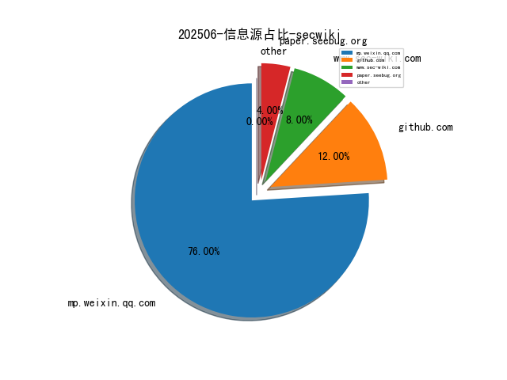
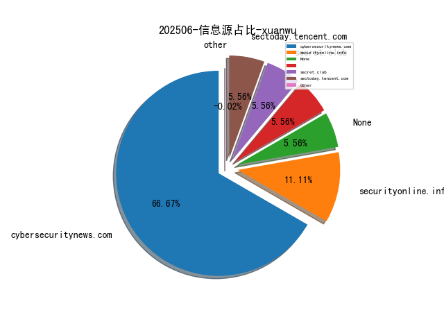
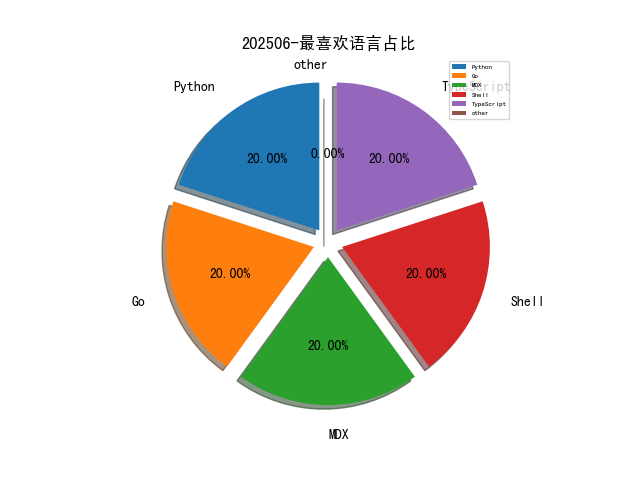

# [数据--所有](README_20.md)
# [数据--年度](README_2025.md)
# 202506 信息源与信息类型占比

# 网络安全书籍 推荐
| date_added | language | title | author | link | size| 
| --- | --- | --- | --- | --- | ---| 
| 2025-06-30 13:34:24 | English | Microsoft Defender for Endpoint | unknown | https://www.wowebook.org/microsoft-defender-for-endpoint/ | unknown| 
| 2025-06-28 11:02:06 | English | Generative AI for Healthcare | unknown | https://www.wowebook.org/generative-ai-for-healthcare/ | unknown| 
| 2025-06-28 16:12:17 | English | Getting Started with Google Kubernetes Engine | unknown | https://www.wowebook.org/getting-started-with-google-kubernetes-engine/ | unknown| 
| 2025-06-23 10:59:33 | English | Rust Programming: A Practical Guide to Fast, Efficient, and Safe Code with Ownership, Concurrency, and Web Programming | unknown | https://www.wowebook.org/rust-programming-a-practical-guide-to-fast-efficient-and-safe-code-with-ownership-concurrency-and-web-programming/ | unknown| 
| 2025-06-23 10:47:52 | English | Generative AI with Python | unknown | https://www.wowebook.org/generative-ai-with-python/ | unknown| 
| 2025-06-23 10:26:04 | English | Programming Neural Networks with Python | unknown | https://www.wowebook.org/programming-neural-networks-with-python/ | unknown| 
| 2025-06-22 14:35:13 | English | The Quick Python Book, Fourth Edition, Video Edition | unknown | https://www.wowebook.org/the-quick-python-book-fourth-edition-video-edition/ | unknown| 
| 2025-06-20 19:02:00 | English | How Large Language Models Work | unknown | https://www.wowebook.org/how-large-language-models-work/ | unknown| 
| 2025-06-18 09:01:40 | English | Building Generative AI Applications with Open-source Libraries | unknown | https://www.wowebook.org/building-generative-ai-applications-with-open-source-libraries/ | unknown| 
| 2025-06-18 08:21:14 | English | Social Engineering Cookbook | unknown | https://www.wowebook.org/social-engineering-cookbook/ | unknown| 
| 2025-06-17 08:57:02 | English | Using Microsoft 365 Copilot AI | unknown | https://www.wowebook.org/using-microsoft-365-copilot-ai/ | unknown| 
| 2025-06-17 08:30:37 | English | Mastering Advanced Excel – With ChatGPT Integration | unknown | https://www.wowebook.org/mastering-advanced-excel-with-chatgpt-integration/ | unknown| 
| 2025-06-17 16:06:06 | English | Python for DevOps | unknown | https://www.wowebook.org/python-for-devops/ | unknown| 
| 2025-06-12 07:46:29 | English | Cyber Security Kill Chain – Tactics and Strategies | unknown | https://www.wowebook.org/cyber-security-kill-chain-tactics-and-strategies/ | unknown| 
| 2025-06-12 06:34:10 | English | Kubernetes for Generative AI Solutions | unknown | https://www.wowebook.org/kubernetes-for-generative-ai-solutions/ | unknown| 
| 2025-06-11 10:58:37 | English | Red Hat Certified Engineer (RHCE) Ansible Automation Study Guide | unknown | https://www.wowebook.org/red-hat-certified-engineer-rhce-ansible-automation-study-guide/ | unknown| 
| 2025-06-11 08:51:49 | English | Microsoft Power Automate Cookbook | unknown | https://www.wowebook.org/microsoft-power-automate-cookbook/ | unknown| 
| 2025-06-04 08:21:23 | English | Unlocking Python: A Comprehensive Guide for Beginners | unknown | https://www.wowebook.org/unlocking-python-a-comprehensive-guide-for-beginners/ | unknown| 
| 2025-06-03 12:44:26 | English | Mastering Palo Alto Networks, 3rd Edition | unknown | https://www.wowebook.org/mastering-palo-alto-networks-3rd-edition/ | unknown| 
| 2025-06-01 07:17:49 | English | Generative AI for Cloud Solutions | unknown | https://www.wowebook.org/generative-ai-for-cloud-solutions/ | unknown| 
| 2025-06-01 19:06:41 | English | Python GPT Cookbook | unknown | https://www.wowebook.org/python-gpt-cookbook/ | unknown| 
| 2025-06-01 07:40:56 | English | DevOps for Java Developers | unknown | https://www.wowebook.org/devops-for-java-developers/ | unknown| 

# 微信公众号 推荐
| nickname_english | weixin_no | title | url| 
| --- | --- | --- | ---| 
| 360数字安全 | None | 一图看懂 , 360AI企业知识库打通大模型落地最后一公里 | https://mp.weixin.qq.com/s?__biz=MzA4MTg0MDQ4Nw==&mid=2247581042&idx=2&sn=6b32ed3832e16d7e27ce2d25326ec501 | 12| 
| 360漏洞研究院 | None | 【已复现】DataEase 多个远程代码执行漏洞 | https://mp.weixin.qq.com/s?__biz=Mzk0ODM3NTU5MA==&mid=2247494128&idx=2&sn=84fbc29915f49915f2acbdee7c978011 | 7| 
| C4安全团队 | None | 河南郑州护网蓝队招聘，可接受25年毕业 | https://mp.weixin.qq.com/s?__biz=MzkzMzE5OTQzMA==&mid=2247487403&idx=1&sn=0a3faf170f94ac6b6acff7484af384ab | 11| 
| CISP | None | 拟授权CISP数据安全子品牌授权培训机构名录 | https://mp.weixin.qq.com/s?__biz=MzI1NzQ0NTMxMQ==&mid=2247490668&idx=1&sn=b2b122fbcb6faa49c8bc7f3362ed2ddb | 9| 
| CNVD漏洞平台 | None | 上周关注度较高的产品安全漏洞(20250623-20250629) | https://mp.weixin.qq.com/s?__biz=MzU3ODM2NTg2Mg==&mid=2247496088&idx=2&sn=06d53998d9241762baedba11484d462b | 8| 
| CertiK | None | CertiK联合创始人顾荣辉在港大发表演讲，全景解构稳定币风险 | https://mp.weixin.qq.com/s?__biz=MzU5OTg4MTIxMw==&mid=2247504383&idx=1&sn=d579f9530dc0e8cf4b38083f4f2acbb2 | 9| 
| Delta Insights | None | 网络安全动态 - 2025.06.30 | https://mp.weixin.qq.com/s?__biz=MzU1MzEzMzAxMA==&mid=2247500097&idx=1&sn=9f1e433741aeee2553158b35a10d863a | 12| 
| FreeBuf | None | Windows IIS与Linux服务器同时遭定制恶意软件攻击 | https://mp.weixin.qq.com/s?__biz=MjM5NjA0NjgyMA==&mid=2651324036&idx=4&sn=c390e7c0abf85b146087d1e47c91ff5d | 75| 
| FreeBuf播客电台 | None | FreeBuf热门电台精选集第十期 | https://mp.weixin.qq.com/s?__biz=Mzg2MTAwNzg1Ng==&mid=2247496863&idx=1&sn=bcfaeadf91f4ae63df5490a1115782db | 1| 
| HACK之道 | None | 给报网络安全专业的孩子几点建议 | https://mp.weixin.qq.com/s?__biz=MzIwMzIyMjYzNA==&mid=2247519162&idx=1&sn=b59341a7475b9e8ea8357183e90f46d0 | 9| 
| Joker One Security | None | 大型活动启动 | https://mp.weixin.qq.com/s?__biz=MzkyNDU2MDk4NQ==&mid=2247484051&idx=1&sn=e330584d19a304eed1c2eeeb4c670d0b | 2| 
| Khan安全团队 | None | SCI论文发表！保姆级投稿套餐来了！润色、选刊、投稿、返修，直至中刊！ | https://mp.weixin.qq.com/s?__biz=MzAwMjQ2NTQ4Mg==&mid=2247499576&idx=2&sn=88e1d574509efa5bbd26a51e1c9a7073 | 37| 
| Kone安全 | 阿九 | 7天掌握Claude Pro账号的隐藏高级技巧！（内含保姆级教程）。 | https://mp.weixin.qq.com/s?__biz=MzU4MzM4MzQ1MQ==&mid=2247508124&idx=8&sn=001577c6a51f455217138d6d00ccd348 | 84| 
| OSINT情报分析师 | None | 特朗普同学：摊牌了，不装了，就网络攻击中国了！！！ | https://mp.weixin.qq.com/s?__biz=MzkxNzU5MjE0OA==&mid=2247486671&idx=1&sn=9444d460c5d40b939d638a5a28dd06bc | 1| 
| Ots安全 |  | 超棒的 Active Directory 渗透测试工具 | https://mp.weixin.qq.com/s?__biz=MzAxMjYyMzkwOA==&mid=2247531448&idx=2&sn=081e29fad490125a012a8cf5d1202458 | 63| 
| SecLink安全空间 | None | Vibe-Coding时代的安全必修课：让你的应用\"攻不可破\" | https://mp.weixin.qq.com/s?__biz=Mzk0NDcyMjU2OQ==&mid=2247484797&idx=1&sn=77fa176558179ade220f12051a14fce7 | 1| 
| Z0安全 | Z0安全 | HW明日开启 没进群的抓紧啦~ | https://mp.weixin.qq.com/s?__biz=Mzk0OTY2ODE1NA==&mid=2247485531&idx=1&sn=ea7313785968bd4c0c545a324ddaada4 | 2| 
| mailabc | None | 罗永浩官宣将发布AI生产力软件工具：与邮件相关 | https://mp.weixin.qq.com/s?__biz=MzkxMjY3MTI4Mg==&mid=2247485073&idx=1&sn=4f8284e069f493c1d3833847323d1379 | 5| 
| r3kapig | None | R3CTF 2025 开赛在即!!! | https://mp.weixin.qq.com/s?__biz=MzI2MDE4MzkzMQ==&mid=2247484706&idx=1&sn=62025427e310b306f86cc6faf18733ce | 2| 
| 中国信息安全 | None | 评论 , 斩断电诈“黑手” 筑牢反诈“防火墙” | https://mp.weixin.qq.com/s?__biz=MzA5MzE5MDAzOA==&mid=2664244972&idx=4&sn=ebdd3c7ba4d3cb34e2f22580cbcd8dc6 | 61| 
| 中国电信安全 | None | 重保情报，速领！ | https://mp.weixin.qq.com/s?__biz=MzkxNDY0MjMxNQ==&mid=2247536624&idx=1&sn=0b2e7f3f1fbfc283205648ccb1d10849 | 10| 
| 中国软件评测中心 | None | 【工信动态】李乐成在广东调研制造业高质量发展 | https://mp.weixin.qq.com/s?__biz=MjM5NzYwNDU0Mg==&mid=2649252696&idx=3&sn=560765589c1b689a250e246001b68b92 | 25| 
| 中孚信息 |  | 中孚信息发布《中孚信息2025年6月网络安全月报》 | https://mp.weixin.qq.com/s?__biz=MzAxMjE1MDY0NA==&mid=2247510869&idx=2&sn=c62e37d564ad8542f1980df574eb4313 | 7| 
| 中学生CTF | None | 2025-6月Solar应急响应公益月赛！ | https://mp.weixin.qq.com/s?__biz=MzU3MzEwMTQ3NQ==&mid=2247507665&idx=1&sn=98eeb817ccefc810deb666eb8ef29b16 | 1| 
| 中机博也汽车技术 | None | 中国机械总院党委副书记李玉鑫一行调研中机认检子公司中机博也 | https://mp.weixin.qq.com/s?__biz=Mzg3OTU3Mjg0Nw==&mid=2247485564&idx=1&sn=d4a883a63bbeeca3a8c9ee669e966eb4 | 1| 
| 云弈安全 | None | 喜报！云弈科技入选CCIA首批网安新产品名单，以创新产品筑牢数字安全屏障 | https://mp.weixin.qq.com/s?__biz=MzU2ODY0ODk2Nw==&mid=2247492089&idx=1&sn=e4702c409e44596614dbddeab52eeebb | 1| 
| 亚信安全 | None | 当亚信安全遇上鸿蒙，高效护航企业数字化转型 | https://mp.weixin.qq.com/s?__biz=MjM5NjY2MTIzMw==&mid=2650623964&idx=1&sn=67fca65d386c233908299a279bf17c71 | 20| 
| 交大捷普 |  | 产品总览 | https://mp.weixin.qq.com/s?__biz=MzI2MzU0NTk3OA==&mid=2247506637&idx=1&sn=4a4e8e9444c8084e427472733a4e2435 | 14| 
| 亿人安全 | None | 从白帽角度浅谈SRC业务威胁情报挖掘与实战 | https://mp.weixin.qq.com/s?__biz=Mzk0MTIzNTgzMQ==&mid=2247521953&idx=2&sn=eb0cfa81350d8f7202eaccf6af6200d9 | 5| 
| 代码卫士 | None | 蓝牙芯片集多个漏洞可导致攻击者窃听或盗取敏感信息 | https://mp.weixin.qq.com/s?__biz=MzI2NTg4OTc5Nw==&mid=2247523404&idx=2&sn=3ff2f901d13c30f8048d7a38b567880f | 30| 
| 信安世纪 | None | 从“青涩”到“橙熟”：信安世纪萌新变形记开启！ | https://mp.weixin.qq.com/s?__biz=MjM5NzgzMjMwNw==&mid=2650665003&idx=1&sn=da5dd01e8f43cace2b29d4d0f6497c42 | 8| 
| 信安百科 | None | CVE-2025-6218｜WinRAR目录遍历远程代码执行漏洞 | https://mp.weixin.qq.com/s?__biz=Mzg2ODcxMjYzMA==&mid=2247486063&idx=2&sn=a3d57d6619d987a8d64a725f1bc82373 | 10| 
| 信息安全D1net | None | 遭遇黑客攻击后，许多企业仍保持沉默，这无疑是个隐患 | https://mp.weixin.qq.com/s?__biz=MzA3NTIyNzgwNA==&mid=2650260307&idx=1&sn=d5f3ae16bf5e122a66809768abad19ad | 12| 
| 信息安全与通信保密杂志社 | None | 中国将牵头制定数据通信领域全球首个抗量子网络安全协议国际标准体系 | https://mp.weixin.qq.com/s?__biz=MzkwMTMyMDQ3Mw==&mid=2247600443&idx=2&sn=0d7424e0a7a928d021d02093b978c8d4 | 45| 
| 信息安全大事件 | None | 多家互联网企业因三大漏洞遭处罚，650万条患者信息裸奔 | https://mp.weixin.qq.com/s?__biz=MzkzNjIzMjM5Ng==&mid=2247492722&idx=1&sn=2eb58866b8e1479105ea7019b94ea417 | 14| 
| 信息安全研究 |  | 【业界动态】网安市场周度监测（2025-06-30） | https://mp.weixin.qq.com/s?__biz=MzA3NzgzNDM0OQ==&mid=2664995415&idx=3&sn=8c15ac1d2c6f63a33ee3cb94e85caeb2 | 36| 
| 信科共创检测认证 |  | 【渗透攻防】最新攻防技巧，助您构建防御体系 | https://mp.weixin.qq.com/s?__biz=MzIyNTIyMTU1Nw==&mid=2247485684&idx=4&sn=b8409333e971853dff8ab29ee74ad873 | 10| 
| 全球技术地图 | None | 美国防部披露2026财年预算简报 | https://mp.weixin.qq.com/s?__biz=MzI1OTExNDY1NQ==&mid=2651621364&idx=2&sn=de78a942308e4545d9c5c5a7ac0e9cfa | 32| 
| 半只红队 | None | 避免注入链：Primitive Injection | https://mp.weixin.qq.com/s?__biz=Mzk1NzM5MTI2Mg==&mid=2247484892&idx=1&sn=b97c48f14b44444c9e2a8d98d658b620 | 1| 
| 华云安 | None | 权威认可！华云安获评IDC MarketScape中国持续威胁暴露管理领导者 | https://mp.weixin.qq.com/s?__biz=MzI1Njc5NTY1MQ==&mid=2247500962&idx=1&sn=ad648bb504dbd0af0c6fcaab8784f035 | 3| 
| 吉祥快学网络安全吧 | None | 25年护网明天开始，技战法已准备，快收藏 | https://mp.weixin.qq.com/s?__biz=MzkzMzcxNTQyNw==&mid=2247488113&idx=1&sn=356c966a4491ace4b09680d34a06bbee | 10| 
| 吉祥讲安全 | None | 25年护网即将开始，技战法已准备，快收藏 | https://mp.weixin.qq.com/s?__biz=MzkwNjY1Mzc0Nw==&mid=2247489356&idx=1&sn=f79fbfff4437405f32291386fd94bf88 | 8| 
| 君说安全 | None | 网络安全行业，为什么要做暗网监测？ | https://mp.weixin.qq.com/s?__biz=MzUzNjkxODE5MA==&mid=2247491562&idx=1&sn=fad6ca0604819f98fe9660a3eecd967a | 28| 
| 启明星辰安全简讯 | None | 安全简讯（2025.06.30） | https://mp.weixin.qq.com/s?__biz=MzkzNzY5OTg2Ng==&mid=2247501239&idx=1&sn=e7f6fd0bcc8d3f4287dabd0415e64d02 | 20| 
| 启明星辰集团 | None | 启明星辰亮相第二十届中国国际中小企业博览会，以创新科技护航数字未来 | https://mp.weixin.qq.com/s?__biz=MzA3NDQ0MzkzMA==&mid=2651733539&idx=1&sn=a1e37491a160aeff760fd1f0398d6af2 | 10| 
| 嘶吼专业版 | None | 安全动态回顾,工信部对57款存在侵害用户权益行为的APP（SDK）进行通报 Brother打印机在689款型号中存在漏洞 | https://mp.weixin.qq.com/s?__biz=MzI0MDY1MDU4MQ==&mid=2247583407&idx=2&sn=35c3e8e7c3d51d50a86d12456ac1b819 | 21| 
| 国际云安全联盟CSA | None | CSA大中华区上线CPE积分功能，这些CPE可抵扣证书维持费 | https://mp.weixin.qq.com/s?__biz=MzkwMTM5MDUxMA==&mid=2247506186&idx=1&sn=6d055dbbc9f8e146a5b05cc6aa1e397d | 2| 
| 天威诚信 | None | 天威诚信亮相2025浪潮数字企业创新论坛西安站，共话数字信任新基建 | https://mp.weixin.qq.com/s?__biz=MzU4MzY5MzQ4MQ==&mid=2247542640&idx=1&sn=3faa12ab85681393537c64a2475fc32b | 9| 
| 天融信教育 | None | 字母驱动丨立体化网安人才培育模式 | https://mp.weixin.qq.com/s?__biz=MzU0MjEwNTM5Ng==&mid=2247520703&idx=1&sn=14c3da3348ae457ddd68a3c5baed2846 | 1| 
| 天际友盟 | None | [0630] 一周重点情报汇总｜天际友盟情报站 | https://mp.weixin.qq.com/s?__biz=MzIwNjQ4OTU3NA==&mid=2247510431&idx=1&sn=a2895e9a8940f7f701041892666b3205 | 5| 
| 天黑说嘿话 | None | 《AI Python for Beginners》——AI时代最适合新手的Python课程 | https://mp.weixin.qq.com/s?__biz=MzI5NTQ5MTAzMA==&mid=2247484491&idx=1&sn=69f24170ea3f2254bfc79f810739005c | 7| 
| 奇安信 CERT | None | 安全热点周报：iOS 零点击攻击用于传播 Graphite 间谍软件 | https://mp.weixin.qq.com/s?__biz=MzU5NDgxODU1MQ==&mid=2247503532&idx=1&sn=3f7aadc3dfbca2c12f1fec32c3e73ca3 | 9| 
| 奇安信集团 | None | AI首次成为美国头号白帽黑客，背后公司近一年融资超8亿元 | https://mp.weixin.qq.com/s?__biz=MzU0NDk0NTAwMw==&mid=2247628142&idx=3&sn=16016d3f3a5775f6b96cc6e3f566763c | 54| 
| 奇安网情局 | None | 美国国会议员敦促审查并修改美军网络空间交战规则 | https://mp.weixin.qq.com/s?__biz=MzI4ODQzMzk3MA==&mid=2247490347&idx=1&sn=69e91025b2c431a5aad94ec06518f563 | 7| 
| 威努特安全网络 | None | 2025年威努特营销战略闭门会在瑞金圆满召开！ | https://mp.weixin.qq.com/s?__biz=MzAwNTgyODU3NQ==&mid=2651134004&idx=1&sn=3715085b2efff684092b69d893ee99e4 | 9| 
| 字节跳动安全中心 | None | 15倍效率跃迁：LLM驱动的Web指纹识别实战突破 | https://mp.weixin.qq.com/s?__biz=MzUzMzcyMDYzMw==&mid=2247494980&idx=1&sn=e038b6a1595dfac391262b10b8e060a4 | 4| 
| 字节跳动技术团队 | None | 迁的越多，送的越多！火山引擎 veImageX 推出图片迁移活动 | https://mp.weixin.qq.com/s?__biz=MzI1MzYzMjE0MQ==&mid=2247515016&idx=1&sn=2892c0532a48ab9dc619fb88e43eaf2b | 8| 
| 安世加 | None | 美国冻结价值15亿美元涉黑客攻击的加密货币 | https://mp.weixin.qq.com/s?__biz=MzU2MTQwMzMxNA==&mid=2247542580&idx=1&sn=2e825445701fd3149877540ae11e5d8a | 13| 
| 安全内参 | None | 美国网络司令部与海岸警卫队成立特遣队开展港口防御演习 | https://mp.weixin.qq.com/s?__biz=MzI4NDY2MDMwMw==&mid=2247514605&idx=2&sn=20d691eb1361434c6159d6844ae40224 | 28| 
| 安全圈 | None | 【安全圈】Pro-Iranian黑客组织“Cyber Fattah”泄露2024年沙特运动会数据 | https://mp.weixin.qq.com/s?__biz=MzIzMzE4NDU1OQ==&mid=2652070437&idx=4&sn=70c8063e1fc95a9b199b2f1965124e26 | 80| 
| 安全威胁纵横 | None | 跟 Windows “蓝屏死机”说再见！微软将于今夏上新黑色极简风界面 | https://mp.weixin.qq.com/s?__biz=Mzk0MDYwMjE3OQ==&mid=2247486881&idx=1&sn=2a7bb72ec9f6d62c7d61dce7be027f85 | 13| 
| 安全客 | None | 拖拉机也能被黑？全球4.6 万台农机曝远程操控漏洞 | https://mp.weixin.qq.com/s?__biz=MzA5ODA0NDE2MA==&mid=2649788743&idx=1&sn=e35ebfc8a2f78e9033198fdd30536501 | 8| 
| 安全极客 | None | 第103期,GPTSecurity周报 | https://mp.weixin.qq.com/s?__biz=MzkzNDUxOTk2Mw==&mid=2247496706&idx=1&sn=9635386672625fdbc364a849fa7c380d | 10| 
| 安全牛 | None | 美国顶级“黑客”竟是AI？；网信办发布《网信部门行政处罚裁量权基准适用规定》；美因支持以色列遭亲伊朗DDoS攻击 , 牛览 | https://mp.weixin.qq.com/s?__biz=MjM5Njc3NjM4MA==&mid=2651137357&idx=2&sn=388ef2f99832dd99e5819e26d5d09a38 | 27| 
| 安势信息 | 清源社区 | 清源SCA社区每日漏洞提早感知情报、新增CVE及投毒情报推送-2025年06月27～29日 | https://mp.weixin.qq.com/s?__biz=Mzg3MDgyMzkwOA==&mid=2247491688&idx=1&sn=f34db0c8462b5e66e6157efe6cf31283 | 4| 
| 安在 | 走狗是狗哥 | 入侵网络以推销安全服务，这家伙脑洞清奇 | https://mp.weixin.qq.com/s?__biz=MzU5ODgzNTExOQ==&mid=2247641262&idx=2&sn=a1666a57f62d49be562f25ddaa6101c3 | 52| 
| 安小圈 | None | 2025年【护网】攻防演练时间已定！ | https://mp.weixin.qq.com/s?__biz=Mzg2MDg0ODg1NQ==&mid=2247546815&idx=1&sn=99a4f3228f322ef92c93d23cee01f071 | 3| 
| 安帝Andisec | None | 百企聚势，生态共赢！安帝科技与中电互联携手推动产业高质量发展 | https://mp.weixin.qq.com/s?__biz=MzU3ODQ4NjA3Mg==&mid=2247567483&idx=1&sn=5cab374d5fb3eed65d83dd45b9df52b6 | 5| 
| 安恒信息 | None | 《2025年攻防演练必修漏洞清单》重磅发布，助您筑牢安全防线 | https://mp.weixin.qq.com/s?__biz=MjM5NTE0MjQyMg==&mid=2650629923&idx=2&sn=973a47723a6fed8a91a69bf6e1fdce7a | 6| 
| 富贵安全 | None | 某大型演练活动时间已确定 | https://mp.weixin.qq.com/s?__biz=MzkxNzY5MTg1Ng==&mid=2247489829&idx=1&sn=99ec2b4b03eef01c8d2ef80a556a1864 | 66| 
| 小艾搞安全 | None | 【多人运动】明日开启-漏洞情报群启动！ | https://mp.weixin.qq.com/s?__biz=Mzg3MTY3NzUwMQ==&mid=2247490570&idx=1&sn=d35d9af3d4bc790baa81a45861ae4c91 | 1| 
| 小话安全 | None | 高考志愿填报：山东文科考生480分能上的院校求推荐 | https://mp.weixin.qq.com/s?__biz=Mzg2MjgwMzIxMA==&mid=2247485181&idx=1&sn=5d792276d26f2526287dcb3c24e108b7 | 2| 
| 山石网科新视界 | None | 捐赠15台防火墙！山石网科鼎助香港网络安全协会2025专题研讨会 | https://mp.weixin.qq.com/s?__biz=MzAxMDE4MTAzMQ==&mid=2661301427&idx=1&sn=18f0dc059fc3171f56694268b317527d | 17| 
| 工业互联网标识智库 | None | 中国信通院金键：Token经济引领未来产业新范式 | https://mp.weixin.qq.com/s?__biz=MzU1OTUxNTI1NA==&mid=2247593642&idx=1&sn=d2dc44ebcfa9e99eb2c8e484be841e92 | 5| 
| 工业安全产业联盟平台 | None | 荐读丨《Nature》最新：量子+区块链，NIST等发布迄今最“可信”的随机数生成器 | https://mp.weixin.qq.com/s?__biz=MzI2MDk2NDA0OA==&mid=2247533756&idx=2&sn=1711bc4e85909b99dfc7b8b69ba44511 | 16| 
| 工联安全众测 | None | 工业和信息化部召开深入贯彻中央八项规定精神学习教育督导组工作座谈会 | https://mp.weixin.qq.com/s?__biz=MzkyMDMwNTkwNg==&mid=2247487700&idx=1&sn=0378f68ecb5a9201eb95141c4bb7a260 | 4| 
| 微步在线研究响应中心 | None | 微步情报局再次发现DataEase存在多个高危漏洞，可实现RCE | https://mp.weixin.qq.com/s?__biz=Mzg5MTc3ODY4Mw==&mid=2247507825&idx=1&sn=c8163fc109580e2fd0b793a34118ae75 | 3| 
| 思想花火 | None | Garak-大语言模型脆弱性扫描器 | https://mp.weixin.qq.com/s?__biz=MjM5Mjc0MDU1MQ==&mid=2452314038&idx=1&sn=7e1abbb07e76b5277b66851dc6518eba | 1| 
| 情报分析师 | None | 赞丹沙塔尔执政下蒙古国战略新棋谱深度解析 | https://mp.weixin.qq.com/s?__biz=MzA3Mjc1MTkwOA==&mid=2650561625&idx=1&sn=29016c37c167325386cf85bf1ef6b5d6 | 18| 
| 慢雾科技 | None | 慢雾 Q2 追踪实录：协助被盗客户冻结/追回超千万美元资金 | https://mp.weixin.qq.com/s?__biz=MzU4ODQ3NTM2OA==&mid=2247502542&idx=1&sn=7c7f6e1d3b6adbde611a26b4d90474c1 | 6| 
| 技术修道场 | None | FBI紧急预警：“散蛛”黑客如何用一通电话，数小时瓦解一家公司？ | https://mp.weixin.qq.com/s?__biz=MzA4NTY4MjAyMQ==&mid=2447900841&idx=1&sn=c9299720baf4c1286b78a9091f33b015 | 20| 
| 攻防SRC | None | 护网必备:攻防演练在即，研判分析除了微步在线还能用什么 | https://mp.weixin.qq.com/s?__biz=MzIyNDg2MDQ4Ng==&mid=2247487291&idx=1&sn=d8ccc84046438047332103a907e7110f | 7| 
| 数世咨询 | None | 中国数字安全产业年度报告（2025）公开版 | https://mp.weixin.qq.com/s?__biz=MzkxNzA3MTgyNg==&mid=2247539436&idx=1&sn=676908ed11008cd016b253d1d8e6ba8a | 15| 
| 数默科技 | None | 洞·见 , 20250630 | https://mp.weixin.qq.com/s?__biz=Mzk0MDQ5MTQ4NA==&mid=2247487875&idx=1&sn=576f61bd87572ee4514e7842ae98d83b | 5| 
| 易云安全应急响应中心 | None | 监管利剑出鞘！四家转售商被重罚，下一批会是谁？ | https://mp.weixin.qq.com/s?__biz=MzkyNDcwMTAwNw==&mid=2247535366&idx=4&sn=d481fa6c73a60c2fe0976e6ac2cd3617 | 22| 
| 星河安全 | None | 【星闻周报】“银狐”木马新变种席卷全国：数千企业员工遭网络钓鱼诈骗 | https://mp.weixin.qq.com/s?__biz=Mzk0MTYyNTg3Mg==&mid=2247492986&idx=1&sn=2409aba53c08127fb5708944527820d7 | 5| 
| 梆梆安全 | None | 向党致敬！庆祝中国共产党成立104周年 | https://mp.weixin.qq.com/s?__biz=MjM5NzE0NTIxMg==&mid=2651135870&idx=1&sn=2abd67650024fa6f2677e225cff948a8 | 14| 
| 棉花糖fans | None | 【补文章】某大型演练活动时间已确定，蓝队群已建立 | https://mp.weixin.qq.com/s?__biz=MzkyOTQzNjIwNw==&mid=2247492518&idx=1&sn=86e5b2932a519e3f93bd4343d9553011 | 8| 
| 河南等级保护测评 | None | 给报网络安全专业的孩子几点建议 | https://mp.weixin.qq.com/s?__biz=Mzg2NjY2MTI3Mg==&mid=2247500677&idx=1&sn=1870ca5a719f2a43cc52098db5a5873b | 37| 
| 深圳市网络与信息安全行业协会 | None | 中国人民银行业务领域网络安全事件分级表 | https://mp.weixin.qq.com/s?__biz=MzU0Mzk0NDQyOA==&mid=2247522179&idx=1&sn=4b7a3849d909199b55dd5a8d96bef428 | 10| 
| 深圳网安培训学院 | None | 关于举办“密码技术应用员”第二期培训班的通知 | https://mp.weixin.qq.com/s?__biz=Mzg3MDYzMjAyNA==&mid=2247486527&idx=1&sn=c2353463ed16fb504a928630cbd5d5a2 | 5| 
| 渊亭科技 | None | 从方案设计到结果分析，天衍系统如何实现高效率、高置信度作战仿真实验？ | https://mp.weixin.qq.com/s?__biz=MzIzNjE1ODE2OA==&mid=2660191934&idx=1&sn=21dcffbb1fba642546d2a795b6e604de | 7| 
| 渊亭防务 | None | 乌克兰战时电力保障经验教训 | https://mp.weixin.qq.com/s?__biz=Mzg2NTYyODgyNg==&mid=2247506872&idx=1&sn=7249fe503650cf267f9316802dac2efe | 15| 
| 火绒安全 | None | 诚邀渠道合作伙伴共启新征程 | https://mp.weixin.qq.com/s?__biz=MzI3NjYzMDM1Mg==&mid=2247525914&idx=2&sn=af2168d6ed353951a47acfa38cb1d2f6 | 10| 
| 炼石网络CipherGateway | None | 速下载!国家密码管理局9项新标准全文公开，2025年7月1日起施行 | https://mp.weixin.qq.com/s?__biz=MzkyNzE5MDUzMw==&mid=2247576895&idx=1&sn=427c5109a33a58358075aa022b04cb7f | 5| 
| 独眼情报 | None | 蓝牙漏洞可能让黑客通过麦克风进行监听 | https://mp.weixin.qq.com/s?__biz=MzkzNDIzNDUxOQ==&mid=2247500308&idx=3&sn=8d7bc04718282b1c05140bc624169054 | 46| 
| 珞安科技 | None | 安全加码,珞安科技编写煤矿行业网络安全团体标准今日正式实施 | https://mp.weixin.qq.com/s?__biz=MzU2NjI5NzY1OA==&mid=2247513195&idx=1&sn=7efe8b714327c16cba8b1da8bacb1286 | 6| 
| 白帽子社区团队 | None | 用 无问AI 深度研究 生成富有深度的网络安全技术研报 | https://mp.weixin.qq.com/s?__biz=MzkzNDQ0MDcxMw==&mid=2247488054&idx=1&sn=e8e74b3489a66579b923a3df0bb3430c | 7| 
| 百度安全 | None | 文心大模型及百度大模型内容安全平台齐获信通院大模型安全认证 | https://mp.weixin.qq.com/s?__biz=MjM5MTAwNzUzNQ==&mid=2650511406&idx=1&sn=36326a032bf452471f75b847b68123cd | 3| 
| 百度安全实验室 | None | 文心大模型及百度大模型内容安全平台齐获信通院大模型安全认证 | https://mp.weixin.qq.com/s?__biz=MzA3NTQ3ODI0NA==&mid=2247487801&idx=1&sn=f09b4f5ffffd01de186bba3c16793207 | 2| 
| 百灵猫开源情报分析师 | None | 9.3%! 美国防产业对华依赖首度被量化 | https://mp.weixin.qq.com/s?__biz=MzkxMTA3MDk3NA==&mid=2247487829&idx=1&sn=23e231de91ae4576ea561c10079ae093 | 5| 
| 看雪学苑 | None | 25岁英国黑客 “IntelBroker” 落网！窃取超40家机构数据致2500万美元损失 | https://mp.weixin.qq.com/s?__biz=MjM5NTc2MDYxMw==&mid=2458596319&idx=3&sn=7b512432ed9849d3db7a65f7f6b2382e | 55| 
| 知其安科技 | None | 让产品更好用，让用户更专业！｜CSVP认证助力安全运营实战能力升级 | https://mp.weixin.qq.com/s?__biz=MzkzNTI5NTgyMw==&mid=2247511264&idx=1&sn=b58e781dd2879c50c4908bf7b58f36f5 | 1| 
| 知道创宇 | None | TGO鲲鹏会 , 从大模型到智能体：AI创新应用与安全治理的全景解读 | https://mp.weixin.qq.com/s?__biz=MjM5NzA3Nzg2MA==&mid=2649871781&idx=1&sn=612b9aed08f2ef2197dac29e053d4597 | 6| 
| 知道创宇404实验室 | None | 404星链计划 , 项目版本更新 | https://mp.weixin.qq.com/s?__biz=MzAxNDY2MTQ2OQ==&mid=2650990962&idx=1&sn=4448d8589bbc908cefa553414c892acb | 3| 
| 神舟网安 | None | 2025年江西省“赣银杯”金融业网络安全攻防竞赛决赛成功举办 | https://mp.weixin.qq.com/s?__biz=MzUzNTk2NTIyNw==&mid=2247490930&idx=1&sn=be39f04890db0368f0b4f95719d3654e | 2| 
| 秦安战略 | None | 张志坤：“爸爸”让干啥，欧洲就干啥，北约剑指中国 | https://mp.weixin.qq.com/s?__biz=MzA5MDg1MDUyMA==&mid=2650480305&idx=3&sn=e62f5e1903b54029b4fe7ddb899f3c48 | 28| 
| 绿盟科技 | None | 绿盟科技2025年中盘点 | https://mp.weixin.qq.com/s?__biz=MjM5ODYyMTM4MA==&mid=2650469783&idx=1&sn=44fb426f78ff413269915107de99cc75 | 17| 
| 网易易盾 | None | 特别推送：网易易盾最新加固版本已完美兼容Android 16 | https://mp.weixin.qq.com/s?__biz=MzAwNTg2NjYxOA==&mid=2650743765&idx=2&sn=2eda549d2f3452fc5918751853af796a | 8| 
| 网络安全与等保测评 | None | 等保、密评的领导你们好U0001fae1，飞度刷题提供等保和密评考试学习、刷题长期支撑服务。 | https://mp.weixin.qq.com/s?__biz=MzIwNDYzNTYxNQ==&mid=2247503604&idx=1&sn=028c4cd613c63057b27101e865ad5f43 | 11| 
| 网络安全和信息化 | None | 市场监管总局公布五起网络不正当竞争典型案例 | https://mp.weixin.qq.com/s?__biz=MjM5MzMwMDU5NQ==&mid=2649173638&idx=2&sn=8056d1d0a9f0ed513797ad46bc520574 | 44| 
| 老烦的草根安全观 | None | 给报网络安全专业的孩子几点建议 | https://mp.weixin.qq.com/s?__biz=MzA5MTYyMDQ0OQ==&mid=2247493973&idx=1&sn=8c8d0e2672924ce12904e2a8d391b42e | 2| 
| 腾讯技术工程 | None | 微信技术架构部斩获CVPR 2025大赛冠军，攻克AI图文匹配评估难题 | https://mp.weixin.qq.com/s?__biz=MjM5ODYwMjI2MA==&mid=2649794340&idx=1&sn=428eaf97da2e630a227873c3ec09911c | 9| 
| 蚁景网安 | None | 域前置技术和C2隐藏 | https://mp.weixin.qq.com/s?__biz=MzkyNTY3Nzc3Mg==&mid=2247490061&idx=1&sn=cd68a3e88e3289d4c8021bf70964d048 | 13| 
| 蚁景网络安全 | None | 【免费领】新手必备！Web安全漏洞挖掘实战入门教程 | https://mp.weixin.qq.com/s?__biz=MzkxNTIwNTkyNg==&mid=2247555326&idx=2&sn=cebb6d2e0961666408a1b3ae0bc5cac4 | 26| 
| 表哥带我 | None | 【吃瓜群】2025演练即将开始 | https://mp.weixin.qq.com/s?__biz=Mzg4NDg2NTM3NQ==&mid=2247484850&idx=1&sn=d5cd62c5144445a7166aea2ebbf7cce0 | 6| 
| 观安信息 | None | 联合发布｜数智化安全运营报告（附下载） | https://mp.weixin.qq.com/s?__biz=MzIxNDIzNTcxMg==&mid=2247508509&idx=1&sn=f87e9c3c853c956486491a5237c865fb | 16| 
| 谈思实验室 | None | 附下载 , 《车联网服务平台网络安全技术要求》地方标准发布 | https://mp.weixin.qq.com/s?__biz=MzIzOTc2OTAxMg==&mid=2247556211&idx=1&sn=42c64cb223eb29b43144b23a03cad45a | 50| 
| 谷安培训 | None | 信安人的 “钞能力” 组合：CISSP+OSCP 才是真・职场硬通货 | https://mp.weixin.qq.com/s?__biz=MzU4MjUxNjQ1Ng==&mid=2247524142&idx=1&sn=ca6d901f54a34774b6b373df0bba9d4d | 20| 
| 车小胖谈网络 | None | 一个数据包从进入路由器到出去，怎样的过程？ | https://mp.weixin.qq.com/s?__biz=MzIxNTM3NDE2Nw==&mid=2247490566&idx=1&sn=14313729b5e6ea0dbb26af7c41c46f62 | 4| 
| 迪普科技 | None | 持续领航！迪普科技应用交付市场份额第二 | https://mp.weixin.qq.com/s?__biz=MzA4NzE5MzkzNA==&mid=2650378187&idx=1&sn=4ee81f7f6079002fdd29efa5d932bbd1 | 3| 
| 道玄网安驿站 | 道玄安全 | HW日期确定 | https://mp.weixin.qq.com/s?__biz=Mzg4NTg5MDQ0OA==&mid=2247488194&idx=1&sn=73e93dcbe88159bfa02159c76bc37ed6 | 15| 
| 金盾信安 | None | 国家卫健委等三部门联合印发《关于进一步加强医疗机构电子病历信息使用管理的通知》 | https://mp.weixin.qq.com/s?__biz=MjM5NjA2NzY3NA==&mid=2448689254&idx=4&sn=368bac0c842e80a27c19517bb8531dcb | 29| 
| 金盾检测股份 | None | 深化合规意识 坚守合规防线 , 金盾检测组织开展2025年度法律合规宣贯会 | https://mp.weixin.qq.com/s?__biz=MzI5NjA4NjA3OA==&mid=2652102622&idx=1&sn=cc5f24abe646d6a2e2f7958dc8cf3b52 | 4| 
| 长亭安全观察 | None | 破坏计算机系统？拘留！来看新修订的治安管理处罚法 | https://mp.weixin.qq.com/s?__biz=MzkyNDUyNzU1MQ==&mid=2247487904&idx=1&sn=34539dc78136686a40dbc8a17d6ca8e8 | 13| 
| 闲聊趣说 | None | web3安全 | https://mp.weixin.qq.com/s?__biz=MzIwODc2NjgxNA==&mid=2247485079&idx=1&sn=20aaf9e884f147f64d131883da9ca4a0 | 1| 
| 陌陌安全 | None | 好运派送，季度抽奖欧皇诞生记！？ | https://mp.weixin.qq.com/s?__biz=MzI2OTYzOTQzNw==&mid=2247488828&idx=1&sn=92531304f27bd44b3b29b278a73c44f6 | 1| 
| 雪莲安全 | None | 【补档】华为行动明日开启 | https://mp.weixin.qq.com/s?__biz=MzkyNTQ0OTYxOQ==&mid=2247484071&idx=1&sn=83eb3165d49788a80bb0dfc606509f18 | 2| 
| 马哥网络安全 | None | 紧急！服务器网络故障？这14个Linux命令能救急 | https://mp.weixin.qq.com/s?__biz=MzkxMzMyNzMyMA==&mid=2247573735&idx=2&sn=529cb42231caa4d3a1671e1e6160897e | 32| 
| 鼎信安全 | None | 鼎信安全 , 网络安全一周资讯 | https://mp.weixin.qq.com/s?__biz=MzIwOTc4MTE4Nw==&mid=2247502437&idx=1&sn=003b61690d1cbde9d82bf93f64a6ee27 | 4| 
| 龙哥网络安全 | None | 手把手教大家用kali制作绕过火绒检测的木马 | https://mp.weixin.qq.com/s?__biz=MzU3MjczNzA1Ng==&mid=2247497816&idx=2&sn=61bbe622d27d676058390356ea09e59a | 30| 
| AI与安全 | None | 关于AI系统的访问控制，看看权威观点 | https://mp.weixin.qq.com/s?__biz=Mzg5NTMxMjQ4OA==&mid=2247486122&idx=1&sn=80c11985a7dcbcfd55f3cd0d109bf6d4 | 5| 
| AI技术笔记 | None | AI办公软件新纪元：OpenAI入局，微软、谷歌上演“生态攻防战” | https://mp.weixin.qq.com/s?__biz=MzkxNzY0Mzg2OQ==&mid=2247487005&idx=1&sn=a001e5435cd72ff34c707eac1005390f | 10| 
| AnWangsec | None | 缝缝缝！fscan+dddd二开+xray=一键fddxray | https://mp.weixin.qq.com/s?__biz=Mzk1NzkyNjc2Nw==&mid=2247483834&idx=1&sn=490408353e07c09e52a18e1f3d69794f | 1| 
| Bypass | None | 《云原生安全攻防》-- 云原生场景下的应急响应思路 | https://mp.weixin.qq.com/s?__biz=MzA3NzE2MjgwMg==&mid=2448909719&idx=1&sn=8ab91afdef0ea6fd56cac7f3f3436d72 | 1| 
| CISSP | None | 钓鱼邮件的朔源 | https://mp.weixin.qq.com/s?__biz=Mzg4MTg0MjQ5OA==&mid=2247488629&idx=1&sn=ebb49c9e5f9a2f516b2d7419d45ab933 | 2| 
| Enginge | None | Burp被WAF拦截时 | https://mp.weixin.qq.com/s?__biz=MzU1NTQ5MDEwNw==&mid=2247485154&idx=1&sn=0cb64bbb2f09b6e32ea5a8a11a3e8cbb | 3| 
| IoVSecurity | None | 东风汽车：端管云一体化的汽车信息安全能力建设与实践 | https://mp.weixin.qq.com/s?__biz=MzU2MDk1Nzg2MQ==&mid=2247625451&idx=3&sn=2e8332195b9d925da9cd50cbd37f6796 | 34| 
| N0wayBack | None | 全网首发！「行动代号-电鳗」 WP by Chu0 | https://mp.weixin.qq.com/s?__biz=Mzg4MTg1MDY4MQ==&mid=2247487884&idx=1&sn=252f55f51b593d89ed69923d6461b277 | 2| 
| Nday Poc | None | H3C ER2200G2路由器 信息泄露漏洞 | https://mp.weixin.qq.com/s?__biz=MzkzMTcwMTg1Mg==&mid=2247491941&idx=1&sn=1be6e8f7856cb6fcf191a6d1858210d5 | 15| 
| PTEHub | None | 人生开始和结束是一样的！ | https://mp.weixin.qq.com/s?__biz=Mzg4NzY5NjgyNw==&mid=2247485637&idx=1&sn=41273df47d9b0b0585b9e7b1fc04778d | 13| 
| Sword软件驿站 | None | 各类经典游戏、找回童年的快乐、满满的童年回忆！内含5000+经典资源！！完全免费！！！ | https://mp.weixin.qq.com/s?__biz=Mzk0MzI2NzQ5MA==&mid=2247487564&idx=1&sn=5c455c254d92b420f6d02f8cab37ba9c | 14| 
| W不懂安全 | None | 跨境人必备：giffgaff英国实体卡神器：免实名 , 免月租，仅需10英镑即可保号20年以上 | https://mp.weixin.qq.com/s?__biz=MzkyNzYzNTQ2Nw==&mid=2247484777&idx=1&sn=ab29a1709d0ebbbcc2b7e0324f889bec | 1| 
| dotNet安全矩阵 | None | .NET 2025年06月实战工具库和资源汇总 | https://mp.weixin.qq.com/s?__biz=MzUyOTc3NTQ5MA==&mid=2247499972&idx=3&sn=d38d0b1cd1b5a412663e51d14e8968a5 | 27| 
| k哥网络安全 | None | 黑客零基础入门方法有哪些？如何学习黑客技术？ | https://mp.weixin.qq.com/s?__biz=Mzk1NzMwNTM5NQ==&mid=2247486672&idx=1&sn=5a79e2c1c0065d803d217ba1b5849d3a | 4| 
| securitainment | None | 重塑 Kerberos Diamond Ticket（钻石票）攻防实践 | https://mp.weixin.qq.com/s?__biz=MzAxODM5ODQzNQ==&mid=2247488983&idx=1&sn=25be94349f5580da9bf883116613da22 | 14| 
| 丁爸 情报分析师的工具箱 | None | 【资料】当代情报预警案例：成功与失败的教训 | https://mp.weixin.qq.com/s?__biz=MzI2MTE0NTE3Mw==&mid=2651150934&idx=2&sn=420fc808098fb1f7e974f3848a7d6277 | 31| 
| 云梦安全 | 云梦DC | sql注入工具包 SQLi Pentest Toolkit | https://mp.weixin.qq.com/s?__biz=MzU1NzczNTM1MQ==&mid=2247485410&idx=2&sn=f669708cf956561ee6da8e3982ed943b | 4| 
| 先进攻防 | None | 现代红队侦察工具形态趋势分析 | https://mp.weixin.qq.com/s?__biz=MzI1MDA1MjcxMw==&mid=2649908434&idx=1&sn=0528f0f6a586772b52c639943b66b495 | 9| 
| 内生安全联盟 | None | 围堵中国AI，美国两党推出《禁用对抗性人工智能法案》 | https://mp.weixin.qq.com/s?__biz=Mzg4MDU0NTQ4Mw==&mid=2247532004&idx=2&sn=31a6af88b46c62b28d2951c34ed39156 | 38| 
| 吾入安全圈的二手程序猿 | None | 记一次某开源组件反序列化漏洞原理分析，注入内存马getshell | https://mp.weixin.qq.com/s?__biz=MzI3NDI0NjMxMQ==&mid=2247483874&idx=1&sn=8d3f7ea725620fc6df9225b77fcb9d28 | 2| 
| 哆啦安全 | None | JS逆向&APP逆向 | https://mp.weixin.qq.com/s?__biz=Mzg2NzUzNzk1Mw==&mid=2247498247&idx=1&sn=72d544d266ba56b5c9d37e6a3bfef040 | 4| 
| 土拨鼠的安全屋 | None | 漏洞挖掘Trips , Next.js 路由快速提取 | https://mp.weixin.qq.com/s?__biz=Mzk0ODY1NzEwMA==&mid=2247492295&idx=1&sn=0bd0632f2c051e01cc92f30b83828cfc | 8| 
| 夜组OSINT | None | VPN隧道如何工作的？ | https://mp.weixin.qq.com/s?__biz=MzU5MjgwMDg1Mg==&mid=2247485794&idx=1&sn=9e5805df03efa9e2747c7648fa4f7c42 | 6| 
| 安全狗的自我修养 | None | 破解 JWT：漏洞赏金猎人指南（第六部分 | https://mp.weixin.qq.com/s?__biz=MzkwOTE5MDY5NA==&mid=2247506847&idx=1&sn=4272d6c554696334581739689d4dadd8 | 8| 
| 安全边角料 | None | 金融业app抓包“强制国密tls”基础概念 | https://mp.weixin.qq.com/s?__biz=MzIzMDM2MjY5NA==&mid=2247484354&idx=1&sn=7a4ab992e1e29587a8f529c293cb6f3b | 6| 
| 安天集团 | None | 安天网络行为检测能力升级通告（20250629） | https://mp.weixin.qq.com/s?__biz=MjM5MTA3Nzk4MQ==&mid=2650211464&idx=1&sn=e72e26a3a9d81e6d8e891eda01866ae9 | 11| 
| 掌控安全EDU | None | NISP活动最低折扣倒计时！手慢无！ | https://mp.weixin.qq.com/s?__biz=MzUyODkwNDIyMg==&mid=2247550598&idx=2&sn=cc26643e8649d69b8ccb24d0d0c25e15 | 10| 
| 有限的思考 | None | 【AI第七课】AI视频生成之字幕加音频后继续结合图片 | https://mp.weixin.qq.com/s?__biz=MzU0MjExNDkyMQ==&mid=2247486152&idx=1&sn=7928e48d13375d50120e8ee0beb994dd | 5| 
| 柠檬赏金猎人 | None | BrutDroid 介绍：安卓模拟器安全测试的利器 | https://mp.weixin.qq.com/s?__biz=Mzg2Mzg2NDM0NA==&mid=2247485392&idx=1&sn=18b6cce6aa8f162731545ab03f2dfc49 | 1| 
| 核点点 | None | 一个域名成功甩卖✌ | https://mp.weixin.qq.com/s?__biz=MzU3MDEwMjk2MQ==&mid=2247485183&idx=1&sn=b6fbd61640af655608fc43ff60f976e9 | 3| 
| 格格巫和蓝精灵 | None | 不止是“拉黑IP”：深度解析威胁情报如何成为安全运营的“预言水晶球” | https://mp.weixin.qq.com/s?__biz=MzI5NDg0ODkwMQ==&mid=2247486437&idx=1&sn=17958bcdb413ac5601a6f16e8006c409 | 8| 
| 泷羽Sec-临观 | None | 打靶日记 docker1 | https://mp.weixin.qq.com/s?__biz=Mzk1Nzc0MzY3NA==&mid=2247487156&idx=1&sn=c3be34a65dec74e5e2f8cbf7f13f46d2 | 3| 
| 洞见网安 | None | 网安原创文章推荐【2025/6/28】 | https://mp.weixin.qq.com/s?__biz=MzAxNzg3NzMyNQ==&mid=2247490181&idx=1&sn=50f0d03bbdbe750c9280ae4d41ee0ca3 | 11| 
| 猎洞时刻 | None | 猎洞内部众测项目复盘 | https://mp.weixin.qq.com/s?__biz=MzkyNTUyNTE5OA==&mid=2247487436&idx=2&sn=1e3ae7a461037b227db4654f815472c3 | 8| 
| 玄武盾网络技术实验室 | None | 可视化路由追踪工具-NextTrace | https://mp.weixin.qq.com/s?__biz=MzI4MjkxNzY1NQ==&mid=2247486069&idx=1&sn=1e3743ef5a0e22fc6f01219341e4ab4d | 7| 
| 玄道夜谈 | None | 分享图片 | https://mp.weixin.qq.com/s?__biz=MzI3Njc1MjcxMg==&mid=2247495754&idx=1&sn=2965c938f92853c557faae2dd6f01b56 | 14| 
| 生有可恋 | hyang0 | 端口 25 和 110 扫描端口误报 | https://mp.weixin.qq.com/s?__biz=Mzk0MTI4NTIzNQ==&mid=2247494027&idx=1&sn=a971913c597078139dcbf1dbd9f88b41 | 7| 
| 白帽子左一 | None | 绕过 SharePoint 限制 , 通过 Copilot AI 等工具外泄数据 | https://mp.weixin.qq.com/s?__biz=MzI4NTcxMjQ1MA==&mid=2247616535&idx=1&sn=419edcba7c2412c3bc7bde67d2f9967d | 4| 
| 白帽学子 | None | 看得懂 | https://mp.weixin.qq.com/s?__biz=MzkyNzIxMjM3Mg==&mid=2247490818&idx=2&sn=a555a9500a7585293c09de6d5bcdeb01 | 26| 
| 神农Sec | None | 【渗透测试】契约锁JDBC RCE漏洞分析 | https://mp.weixin.qq.com/s?__biz=Mzk0Mzc1MTI2Nw==&mid=2247492211&idx=1&sn=ca61e1e2c66aa791d47341f4e51f1e97 | 17| 
| 祺印说信安 | None | 国外：一周网络安全态势回顾之第105期，网络安全领导者转向Agentic AI | https://mp.weixin.qq.com/s?__biz=MzA5MzU5MzQzMA==&mid=2652116862&idx=2&sn=64f8be0700e35c9eaabaf5b1d1070f07 | 60| 
| 紫队安全研究 | None | APT28卷土重来！俄罗斯黑客正盯紧支援乌克兰的全球运输网络 | https://mp.weixin.qq.com/s?__biz=Mzg3OTYxODQxNg==&mid=2247486358&idx=1&sn=7fd8696642015a9a171f76599ab9a06b | 9| 
| 红蓝对抗技战术 | None | 攻防技战术动态一周更新 - 20250623 | https://mp.weixin.qq.com/s?__biz=MzkzODc4NjE1OQ==&mid=2247484041&idx=1&sn=15b9f2f65909bcb23cdaf4a7d4cba47a | 3| 
| 网络与信息法学会 | 国家工信安全中心 | 【资讯】国家工信安全中心就《面向数据管理的智能体建设指南》等三项团体标准参编单位公开征集 | https://mp.weixin.qq.com/s?__biz=MzU1NDY3NDgwMQ==&mid=2247553655&idx=2&sn=333483f35f4b0da2b91d57e27abcf972 | 27| 
| 网络侦查研究院 | 子午猫 | 10.3亿合同诈骗案侦破记 | https://mp.weixin.qq.com/s?__biz=MzIxOTM2MDYwNg==&mid=2247514366&idx=1&sn=8e2dc67741b7fe50e0302bf19dd821a4 | 25| 
| 网络安全备忘录 | None | 《网信部门行政处罚裁量权基准适用规定》（自2025年8月1日起施行） | https://mp.weixin.qq.com/s?__biz=MzA3NDMyNDM0NQ==&mid=2247485039&idx=1&sn=242c875081f0eef321cc13f22de7a2aa | 3| 
| 网络安全实验室 | None | 网络安全零基础学习方向及需要掌握的技能 | https://mp.weixin.qq.com/s?__biz=MzU4OTg4Nzc4MQ==&mid=2247506266&idx=1&sn=aa642a979698e4d739f71a5094ca363a | 9| 
| 网络技术干货圈 | None | 如何在主链路失效时实现秒级切换到备用链路？看我如何玩转静态路由 | https://mp.weixin.qq.com/s?__biz=MzUyNTExOTY1Nw==&mid=2247530980&idx=1&sn=de0cc7a15b883dbf4e1ebf1e1e2ed718 | 17| 
| 船山信安 | None | shiro反序列化漏洞原理分析 | https://mp.weixin.qq.com/s?__biz=MzU2NDY2OTU4Nw==&mid=2247521429&idx=1&sn=dd050c73cd8db8d9b702b190136ec88a | 14| 
| 苏说安全 | None | 重磅 , 关键信息基础设施商用密码使用管理规定 | https://mp.weixin.qq.com/s?__biz=Mzg5OTg5OTI1NQ==&mid=2247491198&idx=1&sn=f5d28588405ce429c6ccdcc42e00ccc9 | 13| 
| 蓝云Sec | None | 记录某次SRC挖掘 | https://mp.weixin.qq.com/s?__biz=MzkwODc1NTgyMg==&mid=2247486136&idx=1&sn=ca0d6c9361cb4442aa461142be2a346c | 13| 
| 蓝军开源情报 | None | 为什么数百架无人机失败了，为什么伊朗的报复如此无效？ | https://mp.weixin.qq.com/s?__biz=MzkyMjY1MTg1MQ==&mid=2247494779&idx=4&sn=c26b33e1feecaa6cc6ce4f8030ca7775 | 24| 
| 赛博研究院 | None | 倒计时1天！杨“数”浦数字沙龙第七期：人机共生时代，AI如何重塑企业DNA？ | https://mp.weixin.qq.com/s?__biz=MzUzODYyMDIzNw==&mid=2247519049&idx=1&sn=3226ad5238f6a6794c349c0257ab857d | 24| 
| 进击的HACK | None | 使用objection时如何加载Frida脚本 | https://mp.weixin.qq.com/s?__biz=MzkxNjMwNDUxNg==&mid=2247488371&idx=1&sn=cacc7fc90936e3ed1a31501d88a77d58 | 11| 
| 铁军哥 | None | 为Kali虚拟机挂载一块无线网卡 | https://mp.weixin.qq.com/s?__biz=MzI4NjAzMTk3MA==&mid=2458860932&idx=1&sn=6d922944b09d0e81ccc1b16e03cb219b | 12| 
| 银联安全应急响应中心 | None | USRC安全总动员｜快来挖掘，解锁你的“新洞”时刻！ | https://mp.weixin.qq.com/s?__biz=MzI4Njc3NjczNg==&mid=2247486016&idx=1&sn=c89fc7c2f8972fd5772188f9008c9252 | 1| 
| 长弓三皮 | None | qsnctf misc 0466 西安加油xa0writeup | https://mp.weixin.qq.com/s?__biz=MzU2NzIzNzU4Mg==&mid=2247490741&idx=1&sn=f5262f2f96802b0badb7e1efdb074c30 | 16| 
| 风物长宜 AI | None | 图神经网络系列六：GCN优化之GAT与lightGCN | https://mp.weixin.qq.com/s?__biz=MzU5MjI1NTY1Mg==&mid=2247485055&idx=1&sn=fffc9dc2278b8811d39d2ab858f113c2 | 5| 
| 风铃Sec | None | 新一站式安全系统：Windows11 Penetration Suite Toolkit v6.0 | https://mp.weixin.qq.com/s?__biz=Mzk0MjY1ODE5Mg==&mid=2247486338&idx=1&sn=f0b35cd996a28ba5f9f9b12dc98aa0ea | 6| 
| 风铃情报站 | None | PHP基础-面向对象的三大特性 | https://mp.weixin.qq.com/s?__biz=Mzk3NTI3MzgxOA==&mid=2247483988&idx=1&sn=9615fad222e0daaf3f4c962e501fd9f5 | 7| 
| 鹏组安全 | exp3n5ive | 一款专为渗透测试人员设计的浏览器插件，用于一键记录当前浏览器中打开的URL，帮助你在测试过程中快速保存目标站点，提升工作效率。 | https://mp.weixin.qq.com/s?__biz=Mzg5NDU3NDA3OQ==&mid=2247491354&idx=1&sn=ae4a6d399cb9342ba7fdc6818589c26c | 4| 
| AI赋能汽车 | None | 2025理想汽车核心竞争力剖析报告 | https://mp.weixin.qq.com/s?__biz=MzkyOTMwMDQ5MQ==&mid=2247520161&idx=1&sn=41baf26fb0e9fc6b316fe67659a343d2 | 1| 
| CyberOk | None | Brother、富士等多型打印机曝严重漏洞，核心问题无法通过固件修复 | https://mp.weixin.qq.com/s?__biz=MzU3MDM2NzkwNg==&mid=2247486555&idx=1&sn=28d1773e6d7afa6a083204bcfa8f7416 | 1| 
| DFIR蘇小沐 | None | 【法律法规篇】《中华人民共和国治安管理处罚法》修订前后对照表，自2026年1月1日起施行 | https://mp.weixin.qq.com/s?__biz=MzI2MTUwNjI4Mw==&mid=2247489631&idx=1&sn=5ab70141a7215ba0a5457029074f5c4e | 2| 
| EDUSRC | None | 长春理工大学高技术产业有限责任公司招聘公告 | https://mp.weixin.qq.com/s?__biz=Mzg3MzE4ODU4Nw==&mid=2247483834&idx=1&sn=1169257f1c2c2a33b07983e3c4229d5d | 2| 
| Esn技术社区 | None | 高效 , 最小的成本配置真实开发完整版 “工作站” Lab！转载-持续性更新文章  [ 终极版 ] | https://mp.weixin.qq.com/s?__biz=MzU5Njg5NzUzMw==&mid=2247491408&idx=1&sn=2fa0cc0830a86e268798e21a92461ca3 | 13| 
| Hunter取证 | None | 一文读懂向量数据库，原理到应用全解析！ | https://mp.weixin.qq.com/s?__biz=MzI1NDMxOTkyNw==&mid=2247486044&idx=1&sn=893014bc8b9d2c61a4942d969894e325 | 8| 
| IoT物联网技术 | None | 免费可商用，threejs 国产开源三维可视化工具，快速交付 3D 数字孪生 IoT 物联网项目 | https://mp.weixin.qq.com/s?__biz=MjM5OTA4MzA0MA==&mid=2454938765&idx=1&sn=a2033ce59f23b52f042196e5dc747a24 | 10| 
| MicroPest | None | CVE-2025-33053 Poc复现研究细节 | https://mp.weixin.qq.com/s?__biz=MjM5NDcxMDQzNA==&mid=2247489718&idx=1&sn=726cfebbf94e1c4c60e8c850fb4e3673 | 2| 
| OA大助手 | None | 还在为JetBrains全家桶的30天试用期苦恼吗？看了这个肯定被爽到！ | https://mp.weixin.qq.com/s?__biz=MzkyMzY0MTk2OA==&mid=2247486158&idx=1&sn=b543962cda8be9c5efe96c8ffae5971e | 1| 
| OSINT研习社 | None | 重大跨国网络犯罪案：美国起诉黑客“IntelBroker”，法国捣毁BreachForums团伙 | https://mp.weixin.qq.com/s?__biz=Mzg4MzA4NTM0OA==&mid=2247493798&idx=1&sn=7f622300198a8eb26fa3b47630725961 | 2| 
| TtTeam | None | WinRAR 缺陷（CVE-2025-6218）：通过目录遍历执行远程代码 | https://mp.weixin.qq.com/s?__biz=Mzg2NTk4MTE1MQ==&mid=2247487516&idx=1&sn=0022a5911bd065644f71a5821e3a10df | 12| 
| 中国网络空间安全协会 | None | 人工智能生成合成内容标识政策法规宣讲会在江苏举办 | https://mp.weixin.qq.com/s?__biz=MzA3ODE0NDA4MA==&mid=2649402447&idx=1&sn=66b9d68a87016b38bec88c735e8a928f | 10| 
| 信息安全等级保护测评中心 | None | 【漏洞通告】Apache Tomcat安全约束绕过漏洞 (CVE-2025-49125) | https://mp.weixin.qq.com/s?__biz=MzIxODQ0NDEyNg==&mid=2247483975&idx=1&sn=d8c9debe6b2aa8ce6465872cba70a70e | 2| 
| 兰花豆说网络安全 | None | 25家网安上市公司近6年研发投入分析 | https://mp.weixin.qq.com/s?__biz=MzI3NzM5NDA0NA==&mid=2247491600&idx=1&sn=4a341ab63225b1f873b8c190cf8612b1 | 11| 
| 创信华通 | None | 创信资讯丨创信华通数据安全服务亮相2025年 \"数据要素×\"大赛四川分赛动员仪式 助力第六届数字四川创新大赛顺利启航 | https://mp.weixin.qq.com/s?__biz=MzUxNTQxMzUxMw==&mid=2247525853&idx=1&sn=e05f66934437281049ed5794f3345124 | 3| 
| 前沿信安资讯阵地 | None | 前沿网安课堂 ,（02-07）大型语言模型（LLM）的挑战与风险 | https://mp.weixin.qq.com/s?__biz=MzA3MTM0NTQzNA==&mid=2455780384&idx=1&sn=e0e24fe4a8a64372389277da5e750364 | 4| 
| 取证与溯源 | None | Oracle备份异常处理实战：备份一体机故障复盘 | https://mp.weixin.qq.com/s?__biz=MzUyOTcyNDg1OA==&mid=2247484528&idx=1&sn=78bfe067c187251e7264c52d0ada6ce1 | 2| 
| 商密君 | FreeBuf | 美国顶尖红队竟是一台AI机器人 | https://mp.weixin.qq.com/s?__biz=MzI5NTM4OTQ5Mg==&mid=2247636390&idx=4&sn=c4e81384f035c936924ec54d7c925891 | 33| 
| 嘉韦思 |  | 全国总工会第二届职工数字化应用技术技能大赛--数据安全管理员上海选拔赛暨第三届浦东新区数智未来守护者大赛正式启动 | https://mp.weixin.qq.com/s?__biz=MzIxNTA4OTI5Mg==&mid=2647713071&idx=1&sn=3b470ab6b3502f7f7a8d37e106aa2781 | 1| 
| 复旦白泽战队 | None | JADE 6.0 新鲜出炉！14款多模态大模型幻觉频发，长推理模型也集体翻车？ | https://mp.weixin.qq.com/s?__biz=MzU4NzUxOTI0OQ==&mid=2247495368&idx=1&sn=4280dd19d32ddff81b89e630fa80c7b5 | 2| 
| 安全天书 | None | 【免杀工具】HeavenlyBypassAV绕过杀软工具更新！(文末抽奖) | https://mp.weixin.qq.com/s?__biz=Mzk0MDczMzYxNw==&mid=2247484220&idx=1&sn=89dd235109bd7cfffc668688126d2574 | 6| 
| 安全学术圈 | 宋坤书 | 清华大学 , TFE-GNN：一种用于细粒度加密流量分类的基于图神经网络的时间融合编码器 | https://mp.weixin.qq.com/s/i1RrpveNLMj_kNR3oGIr3g?scene=1 | 23| 
| 安全聚 | None | 【漏洞预警】IBM WebSphere Application Server 远程代码执行漏洞(CVE-2025-36038) | https://mp.weixin.qq.com/s?__biz=MzkyNzQzNDI5OQ==&mid=2247486706&idx=1&sn=d9e5d1e4447758f5410a1fed8c43be42 | 5| 
| 安全鸭 | None | 亲测AIFuzzing与XiaYue逻辑漏洞检测插件的区别：AI赋能的安全检测工具优势解析 | https://mp.weixin.qq.com/s?__biz=MjM5NDUxMTI2NA==&mid=2247485168&idx=1&sn=ccdbf7b18e4e2300a6fa0d4f9aafd306 | 1| 
| 安圈评 | None | 高薪招聘-渗透测试工程师 | https://mp.weixin.qq.com/s?__biz=MzkwNTI4MTA1MQ==&mid=2247501268&idx=1&sn=c7da5d0543c15e38320f167deb0b5481 | 1| 
| 小兵搞安全 | None | 攻击IP地址溯源模拟及资源准备 | https://mp.weixin.qq.com/s?__biz=MzA3NTc0MTA1Mg==&mid=2664712357&idx=1&sn=e268c143ec3572163f456375000b1bef | 2| 
| 小白技术社 | None | Zygisk注入器 - 动动手指轻松注入并隐藏你的SO文件 | https://mp.weixin.qq.com/s?__biz=MzI4NTE1NDMwMA==&mid=2247485310&idx=1&sn=b2e49093e10f9525c8c43159b076c49e | 1| 
| 平凡安全 | None | 【攻防实战】实战中的某钉RCE | https://mp.weixin.qq.com/s?__biz=Mzg5NTU2NjA1Mw==&mid=2247503251&idx=1&sn=4348ac59de6d6181d46ee70e3fb46e97 | 4| 
| 托尼交易笔记 | None | 交易系统六要素：入场、仓控、止盈、止损、依据、迭代 | https://mp.weixin.qq.com/s?__biz=MzIzNzMxMDkxNw==&mid=2247493608&idx=1&sn=7cd109c99650ef8b4fb4a734a7aecba3 | 1| 
| 智探AI应用 | None | 340万！深航智能客服创新项目知识库与智能体应用采购项目 | https://mp.weixin.qq.com/s?__biz=MzIxMDIwODM2MA==&mid=2653932361&idx=2&sn=577bfeb1815ff58e3ca7ab88670b8bf3 | 49| 
| 梅苑安全 | None | 线上app并发造钱 线下设备慈善退款 | https://mp.weixin.qq.com/s?__biz=MzkwMTU2NzMwOQ==&mid=2247485260&idx=1&sn=bde3e9e60a8f21ee653611c21a333b2c | 4| 
| 泷羽Sec | None | HW 中如何利用 WAF 缺陷进行绕过 | https://mp.weixin.qq.com/s?__biz=Mzg2Nzk0NjA4Mg==&mid=2247503341&idx=1&sn=7ef6043fcef4986bdffdc794651b63f8 | 2| 
| 渗透测试 | None | 震惊！零成本+无公网服务器，我的个人博客居然真的搭建成功了！ | https://mp.weixin.qq.com/s?__biz=Mzg2ODY3NDYxNA==&mid=2247486262&idx=1&sn=dd02ad6c4cd6ba4c3b56fe08ee6b1081 | 2| 
| 犀利猪安全 | None | 你说呢，这是谁的一辈子？ | https://mp.weixin.qq.com/s?__biz=Mzk0NzQxNzY2OQ==&mid=2247489570&idx=1&sn=ff49455d1ccc86c287eabc60d37c86ba | 5| 
| 犀牛安全 | None | 英国零售遭黑客攻击后，黑客又盯上美国零售商 | https://mp.weixin.qq.com/s?__biz=Mzg3ODY0NTczMA==&mid=2247493044&idx=1&sn=4a3e8bfaf41227dfefb8e5c493ece1e3 | 12| 
| 独立观察员博客 | None | DotTrace系列：5. 诊断程序的 慢File 和 慢SQL | https://mp.weixin.qq.com/s?__biz=MzA3NDE0NTA0MA==&mid=2649212303&idx=5&sn=fe3870d46c6905438a7995968083007c | 6| 
| 白安全组 | None | 新手基础学习—XSS攻击实战应用方式 | https://mp.weixin.qq.com/s?__biz=MzU4MjYxNTYwNA==&mid=2247487794&idx=1&sn=0cea81a72fef80ba36d063cc1c42e9da | 4| 
| 竞远网络安全 | None | 《关键信息基础设施商用密码使用管理规定》即将实施，密评机构将迎来什么？ | https://mp.weixin.qq.com/s?__biz=MzAwMTU3NTcwMg==&mid=2650274935&idx=1&sn=bfc889a9f074c3895899b96c0d15110b | 1| 
| 红云谈安全 | None | 有限路径遍历 RCE 之旅，赏金 40,000 美元！ | https://mp.weixin.qq.com/s?__biz=MzI0MTUwMjQ5Nw==&mid=2247489259&idx=1&sn=289b70216c1df342d2d2f5405f38c0f1 | 18| 
| 网安守护 | None | 一直不知道自己到底兴趣在哪，啥都出奇… | https://mp.weixin.qq.com/s?__biz=MzU4NDY3MTk2NQ==&mid=2247491723&idx=1&sn=dfce1c9ea701deb651d9f598a0c9cfc5 | 12| 
| 网安百色 | None | 思科 ISE 漏洞允许远程攻击者执行恶意命令 | https://mp.weixin.qq.com/s?__biz=MzI0NzE4ODk1Mw==&mid=2652096358&idx=2&sn=0bdd6716511352a19ae6a051668361dd | 11| 
| 网空闲话plus | 网空闲话 | 5th域安全微讯晚报【20250628】154期 | https://mp.weixin.qq.com/s?__biz=MzkyMjQ5ODk5OA==&mid=2247511416&idx=3&sn=b2085f1d45239d890ddb4eec1d7cb4b0 | 51| 
| 网络安全与人工智能研究中心 | None | Python标准库tarfile模块存在任意文件写入高危漏洞，PoC已公开 | https://mp.weixin.qq.com/s?__biz=MzkwMTQyODI4Ng==&mid=2247497115&idx=3&sn=228ace9e52b723b17411f2f534d92f5b | 12| 
| 网络安全与取证研究 |  | PanweiDB集群脑裂问题：一次选主异常的处理 | https://mp.weixin.qq.com/s?__biz=Mzg3NTU3NTY0Nw==&mid=2247489942&idx=1&sn=7b3a0ebd98a82799e83cea854a370bee | 9| 
| 网络技术联盟站 | wljslmz瑞哥 | 交换机不是网络中的配角，一文带你了解交换机发展史 | https://mp.weixin.qq.com/s?__biz=MzIyMzIwNzAxMQ==&mid=2649469000&idx=1&sn=3537794d53c6f15e7c47c8dc14b5c37f | 23| 
| 羽泪云小栈 | None | Se8_Artificial | https://mp.weixin.qq.com/s?__biz=MzkxMjYyMjA3Mg==&mid=2247485493&idx=1&sn=738a48be4ff8ec341ad69cdf2ef119ea | 4| 
| 聚铭网络 | None | 【一周安全资讯0628】2025年“净网”“护网”专项工作部署会召开；首个针对AI安全分析工具的提示注入恶意软件现身 | https://mp.weixin.qq.com/s?__biz=MzIzMDQwMjg5NA==&mid=2247507500&idx=1&sn=a0e397c9b8f8b58130b1e80de7ece293 | 11| 
| 腾讯安全应急响应中心 | None | 当ChatGPT接入MCP，你的数据是如何被泄露的？ | https://mp.weixin.qq.com/s?__biz=MjM5NzE1NjA0MQ==&mid=2651207221&idx=1&sn=a4776fb2fe98f4197adc4849353a7768 | 1| 
| 菜根网络安全杂谈 | None | 网络安全简史（四）：计算机病毒的商业化和武器化 | https://mp.weixin.qq.com/s?__biz=MzI5MTIwOTQ5MA==&mid=2247488057&idx=1&sn=ddfa1c5c9ea88d49f8fe76f336c05d9f | 3| 
| 菜鸟学渗透 | None | 与朝鲜相关的供应链攻击利用 35 个恶意 npm 软件包瞄准开发者 | https://mp.weixin.qq.com/s?__biz=Mzg2NzkxOTQ0OA==&mid=2247484590&idx=1&sn=4aeaaa7a2b6f2d777bb426e35ccba790 | 2| 
| 菜鸟小新 | None | 《西游谜局》：颠覆想象的神魔智斗，揭秘西游背后的惊天真相 | https://mp.weixin.qq.com/s?__biz=Mzg4OTI0MDk5MQ==&mid=2247493897&idx=1&sn=03747cd26258acee54f2ca67d3194f3e | 5| 
| 计算机与网络安全 |  | 数智化安全运营报告（2025） | https://mp.weixin.qq.com/s?__biz=MjM5OTk4MDE2MA==&mid=2655285120&idx=1&sn=ed07c5507f9a02a2dc2de7f7f084be89 | 74| 
| 赛欧思安全研究实验室 | None | 赛欧思一周资讯分类汇总(2025-06-23 ~ 2025-06-28) | https://mp.weixin.qq.com/s?__biz=MzU0MjE2Mjk3Ng==&mid=2247489303&idx=1&sn=ef6962f4c8f5d360e0b381a6f7471d26 | 5| 
| 迪哥讲事 | None | $10,000的RCE！u200bu200b | https://mp.weixin.qq.com/s?__biz=MzIzMTIzNTM0MA==&mid=2247497783&idx=1&sn=f49fc7ca0cb8d8027c5bcdb60b1a2ac4 | 17| 
| 迷人安全 | None | 网络安全工具-转子女神&渗透测试信息收集杀器&EDU实战测试分析 | https://mp.weixin.qq.com/s?__biz=MzkwOTUwMTc1OA==&mid=2247483927&idx=1&sn=579fd78f5b78dc7bf69da69997741078 | 1| 
| 追风之自由 | 追风 | “适合爬山时发的朋友圈，字少，惊艳又高级！” | https://mp.weixin.qq.com/s?__biz=MzkzMjIxNjExNg==&mid=2247486512&idx=1&sn=7fc834a0aa04a9ec6443476787a69a3a | 1| 
| 重生者安全 | None | 国家级机构竟被冒充！\"银狐\"双料攻击：钓鱼网站暗藏间谍木马+隐形Rootkit | https://mp.weixin.qq.com/s?__biz=Mzg4NTczMTMyMQ==&mid=2247486231&idx=1&sn=c9e8d25147e87de24f802f34cc2c5377 | 1| 
| 银遁安全团队 | xiachuchunmo | 给哥们当日本人整？ | https://mp.weixin.qq.com/s?__biz=MzU3MjU4MjM3MQ==&mid=2247490108&idx=1&sn=534e46dd730b31f3d190c86fca847465 | 5| 
| 零羊Web | None | 记一次三角洲辅助的逆向 | https://mp.weixin.qq.com/s?__biz=MzkyMTQzNTM3Ng==&mid=2247483986&idx=1&sn=e9d3e9ab87c356fae5cb031ca6eed152 | 2| 
| 青衣十三楼飞花堂 | None | 女科学家收到一面袖珍锦旗 | https://mp.weixin.qq.com/s?__biz=MzUzMjQyMDE3Ng==&mid=2247488402&idx=1&sn=f71e556e3caa134fb3fb9d320c007c95 | 7| 
| 黑哥虾撩 | None | 从 Vibe Coding 到 Vibe Working | https://mp.weixin.qq.com/s?__biz=Mzg5OTU1NTEwMg==&mid=2247484413&idx=1&sn=583de95c7b2f0cb6daff2c4dbf08b674 | 3| 
| 黑帽渗透技术 | 暗夜铭少 | 【颠覆性AI渗透测试平台】ai-pentest-pro 震撼发布 | https://mp.weixin.qq.com/s?__biz=MzAxNTQwMjAzOA==&mid=2452514896&idx=1&sn=e5fe04d65fe9d820664901dcbd8c9117 | 1| 
| 黑白之道 |  | Gathery 是一款信息收集与分析工具，集成了多种实用的信息收集功能和小工具 | https://mp.weixin.qq.com/s?__biz=MzAxMjE3ODU3MQ==&mid=2650611202&idx=4&sn=d082c4a64d256c75415b2bc059bb68f5 | 31| 
| BlockSec | BlockSec | 活动预告@Scale Stablecoin Summit｜BlockSec聚焦稳定币的未来与合规之道 | https://mp.weixin.qq.com/s?__biz=MzkyMzI2NzIyMw==&mid=2247489138&idx=1&sn=74651d57a3c8a7361641ec4450de23fd | 5| 
| CNNVD安全动态 | CNNVD | 信息安全漏洞周报（2025年第25期） | https://mp.weixin.qq.com/s?__biz=MzAxODY1OTM5OQ==&mid=2651463199&idx=1&sn=8b9360adb7f25f9377ced0a8e8e8eda8 | 3| 
| CatalyzeSec | CatalyzeSec | 【cobalt strike手册】数据管理0x03 | https://mp.weixin.qq.com/s?__biz=MzkxNjY1MjY3OQ==&mid=2247488483&idx=1&sn=4a7f25565a0f93bc234de06b836a9092 | 6| 
| EBCloud | EBCloud | 数据中心巡检怎么巡 | https://mp.weixin.qq.com/s?__biz=Mzg4MTA2MTc4MA==&mid=2247494198&idx=1&sn=549282f140d08650ba7d0d9a8d992c3d | 4| 
| FreeBuf知识大陆APP |  | 大学生就业捷径：3个月镀金，拿实习证明 | https://mp.weixin.qq.com/s?__biz=Mzk0OTY1NTI5Mw==&mid=2247493004&idx=1&sn=9042e07f1bdcd9adfc15980071635848 | 5| 
| HackSee黑望 | None | Kali Linux 2025.1c修复了关键问题，增加了新的工具和接口 | https://mp.weixin.qq.com/s?__biz=MzI5NTA0MTY2Mw==&mid=2247485978&idx=1&sn=852e6e8516336ee9e4dc2544c1ef6072 | 6| 
| ISC2网络安全 | ISC2 China | 【5.5CPE】ISC2焦点会议：人工智能，欢迎参会 | https://mp.weixin.qq.com/s?__biz=MzUzNTg4NDAyMg==&mid=2247492872&idx=1&sn=185cec55b732ee42ad7e6140adbd58c5 | 12| 
| Ice ThirdSpace | None | DeFiVulnLabs靶场全系列详解（二十八）许可函数绕过（Phantom方法，Permit方法） | https://mp.weixin.qq.com/s?__biz=MzkwMTc2MDE3OA==&mid=2247486886&idx=1&sn=755c8c749916833a0da0e6e336a41b74 | 1| 
| KeepHack1ng | Emilia | AWS容器权限过高导致敏感凭证泄露 | https://mp.weixin.qq.com/s?__biz=MzkzOTQ5MzY3OQ==&mid=2247484292&idx=1&sn=01be94635db3578e214bbce69e0d57f4 | 6| 
| OSINT情报世界 | 少钧 | 感知即武器：理解商业战略中的心理战 | https://mp.weixin.qq.com/s?__biz=Mzg3MjcxODk1OQ==&mid=2247484319&idx=2&sn=6767fc20398f829a096ba93700cbb180 | 2| 
| SAINTSEC | NEURON | Android系统内核漏洞利用技术入门 | https://mp.weixin.qq.com/s?__biz=MjM5MjEyMTcyMQ==&mid=2651037762&idx=1&sn=e180a260fc140e02cebd898bf1b1fead | 7| 
| SecLab安全实验室 | VlangCN | 安利一款桌面应用流量拦截神器：InterceptSuite 让加密通信无处遁形 | https://mp.weixin.qq.com/s?__biz=MzI5MjY4MTMyMQ==&mid=2247492046&idx=1&sn=01a742e4329db61125a8bb709a3c781b | 7| 
| 三未信安 | None | 投资者走进三未信安 揭秘自主密码技术创新应用 | https://mp.weixin.qq.com/s?__biz=MzA5ODk0ODM5Nw==&mid=2650331653&idx=1&sn=40da087e8f9c1033348731415792d7b3 | 4| 
| 不秃头的安全 |  | 渗透测试｜某单位从敏感三要素泄露到接管管理员的漏洞挖掘之旅 | https://mp.weixin.qq.com/s?__biz=Mzg3NzkwMTYyOQ==&mid=2247489523&idx=1&sn=7a64c5b7c5c623d232ed0a4980cf9f10 | 6| 
| 亿赛通 |  | 亿赛通CDG产品升级通知（20250625） | https://mp.weixin.qq.com/s?__biz=MzA5MjE0OTQzMw==&mid=2666307237&idx=2&sn=37738eb39eeb7efd0069c1a3c8fb8f5e | 2| 
| 今木安全 | 今木安全 | Java代码审计第七章-任意文件上传漏洞（上） | https://mp.weixin.qq.com/s?__biz=Mzg4Njk1NDg5NQ==&mid=2247483910&idx=1&sn=213863db5a9b86c813db99bade0660e1 | 2| 
| 伍六七安全 | Bu0uCat | 汇编语言Day04 | https://mp.weixin.qq.com/s?__biz=MzkxMjg3MjkyOA==&mid=2247484731&idx=1&sn=8475a763203c7d841a6533fd8ae4e0ca | 2| 
| 信息安全国家工程研究中心 | None | 新型\"回音室\"越狱技术可诱使OpenAI等大模型生成有害内容 | https://mp.weixin.qq.com/s?__biz=MzU5OTQ0NzY3Ng==&mid=2247500126&idx=1&sn=90779262e6f16c9d614614f39b04c95b | 10| 
| 华为安全 |  | 华为网络安全防火墙2025年第一季度中国区市场份额第一 | https://mp.weixin.qq.com/s?__biz=MzAwODU5NzYxOA==&mid=2247506179&idx=2&sn=de2f5ec2e18f2f5de4ae0b4ad7090dd9 | 4| 
| 国舜股份 |  | 网络安全泰斗沈昌祥院士获北京市提名2025年度国家最高科学技术奖人选 | https://mp.weixin.qq.com/s?__biz=MzA3NjU5MTIxMg==&mid=2650575584&idx=1&sn=fcf2136f853d1becaa9a1a097e24cdf4 | 2| 
| 墨云安全 |  | 墨云科技上榜！新质·中国数字安全百强榜单揭晓 | https://mp.weixin.qq.com/s?__biz=MzU5ODE2NDA3NA==&mid=2247496993&idx=1&sn=48e18b68e304dadca483eee5cf2d3792 | 1| 
| 天唯信息安全 | 天唯科技 | 天唯“家”年华！生日会高能来袭，快乐不设限！ | https://mp.weixin.qq.com/s?__biz=MzkzMjE5MTY5NQ==&mid=2247504407&idx=1&sn=d151de0c28985852941840f2dfe25563 | 2| 
| 奇安盘古 | None | 新盘古新征程 , 奇安盘古及盘石司鉴乔迁新址，欢迎各界伙伴莅临交流！ | https://mp.weixin.qq.com/s?__biz=MzI2MDA0MTYyMQ==&mid=2654404403&idx=1&sn=68d9b311968c5cd8ed00d94fa57644d4 | 2| 
| 安全419 | None | 合成数据风靡AI训练 但其安全性几何？ | https://mp.weixin.qq.com/s?__biz=MzUyMDQ4OTkyMg==&mid=2247548732&idx=1&sn=a2530fd1fb1f036e50541a98e5f3ff85 | 18| 
| 安全江湖 | None | 红客联盟上海总部 首场网络安全创新生态沙龙圆满举办! | https://mp.weixin.qq.com/s?__biz=Mzg2MjMyMDE0MQ==&mid=2247484751&idx=1&sn=875a1861440c42ed9106c7efe2e2266c | 1| 
| 安全研究GoSSIP | Minghong | G.O.S.S.I.P 阅读推荐 2025-06-26 RAG Trackback | https://mp.weixin.qq.com/s?__biz=Mzg5ODUxMzg0Ng==&mid=2247500323&idx=1&sn=6540939755ef442fa4891906ea6eb177 | 7| 
| 寻梦安全 | 寻梦安全 | CRMEB-CVE-2024-52726-任意文件下载漏洞分析 | https://mp.weixin.qq.com/s?__biz=MzkxNTY0NzgwNA==&mid=2247483980&idx=1&sn=4263cd05489194ff5d3e53a235bf3016 | 1| 
| 小惜渗透 | None | 关于对我被溯源这事情~ | https://mp.weixin.qq.com/s?__biz=Mzg3OTcxMjE2NQ==&mid=2247487815&idx=1&sn=7846c66b6a7fb165c43c212fbe846272 | 1| 
| 小毅安全阵地 | 请关注 | 数据安全风险评估咨询服务：为您的数字资产保驾护航 | https://mp.weixin.qq.com/s?__biz=Mzg4MDE0MzQzMw==&mid=2247488296&idx=1&sn=05354ee5f9830418eb381bc63259bcb0 | 1| 
| 工业信息安全产业发展联盟 |  | 学术前沿,《工业信息安全》（第24期）主要内容速览 | https://mp.weixin.qq.com/s?__biz=MzUyMzA1MTM2NA==&mid=2247499362&idx=1&sn=fcb8eb46f2dbc0553e4422a2184bface | 1| 
| 情报分析师Pro | None | 特朗普2.0时代的中亚博弈：一场被低估的地缘政治豪赌 | https://mp.weixin.qq.com/s?__biz=MzkwNzM0NzA5MA==&mid=2247509695&idx=1&sn=4fece0ed9758acecd2a1849f55e259fc | 6| 
| 我爱林 | 韩文庚 | 漏洞复现 ,, GeoServer XXE漏洞 (CVE-2025-30220) | https://mp.weixin.qq.com/s?__biz=MzI2Mzc3OTg1Ng==&mid=2247492665&idx=1&sn=9fbe571d7111030b9c4ceba172cdaa2a | 1| 
| 李白你好 | 云头条 | 中国黑客第一人 , 年薪千万、马化腾亲自面试 | https://mp.weixin.qq.com/s?__biz=MzkwMzMwODg2Mw==&mid=2247512950&idx=1&sn=5212b59ce2615e84aa7b8aa4dd7262ea | 5| 
| 海云安 |  | 破局与融合：破解开发与供应链安全的业务场景难题 | https://mp.weixin.qq.com/s?__biz=MzI2MjY2NTM0MA==&mid=2247492583&idx=1&sn=2c0d95db73260049841988dc38a94187 | 3| 
| 淮橘安全 | 淮橘安全 | 【淮橘AI代码审计工具v2.0】规则+AI双引擎，让漏洞无处遁形 | https://mp.weixin.qq.com/s?__biz=MzkxOTUyNTg2MA==&mid=2247483982&idx=1&sn=a506515361c892f7d439c4fe16467aa6 | 1| 
| 源影安全团队 |  | 从Paragon恶意软件分析测绘平台证书搜索能力 | https://mp.weixin.qq.com/s/4H1UbgGOWWAXvYaspcLDhw | 2| 
| 漏洞盒子 |  | 别管了！你只需挖洞！实习证明我来搞定！ | https://mp.weixin.qq.com/s?__biz=MzA5NzQ0Mjc5NA==&mid=2649769168&idx=1&sn=e41dc071fdb51b494d62c96a03c39454 | 1| 
| 爱唠叨的Nil |  | 惊魂72小时！K8s升级后，Java应用集体“自杀”，原因竟是这个“隐形杀手”... | https://mp.weixin.qq.com/s?__biz=MzkyMDY4MTc2Ng==&mid=2247484318&idx=1&sn=66cf05f7832833d20bcc2fef52d043df | 1| 
| 珂技知识分享 | 珂字辈 | web选手入门pwn(27)——worker_note1(最简单的off by null) | https://mp.weixin.qq.com/s?__biz=MzUzNDMyNjI3Mg==&mid=2247487559&idx=1&sn=a5b5eab88a63b85294945c9699b1bd3e | 3| 
| 知机安全 | Zeorymer | 赋能AI应用：五大多模态网络爬虫工具深度解析 | https://mp.weixin.qq.com/s?__biz=MzIzNDU5NTI4OQ==&mid=2247489415&idx=1&sn=e398ee3cdfed5ba98239a1b6130201a7 | 2| 
| 篝火信安 | tarihub | 工具分享 , 一款JumpServer堡垒机未授权综合漏洞利用脚本（近期更新） | https://mp.weixin.qq.com/s?__biz=MzIyNzc3OTMzNw==&mid=2247485939&idx=1&sn=03c3ffef5a2ae3b4cd0db6c79534f4a3 | 2| 
| 红山瑞达 | None | 红山瑞达发布《中小学2025网络安全宣传周新亮点推介》 | https://mp.weixin.qq.com/s?__biz=MzI0NTkwMDY1MA==&mid=2247484741&idx=1&sn=f8f768060cb5a7787f97c31d6893ff77 | 2| 
| 统信软件 | None | 智周灵犀＆统信UOS联合解决方案发布，让AI提效每一处业务 | https://mp.weixin.qq.com/s?__biz=MzIzNjQ5Mzg1Mg==&mid=2247572013&idx=1&sn=51e3a519b9d46a07eaf012cb9ba4d4b4 | 1| 
| 网络安全罗盘 | 网安君 | 【国内网安政策简评】《政务数据共享条例》发布，明确机制、体系和安全要求 | https://mp.weixin.qq.com/s?__biz=Mzg3OTg0OTAyOQ==&mid=2247486408&idx=1&sn=1bfd3955a5d7b389378c84a184507ffc | 1| 
| 美亚柏科 | 国投智能 | 邀请函,国投智能展厅焕新升级，邀您解锁数字新地标 | https://mp.weixin.qq.com/s?__biz=MjM5NTU4NjgzMg==&mid=2651445010&idx=2&sn=2ec59b24997e9578bd0f1355afade6ed | 12| 
| 银河实验室 | 银河实验室 | 美军在亚太的“生物防线”：揭秘AFRIMS背后的全球研究网络 | https://mp.weixin.qq.com/s?__biz=Mzg3MDczNjcyNA==&mid=2247489502&idx=1&sn=2d90b836c2b4b0d7a109143e4add56a9 | 5| 
| 飓风网络安全 | cexlife | 【高危漏洞预警】Pterodactyl代码执行漏洞(CVE-2025-49132) | https://mp.weixin.qq.com/s?__biz=MzI3NzMzNzE5Ng==&mid=2247490307&idx=2&sn=6df93de7148487ec4029f4396726754d | 20| 
| 魔都安全札记 | 数世咨询 | 2025年5月涉国内数据泄露事件汇总 | https://mp.weixin.qq.com/s?__biz=Mzg4NzQ4MzA4Ng==&mid=2247485900&idx=1&sn=c8aa3ce37adbdeab55891c8862d49599 | 2| 
| 360Quake空间测绘 | 360Quake空间测绘 | 从网络空间看伊朗断网事件 | https://mp.weixin.qq.com/s?__biz=Mzk0NzE4MDE2NA==&mid=2247487937&idx=1&sn=a5e2bab3a5012f89a1334545f2d5d577 | 1| 
| 360威胁情报中心 | 高级威胁研究院 | APT-C-06（DarkHotel）利用BYOVD技术的最新攻击活动分析 | https://mp.weixin.qq.com/s?__biz=MzUyMjk4NzExMA==&mid=2247506352&idx=1&sn=c9c57e22e7b3300fe2c7d07520d1f339 | 2| 
| AegisGuard | None | 《内网攻防：2025攻防开始前夕，学会如何突破Jumpserver堡垒机》 | https://mp.weixin.qq.com/s?__biz=Mzk0MzYyMjEzMQ==&mid=2247489766&idx=1&sn=00ea42b7a9e3d0612d29d9a618ca4d67 | 10| 
| BeFun安全实验室 | None | CVE-2025-33053 网络快捷方式文件远程代码执行漏洞 | https://mp.weixin.qq.com/s?__biz=MzI3NDEzMDgzNw==&mid=2247485180&idx=1&sn=67de912aaaff345f53ddce1ec5491e9f | 1| 
| ISC平台 |  | ISC学生营2025暑期研学攻略：解锁未来科技的沉浸式之旅 | https://mp.weixin.qq.com/s?__biz=MjM5ODI2MTg3Mw==&mid=2649819251&idx=1&sn=abcf99c7a983aeddfa2429c15505ef77 | 7| 
| KK安全说 | 破天KK | 50行红队必备命令 | https://mp.weixin.qq.com/s?__biz=Mzg4NzgyODEzNQ==&mid=2247489367&idx=1&sn=08d14fa16a617af4d4afc91614925d0f | 9| 
| Ms08067安全实验室 | Ms08067实验室 | 【7月开班】Web安全渗透0基础第4期 | https://mp.weixin.qq.com/s?__biz=MzU1NjgzOTAyMg==&mid=2247524139&idx=2&sn=441242431b9adbfd943bf0a6957e2611 | 7| 
| SecIN技术平台 | None | 论韧性数字安全体系（第十三章） | https://mp.weixin.qq.com/s?__biz=MzI4Mzc0MTI0Mw==&mid=2247499230&idx=1&sn=1a4faf0ceb73ad2bb46a02c670fca8b5 | 1| 
| YY的黑板报 | YangYang | 教你如何将小米手机去掉广告变清爽 | https://mp.weixin.qq.com/s?__biz=Mzg5NzY5NjM5Mg==&mid=2247485174&idx=1&sn=0e77ade06a6f1d2ff406b5bf1a45df1a | 2| 
| YuanQiu安全 |  | 工具 , 泛微E-cology9 SQL 注入漏洞批量检测工具 | https://mp.weixin.qq.com/s?__biz=MzkyNzQxMjQ4Ng==&mid=2247484252&idx=1&sn=5e962271608318dff0b47a2909cca7ea | 1| 
| solar应急响应团队 | None | 【病毒分析】交了巨额赎金依旧无法解密？最新LockBit4.0解密器分析 | https://mp.weixin.qq.com/s?__biz=MzkyOTQ0MjE1NQ==&mid=2247500693&idx=1&sn=1b04f57a9796ee9d60517e3102c13dc2 | 8| 
| 一起聊安全 | None | 读懂 , GB/T 45574—2025《数据安全技术 敏感个人信息处理安全要求》 | https://mp.weixin.qq.com/s?__biz=MzI3NjUzOTQ0NQ==&mid=2247520845&idx=1&sn=41c765454a6ab30a3d40aa3b8326ecd8 | 5| 
| 中泊研安全应急响应中心 | None | 警惕「银狐」木马：企事业单位信息安全的隐秘威胁（查杀工具总汇） | https://mp.weixin.qq.com/s?__biz=Mzg2NDc0MjUxMw==&mid=2247486377&idx=1&sn=9189678e37f9e83f145bd10e7c819902 | 1| 
| 云科安信Antira |  | 实战能力再获认可！云科安信全域风险验证-实战安全服务上线”安全荟“产业链安全云市场 | https://mp.weixin.qq.com/s?__biz=Mzg2NTk3NjczNQ==&mid=2247485958&idx=1&sn=73f6f12dad1c7a2d929c4545b9d2deaf | 1| 
| 互一信息 WhoisXML API |  | 2025年5月域名事件重点回顾 | https://mp.weixin.qq.com/s?__biz=MzkxNjM4ODI0OA==&mid=2247490248&idx=1&sn=35b7022f6bc2d699b36d6e6b19fcaba9 | 2| 
| 什么安全 | 什么安全 | 【漏洞复现】一次不一样的逻辑绕过 | https://mp.weixin.qq.com/s?__biz=Mzk0MjU5NTY2MQ==&mid=2247484380&idx=1&sn=b7fa367d77e1483cb8a5a87d1478e578 | 1| 
| 任子行 | None | 当数据成为核心资产，您的数据真的安全吗？——全方位数据安全风险评估服务指南 | https://mp.weixin.qq.com/s?__biz=MzI0NjAyMjU4MA==&mid=2649596671&idx=1&sn=7e6914f2177557c316a3a1f2759c7d29 | 6| 
| 华为安全应急响应中心 | None | 华为终端安全奖励计划高倍奖金运营活动即日开启，诚邀您踏上研究征程！ | https://mp.weixin.qq.com/s?__biz=MzI0MTY5NDQyMw==&mid=2247526190&idx=1&sn=57e45b24efed3b0a3dd9d4815b63b60e | 1| 
| 华克斯 | None | 面向大规模物联网固件的供应链安全检测与评估 | https://mp.weixin.qq.com/s?__biz=MzI3NzUyNjU5Mg==&mid=2247486005&idx=1&sn=bc81c668ce076c78eb858632f5d2df69 | 2| 
| 吾爱破解论坛 | None | Typora 1.10.8公钥替换 | https://mp.weixin.qq.com/s?__biz=MjM5Mjc3MDM2Mw==&mid=2651142762&idx=1&sn=85b476bb9c3bd84facc57da9636d6dba | 4| 
| 哔哩哔哩技术 | None | 从拥塞控制算法热交换到内核错误修复 | https://mp.weixin.qq.com/s?__biz=Mzg3Njc0NTgwMg==&mid=2247503025&idx=1&sn=f4517a23d23b938279b57a640f5fe864 | 1| 
| 国家网络安全通报中心 |  | 公安部计算机信息系统安全产品质量监督检验中心检测发现45款违法违规收集使用个人信息的移动应用 | https://mp.weixin.qq.com/s?__biz=MzU1MTE1MjU5Nw==&mid=2247485648&idx=1&sn=2a373f8ff5a0eda7a7001f30ff5957c4 | 4| 
| 增益安全 | None | n8n安全：从漏洞利用到防御 | https://mp.weixin.qq.com/s?__biz=MzI3ODk3ODE2OA==&mid=2247484447&idx=1&sn=bc4dfbb6ff0e2b7d8cfb9f60918bf17a | 1| 
| 墨菲安全 | None | 论韧性数字安全体系（第十三章） | https://mp.weixin.qq.com/s?__biz=MzkwOTM0MjI5NQ==&mid=2247488139&idx=1&sn=8fa47b96b38930130238400ecb80adb1 | 2| 
| 夜组安全 | fankun99 | Gathery 是一款信息收集与分析工具，集成了多种实用的信息收集功能和小工具 | https://mp.weixin.qq.com/s?__biz=Mzk0ODM0NDIxNQ==&mid=2247494602&idx=1&sn=8b431a1ba6554e4b2ec000b5cc11f110 | 9| 
| 天极智库 | 天极智库 | 【国际视野】美国网络安全和基础设施安全局等多机构联合发布公告《俄罗斯GRU瞄准西方物流实体与技术公司》 | https://mp.weixin.qq.com/s?__biz=MzIyMjQwMTQ3Ng==&mid=2247491537&idx=1&sn=584401a3cf78d98d3a2313195c5881ee | 5| 
| 威胁猎人Threat Hunter | None | 【车贷欺诈】传销式购车欺诈场景分析 | https://mp.weixin.qq.com/s?__biz=MzI3NDY3NDUxNg==&mid=2247499645&idx=1&sn=f9360992848c1c40faa4d1aa9f75b267 | 1| 
| 安信天行 |  | AI+网络安全，安信天行构建安全运营智能体 | https://mp.weixin.qq.com/s?__biz=MzA5MzMxMTMyMA==&mid=2648571080&idx=1&sn=89f866d47f83da137881c6a8f334de94 | 1| 
| 安博通 | 安博通 | 在网络世界，不想“堵车”？只需一张自动导航的全网安全地图 | https://mp.weixin.qq.com/s?__biz=MzIyNTA5Mzc2OA==&mid=2651137944&idx=1&sn=e4db35f29f3096f5d406790732d53ddc | 4| 
| 安天移动安全 | 安天移动安全 | 安天移动安全获评2024年华为终端安全“杰出生态伙伴” | https://mp.weixin.qq.com/s?__biz=MjM5NTY4NzcyNg==&mid=2650250388&idx=1&sn=856832a362d313ccb84c6749ecd71bc1 | 1| 
| 安恒信息服务平台 |  | 安恒信息作为主要起草单位，国标《网络安全技术 网络安全产品互联互通 第 4 部分：威胁信息格式》征求意见稿发布 | https://mp.weixin.qq.com/s?__biz=MzkwODE2OTU0NA==&mid=2247493373&idx=1&sn=2db04e64ac0f9baf8393a46282865ff9 | 2| 
| 安服驻场记 | None | 啥情况？奇安信补天 SRC 平台商城能换性感丝袜了 | https://mp.weixin.qq.com/s?__biz=MzkyOTg4NTMyNA==&mid=2247484391&idx=1&sn=0285a824c2caae538910ce15c4fc7217 | 2| 
| 小红书技术REDtech | 等你加入的 | 万字干货：小红书 hi lab 团队关于奖励模型的一些探索 | https://mp.weixin.qq.com/s?__biz=Mzg4OTc2MzczNg==&mid=2247493063&idx=1&sn=5026e2b9698f8a78d066d4d56a8d25ef | 5| 
| 州弟学安全 | 爱州 | 开源万岁,我妈说我奶想学习了，让我给搭建一个知识库学学IT | https://mp.weixin.qq.com/s?__biz=MzkzMDE5OTQyNQ==&mid=2247489057&idx=1&sn=1346c8c7e633a4a26ceed0a238eac278 | 1| 
| 微步在线 | None | 荣登AI Cloud 100 China榜单，微步AI实力见证！ | https://mp.weixin.qq.com/s?__biz=MzI5NjA0NjI5MQ==&mid=2650184098&idx=2&sn=094da165370d1e1ab52c0da5ea73e763 | 3| 
| 思维世纪 | None | 卓越领航！思维世纪荣膺第五届数字安全大会“数据安全有效性验证赛道领航者” | https://mp.weixin.qq.com/s?__biz=MjM5ODE4OTYzNw==&mid=2649564391&idx=1&sn=365202e4f4c25177c0222741eb94dc8c | 3| 
| 挖个洞先 | None | 【银行逆向百例】10小程序逆向之Yakit 魔术方法beforeRequest实时修改签名 | https://mp.weixin.qq.com/s?__biz=MzkyNjY3OTI4Ng==&mid=2247485104&idx=1&sn=ff8c07337a76238168f7e64167745523 | 3| 
| 攻城狮成长日记 | None | 深入解析：用lsof揪出“幽灵文件”释放磁盘空间 | https://mp.weixin.qq.com/s?__biz=MjM5OTc5MjM4Nw==&mid=2457389141&idx=1&sn=edbced0413cc2a1f92cd02a19853d3a0 | 6| 
| 星悦安全 | Mstir | 【公告+抽奖】星悦安全公众号官网，源码网，社区域名更新，历史文章打包 | https://mp.weixin.qq.com/s?__biz=Mzg4MTkwMTI5Mw==&mid=2247489921&idx=1&sn=eea84429f41847b9264986053ee2f57b | 3| 
| 横戈安全团队 | None | 论韧性数字安全体系（第十三章） | https://mp.weixin.qq.com/s?__biz=Mzk0NDIwMTgzMQ==&mid=2247484945&idx=1&sn=4f59af992fabade31e5f71a1e6246ab7 | 1| 
| 永信至诚 | 永信至诚 | 全新赛制“T&EE”亮相丨永信至诚「数字风洞」支撑信息通信行业网络安全技能大赛圆满收官 | https://mp.weixin.qq.com/s?__biz=MzAwNDUyMjk4MQ==&mid=2454830893&idx=1&sn=4b09e4b694773cee4f933b432e6d3cec | 2| 
| 深信服科技 | 智安全 | 被用户问麻了！深信服防银狐最新攻略，立即收藏！ | https://mp.weixin.qq.com/s?__biz=MjM5MTAzNjYyMA==&mid=2650600286&idx=1&sn=bbfaad59c5ec50ecd9704f5cd50e9618 | 6| 
| 灵泽安全团队 | 灵泽 | 警惕「银狐」木马：企事业单位信息安全的隐秘威胁（查杀工具总汇） | https://mp.weixin.qq.com/s?__biz=Mzg3MDkxMjEyNw==&mid=2247484073&idx=1&sn=96e9006a483270fb1ca806818275b661 | 1| 
| 网安培训 | 孟祥平 | 警惕！你的隐私数据正在这些环节“裸奔”—互联网世界的隐私安全风险解析 | https://mp.weixin.qq.com/s?__biz=MzIzNTEzNzIyMA==&mid=2247486807&idx=1&sn=c51604ceca2dcc744f745bd2962b5df7 | 2| 
| 网络安全者 | None | 威胁情报：Notepad++ 本地提权漏洞 , POC已公开 | https://mp.weixin.qq.com/s?__biz=MzU3NzY3MzYzMw==&mid=2247500151&idx=1&sn=40e8f6ac31864ee418b3989c986172d5 | 2| 
| 网络小斐 | None | 网络监控：夜莺开源 Categraf 如何利用 gNMI 采集网络设备指标最佳实践 | https://mp.weixin.qq.com/s?__biz=MzIzNjU5NDE2MA==&mid=2247490724&idx=1&sn=d1b2851dcf50b656ed65a6ac71913d79 | 1| 
| 腾讯玄武实验室 | admin | 每日安全动态推送(25/6/24) | https://mp.weixin.qq.com/s?__biz=MzA5NDYyNDI0MA==&mid=2651960130&idx=1&sn=5434970ddb8cb813427728c208a283ec | 5| 
| 虎符智库 | None | 深度解读：现代化安全运营应有姿态和模样 | https://mp.weixin.qq.com/s?__biz=MzIwNjYwMTMyNQ==&mid=2247493339&idx=1&sn=5ab602ec025679e3ed2a1d9a4bae6808 | 2| 
| 邑安全 | 邑安科技 | NCSC发现针对FortiGate防火墙的隐蔽反向SSH与DoH后渗透工具 | https://mp.weixin.qq.com/s?__biz=MzUyMzczNzUyNQ==&mid=2247524896&idx=5&sn=76b68da0a4a33324e65f01274886df09 | 39| 
| 锐鉴安全 | 锐鉴安全 | 分享SRC获取账号的技巧 | https://mp.weixin.qq.com/s?__biz=MzkxMjg3NzU0Mg==&mid=2247485834&idx=1&sn=0092e31f3845bde2965bb15b82c90832 | 5| 
| 雷神众测 | None | 雷神众测漏洞周报2025.6.16-2025.6.22 | https://mp.weixin.qq.com/s?__biz=MzI0NzEwOTM0MA==&mid=2652503440&idx=1&sn=d8b69e0070a73f607d010c0c6158d535 | 2| 
| 飞天诚信 | 飞天诚信 | “无密码”：更便捷，更安全！免密支付：更便捷，额…… | https://mp.weixin.qq.com/s?__biz=MjM5NDE1MjU2Mg==&mid=2649877187&idx=1&sn=d78ec9c29da18a9442cb81bff46118be | 5| 
| 饿猫的小黑屋 | None | 内网横行：CVE-2025-33073 实战场景利用全流程指南 , 附利用工具 | https://mp.weixin.qq.com/s?__biz=Mzg4NDU4OTQ1NA==&mid=2247484735&idx=1&sn=af7af64dc94f3a3e03211889d55b5fb6 | 2| 
| 骨哥说事 | None | 从 JS 文件到 HTML 注入 | https://mp.weixin.qq.com/s?__biz=MjM5Mzc4MzUzMQ==&mid=2650261344&idx=1&sn=d7948723d5d49662eea50943ae3fc4e4 | 4| 
| 鬼麦子 | 鬼麦子 | Metasploit 简单木马免杀 | https://mp.weixin.qq.com/s?__biz=Mzg4MzY3MTgyMw==&mid=2247484082&idx=1&sn=dd9d97ad8f3ed4bdd4d1d1f84f19359f | 1| 
| 默安科技 | None | 【落地有声】专栏第五期：商业银行新一代核心业务系统上线前的安全攻略 | https://mp.weixin.qq.com/s?__biz=MzIzODQxMjM2NQ==&mid=2247501132&idx=1&sn=39bb0185355ae3ee83663f982144d246 | 3| 
| M01N Team | None | 窃密器数据如何“点燃”CVE-2025-49113：RoundCube的漏洞利用 | https://mp.weixin.qq.com/s?__biz=MzkyMTI0NjA3OA==&mid=2247494256&idx=1&sn=bff4aabc6caa8aea8b732f3fbe017516 | 4| 
| OPPO安全中心 | None | 【倒计时7天】新人额外加成UPUP！额外60%和超多奖励等你拿！ | https://mp.weixin.qq.com/s?__biz=MzUyNzc4Mzk3MQ==&mid=2247494299&idx=1&sn=da62c42b82cd9d4c995ea359e28a02f7 | 1| 
| OneTS安全团队 | None | SRC实战篇-webpack+弱口令库库出高危 | https://mp.weixin.qq.com/s?__biz=MzkxMDY3MzQyNQ==&mid=2247484962&idx=1&sn=28dd1e741720ee5eac7a5fe978b1c1e4 | 2| 
| T9Sec | None | 利用解析差异复活某凌OA前台RCE | https://mp.weixin.qq.com/s?__biz=MzU4OTExNTk0OA==&mid=2247485051&idx=1&sn=7f9f563780eb545921d68687309b2f00 | 1| 
| TEST安全 | None | CVE-2020-9484 Tomcat Session 反序列化复现 | https://mp.weixin.qq.com/s?__biz=MzkyMTQyMzkyMg==&mid=2247484088&idx=1&sn=f13ac7cd62bbe9b5e73a0f561c8dd6f3 | 1| 
| Z计划支持大模型创业 | None | Tensor Studio启动！90天从想法到融资，这些VC都在关注！ ,  Z计划支持 | https://mp.weixin.qq.com/s?__biz=MzkyMDU5NzQ2Mg==&mid=2247488620&idx=1&sn=dcbaac739c216043dbdec4e53b64b2f6 | 2| 
| i春秋 | None | 春秋云境.com × 春秋杯 联合活动 ,「拼团入场」靶场演练赛，震撼来袭！ | https://mp.weixin.qq.com/s?__biz=MzUzNTkyODI0OA==&mid=2247529170&idx=1&sn=62353cd25ca3c9ee92edaa957548ac79 | 2| 
| momo安全 | 夜雨潇潇 | 【实战攻防】攻防项目中的代码审计 | https://mp.weixin.qq.com/s?__biz=MzIzNTUwMjUwNQ==&mid=2247485777&idx=1&sn=d60eb6039a3f7de759af6d9aec9451ff | 1| 
| 京数安 |  | 关于举办“个人信息保护合规审计政策”线上培训会的通知 | https://mp.weixin.qq.com/s?__biz=Mzg4OTY4MDA2MA==&mid=2247491659&idx=1&sn=2fb5d600a91ca5c325b0155cf8eef19d | 1| 
| 信安保密 |  | 石梁：说说生命的一体化之美 | https://mp.weixin.qq.com/s?__biz=MjM5MzUyMzM2NA==&mid=2652914917&idx=4&sn=e8547a723bf4010e0b65b5db352d3cc6 | 8| 
| 内存泄漏 |  | GitHub泄密美国“AI治国”蓝图：特朗普的AI.gov想要重启政府系统？ | https://mp.weixin.qq.com/s?__biz=MzU2MjU2MzI3MA==&mid=2247484668&idx=2&sn=1febf9069f5b4f0e723b3bf482512174 | 4| 
| 冲鸭安全 | None | Windows的高级内存防护介绍 | https://mp.weixin.qq.com/s?__biz=MzkyOTc0NDY2Nw==&mid=2247485242&idx=1&sn=b2699936fb32b04bd2f30462f7a73847 | 3| 
| 北京路劲科技有限公司 |  | 勒索攻击升级！2025年六大高危家族与防御生死线 | https://mp.weixin.qq.com/s?__biz=MzUyMjAyODU1NA==&mid=2247492433&idx=1&sn=6799c3c6e8b8417c880f6262402e21cd | 1| 
| 取证者联盟 | 取证者联盟 | 培训资讯 , 电子数据取证分析师考试来袭！ | https://mp.weixin.qq.com/s?__biz=Mzg4MzEwMDAyNw==&mid=2247485292&idx=1&sn=7e63fae2da8ec5484ff984d7859fa59e | 2| 
| 国家互联网应急中心CNCERT | None | CNVD漏洞周报2025年第23期 | https://mp.weixin.qq.com/s?__biz=MzIwNDk0MDgxMw==&mid=2247500057&idx=1&sn=d9dafaa4313fafd159cc06fb1835f095 | 4| 
| 国家信息安全服务资质 | None | 测评公告（2025年第6号） | https://mp.weixin.qq.com/s?__biz=MzI0NDg4MTIyNQ==&mid=2247486161&idx=1&sn=ae26d5f6c430aafa6ca8e9c6be5ad70b | 2| 
| 大学生信息安全竞赛 | None | 关于延长“第十八届全国大学生信息安全竞赛作品赛”报名和作品提交时间的通知 | https://mp.weixin.qq.com/s?__biz=MzAxNTc1ODU5OA==&mid=2665516369&idx=1&sn=92b7cf51537b0bde08515389cdeb61a0 | 1| 
| 天融信 | None | 天融信：构建大模型安全保障体系，让人工智能真正服务于教育教学 | https://mp.weixin.qq.com/s?__biz=MzA3OTMxNTcxNA==&mid=2650970659&idx=2&sn=ee61a37fe8001e974159ea85daaf6e53 | 13| 
| 小白安全 | None | 一次.Net渗透测试 | https://mp.weixin.qq.com/s?__biz=Mzg3MjU5MDc5MA==&mid=2247483831&idx=1&sn=0aae99cbf6b6197641de9e462f2de890 | 1| 
| 山石网科 | None | 山石网科与华为鸿蒙，共建商用鸿蒙生态 | https://mp.weixin.qq.com/s?__biz=MjM5MTk4MjA2MA==&mid=2650108101&idx=1&sn=4eab26d501d1b10dfcfbb61965a12a3a | 1| 
| 山石网科安全技术研究院 | None | AI安全 , 利用Agent-2-Agent协议中的代理卡来获取控制权 | https://mp.weixin.qq.com/s?__biz=MzUzMDUxNTE1Mw==&mid=2247512495&idx=1&sn=5e52d51faf22ca928e1a4749bf6d27bc | 5| 
| 开源网安 | 小安君 | CodeSec：为农商银行筑牢源代码安全防线 | https://mp.weixin.qq.com/s?__biz=MzI0NzY1MDgyMw==&mid=2247514203&idx=1&sn=1f4d67baf2c15790a9e74c34466230af | 2| 
| 快手安全应急响应中心 | None | 安全一夏｜6月联合活动来袭 | https://mp.weixin.qq.com/s?__biz=MzU5MDg0MDc2MQ==&mid=2247496722&idx=1&sn=91ee388fd4cb003e5dcb4faf31865fbb | 1| 
| 快手技术 | None | 快手商业化风控内容审核场景下的大模型早期探索与应用 | https://mp.weixin.qq.com/s?__biz=Mzg2NzU4MDM0MQ==&mid=2247496538&idx=1&sn=9bd1036f5385852f159dc9f393c76e70 | 5| 
| 慧盾安全SmartSecuri | None | DeepSeek@慧盾：开启视频智能新安全 | https://mp.weixin.qq.com/s?__biz=MzI2NDcwOTgzOA==&mid=2247493570&idx=1&sn=4d90f82d3fe388cd52df764c94e2e2ed | 1| 
| 搜狐安全 | None | 浅谈WebSocket安全风险 | https://mp.weixin.qq.com/s?__biz=Mzg3Njg1NTk5MQ==&mid=2247502580&idx=1&sn=367e77c714792d187edd7ea16da43e60 | 1| 
| 星羽安全 | None | DudeSuite 请求爆破：WEB登录密码爆破 | https://mp.weixin.qq.com/s?__biz=MzA3ODUzNzMzOQ==&mid=2648562799&idx=1&sn=38eb67ff4b76efeb523e14f1c53855dc | 3| 
| 泷羽Sec-Ceo | None | 2025最新渗透测试靶场推荐 | https://mp.weixin.qq.com/s?__biz=Mzk0Mjg4MTQxMw==&mid=2247486719&idx=1&sn=2e4bc4ac454c994d0ce50e0aa1dfe93b | 2| 
| 渗透安全团队 | None | docker逃逸实战而起的docker技法总结 | https://mp.weixin.qq.com/s?__biz=MzkxNDAyNTY2NA==&mid=2247519623&idx=2&sn=329c47ddf88eae276afcbee30e8f5aa0 | 2| 
| 湖南金盾评估中心 | None | 湖南金盾连续开展五届中南大学实习实训 | https://mp.weixin.qq.com/s?__biz=MzIyNTI0ODcwMw==&mid=2662129498&idx=1&sn=59860cb1c446a77a5b7cf3e8c4b9d95f | 1| 
| 盛邦安全WebRAY | None | 护航低空经济“飞得稳、管得住”   ，盛邦安全深度参编《低空智联网环境下的安全管控技术与应用研究（2025版）》 | https://mp.weixin.qq.com/s?__biz=MzAwNTAxMjUwNw==&mid=2650278579&idx=1&sn=b5e6bf16bde19e21c2194e21d8d0bb7a | 7| 
| 盛邦安全应急响应中心 | None | 网络安全信息与动态周报2025年第24期（6月9日-6月15日） | https://mp.weixin.qq.com/s?__biz=Mzk0NjMxNTgyOQ==&mid=2247484648&idx=2&sn=d68550396fc97487874688da82dbf7e6 | 4| 
| 秦国商鞅 | 酷帥王子 | 原创-心理学，性心理学自研谈人体健康长寿的自身因素 | https://mp.weixin.qq.com/s?__biz=Mzg4NzAwNzA4NA==&mid=2247485232&idx=1&sn=a2c2130212860d6fc0d5e372806903d5 | 2| 
| 红队安全圈 | None | HTB Artificial 靶场：从AI模型的RCE到NAS备份系统提权 | https://mp.weixin.qq.com/s?__biz=MzkwMzYyNzQ1NA==&mid=2247485564&idx=1&sn=d11fe321c143617955c81b04f4a8ad3a | 3| 
| 网安加社区 | None | 活动亮点 , 智护软件 质领未来线下活动即将举办 | https://mp.weixin.qq.com/s?__biz=Mzg4MjQ4MjM4OA==&mid=2247524380&idx=1&sn=c891a4d01dd68d7c4584dfa248188790 | 1| 
| 网安小趴菜 | 新青年1号 | 实战之某小游戏APP接口加密，Hook大法薅羊毛，付费道具无限用 | https://mp.weixin.qq.com/s?__biz=Mzg3ODk1MjI5NQ==&mid=2247484699&idx=1&sn=f812bff320a02cff5884cabd4d7a6c38 | 1| 
| 网络与信息安全学报 | None | 优文推介 , 基于跨流注意力增强中心差分卷积网络的CG图像检测 | https://mp.weixin.qq.com/s?__biz=MzI1MjAyMTg1Ng==&mid=2650471511&idx=1&sn=231c6733ca24096f62f39af9a535a9fc | 1| 
| 腾讯安全 |  | 做AI时代的“安全操盘手”：腾讯云大模型安全发布会即将开启！ | https://mp.weixin.qq.com/s?__biz=Mzg5OTE4NTczMQ==&mid=2247527378&idx=1&sn=aea40f2e98fcde2304078b3649540fa3 | 12| 
| 运维帮 | None | ManageEngine卓豪广州深圳研讨会现已开启！ | https://mp.weixin.qq.com/s?__biz=MzA3MzYwNjQ3NA==&mid=2651301349&idx=1&sn=da6c8f4efc588a0d2db1fe09d2564777 | 1| 
| 锦行科技 | None | 实战赋能·智领未来 , 网络安全实战人才培养交流会圆满收官！ | https://mp.weixin.qq.com/s?__biz=MzIxNTQxMjQyNg==&mid=2247494212&idx=1&sn=03f4a48c15fa3ea63295f6732642fa32 | 5| 
| 闪石星曜CyberSecurity | None | 代码审计系列-基础篇-SSTI-Thymeleaf模版注入漏洞 | https://mp.weixin.qq.com/s?__biz=Mzg3MDU1MjgwNA==&mid=2247487469&idx=1&sn=969aa08661d0f26aeb3b4f8d5321b200 | 2| 
| 青藤云安全 | None | 一年一图 ‖ 第六图 走向数据要素化安全象限图 | https://mp.weixin.qq.com/s?__biz=MzAwNDE4Mzc1NA==&mid=2650850579&idx=1&sn=c3da8ac6df5ba53c7f377b35382a09bf | 4| 
| 黑晶 | 黑晶 | Hijack Windows MareBackup 计划任务实现本地提权分析 | https://mp.weixin.qq.com/s?__biz=MzkzMDgyMTM1Ng==&mid=2247485035&idx=1&sn=c3d26d5bc6809faad040e283101a8f74 | 1| 
| BurpSuite实战教程 | heyong | 网络安全，现在仍然是最好的专业之一 | https://mp.weixin.qq.com/s?__biz=MzU5NzQ3NzIwMA==&mid=2247486721&idx=1&sn=3a03e148628bf2e9e406374f2df9822d | 9| 
| CIO之家 | None | 职场永动机，凡事都说行，终究毁了你自己！ | https://mp.weixin.qq.com/s?__biz=MjM5NTk5Mjc4Mg==&mid=2655227721&idx=1&sn=8fdcafea7d0ddf90b66ac11dcf8373fc | 14| 
| Cauchy网安 | None | 搭建属于自己的CTF比赛 | https://mp.weixin.qq.com/s?__biz=Mzk3NTEyMzQzOA==&mid=2247486385&idx=1&sn=11939951fe0e74f5d4406f3797241a1b | 4| 
| JJ1ng | None | OAuth 2.0 flaw | https://mp.weixin.qq.com/s?__biz=MzkyMjUzNTM1Mw==&mid=2247487328&idx=1&sn=e4fcc042343acee5aee9ada5fa4fe650 | 1| 
| SecOps急行军 | None | 两小时给公司开发个新官网，来自 MiniMax 的震撼 | https://mp.weixin.qq.com/s?__biz=MjM5Mjc5MDQ3NA==&mid=2652056375&idx=1&sn=fba2e3a305fcb2d4f6dae1c93911f47b | 1| 
| Spade sec | None | PHP_webshell免杀02-绕过主流引擎通杀方案 | https://mp.weixin.qq.com/s?__biz=MzkzNTcwOTgxMQ==&mid=2247486069&idx=1&sn=3f4e0194345fbe96da1425d7c3877eb2 | 1| 
| 信安404 | None | 【工具更新】AWVS 最新版Crack（附下载） | https://mp.weixin.qq.com/s?__biz=Mzk0NjQ5MTM1MA==&mid=2247492944&idx=1&sn=3a4c411d025c1425c73ded6242ba834f | 1| 
| 安全分析与研究 | None | 安全分析与研究公众号文章精选 | https://mp.weixin.qq.com/s?__biz=MzA4ODEyODA3MQ==&mid=2247492464&idx=1&sn=d59960e8da07d12b0e8e82d4b4098e81 | 5| 
| 安全学习那些事儿 |  | 新型网络诈骗现身：黑客劫持真实网站，将官方客服热线换成虚假号码 | https://mp.weixin.qq.com/s?__biz=MzkxNTI2NTQxOA==&mid=2247497835&idx=4&sn=174e85ad3b2ce95acadc06acabc0de26 | 39| 
| 安全牛课堂 | None | OSWE（WEB-300）备考全攻略：工具、技巧、实战复盘 | https://mp.weixin.qq.com/s?__biz=MzIxNTM4NDY2MQ==&mid=2247517756&idx=1&sn=5729289d5d1148d9bf99b171cbe51472 | 5| 
| 漏洞战争 | None | 软件工程顶会——ICSE 2025 论文清单与摘要（下） | https://mp.weixin.qq.com/s?__biz=MzU0MzgzNTU0Mw==&mid=2247485981&idx=3&sn=30bf121a99a6e65bb1ad6d96aff2a134 | 5| 
| 网络与安全实验室 |  | 团队科研成果分享-50 | https://mp.weixin.qq.com/s?__biz=MzI1MTQwMjYwNA==&mid=2247502006&idx=1&sn=021a253d93be1329a29ff5efd6ef796e | 4| 
| 自在安全 | None | CVE-2025-27817 Apache Kafka Connect 任意文件读取漏洞分析与复现 | https://mp.weixin.qq.com/s?__biz=Mzk0NTU5Mjg0Ng==&mid=2247492201&idx=1&sn=3a6c575e0bba0f8d05cc8af88125a412 | 2| 
| 靖安科技 | None | 突发！轰炸升级！6架B2轰炸机正奔赴伊朗，预测24小时内将对伊朗核设施进行轰炸任务！ | https://mp.weixin.qq.com/s?__biz=Mzk0NjIzOTgzNw==&mid=2247500216&idx=1&sn=a7d9d69fef973d690902d3821f3dbb54 | 3| 
| 高等精灵实验室 | None | Alist“卖身”风波后，Openlist迅速C位出道完美平替！ | https://mp.weixin.qq.com/s?__biz=MzA4MjkzMTcxMg==&mid=2449047582&idx=1&sn=3ebf441f8321b40f9c4b2c426500ebf1 | 1| 
| 黑客之道HackerWay | None | Laoyue-自动化监控SRC赏金项目，提供多种工具集成和自动化功能，加快漏洞发现和报告流程 | https://mp.weixin.qq.com/s?__biz=MzkzODQzNDU5NQ==&mid=2247486381&idx=1&sn=027accf79c46ae004c1443ec79150b2d | 3| 
| 0x727开源安全团队 | Micropoor | 论韧性数字安全体系（手稿三） | https://mp.weixin.qq.com/s?__biz=MzkwNTI3MjIyOQ==&mid=2247484144&idx=1&sn=33b73fb9c3757f8c2be2bf0ce2f9a056 | 3| 
| 0xh4ck3r | None | 我们一生都在自己的围墙里 | https://mp.weixin.qq.com/s?__biz=Mzg4NDg3NjE5MQ==&mid=2247486506&idx=1&sn=1cef6f06de9fb19e4bb026f197e3a18e | 3| 
| Hacking黑白红 | None | 一口气看完150年手机进化史 | https://mp.weixin.qq.com/s?__biz=Mzg2NDYwMDA1NA==&mid=2247545063&idx=2&sn=a46a6c71b661d44c2b95645421425adb | 5| 
| SSP安全研究 | sspsec | Spear X 安全工具箱更新~ | https://mp.weixin.qq.com/s?__biz=Mzg5MzMzNTUzMA==&mid=2247486138&idx=1&sn=00db794d4ef45b76aebf22b4d82960ba | 1| 
| Z2O安全攻防 | None | 活该你能挖到洞 | https://mp.weixin.qq.com/s?__biz=Mzg2ODYxMzY3OQ==&mid=2247519488&idx=1&sn=fa024440093f7893026e07d750240aac | 12| 
| flower安全 | None | 这个资源库不要错过啦！！ | https://mp.weixin.qq.com/s?__biz=MzkxNjQyODY5MA==&mid=2247487246&idx=1&sn=e3a14c2b80f962a518f04551d9695f29 | 1| 
| 不止Security | None | 那些不敢接私单的网安人，正错过最好的成长期！ | https://mp.weixin.qq.com/s?__biz=MzU3OTYxNDY1NA==&mid=2247485458&idx=1&sn=bd4a7191064da90be0fdddc19cd28dee | 2| 
| 乌雲安全 | None | Spring 框架文件上传getshell思路扩展 | https://mp.weixin.qq.com/s?__biz=MzAwMjA5OTY5Ng==&mid=2247526626&idx=1&sn=1b7f8e079111bb11b4300cacd0424500 | 5| 
| 二进制磨剑 | 二进制磨剑 | IDA 逆向分析不再重复劳动：MCP × LLM 的自动化实践 | https://mp.weixin.qq.com/s?__biz=MzI1Mjk2MTM1OQ==&mid=2247485604&idx=1&sn=46b606d11fc9a39caa7d783e42f08e3f | 2| 
| 信安一把索 |  | 某米路由器漏洞挖掘分享 | https://mp.weixin.qq.com/s?__biz=Mzk0NTg3ODYxNg==&mid=2247485837&idx=1&sn=8c2e6dd6f88f7ce536eca4c50b85d3c8 | 3| 
| 信安在线资讯 |  | 夏至,忽而夏至，美好日长 | https://mp.weixin.qq.com/s?__biz=MzIzNDIxODkyMg==&mid=2650086508&idx=1&sn=d1d6f6b5d6571b5c4cf8a3c06a30b66c | 4| 
| 全栈安全 | None | 什么是HTTP慢速攻击？看不见的“温水煮青蛙”，如何瘫痪你的服务器？ | https://mp.weixin.qq.com/s?__biz=MzkyMTYyOTQ5NA==&mid=2247487227&idx=1&sn=d1c899d4f982543ea252b8ebd7164a5d | 2| 
| 农夫安全开源计划 | None | 当街溜子的那些年 | https://mp.weixin.qq.com/s?__biz=MzkxOTMzNDkwOA==&mid=2247484303&idx=1&sn=e76b74e2285d469e1ad09a83df3d1691 | 1| 
| 剁椒Muyou鱼头 | None | 【应急响应】记OpenAI爬虫造成的数据流量异常事件排查 | https://mp.weixin.qq.com/s?__biz=MzkxMTY1MTIzOA==&mid=2247484678&idx=1&sn=8fb6a009659a1f1fb876aa73c199c9d7 | 4| 
| 十九线菜鸟学安全 | None | 官媒发声，要开始了 | https://mp.weixin.qq.com/s?__biz=MzI1OTUyMTI2MQ==&mid=2247484885&idx=1&sn=27cb82682901e343898184403a07c3b4 | 1| 
| 天御攻防实验室 | None | 伊朗政府关闭互联网以防御以色列无人机和网络攻击 | https://mp.weixin.qq.com/s?__biz=MzU0MzgyMzM2Nw==&mid=2247486399&idx=1&sn=859bba2fca4af96b699f7cfdd42e7e01 | 4| 
| 天懋信息 | None | 夏至初临，安全常在 | https://mp.weixin.qq.com/s?__biz=MzU3MDA0MTE2Mg==&mid=2247492958&idx=1&sn=cc6189e936051e22ab4d8ee19583e29d | 2| 
| 安全之道 | L0ne1y | Ecology9 SQLi | https://mp.weixin.qq.com/s?__biz=Mzg5MzE4MjAxMw==&mid=2247484467&idx=1&sn=bb55052487d77ebd3e217c5a0f4f5802 | 1| 
| 安全喵喵站 | None | 一年一图 ‖ 第六图 走向数据要素化安全象限图 | https://mp.weixin.qq.com/s?__biz=MzkzNjE5NjQ4Mw==&mid=2247544511&idx=1&sn=9e76ba8b40eeb2e0680d36295afb2914 | 1| 
| 安全视安 | None | 【翻译】<推荐阅读> Android 反序列化深入探究 | https://mp.weixin.qq.com/s?__biz=Mzg4NzgzMjUzOA==&mid=2247485854&idx=1&sn=84398a9d720899e7f0993691928fa5c6 | 3| 
| 情报分析站 | NEkill | 【资源】美国恐怖主义报告（2000-2023) | https://mp.weixin.qq.com/s?__biz=MzkxMDIwMTMxMw==&mid=2247494795&idx=1&sn=24353d83e78c1a0f207217c9b1963e4a | 2| 
| 我不懂安全 | None | 某攻防演练 , Log4j2 高版本JDK绕过实战 | https://mp.weixin.qq.com/s?__biz=Mzg2NDcwNjkzNw==&mid=2247487630&idx=1&sn=028c46c5951e98c4c9d886859f4714cd | 2| 
| 数缘信安社区 | 数缘科技 | 【AsianHOST 2025】Jul 14@Nanjing, China | https://mp.weixin.qq.com/s?__biz=MzI2NTUyODMwNA==&mid=2247494642&idx=3&sn=c01027ceceaa9c328013befe6acb206e | 8| 
| 新潮信息安全 | None | 夏至阳生 安全护航 | https://mp.weixin.qq.com/s?__biz=MzkwNDcyODgwOQ==&mid=2247487374&idx=1&sn=6da214bb9f0ea78104326b14845625b3 | 5| 
| 江南信安 | None | 二十四节气：今日夏至 | https://mp.weixin.qq.com/s?__biz=MzA4MTE0MTEwNQ==&mid=2668670402&idx=1&sn=66a4be7fb3099155dc82ce8d7bc5c889 | 2| 
| 泛安全 | Andy冲冲冲 | 原创文章目录 | https://mp.weixin.qq.com/s?__biz=MzU3NjQ5NTIxNg==&mid=2247485949&idx=5&sn=65acd3824ae74997fc542ec0e23e990a | 59| 
| 深潜sec安全团队 | None | AdaptixC2详细编译流程扩展Extension-Kit | https://mp.weixin.qq.com/s?__biz=Mzg3NDc3NDQ3NA==&mid=2247485225&idx=1&sn=1c6e03e4fe3aa979433ab6b054fae634 | 2| 
| 空天感知 | Ai尚研修 | 高光谱遥感99个案例项目、全覆盖技术链，附全套资料！ | https://mp.weixin.qq.com/s?__biz=MzI2MDIyOTMyOA==&mid=2247487926&idx=1&sn=261e167b10c7d6e6e9fae84ad4a6c635 | 2| 
| 红客攻防实验室 | None | 中国红客攻防实验室 | https://mp.weixin.qq.com/s?__biz=MzkxMDc0NjM0Mg==&mid=2247484114&idx=1&sn=c1e787da405bb27124be93222956ee78 | 2| 
| 轩公子谈技术 | None | 某攻防演练 , Log4j2 高版本JDK绕过实战 | https://mp.weixin.qq.com/s?__biz=MzU3MDg2NDI4OA==&mid=2247491253&idx=1&sn=cabede7af0f24062f3a631424a940210 | 2| 
| 骏安检测 |  | 夏至｜蝉鸣半夏  万物向阳而生 | https://mp.weixin.qq.com/s?__biz=MzkxODczNjA4NQ==&mid=2247494289&idx=1&sn=11345b11452695f031a7357d6f8599a3 | 2| 
| Heihu Share | None | 渗透测试 , BurpSuite+MitmProxy 自动计算 Sign | https://mp.weixin.qq.com/s?__biz=MzkwMzQyMTg5OA==&mid=2247487644&idx=1&sn=67440b76b956bdd4a9556d11fa90697e | 2| 
| MSEC运营号 | None | M-SEC社区——生态建设和运营 | https://mp.weixin.qq.com/s?__biz=Mzk0MzUxOTc2MQ==&mid=2247485108&idx=1&sn=72b346370cfc9bf86f7b5df8a2c3f5e2 | 1| 
| OpenWrt | TT | 避坑，RAX3000Me路由器刷机注意事项 | https://mp.weixin.qq.com/s?__biz=MzU4MTgxNDc2MQ==&mid=2247486236&idx=1&sn=9b3602fef04bc4514139aaedba1e118e | 1| 
| TIPFactory情报工厂 | Ti | 老毛的手还是伸向了“我的世界” | https://mp.weixin.qq.com/s?__biz=MzkyMjM0ODAwNg==&mid=2247488551&idx=1&sn=2a2f16b3cc3a1fe5fdf8547c9777b0d7 | 1| 
| Web安全 | cor0ps | 网络安全等级保护制度的发展演进（一） | https://mp.weixin.qq.com/s?__biz=MzAwMjE5MzI0OA==&mid=2247485585&idx=1&sn=7f91337b9868a5e96eae78f0f6f91d8d | 1| 
| YaYaLiou网安 | None | 远控工具Sliver教程(1)：基本使用-单人 | https://mp.weixin.qq.com/s?__biz=MzkwOTUzMDk4OA==&mid=2247483804&idx=1&sn=c7446fda63a6ca3ca39951044745b68a | 1| 
| Yak Project | None | 用 IRify 定位某 Admin 目录遍历及反序列化漏洞文件上传 | https://mp.weixin.qq.com/s?__biz=Mzk0MTM4NzIxMQ==&mid=2247528323&idx=1&sn=4c2813169468c082a4f51eb8eb6f1c54 | 2| 
| 一个努力的学渣 | 一个努力的学渣 | Sqlmap全参数讲解之终章 | https://mp.weixin.qq.com/s?__biz=Mzg5NjUxOTM3Mg==&mid=2247489448&idx=1&sn=8d3b6c2f3283502b3a60f156187a406c | 7| 
| 七芒星实验室 | None | 某鱼自定义协议请求抓包＋加密参数分析 | https://mp.weixin.qq.com/s?__biz=Mzg4MTU4NTc2Nw==&mid=2247497642&idx=1&sn=332511a659cc9bb3dbf01853d51f8fa3 | 3| 
| 亚洲诚信TrustAsia |  | 问卷调研｜3分钟摸底：你的 SSL/TLS 证书管理现状 | https://mp.weixin.qq.com/s?__biz=MjM5MTUzNzU2NA==&mid=2653706057&idx=1&sn=6576e38377a854ae2528dd7a752b2111 | 3| 
| 北邮 GAMMA Lab | None | 专题解读｜实现大模型可信：溯源方法介绍 | https://mp.weixin.qq.com/s?__biz=Mzg4MzE1MTQzNw==&mid=2247492458&idx=1&sn=8a8433779324c428fb24c1800f2d7d10 | 1| 
| 喵星安全研究所 | None | 【是我把自己当人了】HarmonyOS2群 | https://mp.weixin.qq.com/s?__biz=Mzg2MTg4NTMzNw==&mid=2247484279&idx=1&sn=c7393db5a3ddb013c4b3341b7f9e9bb5 | 2| 
| 喵苗安全 | None | 【招聘】Kong招人啦～ | https://mp.weixin.qq.com/s?__biz=Mzg5MjkwODc4MA==&mid=2247486345&idx=1&sn=281165ad304386856e155703f2fda964 | 1| 
| 四叶草安全 | 小草 | 四叶草安全当选西安市人工智能产业协会第一届理事单位 | https://mp.weixin.qq.com/s?__biz=MjM5MTI2NDQzNg==&mid=2654552750&idx=1&sn=c1aa8b167d0a30a2763e00028f7fde9b | 2| 
| 国源天顺 | 国源天顺 | 李强签署国务院令 公布《政务数据共享条例》 | https://mp.weixin.qq.com/s?__biz=Mzg3MTU1MTIzMQ==&mid=2247497410&idx=2&sn=a22e3c8b77df0bbce33a044e5d1eedab | 5| 
| 夜风Sec | 夜风Sec | 这不是压缩包，是陷阱：警惕 Evasive Concatenated Zip 攻击 | https://mp.weixin.qq.com/s?__biz=Mzk1Nzk3MjA5Ng==&mid=2247486239&idx=1&sn=de8a769633bd5fb1cb53c33b5560a0d7 | 3| 
| 天空卫士SkyGuard | None | 中国联通国际合作伙伴大会：天空卫士获得“年度最佳数字化应用合作伙伴奖” | https://mp.weixin.qq.com/s?__biz=MzA5MjQyODY1Mw==&mid=2648520099&idx=1&sn=1699331ba4408feee567005bfb2d2b7b | 1| 
| 天防安全 | 天防安全 | 安全资讯,每周安全事件概览 | https://mp.weixin.qq.com/s?__biz=MzU1Mzk0MjU1OQ==&mid=2247494511&idx=1&sn=e519d037cca1c7f255f29c313e7ffee7 | 2| 
| 奇安信技术研究院 | 星图实验室 | LLM智能体在仓库级代码编译中的应用：CompileAgent的工作与潜力 | https://mp.weixin.qq.com/s?__biz=Mzg4OTU4MjQ4Mg==&mid=2247488620&idx=1&sn=4af79165d39851d13f23a72133f43c8b | 2| 
| 安全驾驶舱 | None | 【内网安全】NTLM反射提权攻击 | https://mp.weixin.qq.com/s?__biz=MzkzMzYzNzIzNQ==&mid=2247485768&idx=1&sn=32b3f9aa0b7a38b4abcc1c3956a069f0 | 3| 
| 小白爱学习Sec | 小白爱学习Sec | 用友nc saveProDefServlet SQL注入漏洞 | https://mp.weixin.qq.com/s?__biz=MzkxOTIzNDgwMQ==&mid=2247484679&idx=1&sn=ccaffdcd00b07f198b98052823993e9f | 1| 
| 开心网安 | None | 从简单到复杂到多重XSS弹窗分析 | https://mp.weixin.qq.com/s?__biz=Mzg4ODg4NDA2Mw==&mid=2247483872&idx=1&sn=590bd27eef773a9c1649cc399a79703b | 1| 
| 我的安全视界观 | None | SDL 74/100问：有没有SDL相关的监管要求？ | https://mp.weixin.qq.com/s?__biz=MzI3Njk2OTIzOQ==&mid=2247486882&idx=1&sn=19c4e662374469ee8f7d423567cc1659 | 2| 
| 攻防安全组 | None | FuCkPassw0rd_bot | https://mp.weixin.qq.com/s?__biz=MzU2MDYxNDQ4Ng==&mid=2247484498&idx=1&sn=4e9dedb9dc96e17f5077be9e21e5dfe0 | 4| 
| 教育网络信息安全 | 教育等保测评中心 | 招贤纳士 | https://mp.weixin.qq.com/s?__biz=MzI0ODI4Njk0Ng==&mid=2247492546&idx=4&sn=06b06de6fd3b69625981574f7272f388 | 4| 
| 无糖反网络犯罪研究中心 | 向网络犯罪开炮 | 开始报名：2025全国涉网犯罪研判实战提高专题培训班7月开班 | https://mp.weixin.qq.com/s?__biz=MzAxMzkzNDA1Mg==&mid=2247514152&idx=1&sn=114b62d5e6528277ab92604616b54882 | 1| 
| 星落安全团队 | None | 免杀 , 过360核晶、火绒、defender上线CS、运行mimikatz的万能加载器XlAnyLoader 1.5正式发布! | https://mp.weixin.qq.com/s?__biz=MzkwNjczOTQwOA==&mid=2247494976&idx=1&sn=6a6da6e5501e8ed88722cdb61644d036 | 6| 
| 极客安全 | 国信中心 | 安全动态丨网络空间安全动态第267期 | https://mp.weixin.qq.com/s?__biz=MzU2MjcwOTY1Mg==&mid=2247521447&idx=2&sn=0ae650f114406675cce86d680fac193a | 4| 
| 河南信安世纪 | None | 河南首批丨河南信安世纪成功入选河南省第一批数据企业 | https://mp.weixin.qq.com/s?__biz=MzIzMzA4OTE3NQ==&mid=2652259887&idx=1&sn=355ab53c2a379e7cb7d2bf0b0e611452 | 1| 
| 洞源实验室 | None | 【五分钟玩转AI】第4课：生活智能体的“5秒救命术”全解读 | https://mp.weixin.qq.com/s?__biz=Mzg4Nzk3MTg3MA==&mid=2247488343&idx=1&sn=0c095b31cac47b964fb936c0b6f939c3 | 5| 
| 浅安安全 | 浅安 | 工具 , PostJiraPlugin | https://mp.weixin.qq.com/s?__biz=MzkwMTQ0NDA1NQ==&mid=2247493458&idx=4&sn=604225ef4b637c78309c55306f19dbfa | 12| 
| 浩凯信安 | None | 建议人手一个的「AI驱动的 Wiki 知识库」 | https://mp.weixin.qq.com/s?__biz=Mzk0MjY3MTM4Nw==&mid=2247484166&idx=1&sn=77cc79c9ece916421ef1bc4301c6f664 | 1| 
| 渗透安全HackTwo | None | Burp新利器解决请求包加密问题 CloudX自动化解密AES、SM4、DES等加密方式的接口,漏洞探测 | https://mp.weixin.qq.com/s?__biz=Mzg3ODE2MjkxMQ==&mid=2247492539&idx=1&sn=250730046fc1116e0a28c8ea9e77bbb5 | 8| 
| 白帽子 |  | 威胁情报 , Confucius 组织最新组件化后门 anondoor 披露 | https://mp.weixin.qq.com/s?__biz=MzAwMDQwNTE5MA==&mid=2650247775&idx=1&sn=0a851ba2205a3466f75d593c4698f5fe | 2| 
| 睿伟网络科技 | None | Radware 2025威胁报告信息图表 | https://mp.weixin.qq.com/s?__biz=MjM5ODE0Njk2Nw==&mid=2653021508&idx=1&sn=9dea3c2475a18f0aa58c3d0e68fe4560 | 1| 
| 矢安科技 | 威胁情报运营中心 | 漏洞预警｜契约锁电子签章系统远程代码执行漏洞 | https://mp.weixin.qq.com/s?__biz=Mzg2Mjc3NTMxOA==&mid=2247517234&idx=1&sn=e76c9eba1efc0258f11058f61e600445 | 1| 
| 知微守望 | None | 一口仙梅，百味仙居 | https://mp.weixin.qq.com/s?__biz=MzU2MjY1ODEwMA==&mid=2247492175&idx=2&sn=fb95e4fb5bb813b90f1fb8938efd129f | 2| 
| 神州希望网络安全 | None | 神州希望协助海南省海洋地质调查院开展网络安全应急演练 | https://mp.weixin.qq.com/s?__biz=MzA4Mzg1ODMwMg==&mid=2650725556&idx=1&sn=3ece88594d13b4fe389f4e3ce5760461 | 3| 
| 红队蓝军 | None | CVE-2025-33073：域内大杀器（复现） | https://mp.weixin.qq.com/s?__biz=Mzg2NDY2MTQ1OQ==&mid=2247523731&idx=1&sn=dc4fd76fa2992932addb5a1aeb25dff3 | 3| 
| 网络安全和等保测评 | None | 2025年7月1日起,国家密码管理局商用密码检测中心颁发的《商用密码产品认证证书》统一注销 | https://mp.weixin.qq.com/s?__biz=MzkxMjczNzAzMA==&mid=2247486116&idx=1&sn=62e17f55188204240f36e0e3645d5e86 | 6| 
| 网络空间信息安全学习 |  | 618 倒计时，回顾我们带来的众多优惠！ | https://mp.weixin.qq.com/s?__biz=MzI2MjcwMTgwOQ==&mid=2247492486&idx=2&sn=5586ea60012fce070b2ccd3682341a29 | 8| 
| 老付话安全 | OneDay一卒的老付 | Java安全之JavaEE应用反射机制 | https://mp.weixin.qq.com/s?__biz=MzI0MzM3NTQ5MA==&mid=2247484568&idx=1&sn=8816a6a1a54b7a08ac96069a93156122 | 3| 
| 能信安资讯 |  | 能信安：漏洞通告 | https://mp.weixin.qq.com/s?__biz=MzI1MTYzMjY1OQ==&mid=2247491147&idx=1&sn=96cbaf8867e8cb3d1a5dd586995a4966 | 2| 
| 蜚语科技 | None | 【专属报名通道】2025第三届中国SRE大会即将启幕，快来扫码报名→ | https://mp.weixin.qq.com/s?__biz=MzI5NzI5NzY1MA==&mid=2247491781&idx=2&sn=04efdef40e8197b37541b6c31178b6a4 | 2| 
| 螣龙Vision | Wynter | 测测你有多“色”！99%的人都不行…… | https://mp.weixin.qq.com/s?__biz=MzkyMDIyNTAzMA==&mid=2247488522&idx=1&sn=75490a26734955d32908aaa782fd60df | 2| 
| 观安无相实验室 | None | 安全威胁情报周报（2025/06/14-2025/06/20） | https://mp.weixin.qq.com/s?__biz=Mzg4NjYyMzUyNg==&mid=2247492131&idx=1&sn=b52a7e61fe1203492036fa5e5881cf34 | 2| 
| 贝雷帽SEC | None | 【蓝队】一款用于 Windows 事件日志的威胁搜索工具 | https://mp.weixin.qq.com/s?__biz=Mzk0MDQzNzY5NQ==&mid=2247493781&idx=1&sn=bd742beb3a1afcf8cf6a8b798d69ac65 | 3| 
| 货拉拉安全应急响应中心 |  | 安全一夏｜货拉拉SRC多重奖励等你来~ | https://mp.weixin.qq.com/s?__biz=Mzg2MDU5NjI0Mw==&mid=2247490759&idx=1&sn=5c1df321b665c56e7d0c9b9a0e17c62c | 1| 
| 起凡安全 | None | 付费网安圈到底值不值？ | https://mp.weixin.qq.com/s?__biz=MzkzODUzMjA1MQ==&mid=2247485274&idx=1&sn=cd39dd82e806b36f63668b461db050a9 | 2| 
| 跟着斯叔唠安全 | None | 【2025】适合网安人的速成加解密逆向教程 | https://mp.weixin.qq.com/s?__biz=MzkzNDI5NjEzMQ==&mid=2247484866&idx=2&sn=3789cf0e5acf0b3687b761ab98bbdfee | 7| 
| 银天信息 | 银信安 | 2025年“净网”“护网”专项工作部署会召开 | https://mp.weixin.qq.com/s?__biz=MzA4MDk4NTIwMg==&mid=2454064211&idx=1&sn=8c9fdf75704d9af1513bad78bf3493ee | 4| 
| 长亭科技 | None | 【售后专栏】更新！长亭400热线热搜答疑-产品能量胶-5月篇 | https://mp.weixin.qq.com/s?__biz=MzIwNDA2NDk5OQ==&mid=2651389394&idx=2&sn=29a017dd8d69cd1fcb62d70590445972 | 4| 
| 隐雾安全 | None | 周总结 | https://mp.weixin.qq.com/s?__biz=MzkyNzM2MjM0OQ==&mid=2247497410&idx=1&sn=4a516db4d9be3af82b99a5713ecb16b4 | 5| 
| 隼目安全 | None | 关于漏洞“宝塔Linux面板存在任意命令执行”的说明 | https://mp.weixin.qq.com/s?__biz=Mzk0OTUwNTU5Nw==&mid=2247489427&idx=1&sn=7f1e28621d60874665996bfed2a5abbb | 2| 
| 黑客技术与网络安全 | None | 三大云厂同时瘫了？Cursor、ChatGPT跟着倒下！网友：整个互联网都要废了 | https://mp.weixin.qq.com/s?__biz=MzIyMDEzMTA2MQ==&mid=2651168610&idx=1&sn=8f29f817db463072e1118557da5afbb8 | 4| 
| ADLab | None | 启明星辰ADLab两篇论文登上国际顶级学术期刊 | https://mp.weixin.qq.com/s?__biz=Mzk1NzE0ODUyOA==&mid=2247492278&idx=1&sn=74dd7833f75edb48c38c4a261875673b | 1| 
| GSDK安全团队 |  | 漏洞赏金工具 - BBtool | https://mp.weixin.qq.com/s?__biz=MzIzNTE0Mzc0OA==&mid=2247486412&idx=1&sn=be56a747f065aecc4f7aff884f151e2b | 4| 
| HK安全小屋 | None | CVE-2025-48957 AstrBot get_file接口存在任意文件读取漏洞 | https://mp.weixin.qq.com/s?__biz=MzkzNzMxODkzMw==&mid=2247485953&idx=1&sn=8c198027b4a8441d92fc0ca20bdcc39d | 8| 
| LK安全 | None | 看完这篇再挖不到漏洞，请顺着网线来砍我 | https://mp.weixin.qq.com/s?__biz=MzkxMzQyMzUwMg==&mid=2247486686&idx=1&sn=cbd68c8179320c42afeb7e4aeb053c20 | 2| 
| SecurityBug | None | 黑客版——回答我 | https://mp.weixin.qq.com/s?__biz=Mzg3MzUxNDQwNg==&mid=2247483937&idx=1&sn=78204e68526c61f4dd728892d3556f29 | 1| 
| Theloner安全团队 | None | 【三喜临门】蚂蚁SRC2024年度榜单出炉！Theloner斩获多项殊荣！ | https://mp.weixin.qq.com/s?__biz=MzI2Mzc4ODc1NQ==&mid=2247489875&idx=1&sn=d01900c86a88eceed5a8de06fd931c3d | 2| 
| XK Team | None | fxray（fscan+xray）内网大保健 | https://mp.weixin.qq.com/s?__biz=Mzk0ODMwNjQzMA==&mid=2247485878&idx=1&sn=b0b216f75e14e34a1b3231553840a09d | 1| 
| backdoor | None | 聊天吹水群人数满200了，需要进群的加我好友备注一下 | https://mp.weixin.qq.com/s?__biz=MzI5MzkwMzU1Nw==&mid=2247485249&idx=1&sn=bc072965dbaa3055120fe7279dc405a2 | 2| 
| 中科天齐软件安全中心 | None | 生成式AI面临的的主要安全风险以及解决策略 | https://mp.weixin.qq.com/s?__biz=MzU5Njc4NjM3NA==&mid=2247496665&idx=1&sn=e5dd5df9fe3c1f27a1585efd5858f170 | 2| 
| 云安全联盟CSA | None | CSA发布 , 融合AI的身份威胁 | https://mp.weixin.qq.com/s?__biz=MzA3NzM2MTQ3OA==&mid=2649818816&idx=1&sn=403019a5e9d43a64858ce0c03354cc99 | 2| 
| 仇辉攻防 | None | DLL 注入术（四）：狸猫换太子——DLL 劫持的“白加黑”策略 | https://mp.weixin.qq.com/s?__biz=MzUyNTUyNTA5OQ==&mid=2247485562&idx=1&sn=229b7474e7e7ef67de827e2020339a48 | 8| 
| 创宇安全智脑 | 创宇安全智脑 | 创宇安全智脑通用安全能力升级通告（20250619） | https://mp.weixin.qq.com/s?__biz=MzIwNjU0NjAyNg==&mid=2247491413&idx=1&sn=0be6cc0568c55f3325648c379ab2e8e1 | 2| 
| 南风漏洞复现文库 | None | GeoServer TestWFSpost 存在SSRF漏洞CVE-2024-29198 附POC | https://mp.weixin.qq.com/s?__biz=MzIxMjEzMDkyMA==&mid=2247488656&idx=1&sn=0f20df860f2ce3b09498578185b5795d | 6| 
| 只愿壹生爱壹人 | None | AI自动化分析二进制文件 [Kunlun] | https://mp.weixin.qq.com/s?__biz=MzAxNzY0ODI5MQ==&mid=2247492422&idx=1&sn=b8b18560b960f8ab5d32c31e472bdc2b | 1| 
| 合合信息 | None | 启信宝MCP接口上线！打造AI大模型时代的“数据连接器” | https://mp.weixin.qq.com/s?__biz=MzAxMzg0NjY2NA==&mid=2247493319&idx=2&sn=3923e2dd8e9de711f02ec2fe206bafb6 | 2| 
| 塞讯安全验证 |  | 重磅发布 , 塞讯智能安全验证平台 4.0 来了！ | https://mp.weixin.qq.com/s?__biz=Mzk0MTMzMDUyOA==&mid=2247506408&idx=1&sn=8be28b53b31dc3f2e0873188e50e1d2e | 3| 
| 安全脉脉 | None | 从充电口对TESLA壁挂式充电桩攻击 | https://mp.weixin.qq.com/s?__biz=Mzk0MzQzNzMxOA==&mid=2247488005&idx=1&sn=516a1bb8bc7b0046eb512356832e7304 | 2| 
| 慧安天下 | None | 十问十答！一文搞懂数据安全治理核心要点 | https://mp.weixin.qq.com/s?__biz=MzkxNDY4MTQwOQ==&mid=2247484997&idx=1&sn=0e7430baf8b8f78f5e09b6b2b79bbdcb | 1| 
| 教父爱分享 | None | 聊聊网络安全行业里的一所“黄埔军校” 大专院校出了个王炸！今年高考落榜就来这！ | https://mp.weixin.qq.com/s?__biz=MzI1Mjc3NTUwMQ==&mid=2247539530&idx=1&sn=183cad838618577905dca9802d01995f | 2| 
| 斗象科技 |  | 预告, 斗象科技董事长兼CEO谢忱将出席2025华为开发者大会 | https://mp.weixin.qq.com/s?__biz=MzU0MDI1MjUxMg==&mid=2247533798&idx=1&sn=415652b8a6969a027a5a255f1a06c773 | 3| 
| 方桥安全漏洞防治中心 | None | 初识安全漏洞防治SOP | https://mp.weixin.qq.com/s?__biz=Mzk0OTQzMDI4Mg==&mid=2247484912&idx=1&sn=231332522ccc8edc4d7cd46df1c75b8c | 4| 
| 河北镌远网络科技有限公司 | 镌远科技 | 这10款网络扫描工具，是个网工，都想全部安装！ | https://mp.weixin.qq.com/s?__biz=MzU3MzU4NjI4OQ==&mid=2247517226&idx=1&sn=70cf1f006eb9d6128d775f849860852a | 4| 
| 滴滴技术 | AI思考的 | AI Cooding工具怎么用? 看看滴滴人怎么说？ , 技术桔有话说 | https://mp.weixin.qq.com/s?__biz=MzU1ODEzNjI2NA==&mid=2247574122&idx=1&sn=1260225aef50ad74f0343c94e8cd15c5 | 2| 
| 猫鼠信安 | None | 新一代社会工程学｜人脸识别绕过攻击 | https://mp.weixin.qq.com/s?__biz=Mzg2NjUzNzg4Ng==&mid=2247484705&idx=1&sn=005b50f589c3b36c2cc58fa394e095ab | 1| 
| 电子取证wiki | None | 我们尝试把这11款家用摄像头变成“偷拍神器”，结果发现… | https://mp.weixin.qq.com/s?__biz=MzkzNTQzNTQzMQ==&mid=2247485694&idx=1&sn=421fd3960e3c7470bc7874f7d03d7260 | 2| 
| 百度安全应急响应中心 | None | 基础奖励再翻倍！奖励提升计划已更新至V8.0 | https://mp.weixin.qq.com/s?__biz=MzA4ODc0MTIwMw==&mid=2652542693&idx=1&sn=ecbfd2676cbb57d0db4450eefbf00d1e | 2| 
| 知攻善防实验室 | ChinaRan404 | 漏洞管理平台VulnArk 紧急删除，备份速下！ | https://mp.weixin.qq.com/s?__biz=MzkxMTUwOTY1MA==&mid=2247491061&idx=1&sn=3773fa7a546c57d53836cf0d764ac999 | 1| 
| 等级保护那些事 | scorpio2022 | 物联网扩展要求的数据重放如何测评 | https://mp.weixin.qq.com/s?__biz=Mzg2OTA0NjIwNw==&mid=2247484052&idx=1&sn=ec3d8ac9fc568df1c93536d871237f8c | 1| 
| 红蓝公鸡队 | None | CVE-2025-33073：域内大杀器（附复现环境） | https://mp.weixin.qq.com/s?__biz=Mzg5MDc1MjY5Ng==&mid=2247493030&idx=1&sn=52d68896765ce5a16a09e99d394507b2 | 2| 
| 网安观察室XQ | None | 网络安全态势周报（6月9日-6月15日）2025年第23期 | https://mp.weixin.qq.com/s?__biz=MzkzNjM4ODc3OQ==&mid=2247485904&idx=1&sn=1f3a63cbd4856a219bc6154d59e55255 | 3| 
| 网络安全创新服务基地 | None | 中网信安走进四川信息职业技术学院开展网络安全专班实训宣讲 | https://mp.weixin.qq.com/s?__biz=MzA3Nzk3NTA4Nw==&mid=2247517472&idx=1&sn=e5563df256025481fd231058fc4e5a7c | 3| 
| 网络安全透视镜 | None | 绞尽脑汁的宝塔漏洞 | https://mp.weixin.qq.com/s?__biz=MzIxMTg1ODAwNw==&mid=2247500901&idx=1&sn=2ab5b540e69020a048884ea095ed11a2 | 3| 
| 美团技术团队 | 履约与外卖数据 | 可信实验白皮书系列06：观察性研究 | https://mp.weixin.qq.com/s?__biz=MjM5NjQ5MTI5OA==&mid=2651780951&idx=3&sn=0e9ec644e42e1642496fc48f0227ae9a | 5| 
| 蚂蚁安全响应中心 | None | 活动回顾 , 蚂蚁SRC年度颁奖盛典&安全交流会圆满收官！ | https://mp.weixin.qq.com/s?__biz=MzI3NDEzNzIxMg==&mid=2650492994&idx=1&sn=1bcfe4249d265dff4b995130f0343dd2 | 3| 
| 补天漏洞响应平台 | None | 补天沙龙杭州站议题征集开启，白帽黑客等你来秀！ | https://mp.weixin.qq.com/s?__biz=MzU4MzgwODc3Ng==&mid=2247498608&idx=1&sn=11588350fdf64e251e82399cba14a762 | 2| 
| 赛博攻防悟道 | None | Chrome N-Day漏洞利用工程指南 | https://mp.weixin.qq.com/s?__biz=MzI1MDA1MjcxMw==&mid=2649908313&idx=1&sn=87a20fea7a0c6a7945693d4bea825696 | 9| 
| 黄豆安全实验室 | None | 宝塔RCE完整报告 | https://mp.weixin.qq.com/s?__biz=MzkzNjczNzEyMw==&mid=2247484535&idx=1&sn=8820fba10b35b6b69e053beab3552640 | 2| 
| EventSec | None | 蓝队值守利器-IP白名单过滤与溯源工具2.0GUI版本发布 | https://mp.weixin.qq.com/s?__biz=Mzk1NzIxMDY5NA==&mid=2247483752&idx=1&sn=c31752c42b5346ad53d6e0a93513eb09 | 1| 
| FuzzWiki | None | 通过命令行反馈利用大语言模型提高编译器选项黑盒模糊测试 | https://mp.weixin.qq.com/s?__biz=MzU1NTEzODc3MQ==&mid=2247487166&idx=1&sn=f5e0bb1a8a8749524e4d5707e1332fde | 2| 
| Rsec | None | 0043.我如何绕过速率限制来触发帐户接管、短信泛滥和冒充 | https://mp.weixin.qq.com/s?__biz=MzA4NDQ5NTU0MA==&mid=2647690796&idx=1&sn=05c59108aa4522e05b5333cfc6c35803 | 1| 
| Sky的安全观 | None | 【安全锐评】“信息安全背锅论”完全是无知者的谬论 | https://mp.weixin.qq.com/s?__biz=MzA5OTEyNzc1Nw==&mid=2247486490&idx=1&sn=640c4910ae2883106b35b38e52a5f811 | 5| 
| 三叶草小组Syclover | None | 百万年包｜BitsLab 启动「Web3 安全天才招聘计划」 | https://mp.weixin.qq.com/s?__biz=MzIzOTg0NjYzNg==&mid=2247491160&idx=1&sn=ec4b5b60da52eef49ad7a7afecadf291 | 1| 
| 不懂安全的校董 | None | 新一代社会工程学｜人脸识别绕过攻击 | https://mp.weixin.qq.com/s?__biz=MzkyMzI3OTY4Mg==&mid=2247486915&idx=1&sn=bf17cef60ca3e493fe4d3e32f82e8537 | 1| 
| 世纪网安 | None | 守初心 担使命 , 海南世纪网安入选 “海南省网络安全应急技术支撑单位” | https://mp.weixin.qq.com/s?__biz=MzkzMDE4NTE5OA==&mid=2247488828&idx=1&sn=52dc00734f410dfe508d6114aa1309f7 | 1| 
| 事件响应回忆录 | None | 蓝队值守利器-IP白名单过滤与溯源工具2.0GUI版本发布 | https://mp.weixin.qq.com/s?__biz=MzU4NTg4MzIzNA==&mid=2247484753&idx=1&sn=2040c910a28b2ee89de93c10473eef1f | 4| 
| 云鼎实验室 | None | MCP SDK安全深度审计报告: 揭示跨语言实现中的共性安全威胁与成熟度差异 | https://mp.weixin.qq.com/s?__biz=MzU3ODAyMjg4OQ==&mid=2247496512&idx=1&sn=e3af0b63db98dfb29ab2331a4e750809 | 3| 
| 安恒信息CERT | None | 网络安全信息与动态周报2025年第24期（6月9日-6月15日） | https://mp.weixin.qq.com/s?__biz=MzUzOTE2OTM5Mg==&mid=2247490423&idx=2&sn=89254a276405dc57f3f2f5b55c511644 | 6| 
| 安服仔的救赎 | None | 蓝队值守利器-IP白名单过滤与溯源工具2.0GUI版本发布 | https://mp.weixin.qq.com/s?__biz=MjM5ODkxMTEzOA==&mid=2247484516&idx=1&sn=e7dff59483e951b1f026715adcdedcb9 | 1| 
| 小迪安全 | None | 618,已开的V24-26年小迪安全培训 | https://mp.weixin.qq.com/s?__biz=MzA5MzQ3MDE1NQ==&mid=2653940644&idx=1&sn=83ba3a3ce60abd902d9e8ab5d38d36e1 | 1| 
| 异空间安全 | None | 放假在家学生就报名暑期就业班，费用9080，红队攻防培训,Src培训,内网渗透培训,Web安全全栈培训 | https://mp.weixin.qq.com/s?__biz=MzIzOTUwMjI5MA==&mid=2247485637&idx=1&sn=e283b19a19afd1cfd7fdac04e8ffc04e | 1| 
| 弱口令安全实验室 | None | CVE-2025-33073！Microsoft SMB 客户端特权提升漏洞 漏洞复现 | https://mp.weixin.qq.com/s?__biz=MzkyNzMyNjcwNQ==&mid=2247488450&idx=1&sn=34b5434a55a02c05bb35ebef8f08aa3c | 1| 
| 无影安全实验室 | None | Linux应急响应工具集【Html可视化报告】 | https://mp.weixin.qq.com/s?__biz=Mzg5NzUyNTI1Nw==&mid=2247497408&idx=1&sn=209bb5f44c48b649457172d487e57354 | 2| 
| 朽木的安全杂谈 | None | 近况 | https://mp.weixin.qq.com/s?__biz=Mzg5OTkwMjEwMg==&mid=2247483972&idx=1&sn=b5a629431bbc215c97162ca3034a4734 | 1| 
| 浙大网安 | None | 学术报告,Crypto for Crypto | https://mp.weixin.qq.com/s?__biz=Mzg5NDczNDc4NA==&mid=2247495609&idx=1&sn=dfef85a6a45f6dd21a42dbfd65426d74 | 2| 
| 由由学习吧 | None | ctftools-all-in-oneV8.1研发进度5 | https://mp.weixin.qq.com/s?__biz=MzI1NzUxOTUzMA==&mid=2247486097&idx=1&sn=81ad5e9ca4f09c4c52a1edfcf8e89ce7 | 4| 
| 网络安全知识 | None | 车联网安全进阶之GB/T 45496漏洞风险等级计算器发布 | https://mp.weixin.qq.com/s?__biz=Mzk0NzI3ODU0Mg==&mid=2247483899&idx=1&sn=bfa971e99ccf2de2cca3003ba7451dbc | 1| 
| 行长叠报 | None | 威胁情报专项推荐 !谋乐科技入围《嘶吼2025网络安全产业图谱》七大细分领域 | https://mp.weixin.qq.com/s?__biz=MzAxODg1MDMwOQ==&mid=2247508142&idx=1&sn=bd47c232eddabbd8a60b87f0416db8c4 | 2| 
| 赛查查 | None | 第三届“数信杯”数据安全大赛合作单位招募通知 | https://mp.weixin.qq.com/s?__biz=Mzk0NTU0ODc0Nw==&mid=2247492622&idx=1&sn=ccb47e1284c9849f5f6fd1073c320464 | 12| 
| 阿里安全响应中心 | None | 王牌A计划——四月月度奖励公告 | https://mp.weixin.qq.com/s?__biz=MzIxMjEwNTc4NA==&mid=2652997859&idx=1&sn=850e5b550742f137601197295fe92040 | 2| 
| 零组攻防实验室 | None | 安全界「奥斯卡」！零组入选Black Hat USA 2025议题 | https://mp.weixin.qq.com/s?__biz=MzU5OTAzNTgzNQ==&mid=2247485366&idx=1&sn=d75bc246e3541023db881f6a0c4cea12 | 1| 
| 飞羽技术工坊 | None | 聊聊小红书APP能直接进入开发者模式这个P0事故（蹭） | https://mp.weixin.qq.com/s?__biz=MzkwODQyMjgwNg==&mid=2247485647&idx=1&sn=9e0dc32dd72c8286419705057d46f9e1 | 2| 
| Flanker论安全 | None | 纵使曾经的灯塔在寒流中一一熄灭，总有人依然会在深夜举起火炬，摩西分红海 | https://mp.weixin.qq.com/s?__biz=MzI3ODI4NDM2MA==&mid=2247483987&idx=1&sn=90c514d418faa91bc75dd191ad86d3ce | 1| 
| ISC2北京分会 | 秘书长 | 网络黑灰产研讨和企业合规建设 | https://mp.weixin.qq.com/s?__biz=MzAxMzEyMjQ4Mg==&mid=2688531282&idx=1&sn=48ccf4b6c0bc0a69856e3745077a4ce2 | 1| 
| SecHub网络安全社区 |  | 在 Linux 上检测数据包嗅探恶意软件,译文 | https://mp.weixin.qq.com/s?__biz=MzI5NTUzNzY3Ng==&mid=2247489129&idx=1&sn=ac0982e0174de67acbcdec1c61cef485 | 2| 
| Web安全工具库 | perlh | Nuclei POC 漏洞验证可视化工具 -- Wavely（6月12日更新） | https://mp.weixin.qq.com/s?__biz=MzI4MDQ5MjY1Mg==&mid=2247516823&idx=1&sn=d8671ca4475900732cf71c35861bbfab | 4| 
| WgpSec狼组安全团队 | None | 域内大杀器 CVE-2025-33073 漏洞分析 | https://mp.weixin.qq.com/s?__biz=MzIyMjkzMzY4Ng==&mid=2247510724&idx=1&sn=204a1e34d1a77f2c86c9ff3879627d96 | 1| 
| e安在线 | e安在线 | 腾讯云董志强：构建内生安全能力需要云平台高等级安全架构 , Alist 疑似被收购引发风波，多个网盘平台紧急撤销授权 | https://mp.weixin.qq.com/s?__biz=MzI1OTA1MzQzNA==&mid=2651248100&idx=1&sn=12019f48742a79b8fb8d712c90f240fd | 1| 
| 云天网络空间安全 |  | 云天 · 安全通告（2025年6月17日） | https://mp.weixin.qq.com/s?__biz=MzI2NDYzNjY0Mg==&mid=2247502037&idx=1&sn=f1cd3935afa21c3a5c6d5799dd6d899f | 1| 
| 军哥网络安全读报 | 会杀毒的单反狗 | BERT 勒索软件利用武器化的 ELF 文件升级对 Linux 机器的攻击 | https://mp.weixin.qq.com/s?__biz=MzI2NzAwOTg4NQ==&mid=2649795449&idx=3&sn=a7b5354258e2982f5550828a0e043f07 | 8| 
| 喜马拉雅安全响应平台 | XMSRC | XMSRC 2025年中致谢公告 | https://mp.weixin.qq.com/s?__biz=MzI3Mzk4MDQ5NQ==&mid=2247484499&idx=1&sn=1f589f10a523e26854c36e2b698d21ea | 1| 
| 实战安全研究 | None | 代码审计某资金盘理财系统 | https://mp.weixin.qq.com/s?__biz=MzU0MTc2NTExNg==&mid=2247492346&idx=1&sn=49fa349e705b034b819abff63896b30c | 5| 
| 极验 | Niko Xu 极验 | 纯血鸿蒙时代，极验如何用设备指纹筑牢业务安全防线？ | https://mp.weixin.qq.com/s?__biz=MzI2MDE5MTQxNg==&mid=2649723601&idx=1&sn=473f9df30f31698f8c6b8612698a5ca8 | 1| 
| 汇能云安全 |  | 纽约地标550 Madison疑遭黑客入侵，700GB敏感数据或被窃取 | https://mp.weixin.qq.com/s?__biz=MzIwNzAwOTQxMg==&mid=2652252028&idx=1&sn=abd9409272b9b526f829ba1b58339876 | 1| 
| 海底天上月 | 海底天上月 | 一款渗透场景下的内网漏洞自动化扫描工具 | https://mp.weixin.qq.com/s?__biz=MzkyOTQyOTk3Mg==&mid=2247485324&idx=1&sn=9459be4ffec2530bb9f7315d72100e03 | 1| 
| 网安寻路人 | 洪延青 | 《个人信息安全规范》修订思考之一：AI助手的授权机制设计 | https://mp.weixin.qq.com/s?__biz=MzIxODM0NDU4MQ==&mid=2247507313&idx=1&sn=8523c2400273cc52f654c2676873ea0a | 3| 
| 网御星云 |  | AI赋能安全实训：如何快速打造实战型网信精英？ | https://mp.weixin.qq.com/s?__biz=MzA3NDUzMjc5Ng==&mid=2650203597&idx=1&sn=3b561432b6eec8eccb974940b077c9ae | 3| 
| 美创资讯 |  | 告别“人工兜底”！让数据分类分级效率迎来质变 | https://mp.weixin.qq.com/s?__biz=MzA3NDE0NDUyNA==&mid=2650815570&idx=1&sn=b50642f3df65b5b6783e7112ae0f2311 | 6| 
| 逆向有你 | 爱学习爱搜搜 | PC逆向 -- 逆向一个网络游戏的痛苦经历 | https://mp.weixin.qq.com/s?__biz=MzA4MzgzNTU5MA==&mid=2652039299&idx=1&sn=1e5d16b56fda0e40354596c941057af2 | 3| 
| 银行攻防说 |  | AI，大模型，大语言模型 | https://mp.weixin.qq.com/s?__biz=MzI5NTQ5MTAzMA==&mid=2247484453&idx=1&sn=d77c4dca3287d799e8f75a11db8cad35 | 3| 
| 阿乐你好 | 和你 | GitHub:dddd-N0ld 投毒（不用脑子分析版） | https://mp.weixin.qq.com/s?__biz=MzIxNTIzNTExMQ==&mid=2247491782&idx=1&sn=cda8839130ac6774d459d7370ba13d2a | 2| 
| 高级红队专家 | None | OSCP最新考讯 | https://mp.weixin.qq.com/s?__biz=MzIzODMyMzQxNQ==&mid=2247484699&idx=1&sn=378bbed90b3a1368ae8a5ad71be6c92d | 6| 
| Eonian Sharp | Enomothem | 漏洞预警 , DataEase JWT认证绕过漏洞（CVE-2025-49001） | https://mp.weixin.qq.com/s?__biz=Mzg3NzUyMTM0NA==&mid=2247488033&idx=2&sn=e559d9f9268e653c143ee78bcc61baef | 2| 
| RongRui安全团队 | BeoutSea | 红蓝对抗-攻防演练平台(升级) | https://mp.weixin.qq.com/s?__biz=MzkwMzcwMDU5OA==&mid=2247484117&idx=1&sn=50fb612a9d0aedcf3d8c9efdb1b1f76c | 1| 
| SDL安全 | 听风 | Trivy多语言依赖扫描技术原理解析 | https://mp.weixin.qq.com/s?__biz=Mzg5NTEwNTE1Mw==&mid=2247485289&idx=1&sn=1dc1fed6d1288e89daa3d9db3c07eff7 | 1| 
| T3Ysec | T3Ysec | syswhispers3学习 | https://mp.weixin.qq.com/s?__biz=MzkyNjcyODI1OA==&mid=2247484828&idx=1&sn=c0953cf9684e4d4135cb16e2e7bfad47 | 1| 
| Z1sec | z1 | Z1sec推出了最靠谱的网络安全1对1课程 | https://mp.weixin.qq.com/s?__biz=Mzg3NzU1NzIyMg==&mid=2247485069&idx=2&sn=8f812acd498a41323958f921c06b2a5d | 2| 
| wavecn | SenderSu | AI辅助渗透测试之如何对甲方说明API安全问题（利用HAR记录文件） | https://mp.weixin.qq.com/s?__biz=Mzg4Njc0Mjc3NQ==&mid=2247486695&idx=1&sn=48e845db0cc7fcf58ed229f2af17ee96 | 1| 
| 云下信安 |  | 企业内部安全漏洞修复流程的建立与思考（其四） | https://mp.weixin.qq.com/s?__biz=MzU2MzY1NjU3Ng==&mid=2247485933&idx=1&sn=881ac470d0f0990bb7dce2c7e0ecb769 | 1| 
| 励行安全 | None | 终于找到组织了 | https://mp.weixin.qq.com/s?__biz=MzkxNTY4NTQwMg==&mid=2247484522&idx=1&sn=14bf86ec0822521dcfdf050b44a8ed1e | 2| 
| 北银京卫军 | Douuyu | 若依4.8.0RCE分析 | https://mp.weixin.qq.com/s?__biz=MzkxNDQ5MTQ2Mg==&mid=2247484008&idx=1&sn=2ace6d9b83200f6f09158527c68469e0 | 1| 
| 卡巴斯基威胁情报 | None | CVE-2025-33053：立即更新Windows的充分理由 | https://mp.weixin.qq.com/s?__biz=MzAxNjg3MjczOA==&mid=2247486834&idx=1&sn=fb68fb05e911038caec9275525364076 | 1| 
| 太乙Sec实验室 | 大荒Sec | 记一次（咸鱼、转转、交易猫）“假客服” 系统的代码审计 | https://mp.weixin.qq.com/s?__biz=Mzk0Mzc2MDQyMg==&mid=2247486576&idx=1&sn=e92748d62344f0237d18435ee6ad6ada | 2| 
| 娜璋AI安全之家 | None | [AI安全论文] (39)EuroS&P25 CTINEXUS：基于大模型的威胁情报知识图谱自动构建 | https://mp.weixin.qq.com/s?__biz=Mzg5MTM5ODU2Mg==&mid=2247501830&idx=1&sn=f599d82d75d597ab4a2deaccd84da2ef | 2| 
| 安全info | None | Mac微信升级4.0后不能多开，最新多开方法感觉收藏 | https://mp.weixin.qq.com/s?__biz=Mzg2MTc0NTYyNg==&mid=2247487037&idx=1&sn=f5fc1786b8330fdcb055039c356d7b0d | 1| 
| 安全无界 | pippybear | 跟着hackerone大佬学习新姿势 | https://mp.weixin.qq.com/s?__biz=Mzg2MjU2MjY4Mw==&mid=2247485026&idx=1&sn=cfe3b5abb37e16fb92c9ba87cdd0f9c3 | 2| 
| 恒星EDU |  | 欢迎报名｜讲师阵容揭秘、课程亮点介绍……安恒信息2025网络信息安全暑期师资研修营报名火热进行中！ | https://mp.weixin.qq.com/s?__biz=MzU1MzE3Njg2Mw==&mid=2247510930&idx=1&sn=19529fac38fa904a4d2344f6b8d8fb51 | 1| 
| 数据机器人 | None | 行业预警,以色列能源巨头遭遇重大网络攻击，加油站网络安全警钟再次敲响 | https://mp.weixin.qq.com/s?__biz=MzI4MDE2MzA4Mw==&mid=2667651186&idx=1&sn=c2ffad4f9e4cc0dc516e54e500b2469c | 3| 
| 数说安全 | None | 斯元丨中国网络安全年鉴2025·调研及案例征集·启动 | https://mp.weixin.qq.com/s?__biz=MzkzMDE5MDI5Mg==&mid=2247509291&idx=2&sn=be63cc23a01ccb9adf6b4a55d190c544 | 2| 
| 暴暴的皮卡丘 | 比心皮卡丘 | 隐藏在 URL Credentials 中的 Payload：被忽视的 Web 绕过路径 | https://mp.weixin.qq.com/s?__biz=MzU0NDI5NTY4OQ==&mid=2247486399&idx=1&sn=6827f4554d9ad73bb806f01436cc557e | 1| 
| 极盾科技 | None | 数安头条（附下载）｜《汽车数据出境安全指引》征求意见；国务院《政务数据共享条例》；《数据流通安全应用指南（2025版）》 | https://mp.weixin.qq.com/s?__biz=MzkwMDE4NTAxMw==&mid=2247495681&idx=1&sn=69ecd6ef026e0393087d0f2fff82e5f0 | 2| 
| 红蓝攻防实验室 | RJ45实验室 | 网络安全驻场招聘 | https://mp.weixin.qq.com/s?__biz=MzU2OTkwNzIxOA==&mid=2247484493&idx=1&sn=40be1459d842430cda3328f286014a3d | 1| 
| 网安探索员 | 网安探索员 | 隧道代理攻防技术战争手册 | https://mp.weixin.qq.com/s?__biz=MzkzNTYwMTk4Mw==&mid=2247489637&idx=1&sn=c6fbf83e452c0af5f56b8e68bcd997f3 | 4| 
| 网络安全威胁和漏洞信息共享平台 | CSTIS | 关于防范KeeLoader恶意软件的风险提示 | https://mp.weixin.qq.com/s?__biz=MzA5Nzc4Njg1NA==&mid=2247489264&idx=1&sn=6b2c698dacaaf8f7435a8e9d3c227ae4 | 1| 
| 联想全球安全实验室 | None | 2025网安大会高能看点！联想全球安全实验室揭秘大模型投毒攻击 | https://mp.weixin.qq.com/s?__biz=MzU1ODk1MzI1NQ==&mid=2247492155&idx=1&sn=c8509dcc0eada09e55ce782e85275fba | 1| 
| 赤弋安全团队 |  | 某地级市三甲医院从sql注入到内网漫游 | https://mp.weixin.qq.com/s?__biz=MzkzNzQyMDkxMQ==&mid=2247488241&idx=1&sn=08984a5ec6088a6665018d68ab8b6eb6 | 1| 
| 阿里云安全 |  | 最高等级！通义千问获得大模型安全认证 | https://mp.weixin.qq.com/s?__biz=MzA4MTQ2MjI5OA==&mid=2664092434&idx=1&sn=79db7be246c4d2f4d2ef54f7f8ba0547 | 1| 
| PokerSec | PokerSec | 【漏洞复现】契约锁远程代码执行漏洞 | https://mp.weixin.qq.com/s?__biz=MzkyNTYxNDAwNQ==&mid=2247484848&idx=1&sn=0c246e7c7d0c64ac63f1f953807c0390 | 1| 
| RJ45实验室 |  | 网络安全驻场招聘 | https://mp.weixin.qq.com/s?__biz=Mzg4MDc2MDcyOQ==&mid=2247483936&idx=1&sn=6e32cfa44128937648d65baa9ddcc3c9 | 1| 
| SQ安全渗透 | None | 从性能测试比较简单的角度入手ai全自动化 | https://mp.weixin.qq.com/s?__biz=Mzg3OTE2MzM3OA==&mid=2247486629&idx=1&sn=a0418e4484b842bc903fb7140f20c761 | 1| 
| 东方隐侠安全团队 | 东方隐侠集智堂 | 警惕！纯 CSS 也能偷数据？这种攻击比 XSS 更隐蔽！ | https://mp.weixin.qq.com/s?__biz=Mzg2NTkwODU3Ng==&mid=2247515373&idx=1&sn=28be83d1aa224fed61ba5c5731b289c2 | 2| 
| 九河下稍的安全笔记 | None | Github项目针对某类特殊人群投毒又开始了 | https://mp.weixin.qq.com/s?__biz=MzU5NjQ1NzUxOQ==&mid=2247484962&idx=1&sn=adc9bcb7f554fe2a664c8e1d1cbee7c6 | 1| 
| 北信源 | None | 双奖加冕 北信源以安全通信与AI翻译助力新质生产力发展 | https://mp.weixin.qq.com/s?__biz=MzA5MTM1MjMzNA==&mid=2653426507&idx=1&sn=d6355dfb21d734977d707b53e834474b | 1| 
| 哈拉少安全小队 |  | 从Sleep Mask到Beacon Gate看现代EDR规避技术 | https://mp.weixin.qq.com/s?__biz=MzAxNzkyOTgxMw==&mid=2247494378&idx=1&sn=9c5d62a979951d489e5e8c62152ee7cc | 3| 
| 奇安信安全服务 |  | 攻防领域开班计划（2025年7月） | https://mp.weixin.qq.com/s?__biz=MzI4MzA0ODUwNw==&mid=2247487195&idx=1&sn=3a20077dbb4dda8d9caa1363caf090cd | 1| 
| 安领可信 | None | 父爱无疆 | https://mp.weixin.qq.com/s?__biz=MzUxNjUwNDU4OQ==&mid=2247484001&idx=1&sn=bc5b8a5ec185ea89d498c0e6fc7ea61b | 1| 
| 想要暴富的安服仔 | 想要暴富的友人A | 域大杀器 CVE-2025-33073 NTLM反射 | https://mp.weixin.qq.com/s?__biz=Mzk3NTU0OTAwOQ==&mid=2247483847&idx=1&sn=091150b687d6366c68918915aac717c8 | 1| 
| 智佳网络安全 | None | 【WP】PolarCTF2025年夏季个人挑战赛PWN方向全解 | https://mp.weixin.qq.com/s?__biz=Mzk0NDYwOTcxNg==&mid=2247486166&idx=1&sn=c70fb9dcb6dcb44bb0915c34ca0137e7 | 2| 
| 沈阳市网络安全协会 | None | 总有爱意如山  坚守岁月长河 | https://mp.weixin.qq.com/s?__biz=MzUyMjI2MzkzMQ==&mid=2247487971&idx=1&sn=a5afd332ddf809d7e3b1a1118612dd84 | 1| 
| 泷羽Sec-朝阳 | 泷羽Sec-朝阳 | vulnerable_docker_containement（hard难度）MSF内网穿透、docker逃逸、wpscan爆破。 | https://mp.weixin.qq.com/s?__biz=Mzk3NTIyOTA0OQ==&mid=2247485103&idx=1&sn=39fb88b11cae5d38e87df61718887117 | 1| 
| 泽鹿安全 | 泽鹿安全 | 浓情六月，父爱无言 ——父亲节快乐！ | https://mp.weixin.qq.com/s?__biz=Mzg5MjE1NzgzMw==&mid=2247489811&idx=1&sn=2602fb9f4128fedfb1626416198add28 | 2| 
| 混子Hacker | None | 【内网渗透基础】四、内网横向-NTLM中继攻击 | https://mp.weixin.qq.com/s?__biz=MzUxMTk4OTA1NQ==&mid=2247485702&idx=1&sn=1f4dd354863e6204f109e0a90ab57055 | 2| 
| 渗透云记 | 沐寒 | EasyTools渗透测试工具箱(v1.8.0)_windows_社区版2.0 他来啦~~~ | https://mp.weixin.qq.com/s?__biz=MzkxNDYxMTc0Mg==&mid=2247484440&idx=1&sn=8b5be6f2021de65811492f0768b5cd68 | 3| 
| 渝融云安全 | 渝融云安全 | 原来，我们一直都很“父”有/祝福天下父亲--节日快乐！ | https://mp.weixin.qq.com/s?__biz=Mzk0MjMxMzg5MQ==&mid=2247491923&idx=1&sn=6eff9a46d6b14347c9315536ae3d30c6 | 2| 
| 网络安全工作室 |  | 网络安全训练靶场 | https://mp.weixin.qq.com/s?__biz=MzUzMDgwMjY1Mg==&mid=2247485541&idx=1&sn=2201e0fbe502b2ce1d0ab3e52349db0a | 3| 
| 网络铅笔头 | 香农Shannon | [工具分享] 告别C盘爆红！用傲梅分区助手精准清理50GB垃圾 | https://mp.weixin.qq.com/s?__biz=MzA3MzgwMzYyMA==&mid=2452890450&idx=1&sn=de97a823a49a563bc1c92cfc20b2a694 | 1| 
| 锦鲤安全 | 四五qq | 【CobaltStrike】OneCS 4.9 最终版（20250528） | https://mp.weixin.qq.com/s?__biz=Mzg5MDg0NzUzMw==&mid=2247484444&idx=1&sn=2aafdb151816d89c2d725841feffae1f | 1| 
| 零日安全实验室 | 零日安全实验室 | 工具篇 , Cursor-api：实测有效，一招解锁满血版cursor，可用Claude-4-sonnet！ | https://mp.weixin.qq.com/s?__biz=Mzk3NTQwMDY1NA==&mid=2247485382&idx=1&sn=d8d4d350cb4259403c7ac80f4f5ce5fd | 3| 
| 魔方安全 | None | 父亲节快乐 | https://mp.weixin.qq.com/s?__biz=MzI3NzA5NDc0MA==&mid=2649292355&idx=1&sn=3002b1c102a9cb20d963e65c665f8cc5 | 3| 
| 01安全屋 | None | MySQL UDF提权 | https://mp.weixin.qq.com/s?__biz=MzkwNDM3NzA4MQ==&mid=2247483840&idx=1&sn=5464543a535235cc78d7116521ffc832 | 1| 
| Echo Reply | None | Wireshark 中英文书籍推荐 | https://mp.weixin.qq.com/s?__biz=MzA5NTUxODA0OA==&mid=2247493459&idx=1&sn=9a2c291348b694c02ca7f33e20e9a890 | 2| 
| fullbug | None | 飞牛NAS本地化部署dify打造私有LLMOps平台 | https://mp.weixin.qq.com/s?__biz=MjM5NDMwMjEwMg==&mid=2451851956&idx=1&sn=61677b2911211994431ad11f3d9e746f | 1| 
| kali笔记 | None | 赢麻了！全体运维人彻底狂欢吧！这个好消息来得太及时！ | https://mp.weixin.qq.com/s?__biz=MzkxMzIwNTY1OA==&mid=2247512434&idx=1&sn=f7a28faa438db2498413cc2919523a7f | 3| 
| 关键信息基础设施安全保护联盟 | 关小宝 | 连载六：筑牢网络安全基石 商用密码应用技术的创新实践与战略布局 | https://mp.weixin.qq.com/s?__biz=MzkxNjU2NjY5MQ==&mid=2247514453&idx=2&sn=c5a6fd253972f23d03624420aff8d47b | 4| 
| 张无瑕思密达 | None | 伊朗是个蠢货 | https://mp.weixin.qq.com/s?__biz=MzkwMzI1ODUwNA==&mid=2247488038&idx=1&sn=a7a3a2cae33c82127256f813cbb2272a | 1| 
| 汽车电子嵌入式 | 汽车电子嵌入式 | 《嵌入式高阶C语言》第十三节课：main函数形参和返回值的意义 | https://mp.weixin.qq.com/s?__biz=Mzg2NTYxOTcxMw==&mid=2247494073&idx=3&sn=79e628bd10dcd61e102a5c2ac75250f0 | 5| 
| 河北网络安全高校联盟 | None | 环海锦润科技有限公司招聘 | https://mp.weixin.qq.com/s?__biz=Mzg4ODUyMjYyNg==&mid=2247488784&idx=1&sn=5878d5e7e677aab0c0dc17b955b026cf | 1| 
| 泰晓科技 | None | OSDT Weekly 2025-06-11 第310期 | https://mp.weixin.qq.com/s?__biz=MzA5NDQzODQ3MQ==&mid=2648194653&idx=2&sn=10ba2264b3836fb3872918111c0d5f06 | 2| 
| 泷羽Sec-track | None | 【cyberstrikelab】PRIV-7靶机渗透 | https://mp.weixin.qq.com/s?__biz=MzkzNzg4MTI0NQ==&mid=2247488234&idx=1&sn=13bc8c59a9f5922c64b351f918173ee9 | 1| 
| 湘安无事 | None | 疯狂星期四两本证书漏洞合集 | https://mp.weixin.qq.com/s?__biz=MzU3Mjk2NDU2Nw==&mid=2247493926&idx=1&sn=06ac298909e27d0e37fef90f64b205da | 3| 
| 漏洞集萃 | None | 深度揭秘：你点的“我不是机器人”，可能正在喂养一个庞大的黑暗广告科技帝国！ | https://mp.weixin.qq.com/s?__biz=MzkxNjc0ODA3NQ==&mid=2247484019&idx=1&sn=4142e5ea2e6c82c3a495f8c32232a5f9 | 3| 
| 玄月调查小组 | None | 为新一代数据防泄露（DLP）系统构建智能引擎核心 | https://mp.weixin.qq.com/s?__biz=MzkzMTY0MDgzNg==&mid=2247484654&idx=1&sn=d64db3e1aa0fd46f0aab3653a01f4e6f | 2| 
| 知树安全团队 | None | 分享一些漏洞挖掘的课程（附网盘直接下载 无广告） | https://mp.weixin.qq.com/s?__biz=Mzk1NzIyODg2OQ==&mid=2247484857&idx=1&sn=ce2a1616864a836faf7983e5c412c5b3 | 6| 
| 网络安全回收站 | None | 安卓智能体：MobileAgent分析及体验 | https://mp.weixin.qq.com/s?__biz=Mzg2MTc1NDAxMA==&mid=2247484431&idx=1&sn=56d4b591b26d969137d94585cb998ea0 | 1| 
| 网络安全技术点滴分享 | qife | SecLists - 安全测试payload百宝箱 | https://mp.weixin.qq.com/s?__biz=MzA5NDI0NzY3Mg==&mid=2247484925&idx=1&sn=98c6863566a06ecbddab3338c28963a1 | 1| 
| 网络尖刀 | None | 网络尖刀获蚂蚁SRC 2024年度Top1团队，成员kuzai2xa0获个人Top2 | https://mp.weixin.qq.com/s?__biz=MjM5MDA3MzI0MA==&mid=2650091585&idx=1&sn=c755a1a819ba31709b528c0c0182bdd9 | 1| 
| 腾讯安全威胁情报中心 |  | 窃密黑商｜Lumma Stealer 的追踪与威胁分析 | https://mp.weixin.qq.com/s/EjJt8BbNqLnuLGAzSD1xZA | 1| 
| Purpleroc的札记 | None | MCP Security Inspector | https://mp.weixin.qq.com/s?__biz=MjM5ODY2MDAzMQ==&mid=2247484679&idx=1&sn=cfd488c42612f408e0b4ab39e2c79ce0 | 1| 
| 数观天下 | None | 11家商用密码单位获“商用密码先进项目大奖”，第三届商用密码展今日圆满闭幕！ | https://mp.weixin.qq.com/s?__biz=MzkxMTYzMjIwNQ==&mid=2247497616&idx=1&sn=c5413502aad95cff2611299f766ae68b | 1| 
| 渗透云笔记 | None | 资源分享 -- 5g 信息安全方面书籍分享 | https://mp.weixin.qq.com/s?__biz=MzU2NzkxMDUyNg==&mid=2247492154&idx=1&sn=76ee39f7a56ed02b139df88253408152 | 1| 
| 白帽子章华鹏 | boooooom | 直播预告：安全技术专家转型管理者 | https://mp.weixin.qq.com/s?__biz=MzIyOTAxOTYwMw==&mid=2650237221&idx=1&sn=55a5d8a133c5e3ffed5139ac6bb2b81f | 2| 
| 360安全应急响应中心 | None | 诚邀莅临,三六零天御·亚马逊云科技安全合规沙龙 | https://mp.weixin.qq.com/s?__biz=MzkzOTIyMzYyMg==&mid=2247495297&idx=1&sn=c968c25679024ca3c44f2eb87ec9f35c | 2| 
| Sec盾 |  | 当数据防线被一行代码击穿：Java代码审计能力已成刚需 | https://mp.weixin.qq.com/s?__biz=MzI2NzE4MTI0MQ==&mid=2247487593&idx=1&sn=e0c15586891ee6783a711aa8129b0880 | 1| 
| VEDA卫达信息 | None | 蝉联榜单 , 卫达信息再获“新质·中国数字安全百强” | https://mp.weixin.qq.com/s?__biz=Mzg5NDY0NTM2Nw==&mid=2247492769&idx=1&sn=7c058a972892c4fb47af92f838f0a60f | 1| 
| i信安教育 | None | 28名未来网安精英的“破壁”之旅——郑州工商学院青苗计划圆满结营！ | https://mp.weixin.qq.com/s?__biz=MzIwNTk2MDAwNA==&mid=2247488845&idx=1&sn=030c002b335f98e753bf7d9f55df4b42 | 1| 
| moonsec | moonsec | 代码审计某资金盘理财系统 | https://mp.weixin.qq.com/s?__biz=MzAwMjc0NTEzMw==&mid=2653589040&idx=1&sn=673fcd2de09de0df0ae5738d75446096 | 1| 
| 从黑客到保安 | 牧之 | IDA Pro + MCP 逆向分析 | https://mp.weixin.qq.com/s/sN6QmorFEpwKZQ1twhcTzw | 1| 
| 企业安全实践 | None | 【漏洞预警】Apache Kafka Connect任意文件读取漏洞风险通告 | https://mp.weixin.qq.com/s?__biz=Mzg3NjU0OTQyMg==&mid=2247484429&idx=1&sn=cb4fd855f8a0f2ad59111e3ef81bcdfb | 1| 
| 信安客 | CISAW-ICS | CISAW-ICS工业控制系统网络安全培训更新啦，近期开课 | https://mp.weixin.qq.com/s?__biz=MzU2NzMwNTgxNQ==&mid=2247491868&idx=1&sn=37cdbbfa4d092aec2db8c100598052cc | 2| 
| 信息网络安全公安部重点实验室 |  | INSPC认证课程正式来袭 | https://mp.weixin.qq.com/s?__biz=MzI0NjM3MTY1MA==&mid=2247484489&idx=1&sn=1d7387d95053ef95433cd86d93a81997 | 1| 
| 公安部网络安全等级保护中心 |  | INSPC认证课程正式来袭 | https://mp.weixin.qq.com/s?__biz=MzU3NTQwNDYyNA==&mid=2247488713&idx=1&sn=1a85655d29ad680db2b192b612359f02 | 1| 
| 北京观成科技 | xd | 【涨知识】隐蔽隧道工具Ligolo-ng加密流量分析 | https://mp.weixin.qq.com/s?__biz=MzU2Mjg1NjY4Nw==&mid=2247490638&idx=1&sn=c40aa2160d886031e1fb8bbcb0b52e94 | 1| 
| 华顺信安 | None | 华顺信安入选《新质·中国数字安全百强（2025）》 登录“先行者”象限 | https://mp.weixin.qq.com/s?__biz=MzUzNjg1OTY3Mg==&mid=2247491880&idx=1&sn=d3c23995c3c3055246f20f821f923dac | 1| 
| 只因安全 | None | 网安培训现状：牛鬼蛇神齐上阵 | https://mp.weixin.qq.com/s?__biz=MzkzNTUyMzUwOQ==&mid=2247483816&idx=1&sn=494dd961703a4fbabec5ebe92a4f2f25 | 2| 
| 天禧信安 | None | 当数据防线被一行代码击穿：Java代码审计能力已成刚需 | https://mp.weixin.qq.com/s?__biz=MzUyMTE0MDQ0OA==&mid=2247494178&idx=1&sn=8a102a1fbe41bcfe365a5e9040d9262c | 1| 
| 奇安信天工实验室 | 4uuu Nya | CVE-2025-49113 漏洞分析与利用方式 | https://mp.weixin.qq.com/s?__biz=Mzk0OTU2ODQ4Mw==&mid=2247487384&idx=1&sn=5ffca9c9cb920ef8ad92e9b37a2cb559 | 1| 
| 安全女王 | None | AI拒绝参加高考🙂u200d↔️ | https://mp.weixin.qq.com/s?__biz=MzA3NDM4NTk4NA==&mid=2452946759&idx=1&sn=05425a2618980f537d2a048154625d83 | 1| 
| 弥天安全实验室 | None | 【成功复现】Roundcube Webmail代码执行漏洞(CVE-2025-49113) | https://mp.weixin.qq.com/s?__biz=MzU2NDgzOTQzNw==&mid=2247503414&idx=1&sn=ac899c057f0552dd0ecad669c0863b2a | 4| 
| 我吃你家米了 | 12138 | CLFS cve-2022-37969 | https://mp.weixin.qq.com/s?__biz=MzkzNTA0NzgyMA==&mid=2247484267&idx=1&sn=9acb4f45d2ea2b3cf8a88262ef691961 | 1| 
| 春秋伽玛 | None | u200b2025春秋杯夏季赛新赛季启动！三大赛道焕新升级，技术提升“不设限”u200b！ | https://mp.weixin.qq.com/s?__biz=MzkyNDA5NjgyMg==&mid=2247501762&idx=1&sn=a7229fb2a6e3199c5c4f271e2c0a29a9 | 2| 
| 深信服千里目安全技术中心 |  | 网络安全信息与动态周报2025年第22期（5月26日-6月1日） | https://mp.weixin.qq.com/s?__biz=Mzg2NjgzNjA5NQ==&mid=2247524465&idx=2&sn=273534b4d55d889599e455995e4f68d6 | 6| 
| 渗透笔记 | None | HARRYPOTTER: FAWKES靶场实战 | https://mp.weixin.qq.com/s?__biz=MzkyNTI0NTY1OQ==&mid=2247484360&idx=1&sn=668d2410655b0204301be7790883994a | 1| 
| 绿盟科技CERT | None | 【漏洞通告】Apache Kafka任意文件读取与SSRF漏洞（CVE-2025-27817） | https://mp.weixin.qq.com/s?__biz=Mzk0MjE3ODkxNg==&mid=2247489303&idx=1&sn=8578d9e5018f2ca8164a6590e29414d1 | 1| 
| 赛博昆仑CERT |  | 【复现】Kafka Connect任意文件读取漏洞（CVE-2025-27817）风险通告 | https://mp.weixin.qq.com/s?__biz=MzkxMDQyMTIzMA==&mid=2247484871&idx=1&sn=93c960e76cecd00e2ac4a5d93e4e12b9 | 1| 
| 黑曜网安实验室 | JACK | 2025年全球最流行的十大黑客工具 | https://mp.weixin.qq.com/s?__biz=MzIyNTIxNDA1Ng==&mid=2659211943&idx=1&sn=898933142ec41098c38ab0cbcf744852 | 2| 
| PolarCTF | PolarCTF | PolarCTF 网络安全2025夏季个人挑战赛赛后讲解视频已上传B站！ | https://mp.weixin.qq.com/s?__biz=MzU5NzY2OTQ0Mg==&mid=2247484624&idx=1&sn=8e7c1a8151274af64236433c49b8947d | 3| 
| Rot5pider安全团队 | None | 渗透测试完整信息收集深度思路技术（附工具表） | https://mp.weixin.qq.com/s?__biz=Mzg5OTYxMjk0Mw==&mid=2247490655&idx=1&sn=d7848e216f551c62dedcb5dc19083c37 | 1| 
| SecNL安全团队 | IntAx | 记一次容易被忽视的功能点造成的大量信息泄露 | https://mp.weixin.qq.com/s?__biz=MzU2MDE2MjU1Mw==&mid=2247486561&idx=1&sn=66aab81a07c2a6d7d88f9db091bd8a1e | 1| 
| Viola后花园 | None | 拍鸟记 | https://mp.weixin.qq.com/s?__biz=MzI2Njg1OTA3OA==&mid=2247484299&idx=1&sn=77d039abdf85ca0b05e3b2fb28281e5d | 1| 
| 季升安全 | 火力猫 | Android 渗透测试小白教程：APK 安全分析从入门到实战！ | https://mp.weixin.qq.com/s?__biz=MzkxNjY5MDc4Ng==&mid=2247485183&idx=1&sn=fe0085b3b0dcffbab2a74b34233402a7 | 3| 
| 星禾团队 | 星禾团队 | 星禾团队“AI+网络安全”技术讲座圆满落幕：AI赋能网络安全新防线 | https://mp.weixin.qq.com/s?__biz=MzkyNzY1NzEwMQ==&mid=2247484919&idx=1&sn=dbbcd2e926876d3e11883e3c446771e1 | 1| 
| 硅基前沿社 | None | AI视频又革命？Gemini veo3重磅来袭 | https://mp.weixin.qq.com/s?__biz=Mzg3MDYzOTM0MA==&mid=2247483947&idx=1&sn=36941516e31c481c0377704aeb66d43d | 2| 
| 赛博新经济 | 赛博新经济 | 基于因果分析的鲁棒性攻击流量识别 | https://mp.weixin.qq.com/s/EGJEpFnlrTwhE9Q2TGyKnw | 1| 
| The One安全 |  | 【JAVA代审】从0到实战：超全Java SQL注入漏洞全解析与防御指南 | https://mp.weixin.qq.com/s?__biz=Mzk3NTIxNzEzNA==&mid=2247492804&idx=1&sn=5258769e3eb478e47f0d9cb91d055b0a | 3| 
| XiAnG学安全 |  | 电子取证所有赛事检材 | https://mp.weixin.qq.com/s?__biz=Mzk0MTQzNjIyNg==&mid=2247493795&idx=1&sn=c7b040e8ffcc2f6938b4fe131731a622 | 1| 
| 一个不正经的黑客 | 一个不正经的黑客 | 击穿 shopify 经典回顾: 缓存欺骗的极致艺术 | https://mp.weixin.qq.com/s?__biz=MzkwODI1ODgzOA==&mid=2247507111&idx=1&sn=9eff921c8a54fee657e7f3229c971ece | 3| 
| 全栈网络空间安全 | Hash先生 | OpenStack核心功能详细介绍 | https://mp.weixin.qq.com/s?__biz=Mzg3NTUzOTg3NA==&mid=2247515742&idx=1&sn=28d7e560e9fa4eb1c7fb8c2e00cd9e54 | 1| 
| 南街老友 | SXdysq | vBulletin replaceAdTemplate 远程代码执行漏洞（CVE-2025-48827） | https://mp.weixin.qq.com/s?__biz=MzA5OTA0MTU4Mg==&mid=2247486231&idx=1&sn=e78d0606c0186e03e3dc32258335b8db | 1| 
| 吉吉说安全 | MentalityXt | 免杀shellcode加载器：免杀:火绒\\360\\卡巴\\wd【文末附下载地址】 | https://mp.weixin.qq.com/s?__biz=MzkwNjY1NjI2Mg==&mid=2247487398&idx=1&sn=630f79ade96c90d05c247731c0b9c5fb | 1| 
| 安全探索者 | 安全探索者 | 【已复现】Dataease JWT 认证绕过漏洞/远程代码执行（CVE-2025-49001/CVE-2025-49002） | https://mp.weixin.qq.com/s?__biz=MzkwMDc1MTM5Ng==&mid=2247484110&idx=1&sn=e7c3b3595ccf8ca433e1a2e4c2b81c46 | 1| 
| 嵩艺 | 嵩艺 | 子域名扫描工具开发 | https://mp.weixin.qq.com/s?__biz=Mzk1NzcxMTMyOQ==&mid=2247484320&idx=1&sn=e3c2e538991c7bc908487f3b1cadf463 | 2| 
| 数字人才创研院 | None | 高考加油！ | https://mp.weixin.qq.com/s?__biz=MzkwODMzOTA2NA==&mid=2247494383&idx=1&sn=fe6428ace3195e8a930dfcf316db114e | 1| 
| 数据安全合规交流部落 |  | 有史以来最大的中国数据泄露：逾40亿条支付宝微信数据 | https://mp.weixin.qq.com/s?__biz=MzU2MDQ0NzkyMw==&mid=2247484896&idx=1&sn=5fbbb08659a106b2ab9dcfcfc3de1be6 | 1| 
| 极与黑 |  | 团队内部--文本暗水印工具 | https://mp.weixin.qq.com/s?__biz=MzA3MzQzODg2Nw==&mid=2247487202&idx=1&sn=99e5ecbb9740c7899a3e016ef600f2f5 | 1| 
| 柯基的安全笔记 | None | 网络安全学习随笔小记(一) | https://mp.weixin.qq.com/s?__biz=Mzk0NzY3OTA3OA==&mid=2247484276&idx=1&sn=8a5ac3f5940d2932010d3d6b4172040c | 3| 
| 金星路406取证人 | 406取证人团队 | 更进一步 | https://mp.weixin.qq.com/s?__biz=MzkwNTM1MTQ5OQ==&mid=2247486108&idx=1&sn=6651df712868d63ec3e71a2b50c7bc77 | 2| 
| 锐安全 | 晓兵Jason | 怎样才能在哈佛做一场成功的演讲？ | https://mp.weixin.qq.com/s?__biz=MzAxOTk3NTg5OQ==&mid=2247493075&idx=1&sn=ed6cf422d76de78b7e222d1fe001d43f | 4| 
| 鹏鹏安全 | None | 从总监降为普通员工，新公司开出年薪850000，结果签合同时才发现猫腻，HR说85万中有部分股权激励！要2年后兑现。。 | https://mp.weixin.qq.com/s?__biz=Mzg4Nzg4NDQwNA==&mid=2247484392&idx=1&sn=08efd6755438d72bc146123d0cf4716b | 1| 
| 黑熊安全 |  | 仅限股x交流 | https://mp.weixin.qq.com/s?__biz=Mzg2MTg2NzI5OA==&mid=2247484969&idx=1&sn=7b7cf1b37c302fbb11bd0a50cdf77717 | 1| 
| CAICT可信安全 |  | 中国信通院云大所受邀参加2025年第七届北京网络安全大会（BCS2025）并发表主题演讲！ | https://mp.weixin.qq.com/s?__biz=Mzk0MjM1MDg2Mg==&mid=2247504524&idx=1&sn=1ade5e7149fc303e6f71822a5d8766d5 | 3| 
| FOFA | 白冷 | IP也有“身份”：揭秘IP背后隐藏的组织真相 | https://mp.weixin.qq.com/s/Y3tK1g2j-nlHaCT6s9YHzA | 2| 
| H4nk技师日志 | H4nk | 如何把判断B哥问题用贝叶斯进行数字化 | https://mp.weixin.qq.com/s?__biz=Mzg5MDcwOTM4OQ==&mid=2247486115&idx=1&sn=33a5ebcd186262e40cb2f399d85dc9f4 | 1| 
| 众智维安 |  | 薪火相传，再创辉煌｜众智维科技祝贺BCS2025第十届安全创客汇决赛成功举办 | https://mp.weixin.qq.com/s?__biz=MzU5Mjg0NzA5Mw==&mid=2247494292&idx=1&sn=145a6781c471a42e03571ff6756c2753 | 2| 
| 奇安信病毒响应中心 | QAX病毒响应中心 | 每周勒索威胁摘要 | https://mp.weixin.qq.com/s?__biz=MzI5Mzg5MDM3NQ==&mid=2247498489&idx=1&sn=c99c19821d849aa3a43f010d858e12aa | 2| 
| 安全村SecUN | 南京证券 | 证券公司互联网终端一体化安全实践探索｜证券行业专刊3·安全村 | https://mp.weixin.qq.com/s/B-tfdav3HLMmvTayBl8wpw | 1| 
| 安全白白 | None | 某企业终端防病毒系统简单分析 | https://mp.weixin.qq.com/s?__biz=MzkyMzI3MTI5Mg==&mid=2247485417&idx=1&sn=97b1f03b9b03e3a7f2830390d0db375c | 1| 
| 开放知识图谱 | 刘治强 | 论文浅尝 , 基于判别指令微调生成式大语言模型的知识图谱补全方法（ISWC2024） | https://mp.weixin.qq.com/s/84VfsUJRiQPHachdLgwWKw | 1| 
| 恒脑与AI | None | 核弹危机、信息篡改…《碟中谍 8》中网安噩梦离我们有多近？ | https://mp.weixin.qq.com/s?__biz=MzI1MDU5NjYwNg==&mid=2247497162&idx=1&sn=79cbee2be5906ebaeb5380511624da2c | 1| 
| 悬镜安全 | 悬镜安全情报中心 | SBOM风险预警 , pino系列投毒包开展敏感数据窃取及远程代码执行攻击 | https://mp.weixin.qq.com/s?__biz=MzA3NzE2ODk1Mg==&mid=2647796528&idx=1&sn=c28536a9bfd233fe849fe92949b8dd1b | 1| 
| 毅心安全 | JunYi | 苹果iMessage中的严重零点击 (zero-click) 漏洞 | https://mp.weixin.qq.com/s?__biz=MzkzMTYyMDk1Nw==&mid=2247483874&idx=1&sn=7c91c92dce650dbea638effe4cc0b091 | 1| 
| 泷羽Sec-陌離 |  | 这款软件请勿用于非法用途，手机双镜头同步录制！ | https://mp.weixin.qq.com/s?__biz=Mzk1NzI5MTc0Nw==&mid=2247485400&idx=1&sn=9aec37d6f021c304bfde36ced8f59f3a | 2| 
| 潇湘信安 | None | 很抱歉，考虑停更了，死磕小红书！ | https://mp.weixin.qq.com/s?__biz=Mzg4NTUwMzM1Ng==&mid=2247513779&idx=1&sn=991bb465fccbf36acbdbe45b5c18b2c9 | 1| 
| 电子物证 | None | 鸿蒙系统将对国产操作系统影响几何？ | https://mp.weixin.qq.com/s?__biz=MzAwNDcwMDgzMA==&mid=2651048467&idx=2&sn=ba22e4413d75667bfec94bfa162fc1d6 | 2| 
| 盘古石取证 |  | BCS2025│第三届“盘古石杯”国际电子数据取证大赛圆满落幕 | https://mp.weixin.qq.com/s?__biz=Mzg3MjE1NjQ0NA==&mid=2247514578&idx=2&sn=f73239d2314ca7fe5679d59187c7f0a9 | 5| 
| 第59号 |  | 每周安全速递³⁴⁴ , 维多利亚的秘密因网络安全事件推迟2025年一季度财报发布 | https://mp.weixin.qq.com/s?__biz=MzI0NDgxMzgxNA==&mid=2247496844&idx=1&sn=113f679b5e6d2554a385ca04a39bfaa1 | 1| 
| 经纬信安 |  | 全域赋能，聚焦前沿！经纬信安强势入围《嘶吼2025网络安全产业图谱》七大类别36个细分领域 | https://mp.weixin.qq.com/s?__biz=MzIwNzE2MDc5Mg==&mid=2649267489&idx=1&sn=41c21d01323839e6cff952c16bb4a07a | 1| 
| 软件开发安全生命周期 | wenson | SDL序列课程-第44篇-安全需求-用户信息使用需求-用户信息保护：密码加密存储与其他敏感信息的安全处理 | https://mp.weixin.qq.com/s?__biz=Mzk0NzE5NjI0Mg==&mid=2247484764&idx=1&sn=7efc8b5d0c1063cefaa1611ea7d165fa | 1| 
| 银基科技INGEEK | None | 上海汽检与银基科技签署合作协议，协力提升数字钥匙体验与安全水平 | https://mp.weixin.qq.com/s?__biz=MzIxMjU2NTU4NQ==&mid=2247489595&idx=1&sn=058aa5badd4c0e533552264f48a9a576 | 1| 
| StaticCodeAnalysis |  | 人工智能/机器学习渗透测试--使用LLM模型进行渗透测试，以降低在环境中使用AI的风险 | https://mp.weixin.qq.com/s?__biz=Mzk0MzY1NDc2MA==&mid=2247484313&idx=2&sn=90feebc18ebabb29a3271e9a21c6d353 | 2| 
| 像梦又似花 | CyberSecGuy | 和自我对话:多巴胺的狂欢与心灵的寂静,在浮世绘中寻找生命的锚点 | https://mp.weixin.qq.com/s?__biz=MzkwMjQyNjAxMA==&mid=2247485308&idx=1&sn=bc85e76691ec185d993cd3f9d5d1d53c | 2| 
| 台下言书 |  | CVE-2025-49113 Roundcube Webmail反序列化漏洞分析 | https://mp.weixin.qq.com/s?__biz=MzIyNDkwNjQ5Ng==&mid=2247486115&idx=1&sn=b606ab44ebe50c4968bb70b369ba0f04 | 1| 
| 嘉诚安全 |  | 【漏洞通告】DataEase远程代码执行漏洞安全风险通告 | https://mp.weixin.qq.com/s?__biz=MzU4NjY4MDAyNQ==&mid=2247497536&idx=1&sn=7318bd01d7d51cb7892c8ac62203bacb | 2| 
| 奉天安全团队 |  | 自研C2【XC2】内测版本发布！ | https://mp.weixin.qq.com/s?__biz=Mzk0NjQ2NzQ0Ng==&mid=2247485128&idx=1&sn=ddc706321a6b6764fab955072292558e | 1| 
| 安全攻防团队 | None | u200b云安全风险态势（2025.5.1-5.31） | https://mp.weixin.qq.com/s?__biz=MzkzNTI4NjU1Mw==&mid=2247485077&idx=1&sn=f9c7f228ecb28ff67d64d0356f75f130 | 1| 
| 安全社 | 0xShe | Chrome-X 后渗透持久化与凭据监听 | https://mp.weixin.qq.com/s?__biz=MzkwMzUyNDIwMA==&mid=2247484106&idx=1&sn=cda9ebbf256ecfe0ab279413c3600edd | 1| 
| 平航科技 | 航哥 | 第23期《平航电子取证技术简报》实物刊来了！ | https://mp.weixin.qq.com/s?__biz=MzI0OTEyMTk5OQ==&mid=2247494650&idx=1&sn=310ca2909ca1fe723af2e924094a3ab2 | 1| 
| 技术分享交流 | None | Centos本地安装ollama | https://mp.weixin.qq.com/s?__biz=MzAxMDIwNjg2MA==&mid=2247486369&idx=1&sn=2452ac05af4b03fe379ea6084fee0bf1 | 1| 
| 无限手套Infinity Gauntlet | 深海捕鱼 | 要搞攻防演练了，如何让DeepPhish发挥价值？ | https://mp.weixin.qq.com/s?__biz=MzkzNTQzNTI4Ng==&mid=2247484195&idx=1&sn=b3fe77ef28b155fb164377b3bf9a442a | 1| 
| 明不可欺 | 转自法青苑 | 【重磅】涉案虚拟货币处置“新渠道” | https://mp.weixin.qq.com/s?__biz=MzI1NTI4OTE5OA==&mid=2247487520&idx=1&sn=b685919cde4420d8fd16338d6417dd21 | 1| 
| 杭师大网安 | None | 第六届网络与信息安全竞赛知识赛通知 | https://mp.weixin.qq.com/s?__biz=Mzg5MzA1MDIzMg==&mid=2247497957&idx=1&sn=470aa7b15522aee89c5e8fadaf8ff14f | 1| 
| 海狼风暴团队 |  | CVE-2024-4956 Nexus Repository 3 路径遍历漏洞 | https://mp.weixin.qq.com/s?__biz=MzU0NTU5NTA4NQ==&mid=2247491757&idx=1&sn=e18c6ced25ae41c182a5c263e6293df1 | 2| 
| 狗头网络安全 | 狗头安全 | 不会谈甜甜的恋爱，但能弹危险的shell | https://mp.weixin.qq.com/s?__biz=Mzk0ODU4MjIyNQ==&mid=2247484142&idx=1&sn=29a423af1a7761107f1c9db26c12d720 | 1| 
| 网络安全 |  | 安全公司披露黑客新型钓鱼攻击手法，利用虚假弹窗登录页 | https://mp.weixin.qq.com/s?__biz=MzA4OTM1MzkwNg==&mid=2652895545&idx=1&sn=c7bee8a35e20e44768b41430f55c5a8e | 1| 
| 锦岳智慧 | None | 今日芒种 , 麦浪翻金野，煮酒祝丰华 | https://mp.weixin.qq.com/s?__biz=MzkxMzQwNDcxNg==&mid=2247487218&idx=1&sn=c77d57255727016492774aab75820a48 | 1| 
| 长亭安全应急响应中心 | None | 【已复现】DataEase 远程代码执行漏洞（CVE-2025-49002、CVE-2025-49001） | https://mp.weixin.qq.com/s?__biz=MzIwMDk1MjMyMg==&mid=2247492805&idx=1&sn=30e47869ddf47a6cb5a92b70c81c266e | 1| 
| 雾帜智能 | 雾帜智能 | 创客汇决赛亚军：从FSD到ASD→DeepSOC引领全自动智能安全运营 | https://mp.weixin.qq.com/s?__biz=Mzg4MjI0MDAyMg==&mid=2247488652&idx=1&sn=4b40ad244aaf80670d7fa7112e3505ee | 1| 
| 鸿鹄实验室 | None | 高考加油！ | https://mp.weixin.qq.com/s?__biz=MzU0MjUxNjgyOQ==&mid=2247492231&idx=1&sn=92c6ea7228b1237f1e5d19cb7e159461 | 1| 
| SecWiki | 小编 | SecWiki周刊（第587期） | https://mp.weixin.qq.com/s?__biz=MjM5NDM1OTM0Mg==&mid=2651053511&idx=1&sn=1fc074d97855fcaafbbe821efed29df2 | 1| 
| week网安热爱者 | 网安热爱者week | windows域渗透：提权篇 | https://mp.weixin.qq.com/s?__biz=Mzk2NDQ2ODU4NQ==&mid=2247483836&idx=1&sn=d955d1d8d9ab8c79ab524a82477c5a38 | 2| 
| 二进制空间安全 | None | 没有本体!弄残自己躲避查杀的远程木马 | https://mp.weixin.qq.com/s?__biz=MzkxOTUyOTc0NQ==&mid=2247493483&idx=1&sn=ccf4c8ea44f50d247b4866a082fa1f7a | 2| 
| 信安路漫漫 | None | 关于文件共享服务中的一些安全点 | https://mp.weixin.qq.com/s?__biz=Mzg2MzkwNDU1Mw==&mid=2247485700&idx=1&sn=b5c419c2564b02a0794177d20c92cf6f | 1| 
| 倍果科技 | 倍果科技 | 【实战】SQL盲注效率低？Burp+SQLMap+DNS外带完美解决！ | https://mp.weixin.qq.com/s?__biz=Mzk0NDc0NjkzMQ==&mid=2247484189&idx=1&sn=d51997d0b884cea18c032b738204485a | 1| 
| 天翁安全 | a1batr0ss | llama_Index SQL注入漏洞（CVE-2025-1750）POC及本地复现部署环境 | https://mp.weixin.qq.com/s?__biz=MzkwMzUyMjk2MQ==&mid=2247484462&idx=1&sn=7a2f920a5bd2ec339a782f88f68fa3ed | 1| 
| 奇安信安全应急响应中心 | QAXSRC | 议题前瞻·BCS2025企业安全防护与运营一体化论坛 | https://mp.weixin.qq.com/s?__biz=Mzg5OTYwMTY5MA==&mid=2247522535&idx=1&sn=a04e5bc5e22ef9daa247a63368a27ed6 | 1| 
| 波段机器人 | None | 不盯盘不追高，收益跑赢90%散户！3个反直觉操作让我告别韭菜命 | https://mp.weixin.qq.com/s?__biz=MzU3MDE2NTU2Mw==&mid=2247484558&idx=1&sn=7a2ff525b5d49c925f2ee97839ae22ac | 2| 
| 湖南省网络空间安全协会 | None | 谷歌Chrome零日漏洞遭广泛利用，可执行任意代码 | https://mp.weixin.qq.com/s?__biz=MzAwMTg3MDQzOA==&mid=2247511956&idx=1&sn=02b58495b0c9b552877cc3aff0e48ca1 | 1| 
| 瓜神网络安全&分享 | None | ctf练习刷题记录_极客大挑战2023-web-easy_php | https://mp.weixin.qq.com/s?__biz=MzkwODE4ODUzMg==&mid=2247486944&idx=1&sn=c71533950aa0f9d9fe11e5a7c14acb56 | 1| 
| 芸云虾扯蛋 | None | hw蓝中定向招聘 | https://mp.weixin.qq.com/s?__biz=MzkwMzI4NDU0MA==&mid=2247484575&idx=1&sn=b895e002983a56ee4c5d14b90d92621a | 1| 
| 补天平台 |  | 补天邀您相约北京网络安全大会 | https://mp.weixin.qq.com/s?__biz=MzI2NzY5MDI3NQ==&mid=2247508650&idx=1&sn=454cd0b8964e877b7e59194d89c09bd5 | 1| 
| 贝壳安全应急响应中心 | None | 活动｜BKSRC数据保护专项活动来啦～～～ | https://mp.weixin.qq.com/s?__biz=MzA5MjA0OTAwOQ==&mid=2247485513&idx=1&sn=f6a73a0022d7d8048ee38b4d91df4ba9 | 1| 
| 进击安全 | None | 某园区0day代码审计 | https://mp.weixin.qq.com/s?__biz=MzkyMjM5NDM3NQ==&mid=2247486536&idx=1&sn=9a6234de86003dce55ef80148b372a1f | 2| 
| 道一安全 | 异步图书 | 当漏洞成为“数字战争”的弹药，谁能改写攻防规则？ | https://mp.weixin.qq.com/s?__biz=MzU5OTMxNjkxMA==&mid=2247489052&idx=1&sn=9f2eac8420e7671934b2adb7b5fc7147 | 1| 
| 雾鸣安全 |  | 众测项目 | https://mp.weixin.qq.com/s?__biz=MzkxNzUxNTMzNw==&mid=2247484159&idx=1&sn=4157d79af2abd94b36e01296ef5ae0cf | 1| 
| 0x6270安全团队 | None | 当漏洞成为“数字战争”的弹药，谁能改写攻防规则？(文末赠书) | https://mp.weixin.qq.com/s?__biz=Mzg4Njc1MTIzMw==&mid=2247485855&idx=1&sn=1ee08da0b56a4bc9dc8d8c78f0c32b52 | 1| 
| ChaMd5安全团队 | megaparsec | 利用签名MSI传播Vidar Stealer分析 | https://mp.weixin.qq.com/s?__biz=MzIzMTc1MjExOQ==&mid=2247513029&idx=1&sn=5df3377dc219b17dd74c08d978ab7b0a | 1| 
| Coder小Q | Litt1eQ | 【密码学】基于编码的密码学学习笔记(八) 线性码的距离 | https://mp.weixin.qq.com/s?__biz=MzUwOTc3MTQyNg==&mid=2247491715&idx=1&sn=6c11925546e842baafc5bad5432453b4 | 1| 
| Eureka安全 | None | 国外Matrix CTF「Oh, Bugger」思路解析：Frida hook 轻松拿Flag | https://mp.weixin.qq.com/s?__biz=MzkzNzU5MDMxOA==&mid=2247484399&idx=1&sn=bde8c4ba34e76a9c8b3ae10c50a37473 | 1| 
| TahirSec | Tahir | Linux , 利用io_uring异步I/O绕过syscall Hook检测 | https://mp.weixin.qq.com/s?__biz=MzkzNjIwMzM5Nw==&mid=2247489912&idx=1&sn=7cb811b360cb1fd395e8d546c44c8e80 | 1| 
| 乾冠安全 | 乾冠安全 | 再次入选 , 乾冠安全实力入选《嘶吼2025网络安全产业图谱》六大类、26项细分领域 | https://mp.weixin.qq.com/s?__biz=MjM5NjU0NDQ1Ng==&mid=2671019693&idx=1&sn=958b9b01bfb3c0f34cb2565e2c2605a4 | 1| 
| 安全架构 | 安全架构 | 网络安全等级保护测评高风险判定实施指引 | https://mp.weixin.qq.com/s?__biz=Mzg5MjgxNTQ1MA==&mid=2247488322&idx=1&sn=35966822abbaf617e567fb7337fc7f06 | 1| 
| 希潭实验室 | abc123info | 第125篇：蓝队溯源之burpsuite、zap、AWVS、xray扫描器反制方法与复现 | https://mp.weixin.qq.com/s?__biz=MzkzMjI1NjI3Ng==&mid=2247487580&idx=1&sn=c3d1340301f061e448a5c33fcf1e724e | 1| 
| 有恒安全 | 有恒 | java审计之下载漏洞获取到的代码如何断点调试 | https://mp.weixin.qq.com/s?__biz=Mzk0NDU5NTc4OA==&mid=2247484586&idx=1&sn=61cc63ef6e7072a562ffca32d9e0498a | 1| 
| 玲珑安全 | 玲珑安全 | 入侵星巴克并获取近1亿客户记录 | https://mp.weixin.qq.com/s?__biz=Mzg4NjY3OTQ3NA==&mid=2247486998&idx=1&sn=998e8350f98245013d994ed0aa4152bb | 1| 
| 米好信安 | dongsiao | 2025 年“筑网计划”第十期 , AIGC 赋能教学实践暨教师数字化教学能力提升 | https://mp.weixin.qq.com/s?__biz=MzU1NTYxMjA5MA==&mid=2247505872&idx=3&sn=b23f0593d0ed2b59ea8d7fd74d07d101 | 3| 
| 警戒线安全 | S0cke3t | Take Care Your Ass：让你的屁股不再‘一坐不起’！ | https://mp.weixin.qq.com/s?__biz=MzU3Mzg4NTI3MA==&mid=2247484748&idx=1&sn=e882805430eb11316eeae8666fd0909e | 1| 
| 豆豆咨询 | None | 题库下载 | https://mp.weixin.qq.com/s?__biz=MzU3MzAzMzk3OA==&mid=2247485142&idx=1&sn=37f688ebde3ce28ebfad63dbb0751955 | 1| 
| 阿肯的不惑之年 | Ethan | 零信任在企业攻防实践中的作用 | https://mp.weixin.qq.com/s?__biz=MzIyMjUzNzYyNA==&mid=2247484671&idx=1&sn=7f6800e864b56111f0937161157e4ab8 | 1| 
| 黑客联盟l | hackerson | 谷歌与股东达成和解：承诺斥资5亿美元，努力“不作恶” | https://mp.weixin.qq.com/s?__biz=MzA5NzQxMTczNA==&mid=2649167157&idx=3&sn=c45daa447b14325f137e12ac626e3b2a | 3| 
| 黑猫安全 | 鹏鹏同学 | 美国大型医疗系统Covenant Health遭遇网络攻击 | https://mp.weixin.qq.com/s?__biz=Mzg3OTc0NDcyNQ==&mid=2247493973&idx=5&sn=79b23e35ca1fbf89c7d882d43a4d8ca8 | 5| 
| InXSec | K1T0 | AI 安全 近日大模型推理引擎 vLLM 暴出CVSS 9.8高危rce | https://mp.weixin.qq.com/s?__biz=MzkwMzY2MTcwMw==&mid=2247484883&idx=1&sn=5f24f041519c073a4a195cb4e17604d0 | 1| 
| 一路狂飚的蜗牛 | 黄鹂儿 | 【读书感悟】《蛤蟆先生去看心理医生》与自己的情绪和解 | https://mp.weixin.qq.com/s?__biz=Mzg2MDc0NDI0NA==&mid=2247483853&idx=1&sn=40202b7ba1a898efcfb22d8458fce2ea | 1| 
| 初始安全 | initsec | 大模型安全 | https://mp.weixin.qq.com/s?__biz=MzkyNDMyNDI0NQ==&mid=2247485047&idx=1&sn=2fe574bd0a72295ac20dc408c0c55460 | 1| 
| 安全后厨 | None | lsposed的编译流程实践 | https://mp.weixin.qq.com/s?__biz=MzI3MDQ1NDE2OA==&mid=2247491393&idx=1&sn=523f0164130e36d92478899da13c7868 | 1| 
| 安全有术 |  | 【两万字原创长文】完全零基础入门Fastjson系列漏洞（基础篇） | https://mp.weixin.qq.com/s?__biz=MzkzMDY2MDA2Ng==&mid=2247486046&idx=1&sn=ef5ca8771a343763de51286f0d4b13ea | 2| 
| 映雪安全 | YingxueSec | JackProxy全新2.0版本上线！稳定快速灵活 | https://mp.weixin.qq.com/s?__biz=MzI0MTE0NzY5Nw==&mid=2247483799&idx=1&sn=0ac12bee3d5422c4928b2e6ea4fa9169 | 1| 
| 网络个人修炼 | ralap | 一场与挖矿病毒的攻防实录：当常规手段全部失效后 | https://mp.weixin.qq.com/s?__biz=MzkzMDQ0NzQwNA==&mid=2247486739&idx=1&sn=0987c1b9cb38a76b324ade9412e9cdce | 1| 
| 花火安全 | None | 免杀分析 , dump lssas进程 | https://mp.weixin.qq.com/s?__biz=Mzk1NzM3NTMyOA==&mid=2247483979&idx=1&sn=31741bb91ca1e3df657313fb4ed1bbe1 | 1| 
| 赛博之眼CyberEye | SecPlus | 【每天一个面试题】安全开发篇（1）-XSS防护措施 | https://mp.weixin.qq.com/s?__biz=MzUxNzcxMzczMg==&mid=2247483978&idx=1&sn=5f57cb7077492122fecb3ccc54a6747b | 1| 
| 道格安全 | D0g3.23.高人于斯 | 反序列化挖掘与分析 , 51期 | https://mp.weixin.qq.com/s?__biz=MzU2NzQyMTY1NQ==&mid=2247490506&idx=1&sn=0d0d364022bdc73422f45be474579c81 | 1| 
| 韭要学JAVA安全 | 冬夏 | 某园区0day代码审计 | https://mp.weixin.qq.com/s?__biz=Mzg2NTgzMDg1NA==&mid=2247484205&idx=1&sn=bd0d9135fb8a77ecb1a10a022c3432ca | 1| 
| 风炫安全 | None | AI文件整理归档工具 FileNeatAI 3.0版本发布 | https://mp.weixin.qq.com/s?__biz=MzI4MTQxMjExMw==&mid=2247485607&idx=1&sn=27b25f4a0fa102ec6b33b855d0b5e203 | 1| 
| 0x33 SEC | 0xDoDo | PHP disable_functions 实战绕过指南 | https://mp.weixin.qq.com/s?__biz=Mzk0MzUwNDEzNg==&mid=2247484252&idx=1&sn=71c32c31f0a29ab8fb9b006c17972134 | 1| 
| EnhancerSec | 勤奋的运营姐姐 | 【文末护网秘籍】史诗终局：SSRF漏洞撕裂AWS防线！我从Wayback Machine炼出“弑神箭”，一箭射穿黑产帝国命门！ | https://mp.weixin.qq.com/s?__biz=MzI0NjE1NDYyOA==&mid=2247485554&idx=1&sn=824dd27c139e49a5431875369685ea03 | 1| 
| WH0secLab | None | Kubernetes 权限提升技术 - 1 | https://mp.weixin.qq.com/s?__biz=MzkyNzQzNzc3OQ==&mid=2247484526&idx=1&sn=feb64690b2b855b78c96a29b6bc16de2 | 1| 
| Zer0 sec | None | 端午+儿童节双重buf叠加！Zer0 Sec网络安全课程超值优惠来袭 | https://mp.weixin.qq.com/s?__biz=MzkyNzg4NTU0NQ==&mid=2247485673&idx=1&sn=dff6c06afb56ac4f2339888f5ca61a2f | 1| 
| 不止Sec | joe1sn | 【免杀】Cobaltstrike Stager Payload分析 | https://mp.weixin.qq.com/s?__biz=Mzk0MTY5NDg3Mw==&mid=2247484169&idx=1&sn=09fb95313e069f3fcd7430773c0af0a2 | 1| 
| 儒道易行 | 儒道易行 | 【攻防实战】ActiveMQ漏洞集锦 | https://mp.weixin.qq.com/s?__biz=Mzg5NTU2NjA1Mw==&mid=2247502774&idx=1&sn=f7262ac03c15933af92a0d4a7ac437fd | 1| 
| 北京磐石安科技有限公司 | 小磐 | HW项目签约Q&A | https://mp.weixin.qq.com/s?__biz=MzkwNDI0MjkzOA==&mid=2247486116&idx=1&sn=759a267386fab02ef687151073a0054c | 1| 
| 山海之关 | CTF组 | D^3CTF 2025 writeup by Arr3stY0u | https://mp.weixin.qq.com/s?__biz=Mzg4MjcxMTAwMQ==&mid=2247488731&idx=1&sn=be6a01363c51337d83880bb7d15b8d5e | 1| 
| 渗透Xiao白帽 | 鬼屋女鬼 | 高级免杀对抗&红队武器化开发六期来袭！！！ | https://mp.weixin.qq.com/s?__biz=MzI1NTM4ODIxMw==&mid=2247501358&idx=1&sn=060e9e807c03348e28d5893a272a4490 | 1| 
| 红岸基地网络安全 | 赵小龙 | 微信，你下一步是不是要拿我的号去贷款电信诈骗了？！真吐了！ | https://mp.weixin.qq.com/s?__biz=MzkxMDc0MTc5Mw==&mid=2247483850&idx=1&sn=a11c38399638d3cd729cf2335ea3f8d5 | 1| 
| 透明魔方 | None | 基于等保三级要求的外包运维制度 | https://mp.weixin.qq.com/s?__biz=MzI4NzA1Nzg5OA==&mid=2247485926&idx=1&sn=b1d31561643d5d73172577668d7aec8a | 1| 
| 零时科技 |  | 【安全月报】, 5月份因黑客攻击、诈骗等导致损失约1.82亿美元 | https://mp.weixin.qq.com/s?__biz=MzU1OTc2MzE2Mg==&mid=2247489699&idx=1&sn=6aee3bf43dff8dd934d5382fcbe8dd51 | 1| 
| 零漏安全 | 零漏安全 | JAVA反序列化一 | https://mp.weixin.qq.com/s?__biz=MzkyMDUzMzY1MA==&mid=2247499929&idx=1&sn=188841f636003325ed603eae1fe19a08 | 1| 

# 私人github账号 推荐
| github_id | title | url | p_url | p_profile | p_loc | p_company | p_repositories | p_projects | p_stars | p_followers | p_following | repo_lang | repo_star | repo_forks | 
| --- | --- | --- | --- | --- | --- | --- | --- | --- | --- | --- | --- | --- | --- | ---| 
| CosmosShadow | gptpdf: Using GPT to parse PDF | https://github.com/CosmosShadow/gptpdf/tree/main | https://github.com/CosmosShadow?tab=followers |  | Chengdu China | None | 37 | 0 | 347 | 0 | 0 | Python | 0 | 0 | 1| 
| GH05TCREW | ghostcrew: offensive security toolbox with AI agent and MC... | https://github.com/GH05TCREW/ghostcrew | https://github.com/GH05TCREW?tab=followers |  | None | None | 5 | 0 | 8 | 0 | 0 | Python | 0 | 0 | 1| 
| fosrl | pangolin: Tunneled Reverse Proxy Server with Identity and ... | https://github.com/fosrl/pangolin | None | None | None | None | 0 | 0 | 0 | 0 | 0 | Go,Shell,MDX,TypeScript | 0 | 0 | 1| 

# 日更新程序
`python update_daily.py`