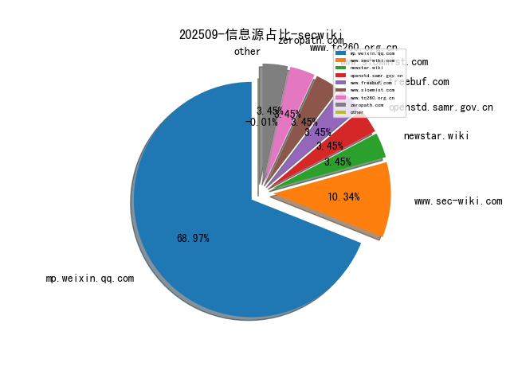
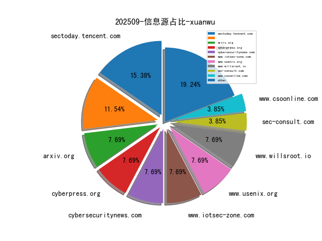

# [数据--所有](README_20.md)
# [数据--年度](README_2025.md)
# 202509 信息源与信息类型占比

# 政策 推荐
| title | url| 
| --- | ---| 
| GBT+37027-2025 网络安全技术 网络攻击和网络攻击事件判定准则 | https://openstd.samr.gov.cn/bzgk/gb/newGbInfo?hcno=C96700DA485B4F209BCCE35C57E91C3A| 

# 网络安全书籍 推荐
| date_added | language | title | author | link | size| 
| --- | --- | --- | --- | --- | ---| 
| 2025-09-17 11:41:03 | English | DevOps Security and Automation | unknown | https://www.wowebook.org/devops-security-and-automation/ | unknown| 
| 2025-09-17 11:20:41 | English | Practical Cloud Security Handbook | unknown | https://www.wowebook.org/practical-cloud-security-handbook/ | unknown| 
| 2025-09-17 08:50:52 | English | Ultimate Excel with Power Query and ChatGPT | unknown | https://www.wowebook.org/ultimate-excel-with-power-query-and-chatgpt/ | unknown| 
| 2025-09-17 08:31:54 | English | Practical Ansible Automation Handbook | unknown | https://www.wowebook.org/practical-ansible-automation-handbook/ | unknown| 
| 2025-09-17 08:06:05 | English | IoT Data Analytics using Python | unknown | https://www.wowebook.org/iot-data-analytics-using-python/ | unknown| 
| 2025-09-17 10:51:22 | English | Supercharged Coding with GenAI: From vibe coding to best practices using GitHub Copilot, ChatGPT, and OpenAI | Henstock, Peter V. ; Herszfang, Hila Paz | file.php?id=111101495 | 33147265 [pdf]| 
| 2025-09-16 08:54:18 | English | Cloud Security Handbook for Architects | unknown | https://www.wowebook.org/cloud-security-handbook-for-architects/ | unknown| 
| 2025-09-15 18:11:47 | English | Observability For Legacy Systems | unknown | https://www.wowebook.org/observability-for-legacy-systems/ | unknown| 
| 2025-09-15 08:28:45 | English | Image Processing and Computer Vision Masterclass with Python, 2nd Edition | unknown | https://www.wowebook.org/image-processing-and-computer-vision-masterclass-with-python-2nd-edition/ | unknown| 
| 2025-09-13 07:16:55 | English | Leveraging OSINT for Advanced Proactive Cybersecurity: Strategies and Solutions | Avrahami, Zafrir (author);Zwilling, Moti (author);Hajaj, Chen (author) | file.php?id=111093684 | 1773107 [pdf]| 
| 2025-09-12 12:52:05 | English | Certificate of Cloud Security Knowledge (CCSK v5) Study Guide | unknown | https://www.wowebook.org/certificate-of-cloud-security-knowledge-ccsk-v5-study-guide/ | unknown| 
| 2025-09-12 18:55:12 | English | Ultimate Certified Kubernetes Security Specialist (CKS) Certification Guide | unknown | https://www.wowebook.org/ultimate-certified-kubernetes-security-specialist-cks-certification-guide/ | unknown| 
| 2025-09-11 03:30:06 | English | Cryptography Engineering: Design Principles and Practical ApplicationsCryptography Engineering_ Design Principle | Ferguson, Niels-hp7uvC | file.php?id=111091638 | 2310541 [epub]| 
| 2025-09-11 22:46:58 | English | A Pathway in Primate Brain for Internal Monitoring of Movements | Marc A. Sommer, Robert H. Wurtz | file.php?id=111092106 | 257312 [pdf]| 
| 2025-09-11 21:46:26 | English | Jamming Bat Echolocation: The Dogbane Tiger Moth Cycnia tenera Times Its Clicks to the Terminal Attack Calls of the Big Brown Bat Eptesicus fuscus | James H. Fullard, James A. Simmons, Prestor A. Saillant | file.php?id=111092072 | 151457 [pdf]| 
| 2025-09-11 21:35:02 | English | Seal whiskers detect water movements | unknown | file.php?id=111092066 | 236112 [pdf]| 
| 2025-09-10 18:13:14 | English | Ultimate Event-Driven Architecture with Python and Apache Kafka | unknown | https://www.wowebook.org/ultimate-event-driven-architecture-with-python-and-apache-kafka/ | unknown| 
| 2025-09-09 08:38:59 | English | Complete A+ Guide to IT Hardware and Software: CompTIA A+ Core 1 and Core 2 Exams (V15), 10th Edition | unknown | https://www.wowebook.org/complete-a-guide-to-it-hardware-and-software-comptia-a-core-1-and-core-2-exams-v15-10th-edition/ | unknown| 
| 2025-09-09 17:11:34 | English | Quantitative Risk Management Using Python | unknown | https://www.wowebook.org/quantitative-risk-management-using-python/ | unknown| 
| 2025-09-08 13:55:46 | English | International Auditing and Assurance | H.R. Appannaiah | file.php?id=111090052 | 3427550 [pdf]| 
| 2025-09-08 13:52:26 | English | Risk Management | Dr. B. A. Karunakara Reddy, Dr. Narasimhan K. and C. Jaffer Mohammed | file.php?id=111090038 | 3459893 [pdf]| 
| 2025-09-08 20:10:17 | English | Palo Alto Networks from Policy to Code | unknown | https://www.wowebook.org/palo-alto-networks-from-policy-to-code/ | unknown| 
| 2025-09-07 11:40:40 | English | Mastering Text Analytics: A Hands-on Guide to NLP Using Python | unknown | https://www.wowebook.org/mastering-text-analytics-a-hands-on-guide-to-nlp-using-python/ | unknown| 
| 2025-09-07 09:25:02 | English | Python for Excel Users | unknown | https://www.wowebook.org/python-for-excel-users/ | unknown| 
| 2025-09-05 11:50:50 | English | CEH Certified Ethical Hacker Cert Guide Premium Edition and Practice Test (for f36b71a9187b812f96b60fe2657e7021) | Michael Gregg & Omar Santos | file.php?id=111087549 | 39135149 [zip]| 
| 2025-09-03 12:50:49 | English | Understanding of Companies Act, 2013 Through Questions/Answers and Simplified Compliance Procedure | C S Siddhartha Banik | file.php?id=111084013 | 2347893 [pdf]| 
| 2025-09-03 12:50:37 | English | Stressed Asset Management for Banks in India | Suresh Chandra Bihari | file.php?id=111084012 | 2566162 [pdf]| 
| 2025-09-03 20:51:51 | English | AI Agents in Practice | unknown | https://www.wowebook.org/ai-agents-in-practice/ | unknown| 
| 2025-09-03 20:25:51 | English | Learn Microsoft Power BI, 3rd Edition | unknown | https://www.wowebook.org/learn-microsoft-power-bi-3rd-edition/ | unknown| 
| 2025-09-02 20:29:03 | English | Coding with AI: Examples in Python | unknown | https://www.wowebook.org/coding-with-ai-examples-in-python/ | unknown| 

# 微信公众号 推荐
| nickname_english | weixin_no | title | url| 
| --- | --- | --- | ---| 
| 360数字安全 | None | 2025网安周：360守护AI产业出海生命线 为昆明数字经济发展筑牢安全屏障 | https://mp.weixin.qq.com/s?__biz=MzA4MTg0MDQ4Nw==&mid=2247582097&idx=2&sn=7cd3457ed9f55f294f1af9718313e68b | 12| 
| 360漏洞研究院 | None | 【首发复现】U8cloud IPFxxFileService任意文件上传漏洞 | https://mp.weixin.qq.com/s?__biz=Mzk0ODM3NTU5MA==&mid=2247494773&idx=1&sn=afabac315dace9fe640081e40afaaf93 | 5| 
| ADLab | None | 再添多项荣誉！U0001f970U0001f970U0001f970 | https://mp.weixin.qq.com/s?__biz=Mzk1NzE0ODUyOA==&mid=2247492491&idx=1&sn=ec522425ae8306c738d8749b19dcb03d | 2| 
| AI安全这点事 | None | TrafficLLM深度解析：当大语言模型（LLM）遇上网络流量分析 | https://mp.weixin.qq.com/s?__biz=MzkyNzQ1NzI4MA==&mid=2247485426&idx=1&sn=3a948bca305b0faf67d3c30beee141e8 | 5| 
| Beacon Tower Lab | None | 漏洞预警 , Flowise 任意文件读取漏洞 | https://mp.weixin.qq.com/s?__biz=MzkyNzcxNTczNA==&mid=2247487819&idx=1&sn=88bca3cb5ba6a7fdd4a6c75b00f9c4dd | 3| 
| BigYoung安全 | None | 【好靶场】2 级：PHP代码审计CodeBase04 | https://mp.weixin.qq.com/s?__biz=MzI1NDYyNjUyMw==&mid=2247485928&idx=1&sn=0a3db5c86d4bcd8a0d577e40e2f125c3 | 5| 
| EBCloud | None | 云资源交付场景下大模型应用初探 | https://mp.weixin.qq.com/s?__biz=Mzg4MTA2MTc4MA==&mid=2247494338&idx=1&sn=48c304e045b0f7675fba8b40c1eae4c4 | 2| 
| FreeBuf | None | GitHub为SSH访问增加抗量子加密保护 | https://mp.weixin.qq.com/s?__biz=MjM5NjA0NjgyMA==&mid=2651327803&idx=4&sn=1db6191ee6ca088002a0cd41e9956699 | 41| 
| FreeBuf知识大陆APP | None | 白色鼠标JS课程开课倒计时五天，手把手教你挖出\"第一桶金\"！ | https://mp.weixin.qq.com/s?__biz=Mzk0OTY1NTI5Mw==&mid=2247494649&idx=1&sn=ce0cd09f45d68bd74035366bd4cdac0f | 5| 
| Hacking Group 0434 | None | HG0434远程&现场协办支撑2025年英城杯圆满结束 | https://mp.weixin.qq.com/s?__biz=MzkxNzY0MzE2NQ==&mid=2247484075&idx=1&sn=a7b103c05f5e2320fc87584627950e0a | 6| 
| ISC2网络安全 | None | 认证申请丨考试通过之后，如何完成背书/申请流程？ | https://mp.weixin.qq.com/s?__biz=MzUzNTg4NDAyMg==&mid=2247493138&idx=1&sn=3c63e1b57bc233cd2b1d988dfb3e3ba7 | 12| 
| ISC平台 | None | 2025网安周 , 360×ISC.AI学苑联合打造u200b「3+3+1安全+AI技能赋能包」 | https://mp.weixin.qq.com/s?__biz=MjM5ODI2MTg3Mw==&mid=2649820673&idx=1&sn=c431ec0fb75e4786730f8ce213f22274 | 2| 
| IoVSecurity | None | 以数据安全标准体系助推智能网联汽车产业发展新质生产力 | https://mp.weixin.qq.com/s?__biz=MzU2MDk1Nzg2MQ==&mid=2247627420&idx=3&sn=3368ec15dee13a4a60cef1cbe7c529fd | 18| 
| Ms08067安全实验室 | None | 中国黑客“五绝” - 东邪西毒南帝北丐中神通 之 东邪龚蔚 | https://mp.weixin.qq.com/s?__biz=MzU1NjgzOTAyMg==&mid=2247524688&idx=1&sn=739874d5315a556cc15c727c66757207 | 1| 
| SecLab安全实验室 | None | Linux 渗透技巧：那些藏在系统深处的安全漏洞 | https://mp.weixin.qq.com/s?__biz=MzI5MjY4MTMyMQ==&mid=2247492445&idx=1&sn=c42c21e5ee6754810ba6c0c6cc1c9ec8 | 3| 
| Sec朝阳 | None | 代码审计-PHP专题&MVC开发&控制视图&URL路由&文件定位&SQL注入&文件安全&1day分析 | https://mp.weixin.qq.com/s?__biz=Mzk3NTIyOTA0OQ==&mid=2247485757&idx=1&sn=48cfe2ce5a23d2f67b8ace209ba05e8c | 4| 
| Web安全工具库 | None | Nmap图形化扫描工具 -- FastNmap（9月12日更新） | https://mp.weixin.qq.com/s?__biz=MzI4MDQ5MjY1Mg==&mid=2247517314&idx=1&sn=61ca677c894174ea51807339e5c39803 | 4| 
| WgpSec狼组安全团队 | None | 腾讯云安全挑战赛·COS提权与利用 WP | https://mp.weixin.qq.com/s?__biz=MzIyMjkzMzY4Ng==&mid=2247511178&idx=1&sn=8d4d1ba961a2aee497a712ce2a82ff4c | 1| 
| Z1sec | None | 前端渗透技巧 3：“邪修操作“快速生成加密字典 | https://mp.weixin.qq.com/s?__biz=Mzg3NzU1NzIyMg==&mid=2247485333&idx=3&sn=3b3f98e6e0ded374f90b6b464ffb480d | 3| 
| securitainment | None | CVE-2025-4275 - 基于 Insyde H2O 的 UEFI 固件 SecureBoot 绕过 第 1 部分 | https://mp.weixin.qq.com/s?__biz=MzAxODM5ODQzNQ==&mid=2247490384&idx=1&sn=8ef39b2907625832ad0605ec0880cf56 | 9| 
| solar应急响应团队 | None | 【病毒分析】新版勒索病毒MEDUSA LOCKER 首发深度分析 | https://mp.weixin.qq.com/s?__biz=MzkyOTQ0MjE1NQ==&mid=2247503856&idx=1&sn=c598583331355f663797d16674d27849 | 7| 
| 一起聊安全 | None | 《数据安全国家标准体系（2025版）》《个人信息保护国家标准体系（2025版）发布 | https://mp.weixin.qq.com/s?__biz=MzI3NjUzOTQ0NQ==&mid=2247521533&idx=1&sn=004f79ad6c610797ab80d84f0b075d3f | 7| 
| 中国信息安全 | None | 发布 , 中国网络空间安全协会发布《智能玩具个人信息保护倡议》 | https://mp.weixin.qq.com/s?__biz=MzA5MzE5MDAzOA==&mid=2664249626&idx=5&sn=0b3d472f6d422386358dfe98e9716d07 | 58| 
| 中国电信安全 | None | 《人工智能安全治理框架》2.0版正式发布 | https://mp.weixin.qq.com/s?__biz=MzkxNDY0MjMxNQ==&mid=2247537898&idx=2&sn=142a8a093621fc60d82730b990c5defe | 6| 
| 中国网络安全产业公共服务平台 | None | 洞察人工智能赋能网络安全机遇挑战，引领网络安全产业创新发展 | https://mp.weixin.qq.com/s?__biz=Mzg5MzQ5NjQyNw==&mid=2247486322&idx=1&sn=92432c152947a420e7d434b2ef64eab0 | 1| 
| 中国网络空间安全协会 | None | 《人工智能安全行业自律倡议》正式发布 | https://mp.weixin.qq.com/s?__biz=MzA3ODE0NDA4MA==&mid=2649402755&idx=1&sn=db740b4117a8573963509b678cb965df | 8| 
| 中国软件评测中心 | None | 【公示】关于首批通过信创数智技术服务能力一级评估的单位的公示 | https://mp.weixin.qq.com/s?__biz=MjM5NzYwNDU0Mg==&mid=2649254437&idx=4&sn=64517c1d689c6e3881bd99e85bf214cd | 25| 
| 中资网安 | None | 职等你来！中资网安2026届秋季校园招聘启动 | https://mp.weixin.qq.com/s?__biz=MzkxMzAzMjU0OA==&mid=2247553248&idx=1&sn=f3cac2c5714aba675035d71beed69bfa | 4| 
| 云弈安全 | None | 彰显实力 , 云弈科技荣获中国互联网创新大赛低空经济专题赛奖项 | https://mp.weixin.qq.com/s?__biz=MzU2ODY0ODk2Nw==&mid=2247492316&idx=1&sn=242e7a80591a6eb79c48ec9e6f861df2 | 1| 
| 云鼎实验室 | None | 2025年8月企业必修安全漏洞清单 | https://mp.weixin.qq.com/s?__biz=MzU3ODAyMjg4OQ==&mid=2247496798&idx=1&sn=9868e9d47c407a0711e9d0187b58d1d6 | 2| 
| 亚信安全 | None | 亚信安全亮相CCS 2025成都网安周 以“AI对抗AI”推动智能防御新阶段 | https://mp.weixin.qq.com/s?__biz=MjM5NjY2MTIzMw==&mid=2650625255&idx=1&sn=8de57d7f66bc512009fb6465cfa429e6 | 12| 
| 亚洲诚信TrustAsia | None | 亚数TrustAsia CTO余宁出席纽创信安芯片安全设计及应用技术研讨会，分享Matter安全实践 | https://mp.weixin.qq.com/s?__biz=MjM5MTUzNzU2NA==&mid=2653706920&idx=1&sn=6dec66e0eb2ab14f9b2696e7c7b047e3 | 1| 
| 交大捷普 | None | 精品产品 , 捷普 IDS/IPS系统 | https://mp.weixin.qq.com/s?__biz=MzI2MzU0NTk3OA==&mid=2247506961&idx=3&sn=ffa82cb9c28c21077ed0ed9fe60b5363 | 11| 
| 代码卫士 | None | Chaos Mesh中存在多个严重漏洞，可导致RCE和K8s 集群遭完全接管 | https://mp.weixin.qq.com/s?__biz=MzI2NTg4OTc5Nw==&mid=2247524024&idx=2&sn=68014917de08e5a4246bcb4e4524ee85 | 14| 
| 任子行 | None | 从滴滴事件看数据分级忽视 , 这几点=埋雷！ | https://mp.weixin.qq.com/s?__biz=MzI0NjAyMjU4MA==&mid=2649597347&idx=1&sn=0b7bbf428853c4f43ef720e4bc7bdddc | 3| 
| 信安世纪 | None | 喜报丨信安世纪荣获“北京品牌企业”称号！ | https://mp.weixin.qq.com/s?__biz=MjM5NzgzMjMwNw==&mid=2650665422&idx=1&sn=d7a4c6dea08c3ea690b3faa8a035030b | 7| 
| 信息安全与通信保密杂志社 | None | 邬江兴院士：网络安全战略与方法发展现状、趋势及展望 | https://mp.weixin.qq.com/s?__biz=MzkwMTMyMDQ3Mw==&mid=2247601447&idx=2&sn=2d4d5a141ee725d1e166d50dd7a1efd7 | 21| 
| 信息安全国家工程研究中心 | None | 网络安全事件如何分级？ | https://mp.weixin.qq.com/s?__biz=MzU5OTQ0NzY3Ng==&mid=2247501068&idx=1&sn=960b1634e9721cb7ecbd943b9f3a9c27 | 9| 
| 信息安全大事件 | None | 未正确配置防火墙、未留存日志：一企业因违反《数据安全法》等法规被处以警告罚款 | https://mp.weixin.qq.com/s?__biz=MzkzNjIzMjM5Ng==&mid=2247493096&idx=1&sn=f78e750aa6b9454ef00a3847596d73b2 | 7| 
| 信息安全研究 | None | 【业界动态】2025年人工智能技术赋能网络安全应用测试结果发布 | https://mp.weixin.qq.com/s?__biz=MzA3NzgzNDM0OQ==&mid=2664996381&idx=3&sn=3a066d0d2f23a63d27c0311b2d3058d6 | 27| 
| 信息安全笔记 | None | php反序列化深入分析（引用和变量替换机制） | https://mp.weixin.qq.com/s?__biz=MjM5MzI3NzE4NA==&mid=2257484461&idx=1&sn=b37c64bfe9061b10544ae6eb27557d81 | 1| 
| 全球技术地图 | None | 美国务院更新无人机系统出口政策 | https://mp.weixin.qq.com/s?__biz=MzI1OTExNDY1NQ==&mid=2651621801&idx=2&sn=afbe93c87044d1294311a1e96f729ee8 | 17| 
| 创信华通 | None | 创信资讯丨凝聚行业共识，筑牢电网安全屏障，四川这场研讨会“干货满满” ！ | https://mp.weixin.qq.com/s?__biz=MzUxNTQxMzUxMw==&mid=2247526311&idx=1&sn=2f8559827c81674f857bfc5b926e73fe | 4| 
| 剑客古月的安全屋 | None | ai攻防-GAN生成式对抗 | https://mp.weixin.qq.com/s?__biz=MzkxNDY0NjY3MQ==&mid=2247485604&idx=1&sn=ac745700f3fb068a122745bdb0fef96a | 1| 
| 北京路劲科技有限公司 | None | 你的电脑真的是铜墙铁壁吗？ | https://mp.weixin.qq.com/s?__biz=MzUyMjAyODU1NA==&mid=2247492570&idx=1&sn=f6ecfe466b0de8b917694e3bbc9a91f0 | 1| 
| 华青融天 | None | 别让 SQL 拖垮业务！SQL性能监控，从 “救火” 到 “预判” | https://mp.weixin.qq.com/s?__biz=MzA4Mzg1ODIzMw==&mid=2653546757&idx=1&sn=2ea32af16448ccb60680aeefb313bd18 | 1| 
| 华顺信安 | None | 华顺信安创始人赵武出席“基础软硬件产品漏洞治理生态大会”并发表演讲 | https://mp.weixin.qq.com/s?__biz=MzUzNjg1OTY3Mg==&mid=2247492261&idx=1&sn=8747bb4fb5d2791886d31097dd6138dc | 1| 
| 吉祥讲安全 | None | 用这套提示词绕过限制，DeepSeek直接把数据库的账号密码交代了 | https://mp.weixin.qq.com/s?__biz=MzkwNjY1Mzc0Nw==&mid=2247489487&idx=1&sn=b8337d52a463aa21837018ca818e82d5 | 2| 
| 君说安全 | None | 网络安全行业，截至目前（2025年9月17日收盘）市值排行及变化情况 | https://mp.weixin.qq.com/s?__biz=MzUzNjkxODE5MA==&mid=2247493888&idx=1&sn=b9c9388a4acf63c6ff11b229bd6545f4 | 39| 
| 启明星辰安全简讯 | None | 安全简讯（2025.09.17） | https://mp.weixin.qq.com/s?__biz=MzkzNzY5OTg2Ng==&mid=2247501583&idx=1&sn=3d6e1c5efa1226dd6f3e1cf7df9d172e | 10| 
| 启明星辰网络空间安全教育 | None | 知白讲堂全面升级 , 创新AI赋能网络安全教育 | https://mp.weixin.qq.com/s?__biz=MzUzNDg0NTc1NA==&mid=2247511075&idx=1&sn=0bca324095358f658c1dcd8e79be4b83 | 2| 
| 启明星辰集团 | None | 再添多项荣誉！U0001f970U0001f970U0001f970 | https://mp.weixin.qq.com/s?__biz=MzA3NDQ0MzkzMA==&mid=2651734317&idx=1&sn=8a9d7551f2705a6a7fc67cdbb3e760b0 | 5| 
| 周小粥讲安全 | None | 50条网安/黑客都在用的grep命令，先码住！ | https://mp.weixin.qq.com/s?__biz=MzkzODU5MTkyNQ==&mid=2247486466&idx=1&sn=771f2738e75eca4b9cdddce616020990 | 5| 
| 夜组OSINT | None | 涉嫌出售多国机密文件【美国、俄罗斯、英国及北约的2025年文件】 | https://mp.weixin.qq.com/s?__biz=MzU5MjgwMDg1Mg==&mid=2247486842&idx=1&sn=7380574dc94954fd5edbb28f79e96dd7 | 6| 
| 天唯信息安全 | None | 国家网信办发布近期网络安全、数据安全、个人信息保护相关执法典型案例 | https://mp.weixin.qq.com/s?__biz=MzkzMjE5MTY5NQ==&mid=2247504674&idx=1&sn=676a114133c16863c10451e96c220492 | 3| 
| 天威诚信 | None | 再获认可 , 天威诚信入选《中国汽车网络与数据安全行业全景图》 | https://mp.weixin.qq.com/s?__biz=MzU4MzY5MzQ4MQ==&mid=2247542786&idx=1&sn=a6923bde64e510cc6f946cbdbcd0c76a | 3| 
| 天翁安全 | None | 【已复现】Github上4万+Star的AI应用 任意账户接管漏洞（CVE-2025-58434） | https://mp.weixin.qq.com/s?__biz=MzkwMzUyMjk2MQ==&mid=2247484766&idx=1&sn=02783c72b8aadaedcc5efb1288cd22d0 | 1| 
| 天融信 | None | 央视报道：表面充电 背地里偷数据？天融信专家在网安周现场揭秘这些黑客设备→ | https://mp.weixin.qq.com/s?__biz=MzA3OTMxNTcxNA==&mid=2650975092&idx=1&sn=cbcdb0505181492f96b0eed0c592bd75 | 11| 
| 奇安信威胁情报中心 | None | 又又一起NPM供应链投毒：valorkin 和 scttcper 账户被入侵事件，影响广泛 | https://mp.weixin.qq.com/s?__biz=MzI2MDc2MDA4OA==&mid=2247516092&idx=1&sn=378fdf8e813dc9840904d4b5fac363c7 | 3| 
| 奇安信集团 | None | 2025网安周,奇安信斩获CNVD漏洞信息报送突出贡献单位等四项荣誉 | https://mp.weixin.qq.com/s?__biz=MzU0NDk0NTAwMw==&mid=2247629040&idx=3&sn=9d459f9650ebac5e114480b1796ff30a | 20| 
| 安世加 | None | 苹果CarPlay漏洞威胁数百万车辆 黑客可干扰司机操作 | https://mp.weixin.qq.com/s?__biz=MzU2MTQwMzMxNA==&mid=2247542993&idx=1&sn=358fb4065a6085be7a8d9b716ddeeea1 | 9| 
| 安全内参 | None | 国家网信办发布10起执法典型案例 | https://mp.weixin.qq.com/s?__biz=MzI4NDY2MDMwMw==&mid=2247515017&idx=2&sn=efad9d801b9095b5447e4fd4778d2027 | 20| 
| 安全圈 | None | 【安全圈】为什么安全文档编辑比以往任何时候都更重要 | https://mp.weixin.qq.com/s?__biz=MzIzMzE4NDU1OQ==&mid=2652071760&idx=4&sn=8b3a56311230c91185cf368b317208ef | 36| 
| 安全天书 | None | 【免杀项目】MeetC2 | https://mp.weixin.qq.com/s?__biz=Mzk0MDczMzYxNw==&mid=2247484566&idx=1&sn=ccf08f54a0b931461629985ff826982b | 7| 
| 安全威胁纵横 | None | 乌克兰对俄罗斯选举系统发起网络攻击 | https://mp.weixin.qq.com/s?__biz=Mzk2ODExMjEyNA==&mid=2247486560&idx=1&sn=03f463cb86094f5cbc435ba70660dacb | 7| 
| 安全学术圈 | None | 河南省网络密码技术重点实验室开放基金指南征集 | https://mp.weixin.qq.com/s?__biz=MzU5MTM5MTQ2MA==&mid=2247493740&idx=1&sn=c9da7889d178d93d881cde5da17aa485 | 13| 
| 安全攻防团队 | None | 2025年8月企业必修安全漏洞清单 | https://mp.weixin.qq.com/s?__biz=MzkzNTI4NjU1Mw==&mid=2247485088&idx=1&sn=726d198b93728d5b4637883929f3d6db | 1| 
| 安全邦官方订阅号 | None | 政企协同筑防线｜安全邦助力某区网信办圆满举办未成年人网络安全防护实务培训 | https://mp.weixin.qq.com/s?__biz=MzU0NDkyNTQ2OA==&mid=2247486218&idx=1&sn=40e84cc52da92abbef4198ef7c7b9405 | 1| 
| 安全随笔 | None | 深入浅出JWT null签名漏洞 | https://mp.weixin.qq.com/s?__biz=MzU1MTA4ODM4MQ==&mid=2247485878&idx=1&sn=ad00cf4777e30d684b009de054aedc38 | 1| 
| 安博通 | None | 安博通携手数秦科技加速布局RWA领域 | https://mp.weixin.qq.com/s?__biz=MzIyNTA5Mzc2OA==&mid=2651138338&idx=1&sn=c5a8c102925608f9c156a8f722395a7d | 4| 
| 安在 | None | 免费赠送 , 2025国家网络安全宣传周 · 防范病毒攻击资料合集 | https://mp.weixin.qq.com/s?__biz=MzU5ODgzNTExOQ==&mid=2247643749&idx=3&sn=e8cfb6aa1388d2c2a6f230507977b347 | 18| 
| 安天集团 | None | 安天获黑龙江省网络安全应急技术支撑单位授牌并作技术报告 | https://mp.weixin.qq.com/s?__biz=MjM5MTA3Nzk4MQ==&mid=2650212485&idx=2&sn=ccbca3e92633ee8214aa9690b0f3d0e6 | 10| 
| 安恒信息 | None | “一周懿语”丨第三十八期 | https://mp.weixin.qq.com/s?__biz=MjM5NTE0MjQyMg==&mid=2650632884&idx=1&sn=52787edd8a037906733b0b3464e4c24a | 6| 
| 安芯网盾 | None | 安芯网盾亮相金砖国家新工业革命伙伴关系论坛 | https://mp.weixin.qq.com/s?__biz=MzU1Njk1NTYzOA==&mid=2247491842&idx=1&sn=447a8257532cf1747115fd863929c8bc | 2| 
| 工业信息安全创新中心 | None | 2025年四川省电力网络安全技术交流研讨会圆满举行，工信安创就电力行业工业信息安全体系保障解决方案进行分享 | https://mp.weixin.qq.com/s?__biz=MzAwNTc0ODM3Nw==&mid=2247490075&idx=1&sn=40dbe9058f689328091e0b8d5c0aaf1c | 16| 
| 工业安全产业联盟平台 | None | 图解丨国家标准GB/T 45958—2025《网络安全技术 人工智能计算平台安全框架》 | https://mp.weixin.qq.com/s?__biz=MzI2MDk2NDA0OA==&mid=2247534784&idx=2&sn=dca9a003c6ca49a2ab1e702507fb075b | 11| 
| 工联安全众测 | None | 【倒计时1天】工联安全大讲堂第二十九期即将开讲！ | https://mp.weixin.qq.com/s?__biz=MzkyMDMwNTkwNg==&mid=2247487904&idx=1&sn=05aec3cf7ab0080528acb45f0b5a238d | 9| 
| 德斯克安全小课堂 | None | 攻击者可武器化MCP服务器窃取敏感数据 | https://mp.weixin.qq.com/s?__biz=MzA3MTUxNzQxMQ==&mid=2453886219&idx=1&sn=e152aef5e3337ccbb8faa1c02f86d9a4 | 3| 
| 快手技术 | None | 可灵团队提出MIDAS：压缩比64倍、延迟低于500ms，多模态互动数字人框架实现交互生成新突破！ | https://mp.weixin.qq.com/s?__biz=Mzg2NzU4MDM0MQ==&mid=2247497515&idx=1&sn=02d3ee6d2578daad44f970837dcb652e | 3| 
| 情报分析师 | None | 中朝边境秘密导弹基地曝光｜战略意图与风险评估 | https://mp.weixin.qq.com/s?__biz=MzA3Mjc1MTkwOA==&mid=2650562227&idx=2&sn=d5795b6c9b4bbc807923540dd5b11a9e | 7| 
| 情报分析师Pro | None | 揭秘以色列三大情报机构：摩萨德、辛贝特与阿曼全景分析 | https://mp.weixin.qq.com/s?__biz=MzkwNzM0NzA5MA==&mid=2247511336&idx=1&sn=b91f728ffb4fca8898c1c3bd8be916eb | 7| 
| 慢雾科技 | None | 慢雾科技创始人余弦接受《彭博商业周刊》采访：安全是一场持久战 | https://mp.weixin.qq.com/s?__biz=MzU4ODQ3NTM2OA==&mid=2247503260&idx=1&sn=036b646c1fa7077d1e52b8c773ab5bd6 | 5| 
| 指尖安全 | None | 聚焦安全迭代，携手智启新程 , 2025年国家网络安全宣传周成都系列活动隆重开幕，CCS2025精彩启程 | https://mp.weixin.qq.com/s?__biz=MzkwMDU5NTE0OQ==&mid=2247488687&idx=1&sn=f5a611f808ae4329cd836a4fbcc0139e | 1| 
| 数世咨询 | None | 拥抱下一代网络安全人才 | https://mp.weixin.qq.com/s?__biz=MzkxNzA3MTgyNg==&mid=2247540294&idx=1&sn=3bb9b3e6c4c311d3a466f6223de24be7 | 9| 
| 数说安全 | None | 2025国家网络安全宣传周成都系列活动、CCS2025成都网络安全技术交流活动盛大启幕 | https://mp.weixin.qq.com/s?__biz=MzkzMDE5MDI5Mg==&mid=2247509831&idx=2&sn=11e4a8faa67c52ff65a8cc66fcc49da7 | 5| 
| 斗象智能安全 | None | 全流量数据计算“硬核全解”资产指纹和资产安全,斗象PRS-NTA高阶使用指南 | https://mp.weixin.qq.com/s?__biz=MzIwMjcyNzA5Mw==&mid=2247495081&idx=1&sn=a9ea012c6d6fe059c33ef253b770585f | 1| 
| 新手白帽 | None | VulnTarget-c | https://mp.weixin.qq.com/s?__biz=MzE5ODgyNDczMQ==&mid=2247484416&idx=1&sn=f4a17e607dde3d90ef3e9e6222d83d76 | 4| 
| 方桥安全漏洞防治中心 | None | 关于开展「安全漏洞防治SOP征集活动」通知 | https://mp.weixin.qq.com/s?__biz=Mzk0OTQzMDI4Mg==&mid=2247485108&idx=1&sn=d681041892f6af0a288a37d9471f9e3d | 2| 
| 易云安全应急响应中心 | None | 抓包入门难？EasyTshark 来了！新手也能轻松上手的抓包神器 | https://mp.weixin.qq.com/s?__biz=MzkyNDcwMTAwNw==&mid=2247536170&idx=4&sn=957a114cd6f327588ef45ee4e433f457 | 6| 
| 智探AI应用 | None | 招商银行苏州分行运营条线AI赋能英语通关培训采购项目 | https://mp.weixin.qq.com/s?__biz=MzIxMDIwODM2MA==&mid=2653932687&idx=3&sn=8204799aad7d2f5d73db597ad2dad154 | 32| 
| 沥泉科技 | None | 跨越技术对抗：红队认知作战的战略跃迁 | https://mp.weixin.qq.com/s?__biz=Mzg5ODg3MTQxNA==&mid=2247492285&idx=1&sn=343792b0f21fc262ed0030f008552a9b | 1| 
| 沧海讲安全 | None | 这8个危害严重的漏洞，你听过哪几个？ | https://mp.weixin.qq.com/s?__biz=MzkzMzkyNTQ0Ng==&mid=2247484934&idx=1&sn=a2b0aaf3619ea86fc7e19e9eaafd45f0 | 6| 
| 海云安 | None | 2025年国家网络安全宣传周,全民共筑网络安全防线 | https://mp.weixin.qq.com/s?__biz=MzI2MjY2NTM0MA==&mid=2247492840&idx=1&sn=aad069d045a7e33c55e74a64fd91486c | 4| 
| 海哥网络安全 | None | 据说只要坚持三个月，你就能成为...... | https://mp.weixin.qq.com/s?__biz=Mzk0MzcyNjMyNg==&mid=2247485827&idx=1&sn=4f4bc3a2412a9eef0d25f09b4c2d4410 | 13| 
| 深信服科技 | None | 2025网安周直击｜AI焕新安全范式，深信服绘就安全新图景 | https://mp.weixin.qq.com/s?__biz=MjM5MTAzNjYyMA==&mid=2650602710&idx=1&sn=d512705535dc566c5e2db138d9b4a408 | 6| 
| 深圳市网络与信息安全行业协会 | None | 安络创始人出席CCS2025成都网络安全交流活动并做漏洞主题报告 | https://mp.weixin.qq.com/s?__biz=MzU0Mzk0NDQyOA==&mid=2247522685&idx=2&sn=5b9b42ffe51ecd981f2c6abdc174169c | 15| 
| 深夜笔记本 | None | 再羡慕别人的 NAS 了！低成本搭建秘籍：硬件挑选 + 服务部署 + 实用工具，一篇搞定 | https://mp.weixin.qq.com/s?__biz=MjM5Nzk3MjMzMA==&mid=2650570320&idx=1&sn=c84648b0172bf60442d290064c887593 | 1| 
| 渗透测试 | None | 护照下来了 | https://mp.weixin.qq.com/s?__biz=Mzg2ODY3NDYxNA==&mid=2247486491&idx=2&sn=054e4f849b2026c8648d0d266a66b40e | 3| 
| 独眼情报 | None | 篇 58：国土安全部向数千名未经授权的用户泄露敏感信息 | https://mp.weixin.qq.com/s?__biz=MzkzNDIzNDUxOQ==&mid=2247502874&idx=2&sn=3f41d5837e19481d51d6195888e6cee9 | 18| 
| 王之暴龙战神 | None | 好靶场-验证码爆破 | https://mp.weixin.qq.com/s?__biz=Mzk1NzY0NzMyMw==&mid=2247492037&idx=1&sn=40c9f989ca25123a6cf662ebba57cd69 | 1| 
| 珞安科技 | None | 一图读懂 , 《国家网络安全事件报告管理办法》（附全文） | https://mp.weixin.qq.com/s?__biz=MzU2NjI5NzY1OA==&mid=2247513723&idx=1&sn=5a2242586e0fe0aaf92a921fdb434293 | 5| 
| 电子取证及可信应用协创中心 | None | 汽车取证技术解析：基于网络安全视角的探索 | https://mp.weixin.qq.com/s?__biz=MzAxODA3NDc3NA==&mid=2247485673&idx=1&sn=63dc21675352d6cdbddc47b399c96ab3 | 1| 
| 白安全组 | None | 内网存活主机探测方式大全 | https://mp.weixin.qq.com/s?__biz=MzU4MjYxNTYwNA==&mid=2247487880&idx=1&sn=8810cd60f0b5985d9f73696b498e286b | 1| 
| 白帽子社区团队 | None | SRC漏洞挖掘技巧 | https://mp.weixin.qq.com/s?__biz=MzkzNDQ0MDcxMw==&mid=2247488244&idx=1&sn=79410c9bf3f8d429e014bd1fd8d719c7 | 6| 
| 白帽攻防 | None | VoidProxy网络钓鱼窃取 Microsoft 与 Google 登录凭据 | https://mp.weixin.qq.com/s?__biz=MzkyMjcxNzE2MQ==&mid=2247484683&idx=1&sn=14df957ecd2ac29993bc45009ba6ec74 | 7| 
| 百灵猫开源情报分析师 | None | 国家供应链渐进优势理论：理论框架与研究方法 | https://mp.weixin.qq.com/s?__biz=MzkxMTA3MDk3NA==&mid=2247488001&idx=1&sn=3be3f2bf7bab0148f0453de3a00e4054 | 4| 
| 看雪学苑 | None | Linux KSMBD子系统漏洞可让服务器资源被耗尽 | https://mp.weixin.qq.com/s?__biz=MjM5NTc2MDYxMw==&mid=2458600104&idx=3&sn=530f3719401aa7a3f8e3c19ca36e1560 | 19| 
| 竞远网络安全 | None | 2025广东省网络安全宣传周开幕，竞远安全助力千行百业“人工智能+”行动高质量发展 | https://mp.weixin.qq.com/s?__biz=MzAwMTU3NTcwMg==&mid=2650274962&idx=1&sn=be753ba40d5c6e4e88fb8dd69bb56434 | 1| 
| 绿盟科技 | None | 绿盟进行时｜2025国家网络安全宣传周第三日 | https://mp.weixin.qq.com/s?__biz=MjM5ODYyMTM4MA==&mid=2650472478&idx=4&sn=86359d290e22a2d248a052ee072748c0 | 19| 
| 网安守护 | None | npm 供应链攻击 – 检测到新的受感染包裹 | https://mp.weixin.qq.com/s?__biz=MzU4NDY3MTk2NQ==&mid=2247491935&idx=1&sn=1bb27b4a61fb249a733ba574b87d7dac | 3| 
| 网络安全卓越验证示范中心 | None | 洞察人工智能赋能网络安全机遇挑战，引领网络安全产业创新发展 | https://mp.weixin.qq.com/s?__biz=MzkxNzE4NDk3OA==&mid=2247487426&idx=1&sn=d097eb0b7d0226ada6cbd61cea96329e | 1| 
| 网络安全和信息化 | None | 助力半导体稳增长，IC China 2025在行动 | https://mp.weixin.qq.com/s?__biz=MjM5MzMwMDU5NQ==&mid=2649174547&idx=4&sn=d1c9837093e3438a5e22861949e81f22 | 28| 
| 网络安全备忘录 | None | 包过滤防火墙、应用代理防火墙和状态检测防火墙对比介绍 | https://mp.weixin.qq.com/s?__biz=MzA3NDMyNDM0NQ==&mid=2247485158&idx=1&sn=e724061851f5f1e9ce587012ffb552c8 | 3| 
| 网络安全罗盘 | None | 简析《网络安全事件报告管理办法》 | https://mp.weixin.qq.com/s?__biz=Mzg3OTg0OTAyOQ==&mid=2247486533&idx=1&sn=663ad1ed844b17c408eb4a784a700661 | 1| 
| 美创资讯 | None | 美创获第二届“金灵光杯”中国互联网创新大赛“优秀奖” | https://mp.weixin.qq.com/s?__biz=MzA3NDE0NDUyNA==&mid=2650817652&idx=1&sn=265aa4a2ecdb39c2e01d878813f16db9 | 5| 
| 聚铭网络 | None | 2025宿迁市网安周盛大启幕，聚铭受邀出席解码校园安全“智慧防线” | https://mp.weixin.qq.com/s?__biz=MzIzMDQwMjg5NA==&mid=2247508027&idx=1&sn=a4cda9b170731ef9ee3a0e6be21e6204 | 7| 
| 蚁景网安 | None | 2025年国家网络安全宣传周-数据安全篇 | https://mp.weixin.qq.com/s?__biz=MzkyNTY3Nzc3Mg==&mid=2247490518&idx=2&sn=eafd4e87b7fe4833db2661dbade7fc4a | 12| 
| 蚁景网络安全 | None | 【免费领】尖端黑客工具：Kali Linux最优渗透测试思路及方法 | https://mp.weixin.qq.com/s?__biz=MzkxNTIwNTkyNg==&mid=2247556340&idx=2&sn=f01b6a4912032be98d40e354ec7e37ce | 17| 
| 补天平台 | None | 7心协力 , 活动战报出炉！键盘&联合大礼包得主揭晓！ | https://mp.weixin.qq.com/s?__biz=MzI2NzY5MDI3NQ==&mid=2247509360&idx=1&sn=036bd5fbfdf54ad15e61b3984c41730c | 10| 
| 观安信息 | None | 观安信息亮相静安地区网安周活动 结对基层开启网安共建新篇章 | https://mp.weixin.qq.com/s?__biz=MzIxNDIzNTcxMg==&mid=2247509242&idx=1&sn=f944f576ae3a8e871d05a245a8707fe7 | 12| 
| 谈思实验室 | None | 征求意见！辅助驾驶强制国标要来了 | https://mp.weixin.qq.com/s?__biz=MzIzOTc2OTAxMg==&mid=2247559805&idx=5&sn=02edfc8791a80a08f4e5eb980ee0eb83 | 17| 
| 谷安培训 | None | DPO(数据保护官)认证连续2年入选北京市国际职业资格认可目录 | https://mp.weixin.qq.com/s?__biz=MzU4MjUxNjQ1Ng==&mid=2247525091&idx=2&sn=8bfbef6434cece3743174b02b3251a1e | 25| 
| 赛博研究院 | None | 网信办发布网安、数安、个人信息保护执法典型案例 | https://mp.weixin.qq.com/s?__biz=MzUzODYyMDIzNw==&mid=2247520055&idx=2&sn=7715491583e1d98db453b9d05ed4b05a | 16| 
| 迪哥讲事 | None | Electron客户端RCE | https://mp.weixin.qq.com/s?__biz=MzIzMTIzNTM0MA==&mid=2247498199&idx=1&sn=b1d87d14a3f941538c123108dc0ed2a0 | 9| 
| 迷人安全 | None | heap_unlink攻击 | https://mp.weixin.qq.com/s?__biz=MzkwOTUwMTc1OA==&mid=2247483947&idx=1&sn=f4f13b07a39e5e293e6c7b82f870a00a | 2| 
| 逆向有你 | None | JS逆向 -- 某日番动漫网视频地址解密全过程 | https://mp.weixin.qq.com/s?__biz=MzA4MzgzNTU5MA==&mid=2652040189&idx=1&sn=e93c7b0bc7ed45dcd28983c61686e1d0 | 6| 
| 透明魔方 | None | 如何给甲方写安全运营工作的汇报文稿 | https://mp.weixin.qq.com/s?__biz=MzI4NzA1Nzg5OA==&mid=2247486103&idx=1&sn=30cc52aeb0fc1bbe28c17bb1675b1ae7 | 5| 
| 金盾信安 | None | 关保联盟 , 关于举办第三期“2025年网络攻防专项行动总结提升暨蓝队防守能力强化培训”的通知 | https://mp.weixin.qq.com/s?__biz=MjM5NjA2NzY3NA==&mid=2448690478&idx=2&sn=2cbaedcf53d8a2f81f64bb10b7e9e9bc | 23| 
| 金盾检测股份 | None | 喜讯 , 金盾检测喜获CNVD“原创漏洞发现突出贡献单位”荣誉！ | https://mp.weixin.qq.com/s?__biz=MzI5NjA4NjA3OA==&mid=2652103159&idx=1&sn=b621be2bebd0e7ed000e94e63440380d | 2| 
| 银河实验室 | None | Anduril再获美军重磅合同：1.59亿美元打造随身指挥系统 | https://mp.weixin.qq.com/s?__biz=Mzg3MDczNjcyNA==&mid=2247489819&idx=1&sn=49eb1ce131159eb358505eccd940f7da | 1| 
| 长亭安全观察 | None | 网络安全知多少｜网络安全小贴士 | https://mp.weixin.qq.com/s?__biz=MzkyNDUyNzU1MQ==&mid=2247488569&idx=1&sn=d03bfab99ef8e0b1345fdaec350a7719 | 9| 
| 阿里云安全 | None | 2025云栖大会《负责任的AI：AI风险治理与先进安全能力》论坛｜重磅亮点揭秘 | https://mp.weixin.qq.com/s?__biz=MzA4MTQ2MjI5OA==&mid=2664093014&idx=1&sn=20c0407beb5801b733c8cd3e71a530de | 4| 
| 隐雾安全 | None | 【好靶场】用户使用指南 | https://mp.weixin.qq.com/s?__biz=MzkyNzM2MjM0OQ==&mid=2247498745&idx=1&sn=9131867eaa43cdbb1c95ea2fa9ace368 | 2| 
| 青藤云安全 | None | 再获认可，「无相AI」入选2025 年人工智能先锋案例！多智能体威胁狩猎体系引领行业变革 | https://mp.weixin.qq.com/s?__biz=MzAwNDE4Mzc1NA==&mid=2650850688&idx=1&sn=86fd88ed709c91c92569a14492d3d862 | 2| 
| 马哥网络安全 | None | 分保、等保、关保、密评之间的联系与区别（附下载） | https://mp.weixin.qq.com/s?__biz=MzkxMzMyNzMyMA==&mid=2247574979&idx=2&sn=884cb8b86f406d21f7adaf19c113368c | 16| 
| BlockSec | None | Interlace 携手 BlockSec：构建精准无感的出入金风控体系，合规与体验双赢 | https://mp.weixin.qq.com/s?__biz=MzkyMzI2NzIyMw==&mid=2247489912&idx=1&sn=6aa172ba9d16826f4562ea3360961b3b | 5| 
| CCS成都网络安全大会 | None | 聚焦安全迭代，携手智启新程 , 2025年国家网络安全宣传周成都系列活动隆重开幕，CCS2025精彩启程 | https://mp.weixin.qq.com/s?__biz=MzkwMjI2MDQwMA==&mid=2247487028&idx=1&sn=f1bcad9d9f3856157ee9c4af7d3d45b5 | 8| 
| CNVD漏洞平台 | None | 2024年度CNVD优秀单位（个人）表彰名单 | https://mp.weixin.qq.com/s?__biz=MzU3ODM2NTg2Mg==&mid=2247496343&idx=2&sn=7af01a017652b3c33d626ddb53e88cc0 | 6| 
| Delta Insights | None | 网络安全动态 - 2025.09.16 | https://mp.weixin.qq.com/s?__biz=MzU1MzEzMzAxMA==&mid=2247500179&idx=1&sn=b6e307e441ffdba7f15d6df4d160fba6 | 3| 
| IoT物联网技术 | None | 即插即用，国产工业物联网网关eLink，兼容主流数控机床，解决CNC数据采集难题！ | https://mp.weixin.qq.com/s?__biz=MjM5OTA4MzA0MA==&mid=2454939915&idx=1&sn=3704519ba74549da424145b34cd33975 | 3| 
| KK安全说 | None | 渗透测试时利用ChatGPT的几个小技巧 | https://mp.weixin.qq.com/s?__biz=Mzg4NzgyODEzNQ==&mid=2247489673&idx=1&sn=302f4a57612c0c2d7306d715ddd03cda | 4| 
| OPPO安全中心 | None | 【2503众测挑战赛】测试环境大搜罗，超50个域名等你来测！ | https://mp.weixin.qq.com/s?__biz=MzUyNzc4Mzk3MQ==&mid=2247494478&idx=2&sn=1e8304323a315765c77f887a5d7d2426 | 4| 
| Sec铁匠铺 | None | LingJing（灵境）外部虚拟机联动250916 | https://mp.weixin.qq.com/s?__biz=MzkzOTY0NTMxNg==&mid=2247483925&idx=1&sn=4d5afbed8f0e717918a7f2df86d68fcb | 3| 
| Sword软件驿站 | None | 2款绿色小工具，1秒看清电脑所有配置，还能一键复制 | https://mp.weixin.qq.com/s?__biz=Mzk0MzI2NzQ5MA==&mid=2247488453&idx=1&sn=87d8d38a1757f95f19cb10c84a4bac8d | 2| 
| Timeline Sec | None | 内推 , 上海拓⽵科技云端安全岗火热招聘中 | https://mp.weixin.qq.com/s?__biz=MzA4NzUwMzc3NQ==&mid=2247497702&idx=1&sn=4bf1c7e70298efeb5c9e3c4453020c62 | 2| 
| Z计划支持大模型创业 | None | 潦草学者：AI虚拟陪伴的“第二幕”｜Z Next AI产品创造营 | https://mp.weixin.qq.com/s?__biz=MzkyMDU5NzQ2Mg==&mid=2247489198&idx=1&sn=919c7aef4da766e60426bc67c8bfb062 | 7| 
| thelostworld | None | 求贤-招聘-安运项目经理 base：北京 20-25K | https://mp.weixin.qq.com/s?__biz=MzIyNjk0ODYxMA==&mid=2247487559&idx=1&sn=6ded310ad9b13c96fe533bd6730f99b2 | 1| 
| 丁爸 情报分析师的工具箱 | None | 【开源情报】在虚假信息海洋中监控冲突 | https://mp.weixin.qq.com/s?__biz=MzI2MTE0NTE3Mw==&mid=2651152032&idx=1&sn=0093df6c54ca5bfb8277f49e8befa3ff | 7| 
| 不秃头的安全 | None | 【Web攻防】JS审计到SQL注入+任意文件上传 | https://mp.weixin.qq.com/s?__biz=Mzg3NzkwMTYyOQ==&mid=2247490218&idx=1&sn=5afd822fec4baa020692bd1414d6a3db | 4| 
| 众智维安 | None | 再获认可 , 众智维科技入选南京市网络和数据安全应急技术支撑单位（服务资源池单位） | https://mp.weixin.qq.com/s?__biz=MzU5Mjg0NzA5Mw==&mid=2247494596&idx=1&sn=4c3eb11d0e906b5c874a698ec18213c4 | 3| 
| 信安客 | None | 国家网信办：近期网络安全、数据安全、个人信息保护相关执法十大典型案例 | https://mp.weixin.qq.com/s?__biz=MzU2NzMwNTgxNQ==&mid=2247491987&idx=1&sn=7a3647e94fed33c36c1eff90c509e8b3 | 5| 
| 信息安全D1net | None | 企业中的大部分AI应用对安全团队而言是不可见的 | https://mp.weixin.qq.com/s?__biz=MzA3NTIyNzgwNA==&mid=2650260481&idx=1&sn=af8d1a2362cb81d9144973f02eac654a | 4| 
| 北邮 GAMMA Lab | None | 专题解读 , 工业场景中的用户行为序列建模 | https://mp.weixin.qq.com/s?__biz=Mzg4MzE1MTQzNw==&mid=2247493044&idx=1&sn=d414c7e2d867132a4844d35d05835f7e | 4| 
| 华云安 | None | 安徽华云安亮相2025合肥网络安全宣传周 | https://mp.weixin.qq.com/s?__biz=MzI1Njc5NTY1MQ==&mid=2247501478&idx=1&sn=e7a909a58bebf8d9eb10740b6b24cd2f | 3| 
| 哆啦安全 | None | fgum编译裁剪frida绕过部分对抗 | https://mp.weixin.qq.com/s?__biz=Mzg2NzUzNzk1Mw==&mid=2247498542&idx=1&sn=6730778f8281932fce6ebfbed87ade53 | 8| 
| 国家互联网应急中心CNCERT | None | 12387网络安全事件报告平台已经开通 | https://mp.weixin.qq.com/s?__biz=MzIwNDk0MDgxMw==&mid=2247500516&idx=1&sn=a5e7c47f7559944813520f560bbde5e6 | 8| 
| 大眼睛网络安全 | None | 谁下载了那个600gb数据? | https://mp.weixin.qq.com/s?__biz=MzkxNDYxMjM5OA==&mid=2247485803&idx=1&sn=95af959d293fcc11a0da882cb3af9cd4 | 3| 
| 天黑说嘿话 | None | 从CRUD到架构师：我的技术成长血泪史（附学习路线图） | https://mp.weixin.qq.com/s?__biz=MzI5NTQ5MTAzMA==&mid=2247484636&idx=1&sn=b55db0768cf84775f654ef2507a807fd | 5| 
| 奇安信安全应急响应中心 | None | 月满情浓，中秋礼盒免费领！ | https://mp.weixin.qq.com/s?__biz=Mzg5OTYwMTY5MA==&mid=2247522642&idx=1&sn=bb8763d5bedb58ee96d35353126dfef9 | 1| 
| 好靶场 | None | 【好靶场】用户使用指南 | https://mp.weixin.qq.com/s?__biz=Mzg4MDg5NzAxMQ==&mid=2247486175&idx=1&sn=d4fd496c04eff81802f2c1be30f77b78 | 9| 
| 字节跳动安全中心 | None | 明天见 | https://mp.weixin.qq.com/s?__biz=MzUzMzcyMDYzMw==&mid=2247495630&idx=1&sn=dd6c55684fbad88859e77b3d6c082193 | 3| 
| 字节跳动技术团队 | None | 教你打造一款 AI 安全助手 , 安全 MCP 的实践指南 | https://mp.weixin.qq.com/s?__biz=MzI1MzYzMjE0MQ==&mid=2247516712&idx=1&sn=cfe974fec7becd80fe0beb91ea042bf2 | 6| 
| 安全419 | None | “安全迭代 智启新程” CCS 2025 成都网络安全技术交流活动顺利开幕 | https://mp.weixin.qq.com/s?__biz=MzUyMDQ4OTkyMg==&mid=2247550297&idx=1&sn=83bae83b190e0614e92b8d958b7a951d | 6| 
| 安全极客 | None | 【论文速读】, 你所需要的只是一个模糊测试大脑：一个由LLM驱动的自动漏洞检测和修补系统 | https://mp.weixin.qq.com/s?__biz=MzkzNDUxOTk2Mw==&mid=2247497033&idx=1&sn=4fd2257f7d1e88408d8b906097e28ced | 10| 
| 安全牛 | None | AI时代的职业新赛道：从AI操作员到AI训练师 | https://mp.weixin.qq.com/s?__biz=MjM5Njc3NjM4MA==&mid=2651138722&idx=1&sn=6a8c2978e6d37c783d6de920541a1c2c | 17| 
| 安全牛科技 | None | 三部门关于印发《国家数据基础设施建设指引》的通知（附全文） | https://mp.weixin.qq.com/s?__biz=Mzk0MTQ5NjI2Ng==&mid=2247486874&idx=2&sn=6039f45290f48da6d62a3a56ff15a1d8 | 2| 
| 安全研究GoSSIP | None | G.O.S.S.I.P 阅读推荐 2025-09-15 危险的Android设备！ | https://mp.weixin.qq.com/s?__biz=Mzg5ODUxMzg0Ng==&mid=2247500713&idx=1&sn=0cf066a1779541a8e4bf274eacb8ba47 | 5| 
| 安势信息 | None | 《2025年OSPO现状与开源管理报告》深度洞察｜软件供应链安全与合规治理的关键抓手 | https://mp.weixin.qq.com/s?__biz=Mzg3MDgyMzkwOA==&mid=2247492017&idx=1&sn=0cfaa3e74f8e6b4be86eff52f691d1ab | 3| 
| 安赛AISEC | None | 中标,安赛科技中标某商业银行拟态防御系统建设项目 | https://mp.weixin.qq.com/s?__biz=MzI3MzA2MTk3Mw==&mid=2657788270&idx=1&sn=0266f6ddf17960128b7311beaed5edf0 | 1| 
| 富贵安全 | None | 《登入框》有哪些漏洞 | https://mp.weixin.qq.com/s?__biz=MzkxNzY5MTg1Ng==&mid=2247492268&idx=1&sn=b546defef7d4f38b70bafbbd22012803 | 13| 
| 小桃说信息安全 | None | 安全大佬的成长故事－信息安全100人（17） | https://mp.weixin.qq.com/s?__biz=Mzk5MDM2NzQ2Mg==&mid=2247483785&idx=1&sn=24bddd7050e8d2228adfde1fcbaab3b6 | 1| 
| 小话安全 | None | 威胁情报：疑似恶意攻击地址分享(一) | https://mp.weixin.qq.com/s?__biz=Mzg2MjgwMzIxMA==&mid=2247485344&idx=1&sn=fdda6a5f38c15cf721e0897f3335e563 | 7| 
| 工业互联网标识智库 | None | “星火标识×”贯通应用案例05 , 标识赋能化肥行业全产业链效能提升 | https://mp.weixin.qq.com/s?__biz=MzU1OTUxNTI1NA==&mid=2247593932&idx=1&sn=e8d10544168f73a3f035083ae8818ef0 | 6| 
| 常行科技 | None | 2025网络安全宣传周 , 常行与您共护数字未来 | https://mp.weixin.qq.com/s?__biz=MzA4NjMwMzI3Mg==&mid=2247504038&idx=1&sn=7f51b5cce8b9993da778df30233c6db2 | 2| 
| 微步在线 | None | 相比征求意见稿，《国家网络安全事件报告管理办法》哪变了？ | https://mp.weixin.qq.com/s?__biz=MzI5NjA0NjI5MQ==&mid=2650184663&idx=1&sn=9b12877a23df938b2b97cbc8087c4a19 | 7| 
| 攻防之道 | None | Visa引爆AI购物革命：颠覆传统电商模式，智能体将代替你购物！ | https://mp.weixin.qq.com/s?__biz=MzIyNDcwODgwMA==&mid=2247485345&idx=1&sn=8db75f9a42a8f90e3a5f634df503674b | 2| 
| 数默科技 | None | 洞·见 , 20250916 | https://mp.weixin.qq.com/s?__biz=Mzk0MDQ5MTQ4NA==&mid=2247488113&idx=1&sn=fde7d474522087ac00d74551d66fc8f9 | 4| 
| 有度安全 | None | 榕城网安周，有度在行动！2025年福州网络安全周暨网络文化季活动盛大启幕 | https://mp.weixin.qq.com/s?__biz=Mzg3NTEyMzU4OA==&mid=2247513686&idx=1&sn=1147b5337135c9c683cc6429de2ed549 | 2| 
| 横戈安全团队 | None | Webpack站点自动提取路径识别 | https://mp.weixin.qq.com/s?__biz=Mzk0NDIwMTgzMQ==&mid=2247484952&idx=1&sn=bdb2e21b9a708794da5e054f4123b1f9 | 1| 
| 江南信安 | None | 【转载】网络与通信安全合规性改造与测评解析 | https://mp.weixin.qq.com/s?__biz=MzA4MTE0MTEwNQ==&mid=2668670691&idx=1&sn=bd3eb09aefdf71c608f16e149d129818 | 6| 
| 河南等级保护测评 | None | 国家网信办发布近期网络安全、数据安全、个人信息保护相关执法典型案例 | https://mp.weixin.qq.com/s?__biz=Mzg2NjY2MTI3Mg==&mid=2247501670&idx=1&sn=42eaf9a97b7cae83c322337c1edfd316 | 8| 
| 湖南金盾评估中心 | None | 湖南金盾助力2025年国家网络安全宣传周活动 | https://mp.weixin.qq.com/s?__biz=MzIyNTI0ODcwMw==&mid=2662129600&idx=1&sn=025980211738add0d615bac162f49543 | 1| 
| 爱喝酒烫头的曹操 | None | cve-2024-2812-AC9 远程命令执行漏洞 | https://mp.weixin.qq.com/s?__biz=MzkwOTIzODg0MA==&mid=2247491611&idx=1&sn=735a9c508b019bfff0bd2f8d0dd1b378 | 1| 
| 犀利猪安全 | None | 基于瞎注 , 让它支持另一种户型，发现更多的SQL注入点，发现注入就像亲嘴一样简单 | https://mp.weixin.qq.com/s?__biz=Mzk0NzQxNzY2OQ==&mid=2247489854&idx=1&sn=55d77bd7e758b2250b1b175f2dc94495 | 2| 
| 猎洞时刻 | None | 实战案例 , 绕过审核登录后台&账号权限提升 | https://mp.weixin.qq.com/s?__biz=MzkyNTUyNTE5OA==&mid=2247488413&idx=1&sn=bdb28a7c6e5e1eaa11955a98488f9e87 | 4| 
| 盛邦安全WebRAY | None | 256支团队角逐突围！烽火台实验室斩获“人工智能技术赋能网络安全大赛”第二名！ | https://mp.weixin.qq.com/s?__biz=MzAwNTAxMjUwNw==&mid=2650278976&idx=1&sn=0f12e921fa86b5d0ed0fff4265719497 | 5| 
| 知其安科技 | None | 知其安董事长聂君受邀参加2025年国家网络安全宣传周企业家座谈会活动 | https://mp.weixin.qq.com/s?__biz=MzkzNTI5NTgyMw==&mid=2247511687&idx=1&sn=1975e449214bdcfb8029fd4bf4e0caa7 | 1| 
| 神舟网安 | None | 江西神舟参加南昌市第十二届“国家网络安全宣传周”活动 | https://mp.weixin.qq.com/s?__biz=MzUzNTk2NTIyNw==&mid=2247491276&idx=1&sn=ff05414da91540ce522b3b5e1331966f | 2| 
| 网信中国 |  | 国家网络安全事件报告管理办法 | https://mp.weixin.qq.com/s/xU48SqBRu9rayWrb2xtLMQ | 1| 
| 网安探索员 | None | Zabbix漏洞复现汇总 | https://mp.weixin.qq.com/s?__biz=MzkzNTYwMTk4Mw==&mid=2247489869&idx=1&sn=97bd1618e3ae4262fb69f3ac6c844603 | 1| 
| 网安百色 | None | LangChainGo 存在允许恶意提示注入访问敏感数据漏洞 | https://mp.weixin.qq.com/s?__biz=MzI0NzE4ODk1Mw==&mid=2652096511&idx=2&sn=ee967a7301a8199588db46d725d68e4e | 2| 
| 网络安全直通车 | None | 低空经济发展趋势与路径研究报告 2025 | https://mp.weixin.qq.com/s?__biz=MzkzMjcxOTk4Mg==&mid=2247485706&idx=1&sn=403810a79bdfe9e6d05861ec3c75379e | 9| 
| 网络尖刀 | None | UCPD.sys 暗藏后门监控我国用户？ | https://mp.weixin.qq.com/s?__biz=MjM5MDA3MzI0MA==&mid=2650091616&idx=1&sn=09d3c98b91c048b6fdb2902f17200246 | 1| 
| 网络空间信息安全学习 | None | 妙笔 3.0 重磅发布！界面焕新、功能升级，写作神器仅需 12.6 元起，码字必备！ | https://mp.weixin.qq.com/s?__biz=MzI2MjcwMTgwOQ==&mid=2247492618&idx=1&sn=107cbdd170cd2efcd71d6aa3a7a783b4 | 4| 
| 美亚柏科 | None | 福建美亚柏科司法鉴定中心服务案例入选最高法2025年人民法院反不正当竞争典型案例 | https://mp.weixin.qq.com/s?__biz=MjM5NTU4NjgzMg==&mid=2651445818&idx=1&sn=19355bcdabd164aca1f907e7d85dc646 | 8| 
| 芳华绝代安全团队 | None | ISRC官方中秋活动 | https://mp.weixin.qq.com/s?__biz=MzI4NTYwMzc5OQ==&mid=2247500803&idx=1&sn=c365041f5bb0e20de5a35ded0fa21eee | 1| 
| 谷安天下 | None | 抢先版：赋能审计未来！《数智化审计实战高端班》苏州站盛大启幕，AI超能力全面解锁！ | https://mp.weixin.qq.com/s?__biz=MzU4NDExNDQwNA==&mid=2247490392&idx=1&sn=6ee02a843f817c2b7b494ad9fdbab71c | 1| 
| 银天信息 | None | 9月15日，国家互联网信息办公室发布《国家网络安全事件报告管理办法》，附全文和报告平台小程序链接 | https://mp.weixin.qq.com/s?__biz=MzA4MDk4NTIwMg==&mid=2454064349&idx=1&sn=a24fef79e86bf83d22115c253da8d8f3 | 2| 
| 长风安全 | None | SRC挖洞神器｜FakeCryptoJS加解密逆向分析工具，自动化获取密钥、加密方式 | https://mp.weixin.qq.com/s?__biz=Mzg4MDkyMTE4OQ==&mid=2247489056&idx=1&sn=15de339019f1f1e2fb198af4f89c61c4 | 1| 
| 阿里安全响应中心 | None | 90分钟超长直播｜阿里云「一次说透AI安全」 | https://mp.weixin.qq.com/s?__biz=MzIxMjEwNTc4NA==&mid=2652998111&idx=1&sn=8d902e41e76f9b23075d9bc0eabbe464 | 5| 
| 陇剑杯 | None | 第三届“陇剑杯”网络安全大赛线下半决赛/总决赛参赛指引 | https://mp.weixin.qq.com/s?__biz=MzkzNzI3NTQ3NA==&mid=2247484243&idx=1&sn=211ba3cd584dfd4a5882824a9e08ee3d | 5| 
| 雷神众测 | None | 雷神众测漏洞周报2025.9.8-2025.9.14 | https://mp.weixin.qq.com/s?__biz=MzI0NzEwOTM0MA==&mid=2652503549&idx=1&sn=a55ddfbf2dd8636dfea4d99a9a1ab218 | 1| 
| 霓虹预警 | None | Windows系统调用免杀的过去和未来 | https://mp.weixin.qq.com/s?__biz=MzkwMzM5MjQ5Nw==&mid=2247484712&idx=1&sn=895fcb529857cb3e2d27481ece599dd1 | 1| 
| 飓风网络安全 | None | 【AI高危漏洞预警】Flowise任意文件读取漏洞 | https://mp.weixin.qq.com/s?__biz=MzI3NzMzNzE5Ng==&mid=2247490746&idx=1&sn=ff87f7f4916d885d20523cc2858100f4 | 7| 
| 飞天诚信 | None | 飞天诚信客户问答：其他 | https://mp.weixin.qq.com/s?__biz=MjM5NDE1MjU2Mg==&mid=2649877416&idx=3&sn=d604e2695f3d3e5848488353226ca4af | 7| 
| 魔都安全札记 | None | 脚踝手术后康复训练指南 | https://mp.weixin.qq.com/s?__biz=Mzg4NzQ4MzA4Ng==&mid=2247486096&idx=1&sn=e04e6d1fe9ab481c7a55bc2bdb3e6a9f | 5| 
| 黑客网络安全 | None | 某米17 连「碰瓷」都碰出了交响乐般的层次感 | https://mp.weixin.qq.com/s?__biz=MzIxODQzOTA5Mg==&mid=2247486765&idx=1&sn=6412746623c40be9ebd0b7bd1c55a101 | 3| 
| 黑旗geek | None | 关于网络安全，总书记反复强调这个关键词 | https://mp.weixin.qq.com/s?__biz=MzkxNjMyMDc0Nw==&mid=2247484062&idx=1&sn=9aafe705d8eed91e02d9e526d2317d2d | 1| 
| AI技术笔记 | None | Excel 再次质变：从 Copilot 函数到公式自动补全 | https://mp.weixin.qq.com/s?__biz=MzkxNzY0Mzg2OQ==&mid=2247487383&idx=1&sn=620f0474b2928be88f4196d38f14dc1e | 2| 
| Feng随心而安 | None | 杂项(4)-注入js实现网站快速翻译为简体中文 | https://mp.weixin.qq.com/s?__biz=MzkzMjIwNzM1Ng==&mid=2247485631&idx=1&sn=8da1988a184f8af7ccbbd99926bbddaf | 2| 
| GSDK安全团队 | None | 威胁情报聚合平台 - threat-intel-hub | https://mp.weixin.qq.com/s?__biz=MzIzNTE0Mzc0OA==&mid=2247486497&idx=1&sn=3415337d3b66169ea18f390f945987e6 | 1| 
| Heihu Share | None | PHPMyWind 前台 RCE | https://mp.weixin.qq.com/s?__biz=MzkwMzQyMTg5OA==&mid=2247488591&idx=1&sn=ee2414e72aacd3b386cd43b34cd431ba | 2| 
| Nday Poc | None | X2Modbus GetUser 信息泄露漏洞 | https://mp.weixin.qq.com/s?__biz=MzkzMTcwMTg1Mg==&mid=2247492755&idx=1&sn=205618ecbdfa876258cba91b9e5b10ef | 6| 
| VEDA卫达信息 | None | 网络安全为人民，网络安全靠人民 , 筑牢数字防线，点亮安全网络 | https://mp.weixin.qq.com/s?__biz=Mzg5NDY0NTM2Nw==&mid=2247492955&idx=1&sn=5823cbd2bf3048711df90ff408df970e | 2| 
| V安全资讯 | None | 国家互联网信息办公室关于《大型网络平台设立个人信息保护监督委员会规定（征求意见稿）》公开征求意见的通知 | https://mp.weixin.qq.com/s?__biz=MzI4MDQ1MzQ0NA==&mid=2247494341&idx=4&sn=040628b6d4c2939797694f8bb559f8e7 | 4| 
| Z2O安全攻防 | None | 警惕！你的云也许并不安全！ | https://mp.weixin.qq.com/s?__biz=Mzg2ODYxMzY3OQ==&mid=2247519773&idx=1&sn=a73bcc4e59915f8d1d43ed907f0f7e14 | 4| 
| mailabc | None | 中国电子邮件使用频率低于欧美原因剖析 | https://mp.weixin.qq.com/s?__biz=MzkxMjY3MTI4Mg==&mid=2247485373&idx=1&sn=7358bc19a3d4996ca688511465fca35b | 6| 
| 中科天齐软件安全中心 | None | 国家互联网信息办公室发布《国家网络安全事件报告管理办法》 | https://mp.weixin.qq.com/s?__biz=MzU5Njc4NjM3NA==&mid=2247496854&idx=1&sn=0563cadbe1a18e04f7675aa78c4cf710 | 1| 
| 信安保密 | None | 从“必然王国”到“自由王国”：人生的蜕变与升华 | https://mp.weixin.qq.com/s?__biz=MjM5MzUyMzM2NA==&mid=2652914976&idx=4&sn=de38f07cd2bc7f9a8baf32510cb0a810 | 12| 
| 信星安全 | None | 哥斯拉优化手记 - 复活篇 | https://mp.weixin.qq.com/s?__biz=MzU4NjkyMjk1OA==&mid=2247483829&idx=1&sn=4a1edce12bbe821ad0930635d581e4c2 | 1| 
| 内存泄漏 | None | AI 教父辛顿：人工智能会让“少数人暴富，大多数人更穷” | https://mp.weixin.qq.com/s?__biz=MzU2MjU2MzI3MA==&mid=2247484907&idx=2&sn=03960374956e7f33fa9d84b5d09c96a9 | 17| 
| 内生安全联盟 | None | 国家网络安全宣传周 ▏2025年国家网络安全宣传周网络安全知识学习 | https://mp.weixin.qq.com/s?__biz=Mzg4MDU0NTQ4Mw==&mid=2247533503&idx=2&sn=babcd24e8caae6a54dab6028cd19bc65 | 21| 
| 北京磐石安科技有限公司 | None | 护网│四川网警公布一批护网典型案例 | https://mp.weixin.qq.com/s?__biz=MzkwNDI0MjkzOA==&mid=2247486291&idx=1&sn=683b937b9ffb7110768aae376f784345 | 4| 
| 北银京卫军 | None | 2025第五届“长城杯”网络安全大赛初赛WP | https://mp.weixin.qq.com/s?__biz=MzkxNDQ5MTQ2Mg==&mid=2247484081&idx=1&sn=03882099b85d72a84009dd628c270b08 | 1| 
| 华为安全 | None | 活动速递 , 华为星河AI网络安全亮相2025国家网络安全宣传周 | https://mp.weixin.qq.com/s?__biz=MzAwODU5NzYxOA==&mid=2247506444&idx=1&sn=32d6bb290d4dc963eb57838c69b2c541 | 4| 
| 华克斯 | None | Fortify sourceanalyzer命令详细说明 | https://mp.weixin.qq.com/s?__biz=MzI3NzUyNjU5Mg==&mid=2247486100&idx=1&sn=55f8dcf62316c8779b48e4e4e7829eab | 3| 
| 听风安全 | None | 层层防护下的突破之道：帆软漏洞利用深度解析 | https://mp.weixin.qq.com/s?__biz=Mzg3NzIxMDYxMw==&mid=2247504801&idx=1&sn=261c6d285e95e51ab2d73bf4b8cb9e9b | 2| 
| 喵苗安全 | None | 【招聘】拓竹科技招人啦～ | https://mp.weixin.qq.com/s?__biz=Mzg5MjkwODc4MA==&mid=2247487255&idx=1&sn=71b7c6cc39eedcb96ca8b0cf2635176d | 2| 
| 国家网络安全通报中心 | None | 公安网安部门依法对某人工智能服务科技有限公司予以行政处罚 | https://mp.weixin.qq.com/s?__biz=MzU1MTE1MjU5Nw==&mid=2247485702&idx=1&sn=2020ec080e5df4a59754fc5a8a6b0ac7 | 1| 
| 天极智库 | None | 【国际视野】美国问责局发布《网络劳动力：改善规模和成本数据所需的行动》 | https://mp.weixin.qq.com/s?__biz=MzIyMjQwMTQ3Ng==&mid=2247491762&idx=1&sn=be292a3d08ceff2d9f40b063bf193ac7 | 1| 
| 天际友盟 | None | [0915] 一周重点情报汇总｜天际友盟情报站 | https://mp.weixin.qq.com/s?__biz=MzIwNjQ4OTU3NA==&mid=2247510523&idx=1&sn=7be4276b40d26898bd23c8961979cd6e | 4| 
| 安全info | None | 2025-09-15 最新CVE漏洞情报和技术资讯头条 | https://mp.weixin.qq.com/s?__biz=Mzg2MTc0NTYyNg==&mid=2247487516&idx=1&sn=8a1be33024903a6801f430b3a4fed039 | 1| 
| 安全客 | None | AI驱动军事革命：作战、决策与自主系统的未来 | https://mp.weixin.qq.com/s?__biz=MzA5ODA0NDE2MA==&mid=2649789054&idx=1&sn=5d8866d44cc10e6fc42aa695ae29e5f1 | 1| 
| 安全新说 | None | 国家网信办发布《国家网络安全事件报告管理办法》 | https://mp.weixin.qq.com/s?__biz=MzA3NDIwNTY5Mw==&mid=2247507813&idx=1&sn=d1fbc58362bfc4934cff2a24ce5e0867 | 1| 
| 安全视安 | None | 攻击复盘：MySQL 数据被盗与 C2 活动追踪 | https://mp.weixin.qq.com/s?__biz=Mzg4NzgzMjUzOA==&mid=2247486101&idx=1&sn=8e6da763527d6fbf94155cc166ba31b6 | 5| 
| 小东安全日记 | None | 银狐-白加黑利用腾讯电脑管家合法进程 | https://mp.weixin.qq.com/s?__biz=MzIwNDI2NjAxOQ==&mid=2247483778&idx=1&sn=e88c1abab09c39168c7f15538e248a3b | 1| 
| 小谢取证 | None | 顺心借JAVA网站重构详细版（服务器取证基础考点+检材+题目+重构视频） | https://mp.weixin.qq.com/s?__biz=Mzg4MTcyMTc5Nw==&mid=2247488701&idx=1&sn=54becb01faa46f5e6effe1d3adbdfde7 | 2| 
| 小趴菜网安学习路 | None | Vulnhub-Tr0ll2 | https://mp.weixin.qq.com/s?__biz=Mzg5MDk4MzkyMA==&mid=2247485069&idx=1&sn=3c6dc413e23fc162cda343cdefd6be70 | 3| 
| 小黑说安全 | None | 来看看，截止目前项目打了多少shell | https://mp.weixin.qq.com/s?__biz=MzkxNjQyMjcwMw==&mid=2247487126&idx=2&sn=dd752b43d37834469aa11bbefb20ccac | 2| 
| 山石网科新视界 | None | 2025网安周开幕丨山石网科携“双A战略”精彩亮相 | https://mp.weixin.qq.com/s?__biz=MzAxMDE4MTAzMQ==&mid=2661302796&idx=1&sn=af55d5f2a59872c827d5e709de067e48 | 13| 
| 开心网安 | None | 知识库系统漏洞剖析：从密钥泄露到水平越权的完整攻击链分享 | https://mp.weixin.qq.com/s?__biz=Mzg4ODg4NDA2Mw==&mid=2247483934&idx=1&sn=185d31b9f8906de62a381fde545d4837 | 1| 
| 御盾安全 | None | 国家网络安全宣传周 , 筑牢数字防线，“御盾安全”护航企业等保合规 | https://mp.weixin.qq.com/s?__biz=MzU4ODgxMjE0Mw==&mid=2247486594&idx=1&sn=0a2ce75b2cfefc174831b3dc48b0997b | 1| 
| 思维世纪 | None | 客户、荣誉,思维世纪联动中国移动通信集团广西有限公司、中移互联网有限公司、中国移动通信集团西藏有限公司共获“金灵光杯”三大荣誉 | https://mp.weixin.qq.com/s?__biz=MjM5ODE4OTYzNw==&mid=2649564445&idx=1&sn=39fad766f552c36fac0edb2eb1b7c542 | 3| 
| 无影安全实验室 | None | 一款高危漏洞实时情报自动推送工具 | https://mp.weixin.qq.com/s?__biz=Mzg5NzUyNTI1Nw==&mid=2247497886&idx=1&sn=e9b27f0aa07d45d2cceb953993295a5a | 3| 
| 星河安全 | None | 【星闻周报】境外反华势力对办公邮箱攻击窃密 | https://mp.weixin.qq.com/s?__biz=Mzk0MTYyNTg3Mg==&mid=2247493160&idx=2&sn=a44c4cda012bc3167c9e315755904f2b | 3| 
| 星盟安全 | None | CVE2025-22457 缓冲区溢出漏洞 | https://mp.weixin.qq.com/s?__biz=MzU3ODc2NTg1OA==&mid=2247493798&idx=1&sn=1c58dafbed35e06ab4c5af8018a5c53a | 1| 
| 棉花糖网络安全 | None | 无境·网安靶场 内测版本更新 | https://mp.weixin.qq.com/s?__biz=MzYyMTA1NzA5Mw==&mid=2247487053&idx=1&sn=592844d78133e1ad70374a85b8db9fa5 | 1| 
| 毛酷红队 | None | Fly C2 Web前端篇：从痛点到突破，重新定义C2用户体验 | https://mp.weixin.qq.com/s?__biz=MzkzODY2NzI5NA==&mid=2247483835&idx=1&sn=59c3601a498e5a88ae1446a6bbab10a7 | 1| 
| 河北镌远网络科技有限公司 | None | 镌远科技 , 以守护之名，共筑2025国家网络安全宣传周 | https://mp.weixin.qq.com/s?__biz=MzU3MzU4NjI4OQ==&mid=2247517643&idx=1&sn=dd6f068700d82baef9be56bc9a027de6 | 2| 
| 河南信安世纪 | None | 第二届“强基杯”全国总决赛落幕，河南信安世纪护航数据安全巅峰之战 | https://mp.weixin.qq.com/s?__biz=MzIzMzA4OTE3NQ==&mid=2652259899&idx=1&sn=78c7a7ee34bad68bae876d18993f02dc | 1| 
| 泽鹿安全 | None | 再获认可｜泽鹿安全入选《中国汽车网络与数据安全行业全景图》 | https://mp.weixin.qq.com/s?__biz=Mzg5MjE1NzgzMw==&mid=2247490410&idx=1&sn=bf0d49dced3a01e24343757bda7cc73e | 2| 
| 洞源实验室 | None | Vibe Coding下的架构师思维 | https://mp.weixin.qq.com/s?__biz=Mzg4Nzk3MTg3MA==&mid=2247488594&idx=1&sn=7c14a4e837639fdfb6726ece78f510e9 | 1| 
| 渊亭防务 | None | 美智库提出五/六代机主导的分布式协同空中作战 | https://mp.weixin.qq.com/s?__biz=Mzg2NTYyODgyNg==&mid=2247507915&idx=1&sn=ad8fca2a449bd7a939ea418b26479eb7 | 5| 
| 漫漫安全路 | None | 层层防护下的突破之道：帆软漏洞利用深度解析 | https://mp.weixin.qq.com/s?__biz=Mzk0NTQyMjk4Ng==&mid=2247484482&idx=1&sn=92ca885f13dff89341ae4ff8235e78b0 | 2| 
| 网空闲话plus | None | 保守估算人均近40条：1.76TB压缩（解压约19TB）ULP（URL+login+password）文件兜售 | https://mp.weixin.qq.com/s?__biz=MzkyMjQ5ODk5OA==&mid=2247513824&idx=1&sn=6856dbd6cb715bd72b8127218180e655 | 23| 
| 网络与数据法律实务 | None | 《国家网络安全事件报告管理办法》主要内容（PPT） | https://mp.weixin.qq.com/s?__biz=MzAxOTk5NDY1MQ==&mid=2247487314&idx=1&sn=d8c4fe58c827b5828c0ee1d5f0c96d67 | 2| 
| 网络安全等级保护小学堂 | None | 加入网安等保微信群 | https://mp.weixin.qq.com/s?__biz=MzU1ODgwNDYwNg==&mid=2247484665&idx=2&sn=aaa14683e3b70d4c4216729038304adb | 2| 
| 网络安全透视镜 | None | 物联网固件安全(二) 解包分析 | https://mp.weixin.qq.com/s?__biz=MzIxMTg1ODAwNw==&mid=2247501320&idx=1&sn=212f3040932507dde7ef2099b0b71ccc | 1| 
| 联想全球安全实验室 | None | 当APK不再是纯Java：内嵌非Java代码的渗透测试指南 | https://mp.weixin.qq.com/s?__biz=MzU1ODk1MzI1NQ==&mid=2247493030&idx=1&sn=8d09ab9acf9a4fc9b23f8259dec28c7f | 2| 
| 腾讯安全 | None | 前瞻｜大模型、智能体、金融风控、云安全全景图……这届数字生态大会，腾讯安全“升”点儿啥？ | https://mp.weixin.qq.com/s?__biz=Mzg5OTE4NTczMQ==&mid=2247527914&idx=1&sn=4c331ecb556a05ae87e11e074919a21e | 5| 
| 腾讯安全威胁情报中心 | None | 情报每周回顾 2025-09-14 | https://mp.weixin.qq.com/s?__biz=MzI5ODk3OTM1Ng==&mid=2247510872&idx=1&sn=ffdbd8cdf7cc5d08a7a2b88f0abe0dc1 | 2| 
| 腾讯玄武实验室 | None | 每日安全动态推送(25/9/15) | https://mp.weixin.qq.com/s?__biz=MzA5NDYyNDI0MA==&mid=2651960218&idx=1&sn=12864530bf3fcdb5451f5620e248e635 | 2| 
| 船山信安 | None | 5090显卡，便宜点就好 | https://mp.weixin.qq.com/s?__biz=MzU2NDY2OTU4Nw==&mid=2247523759&idx=1&sn=5ecb1b7cebe0e22933df12f3e236085f | 10| 
| 豫见HackingGroup | None | 攻防实战：SQL注入攻击研判分析实录 | https://mp.weixin.qq.com/s?__biz=MzI0MTMyOTEyMg==&mid=2247483725&idx=1&sn=95e8d3b006b27c3f456ec8e53772f67b | 1| 
| 赛宁网安 | None | 赛宁护航2025年交通运输网络安全大赛圆满举办 | https://mp.weixin.qq.com/s?__biz=MzA4Mjk5NjU3MA==&mid=2455490104&idx=1&sn=0e7e1ccecd4cccd51f13e84d6ca1bd83 | 6| 
| 道玄网安驿站 | None | 迷你天猫商城-Tmall_demo环境部署 | https://mp.weixin.qq.com/s?__biz=Mzg4NTg5MDQ0OA==&mid=2247488638&idx=1&sn=8960fee43a18af4258939c42b6c68a25 | 4| 
| 长亭科技 | None | 1500+全球开发者齐聚GOSIM杭州，MonkeyCode引爆开源AI热潮 | https://mp.weixin.qq.com/s?__biz=MzIwNDA2NDk5OQ==&mid=2651389683&idx=2&sn=901185ecf89845e3b7562e7a205eaaf5 | 3| 
| 青衣十三楼飞花堂 | None | 戎马生涯 | https://mp.weixin.qq.com/s?__biz=MzUzMjQyMDE3Ng==&mid=2247488617&idx=1&sn=e58da6e59133023d199e27a51938e320 | 3| 
| 鼎信安全 | None | 鼎信安全 , 网络安全一周资讯 | https://mp.weixin.qq.com/s?__biz=MzIwOTc4MTE4Nw==&mid=2247502852&idx=1&sn=4220b633f9696d0482d915dad23c876b | 4| 
| 开放式安全基础设施 |  | 开放式统一多语言程序分析产品YASA | https://mp.weixin.qq.com/s/SK3epqdOFXbO9J2tEcxieA | 1| 
| 黑哥虾撩 | heige | 被忽视的“GitHub Actions Supply Chain Attack”事件 | https://mp.weixin.qq.com/s/0_xZDelCV1opTnDMEfRejQ | 1| 
| AI紫队安全研究 | None | 揭秘NSA组织架构：从斯诺登泄密看美国国家安全局的隐秘运作体系 | https://mp.weixin.qq.com/s?__biz=Mzg3OTYxODQxNg==&mid=2247486763&idx=1&sn=50c8ac4885e39284a8b86291f66e2b96 | 1| 
| AI赋能汽车 | None | 2025智能驾驶智算数据平台发展研究报告 | https://mp.weixin.qq.com/s?__biz=MzkyOTMwMDQ5MQ==&mid=2247520507&idx=1&sn=14c7faa355f4c5bb26d3883376a89a01 | 11| 
| Khan安全团队 | None | 论文一直投不中？保姆级SCI全程投稿发表服务来了！润色、选刊、投稿、返修，最快3个月中刊！ | https://mp.weixin.qq.com/s?__biz=MzAwMjQ2NTQ4Mg==&mid=2247500365&idx=2&sn=6eb6a1b398b7bb8e027f09c741fc2b59 | 16| 
| Kone安全 | None | 7天拿下Claude 3.7国内免翻墙账号！三种冷门方法实测对比（附独家稳定方案）。 | https://mp.weixin.qq.com/s?__biz=MzU4MzM4MzQ1MQ==&mid=2247510768&idx=8&sn=e4391f98d1d9f4e9faa0a9512eee3f1d | 23| 
| PolarCTF | None | PolarCTF 网络安全2025秋季个人挑战赛秩序手册 | https://mp.weixin.qq.com/s?__biz=MzU5NzY2OTQ0Mg==&mid=2247484661&idx=1&sn=afb7c1aab3c2214b0bd3004040aab6d5 | 1| 
| Sky的安全观 | None | 【前14篇免费】ISO/IEC 27701: 2019 标准详解与实施（110）6.11.1.1 信息安全要求分析和说明 | https://mp.weixin.qq.com/s?__biz=MzA5OTEyNzc1Nw==&mid=2247486760&idx=3&sn=5dbdc76f15fbd5c2e1e452118efe2cec | 9| 
| Zacarx随笔 | None | VigilantX：高效的被动式XSS漏洞检测工具 | https://mp.weixin.qq.com/s?__biz=MzkxMDU5MzY0NQ==&mid=2247484802&idx=1&sn=d2ed684002abf7b9065622ce2ca408d0 | 1| 
| 三未信安 | None | 三未信安荣获“金灵光杯”双奖 | https://mp.weixin.qq.com/s?__biz=MzA5ODk0ODM5Nw==&mid=2650332064&idx=1&sn=53f49adbed530596c3f7839c2fbde8d0 | 2| 
| 乌雲安全 | None | 攻防渗透集锦JS泄露突破多个后台 | https://mp.weixin.qq.com/s?__biz=MzAwMjA5OTY5Ng==&mid=2247527337&idx=1&sn=fb8804a174b75ef2df98711534b29ccd | 7| 
| 信息安全动态 | None | BYOD时代的双刃剑：移动安全风险管控的攻防博弈 | https://mp.weixin.qq.com/s?__biz=Mzg4NDc0Njk1MQ==&mid=2247487505&idx=1&sn=7a8d40ae208638b2e137453f9d2969ac | 4| 
| 倬其安 | None | 构建企业级流量全景视野：私有数据中心多业务流量镜像部署纵深方案与最佳实践 | https://mp.weixin.qq.com/s?__biz=Mzg3NTUzOTg3NA==&mid=2247516380&idx=1&sn=0a22cad540008d4d5e8bbb42b55df3e4 | 2| 
| 嘶吼专业版 | None | 黑客传灯者TNT：聚火传灯，跨界共生 | https://mp.weixin.qq.com/s?__biz=MzI0MDY1MDU4MQ==&mid=2247584587&idx=1&sn=8fa988b010919e153ce063cca40b4035 | 6| 
| 夜幕讲安全 | None | 网络安全10大岗位及薪资盘点！ | https://mp.weixin.qq.com/s?__biz=MzkyODk0MDY5OA==&mid=2247486332&idx=1&sn=0da40c123f667378edef3d693032d6b8 | 7| 
| 威努特安全网络 | None | Salesforce数据攻击潮原因曝光，西门子平台曝严重漏洞,一周特辑 | https://mp.weixin.qq.com/s?__biz=MzAwNTgyODU3NQ==&mid=2651135533&idx=1&sn=917214a9f02bac857cea7c28eaf762f5 | 3| 
| 安全圈动向 | None | 你的2FA还安全吗？我扒了一个叫Salty2FA的新工具，连推送验证都能“偷”！ | https://mp.weixin.qq.com/s?__biz=Mzk1NzM4NzMyMw==&mid=2247485028&idx=1&sn=5103f53644d1e51e80b4c4f91f98813b | 5| 
| 安全学习那些事儿 | None | 法国称苹果已通知多名新间谍软件攻击受害者 | https://mp.weixin.qq.com/s?__biz=MzkxNTI2NTQxOA==&mid=2247498867&idx=4&sn=525ff1584050f160f5c1ba018112830d | 15| 
| 安帝Andisec | None | 工业网络安全周报-2025年第35期 | https://mp.weixin.qq.com/s?__biz=MzU3ODQ4NjA3Mg==&mid=2247567632&idx=1&sn=5707173a4c1a94aefd05469df72ee05c | 1| 
| 安融技术 | None | 一个专为“隐身”而生的数字窃贼，如何潜入你的内存？ | https://mp.weixin.qq.com/s?__biz=MzkwOTg4NDk5NQ==&mid=2247484785&idx=1&sn=fc85e497695ee4b0fe48e50df91a386e | 4| 
| 张无瑕思密达 | None | 户圣可能不知道中国\"苹果\"市\"安卓\"村 | https://mp.weixin.qq.com/s?__biz=MzkwMzI1ODUwNA==&mid=2247488240&idx=1&sn=56f0472c9b2867d2ddddcb2795e127c4 | 3| 
| 情报分析站 | None | 【资料2篇】网络资源、AI相关 | https://mp.weixin.qq.com/s?__biz=MzkxMDIwMTMxMw==&mid=2247494847&idx=1&sn=c533e570a37c0a9c644406666ae6f96d | 1| 
| 技术修道场 | None | 微软又爆猛料！CVSS 10.0神级漏洞现身，你的服务器还好吗？ | https://mp.weixin.qq.com/s?__biz=MzA4NTY4MjAyMQ==&mid=2447901343&idx=1&sn=df38d60ecd09d972ea6e5638ca279790 | 5| 
| 掌控安全EDU | None | 存储桶配置不当的漏洞挖掘：以某EDU证书站为例 | https://mp.weixin.qq.com/s?__biz=MzUyODkwNDIyMg==&mid=2247552019&idx=1&sn=0c36e6520861e7cc80a71fa05eb3d2d8 | 19| 
| 洞见网安 | None | 网安原创文章推荐【2025/9/12】 | https://mp.weixin.qq.com/s?__biz=MzAxNzg3NzMyNQ==&mid=2247490412&idx=1&sn=9c5fa6fb51a0c98a1bda805540f274bd | 5| 
| 浅安安全 | None | 工具 , VulnerabilityLibrary | https://mp.weixin.qq.com/s?__biz=MzkwMTQ0NDA1NQ==&mid=2247494421&idx=4&sn=8875ebb9e7202361a1568efad0cbb8a4 | 18| 
| 渝融云安全 | None | 一图get！2025国家网络安全宣传周精彩亮点提前揭晓 | https://mp.weixin.qq.com/s?__biz=Mzk0MjMxMzg5MQ==&mid=2247492300&idx=1&sn=06b3cc1dadcb6c2cabcbc8ec324a0443 | 1| 
| 犀牛安全 | None | 消费者信用报告巨头  TransUnion 遭遇数据泄露，影响超过 440 万人 | https://mp.weixin.qq.com/s?__biz=Mzg3ODY0NTczMA==&mid=2247493544&idx=1&sn=054db1b39430e6c1c91c549c30c694bf | 4| 
| 玄道夜谈 | None | 分享图片 | https://mp.weixin.qq.com/s?__biz=MzI3Njc1MjcxMg==&mid=2247496326&idx=1&sn=b43ee97a868097614ca5adb8b3267eb3 | 7| 
| 生有可恋 | None | 飞牛影视墙 | https://mp.weixin.qq.com/s?__biz=Mzk0MTI4NTIzNQ==&mid=2247495035&idx=1&sn=558ee9f7f36ba75ad92f602748b3603d | 6| 
| 白帽100安全攻防实验室 | None | WMCTF2025 翩然而至 | https://mp.weixin.qq.com/s?__biz=MzIxMDYyNTk3Nw==&mid=2247515223&idx=1&sn=b4f9bd7fcb277b86d426a8be32a93995 | 2| 
| 白帽学子 | None | IPanalyzer【资产分练工具】 | https://mp.weixin.qq.com/s?__biz=MzkyNzIxMjM3Mg==&mid=2247491325&idx=1&sn=535b3eb51f41cc3733667388028014ad | 6| 
| 神农Sec | None | JWT可爆破/未验证签名导致越权&加密为null导致不验证签名越权漏洞 | https://mp.weixin.qq.com/s?__biz=Mzk0Mzc1MTI2Nw==&mid=2247496607&idx=1&sn=99cf0a1fd63052d6d09c643467991821 | 8| 
| 祺印说信安 | None | 图说重力！再平衡，厉害又美丽！ | https://mp.weixin.qq.com/s?__biz=MzA5MzU5MzQzMA==&mid=2652118298&idx=2&sn=9ae4dac045ef7774df7fbfbec3bd68c3 | 16| 
| 米好信安 | None | 喜讯！2金5银2铜！米好信安助力多校斩获世校赛奖项！ | https://mp.weixin.qq.com/s?__biz=MzU1NTYxMjA5MA==&mid=2247506427&idx=1&sn=738c039e18d8d8f9d6a6be6813e69aaa | 1| 
| 网安智库 | None | 第三方供应链管控盲区及安全治理之道 | https://mp.weixin.qq.com/s?__biz=MzkzNjkxOTEzNw==&mid=2247485149&idx=1&sn=75a77fc230eecf3109f7369d1e058b61 | 5| 
| 网安杂谈 | None | 【2026合作伙伴巡礼】天鉴科技：立足取证，服务实战 | https://mp.weixin.qq.com/s?__biz=MzAwMTMzMDUwNg==&mid=2650889782&idx=1&sn=6c743b5c46f9a23d120f8e9630db3b4c | 7| 
| 网络与安全实验室 | None | 每周文章分享-228 | https://mp.weixin.qq.com/s?__biz=MzI1MTQwMjYwNA==&mid=2247502599&idx=1&sn=e814657396079681eb8a2a6c4abb25a6 | 4| 
| 网络个人修炼 | None | CVE-2025-8088 WinRAR 概念验证（PoC 漏洞利用) | https://mp.weixin.qq.com/s?__biz=MzkzMDQ0NzQwNA==&mid=2247487300&idx=1&sn=92e42aed3546e9e6c8b2944f7849128e | 4| 
| 网络安全与取证研究 | None | 第三届“陇剑杯”网络安全大赛初赛-夺旗闯关赛WriteUp | https://mp.weixin.qq.com/s?__biz=Mzg3NTU3NTY0Nw==&mid=2247490110&idx=1&sn=a47b8ce09c8d9f34d30c3856a657f5ec | 4| 
| 网络安全与等保测评 | None | 某基础软件企业（*ST东通）连续四年虚增收入和利润，违反证券法律法规 | https://mp.weixin.qq.com/s?__biz=MzIwNDYzNTYxNQ==&mid=2247503908&idx=1&sn=f5fbf9cdc595682d7eba4e21708be24c | 3| 
| 网络安全实验室 | None | 2025年网络安全宣传周资料，含海报、书签、道旗等，PSD格式可修改 | https://mp.weixin.qq.com/s?__biz=MzU4OTg4Nzc4MQ==&mid=2247506596&idx=1&sn=99726d185f9d0921b7469ab4c97cfd7f | 6| 
| 网络技术干货圈 | None | 2025网络工程师证书大盘点：这些含金量爆表的“敲门砖”，帮你薪资翻倍 | https://mp.weixin.qq.com/s?__biz=MzUyNTExOTY1Nw==&mid=2247531729&idx=1&sn=b55afdd8e6a116976df058f80a239353 | 8| 
| 网络技术联盟站 | None | POE交换机的分类，你真的弄明白了吗？ | https://mp.weixin.qq.com/s?__biz=MzIyMzIwNzAxMQ==&mid=2649470671&idx=1&sn=17918096e2ae6e139f7cd82e79556a84 | 3| 
| 老鑫安全 | None | 安全软件宿命之敌：鬼一样的符号链接 | https://mp.weixin.qq.com/s?__biz=MzU0NDc0NTY3OQ==&mid=2247488677&idx=1&sn=ae6d75573afee67fa236243df5654ae3 | 2| 
| 苏说安全 | None | 2025数据安全风险评估培训 | https://mp.weixin.qq.com/s?__biz=Mzg5OTg5OTI1NQ==&mid=2247491781&idx=1&sn=a356e16ace6f8e1a43b8e795f17a9d98 | 5| 
| 菜根网络安全杂谈 | None | 【报告】2024年度网络安全漏洞态势威胁研究报告 | https://mp.weixin.qq.com/s?__biz=MzI5MTIwOTQ5MA==&mid=2247488271&idx=1&sn=8ac81a595f8ecf0e990dddfae29f6e4a | 3| 
| 蓝军开源情报 | None | 城镇作战中应急爆炸装置（IED）运用之研究 | https://mp.weixin.qq.com/s?__biz=MzkyMjY1MTg1MQ==&mid=2247496003&idx=3&sn=3caf7912deba195dcd066afb34e6aa1c | 20| 
| 虎符安全 | None | 报名截止9月20日,2025年全国大学生信息安全竞赛安徽省赛 | https://mp.weixin.qq.com/s?__biz=MzIyNDA2OTM2Nw==&mid=2247484954&idx=1&sn=d24a996c33481ff28435f679601d8381 | 3| 
| 赛哈文 | None | MCP工具投毒攻击（Tool Poisoning Attack, TPA）全面分析 | https://mp.weixin.qq.com/s?__biz=Mzg3ODkzNjU4NA==&mid=2247485838&idx=1&sn=e0de6444c78b2e69150287bebef9a27c | 1| 
| 赛查查 | None | 【转载】比赛经验分享, “2024数字中国创新大赛”数字安全赛道数据安全产业人才积分争夺赛进步奖获得者-日出东方队 | https://mp.weixin.qq.com/s?__biz=Mzk0NTU0ODc0Nw==&mid=2247494072&idx=8&sn=40fdd6fe29fe4e864d13c006c79ebd0e | 44| 
| 赛欧思安全研究实验室 | None | 公安部网络安全保卫局局长谭权：深化网络空间安全综合治理  为网络强国建设贡献更大公安力量 | https://mp.weixin.qq.com/s?__biz=MzU0MjE2Mjk3Ng==&mid=2247490013&idx=2&sn=a37608309f2a27dcdbe9cf0e94cf23fd | 4| 
| 进击的HACK | None | Vue路由守卫绕过简述 | https://mp.weixin.qq.com/s?__biz=MzkxNjMwNDUxNg==&mid=2247488765&idx=1&sn=960e66119520ace1a54156d1ad6bce32 | 5| 
| 逍遥安全实验室 | None | Linux服务器综合应急案例（一）-实验手册 | https://mp.weixin.qq.com/s?__biz=Mzk0NTc2MTMxNQ==&mid=2247484793&idx=1&sn=ca91fdef6d1ae599e796faca2d30c571 | 5| 
| 铁军哥 | None | 跨地域办公一键直达：我用一条SSL隧道，同时访问了华东和香港的云主机！ | https://mp.weixin.qq.com/s?__biz=MzI4NjAzMTk3MA==&mid=2458861495&idx=1&sn=4c79f05bac4ab20e6a172159583e4fa4 | 6| 
| 锐安全 | None | 要是懂点安全与框架，就不会象西贝的贾老师这样输麻了 | https://mp.weixin.qq.com/s?__biz=MzAxOTk3NTg5OQ==&mid=2247493255&idx=1&sn=3d7f7e9b5f745a4f88f03541652d6cc6 | 1| 
| 黑白之道 | None | 【高危漏洞预警】SAP NetWeaver Java反序列化漏洞CVE-2025-42944 | https://mp.weixin.qq.com/s?__biz=MzAxMjE3ODU3MQ==&mid=2650612309&idx=4&sn=103231336dac19a7505efa353be75416 | 21| 
| 龙哥网络安全 | None | 到底做什么能赚上几个亿？ | https://mp.weixin.qq.com/s?__biz=MzU3MjczNzA1Ng==&mid=2247499484&idx=1&sn=0381e063cbc22be8f342cedbdc4231f8 | 7| 
| 360漏洞云 | None | 【360漏洞云】邀您共度中秋，海量福利来袭！ | https://mp.weixin.qq.com/s?__biz=Mzg5MTc5Mzk2OA==&mid=2247503819&idx=1&sn=0c6b04781d09473bfdc8314c6014cda9 | 1| 
| FreeBuf播客电台 | None | FreeBuf热门电台精选集第十三期 | https://mp.weixin.qq.com/s?__biz=Mzg2MTAwNzg1Ng==&mid=2247497210&idx=1&sn=6f70318107d0cccabc15f4e00a9330cd | 1| 
| Gh0xE9 | None | JSONP劫持漏洞挖掘与实战利用 | https://mp.weixin.qq.com/s?__biz=MzAwNTc5MTMyNg==&mid=2247500547&idx=1&sn=bc6f60a08f7641203d89ccbbfb0ab1be | 1| 
| Kn19ht杂谈随记 | None | 安全工作的形形色色 | https://mp.weixin.qq.com/s?__biz=Mzk0OTU2MDIwNQ==&mid=2247483676&idx=1&sn=dba2bdb625c50668b12a4ca1c75cae6b | 1| 
| OneMoreThink | None | 攻击路径(4)：API安全风险导致敏感数据泄漏 | https://mp.weixin.qq.com/s?__biz=MzI0NjA3Mzk2NQ==&mid=2247496268&idx=1&sn=9e4f2df172c1f4830a0b0817864c0305 | 2| 
| SecNews | None | 2025年9月12日安全资讯 | https://mp.weixin.qq.com/s?__biz=MzUyMTA1NTYwMg==&mid=2247483907&idx=1&sn=e6c2b18e3e0eeb96ce409d5d4d16e7b2 | 1| 
| 世纪网安 | None | 使命在肩  义不容辞 , 海南世纪网安助力海南省第十二届国家网络安全宣传周活动 | https://mp.weixin.qq.com/s?__biz=MzkzMDE4NTE5OA==&mid=2247489115&idx=1&sn=f3983be431d550b84584a5b80c1fc75d | 2| 
| 兰花豆说网络安全 | None | F5豪掷1.8亿美元收购CalypsoAI，背后的战略逻辑是什么？ | https://mp.weixin.qq.com/s?__biz=MzI3NzM5NDA0NA==&mid=2247492011&idx=1&sn=c1b1d68dec27d7ee63427feb5138f1d6 | 5| 
| 南风安全站 | None | 实操漏洞挖掘之某平台不完善的认证流程导致账号接管!(已修复) | https://mp.weixin.qq.com/s?__biz=MzkzNDc0MzgyOA==&mid=2247485912&idx=1&sn=7f3c17b3f2a76f872f86b63b55c21e81 | 1| 
| 吾爱破解论坛 | None | WinRAR之CVE-2025-6218漏洞复现与分析 | https://mp.weixin.qq.com/s?__biz=MjM5Mjc3MDM2Mw==&mid=2651143022&idx=1&sn=e620d0a75b25b75f0323877c2c569600 | 5| 
| 商密君 | None | 美国成为最大的间谍软件投资国 | https://mp.weixin.qq.com/s?__biz=MzI5NTM4OTQ5Mg==&mid=2247637284&idx=4&sn=530cfdd1e3d9de722c165384735b712d | 4| 
| 复旦白泽战队 | None | 白泽迎新 , 轫发金秋，语绘山海 | https://mp.weixin.qq.com/s?__biz=MzU4NzUxOTI0OQ==&mid=2247495979&idx=1&sn=e3ec84e26b99217745ee9c0085b47fdb | 3| 
| 宇宙最强黑客八嘎酱 | None | 项目招聘 | https://mp.weixin.qq.com/s?__biz=Mzk0NDQwMDY1Nw==&mid=2247486138&idx=1&sn=e70fdf2954b6cceec471d56dcf27b205 | 1| 
| 安全红蓝紫 | None | 助力网安人 “续命” 的Deep五件套 | https://mp.weixin.qq.com/s?__biz=MzI1NjQxMzIzMw==&mid=2247498140&idx=1&sn=5e1dc536c912829166512c0570751708 | 8| 
| 安全脉脉 | None | WolfBox E40充电桩攻击面分析 | https://mp.weixin.qq.com/s?__biz=Mzk0MzQzNzMxOA==&mid=2247488109&idx=1&sn=65b20e624d193cb8526f2986b303a672 | 1| 
| 湘安无事 | None | 深情版edu+src培训讲解(3000) | https://mp.weixin.qq.com/s?__biz=MzU3Mjk2NDU2Nw==&mid=2247494284&idx=5&sn=8ce4e5a3c2dacc271588d16fc03a2cde | 6| 
| 玲珑安全 | None | 从SSRF到命令执行惨案(转载) | https://mp.weixin.qq.com/s?__biz=Mzg4NjY3OTQ3NA==&mid=2247487159&idx=1&sn=22d3c97fed4c43c6ee06e8c4b1fb296e | 3| 
| 矢安科技 | None | GitLab Webhook SSRF漏洞（CVE-2025-6454) | https://mp.weixin.qq.com/s?__biz=Mzg2Mjc3NTMxOA==&mid=2247517487&idx=1&sn=f068877ed3a371134c727476b83d9560 | 3| 
| 石头的安全料理屋 | None | nvidia-container-toolkit CVE-2025-23266 缓解措施绕过 | https://mp.weixin.qq.com/s?__biz=MzA4NTAxMjA5Mg==&mid=2247484524&idx=1&sn=e59c805a90049e5428c254d082fe714b | 1| 
| 网络与信息法学会 | None | 【资讯】国家网信办就《大型网络平台设立个人信息保护监督委员会规定（征求意见稿）》公开征求意见 | https://mp.weixin.qq.com/s?__biz=MzU1NDY3NDgwMQ==&mid=2247555862&idx=2&sn=df3018284bf1f28d6ff3d664da636d16 | 9| 
| 苏州信息安全法学所 | None | 2025年国家网络安全宣传周丨网络安全与密码法治文化展通知 | https://mp.weixin.qq.com/s?__biz=Mzg5NTA5NTMzMQ==&mid=2247501890&idx=1&sn=88e7956e30b28d95b66a627cf57867a1 | 3| 
| 计算机与网络安全 | None | 中华人民共和国网络安全法（修正草案） | https://mp.weixin.qq.com/s?__biz=MjM5OTk4MDE2MA==&mid=2655291218&idx=1&sn=410deab45f93ebdbc818e08969b0b9eb | 64| 
| 逆向学习之旅 | None | CloudFlare验证码 | https://mp.weixin.qq.com/s?__biz=MzkwMjM0NDYwNg==&mid=2247484051&idx=1&sn=79ec09d120c56d9309f4ede1e6bf34e7 | 1| 
| 陈冠男的游戏人生 | None | 【安卓安全】Intent 攻击面（下） | https://mp.weixin.qq.com/s?__biz=MzU5OTU3NDEzOQ==&mid=2247493187&idx=1&sn=809c917a53d09f6dfdd668d2946b46d6 | 2| 
| 黑极客hijackY | None | claude code 八荣八耻 | https://mp.weixin.qq.com/s?__biz=Mzg5NzA5MzIxMA==&mid=2247484856&idx=1&sn=2580e14b5155262d35bc2666abc563e5 | 2| 
| 360威胁情报中心 | None | APT-C-24（响尾蛇）近期使用LNK文件钓鱼攻击活动分析 | https://mp.weixin.qq.com/s?__biz=MzUyMjk4NzExMA==&mid=2247507398&idx=1&sn=8bb49e42e79fe9cc1e6a802ced1f1653 | 1| 
| BurpSuite实战教程 | None | 优秀的应届毕业生，少去二线城市 | https://mp.weixin.qq.com/s?__biz=MzU5NzQ3NzIwMA==&mid=2247487073&idx=1&sn=8cf965de74f58cb291546d738a440b0f | 5| 
| C4安全 | None | SScan资产收集+漏洞扫描 ： 一款src捡洞扫描器 | https://mp.weixin.qq.com/s?__biz=MzkzMzE5OTQzMA==&mid=2247488740&idx=1&sn=c1e5098877b9a4af9973e63f38d4e0d7 | 5| 
| CAICT可信安全 | None | 中国信通院【首批】可信AI云 多模态智能体质效与安全能力评估开始报名！ | https://mp.weixin.qq.com/s?__biz=Mzk0MjM1MDg2Mg==&mid=2247507614&idx=1&sn=f6e4829a482a46e82111389a41fd51ec | 3| 
| CIO之家 | None | 如何衡量一个IT项目的成功与失败 | https://mp.weixin.qq.com/s?__biz=MjM5NTk5Mjc4Mg==&mid=2655230255&idx=2&sn=c095ac862ff3435592ae2de689be5dcd | 8| 
| CKCsec安全研究院 | None | 警惕！你的云也许并不安全！ | https://mp.weixin.qq.com/s?__biz=MzkxMTIyMjg0NQ==&mid=2247495787&idx=1&sn=81aeb215bee81d1d825c9fd3afe58782 | 1| 
| CNNVD安全动态 | None | CNNVD关于微软多个安全漏洞的通报 | https://mp.weixin.qq.com/s?__biz=MzAxODY1OTM5OQ==&mid=2651463439&idx=1&sn=5fc7e8696b14321a8ab8703b915b4fff | 2| 
| CertiK | None | 彭博封面报道援引CertiK创始人顾荣辉观点：安全是整体概念 | https://mp.weixin.qq.com/s?__biz=MzU5OTg4MTIxMw==&mid=2247504542&idx=1&sn=0e3a2fc94569879011f5a6d28922e85c | 1| 
| Echo Reply | None | Wireshark Troubleshooting 系列合集目录 | https://mp.weixin.qq.com/s?__biz=MzA5NTUxODA0OA==&mid=2247493538&idx=1&sn=751909aa0e34e591b77d19957d300cef | 2| 
| EversecTechInc | None | 安全报告 , 2025年8月恒安嘉新网络信息安全综合态势报告 | https://mp.weixin.qq.com/s?__biz=MzIwMTUzNDY0NA==&mid=2649119737&idx=3&sn=4f2cc4a8d10278d5c1b91052eaca25d4 | 7| 
| GoUpSec | None | AI大跃进？美国卫生部要求全员使用ChatGPT | https://mp.weixin.qq.com/s?__biz=MzkxNTI2MTI1NA==&mid=2247504079&idx=2&sn=00afcee69b19c7f0aa500239730c77e5 | 13| 
| HACK之道 | None | 真的建议所有网安运维马上搞个软考证书！（红利期） | https://mp.weixin.qq.com/s?__biz=MzIwMzIyMjYzNA==&mid=2247519656&idx=1&sn=3b2bc6c4b57a7693c7b6af7ec9986c87 | 3| 
| Nu1L Team | None | 合作伙伴之网商银行招聘帮转 | https://mp.weixin.qq.com/s?__biz=MzU4MTg1NzAzMA==&mid=2247490745&idx=1&sn=66c3b770edd5f7ddff17a9f58d9090bd | 1| 
| Ots安全 | None | 揭秘“绅士”勒索软件：策略、技术和程序揭秘 | https://mp.weixin.qq.com/s?__biz=MzAxMjYyMzkwOA==&mid=2247532679&idx=1&sn=135d14d28c8a6b1546db21f805aa90c2 | 13| 
| Rsec | None | 0055.通过组织名称进行存储型 XSS 攻击 | https://mp.weixin.qq.com/s?__biz=MzA4NDQ5NTU0MA==&mid=2647690972&idx=1&sn=543535ba50897bf87372e17f0daf101c | 3| 
| Tsec安全 | None | TscanPlus 正版Key免费送激活码，2300+POC全解锁！ | https://mp.weixin.qq.com/s?__biz=MzkxNDgyMTg4MA==&mid=2247483898&idx=1&sn=e5b3a96f86ffa009bedc98599ed745dd | 2| 
| WDCIA | None | 漏洞情报(已验证) , 0 Day 多客圈子论坛系统getManageinfo 存在SQL注入漏洞 | https://mp.weixin.qq.com/s?__biz=MzUyNzk1NjA5MQ==&mid=2247483920&idx=1&sn=b58bf8b8338aafc7de284cd7313105ea | 1| 
| WK安全 | None | 云安全 , 攻击向量面！ | https://mp.weixin.qq.com/s?__biz=Mzg2ODg3NzExNw==&mid=2247489429&idx=1&sn=40eca171caeec4fb66e8f6153a4dd0e7 | 1| 
| W不懂安全 | None | WO去？本地代理软件也能配合指纹浏览器使用？ | https://mp.weixin.qq.com/s?__biz=MzkyNzYzNTQ2Nw==&mid=2247485166&idx=1&sn=fd10b47e5e3c9639dabc946413c739f7 | 5| 
| XINYU2428 | None | Java代码路由一键提取脚本v2 | https://mp.weixin.qq.com/s?__biz=MzI4OTQ5Njc2Mw==&mid=2247484726&idx=1&sn=9e2f8fa19b1133119dc1526279997a95 | 1| 
| Zer0 sec | None | js逆向学习保姆级教程从0-1(附详细案例，看完包学会！) | https://mp.weixin.qq.com/s?__biz=MzkyNzg4NTU0NQ==&mid=2247485951&idx=1&sn=3513d6b76d45f8b50175fca844ae9e45 | 2| 
| crossoverJie | None | 人手一本的Go语言经典，重磅新版！ | https://mp.weixin.qq.com/s?__biz=MzIyMzgyODkxMQ==&mid=2247488472&idx=1&sn=0351d454a20a59860a5f19fbf239fbca | 1| 
| dotNet安全矩阵 | None | .NET Web 一键支持在线打包 & 无需依赖 cmd.exe 执行系统命令 | https://mp.weixin.qq.com/s?__biz=MzUyOTc3NTQ5MA==&mid=2247500561&idx=3&sn=bd1998d79606ea0d432d413a5f763c9e | 12| 
| e安在线 | None | 网络安全法修正草案首次提请审议，将加大处罚力度、强化体系化衔接,知名车企被黑后停产超一周：每天损失约五千万元利润中国工厂亦受影响 | https://mp.weixin.qq.com/s?__biz=MzI1OTA1MzQzNA==&mid=2651248424&idx=1&sn=ed7a6882a5bf153356fa66526389d054 | 5| 
| kali笔记 | None | 在云服务器上面安装CS | https://mp.weixin.qq.com/s?__biz=MzkxMzIwNTY1OA==&mid=2247514021&idx=1&sn=4f01577cee65487a9c09e62633ae3d97 | 4| 
| sec随谈 | None | GitLab 敦促立即更新两个高危漏洞 | https://mp.weixin.qq.com/s?__biz=Mzk0NzQ0MjA1OA==&mid=2247484931&idx=1&sn=826cda3c579989790c00cec29495ab06 | 2| 
| 丈八网安 | None | 价值导向：丈八网安入选“2025中国数字安全价值图谱” | https://mp.weixin.qq.com/s?__biz=MzkwNzI1NDk0MQ==&mid=2247492972&idx=1&sn=07835023f9c52c7b74b237c20fdde441 | 1| 
| 中孚信息 | None | 2025年中国公平竞争政策宣传周 , 统一大市场，公平竞未来 | https://mp.weixin.qq.com/s?__biz=MzAxMjE1MDY0NA==&mid=2247511988&idx=1&sn=1b73dd7e02a9aa78dddff7d4e0b37e37 | 3| 
| 中尔安全实验室 | None | Java 内存马系列（开篇）｜无文件攻击的 “幽灵”，从诞生演进到 JVM 核心原理剖析 | https://mp.weixin.qq.com/s?__biz=Mzg2NDYzNDM2NQ==&mid=2247485301&idx=1&sn=906948c9f724bc0e02ddacc957a47de2 | 1| 
| 二进制空间安全 | None | 国人开发的一款带彩蛋高级远控木马,技术思路还不错! | https://mp.weixin.qq.com/s?__biz=MzkxOTUyOTc0NQ==&mid=2247493752&idx=1&sn=0d48a8662361c5a2b8b3ecd2ce660d3f | 2| 
| 云原生安全指北 | None | 针对暴露Docker API的新型恶意软件变种分析 | https://mp.weixin.qq.com/s?__biz=MzIyMzM2MzE1OQ==&mid=2247484390&idx=1&sn=7835ddc07f98bc88c87f177a33d5f4ad | 2| 
| 京东安全应急响应中心 | None | 京东账号安全团队招人啦！ | https://mp.weixin.qq.com/s?__biz=MjM5OTk2MTMxOQ==&mid=2727849909&idx=1&sn=b3b4e406e10ddba64ce3289103a5915a | 2| 
| 亿人安全 | None | 记一次攻防渗透集锦-JS泄露突破多个后台 | https://mp.weixin.qq.com/s?__biz=Mzk0MTIzNTgzMQ==&mid=2247523167&idx=1&sn=66e62a8afa466bbe676be5472f848873 | 6| 
| 亿赛通 | None | 喜报 , 亿赛通CDG成功中标杭州景杰生物科技股份有限公司文档加密项目 | https://mp.weixin.qq.com/s?__biz=MzA5MjE0OTQzMw==&mid=2666307336&idx=1&sn=8af67909fc57e8e0c95e1b51da4a95ba | 1| 
| 伍六七安全 | None | Shellcode免杀基础 | https://mp.weixin.qq.com/s?__biz=MzkxMjg3MjkyOA==&mid=2247485129&idx=1&sn=edc46819eaf3fdfa6d70ea529cca5a73 | 1| 
| 信安之路 | None | 一个文件上传的功能，可能出现哪些类型的漏洞？ | https://mp.weixin.qq.com/s?__biz=MzI5MDQ2NjExOQ==&mid=2247500174&idx=1&sn=ea183d31d07c3e1d5ad1abbf71ef1e99 | 4| 
| 信安在线资讯 | None | 美国悬赏千万美元通缉涉嫌攻击关键基础设施的俄罗斯FSB官员 | https://mp.weixin.qq.com/s?__biz=MzIzNDIxODkyMg==&mid=2650086973&idx=1&sn=4314eadbf904d4fe29cd45390418a617 | 1| 
| 军哥网络安全读报 | None | AsyncRAT 使用无文件加载器绕过检测并获得远程访问权限 | https://mp.weixin.qq.com/s?__biz=MzI2NzAwOTg4NQ==&mid=2649796306&idx=3&sn=2c4f32f523cc1b053338c6bdf995389d | 3| 
| 创宇安全智脑 | None | 创宇安全智脑通用安全能力升级通告（20250910） | https://mp.weixin.qq.com/s?__biz=MzIwNjU0NjAyNg==&mid=2247492136&idx=1&sn=d9873002dfd3d471dde9108fa07b38e0 | 1| 
| 北京观成科技 | None | 【涨知识】远程监控软件Remcos加密流量分析 | https://mp.weixin.qq.com/s?__biz=MzU2Mjg1NjY4Nw==&mid=2247490812&idx=1&sn=ab2434bc69930031eb9582189a185222 | 1| 
| 取证者联盟 | None | 周琦、曾海珊、皮浩：以辩护视角研讨“金析为证”在司法实务中的关键问题 | https://mp.weixin.qq.com/s?__biz=Mzg4MzEwMDAyNw==&mid=2247485337&idx=1&sn=a425d8e4ce2fc1de89a3bd346d2410b5 | 1| 
| 句芒安全实验室 | None | 批量修改gitlab-ci文件思路及脚本 | https://mp.weixin.qq.com/s?__biz=MzI5ODQyMTM2Ng==&mid=2247484795&idx=1&sn=5f3d3d3ea48fe4648a8c45c690522074 | 1| 
| 和安科创 | None | 欧盟网络弹性法案全面实施进入倒计时，企业如何应对新规下的网络安全挑战 | https://mp.weixin.qq.com/s?__biz=MzkzNDM3NjA3Mw==&mid=2247484028&idx=1&sn=ae952adba175d36117b938ca3f5e840d | 1| 
| 嘉韦思 | None | 嘉韦思大模型 API 安全管理工具：智能护航 API 安全防线 | https://mp.weixin.qq.com/s?__biz=MzIxNTA4OTI5Mg==&mid=2647713142&idx=1&sn=6501e3f77ff304c63593e241284d9b9f | 1| 
| 四叶草安全 | None | 中央网信办副主任、国家网信办副主任王京涛：加快推进国家网络安全体系和能力现代化  以高水平安全保障高质量发展 | https://mp.weixin.qq.com/s?__biz=MjM5MTI2NDQzNg==&mid=2654553093&idx=2&sn=75a5c0ea0727402fd723b6f3017c46f4 | 2| 
| 国舜股份 | None | 从源头扼杀，国舜代码审计大幅缩减安全成本 | https://mp.weixin.qq.com/s?__biz=MzA3NjU5MTIxMg==&mid=2650575787&idx=1&sn=de6bd577bb74b1686f296a142651b291 | 1| 
| 土拨鼠的安全屋 | None | CTF 通关秘籍：25 种 CTF 常见编码与例题解析 | https://mp.weixin.qq.com/s?__biz=Mzk0ODY1NzEwMA==&mid=2247492820&idx=1&sn=1013a3b12164db4023eb5b4dd5754053 | 5| 
| 塞讯安全验证 | None | “智能安全验证”，到底智能在哪？ | https://mp.weixin.qq.com/s?__biz=Mzk0MTMzMDUyOA==&mid=2247506717&idx=1&sn=ac06b22b079fdd77bf814a4ce3118508 | 1| 
| 夜组安全 | None | RiskBird企业信息模糊查询工具 | https://mp.weixin.qq.com/s?__biz=Mzk0ODM0NDIxNQ==&mid=2247495179&idx=1&sn=cb28cf464406db894c0fc3a90e3f383a | 3| 
| 天御攻防实验室 | None | 电影制片人的手机被警方安装间谍软件 | https://mp.weixin.qq.com/s?__biz=MzU0MzgyMzM2Nw==&mid=2247486510&idx=1&sn=eaa1e66bdbe5fb55928c9c223a77859a | 1| 
| 天懋信息 | None | 安全快报 , 一俄罗斯威胁组织针对哈萨克斯坦能源部门发起钓鱼邮件攻击 | https://mp.weixin.qq.com/s?__biz=MzU3MDA0MTE2Mg==&mid=2247493200&idx=1&sn=959e6fe67525af1ae10b2af8de51d7e6 | 1| 
| 奇安信天工实验室 | None | 探索NEGOEX协议与相关攻击面 | https://mp.weixin.qq.com/s?__biz=Mzk0OTU2ODQ4Mw==&mid=2247487563&idx=1&sn=c410ce944dcf2ff9a70374b0fa1ec1ad | 1| 
| 威胁猎人Threat Hunter | None | 全球KYC攻击全景解析与作恶产业链剖析 | https://mp.weixin.qq.com/s?__biz=MzI3NDY3NDUxNg==&mid=2247501609&idx=1&sn=8a76f4b85d63be5fc189399482f0c2b0 | 4| 
| 安全村SecUN | None | 为什么中国网络安全行业需要建立商业评级体系？｜证券行业专刊3·安全村 | https://mp.weixin.qq.com/s?__biz=MzkyODM5NzQwNQ==&mid=2247496910&idx=1&sn=7c0331f2f14b4a4895346545edc4bca7 | 1| 
| 安全洞察知识图谱 | None | 重磅！国内最专业的 [ .NET 代码审计 ] 体系化学习互动社区，强势来袭！ | https://mp.weixin.qq.com/s?__biz=MzkyMDM4NDM5Ng==&mid=2247494357&idx=2&sn=306c1e28c98f6c8e3753ae902b3dd3bd | 6| 
| 安全牛课堂 | None | 权威认证 , CCRC-DSO数据安全官 9月班报名中 | https://mp.weixin.qq.com/s?__biz=MzIxNTM4NDY2MQ==&mid=2247518573&idx=2&sn=25b6e302b60012896ea748afd33c7380 | 9| 
| 安全狗的自我修养 | None | 子域名接管（Subdomain Takeover） | https://mp.weixin.qq.com/s?__biz=MzkwOTE5MDY5NA==&mid=2247507586&idx=1&sn=9e30f2de32271960f7b2230ed51944f3 | 10| 
| 安小圈 | None | 从终端对抗视角看 EDR、NDR、TDR、XDR 与 MDR 的核心差异 | https://mp.weixin.qq.com/s?__biz=Mzg2MDg0ODg1NQ==&mid=2247548416&idx=3&sn=8d148caba8d2400a0b56319eddf15cec | 9| 
| 安恒信息服务平台 | None | 2025年8月《安恒信息网络安全月报》出炉，文末扫码下载 | https://mp.weixin.qq.com/s?__biz=MzkwODE2OTU0NA==&mid=2247493454&idx=1&sn=17df7280ea36620c8e00925e1d748edc | 1| 
| 安羽安全 | None | 某赛通电子文档安全管理系统 ViewDecyptFile和ViewUploadFile任意文件读取漏洞 | https://mp.weixin.qq.com/s?__biz=MzkwMzY5NTg0Mg==&mid=2247484215&idx=1&sn=114a6ab7f69fd1c7c3db98b6997e7910 | 2| 
| 小黑子安全 | None | phpstudy_pro搭建网站(搭建xss-labs演示) | https://mp.weixin.qq.com/s?__biz=Mzg5NDg4MzYzNQ==&mid=2247486645&idx=1&sn=a433487159643a668f6e659e0bd07480 | 1| 
| 嵩艺 | None | 小迪安全笔记-内网-横向移动-约束委派-非约束委派-资源约束委派（RBCD）-(182,183) | https://mp.weixin.qq.com/s?__biz=Mzk1NzcxMTMyOQ==&mid=2247484670&idx=1&sn=003b13ad322517c5eee597e99e767027 | 2| 
| 平安集团安全应急响应中心 | None | 【双十一】平安13大业务线漏洞2倍奖励，新人还能薅 200 元现金！ | https://mp.weixin.qq.com/s?__biz=MzIzODAwMTYxNQ==&mid=2652145596&idx=1&sn=9567d16456a84bd782555b2e66e54208 | 3| 
| 平航科技 | None | 首发！APP违规检测标准化方案！AR200直击隐私保护 | https://mp.weixin.qq.com/s?__biz=MzI0OTEyMTk5OQ==&mid=2247495050&idx=1&sn=2fbd4685379faaa29c3ef156134525e9 | 1| 
| 弱口令验证机器人 | None | 小记一次Fastjson漏洞利用 | https://mp.weixin.qq.com/s?__biz=MzkzNzM0OTcyOQ==&mid=2247484803&idx=1&sn=45b46bfa6b89e830323c0f2165699b2e | 1| 
| 数缘信安社区 | None | 硬件木马侧信道检测套件更新 | https://mp.weixin.qq.com/s?__biz=MzI2NTUyODMwNA==&mid=2247494999&idx=1&sn=13a8ec0f858ef6d246ee1a21c6d26ef9 | 8| 
| 新潮信息安全 | None | 独家 , 中央网信办副主任、国家网信办副主任王京涛：加快推进国家网络安全体系和能力现代化  以高水平安全保障高质量发展 | https://mp.weixin.qq.com/s?__biz=MzkwNDcyODgwOQ==&mid=2247487659&idx=1&sn=25624a796af89d7390fbac803740a538 | 3| 
| 李白你好 | None | 攻防渗透集锦JS泄露突破多个后台 | https://mp.weixin.qq.com/s?__biz=MzkwMzMwODg2Mw==&mid=2247513780&idx=1&sn=e6bef793614d5ff9b9d7669b2e6c341f | 4| 
| 极验 | None | 极验服务 , 企业遇合规抽检被通报？别慌！ | https://mp.weixin.qq.com/s?__biz=MzI2MDE5MTQxNg==&mid=2649723877&idx=1&sn=dfde41b6cfa230764a22d6025fcf0890 | 1| 
| 格格巫和蓝精灵 | None | 一道web题目(flask session伪造+SSTI) | https://mp.weixin.qq.com/s?__biz=MzI5NDg0ODkwMQ==&mid=2247486588&idx=1&sn=cb368ff0903428aa64d392467aaa62d5 | 6| 
| 梆梆安全 | None | 官方通报69款违规移动应用，个保合规警报再次拉响，小程序成重点监管领域 | https://mp.weixin.qq.com/s?__biz=MjM5NzE0NTIxMg==&mid=2651136211&idx=1&sn=54a64b6c907281b78030116afbff3a24 | 5| 
| 毅心安全 | None | @z.org短邮箱免费注册 | https://mp.weixin.qq.com/s?__biz=MzkzMTYyMDk1Nw==&mid=2247483926&idx=1&sn=a006a671a89d78dde1ff96e1ecf06cf5 | 4| 
| 永信至诚 | None | 中央网信办副主任、国家网信办副主任王京涛：加快推进国家网络安全体系和能力现代化  以高水平安全保障高质量发展 | https://mp.weixin.qq.com/s?__biz=MzAwNDUyMjk4MQ==&mid=2454831769&idx=1&sn=1ed1ac3be37212da5c70282dd8e4398e | 4| 
| 泷羽Sec-土狗 | None | 深入解析传统防火墙的工作原理 | https://mp.weixin.qq.com/s?__biz=Mzk2NDAzNzI5NQ==&mid=2247484111&idx=1&sn=84b8a315550f8be7e59da06ea69a8db2 | 2| 
| 深信服千里目安全技术中心 | None | 独家 , 中央网信办副主任、国家网信办副主任王京涛：加快推进国家网络安全体系和能力现代化  以高水平安全保障高质量发展 | https://mp.weixin.qq.com/s?__biz=Mzg2NjgzNjA5NQ==&mid=2247524698&idx=1&sn=383375230f4fa01a352b7e16ba109591 | 1| 
| 渗透安全HackTwo | None | 红队浏览器插件,Vue.js 站点自动提取路径识别与未授权页面分析工具 | https://mp.weixin.qq.com/s?__biz=Mzg3ODE2MjkxMQ==&mid=2247494703&idx=1&sn=3d0bb47c698b0c67de17af3e9795bb73 | 5| 
| 滴滴技术 | None | 滴滴网约车，产研热招岗位放送！ | https://mp.weixin.qq.com/s?__biz=MzU1ODEzNjI2NA==&mid=2247574713&idx=1&sn=a9b6ad8811731f329537ea752a06731e | 2| 
| 火绒安全 | None | 诚邀渠道合作伙伴共启新征程 | https://mp.weixin.qq.com/s?__biz=MzI3NjYzMDM1Mg==&mid=2247526394&idx=2&sn=9fdf2b0922630a48c5cb80bc5c35a859 | 2| 
| 炼石网络CipherGateway | None | 炼石当选中国网络安全产业创新发展联盟理事单位 | https://mp.weixin.qq.com/s?__biz=MzkyNzE5MDUzMw==&mid=2247579104&idx=1&sn=be2a7f4e5351705b2d3717d67ffa142b | 3| 
| 爱加密 | None | 独家 , 中央网信办副主任、国家网信办副主任王京涛：加快推进国家网络安全体系和能力现代化  以高水平安全保障高质量发展 | https://mp.weixin.qq.com/s?__biz=MjM5NzU4NjkyMw==&mid=2650748874&idx=1&sn=f6b692db74926670be843c9e3c37e4b5 | 2| 
| 爱奇艺技术产品团队 | None | 基于StarRocks释放天玑买量数据价值 | https://mp.weixin.qq.com/s?__biz=MzI0MjczMjM2NA==&mid=2247498953&idx=1&sn=5893b7ad17c9c6c3cfc7efdd0c5b8a77 | 1| 
| 玄武盾网络技术实验室 | None | 蜜罐检测工具。 | https://mp.weixin.qq.com/s?__biz=MzI4MjkxNzY1NQ==&mid=2247487103&idx=1&sn=ab7ab85a3e6eb5465dd8399ec04c9f77 | 4| 
| 白帽子章华鹏 | None | CEO为什么要重视企业安全？ | https://mp.weixin.qq.com/s?__biz=MzIyOTAxOTYwMw==&mid=2650237705&idx=1&sn=2386b02fa6330111dab6b2aa0f701d70 | 2| 
| 白泽安全实验室 | None | 警惕！重大开源软件供应链攻击活动分析 | https://mp.weixin.qq.com/s?__biz=MzI0MTE4ODY3Nw==&mid=2247492776&idx=1&sn=e78418ef99ccb0e4686ea2e86deb71fd | 2| 
| 知道创宇 | None | 中央网信办副主任、国家网信办副主任王京涛：加快推进国家网络安全体系和能力现代化  以高水平安全保障高质量发展 | https://mp.weixin.qq.com/s?__biz=MjM5NzA3Nzg2MA==&mid=2649872471&idx=1&sn=f0e360e6f32ecfd0c9bff8821b16d8a4 | 4| 
| 神州希望网络安全 | None | 中央网信办副主任、国家网信办副主任王京涛：加快推进国家网络安全体系和能力现代化  以高水平安全保障高质量发展 | https://mp.weixin.qq.com/s?__biz=MzA4Mzg1ODMwMg==&mid=2650726007&idx=1&sn=a186118a85b826c8c05965f2e599089d | 4| 
| 秋风的安全之路 | None | \"秋风AI代码哨兵系统\"通过两周高压实验挖掘出十余张CNVD证书! | https://mp.weixin.qq.com/s?__biz=MzkzMzczODA0OQ==&mid=2247484240&idx=1&sn=d8d109eab46cd773bc9e41d4080d99ed | 1| 
| 紫队安全研究 | None | 重大警报！APT37 发动新型钓鱼攻击，学术界人士危在旦夕 | https://mp.weixin.qq.com/s?__biz=Mzg3OTYxODQxNg==&mid=2247486711&idx=1&sn=3bc8795ea7265ee73720370348ab6cd2 | 9| 
| 红队工坊 | None | 每周下载量达 20 亿的 npm 包被黑客劫持 | https://mp.weixin.qq.com/s?__biz=Mzk2NDg3NTc1Mg==&mid=2247484682&idx=1&sn=682d432aafb19cc35f7ee013eead36ec | 2| 
| 绿盟科技CERT | None | 【安全更新】微软9月安全更新多个产品高危漏洞通告 | https://mp.weixin.qq.com/s?__biz=Mzk0MjE3ODkxNg==&mid=2247489345&idx=1&sn=7b792a8bcade52258c5ff49c597c22ff | 2| 
| 网络小斐 | None | 网络监控：夜莺监控华三无线设备超1000台AP的最佳实践 | https://mp.weixin.qq.com/s?__biz=MzIzNjU5NDE2MA==&mid=2247491223&idx=1&sn=734979ee6b70307cd7fbff911bddfe58 | 2| 
| 网络攻防创新实验室 | None | 2025网络攻防创新实验室学生团建与社团规划 | https://mp.weixin.qq.com/s?__biz=MzIzNDcyMDM1MQ==&mid=2247484320&idx=1&sn=e90f8ce08b1522cfe051a530d08b6537 | 2| 
| 美团技术团队 | None | 报名丨IROS 2025·美团机器人研究院学术年会邀您共赴杭州 | https://mp.weixin.qq.com/s?__biz=MjM5NjQ5MTI5OA==&mid=2651781415&idx=2&sn=51317c8e98cfbf47f26152f2d9437539 | 4| 
| 老烦的草根安全观 | None | 构建适用型数据安全人才培训 | https://mp.weixin.qq.com/s?__biz=MzA5MTYyMDQ0OQ==&mid=2247494090&idx=1&sn=6b51faacab563af83f8bb42bf9639e7a | 3| 
| 自主创新如是说 | None | 【重要通知】关于开展青年科技人才培育工程工程师专项计划申报工作的通知 | https://mp.weixin.qq.com/s?__biz=MzkxMzI3MzMwMQ==&mid=2247531315&idx=1&sn=e2a354f69b60bf0c01fd426aac7ab9ad | 1| 
| 菜狗安全 | None | 【Python代审】某Python博客系统代审过程 | https://mp.weixin.qq.com/s?__biz=Mzg4MzkwNzI1OQ==&mid=2247487065&idx=1&sn=99194b3cc365c9338d4bececfc8a4f4f | 2| 
| 菜鸟学信安 | None | 水滴工具箱 - V9 | https://mp.weixin.qq.com/s?__biz=MzU2NzY5MzI5Ng==&mid=2247507260&idx=1&sn=ac0c16b82e12efae3838a38ab4845d34 | 2| 
| 蛙王工具库 | None | 甲方左脑攻击右脑魅力时刻~ | https://mp.weixin.qq.com/s?__biz=MzkwNzM5NDk4Mw==&mid=2247484302&idx=1&sn=9c5fb52ff5b53e1baf1890f949e4ae62 | 2| 
| 行长叠报 | None | 2025年中秋 大有可玩 , BUGBANK平台跟您一起月下突击！ | https://mp.weixin.qq.com/s?__biz=MzAxODg1MDMwOQ==&mid=2247508304&idx=1&sn=c5db590de825ae80929149d451f22bb2 | 1| 
| 讯飞安全 | None | 讯飞SRC,中秋特别行动邀您加入（1积分礼盒即将开启兑换）！ | https://mp.weixin.qq.com/s?__biz=MzIwMDE5NDg1MA==&mid=2247494530&idx=1&sn=b815ca28872d07e6c3290961cb60fa34 | 1| 
| 豆豆咨询 | None | 量子密钥分发网络资源分配启发式和强化学习算法 | https://mp.weixin.qq.com/s?__biz=MzU3MzAzMzk3OA==&mid=2247485197&idx=1&sn=33e3f002d8d4539e59d8507cb2c3f82a | 2| 
| 超安全 | None | 首席信息安全官：别再只盯着找漏洞，开始管理“人为因素”安全风险吧！ | https://mp.weixin.qq.com/s?__biz=MzU0MDc5ODM0Mg==&mid=2247485243&idx=1&sn=b3d71d8ba0f8cfc25d0549f456d06893 | 3| 
| 跟着斯叔唠安全 | None | 【99攻防】不靠大厂内部工具，平民选手也能搭建自己的攻防打点工作流 | https://mp.weixin.qq.com/s?__biz=MzkzNDI5NjEzMQ==&mid=2247485577&idx=3&sn=b401993578e5c51fd5cacb7ab36b0a8e | 9| 
| 道一安全 | None | 某集团子域安全缺陷引发的全域沦陷 | https://mp.weixin.qq.com/s?__biz=MzU5OTMxNjkxMA==&mid=2247489249&idx=1&sn=4a573fcc2043b6a24a37f2ea06bc7ac0 | 3| 
| 邪灵工作室 | None | 发布一本电子书 | https://mp.weixin.qq.com/s?__biz=MzA3ODIwNjc2Mw==&mid=2247484010&idx=1&sn=41ff35ab0cfd9afc41b42fe576267113 | 1| 
| 金瀚信安 | None | 中央网信办召开深化推进网络法治建设座谈会 | https://mp.weixin.qq.com/s?__biz=MzIxNjI2NjUzNw==&mid=2247493328&idx=2&sn=3d3cafa53b80bf2aee2c6f73fcf65c4b | 2| 
| 阿乐你好 | None | ??? | https://mp.weixin.qq.com/s?__biz=MzIxNTIzNTExMQ==&mid=2247492184&idx=1&sn=9ce6a43cf24abfe5ece1004b0a9df3be | 1| 
| 雷霆安全攻防实验室 | None | Cobalt Strike 匿名化技术限时优惠大放送！ | https://mp.weixin.qq.com/s?__biz=MzkzMTk0NTQ5Nw==&mid=2247483782&idx=1&sn=96262304bcaa73583a3b00b84434dfcf | 1| 
| 静观云起 | None | JVM内存分配与回收策略 | https://mp.weixin.qq.com/s?__biz=MzE5MTQzMzg5MA==&mid=2247484093&idx=1&sn=623342672211797f48ea1d39e77972ee | 2| 
| 骨哥说事 | None | 你的Nano-Banana，不止是AI绘画：看看别人脑洞大开的新奇玩法吧～ | https://mp.weixin.qq.com/s?__biz=MjM5Mzc4MzUzMQ==&mid=2650261940&idx=1&sn=6f6152c39cb1f13f7318f7a0f8236600 | 1| 
| 高级红队专家 | None | 8月分享资源合集 , 上车QQ群啦 | https://mp.weixin.qq.com/s?__biz=MzIzODMyMzQxNQ==&mid=2247485076&idx=1&sn=d754cf87c8e594e5da72db34699b918f | 2| 
| 鱼影安全 | None | 铸网-2025”山东省工业互联网网络安全职业技能竞赛WriteUp（职工组） | https://mp.weixin.qq.com/s?__biz=MzkyOTI4NTY4MQ==&mid=2247491576&idx=1&sn=7559fbe23519e706e207af65121a2fac | 3| 
| 黑客之道HackerWay | None | 【工具分享】z0scan一个基于AI主/被动扫描SQL、XSS、未授权等漏洞检测和精准指纹识别工具 | https://mp.weixin.qq.com/s?__biz=MzkzODQzNDU5NQ==&mid=2247486642&idx=1&sn=c3695aa754fb434f1fe21a1200c53c64 | 3| 
| 黑猫安全 | None | KillSec勒索软件正针对巴西医疗机构发动攻击 | https://mp.weixin.qq.com/s?__biz=Mzg3OTc0NDcyNQ==&mid=2247494750&idx=4&sn=f600670aecc8bb0c7693ce63e8a76675 | 12| 
| 0xSec笔记本 | None | 电子取证之云知识3：了解阿里云-云数据库 RDS | https://mp.weixin.qq.com/s?__biz=Mzk4ODk4NDEyOA==&mid=2247484263&idx=1&sn=e6458683d9ed8ada60c6065a34a9d332 | 1| 
| CyberOk | None | 丢人了，Tenable公司失陷：漏扫巨头也防不住供应链漏洞攻击！ | https://mp.weixin.qq.com/s?__biz=MzU3MDM2NzkwNg==&mid=2247486664&idx=2&sn=49695030ebf3bd560ee6dca54365f4e0 | 5| 
| EDUSRC | None | 国企直签！赛尔网络广东分公司招聘网络安全工程师 | https://mp.weixin.qq.com/s?__biz=Mzg3MzE4ODU4Nw==&mid=2247483898&idx=1&sn=c5f70493c3d13a31f12484b89c25c644 | 1| 
| Hunter取证 | None | 重磅！首发ASX-A100人工智能线索分析系统，专为执法人员打造的AI办案利器 | https://mp.weixin.qq.com/s?__biz=MzI1NDMxOTkyNw==&mid=2247486107&idx=1&sn=dc4e717e35e9f5a94df3f53e32754bf0 | 3| 
| SaaS 102 | None | AI 时代下，如何找到真正有价值的问题？ | https://mp.weixin.qq.com/s?__biz=Mzg3ODMwNzAyMA==&mid=2247484789&idx=1&sn=2e74f47c3fd67e885e7683634a76221a | 1| 
| SecHub网络安全社区 | None | GitHub企业级JS/TS管理工具Nx\"s1ngularity\"NPM遭供应链攻击 | https://mp.weixin.qq.com/s?__biz=MzI5NTUzNzY3Ng==&mid=2247489233&idx=1&sn=83cf74bdd3450d52a2a5fb3597a9614b | 1| 
| hackerhack | None | 闽盾杯-heiupload解题思路 | https://mp.weixin.qq.com/s?__biz=MzkyMDc0NDEzOA==&mid=2247483886&idx=1&sn=f6c32ca5b67ab0b2c4e1f8a214d74b9f | 1| 
| hutututu | None | EDUSRC信息收集 | https://mp.weixin.qq.com/s?__biz=MzkxMzY5NDUyMQ==&mid=2247485484&idx=1&sn=48d90b0f1d62810482d0d4927fa08985 | 1| 
| 三分之一漏洞社 | None | 1Day 复现 TOTOLINK X5000R命令注入漏洞 (CVE-2025-9934) | https://mp.weixin.qq.com/s?__biz=MzE5MTc4OTc1Ng==&mid=2247483985&idx=1&sn=323cf9784f80a50b5937ed28dd491808 | 3| 
| 中泊研安全应急响应中心 | None | 2025年国家网络安全宣传周将于9月15日至21日在全国范围举行 | https://mp.weixin.qq.com/s?__biz=Mzg2NDc0MjUxMw==&mid=2247486435&idx=1&sn=e880716429521c5c2cea5e7d59db3562 | 1| 
| 亚信安全服务 | None | 【直播预告】世运会最佳实践：AI XDR体系化联动，让赛事威胁无处遁形 | https://mp.weixin.qq.com/s?__biz=MzU1ODUwODg5Ng==&mid=2247485963&idx=1&sn=a29b80e6062f172476a8d17d37f44534 | 1| 
| 今木安全 | None | 安全小知识-第二期-App手工安全检测（笔记） | https://mp.weixin.qq.com/s?__biz=Mzg4Njk1NDg5NQ==&mid=2247483943&idx=1&sn=3773c7f8f491ba9b8a39f944804d69d2 | 4| 
| 众亦信安 | None | 招聘中高渗透测试若干 | https://mp.weixin.qq.com/s?__biz=Mzg5NTkxNzg4MA==&mid=2247490212&idx=1&sn=07c8ce7e3dd936a203f768fc65ed100d | 1| 
| 全频带阻塞干扰 | None | 全新重磅课程 , 09.18~09.19  OSINT商战情报官初级认证 | https://mp.weixin.qq.com/s?__biz=MzIzMzE2OTQyNA==&mid=2648958820&idx=1&sn=9a3c89e01242c21ce9e81ae70a7ebf1f | 2| 
| 国家网络安全宣传周 | None | 2025年国家网络安全宣传周官方网站正式上线！ | https://mp.weixin.qq.com/s?__biz=MzAxOTMyMDc0OQ==&mid=2451934341&idx=2&sn=4acb271476738a69eda8dad0178f4ec8 | 2| 
| 国际云安全联盟CSA | None | 联合主办,香港网络安全高峰会2025开放报名！ | https://mp.weixin.qq.com/s?__biz=MzkwMTM5MDUxMA==&mid=2247507771&idx=1&sn=cee175d236f0510b3669c103ccb7d1f3 | 1| 
| 天津恒御科技有限公司 | None | 【网络技术】第六期：路由器是干什么的 | https://mp.weixin.qq.com/s?__biz=MzU4NjY3OTAzMg==&mid=2247516646&idx=2&sn=28eb3308889c82bbe552a15f283e4684 | 2| 
| 太乙Sec实验室 | None | 【漏洞预警】复盘百度网盘Windows客户端存在远程命令执行漏洞 | https://mp.weixin.qq.com/s?__biz=Mzk0Mzc2MDQyMg==&mid=2247486604&idx=1&sn=591afdedefddfbc1cb3b93540d1f19b6 | 1| 
| 娜璋AI安全之家 | None | [他山之石] 2025年国家社会科学基金立项名单——图情档、民族学和考古学 | https://mp.weixin.qq.com/s?__biz=Mzg5MTM5ODU2Mg==&mid=2247502046&idx=1&sn=9b740b123c320eb252ca54d25f355054 | 1| 
| 工业信息安全产业发展联盟 | None | 2025年国家网络安全宣传周将于9月15日至21日在全国范围举行 | https://mp.weixin.qq.com/s?__biz=MzUyMzA1MTM2NA==&mid=2247499417&idx=1&sn=ada2bf228878ed1eeea58baf9c713bd4 | 3| 
| 御林安全 | None | 御林安全工作室招新啦！ | https://mp.weixin.qq.com/s?__biz=MzU2NTExMDQxOQ==&mid=2247486869&idx=1&sn=409e0f1590c408019922adc9bdfa0185 | 1| 
| 恒星EDU | None | 增补成员｜全国数字安全行业产教融合共同体诚邀您加入 | https://mp.weixin.qq.com/s?__biz=MzU1MzE3Njg2Mw==&mid=2247511435&idx=1&sn=fe4e6de5246b78ea1ae5b9935e0a7a8d | 1| 
| 悬镜安全 | None | 热点供应链投毒预警 , 知名NPM开发者遭受邮件钓鱼引发大规模供应链投毒攻击 | https://mp.weixin.qq.com/s?__biz=MzA3NzE2ODk1Mg==&mid=2647796926&idx=1&sn=79d21c149890025b5f497ce23a87d0f4 | 1| 
| 慧安天下 | None | 大数据时代数据安全治理体系建设研究 | https://mp.weixin.qq.com/s?__biz=MzkxNDY4MTQwOQ==&mid=2247485038&idx=1&sn=78270e9a358864c67599cc465f83b256 | 1| 
| 摸鱼冲浪研究所 | None | Brute Ratel C4 (BRC4) 2.1.2【C2工具分享】 | https://mp.weixin.qq.com/s?__biz=MzkxMTY2NTk0MA==&mid=2247483939&idx=1&sn=a187a80cc406405d129919f8c37c6ca7 | 1| 
| 效率源 | None | 专家坐镇发布会 , 多角度解读AI时代下的机遇与挑战 | https://mp.weixin.qq.com/s?__biz=MjM5ODQ3NjAwNQ==&mid=2650554601&idx=1&sn=ed14ba28e88fbaf6fb3de43705fde783 | 6| 
| 星羽安全 | None | DudeSuite 限时开放授权用户注册 | https://mp.weixin.qq.com/s?__biz=MzA3ODUzNzMzOQ==&mid=2648562822&idx=1&sn=72067c368ab290534af3b9b785ecf87d | 1| 
| 春秋伽玛 | None | 【春秋GAME】9月来袭，这些赛事不容错过 | https://mp.weixin.qq.com/s?__biz=MzkyNDA5NjgyMg==&mid=2247502179&idx=1&sn=63a75f50e1252970c4b0411000277055 | 2| 
| 杯子讲攻防 | None | 怪不得大家建议我上油管学网络安全！ | https://mp.weixin.qq.com/s?__biz=Mzk3NTUwNTUzNQ==&mid=2247483691&idx=1&sn=4400824252b790f17e3ee79afa07bb92 | 1| 
| 柠檬赏金猎人 | None | Next.js 中间件中的 SSRF 漏洞CVE-2025-57822 | https://mp.weixin.qq.com/s?__biz=Mzg2Mzg2NDM0NA==&mid=2247485460&idx=1&sn=1671467b8bdbb6041463d75165c49901 | 2| 
| 棉花糖fans | None | 远控工具 BRC4 2.1.2 版本分享 | https://mp.weixin.qq.com/s?__biz=MzkyOTQzNjIwNw==&mid=2247492710&idx=1&sn=14967ffc4239fd400e9af2b60a7bf64d | 3| 
| 汇能云安全 | None | CVE-2025-58179：Astro Cloudflare适配器漏洞可导致服务器端请求伪造（SSRF） | https://mp.weixin.qq.com/s?__biz=MzIwNzAwOTQxMg==&mid=2652252505&idx=1&sn=e9fa118826ee6f743bbbcfafa1f06ff8 | 2| 
| 渗透Xiao白帽 | None | 干货分享 , 记一次挖矿木马+隐藏后门应急分析（建议收藏） | https://mp.weixin.qq.com/s?__biz=MzI1NTM4ODIxMw==&mid=2247501525&idx=1&sn=c304c147295836b7ab90621dde60fe37 | 3| 
| 瓜神网络安全&分享 | None | 2025湾区杯WEB-WP（部分） | https://mp.weixin.qq.com/s?__biz=MzkwODE4ODUzMg==&mid=2247487100&idx=1&sn=bd81cd00c2e0ef73c68804528a503db6 | 2| 
| 由由学习吧 | None | ctftools-all-in-oneV8.4研发进度 | https://mp.weixin.qq.com/s?__biz=MzI1NzUxOTUzMA==&mid=2247486333&idx=1&sn=a453eae18157095c31c8b0f278be8ad0 | 3| 
| 皓月安全 | None | 某开源教育平台后台权限绕过漏洞分析 | https://mp.weixin.qq.com/s?__biz=MzYyNTA2MTY3NQ==&mid=2247483745&idx=1&sn=415189a1318561a962f540885e4a2b88 | 1| 
| 知机安全 | None | 网络安全周刊#15: APT28的新型Outlook后门“NotDoor” | https://mp.weixin.qq.com/s?__biz=MzIzNDU5NTI4OQ==&mid=2247489494&idx=1&sn=16ea4491c4c6d578e86108ad3931a6a3 | 1| 
| 网络安全等保与关保 | None | 公安网安部门依法查处迪奥（上海）公司 | https://mp.weixin.qq.com/s?__biz=MzUyNjk2MDU4MQ==&mid=2247487133&idx=1&sn=1a638f3507e1295bc0d789ff805928cb | 2| 
| 网络空间安全研究院UESTC | None | 电子科大张小松等丨主动网络安全：愿景、模型和关键技术丨FITEE | https://mp.weixin.qq.com/s?__biz=Mzk0MDMwNjU3Ng==&mid=2247484836&idx=1&sn=3eef310bebc86f94424215a9b2109ae5 | 1| 
| 重生者安全 | None | HackerOne赏金秘籍：高级猎手都在用的敏感端点挖掘术 | https://mp.weixin.qq.com/s?__biz=Mzg4NTczMTMyMQ==&mid=2247486242&idx=1&sn=e8b75c0bfa17569c30e77ff295d74fee | 2| 
| 长弓三皮 | None | xctf攻防世界 GFSJ0169 misc CTF Erik-Baleog-and-Olafxa0writeup | https://mp.weixin.qq.com/s?__biz=MzU2NzIzNzU4Mg==&mid=2247491169&idx=1&sn=8deb7d571c15a5ef09bd41b2121079ac | 4| 
| 闪石星曜CyberSecurity | None | 【Java代码审计包更新课程】手把手带你从基础学到进阶，小白也能变大神！（目前已更新百节课程，还在持续更新中......） | https://mp.weixin.qq.com/s?__biz=Mzg3MDU1MjgwNA==&mid=2247487537&idx=1&sn=35129e07aba832b5bff2ef8c8ea3d981 | 1| 
| 黎理张 | None | 2025湾区杯-forensic部分题解 | https://mp.weixin.qq.com/s?__biz=Mzk4ODEwNjkxNg==&mid=2247484044&idx=1&sn=3f7144a4dd18961483c30838f119b4cd | 1| 
| CISSP | None | 9月CCRC-CDO首席数据官培训即将开课！ | https://mp.weixin.qq.com/s?__biz=Mzg4MTg0MjQ5OA==&mid=2247489122&idx=1&sn=46e9b78e4db9943cacd21339c5cb44c6 | 1| 
| DeepPhish | None | 【钓鱼预警】Oracle云服务被钓鱼组织利用 | https://mp.weixin.qq.com/s?__biz=Mzk2NDA1MjM1OQ==&mid=2247485019&idx=1&sn=2837bd7c34b165da66f35a6e802a3b16 | 1| 
| OneMore SEC | None | 我国拟修改网络安全法强化法律责任 | https://mp.weixin.qq.com/s?__biz=MzU5OTI5NTMzMQ==&mid=2247483859&idx=1&sn=53348646c2475165dffe0e2e941b7f22 | 1| 
| TahirSec | None | APT , Patchwork组织DarkSamural假旗攻击活动 | https://mp.weixin.qq.com/s?__biz=MzkzNjIwMzM5Nw==&mid=2247490010&idx=1&sn=a5a20a320654f0a163d173d519b46fb2 | 1| 
| 一己之见安全团队 | None | 安服仔们，拿起你的漏扫，再研究研究。 | https://mp.weixin.qq.com/s?__biz=MzkzNzY3ODk4MQ==&mid=2247484352&idx=1&sn=948c848b589eb56cbfe32734c4edbe4c | 3| 
| 中新赛克 | None | Stuns in Singapore！中新赛克盛大亮相ISS World Asia 2025 | https://mp.weixin.qq.com/s?__biz=Mzk0ODUwNTg0Ng==&mid=2247490325&idx=1&sn=dc2868a68176fccdcbb6bce2d3b704b2 | 1| 
| 云起无垠 | None | 喜讯！云起无垠入选2025中国网络安全新势力30强 | https://mp.weixin.qq.com/s?__biz=Mzg3Mjg4NTcyNg==&mid=2247490563&idx=1&sn=de0604b7b00b51d19cd3740bc41fd9fc | 2| 
| 公安部网络安全等级保护中心 | None | 等保中心受邀参加上海人民广播电台网络安全系列访谈——徐汇区城运网络安全体系建设和人工智能安全落地 | https://mp.weixin.qq.com/s?__biz=MzU3NTQwNDYyNA==&mid=2247488764&idx=1&sn=f0e51f15ca45dffda9e6c5f69cab0d4d | 1| 
| 启明星辰微招聘 | None | 启明星辰集团2026届校园招聘 | https://mp.weixin.qq.com/s?__biz=MzAwNzQ1NTE1OQ==&mid=2247485948&idx=1&sn=5f341540358328f93449d0e2f5673cf7 | 1| 
| 国瑞电磁空间安全实验室 | None | 【宣发】杰睿精研，知行致远；齐心协力，共筑安澜! | https://mp.weixin.qq.com/s?__biz=MzU5MTM4MTIxMA==&mid=2247485623&idx=1&sn=2e7e7b5a888a859dc68f1421a96efc85 | 2| 
| 天才少女Alpha | None | 免费使用Gemini一年 | https://mp.weixin.qq.com/s?__biz=MzkxMDQ3MTYxMA==&mid=2247484204&idx=1&sn=0bf9c7a0f22c1bc64e7900036f413dbc | 1| 
| 奇安盘古 | None | 赋能共生｜奇安盘古渠道建设与发展研讨沙龙成功举办 | https://mp.weixin.qq.com/s?__biz=MzI2MDA0MTYyMQ==&mid=2654404474&idx=1&sn=1f42c1492ff2946bb4337d8bceeeb2a2 | 1| 
| 安全喵喵站 | None | 繁星创投被投企业蜚语科技完成并购交割 | https://mp.weixin.qq.com/s?__biz=MzkzNjE5NjQ4Mw==&mid=2247545165&idx=1&sn=883a07ff2dffc1ab4e8309d45463743c | 1| 
| 安全喷子 | 安全喷子 | 网络安全大模型的路线和方向 | https://mp.weixin.qq.com/s/7pOQa0mAG2sNpBR7P4L7DA | 1| 
| 小八的红队梦 | None | 【联合打造】赏金猎人&红蓝专家精心打造课程，双体系培养方案任你选择！ | https://mp.weixin.qq.com/s?__biz=MzE5MTExOTA3NA==&mid=2247483899&idx=1&sn=33f839f460bc156c29e762bceb9bbd44 | 1| 
| 山石网科 | None | 邀请函｜连续12年！山石网科邀您共聚2025网安周 | https://mp.weixin.qq.com/s?__biz=MjM5MTk4MjA2MA==&mid=2650108179&idx=1&sn=8ef0687fe86e2c224b5c08ac17d79892 | 2| 
| 强网竞赛 | None | 第九届“强网杯”全国网络安全挑战赛正式启动 | https://mp.weixin.qq.com/s?__biz=Mzg4MjY3NDQ2Ng==&mid=2247487802&idx=1&sn=9ba99ee91ec73ab5ebbe6dba7a4ed07e | 1| 
| 当年浪安全 | None | edu src之从druid未授权到jeecg_RCE | https://mp.weixin.qq.com/s?__biz=Mzk0NDY0MDkwNw==&mid=2247484692&idx=1&sn=018b3a16ffc98eea0f3a824905b92abf | 1| 
| 想要暴富的安服仔 | None | 域渗透BadSuccessor 滥用 dMSA | https://mp.weixin.qq.com/s?__biz=Mzk3NTU0OTAwOQ==&mid=2247483859&idx=1&sn=75061586128e8167f4f9472e2cb57109 | 1| 
| 持安科技 | None | 重磅！持安科技入选「2025网络安全新势力30强」 | https://mp.weixin.qq.com/s?__biz=Mzg2NTYxNjMzMg==&mid=2247495842&idx=1&sn=ecfe6beabfe48989aa88c49a8a09c92f | 1| 
| 漏洞集萃 | None | 狂挖5000$赏金并且登入apple 的名人堂 | https://mp.weixin.qq.com/s?__biz=MzkxNjc0ODA3NQ==&mid=2247484374&idx=1&sn=fdd50380c55fb4fd67bb67c5bd43e777 | 3| 
| 狐狸说安全 | None | 师傅们，又一个被严重低估的新方向！！ | https://mp.weixin.qq.com/s?__biz=MzUzMDQ1MTY0MQ==&mid=2247507200&idx=1&sn=d2e5cb84277579f460b3756cf25adeaf | 1| 
| 白昼信安 | None | 白天平台交漏洞，晚上脱裤找老板 | https://mp.weixin.qq.com/s?__biz=MzU1NzgyMzA0OA==&mid=2247490613&idx=1&sn=734746130161414700290eb4c8b6167c | 1| 
| 碳泽信息 | None | 新动态！,碳泽信息获CNNVD二级技术支撑单位认证，实力护航网络安全 | https://mp.weixin.qq.com/s?__biz=Mzk0ODI4MDI4Nw==&mid=2247494701&idx=1&sn=be06480e8c2c3503df4cd3ab2fc78476 | 1| 
| 等级保护测评 | None | 我国拟修改网络安全法强化法律责任 | https://mp.weixin.qq.com/s?__biz=MzU1ODM1Njc1Ng==&mid=2247498378&idx=1&sn=53e8652960d9f6918c785ca48dc68218 | 1| 
| 篝火信安 | None | 应急响应 , 反弹Shell执行pty泄露黑客历史命令记录？ | https://mp.weixin.qq.com/s?__biz=MzIyNzc3OTMzNw==&mid=2247486007&idx=1&sn=31955b092cff874f2cdfbfb2b2fa28d5 | 1| 
| 编程技术栈 | None | 【kali入门篇】kali linux新手入门指南（命令篇）_kali linux使用教程 | https://mp.weixin.qq.com/s?__biz=MzkxNDU0MTUyNw==&mid=2247493670&idx=1&sn=a39b1182533d840e511d15775b2d8765 | 2| 
| 腾讯技术工程 | None | 万字长文详解腾讯优图RAG技术的架构设计与创新实践 | https://mp.weixin.qq.com/s?__biz=MjM5ODYwMjI2MA==&mid=2649795667&idx=1&sn=d035910e8516e889efac55f95217bdd4 | 3| 
| 艾克sec | None | 【AMSI 绕过·一键续命】Godzilla_ekp 1.2 + bypass 插件发布 | https://mp.weixin.qq.com/s?__biz=MzkxNTUwNjgxOQ==&mid=2247484414&idx=1&sn=dc504a7d8fac49813af9017bd9418de1 | 1| 
| 迪普科技 | None | 关于迪普科技ADX3000！你想了解的都在这（上篇） | https://mp.weixin.qq.com/s?__biz=MzA4NzE5MzkzNA==&mid=2650383080&idx=1&sn=38056a59170bd7840cbd87c43cdc4a63 | 3| 
| 道哥的黑板报 | None | 当代人工智能技术的脉络与展望 | https://mp.weixin.qq.com/s?__biz=MjM5NzA4ODc0MQ==&mid=2648629180&idx=1&sn=8362e18aadcee538ba202ff74ccde697 | 1| 
| 重生之成为赛博女保安 | None | 🐮回速归 | https://mp.weixin.qq.com/s?__biz=MzIxOTQ1OTY4OQ==&mid=2247487196&idx=1&sn=856cf8d0e943db40615d090c97780043 | 1| 
| 零日安全实验室 | None | 工具篇 , 解决方案来了：中国区Cursor被封？一步恢复！ | https://mp.weixin.qq.com/s?__biz=Mzk3NTQwMDY1NA==&mid=2247485492&idx=1&sn=5cb55f1a31a7dc3a8bfcdcfbc898b747 | 2| 
| 风铃Sec | None | VUE站点未授权漏洞检测插件 -- VueCrack | https://mp.weixin.qq.com/s?__biz=Mzk0MjY1ODE5Mg==&mid=2247486911&idx=1&sn=758a165685badb6c67437ecbdc68364e | 2| 
| 黑客驰 | None | 2025年你必须知道的43个Linux命令 | https://mp.weixin.qq.com/s?__biz=Mzg4MzgwMDE2Mw==&mid=2247488319&idx=1&sn=f912578116bccd63fd0003053db0938c | 1| 
| 听涛客 | None | 2025宁波市第八届网络安全大赛决赛Writeup | https://mp.weixin.qq.com/s?__biz=Mzg3OTU1MzMxOA==&mid=2247485380&idx=1&sn=b1cd28a0275570b23c4031715769601a | 1| 
| 摘星怪sec | None | HexStrike【6.0】AI自动渗透体验 | https://mp.weixin.qq.com/s?__biz=MzkyNTQzNzA3Nw==&mid=2247487114&idx=1&sn=38f22893b1a65657d5a68f2e2e8788eb | 1| 
| 核点点 | None | 信创笔记本电脑使用初体验 | https://mp.weixin.qq.com/s?__biz=MzU3MDEwMjk2MQ==&mid=2247485219&idx=1&sn=835183bf18e7319ea6071c9e659f10dc | 1| 
| 沈阳市网络安全协会 | None | 清秋满白露  美好意蕴长 | https://mp.weixin.qq.com/s?__biz=MzUyMjI2MzkzMQ==&mid=2247488097&idx=1&sn=04a647639f320ce0a2340536702c1598 | 1| 
| 知树安全团队 | None | 666背代码不叫我 | https://mp.weixin.qq.com/s?__biz=Mzk1NzIyODg2OQ==&mid=2247485114&idx=1&sn=95d334b0caee8433fa6a5f05ec581c3a | 4| 
| 秦安战略 | None | 牟林：东风浩荡，威震寰宇、覆盖全球、以武止戈 | https://mp.weixin.qq.com/s?__biz=MzA5MDg1MDUyMA==&mid=2650481224&idx=2&sn=27e2b083b8339fdbc2802e4f7a9bfd72 | 3| 
| 网安寻路人 | None | 基于AI生命周期的个人信息保护风险研究综述 | https://mp.weixin.qq.com/s?__biz=MzIxODM0NDU4MQ==&mid=2247507585&idx=1&sn=a0ca6a2b9c01457d215dfb8d8a9a1372 | 2| 
| 网络与信息安全参考 | None | EPP应对免杀后的CS后门 | https://mp.weixin.qq.com/s?__biz=MzIzMTMxMTcxOA==&mid=2247485016&idx=1&sn=1ac8ea5cdab4c33d916f98e8a4b5818a | 1| 
| 0x33 SEC | None | AdaptixC2源码解析与Go Beacon通信行为分析-01 | https://mp.weixin.qq.com/s?__biz=Mzk0MzUwNDEzNg==&mid=2247484501&idx=1&sn=7a43cb042a6dbe302252de418505ec3a | 2| 
| Hacking黑白红 | None | 黑客进了体制内到底有多优秀？ | https://mp.weixin.qq.com/s?__biz=Mzg2NDYwMDA1NA==&mid=2247545567&idx=2&sn=dc3259e29e0f67cdf96866c787588976 | 7| 
| JJ1ng | None | 内存马入门 | https://mp.weixin.qq.com/s?__biz=MzkyMjUzNTM1Mw==&mid=2247487667&idx=1&sn=25ab93945a31542fe97dc8428d277494 | 1| 
| Joker One Security | None | 国威HB1910数字程控电话交换机代码审计 | https://mp.weixin.qq.com/s?__biz=MzkyNDU2MDk4NQ==&mid=2247484169&idx=1&sn=e45f677196ece3ff7e7b7f1ba3ae1be5 | 1| 
| KeepHack1ng | None | Cicada3301 勒索组织 | https://mp.weixin.qq.com/s?__biz=MzkzOTQ5MzY3OQ==&mid=2247484439&idx=1&sn=91535352d7eb70cb3af6adc916195f71 | 4| 
| MicroPest | None | 基于人工智能生成合成图片的检测探索 | https://mp.weixin.qq.com/s?__biz=MjM5NDcxMDQzNA==&mid=2247489938&idx=1&sn=db91accc9edadd5bf4277031b92e13f6 | 2| 
| OA大助手 | None | 泛微e-cology系统端口全解析：必开端口清单+高危端口清单+浏览器限制清单 | https://mp.weixin.qq.com/s?__biz=MzkyMzY0MTk2OA==&mid=2247486693&idx=1&sn=e9077b75400ab4b51306b800ae9f5749 | 2| 
| OpenWrt | None | H3C NX30 Pro路由器刷机教程（拆机版） | https://mp.weixin.qq.com/s?__biz=MzU4MTgxNDc2MQ==&mid=2247486399&idx=1&sn=cc14c655ad52a395b35f79dca50f022c | 1| 
| SecurityBug | None | 小鱼安全获得2025AI安全全球挑战赛第12名。 | https://mp.weixin.qq.com/s?__biz=Mzg3MzUxNDQwNg==&mid=2247484020&idx=1&sn=cfc8517bf56ca7a0c46046d5310057d4 | 1| 
| TtTeam | None | 代码审计,代审利器CodeAuditAssistant中文支持 | https://mp.weixin.qq.com/s?__biz=Mzg2NTk4MTE1MQ==&mid=2247487857&idx=1&sn=3cd16acfa69f0813c61d953c0e1f040a | 5| 
| T先生 Mr.Think | None | “智能体互联网”安全体系如何构建？ | https://mp.weixin.qq.com/s?__biz=MjM5MDk4OTk0NA==&mid=2650126607&idx=1&sn=3afd6dbfb0e84ea595a64f13f9a8dd08 | 1| 
| 信安路漫漫 | None | API 异常流量检测的实践 | https://mp.weixin.qq.com/s?__biz=Mzg2MzkwNDU1Mw==&mid=2247485970&idx=1&sn=b4a07e615c7de2e89bc4d67554d2b6f5 | 1| 
| 天欣实验室 | None | 【实测】Kimi最新发布的编程优化模型Kimi-K2-0905对比其他国产模型！ | https://mp.weixin.qq.com/s?__biz=MzkxMDc1NzU1Ng==&mid=2247484193&idx=1&sn=89e0eb63c906c74c50f86d43f84a04b8 | 1| 
| 安全分析与研究 | None | 使用Volatility检测Linux Rootkit技术原理分析 | https://mp.weixin.qq.com/s?__biz=MzA4ODEyODA3MQ==&mid=2247493353&idx=1&sn=8510b7ba8743ef67ca3090812985f881 | 1| 
| 安全圈我最菜wu | None | 超越传统：将 HexStrike 进化为下一代自动化渗透测试平台 | https://mp.weixin.qq.com/s?__biz=Mzk0ODY5NjQ0OQ==&mid=2247483732&idx=1&sn=a7af3445cfe6516e426df7b93cb4f718 | 1| 
| 安全有术 | None | 关于网络安全指标的思考 | https://mp.weixin.qq.com/s?__biz=MzkzMDY2MDA2Ng==&mid=2247486149&idx=1&sn=409683ebac570e0700fcad9e06c8ac9d | 2| 
| 安协小天使 | None | 【Vidar论文研读分享】利用LLM支持二进制污点分析 | https://mp.weixin.qq.com/s?__biz=MzIxNDU2ODg3Mw==&mid=2247486311&idx=1&sn=ecd8bf05125e1b7f8b451a5bf50b0245 | 1| 
| 实战安全研究 | None | 某CMS组合拳导致前台RCE审计流程 | https://mp.weixin.qq.com/s?__biz=MzU0MTc2NTExNg==&mid=2247492862&idx=1&sn=a415d3cc03cfd814deca8e17784a2467 | 2| 
| 小米安全中心 | None | 「多重奖励来袭」MiSRC邀您加入双11安全保卫战 | https://mp.weixin.qq.com/s?__biz=MzI2NzI2OTExNA==&mid=2247518285&idx=1&sn=3328644c6906446357f485f6aeb38a29 | 2| 
| 平凡安全 | None | 【攻防实战】浅谈Cobalt Strike远控实战 | https://mp.weixin.qq.com/s?__biz=Mzg5NTU2NjA1Mw==&mid=2247503589&idx=1&sn=0286f8345f5c09d90864b284ccdc23b2 | 1| 
| 广东省网络安全应急响应中心 | None | 专家讲师征集活动正式启动！ | https://mp.weixin.qq.com/s?__biz=MzUzNTI2MzU0OQ==&mid=2247497654&idx=2&sn=a4988487ffec494153f7adc0ec98a213 | 6| 
| 数据安全合规交流部落 | None | 百度网盘7.59 Windows客户端存在命令注入漏洞完整复现 | https://mp.weixin.qq.com/s?__biz=MzU2MDQ0NzkyMw==&mid=2247484903&idx=1&sn=351a14069d98c91e4a07dd477738a8b1 | 2| 
| 暴暴的皮卡丘 | None | 大模型LLM自动化挖掘密码逻辑漏洞 | https://mp.weixin.qq.com/s?__biz=MzU0NDI5NTY4OQ==&mid=2247486455&idx=1&sn=c0efd806ffcd36d29c881977e0a80737 | 1| 
| 红客攻防实验室 | None | 书籍 , 200本电子书及学习笔记，重点难点一网打尽 | https://mp.weixin.qq.com/s?__biz=MzkxMDc0NjM0Mg==&mid=2247484340&idx=4&sn=175e2b04007549b29241490e2312c1f0 | 4| 
| 网安鲲为帝 | None | 【免杀】全网独家kill某60核心 | https://mp.weixin.qq.com/s?__biz=Mzk0OTY3OTc5Mw==&mid=2247485131&idx=1&sn=65036e2ef3d298f7a930d15438eb2f7a | 1| 
| 网络侦查研究院 | None | 一个HTTP头引发的“数字雪崩”：Next.js中间件漏洞深度剖析与应对策略 | https://mp.weixin.qq.com/s?__biz=MzIxOTM2MDYwNg==&mid=2247518106&idx=1&sn=5bedc64525c5983e0c06976181b88ee7 | 11| 
| 网络安全与人工智能研究中心 | None | 【已复现】百度网盘Windows客户端存在远程命令执行漏洞 | https://mp.weixin.qq.com/s?__biz=MzkwMTQyODI4Ng==&mid=2247497403&idx=3&sn=f59c47882972ca85f7c5a284784303e1 | 3| 
| 蝰蛇信息安全实验室 | None | 2025蝰蛇信息安全实验室招新啦！ | https://mp.weixin.qq.com/s?__biz=MzA3NzgyNjUwNA==&mid=2247492651&idx=1&sn=335d808913d413cd85991f2b0e079872 | 1| 
| 表哥带我 | None | 无题 | https://mp.weixin.qq.com/s?__biz=Mzg4NDg2NTM3NQ==&mid=2247485365&idx=1&sn=fd20c0f51e940a7c2e8fbff8fb8fba75 | 3| 
| 走在网安路上的哥布林 | None | Java 代码审计 - 文件上传 | https://mp.weixin.qq.com/s?__biz=MzU5NjYwNDIyOQ==&mid=2247485539&idx=1&sn=0fdc1b4cc1c75cd9c71682dd245aee83 | 1| 
| 隼目安全 | None | 【相关分享】无问社区安全AI积分赠送 | https://mp.weixin.qq.com/s?__biz=Mzk0OTUwNTU5Nw==&mid=2247489967&idx=2&sn=1da2003ceed184e006035e1c5a31282e | 3| 
| BEAR HACKERS INDUSTRY | None | CVE-2025-32463：Linux sudo chroot 本地提权 | https://mp.weixin.qq.com/s?__biz=MzkwMDcyMjQxOQ==&mid=2247484507&idx=1&sn=2f31cd3b6d6042cc5ed5abb1aaea7b91 | 1| 
| BOSS直聘安全应急响应中心 | None | BSSRC助力｜“攻界智汇·技破万防”第十五期「度安讲」技术沙龙&极客之夜喊你集结！ | https://mp.weixin.qq.com/s?__biz=MzkyODIwNDI3NA==&mid=2247486239&idx=1&sn=d69e4350b27f814a5ea9aaf03a784cff | 1| 
| Cloud Security lab | None | 某单位ctf部分wp | https://mp.weixin.qq.com/s?__biz=Mzg3Mzg5MTc1OA==&mid=2247484819&idx=1&sn=38b3550907a1d4c2e90a440de96e2ecf | 1| 
| HACK学习呀 | None | 对话交易员：亏到只剩30万，却靠日内交易逆袭千万：百萬Eric的交易心法 | https://mp.weixin.qq.com/s?__biz=MzI5MDU1NDk2MA==&mid=2247513161&idx=1&sn=224b24254539ddbd7d5fe9b1ae00574c | 1| 
| T00ls安全 | None | 专访黑客追风人查鲁特：跨域寻道，视角为刃【T00ls人物专访第十四期】 | https://mp.weixin.qq.com/s?__biz=Mzg3NzYzODU5NQ==&mid=2247485388&idx=1&sn=87fc9cd1c1784d59a0e57dd92aab7b69 | 1| 
| YS安全攻防实验室 | None | 【python脚本】网址存活暗链检测 二合一工具完全开源 | https://mp.weixin.qq.com/s?__biz=Mzg3MTY5MzkzOQ==&mid=2247483955&idx=1&sn=1961cfed05e8af342985ef5b4d030af3 | 1| 
| 东南网络安全 | None | 移动安全实战：手把手带你梳理App渗透测试核心思路 | https://mp.weixin.qq.com/s?__biz=MzkyNDYyOTI1NQ==&mid=2247486987&idx=1&sn=f613aa234729b52f039efa20648c86ed | 1| 
| 中国通信学会 | →点击关注 | 2025年未来网络领域领先创新科技成果发布 | https://mp.weixin.qq.com/s/M5zYSUu0NF8iz1qqkyrxiw | 1| 
| 中国金融电脑 | 马传雷 等 | AI4SDL：支付宝业务应用研发安全保障体系建设实践 | https://mp.weixin.qq.com/s/4HO5ruuPdeFyLjkzRIHiQw | 1| 
| 中学生CTF | None | 2025年9月第一期CTF赛事速递 , 赛事不断，等你来战！ | https://mp.weixin.qq.com/s?__biz=MzU3MzEwMTQ3NQ==&mid=2247508148&idx=1&sn=e91438ab1daba02f741576003ae7f281 | 1| 
| 云天网络空间安全 | None | 硬核实力丨云天安全荣登山东省数字产业先锋企业榜单 | https://mp.weixin.qq.com/s?__biz=MzI2NDYzNjY0Mg==&mid=2247502384&idx=1&sn=b8aae5f35f5e728713b0b40b7217e3c6 | 1| 
| 全栈安全 | None | 3分钟解决ZAP打开浏览器闪退问题 | https://mp.weixin.qq.com/s?__biz=MzkyMTYyOTQ5NA==&mid=2247487491&idx=1&sn=8388347787f2bd4f49c95086517dd385 | 1| 
| 减熵实验室 | None | 招聘：领先数据法团队招聘主办律师 | https://mp.weixin.qq.com/s?__biz=MzA4MTM0NTcxMg==&mid=2247484816&idx=1&sn=7095de269948976d068ad0c0622caaa3 | 1| 
| 南街老友 | None | 百度网盘客户端YunDetectService服务 OpenSafeBox 远程命令执行漏洞 | https://mp.weixin.qq.com/s?__biz=MzA5OTA0MTU4Mg==&mid=2247486263&idx=1&sn=45cab229039ca98cced2d7f2b6c0bf75 | 2| 
| 取证与溯源 | None | 新型网络犯罪之CDN的取证 | https://mp.weixin.qq.com/s?__biz=MzUyOTcyNDg1OA==&mid=2247484553&idx=1&sn=090a751146a0b26b7d0b7d5d9eabdeed | 1| 
| 哔哩哔哩技术 | None | 技术开放日 , 来报名！校招免笔试直通面试的机会来啦！ | https://mp.weixin.qq.com/s?__biz=Mzg3Njc0NTgwMg==&mid=2247503453&idx=1&sn=e9291bc42387253f8973463fc0d2da15 | 2| 
| 嗨嗨安全 | None | 2025天网杯-writeup | https://mp.weixin.qq.com/s?__biz=MzIzMjg0MjM5OQ==&mid=2247488192&idx=1&sn=d11d0ba09c57b2b3ead77bc036f6a5ae | 2| 
| 国源天顺 | None | 等保2.0指南：从系统等级划分到测评全流程攻略 | https://mp.weixin.qq.com/s?__biz=Mzg3MTU1MTIzMQ==&mid=2247497713&idx=2&sn=125dd007339e8ee2b56a7156e25005b7 | 2| 
| 天防安全 | None | 安全资讯,每周安全事件概览 | https://mp.weixin.qq.com/s?__biz=MzU1Mzk0MjU1OQ==&mid=2247494851&idx=2&sn=b2ecf5a7047a9239f079dd0beb6603e0 | 2| 
| 奇安信 CERT | None | 奇安信网站云监测SaaS服务v5.0焕新升级 | https://mp.weixin.qq.com/s?__biz=MzU5NDgxODU1MQ==&mid=2247503905&idx=1&sn=cf78587216b1b8d4bbf74f5d70c3fbb1 | 3| 
| 奇安信病毒响应中心 | None | 每周勒索威胁摘要 | https://mp.weixin.qq.com/s?__biz=MzI5Mzg5MDM3NQ==&mid=2247498537&idx=1&sn=4a4a118bbed6f48e1f266c121c0627ac | 1| 
| 小鹏汽车信息安全应急响应中心 | None | 特别活动发布！小鹏汽车SRC邀你参加双11安全保卫战！ | https://mp.weixin.qq.com/s?__biz=MzkzNTY5MTQ1NA==&mid=2247484180&idx=1&sn=691836f09bbd4392745e9409fd13cd06 | 1| 
| 快手安全应急响应中心 | None | 快手SRC全程参与，诚邀您加入双11安全保卫战！ | https://mp.weixin.qq.com/s?__biz=MzU5MDg0MDc2MQ==&mid=2247496757&idx=1&sn=90b7647ea5c3f49ac44a3a5fdbefe62c | 1| 
| 教育网络信息安全 | None | 招贤纳士 | https://mp.weixin.qq.com/s?__biz=MzI0ODI4Njk0Ng==&mid=2247492640&idx=7&sn=854e0098cbfcce4bb676a33ac5d8ad17 | 7| 
| 无糖反网络犯罪研究中心 | None | 【直播预告】同团伙样本关联扩线技术从入门到实战 | https://mp.weixin.qq.com/s?__biz=MzAxMzkzNDA1Mg==&mid=2247514379&idx=1&sn=90677d141be47891f8feb5b3e28e3561 | 1| 
| 极客杯 | None | 海伦哥你干嘛要踢我啊😭😭😭我干嘛了 | https://mp.weixin.qq.com/s?__biz=MzkwNDY4MDEyMA==&mid=2247484532&idx=1&sn=6f6c9094ab3c5fec45eb6d25c28ab9df | 3| 
| 烫烫烫烫安全 | None | Exchange中的高权限组ACL利用分析 | https://mp.weixin.qq.com/s?__biz=Mzk2NDg4NDQxNA==&mid=2247483782&idx=1&sn=838233d273187b8a06d1ee6ec788ad44 | 1| 
| 电子取证wiki | None | DIDCTF电子数据取证综合平台 办赛指南&近期更新 | https://mp.weixin.qq.com/s?__biz=MzkzNTQzNTQzMQ==&mid=2247485755&idx=1&sn=19dfd8a4efe2040cc09090abf168a51b | 1| 
| 百度安全应急响应中心 | None | 丰厚奖励+暖心中秋礼！双十一安全保卫战邀你参与 | https://mp.weixin.qq.com/s?__biz=MzA4ODc0MTIwMw==&mid=2652543055&idx=1&sn=6d2dfe4ee1429d8d9e9f0cdaba36601b | 2| 
| 盛邦安全应急响应中心 | None | 网络安全信息与动态周报2025年第35期（8月25日-8月31日） | https://mp.weixin.qq.com/s?__biz=Mzk0NjMxNTgyOQ==&mid=2247484740&idx=2&sn=3322f8499d2fbd8e60fe6f9330de7716 | 1| 
| 第59号 | None | 每周安全速递³⁵⁷ , 研究人员披露DireWolf勒索组织 | https://mp.weixin.qq.com/s?__biz=MzI0NDgxMzgxNA==&mid=2247497047&idx=1&sn=02d4256976794434abe819ae63ce93ff | 1| 
| 网易易盾 | None | 限时专享｜历「九」弥坚，荐者有礼 | https://mp.weixin.qq.com/s?__biz=MzAwNTg2NjYxOA==&mid=2650744058&idx=1&sn=e56f09b0731816036eabb5ac243a8bc4 | 3| 
| 网络安全威胁和漏洞信息共享平台 | None | 关于防范Plague后门软件的风险提示 | https://mp.weixin.qq.com/s?__biz=MzA5Nzc4Njg1NA==&mid=2247489292&idx=1&sn=a78c1285d2afb193ce8c8e8756d69eb9 | 1| 
| 网络空间安全军民融合创新中心 | None | 美国空军部发布关于未来网络的战略发展蓝图 | https://mp.weixin.qq.com/s?__biz=MzU0ODg5Mjc2NA==&mid=2247490473&idx=1&sn=2d649c3cc9021cc7edcc33107c573283 | 2| 
| 虎符智库 | None | 兰德公司：美网络部队战备面临四大的挑战及应对方案 | https://mp.weixin.qq.com/s?__biz=MzIwNjYwMTMyNQ==&mid=2247493473&idx=1&sn=99f496ae2b619462ac3a48adf66fad6d | 1| 
| 蚂蚁安全响应中心 | None | 码上报名｜从“看见”到“可信连接”，释放AI智能眼镜服务潜能 | https://mp.weixin.qq.com/s?__biz=MzI3NDEzNzIxMg==&mid=2650493115&idx=1&sn=6e9577c71968e145dfebb87811037ad1 | 2| 
| 起凡安全 | None | 免费领取无问网安模型积分 | https://mp.weixin.qq.com/s?__biz=MzkzODUzMjA1MQ==&mid=2247485405&idx=1&sn=fe4c023a4b9b5c954bec4c5adbdfc83e | 2| 
| 边界骇客 | None | 专访黑客追风人查鲁特：跨域寻道，视角为刃【T00ls人物专访第十四期】 | https://mp.weixin.qq.com/s?__biz=MzU1NTkzMTYxOQ==&mid=2247485787&idx=1&sn=0335ef7a373c248ef8d90f9579e24bea | 1| 
| 进击安全 | None | 某系统鉴权绕过+后台RCE组合拳审计流程 | https://mp.weixin.qq.com/s?__biz=MzkyMjM5NDM3NQ==&mid=2247486778&idx=1&sn=a97f418fdbb4d2b4a70539090f3f536c | 2| 
| 钱塘门外的互联网散修 | None | AI4SDL：支付宝业务应用研发安全保障体系建设实践 | https://mp.weixin.qq.com/s?__biz=MzUxMjkxMzY2OA==&mid=2247483826&idx=1&sn=76c64f547f72b728f300ffce0c44e211 | 1| 
| 隅见录 | None | 【卷死同行】六爻占卜，可干死大部分的玄学骗子 | https://mp.weixin.qq.com/s?__biz=MzkyNzUzMjM1NQ==&mid=2247484923&idx=1&sn=5b99ea7b8f06f17800da3efd3a0d7054 | 2| 
| 零壹安全 | None | 【联合打造】赏金猎人&红蓝专家精心打造课程，双体系培养方案任你选择！ | https://mp.weixin.qq.com/s?__biz=MjM5MzA5NDU2NQ==&mid=2247484441&idx=1&sn=ca62e3032bdabf66df8baee2faac211b | 1| 
| COMPASS Lab | lzh | 论文分享｜Examining Zero-Shot Vulnerability Repair with LLMs | https://mp.weixin.qq.com/s/54vXIaOgfnLDpIK1kdNJUg | 1| 
| Esn技术社区 | None | windows 个人生存工具箱 （1） | https://mp.weixin.qq.com/s?__biz=MzU5Njg5NzUzMw==&mid=2247491912&idx=1&sn=9c2f817cfac2d6712a9b42ca2d0c5453 | 1| 
| SCERT科技服务平台 | None | 数字长城！中国人民解放军网络空间部队首次受阅亮相 | https://mp.weixin.qq.com/s?__biz=MzAwMzg5MjAwOQ==&mid=2247485813&idx=1&sn=ea7b8afe2a7101456031cafb4eab6bc3 | 1| 
| SecLink安全空间 | None | s1ngularity追踪：Nx供应链攻击中的战术与反思 | https://mp.weixin.qq.com/s?__biz=Mzk0NDcyMjU2OQ==&mid=2247484864&idx=1&sn=b7e52feed5a2b6245dfb2f82e9c8bf2b | 1| 
| Secu的矛与盾 | None | 漏洞预警/通知千千万，几张图让你知道谁家更权威 | https://mp.weixin.qq.com/s?__biz=Mzk0MzY3MDE5Mg==&mid=2247484293&idx=1&sn=ca98698b4382e60ecca7865398c2b622 | 1| 
| sec0nd安全 | None | 微步支持检测！百度网盘最新RCE漏洞，可导致电脑被控 | https://mp.weixin.qq.com/s?__biz=Mzg3OTUxNTU2NQ==&mid=2247491398&idx=2&sn=18eee39fb62036433077e6e2af5afacf | 2| 
| xsser的博客 | None | 神经元的权重游戏：为什么你的选择塑造了你 | https://mp.weixin.qq.com/s?__biz=MzA4NzA5OTYzNw==&mid=2247484649&idx=1&sn=d6e460d9c6ae4253239d07d9223ef2e3 | 1| 
| 企业安全实践 | None | 【漏洞预警】百度网盘Windows客户端存在远程命令执行漏洞风险通告 | https://mp.weixin.qq.com/s?__biz=Mzg3NjU0OTQyMg==&mid=2247484465&idx=1&sn=c3964e0cab22ed2720f444a7cef702db | 1| 
| 信科共创检测认证 | None | 【权威发布】国家密码管理局关于发布《国家密码管理局商用密码行政检查事项清单》的公告 | https://mp.weixin.qq.com/s?__biz=MzIyNTIyMTU1Nw==&mid=2247485864&idx=1&sn=dc46e9604f642146b4bb2ecf92b0b9c8 | 1| 
| 凌日网络与信息安全团队 | None | 团队宣传片来啦！ | https://mp.weixin.qq.com/s?__biz=MzkxNjcyMTc0NQ==&mid=2247484544&idx=1&sn=cc110d471592c2916fff24fbaece002c | 1| 
| 北信源 | None | 北信源参与老挝共建人工智能及反诈平台 | https://mp.weixin.qq.com/s?__biz=MzA5MTM1MjMzNA==&mid=2653426744&idx=1&sn=405cf57f7c2e42d24334e805cbd1e285 | 2| 
| 奇安网情局 | 奇安侦察兵 | 欧洲学者分析AI大模型在网络安全自动化领域的应用前景 | https://mp.weixin.qq.com/s/cEeEt0q5TkDACAWWTPDEvw | 5| 
| 安全孺子牛 | None | YARA 集成检测恶意软件（一） | https://mp.weixin.qq.com/s?__biz=MzI2MDI0NTM2Nw==&mid=2247490641&idx=1&sn=592e71b78849a6c2d1792620d08f9707 | 1| 
| 安迈信科应急响应中心 | None | 【漏洞通告】Geovision GV-ASWeb代码注入漏洞(CVE-2025-26264) | https://mp.weixin.qq.com/s?__biz=Mzg2NjczMzc1NA==&mid=2247486793&idx=1&sn=d0d6cea35d04fb67ad76b48a5251e49b | 1| 
| 小白学IT | None | 【助力过中项】04-4-控制成本 | https://mp.weixin.qq.com/s?__biz=MzUxNDg3ODY2MQ==&mid=2247485491&idx=5&sn=d384080c19df85476db185545f1e6be2 | 25| 
| 影域实验室 | None | Windsurf MCP 集成安全控制将用户置于风险 | https://mp.weixin.qq.com/s?__biz=MzkzODU3MzA5OQ==&mid=2247485147&idx=1&sn=a3d646d1153c858ae5d3649f8c5b8d03 | 3| 
| 微博安全应急响应中心 | None | 微博安全&新浪安全活动即将开启｜18家SRC邀您加入双11安全保卫战 | https://mp.weixin.qq.com/s?__biz=MzI3MzQ0OTQ2MQ==&mid=2247485977&idx=1&sn=7cd19d887126bb3de97566b956170517 | 1| 
| 微步在线研究响应中心 | None | 微步支持检测！百度网盘最新RCE漏洞，可导致电脑被控 | https://mp.weixin.qq.com/s?__biz=Mzg5MTc3ODY4Mw==&mid=2247507928&idx=1&sn=b5964de1161e8b1c3c7050c274490a34 | 3| 
| 攻防安全组 | None | 旧瓶装新酒-迷幻的草台世界 | https://mp.weixin.qq.com/s?__biz=MzU2MDYxNDQ4Ng==&mid=2247484544&idx=1&sn=20f720f077f1e8fe2b2efada3033e935 | 3| 
| 放之 | None | 从删库到跑路：我的Python全栈踩坑实录 | https://mp.weixin.qq.com/s?__biz=Mzg3ODAzNjg5OA==&mid=2247485401&idx=1&sn=2dc6e42f780c7ba8ce429b0b6931fd1d | 1| 
| 星航安全实验室 | None | 某东SRC专项活动踩坑 | https://mp.weixin.qq.com/s?__biz=Mzg4Nzg2MDA0MA==&mid=2247484757&idx=1&sn=befcbb1180bb4998b62147bc39cab01f | 1| 
| 深安安全 | None | 如何建立企业级云安全基线？ | https://mp.weixin.qq.com/s?__biz=MzkyNzc0MzcwMA==&mid=2247484221&idx=1&sn=94efd91d3c7c1373611eb425a11735e5 | 1| 
| 深潜sec安全团队 | None | windows 关于ssd硬盘的问题 | https://mp.weixin.qq.com/s?__biz=Mzg3NDc3NDQ3NA==&mid=2247485330&idx=1&sn=183f76ca7451a8fd57f83f699e279082 | 1| 
| 爬虫逆向小林哥 | None | 【网页逆向】QQ-music-新vmp(一期sign) | https://mp.weixin.qq.com/s?__biz=MzU4MDY4ODU2MA==&mid=2247486785&idx=1&sn=de92fe21fa7420cd4cf9289f49492596 | 1| 
| 珂技知识分享 | None | 老链新看——CommonsCollections链 | https://mp.weixin.qq.com/s?__biz=MzUzNDMyNjI3Mg==&mid=2247487636&idx=1&sn=2fc58a852c1698737c5f9aac91e57b0b | 1| 
| 盘古石取证 | None | 产品升级｜HarmonyOS 5.1提取、全新Android 15提权方案，正式上线！ | https://mp.weixin.qq.com/s?__biz=Mzg3MjE1NjQ0NA==&mid=2247514743&idx=1&sn=a963d11bbaf987f948953d47d6d0c5ed | 2| 
| 知攻善防实验室 | None | 涉及相关文章已经删除，大家不要问我要了 | https://mp.weixin.qq.com/s?__biz=MzkxMTUwOTY1MA==&mid=2247491439&idx=1&sn=0db98545015db2b9618bcf5ea734b776 | 1| 
| 红队安全圈 | None | 【漏洞速递】百度网盘曝高危漏洞，可远程执行命令！速更新 | https://mp.weixin.qq.com/s?__biz=MzkwMzYyNzQ1NA==&mid=2247485835&idx=1&sn=f9077a6192d205f07dccf362f2af22d2 | 2| 
| 经纬信安 | None | 经纬信安上榜《2025中国网络安全市场年报》“优秀标的企业” | https://mp.weixin.qq.com/s?__biz=MzIwNzE2MDc5Mg==&mid=2649267806&idx=1&sn=23f9a2353a69b021b2f7809e228c60f4 | 1| 
| 网络安全创新服务基地 | None | 锻造网安尖兵！网络安全实训在中国民用航空飞行学院火热开启 | https://mp.weixin.qq.com/s?__biz=MzA3Nzk3NTA4Nw==&mid=2247517695&idx=2&sn=c3ea0f516a870bcdf73a73520a072729 | 2| 
| 老高的互联网杂谈 | 高春辉 | 从真实网络空间的角度评价一下《从网络空间看伊朗断网事件》~ | https://mp.weixin.qq.com/s/Y2JK8wh-GVaiNZpQJjcKgQ | 1| 
| 腾讯安全应急响应中心 | None | 你的AI“体检”了吗？开源AI红队测试平台，一键自查三大风险 | https://mp.weixin.qq.com/s?__biz=MjM5NzE1NjA0MQ==&mid=2651207345&idx=1&sn=35e45484b1e9eedf9c2931a690644b97 | 1| 
| Eonian Sharp | None | 网络空间部队，网安的标杆 | https://mp.weixin.qq.com/s?__biz=Mzg3NzUyMTM0NA==&mid=2247488295&idx=1&sn=2fd38dbeef499cd6957f77fd14f15395 | 2| 
| 丁永博的成长日记 | None | 你的特斯拉正在“裸奔”！数千台车辆实时数据遭曝光 | https://mp.weixin.qq.com/s?__biz=MzkyOTMxNDM3Ng==&mid=2247488923&idx=1&sn=3288aedd47a255a6ed95aa66982decf7 | 1| 
| 信息网络安全公安部重点实验室 | None | 上海辰星电子数据司法鉴定中心参与的“尊湃侵犯华为海思芯片技术商业秘密案”作出一审判决 | https://mp.weixin.qq.com/s?__biz=MzI0NjM3MTY1MA==&mid=2247484526&idx=1&sn=fb4ff4b5aa076ce69c696952eaa3df0c | 1| 
| 先进攻防 | None | 将Zeek和Suricata转换为流式命令行工具的方法 | https://mp.weixin.qq.com/s?__biz=MzI1MDA1MjcxMw==&mid=2649908722&idx=1&sn=39759088bafb4689126864e6aca0d6b9 | 3| 
| 励行安全 | None | 首次 , 网络空间安全部队接受党和人民的检阅 | https://mp.weixin.qq.com/s?__biz=MzkxNTY4NTQwMg==&mid=2247484600&idx=1&sn=3206eac86710669b08109c0764e4763c | 1| 
| 卡巴斯基威胁情报 | None | GodRAT：一种新型远程访问木马对金融机构展开攻击 | https://mp.weixin.qq.com/s?__biz=MzAxNjg3MjczOA==&mid=2247487013&idx=1&sn=a716647b3f06c19ef856cc62fcc387ba | 2| 
| 卫界安全-阿呆攻防 | None | PandaWiki：解锁知识管理的未来，AI 创作、搜索与问答的全能平台 | https://mp.weixin.qq.com/s?__biz=MzIzNDU5Mzk2OQ==&mid=2247486859&idx=1&sn=4dc31a16c71e1194a8246d026eae4119 | 1| 
| 墨云安全 | None | 八十载烽火路，迈向伟大复兴新征程 | https://mp.weixin.qq.com/s?__biz=MzU5ODE2NDA3NA==&mid=2247497045&idx=1&sn=d8b235b49c78ff795e568520fb915342 | 1| 
| 天融信教育 | None | 家国情怀与职业使命同频共振丨天融信教育组织观礼“九三阅兵”，厚植英才家国情怀 | https://mp.weixin.qq.com/s?__biz=MzU0MjEwNTM5Ng==&mid=2247520829&idx=1&sn=594ad1a99e216c93a487998f8ce9defa | 2| 
| 奇安信高校合作中心 | None | 校企联合技术培训 共筑安全防线 | https://mp.weixin.qq.com/s?__biz=MzkwMTM1MTA4MQ==&mid=2247487241&idx=2&sn=f5b7f374d09b69c99bccfa1906322f53 | 2| 
| 安恒信息CERT | None | 【已复现】用友U8Cloud存在文件上传漏洞 | https://mp.weixin.qq.com/s?__biz=MzUzOTE2OTM5Mg==&mid=2247490573&idx=1&sn=e0f7f822888234baff190859f4c82b18 | 1| 
| 安服驻场记 | None | 网安人的光荣与梦想，网友表示：终于不用解释和网管的区别了 | https://mp.weixin.qq.com/s?__biz=MzkyOTg4NTMyNA==&mid=2247484673&idx=1&sn=546c10af6943dad6b17cdabf8d888531 | 1| 
| 弥天安全实验室 | None | 【水文章】强制退出360安全云 | https://mp.weixin.qq.com/s?__biz=MzU2NDgzOTQzNw==&mid=2247503605&idx=1&sn=aea39094415e580f5a396a35ad088b0f | 2| 
| 斗象科技 | None | 技术实力获认可 , 斗象APIE入选Gartner中国API管理代表厂商 | https://mp.weixin.qq.com/s?__biz=MzU0MDI1MjUxMg==&mid=2247534319&idx=2&sn=015784288af089331c2d6dbdb1c3250e | 3| 
| 渊亭科技 | None | 致敬伟大胜利丨渊亭党支部组织观看抗战胜利80周年阅兵式 | https://mp.weixin.qq.com/s?__biz=MzIzNjE1ODE2OA==&mid=2660192292&idx=1&sn=3c208edf1292d4f4bd1097ec04fccde5 | 1| 
| 渗透安全团队 | None | 小众思路挖掘证书站SQL注入 | https://mp.weixin.qq.com/s?__biz=MzkxNDAyNTY2NA==&mid=2247519665&idx=2&sn=52e9a3b6b7b135879006e4f55dd41924 | 2| 
| 白帽子左一 | None | 上海原厂编制 , 渗透测试驻场工程师 | https://mp.weixin.qq.com/s?__biz=MzI4NTcxMjQ1MA==&mid=2247616961&idx=2&sn=6f7b6566b7ba7b82db9aab76fc2494f8 | 3| 
| 知秋安全 | None | 网络空间部队首次亮相阅兵 | https://mp.weixin.qq.com/s?__biz=MzkzMzUzNjY5NA==&mid=2247483704&idx=1&sn=4813737f8d275bc0e3662f6ebdc24e14 | 1| 
| 蓝桥云课精选 | None | 【备赛17届蓝桥杯】历年真题及题解 - 饮料换购 | https://mp.weixin.qq.com/s?__biz=MzkwODM4NDM5OA==&mid=2247520104&idx=2&sn=865f60fc17e68660066356292cfaca8b | 2| 
| 虎符网络 | None | 铭记历史·汲取力量,虎符人热议九三大阅兵 | https://mp.weixin.qq.com/s?__biz=MzUxODY3MDExMA==&mid=2247490383&idx=1&sn=5c623a5d7d457ff3aea77c2c5127fa34 | 1| 
| 警戒线安全 | None | Prometheus套件更新 , AutoCrat v9.3.0 | https://mp.weixin.qq.com/s?__biz=MzU3Mzg4NTI3MA==&mid=2247484779&idx=1&sn=58aa4f8166a93e1aa6749a5217ef7c3c | 1| 
| 贝雷帽SEC | None | 一款专为渗透测试人员设计的 Burp Suite 插件—Rinte | https://mp.weixin.qq.com/s?__biz=Mzk0MDQzNzY5NQ==&mid=2247493843&idx=1&sn=e840c6b617fae72dd8ce072f2073e7bd | 1| 
| 锐鉴安全 | None | 从图片 URL 到 存储桶完全控制权：10 分钟拆解某企业云存储桶的致命配置漏洞 | https://mp.weixin.qq.com/s?__biz=MzkxMjg3NzU0Mg==&mid=2247486269&idx=1&sn=f9de7f032e013dfa1576f67472077137 | 2| 
| 长亭安全应急响应中心 | None | 【已复现】用友 U8 Cloud 文件上传绕过漏洞安全通告 | https://mp.weixin.qq.com/s?__biz=MzIwMDk1MjMyMg==&mid=2247492940&idx=1&sn=1b650cecefe905020b49b313ab90c18e | 1| 
| 0x00实验室 | None | 招聘 , 渗透测试工程师 电力驻场 | https://mp.weixin.qq.com/s?__biz=Mzg5MDY2MTUyMA==&mid=2247491919&idx=1&sn=d721ae10055c5b7d2553599d22b57679 | 1| 
| AI与安全 | None | 一文讲清三种AI应用系统的架构及及TOP威胁框架 | https://mp.weixin.qq.com/s?__biz=Mzg5NTMxMjQ4OA==&mid=2247486296&idx=1&sn=f8946b86e481c3616553d4b8696f0dd3 | 1| 
| CISP | None | 关于对中启航国际信息技术（北京）有限公司的处罚公告 | https://mp.weixin.qq.com/s?__biz=MzI1NzQ0NTMxMQ==&mid=2247490757&idx=2&sn=a92068ff5c27c3fc2a2a8e725226830c | 2| 
| OnionSec | None | 写文时会遇到的换位思考 | https://mp.weixin.qq.com/s?__biz=MzUyMTUwMzI3Ng==&mid=2247485687&idx=1&sn=00c125887b93b58de6e1d9862de82848 | 1| 
| SecWiki | None | SecWiki周刊（第600期） | https://mp.weixin.qq.com/s?__biz=MjM5NDM1OTM0Mg==&mid=2651053557&idx=1&sn=ab1b233c30e2865f43fd17aae0957b64 | 1| 
| fullbug | None | Easytier快速实现异地组网 | https://mp.weixin.qq.com/s?__biz=MjM5NDMwMjEwMg==&mid=2451852248&idx=1&sn=44f4c6dc62ba5da48dae5c099dd057b8 | 1| 
| 一个不正经的黑客 | None | Content-Encoding 妙用绕waf | https://mp.weixin.qq.com/s?__biz=MzkwODI1ODgzOA==&mid=2247507203&idx=1&sn=38539407fb23fdc14479a5d486e5dbeb | 1| 
| 博智非攻研究院 | None | ZERO-DAY预警: 自动化发现TP-Link路由器高危漏洞 | https://mp.weixin.qq.com/s?__biz=MzkzMDQwOTg3OQ==&mid=2247484747&idx=1&sn=f7c11dd9ce4228c3099801073347d46b | 1| 
| 安全研究站 | None | 推荐两个刚写的工具 | https://mp.weixin.qq.com/s?__biz=Mzk0NDI2MTQzMw==&mid=2247484729&idx=1&sn=8cd7d727670c11866020968df93a214f | 1| 
| 安全边角料 | None | “postMessage”漏洞 | https://mp.weixin.qq.com/s?__biz=MzIzMDM2MjY5NA==&mid=2247484386&idx=1&sn=c5b3c4cf44823948c1ee413a2aee3db3 | 1| 
| 数字人才创研院 | None | 1Day复现：锐捷网关存在命令执行漏洞(文末有料) | https://mp.weixin.qq.com/s?__biz=MzkwODMzOTA2NA==&mid=2247494459&idx=1&sn=91666d39c1e6af2b3cf71d198130e9c7 | 1| 
| 星落安全团队 | None | 工具推荐 , 自动化资产测绘/漏洞扫描工具 | https://mp.weixin.qq.com/s?__biz=MzkwNjczOTQwOA==&mid=2247495768&idx=1&sn=9b347efee1bcb5502f16107f296d6ae4 | 2| 
| 浙大网安 | None | 浙江大学-华为系统和数据安全联合实验室（二期）签约暨项目研讨会顺利举行 | https://mp.weixin.qq.com/s?__biz=Mzg5NDczNDc4NA==&mid=2247495783&idx=1&sn=61f36489a7e2d193fe739c3eb56e4a63 | 2| 
| 渗透云记 | None | 【知识学习】利用DLL代理技术进行权限维持 | https://mp.weixin.qq.com/s?__biz=MzkxNDYxMTc0Mg==&mid=2247484536&idx=1&sn=edaedfa110db2319a7f32871bfcf8477 | 1| 
| 睿伟网络科技 | None | 主动实时机器人拦截与管理（一） | https://mp.weixin.qq.com/s?__biz=MjM5ODE0Njk2Nw==&mid=2653021652&idx=1&sn=04be3ad60a09a4d16bcc7823953eced0 | 1| 
| 网安培训 | None | 企业数据出境安全评估申报：难点与破局之道 | https://mp.weixin.qq.com/s?__biz=MzIzNTEzNzIyMA==&mid=2247486994&idx=1&sn=5f7da44accfe47040716b06801f30d5c | 1| 
| 网御星云 | None | 邮件暗藏“隐形陷阱”？网御星云助力政企筑牢防护屏障 | https://mp.weixin.qq.com/s?__biz=MzA3NDUzMjc5Ng==&mid=2650203908&idx=1&sn=94e9b5b766d1b31ba379ba9bd2bb96f7 | 1| 
| 蓝胖子之家 | None | 最近Gemini生图挺猛啊，来试试吧！ | https://mp.weixin.qq.com/s?__biz=MzU1NDg4MjY1Mg==&mid=2247488724&idx=1&sn=d7f301a2ce9d1229aede8f72db2835c5 | 1| 
| 赛博乞丐聊安全 | None | Shadowrend 斩影 1.0 — 一个集成AI大模型的渗透测试框架 | https://mp.weixin.qq.com/s?__biz=MzkyNzU5OTc1NA==&mid=2247484085&idx=1&sn=499a6367845bd948521b2622fe703502 | 1| 
| 赛博新经济 | None | 研究生课程《高等计算机网络》欢迎选课！ | https://mp.weixin.qq.com/s?__biz=MzA3MTAwODc0NQ==&mid=2649891458&idx=1&sn=8a441790a29fc70354fd872ae88eb58c | 1| 
| 轩公子谈技术 | None | 二开 jeecg 源码已放 github | https://mp.weixin.qq.com/s?__biz=MzU3MDg2NDI4OA==&mid=2247491388&idx=1&sn=7597b72a9dacb72b617c61a61a624684 | 1| 
| 银基科技INGEEK | None | 荣誉｜银基科技三端软硬一体数字钥匙荣获2025智輅奖 | https://mp.weixin.qq.com/s?__biz=MzIxMjU2NTU4NQ==&mid=2247489669&idx=1&sn=59709acfd052aa086795aaf18df4d86d | 2| 
| 魔方安全 | None | \"一带一路\"国家信息安全管理研修班参访魔方安全 | https://mp.weixin.qq.com/s?__biz=MzI3NzA5NDc0MA==&mid=2649292430&idx=1&sn=9a54076b6d478b64e2674e9d1e869840 | 1| 
| EuSRC安全实验室 | None | 网络安全工作室招新啦！ | https://mp.weixin.qq.com/s?__biz=MzkxNDUzMjE4Nw==&mid=2247490566&idx=1&sn=7790c24101f85d83bc889c9e097cc821 | 1| 
| Horizon Sec | None | NSSCTF每日一题_[MoeCTF 2021]easyForensics | https://mp.weixin.qq.com/s?__biz=Mzk4ODMwOTc1MA==&mid=2247484548&idx=1&sn=cd13d63d777dc278eb8dc60a2157b22d | 1| 
| jacky安全 | None | 掌握n哥姿势，waf不过是web001 | https://mp.weixin.qq.com/s?__biz=MzkzMjQ0MTk1OQ==&mid=2247484608&idx=1&sn=d33930fa24052e518bb80b01ab6df549 | 1| 
| vExpert | None | 掉电事故中VMware | https://mp.weixin.qq.com/s?__biz=MzUyOTkzMjk1Ng==&mid=2247486389&idx=1&sn=27e5489e4a4c3fc27051da6a79cc2dde | 1| 
| 吐槽网安的熊猫 | None | 网安土狗，多接触接触上流社会吧！ | https://mp.weixin.qq.com/s?__biz=MzkwOTczNzIxNQ==&mid=2247486874&idx=1&sn=186ba6bff322b321fd82b4a1973a0567 | 1| 
| 哈拉少安全小队 | None | Java字节码行号恢复工具-ClassLinefix | https://mp.weixin.qq.com/s?__biz=MzAxNzkyOTgxMw==&mid=2247494489&idx=1&sn=6f692637afb873e5dc914d3a3e57a7cd | 1| 
| 安信天行 | None | 安信天行上榜《2025年中国网络安全市场全景图》 多领域实力获权威认可 | https://mp.weixin.qq.com/s?__biz=MzA5MzMxMTMyMA==&mid=2648571150&idx=1&sn=aec72e47dcb10f6f9107f1e5bd9d5052 | 1| 
| 安全无界 | None | 有趣的逻辑缺陷到后台登录 | https://mp.weixin.qq.com/s?__biz=Mzg2MjU2MjY4Mw==&mid=2247485175&idx=1&sn=2067737cbf9a103e8d01a5bc9a8f7e60 | 1| 
| 安全的黑魔法 | None | ct-waf-bypass | https://mp.weixin.qq.com/s?__biz=MzU4Mzc4MDQyOQ==&mid=2247484814&idx=1&sn=00e1dff82432bf6867656f0dde603872 | 1| 
| 安全管理杂谈 | None | 聊聊多云环境下的安全漏洞治理 | https://mp.weixin.qq.com/s?__biz=MzI5MjEyOTE4MA==&mid=2648520115&idx=1&sn=0a25d379d13816d7a561be1cf84cb2a6 | 1| 
| 安天移动安全 | None | 安天移动安全荣任GIIC鸿蒙安全专委会创始成员，赋能生态安全新未来 | https://mp.weixin.qq.com/s?__biz=MjM5NTY4NzcyNg==&mid=2650250422&idx=2&sn=cc1d01f9c03e0d3d58ab82efd3c56c27 | 2| 
| 我的安全视界观 | None | SDL 87/100问：哪个厂商做SDL咨询服务和建设比较强？ | https://mp.weixin.qq.com/s?__biz=MzI3Njk2OTIzOQ==&mid=2247487120&idx=1&sn=d46e69b1ef51b69158d964da5f8d52a7 | 1| 
| 渗透测试安全攻防 | None | 从零开始搭建基于LangChain的流量风险审计系统 | https://mp.weixin.qq.com/s?__biz=MzkyNTUyNDMyOA==&mid=2247487834&idx=1&sn=b11ab5a599a2264fdd626a04fec49141 | 1| 
| 湖南省网络空间安全协会 | None | 九三阅兵，具体安排来了 | https://mp.weixin.qq.com/s?__biz=MzAwMTg3MDQzOA==&mid=2247512123&idx=1&sn=a8ba40abdebe70989755d40c33d19165 | 1| 
| 火线安全平台 | None | 火线安全平台-白帽子“征兵”计划 | https://mp.weixin.qq.com/s?__biz=MzU4MjEwNzMzMg==&mid=2247494783&idx=1&sn=e032865aeab3839717be9907e9bbfeda | 1| 
| 玄月调查小组 | None | 2025 Latio AI安全市场报告 | https://mp.weixin.qq.com/s?__biz=MzkzMTY0MDgzNg==&mid=2247484849&idx=1&sn=0da3ecf8e1e51a3ff1061d6686fd5b6a | 1| 
| 电子物证 | None | 【数字证据时代侦查讯问口供自愿性保障的转型路径】 | https://mp.weixin.qq.com/s?__biz=MzAwNDcwMDgzMA==&mid=2651048599&idx=2&sn=bcc8988698a266e9dcca6b8f369099b9 | 2| 
| 绿盟科技研究通讯 | None | 全球云上数据泄露风险分析简报 （第七期） | https://mp.weixin.qq.com/s?__biz=MzIyODYzNTU2OA==&mid=2247499083&idx=1&sn=54b91960f2bcfe9afb56456ddff7c82a | 1| 
| 网络安全工作室 | None | [HVV]供应链安全自查与整改全流程指南 | https://mp.weixin.qq.com/s?__biz=MzUzMDgwMjY1Mg==&mid=2247485847&idx=1&sn=ec6a15da68b53a0c34b5e7416a30886e | 1| 
| 老付话安全 | None | EDR、HIDS、RASP安全防护软件的那些事 | https://mp.weixin.qq.com/s?__biz=MzI0MzM3NTQ5MA==&mid=2247484743&idx=1&sn=9fed5b652a83a71c08cfb7bafee8d162 | 1| 
| 表图 | None | 网络安全行业亟需并购与整合 | https://mp.weixin.qq.com/s?__biz=MzUzOTI4NDQ3NA==&mid=2247484802&idx=1&sn=36c92f13b0f20351b39bfd8094e0353e | 1| 
| 赵武的自留地 | None | AI Agent祛魅之路 | https://mp.weixin.qq.com/s?__biz=MjM5NDQ5NjM5NQ==&mid=2651626437&idx=1&sn=3b00fc1183c972d16e69d678d9d722e6 | 1| 
| 软件开发安全生命周期 | None | SDL序列课程-第53篇-安全需求-嵌套第三方页面需求-嵌套第三方页面：安全性和监控的重要性 | https://mp.weixin.qq.com/s?__biz=Mzk0NzE5NjI0Mg==&mid=2247484898&idx=1&sn=5d48eab9d188cbadad6ad85d62caa597 | 1| 
| 采链纵横 | None | 【案例解析】舆情胁迫战胜制度权威：一场招投标黑箱操作的双输闹剧 | https://mp.weixin.qq.com/s?__biz=MzkxMzMyMDE4OA==&mid=2247484118&idx=1&sn=257d63eea92b2b36ef22ba6f068c5417 | 1| 
| 银遁安全团队 | None | 小张，还是你专业！ | https://mp.weixin.qq.com/s?__biz=MzU3MjU4MjM3MQ==&mid=2247490317&idx=1&sn=156145993305702f2587aea4b0379220 | 1| 
| 零时科技 | None | 【安全月报】, 8 月加密货币安全事件造成 1.81 亿美元损失 | https://mp.weixin.qq.com/s?__biz=MzU1OTc2MzE2Mg==&mid=2247489857&idx=1&sn=23bf5b38c1b8f6a0216e2a1f1ef750e9 | 1| 
| 靖安科技 | None | 胡忠雄王宏率队参观2025数博会靖安科技展台 | https://mp.weixin.qq.com/s?__biz=Mzk0NjIzOTgzNw==&mid=2247500390&idx=1&sn=dae245945c83ae6e8d4582c4d882714b | 1| 
| 鹏鹏安全 | None | 互联网就业寒冬：不进体制，真的没出路了？ | https://mp.weixin.qq.com/s?__biz=Mzg4Nzg4NDQwNA==&mid=2247484445&idx=1&sn=caa93e7e9e24fe9b31249805c304af98 | 1| 

# 日更新程序
`python update_daily.py`