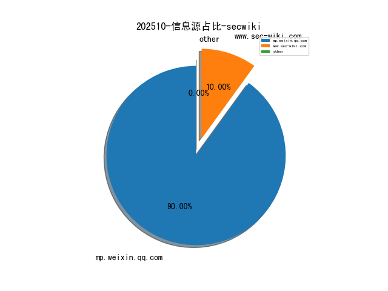
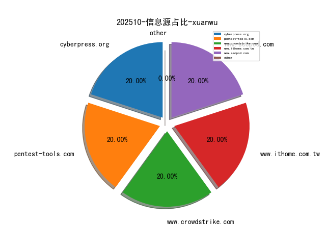
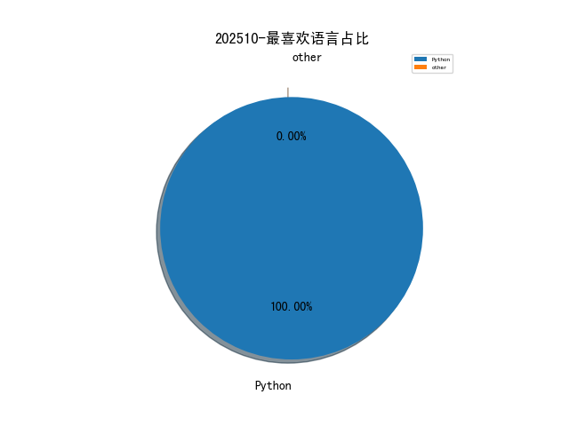

# [数据--所有](README_20.md)
# [数据--年度](README_2025.md)
# 202510 信息源与信息类型占比

# 网络安全书籍 推荐
| date_added | language | title | author | link | size| 
| --- | --- | --- | --- | --- | ---| 
| 2025-10-11 11:29:20 | English | Python Machine Learning for Beginners: The First Step-by-Step Guide for Beginners to Programming and Deep Learning with Python. Data Science, Artificial Intelligence Using Scikit-Learn. | JOHNSON, ANDREW | file.php?id=111152153 | 1007898 [epub]| 
| 2025-10-11 07:55:03 | English | CompTIA Linux+ V7 – Pearson Cert Prep (Video) | unknown | https://www.wowebook.org/comptia-linux-v7-pearson-cert-prep-video/ | unknown| 
| 2025-10-11 06:44:44 | English | Building Intelligent AI Agents (Video Course) | unknown | https://www.wowebook.org/building-intelligent-ai-agents-video-course/ | unknown| 
| 2025-10-11 06:27:41 | English | CompTIA Network+ N10-008 Complete Video Course (Video Training) | unknown | https://www.wowebook.org/comptia-network-n10-008-complete-video-course-video-training/ | unknown| 
| 2025-10-09 05:40:51 | English | Generative AI Design Patterns | unknown | https://www.wowebook.org/generative-ai-design-patterns/ | unknown| 
| 2025-10-08 05:34:55 | English | Practical Purple Teaming: The Art of Collaborative Defense | unknown | https://www.wowebook.org/practical-purple-teaming-the-art-of-collaborative-defense/ | unknown| 

# 微信公众号 推荐
| nickname_english | weixin_no | title | url| 
| --- | --- | --- | ---| 
| Khan安全团队 | None | SCI论文一直投不中？保姆级投稿套餐来了！润色、选刊、投稿、返修，最快3个月中刊！ | https://mp.weixin.qq.com/s?__biz=MzAwMjQ2NTQ4Mg==&mid=2247500848&idx=2&sn=e560292147c5ea40a6464bdb0f062a4e | 4| 
| Web安全工具库 | None | 免费资源分享20251012 | https://mp.weixin.qq.com/s?__biz=MzI4MDQ5MjY1Mg==&mid=2247517431&idx=2&sn=cbe02e9a2307c5963689b208ed13b2ac | 4| 
| 信息安全动态 | None | 零信任架构下的动态访问控制：构建自适应安全边界的核心策略 | https://mp.weixin.qq.com/s?__biz=Mzg4NDc0Njk1MQ==&mid=2247488014&idx=1&sn=e0c7985760a8eb2e51475822b95a475d | 2| 
| 倬其安 | None | 芯片后门警报响起，数字时代的安全堡垒如何筑起？ | https://mp.weixin.qq.com/s?__biz=Mzg3NTUzOTg3NA==&mid=2247516509&idx=1&sn=208f38ca1ef32b48c3e8a21e2566ab6b | 2| 
| 公安部网安局 | None | 净网—2025,虚假摆拍“女子悬赏20万寻救命恩人”，2人被行拘！ | https://mp.weixin.qq.com/s?__biz=MzU0MTA3OTU5Ng==&mid=2247567278&idx=1&sn=23ad66238bae29138df01132f67da690 | 1| 
| 只会看监控的实习生 | None | 速进！全平台项目群“安服崽”交流群 | https://mp.weixin.qq.com/s?__biz=MzkxNzY5MTg1Ng==&mid=2247493057&idx=2&sn=50a69a2c86e737f873e366901177c795 | 4| 
| 君说安全 | None | 网络安全行业，国内未来网络安全细分领域赛道谁会是黑马？ | https://mp.weixin.qq.com/s?__biz=MzUzNjkxODE5MA==&mid=2247494246&idx=1&sn=f54e2ecee0d88eeb7b765dc67b67e41e | 5| 
| 响应云SRC | None | 回归 | https://mp.weixin.qq.com/s?__biz=Mzk4ODg5MTY3Mw==&mid=2247483838&idx=1&sn=1c8becf4ec4ab96c39c8baf501532a8e | 1| 
| 天欣实验室 | None | 五分钟用飞书多维表格搭建英语作文批改助手 | https://mp.weixin.qq.com/s?__biz=MzkxMDc1NzU1Ng==&mid=2247484337&idx=1&sn=b31695b3a0754435ab8925a82011fd7a | 2| 
| 天翁安全 | None | 少量样本成功投毒万亿级大语言模型 | https://mp.weixin.qq.com/s?__biz=MzkwMzUyMjk2MQ==&mid=2247484837&idx=1&sn=3624ffe9c61e5c1310b4016c4c919e6d | 2| 
| 安全代码 | None | 筑牢商业机密“防火墙”：企业如何严防第三方合作商泄密？ | https://mp.weixin.qq.com/s?__biz=MzIwMTQ2MzU5Nw==&mid=2652462007&idx=1&sn=a6d37f0257d583d87479c8d54288b185 | 2| 
| 安全圈动向 | None | 紧急预警！这个潜伏13年的Redis漏洞，能让黑客远程接管你的服务器！ | https://mp.weixin.qq.com/s?__biz=Mzk1NzM4NzMyMw==&mid=2247485147&idx=1&sn=f1121e2e5b4d06a2692e8965a45ec539 | 2| 
| 安天集团 | None | 安天AVL SDK反病毒引擎升级通告（20251011） | https://mp.weixin.qq.com/s?__biz=MjM5MTA3Nzk4MQ==&mid=2650212705&idx=1&sn=210dceac2e3004d7e8e81bc12c78bdab | 2| 
| 小话安全 | None | 威胁情报共享：深度解码某恶意IP的攻击Payload | https://mp.weixin.qq.com/s?__biz=Mzg2MjgwMzIxMA==&mid=2247485587&idx=1&sn=a902368bc4342aaef708963c47a29445 | 2| 
| 技术修道场 | None | Google深夜炸场：新AI不只会找Bug，还能自己写代码修复！程序员的饭碗要被端了？ | https://mp.weixin.qq.com/s?__biz=MzA4NTY4MjAyMQ==&mid=2447901457&idx=1&sn=18d389aae0935d2b70d37a1d7511a1cf | 2| 
| 梦醒安全 | None | linux、windows密钥暴力破解工具john的使用 | https://mp.weixin.qq.com/s?__biz=MzYzNjAwMjQ3OQ==&mid=2247483755&idx=1&sn=3c0721fc1a4eea85c19f39cf97045539 | 2| 
| 犀牛安全 | None | 13 年前的 Redis 漏洞曝光：CVSS 10.0 漏洞可让攻击者远程运行代码 | https://mp.weixin.qq.com/s?__biz=Mzg3ODY0NTczMA==&mid=2247493781&idx=1&sn=64139e5c4e44293469e5f8f53a6afcbd | 2| 
| 玄道夜谈 | None | 分享图片 | https://mp.weixin.qq.com/s?__biz=MzI3Njc1MjcxMg==&mid=2247496577&idx=1&sn=8abf9c8ff4fd1b706c45fe0791a380db | 2| 
| 白帽学子 | None | Slack【安全服务集成化工具】 | https://mp.weixin.qq.com/s?__biz=MzkyNzIxMjM3Mg==&mid=2247491496&idx=1&sn=75af335c2312a0bbcd6066877419639f | 2| 
| 神农Sec | None | 小米路由器管理员密码爆破分析 | https://mp.weixin.qq.com/s?__biz=Mzk0Mzc1MTI2Nw==&mid=2247497899&idx=1&sn=9dc7902d2bea77dbad86b9e73d32eaf9 | 2| 
| 秦安战略 | None | 秦安：“斩首”呼声日益高涨！国台办：统一必胜，“台独”必亡！ | https://mp.weixin.qq.com/s?__biz=MzA5MDg1MDUyMA==&mid=2650481610&idx=1&sn=bbc51cc15a9e5d1427d34b76b2eb6c43 | 3| 
| 网络个人修炼 | None | SSH 登录失败？可能是 pam_limits 在拒绝你 | https://mp.weixin.qq.com/s?__biz=MzkzMDQ0NzQwNA==&mid=2247487411&idx=1&sn=123eff2788ca23749f230faec77b0c34 | 2| 
| 网络侦查研究院 | None | 深挖 Windows 系统电脑打印痕迹 | https://mp.weixin.qq.com/s?__biz=MzIxOTM2MDYwNg==&mid=2247518577&idx=1&sn=bebf66abafd9226d5a0fd608f91881e0 | 2| 
| 网络安全与等保测评 | None | 网络安全等级测评师能力评估（中级）三套样题的案例分析题答案 | https://mp.weixin.qq.com/s?__biz=MzIwNDYzNTYxNQ==&mid=2247504195&idx=1&sn=28dc9e7523d34c28e28a8cd63c8a9751 | 2| 
| 网络安全者 | None | 每日免费资源更新（20251012） | https://mp.weixin.qq.com/s?__biz=MzU3NzY3MzYzMw==&mid=2247500199&idx=1&sn=17dafbded42a196c0fd28cc8233d399a | 1| 
| 网络技术联盟站 | None | 光猫的路由模式和桥接模式有啥区别？哪个更快？ | https://mp.weixin.qq.com/s?__biz=MzIyMzIwNzAxMQ==&mid=2649471146&idx=1&sn=f0552393f1261cead01093996d362984 | 2| 
| 自主创新如是说 | None | 【倒计时3天】10大行业、28个场景！你的网信自主创新案例，该进《2025网信自主创新调研报告》了！ | https://mp.weixin.qq.com/s?__biz=MzkxMzI3MzMwMQ==&mid=2247531475&idx=1&sn=8104fe2faa4d9200429de8433c6aca9a | 1| 
| 船山信安 | None | 提示词注入实战—通过在线靶场看提示词注入手法 | https://mp.weixin.qq.com/s?__biz=MzU2NDY2OTU4Nw==&mid=2247524265&idx=1&sn=6dcd82aa1350163d514e9ad9603e4541 | 2| 
| 苏说安全 | None | 政务领域人工智能大模型部署应用指引 | https://mp.weixin.qq.com/s?__biz=Mzg5OTg5OTI1NQ==&mid=2247491993&idx=1&sn=d0c5a947977f159a4a3a147be1c1e973 | 2| 
| 落云安全 | None | Java Chains：一站式 Java Payload生成与漏洞利用探索平台 | https://mp.weixin.qq.com/s?__biz=MzE5ODEwNDM4MA==&mid=2247484079&idx=1&sn=fc1b57077777f6c5a78ed697cddea162 | 3| 
| 进击的HACK | None | Java 主流 Web 中间件的内存马快速生成工具 | https://mp.weixin.qq.com/s?__biz=MzkxNjMwNDUxNg==&mid=2247488953&idx=1&sn=f3bc557311f5403a7724cbbb88137e86 | 3| 
| 逆向有你 | None | 每日免费资源分享20251012 | https://mp.weixin.qq.com/s?__biz=MzA4MzgzNTU5MA==&mid=2652040337&idx=2&sn=ac67da858f04b10cc5c8ad8d42fe6170 | 4| 
| 铁军哥 | None | VPP性能之谜：1核1G小身板，IPsec性能竟反超4核4G配置？ | https://mp.weixin.qq.com/s?__biz=MzI4NjAzMTk3MA==&mid=2458861833&idx=1&sn=7f57de2ff5ab40faf6d6cc302c7d4be5 | 2| 
| 高等精灵实验室 | None | TrendRadar：30秒搭建一键追踪全网热点，告别无效刷屏！ | https://mp.weixin.qq.com/s?__biz=MzA4MjkzMTcxMg==&mid=2449047871&idx=1&sn=7b3775efd430e65a20003b46ccdac534 | 1| 
| 高级红队专家 | None | 免费分享 , HTB靶机Redelegate解法分享 | https://mp.weixin.qq.com/s?__biz=MzIzODMyMzQxNQ==&mid=2247485251&idx=1&sn=3780b720f26e65fc6c257586577a7aaa | 3| 
| 黑白之道 | None | 高效渗透 一个逆向人员必用的burp插件 | https://mp.weixin.qq.com/s?__biz=MzAxMjE3ODU3MQ==&mid=2650612707&idx=4&sn=468ecb3546465baaf13fa4a637d56bbe | 6| 
| 01iver的安全小圈 | None | 收集的威胁情报平台 | https://mp.weixin.qq.com/s?__biz=MzE5ODQ4Nzg0Mg==&mid=2247483998&idx=1&sn=65ec8e2dfddcc0186294dc5e9cfe4333 | 1| 
| 360数字安全 | None | 重磅！中央网信办、国家发展改革委印发《政务领域人工智能大模型部署应用指引》 | https://mp.weixin.qq.com/s?__biz=MzA4MTg0MDQ4Nw==&mid=2247582354&idx=1&sn=0e9b2c6eb5cbc824a8a20521ece8330e | 2| 
| 360漏洞研究院 | None | 【已复现】Unity Runtime 参数注入漏洞(CVE-2025-59489) | https://mp.weixin.qq.com/s?__biz=Mzk0ODM3NTU5MA==&mid=2247494940&idx=2&sn=ee84f2bcec59464463ceafc1810b9c68 | 4| 
| AI+网络安全笔记 | None | AI驱动的多层次恶意软件防御体系 | https://mp.weixin.qq.com/s?__biz=Mzk4ODI4MDEzNQ==&mid=2247483937&idx=1&sn=83b8451d6e63154dfaa93fdd0750ba6d | 1| 
| AI安全工坊 | None | 《一站式搞定海外公司》完整宝典发布：从0到1的合规运营指南 | https://mp.weixin.qq.com/s?__biz=Mzg5MDQyMzg3NQ==&mid=2247485105&idx=1&sn=c93756c6d0f5f478d03056542b64410c | 2| 
| AI技术笔记 | None | 震撼发布：Microsoft 365 个人高级版 | https://mp.weixin.qq.com/s?__biz=MzkxNzY0Mzg2OQ==&mid=2247487612&idx=1&sn=7b35a5aa68ca1db49833e4e3086311d8 | 1| 
| AI简化安全 | None | AI在安全运营中的四大价值与制约 | https://mp.weixin.qq.com/s?__biz=MzI5NTQ3NzIxMw==&mid=2247485706&idx=1&sn=d0c31d5d42b0f878f39da343bf0e3a6f | 1| 
| AI紫队安全研究 | None | 警惕！朝鲜APT组织Lazarus把“国家级武器”给了招聘骗子，程序员正在被批量“钓鱼” | https://mp.weixin.qq.com/s?__biz=Mzg3OTYxODQxNg==&mid=2247486875&idx=1&sn=fb094c0b1145fcaf4a9869b4fe9340f8 | 2| 
| AI赋能汽车 | None | 10月30—31日第八届上汽集团技术创新高峰论坛观众注册开启 | https://mp.weixin.qq.com/s?__biz=MzkyOTMwMDQ5MQ==&mid=2247520650&idx=1&sn=adbad419d19f670ed0ec6f036ff00354 | 1| 
| Beacon Tower Lab | None | 【1011】重保演习每日情报汇总 | https://mp.weixin.qq.com/s?__biz=MzkyNzcxNTczNA==&mid=2247487836&idx=1&sn=5b5c050ef27e21991b335781a69bf8ed | 2| 
| BlockSec | None | Phalcon Compliance：高性能链上合规引擎，守护 Web3 的信任与增长 | https://mp.weixin.qq.com/s?__biz=MzkyMzI2NzIyMw==&mid=2247490032&idx=1&sn=694bfa964589931c80918677539f12ac | 1| 
| C4安全 | None | WAF绕过的4种思路详解，没思路看这篇就对了 | https://mp.weixin.qq.com/s?__biz=MzkzMzE5OTQzMA==&mid=2247488984&idx=1&sn=4a6d16f6428e7aecbdb7d468557bb8e4 | 2| 
| CAICT可信安全 | None | 可信安全  云计算远程运维安全能力评估通过名单 &证书信息 | https://mp.weixin.qq.com/s?__biz=Mzk0MjM1MDg2Mg==&mid=2247507821&idx=1&sn=3afe2be240b557efe55fa614c680bb38 | 4| 
| CNNVD安全动态 | None | 信息安全漏洞周报（2025年第40期） | https://mp.weixin.qq.com/s?__biz=MzAxODY1OTM5OQ==&mid=2651463699&idx=1&sn=c7763625620c59a264df0708b019a981 | 1| 
| EnhancerSec | None | 账号接管：白帽子边骂 “这链接生成也太草率” 边抄 PoC 步骤!!！ | https://mp.weixin.qq.com/s?__biz=MzI0NjE1NDYyOA==&mid=2247485971&idx=1&sn=138bd167fc70e58da19e77c7c12ac29b | 2| 
| FreeBuf | None | GitHub Copilot高危漏洞可导致攻击者窃取私有仓库源代码 | https://mp.weixin.qq.com/s?__biz=MjM5NjA0NjgyMA==&mid=2651328611&idx=4&sn=49fb00f2d62d0de23f0b954dcb2f6037 | 8| 
| GoUpSec | None | 搜个软件下载竟中招？一场精心伪装的“中文陷阱”正在威胁你的数据 | https://mp.weixin.qq.com/s?__biz=MzkxNTI2MTI1NA==&mid=2247504210&idx=2&sn=c60db407606392ff2db93bc825144201 | 4| 
| ICT技术营地 | None | 网络安全面试：EAD技术 | https://mp.weixin.qq.com/s?__biz=MzkyMTYxMTYyNQ==&mid=2247484583&idx=1&sn=6e8f27a99704d7e8dcd4b107ae3aefa2 | 1| 
| ISC2网络安全 | None | 限时免费：ISC2会员快来领取职业发展快速课程包 | https://mp.weixin.qq.com/s?__biz=MzUzNTg4NDAyMg==&mid=2247493200&idx=1&sn=8493b2a7e1e73603705c3cfe9b16cdbd | 2| 
| Ice ThirdSpace | None | 特朗普是否还会taco？ | https://mp.weixin.qq.com/s?__biz=MzkwMTc2MDE3OA==&mid=2247487242&idx=1&sn=a8f19fed3980082c332b4ac42be9f7ca | 1| 
| IoT物联网技术 | None | 3 分钟搭建DeepSeek企业知识库，国产开源 AI 大模型驱动，打通飞书、钉钉、企业微信 | https://mp.weixin.qq.com/s?__biz=MjM5OTA4MzA0MA==&mid=2454940032&idx=1&sn=a31b9995ab936bf343c0154189376d89 | 1| 
| IoVSecurity | None | 智能网联汽车网络异常故障检测方法 | https://mp.weixin.qq.com/s?__biz=MzU2MDk1Nzg2MQ==&mid=2247627834&idx=3&sn=57de5192a1f5e3947b523fede29517b6 | 6| 
| KeepHack1ng | None | 张三对MCP相关组件植入后门 | https://mp.weixin.qq.com/s?__biz=MzkzOTQ5MzY3OQ==&mid=2247484507&idx=1&sn=6c1bbbdf8ac3dfc6869d6d5d860186d8 | 1| 
| Kn19ht杂谈随记 | None | Fatbeans一站式轻量级网络抓包调试工具 | https://mp.weixin.qq.com/s?__biz=Mzk0OTU2MDIwNQ==&mid=2247483682&idx=1&sn=4b0414a880437900ec042b28e43b3b26 | 1| 
| Nday Poc | None | Hoverfly 远程命令执行漏洞(CVE-2025-54123) | https://mp.weixin.qq.com/s?__biz=MzkzMTcwMTg1Mg==&mid=2247492931&idx=1&sn=ba9256a4af64c9d62fa25987fb2059e5 | 2| 
| PTEHub | None | 160万人史诗级爆仓！今天凌晨全球韭菜都怒了！ | https://mp.weixin.qq.com/s?__biz=Mzg4NzY5NjgyNw==&mid=2247485933&idx=1&sn=64e6f1232808d94fbd88d5249e69f8ba | 1| 
| Purpleroc的札记 | None | 认字大挑战 v3.1.1 | https://mp.weixin.qq.com/s?__biz=MjM5ODY2MDAzMQ==&mid=2247484845&idx=1&sn=031c031ceca3f0428f5b6632882d09e5 | 2| 
| R10Lab | None | OpenCTI_6.8.3 | https://mp.weixin.qq.com/s?__biz=MzkxMzQzMDY3MQ==&mid=2247484153&idx=1&sn=55bee4bced670b95018e4bc1ee8b80f1 | 1| 
| SecNL安全团队 | None | 现在的你是否还能分辨真与假（附社群招新号与朱雀实验室问卷二维码） | https://mp.weixin.qq.com/s?__biz=MzU2MDE2MjU1Mw==&mid=2247486831&idx=1&sn=8939e31cf38a9d0bcc49451b67cec569 | 1| 
| Sky的安全观 | None | 【前14篇免费】ISO/IEC 27701: 2019 标准详解与实施（174）7.4.9 个人身份信息（PII）传输的控制 | https://mp.weixin.qq.com/s?__biz=MzA5OTEyNzc1Nw==&mid=2247487002&idx=3&sn=cb83f4dbd0c05e1bc323a182045e4694 | 3| 
| Spade sec | None | 长文 or 短文？ | https://mp.weixin.qq.com/s?__biz=MzkzNTcwOTgxMQ==&mid=2247486592&idx=1&sn=5e674b593df41ab051f703bad0caee7e | 2| 
| The One安全 | None | 【JS逆向】0基础一文入门JS逆向 | https://mp.weixin.qq.com/s?__biz=Mzk3NTIxNzEzNA==&mid=2247493049&idx=1&sn=198bd4cdf7ed2295bf7a3f1ba294f8cc | 1| 
| TtTeam | None | CVE-2025-61913 （CVSS 10.0）Flowise RCE 严重缺陷允许任意文件写入 | https://mp.weixin.qq.com/s?__biz=Mzg2NTk4MTE1MQ==&mid=2247488048&idx=1&sn=bbeed7e5f1f961f8e2f65dfbebfe0cd5 | 2| 
| Yak Project | None | RAG 灵魂拷问：向量数据库如何用「语义」把检索做成 AI 外挂？ | https://mp.weixin.qq.com/s?__biz=Mzk0MTM4NzIxMQ==&mid=2247528737&idx=1&sn=7ff28c2b68c7c22aa2c8135d99983444 | 1| 
| Zacarx随笔 | None | 从域前置到EDR绕过：聊聊红队那些隐匿手段 | https://mp.weixin.qq.com/s?__biz=MzkxMDU5MzY0NQ==&mid=2247485574&idx=1&sn=d2490c2084ba02980e0ed295f1d935be | 2| 
| dotNet安全矩阵 | None | .NET 调用系统 API 在目标进程中获取屏幕内容 | https://mp.weixin.qq.com/s?__biz=MzUyOTc3NTQ5MA==&mid=2247500790&idx=3&sn=e80871e9b2b3a13f3605eb2ee85e4317 | 3| 
| e安在线 | None | 全球39家巨头遭黑客勒索，思科、谷歌及航空公司面临数据泄露危机 , 2026年网络安全人士保住饭碗的三大新技能 | https://mp.weixin.qq.com/s?__biz=MzI1OTA1MzQzNA==&mid=2651248492&idx=1&sn=243318ab0ba839050af0c1d38847b2f4 | 1| 
| fullbug | None | 开源安全管理平台wazuh-暴力破解检测与响应 | https://mp.weixin.qq.com/s?__biz=MjM5NDMwMjEwMg==&mid=2451852351&idx=1&sn=e3274e1c1afddb523eca09d7bdcae1b3 | 1| 
| kali笔记 | None | Kali Linux中配置Samba服务 轻松搭建家庭影库 | https://mp.weixin.qq.com/s?__biz=MzkxMzIwNTY1OA==&mid=2247514283&idx=1&sn=11c0c815923ec6dbe2ee444b6311ab0d | 1| 
| securitainment | None | 在 Next.js 目标中挖掘 SSRF 漏洞SSRF | https://mp.weixin.qq.com/s?__biz=MzAxODM5ODQzNQ==&mid=2247490818&idx=1&sn=a7dd243c606b20e0063863f6b3e5b7a6 | 2| 
| sec随谈 | None | GitHub Copilot 的严重漏洞使攻击者能够从私有存储库中窃取源代码 | https://mp.weixin.qq.com/s?__biz=Mzk0NzQ0MjA1OA==&mid=2247485342&idx=1&sn=93936b52000023c191dedb4cdc27f623 | 1| 
| vivo千镜 | None | 持续共建可信透明安全体验！vivo颁发2025最佳安全合作伙伴奖项 | https://mp.weixin.qq.com/s?__biz=MzI0Njg4NzE3MQ==&mid=2247492252&idx=2&sn=faec25930d7a3c8d66135b02c1e4d046 | 2| 
| 一己之见安全团队 | None | 安服仔如何研判之——SQL注入 | https://mp.weixin.qq.com/s?__biz=MzkzNzY3ODk4MQ==&mid=2247484471&idx=1&sn=3fc01b6e07a81d2d7df35a92591b4ea5 | 1| 
| 一起聊安全 | None | 政务领域人工智能大模型部署应用指引 | https://mp.weixin.qq.com/s?__biz=MzI3NjUzOTQ0NQ==&mid=2247521635&idx=1&sn=438bae4ca3c3117850efa55b5a57f344 | 1| 
| 丁爸 情报分析师的工具箱 | None | 【OSINT】被厦门公安悬赏通缉的“心战大队”更详细信息 | https://mp.weixin.qq.com/s?__biz=MzI2MTE0NTE3Mw==&mid=2651152451&idx=1&sn=017b5a3ee78dd477dabb77b510715092 | 2| 
| 不秃头的安全 | None | OSS_Scanner 一款多厂商 OSS 存储桶漏洞扫描工具 | https://mp.weixin.qq.com/s?__biz=Mzg3NzkwMTYyOQ==&mid=2247490296&idx=1&sn=83f938f466283ce10f6e811b09d3c64f | 1| 
| 中国信息安全 | None | 关注 , 狠刹挑动负面情绪的网络歪风 | https://mp.weixin.qq.com/s?__biz=MzA5MzE5MDAzOA==&mid=2664250846&idx=5&sn=26593d90b05c1acb49a56bd21030c1b2 | 17| 
| 中国网络空间安全协会 | None | 2025年开源安全奖励计划全面启动 | https://mp.weixin.qq.com/s?__biz=MzA3ODE0NDA4MA==&mid=2649402874&idx=1&sn=8f81e4cf7c638ac346ced8b287d31a12 | 1| 
| 中国软件评测中心 | None | 【赛迪热点】赛迪研究院党委理论学习中心组召开2025年第七次集中学习会议 | https://mp.weixin.qq.com/s?__biz=MjM5NzYwNDU0Mg==&mid=2649254842&idx=1&sn=3b4342e53ae477f5ab21600dc504c34c | 5| 
| 中资网安 | None | 中资网安董事长、党委书记王文胜在《中国网信》杂志发表署名文章 | https://mp.weixin.qq.com/s?__biz=MzkxMzAzMjU0OA==&mid=2247553308&idx=1&sn=1e380c902dc2dff32d8051e3a5a65ad4 | 1| 
| 乌雲安全 | None | 一款功能强大的应急分析溯源日志工具 | https://mp.weixin.qq.com/s?__biz=MzAwMjA5OTY5Ng==&mid=2247527427&idx=1&sn=05bc3f350708c50dee0293cf17f946cc | 1| 
| 云原生安全指北 | None | 利用Azure Front Door WAF窃取用户凭证 | https://mp.weixin.qq.com/s?__biz=MzIyMzM2MzE1OQ==&mid=2247484493&idx=1&sn=e284dc1f9e9e5f24844a9e2eac0bd211 | 1| 
| 亚信安全 | None | 逛展中国移动全球合作伙伴大会：探寻藏在“碳硅共生”下的安全密码 | https://mp.weixin.qq.com/s?__biz=MjM5NjY2MTIzMw==&mid=2650625617&idx=1&sn=2d46337043395479093d5f980874264e | 2| 
| 代码卫士 | None | OpenSSL 漏洞可导致密钥恢复、代码执行、DoS 攻击 | https://mp.weixin.qq.com/s?__biz=MzI2NTg4OTc5Nw==&mid=2247524150&idx=2&sn=340e39d88a6552181d0f4433ab94ef67 | 4| 
| 企业安全实践 | None | 苹果单个漏洞赏金超过1400万 | https://mp.weixin.qq.com/s?__biz=Mzg3NjU0OTQyMg==&mid=2247484471&idx=1&sn=2b0866fd8d79519fda8fb447a6a09531 | 1| 
| 信安在线资讯 | None | 为“给领导添堵”竟多次泄密！国安部披露 | https://mp.weixin.qq.com/s?__biz=MzIzNDIxODkyMg==&mid=2650087085&idx=1&sn=874824390b77562df543be116c2bbbbb | 1| 
| 信息安全与通信保密杂志社 | None | 中央网信办、国家发展改革委印发《政务领域人工智能大模型部署应用指引》（附全文） | https://mp.weixin.qq.com/s?__biz=MzkwMTMyMDQ3Mw==&mid=2247601776&idx=2&sn=8e8c15cdb909c8dfcaf50e5df0d3f416 | 5| 
| 信息安全大事件 | None | 新型RondoDox僵尸网络肆虐：横跨30家厂商的56个漏洞遭利用 | https://mp.weixin.qq.com/s?__biz=MzkzNjIzMjM5Ng==&mid=2247493152&idx=1&sn=5a2177095ef0bf5b22072e49577a60eb | 1| 
| 信息安全研究 | None | 【业界动态】第十五届全运会，即将在粤港澳大湾区正式开幕 | https://mp.weixin.qq.com/s?__biz=MzA3NzgzNDM0OQ==&mid=2664996749&idx=3&sn=9e5d8826f4953a3ff3a83ca314c87156 | 6| 
| 偏远酒馆 | None | 【Shadowrend 斩影 1.1】开发日志2 — 一个集成AI大模型的渗透测试框架 | https://mp.weixin.qq.com/s?__biz=MzkwMDMwNDgwNQ==&mid=2247485896&idx=1&sn=c6bd9f72b8c90b6df3692c5116f0a0ab | 1| 
| 全球技术地图 | None | 美国将对中国商品征收100%的关税 | https://mp.weixin.qq.com/s?__biz=MzI1OTExNDY1NQ==&mid=2651621945&idx=2&sn=d8d98cd97652d7b99ad4bcfc2a909523 | 4| 
| 内存泄漏 | None | 推荐两款免费实用的远程桌面管理工具，不限速，好用！！ | https://mp.weixin.qq.com/s?__biz=MzU2MjU2MzI3MA==&mid=2247485018&idx=2&sn=fd47637bb3988cce34017e42bc1d8dc2 | 4| 
| 凌日网络与信息安全团队 | None | LRTCTF , 重庆第二师范学院2025年网络安全大赛（lrtctf2025） | https://mp.weixin.qq.com/s?__biz=MzkxNjcyMTc0NQ==&mid=2247484614&idx=1&sn=d030a22a8412f1b18cb0227708474c11 | 1| 
| 创信华通 | None | 安全通告丨网络安全漏洞通告（2025年10月） | https://mp.weixin.qq.com/s?__biz=MzUxNTQxMzUxMw==&mid=2247526458&idx=1&sn=eed2a8045d8f9970e9ac92dfa18238db | 1| 
| 吉祥快学网络安全吧 | None | 我，居然拿捏不住一名网安新人！ | https://mp.weixin.qq.com/s?__biz=MzkzMzcxNTQyNw==&mid=2247488213&idx=1&sn=1cf991aab1af2fb2a33eaf664439850f | 1| 
| 吐槽网安的熊猫 | None | 摸鱼技能考试「看看你们能考多少分」 | https://mp.weixin.qq.com/s?__biz=MzkwOTczNzIxNQ==&mid=2247487139&idx=1&sn=c57c1cb7bbfa05075fa3727c64571ed6 | 1| 
| 启明星辰安全简讯 | None | 安全简讯（2025.10.11） | https://mp.weixin.qq.com/s?__biz=MzkzNzY5OTg2Ng==&mid=2247501649&idx=1&sn=678afad898a5a9fe96475b3d8cd82c0d | 2| 
| 启明星辰集团 | None | 中国移动董事长杨杰：碳硅共生 合创AI+时代 | https://mp.weixin.qq.com/s?__biz=MzA3NDQ0MzkzMA==&mid=2651734647&idx=1&sn=75b8812eaa2727f7b45f08094095e444 | 1| 
| 吾爱破解论坛 | None | 吾爱破解安卓逆向入门教程《安卓逆向这档事》二十四课、Unidbg之补完环境我就睡(中) | https://mp.weixin.qq.com/s?__biz=MjM5Mjc3MDM2Mw==&mid=2651143113&idx=1&sn=e4e6bd5995e65d55f54dd1b3fcbf5702 | 1| 
| 周小粥讲安全 | None | 零基础自学黑客网安？记住这5步带你从0开始实战实操！ | https://mp.weixin.qq.com/s?__biz=MzkzODU5MTkyNQ==&mid=2247486762&idx=1&sn=ed0666525ce961276a076d8d2028d408 | 2| 
| 哔哩哔哩技术 | None | VibeCut - 智能剪辑探索与实现 | https://mp.weixin.qq.com/s?__biz=Mzg3Njc0NTgwMg==&mid=2247503578&idx=1&sn=817c3ba757f9f91dbbe70977f567983d | 1| 
| 嘉韦思 | None | 嘉韦思大模型全流量威胁分析平台：以智能之力，织就网络安全防护网 | https://mp.weixin.qq.com/s?__biz=MzIxNTA4OTI5Mg==&mid=2647713173&idx=1&sn=f5feb075fdb57e8017136f716b66c7c8 | 1| 
| 嘶吼专业版 | None | Redis已存在13年之久的Lua漏洞可导致远程代码执行 | https://mp.weixin.qq.com/s?__biz=MzI0MDY1MDU4MQ==&mid=2247584849&idx=2&sn=8a392560240f1b87628f698877581c97 | 3| 
| 国信安全 | None | 国家信息中心承办的“数据安全数字技术工程师培育质量提升高级研修班”在杭州成功举办 | https://mp.weixin.qq.com/s?__biz=MzU5MzYzMzU5NA==&mid=2247489471&idx=1&sn=da98c8b23863c3febdb6fd329f0fc475 | 1| 
| 国家互联网应急中心CNCERT | None | 网络安全信息与动态周报2025年第40期（9月29日-10月5日） | https://mp.weixin.qq.com/s?__biz=MzIwNDk0MDgxMw==&mid=2247500709&idx=1&sn=43d0ce9b03c464996bb7e06a15e39bc6 | 1| 
| 夜幕讲安全 | None | 黑客入门必备！kali基本命令大全 | https://mp.weixin.qq.com/s?__biz=MzkyODk0MDY5OA==&mid=2247487179&idx=1&sn=e6e641e65dff892f26aebbd17c33a0a2 | 2| 
| 夜组安全 | None | 一款专为网络安全图形化工具，旨在简化在防火墙设备上批量封禁 IP 地址的操作流程 | https://mp.weixin.qq.com/s?__biz=Mzk0ODM0NDIxNQ==&mid=2247495389&idx=1&sn=131d4ccd5a8651f7c4c88aeacdc2a9f8 | 1| 
| 大眼睛网络安全 | None | 暗网能否找到劣迹方面的文件数据 | https://mp.weixin.qq.com/s?__biz=MzkxNDYxMjM5OA==&mid=2247485881&idx=1&sn=2f6a573d4a04dc932393844afbbed966 | 2| 
| 天融信 | None | 天融信“AI+”研究成果再获优秀论文奖，是唯一企业获奖！ | https://mp.weixin.qq.com/s?__biz=MzA3OTMxNTcxNA==&mid=2650976120&idx=1&sn=ad375e066b195572388133788a5ed4ff | 1| 
| 天黑说嘿话 | None | 【附漏洞检测脚本】Redis Lua 远程代码执行漏洞（CVE-2025-49844） | https://mp.weixin.qq.com/s?__biz=MzI5NTQ5MTAzMA==&mid=2247484689&idx=1&sn=073545cac3560faab67fd404335ce5c7 | 1| 
| 奇安信威胁情报中心 | None | 利用 Oracle EBS 漏洞（CVE-2025-61882）的勒索活动综合技术分析报告 | https://mp.weixin.qq.com/s?__biz=MzI2MDc2MDA4OA==&mid=2247516258&idx=1&sn=35067a93c015611f3492b7f989480289 | 2| 
| 奇安信安全服务 | None | 2025年8月考试成绩 | https://mp.weixin.qq.com/s?__biz=MzI4MzA0ODUwNw==&mid=2247487237&idx=1&sn=80b83fe544e139a351a122932d5c1fe8 | 1| 
| 奇安信病毒响应中心 | None | 每周勒索威胁摘要 | https://mp.weixin.qq.com/s?__biz=MzI5Mzg5MDM3NQ==&mid=2247498545&idx=1&sn=2ecf0bf04bd157d6738a563b448ce9a1 | 1| 
| 奇安信集团 | None | 两部门印发《政务领域人工智能大模型部署应用指引》，安全成为焦点 | https://mp.weixin.qq.com/s?__biz=MzU0NDk0NTAwMw==&mid=2247629341&idx=3&sn=5f33ccb4a40a54ad2de6ef425cd24af1 | 5| 
| 威努特安全网络 | None | 西悉尼大学遭诈骗邮件攻击，朝日啤酒受网络攻击致停产,一周特辑 | https://mp.weixin.qq.com/s?__biz=MzAwNTgyODU3NQ==&mid=2651136313&idx=1&sn=9635e6a494f5301a7fdaad652c1986e6 | 1| 
| 字节跳动安全中心 | None | “火山引擎金融大模型安全月”收官，构筑智能时代金融安全防护网【内附中奖名单】 | https://mp.weixin.qq.com/s?__biz=MzUzMzcyMDYzMw==&mid=2247495672&idx=1&sn=bbdf7610ddaacffa1c8cc7916b5a8ac4 | 1| 
| 安世加 | None | 捷豹路虎受黑客攻击后正式复工 累计损失约3亿英镑 | https://mp.weixin.qq.com/s?__biz=MzU2MTQwMzMxNA==&mid=2247543093&idx=1&sn=44bccd780a35bfe5205b965403f15038 | 2| 
| 安全内参 | None | 美国空军参谋长被提名人表示将致力于提升空军网络能力 | https://mp.weixin.qq.com/s?__biz=MzI4NDY2MDMwMw==&mid=2247515071&idx=2&sn=0042b66b8dd36baa857d5863839fae22 | 2| 
| 安全分析与研究 | None | 人员名单信息类银狐钓鱼样本分析 | https://mp.weixin.qq.com/s?__biz=MzA4ODEyODA3MQ==&mid=2247493674&idx=1&sn=1d77e207ffa0f88ebfd14fa1394a1ead | 1| 
| 安全威胁纵横 | None | 甲骨文零日漏洞引危机！ 数十家机构敏感信息遭窃 | https://mp.weixin.qq.com/s?__biz=Mzk2ODExMjEyNA==&mid=2247486631&idx=1&sn=869fab6a335f58461ce20b176b03a69d | 2| 
| 安全学习那些事儿 | None | 中国证监会发布《证券期货业业务域数据元规范 第4部分：证券交易所》等3项金融行业标准 | https://mp.weixin.qq.com/s?__biz=MzkxNTI2NTQxOA==&mid=2247499138&idx=3&sn=cc15cf69a8451fea610ee8b904830b93 | 3| 
| 安全学术圈 | None | 诚聘英才 , 暨南大学网络空间安全学院 | https://mp.weixin.qq.com/s?__biz=MzU5MTM5MTQ2MA==&mid=2247493919&idx=1&sn=f572fe0ef2798ae30b45e371a15aa0c5 | 2| 
| 安全帮Live | None | 爆料--欠钱不还 | https://mp.weixin.qq.com/s?__biz=MzI3NTcwNTQ2Mg==&mid=2247487884&idx=1&sn=beae0f6865e4a4d6976aa8199422ea83 | 1| 
| 安全牛 | None | 公安部检验中心检测发现34款违法违规收集使用个人信息的移动应用；悬赏征集线索18名台湾军方违法核心骨干曝光 , 牛览 | https://mp.weixin.qq.com/s?__biz=MjM5Njc3NjM4MA==&mid=2651138918&idx=2&sn=1c7d30cb7aaef75f1b1f70d3f28520a8 | 4| 
| 安全牛科技 | None | 工业网络安全周报-2025年第41期 | https://mp.weixin.qq.com/s?__biz=Mzk0MTQ5NjI2Ng==&mid=2247486917&idx=1&sn=409f6efbd26603df3b6b34e25a2a76e3 | 1| 
| 安全狗的自我修养 | None | 我是如何发现一个无需认证的敏感信息金矿的 | https://mp.weixin.qq.com/s?__biz=MzkwOTE5MDY5NA==&mid=2247507796&idx=1&sn=dbc00f9bd6175fcea5a4dd6413e9f304 | 2| 
| 安全研究实验室 | None | 从域前置到EDR绕过：聊聊红队那些隐匿手段 | https://mp.weixin.qq.com/s?__biz=MzkwMTU2NzMwOQ==&mid=2247485359&idx=1&sn=27300192e64ddfeed1336dc0fe6b58aa | 1| 
| 安全研究站 | None | Termlink-开源ssh工具 | https://mp.weixin.qq.com/s?__biz=Mzk0NDI2MTQzMw==&mid=2247484735&idx=1&sn=ab035bb6c486c02a075d6f7f92de3149 | 1| 
| 安全邦官方订阅号 | None | 宣传周余热续燃！安全邦专家9月22日走进延庆八中，解码校园网络新风险u200b | https://mp.weixin.qq.com/s?__biz=MzU0NDkyNTQ2OA==&mid=2247486250&idx=1&sn=dcb057945a4bbae5ac59065f0c24a672 | 1| 
| 安势信息 | None | 安势信息亮相2025vivo开发者大会，多维度技术共推生态安全升级！ | https://mp.weixin.qq.com/s?__biz=Mzg3MDgyMzkwOA==&mid=2247492080&idx=1&sn=f7dfee256c7a58a30393b6f37496452f | 2| 
| 安在 | None | 在看 , 厂商：本周热门网络安全产业动态 | https://mp.weixin.qq.com/s?__biz=MzU5ODgzNTExOQ==&mid=2247644153&idx=2&sn=bc35e6072eede43803172ae484dc3fdf | 6| 
| 安小圈 | None | 网络安全不再仅仅是IT问题 | https://mp.weixin.qq.com/s?__biz=Mzg2MDg0ODg1NQ==&mid=2247548897&idx=3&sn=4eee7d04825eb48cd5c0db3d534b0797 | 3| 
| 安帝Andisec | None | 工业网络安全周报-2025年第38期 | https://mp.weixin.qq.com/s?__biz=MzU3ODQ4NjA3Mg==&mid=2247567708&idx=1&sn=8b175275d43bf0b9498e4889bf66a0f6 | 1| 
| 安恒信息 | None | AI顶会NeurIPS接收安恒信息与浙大合作研究成果 | https://mp.weixin.qq.com/s?__biz=MjM5NTE0MjQyMg==&mid=2650633775&idx=1&sn=583e24c4d70b42db3f1f1c577c42e126 | 1| 
| 安融技术 | None | 服务器端口映射及安全措施 | https://mp.weixin.qq.com/s?__biz=MzkwOTg4NDk5NQ==&mid=2247484897&idx=1&sn=369f3f112220fec3494d587c7fe2171e | 2| 
| 山石网科新视界 | None | 山石安服｜固件安全模糊测试服务技术方案 | https://mp.weixin.qq.com/s?__biz=MzAxMDE4MTAzMQ==&mid=2661303259&idx=1&sn=6515117e6ac4e36858b30a410b5eeb25 | 2| 
| 工业信息安全创新中心 | None | 《2025年度制造业数字化转型典型案例集》发布 | https://mp.weixin.qq.com/s?__biz=MzAwNTc0ODM3Nw==&mid=2247490208&idx=1&sn=ec3bcc7e94e0da25f4d407417192c3d0 | 1| 
| 广东省网络安全应急响应中心 | None | 【开班通知】网络与信息安全运维专项培训10月21日正式开班！ | https://mp.weixin.qq.com/s?__biz=MzUzNTI2MzU0OQ==&mid=2247497661&idx=1&sn=caf7cf6075e793102f70e5cfe01678a1 | 1| 
| 当年浪安全 | None | 这合理吗兄弟们？ | https://mp.weixin.qq.com/s?__biz=Mzk0NDY0MDkwNw==&mid=2247484722&idx=1&sn=656c319745a956b00926ccd69550f9c9 | 1| 
| 快手技术 | None | 登顶SWE-Bench！快手KAT-Dev-72B-Exp，刷新开源SOTA！ | https://mp.weixin.qq.com/s?__biz=Mzg2NzU4MDM0MQ==&mid=2247497623&idx=1&sn=22acefbcfaed53a3c3144bedd3dce4de | 1| 
| 慢雾科技 | None | 慢雾(SlowMist)出席香港Web3 情报与执法高峰论坛暨 VAIT 成立典礼 | https://mp.weixin.qq.com/s?__biz=MzU4ODQ3NTM2OA==&mid=2247503483&idx=1&sn=daa85dca30e89b1094411a63389e35b9 | 1| 
| 扳手讲安全 | None | 失业 3 个月投 87 份简历？别卷了！这行缺口 327 万，零经验也能月入 8K | https://mp.weixin.qq.com/s?__biz=MzE5MTAzMzY5NA==&mid=2247487432&idx=1&sn=e2d0f548f875fcf18145a188f1059e72 | 1| 
| 技术分享交流 | None | AITest平台搭建和介绍 | https://mp.weixin.qq.com/s?__biz=MzAxMDIwNjg2MA==&mid=2247486484&idx=1&sn=8a7ca56f949a109473d6649e0b3fc7b9 | 2| 
| 数世咨询 | None | 2025年安全运营中心的 AI 现状：最新调研洞察 | https://mp.weixin.qq.com/s?__biz=MzkxNzA3MTgyNg==&mid=2247540473&idx=1&sn=d2c6cc2313c0dc35256b8a23d8f0101c | 2| 
| 数缘信安社区 | None | 新功能发布——所有技术参数可溯源 | https://mp.weixin.qq.com/s?__biz=MzI2NTUyODMwNA==&mid=2247495082&idx=1&sn=f34a88ce6908ce738c416b51a78e3bb8 | 1| 
| 明暗安全 | None | 【社会工程学的救赎】黑客如何在 60 秒内搭建一个“免费 Wi-Fi”偷你信息？教你当场识破！ | https://mp.weixin.qq.com/s?__biz=MzkxMjYxODcyNA==&mid=2247486260&idx=1&sn=102232b951b21f2131a8ee57185e8d45 | 1| 
| 易云安全应急响应中心 | None | 2026 网安人靠什么立足？这 3 大新技能是关键 | https://mp.weixin.qq.com/s?__biz=MzkyNDcwMTAwNw==&mid=2247536554&idx=5&sn=3201935d59de906c888b63e4bc236ea1 | 5| 
| 星网实验室 | None | 基于鱼骨分解与形状匹配的恶意流量实时识别方法 | https://mp.weixin.qq.com/s?__biz=MjM5ODQzNTE3NA==&mid=2247485482&idx=1&sn=95c543609d4f4174ee0d71b97a88fc47 | 1| 
| 星落安全团队 | None | 工具推荐 , Webshell自动化流量解密分析工具 | https://mp.weixin.qq.com/s?__biz=MzkwNjczOTQwOA==&mid=2247495998&idx=1&sn=de6f66b2dc429c4cf7cb14c3d41cc008 | 1| 
| 智动心域 | None | 推荐一款burp插件oss_scan | https://mp.weixin.qq.com/s?__biz=MzE5MTMwODY0NQ==&mid=2247483782&idx=1&sn=db30f5aa8bef27b8416b044898f0540c | 2| 
| 智探AI应用 | None | 百融至信、闪电智联中标桂林银行信用卡智能语音机器人催收外呼项目 | https://mp.weixin.qq.com/s?__biz=MzIxMDIwODM2MA==&mid=2653932779&idx=3&sn=e1a2ff78b092c4170b56c38dd9b68208 | 6| 
| 智检安全 | None | Cobalt Strike多种上线方式分享 | https://mp.weixin.qq.com/s?__biz=MzkyNTUyOTk0NA==&mid=2247488741&idx=1&sn=a04e181f2957b2cc05d9c2e5726aa02f | 1| 
| 李白你好 | None | 实战应急 , 银狐病毒处置之 QMStuck.dll 文件 | https://mp.weixin.qq.com/s?__biz=MzkwMzMwODg2Mw==&mid=2247514114&idx=1&sn=d91ea3a98ca7359fff17facf38daa230 | 1| 
| 极客安全 | None | 安全动态丨网络空间安全动态第290期 | https://mp.weixin.qq.com/s?__biz=MzU2MjcwOTY1Mg==&mid=2247521574&idx=2&sn=de822189e1370ddec04e80a7ac02d426 | 2| 
| 树树搞安全 | None | 最大化获取Vue框架(SPA类型)下的路由 | https://mp.weixin.qq.com/s?__biz=Mzg5MDk3NDE2Mw==&mid=2247484034&idx=1&sn=e289c736839cc3c1c818904cc4ef0017 | 1| 
| 梆梆安全 | None | 监管利剑高悬，公安部再通报34款APP违法违规，覆盖租车、社交、金融等多高频使用场景！ | https://mp.weixin.qq.com/s?__biz=MjM5NzE0NTIxMg==&mid=2651136314&idx=1&sn=f8c43975d303b88fed0db5f20b29c585 | 1| 
| 梓陌说科技 | None | 惊叹！机器人投身农事劳作，其速度之快着实超乎臆想 ！ | https://mp.weixin.qq.com/s?__biz=MzIzMzI1Njg3Mw==&mid=2651930240&idx=1&sn=d5af2603d4605a69a1aca44510262855 | 1| 
| 武汉网络安全 | None | 关于“黄鹤杯”网络安全人才创新大赛决赛时间的通知 | https://mp.weixin.qq.com/s?__biz=MzA3OTEyODAxMw==&mid=2247510507&idx=1&sn=34556553c9621934886010ea2e3efdcf | 1| 
| 汇能云安全 | None | 微软Azure全球大宕机：欧洲非洲服务中断，CDN故障引发连锁反应 | https://mp.weixin.qq.com/s?__biz=MzIwNzAwOTQxMg==&mid=2652252636&idx=1&sn=39b6e78ab5747bd7f5ad0a6a1142cf0b | 1| 
| 沧海讲安全 | None | 从0开始挖漏洞？只要你够狠，3个月就能挖到第一笔赏金！ | https://mp.weixin.qq.com/s?__biz=MzkzMzkyNTQ0Ng==&mid=2247485071&idx=1&sn=94a22ec885e4a7773939b33a4a294662 | 1| 
| 河南等级保护测评 | None | 跟着DAMA专家看数据管理的未来 | https://mp.weixin.qq.com/s?__biz=Mzg2NjY2MTI3Mg==&mid=2247502078&idx=2&sn=79c04453574daf5d78f00b3ab64b811f | 2| 
| 浅安安全 | None | 工具 , Phantom | https://mp.weixin.qq.com/s?__biz=MzkwMTQ0NDA1NQ==&mid=2247494627&idx=4&sn=a386d2a995df55bd7a7c990a99f50c1d | 4| 
| 深安安全 | None | 高校安全体系建设：师生安全意识提升之路 | https://mp.weixin.qq.com/s?__biz=MzkyNzc0MzcwMA==&mid=2247484252&idx=1&sn=c0b7bc68709e5a26b6d14b03b0add8da | 1| 
| 渊亭科技 | None | 上榜！渊亭科技入选中国信通院《具身智能产业图谱（2025年）》 | https://mp.weixin.qq.com/s?__biz=MzIzNjE1ODE2OA==&mid=2660192435&idx=1&sn=e7295d44fa5ffeb9d6fe7c6ce3162cc0 | 1| 
| 渊亭防务 | None | 防务简报丨美国空军加购8架MH-139A直升机 | https://mp.weixin.qq.com/s?__biz=Mzg2NTYyODgyNg==&mid=2247508241&idx=1&sn=bd7578cd569b9f27df28b730e124423a | 3| 
| 渗透安全HackTwo | None | Java 进程内存马检测与清除查杀工具（含 GUI）,基于Agent+Instrumentation Kill_Memshell | https://mp.weixin.qq.com/s?__biz=Mzg3ODE2MjkxMQ==&mid=2247495153&idx=1&sn=b716e604c8e16f72f0406d0317a14ded | 1| 
| 渗透测试 | None | dddd-red v3.0更新：红队打点再进化，不仅快，还会“自己跑” | https://mp.weixin.qq.com/s?__biz=Mzg2ODY3NDYxNA==&mid=2247486501&idx=1&sn=2855a0dbbb841d51f97d5799d250d279 | 2| 
| 漏洞盒子VulBox | None | USRC白帽成长季｜这一季，开挂进阶，C位出道！ | https://mp.weixin.qq.com/s?__biz=MzIxODIzNzgwMw==&mid=2654074420&idx=1&sn=896bb56b1ed0050e518e7452a99adf09 | 1| 
| 爱加密 | None | 双核升级！爱加密AI大模型+纯血鸿蒙检测能力，为移动应用合规保驾护航 | https://mp.weixin.qq.com/s?__biz=MjM5NzU4NjkyMw==&mid=2650749024&idx=1&sn=dc2e698f8c5d6dfabbc288a6e69ecdac | 1| 
| 独眼情报 | None | 苹果将零点击远程代码执行漏洞的最高漏洞赏金提高至200万美元 | https://mp.weixin.qq.com/s?__biz=MzkzNDIzNDUxOQ==&mid=2247503300&idx=4&sn=31ea1c3a1a7ced1971e0b1eceef7e442 | 4| 
| 瓜神网络安全&分享 | None | 2025年网络安全等级测评师能力评估（中级）第二套样卷作答 | https://mp.weixin.qq.com/s?__biz=MzkwODE4ODUzMg==&mid=2247487144&idx=1&sn=bc6cb670c739b17d01ee4a69bd18d733 | 2| 
| 生态遥感监测笔记 | None | 数据分享_全球露天矿分布数据 | https://mp.weixin.qq.com/s?__biz=Mzg4MzgyMjM0NQ==&mid=2247484663&idx=1&sn=e77c5d9c18623b0f22b29ee07b006e94 | 2| 
| 生有可恋 | None | 青苔 | https://mp.weixin.qq.com/s?__biz=Mzk0MTI4NTIzNQ==&mid=2247495255&idx=1&sn=092fae1986fbc1d459339c394eccdb99 | 3| 
| 电子取证wiki | None | DIDCTF电子数据取证综合平台近期更新 | https://mp.weixin.qq.com/s?__biz=MzkzNTQzNTQzMQ==&mid=2247485815&idx=1&sn=9ae4c74503ce1c9cad5cfd5c43f4b498 | 1| 
| 白安全组 | None | 现在的你是否还能分辨真与假（附社群招新号与朱雀实验室问卷二维码） | https://mp.weixin.qq.com/s?__biz=MzU4MjYxNTYwNA==&mid=2247487885&idx=1&sn=4d77a19abb9014984d3887dee899fb0b | 1| 
| 白帽子章华鹏 | None | 2026年企业安全规划之漏洞管理 | https://mp.weixin.qq.com/s?__biz=MzIyOTAxOTYwMw==&mid=2650237875&idx=1&sn=a1756b1fc0d03d91a8ff9e469e79411a | 1| 
| 白帽黑客训练营 | None | 黑客为什么不找个班上，牢里又不能赚钱，判这么多年，上班赚钱或者提交漏洞不赚更多吗？ | https://mp.weixin.qq.com/s?__biz=MzIzNjIwNTQ5MQ==&mid=2247485125&idx=1&sn=bb92f02dff637b858e03af9de9ef0d5b | 1| 
| 百度安全 | None | 2025网安周 , 百度安全获多项认可 贡献人工智能安全实践经验 | https://mp.weixin.qq.com/s?__biz=MjM5MTAwNzUzNQ==&mid=2650511544&idx=1&sn=64c8d3ba495fb4b86de910ada38e9879 | 1| 
| 百灵猫开源情报分析师 | None | 两党委员会发布核聚变专项报告——五项原材料依赖中国 | https://mp.weixin.qq.com/s?__biz=MzkxMTA3MDk3NA==&mid=2247488066&idx=1&sn=4f8d09afe6074521c1e1a6b091db31eb | 2| 
| 盛邦安全WebRAY | None | 打破速度与安全魔咒！盛邦安全“200G极速国密”网关内测成功，中国密码技术抢占全球极速赛道 | https://mp.weixin.qq.com/s?__biz=MzAwNTAxMjUwNw==&mid=2650279074&idx=1&sn=65b249dc4c5cd878c04749aa3fdb55c7 | 1| 
| 盛邦安全应急响应中心 | None | 网络安全信息与动态周报2025年第40期（9月29日-10月5日） | https://mp.weixin.qq.com/s?__biz=Mzk0NjMxNTgyOQ==&mid=2247484775&idx=2&sn=86916a2f1536922b4ebea05aefaccc78 | 2| 
| 看雪学苑 | None | GitHub Copilot 曝严重漏洞，攻击者可窃取私有仓库源代码 | https://mp.weixin.qq.com/s?__biz=MjM5NTc2MDYxMw==&mid=2458601701&idx=3&sn=ea899df2ca76b7e80de827c947f156b4 | 7| 
| 知其安科技 | None | 安全运营落地实践（二）｜从“部署安全”到“确保有效”——BAS技术如何构建运营商安全运营新范式 | https://mp.weixin.qq.com/s?__biz=MzkzNTI5NTgyMw==&mid=2247511759&idx=1&sn=cdb79580ae116d23e3ac208198c6a53a | 1| 
| 知然安全 | None | 渗透测试实战：弱口令突破系统后，信息泄露到任意用户密码重置 | https://mp.weixin.qq.com/s?__biz=MzkwOTYxOTYzNA==&mid=2247483858&idx=1&sn=863c30c39b1c4b65594bc20989cdde61 | 1| 
| 知道创宇 | None | 锚定《政务领域人工智能大模型部署应用指引》：解锁政务大模型落地的 “安全密码” | https://mp.weixin.qq.com/s?__biz=MjM5NzA3Nzg2MA==&mid=2649872592&idx=1&sn=452447a6f38d103d458eed2208a11044 | 1| 
| 神州希望网络安全 | None | 宋志平：内卷，怎么破？ | https://mp.weixin.qq.com/s?__biz=MzA4Mzg1ODMwMg==&mid=2650726130&idx=1&sn=c6381a396c248db84f2bbf66d8453862 | 1| 
| 祺印说信安 | None | 罚款！湖南某医院未履行保护义务，致医疗信息泄露 | https://mp.weixin.qq.com/s?__biz=MzA5MzU5MzQzMA==&mid=2652118826&idx=2&sn=7b77c2299634109ff9ca5578b038e92a | 2| 
| 穹息信息安全 | None | 通过安卓模拟器绕过代理检测抓包 | https://mp.weixin.qq.com/s?__biz=MzI4NjEyODI4MA==&mid=2649880080&idx=1&sn=1944dfe7e5efc26a1b6c04aa93d0d91b | 1| 
| 竹等寒安全 | None | Powershell使用 WMI 和 CIM(八) | https://mp.weixin.qq.com/s?__biz=MzkxODcyNjk4NQ==&mid=2247488625&idx=1&sn=af8de5eabdd6ed451b4c5d2d65e37db8 | 1| 
| 第59号 | None | 每周安全速递³⁶¹ , XWorm恶意软件新变种带有勒索软件模块和超过35个插件 | https://mp.weixin.qq.com/s?__biz=MzI0NDgxMzgxNA==&mid=2247497220&idx=1&sn=c3f8caade1f6a6e17d2ac6aefd9eb67e | 1| 
| 简单读写 | None | 朝花夕拾二十四孝图 | https://mp.weixin.qq.com/s?__biz=MzU4MDY1Mjk5Mg==&mid=2247484479&idx=1&sn=c4b1e8b8640a7e9de163a83a072b954e | 1| 
| 米好信安 | None | 赛事通知,关于举办 2025 一带一路暨金砖国家技能发展与技术创新大赛之第三届企业信息系统安全赛项决赛的报到通知 | https://mp.weixin.qq.com/s?__biz=MzU1NTYxMjA5MA==&mid=2247506659&idx=1&sn=cd56cb340a5dad4b4b215710eaadbae9 | 3| 
| 纯绿色地陪 | None | 在西安，和22岁小姐姐“纯绿色”约会的一天，被治愈了100次！ | https://mp.weixin.qq.com/s?__biz=MzkxMDMwNDE2OQ==&mid=2247492124&idx=1&sn=cfa82dcc67d5104f1da3d1ad67c88f19 | 2| 
| 绿盟科技 | None | 绿盟科技AI大模型安全能力平台成功入选2025AIIA先锋案例 | https://mp.weixin.qq.com/s?__biz=MjM5ODYyMTM4MA==&mid=2650473413&idx=2&sn=ac81bca656d5f01a8e1b30d175fcfc2d | 3| 
| 绿盟科技研究通讯 | None | 可信数据空间（五）数据使用控制 | https://mp.weixin.qq.com/s?__biz=MzIyODYzNTU2OA==&mid=2247499123&idx=1&sn=d413dfeb4aa8366f673048742c3aa378 | 1| 
| 编程技术栈 | None | 渗透测试的8个步骤，一文详解（小白必看）！ | https://mp.weixin.qq.com/s?__biz=MzkxNDU0MTUyNw==&mid=2247493703&idx=1&sn=a3645629e1a3f649fb386e5824c1dd5a | 1| 
| 网安百色 | None | 委内瑞拉肯德基疑似数据泄露，暴露了 100 万条客户记录 | https://mp.weixin.qq.com/s?__biz=MzI0NzE4ODk1Mw==&mid=2652096560&idx=2&sn=e60c667cce194d9b79a3e54b09e7a2b3 | 2| 
| 网安观察室XQ | None | 国内外网络安全热点情报（2025年第39期） | https://mp.weixin.qq.com/s?__biz=MzkzNjM4ODc3OQ==&mid=2247486065&idx=2&sn=030d6a9ec4589d4b22ecf5c70cd62913 | 2| 
| 网空闲话plus | None | 5th域安全微讯早报【20251011】244期 | https://mp.weixin.qq.com/s?__biz=MzkyMjQ5ODk5OA==&mid=2247514443&idx=4&sn=b15a6bac3be94e8a933b42f24e5197c8 | 4| 
| 网络安全与取证研究 | None | 2025\"盘古石杯\"决赛服务器集群取证wp | https://mp.weixin.qq.com/s?__biz=Mzg3NTU3NTY0Nw==&mid=2247490203&idx=1&sn=d11d82f1bd64ac8789036d16c4c648ab | 1| 
| 网络安全和信息化 | None | 预警丨防范BlackLock勒索病毒 | https://mp.weixin.qq.com/s?__biz=MjM5MzMwMDU5NQ==&mid=2649174754&idx=3&sn=db4622ee9da031532e17f9289591f0f0 | 8| 
| 网络安全备忘录 | None | GB/Tu202f22239‑2019《网络安全等级保护基本要求》中第二、三、四级要求项对比（安全通信网络） | https://mp.weixin.qq.com/s?__biz=MzA3NDMyNDM0NQ==&mid=2247485173&idx=1&sn=89c7fe3ae64f0a66acd3b9f8e4b58fab | 2| 
| 网络安全威胁和漏洞信息共享平台 | None | 关于防范BlackLock勒索病毒的风险提示 | https://mp.weixin.qq.com/s?__biz=MzA5Nzc4Njg1NA==&mid=2247489311&idx=1&sn=829f60ee0c1507ab7d1e78fbd7168a6c | 1| 
| 网络安全学习室 | None | 【2025 全新】网络安全学习路线：从 0 到挖漏洞、打 CTF、护网，详细路线助你精通就业 | https://mp.weixin.qq.com/s?__biz=MzkzNzk5MjEyNg==&mid=2247486108&idx=1&sn=34f318d98dfca48299094e6d4a63a917 | 2| 
| 网络安全实验室 | None | 恩施金盾保安集团招网络安全运营岗！薪资面谈 + 项目提成，五险 + 双休，需 CAD / 网络基础 | https://mp.weixin.qq.com/s?__biz=MzU4OTg4Nzc4MQ==&mid=2247506781&idx=4&sn=6fbe5e537116e2e5de064f648451a30c | 4| 
| 网络安全技术点滴分享 | None | Git子模块路径注入漏洞CVE-2024-32002技术分析 | https://mp.weixin.qq.com/s?__biz=MzA5NDI0NzY3Mg==&mid=2247485119&idx=1&sn=64300958e47117f7fa03d2cdc0c799b2 | 1| 
| 网络安全直通车 | None | 网络攻击与防御技术 | https://mp.weixin.qq.com/s?__biz=MzkzMjcxOTk4Mg==&mid=2247485904&idx=1&sn=e6bd187bc7d62b82ad2ed79c14daaef8 | 2| 
| 网络安全透视镜 | None | 【吃瓜】B汽车厂商团队冒充J厂商团队骗取网络安全方案 | https://mp.weixin.qq.com/s?__biz=MzIxMTg1ODAwNw==&mid=2247501433&idx=1&sn=a4686a32a9e703055418136856ead88a | 2| 
| 网络技术干货圈 | None | 凌晨 3 点服务器 CPU 飙到 100%：一名网络工程师的 7 小时排障实录 | https://mp.weixin.qq.com/s?__biz=MzUyNTExOTY1Nw==&mid=2247531941&idx=1&sn=913d9a13f38f45499b822f4afde7b810 | 1| 
| 网络空间安全研究院UESTC | None | 徐国文教授荣获2025年度IEEE亚太区重要奖项 | https://mp.weixin.qq.com/s?__biz=Mzk0MDMwNjU3Ng==&mid=2247484878&idx=1&sn=e784a7547e405f805487f3950740dd73 | 2| 
| 网络空间安全科学学报 | None | 学术年会 , 2025年网络空间安全学术会议通知（第一轮通知） | https://mp.weixin.qq.com/s?__biz=MzI0NjU2NDMwNQ==&mid=2247506005&idx=3&sn=a644cefa1274c622e204c1d25daa0850 | 3| 
| 羊牯塘网络安全研究小组 | None | 暗网概述 | https://mp.weixin.qq.com/s?__biz=MzAwNTUzNjE3OQ==&mid=2649560050&idx=1&sn=64baa161fba2fe4ef8fd3480003d9852 | 1| 
| 美亚柏科 | None | 战训一体化平台+神武考试培训系统：“硬核”支撑第一届全国检察机关检察技术技能竞赛 | https://mp.weixin.qq.com/s?__biz=MjM5NTU4NjgzMg==&mid=2651445917&idx=1&sn=890c679ddda197a73d96d4b885b29d42 | 1| 
| 老烦的草根安全观 | None | 未来三年网络安全培训将走向低谷 | https://mp.weixin.qq.com/s?__biz=MzA5MTYyMDQ0OQ==&mid=2247494115&idx=1&sn=08482c44ddc89b4d45afd6d86897e7a0 | 1| 
| 聚铭网络 | None | 【一周安全资讯1011】国家数据局印发《工业制造、现代农业等九个领域“数据要素×”典型场景指引》；日本啤酒巨头遭遇勒索攻击而停产 | https://mp.weixin.qq.com/s?__biz=MzIzMDQwMjg5NA==&mid=2247508142&idx=1&sn=cecfea4106c5c2ee44df6e468f75a4de | 2| 
| 菜根网络安全杂谈 | None | 信安工程师学习笔记（12）网络物理隔离技术原理 | https://mp.weixin.qq.com/s?__biz=MzI5MTIwOTQ5MA==&mid=2247488287&idx=1&sn=88fd5d12cd634abd121831138c7d782c | 1| 
| 菜狗安全 | None | 【PHP代审】三汇SMG网关管理软件审计 | https://mp.weixin.qq.com/s?__biz=Mzg4MzkwNzI1OQ==&mid=2247487323&idx=1&sn=45776756d7d9199bd9a4d79d7cf78f99 | 1| 
| 菜鸟学信安 | None | 记一次安服薅洞实战 | https://mp.weixin.qq.com/s?__biz=MzU2NzY5MzI5Ng==&mid=2247507651&idx=1&sn=0f01c3738ce7e62eece5f0925710560b | 1| 
| 蓝军开源情报 | None | 美军水下作战体系研究及对我启示 | https://mp.weixin.qq.com/s?__biz=MzkyMjY1MTg1MQ==&mid=2247496619&idx=1&sn=42b3758c7e6a008d21a7cec7180221f1 | 1| 
| 蚁景网安 | None | STM32 逆向入门 | https://mp.weixin.qq.com/s?__biz=MzkyNTY3Nzc3Mg==&mid=2247490660&idx=1&sn=8e3003c3ef262eb749f33acdea976c29 | 2| 
| 蚁景网络安全 | None | 【免费领】HW护网行动面试真题（100道&含解答） | https://mp.weixin.qq.com/s?__biz=MzkxNTIwNTkyNg==&mid=2247556496&idx=2&sn=d81912fe88675af5c40b1706784cef4e | 4| 
| 蛙王工具库 | None | 安服仔如何研判之——SQL注入 | https://mp.weixin.qq.com/s?__biz=MzkwNzM5NDk4Mw==&mid=2247484332&idx=1&sn=2ee782da4b74fa23248543d9fb1ed114 | 1| 
| 融云攻防实验室 | None | 漏洞预警 WAVLINK路由器 WN530H4 nightled.cgi 命令注入 | https://mp.weixin.qq.com/s?__biz=MzkyMTMwNjU1Mg==&mid=2247492353&idx=1&sn=6bd280d91c45d4ad775c898854aa4d23 | 1| 
| 观安信息 | None | 专家解读｜从移动应用数据泄露案看数据和网络安全义务的落实 | https://mp.weixin.qq.com/s?__biz=MzIxNDIzNTcxMg==&mid=2247509508&idx=1&sn=9c151eb0baa2359ac6820610f4e2fe23 | 2| 
| 计算机与网络安全 | None | 利用大型语言模型进行安全代码审查 | https://mp.weixin.qq.com/s?__biz=MjM5OTk4MDE2MA==&mid=2655292988&idx=3&sn=bfe70c40b058ae38fb1a7f6682660dc8 | 3| 
| 谈思实验室 | None | 培训 , Al驱动下的智能网联汽车创新与应用专题培训报名中 | https://mp.weixin.qq.com/s?__biz=MzIzOTc2OTAxMg==&mid=2247560649&idx=3&sn=fe556830acf6a4374fce02322f760b3e | 7| 
| 贝爷讲攻防 | None | 什么是网络安全？网络安全基础知识大全，收藏这篇就够了 | https://mp.weixin.qq.com/s?__biz=MzE5ODkzMzQxNQ==&mid=2247483765&idx=1&sn=f00bfb34ff8301b16d14a88216a87506 | 2| 
| 赛博乞丐聊安全 | None | 【Shadowrend 斩影 1.1】开发日志2 — 一个集成AI大模型的渗透测试框架 | https://mp.weixin.qq.com/s?__biz=MzkyNzU5OTc1NA==&mid=2247484088&idx=1&sn=5d7ad21ce36ef1ddf786793656277fc3 | 1| 
| 赛博知识驿站 | None | Linux Rootkit 技术深度解析(一):LD_PRELOAD 动态链接器劫持 | https://mp.weixin.qq.com/s?__biz=Mzk0NjY3NjE4Ng==&mid=2247485750&idx=1&sn=596b738f37921db29251c8b0c78d9e68 | 1| 
| 赛博研究院 | None | Apple陷版权风波，AI训练数据的侵权边界在哪？ | https://mp.weixin.qq.com/s?__biz=MzUzODYyMDIzNw==&mid=2247520374&idx=1&sn=8fa1404e4895327a316956627e3ecddf | 3| 
| 赛查查 | None | 2025-9月Solar应急响应公益月赛排名及官方题解 | https://mp.weixin.qq.com/s?__biz=Mzk0NTU0ODc0Nw==&mid=2247494548&idx=6&sn=4e65600a1e7e9406685de5a94d460e79 | 6| 
| 赛欧思安全研究实验室 | None | 英国外交大臣计划斥资400万英镑，支持西巴尔干地区打击俄罗斯黑客 | https://mp.weixin.qq.com/s?__biz=MzU0MjE2Mjk3Ng==&mid=2247490111&idx=2&sn=c7e1623a12a72c7bfda78f47dcff45b6 | 2| 
| 超安全 | None | 为什么网络安全文化是代理式人工智能时代的第一道防线？ | https://mp.weixin.qq.com/s?__biz=MzU0MDc5ODM0Mg==&mid=2247485254&idx=1&sn=9007f4f83d85b4f10ee0c0bdc5486cf4 | 1| 
| 迪哥讲事 | None | MCP安全协议：从攻击手法到最佳实践，全景解析 | https://mp.weixin.qq.com/s?__biz=MzIzMTIzNTM0MA==&mid=2247498399&idx=1&sn=5496b15f4b36d2e782b1f69878884e24 | 2| 
| 金盾信安 | None | 中央网信办、国家发展改革委印发《政务领域人工智能大模型部署应用指引》 | https://mp.weixin.qq.com/s?__biz=MjM5NjA2NzY3NA==&mid=2448690735&idx=2&sn=b49d1e47db27626133a73369278d29c1 | 2| 
| 锐鉴安全 | None | js.map文件还原组合工具 | https://mp.weixin.qq.com/s?__biz=MzkxMjg3NzU0Mg==&mid=2247486582&idx=1&sn=a08daa5cc01f04b813d827e5d8bf444b | 1| 
| 长亭安全观察 | None | 聚焦｜中央网信办、国家发展改革委印发《政务领域人工智能大模型部署应用指引》 | https://mp.weixin.qq.com/s?__biz=MzkyNDUyNzU1MQ==&mid=2247488744&idx=1&sn=89120f4e3f36ec3633f9e40e356bad09 | 2| 
| 长亭科技 | None | 长亭科技携手湖南移动联合发布“网络安全卫士-旗舰版”，共筑数字安全新防线 | https://mp.weixin.qq.com/s?__biz=MzIwNDA2NDk5OQ==&mid=2651389765&idx=1&sn=4989866f894c634c64ea05d4b9a98c0e | 1| 
| 阿乐你好 | None | 某CMS最新版本鉴权绕过审计（0Day） | https://mp.weixin.qq.com/s?__biz=MzIxNTIzNTExMQ==&mid=2247492278&idx=1&sn=485276b911c37af31ea5002346a96bd5 | 1| 
| 陌笙不太懂安全 | None | 记几个edusrc中的高危Nday案例分享 | https://mp.weixin.qq.com/s?__biz=Mzk1NzgzMjkxOQ==&mid=2247485520&idx=1&sn=095ee165af94d443d892c06d3abda9ea | 2| 
| 静观云起 | None | Spring AI中的人工智能基本概念 | https://mp.weixin.qq.com/s?__biz=MzE5MTQzMzg5MA==&mid=2247484122&idx=1&sn=f76d1372beef9e3a3069e871004e50b4 | 1| 
| 非尝咸鱼贩 | None | 苹果官方的漏洞赏金涨价了，最高两百万刀 | https://mp.weixin.qq.com/s?__biz=Mzk0NDE3MTkzNQ==&mid=2247485634&idx=1&sn=a52db3903c3ee01c3754f66cb4dce23c | 1| 
| 飓风网络安全 | None | 【高危漏洞预警】Grafana Image Renderer 插件文件上传限制不当漏洞可导致RCE-CVE-2025-11539 | https://mp.weixin.qq.com/s?__biz=MzI3NzMzNzE5Ng==&mid=2247490838&idx=2&sn=da3844b13034cd1aa787f918d3443a14 | 3| 
| 马哥网络安全 | None | 耗时71小时整理，这1753份超实用黑客资料，90%的人看了都说好！ | https://mp.weixin.qq.com/s?__biz=MzkxMzMyNzMyMA==&mid=2247575231&idx=2&sn=a50b3d373c112cb19670bcb2a2858ce4 | 4| 
| 马赛克安全实验室 | None | 「\"Nextrap\"」10月11日-今日疑似在野情报 | https://mp.weixin.qq.com/s?__biz=MzI5MzU4ODE5Mw==&mid=2247485717&idx=1&sn=5498a13277bc04f46ac1ff928dbf8d5e | 1| 
| 魔都安全札记 | None | 【OSINT】被厦门公安悬赏通缉的“心战大队”更详细信息 | https://mp.weixin.qq.com/s?__biz=Mzg4NzQ4MzA4Ng==&mid=2247486160&idx=1&sn=a4a78b234a4a66956b85c38d4f638e2b | 3| 
| 鹏组安全 | None | 应急分析溯源日志工具-功能强大的Web日志安全分析工具-【文末下载地址】 | https://mp.weixin.qq.com/s?__biz=Mzg5NDU3NDA3OQ==&mid=2247491491&idx=1&sn=06c1fbe9a8923bc4460f65c06d96c9c5 | 1| 
| 黄一研报 | None | 周一一起接受审判吧 | https://mp.weixin.qq.com/s?__biz=MzkzMjIwMDY4Nw==&mid=2247486216&idx=1&sn=ec21618596648b191f5dd6eeb623eec4 | 2| 
| 黑客技术与网络安全 | None | 我“黑”进了家里的洗衣机，还让它学会发 Discord 消息！ | https://mp.weixin.qq.com/s?__biz=MzIyMDEzMTA2MQ==&mid=2651168751&idx=1&sn=cf0265135bf46753b7cad263e1027675 | 1| 
| 黑帽渗透技术 | None | 你的渗透测试对手，已经悄悄换上了“AI漏洞终结者” | https://mp.weixin.qq.com/s?__biz=MzAxNTQwMjAzOA==&mid=2452514996&idx=1&sn=2ca5134c8a31191b69d4e9296ba92825 | 1| 
| 黑猫安全 | None | 乌克兰遭俄方威胁行为体AI网络攻击激增 | https://mp.weixin.qq.com/s?__biz=Mzg3OTc0NDcyNQ==&mid=2247494988&idx=5&sn=df98acf0f603d8e0e0c500acf2853b6b | 5| 
| 黑鸟 | None | 苹果公司升级漏洞赏金计划：最高奖励达 500 万美元 | https://mp.weixin.qq.com/s?__biz=MzAxOTM1MDQ1NA==&mid=2451182969&idx=1&sn=fa38934731a92e285cca7c02c4be8bf3 | 2| 
| 鼎信安全 | None | 喜报 , 鼎信安全入选“河南省通信管理局网络和数据安全支撑单位（2025-2028年） | https://mp.weixin.qq.com/s?__biz=MzIwOTc4MTE4Nw==&mid=2247502936&idx=1&sn=f56b406abe609a6eaf18858e86fc64d0 | 1| 
| 龙哥网络安全 | None | 一个漏洞如何瘫痪全球？ | https://mp.weixin.qq.com/s?__biz=MzU3MjczNzA1Ng==&mid=2247499883&idx=1&sn=41463fa2219a5ecb7ffa3f1e7e26a729 | 2| 
| CIO之家 | None | 一个完整的 AI 软件开发流程 | https://mp.weixin.qq.com/s?__biz=MjM5NTk5Mjc4Mg==&mid=2655230861&idx=1&sn=fab508ea34e1a483741d7939f851f801 | 1| 
| Hacking黑白红 | None | 2025 互联网顶级大厂职级薪资表 | https://mp.weixin.qq.com/s?__biz=Mzg2NDYwMDA1NA==&mid=2247545633&idx=1&sn=9ced9eacc5a58dd8daaf3748e5bb93f6 | 1| 
| KK安全说 | None | 黑客的Powershell（一工具站） | https://mp.weixin.qq.com/s?__biz=Mzg4NzgyODEzNQ==&mid=2247489772&idx=1&sn=c738dcce459240708f402e7bcc86ebfa | 1| 
| MicroPest | None | 试用“Web日志异常-AI检测系统”（二） | https://mp.weixin.qq.com/s?__biz=MjM5NDcxMDQzNA==&mid=2247489980&idx=1&sn=db91383e09c03e0a9ad479a0ae6f24a9 | 1| 
| Ots安全 | None | TP-Link 路由器漏洞 CVE-2023-28760 允许通过 LAN 进行 Root RCE，PoC 可用 | https://mp.weixin.qq.com/s?__biz=MzAxMjYyMzkwOA==&mid=2247533015&idx=3&sn=242d7c458e64d86430351c1522447d5c | 3| 
| Rsec | None | 0066.$$$$ 赏金事件：8 万多用户数据因注册漏洞泄露 | https://mp.weixin.qq.com/s?__biz=MzA4NDQ5NTU0MA==&mid=2647691095&idx=1&sn=924ffaabd3d2cf58d91b1a0a243e9189 | 1| 
| SEVENTEENSEC | None | Frida App测试（android） | https://mp.weixin.qq.com/s?__biz=Mzk2NDAwNzczNg==&mid=2247483865&idx=1&sn=5a67c701b0399117808e9b2b3ad188f4 | 1| 
| TahirSec | None | APT , 海莲花组织Havoc远控木马分析 | https://mp.weixin.qq.com/s?__biz=MzkzNjIwMzM5Nw==&mid=2247490145&idx=1&sn=a87749213fcbc1149c8ccec15df48596 | 1| 
| huan666 | None | 记一次文件包含日志文件GetShell | https://mp.weixin.qq.com/s?__biz=MzkzMjk5MDU3Nw==&mid=2247484423&idx=1&sn=ee8a4094925023ef0c751c09e3298353 | 1| 
| mailabc | None | 让邮件更聪明：AI 时代邮件产品设计的三条进化路径 | https://mp.weixin.qq.com/s?__biz=MzkxMjY3MTI4Mg==&mid=2247485416&idx=1&sn=44d02e6c01fab6731d7576ea9a8fb7eb | 1| 
| 一个人挺好zhy | None | Finger一款红队在大量的资产中存活探测与重点攻击系统指纹探测工具 | https://mp.weixin.qq.com/s?__biz=MzE5ODA3NjAzNg==&mid=2247484926&idx=1&sn=0c0739b51d7a65e5210c778b0559f3ed | 1| 
| 云鼎实验室 | None | 战火重燃！第二届腾讯云安全RASP挑战赛邀您来战！ | https://mp.weixin.qq.com/s?__biz=MzU3ODAyMjg4OQ==&mid=2247496838&idx=1&sn=429bb435c844e141c26594f4337b4d7b | 1| 
| 京东安全应急响应中心 | None | CVE-2024-49093（ReFS漏洞分析） | https://mp.weixin.qq.com/s?__biz=MjM5OTk2MTMxOQ==&mid=2727850048&idx=1&sn=aa7fe55ab2a90db58073cab9616679c4 | 1| 
| 今木安全 | None | 安全小知识-第五期-DNS安全技术深度解析 | https://mp.weixin.qq.com/s?__biz=Mzg4Njk1NDg5NQ==&mid=2247483970&idx=1&sn=17c0fc6fc37973fa343186e380b165ff | 1| 
| 众智维安 | None | 江苏省瞪羚企业！众智维科技：用AI重新定义数字安全 | https://mp.weixin.qq.com/s?__biz=MzU5Mjg0NzA5Mw==&mid=2247494651&idx=1&sn=22779fd45fbeeca0183f15d407fc27b4 | 1| 
| 信安学习 | None | 在内核里寻宝 | https://mp.weixin.qq.com/s?__biz=MzkxOTMzNzgxOA==&mid=2247483746&idx=1&sn=ba21d5c9a82a99c7c9c4a08eff7c4e5d | 1| 
| 信安客 | None | CISAW-DBR 灾难备份与恢复方向认证培训即将开课 | https://mp.weixin.qq.com/s?__biz=MzU2NzMwNTgxNQ==&mid=2247492003&idx=1&sn=de3d6ee7587f0e7fded8d86ea0dbd654 | 1| 
| 信安西部 | None | RediShell漏洞检查软件（v2.0） | https://mp.weixin.qq.com/s?__biz=MzI3NjM2ODA2Mg==&mid=2247486286&idx=1&sn=156c4ab48f9d3c4572ff8ea832071171 | 1| 
| 信息安全国家工程研究中心 | None | 专家解读｜从风险清单到治理体系：人工智能安全治理框架的演进逻辑分析 | https://mp.weixin.qq.com/s?__biz=MzU5OTQ0NzY3Ng==&mid=2247501190&idx=1&sn=720f554a28bcd954fa298043fb3b0f81 | 1| 
| 卡卡罗特取西经 | None | 高级进程注入之利用线程名和APC | https://mp.weixin.qq.com/s?__biz=MzkyODUzMjEzOA==&mid=2247483965&idx=1&sn=5384555896c099e8d4ea980303036019 | 1| 
| 取证与溯源 | None | 2025\"盘古石杯\"决赛服务器集群取证wp | https://mp.weixin.qq.com/s?__biz=MzUyOTcyNDg1OA==&mid=2247484667&idx=1&sn=19df9803c0e995f7db41656a390e03f3 | 1| 
| 取证者联盟 | None | 课程更新 , 大咖云集：数字证据全要素审查高级研修班（兰州） | https://mp.weixin.qq.com/s?__biz=Mzg4MzEwMDAyNw==&mid=2247485365&idx=1&sn=6be0d493f8ad44d313284d4e8cdd97b3 | 1| 
| 哆啦安全 | None | APK智能加固检测工具V3.0 | https://mp.weixin.qq.com/s?__biz=Mzg2NzUzNzk1Mw==&mid=2247498791&idx=1&sn=ab844dea29232e0f9f659537818cb642 | 1| 
| 商密君 | None | 中央网信办、国家发展改革委印发《政务领域人工智能大模型部署应用指引》 | https://mp.weixin.qq.com/s?__biz=MzI5NTM4OTQ5Mg==&mid=2247637560&idx=1&sn=60975316ff9d60f0fc7ad6c5d2b6fd23 | 1| 
| 国家网络安全通报中心 | None | 公安部计算机信息系统安全产品质量监督检验中心检测发现34款违法违规收集使用个人信息的移动应用 | https://mp.weixin.qq.com/s?__biz=MzU1MTE1MjU5Nw==&mid=2247485706&idx=1&sn=e584bf24b25d905cf16c94117dbfb55c | 1| 
| 国瑞电磁空间安全实验室 | None | 【产品】即将于2026年推出的—OSCOR MAX便携式频谱分析仪功能简述 | https://mp.weixin.qq.com/s?__biz=MzU5MTM4MTIxMA==&mid=2247485631&idx=1&sn=72db6f0349965f08682a19d67361a23b | 1| 
| 塞讯安全验证 | None | 9月 , 塞讯模拟攻击库更新汇总 | https://mp.weixin.qq.com/s?__biz=Mzk0MTMzMDUyOA==&mid=2247506854&idx=1&sn=2008bf1e7f1468ab67b095aff567c6bc | 1| 
| 复旦白泽战队 | None | 访谈资讯｜张谧教授就“AI搜索引擎回答被植入广告”现象答南都记者问 | https://mp.weixin.qq.com/s?__biz=MzU4NzUxOTI0OQ==&mid=2247496078&idx=1&sn=2f02935b96cc330879ae350d42ddef07 | 1| 
| 夏小芸 sec | None | 888元办公室，一人公司的完美世界 | https://mp.weixin.qq.com/s?__biz=Mzg4NDkwMDAyMQ==&mid=2247487751&idx=1&sn=4a24a30dae3fa9609521472fbbe5dd69 | 1| 
| 天御攻防实验室 | None | 网络雇佣军产业的兴起 | https://mp.weixin.qq.com/s?__biz=MzU0MzgyMzM2Nw==&mid=2247486538&idx=1&sn=1978ba44f262b6ea14772dee63b84b59 | 1| 
| 天策安全技术联盟 | None | 做了一个网安资源库，愿能帮到正在自学的你 | https://mp.weixin.qq.com/s?__biz=MzI5ODE3NjQzOA==&mid=2247488155&idx=2&sn=46b48b5cf245ccdf82d612250a962299 | 2| 
| 奇安信 CERT | None | 【已复现】Flowise 任意文件读写漏洞(CVE-2025-61913)安全风险通告 | https://mp.weixin.qq.com/s?__biz=MzU5NDgxODU1MQ==&mid=2247503992&idx=1&sn=4aa73bd9965833beae9900810a84a23d | 1| 
| 奇安网情局 | None | 美国空军参谋长被提名人表示将致力于提升空军网络能力 | https://mp.weixin.qq.com/s?__biz=MzI4ODQzMzk3MA==&mid=2247490764&idx=1&sn=2ef2e40b4381e10dc25433d3dec66ce3 | 1| 
| 安全419 | None | 【安全419视频号】直播预告｜大模型与智能体时代，如何筑牢安全底座？ | https://mp.weixin.qq.com/s?__biz=MzUyMDQ4OTkyMg==&mid=2247550813&idx=2&sn=37c66af425be8e2db22c03c3b66c2a3b | 2| 
| 安全圈 | None | 【安全圈】ChatGPT 说：SonicWall 确认黑客访问了所有防火墙备份文件 | https://mp.weixin.qq.com/s?__biz=MzIzMzE4NDU1OQ==&mid=2652072150&idx=4&sn=696002cc6036067b28b670d11562d9f8 | 8| 
| 安全天书 | None | 【红队思路】红队场景下lnk钓鱼绕过Web 标记 (MoTW) | https://mp.weixin.qq.com/s?__biz=Mzk0MDczMzYxNw==&mid=2247484655&idx=1&sn=7d20503246d5da3d2811897a1aaa5063 | 1| 
| 安全客 | None | GitHub AI助手漏洞：隐藏提示与图片代理致私有代码泄露 | https://mp.weixin.qq.com/s?__biz=MzA5ODA0NDE2MA==&mid=2649789144&idx=1&sn=c3ca53c8c0cbc0c137982f8d67341bf4 | 1| 
| 安全研究GoSSIP | None | G.O.S.S.I.P 阅读推荐 2025-10-10 来路不明的“漏洞分析” | https://mp.weixin.qq.com/s?__biz=Mzg5ODUxMzg0Ng==&mid=2247500786&idx=1&sn=ea2895c98c51e693beb7038c7035b4c5 | 1| 
| 小兵搞安全 | None | QNAP QTS 与 Photo Station 6.0.3 远程命令执行漏洞 | https://mp.weixin.qq.com/s?__biz=MzA3NTc0MTA1Mg==&mid=2664712549&idx=1&sn=fe5f31fffe0db23964980955b71c5788 | 1| 
| 工业互联网标识智库 | None | 10月15日召开！标识工作组会议来了 | https://mp.weixin.qq.com/s?__biz=MzU1OTUxNTI1NA==&mid=2247594031&idx=1&sn=8ab7f57e73f6343b51f53ad09d2cc4ee | 1| 
| 工业安全产业联盟平台 | None | 干货丨新型配电系统运行态势感知与风险预警（附PPT） | https://mp.weixin.qq.com/s?__biz=MzI2MDk2NDA0OA==&mid=2247535049&idx=2&sn=b2518ce372f7100fb0d7cac74564a18f | 2| 
| 开心网安 | None | 基于 ExtJS 框架下 的XSS 漏洞分析挖掘 | https://mp.weixin.qq.com/s?__biz=Mzg4ODg4NDA2Mw==&mid=2247483944&idx=1&sn=927b9bcfa8182fc2362f1fad8902521e | 1| 
| 悬镜安全 | None | 再次领航“AI+安全” , 成功斩获信通院多项“2025年人工智能先锋案例” | https://mp.weixin.qq.com/s?__biz=MzA3NzE2ODk1Mg==&mid=2647796987&idx=1&sn=907acfb12d04ffa59bc5098c63288c87 | 1| 
| 情报分析师 | None | 以色列8200部队全景分析，中东“谍影”背后的科技与战略较量。 | https://mp.weixin.qq.com/s?__biz=MzA3Mjc1MTkwOA==&mid=2650562303&idx=2&sn=cf1b27446e8f18a27ef7bbe0bdb60566 | 2| 
| 情报分析师Pro | None | 以色列8200部队全景分析，中东“谍影”背后的科技与战略较量。 | https://mp.weixin.qq.com/s?__biz=MzkwNzM0NzA5MA==&mid=2247511532&idx=1&sn=fd0a8faab7e3198b4d5439e9bc6b4d86 | 1| 
| 情报分析站 | None | 【工具TOP4】开源情报工具 | https://mp.weixin.qq.com/s?__biz=MzkxMDIwMTMxMw==&mid=2247495008&idx=1&sn=9ca47d0f0c0aaa734da9a23860658c73 | 1| 
| 掌控安全EDU | None | 记一次从信息收集到拿下高危 | https://mp.weixin.qq.com/s?__biz=MzUyODkwNDIyMg==&mid=2247552704&idx=1&sn=37b1e9d098918692e8ffd1d6d7d2a4cd | 1| 
| 无影安全实验室 | None | 一个RCE命令执行靶场，包含基础命令、shell 特性、常见姿势、常见waf绕过 | https://mp.weixin.qq.com/s?__biz=Mzg5NzUyNTI1Nw==&mid=2247497922&idx=1&sn=c86bae26d42dca55f96cdbf92b87f040 | 1| 
| 无问技术团队 | None | 攻防演练中红队钓鱼攻击思路与技术案例研究 | https://mp.weixin.qq.com/s?__biz=Mzk1Nzk5NDE4OA==&mid=2247483757&idx=1&sn=8a21961ca9baebf1cbbaeac4d452809f | 1| 
| 星悦安全 | None | 彩虹易支付存在前台SQL注入漏洞【0.5day】 | https://mp.weixin.qq.com/s?__biz=Mzg4MTkwMTI5Mw==&mid=2247490340&idx=1&sn=1db3a1292d2e055f22ef25b67ff423ca | 1| 
| 暗镜 | None | 近期安全动向 热门事件 APT | https://mp.weixin.qq.com/s?__biz=MzIxNDg5ODQxMg==&mid=2247483753&idx=1&sn=c4d3c2d60a8584cc5fa8495aa1315c49 | 2| 
| 格格巫和蓝精灵 | None | 用 SageMath 打 CTF：简单又高效的数学外挂(入门篇) | https://mp.weixin.qq.com/s?__biz=MzI5NDg0ODkwMQ==&mid=2247486695&idx=1&sn=e1d204527acb36144d46f0fd4c276684 | 2| 
| 江南信安 | None | 安全资讯汇总：2025.10.6-2025.10.10 | https://mp.weixin.qq.com/s?__biz=MzA4MTE0MTEwNQ==&mid=2668670775&idx=1&sn=818f3fec4805440097f1d5a1e82fc017 | 1| 
| 泷羽Sec | None | 秒杀传统WAF绕过，40种WAF绕过方法详解 | https://mp.weixin.qq.com/s?__biz=Mzg2Nzk0NjA4Mg==&mid=2247506148&idx=1&sn=c05f73025d04b0d879e18f05c5413b54 | 1| 
| 泷羽Sec-陌離 | None | OSCP渗透实战（第三期）：Windows权限提升与内网渗透终极指南 | https://mp.weixin.qq.com/s?__biz=Mzk1NzI5MTc0Nw==&mid=2247485481&idx=1&sn=a2573a504632e924aa75ec40ca315b98 | 1| 
| 海哥网络安全 | None | 内网渗透命令大全！看这篇就够了！· | https://mp.weixin.qq.com/s?__biz=Mzk0MzcyNjMyNg==&mid=2247486579&idx=1&sn=756e1e79b6ede5a60eb8a1c8296e46e5 | 1| 
| 深圳市网络与信息安全行业协会 | None | 多家银行因数据安全问题被罚！ | https://mp.weixin.qq.com/s?__biz=MzU0Mzk0NDQyOA==&mid=2247522723&idx=1&sn=32587112ab06452490135b63d928cfed | 1| 
| 火绒安全 | None | 诚邀渠道合作伙伴共启新征程 | https://mp.weixin.qq.com/s?__biz=MzI3NjYzMDM1Mg==&mid=2247526927&idx=2&sn=40872aa4b8ecb5121be35707a47d010a | 2| 
| 猪猪谈安全 | None | 如何用一种SQL注入姿势在src斩获30w+赏金？ | https://mp.weixin.qq.com/s?__biz=MzIyMDAwMjkzNg==&mid=2247513708&idx=1&sn=563916cd16619bdaf0485ce9c88249ab | 1| 
| 玄月调查小组 | None | 网络安全与AI智能体：一场遏制新兴威胁的竞赛 | https://mp.weixin.qq.com/s?__biz=MzkzMTY0MDgzNg==&mid=2247485062&idx=1&sn=3a0b4530e31cf0ab9303b46ea4f66d76 | 1| 
| 珞安科技 | None | 典型案例 , 某汽车集团工厂生产车间工控网络安全加固项目 | https://mp.weixin.qq.com/s?__biz=MzU2NjI5NzY1OA==&mid=2247513842&idx=1&sn=65365348dabb59355d00d5f625577259 | 1| 
| 白帽子社区团队 | None | 攻防演练中红队钓鱼攻击思路与技术案例研究 | https://mp.weixin.qq.com/s?__biz=MzkzNDQ0MDcxMw==&mid=2247488268&idx=1&sn=88ff7b29bc02a8917c0e5c1535d8ba3b | 1| 
| 网御星云 | None | 强基工程｜以网络安全新基建，夯实县域医共体高质量发展底座 | https://mp.weixin.qq.com/s?__biz=MzA3NDUzMjc5Ng==&mid=2650204090&idx=1&sn=8c2462bf1607db14580d86b2c011cfec | 1| 
| 网络安全罗盘 | None | 【国外网安政策简评】美国发布《CISA战略重点：面向网络安全未来的CVE质量提升路线图》，进一步强化漏洞管理机制 | https://mp.weixin.qq.com/s?__biz=Mzg3OTg0OTAyOQ==&mid=2247486540&idx=1&sn=f86869bacf5729f69afb6a81e8a54726 | 1| 
| 罚你不许挖洞 | None | 【百炼靶机】Vulnhub实战：Venom靶机信息搜集、漏洞利用与提权指南 | https://mp.weixin.qq.com/s?__biz=Mzk0MjY4ODk3Mw==&mid=2247484060&idx=1&sn=c7c2e018cac28496ddd238cd21e79350 | 1| 
| 老李的信息化自留地 | None | 企业信息化部门到底需要多少人？ | https://mp.weixin.qq.com/s?__biz=Mzg3MTU2NzQxNQ==&mid=2247483993&idx=1&sn=1fbd4d69555ebc5dd0da238766e3e41f | 1| 
| 能信安资讯 | None | 能信安：漏洞通告 | https://mp.weixin.qq.com/s?__biz=MzI1MTYzMjY1OQ==&mid=2247491318&idx=1&sn=b654335bbfb269e767429a3b9c89e6de | 1| 
| 腾讯技术工程 | None | 腾讯发布1.58Bit大模型量化新算法Tequila！突破\"死区陷阱\"，效果性能刷新SOTA | https://mp.weixin.qq.com/s?__biz=MjM5ODYwMjI2MA==&mid=2649796078&idx=1&sn=7c19fcbb318fd27cd60c8cf7bb90db5f | 1| 
| 苏州信息安全法学所 | None | 全球抗量子密码政策法律动态跟踪（第17期） | https://mp.weixin.qq.com/s?__biz=Mzg5NTA5NTMzMQ==&mid=2247502111&idx=2&sn=b3e0cd19d96c0b6c20343a8f94d176d6 | 2| 
| 行长叠报 | None | 感恩相伴，金秋有你｜BUGBANK与你共赴团圆盛世 | https://mp.weixin.qq.com/s?__biz=MzAxODg1MDMwOQ==&mid=2247508461&idx=1&sn=bbfc88600ead86c0cd44730153cd570f | 1| 
| 补天平台 | None | 战神榜10月榜单福利继续！现金大奖速来赢取！ | https://mp.weixin.qq.com/s?__biz=MzI2NzY5MDI3NQ==&mid=2247509415&idx=1&sn=c695f5be6ce77633f39281f2b6d43c55 | 1| 
| 谷安培训 | None | 10月开课！CCRC-DSA数据安全评估师认证火热招生 | https://mp.weixin.qq.com/s?__biz=MzU4MjUxNjQ1Ng==&mid=2247525268&idx=2&sn=5154954265da3715d65d38a0242c93da | 2| 
| 赛搏思安全实验室 | None | 招新 , SAS网络攻防俱乐部招新啦 | https://mp.weixin.qq.com/s?__biz=MzkzODM0OTkwMA==&mid=2247487381&idx=1&sn=8aade8c9ed47a71b7b2f67b243f05bd0 | 1| 
| 采链纵横 | None | 警惕 “伪国资” 陷阱！假冒国资委事业单位骗取项目投资，随州案例敲响警钟 | https://mp.weixin.qq.com/s?__biz=MzkxMzMyMDE4OA==&mid=2247484123&idx=1&sn=a8cd092204999f426bc9b1459b629eb9 | 1| 
| 银天信息 | None | 信息安全漏洞周报【第042期】 | https://mp.weixin.qq.com/s?__biz=MzA4MDk4NTIwMg==&mid=2454064361&idx=1&sn=5fb6b49c894a205e3059226ff3b618c1 | 1| 
| 银联安全应急响应中心 | None | USRC白帽成长季｜这一季，开挂进阶，C位出道！ | https://mp.weixin.qq.com/s?__biz=MzI4Njc3NjczNg==&mid=2247486307&idx=1&sn=571cfc9972aafed5d7d192f5aba36941 | 1| 
| 银遁安全团队 | None | 第一次对行业寒冬有如此直观的感受 | https://mp.weixin.qq.com/s?__biz=MzU3MjU4MjM3MQ==&mid=2247490369&idx=1&sn=31053b1894317dfa2f7b26e925824773 | 1| 
| 飞天诚信 | None | 如何参与国际标准化工作？ | https://mp.weixin.qq.com/s?__biz=MjM5NDE1MjU2Mg==&mid=2649877479&idx=2&sn=550fa72eee3cf4e8636893de1a855cc3 | 1| 
| 骨哥说事 | None | 特斯拉远程信息处理控制单元 - ADB 授权绕过 | https://mp.weixin.qq.com/s?__biz=MjM5Mzc4MzUzMQ==&mid=2650262073&idx=1&sn=159b48d26b8872ad417be81c55a3e96b | 1| 
| AI安全这点事 | AIForSecurity | TIFS 2025 , 基于轻量化流量指纹的网络访问检测 | https://mp.weixin.qq.com/s/kdOd_XDmR7TK_3WKRMfkNA | 2| 
| Gartner公司 | 东方安全 | Gartner发布2025中国网络安全成熟度曲线，AI安全成焦点 | https://mp.weixin.qq.com/s/_DUfnu4YIIfwjs3AEpQZbg | 1| 
| 密码头条 | 密码头条 | 【技术专栏】代理重加密技术研究进展综述 | https://mp.weixin.qq.com/s/YPNrv2I_bPaSMj7BrT0BgQ | 1| 
| 瑞萌萌的小屋 | 丶瑞萌萌i | Starlink 系统的核心技术全面解析（建议收藏） | https://mp.weixin.qq.com/s/r7Ydjk5f7qXG2G9JfCIl0g | 1| 
| 考察日志 | pseudo traveller | 网络空间部队和信息支援部队的定位与分工 | https://mp.weixin.qq.com/s/Rn-MV1QFkgvi2wr57QMkeQ | 1| 
| 道上行者 | 道上行者 | 对国防软件建设中项目制与招投标模式的反思 | https://mp.weixin.qq.com/s/D4wA4dqpAcCqZlqrBBj4AQ | 1| 

# 日更新程序
`python update_daily.py`