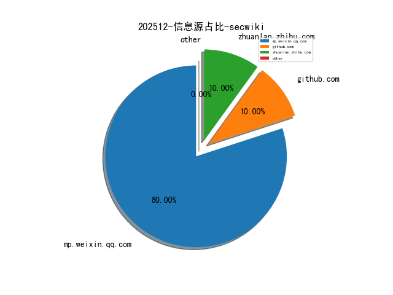
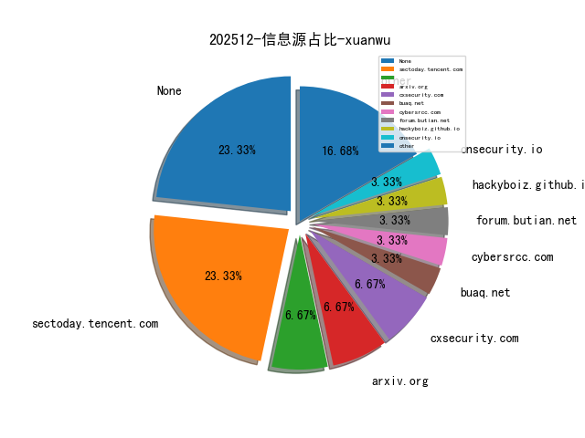
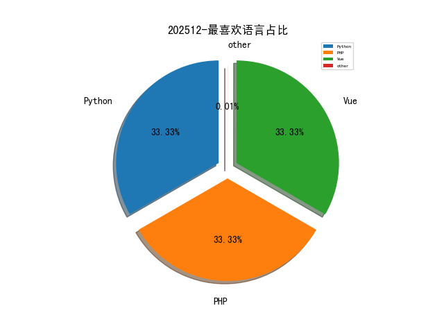

# [数据--所有](README_20.md)
# [数据--年度](README_2025.md)
# 202512 信息源与信息类型占比

# 微信公众号 推荐
| nickname_english | weixin_no | title | url| 
| --- | --- | --- | ---| 
| AI技术笔记 | None | Copilot 第一时间支持 GPT-5.2，国内可用 | https://mp.weixin.qq.com/s?__biz=MzkxNzY0Mzg2OQ==&mid=2247488155&idx=1&sn=df694ce11846681f89b3e04426ccb6c3 | 1| 
| DFIR蘇小沐 | None | 【1213】国行公祭 祀我国殇 民族之痛 永不敢忘！ | https://mp.weixin.qq.com/s?__biz=MzI2MTUwNjI4Mw==&mid=2247490247&idx=1&sn=92dfd414017da32486b607b5e757ead6 | 3| 
| IoVSecurity | None | 华为乾崑智能汽车解决方案-网络安全白皮书 | https://mp.weixin.qq.com/s?__biz=MzU2MDk1Nzg2MQ==&mid=2247629382&idx=3&sn=85582f171bb2a8e7be1dbeb90cb4e817 | 15| 
| KK安全说 | None | JWT黑客工具包：掌握身份验证攻击的20种真实黑客技巧 | https://mp.weixin.qq.com/s?__biz=Mzg4NzgyODEzNQ==&mid=2247490096&idx=1&sn=e0f45a41f0d992abe995e346ec2fd167 | 1| 
| Khan安全团队 | None | 实测16家国自然标书服务机构，本子打磨精修，中标率最高的是这家！ | https://mp.weixin.qq.com/s?__biz=MzAwMjQ2NTQ4Mg==&mid=2247505027&idx=2&sn=b324aacce9ba245d198bfe3964945771 | 2| 
| Say Sec | None | APP攻防-移动资产信息收集 | https://mp.weixin.qq.com/s?__biz=MzYyMzg3NDQ1Mw==&mid=2247486704&idx=1&sn=71c5de33bf1ce22730e0d315bf9f7265 | 1| 
| SecNL安全团队 | None | 技术分享会—LLM for 白盒漏洞检测 | https://mp.weixin.qq.com/s?__biz=MzU2MDE2MjU1Mw==&mid=2247486937&idx=1&sn=306eeb91eab3c063b203f8bfa6db54cd | 1| 
| 乌雲安全 | None | 打工是没前途的：全球漏洞赏金实时更新汇总 | https://mp.weixin.qq.com/s?__biz=MzAwMjA5OTY5Ng==&mid=2247528704&idx=1&sn=fe14cffea9b7caf1d405e899fd7a1b23 | 1| 
| 云原生安全指北 | None | 云安全RSS订阅源分享 | https://mp.weixin.qq.com/s?__biz=MzIyMzM2MzE1OQ==&mid=2247484862&idx=1&sn=2144f3daee953651f08ef86599c5c904 | 1| 
| 信安在线资讯 | None | 国家公祭日,传承记忆 祈愿和平 | https://mp.weixin.qq.com/s?__biz=MzIzNDIxODkyMg==&mid=2650087593&idx=1&sn=4072b833ec73e7c037688235b9044b55 | 1| 
| 信安路漫漫 | None | 信息搜集之边缘资产和隐形资产的发掘 | https://mp.weixin.qq.com/s?__biz=Mzg2MzkwNDU1Mw==&mid=2247486115&idx=1&sn=c15858dd078a0a92593e766a1f01ac66 | 3| 
| 信息安全动态 | None | 安全工具整合之痛：破解企业安全栈兼容性难题的实战攻略 | https://mp.weixin.qq.com/s?__biz=Mzg4NDc0Njk1MQ==&mid=2247488048&idx=1&sn=e44dbf2c62a75aab1f2a53fab7f00638 | 4| 
| 倬其安 | None | 银行数据中心容器云网络安全防护能力建设规划 | https://mp.weixin.qq.com/s?__biz=Mzg3NTUzOTg3NA==&mid=2247516943&idx=1&sn=9c21c335266b047b71b6903a6f0f16e4 | 6| 
| 内生安全联盟 | None | 不敢忘，不能忘！铭记历史，吾辈自强！ | https://mp.weixin.qq.com/s?__biz=Mzg4MDU0NTQ4Mw==&mid=2247535408&idx=2&sn=46eed72f2f0090ad49934fe5c9fc6db1 | 8| 
| 北风漏洞复现文库 | None | 致远分析云存在任意文件读取漏洞 附POC | https://mp.weixin.qq.com/s?__biz=Mzk2NDkwMDg3Nw==&mid=2247484061&idx=1&sn=5443ca9732ec6640787d1abab2efa7c6 | 1| 
| 只会看监控的实习生 | None | 速进！全平台项目群“安服崽”交流群 | https://mp.weixin.qq.com/s?__biz=MzkxNzY5MTg1Ng==&mid=2247494382&idx=2&sn=3bc4ada0e8a551bfee0067ba6b979864 | 3| 
| 君说安全 | None | 网络安全行业，近期行业热点事件盘点(2025 年 11-12 月) | https://mp.weixin.qq.com/s?__biz=MzUzNjkxODE5MA==&mid=2247498029&idx=1&sn=fe65274fa3f4fb1d8cfc39ada670ac9a | 34| 
| 天御攻防实验室 | None | 特朗普政府准备招募私营企业和网络安全公司，对外国对手发动网络攻击 | https://mp.weixin.qq.com/s?__biz=MzU0MzgyMzM2Nw==&mid=2247486626&idx=1&sn=14e88fd6f8781942a3e8674b5a5951f2 | 1| 
| 好靶场 | None | 88年，我们从未忘记！ | https://mp.weixin.qq.com/s?__biz=Mzg4MDg5NzAxMQ==&mid=2247486914&idx=1&sn=01e5f26a73044c274d0a0869a295ca1b | 2| 
| 安全学习那些事儿 | None | 警方起底直播间“推流”骗局！ | https://mp.weixin.qq.com/s?__biz=MzkxNTI2NTQxOA==&mid=2247499877&idx=5&sn=81ae4cdec96cf739b89f07204ea1ccb3 | 11| 
| 安恒信息 | None | “一周懿语”丨第五十二期 | https://mp.weixin.qq.com/s?__biz=MjM5NTE0MjQyMg==&mid=2650641616&idx=1&sn=38b5140760ea8dc443d1376a480403e1 | 5| 
| 小兵搞安全 | None | CVE-2025-55182挖矿木马分析 | https://mp.weixin.qq.com/s?__biz=MzA3NTc0MTA1Mg==&mid=2664712691&idx=1&sn=531a0a739cd50fe21cbe6b89dc60951c | 2| 
| 梦醒安全 | None | 红队必备！EHole指纹探测工具，5分钟摸清目标底细 | https://mp.weixin.qq.com/s?__biz=MzYzNjAwMjQ3OQ==&mid=2247484830&idx=1&sn=3b34fdb02ac47472dc59bef0eca8462f | 2| 
| 河南等级保护测评 | None | 大佬们的错误可能更顽固影响更坏 | https://mp.weixin.qq.com/s?__biz=Mzg2NjY2MTI3Mg==&mid=2247503235&idx=1&sn=74c76153063e12e65827fa6808bd5081 | 6| 
| 洞见网安 | None | 网安原创文章推荐【2025/12/12】 | https://mp.weixin.qq.com/s?__biz=MzAxNzg3NzMyNQ==&mid=2247491810&idx=1&sn=601a34d2215edc7fb7cd572192daa50d | 2| 
| 浅安安全 | None | 个人接单 , web渗透测试 | https://mp.weixin.qq.com/s?__biz=MzkwMTQ0NDA1NQ==&mid=2247495260&idx=1&sn=4e5e8033a4670f42e2dda8e0b307cff7 | 5| 
| 渊亭防务 | None | 防务简报丨美国在M1坦克上测试新型巡飞弹发射装置 | https://mp.weixin.qq.com/s?__biz=Mzg2NTYyODgyNg==&mid=2247509010&idx=1&sn=26fb6ff9f32fe60e32608174d11d72df | 3| 
| 物联网与信息安全团队 | None | 每周论文分享-11 | https://mp.weixin.qq.com/s?__biz=Mzk0NTI1MzU0MQ==&mid=2247486974&idx=1&sn=9d3e6607f529258ca5b31ccf15c9dd83 | 2| 
| 犀牛安全 | None | Fortinet警告称FortiCloud SSO登录认证绕过存在严重漏洞 | https://mp.weixin.qq.com/s?__biz=Mzg3ODY0NTczMA==&mid=2247494270&idx=1&sn=0cc38e6864c15b3e9386c5f822d0632e | 5| 
| 猎洞时刻 | None | 关于网络安全超低价格考证CISP、PTE、NISP | https://mp.weixin.qq.com/s?__biz=MzkyNTUyNTE5OA==&mid=2247489280&idx=1&sn=fce79dc1802d25c10f6becd0151ea1d7 | 1| 
| 生姜701 | None | 一次攻防演练中RCE绕过waf获取webshell | https://mp.weixin.qq.com/s?__biz=MzkxMDcwOTg5Nw==&mid=2247484038&idx=1&sn=ec78d5e9b1b7a639ea677c0943de91c0 | 2| 
| 生有可恋 | None | 在飞牛上安装测速软件 | https://mp.weixin.qq.com/s?__biz=Mzk0MTI4NTIzNQ==&mid=2247495998&idx=1&sn=03961a46b65e9127412d2ddd2ef8b211 | 7| 
| 破镜安全 | None | 青梅竹马：一道融合密码学与文化的CTF逆向题深度解析 | https://mp.weixin.qq.com/s?__biz=MzYzNzA5MzQ3Nw==&mid=2247485673&idx=1&sn=c328142ce3345bb8ade95ca4c9be8547 | 2| 
| 神农Sec | None | 「干货分享」应急响应之文件上传漏洞排查 | https://mp.weixin.qq.com/s?__biz=Mzk0Mzc1MTI2Nw==&mid=2247500803&idx=1&sn=895e23d008aec77e4f1b75f09cebc79e | 1| 
| 祺印说信安 | None | 净网—2025丨网警破获通过 “AI换脸”技术非法侵入计算机信息系统案 | https://mp.weixin.qq.com/s?__biz=MzA5MzU5MzQzMA==&mid=2652120169&idx=1&sn=813123f14f6101704012788b8e951650 | 6| 
| 秦安战略 | None | 秦安：量化交易猛如虎？真没有想到他们的服务器就在券商的机房里 | https://mp.weixin.qq.com/s?__biz=MzA5MDg1MDUyMA==&mid=2650482226&idx=1&sn=fd0d56ca0bc7a287019e6b0a943d25be | 5| 
| 缺月追寻 | None | 乱拳打死老师傅，提示词注入和大模型越狱方法有一套 | https://mp.weixin.qq.com/s?__biz=MzkxNDMxMTM2NA==&mid=2247484169&idx=1&sn=f075094a7915f604f82b5afb0abb37ea | 2| 
| 网空闲话plus | None | 【暗网快讯】20251213期 | https://mp.weixin.qq.com/s?__biz=MzkyMjQ5ODk5OA==&mid=2247517215&idx=4&sn=87f78130e174b9bd0afee48c271730fe | 17| 
| 网络侦查研究院 | None | 资金流断了之后：技术侦查如何从“一句话”挖出亿元跨境赌博案 | https://mp.weixin.qq.com/s?__biz=MzIxOTM2MDYwNg==&mid=2247521026&idx=1&sn=645e575c25adb7688217dcf9e2bd5acb | 3| 
| 网络安全学习室 | None | CTF Web巅峰拆解（第3期）：2025高难度题核心，搞定这3类漏洞直接冲榜 | https://mp.weixin.qq.com/s?__biz=MzkzNzk5MjEyNg==&mid=2247487116&idx=1&sn=6963ee74186a6523c0c2c701dc68c16b | 3| 
| 网络安全实验室 | None | 2026年CISP考试计划已出 | https://mp.weixin.qq.com/s?__biz=MzU4OTg4Nzc4MQ==&mid=2247507659&idx=1&sn=ec65ca6cddc503b0b0c438876a31a6e4 | 1| 
| 网络安全等保与关保 | None | 今日分享,GBT30290-2025  北斗卫星定位车辆信息服务系统 第6部分：紧急救援终端性能要求和测试方法 | https://mp.weixin.qq.com/s?__biz=MzUyNjk2MDU4MQ==&mid=2247487639&idx=1&sn=50e32aa27abad64ffbd28d2169b9081a | 1| 
| 网络技术干货圈 | None | 每天一个网络知识：什么是光纤？ | https://mp.weixin.qq.com/s?__biz=MzUyNTExOTY1Nw==&mid=2247532504&idx=1&sn=c3245f3f120f327a23fdc84a3c6ff5dc | 3| 
| 网络空间信息安全学习 | None | 新品｜影视播放器 VidHub 上架，影音爱好者赶快带走它！ | https://mp.weixin.qq.com/s?__biz=MzI2MjcwMTgwOQ==&mid=2247492798&idx=1&sn=e39b7a38a69c8879fdbede9c101f1848 | 3| 
| 网络空间内生安全大会 | None | 聚焦 6G 安全新范式，共探内生安全创新路 —— 无线通信内生安全分论坛圆满落幕 | https://mp.weixin.qq.com/s?__biz=MzkwOTI5NzIzMA==&mid=2247484403&idx=1&sn=33d861eb7ec88c7d69e116ffef9e3870 | 3| 
| 网际思安 | None | 【系列三】技术心脏：研发中心与麦赛实验室 | https://mp.weixin.qq.com/s?__biz=MzA5NjMyMDEwNg==&mid=2649287259&idx=1&sn=9b4612ec6db116e62f4e43af81dcd7a2 | 1| 
| 老五说网络 | None | 网络协议---telnet协议 | https://mp.weixin.qq.com/s?__biz=MzUxNzg5MzM2Mg==&mid=2247487284&idx=1&sn=c43c986bf7864664357dfcfea8ff9257 | 4| 
| 聚铭网络 | None | 【一周安全资讯1213】国家网信办《网络数据安全风险评估办法》公开征求意见；勒索软件利用EDR工具隐秘执行恶意代码 | https://mp.weixin.qq.com/s?__biz=MzIzMDQwMjg5NA==&mid=2247508464&idx=1&sn=4150f7bfe1f03db42cbe66ec87248ccf | 3| 
| 花鸟在线 | None | 攻击路径思想：常见陷阱与规避 | https://mp.weixin.qq.com/s?__biz=Mzg2ODU0NjUwNw==&mid=2247484421&idx=1&sn=4c811d216472e3c43dfc67004b3938eb | 1| 
| 苏州信息安全法学所 | None | 全球抗量子密码政策法律动态跟踪（第19期） | https://mp.weixin.qq.com/s?__biz=Mzg5NTA5NTMzMQ==&mid=2247502773&idx=2&sn=b66558c2632878f3754fe4338c589e8a | 6| 
| 苏说安全 | None | 地方政府为什么都在搞“数据集团”？ | https://mp.weixin.qq.com/s?__biz=Mzg5OTg5OTI1NQ==&mid=2247492477&idx=1&sn=5bf1eac1cf4a60fc3a810630ac64376b | 4| 
| 菜鸟学信安 | None | AI正在失控吗？ | https://mp.weixin.qq.com/s?__biz=MzU2NzY5MzI5Ng==&mid=2247508751&idx=1&sn=01846ef9d9f6a338fc3d3af146ffde54 | 1| 
| 蓝军开源情报 | None | 美军“Maven计划”中AI赋能情报监视侦察（ISR）的作战运用与启示 | https://mp.weixin.qq.com/s?__biz=MzkyMjY1MTg1MQ==&mid=2247497775&idx=5&sn=1ca881b16539e0117f438cd54f2ab696 | 5| 
| 观止安全 | None | 【Nday】Go-fastdfs 未授权+任意文件上传 | https://mp.weixin.qq.com/s?__biz=MzYzNzExNjA1OA==&mid=2247483907&idx=1&sn=5813875d0aec32fdec320be76d763540 | 1| 
| 谷安培训 | None | 人工智能将如何影响网络安全？ | https://mp.weixin.qq.com/s?__biz=MzU4MjUxNjQ1Ng==&mid=2247525958&idx=1&sn=5531f8704663cc75e15a1bf944161f7c | 8| 
| 谷安天下 | None | 2025年企业钓鱼邮件攻防态势与防护体系建设报告 | https://mp.weixin.qq.com/s?__biz=MzU4NDExNDQwNA==&mid=2247490490&idx=1&sn=eb672676308dfaf651f9de6add68c94d | 2| 
| 贝雷帽SEC | None | 云安全RSS订阅源分享 | https://mp.weixin.qq.com/s?__biz=Mzk0MDQzNzY5NQ==&mid=2247493943&idx=1&sn=1ac52874614c799a794904bff9fc4127 | 2| 
| 赛欧思安全研究实验室 | None | 赛欧思一周资讯分类汇总(2025-12-08 ~ 2025-12-13) | https://mp.weixin.qq.com/s?__biz=MzU0MjE2Mjk3Ng==&mid=2247490482&idx=1&sn=8dd3db7ac3863a624e326cca8d5ca050 | 1| 
| 软件安全与逆向分析 | None | Linux命名空间技术入门 | https://mp.weixin.qq.com/s?__biz=MzU3MTY5MzQxMA==&mid=2247484953&idx=1&sn=e625706724eb11859a2b09b7c3aaef9b | 1| 
| 进击的HACK | None | 通过github actions在线编译安全工具 | https://mp.weixin.qq.com/s?__biz=MzkxNjMwNDUxNg==&mid=2247489317&idx=1&sn=454fc6286afb5adfab50951ad1172302 | 2| 
| 金夏安全 | None | 【漏洞检测脚本】React Server Components 拒绝服务漏洞（CVE-2025-55184） | https://mp.weixin.qq.com/s?__biz=MzkxNTY5MjQ5OQ==&mid=2247487090&idx=1&sn=576ba6a08928185630bfbd3f6cc1b8af | 5| 
| 金盾检测股份 | None | 12.13国家公祭日｜铭记历史，吾辈自强！ | https://mp.weixin.qq.com/s?__biz=MzI5NjA4NjA3OA==&mid=2652103629&idx=1&sn=8e9b72214c943d5fea230083401e2267 | 1| 
| 铁军哥 | None | 从不可用到10分钟，再到10秒！我优化了AI手机操作，实现流畅运行 | https://mp.weixin.qq.com/s?__biz=MzI4NjAzMTk3MA==&mid=2458862865&idx=1&sn=74fcfe9f85c79b39e5bd9d1ceeec86a2 | 3| 
| 长弓三皮 | None | xctf攻防世界 GFSJ0251 misc  Blocks writeup | https://mp.weixin.qq.com/s?__biz=MzU2NzIzNzU4Mg==&mid=2247491331&idx=1&sn=af34c166badded3e94d80685e6a872f1 | 1| 
| 隼目安全 | None | 国家公祭日 | https://mp.weixin.qq.com/s?__biz=Mzk0OTUwNTU5Nw==&mid=2247490389&idx=1&sn=5aa496d86d63fd08390fcec8ff0143b1 | 1| 
| 高级红队专家 | None | OSCP必备技能16-MSSQL连接小技巧 | https://mp.weixin.qq.com/s?__biz=MzIzODMyMzQxNQ==&mid=2247485647&idx=1&sn=64440eb51a2289cdf2bca18a3a77ac93 | 4| 
| 黑白之道 | None | CTF竞赛系统、知识竞赛系统、漏洞靶场练习系统 | https://mp.weixin.qq.com/s?__biz=MzAxMjE3ODU3MQ==&mid=2650613644&idx=4&sn=6188e3d518a3b38bbeaa64c9f2c5307d | 4| 
| 龙哥网络安全 | None | CTF进阶破局指南：避开90%选手的坑，从卡题到夺冠的新维度技巧 | https://mp.weixin.qq.com/s?__biz=MzU3MjczNzA1Ng==&mid=2247500770&idx=1&sn=93591c141850a93903f053657486612a | 1| 
| 360威胁情报中心 | None | APT-C-26（Lazarus）组织利用WinRAR漏洞部署Blank Grabber木马的技术分析 | https://mp.weixin.qq.com/s?__biz=MzUyMjk4NzExMA==&mid=2247507693&idx=1&sn=e73e1cca5af2ee80c3037daa1dbd2ab1 | 2| 
| 360数字安全 | None | 紧急预警！银狐木马升级“远控+勒索”混合攻击 | https://mp.weixin.qq.com/s?__biz=MzA4MTg0MDQ4Nw==&mid=2247583251&idx=1&sn=bdf2b36a5d47450e88e90713d744658d | 10| 
| 360漏洞研究院 | None | 亿赛通电子文档安全管理系统(CDG)存在前台GetShell漏洞 | https://mp.weixin.qq.com/s?__biz=Mzk0ODM3NTU5MA==&mid=2247495654&idx=1&sn=ee1f517c81d035e8340cd2f3594a8b23 | 3| 
| CAICT可信安全 | None | 2025AI云产业大会·AI云安全分论坛成功召开！共筑AI云安全防线 | https://mp.weixin.qq.com/s?__biz=Mzk0MjM1MDg2Mg==&mid=2247509747&idx=1&sn=da179cba957322802e187c3ee5311143 | 5| 
| CISP | None | 第十九届全国大学生信息安全竞赛（创新实践能力赛）暨第三届“长城杯”网数智安全大赛（防护赛）初赛技术文件 | https://mp.weixin.qq.com/s?__biz=MzI1NzQ0NTMxMQ==&mid=2247490921&idx=1&sn=b50f414ea14803cf4ad6643e8229c4e5 | 2| 
| CertiK | None | 阿布扎比金融科技周回顾：以“信任、透明、韧性”引领Web3安全新趋势 | https://mp.weixin.qq.com/s?__biz=MzU5OTg4MTIxMw==&mid=2247504874&idx=1&sn=b836499782c23312bf2a91502be21e58 | 2| 
| FreeBuf | None | 新型ClickFix攻击：macOS信息窃取木马利用ChatGPT官网传播 | https://mp.weixin.qq.com/s?__biz=MjM5NjA0NjgyMA==&mid=2651332187&idx=4&sn=0ad0294e0c6948870236cb85f939149a | 23| 
| GoUpSec | None | 威胁情报沦为摆设，如何发挥真正价值？ | https://mp.weixin.qq.com/s?__biz=MzkxNTI2MTI1NA==&mid=2247504587&idx=2&sn=6574d2cfdc1f42211ccd41ebfb5a7135 | 2| 
| Hacking黑白红 | None | 腾讯vs字节，两种极端打工的感受 | https://mp.weixin.qq.com/s?__biz=Mzg2NDYwMDA1NA==&mid=2247546009&idx=1&sn=04d7985c39caaba24f0279a48d14da3f | 7| 
| ISC2网络安全 | None | 《2025年ISC2网络安全人力研究报告》重磅发布 | https://mp.weixin.qq.com/s?__biz=MzUzNTg4NDAyMg==&mid=2247493431&idx=1&sn=bc136a2f46f4945620d83122ddc68fea | 7| 
| JJ1ng | None | 内网渗透(六)：权限提升 | https://mp.weixin.qq.com/s?__biz=MzkyMjUzNTM1Mw==&mid=2247488108&idx=1&sn=9182d50ce84777753761f05c06e53500 | 1| 
| KeepHack1ng | None | 赢家的底层逻辑：极高信噪比 | https://mp.weixin.qq.com/s?__biz=MzkzOTQ5MzY3OQ==&mid=2247484544&idx=1&sn=8893f54524d9a0f000cae3e18fb1b201 | 2| 
| LK安全 | None | 安卓app攻防系列3-记一次对flutter app的抓包 | https://mp.weixin.qq.com/s?__biz=MzkxMzQyMzUwMg==&mid=2247486792&idx=1&sn=473d7efac67e68477e478bd222184e06 | 1| 
| M01N Team | None | 每周蓝军技术推送（2025.12.6-12.12） | https://mp.weixin.qq.com/s?__biz=MzkyMTI0NjA3OA==&mid=2247494540&idx=1&sn=5db9aed484aa7735335915d572ca2c10 | 2| 
| Mrykz | None | Next.js/React漏洞利用工具，支持waf绕过、哥斯拉内存马、反弹shell等 | https://mp.weixin.qq.com/s?__biz=MzYzNjMxODg1NA==&mid=2247483728&idx=1&sn=1880f55d13f8502b709ac1b09daafbe6 | 1| 
| Nday Poc | None | ZKTime 熵基智能考勤管理系统 ic1ock SQL注入漏洞 | https://mp.weixin.qq.com/s?__biz=MzkzMTcwMTg1Mg==&mid=2247493526&idx=1&sn=15f5d03a396bc348b6966415851313cc | 4| 
| Neon-X Sec | None | 银狐-程序伪装-sihost.exe外联 | https://mp.weixin.qq.com/s?__biz=MzA3MTQ4NDY1OA==&mid=2247484821&idx=1&sn=d6ed70e5fdd91032e2a28fb30f709599 | 1| 
| OPPO安全中心 | None | 【奖励公告】2025年11月 | https://mp.weixin.qq.com/s?__biz=MzUyNzc4Mzk3MQ==&mid=2247494596&idx=2&sn=a5cea30222bad15b9b11132a88ef8230 | 4| 
| Oxo Security | None | 【AI安全】深度解析 A2AS 智能体安全框架 | https://mp.weixin.qq.com/s?__biz=MzkxNzU2NDgxNQ==&mid=2247484178&idx=1&sn=8673a3ecaa181d345405d5229dd5354e | 4| 
| PokerSec | None | 【漏洞预警】Apache Tika XXE漏洞来袭(CVE-2025-66516) | https://mp.weixin.qq.com/s?__biz=MzkyNTYxNDAwNQ==&mid=2247485360&idx=1&sn=ecdec287caa76b7ba5a15e6b017564fc | 1| 
| Real返璞归真 | None | IoT安全 , 无人机安全攻防 (三)：Wi-Fi链路劫持与密码破解 | https://mp.weixin.qq.com/s?__biz=MzkyODMxMjQ3OQ==&mid=2247486160&idx=1&sn=ed457002b1b4ad33eae61650dcf6cd02 | 2| 
| RedTeam | None | 利用大语言模型优化 CodeQL 漏洞挖掘 | https://mp.weixin.qq.com/s?__biz=Mzg5NjAxNjc5OQ==&mid=2247484622&idx=1&sn=ff55a9a5b177d2e872df3a11e43de02f | 1| 
| SCUCTF | None | 2025 SCUCTF新生赛来啦！ | https://mp.weixin.qq.com/s?__biz=MzUxNDk1ODUxMw==&mid=2247486978&idx=1&sn=185276ee23c3c7732b5eb1f80bc55594 | 1| 
| SOC安全分析之旅 | None | 银狐Gh0stRAT 和 WinOS远程控制木马演进过程 | https://mp.weixin.qq.com/s?__biz=MzU2Njg4MTgzNg==&mid=2247484311&idx=1&sn=616314bdd3c00d1c288d8970d6731baa | 1| 
| Secu的矛与盾 | None | 使用微软账号的Windows如何用远程桌面连接问题 | https://mp.weixin.qq.com/s?__biz=Mzk0MzY3MDE5Mg==&mid=2247484306&idx=1&sn=84b6bc79d9e050347edc1979aa5b7042 | 1| 
| SharkSec | None | 粉丝投稿干货！用友 U8 Cloud 漏洞审计实录 | https://mp.weixin.qq.com/s?__biz=MzYzNDE4ODczNA==&mid=2247484790&idx=1&sn=965b0ce5728d907e75fa916516b12dbe | 5| 
| T00ls安全 | None | 坚守十七载，静待花开时 —— T00ls 12.12 老用户回归/复活活动开启 | https://mp.weixin.qq.com/s?__biz=Mzg3NzYzODU5NQ==&mid=2247485546&idx=1&sn=82cdd05537b54dd6af91df08f541d166 | 1| 
| W小哥 | None | redis 漏洞图形化利用工具 | https://mp.weixin.qq.com/s?__biz=MzUzNDczNjQ2OQ==&mid=2247485824&idx=1&sn=9b52b86a51db60e62c526c1bc4eb81fa | 3| 
| Yak Project | None | TUN劫持与代理规则详解 | https://mp.weixin.qq.com/s?__biz=Mzk0MTM4NzIxMQ==&mid=2247529213&idx=1&sn=62ce90504e95ce98ad15d1e4fb8a055b | 2| 
| capperflag安全团队 | None | php反序列化基础学习 | https://mp.weixin.qq.com/s?__biz=Mzk4ODczNjQyMA==&mid=2247483871&idx=1&sn=46f44e4d67a73f8d3d97a8e57b44caa7 | 1| 
| jacky安全 | None | 刚刚！已明确！全国新政策来了！12月12日起正式开始！！ | https://mp.weixin.qq.com/s?__biz=MzkzMjQ0MTk1OQ==&mid=2247484690&idx=1&sn=900c4bcb30842718d0d81c9b873c2d2e | 1| 
| kali笔记 | None | WinDump 一款后期安全测试工具 | https://mp.weixin.qq.com/s?__biz=MzkxMzIwNTY1OA==&mid=2247514967&idx=1&sn=c23fe9f6ebe0bbbbecb87de041a90404 | 2| 
| leison安全 | None | 一个真正的SRC是需要良好的沟通环境的 | https://mp.weixin.qq.com/s?__biz=Mzg4Mjg5MjMxOA==&mid=2247484050&idx=1&sn=caf5dfd7c3bbeea60ad0c2d6fc511b31 | 1| 
| solar应急响应团队 | None | 域控宕机！如何强制夺取五大角色恢复业务？ | https://mp.weixin.qq.com/s?__biz=MzkyOTQ0MjE1NQ==&mid=2247506837&idx=1&sn=374a9d9c5abf3c2648a8fd5039d2fa71 | 3| 
| 丁爸 情报分析师的工具箱 | None | 【资料】美国人才战略 | https://mp.weixin.qq.com/s?__biz=MzI2MTE0NTE3Mw==&mid=2651153269&idx=2&sn=037ca228b38f3a02e279f245fd6b2a6e | 5| 
| 三未信安 | None | 政策引领，技术护航丨三未信安用密码技术筑牢能源行业数据安全底座 | https://mp.weixin.qq.com/s?__biz=MzA5ODk0ODM5Nw==&mid=2650332756&idx=1&sn=9e8f911b6a55fa62242ef228c55eb4ca | 1| 
| 中国信息安全 | None | 关注 , 民进党当局封禁小红书一年，国台办回应 | https://mp.weixin.qq.com/s?__biz=MzA5MzE5MDAzOA==&mid=2664255191&idx=2&sn=0642f2011d6e5234dea03e4d722b3aff | 32| 
| 中国电信安全 | None | 智惠千百业，安全创新篇——第十九届 “创优杯”技能大赛安全赛道总决赛圆满收官 | https://mp.weixin.qq.com/s?__biz=MzkxNDY0MjMxNQ==&mid=2247538779&idx=1&sn=7160f53755be6780aa840a25270031ad | 4| 
| 中国软件评测中心 | None | 锚定数创企业培育，助力开展评估新路径 | https://mp.weixin.qq.com/s?__biz=MjM5NzYwNDU0Mg==&mid=2649256787&idx=1&sn=ef8e50b62ca017c9fe40d15bafe1ecf2 | 10| 
| 中机博也汽车技术 | None | 基层讲党课,蔡万华到中机博也党支部讲授党的二十届四中全会精神专题党课 开展“融合攻关创佳绩”主题党日活动 | https://mp.weixin.qq.com/s?__biz=Mzg3OTU3Mjg0Nw==&mid=2247485639&idx=1&sn=40bdbe4830e5dd30fbebbc193ef5754f | 1| 
| 中资网安 | None | 中央经济工作会议，一图速览！ | https://mp.weixin.qq.com/s?__biz=MzkxMzAzMjU0OA==&mid=2247553593&idx=2&sn=c017d7a9d854d20f86f1cc857905ccee | 3| 
| 亚信安全 | None | 亚信安全荣获鸿蒙办公产业峰会两大殊荣 携手鸿蒙共筑办公安全基石 | https://mp.weixin.qq.com/s?__biz=MjM5NjY2MTIzMw==&mid=2650626580&idx=1&sn=2e309ff40915c9561573b1f0ca0e1d96 | 7| 
| 交大捷普 | None | 精品产品 , 捷普工控安全集中管理系统 | https://mp.weixin.qq.com/s?__biz=MzI2MzU0NTk3OA==&mid=2247507319&idx=2&sn=730875ee567c6bca834aad5231551edf | 5| 
| 亿赛通 | None | 亿赛通CDG产品升级通知（20251212） | https://mp.weixin.qq.com/s?__biz=MzA5MjE0OTQzMw==&mid=2666307534&idx=1&sn=dda654bcafa1eeefcdebe570cad9ae84 | 1| 
| 代码卫士 | None | 微软将影响在线服务的第三方漏洞纳入奖励计划 | https://mp.weixin.qq.com/s?__biz=MzI2NTg4OTc5Nw==&mid=2247524650&idx=3&sn=b7863ac8099dfd54d53e02832cf2eb2f | 13| 
| 任子行 | None | 当金融数据治理遇上24号文，你的合规防线够智能吗？ | https://mp.weixin.qq.com/s?__biz=MzI0NjAyMjU4MA==&mid=2649597813&idx=1&sn=c214c1aee8eb94c7e6a1f7df649567f8 | 2| 
| 企业网络信息安全 | None | “就装个小软件”引发百万元损失，某科技公司勒索软件事件纪实 | https://mp.weixin.qq.com/s?__biz=MzU0MDkxNjEwNg==&mid=2247494436&idx=2&sn=f25f1cdbdeffbc0f4ab9637b8be6a7ef | 6| 
| 信息安全与通信保密杂志社 | None | 密码“丰”会2025暨首届商用密码企业党建论坛亮点提前看 | https://mp.weixin.qq.com/s?__biz=MzkwMTMyMDQ3Mw==&mid=2247602887&idx=4&sn=b6c6610a43f1cbffe4dbde5e1330a8a6 | 22| 
| 信息安全研究 | None | 学海观澜︱中国地质大学（武汉）·计算机学院2025年度科研平台联合开放基金申请指南 | https://mp.weixin.qq.com/s?__biz=MzA3NzgzNDM0OQ==&mid=2664998823&idx=3&sn=ea9c0122da00075359adc0f12ab4f0af | 12| 
| 信息安全笔记 | None | 企业信息安全建设误区 | https://mp.weixin.qq.com/s?__biz=MjM5MzI3NzE4NA==&mid=2257484502&idx=1&sn=19f5ee46e87bf5f57b95fedf24a1fc12 | 3| 
| 先进攻防 | None | 安全自动化与智能体的技术路线区别 | https://mp.weixin.qq.com/s?__biz=MzI1MDA1MjcxMw==&mid=2649908776&idx=1&sn=01a4ce043995d22c0f8c8d97298d1d59 | 2| 
| 全球技术地图 | None | 欧盟委员会发布《电网一揽子计划》，强化欧盟能源安全与独立 | https://mp.weixin.qq.com/s?__biz=MzI1OTExNDY1NQ==&mid=2651622254&idx=2&sn=04eec64c793c647783a301de568dd5b7 | 14| 
| 公安部网安局 | None | 《网络黑灰产治理》强制性国家标准启动会在上海召开 | https://mp.weixin.qq.com/s?__biz=MzU0MTA3OTU5Ng==&mid=2247570972&idx=1&sn=c79c56a8ce3b6ece1551d805aaf24101 | 10| 
| 利刃信安 | None | 【逆向分析】某密评工具箱授权绕过分析 | https://mp.weixin.qq.com/s?__biz=MzU1Mjk3MDY1OA==&mid=2247521812&idx=1&sn=17a7e83b4f01084d96056ab3227dff04 | 6| 
| 北京路劲科技有限公司 | None | 企业必懂得安全密码体检指南！ | https://mp.weixin.qq.com/s?__biz=MzUyMjAyODU1NA==&mid=2247492922&idx=1&sn=5bacbebe227307d7905e52a048e20505 | 2| 
| 北信源 | None | 北信源获首批入驻网络安全等级保护2.0与可信计算3.0攻关示范基地单位证书 | https://mp.weixin.qq.com/s?__biz=MzA5MTM1MjMzNA==&mid=2653426893&idx=1&sn=36055e679782f73b74c327d112900fc3 | 1| 
| 升斗安全 | None | “缓存欺骗第二章第一节”构建一次缓存欺骗攻击的步骤简述 | https://mp.weixin.qq.com/s?__biz=MjM5MzM0MTY4OQ==&mid=2447797506&idx=1&sn=7e0af371cf9b3a61dffb0f2396a9f17a | 4| 
| 华为安全 | None | 强叔侃墙 , NAT进阶：一网多路实战技巧大放送！ | https://mp.weixin.qq.com/s?__biz=MzAwODU5NzYxOA==&mid=2247506806&idx=1&sn=ec00beedd7c7262d994dc8cb615e5974 | 3| 
| 合天网络安全 | None | 舶文网安实验室上线啦 | https://mp.weixin.qq.com/s?__biz=MzIyNzU3Mzg2NQ==&mid=2247487204&idx=1&sn=99ffbb7e286852ffcfa0f26c9bd1a7ba | 1| 
| 启明星辰安全简讯 | None | 【漏洞通告】React Server Components 拒绝服务漏洞(CVE-2025-55184) | https://mp.weixin.qq.com/s?__biz=MzkzNzY5OTg2Ng==&mid=2247501893&idx=2&sn=0f78535d9b3529962e3a630856057c87 | 7| 
| 启明星辰集团 | None | “银狐”木马来袭！启明星辰多智能体联动构建主动防御体系 | https://mp.weixin.qq.com/s?__biz=MzA3NDQ0MzkzMA==&mid=2651735235&idx=1&sn=9e17ffe7f976384bbdcf83b31a19569c | 8| 
| 哆啦安全 | None | frida魔改绕过检测(Android和iOS) | https://mp.weixin.qq.com/s?__biz=Mzg2NzUzNzk1Mw==&mid=2247499371&idx=1&sn=1964a912ab735c3205b840ff83fd21e0 | 2| 
| 四叶草安全 | None | 双奖加冕，实力鉴证：四叶草安全获国家级漏洞治理最高认可 | https://mp.weixin.qq.com/s?__biz=MjM5MTI2NDQzNg==&mid=2654553502&idx=1&sn=463f32353c2711ced235e7421cea5868 | 2| 
| 国家信息安全服务资质 | None | 第十五届网络安全漏洞分析与风险评估大会——企业家高峰论坛顺利举办 | https://mp.weixin.qq.com/s?__biz=MzI0NDg4MTIyNQ==&mid=2247486274&idx=1&sn=0705d79ecf3e4a1a7277d1b876175688 | 1| 
| 国际云安全联盟CSA | None | 可信数据空间给加密产业带来的机遇 | https://mp.weixin.qq.com/s?__biz=MzkwMTM5MDUxMA==&mid=2247508558&idx=1&sn=0891ae47cdd91ba4cfb0d64be73cbeda | 3| 
| 墨云安全 | None | 第十五届VARA大会 , 墨云AI红客团队亮相 | https://mp.weixin.qq.com/s?__biz=MzU5ODE2NDA3NA==&mid=2247497124&idx=1&sn=fc1f267c167df06e0bf94c3d22ff0097 | 1| 
| 夜幕讲安全 | None | 入门网安必学的5大编程语言 | https://mp.weixin.qq.com/s?__biz=MzkyODk0MDY5OA==&mid=2247488399&idx=1&sn=9107282b3b3501c8f0b55930740dc6c1 | 2| 
| 大学生信息安全竞赛 | None | 第十九届全国大学生信息安全竞赛 （创新实践能力赛）暨第三届“长城杯” 网数智安全大赛（防护赛）初赛技术文件 | https://mp.weixin.qq.com/s?__biz=MzAxNTc1ODU5OA==&mid=2665516495&idx=1&sn=0b92bbbcb1be5421b149a917d7bbc259 | 1| 
| 天启攻防实验室 | None | edu之AI漏洞挖掘 | https://mp.weixin.qq.com/s?__biz=MzkzODQzNTU2NA==&mid=2247486639&idx=1&sn=d3356427667a08834f56e4edd7ff26ef | 1| 
| 天威诚信 | None | 邀请函 , 天威诚信任全链路智能化SSL证书生态引擎发布会 | https://mp.weixin.qq.com/s?__biz=MzU4MzY5MzQ4MQ==&mid=2247543010&idx=1&sn=d3934e07f044e78faa19104c9d557ffd | 3| 
| 天欣AI | None | GPT-5.2发布，最适合打工人的AI来了！ | https://mp.weixin.qq.com/s?__biz=MzkxMDc1NzU1Ng==&mid=2247484823&idx=1&sn=12c5979af0045414f0cc95e20dd736a2 | 1| 
| 天融信教育 | None | 共探人才培养新路径丨南京审计大学金审学院与天融信教育举行产教融合座谈会 | https://mp.weixin.qq.com/s?__biz=MzU0MjEwNTM5Ng==&mid=2247520932&idx=2&sn=7a6dea9d08567e9dee3f7f44367f7729 | 2| 
| 太乙Sec实验室 | None | 基于Fastadmin框架的涉网平台从渗透测试到电子数据取证一条龙手册 | https://mp.weixin.qq.com/s?__biz=Mzk0Mzc2MDQyMg==&mid=2247486768&idx=1&sn=2a540f50ea6fe0f81f0b72170ba101d6 | 1| 
| 奇安信 CERT | None | 安全热点周报：黑客利用 ArrayOS AG VPN 漏洞植入WebShelu200bu200bl 并创建恶意用户 | https://mp.weixin.qq.com/s?__biz=MzU5NDgxODU1MQ==&mid=2247504343&idx=2&sn=cea3e417e541c5aa75652768f7f71928 | 4| 
| 奇安信病毒响应中心 | None | 每周勒索威胁摘要 | https://mp.weixin.qq.com/s?__biz=MzI5Mzg5MDM3NQ==&mid=2247498561&idx=1&sn=707b4be6886f4c22b52d114203964a6b | 1| 
| 奇安信集团 | None | 奇安信出席鸿蒙办公产业峰会 发布可信浏览器鸿蒙版 | https://mp.weixin.qq.com/s?__biz=MzU0NDk0NTAwMw==&mid=2247630166&idx=3&sn=95d01c17a8d1d4fe5efd74e63ae542ee | 18| 
| 奉天安全团队 | None | APP攻防-移动资产信息收集 | https://mp.weixin.qq.com/s?__biz=Mzk0NjQ2NzQ0Ng==&mid=2247485255&idx=1&sn=d7631d912dd7f5bf4fc946e6013eda12 | 2| 
| 威努特安全网络 | None | 威努特与海开控股达成全面战略合作！ | https://mp.weixin.qq.com/s?__biz=MzAwNTgyODU3NQ==&mid=2651138563&idx=1&sn=a1d6f2e3b4c674a2293a365c1c1b3427 | 3| 
| 安世加 | None | 导致约 160 万英国用户数据被盗，密码管理器 LastPass 被重罚 120 万英镑 | https://mp.weixin.qq.com/s?__biz=MzU2MTQwMzMxNA==&mid=2247543380&idx=1&sn=be2f32b927b817f76a65330816983555 | 6| 
| 安全产品人的赛博空间 | None | 超出想象的简单！ChatGPT的记忆方案 | https://mp.weixin.qq.com/s?__biz=Mzg5NTUzODkxMw==&mid=2247484364&idx=1&sn=fbd7b71b60899703f2599c113f1e8650 | 1| 
| 安全代码 | None | 谷歌广告+PayPal支付页遭组合利用，新型钓鱼攻击精准绕过平台安全机制 | https://mp.weixin.qq.com/s?__biz=MzIwMTQ2MzU5Nw==&mid=2652462413&idx=1&sn=e4893d2b0b226fceb464ba3f59423e64 | 2| 
| 安全内参 | None | 美国2026财年网络安全预算呈现“军升民降”反差 | https://mp.weixin.qq.com/s?__biz=MzI4NDY2MDMwMw==&mid=2247515325&idx=2&sn=7a21c0b14f69692ca852b7191b2e6dd0 | 12| 
| 安全分析与研究 | None | 海莲花APT组织攻击活动和攻击手法 | https://mp.weixin.qq.com/s?__biz=MzA4ODEyODA3MQ==&mid=2247494746&idx=1&sn=f118e244feee545ee5d5b94cf2873ded | 5| 
| 安全分析研究 | None | 伪装Chrome安装包的一例银狐样本分析 | https://mp.weixin.qq.com/s?__biz=MzYzNjE2MDE3Nw==&mid=2247484031&idx=1&sn=d18f2718b279a99b122071a4ba9896e0 | 1| 
| 安全圈 | None | 【安全圈】\"迷人小猫\"黑客组织数据泄露：核心成员、空壳公司与数千台受控系统曝光 | https://mp.weixin.qq.com/s?__biz=MzIzMzE4NDU1OQ==&mid=2652073174&idx=4&sn=7fcae0b329bc84e66f5409c86dc8a5d9 | 24| 
| 安全威胁纵横 | None | 黑客利用大语言模型窃取密码与加密货币 | https://mp.weixin.qq.com/s?__biz=Mzk2ODExMjEyNA==&mid=2247486916&idx=1&sn=22d2d415926d2388cc12a067f496d1ee | 3| 
| 安全牛科技 | None | 工业网络安全周报-2025年第50期 | https://mp.weixin.qq.com/s?__biz=Mzk0MTQ5NjI2Ng==&mid=2247486984&idx=1&sn=415bbd6c67756c2799b6fad51d0406d3 | 2| 
| 安全狗的自我修养 | None | 我如何靠开发者思维挖出 3 个业务逻辑漏洞 | https://mp.weixin.qq.com/s?__biz=MzkwOTE5MDY5NA==&mid=2247508622&idx=1&sn=7b20236fd56bdc81caddac18a099becc | 4| 
| 安博通 | None | 安博通入选“中国数据街”数据领域创新成果名录，共筑安全新生态 | https://mp.weixin.qq.com/s?__biz=MzIyNTA5Mzc2OA==&mid=2651138691&idx=1&sn=a8ac5be9ef6cdd1011df55a1bf002aa0 | 2| 
| 安在 | None | 免费赠送 , 企业办公安全意识培训科普素材第六期） | https://mp.weixin.qq.com/s?__biz=MzU5ODgzNTExOQ==&mid=2247648767&idx=3&sn=5db690af1a188524bbf09c9d6be0a55a | 23| 
| 安天集团 | None | 瞄准微信、钉钉等工具定向投放远控木马丨游蛇（银狐）技战术追踪 | https://mp.weixin.qq.com/s?__biz=MjM5MTA3Nzk4MQ==&mid=2650213282&idx=1&sn=ccbd72c32a590fd553420e79cdda4502 | 5| 
| 安易科技AneSec | None | 安易科技参加第十五届网络安全漏洞分析与风险评估大会 | https://mp.weixin.qq.com/s?__biz=MzkwMTI3ODUxOQ==&mid=2247485290&idx=1&sn=c625fa1535bb8e1586b423db25574d7c | 1| 
| 安芯网盾 | None | 安芯网盾获北京市大数据中心感谢信 | https://mp.weixin.qq.com/s?__biz=MzU1Njk1NTYzOA==&mid=2247491923&idx=1&sn=112a554a0a49eea299bd4f86816fbae2 | 1| 
| 小柳实验室 | None | 深度解析SSH：从基础连接到高效运维的终极指南 | https://mp.weixin.qq.com/s?__biz=MzAxMDM2OTg4NA==&mid=2247484535&idx=1&sn=2da95aa16346a68da59a126685132b17 | 3| 
| 小草培养创研中心 | None | AI 如何看穿垃圾短信？一个简单项目带你揭示的人工智能的深层本质 。 | https://mp.weixin.qq.com/s?__biz=MzIxMDAwNzM3MQ==&mid=2247523365&idx=1&sn=219ec216402c0439c81255cb62e46e5f | 3| 
| 小谢取证 | None | 基于Fastadmin框架的涉网平台从渗透测试到电子数据取证一条龙手册 | https://mp.weixin.qq.com/s?__biz=Mzg4MTcyMTc5Nw==&mid=2247490109&idx=1&sn=169d0effcdd8de8b6dd9ce6eb4413609 | 1| 
| 工业安全产业联盟平台 | None | 专家解读｜实施网络数据安全风险评估办法 加强国家网络数据安全能力建设 | https://mp.weixin.qq.com/s?__biz=MzI2MDk2NDA0OA==&mid=2247536400&idx=2&sn=ddd120cdbb9058cb3ec6a638267ca8bf | 8| 
| 工联安全众测 | None | 工联安全大讲堂第三十五期即将开讲！ | https://mp.weixin.qq.com/s?__biz=MzkyMDMwNTkwNg==&mid=2247488101&idx=1&sn=3a07b8e1d6f285b7a7bc147329d61915 | 2| 
| 开源情报技术研究院 | None | 基于卫星的网络安全威胁情报 | https://mp.weixin.qq.com/s?__biz=MzkwNjQxOTk1Mg==&mid=2247486209&idx=1&sn=4cbed45b0af54b1e136f80fd7a7eed62 | 2| 
| 微步在线研究响应中心 | None | 还得继续修！React又爆新漏洞 | https://mp.weixin.qq.com/s?__biz=Mzg5MTc3ODY4Mw==&mid=2247508054&idx=1&sn=846b91a0f451895b19642312792dee96 | 3| 
| 悬镜安全 | None | 国内首批 , 悬镜安全率先通过国家工信安全中心SBOM标准认证 | https://mp.weixin.qq.com/s?__biz=MzA3NzE2ODk1Mg==&mid=2647797314&idx=1&sn=cfceb7b6667d4875b7451b6a72293ae3 | 2| 
| 慢雾科技 | None | Cointelegraph 报道：慢雾(SlowMist)创始人 Cos 谈链上安全的核心——速度与协作 | https://mp.weixin.qq.com/s?__biz=MzU4ODQ3NTM2OA==&mid=2247504022&idx=1&sn=132e806f1e7c70c408c8f695c3548793 | 1| 
| 数世咨询 | None | 新漏洞爆发，漏扫工具却“失效”！我该怎么办？ | https://mp.weixin.qq.com/s?__biz=MzkxNzA3MTgyNg==&mid=2247541135&idx=2&sn=ab3486e649151b680590c8a05cd30fe1 | 3| 
| 星落安全团队 | None | 全平台Socks5代理 , GO重构服务端 , 支持Linux上线 , Cobaltstrike1.7正式发布! | https://mp.weixin.qq.com/s?__biz=MzkwNjczOTQwOA==&mid=2247497414&idx=1&sn=1ea70b465506ead8e265124bce627fdf | 3| 
| 智探AI应用 | None | 祥云天地94万、海森亿通94.2万、连邦信息96万！国投证券通在线文档AI功能升级项目 | https://mp.weixin.qq.com/s?__biz=MzIxMDIwODM2MA==&mid=2653933165&idx=3&sn=9e9a2ab3b0c336c220bed3a0be69bd3a | 28| 
| 极客安全 | None | 安全动态丨网络空间安全动态第306期 | https://mp.weixin.qq.com/s?__biz=MzU2MjcwOTY1Mg==&mid=2247522155&idx=2&sn=a84c5f4815cb38ccb29efbe3416b47a7 | 2| 
| 武汉网络安全 | None | 会员动态 , 金信润天助力武信学子斩获国赛二等奖 | https://mp.weixin.qq.com/s?__biz=MzA3OTEyODAxMw==&mid=2247510892&idx=4&sn=4a8b2f1f75c4373ce1bbd0de65774017 | 13| 
| 江南信安 | None | 安全资讯汇总：2025.12.8-2025.12.12 | https://mp.weixin.qq.com/s?__biz=MzA4MTE0MTEwNQ==&mid=2668670927&idx=2&sn=65cc10fdb66ba646aca17d5f48061aee | 5| 
| 汽车信息安全 | None | 青骥原创 l 人工智能安全工程：整车与零部件的融合与挑战 | https://mp.weixin.qq.com/s?__biz=Mzg3MTI0NDQwNg==&mid=2247488543&idx=1&sn=07a5339e1c165b2b5a1d4401a9547f35 | 1| 
| 泷羽Sec-Norsea | None | Venom：新一代红队作战平台，模块化资产发现+漏扫+利用一体化 | https://mp.weixin.qq.com/s?__biz=MzU2MTc4NTEyNw==&mid=2247493075&idx=1&sn=8eb188f8b152bea4fe660ab61caa93a6 | 5| 
| 深信服千里目安全技术中心 | None | 【漏洞通告】Fortinet多产品身份验证绕过漏洞（CVE-2025-59718） | https://mp.weixin.qq.com/s?__biz=Mzg2NjgzNjA5NQ==&mid=2247524883&idx=1&sn=0c6adc6337df36f15bbe633bb2af3a7e | 1| 
| 渗透安全HackTwo | None | 多厂商云存储桶漏洞检测浏览器插件（阿里云 / 腾讯云 / AWS）2025-11-27更新,工具分享 | https://mp.weixin.qq.com/s?__biz=Mzg3ODE2MjkxMQ==&mid=2247496192&idx=1&sn=b4ef5b73569d8c3c0d4b117597996cb5 | 4| 
| 渗透安全团队 | None | 小程序渗透测试，只有一个页面？以及关联通杀方案 | https://mp.weixin.qq.com/s?__biz=MzkxNDAyNTY2NA==&mid=2247519707&idx=2&sn=f88b661387761b29926d9042ae1fc1da | 5| 
| 游侠安全网 | None | USBLogClear - U盘使用记录查看和删除工具 | https://mp.weixin.qq.com/s?__biz=MjM5NjI0NjcwMg==&mid=2652155145&idx=1&sn=541172a3f5fbfe9c8d2b1524fc21c740 | 1| 
| 火绒安全 | None | 诚邀渠道合作伙伴共启新征程 | https://mp.weixin.qq.com/s?__biz=MzI3NjYzMDM1Mg==&mid=2247528452&idx=3&sn=5736d8228e770f4e41ffc612a39cd42f | 12| 
| 独眼情报 | None | React2Shell 漏洞在野利用情况汇总 | https://mp.weixin.qq.com/s?__biz=MzkzNDIzNDUxOQ==&mid=2247504728&idx=1&sn=9c200452c7d04c9880f243743067e32c | 7| 
| 玄枢战队-Arcane Hub | None | 论文研读与思考 , 基于优化的针对作为评判器的LLM的提示注入攻击 | https://mp.weixin.qq.com/s?__biz=MzU4NjcxMTY3Mg==&mid=2247490387&idx=1&sn=877ecea0d46c1209852e38d8aeb8f845 | 1| 
| 玄道夜谈 | None | 分享图片 | https://mp.weixin.qq.com/s?__biz=MzI3Njc1MjcxMg==&mid=2247497082&idx=1&sn=d9dea74f7bb5d0e3ba02ad0b9e1f3b76 | 3| 
| 白帽子社区团队 | None | 在校学生如何获取N1 PRO网安模型使用许可 | https://mp.weixin.qq.com/s?__biz=MzkzNDQ0MDcxMw==&mid=2247488390&idx=2&sn=d4efcff7d9737b2812ac00f2ae5dbb9a | 6| 
| 百度安全 | None | 首家！百度大模型安全护栏荣获信通院大模型安全护栏能力评估优秀级 | https://mp.weixin.qq.com/s?__biz=MjM5MTAwNzUzNQ==&mid=2650511874&idx=1&sn=a48dd3ffda974a2b09e55f92acd3aa4b | 4| 
| 盘古石取证 | None | 小盘实战 , 面对10万条聊天记录的职务侵占案，如何在数十小时内锁定证据链？ | https://mp.weixin.qq.com/s?__biz=Mzg3MjE1NjQ0NA==&mid=2247514928&idx=1&sn=ae2e601ce4226383a9720d5176d6fdea | 1| 
| 盛邦安全WebRAY | None | 喜报 , 盛邦安全成功入围国网信通产业集团2026年核心班组劳务框架 | https://mp.weixin.qq.com/s?__biz=MzAwNTAxMjUwNw==&mid=2650279341&idx=2&sn=a5fd2fc0b7216388dfe808803f3f3fb7 | 3| 
| 盛邦安全应急响应中心 | None | 网络安全信息与动态周报2025年第49期（12月1日-12月7日） | https://mp.weixin.qq.com/s?__biz=Mzk0NjMxNTgyOQ==&mid=2247484842&idx=2&sn=a40264f517f6eeb63ffff8f3c8d93369 | 4| 
| 看雪学苑 | None | 2025安卓逆向冬季高研班，专治“技术内卷”——学真逆向，冲3万月薪 | https://mp.weixin.qq.com/s?__biz=MjM5NTc2MDYxMw==&mid=2458605063&idx=4&sn=df2a34e27227a315812d453a638bf356 | 23| 
| 破浪信安 | None | 【工具推荐】哥斯拉内存马+React2Shell (CVE-2025-55182) | https://mp.weixin.qq.com/s?__biz=MzkwMjU2OTEwMQ==&mid=2247484047&idx=1&sn=6e403ac86aa07b0d095ae9afaebbccac | 1| 
| 第59号 | None | 每周安全速递³⁶⁹ , 安卓勒索软件DroidLock针对西班牙语言用户进行攻击 | https://mp.weixin.qq.com/s?__biz=MzI0NDgxMzgxNA==&mid=2247497497&idx=1&sn=45e9fef76202aecf447aedefadee110a | 1| 
| 绿盟科技 | None | 权威认证 , 绿盟科技荣获“2025全国智慧医保大赛”二等奖，打造智慧安全体系 | https://mp.weixin.qq.com/s?__biz=MjM5ODYyMTM4MA==&mid=2650474904&idx=3&sn=c32106bb2e96ec05821067576c46d649 | 10| 
| 网络与信息安全学报 | None | 基于风险权值聚合联邦学习的金融欺诈检测模型 | https://mp.weixin.qq.com/s?__biz=MzI1MjAyMTg1Ng==&mid=2650471830&idx=1&sn=db77c9e8140f525581f565a5f9d2e673 | 1| 
| 网络与数据法律实务 | None | 汇业研究 , 企业在中国境内部署及应用AI Agent的主要法律问题 | https://mp.weixin.qq.com/s?__biz=MzAxOTk5NDY1MQ==&mid=2247487346&idx=1&sn=8a5b460958f75a485bf19eddafd2c097 | 2| 
| 网络安全与取证研究 | None | 【无人机取证篇】无人机取证飞行日志分析（简） | https://mp.weixin.qq.com/s?__biz=Mzg3NTU3NTY0Nw==&mid=2247490893&idx=1&sn=5cd0261dff8b160a384f612c82dda27c | 1| 
| 网络安全和信息化 | None | 品鉴、挑剔：2025人工智能与数据技术应用创新大赛初审举行 | https://mp.weixin.qq.com/s?__biz=MjM5MzMwMDU5NQ==&mid=2649175289&idx=4&sn=5cc1d68d7d39ef8bea71afd86f742f96 | 16| 
| 网络空间安全科学学报 | None | 2025年网络空间安全学术会议成功召开 | https://mp.weixin.qq.com/s?__biz=MzI0NjU2NDMwNQ==&mid=2247507021&idx=1&sn=f16b3de3e599134d5e455b718d4ca4db | 3| 
| 美亚柏科 | None | 【协会风采】会员单位：厦门安业科技股份有限公司 | https://mp.weixin.qq.com/s?__biz=MjM5NTU4NjgzMg==&mid=2651449092&idx=2&sn=c01d5251d398a7c7b19f0164c7100f80 | 8| 
| 老付话安全 | None | 【大话工控安全】工业控制系统行业知识：精细化工行业 | https://mp.weixin.qq.com/s?__biz=MzI0MzM3NTQ5MA==&mid=2247485779&idx=1&sn=5c0167cffe3d7f032761a72b98baf356 | 6| 
| 能信安资讯 | None | 能信安：漏洞通告 | https://mp.weixin.qq.com/s?__biz=MzI1MTYzMjY1OQ==&mid=2247491485&idx=1&sn=99a2507717f9991c0c6f8d90aa3f2054 | 1| 
| 腾讯技术工程 | None | AI研发新范式：基于技术方案全链路生成代码 | https://mp.weixin.qq.com/s?__biz=MjM5ODYwMjI2MA==&mid=2649797479&idx=1&sn=66c3c13d139005fbef8a6245d2bb0a44 | 5| 
| 腾讯玄武实验室 | None | 每日安全动态推送(25/12/12) | https://mp.weixin.qq.com/s?__biz=MzA5NDYyNDI0MA==&mid=2651960325&idx=1&sn=e66cf84ea710bc01f76f9bee8383d8cd | 2| 
| 船山信安 | None | 大学生为赚学费出售\"白码\"无检测Webshell，已入侵5200余个政府/教育网站 | https://mp.weixin.qq.com/s?__biz=MzU2NDY2OTU4Nw==&mid=2247525498&idx=1&sn=0f776fc3e001f770c1534f7ef244aafc | 10| 
| 苏魂学安全 | None | ios端app内存修改器实测 | https://mp.weixin.qq.com/s?__biz=MzkwNzQwMTA4OQ==&mid=2247483823&idx=1&sn=67f9fe1b75132c968f00453bdf39de38 | 1| 
| 虎符智库 | None | 网络威胁高速演化下，网络安全已成为核心业务能力 | https://mp.weixin.qq.com/s?__biz=MzIwNjYwMTMyNQ==&mid=2247493592&idx=1&sn=b29cb4af6a4194b6aeb9501c82af6707 | 1| 
| 蚁景网安 | None | Tongweb 闭源中间件代码审计 | https://mp.weixin.qq.com/s?__biz=MzkyNTY3Nzc3Mg==&mid=2247491017&idx=1&sn=5a4103c9decbb0dd1fb622876d8516ab | 6| 
| 蚁景网络安全 | None | 【免费领】全网最全！网安岗位面试题大全（含答案） | https://mp.weixin.qq.com/s?__biz=MzkxNTIwNTkyNg==&mid=2247556982&idx=2&sn=d53605a6dabe844089fecc3beec82c52 | 14| 
| 表哥带我 | None | 《夏生牛道长灯冥》第三章 | https://mp.weixin.qq.com/s?__biz=Mzg4NDg2NTM3NQ==&mid=2247485689&idx=3&sn=0bbc21f89899c101960c481f568dfd4f | 4| 
| 观安信息 | None | 网警提醒｜“双12”警惕这些掏空你钱包的 “幻术” | https://mp.weixin.qq.com/s?__biz=MzIxNDIzNTcxMg==&mid=2247510138&idx=1&sn=37b161e583b949a99ca205e9df620684 | 7| 
| 观安无相实验室 | None | 安全威胁情报周报（2025/12/06-2025/12/12） | https://mp.weixin.qq.com/s?__biz=Mzg4NjYyMzUyNg==&mid=2247493092&idx=1&sn=e3df669e4f2d911483047e0926c15729 | 2| 
| 谈思实验室 | None | 四维加速整合鉴智机器人，许鹏飞出任CTO，毛卫民出任CDO | https://mp.weixin.qq.com/s?__biz=MzIzOTc2OTAxMg==&mid=2247564052&idx=2&sn=5a15c483ea72252b37ed16fb816feb34 | 16| 
| 豆豆咨询 | None | 密码学CTF题目-密码学-ECC | https://mp.weixin.qq.com/s?__biz=MzU3MzAzMzk3OA==&mid=2247485245&idx=1&sn=837c25fc5f5e37f890dc21239051b5eb | 2| 
| 赛博研究院 | None | 国家能源局发布《能源行业数据安全管理办法（试行）》 | https://mp.weixin.qq.com/s?__biz=MzUzODYyMDIzNw==&mid=2247522641&idx=1&sn=7ceb3c11df38682152ee0ab6394695cb | 7| 
| 运维帮 | None | AI助手，10分钟搞定Grafana配置难题 | https://mp.weixin.qq.com/s?__biz=MzA3MzYwNjQ3NA==&mid=2651301422&idx=1&sn=2e9bcd7c44f6bcc6f56f331786910307 | 2| 
| 金盾信安 | None | 国家能源局有关负责同志就《能源行业数据安全管理办法（试行）》答记者问 | https://mp.weixin.qq.com/s?__biz=MjM5NjA2NzY3NA==&mid=2448691479&idx=2&sn=4ea5762fae55e3678a7becb5f5667388 | 11| 
| 银天信息 | None | 信息安全漏洞周报【第051期】 | https://mp.weixin.qq.com/s?__biz=MzA4MDk4NTIwMg==&mid=2454064486&idx=1&sn=ea3c972d95a86c87a70a85e6eebf578a | 2| 
| 银河实验室 | None | 从“认知战”到“信息免疫”，美军为何要给新兵打一剂“认知疫苗”？ | https://mp.weixin.qq.com/s?__biz=Mzg3MDczNjcyNA==&mid=2247490018&idx=1&sn=3f7477c033ce62669e6f0c0bc5ecaf8d | 2| 
| 锐鉴安全 | None | 更新,帆软、用友、泛微、蓝凌等常见OA系统综合漏洞检测工具 | https://mp.weixin.qq.com/s?__biz=MzkxMjg3NzU0Mg==&mid=2247487310&idx=1&sn=f27b0f1199b3f52b086d1c7dc18685d0 | 2| 
| 长亭安全观察 | None | GDPS2025 圆满落幕！长亭科技《AI 驱动・码力全开》Workshop：以 AI 赋能产业，以实战链接未来 | https://mp.weixin.qq.com/s?__biz=MzkyNDUyNzU1MQ==&mid=2247489238&idx=2&sn=513c9882412f1dcc567c3df0448d63ca | 9| 
| 长亭科技 | None | 奖项“四连击”！长亭科技亮相第十五届VARA大会，荣获CNNVD多项荣誉 | https://mp.weixin.qq.com/s?__biz=MzIwNDA2NDk5OQ==&mid=2651389985&idx=2&sn=9bc30ad51ff2914e239d3a6fa4601f17 | 2| 
| 青衣十三楼飞花堂 | None | Unix系列(19)--从ELF抠代码 | https://mp.weixin.qq.com/s?__biz=MzUzMjQyMDE3Ng==&mid=2247488878&idx=1&sn=3ea5455807480e4ec6c77f0c48ba19bd | 3| 
| 靖安科技 | 阿瑟丨云起 | 网络空间安全学术会议：基于全球态势数据的战略分析与挑战 | https://mp.weixin.qq.com/s/7kxCTc_t1DdWSzu0OAm6tw | 3| 
| 飓风网络安全 | None | 【高危漏洞预警】React Server Components拒绝服务漏洞CVE-2025-55184 | https://mp.weixin.qq.com/s?__biz=MzI3NzMzNzE5Ng==&mid=2247491124&idx=1&sn=88d031b8496434681ef279ca81871dd2 | 5| 
| 马哥网络安全 | None | Git保姆级手册，看完这篇手册，你还不会用Git我就要哭了 | https://mp.weixin.qq.com/s?__biz=MzkxMzMyNzMyMA==&mid=2247576041&idx=2&sn=19a39155b99434630d91ac03a99210af | 13| 
| 骏之安科技知识库 | None | 高效批量查询数据/日志 | https://mp.weixin.qq.com/s?__biz=MzI2NDI0MjA1MQ==&mid=2247485215&idx=1&sn=5cf120f0a9dab5700af2807b63278d1d | 3| 
| 黑客网络安全 | None | 是什么原因让很多人非要用iphone | https://mp.weixin.qq.com/s?__biz=MzIxODQzOTA5Mg==&mid=2247487116&idx=1&sn=c096cb01d4e21502f52914251f876e11 | 3| 
| 黑战士 | None | React 再曝高危漏洞！可导致服务瘫痪与源码泄露 | https://mp.weixin.qq.com/s?__biz=MzUxMzQ2NTM2Nw==&mid=2247493720&idx=1&sn=8ba2aab92c6ae22cf67b4a9d100ec9b2 | 1| 
| 黑鸟 | None | 古早互联网情报挖掘计划 | https://mp.weixin.qq.com/s?__biz=MzAxOTM1MDQ1NA==&mid=2451184146&idx=1&sn=f8cf4b7245162124b948995cc4871979 | 6| 
| 鼎夏智能 | None | 安全动态丨国内外安全动态（12.8-12.12） | https://mp.weixin.qq.com/s?__biz=Mzg5ODU0OTI1NA==&mid=2247486184&idx=1&sn=68f16addee1a5a2320e1b46c723b229d | 3| 
| AI+网络安全笔记 | None | 解读ISO/IEC 27001 | https://mp.weixin.qq.com/s?__biz=Mzk4ODI4MDEzNQ==&mid=2247484051&idx=1&sn=2c47a80df97501b4405cb6b2d9fe2143 | 1| 
| FreeBuf知识大陆APP | None | FreeBuf培训站，带这两个标签的课，可以放心选！ | https://mp.weixin.qq.com/s?__biz=Mzk0OTY1NTI5Mw==&mid=2247495930&idx=1&sn=aa035f6ed89bd0f0e05a0eb208702882 | 3| 
| Golden state heroes | None | 无人雨 | https://mp.weixin.qq.com/s?__biz=MzYzMjE2NDk4Mg==&mid=2247483903&idx=1&sn=aee66efe4859997df661b781b7828d57 | 2| 
| Nu1L Team | None | N1CTF Junior 2026 1/2时间更改 | https://mp.weixin.qq.com/s?__biz=MzU4MTg1NzAzMA==&mid=2247490945&idx=1&sn=992e811824f9b3629dfe49baf0a37bd0 | 1| 
| Tide安全团队 | None | 无影v3.1发布—上线小程序反编译等新功能 | https://mp.weixin.qq.com/s?__biz=Mzg2NTA4OTI5NA==&mid=2247521874&idx=1&sn=2e8cbc1d4780acb5ce5f9299dfeeca67 | 1| 
| dmd5安全 | None | Chypass – AI驱动的XSS WAF绕过工具 burp插件 | https://mp.weixin.qq.com/s?__biz=MzYyMjI4MTQ3NA==&mid=2247484342&idx=1&sn=47d4af554397899430d5574a4df689b8 | 1| 
| 东方隐侠安全团队 | None | 【安全工具更新】CVE-2025-55182 批量检测工具，已适配哥斯拉内存马注入连接。 | https://mp.weixin.qq.com/s?__biz=Mzg2NTkwODU3Ng==&mid=2247515718&idx=2&sn=9593f238015810c1f1f3ad14b678f530 | 5| 
| 众智维安 | None | 众智维科技领衔参编，电力行业网络安全运营定标迈入体系化新纪元 | https://mp.weixin.qq.com/s?__biz=MzU5Mjg0NzA5Mw==&mid=2247494897&idx=1&sn=289f9c28d328149bf5b8d5e69d3afbec | 2| 
| 信息安全国家工程研究中心 | None | 工程中心参编2025年《关键信息基础设施安全保护支撑能力白皮书》 | https://mp.weixin.qq.com/s?__biz=MzU5OTQ0NzY3Ng==&mid=2247502244&idx=1&sn=bc2eb81ad79079bde541091015113d84 | 5| 
| 创宇安全智脑 | None | 创宇安全智脑通用安全能力升级通告（20251211） | https://mp.weixin.qq.com/s?__biz=MzIwNjU0NjAyNg==&mid=2247492511&idx=1&sn=87f98deba2a68912438d55995931fa2f | 1| 
| 南风漏洞复现文库 | None | 友加畅捷管理系统GetZTList接口存在信息泄露漏洞 附POC | https://mp.weixin.qq.com/s?__biz=MzIxMjEzMDkyMA==&mid=2247489692&idx=1&sn=43a295026dde3ba93cfa37a0be56ff51 | 3| 
| 吉祥快学网络安全吧 | None | Nano Banana 用在网络安全面试上，offer拿到手软【国内免费】 | https://mp.weixin.qq.com/s?__biz=MzkzMzcxNTQyNw==&mid=2247488332&idx=1&sn=22563e6d1029625ea8376414d3d2ddc1 | 3| 
| 吉祥讲安全 | None | Nano Banana 用在网络安全面试上，offer拿到手软【国内免费】 | https://mp.weixin.qq.com/s?__biz=MzkwNjY1Mzc0Nw==&mid=2247489555&idx=1&sn=022dda1124dd0714814a773fdc5aa4f8 | 3| 
| 哈拉少安全小队 | None | Thymeleaf SSTI bypass历史 | https://mp.weixin.qq.com/s?__biz=MzAxNzkyOTgxMw==&mid=2247495101&idx=1&sn=2e961e035463f077b8551776d3c36676 | 1| 
| 回忆飘如雪 | None | 寻找暗行为 | https://mp.weixin.qq.com/s?__biz=Mzg3NjA4MTQ1NQ==&mid=2247484493&idx=1&sn=f37a994506dbf03b9ece0f2f03087ec2 | 1| 
| 天翁安全 | None | 【附更新后POC】React/Next.js 无条件 远程代码执行漏洞复现步骤及环境 | https://mp.weixin.qq.com/s?__biz=MzkwMzUyMjk2MQ==&mid=2247485235&idx=1&sn=1052decf5a4a7a90222810bc4de719b6 | 3| 
| 天融信 | None | 天融信出席VARA大会畅谈大模型驱动下的风险评估，获CNNVD多个奖项 | https://mp.weixin.qq.com/s?__biz=MzA3OTMxNTcxNA==&mid=2650980753&idx=1&sn=1b5a2bfdf0e53cb0e3116809311af12a | 2| 
| 奇安网情局 | None | 美国2026财年网络安全预算呈现“军升民降”反差 | https://mp.weixin.qq.com/s?__biz=MzI4ODQzMzk3MA==&mid=2247491314&idx=1&sn=f796884b192e85cb6c255077bc3d4c5f | 3| 
| 季东ooo | None | 某乎App最新X-Zse-96魔改AES白盒 | https://mp.weixin.qq.com/s?__biz=MzkxNjczODUwMw==&mid=2247484910&idx=1&sn=efff788a02971960e094a1bcaf7ee7c2 | 1| 
| 安全419 | None | \"新起点 共未来\" 嘉兴易安联成立庆典暨2026年渠道大会圆满召开 | https://mp.weixin.qq.com/s?__biz=MzUyMDQ4OTkyMg==&mid=2247551728&idx=3&sn=6f04cf479feb5e74036d3e88c1f0a21d | 7| 
| 安全天书 | None | 【驱动对抗】进程强杀火绒6 | https://mp.weixin.qq.com/s?__biz=Mzk0MDczMzYxNw==&mid=2247484776&idx=1&sn=7bfdaddfa8fea53981c416534a11eed1 | 2| 
| 安全极客 | None | 【论文速读】, HarnessAgent：利用工具增强型LLM管道扩展自动模糊测试线束构建 | https://mp.weixin.qq.com/s?__biz=MzkzNDUxOTk2Mw==&mid=2247497534&idx=1&sn=877f9bcef9c4238733e45c669c18d463 | 5| 
| 安全牛课堂 | None | AAIA人工智能审计专家12月班开课倒计时！ | https://mp.weixin.qq.com/s?__biz=MzIxNTM4NDY2MQ==&mid=2247519212&idx=2&sn=7b12c0754dda1a044f8c956992e41ffe | 3| 
| 安全研究GoSSIP | None | G.O.S.S.I.P 阅读推荐 2025-12-11 PyLingual：迈向“完美反编译”的下一代 Python 反编译框架 | https://mp.weixin.qq.com/s?__biz=Mzg5ODUxMzg0Ng==&mid=2247501103&idx=1&sn=e79947400a56a1f99d4091591dc465aa | 5| 
| 小白菜安全 | None | 有没有铁子们投资一下的 | https://mp.weixin.qq.com/s?__biz=MzIzOTM2MzczNQ==&mid=2247485321&idx=2&sn=ada9644ac43e93ef982f90e56f56ecab | 3| 
| 小红书技术REDtech | None | 大模型训练的高效内存解决方案：流水线感知的细粒度激活卸载，实现显存开销与吞吐性能的联合最优 | https://mp.weixin.qq.com/s?__biz=Mzg4OTc2MzczNg==&mid=2247494169&idx=1&sn=675c9da4f2076d5ff2c1edf67d4a2576 | 1| 
| 工业信息安全创新中心 | None | 公安部网安局通报因机房管理缺失致犯罪团伙非法安装设备实施诈骗的典型案件（“弱电井/机房被植入设备”案例） | https://mp.weixin.qq.com/s?__biz=MzAwNTc0ODM3Nw==&mid=2247490457&idx=1&sn=3a6de159716a3e44c4aa01158ab9a6ee | 5| 
| 快手技术 | None | 倒计时2天！快手 × 腾讯 × 蚂蚁 KMP 实战沙龙，解锁跨端技术落地密码！ | https://mp.weixin.qq.com/s?__biz=Mzg2NzU4MDM0MQ==&mid=2247498738&idx=1&sn=7186507a79b9e2a8e7c9bdce03252359 | 5| 
| 携程技术 | None | 出海 , 携程《全球化技术架构与实战》一书火爆上市：让全球用户“丝滑”跨域旅行，携程如何靠一套系统搞定数据合规与多活？ | https://mp.weixin.qq.com/s?__biz=MjM5MDI3MjA5MQ==&mid=2697277080&idx=1&sn=6892463555b05aa294e01b13f147d0a1 | 1| 
| 数默科技 | None | 打开邮件就中毒？技术拆解“零操作” 钓鱼的原理 | https://mp.weixin.qq.com/s?__biz=Mzk0MDQ5MTQ4NA==&mid=2247488426&idx=1&sn=449834a15a9d170fec0dad1e1280602f | 3| 
| 暗镜 | None | 网空热点 AI安全  国家APT | https://mp.weixin.qq.com/s?__biz=MzIxNDg5ODQxMg==&mid=2247483806&idx=1&sn=b0fe023ded158b5b06cdfa374fe4614c | 1| 
| 梆梆安全 | None | 具身智能机器人：当养老遇上科技，温暖与风险并存的新时代 | https://mp.weixin.qq.com/s?__biz=MjM5NzE0NTIxMg==&mid=2651136610&idx=1&sn=a175970e38f688de13d4afd0675160ee | 4| 
| 棉花糖fans | None | 如果不是真的绷不住，我不会发这条推送...... | https://mp.weixin.qq.com/s?__biz=MzkyOTQzNjIwNw==&mid=2247492912&idx=1&sn=19ac8c17d24c19dabff12dd7c991de4a | 3| 
| 毅心安全 | None | Ankou  一个现代、模块化的 C2 平台 | https://mp.weixin.qq.com/s?__biz=MzkzMTYyMDk1Nw==&mid=2247483969&idx=1&sn=2e408bf151fd057c30f00169937250c4 | 1| 
| 深圳市网络与信息安全行业协会 | None | API聚合黑科技：百万接口一键归并，准确率99.9% | https://mp.weixin.qq.com/s?__biz=MzU0Mzk0NDQyOA==&mid=2247522969&idx=2&sn=5adf9ed9d855d5fe626fd05b9a3d66f9 | 4| 
| 渊亭科技 | None | 倒计时2天！第二届战略博弈推演学术会议议程公布！ | https://mp.weixin.qq.com/s?__biz=MzIzNjE1ODE2OA==&mid=2660193497&idx=1&sn=141d6cc552a0b60f3fa31bb8a489c901 | 3| 
| 滴滴技术 | None | AI 在泛前端领域的思考和实践-上篇 | https://mp.weixin.qq.com/s?__biz=MzU1ODEzNjI2NA==&mid=2247574876&idx=1&sn=4b0bf1c1da0a1c3cd626ec6c308cb579 | 1| 
| 漏洞集萃 | None | 【从公开报告到私有神器】：如何通过漏洞报告制作字典 | https://mp.weixin.qq.com/s?__biz=MzkxNjc0ODA3NQ==&mid=2247484779&idx=1&sn=5a96dcbe955001b24cfdfb9d3bf4a468 | 3| 
| 炼石网络CipherGateway | None | 密码“丰”会2025暨首届商用密码企业党建论坛亮点提前看 | https://mp.weixin.qq.com/s?__biz=MzkyNzE5MDUzMw==&mid=2247582030&idx=1&sn=c537e4b13a4ef5961762eba0d5c5c903 | 4| 
| 珂技知识分享 | None | Thymeleaf SSTI bypass历史 | https://mp.weixin.qq.com/s?__biz=MzUzNDMyNjI3Mg==&mid=2247487816&idx=1&sn=590999be256fdc2862481fcb0c981699 | 2| 
| 珞安科技 | None | “硬核”出圈 , 珞安科技受邀参加第十五届网络安全漏洞分析与风险评估大会（VARA） | https://mp.weixin.qq.com/s?__biz=MzU2NjI5NzY1OA==&mid=2247514131&idx=1&sn=9c8298abaf79049c6b2c494a6cc2c142 | 3| 
| 白帽子安全笔记2.0 | None | 伪装的文件扩展名木马 | https://mp.weixin.qq.com/s?__biz=Mzk5MDE1MTY3OQ==&mid=2247484471&idx=1&sn=d09d3c5ae60a4e524389ac8f56ab43fb | 1| 
| 知其安科技 | None | 【防护验证通告】React远程代码执行漏洞(CVE-2025-55182) | https://mp.weixin.qq.com/s?__biz=MzkzNTI5NTgyMw==&mid=2247512029&idx=1&sn=2c7cf430b5cd83b99d0948dc8d8ecdf9 | 1| 
| 码云精炼 | None | Maven构建常用构建命令 | https://mp.weixin.qq.com/s?__biz=MzE5MTQzMzg5MA==&mid=2247484337&idx=1&sn=9d0a91f67af1bffa3fecb045b5938bcb | 1| 
| 破阵攻防实验室 | None | 记一次对某系统文件上传漏洞GetShell分析 | https://mp.weixin.qq.com/s?__biz=Mzg2MTc1MjY5OQ==&mid=2247486357&idx=1&sn=2211910369df2159c68bacf07579cbaf | 1| 
| 网安百色 | None | Adobe Acrobat 阅读器存在允许攻击者执行任意代码漏洞 | https://mp.weixin.qq.com/s?__biz=MzI0NzE4ODk1Mw==&mid=2652096694&idx=2&sn=4cf35e441cb5a745e69ea33fe929b7df | 2| 
| 蓝剑安全 | None | KaliGPT：你的AI自动化渗透测试专家，解决大模型\"健忘症\"！ | https://mp.weixin.qq.com/s?__biz=MzkxMDE5NTIyMA==&mid=2247485338&idx=1&sn=365af6cd913bffea388426768cbf98a8 | 1| 
| 补天平台 | None | 2025补天白帽黑客盛典议程公布，白帽黑客云集广州，12月19日等你来！ | https://mp.weixin.qq.com/s?__biz=MzI2NzY5MDI3NQ==&mid=2247509830&idx=1&sn=bbf32c77f8228858ed214a6b561c9b50 | 4| 
| 补天漏洞响应平台 | None | 2025补天白帽黑客盛典议程公布，白帽黑客云集广州，12月19日等你来！ | https://mp.weixin.qq.com/s?__biz=MzU4MzgwODc3Ng==&mid=2247499799&idx=1&sn=90cbd6118ae6b003c00e654f2ac6be20 | 2| 
| 表图 | None | [译苑雅集Vol. 4]安全运营的 AI 化：五种变化定义 2025 年 | https://mp.weixin.qq.com/s?__biz=MzUzOTI4NDQ3NA==&mid=2247484917&idx=1&sn=2bdfc1046037a1497c487a3cad77eb57 | 1| 
| 车小胖谈网络 | None | arp协议是否多此一举? | https://mp.weixin.qq.com/s?__biz=MzIxNTM3NDE2Nw==&mid=2247490909&idx=1&sn=8ea4257fa52b4d1109b9942bcecfb24b | 2| 
| 逆向学习之旅 | None | 京东全系验证码 | https://mp.weixin.qq.com/s?__biz=MzkwMjM0NDYwNg==&mid=2247484096&idx=1&sn=5ab2906301bd1bc07fafaf07a84ac4c6 | 1| 
| 重生之成为赛博女保安 | None | 渗透测试辅助工具mSS-GUI v0.2.1更新：Ctx_antiguard 去除vue-router | https://mp.weixin.qq.com/s?__biz=MzIxOTQ1OTY4OQ==&mid=2247487546&idx=1&sn=e4a6c0b68c41b548583c3e11f12a182e | 2| 
| 长亭安全应急响应中心 | None | 【已复现】Gogs 远程命令执行漏洞（CVE-2025-8110） | https://mp.weixin.qq.com/s?__biz=MzIwMDk1MjMyMg==&mid=2247493018&idx=1&sn=0a45ee7bc43dbddbde2b6433963eca36 | 2| 
| 陌笙不太懂安全 | None | 百万奖金池！先谈钱，再交洞！首批奖励已发放！ | https://mp.weixin.qq.com/s?__biz=Mzk1NzgzMjkxOQ==&mid=2247486260&idx=1&sn=7f4b8db51c99d8b6d45f26e1cb5ca9a5 | 5| 
| 青藤云安全 | None | 第十五届VARA 大会｜程度：基于攻击路径分析的风险预测技术 | https://mp.weixin.qq.com/s?__biz=MzAwNDE4Mzc1NA==&mid=2650850891&idx=1&sn=226872b3129e2bc28c4708c813b0a167 | 1| 
| 飞天诚信 | None | 官宣！公安部网安局披露人脸识别被AI攻破案例，网警提示启用MFA 飞天诚信：全品类安全二级身份认证终端助力 | https://mp.weixin.qq.com/s?__biz=MjM5NDE1MjU2Mg==&mid=2649877683&idx=1&sn=e494e335a209bc8e91bd1ae9e38a63a1 | 4| 
| 鬼麦子 | None | 最近玩股票，闲来无事瞎扯一篇 | https://mp.weixin.qq.com/s?__biz=Mzg4MzY3MTgyMw==&mid=2247484199&idx=1&sn=f6426b7fb8f2e303986ddda03c75fab6 | 1| 
| BugSec | None | Kali Linux（7）——Web 渗透测试的核心方法与实战技巧 | https://mp.weixin.qq.com/s?__biz=MzkxNjc3MTc1OQ==&mid=2247483722&idx=1&sn=94a7dcd9fd484bc2f77f003fd37da60c | 1| 
| 夜组安全 | None | 黑域侵入者是一个沉浸式的黑客终端模拟器网页游戏 | https://mp.weixin.qq.com/s?__biz=Mzk0ODM0NDIxNQ==&mid=2247495836&idx=1&sn=04576d4e80b135a1f144af706c81ef3c | 2| 
| 李白你好 | None | 手把手拆解：小程序/Web端加密鉴权绕过案例全复现 | https://mp.weixin.qq.com/s?__biz=MzkwMzMwODg2Mw==&mid=2247515231&idx=1&sn=1285a3a57d9dae0c7ae47dbb447d4fb7 | 1| 
| 红队工坊 | None | 恶意软件开发系列（五）： 一些Tips和技巧 | https://mp.weixin.qq.com/s?__biz=Mzk2NDg3NTc1Mg==&mid=2247485348&idx=1&sn=74d315a710e43ce452fb33b27832e54f | 2| 
| 计算机与网络安全 | None | AI安全 , 大型语言模型的越狱攻击与防御 | https://mp.weixin.qq.com/s?__biz=MjM5OTk4MDE2MA==&mid=2655295240&idx=3&sn=c90a37616d5fe05684dbc9b392dcc668 | 3| 
| 银遁安全团队 | None | 【应急实战】近期的一次勒索病毒真实溯源过程 | https://mp.weixin.qq.com/s?__biz=MzU3MjU4MjM3MQ==&mid=2247490975&idx=1&sn=af36d9fd9c726ee8e4c69a44369f0d1d | 2| 
| 0x33 SEC | None | 警惕！虚假的 CVE-2025-55182 扫描器被用于传播后门 | https://mp.weixin.qq.com/s?__biz=Mzk0MzUwNDEzNg==&mid=2247484698&idx=1&sn=85e37cc99209afa9540bbe9554062e58 | 1| 
| BurpSuite实战教程 | None | 现在大厂Hr，招聘时挑选AI候选人是什么心态？ | https://mp.weixin.qq.com/s?__biz=MzU5NzQ3NzIwMA==&mid=2247487402&idx=1&sn=f85f82efba940a84d074714c721a3ca8 | 3| 
| CISSP Learning | None | 基础设施安全-网络安全 | https://mp.weixin.qq.com/s?__biz=MzIyMjYzNDgzMg==&mid=2247487812&idx=1&sn=cb8620bed80707460401beebcb56018a | 2| 
| CKCsec安全研究院 | None | 白话AI安全：32个故事带你读懂AI的攻防博弈（文末赠书） | https://mp.weixin.qq.com/s?__biz=MzkxMTIyMjg0NQ==&mid=2247495881&idx=1&sn=c6f30efafa5d0fb50ba7cb0419f83177 | 1| 
| Esn技术社区 | None | 积极参与投票 | https://mp.weixin.qq.com/s?__biz=MzU5Njg5NzUzMw==&mid=2247492067&idx=1&sn=76cf4706a1c8a8ece3ee8145786f0ac0 | 1| 
| MS02423 | None | Vulnhub靶场之Moneybox | https://mp.weixin.qq.com/s?__biz=Mzg3MjgxMzkzMg==&mid=2247486032&idx=1&sn=d8ad715f76222e291ee3eed64967ee50 | 4| 
| TtTeam | None | 多阶段攻击链深度解析：从JScript到双恶意软件的渗透路径 | https://mp.weixin.qq.com/s?__biz=Mzg2NTk4MTE1MQ==&mid=2247488622&idx=1&sn=dc6485da521be3e169b0fdfba3cd7196 | 1| 
| YJ不会找漏洞 | None | 反序列化远程代码执行漏洞-CVE-2025-55182-复现 | https://mp.weixin.qq.com/s?__biz=MzE5ODgzMDg3MQ==&mid=2247484627&idx=1&sn=a66153831c311f5c65db0dda9312b871 | 1| 
| 一个人挺好zhy | None | fix-react2shell-next——一个命令来修复应用程序中的CVE-2025-66478 | https://mp.weixin.qq.com/s?__biz=MzE5ODA3NjAzNg==&mid=2247485154&idx=1&sn=4d6ecbdb8c134f8ec347c19591636e6a | 1| 
| 二道情报贩子 | None | 蓝战非在南非被“同胞”预谋绑架洗劫钱财 | https://mp.weixin.qq.com/s?__biz=MzU5NTA3MTk5Ng==&mid=2247489819&idx=1&sn=3f64d1ec3cb512441c5f6eb50a5f3d61 | 1| 
| 云晞科技Sec | None | 一次真实应急处置复盘 | https://mp.weixin.qq.com/s?__biz=Mzk3NTkzNDQ2NQ==&mid=2247485608&idx=1&sn=f404d96fdf890bfdaf0d16a8d35b3b01 | 1| 
| 信安世纪 | None | 喜报丨信安世纪政务云密码安全项目荣获2025网络安全“金帽子”年度优秀典型案例 | https://mp.weixin.qq.com/s?__biz=MjM5NzgzMjMwNw==&mid=2650665758&idx=1&sn=5278568593f94ab2d6f53d3f59712e0d | 5| 
| 信息安全大事件 | None | 别等告警刷屏了！87%的未知APT，正在被这套AI架构精准捕获 | https://mp.weixin.qq.com/s?__biz=MzkzNjIzMjM5Ng==&mid=2247493405&idx=1&sn=05dda37ad9cec92a5d399db4ed2bb3cf | 4| 
| 取证额头 | None | DC-5 渗透测试WP | https://mp.weixin.qq.com/s?__biz=MzYyNTgyMjY2NQ==&mid=2247484223&idx=1&sn=ca2afe299dd46fb82ea7003db3e166f6 | 1| 
| 国舜股份 | None | 国舜自动化研判与处置系统、北斗网络安全运营平台与海光CPU完成兼容认证 | https://mp.weixin.qq.com/s?__biz=MzA3NjU5MTIxMg==&mid=2650575904&idx=1&sn=ebe47b38b0058854450cee4292f05563 | 2| 
| 天欣实验室 | None | 10 分钟用飞书多维表格应用模式搭一个“语文作文AI批改系统” | https://mp.weixin.qq.com/s?__biz=MzkxMDc1NzU1Ng==&mid=2247484794&idx=1&sn=7cbdc921393df12353d22477fadc0269 | 1| 
| 字节跳动安全中心 | None | 下周上海见！请查收来自「AI安全论坛」的邀请！ | https://mp.weixin.qq.com/s?__biz=MzUzMzcyMDYzMw==&mid=2247495807&idx=1&sn=285177ce22fbd4c5f8797b11a826540d | 1| 
| 安全鸭 | None | 【安全工具速递】CVE-2025-55182 批量检测工具，支持一键RCE、内存马注入、反向shell等。 | https://mp.weixin.qq.com/s?__biz=MjM5NDUxMTI2NA==&mid=2247485188&idx=1&sn=a2ccca75d76a974809d5edb49b881483 | 1| 
| 小桃说信息安全 | None | （24）山一程，水一程u200b——信息安全大佬成长故事 | https://mp.weixin.qq.com/s?__biz=Mzk5MDM2NzQ2Mg==&mid=2247484011&idx=1&sn=249c62201cb0a76152626e529b290440 | 2| 
| 小艾搞安全 | None | 自研C2【XC2】1.0.5版本发布，新增C++植入端【支持生成DLL】、新增Windows服务端、双端通信加密 | https://mp.weixin.qq.com/s?__biz=Mzg3MTY3NzUwMQ==&mid=2247490843&idx=1&sn=dface8f3e88f36d43994538bb3377b9a | 1| 
| 常行科技 | None | 外卖“新国标”重塑餐饮安全生态，学校食堂管理或将迎来智能化进阶？ | https://mp.weixin.qq.com/s?__biz=MzA4NjMwMzI3Mg==&mid=2247504295&idx=1&sn=ef0d31a29aaa6adb04be2fb592897f18 | 1| 
| 情报分析师Pro | None | 俄罗斯与印度军事合作大动作，Su-57战机与S-400导弹系统成焦点 | https://mp.weixin.qq.com/s?__biz=MzkwNzM0NzA5MA==&mid=2247512923&idx=1&sn=9d25921f96bc6bd3ff57fba33eb44961 | 3| 
| 执经衡门 | None | 分享一篇关于AI的文章 | https://mp.weixin.qq.com/s?__biz=MzUxMjkxMzY2OA==&mid=2247483851&idx=1&sn=53f1e3739f6f1cd12b6eb5c107331992 | 1| 
| 搞安全的面具侠 | None | 谨记熟人下手攻击！ | https://mp.weixin.qq.com/s?__biz=MzkzMDY3ODg5MQ==&mid=2247484312&idx=2&sn=7d539adb97df21bc43b3c100d2bba39d | 2| 
| 攻城狮成长日记 | None | 复习太难？我做了个刷题网站，效率直接翻3 倍！ | https://mp.weixin.qq.com/s?__biz=MjM5OTc5MjM4Nw==&mid=2457389450&idx=1&sn=7cf9fa9c581517880ef107db52248eb0 | 1| 
| 数说安全 | None | 聚焦大模型金融领域可信应用 26家单位联合发布团体标准 | https://mp.weixin.qq.com/s?__biz=MzkzMDE5MDI5Mg==&mid=2247510069&idx=2&sn=42abc658fdcdf43bd9f809ce5db4cb32 | 2| 
| 易云安全应急响应中心 | None | CTF AWD 神器！流量监控 + Flag 自动提交全搞定 | https://mp.weixin.qq.com/s?__biz=MzkyNDcwMTAwNw==&mid=2247538271&idx=4&sn=8081cc8f2c5629d62183cc79f908e803 | 9| 
| 极客零零七 | None | 网络安全框架全景解读（下）：攻防融合与持续防御体系 | https://mp.weixin.qq.com/s?__biz=Mzk2NDgwNjA2NA==&mid=2247485910&idx=1&sn=6316843805dc2a5f0d6e0f20747135aa | 2| 
| 汉华信安 | None | 汉华信安 , 守护数字时代隐私防线！\"AI领航杯\"黑马团队斩获殊荣 | https://mp.weixin.qq.com/s?__biz=Mzg5ODYyMTI2NA==&mid=2247484728&idx=1&sn=a6ee3da876ceaee40ee88a2a49a05d92 | 1| 
| 河北镌远网络科技有限公司 | None | goby下载连接已更新！！需要社区版与红队版速看！！ | https://mp.weixin.qq.com/s?__biz=MzU3MzU4NjI4OQ==&mid=2247518090&idx=1&sn=7edc197932795f439181006ac286264c | 2| 
| 河南省网络安全高校战队联盟 | None | 距比赛开始还有10天,河南省第七届“金盾信安杯”网络与数据安全大赛等你来战！ | https://mp.weixin.qq.com/s?__biz=MzI4NjM5NDE5MA==&mid=2247486489&idx=1&sn=f2fef57ae22b30e1522d3710c1271ad2 | 1| 
| 泷羽Sec | None | 【2026最新】社工钓鱼工具推荐合集，红队必备 | https://mp.weixin.qq.com/s?__biz=Mzg2Nzk0NjA4Mg==&mid=2247509649&idx=1&sn=4bbba7ec8583e5238b965f9fac9ea3b4 | 1| 
| 海哥网络安全 | None | 黑客最常用的六大渗透工具、你都知道吗 | https://mp.weixin.qq.com/s?__biz=Mzk0MzcyNjMyNg==&mid=2247488302&idx=1&sn=e5a51e18e5cf5ead6292b9f1471d5c30 | 2| 
| 湖北省网络和数据安全协会 | None | 公告｜湖北省网络和数据安全协会2026年网络安全管理员第一期考试公告 | https://mp.weixin.qq.com/s?__biz=Mzg4MDE5NzY3NQ==&mid=2247514024&idx=1&sn=592e42e8dda4ea0d34205fd352efafca | 2| 
| 玲珑安全 | None | 喜报！玲珑安全荣获“2025年信息通信网络安全管理员职业技能竞赛”团队赛二等奖 | https://mp.weixin.qq.com/s?__biz=Mzg4NjY3OTQ3NA==&mid=2247487276&idx=1&sn=7d83e5315caf5aed26df8a4129ec0de9 | 1| 
| 电子物证 | None | 【哈希值（电子数据指纹）的属性特征、计算方法、强大功能及误解澄清】 | https://mp.weixin.qq.com/s?__biz=MzAwNDcwMDgzMA==&mid=2651048839&idx=2&sn=2a0b5cede42a5fe15c8f68be2f8dcfe8 | 2| 
| 简单读写 | None | 真的，我知道一个无敌的方法 | https://mp.weixin.qq.com/s?__biz=MzU4MDY1Mjk5Mg==&mid=2247484525&idx=1&sn=f93aeecb73e56ac694bd3bfe0462c30f | 1| 
| 网安鲲为帝 | None | 【吃瓜】360拦截自己远控操作 | https://mp.weixin.qq.com/s?__biz=Mzk0OTY3OTc5Mw==&mid=2247485139&idx=1&sn=520322766136e284db3f4662d9280af3 | 1| 
| 网络安全备忘录 | None | 《网络数据安全管理条例》（全文及解读） | https://mp.weixin.qq.com/s?__biz=MzA3NDMyNDM0NQ==&mid=2247485260&idx=1&sn=1b974b269386cbbef0f478855f0fbeeb | 3| 
| 网络安全小杨 | None | 【Android学习笔记】第3课  线性布局与文本类组件 | https://mp.weixin.qq.com/s?__biz=MzYyNTA5MDUyOQ==&mid=2247484013&idx=1&sn=469607ed7e3b6b018358196d5212a5bf | 3| 
| 网络技术联盟站 | None | 别再把网线插错了！跳线 vs 交叉线，一次说透 | https://mp.weixin.qq.com/s?__biz=MzIyMzIwNzAxMQ==&mid=2649472837&idx=1&sn=4c3eac680c303e77b194a47b2b9b73a7 | 4| 
| 银基科技INGEEK | None | 今晚19:00锁定直播｜银基科技CEO对话高工智能汽车创始人 | https://mp.weixin.qq.com/s?__biz=MzIxMjU2NTU4NQ==&mid=2247489749&idx=1&sn=d6604d72fb289a795b33ef9d4f3b45dd | 1| 
| 马甲三号 | None | 美国为什么会对以色列网络雇佣军Intellexa公司进行制裁？ | https://mp.weixin.qq.com/s?__biz=MzE5MTE5MTA0NQ==&mid=2247483720&idx=1&sn=455e3c6020fc1128d15f578d38013185 | 2| 
| 黑鸟略略略 | None | 葡萄牙更新网络犯罪法，可豁免安全研究人员 | https://mp.weixin.qq.com/s?__biz=MzkwNDg1NTU0Mg==&mid=2247484473&idx=1&sn=78b113cbf0e085cf2e40656db067990b | 2| 
| 默安科技 | None | 默安科技荣膺“浙江省科技新小龙” 创新实力获省级权威认可 | https://mp.weixin.qq.com/s?__biz=MzIzODQxMjM2NQ==&mid=2247501491&idx=1&sn=c80572ff629d6ad411a591cd49924bba | 1| 
| BlockSec | None | BlockSec周亚金教授受邀出席香港大学加密货币犯罪调查专题研讨会 | https://mp.weixin.qq.com/s?__biz=MzkyMzI2NzIyMw==&mid=2247490431&idx=1&sn=6601ec1fcc429da48b78f451c428a746 | 1| 
| CNVD漏洞平台 | None | 上周关注度较高的产品安全漏洞(20251201-20251207) | https://mp.weixin.qq.com/s?__biz=MzU3ODM2NTg2Mg==&mid=2247496556&idx=2&sn=46f75ba780134844babc057455566d4d | 5| 
| Daylight庆尘 | None | 把小程序当Web测 ,, 实战案例深度拆解路由跳转中的权限漏洞挖掘 | https://mp.weixin.qq.com/s?__biz=Mzg3Mzg3OTU4OQ==&mid=2247493381&idx=1&sn=3adfd4b5af08ce906534d72407a8cab7 | 1| 
| Moonlight安全 | None | [CVE code Trace]CVE-2025-55182 react code sink trace | https://mp.weixin.qq.com/s?__biz=MzkwOTY3Njg4Nw==&mid=2247484665&idx=1&sn=14d6e2e806acac8b766a71cb86865dca | 1| 
| Ms08067安全实验室 | None | 强烈建议尽快搞个软考证！（政策福利） | https://mp.weixin.qq.com/s?__biz=MzU1NjgzOTAyMg==&mid=2247524872&idx=1&sn=3224f35a8ad648954d675e8f5c36f3ce | 1| 
| Rsec | None | 我是如何发现奔驰车中一个关键的 SQL 注入漏洞 | https://mp.weixin.qq.com/s?__biz=MzA4NDQ5NTU0MA==&mid=2647691406&idx=1&sn=1d39be885b0a407c627065b49f7a524a | 1| 
| Spade sec | None | 今日有感 | https://mp.weixin.qq.com/s?__biz=MzkzNTcwOTgxMQ==&mid=2247486883&idx=1&sn=dafd8c2114e369212400ada46676d826 | 1| 
| W不懂安全 | None | 冷门但强大的节点面板 Hiddify Next，超抗封、多协议、节点管理强大、实力碾压同类，面板界的隐形王者 | https://mp.weixin.qq.com/s?__biz=MzkyNzYzNTQ2Nw==&mid=2247485734&idx=1&sn=4e3b1f2901152d9193625ff95f95c1c1 | 1| 
| yudays实验室 | None | 小助手更新最终版本 | https://mp.weixin.qq.com/s?__biz=MzU0NjU5NDE4Mg==&mid=2247485676&idx=1&sn=419fb6a962f079cfb9180743147196e5 | 1| 
| 上汽集团网络安全应急响应中心 | None | 服务器遭挖矿入侵？应急响应 4 步曲帮你快速止损！ | https://mp.weixin.qq.com/s?__biz=MzA5NzQzNTc0Ng==&mid=2247503033&idx=4&sn=2ca9ebbae1f12ea7b901c5d420c61179 | 8| 
| 军机故阁 | None | Breach论坛数据库在线查询 | https://mp.weixin.qq.com/s?__biz=MzU5Mjk3MDA5Ng==&mid=2247486643&idx=1&sn=f291a106c28ebcae0d8f6f539886deb6 | 2| 
| 夜组OSINT | None | 墨西哥 ｜泰国｜巴西 数据泄露一览 | https://mp.weixin.qq.com/s?__biz=MzU5MjgwMDg1Mg==&mid=2247488449&idx=1&sn=6789e94a2e3379291ae51b5a9b818c15 | 3| 
| 安全无界 | None | 丝滑的任意用户密码重置 | https://mp.weixin.qq.com/s?__biz=Mzg2MjU2MjY4Mw==&mid=2247485348&idx=1&sn=84072a28c984de489ee5754bb4070ffe | 1| 
| 小K安全圈 | None | FakeCryptoJS chrome插件版 3.0 | https://mp.weixin.qq.com/s?__biz=Mzk0MzEzMTcwMQ==&mid=2247484632&idx=1&sn=caf79a5ae2bc720370ca33b781d561f9 | 1| 
| 小白安全记录 | None | 《借刀杀人:用浏览器内置算法实现 Burp 自动解密》 | https://mp.weixin.qq.com/s?__biz=MzkwNTI5ODc3NA==&mid=2247484455&idx=1&sn=cb47906197e5ed93b2c171245e28a610 | 1| 
| 工业互联网标识智库 | None | AI+ID , 现有标识体系对新一代AI的适配性研究 | https://mp.weixin.qq.com/s?__biz=MzU1OTUxNTI1NA==&mid=2247594575&idx=1&sn=47ab5e8a9de3f22d951b65782e3ab495 | 1| 
| 开源网安 | None | 研发提效的尽头是安全内卷？我们和500家头部客户聊了聊 | https://mp.weixin.qq.com/s?__biz=MzI0NzY1MDgyMw==&mid=2247514225&idx=1&sn=dbd8760049331b47021bbc551e06ade2 | 1| 
| 星河安全 | None | 【星闻周报】ChatGPT全球服务中断：用户对话历史消失，开发者工作流受影响 | https://mp.weixin.qq.com/s?__biz=Mzk0MTYyNTg3Mg==&mid=2247493319&idx=1&sn=b353571d21c476013aa9cf376435e7f8 | 2| 
| 泷羽Sec-临观 | None | 打靶日记 Derpnstink | https://mp.weixin.qq.com/s?__biz=Mzk1Nzc0MzY3NA==&mid=2247488516&idx=1&sn=8a329fed7e66ad85bb1a1c397c5949a2 | 2| 
| 由由学习吧 | None | 分享的图片、视频、链接 | https://mp.weixin.qq.com/s?__biz=MzI1NzUxOTUzMA==&mid=2247486428&idx=1&sn=6e1a725dfdd1d2afe47afcf14c2cbddc | 1| 
| 白帽攻防 | None | 分享的图片、视频、链接 | https://mp.weixin.qq.com/s?__biz=MzkyMjcxNzE2MQ==&mid=2247484713&idx=1&sn=8ff6f682f568d9f0d3e494f2f5420ff0 | 1| 
| 网安潮汐 | None | 三分钟，走完网安销售的一生 | https://mp.weixin.qq.com/s?__biz=MzU3NDY0NDAxMw==&mid=2247485104&idx=1&sn=e44d5fe37ab16d5964ffa2ae2fb162b5 | 2| 
| 网络与信息法学会 | None | 【资讯】北京市经信局发布《京津冀机器人产业链配套需求和供给能力清单》 | https://mp.weixin.qq.com/s?__biz=MzU1NDY3NDgwMQ==&mid=2247559064&idx=4&sn=f1df77c78a11e782893bfbdeac7cbd8f | 4| 
| 零时科技 | None | 【知识科普】, 虚拟币盗窃 | https://mp.weixin.qq.com/s?__biz=MzU1OTc2MzE2Mg==&mid=2247490073&idx=1&sn=ed8510159e9db4f04f57df115573a828 | 3| 
| 黑帽渗透技术 | None | 搭建自己「威胁情报云平台」上线！一键聚合全球威胁数据，让安全运营更智能！ | https://mp.weixin.qq.com/s?__biz=MzAxNTQwMjAzOA==&mid=2452515045&idx=1&sn=2fc01a1cfcad91a28ea039298bc1f2c2 | 1| 
| 黑晶 | None | AI Coding的红温时刻 | https://mp.weixin.qq.com/s?__biz=MzkzMDgyMTM1Ng==&mid=2247485172&idx=1&sn=c126ae7400e9a2b2e8fad077d9cc1598 | 1| 
| 鼎信安全 | None | 鼎信安全 , 网络安全一周资讯 | https://mp.weixin.qq.com/s?__biz=MzIwOTc4MTE4Nw==&mid=2247503223&idx=1&sn=eaffd296a0c35cd71de79113ac70bd21 | 2| 
| 白小客 | None | CVE-2025-55182 Dify内存马二开加验证 | https://mp.weixin.qq.com/s?__biz=MzkwMTcwNzEwOA==&mid=2247483823&idx=1&sn=2c90c76f6ce9294ac29c35c7fb8b63d0 | 1| 
| 舒克的freestyle | None | 深圳租房记 | https://mp.weixin.qq.com/s?__biz=Mzg2MDYxOTQ1Mw==&mid=2247484004&idx=1&sn=134a0c5d47e3107ee6a30d63aeb70c8e | 1| 
| 逍遥子讲安全 | None | 面试官都在偷看！网络安全岗位99%答不全的37题深度解密 | https://mp.weixin.qq.com/s?__biz=Mzk0NTc2MTMxNQ==&mid=2247485099&idx=1&sn=fcb81f8d2599c30364b7924e6ef0751d | 1| 
| 401 Unauthorized | None | 安卓 App 中 OkHttp 与文件模块的安全风险及对抗方案 | https://mp.weixin.qq.com/s?__biz=MzU3OTIxNzk4Ng==&mid=2247487427&idx=3&sn=3b2bc2f8c1d528059bdb1d56da107852 | 3| 
| Beacon Tower Lab | None | 漏洞预警 ,【React/Next.js漏洞后续】大语言模型编排工具dify存在RCE漏洞 | https://mp.weixin.qq.com/s?__biz=MzkyNzcxNTczNA==&mid=2247487952&idx=1&sn=7577c4564ff3430603794f87a2f35b60 | 1| 
| Ice ThirdSpace | None | cloudflare又蹦了 | https://mp.weixin.qq.com/s?__biz=MzkwMTc2MDE3OA==&mid=2247487369&idx=1&sn=1f21cb225ace053df5bbd61607586d80 | 1| 
| IoT物联网技术 | None | 全开源！国内最强AI视频管理平台，支持GB28181、Onvif视频，内置算法商城，打通飞书、企业微信、钉钉 | https://mp.weixin.qq.com/s?__biz=MjM5OTA4MzA0MA==&mid=2454942929&idx=1&sn=fffdd44fa21569a8de0efb4ed23513df | 1| 
| Ots安全 | None | CVE-2025-55182 的解释和完整的 RCE PoC | https://mp.weixin.qq.com/s?__biz=MzAxMjYyMzkwOA==&mid=2247533855&idx=1&sn=dac7a39bf1a471bf6a1e580c37aa9d07 | 3| 
| Quest安全团队 | None | 【内网渗透】记首次内网靶场渗透-红日靶场1 | https://mp.weixin.qq.com/s?__biz=MzYyNTcyMTE5NQ==&mid=2247483828&idx=1&sn=3fc92307f22d55d35b5f954901c55a6e | 1| 
| SSP安全研究 | None | SpearX工具箱问卷小调查~以及一些问题回答 | https://mp.weixin.qq.com/s?__biz=Mzg5MzMzNTUzMA==&mid=2247486223&idx=1&sn=8b73c0d5f475ffd21ef549df3d666523 | 1| 
| T0daySeeker | None | 一款用国内签名+Cloudflare隧道的可疑样本分析 | https://mp.weixin.qq.com/s?__biz=MzAwNDUzNDExMQ==&mid=2247486122&idx=1&sn=3700119bf0bd183790a8b75b4c60b059 | 1| 
| YY的黑板报 | None | Kyber：后量子时代的加密守门人 | https://mp.weixin.qq.com/s?__biz=Mzg5NzY5NjM5Mg==&mid=2247485237&idx=1&sn=9b66fa6c68ce3fbaa73a11dc7d2ec375 | 1| 
| YuanQiu安全 | None | CVE-2025-55182 RCE  Next.js无条件 | https://mp.weixin.qq.com/s?__biz=MzkyNzQxMjQ4Ng==&mid=2247484257&idx=1&sn=24fd3eb8fb7cfa1c434e23c6102c7ff3 | 1| 
| luminous521 | None | 家人们出软考成绩了！ | https://mp.weixin.qq.com/s?__biz=MzkzOTIxNDMwMw==&mid=2247484118&idx=1&sn=cef77f46d04535d575d1eafcc6e75bd6 | 1| 
| 不吃猹的瓜 | None | React漏洞有感 | https://mp.weixin.qq.com/s?__biz=MzkxNzQ5OTQ0Mw==&mid=2247483800&idx=1&sn=a9e49aac5845dd67edec52413401d48b | 1| 
| 不止Sec | None | REACT RCE CVE-2025-55182 复现 | https://mp.weixin.qq.com/s?__biz=Mzk0MTY5NDg3Mw==&mid=2247484354&idx=1&sn=19743e5b1ea1a1d13e0fa65efe8f57f4 | 1| 
| 中国网络空间安全协会 | None | 中国网络空间安全协会关于征集2026年度拟制修订团体标准项目的通知 | https://mp.weixin.qq.com/s?__biz=MzA3ODE0NDA4MA==&mid=2649403448&idx=1&sn=c55c5734f4f097f668bf1958a67ec4f5 | 1| 
| 云智信安云窟实验室 | None | 紧急｜已复现｜CVE-2025-55182漏洞全景分析 | https://mp.weixin.qq.com/s?__biz=Mzg2NDU2MzI1MA==&mid=2247485569&idx=1&sn=74fc106233461632ac111ebbacc32be5 | 1| 
| 云鼎实验室 | None | React高危漏洞，腾讯云全系安全产品一键防护 | https://mp.weixin.qq.com/s?__biz=MzU3ODAyMjg4OQ==&mid=2247497064&idx=1&sn=3225bf0b198d43103d466e7b111658a3 | 2| 
| 亚洲诚信TrustAsia | None | 最后99天准备期：TLS/SSL证书的“手动挡时代”结束在即，你的自动化上线了吗？ | https://mp.weixin.qq.com/s?__biz=MjM5MTUzNzU2NA==&mid=2653707542&idx=3&sn=5ccddb8afcb29ccb6fad7753826c6c9f | 4| 
| 兰花豆说网络安全 | None | 模型窃取攻击正在成为AI时代的新威胁 | https://mp.weixin.qq.com/s?__biz=MzI3NzM5NDA0NA==&mid=2247492315&idx=1&sn=7bec22ebdc12efd851f3b16b941bf0c6 | 1| 
| 十月的进阶之路 | None | 【小程序】记一次动态密钥加密的渗透测试(重发) | https://mp.weixin.qq.com/s?__biz=Mzg2Nzg4ODQzOA==&mid=2247484869&idx=1&sn=ab60049588cb776b9b1e7b94a5c189a6 | 1| 
| 华青融天 | None | 掌声响起来!中证技术“基于态势感知的证券期货业网络安全和运行安全联防联控体系”荣膺“2024年度金融科技发展奖”一等奖 | https://mp.weixin.qq.com/s?__biz=MzA4Mzg1ODIzMw==&mid=2653546886&idx=1&sn=01567355f514c46dcb5e3d1481edbc0b | 1| 
| 台下言书 | None | 极危！覆盖面广！有关CVE-2025-55182漏洞分析与检测 | https://mp.weixin.qq.com/s?__biz=MzIyNDkwNjQ5Ng==&mid=2247486130&idx=1&sn=37407e304bb73930d0ee805852ab801f | 1| 
| 复旦白泽战队 | None | 新闻 , 团队受邀参加联合国AI欺骗风险研讨会并作发言 | https://mp.weixin.qq.com/s?__biz=MzU4NzUxOTI0OQ==&mid=2247497049&idx=1&sn=74e658905f94021591d4a8d57374e9d1 | 2| 
| 天才少女Alpha | None | CVE-2025-55182：React Server Components | https://mp.weixin.qq.com/s?__biz=MzkxMDQ3MTYxMA==&mid=2247484234&idx=1&sn=97cc567f40632d4a5cdd6d5edc5f7134 | 1| 
| 天权信安 | None | 玄境网络靶场研发中心护航2025台州市第五届网络安全大赛圆满收官！ | https://mp.weixin.qq.com/s?__biz=MzkwMDc5NDQ4OA==&mid=2247495417&idx=1&sn=235da1598e3f24569fb248f87dedf151 | 1| 
| 天禧信安 | None | 智能失控倒计时？揭秘智能时代的安全密码 | https://mp.weixin.qq.com/s?__biz=MzUyMTE0MDQ0OA==&mid=2247494287&idx=1&sn=df638e04a762d29c685a3d78b6ee940c | 2| 
| 安全视安 | None | Next.js RCE(CVE-2025-55182) POC和EXP(凑个热闹) | https://mp.weixin.qq.com/s?__biz=Mzg4NzgzMjUzOA==&mid=2247486192&idx=1&sn=be1d8b998951712a0408bd0d8767d350 | 1| 
| 广州网警 | None | 净网—2025,警惕！买卖账号“赚快钱”？已有人获刑！ | https://mp.weixin.qq.com/s?__biz=MzAxOTU4ODM2Nw==&mid=2651179987&idx=1&sn=59c51943231f24569990b20debaf50a2 | 2| 
| 攻防训练营 | None | React CVE-2025-55182 漏洞介绍与 AWD 靶场复现环境 | https://mp.weixin.qq.com/s?__biz=Mzk0MTQ5MjIwNg==&mid=2247484076&idx=1&sn=242246f2cb9e905596517aed73367c7f | 1| 
| 星夜AI安全 | None | 手把手教会你白加黑无敌免杀（附工具和源码） | https://mp.weixin.qq.com/s?__biz=MzkzNTgzOTg4Mg==&mid=2247486629&idx=2&sn=9bbbbb135d157eebc46c53aad25bea37 | 2| 
| 月落安全 | None | 满分RCE漏洞__Next.js！！poc全 | https://mp.weixin.qq.com/s?__biz=Mzg4NDk4MTk5OA==&mid=2247485664&idx=1&sn=542f2c9867b3b3c0909874fb9e88ca01 | 1| 
| 漏洞盒子 | None | 激活企业“主动安全收集”能力，斗象助力架设SRC情报收集门户 | https://mp.weixin.qq.com/s?__biz=MzA5NzQ0Mjc5NA==&mid=2649769853&idx=1&sn=89c7146d9f7871be3630e1e632fd2f9d | 2| 
| 百灵猫开源情报分析师 | None | 美智库报告：文化渗透的公私混合新模式 | https://mp.weixin.qq.com/s?__biz=MzkxMTA3MDk3NA==&mid=2247488192&idx=1&sn=883bb0bafcb223fd0e0afb87eeb84136 | 1| 
| 绿盟科技CERT | None | AI赋能EASM与MDR服务，React漏洞风险排查的最优解 | https://mp.weixin.qq.com/s?__biz=Mzk0MjE3ODkxNg==&mid=2247489458&idx=2&sn=88878abfe7ae0df5e8e92b9a6e96010d | 2| 
| 网安培训 | None | 以数据安全管理视角谈企业管理心得 | https://mp.weixin.qq.com/s?__biz=MzIzNTEzNzIyMA==&mid=2247487061&idx=1&sn=6d47cdd53ddf54d2f6142c9a91d78b81 | 1| 
| 网络安全与等保测评 | None | 软考成绩出来啦，你们考得咋样？ | https://mp.weixin.qq.com/s?__biz=MzIwNDYzNTYxNQ==&mid=2247504664&idx=1&sn=399048b0edaf3ce015e81692f7f0a429 | 1| 
| 网络安全工作室 | None | 一图读懂GB/T 22080-2025《网络安全技术信息安全管理体系要求》 | https://mp.weixin.qq.com/s?__biz=MzUzMDgwMjY1Mg==&mid=2247485912&idx=1&sn=6b128cb2526a28295917dd286421609e | 1| 
| 联想全球安全实验室 | None | 从开发视角看：Android App代码混淆进阶方法 | https://mp.weixin.qq.com/s?__biz=MzU1ODk1MzI1NQ==&mid=2247493314&idx=1&sn=3978f2e63baea1cd474534c5c167303b | 1| 
| 腾讯安全 | None | React高危漏洞，腾讯云全系安全产品一键防护 | https://mp.weixin.qq.com/s?__biz=Mzg5OTE4NTczMQ==&mid=2247528736&idx=1&sn=8c6561f3151382c0294a36410ce2c96a | 2| 
| 腾讯安全应急响应中心 | None | TSRC Commit ｜ 让改变，随倾听发生 | https://mp.weixin.qq.com/s?__biz=MjM5NzE1NjA0MQ==&mid=2651207930&idx=1&sn=d4b5bf5fd6e6bb33f70ccf1ea2ac7c60 | 1| 
| 苏州龙信信息科技有限公司 | None | 【产品更新】取证更精准，操作更流畅！LX-A200/A203取证系统全面焕新！ | https://mp.weixin.qq.com/s?__biz=MzI5NzkxMTIzOQ==&mid=2247494309&idx=1&sn=615a2ef77207d672fd16329cfe5a783c | 1| 
| 菜狗安全 | None | 【已复现】Next.js 无条件RCE，回显Payload+内存马Payload | https://mp.weixin.qq.com/s?__biz=Mzg4MzkwNzI1OQ==&mid=2247487731&idx=1&sn=dd3113831eae589af627a569026d2648 | 1| 
| 薛定谔的安全 | None | 【高危预警】Next.js Server Actions 曝出远程代码执行(RCE)漏洞，利用不善可导致服务器DOS！ | https://mp.weixin.qq.com/s?__biz=MzI3MzExMTk5Mw==&mid=2247484577&idx=1&sn=54e3826761a45a04fe09d8610df379c2 | 1| 
| 轩公子谈技术 | None | 用户名枚举到 getshell ，我就是运气大王 | https://mp.weixin.qq.com/s?__biz=MzU3MDg2NDI4OA==&mid=2247491620&idx=1&sn=d1fd1c7ab2b2312ca7aadfdb3a0bddb9 | 1| 
| 道玄网安驿站 | None | Dify已复现，速修（CVE-2025-55182） | https://mp.weixin.qq.com/s?__biz=Mzg4NTg5MDQ0OA==&mid=2247488914&idx=1&sn=1027545ff7e0db022159ac215ba26c9f | 1| 
| 钟毓安全 | None | 【已复现】Next.js 无条件RCE，回显Payload+内存马Payload | https://mp.weixin.qq.com/s?__biz=MzkzNjM5NDU0OA==&mid=2247486362&idx=1&sn=36f6f2853fb1efbf4ce4454abd4aa8e7 | 1| 
| 阿里云安全 | None | 阿里云通义智能硬件展，1月8日见！ | https://mp.weixin.qq.com/s?__biz=MzA4MTQ2MjI5OA==&mid=2664093559&idx=2&sn=3094c47dac627bb74c55d2cb9e9ad6f5 | 3| 
| 韭要学JAVA安全 | None | 一文教会你JAVA代码审计 | https://mp.weixin.qq.com/s?__biz=Mzg2NTgzMDg1NA==&mid=2247484329&idx=1&sn=dbcebd2b6ac2cf12b76a8a99b579892e | 1| 
| 顺丰安全应急响应中心 | None | 11顶王冠，等你加冕！年度白帽至高荣誉战开启预告 | https://mp.weixin.qq.com/s?__biz=MzU3OTAyODk4MQ==&mid=2247491432&idx=1&sn=f13b021e2473b2e53fcb8600054baa21 | 1| 
| 骨哥说事 | None | 分享的图片、视频、链接 | https://mp.weixin.qq.com/s?__biz=MjM5Mzc4MzUzMQ==&mid=2650262373&idx=1&sn=ce887c2177d9dd49734531ecca117551 | 1| 
| 黄师傅的赛博dojo | None | 关于vibe coding工具的一些真相 | https://mp.weixin.qq.com/s?__biz=MzkxMzU4ODU2MQ==&mid=2247484328&idx=1&sn=d8c1247685ecdefa65bbaafc6e47d16a | 1| 
| 黑客联盟l | None | 黑客渗透测试Nmap NSE 脚本实战进阶：10 个常用脚本的深度解析 | https://mp.weixin.qq.com/s?__biz=MzA5NzQxMTczNA==&mid=2649167365&idx=1&sn=83794074e28c4fba591437201bba9cd2 | 4| 
| 黑客驰 | None | 树莓派设备系统无头安装教程（以 Zero 2 W & 4B为例） | https://mp.weixin.qq.com/s?__biz=Mzg4MzgwMDE2Mw==&mid=2247488527&idx=1&sn=99b4494c5f18c1648c228c16bf9c4197 | 3| 
| 黑极客hijackY | None | AI让本就魔幻的网安行业更加荒诞 | https://mp.weixin.qq.com/s?__biz=Mzg5NzA5MzIxMA==&mid=2247484953&idx=1&sn=72344d859389d9ac99db81d34e4b41ec | 1| 
| 安全学术圈 | 李瑞烜 | 清华大学 , 如何恶意操控威胁情报黑名单？ | https://mp.weixin.qq.com/s/9oVmNniRZS5Gt6YLYs0L7Q | 4| 
| AI紫队安全研究 | None | Chrome 更新弹窗竟藏俄APT投毒！RomCom 联手 SocGholish 搞偷袭，美国公司 30 分钟中招 | https://mp.weixin.qq.com/s?__biz=Mzg3OTYxODQxNg==&mid=2247487377&idx=1&sn=cf4278aca24cf764431d83aba3013eb5 | 1| 
| BEAR HACKERS INDUSTRY | None | 99.50%捕获率！AI如何精准猎杀隐匿的恶意流量？ | https://mp.weixin.qq.com/s?__biz=MzkwMDcyMjQxOQ==&mid=2247484777&idx=1&sn=9a112dc9f62e4dabf8b16f3c98298c0e | 1| 
| ChainReactor | None | AI for 安全攻防：自动化渗透 Agent 的工程设计与实践 | https://mp.weixin.qq.com/s?__biz=Mzg4MzgyNTA3NA==&mid=2247484036&idx=1&sn=86c340ebc3fc97ace90da0c9c4c3d7c4 | 1| 
| XK Team | None | 第142篇：蓝队分析工具箱解密多层加密的恶意网页演示 | https://mp.weixin.qq.com/s?__biz=Mzk0ODMwNjQzMA==&mid=2247485899&idx=1&sn=a3422c18e596693ebd7a2cb5d22f8cea | 1| 
| Zer0 sec | None | 域渗透之Exchange打法 | https://mp.weixin.qq.com/s?__biz=MzkyNzg4NTU0NQ==&mid=2247486636&idx=1&sn=191ff562346cf2fe3bd3a19decd2d30b | 1| 
| securitainment | None | Windows 隐蔽驱动加载技术 | https://mp.weixin.qq.com/s?__biz=MzAxODM5ODQzNQ==&mid=2247491729&idx=1&sn=b17c1fe030da745986f347e05696d239 | 2| 
| 一个努力的学渣 | None | RCE安全（三） | https://mp.weixin.qq.com/s?__biz=Mzg5NjUxOTM3Mg==&mid=2247491142&idx=1&sn=90ca94b10be94bb0f87dddd5a1c826f4 | 1| 
| 三叶草小组Syclover | None | 2025极客大挑战 官方WP&放榜！ | https://mp.weixin.qq.com/s?__biz=MzIzOTg0NjYzNg==&mid=2247491289&idx=1&sn=c54619ddca2220c6ab2fb7cf801cd87f | 1| 
| 不秃头的安全 | None | 记某微聊源码代码审计过程 | https://mp.weixin.qq.com/s?__biz=Mzg3NzkwMTYyOQ==&mid=2247490633&idx=1&sn=d06e24f3a544c71765062be750e835b4 | 1| 
| 今木安全 | None | 安全小知识-第十三期_权限安全治理 | https://mp.weixin.qq.com/s?__biz=Mzg4Njk1NDg5NQ==&mid=2247484002&idx=1&sn=cac14e754861bcc7e9ec4e19e9c46a81 | 1| 
| 信息安全D1net | None | CISO与CIO关系破裂的12个征兆与修复步骤 | https://mp.weixin.qq.com/s?__biz=MzA3NTIyNzgwNA==&mid=2650260586&idx=1&sn=6421ec887244af85f49ede795441ac3a | 1| 
| 全频带阻塞干扰 | None | 特勤局手册 , 如何快速锁定屋顶枪手 | https://mp.weixin.qq.com/s?__biz=MzIzMzE2OTQyNA==&mid=2648959034&idx=1&sn=a5e0d40675a35ded1632cbf43b9f2bc3 | 1| 
| 北山安全 | None | 感恩同行，货拉拉SRC白帽子专属福利来啦 | https://mp.weixin.qq.com/s?__biz=MzkzNzM1MTcwMA==&mid=2247490564&idx=1&sn=0ad3a68b9d845fa91bb4410d6dc1d8ae | 1| 
| 北邮 GAMMA Lab | None | 北邮GAMMA Lab实习生招生啦！ | https://mp.weixin.qq.com/s?__biz=Mzg4MzE1MTQzNw==&mid=2247493222&idx=1&sn=0ad711c0d3b98cebe09358e3ed34f182 | 1| 
| 华云安 | None | 华云安入选2025中国网络安全产业势能榜「声量品牌力」企业榜单 | https://mp.weixin.qq.com/s?__biz=MzI1Njc5NTY1MQ==&mid=2247501593&idx=1&sn=5c2ac7634893e06a9dd18a1f5611f0c4 | 1| 
| 卡巴斯基威胁情报 | None | 买还是不买：网络犯罪分子如何借黑色星期五大捞一笔 | https://mp.weixin.qq.com/s?__biz=MzAxNjg3MjczOA==&mid=2247487500&idx=1&sn=ddaa82f22502f7e3274aee4cad9a305b | 1| 
| 吐槽网安的熊猫 | None | 网安牛马凭借技术造福家乡 | https://mp.weixin.qq.com/s?__biz=MzkwOTczNzIxNQ==&mid=2247487322&idx=1&sn=f2f94d8014926ec69acb989441d17a02 | 1| 
| 嘶吼专业版 | None | Mixpanel遭网络攻击 OpenAI用户数据或面临泄露风险 | https://mp.weixin.qq.com/s?__biz=MzI0MDY1MDU4MQ==&mid=2247585698&idx=2&sn=188c40ff3dbd254d256cf28e07f6bbed | 4| 
| 奇安信威胁情报中心 | None | 摩诃草（APT-Q-36）利用 WebSocket 的新木马 StreamSpy 分析 | https://mp.weixin.qq.com/s?__biz=MzI2MDc2MDA4OA==&mid=2247516879&idx=1&sn=45c8e73b57bf480cbc95aad6dce7cf55 | 1| 
| 安全牛 | None | AI裸奔时代：83%普及率背后的“影子身份”危机；工信部提醒：Windows 11更新藏“隐形”漏洞：密码登录图标莫名消失,牛览 | https://mp.weixin.qq.com/s?__biz=MjM5Njc3NjM4MA==&mid=2651139505&idx=2&sn=5c2e8f4886822324066b83eeacc9aa5b | 4| 
| 安融技术 | None | 什么是虚拟机逃逸 | https://mp.weixin.qq.com/s?__biz=MzkwOTg4NDk5NQ==&mid=2247485130&idx=1&sn=57f95aec3afe6852ec2942837b039ce8 | 1| 
| 小话安全 | None | wmiprvse.exe异常访问电脑存储的敏感文件 | https://mp.weixin.qq.com/s?__biz=Mzg2MjgwMzIxMA==&mid=2247486552&idx=1&sn=d268abaab1d8a887a320c2886f1d5005 | 1| 
| 山石网科新视界 | None | 证券日报｜山石网科“ASIC芯片”量产测试达标 | https://mp.weixin.qq.com/s?__biz=MzAxMDE4MTAzMQ==&mid=2661304340&idx=2&sn=58d1dfef8afba66bff872291e7980181 | 6| 
| 广东网警 | None | 净网—2025丨校园食品安全问题不是可以随意造谣的！ | https://mp.weixin.qq.com/s?__biz=MzA4NTk5NzgxOA==&mid=2657569220&idx=1&sn=5d2fb417c66eb20145abe41887700295 | 1| 
| 心语安全 | None | 「笔记」对YolAnda_Liu_scan反编译分析 | https://mp.weixin.qq.com/s?__biz=MjM5OTMzMTEwNw==&mid=2448563973&idx=1&sn=72a54d68b79514cb909321b9b7f18015 | 1| 
| 情报分析师 | None | 朝鲜成立新间谍组织：“84小组” | https://mp.weixin.qq.com/s?__biz=MzA3Mjc1MTkwOA==&mid=2650563836&idx=2&sn=69ed134437345436f56cd9c575ac8252 | 4| 
| 晨星安全团队 | None | JavaScript原型链污染，BugkuCTF——sodirty | https://mp.weixin.qq.com/s?__biz=Mzk2NDI0MjUyNQ==&mid=2247485775&idx=1&sn=9249b6980ab6c0bdbeb0dbc13b4a4fa2 | 1| 
| 格格巫和蓝精灵 | None | Dockerhub 镜像供应链攻击风险研究 | https://mp.weixin.qq.com/s?__biz=MzI5NDg0ODkwMQ==&mid=2247487339&idx=1&sn=ad6806b6e8d09d99e6168180ae137792 | 1| 
| 洞源实验室 | None | 谷歌Antigravity能泄露开发者数据？ | https://mp.weixin.qq.com/s?__biz=Mzg4Nzk3MTg3MA==&mid=2247488628&idx=1&sn=9f866c6750689342165d4abca853f056 | 1| 
| 混子Hacker | None | 【应急响应基础】一、系统查询-Windows基础排查 | https://mp.weixin.qq.com/s?__biz=MzUxMTk4OTA1NQ==&mid=2247485737&idx=1&sn=1ed4691cc7b1a4702441eb5d7523fa92 | 1| 
| 玄武盾网络技术实验室 | None | 西部数码NAS modUserName.php接口存在命令执行漏洞 | https://mp.weixin.qq.com/s?__biz=MzI4MjkxNzY1NQ==&mid=2247487392&idx=1&sn=998ad4b14c0946163e18e8501b8be647 | 1| 
| 白帽子飙车路 | None | 杭州甲方招人（统招本科以上+工作5年以上） | https://mp.weixin.qq.com/s?__biz=MzI1ODI0MTczNQ==&mid=2247491233&idx=1&sn=2124a82f2b38bcd17d3b4103f6d1ef72 | 1| 
| 知道创宇 | None | 荣获关保联盟双重表彰！知道创宇AiPy获评优秀“网络安全智能化成果与案例” | https://mp.weixin.qq.com/s?__biz=MjM5NzA3Nzg2MA==&mid=2649872920&idx=1&sn=4627b6e81243c9eeb731366b2484a0f1 | 2| 
| 经纬信安 | None | 重磅！经纬信安荣登《嘶吼2025中国网络安全产业势能榜》双榜单 | https://mp.weixin.qq.com/s?__biz=MzIwNzE2MDc5Mg==&mid=2649268098&idx=1&sn=a4d221df9323c558af69e2f5fd3ec0fb | 1| 
| 绿盟科技研究通讯 | None | 应对5G架构变革：基于仿真靶场与评估工具的实战能力构建 | https://mp.weixin.qq.com/s?__biz=MzIyODYzNTU2OA==&mid=2247499300&idx=1&sn=cb6e0b630854a43f5f43c73c8b04d22f | 1| 
| 网安智库 | None | 2025年工业信息安全大会将于12月11日举办 | https://mp.weixin.qq.com/s?__biz=MzkzNjkxOTEzNw==&mid=2247485302&idx=1&sn=28ad9522da6a86de0d140d0587a0ea56 | 2| 
| 网御星云 | None | 移动设备频“中招”？网御星云助力企业守护数字资产 | https://mp.weixin.qq.com/s?__biz=MzA3NDUzMjc5Ng==&mid=2650204412&idx=1&sn=b6fb059bc942c4756b2d4cdfe887f89c | 1| 
| 网络个人修炼 | None | 每天都在忙安全，却感觉离安全越来越远 | https://mp.weixin.qq.com/s?__biz=MzkzMDQ0NzQwNA==&mid=2247487667&idx=1&sn=e1cf7a99a29219973fe1eac4d75e95be | 1| 
| 网络安全直通车 | None | 阿里云ClickHouse企业版核心内容 | https://mp.weixin.qq.com/s?__biz=MzkzMjcxOTk4Mg==&mid=2247486402&idx=1&sn=1f7cdfe6f72fe1695a8a7f04f53aa859 | 1| 
| 网络安全罗盘 | None | 【国内网安政策简评】《网络安全标识管理办法（征求意见稿）》学习思考 | https://mp.weixin.qq.com/s?__biz=Mzg3OTg0OTAyOQ==&mid=2247486571&idx=1&sn=439ad8c3e61431a250d01cb484e66402 | 1| 
| 网络漏洞侦探 | None | 为什么程序员遍地都是，但懂黑客技术的人却很少？ | https://mp.weixin.qq.com/s?__biz=MzkwMjc0NDk0NQ==&mid=2247487663&idx=1&sn=2ed18d444e7783e97263d8aa407319f8 | 1| 
| 花果山讲安全 | None | HSCCTF 2025比赛通知 | https://mp.weixin.qq.com/s?__biz=MzkyMjYxMDM4MA==&mid=2247484328&idx=1&sn=c3efd733171baf58cfc57ab6a0e52f73 | 1| 
| 蛙王工具库 | None | 面试篇——某超级知名安全厂商外包 | https://mp.weixin.qq.com/s?__biz=MzkwNzM5NDk4Mw==&mid=2247484367&idx=1&sn=c54e3954b9926fcece8dad50a1c90b9f | 1| 
| 货拉拉安全应急响应中心 | None | 感恩同行，货拉拉SRC白帽子专属福利来啦 | https://mp.weixin.qq.com/s?__biz=Mzg2MDU5NjI0Mw==&mid=2247491149&idx=1&sn=923641263f9dddbc4ec4fd8bc78e3457 | 1| 
| 赛博知识驿站 | None | 物联网黑客入门 , Lumi - 第一部分 | https://mp.weixin.qq.com/s?__biz=Mzk0NjY3NjE4Ng==&mid=2247486237&idx=1&sn=c838d62abe3bcc29d665603ff337fb52 | 2| 
| 闪石星曜CyberSecurity | None | 大白哥的红队攻防课7期 | https://mp.weixin.qq.com/s?__biz=Mzg3MDU1MjgwNA==&mid=2247487607&idx=1&sn=d70b64c2e4b06efac6bd10910f8df972 | 1| 
| 青松阁主 | None | 安全运营-命令执行告警AI辅助分析 | https://mp.weixin.qq.com/s?__biz=MzA5NzEwOTUzMw==&mid=2447980054&idx=1&sn=437c72fc8696ba6db885c47d5b10903c | 1| 
| 驭心漫读 | None | 《蛤蟆先生去看心理医生》：凡是情绪稳定、睡眠好、不焦虑的人，都有一个共性，那就是再大的事都不放心里，再恶劣的环境也能想办法适应。 | https://mp.weixin.qq.com/s?__biz=Mzg4MTUzNTI0Nw==&mid=2247484216&idx=1&sn=a017c241926da25d8047a675e5dcdf45 | 2| 
| 鱼影安全 | None | 第二届全国网络安全行业赛-电子取证师-初赛（第二批） | https://mp.weixin.qq.com/s?__biz=MzkyOTI4NTY4MQ==&mid=2247492020&idx=1&sn=0c4a5cc8e2aebf5240eed81a3fc2e366 | 1| 
| AI安全这点事 | None | TIFS2025,深度伪造语音检测新突破：特征分解与特征增强的鲁棒性模型 | https://mp.weixin.qq.com/s?__biz=MzkyNzQ1NzI4MA==&mid=2247486019&idx=1&sn=b996d0b26b7730031a1b69fe2292a668 | 1| 
| Cyb3rES3c | None | SQLi之二次注入 | https://mp.weixin.qq.com/s?__biz=Mzg2MTc1MjY5OQ==&mid=2247486341&idx=1&sn=c8661e2bd900d4378011b48a28135df5 | 1| 
| EversecTechInc | None | 安全报告 , 恒安嘉新网络信息安全综合态势报告 | https://mp.weixin.qq.com/s?__biz=MzIwMTUzNDY0NA==&mid=2649119937&idx=4&sn=720c90f0a9bec62df1e380c88b1078c9 | 4| 
| FreeBuf播客电台 | None | FreeBuf热门电台精选集第十五期 | https://mp.weixin.qq.com/s?__biz=Mzg2MTAwNzg1Ng==&mid=2247497232&idx=2&sn=6d6b4785ba21a55d8118c7aa5466b275 | 2| 
| GobySec | None | 技术分享,EXP能力升级（二）：还在手搓FTP？看Goby如何一键拿下服务依赖型漏洞shell | https://mp.weixin.qq.com/s?__biz=MzI4MzcwNTAzOQ==&mid=2247545861&idx=1&sn=d05699773dc9ff20d29276e7d77a16bb | 1| 
| SeeyoutomorrowDemons | None | 【情感掌控术】：揭秘如何驯服内心的“狂暴巨兽” | https://mp.weixin.qq.com/s?__biz=Mzg5NDE2MDQ3Mg==&mid=2247484882&idx=1&sn=fbff52e16dd6124ebf810b953b35aae7 | 1| 
| T6 sec | None | 邮件泄露到内部账号接管 | https://mp.weixin.qq.com/s?__biz=Mzk2NDM1NjY4Mw==&mid=2247483780&idx=1&sn=46fcefb8bc9300d9fc951549e0e0b596 | 1| 
| XCTF联赛 | None | 争夺万元奖金！第六届“香港网安夺旗赛2025”报名通道已开启 | https://mp.weixin.qq.com/s?__biz=MjM5NDU3MjExNw==&mid=2247516105&idx=1&sn=09d57d2bdcd8336232638cfc1f3e679b | 1| 
| 代码审计Study | None | 关于fastjson0day | https://mp.weixin.qq.com/s?__biz=Mzg5ODgxMTIzMg==&mid=2247483965&idx=1&sn=9a58fe1540071809eab7645387829ae8 | 1| 
| 信安保密 | None | 石梁：我们要活成一块优质海绵 | https://mp.weixin.qq.com/s?__biz=MjM5MzUyMzM2NA==&mid=2652915017&idx=4&sn=827b142460380bdadf4443eff7cd1d8a | 4| 
| 创信华通 | None | 邀请函丨12月13日，创信华通诚邀您相聚眉山！ | https://mp.weixin.qq.com/s?__biz=MzUxNTQxMzUxMw==&mid=2247526775&idx=1&sn=b2197ffc7137ea26e21f1bd94fdea208 | 1| 
| 勇哥的网络安全之路 | None | 开源gofish钓鱼平台 | https://mp.weixin.qq.com/s?__biz=Mzg4NTQyNjg0NA==&mid=2247484624&idx=1&sn=ab37f18f48189d9a01f8bb28cc008bb1 | 1| 
| 取证者联盟 | None | 骁骐取证 , 以太坊合约转账场景下的取证思路 | https://mp.weixin.qq.com/s?__biz=Mzg4MzEwMDAyNw==&mid=2247485431&idx=1&sn=9458d2a267955bf233f47a6260f408e2 | 1| 
| 和安科创 | None | HFish蜜罐-蓝队防守利器 | https://mp.weixin.qq.com/s?__biz=MzkzNDM3NjA3Mw==&mid=2247484124&idx=1&sn=538376edaf61370601f3a49e18ed4916 | 1| 
| 天唯信息安全 | None | 《公安机关网络空间安全监督检查办法（征求意见稿）》公开征求意见 | https://mp.weixin.qq.com/s?__biz=MzkzMjE5MTY5NQ==&mid=2247505264&idx=2&sn=da26018a09a2c4d9bde705ca75a8e4a2 | 2| 
| 天懋信息 | None | 初心不改，新启征程 , 天懋信息总部跃迁新址！ | https://mp.weixin.qq.com/s?__biz=MzU3MDA0MTE2Mg==&mid=2247493343&idx=1&sn=cf338cf1da358cc834f02848bfd8f447 | 1| 
| 天际友盟 | None | [1201] 一周重点情报汇总｜天际友盟情报站 | https://mp.weixin.qq.com/s?__biz=MzIwNjQ4OTU3NA==&mid=2247510620&idx=1&sn=b7310889b286fac736b48d5115dff623 | 1| 
| 天黑说嘿话 | None | 华为麒麟9030处理器是什么水平？ | https://mp.weixin.qq.com/s?__biz=MzI5NTQ5MTAzMA==&mid=2247485553&idx=3&sn=930fcbce29db3924fbd70e6497b11845 | 3| 
| 威零安全团队 | None | 工具推荐：Mac渗透工具箱SpearX | https://mp.weixin.qq.com/s?__biz=Mzg4Mzg4OTIyMA==&mid=2247485918&idx=1&sn=8302fe6d12b1d2b1ffb113950171c2ba | 1| 
| 字节跳动技术团队 | None | 抖音多媒体质量实验室 EvalMuse 入选 AAAI 2026，定义 T2I 评估新体系 | https://mp.weixin.qq.com/s?__biz=MzI1MzYzMjE0MQ==&mid=2247517712&idx=1&sn=8787a2731127760ee11e8d5785f2fee3 | 1| 
| 安全客 | None | 短信钓鱼攻破供应链，OpenAI用户元数据被窃 | https://mp.weixin.qq.com/s?__biz=MzA5ODA0NDE2MA==&mid=2649789478&idx=1&sn=53658e0541bc8c68bfcf9966e5e792b9 | 1| 
| 安安是个小妹妹 | None | 教育就是一场筛选？筛选掉幼儿园不会陪、小学筛不管、初中管不了、高中不敢管... | https://mp.weixin.qq.com/s?__biz=Mzg3Mjc0MDQ2Nw==&mid=2247494520&idx=1&sn=8cc4b1ca30bafa343e1a13b9532e900c | 1| 
| 实战安全研究 | None | 若依最新版本4.8.1漏洞 SSTI绕过获取ShiroKey至RCE | https://mp.weixin.qq.com/s?__biz=MzU0MTc2NTExNg==&mid=2247493095&idx=1&sn=29f24f64b1e8dd5b887535fc65093a75 | 1| 
| 广工AD攻防实验室 | None | 广东工业大学网络安全大赛暨 ADCTF2025 顺利落幕，来看看各项数据吧 | https://mp.weixin.qq.com/s?__biz=MzU3Njc3NDQ5OA==&mid=2247488315&idx=1&sn=a7aad1bdc7848b87ae0b5c80a316dde7 | 1| 
| 建哥聊安全 | None | 网安实验干货每日分享SQL注入-基于联合查询的POST注入-1201 | https://mp.weixin.qq.com/s?__biz=MzYzOTAwMjY5NQ==&mid=2247484163&idx=1&sn=20e0b57ce67ea17a4cfaaca447d59bde | 1| 
| 弱口令安全实验室 | None | 云上安全：被认为已死的横向移动，如何在 Entra ID 中重生？ | https://mp.weixin.qq.com/s?__biz=MzkyNzMyNjcwNQ==&mid=2247488937&idx=1&sn=6b479aa096d48a43a5c8618721a2780e | 1| 
| 打印机安全 | None | 我说，你搜你打！AI+打印机手工搭建实践 | https://mp.weixin.qq.com/s?__biz=MzI3OTkxNTE0OA==&mid=2247484724&idx=1&sn=78268b8c32ba5296f8300964821e9447 | 1| 
| 教育网络信息安全 | None | 招贤纳士 | https://mp.weixin.qq.com/s?__biz=MzI0ODI4Njk0Ng==&mid=2247492791&idx=5&sn=db50c579a6d7f766a81dec6b3bc994b1 | 5| 
| 汇能云安全 | None | 上海警方破获“1元下载大片”盗版案，软件工程师非法牟利220万元 | https://mp.weixin.qq.com/s?__biz=MzIwNzAwOTQxMg==&mid=2652252899&idx=1&sn=f22b584b10548057bfb47c683e42dbdf | 1| 
| 浙大网安 | None | “网安乐聊日”经验分享会：如何走出科研困局 | https://mp.weixin.qq.com/s?__biz=Mzg5NDczNDc4NA==&mid=2247495830&idx=1&sn=699458072cc4d82fa174cffe8a224273 | 1| 
| 渗透结束-非常安全 | None | 样本分析 , 伪咪咕视频的银狐样本分析 | https://mp.weixin.qq.com/s?__biz=MzAwNDkzMTE0Ng==&mid=2247484492&idx=1&sn=5c4b855920f762b981cf923db57eb773 | 1| 
| 湖南金盾评估中心 | None | 凝心聚力攻坚评测项目，协同赋能驱动金盾高质量发展——湖南金盾评测类项目推进会纪实 | https://mp.weixin.qq.com/s?__biz=MzIyNTI0ODcwMw==&mid=2662129765&idx=1&sn=d270aa106b2f7ed873ddc1cf029bc374 | 1| 
| 白帽学子 | None | 我的一生 | https://mp.weixin.qq.com/s?__biz=MzkyNzIxMjM3Mg==&mid=2247491798&idx=1&sn=7f30d926b0dfddac6cc173969e15ca7d | 1| 
| 白帽少年 | None | 基于AI实现简单硬盘加密工具 | https://mp.weixin.qq.com/s?__biz=MzU2MjY2NTg3Mg==&mid=2247486264&idx=1&sn=879e0c7cc19110bf9406bedcc02a23d9 | 1| 
| 网络空间安全军民融合创新中心 | None | 美国防部发布《运营技术零信任》安全指南文件 | https://mp.weixin.qq.com/s?__biz=MzU0ODg5Mjc2NA==&mid=2247490510&idx=1&sn=b9831e19b8383b77a9c37cfb38a21a6e | 1| 
| 网络靖安司CSIZ | None | 工业和信息化部党组书记、部长李乐成：加快推进人工智能赋能新型工业化 | https://mp.weixin.qq.com/s?__biz=Mzg2MTU5ODQ2Mg==&mid=2247507614&idx=1&sn=37a4d6e0618bedb724219c26ce9e3bd6 | 1| 
| 美创资讯 | None | 美创科技高校供应链数据安全方案斩获 2025 年度 “金智奖” | https://mp.weixin.qq.com/s?__biz=MzA3NDE0NDUyNA==&mid=2650819186&idx=1&sn=8d5f84aff940c4d80d368cd20460b88d | 1| 
| 腾讯安全威胁情报中心 | None | 情报每周回顾 2025-12-01 | https://mp.weixin.qq.com/s?__biz=MzI5ODk3OTM1Ng==&mid=2247510975&idx=1&sn=27789bf6e0651802ecc7b2c609e15c62 | 1| 
| 道一安全 | None | VIP站新增功能更新-V1201版本 | https://mp.weixin.qq.com/s?__biz=MzU5OTMxNjkxMA==&mid=2247489665&idx=1&sn=379927719d9d4a3f390ce120823c6b30 | 1| 
| 魔都安全札记 | None | 上海网信办发布5起不履行个人信息保护义务的典型案例 | https://mp.weixin.qq.com/s?__biz=Mzg4NzQ4MzA4Ng==&mid=2247486181&idx=1&sn=7a2b326b5084e53a5281076d1b77c4ce | 1| 

# 私人github账号 推荐
| github_id | title | url | p_url | p_profile | p_loc | p_company | p_repositories | p_projects | p_stars | p_followers | p_following | repo_lang | repo_star | repo_forks | 
| --- | --- | --- | --- | --- | --- | --- | --- | --- | --- | --- | --- | --- | --- | ---| 
| Apursuit | rce-labs: 基于alpine+php7.3的一个RCE命令执行靶场 | https://github.com/Apursuit/rce-labs | https://github.com/Apursuit?tab=followers |  | 菜鸟驿站 | None | 13 | 0 | 344 | 0 | 0 | Python,PHP,Vue | 0 | 0 | 1| 

# 知乎 推荐
| title | url| 
| --- | ---| 
| 自主网络推理系统（CRS）：AI 赋能漏洞挖掘与修复的深度技术分... | https://zhuanlan.zhihu.com/p/1982467110102910392| 

# 日更新程序
`python update_daily.py`