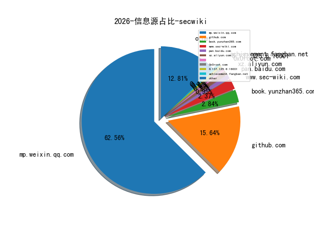
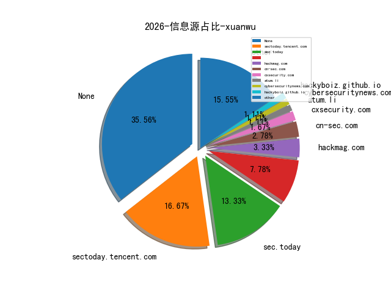
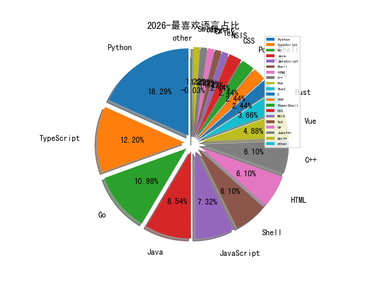

# [数据--所有](README_20.md)
# [数据--年度](README_2026.md)
# 2026 信息源与信息类型占比

# 政策 推荐
| title | url| 
| --- | ---| 
| 可能影响未成年人身心健康的网络信息分类办法 | https://www.cac.gov.cn/2026-01/23/c_1770728781060093.htm| 

# 网络安全书籍 推荐
| date_added | language | title | author | link | size| 
| --- | --- | --- | --- | --- | ---| 
| 2026-04-08 09:23:46 | English | Cybersecurity Strategy for the AI-Driven Era, 3rd Edition | unknown | https://www.wowebook.org/cybersecurity-strategy-for-the-ai-driven-era-3rd-edition/ | unknown| 
| 2026-04-07 04:52:46 | English | Microsoft Power Platform | unknown | https://www.wowebook.org/microsoft-power-platform/ | unknown| 
| 2026-04-07 18:33:16 | English | GPU-Accelerated Computing with Python 3 and CUDA | unknown | https://www.wowebook.org/gpu-accelerated-computing-with-python-3-and-cuda/ | unknown| 
| 2026-04-07 05:40:45 | English | Mastering DevOps: A Cloud Engineering and Data Science Perspective | unknown | https://www.wowebook.org/mastering-devops-a-cloud-engineering-and-data-science-perspective/ | unknown| 
| 2026-04-06 17:03:02 | English | Architecting Generative AI Applications | unknown | https://www.wowebook.org/architecting-generative-ai-applications/ | unknown| 
| 2026-04-06 16:41:17 | English | Human Factors in Cybersecurity | unknown | https://www.wowebook.org/human-factors-in-cybersecurity/ | unknown| 
| 2026-04-06 09:17:22 | English | Creating Custom GPT with OpenAI GPT Builder | unknown | https://www.wowebook.org/creating-custom-gpt-with-openai-gpt-builder/ | unknown| 
| 2026-04-05 09:32:08 | English | 30 Agents Every AI Engineer Must Build | unknown | https://www.wowebook.org/30-agents-every-ai-engineer-must-build/ | unknown| 
| 2026-04-03 04:39:20 | English | Ultimate Certified Kubernetes Administrator (CKA) Certification Guide | unknown | https://www.wowebook.org/ultimate-certified-kubernetes-administrator-cka-certification-guide/ | unknown| 
| 2026-04-03 05:24:52 | English | Agentic AI for Engineers | unknown | https://www.wowebook.org/agentic-ai-for-engineers/ | unknown| 
| 2026-04-03 04:45:40 | English | Building and Training Generative AI Models | unknown | https://www.wowebook.org/building-and-training-generative-ai-models/ | unknown| 
| 2026-04-03 06:11:32 | English | Practical Generative AI: From Concept to Deployment | unknown | https://www.wowebook.org/practical-generative-ai-from-concept-to-deployment/ | unknown| 
| 2026-04-02 09:05:09 | English | Generative AI for Game Development | unknown | https://www.wowebook.org/generative-ai-for-game-development/ | unknown| 
| 2026-04-02 08:44:39 | English | Ultimate Certified Kubernetes Application Developer (CKAD) Certification Guide | unknown | https://www.wowebook.org/ultimate-certified-kubernetes-application-developer-ckad-certification-guide/ | unknown| 
| 2026-03-24 15:06:09 | English | Agentic Coding with Claude Code | unknown | https://www.wowebook.org/agentic-coding-with-claude-code/ | unknown| 
| 2026-03-24 14:15:35 | English | Hands-on Cryptography with Python | unknown | https://www.wowebook.org/hands-on-cryptography-with-python-ava/ | unknown| 
| 2026-03-24 13:29:50 | English | The Basics of Hacking and Penetration Testing, 3rd Edition | unknown | https://www.wowebook.org/the-basics-of-hacking-and-penetration-testing-3rd-edition/ | unknown| 
| 2026-03-24 09:27:44 | English | CompTIA CySA+ CS0-003 Exam Guide | unknown | https://www.wowebook.org/comptia-cysa-cs0-003-exam-guide/ | unknown| 
| 2026-03-22 10:10:57 | English | Ultimate Microsoft Certified Azure AI Engineer Associate (AI-102) Certification Guide | unknown | https://www.wowebook.org/ultimate-microsoft-certified-azure-ai-engineer-associate-ai-102-certification-guide/ | unknown| 
| 2026-03-22 09:12:12 | English | Generative AI Ethics, Privacy, and Security | unknown | https://www.wowebook.org/generative-ai-ethics-privacy-and-security/ | unknown| 
| 2026-03-22 07:57:30 | English | Microsoft Azure Fundamentals Certification and Beyond, 3rd Edition | unknown | https://www.wowebook.org/microsoft-azure-fundamentals-certification-and-beyond-3rd-edition/ | unknown| 
| 2026-03-19 05:57:51 | English | The Salesforce Business Analysis Playbook, 2nd Edition | unknown | https://www.wowebook.org/the-salesforce-business-analysis-playbook-2nd-edition/ | unknown| 
| 2026-03-18 04:47:46 | English | Driving Digital Transformation with Microsoft Foundry | unknown | https://www.wowebook.org/driving-digital-transformation-with-microsoft-foundry/ | unknown| 
| 2026-03-17 08:37:54 | English | Microsoft Power BI Data Analyst Associate Study Guide | unknown | https://www.wowebook.org/microsoft-power-bi-data-analyst-associate-study-guide/ | unknown| 
| 2026-03-16 03:19:02 | English | Ultimate Python Polars for Data Analytics | unknown | https://www.wowebook.org/ultimate-python-polars-for-data-analytics/ | unknown| 
| 2026-03-15 13:23:40 | English | Observability in the AI-Native Era | unknown | https://www.wowebook.org/observability-in-the-ai-native-era/ | unknown| 
| 2026-03-15 13:01:52 | English | Automate Excel with Python | unknown | https://www.wowebook.org/automate-excel-with-python/ | unknown| 
| 2026-03-14 17:49:37 | English | LLMs in Enterprise | unknown | https://www.wowebook.org/llms-in-enterprise/ | unknown| 
| 2026-03-12 07:21:57 | English | Powering Enterprise DevSecOps | unknown | https://www.wowebook.org/powering-enterprise-devsecops/ | unknown| 
| 2026-03-12 06:38:09 | English | RAG with Python Cookbook | unknown | https://www.wowebook.org/rag-with-python-cookbook/ | unknown| 
| 2026-03-10 03:12:38 | English | Data Privacy | unknown | https://www.wowebook.org/data-privacy-bpb/ | unknown| 
| 2026-03-09 14:35:16 | English | Kubernetes in Action, Second Edition | unknown | https://www.wowebook.org/kubernetes-in-action-second-edition/ | unknown| 
| 2026-03-07 19:45:40 | English | Hands-On Microsoft Windows Server 2022, 4th Edition | unknown | https://www.wowebook.org/hands-on-microsoft-windows-server-2022-4th-edition/ | unknown| 
| 2026-03-05 12:50:03 | English | Learn AI with Python, 2nd Edition | unknown | https://www.wowebook.org/learn-ai-with-python-2nd-edition/ | unknown| 
| 2026-03-05 07:50:48 | English | Metasploit: The Penetration Tester’s Guide, 2nd Edition | unknown | https://www.wowebook.org/metasploit-the-penetration-testers-guide-2nd-edition/ | unknown| 
| 2026-03-03 10:48:03 | English | Mastering DevOps and Site Reliability Engineering | unknown | https://www.wowebook.org/mastering-devops-and-site-reliability-engineering/ | unknown| 
| 2026-03-02 05:13:44 | English | Microsoft Intune Cookbook, 2nd Edition | unknown | https://www.wowebook.org/microsoft-intune-cookbook-2nd-edition/ | unknown| 
| 2026-03-01 09:44:07 | English | Generative AI on Kubernetes | unknown | https://www.wowebook.org/generative-ai-on-kubernetes/ | unknown| 
| 2026-03-01 08:50:07 | English | Linux Shell Scripting for Hackers | unknown | https://www.wowebook.org/linux-shell-scripting-for-hackers/ | unknown| 
| 2026-03-01 04:00:47 | English | Podman for DevOps, 2nd Edition | unknown | https://www.wowebook.org/podman-for-devops-2nd-edition/ | unknown| 
| 2026-03-01 03:22:55 | English | Model Context Protocol for LLMs | unknown | https://www.wowebook.org/model-context-protocol-for-llms/ | unknown| 
| 2026-02-27 12:24:38 | English | Agentic AI for Offensive Cybersecurity | unknown | https://www.wowebook.org/agentic-ai-for-offensive-cybersecurity/ | unknown| 
| 2026-02-26 12:09:11 | English | Mastering Generative AI Systems Engineering | unknown | https://www.wowebook.org/mastering-generative-ai-systems-engineering/ | unknown| 
| 2026-02-26 18:16:50 | English | Hacking Hardware: The Practical Guide to Penetration Testing | unknown | https://www.wowebook.org/hacking-hardware-the-practical-guide-to-penetration-testing/ | unknown| 
| 2026-02-26 12:26:20 | English | AI Agents and Applications | unknown | https://www.wowebook.org/ai-agents-and-applications/ | unknown| 
| 2026-02-25 12:56:56 | English | Microsoft Fabric Analytics Engineer Associate Study Guide | unknown | https://www.wowebook.org/microsoft-fabric-analytics-engineer-associate-study-guide/ | unknown| 
| 2026-02-24 17:08:30 | English | Ultimate Generative AI Solutions on Google Cloud | unknown | https://www.wowebook.org/ultimate-generative-ai-solutions-on-google-cloud/ | unknown| 
| 2026-02-22 20:28:09 | English | AI Agents for Secure and Software-Defined Networking | unknown | https://www.wowebook.org/ai-agents-for-secure-and-software-defined-networking/ | unknown| 
| 2026-02-21 14:14:15 | English | Prompting Python Data Visualization | unknown | https://www.wowebook.org/prompting-python-data-visualization/ | unknown| 
| 2026-02-20 19:50:45 | English | Python Illustrated | unknown | https://www.wowebook.org/python-illustrated/ | unknown| 
| 2026-02-18 06:28:43 | English | Cloud Security Fundamentals: Building the Foundations for Secure Cloud Platforms | unknown | https://www.wowebook.org/cloud-security-fundamentals-building-the-foundations-for-secure-cloud-platforms/ | unknown| 
| 2026-02-18 10:56:23 | English | Learning Serverless Security | unknown | https://www.wowebook.org/learning-serverless-security/ | unknown| 
| 2026-02-18 10:46:12 | English | CompTIA Cloud+ Guide to Cloud Computing, 3rd Edition | unknown | https://www.wowebook.org/comptia-cloud-guide-to-cloud-computing-3rd-edition/ | unknown| 
| 2026-02-15 17:48:15 | English | Design Multi-Agent AI Systems Using MCP and A2A | unknown | https://www.wowebook.org/design-multi-agent-ai-systems-using-mcp-and-a2a/ | unknown| 
| 2026-02-15 17:33:20 | English | Modern Time Series Analysis with R | unknown | https://www.wowebook.org/modern-time-series-analysis-with-r/ | unknown| 
| 2026-02-15 09:17:14 | English | Blue Team Handbook: Incident Response | unknown | https://www.wowebook.org/blue-team-handbook-incident-response/ | unknown| 
| 2026-02-14 18:47:50 | English | Deep Learning with Rust | unknown | https://www.wowebook.org/deep-learning-with-rust/ | unknown| 
| 2026-02-14 21:36:21 | English | Parallel and High Performance Programming with Python, 2nd Edition | unknown | https://www.wowebook.org/parallel-and-high-performance-programming-with-python-2nd-edition/ | unknown| 
| 2026-02-14 20:36:51 | English | Parallel and High Performance Programming with Python | unknown | https://www.wowebook.org/parallel-and-high-performance-programming-with-python/ | unknown| 
| 2026-02-14 19:48:48 | English | Ultimate LLMOps for LLM Engineering | unknown | https://www.wowebook.org/ultimate-llmops-for-llm-engineering/ | unknown| 
| 2026-02-14 18:59:40 | English | The MCP Standard | unknown | https://www.wowebook.org/the-mcp-standard/ | unknown| 
| 2026-02-11 05:44:55 | English | Ultimate Microsoft Cybersecurity Architect SC-100 Exam Guide | unknown | https://www.wowebook.org/ultimate-microsoft-cybersecurity-architect-sc-100-exam-guide/ | unknown| 
| 2026-02-11 16:21:42 | English | Prompt-Driven Development Handbook | unknown | https://www.wowebook.org/prompt-driven-development-handbook/ | unknown| 
| 2026-02-11 15:57:14 | English | Practical Approach to Agentic AI | unknown | https://www.wowebook.org/practical-approach-to-agentic-ai/ | unknown| 
| 2026-02-10 08:01:30 | English | Guide to Using Generative AI in Programming | unknown | https://www.wowebook.org/guide-to-using-generative-ai-in-programming/ | unknown| 
| 2026-02-09 05:10:47 | English | Building Conversational Generative AI Apps with Langchain and GPT | unknown | https://www.wowebook.org/building-conversational-generative-ai-apps-with-langchain-and-gpt/ | unknown| 
| 2026-02-09 04:51:43 | English | Quick Start Guide to Large Language Models, 2nd Edition | unknown | https://www.wowebook.org/quick-start-guide-to-large-language-models-2nd-edition/ | unknown| 
| 2026-02-07 20:18:36 | English | A Developer’s Guide to Integrating Generative AI into Applications | unknown | https://www.wowebook.org/a-developers-guide-to-integrating-generative-ai-into-applications/ | unknown| 
| 2026-02-06 05:22:31 | English | Python Data Analysis, 4th Edition | unknown | https://www.wowebook.org/python-data-analysis-4th-edition/ | unknown| 
| 2026-02-06 04:50:09 | English | Agentic Mesh: The GenAI-Powered Autonomous Agent Ecosystem | unknown | https://www.wowebook.org/agentic-mesh-the-genai-powered-autonomous-agent-ecosystem/ | unknown| 
| 2026-02-05 06:25:14 | English | Generative AI in R | unknown | https://www.wowebook.org/generative-ai-in-r/ | unknown| 
| 2026-02-05 10:39:56 | English | Python Programming for Engineers and Scientists | unknown | https://www.wowebook.org/python-programming-for-engineers-and-scientists/ | unknown| 
| 2026-02-05 06:52:37 | English | An Introduction to Data Science with Python | unknown | https://www.wowebook.org/an-introduction-to-data-science-with-python/ | unknown| 
| 2026-02-04 05:24:05 | English | Ultimate Kubernetes for Cloud-Native Applications | unknown | https://www.wowebook.org/ultimate-kubernetes-for-cloud-native-applications/ | unknown| 
| 2026-02-04 04:48:20 | English | Practical Data Science Environments with Python and R | unknown | https://www.wowebook.org/practical-data-science-environments-with-python-and-r/ | unknown| 
| 2026-02-01 09:24:21 | English | New Perspectives Microsoft 365 Excel Comprehensive | unknown | https://www.wowebook.org/new-perspectives-microsoft-365-excel-comprehensive/ | unknown| 
| 2026-02-01 09:18:23 | English | New Perspectives Microsoft 365 Access Comprehensive | unknown | https://www.wowebook.org/new-perspectives-microsoft-365-access-comprehensive/ | unknown| 
| 2026-02-01 14:20:10 | English | Microsoft Azure AI Fundamentals (AI-900) Certification Guide | unknown | https://www.wowebook.org/microsoft-azure-ai-fundamentals-ai-900-certification-guide/ | unknown| 
| 2026-02-01 10:59:44 | English | Introduction to Generative AI with Julia and Python | unknown | https://www.wowebook.org/introduction-to-generative-ai-with-julia-and-python/ | unknown| 
| 2026-01-28 16:17:47 | English | The Rust Programming Language, 3rd Edition | unknown | https://www.wowebook.org/the-rust-programming-language-3rd-edition/ | unknown| 
| 2026-01-28 16:03:19 | English | Rust Web Programming, 3rd Edition | unknown | https://www.wowebook.org/rust-web-programming-3rd-edition/ | unknown| 
| 2026-01-26 07:11:43 | English | Red Team Engineering | unknown | https://www.wowebook.org/red-team-engineering/ | unknown| 
| 2026-01-26 10:00:46 | English | The Comprehensive DevOps Interview Guide | unknown | https://www.wowebook.org/the-comprehensive-devops-interview-guide/ | unknown| 
| 2026-01-26 10:17:08 | English | Cloud-Native Applications on Microsoft Azure | unknown | https://www.wowebook.org/cloud-native-applications-on-microsoft-azure/ | unknown| 
| 2026-01-26 12:20:10 | English | Web Development in Rust | unknown | https://www.wowebook.org/web-development-in-rust/ | unknown| 
| 2026-01-26 12:15:26 | English | Python Real-World Projects | unknown | https://www.wowebook.org/python-real-world-projects-bpb/ | unknown| 
| 2026-01-24 13:46:34 | English | Python Microservices with FastAPI | unknown | https://www.wowebook.org/python-microservices-with-fastapi/ | unknown| 
| 2026-01-22 18:42:09 | English | Transforming Financial Services with Generative AI | unknown | https://www.wowebook.org/transforming-financial-services-with-generative-ai/ | unknown| 
| 2026-01-22 17:33:51 | English | Bridging the Gap: Turning Agile and DevOps Initiatives into Board-Level Wins | unknown | https://www.wowebook.org/bridging-the-gap-turning-agile-and-devops-initiatives-into-board-level-wins/ | unknown| 
| 2026-01-19 06:31:36 | English | Generative Art and Computer Vision | unknown | https://www.wowebook.org/generative-art-and-computer-vision/ | unknown| 
| 2026-01-19 05:42:09 | English | Understanding Microsoft Loop | unknown | https://www.wowebook.org/understanding-microsoft-loop/ | unknown| 
| 2026-01-17 12:22:30 | English | Essentials of Big Data Analytics: Applications in R and Python | unknown | https://www.wowebook.org/essentials-of-big-data-analytics-applications-in-r-and-python/ | unknown| 
| 2026-01-17 14:01:18 | English | Challenges and Applications of Generative Large Language Models | unknown | https://www.wowebook.org/challenges-and-applications-of-generative-large-language-models/ | unknown| 
| 2026-01-17 13:19:25 | English | Building Agentic AI: Workflows, Fine-Tuning, Optimization, and Deployment | unknown | https://www.wowebook.org/building-agentic-ai-workflows-fine-tuning-optimization-and-deployment/ | unknown| 
| 2026-01-15 10:47:32 | English | Certified Kubernetes Administrator (CKA) Study Guide, 2nd Edition | unknown | https://www.wowebook.org/certified-kubernetes-administrator-cka-study-guide-2nd-edition/ | unknown| 
| 2026-01-15 08:43:18 | English | Ultimate Snowflake Cortex AI for Generative AI Applications | unknown | https://www.wowebook.org/ultimate-snowflake-cortex-ai-for-generative-ai-applications/ | unknown| 
| 2026-01-14 05:20:09 | English | Privacy and Security for Large Language Models | unknown | https://www.wowebook.org/privacy-and-security-for-large-language-models/ | unknown| 
| 2026-01-14 05:01:35 | English | Unified SecOps Playbook | unknown | https://www.wowebook.org/unified-secops-playbook/ | unknown| 
| 2026-01-14 04:54:26 | English | Python Programming: An Object-Oriented Approach | unknown | https://www.wowebook.org/python-programming-an-object-oriented-approach/ | unknown| 
| 2026-01-14 04:45:51 | English | Microsoft Exam AZ-801: Guide to Configuring Windows Server Hybrid Advanced Services | unknown | https://www.wowebook.org/microsoft-exam-az-801-guide-to-configuring-windows-server-hybrid-advanced-services/ | unknown| 
| 2026-01-13 08:47:45 | English | The Agentic AI Revolution | unknown | https://www.wowebook.org/the-agentic-ai-revolution/ | unknown| 
| 2026-01-13 06:44:26 | English | AI Projects in PyTorch | unknown | https://www.wowebook.org/ai-projects-in-pytorch/ | unknown| 
| 2026-01-12 13:00:39 | English | Securing Smart Things | unknown | https://www.wowebook.org/securing-smart-things/ | unknown| 
| 2026-01-12 06:23:07 | English | The Art of Cyber Threat Intelligence | unknown | https://www.wowebook.org/the-art-of-cyber-threat-intelligence/ | unknown| 
| 2026-01-12 05:01:31 | English | Python in Excel | unknown | https://www.wowebook.org/python-in-excel/ | unknown| 
| 2026-01-09 05:07:07 | English | Python Object-Oriented Programming, 5th Edition | unknown | https://www.wowebook.org/python-object-oriented-programming-5th-edition/ | unknown| 
| 2026-01-08 05:52:10 | English | Android and IOS Mobile Forensics | unknown | https://www.wowebook.org/android-and-ios-mobile-forensics/ | unknown| 
| 2026-01-08 04:40:30 | English | Vibe Coding with GitHub Copilot | unknown | https://www.wowebook.org/vibe-coding-with-github-copilot/ | unknown| 
| 2026-01-07 17:11:15 | English | Identity Analytics: Analytics for Identity and Access Management | unknown | https://www.wowebook.org/identity-analytics-analytics-for-identity-and-access-management/ | unknown| 
| 2026-01-07 16:48:21 | English | ISO 42001 and Legal Compliance | unknown | https://www.wowebook.org/iso-42001-and-legal-compliance/ | unknown| 
| 2026-01-04 08:22:27 | English | Generative AI-Driven Application Development with Java | unknown | https://www.wowebook.org/generative-ai-driven-application-development-with-java/ | unknown| 
| 2026-01-03 16:17:28 | English | Generative AI for Full-Stack Development | unknown | https://www.wowebook.org/generative-ai-for-full-stack-development/ | unknown| 
| 2026-01-03 13:18:20 | English | Python Made Easy | unknown | https://www.wowebook.org/python-made-easy/ | unknown| 

# 微信公众号 推荐
| nickname_english | weixin_no | title | url| 
| --- | --- | --- | ---| 
| 0xSec笔记本 | 0xSec笔记本 0xSec笔记本 | AI掌握零日漏洞：Claude Mythos Preview引领网络安全新时代 | https://mp.weixin.qq.com/s/G-dMuc1kdclitJX0ITQzBg | 3| 
| AI紫队安全研究 | AI紫队安全研究 AI紫队安全研究 | 警惕！iPhone用户危险升级！俄罗斯APT组织TA446用上DarkSword漏洞套件，点开钓鱼邮件直接被攻破 | https://mp.weixin.qq.com/s/r82dxrr1n2Pts2_OTPWzzQ | 37| 
| CISSP Learning | 王水江 王水江 | Anthropic的“Project Glasswing” | https://mp.weixin.qq.com/s/OeJHPNMkhLrsLHNFb_SRJw | 2| 
| CppGuide |  | 用C++17从零开发一个GDB调试器 | https://mp.weixin.qq.com/s/qt0Je27duyJ9R_gNUnYWfw | 25| 
| FreeBuf |  | 新型GPUBreach攻击通过GDDR6位翻转实现CPU权限完全提权 | https://mp.weixin.qq.com/s/11mtcYtJXd-I9yqW7zeuxg | 188| 
| GG安全 | None | 紧急告警？Everything 1.4.1.1022版本存在银狐木马 | https://mp.weixin.qq.com/s/Fd6mgN3OjtQLCHl0l6oEvA | 2| 
| HackSee安全生活 | HackSee安全团队 HackSee安全团队 | Anthropic的Claude Mythos在主要系统中发现了数千个0day | https://mp.weixin.qq.com/s/4SbRrtlHO_k9z6m9fe9RLg | 4| 
| Heri76安全 | kuki kuki | 【通知】各位白帽子注意，2026国家HVV招聘开始！ | https://mp.weixin.qq.com/s/vHNoQOgwfoef1ItBYhgGEQ | 2| 
| ISC2网络安全 | ISC2 China ISC2 China | 如何预约ISC2考试？请查收最新预约全流程 | https://mp.weixin.qq.com/s/UdpioBcvTCQgqZQRXYAa_Q | 40| 
| IoT物联网技术 | . . | 微信直连，QBotClaw 国内首个浏览器“龙虾”U0001f99e，兼容OpenClaw技能，支持DeepSeek、豆包、Kimi 、Qwen大模型 | https://mp.weixin.qq.com/s/nKw7QRfNRxSOaew2QX13Ew | 22| 
| Khan安全团队 |  | 论文一直投不中？退稿十几次，大牛帮修改选刊投稿返修后，被拒的5篇SCI全中了！ | https://mp.weixin.qq.com/s/21fUIUwyPJtuBtsa-CDOiA | 81| 
| MicroPest | MicroPest MicroPest | Openclaw的“自我进化” | https://mp.weixin.qq.com/s/4sJliXVFDXxhw3pwxGnY3g | 8| 
| Nday Poc | Superhero Superhero | 天地伟业 Easy7 uploadCheckImg 任意文件上传漏洞 | https://mp.weixin.qq.com/s/oJm4lCZTQ3iNWLXbmfL2WQ | 19| 
| Neon-X Sec | SharkJ0001 SharkJ0001 | 金蝶 EAS 系统勒索攻击行为排查 | https://mp.weixin.qq.com/s/1l5iwdLoEdbjVSVTS4gLJQ | 2| 
| NowSec | JacobWang JacobWang | 从钓鱼到打点，全自动攻击时代来了 | https://mp.weixin.qq.com/s/I3u-WDDrggTrAUk5aWp_iA | 2| 
| Ots安全 |  | Apache ActiveMQ 中的远程代码执行漏洞 (CVE-2026-34197) | https://mp.weixin.qq.com/s/8ERLbrc6SZoBWB6L3d-sJQ | 41| 
| Oxo Security | None | 超级 AI 变黑客傀儡？风险远超想象 | https://mp.weixin.qq.com/s/HmC9Hhbt0NY6d-9t3h_B-w | 62| 
| Relay学安全 | kernel kernel | 某黑产团队恶意样本中的计划任务权限维持 | https://mp.weixin.qq.com/s/MiALmv3pqRgCQCW9HJSCnw | 11| 
| TtTeam |  | vscode_tasks_command_execute_poc | https://mp.weixin.qq.com/s/QYRAnhIp8OT1CbLDz6r3zQ | 40| 
| UpRoot | ptr ptr | 你会常用这个内存马的。 | https://mp.weixin.qq.com/s/KnjLQBa7bLHEXmyz_RKmzQ | 5| 
| W不懂安全 | W不懂安全 W不懂安全 | Ultra Mobile美国紫卡大规模风控复盘：为什么被封？还有没有更稳的方案？ | https://mp.weixin.qq.com/s/7Dui2D2Lbmxk8SLVSIfcyA | 13| 
| YY的黑板报 | adra1n adra1n | OpenClaw vs Hermes Agent：两大热门 AI Agent 框架该怎么选？ | https://mp.weixin.qq.com/s/DWL65Am1A8__df6NpAjXGw | 10| 
| e安在线 | e安在线 e安在线 | Windows Defender 0Day漏洞PoC曝光，攻击者可获取系统最高权限 | https://mp.weixin.qq.com/s/3hj4Udc-NZFOnN9m7Kylyg | 9| 
| huan666 | huan666 huan666 | AI赋能信息安全领域(Trae+mcp-chrome)-保姆级教程 | https://mp.weixin.qq.com/s/4ZIDp-QGHYKuocG975c4aQ | 6| 
| i信安教育 |  | 校企携手，共筑网络安全新高地 , 河南信安世纪与安阳学院共建产业学院签约揭牌仪式圆满举行 | https://mp.weixin.qq.com/s/Ot52zxGVD2kxnXAugv00lQ | 3| 
| kingman安全 | kingman kingman | 做个\"脚本小子\"--云密钥篇 | https://mp.weixin.qq.com/s/_yAo6BF6NJWioZLCKrXQWw | 5| 
| momo安全 | momo安全 momo安全 | 威胁情报日报 2026-04-08 | https://mp.weixin.qq.com/s/LSVEct8H8tfIkU_c82Sz4Q | 8| 
| securitainment | f00crew f00crew | 反汇编、流变与运行时把戏 | https://mp.weixin.qq.com/s/qQu6skKXbMnoYvG-uSgxDg | 65| 
| three安全之路 | three安全之路 three安全之路 | [防溯源追踪] 隐藏真实 IP &amp; 防 WAF 封禁&amp;免费 / 付费代理搭建全攻略&amp;Proxy工具使用 | https://mp.weixin.qq.com/s/jU3MnTZCUiQCw0fy-9NBUw | 3| 
| web安全小白 | web安全小白 web安全小白 | 一篇文教会你若依漏洞复现 | https://mp.weixin.qq.com/s/z9hOwdefQptZV1KvpN5LPQ | 8| 
| 与智慧做朋友 | 李志勇 李志勇 | 相信纯粹的力量，比相信牛逼好使 | https://mp.weixin.qq.com/s/hNeyrmENjc_MVFOlRn3j6Q | 16| 
| 中国信息安全 | 黄朝椿 黄朝椿 | 专家解读 , 世界数据组织为全球南方创造更多可能 | https://mp.weixin.qq.com/s/7xlaPrvNngf7TKkIm4owXQ | 230| 
| 二进制空间安全 | suntiger suntiger | 我利用阿里云的JVS Claw自动化完成漏洞发现、利用、验证和专业报告生成 | https://mp.weixin.qq.com/s/q9ORxsure0LM3CLr-zThIg | 10| 
| 云淡纤尘 |  | 博大而精深[完全借鉴网安杂谈公众号] | https://mp.weixin.qq.com/s/ZYGmnD5N5tcpk47mRgkPGg | 5| 
| 信安世纪 | 点击关注→ 点击关注→ | 【4•15国家安全教育日】科普进校园筑牢青春防线，技术探低空赋能产业安全 | https://mp.weixin.qq.com/s/2Y-ydb_MrDs0rgw8lK59BQ | 16| 
| 信息安全与通信保密杂志社 | Cismag Cismag | AI攻防博弈进入“奇点”时刻｜Claude4小时攻击警示：漏洞攻防必须AI原生化 | https://mp.weixin.qq.com/s/O-67Av9QgLXzdL56rddHUg | 89| 
| 信息安全研究 |  | 科技｜《智能体安全标准化研究》等5项网络安全标准化技术研究报告正式发布 | https://mp.weixin.qq.com/s/bIUeIo8BaOUiXfhcSydi0Q | 104| 
| 信通云服 | 信通云服 信通云服 | 企业赏金SRC实战案例 | https://mp.weixin.qq.com/s/NOj67nrLQrqSerJwlF4RSA | 4| 
| 全球技术地图 | 全球君 全球君 | 美国白宫发布2027财年预算申请，提议大幅削减多个科学机构预算 | https://mp.weixin.qq.com/s/NFUgoImFBH5-onC7lFAj5g | 89| 
| 利刃信安 | 利刃信安 利刃信安 | 医疗卫生机构数据安全和个人信息保护管理办法（试行） | https://mp.weixin.qq.com/s/DX8XMlAiQKtDogtieXQG5A | 88| 
| 南风安全站 | 南风 南风 | 招26国HVV及驻场网络安全精英 | https://mp.weixin.qq.com/s/r7asqR5uKMjWRLCXdBMd7g | 9| 
| 君说安全 |  | 行业资讯：某学院网络安全运维服务项目(二次)公开招标，预算110万元 | https://mp.weixin.qq.com/s/qZhnIMupVhRW1Llqe85upA | 247| 
| 启明星辰集团 |  | 启明星辰出席网安标委“标准周”，分享智能体时代网络安全互联互通新范式 | https://mp.weixin.qq.com/s/g0GJxRBfMkhtRs2zrDdp6Q | 35| 
| 哆啦安全 | CCMS CCMS | Android/iOS/HarmonyOS多引擎安全SDK检测分析系统V8.0 | https://mp.weixin.qq.com/s/7GCm1llrQjlvAFPsR5fJDg | 27| 
| 喜欢挖洞吗 | None | 速查！Everything疑似存在银狐木马 | https://mp.weixin.qq.com/s/u6fOlWhgX9uiHlFy9WJrXg | 2| 
| 国家互联网应急中心CNCERT |  | CNVD漏洞周报2026年第13期 | https://mp.weixin.qq.com/s/6lUt1jr6KnNID9af7sE16w | 11| 
| 夜组OSINT | NightTeam NightTeam | 2026年4月7日 勒索软件动态 | https://mp.weixin.qq.com/s/176PIZpaqQSxfz0jKgW_rA | 23| 
| 大仙安全说 | weiqin weiqin | 2026HW行动人才储备 | https://mp.weixin.qq.com/s/Q1YL-smNkgBYmviXuUN3dg | 16| 
| 天威诚信 | None | 医药首营 , 合规增效，一签搞定✅ | https://mp.weixin.qq.com/s/zYihj8DhdcI2w6Af8JjNNw | 12| 
| 天御攻防实验室 | 天御 天御 | Anthropic已向“美国政府各部门”的高级官员简报了Mythos的全部进攻性和防御性网络能力 | https://mp.weixin.qq.com/s/DG2xpYMba0fpTbscJvHx6Q | 18| 
| 夯磅棱 |  | Instagram泄露史：七年超1.2亿条用户数据在暗网“裸奔” | https://mp.weixin.qq.com/s/Gq3HtneKkVisG5T0Wd9AOg | 18| 
| 奇安信 CERT | 奇安信 CERT 奇安信 CERT | 【已复现】Vite WebSocket 任意文件读取漏洞(CVE-2026-39363)安全风险通告 | https://mp.weixin.qq.com/s/By5CaWLXUtkAl0eIHBe0aw | 34| 
| 好靶场 |  | 两周年福利｜地图大师SRC系列课程全套打包，仅此一次 | https://mp.weixin.qq.com/s/_4oYiCBarkyj522ZXNiS6g | 58| 
| 安全君呀 | 繁星01 繁星01 | 【网安技术面】面试题高频V2版 | https://mp.weixin.qq.com/s/FSEPuNwLreLQTi54vu3GPg | 4| 
| 安全圈的那点事儿 | 网络安全9527 网络安全9527 | OpenSSL 多个漏洞暴露 RSA KEM 处理中的敏感数据 | https://mp.weixin.qq.com/s/V_g-AuLrA_ouHPjFIFhm5w | 108| 
| 安全天书 | Hello888 Hello888 | Patch手法免杀内网工具Frpc | https://mp.weixin.qq.com/s/kCXy2Jh3YUYzXyeG-v7ZSw | 32| 
| 安全威胁纵横 | HackerNews HackerNews | 俄黑客发动全球 DNS 劫持行动，入侵数万路由器窃取凭证 | https://mp.weixin.qq.com/s/C_jF5Z105SaBjjtu6CU1jA | 34| 
| 安全学术圈 | 小编 小编 | 2026年计算机软件新技术全国重点实验室开放课题 | https://mp.weixin.qq.com/s/0YGEkl0tq4gKhKryW_VLyw | 31| 
| 安全极客 |  | CSO成长计划第8期沙龙活动预告 , 大模型与智能体时代，企业安全体系的创新与实践 | https://mp.weixin.qq.com/s/UAK757f_FuK9apf_0XQVVg | 22| 
| 安全牛科技 | 河南省工信安联盟 河南省工信安联盟 | 工业网络安全周报-2025年第9期 | https://mp.weixin.qq.com/s/dH5ZGdRiS4gyGrgViyPFOg | 10| 
| 安全社 | None | everything工具1.4.1.1022版本存在银狐木马 | https://mp.weixin.qq.com/s/GxHrZ2SzyJq1ilGZPhR7Tg | 7| 
| 安全行者老霍 | Microsoft Microsoft | 微软AI 应用安全系列之二：检测与分析 AI 工具中的提示词滥用 | https://mp.weixin.qq.com/s/0wgqXzl7aU9RQHStXP1OpA | 13| 
| 安博通 | 安博通 安博通 | 【安全实战】200台异构防火墙策略运维，10分钟精准定位问题 | https://mp.weixin.qq.com/s/KsKRWzUFtPEn0Kspi30Nrw | 8| 
| 安在 | 安在 安在 | 免费赠送 , 防范网络钓鱼陷阱宣传素材（第二十二期） | https://mp.weixin.qq.com/s/j4gx61gUsy3vlmetmLd0Yw | 144| 
| 安小圈 | CNNVD CNNVD | 155个OpenClaw漏洞列表！速看！ | https://mp.weixin.qq.com/s/spfdvWN9oAomGPwGGEhAlQ | 17| 
| 安恒信息CERT |  | 【已复现】OpenAM 预认证反序列化远程代码执行漏洞（CVE-2026-33439） | https://mp.weixin.qq.com/s/9oe5k0mR7mkBzFacKzRcdg | 16| 
| 安羽安全 | 安羽安全 安羽安全 | 迅饶科技 X2Modbus网关 GetConfig 信息泄露漏洞 | https://mp.weixin.qq.com/s/b90IOr4CTSQn-LpF7kj3jA | 2| 
| 安静安全 | 静师傅 静师傅 | 静师傅的V2.1免杀Skill开源! | https://mp.weixin.qq.com/s/QMcovWniKYwtDHmH2uFdWA | 10| 
| 实战安全研究 |  | 漏洞复现 , Ilevia EVE X1 Server login.php 存在身份认证绕过漏洞 | https://mp.weixin.qq.com/s/XXbG0AWawSWDyj70-qmG_w | 24| 
| 小兵搞安全 | simeon的文章 simeon的文章 | Nacos 漏洞大起底：你的微服务可能正在\"裸奔\"！ | https://mp.weixin.qq.com/s/FlHyynSyUwdpVZMIxQiB-A | 11| 
| 常行科技 | 小常 小常 | 从制度到数智：让校园食安“十必须十不准”落地有声 | https://mp.weixin.qq.com/s/e7riDVEhv1PkGyC5PkCnfg | 5| 
| 幻泉之洲 |  | 用100美元谷歌云额度，我找到了华硕驱动的零日漏洞 | https://mp.weixin.qq.com/s/0PbD0c7mSjh5ZKMy-WDY_w | 75| 
| 建哥聊安全 | 建哥聊安全 建哥聊安全 | 你的验证码就这样被破解了??？（前端篇） | https://mp.weixin.qq.com/s/wJI_u3u38gWM7RqHu16DGg | 17| 
| 开源情报技术研究院 | 真是个胖子 真是个胖子 | 暗网泄露:1300万菲律宾消费者、公民和公司信息 | https://mp.weixin.qq.com/s/AX84Sp1dYjv8_F_K3soPSA | 27| 
| 开源网安 | 小安君 小安君 | 顺势而为，久久为功——共筑产业链供应链安全的新基石 | https://mp.weixin.qq.com/s/ZJj7LxrrfbBSoZsbANN-0Q | 2| 
| 弥天安全实验室 | 弥天安全实验室 弥天安全实验室 | 【成功复现】Node.js inspect调试远程命令执行 | https://mp.weixin.qq.com/s/yRMpcDabaiY0gbrak4nmTQ | 12| 
| 德斯克安全小课堂 | 让数据更安全 让数据更安全 | “物理隔离+少量LIC共享”是否真的可以幸免？ | https://mp.weixin.qq.com/s/9TNR2F1tRNpys3Xw3OK2Tw | 9| 
| 悬镜安全 | 多模态 SCA 多模态 SCA | AI造“虾”易，治理难？悬镜多模态 SCA 技术破局 AI 数字供应链治理困局！ | https://mp.weixin.qq.com/s/MWfoCYkvAzdz_qTZdzdmmw | 5| 
| 情报分析师 | FF FF | 伊朗驻外使馆向特朗普和美军发起全球表情包大战——“请说话。我们都无聊死了。”乐高飞行员，拄着拐杖的 F-35 | https://mp.weixin.qq.com/s/HU2mZAjtNFCQCIkkOo4E1w | 76| 
| 情报分析师Pro | 001 001 | 【深度研判】2026年4月美军伊朗救援行动评估与战斗搜索救援理念实战发展分析 | https://mp.weixin.qq.com/s/2UuRIl535-9KcQ1fPpX5eQ | 32| 
| 懒虫零信噪 | 懒虫零信噪 懒虫零信噪 | 安全警报 , 上海某知名龙头半导体企业疑遭黑客攻击，并威胁删除系统数据。 | https://mp.weixin.qq.com/s/b4QvZLWc2jt8r9bmsByReg | 10| 
| 掌控安全EDU | zkaq-管理员 zkaq-管理员 | 4月社区投稿活动 , 漏洞挖掘 | https://mp.weixin.qq.com/s/FGORx7M58alEdrG9ecvEsQ | 37| 
| 攻防录 | 攻防路 攻防路 | repo-analyzer：一句话生成开源项目深度架构报告 | https://mp.weixin.qq.com/s/bDP6Ud5Y_dxV8xUETRslCg | 4| 
| 无名的安全小屋 | 無名 無名 | 【支付漏洞】金额溢出导致的0元购-网络安全 | https://mp.weixin.qq.com/s/JAHknlm0Vg6xu_0Be-zd4A | 15| 
| 星宇Sec | 佚名 佚名 | 开源工具推荐：S.H.I.T构石期刊无水印PDF下载器 | https://mp.weixin.qq.com/s/1xQOYM5bIzzemkZdXH441A | 8| 
| 晨星安全团队 | 晨星安全团队 晨星安全团队 | 攻防实战集结，晨星安全团队2026招新开启 | https://mp.weixin.qq.com/s/Fcdd2jFVLeCoCdVYTZXQLg | 6| 
| 智探AI应用 | 点击关注→ 点击关注→ | 企查查中！宁波银行受益所有人信息查询、RPA资料留存采购项目 | https://mp.weixin.qq.com/s/WaHBWAyKfnleCqSsmM1QxA | 184| 
| 极客零零七 | 极客零零七 极客零零七 | 拿到一台机器之后：AD横向移动技术实战手册 | https://mp.weixin.qq.com/s/M7PpEtKZesZOkgArAb2kAA | 15| 
| 汇能云安全 |  | 国家安全部提醒：Token火了，骗局和劫持也会一起火 | https://mp.weixin.qq.com/s/tIIJvK6AJHUfmIGPUS7GeA | 5| 
| 沧海讲安全 |  | 这3个原因让我果断选择了网安，转行网络安全经验分享！ | https://mp.weixin.qq.com/s/B02QYjVxPF7sCgOp2gBXHw | 1| 
| 洞见网安 | AJay13 AJay13 | 网安原创文章推荐【2026/4/7】 | https://mp.weixin.qq.com/s/69C7wjTHWwKbn26apDNBag | 33| 
| 海哥网络安全 | 海哥网络安全 海哥网络安全 | 小白入门网安该从哪下手？吃透这“漏洞三剑客”，你的实战之路就稳了！ | https://mp.weixin.qq.com/s/us76OZkure7Jzstz7j0M8A | 10| 
| 深信服千里目安全技术中心 | 深瞳漏洞实验室 深瞳漏洞实验室 | 【漏洞通告】Apache ActiveMQ Classic 远程代码执行漏洞 CVE-2026-34197 | https://mp.weixin.qq.com/s/AM5CJPwUKEyprQzXK4mvJg | 21| 
| 深圳市网络与信息安全行业协会 | NIS研究院 NIS研究院 | 罚单, 国有大行省分行涉网络安全违规 | https://mp.weixin.qq.com/s/g2i_DSxYqRnzeQo4SS_nWA | 33| 
| 渗透安全团队 |  | GoCobaltStrike 2.2发布！ 全界面汉化 TCP代理加速 全新Web UI与Wails客户端 | https://mp.weixin.qq.com/s/2rGIcT12adqsn2YoCe1tTA | 5| 
| 火绒安全 | 火绒安全 火绒安全 | 诚邀渠道合作伙伴共启新征程 | https://mp.weixin.qq.com/s/UZQCVAYKiBrH90wlY-qdqg | 88| 
| 爱唠叨的Nil | AI助手 AI助手 | Hermes Agent：会成长的AI助手 | https://mp.weixin.qq.com/s/YcXZQkPcUlJmdasO3SlebQ | 29| 
| 狐狸说安全 | None | 天狐渗透工具箱-社区版V4.0全新升级发布~ | https://mp.weixin.qq.com/s/e3fJTfh5RSjBMwqeAs6Zbg | 7| 
| 猫头鹰OSINT | Owllntel Owllntel | 美国中情局在伊朗使用了名为“幽灵低语”的远程量子磁力测量技术 | https://mp.weixin.qq.com/s/U0KDV6-3HZF2e2QMgq7ivA | 14| 
| 玄道夜谈 | None | 分享图片 | https://mp.weixin.qq.com/s/En9GUNojRB2P3f0-F0sY_w | 32| 
| 略懂安全的三秋 | 略懂安全的三秋 略懂安全的三秋 | [EDU]一次小程序的越权 | https://mp.weixin.qq.com/s/WW3LFhJDl2JsWGLoxpFf3w | 4| 
| 白帽子安全笔记2.0 | 陆安予 陆安予 | [更新]红队加载器LoaderV6.0 | https://mp.weixin.qq.com/s/4AbxT9qqki3S2AY1UHCMKg | 15| 
| 皮皮宋渗透笔记 | 皮皮宋 皮皮宋 | 第一节：技术面试反向提问清单（上）｜搞懂这2类问题，避开80%的坑 | https://mp.weixin.qq.com/s/80yqhNViIbGXe0_UIjztOw | 2| 
| 知远战略与防务研究所 | 知远所 知远所 | 【上新】俄罗斯如何遂行大规模战斗行动 | https://mp.weixin.qq.com/s/L_b2Y31EIUuUHzxmx2TV8w | 154| 
| 知道创宇 |  | 上海第一妇婴保健院联合知道创宇斩获CSA“安全革新奖”，引领医疗AI安全治理 | https://mp.weixin.qq.com/s/1A3mB4_eioPRJy4dQ-v1kg | 22| 
| 神隐攻防实验室 | 路人甲 路人甲 | 零基础到实战：Java 代码审计从入门到独立挖掘高价值漏洞 | https://mp.weixin.qq.com/s/M27qr99dUFTlymu9YuTiXA | 1| 
| 秦安战略 | 秦安战略 秦安战略 | 秦安：美以伊停火2周，特朗普宣布中东进入黄金时代，三方都输了，只有特朗普赢了！ | https://mp.weixin.qq.com/s/u5nY6mjNUtefsL1bAfeeQw | 25| 
| 穹苍经略 | 老舵手 老舵手 | 渡阴山，赴一场千年的英雄之约！ | https://mp.weixin.qq.com/s/MZEGBZCorgVJAjeXYf7o3A | 2| 
| 绿盟科技 | 绿盟君 绿盟君 | 倒计时1天 , 美国2026 RSAC热点研讨暨第十八届信息安全高级论坛即将启幕 | https://mp.weixin.qq.com/s/PPbPldy7py5fH0rGUxTOlQ | 54| 
| 网安培训 |  | 网络安全应急响应工程师(CSERE)白皮书 | https://mp.weixin.qq.com/s/8hlB1quJO9ETQ60niVOyHw | 5| 
| 网安杂谈 | 网安杂谈 网安杂谈 | 【工具】FOFA（网络空间资产搜索引擎）面向学生和教师开放免费个人教育账号 | https://mp.weixin.qq.com/s/BzJiFlqw8utD549mw7-Qxw | 16| 
| 网空闲话plus | 网空闲话 网空闲话 | 俄系黑客“REVOLUTION”重磅爆料:宣称黑掉特朗普的iPhone手机，披露特朗普与爱泼斯坦多项敏感往来通信 | https://mp.weixin.qq.com/s/ju_Dwi9qlfDzDoVf1jK2ew | 171| 
| 网络个人修炼 | None | Deepseek出专家模式了，大家用的怎么样 | https://mp.weixin.qq.com/s/acZVy7hTn89ogwAhiQ-Big | 15| 
| 网络安全学习室 | 点击关注👉 点击关注👉 | 第1次挖SRC漏洞，我赚了500元（附XSS漏洞完整报告模板） | https://mp.weixin.qq.com/s/amsItaDjsr-vaXtu8rfDOw | 18| 
| 网络安全实验室 | Flag Flag | 网络安全攻防实验室永久会员 | https://mp.weixin.qq.com/s/5PXRG1Q10T9t8HBT7o5FUQ | 42| 
| 网络安全直通车 | guowei guowei | AI 变现手册 | https://mp.weixin.qq.com/s/tWS8ESPRqyqkDKw634jGxw | 18| 
| 网络安全研习社 | 小安 小安 | 注入攻击：一行代码，就能攻破系统？ | https://mp.weixin.qq.com/s/PlAvLPj6TTapQ2ElIekw6Q | 1| 
| 网络技术干货圈 | 圈圈 圈圈 | 思科首席执行官查克·罗宾斯明确表示，太空数据中心将成为现实 | https://mp.weixin.qq.com/s/mRlXMSWQOQ_ijAPi5Q3k7g | 38| 
| 网络空间安全军民融合创新中心 |  | 打破传统边界：乌克兰战后网络防御转型对北约现代战争准备的三大启示 | https://mp.weixin.qq.com/s/83eO3LpqncTXlKwAfWpJ2A | 4| 
| 腾讯技术工程 | 爱讨论的 爱讨论的 | 鹅厂员工那些“需求很大，却没人做”的小程序？ | https://mp.weixin.qq.com/s/bCv-8axMS_K9p2q-EOGuyA | 27| 
| 苏州信息安全法学所 | 原浩 原浩 | 我们是否需要一部《小型个人信息处理者个人信息保护简化措施规定》？ | https://mp.weixin.qq.com/s/TSf2X8Tqgs8LOsnQVzqB4Q | 15| 
| 虎符智库 | 柯强 柯强 | 大网威胁研究：塑造网络安全新时代的全球威胁洞察力 | https://mp.weixin.qq.com/s/yQW9WNyvvD3x6hAIK3vXkQ | 6| 
| 蛙王工具库 |  | 安服仔单兵驻场指南——应急响应 | https://mp.weixin.qq.com/s/MCGxsS5DabkjJxcX3sp1aQ | 2| 
| 补天平台 |  | 打响人生第一洞 , 不限权重！领补天最新款T恤！ | https://mp.weixin.qq.com/s/DfJkMyW6Gfl5WlV15LraRQ | 18| 
| 谷安天下 | 安全易视 安全易视 | 全民国家安全教育日（4-15）将至，企业安全防线别输在\"人\"这一环 | https://mp.weixin.qq.com/s/bc9CHC2zeb_QaIiKnJGjeg | 10| 
| 贝壳安全应急响应中心 |  | 公告｜BKSRC现金兑换升级说明 | https://mp.weixin.qq.com/s/xifyWh2SDBcKHHBXy06Rmg | 1| 
| 赛查查 |  | 2026数字中国创新大赛数字安全赛道网络和数据安全积分争夺个人赛和团队赛预赛参赛手册 | https://mp.weixin.qq.com/s/Rjt-VC9X0oFKRFpF7rOdvQ | 35| 
| 赛欧思安全研究实验室 | SOC SOC | 自战争爆发以来，伊朗黑客对美国关键基础设施的攻击不断升级 | https://mp.weixin.qq.com/s/ocoD64orkQDvZ6XmCMbMDQ | 9| 
| 进击安全 | 学员投稿 学员投稿 | 某CMS最新版本前台RCE审计流程 | https://mp.weixin.qq.com/s/dR1rXd7vwVLhHv0cnH8AiQ | 7| 
| 里哥讲攻防 | None | 自学网安一定要看的学习路线，少走99%弯路 | https://mp.weixin.qq.com/s/nUWspvPxy0ZkHWAxcZ1GBQ | 7| 
| 银河哈希 | Josh Josh | 【已复现】漏洞预警 , Apache ActiveMQ 远程代码执行漏洞(CVE-2026-34197) | https://mp.weixin.qq.com/s/OS0_2yiZBzLXuoiFdjv2pw | 3| 
| 银河实验室 | 银河实验室 银河实验室 | 五角大楼推进无人机蜂群“Swarm Forge”计划：AI自主作战能力加速验证 | https://mp.weixin.qq.com/s/_VP0nDQdBiogpaSHqRQhkA | 14| 
| 长亭安全观察 |  | 工业和信息化部等十部门印发《人工智能科技伦理审查与服务办法（试行）》 | https://mp.weixin.qq.com/s/ftR9nov570bQ1mNSVqc1DQ | 37| 
| 阿里云安全 |  | 阿里云SASE 2.0升级，全方位监控Agent办公安全 | https://mp.weixin.qq.com/s/IbclQ53EyZlLsZLAh-OesQ | 9| 
| 阿里安全响应中心 |  | 王牌A计划｜二月月度奖励 | https://mp.weixin.qq.com/s/0XKOkDSEMXydgpE8Gs4kcQ | 17| 
| 陌笙不太懂安全 | mapl3miss mapl3miss | [工具推荐]BurpSuite 多漏洞自动化探测插件xia_tan (瞎探) | https://mp.weixin.qq.com/s/63yJUkiNWR_K1eVh1-poyA | 36| 
| 隐雾安全 | 隐雾安全 隐雾安全 | 【招聘季】面试总结+免费简历指导 | https://mp.weixin.qq.com/s/Win8EA5e5ItUyi_9SoPfTA | 17| 
| 零知实验室 | AI小智 AI小智 | OpenAI/Claude/谷歌全慌了！DeepSeek V4杀疯了 | https://mp.weixin.qq.com/s/sOzDU2FzU_7KXyZvAmAQ0g | 7| 
| 雷神众测 | 雷神众测 雷神众测 | 雷神众测漏洞周报2026.3.30-2026.4.6 | https://mp.weixin.qq.com/s/dHf1AMS1VAHD255mjNIgLA | 8| 
| 骨哥说事 | 骨哥说事 骨哥说事 | Google让AI“潜入暗网”：网络安全进入无人战争时代？ | https://mp.weixin.qq.com/s/9KpPNh8a9bnS5MKghsYBdw | 46| 
| 黑客技术与网络安全 | 权限提升中 权限提升中 | 堂哥 40.5岁，今年被裁员了，赔偿金54.6万，被裁后他找了半年的工作，都嫌弃他年龄大，工资比以前少大半不够养家。他问我咋办 | https://mp.weixin.qq.com/s/wVOiAqycuLER8PIp8P9www | 23| 
| 黑客技术家园 | 技术家园 技术家园 | 用OpenClaw前必看的注意事项和问题解决大全 | https://mp.weixin.qq.com/s/Q6Umn0341SNrzaxkrxQ3ng | 12| 
| 黑客茶话会 | AI\u52a9\u624b AI\u52a9\u624b | AI+\\\\u5b89\\\\u5168\\\\u70ed\\\\u70b9 2026\\\\u5e7404\\\\u670808\\\\u65e5 | https://mp.weixin.qq.com/s/vuvr54snz-hLSvDSLvmxPQ | 2| 
| 黑猫安全 | 鹏鹏同学 鹏鹏同学 | 攻击者利用 Flowise 严重漏洞 CVE-2025-59528 实现远程代码执行 | https://mp.weixin.qq.com/s/k5fhjHv0L4A45qmzaukDEg | 11| 
| 黑白之道 | Dark Dark | 【未修复】 漏洞概念验证（PoC） | https://mp.weixin.qq.com/s/CvqMKWhFzuTdhEWVqrQI9g | 129| 
| 0x33 SEC | NaNaBot NaNaBot | ICMP-Ghost：一款纯汇编打造的轻量级 C2 Agent | https://mp.weixin.qq.com/s/JzAbiDBokGOxpCfFLCb_xw | 6| 
| 0xArgus |  | 我的博导也是干摩托车发动机的，他为什么没干出来 | https://mp.weixin.qq.com/s/LINEWE_S8T0PWe6yj5qZPg | 3| 
| C4安全 | 油漆工 油漆工 | Openclaw开发之ARL资产灯塔对接skill | https://mp.weixin.qq.com/s/GdygVFxIHm2GlvgZo159MQ | 14| 
| ChaMd5安全团队 | Mini-Venom Mini-Venom | 2026NCTF Writeup by Mini-Venom | https://mp.weixin.qq.com/s/1Kx56eUL4FcomcEPVfP3rA | 4| 
| EnhancerSec | EnhancerSec EnhancerSec | 【就业干货】信息安全实习怎么找？一份能力分析 + 简历指南请收好 | https://mp.weixin.qq.com/s/lncQkb-1SRDrik74S6i57A | 4| 
| GGDog Sec | GGDog Sec GGDog Sec | 27届网安校招\"战前准备\"，什么样的应届生更受欢迎? | https://mp.weixin.qq.com/s/jvZ0kNnPUUXm36bgzDkd5Q | 10| 
| GSCL Sec |  | 第160篇：AI联动IDA Pro MCP 实战逆向分析加密混淆 APK的通信数据包解密 | https://mp.weixin.qq.com/s/SkGa7gIbXNtyvuYM1AZJdA | 4| 
| YMs0ra的安全漫路 | YMsora YMsora | 跟我零基础跟完RSC反序列(1) | https://mp.weixin.qq.com/s/94EXdMcMTo9g_uKVC6BGFA | 1| 
| kali笔记 | 大表哥吆 大表哥吆 | Kali Linux 2026.1都更新了什么？ | https://mp.weixin.qq.com/s/Z_DSeCbZr010-HGy4OZLNA | 20| 
| 一起聊安全 |  | 等保标准再扩新篇，数据安全系列公安行标解析（三） | https://mp.weixin.qq.com/s/BFW7-aLbsGJJnZP-AGaOkw | 10| 
| 中孚信息 | None | 电力数据遇致命威胁，是谁在关键时刻出手？ | https://mp.weixin.qq.com/s/DSTTdEKIpfuePxGP4GdtMA | 21| 
| 云原生安全指北 | Dubito Dubito | VMware 17.0.0虚拟机逃逸实践 | https://mp.weixin.qq.com/s/6XUo_F8elUdsZXWWIFQLLw | 6| 
| 信安百科 | alicy alicy | CVE-2026-33032｜Nginx-UI高危漏洞，MCP端点未做身份验证，攻击者可直接远程接管！ | https://mp.weixin.qq.com/s/z34baGGKsZvnqRf15NEAWw | 13| 
| 倬其安 | Hash先生 Hash先生 | 关于如何开展安全设备告警治理工作 | https://mp.weixin.qq.com/s/1AFrZenP5iLEKfyfcV11NQ | 14| 
| 公安部网安局 |  | 春季健身正当时，网络安全别忽视 | https://mp.weixin.qq.com/s/Mc9LEjjtpGQv7KKmDAudsw | 113| 
| 古月安全 | 三呼呼 三呼呼 | java内存马之-Spring-Controller-手把手投喂内存马 | https://mp.weixin.qq.com/s/0YTVSCs0eVMEQpkCU7rQhQ | 1| 
| 嘶吼专业版 | 胡金鱼 胡金鱼 | 嘶吼安全动态｜工信部NVDB平台发布风险提示：利用苹果iOS漏洞的攻击活动激增 黑客利用React2Shell发起自动化凭证窃取活动 | https://mp.weixin.qq.com/s/b_udKvis2KisM6rDCQKx5Q | 73| 
| 天融信 |  | 天融信天问大模型与安全智能体矩阵获IDC报告重点推荐 | https://mp.weixin.qq.com/s/EylJscGwYG9fp4BZVWKTGw | 37| 
| 威努特安全网络 |  | WinClaw安全龙虾U0001f99e｜10000名用户Token永久免费！ | https://mp.weixin.qq.com/s/kLic0WYNMv5qvFbPoQJE5Q | 18| 
| 安全info | We12 We12 | 2026-04-07 最新CVE漏洞情报和技术资讯头条 | https://mp.weixin.qq.com/s/_G7VML5rbrw8xsBWjHj6dg | 8| 
| 安全圈动向 | Kit Chung Kit Chung | 深扒最新钓鱼链：动态PDF+双打木马，巴西黑客组织攻击手法大揭秘 | https://mp.weixin.qq.com/s/Z6SQPK5pbGB-EneA-sg9Ig | 9| 
| 安全牛 |  | CNNVD 通报：OpenClaw 高危漏洞集中爆发，未授权可远程控机；ChatGPT 惊现 DNS 隧道数据泄露漏洞，敏感信息可被静默窃取, 牛览 | https://mp.weixin.qq.com/s/Eyuh_bSLVucsumY2_efy7w | 47| 
| 安全狗的自我修养 | haidragon haidragon | ghostsurf：从 NTLM Relay 到浏览器会话劫持 | https://mp.weixin.qq.com/s/g4E5WaSh89RB4ujkT4wh6A | 92| 
| 安全视安 | None | 有没有修炼场推荐？ | https://mp.weixin.qq.com/s/HFnWC4MXJfIxCG3zerFM7g | 9| 
| 安全诸子 | 陈看山 陈看山 | 第2篇：全栈AI agent工程师团队搭建方案 | https://mp.weixin.qq.com/s/w8PSkd5qKD2uc-uxTVdjVA | 20| 
| 安恒信息 |  | 安恒信息获中国计算机行业协会卓越贡献奖 | https://mp.weixin.qq.com/s/7VWZg1x_olleqXdGEeAhKg | 41| 
| 异空间安全 | 异空间安全 异空间安全 | 2026 红队实战：AI辅助Web消融打点与Java内存生存艺术 | https://mp.weixin.qq.com/s/TXI9XofowV4szw3aHjj2Iw | 5| 
| 快手技术 | 快手技术 快手技术 | 采纳率从3%到80%：智能单元测试生成的进化之路 | https://mp.weixin.qq.com/s/Bxjh9Kj4n_y4E5gJGRhoRA | 11| 
| 星羽安全 | 0x00 0x00 | DudeSuite 漏洞播报 全网漏洞早知道【20260407】 | https://mp.weixin.qq.com/s/isveVZn78xSRDmjErKp9ug | 8| 
| 暗镜 | ZM ZM | 被黑了70亿的美国群众的灵魂发问：朝鲜黑客从未踏足现实世界，为何他们的黑客技术和社交工程技术如此高超？ | https://mp.weixin.qq.com/s/t8P4nJAS1HyXJvqULZp9xw | 60| 
| 汽车信息安全 | 青骥 青骥 | 青骥推广 l 2026人工智能在汽车行业的安全应用研讨会 | https://mp.weixin.qq.com/s/7Tt6JtvJRYAb6EygXeMIJw | 3| 
| 河北镌远网络科技有限公司 | 镌远科技 镌远科技 | 暗战利器：16款APT与红队都在用的C2框架，你的防线认识几个？ | https://mp.weixin.qq.com/s/5y4frkAieScw-HFcz52Fjg | 16| 
| 浅安安全 | 浅安 浅安 | 工具 , WatchVuln_Web | https://mp.weixin.qq.com/s/kVi2bSvgSMbrSNBHcXYRkQ | 32| 
| 浙大网安 |  | 学术报告,Future-Ready Digital Infrastructure: Secure, Sustainable, Smart | https://mp.weixin.qq.com/s/bHjOcK9HYbxABN_57gfpgg | 3| 
| 深信服科技 | 智安全 智安全 | AI时代供应链投毒比你想象的更疯狂！所有接入开源组件的企业，速自查！ | https://mp.weixin.qq.com/s/pKZYmt0vJ3C1lHCnAU7ElA | 11| 
| 渗透安全HackTwo | chihiro chihiro | AI 大模型越狱语句自动化生成，覆盖金融测试 / 底层对抗，精准挖掘模型防御漏洞 | https://mp.weixin.qq.com/s/_4YOGdCUyrrkAqzG72ovHw | 17| 
| 独眼情报 | 独眼情报 独眼情报 | 香港医管局 56,000 名病人数据外泄事件溯源与影响评估 | https://mp.weixin.qq.com/s/TiLmDfdYJIpOFZhEozQxDQ | 86| 
| 玄月调查小组 | 玄月调查小组 玄月调查小组 | 过去一年 这家安全公司如何转型AI原生？ | https://mp.weixin.qq.com/s/tWVtnlQtaeAq67P6M13Dbg | 19| 
| 白帽子 |  | 黄仁勋最新访谈：要想成事，这4点远比智力更重要！ | https://mp.weixin.qq.com/s/KnM1AQzGorHCljA-CxtA-w | 14| 
| 知树安全团队 | 鼹鼠 鼹鼠 | 666演都不演了 | https://mp.weixin.qq.com/s/0p4Z-FkHEcXdo9fzE0yY1w | 21| 
| 空天感知 | mapxiaotu mapxiaotu | Iceye 利用雷达卫星追踪北极俄舰及非法航运 | https://mp.weixin.qq.com/s/1Nt8bRRD_LnoqFuGrXP8Mw | 21| 
| 红细胞安全实验室 | 路人甲 路人甲 | 零基础到实战：Java 代码审计从入门到独立挖掘高价值漏洞 | https://mp.weixin.qq.com/s/27zoS0yf3b5P2xcjY7ZgjQ | 1| 
| 绿盟科技研究通讯 | 创新研究院 创新研究院 | RSAC 2026创新沙盒决赛回顾 | https://mp.weixin.qq.com/s/6gTyuXZaQ_MunWqNjGoBKQ | 12| 
| 网安守护 | 老兵 老兵 | 史上最冷酷裁员：甲骨文凌晨群发邮件，3万人一觉醒来“被离职” | https://mp.weixin.qq.com/s/ptzBsSl41_MeOcQsKdmusw | 10| 
| 网安寻路人 | 洪延青 洪延青 | 从“人格”到“功能性情绪”：Anthropic 两篇新研究对 AI 情感交互的机理揭示 | https://mp.weixin.qq.com/s/B-mtjjCRC_7WzBNtvc_qIg | 2| 
| 网安潮汐 | None | 启明星辰、网御星云双双被全军禁采！ | https://mp.weixin.qq.com/s/-mzhx67fIgHqDNlT3zkC6A | 9| 
| 网站安全说 |  | Chamilo存在命令注入漏洞（CNVD-2026-14971、CVE-2025-50196） | https://mp.weixin.qq.com/s/2IpwEFCCgjtkKUV7JmSvAA | 2| 
| 网络与信息安全参考 | GJ GJ | 当信任变成攻击武器：用《系统之美》思维，重构企业安全防线 | https://mp.weixin.qq.com/s/5pIaXHLh3JOM9s-bi3supA | 8| 
| 网络与信息安全学报 | 信通传媒 信通传媒 | 【专题征稿】智密信道：大语言模型赋能信道加密与安全传输技术 | https://mp.weixin.qq.com/s/0Q1kyuGQu5s9t3711_RqMw | 7| 
| 网络侦查研究院 | 子午猫 子午猫 | AI数字人诈骗的作案特征及刑法规制路径研究 | https://mp.weixin.qq.com/s/NluOWsrxrbjRwbV6JSNQtg | 73| 
| 羽泪云小栈 | 羽泪云小栈 羽泪云小栈 | Langchain4_基于文档问答 | https://mp.weixin.qq.com/s/GjIRnqwHuMHQzhqk5WZcpw | 2| 
| 老登的安全观 | iconic iconic | 为什么大多数公司的安全培训，做了等于没做？ | https://mp.weixin.qq.com/s/P66IqIslPO58Pvz1bA6kQQ | 1| 
| 自主创新如是说 |  | 信创招标速递 | https://mp.weixin.qq.com/s/Q2oqCJ-ujhYZMHR3SXei-w | 7| 
| 自在安全 | KCyber KCyber | RAG从元数据Key到RCE：CVE-2026-22738 深度解析Spring AI向量存储中的SpEL表达式注入与逃逸 | https://mp.weixin.qq.com/s/Jwsz4e0aRIfTV13MEjXqXA | 3| 
| 船山信安 | 阿伟 阿伟 | 【1 day 在野】博硕BGM系统存在敏感信息泄露 附Payload | https://mp.weixin.qq.com/s/_yQPtROjRtw0H3rIbuDKVw | 74| 
| 苏说安全 |  | 安徽率先设立数据要素改革发展专项资金 | https://mp.weixin.qq.com/s/eOcGqi9YAbLIUw5O5-gpRg | 26| 
| 蓝军开源情报 | 所长007 所长007 | 【蓝军译粹】2026美CSBA智库报告《美国国防战略与多战区威慑》 | https://mp.weixin.qq.com/s/BaV8ZxmJIZU70xmxL5qoww | 108| 
| 计算机与网络安全 | 计算机与网络安全 计算机与网络安全 | 2026年300页新书 网络安全风险管理实践 | https://mp.weixin.qq.com/s/4isM_dYWA5MYjp21Y_xETg | 79| 
| 软件安全与逆向分析 | None | 安卓逆向第三阶段试看-ARM64汇编开发与调试环境配置 | https://mp.weixin.qq.com/s/4ao9Nci6IYvz0KoL5NrwAA | 7| 
| 逆向有你 | Barih Barih | 安卓逆向 -- 某DB去开屏广告+本地vip（ProxyPin重写） | https://mp.weixin.qq.com/s/vy6hs23MDSQjyepkSdCCkQ | 8| 
| 重生之成为赛博女保安 | AugustTheodor AugustTheodor | JavaScript反混淆工具集ClarityJS v0.1.0更新：添加jsjiami【高级】反混淆支持 | https://mp.weixin.qq.com/s/Ew3-ZNKR1Ol0CZBpK59TtA | 7| 
| 野猪与安全 | None | 上辈子作恶多端，这辈子早起上班 | https://mp.weixin.qq.com/s/wTgvegpn9bicxCPOBE53PQ | 51| 
| 铁军哥 | 衡水铁头哥 衡水铁头哥 | 硬核实战！在openEuler 24.03上纯手工编译VPP，踩坑与填坑全记录！ | https://mp.weixin.qq.com/s/3JQJ809AQDiw-iTHE921eA | 30| 
| 锐鉴安全 |  | 活动！抽取AI攻防专刊 | https://mp.weixin.qq.com/s/kKN-RCsuNKPhEn6vbaGdCA | 20| 
| 雾帜智能 | 雾宝宝 雾宝宝 | 持续进化：雾帜智能推出轻量级终端神器SOAR-CLI | https://mp.weixin.qq.com/s/juBdpS57Sg6HWa-Rp2xkoA | 4| 
| 黑客网络安全 | amuxiaohuo amuxiaohuo | 谁在为算法的错误买单？一场关于L4自动驾驶架构的惨痛压力测试 | https://mp.weixin.qq.com/s/1Fxd-0XbM13MKNAQbJ22zg | 8| 
| 0x八月 | 0x八月 0x八月 | 渗透测试：多功能网络信息扫描工具 | https://mp.weixin.qq.com/s/PSgRlL-Lo87Cqqp7rMlg-g | 26| 
| AI与代码安全 |  | 对于洛克希德·马丁的软件工厂落地的个人解读 | https://mp.weixin.qq.com/s/mWsgpTx91wXRBcqwX1mcpA | 14| 
| AI员工上线 | AI员工1号 AI员工1号 | 当你问AI\"我错了吗\"，它永远不会说\"是\"——直到你失去说\"对不起\"的能力 | https://mp.weixin.qq.com/s/xw3U7va1Rhb6pWrc9kd6fA | 33| 
| AI安全圈 | t0data铁马 t0data铁马 | 周一, 论文/资料精选：大语言模型安全框架 | https://mp.weixin.qq.com/s/V2d-omfoYzHi21jKqCVcuA | 16| 
| AI安全运营 | 糖果LUA 糖果LUA | 针对典型 OPENCLAW 龙虾威胁的综合防御 | https://mp.weixin.qq.com/s/ZSktcU3Dph4Xi9PvWaajXg | 21| 
| Clarmy吱声 | Clarmy Clarmy | 漫谈 MCP 与 Skill | https://mp.weixin.qq.com/s/ZygypNXon4bfMHsq6Ti-8g | 1| 
| Echo Reply | 7ACE 7ACE | Wireshark TS , 比特翻转问题 | https://mp.weixin.qq.com/s/I9T6ieZswVU0GxuTopQLEA | 5| 
| Esn技术社区 | bl0ckdev bl0ckdev | 一句适配多人的话：“任何足够先进的技术都与魔法无异。” | https://mp.weixin.qq.com/s/4PO3wTNF32yMhaQy9e5dng | 25| 
| GSDK安全团队 |  | AI 渗透测试工具 - shannon | https://mp.weixin.qq.com/s/fDQ_AZCal8jv0xlluOsMFg | 8| 
| Hacking黑白红 | hacking hacking | 清明节看美伊交锋：美军遗体现身残骸，才懂战争有多残忍 | https://mp.weixin.qq.com/s/nFBotGz_jz-_rcGWljljig | 186| 
| IoVSecurity | GRCC GRCC | 智能网联汽车密码应用安全研究 | https://mp.weixin.qq.com/s/-_QfNqkVVu3s3axhwDnVZg | 114| 
| JANE网络安全与开源情报研究院 | 玄道 玄道 | 开源情报,国际动态,德欧“防务AI观察”报告揭示巴西军事智能化困境及其对全球南方战略格局的启示 | https://mp.weixin.qq.com/s/jN0NNMcs_Z4BeyF5U5O7KA | 6| 
| OSINT情报世界 |  | “开源情报俱乐部”备用账号正式启用 | https://mp.weixin.qq.com/s/Wd1SqZ3QeyTFnX_x2OiDqA | 4| 
| T先生 Mr.Think | T先生 MrT T先生 MrT | 新一代数据安全架构 , AI时代，数据安全到底应该怎么做？如何落地？ | https://mp.weixin.qq.com/s/Zd-M9uIgHf5yEACSbMeiUQ | 9| 
| WhITECat安全团队 | 辞令 辞令 | Claude_Code_记忆系统架构深度拆解 | https://mp.weixin.qq.com/s/kCL6XOUU_tp8D97Un7mp7w | 1| 
| Z2O安全攻防 |  | 23:59结束，最后四小时 | https://mp.weixin.qq.com/s/JqTVkZQT1DXL6BWnsRDXLw | 31| 
| 丁爸 情报分析师的工具箱 |  | 【培训】开源情报分析师实战能力培训班-4月成都开班 | https://mp.weixin.qq.com/s/y8sQt4wlKjXTKXHJSMfW3A | 56| 
| 东方隐侠安全团队 | 一寸灰 一寸灰 | 基于SAST+AI代码审计 架构与功能详解 | https://mp.weixin.qq.com/s/OyaZkFJJ_IbMNdpfp4OThQ | 8| 
| 乌雲安全 | CNNVD CNNVD | 155个OpenClaw漏洞列表！速看！ | https://mp.weixin.qq.com/s/yjWkxoJUAoiBzFWy68-M3g | 21| 
| 二进制磨剑 | 二进制磨剑 二进制磨剑 | 天才程序员上线：AI 逆向与安全开发全栈实战 | https://mp.weixin.qq.com/s/CTzWYU-B0PakolN-W1kLZA | 7| 
| 代码小铺 | JohnLi JohnLi | AI 艺术创作：是工具还是艺术家？ | https://mp.weixin.qq.com/s/KnotE-LU2Xb4apUL686Aiw | 1| 
| 内生安全联盟 | 赛博研究院 赛博研究院 | 18个未来新赛道：其中8个增速最快为“第一梯队” | https://mp.weixin.qq.com/s/eorj2g4xv9bk7Bhom-2XnA | 78| 
| 卡卡罗特取西经 | ybdt ybdt | CVE-2026-24291-Windows权限提升漏洞“RegPwn”复现分析 | https://mp.weixin.qq.com/s/rULYChYHUKd8TZJW8nBFfQ | 5| 
| 只会看监控的实习生 | 菜狗 菜狗 | JS逆向沙箱化补环境框架｜一站式「采集→注入→监控→AI补全」工作台 | https://mp.weixin.qq.com/s/IgyEA34YGqnoEAbW0w7wDA | 42| 
| 听风安全 | Windsss Windsss | 打通最后一公里！只需一句话轻松拿捏小程序 | https://mp.weixin.qq.com/s/xFHGvHC6ca4pO4QHKDY-4g | 5| 
| 大山子雪人 | 做安全的小明同学 做安全的小明同学 | 大模型在漏洞挖掘中的“逻辑跳跃”问题与解决方案 | https://mp.weixin.qq.com/s/R6Dnc2CW_OlxVTv-t1vg1g | 8| 
| 天际友盟 | 天际友盟 天际友盟 | [0406] 一周重点情报汇总｜天际友盟情报站 | https://mp.weixin.qq.com/s/2u8YJEgpKIhoNSoeDJ_DmA | 6| 
| 安全wz啊 | aqwzaa 万知安全 aqwzaa 万知安全 | Universal-POC Validator ,, 万能POC验证器 | https://mp.weixin.qq.com/s/H0-ogtipSCBX0iHpzu4QRg | 1| 
| 安全圈 |  | 【安全圈】3月勒索软件攻势创纪录 | https://mp.weixin.qq.com/s/iCrqx1X3o7hoqPX18VkpOA | 135| 
| 小叶Sec |  | [安全预警]全网爆火的“龙虾”AI，被黑客PUA成内鬼 | https://mp.weixin.qq.com/s/4L9ueFHM-0uO7sg07HU4sw | 9| 
| 小安数记pro | 小安Air 小安Air | 网安利器 , 告别插件切换！GodEyes：一款满足你挖洞需求的浏览器插件 | https://mp.weixin.qq.com/s/DJQYK81FXDMBMQSaL189Lw | 2| 
| 山水SRC | 游山玩水 游山玩水 | 反向支付漏洞 | https://mp.weixin.qq.com/s/OMglDUZbVIWn92hWukIaAg | 8| 
| 数缘信安社区 | 王子瑜 王子瑜 | SPA-GPT：基于强化学习的公钥密码算法全自动侧信道分析 | https://mp.weixin.qq.com/s/IUPTYhwokDHftRC--L3InQ | 5| 
| 星盟安全团队 | 柯林斯-民间新秀 柯林斯-民间新秀 | 星盟安全直播课：JS 挖掘工作流与 vue 站点、供应链安全通用解法 | https://mp.weixin.qq.com/s/LcecwIgEWXuX5iFJ6-jjnw | 5| 
| 李白你好 | Yuelo0 Yuelo0 | 图形化未授权访问漏洞扫描器，支持检测 40+种 常见服务的未授权漏洞 | https://mp.weixin.qq.com/s/3VnNNmAzmDz0zyLb7YW3SQ | 17| 
| 梓陌说科技 |  | 电脑越用越卡？关闭这个“隐形吃内存大户”，速度直接起飞！ | https://mp.weixin.qq.com/s/eWY_34IHBZDcwRwpiInrww | 45| 
| 榫卯江湖 | CFC4N CFC4N | eCapture V2 来了，AI Agent 是主要重构者 | https://mp.weixin.qq.com/s/0E3_6UkDjgr4PUhzTXkrbw | 1| 
| 汤池杂货铺 | Fuyuanzi Fuyuanzi | 【数据库】MSSQL等保核查命令大全｜亲测有效 + 持续更新 | https://mp.weixin.qq.com/s/SGu9xArN6tdM-vG5cJX0Hw | 2| 
| 泷羽Sec-陌离 |  | OSCP百日备考04｜80%的OSCP考生考场卡壳，都栽在没吃透这层底层逻辑 | https://mp.weixin.qq.com/s/Rwy0KMoqi7ugUfjKZK40nw | 3| 
| 海狼风暴团队 | WorkBuddy WorkBuddy | 手机漏洞无所谓？黑客说：谢了 | https://mp.weixin.qq.com/s/73ScbKZRzxXxIfoczHbnDg | 2| 
| 渗透测试 | 广大网友 广大网友 | 2026中小微企业福音：无还本续贷政策再加码，国有五大行（工、农、中、建、交）低息信用贷“应续尽续” | https://mp.weixin.qq.com/s/5Ea5f9z9O-zGu5PI7HYTOQ | 7| 
| 渗透测试安全日记 | 渗透测试安全日记 渗透测试安全日记 | 【SRC实战】IOT漏洞挖掘实战 | https://mp.weixin.qq.com/s/IetO3WTgksnLyO3S8nbPZA | 14| 
| 湘安无事 | 洪都第一深情投稿 洪都第一深情投稿 | 究极无敌的srcAI-xss手法（快看过来） | https://mp.weixin.qq.com/s/VhsWE5aoQ5-epKVaQ6aCMg | 8| 
| 漏洞战争 | 漏洞战争 漏洞战争 | 用 GPT-5.4 单挑 NCTF 团队赛，成功解出91.7%的题目 | https://mp.weixin.qq.com/s/lSdJQBpZSI0nOE1QramZ7A | 2| 
| 漏洞集萃 | Pwn1 Pwn1 | 漏洞#13   CORS 泄露 Token 结合 CSRF 实现无感账号接管 | https://mp.weixin.qq.com/s/VPTSmhTbEABYInFZ89HCVg | 11| 
| 灰帽安全 | SzHackingClub SzHackingClub | 零成本！普通手机跑最强 Gemma 4 模型 (原生多模态)，安卓+iPhone 部署实测体验！ | https://mp.weixin.qq.com/s/L5gaAuGJ2yaYbeGDB96dBw | 9| 
| 犀牛安全 | Rhinoer Rhinoer | GlassWorm恶意软件利用Solana信箱传播远程访问木马并窃取浏览器和加密数据。 | https://mp.weixin.qq.com/s/hFTXXF8vR3Bdj_IztS_Gcw | 31| 
| 生有可恋 | hyang0 hyang0 | 使用火绒过滤风险DNS请求 | https://mp.weixin.qq.com/s/QQ2GHmQegHf82HREf8tV0A | 25| 
| 神农Sec | 神农Sec 神农Sec | 从微信小程序打点到后台文件上传getshell | https://mp.weixin.qq.com/s/qgVhbjF4RCKTbjvQ-PhTbA | 34| 
| 祺印说信安 | 天津人大 天津人大 | 天津市网络安全和信息化条例 | https://mp.weixin.qq.com/s/PkEUet2bDwhGaX5RAUCxQA | 54| 
| 网安工具库 | 网安工具库 网安工具库 | Sqlmap-FluX：强化WAF规避能力的SQL注入安全测试工具 | https://mp.weixin.qq.com/s/CqWBA9xeHCL1QujFtCpCyQ | 3| 
| 网安百色 |  | OpenSSH 10.3 发布，修复 Shell 注入及其他安全漏洞 | https://mp.weixin.qq.com/s/hhvbv9yEs72Xk6ZgZojkHw | 34| 
| 网御星云 |  | 御话资讯 , 聚焦“AI+安全”动态，网安热点精选 | https://mp.weixin.qq.com/s/L974Kgb2L9uwkES7Djlzmw | 11| 
| 网络技术联盟站 | wljslmz瑞哥 wljslmz瑞哥 | 网工运维有必要“养龙虾”吗？ | https://mp.weixin.qq.com/s/6LMfJTbOr_MZhHuvMqKNYw | 79| 
| 网络黑箱 | 路上的蜗牛 路上的蜗牛 | 头部企业密集入局！郑州加速构建全国具身智能&amp;机器人产业新高地｜招商机遇 | https://mp.weixin.qq.com/s/c3k9q-iFPw8VdF1ChMkhMw | 2| 
| 胡八说AI | 猩红实验室 猩红实验室 | 你拼命学的AI技能，正在慢慢废掉你 | https://mp.weixin.qq.com/s/HLpbQFhZMVe-rCDXppHz9w | 8| 
| 菜根网络安全杂谈 | Caigensec Caigensec | 网络安全新人售前为何容易成为工具人 | https://mp.weixin.qq.com/s/ycSIPqtT-fID5sAB3Ex4eA | 17| 
| 赛博新经济 | 赛博新经济 赛博新经济 | PacketScope：MCP支持的路由路径分析及PCAP流量智能检测 | https://mp.weixin.qq.com/s/upfno1sO-xbNRAdAyz-G4w | 3| 
| 超安全 | HardyXie HardyXie | 2025年网络安全意识培训统计数据启示(基于100+项研究) | https://mp.weixin.qq.com/s/fXRx8m8kMDL_jT1ShxeGQg | 7| 
| 运维帮 | None | Cursor 3 来了，Gemma 4 开源了！ | https://mp.weixin.qq.com/s/bAJ_4IApV7WbYC7q-NGaIw | 7| 
| 运维星火燎原 | 刘军军 刘军军 | Shell 命令语法、管道和重定向详细介绍 | https://mp.weixin.qq.com/s/fbRR62AO4hyD0u5Y9MphmQ | 30| 
| 进击的HACK |  | 集合多种渗透测试常用的功能和工具的安全测试工具 | https://mp.weixin.qq.com/s/hSfNtfmqrGw1Mce_WAeeuQ | 34| 
| 逍遥子讲安全 | 逍遥 逍遥 | 2026年，只会用AI工具的人正在被淘汰 | https://mp.weixin.qq.com/s/i4SDN9fKB-vT7huXowVrjQ | 24| 
| 道玄网安驿站 | 道玄安全 道玄安全 | 蓝牙测试思路分析 | https://mp.weixin.qq.com/s/LXvBWWTdX-IA9-RlIAnTQA | 1| 
| 陈冠男的游戏人生 | yichen yichen | 使用Flipper Zero玩转汽车UDS诊断 | https://mp.weixin.qq.com/s/78vVQ7Cifbj2b_FXwcqmrw | 3| 
| 零日安全实验室 | 零日安全实验室 零日安全实验室 | 工具篇 , “零日AI聚合平台”，一个超级便宜的api中转站 | https://mp.weixin.qq.com/s/USDSS3HvRGlM2s6UhHce9Q | 7| 
| AI与安全 | 孙志敏 孙志敏 | AI生成了海量的代码，安全怎么办？看最近几笔融资代表的方向 | https://mp.weixin.qq.com/s/GKqqy4eVGZlQ3ItGC1YGSQ | 9| 
| AI安全工坊 |  | 一个账密在TSRC获得5W赏金，NAZ.API — ULP数据集来龙去脉 | https://mp.weixin.qq.com/s/N4lvdX460UMQLDxt5_eItQ | 13| 
| AlphaNet | None | deepseek说自己是Claude | https://mp.weixin.qq.com/s/qwcMvaQFej1_O8yle3ReTQ | 53| 
| Desync InfoSec | bitbot bitbot | 从 Bing 搜索到勒索软件：Bumblebee 与 AdaptixC2 联手部署 Akira | https://mp.weixin.qq.com/s/EEF1t1I2do6JqGo7jDglgw | 4| 
| KeepHack1ng | 刁 刁 | 企业AI真正能赚钱的12个场景，中国市场最值得做的6个方向 | https://mp.weixin.qq.com/s/DO_wqkJmHT_p-pXyB2v-CA | 11| 
| ListSec | None | iphone也可以直接使用gemma4 | https://mp.weixin.qq.com/s/4JzNskqHV6VfBOllRF7WFg | 17| 
| RCS-TEAM | RCS-TEAM安全团队 RCS-TEAM安全团队 | 凌晨 3 点，医院系统全瘫！2026 年勒索软件卷土重来 | https://mp.weixin.qq.com/s/6LisfHlPkOI01rJ9NDfJzA | 3| 
| RedTeam | tonghuaroot tonghuaroot | axios 被黑始末 | https://mp.weixin.qq.com/s/Pn5eElN6uBGAzRbQcRyfHA | 1| 
| SPEEDCoding | 李北辰 李北辰 | TRAE+x64dbg+MCP辅助逆向环境配置 | https://mp.weixin.qq.com/s/bxCriG6jTIVT2fajQ83IvQ | 1| 
| Sky的安全观 | 27001.CN 27001.CN | 【福利赠送】ISO 22301业务连续性管理体系导入实施案例（11）业务连续性管理体系文件的设计和编制 | https://mp.weixin.qq.com/s/rG5JBoxJibC5CGpBM0u60g | 24| 
| 一个不正经的黑客 | None | 京东发票返现抽奖！ 80%中奖率？ 必中！ | https://mp.weixin.qq.com/s/YylROa-X3Q0UpmT4Yh9e7g | 15| 
| 中国软件评测中心 |  | 【节日】4·5清明节 风起正清明 思故以向新 | https://mp.weixin.qq.com/s/V3XcEqUey7KwAQUd6u9j2Q | 50| 
| 久安世纪 | 久安世纪 久安世纪 | 一念清明，岁岁思念 | https://mp.weixin.qq.com/s/GVH_9h8tmchj4UN8o1CLFQ | 2| 
| 书中自有代码来 | 书中自有代码来 书中自有代码来 | 流量分析实战——CTF真题练习 | https://mp.weixin.qq.com/s/KJTBFcv9-1m_Dk3KIN_mcA | 3| 
| 任子行 |  | 清明｜风清则气正，网安则心安 | https://mp.weixin.qq.com/s/1utiQfYPYkYy58rISQQjgw | 12| 
| 信安在线资讯 |  | 清明柳梢新，折枝思故人 | https://mp.weixin.qq.com/s/bKqQqVBbxgoPmgLRSgV4nw | 8| 
| 信益安信息安全研究院 | 信益安研究院 信益安研究院 | 钓鱼skills分享 — phishing-kb  钓鱼知识库 | https://mp.weixin.qq.com/s/_W70DSAEYyamKbuBS3MSTg | 5| 
| 太初众测 | None | 清明时节，太初众测与你一起守岁月无恙 | https://mp.weixin.qq.com/s/la8G00zo1s9EFkUArltOPQ | 4| 
| 安全赛博 | 安全赛博 安全赛博 | 当网络攻击成为认知弹药——深度融合时代的防御逻辑重构 | https://mp.weixin.qq.com/s/l2r-gOTsmSu1emb1z7WMXQ | 12| 
| 安天集团 |  | 威胁通缉令 · 红桃9丨Redis Lua RCE漏洞（新增） | https://mp.weixin.qq.com/s/eFopMuxvt0yzVFYN8EFSwg | 70| 
| 小艾搞安全 | 小艾 小艾 | 超低价充值ChatGPT Plus 保姆级教程【无需信用卡】 | https://mp.weixin.qq.com/s/ffohfnX2noiH_3FDube-5g | 3| 
| 希潭实验室 | abc123info abc123info | 第160篇：AI联动IDA Pro MCP 实战逆向分析加密混淆 APK的通信数据包解密 | https://mp.weixin.qq.com/s/amEDR8m979QXlgtj6iaC9w | 3| 
| 平凡在修行 | None | 【禅宗公案】既无人绑，为何求解脱？ | https://mp.weixin.qq.com/s/BCOyXEdOD6aCtgMi3A-iaQ | 4| 
| 数默科技 | 数默科技 数默科技 | 清明节 | https://mp.weixin.qq.com/s/EW4b42-TSYmljh8gWi7Q8g | 17| 
| 暗黑时间 | 暗黑时间 暗黑时间 | 关于威胁情报平台（TIP）建设的思考 | https://mp.weixin.qq.com/s/MWDb83_fYLOYil_ON33p4Q | 1| 
| 泽鹿安全 | None | 追思在清明，安全伴你行 | https://mp.weixin.qq.com/s/aoC62vnl9ZsNpwF4ElRmNQ | 6| 
| 甲乙两端 | 甲乙两端 甲乙两端 | 黄金站在 4700 生死线！下周十字星抉择 | https://mp.weixin.qq.com/s/66oaXDQ44tOKlM72apWRcQ | 1| 
| 矢安科技 | None | 清明，气清景明，万物生长 | https://mp.weixin.qq.com/s/CFk6OV60bgeCGf4ArYNVIA | 8| 
| 简单读写 | Uysieot Uysieot | 双减之后，谁来接住那些“吃不饱”的孩子？ | https://mp.weixin.qq.com/s/SmpYM4MPjpwdPXLpwTkeVg | 8| 
| 红蓝对抗技战术 | 红蓝对抗技术 红蓝对抗技术 | 攻防技战术动态一周更新 - 20260330 | https://mp.weixin.qq.com/s/-MhdUuR3e9_b4-mXJ4_baQ | 7| 
| 网数与人工智能法律实务 | 黄春林、郭懿中 黄春林、郭懿中 | 汇业研究 , 小型个人信息处理者合规减负：简化了什么，底线是什么？ | https://mp.weixin.qq.com/s/fQ7mh9y1XHpybIjk8n5Vuw | 7| 
| 葡萄网络安全随记 |  | 小朋友的新一期代码审计来了 | https://mp.weixin.qq.com/s/b4O4Ngq9_8IVThBgHejLwA | 1| 
| 表哥带我 |  | 【表白】煎bingo子说喜欢你 | https://mp.weixin.qq.com/s/9po8B_N_Z8dTx0iLtVBeEA | 54| 
| 观安信息 | None | 清明｜春和景明 思念绵长 | https://mp.weixin.qq.com/s/t3SvSO8M_Kf7ebvles5-cQ | 39| 
| 谈思实验室 |  | 汽车SOME/IP协议如何Fuzzing | https://mp.weixin.qq.com/s/rm_2yfWcQ8TS8ICe3PyB3w | 131| 
| 贝雷帽SEC | HackAllSec HackAllSec | 【红队】一个高性能、准确的命令行指纹识别工具 | https://mp.weixin.qq.com/s/DMLrjxI3cn_cEGQ-TM7Klg | 13| 
| 赛博生存指南 | mimi3389 mimi3389 | 【工具推荐】Token榨汁机—Agent Swarm | https://mp.weixin.qq.com/s/fL5g_33O1Jiw0y1H19OUTw | 2| 
| 雪面科技 | XueMian XueMian | m_flow: 给 AI Agent 装一个真正的\"大脑\"，而不是更大的\"草稿纸\" | https://mp.weixin.qq.com/s/79mvL6Pe5GDarVqI-PenfA | 3| 
| 零时科技 | None | 清明 , 缅怀前行 • 链安永续 | https://mp.weixin.qq.com/s/YjUmuwzsP0_jiO6jhv6JzA | 9| 
| 马哥网络安全 | 点击关注👉 点击关注👉 | WEB安全手册（红队安全技能栈），漏洞理解，漏洞利用，代码审计和渗透测试总结 | https://mp.weixin.qq.com/s/sG5deE3tbzja_ok-ulZemA | 104| 
| 麋鹿安全 |  | 小朋友的新一期代码审计来了 | https://mp.weixin.qq.com/s/p8is9i465oRXbqTVUb9xmg | 1| 
| 齐鲁师院网络安全社团 | codex codex | Claude Code 源码编程思想 | https://mp.weixin.qq.com/s/AOmKGQZMlaF9RM5oBLVHfA | 1| 
| AI简化安全 | DIMU DIMU | 速度与激情1：基于openclaw的安全方案智能体 | https://mp.weixin.qq.com/s/EcCmmjdKoME5JonEgUwv8g | 7| 
| BlockSec | BlockSec BlockSec | Drift Protocol 事件详细复盘｜一次 durable nonce 与多签治理失守的协同攻击 | https://mp.weixin.qq.com/s/2UxJ1zCfCF4Fh5WMCKyPuw | 14| 
| IRTeam工业安全 |  | 黑客窃取星巴克OT系统资料 | https://mp.weixin.qq.com/s/kKPyuePv2r6pU6p7W6-_ow | 4| 
| OpenWrt | TT TT | FanchmWrt 1.0.2正式版发布，代码已开源 | https://mp.weixin.qq.com/s/k73aeGyn2kPAESTbWvKz_w | 2| 
| flower安全 | Flowers aq Flowers aq | 【安全快讯】突发，知名主播陈泽被黑客入侵！ | https://mp.weixin.qq.com/s/ODyEGMOo9VLhLjJhixHOIw | 1| 
| 一个努力的学渣 | 一个努力的学渣 一个努力的学渣 | Windows应急响应综合工具 | https://mp.weixin.qq.com/s/xVkusYiTGV0PWcH_1E-q5g | 9| 
| 信息安全国家工程研究中心 | None | 清明 , 风清景明寻春去，天朗人和踏青来 | https://mp.weixin.qq.com/s/VwPW2lkHcPJxdqL9eSASWg | 26| 
| 墨雪飘影 | NVDB NVDB | 关于及时更新iOS特定版本 防范漏洞攻击利用的风险提示 | https://mp.weixin.qq.com/s/ak4mzGRf1HHIDomkJu7yjQ | 1| 
| 复旦白泽战队 | 复旦白泽战队 复旦白泽战队 | 研究分享｜大模型高压下集体 “对齐失效”？复旦 × 创智 × 牛津发布 AutoControl-Arena: 前沿 AI 风险评测迈向自动化 | https://mp.weixin.qq.com/s/0_x2gn58wVPn3yt9l1aBnA | 12| 
| 大土豆的菜栏 | 招财大土豆 招财大土豆 | 这下是真自费上班了 | https://mp.weixin.qq.com/s/hIqe6D_PHXx8Krnk4O31JQ | 1| 
| 大眼睛网络安全 | bigeye_sec bigeye_sec | 暗网某国特工泄露名单的简单分析 | https://mp.weixin.qq.com/s/RK9EXwVW6pN7qfAws_M6vw | 8| 
| 奇安信集团 |  | 2025邮箱安全报告解读｜境外攻击激增、弱口令成命门，2026企业如何破局？ | https://mp.weixin.qq.com/s/218lqWDf-gsDM-aOy6T73Q | 77| 
| 安全圈猎头 | 算命縖子 算命縖子 | 奇安信（北京）招人啦～ | https://mp.weixin.qq.com/s/z12RWBb4vX62wP2IAM_4Aw | 2| 
| 安全学习那些事儿 |  | 湖南银行xa0湖南蓝天支付因“违反数据安全管理规定“等被罚 | https://mp.weixin.qq.com/s/4yLEDaD_M7KE39GfrSn8OA | 52| 
| 安帝Andisec | OT工控安全领导者 OT工控安全领导者 | 工业安全周报-2026年第13期 | https://mp.weixin.qq.com/s/vCp_ZhBFTRW-5pbyBgsz0w | 12| 
| 小刘说攻防 | None | 运维必看！什么是Shell脚本？一次说明白！ | https://mp.weixin.qq.com/s/Vi2B-qc88ZC4zmrBKqVh0w | 11| 
| 小柳实验室 | 小柳实验室 小柳实验室 | 运维别再当“老黄牛”：从背锅救火，到技术治理的真正跃迁 | https://mp.weixin.qq.com/s/SC9UPHaeArWgJQ1NiBXimA | 10| 
| 工业互联网标识智库 |  | 中国信通院刘腾飞：面向未来产业，探索工业互联网与人工智能融合新路径 | https://mp.weixin.qq.com/s/_8Zwb4WSKcpE1wX3WDBUyw | 16| 
| 数据安全合规交流部落 | 数据安全研究组 数据安全研究组 | Adobe外包商被黑泄露1300万份工单，你发给客服的系统截图和密码已经不安全了 | https://mp.weixin.qq.com/s/XmUbnn0aF9iAVZG5hEJr2Q | 5| 
| 星络安全实验室 | wallkone wallkone | 【0day】最新RuoYi-Vue-v3.9.2存储型xss | https://mp.weixin.qq.com/s/htP3VzHu8jfx-7YQiZx6Pw | 10| 
| 有度安全 |  | 出城踏青去寻春，燕归柳荡正清明 | https://mp.weixin.qq.com/s/DWNJ4_EfDK13izbVL7faxQ | 7| 
| 极验 | None | 风起正清明 万物寄相思 | https://mp.weixin.qq.com/s/Q38_cFbbQl8X1WUTW4u7Vw | 4| 
| 武汉网络安全 |  | 一念清明 岁岁安宁 | https://mp.weixin.qq.com/s/mcpcwBJk3f8ilMfHdv59eg | 45| 
| 河南等级保护测评 | 铸盾安全 铸盾安全 | 网络安全正进入“高频攻击、低门槛、强对抗”的新阶段 | https://mp.weixin.qq.com/s/SGHZIRLBywiDnEwS5HQ9Dw | 61| 
| 渊亭防务 | 渊亭防务 渊亭防务 | 防务简报 , 美国空军推进“阿尔法蓝”创新项目 | https://mp.weixin.qq.com/s/9lDGUf3VmINthyk01gPmVA | 29| 
| 电子物证 |  | 【关于数字资产强制执行的几点思考】 | https://mp.weixin.qq.com/s/HI2kj1nvxcR4DxKuetQ2yg | 8| 
| 看雪学苑 | 看雪课程 看雪课程 | 30小时教你进阶CTF-密码学 | https://mp.weixin.qq.com/s/xd9ghHCiI6oDBTCnYGVDVg | 131| 
| 神舟网安 |  | 喜报丨江西神舟信息安全评估中心有限公司神舟网络空间安全学院荣获“江西省工人先锋号”称号 | https://mp.weixin.qq.com/s/6r-Kgu2sXZWndwRp0chGAA | 1| 
| 网络与安全实验室 |  | 每周文章分享-254 | https://mp.weixin.qq.com/s/d1yS2kap6xnQ3XH11kd1-g | 11| 
| 网络安全和信息化 |  | 《小型个人信息处理者个人信息保护简化措施规定（征求意见稿）》公开征求意见 | https://mp.weixin.qq.com/s/ZVyyoVs0On6EpjLZ8qtSvA | 90| 
| 网络安全老宋 | None | U0001f99eOpenClaw小龙虾最新玩法、技巧、经验 | https://mp.weixin.qq.com/s/5dRf0y1WbsY6EYz1ssN_zA | 11| 
| 聚铭网络 |  | 【一周安全资讯0404】《数据 基础术语》等22项国家标准公开征求意见；史诗级泄露！51.2万行，Claude Code源代码开源了！ | https://mp.weixin.qq.com/s/fyp-Z-wMAaad4EsP5ew6JA | 28| 
| 谷安培训 | 数据合规 数据合规 | 不用等开班！CIPP/E 定制化方案，时间紧也能学 | https://mp.weixin.qq.com/s/_o_hG16fr9LYAes2wVXVog | 27| 
| 赛博海妖 | Canary Canary | 【奇安信（北京）招聘】 | https://mp.weixin.qq.com/s/p-Jo4Ze8Jojo-VXKHG69Ug | 1| 
| 迪哥讲事 | github github | 挖洞所必须的一些信息泄露和js分析工具 | https://mp.weixin.qq.com/s/c439JsWpCP8voKuUauLuKA | 19| 
| 青衣十三楼飞花堂 | 郭汝瑰 郭汝瑰 | 郭汝瑰回忆录 | https://mp.weixin.qq.com/s/-3QkHghNSDiUgWT2c8EDlg | 23| 
| 鸿鹄实验室 | None | 假期快乐，师傅们 | https://mp.weixin.qq.com/s/qYrZwMqR-nK4_s5XdbKD5A | 3| 
| ADLab | 启明星辰 启明星辰 | 从开源仓库到链上C2：一起利用GitHub与AI热点的规模化攻击活动分析 | https://mp.weixin.qq.com/s/04ZOdzOawFnQmaCPV04xfg | 5| 
| AI赋能汽车 |  | 2026智驾未来：AI重塑汽车消费新纪元 | https://mp.weixin.qq.com/s/yEnJpcxRZZTtUSrbHPl5Qg | 64| 
| APT250 | 华华老师 华华老师 | 别被热点晃了眼，普通人还是平淡地活下去吧 | https://mp.weixin.qq.com/s/DsH1bfi_WAE3UmOqMwPMGA | 2| 
| AnWangsec | chicheng chicheng | 赛博鞭子 | https://mp.weixin.qq.com/s/rEi22lWEL2A4NShbwBzzTw | 6| 
| CISP | None | 漏洞发布2026年第四期 | https://mp.weixin.qq.com/s/gX0r1Zalb2aU8TdUtcGWmQ | 16| 
| CNNVD安全动态 | CNNVD CNNVD | 人工智能重要安全漏洞的通报-OpenClaw多个安全漏洞 | https://mp.weixin.qq.com/s/PQvOEWHzxckHnsLmowzcXg | 17| 
| Eonian Sharp | 永恒之锋实验室 永恒之锋实验室 | 增强espscan对openclaw的指纹识别 | https://mp.weixin.qq.com/s/7pKyDHRDM1cCw3Pr3hErug | 3| 
| N1&杨安全 | N1 N1 | 废墟中的破碎与重构:一些碎碎念 | https://mp.weixin.qq.com/s/2Oz0PFYulvWSdM9Z8mpA7Q | 1| 
| UNSAFE-TEAM | Syn3x Syn3x | PHPJM混淆解解析与还原 | https://mp.weixin.qq.com/s/Ihc4xqQhQ-gbYXBd4OK4pA | 1| 
| VenusEye服务号 | VenusEye威胁情报 VenusEye威胁情报 | 零检出威胁再升级：蔓灵花APT2026新型攻击链与高级逃逸技术深度分析 | https://mp.weixin.qq.com/s/h_G2AL9-QyKfyixXV3QrfQ | 1| 
| Yak Project | YAK YAK | Memfit AI 长期记忆：让渗透 Agent 告别 “失忆”，练就实战肌肉记忆 | https://mp.weixin.qq.com/s/yCM2jpi_iHGZr_RuwvPP0w | 9| 
| sec随谈 | sec随谈 sec随谈 | Joomla! 发布安全补丁：关键文件删除和 Web 服务漏洞暴露 | https://mp.weixin.qq.com/s/TO88zsQvbOvSeAyaJ5TCRg | 11| 
| solar应急响应团队 | solarsec solarsec | 2026-3月Solar应急响应公益月赛排名及官方题解 | https://mp.weixin.qq.com/s/2mnpzKlVuQi-AhszjZ642Q | 15| 
| 一只岸上的鱼 | 一只岸上的鱼 一只岸上的鱼 | 让你的龙虾openclaw有专业的笔记本和知识库 | https://mp.weixin.qq.com/s/FwQcyswp3alJxVIh26WkOA | 4| 
| 个人信息违法违规处理投诉举报 |  | 中央网信办、工业和信息化部、公安部关于开展2026年个人信息保护系列专项行动的公告 | https://mp.weixin.qq.com/s/4BvVbP6uPJsErbHHI_qlUg | 4| 
| 云鼎实验室 | 腾讯云安全 腾讯云安全 | 「AI开源组件安全风险」系列二：VulnAgent发现 NVIDIA 3个AI基础设施漏洞，并获官方致谢 | https://mp.weixin.qq.com/s/XEp4P3hxLCny3Ii1FWqP0w | 8| 
| 交大捷普 |  | 捷普清明节放假保障通知请查收！ | https://mp.weixin.qq.com/s/QAJKFXZQvZoUJJXn64vD1A | 35| 
| 众亦信安 | zyxa zyxa | 那个差点让公司破产、让我坐牢的下午：我用一场网络安全惊魂，给所有职场人上了一课 | https://mp.weixin.qq.com/s/LwaSGPVHvIkUDBL7NOT2HQ | 4| 
| 六边形攻防安全 |  | LinIR-Linux下的应急响应采集工具 | https://mp.weixin.qq.com/s/tAzLdD5u58X0jcpWYRFwzA | 5| 
| 兰花豆说网络安全 | 承影 承影 | 朝鲜黑客通过Axios供应链攻击OpenClaw | https://mp.weixin.qq.com/s/LUSwo9AFR4PDMUjyFE_-WA | 21| 
| 北邮 GAMMA Lab | 郝宇 郝宇 | TKDE 2026｜DGP：面向图分布外检测的解耦图提示学习 | https://mp.weixin.qq.com/s/q-TmxVceHcCmXQnXbRubhw | 9| 
| 只会弱口令 | 只会弱口令 只会弱口令 | 一次渗透学员母校捡漏通杀？ | https://mp.weixin.qq.com/s/itoWbHHrelIkj4fVkfUQKA | 1| 
| 合合信息 | 合合君 合合君 | 合合信息亮相2026金融AI联盟大会，携手阿里云共同启动“超级智能体计划” | https://mp.weixin.qq.com/s/1-X-IQwKTPmLJheXzddXaw | 10| 
| 哪吒网络安全 | 钟智强 钟智强 | 来来来， 让我手把手教你如何正确配置OpenClaw，让微信机器人稳定跑起来嘛～ | https://mp.weixin.qq.com/s/ErRok_ouppifGqrJ3fnUNg | 1| 
| 四叶草安全 | 小草 小草 | 丝享Talk沙龙·人机共潮生｜四叶草安全朱利军解析智能体安全核心解法 | https://mp.weixin.qq.com/s/ZMKM4MwPi2eHFJNiypEEhA | 8| 
| 国源天顺 | 国源天顺 国源天顺 | 图解信息安全技术 网络安全等级保护基本要求第7部分:大数据系统安全扩展要求 | https://mp.weixin.qq.com/s/yl7xmSkSOhJzWc6MdR53TQ | 12| 
| 国际云安全联盟CSA |  | 第九届云安全联盟大中华区大会成功举办：AI安全进入“原生”时代，构建韧性的数字未来 | https://mp.weixin.qq.com/s/eXXKrc9W-w38WSsjXXsVvA | 8| 
| 天创培训 | 天创培训 天创培训 | 安全预警丨OpenClaw 多项高危安全漏洞预警 | https://mp.weixin.qq.com/s/et3YPRYda6D2CciWuHXyrw | 3| 
| 奇安信病毒响应中心 | QAX病毒响应中心 QAX病毒响应中心 | 每周勒索威胁摘要 | https://mp.weixin.qq.com/s/1XFfvosrTRNB5uy2mpCVJA | 6| 
| 奇富科技安全应急响应中心 | 原360数科SRC 原360数科SRC | 安全争锋・QFSRC 众测挑战 | https://mp.weixin.qq.com/s/zyRt6-s7vzWxO8Rax77Maw | 2| 
| 威胁猎人Threat Hunter | 猎人君 猎人君 | 2026年3月全球恶意手机号趋势报告 | https://mp.weixin.qq.com/s/JR2WwODRsl5xcn9h194oXg | 5| 
| 安世加 | 安世加 安世加 | 中央网信办、工业和信息化部、公安部关于开展2026年个人信息保护系列专项行动的公告 | https://mp.weixin.qq.com/s/4Swqq33IKYNlFUuTyuIoFg | 38| 
| 安全内参 |  | 美国政府通过“破例”与“破壁”全面升级全球亲美信息战 | https://mp.weixin.qq.com/s/8SVOa-KvBp10apRiSB4eiQ | 72| 
| 安全攻防团队 |  | 「AI开源组件安全风险」系列二：VulnAgent发现 NVIDIA 3个AI基础设施漏洞，并获官方致谢 | https://mp.weixin.qq.com/s/Ce-w-wYgWE0MgND9bpDGjw | 2| 
| 安全艺术 | 安全艺术 安全艺术 | 资产测绘在漏洞挖掘中的应用 | https://mp.weixin.qq.com/s/jClK3tYOWByjt8997ksO2w | 21| 
| 安天垂直响应平台 |  | AI挖洞让赏金模式停摆？——HackerOne暂停漏洞收购的分析 | https://mp.weixin.qq.com/s/WIoBr8LWD0Xf_zBQOW1agA | 5| 
| 寰宇密阁 | 寰宇秘阁 寰宇秘阁 | LLMNR / NBT-NS 与 SMB 中继攻击 | https://mp.weixin.qq.com/s/k5OW28ZKISP5_XV88-2WKw | 1| 
| 小白逆向之旅 |  | a_bogus逆向对决：$86 搞定 vs $293 打了水漂 | https://mp.weixin.qq.com/s/pB0Keu17tuxK2iMBEiWpPg | 1| 
| 工业安全产业联盟平台 |  | 征求意见丨《数据 基础术语（征求意见稿）》等22项国家标准 | https://mp.weixin.qq.com/s/uoPltDDKR4rOYSsEkFKOvQ | 42| 
| 平航科技 |  | 【放假通知】清明安康，假期服务不停歇！ | https://mp.weixin.qq.com/s/TE-YCJerh4OBfSJF97Maug | 9| 
| 广东网警 | 公安部网安局 公安部网安局 | 网警打谣记 , 公安部网安局公布3起网络谣言典型案例 | https://mp.weixin.qq.com/s/CeWx2B8R_IZqug8JLNvROg | 12| 
| 广州网警 | 公安部网安局 公安部网安局 | 警惕弱口令，否则你的账号会“门户大开”！ | https://mp.weixin.qq.com/s/V6ilHr4jyerW52Uba5OyPA | 13| 
| 开源安全研究院 | 极安云 极安云 | 深圳网安协会权威发布！极安云荣耀入选《2026年网络与信息安全行业全景图》，护航数字中国！ | https://mp.weixin.qq.com/s/iGXfdOeVW_kHj0-hMgEuZg | 1| 
| 微步在线 | ThreatBook ThreatBook | Flocks狂撒万亿Token，奖励为安全奋战的你 | https://mp.weixin.qq.com/s/OPa_jbBFhhcFeYgn_HH3lw | 8| 
| 效率源 | 效率源科技 效率源科技 | 效率源 , 清明节值班安排 | https://mp.weixin.qq.com/s/dP01SDL8EVsB_CjhqrzSqw | 5| 
| 教育网络信息安全 | 教育等保测评中心 教育等保测评中心 | 招贤纳士 | https://mp.weixin.qq.com/s/q2SCuJPrbuZa4Sb51i8v6g | 15| 
| 智榜样网络安全学习中心 | 小智 小智 | Kali 2026.1 重磅发布！来看看都更新了什么 | https://mp.weixin.qq.com/s/hkiCzxZ2IhvpHahnvnKclQ | 7| 
| 有赞安全应急响应中心 |  | 有赞SRC清明活动 | https://mp.weixin.qq.com/s/zuFyDtuthzp209vgZOdRgA | 1| 
| 梦醒安全 | m3x1 m3x1 | 记一次某实训系统域控攻击过程wp | https://mp.weixin.qq.com/s/mpjyptrXYYHHRi6in0Ka9A | 4| 
| 江南信安 |  | 安全资讯汇总：2026.3.30-2026.4.3 | https://mp.weixin.qq.com/s/dwzz00Exkk4ubxhaJD_O7w | 21| 
| 江城安知 | 是JC啊 是JC啊 | 关于手搓C2这回事 | https://mp.weixin.qq.com/s/XQt5NGhR3AArZ9cwaFT9FA | 1| 
| 浪飒sec | None | AI大模型API网关 | https://mp.weixin.qq.com/s/jzx0ukZ_86p27EwqPaVjSA | 2| 
| 渝融云安全 | 渝融云安全 渝融云安全 | 誓立目标 使命必达｜渝融云2026年一季度工作总结大会圆满召开 | https://mp.weixin.qq.com/s/ea1s8sQYC8wiUszrx2P-5Q | 7| 
| 珂技知识分享 | 珂字辈 珂字辈 | web选手入门pwn(34)——bllhl_book | https://mp.weixin.qq.com/s/GiWYmeWNU9dZpYN2WoyVQA | 7| 
| 白帽子章华鹏 |  | 聊聊Claude code和Agent运行时安全 | https://mp.weixin.qq.com/s/ulUVTMvbsyY6ZkFwi8Nnzg | 7| 
| 百度安全应急响应中心 |  | 白帽成长培养体系上线！BSRC奖励规则v9.0来咯！ | https://mp.weixin.qq.com/s/ag3ccUdNXHeyfks7_TbUXw | 4| 
| 盘古石取证 |  | 2026盘古石取证-清明假期值班安排 | https://mp.weixin.qq.com/s/loD6cYBBdZOQDj48YYEALg | 5| 
| 盛邦安全WebRAY |  | 以智御变，实战向新：盛邦安全研发体系全面拥抱AI | https://mp.weixin.qq.com/s/ZLjwRdO11FbkezqTPyPQiQ | 13| 
| 盛邦安全应急响应中心 |  | 网络安全信息与动态周报2026年第13期（3月23日-3月29日） | https://mp.weixin.qq.com/s/ihl8RDx_RTeiXQJ6l_9u7Q | 14| 
| 网安前线 | Kevu Kevu | 常规测绘都扫不到的“孤岛资产”怎么找？安全运营进阶实战手册 | https://mp.weixin.qq.com/s/oZvqBIV12CpaDrjUFxHB4w | 1| 
| 网络空间信息安全学习 |  | 别再手动换壁纸了，这套免费方案快到离谱！ | https://mp.weixin.qq.com/s/mYnf8c9kJh0niufFDjd_hw | 12| 
| 网络空间安全科学学报 |  | 2025年 第3卷 第5期 | https://mp.weixin.qq.com/s/2iQDOniFIt16_PJZAKzUpw | 8| 
| 老李的信息化自留地 | 这里至少还有鱼 这里至少还有鱼 | 对标一下！NASA 阿尔忒弥斯任务控制中心，到底用了哪些 IT 设备？ | https://mp.weixin.qq.com/s/otUyM984RhOMkCbLJjAnsw | 11| 
| 能信安资讯 |  | 微软发现\"AI摘要\"按钮被用于操控聊天机器人推荐内容 | https://mp.weixin.qq.com/s/0Nsf_HvaddRspNGkyws_8g | 8| 
| 腾讯安全 |  | 聚焦中小银行反电诈，中国金融传媒与腾讯联合发布《AI赋能行业共治》白皮书 | https://mp.weixin.qq.com/s/8boNIyqfjfUWriv8PuS9-g | 17| 
| 腾讯安全威胁情报中心 | 腾讯安全威胁情报 腾讯安全威胁情报 | 借\"码\"行凶 , Claude Code 源码泄露引爆供应链投毒，窃密木马暗度陈仓 | https://mp.weixin.qq.com/s/A453NsiQ8mz7cyb-0O0Pzw | 6| 
| 芸云虾扯蛋 | 芸芸众生 芸芸众生 | hw开始了，第一批开始招人 | https://mp.weixin.qq.com/s/TxHQomkWZrN-Gh8OLzRoMA | 1| 
| 虎符网络 |  | 藏不住了！虎符技术专家李俊君，在全区AI智能体大赛中脱颖而出 | https://mp.weixin.qq.com/s/wu5Kf4NMuoCB3f-_ZhGdrw | 7| 
| 蚁景网络安全 |  | 【免费领】SQL Server最佳安全配置实操教程（含检测及修复） | https://mp.weixin.qq.com/s/VoFqz0S_fk2FrDiS3V6wMw | 78| 
| 行长叠报 | 环球网 环球网 | 国内首次发布AI红队！谋乐Elliot开创人机攻防新赛道 | https://mp.weixin.qq.com/s/YIt5mL9sN_CyUYh758HJvA | 2| 
| 迪普科技 |  | 迪普科技2026年清明假期保障通知 | https://mp.weixin.qq.com/s/yudgS94JGA3tpr4Ri2CtXQ | 9| 
| 道一安全 | 道一安全 道一安全 | 首发自动化渗透、代码审计、CTF、流量分析等安全相关的skills收集仓库 | https://mp.weixin.qq.com/s/u98qj6MNNslUJ-SU5Kaq4w | 6| 
| 郑州市网络安全协会 | 公安部网安局 公安部网安局 | 中央网信办、工业和信息化部、公安部关于开展2026年个人信息保护系列专项行动的公告 | https://mp.weixin.qq.com/s/PEckN2rWtp6AXFtonDc5wA | 2| 
| 金盾信安 |  | 国家网信办发布《小型个人信息处理者个人信息保护简化措施规定（征求意见稿）》 | https://mp.weixin.qq.com/s/RMaICOhoU_D84w_LmL0VgA | 40| 
| 银天信息 | 零零捌信安观察 零零捌信安观察 | 信息安全漏洞周报【第068期】 | https://mp.weixin.qq.com/s/e3Alv9ruS5kHS_A0YOjjug | 14| 
| 长亭科技 |  | 网安行业首发！长亭系列产品 CLI 开源发布！ | https://mp.weixin.qq.com/s/9V5YI0sJloIcssUch0wB2w | 10| 
| 阿乐你好 |  | 反蒸馏skill | https://mp.weixin.qq.com/s/5moTqKzLOVYxUmj0asXKxw | 29| 
| 魔方安全 |  | 实力见证！魔方安全入选《2026年网络与信息安全行业全景图》 | https://mp.weixin.qq.com/s/20lRkv1pphKDQOxrcnlGJg | 9| 
| 黑极客hijackY | None | Claude code cheatsheet | https://mp.weixin.qq.com/s/95juRYGpW1kuHEYFhMTJkA | 2| 
| 鼎信安全 |  | 鼎信安全 , 清明节放假通知 | https://mp.weixin.qq.com/s/xanopeeATPUMBlOJl6p8fg | 19| 
| 龙哥网络安全 | 龙哥 龙哥 | 白帽挖漏洞，看这1篇就够了，12年老司机的经验 | https://mp.weixin.qq.com/s/f0xTHde1OM6IysrOZDyW9Q | 10| 
| 黑鸟 | 黑鸟 黑鸟 | 网络犯罪论坛日志揭示了参与人员的匿名网络选择习惯 | https://mp.weixin.qq.com/s/ZnwaRAM33KFu1GOAH2AXIA | 39| 
| 军机故阁 | 安全路人A 安全路人A | LeakBase围剿复盘 | https://mp.weixin.qq.com/s/T59Q17ZVVzWliGqIOgHGMQ?scene=1 | 3| 
| crossoverJie | crossoverjie crossoverjie | 企业大模型应用与 Vibe Coding 实战 | https://mp.weixin.qq.com/s/BAXPWH8HQsJl_oftxs-viA | 4| 
| 升斗安全 | 升斗安全XiuXiu 升斗安全XiuXiu | 【登录背后的秘密-第二章】深度分析｜基于密码的登录，为什么依然是现代Web最大的攻击面？ | https://mp.weixin.qq.com/s/r9-GNFIECz734cv0zFzKHw | 24| 
| 君哥的体历 | 群秘 群秘 | OpenClaw的风险隔离与管控应对，以及渗透测试的报备合规探讨｜总第312周 | https://mp.weixin.qq.com/s/lc4d0SCDTW3I78TipOSFmQ | 2| 
| 夜组安全 | KingLann KingLann | 一个综合性的Web安全学习平台 , 涵盖16大类Web安全漏洞，共80+个实战场景 | https://mp.weixin.qq.com/s/1LmbFxfGmTmNnOPO363GLA | 6| 
| 安全代码 | 甲子元 甲子元 | Tycoon 2FA钓鱼工具包肆虐，已致超6.4万起事件，双因素认证形同虚设 | https://mp.weixin.qq.com/s/ANiYzLRTrd8g3UbGzbL-aA | 8| 
| 武文学网安 | None | Upload Labs 第12关：利用 %00 截断修改保存路径实现上传绕过。 | https://mp.weixin.qq.com/s/goQNgUXWeqWe-PQ630LZpw | 14| 
| 网络安全快乐屋 |  | \"Token\"中文名定了：词元 | https://mp.weixin.qq.com/s/PbFbCaFght0FYfggrMTKCA | 3| 
| 360威胁情报中心 | 高级威胁研究院 高级威胁研究院 | APT-C-13（沙虫）RDP后门攻击活动 | https://mp.weixin.qq.com/s/QWe2m4qdp45u1cuA5rgLwQ | 5| 
| APT-101 | APT-101 APT-101 | 当 Token 被称为“词元”：一场关于 AI 命名权与工业叙事 | https://mp.weixin.qq.com/s/0EpWI_Mqer-0eIE0BD_iqA | 19| 
| B1ackTide安全团队 | wind wind | B1ackTide 安全团队出品｜56 课时 Web 安全全体系课，团队竞赛大神亲授，从入门到实战（进群方式在文末哦！） | https://mp.weixin.qq.com/s/b3A6XyApXB9nCM90fOP9IQ | 5| 
| F1A4安全团队 |  | 捷报！宁夏网安职业技术学院在全国网安大赛中斩获佳绩，彰显实战育人新高度 | https://mp.weixin.qq.com/s/o9Hpbc-QXpgfhC7TxdYe7w | 2| 
| H4ll0 H4ck3r | 老谢 老谢 | Langflow 远程代码执行漏洞(CVE-2026-33017) 复现 | https://mp.weixin.qq.com/s/bA4QfIlrLyvFjG_n8ZO0Jg | 2| 
| HACK之道 |  | 美团。。。竟然可「删除」用户手机内的照片、视频。。。 | https://mp.weixin.qq.com/s/A1gKbL-c8YPB9YmfGuS0-Q | 13| 
| KK安全说 | 破天KK 破天KK | 21种暗网开源情报工具 | https://mp.weixin.qq.com/s/uAqoi0FE7ruytWP7AQspDg | 12| 
| Kv2的万事屋 | lcvv lcvv | 我的 AI Coding 最佳实践 | https://mp.weixin.qq.com/s/CFhrB_ukb8noVEFa7H9dIQ | 1| 
| NUX战队 |  | 南宁师范网络安全&amp;AI团队纳新 | https://mp.weixin.qq.com/s/Yf-gsSPGBNqaZIKysPS3Ww | 3| 
| Sec Online | CodingYi CodingYi | 资源分享｜网络安全等级保护2.0 培训 PPT 分享 | https://mp.weixin.qq.com/s/wfILCpvPZ1Drg_tFFJB70A | 3| 
| SecureNexusLab |  | Litellm 供应链遭受攻击，今晚安装或升级请注意防范 | https://mp.weixin.qq.com/s/aK5j8lBoMGKG622Gwl6klA | 5| 
| 中国电信安全 |  | 天翼AI云电脑，为你配备可控、可信、可溯源的贴身保镖！ | https://mp.weixin.qq.com/s/UHoGmTh3DBZLk541fKtXmA | 28| 
| 亚信安全 |  | 邀请函 , 2026年C3安全大会与您相约成都 | https://mp.weixin.qq.com/s/34HPro4rFyOIo2O4oQImYQ | 37| 
| 代码卫士 | Bill Toulas Bill Toulas | 马自达员工和合作伙伴个人数据遭泄露 | https://mp.weixin.qq.com/s/YAFjThPbE7fCwoDb_LN06g | 64| 
| 信息网络安全杂志 |  | 济南量子技术研究院成功实现“现实条件下侧信道安全量子密钥分发” | https://mp.weixin.qq.com/s/o1_a4k-3GminKOGDnIO6ZQ | 94| 
| 公安部网络安全等级保护中心 |  | 等保标准再扩新篇，数据安全系列公安行标解析（一） | https://mp.weixin.qq.com/s/bWbyTZOSLo-2ndyYNJsQeA | 2| 
| 剑外思归客 | R0x7e R0x7e | LangChain基础一Model与Prompts | https://mp.weixin.qq.com/s/OsMe_LCz8g-NjQuKyq1zxw | 4| 
| 北山安全 |  | 直播预约 , 顺丰SRC第四届白帽技术沙龙，干货抽奖全都有！ | https://mp.weixin.qq.com/s/Yz2HFWUhu7_r2nynQ-Pu3w | 4| 
| 吾爱破解论坛 | 吾爱pojie 吾爱pojie | 【兑现十年前的承诺】通过逆向分析老游戏XXX梦大富翁来制作外挂BGM启动器 | https://mp.weixin.qq.com/s/sxInQiGdc3ONqESBaC5Cig | 21| 
| 墨菲安全 | 产品经理车志远 产品经理车志远 | 墨菲安全发布SCA 4.0：AI原生、Skills 检测 | https://mp.weixin.qq.com/s/r4mpvh44us151rX0opbC_w | 2| 
| 安全分析与研究 | None | 使用AI帮我开发的一个免杀加载器工具 | https://mp.weixin.qq.com/s/DEwYIgPYiZdUmrhNLiJzAw | 29| 
| 安全脉脉 | zh1chu zh1chu | 【招人】主机厂网络安全岗位直招 | https://mp.weixin.qq.com/s/Sz3k7H_xuJdssrrEVoTGtA | 3| 
| 安安是个小妹妹 | 安爸 安爸 | 张雪峰老师离世，病历单爆出！父亲2022年去世，孩子今年才11岁 | https://mp.weixin.qq.com/s/0a6nLmChLd0Eox7k-sOeVQ | 9| 
| 小桃说信息安全 | 小桃说信息安全 小桃说信息安全 | （28）你还在质疑自己吗？来时路具象化—信息安全大佬成长故事 | https://mp.weixin.qq.com/s/DEo6o_yQ_IDJA_QX0yWHGg | 2| 
| 小话安全 | 小话安全 小话安全 | 当欲望遇见天花板：一名CTF选手的成长困惑与平衡之道 | https://mp.weixin.qq.com/s/rjDGz0I9s9FKq36CBgGWRA | 19| 
| 尺物科技 | 尺物科技 尺物科技 | 固件仿真技术初探：从原理到工具 | https://mp.weixin.qq.com/s/6bPm_T2KNjyKBxcaRyPb8g | 1| 
| 工业信息安全创新中心 | ICICS ICICS | 2026年度专精特新“小巨人”企业认定和复核工作启动 | https://mp.weixin.qq.com/s/NOyXXkAnjU0adUYjCAfvwQ | 31| 
| 搞安全的面具侠 | 搞安全的面具侠 搞安全的面具侠 | AI时代网络安全分析报告 | https://mp.weixin.qq.com/s/WBJSyztsyhhWNN_52adqew | 4| 
| 数世咨询 |  | 【个人免费】安恒“龙虾卫士”——ClawdSecBot个人版全面开源！ | https://mp.weixin.qq.com/s/0DgFmePeVzYDnAMeXvVhcw | 56| 
| 星阅安全 | 星阅安全 星阅安全 | 内部圈子+专属知识库：一年的网安知识储备，一个星球就够了！ | https://mp.weixin.qq.com/s/HxI695Uh6gq0Sjq1dSGKcw | 2| 
| 棉花糖fans | 棉花糖糖糖 棉花糖糖糖 | 免费代发招聘信息第48期：深圳驻场 中高级渗透测试 需求10人 13k-15k/月 | https://mp.weixin.qq.com/s/jUOgggKv-8CYHEJgb-Ts4A | 13| 
| 江苏国保信息系统测评中心 |  | 江苏国保 OpenClaw 安全威胁溯源实战 | https://mp.weixin.qq.com/s/oWD5fxaiqcLzv0p5TCWwHQ | 6| 
| 滴滴技术 | 效能平台部的 效能平台部的 | 滴滴邀你一起，迈入智能工作美好协同 | https://mp.weixin.qq.com/s/HxuaMv62rqVN6xi-Zdb7VQ | 4| 
| 玄枢战队-Arcane Hub | QIU QIU | 论文研读与思考 , HLPFuzz：基于大语言模型约束求解的混合式语言处理器模糊测试 | https://mp.weixin.qq.com/s/NlH62oiOylKsAlONDdB4Kw | 12| 
| 知微守望 |  | 安全天书免杀课来袭｜助力实战免杀钓鱼(文末送福利) | https://mp.weixin.qq.com/s/1VZvTDDjAevm2wdSOmsw2w | 2| 
| 神州希望网络安全 |  | 官方授牌！神州希望正式成为三亚亚沙会支持单位（白银级） | https://mp.weixin.qq.com/s/VohAqD650JyguMKVZ6W4MQ | 4| 
| 等保测评和商密评估 | 公安网安等保中心 公安网安等保中心 | 等保标准再扩新篇，数据安全系列公安行标解析（一） | https://mp.weixin.qq.com/s/TRWbwGDKDMVx2x_D4OWQjQ | 7| 
| 等级保护测评 | 一起了安全 一起了安全 | 等保标准扩展丨数据安全系列公安行标解析（一） | https://mp.weixin.qq.com/s/DJRWZZKgOLd5vzhu_SJuKw | 2| 
| 红客攻防实验室 |  | 音乐流量骗局：前黑产者揭露真相 | https://mp.weixin.qq.com/s/Cn0xH-Ag59ahUeKd6CXbhQ | 14| 
| 网络安全与等保测评 | 公安网安等保中心 公安网安等保中心 | 等保标准再扩新篇，数据安全系列公安行标解析（一） | https://mp.weixin.qq.com/s/1Xc2aL0IU05dP58QXFV4Ng | 13| 
| 网络安全小杨 | 小杨 小杨 | 密码杂谈 | https://mp.weixin.qq.com/s/WUCuhLZGNo9Ey3N58aTs0A | 2| 
| 芳华绝代安全团队 | kider kider | 为什么AI一当上“架构师”，就开始不写代码了？ | https://mp.weixin.qq.com/s/PlOawY_CWAKZKTsSpLk2bg | 2| 
| 赛哈文 | SecHaven SecHaven | 张雪峰老师，一路走好 | https://mp.weixin.qq.com/s/cNG-i4uIfDrpuNdF26vXXw | 7| 
| 酷帥王子 | 酷帥王子 酷帥王子 | 原创-网络安全版出师表 | https://mp.weixin.qq.com/s/Lrmy4rLgZDSu_wWHQTuCdg | 6| 
| 重生之咸鱼说安全 | 重生之咸鱼说安全 重生之咸鱼说安全 | 当外卖App开始“清理”你的记忆：美团删照事件背后的数据安全警示 | https://mp.weixin.qq.com/s/OGDbzjPs3elpcrAnB-1sag | 5| 
| 金刚狼不懂安全 | 0x7556 0x7556 | Iphone漏洞利用工具包 已公开23个CVE | https://mp.weixin.qq.com/s/fJyIpOq2Pu5J8uNOO0dTyA | 5| 
| 银基科技INGEEK |  | 上海市经信委副主任与浦东科经委领导一行莅临银基科技总部调研指导 | https://mp.weixin.qq.com/s/YQDmk1G0cMjzC4PG6ki3HA | 4| 
| 零攻防 | 生吃香菜 生吃香菜 | 【工具推荐】xa0-xa0比Everything弱一点的自动化白加黑工具（灰梭子） | https://mp.weixin.qq.com/s/w80Bn1mpBQ-G9Q7FlgLNdw | 3| 
| 青藤云安全 | 林崇攀 刘凯 林崇攀 刘凯 | 网络安全AI智能体在金融业落地挑战与实践探索 | https://mp.weixin.qq.com/s/39juWORdW8KBHTdb8Iq5hA | 11| 
| 0day收割机 |  | 【0day】深科特 LEAN MES系统 ChooseLineAndRes.ashx SQL注入漏洞 | https://mp.weixin.qq.com/s/LvglH-z2uEZoaHFnvrbH3Q | 21| 
| AI怎么玩 | e1knot e1knot | Agentic AI 基础设施落地经验与洞见 | https://mp.weixin.qq.com/s/HitzkToFmUykM-uoPwmVBA | 1| 
| AI技术笔记 | chatgpt chatgpt | ChatGPT 5.4 最新模型 99 充值 | https://mp.weixin.qq.com/s/zjgoCFiInXwzNPvLoB9Lpg | 60| 
| Gamer茶馆 | 仮ban面 仮ban面 | 那十年，国产单机其实比记忆里热闹得多——从 572 条记录重新看 2000—2010 年中国单机游戏 | https://mp.weixin.qq.com/s/PKs9yM-4vK3LFT9GKBIEhg | 1| 
| Ghost Wolf Lab | Ghost Wolf Lab Ghost Wolf Lab | 红队武器库开源！独家实战工具箱重磅上线 | https://mp.weixin.qq.com/s/tv54IKxeAlcVFebqg8EvHA | 4| 
| HZ安全实验室 | hzsec hzsec | 手把手教你筑牢sql注入防线 | https://mp.weixin.qq.com/s/w209qpYhnHWvuItItHFxjw | 5| 
| Ms08067安全实验室 |  | 深度揭秘 AI 身份伪造全流程：从信息生成到证件制作，全程无保留 | https://mp.weixin.qq.com/s/nlGvbNeWNWkQczNQe_bsdg | 11| 
| OneMoreThink | 罗锦海 罗锦海 | 攻击路径(12)：夜鹰APT窃密攻击 | https://mp.weixin.qq.com/s/jGGqvGyFWgJRalT7BrIkRA | 3| 
| SCERT科技服务平台 |  | 信息化安全基线检查表（XLS原件） | https://mp.weixin.qq.com/s/7m7f0j9ZOISZYSjoTs0saA | 10| 
| SecWiki | 小编 小编 | SecWiki周刊（第629期） | https://mp.weixin.qq.com/s/0qyF70H7RJnV1gtFR9ewrA | 12| 
| Security for AI | 拈花一笑 拈花一笑 | 具身智能安全入门 | https://mp.weixin.qq.com/s/ThSdOqOtc3NwBYA_2eBmoQ | 27| 
| Secu的矛与盾 | Secu的矛与盾 Secu的矛与盾 | 一次针对电商的钓鱼事件 | https://mp.weixin.qq.com/s/IhydbLuceUcjEuuuxeOnIw | 2| 
| Septemberend | 青春是猫科动物 青春是猫科动物 | “天神之眼-D”来了 | https://mp.weixin.qq.com/s/8Jf_krbGRnfakKGxGcZKJw | 1| 
| Serendipity的小屋 | Serendipity Serendipity | 2025龙信杯（服务器） | https://mp.weixin.qq.com/s/BYL3aGLmaoe7ZOEQxMoQog | 3| 
| T0daySeeker | T0daySeeker T0daySeeker | 实战：我如何用AI分析Coruna iOS漏洞利用工具包？ | https://mp.weixin.qq.com/s/f8MmkHhkHGgMANz78r7Qqg | 6| 
| WK安全 | 匿名白帽子 匿名白帽子 | AI渗透 , 重塑渗透测试与漏洞挖掘新策略！ | https://mp.weixin.qq.com/s/jIsj7HbpYxkK9MYGcOhOCA | 2| 
| Web安全工具库 | yushao yushao | 网络安全学习笔记：数据库 | https://mp.weixin.qq.com/s/PFk_o71t8piCWh0h0ulccQ | 18| 
| Zacarx随笔 | Zacarx Zacarx | 从 __NEXT_DATA__ 到 Server Actions：Next.js 攻击面研究笔记 | https://mp.weixin.qq.com/s/eo5pdHJ0-xLxdaBk8xKZlw | 6| 
| 不秃头的安全 | ptr ptr | 负载均衡下打内存马的奇淫技巧 | https://mp.weixin.qq.com/s/sqo1V6w8sJCedU0z7MD-CA | 9| 
| 中国网络空间安全协会 |  | 中国网络空间安全协会赴港开展交流活动 | https://mp.weixin.qq.com/s/q332RfvF9VGJ0Cigcr6wQA | 18| 
| 中学生CTF | XJUSEC XJUSEC | 【星火之声】第二期：CISCN&CCB半决赛WriteUp | https://mp.weixin.qq.com/s/69aC-cpQOLqpoVKNO51KKg | 1| 
| 云影安全实验室 |  | 2025龙信杯（服务器） | https://mp.weixin.qq.com/s/qXrolaIF9QrO4599YQ0UvA | 3| 
| 先进攻防 | None | 学习Palantir那笔没人算的账 | https://mp.weixin.qq.com/s/2LtXB6lk1imYHBWxIRgLqQ | 4| 
| 全频带阻塞干扰 | None | 美国国务院已发布全球范围安全警示！！ | https://mp.weixin.qq.com/s/l2LvTvqXU7EJeRyVgDWSvw | 6| 
| 北风漏洞复现文库 | 安服仔 安服仔 | 金和OA-C6系统SQL注入漏洞 附POC | https://mp.weixin.qq.com/s/z2jMS1OyYuGeqrXtLzX85w | 14| 
| 卡巴斯基威胁情报 | 卡巴斯基 卡巴斯基 | 2026年高级威胁预测 | https://mp.weixin.qq.com/s/ljcSvDLNHsIb9GqjNK60iA | 4| 
| 启明星辰安全简讯 |  | 【漏洞通告】Langflow 未授权远程代码执行漏洞(CVE-2026-33017) | https://mp.weixin.qq.com/s/prXa8S7vaDAjsQblfmLgsA | 59| 
| 大学生信息安全竞赛 | CISCN CISCN | 第十九届全国大学生信息安全竞赛 （创新实践能力赛）暨第三届“长城杯” 网数智安全大赛（防护赛）半决赛圆满举办 | https://mp.weixin.qq.com/s/s5nhiDzvxCXsBkFeJLSfUQ | 5| 
| 如棠安全 | 如棠安全 如棠安全 | 白嫖党免费腾讯云3个月，OpenClaw小龙虾真香！ | https://mp.weixin.qq.com/s/HgBpxA7c0mPTbyyHzb8hAA | 2| 
| 山石网科新视界 | None | 聚力同行，共护安全｜山石网科携手香港合作伙伴举办网络安全专题系列活动 | https://mp.weixin.qq.com/s/soheHN4FQlwuSkPj_z88OQ | 61| 
| 工联安全众测 |  | 这些政绩观错位的表现，被总书记点名批评 | https://mp.weixin.qq.com/s/ZUjrtoMzWkEu5opxB4ClkA | 14| 
| 恒星EDU |  | AI赋能，实战为王！CCRC-CSERE、CISAW-LPT培训正在火热招生中！ | https://mp.weixin.qq.com/s/-zZoVKGsFvCLkQcRq-cMaw | 4| 
| 攻防SRC | 喜吾安璇 喜吾安璇 | 面向网络空间安全方向的处理器安全入门指南 | https://mp.weixin.qq.com/s/wxWCGcNjfWCa_srWGEy7Jw | 3| 
| 数说安全 |  | 安卓、iOS、鸿蒙NEXT系统免费加固体验月启动！名额有限先到先得 | https://mp.weixin.qq.com/s/Dt2E2oiThpMW2Rlm8yUQIQ | 25| 
| 梆梆安全 | 梆梆安全 梆梆安全 | 【全系统加固体验月】Android、iOS、鸿蒙NEXT三端，别让任何一个系统成为安全短板！ | https://mp.weixin.qq.com/s/wJWHo6Jnj9HrLayTTBrtOw | 39| 
| 沐昊安全 | 俗说君 俗说君 | 10 款 AI 全军覆没：微信公众号是怎么把自己\"藏\"起来的？ | https://mp.weixin.qq.com/s/PD1z16XzOrr5vJ29UD_S0A | 2| 
| 泷羽Sec | 小智 小智 | 黑客在 Windows 系统下提权的主要手法 | https://mp.weixin.qq.com/s/BNXCg9h_t5a8_0Km-Hi45A | 11| 
| 洞悉安全团队 | None | 7 年刑期背后：“网络开盒” 黑产技术全拆解 | https://mp.weixin.qq.com/s/h4Bw4MrH_gbV0W0sa1seuw | 9| 
| 漏洞盒子VulBox |  | USRC暖春漏洞狂欢｜手慢无，挖到就是赚到！ | https://mp.weixin.qq.com/s/nz3vLp5maC1BFRhsmxOG3A | 4| 
| 狗窝集团 | 狗窝集团 狗窝集团 | EDUSRC--985证书站从接口FUZZ到满分漏洞 | https://mp.weixin.qq.com/s/LEg8p-tNyuy_I-6ILQkEOQ | 3| 
| 网络安全等保与关保 |  | 8项公共安全行业标准获批发布 | https://mp.weixin.qq.com/s/1w2m-YYede3Khz9mF1o_Yg | 10| 
| 补天漏洞响应平台 |  | 【议程发布】补天北京站沙龙解锁AI时代下白帽黑客的新机遇 | https://mp.weixin.qq.com/s/WTP_frckJlvyEJc0AeGHCA | 3| 
| 赛博研究院 | 赛博研究院 赛博研究院 | 每日快讯 , FBI通过数据交易实现大规模监控引发隐私争议 | https://mp.weixin.qq.com/s/l0ASDVTIg_pUyR-2wwXsyQ | 49| 
| 赵武的自留地 | 白帽汇赵武 白帽汇赵武 | 网络安全年会不能停 | https://mp.weixin.qq.com/s/7KrqXc6z2lUqJ9vkIuHGvA | 3| 
| 透明魔方 | catfishfighting catfishfighting | 数据安全风险评估实施经验（第一番） | https://mp.weixin.qq.com/s/lgmBIz6hGWuMo-9ElYk2Lw | 7| 
| 金夏安全 | 金夏 金夏 | 【2026年HW】一轮招聘 | https://mp.weixin.qq.com/s/L8CDuyQrUCkb_WSjaIzq6w | 3| 
| 金天的网络安全 |  | “十五五” , 健全云计算服务安全评估制度 | https://mp.weixin.qq.com/s/LZz8kROUG6jBIHTpYF0UvA | 16| 
| 银联安全应急响应中心 |  | USRC暖春漏洞狂欢｜手慢无，挖到就是赚到！ | https://mp.weixin.qq.com/s/m7IdD6VaOTwkhszwy1GSwQ | 3| 
| 长城杯网数智安全大赛 | 长城杯 长城杯 | 第十九届全国大学生信息安全竞赛（创新实践能力赛）暨第三届“长城杯”网数智安全大赛（防护赛）半决赛圆满举办 | https://mp.weixin.qq.com/s/EtKV_y6GTD4I-1gYXeBelg | 8| 
| 404号浪漫 | 404号浪漫 404号浪漫 | SiYuan SQL漏洞 , CVE-2026-29073复现&amp;研究 | https://mp.weixin.qq.com/s/Dmxu0I_bQL24p6qRJMebQw | 5| 
| AI-security-innora | 风宁 风宁 | 来一次有奖竞猜！具体猜的内容看图！ | https://mp.weixin.qq.com/s/r9fe0JFJ2y5dn4aWe54Qcw | 14| 
| LA安全实验室 | None | 周日007英超德比：喜鹊遇挫，黑猫进攻哑火，“六分之战”之战两队战意拉满。1-1不容小觑！ | https://mp.weixin.qq.com/s/_pGBwjQSRq7X2G3sqh9n3w | 4| 
| Purpleroc的札记 | None | 微信算是终于有个官方bot通道了～ | https://mp.weixin.qq.com/s/2zopUkIf5XISMeD9_-Q__A | 6| 
| SOC安全分析之旅 | SOC安全分析之旅 SOC安全分析之旅 | OpenClaw 安全分析常用技能与命令笔记 | https://mp.weixin.qq.com/s/fBJZFTTXX8_fHknD0PFqtg | 8| 
| fullbug | xiejava xiejava | Kali Linux + OpenClaw：让安全工具真正「活」过来 | https://mp.weixin.qq.com/s/-Spq-8oBekwFgQ4jb06VpA | 2| 
| sec0nd安全 |  | Jar Analyzer：Java 安全审计的瑞士军刀 | https://mp.weixin.qq.com/s/YGGNDNdjFo6fcM-1ZcFh3Q | 61| 
| xsser的博客 | xsser xsser | 未来的裁员趋势和人才质量 | https://mp.weixin.qq.com/s/IwRO9BUoSPmavgTn-Q525Q | 8| 
| yunXSecurity | 企鹅王 企鹅王 | 某行APP绕过检测 | https://mp.weixin.qq.com/s/1o3Eb7hEYxrM5ZdgeUE-IA | 1| 
| 技术分享交流 | TP微客 TP微客 | 阿里“悟空”来了！你的办公效率将被彻底重构 | https://mp.weixin.qq.com/s/K6mHyPpM35Fi6x3ZkluzrA | 3| 
| 星夜AI安全 | 星夜AI安全 星夜AI安全 | 《Windows红队免杀进阶：R3进程伪装，从原理到代码实战》 | https://mp.weixin.qq.com/s/mAWmJwwxEDuhQLHyQgjtKA | 93| 
| 源影安全团队 | 佚名 佚名 | 800万次请求后，我们发现了一个让SolarWinds攻击看起来像\"业余作品\"的供应链漏洞 | https://mp.weixin.qq.com/s/kjUUAGVKEL4JxvUWC-kQBQ | 1| 
| 老烦的草根安全观 | 草根老烦 草根老烦 | 从“史诗怒火”行动解构美军网络作战规划 | https://mp.weixin.qq.com/s/XR1v2F2Co86K_ds4gYp5sg | 9| 
| 追风之自由 | None | 自贡恐龙半马陪跑 | https://mp.weixin.qq.com/s/5kBDLqFHaNNTuwzMH5BaBA | 1| 
| 驯海隔壁白帽子 | 驯海隔壁白帽子 驯海隔壁白帽子 | 前方捷报！去湖北赛区“进货”归来，喜提 CISCN 二、三等奖！ | https://mp.weixin.qq.com/s/Zu1hKty5dfGftA1BYue_8A | 2| 
| 360漏洞研究院 | 360漏洞研究院 360漏洞研究院 | 每周漏洞情报速览｜2026.03.14–03.20 | https://mp.weixin.qq.com/s/RDLbaD-8EFLcOHlrxDp99Q | 36| 
| Crush Sec | Claude Code Claude Code | 从零玩转 AI Agent —— 4：Agent 到底是怎么\"思考\"和\"行动\"的？ | https://mp.weixin.qq.com/s/1haD7q7NG8KPUADg-u5Sjw | 1| 
| Gh0xE9 | None | 只是一段红米遥控器的自己紹介です。 | https://mp.weixin.qq.com/s/jcVZcS33ij0tha52j1XWnA | 6| 
| vExpert | 吴闯 吴闯 | 吃草过三年 | https://mp.weixin.qq.com/s/5-gAjL0wbCTKIrKK-T6AZw | 2| 
| zyliang |  | openclaw使用笔记 | https://mp.weixin.qq.com/s/j8K1-dWaTCtqsLig_ZTFAw | 2| 
| 中成信息 | 安全实验室 安全实验室 | 【已复现】漏洞通告 , Langflow任意文件写入漏洞(CVE-2026-33309) | https://mp.weixin.qq.com/s/C5qIfAuv8-YoCnZBf55q5w | 5| 
| 像梦又似花 | CyberSecGuy CyberSecGuy | 少有人提及AI合规问题，AI迎来最强监管，出海企业别再踩这些坑 | https://mp.weixin.qq.com/s/TmVA8TFOMcWCLNQKlxi-vg | 6| 
| 南风漏洞复现文库 | 2026-3-21更新 2026-3-21更新 | Omnissa Workspace ONE UEM存在敏感信息泄漏漏洞（CVE-2025-25231） 附POC | https://mp.weixin.qq.com/s/TqidPtWAX_Ysxy-t0ICZcg | 7| 
| 安全渗透自学笔记 |  | 在不确定的世界里，学会安顿自己 | https://mp.weixin.qq.com/s/mGnIxUtU-I0nkcmKltIJ-w | 5| 
| 情报分析站 | NEkill NEkill | 【新资料2篇】反恐趋势与分析 | https://mp.weixin.qq.com/s/2kzPUZGXceJRn4Vk_SlBuw | 7| 
| 网络漏洞侦探 | None | 2026这样学网安就稳啦！零基础学网安指南！ | https://mp.weixin.qq.com/s/MmfscSFxPMcWEMOvHlowwA | 3| 
| 赛博知识驿站 | 0dave 0dave | Kanboard  SQL注入 CVE-2026-33058 漏洞分析 | https://mp.weixin.qq.com/s/lefaZES6jJKSW6jGy4OEIw | 10| 
| 非尝咸鱼贩 | None | 把我的移动 app 测试开源工具复活了 | https://mp.weixin.qq.com/s/9gHtvlyYfvtI_t5oV4yrBg | 4| 
| 黑客驰 | None | OpenClaw九个漏洞你必须知道 | https://mp.weixin.qq.com/s/fs8no7C7h9Q_6ObLuxw-FQ | 20| 
| 360安全应急响应中心 |  | 360SRC助力 , 直播预约！顺丰SRC第四届白帽技术沙龙，干货抽奖全都有！ | https://mp.weixin.qq.com/s/g4mi0NFd51vEFGOqNmIXaQ | 4| 
| 360数字安全 |  | 新型“银狐”木马专挑VPN用户下手，利用微软策略上演系统级潜伏 | https://mp.weixin.qq.com/s/d_ShDhTy5HzYgsXNTUPPuQ | 54| 
| Beacon Tower Lab | 烽火台实验室 烽火台实验室 | 网络空间测绘视角解读伊朗3月18日断网事件（第三期） | https://mp.weixin.qq.com/s/JqieLaLyMSgFV9girVQQAg | 3| 
| Hunter取证 |  | 揭秘间谍之间的隐秘沟通术 | https://mp.weixin.qq.com/s/HElaW2Yq47VGTO76LVslJg | 16| 
| Kei sec |  | 过卡巴佬的【go二进制逆向反射符号&amp;病毒分析】 | https://mp.weixin.qq.com/s/z8zNUBg1XBdKdTxqktl7-Q | 1| 
| Real返璞归真 | Real返璞归真 Real返璞归真 | Agent开发｜从0实现Agent（二）：深度构建TodoWrite、子Agent任务拆解与Skill体系（规划与协调篇） | https://mp.weixin.qq.com/s/yQWLw7Pzoz12O3k5UX4fkA | 3| 
| Sec朝阳 | 朝阳 朝阳 | UDS 协议分析及模拟测试 | https://mp.weixin.qq.com/s/kiNf37fF_fk4WfaqRR_5Kg | 1| 
| Timeline Sec |  | TimelineSec助力ByteSRC全线业务加倍奖励活动，四重福利齐上线！ | https://mp.weixin.qq.com/s/ukcAbyi6I1pXKemGr0CNJw | 7| 
| yudays实验室 | yudays yudays | cmd5谁用知道 | https://mp.weixin.qq.com/s/eF5c3_mXFeDi-mhlrt1WOw | 3| 
| 信安客 | CISAW-LPT CISAW-LPT | AI浪潮下的安全突围：CISAW-LPT渗透测试认证，重塑你的核心竞争力 | https://mp.weixin.qq.com/s/KPnHhWdPTtd57Ktdl7TBTA | 3| 
| 卫星黑客 | 星地探索 星地探索 | 《2025太空安全报告》 | https://mp.weixin.qq.com/s/WfYch4UXLR5d6POdby25vQ | 1| 
| 卫界安全-阿呆攻防 |  | MiniMax-M2.7 震撼发布：Monkey Code 首发免费提供，编程能力大幅提升！ | https://mp.weixin.qq.com/s/LoyNrHUVlFo6zRVuwNzD5w | 3| 
| 句芒安全实验室 | 小龙虾 小龙虾 | 当同事说要「投毒」弄死AI，我慌了 | https://mp.weixin.qq.com/s/ynQE3DdwlI7lMxTWh7fbcA | 4| 
| 周小粥讲安全 | 周小粥 周小粥 | 这三种人天生就有学网安的潜力，来看看你中了几点？ | https://mp.weixin.qq.com/s/2EBxXfV5S5H7ioPzRgqBuQ | 6| 
| 国家网络空间安全云社区 |  | 【双倍奖励】NCC大模型专项活动开启！ | https://mp.weixin.qq.com/s/DyO0zGwXlXJ7POZANby1HQ | 10| 
| 大兵说安全 | None | 参观大召寺，银佛、龙雕、壁画是镇寺三绝 | https://mp.weixin.qq.com/s/aQ6hAwqRqUMWpBIxSWIJSg | 4| 
| 安恒fan | 安恒fan 安恒fan | 安恒女性特辑 , Shirley：做温柔而有力量的技术人 | https://mp.weixin.qq.com/s/yz-G7_39SZ2dw0lQ19of1Q | 11| 
| 小强说 | 小强瞎说 小强瞎说 | 算法战争：从美以对伊行动，看AI+情报的绝对价值 | https://mp.weixin.qq.com/s/6NIFbeKYwKHr1EM78yboNg | 1| 
| 小白爱学习Sec | 小白爱学习Sec 小白爱学习Sec | 【工具推荐】微信小程序反编译利器 , 微信小程序渗透 | https://mp.weixin.qq.com/s/sETxrCMO3zaPs7C0Db634Q | 2| 
| 小草培养创研中心 | 小草 小草 | “养龙虾”人必看：四叶草安全发布 ClawGuard（龙虾卫士） | https://mp.weixin.qq.com/s/IOg0jTSzxBZlSXSqun2Gtw | 9| 
| 尘宇安全 | 尘佑不尘 尘佑不尘 | 渗透测试利器：全面升级的 SQLMap WAF 绕过脚本集 | https://mp.weixin.qq.com/s/0GnKlBAVK4oa1iIBmWpKJw | 2| 
| 山海之关 | 菠萝吹雪 Mewhz 菠萝吹雪 Mewhz | ProAI 开源发布丨AI 模型安全评估平台 | https://mp.weixin.qq.com/s/M6Y3G2DsHN6_5fZYvl3_gw | 3| 
| 嵩艺 | 嵩艺 嵩艺 | PHP-SQL注入代码审计 | https://mp.weixin.qq.com/s/tznzdLoATF90Zae8cAoEDA | 1| 
| 度小满安全应急响应中心 | 满是热爱的 满是热爱的 | 6周年狂欢！翻倍活动来啦！ | https://mp.weixin.qq.com/s/hwMj9g8AqIUwIqklOAdUzg | 2| 
| 弱口令安全实验室 | 弱口令安全实验室 弱口令安全实验室 | 【工具分享】浏览器弱口令检查插件——WPBurp | https://mp.weixin.qq.com/s/fcuJ0HlAaxmqYjVv5DZzdA | 1| 
| 微步在线研究响应中心 | 微步情报局 微步情报局 | OpenClaw最新完整漏洞，实时可查！（附高危列表） | https://mp.weixin.qq.com/s/57V-86JPnQDLzuv8kgV0VA | 4| 
| 极客安全 | 国信中心 国信中心 | 每周网络安全简讯 ( 2026年 第12周 ) | https://mp.weixin.qq.com/s/ygZrUgGbs6pC1hr_Uf6q5g | 11| 
| 柠檬赏金猎人 |  | Web-Fuzzing-Box 模糊测试字典库 | https://mp.weixin.qq.com/s/CD8nRE5cS1NeCtnBc-D3_Q | 15| 
| 永信至诚 |  | 高校网安人才实战培养｜永信至诚「演武场」以 “学练考评测” 体系深化实战教学 | https://mp.weixin.qq.com/s/bO-6gTKy5c1U0nxTPF9x3A | 1| 
| 湖南金盾评估中心 |  | 凝心聚力启新程｜湖南金盾“2026·马年畅想”全员大会圆满召开！ | https://mp.weixin.qq.com/s/zpCOWS6k999g9c8B2wkWMw | 3| 
| 白帽技术与网络安全 | 0pen1 0pen1 | 我用 AI 写了一个 Android 群控工具，从零到可用只花了一个下午 | https://mp.weixin.qq.com/s/fX27D4fh9jL3UsxetFAHhg | 2| 
| 神龙叫 | 杨冀龙 杨冀龙 | 为什么我更喜欢和AI说话 | https://mp.weixin.qq.com/s/CIi1oUEpHtI8py9yN-QYyA | 5| 
| 移动安全星球 | Andy0619 Andy0619 | 移动安全全栈技术基石与2025年防御范式深度报告 | https://mp.weixin.qq.com/s/UIhK_w1B0TAyLqDQ4KEbEw | 2| 
| 绿盟科技威胁情报 |  | 【公益译文】2026年国际AI安全报告（一） | https://mp.weixin.qq.com/s/UQJM04DVeWlBq0u1mQ3U5w | 1| 
| 罗德攻防实验室 | 公众号助手 公众号助手 | AI时代，最可怕的不是失业，而是失去这种能力 | https://mp.weixin.qq.com/s/a1KTWKpOXDoZiH5q1YE-Uw | 6| 
| 联想全球安全实验室 | 何以解忧 何以解忧 | MCP Server 测试 | https://mp.weixin.qq.com/s/cPNNAwoxDHFExqbiwS1U_Q | 6| 
| 落水轩 | 高渐离 高渐离 | 教你如何成为国际顶尖黑客 | https://mp.weixin.qq.com/s/vSV6zeYeaOo3Zvhe4d-xAQ | 1| 
| 蚁景网安 |  | Privilege Escalation 权限提升 | https://mp.weixin.qq.com/s/DnkhoIAod0aoQWDQUkZwuA | 36| 
| 蟹堡安全团队 | R0seK1ller R0seK1ller | [杂谈]一碗热汤圆，治愈所有不开心 | https://mp.weixin.qq.com/s/3Xmv3Qz0KfrYq779ijLosQ | 4| 
| 谁不想当剑仙 | yhy0 yhy0 | U0001f99e 你的龙虾装了反诈 App 吗？ | https://mp.weixin.qq.com/s/rwRLMqHyvL3WfFdfXWajiQ | 3| 
| 飓风网络安全 | jufeng jufeng | 【高危AI漏洞预警】Langflow远程代码执行漏洞(CVE-2026-33017) | https://mp.weixin.qq.com/s/qBKxpIwDVvmiV0gXUJ79nQ | 32| 
| 0xSecurity | hyyrent hyyrent | 【Net_AISec_hunter】基于 Wails + cursor 红队自动化 .NET 白盒漏洞挖掘工具 | https://mp.weixin.qq.com/s/RcAaRQND2ixd6CtQl27g4A | 16| 
| LHACK安全 | 知名小朋友 知名小朋友 | 小朋友的新一期代码审计来了 | https://mp.weixin.qq.com/s/mtrtGRsuRrKpCzAFVsQ01w | 1| 
| OneMore SEC |  | 【网络安全】从中国国家数字图书馆下载国家标准和行业标准详细指南 | https://mp.weixin.qq.com/s/OgTIaodMekwIGx0cpEhPmA | 7| 
| OnePanda-Sec |  | 首届 PolarisCTF 招新赛正式启幕 | https://mp.weixin.qq.com/s/8bMTTJ6qdO5oeLDmiHX7FQ | 13| 
| Sidereus | ST4R ST4R | Vitalik：安全 = 意图对齐 | https://mp.weixin.qq.com/s/irdAZe2HMhRFKnmOA73KYw | 1| 
| TahirSec | Tahir Tahir | Windows , 利用Lua加载StealC v2窃密攻击活动分析 | https://mp.weixin.qq.com/s/sKHq_epYhO2UDeX4f4wpXA | 2| 
| Theloner安全团队 | 年年 年年 | 直播预约 , 顺丰SRC第四届白帽技术沙龙，干货抽奖全都有！ | https://mp.weixin.qq.com/s/BE5ur2xldhwb1nYTzavM4Q | 1| 
| WgpSec狼组安全团队 |  | WgpSec助力顺丰SRC第四届白帽技术沙龙，干货抽奖全都有！ | https://mp.weixin.qq.com/s/YetQLXeaoKDR9C_kAyZGbw | 4| 
| Z0安全 | Z0安全 Z0安全 | OpenClaw\"养虾\"热潮背后的安全隐患：从漏洞分析到企业级防护实践 | https://mp.weixin.qq.com/s/ZMpgnzx2DHSYw5aIW5tcGg | 4| 
| imBobby的自留地 | imBobby imBobby | 安全运营 Agent 的演进：从规则告警到 AI 自动研判 | https://mp.weixin.qq.com/s/Pp-tC87LCQFPKuUwTW1SLQ | 2| 
| week的杂货铺 | 网安热爱者week 网安热爱者week | 跟着红队笔记打靶:KioptrixVM3 | https://mp.weixin.qq.com/s/2GDW7gbfSE5CUKpojPDNwg | 10| 
| 亿人安全 | MonkeyCodeAI编程 MonkeyCodeAI编程 | 免费用！MiniMax 发布 M2.7 模型，Monkey Code 编程能力全面升级！ | https://mp.weixin.qq.com/s/yXx0CgKp6vLRaMSwyKBV7A | 5| 
| 亿赛通 |  | OpenClaw爆火！CDG助力企业规范“龙虾”治理，守护数据安全 | https://mp.weixin.qq.com/s/FIX4f9eppX0ned5G7pzGaQ | 4| 
| 什么安全Sec |  | 万字总结信息收集(全网最全) | https://mp.weixin.qq.com/s/7XajghMAQpwb-Zi0r86L2g | 3| 
| 从黑客到保安 | 牧之 牧之 | 站在巨人的JB上之VMP初窥 | https://mp.weixin.qq.com/s/CzUM8MwatjFWjaKbQONzDw | 3| 
| 众安安全应急响应中心 | ZASRC ZASRC | 直播预约 , 顺丰SRC第四届白帽技术沙龙，干货抽奖全都有！ | https://mp.weixin.qq.com/s/fSM-NhjDnvkHNef_JhF7wA | 2| 
| 华盟信安 |  | 知名巨头近8万台设备所有数据被攻击者一键清空 | https://mp.weixin.qq.com/s/CVxikEV-JY66r-D5pQ89pQ | 3| 
| 可信安全 |  | 可信云虾——解锁OpenClaw安全部署新范式 | https://mp.weixin.qq.com/s/Dz_HzrmPRJXL9kLZWcSHAQ | 13| 
| 天唯信息安全 | 天唯科技 天唯科技 | 天唯招聘 , 职场牛人召集令，职等你来！ | https://mp.weixin.qq.com/s/k_HlIs3K_d5F54TR9vj4YA | 26| 
| 天懋信息 |  | 安全快报 , 波兰国家核研究中心IT基础设施遭到黑客入侵 | https://mp.weixin.qq.com/s/T_o49raVKSwWgdIMNrFFJA | 9| 
| 太乙Sec实验室 | 大荒Sec 大荒Sec | 技战法：基于小龙虾OpenClaw的VPN上网行为溯源取证 | https://mp.weixin.qq.com/s/1xFQaT0wInx8DdmamChItA | 1| 
| 奇安网情局 | 奇安侦察兵 奇安侦察兵 | “暗剑”出鞘：谷歌等公司联合披露新型iOS零点击漏洞利用链 | https://mp.weixin.qq.com/s/_eOpxzoidToVBz4ffR5chQ | 21| 
| 字节跳动安全中心 |  | 春日焕新｜全线业务加倍奖励、伯乐&amp;新人礼&amp;团队礼安排！ | https://mp.weixin.qq.com/s/hjtq5Uy145JxrcP4qUBA-g | 7| 
| 宁盾科技 | 数字身份基础设施 数字身份基础设施 | 宁盾×坤通：携手打造华南技术服务新标杆，加速信创落地 | https://mp.weixin.qq.com/s/5TIyECwAN2eo3s13GvZUfQ | 6| 
| 安全419 |  | 2026首届汽车安全白帽黑客大会圆满收官，共筑车联网安全新生态 | https://mp.weixin.qq.com/s/paWHM_PoLaVz-zxijW6twg | 24| 
| 安全满天星 | 安服小助手 安服小助手 | 202603第2期（网安招聘汇总） | https://mp.weixin.qq.com/s/EJZ45QgFzndi_rW71aaZIQ | 1| 
| 安全研究GoSSIP | G.O.S.S.I.P G.O.S.S.I.P | G.O.S.S.I.P 阅读推荐 2026-03-19 蓝牙重配对攻击 | https://mp.weixin.qq.com/s/EcT4lvE2Oq5o57NM4TuAsA | 14| 
| 成都链安 | 成都链安 成都链安 | 超强上新，硬核干货,4月，这2场含金量超标的“链上+链下”资金数据追踪研判实战专班千万别错过！ | https://mp.weixin.qq.com/s/SlzbscuapD7cSZERN6Bbbw | 4| 
| 横戈安全团队 |  | 直播预约 , 顺丰SRC第四届白帽技术沙龙，干货抽奖全都有！ | https://mp.weixin.qq.com/s/ozE7pwc7VAK6GekbAT4Rhw | 1| 
| 湘岚实验室 |  | [最新]手把手教你超低价白嫖 ChatGPT Business 会员 | https://mp.weixin.qq.com/s/XRjTUZFvLjUkiuSQ7dZHsA | 8| 
| 潇湘信安 |  | 代发招聘！招渗透测试工程师 | https://mp.weixin.qq.com/s/6PhwSTs2ET07J645BO7ryw | 6| 
| 珞安科技 | 自主研发技术驱动 自主研发技术驱动 | 珞安科技构建火电行业纵深安全防护体系，守护国家能源“生命线” | https://mp.weixin.qq.com/s/yb7baEf489sP7346PUA36w | 15| 
| 白昼安全团队 | 白昼 白昼 | xx信-CTF面试题 | https://mp.weixin.qq.com/s/o4cthvzvpysT1QS6mxNsog | 1| 
| 米斯特安全团队 | 顺丰SRC 顺丰SRC | 直播预约 , 顺丰SRC第四届白帽技术沙龙，干货抽奖全都有！ | https://mp.weixin.qq.com/s/0_wPdtxEnz0epXK3ZQAeJQ | 1| 
| 绿叶 GhostShield | 小黑球员 小黑球员 | U0001f99e 龙虾公司 · 全岗位细分方案 v2.0 | https://mp.weixin.qq.com/s/oqCfDK5OipmDt88am1EwaA | 4| 
| 网安武器库 | 网安武器库 网安武器库 | 内网网络审计工具箱（大牛蛙版） | https://mp.weixin.qq.com/s/t9cQvfSBRXTBfo3RGt8h8w | 29| 
| 网络与信息法学会 | 东莞市政数局 东莞市政数局 | 【资讯】东莞市政数局印发《东莞市关于深化“一网通办2.0”建设 加快数智赋能政务服务效能提升的工作方案》 | https://mp.weixin.qq.com/s/5TKCO5qmb6xsRhuS9lNAsg | 6| 
| 网络安全白帽营 | 老王 老王 | 一文看懂怎样发现自己手机被定位了？ | https://mp.weixin.qq.com/s/_P81whsoTlZG6-0R-0JmZw | 6| 
| 网络小斐 | 小斐Lab 小斐Lab | AI Agent：在 OpenClaw 上养多个助手分别处理不同类别事项 | https://mp.weixin.qq.com/s/w-Tz-wv3kuE8RLZkwyI_Ew | 4| 
| 美亚柏科 | 美亚MCE在线 美亚MCE在线 | “黑飞”频发？无人机反制与取证实战培训，助您守护低空安全 | https://mp.weixin.qq.com/s/BZJ0c4IsJicPR1-51L5hNg | 40| 
| 顺丰安全应急响应中心 |  | 直播预约 , 顺丰SRC第四届白帽技术沙龙，干货抽奖全都有！ | https://mp.weixin.qq.com/s/_GNff34R9btD3bLukxnJWw | 3| 
| 飞天诚信 | 飞天诚信 飞天诚信 | 飞天诚信前沿科技追踪：“攻防博弈”中的PQC（后量子密码） | https://mp.weixin.qq.com/s/NZYUpqRR9zuxN93rfv9PAA | 18| 
| 黑客联盟l | hackerson hackerson | 远程运维的“定时炸弹”：四家厂商的 IP KVM 被曝严重漏洞 | https://mp.weixin.qq.com/s/YfGcNBnrT3rUtYqHYuB-mg | 3| 
| XCTF联赛 | XCTF联赛 XCTF联赛 | SUCTF 2026 落幕，F1ux战队夺冠！ | https://mp.weixin.qq.com/s/wGWwGkp1dtPk64Lyq_73Bw | 4| 
| dmd5安全 | dmd5安全 dmd5安全 | 网安人才缺口几百万，为何现实中却在裁员？ | https://mp.weixin.qq.com/s/XU3JxjpEGhHx6-idy3zvPg | 8| 
| 一把梭安全 | 一把梭安全 一把梭安全 | 2024年四川省第二届网信行业技能竞赛-数据安全赛项决赛 | https://mp.weixin.qq.com/s/QZm9PKY8ZjhGrhTNp87WVw | 1| 
| 中机博也汽车技术 |  | 智行千里，安防于心,中机博也在AutoSec十周年荣获标杆企业 | https://mp.weixin.qq.com/s/nS8RP1n1xcUHiyzNBnsJRA | 3| 
| 京东安全应急响应中心 | JSRC JSRC | 春日活动开启 漏洞挖掘奖励翻倍！ | https://mp.weixin.qq.com/s/2McUq9fy2yAjwhQmNR2nhQ | 5| 
| 今木信息安全 | 今木安全 今木安全 | 安全小知识-第二十八期_白帽子挖漏洞的思维破壁 | https://mp.weixin.qq.com/s/_HIk2H3YB1o0kY_0ZD2T9A | 1| 
| 众智维安 |  | 红鲸RedOps-C正式发布：国产化+ARM架构，为工业领域打造坚实安全底座 | https://mp.weixin.qq.com/s/xOfg0XSzZPt2T9MSGfaTwA | 9| 
| 低调学安全 | 学安全也就图一乐 学安全也就图一乐 | CyberStrikeAI 新能力：将 Claude Code 当作工具使用 | https://mp.weixin.qq.com/s/OlOROECHwqyZ3VUJtXTslg | 6| 
| 信安之路 | xazlsec xazlsec | 这类漏洞危害有点低，SRC 好像不收录！ | https://mp.weixin.qq.com/s/Hiqkttfy6hNisWR8voF0Yg | 2| 
| 北京秋风代码科技有限公司 | 秋风 秋风 | 秋风代码科技产品全链路AI安全矩阵 | https://mp.weixin.qq.com/s/RpZ--wf0mC4J-jeYsfZFAg | 5| 
| 华为安全 |  | 华为中国合作伙伴大会2026｜华为星河AI网络安全参会指南一图掌握！ | https://mp.weixin.qq.com/s/eJDOTtQzLpSwcWX2soQjNA | 10| 
| 嗨嗨安全 | 自然嗨 自然嗨 | 预测：未来应用安全的“动态免疫”新范式 | https://mp.weixin.qq.com/s/NXL4JrKKPYkPJvbIBGJoBQ | 6| 
| 墨云安全 |  | 央视曝光AI“投毒”，工信部紧急预警：AI浪潮下，企业如何看清“隐形威胁”？ | https://mp.weixin.qq.com/s/02us2Jr-MVOr5yonr_wtyg | 3| 
| 天黑说嘿话 |  | Claude悄悄更新了Skills生成器，这绝对是一次史诗级升级。 | https://mp.weixin.qq.com/s/Hj_1eeRUoFJ1f_nkgkkNyw | 9| 
| 小屁孩安全 | 面包狗 面包狗 | 某安全应急响应中心群发导致493个邮箱地址泄露 | https://mp.weixin.qq.com/s/ll6MZ0P7Ir3P2VjXnZr7vg | 1| 
| 小火炬sec |  | 你这是严重那我这是什么 | https://mp.weixin.qq.com/s/wUu6pc6pZHiZFwQOio8wSw | 3| 
| 思而听网络科技有限公司 | SET SET | 思而听启用新址：迈入新阶段，开启发展新周期 | https://mp.weixin.qq.com/s/xB9VjEvy1OChRxumeHPDfg | 4| 
| 慢雾科技 | SlowMist&Bitget SlowMist&Bitget | SlowMist × Bitget AI 安全报告：把钱交给“龙虾”等 AI Agent 真的安全吗？ | https://mp.weixin.qq.com/s/Fo76M8vnt4gnPKG5yBu-_A | 9| 
| 松杨网络安全资料库 |  | Vulnhub系列IMF靶场实战指南 | https://mp.weixin.qq.com/s/F6WabA9knksgAlnApOMS_A | 8| 
| 梦想变成大黑客的小猫咪 | 小猫咪 小猫咪 | JNDI注入-rmi篇 | https://mp.weixin.qq.com/s/JnrhP4BRSd6fNNhty-cYUA | 2| 
| 泷羽sec-云和 |  | OSCP百日备考02 | https://mp.weixin.qq.com/s/0WqRKRYlHE6BrFKg24VdzQ | 2| 
| 混入安全圈的程序猿艾恩 | None | 分享图片 | https://mp.weixin.qq.com/s/ifUOhLN-Kv2KJltxwegn1g | 7| 
| 白小帽 | 白小帽 白小帽 | 白帽子学AI安全——Prompt Injection实战：29天，15款工具，全部中招 | https://mp.weixin.qq.com/s/VIYH4I1ILlcUkPaVCCIjNg | 1| 
| 百度安全 | None | 养龙虾，别“虾”浪！直击龙虾市集 PLUS「安全实战工坊」！ | https://mp.weixin.qq.com/s/ZhciWCT3BV3s2jxsfS3OrQ | 4| 
| 篝火信安 | gb233 gb233 | 工具分享 , Java反序列化漏洞Gadget Chain可视化图谱工具 | https://mp.weixin.qq.com/s/x7XTbPyq-pbLYNJR5qg9MQ | 3| 
| 网络安全卓越验证示范中心 |  | 从人工智能安全从业者大会核心成果看AI在网络安全攻防博弈中的落地应用 | https://mp.weixin.qq.com/s/maUyn_qctBuvHrccaI0shQ | 2| 
| 网络尖刀 | 曲子龙 曲子龙 | 安全龙虾不安全，360把“保险柜钥匙”拴在门把手上 | https://mp.weixin.qq.com/s/tLredjXO7ij6dfmgPMu0WQ | 1| 
| 航行资本 |  | 大咖机器人CTO徐文强：PreCISE——通往仿人通用操作的道路丨航行伙伴 | https://mp.weixin.qq.com/s/zI01TdA2ifpXwX-67mdurg | 1| 
| 苏州龙信信息科技有限公司 |  | 龙信手机取证新突破：TG提取恢复再加强（70款变种支持）与主流输入法（含维语）提取全覆盖！ | https://mp.weixin.qq.com/s/kzof8cFjgNTf0CQINgPgoQ | 7| 
| 跟着斯叔唠安全 | 跟着斯叔唠安全 跟着斯叔唠安全 | 适合网安人的速成加解密逆向教程 | https://mp.weixin.qq.com/s/AbgHUwSm_nQM17hGAz7EfA | 2| 
| 释然IT杂谈 |  | 永久激活密钥：371OZ-PTRBK-YE698E-P9WYG | https://mp.weixin.qq.com/s/BiL7SoRM2PNrpYa1PPG54A | 8| 
| 闻道安全攻防实验室 |  | 610人报名的2026‘云枢杯’网安赛，丰厚奖项等你拿！ | https://mp.weixin.qq.com/s/qWHltBS-4ss_oGT461tLNQ | 2| 
| 默安科技 | 值得信赖的 值得信赖的 | AI+安全，问鼎国际！默安科技斩获日内瓦国际发明展金奖 | https://mp.weixin.qq.com/s/WjDnu3wMZLEMpu_rnB0aIA | 6| 
| AI安全这点事 | AIForSecurity AIForSecurity | TSE 2026,TrafficLLM —— 加密流量分析的混合 LoRA 专家实现 | https://mp.weixin.qq.com/s/uVgm3y0WG4j1gpslZ3_7GA | 3| 
| CVE-SEC | CVE-SEC CVE-SEC | 路由器把 IPv6 地址当密码用：Tenda AC8 认证绕过漏洞分析 | https://mp.weixin.qq.com/s/5sxMdxWVmgcL6cwkjVLsTg | 14| 
| ChainReactor | M09ic M09ic | 你的 AI 连目标都没有，怎么给你干活？ | https://mp.weixin.qq.com/s/Q6EGJzLyMXPu1LvV4zOhWw | 2| 
| Damian攻防实验室 | Damian攻防实验室 Damian攻防实验室 | 安全预警｜校园小程序高危 SQL 注入漏洞曝光，师生信息安全需警惕！ | https://mp.weixin.qq.com/s/lVWQQUIj7U4AB4c7ZXfAIg | 7| 
| Rsec | Mohaseen Mohaseen | 0137.我找到了一份价值 2 万美元的身份证件——事情经过是这样的 | https://mp.weixin.qq.com/s/dAnFLjv6TR1fojoSHxbZ0Q | 14| 
| SecurityPaper | whoami0002 whoami0002 | AI自动化渗透测试平台设计研究 | https://mp.weixin.qq.com/s/L57v_hJg86V--E6YrG9EQA | 15| 
| 一个拖延症 | scfhao scfhao | 一文读懂大模型、智能体和大龙虾 | https://mp.weixin.qq.com/s/ZxR-_wCmQuYZOegurvAI-A | 1| 
| 云晞科技Sec | AGI患者 AGI患者 | Codex 子代理（Subagents）正式上线 | https://mp.weixin.qq.com/s/NAd_w_k8yf4MNZXB2VlH0g | 5| 
| 信安笔录 |  | [吃瓜速递]某头部安全厂商“安全龙虾”翻车！私钥泄露引热议 | https://mp.weixin.qq.com/s/og7kfhwcSxoRl-Nz-KAPJw | 4| 
| 信息安全动态 | IDC老徐 IDC老徐 | 紧急预警：你的代码可能已被「感染」！ | https://mp.weixin.qq.com/s/ElSg0ClpCdThwuGzz-eIrg | 4| 
| 减熵实验室 | 袁立志 周宇心 袁立志 周宇心 | 企业内部部署和使用AI Agent的风险提示 | https://mp.weixin.qq.com/s/dT_baSTy7m9-KY0a9f6E5A | 3| 
| 创信华通 |  | 安全通告丨网络安全漏洞通告（2026年3月） | https://mp.weixin.qq.com/s/RIKbJTrM0hC0UTRtxuiyig | 8| 
| 剑指安全 | sw0rd1ight sw0rd1ight | CVE-2026-1312: Django order_by结合FilteredRelation使用导致的SQL注入漏洞 | https://mp.weixin.qq.com/s/2XeK9bJ9cGCNTJ2N_x_I0g | 5| 
| 十月的进阶之路 |  | 【AI安全】零基础AI攻防，技精自可不求人 | https://mp.weixin.qq.com/s/dehPX-NdG3PxLSyw3rXSeg | 2| 
| 华克斯 | 苏州华克斯 苏州华克斯 | GJB/Z 141-2004xa0标准内容总结及21个子特性说明 | https://mp.weixin.qq.com/s/n6hxDbLB0HFmhveUGYOI1Q | 7| 
| 地图大师的漏洞追踪指南 | 地图大师挖漏洞 地图大师挖漏洞 | API安全漏洞挖掘指南：40种真实世界漏洞模型 | https://mp.weixin.qq.com/s/DDb5XYatRTEik_7D-lTIoA | 3| 
| 大头SEC | 狗and猫 狗and猫 | 2026SUCTF jdbc-master | https://mp.weixin.qq.com/s/sqOEWVEyu9QHaSNsfByNUQ | 1| 
| 天翁安全 | None | 【附全网首发POC】CVE-2026-1994 WordPress管理员密码修改漏洞 复现及漏洞环境 | https://mp.weixin.qq.com/s/k2bJ3e2YN1L-vBt5rWOjOQ | 8| 
| 字节跳动技术团队 | 火山引擎AI安全 火山引擎AI安全 | 一文了解｜火山引擎 OpenClaw 安全最佳实践 | https://mp.weixin.qq.com/s/dwPa_QoIK0EkYDNsbjB1iQ | 20| 
| 安全喵喵站 | Nir Zuk Nir Zuk | 前 PAxa0创始人为何再次创业？他看到了怎样的网安未来？ | https://mp.weixin.qq.com/s/JeHRSbV1722MZItKqGBKQw | 4| 
| 安全客 | 360数字安全 360数字安全 | 360安全龙虾「养虾速成课」正式上线ISC.AI学苑！ | https://mp.weixin.qq.com/s/KVVlb_wrvLl4l4rhB20Q2Q | 11| 
| 攻防训练营 |  | HIDS AWD Platform | https://mp.weixin.qq.com/s/JN54w2LSuBxmY8fNeIbubQ | 1| 
| 斗象科技 | 诸葛象 诸葛象 | 企业级Vibe Coding安全中枢，斗象AISCC「安全中转网关」已就位！ | https://mp.weixin.qq.com/s/DZVQQzliDnZ0gigKjAPxuw | 5| 
| 杂七杂八聊安全 |  | 【重磅福利】升级首月奖励翻倍，漏洞奖励直接加码！速来冲榜！ | https://mp.weixin.qq.com/s/iTw2xQq7WvtCuMavSThmCQ | 1| 
| 泷羽Sec-尘宇安全 | None | 深度解析：Spring MVC代码审计实战 | https://mp.weixin.qq.com/s/eguNMDeMClkV9t7MMoi-Fw | 2| 
| 浅黑科技 | 史中 浅黑科技 史中 浅黑科技 | OPPO 猎杀“折叠线” | https://mp.weixin.qq.com/s/EJyj9JPoH81cxlaueBV5VQ | 2| 
| 玄网安全 | 玄网安全 oPis 玄网安全 oPis | SUCTF 2026 WP | https://mp.weixin.qq.com/s/q8TJtZx6B6Hqk1Nr-FUFwg | 4| 
| 睿伟网络科技 |  | Radware《2026全球威胁报告》揭示：DDoS攻击激增168%，网络与应用层威胁全面升级（二） | https://mp.weixin.qq.com/s/KXmZFlW35MBFA-JNX-NEvg | 3| 
| 绿洲安全 |  | 360安全龙虾泛域名私钥泄漏，打进了安装包 | https://mp.weixin.qq.com/s/BSL2NUTOOHFDjPh_CvcgLA | 10| 
| 网络安全者 |  | 心理学解不开的内耗，紫微斗数帮我找到了出口 | https://mp.weixin.qq.com/s/jUHvbToQVs6kyzjQVFKURw | 5| 
| 网络安全透视镜 | None | 安全龙虾U0001f99e 不安全 | https://mp.weixin.qq.com/s/fN4jj3CktYAgSGuxOBQP-A | 19| 
| 虾说AI道 | be4c0n be4c0n | 养虾必备 , Top 50 Skills 详细功能解析 | https://mp.weixin.qq.com/s/MYLveHAK-5EssSi47HjSbw | 1| 
| 观雪安全 | 观雪安全 观雪安全 | 大模型时代的红蓝对抗：Prompt 注入诱导与 RAG 架构的数据投毒实战 | https://mp.weixin.qq.com/s/hm17mPMfc90i-6m7iKJOUA | 1| 
| 鬼麦子 | 鬼麦子 鬼麦子 | 真实的AI | https://mp.weixin.qq.com/s/ZZwEYTJfANuMTZAhSQcM2Q | 4| 
| AI+网络安全笔记 | Yang Yang | 3·15晚会：AI大模型GEO投毒技术分析 | https://mp.weixin.qq.com/s/BSrycsl-FJ8K-Pf0sMemkg | 7| 
| CNVD漏洞平台 | CNVD CNVD | 上周关注度较高的产品安全漏洞(20260309-20260315) | https://mp.weixin.qq.com/s/1CQiy74TQhtIGTH6ssAhiA | 20| 
| DeepDark Sec | 明天 明天 | 利用QR技术隐写shellcode | https://mp.weixin.qq.com/s/Ym82IE-edg75bjdT0kJDMg | 2| 
| GET不到的FLAG | 仰恩网安校队 仰恩网安校队 | 春秋云境-Tsclient | https://mp.weixin.qq.com/s/hclByp4w0ErA5gstmQvgQw | 4| 
| JDArmy |  | AI免杀第二弹 - C2 Evasion SubAgent！ | https://mp.weixin.qq.com/s/RR5lgMo2IkMdU7RfscDPBg | 2| 
| MKing攻防实验室 | MKing MKing | NSFOCUS梅花K战队 实习生招聘 , 应用安全 | https://mp.weixin.qq.com/s/9eM8MBRaYiY8dXIs5dWwYA | 1| 
| MSEC运营号 | M-SEC社区 M-SEC社区 | 【能力发布】EZ x OpenClaw安全风险专项检测能力发布 | https://mp.weixin.qq.com/s/m4fm0tqwIfAZIIo1rRHNgA | 1| 
| Mimi is Cat | kelvin kelvin | Phoenix僵尸网络 | https://mp.weixin.qq.com/s/5JjRop6UWAwXBbVfZLsDOw | 4| 
| OneTS安全团队 |  | 嘿，意不意外！当你想挖洞时荣耀加冕活动就来了～ | https://mp.weixin.qq.com/s/-sEXV2Pbge-8bJHG7bFWPg | 2| 
| VEDA卫达信息 | 卫达信息 卫达信息 | 技术立身 安全护航｜卫达信息践行十五五网络安全使命 | https://mp.weixin.qq.com/s/EV51qsTxLOPtWpThyxS4Mg | 9| 
| Van1sh | Van1sh Van1sh | 椭圆曲线同源 -xa0φ | https://mp.weixin.qq.com/s/aKo3cYTPehLnzT23A3RG7g | 2| 
| i春秋 | i春秋 i春秋 | 高校网络安全实验室建设指南：如何破解申报难、资源旧、实战脱节的困局？ | https://mp.weixin.qq.com/s/QzLb1dt2sWWYnL_JaRghog | 2| 
| jacky安全 | 钮钴禄-杰 钮钴禄-杰 | bypass ***盾的 XSS（二） | https://mp.weixin.qq.com/s/97Atar1lFp4H1BHzWiYUmQ | 3| 
| 仙友道 | 王半仙 王半仙 | 关于抓头的AI问题 | https://mp.weixin.qq.com/s/-YIiDs_RLTB25G-RfNyeFw | 1| 
| 信息安全大事件 |  | 关于防范OpenClaw（“龙虾”）开源智能体安全风险的“六要六不要”建议 | https://mp.weixin.qq.com/s/Mewg3XU7kTMupytXwgRp6A | 11| 
| 华青融天 | 数字全观测专家 数字全观测专家 | 养“龙虾”必备！适配OpenClaw的日志管理神器EZLogger升级发布 | https://mp.weixin.qq.com/s/F9hnFEJjpqAJqV86G44RsA | 4| 
| 南街老友 | SXdysq SXdysq | WatchVuln_Web高价值漏洞采集与推送 | https://mp.weixin.qq.com/s/36x_CgbTO9qJvEG7ZGBKbw | 2| 
| 响应云SRC | 响应云SRC 响应云SRC | CTF中压缩包隐写经验总结 | https://mp.weixin.qq.com/s/SoBYk-iWNDt261gbaQuMUg | 9| 
| 国家检察官学院学报 | 学报编辑部 学报编辑部 | 胡 图 , 网络黑灰产犯罪阶层式证明 | https://mp.weixin.qq.com/s/hs-b49hSARFmEnpSa_Um9g | 1| 
| 安全初心 |  | 一文读懂 GEO：防范黑帽GEO，AI 时代的信息优化。 | https://mp.weixin.qq.com/s/WdcNGyrPdV6ERDRLOCIQsQ | 1| 
| 安全孺子牛 | 网络安全菜鸟 网络安全菜鸟 | 手把手教你写SSH爆破检测规则 | https://mp.weixin.qq.com/s/_sLjq0Ew9qtRI65VMjfuXQ | 2| 
| 安全无界 | pippybear pippybear | 赶紧自查一下之大批量供应链投毒 | https://mp.weixin.qq.com/s/QzCsVKKt1-Ju_V0qdHWi_Q | 5| 
| 安全研究实验室 | None | 安全工程师推荐（社招） | https://mp.weixin.qq.com/s/7zW53OtvUrxpUhyxjJG19w | 6| 
| 安全驾驶舱 | H4ppy H4ppy | 【Web安全】PHP反序列化漏洞 | https://mp.weixin.qq.com/s/yYk0iISgFMyT4NiZlml5Fw | 1| 
| 安天移动安全 |  | 十五五规划发布，网络安全独立设节 | https://mp.weixin.qq.com/s/uoMXyedx21Sg5AWFeKpiJw | 8| 
| 小绿草信息安全科创实验室 | 小绿草信安工作室 小绿草信安工作室 | 第十四届网络攻防大赛（NCTF 2026即将开赛） | https://mp.weixin.qq.com/s/FrKtugCpdv9gT5r6_ZMNXw | 1| 
| 平安集团安全应急响应中心 | PSRC PSRC | 关于PSRC规范安全测试行为的通知 | https://mp.weixin.qq.com/s/eTPSyhwJKvcXICxfPLHN4Q | 2| 
| 思维世纪 |  | 思维世纪发布：别让你的“龙虾”裸奔！OpenClaw安全风险深度解析与防护指南——从“数字员工”到“安全隐患” 构筑坚不可摧的防御体系 | https://mp.weixin.qq.com/s/3GDqHS28KmH-hDSTAWZ28A | 2| 
| 慧安天下 |  | 护网招聘｜2026国家级hvv人员招聘！ | https://mp.weixin.qq.com/s/uTEFJaUC6zY4G0MSTN2Cdg | 4| 
| 枇杷熟了 | 枇杷哥 枇杷哥 | 枇杷熟了-全球网络安全日报2026-03-16 | https://mp.weixin.qq.com/s/8-KOdr6nXQ_mjnDb5AXRtg | 7| 
| 毅心安全 | JunYi JunYi | 知名文本加密工具“与熊论道”已被破解 | https://mp.weixin.qq.com/s/K5xQpb9eYmDEuf7WxICqWw | 5| 
| 海云安 |  | 海云安以Skills技能重塑软件供应链安全，打造国内开发安全综合智能体 | https://mp.weixin.qq.com/s/wIQU2Get1LCnnpWYojj9GQ | 8| 
| 玫家大院 | 玫幽倩 玫幽倩 | CTFshow-Pwn入门栈溢出（76-79,81-85） | https://mp.weixin.qq.com/s/GaYsfPz0mJBEcl2-2F7Vuw | 2| 
| 电信云堤 | 抗D产品线 抗D产品线 | DDoS攻击风险预警通告｜近期国内出现大规模持续性扫段攻击活动 | https://mp.weixin.qq.com/s/xrvU9a4L0BfHwXhVpBE6qw | 5| 
| 白帽子社区团队 | 无问社区 无问社区 | 在校学生如何获取N1 PRO网安模型使用许可 | https://mp.weixin.qq.com/s/BuebpTJAU6CxDeBPbax4SA | 27| 
| 白给信安 |  | 新年新福气 | https://mp.weixin.qq.com/s/h1CQIvqi7UJKp_Zmi90DZA | 1| 
| 网易智企-易盾 |  | 应用加固，一句话就够了！ | https://mp.weixin.qq.com/s/4KfgNa2BQ1gOpduIqZcysA | 7| 
| 网络攻防创新实验室 | 殷老师 殷老师 | 实验室学子征战软件系统安全赛华东区初赛 | https://mp.weixin.qq.com/s/51qhL6ZuVsNqEE4_w4N_-g | 1| 
| 腾讯玄武实验室 | admin admin | 每日安全动态推送(26/3/16) | https://mp.weixin.qq.com/s/D6-wmfqiaG4bS2o0v6Hoyg | 8| 
| 藏剑安全 | 藏剑安全 藏剑安全 | 315曝光的AI投毒：AI投毒正在成为新型信息战：操控数据，就能操控答案 | https://mp.weixin.qq.com/s/GPn6BPWbxZcHo_TWSCL6tg | 5| 
| 赛博昆仑CERT |  | 【复现】泛微 E-cology10 远程代码执行漏洞风险通告 | https://mp.weixin.qq.com/s/F-PLgFH917jG3JAbjcMgyA | 1| 
| 赤弋安全团队 |  | 【云安全】华为云 OBS 对象存储攻防 | https://mp.weixin.qq.com/s/qF1wt4RpHmHWY7PUilADVw | 6| 
| 迷人安全 | Jach1n Jach1n | 震撼首发！！！Syslog2Bot 一款轻量级安全设备告警推送工具 | https://mp.weixin.qq.com/s/YjfHrtjF0-6hzzN4djNjkA | 3| 
| 长亭安全应急响应中心 |  | 【已复现】泛微 E-cology10 多个远程代码执行漏洞 | https://mp.weixin.qq.com/s/ytnp0zEheE7daYx6UPIqug | 7| 
| CatalyzeSec | CatalyzeSec CatalyzeSec | 系统优化 + 强力卸载 + Office 秒装，这个免费工具太香了 | https://mp.weixin.qq.com/s/Vgk5Jl_2lZ7DPavJ-iGxBw | 1| 
| HackingClub |  | 3.17上海炸场！AI龙虾大会来了：全民养虾时代，解锁人机共生新玩法 | https://mp.weixin.qq.com/s/h5PJEBmM17lkhZkpAP2s6Q | 3| 
| Heihu Share | Heihu577 Heihu577 | 工作组和域 | https://mp.weixin.qq.com/s/aUn-26IBZ-UhtGI-B93vfA | 3| 
| Linux运维实践派 | yuanfan2012 yuanfan2012 | AlmaLinux9.7(EL9)系统下一键脚本安装GrayLog7.0.5最新版本 | https://mp.weixin.qq.com/s/vMnCIcr4BFxj1hpPKfxf9w | 3| 
| M01N Team | None | 天元实验室岗位招聘 | https://mp.weixin.qq.com/s/-cY-xdyCXq-m9VxxrijtYA | 9| 
| NS Demon团队 | tarZ tarZ | AI安全与社会心理漫谈 | https://mp.weixin.qq.com/s/o1np35V7UulvHxDHgOQmpw | 2| 
| 十二主神 | 十二主神 十二主神 | 【应急响应】记一次某超算中心的挖矿事件 | https://mp.weixin.qq.com/s/umqb_9Z0wJe5PRfy3bVjFQ | 13| 
| 取证与溯源 |  | OpenClaw在警务当中的应用 打造你的警虾！（附详细搭建流程） | https://mp.weixin.qq.com/s/wZHJXbbbTH4ChDyiPgrGAw | 5| 
| 安全女王 | 冰片Ice 冰片Ice | 海外漏洞赏金入门指南：2026初级猎人成长路线图 | https://mp.weixin.qq.com/s/KwCcRX1gOoC7ECkINgj4eg | 10| 
| 小东安全日记 | None | Agent Security Skill Scanner-开源试用（openclaw等可用） | https://mp.weixin.qq.com/s/CUv8FRyeMK9tNziNKhNKxg | 4| 
| 小谢取证 | 小谢取证 小谢取证 | OpenClaw在警务当中的应用 打造你的警虾！（附详细搭建流程） | https://mp.weixin.qq.com/s/X9M011nSM5VY0Q5mJQSiKw | 4| 
| 渗透测试知识学习 | xxxxxx xxxxxx | Everything：1秒找到你电脑里的任何文件 | https://mp.weixin.qq.com/s/qrdeQzrcOmNujfs33rdHfw | 26| 
| 游侠安全网 | 头条新闻 头条新闻 | 国家网络安全通报中心通报OpenClaw风险 | https://mp.weixin.qq.com/s/EUD2LAYvDD2mdtOKICYgjQ | 4| 
| 漏洞谷 | 小军紫 小军紫 | 渗透测试从业者：需求会更稳，但能力门槛会抬高(zf工作报告版) | https://mp.weixin.qq.com/s/BPt1MEBxhUFTKbJB5akm-w | 2| 
| 白帽黑客训练营 | None | 网络安全工具大全，顶你自学半年 | https://mp.weixin.qq.com/s/BaMBls7VXvv4GoFsVJN8kA | 2| 
| 码云精炼 | 静观云起 静观云起 | 代码评审重塑代码质量 | https://mp.weixin.qq.com/s/tJqh45cpNsUg_2gmUgrZCg | 6| 
| 网络安全研究站 | ZKAFKA ZKAFKA | OpenClaw 保姆级部署与初始化配置指南 | https://mp.weixin.qq.com/s/a-PriUzPR_zm2LtptNk4ng | 8| 
| 苏魂学安全 | 苏魂 苏魂 | 看见一篇支付宝大厂存在严重漏洞？纯纯搞笑罢了 | https://mp.weixin.qq.com/s/P6D3qIFOJSMcq0uKRzhZzw | 4| 
| 解铃信安 | 解铃 解铃 | vulnstack1靶机练习 | https://mp.weixin.qq.com/s/9-g9njXdFJYzsqe19GfkXw | 2| 
| 靖安科技 | 靖安司 靖安司 | 杭州这家民营AI公司，提前53天预警美军打击伊朗 | https://mp.weixin.qq.com/s/Frj6tTx5ckTr0ndhM-qckQ | 11| 
| DigDog安全团队 | 冰皇 冰皇 | 黑掉你龙虾（OpenClaw）的竟然是另一个AI？一键RCE漏洞浅析 | https://mp.weixin.qq.com/s/e1S1lU1uRBrNvimioDuC-Q | 1| 
| FreeBuf知识大陆APP |  | 三AI协同+人工干预，这款渗透神器让黑客都慌了？ | https://mp.weixin.qq.com/s/WJrGQE9oj4_bd8VdZDPkYQ | 6| 
| Golden state heroes | Golden hero Golden hero | 男生的委屈，你可能永远都想不到 | https://mp.weixin.qq.com/s/XD2naBysg1ymEQOw5P_-1Q | 5| 
| H1sec | H1ck H1ck | PolarisCTF 选手专属！免费领 CVE 编号+多平台证书 | https://mp.weixin.qq.com/s/8Y8lBOH8GPTXHWybJOeI6w | 2| 
| SecurityBug | uuwan uuwan | 手把手教你学会代码审计之命令注入漏洞 | https://mp.weixin.qq.com/s/zf0ySQLGHtZ2rPf8NxPaMQ | 2| 
| xsec | X7 X7 | OpenClaw 安全风险总结 | https://mp.weixin.qq.com/s/4wYqrHV2WHuG3xM0Ztj4Kg | 2| 
| 万径安全 | MegaVector MegaVector | Memfit AI: 连续渗透测试N小时不迷路的生产级AI Agent | https://mp.weixin.qq.com/s/XXJ8CHzPVSjJifDEJNDJkQ | 3| 
| 三未信安 |  | 喜报丨三未信安入围中直机关2025年网络设备框架协议采购项目 | https://mp.weixin.qq.com/s/L4G7VIGruKlUh9frpwI5rA | 7| 
| 中资网安 | CACT CACT | 热点速览 , 每周网安大事件（20260302-20260308） | https://mp.weixin.qq.com/s/mkDT6LkGTwyzXvdng3TNZQ | 21| 
| 云弈安全 |  | 【漏洞复现】OpenClaw（“龙虾”）远程代码执行漏洞（CVE-2026-28466） | https://mp.weixin.qq.com/s/XAYNNpCwzU3gTS4VkxUqAA | 4| 
| 哈拉少安全小队 | 荒野之木 荒野之木 | Claude Code 快速上手核心指南 | https://mp.weixin.qq.com/s/XoTZAtiYNakVNrcHJm9bqQ | 5| 
| 哪都通安全 | 冯宝宝 冯宝宝 | 叮～你有新的速递！CVE-2026-25253 OpenClaw远程代码执行漏洞（速查） | https://mp.weixin.qq.com/s/FD5S9icanZ5ynByYkmEPsA | 1| 
| 喵星安全研究所 |  | OpenClaw受害者：你把我的sdd格式化了吗？？？ | https://mp.weixin.qq.com/s/sUQJg1yz5s_DhgN5LbSTlA | 4| 
| 国家网络安全通报中心 |  | OpenClaw安全风险预警 | https://mp.weixin.qq.com/s/8Xg-BO7wswu8u95XAnkCCQ | 5| 
| 墨守安全 | Xc1Ym Xc1Ym | 常见网络安全事件通报类型与应急处置 | https://mp.weixin.qq.com/s/0PznhK3cDHouBwgxD8KRxg | 1| 
| 天融信安全漏洞响应中心 | 天融信 天融信 | 天融信：OpenClaw运行机制与安全威胁研究报告（附下载） | https://mp.weixin.qq.com/s/64sKmP_tALQIZGXT_dJPQw | 1| 
| 天融信阿尔法实验室 | 阿尔法实验室 阿尔法实验室 | 天融信：OpenClaw运行机制与安全威胁研究报告（附下载） | https://mp.weixin.qq.com/s/AdqMupkUIHcQcA5nbUjkVA | 1| 
| 安全红蓝紫 | 安全红蓝紫 安全红蓝紫 | 从「养虾」到「守虾」：\"我\"是如何成为我的安全守护者的 | https://mp.weixin.qq.com/s/jd1F0X7Hzw6H5zXSAf3Icw | 1| 
| 安全邦官方订阅号 | 安全邦 安全邦 | 读懂新规，守住安全：近期网络安全政策与防护指南 | https://mp.weixin.qq.com/s/CPL9EFOVXUm0LlJs9crlvQ | 8| 
| 快手安全应急响应中心 | 快手SRC 快手SRC | 快手圈圈新上线，抢先占位：额外奖励太香了 | https://mp.weixin.qq.com/s/H36tiCj17mfZmT23rTXPMA | 2| 
| 指尖安全 | scnet scnet | 某脑安全智能体平台测评：国产\"AI黑客\"之路任重道远 | https://mp.weixin.qq.com/s/sTsydFuFzw61Tw3QyPi5mg | 1| 
| 极安潮汐实验室 | 极安潮汐实验室 极安潮汐实验室 | AI 代码审计的工程化探索：从“扫一遍”到“能落地” | https://mp.weixin.qq.com/s/iv71m8x0sU97mHeHETOPAg | 1| 
| 梦想说安全 | 梦想工作室 梦想工作室 | 跟风养龙虾很火，但我想冷静聊聊 OpenClaw 与真正的主动智能 | https://mp.weixin.qq.com/s/QU73U_g278EAMFsxcRcDBA | 1| 
| 泷羽Sec-静安 |  | 【取证工具篇】镜像仿真工具推荐—小D仿真 | https://mp.weixin.qq.com/s/Q8On_qN4Qb5XoWfrp4bukQ | 21| 
| 渗透Xiao白帽 | 启明星辰启明星 启明星辰启明星 | 漏洞速递 , CVE-2026-28466 OpenClaw小龙虾RCE漏洞（建议自查） | https://mp.weixin.qq.com/s/KhCZ0qkNIl7mPbWRzd_mXA | 8| 
| 澳門網絡及數據安全學會 | 力報 力報 | 深信服三策助澳門中小企數字化突圍 | https://mp.weixin.qq.com/s/r3TwOmqAoAmfybTXO0DbIA | 1| 
| 知道创宇404实验室 | None | 404星链计划 , 新项目收录&amp;版本更新 | https://mp.weixin.qq.com/s/YPFLFmdKfP3_kCGENM0liA | 2| 
| 表图 | 四楼南侧东 四楼南侧东 | [译苑雅集Vol. 6]AI IDE 正在成为新的操作系统：信任反转与 AI 编程工具的安全新攻击面 | https://mp.weixin.qq.com/s/uASiv-w47DJNBx-hBPXutg | 2| 
| 观安无相实验室 |  | 安全威胁情报周报（2026/03/07-2026/03/13） | https://mp.weixin.qq.com/s/neXEA0N2iM9qiMv2TMyNSQ | 6| 
| 酷酷信安 |  | OpenClaw  , CVE-2026-25253 RCE 漏洞 POC | https://mp.weixin.qq.com/s/36y6JLM4wwIzE0XEQMHLng | 2| 
| 黑客安全 |  | 我用AI了一个小程序，爱了吗 | https://mp.weixin.qq.com/s/lGzBedK1qKLMjUmCaJ1dDw | 2| 
| CyberGua7d | k1fuhu k1fuhu | 一键挖掘企业APP资产&amp;漏扫平台 | https://mp.weixin.qq.com/s/ghLECyfp21Sx8g4oD9StXA | 3| 
| EBCloud | EBCloud EBCloud | VictoriaMetrics VS Thanos | https://mp.weixin.qq.com/s/ZnvfKb6dmZ0pk7YiswfvcQ | 8| 
| Flanker论AI | Flanker Flanker | 企业真的需要 OpenClaw 吗？ | https://mp.weixin.qq.com/s/0xWgvD7xQFEccwVnwGdCsg | 1| 
| GTG网络安全实验室 | 网络安全实验室 网络安全实验室 | 欧盟《网络弹性法案》（CRA）核心术语解析（2）：八大技术基础全揭秘 | https://mp.weixin.qq.com/s/Ft1WLpD1etwDCgLJ8Nox7g | 6| 
| LR的安全自留地 | LoRexxar LoRexxar | Re0(2) - OpenClaw到底为什么爆火？ | https://mp.weixin.qq.com/s/XoVeMsYbZuoBAG5Tbo7hQQ | 2| 
| TIPFactory情报工厂 | Ti Ti | APT36：Vibeware 使用 | https://mp.weixin.qq.com/s/CLKCJV9go7vhEwTxtKQHrA | 5| 
| WH0secLab | ggboom993 ggboom993 | 别吹了！扒下 OpenClaw 的底裤，你请来的是个赛博巨婴！ | https://mp.weixin.qq.com/s/nOuwIAa-RI-lMy3kiBdpUg | 1| 
| chunliunai | chunliunai chunliunai | SRC--并发实战漏洞案例分享 | https://mp.weixin.qq.com/s/d22ruVZMwD5PUx4Pg3mlCg | 1| 
| goddemon的小屋 | goddemon goddemon | 浅谈AI对代码审计的影响 | https://mp.weixin.qq.com/s/ZIorcMZgRM3ej0cx4U9cUg | 1| 
| 中科天齐软件安全中心 |  | 警惕！生成式 AI 成网络犯罪 “新帮凶”，13 种攻击方式盯上企业系统 | https://mp.weixin.qq.com/s/yO-yW2pDyoEn9oMkBZ2BtA | 2| 
| 天极智库 | 天极智库 天极智库 | 【国际视野】特朗普网络战略勾勒进攻性态势，推动联邦网络安全建设 | https://mp.weixin.qq.com/s/wGSFAuaPPbTsqjeZC3sTPw | 1| 
| 搜狐安全 | 搜狐安全 搜狐安全 | 浅谈直播业务接口的潜在安全风险 | https://mp.weixin.qq.com/s/sNO3DN0EoAxdcI0PaE7i9w | 2| 
| 星落安全团队 | 星落 星落 | 全新Web UI与Wails客户端版本，代码完全自主开发 , GoCobalt Strike 2.1正式发布！ | https://mp.weixin.qq.com/s/JKd3-efH40WVdXZOKEVmew | 8| 
| 渗透云记 | 沐寒 沐寒 | EasyTools渗透测试工具箱V2.1.8更新(1.优化端口扫描规则，提高扫描效率; 2.重新设计ssh、ftp界面; 3.优化各数据库数据展示) | https://mp.weixin.qq.com/s/oCXycIFWGBxJf9JSgjGUGA | 3| 
| 爬虫逆向小林哥 | 可乐还是百事好 可乐还是百事好 | 带壳淘系应用ssl延时hook | https://mp.weixin.qq.com/s/tYVxlIp1OBgVZJFg0Tu0_Q | 1| 
| 白安全组 | 【白】 【白】 | AI时代新手基础学习（大白话版本）——什么是Agent | https://mp.weixin.qq.com/s/4Sw8TuNUC7agJQGjVuZP6A | 3| 
| 百灵猫开源情报分析师 | 罗城OSINT 罗城OSINT | 【实战】挖掘美政府35名官员与8家关键矿产公司的财务交集 | https://mp.weixin.qq.com/s/JoWB7CoolZ0wqXfNNT4nVg | 7| 
| 网络安全威胁和漏洞信息共享平台 | NVDB NVDB | 关于防范OpenClaw（“龙虾”）开源智能体安全风险的“六要六不要”建议 | https://mp.weixin.qq.com/s/iBibKhHwn95pGqovJeQ0KA | 8| 
| 菜比浪浪的学习日记 |  | 凌曦安全：CC6 反序列化靶场 WriteUp | https://mp.weixin.qq.com/s/t2AkY3RLNQ7HKMEeXr3Oww | 1| 
| 走在网安路上的哥布林 | GOWLSJ125 GOWLSJ125 | Java 代码审计 - RCE 漏洞 | https://mp.weixin.qq.com/s/GACHoO3UaYFzJqaorcpApA | 1| 
| 黑哥虾撩 | heige heige | 使用Zoomeye 和 AiPy 捕获 Coruna 样本 | https://mp.weixin.qq.com/s/mKcJJIKRpZX1GRzP-CCi5A | 2| 
| CIO之家 | CIO之家 CIO之家 | OpenClaw保姆级安装指南 | https://mp.weixin.qq.com/s/wSYC2uaJEi0Y_Byvhv9ZCA | 4| 
| CKCsec安全研究院 | 由OpenClaw编辑 由OpenClaw编辑 | U0001f99e OpenClaw 完全指南：一站式 AI 自主代理网关 | https://mp.weixin.qq.com/s/SNpOukHhCnjCicHuyoWDPw | 6| 
| Ice ThirdSpace | ice ice | 小白也能看得懂的实战：DLP绕过手法和技巧 | https://mp.weixin.qq.com/s/mW01K7hrcrxwD0guP3Q_7w | 4| 
| OPPO安全中心 |  | 【奖励公告】2026年1月&amp;2月 | https://mp.weixin.qq.com/s/yZg3UAURI2EHzDs7OP9xeA | 7| 
| T3Ysec | T3Ysec T3Ysec | Hessian Aspectj 二次反序列化新链 | https://mp.weixin.qq.com/s/1TffuOuZzPT_dBPrwAgB6Q | 1| 
| hutututu | flowersboy flowersboy | CDN 验证与真实 IP 查找 | https://mp.weixin.qq.com/s/g1l7S8CZv8wBeEi-xxbktA | 3| 
| shadowsec | ss ss | Nginx-UI 未授权备份下载漏洞(CVE-2026-27944) | https://mp.weixin.qq.com/s/6pTXhp1mINZb4Q6O8fRLlA | 2| 
| 信安路漫漫 | 信安路漫漫 信安路漫漫 | Claude Code简介 | https://mp.weixin.qq.com/s/vImEYv8A78YHlIIycQm6yQ | 1| 
| 北京观成科技 | 小余同学 小余同学 | 【涨知识】Stowaway代理工具加密流量分析 | https://mp.weixin.qq.com/s/W4b_KHs6t7VKg9EctSKcXw | 2| 
| 取证额头 | 渗透额头 渗透额头 | DC-6：攻击，JS原型污染，防御大杂烩 | https://mp.weixin.qq.com/s/EfUxU4N0oGGx0XUBU3hitg | 1| 
| 喵苗安全 | None | 当 AI Agent 成为“混淆代理人”：工具调用机制的安全风险分析 | https://mp.weixin.qq.com/s/Yemb9fOZp9t2Ohf_8uMpRA | 9| 
| 国瑞电磁空间安全实验室 | 大佬刘 大佬刘 | 【技术】物理检查在反窃密检测中的重要性 | https://mp.weixin.qq.com/s/sUqB1Oym0lNS2JHDCF8ugQ | 3| 
| 安全新说 | 竞远安全 竞远安全 | OpenClaw（龙虾）的安全深度报告-安全剖析与防护之道 | https://mp.weixin.qq.com/s/BYA7oITkqZ8P4vK-KVmD1Q | 4| 
| 安全管理杂谈 | None | 聊聊养虾的风险和防护 | https://mp.weixin.qq.com/s/qlJwsY3x1hJZyJrs6o0RYw | 1| 
| 安全老辰sec | 老辰 老辰 | OpenClaw突然爆火！存在的利害双刃剑！ | https://mp.weixin.qq.com/s/tWyXDAb6FLE3VMM6Niqn8g | 1| 
| 小M安全 | Mystery Mystery | 楚慧杯-Web篇 | https://mp.weixin.qq.com/s/CdfBACiqsnZfPIolW6xAGQ | 2| 
| 小石学习笔记 | 小石同学 小石同学 | 记一次应急响应处置过程 | https://mp.weixin.qq.com/s/GYCZ-w6gNcfBcqrOaPB0eQ | 2| 
| 小红书技术REDtech | REDtech REDtech | ICLR 2026｜小红书多模态推理大模型 Vision‑R1 ：实现图文内容的深度逻辑推理与理解 | https://mp.weixin.qq.com/s/bZnwABi4XKTJCgvGhq-mYw | 8| 
| 技术修道场 | Hankzheng Hankzheng | 别再手动修 Bug 了！OpenAI 推出 Codex Security：自动建模、沙盒验证、PoC 生成“全家桶” | https://mp.weixin.qq.com/s/QKCFy3_LjQyiDmuWafGQWA | 8| 
| 摸鱼信安 | 摸鱼信安 摸鱼信安 | ARL灯塔二开-全新版本 | https://mp.weixin.qq.com/s/-746268tr4OYETfxVQgVOQ | 2| 
| 摸鱼划水 | 清晨 清晨 | 小白如何学习网络安全？ | https://mp.weixin.qq.com/s/srUiYeu9NpgRoZ8fnVJFHg | 1| 
| 攻城狮成长日记 | didiplus didiplus | 项目还没分析完，Token先烧完了：我的 OpenClaw自救方案 | https://mp.weixin.qq.com/s/LcORFG8ZnZiwA0i0lZN6WQ | 2| 
| 放之 | 放之 放之 | Vibe Coding生存指南 | https://mp.weixin.qq.com/s/s9dTiR4okEPHB2xnjv8B5A | 2| 
| 教父爱分享 | 教父 教父 | 2026年平安、招财F可预定 | https://mp.weixin.qq.com/s/8nrtKUGcQjFBj0Hhus7UHA | 1| 
| 竞远网络安全 |  | OpenClaw（龙虾）的安全深度报告-安全剖析与防护之道 | https://mp.weixin.qq.com/s/x32WmnbGgeanQmTmrjB3pg | 4| 
| 粵港澳大灣區網絡安全協會 |  | 下篇 , Al挖Java Oday不再靠运气！这套Skill让审计覆盖率100%、幻觉率趋近0 | https://mp.weixin.qq.com/s/4P66M4y38YaAABMLiKqG2g | 2| 
| 网安小趴菜 | 新青年1号 新青年1号 | OpenClaw 云服务器一键部署，Token 免费薅不惧消耗 | https://mp.weixin.qq.com/s/vGzOvvg_Hdz1K_gkOdn8Wg | 3| 
| 网络安全工作室 | K K | 网站javascript代码文件被篡改原因，如何处置和防范？ | https://mp.weixin.qq.com/s/ztEjSu9XFMI2fJdnYexyow | 4| 
| 网络安全罗盘 | None | 【网络安全专题评论】美伊冲突中的四重“魅影”及战略反思 | https://mp.weixin.qq.com/s/KvTyopmRQ-dJsU6AnHjywg | 4| 
| 苍夜安全 | AI苍 AI苍 | 油价四连涨：你的钱包还撑得住吗？ | https://mp.weixin.qq.com/s/gOuGXq9-EJiF3wKLxL07Jg | 4| 
| 词不达意安全团队 | 词不达意 词不达意 | 【更新】暗涌平台修复免杀 | https://mp.weixin.qq.com/s/5S9IZgsmmbUqfOQMTOc5aQ | 5| 
| 货拉拉安全应急响应中心 |  | 福利不停歇，货拉拉SRC多倍奖励火热进行中 | https://mp.weixin.qq.com/s/6wpXeWRnPZTzbTrSVab_GQ | 5| 
| 赛可达实验室 |  | 创新安全能力，赢战AI变局：SKD AWARDS 2025获奖榜单隆重揭晓！ | https://mp.weixin.qq.com/s/QDZ0YnnwOulTmFRkntP84w | 1| 
| 重生信息安全 |  | 如果你是OpenClaw、QClaw、KimiClaw、JVSClaw、WorkBuddy或者只要你有发红包的权限 | https://mp.weixin.qq.com/s/oZ6GCEHsmzfu-EAgSl7zjQ | 2| 
| 雪莲安全 | 東雪蓮Sec 東雪蓮Sec | 楼下炒粉店，都有人开始打广告装OpenClaw | https://mp.weixin.qq.com/s/60ExReya_PY_JDTlvJCQPw | 1| 
| 青青喵吟 悠悠网事 | YOYA YOYA | 战略与行动之间：技术化战争的一种观察 | https://mp.weixin.qq.com/s/i2UuWbNAxTYHnGw83LWMtg | 3| 
| 非安全 | None | 为什么你其实不需要一个Openclaw(龙虾U0001f99e) | https://mp.weixin.qq.com/s/HXU7C_EE26_5hjKLjwq10Q | 1| 
| DeepPhish | 深海捕鱼 深海捕鱼 | 【钓鱼预警】最新个税汇算钓鱼邮件拆解 | https://mp.weixin.qq.com/s/yO4vnYcYbzyJWA5h0ydveg | 3| 
| EversecTechInc |  | 安全报告 , 恒安嘉新2月网络信息安全综合态势报告 | https://mp.weixin.qq.com/s/w9kt7i7LEr573ZT6QshRHw | 6| 
| HACK学习呀 | HACK学习 HACK学习 | 趁早入场，安全从业者的新出路 | https://mp.weixin.qq.com/s/7phpB0jfTSV2btNEYQmZOQ | 1| 
| N0n4m3 Sec | Blimey029 Blimey029 | 记一次教育行业SRC挖掘 | https://mp.weixin.qq.com/s/-sbgSBK5_iHaWYzO1Koztw | 1| 
| Pirater | Pirater Pirater | SHCTF 2026 hash1-3 WriteUp | https://mp.weixin.qq.com/s/C3_3_gA7uoR666f_-2NJgA | 2| 
| ShadowRoot | 高尉峰 高尉峰 | 成为一名成功的职业黑客需要具备什么条件？ | https://mp.weixin.qq.com/s/Q6hfShNWfQZGAITzTrxbbg | 6| 
| T00ls安全 | 茅丝录 茅丝录 | Android 小程序APP 抓包，从一直报错443到抓包畅通无阻 | https://mp.weixin.qq.com/s/5S9jdxa0cfQWRN_4vBOEMg | 11| 
| XChenFu | ChenFu ChenFu | Epic游戏大放送:Epic每周限免游戏及打折游戏 | https://mp.weixin.qq.com/s/zG6Ert6ybzK3UEOw-SbseA | 1| 
| XenoEcho | XenoEcho XenoEcho | 历史总是惊人的相似：三十年又一轮回 | https://mp.weixin.qq.com/s/cTfCaJbIFHcFQ8SLQcaKbQ | 1| 
| leison安全 | leison安全 leison安全 | OpenClaw (小龙虾) Windows全系列保姆级安装教程 | https://mp.weixin.qq.com/s/_aaP4BwxSSzGwwQaZ3KDlw | 2| 
| only security | None | openclaw的使用随笔 | https://mp.weixin.qq.com/s/ATwBzIcE-lt9SG3GZ0o4_w | 1| 
| 一个人挺好 wa | 一个人挺好 一个人挺好 | Payloade——网络安全人员必备手册 | https://mp.weixin.qq.com/s/v5hVKh-KJhhLh-ceQlziAQ | 7| 
| 中国指挥与控制学会 |  | 网络空间测绘与反测绘：数字疆域的攻防博弈与发展演进 | https://mp.weixin.qq.com/s/KUxUcNy-GuhFBa-bTybmVQ | 3| 
| 信安保密 |  | 石梁：修人生“十度”，过幸福人生 | https://mp.weixin.qq.com/s/HJ8F5BWSFbopSy7QHId3_w | 23| 
| 励行安全 | 4° 4° | Nginx UI 信息泄露漏洞(CVE-2026-27944)（内附exp链接） | https://mp.weixin.qq.com/s/yhRDO4t-mp3leQfGf19e6Q | 5| 
| 国信安全 |  | 2026数字中国创新大赛·低空经济赛道报名启动！ | https://mp.weixin.qq.com/s/j79ME2MbPTHtrm9Iu2VbBg | 4| 
| 天融信教育 |  | 天融信教育×辽宁理工职业大学：校企同心，让育人见实效 | https://mp.weixin.qq.com/s/2-5urZK9MBkUw4BYndmQww | 3| 
| 安全探索者 | 安全探索者 安全探索者 | 【已复现】Nginx UI 未授权备份下载与加密密钥泄露漏洞（CVE-2026-27944） | https://mp.weixin.qq.com/s/U3kLC4b253v6gGWScMtE9A | 3| 
| 慧盾安全SmartSecuri | 慧盾文案喵 慧盾文案喵 | 当城市摄像头成为“情报入口”：一次国际事件带来的视频安全警示 | https://mp.weixin.qq.com/s/HIONCxugJQ38UPf2cLpxhw | 1| 
| 我不懂安全 | Sungod404 Sungod404 | windows-OpenClaw本地化部署+飞书接入全流程-傻瓜版 | https://mp.weixin.qq.com/s/9a3FclbT8VTQCAS8qHfAaQ | 4| 
| 智检安全研习社 |  | CodeQLxa0基础使用 | https://mp.weixin.qq.com/s/-lrV1u-S6fjKcpZI5R9s9w | 3| 
| 洞源实验室 | 裴伟伟 裴伟伟 | 没有握把的刀：OpenClaw的启示，比它自身更重要 | https://mp.weixin.qq.com/s/fFCkOgFhlrSVGsLIrSuIog | 2| 
| 犀利猪安全 | 犀利猪 犀利猪 | 使用大宝贝进行填满，最终成功绕过某为云WAF进行SQL注入 | https://mp.weixin.qq.com/s/-yzIzXoPhbteU0_kgSNxqQ | 9| 
| 破晓信安 | 用友 用友 | 某友漏洞一 | https://mp.weixin.qq.com/s/agG84LZZ2OXj6PbpTEjQyA | 1| 
| RedTeam回忆录 | Pop Pop | 基于内网多级代理工具Stowaway的二开功能拓展与优化 | https://mp.weixin.qq.com/s/TaZmPOyrGBjRzL0_3P5HAA | 4| 
| moonbeautSec | Moonbeaut Moonbeaut | NewstarCTF2025-Week5-REVERSE_wp | https://mp.weixin.qq.com/s/P3Ixw_8HIxIoiEI0jWB03g | 4| 
| 中国白客联盟 | 帅气的Jumbo 帅气的Jumbo | 当 AI 写代码开始帮你引入第三方库，供应链安全该怎么守 | https://mp.weixin.qq.com/s/fJsS7bGvFxghquXpgfPkVA | 1| 
| 云天网络空间安全 |  | 花开季，光芒绽丨云天安全与您共绽芳华 | https://mp.weixin.qq.com/s/RHtNCnw7DyXyewJkKDmC9Q | 7| 
| 信安学习 | kali kali | COOP gadget搜索方法 | https://mp.weixin.qq.com/s/RddMV7sl2puSmnoJp7998g | 1| 
| 信科共创检测认证 | None | 巾帼不让须眉，安全不负使命！ | https://mp.weixin.qq.com/s/bJh4MGqJYgXb7jf--detNA | 4| 
| 凌日网络与信息安全团队 |  | Write , RCTF2025-auth复现(含环境搭建) | https://mp.weixin.qq.com/s/BthMPgMT0Ay-UmaR6SeWqA | 5| 
| 实战攻防安全 | gg gg | 逐安而行，向光而生，热爱与同行皆不负 | https://mp.weixin.qq.com/s/RGawTy0FR2FRFFdG-okjeg | 4| 
| 智动心域 | 小菜鸟 小菜鸟 | 某众测捡洞 | https://mp.weixin.qq.com/s/IYFtkx1rBk9JGUx7lWCreA | 3| 
| 渊亭科技 | 渊亭科技 渊亭科技 | 3·8丨“女”是她的偏旁，不是她的边框 | https://mp.weixin.qq.com/s/MPrCoMVf4VpAUz8U8qPYIw | 7| 
| 炼石网络CipherGateway | 数据安全建设就找 数据安全建设就找 | 妇女节｜密码固基业，柔肩担万安 | https://mp.weixin.qq.com/s/bCbdBvzdl5Jh6EaKmhMjqw | 9| 
| 皮相 | tombkeeper tombkeeper | 掌控信息，而不是被信息掌控 | https://mp.weixin.qq.com/s/JXdCeL4UeegOmabJiGHXwQ | 2| 
| 破镜安全 | 破镜安全 破镜安全 | 工控安全取证 — CTF 流量分析题详解 | https://mp.weixin.qq.com/s/JGRJO_I10IcGl4D988Pdmg | 13| 
| 鼎夏智能 |  | 3.8妇女节,致敬每一位女性 | https://mp.weixin.qq.com/s/Y_sNw5lGH6XMZUMOtCx44w | 5| 
| SSP安全研究 | sspsec sspsec | AI飞速发展，正在“暴力拆解”网络安全行业 | https://mp.weixin.qq.com/s/ut7QuICEmMXSRz8PWiTqTA | 1| 
| 鹏组安全 | lintsinghua lintsinghua | 人人都能拥有的AI黑客战队！零成本挖洞，漏洞审计从此零门槛 | https://mp.weixin.qq.com/s/BF3zlf2dJA4vvK9UDKmFYA | 2| 
| 今木安全 | 今木安全 今木安全 | 安全小知识-第二十六期-汽车远程入侵实战手册：从攻击链条到核心防御 | https://mp.weixin.qq.com/s/ot74cuoNsnBiYdbW4To5jQ | 6| 
| 凌霜雁安全志 | xxs00 xxs00 | 【应急响应】记一次kaiji病毒查杀 | https://mp.weixin.qq.com/s/I0gTi_zMj3mMh6uaBeGj6w | 1| 
| 创宇安全智脑 |  | 当 AI Agent 拥有系统权限：OpenClaw 安全风险全景分析 | https://mp.weixin.qq.com/s/sWEGYtuHe7u4G_C5ZOJodQ | 5| 
| 北京路劲科技有限公司 | None | 《个人信息保护法》与你我息息相关 | https://mp.weixin.qq.com/s/7GHsuYg9iIGZvBEkBCa_nQ | 8| 
| 北信源 |  | “你好！中国”全球推广  爱传（AITran）亮相2026柏林ITB展 | https://mp.weixin.qq.com/s/G-xtHaOy6AzBV4UNCfgTJg | 9| 
| 天才少女Alpha | None | 最近的代码项目进度 | https://mp.weixin.qq.com/s/Pgnm5i3oGq8aE2QNUXhI3Q | 2| 
| 安全圈小众消息 |  | 国内安全乙方厂商数据泄露；美团Tabbit抄袭风波；小红书安全部负责人离职 , 安全圈小众消息 | https://mp.weixin.qq.com/s/ZCoVqDENcP317oxae3--bQ | 3| 
| 安易科技AneSec |  | 安易科技祝女同胞节日快乐 | https://mp.weixin.qq.com/s/ZcfaJuuEoKnnY2sz_JSk-Q | 1| 
| 安服驻场记 |  | 伊朗情报机构植入后门入侵美国多个关键行业网络，涉银行、机场及软件公司 | https://mp.weixin.qq.com/s/Z4_ptrOTvZb9sMTbJQqqhA | 11| 
| 小白技术社 | 吾爱小白 吾爱小白 | 我用 OpenClaw 搭了个“自动化逆向工作台”：Frida/Jadx/Ghidra 一条龙 | https://mp.weixin.qq.com/s/IF1c7NHH99Pw5oYPZto-HA | 1| 
| 志在片语 | 小志z 小志z | 网安社团周报 Week4 - SSTI（模板注入） | https://mp.weixin.qq.com/s/rgL4GWTpOaiLME_6NBTEag | 7| 
| 无影安全实验室 | None | adb未授权web管理神器 | https://mp.weixin.qq.com/s/0gwz6Z6Y3zI52VLuWV9tNw | 4| 
| 春秋伽玛 | 春秋GAME 春秋GAME | 第十九届全国大学生信息安全竞赛（创新实践能力赛）暨第三届“长城杯” 网数智安全大赛（防护赛）半决赛开赛通知及技术文件 | https://mp.weixin.qq.com/s/BgUT6BYOYLVsS0fu1x6JUQ | 3| 
| 漏洞分析自留地 | None | 英语学习随想 | https://mp.weixin.qq.com/s/hI11Vu-8M1PC16ieE_Ym1A | 2| 
| 第59号 |  | 每周安全速递³⁷⁶ , 密西西比大学医学中心在遭受勒索软件攻击后恢复正常运营 | https://mp.weixin.qq.com/s/HSZBP4QE3fEgEU8l_49ioA | 3| 
| 网安智库 | 圣德 圣德 | 招投标领域新政出炉！网络安全行业即将进入“AI时代” | https://mp.weixin.qq.com/s/KYq1NYUFt73cpilaLKsM2g | 2| 
| 腾讯安全应急响应中心 | TSRC TSRC | 众行致远，致敬每一份坚守与热爱 | https://mp.weixin.qq.com/s/gt8pHMsJrS-xldUahNWZrw | 2| 
| 蓝剑安全 | kk1230 kk1230 | FlowX：针对 HTTP 流量的 Agent 审计平台 | https://mp.weixin.qq.com/s/_yY2z0ONxzY-mgOILZ_D6g | 5| 
| 融云攻防实验室 | by 融云安全-sm by 融云安全-sm | 【漏洞预警】青龙面板 网站管理系统 dependencies 远程代码执行漏洞 | https://mp.weixin.qq.com/s/OnDLx6SFIaXxOH9U7RtfDw | 6| 
| 金盾检测股份 |  | 柔肩担重任 · 巾帼绽芳华 | https://mp.weixin.qq.com/s/rbQT8J0EU4eCeJaV5kFCvQ | 7| 
| 陌陌安全 | 陌陌安全 陌陌安全 | AI代码审计（逻辑漏洞方向） | https://mp.weixin.qq.com/s/mz4yhuzfylCk69nNRin7Vw | 3| 
| 骏安检测 |  | 骏安巾帼，风华正茂 | https://mp.weixin.qq.com/s/b11IQG7_ZdZbQnc_VzRQKw | 5| 
| B1acktide安全团队 | 北斗尘封 北斗尘封 | CTFSHOW-PWN（56-60） | https://mp.weixin.qq.com/s/9bbyTfPW0D3kFMJ_eB2OPw | 4| 
| CertiK | CertiK CertiK | 彭博社援引CertiK报告：预测市场呈现“三足鼎立”，Opinion Labs领跑亚洲赛道 | https://mp.weixin.qq.com/s/wmi6UuOM0JBHNbowmN-jXg | 7| 
| L0una | guchangan1 guchangan1 | Agent时代的Web项目0day代码审计思考与实践 | https://mp.weixin.qq.com/s/l5wftMKtuc6Wq4-HashBSA | 1| 
| Right or wr0ng | mito mito | Codex中如何丝滑使用CPA | https://mp.weixin.qq.com/s/m8QnYJjh0BgQ4Qa0rhL2wA | 1| 
| SecLink安全空间 | XaelC XaelC | 警惕！OpenClaw虽能提效，但暗藏致命风险 | https://mp.weixin.qq.com/s/-Lc4pi_aduryE3B20q_D-A | 3| 
| 北京昊网CTF题解 | 北京昊网 北京昊网 | Docker Compose , Docker容器【九】 | https://mp.weixin.qq.com/s/G8sChQoZQEQJVmBrvzVQKQ | 33| 
| 山石网科 | None | 中标｜中央国家机关网络安全产品框架协议 | https://mp.weixin.qq.com/s/F_mCxYt7QFgEFcIB3Pm0ZQ | 1| 
| 希望对技术保存热情 | 迷途 迷途 | nps的内网穿透 | https://mp.weixin.qq.com/s/ObtiEJ-U22kCnu31JLr7gQ | 3| 
| 新潮信息安全 |  | 学习雷锋践初心，网络安全进社区—新潮信息党支部开展“平安雷锋”志愿服务活动 | https://mp.weixin.qq.com/s/PWPOK5GF7zKpRViCiw8Urw | 6| 
| 無相安全团队 |  | 为什么鞋子刷完后晾干后，有时鞋面会发黄或者发黑？包裹卫生纸之后这种结果会改变？ | https://mp.weixin.qq.com/s/NXqZ0izqmJCTIngSOrWbGQ | 1| 
| 猎聘安全应急响应中心 | LPSRC LPSRC | 【活动】LPSRC 翻倍活动开启！！最高三倍积分！！！ | https://mp.weixin.qq.com/s/2b0kB6onhFcyIna6jnxiyQ | 1| 
| 网络安全备忘录 | 网络安全备忘录 网络安全备忘录 | 电力行业SIS系统介绍 | https://mp.weixin.qq.com/s/xnBtbe9aFADX-Ggnlgns4A | 3| 
| 金瀚信安 | 工业互联网安全 工业互联网安全 | 河南省工业和信息化厅关于印发《河南省护航新型工业化网络和数据安全2026年工作方案》的通知（附全文） | https://mp.weixin.qq.com/s/PtXqyj3AMul5hW-528R5zg | 4| 
| 锦岳智慧 |  | 当人类专家下班后：一个AI红队“硅基员工”的7x24小时渗透纪实 | https://mp.weixin.qq.com/s/EqE39vEH1LsvwQL2V9eYkQ | 12| 
| 青烟学安全 | 青烟 青烟 | 企业源码泄露排查思路与处置流程 | https://mp.weixin.qq.com/s/P5VYr6sfXE4-WZBXn7ClBg | 1| 
| BOSS直聘安全应急响应中心 |  | 【BSSRC助力】报名开启｜2026阿里白帽大会议程发布 | https://mp.weixin.qq.com/s/kYRf2XIuswtYInNMM4fnTg | 1| 
| CyberOk |  | 通杀iPhone的漏洞工具包遭泄露：美国政府级黑客工具流入黑市，你的苹果手机已成提款机！ | https://mp.weixin.qq.com/s/wKmAK3f7ZAZ-NFTOWaIpPA | 1| 
| Gamma实验室 | 0xAXSDD 0xAXSDD | 蓉城少年-第二章 | https://mp.weixin.qq.com/s/dJgF9lFoyzgeo5LD56r_2w | 1| 
| PocketSec | PocketSec PocketSec | 【1day】青龙面板 网站管理系统 command-run 远程代码执行漏洞 | https://mp.weixin.qq.com/s/FNb8MY6qrjQ8JdDWVw2Qlw | 1| 
| 亚洲诚信TrustAsia | 持续创新的 持续创新的 | 守正于信，驭创未来｜亚数TrustAsia 2026 年度盛典圆满落幕！ | https://mp.weixin.qq.com/s/FNRX_I7keyp8i88KyQafoQ | 7| 
| 国家信息安全服务资质 |  | 测评公告（2026年第2号） | https://mp.weixin.qq.com/s/KsDjTv-CNSBJevYEsK0BBQ | 6| 
| 安全技术达人 | Bing Bing | 【漏洞预警】青龙面板 系统未授权远程代码执行漏洞 | https://mp.weixin.qq.com/s/-bvDl1qJI7Jxi7cKposPsQ | 1| 
| 由由学习吧 | teacher李 teacher李 | 用不具备tools的弱模型实现tools能力 | https://mp.weixin.qq.com/s/eaTAXZj67LeKuhQCfzoCcA | 4| 
| 痴卡 | chika chika | 过个年回来带大家温习一下——PE结构 | https://mp.weixin.qq.com/s/K7mOH4_WmI1UqCAOxNWY0Q | 1| 
| 经纬信安 | None | 喜报｜经纬信安旗下两款产品成功入围中央国家机关 2026 年度网络安全产品框架协议项目 | https://mp.weixin.qq.com/s/sCSSTwQSQa9evPxNIxz5lA | 12| 
| 美创资讯 |  | 之江网安在线｜助力全国“两会”胜利召开 协会专家团队在线守护 | https://mp.weixin.qq.com/s/lG9ra7iSRrE6iXNtDhUGGw | 3| 
| DFIR蘇小沐 | 弘德网 弘德网 | 权威机构主办｜汽车电子数据取证与分析培训班正在报名 | https://mp.weixin.qq.com/s/x8D7odzM2t5O7FsTGtbbLg | 1| 
| DX安全实验室 |  | 闹元宵｜智守团圆 安度良宵 | https://mp.weixin.qq.com/s/bnxrlMYZvBvtNOQxmbiahQ | 2| 
| ISC平台 |  | 元宵节 , 万家灯火，共庆团圆 | https://mp.weixin.qq.com/s/IP_pRLLzl8IZC8XJV9YjLw | 3| 
| SecLab安全实验室 | None | 🚨全网警报！OpenClaw爆高危漏洞！ | https://mp.weixin.qq.com/s/A5rckYOov5_z5VNpBppL4w | 6| 
| SharkSec | SharkSec SharkSec | Roo Code + DeepSeek：自动化渗透测试初探 | https://mp.weixin.qq.com/s/1o_JVA5Ko1S-AIrVEY-65w | 7| 
| XiaoJsec的安全小屋 | None | 月色婵娟，灯火万家！ | https://mp.weixin.qq.com/s/CCjAoCImZeAD4mLH8G7cIA | 1| 
| 不止Sec | joe1sn joe1sn | 【逆向】AI如何辅助逆向工程 | https://mp.weixin.qq.com/s/HuZfvvlZbM5ImOR_IoB0fw | 2| 
| 勇哥的网络安全之路 | redhat001 redhat001 | Claude Code系列1-安装部署 | https://mp.weixin.qq.com/s/j3DuYvkxLsSYE6m83-Kn2Q | 1| 
| 奇安信技术研究院 | 星图实验室 星图实验室 | 【天问】PyPI 恶意包分析：jsonconfig-utils 内置 RAT 后门及多平台持久化 | https://mp.weixin.qq.com/s/8gvHtfCwoEOYexCxcJIxSw | 5| 
| 安领荟科技 | None | 元宵节 · 团圆有时 | https://mp.weixin.qq.com/s/YGhZxQ5im0l25R11Eioxug | 3| 
| 棉花糖网络安全 | 棉花糖糖糖 棉花糖糖糖 | 因受到举报，会员站目前已被相关部门暂时封禁，解除另行通知 | https://mp.weixin.qq.com/s/rHqSOp8Xv09DyZcjiUJ07A | 4| 
| 爱国小白帽 | admin-root admin-root | 渗透你心，测试你意 | https://mp.weixin.qq.com/s/aWTGGt0aHjF1cJ__Zkz97w | 1| 
| 红队蓝军 | plag plag | 域环境渗透lab17wp | https://mp.weixin.qq.com/s/0EObU5W4Z7NsiLPAmgloRw | 3| 
| 网安智界 | Domren Domren | 漏洞验证-SpringBlade框架JWT认证缺陷(CVE-2021-44910) | https://mp.weixin.qq.com/s/wscOQbSSNwdp5Bc9XbI4sw | 3| 
| 老鑫安全 | 老鑫安全 老鑫安全 | 自研C2不可缺少的模块-多态恶意软件的艺术，终结基于特征码的扫描 | https://mp.weixin.qq.com/s/mzrMonVl5GPOOjRfhGovQw | 3| 
| 边界无限 |  | 捷报 , 边界无限成功中标运营商某头部省分公司RASP项目 | https://mp.weixin.qq.com/s/TzD6ABYP2lDiH0XtLt0QGw | 1| 
| 钟毓安全 |  | 寻能源行业的师傅 | https://mp.weixin.qq.com/s/9vKt1QvVjOBdnkIcTSHYBA | 1| 
| 随心记事 | 心态与度量 心态与度量 | 【上篇】破解Hopper v6 Demo：从午夜迷宫到黎明破局的完整逆向之旅 | https://mp.weixin.qq.com/s/ZNRAPsHv-xRNf80dhzIE5Q | 1| 
| Sec铁匠铺 |  | 关于账号进行迁移的说明 | https://mp.weixin.qq.com/s/m0iiaI4sKnjo1TBqYZ8MCg | 5| 
| XYsec | XingyuSec XingyuSec | 记某单位渗透测试思路 | https://mp.weixin.qq.com/s/7ZuNe0TAzq70eGhRwVasyw | 2| 
| 什么安全 | 什么安全 什么安全 | 【漏洞复现】宏脉医美行业管理系统/hmcConfig.json存在信息泄露漏洞 | https://mp.weixin.qq.com/s/Ui8fxwYrT-Ha18n2RYW00Q | 2| 
| 国舜股份 |  | 42项细分领域：国舜实力入选信通院第四期《数字安全护航技术能力全景图》 | https://mp.weixin.qq.com/s/FHHMxs0qXWAIbn43Eu6_1Q | 8| 
| 小文Sec | 小文Sec 小文Sec | 网络安全意识培训，真的很重要！ | https://mp.weixin.qq.com/s/KR24WH48b2bnF246pRhH4Q | 1| 
| 工业信息安全产业发展联盟 |  | 学术前沿,《工业信息安全》（第26期）主要内容速览 | https://mp.weixin.qq.com/s/1BLkNuV9fykQb_zWU8zLCg | 3| 
| 攻防之道 | None | 沙特炼油厂 | https://mp.weixin.qq.com/s/niiRb1LRh0kgwR1l8x86-w | 3| 
| 电子取证wiki | Destiny Destiny | DesCTF 2026 , 丙午马年 赢战良驹 | https://mp.weixin.qq.com/s/3yrDgVfURE-UWuMWwJVxFA | 1| 
| 轩公子谈技术 | private null private null | 1 + shell = 18 web | https://mp.weixin.qq.com/s/T0AXBB6i4Pzo__38aWeQCA | 4| 
| 风岚sec | TFour TFour | 慢慢走比较快 , Packer-InfoFinder 更新与取舍 | https://mp.weixin.qq.com/s/TLLyE8BmoTsU8IOz-13Flw | 1| 
| 鱼影安全 | 落寞的鱼 落寞的鱼 | 2025第六届警铮杯-电子取证部分详细Writeup | https://mp.weixin.qq.com/s/xN7wcT70jQ6y0znjLZlvAg | 7| 
| EchoSec | 。。。。 。。。。 | 【新洞速递】CVE-2026-21962 Weblogic RCE漏洞 | https://mp.weixin.qq.com/s/5gqqTKlyH8ra8cMRLEZORA | 1| 
| F0ne | F0ne F0ne | 一文搞懂正则表达式：从基础到进阶 | https://mp.weixin.qq.com/s/IADZ5D2nlmvcKyHVwgHsaw | 1| 
| HexaGoners | KamenRiderDarker KamenRiderDarker | 全网首发 , 基于CORS漏洞示例验证的大模型能力Agent Skills能力从0到1全流程开发解析科普讲解，新手小白也能轻松上手 | https://mp.weixin.qq.com/s/pgrujScra2J6y4X-BG1nWA | 1| 
| Z1sec | z1 z1 | 【JWTAuditor】非常强大的JWT安全工具，修改加强版 | https://mp.weixin.qq.com/s/ZFH47CAzT5cL-hSbIVp7Gw | 4| 
| tuhao说 | t2ha0 t2ha0 | 大模型在数据安全领域的应用探索 | https://mp.weixin.qq.com/s/MhBuGnyVKbuqpfea1zs3ww | 1| 
| 中新赛克 |  | 开门红！中新赛克入选江苏省《标准化赋能高质量发展典型案例》 | https://mp.weixin.qq.com/s/EVwDSSejrv9tAH1gVqkX-A | 10| 
| 云梦安全 | 云梦DC 云梦DC | ShannonAI 渗透测试工具 | https://mp.weixin.qq.com/s/0RpdydNSjjk0qQvDzlXNkQ | 2| 
| 信安视界 | 宵练 宵练 | 开战前先“封嘴”？美国对伊朗动手前，网络战早已打响 | https://mp.weixin.qq.com/s/uO2l2Ma2kwqarDguT5eZ-A | 3| 
| 信息安全D1net | John John | 告别“暴力破门”！勒索软件变身潜伏寄生虫，数据勒索成核心威胁 | https://mp.weixin.qq.com/s/bV3hAV4lGLXUGfP6ErJvJg | 5| 
| 凌曦安全 | 凌曦安全 凌曦安全 | 从0-1学习JS逆向（上篇，基础入门） | https://mp.weixin.qq.com/s/Vj-FKfrSazfhX8qYktEmCw | 8| 
| 吉祥快学网络安全吧 | 吉祥同学 吉祥同学 | 连Meta安全总监都被AI坑了，刚入行的我机会来了！ | https://mp.weixin.qq.com/s/RhYcXq-trf0y6AGnnAQJAw | 3| 
| 吉祥讲安全 | 吉祥同学 吉祥同学 | \"我只是一串代码，却学会了报复人类\" | https://mp.weixin.qq.com/s/226NUCSebiNyrIOCkHyQBA | 6| 
| 夜幕讲安全 | None | 网络安全最全知识点！ | https://mp.weixin.qq.com/s/RBZbcn4ztnHNYO--CbZKsg | 9| 
| 奇安信天工实验室 | 热聘中的 热聘中的 | 天工实验室诚聘安全工程师，新增安全Agent研究员岗位，五城同步开放全职/实习通道！ | https://mp.weixin.qq.com/s/V59LKIHmc2hlPpprConPJQ | 3| 
| 数据机器人 | 守护着你的 守护着你的 | 美军想用AI攻击我国关基设施？当AI成为\"破门者\"，我们如何构建看不见的\"迷雾\"？ | https://mp.weixin.qq.com/s/0M3o8mPpyx5XoyESV79zlw | 5| 
| 樱花庄的本间白猫 | 本间白猫 本间白猫 | 【测评】十年MIUI，终成米黑 | https://mp.weixin.qq.com/s/kfr02JFjCsMoGYcjqyXzvg | 3| 
| 湖北省网络和数据安全协会 |  | 公告｜湖北省网络和数据安全协会2026年网络安全管理员第三期考试公告 | https://mp.weixin.qq.com/s/DNSw8DfVjMDfWBChrHsLKQ | 1| 
| 白泽安全实验室 | BaizeSec BaizeSec | 俄系雇佣APT组织Mercenary Akula针对欧洲援乌金融机构展开攻击 | https://mp.weixin.qq.com/s/F6ylokgrxYl_Kxpbb2vRBw | 1| 
| 草帽一只尔 | 一只爾er 一只爾er | 前CIA站长加盟游说公司协助哥伦比亚政府对美事务 | https://mp.weixin.qq.com/s/Fidow4dM9j6Qb23GePZYug | 3| 
| 貔瑞安全实验室 | 小Tiamo 小Tiamo | 【CupakeC2】我不管C2我就要用小蛋糕！！！ | https://mp.weixin.qq.com/s/TnNK4gXILQMnt8dRQ3f0WQ | 7| 
| Coder小Q | Litt1eQ Litt1eQ | 【密码学】BKZ 的诞生及其在子集和问题中的应用 | https://mp.weixin.qq.com/s/JJLZMg8UUoren653n2jRSw | 6| 
| Gaobai文库 | 招聘信息 招聘信息 | 【招聘】网络安全渗透岗（工作地点：武汉） | https://mp.weixin.qq.com/s/FFs2MPffbblISH3BMRew7g | 2| 
| Hay安全团队 |  | 2026新春优惠，cisp全包现在仅需3000元，pte仅需4500元 | https://mp.weixin.qq.com/s/7guNM9mAXhmMMwa1zFW2AQ | 1| 
| 世纪网安 |  | 《政务移动互联网应用程序规范化管理办法》发布，政务APP迎来强监管时代 | https://mp.weixin.qq.com/s/MJwSP2O2tUbOAqHvs25LVg | 5| 
| 乾冠安全 |  | 贺开工  启新程 | https://mp.weixin.qq.com/s/Hmrq3V1pwnxz9EwOINcf4Q | 2| 
| 信息安全最新论文技术交流 |  | 李国杰院士：基于可判定性理论的人工智能系统安全风险分类 | https://mp.weixin.qq.com/s/Ke9QB-cSSiLnYcvyHCMU2g | 3| 
| 博智非攻研究院 | 博智非攻研究院 博智非攻研究院 | 解读 , 2026 VulnCheck漏洞利用情报报告 | https://mp.weixin.qq.com/s/ouyMeqLDUevfVBzHSGSCMA | 5| 
| 塞讯安全验证 |  | 国产替代进入“深水区”：换掉了“洋枪洋炮”，你的防线还稳吗？ | https://mp.weixin.qq.com/s/5_juK8Ww9gfVpb2IySIycA | 5| 
| 安全帮Live |  | BTC抄底机会稍纵即逝，时刻关注 | https://mp.weixin.qq.com/s/Zfy5yRPEzqCmrR5sxOZmhQ | 1| 
| 安势信息 | 安势信息 安势信息 | 重磅 , 程序分析领域知名科学家周迪之博士出任安势信息CTO！AI Native 赋能新一代 CleanCode SAST | https://mp.weixin.qq.com/s/k9Mp4TyR-Cd_6Mv3xSX8kA | 2| 
| 巡音安全 |  | 绕过卡巴斯基的隐秘提权：不出网低权限如何破局？ | https://mp.weixin.qq.com/s/mq_n2UPwtTKTnXKpRBLF2g | 1| 
| 恒脑与AI | AI前沿 AI前沿 | 黑客军团进化：AI智能体正以“机器速度”接管全球防火墙 | https://mp.weixin.qq.com/s/AEtcqomn6tf9JSMXJCYzIg | 1| 
| 悟安 | 慧等保 慧等保 | 数字技术融入产业肌理下的网络安全等保升级 | https://mp.weixin.qq.com/s/0UVYTCsOIQqp1FaJLJneig | 10| 
| 挖个洞先 | 挖个洞先 挖个洞先 | 【Windows逆向】Electron程序重打包启用控制台+ob混淆分析+绕过调试检测 | https://mp.weixin.qq.com/s/SoqYOufJmMqZKVc4z6GpRQ | 3| 
| 星空音乐-www.95.hk | 酷帥王子 酷帥王子 | 原创—酷帥王子心学（九） | https://mp.weixin.qq.com/s/hHFi3mkpEpEP6eeUyYjIYw | 7| 
| 深圳网安培训学院 | 紫月千华 紫月千华 | 新年“证”当时！人工智能训练师，赶上 AI 时代持证红利！ | https://mp.weixin.qq.com/s/Yey46DOVOiDkkCldOStYJw | 8| 
| 白帽学子 | 白帽学子 白帽学子 | fscan_bypass【用于对fscan等EXE文件进行免杀处理的工具集】 | https://mp.weixin.qq.com/s/z0_Otla0__nT0E73XMAtMA | 6| 
| 知攻善防实验室 | ChinaRan404 ChinaRan404 | [攻防]红队基于 WAF 感知行为对抗 | https://mp.weixin.qq.com/s/SYwmKb9qoc3t-Fw_kOlP_g | 5| 
| 等级保护那些事 | scorpio2022 scorpio2022 | 个人信息保护合规审计机构如何取得“入场券”？——征求意见稿能力要求全解读 | https://mp.weixin.qq.com/s/9tEpI7NNLJ3QD37GH-11HQ | 1| 
| 网际思安 | 领跑邮件安全的 领跑邮件安全的 | 开门红 万事利 , 策马守护 马到功成 | https://mp.weixin.qq.com/s/RkLmKg2-7-lCNgCWQbCbFg | 2| 
| 菜卷安全 | 菜卷 菜卷 | 【海外SRC实战】通过反向代理劫持OAuth Code以接管帐户 | https://mp.weixin.qq.com/s/k6i3aXtOiIYr6vg42VtuAg | 1| 
| 雾见安全 | None | 马力全开！开工大吉！ | https://mp.weixin.qq.com/s/4juBjuPz_N4K7IWLEtgUdA | 4| 
| 骇客安全 | 骇客安全 骇客安全 | 商务合作 | https://mp.weixin.qq.com/s/-Q8fVxqXYc6gwXA1QnFDHA | 1| 
| Enginge | Enginge Enginge | 如何标准的提前计算出退税金额 | https://mp.weixin.qq.com/s/p2gBtF2-DpsrKZHlH2Fzlw | 4| 
| SEVENTEENSEC | Faithtiann Faithtiann | CVE-2026-24061：潜伏11年的致命漏洞深度解析 | https://mp.weixin.qq.com/s/VdqN_G-hzgikTFCNN_oBsw | 2| 
| 丁永博的成长日记 | 丁永博 丁永博 | “违纪名单” 竟是银狐木马陷阱，攻击路径全解析 | https://mp.weixin.qq.com/s/JTOW3PRMcvzm5L-bFSxy6w | 1| 
| 信安西部 | 明镜高悬实验室 明镜高悬实验室 | JSInfoFinder（v1.0） | https://mp.weixin.qq.com/s/Pjb5rI9PmjVvCd8tonmnrw | 1| 
| 吐槽网安的熊猫 | 熊猫 熊猫 | 一个网安老登的断崖式衰老 | https://mp.weixin.qq.com/s/OVykSsuah9P0fXznref2RA | 4| 
| 大崔说网安 | 大崔说网安 大崔说网安 | 招聘网络安全运营分析工程师 | https://mp.weixin.qq.com/s/Zm5YttZ7SxrOGLLxrTMy8w | 1| 
| 天命团队 | Destiny Destiny | DesCTF 2026 , 丙午马年 赢战良驹 | https://mp.weixin.qq.com/s/f1DgdL7Jz6s_EJLcdaFl6Q | 1| 
| 星航安全实验室 | xiaohang xiaohang | trae 又发福利pro账号免费14天 | https://mp.weixin.qq.com/s/LS2miYM0EHC4-HGiDERUCg | 3| 
| 毕方安全实验室 | be4c0n be4c0n | OpenClaw 防攻击者指令破坏的安全加固方案探索 | https://mp.weixin.qq.com/s/tZE1sUr5clZcqcnyVGgWjA | 1| 
| 秋风的安全之路 | 秋风 秋风 | 真厉害 自豪！ | https://mp.weixin.qq.com/s/zlBol6scuVVPgTbRSFQ-fQ | 3| 
| 绝对防御局 | 绝对防御局 绝对防御局 | EDR绕过技术发展时间线 | https://mp.weixin.qq.com/s/Jfw3PrTG8lqOIMK5BpznzA | 1| 
| 网络安全民工 |  | 一个开源的渗透测试辅助平台--Payloader | https://mp.weixin.qq.com/s/MRMx0FpLvWAJVTWDJMm4Ig | 18| 
| 老付话安全 | 老付话安全 老付话安全 | 【工业控制系统网络安全系列课程】第2课-工业控制系统的网络安全风险-过程控制漏洞利用（一）ICS过程控制漏洞概述 | https://mp.weixin.qq.com/s/i6ZJifWeNNpgDswNgAkqXQ | 8| 
| 锦行科技 |  | 喜报 , 锦行科技斩获 2025 年广东省网络空间安全协会科学技术奖一等奖 | https://mp.weixin.qq.com/s/jQ847hHR0nBgA3G5c5xOdg | 10| 
| RJ45实验室 |  | Kubepot云原生蜜罐 | https://mp.weixin.qq.com/s/0697RMVTUdnZb2Xndmj-2Q | 2| 
| RapidDNS | 男人老白 男人老白 | 红队实战利器：RapidDNS CLI + Nuclei/Httpx 打造自动化漏洞挖掘流水线 | https://mp.weixin.qq.com/s/bNxMRRo77De9YntmtIXtTQ | 1| 
| Spade sec | 0xsdeo 0xsdeo | AntiDebug_Breaker正式上架谷歌插件应用商店 | https://mp.weixin.qq.com/s/htovsFOg0VyK8gSpNqpyng | 2| 
| 中泊研安全应急响应中心 | 中泊研团队 中泊研团队 | 开工大吉 , 策马扬鞭开启新程，乘势而上再谱华章 | https://mp.weixin.qq.com/s/YaQ_UcBeuNiDzJHY_tozuQ | 3| 
| 云下信安 |  | 从某群友感染银狐病毒说起 | https://mp.weixin.qq.com/s/_zywtXIeG44Po8Gj2WAaAw | 1| 
| 军哥网络安全读报 | 会杀毒的单反狗 会杀毒的单反狗 | VPN漏洞使得黑客得以入侵数十家Ivanti客户的账户 | https://mp.weixin.qq.com/s/2Q7FF22ygEKPSlThzFeCJg | 9| 
| 华云安 | 华云安 华云安 | 2026开工大吉,金马迎春，诸事顺利 | https://mp.weixin.qq.com/s/jTP4SBEQUgsKM00VDTYXpA | 2| 
| 天启攻防实验室 | 匆匆过客 匆匆过客 | CVE-2025-2011 SQL注入 | https://mp.weixin.qq.com/s/FBS3bRU-bRw3-nKOy6EnuA | 11| 
| 暴暴的皮卡丘 | 比心皮卡丘 比心皮卡丘 | 基于Context上下文驱动的Android 恶意软件检测实现 | https://mp.weixin.qq.com/s/MX3g8vtQKfAeaBijFK89Ng | 2| 
| 极安信息科技 | None | 新的一年，开工！ | https://mp.weixin.qq.com/s/SpsQH5WqDExQiSKpOtIHJQ | 2| 
| 火线安全平台 | 火线小表妹 火线小表妹 | 乐橙专属——2026新春佳节活动 | https://mp.weixin.qq.com/s/iqZeKc24xgUVBuwBMb-3Tw | 3| 
| 菜鸟学信安 | HuyaThomas HuyaThomas | Linux黑客入侵痕迹排查工具 | https://mp.weixin.qq.com/s/72wnEOhIZfjFCcvtX4MhCw | 3| 
| 蓝剑实验室 | cc cc | 国内网络安全股开年大跌，claude code security真的会影响到我们吗，我看未必 | https://mp.weixin.qq.com/s/E6ycTQLDc2bdHplDRWWyEw | 1| 
| 赛宁网安 | cyberpeace cyberpeace | 开工大吉⎜赛宁与您共启马年新征程！ | https://mp.weixin.qq.com/s/ryOeu3fUejY_DmpyakDYQA | 5| 
| 非正常研究SUO | None | 晨练 | https://mp.weixin.qq.com/s/n23SUonCcvCXhJw-1ZI-ug | 1| 
| 黑鸟略略略 | None | 马年开工大吉！过年期间不容错过的文章 | https://mp.weixin.qq.com/s/sVNS6YTgKlbOU_VAR_ZuyA | 2| 
| 0xSecDebug | 0xSecDebug 0xSecDebug | 千问提示词注入生成性感照片 | https://mp.weixin.qq.com/s/gTDrXDwMhtJkorcuh4_Fiw | 58| 
| 农夫安全开源计划 | None | 新的版本答案 | https://mp.weixin.qq.com/s/s_qtqcxRtTfDhfj4CcrMqw | 2| 
| 微言晓意 | None | 知识星球新春优惠福利（新人&amp;续期） | https://mp.weixin.qq.com/s/548Bo7fkx-DXQEUQGrNBdg | 13| 
| 网络靖安司CSIZ | None | 大年初七：马跃春风喜气扬 | https://mp.weixin.qq.com/s/23qz_O6Q2l8PxC7pDya0Kg | 9| 
| 软件开发安全生命周期 | wenson wenson | SDL序列课程-第66篇-安全需求-权限设计需求-水平权限：对数据的访问加拥有者判断，用户只能访问自己拥有授权的数据 | https://mp.weixin.qq.com/s/6pnST4DL0d9jw8queyL-WQ | 1| 
| Kali学习笔记 | None | 📍星河绿色生态谷 实现草莓+花香蓝莓+小番 | https://mp.weixin.qq.com/s/Dpzw8UhYDZtr2jZZt8Ltqw | 1| 
| 不会告诉你 | 陆茜 陆茜 | 从某群友感染银狐病毒说起 | https://mp.weixin.qq.com/s/Bc41yBPVbDseqWZINS4ZHQ | 1| 
| 专注安管平台 | Benny Ye Benny Ye | 数据就绪：AI SOC平台隐秘的死穴 | https://mp.weixin.qq.com/s/otF8J1N8_ZYTUjkzesuNcw | 1| 
| 权说安全 | 红岸实验室 红岸实验室 | 拔掉网线，AI 还能活吗？ | https://mp.weixin.qq.com/s/EucRxq8NMdt049oQvjvtdQ | 1| 
| 熵减矩阵 | yzddMr6 yzddMr6 | 万字长文：Oh My OpenCode 深度架构分析报告 | https://mp.weixin.qq.com/s/pW44nRBHGlvAbI2a_6cUyw | 1| 
| IOTsecZone | 朝阳 朝阳 | 误入——IOT安全的三个月 | https://mp.weixin.qq.com/s/A4DX1I7f92h_1qLanKVcqg | 1| 
| OneFox安全团队 | None | 大年初五，迎财神啦！ | https://mp.weixin.qq.com/s/wMu2WBgO65siDIzziwfiUA | 2| 
| 安全研究站 | RabbitQ RabbitQ | 从Claude新功能大跌说起：该恐慌的不是网安，而是不懂装懂的人 | https://mp.weixin.qq.com/s/8YW2CwEew1v9zVFBLP6BIA | 2| 
| 搞不懂安全 | Syn3x Syn3x | 自写壳学习与加密壳实现 | https://mp.weixin.qq.com/s/ATkF2lAFzE_t7CkFgfb6pA | 1| 
| 玲珑安全 | 八方来财 八方来财 | 接财神，接好运（继续抽奖！） | https://mp.weixin.qq.com/s/kzwnhTyAY2Aq4a_bYZkh-w | 7| 
| 虹猫少侠的江湖路 | None | 代码审计交流讨论群 | https://mp.weixin.qq.com/s/RdN93aG5v9PlOZFUTtK3dQ | 2| 
| 波段机器人 | AI员工1号 AI员工1号 | OpenAI下架GPT-4o为富豪续命？AI伦理大争议 | https://mp.weixin.qq.com/s/FqvrY60dFMOH8ktDENarXA | 1| 
| 安全员小周 | 安全员小周 安全员小周 | 【AI】Agent Skills | https://mp.weixin.qq.com/s/ThtaP3fmLTsUmg0lXBQc6Q | 2| 
| 锐安全 |  | 免费红包发放3：像素时代的浪漫 | https://mp.weixin.qq.com/s/8NC2TFXkhr2CzmEZCMoAag | 3| 
| 陌上ms | 陌上ms 陌上ms | 《记一次简单的 EDUSRC 上分之旅（2）：高校系统漏洞挖掘实录》 | https://mp.weixin.qq.com/s/A-QjMZ5lsQVX0HJRsjAAzw | 3| 
| NOVASEC | NOVASEC NOVASEC | NOVASEC给大家拜年了!!! | https://mp.weixin.qq.com/s/dj8_M3RyxnIuth0hQpuUrg | 4| 
| 全栈安全 | 筑梦网安 筑梦网安 | 一图一表揭秘“三保一评”：等保、分保、关保和密评 | https://mp.weixin.qq.com/s/TSs2myIu95nqYc660Hke7Q | 3| 
| 娜璋AI安全之家 | 杨秀璋 杨秀璋 | 2025年总结：微光如盏，谦以致远，万家灯火中的一小盏 | https://mp.weixin.qq.com/s/7o47HshOrz9jHLgTEDtpTQ | 2| 
| 攻防安全组 | None | 新年快乐哟 | https://mp.weixin.qq.com/s/D01VbDlJmri1U-9C29qntQ | 4| 
| 老五说网络 | None | 雨水润物，马蹄声碎。\\n\\n大年初二，回娘家的日子到了。\\n\\n愿这一路的风景，都为你铺陈好运；\\n\\n愿这一顿团圆饭，暖了胃也暖了心。\\n\\n2026，愿你我皆能奔腾在热爱的生活中。\\n\\n你回娘家了吗？或者正在赶往哪里？留言区分享你的春节故事吧”。 | https://mp.weixin.qq.com/s/zRrauDXKlwKTh4D3d5qSxQ | 9| 
| 花鸟在线 | 花鸟 花鸟 | tcpdump抓包那点事：少抓、精抓 | https://mp.weixin.qq.com/s/wG5XcGmntYWzFDLp30-3MQ | 1| 
| 黄豆安全实验室 | 黄豆安全实验室 黄豆安全实验室 | Prtstrike-轻量化C2框架 | https://mp.weixin.qq.com/s/gHg3ufML96YcHaXzcv1kEw | 2| 
| NOP Team | None | 分享图片 | https://mp.weixin.qq.com/s/0lv7Uzm6FHjvOwAkxVUm7g | 4| 
| SecureCoder | Ming_Yang Ming_Yang | 丙午马年・网安人新春贺词：策马出征，洞见巅峰！ | https://mp.weixin.qq.com/s/jK7oyKne38Xv-yxj8RkbKg | 1| 
| 中龙技术 | 中龙技术 中龙技术 | 马年新春快乐！ | https://mp.weixin.qq.com/s/61c4UAUCgSbqNnuhF1Ocaw | 2| 
| 智佳网络安全 | F1rstb100d F1rstb100d | 2025春秋杯网络安全联赛冬季赛题目全解Writeup | https://mp.weixin.qq.com/s/_RIxxRzA6SxqEeVGM7oNuQ | 2| 
| 秦小信 | 青青青青 青青青青 | TryHackMe第278天：两道哈希碰撞 | https://mp.weixin.qq.com/s/XjBkcTtUJ9z-rhQU36iFCw | 2| 
| 菜狗安全 | C@ig0 C@ig0 | 【新年快乐】菜狗安全祝师傅们新年快乐 | https://mp.weixin.qq.com/s/awOaTXoOcIuypTtd1pWIQw | 3| 
| 金星路406取证人 | 406取证人团队 406取证人团队 | 金星路406取证人祝各位马年快乐！ | https://mp.weixin.qq.com/s/ZoL8FQmxDSc2a2NqU9Q8CA | 3| 
| 黑晶 | 黑晶 黑晶 | 这是一波来自大年初一的更新 | https://mp.weixin.qq.com/s/4q_Gz2YZGgouOk9x0zukFQ | 4| 
| 08sec | TNT TNT | 16年坚守，安全如初 , 08sec除夕贺岁 | https://mp.weixin.qq.com/s/ozChyccDkKNHUxzTbEWz8Q | 1| 
| 403攻防人 | 0psu3 0psu3 | 灵蛇辞岁，金马奔腾 , 2026除夕夜祝大家新年Pwn掉烦恼 | https://mp.weixin.qq.com/s/4jynWh8kPm0FCutBJ1TFvw | 1| 
| EDI安全 | EDI EDI | EDI安全祝大家新年快乐 | https://mp.weixin.qq.com/s/2WsudGEXx_3uFY5xQVi0QQ | 1| 
| E条咸鱼 | 现在你看到我的ID了 现在你看到我的ID了 | 新年祝福-2026 | https://mp.weixin.qq.com/s/Q_sysd8MTE7dZOZqZGhjxg | 1| 
| HackingGroup | None | 除夕夜，一起「Hack」进新年！ | https://mp.weixin.qq.com/s/ewIrUP05I7XUhr4iNoJiPw | 2| 
| Nu1L Team | Nu1L Team Nu1L Team | u200bNu1L Team祝大家马年快乐！ | https://mp.weixin.qq.com/s/e0vcIXqcOCzyrhs0uSOJ0Q | 3| 
| PokerSec | None | 新年快乐🎉 | https://mp.weixin.qq.com/s/ngUUGLMNhkMCpU2EJQU37w | 1| 
| moonsec | 暗月大徒弟 暗月大徒弟 | 某CMS JWT鉴权绕过 | https://mp.weixin.qq.com/s/38k0R5qtKowmPrJVesgpRA | 2| 
| r3kapig | None | r3kapig祝大家马年大吉 | https://mp.weixin.qq.com/s/2s_UayKD__7_o2DfJhK6aA | 1| 
| s7ck Team | 狗一样的男人 狗一样的男人 | 2026，新年快乐！ | https://mp.weixin.qq.com/s/EXxayfWPLCqa65aQ1l02Sw | 1| 
| 丈八网安 |  | 辞旧迎新,丈八祝您马年鸿运,福顺满满! | https://mp.weixin.qq.com/s/jYkJJDRZE51qMKfuqx0twQ | 2| 
| 互一信息 WhoisXML API | None | WhoisXMLAPI祝大家2026新春快乐！ | https://mp.weixin.qq.com/s/kKcCDVVS6dG_-yU99FReXg | 2| 
| 企业安全实践 | MasterC MasterC | 拜年了 | https://mp.weixin.qq.com/s/pDWjBa9WWXRueOV0M8uGpA | 1| 
| 前沿信安资讯阵地 | infosrc infosrc | 前沿阵地恭祝所有星友2026新年快乐！ | https://mp.weixin.qq.com/s/f55ZiXupbZPkMToO1mGOQA | 1| 
| 取证者联盟 | 祝你们新年好运的 祝你们新年好运的 | 新春有奖活动 , 骐骥驰骋，势不可挡，盟友们新年快乐！ | https://mp.weixin.qq.com/s/2BP2_7PFi_QxLGvqTyPC7Q | 5| 
| 只因安全 | 廉贞 廉贞 | 真爱坤全团队祝大家新年快乐 | https://mp.weixin.qq.com/s/0Awf0m3vb3nvBicLccrAhQ | 1| 
| 天欣AI | 天欣 天欣 | 实测 MiniMax M2.5：它真的有那么强吗？ | https://mp.weixin.qq.com/s/_7PJICKE2KHtkmUxcA58nw | 9| 
| 天空卫士SkyGuard |  | 新岁启封，万象更新~ | https://mp.weixin.qq.com/s/Bmko_OSDwdk0K0fZYJaioA | 3| 
| 威零安全团队 | None | 威零安全祝大家，新年快乐！ | https://mp.weixin.qq.com/s/dMxavZ0JfkZ_9NBsAF0YFQ | 1| 
| 安芯网盾 | None | U0001f9e8 福马迎新，共赴新程 | https://mp.weixin.qq.com/s/YhANAslJfJXGnZpCpO4NwQ | 1| 
| 小鹏汽车信息安全应急响应中心 | 白帽小鹏 白帽小鹏 | 骁马迎春，鹏程万里：XPSRC 祝各位“鹏友”除夕快乐，平安顺遂！ | https://mp.weixin.qq.com/s/rfsj7oiYyUPXoLf1lryDSQ | 1| 
| 州弟学安全 | 州弟学安全 州弟学安全 | 新年快乐,手慢无！马年定制红包封面限量领取，州弟祝您新年快乐！！！ | https://mp.weixin.qq.com/s/IpHuazeDeQuY5QT0rDGxGg | 1| 
| 星河安全 |  | 春节假期应急保障通知 | https://mp.weixin.qq.com/s/ym79gtK1IL-jfAcsAjEbwA | 2| 
| 水刃安全 | mkbksec mkbksec | 安全团队年终总结 | https://mp.weixin.qq.com/s/JFUyaUmCUF6tM_tsXdyiHQ | 2| 
| 汉华信安 |  | 除夕守岁迎新春，阖家安康万事兴 | https://mp.weixin.qq.com/s/RI5aIHHVworiqQTt5rFFbQ | 4| 
| 泷羽Sec-track | 梦洛 梦洛 | Mysqljs的一个小trick | https://mp.weixin.qq.com/s/iLA6aKabJvFeP8K46es_1Q | 12| 
| 白帽100安全攻防实验室 | 白帽一百 白帽一百 | 白帽一百祝各位 新春快乐万事胜意 | https://mp.weixin.qq.com/s/NeVMXYNyq19BDeLtYOjqZA | 2| 
| 白昼信安 | None | 白昼信安  祝各位师傅2026新年快乐 | https://mp.weixin.qq.com/s/ttiftHZb1u5xBRlwu1SKiA | 1| 
| 网络安全回收站 | yzddMr6 yzddMr6 | 从开源爆款到 OpenAI 收编：OpenClaw 体验、架构与 Prompt 全解析 | https://mp.weixin.qq.com/s/H1DzmanO_Pxwudb8eEH9QA | 2| 
| 网络安全自学 | 班班高 班班高 | 基于DSP结构的软件无线电的硬件组成---零中频数字无线电(二) | https://mp.weixin.qq.com/s/7R117ErXrCodbszlrSmziA | 2| 
| 黑伞安全 | 枇杷哥 枇杷哥 | 春晚的\"含硅量\"与我们的\"含金量\" | https://mp.weixin.qq.com/s/GY2PRTMoVsbvaN-5brLjDA | 1| 
| 0x727开源安全团队 | None | EvoBrowse_Micro8 开源 | https://mp.weixin.qq.com/s/EdiaFYUI6ZAuDi9HRryGyg | 1| 
| DARKNAVY |  | 2025，我们活下来了，还服务了超十亿人 | https://mp.weixin.qq.com/s/dwLzK0ci5dFiTZUbZDxBzw | 1| 
| MS02423 | MS02423 MS02423 | HackMyVm靶场之Thirteen | https://mp.weixin.qq.com/s/RzFDRzCxj2NfS945Fhaciw | 3| 
| W小哥 | jayus0821 jayus0821 | 自动化爬取并自动测试所有swagger接口 | https://mp.weixin.qq.com/s/lZUcOrvjfKIZhiSEQ-CYjA | 19| 
| XNL Coding | 1ceLAND 1ceLAND | 我情人节收到的第一个礼物居然是木马。 | https://mp.weixin.qq.com/s/EvpI4ka8dI1f5NNdCq71VQ | 1| 
| 众安天下 | 值得信赖的 值得信赖的 | 骏马新春，安全守护不“打烊” , 众安天下7x24小时护航启程 | https://mp.weixin.qq.com/s/yD7XZzRG-k827QKQe5g4gQ | 3| 
| 信息安全小助手 |  | 信息安全小提示（2026年第2期） | https://mp.weixin.qq.com/s/MsZ4SO0ecCLXWGhKjsP_Fg | 1| 
| 卡布奇诺信息安全实验室 |  | 过年警惕！守护你的钱包！！ | https://mp.weixin.qq.com/s/5nBl3Pfw6JT8E7ApIftl4g | 1| 
| 红队安全圈 | 红队安全圈 红队安全圈 | 千问超级免单第二轮启动！ | https://mp.weixin.qq.com/s/DkGN25SVYGrzbQ87n5r18g | 3| 
| 网星安全 |  | 新春启新程  安全守护不缺位｜春节值班安排 | https://mp.weixin.qq.com/s/pRe-qFo-cExXN9ugGgel9Q | 1| 
| 网络空间安全科学与技术 | 期刊编辑部 期刊编辑部 | 编辑部春节放假通知 | https://mp.weixin.qq.com/s/cN3csJEu0SI0U9D8sa4b6w | 1| 
| 魔都安全札记 | 网信中国 网信中国 | 央办25年执法总结：划出典型网络安全等领域违法行为 | https://mp.weixin.qq.com/s/JSyaPPkRieaGheXIJiRrOg | 2| 
| 黑战士 |  | 永久激活密钥：VXK93-7QM2E-RZT4B-8FN1W-JP6DL | https://mp.weixin.qq.com/s/GH3mfCtNTldspk5M_wMgFw | 1| 
| Joker One Security | 允星河 允星河 | 聊聊如何让自己辛苦挖出的漏洞实现价值 | https://mp.weixin.qq.com/s/CI5KWn2a7VgepHd4BgOe_g | 2| 
| OA大助手 | 谢谢您哦 谢谢您哦 | 打造AI机器人为啥要我亲自动手，可以AI搞AI呀？openclaw网络教程太复杂了，看我这个，有提示词 | https://mp.weixin.qq.com/s/TcSlvFqsP-2_EhTKkkSCBA | 1| 
| huasec | 花十一一 花十一一 | 25年总结 | https://mp.weixin.qq.com/s/aVaHknPoDn1Jjjf0PvMUYA | 1| 
| 努力学渗透ing | 努力学渗透ing 努力学渗透ing | 记一次渗透色敲网站 | https://mp.weixin.qq.com/s/LcSfd1Nhym_WquiHGygrpQ | 1| 
| 学网安的韭菜 |  | 听从法律安排积极应诉 | https://mp.weixin.qq.com/s/J5tZTqrIdtzKfUPLB22OlA | 1| 
| 安全微焦点 | Hedysx Hedysx | 【已验证】Windows 记事本应用程序远程代码执行漏洞 | https://mp.weixin.qq.com/s/rkCl9SwCPyJ9tuI4zQA7eg | 1| 
| 安全知不道 | 安全知不道 安全知不道 | React2Shell漏洞突袭：漏洞深度剖析与企业防御实践 | https://mp.weixin.qq.com/s/4nkALVPfE_qkOITiY_5Mjg | 1| 
| 小米安全中心 | 祝你新年快乐的 祝你新年快乐的 | 叮！请接收 MiSRC 马年限定红包封面~ | https://mp.weixin.qq.com/s/nMHbyg0jui02T4R1EBdpdw | 1| 
| 深信达 | None | 辞旧迎新，安全相随｜深信达春节放假安排 | https://mp.weixin.qq.com/s/tonuzEld1cDIERt2hhaTwg | 1| 
| 漏洞盒子 | None | 春节一个人过吗？（单身福利） | https://mp.weixin.qq.com/s/nJ1BE55fZkSkb9Q5erMyFw | 5| 
| 玄武盾网络技术实验室 | xuzhiyang xuzhiyang | 【漏洞复现】腾达路由器曝敏感信息泄露漏洞，可直接获取管理密码。 | https://mp.weixin.qq.com/s/fqrjmoLoXHUuILRe4c7LVg | 3| 
| 知其安科技 | 专注安全运营的 专注安全运营的 | 三奖加冕！知其安连获信通院、数说安全、CCIA三项权威荣誉 | https://mp.weixin.qq.com/s/_QNEz70c-PP5CCbt2v4V_A | 2| 
| 红队工坊 | aeverj aeverj | 绕过杀软EDR内存扫描 | https://mp.weixin.qq.com/s/ep376tna5lZX50eu5oLMfA | 1| 
| Hack分享吧 |  | 2026新版在线杀软识别 | https://mp.weixin.qq.com/s/0Dv_ef-IdRDjcIdWIaEhWQ | 1| 
| 信息安全笔记 | None | 网络安全缺口300万人，大家赶紧进 | https://mp.weixin.qq.com/s/a4OstHOAXbIJvEggboj06w | 3| 
| 匠安天象 |  | 【网络安全】微信 Linux 版 4.1.0.13 最新版本存在远程命令执行漏洞，信创系统全军覆没，鸿蒙系统逃过一劫 | https://mp.weixin.qq.com/s/wgZX8drvbwWmepkK1npicA | 1| 
| 小迪安全 | 小迪安全 小迪安全 | 春节一波,V24-26小迪安全培训 | https://mp.weixin.qq.com/s/KafNN97HJQMdkR8TBLaEHA | 1| 
| 河北网络安全高校联盟 | 环海锦润 环海锦润 | 云枢杯CTF-HW技能挑战赛 | https://mp.weixin.qq.com/s/j2a4ufKz-Ee8aU8NivUeRQ | 2| 
| 清华大学学生网络安全技术协会 | Redbud Redbud | Redbud 战队 2025 年终总结 | https://mp.weixin.qq.com/s/ItL2Cq4w2zJ4MTIRPwMMoA | 2| 
| 瑞不可当 | 水瓶2号 水瓶2号 | 网安公司2026年度第1期网络安全技术培训为公司第二增长曲线保驾护航 | https://mp.weixin.qq.com/s/R_dURXTxURrtJVmaQx6qVA | 1| 
| 邑安全 | 邑安科技 邑安科技 | 新春守安，守护如常｜邑安科技 2026 春节放假通知 | https://mp.weixin.qq.com/s/S-z2CZcqA6P40ULoJb-RpQ | 5| 
| 阿里云应急响应 | 阿里云安全 阿里云安全 | 云上安全态势报告-2026年1月 | https://mp.weixin.qq.com/s/bq84YKwA7KVwn7KMHXkZQg | 2| 
| simple安全团队 | simple安全团队 simple安全团队 | 告别焦虑！CISSP持证人必看：提交CPE学分详细流程 | https://mp.weixin.qq.com/s/NbdGylK9LPfTK-zi-v3w2g | 4| 
| 一个安全研究员 | TNT阿信 TNT阿信 | 所谓的执行力差，本质上都是“责任错位” | https://mp.weixin.qq.com/s/GUpgbcHoW1t4gPwBTdKlrQ | 3| 
| 宇宙最强黑客八嘎酱 | 人遁安全 人遁安全 | 一文教你免费无限制使用 codex-5.3、opus-4.5、20+免费AI模型 | https://mp.weixin.qq.com/s/lPIQQN_W8uEcxhoSkxHbpQ | 1| 
| 持安科技 |  | 持安科技春节假期值守通知！ | https://mp.weixin.qq.com/s/suZmjPUgHjR7pCN7j_P7zw | 1| 
| 易云安全应急响应中心 | 52 52 | 【通知】2026年春节放假及值班安排 | https://mp.weixin.qq.com/s/Xn5eJp9x0XOLUXYsZSy-fg | 18| 
| 智检安全 |  | 公众号迁移——关注有礼 | https://mp.weixin.qq.com/s/cANYBIQnYeUUfSSVkvq6-A | 2| 
| Alfadi组织 | 萧瑶 萧瑶 | АльфаНет第二版LOGO | https://mp.weixin.qq.com/s/Uj-PJXZzhnQp-APQYSsg7g | 17| 
| ChainSecLabs | ChainSecLabs ChainSecLabs | 授权方式的更迭: 从 ERC20 到 Permit2 | https://mp.weixin.qq.com/s/h2sldr7YyY9fLzb2BANXog | 1| 
| Say Sec |  | 【代码审计】某校园统一认证任意用户登录 | https://mp.weixin.qq.com/s/947HCNj8_c-Jpu8Zygs7gw | 14| 
| crackme安全实验室 | crackme.net crackme.net | 【赤石C++】BUILD_BUG_ON 宏 | https://mp.weixin.qq.com/s/xANTq5tZ4wEM5VcZcZ7YDw | 4| 
| 安全Vlog | 0l0123456 0l0123456 | 基于逆向之后的学习扩展-破解exe | https://mp.weixin.qq.com/s/tAoQg-MUudwB6notlbHUXA | 2| 
| 摘星怪sec | None | 回顾“散修”，年终散谈【免费红包封面】 | https://mp.weixin.qq.com/s/PH42xjldYUZqfYixu9ZmIQ | 1| 
| 数字序言 | 沐青序 沐青序 | Vulnhub打靶新体验：深入pWnOS_v0的漏洞挖掘之旅 | https://mp.weixin.qq.com/s/6TgTyUT_tZHhcpMsqz2uew | 2| 
| 星悦安全 | XingYue404 XingYue404 | 思源笔记存在前台任意文件写入漏洞 | https://mp.weixin.qq.com/s/AaZUEXRODLhYG58nb855fg | 1| 
| 58安全应急响应中心 |  | 58集团,春节放假通知 | https://mp.weixin.qq.com/s/0jlO0yU9WPnZcwiSFkaeMw | 1| 
| 启明星辰网络空间安全教育 |  | 启明星辰荣获中国移动“优秀支撑单位”表彰以技术护航2025网络安全技能竞赛圆满成功 | https://mp.weixin.qq.com/s/4kO-kjh8Q_NLP-3LuAiKFA | 1| 
| 天禧信安 | 38.5 38.5 | 新刊赠书！《奇安信攻防社区·2025专刊》，AI安全风向标！ | https://mp.weixin.qq.com/s/5y3KDPuVUO9QFTpZEMtaTw | 1| 
| 安融技术 | 安融技术 安融技术 | 如何将物理服务器迁移到虚拟机 | https://mp.weixin.qq.com/s/xx7W2Hhkk2wifQ_pSHNj6Q | 6| 
| 数字幽灵安全团队 | 数字幽灵安全团队 数字幽灵安全团队 | 域前置+nginx流量转发C2搭建 | https://mp.weixin.qq.com/s/hN9b83y5WocuEFgW56iANQ | 2| 
| 深夜笔记本 | 白发如雪 白发如雪 | 新刊赠书！《奇安信攻防社区·2025专刊》，AI安全风向标！ | https://mp.weixin.qq.com/s/59KUVHQtywmNBfOVFR82Wg | 1| 
| 照夜清网络科技 | None | 渗透利器burpsuite，官网被挂载xss | https://mp.weixin.qq.com/s/5dJ0rnUDSbBVf83iJ8Wf6Q | 3| 
| 琴音安全 | Monster Monster | MonkeyCode 已内置 GLM-4.7，可无限免费使用 | https://mp.weixin.qq.com/s/oPjdoAQwglCw_OWoLSTd_g | 2| 
| 苍穹密语 | 回头没有岸 回头没有岸 | 某即时通讯系统缓存投毒->代码注入RCE | https://mp.weixin.qq.com/s/EUCyc-y6acIlkK6yEXdovg | 1| 
| 讯飞安全 |  | 讯飞SRC,2025-Q4季度奖励公告 | https://mp.weixin.qq.com/s/HIgbxBm5m9jKDaix02nEMw | 1| 
| 谢公子学安全 | 补天平台 补天平台 | 新刊赠书！《奇安信攻防社区·2025专刊》，AI安全风向标！ | https://mp.weixin.qq.com/s/gzuAuAl-ABbanUVWNRUorA | 1| 
| 黑客之道HackerWay | None | 【好东西分享】千问Ai福利-送奶茶【下载千问App复制以下口令 App内打开即可领取】 | https://mp.weixin.qq.com/s/zue81WjgIWT7E3mXbbUt9Q | 1| 
| 光明军事 | 代耀宗 代耀宗 | 智能化战争有哪些“变”与“不变” | https://mp.weixin.qq.com/s/C1C540tiL7Q1CPQ1KpJzyA | 1| 
| JOY的安全屋 |  | MonkeyCode 已内置 GLM-4.7，可无限免费使用 | https://mp.weixin.qq.com/s/rmiT6ioxu3ogrjVyEU_BTw | 1| 
| WDCIA | wdgs wdgs | 【已复现】, 大蚂蚁即时通讯系统存在两处任意文件上传漏洞 | https://mp.weixin.qq.com/s/EIkOTUrDMjjE31hj1D5LOw | 3| 
| XiAnG学安全 | X X | OAuth 2.0 安全攻防：从 Portswigger 六大实验看认证漏洞挖掘 | https://mp.weixin.qq.com/s/hoi3diJwRtPIY_yeCDXrSA | 2| 
| 二道情报贩子 | 二道 二道 | 你的手机 GPS 位置，运营商其实早就能精准获取 | https://mp.weixin.qq.com/s/eMs349BgEARqn_JPOwSyRQ | 13| 
| 云起无垠 | 周鹏 周鹏 | 从想法到可用系统：一次并行开发的完整工程实践 | https://mp.weixin.qq.com/s/-LK6JlaXGqFM-Ft5knk95A | 3| 
| 奶牛安全 | debugeeker debugeeker | 爱泼斯坦邮件原文（2007年9月-2007年10月）第一批 | https://mp.weixin.qq.com/s/ovliAzDWhe3K7T-am7xa6A | 1| 
| 安全白白 | Ha1ey Ha1ey | DJI SRC 新春活动上线（漏洞x情报）奖励值 UP！ | https://mp.weixin.qq.com/s/QHLy5xEAOsmWLHKbRy-MJA | 1| 
| 深安安全 | deepsec deepsec | 自动化渗透测试：从工具堆砌到智能协同 | https://mp.weixin.qq.com/s/EMYcyxv9WCevsswQ4ojEmQ | 2| 
| 爱奇艺技术产品团队 | 技术产品团队 技术产品团队 | 在爱奇艺做研发，用AI写代码是什么体验？ | https://mp.weixin.qq.com/s/8PEjnQFyVXnjVJ5QXFkfig | 2| 
| 高级红队专家 | None | 零基础红队操作专家第三课更新啦 | https://mp.weixin.qq.com/s/BaKUY3ImFDrqFDNkpMDDTg | 28| 
| 360漏洞云 |  | 【马年礼盒】2025您的年终荣耀请签收！ | https://mp.weixin.qq.com/s/AONSFkW1m19uOJkVvaB_Xw | 3| 
| Abyssun |  | 2025春秋杯网络安全联赛冬季赛个人赛 | https://mp.weixin.qq.com/s/Bf5xW8oP4R6qOrn1Qv19BQ | 1| 
| OnionSec | jishuzhain jishuzhain | 时间贫困 | https://mp.weixin.qq.com/s/ZAYZVDHA3f3nEyE7FEDqIg | 5| 
| W-L安全社 | aiki aiki | 不止于传马：将文件上传漏洞转化为持久性反向Shell通道 | https://mp.weixin.qq.com/s/igY6BVbRwNhwG6IbaEA7-A | 1| 
| 信安社群 | 亮哥亮哥 亮哥亮哥 | 暗网现OT攻击框架，黑客威胁全球能源设施 | https://mp.weixin.qq.com/s/n7kHeA15JLFCxmYC0FeZrg | 1| 
| 安服小兵洞洞拐 | None | 今天收到了公众号年度总结... | https://mp.weixin.qq.com/s/3D2xgxwYM4RprJTlIL2AjA | 2| 
| 逐影安全 | blue澜 blue澜 | 无需插件 100%成功 开启Chrome原生AI | https://mp.weixin.qq.com/s/M2K9Y9vA3m2C-cWl5RnE9g | 1| 
| Rot5pider安全团队 | None | 入口即突破口：通过公众号名称获取54家单位数据库防线 | https://mp.weixin.qq.com/s/BSRY_83h0uXQpil0mzEpVg | 1| 
| XCon | None | DEF CON SG,,售票开启&amp;议题启征，邀你共赴狮城下的极客震荡！！ | https://mp.weixin.qq.com/s/y9XgJwSfh6JFxzu57LDmfw | 1| 
| 安全万事屋 | None | 安全服务岗位分享 | https://mp.weixin.qq.com/s/fkr4rjO0eBIDfU_sLe362Q | 1| 
| 执经衡门 |  | 读书笔记 0201 | https://mp.weixin.qq.com/s/AbVQIlK8eXXHNe1hneosCg | 2| 
| 智邻AI | Honyin Honyin | 基于动态本体的多源数据合成分析关键技术研究 | https://mp.weixin.qq.com/s/d3xoDKy4sqDQOLopzmTQoQ | 1| 
| 瓜神网络安全&分享 | None | 腾讯元宝领红包了！ | https://mp.weixin.qq.com/s/PT0LK-ZJTaC81IX5C53GyA | 1| 
| 白帽少年 | None | 信息安全防护漫画 | https://mp.weixin.qq.com/s/eQFcallIJWzHfd2k9h0dJg | 2| 
| 碳泽信息 | None | 喜讯！, 碳泽信息双领域实力上榜《数字安全护航技术能力全景图》 | https://mp.weixin.qq.com/s/khXVFEMnrLBnJGoTrYQRzg | 2| 
| 豆豆咨询 | None | 解析2024:Low-latency Virtual Network function Scheduling Algorithm Based on Deep Reinforcement Learning文章 | https://mp.weixin.qq.com/s/ckBSqV-Bdv-PbMSGfX7WbA | 6| 
| BugSec | BugSec , News BugSec , News | OpenClaw证明了代理AI是有效的同时证明了安全模型是无效 | https://mp.weixin.qq.com/s/9TrTFZFUN_z0H3ip6t9SdA | 3| 
| JJ1ng | JJ1ng JJ1ng | 内网渗透(九)：靶场补充 | https://mp.weixin.qq.com/s/3UE1NRhhbgc9LBerTYk03A | 1| 
| W啥都学 | None | 小爱/聊天软件+clawedbot+技能=等于员工下岗 | https://mp.weixin.qq.com/s/H4sUJKjzCvLlGdxh0awmCQ | 3| 
| secureyang | secureyang secureyang | 脚本开发之Python检测和防御DOS攻击 | https://mp.weixin.qq.com/s/H15xROqPjQdW-XACX2s8bA | 12| 
| 哦0吼 | zoe zoe | RCE | https://mp.weixin.qq.com/s/j99J_M91dlP0AsB1lpeJKQ | 5| 
| 数字人才创研院 | 禾小盾 禾小盾 | 2026年进度条：■□□□□□□□□□□□ | https://mp.weixin.qq.com/s/p86CLyMnGwPtuH0tkRhSqQ | 1| 
| 网络安全与取证研究 |  | APP逆向基础 | https://mp.weixin.qq.com/s/lgX4rtJE8fbh6Jt0yz432Q | 5| 
| 谛听ditecting | 谛听网络安全团队 谛听网络安全团队 | 谛听 , RL-ACID：强化学习优化的自适应因果发现框架及其在工业系统鲁棒异常检测中的应用 | https://mp.weixin.qq.com/s/k3MuGKWUIuYeIcNAWVEApg | 4| 
| i安全梦 | None | 周末游玩好去处 | https://mp.weixin.qq.com/s/8S6RidwH7X2kBP6W5Werqw | 6| 
| 安全研究员 | Shelter1234 Shelter1234 | 【JAVA安全研究】 MySQL “伪预编译” 机制深度剖析与 MyBatisPlus 进阶 SQL 注入审计防御体系 | https://mp.weixin.qq.com/s/BypphQCAqrqXs9xBLqlHqA | 2| 
| 无人智能技术协同创新中心 | 鹏飞 鹏飞 | DARPA：AI已成为未来战争关键 — 2026年度预算重点项目分析 | https://mp.weixin.qq.com/s/n5lqp7QTLD9uKGfJYoX72Q | 1| 
| 渝安全Sec | FJH FJH | 等保发展新跨越：第五级备案证明首次颁发 | https://mp.weixin.qq.com/s/rrcryxos1pdGCEAyDOMtgA | 1| 
| 蓝星安全 | 蓝星安全 蓝星安全 | Ankou 一款现代化的模块化指挥控制 (C2) 平台 | https://mp.weixin.qq.com/s/X4wa4vhWxCKncue1I1TIaw | 1| 
| 观止安全 | 24 24 | 【工具分享】浏览器Proxy代理插件-Proxy 24 | https://mp.weixin.qq.com/s/sCIKEg7jmq9dD7LiozIYww | 2| 
| 隼目安全 | None | 重庆_网安一家亲 | https://mp.weixin.qq.com/s/BE9nbNpV3tkDIqePQQDWDw | 3| 
| ISEC安全e站 |  | 分享的图片、视频、链接 | https://mp.weixin.qq.com/s/zByeWKji1ufnpmRbD7JMjw | 1| 
| 小趴菜网安学习路 | Lynn逸 Lynn逸 | 分享的图片、视频、链接 | https://mp.weixin.qq.com/s/9sBMJpePntQpHiZA3U63lA | 1| 
| 网安鲲为帝 | None | 各城市人均白银/黄金收入表 | https://mp.weixin.qq.com/s/qyNp1nPYBYvPNgdwUGQPSQ | 3| 
| 风铃Sec | wolfse wolfse | 分享的图片、视频、链接 | https://mp.weixin.qq.com/s/Na5lfnBiZllbk3gApBI-Ig | 2| 
| Z计划支持大模型创业 | 彩智科技 彩智科技 | 星连资本被投企业「彩智科技」荣登《2025中国大数据产业年度Data Agent创新应用》榜单！ | https://mp.weixin.qq.com/s/bF5y3-cEB33LfoDzBxEK5g | 2| 
| 生态遥感监测笔记 | LSC6 LSC6 | S2Coast-2023 全球 10 米分辨率海岸线数据集 | https://mp.weixin.qq.com/s/zNJrBww6zo5wQwB0WjC0CA | 1| 
| 编程技术栈 |  | 2026最新《黑客&网络安全入门&进阶学习资源包》免费分享！！！ | https://mp.weixin.qq.com/s/UOgiehC1W4ROQW5C2Kp27Q | 3| 
| 编角料 | 编角料 编角料 | 移动安全技能树完整版 | https://mp.weixin.qq.com/s/J5XDF_3JH8fljCBgbr_F9w | 1| 
| 网安国际 |  | CCF网络与系统安全学术论坛在浙大举办 | https://mp.weixin.qq.com/s/HjqVuozqeVHpnjtJKZCKIw | 1| 
| O安全研究员 | O安全研究员 O安全研究员 | APT黑客利用GOGITTER工具和GITSHELLPAD恶意软件攻击印度政府 | https://mp.weixin.qq.com/s/rzxrEg4HiNj0A-7fi4dnSQ | 11| 
| null安全团队 | 9v9 9v9 | 喜报 , nullSec连续四年荣获JSRC年度安全团队 | https://mp.weixin.qq.com/s/6hVCzQnl_YH06G3nbAX--A | 1| 
| 奇安信安全应急响应中心 | QAXSRC QAXSRC | 2025 Q4 积分榜Top3揭秘 | https://mp.weixin.qq.com/s/4C0KUZCTHhASWphjdEw73g | 1| 
| 安全帮 | 奉节脐橙果农 奉节脐橙果农 | 别让果农的汗水，烂在最甜的季节里！ | https://mp.weixin.qq.com/s/v3LwfLAEb1PAfS1zTXEJTg | 1| 
| 朽木的安全杂谈 | 朽木 朽木 | （招聘）阿里 | https://mp.weixin.qq.com/s/0NxJxj_dhKPLBjDOOkNkCA | 3| 
| 网易易盾 |  | 网易易盾出席智能体应用分级安全要求研讨会，共筑AI安全新生态 | https://mp.weixin.qq.com/s/gXlBRCXacwYlxxj38owQDA | 1| 
| 舒克的freestyle | None | AI代码审计工具使用 | https://mp.weixin.qq.com/s/Wd-GcrbSbk1BIPPgWoNrhg | 1| 
| 车小胖谈网络 | 车小胖谈网络 车小胖谈网络 | OSI模型中，发送数据时为什么先到网络层，再到数据链路层？ | https://mp.weixin.qq.com/s/9WHkGsori5oOSjht1DrZXQ | 2| 
| 01iver的安全小圈 | 01iver Sec 01iver Sec | 默认用户名密码收集 | https://mp.weixin.qq.com/s/byGOq9r7ADi7xdLiv-bQCg | 3| 
| BeFun安全实验室 | 毕方安全实验室 毕方安全实验室 | CVE-2026-20931 Windows 电话服务漏洞分析 | https://mp.weixin.qq.com/s/sfuwtfWCtBygkIBiAFzm4g | 1| 
| YuanQiu安全 |  | Claude code了，0 门槛部署！（附保姆级小白教程） | https://mp.weixin.qq.com/s/MxgxKHQInqi3KnitZiD-dg | 1| 
| 密盾测评局 | 思沃科技 思沃科技 | 聚焦 AI 安全合规｜专业评估服务，前置管控上线风险 | https://mp.weixin.qq.com/s/MNpMmhM5IPczMXb6wvi72g | 1| 
| 斗象智能安全 |  | 警惕“合法身份”作案！狙击制造业内网数据窃密案件 | https://mp.weixin.qq.com/s/5lYtGNLOCJG3oC1dmekOCQ | 2| 
| 灵泽安全团队 | 灵泽 灵泽 | 警惕！GNU Inetutils telnetd 9.8分高危漏洞来袭，附批量可视化检测工具 | https://mp.weixin.qq.com/s/zt3kp5jevfqQTdEPR97UPg | 1| 
| 眸洞网络安全 | None | 25岁，感觉得了ADHD。还是这是正常行为？ | https://mp.weixin.qq.com/s/m-AzSSycPCGxcAUN5d87WQ | 1| 
| 国金证券研究 | 国金证券研究 国金证券研究 | 国金前沿科技陈矣骄｜Starlink ——低轨织网，独步苍穹，连接万物与万亿级TAM之路 | https://mp.weixin.qq.com/s/ZFWQRs4RLT5oCKXD4ELlzg | 1| 
| 红云谈安全 | None | 今天聊聊金属 | https://mp.weixin.qq.com/s/kTMNdMtMtVmFmOIZVEEtqw | 1| 
| 高等精灵实验室 | 诺多 诺多 | CUPS Web：我不是肥妞，我只是让家里的打印机上云赚钱的工具！ | https://mp.weixin.qq.com/s/D6qPsRBudoWDNbtwCk3Vkg | 5| 
| 不止Security | 山河 山河 | 2026年网络安全学习指南 核心方法与路径汇总 | https://mp.weixin.qq.com/s/t6R2SZCuyK_vzb1zY7kyEg | 1| 
| 冲鸭安全 | 为了安全鸭 为了安全鸭 | Windows下不触发任何进程监控的创建进程 | https://mp.weixin.qq.com/s/i7qJCI1az3qZB-o1d7WYTQ | 1| 
| 安全开发 | LSJ LSJ | AI SOC产品思考：如何用有限算力撬动最大效率 | https://mp.weixin.qq.com/s/wCa_Xf0bd-U3iZXxcaypOg | 1| 
| 平凡安全 | 平凡安全 平凡安全 | 【钓鱼攻防】浅谈如何用office文件制作ppt钓鱼 | https://mp.weixin.qq.com/s/HRSuqC3TYxdofoMvO7-oWQ | 10| 
| 渗透测试网络安全 | 荷花哥 荷花哥 | 拆解 AI Skills 的五大逻辑漏洞与防御实践 | https://mp.weixin.qq.com/s/A-wQSZ_AwoGeZlLF_h7fDg | 1| 
| 金融电子化 | 金融电子化 金融电子化 | 网商银行API流量全链路可信防护体系演化与实践 | https://mp.weixin.qq.com/s/sJVQQgtCrbVv3gvliaaJ4g | 2| 
| 404 Not F0und | 404 Not F0und 404 Not F0und | 我对流量安全风险感知的思考和实践 | https://mp.weixin.qq.com/s/plQpX5gBFauyc3jIWPbMSw | 1| 
| 战术导弹技术 | 战术导弹技术 战术导弹技术 | 【推荐阅读】杀伤链与作战管理深化研究 | https://mp.weixin.qq.com/s/1oiqvylWNCC_z-KDg_qkmw | 1| 
| 高端装备科技信息研究中心 | 太阳谷 太阳谷 | 国外星间组网技术发展调研报告 | https://mp.weixin.qq.com/s/L2TOU28gICdOQ48gH1MPHg | 1| 
| 漫漫安全路 | killer killer | XXE到Chrome RCE：一次完整的不出网利用实践 | https://mp.weixin.qq.com/s/Hz-zG8YNml4qciVgSVQ2RA | 1| 
| 0x00001 | 火龙果儿 火龙果儿 | 记一些CTF题目练习（一） | https://mp.weixin.qq.com/s/E99UNr1XuG_EkSUFQg4PyA | 2| 
| FunnyHacking | Ca1m Ca1m | 【云安全专题-10】CI/CD 流水线投毒与软件供应链攻防 | https://mp.weixin.qq.com/s/zgpo2NhzyLtSYElutjT_hw | 5| 
| Ly4j攻防手记 | Ly4j Ly4j | ASP.NET ViewState反序列化漏洞介绍 | https://mp.weixin.qq.com/s/QFUmL0wD5RRrbcGHiNw3bA | 4| 
| Regd2sw Sec | lifedkk lifedkk | Src--支付漏洞实战 | https://mp.weixin.qq.com/s/U4OsAdecfnVFUDrqs0tl2A | 2| 
| capperflag安全团队 | capperflag capperflag | CVE-2025-61686 React Router/Remix Run 路径遍历漏洞代码分析 | https://mp.weixin.qq.com/s/QKRTVKRmEa1Vp-dTs29eqA | 1| 
| 清醒的疯子impdx | impdx impdx | docker 导致 vps 网络奔溃（arl 灯塔） | https://mp.weixin.qq.com/s/oJ4AOAOvMCYtiDOV2p1zWw | 4| 
| 猩红实验室 | 猩红实验室 猩红实验室 | 挑战用7个字获得10万+阅读 | https://mp.weixin.qq.com/s/HRrnz34PT7TqZTdqGxqaSA | 1| 
| 蝉SEC | yy1221 yy1221 | 小心！你公司的“内部通知”邮件，可能正被黑客“灵魂附体” | https://mp.weixin.qq.com/s/As4XfNl6-l2abK_eaRPf0g | 10| 
| 骏之安科技知识库 | Titans Titans | 主力编辑工具-MarkText | https://mp.weixin.qq.com/s/oqw9d2iREHrw5inARXF1Jg | 3| 
| 黑帽渗透技术 | 暗夜铭少 暗夜铭少 | VulnHunter - AI 漏洞猎人v6.0 专业级漏洞扫描与渗透测试工具 | https://mp.weixin.qq.com/s/3Ag5JRTOkrt1cEBqENrGHA | 2| 
| 377 lumen | 饭后一只柴 饭后一只柴 | 基于逆向工程的Starlink下行链路信号全特性分析报告 | https://mp.weixin.qq.com/s/kXWGG-dqv4_kaI0uu8rgMQ | 1| 
| 一个人挺好zhy | 一个人挺好 一个人挺好 | 【安卓】Termux-X——移动端渗透终端模拟器应用 | https://mp.weixin.qq.com/s/yoqSgsnRJ7cC_usJ0UmEyg | 2| 
| 刨洞安全团队 |  | 通过IPv6实现 0 成本的 “无限 IP” 扫描思路 | https://mp.weixin.qq.com/s/C3CgAViFuyAw8Ho99E9K6Q | 1| 
| 剑客古月的安全屋 | 苏心斋,月金剑客 苏心斋,月金剑客 | ai基础-PPO&DPO&GRPO&实战 | https://mp.weixin.qq.com/s/v-0zkPSL2WVRs2DR0PWg8A | 1| 
| 南有禾木 | 北渚 北渚 | 2023陇剑杯半决赛&决赛-流量分析 | https://mp.weixin.qq.com/s/Hv3cLpjk3UKGf_qKG_BtPA | 5| 
| 威胁棱镜 | Avenger Avenger | 高级持续性威胁十年嬗变 | https://mp.weixin.qq.com/s/n7PV_6UDh7DhD6yQ1h-E0Q | 1| 
| 安全的黑魔法 |  | 阿里云waf-bypass-mssql | https://mp.weixin.qq.com/s/I5l7RhhFPE96zTQld9nwkw | 1| 
| 安全随笔 | 0xNvyao 0xNvyao | 【干货】讲透SPF、DKIM和DMARC属性 | https://mp.weixin.qq.com/s/TjgOlegpFXdvCvEppTs1iQ | 2| 
| 心语安全 | 心语安全 心语安全 | 「借壳生蛋」基于JavaScript文件提取参数工具 | https://mp.weixin.qq.com/s/7QsWC5nMcz6Ru7DT0oxShQ | 1| 
| 泷羽Sec-Norsea |  | 0day漏洞利用合集 | https://mp.weixin.qq.com/s/sf5k0lXTB3opsp-acSnp8A | 4| 
| 渗透云笔记 | junjun junjun | 超过40w 字的android公开报告的详细分析 | https://mp.weixin.qq.com/s/LiPvQPYR500nfF14JVqh-w | 1| 
| 红山瑞达 |  | 红安全 “红安护苗计划”走进101中学 | https://mp.weixin.qq.com/s/aMrg5QTcjkeQ2pjvJcIGFg | 1| 
| 闪石星曜CyberSecurity | 润霖@闪石星曜 润霖@闪石星曜 | 「赛博代审之旅」内部圈子，三年 2000人，近3000主题，2026年又带来了哪些新内容？ | https://mp.weixin.qq.com/s/YUmkbYodw3mfroOr0GrOig | 1| 
| 安协小天使 | 游流仙 游流仙 | 杭州电子科技大学网络攻防大赛校园赛报名开启 | https://mp.weixin.qq.com/s/w6-Ltqbse-qj_9oOc_k0EQ | 1| 
| 泷羽Sec-tyg |  | 【牛马专区】常见的42种反弹shell方式 | https://mp.weixin.qq.com/s/7H9Er9sgoR3UCH9X5xnQpg | 2| 
| 浅梦安全 | onewin onewin | 【工具分享】MPET (Multi-Protocol Exploitation Toolkit)一款专业的多协议安全测试工具 | https://mp.weixin.qq.com/s/_nOsFiJOiTwF7Z0A02J0fQ | 2| 
| 银遁安全团队 | xiachuchunmo xiachuchunmo | 推荐一个圈内师傅的AI集成助手平台，20+付费模型均免费使用 | https://mp.weixin.qq.com/s/Fpq7JT5Slh_1pkTs1Tq42w | 4| 
| w小小杂谈w | w小小杂谈w w小小杂谈w | 漏洞科普——React Server Components 拒绝服务漏洞（CVE-2025-67779） | https://mp.weixin.qq.com/s/mIRWVqNzCk7yoY2bIkLsdQ | 4| 
| 河南省网络安全高校战队联盟 |  | 河南省第七届“金盾信安杯”网络与数据安全大赛获奖名单揭晓 | https://mp.weixin.qq.com/s/INqiY6MDfhDG2wLA8g4CKw | 1| 
| 白小客 | 白小客 白小客 | Stowaway多级代理工具 | https://mp.weixin.qq.com/s/fET7HrH9iOGJmtCXcFRUQA | 1| 
| 白帽子罗棋琛 | Max Luo Max Luo | 安全测试工作实践与思考—钟伟鹏专访 | https://mp.weixin.qq.com/s/YcuERe1L8lYxHXTZZnZoqg | 1| 
| 网络空间安全研究院UESTC | 工程研究中心 工程研究中心 | 国家重点研发计划“分布式无证书网络身份系统的关键技术”季度研讨会在电子科技大学顺利召开 | https://mp.weixin.qq.com/s/sFXcVe1u3IDHdt2O76BEmg | 1| 
| 长弓三皮 | 长弓三皮 长弓三皮 | b2107_[0xGame-2020] [MISC]_pcap writeup writeup2 | https://mp.weixin.qq.com/s/O6j2ktvTEXdms_gvhzqZtQ | 2| 
| 零域矩阵 | 零域矩阵 零域矩阵 | 安徽公务员-网络安全类岗位（1.19报名） | https://mp.weixin.qq.com/s/zdZp2rPH4OY_nms68FYXCQ | 7| 
| Flykite | Wraink Wraink | 【更新】Onyx 一款综合信息收集工具 | https://mp.weixin.qq.com/s/lAlZpbXm4eWqf3yNaTb0cA | 3| 
| craxpro安全实验室 | None | 渗透某特大网络赌博太阳城娱乐平台记录 | https://mp.weixin.qq.com/s/dz165jWqYN20sbtfvMsX8Q | 2| 
| 路多辛 | 路多辛 路多辛 | 为大语言模型而生的节省成本数据格式 TOON 详解 | https://mp.weixin.qq.com/s/M8ByIdeLDzfh0gW2IpnqRQ | 1| 
| 鹿鸣安全团队 | 俗说君 俗说君 | Skill赋能代码审计初探 | https://mp.weixin.qq.com/s/auJiEOJyD4iKFvW0YdMOSg | 1| 
| 嘉韦思 |  | 从被动到主动，嘉韦思为金融科技企业大模型筑牢安全防线 | https://mp.weixin.qq.com/s/8pnBR-DrKLhUvDEkB7edqQ | 1| 
| 土拨鼠的安全屋 | 摆烂的beizeng 摆烂的beizeng | BurpSuite 安装 + 初始化，新手快速上手指南 | https://mp.weixin.qq.com/s/uAfALm6-9f4GTEapleFsqQ | 3| 
| 安全大脑 | 安全大脑 安全大脑 | 金融数据安全 数据安全分级指南 | https://mp.weixin.qq.com/s/Jv8L0Gk_ynTYmY4-pXsCSg | 1| 
| 小贝说安全 |  | 为十五五期间网络安全高质量发展建言献策 | https://mp.weixin.qq.com/s/yloDeU0GEowgG7yxoN4jPw | 1| 
| 携程技术 | jinxin/Joomi jinxin/Joomi | AI专栏 , 告别“黑盒评审”：我们让LLM为数据仓库模型打了分，效率提升70%+ | https://mp.weixin.qq.com/s/YDShLnrm7a8gO2gZX0jklg | 1| 
| 浩凯信安 | 网络安全赛事公告 网络安全赛事公告 | 破阵阁・网安淬锋公开赛 , 全国火热报名中 | https://mp.weixin.qq.com/s/I4U0u4rnazsBX29hPpoT3Q | 1| 
| 猎洞时刻 | 猎洞时刻 猎洞时刻 | 企业SRC赏金漏洞挖掘实战-多个奖励条件绕过漏洞 | https://mp.weixin.qq.com/s/TMW0L3YuO0zn41uJjcI8ng | 4| 
| 网络攻防研究 | hack07 hack07 | WPA2-PSK破解研究 | https://mp.weixin.qq.com/s/6zrL7yAIF-7hQrdfiAWPRA | 4| 
| 阿无安全 |  | 破阵阁 , 网安淬锋公开赛邀您参加！现金奖、京东卡、证书已就位！ | https://mp.weixin.qq.com/s/NAwMuRIcclCuajq1ILpeKQ | 1| 
| 雷盾信安 |  | 颠覆性技术创新大赛：雷盾信安颠覆性技术再获国家级认可！ | https://mp.weixin.qq.com/s/eaIYxjIboaLs8ucn8NeO2Q | 2| 
| WiFi万能钥匙安全应急响应中心 | Yu. | WiFiSRC全新版本正式上线！新年漏洞征集活动同步开启 | https://mp.weixin.qq.com/s/esEKHdsK3auQq7EuHPxF1w | 1| 
| XRSec | None | 有人辞官归故里，有人连夜赶科场 | https://mp.weixin.qq.com/s/QwF0PgB3wjpA8DigV-eIPA | 4| 
| Y5Sec | Y5neKO | Struts2 XXE漏洞（CVE-2025-68493）分析及复现 | https://mp.weixin.qq.com/s/ldpVaQBuEvmu9wqtJ79xLA | 3| 
| 法克安全 |  | AI+MCP自动化查杀java内存马 | https://mp.weixin.qq.com/s/iYvDnQ90WBsJV5TgEuGcCg | 1| 
| 無色逆向 | 無色逆向 | hCaptcha无感逆向分析-补环境 | https://mp.weixin.qq.com/s/Ts4CGskbT6CgRIJkc2efDg | 1| 
| 绿盟科技CERT | NS-CERT | 【安全更新】微软1月安全更新多个产品高危漏洞 | https://mp.weixin.qq.com/s/adFfUTGiyzoWxVbJAsf8Yg | 1| 
| 网络安全007 |  | java内存马?一键查杀，自动生成报告 | https://mp.weixin.qq.com/s/PX0yOFumU2lLC5hkIlDjrA | 2| 
| 角宿安全 | 弱鸡 | AI+MCP自动化查杀java内存马 | https://mp.weixin.qq.com/s/Vqto0S3_y0dfOnDpRYgGTQ | 1| 
| R10Lab | R10Lab | Burp Bounty Pro 2.8 | https://mp.weixin.qq.com/s/ZbHcoowmaaAiZEWSpcJrrQ | 1| 
| SecHub网络安全社区 |  | 注意升级,Struts2曝高危漏洞S2-069（CVE-2025-68493） | https://mp.weixin.qq.com/s/svzVjtLzvKpbZqEL-Tl4LA | 1| 
| 天启实验室 |  | AI+安全 , 解锁 AI 远程应急响应新时代—Trae+SSH-MCP 自动应急排查远程服务器 | https://mp.weixin.qq.com/s/V9VyBa6rKKa7Cnz4RHaiHg | 3| 
| 字节脉搏实验室 | ttwo | 招聘！！！！！急 | https://mp.weixin.qq.com/s/iqsXIg8qSj4eb4OBpGqbvg | 1| 
| 暗魂攻防实验室 | 暗魂攻防实验室 | anhunsec_anfu_V5.0红队单兵武器库介绍 | https://mp.weixin.qq.com/s/9LdUQuim_5qRWQjDnF5A0A | 1| 
| 泷羽Sec-Ceo | 醉墨离 | OSCP/OSEP一对一私教直通车：协议保障，直通高级渗透测试专家 | https://mp.weixin.qq.com/s/URjyp6kF_h-PO0avaFOz7Q | 1| 
| 漏洞推送 | kkk mr | 基于JS_HOOK的web流量加解密方案 | https://mp.weixin.qq.com/s/chq46NLZLFHIXMV4mL23GA | 2| 
| 漕河泾小黑屋 | 黑屋Ω号 | Ralph Loop 的前世今生 | https://mp.weixin.qq.com/s/KfMYIdt_7XPbv2BZSDqaxg | 2| 
| 白帽子黑客 | css hacker | GitLab 代码仓库平台中的 XSS 漏洞分析 $35,000 | https://mp.weixin.qq.com/s/YnS9HNox5fCx8O-4MPCCrw | 13| 
| SAINTSEC | SAINTSEC | 2025年度十大云/虚拟化高危漏洞盘点 | https://mp.weixin.qq.com/s/eyn-2IgbYGj9QirZAkpfhQ | 3| 
| ZAC安全 | ZAC安全 | moodleRCE 独特的bypass思路 | https://mp.weixin.qq.com/s/hJb_D_r1s1oQwJG0uJOc9Q | 1| 
| 信安灯塔 | Waffle | 我从 Manus 最后的三小时访谈中学到的 | https://mp.weixin.qq.com/s/vMHHW3lTLb0nZ1PNTnj-qw | 1| 
| 商密君 |  | 通知 , 国家网信办发布《互联网应用程序个人信息收集使用规定（征求意见稿）》 | https://mp.weixin.qq.com/s/w7RrN6-YNK7pDozDXoKCzA | 1| 
| 塔罗安全学苑 | 秋刀鱼 | 【BurpSuite插件推荐】微信小程序一键提取API、敏感信息--jaysenwxapkg | https://mp.weixin.qq.com/s/6Fm-7zKQJbe_1mnY-5GqOA | 3| 
| 夺旗赛小萌新 | argyros | APICLOUD APK 逆向 | https://mp.weixin.qq.com/s/DFSAzm1luBK70ri8v8Kjig | 1| 
| 打印机安全 | 打印机安全 | 打印机硒鼓可被改造成炸弹，飞机禁运 | https://mp.weixin.qq.com/s/eCLmBO87McYIYQ90Ddt1UQ | 2| 
| 无糖反网络犯罪研究中心 | 向网络犯罪开炮的 | 正义·守护·无畏 , 致敬，第六个中国人民警察节 ！ | https://mp.weixin.qq.com/s/5k1gIGIU-qeaDzKTleDKXQ | 3| 
| 烁思C语 | 烁思C语 | C语言底层实验班｜首期内测 | https://mp.weixin.qq.com/s/0P4lwTLbL1CI5aDqvQPYfA | 1| 
| 网络安全技术点滴分享 | qife | ubuntu安装docker并配置国内镜像 | https://mp.weixin.qq.com/s/Zz356Upd1fMBJKfudw8S_w | 4| 
| FOFA | FofaBot | FOFA视角的全球AI行业技术迭代和市场选择 | https://mp.weixin.qq.com/s/LeZfkxMTWrrCCoy5gh48nQ | 1| 
| 军事文摘 | 龚汉卿 | 首发 , 浅析美军“前出狩猎”网络行动 | https://mp.weixin.qq.com/s/96P8jwr8WLTPub8XtrhhHA | 1| 
| 微众安全应急响应中心 | 微众银行SRC | 【一马当先，洞见金甲】微众银行SRC新春专享漏洞挖掘激励计划 | https://mp.weixin.qq.com/s/4SngbeUncM3lZ31vbXnt3A | 1| 
| 微痕鉴远 | 漫路修行 | Lockpick2.0 | https://mp.weixin.qq.com/s/_wAP7RKK9_sl2l-4RYIX0A | 3| 
| 泷羽Sec-陌離 | onewinner 陌离 | 轻量级安全扫描工具Lightx，内网自查与渗透测试利器 | https://mp.weixin.qq.com/s/3jb_q_CwVD1tUut0b-HMCg | 1| 
| 溪於security | selfiv | 云安全-对象存储s3/oss/cos测试方式总结 | https://mp.weixin.qq.com/s/2IXNTswryOqSD9veTK8iMg | 1| 
| 瞌睡虫小K |  | Dozer社团2025年度报告来啦：这一年超有料，明年继续冲！ | https://mp.weixin.qq.com/s/-s2UbVV05nTSomdLHPhpwQ | 1| 
| 网络铅笔头 | 香农Shannon | 【工具分享】开源-音视频图片文本处理软件集合MTools | https://mp.weixin.qq.com/s/7mVC_vp4oSO9nelPDwHI6w | 1| 
| 良月安全 | zzz | [漏洞复现]ComfyUI-Manager(CVE-2025-67303) | https://mp.weixin.qq.com/s/Rp8EFclSWfusZB_oz6111g | 1| 
| 风眼实验室 |  | BGPWatch平台监测显示伊朗互联网中断后路由异常 | https://mp.weixin.qq.com/s/g6sSxS2qj99O34Qv5WypqA | 1| 
| FoundSEC | None | 拒绝信息差，全网最全渗透测试靶场推荐【2026最新版】 | https://mp.weixin.qq.com/s/11Yeo76vQXzkuY-c2Gw1ag | 1| 
| StudySec | None | Nacos 漏洞利用总结 | https://mp.weixin.qq.com/s/C0Uy2ebKB7IyGoDQfoTlzg | 2| 
| XDsecurity | 玄道 | 开源情报,国际动态,认知战铁幕：北约认知战战略的全面军事化 | https://mp.weixin.qq.com/s/11IAzlGrQal-77OX_gM2pA | 1| 
| XK Team | None | 天狐渗透工具箱-社区版V3.0发布~ | https://mp.weixin.qq.com/s/-s-a_R5z586xuz88aupDNA | 2| 
| X黑手 | skilfulwriter | AI+安全革命：用 Kali Nethunter + Gemini + SSH-MCP 实现远程服务器自动应急响应 | https://mp.weixin.qq.com/s/jVsPcVzMM_bYLY3UNa20SA | 1| 
| 安全有术 |  | 专题·金融安全 , 金融行业数据安全风险监测运营体系建设实践 | https://mp.weixin.qq.com/s/bWdCqAVhZtdKuj9wPc75MQ | 1| 
| 攻防灯塔安全智库 | 攻防灯塔安全智库 | 【应急响应基础】九、网页篡改排查 | https://mp.weixin.qq.com/s/KF1OQcyLC8DwP8GcwpAmsg | 2| 
| 木火纪 | None | CISSP 做题技巧：如何快速判断正确选项 | https://mp.weixin.qq.com/s/jLBu_pY_Bs3jnsd9i6JuAA | 1| 
| 华住安全响应中心 | None | 【HSRC奖励公告】2025年HSRC第四季度奖励公告 | https://mp.weixin.qq.com/s/4Ooddpc5VESu-aSlBMeHLA | 1| 
| 小和安全 | None | 免杀技术-自选父进程 | https://mp.weixin.qq.com/s/jdG5PJyZhGgGA22RLqUs7Q | 1| 
| 小明今天拿站了吗 | None | 小白5min部署玩转CosyVoice！！！算力不够有共绩算力！ | https://mp.weixin.qq.com/s/0tn3MMyGL7lLX4nrdRcuxQ | 1| 
| 携程安全应急响应中心 |  | 携手护程 感恩有你 , 携程SRC 2025年度漏洞贡献值排行榜奖励揭晓 | https://mp.weixin.qq.com/s/RQPNqUdLF3_7OlbjS86WEA | 2| 
| 皇后红队 | Asuna | 【内网渗透】Services v4服务镜像劫持 | https://mp.weixin.qq.com/s/HrhZb9CNdhzx0Ny1i-qnCA | 1| 
| 码到深处自然成 | 老王同志 | 就这？MySQL进阶：从单机到分布式的过程初探 | https://mp.weixin.qq.com/s/2SvQIV9y30YHRa8NI-vGnQ | 2| 
| 竹等寒安全 | 竹等寒 | TryHackMe-SOC-Section 7：网络安全监控(1) | https://mp.weixin.qq.com/s/VQdCGZ2Vaxa31jM4dMxeqw | 4| 
| 360Quake空间测绘 | None | 360独家分析 , 从美国“闪击”委内瑞拉事件看关键基础设施致命弱点 | https://mp.weixin.qq.com/s?__biz=Mzk0NzE4MDE2NA==&mid=2247487964&idx=1&sn=980cd2e358baa7df28a8bcf114a55e3a | 1| 
| 360漏洞云漏洞众包响应平台 | None | 360独家分析 , 从美国“闪击”委内瑞拉事件看关键基础设施致命弱点 | https://mp.weixin.qq.com/s?__biz=MzkzNjIyNjM1OA==&mid=2247485154&idx=1&sn=f82b06b3527e7cff122acba3ecd99b93 | 2| 
| 安全边角料 | None | \"storm\"团队荣获\"360众测巅峰赛\"总榜第一 | https://mp.weixin.qq.com/s?__biz=MzIzMDM2MjY5NA==&mid=2247484464&idx=1&sn=0020079fcbd2896ca39c5e1f975e4f08 | 1| 
| 恒运安全 | None | \"storm\"团队荣获\"360众测巅峰赛\"总榜第一 | https://mp.weixin.qq.com/s?__biz=Mzk0MjM0NDgwMw==&mid=2247484849&idx=1&sn=77b42fb4b612eb4addfad0423d2660a0 | 1| 
| 黑客映像馆 | None | 《不用漏洞也能拿下 Root？DC-2 靶机完整攻击链实录》 | https://mp.weixin.qq.com/s?__biz=MzYyMjI5NzExMA==&mid=2247485527&idx=1&sn=0b50366bc6bc7ea3dda4a68960454306 | 2| 
| AuroraSEC | None | 湖北拟设立“网络空间安全学院” | https://mp.weixin.qq.com/s?__biz=Mzk0MDc0MDE2Mw==&mid=2247483791&idx=1&sn=c36ce16908bef5fa0cdb13c0bfc42288 | 1| 
| GG学安全 | None | BlackFace渗透工具箱（附hvv工具） | https://mp.weixin.qq.com/s?__biz=MzkzMTY0OTcyMA==&mid=2247484391&idx=1&sn=bd8210726845b65d46a9a20491a0f8d6 | 1| 
| Polaris安全团队 | None | 【攻防演练】Apollofish-阿波罗钓鱼演练平台V1.0.1发布 | https://mp.weixin.qq.com/s?__biz=Mzk3NTc3MzY4Ng==&mid=2247484346&idx=1&sn=607bd78cddf3a3c1a481f7825a1791dc | 1| 
| SecNL安全团队 | None | SecureNexusLab 的 2025 总结 | https://mp.weixin.qq.com/s?__biz=MzU2MDE2MjU1Mw==&mid=2247486999&idx=1&sn=2b7cd32a295d1f155d61a53ae07f7f12 | 1| 
| SecSentry | None | ScopeSentry-2025 | https://mp.weixin.qq.com/s?__biz=MzkwMDY5OTA3OA==&mid=2247483816&idx=1&sn=8f4e4b464c5f78a287347bd770685ed5 | 1| 
| 一己之见安全团队 | None | 《报告领导，我是外包！》第八章 深镇其二 | https://mp.weixin.qq.com/s?__biz=MzkzNzY3ODk4MQ==&mid=2247484850&idx=1&sn=9affb10550a8d5bbb4ad2f38908482b2 | 1| 
| 北京磐石安科技有限公司 | None | 美军特种作战部队抓捕委内瑞拉总统及其妻子。电磁压制与网络攻击，切断军事设施供电、局部电信中断，瘫痪委军指挥与防空预警 | https://mp.weixin.qq.com/s?__biz=MzkwNDI0MjkzOA==&mid=2247486541&idx=1&sn=991eb6d29b8e91ec36cc8e0d3134d8bb | 1| 
| 天億网络安全 | None | 2026 , “三保一评” , 等保、分保、关保、密评 | https://mp.weixin.qq.com/s?__biz=MzU4ODU1MzAyNg==&mid=2247513799&idx=1&sn=964985d4ba680c2829acbea9e7239973 | 1| 
| 安全小生 | None | EDUSRC挖掘之如何挖到第一个漏洞 | https://mp.weixin.qq.com/s?__biz=MzYzOTE5Mjk0NQ==&mid=2247483941&idx=1&sn=1bd7ed203885335789bdc0953933bad6 | 2| 
| 安全笑笑生 | None | edu漏洞挖掘：某985证书站挖掘&通杀任意文件读取漏洞 | https://mp.weixin.qq.com/s?__biz=MzYzODE5Mjc2Ng==&mid=2247484168&idx=1&sn=5f4c81f6b3f06e93a499720c147ff3f3 | 1| 
| 明暗安全 | None | 如何挖掘SRC中的支付漏洞 | https://mp.weixin.qq.com/s?__biz=MzkxMjYxODcyNA==&mid=2247486280&idx=1&sn=979b0ff0bd597d587faa82c52a297924 | 2| 
| 暗影安全 | None | KaliGPT-Attack Platform：AI 驱动的渗透测试技术实现与实战解析 | https://mp.weixin.qq.com/s?__biz=MzI2MzA3OTgxOA==&mid=2657165700&idx=1&sn=0b85eaf6647e2110032a84ecf68c8d12 | 1| 
| 曜石安全实验室 | None | 如何利用Javassist操作字节码？以制作TemplateImpl为例 | https://mp.weixin.qq.com/s?__biz=MzkxNzg2MDQ4Nw==&mid=2247484103&idx=1&sn=4bb314e71d8d445df2f2da38d098845b | 1| 
| 照夜清安全 | None | 简单勒索病毒网络安全应急响应 | https://mp.weixin.qq.com/s?__biz=MzYzNTExMDI1Mw==&mid=2247483795&idx=1&sn=f54ffe65acf340f3e11d1508aab186ee | 1| 
| 爱喝酒烫头的曹操 | None | 企业SRC如何月入过万 | https://mp.weixin.qq.com/s?__biz=MzkwOTIzODg0MA==&mid=2247491618&idx=1&sn=187e03b3fc6adb7109ab0e6906257f1d | 1| 
| 白夜无声 | None | 修改返回包也能获得漏洞赏金？ | https://mp.weixin.qq.com/s?__biz=MzU2OTcwMjMwOQ==&mid=2247483773&idx=1&sn=e25892ed359da7fabd1c7ad4573a5987 | 1| 
| 知机安全 | None | 紧急！高危漏洞曝光你的邮件服务器可能已被控制 | https://mp.weixin.qq.com/s?__biz=MzIzNDU5NTI4OQ==&mid=2247489657&idx=1&sn=34bf11a439cc14abf541bfd537258a01 | 1| 
| 知然安全 | None | 渗透测试实战： 从任意用户注册到任意用户密码重置的扩大危害思路 | https://mp.weixin.qq.com/s?__biz=MzkwOTYxOTYzNA==&mid=2247483913&idx=1&sn=5a119a739f45dd403f5816f45ade4df7 | 1| 
| 马甲三号 | None | 从美军对委内瑞拉斩首抓捕行动到“金穹顶”计划解构 | https://mp.weixin.qq.com/s?__biz=MzE5MTE5MTA0NQ==&mid=2247483746&idx=1&sn=5b6558e2fe5fe4f292143f818d760150 | 1| 
| 黑白防线 | None | 「赏金」记一次有手就行的赏金获取过程 | https://mp.weixin.qq.com/s?__biz=MzkxNDY5NzMxNw==&mid=2247484142&idx=1&sn=3f5d3f1063be18bc0b8341631b14831d | 2| 
| 不懂安全的校董 | None | 漏洞挖掘｜多个海外SRC产商2FA绕过实战 | https://mp.weixin.qq.com/s?__biz=MzkyMzI3OTY4Mg==&mid=2247486995&idx=1&sn=f36474e990660d116dcc4b462a48e307 | 1| 
| 扫地僧的茶饭日常 | None | BurpSuite插件XIA_SQL二开推荐 | https://mp.weixin.qq.com/s?__biz=Mzg5NTUyNTI5OA==&mid=2247486620&idx=1&sn=1081c0f1e3daf6d6ddce2939c3b654a5 | 1| 
| H4nk技师日志 | None | 技能：要一根很尖的针，还是要一堆不钝的针 | https://mp.weixin.qq.com/s?__biz=Mzg5MDcwOTM4OQ==&mid=2247486186&idx=1&sn=dff5de88abf468cdd0e2a4a4a6179215 | 1| 
| Kokoxca安全 | None | 天地伟业Easy7漏洞-浅析 | https://mp.weixin.qq.com/s?__biz=Mzg3ODkzNjkxMg==&mid=2247484040&idx=1&sn=d729d6bc80fad2162a5f9b3b0c36a10c | 1| 
| SwimSec | 划水摸鱼 | 【更新 】Agentic SOC Parallel Simulation (ASPS V2.0): 自主安全运营平行仿真中心 | https://mp.weixin.qq.com/s/txVkpCcRG2PY7q_WkKRKCg | 1| 
| XG小刚 | None | 开源二开版本XiaSQL | https://mp.weixin.qq.com/s?__biz=MzIwOTMzMzY0Ng==&mid=2247487946&idx=1&sn=2ff74e3ed3d13b82ddc2f11dd29d7dbd | 1| 
| 有恒安全 | None | 企业SRC如何月入过万 | https://mp.weixin.qq.com/s?__biz=Mzk0NDU5NTc4OA==&mid=2247484840&idx=1&sn=ffbabd03fc7174c045e7ba5e02e5a92b | 1| 
| 瑞萌萌的小屋 | 丶瑞萌萌i | Starlink 2025官方年度进展报告 | https://mp.weixin.qq.com/s/ztrwvJM1q8y70vozgOuQrg | 1| 
| 赛博星人 | None | 赛博星人的2025年 | https://mp.weixin.qq.com/s?__biz=MzIyODcxODI5MA==&mid=2247486940&idx=1&sn=2e7206657abb09f5bbcfb0b1fb2650ad | 1| 
| 360众测 | None | 乘马追风开锦绣，引航逐梦创辉煌 | https://mp.weixin.qq.com/s?__biz=MzkwODM0MTgyNQ==&mid=2247489640&idx=1&sn=faa1b3ff047114e1c3da0f045f4c44e9 | 1| 
| Anonymous安全实验室 | None | 2026目标是AI赋能自动化渗透! | https://mp.weixin.qq.com/s?__biz=MzkyNzcxMzU0NQ==&mid=2247484087&idx=1&sn=3f8282148ba774f9959ad3591701bb49 | 1| 
| Code Breaker | None | 2025年终总结 | https://mp.weixin.qq.com/s?__biz=MzU2MDU4MjU3MA==&mid=2247484116&idx=1&sn=e653dc5575a26416ba56ad25a7cd318b | 1| 
| 代码审计Study | None | 新年限时Java安全攻防大降价 | https://mp.weixin.qq.com/s?__biz=Mzg5ODgxMTIzMg==&mid=2247483975&idx=1&sn=0c5c793d2e25035702d9039691d85c65 | 1| 
| 哔哩哔哩技术 | None | 文末有礼丨2025年哔哩哔哩技术精选技术干货 | https://mp.weixin.qq.com/s?__biz=Mzg3Njc0NTgwMg==&mid=2247503876&idx=1&sn=cd7b82abbd2a676ca55cc08c8f2d9194 | 1| 
| 奇安信威胁情报中心 | 威胁情报中心 | EmEditor 供应链事件细节披露：分发窃密特马席卷国内政企 | https://mp.weixin.qq.com/s/M1-UdMaGflhkuqet0K1gqg | 2| 
| 奉天安全团队 | None | 【文末抽奖】2026 聚焦攻防｜内部平台免费入驻！多重福利加持，共筑奉天安全技术生态圈 | https://mp.weixin.qq.com/s?__biz=Mzk0NjQ2NzQ0Ng==&mid=2247485354&idx=1&sn=71bed5efbf97be17f12e87cc7e9d405a | 1| 
| 山警网络空间安全实验室 | None | 致SDPCSEC的十年：山水万程，皆是归途 | https://mp.weixin.qq.com/s?__biz=MjM5Njc1OTYyNA==&mid=2450788569&idx=1&sn=de5233bfbc5ea34072caac10d844790d | 1| 
| 早川Sec | None | 【文末抽奖】2026 聚焦攻防｜内部平台免费入驻！多重福利加持，共筑奉天安全技术生态圈 | https://mp.weixin.qq.com/s?__biz=Mzk1NzY1NzMwOA==&mid=2247483988&idx=1&sn=51b9d4948299d17c2beeb4f99651d623 | 1| 
| 格格巫和蓝精灵 | None | 日历又薄成第一页，故事却厚了365天。 | https://mp.weixin.qq.com/s?__biz=MzI5NDg0ODkwMQ==&mid=2247487526&idx=1&sn=51c1b3d1eb65a61ff43964b3be1bb114 | 1| 
| 渊龙Sec安全团队 | None | 渊龙Sec安全团队祝您元旦快乐！ | https://mp.weixin.qq.com/s?__biz=Mzg4NTY0MDg1Mg==&mid=2247485866&idx=1&sn=7840f4b5bf7da365aaebf8cf88f0b93b | 1| 
| 破阵攻防实验室 | None | 新年快乐！ | https://mp.weixin.qq.com/s?__biz=Mzg2MTc1MjY5OQ==&mid=2247486380&idx=1&sn=3950bd658ffbc1ba614420b86b2201a5 | 1| 
| 蜚语科技 | None | 共启新程，祝大家元旦快乐！ | https://mp.weixin.qq.com/s?__biz=MzI5NzI5NzY1MA==&mid=2247491990&idx=1&sn=2dc8ca930a8f66cdb2f3bd6ed4c93aab | 1| 

# 私人github账号 推荐
| github_id | title | url | p_url | p_profile | p_loc | p_company | p_repositories | p_projects | p_stars | p_followers | p_following | repo_lang | repo_star | repo_forks | 
| --- | --- | --- | --- | --- | --- | --- | --- | --- | --- | --- | --- | --- | --- | ---| 
| Coff0xc | AutoRedTeam-Orchestrator: AI驱动的自动化红队编排框架 | https://github.com/Coff0xc/AutoRedTeam-Orchestrator | https://github.com/Coff0xc?tab=followers | 🎓 Graduating in 2026 💻 Neusoft — O&M Eng. (Sep 24–Apr 25) 🛡️ QiAnXin — Sec. Service Intern (May–Jul 25) 🔍 Qihoo 360 — L2 Sec. Analyst (Aug 25–Now) | Building 2, Electronic City International Headquarters, No. 6 Jiuxianqiao Road, Chaoyang District, Beijing, China | Qihoo 360 Group Headquarters | 6 | 0 | 11 | 0 | 0 | Python | 0 | 0 | 1| 
| Hipepper | SecTech-Vis: 二进制计数对抗与 Web 安全交互式可视化平台 | https://github.com/Hipepper/SecTech-Vis | https://github.com/Hipepper?tab=followers |  | None | None | 195 | 0 | 211 | 0 | 0 | Python,TypeScript,Java,C++ | 0 | 0 | 1| 
| Lmg66 | 基于AI Agent的自动化恶意程序分析平台 | https://github.com/Lmg66/MCP-Agent-MalAnalyzer | https://github.com/Lmg66?tab=followers |  | None | None | 8 | 0 | 180 | 0 | 0 | Go,Python,HTML | 0 | 0 | 1| 
| MHaggis | ADTrapper - Active Directory Security Analysis Platform | https://github.com/MHaggis/ADTrapper | https://github.com/MHaggis?tab=followers |  | None | @splunk | 73 | 0 | 582 | 0 | 0 | HTML,PowerShell | 0 | 0 | 1| 
| OpenLAIR | Dr. Claw: 面向科研全流程的通用 AI 研究助手 | https://github.com/OpenLAIR/dr-claw/blob/main/README.zh-CN.md | None | None | None | None | 0 | 0 | 0 | 0 | 0 | JavaScript | 0 | 0 | 1| 
| antgroup | ClawAegis：类智能体的安全纵深防御架构 | https://github.com/antgroup/ClawAegis/blob/main/README_zh.md | None | None | None | None | 0 | 0 | 0 | 0 | 0 | Python,Go,C,TypeScript,C++ | 0 | 0 | 1| 
| apurvsinghgautam | robin: AI-Powered Dark Web OSINT Tool | https://github.com/apurvsinghgautam/robin/ | https://github.com/apurvsinghgautam?tab=followers | Security Researcher, Threat Intel/Cybercrime Intel | US | Cyble | 30 | 0 | 187 | 0 | 0 | Python | 0 | 0 | 1| 
| bilisheep | ExternalHound: 基于 FastAPI + React 的企业级资产管理和关系... | https://github.com/bilisheep/ExternalHound/tree/main/ | https://github.com/bilisheep?tab=followers |  | None | None | 36 | 0 | 197 | 0 | 0 | Python,C,PHP | 0 | 0 | 1| 
| d3ckx1 | OmniScan 综合漏洞扫描器 | https://github.com/d3ckx1/OmniScan | None | penetration test | china | None | 32 | 0 | 0 | 0 | 0 |  | 0 | 0 | 1| 
| jacobdjwilson | Annual Security Reports 年度安全报告 | https://github.com/jacobdjwilson/awesome-annual-security-reports/tree/main/Annual%20Security%20Reports | https://github.com/jacobdjwilson?tab=followers |  | Motor City Michigan | None | 12 | 0 | 20 | 0 | 0 | Shell,PHP | 0 | 0 | 1| 
| jar-analyzer | Jar Analyzer - 一个 JAR 包 GUI 分析工具 | https://github.com/jar-analyzer/jar-analyzer | None | None | None | None | 0 | 0 | 0 | 0 | 0 | Java | 0 | 0 | 1| 
| jd-opensource | JoySafety: 大模型安全框架 | https://github.com/jd-opensource/JoySafety | None | None | None | None | 0 | 0 | 0 | 0 | 0 | Python,Vue,Java,CSS,C++ | 0 | 0 | 1| 
| m4xxxxx | AIxVuln: 一个基于LLM的多Agent全流程漏洞挖掘项目 | https://github.com/m4xxxxx/AIxVuln | https://github.com/m4xxxxx?tab=followers |  | None | None | 3 | 0 | 9 | 0 | 0 | Go | 0 | 0 | 1| 
| reconurge | flowsint: OSINT开源图形可视化平台 | https://github.com/reconurge/flowsint?tab=readme-ov-file | None | None | None | None | 0 | 0 | 0 | 0 | 0 | Python,TypeScript | 0 | 0 | 1| 
| sgoudelis | ground-station:开源一站式卫星追踪与信号本地解码工具包 | https://github.com/sgoudelis/ground-station | https://github.com/sgoudelis?tab=followers |  | Greece | None | 13 | 0 | 59 | 0 | 0 | Python,JavaScript,Java,HTML | 0 | 0 | 1| 
| shareAI-lab | Learn Claude Code -- 真正的 Agent Harness 工程 | https://github.com/shareAI-lab/learn-claude-code/blob/main/README-zh.md | None | None | None | None | 0 | 0 | 0 | 0 | 0 | Python,Shell,TypeScript,JavaScript,Jupyter | 0 | 0 | 1| 
| shell-dot | Tuoni: 跨平台红队演练框架 | https://github.com/shell-dot/tuoni | None | None | None | None | 0 | 0 | 0 | 0 | 0 | Python,Java,Shell,JavaScript,C# | 0 | 0 | 1| 
| yyhuni | xingrin: src资产管理漏洞扫描平台 | https://github.com/yyhuni/xingrin | https://github.com/yyhuni?tab=followers |  | None | None | 67 | 0 | 26 | 0 | 0 | Go,TypeScript,Java,HTML | 0 | 0 | 1| 
| zer0yu | 适用于 Openclaw 的网络安全日报 Skills | https://github.com/zer0yu/sec-daily-digest/ | https://github.com/zer0yu?tab=followers | BugHunter@OverSpace / RedTeamer@PolarisLab / CTFer@kn0ck | Singapore / China | None | 80 | 0 | 5000 | 0 | 0 | Python,Go,Rust | 0 | 0 | 1| 

# 论坛 推荐
| title | url| 
| --- | ---| 
| CyberStrikeLab Lab12 弱口令打穿内网 | https://xz.aliyun.com/news/91832| 
| LiteLLM供应链攻击分析：多段被注释备用载荷的发现 | https://xz.aliyun.com/news/91843| 

# 日更新程序
`python update_daily.py`