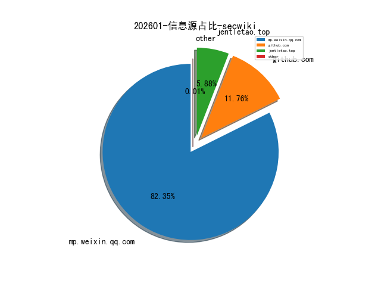
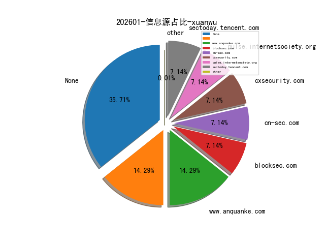
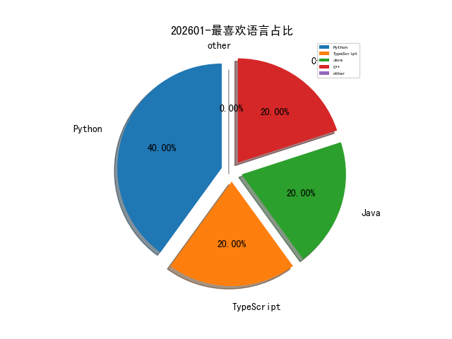

# [数据--所有](README_20.md)
# [数据--年度](README_2026.md)
# 202601 信息源与信息类型占比

# 网络安全书籍 推荐
| date_added | language | title | author | link | size| 
| --- | --- | --- | --- | --- | ---| 
| 2026-01-17 14:01:18 | English | Challenges and Applications of Generative Large Language Models | unknown | https://www.wowebook.org/challenges-and-applications-of-generative-large-language-models/ | unknown| 
| 2026-01-17 13:19:25 | English | Building Agentic AI: Workflows, Fine-Tuning, Optimization, and Deployment | unknown | https://www.wowebook.org/building-agentic-ai-workflows-fine-tuning-optimization-and-deployment/ | unknown| 
| 2026-01-17 12:22:30 | English | Essentials of Big Data Analytics: Applications in R and Python | unknown | https://www.wowebook.org/essentials-of-big-data-analytics-applications-in-r-and-python/ | unknown| 
| 2026-01-15 10:47:32 | English | Certified Kubernetes Administrator (CKA) Study Guide, 2nd Edition | unknown | https://www.wowebook.org/certified-kubernetes-administrator-cka-study-guide-2nd-edition/ | unknown| 
| 2026-01-15 08:43:18 | English | Ultimate Snowflake Cortex AI for Generative AI Applications | unknown | https://www.wowebook.org/ultimate-snowflake-cortex-ai-for-generative-ai-applications/ | unknown| 
| 2026-01-14 05:20:09 | English | Privacy and Security for Large Language Models | unknown | https://www.wowebook.org/privacy-and-security-for-large-language-models/ | unknown| 
| 2026-01-14 05:01:35 | English | Unified SecOps Playbook | unknown | https://www.wowebook.org/unified-secops-playbook/ | unknown| 
| 2026-01-14 04:54:26 | English | Python Programming: An Object-Oriented Approach | unknown | https://www.wowebook.org/python-programming-an-object-oriented-approach/ | unknown| 
| 2026-01-14 04:45:51 | English | Microsoft Exam AZ-801: Guide to Configuring Windows Server Hybrid Advanced Services | unknown | https://www.wowebook.org/microsoft-exam-az-801-guide-to-configuring-windows-server-hybrid-advanced-services/ | unknown| 
| 2026-01-13 08:47:45 | English | The Agentic AI Revolution | unknown | https://www.wowebook.org/the-agentic-ai-revolution/ | unknown| 
| 2026-01-13 06:44:26 | English | AI Projects in PyTorch | unknown | https://www.wowebook.org/ai-projects-in-pytorch/ | unknown| 
| 2026-01-12 13:00:39 | English | Securing Smart Things | unknown | https://www.wowebook.org/securing-smart-things/ | unknown| 
| 2026-01-12 06:23:07 | English | The Art of Cyber Threat Intelligence | unknown | https://www.wowebook.org/the-art-of-cyber-threat-intelligence/ | unknown| 
| 2026-01-12 05:01:31 | English | Python in Excel | unknown | https://www.wowebook.org/python-in-excel/ | unknown| 
| 2026-01-09 05:07:07 | English | Python Object-Oriented Programming, 5th Edition | unknown | https://www.wowebook.org/python-object-oriented-programming-5th-edition/ | unknown| 
| 2026-01-08 05:52:10 | English | Android and IOS Mobile Forensics | unknown | https://www.wowebook.org/android-and-ios-mobile-forensics/ | unknown| 
| 2026-01-08 04:40:30 | English | Vibe Coding with GitHub Copilot | unknown | https://www.wowebook.org/vibe-coding-with-github-copilot/ | unknown| 
| 2026-01-07 17:11:15 | English | Identity Analytics: Analytics for Identity and Access Management | unknown | https://www.wowebook.org/identity-analytics-analytics-for-identity-and-access-management/ | unknown| 
| 2026-01-07 16:48:21 | English | ISO 42001 and Legal Compliance | unknown | https://www.wowebook.org/iso-42001-and-legal-compliance/ | unknown| 
| 2026-01-04 08:22:27 | English | Generative AI-Driven Application Development with Java | unknown | https://www.wowebook.org/generative-ai-driven-application-development-with-java/ | unknown| 
| 2026-01-03 16:17:28 | English | Generative AI for Full-Stack Development | unknown | https://www.wowebook.org/generative-ai-for-full-stack-development/ | unknown| 
| 2026-01-03 13:18:20 | English | Python Made Easy | unknown | https://www.wowebook.org/python-made-easy/ | unknown| 

# 微信公众号 推荐
| nickname_english | weixin_no | title | url| 
| --- | --- | --- | ---| 
| AI与代码安全 |  | AI在代码中埋的三颗雷，快要爆了！ | https://mp.weixin.qq.com/s/rozL6Hab7t6jByU_fCZbxg | 4| 
| AI紫队安全研究 | AI紫队安全研究 AI紫队安全研究 | 零下寒冬的电网攻防战：波兰险遭断网，俄罗斯APT成最大嫌疑人？ | https://mp.weixin.qq.com/s/SeiCQYTd4Nu7OI5la3eQNQ | 8| 
| EnhancerSec | EnhancerSec EnhancerSec | 白帽师傅们，你有一笔“额外赏金”待领取！ | https://mp.weixin.qq.com/s/1CrYsuS9dkUGoHsIdRHJ5Q | 1| 
| FunnyHacking | Ca1m Ca1m | 【云安全专题-9】Kubernetes 攻防实战：从 API Server 未授权到接管集群心脏 | https://mp.weixin.qq.com/s/nsSE1BGva5Yn75EKdtdDeQ | 4| 
| IoVSecurity | GRCC GRCC | 一种基于PKI技术的汽车OTA安全升级方案 | https://mp.weixin.qq.com/s/brNhwhWWvyfagrmDR592fA | 33| 
| Ly4j攻防手记 | Ly4j Ly4j | SQL注入提权思路详解 | https://mp.weixin.qq.com/s/AmBQl7qdhvsOtfTscoCD7Q | 3| 
| SCERT科技服务平台 | SCERT SCERT | 工业和信息化部关于印发《优质中小企业梯度培育管理办法》的通知 | https://mp.weixin.qq.com/s/Vy1Gdj8NIjKZtnsJHmc_Uw | 2| 
| Say Sec |  | 小白如何获取CNVD证书 | https://mp.weixin.qq.com/s/d5m_8MMXf_xKFp-vQyF_lQ | 9| 
| kali笔记 |  | 复盘2025：在WAF的缝隙里开出花来（附EDU通杀0DayPOC） | https://mp.weixin.qq.com/s/cFUhkXB_MrB9RX4A6o7bQw | 7| 
| 乌雲安全 | 云头条 云头条 | 奇安信、安恒：被禁 3 年 | https://mp.weixin.qq.com/s/0dn5ByvxRgT10euKeNH6bg | 4| 
| 信息安全笔记 | 信息安全笔记 信息安全笔记 | 仿真商城漏洞靶场已上线 | https://mp.weixin.qq.com/s/Pv8z7N78Y2dc1PqmQZhieA | 2| 
| 倬其安 | Hash先生 Hash先生 | 穿透迷雾——看懂金融云底层架构 | https://mp.weixin.qq.com/s/-z_nB0ctghXC1HLUTQJXpg | 6| 
| 内生安全联盟 |  | 工信部部长划重点：低空经济入列 | https://mp.weixin.qq.com/s/vsD5W5XmRUnFBxmGBBtf2w | 23| 
| 只会看监控的实习生 | 菜狗 菜狗 | 速进！全平台项目群“安服崽”交流群 | https://mp.weixin.qq.com/s/mv3LUQVIKgOS4hEA-PPuxQ | 14| 
| 君说安全 |  | 行业资讯：某中医药大学网络安全设备采购及机房改造项目，网御星云、东华是赢家 | https://mp.weixin.qq.com/s/YOq9Rg4wmDr9qyH408nLpw | 54| 
| 好靶场 | None | 一次内网渗透拿下多台设备 | https://mp.weixin.qq.com/s/O-07w1p1GJ2A6Pfjj5LUQg | 10| 
| 安全圈的那点事儿 | 网络安全9527 网络安全9527 | Google Vertex AI漏洞允许低权限用户提升至服务代理角色 | https://mp.weixin.qq.com/s/m5fSAgiQPKUgZL0jJD1PJA | 8| 
| 安全学习那些事儿 |  | 美外卖配送平台Grubhub确认发生数据泄露 | https://mp.weixin.qq.com/s/rH2ReM4sPGfnaSwD2AG7ag | 9| 
| 安协小天使 | 游流仙 游流仙 | 杭州电子科技大学网络攻防大赛校园赛报名开启 | https://mp.weixin.qq.com/s/w6-Ltqbse-qj_9oOc_k0EQ | 1| 
| 实战安全研究 |  | 漏洞复现 , 用友U8Cloud IPFxxFileService 任意文件上传漏洞 | https://mp.weixin.qq.com/s/7oGpjbtH1DhNqt70HwO5PQ | 8| 
| 工业信息安全创新中心 | ICICS ICICS | 公安机关破获跨境贩卖公民个人信息案件，打击网络犯罪 | https://mp.weixin.qq.com/s/Wr7PC0Pfg6ly9WqMeJX94w | 9| 
| 广东网警 | 公安部网安局 公安部网安局 | 网警助您守护“养娃钱”：领取育儿补贴硬核攻略 | https://mp.weixin.qq.com/s/kbw9LLe07HCd-RvejWyKmQ | 2| 
| 情报分析师 | DMT DMT | 2026年伊朗局势走向何方？内忧外患下的三重挑战 | https://mp.weixin.qq.com/s/hLXnngbBF7AwkSDZd_VjUw | 15| 
| 梓陌说科技 |  | 逾期30万还不上，最坏的结果是什么？负债人必看的债务全周期应对指南 | https://mp.weixin.qq.com/s/OfGK37mxfi4mq1Da6_mw9A | 8| 
| 梦醒安全 | m3x1 m3x1 | 实战解析：绕WAF的SQL注入变形技巧思路 | https://mp.weixin.qq.com/s/5KfLKCYpdjzbatvtVmvoKw | 2| 
| 武文学网安 | 武文学网安 武文学网安 | sqli-labs 第 25a 关（Advanced Blind SQL Injection）快速通关 | https://mp.weixin.qq.com/s/wQ6aquG-hMevND-gCrPFbA | 5| 
| 泷羽Sec-tyg |  | 【牛马专区】常见的42种反弹shell方式 | https://mp.weixin.qq.com/s/7H9Er9sgoR3UCH9X5xnQpg | 2| 
| 洞见网安 | AJay13 AJay13 | 网安原创文章推荐【2026/1/17】 | https://mp.weixin.qq.com/s/7MwojwqqmxgZmh1C52L6SA | 8| 
| 浅梦安全 | onewin onewin | 【工具分享】MPET (Multi-Protocol Exploitation Toolkit)一款专业的多协议安全测试工具 | https://mp.weixin.qq.com/s/_nOsFiJOiTwF7Z0A02J0fQ | 2| 
| 渝融云安全 | 渝融云安全 渝融云安全 | 和我们一起，阔步向前，加入数字安全的奔腾之马 | https://mp.weixin.qq.com/s/zeOVwyHM35qZ1cudsQO9Ng | 1| 
| 犀牛安全 | Rhinoer Rhinoer | 黑客因入侵鹿特丹和安特卫普港口被判处七年监禁 | https://mp.weixin.qq.com/s/Q4iSmuf2gCqoHPVg6LBKnw | 8| 
| 玄道夜谈 | None | 分享图片 | https://mp.weixin.qq.com/s/6PTiKYsgRLk3K0jR8PaWMA | 8| 
| 白帽子 |  | 你的定位不是被偷的，而是被“合法广播”出去的 | https://mp.weixin.qq.com/s/rrUVEO8TrHxDRUmxCfD1Kg | 4| 
| 破镜安全 | 破镜安全 破镜安全 | CISCN 2018 - SM 密码学题目深度技术解析 | https://mp.weixin.qq.com/s/LjU3OWXhOfZY3lMxnjDSnQ | 8| 
| 神农Sec | 神农Sec 神农Sec | 小白如何获取EDUSRC证书 | https://mp.weixin.qq.com/s/0rVtHIRzSiSzYWy1On_f_g | 12| 
| 祺印说信安 |  | Windows 11在1月份安全更新后无法关机 | https://mp.weixin.qq.com/s/hbEJnHZM6-WQ1i_bcngjLQ | 14| 
| 红队安全圈 | 红队安全圈 红队安全圈 | 红队必备漏扫神器！最新版 Invicti 26.1.0 | https://mp.weixin.qq.com/s/Txmwjkh48Lz88s4Fq7QYnA | 1| 
| 绿洲安全 | 三千水 三千水 | 画圈寻物法（亲测有效！） | https://mp.weixin.qq.com/s/jwMKVxSfXkWaYKxzpB2AOg | 6| 
| 网安守护 |  | 追踪攻击源头  从IP地址到攻击者身份的溯源之旅 | https://mp.weixin.qq.com/s/oqrMmrMzw-pZ45kw6h031g | 1| 
| 网空闲话plus | 网空闲话 网空闲话 | 中情局特别行动中心解密：一位前主任的坦诚自述 | https://mp.weixin.qq.com/s/6zj4ioS2S1sMFSo1LYNz5Q | 31| 
| 网络侦查研究院 | 子午猫 子午猫 | 卢英华：经侦数据海洋中的“猎影者” | https://mp.weixin.qq.com/s/wBG4azDWtEUPdoXTvOaAdQ | 12| 
| 网络安全学习室 | 点击关注👉 点击关注👉 | 漏洞挖掘实战系列（第14期）：高级SQL注入技巧 WAF绕过+盲注优化+实战案例 | https://mp.weixin.qq.com/s/ALKYJ1dxxrpYBL1vKIQ1Zg | 6| 
| 网络安全实验室 | Flag Flag | 网络安全攻防技术知识库 | https://mp.weixin.qq.com/s/-qgAMB2WyKxuWJ9_sYmqVA | 12| 
| 网络安全工作室 |  | 一图读懂 , 公共安全行业标准GA 1277.12-2025《互联网交互式服务安全管理要求 第12部分：网络直播服务》 | https://mp.weixin.qq.com/s/RTWi9bWxpKv6vQdJRhP1eA | 2| 
| 网络技术干货圈 | 圈圈 圈圈 | 每天一个网络知识：什么是网关备份？ | https://mp.weixin.qq.com/s/UXTwXhxKJHFiPBwfAf9UTQ | 8| 
| 美亚柏科 |  | 不止AI+！国投智能战略升级，“两稳三拓”定航向 | https://mp.weixin.qq.com/s/-7h875dXekcrx9hveKtIWQ | 10| 
| 苏说安全 |  | 安全可靠测评结果公告（2026年第1号） | https://mp.weixin.qq.com/s/yJr2eBo_MRhdIoKNVXMESQ | 7| 
| 蓝军开源情报 | 所长007 所长007 | 委内瑞拉防空系统为何从未开火：当C4ISR解除C2武装时 | https://mp.weixin.qq.com/s/tJh76SGhAqrX7zwjGXlQOA | 6| 
| 贝雷帽SEC | onewinner onewinner | 【红队】一款专业的多协议安全测试工具 | https://mp.weixin.qq.com/s/XQPTZfrNicCyDBUk2XHyQg | 3| 
| 运维星火燎原 | 刘军军 刘军军 | Linux AWK 高级用法深度解析 | https://mp.weixin.qq.com/s/LNhSnbLrtyXVw4wMTHeBLg | 5| 
| 进击的HACK |  | 雷池WAF的妙用-蓝队使用思路 | https://mp.weixin.qq.com/s/SPb42MiXg8pzMPjzJhkUpw | 8| 
| 野猪与安全 | 耶度 耶度 | 一文读懂信息安全标准：安全合规的“技术标尺”与核心框架 | https://mp.weixin.qq.com/s/mu7X-7r3IISXTeRPMBMZCQ | 15| 
| 铁军哥 | 衡水石头哥 衡水石头哥 | 用于基于IPv6分段路由（SRv6）的服务的BGP着色前缀路由（CPR） | https://mp.weixin.qq.com/s/tfvrk-uxXtAsPEeV28Re1A | 8| 
| 银遁安全团队 | xiachuchunmo xiachuchunmo | 推荐一个圈内师傅的AI集成助手平台，20+付费模型均免费使用 | https://mp.weixin.qq.com/s/Fpq7JT5Slh_1pkTs1Tq42w | 4| 
| 隐雾安全 | 韭菜 韭菜 | 【代码审计】CVE-2025-46836 | https://mp.weixin.qq.com/s/9vO2mNzI0F2qonYIsnGV7w | 5| 
| 骨哥说事 | 骨哥说事 骨哥说事 | 精通SQLMap和Ghauri：WAF绕过技术实用指南 | https://mp.weixin.qq.com/s/sSqz-teZ-NUVTr7Tv8IPsQ | 8| 
| 高级红队专家 | 红蓝精英 红蓝精英 | Malware Development组队计划 | https://mp.weixin.qq.com/s/Y2epFws15RDaa4tfsS_zIw | 17| 
| 黑白之道 | None | 一款可以梭哈内存马的工具 | https://mp.weixin.qq.com/s/npp_CFzMXv2WCLtfx0N3Wg | 36| 
| 0x00001 | 无名的人 无名的人 | 渗透安全测试远程接单 | https://mp.weixin.qq.com/s/OfXJLcjJsfcCREsL8w8Ipw | 1| 
| 0xSecDebug | 0xSecDebug 0xSecDebug | 03_等保系列之1.0和2.0对比 | https://mp.weixin.qq.com/s/2Jcx3aZcO1J1uHUzG5ixvg | 11| 
| 0xSecurity | Wvvvvv Wvvvvv | 某甲方大厂安全面试题 | https://mp.weixin.qq.com/s/-1A7CMpJy654co6Phnt6BA | 4| 
| AI+网络安全笔记 | Yang Yang | APT攻击概述 | https://mp.weixin.qq.com/s/Cy3tT2s_Yj3fcVtIOA-Iyw | 2| 
| AI与安全 | 孙志敏 孙志敏 | Strix AI驱动的漏洞动态验证能力分析 | https://mp.weixin.qq.com/s/pNQkwcoOj_dfd22yFJF6lg | 1| 
| AI安全圈 | None | 这样的offer通知，才是好企业 | https://mp.weixin.qq.com/s/x3qbm7G4lDet68o7IM3SvQ | 5| 
| AI赋能汽车 |  | 2025AI大模型车载软件平台白皮书 | https://mp.weixin.qq.com/s/uQIb0WiuMXdOg_U5tc64wQ | 12| 
| FreeBuf | None | ValleyRAT_S2 攻击组织部署隐蔽恶意软件窃取财务数据 | https://mp.weixin.qq.com/s/6LkZcf8lUoXOeNWY5OlZ8Q | 46| 
| GSDK安全团队 | GSDK GSDK | GYscan：内网横向安全测试工具 | https://mp.weixin.qq.com/s/dXWeFKhRbdzZ_EzPYcE79A | 3| 
| HZ安全实验室 |  | AI公开课邀你薅羊毛 | https://mp.weixin.qq.com/s/hcUAbbWUyDloBe2NYrz8XA | 2| 
| Hacking黑白红 |  | 阿里安全招聘-设备安全团队人才招募令 | https://mp.weixin.qq.com/s/QGgRzywl9JB1yIWLxYH-rA | 34| 
| IoT物联网技术 | . . | 开源！可信创部署，若依框架IoT 新能源充电桩运营管理平台，含前端、后端、小程序源码 | https://mp.weixin.qq.com/s/WJ5JBBgvqFRfqmOdpP0xHQ | 6| 
| KeepHack1ng | None | 一定要远离满嘴道德仁义的人 | https://mp.weixin.qq.com/s/HtFRBQurEq6NLNPHcFcZTA | 6| 
| Khan安全团队 |  | APT与黑产快速判定清单 | https://mp.weixin.qq.com/s/0j4boXmad04dgvCM30YC4A | 24| 
| Ots安全 |  | 通过 AppleKeyStore 引发的 SEP 固件崩溃 - iOS/macOS 26.x 内核漏洞 | https://mp.weixin.qq.com/s/FvjY4VXy2RnktgEzPnrw1A | 11| 
| Oxo Security | None | 炸裂！利用“拓扑分身”击穿 Llama-Guard！ | https://mp.weixin.qq.com/s/xDSiT2TjMNOWRnGk5hktUQ | 18| 
| Sec铁匠铺 | None | LingJing（灵境）：EID靶机-WP | https://mp.weixin.qq.com/s/SO4_WVO9SKpxRh1YOQ7Xkg | 4| 
| SharkSec | SharkSec SharkSec | dumphash详解 | https://mp.weixin.qq.com/s/Ill1OFFqQ-ZIbVJ2--EWGg | 5| 
| TtTeam |  | APT与黑产快速判定清单 | https://mp.weixin.qq.com/s/SlFKgC3H6APkdCFx10MLyw | 12| 
| UpRoot | ptr ptr | 分块传输打内存马 | https://mp.weixin.qq.com/s/5Y-fX2VaQ1reRi_KcIB1Cw | 1| 
| W小哥 | al0ne al0ne | Nginx日志安全分析脚本 | https://mp.weixin.qq.com/s/llj8fXGdaIKtaXdn6kL5pQ | 11| 
| Z2O安全攻防 |  | 活该你能挖到洞 | https://mp.weixin.qq.com/s/JuWPQZdykW3Z9tEYRMTi2g | 9| 
| kingman安全 | lawliet lawliet | 做个\"脚本小子\"--fscan.exe的免杀篇 | https://mp.weixin.qq.com/s/sxN4YXF6Qg2NHZIVeI0dww | 3| 
| w小小杂谈w | w小小杂谈w w小小杂谈w | 漏洞科普——React Server Components 拒绝服务漏洞（CVE-2025-67779） | https://mp.weixin.qq.com/s/mIRWVqNzCk7yoY2bIkLsdQ | 4| 
| 丁爸 情报分析师的工具箱 | 丁爸 丁爸 | 【情报分析】美国负责中国事务的组织架构 | https://mp.weixin.qq.com/s/c1IGeWL1-aFBElp7R0MSgQ | 15| 
| 中国电信安全 |  | 喜报！天翼安全荣获第四届“光华杯”千兆光网应用创新大赛技术创新专题赛二等奖！ | https://mp.weixin.qq.com/s/1Zk7leDq2HLgeEIji46O6A | 6| 
| 中国网络空间安全协会 |  | 2025年中国网络空间安全协会年会在福州召开 | https://mp.weixin.qq.com/s/Jp2Omzhv2vUtqv2zO_C3Ag | 6| 
| 信息网络安全杂志 |  | 北京大学博士研究生姜欣睿论文被数据挖掘领域顶会KDD 2026录用 | https://mp.weixin.qq.com/s/07dKNumzLMWj6114djH9ug | 23| 
| 全球技术地图 |  | 美专家警告：认知战能力已成国家安全关键变量 | https://mp.weixin.qq.com/s/yblzGQYNQvlULAKJ51-T8Q | 17| 
| 兰花豆说网络安全 | 承影 承影 | 浅谈网络安全产品SaaS多租户设计 | https://mp.weixin.qq.com/s/x6rj5QentvQakt1MNMqL_Q | 3| 
| 利刃信安 | 利刃信安 利刃信安 | 【网络安全】华为鸿蒙系统通过国家安全可靠测评，从硬件到软件拿下信创Ⅱ级认证 | https://mp.weixin.qq.com/s/4ImeDW1zpL49G2VeghifzA | 6| 
| 升斗安全 | None | 【接口漏洞第六章第四节】绕过前端限制：浅析REST路径中的服务器端参数污染漏洞 | https://mp.weixin.qq.com/s/11LMAoJ_Vp6swU0esKDMNg | 10| 
| 哆啦安全 | CCMS CCMS | AI对于普通人来说是翻身的机会(2026) | https://mp.weixin.qq.com/s/7gZAwUAQZydt8I-5TDHKDw | 4| 
| 哦0吼 | zoe zoe | 文件上传 | https://mp.weixin.qq.com/s/f1na8iTqkWVGpqUwKWpsTQ | 3| 
| 喵苗安全 | miao2sec miao2sec | 倒计时 2 天 ｜ 云原生安全立方项目 | https://mp.weixin.qq.com/s/55WAHa0rB1EYnckpKvSo1g | 7| 
| 天欣AI | 天欣 天欣 | 美团开源模型开挂了？1个问题调用8 个 “大脑” 并行思考！ | https://mp.weixin.qq.com/s/_XiH14-QIQ1SO30rovQvTA | 3| 
| 威努特安全网络 |  | 国家漏洞库通报Apache漏洞、西班牙能源巨头1TB数据泄露,一周特辑 | https://mp.weixin.qq.com/s/zVTgKjhE09G-8ztTqXy7CA | 5| 
| 安全info | None | 每天免费3个授权码eyJkYXRhIjoiZXlKdFlXT | https://mp.weixin.qq.com/s/cYr09Mb7OvO_HfBOMQIMww | 2| 
| 安全分析与研究 | pandazhengzheng pandazhengzheng | 伪装成汽水音乐网站的银狐黑产最新钓鱼样本分析 | https://mp.weixin.qq.com/s/fYbhfwyuL79QS8bbmoofWg | 5| 
| 安全圈 |  | 【安全圈】微软确认：Windows更新出现新Bug！直接没法关机 | https://mp.weixin.qq.com/s/hGLfA0Mv7toaE3AUVBw_fw | 43| 
| 安全天书 | Hello888 Hello888 | 【杀软对抗】HeavenlyBypassAV免杀工具 | https://mp.weixin.qq.com/s/ndYufxTSgPXuQx8AsLsbkg | 4| 
| 安全新说 | FreeBuf FreeBuf | 世界经济论坛2026：AI将主导网络安全领域 | https://mp.weixin.qq.com/s/59GWYXvA9k8z228LXqiDKA | 3| 
| 安全狗的自我修养 | None | 每日课程更新 | https://mp.weixin.qq.com/s/gfFakTWpq_MQ7-06G65z6g | 14| 
| 安全研究员 | Shelter1234 Shelter1234 | 渗透测试利器・供应链组件投毒隐患：DNSLog 与 Webhook 平台盘点（无回显漏洞数据外带指南） | https://mp.weixin.qq.com/s/3XKSfJTB5yR4XVMLDtw4vg | 1| 
| 安全艺术 | 安全艺术 安全艺术 | 致远OA rest.do获取Cookie | https://mp.weixin.qq.com/s/cdd9RBtZiJuLJgq3HrSoXA | 8| 
| 安在 | 管窥蠡测 管窥蠡测 | 在看 , 厂商：本周热门网络安全产业动态 | https://mp.weixin.qq.com/s/stcO7G-SIRlumoIagPIXAA | 31| 
| 安天集团 |  | 安天AVL SDK反病毒引擎升级通告（20260117） | https://mp.weixin.qq.com/s/5xRCeaptUuE84GgxEEIxow | 5| 
| 安帝Andisec | OT网络安全领军者 OT网络安全领军者 | 工业网络安全周报-2026年第3期 | https://mp.weixin.qq.com/s/GhPQGuw3AiH_65t4Y7o-gA | 3| 
| 安融技术 | 安融技术 安融技术 | OpenCode 远程代码执行高危漏洞 | https://mp.weixin.qq.com/s/B_Y-QOlz09Y5HEtTG-qO8Q | 5| 
| 小柳实验室 | 小柳实验室 小柳实验室 | rm -rf 误删文件？XFS 格式救星来了！xfs_undelete 5 分钟极速恢复实战 | https://mp.weixin.qq.com/s/z-yB8m2TP_BTZyJvwNR3rA | 4| 
| 平凡安全 | 平凡安全 平凡安全 | 【钓鱼攻防】手把手带你学会GoPhish钓鱼框架 | https://mp.weixin.qq.com/s/q8zU9scFq-L4I-YA-7A8rQ | 2| 
| 开源情报技术研究院 | c0nsen c0nsen | 暗网泄露：美国，美国银行所有者数据库完整信息 | https://mp.weixin.qq.com/s/ux6RIDXDn24I6H_M7NjQew | 6| 
| 微言晓意 | weyanxy weyanxy | 更新版：2025年发布的法律法规与部门规章汇总 | https://mp.weixin.qq.com/s/Utlw0uAEIfHhuVCwX1FWsQ | 3| 
| 掌控安全EDU | zkaq-KeyL zkaq-KeyL | 掌控安全特邀嘉宾课 , 解码黑产对抗（ | https://mp.weixin.qq.com/s/tVZBzcc5YKYTd0Z4eb478A | 11| 
| 攻防安全组 | None | 累 | https://mp.weixin.qq.com/s/uqMCCi5eDGZqF9tyx2Dh5w | 2| 
| 放之 | 放之 放之 | AI软件工程实践：构建企业级Agentic SOC平台 | https://mp.weixin.qq.com/s/c5jl82qwRyktYCl3vasG_g | 1| 
| 星夜AI安全 | 星夜AI安全 星夜AI安全 | 最新二开 fscan 发布：免杀突破火绒 360，流量伪装再升级 | https://mp.weixin.qq.com/s/oIWh_q2e05doTxKI0crs_A | 36| 
| 智探AI应用 | 点击关注→ 点击关注→ | 拟定：思迈特软件！国投证券报表系统smartBI新增AI问数模块 | https://mp.weixin.qq.com/s/9xKy0WQ9BNW-w4knYNrgTA | 43| 
| 河南省网络安全高校战队联盟 |  | 河南省第七届“金盾信安杯”网络与数据安全大赛获奖名单揭晓 | https://mp.weixin.qq.com/s/INqiY6MDfhDG2wLA8g4CKw | 1| 
| 河南等级保护测评 | 铸盾安全 铸盾安全 | 网络安全洞察2026：外部攻击面管理 | https://mp.weixin.qq.com/s/jSeJedz9NG7t3tMOPmT2QQ | 21| 
| 浅安安全 | 浅安 浅安 | 个人接单 , web渗透测试 | https://mp.weixin.qq.com/s/hU07mBXjajLSOerQQI8D6g | 14| 
| 清华大学学生网络安全技术协会 | 网络安全技术协会 网络安全技术协会 | 2026年校园网络安全响应中心（SRC）项目成员招募 | https://mp.weixin.qq.com/s/97XHSpABrUJBCHmPUGS0GQ | 1| 
| 渊亭防务 | 渊亭防务 渊亭防务 | 防务简报 , 美国海军完成有-无人协同作战能力演示 | https://mp.weixin.qq.com/s/EhhzH2dfDdhZCXqBtSH3tg | 9| 
| 独眼情报 | mayfly mayfly | Windows 11 电脑在 1 月份安全更新后无法关机 | https://mp.weixin.qq.com/s/d_6hDCPRBC7TK5gtoFomZg | 22| 
| 玄月调查小组 |  | 赛博仓鼠福音！用AI 一键整理浏览器书签 | https://mp.weixin.qq.com/s/TyCBQmxTNfg46iRcTQPcKg | 3| 
| 由由学习吧 | teacher李 teacher李 | ctftools-all-in-oneV8.7研发进度 | https://mp.weixin.qq.com/s/7J3ZzhRdBFUNOQFPRwQp9A | 2| 
| 白小客 | 白小客 白小客 | Stowaway多级代理工具 | https://mp.weixin.qq.com/s/fET7HrH9iOGJmtCXcFRUQA | 1| 
| 白帽子罗棋琛 | Max Luo Max Luo | 安全测试工作实践与思考—钟伟鹏专访 | https://mp.weixin.qq.com/s/YcuERe1L8lYxHXTZZnZoqg | 1| 
| 看雪学苑 | 看雪课程 看雪课程 | 告别 x86 局限！ARM/MIPS/RISC-V 全架构 Pwn 实战课 | https://mp.weixin.qq.com/s/DKheJPmfCYqN4VPk_znFaw | 32| 
| 秦安战略 | 秦安 秦安 | 秦安：国防部明确，对付“台独”武装就像瓮中捉鳖，凡是能够严惩“台独”分子的措施都是可选项 | https://mp.weixin.qq.com/s/ItBl3dZM_iBit7cD3X0J0A | 9| 
| 红蓝对抗技战术 | 红蓝对抗技术 红蓝对抗技术 | 攻防技战术动态一周更新 - 20260112 | https://mp.weixin.qq.com/s/0F6hoVoFqutf4IPeciVSBg | 2| 
| 网安百色 |  | Firefox 147发布时修复了16个允许任意代码执行的漏洞 | https://mp.weixin.qq.com/s/rzd1vTKvrVuCpUprR1lwlQ | 8| 
| 网络与信息法学会 | 四川省发改委 四川省发改委 | 【资讯】四川省发改委等九部门印发《关于支持数字经济高质量发展的若干政策措施》 | https://mp.weixin.qq.com/s/QfxsFuwfMPypnepCR5QCdQ | 4| 
| 网络与安全实验室 |  | 每周文章分享-244 | https://mp.weixin.qq.com/s/--1YYakix-8Z2FSBV5gKFg | 3| 
| 网络安全与取证研究 |  | 网络流量包练习题解题详解（附详细解题视频） | https://mp.weixin.qq.com/s/D2426IWxK9xi2SvP9tuy2Q | 3| 
| 网络安全和信息化 |  | 1项公共安全行业标准获批发布 | https://mp.weixin.qq.com/s/XZ3haepOCtzw33ZVKiTrGQ | 22| 
| 网络安全透视镜 | None | 谁在牛市里面放了熊 | https://mp.weixin.qq.com/s/PzyrlIZZINXyHf1y_2GQew | 7| 
| 网络技术联盟站 | wljslmz瑞哥 wljslmz瑞哥 | 一文图解 ARP，从一次广播开始，到四种 ARP 全搞懂 | https://mp.weixin.qq.com/s/vinR8dEippZCw9wd3Lj4NQ | 12| 
| 网络空间安全研究院UESTC | 工程研究中心 工程研究中心 | 国家重点研发计划“分布式无证书网络身份系统的关键技术”季度研讨会在电子科技大学顺利召开 | https://mp.weixin.qq.com/s/sFXcVe1u3IDHdt2O76BEmg | 1| 
| 老付话安全 | 老付话安全 老付话安全 | 【大话工控安全】工业控制系统行业知识：电力行业风力发电场景 | https://mp.weixin.qq.com/s/2H-fK6mLh-njO6Wa3dDvkg | 5| 
| 聚铭网络 |  | 【一周安全资讯0117】《交通运输数据安全管理办法（征求意见稿）》发布；全球性故障：多款Cisco交换机DNS解析失败引发连续重启 | https://mp.weixin.qq.com/s/kIKEjbXBZT2OumOetaYvCw | 8| 
| 船山信安 | None | 能不能形容狗咬狗🐶，各位师傅怎么看？ | https://mp.weixin.qq.com/s/TFlL5jqJSrZOcLzkuB_2eA | 22| 
| 蝉SEC | d0n9x1e d0n9x1e | 【APP测试】frida的python库使用 | https://mp.weixin.qq.com/s/kImc-0C5kGDMe08oyQdnRQ | 9| 
| 表哥带我 | 冥夏寒冬 冥夏寒冬 | 网安龙头奇安信发布2025年业绩预亏公告 | https://mp.weixin.qq.com/s/sVx0ef0tlX-CfY6vEWueug | 13| 
| 计算机与网络安全 |  | 生成式人工智能服务合规备案指南 | https://mp.weixin.qq.com/s/JT2ZMutR1EUi-zDNPFAYig | 37| 
| 谈思实验室 |  | 基于模拟的安全 (Simulation based Security) | https://mp.weixin.qq.com/s/kU0aQnrMHw_AoERv6K1CrQ | 30| 
| 赛博新经济 | 赛博新经济 赛博新经济 | PacketScope：LLM赋能的协议栈交互行为智能分析 | https://mp.weixin.qq.com/s/q6rorlNj-SES1rG4eNpncg | 1| 
| 赛博生存指南 | None | 四年读计算机科学学位是不是白费了？ | https://mp.weixin.qq.com/s/Ig_-WjcsSObJcD75AG8qDw | 1| 
| 赛欧思安全研究实验室 | SOC SOC | 赛欧思一周资讯分类汇总(2026-01-12 ~ 2026-01-17) | https://mp.weixin.qq.com/s/X3OcSF7yo2yRUOoCi1AEOg | 3| 
| 逆向有你 |  | 已经超2000人在这个群领取到福利啦！ | https://mp.weixin.qq.com/s/gK7H0O4m_yOyXAFwAPtLjg | 2| 
| 逍遥子讲安全 | 逍遥 逍遥 | 关于国内通用OA的渗透测试思路-仅供测试切勿违法使用 | https://mp.weixin.qq.com/s/8My-kcX1x_gjdspxrVbWXQ | 3| 
| 金刚狼不懂安全 | 0x7556 0x7556 | AI免杀工具 对抗Google平台62款杀软 | https://mp.weixin.qq.com/s/Yhl-wLNca-vgO3eFZXF-Uw | 1| 
| 锦岳智慧 |  | OWASP 2026 “智能体应用”十大风险发布 | https://mp.weixin.qq.com/s/mPYmNqNJL6XgWX-l7vC4Kg | 3| 
| 长弓三皮 | 长弓三皮 长弓三皮 | b2107_[0xGame-2020] [MISC]_pcap writeup writeup2 | https://mp.weixin.qq.com/s/O6j2ktvTEXdms_gvhzqZtQ | 2| 
| 陌笙不太懂安全 | 陌笙 陌笙 | 记几个edusrc简单挖掘案例 | https://mp.weixin.qq.com/s/fPvxdFmfk15CUkbzisWDHg | 1| 
| 陌陌安全 | 顺丰安全 顺丰安全 | 《跨年SRC联合狩猎翻倍盛典》第三期启幕xa0！ | https://mp.weixin.qq.com/s/1aTqLIgtlgIwsgwYpbswJA | 1| 
| 隼目安全 | 九泠 九泠 | 【转载】复盘2025：在WAF的缝隙里开出花来（附EDU通杀0DayPOC） | https://mp.weixin.qq.com/s/1LiBtZ-aiY8MLknS81AWRA | 2| 
| 零域矩阵 | 零域矩阵 零域矩阵 | 安徽公务员-网络安全类岗位（1.19报名） | https://mp.weixin.qq.com/s/zdZp2rPH4OY_nms68FYXCQ | 7| 
| 马哥网络安全 | 点击关注👉 点击关注👉 | Wireshark抓包终极指南：从基础到高手，看这篇就够！ | https://mp.weixin.qq.com/s/j-nws0M5heXM-IjjBcQXIw | 24| 
| 鱼影安全 | 落寞的鱼 落寞的鱼 | 2025数证杯-初赛-计算机部分Writeup | https://mp.weixin.qq.com/s/ibMt1FwJnlZUbmzzl-nPkg | 3| 
| 黑鸟 | None | 美国网络武器切断委内瑞拉的电力并干扰雷达 | https://mp.weixin.qq.com/s/fnzg3NOwB9xNmVF_w48zYg | 7| 
| CNNVD安全动态 | CNNVD CNNVD | 人工智能重要漏洞通报（2026年第一期） | https://mp.weixin.qq.com/s/XV5recnrGHolaTpSJvvJ9g | 4| 
| Flykite | Wraink Wraink | 【更新】Onyx 一款综合信息收集工具 | https://mp.weixin.qq.com/s/lAlZpbXm4eWqf3yNaTb0cA | 3| 
| FreeBuf知识大陆APP |  | 自查指南：你的n8n服务，可能已成为数据泄露的后门 | https://mp.weixin.qq.com/s/ztP3AKq8pyRI3fdmSX-udA | 2| 
| O安全研究员 | O安全研究员 O安全研究员 | Cisco 0-day RCE 安全邮件网关漏洞在野外被利用 | https://mp.weixin.qq.com/s/wUIhnvYbUIO9B2lT0En5OQ | 7| 
| craxpro安全实验室 | None | 渗透某特大网络赌博太阳城娱乐平台记录 | https://mp.weixin.qq.com/s/dz165jWqYN20sbtfvMsX8Q | 2| 
| 一个不正经的黑客 | None | 挖漏洞等于挖坟！ 请把后事准备好。 | https://mp.weixin.qq.com/s/nF48nz4642lMtup9rcU3AA | 6| 
| 一个安全研究员 | TNT阿信 TNT阿信 | AI的“权利春药”，我爽了，但也开始怕了。 | https://mp.weixin.qq.com/s/NGriJtaYV8q1XnffEjB-tQ | 1| 
| 与智慧做朋友 | 李志勇 李志勇 | 软件是用来做知识的，这才是王道 | https://mp.weixin.qq.com/s/zcMtTxPxvAJynH7K6kmqEg | 2| 
| 中国信息安全 | 宋英辉 刘颖琪 宋英辉 刘颖琪 | 专家观点 , 构建中国特色未成年人网络保护体系 | https://mp.weixin.qq.com/s/t99nE-JBKggN1PEF3xefYw | 49| 
| 中国软件评测中心 |  | 【会议活动】公共数据授权运营管理要求和平台建设系列标准研讨会在京召开 | https://mp.weixin.qq.com/s/Gsge3KB0ZZOlrmF5GTmX8Q | 13| 
| 二道情报贩子 | 金融情报贩子 金融情报贩子 | 内存条上涨，网络安全设备利润点下降，或将迎来大涨价时代 | https://mp.weixin.qq.com/s/g80gaCVn0RSHAzi4eRhRLQ | 8| 
| 公安部网安局 |  | 第六届“天府杯”国际网络空间安全大赛火热开启 | https://mp.weixin.qq.com/s/S5n4zh81cLbKHJqziv56Uw | 16| 
| 创信华通 |  | 喜报丨“数信杯”初赛金奖！创信华通创安实验室勇夺第三届“数信杯”数据安全大赛AI安全团队综合赛西二区第一名 | https://mp.weixin.qq.com/s/ySB4RJO5teSFRM_IHtbl-Q | 2| 
| 南有禾木 | 北渚 北渚 | DIDCTF-2025平航杯-流量分析 | https://mp.weixin.qq.com/s/9d2H2Ac-29H_FSYaQymbKg | 4| 
| 国家网络空间安全云社区 |  | 第六届“天府杯”国际网络空间安全大赛火热开启 | https://mp.weixin.qq.com/s/Gi4myMc_USGAPB8iHAv-6g | 2| 
| 国源天顺 | 国源天顺 国源天顺 | 国家能源局关于印发《能源行业数据安全管理办法（试行）》的通知 | https://mp.weixin.qq.com/s/0HLxZRVybbKl8LGgcepZhQ | 2| 
| 奇安信集团 |  | “零点击”数据泄露：企业级AIxa0Gemini Enterprise漏洞如何让AI成为企业安全新威胁 | https://mp.weixin.qq.com/s/yZEf4aY3Rh7ycxSOz2acjg | 18| 
| 字节跳动技术团队 | 火山引擎可观测 火山引擎可观测 | 观测成本如何优化？APMPlus 尾采样技术的降本增效实践 | https://mp.weixin.qq.com/s/M7HmYlOS27aH2mTPWk2rTA | 4| 
| 安世加 | 安世加 安世加 | 欧洲铁路通票公司遭黑客攻击致客户信息泄露 | https://mp.weixin.qq.com/s/hajNQPBCwC8g9ajMk8zWZg | 8| 
| 安全内参 |  | 美国网络司令部和国家安全局领导人提名人选向美国会作证 | https://mp.weixin.qq.com/s/ejvOSFw2zREwai2S17vNTA | 16| 
| 安全女王 | lumen lumen | C盘冒红快爆掉？不知道，我的身材很曼妙。 | https://mp.weixin.qq.com/s/Le23GNUPe0mzVghbDzTsAw | 1| 
| 安全研究GoSSIP | G.O.S.S.I.P G.O.S.S.I.P | G.O.S.S.I.P 阅读推荐 2026-01-16 AI驱动的XSS安全检测 | https://mp.weixin.qq.com/s/a8MqFGrXkwi0hH9MbeflUg | 2| 
| 安全随笔 | 0xNvyao 0xNvyao | 彻底搞懂SSH认证：主机认证与用户认证 | https://mp.weixin.qq.com/s/e7k4uMK967GGD-_9nfaOpw | 1| 
| 安恒信息 |  | 党徽闪耀映初心 多面担当展风采 —— 优秀党员周吉的耕耘历程 | https://mp.weixin.qq.com/s/NOcqaUsMui36T_CKhFSoBQ | 8| 
| 工业安全产业联盟平台 |  | 数据安全保障丨交通运输部印发《关于加快交通运输公共数据资源开发利用的实施意见》 | https://mp.weixin.qq.com/s/S_95GRT_0ZoJU_G8B7d5Qg | 10| 
| 星落安全团队 | 星落 星落 | 重磅发布 , 星落安全内部工具箱1.2：图形化界面，专业能力触手可及 | https://mp.weixin.qq.com/s/dpMyrWd7SEM9DObyx2blsQ | 3| 
| 极客安全 | 国信中心 国信中心 | 每周网络安全简讯 ( 2026年 第3周 ) | https://mp.weixin.qq.com/s/52OP2ZLeGUw8PhufmMm0tQ | 4| 
| 泷羽Sec-Norsea | Wraink Wraink | 告别散装工具！Onyx：集Fscan解析、FinalShell解密、小程序逆向于一体的桌面端神器 | https://mp.weixin.qq.com/s/yspDXFzSboXHcTyXO7jZLA | 3| 
| 泷羽Sec-静安 | 醉墨离 醉墨离 | OSCP/OSEP一对一私教直通车：协议保障，直通高级渗透测试专家 | https://mp.weixin.qq.com/s/eCujJbL37LpRVQwkJqRZUA | 15| 
| 海哥网络安全 | None | 学完网络安全，你也可以成为尖子生！ | https://mp.weixin.qq.com/s/aSjiD2XNDKgh07VTIqLvSQ | 2| 
| 渗透安全HackTwo | 7uup 7uup | TsojanScan-Plus：基于原 Burp 漏洞插件重磅二开，新增多漏洞扫描与权限绕过检测 | https://mp.weixin.qq.com/s/FRaqBhIadnr7GcY6btWQQA | 3| 
| 渗透安全团队 |  | Linux一句话上线 + 上线提醒机器人 + 全新BOF SleepMask 对标Cobalt Strike4.9.1 , Cobalt Strike 1.9正式发布！ | https://mp.weixin.qq.com/s/uqq-oEdWMv3Kb1VK0_vqaw | 1| 
| 湘安无事 | 湘南第一深情 湘南第一深情 | edu小灶案例之泄露上w敏感信息&有意思的证书站报告案例 | https://mp.weixin.qq.com/s/YNt_gDIj4QnrdcORPlcaVg | 1| 
| 湘岚实验室 | 湘岚实验室 湘岚实验室 | 湘岚实验室“星途”CTF培训重磅开启，邀你共赴网络安全星光征途 | https://mp.weixin.qq.com/s/eBlt3Ix-5lGsNP8liYGb2A | 3| 
| 绿盟科技 | 绿盟君 绿盟君 | 绿盟科技出席广播电视行业网络安全技术研究重点实验室工作会议 | https://mp.weixin.qq.com/s/m-fN5-xvMNwUBO5dOMbmlw | 8| 
| 苏州信息安全法学所 | 祝媛 周青 祝媛 周青 | 寰球密码简报（2026年乙本第1期）丨荷兰《后量子密码迁移手册（第二版）》中的迁移政策与实践指南（上）：量子脆弱性诊断框架 | https://mp.weixin.qq.com/s/zQAt3JKbBnupJVGnfVABQQ | 3| 
| 路多辛 | 路多辛 路多辛 | 为大语言模型而生的节省成本数据格式 TOON 详解 | https://mp.weixin.qq.com/s/M8ByIdeLDzfh0gW2IpnqRQ | 1| 
| 进击安全 | None | WordPress漏洞后台RCE漏洞审计过程 | https://mp.weixin.qq.com/s/z_CIJ1EEuRF1r6dj_kZmMA | 1| 
| 金盾信安 |  | 国家标准《数据管理能力成熟度评估模型》GB/T 36073-2025正式发布 | https://mp.weixin.qq.com/s/9YGFlyil1mdsoTKenZy-EQ | 13| 
| 顺丰安全应急响应中心 | 顺丰安全 顺丰安全 | 《跨年SRC联合狩猎翻倍盛典》第三期启幕xa0！ | https://mp.weixin.qq.com/s/BpmazPcYAnn8YP_YGQwu-w | 1| 
| 飓风网络安全 | cexlife cexlife | 【漏洞预警】Fortinet FortiClientEMS SQL注入漏洞CVE-2025-59922 | https://mp.weixin.qq.com/s/iH1BrFH9L5jdui29ygz2dw | 9| 
| 魔都安全札记 | None | 上海网信办发布 8 例 网数据安全执法案例涉及个人信息违规出境 | https://mp.weixin.qq.com/s/9-vK-er3LwJ8qPgF5_hxoQ | 1| 
| 鹿鸣安全团队 | 俗说君 俗说君 | Skill赋能代码审计初探 | https://mp.weixin.qq.com/s/auJiEOJyD4iKFvW0YdMOSg | 1| 
| 黑客技术与网络安全 | 权限提升中 权限提升中 | 同事月薪7k，因为日报提交早了，被领导说工作量不饱和。结果同事直接回怼：觉得不饱和可以直接辞退我，少这样恶心人。 | https://mp.weixin.qq.com/s/K9v0TOSNfKQ4DpL5UJq7pA | 9| 
| 黑客技术家园 | Mr wang Mr wang | 为什么觉得豆包比deepseek还好用？ | https://mp.weixin.qq.com/s/Jx32Yj9xnoQMBkFsiZmV0Q | 4| 
| 360数字安全 |  | 360携智能体工程师认证（ADE）亮相就业博览会，为人才就业添“黄金筹码” | https://mp.weixin.qq.com/s/azSU8kN-QjjsdTt4bqOyhg | 12| 
| 360漏洞研究院 | None | 【已复现】React Router 未授权路径遍历漏洞 (CVE-2025-61686)：伪造 Cookie 即可实现任意文件写入 | https://mp.weixin.qq.com/s/-JJmGsL98vozGSsTsNjzeA | 10| 
| AI安全这点事 | AIForSecurity AIForSecurity | WWW 2025(oral), 利用大模型与强化学习“降维打击”恶意流量检测系统 | https://mp.weixin.qq.com/s/_6YlJiUtigIK4bXHJh6Hqg | 1| 
| BlockSec | BlockSec BlockSec | Truebit安全事件深度分析 | https://mp.weixin.qq.com/s/KzsCWUB0xuiVcCPDkJbJTg | 2| 
| Coder小Q | Litt1eQ Litt1eQ | 【密码学】基于ML-DSA的门限签名(代码解读) | https://mp.weixin.qq.com/s/iq9WtQHNmWpGBGMoWs4Gdw | 1| 
| CppGuide |  | 我的新书《图解Linux网络编程》出版了！ | https://mp.weixin.qq.com/s/_5bhEQhHGYS6Nj9oR2BPlw | 5| 
| Damian攻防实验室 | Damian攻防实验室 Damian攻防实验室 | 滑块验证码绕过：技术迷思与法律红线 | https://mp.weixin.qq.com/s/FwxKl99rgwWTMzN59eX8eg | 1| 
| Gaobai文库 |  | 【破阵阁・网安淬锋】公开赛邀您参加！现金奖、京东卡、证书已就位！ | https://mp.weixin.qq.com/s/QOUjGQQ2oWegwH8Ot4qiTg | 1| 
| HACK之道 | 牛叫瘦 牛叫瘦 | 别再瞎爆破！最全的内网凭据密码收集方法和技巧总结 | https://mp.weixin.qq.com/s/24fADkVAjyI-ogfND1HNEA | 4| 
| ISC2网络安全 | ISC2 China ISC2 China | 【5.5CPE】ISC2焦点会议：治理、风险与合规，欢迎线上参会 | https://mp.weixin.qq.com/s/JTZCFhn9M7Nx1vbW-6RelQ | 8| 
| KK安全说 | 破天KK 破天KK | 2026年网络安全趋势及预测 | https://mp.weixin.qq.com/s/ez45QkouwkycZoIgruJ53A | 3| 
| M01N Team | 天元实验室 天元实验室 | AI 红队越狱攻击技术在大模型内容生成服务安全测试 | https://mp.weixin.qq.com/s/nNUpgl_Iez_s7rKiwmbtxg | 2| 
| MicroPest | MicroPest MicroPest | 利用AI逆向CTF-APK | https://mp.weixin.qq.com/s/GtprEVTTq9r3QRY5CYlJZg | 2| 
| Ms08067安全实验室 |  | 喜报 , 刺掌信息入选首批江苏省数据企业入库培育名单 | https://mp.weixin.qq.com/s/AUJQZea_liKM5XyYtwCUxQ | 3| 
| Nday Poc | Superhero Superhero | 用友U8 CRM checkselectpartapply.php sql注入 | https://mp.weixin.qq.com/s/2zKhVQzF7mpwxz06-B3awg | 3| 
| OPPO安全中心 |  | 【奖励公告】蜗牛奖励兑换公告 | https://mp.weixin.qq.com/s/rULkGdpmfM8J08-nrLPStw | 5| 
| OnePanda-Sec | sqli sqli | 【已复现含payload】Apache Struts XML外部实体注入漏洞(CVE-2025-68493) | https://mp.weixin.qq.com/s/_qP0F-OWAtX5fs5wBq813Q | 4| 
| Rsec | Qadhafy Muhammad Qadhafy Muhammad | 0117.我是如何发现 Google 表单漏洞的（重复内部漏洞 - 已修复） | https://mp.weixin.qq.com/s/TRJ79gWpK6ySL8eWSCNlfQ | 5| 
| SecurityPaper | whoami0002 whoami0002 | VS Code Tasks 滥用：朝鲜\"Contagious Interview\"攻击活动技术分析 | https://mp.weixin.qq.com/s/2ECR2q97ocz8oXocYYcsbg | 11| 
| Sky的安全观 | 27001.CN 27001.CN | 【安全锐评】信息安全是一个模块，一个体系，而非是一个角色，一类岗位 | https://mp.weixin.qq.com/s/HpRp0k1LQ7ML2bQP1wWOZg | 15| 
| T0daySeeker | T0daySeeker T0daySeeker | 针对国内用户的Rust加载器升级样本分析 | https://mp.weixin.qq.com/s/aWv_PRAbGJckRWdMObd_wA | 2| 
| T先生 Mr.Think | T先生 MrT T先生 MrT | AI 颠覆网络安全：五大核心革命，重构行业底层逻辑 | https://mp.weixin.qq.com/s/4iCK9N6S6rEK3qWmAxG_9A | 2| 
| VEDA卫达信息 | 小V同学 小V同学 | 2025年国内网络安全法规盘点 | https://mp.weixin.qq.com/s/o1_zVEXHWTD-0jn1lVdgdA | 2| 
| Web安全工具库 | nucssistdev nucssistdev | nuclei POC辅助编写（管理）工具 -- nucssist（1月12日更新） | https://mp.weixin.qq.com/s/RLPkb1Uk3h1UoqdPJYxElg | 5| 
| dmd5安全 | dmd5安全 dmd5安全 | CVE-2026-22688 - 腾讯WeKnora MCP Stdio 命令注入漏洞 | https://mp.weixin.qq.com/s/D77FQsOSjOrpWw_iM5ULQQ | 1| 
| e安在线 | e安在线 e安在线 | Shiro漏洞利用工具，更新V0.2！ | https://mp.weixin.qq.com/s/0FhKQ3o-o0FO13nF1MTuIA | 4| 
| imBobby的自留地 | imBobby imBobby | 主站解析失效的真凶：注册商封禁 + Spamhaus + SPF & DMARC 快速修复 | https://mp.weixin.qq.com/s/Jv_rMvMTEoWDIHNSVPYG1A | 1| 
| securitainment | Abhishek Gupta Abhishek Gupta | 你的模糊测试方法错了：FFUF 与虚拟主机模糊测试 | https://mp.weixin.qq.com/s/qbWvVlqzyZU6SUaJP2sV_A | 11| 
| sec随谈 | sec随谈 sec随谈 | 命令注入警报：LoadMaster 和 MOVEit WAF 存在高危漏洞 | https://mp.weixin.qq.com/s/eS-FvpSFjOHKXe3N3f1XOw | 2| 
| vExpert | 吴闯 吴闯 | vSphere 8 在虚拟机开关的时候自动升级VMware tools | https://mp.weixin.qq.com/s/cPERr0xx6NwC1F_1GWjK3w | 1| 
| 一起聊安全 |  | 推动高质量数据集建设，全国首部可信技术安全+数据合规标准来了！ | https://mp.weixin.qq.com/s/QH2JS5308ONJS_bUeA2neQ | 3| 
| 不秃头的安全 | Y5neKO Y5neKO | 新款Shiro漏洞利用工具- Y5neKO | https://mp.weixin.qq.com/s/gMApo9A53g1cyOsjEY_3ng | 2| 
| 中孚信息 | None | 中孚量界单导系统守护关键行业跨网数据交换，助力打造安全合规文件工作网 | https://mp.weixin.qq.com/s/mijtFkuFugktd6GxyHT86A | 3| 
| 二进制空间安全 | suntiger suntiger | 163K星标,一款开源Windows和Office高级激活套装 | https://mp.weixin.qq.com/s/FaYrgzsT5FNcnkC8wr1TVw | 2| 
| 云原生安全指北 | Dubito Dubito | 从Shai-Hulud蠕虫看自托管GitHub Actions runner的后门风险 | https://mp.weixin.qq.com/s/BeXelhdeZRXQGFPD4vJUVQ | 3| 
| 云起无垠 | AI赋能安全实践者 AI赋能安全实践者 | CloudRouter：更稳定、更有性价比的大模型接入方案 | https://mp.weixin.qq.com/s/09vtdxzpoRfVRNkACbB9Qw | 2| 
| 亚信安全 | 你信任的 你信任的 | 再揽“营销界奥斯卡”！亚信安全C3安全大会斩获第九届金匠奖年度AI内容营销金奖 | https://mp.weixin.qq.com/s/n6i1TMKQSyl-zSEKzJ-PjA | 8| 
| 亚洲诚信TrustAsia | 持续创新的 持续创新的 | 亚数TrustAsia 荣获 openHiTLS 社区 “2025 年度优秀推广单位”！ | https://mp.weixin.qq.com/s/ERK2oZ2468FVfxsRnB9T2A | 4| 
| 亿人安全 | 1575265746823585 1575265746823585 | 记一次ASP站渗透测试经历 | https://mp.weixin.qq.com/s/AbvcfHHnK9Z9pHp6RnQC8A | 2| 
| 今木安全 | 今木安全 今木安全 | 安全小知识-第十九期_域名爆破技巧思考 | https://mp.weixin.qq.com/s/fmk3x8uZM_GSKbkwjLCesw | 3| 
| 代码卫士 |  | 奇安信中标某大型银行开发安全扩容项目 | https://mp.weixin.qq.com/s/qeM1-zcEamSwtkcbaX-CqA | 14| 
| 任子行 |  | 一文解读 , 《汽车数据出境安全指引（2025版）》 | https://mp.weixin.qq.com/s/CVaAO3SBaXd9IdIQwZdvbw | 2| 
| 众智维安 |  | 蝉联三届！众智维科技再获CCIA“年度先进会员单位”权威认证 | https://mp.weixin.qq.com/s/WQv1IUB8X4MnI9bn3jDDzg | 3| 
| 信安在线资讯 |  | 黑吃黑！暗网犯罪论坛遭攻破，32万用户数据全泄露 | https://mp.weixin.qq.com/s/UBEf0TuID-bRhNutF6NIeA | 3| 
| 信息安全与通信保密杂志社 | Cismag Cismag | 数盾科技：前瞻布局卫星领域密码安全，以密码核心技术筑牢空天安全基石 | https://mp.weixin.qq.com/s/62tknsrNrOIfGYoVdDXw5g | 22| 
| 信息安全大事件 |  | 非法翻墙的跨境网络行为治理解决方案 | https://mp.weixin.qq.com/s/5qv-QWWprYiMr-SvJk2Niw | 6| 
| 信息安全研究 |  | 群贤毕至│上海财经大学2026年博士后科研人员招收简章 | https://mp.weixin.qq.com/s/3rcpuUKR0SIacV77uuEbYg | 22| 
| 像梦又似花 | CyberSecGuy CyberSecGuy | Windows 11 启动原生 NVMe 驱动，解放 SSD 性能 | https://mp.weixin.qq.com/s/e-QGKKZuKwJ9XMbeWoPXtg | 1| 
| 军哥网络安全读报 | 会杀毒的单反狗 会杀毒的单反狗 | 乌克兰 CERT-UA 报告称，乌军遭受 PLUGGYAPE 网络攻击 | https://mp.weixin.qq.com/s/Fm07wIrOxm5Cfb9eO02-bw | 3| 
| 创宇安全智脑 | 创宇安全智脑 创宇安全智脑 | 创宇安全智脑通用安全能力升级通告（20260115） | https://mp.weixin.qq.com/s/aSsy31UHA1sKRAZqP1SSSw | 2| 
| 北京路劲科技有限公司 |  | 你的信息如何被守护？揭秘密码学从“凯撒移位”到“数字铠甲”的进化之路 | https://mp.weixin.qq.com/s/2pqn9hslMglCP4c2Tf1Bkw | 1| 
| 北信源 |  | 北信源30年：以技术创新领跑17载终端安全管理市场 | https://mp.weixin.qq.com/s/p_BzYwXMOKe2SMKk2x-65Q | 2| 
| 北邮 GAMMA Lab | 郭枫&赵明宇 郭枫&赵明宇 | 快讯｜北邮GAMMA LAB四篇工作被WWW 2026录用 | https://mp.weixin.qq.com/s/PNinG3wGKZpWGNScfWw1Fw | 1| 
| 华克斯 | 苏州华克斯 苏州华克斯 | GB/T 45288.2-2025《人工智能 大模型 第2部分：评测指标与方法》解读 | https://mp.weixin.qq.com/s/i1uaA7yvBZNS2ziV7JSbkA | 2| 
| 南风安全站 | 南风 南风 | 大量网安应届生岗位招贤纳士-100人 | https://mp.weixin.qq.com/s/YMQcv26-CeXdtfFxzIkTjQ | 2| 
| 南风漏洞复现文库 | 2026-1-15更新 2026-1-15更新 | Apache Struts XWork XML外部实体注入漏洞CVE-2025-68493 附POC | https://mp.weixin.qq.com/s/0DQyyxO7cbELzJXbxF4A2g | 1| 
| 取证与溯源 |  | 第152篇：希水涵Web日志分析工具（ABC_123原创）, 识别攻击行为，生成可视化报告 | https://mp.weixin.qq.com/s/Vk1ucRkGTGNL2yuJEShVbw | 2| 
| 可信安全 |  | 可信AI云 智能体交互安全系列标准讨论会暨智能体交互安全工作组成立筹备会即将召开 | https://mp.weixin.qq.com/s/n3fPdi7FI6uTF8YFXjdASg | 3| 
| 启明星辰安全简讯 |  | 安全简讯（2026.01.15） | https://mp.weixin.qq.com/s/DIJ9BzDwLw7s6pZ7RKhezg | 16| 
| 吾爱破解论坛 | 吾爱pojie 吾爱pojie | 心流鼠标手势获得谷歌商店精选认证！ | https://mp.weixin.qq.com/s/MMEu5Y3hdCNblJkwL9uy-w | 6| 
| 嗨嗨安全 |  | 白嫖超级会员｜寒假弯道超车，好靶场喊你学习啦 | https://mp.weixin.qq.com/s/-T5B4hM-hr4LsGbSCqfILw | 2| 
| 嘉韦思 |  | 从被动到主动，嘉韦思为金融科技企业大模型筑牢安全防线 | https://mp.weixin.qq.com/s/8pnBR-DrKLhUvDEkB7edqQ | 1| 
| 嘶吼专业版 | 胡金鱼 胡金鱼 | 嘶吼快讯,网安厂商动态汇（第4期） | https://mp.weixin.qq.com/s/V5kSt_Kuwyddwyk0kXM4Xw | 11| 
| 国际云安全联盟CSA | 中立权威的 中立权威的 | 安全行业进入下半场：为什么“更好的技术”已经卖不动了 | https://mp.weixin.qq.com/s/ltJcfgJdiL1jdF_DO4CUKQ | 2| 
| 土拨鼠的安全屋 | 摆烂的beizeng 摆烂的beizeng | BurpSuite 安装 + 初始化，新手快速上手指南 | https://mp.weixin.qq.com/s/uAfALm6-9f4GTEapleFsqQ | 3| 
| 地图大师的漏洞追踪指南 | 地图大师挖漏洞 地图大师挖漏洞 | 靶场课即将开始！文末抽好靶场高级会员20份｜一键梭哈路由守卫？未授权冲冲冲 | https://mp.weixin.qq.com/s/xB9z2PCrBdOX9ReNm49iRw | 1| 
| 夜幕讲安全 | None | 2026年，自学网络安全一定要读这六本书！ | https://mp.weixin.qq.com/s/Rde2JPUkM9jelMRJ5qF3Bg | 4| 
| 夜组OSINT | NightTeam NightTeam | 美国国土安全部内部人员泄露 4500 名移民执法人员数据 | https://mp.weixin.qq.com/s/ez2zRb7LZiNBRIwIUfjNpA | 7| 
| 天唯信息安全 | 天唯科技 天唯科技 | 珠海市金湾区某企业招聘丨IT运维工程师 | https://mp.weixin.qq.com/s/YYO_6WBCn7PsRLkdfl98zQ | 7| 
| 天御攻防实验室 | 天御 天御 | 美专家：NSA提名人选的太平洋地区经验将显著提升美国对华网络态势 | https://mp.weixin.qq.com/s/Wyp8oGO0zpMIUpqH_9jtTw | 3| 
| 天懋信息 |  | 安全快报 , 中东地区多国外交、海事、金融和电信监管部门遭伊朗黑客MuddyWater恶意网络钓鱼入侵 | https://mp.weixin.qq.com/s/n3MzS1YwRAjkKoX0oCd-uA | 3| 
| 天融信 |  | 天融信连续5年摘得CCIA「先进会员单位」，并获「突出贡献单位」 | https://mp.weixin.qq.com/s/j7vRrJ8RmeawvjXCRSSy4w | 4| 
| 天黑说嘿话 |  | Struts2 XXE漏洞（CVE-2025-68493）分析及复现 | https://mp.weixin.qq.com/s/_mydGg7gIcMOzo0sCTAmzg | 4| 
| 奇安信 CERT |  | 【已复现】OpenCode 远程代码执行漏洞(CVE-2026-22812)安全风险通告 | https://mp.weixin.qq.com/s/Emdlk-rzUIlwcDgiBHixwQ | 6| 
| 奇安网情局 | 奇安侦察兵 奇安侦察兵 | 英国智库称“绝对决心行动”显示网络将成为“唐罗主义”重要工具 | https://mp.weixin.qq.com/s/MGdXM_sFxyjPbJ04-NOtIg | 5| 
| 如棠安全 | 如棠安全 如棠安全 | 2025年12月份网络安全和数据安全动态 | https://mp.weixin.qq.com/s/OLX5LkowyfKN5GXwKr7OIA | 1| 
| 威胁猎人Threat Hunter | 猎人君 猎人君 | 海外电商仿冒伪劣商品倾销产业链分析报告 | https://mp.weixin.qq.com/s/es1W3_p9n3svvEc1hAA_uw | 1| 
| 安全大脑 | 安全大脑 安全大脑 | 金融数据安全 数据安全分级指南 | https://mp.weixin.qq.com/s/Jv8L0Gk_ynTYmY4-pXsCSg | 1| 
| 安全威胁纵横 | None | 伪装慈善网站钓鱼！乌克兰国防军遭遇 PLUGGYAPE 网络攻击 | https://mp.weixin.qq.com/s/F6o2x3MY0qkU4PYmSLjdZg | 6| 
| 安全极客 | 知识分享者 知识分享者 | 【论文速读】, SastBench：智能体驱动的静态应用安全测试结果分级能力测试基准 | https://mp.weixin.qq.com/s/MwjBXSwkf8mhsdRcbF4xHw | 4| 
| 安全牛 |  | 关于防范MongoDB数据库内存泄露高危漏洞的风险提示；AI安全工具选型指南：企业为何放弃新兴厂商，转投行业巨头？, 牛览 | https://mp.weixin.qq.com/s/X9dsHKCPfrR0ZxgW28Bkyw | 7| 
| 安博通 | 鲁班AI研究院 鲁班AI研究院 | 企业大模型安全防护指南（含工具选型） | https://mp.weixin.qq.com/s/Bxfx2XoCxu2lgdgwQeG6AQ | 2| 
| 安小圈 |  | 为什么安全意识培训“没用”？研究揭示问题根源与改进方向 | https://mp.weixin.qq.com/s/2typdh2qMw8yIJqA-kmbew | 4| 
| 安静安全 | 静师傅 静师傅 | [跟着静师傅学代码审计-全网首发]用友U9 V6.6企业版多组织企业互联网应用平台命令执行+SQL+反序列化 | https://mp.weixin.qq.com/s/l8NjnTC6d97KOval3n3Ddg | 4| 
| 小红书技术REDtech | 等你加入的 等你加入的 | KDD 2026 , 小红书内容审核：Hi-Guard 让内容治理“知其然，更知其所以然” | https://mp.weixin.qq.com/s/FjW2hpZEhI7-HIHe8tJmFw | 1| 
| 小贝说安全 |  | 为十五五期间网络安全高质量发展建言献策 | https://mp.weixin.qq.com/s/yloDeU0GEowgG7yxoN4jPw | 1| 
| 山石网科新视界 | 山石网科 山石网科 | 山石方案｜电网流量编排场景解决方案 | https://mp.weixin.qq.com/s/tA12hoPRk7AtZOHHncqnnA | 10| 
| 工联安全众测 |  | 四问+一图，读懂《工业互联网和人工智能融合赋能行动方案》 | https://mp.weixin.qq.com/s/mmp4R1hVyUmNbjMVYZ_zCA | 4| 
| 希潭实验室 | abc123info abc123info | 第152篇：希水涵Web日志分析工具（ABC_123原创）, 识别攻击行为，生成可视化报告 | https://mp.weixin.qq.com/s/wblUHH-crmZ9oCtRtVvPhQ | 1| 
| 弥天安全实验室 | 弥天安全实验室 弥天安全实验室 | 【成功复现】Apache Struts XML外部实体注入漏洞(CVE-2025-68493) | https://mp.weixin.qq.com/s/lkj2G5HhYyv7-vTiq4A-pA | 3| 
| 快手技术 | 快手技术 快手技术 | 快手溪流湖StreamLake获ISO/IEC 42001国际人工智能管理体系认证 | https://mp.weixin.qq.com/s/Y9ULyG2UjL4Jn_z88XSScQ | 5| 
| 情报分析师Pro | 001 001 | 印度重申对中巴经济走廊的反对立场及对我风险评估 | https://mp.weixin.qq.com/s/oC4XfjDmfIVGfybeTMc_sg | 6| 
| 技术修道场 | Hankzheng Hankzheng | Rust成黑客新宠？起底伊朗组织MuddyWater的“锈水”行动 (RustyWater) | https://mp.weixin.qq.com/s/w69iXvjH3i5t20I86dC0mw | 2| 
| 搞安全的面具侠 | 搞安全的面具侠 搞安全的面具侠 | 打算给所有安全佬一个避难的家 | https://mp.weixin.qq.com/s/CI-KnbpWgsPYw1Oye_PoMg | 1| 
| 携程技术 | jinxin/Joomi jinxin/Joomi | AI专栏 , 告别“黑盒评审”：我们让LLM为数据仓库模型打了分，效率提升70%+ | https://mp.weixin.qq.com/s/YDShLnrm7a8gO2gZX0jklg | 1| 
| 攻城狮成长日记 | didiplus didiplus | 开源 , 告别重复对接，这款消息推送平台全渠道搞定 | https://mp.weixin.qq.com/s/mzUTIxu0LIR2ZVsXIeYLHw | 1| 
| 数默科技 | 小默默 小默默 | 告别小语种壁垒：数默科技用AI筑牢邮件风险安全防线 | https://mp.weixin.qq.com/s/9o5eCtRDjpFE1g_6zjqTkg | 3| 
| 无名的安全小屋 | 無名 無名 | 【玄域】Web/App靶场 , 面试题库 , 实战漏洞报告 , 体系化学习 | https://mp.weixin.qq.com/s/-KOr55KBNLuRIL4DOKFLFg | 4| 
| 梆梆安全 | 梆梆安全 梆梆安全 | 构建IoT+移动业务协同安全体系：多终端一体化加固方案解析 | https://mp.weixin.qq.com/s/1ZY2FVp3HOLA85hJn7FEjA | 9| 
| 汇能云安全 |  | 新的EDRStartupHinder工具在系统启动时劫持安全服务，内核级防护遭恶意绕过 | https://mp.weixin.qq.com/s/SN2W9vjOHgSPknhz6yOEDw | 1| 
| 泷羽Sec-track | Locks_ Locks_ | 若依(RuoYi)框架漏洞战争手册 | https://mp.weixin.qq.com/s/Zq4GNRjWh2TOEa1-3lbsNQ | 4| 
| 浩凯信安 | 网络安全赛事公告 网络安全赛事公告 | 破阵阁・网安淬锋公开赛 , 全国火热报名中 | https://mp.weixin.qq.com/s/I4U0u4rnazsBX29hPpoT3Q | 1| 
| 深信服千里目安全技术中心 | None | 【漏洞通告】Fortinet FortiSIEM phMonitor服务命令注入漏洞(CVE-2025-64155) | https://mp.weixin.qq.com/s/7BenYewwA8iPYwNxYoSI8Q | 6| 
| 深信服科技 | None | 头部钢铁集团，正在标配深信服信创超融合！ | https://mp.weixin.qq.com/s/DttlrpRs4MnymAZBxOqXxQ | 4| 
| 深圳市网络与信息安全行业协会 | NIS研究院 NIS研究院 | 交通运输部发布数据安全管理办法征求意见！ | https://mp.weixin.qq.com/s/lFBFlk-74ZuoTrVjkjl7OQ | 9| 
| 渗透Xiao白帽 |  | 破阵阁・网安淬锋公开赛正式启动！奖金丰厚 · 实战为王 · 技术即荣誉 | https://mp.weixin.qq.com/s/h96d-cehjDfMRwHaIU2tSA | 2| 
| 渗透测试 | 渗透测试 渗透测试 | 【免杀C2工具】PC端跨平台远程管理 ShadowRAT分析 , 汉化版附下载 | https://mp.weixin.qq.com/s/gTZ691NMjDYCBmAStdZsOA | 2| 
| 狐狸说安全 |  | 【邀请函】破阵阁・网安淬锋公开赛邀您参加！现金奖、京东卡、证书已就位！ | https://mp.weixin.qq.com/s/sivsDd_vKTnQ36eg4WXgFQ | 2| 
| 狗窝集团 | Mave Mave | 狗窝安全团队SRC课程第二期！ | https://mp.weixin.qq.com/s/q9kUB2fiK7l_lRIda9QiRQ | 2| 
| 猎洞时刻 | 猎洞时刻 猎洞时刻 | 企业SRC赏金漏洞挖掘实战-多个奖励条件绕过漏洞 | https://mp.weixin.qq.com/s/TMW0L3YuO0zn41uJjcI8ng | 4| 
| 生有可恋 | hyang0 hyang0 | TRAE 周年庆限免一个月 | https://mp.weixin.qq.com/s/yVZilJdX-Zj3PhP7LfnDCQ | 5| 
| 电信云堤 | 威胁情报团队 威胁情报团队 | 岁末将至，警惕银狐组织大规模钓鱼 | https://mp.weixin.qq.com/s/VsGVZFkiZH7YXAHWluPpRQ | 2| 
| 白帽子社区团队 | 无问社区 无问社区 | Cobalt Strike Beacon 4.11+ 三重融合免杀技术研究 | https://mp.weixin.qq.com/s/khPdbKmlKcG7zWPN9qB6yQ | 5| 
| 白帽子章华鹏 |  | 蚂蚁/字节等大厂安全岗位，简历直通负责人 | https://mp.weixin.qq.com/s/NUUv4x_hveJCfo2bZWmGTg | 2| 
| 百灵猫开源情报分析师 | 罗城OSINT 罗城OSINT | 美国联邦人工智能高级官员：完整名单（第一部分） | https://mp.weixin.qq.com/s/gFra63bmSn30nE0UlPF36w | 3| 
| 知攻善防实验室 | None | XX渗透测试工具箱 | https://mp.weixin.qq.com/s/tnlvcvkU5KdWkz2i5yoEOA | 1| 
| 知远战略与防务研究所 | 知远所 知远所 | 全球军事态势情报数据库：助力数字蓝军—构建精准化、体系化的外军研究基础设施u200c | https://mp.weixin.qq.com/s/pxO0HxoyvtCrsMxzSToImQ | 27| 
| 红客攻防实验室 | None | 黑灰产内部黑话全集，隐藏语义系统！ | https://mp.weixin.qq.com/s/IgNZIHePOHN33_v9UjfBzg | 2| 
| 经纬信安 |  | 十年铸盾，巅峰引航｜经纬信安荣膺“蜜罐诱捕”领域榜首！ | https://mp.weixin.qq.com/s/OVqGutM_441gD29REYL9LA | 1| 
| 网安武器库 | 网安武器库 网安武器库 | 针对 Oracle WebLogic 中间件的一体化渗透测试工具：WeblogicTool | https://mp.weixin.qq.com/s/vTpN074Y4XBnRCrQXk8dhA | 2| 
| 网络安全与等保测评 | 糖果 糖果 | 常用证书介绍,,CISAW信息安全保障人员-ES应急服务认证 | https://mp.weixin.qq.com/s/5oNiMLjztOSPe-5Px0zbww | 5| 
| 网络安全等保与关保 | 等保与关保 等保与关保 | 今日分享,GBT 45279-2025 IPv4IPv6网络安全防护技术规范 第4部分：内容分发网络 | https://mp.weixin.qq.com/s/EcyatwLMskt3YaI7XAniuQ | 2| 
| 网络小斐 | 小斐Lab 小斐Lab | 网络监控：夜莺架构模版适配 500 台国内主流品牌网络设备（包含交换机、路由器、防火墙） | https://mp.weixin.qq.com/s/ekbQ0c7GJzGTodLQGgaaqQ | 1| 
| 网络攻防研究 | hack07 hack07 | WPA2-PSK破解研究 | https://mp.weixin.qq.com/s/6zrL7yAIF-7hQrdfiAWPRA | 4| 
| 腾讯技术工程 | 爱讨论的 爱讨论的 | 鹅厂员工都用AI Coding捅过多少篓子？ | https://mp.weixin.qq.com/s/hDGQCzlJ9L3HYUyIt0OfoQ | 4| 
| 菜根网络安全杂谈 | Caigensec Caigensec | 系统分析师学习笔记（2）：计算机系统（下） | https://mp.weixin.qq.com/s/01N0QU1PzmNSmOg0ecPfUw | 5| 
| 藏剑安全 |  | AI+安全 , AI+MCP自动化查杀java内存马 | https://mp.weixin.qq.com/s/3zLRghp_H9BPX6ZabX2OaQ | 4| 
| 蚁景网安 |  | 密码学的安全性浅析（二） | https://mp.weixin.qq.com/s/Qffak2CmqGttPUbHCfIjCQ | 8| 
| 蚁景网络安全 |  | 【免费领】最牛渗透测试工具Metasploit实操教程 | https://mp.weixin.qq.com/s/EASB1je5dosMoUg8FpxL7Q | 16| 
| 观安信息 |  | 实力认证｜观安信息再度荣膺数字安全产业贡献奖 | https://mp.weixin.qq.com/s/P3abyqEIYGtpdGMb_xgdCQ | 8| 
| 词不达意安全团队 | 词不达意 词不达意 | 冲锋马一键生成工具 | https://mp.weixin.qq.com/s/n6p0pG61plPNmJy5IXC2cQ | 1| 
| 谷安培训 |  | 【新课速递】人工智能管理体系认证，助你成为AI管理领域专业人才！ | https://mp.weixin.qq.com/s/Glzqdah1QeXH5YEm7bM9pg | 7| 
| 谷安天下 | 谷安培训 谷安培训 | 2026年开年之际，谷安天下重新梳理数智风险领域公开课课程体系，为有需者参考！ | https://mp.weixin.qq.com/s/2wgiHhdilLp3lXrKgR1dbw | 3| 
| 豆豆咨询 | 豆豆 豆豆 | 深度强化学习求解虚拟网络映射（Energy efcient resource allocation based on virtual xa0network embedding for IoT data generation） | https://mp.weixin.qq.com/s/fF6zvYGfgxgXeDBq-bGxtA | 3| 
| 赛博研究院 | 赛博研究院 赛博研究院 | AI博弈时代：自动化攻击与智能防御的技术演进 | https://mp.weixin.qq.com/s/NorcaltTRBHTNh_ebsfF5Q | 10| 
| 赛宁网安 | cyberpeace cyberpeace | 赛宁「CP·AI大型实验场」全新发布，构筑产业级AI实践基座 | https://mp.weixin.qq.com/s/vKAJ3CMMJ1JoWS8GS1wllg | 2| 
| 赛查查 |  | 第七届金盾信安杯重赛wp2025.12.27 | https://mp.weixin.qq.com/s/6qLxji9D23kZuVTK38blOQ | 12| 
| 迪哥讲事 | h1 h1 | 敏感信息泄露 | https://mp.weixin.qq.com/s/h7ufF0CclnoR7y8FzRuUeQ | 5| 
| 道一安全 | 网络安全赛事公告 网络安全赛事公告 | 破阵阁・网安淬锋公开赛 , 全国火热报名中 | https://mp.weixin.qq.com/s/R-vud66VeKchhJU6rjYpBA | 2| 
| 释然IT杂谈 |  | 永久激活密钥:73FN2-3VWHF-83KJQ-F4XWK-6CQGG | https://mp.weixin.qq.com/s/AHIQ29RjoEieMQcLMtCMrA | 2| 
| 金夏安全 | 金夏 金夏 | 【漏洞检测POC】Apache Struts XML外部实体注入漏洞（CVE-2025-68493） | https://mp.weixin.qq.com/s/fYbsIINfX9bWrHt3cCy09Q | 1| 
| 金天的网络安全 | 金鸷数安 金鸷数安 | 一体化数据安全运营体系探索 | https://mp.weixin.qq.com/s/f_mNl_mi3TJ3DgpdYKosjQ | 3| 
| 银天信息 | 银信安 银信安 | 最新调查显示：全球高管最担心的问题都是网络安全 | https://mp.weixin.qq.com/s/PXRrJruDbOVPKcwrOUR2cw | 4| 
| 长亭安全观察 |  | 分享AI安全创新实践，长亭科技亮相2025中国网络空间安全协会年会 | https://mp.weixin.qq.com/s/D1-noko9_JNRqfMndnKaZQ | 8| 
| 阿乐你好 |  | 真强啊 | https://mp.weixin.qq.com/s/h1BVyELrvTYHxBBgBbVnLg | 4| 
| 阿无安全 |  | 破阵阁 , 网安淬锋公开赛邀您参加！现金奖、京东卡、证书已就位！ | https://mp.weixin.qq.com/s/NAwMuRIcclCuajq1ILpeKQ | 1| 
| 阿里云安全 |  | 免费+限量+领云小宝周边！「阿里云2026云上安全健康体检」火热进行中！ | https://mp.weixin.qq.com/s/2oVQHIVI8Dy1T6VFwFWzwQ | 3| 
| 雷盾信安 |  | 颠覆性技术创新大赛：雷盾信安颠覆性技术再获国家级认可！ | https://mp.weixin.qq.com/s/eaIYxjIboaLs8ucn8NeO2Q | 2| 
| 靖安科技 | 云起@FDE 云起@FDE | 扣押油轮：美国公海劫掠，一场针对能源与货币的混合战 | https://mp.weixin.qq.com/s/yrmPKsEyaECPVDyqVqdZPQ | 3| 
| 飞天诚信 | 飞天诚信 飞天诚信 | 跟着飞天诚信学外语 | https://mp.weixin.qq.com/s/1cr16QgG9zCCahf3IVYfGg | 6| 
| 骏安检测 | 王丽敏 王丽敏 | 致敬安全守护者！骏安检测 2025 年度优秀员工重榜揭晓 | https://mp.weixin.qq.com/s/3CY9SU1MlKxfuCqfiAOsIw | 1| 
| 黑客网络安全 | amuxiaohuo amuxiaohuo | 闲鱼\"情感营销\"背后的苹果耳机灰色产业链 | https://mp.weixin.qq.com/s/xse1pEzSVVhw7v8hufRRDQ | 2| 
| 黑晶 | 黑晶 黑晶 | 让我大调查一下你们 | https://mp.weixin.qq.com/s/iEbVsbsq5iA_neUb894h7Q | 3| 
| 默安科技 | 值得信赖的 值得信赖的 | 【落地有声】第八期 , 金融科技安全实战解析：破解商业银行IAST落地五大梗阻 | https://mp.weixin.qq.com/s/1H7E4ovQF0Xgg4HK7P8OFQ | 1| 
| 鼎信安全 |  | 关于《交通运输数据安全管理办法（征求意见稿）》公开征求意见的通知 | https://mp.weixin.qq.com/s/XV0f4midjN8WlJm18SK06w | 5| 
| 龙哥网络安全 | 龙哥网络安全 龙哥网络安全 | 计算机专业入门CTF全指南：以赛促学，夯实技术竞争力 | https://mp.weixin.qq.com/s/LqWSiF262ajJBbEFvOJZxw | 3| 
| 360威胁情报中心 | 高级威胁研究院 | APT-C-06（DarkHotel）利用U盘内安装程序传播恶意载荷的攻击活动报告 | https://mp.weixin.qq.com/s/BxBEVc6FAV0g9rITe_Qs_A | 1| 
| C4安全 | chobits02 | 雷池WAF的妙用-蓝队使用思路 | https://mp.weixin.qq.com/s/mP0OaR9mMg0tSnAzBpTGfA | 1| 
| CertiK | CertiK | 新华社聚焦中环多元生态：CertiK如何参与香港国际金融中心建设 | https://mp.weixin.qq.com/s/vbrldF23jImOU5eMoBa_4w | 1| 
| EBCloud | EBCloud | Linux操作系统运维常用命令 | https://mp.weixin.qq.com/s/dOEKQhnbIie1sxmmLXftnw | 3| 
| GTG网络安全实验室 | 网络安全实验室 | 智能工业网关：私有协议解析中的栈溢出漏洞深度剖析 | https://mp.weixin.qq.com/s/T6-eMbMq9V19BvgNcGfHKw | 3| 
| LA安全实验室 | 足球 | 荷兰杯魔咒对决！邓伯什VS埃因霍温：41年不胜枷锁难破？客场霸主强势碾压？ | https://mp.weixin.qq.com/s/wMPgty-WuHeDJC7oeOhuIA | 3| 
| Linux运维实践派 | yuanfan2012 | WebDAV+frp内网穿透工具实现像访问本地硬盘一样访问远程NAS | https://mp.weixin.qq.com/s/08ebn1aR50JIG4hArDzu9w | 1| 
| TahirSec | Tahir | APT , “金眼狗”组织水坑网站攻击活动 | https://mp.weixin.qq.com/s/HTpBduTnQK5wSJ1i_RA3jw | 1| 
| WiFi万能钥匙安全应急响应中心 | Yu. | WiFiSRC全新版本正式上线！新年漏洞征集活动同步开启 | https://mp.weixin.qq.com/s/esEKHdsK3auQq7EuHPxF1w | 1| 
| XCTF联赛 | XCTF联赛 | 报名启动 , 2026年第九届中国高校智能机器人创意大赛-软件系统安全赛正式开启报名！ | https://mp.weixin.qq.com/s/gnADC1f0egwITniTalfbMw | 2| 
| XRSec | None | 有人辞官归故里，有人连夜赶科场 | https://mp.weixin.qq.com/s/QwF0PgB3wjpA8DigV-eIPA | 4| 
| Y5Sec | Y5neKO | Struts2 XXE漏洞（CVE-2025-68493）分析及复现 | https://mp.weixin.qq.com/s/ldpVaQBuEvmu9wqtJ79xLA | 3| 
| Z0安全 | Z0安全 | 一文搞懂Cypher注入（零基础小白也能看懂） | https://mp.weixin.qq.com/s/C8W8S_XXuBSScBJ0gtcohw | 1| 
| hutututu | flowersboy | tarzan-cms：snakeyaml反序列化(ScriptEngineManager利用链) | https://mp.weixin.qq.com/s/xc-kXLgLE0UPB6qPIsPJyw | 1| 
| simple安全团队 | simple安全团队 | src,暴力破解漏洞 | https://mp.weixin.qq.com/s/RTCyP7zQZt8lHEXp1jXVMg | 2| 
| yudays实验室 |  | AI+MCP自动化查杀java内存马 | https://mp.weixin.qq.com/s/7mZiJSJ8hPXoGnIgP20jfw | 1| 
| 三未信安 |  | 三未信安获得openHiTLS社区三项2025年度荣誉 | https://mp.weixin.qq.com/s/7vgu3qCdWxMJm2iF1Ya7KA | 2| 
| 中资网安 | CACT | 热点速览 , 每周网安大事件（20260105-20260111） | https://mp.weixin.qq.com/s/Z0ZbNUHdUkPAGWS0GQucuw | 4| 
| 二进制磨剑 |  | 2026年，AI编程只能写前端？有人用Claude“手搓”了一个操作系统，含网络协议栈 | https://mp.weixin.qq.com/s/95eu-X_sJa8_pAygVKuMjQ | 2| 
| 云天网络空间安全 |  | 五年连冠丨云天安全再获“山东省大数据企业50强”，彰显领航实力 | https://mp.weixin.qq.com/s/tCj6GUiSIBq-srZMfInh0g | 2| 
| 信息安全D1net | Neal Weinberg | CISO眼中AI赋能安全领域的十大厂商 | https://mp.weixin.qq.com/s/NkYeU02rrDxWtbEpuCIkUw | 2| 
| 六边形攻防安全 | 网安布道师 | 一文看懂：网络安全中那些“听起来很玄”的安全模型 | https://mp.weixin.qq.com/s/4cMkFsfOk8O9905nVPpGqw | 1| 
| 卡巴斯基威胁情报 | 卡巴斯基 | 2025年第三季度工业自动化系统威胁态势 | https://mp.weixin.qq.com/s/4ffQko9e28yPVuJklanCKw | 3| 
| 启明星辰集团 |  | 诚邀您参与 , 《启明星辰2025年可持续发展（ESG）报告》影响重要性议题调查问卷 | https://mp.weixin.qq.com/s/KTJbeT-ZiGDR5gEBx8uxxQ | 1| 
| 喵星安全研究所 |  | 吃瓜丨某红书版黑客都是什么样的 | https://mp.weixin.qq.com/s/DSc3-48Fit4C4NJMjrHfgQ | 1| 
| 国家互联网应急中心CNCERT | CNCERT | 网络安全信息与动态周报2026年第2期（1月5日-1月11日） | https://mp.weixin.qq.com/s/QIc8R8ViqpZV-nU5ksHYFQ | 3| 
| 天翁安全 | a1batr0ss | 【WordPress专题07】一文搞懂 如何对WordPress进行漏洞探测 | https://mp.weixin.qq.com/s/eWJKz3VTyWpqdvvIgxpw4Q | 4| 
| 奇安信技术研究院 | 星图实验室 星图实验室 | 【论文分享】从混乱到清晰：面向安全分析的综合性JavaScript反混淆 | https://mp.weixin.qq.com/s/kfBVbPAmLjmR5e80O8UgnQ | 1| 
| 安全419 | 安全419 | 网安产业正在“祛魅”  理性回归或将迎来行业曙光 | https://mp.weixin.qq.com/s/lXxq_4FTntm5TifsVw1v7g | 4| 
| 度小满安全应急响应中心 | 等你报名的 | 【私密众测】50万奖金池！名额有限欲报从速！ | https://mp.weixin.qq.com/s/2BKfi0fYIgCoqrX0NM2qWA | 1| 
| 建哥聊安全 | 建哥聊安全 | 网安实验干货每日分享DOM型XSS-0114 | https://mp.weixin.qq.com/s/1aFCHaaG1ry_gGjQ2DK0CQ | 5| 
| 悬镜安全 | Xmirror | 灵脉IAST 5.4 , AI漏洞治理 X 业务逻辑漏洞检测 | https://mp.weixin.qq.com/s/TLmcZCSNqvaijwaNYbA2hA | 1| 
| 摸鱼信安 | 摸鱼信安 | K8s集群Kubernetes Secret+Vault | https://mp.weixin.qq.com/s/PszcpxcUFErkYVzWKh_1hA | 1| 
| 数说安全 | 数说安全 | 中国网络安全企业的AI困局：投入与回报的错位悖论 | https://mp.weixin.qq.com/s/0ncxEnqncOTIwhEvjgRnCA | 3| 
| 无影安全实验室 | None | 破阵阁・网安淬锋公开赛正式启动！奖品丰厚！速来挑战！ | https://mp.weixin.qq.com/s/MqMtNtYNZQNqUdQFU75tIg | 2| 
| 星空音乐-www.95.hk | 酷帥王子 | 原创—酷帥王子心学（六） | https://mp.weixin.qq.com/s/8ip2-hD6UXLja5VvdnVj8g | 1| 
| 春秋伽玛 | 春秋GAME | 2025春秋杯冬季赛来袭！CTF+靶场双赛道并行，实战练兵火力全开！ | https://mp.weixin.qq.com/s/EIOjHPcOPp3Zg9lXSzkNBQ | 1| 
| 毅心安全 | JunYi | SPF 域名邮件伪造风险深度扫描器 | https://mp.weixin.qq.com/s/4hWBdwckPcRAW-3P0Kb0Eg | 1| 
| 法克安全 |  | AI+MCP自动化查杀java内存马 | https://mp.weixin.qq.com/s/iYvDnQ90WBsJV5TgEuGcCg | 1| 
| 清醒的疯子impdx |  | 重磅新书《网络安全治理：基于DevSecOps的理论与实践》上市啦 | https://mp.weixin.qq.com/s/1nP5CeJHx6F4QmCgXy4kdg | 1| 
| 渊亭科技 | 渊亭科技 | AI年度答案！渊亭KGAG入选2025“达摩奖”年度突破产品 | https://mp.weixin.qq.com/s/ICf4hL6MXgnWTXj1bZRMXA | 3| 
| 火绒安全 | 火绒安全 | 诚邀渠道合作伙伴共启新征程 | https://mp.weixin.qq.com/s/CLixTW1gExV7S6upva9tTQ | 15| 
| 無色逆向 | 無色逆向 | hCaptcha无感逆向分析-补环境 | https://mp.weixin.qq.com/s/Ts4CGskbT6CgRIJkc2efDg | 1| 
| 珞安科技 | 自主研发技术驱动 | 五度蝉联 , 珞安科技强势入选2025北京软件核心竞争力企业（技术研发型） | https://mp.weixin.qq.com/s/Wqdz7OTezYItqlRyLUOmNA | 5| 
| 盘古石取证 |  | 小盘实战｜关于我想摸鱼，结果一不小心破了个案这档子事... | https://mp.weixin.qq.com/s/s90Ifqmp1HaSWpcebBiuAw | 3| 
| 神州希望网络安全 |  | 神州希望实习生招募丨和我们一起守护数字世界 | https://mp.weixin.qq.com/s/s__i6DW3NBn2f7kNhXQyfQ | 2| 
| 空天感知 | mapxiaotu | 找数据不再大海捞针，全球主流开源SAR影像可视化平台，免费使用 | https://mp.weixin.qq.com/s/Jm93inW1VluWa7i6tZ0xIA | 2| 
| 绿盟科技CERT | NS-CERT | 【安全更新】微软1月安全更新多个产品高危漏洞 | https://mp.weixin.qq.com/s/adFfUTGiyzoWxVbJAsf8Yg | 1| 
| 网安杂谈 | 网安杂谈 | 网安杂谈知识记录本2026.1.14 | https://mp.weixin.qq.com/s/ZiiS3hi4XTlqyUYoNLL2tA | 4| 
| 网络安全007 |  | java内存马?一键查杀，自动生成报告 | https://mp.weixin.qq.com/s/PX0yOFumU2lLC5hkIlDjrA | 2| 
| 网络安全白帽营 | None | 200个Kali LInux常用命令！ | https://mp.weixin.qq.com/s/w4VZS7pcbNT2Sc_wu6TUeA | 3| 
| 网络空间信息安全学习 |  | 日均不到 1.05 元！也许是苹果最具性价比的产品…… | https://mp.weixin.qq.com/s/KWmh8QGQ9uJiDGshy1RccQ | 4| 
| 角宿安全 | 弱鸡 | AI+MCP自动化查杀java内存马 | https://mp.weixin.qq.com/s/Vqto0S3_y0dfOnDpRYgGTQ | 1| 
| 里哥讲攻防 | None | 其实网络安全很水的，根本没有那么难！ | https://mp.weixin.qq.com/s/MRuTXHGInrlS2KJI6pNhfQ | 2| 
| 银河实验室 | 银河实验室 | 美专家警告：认知战能力已成国家安全关键变量 | https://mp.weixin.qq.com/s/m8P6MBFc_TGaIZm-_A2kTA | 2| 
| 阿里云应急响应 | 阿里云安全 | 云上安全态势报告-2025年12月 | https://mp.weixin.qq.com/s/K6PZ36d1LOZqtHk4Wws3GQ | 1| 
| 01iver的安全小圈 | 01iver Sec | 403可以这么绕 | https://mp.weixin.qq.com/s/0I3IrwbYafiK_z8ixRDpEQ | 1| 
| 360安全应急响应中心 |  | 热爱为缰，策马扬鞭 , 巅峰精英集结，下一站：马来西亚！ | https://mp.weixin.qq.com/s/IcTofbBRgBecbIVCzJILDQ | 2| 
| CNVD漏洞平台 | CNVD | 上周关注度较高的产品安全漏洞(20260105-20260111) | https://mp.weixin.qq.com/s/7qYw0sxCut5e4EJbh4ujHw | 4| 
| Hunter取证 |  | 获取目标Telegram的真实IP | https://mp.weixin.qq.com/s/kwdQCbRGCxsGdwGEvnsZQg | 1| 
| Nu1L Team | Nu1L Team | Nu1L Team × 阿里CTF 2026 | https://mp.weixin.qq.com/s/M0hK8CpcHhLzgpDY4q1Enw | 1| 
| R10Lab | R10Lab | Burp Bounty Pro 2.8 | https://mp.weixin.qq.com/s/ZbHcoowmaaAiZEWSpcJrrQ | 1| 
| Regd2sw Sec | lifedkk | edu--密码重置绕过 | https://mp.weixin.qq.com/s/THMhIAUl15n0lORKPn_73g | 1| 
| SecHub网络安全社区 |  | 注意升级,Struts2曝高危漏洞S2-069（CVE-2025-68493） | https://mp.weixin.qq.com/s/svzVjtLzvKpbZqEL-Tl4LA | 1| 
| SecLink安全空间 | Zafkie1 | 如何将 AI 真正融入现代 SOC 工作流 | https://mp.weixin.qq.com/s/W-so6vYkUl7214-KFnCs4A | 1| 
| SecWiki | 小编 | SecWiki周刊（第619期） | https://mp.weixin.qq.com/s/co6U3nNfn0iLfzIa8VB4pA | 2| 
| W不懂安全 | None | 人在海外，如何使用国内的网络环境？一个国内服务器即可搭建一个回国线路，在别国也能使用国内网络和APP | https://mp.weixin.qq.com/s/y8ybEgNyY1kZ19QQWMHqUw | 5| 
| huan666 | huan666 | 靶场练习总结(PHP伪协议+文件包含+反序列化) | https://mp.weixin.qq.com/s/6zFPI82yt-hha0x8bl8ZVA | 2| 
| xsser的博客 | xsser | 修改了下公众号 | https://mp.weixin.qq.com/s/7aZWYhgapmW6qci9VZtS2w | 2| 
| 信安世纪 | 点击关注→ | 喜报丨信安世纪全品类入选《数据安全产品目录（2025年版）》 | https://mp.weixin.qq.com/s/C4Kstaq-hJ_C1Tn4IyXztg | 4| 
| 信安保密 |  | 毛主席的“老三篇”和“两论”文章对我一生带来的深刻影响 | https://mp.weixin.qq.com/s/r4COe4lzwJsZ12aryUkpBg | 8| 
| 信安视界 | 宵练 | 网络安全企业疯狂裁人的终极目标是什么？ | https://mp.weixin.qq.com/s/5Rs3B00WhnQS_8gYAVwcIA | 1| 
| 信息安全国家工程研究中心 | 中国网信网 | 个人信息保护政策法规问答（2026年1月） | https://mp.weixin.qq.com/s/QjT4YlAjxD38BPR8xYvsBg | 5| 
| 军机故阁 | 安全路人A | 获取目标Telegram的真实IP | https://mp.weixin.qq.com/s/PgMqGm5_Yu1EuATJ5A2oFw | 1| 
| 北京观成科技 |  | 十年榜单见证标杆力量 , 观成科技入选毕马威2025金融科技双50榜单 | https://mp.weixin.qq.com/s/hhKeAoDyepT3L6tTQK9nUg | 1| 
| 十二主神 | 十二主神 | 【攻防实战11】记一次医药公司的深度穿透（二） | https://mp.weixin.qq.com/s/xFdYJiQ9YOn7peWlbFtMTQ | 7| 
| 取证者联盟 |  | 转载推荐 ,【Android取证篇】实用 APK 分析模板：溯源链路与研判分析汇总 | https://mp.weixin.qq.com/s/6ioUTN9cgLLL4egFBLSDJA | 4| 
| 君哥的体历 | 知其安科技 | 2025年度收官 , 知其安邀您共启成长图鉴！ | https://mp.weixin.qq.com/s/RAZk-kvp61pw7xc-i17l_g | 1| 
| 听风安全 |  | 高版本安卓机保姆级ROOT教程-附原创自动化ROOT工具 | https://mp.weixin.qq.com/s/4JrNSFlSMdw7zYVaoMFidw | 1| 
| 复旦白泽战队 | 复旦白泽战队 | 成果分享 , [USENIX Security 2025] 功能变更驱动的远程软件版本识别方法 | https://mp.weixin.qq.com/s/HypCDWAft5s5IgsZTwPEiw | 3| 
| 天启实验室 |  | AI+安全 , 解锁 AI 远程应急响应新时代—Trae+SSH-MCP 自动应急排查远程服务器 | https://mp.weixin.qq.com/s/V9VyBa6rKKa7Cnz4RHaiHg | 3| 
| 天空卫士SkyGuard |  | 11 载深耕，逐光前行 ,xa0我们在数据安全路上的坚守与奔跑 | https://mp.weixin.qq.com/s/k7UDovLbpqnRkf8LUTFUGg | 2| 
| 字节脉搏实验室 | ttwo | 招聘！！！！！急 | https://mp.weixin.qq.com/s/iqsXIg8qSj4eb4OBpGqbvg | 1| 
| 安恒信息CERT |  | 关于账号进行迁移的说明 | https://mp.weixin.qq.com/s/u5iDR_ygISV0-vMBTBpsVQ | 9| 
| 小草培养创研中心 |  | 150 个大厂安全岗位疯抢！CISSP/CISP-PTE 认证是加分关键，内推通道看这里～ | https://mp.weixin.qq.com/s/AIDLlOZNJ-bOyY4OkzGWbg | 3| 
| 工业互联网标识智库 |  | 从“建起来”到“用起来”：工业互联网标识迈向规模化“贯通”新时代 | https://mp.weixin.qq.com/s/sy0Vlo-wcsAogp7ddL39Lw | 5| 
| 慢雾科技 | 慢雾安全团队 | 2644 万美元被盗背后：Truebit Protocol 合约漏洞分析 | https://mp.weixin.qq.com/s/-WuhwU3UumBOz7YiW80wgQ | 2| 
| 慧安天下 |  | 一图读懂新修改的《中华人民共和国网络安全法》 | https://mp.weixin.qq.com/s/Zm-HwWYuDTIQIlopEu_MQg | 1| 
| 暗魂攻防实验室 | 暗魂攻防实验室 | anhunsec_anfu_V5.0红队单兵武器库介绍 | https://mp.weixin.qq.com/s/9LdUQuim_5qRWQjDnF5A0A | 1| 
| 武汉网络安全 | None | 武网安汇 , 北京长亭科技：为数字经济发展保驾护航 | https://mp.weixin.qq.com/s/7S3FHobk67JJMF291phARw | 2| 
| 汉华信安 |  | 喜报 , 汉华信安荣获中国网络安全产业联盟“2025年度优秀会员单位”称号 | https://mp.weixin.qq.com/s/i26Itkan8z2ZHCn4qfgVGQ | 1| 
| 泷羽Sec-Ceo | 醉墨离 | OSCP/OSEP一对一私教直通车：协议保障，直通高级渗透测试专家 | https://mp.weixin.qq.com/s/URjyp6kF_h-PO0avaFOz7Q | 1| 
| 海云安 |  | 海云安再度荣登毕马威金融科技双50榜单，AI+大数据领域获权威认可 | https://mp.weixin.qq.com/s/ZQui2rthj3RFTHq_mTezoQ | 4| 
| 漏洞推送 | kkk mr | 基于JS_HOOK的web流量加解密方案 | https://mp.weixin.qq.com/s/chq46NLZLFHIXMV4mL23GA | 2| 
| 漕河泾小黑屋 | 黑屋Ω号 | Ralph Loop 的前世今生 | https://mp.weixin.qq.com/s/KfMYIdt_7XPbv2BZSDqaxg | 2| 
| 炼石网络CipherGateway | 数据安全建设就找 | 炼石乔迁福地，开启数据安全新征程 | https://mp.weixin.qq.com/s/ys0nZ659p3Lxd20RxKaVuw | 2| 
| 白安全组 | 【白】 | HexStrike AI自动渗透测试平台搭建 | https://mp.weixin.qq.com/s/4iDN2Y1V0YFmTqo-jcErjg | 1| 
| 盛邦安全WebRAY |  | 开源大模型数据泄漏！警钟频响！——盛邦安全为智算时代的多方协同构建可信通信基础 | https://mp.weixin.qq.com/s/OYgnmCySIlyz8gSSD-CzIw | 1| 
| 知道创宇 |  | 盘点 2025 年度重大安全漏洞 | https://mp.weixin.qq.com/s/DvGT6wLRI6WI4rhCRUR7eg | 4| 
| 网安智界 | Domren | 漏洞验证-大华ICC智能物联综合管理平台 ars/list SQL注入 | https://mp.weixin.qq.com/s/J5Hm9nv8cJzz0xRfAxdZLg | 1| 
| 老五说网络 | 老五 | 三、如何使用PPPOE拨号上网？ | https://mp.weixin.qq.com/s/EnZw94uRrL04bF6VknxJJg | 7| 
| 阿里安全响应中心 |  | 阿里CTF 2026火热来袭！顶尖阵容 × AI融合 × 一血豪礼，等你来战！ | https://mp.weixin.qq.com/s/EKBQKME8yatPS-yFJzw9uA | 3| 
| 零日安全实验室 | 零日安全实验室 | 工具篇 , Claude Code攻具：MCP服务接入、自定义命令！他山石可攻玉 | https://mp.weixin.qq.com/s/G-awYX4VbIjKZaZPDzbiUg | 2| 
| 中国指挥与控制学会 |  | 十五五无人机反制方向分析 | https://mp.weixin.qq.com/s/H-3e_JaUWRiqqfdTLAatKg | 1| 
| 剑外思归客 | R0x7e | Windows安全攻防-进程创建的几种方式 | https://mp.weixin.qq.com/s/hQo9MKxIBUY7EWoqC8x08g | 2| 
| 安全学术圈 | 大模型 | 2025中国通信学会科学技术奖授奖名单（网络空间安全领域） | https://mp.weixin.qq.com/s/MV732_OyhHcG92KXLiAQLA | 10| 
| 数缘信安社区 | 数缘科技 | 技术前沿：基于照度的密码设备侧信道分析 | https://mp.weixin.qq.com/s/A-7X8YE-XcobzhUOxYfaKg | 1| 
| 泷羽Sec-陌离 | 醉墨离 | OSCP/OSEP一对一私教直通车：协议保障，直通高级渗透测试专家 | https://mp.weixin.qq.com/s/AgcTtl1DO6ivamdqq3Ra_A | 1| 
| 白帽子黑客 | css hacker | GitLab 代码仓库平台中的 XSS 漏洞分析 $35,000 | https://mp.weixin.qq.com/s/YnS9HNox5fCx8O-4MPCCrw | 13| 
| 简单读写 | Uysieot | 2026年1月，写个文章记录一下关于AI | https://mp.weixin.qq.com/s/LPqpguRG1VdJ3dZx59o-cQ | 1| 
| 金融电子化 |  | 基于大语言模型的全流量安全智能体研究与实践 | https://mp.weixin.qq.com/s/pPMv5Zddu-3VUF6JIIED5w | 1| 
| 高等精灵实验室 | 诺多 | 免费键鼠共享神器Deskflow v1.25更新，Windows、macOS、Linux全支持！ | https://mp.weixin.qq.com/s/DD5euzFaTqYsyRRVB9Q2pw | 4| 
| 黑极客hijackY | hhh | 在claude code中无痛嵌入Spec 工作流 | https://mp.weixin.qq.com/s/8-OPJAIFUZAXf-0wRV5Zhg | 1| 
| AI技术笔记 | copilot | 在 Word 中更快地添加文本链接，Copilot 功能介绍 | https://mp.weixin.qq.com/s/32HYZSeu8IaTy5bljHuGwA | 6| 
| Heihu Share | Heihu577 | Zabbix 分析前的小坑 | https://mp.weixin.qq.com/s/0qfKrRz8BzR2Pe91-6CeWw | 1| 
| SAINTSEC | SAINTSEC | 2025年度十大云/虚拟化高危漏洞盘点 | https://mp.weixin.qq.com/s/eyn-2IgbYGj9QirZAkpfhQ | 3| 
| ZAC安全 | ZAC安全 | moodleRCE 独特的bypass思路 | https://mp.weixin.qq.com/s/hJb_D_r1s1oQwJG0uJOc9Q | 1| 
| secureyang | secureyang | JAVA代码审计之-反编译与SQL审计 | https://mp.weixin.qq.com/s/jStchq5yli0B4isAxiovag | 1| 
| 个人信息违法违规处理投诉举报 |  | 个人信息保护政策法规问答（2026年1月） | https://mp.weixin.qq.com/s/R6r8nb-PBhrj6nRilPb72w | 3| 
| 中新赛克 | None | 敬坚守·护安全：致敬中国人民警察！ | https://mp.weixin.qq.com/s/0dFWCcxEUIiRqYA_7BL5HA | 3| 
| 信安灯塔 | Waffle | 我从 Manus 最后的三小时访谈中学到的 | https://mp.weixin.qq.com/s/vMHHW3lTLb0nZ1PNTnj-qw | 1| 
| 商密君 |  | 通知 , 国家网信办发布《互联网应用程序个人信息收集使用规定（征求意见稿）》 | https://mp.weixin.qq.com/s/w7RrN6-YNK7pDozDXoKCzA | 1| 
| 塔罗安全学苑 | 秋刀鱼 | 【BurpSuite插件推荐】微信小程序一键提取API、敏感信息--jaysenwxapkg | https://mp.weixin.qq.com/s/6Fm-7zKQJbe_1mnY-5GqOA | 3| 
| 夺旗赛小萌新 | argyros | APICLOUD APK 逆向 | https://mp.weixin.qq.com/s/DFSAzm1luBK70ri8v8Kjig | 1| 
| 安全圈动向 | Kit Chung | 别再瞎问AI看病了！OpenAI推出“医疗沙盒”，底层架构细节全解析 | https://mp.weixin.qq.com/s/GVFeoJtgIgLjHFIvS_Titg | 1| 
| 实战攻防安全 | qwe | 基于 IElevator COM 接口与 DPAPI/App-Bound 加密：DumpBrowserSecrets 技术原理探析 | https://mp.weixin.qq.com/s/546yqgJcx2xF-oByfTDU4w | 1| 
| 小话安全 |  | 【应急响应】记一次VPS反弹shell告警处置 | https://mp.weixin.qq.com/s/YDGE-pFltbITE4CzCPpOkw | 2| 
| 平航科技 |  | 一身警服，一生担当！祝中国人民警察节日快乐！ | https://mp.weixin.qq.com/s/szwGAyAp1fdBNqmYQlRn5A | 1| 
| 打印机安全 | 打印机安全 | 打印机硒鼓可被改造成炸弹，飞机禁运 | https://mp.weixin.qq.com/s/eCLmBO87McYIYQ90Ddt1UQ | 2| 
| 执经衡门 |  | 蓝星十年，是我们的青春，也是互联网安全的历史 | https://mp.weixin.qq.com/s/fj6EuDDi9VU6nyVEBtCxFA | 1| 
| 效率源 | 效哥 | 致敬守护者｜祝所有人民警察节日快乐! | https://mp.weixin.qq.com/s/2-NgtxN152hcyjNW_N_EMA | 2| 
| 无糖反网络犯罪研究中心 | 向网络犯罪开炮的 | 正义·守护·无畏 , 致敬，第六个中国人民警察节 ！ | https://mp.weixin.qq.com/s/5k1gIGIU-qeaDzKTleDKXQ | 3| 
| 星宇Sec |  | 零成本实现大模型数据投毒 | https://mp.weixin.qq.com/s/G9CO31kBbrwIimf_v-mZLg | 5| 
| 有度安全 |  | 110警察节,致敬藏蓝铠甲，守护万家灯火，向每一位中国人民警察致敬！ | https://mp.weixin.qq.com/s/IJWTbq3vIc0Qje0U58aAzQ | 2| 
| 朽木的安全杂谈 | 朽木 | 解散 | https://mp.weixin.qq.com/s/_o_OEis-ijtvf6rqJXDrgA | 2| 
| 棉花糖fans |  | 棉花糖会员站年终最大回馈活动！万元奖品清单出炉啦！ | https://mp.weixin.qq.com/s/xX61g6rzVTe7GUmMajv5vw | 5| 
| 棉花糖网络安全 | 棉花糖糖糖 | 棉花糖会员站年终最大回馈活动！万元奖品清单出炉啦！ | https://mp.weixin.qq.com/s/_c1hSYIPVjXLQAqDhe1wXQ | 3| 
| 泷羽Sec | None | 手慢无！CN2香港服务器16H16G10M仅需30块！ | https://mp.weixin.qq.com/s/0tWmhTo9oeaEZkT7vsafpg | 2| 
| 漏洞盒子VulBox |  | 你的智能挖洞搭档，已上线！, 蛙池AI内测邀请码派送中 | https://mp.weixin.qq.com/s/ZC8wdQykz3nH7DfarwZD8A | 1| 
| 烁思C语 | 烁思C语 | C语言底层实验班｜首期内测 | https://mp.weixin.qq.com/s/0P4lwTLbL1CI5aDqvQPYfA | 1| 
| 珂技知识分享 | 珂字辈 | jdk8或许也要告别JNDI利用了 | https://mp.weixin.qq.com/s/0Ak9SzG8fnfh3d5llb-TFw | 1| 
| 白帽学子 | None | 没脸了 | https://mp.weixin.qq.com/s/Xtdq0fBbf8WJH6I7PT0ifA | 2| 
| 网安潮汐 | N2O | 是灵珠还是魔丸？AI浪潮下的攻与防 | https://mp.weixin.qq.com/s/88pEd1G8QH2ZJDgCtGhawQ | 1| 
| 网络个人修炼 | ralap | 为什么IT技术人员往往不站在业务角度思考问题？ | https://mp.weixin.qq.com/s/L474cgh4YgY_nWp2y_fqmQ | 3| 
| 网络安全回收站 | yzddMr6 | 20块钱20分钟，Manus帮我\"蒸馏\"了腾讯智能渗透挑战赛的精华 | https://mp.weixin.qq.com/s/yEmkDmdLOaOE3yhCU2LU_w | 1| 
| 网络安全技术点滴分享 | qife | ubuntu安装docker并配置国内镜像 | https://mp.weixin.qq.com/s/Zz356Upd1fMBJKfudw8S_w | 4| 
| 老李的信息化自留地 | 这里至少还有鱼 | 数据治理和数据管理到底是什么关系 | https://mp.weixin.qq.com/s/UZg4XK-zoHAFyRP7h9Sd7w | 1| 
| 蓝剑安全 | kk1230 | 让挖洞像聊天一样简单：打造属于你的安全“超级AI个体” | https://mp.weixin.qq.com/s/3BB-FxZ9HvmkXYxTzNp6EQ | 2| 
| 虎符智库 |  | 赢得AI 网络攻防赛：可验证性才是核心 | https://mp.weixin.qq.com/s/o3qTM1IEwIM0qw1dYrQn4w | 1| 
| 谛听ditecting | 谛听网络安全团队 | 谛听 工控安全月报 , 12月 | https://mp.weixin.qq.com/s/aJOJn8IV0QAHZ2XhfFBLww | 1| 
| 轩公子谈技术 | None | 曼波哈基米关灯神器 | https://mp.weixin.qq.com/s/kCYOVcsmMtkfxZ2le4U_NQ | 2| 
| 迪普科技 |  | 1.10警察节丨今天，致敬每一位人民警察！ | https://mp.weixin.qq.com/s/LeY_JVTiWCOFQjIw0meLxw | 2| 
| 透明魔方 | 鲶鱼爱魔方 | 提到“数据安全”，你首先想到的是什么？ | https://mp.weixin.qq.com/s/gSNj6qXm0gTA9sucJdmaSw | 3| 
| 锦行科技 | None | 攀旗奋进守初心 警徽闪耀护平安 | https://mp.weixin.qq.com/s/xAXkyr15Bsy5NUAyKDGU6A | 2| 
| 青衣十三楼飞花堂 | 沈沉舟 | 被大数据推过来的初中方程题 | https://mp.weixin.qq.com/s/vdqEPYE4ouLoyIbfFA34og | 4| 
| 鸿鹄实验室 | None | 2026新年好啊各位师傅，分享个之前刷到的项 | https://mp.weixin.qq.com/s/nj6YYrytn5zzG0hxAF5qJQ | 1| 
| CKCsec安全研究院 |  | 通过微调与拒绝向量消融实现大模型越狱的实践 | https://mp.weixin.qq.com/s/Zctm7PV6FxUX7DFDuo3uoA | 2| 
| FOFA | FofaBot | FOFA视角的全球AI行业技术迭代和市场选择 | https://mp.weixin.qq.com/s/LeZfkxMTWrrCCoy5gh48nQ | 1| 
| MS02423 | MS02423 | HackMyVm靶场之Gameshell2 | https://mp.weixin.qq.com/s/RPRIgxby1CaPep7lln5RrA | 1| 
| OneTS安全团队 | Gal0nYu | Android应用程序渗透测试 | https://mp.weixin.qq.com/s/GXxmnQrrVAyNFXaQRe09zg | 1| 
| RJ45实验室 |  | 高薪招聘 红蓝专家 | https://mp.weixin.qq.com/s/G2g-b0x1-b7nB7_CdYUb3A | 1| 
| T00ls安全 | onttys000 | 告别“抓包即乱码”——深度剖析前端加密与报文修改技巧 | https://mp.weixin.qq.com/s/BluDT4RNzy13uhQm31iP6g | 1| 
| Yak Project | YAK | IRify 报告功能：一键生成专业代码审计报告！ | https://mp.weixin.qq.com/s/H0vW2aju9F4rPHXZVBh67Q | 2| 
| solar应急响应团队 | solarsec | 第二届“Solar杯”应急响应挑战赛最终排名！ | https://mp.weixin.qq.com/s/2h_DM7r7ukfp_vfRMURP8g | 4| 
| 云晞科技Sec | 江思澄 | YunSeeIRs 应急响应工具 | https://mp.weixin.qq.com/s/8rYikWRmFqVNSb5xpng6zg | 1| 
| 军事文摘 | 龚汉卿 | 首发 , 浅析美军“前出狩猎”网络行动 | https://mp.weixin.qq.com/s/96P8jwr8WLTPub8XtrhhHA | 1| 
| 励行安全 | 4° | 完全自主可控，可控到必须穿西装 | https://mp.weixin.qq.com/s/bthObaMwDV8-hILKpVNbrg | 3| 
| 响应云SRC | 响应云SRC | 资料免费送 | https://mp.weixin.qq.com/s/2TbaocheAUUjQlozv4gkkw | 3| 
| 天威诚信 | 数字信任云服务商 | 天威诚信2025年度回顾 , 新的一年，与信任同行 | https://mp.weixin.qq.com/s/Rl4UVTm3JknPDjyp2VrSJw | 2| 
| 天融信教育 |  | 有深度，有广度，更有温度丨天融信教育2025年度实践报告 | https://mp.weixin.qq.com/s/jhE_YuoPGEYL5swkVPGihQ | 1| 
| 奇安信病毒响应中心 | QAX病毒响应中心 | 每周勒索威胁摘要 | https://mp.weixin.qq.com/s/uH8d0gjd-Tz39rZey717EA | 2| 
| 宁盾科技 | 数字身份基础设施 | 宁盾动态令牌NDKEY获商用密码安全二级认证 | https://mp.weixin.qq.com/s/OiRQ0kVwEahCeDEzu7c9Jg | 1| 
| 安全邦官方订阅号 | 安全邦 | 2026网络安全新图景：AI威胁升级与防护指南 | https://mp.weixin.qq.com/s/M3OWFHIgjPcZtqzmHKDA8w | 2| 
| 广州网警 | 广州网安 | 净网-2025 ,入侵网站盗数据、跨境牟利触法网！两名犯罪嫌疑人被云南网警抓获 | https://mp.weixin.qq.com/s/ZJQvF1XO64fvGxYSWYIiig | 1| 
| 微众安全应急响应中心 | 微众银行SRC | 【一马当先，洞见金甲】微众银行SRC新春专享漏洞挖掘激励计划 | https://mp.weixin.qq.com/s/4SngbeUncM3lZ31vbXnt3A | 1| 
| 微痕鉴远 | 漫路修行 | Lockpick2.0 | https://mp.weixin.qq.com/s/_wAP7RKK9_sl2l-4RYIX0A | 3| 
| 悟安 | 慧等保 | 1分钟让你了解什么是等保测评 | https://mp.weixin.qq.com/s/-40eH39PYpqvAaCr8b8y3g | 3| 
| 数世咨询 | 数世咨询 | 数世咨询：《2025年数字安全大事记》发布 | https://mp.weixin.qq.com/s/aF_VzDPGhl192gQjXVqMZg | 8| 
| 斗象科技 |  | 斗象科技完成对远景数智战略投资 | https://mp.weixin.qq.com/s/fh-8hUOiBRIqkfhqnSPE-g | 1| 
| 易云安全应急响应中心 |  | 从入门到精通！Wireshark 抓包分析看这篇就够 | https://mp.weixin.qq.com/s/FWt7Uobz3bZLn_hrI8JtpQ | 13| 
| 极客零零七 |  | JWT安全解析：从设计哲学到致命漏洞 | https://mp.weixin.qq.com/s/VoJOaP_A909qRPBO1Z0s_g | 1| 
| 江南信安 |  | 安全资讯汇总：2026.1.5-2026.1.9 | https://mp.weixin.qq.com/s/IzAwdorVqhztbOVLj7Y7ZA | 5| 
| 泷羽Sec-陌離 | onewinner 陌离 | 轻量级安全扫描工具Lightx，内网自查与渗透测试利器 | https://mp.weixin.qq.com/s/3jb_q_CwVD1tUut0b-HMCg | 1| 
| 溪於security | selfiv | 云安全-对象存储s3/oss/cos测试方式总结 | https://mp.weixin.qq.com/s/2IXNTswryOqSD9veTK8iMg | 1| 
| 漏洞盒子 |  | 你的智能挖洞搭档，已上线！, 蛙池AI内测邀请码派送中 | https://mp.weixin.qq.com/s/3XtQArU8OYOB3oU_Tl0qqg | 1| 
| 犀利猪安全 | 犀利猪 | 一次手法常规，但走狗屎运的攻防记录 | https://mp.weixin.qq.com/s/sK4N_PQ9wdgNMI-8S8W9PA | 2| 
| 百度安全应急响应中心 |  | BSRC2026新春限定｜以礼为契，与君同“胡” | https://mp.weixin.qq.com/s/w5zEI4ECN1haiMmIeN4tHQ | 1| 
| 瞌睡虫小K |  | Dozer社团2025年度报告来啦：这一年超有料，明年继续冲！ | https://mp.weixin.qq.com/s/-s2UbVV05nTSomdLHPhpwQ | 1| 
| 矢安科技 | 威胁情报运营中心 | 漏洞通告｜n8n远程代码执行漏洞（CVE-2026-21858) | https://mp.weixin.qq.com/s/xPDUHApz5a82Cq9OmM4JVA | 1| 
| 绿盟科技研究通讯 | 星云实验室 | 攻防对抗进入智能时代：云智融合的新一代靶场 | https://mp.weixin.qq.com/s/VeptMw2LkeWImutcKu80kg | 2| 
| 网络与信息安全参考 | Kaspersky | 全球半数的公司建立安全运营中心（SOC）以增强网络安全，重点依托专业人才 | https://mp.weixin.qq.com/s/bgt36A-aB4z9_cOt68E-Xw | 1| 
| 网络与信息安全学报 | 信通传媒 | 恶意代码动态分析对抗与反对抗技术综述 | https://mp.weixin.qq.com/s/nlbvVlrWwaNRtoPG8YqZpA | 2| 
| 网络空间安全军民融合创新中心 |  | 2025年全球国防网络空间情况综述（演习竞赛篇） | https://mp.weixin.qq.com/s/XusAWFPi9xiaQzE3RC-Llg | 1| 
| 网络铅笔头 | 香农Shannon | 【工具分享】开源-音视频图片文本处理软件集合MTools | https://mp.weixin.qq.com/s/7mVC_vp4oSO9nelPDwHI6w | 1| 
| 联想全球安全实验室 | zx | 小心你的路由器 —— UPnP 协议分析 | https://mp.weixin.qq.com/s/VnVo_UYFbiPuaS_bH49g5w | 2| 
| 能信安资讯 |  | 能信安：病毒和恶意代码通告 | https://mp.weixin.qq.com/s/GzYUorxIDf4xvnA2Zn3avw | 1| 
| 腾讯玄武实验室 | admin | 每日安全动态推送(26/1/9) | https://mp.weixin.qq.com/s/rqaI77U4qAM6y8QGa2k3hg | 1| 
| 良月安全 | zzz | [漏洞复现]ComfyUI-Manager(CVE-2025-67303) | https://mp.weixin.qq.com/s/Rp8EFclSWfusZB_oz6111g | 1| 
| 虹猫少侠的江湖路 | redcat | 某赛通Nday漏洞分析 | https://mp.weixin.qq.com/s/CiMdkibcYiyYrQ5P_dCBPQ | 1| 
| 蛙王工具库 |  | 《报告领导，我是外包！》第九章 年会 | https://mp.weixin.qq.com/s/ObBrMhVTmi7YeFXT5GuL5Q | 1| 
| 补天平台 |  | 通用 , 春节第三趴，提交几个漏洞能拿万元奖励金/大疆运动相机？（文末抽奖） | https://mp.weixin.qq.com/s/RBfSscMqiQh4_HsAFrvLXg | 3| 
| 观安无相实验室 |  | 安全威胁情报周报（2026/01/03-2026/01/09） | https://mp.weixin.qq.com/s/KhuJzBbOec4SBBTuZ4xMSg | 2| 
| 貔瑞安全实验室 | 小Tiamo | 【安服水洞系列】Dify API密钥明文暴露漏洞 | https://mp.weixin.qq.com/s/T2aLxuN0qYCmEOzvA3kX1Q | 3| 
| 赤弋安全团队 | 猎洞时刻 | Webpack打包js.map泄露导致的通杀0day | https://mp.weixin.qq.com/s/G8_DI-HJqe8GuB0zTLDnGg | 3| 
| 长亭安全应急响应中心 |  | 【0day预警】ComfyUI-Manager CRLF注入导致远程代码执行漏洞 | https://mp.weixin.qq.com/s/47eKj7vlfpUnzO3-9j5wvw | 3| 
| 长亭科技 |  | 科创领航+人才赋能！长亭科技双项荣誉彰显智能网安领军实力 | https://mp.weixin.qq.com/s/sLSZjZhGSwucAh92mdQnAA | 2| 
| 风眼实验室 |  | BGPWatch平台监测显示伊朗互联网中断后路由异常 | https://mp.weixin.qq.com/s/g6sSxS2qj99O34Qv5WypqA | 1| 
| AI安全工坊 | AI安全工坊 | 2025 LLM启示录：除了DeepSeek，这一年我们还经历了什么？ | https://mp.weixin.qq.com/s/TFaGVEqLtl2oRboBnRLmrw | 1| 
| BugSec | DyNooob | CS上线方式 | https://mp.weixin.qq.com/s/8EvIyMe9aUk9eWeNo6B0vw | 1| 
| CIO之家 | 张伦可 张昊晨 | 大模型发展趋势复盘与展望 | https://mp.weixin.qq.com/s/zdzwj16IoyPNm5E_5uZESg | 1| 
| ChainReactor | None | IntentLang：以第一性原理与意图工程重建 AI Agent | https://mp.weixin.qq.com/s/vn2YBxFnPUAA2PBgw712lw | 1| 
| FoundSEC | None | 拒绝信息差，全网最全渗透测试靶场推荐【2026最新版】 | https://mp.weixin.qq.com/s/11Yeo76vQXzkuY-c2Gw1ag | 1| 
| HackingGroup | None | 星星之火，遍野燎原：Hacking Group 2025年度优秀贡献Group表彰 | https://mp.weixin.qq.com/s/bA_c0XvLASL-0celUnM6vg | 1| 
| RedTeam回忆录 | None | 塔菲网络安全文章飞书推送机器人 | https://mp.weixin.qq.com/s/lW4geWeRsFSyd4Xi_frHzw | 1| 
| StudySec | None | Nacos 漏洞利用总结 | https://mp.weixin.qq.com/s/C0Uy2ebKB7IyGoDQfoTlzg | 2| 
| XDsecurity | 玄道 | 开源情报,国际动态,认知战铁幕：北约认知战战略的全面军事化 | https://mp.weixin.qq.com/s/11IAzlGrQal-77OX_gM2pA | 1| 
| XK Team | None | 天狐渗透工具箱-社区版V3.0发布~ | https://mp.weixin.qq.com/s/-s-a_R5z586xuz88aupDNA | 2| 
| X黑手 | skilfulwriter | AI+安全革命：用 Kali Nethunter + Gemini + SSH-MCP 实现远程服务器自动应急响应 | https://mp.weixin.qq.com/s/jVsPcVzMM_bYLY3UNa20SA | 1| 
| 云鼎实验室 | None | 2025年12月企业必修安全漏洞清单 | https://mp.weixin.qq.com/s/SDB4K0KqBlLAU9XKa45LJQ | 1| 
| 凌曦安全 | Syst1m | 钓鱼篇之邮件钓鱼详解 | https://mp.weixin.qq.com/s/kfQ3caveDaD8CaghKpjZmw | 3| 
| 北风漏洞复现文库 | None | 昂捷CRM系统存在任意文件读取漏洞 附POC | https://mp.weixin.qq.com/s/6Y2Q9oZ9IS9mWTC9iEOQRw | 5| 
| 吐槽网安的熊猫 | None | 收简历！！大厂！联想网安岗位招聘！！ | https://mp.weixin.qq.com/s/oHca4rQbG4tNBFuerlN2qg | 1| 
| 国舜股份 | None | 国舜北斗网络安全运营平台、NDR再度入选《网络安全专用产品指南》 | https://mp.weixin.qq.com/s/C_d6Z1lz8P6NL8TWLZ2FQg | 2| 
| 大眼睛网络安全 | None | 暗网\"法国重要部委生力军\"数据泄露 | https://mp.weixin.qq.com/s/Kj6RibX9bEgccyrbsTVyMA | 2| 
| 字节跳动安全中心 |  | ByteSRC开年首测｜火山引擎AI业务单个漏洞赏金10万元！ | https://mp.weixin.qq.com/s/fXWXAQePehmW8wCHTWIjXA | 1| 
| 安全攻防团队 | None | 2025年12月企业必修安全漏洞清单 | https://mp.weixin.qq.com/s/ZH8WqVbJkrbJdGvD5E_rSQ | 1| 
| 安全有术 |  | 专题·金融安全 , 金融行业数据安全风险监测运营体系建设实践 | https://mp.weixin.qq.com/s/bWdCqAVhZtdKuj9wPc75MQ | 1| 
| 工业信息安全产业发展联盟 | None | 《数据安全产品目录（2025年版）》正式发布 | https://mp.weixin.qq.com/s/4LOYZMwbDvUDSe321RLbVg | 1| 
| 攻防灯塔安全智库 | 攻防灯塔安全智库 | 【应急响应基础】九、网页篡改排查 | https://mp.weixin.qq.com/s/KF1OQcyLC8DwP8GcwpAmsg | 2| 
| 木火纪 | None | CISSP 做题技巧：如何快速判断正确选项 | https://mp.weixin.qq.com/s/jLBu_pY_Bs3jnsd9i6JuAA | 1| 
| 李白你好 | None | 奇葩！没西装……一名从事 Linux 内核开发工程师被开除…… | https://mp.weixin.qq.com/s/dXe7GuWwOIgZ1ebWYyuC-Q | 2| 
| 浙大网安 | None | 浙江大学网络空间安全学院诚邀海内外英才加盟 | https://mp.weixin.qq.com/s/jGj-3haWFboW4vgfa8Te1A | 1| 
| 网安培训 | None | 跨新年，话运维，谋安全：以新国标开启保障新视野 | https://mp.weixin.qq.com/s/WaCkev1NixlmvdSz5JPC8w | 1| 
| 腾讯安全 |  | 当AI学会“读屏”：天御助力金融应用守住安全防线 | https://mp.weixin.qq.com/s/BeFm-XIDzI88BwPWc7XyDw | 2| 
| 车小胖谈网络 | None | 请教个问题，三次握手时候，服务端接收到了客户端ACK，为什么还会重发SYN-ACK呀? | https://mp.weixin.qq.com/s/lwkdu9yWgBiVlOBRX3RZ4g | 1| 
| 迷人安全 | None | 文末工具推荐 , 红日靶场(棉花糖) | https://mp.weixin.qq.com/s/kOHtBpnVatJQd1xNINsSmw | 1| 
| 重生之成为赛博女保安 | None | [叹气][叹气][叹气]本来想笑笑看最近局势又有点笑不出来 | https://mp.weixin.qq.com/s/esXsAI748CEjn7UcfZRF7A | 1| 
| 骏之安科技知识库 | Titans | 挺好用的Grafana Loki 日志采集组件 | https://mp.weixin.qq.com/s/2D4rrG6fViNmtI-D35Ce7A | 2| 
| Golden state heroes | Golden hero | 讲讲网络电信诈骗 | https://mp.weixin.qq.com/s/3xr_UJs0PKGadxQc8n8ytw | 2| 
| SecLab安全实验室 | None | 深度解析：Raspberry Robin 蠕虫演进——利用 WSF 脚本构建防御盲区 | https://mp.weixin.qq.com/s/lTXRzgfDQC-NorBa1PYR0g | 1| 
| TIPFactory情报工厂 | None | 深入分析AuraSteale-MaaS混淆与对抗技术 | https://mp.weixin.qq.com/s/g6Jp46nUANJj6bTOGNTrug | 1| 
| sec0nd安全 | None | 【接口漏洞第三章第三节】API漏洞挖掘实录：从GET到PATCH，我是如何实现“0元购”的 | https://mp.weixin.qq.com/s/M76PZ6lwInelr_bIiRJUBQ | 9| 
| web安全小白 | web安全小白 | SRC 靶场实战课-只有最低，没有更低！ | https://mp.weixin.qq.com/s/YHOewOBJdlUqZ3sAgQw6Aw | 2| 
| 中泊研安全应急响应中心 | 中泊研团队 | 新修订《网络安全法》1月1日起施行！这些核心变化与你息息相关 | https://mp.weixin.qq.com/s/Ss_JqoNHa2T4r5y27FJoHg | 1| 
| 华住安全响应中心 | None | 【HSRC奖励公告】2025年HSRC第四季度奖励公告 | https://mp.weixin.qq.com/s/4Ooddpc5VESu-aSlBMeHLA | 1| 
| 卫界安全-阿呆攻防 | None | 刷小红书看笑了，仔子都会提示词注入了 | https://mp.weixin.qq.com/s/cNmR8Q411v884Hi-dnccYA | 1| 
| 安全客 |  | 英国斥资2.1亿英镑重置国家网络安全战略，坦言既往政策失败 | https://mp.weixin.qq.com/s/Npfcu3HhRbTnYrU3lVBiMg | 2| 
| 安全牛科技 | 河南省工信安联盟 | 数据安全新动态（2025年12月） | https://mp.weixin.qq.com/s/5Db8ig8gs3WssMw1Kz9I4w | 1| 
| 安全研究实验室 | None | 记一次的点到为止攻防 | https://mp.weixin.qq.com/s/xrSu9DnmkfSD3YjU2rj-5Q | 3| 
| 小和安全 | None | 免杀技术-自选父进程 | https://mp.weixin.qq.com/s/jdG5PJyZhGgGA22RLqUs7Q | 1| 
| 小明今天拿站了吗 | None | 小白5min部署玩转CosyVoice！！！算力不够有共绩算力！ | https://mp.weixin.qq.com/s/0tn3MMyGL7lLX4nrdRcuxQ | 1| 
| 小石学习笔记 | None | 网络安全项目实施之踩坑记录 | https://mp.weixin.qq.com/s/LNHNsTRGFFPx_H6bvQEJXg | 1| 
| 常行科技 | None | 寒假将至，校园食安如何过好“年关大考”？ | https://mp.weixin.qq.com/s/kI-WTTaKHsR8B4aZPFCS9A | 1| 
| 微步在线 |  | 直播预告 , 2026：银狐的反常识真相 | https://mp.weixin.qq.com/s/7eO6DscxUY2YEiGkMqrcdg | 1| 
| 我不懂安全 |  | 钓鱼演练新增功能--简单的访问控制和封禁/解封功能 | https://mp.weixin.qq.com/s/GhgvpFive2BgJOSw1f2YnA | 2| 
| 携程安全应急响应中心 |  | 携手护程 感恩有你 , 携程SRC 2025年度漏洞贡献值排行榜奖励揭晓 | https://mp.weixin.qq.com/s/RQPNqUdLF3_7OlbjS86WEA | 2| 
| 教育网络信息安全 | None | 招贤纳士 | https://mp.weixin.qq.com/s/VpBaY0aq8PhYGJNoJGRyig | 3| 
| 皇后红队 | Asuna | 【内网渗透】Services v4服务镜像劫持 | https://mp.weixin.qq.com/s/HrhZb9CNdhzx0Ny1i-qnCA | 1| 
| 码到深处自然成 | 老王同志 | 就这？MySQL进阶：从单机到分布式的过程初探 | https://mp.weixin.qq.com/s/2SvQIV9y30YHRa8NI-vGnQ | 2| 
| 竹等寒安全 | 竹等寒 | TryHackMe-SOC-Section 7：网络安全监控(1) | https://mp.weixin.qq.com/s/VQdCGZ2Vaxa31jM4dMxeqw | 4| 
| 网数与人工智能法律实务 | None | 汇业研究 , 两电商新规对零售行业开展电商业务的主要影响及建议 | https://mp.weixin.qq.com/s/GoAjEh2apB9147dCVY3tPg | 2| 
| 苏州龙信信息科技有限公司 | None | 【警察节特辑】藏蓝守护，福利同行！电子数据取证刊物免费领！ | https://mp.weixin.qq.com/s/9y6TvdBom06kyXrRVrOU9Q | 2| 
| 软件安全与逆向分析 | 非虫 | 基于编译器Pass技术对安卓DEX混淆代码与花指令进行优化 | https://mp.weixin.qq.com/s/3U4pQk_ojbCGjbboqsjkFA | 2| 
| 青青喵吟 悠悠网事 | YOYA | 网络空间武器效能漫谈（一） | https://mp.weixin.qq.com/s/4-tFKHWv5pSTWrvRItCc1w | 2| 
| 鹏组安全 | None | 强推一款非常牛叉的专业网络流量分析工具 | https://mp.weixin.qq.com/s/5vzrMjY_G2gIYSdTFXoNcA | 1| 
| 黑帽渗透技术 | None | VulnHunter AI - 漏洞猎人：一款颠覆性的AI智能漏洞扫描工具 | https://mp.weixin.qq.com/s/qHwAQd4YXnoSj6y8XZzs6g | 1| 
| 360Quake空间测绘 | None | 360独家分析 , 从美国“闪击”委内瑞拉事件看关键基础设施致命弱点 | https://mp.weixin.qq.com/s?__biz=Mzk0NzE4MDE2NA==&mid=2247487964&idx=1&sn=980cd2e358baa7df28a8bcf114a55e3a | 1| 
| 360漏洞云 | None | 360独家分析 , 从美国“闪击”委内瑞拉事件看关键基础设施致命弱点 | https://mp.weixin.qq.com/s?__biz=Mzg5MTc5Mzk2OA==&mid=2247503934&idx=1&sn=79eaacebf089ca8db28d5a83d1b6edc6 | 2| 
| 360漏洞云漏洞众包响应平台 | None | 360独家分析 , 从美国“闪击”委内瑞拉事件看关键基础设施致命弱点 | https://mp.weixin.qq.com/s?__biz=MzkzNjIyNjM1OA==&mid=2247485154&idx=1&sn=f82b06b3527e7cff122acba3ecd99b93 | 2| 
| Esn技术社区 | None | 回顾2025年,迎接全新的2026 ！！！专注C#C++的活跃社区 | https://mp.weixin.qq.com/s?__biz=MzU5Njg5NzUzMw==&mid=2247492091&idx=1&sn=34a729142e756de3fe609e0c0cc44d48 | 1| 
| W啥都学 | None | 《Online_tools 月度更新》｜新增多款安全测试工具 | https://mp.weixin.qq.com/s?__biz=Mzg4NTgxNTc5Mg==&mid=2247488359&idx=1&sn=5f7131c00c563fb70332d33ce4ba2a23 | 1| 
| i春秋 | None | 2026寒假班“网络安全实战化人才培养师资培训” 招生 | https://mp.weixin.qq.com/s?__biz=MzUzNTkyODI0OA==&mid=2247529396&idx=1&sn=8c866e70c866991a7f86e058f2dc8562 | 1| 
| 中龙技术 | None | 快时代，新对抗：中龙技术发布全新网络安全模型 HIVE-0.5-flash，深度与速度再升级！ | https://mp.weixin.qq.com/s?__biz=Mzg3Mzg1OTYyMQ==&mid=2247488066&idx=1&sn=01feac21db5ff2e7e14c9fb8a1ad59b9 | 1| 
| 华为安全 | None | 华为星河AI融合SASE解决方案，助力尼日利亚EEDC配电局，打造高质量的智能安全防护体系 | https://mp.weixin.qq.com/s?__biz=MzAwODU5NzYxOA==&mid=2247507472&idx=1&sn=042325a56c4d114dfd1d6c39985315ac | 2| 
| 周小粥讲安全 | None | 网络安全学习路线详细图解！从0到进阶白帽 | https://mp.weixin.qq.com/s?__biz=MzkzODU5MTkyNQ==&mid=2247486857&idx=1&sn=5d03fe6e8d6c83eadf690925bb8c6b7c | 1| 
| 四叶草安全 | None | 党建引领，安全护航 : 我司荣膺省级“五星级党组织” | https://mp.weixin.qq.com/s?__biz=MjM5MTI2NDQzNg==&mid=2654553701&idx=1&sn=5524726d59d54cdfbf85946a9c25d89b | 2| 
| 国家信息安全服务资质 | None | 测评公告（2025年第13号） | https://mp.weixin.qq.com/s?__biz=MzI0NDg4MTIyNQ==&mid=2247486292&idx=3&sn=09d9c02082fe21beff1a3b500e6a6768 | 3| 
| 国家网络安全通报中心 | None | 国家计算机病毒应急处理中心检测发现71款违法违规收集使用个人信息的移动应用 | https://mp.weixin.qq.com/s?__biz=MzU1MTE1MjU5Nw==&mid=2247485767&idx=1&sn=98e66050d8d978807fc86026da206830 | 1| 
| 安全无界 | None | Burp小插件之SSRF | https://mp.weixin.qq.com/s?__biz=Mzg2MjU2MjY4Mw==&mid=2247485401&idx=1&sn=f66b7520da86c1dc3717729187145bd2 | 1| 
| 安全社 | None | RCE哨兵 - 哨兵系列第一弹 | https://mp.weixin.qq.com/s?__biz=MzkwMzUyNDIwMA==&mid=2247484129&idx=1&sn=940250abe84765dfc3046191a29edf63 | 1| 
| 安全边角料 | None | \"storm\"团队荣获\"360众测巅峰赛\"总榜第一 | https://mp.weixin.qq.com/s?__biz=MzIzMDM2MjY5NA==&mid=2247484464&idx=1&sn=0020079fcbd2896ca39c5e1f975e4f08 | 1| 
| 恒运安全 | None | \"storm\"团队荣获\"360众测巅峰赛\"总榜第一 | https://mp.weixin.qq.com/s?__biz=Mzk0MjM0NDgwMw==&mid=2247484849&idx=1&sn=77b42fb4b612eb4addfad0423d2660a0 | 1| 
| 新潮信息安全 | None | 小寒｜岁暮天寒，安全为先 | https://mp.weixin.qq.com/s?__biz=MzkwNDcyODgwOQ==&mid=2247487987&idx=2&sn=025fbb0f9dfa594114970070fee7aff7 | 3| 
| 暗镜 | None | 存在了五年的 FortiOS SSL VPN 漏洞已在野实际利用 | https://mp.weixin.qq.com/s?__biz=MzIxNDg5ODQxMg==&mid=2247483877&idx=1&sn=58d2393ba5f22a62dd4032b225867b29 | 1| 
| 樱花庄的本间白猫 | None | 【思考】马杜罗：无法被监听的设备 某为：通信技术领域监听发明专利 | https://mp.weixin.qq.com/s?__biz=Mzk0NDU1NTA5MA==&mid=2247484823&idx=1&sn=fbccdd7480bb9a1adef7b119a8b3aa5d | 2| 
| 网安鲲为帝 | None | 《黑客封印之上帝之手》004 , 欢迎来到伊甸园 | https://mp.weixin.qq.com/s?__biz=Mzk0OTY3OTc5Mw==&mid=2247485188&idx=1&sn=5d5bb31ca0bbd1ca2786aa6a4a202b8c | 2| 
| 网络安全罗盘 | None | 2025年度网络安全政策法规盘点 , 国内篇 | https://mp.weixin.qq.com/s?__biz=Mzg3OTg0OTAyOQ==&mid=2247486579&idx=1&sn=20dfd5c81a11ae28738bafe68c5de3c1 | 1| 
| 老鑫安全 | None | 二开C2中睡眠混淆的内存隐蔽艺术与应对分析 | https://mp.weixin.qq.com/s?__biz=MzU0NDc0NTY3OQ==&mid=2247488774&idx=1&sn=b5bdae5a3fce1bbd0358baacd9256690 | 1| 
| 腾讯安全应急响应中心 | None | 当 AI 成为代码贡献者，软件安全正在发生怎样的变化？ | https://mp.weixin.qq.com/s?__biz=MjM5NzE1NjA0MQ==&mid=2651208056&idx=1&sn=15e1cc43e9d33549f827b4eb5100bc2b | 1| 
| 融云攻防实验室 | None | 【漏洞预警】傲发网络传真系统 user.ashx 信息泄露 | https://mp.weixin.qq.com/s?__biz=MzkyMTMwNjU1Mg==&mid=2247492464&idx=1&sn=efc63f316e7b203f9ccb928cac210a96 | 2| 
| 雷神众测 | None | 雷神众测漏洞周报2025.12.29-2026.1.4 | https://mp.weixin.qq.com/s?__biz=MzI0NzEwOTM0MA==&mid=2652503662&idx=1&sn=64fde59b05adcf796945c0f6f6feed6c | 1| 
| 黑客映像馆 | None | 《不用漏洞也能拿下 Root？DC-2 靶机完整攻击链实录》 | https://mp.weixin.qq.com/s?__biz=MzYyMjI5NzExMA==&mid=2247485527&idx=1&sn=0b50366bc6bc7ea3dda4a68960454306 | 2| 
| AuroraSEC | None | 湖北拟设立“网络空间安全学院” | https://mp.weixin.qq.com/s?__biz=Mzk0MDc0MDE2Mw==&mid=2247483791&idx=1&sn=c36ce16908bef5fa0cdb13c0bfc42288 | 1| 
| CISP | None | 2025年11月攻防考试成绩 | https://mp.weixin.qq.com/s?__biz=MzI1NzQ0NTMxMQ==&mid=2247490984&idx=1&sn=4e2538d0817f01612a3a8c75949212cb | 1| 
| CISSP Learning | None | 社会工程学 | https://mp.weixin.qq.com/s?__biz=MzIyMjYzNDgzMg==&mid=2247487921&idx=1&sn=aa2ba25fc5e1065f858096923d58d833 | 1| 
| GG学安全 | None | BlackFace渗透工具箱（附hvv工具） | https://mp.weixin.qq.com/s?__biz=MzkzMTY0OTcyMA==&mid=2247484391&idx=1&sn=bd8210726845b65d46a9a20491a0f8d6 | 1| 
| Mimi is Cat | None | 2025年末Linux服务器入侵事件应急 | https://mp.weixin.qq.com/s?__biz=Mzg5NTk4NDk3NA==&mid=2247484094&idx=1&sn=00929a0fa10c9bc7e6ff3cc0f358218d | 1| 
| Polaris安全团队 | None | 【攻防演练】Apollofish-阿波罗钓鱼演练平台V1.0.1发布 | https://mp.weixin.qq.com/s?__biz=Mzk3NTc3MzY4Ng==&mid=2247484346&idx=1&sn=607bd78cddf3a3c1a481f7825a1791dc | 1| 
| SEVENTEENSEC | None | 你的电脑里，有个\"内鬼\"叫DLL-----DLL劫持学习 | https://mp.weixin.qq.com/s?__biz=Mzk2NDAwNzczNg==&mid=2247483940&idx=1&sn=bdb67ffcfa9fc6a94075f4f8b3e6ba5b | 1| 
| Sec Online | None | 【攻防演练】Apollofish-阿波罗钓鱼演练平台V1.0.1发布 | https://mp.weixin.qq.com/s?__biz=MzIyMjU3MDg3Mw==&mid=2247489135&idx=1&sn=61acc3df942481f151f289f61382bdd9 | 1| 
| SecNL安全团队 | None | SecureNexusLab 的 2025 总结 | https://mp.weixin.qq.com/s?__biz=MzU2MDE2MjU1Mw==&mid=2247486999&idx=1&sn=2b7cd32a295d1f155d61a53ae07f7f12 | 1| 
| SecSentry | None | ScopeSentry-2025 | https://mp.weixin.qq.com/s?__biz=MzkwMDY5OTA3OA==&mid=2247483816&idx=1&sn=8f4e4b464c5f78a287347bd770685ed5 | 1| 
| Z计划支持大模型创业 | None | T-Tech技术直播 ｜ 开年新栏目，前沿技术「大揭秘」 | https://mp.weixin.qq.com/s?__biz=MzkyMDU5NzQ2Mg==&mid=2247489476&idx=1&sn=d6509bf43bdc6bcb2790ce94a106be4c | 1| 
| 一个人挺好zhy | None | Agentic-SOC-Simulation——自主安全运营平行仿真中心 | https://mp.weixin.qq.com/s?__biz=MzE5ODA3NjAzNg==&mid=2247485247&idx=1&sn=cd94a7373cfba209ff7f8b9d7bd4cde4 | 1| 
| 一己之见安全团队 | None | 《报告领导，我是外包！》第八章 深镇其二 | https://mp.weixin.qq.com/s?__biz=MzkzNzY3ODk4MQ==&mid=2247484850&idx=1&sn=9affb10550a8d5bbb4ad2f38908482b2 | 1| 
| 世纪网安 | None | 感恩同行 共赢未来 , 海南世纪网安十周年庆典圆满落幕 | https://mp.weixin.qq.com/s?__biz=MzkzMDE4NTE5OA==&mid=2247489399&idx=1&sn=c2d459face8969de304cc1b4687d53fd | 1| 
| 信安百科 | None | CVE-2025-54100｜Windows PowerShell存在命令注入漏洞（POC） | https://mp.weixin.qq.com/s?__biz=Mzg2ODcxMjYzMA==&mid=2247486296&idx=2&sn=f2087e7b0b0692125c69b5094ff312da | 4| 
| 信息安全动态 | None | 信息安全实施优先级确定指南：CISO必备的风险驱动型规划方法论 | https://mp.weixin.qq.com/s?__biz=Mzg4NDc0Njk1MQ==&mid=2247488061&idx=1&sn=692ee6c71b077e969eca06d5b3409504 | 1| 
| 农夫安全开源计划 | None | 开源课的更新进度同步 | https://mp.weixin.qq.com/s?__biz=MzkxOTMzNDkwOA==&mid=2247484345&idx=1&sn=c1e1e41a113de9c10117202b8eaa2a2c | 1| 
| 凌日网络与信息安全团队 | None | 凌日招新（校内） , 攻防不是传说，这里是起点 | https://mp.weixin.qq.com/s?__biz=MzkxNjcyMTc0NQ==&mid=2247484968&idx=1&sn=1a3a5cdfc2ae022818f6b718d8c7ea3d | 1| 
| 北京磐石安科技有限公司 | None | 美军特种作战部队抓捕委内瑞拉总统及其妻子。电磁压制与网络攻击，切断军事设施供电、局部电信中断，瘫痪委军指挥与防空预警 | https://mp.weixin.qq.com/s?__biz=MzkwNDI0MjkzOA==&mid=2247486541&idx=1&sn=991eb6d29b8e91ec36cc8e0d3134d8bb | 1| 
| 北京秋风代码科技有限公司 | None | AI+代码安全：2026年企业应该关注什么 | https://mp.weixin.qq.com/s?__biz=MzE5MTc1MDQ3MA==&mid=2247483686&idx=1&sn=1e78d820ce0a09dbee489080e28f2aff | 1| 
| 哈拉少安全小队 | None | Java反序列化漏洞黑盒挖掘思路-下篇 | https://mp.weixin.qq.com/s?__biz=MzAxNzkyOTgxMw==&mid=2247495296&idx=1&sn=6d85503f463c90b2390790bf1efbc729 | 1| 
| 夜组安全 | None | 一款轻量级的CTF/渗透测试Fuzz工具 , 多编码方式、多线程、代理转发 | https://mp.weixin.qq.com/s?__biz=Mzk0ODM0NDIxNQ==&mid=2247496045&idx=1&sn=040873c2f104d627857d7fa4666645c0 | 1| 
| 天億网络安全 | None | 2026 , “三保一评” , 等保、分保、关保、密评 | https://mp.weixin.qq.com/s?__biz=MzU4ODU1MzAyNg==&mid=2247513799&idx=1&sn=964985d4ba680c2829acbea9e7239973 | 1| 
| 安全君呀 | None | 三个小众但很好用的短信验证码漏洞挖掘方式 | https://mp.weixin.qq.com/s?__biz=MzkyOTUxMzk2NQ==&mid=2247486283&idx=2&sn=33286bd2061dab246949074f9befd8c0 | 2| 
| 安全小生 | None | EDUSRC挖掘之如何挖到第一个漏洞 | https://mp.weixin.qq.com/s?__biz=MzYzOTE5Mjk0NQ==&mid=2247483941&idx=1&sn=1bd7ed203885335789bdc0953933bad6 | 2| 
| 安全笑笑生 | None | edu漏洞挖掘：某985证书站挖掘&通杀任意文件读取漏洞 | https://mp.weixin.qq.com/s?__biz=MzYzODE5Mjc2Ng==&mid=2247484168&idx=1&sn=5f4c81f6b3f06e93a499720c147ff3f3 | 1| 
| 安全视安 | None | 委内瑞拉的这一夜，世界规则被改写 | https://mp.weixin.qq.com/s?__biz=Mzg4NzgzMjUzOA==&mid=2247486271&idx=1&sn=3fdc69687a227db3dd6818385298be20 | 1| 
| 小艾搞安全 | None | XC2新增钉钉推送，机器上线秒知道 | https://mp.weixin.qq.com/s?__biz=Mzg3MTY3NzUwMQ==&mid=2247490949&idx=1&sn=392cde796353b54184947b105841fb81 | 1| 
| 德斯克安全小课堂 | None | 企业远程办公场景下业务系统和数据资产安全防护 | https://mp.weixin.qq.com/s?__biz=MzA3MTUxNzQxMQ==&mid=2453886455&idx=1&sn=2a9a6f30e2d729deb5ec699c58bad616 | 1| 
| 斗象智能安全 | None | 智能汽车安全，始于但不止于漏洞挖掘 | https://mp.weixin.qq.com/s?__biz=MzIwMjcyNzA5Mw==&mid=2247495268&idx=1&sn=d3bc1813528061e01b1508ffbcb892b6 | 1| 
| 明暗安全 | None | 如何挖掘SRC中的支付漏洞 | https://mp.weixin.qq.com/s?__biz=MzkxMjYxODcyNA==&mid=2247486280&idx=1&sn=979b0ff0bd597d587faa82c52a297924 | 2| 
| 星羽安全 | None | DudeSuite 20260104 漏洞播报，全网漏洞早知道 | https://mp.weixin.qq.com/s?__biz=MzA3ODUzNzMzOQ==&mid=2648562912&idx=1&sn=49843c062a35f72abdb09bc5bd554f1d | 1| 
| 暗影安全 | None | KaliGPT-Attack Platform：AI 驱动的渗透测试技术实现与实战解析 | https://mp.weixin.qq.com/s?__biz=MzI2MzA3OTgxOA==&mid=2657165700&idx=1&sn=0b85eaf6647e2110032a84ecf68c8d12 | 1| 
| 曜石安全实验室 | None | 如何利用Javassist操作字节码？以制作TemplateImpl为例 | https://mp.weixin.qq.com/s?__biz=MzkxNzg2MDQ4Nw==&mid=2247484103&idx=1&sn=4bb314e71d8d445df2f2da38d098845b | 1| 
| 江苏国保信息系统测评中心 | None | 双入围省集采！江苏国保测评中心为您提供专业网络安全服务 | https://mp.weixin.qq.com/s?__biz=MzU5MTQ4NTI0OA==&mid=2247487806&idx=1&sn=15d91bf9b253578bc030511cc3275851 | 1| 
| 照夜清安全 | None | 简单勒索病毒网络安全应急响应 | https://mp.weixin.qq.com/s?__biz=MzYzNTExMDI1Mw==&mid=2247483795&idx=1&sn=f54ffe65acf340f3e11d1508aab186ee | 1| 
| 爱喝酒烫头的曹操 | None | 企业SRC如何月入过万 | https://mp.weixin.qq.com/s?__biz=MzkwOTIzODg0MA==&mid=2247491618&idx=1&sn=187e03b3fc6adb7109ab0e6906257f1d | 1| 
| 玲珑安全 | None | 脆弱的锁：SAML 认证的新型绕过方式 | https://mp.weixin.qq.com/s?__biz=Mzg4NjY3OTQ3NA==&mid=2247487298&idx=1&sn=bf20953a4367a6831a7ba2882b426ecf | 1| 
| 电子物证 | None | 【聊天记录恢复的6个关键步骤】 | https://mp.weixin.qq.com/s?__biz=MzAwNDcwMDgzMA==&mid=2651048873&idx=2&sn=6d425aada4173184369f0f46ad46d62a | 2| 
| 白夜无声 | None | 修改返回包也能获得漏洞赏金？ | https://mp.weixin.qq.com/s?__biz=MzU2OTcwMjMwOQ==&mid=2247483773&idx=1&sn=e25892ed359da7fabd1c7ad4573a5987 | 1| 
| 白帽子安全笔记2.0 | None | [0day]新挖掘到一套高级LNK快捷方式 | https://mp.weixin.qq.com/s?__biz=Mzk5MDE1MTY3OQ==&mid=2247484553&idx=1&sn=1e2519baefe6c1cafad43d50e21a44f6 | 1| 
| 盛邦安全应急响应中心 | None | 网络安全信息与动态周报2025年第52期（12月22日-12月28日） | https://mp.weixin.qq.com/s?__biz=Mzk0NjMxNTgyOQ==&mid=2247484874&idx=2&sn=6c2f7574ca8d8af0a209fca8430d2e22 | 2| 
| 知机安全 | None | 紧急！高危漏洞曝光你的邮件服务器可能已被控制 | https://mp.weixin.qq.com/s?__biz=MzIzNDU5NTI4OQ==&mid=2247489657&idx=1&sn=34bf11a439cc14abf541bfd537258a01 | 1| 
| 知然安全 | None | 渗透测试实战： 从任意用户注册到任意用户密码重置的扩大危害思路 | https://mp.weixin.qq.com/s?__biz=MzkwOTYxOTYzNA==&mid=2247483913&idx=1&sn=5a119a739f45dd403f5816f45ade4df7 | 1| 
| 网络安全威胁和漏洞信息共享平台 | None | 关于防范SleepyDck恶意软件的风险提示 | https://mp.weixin.qq.com/s?__biz=MzA5Nzc4Njg1NA==&mid=2247489341&idx=1&sn=624c942195c3abe1cf0666d5b7068ed6 | 1| 
| 网络安全直通车 | None | 智能体技术和应用研究报告2025 | https://mp.weixin.qq.com/s?__biz=MzkzMjcxOTk4Mg==&mid=2247486585&idx=1&sn=910eb73bcff63f066401a5449e9858ab | 1| 
| 网络安全老宋 | None | 从SolarWinds到“特洛伊行动”：我们如何打赢供应链安全攻防战 | https://mp.weixin.qq.com/s?__biz=MzAxMzIxMjM3Ng==&mid=2247485461&idx=1&sn=ec29b2d87d2e6f04fef538bfa9009be8 | 4| 
| 网络安全者 | None | 小学初中高中资料免费分享群（20260104） | https://mp.weixin.qq.com/s?__biz=MzU3NzY3MzYzMw==&mid=2247500412&idx=1&sn=791fdeacd5dd61c478ac60e6b183a289 | 1| 
| 老烦的草根安全观 | None | 从“数据”的角度看数据交易 | https://mp.weixin.qq.com/s?__biz=MzA5MTYyMDQ0OQ==&mid=2247494204&idx=1&sn=6f2b3ceb0ffa27b9dd4688c101e05b87 | 1| 
| 自主创新如是说 | None | 招募令 , 加入【网络安全志愿服务队】 共建清朗网络空间！ | https://mp.weixin.qq.com/s?__biz=MzkxMzI3MzMwMQ==&mid=2247531999&idx=1&sn=4a0c7eaae258f1c85d2563e3a652dd23 | 2| 
| 苍夜安全 | None | 2026年1月初美军闪击委内瑞拉抓获总统，网络安全刻不容缓 | https://mp.weixin.qq.com/s?__biz=MzkxODc0Mzk4OQ==&mid=2247484932&idx=1&sn=de6467f1ce27c8afc06739e55de6d9cd | 1| 
| 菜狗安全 | None | 【JAVA代审】某股票源码审计 | https://mp.weixin.qq.com/s?__biz=Mzg4MzkwNzI1OQ==&mid=2247487897&idx=1&sn=cd97d881285d4339996d855a22f6cbe2 | 1| 
| 菜鸟学信安 | None | 小米路由器管理员密码爆破分析 | https://mp.weixin.qq.com/s?__biz=MzU2NzY5MzI5Ng==&mid=2247509010&idx=1&sn=69b9a85e68acadcdea516c166aacb58d | 1| 
| 货拉拉安全应急响应中心 | None | @白帽子师傅，速来锁定货拉拉SRC新春礼盒啦！ | https://mp.weixin.qq.com/s?__biz=Mzg2MDU5NjI0Mw==&mid=2247491184&idx=1&sn=09a897ea4e368102699e3c73e387f61b | 1| 
| 超安全 | None | 传统网络安全意识培训收效甚微，如何破局？ | https://mp.weixin.qq.com/s?__biz=MzU0MDc5ODM0Mg==&mid=2247485314&idx=1&sn=c2ca1311b48ba4e39347da0382f37130 | 1| 
| 锐鉴安全 | None | 记一次\"高危\"逻辑漏洞挖掘实战 | https://mp.weixin.qq.com/s?__biz=MzkxMjg3NzU0Mg==&mid=2247487704&idx=1&sn=f2f296b6870ed8ddbaa6d142c93ea114 | 2| 
| 马甲三号 | None | 从美军对委内瑞拉斩首抓捕行动到“金穹顶”计划解构 | https://mp.weixin.qq.com/s?__biz=MzE5MTE5MTA0NQ==&mid=2247483746&idx=1&sn=5b6558e2fe5fe4f292143f818d760150 | 1| 
| 黑白防线 | None | 「赏金」记一次有手就行的赏金获取过程 | https://mp.weixin.qq.com/s?__biz=MzkxNDY5NzMxNw==&mid=2247484142&idx=1&sn=3f5d3f1063be18bc0b8341631b14831d | 2| 
| 黑鸟略略略 | None | 分享的图片、视频、链接 | https://mp.weixin.qq.com/s?__biz=MzkwNDg1NTU0Mg==&mid=2247484487&idx=1&sn=603a323528a77908d8eb790626ec3792 | 1| 
| 不懂安全的校董 | None | 漏洞挖掘｜多个海外SRC产商2FA绕过实战 | https://mp.weixin.qq.com/s?__biz=MzkyMzI3OTY4Mg==&mid=2247486995&idx=1&sn=f36474e990660d116dcc4b462a48e307 | 1| 
| 安全喵喵站 | None | 香港特区政府发布《保护关键基础设施（电脑系统）条例》上诉委员团成员 | https://mp.weixin.qq.com/s?__biz=MzkzNjE5NjQ4Mw==&mid=2247546067&idx=1&sn=a801d1c926562ca31ceaf15151a06e8c | 1| 
| 志在片语 | None | 高数挂科补救计划-初中基础反向学习高数题-商的求导法则 | https://mp.weixin.qq.com/s?__biz=MzE5MTEzNzcwNg==&mid=2247485351&idx=1&sn=10b38e454d434e496770b8b235ea5022 | 1| 
| 扫地僧的茶饭日常 | None | BurpSuite插件XIA_SQL二开推荐 | https://mp.weixin.qq.com/s?__biz=Mzg5NTUyNTI5OA==&mid=2247486620&idx=1&sn=1081c0f1e3daf6d6ddce2939c3b654a5 | 1| 
| 挖个洞先 | None | 【银行逆向百例】小程序逆向之支付宝提取data文件为tar格式 | https://mp.weixin.qq.com/s?__biz=MzkyNjY3OTI4Ng==&mid=2247485688&idx=1&sn=d50f04b691f4ccabe4ba4f7dac2e8dc2 | 1| 
| 自在安全 | None | 浅析 CVE-2025-68645 Zimbra 属性覆盖导致本地文件包含漏洞 | https://mp.weixin.qq.com/s?__biz=Mzk0NTU5Mjg0Ng==&mid=2247492684&idx=1&sn=bebf9986b8676ec80749f180d3711595 | 1| 
| Echo Reply | None | Wireshark Troubleshooting 系列合集目录 | https://mp.weixin.qq.com/s?__biz=MzA5NTUxODA0OA==&mid=2247493602&idx=1&sn=522a8b3e2659c1a8b5fb44de4043c372 | 1| 
| H4nk技师日志 | None | 技能：要一根很尖的针，还是要一堆不钝的针 | https://mp.weixin.qq.com/s?__biz=Mzg5MDcwOTM4OQ==&mid=2247486186&idx=1&sn=dff5de88abf468cdd0e2a4a4a6179215 | 1| 
| Kokoxca安全 | None | 天地伟业Easy7漏洞-浅析 | https://mp.weixin.qq.com/s?__biz=Mzg3ODkzNjkxMg==&mid=2247484040&idx=1&sn=d729d6bc80fad2162a5f9b3b0c36a10c | 1| 
| OnionSec | None | 检测恶意子文件的困境与应对方法 | https://mp.weixin.qq.com/s?__biz=MzUyMTUwMzI3Ng==&mid=2247485703&idx=1&sn=c5a7dd0873494d4f0c5c44d6a77a34c2 | 1| 
| SwimSec | 划水摸鱼 | 【更新 】Agentic SOC Parallel Simulation (ASPS V2.0): 自主安全运营平行仿真中心 | https://mp.weixin.qq.com/s/txVkpCcRG2PY7q_WkKRKCg | 1| 
| XG小刚 | None | 开源二开版本XiaSQL | https://mp.weixin.qq.com/s?__biz=MzIwOTMzMzY0Ng==&mid=2247487946&idx=1&sn=2ff74e3ed3d13b82ddc2f11dd29d7dbd | 1| 
| 低调学安全 | None | CyberStrikeAI 用户体验升级：批量任务+漏洞管理+对话分组，三大功能全面升级！ | https://mp.weixin.qq.com/s?__biz=Mzg5MjcxMDA4OQ==&mid=2247483834&idx=1&sn=435fda398fe72ce417b190ad6e17f581 | 1| 
| 国瑞电磁空间安全实验室 | None | 【不算总结的总结】2025过去了，我很怀念它 | https://mp.weixin.qq.com/s?__biz=MzU5MTM4MTIxMA==&mid=2247485670&idx=1&sn=4aaaccb4549493cf247c79582b84791b | 1| 
| 天启攻防实验室 | None | 欢迎加入技术交流群 | https://mp.weixin.qq.com/s?__biz=MzkzODQzNTU2NA==&mid=2247486673&idx=1&sn=21e55b17e05924d37b7fe050afecad46 | 1| 
| 有恒安全 | None | 企业SRC如何月入过万 | https://mp.weixin.qq.com/s?__biz=Mzk0NDU5NTc4OA==&mid=2247484840&idx=1&sn=ffbabd03fc7174c045e7ba5e02e5a92b | 1| 
| 游侠安全网 | None | 写了一款syslog实时日志审计系统 | https://mp.weixin.qq.com/s?__biz=MjM5NjI0NjcwMg==&mid=2652155167&idx=1&sn=6754e0841d90903faf4701f13aa1d99e | 2| 
| 漏洞战争 | None | 2025 年终推荐书单 | https://mp.weixin.qq.com/s?__biz=MzU0MzgzNTU0Mw==&mid=2247486048&idx=1&sn=a97e97b359138ee2bdea8c69bb6c2e10 | 1| 
| 瑞萌萌的小屋 | 丶瑞萌萌i | Starlink 2025官方年度进展报告 | https://mp.weixin.qq.com/s/ztrwvJM1q8y70vozgOuQrg | 1| 
| 皮相 | None | 当一个雕塑家被迫去画画 | https://mp.weixin.qq.com/s?__biz=MzI0NDA5MDYyNA==&mid=2648257306&idx=1&sn=3858e438873a5a0491ef128e1c6afa81 | 1| 
| 码云精炼 | None | 接口幂等性实现方案 | https://mp.weixin.qq.com/s?__biz=MzE5MTQzMzg5MA==&mid=2247484458&idx=1&sn=6af1754725e27c67c4a03f6fbe302460 | 2| 
| 解铃信安 | None | vulnhub靶机_AI-web_1靶机练习 | https://mp.weixin.qq.com/s?__biz=MzkyOTk3NDg0MA==&mid=2247483980&idx=1&sn=c843473c5683ab59082de77797e973bc | 1| 
| 赛博星人 | None | 赛博星人的2025年 | https://mp.weixin.qq.com/s?__biz=MzIyODcxODI5MA==&mid=2247486940&idx=1&sn=2e7206657abb09f5bbcfb0b1fb2650ad | 1| 
| 陌上ms | None | 候机夜思：一丝丝的小想法 | https://mp.weixin.qq.com/s?__biz=MzE5MTIwNzkyMA==&mid=2247483937&idx=1&sn=019db92b30911a8680e3fa06c89f6101 | 1| 
| 360众测 | None | 乘马追风开锦绣，引航逐梦创辉煌 | https://mp.weixin.qq.com/s?__biz=MzkwODM0MTgyNQ==&mid=2247489640&idx=1&sn=faa1b3ff047114e1c3da0f045f4c44e9 | 1| 
| Anonymous安全实验室 | None | 2026目标是AI赋能自动化渗透! | https://mp.weixin.qq.com/s?__biz=MzkyNzcxMzU0NQ==&mid=2247484087&idx=1&sn=3f8282148ba774f9959ad3591701bb49 | 1| 
| Code Breaker | None | 2025年终总结 | https://mp.weixin.qq.com/s?__biz=MzU2MDU4MjU3MA==&mid=2247484116&idx=1&sn=e653dc5575a26416ba56ad25a7cd318b | 1| 
| HackingClub | None | 开篇再启满堂红，逐梦当催千里马 | https://mp.weixin.qq.com/s?__biz=MzkxMzE4MTc5Ng==&mid=2247499759&idx=1&sn=a22f6454ca3f6466babe399ddb04e20d | 1| 
| ISC平台 | None | 智启新岁，与 ISC.AI 共赴2026 | https://mp.weixin.qq.com/s?__biz=MjM5ODI2MTg3Mw==&mid=2649820887&idx=1&sn=e6e1a034dcba8551b8581d48d8dcf2c6 | 1| 
| ListSec | None | 分享的图片、视频、链接 | https://mp.weixin.qq.com/s?__biz=MzIwMjUyNDM0OA==&mid=2247485816&idx=1&sn=cb314d576c4168d26c84818fa46b445a | 1| 
| Pirater | None | 【反序列化靶场】PHPSerialize-labs: level1-9 | https://mp.weixin.qq.com/s?__biz=Mzk3NTEzMzU1MA==&mid=2247484304&idx=1&sn=586d4dee3155f7d6de280d58c034fc19 | 1| 
| Purpleroc的札记 | None | 执行力才是关键·2025 | https://mp.weixin.qq.com/s?__biz=MjM5ODY2MDAzMQ==&mid=2247484906&idx=1&sn=6931f9213d35c83da2762e2c80d47910 | 1| 
| Spade sec | None | 【元旦抽奖】Findsomething 会员兑换码 | https://mp.weixin.qq.com/s?__biz=MzkzNTcwOTgxMQ==&mid=2247486917&idx=1&sn=cd8b54f0c935859adfece7d38c267a55 | 1| 
| 一个努力的学渣 | None | 你好，2026！ | https://mp.weixin.qq.com/s?__biz=Mzg5NjUxOTM3Mg==&mid=2247491379&idx=1&sn=c6849e3191da0d040c5e1c0aeb6265d4 | 1| 
| 万径安全 | None | 新岁启封，安全护航 | https://mp.weixin.qq.com/s?__biz=MzIwMzI1MDg2Mg==&mid=2649945865&idx=1&sn=9eb1aa94f4cae3119e6d6d4f1f10b0dc | 1| 
| 互一信息 WhoisXML API | None | 2026元旦快乐！新的一年平安顺遂！ | https://mp.weixin.qq.com/s?__biz=MzkxNjM4ODI0OA==&mid=2247490571&idx=1&sn=c82b058328edece40479d26f7c2c2da8 | 1| 
| 交大捷普 | None | 26年新岁启封 安全不负 , 捷普祝您元旦快乐 | https://mp.weixin.qq.com/s?__biz=MzI2MzU0NTk3OA==&mid=2247507459&idx=1&sn=ee411a913f6c474838dc9c7a5da9b4a9 | 1| 
| 代码审计Study | None | 新年限时Java安全攻防大降价 | https://mp.weixin.qq.com/s?__biz=Mzg5ODgxMTIzMg==&mid=2247483975&idx=1&sn=0c5c793d2e25035702d9039691d85c65 | 1| 
| 华云安 | None | 岁启新章 安全护航,华云安祝大家元旦快乐 | https://mp.weixin.qq.com/s?__biz=MzI1Njc5NTY1MQ==&mid=2247501678&idx=1&sn=6b3a8b2408aa593829922b872916ed5e | 1| 
| 华青融天 | None | 华青御码，融天乘风 , 祝2026元旦快乐 | https://mp.weixin.qq.com/s?__biz=MzA4Mzg1ODIzMw==&mid=2653547137&idx=1&sn=4b9de4a468a240352d2948ef83fc1480 | 1| 
| 合合信息 | None | 元旦快乐 | https://mp.weixin.qq.com/s?__biz=MzAxMzg0NjY2NA==&mid=2247493804&idx=1&sn=1967f15a523e0406e583b4a690038c8e | 1| 
| 哔哩哔哩技术 | None | 文末有礼丨2025年哔哩哔哩技术精选技术干货 | https://mp.weixin.qq.com/s?__biz=Mzg3Njc0NTgwMg==&mid=2247503876&idx=1&sn=cd7b82abbd2a676ca55cc08c8f2d9194 | 1| 
| 塞讯安全验证 | None | 新年第1天，2026的安全剧本我们帮你改好了 | https://mp.weixin.qq.com/s?__biz=Mzk0MTMzMDUyOA==&mid=2247507756&idx=1&sn=807b17899a6104f3cef12f3eeed6b1c9 | 1| 
| 墨云安全 | None | 新年快乐 , 以攻为礼，洞见晨光 | https://mp.weixin.qq.com/s?__biz=MzU5ODE2NDA3NA==&mid=2247497144&idx=2&sn=02364e2ec1587db8b977673605634fd8 | 2| 
| 奇安信威胁情报中心 | 威胁情报中心 | EmEditor 供应链事件细节披露：分发窃密特马席卷国内政企 | https://mp.weixin.qq.com/s/M1-UdMaGflhkuqet0K1gqg | 2| 
| 奉天安全团队 | None | 【文末抽奖】2026 聚焦攻防｜内部平台免费入驻！多重福利加持，共筑奉天安全技术生态圈 | https://mp.weixin.qq.com/s?__biz=Mzk0NjQ2NzQ0Ng==&mid=2247485354&idx=1&sn=71bed5efbf97be17f12e87cc7e9d405a | 1| 
| 安势信息 | None | 2026年元旦快乐！安势信息祝您漏洞「马」上退散，安全「马」力全开！ | https://mp.weixin.qq.com/s?__biz=Mzg3MDgyMzkwOA==&mid=2247492333&idx=1&sn=8d81e28549ab85176cf472d24d70e379 | 1| 
| 小火炬sec | None | 法不应该向不法让步，中国的法律应该保护人民的利益 | https://mp.weixin.qq.com/s?__biz=Mzk0OTUxNjc2NA==&mid=2247484003&idx=1&sn=1a131285a7d0512998c6a926e4c5b36f | 1| 
| 山警网络空间安全实验室 | None | 致SDPCSEC的十年：山水万程，皆是归途 | https://mp.weixin.qq.com/s?__biz=MjM5Njc1OTYyNA==&mid=2450788569&idx=1&sn=de5233bfbc5ea34072caac10d844790d | 1| 
| 恒星EDU | None | 万象启新 新岁同行｜安恒数字人才创研院祝大家元旦快乐！ | https://mp.weixin.qq.com/s?__biz=MzU1MzE3Njg2Mw==&mid=2247512046&idx=1&sn=271b26ab7ab0476bbe4986c38e473099 | 1| 
| 情报分析站 | None | 爱泼斯坦的秘密：支持人物关系网络可视化 | https://mp.weixin.qq.com/s?__biz=MzkxMDIwMTMxMw==&mid=2247495158&idx=1&sn=73ec5ed348972f37f73ee99d16232d26 | 1| 
| 数据机器人 | None | 元启新章，共创辉煌，新年快乐！ | https://mp.weixin.qq.com/s?__biz=MzI4MDE2MzA4Mw==&mid=2667651316&idx=1&sn=5ff68d3be4ab09d4254c3a8879c4a04d | 1| 
| 早川Sec | None | 【文末抽奖】2026 聚焦攻防｜内部平台免费入驻！多重福利加持，共筑奉天安全技术生态圈 | https://mp.weixin.qq.com/s?__biz=Mzk1NzY1NzMwOA==&mid=2247483988&idx=1&sn=51b9d4948299d17c2beeb4f99651d623 | 1| 
| 星航安全实验室 | None | burp  官网靶场被劫持了？？？ | https://mp.weixin.qq.com/s?__biz=Mzg4Nzg2MDA0MA==&mid=2247484773&idx=1&sn=d90e5ce3c10d233ce7228e16914746ed | 1| 
| 智佳网络安全 | None | 【应急响应】第二届Solar杯应急响应挑战赛 | https://mp.weixin.qq.com/s?__biz=Mzk0NDYwOTcxNg==&mid=2247486575&idx=1&sn=066183fe7674149b3df2e206838838b3 | 1| 
| 极安信息科技 | None | 祝您元旦快乐，万事欣，岁安平 | https://mp.weixin.qq.com/s?__biz=MzkyODY5ODE4MA==&mid=2247483794&idx=1&sn=b3df4d391328c7fb55f60baa59242eb8 | 1| 
| 格格巫和蓝精灵 | None | 日历又薄成第一页，故事却厚了365天。 | https://mp.weixin.qq.com/s?__biz=MzI5NDg0ODkwMQ==&mid=2247487526&idx=1&sn=51c1b3d1eb65a61ff43964b3be1bb114 | 1| 
| 水刃安全 | None | 2025年终总结虽迟但到 | https://mp.weixin.qq.com/s?__biz=Mzk0MzcwNDkxNA==&mid=2247483819&idx=1&sn=826067995f8662cbba98a5b48f5fa2f1 | 1| 
| 泽鹿安全 | None | 2026元旦启程，泽鹿安全伴你行！ | https://mp.weixin.qq.com/s?__biz=Mzg5MjE1NzgzMw==&mid=2247490870&idx=1&sn=1194909e8a355c561c0058bf4681dfd7 | 1| 
| 渊龙Sec安全团队 | None | 渊龙Sec安全团队祝您元旦快乐！ | https://mp.weixin.qq.com/s?__biz=Mzg4NTY0MDg1Mg==&mid=2247485866&idx=1&sn=7840f4b5bf7da365aaebf8cf88f0b93b | 1| 
| 火线安全平台 | None | 火线安全,2025分红惊喜派送 | https://mp.weixin.qq.com/s?__biz=MzU4MjEwNzMzMg==&mid=2247494902&idx=1&sn=8c0c16a51937211592606557b2c87a5c | 1| 
| 玄武盾网络技术实验室 | None | 干货---0day 漏洞利用大全：覆盖多场景的 EXP/POC 合集 | https://mp.weixin.qq.com/s?__biz=MzI4MjkxNzY1NQ==&mid=2247487577&idx=1&sn=f370d549697b803999dc30430a5b55a2 | 1| 
| 睿伟网络科技 | None | 旧岁千重锦，新年万里程 | https://mp.weixin.qq.com/s?__biz=MjM5ODE0Njk2Nw==&mid=2653021787&idx=1&sn=22871f734411873fc6b5ffcfee46a707 | 1| 
| 破阵攻防实验室 | None | 新年快乐！ | https://mp.weixin.qq.com/s?__biz=Mzg2MTc1MjY5OQ==&mid=2247486380&idx=1&sn=3950bd658ffbc1ba614420b86b2201a5 | 1| 
| 网络安全自学 | None | 基于DSP结构的软件无线电的硬件组成---零中频数字无线电(一) | https://mp.weixin.qq.com/s?__biz=MzI3NzQ3NzY4OA==&mid=2247484136&idx=1&sn=207e5533ccd729cf206613cb53c84e26 | 1| 
| 网际思安 | None | 新岁启元，安邮相伴 , 2026 携手共进，共筑邮件安全新生态！ | https://mp.weixin.qq.com/s?__biz=MzA5NjMyMDEwNg==&mid=2649287299&idx=1&sn=70967f94325482d3df416b5e6b473501 | 1| 
| 草帽一只尔 | None | 2025年公众号文章汇总 | https://mp.weixin.qq.com/s?__biz=Mzg2MTg3NzQ5OQ==&mid=2247485896&idx=1&sn=0b584e25898fcac4ecac9b42069e3404 | 1| 
| 蜚语科技 | None | 共启新程，祝大家元旦快乐！ | https://mp.weixin.qq.com/s?__biz=MzI5NzI5NzY1MA==&mid=2247491990&idx=1&sn=2dc8ca930a8f66cdb2f3bd6ed4c93aab | 1| 
| 赵武的自留地 | None | 给科技创业者的三条救命锦囊 | https://mp.weixin.qq.com/s?__biz=MjM5NDQ5NjM5NQ==&mid=2651626452&idx=1&sn=1019de19faa5d1a64dc939a29cdf42fd | 1| 
| 银基科技INGEEK | None | 穿过周期的叙事｜致我们的2025，致崭新的2026 | https://mp.weixin.qq.com/s?__biz=MzIxMjU2NTU4NQ==&mid=2247489945&idx=1&sn=331ca893641946b767bd1eb9cf4a61d6 | 1| 
| 零时科技 | None | 元旦 , 元启护链，岁安无忧！ | https://mp.weixin.qq.com/s?__biz=MzU1OTc2MzE2Mg==&mid=2247490113&idx=1&sn=3ba9724984810ed8a57b85fae34493d3 | 1| 
| 雾见安全 | None | 踔厉奋发开新局，笃行不怠向未来 | https://mp.weixin.qq.com/s?__biz=Mzg3NDk0NzQyNg==&mid=2247483900&idx=1&sn=46f4f3b7295a5a178c33708efac92ab5 | 1| 
| 驯海隔壁白帽子 | None | 2026，你好！愿你眼中有光，脚下有路 | https://mp.weixin.qq.com/s?__biz=Mzk0ODU4NjIzNA==&mid=2247485477&idx=1&sn=6093a9e61ebaaed5e730bcc2b993c366 | 1| 
| 魔方安全 | None | 魔方安全祝大家元旦快乐！ | https://mp.weixin.qq.com/s?__biz=MzI3NzA5NDc0MA==&mid=2649292505&idx=1&sn=cef44ec6360caa68c0d01ab4f9f767ec | 1| 

# 私人github账号 推荐
| github_id | title | url | p_url | p_profile | p_loc | p_company | p_repositories | p_projects | p_stars | p_followers | p_following | repo_lang | repo_star | repo_forks | 
| --- | --- | --- | --- | --- | --- | --- | --- | --- | --- | --- | --- | --- | --- | ---| 
| Hipepper | SecTech-Vis: 二进制计数对抗与 Web 安全交互式可视化平台 | https://github.com/Hipepper/SecTech-Vis | https://github.com/Hipepper?tab=followers |  | None | None | 195 | 0 | 211 | 0 | 0 | Python,TypeScript,Java,C++ | 0 | 0 | 1| 
| apurvsinghgautam | robin: AI-Powered Dark Web OSINT Tool | https://github.com/apurvsinghgautam/robin/ | https://github.com/apurvsinghgautam?tab=followers | Security Researcher, Threat Intel/Cybercrime Intel | US | Cyble | 30 | 0 | 187 | 0 | 0 | Python | 0 | 0 | 1| 

# 日更新程序
`python update_daily.py`