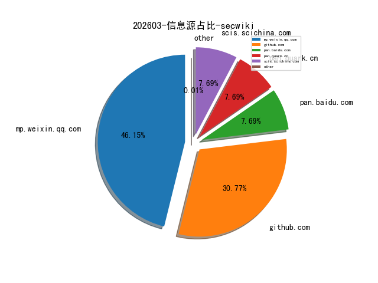
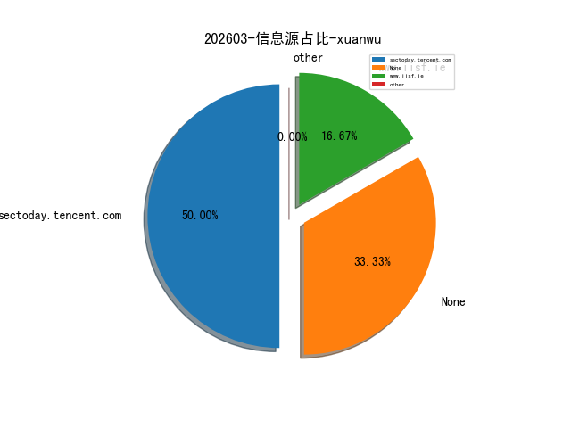
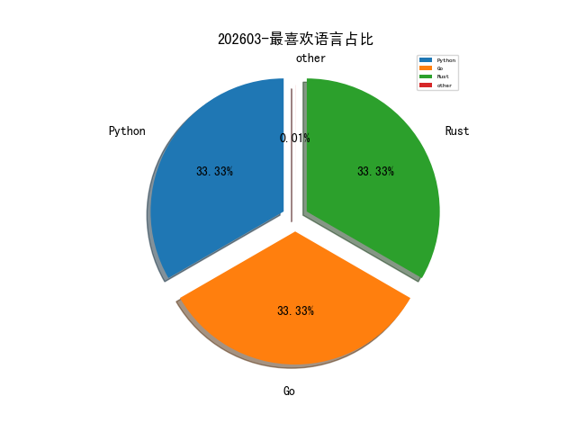

# [数据--所有](README_20.md)
# [数据--年度](README_2026.md)
# 202603 信息源与信息类型占比

# 网络安全书籍 推荐
| date_added | language | title | author | link | size| 
| --- | --- | --- | --- | --- | ---| 
| 2026-03-01 04:00:47 | English | Podman for DevOps, 2nd Edition | unknown | https://www.wowebook.org/podman-for-devops-2nd-edition/ | unknown| 
| 2026-03-01 03:22:55 | English | Model Context Protocol for LLMs | unknown | https://www.wowebook.org/model-context-protocol-for-llms/ | unknown| 

# 日更新程序
`python update_daily.py`