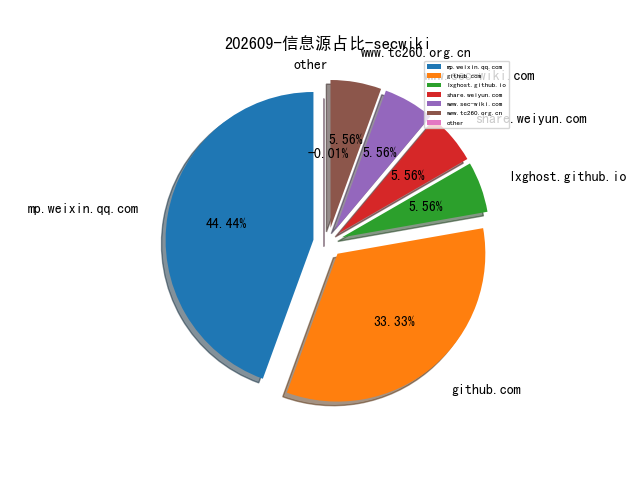
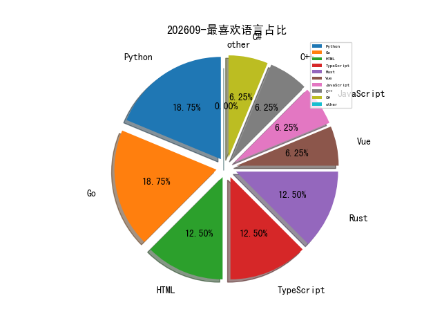

# [数据--所有](README_20.md)
# [数据--年度](README_2026.md)
# 202609 信息源与信息类型占比

# 微信公众号 推荐
| nickname_english | weixin_no | title | url| 
| --- | --- | --- | ---| 
| Gh0xE9 | None | 首届盘古石计算机取证纯图WP | https://mp.weixin.qq.com/s/KL_zzhb6hvNmVvjbi9tPrw | 1| 
| night安全 | YGnight YGnight | 【情报】支付宝8.2亿数据泄露？给同事说一声，别自己吓自己 | https://mp.weixin.qq.com/s/Kfv2J7EFqVmGIb5jkN1N6A | 1| 
| 云原生安全指北 | Dubito Dubito | 滥用Entra ID备份密钥攻陷Azure VM | https://mp.weixin.qq.com/s/z4kQPYyvR6_6TtIDt47NKA | 1| 
| 永信至诚 |  | 第十九届全国大学生信息安全竞赛（创新实践能力赛）决赛圆满收官，永信至诚连续十一年提供赛事运营保障服务 | https://mp.weixin.qq.com/s/5Vr3OXIrGmi-FOlz5tNvKA | 1| 
| 浅安安全 | 浅安 浅安 | 工具 , CyberSecurity-Skills | https://mp.weixin.qq.com/s/bzjpZYmDrnM93fseqVTA8g | 2| 
| 黑猫安全 | 博士 博士 | 威胁扩张：朝鲜伪装求职者已渗透医疗、销售营销等非 IT 行业 | https://mp.weixin.qq.com/s/UySW6GwRIea8GHWSJxMGUg | 1| 

# 日更新程序
`python update_daily.py`